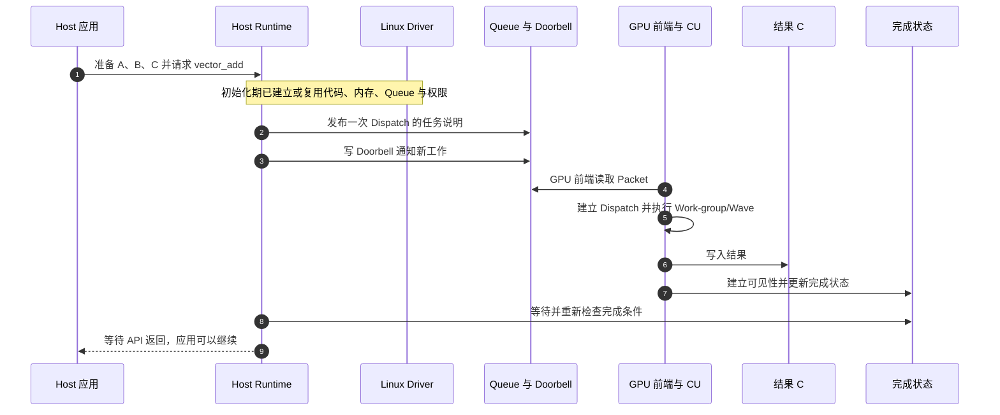
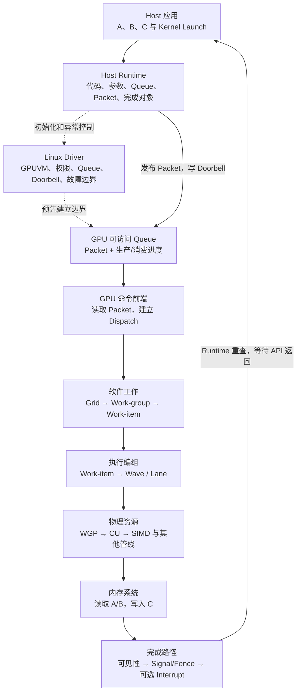
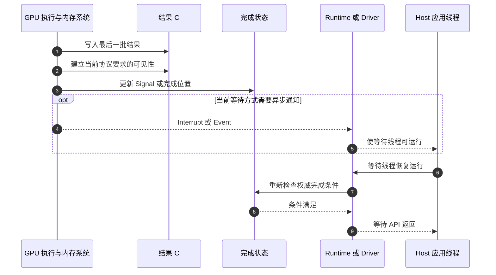
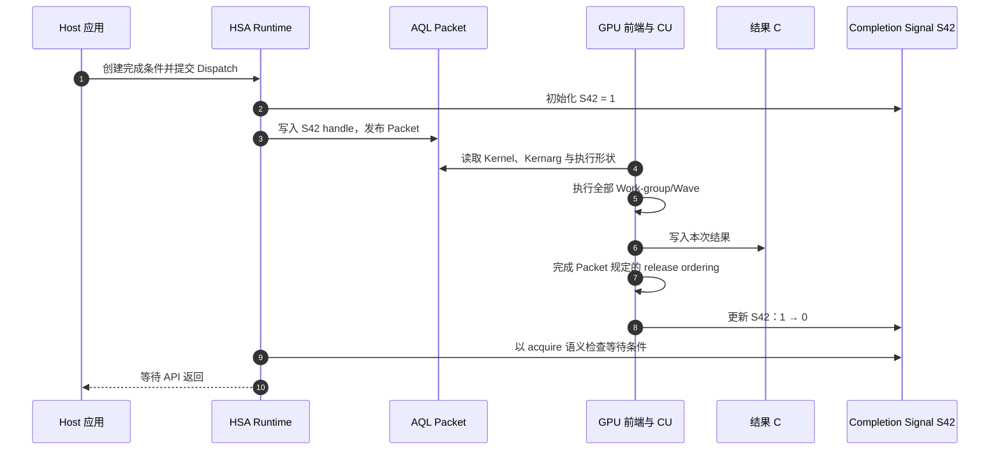
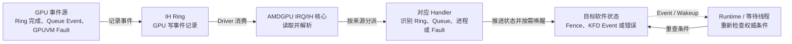
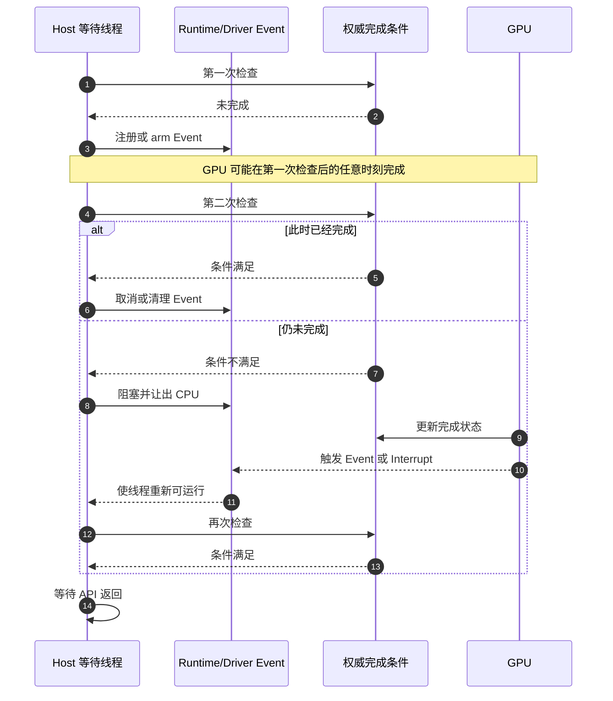
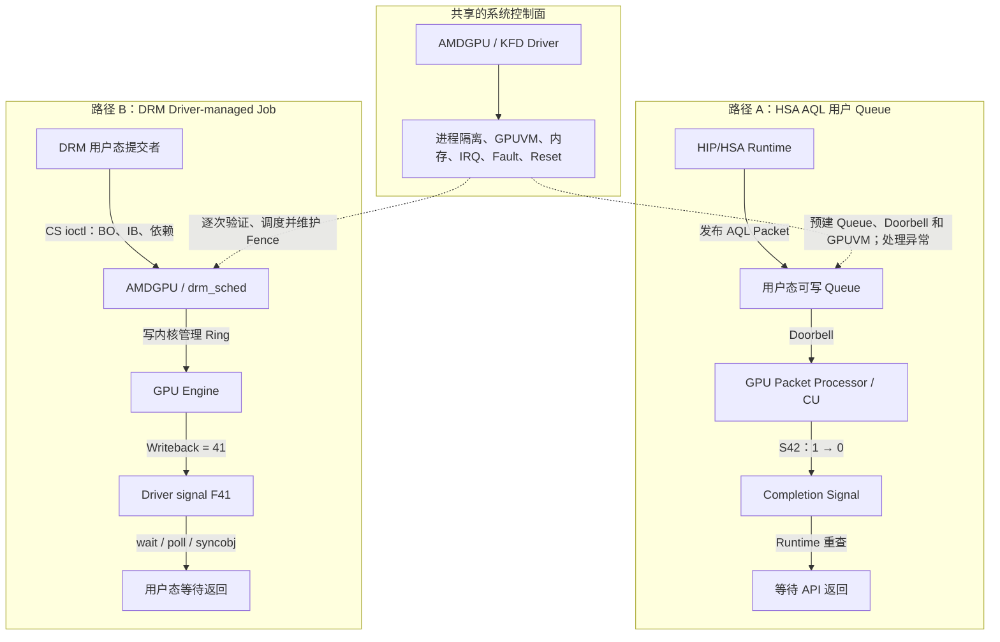
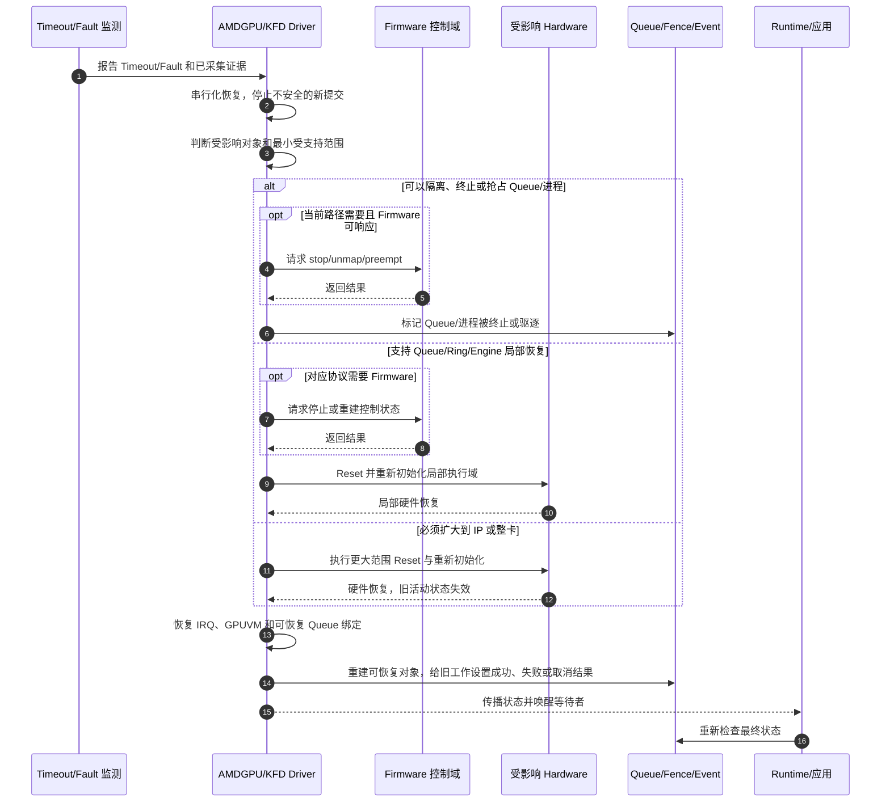

# GPU 系统基础

## 缩写表

| 缩写    | 英文全称                                        | 中文含义                                                 |
| ------- | ----------------------------------------------- | -------------------------------------------------------- |
| ABI     | Application Binary Interface                    | 应用二进制接口                                           |
| AArch64 | Arm 64-bit Architecture                         | Arm 64 位指令集架构                                      |
| AMD     | Advanced Micro Devices                          | AMD 公司                                                 |
| AMDGPU  | AMD GPU Linux Kernel Driver                     | Linux 中的 AMD GPU 驱动                                  |
| API     | Application Programming Interface               | 应用程序编程接口                                         |
| APU     | Accelerated Processing Unit                     | CPU 与 GPU 等计算单元共享封装或内存系统的处理器形态      |
| AQL     | Architected Queuing Language                    | HSA 定义的架构化队列语言；本文主要指命令包格式与队列协议 |
| ASIC    | Application-Specific Integrated Circuit         | 专用集成电路；本文指具体 GPU 芯片或代际                  |
| BO      | Buffer Object                                   | 驱动管理的一类缓冲对象                                   |
| BSP     | Board Support Package                           | 板级支持包                                               |
| CLR     | Common Language Runtime                         | ROCm 中承接 HIP/OpenCL 的公共用户态 Runtime 代码库       |
| CP      | Command Processor                               | GPU 命令处理器                                           |
| CPSCH   | Command Processor Scheduling                    | AMD GPU 的命令处理器固件调度路径                         |
| CPU     | Central Processing Unit                         | 中央处理器                                               |
| CS      | Command Submission                              | 命令提交                                                 |
| CU      | Compute Unit                                    | AMD GPU 计算单元                                         |
| CWSR    | Compute Wave Save/Restore                       | 计算 Wave 现场保存与恢复                                 |
| DMA     | Direct Memory Access                            | 直接内存访问                                             |
| DMUB    | Display Microcontroller Unit                    | AMD GPU 显示控制微控制器                                 |
| DRM     | Direct Rendering Manager                        | Linux 直接渲染管理框架                                   |
| DWORD   | Double Word                                     | AMDGPU 源码中常用的 32 位命令字单位                      |
| ELF     | Executable and Linkable Format                  | 可执行与可链接文件格式                                   |
| EXEC    | Execution Mask                                  | Wave 的执行掩码                                          |
| GEM     | Graphics Execution Manager                      | DRM 的图形内存对象管理框架                               |
| GFX     | Graphics                                        | AMDGPU 中图形与计算 IP 系列的代际前缀                    |
| GFX11   | Graphics IP Version 11                          | AMD 第 11 代图形与计算 IP 标识                           |
| GPU     | Graphics Processing Unit                        | 图形处理器                                               |
| GPUVA   | GPU Virtual Address                             | GPU 虚拟地址                                             |
| GPUVM   | GPU Virtual Memory                              | GPU 虚拟地址空间及其页表                                 |
| HIP     | Heterogeneous-Compute Interface for Portability | AMD GPU 编程接口                                         |
| HSA     | Heterogeneous System Architecture               | 异构系统架构；本文指规范与执行模型                       |
| HSAKMT  | HSA Kernel Mode Thunk                           | ROCr 访问 KFD 的用户态接口层                             |
| HQD     | Hardware Queue Descriptor                       | 硬件中一条活动 Queue 的描述状态                          |
| HWS     | Hardware Scheduling                             | GPU 侧参与 Queue 驻留调度的路径                          |
| IB      | Indirect Buffer                                 | Driver-managed 提交路径中的间接命令缓冲                  |
| ID      | Identifier                                      | 标识符                                                   |
| IH      | Interrupt Handler                               | AMDGPU 中断处理环及相关处理模块                          |
| IOMMU   | Input/Output Memory Management Unit             | 输入/输出内存管理单元                                    |
| ioctl   | Input/Output Control                            | 用户态向内核驱动发送控制请求的接口                       |
| IP      | Intellectual Property                           | 芯片中的功能模块                                         |
| IRQ     | Interrupt Request                               | 中断请求                                                 |
| ISA     | Instruction Set Architecture                    | 指令集架构                                               |
| KFD     | Kernel Fusion Driver                            | Linux AMD GPU 计算驱动接口                               |
| KiB     | Kibibyte                                        | 1024 字节                                                |
| KMS     | Kernel Mode Setting                             | Linux 内核显示模式设置                                   |
| LDS     | Local Data Share                                | 同一 Work-group 内共享的片上存储                         |
| MCU     | Microcontroller Unit                            | 微控制器                                                 |
| MEC     | Micro Engine Compute                            | AMD GPU 中处理计算队列的命令引擎                         |
| MES     | Micro-Engine Scheduler                          | 新一代 AMD GPU 的固件 Queue 调度机制                     |
| MMIO    | Memory-Mapped Input/Output                      | 内存映射输入/输出                                        |
| MMU     | Memory Management Unit                          | 内存管理单元                                             |
| MQD     | Memory Queue Descriptor                         | 保存在内存中的 Queue 配置镜像                            |
| PASID   | Process Address Space ID                        | 进程地址空间标识                                         |
| PC      | Program Counter                                 | 程序计数器                                               |
| PCIe    | Peripheral Component Interconnect Express       | 高速外设互连总线                                         |
| POSIX   | Portable Operating System Interface             | 可移植操作系统接口                                       |
| PSP     | Platform Security Processor                     | AMD 平台安全处理器                                       |
| RDNA    | Radeon DNA                                      | AMD Radeon GPU 架构系列                                  |
| RLC     | Run List Controller                             | AMD GPU 图形/计算控制模块                                |
| RAM     | Random Access Memory                            | 随机存取存储器                                           |
| ROCr    | ROCm Runtime                                    | AMD 的 HSA 用户态 Runtime 实现                           |
| rptr    | Read Pointer                                    | Queue 读进度；在 HSA 文档中也常写作`read_index`        |
| SDMA    | System Direct Memory Access                     | AMD GPU 的专用数据搬运引擎                               |
| SCC     | Scalar Condition Code                           | Wave 的标量条件码                                        |
| SGPR    | Scalar General-Purpose Register                 | 标量通用寄存器                                           |
| SIMD    | Single Instruction, Multiple Data               | 单指令多数据执行组织                                     |
| SMU     | System Management Unit                          | AMD GPU 系统与电源管理单元                               |
| SPI     | Shader Processor Input                          | RDNA 中负责 Work-group 准入的前端模块                    |
| TLB     | Translation Lookaside Buffer                    | 地址翻译缓存                                             |
| TTMP    | Trap Temporary                                  | Trap Handler 使用的临时寄存器                            |
| TTM     | Translation Table Maps                          | Linux DRM 的通用 GPU 内存管理子系统                      |
| UAPI    | Userspace Application Programming Interface     | 内核向用户态公开的接口                                   |
| UserQ   | User Mode Queue                                 | Linux AMDGPU 的 DRM 用户态队列接口                       |
| VA      | Virtual Address                                 | 虚拟地址                                                 |
| VALU    | Vector Arithmetic Logic Unit                    | 向量算术逻辑单元                                         |
| VCC     | Vector Condition Code                           | Wave 的逐 Lane 向量条件状态                              |
| VGPR    | Vector General-Purpose Register                 | 向量通用寄存器                                           |
| VMID    | Virtual Memory ID                               | GPU 活动地址空间使用的硬件上下文编号                     |
| VRAM    | Video Random-Access Memory                      | GPU 本地显存                                             |
| WGP     | Workgroup Processor                             | RDNA 架构中的工作组处理器                                |
| WSL     | Windows Subsystem for Linux                     | Windows Linux 子系统                                     |
| wptr    | Write Pointer                                   | Queue 写进度；在 HSA 文档中也常写作`write_index`       |

## 0. 文档定位与阅读主线

本文把 GPU 系统角色、AMD 计算软件栈、代码与内存准备、Queue 提交、并行执行、完成通知和故障恢复放进一条连续路径。贯穿案例始终是：

```c
C[i] = A[i] + B[i];
```

本文先回答“谁在什么位置做什么”，再回答“一次任务怎样沿系统向下推进”。从设备初始化、代码与内存准备，到 Packet 发布、Wave 执行、完成等待和故障恢复，主线所需的基础概念都在本文内定义，不依赖其他学习文档。

> **[BOUNDARY]** 本文是一份可独立阅读的系统地图。它解释每层的输入、动作和输出，但不展开编译器优化、DRM/KMS 显示管线、完整 DRM/GEM/TTM 对象体系和某代 GPU 的未公开微架构。源码和规范只用于验证正文结论；不阅读源码块也能理解学习主线。

### 0.1 一次计算任务的最短路径

先只看时间顺序：

```text
Host 应用准备输入和输出
  → Runtime 选择 GPU，准备代码、参数、内存和完成对象
  → Runtime 把一次 Dispatch 发布到 Queue
  → Runtime 写 Doorbell 通知 GPU
  → GPU 命令前端取得 Packet，建立 Dispatch
  → Work-group 被拆成 Wave，并在 CU 上执行 Kernel
  → GPU 写入 C，建立规定的内存可见性并更新完成状态
  → Runtime 观察到完成条件，等待 API 返回
  → Host 应用使用结果
```

这张图没有画设备初始化、GPUVM 建立和 Queue 创建。那些动作通常发生在进程启动、设备首次使用或资源变化时，建立可反复使用的长期通路。

### 0.2 本文使用的核心术语

| 术语       | 本文含义                                                              |
| ---------- | --------------------------------------------------------------------- |
| Host       | 运行 Linux 与用户程序的 CPU 一侧；它是位置范围，不是单独的软件层      |
| Agent      | HSA 模型中的执行或存储主体；本文的 Kernel Agent 是目标 AMD GPU        |
| Runtime    | 应用调用的用户态库；负责把高级 API 变成内存、Queue、Packet 和同步操作 |
| Driver     | Host 内核态的资源与安全边界；本文主要指 KFD 与 AMDGPU                 |
| Firmware   | 运行在 GPU 专用控制处理器或微引擎上的控制程序                         |
| GPU Kernel | 应用提供、编译给 GPU CU 执行的设备函数                                |
| Producer   | 向 Queue 写入 Packet 的 CPU 线程或其他执行单元                        |
| Consumer   | 从 Queue 读取并处理 Packet 的设备前端或执行单元                       |
| Queue      | Producer 与设备交换任务描述的有界对象                                 |
| Ring       | Queue 中循环复用的有限 Packet 槽位数组                                |
| Packet     | Queue 中的一项任务说明                                                |
| Header     | Packet 开头的类型、有效状态和内存顺序等控制字段                       |
| Dispatch   | 某个 GPU Kernel 的一次具体执行实例                                    |
| Grid       | 一次 Dispatch 覆盖的全部逻辑 Work-item                                |
| Work-group | 可以共享 LDS 并执行组内同步的一组 Work-item                           |
| Work-item  | 同一 Kernel 针对一个逻辑索引的一次执行                                |
| Wave       | AMD GPU 成组推进多个 Work-item 的执行上下文                           |
| Lane       | Work-item 在当前 Wave 中占据的逻辑位置                                |
| Kernarg    | 按 Kernel ABI 排列的参数块                                            |
| Doorbell   | Producer 通知设备重新检查 Queue 的轻量入口                            |
| Signal     | Agent 或 Runtime 可以原子更新、查询或等待的同步状态                   |
| Fence      | 本文按上下文指完成对象，或约束内存顺序的 Fence 语义                   |
| Stream     | 高层 Runtime 中按规则排序的一条异步工作流                             |
| Event      | Runtime 在异步工作流中提供的可记录、查询或等待点                      |
| Handle     | API 用来引用对象的不透明标识；它不必等于对象数据所在地址              |

### 0.3 证据标签与固定基线

本文沿用当前仓库的证据标签：

- `[SOURCE]`：固定版本源码直接可见的实现；
- `[SPEC]`：公开规范或 ABI 明确规定的语义；
- `[INFERENCE]`：由已知对象关系推导出的解释；
- `[BOUNDARY]`：当前内容没有覆盖的范围；
- `[DESIGN]`：用于教学或自研系统思考的设计模型。

固定源码基线为：

- Linux `248951ddc14de84de3910f9b13f51491a8cd91df`；
- ROCr `ba56a24c6132c5d195686ae4adf969ca1222fbba`；
- ROCm CLR `81277d69e3352e7144ced2ee9601484f9b48d950`。

原学习材料在 2026-07-19 还记录了 Linux `v7.1.4` 与 `ROCm/rocm-systems` 的 `therock-7.14` 作为公开资料阅读快照。本文的源码行号以本地固定 Commit 为准；这些 Tag 只用于理解原材料的阅读环境，不能替代上面的 Commit 身份。

规范与架构资料主要使用 HSA Platform System Architecture 1.2、ROCr 公开 HSA API 头文件和 AMD RDNA 3 ISA Reference Guide。软件源码能证明公开对象和接口，不能补全闭源 Firmware 的内部状态机或硬件逐周期调度算法。

### 0.4 学习路线与阅读方法

全文按系统中一次任务的实际推进顺序组织：

1. 用向量加法认识参与者，并通过总图确定各层位置；
2. 建立 Host、Runtime、Driver、Firmware、Hardware 以及 AMD 计算软件栈的职责边界；
3. 跟踪 Runtime 初始化、Agent 选择、代码和内存准备、Queue 创建与 Packet 发布；
4. 沿 Dispatch 继续进入 Work-item、Wave、WGP、CU 和 SIMD；
5. 用完整 `vector_add` 复盘执行链，再学习完成同步、调度、抢占、故障与恢复。

每章先给结论或图，再用数值例子说明，随后补实现边界和检查点。第一次遇到 MQD、HQD、CWSR 或 Fence 序号时，先确定它位于哪一层；到对应章节再追源码，不需要提前递归阅读整个调用树。

后续主线如下：

```text
高层 Kernel Launch
  → Runtime 初始化与 Agent 选择
  → Code Object 装载
  → 数据与 Kernel 参数区准备（HSA/ROCr 中称为 Kernarg）
  → Queue 创建
  → Packet 发布
  → Queue 驻留与设备取包
  → Work-group/Wave 执行
  → 完成通知、错误与恢复
```

带教时不要求员工一次记住所有缩写。每读完一章，先用自己的话回答末尾检查点；回答不清时回到本章的数值例子，不急着进入源码。

## 1. 用向量加法认识 Host 与 GPU

### 1.1 先认识五类参与者

以 `C[i] = A[i] + B[i]` 为例，第一次阅读只区分五类参与者：

| 位置        | 参与者          | 当前只需知道什么                                  |
| ----------- | --------------- | ------------------------------------------------- |
| Host 用户态 | 应用程序        | 准备输入与输出，提出计算请求，决定何时等待        |
| Host 用户态 | Runtime         | 让代码、参数和数据对 GPU 可用，组织任务说明并提交 |
| Host 内核态 | Driver          | 建立地址空间、权限、Queue、Doorbell 和故障边界    |
| GPU 设备侧  | Firmware 控制域 | 按路径参与安全、电源、Queue 控制或恢复            |
| GPU 设备侧  | Hardware        | 取得任务，运行 GPU Kernel，写回结果和完成状态     |

Host 是 CPU 一侧的位置范围，不是与 Runtime、Driver 平级的软件模块。应用与 Runtime 通常在同一用户进程中；Driver 运行在 Linux Kernel；Firmware 和计算硬件位于 GPU 设备侧。

应用表达“用 A、B 计算 C”。Runtime 自己不做向量加法，Driver 也不替 GPU 执行每个元素。真正执行 `load A[i] → load B[i] → add → store C[i]` 的是 GPU CU。

### 1.2 GPU Kernel、Firmware 与 DMA

先分清三类工作：

- GPU Kernel 是应用的设备程序，负责向量加法；
- GPU Firmware 是设备控制程序，负责某个控制域；
- DMA/SDMA 负责搬运数据，不执行任意应用 Kernel 的控制流和算术。

GPU 与 DMA 的关键区别不是“谁更快”，而是执行模型：

```text
DMA 描述符
  → 指定地址、长度和受支持的搬运方式

GPU Dispatch
  → 引用一份已经编译的设备程序
  → 创建许多逻辑工作实例
  → GPU 为这些实例维护 PC、寄存器、执行掩码和等待状态
```

GPU 能独立执行，指的是合法任务发布以后，Host 不必逐条发送 GPU 指令。设备初始化、Firmware 装载、进程隔离、代码与数据映射、Queue 创建和故障恢复仍需要 Host 软件。

### 1.3 一次向量加法的最短时间线



这是一张时间图，不是物理包含图。Driver 通常在初始化和异常阶段参与；Queue 建好后，每次 AQL Dispatch 可以直接由用户态 Runtime 写 Queue 和 Doorbell。

### 1.4 本章检查点：主机与设备

合上本节后，先回答：

1. Host、Runtime 和 Driver 分别位于哪里？
2. GPU Kernel 与 GPU Firmware 谁执行向量加法？
3. GPU 与 DMA 的执行模型有什么区别？
4. Runtime 为什么不用为每个 `i` 发送一条加法命令？
5. 写 Doorbell 为什么不能证明任务已经完成？

第 5 题如果只能回答“因为还没算完”，还不够。还要说清：Doorbell 只通知 Queue 生产进度，设备随后才取 Packet、建立 Dispatch 和执行。

## 2. GPU 计算系统总图

### 2.1 控制面、提交路径和执行路径



虚线表示长期控制面，实线表示一次任务的主要提交与执行路径。图中的 `WGP → CU → SIMD` 是硬件包含关系；`Grid → Work-group → Work-item` 是软件划分；两者通过 Wave 准入和驻留建立联系。

把这些对象沿时间方向展开，可以得到下面这张总图。它同时保留初始化控制面、提交数据面和执行层级；箭头表示动作顺序，不表示物理包含关系：

```text
CPU 上的用户程序
  │  HIP API：分配、拷贝、launch、wait
  ▼
用户态 Runtime / 编译器装载器
  ├─ 初始化控制面：ioctl → AMDGPU/KFD Driver
  │                  建 GPUVM、Queue、Doorbell、事件与恢复边界
  └─ 提交数据面：在共享 Queue 发布完整 Packet → 写 Doorbell
                                      │
                                      ▼
              路径相关的 Queue 映射/调度控制
              （Driver、Firmware 与 Hardware 的分工因模式而异）
                                      │
                                      ▼
Command Processor / Packet Processor
  │  取 Command Packet，建立一次 Dispatch
  ▼
软件工作形状：Grid → 多个 Work-group → 每组多个 Work-item
  │  Hardware 把同组 Work-item 编成一个或多个 Wavefront
  ▼
RDNA 3 硬件映射：SPI / Workgroup Manager → 一个 WGP
  │                                      ├─ CU0：两个 SIMD32
  │                                      └─ CU1：两个 SIMD32
  │  按 CU mode 或 WGP mode 将 Work-group 的 Wave 放到一个或两个 CU
  │  CU 调度/发射逻辑从就绪 Wave 中选择指令
  │  SIMD32 执行向量算术；其他指令进入相应执行管线
  │  load A/B → add → store C
  ▼
Signal / Fence 状态更新，必要时产生 Interrupt
  │
  └──────────────► Host 侧 Runtime 主动观察，或 Driver/Runtime 事件机制使等待线程可运行
                   应用线程重查完成条件后，等待 API 返回
```

### 2.2 按时间顺序阅读总图

这张图从上到下可以分成三个阶段。

第一段是初始化。Runtime 请求 Driver 建立 GPUVM、Queue 和 Doorbell，并确认进程可以使用这些资源。图中的虚线表示这类低频控制动作，它们不需要在每次 Kernel Launch 时重做。

第二段是提交。应用发起 Kernel Launch 后，Runtime 准备参数和 Packet，把 Packet 发布到 GPU 可访问的 Queue，再写 Doorbell 通知 GPU。此时任务只是到达 GPU 命令前端，CU 还不一定已经开始执行。

第三段是执行与完成。GPU 命令前端根据 Packet 建立 Dispatch，把 Grid 划分为 Work-group，再把 Work-item 编成 Wave，交给 WGP、CU 和 SIMD 执行。Kernel 写完结果后，设备更新完成状态。Host 重新检查完成条件；条件满足后，对应的等待 API 才返回。

后文章节会分别展开这三个阶段。再次回到这张图时，先确定当前问题发生在初始化、提交还是执行与完成阶段，再沿对应箭头继续向下查找。

## 3. Host、Driver、Firmware 与 Hardware 的职责边界

### 3.1 Host 用户态、Host 内核态与 GPU 设备侧

| 位置        | 参与者            | 主要职责                                                                   | 不负责什么                         |
| ----------- | ----------------- | -------------------------------------------------------------------------- | ---------------------------------- |
| Host 用户态 | 应用程序          | 表达算法，准备输入和输出，发起异步工作，决定何时等待                       | 不逐条向 GPU 发送 ISA 指令         |
| Host 用户态 | HIP/ROCr Runtime  | 选择设备，装载代码，准备参数与内存，管理 Queue、Packet、Signal 和 API 语义 | 不在 CU 上执行向量加法             |
| Host 内核态 | KFD/AMDGPU Driver | 建立进程隔离、GPUVM、Queue、Doorbell、设备资源、故障与恢复边界             | 不替每个 Wave 选择下一条指令       |
| GPU 设备侧  | Firmware 控制域   | 按代际和路径承担安全、电源、Queue 控制、抢占或恢复等职责                   | 通常不执行应用 Kernel 的逐元素算法 |
| GPU 设备侧  | 命令与派发前端    | 读取 Queue 中的 Packet，建立 Dispatch，并把工作交给后续准入路径            | 不保存 Host 进程的全部软件状态     |
| GPU 设备侧  | 计算与内存硬件    | 形成和推进 Wave，取指、计算、访存、写结果与完成状态                        | 不解释 HIP 这一高级语言 API        |

应用与 Runtime 通常位于同一个 Linux 进程。应用表达“用 A、B 计算 C”，Runtime 负责把这项请求翻译成 GPU 可以消费的对象。Driver 在较早阶段批准并登记资源。GPU 命令前端收到任务后，CU 才执行 `load → add → store`。

### 3.2 GPU 为什么不是“更复杂的 DMA”

DMA 描述符通常指定源地址、目的地址、长度和有限的搬运规则。GPU Packet 可以引用一份应用提供的设备程序，这份程序包含控制流、算术、访存和同步。GPU 还要为大量尚未完成的 Wave 保存 PC、寄存器、执行掩码和等待状态。

| 对比项     | DMA 引擎               | GPU 计算执行                                 |
| ---------- | ---------------------- | -------------------------------------------- |
| 工作描述   | 搬运参数或固定操作参数 | Kernel、参数、Grid、Work-group 和完成对象    |
| 设备程序   | 通常由硬件定义有限操作 | 应用 Kernel 已编译为 GPU ISA                 |
| 在飞状态   | 描述符和传输状态       | Queue、Dispatch、Work-group、Wave 和内存请求 |
| CPU 的角色 | 配置后等待搬运完成     | 发布任务后无需逐条发送 GPU 指令              |

“GPU 可以独立执行”只描述合法任务发布后的执行阶段。设备枚举、Firmware 装载、进程隔离、代码和数据映射、Queue 创建以及异常恢复仍需要 Host 软件参与。

把长期准备和单次执行分开后，GPU 与普通 DMA 外设的差别更直观：

```text
提交前的控制面（不一定每次 Launch 都重复）
Runtime ── ioctl ──► Driver ──► GPUVM、代码/数据映射、Queue、Doorbell、权限

一次已发布 Dispatch 的热路径
Runtime 发布 Packet 并写 Doorbell
        ↓
命令前端读取 Packet，取得 Kernel 描述、参数、Grid 和完成对象
        ↓
建立 Dispatch，准入 Work-group，并形成/驻留 Wave 执行上下文
        ↓
CU 从 GPU 可访问内存取 GPU ISA；Wave 通过 GPUVM 读写代码、参数和数据
        ↓
设备按同步协议写入 Signal/Fence 等完成对象
        ↓
Runtime/应用查询或等待该对象；必要时由事件或中断唤醒等待方
```

### 3.3 三类代码不能混在一起

| 维度     | CPU Host Code              | GPU Kernel                                      | GPU Firmware                       |
| -------- | -------------------------- | ----------------------------------------------- | ---------------------------------- |
| 编译目标 | x86-64、AArch64 等 CPU ISA | AMDGPU ISA 等设备 ISA                           | 专用控制处理器或微引擎 ISA         |
| 运行位置 | Host CPU Core              | GPU CU 的执行资源                               | GPU 内专用控制处理器或微引擎       |
| 主要职责 | 组织资源、API 调用和等待   | 对数据执行应用算法                              | 安全、电源、Queue 控制、显示或恢复 |
| 常见载体 | ELF、共享库                | Fat Binary 中的 Code Object 或`.hsaco`        | Linux Firmware 文件或受保护镜像    |
| 权限范围 | Linux 进程地址空间         | 进程 GPUVM 与 Queue 权限                        | 设备控制权限                       |
| 生命周期 | 进程或线程                 | 模块/进程中的代码对象；每次 Dispatch 是独立实例 | 设备初始化、复位和电源周期         |

GPU Kernel 也叫 Kernel，但它不是 Linux Kernel。GPU Firmware 可能参与 Queue 调度，也不因此成为向量加法的执行者。

### 3.4 GPU 设备侧不是一颗“总控核”

GPU 同时包含多个控制域、命令前端、计算阵列、地址与内存系统：

```text
GPU 设备侧
├─ PSP 等安全控制域       → 认证和受保护装载
├─ SMU 等电源控制域       → 时钟、电压、功耗和温度
├─ MES 等 Queue 控制路径  → 按支持模式管理 Queue 驻留
├─ CP/MEC 命令前端        → 读取 Packet，建立 Dispatch
├─ SPI/Workgroup Manager  → 检查资源，准入 Work-group
├─ WGP/CU 执行阵列        → 承载 Wave，执行 GPU Kernel
└─ MMU/Cache/内存接口     → 翻译地址，访问 VRAM 或系统内存
```

Firmware 镜像数量、控制职责数量和物理控制处理器数量不保证一一对应。Linux 源码可以看到 Driver 怎样装载镜像、发送消息和等待响应；没有公开资料时，不能据此补写 Firmware 内部线程、锁和状态机。

从设备侧看，控制程序与应用 Kernel 分别运行在不同的执行资源上：

```text
GPU 设备
├─ 安全控制处理器运行安全 Firmware       → 认证、受保护的装载
├─ 电源控制处理器运行电源管理 Firmware   → 时钟、电压、功耗、温度
├─ Queue 控制微引擎运行相应 Firmware     → Queue 管理或恢复
└─ CU 运行应用 Kernel                    → 读取数据、计算、写回结果
```

拆分多个控制域有四个直接原因：

```text
权限隔离：安全认证不能交给普通 Queue 控制逻辑
实时响应：电源、显示和 Queue 控制的时间要求不同
独立演进：不同 IP 可以分别升级或组合
局部恢复：硬件支持时，可以先处理单个 Queue、引擎或控制域
```

几个常见控制域的职责如下：

| 控制域 | 公开职责边界                                             | 与 Compute Kernel 的关系                        |
| ------ | -------------------------------------------------------- | ----------------------------------------------- |
| PSP    | 安全启动、Firmware 认证和受保护装载                      | 为可信启动提供控制能力，不执行向量加法          |
| SMU    | 功耗、时钟、电压和温度管理                               | 影响可用频率和电源状态，不推进 Work-item        |
| MES    | 在支持并启用的路径中管理 Queue Mapping、优先级和超额订阅 | 管理 Queue 取得硬件入口，不逐周期发射 Wave 指令 |
| RLC    | 主要参与 GFX/Compute 电源与相关控制路径                  | 不能仅凭名称把它当作现代 Queue 总调度器         |
| DMUB   | 服务显示控制路径                                         | 不属于 Compute Kernel 的执行链                  |

CP/MEC 命令前端也位于 GPU，但它与这些 Firmware 控制域不同。命令前端读取 Packet 并建立 Dispatch；CU 执行应用 Kernel。具体前端可以由硬件状态机、微码和控制接口共同实现，不保证对应一颗独立 Firmware 处理器。

### 3.5 Firmware 怎样进入可工作状态

整卡上电后，板级供电、复位和芯片固化的安全启动逻辑先让设备能够响应 PCIe 枚举。Linux 识别设备并绑定 AMDGPU Driver 后，Driver 再为各个目标 IP 选择、校验并装载匹配的 Firmware，执行该 IP 所需的软件和硬件初始化，最后确认对应控制域可以工作。

```text
板级供电与复位
  → 芯片固化启动逻辑使 PCIe Endpoint 可枚举
  → Linux 绑定 AMDGPU Driver
  → Driver 请求并校验目标 Firmware
  → 按当前 ASIC 路径直接装载，或交由 PSP 参与受保护装载
  → 目标 IP 获得所需的电源、时钟、复位和内存访问条件
  → Driver 启动该控制域并检查就绪结果
```

把上电、Host 装载和目标控制域启动展开后，完整关系如下：

```text
全局最小引导层（上电或整卡 reset 后）
板级基础供电/复位 ──► GPU 始终在线逻辑、Boot ROM/安全启动逻辑、PCIe 配置空间
                                                   │
                                                   ▼
Host 已能枚举该 PCIe Endpoint 并绑定 AMDGPU Driver
                                                   │
                                                   ▼
/lib/firmware/amdgpu 中的 Firmware 文件
                    │
                    ▼
Linux Firmware Loader 读取文件
                    │
                    ▼
AMDGPU Driver 选择匹配的 Firmware
                    │
          ┌─────────┴─────────┐
          ▼                   ▼
      Driver 直接装载      PSP 检查并装载
          └─────────┬─────────┘
                    ▼
按目标 IP 的启动协议准备其局部供电、时钟、复位、访问条件并发出启动请求
                    │
                    ▼
目标控制处理器开始运行 Firmware
                    │
                    ▼
Driver 确认该控制域已经就绪
```

这不是适用于所有 IP 的固定逐项时序。某些控制域必须先有最低限度的时钟和内存访问能力，镜像才能写入；受保护装载路径还会加入 PSP 验证。供电、提供时钟、解除复位和启动 Firmware 是不同动作，也可能在挂起恢复或局部 Reset 时再次发生。

> **[SOURCE]** 固定 Linux 基线的 [`amdgpu_ucode.c`](./2.源码/linux/drivers/gpu/drm/amd/amdgpu/amdgpu_ucode.c) 第 1496～1530 行展示 Firmware 请求与基本校验；[`amdgpu_device.c`](./2.源码/linux/drivers/gpu/drm/amd/amdgpu/amdgpu_device.c) 第 2321～2375 行说明 Driver 遍历 IP Block，分别执行软件和硬件初始化；[`amdgpu_psp.c`](./2.源码/linux/drivers/gpu/drm/amd/amdgpu/amdgpu_psp.c) 第 3517～3546 行展示 PSP 路径启动 PSP 并装载其他 Firmware 的一段公开控制流程。

Firmware 就绪只说明相应控制域已经可以工作。应用 Kernel 仍要等待 Runtime 发布 Dispatch，并由 CU 执行。

### 3.6 BSP 经验可以怎样迁移

| BSP 中熟悉的对象     | GPU 中接近的对象          | 可以迁移的推理                                     | 不能照搬的部分                             |
| -------------------- | ------------------------- | -------------------------------------------------- | ------------------------------------------ |
| DMA 描述符环         | GPU Queue/Ring            | Producer-consumer、指针、发布顺序、超时            | 一个 Packet 会展开为许多 Wave              |
| MMIO kick 寄存器     | Doorbell                  | 内容准备完成后再通知设备；检查 posted write 与顺序 | Doorbell 常按 Queue 分配，并不是全局启动位 |
| IOMMU 与 DMA 地址    | GPUVM 与 GPUVA            | 页表、隔离、Fault、TLB 失效                        | GPU 同时承载许多进程、Queue 和 Wave        |
| MCU Firmware/Mailbox | GPU 各控制域 Firmware     | 版本、握手、超时、复位                             | GPU 通常有多个独立控制域                   |
| 完成中断和等待队列   | Signal/Fence 与 Interrupt | 完成条件、丢中断防护、超时                         | 一次 Kernel 不一定对应一次物理中断         |
| MCU 上下文保存       | Queue/Wave 状态保存       | 停机点、保存区、恢复顺序                           | Wave 数量和状态规模更大，粒度依赖 ASIC     |

这些类比只用于找到问题入口。真正分析时仍要回到当前 Queue 协议、地址空间和硬件代际。

完成通知也只能有限类比：Signal 接近带原子语义的共享完成计数器，Fence 接近带序号的内核完成对象，Interrupt 接近 PCIe MSI/MSI-X 或平台 IRQ。目标 GPU 实际使用哪种中断机制，仍要以设备和 Driver 配置为准。

### 3.7 一项合法任务依赖六类设备能力

GPU 能执行已发布的任务，不是因为某一颗“总控核”完成了全部工作。六类能力分布在命令前端、计算阵列、地址与内存系统、固定状态机、微码和多个 Firmware 控制域中。

| 能力           | 设备取得或维护什么                     | 主要结果                          |
| -------------- | -------------------------------------- | --------------------------------- |
| 发现任务       | Queue、Doorbell 和生产进度             | 找到新的有效 Packet               |
| 解释任务       | Kernel 对象、Kernarg、Grid 和完成对象  | 建立 Dispatch                     |
| 建立并行上下文 | Work-group、Wave、PC、寄存器和 EXEC    | 形成可执行状态                    |
| 分层准入与调度 | Queue 槽位、WGP/CU 资源、就绪 Wave     | 有限硬件资源被安全复用            |
| 取指和访存     | GPU ISA、GPUVA、页表、Cache 和内存请求 | 执行 Kernel 并读写 A/B/C          |
| 完成或异常收敛 | Signal/Fence、Fault、Trap 和错误状态   | Host 可以得到成功、失败或取消结果 |

设备侧还存在三种不同的“取指或取内容”：

```text
命令前端读取 Queue Packet
  → 取得任务描述

CU 取指硬件读取 GPU Kernel ISA
  → 推进应用计算

专用控制处理器读取 Firmware
  → 推进安全、电源或 Queue 控制
```

这三条不是同一指令流。即使 Host CPU 使用 AArch64，GPU Kernel 仍是 AMDGPU ISA；控制 Firmware 又可能使用另一种专用 ISA。

把这些设备能力放回硬件位置，可以得到下面这张图：

```text
Host 侧

Linux Driver
    │ 控制请求、配置、恢复
    ▼
┌────────────────────────────── GPU 设备侧 ──────────────────────────────┐
│                                                                        │
│  ① 专用控制处理器或微引擎                                               │
│     ┌────────┐  ┌────────┐  ┌────────────────────┐                     │
│     │  PSP   │  │  SMU   │  │ MES/其他控制微引擎 │                     │
│     └────────┘  └────────┘  └────────────────────┘                     │
│         运行各自的 Firmware：安全、功耗、Queue 控制、恢复等             │
│                                                                        │
│  ② 命令与派发前端                                                      │
│     Queue 中的 Packet ──► CP/Compute 命令前端 ──► SPI/Workgroup Manager│
│                            读取任务说明          检查资源并安排 Work-group│
│                                                                        │
│  ③ 计算执行阵列                                                        │
│                         RDNA 3 的一个 WGP                              │
│                    ┌─────────────────────────┐                         │
│                    │   CU 0       CU 1      │                          │
│                    │  Wave 状态   Wave 状态  │                         │
│                    │  寄存器      寄存器     │                         │
│                    │  Work-group 的 LDS/Barrier 资源                   │
│                    │  执行管线    执行管线   │                         │
│                    └─────────────────────────┘                         │
│                         CU 执行 Kernel 指令                            │
│                                                                        │
│  ④ 地址与内存系统                                                      │
│     MMU/页表遍历硬件 ── Cache ── VRAM 或映射的系统内存                  │
│     为 Packet、Kernel 代码、参数和数据提供访问                          │
│                                                                        │
└────────────────────────────────────────────────────────────────────────┘
```

### 3.8 DRM/KMS 与计算主线的边界

DRM 是 Linux 图形设备的内核框架，AMDGPU 的内存对象、调度、Fence、中断和 Reset 都位于这一体系。KMS 负责显示模式、显示控制器、Plane 和 Connector 等显示管线资源。

本文使用 DRM/AMDGPU 的计算基础设施，但向量加法走 Compute 路径。它不需要配置显示模式，也不依赖把结果送给显示控制器扫描输出。后续遇到 `drm_sched`、`dma_fence` 或 BO 时，先确认它们服务的是计算提交、内存管理还是显示；不要因为都位于 DRM 子系统就把路径合并。

## 4. AMD 计算软件栈怎样从 API 连接到 GPU

### 4.1 HSA 是规范，ROCr 才是实现

HSA 定义 Agent、Queue、AQL、Signal 和内存顺序等执行模型。HSA 本身不是一个动态库、进程或内核模块。AMD 的 ROCr 实现 HSA Runtime 接口，再通过 HSAKMT 与 Linux KFD 交互。

> **[SOURCE]** 固定 ROCr 基线 `ba56a24c6132c5d195686ae4adf969ca1222fbba` 的 [`runtime/docs/what-is-rocr-runtime.rst`](./2.源码/rocr-runtime/runtime/docs/what-is-rocr-runtime.rst) 第 10～29 行说明 ROCr 提供初始化、Agent 查询、Signal、AQL Dispatch 和内存管理等 HSA Runtime 能力；[`README.md`](./2.源码/rocr-runtime/README.md) 第 6～8 行以及 [`libhsakmt/README.md`](./2.源码/rocr-runtime/libhsakmt/README.md) 第 1～10 行说明 HSAKMT 是 Runtime 访问内核驱动的用户态 Thunk。

### 4.2 从高级 API 到 GPU CU 的层级

| 层级           | AMD/Linux 中的对象                | 这一层负责什么                                           | 交给下一层什么                       |
| -------------- | --------------------------------- | -------------------------------------------------------- | ------------------------------------ |
| 应用层         | HIP/OpenCL 或直接 HSA 程序        | 表达 Kernel、参数、执行范围、依赖和等待                  | 一项高层异步工作                     |
| 高层 Runtime   | HIP/OpenCL Runtime、CLR           | 管理 Stream/Event，选择或复用底层 Queue                  | Kernel 信息、参数、Grid 和依赖       |
| HSA Runtime    | ROCr                              | 管理 Agent、Memory、Executable、Signal 和`hsa_queue_t` | AQL Queue 资源或 Packet              |
| 用户态内核接口 | HSAKMT/`libhsakmt`              | 把 ROCr 请求整理为 KFD UAPI                              | Queue、Memory、Event 等 ioctl        |
| Linux Driver   | KFD 与 AMDGPU                     | 维护进程设备关系、GPUVM、Queue、Doorbell、调度和错误边界 | 可供硬件或 Firmware 使用的受保护状态 |
| Queue 驻留控制 | KFD No-HWS、HWS/CPSCH 或 MES 路径 | 让逻辑 Queue 获得硬件取包入口                            | MQD/HQD 或等价活动配置               |
| 命令前端       | CP/MEC/Packet Processor           | 读取 AQL Packet，建立 Dispatch                           | Work-group 与资源需求                |
| 工作准入       | SPI/Workgroup Manager 等          | 检查寄存器、LDS 和 Wave Slot                             | 已准入的 Work-group/Wave             |
| 计算执行       | WGP、CU、SIMD 和其他管线          | 取指、执行、访存和写回                                   | 结果与完成状态                       |

表中的层级是职责关系，不是每次 Kernel Launch 都执行一遍的函数调用栈。Queue、Doorbell 和 GPUVM 通常先建立；之后许多 Dispatch 可以复用这些资源。

### 4.3 控制面与每次提交的数据面

```text
低频控制面
应用/Runtime
  → ROCr
  → HSAKMT
  → KFD/AMDGPU
  → 建立 GPUVM、代码/数据映射、Queue、Doorbell 和错误边界

高频 Dispatch 数据面
高层 Runtime 或直接 HSA Producer
  → 填写 Kernarg、Grid、依赖和 Completion Signal
  → 向已建立的 Ring 发布 AQL Packet
  → 写 Doorbell
  → CP/MEC 取包
  → CU 执行
```

把控制面、提交链和三套执行坐标并列后，各层关系如下：

```text
初始化控制面：Runtime → KFD/AMDGPU → GPUVM、Queue、Doorbell、Firmware 接口
提交与完成链（AQL 用户 Queue）：Runtime → Queue memory → publish → Doorbell
                              → Packet Processor → Dispatch → Work-group/Wave/CU
                              → Signal 状态变化 → Runtime/应用观察
软件工作坐标：Dispatch / Grid → Work-group → Work-item
执行编组坐标：同组 Work-item → Wavefront / Lane
物理资源坐标：SPI / Workgroup Manager → WGP → CU → SIMD / 其他执行管线
```

同一关系放进一次 HIP Kernel 工作中，可以读成：

```text
HIP Stream 中的一项 Kernel 工作
  → Runtime 将 AQL Dispatch Packet 发布到已建立的用户 Queue
  → Packet 引用已装载的 Kernel Descriptor、参数和完成 Signal
  → Doorbell → 设备 Queue/命令前端 → Dispatch
  → Work-group → Wavefront → CU 取指并执行既有的 GPU ISA
  → Signal 状态变化 → Runtime/应用观察到完成
```

> **[INFERENCE]** AQL 快速路径的低开销来自“先建立长期受保护通路，再由用户态反复写 Ring”。安全校验没有消失，而是主要集中在内存映射、Queue 创建和异常处理阶段。

### 4.4 HSA、ROCr、HSAKMT、KFD 与 AMDGPU 的边界

| 名称                 | 它是什么                     | 直接维护什么                                                     | 不应归给它的职责                         |
| -------------------- | ---------------------------- | ---------------------------------------------------------------- | ---------------------------------------- |
| HSA                  | 规范和执行模型               | Agent、Queue、AQL、Signal、Memory Order 的合同                   | 不运行代码，也不直接调用 KFD             |
| ROCr                 | AMD 的 HSA Runtime 实现      | 用户态 Agent、Executable、Memory、Signal、`hsa_queue_t`        | 不拥有 Linux 内核中的进程与 GPU 资源账本 |
| HSAKMT/`libhsakmt` | 用户态 Thunk                 | 把 Queue、Memory、Event 等请求编码成 KFD UAPI                    | 不决定 CU 每周期发射哪条 Wave            |
| KFD                  | AMDGPU 中的 Compute 内核接口 | HSA 进程、Process-Device、Queue、Doorbell、Event、调度与错误路径 | 不逐个解释正常 AQL Packet                |
| AMDGPU               | Linux DRM GPU Driver         | 设备生命周期、BO/GPUVM、IRQ、Firmware 和 ASIC 操作               | 不实现 HIP Stream 的高层语义             |
| Firmware/Hardware    | 设备控制与执行               | Queue 驻留、取包、Dispatch、Wave、访存和完成                     | 不维护完整 Linux 进程对象                |

以 `hsa_queue_create()` 为例，调用路径向下经过 ROCr、HSAKMT 和 KFD，最后建立设备可用的 Queue 状态。以普通 AQL Dispatch 为例，Queue 已经存在，Producer 直接写 Ring 和 Doorbell；KFD 不再逐个接收 Packet。

在 Linux 上，ROCr/`libhsakmt` 通常通过 `/dev/kfd` 使用 KFD 的进程、内存、Queue 和 Event 接口；同一个 AMDGPU 模块还通过 DRM Render Node 服务其他用户态提交路径。具体动作经过哪个设备节点，要沿当前调用链确认，不能把一次 ROCr 操作笼统画成同时经过两套 UAPI。

创建 Queue 也不是一个包办所有准备工作的 `CREATE_QUEUE` 动作。进程—设备关系与 GPUVM、代码和数据映射、Queue 对象、Doorbell，以及 Event/Signal 各有自己的创建与生命周期；Queue 创建只消费其中已经具备的前置条件，并建立当前 Queue 所需的受保护状态。

### 4.5 本章检查点：软件栈

1. HSA 为什么不能和 ROCr 当作同一个软件组件？
2. ROCr 与 HSAKMT 的接口边界在哪里？
3. KFD 为什么参与 Queue 创建，却不需要处理每个正常 AQL Packet？
4. KFD 与 AMDGPU 在 Compute 路径上分别提供什么？
5. 从 HIP Stream 到 CU Wave，哪些箭头是高层语义映射，哪些是实际 Queue 数据流？

## 5. 从进程启动到一次 Dispatch 前要准备什么

这一章逐项解释 Dispatch 前必须具备的五类状态。它们不是五个必须严格相邻执行的 API，而是五类依赖：开始提交某个 Packet 时，目标 Agent、Kernel、数据、参数区和 Queue 都必须处于可用状态。

### 5.1 初始化 HSA Runtime，发现并选择 GPU Agent

直接使用 HSA API 的程序通常先调用 `hsa_init()`。HIP/OpenCL 程序不一定显式调用它，高层 Runtime 会在内部完成等价初始化。初始化后的 Runtime 才能枚举 Agent、查询能力并创建后续对象。

`hsa_iterate_agents()` 把当前 HSA 系统中可用的 Agent 逐个交给回调。应用或高层 Runtime 查询 Agent 类型、名称、Queue 和内存能力，再选择能执行目标 Code Object 的 GPU Agent。得到的 `hsa_agent_t` 是 Runtime 中代表该设备的句柄，不是新创建了一块物理 GPU。

```text
进程开始使用 HSA
  → hsa_init()
  → Runtime 建立本进程的 HSA 状态
  → 枚举 CPU/GPU Agent
  → 查询类型和能力
  → 选定目标 GPU Agent
```

> **[SOURCE]** ROCr [`runtime/hsa-runtime/inc/hsa.h`](./2.源码/rocr-runtime/runtime/hsa-runtime/inc/hsa.h) 第 346～380 行说明 `hsa_init()` 初始化当前进程的 HSA Runtime 并维护引用计数；第 1099～1121 行定义 `hsa_iterate_agents()`，说明回调会对每个可用 Agent 调用一次。

这一阶段解决的是“由哪块设备执行”。它还没有指定运行哪个 Kernel，也没有为某次任务准备数据或 Packet。

### 5.2 编译并装载 Kernel Code

Kernel 源码必须先变成目标 GPU 能执行的 ISA。常规 `hipcc`/HIP-Clang 离线编译会把 Host Code 和 Device Code 分开生成，并把一份或多份 GPU Code Object 放入 Fat Binary；运行时编译虽然发生得更晚，最终也要产生可装载的 Code Object。

Executable 是 Runtime Loader 完成装载与链接后维护的可执行对象容器。Executable Symbol 是其中一个函数、Kernel 或变量的符号句柄。Runtime 先按 Kernel 名称取得 Symbol，再查询 Kernel 对象和资源属性，供 Dispatch Packet 使用。

代码准备可以拆成四个动作：

| 动作                  | 得到什么                                          | 不等于什么                   |
| --------------------- | ------------------------------------------------- | ---------------------------- |
| 编译                  | 目标 GPU 的机器指令和元数据                       | 还没有发起一次执行           |
| 装载                  | 当前 Agent 可使用的 Executable/Loaded Code Object | 不要求代码一定复制到 VRAM    |
| 符号查询              | 某个 Kernel 的 Executable Symbol                  | 还没有创建 Dispatch          |
| 取得`kernel_object` | Packet 可以引用的 Kernel 执行对象                 | 不应一概解释成第一条指令地址 |

```text
vector_add 源码
  → HIP-Clang 为目标 GPU 生成 Code Object
  → Runtime 选择与目标 Agent ISA 兼容的 Code Object
  → Loader 装入 Executable，完成必要的符号解析与重定位
  → 查询 vector_add 的 Kernel Symbol
  → 取得后续 Packet 使用的 kernel_object 和资源信息
```

重定位只修改 Code Object 中被标记、且要等最终位置确定后才能填写的引用。例如 Kernel 调用 `helper` 时，Loader 可以在装载后把 `helper` 的最终相对位置写入指定记录或地址表。重定位不会重新编译整个 Kernel，也不等于把代码从系统内存复制到 VRAM。

> **[SOURCE]** ROCr HSA 头文件 [`hsa.h`](./2.源码/rocr-runtime/runtime/hsa-runtime/inc/hsa.h) 第 4358～4423 行定义“为某个 Agent 向 Executable 装载 Code Object”，并要求目标 Agent 支持该 Code Object 的 ISA；第 4763～4796 行定义按名称取得 Executable Symbol。

> **[BOUNDARY]** `kernel_object` 是 AQL 看见的不透明执行句柄。较新的 AMD Code Object ABI 中，它常与 Kernel Descriptor 相关，但确切解释取决于 ABI 和硬件代际。本文不把它固定成机器码首地址；分析具体值时，必须同时确认 Code Object ABI 与目标 GPU 代际。

Kernel Descriptor 是设备执行前端可以读取的 Kernel 描述结构，通常记录代码入口定位方式、寄存器和 Segment 等资源需求。它帮助硬件找到并配置 Kernel，但不是 Kernel 全部机器码。

### 5.3 让 A、B、C 进入进程 GPUVM

以显式设备内存为例，Host 应用先准备 `h_A`、`h_B`，Runtime 再为 `d_A`、`d_B`、`d_C` 分配 GPU 可访问存储，并把 A、B 的内容复制过去：

```cpp
hipMalloc(&d_A, bytes);
hipMalloc(&d_B, bytes);
hipMalloc(&d_C, bytes);

hipMemcpy(d_A, h_A, bytes, hipMemcpyHostToDevice);
hipMemcpy(d_B, h_B, bytes, hipMemcpyHostToDevice);
```

Driver 和 Runtime 需要保证这些分配在目标进程的 GPUVM 中具有有效映射。Kernel 实际接收的是 `d_A`、`d_B`、`d_C` 对应的 GPUVA。CU 发出 load/store 时，GPU MMU 使用当前 Queue 绑定的地址空间上下文完成翻译；正常访存不需要 Driver 逐次代办。

这里要分清三种状态：

| 状态             | 说明                                                    |
| ---------------- | ------------------------------------------------------- |
| 已分配           | 已有后备存储和生命周期对象                              |
| 已映射           | GPU 页表允许目标 Agent 把 GPUVA 翻译到后备存储          |
| 数据已准备并可见 | A、B 的内容已经写入，并与后续 Kernel 满足规定的同步顺序 |

“已映射”只解决地址翻译和访问权限，不自动证明输入内容已经复制完成，也不自动保证 CPU/GPU Cache 可见性。判断一块内存能否用于当前 Dispatch 时，要分别核对后备存储、GPUVM 映射、数据准备和同步顺序，不能用其中一项代替其余三项。

> **[BOUNDARY]** 数据搬运可能由 CPU Copy、SDMA、PCIe Copy Path 或统一内存迁移完成。SDMA 是独立拷贝引擎，不执行 `vector_add` Kernel。Pinned Memory 指保持驻留并允许设备访问的 Host 页面；Managed Memory 的位置与迁移由 Runtime/Driver 共同管理；APU 还可能直接使用共享系统内存。本文只固定“目标 Agent 能通过有效 GPUVA 访问数据”。

### 5.4 根据 Kernel ABI 准备 Kernarg

Kernarg 是一块参数内存，不是 A、B、C 数组本身。Runtime 根据 Kernel 元数据得到参数区大小、对齐和字段布局，分配一块 GPU 可访问的 Kernarg Buffer，再把本次调用的实参写进去：

```text
Kernarg Buffer
├─ A_gpuva
├─ B_gpuva
├─ C_gpuva
└─ N = 1024
```

A、B、C 仍保存在各自的 Buffer 中。Kernarg 只保存三个地址值和标量 `N`。AQL Packet 的 `kernarg_address` 指向这块参数区，Kernel 启动时再读取其中的值。

```text
AQL Packet
  └─ kernarg_address ──→ Kernarg Buffer
                              ├─ A_gpuva ──→ A 的数据
                              ├─ B_gpuva ──→ B 的数据
                              ├─ C_gpuva ──→ C 的数据
                              └─ N
```

> **[SPEC]** ROCr HSA 头文件 [`hsa.h`](./2.源码/rocr-runtime/runtime/hsa-runtime/inc/hsa.h) 第 3033～3068 行定义 `kernel_object`、`kernarg_address` 和 `completion_signal`；其中明确要求 Kernarg 从 Packet 入队后到 Dispatch 完成前不得修改。

这一阶段解决的是“Kernel 从哪里取得参数”。它没有通知 GPU 开始执行。

### 5.5 创建可复用的 AQL Queue 与 Ring

Queue 是长期提交通路，Ring 是保存 AQL Packet 的循环槽位数组。创建 Queue 时，ROCr 建立 `hsa_queue_t`、Ring、读写索引和 Doorbell；HSAKMT/KFD 校验并登记 Queue 使用的 GPUVA、Doorbell 和进程设备关系，再根据调度模式建立 MQD/HQD 或等价状态。

```text
高层 Runtime 或直接 HSA 程序
  → hsa_queue_create(target_agent, size, ...)
  → ROCr 分配 hsa_queue_t、Ring、read/write index
  → HSAKMT 向 KFD 请求创建 Queue
  → KFD 校验当前进程、GPUVM mapping 和 Doorbell
  → Queue 获得可供 GPU 取包的活动配置
```

> **[SOURCE]** ROCr HSA 头文件 [`hsa.h`](./2.源码/rocr-runtime/runtime/hsa-runtime/inc/hsa.h) 第 2365～2443 行定义 `hsa_queue_create()` 创建的 Queue 结构、Packet Buffer、索引，以及 Agent、容量、Queue 类型、回调和返回对象。第 6.4 节继续说明 Queue 创建期与 Dispatch 快路径的分工，第 13.4 节说明 MQD/HQD 怎样承载 Queue 的可恢复配置与活动状态。

> **[SOURCE]** 固定 ROCr 基线的 [`amd_kfd_driver.cpp`](./2.源码/rocr-runtime/runtime/hsa-runtime/core/driver/kfd/amd_kfd_driver.cpp) 第 355～364 行让 `KfdDriver::CreateQueue()` 调用 `hsaKmtCreateQueueExt()`；[`libhsakmt/src/queues.c`](./2.源码/rocr-runtime/libhsakmt/src/queues.c) 第 611～719 行校验 Node、Queue 类型和属性，填写 Ring、`rptr/wptr`、优先级等参数，并发出 `AMDKFD_IOC_CREATE_QUEUE`；固定 Linux 基线的 [`kfd_chardev.c`](./2.源码/linux/drivers/gpu/drm/amd/amdkfd/kfd_chardev.c) 第 338～410 行由 `kfd_ioctl_create_queue()` 绑定进程与设备、准备 Doorbell、取得 Queue Buffer 并创建内核 Queue 对象。这条链证明 Queue 创建会进入 KFD 控制面，不表示每个后续 AQL Packet 都再次调用这些函数。

Queue 创建结束后，系统得到一条可复用的提交通路：Producer 知道从哪里写 Packet、怎样通知设备，设备知道使用哪套进程上下文取包。`vector_add` 要等对应 Packet 发布后才进入这条通路。

### 5.6 五项状态分别回答什么问题

| 开始提交前必须可用的状态     | 由谁主要准备                     | 得到的关键对象                                         | 回答的问题           |
| ---------------------------- | -------------------------------- | ------------------------------------------------------ | -------------------- |
| HSA Runtime 与目标 GPU Agent | 高层 Runtime/ROCr                | Runtime 状态、`hsa_agent_t`                          | 由谁执行             |
| 已装载 Kernel Code           | 编译器、Loader、Runtime          | Code Object、Executable Symbol、`kernel_object`      | 执行什么             |
| 已映射 A、B、C               | Runtime、KFD/AMDGPU、GPUVM       | `A_gpuva`、`B_gpuva`、`C_gpuva`                  | 读写哪些数据         |
| 已准备 Kernarg               | Runtime                          | 参数布局、Kernarg Buffer、`kernarg_address`          | 参数放在哪里         |
| 已创建 Queue/Ring            | ROCr、HSAKMT、KFD 和设备控制路径 | `hsa_queue_t`、Ring、索引、Doorbell、活动 Queue 状态 | 从哪里提交并怎样通知 |

这些状态属于不同生命周期，真实顺序可以交错：

```text
进程生命周期：HSA Runtime 初始化、Agent 发现、进程设备关系
模块生命周期：Code Object 装载与 Kernel Symbol 查询
内存生命周期：A/B/C 分配、映射、复制与回收
Queue 生命周期：Queue/Ring 创建、反复使用、销毁
每次 Dispatch：填写 Kernarg、构造 Packet、发布、Doorbell、完成
```

因此，“Kernel Code 已装载，但 Queue 尚未创建”只是一个便于讲解的快照，不是 HSA 强制规定的初始化顺序。Runtime 可以先建 Queue 后装载 Kernel，也可以提前复用已有 Queue；硬性条件是开始消费当前 Packet 时，Packet 引用的 Queue、代码、Kernarg、数据和完成对象都保持有效。

## 6. AQL Queue 怎样承载并发布一次任务

### 6.1 “Queue”在不同层代表不同对象

| 名称                    | 所在层                   | 保存什么                                      | 主要使用者                   |
| ----------------------- | ------------------------ | --------------------------------------------- | ---------------------------- |
| HIP Stream/OpenCL Queue | 高层 Runtime             | API 顺序、依赖、属性和 Event                  | 应用与高层 Runtime           |
| `hsa_queue_t`         | ROCr                     | Ring 基址、容量、读写索引、Doorbell 和公开 ID | AQL Producer                 |
| AQL Ring                | GPU 可访问内存           | 固定大小的 Packet 槽位                        | Producer 与 Packet Processor |
| MQD                     | KFD/设备控制面使用的内存 | 可恢复的 Queue 配置                           | Driver、Firmware 或装载路径  |
| HQD                     | GPU 活动硬件状态         | 当前 Ring、指针、Doorbell 和地址空间上下文    | CP/MEC                       |

这些对象互相关联，却不能互换。高层 Stream 可以复用一条或多条底层 Queue；`hsa_queue_t` 暴露用户态提交入口；Ring 才保存 Packet；MQD/HQD 使设备知道该从哪里取包。

### 6.2 Ring 保存任务说明，Doorbell 只负责通知

假设 Ring 有 8 个槽位：

```text
AQL Ring
┌──────────┬──────────┬──────────┬─────┬──────────┐
│ Packet 0 │ Packet 1 │ Packet 2 │ ... │ Packet 7 │
└──────────┴──────────┴──────────┴─────┴──────────┘

逻辑 packet_id 持续递增
物理 slot = packet_id & (queue_size - 1)
```

Packet 保存一次任务的描述，例如：

- `kernel_object`：运行哪个 Kernel；
- `kernarg_address`：参数块在哪里；
- `grid_size_*`：总共有多少个 Work-item；
- `workgroup_size_*`：怎样划分 Work-group；
- private/group segment：每个 Work-item 或 Work-group 需要多少相关存储；
- acquire/release fence scope：消费和完成时的内存顺序范围；
- `completion_signal`：完成后更新哪个 Signal。

HSA Kernel Dispatch Packet 固定为 64 字节。它保存执行形状、Segment Size 和几个地址/句柄，不保存 Kernel 全部机器码，也不保存 A、B、C 的数组内容。

> **[SPEC]** HSA Platform System Architecture 1.2 §2.9.6 定义 64 字节 Kernel Dispatch Packet；本地 ROCr [`hsa.h`](./2.源码/rocr-runtime/runtime/hsa-runtime/inc/hsa.h) 第 2956～3070 行给出字段声明。

Doorbell 是映射给 Queue 的通知入口。Producer 写 Doorbell 的含义是“这条 Queue 的生产进度有变化，请重新检查”。Doorbell 不保存 Packet 正文，也不证明设备已经取包、Kernel 已经开始或任务已经完成。

在本文的 HSA AQL 路径中，Doorbell 地址用于选择 Queue，写入值用于报告最新发布到哪个逻辑 `packet_id`。例如向 Queue 0 的 Doorbell 地址写 `10`，可记为 `DB0 = 10`；下一次发布后可以写 `DB0 = 11`。其他 Engine 或 UserQ 的 Doorbell 编码要查对应 ABI，不能照搬这个值语义。

从应用发起 Launch 到设备更新完成对象，Queue 位于下面这条路径中：

```text
Host 侧

应用调用 Kernel Launch
        │
        ▼
Runtime 生成并发布 Dispatch Packet
        │
        ▼
GPU 可访问的 Queue Ring
┌───────────────────┬───────────────────┬──────────┐
│ Dispatch Packet 0 │ Dispatch Packet 1 │ 空位置   │
└───────────────────┴───────────────────┴──────────┘
        │
        │ Runtime 写 Doorbell：通知“Queue 中有新 Packet”
        ▼
GPU 设备侧

命令前端读取并解析 Packet
        │
        │ Packet 说明：运行哪个 Kernel、参数在哪里、Grid/Work-group 多大
        ▼
建立一次 Dispatch
        │
        ▼
展开为多个 Work-group
        │
        ▼
每个 Work-group 形成一个或多个 Wave
        │
        ▼
Wave 被准入 CU，CU 取出并执行 Kernel 机器指令
        │
        ▼
设备更新 Signal 等完成对象；Runtime 观察到完成后才向应用返回
```

### 6.3 AQL Producer 怎样发布 Packet

多 Producer Queue 需要先取得唯一的逻辑 `packet_id`。取得编号与发布 Packet 是两个动作：

```text
1. 原子预留 packet_id = k
2. 等待 k 对应的 Ring 槽位已经可复用
3. 保持 Header 为 INVALID，填写 Packet body
4. 以 release 语义最后发布有效 Header
5. 写 Doorbell，通知到 packet_id = k
```

为什么有效 Header 最后写？因为 Packet Processor 一旦观察到有效类型，就可以按协议读取其余字段。如果 Header 先变为有效，而 `kernarg_address`、Grid 或 Completion Signal 仍未写完，设备可能消费一份半成品。

Release 表示发布方此前对 Packet Body 的写入，必须先于有效 Header 对 Consumer 可见。Consumer 以匹配的 Acquire 语义观察有效 Header 后，才能按顺序读取完整 Packet。这里描述的是跨 Producer/Consumer 的内存顺序，不是一个名为“Release”的独立硬件模块。

`write_index` 的原子增加只分配编号。真正的发布点是使 Header 有效的 release 写。Doorbell 又发生在发布之后，用来降低设备发现新任务的成本。

> **[SPEC]** HSA Platform System Architecture 1.2 §2.8 和 §2.9 定义用户态 Queue、Packet 发布和 AQL Packet 处理语义。固定 CLR 源码中对应的预留、等待、Packet body 写入、首 32 位 release 发布与 Doorbell 顺序，见 [`rocclr/device/rocm/rocvirtual.cpp`](./2.源码/rocm-clr/rocclr/device/rocm/rocvirtual.cpp) 第 1184～1293 行。第 10.9 节再用 `packet_id=10` 的数值例子展示槽位复用与发布顺序。

### 6.4 控制面先建通路，Dispatch 快路径反复使用

```text
Queue 创建期
ROCr → HSAKMT → KFD
  → 校验进程与 GPU
  → 校验 Ring、rptr、wptr 的 GPUVM mapping
  → 分配或映射 Doorbell
  → 建立 Queue ID、MQD/HQD 或等价活动状态

每次 Dispatch
Producer
  → 填 Kernarg 和 Packet
  → release 发布 Header
  → 写 Doorbell
  → GPU 自行取包
```

已经建立的 AQL 用户 Queue 允许普通 Dispatch 热路径停留在用户态。KFD 仍负责资源所有权、地址空间、Queue 生命周期、事件与异常，只是不需要逐个接收每个 Packet。

从程序启动到重复 Launch，可以把同一关系画成一条慢路径和一条快路径：

```text
慢路径/控制面：程序启动、资源变化或异常恢复时进入

Host 用户态                    Host 内核态
应用 / Runtime ── ioctl ──► KFD / AMDGPU Driver
                               │
                               ├─ 建立进程与 GPUVM
                               ├─ 分配并映射代码、数据和 Queue 内存
                               ├─ 创建 Queue
                               ├─ 分配并映射 Doorbell
                               └─ 处理 fault、销毁资源或 reset
                               │
                               ▼
                     GPUVM、Queue、Doorbell 已准备好
                               │
                               │ 为下面的重复提交提供基础条件
                               ▼
快路径/数据面：每次 Kernel Launch 都可以重复使用

应用调用 Kernel
       │
       ▼
Host 用户态 Runtime 构造并发布 Packet
       │
       ▼
已建立的 Queue ── 写 Doorbell ──► GPU 命令前端
                                      │
                                      ▼
                                  Dispatch
                                      │
                                      ▼
                              Work-group → Wave → CU 执行
                                      │
                         完成时更新 Signal；异常时进入 Driver 处理路径
```

按调用是否经过内核再压缩一次：

```text
第一次/慢路径：Runtime → ioctl → KFD/AMDGPU → 建 Queue 与 Doorbell
每次/快路径： Runtime → Queue memory → release publish → Doorbell MMIO
异常/恢复路径：GPU event/interrupt → KFD/AMDGPU → Runtime/进程
```

“GPUVM Mapping”和“Queue Mapping”是两个动作：

| 名称               | 动作                                                                    | 完成后得到什么                                      |
| ------------------ | ----------------------------------------------------------------------- | --------------------------------------------------- |
| GPUVM Mapping      | Driver 把 Ring、代码、参数或数据登记进进程 GPU 页表                     | GPU 可以按 GPUVA 访问对应内存                       |
| Queue Mapping/驻留 | Driver、Firmware 或 Hardware 按当前模式把逻辑 Queue 装入硬件 Queue 入口 | CP/MEC 可以按该 Queue 的 Ring、指针和 Doorbell 取包 |

Queue 的 Ring 已经映射进 GPUVM，只说明地址可访问；Queue 还需要活动硬件状态才能被命令前端消费。反过来，Queue 获得 HQD 后，其 Packet 引用的 Kernel、Kernarg 和数据仍要各自具备有效 GPUVM Mapping。

Doorbell 也不能统一解释成“唤醒 MES”。如果 Queue 已经活动，Doorbell 可以直接触发相应命令前端检查生产进度；如果 Queue 尚未驻留，调度控制面还要先让它获得硬件入口。

### 6.5 AQL 用户 Queue 与 Driver-managed 提交是两条路径

| 对比项                   | HSA AQL 用户 Queue                            | DRM/AMDGPU Driver-managed Job       |
| ------------------------ | --------------------------------------------- | ----------------------------------- |
| 每次工作的载体           | AQL Packet                                    | IB 与 Ring Command                  |
| 每次提交是否通常进入内核 | Queue 建好后通常不需要                        | 通过 CS ioctl 进入 Driver           |
| 谁管理逐次提交           | 用户态 Runtime/Producer                       | AMDGPU Driver 与 DRM Scheduler      |
| 常见完成对象             | HSA Completion Signal                         | Linux`dma_fence` 或更高层同步对象 |
| 共用的基础设施           | AMDGPU/KFD、GPUVM、内存、中断、Fault 和 Reset | 同左                                |

两条路径可以同时存在，也可以通过显式同步建立依赖，但一个任务通常选择其中一条提交路径。不能把它们画成：

```text
AQL Packet → DRM Job → IB → AQL Completion Signal → dma_fence
```

本文后续的向量加法主线固定使用 ROCr/KFD 的 HSA AQL 用户 Queue。Driver-managed 路径只用于对比 Signal、Fence 和调度层级。

Linux AMDGPU 还可能同时出现 Driver 管理的 Kernel Queue、KFD/HSA Queue 和 DRM User Mode Queue（UserQ）。它们会复用 Ring、Doorbell、MQD/HQD 等概念，但 UAPI、调度后端、Packet 格式和完成对象不相同。GFX11 上的 MES/DRM UserQ 资料不能直接替代 KFD AQL ABI，反过来也一样。

### 6.6 `read_index` 只描述槽位释放

`read_index` 或 `rptr` 表示 Ring 槽位的消费/释放进度。Packet Processor 可以在某个 Dispatch 仍处于处理中时释放对应槽位，让 Producer 提前复用 Ring 空间。

> **[SPEC]** HSA Platform System Architecture 1.2 §2.8.3 明确要求：应用不得使用 `read_index` 推断某项工作的状态。

因此：

```text
read_index 前进
  → 可以说明相应 Ring 槽位已按协议释放
  → 不能单独说明 Kernel 已开始
  → 不能单独说明所有 Wave 已结束
  → 不能单独说明 C 已可见
  → 不能代替 Completion Signal
```

其他 Queue/Ring 的 `rptr/wptr` 语义也必须查对应 ABI，不能把 AQL 结论直接套到所有提交接口。

不同 ABI 还可能把指针定义为“最后一个有效项”或“下一空闲项”，所以不能只凭 `rptr`、`wptr` 名称自行补 `+1/-1`。必须同时核对指针代表的位置、更新时机，以及消费进度能否早于任务完成。

## 7. 从 Dispatch 到 Work-item、Wave 与 CU

### 7.1 Work-item 是一次逻辑执行

CPU 版本的 8 元素向量加法通常写成：

```cpp
for (int i = 0; i < 8; i++)
    C[i] = A[i] + B[i];
```

GPU 不要求 Host 发出 8 条命令。Host 启动同一个 Kernel 的 8 个 Work-item，每个 Work-item 根据自己的全局下标处理一个元素：

```text
同一个 vector_add Kernel
├─ Work-item 0 → C[0] = A[0] + B[0]
├─ Work-item 1 → C[1] = A[1] + B[1]
├─ ...
└─ Work-item 7 → C[7] = A[7] + B[7]
```

Work-item 是软件定义的逻辑工作，不是一颗物理核心，也不是 Linux 线程。

### 7.2 Grid 和 Work-group 描述任务形状

一次 Dispatch 覆盖的全部 Work-item 构成 Grid。Grid 再划分为多个 Work-group；同组 Work-item 可以共享 LDS，并使用组内 Barrier。Barrier 是组内同步点：参与的 Work-item 必须按 Kernel 规则到齐，相关工作才能越过该同步点。

```text
一次 Dispatch / Grid
├─ Work-group 0
│  ├─ Work-item 0
│  ├─ Work-item 1
│  └─ ...
├─ Work-group 1
└─ ...
```

HIP Kernel 常用下面的公式得到一维全局下标：

```cpp
int i = blockIdx.x * blockDim.x + threadIdx.x;
if (i < n)
    C[i] = A[i] + B[i];
```

`blockDim.x` 是每个 Work-group 的大小，`blockIdx.x` 是 Work-group 编号，`threadIdx.x` 是组内编号。`threadIdx.x` 到下一组会重新从 0 开始，因此必须结合三者才能得到整个 Grid 中不重复的 `i`。

### 7.3 Wave 把多个 Work-item 编成一组

AMD GPU 把同一 Work-group 的 Work-item 编成一个或多个 Wave。以 wave32 为例，一条 Wave 有 32 个逻辑 Lane：

```text
Wave 0
├─ Lane 0  → Work-item 0
├─ Lane 1  → Work-item 1
├─ ...
└─ Lane 31 → Work-item 31
```

Lane 共同推进同一条逻辑指令流，但各自保存不同的 `i` 和数据。Wave 共享 PC 与控制流状态，EXEC 决定当前向量指令中哪些 Lane 生效。

Wave 不是 CU，也不是 SIMD。Wave 是执行上下文；CU 和 SIMD 是承载、调度和执行这些状态的物理资源。

### 7.4 用 256 ÷ 32 建立数量关系

假设一个 Work-group 有 256 个 Work-item，Kernel 使用 wave32：

```text
256 / 32 = 8 条 Wave

Wave 0：Work-item   0～31
Wave 1：Work-item  32～63
...
Wave 7：Work-item 224～255
```

这 8 条 Wave 不要求 8 个独立 SIMD，也不要求同时执行。一个 SIMD 可以保留并交错推进多条 Wave。某条 Wave 等待内存时，CU 可以选择另一条已经就绪的 Wave。

### 7.5 Work-group、Wave 与 CU 的三套坐标

| 对象                        | 所属坐标     | 回答的问题                 |
| --------------------------- | ------------ | -------------------------- |
| Grid、Work-group、Work-item | 软件工作坐标 | 任务怎样划分               |
| Wave、Lane                  | 执行编组坐标 | 哪些 Work-item 共同推进    |
| WGP、CU、SIMD 和执行管线    | 物理资源坐标 | 状态放在哪里、指令由谁执行 |

在本文的 RDNA 3 例子中，一个 WGP 组织两个 CU；CU 保存和调度 Wave 状态，SIMD32 执行 Wave 的向量指令。WGP、CU 和 SIMD 都是硬件资源，Wave 是这些资源承载的执行上下文。

不要画成 `Grid → Work-group → Work-item → Wave → CU` 的简单包含链。准确关系是：

```text
软件先定义 Grid / Work-group / Work-item
  → GPU 把同组 Work-item 编成 Wave
  → Hardware 为 Work-group 和 Wave 分配 WGP/CU 资源
  → CU 从已驻留 Wave 中选择就绪指令发射
```

### 7.6 本章检查点：执行层级

1. Work-item 为什么不是物理核心？
2. Work-group 为什么是 LDS 和 Barrier 的边界？
3. 一个 256 Work-item 的 Work-group 在 wave32 下为什么产生 8 条 Wave？
4. Wave 与 SIMD 有什么区别？
5. 一条 Wave 等待内存时，为什么还能说它驻留在 CU 上？

第 5 题的完整状态变化见第 8.6～8.11 节。这里先确认：Wave 的执行状态仍保留在硬件资源中，只是暂时没有满足下一条指令的执行条件。

## 8. Wave 执行状态与 RDNA 3 物理资源

### 8.1 软件工作坐标：Grid、Work-group 与 Work-item

HIP 向量加法 Kernel 可以写成：

```cpp
__global__ void vector_add(const float* a,
                           const float* b,
                           float* c,
                           unsigned int n)
{
    unsigned int i = blockIdx.x * blockDim.x + threadIdx.x;
    if (i < n)
        c[i] = a[i] + b[i];
}
```

三个层级回答不同问题：

| 对象       | 含义                                        | 向量加法中的例子    |
| ---------- | ------------------------------------------- | ------------------- |
| Grid       | 一次 Dispatch 覆盖的全部逻辑工作            | 覆盖整个 A/B/C 向量 |
| Work-group | 可以共享 LDS 并进行组内同步的一组 Work-item | 每组 256 个元素     |
| Work-item  | Kernel 的一个逻辑执行实例                   | 负责一个下标`i`   |

`blockIdx.x` 是 Work-group 编号，`blockDim.x` 是每组的 Work-item 数，`threadIdx.x` 是组内编号。三者共同生成全局下标：

```text
i = blockIdx.x × blockDim.x + threadIdx.x
```

以每组 4 个 Work-item 为例，`threadIdx.x` 在每个 Work-group 内都会从 0 重新计数；`blockIdx.x` 负责把各组移到不同的全局区间：

```text
共同条件：blockDim.x = 4

Work-group 0：blockIdx.x = 0
组内编号 threadIdx.x：  0   1   2   3
全局下标 i = 0 × 4 + threadIdx.x：  0   1   2   3
处理的元素：           C[0] C[1] C[2] C[3]

Work-group 1：blockIdx.x = 1
组内编号 threadIdx.x：  0   1   2   3
全局下标 i = 1 × 4 + threadIdx.x：  4   5   6   7
处理的元素：           C[4] C[5] C[6] C[7]
```

Work-group 大小不是固定的 256。`n = 4` 时，Host 可以设置 `gridDim.x = 1`、`blockDim.x = 4`，只生成 4 个 Work-item；也可以为了统一配置设置 `gridDim.x = 1`、`blockDim.x = 256`，此时只有 `i = 0`～`3` 通过边界判断，其余 252 个 Work-item 跳过主体。后一种配置对极小任务通常浪费并行资源，实际大小还要结合算法、Kernel 资源需求和目标 GPU 限制选择。

Work-item 是逻辑工作，不是一颗物理核心，也不是 Linux 线程。

### 8.2 执行编组坐标：Wave 与 Lane

AMD GPU 把同一 Work-group 中的 Work-item 编成一个或多个 Wave。Wave 是共享逻辑指令流推进的一组执行上下文；Lane 是某个 Work-item 在当前 Wave 中的逻辑位置。

以 wave32 为例：

```text
Wave 0
├─ Lane 0  → Work-item 0
├─ Lane 1  → Work-item 1
├─ ...
└─ Lane 31 → Work-item 31
```

整条 Wave 共享 PC 和指令流，但不同 Lane 保存各自的 `i`、`A[i]`、`B[i]` 和结果。`EXEC` 的每一位控制一个 Lane 是否参与当前向量指令。分支发散时，硬件使用不同的 EXEC 掩码分阶段推进路径，而不是把每个 Lane 变成独立 CPU 线程。

### 8.3 一个 Wave 保存哪些执行状态

| 状态                | 作用域                      | 作用                                   |
| ------------------- | --------------------------- | -------------------------------------- |
| PC                  | 每条 Wave                   | 指向该 Wave 下一条 GPU ISA 指令        |
| EXEC                | 每条 Wave                   | 指定当前向量指令中哪些 Lane 生效       |
| SGPR                | 每条 Wave                   | 保存整条 Wave 共享的标量、地址和控制值 |
| VGPR                | 每条 Wave、每 Lane 有不同值 | 保存索引、输入和中间结果               |
| 等待计数与条件状态  | 每条 Wave                   | 跟踪尚未完成的内存或其他异步操作       |
| LDS 与 Barrier 状态 | 每个 Work-group             | 供同组多个 Wave 共享和同步             |

按状态归属画成树后，可以直接看出哪些内容属于 Wave，哪些属于 Work-group 或物理执行资源：

```text
Wave（一个执行上下文，不是硬件块）
├─ 控制流状态：PC、EXEC、VCC、SCC
├─ 操作数状态：VGPR、SGPR
├─ 其他 Wave 状态：STATUS、MODE、M0、FLAT_SCRATCH、TRAPSTS 等
└─ 未完成操作状态：VMcnt、VScnt、LGKMcnt、EXPcnt 等

不属于某一条 Wave：
├─ LDS 分配与 Barrier 协作状态 → 属于整个 Work-group
├─ ALU / SIMD32 执行管线       → 属于硬件 SIMD32
└─ Wave Slot                    → SIMD 可分配 Wave 的容量名额
```

例如 `N=1024`、A/B/C 基地址等可能由整条 Wave 共享；各 Lane 的 `i` 和加载结果则不同：

```text
SGPR：N = 1024，A/B/C 的共同基址或相关地址信息

VGPR：
Lane 0  的 i = 0
Lane 1  的 i = 1
...
Lane 31 的 i = 31
```

实际寄存器分配由编译器和 ABI 决定。上图只说明“共享值与逐 Lane 值”的区别，不规定具体变量必须落在哪个寄存器编号。

RDNA 3 ISA 还把以下内容归入 Wave 的软件可见状态：

| 类别       | 典型名称                                                                                                    | 用途                               |
| ---------- | ----------------------------------------------------------------------------------------------------------- | ---------------------------------- |
| 控制流     | PC、EXEC、`VCC`、`SCC`                                                                                  | 下一条指令、活跃 Lane 和条件结果   |
| 操作数     | VGPR、SGPR                                                                                                  | 各 Lane 的值与整条 Wave 的共享值   |
| 模式与异常 | `STATUS`、`MODE`、`M0`、`FLAT_SCRATCH`、`TRAPSTS`，以及 Trap Handler 使用的 `TTMP0`～`TTMP15` | 执行模式、Scratch 与 Trap 相关状态 |
| 未完成操作 | `VMcnt`、`VScnt`、`LGKMcnt`、`EXPcnt` 等；代码用 `s_wait_*cnt` 表达等待条件                       | 记录已经发起但尚未完成的操作       |

这些名称描述架构语义上的归属：每条同时存在的 Wave 必须表现为拥有独立状态。公开 ISA 没有因此承诺 PC、寄存器或等待状态在芯片中采用某种固定 RAM 阵列布局。

> **[SPEC]** [AMD RDNA 3 ISA Reference Guide](https://docs.amd.com/api/khub/documents/UkT_UPQL21KfKAMUBFnZTw/content) 第 3 章给出的软件可见范围包括：每条 Wave 一个 48 位 PC；64 位 EXEC，wave32 使用其低 32 位；`V0`～`V255` 形式的 VGPR，每个有效 Lane 各有自己的 32 位值；`S0`～`S105` 形式的 SGPR，整条 Wave 共享。Trap Handler 还可以使用 `TTMP0`～`TTMP15`。这里列的是架构状态，不是对寄存器文件物理 Bank 和布线的描述。

页表遍历、TLB、Cache Line 和在飞 Memory Transaction 属于地址与内存系统状态。它们会决定一条 Wave 何时重新就绪，但通常不属于 Wave Context Save Image；分析等待或抢占时，不能把内存系统状态全部塞进“Wave 现场”这一概念。

### 8.4 物理资源坐标：WGP、CU 与 SIMD

`WGP → CU → SIMD32` 表示物理硬件包含关系，不表示 Work-group 里包含 CU。

公开 RDNA 3 架构中：

```text
一个 WGP
├─ CU 0
│  ├─ SIMD32-0
│  └─ SIMD32-1
└─ CU 1
   ├─ SIMD32-2
   └─ SIMD32-3
```

在向量指令这一层，可以进一步标出各 SIMD32 的执行职责：

```text
一个 WGP
├─ CU0
│  ├─ SIMD32-0   ← 执行 Wave 的向量指令
│  └─ SIMD32-1   ← 执行 Wave 的向量指令
└─ CU1
   ├─ SIMD32-2   ← 执行 Wave 的向量指令
   └─ SIMD32-3   ← 执行 Wave 的向量指令
```

同一 WGP 内的两种公开放置模式如下：

```text
一个 WGP
┌─────────────────────────────┐
│       CU 0       CU 1       │
│    2×SIMD32    2×SIMD32     │
│      寄存器      寄存器      │
│    Work-group 的 LDS/Barrier │
└─────────────────────────────┘

WGP mode：同一 Work-group 的 Wave 可以分布到两个 CU
CU mode ：同一 Work-group 的 Wave 限制在一个 CU
```

CU 还提供寄存器、Wave 调度/发射资源、标量与向量执行管线、访存通路等。SPI/Workgroup Manager 检查寄存器、LDS、Wave Slot 等资源，把 Work-group 准入一个 WGP。随后各 Wave 驻留在该 WGP 所含的 CU/SIMD 资源上。

> **[SPEC]** [AMD RDNA 3 ISA Reference Guide](https://docs.amd.com/api/khub/documents/UkT_UPQL21KfKAMUBFnZTw/content) §2.3 描述 WGP mode 与 CU mode：WGP mode 允许同一 Work-group 的 Wave 使用 WGP 内两个 CU，CU mode 将其限制在其中一个 CU。两种模式都不保证 Wave 平均分配或同时执行。

同一节还规定：一个 Work-group 的 Wave 位于同一个 WGP；单个 Work-group 最多包含 1024 个 Work-item，并可共享最多 64 KiB LDS。WGP 的 Work-group 数、Wave Slot、寄存器和 LDS 都会限制实际并发驻留量，因此这些架构上限不能直接当作某个 Kernel 的 Occupancy。

> **[BOUNDARY]** 本节使用 RX 7800 XT 所属 RDNA 3 的公开层级帮助建立物理坐标。其他 AMD 架构的 CU 组织、Wave 宽度和发射规则可能不同。

### 8.5 Work-group 怎样变成多个 Wave

主例固定：

```text
N = 1024
Work-group size = 256
Grid size = 1024
Kernel 使用 wave32
```

由此得到：

```text
1024 / 256 = 4 个 Work-group
256 / 32   = 每组 8 个 Wave
4 × 8      = 总计 32 个 Wave
```

其中每个 Work-group 都会形成自己的一组 Wave：

```text
一个 Work-group（软件协作组）
├─ Wave 0：Work-item   0～31
├─ Wave 1：Work-item  32～63
├─ Wave 2：Work-item  64～95
├─ ...
└─ Wave 7：Work-item 224～255
```

这些是逻辑数量，不表示 GPU 必须同时容纳 32 条 Wave。如果 `N=1000` 仍使用 Grid size 1024，最后 24 个 Work-item 会因 `i >= N` 被 EXEC 掩码排除，不执行越界访存。

如果 Kernel 使用 wave64，每个 256 Work-item 的 Work-group 会形成 4 个 Wave。Wave 宽度由目标 ISA 和 Kernel 编译属性决定，不能只从 Grid 或 Work-group 大小推断。

> **[SPEC]** [AMD RDNA 3 ISA Reference Guide](https://docs.amd.com/api/khub/documents/UkT_UPQL21KfKAMUBFnZTw/content) §2.1 说明该架构支持 wave32 和 wave64。wave32 的每条指令最多发射一次；wave64 的 VALU 和向量内存指令通常先处理低 32 Lane，再处理高 32 Lane，标量、分支和消息类指令只发射一次。Wave 宽度描述共享执行状态的 Work-item 数，不能直接等同于单周期吞吐宽度。

### 8.6 驻留与本次发射是两个状态

Wave 驻留表示硬件已经为它预留 Wave Slot、寄存器等执行资源，它可以在被选中时继续从自己的 PC 推进。驻留的 Wave 可能正在等待内存、Barrier 或其他依赖，此时 SIMD 可以选择另一条已经驻留且就绪的 Wave。

```text
同一个 SIMD32 上已有三条驻留 Wave

Wave 0：load 已发出，等待数据
Wave 1：下一条指令已经就绪
Wave 2：下一条指令已经就绪

本次发射机会：选择 Wave 1
后续数据返回：Wave 0 重新变为就绪
```

一条 CU 内部可以同时保留来自不同 Work-group 的多条 Wave。下面的分布只是教学例子，不表示固定映射策略：

```text
一个 CU
├─ SIMD32-0 当前保留的 Wave 状态（并非同时执行）
│  ├─ Work-group 0 / Wave 0
│  ├─ Work-group 0 / Wave 2
│  └─ Work-group 1 / Wave 0
│
└─ SIMD32-1 当前保留的 Wave 状态（并非同时执行）
   ├─ Work-group 0 / Wave 1
   ├─ Work-group 0 / Wave 3
   └─ Work-group 1 / Wave 1
```

从尚未准入到释放组级资源，一条 Wave 会经过以下状态：

```text
尚未准入：没有获得本次执行所需的 Slot / VGPR / Work-group LDS、Barrier 资源
    ↓
已驻留：Wave 已分配给 SIMD；每条 Wave 有自己的架构状态可供执行
    ↓
本次发射：SIMD32 从其中选择一条可执行的 Wave，取其 PC 指向的下一条指令
    ↓
等待：该 Wave 可能因尚未完成的内存操作或 Barrier 暂时不能继续；它仍保持驻留
    ↓
改选：SIMD32 在后续发射机会选择另一条可执行的已驻留 Wave
    ↓
整个 Work-group 的 Wave 都完成：释放该组的 LDS、Barrier 等组资源
```

Wave 0 等待时仍保留自己的 PC、EXEC、SGPR、VGPR 和等待状态。切到 Wave 1 不需要像 CPU 进程切换那样先把 Wave 0 的全部现场写回普通系统内存。

> **[SPEC]** AMD RDNA 3 ISA 第 3 章描述 Wave 架构状态；[AMD GPUOpen：Occupancy explained](https://gpuopen.com/learn/occupancy-explained/)说明多个 Wave 可以同时分配到 SIMD，并通过资源驻留隐藏等待延迟。

占用率描述资源限制下能够同时驻留多少 Wave/Work-group。更高占用率增加“还有其他就绪 Wave”的机会，但不保证性能更高；带宽、指令吞吐和算法依赖仍可能成为瓶颈。

### 8.7 LDS 是 Work-group 的共享资源

LDS 供同一 Work-group 的 Work-item/Wave 交换和复用少量片上数据：

```text
Work-group 0
├─ Wave 0 ─┐
├─ Wave 1 ─┼──→ LDS 分配区域 0
└─ Wave 2 ─┘

Work-group 1
├─ Wave 0 ─┐
└─ Wave 1 ─┴──→ LDS 分配区域 1
```

LDS 分配跟随 Work-group 的准入与完成，而不是跟随某一条 Wave 的单次发射：

```text
Work-group 等待准入
        ↓
资源足够，Hardware 为它分配 LDS 区域
        ↓
同组 Work-item/Wave 显式读写 LDS
        ↓
需要协作时使用 Barrier 等同步手段
        ↓
Work-group 完成，LDS 区域被释放并交给后续 Work-group
```

不同 Work-group 的 LDS 分配彼此隔离。同组多个 Wave 需要通过 Barrier 等编程机制建立协作顺序；LDS 不会自动同步。整个 Work-group 完成后，相关 LDS 和 Barrier 资源才可完整释放。

基础向量加法中，每个 Work-item 只读写自己的元素，通常不需要 LDS。矩阵分块、归约和组内数据复用更能体现 LDS 的作用。

### 8.8 用 `N=8` 看清 Host 与 CU 的分工

Host 不会分别准备 8 条“加法命令”。Host 只准备：

1. 一份已经编译的 `vector_add` Kernel；
2. A、B、C 的 GPUVA 和 `N=8`；
3. 一次 Dispatch 的 Grid、Work-group 与完成对象。

```text
Host
┌──────────────────────────────────────────────┐
│ Kernel：C[i] = A[i] + B[i]                  │
│ 参数：A_gpuva、B_gpuva、C_gpuva、N = 8      │
│ Dispatch：Grid 覆盖 8 个 Work-item          │
└──────────────────────┬───────────────────────┘
                       │ Runtime 提交
                       ▼
GPU：8 个有效 Work-item 形成一条部分活跃的 wave32
┌────────┬────────┬────────┬─────┬────────┬─────────────┐
│ i = 0  │ i = 1  │ i = 2  │ ... │ i = 7  │ Lane 8～31  │
│ active │ active │ active │     │ active │ inactive    │
└────────┴────────┴────────┴─────┴────────┴─────────────┘
```

对其中任意一个有效 Work-item，CU 推进的逻辑操作是：

```text
Work-item i
    │
    ├─ 从 A 的起始地址找到 A[i]
    ├─ 从 B 的起始地址找到 B[i]
    ├─ 执行 A[i] + B[i]
    └─ 从 C 的起始地址找到 C[i]，写入结果
```

CU 对这条 Wave 依次推进多条指令。即使只有 8 个有效 Lane，也要经历索引计算、边界判断、两次 load、等待、add 和 store；不能把它理解为“一个时钟完成 8 次加法”。

从 Packet 到指令发射，三个硬件层级分别负责：

```text
命令处理器（Command Processor，CP）/Packet Processor：读取 Packet，建立 Dispatch
→ RDNA 3 着色器处理器输入模块（Shader Processor Input，SPI）/Workgroup Manager：检查资源，把 Work-group 准入 WGP
→ CU：承载 Wave，选择并发射就绪指令，由相应执行管线完成运算和访存
```

### 8.9 用四个 Lane 观察 SGPR 与 VGPR

为了把每个值写出来，下面只画 wave32 的前四个 Lane。教学 Kernel 为：

```c
out[i] = scale * (x[i] + y[i]) + bias;
```

固定输入：

```text
scale = 2
bias  = 10
x     = [1, 4, 6, 8]
y     = [3, 5, 2, 1]
```

整条 Wave 共用的值可以放在 SGPR：

```text
S0 = scale = 2
S1 = bias  = 10
```

随 Lane 改变的值需要按 Lane 保存：

```text
V0 = [0, 1, 2, 3]      // i
V1 = [1, 4, 6, 8]      // x[i]
V2 = [3, 5, 2, 1]      // y[i]
```

发射向量加法后：

```text
V3 = V1 + V2
   = [4, 9, 8, 9]
```

再发射乘加运算：

```text
V4 = S0 × V3 + S1
   = [18, 28, 26, 28]
```

最后，各 Lane 把自己的 `V4` 写到 `out[0]`～`out[3]`。`V3`、`V4` 只有在相应指令发射后才包含本次计算的有效结果；它们不是 Wave 驻留时自动生成的数据。

> **[DESIGN]** `S0`～`V4` 是教学编号。真实编译器可能选择其他寄存器、复用 `V3`，或者把某些值通过不同方式传入。例子只解释“Wave 共享值”和“逐 Lane 值”。

### 8.10 Wave Slot、PC 与资源预留

先把一个 SIMD32 临时假设为只有两个 Wave Slot。这个数字只用于画图；[AMD GPUOpen 的 Occupancy 说明](https://gpuopen.com/learn/occupancy-explained/)给出的 RDNA 2/3 上限是每个 SIMD 16 个可分配 Wave Slot。

```text
初始
SIMD32
├─ Slot 0：空
└─ Slot 1：空

准入两条 Wave 后
SIMD32
├─ Slot 0：Wave A
│  ├─ PC 指向 Kernel 第一条指令
│  ├─ 已预留所需 SGPR/VGPR 容量
│  └─ EXEC、条件与等待状态属于 Wave A
└─ Slot 1：Wave B
   ├─ PC 独立指向 Kernel 第一条指令
   ├─ 已预留所需 SGPR/VGPR 容量
   └─ EXEC、条件与等待状态属于 Wave B
```

Slot 表示 SIMD 还能同时保留多少条 Wave 执行上下文的名额。Slot 还有空位时，新 Wave 仍可能因为 VGPR、SGPR、LDS 或 Work-group 数量达到上限而无法驻留；反过来，Slot 已满时，即使部分寄存器仍有余量，也不能继续加入 Wave。

PC 是每条 Wave 的执行位置状态，不是一份与 VGPR 相同方式计数的公共容量。Wave 发射一条指令后，PC 前进或跳转；Wave 等待时，PC 继续指出数据返回后应从哪里执行。

### 8.11 两条 Wave 怎样交错执行

设 Wave A 和 Wave B 已驻留在同一个 SIMD，它们都执行：

```text
I0: load  A[i] → V0
I1: load  B[i] → V1
I2: add   V0, V1 → V2
I3: store V2 → C[i]
```

下面的横轴是逻辑发射机会，不是公开的逐周期硬件时序：

| 发射机会 | SIMD 选择 | Wave A                                   | Wave B                     |
| -------- | --------- | ---------------------------------------- | -------------------------- |
| T0       | Wave A    | 发射`I0`，PC 指向 `I1`               | 已驻留、就绪               |
| T1       | Wave A    | 发射`I1`，PC 指向 `I2`，等待两次读取 | 已驻留、就绪               |
| T2       | Wave B    | 保持 PC、寄存器和等待状态                | 发射自己的`I0`           |
| T3       | Wave B    | 仍等待                                   | 发射自己的`I1`           |
| T4       | Wave B    | 仍等待                                   | 若数据先返回，可发射`I2` |
| T5       | Wave A    | 假设数据返回，重新就绪并发射自己的`I2` | 保持自己的独立状态         |

把同一过程画成连续状态线，可以更清楚地看到 Wave A 等待期间仍然保留 PC，而 Wave B 使用了中间的发射机会：

```text
同一个 SIMD：Wave A、Wave B 均已驻留

时间 / 发射机会 ─────→   T0              T1                 T2                 T3          ...       TN              TN+1
                         │               │                  │                  │                       │               │
SIMD 本次选择            Wave A          Wave A             Wave B             Wave B                  Wave A          Wave A
                         │               │                  │                  │                       │               │
Wave A 的动作            执行 ALU        发起 load A[i]     等待 A[i] 返回     仍在等待 A[i]            A[i] 已返回      执行依赖 A[i] 的 ALU
Wave A 的 PC             I0 → I1         I1 → I2            保持在 I2          保持在 I2               仍指向 I2        I2 → I3
Wave A 的状态            就绪            等待 memory        等待 memory        等待 memory             重新就绪        就绪
                         │               │                  │                  │                       │               │
Wave B 的动作            就绪            就绪               执行 ALU           执行另一条 ALU           就绪            就绪或后续执行
Wave B 的 PC             J0              J0                 J0 → J1            J1 → J2                 J2              J2
Wave B 的状态            就绪            就绪               就绪               就绪                     就绪            就绪
```

`I2` 是一条 Wave 级向量指令。对每个 EXEC 位为 1 的 Lane `l`，它执行：

```text
V2[l] = V0[l] + V1[l]
```

Wave A 在 T2～T4 没有离开 SIMD，也没有把整个现场保存到系统内存。CU 只是暂时选择 Wave B。若所有驻留 Wave 都在等待，SIMD 仍会空闲；增加驻留 Wave 只能提高存在其他就绪工作的概率。

> **[BOUNDARY]** 公开资料能确认多条 Wave 可以同时驻留并交错推进，但没有公开具体的硬件依赖跟踪结构（常被概括为 Scoreboard）、寄存器 Bank、PC 数组或每周期仲裁算法。

### 8.12 Work-group 资源何时释放

某条 Wave 完成后，它占用的 Wave Slot 可以释放。但一个多 Wave Work-group 的 LDS、Barrier 和其他组级资源，不能因为第一条 Wave 结束就全部回收。

```text
Work-group 0
├─ Wave 0：已完成，自己的 Slot 可释放
├─ Wave 1：仍执行
└─ Wave 2：等待 Barrier

Work-group 0 的 LDS/Barrier：
仍需保留，直到该 Work-group 的全部 Wave 完成
```

从整个 Dispatch 看，尚未准入的 Work-group 仍在等待资源：

```text
Dispatch 中的全部 Work-group
├─ 已准入：它们的 Wave 已占用 CU/WGP 资源
└─ 等待中：前一批完成并释放资源后再准入
```

这解释了一个常见现象：某些 Wave Slot 已空，新 Work-group 仍可能因为 LDS 或 Work-group 级资源不足而无法准入。Occupancy 要同时考虑 Wave Slot、VGPR、SGPR、LDS 和每 CU/WGP 的 Work-group 上限。

### 8.13 本章检查点：执行状态

1. SGPR 与 VGPR 分别保存哪类值？
2. Wave 的 PC 为什么必须在等待内存时继续保留？
3. “Wave 已驻留”和“本次发射选择了这条 Wave”有什么区别？
4. 一个 SIMD 为什么能够交错推进多条 Wave，又为什么不能保证永不空闲？
5. 某条 Wave 完成后，为什么所在 Work-group 的 LDS 可能仍不能释放？
6. Occupancy 为什么是资源容量指标，而不是性能结论？

## 9. 向量加法从 Launch 到返回的八个阶段

第 3～6 章已经说明任务怎样从 Runtime 到达 AQL Queue，第 7～8 章说明 Dispatch 怎样形成 Work-item 和 Wave 并在 CU 上执行。本章不再引入一套新流程，而是把这些对象放到同一条时间线上；第 10 章随后用具体参数和固定源码继续追踪每个阶段。

### 9.1 应用看到的程序

```cpp
__global__ void vector_add(const float* A,
                           const float* B,
                           float* C,
                           unsigned int N)
{
    unsigned int i = blockIdx.x * blockDim.x + threadIdx.x;
    if (i < N)
        C[i] = A[i] + B[i];
}
```

Host 侧完成内存分配、输入复制、Launch、等待和结果复制：

```cpp
hipMalloc(&d_A, bytes);
hipMalloc(&d_B, bytes);
hipMalloc(&d_C, bytes);

hipMemcpy(d_A, h_A, bytes, hipMemcpyHostToDevice);
hipMemcpy(d_B, h_B, bytes, hipMemcpyHostToDevice);

vector_add<<<grid, block>>>(d_A, d_B, d_C, N);
hipDeviceSynchronize();

hipMemcpy(h_C, d_C, bytes, hipMemcpyDeviceToHost);
```

Launch 交给 Runtime 的是 Kernel、参数、Grid、Work-group 大小、Stream 和完成依赖，不是逐条 GPU ISA。

### 9.2 从准备到返回的八个阶段

1. 应用准备 A、B、C，并请求运行 `vector_add`。
2. Runtime 确认目标 GPU 可以访问 Kernel、参数、Queue 和数组。
3. Runtime 构造任务说明，写明运行哪个 Kernel、参数地址、Grid/Work-group 和完成对象。
4. Runtime 按 Queue 协议发布 Packet，再写 Doorbell。
5. GPU 命令前端取得 Packet 并建立 Dispatch。
6. Work-group 分批进入执行资源，每组再形成多个 Wave。
7. CU 读取 A、B，执行加法并写入 C；设备随后更新完成状态。
8. Runtime 等待完成条件；等待 API 返回后，应用才使用 C。

```text
准备代码和数据
  → 发布任务说明
  → 通知设备
  → 设备取包并执行
  → 写结果
  → 建立可见性并更新完成状态
  → Host 等待 API 返回
```

### 9.3 T0～T5 固定各层状态

Kernarg 是 Kernel 参数块，保存 `d_A`、`d_B`、`d_C` 和 `N` 等实参值。Header 是 Packet 开头的控制字段；Producer 写完 Packet body 后才把 Header 发布为有效状态。

```text
T0：Launch 之前
    Runtime 已知道 vector_add；代码、数据和一条 Queue 对 GPU 可用
    Ring 中还没有本次 Dispatch 的有效 Packet

T1：应用调用 vector_add<<<...>>>(d_A, d_B, d_C, N)
    Runtime 取得 Kernel、参数、执行形状和 Stream 关系

T2：Runtime 填写 Packet
    最后发布有效 Header，再写 Doorbell

T3：GPU 前端读取 Packet
    建立 Dispatch，Work-group/Wave 分批进入 CU

T4：CU 写入 d_C
    设备完成规定的内存顺序并更新 Completion Signal

T5：Runtime 观察到完成
    等待 API 返回；应用随后复制或读取结果
```

T0 不是 HSA 规定的固定初始化顺序，只是观察当前任务前的状态快照。Runtime 可以更早创建 Queue，也可以按需装载 Kernel；当前 Packet 被消费前，所有引用对象必须有效。

### 9.4 Queue、Packet、Doorbell 和完成对象位于不同阶段

| 对象              | 当前定义                             | 不能据此证明什么                     |
| ----------------- | ------------------------------------ | ------------------------------------ |
| Queue/Ring        | 保存待处理 Packet 的有界内存对象     | 某个 Kernel 已完成                   |
| Packet            | 描述一次任务                         | 它不是 Kernel 机器码本体             |
| Kernarg           | 保存本次 Kernel 调用的参数值         | 它不保存整个输入和输出数组           |
| Packet Header     | 表示 Packet 类型和有效状态等控制信息 | Header 有效前，设备不能消费该 Packet |
| Doorbell          | 通知设备 Queue 有新内容              | Packet 已执行或结果已可见            |
| Completion Signal | 当前 AQL 路径的可等待完成状态        | 单独收到中断仍要检查它               |

第 6 章已经解释 `write_index`、`read_index` 和 Header 的原子发布。本节只把这些对象放回 T0～T5，检查“已经创建”“已经发布”“已经通知”和“已经完成”分别发生在哪个阶段。

### 9.5 本章检查点：完整任务

1. Launch 前为什么必须已经有可访问的代码、参数和数据？
2. Packet 为什么只保存地址和执行形状，不保存整个 A、B、C？
3. GPU 在 T3 取得 Packet 后，还要经历哪些阶段才能写出 C？
4. T4 写完 C 后，为什么 Host 仍要等到 T5？
5. Queue 槽位已经释放，能否据此判断 C 已经完成？

## 10. `vector_add` 从 Kernel Launch 到 Host 返回

### 10.1 Host 应用表达任务

Host 侧的关键代码可以简化为：

```cpp
hipMalloc(&d_A, bytes);
hipMalloc(&d_B, bytes);
hipMalloc(&d_C, bytes);

hipMemcpy(d_A, h_A, bytes, hipMemcpyHostToDevice);
hipMemcpy(d_B, h_B, bytes, hipMemcpyHostToDevice);

vector_add<<<4, 256>>>(d_A, d_B, d_C, 1024);
hipDeviceSynchronize();

hipMemcpy(h_C, d_C, bytes, hipMemcpyDeviceToHost);
```

`vector_add<<<4, 256>>>` 不是普通 C++ 函数调用。它向 Runtime 提供：

- 已装载的 `vector_add` Kernel；
- 实参 `d_A`、`d_B`、`d_C` 和 `N=1024`；
- 4 个 Work-group、每组 256 个 Work-item；
- 当前 Stream 与完成依赖。

应用没有提交 1024 条加法命令。Kernel 和执行形状足以让 GPU 生成 1024 个逻辑 Work-item。

### 10.2 Launch 前的长期状态

开始当前 Dispatch 前，各层至少持有以下状态：

| 层                | 已有状态                                                            |
| ----------------- | ------------------------------------------------------------------- |
| 应用              | `h_A`、`h_B` 中有输入，`h_C` 尚无本次结果                     |
| 高层 Runtime/ROCr | 已选择目标 Agent，已知道 Kernel、Stream、Queue 和 Signal 管理关系   |
| Driver            | 已建立进程设备关系、GPUVM、Queue 与 Doorbell 权限                   |
| GPU 可访问内存    | Code Object、Ring、Kernarg 区、`d_A`、`d_B`、`d_C` 的映射有效 |
| GPU 设备侧        | Queue 可以取得硬件执行机会，但 Ring 中还没有本次有效 Packet         |

这些状态由不同 API 和生命周期逐步建立，不要求全部在紧邻 Launch 的一段代码中完成。

把这些状态固定在一次 Launch 的时间线上，可以避免把“已经准备好”误解成“已经提交”：

```text
T0：这次 Launch 之前

应用：h_A、h_B 中已有输入；h_C 还没有这次计算的结果。
Runtime：已知道 vector_add 的 Kernel 信息；已有一条可用 AQL Queue。
Driver：已为该进程建立 GPUVM，并允许这条 Queue 使用指定 Doorbell。
GPU：能够访问代码、Queue、参数区和 d_A/d_B/d_C；但 Queue 中还没有这次 Dispatch 的有效 Packet。

T1：应用调用 vector_add<<<...>>>(d_A, d_B, d_C, N)。
T2：Runtime 在 Queue 中写完整 Packet，最后发布有效 Header，再写 Doorbell。
T3：设备前端读取 Packet，建立 Dispatch；执行阵列随后分批运行其 Wave。
T4：Wave 写 d_C；设备按 Packet 的完成合同更新 Completion Signal。
T5：Runtime 等到完成条件满足，等待 API 返回；随后应用把 d_C 拷回 h_C 并读取结果。
```

### 10.3 Runtime 构造并发布当前 Packet

Runtime 为本次调用准备 Kernarg：

```text
{ d_A, d_B, d_C, 1024 }
```

随后构造 Kernel Dispatch Packet：

```text
Packet
├─ kernel_object       → vector_add 的执行对象
├─ kernarg_address     → {d_A, d_B, d_C, 1024}
├─ grid_size_x         = 1024
├─ workgroup_size_x    = 256
├─ segment sizes       → Kernel 资源需求
├─ fence scopes        → 内存顺序范围
└─ completion_signal   → 初值通常设为未完成条件
```

Producer 取得 `packet_id`，等待目标槽位可用，保持 Header 无效并填写其余字段，最后以 release 写发布有效 Header，再写 Doorbell。

### 10.4 GPU 命令前端建立 Dispatch

活动 HQD 或等价硬件 Queue 状态已经保存 Ring 基址、读写进度位置、Doorbell 和地址空间上下文。Doorbell 到达后，CP/MEC 可以自行读取有效 Packet：

```text
Doorbell
  → CP/MEC 检查 Queue
  → 使用 VMID/PASID 关联的 GPUVM 读取 Ring
  → 读取 kernel_object、Kernarg、Grid 和完成对象
  → 建立一次 Dispatch
  → 把 Work-group 交给资源准入路径
```

Linux Driver 不会在这时逐字段解释当前 Packet。KFD 早先已经建立并验证 Queue 边界；正常 AQL 快路径由用户态 Producer 和设备侧前端推进。

### 10.5 Work-group 和 Wave 在 CU 上执行

当前 Dispatch 形成 4 个 Work-group。如果 Kernel 使用 wave32，每个 Work-group 形成 8 条 Wave。

只观察第一条 Wave 的前四个 Lane：

```text
Lane 0 → i = 0
Lane 1 → i = 1
Lane 2 → i = 2
Lane 3 → i = 3
```

这条 Wave 沿同一逻辑指令流推进：

```text
计算 i
  → 判断 i < N，更新 EXEC
  → load A[i]
  → load B[i]
  → 等待数据返回；CU 可推进其他就绪 Wave
  → VALU 执行 A[i] + B[i]
  → store C[i]
```

例如前四个 Lane 读到：

```text
A = [1, 4, 6, 8]
B = [3, 5, 2, 1]
```

同一条向量加法指令会得到：

```text
C = [4, 9, 8, 9]
```

每个 Lane 使用自己的地址和数据。Wave 共享的是指令流推进，不是把 32 个元素合并成一个标量。

把前四个 Lane 的访存和运算拆开，可以看到地址与数据始终按 Lane 区分：

```text
Lane 0：读取 A[0]、B[0]       Lane 1：读取 A[1]、B[1]
Lane 2：读取 A[2]、B[2]       Lane 3：读取 A[3]、B[3]

A 的地址：d_A + [0, 4, 8, 12]
B 的地址：d_B + [0, 4, 8, 12]
```

```text
Wave A：等待 A[i]、B[i] 返回
CU：可改选另一条已经驻留且就绪的 Wave B，推进 Wave B 的下一条指令
```

```text
Lane 0：1 + 3 = 4        Lane 1：4 + 5 = 9
Lane 2：6 + 2 = 8        Lane 3：8 + 1 = 9
```

```text
Lane 0：C[0] = 4        Lane 1：C[1] = 9
Lane 2：C[2] = 8        Lane 3：C[3] = 9
```

### 10.6 写入结果后还没有结束全部同步

某条 store 指令发出后，数据可能仍在 Cache、互连或内存控制路径中。当前 Dispatch 的所有 Work-group/Wave 结束、规定的内存顺序完成、Completion Signal 更新之后，Runtime 才能把任务解释为完成。

```text
CU store d_C
  → 满足 Packet/API 规定的 release 可见性
  → 更新 Completion Signal
  → Runtime 以相应 wait/load 语义观察完成
  → hipDeviceSynchronize() 返回
  → DeviceToHost copy 完成
  → Host 应用读取 h_C
```

Doorbell、`read_index`、最后一条算术指令结束、最后一条 store 发出、Signal 更新和 Host 等待返回，是不同的观察时刻。

如果把输入、计算、完成顺序和拷回放在一条数据路径上，关系如下：

```text
h_A / h_B（Host memory）
    │ HostToDevice copy
    ▼
d_A / d_B（GPU 可访问 memory）
    │ CU loads
    ▼
Wave vector ALU
    │ CU stores
    ▼
d_C（GPU 可访问 memory）
    │ completion + ordering
    │ DeviceToHost copy
    ▼
h_C（Host memory）
```

### 10.7 用一张表追踪对象变化

| 阶段           | 主要执行者            | 输入                     | 动作                          | 输出或状态变化              |
| -------------- | --------------------- | ------------------------ | ----------------------------- | --------------------------- |
| Runtime 初始化 | ROCr/高层 Runtime     | 进程与设备环境           | 初始化并枚举 Agent            | 目标`hsa_agent_t`         |
| 代码装载       | 编译器/Loader/Runtime | Kernel Code Object       | 选择目标、装载、查询符号      | `kernel_object`           |
| 内存准备       | Runtime/Driver        | A、B、C                  | 分配、映射、复制              | 三个有效 GPUVA              |
| Queue 创建     | ROCr/HSAKMT/KFD       | Agent、Ring 配置         | 建 Queue、Doorbell 和活动状态 | 可用`hsa_queue_t`         |
| Dispatch 准备  | 高层 Runtime          | Kernel、参数、Grid、依赖 | 填 Kernarg 和 Packet          | 尚未发布的 Packet           |
| Packet 发布    | AQL Producer          | 完整 Packet              | release Header、写 Doorbell   | GPU 可发现新工作            |
| 取包           | CP/MEC                | Ring 与 Queue 上下文     | 读取并解码 Packet             | 一次 Dispatch               |
| 准入           | SPI/Workgroup Manager | Work-group 与资源需求    | 分配 WGP/CU 资源              | 驻留 Wave                   |
| 执行           | CU/SIMD/内存系统      | GPU ISA 与 A/B           | load、计算、store             | `d_C` 更新                |
| 完成           | 设备完成路径          | 已结束的 Dispatch        | 建立可见性、更新 Signal       | 完成条件满足                |
| 返回           | Runtime/应用          | 完成对象                 | 重新检查条件并返回            | 应用可以按 API 合同使用结果 |

### 10.8 换一组启动参数核对 Grid

主例使用 `N=1024`、Work-group size 256。再换成 `blockSize=64`，检查同一任务怎样得到不同形状：

在原学习示例 `HipVectorAddTest` 中，Launch 前的状态是：

```text
Host：h_A、h_B 已填入输入；h_ref 已由 CPU 算出，供最后校验。
Device：d_A、d_B 已有 A、B 的副本；d_C 只是已分配的输出 Buffer，尚没有这次加法结果。
启动形状：N = 1024，blockSize = 64，gridSize = 16。
```

```cpp
constexpr int N = 1024;
int blockSize = 64;
int gridSize = (N + blockSize - 1) / blockSize;  // 16

vector_add<<<gridSize, blockSize>>>(d_A, d_B, d_C, N);
hipDeviceSynchronize();
```

这次 Launch 有 16 个 Work-group，每组 64 个 Work-item。若 Kernel 使用 wave32，每组形成 2 条 Wave，总计仍是 32 条 Wave。

16 个 Work-group 覆盖的下标区间如下：

```text
Work-group 0：blockIdx.x = 0，threadIdx.x = 0～63   → i = 0～63
Work-group 1：blockIdx.x = 1，threadIdx.x = 0～63   → i = 64～127
...
Work-group 15：blockIdx.x = 15，threadIdx.x = 0～63 → i = 960～1023
```

```text
主例：4 个 Work-group × 每组 8 条 Wave = 32 条 Wave
本例：16 个 Work-group × 每组 2 条 Wave = 32 条 Wave
```

两种 Launch 的 Work-item 总数相同，Work-group 协作边界和资源分配粒度不同。不能只看 Wave 总数判断两种配置性能相同；LDS、寄存器、访存与调度开销都会影响结果。

### 10.9 用 `packet_id=10` 观察 AQL Ring

假设：

```text
queue.size = 8
当前 write_index = 10
目标 slot 2 已由 Consumer 释放
```

预留刚完成时，只能确定编号已经分配；此时 Packet 还没有发布：

```text
write index：10 → 11
Producer 获得：packet_id = 10
逻辑编号 10 对应的目标槽位：Header 仍为 INVALID，Packet 尚未发布
```

因为 Queue 大小为 2 的幂：

```text
slot = packet_id & (queue.size - 1)
     = 10 & 7
     = 2
```

一次教学发布过程如下：

| Producer 动作                                     | 此刻的状态                                                           |
| ------------------------------------------------- | -------------------------------------------------------------------- |
| 原子增加`write_index`                           | 当前 Producer 取得逻辑`packet_id=10`；其他 Producer 会得到不同编号 |
| 计算`10 & 7`                                    | 当前任务对应物理 slot 2                                              |
| 暂存原 Header，将目标 Header 保持为`INVALID`    | Packet Processor 不能把该槽位当成有效任务                            |
| 复制 Kernel、Kernarg、Grid、Signal 等 Packet body | 内容进入 slot 2，但尚未发布                                          |
| 执行 release 顺序并写回有效 Header                | slot 2 从此可以被 Consumer 使用                                      |
| 向 Doorbell 写入 10                               | 通知设备检查到`packet_id=10`                                       |

与 ROCr 样例中的具体 API 对照，动作如下：

| 样例代码动作                                            | 此刻的含义                                                                  |
| ------------------------------------------------------- | --------------------------------------------------------------------------- |
| `hsa_queue_add_write_index_acq_rel(&queue, 1)`        | 取得逻辑编号 10；编号只完成预留，不表示 Packet 已发布                       |
| `write_index & queue_bitmask`                         | `10 & (8 - 1) = 2`，选择物理 slot 2；该计算依赖 Queue size 是 2 的幂      |
| 保存`temp_header`，再设 `HSA_PACKET_TYPE_INVALID`   | 复制期间保持 Packet 无效，Consumer 不能执行该槽位                           |
| `queue_buffer[2] = *dispatch_packet`                  | 把 Kernel、Kernarg、Grid 和 Completion Signal 等内容写入 slot 2，但仍未发布 |
| `std::atomic_thread_fence(std::memory_order_release)` | 约束 Packet body 写入先于后续发布动作                                       |
| `queue_buffer[2].header = temp_header`                | 样例把 slot 2 发布为有效 Kernel Dispatch Packet                             |
| `hsa_signal_store_release(queue.doorbell_signal, 10)` | 通知设备检查到逻辑编号 10；Doorbell 不携带数组、Kernel Code 或完整 Packet   |

```text
write_index：预留逻辑编号
slot 2：承载 Packet 内容
有效 Header：发布点
Doorbell = 10：通知点
```

把 T1 到 T3 合并成一条时间线，可以看到设备建立 Dispatch 的起点位于有效 Header 发布之后：

```text
T1：HIP Launch 给 Runtime 提供 Kernel、d_A/d_B/d_C/N、Grid=16、Work-group=64
      ↓ Runtime 先构造一个完整 Dispatch Packet
T2.1：Producer 预留逻辑编号 10，选中 Ring slot 2
T2.2：slot 2 保持 INVALID，写入 Packet body
T2.3：release 后把 Header 改为有效值，Packet 才可被 Consumer 使用
T2.4：写 Doorbell = 10，设备随后可以发现这个已发布的 Packet
T3：设备前端读取 slot 2，才开始建立这次 Dispatch
```

> **[SOURCE]** ROCr 样例 [`samples/common/hsa_test.cpp`](./2.源码/rocr-runtime/samples/common/hsa_test.cpp) 第 311～365 行展示 `HsaTest::LaunchPacket()`：第 314 行取得 write index，第 321～332 行保持无效 Header、复制 Dispatch Packet 并发布，第 365 行写 Doorbell。

该样例没有在函数内等待 Queue 空间，只适合展示发布顺序。固定 CLR 的实际路径还会等待目标槽位可复用，并通过 `packet_store_release()` 把 Header 与 Setup 作为首 32 位整体 release 发布。样例函数也不是 HIP Kernel Launch 的直接逐字调用者；它是对 AQL Producer 合同的短实现。

> **[SOURCE]** CLR [`rocvirtual.cpp`](./2.源码/rocm-clr/rocclr/device/rocm/rocvirtual.cpp) 第 1186～1293 行的 `VirtualGPU::dispatchGenericAqlPacket()` 展示实际发布路径：第 1192～1194 行预留 index，第 1239～1242 行等待目标槽位可复用，第 1254～1260 行写入 Ring 并发布首 32 位，第 1275 行写 Doorbell。第 1074～1081 行定义了 32 位 release 写使用的 `packet_store_release()`。这比短样例多了 Queue 满处理和完成 Signal 管理，但共同顺序仍是“预留 → 等槽位 → 写内容 → release 发布 → Doorbell”。

### 10.10 GFX11 Queue 配置能证明什么

Linux KFD/AMDGPU 源码可以证明 Driver 怎样把 Queue 的关键地址交给硬件，但看不到 Packet Processor 的全部内部解码逻辑。

GFX11 的 `update_mqd()` 路径把软件 Queue 属性写入 MQD：

| Queue 属性        | MQD 中的作用                    |
| ----------------- | ------------------------------- |
| `queue_address` | AQL Ring 在 GPUVM 中的基址      |
| `read_ptr`      | 设备报告消费进度的位置          |
| `write_ptr`     | 设备读取生产进度的位置          |
| `doorbell_off`  | 当前 Queue 的 Doorbell 偏移     |
| `vmid`          | 活动 Queue 使用的地址空间上下文 |

这些字段从软件 Queue 对象落到硬件 Queue 状态时，对应关系是：

```text
q->queue_address  → CP_HQD_PQ_BASE：AQL Ring 在 GPUVM 中的基地址
q->read_ptr       → CP_HQD_PQ_RPTR_REPORT_ADDR：设备写回消费进度的位置
q->write_ptr      → CP_HQD_PQ_WPTR_POLL_ADDR：设备读取生产进度的位置
q->doorbell_off   → CP_HQD_PQ_DOORBELL_CONTROL：这条 Queue 对应哪个 Doorbell
```

> **[SOURCE]** 固定 Linux 基线的 [`kfd_mqd_manager_v11.c`](./2.源码/linux/drivers/gpu/drm/amd/amdkfd/kfd_mqd_manager_v11.c) 第 208～276 行中，第 216～231 行写 Queue 大小、Ring 基址、`rptr/wptr` 地址与 Doorbell，第 253～261 行写 VMID 和 AQL Queue 控制位。

No-HWS 的 `hqd_load_v11()` 直接装载路径随后把 MQD 的寄存器镜像写入 HQD，并按顺序启用 Doorbell、配置 `wptr` 内存轮询和激活 Queue：

> **[SOURCE]** [`amdgpu_amdkfd_gfx_v11.c`](./2.源码/linux/drivers/gpu/drm/amd/amdgpu/amdgpu_amdkfd_gfx_v11.c) 第 164～258 行中，第 193～205 行装入 HQD 并启用 Doorbell，第 207～245 行建立 `wptr` 读取，第 253～254 行设置 `CP_HQD_ACTIVE`。

```text
较早的 Queue 控制面
KFD 生成 MQD
  → Ring base、rptr、wptr、Doorbell、VMID
  → 对应调度路径使 Queue 驻留
  → HQD/等价状态变为 active

当前 Packet 数据面
Runtime 发布 slot 2，写 Doorbell = 10
  → 设备根据既有 Queue 配置读取 Packet
  → 建立 Dispatch
```

按时间顺序再展开一次，可以看到 HQD 配置先于当前 Packet 的发布：

```text
Host / Driver 在较早阶段：配置 HQD
  Ring base、rptr/wptr 地址、Doorbell offset、VMID
                    │
T2：Runtime 写有效 slot 2，并写 Doorbell = 10
                    │
                    ▼
设备侧 Queue/Packet Front End：根据已配置的 HQD 自行取 Packet
                    │
                    ▼
设备侧 Dispatch 与执行阵列：建立 Dispatch，准入 Work-group/Wave，发射 Kernel 指令
```

这段 Linux 源码证明“设备已经被配置为知道去哪里读 Queue”。它不能证明设备内部怎样逐字段解码 Packet、怎样选择某个 WGP，或怎样把 32 条 Wave 放入各个 SIMD。那些动作属于公开规范与硬件接口之后的设备实现。

因此，KFD 的 `map_queues`、MQD/HQD 配置和 `rptr` 更新都不能改名为“Packet 解码器”。它们分别证明 Queue 驻留、硬件入口配置或消费进度；本地 Linux/ROCr 源码没有一段 C/C++ 函数完整实现“读取 `HSA_PACKET_TYPE_KERNEL_DISPATCH` 后建立 Dispatch，再选择 WGP/CU 和 SIMD”的设备内部流程。

### 10.11 同时追踪控制流、数据流和完成流

一次 Dispatch 至少有三条并行关系：

```text
控制流
Host 应用 → Runtime → Queue/Packet → CP/MEC → Dispatch → Work-group/Wave

数据流
h_A/h_B → d_A/d_B → CU load → VALU → d_C → h_C

完成流
Packet Completion Signal
  → 设备建立 release 可见性并更新 Signal
  → Runtime acquire wait
  → Host API 返回
```

Driver 的控制面又在这些流之外建立长期边界：

```text
进程设备关系、GPUVM、Queue、Doorbell、Fault、Reset
```

排查问题时，不要把“控制请求已经返回”“输入已经复制”“Packet 已发布”“Signal 已完成”当成同一条状态线。它们分别回答资源、数据、执行和完成问题。

### 10.12 本章检查点：完整 Dispatch

1. `vector_add<<<4, 256>>>` 与 `vector_add<<<16, 64>>>` 为什么都可以覆盖 1024 个元素？
2. `packet_id=10` 为什么落到 8 槽 Ring 的 slot 2？
3. `write_index` 前进、Header 有效和 Doorbell 写入分别发生了什么？
4. MQD/HQD 配置为什么属于 Queue 生命周期，而不是每个 Packet 的逐次提交？
5. Linux 源码为什么能证明 Queue 已可取包，却不能展示 Packet 到 Wave 的全部内部实现？
6. 控制流、数据流和完成流各自最后到达哪里？

## 11. GPU 写完结果后，Host 为什么还要等待

### 11.1 四个不同的完成时刻

GPU 执行完最后一条加法指令，不表示 Host 已经拿到结果。至少要分开：

1. 执行结束：当前 Dispatch 不再产生新结果；
2. 内存可见：C 的写入按协议对等待方可见；
3. 完成对象更新：Signal 或 Fence 条件变为完成；
4. Host 等待返回：Runtime 重新检查条件，等待 API 返回。



### 11.2 Signal、Fence 与 Interrupt

| 对象          | 当前职责                                        |
| ------------- | ----------------------------------------------- |
| Signal        | Runtime 与设备可以原子更新或等待的完成状态      |
| `dma_fence` | Driver-managed 工作在 Linux Kernel 中的完成对象 |
| Interrupt     | 设备通知 Host 有事件需要处理                    |

Interrupt 不是完成对象。一次中断可以覆盖多个完成点；一次 Kernel 完成也不一定产生独立物理中断。等待线程被唤醒后仍要检查目标 Signal、Fence 或错误条件。

### 11.3 Reset 是故障恢复，不是正常完成步骤

正常 Kernel 完成后，GPU 继续处理后续任务，不需要 Reset。只有 Queue、Engine 或整个 GPU 长时间没有前向进展，且较小范围的停止或恢复无法收敛问题时，Driver 才选择受支持的 Reset 范围。

```text
正常完成
  → 写结果 → 完成状态更新 → Host 使用结果

严重故障
  → Driver 隔离或 Reset 受影响硬件
  → 硬件恢复接收新任务的能力
  → 旧任务明确变为成功、失败或取消
```

Reset 可能发生在部分 C 已写入、其余部分尚未写入时。硬件恢复成功不代表旧输出正确。

### 11.4 本章检查点：完成与恢复

1. 执行结束与内存可见有什么区别？
2. Completion Signal 与 Interrupt 分别保存或传递什么？
3. 等待线程被唤醒后为什么要重新检查条件？
4. Queue 的 `read_index` 前进为什么不能代替完成对象？
5. GPU Reset 成功后为什么不能直接使用旧任务输出？

## 12. Signal、`dma_fence`、Interrupt 与等待竞态

### 12.1 “完成”至少包含四个时刻

Host 只有依次跨过执行、可见性、完成对象和等待返回四个边界，才能按 API 合同读取结果：

现代 GPU 同时运行多个进程、Queue 和异步任务。一个整卡级 `busy/idle` 位无法说明“哪个 Dispatch 完成、结果是否可见、失败怎样传播”，所以 Host 等待的是 Signal、Fence 或更高层同步对象，而不是每个 Kernel 都轮询同一个全局状态位。

| 时刻          | 含义                                | 可以证明什么                 |
| ------------- | ----------------------------------- | ---------------------------- |
| 执行结束      | 当前 Dispatch 不再产生新的计算结果  | Work-group/Wave 已结束       |
| 内存可见      | 结果按规定的范围和顺序对观察者可见  | 等待方随后可以观察目标内存   |
| 完成对象更新  | Signal 或 Fence 条件变为完成        | 当前提交路径已有权威完成证据 |
| Host 等待返回 | Runtime 重查完成条件，等待 API 返回 | 应用可以按 API 合同继续      |

Queue 槽位释放位于这些时刻之外。它只解决 Ring 空间复用，不能替代完成对象。

用 BSP 术语类比，`descriptor fetched` 还位于上述四个完成边界之前。更接近的顺序是：

```text
engine done
  → Cache/Coherency 条件满足
  → Completion Object 更新
  → Waiter 重新检查并返回
```

### 12.2 HSA Completion Signal

Signal 是 HSA Runtime 提供的原子同步对象。Kernel Dispatch Packet 可以携带一个 Completion Signal。常见教学模式是：

```text
Runtime 创建 S42，初值为 1
  → Packet.completion_signal = S42
  → GPU 执行 Dispatch
  → 完成路径按 Packet 合同使 S42：1 → 0
  → Runtime 等待 S42 < 1 或 S42 == 0
```

把结果与 Signal 放在同一张时序图中：



真正的完成语义由三部分共同决定：

- Signal 当前值；
- 等待谓词，例如等于、不等于、小于或大于等于；
- load/store 的内存顺序。

> **[SOURCE]** ROCr HSA 头文件 [`hsa.h`](./2.源码/rocr-runtime/runtime/hsa-runtime/inc/hsa.h) 第 1384～1418 行定义 Signal 创建及初值；第 2023～2067 行定义带条件、超时、等待状态提示和 acquire 语义的 Signal wait，并明确 wait 可能提前恢复，调用者必须按返回值和协议处理。

Signal 可以支持主动等待或阻塞等待。它不等于 POSIX Signal，也不等于 Linux IRQ 编号。

### 12.3 Linux `dma_fence`

`dma_fence` 是 Linux Driver 管理的异步完成对象，常见于 DRM/AMDGPU Driver-managed Job。它通常位于一条 Ring 的序号时间线上：

本节的 Writeback 是一块 GPU 可以写入、Driver 可以读取的共享完成内存。GPU 使用 GPU 地址写入序号，Driver 通过对应的 CPU 内核虚拟映射读取同一后备存储；两侧地址值不需要相同。

一条 Ring 的 Fence Driver 状态可以画成：

```text
Ring R 的 fence_drv
  gpu_addr  ：GPU 执行完成命令时写入的 GPU 可见地址
  cpu_addr  ：Driver 在内核中读取同一位置的 CPU 虚拟映射地址
  sync_seq  ：R 已分配到的最新序号
  last_seq  ：Driver 已确认完成的最新序号
  fences[]  ：“序号 → dma_fence 对象”的表
```

`gpu_addr` 和 `cpu_addr` 指向同一块 Writeback 后备存储，但服务于不同地址空间：

```text
gpu_addr = adev->wb.gpu_addr + fence_offs × 4   ← GPU 使用
cpu_addr = &adev->wb.wb[fence_offs]             ← Driver 在内核中使用
```

```text
Driver 为 Job J41 分配 sequence = 41
  → 建立尚未 signaled 的 F41
  → 在 Ring 尾部追加“完成后向 Writeback 写 41”的命令
  → GPU 执行 Job 和完成写回
  → Driver 经 IRQ 或定时检查等 fallback 机制读到 41
  → Driver 调用 dma_fence_signal(F41)
  → 等待 F41 或上层同步对象的线程继续
```

GPU 写入的是完成序号，不是内核中的 `dma_fence` 对象。`F41` 是 Driver 用来说明该序号的教学名称。

换用序号 42，把“分配序号、写入 Ring、登记对象”三个动作展开：

```text
① sync_seq：41 → 42
② 建立 F42：context = device.fence_context + R.idx，seqno = 42
③ 向 Ring R 写入一条“完成时向 R.fence_drv.gpu_addr 写入 42”的命令
④ 在 R.fence_drv.fences[42 & mask] 保存 F42
```

GPU 执行到完成写回后，Driver 才推进软件对象：

```text
Job J 的 IB 在 Ring R 上执行
  → GPU 执行到末尾的 Fence 命令
  → 向 R.fence_drv.gpu_addr 写入 42，并请求完成中断
  → 中断或回退轮询调用 amdgpu_fence_process(R)
  → Driver 从 R.fence_drv.cpu_addr 读到 42
  → last_seq：41 → 42；取出 fences[42 & mask] 中的 F42
  → dma_fence_signal(F42)，唤醒等待者
```

```text
R.last_seq = 41，F42：未完成
GPU 写回 42
  → amdgpu_fence_process(R) 调用 dma_fence_signal(F42)
  → R.last_seq = 42，F42：已完成
```

这里的“F42 未完成”表示对象已经通过 `dma_fence_init()` 建立，并且已有 `context` 与 `seqno = 42`，但 `dma_fence_is_signaled(F42)` 仍为假；它不是“Fence 对象还没有创建”。如果同一 Ring 随后发射 Job K，Job K 会取得 `seqno = 43` 和另一个硬件 Fence F43。一个 Ring 维护一条 Fence 时间线，同一 Ring 上每个已发射 Job 占用一个序号，并对应自己的硬件 Fence 对象。

用状态表观察 Driver 与 GPU 的进度差：

| 时刻                   | Writeback | `sync_seq` | `last_seq` | F41               | 当前证据                                |
| ---------------------- | --------: | -----------: | -----------: | ----------------- | --------------------------------------- |
| 初始                   |        40 |           40 |           40 | 不存在            | Ring 已完成到 40                        |
| Driver 发射 J41 后     |        40 |           41 |           40 | unsignaled        | 命令与完成写回已排入 Ring               |
| GPU 写回 41 后         |        41 |           41 |           40 | 可能仍 unsignaled | 设备进度已写入内存，Driver 可能尚未处理 |
| IRQ 或 fallback 处理后 |        41 |           41 |           41 | signaled          | Driver 已推进软件完成对象               |
| 用户态等待返回后       |        41 |           41 |           41 | signaled          | 等待条件已经重新检查并满足              |

`sync_seq=41` 只能证明 Driver 已为这次发射分配序号；`last_seq=41` 表示 Driver 已读取设备完成进度并处理到该序号。即使 Fence 已完成，也要检查是否携带 Reset、Timeout 等错误。

> **[SOURCE]** 固定 Linux 基线 `248951ddc14de84de3910f9b13f51491a8cd91df` 的 [`drivers/gpu/drm/amd/amdgpu/amdgpu_fence.c`](./2.源码/linux/drivers/gpu/drm/amd/amdgpu/amdgpu_fence.c) 第 99～125 行递增 `sync_seq`、初始化 Fence 并向 Ring 发出完成写回；第 203～249 行读取已完成序号、推进 `last_seq` 并逐个调用 `dma_fence_signal()`。

完成 Fence 对象、GPU 命令中的完成写回和内存顺序 Fence 是三种不同事物。它们可能出现在同一完成链上，不能只因都叫 Fence 就视为同一个对象。

### 12.4 Signal 与 `dma_fence` 的边界

| 维度             | HSA Completion Signal          | Linux`dma_fence`                                 |
| ---------------- | ------------------------------ | -------------------------------------------------- |
| 主要所在层       | 用户态 Runtime 与 Agent 可见   | Linux Kernel Driver                                |
| 表示方式         | 原子值、条件和内存顺序         | Kernel 对象、context、sequence、callback           |
| 常见路径         | HSA AQL 用户 Queue             | DRM/AMDGPU Driver-managed Job                      |
| 谁等待           | Runtime、Host 线程或其他 Agent | 内核子系统；用户态经 ioctl/poll/syncobj 等间接等待 |
| 是否必然产生 IRQ | 否                             | 也不保证一个 Fence 对应一个 IRQ                    |

高层 HIP Stream/Event 可以在内部关联一种或多种底层同步机制。仅凭名称不能断定某个 HIP Event 就是一个 `dma_fence` 或一个 HSA Signal。

### 12.5 Interrupt 只是通知

Interrupt 的作用是让 Host 尽快处理一个设备事件。AMDGPU 可以把完成、Queue 事件或 GPUVM Fault 等记录写入 IH Ring，Driver 再解析事件来源并推进相应软件状态。

```text
GPU 事件源
  → IH Ring 记录
  → AMDGPU IRQ/IH 核心解析
  → 对应处理函数推进 Fence、KFD Event 或错误状态
  → 按需唤醒等待线程
  → 等待线程重新检查权威完成条件
```

收到 Interrupt 只证明“有事件需要处理”。它没有单独说明是哪项任务完成，也不保证结果已经满足目标 API 的可见性要求。一次 Interrupt 可以覆盖多个完成点；一次 Kernel 完成也可能通过主动观察 Signal 而不对应独立物理中断。



### 12.6 三种等待方式

| 等待方式     | Host 线程状态          | 优点                       | 代价                    |
| ------------ | ---------------------- | -------------------------- | ----------------------- |
| Active Wait  | 保持运行并反复检查条件 | 响应延迟低                 | 持续占用 CPU 时间和功耗 |
| Blocked Wait | 注册事件后睡眠         | 节省 CPU                   | 存在线程切换和唤醒延迟  |
| Hybrid Wait  | 先短暂自旋，随后阻塞   | 兼顾短任务延迟和长任务功耗 | 策略与阈值更复杂        |

Active Wait 可以写成持续计算完成谓词 `P`：`P = false` 时继续检查，观察到 `P = true` 后退出等待。Blocked Wait 不持续占用 CPU，但必须正确处理“检查完成条件”和“真正进入睡眠”之间的竞态。Hybrid Wait 则先进行有限次数的 Active Wait，超过阈值后转入 Blocked Wait。

阻塞等待必须处理“检查后、入睡前任务已经完成”的竞态：

```text
第一次检查：未完成
  → 注册或 arm event
  → 第二次检查
     ├─ 已完成：取消 event，不睡眠
     └─ 未完成：阻塞
          → 事件到达，线程被唤醒
          → 再次检查权威完成条件
          → 条件满足后等待 API 返回
```

线程被唤醒只是重新获得检查机会。线程还要由 Linux 调度到 CPU 上，并再次验证 Signal、Fence 或错误条件。

用时序图观察“完成发生在入睡前”的竞态：



### 12.7 完成与内存可见性必须配对

GPU 写 `C` 后，完成路径必须满足当前 Packet/API 规定的 release 可见性；Host 再以相应 acquire 观察完成状态。只使用 `volatile` 不能代替跨 Agent 的原子操作、Cache 处理和内存顺序合同。

```text
GPU 对 C 的写入
  → release ordering / 规定的可见性范围
  → 完成对象更新
  → Host acquire wait/load 观察完成
  → Host 使用 C
```

具体 Cache flush/invalidate 指令、由哪级硬件或微码执行，取决于内存类型与 ASIC。高级 API 保证语义，不承诺所有 GPU 使用同一套寄存器时序。

### 12.8 两条提交路径怎样共存



虚线表示共享的长期控制面，实线表示某次任务的提交与完成。路径 A 会使用 Driver 建立边界，但不会把每个 AQL Packet 再包装成 DRM Job；路径 B 的每个 Job 则经过 Driver 调度。

`hipDeviceSynchronize()` 的可见范围通常大于“等待某个 Packet 的 S42”。高层 Runtime 会跟踪当前设备和各 Stream 的活动工作，并把底层完成状态组合成该 API 的语义。应用不需要知道内部具体使用哪个 Signal，但排查时仍要沿 Runtime 找到权威完成条件。

### 12.9 本章检查点：完成链

1. 执行结束、内存可见、完成对象更新和 Host API 返回分别发生了什么？
2. S42 从 1 变为 0 时，Runtime 还要使用什么等待条件和内存顺序？
3. GPU 写回序号 41 与 Driver signal F41 为什么是两个时刻？
4. `sync_seq` 大于 `last_seq` 能证明什么，不能证明什么？
5. 收到 Interrupt 后为什么仍要读取或检查权威状态？
6. Blocked Wait 为什么要在 arm Event 后再次检查条件？
7. HSA AQL 与 DRM Driver-managed Job 为什么不能串成同一条固定提交链？

### 12.10 扩展阅读：一个 Driver-managed Job 的两层 Fence

对 Driver-managed Job，Ring 上的 Hardware Fence 与 DRM Scheduler 对外表示 Job 完成的 Finished Fence 不是同一个对象。

```text
Job J 进入 drm_sched
  → 创建调度层完成对象 S_J = job->base.s_fence->finished

Job J 被实际发射到 Ring R
  → amdgpu_ib_schedule() 返回 Ring 时间线上的 Hardware Fence F41

GPU 完成 J
  → 写回 Ring sequence = 41
  → Driver signal F41
  → drm_sched 注册在 F41 上的 callback 执行
  → callback 推进并 signal S_J
```

把创建函数与两个对象的先后关系写全：

```text
Job J 刚提交给 drm_sched
  → drm_sched_job_arm() 建立 Job 的调度完成 Fence：S_J = J.base.s_fence->finished
  → amdgpu_job_submit() 把 S_J 返回给调用方

Job J 被调度到 Ring R 并实际发射
  → amdgpu_fence_emit(R, J.hw_fence, ...) 建立硬件 Fence：F42
  → F42 是 Ring R 时间线上的 seqno 42

GPU 完成 J
  → Driver signal F42
  → drm_sched 注册在 F42 上的回调执行
  → 回调再 signal S_J
```

F41 回答“Ring R 已执行到序号 41”；`S_J` 回答“DRM Scheduler 中的 Job J 已完成”。用户态经 Sync Object、ioctl、poll 或 wait 接口看到的通常是调度层完成对象或由它导出的同步对象。

> **[SOURCE]** 固定 Linux 基线的 [`amdgpu_job.c`](./2.源码/linux/drivers/gpu/drm/amd/amdgpu/amdgpu_job.c) 第 428～455 行取得 `s_fence->finished`，并通过 `amdgpu_ib_schedule()` 获得实际发射 Fence；[`drivers/gpu/drm/scheduler/sched_main.c`](./2.源码/linux/drivers/gpu/drm/scheduler/sched_main.c) 第 170～180、1021～1039 行把 Backend 返回的 Hardware Fence 注册到完成 callback，再推进 Scheduler Job 的完成状态。

这段扩展只解释 Driver-managed 路径。AQL 用户 Queue 的每个 Dispatch 不会自动创建同样的两层 Fence。

### 12.11 扩展阅读：Ring 大小与 Fence 数量

Ring Command Buffer 与 Fence 表是两种容量：

- Ring Buffer 按字节或 DWORD 保存等待 GPU 执行的命令；
- Fence 表保存 Driver 当前用于跟踪 Hardware Fence 的对象指针。

固定 Linux 基线的常规 AMDGPU Ring 初始化使用同一个提交深度 `N = num_hw_submission` 计算两类容量：

```text
Ring Buffer 大小
  = roundup_pow_of_two(max_dw × 4 × N)

Fence 表槽位数
  = 2 × N
```

用同一个配置量并排表示时：

```text
N = sched_hw_submission

ring->num_hw_submission = N
Ring Buffer 大小        = roundup_pow_of_two(max_dw × 4 × N)
Fence 表槽位数          = 2 × N
```

两者通过配置值 `N` 间接相关，不是“Ring 每增加一段字节就增加一个 Fence”。`max_dw` 表示一次 Ring 命令分配允许使用的最大 DWORD 数，不同 Engine/Ring 可以不同。

> **[BOUNDARY]** 上式描述固定 Linux 基线中的常规 AMDGPU Ring 初始化。`no_scheduler` 等特殊 Ring 可能走不同的容量初始化分支，不能把这组公式当作所有 Ring 的统一 ABI。

> **[SOURCE]** [`amdgpu_ring.c`](./2.源码/linux/drivers/gpu/drm/amd/amdgpu/amdgpu_ring.c) 第 227～255、336～347 行选择 `sched_hw_submission`，设置 `num_hw_submission` 并计算 Ring 大小；[`amdgpu_fence.c`](./2.源码/linux/drivers/gpu/drm/amd/amdgpu/amdgpu_fence.c) 第 443～464 行把 Fence 表容量设为 `2 × ring->num_hw_submission`。

序号即将绕回并复用仍被旧 Fence 占用的槽位时，Driver 必须先处理旧对象，不能静默覆盖。Ring 在整个生命周期可以执行远多于 Fence 表槽位数的 Job，因为已完成槽位会循环复用。

## 13. 调度层级、状态归属与抢占

### 13.1 “GPU Scheduler”至少可能指三层

| 调度层               | 主要位置                        | 调度对象                     | 它回答的问题                            |
| -------------------- | ------------------------------- | ---------------------------- | --------------------------------------- |
| Linux DRM Scheduler  | Host 内核态                     | Driver-managed 软件 Job      | 哪个 Job 满足依赖，可以向某条 Ring 发射 |
| Queue 驻留 Scheduler | KFD、Firmware/Hardware 控制路径 | Queue/Process 与有限硬件槽位 | 哪条逻辑 Queue 获得硬件取包入口         |
| CU Wave Scheduler    | GPU CU Hardware                 | 已驻留且就绪的 Wave 指令     | 当前发射机会推进哪条 Wave               |

三层处理的粒度不同。HSA AQL 用户 Queue 的每个 Dispatch 不一定成为 DRM Scheduler Job；MES 也不替 CU 逐周期选择 Wave 指令。

三个问题按粒度向下排列时是：

```text
Linux Driver Scheduler：哪个软件 Job 可以提交？
              ↓
GPU Queue Scheduler：哪个 Queue/Process 获得硬件 Queue 槽位？
              ↓
CU Wave Scheduler：这个发射机会由哪条驻留 Wave 推进？
```

```text
Driver-managed 路径：
Linux DRM Scheduler → Engine Ring → GPU Job

HSA Queue 控制面：
KFD / HWS / MES 或 No-HWS → Queue 获得活动硬件状态

GPU 执行面：
CP/MEC 建立 Dispatch → Work-group 准入 → CU 选择就绪 Wave
```

### 13.2 分析“谁维护状态”要问四个问题

遇到一个状态对象时，分别确认：

1. 谁制定策略；
2. 谁分配保存介质；
3. 实时有效值当前在哪里；
4. 谁执行保存、恢复或更新动作。

例如 Driver 可以分配 Wave Context Save Area；正常执行时的 PC、EXEC 和 VGPR 仍由 CU Hardware 实时持有。Driver 管理保存介质和生命周期，CU 维护实时 Wave 状态。

### 13.3 Driver、Firmware 与 Hardware 各保存什么

| 状态或对象              | Driver 的职责                     | Firmware 的职责                    | Hardware 的职责              | 关键边界                               |
| ----------------------- | --------------------------------- | ---------------------------------- | ---------------------------- | -------------------------------------- |
| Linux 进程与 GPU 上下文 | 创建、引用、权限、销毁            | 通常只使用设备侧进程或地址空间标识 | 使用已配置地址空间           | Firmware 不管理完整 Linux 线程生命周期 |
| GPUVM 页表              | 分配、更新、同步和 Fault 策略     | 可能配合暂停/恢复 Queue            | Page Walk、TLB 和 Fault 产生 | 页表对象与实时 TLB 状态不同            |
| Queue Ring              | 校验、映射和生命周期记账          | 按路径参与 Queue 驻留              | 从 Ring 读取 Packet          | 内存所有者不等于消费主体               |
| MQD                     | 分配并初始化软件可见配置          | 按路径加载、保存或调度             | 装载后形成活动 Queue 配置    | MQD 是内存镜像                         |
| HQD/活动 Queue          | 通过接口请求配置                  | 按路径映射或取消映射               | 保存并消费当前 Queue 状态    | 逻辑 Queue 可以多于硬件槽位            |
| Doorbell                | 分配、隔离并映射                  | 调度路径可能使用其状态             | 接收通知并触发 Queue 检查    | Doorbell 不保存 Packet body            |
| Wave PC/VGPR/EXEC       | 正常时不实时镜像                  | 可能协调抢占                       | CU 正常执行时实时持有        | Debug/Trap/抢占时才可能导出            |
| Completion Signal       | 保证相关映射与异常边界            | 没有跨路径统一所有权               | AQL 完成路径按 Packet 更新   | Runtime 解释等待条件                   |
| `dma_fence`           | 创建、signal、callback 和错误传播 | 不维护 Linux 对象                  | 产生可关联的完成写回/事件    | GPU 不直接操作 Kernel 对象             |
| Reset 状态              | 决定策略并重建软件对象            | 响应支持的停止/重建协议            | 清除和重新初始化硬件状态     | Reset 后旧任务结果不能默认有效         |

### 13.4 MQD 与 HQD

MQD 保存能够重新建立 Queue 的配置，例如 Ring 基址、读写进度地址、Doorbell、地址空间和资源参数。HQD 表示这些配置已经装入某个硬件 Queue 槽位后的活动状态。

```text
逻辑 Queue
  → KFD 创建并维护 Queue 对象
  → MQD 保存可恢复配置
  → No-HWS、HWS/CPSCH 或 MES 路径决定怎样驻留
  → HQD/等价硬件状态变为活动
  → CP/MEC 按该状态读取 Ring
```

MQD 位于内存，只能证明可恢复的 Queue 配置已经存在；硬件开始消费还要求 Queue 进入活动槽位。HQD 已活动只能证明 Queue 具备被硬件消费的条件，某个 Dispatch 是否完成仍要检查对应的 Signal、Fence 或错误状态。

三类驻留路径只在 Queue 控制面不同：

| 路径      | 谁主要决定硬件槽位                       | KFD 交付什么                           | 当前边界                                |
| --------- | ---------------------------------------- | -------------------------------------- | --------------------------------------- |
| No-HWS    | KFD/Driver                               | VMID、Pipe/Queue 槽位与 MQD            | Driver 直接装载 HQD                     |
| HWS/CPSCH | KFD 建立逻辑状态，调度 Firmware 管理驻留 | Process/Queue Runlist 与 MQD 地址      | Firmware 何时映射、抢占取决于协议       |
| MES       | KFD/AMDGPU 通过 MES 接口交付 Queue       | Queue、进程、Doorbell、Ring 等核心状态 | MES 内部调度算法不由 Linux 接口源码公开 |

不论使用哪条路径，普通 AQL Dispatch 都不会重新创建 KFD Queue。驻留控制只决定命令前端能否取得这条 Queue；Packet 的 Kernel、Kernarg 和数据仍由当前进程 GPUVM 提供。

### 13.5 Queue 抢占与 Wave 抢占

Queue 抢占使一条 Queue 停止占用硬件 Queue 资源，以便其他 Queue 获得机会。Wave 抢占需要暂停已经在 CU 上执行的 Wave，并保留以后继续执行所需的状态。

Wave 抢占的状态量更大，支持的停止边界也更依赖 ASIC。CWSR 是 AMDGPU/KFD 中用于计算 Wave 保存与恢复的一类代际相关机制。

> **[BOUNDARY]** `cwsr_enable=1` 只说明相应能力或路径已启用，不表示每次 Queue 调度都会保存全部 VGPR。某次 Queue unmap 是等待自然 drain、在安全边界停止，还是触发 Wave 保存，需要结合 Queue 类型、调度模式和具体 ASIC。

> **[SOURCE]** 固定 Linux 基线的 [`kfd_device.c`](./2.源码/linux/drivers/gpu/drm/amd/amdkfd/kfd_device.c) 第 512～573 行在能力和开关满足时选择对应 GFX 代际的 CWSR Trap Handler；[`kfd_chardev.c`](./2.源码/linux/drivers/gpu/drm/amd/amdkfd/kfd_chardev.c) 第 268～292 行校验并保存 Queue Context Save/Restore Area 的地址与大小；[`kfd_mqd_manager_v11.c`](./2.源码/linux/drivers/gpu/drm/amd/amdkfd/kfd_mqd_manager_v11.c) 第 170～177 行把该区域写入 GFX11 MQD。它们证明 Driver 管理保存区和代际相关 Trap Handler，不能据此把 CWSR 简化成 CPU 的 `switch_to()`，也不能补写未公开的逐指令保存时序。

### 13.6 正常生命周期中的状态转移

```text
设备初始化
  Driver probe、IP 初始化、Firmware 装载、IRQ 和内存管理器就绪

进程与模块准备
  Runtime 初始化、Agent 选择、GPUVM、代码装载和数据映射

Queue 创建
  ROCr/HSAKMT/KFD 建 Ring、Doorbell、MQD/HQD 或等价状态

每次 Dispatch
  Kernarg → Packet → release Header → Doorbell
  → CP/MEC → Work-group → Wave → CU
  → 结果与 Completion Signal

Queue 销毁
  停止硬件使用 → 撤销 Queue 身份和映射 → 释放 Ring、Signal 与辅助资源

进程退出或设备恢复
  先收敛活动访问，再回收 GPUVM、进程设备关系和硬件状态
```

生命周期顺序的核心是：任何仍可能被 GPU、Firmware、Driver 或 Runtime 使用的对象，都不能先释放其后备存储或地址映射。

## 14. 故障定位、Reset 与状态恢复

### 14.1 故障发生在哪一层

| 故障位置             | 典型问题                                       | 最先检查的对象                              |
| -------------------- | ---------------------------------------------- | ------------------------------------------- |
| Host API/Runtime     | 参数、设备选择、分配或 Queue 创建失败          | API 返回值、Runtime 日志                    |
| Producer/Queue       | Queue Full、错误槽位、发布顺序或 Doorbell 错误 | write index、Header、Doorbell、Queue error  |
| Packet/Dispatch 前端 | Packet 类型、Kernel Object、资源参数非法       | Packet 字段、Queue 状态、前端事件           |
| GPUVM                | 地址无映射、权限错误、生命周期过早结束         | Fault GPUVA、进程/Queue、Mapping            |
| Wave/Kernel          | 非法指令、越界、Barrier 不一致、不终止循环     | Trap、Kernel 参数、执行与资源状态           |
| Firmware 接口        | 消息超时、版本或控制域未就绪                   | 消息 ID、Firmware 状态、Driver 日志         |
| Engine/GPU           | 长时间无前向进展                               | Ring/Queue 进度、Fault、Timeout、Reset 日志 |
| Host 等待            | Signal/Fence 已完成但线程未返回                | Wait 条件、Event 注册、唤醒竞态             |

按任务推进顺序排列后，故障位置形成下面这棵树：

```text
一次提交或执行失败的可能位置
├─ Host 用户态
│  └─ 同步 API 返回前：参数、资源或 Queue 创建错误
├─ GPU 提交前端
│  └─ Packet / Queue：格式、状态、Code Object 或资源参数错误
├─ GPU 执行与访存
│  ├─ GPUVM：地址翻译、映射或权限错误
│  └─ Wave / Kernel：非法指令、Trap、Barrier、越界或不终止
├─ Driver ↔ Firmware 控制面
│  └─ MES / PSP / SMU 等消息未在期限内响应
└─ Queue / Ring / Engine 前向进展
   └─ Timeout 只证明进度长期未推进，根因仍需继续定位
```

Timeout 只说明在观察窗口内没有足够进展，不直接指出根因。Firmware 消息超时也只能证明 Driver 与该控制域的接口没有按时收敛，不能在没有证据时指定 Firmware 内部卡在哪个函数。

### 14.2 用最后一个可信进展点缩小范围

| 观测                                    | 更可能的边界                           | 优先检查                                          | 不能直接下的结论      |
| --------------------------------------- | -------------------------------------- | ------------------------------------------------- | --------------------- |
| `write_index` 不变                    | Host Producer 尚未预留                 | Host 线程、Queue 对象、API 错误                   | GPU Hardware 已挂死   |
| `write_index` 前进，Header 仍无效     | Producer 已预留但未发布                | Slot 可用性、Packet 构造、异常退出                | GPU 已取得任务        |
| Packet 已发布，无可信设备前端进展       | 发布、Doorbell、Queue 驻留或取包       | release 顺序、Doorbell、Queue active、Queue error | Kernel 死循环         |
| `read_index` 前进，Signal 未完成      | Slot 已释放，Dispatch 状态仍未知       | 前端证据、GPUVM Fault、Wave、完成路径             | Kernel 已经完成       |
| 已有 Dispatch 前端证据，Signal 长期不变 | CU、内存或完成路径                     | GPUVM Fault、Trap、资源、死循环、Barrier          | 只是 Doorbell 错误    |
| Signal 条件满足，Host 线程仍未返回      | Runtime 等待与事件路径                 | Wait 谓词、Signal handle、Event/wakeup            | GPU 仍在计算          |
| 等待已返回，C 的值错误                  | Kernel、参数、依赖或内存顺序           | Index、Kernarg、Stream、Copy、Scope               | Interrupt 一定错误    |
| Fence emitted 大于 signaled             | Driver-managed Ring 仍有未确认完成工作 | Engine 进度、Fault、IRQ、Fallback                 | 所有 AQL Queue 都失败 |

`read_index` 只能作为 Ring 空间线索。要证明任务进入 CU，需要独立的 Packet/Dispatch 前端证据、Trace、Fault 或完成状态。

### 14.3 Reset 恢复硬件，不证明旧任务成功

正常 Kernel 完成不需要 Reset。严重 Fault、Timeout 或 Hang 无法通过较小范围停止和恢复时，Driver 才选择受支持的 Queue、Engine、IP 或整卡 Reset 范围。

先把正常完成与严重故障分成两条路径：

```text
任务正在执行
├─ 正常完成
│  └─ 写完结果 → 更新完成状态 → Host 可以使用结果
│
└─ 严重故障，无法继续
   └─ Driver 复位受影响的硬件
      ├─ 硬件恢复，可以接收后续任务
      └─ 旧任务失败或取消，旧输出不能直接使用
```

```text
旧任务执行中发生严重故障
  → Driver 停止不安全的新提交
  → 判断受影响 Queue/Engine/进程
  → 选择 ASIC 支持的最小恢复范围
  → 停止、Reset 并重新初始化相关硬件
  → 重建可恢复的 IRQ、地址空间和 Queue 状态
  → 让旧任务明确收敛为成功、失败或取消
  → 唤醒等待者并传播错误
```

Reset 可能清除尚未完成的 Queue、CP Pipeline、Wave、Cache/TLB 或内存请求。已经写入 C 的部分结果也不会自动回滚：

```text
C[0..255] 可能已经写入新值
C[256..1023] 可能仍是旧值
```

因此，“GPU Reset 成功”只表示硬件重新可用。旧输出只有在对应任务被明确确认成功时才能使用。

### 14.4 恢复范围依赖 ASIC 与提交路径

Driver 会根据首批证据、隔离能力和硬件支持选择恢复范围，不一定严格从“小到大”逐级尝试。Firmware 无响应、命令不可抢占或局部 Reset 不受支持时，Driver 可以直接扩大 Reset Domain。

> **[BOUNDARY]** RDNA 3 架构名称本身不能证明某块具体 GPU 支持哪一级 Queue/Engine Reset，也不能证明页面 Fault 是否可重试。真实结论必须结合当前内核版本、模块配置、ASIC 对应源码和实验日志。

### 14.5 真实系统中的观察入口

| 目标                   | 常用入口                          | 能帮助确认什么                             |
| ---------------------- | --------------------------------- | ------------------------------------------ |
| 设备与 Firmware 初始化 | Kernel Log、AMDGPU Firmware 信息  | IP 初始化、Firmware 版本和启动失败         |
| HSA Agent 能力         | `rocminfo`                      | Runtime 看到的 Agent、Queue 和 Memory 能力 |
| AQL Dispatch           | ROCr/HIP 日志、Profiler、Trace    | Kernel、Queue、Signal 与时序               |
| Driver-managed Fence   | AMDGPU DebugFS Fence 信息         | 各 Ring emitted/signaled 进度              |
| GPUVM Fault            | Kernel Log、KFD/AMDGPU Fault 事件 | Fault 地址、进程、Engine 和恢复动作        |
| Queue/IRQ/Reset        | Ftrace、Dynamic Debug、受控日志   | 软件控制面是否推进                         |

在原生 Linux 实验机上，可以先从稳定的软件观察面开始：

- `dmesg` 或 Kernel Log：查看 AMDGPU IP 初始化、Firmware、KFD、GPUVM Fault、Timeout 和 Reset；
- `/sys/kernel/debug/dri/<N>/amdgpu_fence_info`：查看 Driver-managed Ring 的 emitted/signaled 进度；
- `/sys/kernel/debug/dri/<N>/amdgpu_firmware_info`：查看 Driver 识别的 Firmware 信息；
- `rocminfo`：查看 HSA Agent、Queue 和 Memory 能力；
- ROCr/HIP 日志与 Profiler：观察 Kernel Dispatch、Queue、Signal 和持续时间；
- Ftrace/Dynamic Debug：在可控环境中观察 Queue、IRQ、Fence 和 Reset 控制路径。

观测接口受 Kernel 配置、权限和版本影响。没有受支持 AMDGPU/KFD 直通设备的虚拟化或兼容环境，不能替代原生机器上的 GPU 行为验证。

> **[BOUNDARY]** WSL 中如果没有受支持的 AMDGPU/KFD 设备直通，上述 DebugFS、KFD Queue 和 Firmware 观察结果不能代替原生 Linux + 目标 GPU 的实验。寄存器 Dump 还必须使用对应 ASIC 的寄存器定义，并考虑读取动作对电源状态和访问条件的要求。

### 14.6 六类故障分别怎样判断

Host API 错误发生在工作进入 GPU 之前，例如设备指针无效、Launch 形状非法、内存分配失败或 Queue 创建失败。Runtime 可以直接返回错误，这类问题不应等待 GPU Timeout。

Packet/Queue 错误发生在提交前端。常见原因包括 Packet 类型或字段非法、Kernel Object 与 Agent 不匹配、Queue 已失效、资源参数超限，以及 Producer 违反发布协议。此时应先检查 Queue Error/Event 和 Packet 内容，而不是直接判断 CU 算法死循环。

GPUVM Fault 表示某个 GPU 内存客户端使用 GPUVA 时，页表翻译、权限或地址范围不满足访问要求。Fault 记录需要结合进程、Queue、Engine 和访问类型归责。某些页面 Fault 可以由支持的内存模式迁移或重试，另一些访问属于致命错误；恢复能力取决于 ASIC、Driver 和内存模型。

Wave/Kernel 错误包括非法指令、Trap、越界地址、Barrier 使用不一致和不终止循环。它们可能通过 Queue Error、Trap Handler 或 Fault 上报，也可能只表现为 Completion 长时间不前进。

Firmware 接口 Timeout 说明 Driver 发出的控制消息没有在时限内得到有效响应。公开日志可以证明消息接口超时，不能在没有 Trace 的情况下断定闭源 Firmware 内部某个函数死锁。

Engine/GPU Hang 表示某条 Queue、Ring 或 Engine 在合理窗口内没有前向进展。坏命令、GPUVM Fault、Firmware 无响应、电源状态问题、Hardware Fault 和 Driver 同步错误都可能产生这一症状。

### 14.7 一次恢复怎样收敛软件与硬件状态



恢复流程必须同时处理两类结果：

- Hardware 再次具备接收任务的能力；
- 软件中的 Queue、Fence、Signal、Event 和等待者全部得到可收敛状态。

只完成第一项会留下永久等待。旧 `dma_fence` 可能被设置为 `-ECANCELED`、`-EIO` 或路径定义的其他错误；AQL Queue 也可能进入 inactive/error 状态。具体错误码要沿实际实现核对。

### 14.8 本章检查点：故障与恢复

1. API 立即返回错误时，为什么不应该先等 GPU Timeout？
2. Packet 已发布但没有前端证据时，最先检查哪四类对象？
3. GPUVM Fault 为什么必须携带地址空间和访问者信息？
4. Firmware Message Timeout 能证明什么，不能证明什么？
5. Hang 为什么是一种症状，而不是根因名称？
6. Reset 后为什么既要重建 Hardware，也要处理 Fence、Queue 和等待者？
7. 哪些证据足以允许应用使用 Reset 前的 C？

## 15. 知识地图与综合自检

### 15.1 十条必须守住的边界

1. Host 是 CPU 一侧的位置范围；应用、Runtime 和 Driver 才是具体软件参与者。
2. GPU Kernel、Linux Kernel 和 GPU Firmware 是三类不同代码。
3. HSA 是规范与执行模型；ROCr 是 AMD 的用户态实现。
4. GPUVA 有效只说明地址可翻译，数据内容和 Cache 可见性还需要同步。
5. Kernarg 保存参数值和 GPUVA，不保存整个 A、B、C 数组。
6. Queue 是长期通路；Packet 描述一次任务；Dispatch 是设备建立的一次执行实例。
7. 有效 Header 发布 Packet；Doorbell 只通知设备检查 Queue。
8. Work-item、Wave 和 CU 分属软件工作、执行编组和物理资源三套坐标。
9. `read_index` 前进只说明槽位释放；Completion Signal/Fence 才表示对应路径的完成条件。
10. Reset 恢复硬件可用性，旧任务和旧输出必须按错误语义重新收敛。

### 15.2 从上到下的总图

```text
Host 应用
  → HIP/OpenCL 或直接 HSA API
  → 高层 Runtime/CLR
  → ROCr：Agent、Executable、Memory、Signal、hsa_queue_t
  → HSAKMT/libhsakmt
  → KFD/AMDGPU：进程、GPUVM、Queue、Doorbell、调度和错误边界
  → MQD/HQD 或相应 Queue 驻留状态
  → AQL Producer 发布 Packet、写 Doorbell
  → CP/MEC 读取 Packet，建立 Dispatch
  → SPI/Workgroup Manager 准入 Work-group
  → WGP/CU 承载 Wave
  → SIMD 与其他管线执行 GPU ISA
  → MMU/Cache/内存系统访问 A、B、C
  → Completion Signal 或当前路径的 Fence
  → Runtime/Driver 通知与等待
  → Host 应用继续
```

这张图同时包含低频控制面和高频 Dispatch 数据面。读源码时必须先判断当前函数位于哪个时间阶段，不能把所有箭头解释成一次连续调用。

### 15.3 源码与规范入口

| 要确认的问题                                    | 入口                                                                                                                                                                                                                                                            |
| ----------------------------------------------- | --------------------------------------------------------------------------------------------------------------------------------------------------------------------------------------------------------------------------------------------------------------- |
| HIP 编程、Kernel Launch、Stream 与 Event 模型   | [HIP Programming Model](https://rocm.docs.amd.com/projects/HIP/en/latest/understand/programming_model.html)、[HIP Launch API](https://rocm.docs.amd.com/projects/HIP/en/latest/reference/hip_runtime_api/modules/launch_api.html)                                 |
| HSA Runtime、Agent、Queue、Signal 和 Packet API | [ROCr `runtime/hsa-runtime/inc/hsa.h`](./2.源码/rocr-runtime/runtime/hsa-runtime/inc/hsa.h)                                                                                                                                                                    |
| ROCr 的职责与 HSAKMT 边界                       | [ROCr Runtime 说明](./2.源码/rocr-runtime/runtime/docs/what-is-rocr-runtime.rst)、[HSAKMT README](./2.源码/rocr-runtime/libhsakmt/README.md)                                                                                                                      |
| ROCr AQL Queue 创建、索引和 Doorbell            | [`amd_aql_queue.cpp`](./2.源码/rocr-runtime/runtime/hsa-runtime/core/runtime/amd_aql_queue.cpp)                                                                                                                                                                |
| ROCr → HSAKMT → KFD 的 Queue 创建链           | [`amd_kfd_driver.cpp`](./2.源码/rocr-runtime/runtime/hsa-runtime/core/driver/kfd/amd_kfd_driver.cpp)、[`libhsakmt/src/queues.c`](./2.源码/rocr-runtime/libhsakmt/src/queues.c)、[`kfd_chardev.c`](./2.源码/linux/drivers/gpu/drm/amd/amdkfd/kfd_chardev.c)   |
| 高层 Runtime 构造和发布 AQL Packet              | [CLR `rocvirtual.cpp`](./2.源码/rocm-clr/rocclr/device/rocm/rocvirtual.cpp)                                                                                                                                                                                    |
| KFD 进程、Queue、Memory 和 Event UAPI           | [`kfd_chardev.c`](./2.源码/linux/drivers/gpu/drm/amd/amdkfd/kfd_chardev.c)                                                                                                                                                                                     |
| KFD Queue 管理与调度路径                        | [`kfd_process_queue_manager.c`](./2.源码/linux/drivers/gpu/drm/amd/amdkfd/kfd_process_queue_manager.c)、[`kfd_device_queue_manager.c`](./2.源码/linux/drivers/gpu/drm/amd/amdkfd/kfd_device_queue_manager.c)                                                  |
| AQL Packet 的短发布样例                         | [`samples/common/hsa_test.cpp`](./2.源码/rocr-runtime/samples/common/hsa_test.cpp)                                                                                                                                                                             |
| GFX11 MQD 与 HQD 装载                           | [`kfd_mqd_manager_v11.c`](./2.源码/linux/drivers/gpu/drm/amd/amdkfd/kfd_mqd_manager_v11.c)、[`amdgpu_amdkfd_gfx_v11.c`](./2.源码/linux/drivers/gpu/drm/amd/amdgpu/amdgpu_amdkfd_gfx_v11.c)                                                                    |
| CWSR 能力、Trap Handler 与 Context Save Area    | [`kfd_device.c`](./2.源码/linux/drivers/gpu/drm/amd/amdkfd/kfd_device.c)、[`cwsr_trap_handler.h`](./2.源码/linux/drivers/gpu/drm/amd/amdkfd/cwsr_trap_handler.h)、[`kfd_mqd_manager_v11.c`](./2.源码/linux/drivers/gpu/drm/amd/amdkfd/kfd_mqd_manager_v11.c) |
| Firmware 请求、IP 初始化与 PSP 装载             | [`amdgpu_ucode.c`](./2.源码/linux/drivers/gpu/drm/amd/amdgpu/amdgpu_ucode.c)、[`amdgpu_device.c`](./2.源码/linux/drivers/gpu/drm/amd/amdgpu/amdgpu_device.c)、[`amdgpu_psp.c`](./2.源码/linux/drivers/gpu/drm/amd/amdgpu/amdgpu_psp.c)                       |
| Driver-managed Job、Ring 与 Fence               | [`amdgpu_job.c`](./2.源码/linux/drivers/gpu/drm/amd/amdgpu/amdgpu_job.c)、[`amdgpu_ring.c`](./2.源码/linux/drivers/gpu/drm/amd/amdgpu/amdgpu_ring.c)、[`amdgpu_fence.c`](./2.源码/linux/drivers/gpu/drm/amd/amdgpu/amdgpu_fence.c)                           |
| Linux AMDGPU、Ring、DRM UserQ 与 MES 的公开边界 | [AMDGPU Driver](https://docs.kernel.org/gpu/amdgpu/index.html)、[Ring Buffer](https://docs.kernel.org/gpu/amdgpu/ring-buffer.html)、[User Mode Queues](https://docs.kernel.org/gpu/amdgpu/userq.html)、[MES](https://docs.kernel.org/gpu/amdgpu/gc/mes.html)        |
| AQL Queue、Packet 与`read_index` 语义         | [HSA Platform System Architecture 1.2](https://hsafoundation.com/wp-content/uploads/2021/02/HSA-SysArch-1.2.pdf) §2.8～§2.9                                                                                                                                    |
| RDNA 3 WGP、CU、Wave 与 ISA 状态                | [AMD RDNA 3 ISA Reference Guide](https://docs.amd.com/api/khub/documents/UkT_UPQL21KfKAMUBFnZTw/content) §2～§3                                                                                                                                                |

### 15.4 源码跟读顺序

不要从 `kfd_chardev.c` 的一个 ioctl 一路递归到所有 AMDGPU 子系统。每次只验证当前箭头。

第一段先看 Runtime API 与对象：

```text
hsa.h
  → 确认 Agent、Queue、Packet、Signal 的公开合同
hsa.cpp
  → 确认 API 参数校验和 Runtime 对象入口
amd_aql_queue.cpp
  → 确认 ROCr Queue、Ring、索引和 Doorbell
```

第二段跟 Queue 创建控制面：

```text
ROCr AqlQueue
  → amd_kfd_driver.cpp
  → libhsakmt/queues.c
  → kfd_chardev.c
  → kfd_process_queue_manager.c
  → kfd_device_queue_manager.c
  → 对应代际 MQD/HQD 或 Firmware 接口
```

第三段回到每次 Dispatch：

```text
CLR rocvirtual.cpp
  → Kernarg 与 hsa_kernel_dispatch_packet_t
  → packet_id 预留
  → 等待 Ring Slot
  → 写 Packet body
  → release 发布首 32 位
  → Doorbell
```

第四段只验证设备入口已经具备条件：

```text
kfd_mqd_manager_v11.c
  → Ring base、rptr、wptr、Doorbell、VMID
amdgpu_amdkfd_gfx_v11.c
  → MQD 装入 HQD、wptr poll、Queue active
```

Linux C 源码到这里能证明 Queue 配置，不能继续“单步进入”闭源 Packet 解码器。Packet 到 Dispatch 的合同看 HSA 规范；Wave 的架构状态看目标 ISA；逐周期硬件算法没有公开证据时保持未知。

第五段分别看完成路径：

```text
AQL 用户 Queue
  → hsa.h Signal API
  → ROCr default_signal.cpp / interrupt_signal.cpp

Driver-managed Job
  → amdgpu_job.c
  → amdgpu_fence.c
  → DRM Scheduler callback
```

阅读每个函数时，在笔记边上固定写五项：

| 问题       | 要记录的内容                                                |
| ---------- | ----------------------------------------------------------- |
| 当前位置   | 用户态 Runtime、Host 内核态、Firmware 接口还是 GPU Hardware |
| 输入对象   | 谁传入哪个 Handle、地址、ID 或状态                          |
| 本函数动作 | 校验、分配、写内存、写寄存器、发消息还是等待                |
| 输出状态   | 创建了什么、哪个字段变化、返回后谁可以继续                  |
| 证据边界   | 源码直接证明什么，哪些设备内部动作仍不可见                  |

这种记录方式比背函数调用树更适合驱动排障。它能在版本变化后继续使用。

### 15.5 自检问题

1. 为什么 GPU 可以在任务发布后自行推进，却仍需要 Host Driver？
2. GPU Kernel、GPU Firmware 和 CPU Host Code 分别在哪里执行？
3. `hsa_init()`、Agent 选择、Code Object 装载、GPUVM 映射和 Queue 创建分别产生什么对象？
4. `kernel_object`、`kernarg_address` 和 A/B/C GPUVA 分别指向什么？
5. 为什么 AQL Packet 必须最后发布有效 Header，再写 Doorbell？
6. Queue、Packet、Dispatch、Work-group、Wave 和 CU 为什么不能画成一条简单的包含关系？
7. 256 个 Work-item 在 wave32 下为什么形成 8 个 Wave？
8. Wave 等待内存时为什么仍称为驻留？CU 怎样利用其他 Wave 隐藏这段延迟？
9. Queue Scheduler、DRM Scheduler 和 CU Wave Scheduler 各调度什么？
10. 为什么 `read_index` 前进不能证明 Kernel 已经完成？
11. Signal、`dma_fence` 和 Interrupt 各保存或传递什么信息？
12. 为什么 GPU Reset 完成后仍不能直接使用旧任务的输出？

### 15.6 综合练习与达标标准

练习一：不看正文画两张图。

```text
图 A：ROCr/KFD 的 HSA AQL 用户 Queue
泳道：Host 应用/Runtime | Host 内核态 Driver 控制边界 | AQL Queue/Signal 共享内存 | GPU 前端/CU
必须覆盖：packet_id 预留与发布、Doorbell、Packet 消费、Dispatch/Wave、结果写入、Completion Signal、可选 Event、acquire wait 返回

图 B：DRM/AMDGPU Driver-managed Job
泳道：Host 用户态 | DRM/AMDGPU Driver 与 drm_sched | Ring/Writeback 共享内存 | GPU Engine
必须覆盖：CS ioctl、BO/IB 与依赖、Job 调度、Fence sequence、Ring 命令、Writeback、IRQ/fallback、dma_fence、ioctl/poll/syncobj 返回
```

练习二：对以下观察分别写出“能证明什么、不能证明什么”：

- `write_index` 已增加；
- Packet Header 已有效；
- Doorbell 已写；
- `read_index` 已前进；
- S42 已变为 0；
- `sync_seq=41`、`last_seq=40`；
- Interrupt 已到达；
- Reset 已成功。

练习三：给出一份最小故障定位记录：

1. 固定 GPU、Kernel、ROCm 和 Linux 版本；
2. 记录最后一个有独立证据的进展点；
3. 记录当前对象的地址空间、所有者和生命周期；
4. 只在相邻边界增加观测点；
5. 让旧任务最终收敛为成功、失败或取消。

掌握程度可以按以下标准判断：

| 程度 | 可验证能力                                                                                  |
| ---- | ------------------------------------------------------------------------------------------- |
| 2    | 能准确解释 GPU Kernel/Firmware、Queue/Doorbell、Work-group/Wave、Signal/Fence/Interrupt     |
| 3    | 能结合固定源码和日志，判断问题位于 Runtime、Driver、Firmware 接口、Queue 前端还是 CU/Wave   |
| 4    | 能构造最小复现、增加观测点、修改 Runtime/Driver，并解释恢复动作对未完成任务和同步对象的影响 |

能够沿第 15.2 节总图完成这些练习，就能在分析 Linux 内存、GPUVM、AQL Queue 或故障日志时，先定位对象所属层级，再判断当前证据能够证明哪一步。
