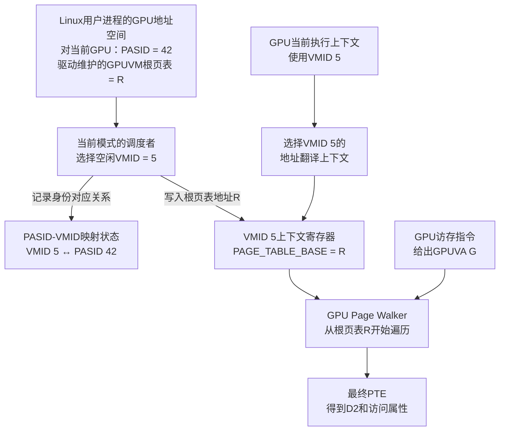
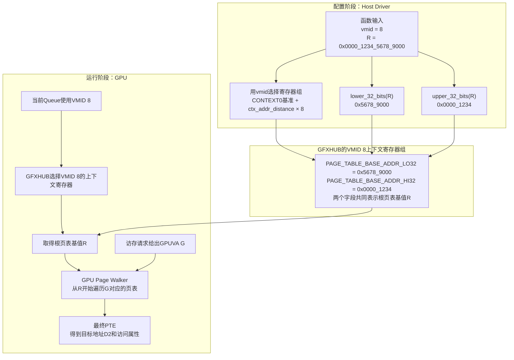

# GPU 内存管理基础

## 缩写表

| 缩写    | 英文全称                                     | 中文含义                                 |
| ------- | -------------------------------------------- | ---------------------------------------- |
| AMDGPU  | AMD GPU Linux Kernel Driver                  | AMD GPU Linux 内核驱动                   |
| API     | Application Programming Interface            | 应用程序编程接口                         |
| AQL     | Architected Queuing Language                 | HSA 定义的架构化队列包格式               |
| ATC     | Address Translation Cache                    | AMD GPU 地址翻译缓存及相关映射单元       |
| BAR     | Base Address Register                        | PCIe 基址寄存器；用于暴露设备地址窗口    |
| BO      | Buffer Object                                | 驱动用于管理一块缓冲区的对象             |
| CLR     | Common Language Runtime                      | ROCm 中承接上层计算接口的运行时层        |
| CP      | Command Processor                            | GPU 命令处理器                           |
| CPSCH   | Command Processor Scheduling                 | 由 GPU 命令处理器调度 Queue 的路径       |
| CPU     | Central Processing Unit                      | 中央处理器                               |
| CWSR    | Compute Wave Save/Restore                    | 计算 Wave 上下文的保存与恢复机制         |
| DMA     | Direct Memory Access                         | 设备直接内存访问                         |
| DQM     | Device Queue Manager                         | KFD 中管理进程与 Queue 调度状态的模块    |
| DRM     | Direct Rendering Manager                     | Linux 直接渲染管理框架                   |
| FB      | Frame Buffer                                 | 帧缓冲；源码中的 FB BAR 指显存窗口       |
| GART    | Graphics Address Remapping Table             | 图形地址重映射表                         |
| GEM     | Graphics Execution Manager                   | DRM 的图形内存对象管理框架               |
| GFP     | Get Free Pages                               | Linux 物理页分配标志                     |
| GFXHUB  | Graphics Hub                                 | 图形/计算访问使用的地址翻译 Hub          |
| GPU     | Graphics Processing Unit                     | 图形处理器                               |
| GPUVA   | GPU Virtual Address                          | GPU 虚拟地址                             |
| GPUVM   | GPU Virtual Memory                           | GPU 虚拟地址空间及其页表                 |
| GTT     | Graphics Translation Table                   | AMDGPU 中主要表示 GPU 可访问的系统内存域 |
| HMM     | Heterogeneous Memory Management              | 异构内存管理                             |
| HQD     | Hardware Queue Descriptor                    | 硬件队列描述状态                         |
| HSA     | Heterogeneous System Architecture            | 异构系统架构                             |
| HWS     | Hardware Scheduling                          | 由 GPU 调度固件管理 Queue 驻留的硬件调度 |
| IB      | Indirect Buffer                              | 间接命令缓冲区                           |
| IOMMU   | Input/Output Memory Management Unit          | 输入/输出内存管理单元                    |
| IOVA    | Input/Output Virtual Address                 | 输入/输出虚拟地址                        |
| ISA     | Instruction Set Architecture                 | 指令集架构                               |
| ioctl   | Input/Output Control                         | 用户态向内核驱动发送控制请求的接口       |
| KFD     | Kernel Fusion Driver                         | Linux AMD GPU 计算驱动接口               |
| KiB     | Kibibyte                                     | 二进制千字节，1 KiB 等于 1024 字节       |
| MEC     | Micro Engine Compute                         | AMD GPU 中处理计算队列的命令处理引擎     |
| MES     | Micro Engine Scheduler                       | AMD GPU 的微引擎调度器                   |
| MMIO    | Memory-Mapped Input/Output                   | 内存映射输入/输出                        |
| MMU     | Memory Management Unit                       | 内存管理单元                             |
| MQD     | Memory Queue Descriptor                      | 保存在内存中的队列配置描述               |
| PA      | Physical Address                             | 物理地址                                 |
| PASID   | Process Address Space ID                     | 进程地址空间标识                         |
| PCI     | Peripheral Component Interconnect            | 外设组件互连标准                         |
| PCIe    | Peripheral Component Interconnect Express    | 高速外设互连总线                         |
| PDE     | Page Directory Entry                         | 页目录项                                 |
| PFN     | Page Frame Number                            | 物理页框编号                             |
| PTE     | Page Table Entry                             | 页表项                                   |
| RAM     | Random Access Memory                         | 随机存取存储器；本文主要指系统内存       |
| ROCr    | ROCm Runtime                                 | ROCm 的 HSA 用户态运行时                 |
| SC      | Sequential Consistency                       | 顺序一致性内存顺序                       |
| SDMA    | System Direct Memory Access                  | AMD GPU 中负责数据搬运的专用引擎         |
| SG      | Scatter-Gather                               | 分散—聚集页面描述                       |
| SVM     | Shared Virtual Memory                        | 共享虚拟内存                             |
| TLB     | Translation Lookaside Buffer                 | 地址翻译缓存                             |
| TTM     | Translation Table Maps                       | DRM 的缓冲对象放置和迁移管理器           |
| UAPI    | User-space Application Programming Interface | 内核提供给用户态的接口                   |
| USERPTR | User Pointer                                 | 使用现有用户态指针及页面的内存路径       |
| VA      | Virtual Address                              | 虚拟地址                                 |
| VMID    | Virtual Memory ID                            | GPU 活动地址空间使用的硬件上下文编号     |
| VRAM    | Video Random-Access Memory                   | GPU 本地显存                             |
| WC      | Write Combining                              | 写合并                                   |

> 缩写表只用于查阅。正文会在概念首次出现时重新解释，不要求预先背诵。

## 全文大纲

GPU 内存管理不是单纯的“申请显存”。一块内存要真正被 CPU 和 GPU 使用，至少要同时解决位置、地址、映射、生命周期和可见性问题。

| 章节    | 核心问题                      | AQL 在本章中的位置                   |
| ------- | ----------------------------- | ------------------------------------ |
| 第 0 章 | GPU 内存管理到底要解决什么    | 用一段 16 KiB AQL Ring 固定问题背景  |
| 第 1 章 | CPU 和 GPU 怎样找到真正的数据 | Ring 只是 system RAM 映射的一个例子  |
| 第 2 章 | 内存怎样分配、映射并安全释放  | Ring 只演示 Queue 为什么必须持有引用 |
| 第 3 章 | CPU 和 GPU 怎样看见彼此的写入 | Packet→Doorbell 只演示发布顺序      |

> **[BOUNDARY]** 本文不展开完整 AQL Dispatch、MQD/HQD、CP/MEC 调度，也不展开通用 DRM/GEM/TTM 框架和普通 IB 提交。这些内容登记在 [待补充的知识点](./待补充的知识点.md)。本文只保留理解 AQL 内存行为所必需的接口和对象关系。

Linux 虚拟地址、物理页、页表和 DMA 的 CPU 侧基础可在 [01_Linux 内存管理基础](<./01_Linux 内存管理基础.md>) 中回看。本文 Linux 源码统一基于本地版本 `248951ddc14de84de3910f9b13f51491a8cd91df`，ROCr 源码基于 `ba56a24c6132c5d195686ae4adf969ca1222fbba`，ROCm CLR 源码基于 `81277d69e3352e7144ced2ee9601484f9b48d950`。

## 0. GPU 内存管理要解决什么

### 0.1 一块 GPU 可用内存涉及四个问题

假设程序需要一段 16 KiB、CPU 和 GPU 都能访问的缓冲区。“成功申请了 16 KiB”只回答了一小部分问题：

| 问题                     | 要确认什么                                         | 没解决时会怎样                          |
| ------------------------ | -------------------------------------------------- | --------------------------------------- |
| 数据放在哪里             | system RAM 还是 VRAM；由哪些页面或显存区间承载     | 根本不知道数据的实际存储位置            |
| CPU/GPU 使用什么地址     | CPU VA、GPUVA、DMA 地址、IOVA、PA 分别属于谁       | 把不同地址空间中的数字误当成同一地址    |
| 怎样建立访问关系         | CPU 页表、GPU 页表、必要时的 IOMMU 映射是否存在    | 地址存在，但访问会 fault 或到达错误位置 |
| 怎样保证生命周期与可见性 | 使用期间对象和映射是否有效；写入是否按正确顺序可见 | 提前释放、读取旧数据或读取半写入数据    |

这四个问题可以压缩成一条主线：

```text
存储资源已经存在
        ↓
CPU和GPU各自获得可用地址
        ↓
页表或窗口把地址连接到存储资源
        ↓
使用者持有对象和映射，防止资源提前消失
        ↓
同步与缓存规则保证双方看到正确内容
```

这里的“对象”只是驱动管理资源和生命周期的手段，不是另一份数据；“地址”只是访问者找到数据的名字，也不是数据本身。

### 0.2 CPU 和 GPU 访问内存的总矩阵

本文以带独立 VRAM 的离散 AMD GPU 为主。先固定最常见的四种访问：

| 访问者 | 目标       | 典型路径                                    | 是否经过 PCIe |
| ------ | ---------- | ------------------------------------------- | ------------- |
| CPU    | system RAM | CPU VA → CPU MMU → Host PA → RAM         | 否            |
| CPU    | VRAM       | CPU VA → CPU 页表 → PCIe BAR 窗口 → VRAM | 是            |
| GPU    | system RAM | GPUVA → GPU MMU → DMA 地址 → PCIe → RAM | 是            |
| GPU    | VRAM       | GPUVA → GPU MMU → 本地显存地址 → VRAM    | 否            |

分别画出来是：

```text
CPU访问system RAM                 CPU访问CPU可见VRAM

CPU load/store                    CPU load/store
      ↓                                 ↓
CPU MMU                           CPU MMU
      ↓                                 ↓
Host PA                           BAR映射的MMIO地址
      ↓                                 ↓ PCIe
system RAM                        VRAM


GPU访问system RAM                 GPU访问本地VRAM

GPU load/store或取包              GPU load/store
      ↓                                 ↓
GPU MMU                           GPU MMU
      ↓                                 ↓
DMA地址                           本地显存地址
      ↓ PCIe                            ↓
system RAM                        VRAM
```

从主机平台的角度看，GPU 对 system RAM 发起的读写属于设备 DMA 访问；这不表示每次访问都由 SDMA 引擎执行。Shader、命令处理前端和 SDMA 都可能成为发起者，SDMA 只是其中专门负责“读源再写目标”的搬运引擎。

还要修正一个常见误区：

> 不是所有 CPU↔GPU 内存访问都经过 PCIe。CPU 访问本机 RAM、GPU 访问本地 VRAM 都不经过 PCIe；只有跨越主机与离散 GPU 边界的路径才通常经过 PCIe。

### 0.3 访问、拷贝和通知不是同一件事

三种动作经常都表现为“写了一个地址”，但目的完全不同：

| 动作 | 本质                                 | 例子                                         |
| ---- | ------------------------------------ | -------------------------------------------- |
| 访问 | 一个执行者对目标地址做 load/store    | GPU Shader 读取 system RAM 中的输入          |
| 拷贝 | 一个引擎读取源地址，再写入目标地址   | SDMA 把 system RAM 数据搬到 VRAM             |
| 通知 | 写设备控制窗口，告诉硬件状态发生变化 | CPU 写 Doorbell MMIO，通知 Queue 有新 Packet |

```text
直接访问：
GPU读取system RAM中的数据

数据拷贝：
SDMA读system RAM → SDMA写VRAM

通知：
CPU写Doorbell → GPU得知“请检查Ring”
```

Doorbell 不包含 Packet 数据，也不会把 Packet 搬到 GPU。Packet 仍留在 Ring 中，GPU 收到通知后再通过已经建立好的地址映射读取它。

### 0.4 贯穿案例：16 KiB AQL Ring

后文使用一段 16 KiB AQL Ring 作为贯穿例子，并作如下教学假设：

| 项目     | 本文假设                                         |
| -------- | ------------------------------------------------ |
| 数据位置 | 4 个 4 KiB system RAM 页面                       |
| CPU 用途 | ROCr 在 Ring 中填写 AQL Packet                   |
| GPU 用途 | GPU 队列前端读取 Packet                          |
| CPU 地址 | 一段连续 CPU VA                                  |
| GPU 地址 | 一段连续 GPUVA                                   |
| 生命周期 | Queue 存活期间，Ring 的 BO 和 GPUVM 映射保持有效 |
| 可见性   | CPU 发布完整 Packet 后，才写 Doorbell            |

```text
同一份16 KiB Ring数据

CPU侧：CPU VA ──→ 4个system RAM页面
                         ↑
GPU侧：GPUVA ──→ GPU页表 ┘
```

这个例子会反复回答四个问题：

1. 4 个页面怎样被 CPU 和 GPU 分别找到？
2. GPUVA 怎样翻译到这些页面？
3. Queue 使用期间，为什么不能删掉映射或释放 BO？
4. CPU 写完 Packet 后，怎样保证 GPU 读到完整内容？

> **[BOUNDARY]** 16 KiB 只是便于画出 4 个页面的示例，不是 ROCr 固定的 Ring 大小。本文也不会借这个例子展开完整 Queue 创建和 Kernel Dispatch。

## 1. GPU 怎样找到真正的数据

### 1.1 数据可能放在哪里

在当前离散 GPU 模型中，最重要的两类物理存储是：

| 存储       | 所在位置     | 谁访问更自然 | 典型特点                                      |
| ---------- | ------------ | ------------ | --------------------------------------------- |
| system RAM | 主机内存     | CPU          | CPU 直接访问；GPU 通常经 PCIe/DMA 访问        |
| VRAM       | GPU 本地内存 | GPU          | GPU 本地高带宽访问；CPU 只能访问 BAR 可见部分 |

GPUVA 并不天然属于某一种存储。一套 GPU 页表可以让不同 GPUVA 页面分别指向 system RAM 或 VRAM。

**[SOURCE]** Linux `248951ddc14de84de3910f9b13f51491a8cd91df` 的 [`drivers/gpu/drm/amd/amdgpu/amdgpu_vm.c`](./2.源码/linux/drivers/gpu/drm/amd/amdgpu/amdgpu_vm.c) 第 51～58 行写道：

```c
/*
 * GPUVM is the MMU functionality provided on the GPU.
 * ...
 * The GPUVM page tables can contain a mix
 * VRAM pages and system pages (both memory and MMIO) and system pages
 * can be mapped as snooped (cached system pages) or unsnooped
 * (uncached system pages).
 */
```

中文翻译：

```text
GPUVM 是 GPU 提供的 MMU 功能。

GPUVM 页表可以混合包含 VRAM 页面和 system RAM 页面；
system RAM 页面还可以按 snooped（参与缓存一致性观察）
或 unsnooped（不采用这种观察方式）映射。
```

因此：

```text
GPUVA范围
├─ 某些PTE → VRAM
└─ 某些PTE → system RAM
```

“这是 GPUVA”只说明 GPU 使用什么虚拟地址访问；真正的数据位置要看最终 PTE。

### 1.2 CPU 和 GPU 分别怎样到达数据

CPU 访问 system RAM 使用普通 CPU 地址翻译，这部分已经在 Linux 内存基础中学习过：

```text
CPU VA → CPU MMU / CPU页表 → Host PA → system RAM
```

GPU 访问本地 VRAM 仍然可以从 GPUVA 开始，但最终落在 GPU 本地内存系统中：

```text
GPUVA → GPU MMU / GPU页表 → 本地显存地址 → VRAM
```

GPU 访问 system RAM 则跨过离散 GPU 与主机之间的互连：

```text
GPUVA → GPU MMU / GPU页表 → DMA地址 → PCIe → system RAM
```

CPU 访问 VRAM 时，CPU 不能直接使用 GPUVA。驱动要把可见 VRAM 通过 PCIe BAR 暴露到 CPU 的物理/MMIO 地址空间，再由 CPU 页表建立 CPU VA：

```text
CPU VA
  → CPU页表
  → BAR窗口中的主机物理/MMIO地址
  → PCIe
  → VRAM中的目标位置
```

**[SOURCE]** Linux 的 [`drivers/gpu/drm/amd/amdgpu/amdgpu_gmc.h`](./2.源码/linux/drivers/gpu/drm/amd/amdgpu/amdgpu_gmc.h) 第 223～234 行专门区分 CPU 视角的 aperture 与 GPU 视角的地址：

```c
/* FB's physical address in MMIO space (for CPU to
 * map FB). This is different compared to the agp/
 * gart/vram_start/end field as the later is from
 * GPU's view and aper_base is from CPU's view.
 */
resource_size_t aper_size;
resource_size_t aper_base;
/* 省略mc_vram_size字段及其注释。 */
u64 visible_vram_size;
```

中文翻译：

```text
aper_base         = PCI BAR在CPU物理地址空间中的起点
aper_size         = PCI BAR资源的长度
visible_vram_size = 驱动最终允许作为CPU-visible VRAM使用的长度
```

可以把它们分成两层：

```text
硬件/平台提供：aper_base、aper_size
软件最终采用：visible_vram_size
```

**[SOURCE]** Linux [`drivers/gpu/drm/amd/amdgpu/gmc_v9_0.c`](./2.源码/linux/drivers/gpu/drm/amd/amdgpu/gmc_v9_0.c) 第 1683～1704、1731 行给出了调用者和返回后的处理：

```c
static int gmc_v9_0_mc_init(struct amdgpu_device *adev)
{
	int r;

	/* 省略VRAM大小初始化和外层设备类型判断。 */
	r = amdgpu_device_resize_fb_bar(adev);
	if (r)
		return r;

	adev->gmc.aper_base = pci_resource_start(adev->pdev, 0);
	adev->gmc.aper_size = pci_resource_len(adev->pdev, 0);

	/* 省略其他平台的特殊地址路径。 */
	adev->gmc.visible_vram_size = adev->gmc.aper_size;
	/* 省略后续GART配置。 */
```

在本文讨论的离散 GPU 路径中，调用者是 `gmc_v9_0_mc_init()`。顺序是：

```text
调用amdgpu_device_resize_fb_bar()调整BAR0
  → 返回内存控制器初始化
  → 重新读取BAR0的base和size
  → aper_size = 调整后的BAR长度
  → visible_vram_size先初始化为aper_size
```

**[SOURCE]** Linux [`drivers/gpu/drm/amd/amdgpu/amdgpu_gmc.c`](./2.源码/linux/drivers/gpu/drm/amd/amdgpu/amdgpu_gmc.c) 第 225～229 行随后还可能缩小这个软件可用长度：

```c
if (vis_limit && vis_limit < mc->visible_vram_size)
	mc->visible_vram_size = vis_limit;

if (mc->real_vram_size < mc->visible_vram_size)
	mc->visible_vram_size = mc->real_vram_size;
```

所以最终关系是：

```text
visible_vram_size <= aper_size
visible_vram_size <= real_vram_size
```

`visible_vram_size` 仍然只是“具备 CPU 直访条件的 VRAM 长度”，不表示某个进程已经建立了对应 CPU VA；具体 BO 仍需单独 mmap。

Large BAR 与 Small BAR 的基础区别只在“CPU 一次能看见多少 VRAM”：

| 情况      | CPU 可见范围      | 当前阶段的结论                                                     |
| --------- | ----------------- | ------------------------------------------------------------------ |
| Large BAR | 通常覆盖全部 VRAM | 落在可见范围内的 VRAM BO 可建立 CPU 直映射                         |
| Small BAR | 只覆盖较小窗口    | 只有窗口内的 VRAM 可直接映射；其他数据可能需要迁移、换窗或 staging |

**[SOURCE]** 被调用的 [`drivers/gpu/drm/amd/amdgpu/amdgpu_device.c`](./2.源码/linux/drivers/gpu/drm/amd/amdgpu/amdgpu_device.c) 第 1120～1125、1172～1188 行通过 PCI 核心接口调整 BAR0：

```c
int amdgpu_device_resize_fb_bar(struct amdgpu_device *adev)
{
	int rbar_size =
		pci_rebar_bytes_to_size(adev->gmc.real_vram_size);
	/* 省略其余局部变量，以及无需调整或平台不支持时返回的分支。 */

	max_size = pci_rebar_get_max_size(adev->pdev, 0);
	if (max_size < 0)
		return 0;
	rbar_size = min(max_size, rbar_size);

	/* 省略调整前临时关闭相关硬件状态的代码。 */
	r = pci_resize_resource(adev->pdev, 0, rbar_size,
				(adev->asic_type >= CHIP_BONAIRE) ? 1 << 5
								  : 1 << 2);
	/* 省略调整后的错误处理和恢复。 */
```

`pci_resize_resource(..., 0, ...)` 中的 `0` 表示 PCI BAR0。这个函数不直接修改 `visible_vram_size`；它先调整 BAR0 资源，调用者返回后再读取新的 `pci_resource_len()`，由此更新 `aper_size` 和 `visible_vram_size`。

> **[BOUNDARY]** BAR 只解决 CPU 能否把某段 VRAM 放入自己的地址空间，不保证这种访问与 GPU 本地访问同样快，也不自动解决缓存一致性。

### 1.3 地址不能混为一谈

| 地址      | 谁使用或解释          | 当前阶段需要记住的含义            |
| --------- | --------------------- | --------------------------------- |
| CPU VA    | CPU 程序、CPU MMU     | CPU 指令中的虚拟地址              |
| GPUVA     | GPU 引擎、GPU MMU     | 某个 GPUVM 中的虚拟地址           |
| DMA 地址  | 设备和主机 DMA 子系统 | 驱动交给设备使用的统一名称        |
| IOVA      | Host IOMMU            | 启用 IOMMU 转换时的一类 DMA 地址  |
| Host PA   | 主机物理内存系统      | system RAM 页面对应的主机物理地址 |
| VRAM 地址 | GPU 本地内存系统      | GPU 到达本地显存资源所用的地址    |

最容易混淆的是 DMA 地址、IOVA 与 Host PA。DMA 地址是驱动层使用的统一术语；它是否表现为 IOVA，取决于平台是否为设备启用 Host IOMMU。

**[SOURCE]** Linux [`Documentation/core-api/dma-api-howto.rst`](./2.源码/linux/Documentation/core-api/dma-api-howto.rst) 第 81～88 行解释了有无 IOMMU 的差异：

```text
In some simple systems, the device can do DMA directly to physical address
Y. But in many others, there is IOMMU hardware that translates DMA
addresses to physical addresses, e.g., it translates Z to Y.

dma_map_single() ... sets up any required IOMMU mapping and returns the DMA
address Z. The driver then tells the device to do DMA to Z, and the IOMMU
maps it to the buffer at address Y in system RAM.
```

中文翻译：

```text
在简单系统中，设备可能直接对物理地址Y发起DMA。
在许多其他系统中，IOMMU把DMA地址Z翻译成物理地址Y。

DMA映射接口建立必要的IOMMU映射并返回Z；
驱动让设备访问Z，IOMMU再把它映射到system RAM中的Y。
```

于是 system RAM 有两种典型路径。

启用 Host IOMMU：

```text
GPUVA
  → GPU MMU
  → DMA地址（本例是IOVA）
  → Host IOMMU
  → Host PA
  → system RAM
```

未启用 Host IOMMU：

```text
GPUVA
  → GPU MMU
  → 直连DMA/总线地址
  → 主机桥
  → system RAM
```

而访问本地 VRAM 时：

```text
GPUVA
  → GPU MMU
  → 本地显存地址
  → VRAM
```

因此必须记住：

```text
GPUVA不是IOVA
IOVA不是CPU VA
DMA地址不保证等于Host PA
GPU PTE的目标也不一定是IOVA
```

### 1.4 GPU 地址翻译

现在把 GPU MMU、GPU 页表、PTE、GPU TLB 和 Host IOMMU 放进同一张图。假设 GPU 访问位于 system RAM 的 Ring 第 0 页，并且 Host IOMMU 已启用：

```text
GPU引擎发出 GPUVA 0x1000_0120
        │
        ▼
GPU TLB查询
   ┌────┴────┐
   │命中     │未命中
   ▼         ▼
缓存的翻译   从根页表逐级查找
                  │
                  ▼
              最终GPU PTE
                  │ 地址部分：IOVA 0x1234_5000
                  │ 属性：VALID/SYSTEM/READABLE...
                  ▼
翻译结果 0x1234_5120
        │
        ▼
Host IOMMU：IOVA → Host PA
        │
        ▼
system RAM第0页内偏移0x120
```

GPU MMU 负责解释 GPUVA；Host IOMMU 只在设备访问主机内存时解释 IOVA。两者不是同一个 MMU，也不查询同一套页表。

最终 PTE 不是缓冲区数据，而是“目标页面地址 + 访问属性”。

**[SOURCE]** Linux 的 [`drivers/gpu/drm/amd/amdgpu/amdgpu_vm.h`](./2.源码/linux/drivers/gpu/drm/amd/amdgpu/amdgpu_vm.h) 第 57～68 行列出一部分 PTE 属性：

```c
#define AMDGPU_PTE_VALID		(1ULL << 0)
#define AMDGPU_PTE_SYSTEM		(1ULL << 1)
#define AMDGPU_PTE_SNOOPED		(1ULL << 2)
/* 省略与当前说明无关的属性位。 */
#define AMDGPU_PTE_EXECUTABLE	(1ULL << 4)
#define AMDGPU_PTE_READABLE		(1ULL << 5)
#define AMDGPU_PTE_WRITEABLE	(1ULL << 6)
```

`VALID` 表示映射有效，`SYSTEM` 表示目标是 system memory，`READABLE`、`WRITEABLE`、`EXECUTABLE` 表示访问权限。地址部分在不同目标下含义不同：

| PTE 映射目标             | PTE 地址部分可怎样理解 | 后续是否经过 Host IOMMU |
| ------------------------ | ---------------------- | ----------------------- |
| system RAM，IOMMU 开启   | DMA 地址，通常是 IOVA  | 是                      |
| system RAM，IOMMU 未开启 | 直连 DMA/总线地址      | 否                      |
| 本地 VRAM                | GPU 本地显存地址       | 否                      |

**驱动准备完成后，GPU 运行时做什么？**

此时 GPU 页表已经建立，例如第 2 页的 PTE 已经保存 `D2`。真正触发访问的是 GPU 正在执行的 ISA load/store 指令。

**[SOURCE]** ROCr [`libhsakmt/tests/kfdtest/src/ShaderStore.cpp`](./2.源码/rocr-runtime/libhsakmt/tests/kfdtest/src/ShaderStore.cpp) 第 1162～1169 行保存了一段实际测试 Shader，其中包含：

```cpp
"flat_load_dword v4, v[2:3]\n"\
"s_waitcnt vmcnt(0) & lgkmcnt(0)\n"\
```

这两条 GPU ISA 可以先这样读：

```text
flat_load_dword v4, v[2:3]
  → 从v2:v3给出的64位GPU虚拟地址读取一个32位值
  → 返回值放入v4

s_waitcnt vmcnt(0) & lgkmcnt(0)
  → 等待前面的访存操作完成
```

假设 `v2:v3` 中保存的是第 2 页内某个 GPUVA，GPU 发出 load 后，地址翻译完全由硬件继续完成：

```text
GPU Wave执行flat_load_dword
        │ 输入：GPUVA G2
        ▼
GPU TLB查询
   ┌────┴────┐
   │命中     │未命中
   ▼         ▼
直接得到D2   GPU Page Walker从当前页表根开始遍历
                  │
                  ▼
              读取第2页PTE
                  │
                  ├─ 检查VALID/READABLE等属性
                  └─ 取出地址D2并填入GPU TLB
        ┌─────────┘
        ▼
GPU使用D2发起system RAM访问
        │
        ├─ Host IOMMU开启：D2是IOVA，再翻译为Host PA
        └─ Host IOMMU关闭：D2是直连DMA/总线地址
        ▼
system RAM返回数据
        ▼
load结果写入v4
```

因此，“GPU 取出 `D2`”有两种情况：TLB 命中时从 TLB 直接得到；TLB 未命中时由硬件 Page Walker 读取 PTE 后得到。GPU 不会在这里调用 `amdgpu_vm_map_gart()` 或其他 Linux C 函数。

> **[BOUNDARY]** 能看到的软件代码是 `flat_load_dword` 这样的 GPU ISA。TLB 查询和 Page Walker 遍历是 GPU MMU 的硬件行为，没有对应的 Linux C 调用栈。AQL Ring 由 CP/MEC 而不是 Shader 读取，但它使用同一套 GPUVM/TLB 翻译机制；完整取包路径留到后续 AQL Dispatch 章节。

GPU TLB 只是翻译结果缓存，不是页表。页表修改后，如果旧 TLB 项仍有效，GPU 可能继续使用旧目标：

```text
旧状态：GPUVA G → PTE → 页面P0
                    TLB也缓存G → P0

修改后：GPUVA G → 新PTE → 页面P1
                    TLB仍缓存G → P0
```

正确顺序是：

```text
写完新PTE
  → 等待页表更新完成并可见
  → 使对应GPU TLB旧翻译失效
  → GPU再次访问时重新遍历页表
```

TLB 失效清除的是“旧地址翻译”，不是清空 Ring 或 Kernel 数据。第 2 章会在 `MAP_MEMORY_TO_GPU` 路径中看到“同步页表更新后再 flush TLB”。

### 1.5 地址空间怎样被选择

#### 1.5.1 这里的“进程”是谁

同一个 GPUVA 数值可以在不同用户进程中指向不同数据，所以 GPU MMU 在查页表前必须知道“使用哪套地址空间”。

这里的“进程”是指**运行应用程序和 ROCr/HIP 运行时的 Linux 用户进程**，不是 Host Driver，也不是 GPU 内部的某种进程：

```text
Linux用户进程
├─ 应用程序
├─ ROCr/HIP运行时库（运行在同一个用户进程中）
├─ CPU地址空间：Linux mm_struct
└─ 驱动为它维护的GPU地址空间：GPUVM
```

Host Driver 中的 KFD/AMDGPU 代码运行在内核态，代表这个用户进程建立映射；GPU 则执行 Queue、Packet 和 Wave。二者都不是这里所说的“进程”。

**[SOURCE]** Linux [`drivers/gpu/drm/amd/amdkfd/kfd_priv.h`](./2.源码/linux/drivers/gpu/drm/amd/amdkfd/kfd_priv.h) 第 906～919 行把 `kfd_process` 与 Linux 的 `mm_struct` 联系起来：

```c
/* Process data */
struct kfd_process {
	/*
	 * kfd_process are stored in an mm_struct*->kfd_process*
	 * hash table (kfd_processes in kfd_process.c)
	 */
	struct hlist_node kfd_processes;

	/*
	 * Opaque pointer to mm_struct. We don't hold a reference to
	 * it so it should never be dereferenced from here. This is
	 * only used for looking up processes by their mm.
	 */
	void *mm;
	/* 省略后续字段。 */
};
```

中文翻译：`kfd_process` 可以通过 Linux 进程的 `mm_struct` 查找；其中的 `mm` 用来标识这个用户进程的 CPU 虚拟地址空间。因此，KFD 所说的 process 对应发起 GPU 工作的 Linux 用户进程。

PASID（Process Address Space ID，进程地址空间标识）是 GPU 用来区分“当前访问属于哪个用户进程地址空间”的编号。在当前 Linux 版本中，这个编号保存在对应的“进程—GPU 设备”状态 `kfd_process_device` 中。

**[SOURCE]** 同一文件第 763～769、876～879 行：

```c
/* Data that is per-process-per device. */
struct kfd_process_device {
	/* The device that owns this data. */
	struct kfd_node *dev;

	/* The process that owns this kfd_process_device. */
	struct kfd_process *process;

	/* 省略其他进程—设备状态。 */
	u32 pasid;
};
```

中文翻译：一个 `kfd_process_device` 属于某个 Linux 用户进程与某个 GPU 设备，`pasid` 记录该进程在这块 GPU 上使用的地址空间身份。后文写“进程的 PASID”，都是这一含义的简称。

| 名称         | 当前阶段的角色                                      |
| ------------ | --------------------------------------------------- |
| GPUVM        | Host Driver 为用户进程维护的 GPU 虚拟地址空间及页表 |
| PASID        | 标识用户进程在当前 GPU 上所用地址空间的身份编号     |
| VMID         | GPU 当前活动翻译上下文使用的有限硬件槽位编号        |
| 页表根寄存器 | 告诉 GPU MMU：这个 VMID 的根页表在哪里              |

可以先这样记：

```text
PASID回答：“这是谁的地址空间？”
VMID回答： “当前硬件用哪个活动槽位执行它？”
根页表寄存器回答：“这套页表从哪里开始？”
```

#### 1.5.2 HWS 与非 HWS 是什么，为什么同时存在

HWS 与非 HWS 描述的是 **Queue 由谁负责调度并放到 GPU 上运行**，不是两种内存，也不是两种 GPU 页表格式。

| 调度路径 | 谁维护 Queue 驻留和 VMID 分配                                           | 本节为什么要区分                                    |
| -------- | ----------------------------------------------------------------------- | --------------------------------------------------- |
| 非 HWS   | Host Driver 直接选择 VMID、配置地址空间并装载硬件 Queue                 | Linux C 代码能完整展示 VMID 选择与释放过程          |
| HWS      | Host Driver 提交进程和 Queue 信息，GPU 调度固件管理实际驻留与 VMID 槽位 | 更接近固件调度路径，但固件内部实现不在 Linux 源码中 |

两条路径最后必须得到相同的地址翻译状态：正在运行的 Queue 使用某个 VMID，而这个 VMID 对应进程的 PASID 和 GPUVM 根页表。

原来的“一行箭头”会把 HWS 的输入和调度结果混在一起。更完整的关系是：

```text
非HWS：Host Driver直接决定具体VMID

用户Queue
  → KFD Host Driver选择具体VMID N
  → 配置VMID N ↔ PASID 42
  → 配置VMID N的根页表 = R
  → 把MQD装载到HQD
  → Queue运行

HWS：Host Driver提供输入，GPU调度固件决定具体VMID

Host Driver提交三类输入
  ├─ SET_RESOURCES：可用VMID集合 = vmid_mask
  ├─ MAP_PROCESS：PASID = 42，根页表 = R
  └─ MAP_QUEUES：Queue / MQD
          │
          ▼
GPU调度固件
  → 从vmid_mask中选择具体VMID N
  → 配置VMID N ↔ PASID 42
  → 配置VMID N的根页表 = R
  → 把Queue装载到HQD
  → Queue运行
```

**[SOURCE]** Linux [`drivers/gpu/drm/amd/amdkfd/kfd_packet_manager.c`](./2.源码/linux/drivers/gpu/drm/amd/amdkfd/kfd_packet_manager.c) 第 188～195、223～242 行展示 HWS runlist 先构造进程映射，再构造用户 Queue 映射：

```c
/* build map process packet */
retval = pm->pmf->map_process(pm, &rl_buffer[rl_wptr], qpd);
/* 省略错误处理以及写指针更新。 */

list_for_each_entry(q, &qpd->queues_list, list) {
	/* 省略非活动Queue判断和日志。 */
	retval = pm->pmf->map_queues(pm, &rl_buffer[rl_wptr],
				     q, qpd->is_debug);
	/* 省略错误处理和写指针更新。 */
}
```

`map_process` 对应图中的进程信息，`map_queues` 对应 Queue/MQD 信息；`vmid_mask`、PASID 和根页表的具体字段将在 1.5.10 节用最小源码验证。

> **[BOUNDARY]** 图使用当前 Linux 源码中 CP 固件调度路径的 `SET_RESOURCES`、`MAP_PROCESS` 和 `MAP_QUEUES` 名称。不同代际或更新的调度固件接口可能使用不同命令，但“驱动提供 PASID、根页表和可用 VMID 范围，调度者决定具体 VMID”这一职责边界不变。

KFD 同时保留两条路径，主要有三个原因：

1. **GPU 代际和固件能力不同。** 某些旧 GPU 不具备可用的 HWS 调度能力，只能由 Host Driver 直接管理 Queue、VMID 和 HQD。
2. **HWS 依赖及时换出 Queue 的能力。** 例如 CWSR（Compute Wave Save/Restore，计算 Wave 保存与恢复）用于保存运行中的 Wave 状态，让调度固件可以换出一个进程并把有限的 VMID、HQD 交给另一个进程。
3. **支持 HWS 的 GPU 也可能主动选择非 HWS。** HWS 是默认路径；非 HWS 仍被保留为调试方式，使驱动可以静态地把 Queue 分配给 HQD，直接观察和控制硬件状态。

因此，不能把 HWS 简单理解成一个名为“HWS”的独立寄存器或单独硬件模块。它是一套依赖 GPU 命令处理器、调度固件、Queue 抢占和 CWSR 等能力的调度机制。

**[SOURCE]** Linux [`drivers/gpu/drm/amd/amdkfd/kfd_device_queue_manager.c`](./2.源码/linux/drivers/gpu/drm/amd/amdkfd/kfd_device_queue_manager.c) 第 3114～3126 行展示驱动怎样根据具体 GPU 能力强制选择非 HWS：

```c
switch (dev->adev->asic_type) {
/* HWS is not available on Hawaii. */
case CHIP_HAWAII:
/* HWS depends on CWSR for timely dequeue. CWSR is not
 * available on Tonga.
 *
 * FIXME: This argument also applies to Kaveri.
 */
case CHIP_TONGA:
	dqm->sched_policy = KFD_SCHED_POLICY_NO_HWS;
	break;
default:
	dqm->sched_policy = sched_policy;
	break;
}
```

中文翻译：Hawaii 不提供可用的 HWS；HWS 依赖 CWSR 及时换出 Queue，而 Tonga 没有 CWSR，所以这两种 GPU 在这里被强制设为非 HWS。其他 GPU 再按照驱动参数 `sched_policy` 选择路径。

这说明区分两条路径的首要原因确实是：KFD 必须同时适配不同代际 GPU 的硬件与固件能力。但“支持 HWS”并不意味着系统只能使用 HWS。

**[SOURCE]** Linux [`drivers/gpu/drm/amd/amdgpu/amdgpu_drv.c`](./2.源码/linux/drivers/gpu/drm/amd/amdgpu/amdgpu_drv.c) 第 736～745 行定义 `sched_policy`：

```c
/**
 * DOC: sched_policy (int)
 * Set scheduling policy. Default is HWS(hardware scheduling) with over-subscription.
 * Setting 1 disables over-subscription. Setting 2 disables HWS and statically
 * assigns queues to HQDs.
 */
int sched_policy = KFD_SCHED_POLICY_HWS;
module_param_unsafe(sched_policy, int, 0444);
MODULE_PARM_DESC(sched_policy,
	"Scheduling policy (0 = HWS (Default), 1 = HWS without over-subscription, 2 = Non-HWS (Used for debugging only)");
```

中文翻译：

```text
sched_policy=0：HWS，允许超额订阅，也是默认值
sched_policy=1：HWS，但禁止超额订阅
sched_policy=2：关闭HWS，静态地把Queue分配给HQD，主要用于调试
```

这里的“超额订阅”是指待运行的进程或 Queue 多于当前可同时驻留的 VMID、HQD 数量。HWS 可以让调度固件换入、换出 Queue 来复用有限硬件槽位；非 HWS 则由 Host Driver 进行较静态、直接的分配。

所以选择关系是：

```text
当前GPU缺少HWS所需能力
  → 驱动强制使用非HWS

当前GPU支持HWS
  → 默认HWS并允许超额订阅
  → 也可禁止超额订阅
  → 调试时可以主动切到非HWS
```

Linux 源码把两条路径分成不同的 Queue 操作函数。函数名中的 `nocpsch` 表示不使用 CP 固件调度；`cpsch` 表示使用 CP 调度路径。

**[SOURCE]** Linux [`drivers/gpu/drm/amd/amdkfd/kfd_device_queue_manager.c`](./2.源码/linux/drivers/gpu/drm/amd/amdkfd/kfd_device_queue_manager.c) 第 3131～3163 行根据调度策略选择不同的创建和销毁函数：

```c
switch (dqm->sched_policy) {
case KFD_SCHED_POLICY_HWS:
case KFD_SCHED_POLICY_HWS_NO_OVERSUBSCRIPTION:
	/* initialize dqm for cp scheduling */
	dqm->ops.create_queue = create_queue_cpsch;
	dqm->ops.destroy_queue = destroy_queue_cpsch;
	/* 省略其他HWS操作函数。 */
	break;
case KFD_SCHED_POLICY_NO_HWS:
	/* initialize dqm for no cp scheduling */
	dqm->ops.create_queue = create_queue_nocpsch;
	dqm->ops.destroy_queue = destroy_queue_nocpsch;
	/* 省略其他非HWS操作函数。 */
	break;
}
```

因此，后文展示 `allocate_vmid()` 和 `vmid_pasid[]` 时，会明确标为“非 HWS 源码示例”。它的价值是把 VMID 占用逻辑完整展示出来，不能据此误认为所有 AQL Queue 都由 Host Driver 直接分配 VMID。HWS 怎样把资源范围、PASID 和根页表交给调度固件，将在 1.5.10 节说明。

#### 1.5.3 用户进程、Host Driver 和 GPU 各自做什么

用户进程不会直接填写 GPU PTE。它通过 ROCr/KFD 请求分配和映射内存，Host Driver 才负责建立该进程的 GPUVM 页表。只需映射 GPU 当前需要访问的范围，不是预先映射“所有内存”。

```text
Linux用户进程打开GPU设备（应用程序+ROCr/HIP）
  │
  │ AMDGPU驱动从软件编号池分配PASID 42
  ▼
驱动创建该进程的GPUVM，记录PASID 42和根页表R
  │
  │ 用户进程请求分配、映射内存和创建Queue
  ▼
Host Driver为所需范围填写GPU PTE
  │
  │ Ring、Kernel代码、Kernarg、数据、Signal获得GPUVA
  ▼
Queue准备运行，驱动或GPU调度固件选择VMID 5
  │
  ├─ 配置VMID 5 ↔ PASID 42
  └─ 配置VMID 5的根页表地址 = R
  ▼
CPU把包含这些GPUVA的AQL Packet写入Ring，再写Doorbell
  │
  ▼
GPU使用VMID 5读取Packet和GPUVM页表
  │
  ▼
沿着Packet中的GPUVA访问代码、参数和数据
```

AQL Packet 主要描述任务并保存资源的 GPUVA，例如 `kernel_object`、`kernarg_address` 和 `completion_signal`；它不是把整个用户进程或所有资源复制给 GPU。GPU 能访问这些地址，是因为 Host Driver 此前已经把对应范围映射进该用户进程的 GPUVM。

这里还必须区分两套页表：

```text
CPU指令使用CPU VA → CPU MMU读取Linux CPU页表（mm_struct）
GPU指令使用GPUVA  → GPU MMU读取该进程的GPUVM页表
```

即使在统一虚拟地址场景中 CPU VA 与 GPUVA 的数值相同，也不代表 CPU 和 GPU 共用同一套页表。

#### 1.5.4 PASID、VMID 和根页表怎样连接

下面假设运行 ROCr/HIP 应用的 Linux 用户进程，在当前 GPU 上使用 PASID `42`，驱动为它维护的 GPUVM 根页表地址是 `R`；负责当前调度模式的一方再从有限硬件槽位中为它选择 VMID `5`。非 HWS 模式由 Host Driver 选择；HWS 模式由 GPU 调度固件负责驻留和槽位管理。`42` 和 `5` 都只是讲解用的示例值。



这张图分为配置和运行两个时刻：

1. 用户进程提出内存映射请求，Host Driver 为它维护一套 GPUVM 页表；PASID 标识“这是哪个用户进程在当前 GPU 上使用的地址空间”。
2. GPU 同时能保持的活动地址空间有限，因此 Host Driver 或 GPU 调度固件为它选择一个空闲 VMID 槽位。
3. 硬件记录 `VMID 5 ↔ PASID 42`，并在 VMID 5 的上下文寄存器中保存根页表地址 `R`。
4. 用户进程写入 Doorbell 后，GPU 执行这条 Queue 的工作时使用 VMID 5，因此 GPU MMU 选择 VMID 5 的根页表寄存器。
5. GPU 读取 Packet，并把 Packet 或访存指令中的 GPUVA 与根地址 `R` 一起交给 Page Walker，最终找到 PTE 和真正的数据。

因此，PASID、VMID 和根页表不是三级地址翻译：

```text
PASID：说明地址空间属于谁
VMID：选择当前硬件中的哪个活动上下文槽位
根页表寄存器：保存该槽位应从哪张页表开始遍历
```

GPU 正常页表遍历直接使用 VMID 选择的根页表。PASID 负责维持进程身份以及 PASID↔VMID 关系，不是夹在 GPUVA 与 PTE 之间的另一层地址。

下面先用源码确认“每个活动 VMID 关联一套 GPUVM 页表”，再按编号进入 PASID 与 VMID 的配置过程。

**[SOURCE]** Linux [`drivers/gpu/drm/amd/amdgpu/amdgpu_vm.c`](./2.源码/linux/drivers/gpu/drm/amd/amdgpu/amdgpu_vm.c) 第 51～67 行先说明硬件可以同时激活多套 GPUVM 页表，并让每个 VMID 关联一套页表：

```c
/*
 * GPUVM is the MMU functionality provided on the GPU.
 * ...
 * there can be multiple GPUVM page tables active at any given time.
 * ...
 * Each active GPUVM has an ID associated with it and there is a page table
 * linked with each VMID.
 */
```

中文翻译：GPUVM 是 GPU 的 MMU 功能；GPU 可以同时启用多套 GPUVM 页表，每个 VMID 关联其中一套页表。这对应图中的“VMID 槽位→根页表”。

#### 1.5.5 源码第一步：驱动分配 PASID 并交给 GPUVM

PASID 不是 GPU 返回给驱动的编号。AMDGPU 使用 Linux 的软件编号分配器，从硬件支持的位宽范围内选择一个尚未使用的正整数。

**[SOURCE]** Linux [`drivers/gpu/drm/amd/amdgpu/amdgpu_ids.c`](./2.源码/linux/drivers/gpu/drm/amd/amdgpu/amdgpu_ids.c) 第 32～40、63～78 行：

```c
/*
 * PASIDs are global address space identifiers that can be shared
 * between the GPU, an IOMMU and the driver.
 * ...
 * Therefore PASIDs are allocated using IDR cyclic allocator
 * (similar to kernel PID allocation) which naturally delays reuse.
 */

int amdgpu_pasid_alloc(unsigned int bits)
{
	u32 pasid;
	int r;

	/* 省略参数检查。 */
	r = xa_alloc_cyclic_irq(&amdgpu_pasid_xa, &pasid, xa_mk_value(0),
			    XA_LIMIT(1, (1U << bits) - 1),
			    &amdgpu_pasid_xa_next, GFP_KERNEL);
	/* 省略错误处理和trace。 */
	return pasid;
}
```

中文翻译：PASID 是 GPU、IOMMU 和驱动共同使用的全局地址空间标识；驱动使用类似 Linux 分配 PID 的循环编号器分配它，并延迟旧编号的再次使用。这里的 `xa_alloc_cyclic_irq()` 从软件编号池中选择空闲值，GPU 不参与选择具体数字。

**[SOURCE]** Linux [`drivers/gpu/drm/amd/amdgpu/amdgpu_kms.c`](./2.源码/linux/drivers/gpu/drm/amd/amdgpu/amdgpu_kms.c) 第 1463～1475 行把新 PASID 交给 GPUVM 初始化：

```c
pasid = amdgpu_pasid_alloc(16);
/* 省略分配失败以及与当前概念无关的初始化。 */
r = amdgpu_vm_init(adev, &fpriv->vm, fpriv->xcp_id, pasid);
```

因此，示例中的 `PASID 42` 表示“驱动从软件编号池分配了 42，并把它记录到该用户进程的 GPUVM”；不是用户指定 42，也不是向 GPU 请求后由 GPU 返回 42。

#### 1.5.6 源码第二步：软件记录哪些硬件 VMID 被划给 KFD

VMID 是 GPU 已经实现好的有限硬件槽位；`compute_vmid_bitmap` 则是 Host Driver 保存在内核内存中的一个普通整数，用来记录“哪些硬件 VMID 被划给 KFD 使用”。它不是 BAR、不是 GPU 寄存器，也不保存页表地址。

还要区分“划给 KFD”与“当前分给某个进程”：

| 对象                    | 位于哪里             | 软件或硬件 | 保存什么                                          |
| ----------------------- | -------------------- | ---------- | ------------------------------------------------- |
| `compute_vmid_bitmap` | Host Driver 内核内存 | 软件       | 哪些硬件 VMID 属于 KFD 的可用资源范围             |
| `vmid_pasid[]`        | Host Driver 内核内存 | 软件       | 非 HWS 模式下，每个 VMID 当前绑定哪个 PASID       |
| VMID 上下文寄存器组     | GPU 内部             | 硬件       | 当前 PASID 映射、根页表地址以及对应的地址翻译状态 |

因此，`compute_vmid_bitmap` 的 bit 为 `1` 只表示“KFD 可以使用这个编号”，不表示该 VMID 此刻一定空闲。运行时是否空闲，要继续查看 `vmid_pasid[]` 或 HWS 调度固件维护的驻留状态。

**[SOURCE]** Linux [`drivers/gpu/drm/amd/include/kgd_kfd_interface.h`](./2.源码/linux/drivers/gpu/drm/amd/include/kgd_kfd_interface.h) 第 107～109 行直接把它定义为 AMDGPU 传给 KFD 的软件字段：

```c
struct kgd2kfd_shared_resources {
	/* Bit n == 1 means VMID n is available for KFD. */
	unsigned int compute_vmid_bitmap;
	/* 省略其他共享资源字段。 */
};
```

中文翻译：第 `n` 位为 `1`，表示硬件 VMID `n` 被划入 KFD 可以使用的资源范围。这里的 `unsigned int` 就是一个普通 C 变量。

**[SOURCE]** Linux [`drivers/gpu/drm/amd/amdgpu/amdgpu_amdkfd.c`](./2.源码/linux/drivers/gpu/drm/amd/amdgpu/amdgpu_amdkfd.c) 第 179～182 行展示 AMDGPU 怎样在软件中构造这张位图：

```c
struct kgd2kfd_shared_resources gpu_resources = {
	.compute_vmid_bitmap =
		((1 << AMDGPU_NUM_VMID) - 1) -
		((1 << adev->vm_manager.first_kfd_vmid) - 1),
	/* 省略其他共享资源字段。 */
};
```

先看一个容易按十六进制核对的例子。假设 GPU 有 VMID `0～15`，并且 `first_kfd_vmid = 8`：

```text
VMID编号：15 14 13 12 11 10  9  8 | 7 6 5 4 3 2 1 0
位图bit：  1  1  1  1  1  1  1  1 | 0 0 0 0 0 0 0 0

compute_vmid_bitmap = 0xFF00
```

这表示软件记录“VMID 8～15 被划给 KFD”，不是说这些槽位当前都没有进程使用。

本文后面要继续使用“进程获得 VMID 5”的贯穿示例，因此再假设另一种资源划分：`first_kfd_vmid = 3`。同一段软件计算得到：

```text
VMID编号：15 14 13 12 11 10  9  8  7  6  5  4  3 | 2 1 0
位图bit：  1  1  1  1  1  1  1  1  1  1  1  1  1 | 0 0 0

compute_vmid_bitmap = 0xFFF8
```

这只是软件对硬件资源划分结果的记录，含义是“VMID 3～15 可以交给 KFD”；它没有访问 BAR，也没有读取或映射某个 GPU 寄存器。

**[SOURCE]** Linux [`drivers/gpu/drm/amd/amdkfd/kfd_device.c`](./2.源码/linux/drivers/gpu/drm/amd/amdkfd/kfd_device.c) 第 789～791、927～930 行展示 KFD 怎样读取这张软件位图，取得首尾 VMID 并保存下来：

```c
first_vmid_kfd = ffs(gpu_resources->compute_vmid_bitmap)-1;
last_vmid_kfd = fls(gpu_resources->compute_vmid_bitmap)-1;
vmid_num_kfd = last_vmid_kfd - first_vmid_kfd + 1;

/* 省略多分区GPU的特殊范围调整。 */
node->vm_info.first_vmid_kfd = first_vmid_kfd;
node->vm_info.last_vmid_kfd = last_vmid_kfd;
node->compute_vmid_bitmap = gpu_resources->compute_vmid_bitmap;
```

`ffs()` 和 `fls()` 分别找到软件位图中第一个和最后一个置位位置。对于上面的 `0xFFF8`，结果是 `first_vmid_kfd = 3`、`last_vmid_kfd = 15`。

把软件范围记录与运行时分配连起来，就是：

```text
AMDGPU初始化软件资源信息
  │
  │ 构造compute_vmid_bitmap = 0xFFF8
  ▼
软件记录：硬件VMID 3～15划给KFD
  │
  │ 初始化非HWS占用表vmid_pasid[]，全部写成0
  ▼
创建某用户进程的第一条Queue
  │
  │ 在锁保护下扫描运行时占用表
  ▼
vmid_pasid[5] == 0，因此VMID 5当前空闲
  │
  ├─ 软件记录：vmid_pasid[5] = PASID 42
  ├─ 配置硬件PASID 42 ↔ VMID 5
  ├─ 配置GPU内部VMID 5的根页表地址R
  └─ flush该地址空间的旧TLB翻译
```

**[SOURCE]** Linux [`drivers/gpu/drm/amd/amdkfd/kfd_device_queue_manager.c`](./2.源码/linux/drivers/gpu/drm/amd/amdkfd/kfd_device_queue_manager.c) 第 1666 行初始化非 HWS 路径的占用表：

```c
memset(dqm->vmid_pasid, 0, sizeof(dqm->vmid_pasid));
```

这里约定数组值 `0` 表示“这个 VMID 尚未绑定有效 PASID”。因此，`compute_vmid_bitmap` 负责保存 KFD 的资源范围，`vmid_pasid[]` 才负责保存非 HWS 模式下的动态分配结果。

#### 1.5.7 源码第三步：非 HWS 从占用表选择空闲 VMID

以非 HWS 路径为例，驱动维护的表可能处于以下状态：

```text
dqm->vmid_pasid[]

VMID 3 → PASID 17    已占用
VMID 4 → PASID 28    已占用
VMID 5 → PASID 0     空闲
VMID 6 → PASID 51    已占用
```

创建 Queue 的代码先取得 DQM 锁。只有该进程在这块 GPU 上创建第一条 Queue 时才需要分配 VMID；同一进程之后创建的 Queue 复用 `qpd->vmid`。

**[SOURCE]** 同一文件第 772～786 行：

```c
dqm_lock(dqm);

/* 省略Queue数量检查。 */
if (list_empty(&qpd->queues_list)) {
	retval = allocate_vmid(dqm, qpd, q);
	if (retval)
		goto out_unlock;
}
q->properties.vmid = qpd->vmid;
```

`dqm_lock()` 防止两个进程同时看见 VMID 5 为空闲并重复分配。`list_empty()` 表示这是该进程设备上下文中的第一条 Queue。

**[SOURCE]** Linux [`drivers/gpu/drm/amd/amdkfd/kfd_device_queue_manager.c`](./2.源码/linux/drivers/gpu/drm/amd/amdkfd/kfd_device_queue_manager.c) 第 681～715 行展示一种非 HWS 调度路径：

```c
for (i = dqm->dev->vm_info.first_vmid_kfd;
		i <= dqm->dev->vm_info.last_vmid_kfd; i++) {
	if (!dqm->vmid_pasid[i]) {
		allocated_vmid = i;
		break;
	}
}

/* 省略没有空闲VMID时的错误处理和调试日志。 */
dqm->vmid_pasid[allocated_vmid] = pdd->pasid;
set_pasid_vmid_mapping(dqm, pdd->pasid, allocated_vmid);
qpd->vmid = allocated_vmid;

/* 省略与当前地址空间选择无关的寄存器配置。 */
dqm->dev->kfd2kgd->set_vm_context_page_table_base(dqm->dev->adev,
		qpd->vmid, qpd->page_table_base);
kfd_flush_tlb(qpd_to_pdd(qpd));
```

按图逐行理解：

- 只扫描 `first_vmid_kfd～last_vmid_kfd`，不会占用不属于 KFD 的 VMID。
- `vmid_pasid[i] == 0` 表示该槽位空闲；例子中因此选中 VMID 5。
- 如果整个范围都没有空闲槽位，函数返回 `-ENOSPC`，不会覆盖正在使用的 VMID。
- `vmid_pasid[allocated_vmid] = pdd->pasid` 记录 `VMID↔PASID`。
- `set_pasid_vmid_mapping()` 把对应关系配置给硬件。
- `qpd->vmid` 保存该进程设备上下文当前使用的 VMID。
- `set_vm_context_page_table_base()` 把该进程的根页表地址配置给这个 VMID。
- `kfd_flush_tlb()` 使该地址空间可能残留的旧 TLB 翻译失效。

#### 1.5.8 源码第四步：给这个 VMID 写入根页表地址

前文的 VMID `5` 是用来解释机制的抽象编号。这里既然选用 GFXHUB v2.0 的具体代码，就改用该代际实际划给 KFD 的 VMID 范围。

**[SOURCE]** Linux [`drivers/gpu/drm/amd/amdgpu/gmc_v10_0.c`](./2.源码/linux/drivers/gpu/drm/amd/amdgpu/gmc_v10_0.c) 第 870～875 行说明 GFX10 的划分：

```c
/*
 * VMID 0 is reserved for System
 * amdgpu graphics/compute will use VMIDs 1-7
 * amdkfd will use VMIDs 8-15
 */
adev->vm_manager.first_kfd_vmid = 8;
```

中文翻译：VMID 0 留给系统；AMDGPU 图形/计算路径使用 VMID 1～7；KFD 使用 VMID 8～15。因此下面假设非 HWS 路径给当前进程分配的是 VMID `8`，传给 GFXHUB v2.0 的根页表基值为：

```text
vmid = 8
R = page_table_base = 0x0000_1234_5678_9000
```

`R` 只是为了展示 64 位数值怎样写入寄存器而选取的示例值，不是源码中的固定地址。它是 GPU MMU 用来定位根页表的基值，不是 CPU VA。驱动配置和 GPU 运行是两个时刻：



**[INFERENCE]** 图中的“配置阶段”直接对应下面的寄存器写入源码；“运行阶段”把该配置结果与 1.5.4 已确认的“VMID 选择一套 GPUVM 页表”连接起来，并不是说 `gfxhub_v2_0_setup_vm_pt_regs()` 自己执行了 Page Walk。

这张图需要分成两遍读：

1. **配置时**，`vmid=8` 只负责选中 VMID 8 对应的寄存器组；`R` 被拆成低 32 位和高 32 位，分别写入这组寄存器。
2. **运行时**，当前 Queue 使用 VMID 8，GFXHUB 因而取得这组寄存器共同表示的根页表基值 `R`；Page Walker 再用 `R` 和 GPUVA `G` 遍历页表。

图中的 `ctx_addr_distance` 是相邻 VM 上下文寄存器组之间的寄存器偏移。

**[SOURCE]** Linux [`drivers/gpu/drm/amd/amdgpu/amdgpu_gmc.h`](./2.源码/linux/drivers/gpu/drm/amd/amdgpu/amdgpu_gmc.h) 第 130～135 行：

```c
/*
 * store the register distances between two continuous context domain
 * and invalidation engine.
 */
uint32_t ctx_distance;
uint32_t ctx_addr_distance; /* include LO32/HI32 */
```

中文翻译：这里保存相邻 VM 上下文和失效引擎的寄存器间距；`ctx_addr_distance` 描述地址寄存器的间距，并覆盖 LO32/HI32 这一对字段。

**[SOURCE]** GFXHUB v2.0 在 Linux [`drivers/gpu/drm/amd/amdgpu/gfxhub_v2_0.c`](./2.源码/linux/drivers/gpu/drm/amd/amdgpu/gfxhub_v2_0.c) 第 456～458 行，用 Context 1 与 Context 0 的 LO32 寄存器编号之差初始化这个间距：

```c
hub->ctx_addr_distance = mmGCVM_CONTEXT1_PAGE_TABLE_BASE_ADDR_LO32 -
	mmGCVM_CONTEXT0_PAGE_TABLE_BASE_ADDR_LO32;
```

因此，对 VMID 8 使用 `ctx_addr_distance * 8`，是在等间距的上下文寄存器组中定位 VMID 8 对应的寄存器组，不是在翻译 GPUVA。

**[SOURCE]** 同一文件第 120～131 行随后把 `page_table_base` 的低、高 32 位写入选中的寄存器组。只保留图中对应的两次写寄存器操作：

```c
WREG32_SOC15_OFFSET(GC, 0,
			mmGCVM_CONTEXT0_PAGE_TABLE_BASE_ADDR_LO32,
			hub->ctx_addr_distance * vmid,
			lower_32_bits(page_table_base));
WREG32_SOC15_OFFSET(GC, 0,
			mmGCVM_CONTEXT0_PAGE_TABLE_BASE_ADDR_HI32,
			hub->ctx_addr_distance * vmid,
			upper_32_bits(page_table_base));
```

源码与图一一对应：两个 `WREG32_SOC15_OFFSET()` 的寄存器偏移相同，因此定位同一个 VMID 上下文；区别只是一个写 `lower_32_bits(R)`，另一个写 `upper_32_bits(R)`。

> **[BOUNDARY]** 图表示寄存器选择与地址翻译之间的逻辑关系，不表示芯片内部模块的物理摆放，也不表示驱动在 GPU 每次访存时重新写寄存器。不同 GPU 代际的寄存器名称和布局可能不同；本图只对应这里引用的 GFXHUB v2.0 代码。

#### 1.5.9 源码第五步：最后一条 Queue 销毁后释放 VMID

驱动不能仅把软件表写成 `0` 就立即复用 VMID。它必须先让旧 Queue 停止使用这个地址空间；只有该进程在这块 GPU 上的最后一条 Queue 已被移除，才调用 `deallocate_vmid()`。

**[SOURCE]** Linux [`drivers/gpu/drm/amd/amdkfd/kfd_device_queue_manager.c`](./2.源码/linux/drivers/gpu/drm/amd/amdkfd/kfd_device_queue_manager.c) 第 1024～1045 行：

```c
retval = mqd_mgr->destroy_mqd(mqd_mgr, q->mqd,
			KFD_PREEMPT_TYPE_WAVEFRONT_RESET,
			KFD_UNMAP_LATENCY_MS,
			q->pipe, q->queue);
/* 省略超时时对残留wave的处理。 */

list_del(&q->list);
if (list_empty(&qpd->queues_list)) {
	/* 省略必要时重置残留wave的分支。 */
	deallocate_vmid(dqm, qpd, q);
}
```

`destroy_mqd()` 先让硬件 Queue 停止运行；`list_del()` 删除当前 Queue；删除后列表为空，才说明这是最后一条 Queue，可以释放进程占用的 VMID。

**[SOURCE]** 同一文件第 753～760 行清除地址翻译状态和占用记录：

```c
kfd_flush_tlb(qpd_to_pdd(qpd));

/* Release the vmid mapping */
set_pasid_vmid_mapping(dqm, 0, qpd->vmid);
dqm->vmid_pasid[qpd->vmid] = 0;

qpd->vmid = 0;
q->properties.vmid = 0;
```

这段顺序表示：

```text
旧Queue停止使用VMID 5
  → flush旧TLB翻译
  → 清除硬件中的PASID↔VMID映射
  → vmid_pasid[5] = 0
  → VMID 5重新成为可分配槽位
```

所以，“VMID 5 可用”的完整条件不是只看一个数字，而是：VMID 5 属于 KFD 的允许范围，并且旧使用者已经退出，负责调度的一方已将其占用状态标记为空闲。

**由此得到非 HWS 模式下的进程数量边界：**

```text
Linux用户进程存在
  → 尚未在这块GPU上创建Queue
  → 不占用VMID

该进程创建第一条Queue
  → 分配一个VMID

同一进程继续创建Queue
  → 复用同一个VMID

该进程销毁最后一条Queue
  → 释放VMID
```

**[INFERENCE]** 结合 1.5.7 的分配代码和本节的释放代码，可以得到：非 HWS 模式下，同一块 GPU 上同时拥有至少一条 KFD Queue 的进程数量，最多等于 `compute_vmid_bitmap` 中分给 KFD 的 VMID 数量。

例如 `compute_vmid_bitmap = 0xFF00` 表示 KFD 可以使用 VMID 8～15，共 8 个槽位：

```text
最多8个不同进程同时在这块GPU上持有Queue
  → 第9个进程创建第一条Queue
  → allocate_vmid()找不到空闲槽位
  → 返回-ENOSPC，Queue创建失败
```

这里限制的不是系统中能够存在的 Linux 进程总数，而是“在这块 GPU 上已经创建 Queue、因而必须占用 VMID 的进程—设备上下文数量”。这是 VMID 给出的上限；HQD 等其他 Queue 资源也可能更早达到限制。

#### 1.5.10 HWS：谁维护 VMID 占用

`compute_vmid_bitmap` 可以直接理解为：

> **AMDGPU 软件记录的“分给 KFD 用作计算的 VMID 表（位图）”。**

例如：

```text
compute_vmid_bitmap = 0xFF00
                         │
                         └─ VMID 8～15分给KFD使用
```

它只说明“哪些 VMID 可以由 KFD 使用”，不说明这些 VMID 当前是否已经被某个进程占用。

还需要再区分两种占用记录：

| 名称                    | 含义                                                    |
| ----------------------- | ------------------------------------------------------- |
| `compute_vmid_bitmap` | 哪些 VMID 被划给 KFD 用作计算                           |
| `vmid_pasid[]`        | 非 HWS 中，Host Driver 记录每个 VMID 当前分给哪个 PASID |
| HWS 的当前占用状态      | 由 GPU 调度固件维护，不使用`vmid_pasid[]`             |

因此两条路径是：

```text
非HWS：
Host Driver从compute_vmid_bitmap中选一个VMID
  → 写入vmid_pasid[]
  → 配置VMID↔PASID和根页表

HWS：
Host Driver把compute_vmid_bitmap、PASID、根页表和Queue信息交给固件
  → 固件从允许范围中选择VMID
  → 固件维护当前占用并配置硬件映射
```

**[SOURCE]** Linux [`drivers/gpu/drm/amd/amdkfd/kfd_device_queue_manager.c`](./2.源码/linux/drivers/gpu/drm/amd/amdkfd/kfd_device_queue_manager.c) 第 1853、1888 行把这张 KFD VMID 表作为可用范围发给调度固件：

```c
res.vmid_mask = dqm->dev->compute_vmid_bitmap;
/* 省略其他调度资源。 */
return pm_send_set_resources(&dqm->packet_mgr, &res);
```

进程信息则提供 PASID 和根页表；具体 VMID 仍由固件选择。

**[SOURCE]** 以 VI 代际为例，Linux [`drivers/gpu/drm/amd/amdkfd/kfd_packet_manager_vi.c`](./2.源码/linux/drivers/gpu/drm/amd/amdkfd/kfd_packet_manager_vi.c) 第 52～57 行：

```c
packet->bitfields2.pasid = pdd->pasid;
packet->bitfields3.page_table_base = qpd->page_table_base;
```

普通 AQL Packet 只是已有 Queue 中的新任务：

```text
已有Queue新增AQL Packet
  → 写Ring
  → 写Doorbell
  → 不重新分配VMID

新建、销毁Queue或改变调度状态
  → Host Driver通知调度器
  → 固件可能重新安排VMID
```

> **[BOUNDARY]** HWS 固件内部怎样保存占用表、怎样选择换出对象，以及 MES 的具体调度协议留到 AQL Queue 调度阶段；当前只需要记住：`compute_vmid_bitmap` 是分给 KFD 的 VMID 范围，HWS 的实时占用由固件维护。

### 1.6 GTT、GART 和 GPUVM：不是三级翻译

这三个名字经常同时出现，但它们不在同一层。先把四个前置词说清楚：

| 词语     | 在本节中的意思                                             |
| -------- | ---------------------------------------------------------- |
| BO       | 驱动用来管理一块缓冲区的软件对象                           |
| backing  | 真正保存数据的存储资源；可以是 system RAM 页面或 VRAM 区间 |
| 内存域   | 驱动对数据放置位置的分类，例如 GTT 或 VRAM                 |
| aperture | 地址空间中预留的一段窗口；窗口内地址可被继续映射到实际页面 |

下面先用同一块 16 KiB 缓冲区对比 GTT 和 VRAM 两种放置；随后仍用位于 GTT 的 AQL Ring 贯穿地址映射关系。

#### 1.6.1 先分清：BO 管理对象和 BO 数据放在哪里

“BO 在 system RAM”与“BO 在 VRAM”容易产生歧义。严格来说，需要分开看两个东西：

```text
BO管理对象：struct amdgpu_bo等软件结构
BO数据：    用户真正申请的16 KiB缓冲区内容
```

`struct amdgpu_bo` 是 Linux 内核中的 C 结构体，无论数据最终放在哪里，它都保存在 system RAM。所谓“GTT BO”或“VRAM BO”，说的是 **BO 数据/backing 的当前位置**。

先看数据也位于 system RAM 的情况：

```text
16 KiB GTT BO

system RAM
├─ struct amdgpu_bo                 软件管理对象
│    └─ tbo.resource
│          └─ struct ttm_resource   描述当前放置在GTT域
│
└─ 4个system RAM页面                真正的16 KiB数据
     └─ 每页还有供GPU使用的DMA地址

GPU访问数据：GPUVA → GPU PTE → DMA地址 → system RAM页面
```

再看数据位于 VRAM 的情况：

```text
16 KiB VRAM BO

system RAM
└─ struct amdgpu_bo                 软件管理对象
     └─ tbo.resource
           └─ struct ttm_resource   描述VRAM域、资源偏移和大小

VRAM
└─ 一段16 KiB资源区间               真正的16 KiB数据

GPU访问数据：GPUVA → GPU PTE → VRAM本地地址 → VRAM
```

注意，`tbo.resource` 指向的是 system RAM 中的 `struct ttm_resource` 描述对象，不是一个可以由 CPU 直接解引用到 VRAM 数据的普通指针。驱动读取其中的内存域、资源偏移和大小，再生成 GPU PTE。

两种情况压缩成一张表：

| 比较项                         | GTT BO          | VRAM BO       |
| ------------------------------ | --------------- | ------------- |
| `struct amdgpu_bo` 在哪里    | system RAM      | system RAM    |
| `struct ttm_resource` 在哪里 | system RAM      | system RAM    |
| 真正的 16 KiB 数据在哪里       | system RAM 页面 | VRAM 资源区间 |
| GPU PTE 的目标                 | 页面 DMA 地址   | VRAM 本地地址 |

**[SOURCE]** Linux [`drivers/gpu/drm/amd/amdgpu/amdgpu_object.c`](./2.源码/linux/drivers/gpu/drm/amd/amdgpu/amdgpu_object.c) 第 663～669 行通过 `kvzalloc()` 分配 `amdgpu_bo` 软件对象：

```c
BUG_ON(bp->bo_ptr_size < sizeof(struct amdgpu_bo));

*bo_ptr = NULL;
bo = kvzalloc(bp->bo_ptr_size, GFP_KERNEL);
if (bo == NULL)
	return -ENOMEM;
drm_gem_private_object_init(adev_to_drm(adev), &bo->tbo.base, size);
```

`kvzalloc(..., GFP_KERNEL)` 分配的是内核虚拟内存，由 system RAM 承载。这里分配的是管理结构，不是那段 16 KiB VRAM 数据。

**[SOURCE]** Linux [`include/drm/ttm/ttm_bo.h`](./2.源码/linux/include/drm/ttm/ttm_bo.h) 第 81～84、117～121 行说明 `resource` 的职责：

```c
 * @resource: structure describing current placement.
 * @ttm: TTM structure holding system pages.

/* 省略其他字段。 */
struct ttm_resource *resource;
struct ttm_tt *ttm;
```

中文翻译：`resource` 是描述 BO 当前放置位置的结构；`ttm` 则保存与 system RAM 页面有关的 TTM 信息。因此，`resource` 是位置说明书，不是缓冲区数据本身。

以后看到“BO 位于某处”，都按下面的完整句子理解：

```text
GTT BO  = BO管理对象在system RAM，BO数据当前也在system RAM
VRAM BO = BO管理对象在system RAM，BO数据当前在VRAM
```

> **[BOUNDARY]** 本节只区分“软件对象”和“真正数据”；完整 GEM/TTM 对象关系仍留到后续 DRM 学习阶段。

#### 1.6.2 GTT：说明数据放在 GPU 可访问的 system RAM

假设 Ring 被分配为 GTT 内存：

```text
16 KiB GTT BO
  └─ backing：4个system RAM页面
```

这里的 GTT 首先是一个**内存域名称**。它说明这块 BO 的数据由 GPU 可访问的 system RAM 承载；它本身不是 GPUVA，也不是一次地址翻译。

**[SOURCE]** Linux [`include/uapi/drm/amdgpu_drm.h`](./2.源码/linux/include/uapi/drm/amdgpu_drm.h) 第 83～95 行定义 AMDGPU 内存域。其中与本节有关的原始注释是：

```c
 * %AMDGPU_GEM_DOMAIN_GTT	GPU accessible system memory, mapped into the
 * GPU's virtual address space via gart. Gart memory linearizes non-contiguous
 * pages of system memory, allows GPU access system memory in a linearized
 * fashion.
 *
 * %AMDGPU_GEM_DOMAIN_VRAM	Local video memory. For APUs, it is memory
 * carved out by the BIOS.
```

中文翻译：GTT 域是 GPU 可以访问的 system RAM；原本不连续的系统页面经过设备侧映射后，可以被 GPU 按连续地址使用。VRAM 域则表示 GPU 本地显存。

因此，看到 `AMDGPU_GEM_DOMAIN_GTT` 时，先读成：

> 这块 BO 的数据放在 GPU 可访问的 system RAM 中。

#### 1.6.3 GART：把 GART 窗口地址翻译成 DMA 地址

先回答最容易混淆的问题：

> **GART 页表不是 CPU MMU 使用的 CPU 页表。它由运行在 CPU 上的 Host Driver 创建和填写，但由 GPU MMU 读取和使用。**

| 问题                   | 答案                                 |
| ---------------------- | ------------------------------------ |
| 谁分配、填写 GART 页表 | Host Driver，代码运行在 CPU 上       |
| 谁遍历 GART 页表       | GPU MMU / Page Walker                |
| 输入地址               | GART aperture 中的 GPU 侧地址        |
| PTE 给出的目标         | system RAM 页面对设备可用的 DMA 地址 |

假设 4 个 system RAM 页面在 Host 物理内存中并不连续。DMA 映射先为它们生成设备可用地址 `D0～D3`：

```text
system RAM页面： P7    P2    P9    P4
                 │     │     │     │
DMA映射结果：    D0    D1    D2    D3
```

Host Driver 再把 `D0～D3` 写进 GART 页表：

```text
GART aperture地址：  A0    A1    A2    A3
                     │     │     │     │
GART PTE中的目标：   D0    D1    D2    D3
```

因此，GPU 访问 `A2` 时发生的是：

```text
Host IOMMU开启：
A2 ──GPU MMU/GART页表──→ D2（IOVA）
                         └─Host IOMMU──→ Host PA ──→ 页面P9

Host IOMMU关闭：
A2 ──GPU MMU/GART页表──→ D2（直连DMA/总线地址）──→ 页面P9
```

所以，“GART 是不是 GPUVA 到 IOVA 的映射”需要分两种说法：

- 广义上，`A2` 是 GPU 侧虚拟/逻辑地址；Host IOMMU 开启时，GART PTE 给出的 `D2` 是 IOVA，因此可以概括为“GPU 侧地址 → IOVA”。
- 为了不和用户进程 GPUVM 中的 `GPUVA` 混淆，本文把 `A2` 明确称为 **GART aperture 地址**。GART 不是一张 CPU 页表，也不是固定接在进程 GPUVM 后面的第二级页表。

**[SOURCE]** Linux [`drivers/gpu/drm/amd/amdgpu/amdgpu_gart.h`](./2.源码/linux/drivers/gpu/drm/amd/amdgpu/amdgpu_gart.h) 第 42～45 行说明 Host Driver 持有 GART 页表的 CPU 内核映射地址：

```c
struct amdgpu_gart {
	struct amdgpu_bo		*bo;
	/* CPU kmapped address of gart table */
	void				*ptr;
```

中文翻译：`ptr` 是 GART 页表的 CPU 内核映射地址。Host Driver 可以通过它填写页表，但这不代表 CPU MMU 会使用这张表。

**[SOURCE]** Linux [`drivers/gpu/drm/amd/amdgpu/amdgpu_gart.c`](./2.源码/linux/drivers/gpu/drm/amd/amdgpu/amdgpu_gart.c) 第 365～371 行把每个页面的 DMA 地址写入对应 GART PTE：

```c
t = offset / AMDGPU_GPU_PAGE_SIZE;

for (i = 0; i < pages; i++) {
	page_base = dma_addr[i];
	for (j = 0; j < AMDGPU_GPU_PAGES_IN_CPU_PAGE; j++, t++) {
		amdgpu_gmc_set_pte_pde(adev, dst, t, page_base, flags);
		page_base += AMDGPU_GPU_PAGE_SIZE;
```

`t` 选择 GART aperture 中的页号，`dma_addr[i]` 就是 `D0～D3`，`amdgpu_gmc_set_pte_pde()` 把这个 DMA 地址写进对应 PTE。

**[SOURCE]** 以 GFXHUB v2.0 为例，Linux [`drivers/gpu/drm/amd/amdgpu/gfxhub_v2_0.c`](./2.源码/linux/drivers/gpu/drm/amd/amdgpu/gfxhub_v2_0.c) 第 134～138 行把 GART 页表的 GPU 地址写入 VMID 0 的页表根寄存器：

```c
static void gfxhub_v2_0_init_gart_aperture_regs(struct amdgpu_device *adev)
{
	uint64_t pt_base = amdgpu_gmc_pd_addr(adev->gart.bo);

	gfxhub_v2_0_setup_vm_pt_regs(adev, 0, pt_base);
```

这一步告诉 GPU MMU 从哪里读取 GART 页表。于是角色关系非常明确：CPU 上的 Host Driver 负责建表和写表，GPU MMU 负责在访问发生时查表。

因此，GART 回答的是：

> GART aperture 中的 GPU 侧地址，应该翻译成哪个 system RAM 页面的 DMA 地址？

#### 1.6.4 GPUVM：给某个用户进程建立自己的 GPUVA 映射

运行 ROCr/HIP 程序的用户进程拥有一套 GPU 地址空间。驱动把 Ring 映射进去后，GPU 才能用该进程的 GPUVA 找到它：

```text
进程的Ring GPUVA
       │
       ▼
该进程的GPUVM页表
       │
       ├─ 映射system RAM：PTE给出DMA地址
       │                   ├─ 有Host IOMMU：DMA地址是IOVA → Host PA
       │                   └─ 无Host IOMMU：直连DMA/总线地址
       │                                      ↓
       │                               system RAM页面
       │
       └─ 映射VRAM：PTE给出本地VRAM地址 → VRAM
```

同一套 GPUVM 页表还可以把其他 GPUVA 映射到 VRAM，所以 GPUVM 不是一种存储位置。

**[SOURCE]** Linux [`drivers/gpu/drm/amd/amdgpu/amdgpu_vm.c`](./2.源码/linux/drivers/gpu/drm/amd/amdgpu/amdgpu_vm.c) 第 51～56 行说明 GPUVM 可以同时存在多套页表，并能混合映射 VRAM 与 system RAM：

```c
 * GPUVM is the MMU functionality provided on the GPU.
 * GPUVM is similar to the legacy GART on older asics, however
 * rather than there being a single global GART table
 * for the entire GPU, there can be multiple GPUVM page tables active
 * at any given time.  The GPUVM page tables can contain a mix
 * VRAM pages and system pages (both memory and MMIO) and system pages
```

中文翻译：GPUVM 是 GPU 提供的 MMU 功能。旧式 GART 是整个 GPU 共用的一张全局表，而 GPUVM 可以同时启用多套页表；页表中既可以映射 VRAM 页面，也可以映射 system RAM 页面。

因此，GPUVM 回答的是：

> 当前用户进程中的某个 GPUVA 映射到哪一页 system RAM 或哪一段 VRAM？

#### 1.6.5 用同一块 Ring 看清三者关系

```text
数据放置关系：

GTT BO
  → backing是4个system RAM页面
  → Ring数据真正保存在这些页面中


系统/全局GART窗口的地址翻译关系：

GART aperture地址
  → GART页表
  → 页面DMA地址
  → 可选的Host IOMMU翻译
  → system RAM页面


用户进程GPUVM的地址翻译关系：

进程的Ring GPUVA
  → 该进程的GPUVM页表
  → 页面DMA地址
  → 可选的Host IOMMU翻译
  → 同一组system RAM页面
```

这张图有三条关系：

1. `GTT BO → system RAM 页面` 是**数据放置关系**。
2. `GART aperture 地址 → GART 页表 → DMA 地址` 是**系统/全局窗口映射关系**。
3. `进程 GPUVA → GPUVM 页表 → DMA 地址` 是**用户进程的地址翻译关系**。

后两条关系的页表输出都是设备可用的 DMA 地址：Host IOMMU 开启时是 IOVA，关闭时是直连 DMA/总线地址。它们的输入地址和所用页表不同，因此不能把 GART aperture 地址和进程 GPUVA 混成同一个概念。

AQL Queue 实际使用这块 Ring 时，关注的是第三条：

```text
Ring GPUVA
  → 当前进程的GPUVM页表
  → 页面DMA地址
  → 如果是IOVA，再经过Host IOMMU得到Host PA
  → system RAM中的Ring数据
```

所以不要记成：

```text
错误：GPUVA → GTT → GART → GPUVM → 数据
```

`GTT` 不是地址节点，`GART` 也不是每次进程 GPUVA 翻译都必须再次经过的固定第二级页表。源码中描述 GTT 时使用的 `via gart`，强调 system RAM 页面需要经过设备侧重映射才能被 GPU 使用；它不应被展开成上面的固定串行链路。

最后只记住三个问题即可：

| 名称  | 最先问自己的问题                            |
| ----- | ------------------------------------------- |
| GTT   | 数据是不是放在 GPU 可访问的 system RAM？    |
| GART  | 系统/全局设备窗口怎样映射 system RAM 页面？ |
| GPUVM | 当前用户进程的 GPUVA 映射到哪里？           |

把第 1 章压缩成一句话：

> GPU 从所属 GPUVM 中的 GPUVA 出发；VMID 和根页表寄存器选择翻译上下文；GPU MMU 通过 PTE 得到 system RAM 的 DMA 地址或本地 VRAM 地址；若该 DMA 地址是 IOVA，Host IOMMU 再把它翻译为 Host PA。

## 2. GPU 可访问内存怎样建立、映射和释放

第 1 章假设 PTE 已经存在。本章把时间倒回去，看一块内存怎样从“被申请”变成“GPUVA 可以访问”，又怎样安全退出：

```text
选择VRAM/GTT/USERPTR
        ↓
取得页面或显存资源，建立管理对象
        ↓
可选：建立CPU映射
        ↓
MAP_MEMORY_TO_GPU
        ↓
把BO连接到目标GPUVM，写入GPU PTE
        ↓
等待页表更新并使旧TLB翻译失效
        ↓
使用者持有引用和映射
        ↓
使用结束 → UNMAP → FREE
```

### 2.1 三种基础内存来源

KFD 将最基本的内存来源表示为三种基础类型标志；一次常规分配按用途选择其中一种。

**[SOURCE]** Linux [`include/uapi/linux/kfd_ioctl.h`](./2.源码/linux/include/uapi/linux/kfd_ioctl.h) 第 413～428 行：

```c
/* Allocation flags: memory types */
#define KFD_IOC_ALLOC_MEM_FLAGS_VRAM		(1 << 0)
#define KFD_IOC_ALLOC_MEM_FLAGS_GTT		(1 << 1)
#define KFD_IOC_ALLOC_MEM_FLAGS_USERPTR		(1 << 2)
/* 省略Doorbell和MMIO专用类型。 */

/* Allocation flags: attributes/access options */
#define KFD_IOC_ALLOC_MEM_FLAGS_WRITABLE	(1 << 31)
#define KFD_IOC_ALLOC_MEM_FLAGS_EXECUTABLE	(1 << 30)
#define KFD_IOC_ALLOC_MEM_FLAGS_PUBLIC		(1 << 29)
#define KFD_IOC_ALLOC_MEM_FLAGS_AQL_QUEUE_MEM	(1 << 27)
#define KFD_IOC_ALLOC_MEM_FLAGS_COHERENT	(1 << 26)
#define KFD_IOC_ALLOC_MEM_FLAGS_UNCACHED	(1 << 25)
```

中文翻译：

```text
第一组标志选择内存来源：VRAM、GTT或USERPTR。
第二组标志描述访问属性：能否写、能否执行、是否要求CPU可见、
是否用于AQL Queue，以及缓存/一致性属性。
```

三种来源的核心区别是：

| 类型    | 数据从哪里来                             | CPU 侧最初是否已有地址                     | GPU 访问前还需要什么                     |
| ------- | ---------------------------------------- | ------------------------------------------ | ---------------------------------------- |
| VRAM    | GPU 本地显存资源                         | 不一定；要看 BAR 可见性与是否建立 CPU 映射 | 映射进目标 GPUVM                         |
| GTT     | 驱动为 BO 分配的 system RAM 页面         | 分配后可通过 mmap 建立 CPU VA              | DMA 映射并写入目标 GPUVM                 |
| USERPTR | 用户已经拥有的 CPU VA 和 system RAM 页面 | 是                                         | 登记/跟踪页面、建立 DMA 地址并写入 GPUVM |

GTT 与 USERPTR 最终都可能让 GPU 访问 system RAM，但页面来源相反：

```text
GTT：    先请求GPU内存 → 驱动分配system RAM页面 → 可再映射给CPU
USERPTR：先有CPU VA和页面 → 驱动登记这些现有页面 → 再映射给GPU
```

`PUBLIC`、`COHERENT`、`UNCACHED` 等是属性，不是第四种物理存储。它们会影响 CPU 可见性、缓存方式或实现选择，但不能取代 VRAM/GTT/USERPTR 这个来源问题。

### 2.2 页面或显存资源从哪里来

**GTT：驱动取得 system RAM 页面**

GTT BO 的 backing 由系统页面组成。AMDGPU 通过 TTM 的页面池为尚无用户页面的对象填充 `ttm->pages[]`。

**[SOURCE]** Linux [`drivers/gpu/drm/amd/amdgpu/amdgpu_ttm.c`](./2.源码/linux/drivers/gpu/drm/amd/amdgpu/amdgpu_ttm.c) 第 1216～1251 行：

```c
/*
 * amdgpu_ttm_tt_populate - Map GTT pages visible to the device
 *
 * Map the pages of a ttm_tt object to an address space visible
 * to the underlying device.
 */
static int amdgpu_ttm_tt_populate(struct ttm_device *bdev,
				  struct ttm_tt *ttm,
				  struct ttm_operation_ctx *ctx)
{
	/* 省略局部变量声明。 */
	/* user pages are bound by amdgpu_ttm_tt_pin_userptr() */
	if (gtt->userptr) {
		ttm->sg = kzalloc_obj(struct sg_table);
		if (!ttm->sg)
			return -ENOMEM;
		return 0;
	}

	/* 省略外部导入检查和pool选择。 */
	ret = ttm_pool_alloc(pool, ttm, ctx);
	if (ret)
		return ret;

	for (i = 0; i < ttm->num_pages; ++i)
		ttm->pages[i]->mapping = bdev->dev_mapping;
	return 0;
}
```

中文翻译：这个函数为 GTT 对象准备设备可见的页面；普通路径由 TTM 页面池分配页面，USERPTR 则跳过这一步，因为页面来自用户已有映射。

当前只需从代码中读出：

```text
GTT BO
  → ttm_pool_alloc()
  → 一组struct page
  → 后续建立设备DMA地址和GPU PTE
```

**USERPTR：从 CPU 页表取得现有页面**

USERPTR 不重新创造一份用户数据。驱动从用户 CPU VA 所属的内存映射取得页面，并跟踪 CPU 页表变化。

**[SOURCE]** Linux [`drivers/gpu/drm/amd/amdgpu/amdgpu_ttm.c`](./2.源码/linux/drivers/gpu/drm/amd/amdgpu/amdgpu_ttm.c) 第 737～803 行：

```c
/*
 * get device accessible pages that back user memory
 * and start HMM tracking CPU page table update
 */
r = amdgpu_hmm_range_get_pages(&bo->notifier, start, ttm->num_pages,
			       readonly, NULL, range);

/* 省略当前函数尾部和amdgpu_ttm_tt_set_user_pages()函数声明。 */
for (i = 0; i < ttm->num_pages; ++i)
	ttm->pages[i] =
		range ? hmm_pfn_to_page(range->hmm_range.hmm_pfns[i]) : NULL;
```

中文翻译：驱动取得支撑这段用户内存的设备可访问页面，同时开始跟踪 CPU 页表更新；随后把 HMM 返回的页框信息转换为 `struct page`。

**[SOURCE]** 同一 Linux 文件 [`drivers/gpu/drm/amd/amdgpu/amdgpu_ttm.c`](./2.源码/linux/drivers/gpu/drm/amd/amdgpu/amdgpu_ttm.c) 第 821～835 行再把这些页面组织成散列表并通过 DMA API 映射给设备：

```c
r = sg_alloc_table_from_pages(ttm->sg, ttm->pages, ttm->num_pages, 0,
			      (u64)ttm->num_pages << PAGE_SHIFT,
			      GFP_KERNEL);
/* 省略错误分支。 */
r = dma_map_sgtable(adev->dev, ttm->sg, direction, 0);
/* 省略错误分支。 */
drm_prime_sg_to_dma_addr_array(ttm->sg, gtt->ttm.dma_address,
			       ttm->num_pages);
```

这条链连接了第 1 章：

```text
用户CPU VA
  → CPU页表中的页面
  → struct page
  → DMA地址数组
  → GPU页表PTE
```

**VRAM：取得显存资源区间**

VRAM BO 的数据位于 GPU 本地显存资源中，驱动管理的是显存地址区间，而不是一组普通 host `struct page`。映射进 GPUVM 时，PTE 最终指向本地显存地址；只有 CPU 需要直接访问且该区间位于 BAR 可见范围时，才另外建立 CPU 侧映射。

**pin 与分配不是一回事**

| 动作     | 回答的问题                                     |
| -------- | ---------------------------------------------- |
| 分配     | 数据存储资源从哪里来；谁拥有它                 |
| pin/固定 | 已有页面或 BO 在使用期间能否被换出、迁移或改变 |
| 映射     | 某个 CPU VA 或 GPUVA 怎样到达这份存储          |

USERPTR 尤其容易被说成“GPU 分配了一块 pinned memory”，但准确顺序是：用户先有内存，驱动再登记并稳定/跟踪这些页面，然后建立设备访问关系。pin 不会凭空创建另一份数据。

> **[BOUNDARY]** USERPTR 页面失效、HMM notifier、迁移与 GPU Page Fault 的完整恢复路径留到 SVM/HMM 阶段；本章只学习正常映射建立时需要哪些页面。

### 2.3 分配和映射是两个阶段

KFD UAPI 本身已经把两个阶段拆开。

**[SOURCE]** Linux [`include/uapi/linux/kfd_ioctl.h`](./2.源码/linux/include/uapi/linux/kfd_ioctl.h) 第 430～478 行：

```c
/* Allocate memory for later SVM (shared virtual memory) mapping.
 *
 * @va_addr:     virtual address of the memory to be allocated
 *               all later mappings on all GPUs will use this address
 * @size:        size in bytes
 * @handle:      buffer handle returned to user mode, used to refer to
 *               this allocation for mapping, unmapping and freeing
 * @mmap_offset: for CPU-mapping the allocation by mmapping a render node
 *               for userptrs this is overloaded to specify the CPU address
 * @gpu_id:      device identifier
 * @flags:       memory type and attributes. See KFD_IOC_ALLOC_MEM_FLAGS above
 */
struct kfd_ioctl_alloc_memory_of_gpu_args {
	__u64 va_addr;
	__u64 size;
	__u64 handle;
	__u64 mmap_offset;
	__u32 gpu_id;
	__u32 flags;
};

/* Map memory to one or more GPUs
 *
 * @handle:                memory handle returned by alloc
 * @device_ids_array_ptr:  array of gpu_ids (__u32 per device)
 * @n_devices:             number of devices in the array
 * @n_success:             number of devices mapped successfully
 *
 * @n_success returns information to the caller how many devices from
 * the start of the array have mapped the buffer successfully. It can
 * be passed into a subsequent retry call to skip those devices. For
 * the first call the caller should initialize it to 0.
 *
 * If the ioctl completes with return code 0 (success), n_success ==
 * n_devices.
 */
struct kfd_ioctl_map_memory_to_gpu_args {
	__u64 handle;
	__u64 device_ids_array_ptr;
	__u32 n_devices;
	__u32 n_success;
};
```

中文翻译：

```text
ALLOC创建或登记一块以后可以映射的内存，返回handle；
这个handle供后续MAP、UNMAP和FREE引用。
mmap_offset用于另外建立CPU映射。

MAP使用同一个handle，把该内存映射到一个或多个GPU；
device_ids数组选择目标GPU，n_success记录已经成功映射的设备数，
从而支持失败后的继续重试；完全成功时n_success等于n_devices。
```

四个核心 ioctl 的职责是：

| ioctl                     | 只回答什么                                |
| ------------------------- | ----------------------------------------- |
| `ALLOC_MEMORY_OF_GPU`   | 创建/登记内存与管理对象，返回 KFD handle  |
| `MAP_MEMORY_TO_GPU`     | 把对象连接到指定 GPU 的 GPUVM，准备 PTE   |
| `UNMAP_MEMORY_FROM_GPU` | 删除指定 GPUVM 中的映射                   |
| `FREE_MEMORY_OF_GPU`    | 在无人使用、没有 GPU 映射后释放对象和存储 |

因此：

```text
ALLOC成功
≠ GPU已经能访问

MAP成功
= 对目标GPUVM建立映射并完成必要同步
```

**[SOURCE]** Linux [`drivers/gpu/drm/amd/amdkfd/kfd_chardev.c`](./2.源码/linux/drivers/gpu/drm/amd/amdkfd/kfd_chardev.c) 第 1322～1375 行展示 `MAP_MEMORY_TO_GPU` 的关键顺序：

```c
mem = kfd_process_device_translate_handle(
		pdd, GET_IDR_HANDLE(args->handle));

for (i = args->n_success; i < args->n_devices; i++) {
	/* 省略目标GPU查找和绑定。 */
	err = amdgpu_amdkfd_gpuvm_map_memory_to_gpu(
		peer_pdd->dev->adev, (struct kgd_mem *)mem,
		peer_pdd->drm_priv);
	if (err) {
		/* 省略错误日志。 */
		goto map_memory_to_gpu_failed;
	}
	args->n_success = i+1;
}

err = amdgpu_amdkfd_gpuvm_sync_memory(
	dev->adev, (struct kgd_mem *) mem, true);

/* Flush TLBs after waiting for the page table updates to complete */
for (i = 0; i < args->n_devices; i++) {
	/* 省略peer_pdd查找与空指针检查。 */
	kfd_flush_tlb(peer_pdd);
}
```

中文翻译：先把 KFD handle 查成内核内存对象；再建立 GPUVM 映射；等待页表更新完成；最后使对应 GPU TLB 中的旧翻译失效。

这正好闭合第 1 章的控制面：

```text
handle查找对象
  → BO连接到GPUVM
  → 写GPU PTE
  → 等待PTE更新完成
  → 使旧TLB项失效
```

**把映射调用放大：驱动怎样把 `D2` 写进 PTE2？**

这不是 GPU 正在执行 Kernel 时发生的动作，也不是每块内存都会重复执行的驱动加载初始化。它发生在这块 BO 执行 `MAP_MEMORY_TO_GPU` 时。

先看完整控制路径：

```text
MAP_MEMORY_TO_GPU
  → 在目标GPUVM中登记GPUVA范围
  → 确保system RAM页面具有目标GPU可用的DMA地址
  → 从DMA地址数组中选择D0～D3
  → 页表更新后端写入PTE0～PTE3
  → 等待页表更新完成
  → 使旧GPU TLB翻译失效
```

**第一步：登记 GPUVA 范围，然后请求更新 PTE**

**[SOURCE]** Linux [`drivers/gpu/drm/amd/amdgpu/amdgpu_amdkfd_gpuvm.c`](./2.源码/linux/drivers/gpu/drm/amd/amdgpu/amdgpu_amdkfd_gpuvm.c) 第 1324～1337 行：

```c
ret = amdgpu_vm_bo_map(entry->adev, entry->bo_va, entry->va, 0,
		       amdgpu_bo_size(entry->bo_va->base.bo),
		       entry->pte_flags);
/* 省略错误处理和no_update_pte分支。 */

ret = update_gpuvm_pte(mem, entry, sync);
```

`amdgpu_vm_bo_map()` 记录“从 `entry->va` 开始的 GPUVA 范围映射到这个 BO”；`update_gpuvm_pte()` 再把这条软件映射落实为真正的 GPU PTE。

**第二步：确保 DMA 映射存在，再更新 GPU 页表**

**[SOURCE]** Linux [`drivers/gpu/drm/amd/amdgpu/amdgpu_amdkfd_gpuvm.c`](./2.源码/linux/drivers/gpu/drm/amd/amdgpu/amdgpu_amdkfd_gpuvm.c) 第 1295～1314 行：

```c
static int update_gpuvm_pte(struct kgd_mem *mem,
			    struct kfd_mem_attachment *entry,
			    struct amdgpu_sync *sync)
{
	struct amdgpu_bo_va *bo_va = entry->bo_va;
	struct amdgpu_device *adev = entry->adev;
	int ret;

	ret = kfd_mem_dmamap_attachment(mem, entry);
	if (ret)
		return ret;

	/* Update the page tables  */
	ret = amdgpu_vm_bo_update(adev, bo_va, false);
	if (ret) {
		pr_err("amdgpu_vm_bo_update failed\n");
		return ret;
	}

	return amdgpu_sync_fence(sync, bo_va->last_pt_update, GFP_KERNEL);
}
```

这里的三步分别是：

```text
kfd_mem_dmamap_attachment()
  → 确保目标GPU具有可用的DMA地址

amdgpu_vm_bo_update()
  → 生成并提交GPU页表更新

amdgpu_sync_fence()
  → 记录页表更新完成所依赖的同步点
```

**第三步：system RAM BO 选择 `pages_addr[]`**

**[SOURCE]** Linux [`drivers/gpu/drm/amd/amdgpu/amdgpu_vm.c`](./2.源码/linux/drivers/gpu/drm/amd/amdgpu/amdgpu_vm.c) 第 1310～1313、1369～1373 行：

```c
mem = bo->tbo.resource;
if (mem && (mem->mem_type == TTM_PL_TT ||
	    mem->mem_type == AMDGPU_PL_PREEMPT))
	pages_addr = bo->tbo.ttm->dma_address;

/* 省略权限属性处理。 */
r = amdgpu_vm_update_range(adev, vm, false, false, flush_tlb,
			   !uncached, &sync, mapping->start,
			   mapping->last, update_flags,
			   mapping->offset, vram_base, mem,
			   pages_addr, last_update);
```

对于 4 页 system RAM 缓冲区，`pages_addr` 指向：

```text
pages_addr[0] = D0
pages_addr[1] = D1
pages_addr[2] = D2
pages_addr[3] = D3
```

**第四步：页表更新后端真正写入 PTE**

AMDGPU 可以使用不同的页表更新后端。先看最直观的 CPU 更新路径。

**[SOURCE]** Linux [`drivers/gpu/drm/amd/amdgpu/amdgpu_vm_cpu.c`](./2.源码/linux/drivers/gpu/drm/amd/amdgpu/amdgpu_vm_cpu.c) 第 94～105 行：

```c
for (i = 0; i < count; i++) {
	u64 oflags = flags;

	value = p->pages_addr ?
		amdgpu_vm_map_gart(p->pages_addr, addr) :
		addr;

	/* 省略代际相关属性覆盖。 */
	amdgpu_gmc_set_pte_pde(p->adev, (void *)(uintptr_t)pe,
			       i, value, oflags);
	addr += incr;
}
```

以第 2 页为例：

```text
amdgpu_vm_map_gart()选择pages_addr[2]
  → value = D2
  → oflags = VALID/SYSTEM/READABLE等属性
  → amdgpu_gmc_set_pte_pde()写入PTE2
```

最终得到的不是只有地址，而是：

```text
PTE2 = 地址D2 | 访问属性
```

页表也可能由 SDMA 后端更新。驱动先生成完整 PTE 值，再安排 SDMA 把它复制到页表。

**[SOURCE]** Linux [`drivers/gpu/drm/amd/amdgpu/amdgpu_vm_sdma.c`](./2.源码/linux/drivers/gpu/drm/amd/amdgpu/amdgpu_vm_sdma.c) 第 280～291 行：

```c
for (i = 0; i < nptes; ++i, addr += incr) {
	u64 oflags = flags;

	pte[i] = amdgpu_vm_map_gart(p->pages_addr, addr);
	/* 省略代际相关属性覆盖。 */
	pte[i] |= oflags;
}

amdgpu_vm_sdma_copy_ptes(p, bo, pe, nptes);
```

CPU 更新与 SDMA 更新只是“谁把值写进页表”不同，结果相同：PTE2 中保存 `D2` 和访问属性。SDMA 在这里执行的是驱动提交的页表更新命令，不是用户的 Kernel。

把 Host 与 GPU 两侧接起来就是：

```text
Host Driver映射阶段：
页面P2 → DMA地址D2 → 写入PTE2

GPU Kernel运行阶段：
GPU ISA访问GPUVA
  → TLB命中或Page Walker读取PTE2
  → 得到D2
  → 访问system RAM页面P2
```

> **[BOUNDARY]** 设备初始化阶段会预先建立 GPUVM 管理器、页表根和更新后端，但不会为每个未来 BO 预先写好 PTE。本文追踪的是每块内存在 `MAP_MEMORY_TO_GPU` 时发生的映射；完整设备初始化不在这里展开。

### 2.4 最小内存对象关系

这一节不背结构体，只先分清三类东西：

| 类别         | 本例中的代表                                            | 它负责什么                                    |
| ------------ | ------------------------------------------------------- | --------------------------------------------- |
| 用户标识     | KFD handle                                              | 让用户态在后续 ioctl 中引用同一块内存         |
| 内存管理对象 | `kgd_mem`、`amdgpu_bo`                              | 保存大小、来源、引用和底层存储等管理状态      |
| 映射关系     | `kfd_mem_attachment`、`amdgpu_bo_va`、`amdgpu_vm` | 表示“这个 BO 映射进这套 GPUVM 的哪个 GPUVA” |

**[SOURCE]** Linux [`drivers/gpu/drm/amd/amdgpu/amdgpu_amdkfd.h`](./2.源码/linux/drivers/gpu/drm/amd/amdgpu/amdgpu_amdkfd.h) 第 62～94 行只保留本章所需字段：

```c
struct kfd_mem_attachment {
	struct list_head list;
	bool is_mapped;
	struct amdgpu_bo_va *bo_va;
	struct amdgpu_device *adev;
	uint64_t va;
	uint64_t pte_flags;
};

struct kgd_mem {
	struct mutex lock;
	struct amdgpu_bo *bo;
	struct list_head attachments;
	uint32_t domain;
	unsigned int mapped_to_gpu_memory;
	uint64_t va;
	uint32_t alloc_flags;
	/* 省略同步、导入和进程归属字段。 */
};
```

逐行只读出这些关系：

- `kgd_mem.bo` 指向 AMDGPU 实际管理的 BO。
- `kgd_mem.va` 是计划映射的 GPUVA 起点。
- `domain` 表示 GTT/VRAM 等内存域。
- `attachments` 保存这块内存连接到各 GPUVM 的关系。
- 每个 attachment 中的 `bo_va` 表示“某个 BO 与某个 GPUVM 的连接”，不是另一份数据。

**[SOURCE]** 创建对象时，[`drivers/gpu/drm/amd/amdgpu/amdgpu_amdkfd_gpuvm.c`](./2.源码/linux/drivers/gpu/drm/amd/amdgpu/amdgpu_amdkfd_gpuvm.c) 第 1781～1840 行最终把 `kgd_mem` 指向 `amdgpu_bo`，同时把映射计数初始化为 0：

```c
*mem = kzalloc_obj(struct kgd_mem);
/* 省略初始化和BO创建过程。 */
bo = gem_to_amdgpu_bo(gobj);
bo->kfd_bo = *mem;
(*mem)->bo = bo;
(*mem)->va = va;
(*mem)->domain = domain;
(*mem)->mapped_to_gpu_memory = 0;
```

`mapped_to_gpu_memory = 0` 是最直接的证据：BO 已经创建，不等于它已经映射进某个 GPUVM。这里出现的 GEM 只是 AMDGPU 内部复用的通用对象层；本文不展开其 handle 和生命周期框架。

**[SOURCE]** 真正连接到某套 GPUVM 时，Linux [`drivers/gpu/drm/amd/amdgpu/amdgpu_amdkfd_gpuvm.c`](./2.源码/linux/drivers/gpu/drm/amd/amdgpu/amdgpu_amdkfd_gpuvm.c) 第 974～990 行创建或复用 `amdgpu_bo_va`：

```c
bo_va = amdgpu_vm_bo_find(vm, bo[i]);
if (!bo_va)
	bo_va = amdgpu_vm_bo_add(adev, vm, bo[i]);
else
	++bo_va->ref_count;

attachment[i]->bo_va = bo_va;
attachment[i]->va = va;
attachment[i]->pte_flags = get_pte_flags(adev, vm, mem);
attachment[i]->adev = adev;
list_add(&attachment[i]->list, &mem->attachments);
```

把不同箭头标清楚后，最小模型是：

```text
用户态KFD handle
        │ 查表
        ▼
kgd_mem                         ← KFD管理状态
├─ bo ────────────────→ amdgpu_bo
│                         │
│                         └─ 管理真正的页面或VRAM资源
│
└─ attachments
      └─ kfd_mem_attachment
            ├─ va / pte_flags
            └─ bo_va ─────→ “这个BO ↔ 这套amdgpu_vm”的映射关系
                                      │
                                      └─ 最终形成GPU PTE
```

需要记住的不是五个名字，而是三句话：

1. handle 只是用户态查表编号，不是地址。
2. `kgd_mem` 与 `amdgpu_bo` 管理同一份内存，不是两份 16 KiB 数据。
3. `amdgpu_bo_va` 表示 BO 与某套 GPUVM 的映射关系；同一 BO 可以映射到不止一个 GPU。

### 2.5 CPU 映射和 GPU 映射分别怎样建立

一份存储可以同时有 CPU 映射和 GPU 映射，但两条路径各自独立：

```text
CPU侧：
CPU VA → CPU页表/BAR窗口 → 数据

GPU侧：
GPUVA → GPU页表 → 数据
```

KFD 的 ALLOC 参数同时提供 `va_addr` 和 `mmap_offset`，正是因为两种映射不是一回事：

| 内存来源 | CPU 映射                                                  | GPU 映射                             |
| -------- | --------------------------------------------------------- | ------------------------------------ |
| GTT      | 用户态以`mmap_offset` 建立 CPU VA，落到 system RAM 页面 | GPUVA→GPU PTE→DMA 地址→system RAM |
| USERPTR  | CPU VA 原本就存在                                         | 取得现有页面后建立 GPU PTE           |
| VRAM     | 仅当资源 CPU 可见时，经 BAR 建立 CPU VA；否则可能不能直映 | GPUVA→GPU PTE→本地 VRAM 地址       |

把 16 KiB GTT Ring 放进来：

```text
CPU写Ring第0页：
CPU VA C0
  → CPU页表
  → Host PA H0
  → system RAM页面P0

GPU读Ring第0页：
GPUVA G0
  → GPU页表
  → DMA地址D0
  → 可选Host IOMMU
  → 同一个system RAM页面P0
```

CPU VA 与 GPUVA 可以数值不同。即使某些统一地址配置让两者数值相同，它们仍由不同 MMU、不同页表关系解释，不能因为数字相同就认为只建立了一张页表。

### 2.6 引用、映射与最终释放

“用户还拿着 handle”“GPUVM 还有映射”“Queue 正在使用”是三种不同的存活关系。AQL Ring 能说明为什么仅有一个 BO 引用还不够。

Queue 建立时，KFD 会确认 Ring GPUVA 确实覆盖一条完整 BO 映射，然后同时增加 BO 引用与 Queue 对映射的使用计数。

**[SOURCE]** Linux [`drivers/gpu/drm/amd/amdkfd/kfd_queue.c`](./2.源码/linux/drivers/gpu/drm/amd/amdkfd/kfd_queue.c) 第 197～220 行：

```c
mapping = amdgpu_vm_bo_lookup_mapping(vm, user_addr);
if (!mapping)
	goto out_err;

if (user_addr != mapping->start ||
    (size != 0 && user_addr + size - 1 != mapping->last)) {
	pr_debug("expected size 0x%llx not equal to mapping addr 0x%llx size 0x%llx\n",
		 expected_size, mapping->start << AMDGPU_GPU_PAGE_SHIFT,
		 (mapping->last - mapping->start + 1) << AMDGPU_GPU_PAGE_SHIFT);
	goto out_err;
}

*pbo = amdgpu_bo_ref(mapping->bo_va->base.bo);
mapping->bo_va->queue_refcount++;
```

这两个计数保护不同关系：

| 动作                 | 保护什么                                       |
| -------------------- | ---------------------------------------------- |
| `amdgpu_bo_ref()`  | BO 对象和底层资源不能提前销毁                  |
| `queue_refcount++` | 这条 BO→GPUVM 映射不能在 Queue 使用期间被删除 |

**[SOURCE]** 删除 GPUVM 映射前，[`amdgpu_amdkfd_gpuvm.c`](./2.源码/linux/drivers/gpu/drm/amd/amdgpu/amdgpu_amdkfd_gpuvm.c) 第 1269～1282 行检查 Queue 使用计数：

```c
struct amdgpu_bo_va *bo_va = entry->bo_va;

if (bo_va->queue_refcount) {
	pr_debug("bo_va->queue_refcount %d\n",
		 bo_va->queue_refcount);
	return -EBUSY;
}

(void)amdgpu_vm_bo_unmap(adev, bo_va, entry->va);
```

只要 Queue 仍可能读取 Ring，`UNMAP_MEMORY_FROM_GPU` 就不能删除这条映射，否则硬件下一次取包会失去有效地址。

即使已经没有 Queue 使用，映射本身仍要先删除，才能最终释放对象。

**[SOURCE]** Linux [`drivers/gpu/drm/amd/amdgpu/amdgpu_amdkfd_gpuvm.c`](./2.源码/linux/drivers/gpu/drm/amd/amdgpu/amdgpu_amdkfd_gpuvm.c) 第 1915～1927 行：

```c
mutex_lock(&mem->lock);
mapped_to_gpu_memory = mem->mapped_to_gpu_memory;
mutex_unlock(&mem->lock);

if (mapped_to_gpu_memory > 0) {
	pr_debug("BO VA 0x%llx size 0x%lx is still mapped.\n",
		 mem->va, bo_size);
	return -EBUSY;
}
```

这里的两个 `-EBUSY` 分别表示：

```text
Queue仍使用映射
  → 不能UNMAP

内存仍映射在某个GPUVM
  → 不能FREE
```

安全释放顺序是：

```text
停止使用这块内存
  → Queue放弃映射使用计数和BO引用
  → UNMAP_MEMORY_FROM_GPU删除GPUVM映射
  → 等待页表更新并处理TLB
  → FREE_MEMORY_OF_GPU删除handle、对象和底层资源
```

### 2.7 AQL Ring 案例

ROCr 的 Ring 既可能来自 system allocator，也可能在条件允许时来自 device memory。本文继续使用 system RAM 中的 16 KiB Ring，只为把生命周期串起来。

**[SOURCE]** ROCr [`runtime/hsa-runtime/core/runtime/amd_aql_queue.cpp`](./2.源码/rocr-runtime/runtime/hsa-runtime/core/runtime/amd_aql_queue.cpp) 第 518～535 行：

```cpp
void AqlQueue::AllocRegisteredRingBuffer(uint32_t queue_size_pkts) {
  ring_buf_alloc_bytes_ =
      queue_size_pkts * sizeof(core::AqlPacket);
  assert(IsMultipleOf(ring_buf_alloc_bytes_, 4096) &&
         "Ring buffer sizes must be 4KiB aligned.");

  if (IsDeviceMemRingBuf()) {
    /* 省略Large BAR检查。 */
    ring_buf_ = agent_->coarsegrain_allocator()(
        ring_buf_alloc_bytes_,
        core::MemoryRegion::AllocateExecutable |
        core::MemoryRegion::AllocateUncached);
  } else {
    ring_buf_ = agent_->system_allocator()(
        ring_buf_alloc_bytes_, 0x1000,
        core::MemoryRegion::AllocateExecutable);
  }
}
```

中文翻译：ROCr 先按 Packet 数量计算 Ring 字节数并保证 4 KiB 对齐；根据配置选择设备内存分配器或系统内存分配器。

把本章应用到 system RAM Ring：

```text
1. system allocator取得16 KiB
   → 4个system RAM页面

2. KFD ALLOC
   → KFD handle
   → kgd_mem
   → amdgpu_bo

3. KFD MAP
   → amdgpu_bo_va
   → 目标GPUVM中的4个PTE
   → TLB维护

4. Queue使用Ring
   → KFD持有BO引用
   → queue_refcount保护GPUVM映射

5. Queue停止使用
   → 释放Queue引用
   → UNMAP
   → FREE
```

本案例只要证明一条内存规律：

> GPU 硬件可能继续访问某个 GPUVA 时，底层 BO 和 GPUVM 映射都必须继续存在；只有停止使用以后，才能按“解除映射→释放对象”的顺序回收。

> **[BOUNDARY]** Ring、读写指针怎样传入建队 ioctl，MQD/HQD 怎样保存这些地址，以及硬件怎样取包，属于后续 AQL Queue/Dispatch 文档。本章不继续沿 Queue 调度路径展开。

## 3. CPU 和 GPU 怎样看见彼此的写入

第 1～2 章解决了“地址怎样到达数据”。这仍不足以保证另一个处理器立刻看到最新内容，因为 CPU、GPU 和互连之间还可能存在缓存、写缓冲和乱序观察。

### 3.1 “地址可访问”不等于“数据已经可见”

两个问题必须分开：

| 问题                            | 由什么机制解决                                       |
| ------------------------------- | ---------------------------------------------------- |
| GPUVA 能否找到正确页面          | GPUVM、PTE、TLB、必要时的 Host IOMMU                 |
| GPU 读到的是不是 CPU 刚写的新值 | 缓存属性、一致性机制、release/acquire 与 fence scope |

假设 Ring 的映射完全正确：

```text
GPUVA → 正确PTE → 正确system RAM页面
```

仍然可能发生：

```text
CPU已经执行“写Packet字段”
        ↓
部分写入仍在CPU缓存或写缓冲中
        ↓
GPU先收到Doorbell并读取Ring
        ↓
GPU看到旧字段或半写入Packet
```

所以“页表正确”只保证访问目标正确；“数据可见”还要求发布和观察顺序正确。

### 3.2 HSA 内存类型：fine-grained 与 coarse-grained

HSA 用 fine-grained 和 coarse-grained 描述不同的共享与所有权语义。

**[SPEC]** ROCr 的 HSA 头文件 [`runtime/hsa-runtime/inc/hsa.h`](./2.源码/rocr-runtime/runtime/hsa-runtime/inc/hsa.h) 第 3251～3262 行：

```text
Updates to memory in this region are immediately visible to all the
agents under the terms of the HSA memory model.

Updates to memory in this region can be performed by a single agent at
a time. If a different agent in the system is allowed to access the
region, the application must explicitely invoke hsa_memory_assign_agent
in order to transfer ownership to that agent for a particular buffer.
```

中文翻译：

```text
Fine-grained区域：
在HSA内存模型规定的条件下，对该区域的更新对所有相关Agent可见。

Coarse-grained区域：
同一时刻由一个Agent更新；如果要允许另一个Agent访问，
应用必须显式转移特定缓冲区的所有权。
```

可以先这样比较：

| 类型           | 共享方式                             | 当前阶段的理解                                      |
| -------------- | ------------------------------------ | --------------------------------------------------- |
| fine-grained   | 多个 Agent 可按 HSA 内存模型共享数据 | 适合 CPU/GPU 细粒度协作，但仍需正确的原子操作与同步 |
| coarse-grained | 以单一 Agent 使用和所有权转移为主    | 适合阶段性由 CPU 或 GPU 独占更新                    |

“immediately visible”不能读成“程序不需要同步”。规范已经加了限定：必须在 HSA 内存模型的规则下。若 CPU 和 GPU 对同一位置存在数据竞争，或者缺少 release/acquire，fine-grained 也不会自动修复程序顺序。

### 3.3 AMD 具体缓存属性：coherent 与 uncached

KFD 的 `COHERENT`、`UNCACHED` 是更低层的分配/映射属性。

**[SOURCE]** Linux [`include/uapi/linux/kfd_ioctl.h`](./2.源码/linux/include/uapi/linux/kfd_ioctl.h) 第 424～427 行定义属性位；[`drivers/gpu/drm/amd/amdgpu/amdgpu_amdkfd_gpuvm.c`](./2.源码/linux/drivers/gpu/drm/amd/amdgpu/amdgpu_amdkfd_gpuvm.c) 第 1775～1779 行把它们传入 AMDGPU BO 创建属性：

```c
#define KFD_IOC_ALLOC_MEM_FLAGS_AQL_QUEUE_MEM	(1 << 27)
#define KFD_IOC_ALLOC_MEM_FLAGS_COHERENT	(1 << 26)
#define KFD_IOC_ALLOC_MEM_FLAGS_UNCACHED	(1 << 25)

/* 省略其他属性转换。 */
if (flags & KFD_IOC_ALLOC_MEM_FLAGS_COHERENT)
	alloc_flags |= AMDGPU_GEM_CREATE_COHERENT;
if (flags & KFD_IOC_ALLOC_MEM_FLAGS_UNCACHED)
	alloc_flags |= AMDGPU_GEM_CREATE_UNCACHED;
```

这里应当分成两层理解：

| 层次            | 名词                          | 回答的问题                           |
| --------------- | ----------------------------- | ------------------------------------ |
| HSA 编程模型    | fine-grained / coarse-grained | Agent 怎样共享、同步或转移内存所有权 |
| AMDGPU 实现属性 | coherent / uncached           | BO 和映射采用什么一致性、缓存策略    |

它们有关联，但不是同义词：

```text
fine-grained ≠ coherent这个flag
coarse-grained ≠ uncached
uncached也不等于“不需要release/acquire”
```

具体内存池怎样组合这些属性取决于 GPU、平台和运行时策略。当前阶段只建立概念边界，不把 HSA 语义机械翻译成某一个 PTE 位。

### 3.4 release、acquire 与 fence scope

release/acquire 用来建立生产者与消费者之间的先后关系。

```text
生产者：
先写数据
  → release发布“数据已经准备好”

消费者：
acquire观察到发布事件
  → 再读取数据
```

它们有两个方向：

| 方向     | 生产者                        | 消费者             | 要保证什么                                |
| -------- | ----------------------------- | ------------------ | ----------------------------------------- |
| CPU→GPU | CPU 写输入、Kernarg 或 Packet | GPU 读取并执行     | GPU 看到发布事件后，也能看到此前 CPU 写入 |
| GPU→CPU | GPU 写结果                    | CPU 等待完成后读取 | CPU 看到完成事件后，也能看到此前 GPU 写入 |

HSA Packet header 还带有 acquire/release fence scope，用来描述栅栏覆盖的 Agent 范围。

**[SPEC]** [`runtime/hsa-runtime/inc/hsa.h`](./2.源码/rocr-runtime/runtime/hsa-runtime/inc/hsa.h) 第 2886～2906 行：

```text
Acquire fence scope. The value of this sub-field determines the scope and
type of the memory fence operation applied before the packet enters the
active phase.

Release fence scope. The value of this sub-field determines the scope and
type of the memory fence operation applied after kernel completion but
before the packet is completed.
```

中文翻译：

```text
Acquire fence scope决定Packet进入活动阶段前，
执行哪种类型、覆盖多大范围的内存栅栏。

Release fence scope决定Kernel完成后、Packet被标记完成前，
执行哪种类型、覆盖多大范围的内存栅栏。
```

因此，fence scope 不是“要不要使用页表”，也不是“清不清 TLB”；它规定一次内存同步要影响哪些观察者。

### 3.5 普通内存与 MMIO 顺序

AQL Ring 位于普通可共享内存中，Doorbell 则是 MMIO 通知端点。二者虽然都可由 CPU store 写入，但语义不同：

| 写入目标          | 保存什么        | 写入目的           |
| ----------------- | --------------- | ------------------ |
| 普通内存中的 Ring | Packet 数据     | 让 GPU 以后读取    |
| Doorbell MMIO     | 队列进度/通知值 | 触发 GPU 检查 Ring |

所需顺序是：

```text
先写普通内存中的数据
  → 执行必要的release/fence
  → 最后写Doorbell MMIO
```

**[SOURCE]** ROCr [`runtime/hsa-runtime/core/runtime/amd_aql_queue.cpp`](./2.源码/rocr-runtime/runtime/hsa-runtime/core/runtime/amd_aql_queue.cpp) 第 468～482 行展示了当前 x86 路径：

```cpp
void AqlQueue::StoreRelaxed(hsa_signal_value_t value) {
  if (core::Runtime::runtime_singleton_->flag().enable_dtif()) {
    HSAKMT_CALL(hsaKmtQueueRingDoorbell(queue_id_));
  } else {
    // Hardware doorbell supports AQL semantics.
    _mm_sfence();
    *(signal_.hardware_doorbell_ptr) = uint64_t(value);
    /* signal_ is allocated as uncached so we do not need read-back to flush WC */
  }
}

void AqlQueue::StoreRelease(hsa_signal_value_t value) {
  std::atomic_thread_fence(std::memory_order_release);
  StoreRelaxed(value);
}
```

中文翻译：

```text
StoreRelease先建立release顺序，再进入实际Doorbell写入；
当前x86实现还在硬件Doorbell store前执行sfence。
Doorbell映射为uncached，因此这里不需要通过回读刷新写合并。
```

`hardware_doorbell_ptr` 指向 MMIO 窗口，不是 Ring 数据。不同 CPU 架构会使用不同屏障指令，但“先发布普通内存，再通知设备”的跨平台要求不变。

### 3.6 AQL 发布案例

现在只观察 Packet 发布顺序，不展开 Packet 字段和硬件取包过程：

```text
CPU取得Ring槽位
  → 保持header无效
  → 填写Packet其他字段
  → release写入最终有效header
  → 写Doorbell
  → GPU才开始把该槽位当作有效Packet
```

有效 header 必须最后发布。否则 GPU 可能先看到“这是有效 Packet”，再读到尚未写完的其他字段。

**[SOURCE]** ROCm CLR [`rocclr/device/rocm/rocvirtual.cpp`](./2.源码/rocm-clr/rocclr/device/rocm/rocvirtual.cpp) 第 1074～1079、1254～1275 行只保留三个关键动作：

```cpp
static inline void packet_store_release(
    uint32_t* packet, uint16_t header, uint16_t rest) {
#if IS_WINDOWS
  std::atomic_ref<uint32_t> atomic_header(*packet);
  atomic_header.store(header | (rest << 16),
                      std::memory_order_release);
#else
  __atomic_store_n(packet, header | (rest << 16), __ATOMIC_RELEASE);
#endif
}

AqlPacket* aql_loc =
    &((AqlPacket*)(gpu_queue_->base_address))[index & queueMask];
*aql_loc = *packet;
if (header != 0) {
  packet_store_release(
      reinterpret_cast<uint32_t*>(aql_loc), header, rest);
}

/* 省略日志和与当前顺序无关的条件说明。 */
{
  Hsa::signal_store_screlease(
      gpu_queue_->doorbell_signal, index);
}
```

逐行理解：

1. `*aql_loc = *packet` 先把 Packet 内容复制到 Ring 槽位。
2. `packet_store_release()` 再以 release 语义发布最终有效 header。
3. 最后才写 Doorbell，通知 GPU 检查已经发布的槽位。

这段代码只用于证明普通内存与通知的顺序：

```text
Packet数据
  → 有效header
  → Doorbell
```

它没有说明 MQD/HQD 怎样配置、哪个硬件模块读取 Packet，也没有展开 Kernel Dispatch；这些属于后续 AQL 路径。

### 3.7 GPU 完成后的结果可见性

CPU→GPU 发布完整 Packet 只覆盖提交方向。Kernel 写完结果后，还需要建立 GPU→CPU 的发布关系：

```text
Kernel写结果
  → Packet release fence
  → 更新Completion Signal
  → CPU以acquire语义观察Signal
  → CPU读取结果
```

为什么不能只看到 Signal 数值变化就直接读取数据？因为“完成通知”必须和此前 GPU 写结果建立 release/acquire 关系，才能成为可靠的可见性边界。

**[SPEC]** ROCr [`runtime/hsa-runtime/inc/hsa.h`](./2.源码/rocr-runtime/runtime/hsa-runtime/inc/hsa.h) 第 2900～2906 行已经说明，Packet 的 release fence 发生在 Kernel 完成后、Packet 被标记完成前。CPU 侧的 acquire 则体现在 Signal 等待接口中；同一文件第 2023～2067 行写道：

```text
When the wait operation internally loads the value of the passed signal, it
uses the memory order indicated in the function name.

hsa_signal_value_t HSA_API hsa_signal_wait_scacquire(
    hsa_signal_t signal,
    hsa_signal_condition_t condition,
    hsa_signal_value_t compare_value,
    uint64_t timeout_hint,
    hsa_wait_state_t wait_state_hint);
```

中文翻译：

```text
等待操作在内部读取Signal值时，
使用函数名称所指明的内存顺序。

hsa_signal_wait_scacquire()读取Signal时采用SC acquire语义。
```

这里函数名中的 `sc` 表示 sequentially consistent（顺序一致），不是 system scope；同步作用范围由前面单独介绍的 fence scope 决定。

最终可以用两条对称关系记住本章：

```text
CPU → GPU：
CPU写数据
  → release发布
  → GPU acquire
  → GPU读取

GPU → CPU：
GPU写结果
  → release fence
  → Completion Signal
  → CPU acquire
  → CPU读取
```

常见错误可以按“哪一层关系被破坏”分类：

| 错误                           | 可能结果              | 被破坏的层次         |
| ------------------------------ | --------------------- | -------------------- |
| GPUVA 没有有效 PTE             | GPU VM Fault          | 地址翻译             |
| Queue 使用期间删除 Ring 映射   | 后续访问失去目标      | 映射生命周期         |
| 有效 header 发布过早           | GPU 读取半写入 Packet | CPU→GPU 发布顺序    |
| Doorbell 早于普通内存发布      | GPU 过早开始检查 Ring | 普通内存与 MMIO 顺序 |
| CPU 看到完成后没有正确 acquire | 不能据此保证结果可见  | GPU→CPU 发布顺序    |

把全文压缩成最终记忆模型：

```text
数据位置：
system RAM 或 VRAM

地址路径：
CPU VA → CPU页表/BAR → 数据
GPUVA → GPU页表 → DMA地址或VRAM地址 → 数据

建立与释放：
ALLOC → 可选CPU映射 → MAP → 使用者持有引用
      → 停止使用 → UNMAP → FREE

数据可见性：
生产者写数据 → release → 通知/完成 → acquire → 消费者读数据
```
