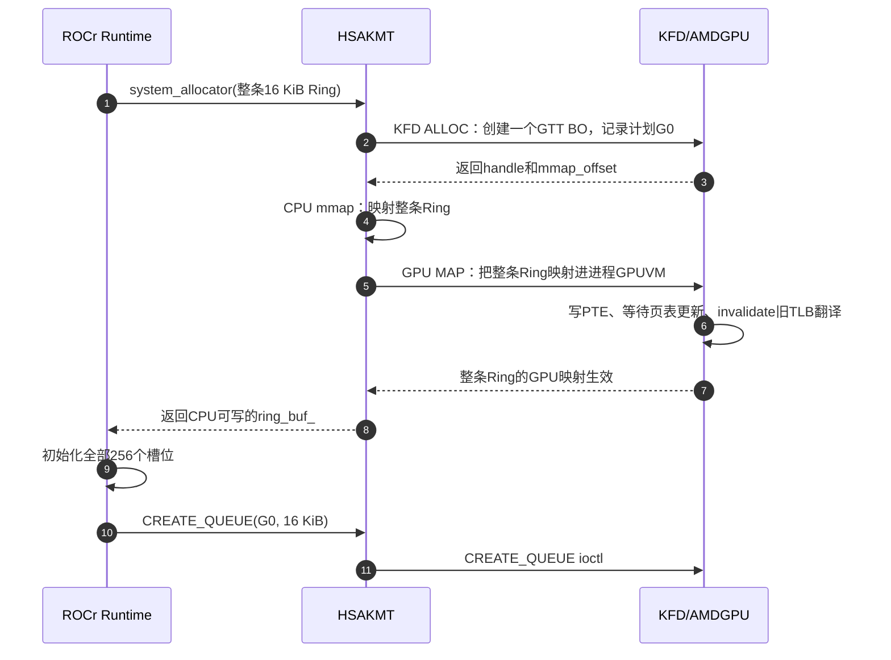
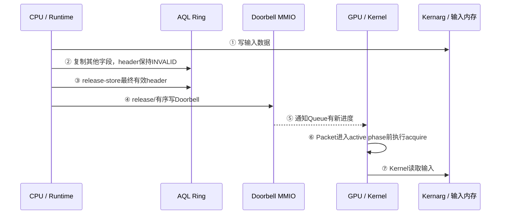
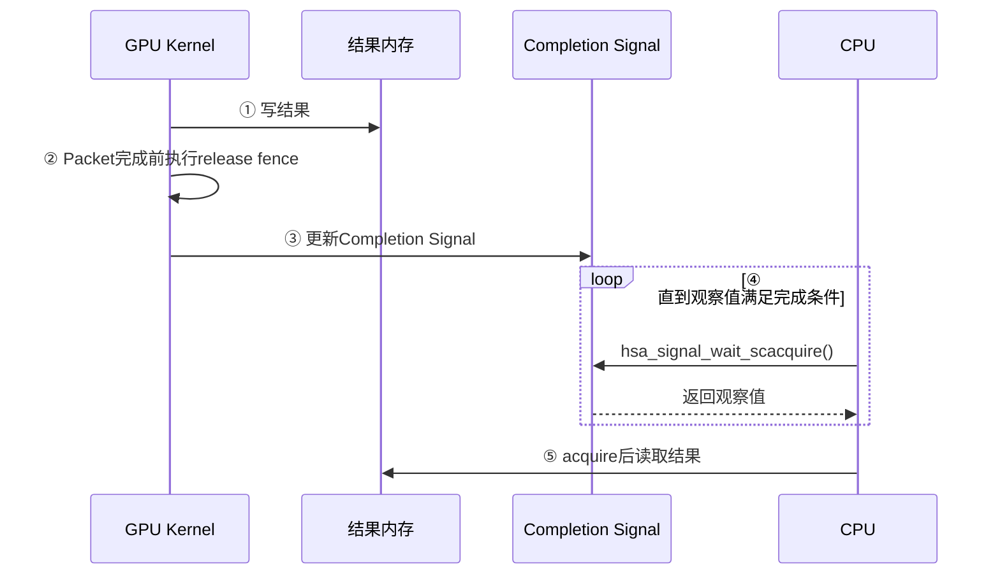

# GPU 内存管理基础

## 缩写表

| 缩写    | 英文全称                                     | 中文含义                                 |
| ------- | -------------------------------------------- | ---------------------------------------- |
| AMDGPU  | AMD GPU Linux Kernel Driver                  | AMD GPU Linux 内核驱动                   |
| AGP     | Accelerated Graphics Port                    | 加速图形端口；GART 名称的历史来源        |
| APU     | Accelerated Processing Unit                  | 集成 CPU 与 GPU 的加速处理器             |
| API     | Application Programming Interface            | 应用程序编程接口                         |
| AQL     | Architected Queuing Language                 | HSA 定义的架构化队列包格式               |
| ASIC    | Application-Specific Integrated Circuit      | 专用集成电路；本文指具体 GPU 芯片/代际   |
| ATC     | Address Translation Cache                    | AMD GPU 地址翻译缓存及相关映射单元       |
| BAR     | Base Address Register                        | PCIe 基址寄存器；用于暴露设备地址窗口    |
| BO      | Buffer Object                                | 驱动用于管理一块缓冲区的对象             |
| CC      | Cache Coherent                               | GPU 可缓存并由硬件参与一致性维护的类型   |
| CLR     | Common Language Runtime                      | ROCm 中承接上层计算接口的运行时层        |
| CP      | Command Processor                            | GPU 命令处理器                           |
| CPSCH   | Command Processor Scheduling                 | 由 GPU 命令处理器调度 Queue 的路径       |
| CPU     | Central Processing Unit                      | 中央处理器                               |
| CU      | Compute Unit                                 | GPU 计算单元                             |
| CWSR    | Compute Wave Save/Restore                    | 计算 Wave 上下文的保存与恢复机制         |
| DMA     | Direct Memory Access                         | 设备直接内存访问                         |
| DMA-BUF | Direct Memory Access Buffer                  | Linux 跨驱动或设备共享缓冲区的机制       |
| DQM     | Device Queue Manager                         | KFD 中管理进程与 Queue 调度状态的模块    |
| DRM     | Direct Rendering Manager                     | Linux 直接渲染管理框架                   |
| EOP     | End of Pipe                                  | 管线末端；Queue 完成状态使用的缓冲区     |
| FB      | Frame Buffer                                 | 帧缓冲；源码中的 FB BAR 指显存窗口       |
| GART    | Graphics Address Remapping Table             | AMDGPU 内核驱动使用的 GPUVM 页表         |
| GEM     | Graphics Execution Manager                   | DRM 的图形内存对象管理框架               |
| GFP     | Get Free Pages                               | Linux 物理页分配标志                     |
| GFXHUB  | Graphics Hub                                 | 图形/计算访问使用的地址翻译 Hub          |
| GMC     | Graphics Memory Controller                   | AMDGPU 中生成内存/PTE属性的内存控制层    |
| GPU     | Graphics Processing Unit                     | 图形处理器                               |
| GPUVA   | GPU Virtual Address                          | GPU 虚拟地址                             |
| GPUVM   | GPU Virtual Memory                           | GPU 虚拟地址空间及其页表                 |
| GTT     | Graphics Translation Tables                  | TTM 管理的 system-resource 内存池        |
| HMM     | Heterogeneous Memory Management              | 异构内存管理                             |
| HQD     | Hardware Queue Descriptor                    | 硬件队列描述状态                         |
| HSA     | Heterogeneous System Architecture            | 异构系统架构                             |
| HSAKMT  | HSA Kernel Mode Thunk                        | ROCr 使用的 HSA 用户态内核接口层         |
| HWS     | Hardware Scheduling                          | 由 GPU 调度固件管理 Queue 驻留的硬件调度 |
| IB      | Indirect Buffer                              | 间接命令缓冲区                           |
| IDR     | ID Radix                                     | Linux 内核中把整数 ID 映射到对象的机制   |
| IOMMU   | Input/Output Memory Management Unit          | 输入/输出内存管理单元                    |
| IOVA    | Input/Output Virtual Address                 | 输入/输出虚拟地址                        |
| ISA     | Instruction Set Architecture                 | 指令集架构                               |
| ioctl   | Input/Output Control                         | 用户态向内核驱动发送控制请求的接口       |
| KFD     | Kernel Fusion Driver                         | Linux AMD GPU 计算驱动接口               |
| Kernarg | Kernel Arguments                             | Kernel Dispatch 使用的参数数据/参数段    |
| KGD     | Kernel Graphics Driver                       | 向 KFD 提供底层 GPU 服务的图形驱动侧     |
| KiB     | Kibibyte                                     | 二进制千字节，1 KiB 等于 1024 字节       |
| LRU     | Least Recently Used                          | 最近最少使用；用于资源回收与淘汰管理     |
| MEC     | Micro Engine Compute                         | AMD GPU 中处理计算队列的命令处理引擎     |
| MES     | Micro Engine Scheduler                       | AMD GPU 的微引擎调度器                   |
| MMIO    | Memory-Mapped Input/Output                   | 内存映射输入/输出                        |
| MMU     | Memory Management Unit                       | 内存管理单元                             |
| MQD     | Memory Queue Descriptor                      | 保存在内存中的队列配置描述               |
| MTYPE   | Memory Type                                  | GPU PTE 中选择缓存/一致性行为的内存类型  |
| NC      | Non-Coherent                                 | GPU 可缓存但不自动保持硬件一致性的类型   |
| NUMA    | Non-Uniform Memory Access                    | 非一致性内存访问                         |
| PA      | Physical Address                             | 物理地址                                 |
| PASID   | Process Address Space ID                     | 进程地址空间标识                         |
| PDD     | Process Device Data                          | KFD 中某个进程在某个 GPU 上的状态        |
| PCI     | Peripheral Component Interconnect            | 外设组件互连标准                         |
| PCIe    | Peripheral Component Interconnect Express    | 高速外设互连总线                         |
| PDE     | Page Directory Entry                         | 页目录项                                 |
| PFN     | Page Frame Number                            | 物理页框编号                             |
| PTE     | Page Table Entry                             | 页表项                                   |
| RAM     | Random Access Memory                         | 随机存取存储器；本文主要指系统内存       |
| ROCr    | ROCm Runtime                                 | ROCm 的 HSA 用户态运行时                 |
| RW      | Read Write                                   | AMD GPU 的读写型 MTYPE                   |
| RWX     | Read, Write, Execute                         | 读、写、执行三类页面访问权限             |
| SC      | Sequential Consistency                       | 顺序一致性内存顺序                       |
| SDMA    | System Direct Memory Access                  | AMD GPU 中负责数据搬运的专用引擎         |
| SFENCE  | Store Fence                                  | x86 中约束先前 store 完成顺序的屏障指令  |
| SG      | Scatter-Gather                               | 分散—聚集页面描述                       |
| SVM     | Shared Virtual Memory                        | 共享虚拟内存                             |
| TLB     | Translation Lookaside Buffer                 | 地址翻译缓存                             |
| TMZ     | Trusted Memory Zone                          | AMD GPU 的受保护/加密内存区域机制        |
| TTM     | Translation Table Maps                       | DRM 的缓冲对象放置和迁移管理器           |
| UC      | Uncached                                     | 当前 GPU 不缓存该内存的类型              |
| UAPI    | User-space Application Programming Interface | 内核提供给用户态的接口                   |
| USERPTR | User Pointer                                 | 使用现有用户态指针及页面的内存路径       |
| VA      | Virtual Address                              | 虚拟地址                                 |
| VMID    | Virtual Memory ID                            | GPU 活动地址空间使用的硬件上下文编号     |
| VRAM    | Video Random-Access Memory                   | GPU 本地显存                             |
| WC      | Write Combining                              | 允许合并写请求的内存类型                 |
| XGMI    | inter-chip Global Memory Interconnect        | AMD GPU/CPU 或 GPU 间的高速互连          |

> 缩写表只用于查阅。正文会在概念首次出现时重新解释，不要求预先背诵。

## 全文大纲

GPU 内存管理不止申请显存，还要处理存储位置、访问地址、映射、生命周期和可见性。

| 章节    | 核心问题                      | AQL 在本章中的位置                   |
| ------- | ----------------------------- | ------------------------------------ |
| 第 0 章 | GPU 内存管理到底要解决什么    | 用一段 16 KiB AQL Ring 固定问题背景  |
| 第 1 章 | CPU 和 GPU 怎样找到真正的数据 | 以 system RAM Ring 为主并对照 VRAM   |
| 第 2 章 | 内存怎样分配、映射并安全释放  | Ring 只演示 Queue 为什么必须持有引用 |
| 第 3 章 | CPU 和 GPU 怎样看见彼此的写入 | Packet→Doorbell 只演示发布顺序      |

> **[BOUNDARY]** 本文聚焦理解 AQL 内存行为所需的接口和对象关系。完整 AQL Dispatch、MQD/HQD、CP/MEC 调度、通用 DRM/GEM/TTM 框架和普通 IB 提交均不展开，相关内容已登记在 [待补充的知识点](./待补充的知识点.md)。

Linux 虚拟地址、物理页、页表和 DMA 的 CPU 侧基础见 [01_Linux 内存管理基础](<./01_Linux 内存管理基础.md>)。本文使用以下源码基线：Linux `248951ddc14de84de3910f9b13f51491a8cd91df`、ROCr `ba56a24c6132c5d195686ae4adf969ca1222fbba`、ROCm CLR `81277d69e3352e7144ced2ee9601484f9b48d950`。

> **源码摘录格式：** 代码块左侧数字是所链接原文件的真实行号，空白源码行也保留行号。不连续的摘录拆成多个代码块；编辑性省略用 `[省略原源码第 x～y 行]` 标记，不把省略说明写成原始源码。代码解释按“整体职责 → 行号分组 → 设计原因 → 与前后路径联动”组织，不逐行复述语法。

## 0. GPU 内存管理要解决什么

### 0.1 一块 GPU 可用内存涉及四个问题

假设程序需要一段 16 KiB、CPU 和 GPU 都能访问的缓冲区。“成功申请了 16 KiB”只说明容量已经取得，还要确认以下问题：

| 问题                     | 要确认什么                                         | 未解决的后果                            |
| ------------------------ | -------------------------------------------------- | --------------------------------------- |
| 数据放在哪里             | system RAM 还是 VRAM；由哪些页面或显存区间承载     | 无法确定数据的实际存储位置              |
| CPU/GPU 使用什么地址     | CPU VA、GPUVA、DMA 地址、IOVA、PA 分别属于谁       | 把不同地址空间中的数字误当成同一地址    |
| 怎样建立访问关系         | CPU 页表、GPU 页表、必要时的 IOMMU 映射是否存在    | 地址存在，但访问会 fault 或到达错误位置 |
| 怎样保证生命周期与可见性 | 使用期间对象和映射是否有效；写入是否按正确顺序可见 | 提前释放、读取旧数据或读取半写入数据    |

这四个问题可以归纳为一条主线：

```text
存储资源已经存在
        ↓
CPU和GPU各自获得可用地址
        ↓
页表或窗口把地址连接到存储资源
        ↓
使用者持有对象和映射，防止资源提前消失
        ↓
同步与缓存规则保证双方看到正确内容
```

“对象”供驱动管理资源和生命周期，“地址”供访问者定位数据；二者都不是数据本身。

### 0.2 CPU 和 GPU 访问内存的总矩阵

本文以带独立 VRAM 的离散 AMD GPU 为主，讨论以下四种常见访问：

| 访问者 | 目标       | 典型路径                                    | 是否经过 PCIe |
| ------ | ---------- | ------------------------------------------- | ------------- |
| CPU    | system RAM | CPU VA → CPU MMU → Host PA → RAM         | 否            |
| CPU    | VRAM       | CPU VA → CPU 页表 → PCIe BAR 窗口 → VRAM | 是            |
| GPU    | system RAM | GPUVA → GPU MMU → DMA 地址 → PCIe → RAM | 是            |
| GPU    | VRAM       | GPUVA → GPU MMU → 本地显存地址 → VRAM    | 否            |

四条路径如下：

```text
CPU访问system RAM                 CPU访问CPU可见VRAM

CPU load/store                    CPU load/store
      ↓                                 ↓
CPU MMU                           CPU MMU
      ↓                                 ↓
Host PA                           BAR映射的MMIO地址
      ↓                                 ↓ PCIe
system RAM                        VRAM


GPU访问system RAM                 GPU访问本地VRAM

GPU load/store或取包              GPU load/store
      ↓                                 ↓
GPU MMU                           GPU MMU
      ↓                                 ↓
DMA地址                           本地显存地址
      ↓ PCIe                            ↓
system RAM                        VRAM
```

从主机平台看，GPU 对 system RAM 的读写属于设备 DMA 访问，但执行者不一定是 SDMA。Shader、命令处理前端和 SDMA 都可以发起访问；其中，SDMA 是专门执行“读源再写目标”的搬运引擎。

是否经过 PCIe，取决于访问是否跨越主机与离散 GPU 的边界：

> 不是所有 CPU↔GPU 内存访问都经过 PCIe。CPU 访问本机 RAM、GPU 访问本地 VRAM 都不经过 PCIe；只有跨越主机与离散 GPU 边界的路径才通常经过 PCIe。

### 0.3 访问、拷贝和通知不是同一件事

这三种动作都可能表现为“写了一个地址”，但作用不同：

| 动作 | 作用                                 | 例子                                         |
| ---- | ------------------------------------ | -------------------------------------------- |
| 访问 | 一个执行者对目标地址做 load/store    | GPU Shader 读取 system RAM 中的输入          |
| 拷贝 | 一个引擎读取源地址，再写入目标地址   | SDMA 把 system RAM 数据搬到 VRAM             |
| 通知 | 写设备控制窗口，告诉硬件状态发生变化 | CPU 写 Doorbell MMIO，通知 Queue 有新 Packet |

```text
直接访问：
GPU读取system RAM中的数据

数据拷贝：
SDMA读system RAM → SDMA写VRAM

通知：
CPU写Doorbell → GPU得知“请检查Ring”
```

Doorbell 不包含 Packet 数据，也不会把 Packet 搬到 GPU。Packet 仍留在 Ring 中，GPU 收到通知后再通过已经建立好的地址映射读取它。

### 0.4 贯穿案例：16 KiB AQL Ring

AQL Ring 的“数据放在哪里”和“通过哪套 GPU 页表访问”是两个独立问题：

```text
数据位置
  ├─ system RAM backing
  └─ VRAM / device-local backing

用户AQL Queue使用时的地址关系
  └─ Ring GPUVA → 当前用户进程的GPUVM → 对应backing
```

后文以一段 16 KiB AQL Ring 贯穿全文。为便于观察 `struct page`、DMA 地址和 Host IOMMU，案例采用 **system RAM backing**，假设如下：

| 项目     | 本文假设                                         |
| -------- | ------------------------------------------------ |
| 数据位置 | 4 个 4 KiB system RAM 页面                       |
| CPU 用途 | ROCr 在 Ring 中填写 AQL Packet                   |
| GPU 用途 | GPU 队列前端读取 Packet                          |
| CPU 地址 | 一段连续 CPU VA                                  |
| GPU 地址 | 一段连续 GPUVA                                   |
| 生命周期 | Queue 存活期间，Ring 的 BO 和 GPUVM 映射保持有效 |
| 可见性   | CPU 发布完整 Packet 后，才写 Doorbell            |

```text
同一份16 KiB Ring数据

CPU侧：CPU VA ──→ 4个system RAM页面
                         ↑
GPU侧：GPUVA ──→ GPU页表 ┘
```

这个例子会反复回答四个问题：

1. 4 个页面怎样被 CPU 和 GPU 分别找到？
2. GPUVA 怎样翻译到这些页面？
3. Queue 使用期间，为什么不能删掉映射或释放 BO？
4. CPU 写完 Packet 后，怎样保证 GPU 读到完整内容？

后文图示使用以下标记：

| 标记                          | 表示什么                                                |
| ----------------------------- | ------------------------------------------------------- |
| `[AQL主线]`                 | 用户 AQL Queue 使用进程 GPUVM 访问 Ring、Kernarg 等资源 |
| `[GPU系统上下文/非AQL对照]` | AMDGPU 内核驱动使用系统 GPU 地址空间的对照路径          |
| `[Host Driver建表阶段]`     | CPU 上运行的驱动创建或修改 GPU 页表                     |
| `[GPU运行阶段]`             | GPU MMU 根据当前地址空间实际遍历页表                    |

> **[BOUNDARY]** 16 KiB 和 system RAM 是本文的教学选择，不是 ROCr 固定的 Ring 大小或 backing。ROCr 也可以使用设备本地内存作为 Ring backing，该分支只在 2.0.4 中作必要对照。完整 Queue 创建和 Kernel Dispatch 不在本例范围内。

## 1. GPU 怎样找到真正的数据

### 1.1 数据可能放在哪里

在当前离散 GPU 模型中，主要有两类物理存储：

| 存储       | 所在位置     | 谁访问更自然 | 典型特点                                      |
| ---------- | ------------ | ------------ | --------------------------------------------- |
| system RAM | 主机内存     | CPU          | CPU 直接访问；GPU 通常经 PCIe/DMA 访问        |
| VRAM       | GPU 本地内存 | GPU          | GPU 本地高带宽访问；CPU 只能访问 BAR 可见部分 |

GPUVA 只表示 GPU 虚拟地址，不指定数据位于 system RAM 还是 VRAM。同一套 GPU 页表中，不同 GPUVA 页面可以分别映射到这两类存储。

AQL Ring 的数据位置不能由名称判断：system RAM Ring 和 VRAM Ring 都可以映射进用户进程的 GPUVM。本文以 system RAM Ring 为贯穿案例，并用 VRAM Ring 作对照。

> **[SOURCE]** Linux `248951ddc14de84de3910f9b13f51491a8cd91df` 的 [`drivers/gpu/drm/amd/amdgpu/amdgpu_vm.c`](./2.源码/linux/drivers/gpu/drm/amd/amdgpu/amdgpu_vm.c) 第 51～58 行写道：

```c
51:  * GPUVM is the MMU functionality provided on the GPU.
52:  * GPUVM is similar to the legacy GART on older asics, however
53:  * rather than there being a single global GART table
54:  * for the entire GPU, there can be multiple GPUVM page tables active
55:  * at any given time.  The GPUVM page tables can contain a mix
56:  * VRAM pages and system pages (both memory and MMIO) and system pages
57:  * can be mapped as snooped (cached system pages) or unsnooped
58:  * (uncached system pages).
```

中文翻译：

```text
GPUVM 是 GPU 提供的 MMU 功能。

GPUVM 页表可以混合包含 VRAM 页面和 system RAM 页面；
system RAM 页面还可以按 snooped（参与缓存一致性观察）
或 unsnooped（不采用这种观察方式）映射。
```

这段注释主要证明两点：

- 第 51～54 行定义 GPUVM 是 GPU 的 MMU 功能。现代 GPU 可以同时激活多套 GPUVM 页表，不再由整块设备共用一张全局 GART，因此每个用户进程可以有自己的 GPUVM。
- 第 55～58 行说明一套 GPUVM 页表的叶子项可以混合指向 VRAM、system RAM 和 MMIO，system RAM 映射还可以选择 snooped 或 unsnooped 属性。GPUVA 只确定从哪套页表、哪个虚拟页开始查，不能单凭地址数值判断 backing 的位置。

`snooped/unsnooped` 描述 system memory 映射的缓存观察属性，不决定是否经过 GPU 页表。第 3 章会再说明它与 coherent、uncached 和同步协议的关系；本节只用它证明同一套 GPUVM 可以容纳目标和属性不同的 PTE。

结论是：

```text
GPUVA范围
├─ 某些PTE → VRAM
└─ 某些PTE → system RAM
```

GPUVA 只说明 GPU 使用哪个虚拟地址，数据位置由最终 PTE 决定。

### 1.2 CPU 和 GPU 分别怎样到达数据

CPU 访问 system RAM 使用普通 CPU 地址翻译，具体过程见 Linux 内存基础：

```text
CPU VA → CPU MMU / CPU页表 → Host PA → system RAM
```

GPU 访问本地 VRAM 仍然可以从 GPUVA 开始，但最终落在 GPU 本地内存系统中：

```text
GPUVA → GPU MMU / GPU页表 → 本地显存地址 → VRAM
```

GPU 访问 system RAM 则跨过离散 GPU 与主机之间的互连：

```text
GPUVA → GPU MMU / GPU页表 → DMA地址 → PCIe → system RAM
```

CPU 访问 VRAM 时，CPU 不能直接使用 GPUVA。驱动要把可见 VRAM 通过 PCIe BAR 暴露到 CPU 的物理/MMIO 地址空间，再由 CPU 页表建立 CPU VA：

```text
CPU VA
  → CPU页表
  → BAR窗口中的主机物理/MMIO地址
  → PCIe
  → VRAM中的目标位置
```

> **[SOURCE]** Linux 的 [`drivers/gpu/drm/amd/amdgpu/amdgpu_gmc.h`](./2.源码/linux/drivers/gpu/drm/amd/amdgpu/amdgpu_gmc.h) 第 223～234 行专门区分 CPU 视角的 aperture 与 GPU 视角的地址：

```c
223: struct amdgpu_gmc {
224: 	/* FB's physical address in MMIO space (for CPU to
225: 	 * map FB). This is different compared to the agp/
226: 	 * gart/vram_start/end field as the later is from
227: 	 * GPU's view and aper_base is from CPU's view.
228: 	 */
229: 	resource_size_t		aper_size;
230: 	resource_size_t		aper_base;
231: 	/* for some chips with <= 32MB we need to lie
232: 	 * about vram size near mc fb location */
233: 	u64			mc_vram_size;
234: 	u64			visible_vram_size;
```

中文翻译：

```text
第224～228行：FB在MMIO空间中的物理地址供CPU映射；
这与agp/gart/vram_start/end等GPU视角字段不同，aper_base属于CPU视角。

第231～232行：对于部分VRAM不超过32 MiB的芯片，
驱动需要对内存控制器FB位置附近所报告的VRAM大小作特殊处理。
```

这组字段把“PCIe 向 CPU 暴露的窗口”和“GPU 自己看到的显存地址”分开保存：

- 第 223 行表明这些字段属于同一个 GMC 状态对象，但它们不是同一种地址。
- 第 224～230 行定义 CPU 侧 aperture：`aper_base` 是 BAR 在 CPU 物理/MMIO 地址空间中的起点，`aper_size` 是这个窗口的长度。CPU 后续 mmap VRAM BO 时依赖这类窗口，而不是使用 GPUVA。
- 第 231～233 行的 `mc_vram_size` 保存内存控制器视角下需要经过芯片特殊规则修正的显存大小；它不是 BAR 长度。
- 第 234 行的 `visible_vram_size` 是驱动最终认定“当前具备 CPU 直访条件”的 VRAM 长度，后面还会受到 BAR、真实 VRAM 大小和模块参数的共同限制。

`aper_*`、`mc_vram_size`、`real_vram_size` 和 `visible_vram_size` 不能互换。它们分别表示 CPU 窗口、内存控制器容量、真实容量和软件可用范围。

这些字段可以分成两层：

```text
硬件/平台提供：aper_base、aper_size
软件最终采用：visible_vram_size
```

> **[SOURCE]** Linux [`drivers/gpu/drm/amd/amdgpu/gmc_v9_0.c`](./2.源码/linux/drivers/gpu/drm/amd/amdgpu/gmc_v9_0.c) 第 1683～1704、1731 行展示调用和返回后的处理：

```c
1683: static int gmc_v9_0_mc_init(struct amdgpu_device *adev)
1684: {
1685: 	int r;
1686:
1687: 	/* size in MB on si */
1688: 	if (!adev->gmc.is_app_apu) {
1689: 		adev->gmc.mc_vram_size =
1690: 			adev->nbio.funcs->get_memsize(adev) * 1024ULL * 1024ULL;
1691: 	} else {
1692: 		DRM_DEBUG("Set mc_vram_size = 0 for APP APU\n");
1693: 		adev->gmc.mc_vram_size = 0;
1694: 	}
1695: 	adev->gmc.real_vram_size = adev->gmc.mc_vram_size;
1696:
1697: 	if (!(adev->flags & AMD_IS_APU) &&
1698: 	    !adev->gmc.xgmi.connected_to_cpu) {
1699: 		r = amdgpu_device_resize_fb_bar(adev);
1700: 		if (r)
1701: 			return r;
1702: 	}
1703: 	adev->gmc.aper_base = pci_resource_start(adev->pdev, 0);
1704: 	adev->gmc.aper_size = pci_resource_len(adev->pdev, 0);
```

```c
1731: 	adev->gmc.visible_vram_size = adev->gmc.aper_size;
```

源码英文内容的中文翻译：第 1687 行说明 SI 路径报告的显存大小单位为兆字节；第 1692 行调试信息表示“对应用型 APU 把 `mc_vram_size` 设为 0”。

这段初始化代码证明，显存容量和 CPU 可见范围分阶段确定：

- 第 1683～1685 行定义 GMC v9 初始化入口和错误返回变量。
- 第 1687～1695 行通过 `adev->nbio.funcs->get_memsize()` 回调读取显存容量并换算为字节；应用型 APU 走单独分支。随后把初始 `real_vram_size` 设为 `mc_vram_size`。这一步确定显存容量，尚未确定 CPU 可见范围。
- 第 1697～1702 行只对非 APU 且不通过 XGMI 连接 CPU 的路径调用 `amdgpu_device_resize_fb_bar()`，因此并非所有 AMD GPU 都会在初始化时调整 PCIe BAR。
- 第 1703～1704 行在调整尝试返回后，通过 PCI 核心重新读取 BAR0 的起点和长度。这里读取的是最终平台状态，而不是继续使用函数调用前的期望值。
- 第 1731 行先令 `visible_vram_size = aper_size`，表示初始 CPU-visible 上限来自实际 BAR 长度；下面的通用 GMC 代码还可能继续缩小它。

第 1699 行先请求调整 BAR，第 1703～1704 行再重新读取资源。只有后一步才把调整结果同步到 `aper_base/aper_size`。

```text
调用amdgpu_device_resize_fb_bar()调整BAR0
  → 返回内存控制器初始化
  → 重新读取BAR0的base和size
  → aper_size = 调整后的BAR长度
  → visible_vram_size先初始化为aper_size
```

> **[SOURCE]** Linux [`drivers/gpu/drm/amd/amdgpu/amdgpu_gmc.c`](./2.源码/linux/drivers/gpu/drm/amd/amdgpu/amdgpu_gmc.c) 第 225～229 行随后还可能缩小这个软件可用长度：

```c
225: 	if (vis_limit && vis_limit < mc->visible_vram_size)
226: 		mc->visible_vram_size = vis_limit;
227:
228: 	if (mc->real_vram_size < mc->visible_vram_size)
229: 		mc->visible_vram_size = mc->real_vram_size;
```

这五行用两个软件上限收紧前面由 BAR 得到的初始可见长度：

- 第 225～226 行先处理用户通过模块参数设置的 `vis_limit`。只有该限制非 0 且比当前值更小时才生效，因此它只能缩小 CPU-visible VRAM，不能凭空扩大硬件 BAR。
- 第 228～229 行再用 `real_vram_size` 封顶，防止可见窗口长度超过真实显存容量。即使平台报告了更大的 BAR，也不能据此访问不存在的 VRAM。

结合前一段第 1731 行，实际计算可以写成 `visible_vram_size = min(aper_size, 非零vis_limit, real_vram_size)`。其中，`vis_limit == 0` 表示不额外施加这一限制。

因此，最终关系是：

```text
visible_vram_size <= aper_size
visible_vram_size <= real_vram_size
```

`visible_vram_size` 表示具备 CPU 直访条件的 VRAM 长度，不表示某个进程已经建立对应的 CPU VA；具体 BO 仍需单独 mmap。

Large BAR 与 Small BAR 的基础区别只在“CPU 一次能看见多少 VRAM”：

| 情况      | CPU 可见范围      | CPU 映射条件                                                       |
| --------- | ----------------- | ------------------------------------------------------------------ |
| Large BAR | 通常覆盖全部 VRAM | 落在可见范围内的 VRAM BO 可建立 CPU 直映射                         |
| Small BAR | 只覆盖较小窗口    | 只有窗口内的 VRAM 可直接映射；其他数据可能需要迁移、换窗或 staging |

> **[SOURCE]** 被调用的 [`drivers/gpu/drm/amd/amdgpu/amdgpu_device.c`](./2.源码/linux/drivers/gpu/drm/amd/amdgpu/amdgpu_device.c) 第 1120～1125、1172～1188 行通过 PCI 核心接口调整 BAR0：

```c
1120: int amdgpu_device_resize_fb_bar(struct amdgpu_device *adev)
1121: {
1122: 	int rbar_size = pci_rebar_bytes_to_size(adev->gmc.real_vram_size);
1123: 	struct pci_bus *root;
1124: 	struct resource *res;
1125: 	int max_size, r;
```

```c
1172: 	/* Limit the BAR size to what is available */
1173: 	max_size = pci_rebar_get_max_size(adev->pdev, 0);
1174: 	if (max_size < 0)
1175: 		return 0;
1176: 	rbar_size = min(max_size, rbar_size);
1177:
1178: 	/* Disable memory decoding while we change the BAR addresses and size */
1179: 	pci_read_config_word(adev->pdev, PCI_COMMAND, &cmd);
1180: 	pci_write_config_word(adev->pdev, PCI_COMMAND,
1181: 			      cmd & ~PCI_COMMAND_MEMORY);
1182:
1183: 	/* Tear down doorbell as resizing will release BARs */
1184: 	amdgpu_doorbell_fini(adev);
1185:
1186: 	r = pci_resize_resource(adev->pdev, 0, rbar_size,
1187: 				(adev->asic_type >= CHIP_BONAIRE) ? 1 << 5
1188: 								  : 1 << 2);
```

源码英文注释的中文翻译：

```text
第1172行：把BAR大小限制在平台实际可提供的范围内。
第1178行：修改BAR地址和大小期间，暂时关闭PCI内存空间解码。
第1183行：调整BAR会释放现有BAR资源，因此先拆除Doorbell相关状态。
```

这两段源码证明，驱动先把期望覆盖的 VRAM 大小转换成平台可接受的 Resizable BAR 编码，再停用相关 PCI 状态并提交资源调整：

- 第 1120～1125 行建立函数入口。第 1122 行以 `real_vram_size` 计算期望的 Resizable BAR 档位；`rbar_size` 在 PCI 接口中是大小编码，不是直接保存字节数。其余局部变量用于后续检查根总线、资源和返回状态。
- 第 1173～1176 行查询 BAR0 支持的最大档位，并用 `min()` 在“覆盖真实 VRAM 的期望档位”和“平台最大档位”之间取较小值。如果平台不支持查询，函数返回 0，含义是保持现状而不是把 BAR 改成 0。
- 第 1178～1184 行在改动资源前关闭 PCI memory decoding，并拆除依赖现有 BAR 的 Doorbell 状态，避免硬件仍按旧 BAR 地址响应访问。
- 第 1186～1188 行调用 `pci_resize_resource()` 修改资源编号 0，也就是 BAR0。最后一个参数是代际相关的资源对齐要求，说明 BAR 调整还受 ASIC 规则约束。

本摘录没有展示函数后半段的错误恢复和重新初始化，因此不能仅凭第 1186 行认定调整一定成功。前面的 `gmc_v9_0_mc_init()` 会在本函数返回后重新读取 BAR0，才得到最终 `aper_base/aper_size`。

`pci_resize_resource(..., 0, ...)` 中的 `0` 表示 PCI BAR0。这个函数不直接修改 `visible_vram_size`；它先调整 BAR0 资源，调用者返回后再读取新的 `pci_resource_len()`，由此更新 `aper_size` 和 `visible_vram_size`。

> **[BOUNDARY]** BAR 只解决 CPU 能否把某段 VRAM 放入自己的地址空间，不保证这种访问与 GPU 本地访问同样快，也不自动解决缓存一致性。

### 1.3 地址不能混为一谈

| 地址      | 谁使用或解释          | 本文采用的含义                    |
| --------- | --------------------- | --------------------------------- |
| CPU VA    | CPU 程序、CPU MMU     | CPU 指令中的虚拟地址              |
| GPUVA     | GPU 引擎、GPU MMU     | 某个 GPUVM 中的虚拟地址           |
| DMA 地址  | 设备和主机 DMA 子系统 | 驱动交给设备使用的统一名称        |
| IOVA      | Host IOMMU            | 启用 IOMMU 转换时的一类 DMA 地址  |
| Host PA   | 主机物理内存系统      | system RAM 页面对应的主机物理地址 |
| VRAM 地址 | GPU 本地内存系统      | GPU 到达本地显存资源所用的地址    |

DMA 地址、IOVA 与 Host PA 容易混淆。DMA 地址是驱动层使用的统一术语；平台为设备启用 Host IOMMU 时，它通常表现为 IOVA。

> **[SOURCE]** Linux [`Documentation/core-api/dma-api-howto.rst`](./2.源码/linux/Documentation/core-api/dma-api-howto.rst) 第 81～88 行解释了有无 IOMMU 的差异：

```text
81: In some simple systems, the device can do DMA directly to physical address
82: Y.  But in many others, there is IOMMU hardware that translates DMA
83: addresses to physical addresses, e.g., it translates Z to Y.  This is part
84: of the reason for the DMA API: the driver can give a virtual address X to
85: an interface like dma_map_single(), which sets up any required IOMMU
86: mapping and returns the DMA address Z.  The driver then tells the device to
87: do DMA to Z, and the IOMMU maps it to the buffer at address Y in system
88: RAM.
```

中文翻译：

```text
在简单系统中，设备可能直接对物理地址Y发起DMA。
在许多其他系统中，IOMMU把DMA地址Z翻译成物理地址Y。

DMA映射接口建立必要的IOMMU映射并返回Z；
驱动让设备访问Z，IOMMU再把它映射到system RAM中的Y。
```

这段规范文字明确了三个地址的分工：

- 第 81～83 行先说明两类平台：简单平台可能让设备直接使用物理地址 `Y`；带 IOMMU 的平台则把设备使用的 DMA 地址 `Z` 再翻译到物理地址 `Y`。
- 第 84～86 行说明驱动把 CPU 可引用的虚拟地址 `X` 交给 DMA API，由 DMA 子系统建立平台所需的映射，并返回设备应该使用的 `Z`。驱动不能跳过 DMA API，凭 CPU VA 自行猜测设备地址。
- 第 86～88 行规定后续交互：驱动只把 `Z` 告诉设备；若存在 IOMMU，硬件再把 `Z` 翻译到承载缓冲区的 `Y`。

`X`、`Z`、`Y` 是同一份数据在三个地址域中的表示：CPU 软件引用、设备 DMA 引用和主机物理位置，并非三套数据或 GPU 页表的三级结构。后文构造 GPU PTE 时使用 DMA API 为当前 GPU 准备的 `Z`；平台 IOMMU 决定是否还需要执行 `Z → Y`。

system RAM 有两种典型路径。

启用 Host IOMMU：

```text
GPUVA
  → GPU MMU
  → DMA地址（本例是IOVA）
  → Host IOMMU
  → Host PA
  → system RAM
```

未启用 Host IOMMU：

```text
GPUVA
  → GPU MMU
  → 直连DMA/总线地址
  → 主机桥
  → system RAM
```

本地 VRAM 的访问路径是：

```text
GPUVA
  → GPU MMU
  → 本地显存地址
  → VRAM
```

两条路径的边界如下：

```text
GPUVA不是IOVA
IOVA不是CPU VA
DMA地址不保证等于Host PA
GPU PTE的目标也不一定是IOVA
```

### 1.4 GPU 地址翻译

下图汇总 GPU MMU、GPU 页表、PTE、GPU TLB 和 Host IOMMU。案例中，GPU 访问位于 system RAM 的 AQL Ring 第 0 页，且 Host IOMMU 已启用。

```text
[AQL主线：system RAM Ring]
```

```text
GPU引擎发出 GPUVA 0x1000_0120
        │
        ▼
GPU TLB查询
   ┌────┴────┐
   │命中     │未命中
   ▼         ▼
缓存的翻译   从根页表逐级查找
                  │
                  ▼
              最终GPU PTE
                  │ 地址部分：IOVA 0x1234_5000
                  │ 属性：VALID/SYSTEM/READABLE...
                  ▼
翻译结果 0x1234_5120
        │
        ▼
Host IOMMU：IOVA → Host PA
        │
        ▼
system RAM第0页内偏移0x120
```

GPU MMU 负责解释 GPUVA；Host IOMMU 只在设备访问主机内存时解释 IOVA。两者不是同一个 MMU，也不查询同一套页表。

如果 AQL Ring 位于 VRAM，它仍使用该用户进程的 GPUVM。PTE 直接指向本地显存地址，不经过 Host IOMMU：

```text
[AQL主线：VRAM Ring]

Ring GPUVA
  → 当前用户进程的GPUVM页表
  → PTE中的VRAM本地地址
  → GPU本地内存系统
  → VRAM中的Ring数据
```

两条 AQL 路径的区别只在 PTE 目标，均不需要先经过 VMID 0 的内核 GART 页表。

PTE 保存目标页面地址和访问属性，不保存缓冲区数据。

> **[SOURCE]** Linux 的 [`drivers/gpu/drm/amd/amdgpu/amdgpu_vm.h`](./2.源码/linux/drivers/gpu/drm/amd/amdgpu/amdgpu_vm.h) 第 57～68 行列出一部分 PTE 属性：

```c
57: #define AMDGPU_PTE_VALID	(1ULL << 0)
58: #define AMDGPU_PTE_SYSTEM	(1ULL << 1)
59: #define AMDGPU_PTE_SNOOPED	(1ULL << 2)
60:
61: /* RV+ */
62: #define AMDGPU_PTE_TMZ		(1ULL << 3)
63:
64: /* VI only */
65: #define AMDGPU_PTE_EXECUTABLE	(1ULL << 4)
66:
67: #define AMDGPU_PTE_READABLE	(1ULL << 5)
68: #define AMDGPU_PTE_WRITEABLE	(1ULL << 6)
```

源码英文注释的中文翻译：第 61 行的 `RV+` 表示该定义适用于 RV 及后续相关代际；第 64 行的 `VI only` 表示紧随其后的定义在这里标注为 VI 代际专用。具体 PTE 位是否生效仍要结合目标 ASIC 的 GMC 实现，不能只看通用宏名。

这些宏为 64 位 PTE 的低位属性建立软件名称：

- 第 57 行的 `VALID` 决定该 PTE 是否能作为有效翻译使用。地址字段里即使已经有数值，没有有效位也不能被当成正常映射。
- 第 58 行的 `SYSTEM` 区分目标是否属于 system memory；它会影响后续如何解释 PTE 地址部分以及使用哪类内存通路。
- 第 59 行的 `SNOOPED` 描述 system memory 映射的缓存观察属性，不负责建立 release/acquire 顺序。
- 第 61～65 行展示代际相关属性：`TMZ` 与受保护/加密内存有关，`EXECUTABLE` 控制取指权限。注释本身提醒读者，同一位号的使用条件可能随 ASIC 改变。
- 第 67～68 行分别允许读取和写入。硬件 Page Walker 得到 PTE 后，会取出地址并检查本次访问是否符合这些权限。

这些宏只定义通用的 PTE 属性位。生成硬件 PTE 时，驱动还要结合 software mapping 中的 flags、backing 类型和对应 GMC/ASIC 的编码规则。PTE 不能简单写成 DMA 地址与 `mapping->flags` 的按位或。

`VALID` 表示映射有效，`SYSTEM` 表示目标是 system memory，`READABLE`、`WRITEABLE`、`EXECUTABLE` 表示访问权限。地址部分在不同目标下含义不同：

| PTE 映射目标             | PTE 地址部分可怎样理解 | 后续是否经过 Host IOMMU |
| ------------------------ | ---------------------- | ----------------------- |
| system RAM，IOMMU 开启   | DMA 地址，通常是 IOVA  | 是                      |
| system RAM，IOMMU 未开启 | 直连 DMA/总线地址      | 否                      |
| 本地 VRAM                | GPU 本地显存地址       | 否                      |

**GPU 运行时怎样使用已建立的映射**

此时 GPU 页表已经建立，例如第 2 页的 PTE 已保存 `D2`。访问由 GPU 正在执行的 ISA load/store 指令触发。

> **[SOURCE]** ROCr [`libhsakmt/tests/kfdtest/src/ShaderStore.cpp`](./2.源码/rocr-runtime/libhsakmt/tests/kfdtest/src/ShaderStore.cpp) 第 1162～1169 行保存了一段实际测试 Shader，其中包含：

```cpp
1162: #define WATCH_START SHADER_START SHADER_MACROS_U32\
1163:     "v_mov_b32 v0, s0\n"\
1164:     "v_mov_b32 v1, s1\n"\
1165:     "v_mov_b32 v2, s2\n"\
1166:     "v_mov_b32 v3, s3\n"\
1167:     "flat_load_dword v4, v[2:3]\n"\
1168:     "s_waitcnt vmcnt(0) & lgkmcnt(0)\n"\
1169:     "v_mov_b32 v5, 0\n"\
```

这段测试 Shader 构造了一条真实 GPU load，并在继续使用结果前等待相关访存完成：

- 第 1162 行定义 `WATCH_START` 宏，并把公共 Shader 开头和 32 位辅助宏拼接进同一段 ISA 字符串。行尾反斜杠只是 C/C++ 预处理器续行，不是 GPU 指令的一部分。
- 第 1163～1166 行把标量寄存器 `s0～s3` 中的四个 32 位输入复制到向量寄存器 `v0～v3`。后面的 `v[2:3]` 会把 `v2`、`v3` 组合成一个 64 位地址操作数。
- 第 1167 行的 `flat_load_dword` 从 `v[2:3]` 指定的 GPU 虚拟地址读取一个 32 位 dword，并把返回值放入 `v4`。从这一行开始，地址才进入 GPU TLB/Page Walker 和内存系统；前面的 `v_mov_b32` 只是在准备寄存器。
- 第 1168 行等待向量内存与相关本地/标量内存计数达到要求，防止后续指令在 load 结果尚未返回时继续使用 `v4`。它等待的是访存完成，不负责创建 PTE，也不负责 TLB invalidate。
- 第 1169 行开始初始化后续测试使用的另一个向量寄存器；它不参与本节所解释的这次地址翻译。

这段源码与驱动建表路径的联系是：驱动提前准备 `v[2:3]` 中地址对应的 GPU PTE，Shader 执行到第 1167 行时才由硬件使用该映射。每次执行 `flat_load_dword` 时，都不会再次调用 Linux C 函数。

这两条 GPU ISA 的含义是：

```text
flat_load_dword v4, v[2:3]
  → 从v2:v3给出的64位GPU虚拟地址读取一个32位值
  → 返回值放入v4

s_waitcnt vmcnt(0) & lgkmcnt(0)
  → 等待前面的访存操作完成
```

假设 `v2:v3` 中保存的是第 2 页内某个 GPUVA，GPU 发出 load 后，地址翻译完全由硬件继续完成：

```text
GPU Wave执行flat_load_dword
        │ 输入：GPUVA G2
        ▼
GPU TLB查询
   ┌────┴────┐
   │命中     │未命中
   ▼         ▼
直接得到D2   GPU Page Walker从当前页表根开始遍历
                  │
                  ▼
              读取第2页PTE
                  │
                  ├─ 检查VALID/READABLE等属性
                  └─ 取出地址D2并填入GPU TLB
        ┌─────────┘
        ▼
GPU使用D2发起system RAM访问
        │
        ├─ Host IOMMU开启：D2是IOVA，再翻译为Host PA
        └─ Host IOMMU关闭：D2是直连DMA/总线地址
        ▼
system RAM返回数据
        ▼
load结果写入v4
```

因此，“GPU 取出 `D2`”有两种情况：TLB 命中时从 TLB 直接得到；TLB 未命中时由硬件 Page Walker 读取 PTE 后得到。GPU 不会在这里调用 `amdgpu_vm_map_gart()` 或其他 Linux C 函数。

> **[BOUNDARY]** 能看到的软件代码是 `flat_load_dword` 这样的 GPU ISA。TLB 查询和 Page Walker 遍历是 GPU MMU 的硬件行为，没有对应的 Linux C 调用栈。AQL Ring 由 CP/MEC 而不是 Shader 读取，但它使用同一套 GPUVM/TLB 翻译机制；完整取包路径留到后续 AQL Dispatch 章节。

GPU TLB 只是翻译结果缓存，不是页表。页表修改后，如果旧 TLB 项仍有效，GPU 可能继续使用旧目标：

```text
旧状态：GPUVA G → PTE → 页面P0
                    TLB也缓存G → P0

修改后：GPUVA G → 新PTE → 页面P1
                    TLB仍缓存G → P0
```

正确顺序是：

```text
写完新PTE
  → 等待页表更新完成并可见
  → 使对应GPU TLB旧翻译失效
  → GPU再次访问时重新遍历页表
```

TLB invalidation 清除的是“旧地址翻译”，不是清空 Ring 或 Kernel 数据。第 2 章会在 `MAP_MEMORY_TO_GPU` 路径中看到“同步页表更新后再使旧 TLB 翻译失效”。

### 1.5 地址空间怎样被选择

#### 1.5.1 这里的“进程”是谁

同一个 GPUVA 数值可以在不同用户进程中指向不同数据，所以 GPU MMU 在查页表前必须知道“使用哪套地址空间”。

这里的“进程”专指**运行应用程序和 ROCr/HIP 运行时的 Linux 用户进程**。Host Driver 和 GPU 内部执行状态不属于这个概念：

```text
Linux用户进程
├─ 应用程序
├─ ROCr/HIP运行时库（运行在同一个用户进程中）
├─ CPU地址空间：Linux mm_struct
└─ 驱动为它维护的GPU地址空间：GPUVM
```

Host Driver 中的 KFD/AMDGPU 代码运行在内核态，代表用户进程建立映射；GPU 负责执行 Queue、Packet 和 Wave。本节所说的“进程”专指 Linux 用户进程。

> **[SOURCE]** Linux [`drivers/gpu/drm/amd/amdkfd/kfd_priv.h`](./2.源码/linux/drivers/gpu/drm/amd/amdkfd/kfd_priv.h) 第 906～919 行把 `kfd_process` 与 Linux 的 `mm_struct` 联系起来：

```c
906: /* Process data */
907: struct kfd_process {
908: 	/*
909: 	 * kfd_process are stored in an mm_struct*->kfd_process*
910: 	 * hash table (kfd_processes in kfd_process.c)
911: 	 */
912: 	struct hlist_node kfd_processes;
913:
914: 	/*
915: 	 * Opaque pointer to mm_struct. We don't hold a reference to
916: 	 * it so it should never be dereferenced from here. This is
917: 	 * only used for looking up processes by their mm.
918: 	 */
919: 	void *mm;
```

源码英文注释的中文翻译：

```text
第906行：进程数据。
第909～910行：kfd_process保存在以mm_struct指针和kfd_process指针组织的哈希表中。
第915～917行：mm是指向mm_struct的不透明指针；这里不持有其引用，
因此不能在此处解引用，它只用于按mm查找进程。
```

这段定义说明 KFD 怎样把自己的进程对象与 Linux 用户进程身份关联起来：

- 第 907～912 行定义 `kfd_process`，并通过 `kfd_processes` 哈希节点把它登记进 KFD 的进程查找表。
- 第 914～919 行保存 `mm_struct` 的地址作为查找键，用于标识用户进程的 CPU 地址空间。字段类型是 `void *`，注释明确禁止直接解引用，因为该字段不拥有 `mm_struct` 的生命周期。

KFD 所说的 process 对应发起 GPU 工作的 Linux 用户进程。`kfd_process->mm` 只建立身份关联；GPU 不会直接遍历该 `mm_struct`，这个指针也不是 GPUVM 页表。

PASID（Process Address Space ID，进程地址空间标识）是 GPU 用来区分“当前访问属于哪个用户进程地址空间”的编号。在当前 Linux 版本中，这个编号保存在对应的“进程—GPU 设备”状态 `kfd_process_device` 中。

> **[SOURCE]** 同一文件第 763～769、876～879 行：

```c
763: /* Data that is per-process-per device. */
764: struct kfd_process_device {
765: 	/* The device that owns this data. */
766: 	struct kfd_node *dev;
767:
768: 	/* The process that owns this kfd_process_device. */
769: 	struct kfd_process *process;
```

```c
876: 	u32 pasid;
877: 	/* Indicates this process has requested PTL stay disabled */
878: 	bool ptl_disable_req;
879: };
```

源码英文注释的中文翻译：第 763 行说明这份数据按进程和设备各有一份。第 765 行的 `dev` 是拥有该状态的设备，第 768 行的 `process` 是拥有该 `kfd_process_device` 的进程。第 877 行的布尔字段记录进程是否要求持续禁用 PTL，与当前 PASID 主线无关。

这两个不连续片段共同证明，PDD 由进程和 GPU 共同确定：

- 第 764～769 行把目标 KFD 设备和所属 `kfd_process` 同时保存在一个 `kfd_process_device` 中。同一个 Linux 进程使用两块 GPU 时，会有两份不同的 PDD。
- 第 876 行的 `pasid` 属于这个“进程—设备”上下文。后文简称“进程的 PASID”，指该进程在当前 GPU/PDD 上标识地址空间所用的 PASID。
- 第 877～879 行证明结构体还保存许多与当前概念无关的设备级进程状态；摘出 `pasid` 不代表 PDD 只包含三个字段。

PASID 长期标识进程地址空间；Queue 驻留时，有限的 VMID 槽位再关联相应 PASID 和根页表。

| 名称         | 角色                                                |
| ------------ | --------------------------------------------------- |
| GPUVM        | Host Driver 为用户进程维护的 GPU 虚拟地址空间及页表 |
| PASID        | 标识用户进程在当前 GPU 上所用地址空间的身份编号     |
| VMID         | GPU 当前活动翻译上下文使用的有限硬件槽位编号        |
| 页表根寄存器 | 告诉 GPU MMU：这个 VMID 的根页表在哪里              |

关系可以概括为：

```text
PASID回答：“这是谁的地址空间？”
VMID回答： “当前硬件用哪个活动槽位执行它？”
根页表寄存器回答：“这套页表从哪里开始？”
```

#### 1.5.2 HWS 与非 HWS 是什么，为什么同时存在

HWS 与非 HWS 区分 **Queue 由谁调度并放到 GPU 上运行**。两条路径不改变内存类型或 GPU 页表格式。

| 调度路径 | 谁维护 Queue 驻留和 VMID 分配                                           | 说明重点                                            |
| -------- | ----------------------------------------------------------------------- | --------------------------------------------------- |
| 非 HWS   | Host Driver 直接选择 VMID、配置地址空间并装载硬件 Queue                 | Linux C 代码能完整展示 VMID 选择与释放过程          |
| HWS      | Host Driver 提交进程和 Queue 信息，GPU 调度固件管理实际驻留与 VMID 槽位 | 更接近固件调度路径，但固件内部实现不在 Linux 源码中 |

两条路径最终都要形成相同的地址翻译状态：运行中的 Queue 使用某个 VMID，该 VMID 对应进程的 PASID 和 GPUVM 根页表。

如果只用一行箭头表示，HWS 的输入和调度结果容易混在一起。完整关系如下：

```text
非HWS：Host Driver直接决定具体VMID

用户Queue
  → KFD Host Driver选择具体VMID N
  → 配置VMID N ↔ PASID 42
  → 配置VMID N的根页表 = R
  → 把MQD装载到HQD
  → Queue运行

HWS：Host Driver提供输入，GPU调度固件决定具体VMID

Host Driver提交三类输入
  ├─ SET_RESOURCES：可用VMID集合 = vmid_mask
  ├─ MAP_PROCESS：PASID = 42，根页表 = R
  └─ MAP_QUEUES：Queue / MQD
          │
          ▼
GPU调度固件
  → 从vmid_mask中选择具体VMID N
  → 配置VMID N ↔ PASID 42
  → 配置VMID N的根页表 = R
  → 把Queue装载到HQD
  → Queue运行
```

> **[SOURCE]** Linux [`drivers/gpu/drm/amd/amdkfd/kfd_packet_manager.c`](./2.源码/linux/drivers/gpu/drm/amd/amdkfd/kfd_packet_manager.c) 第 188～201、223～242 行展示 HWS runlist 先构造进程映射，再构造用户 Queue 映射：

```c
188: 		/* build map process packet */
189: 		if (processes_mapped >= pm->dqm->processes_count) {
190: 			dev_dbg(dev, "Not enough space left in runlist IB\n");
191: 			pm_release_ib(pm);
192: 			return -ENOMEM;
193: 		}
194:
195: 		retval = pm->pmf->map_process(pm, &rl_buffer[rl_wptr], qpd);
196: 		if (retval)
197: 			return retval;
198:
199: 		processes_mapped++;
200: 		inc_wptr(&rl_wptr, pm->pmf->map_process_size,
201: 				alloc_size_bytes);
```

第 202～222 行以相同模式处理活动的内核私有 Queue。本节只对照用户 Queue，因此下一段从第 223 行继续。

```c
223: 		list_for_each_entry(q, &qpd->queues_list, list) {
224: 			if (!q->properties.is_active)
225: 				continue;
226:
227: 			dev_dbg(dev,
228: 				"static_queue, mapping user queue %d, is debug status %d\n",
229: 				q->queue, qpd->is_debug);
230:
231: 			retval = pm->pmf->map_queues(pm,
232: 						&rl_buffer[rl_wptr],
233: 						q,
234: 						qpd->is_debug);
235:
236: 			if (retval)
237: 				return retval;
238:
239: 			inc_wptr(&rl_wptr,
240: 				pm->pmf->map_queues_size,
241: 				alloc_size_bytes);
242: 		}
```

源码英文内容的中文翻译：第 188 行表示“构造映射进程的 Packet”；第 190 行表示“runlist IB 剩余空间不足”；第 228 行调试信息表示“正在映射某条用户 Queue，并记录其调试状态”。

这两段代码证明，固件要求先写入进程地址空间信息，再写入使用该地址空间的 Queue 信息：

- 第 188～193 行先检查 runlist 是否有空间容纳另一个进程 Packet。空间不足时释放当前 IB 并返回，避免生成只包含部分进程或 Queue 的截断 runlist。
- 第 195～201 行通过代际函数表 `pmf->map_process` 把 `qpd` 中的 PASID、根页表等进程级信息编码到 `rl_buffer[rl_wptr]`，成功后增加进程计数并按 Packet 大小推进写指针。
- 第 223～225 行遍历该进程的用户 Queue，只把 `is_active` 的 Queue 放入本次 runlist；非活动 Queue 不需要固件驻留。
- 第 231～241 行再调用 `map_queues` 编码 Queue/MQD 信息。每成功写入一个 Packet 都推进 `rl_wptr`，所以下一条 Packet 不会覆盖前一条。

执行顺序是：固件先通过 `MAP_PROCESS` 得到 PASID 和根页表所属的进程，再通过 `MAP_QUEUES` 得到使用该进程状态的 Queue。1.5.5.6 将用最小源码验证 `vmid_mask`、PASID 和根页表的具体输入。

> **[BOUNDARY]** 图使用当前 Linux 源码中 CP 固件调度路径的 `SET_RESOURCES`、`MAP_PROCESS` 和 `MAP_QUEUES` 名称。不同代际或更新的调度固件接口可能使用不同命令，但“驱动提供 PASID、根页表和可用 VMID 范围，调度者决定具体 VMID”这一职责边界不变。

KFD 同时保留两条路径，原因如下：

1. **GPU 代际和固件能力不同。** 某些旧 GPU 不具备可用的 HWS 调度能力，只能由 Host Driver 直接管理 Queue、VMID 和 HQD。
2. **HWS 依赖及时换出 Queue 的能力。** 例如 CWSR（Compute Wave Save/Restore，计算 Wave 保存与恢复）用于保存运行中的 Wave 状态，让调度固件可以换出一个进程并把有限的 VMID、HQD 交给另一个进程。
3. **支持 HWS 的 GPU 也可能主动选择非 HWS。** HWS 是默认路径；非 HWS 仍被保留为调试方式，使驱动可以静态地把 Queue 分配给 HQD，直接观察和控制硬件状态。

因此，不能把 HWS 简单理解成一个名为“HWS”的独立寄存器或单独硬件模块。它是一套依赖 GPU 命令处理器、调度固件、Queue 抢占和 CWSR 等能力的调度机制。

> **[SOURCE]** Linux [`drivers/gpu/drm/amd/amdkfd/kfd_device_queue_manager.c`](./2.源码/linux/drivers/gpu/drm/amd/amdkfd/kfd_device_queue_manager.c) 第 3114～3128 行展示驱动怎样根据具体 GPU 能力强制选择非 HWS：

```c
3114: 	switch (dev->adev->asic_type) {
3115: 	/* HWS is not available on Hawaii. */
3116: 	case CHIP_HAWAII:
3117: 	/* HWS depends on CWSR for timely dequeue. CWSR is not
3118: 	 * available on Tonga.
3119: 	 *
3120: 	 * FIXME: This argument also applies to Kaveri.
3121: 	 */
3122: 	case CHIP_TONGA:
3123: 		dqm->sched_policy = KFD_SCHED_POLICY_NO_HWS;
3124: 		break;
3125: 	default:
3126: 		dqm->sched_policy = sched_policy;
3127: 		break;
3128: 	}
```

源码英文注释的中文翻译：Hawaii 不提供 HWS。HWS 依赖 CWSR 及时让 Queue 出队，而 Tonga 不具备 CWSR。`FIXME` 说明同一理由也适用于 Kaveri，但源码作者认为这里仍有待完善。

这段分支先应用硬件能力约束，再读取用户配置：

- 第 3114 行按 `asic_type` 区分 GPU 代际。
- 第 3115～3123 行让 Hawaii 和 Tonga 共用同一赋值分支，强制选择 `KFD_SCHED_POLICY_NO_HWS`。两个 `case` 之间没有 `break` 是有意的 fall-through，不是遗漏。
- 第 3124 行结束强制非 HWS 分支；第 3125～3128 行说明其他 ASIC 才使用模块参数 `sched_policy`，然后结束整个 `switch`。

用户配置只能在硬件支持范围内选择策略。即使参数要求 HWS，缺少所需固件/CWSR 能力的 GPU 仍会被驱动切换到非 HWS。进入 `default` 只表示可以采用参数值，不表示该 GPU 此时已有 Queue 驻留。

> **[SOURCE]** Linux [`drivers/gpu/drm/amd/amdgpu/amdgpu_drv.c`](./2.源码/linux/drivers/gpu/drm/amd/amdgpu/amdgpu_drv.c) 第 736～745 行定义 `sched_policy`：

```c
736: /**
737:  * DOC: sched_policy (int)
738:  * Set scheduling policy. Default is HWS(hardware scheduling) with over-subscription.
739:  * Setting 1 disables over-subscription. Setting 2 disables HWS and statically
740:  * assigns queues to HQDs.
741:  */
742: int sched_policy = KFD_SCHED_POLICY_HWS;
743: module_param_unsafe(sched_policy, int, 0444);
744: MODULE_PARM_DESC(sched_policy,
745: 	"Scheduling policy (0 = HWS (Default), 1 = HWS without over-subscription, 2 = Non-HWS (Used for debugging only)");
```

源码英文注释和参数说明的中文翻译：

```text
sched_policy=0：HWS，允许超额订阅，也是默认值
sched_policy=1：HWS，但禁止超额订阅
sched_policy=2：关闭HWS，静态地把Queue分配给HQD，主要用于调试
```

这段定义把调度策略暴露为 AMDGPU 模块参数，并给出默认值和三个可选值的含义：

- 第 736～741 行的内核文档注释明确默认策略是“允许超额订阅的 HWS”，并说明值 1、2 的差异。
- 第 742 行把全局变量初始化为 `KFD_SCHED_POLICY_HWS`，因此用户未传参时选择值 0。
- 第 743 行用 `module_param_unsafe()` 注册整型参数；权限 `0444` 表示运行中的 sysfs 节点只读，通常在模块加载或内核启动参数阶段决定，不能把它理解成每次创建 Queue 都能动态切换。
- 第 744～745 行提供用户可见的参数描述，记录 `0/1/2` 与三种策略的映射。

应用顺序是：模块参数先确定全局 `sched_policy`，DQM 初始化时再根据芯片能力决定采用该值还是强制改为 `NO_HWS`。

这里的“超额订阅”是指待运行的进程或 Queue 多于当前可同时驻留的 VMID、HQD 数量。HWS 可以让调度固件换入、换出 Queue 来复用有限硬件槽位；非 HWS 则由 Host Driver 进行较静态、直接的分配。

选择关系如下：

```text
当前GPU缺少HWS所需能力
  → 驱动强制使用非HWS

当前GPU支持HWS
  → 默认HWS并允许超额订阅
  → 也可禁止超额订阅
  → 调试时可以主动切到非HWS
```

Linux 源码把两条路径分成不同的 Queue 操作函数。函数名中的 `nocpsch` 表示不使用 CP 固件调度；`cpsch` 表示使用 CP 调度路径。

> **[SOURCE]** Linux [`drivers/gpu/drm/amd/amdkfd/kfd_device_queue_manager.c`](./2.源码/linux/drivers/gpu/drm/amd/amdkfd/kfd_device_queue_manager.c) 第 3131～3163 行根据调度策略选择不同的创建和销毁函数：

```c
3131: 	switch (dqm->sched_policy) {
3132: 	case KFD_SCHED_POLICY_HWS:
3133: 	case KFD_SCHED_POLICY_HWS_NO_OVERSUBSCRIPTION:
3134: 		/* initialize dqm for cp scheduling */
3135: 		dqm->ops.create_queue = create_queue_cpsch;
3136: 		dqm->ops.initialize = initialize_cpsch;
3137: 		dqm->ops.start = start_cpsch;
3138: 		dqm->ops.stop = stop_cpsch;
3139: 		dqm->ops.halt = halt_cpsch;
3140: 		dqm->ops.unhalt = unhalt_cpsch;
3141: 		dqm->ops.destroy_queue = destroy_queue_cpsch;
3142: 		dqm->ops.update_queue = update_queue;
3143: 		dqm->ops.register_process = register_process;
3144: 		dqm->ops.unregister_process = unregister_process;
3145: 		dqm->ops.uninitialize = uninitialize;
3146: 		dqm->ops.create_kernel_queue = create_kernel_queue_cpsch;
3147: 		dqm->ops.destroy_kernel_queue = destroy_kernel_queue_cpsch;
3148: 		dqm->ops.set_cache_memory_policy = set_cache_memory_policy;
3149: 		dqm->ops.process_termination = process_termination_cpsch;
3150: 		dqm->ops.evict_process_queues = evict_process_queues_cpsch;
3151: 		dqm->ops.restore_process_queues = restore_process_queues_cpsch;
3152: 		dqm->ops.get_wave_state = get_wave_state;
3153: 		dqm->ops.reset_queues = reset_queues_cpsch;
3154: 		dqm->ops.get_queue_checkpoint_info = get_queue_checkpoint_info;
3155: 		dqm->ops.checkpoint_mqd = checkpoint_mqd;
3156: 		dqm->ops.set_perfcount = set_perfcount;
3157: 		break;
3158: 	case KFD_SCHED_POLICY_NO_HWS:
3159: 		/* initialize dqm for no cp scheduling */
3160: 		dqm->ops.start = start_nocpsch;
3161: 		dqm->ops.stop = stop_nocpsch;
3162: 		dqm->ops.create_queue = create_queue_nocpsch;
3163: 		dqm->ops.destroy_queue = destroy_queue_nocpsch;
```

源码英文注释的中文翻译：第 3134 行表示“为 CP 调度路径初始化 DQM”；第 3159 行表示“为不使用 CP 调度的路径初始化 DQM”。

这段代码只为 `dqm->ops` 选择并安装后续使用的函数实现。Queue 的创建发生在以后：通用代码调用 `dqm->ops.create_queue()` 时，才进入对应的 HWS 或非 HWS 实现。

- 第 3131～3133 行把允许超额订阅和禁止超额订阅的两种 HWS 策略合并到同一 CP 调度操作表。两者的 Queue 创建/销毁机制相同，差异由更上层的驻留策略控制。
- 第 3134～3148 行安装 HWS 下的初始化、启停、Queue 创建与销毁、进程登记和内核 Queue 操作。通用代码调用 `dqm->ops.create_queue()` 时，实际执行 `create_queue_cpsch()`。
- 第 3149～3156 行继续安装进程终止、Queue 驱逐/恢复、Wave 状态、重置、checkpoint 和性能计数等 HWS 操作。这些操作覆盖 Queue 的完整生命周期，不限于创建时多发送一个 Packet。
- 第 3158～3163 行为 `NO_HWS` 安装直接管理路径的启停、创建和销毁函数；当前摘录到此结束，源文件后面还会继续填充该分支的其他操作。

`cpsch` 与 `nocpsch` 后缀标记函数实现路径，不表示新的 Queue 或内存对象类型。非 HWS 的 `allocate_vmid()` 只属于 `nocpsch` 分支，不能推广到 HWS 操作表。

后文的 `allocate_vmid()` 和 `vmid_pasid[]` 仅用于验证非 HWS 的 VMID 占用逻辑。它们不能证明所有 AQL Queue 都由 Host Driver 直接分配 VMID。1.5.5.6 将说明 HWS 如何把资源范围、PASID 和根页表交给调度固件。

#### 1.5.3 用户进程、Host Driver 和 GPU 各自做什么

用户进程不会直接填写 GPU PTE。它通过 ROCr/KFD 请求分配和映射内存，由 Host Driver 建立该进程的 GPUVM 页表。Host Driver 只映射 GPU 当前需要访问的范围，不会预先映射“所有内存”。

```text
Linux用户进程打开GPU设备（应用程序+ROCr/HIP）
  │
  │ AMDGPU驱动从软件编号池分配PASID 42
  ▼
驱动创建该进程的GPUVM，记录PASID 42和根页表R
  │
  │ 用户进程请求分配、映射内存和创建Queue
  ▼
Host Driver为所需范围填写GPU PTE
  │
  │ Ring、Kernel代码、Kernarg、数据、Signal获得GPUVA
  ▼
Queue准备运行，驱动或GPU调度固件选择VMID 5
  │
  ├─ 配置VMID 5 ↔ PASID 42
  └─ 配置VMID 5的根页表地址 = R
  ▼
CPU把包含这些GPUVA的AQL Packet写入Ring，再写Doorbell
  │
  ▼
GPU使用VMID 5读取Packet和GPUVM页表
  │
  ▼
沿着Packet中的GPUVA访问代码、参数和数据
```

AQL Packet 描述任务并保存资源的 GPUVA，例如 `kernel_object`、`kernarg_address` 和 `completion_signal`。它不会把整个用户进程或全部资源复制给 GPU。Host Driver 预先把相应范围映射进用户进程的 GPUVM 后，GPU 才能访问这些地址。

这里涉及两套不同的页表：

```text
CPU指令使用CPU VA → CPU MMU读取Linux CPU页表（mm_struct）
GPU指令使用GPUVA  → GPU MMU读取该进程的GPUVM页表
```

即使在统一虚拟地址场景中 CPU VA 与 GPUVA 的数值相同，也不代表 CPU 和 GPU 共用同一套页表。

#### 1.5.4 PASID、VMID 和根页表怎样连接

假设一个运行 ROCr/HIP 应用的 Linux 用户进程在当前 GPU 上使用 PASID `42`，其 GPUVM 根页表地址为 `R`。调度方再从有限的硬件槽位中选择 VMID `5`：非 HWS 模式由 Host Driver 选择，HWS 模式由 GPU 调度固件管理驻留和槽位。`42` 和 `5` 都是示例值。

```text
[配置阶段]

Linux用户进程在当前GPU上的地址空间
├─ PASID = 42
└─ Host Driver维护的GPUVM根页表 = R
             │
             │ 当前模式的调度者选择空闲槽位
             ▼
          VMID = 5
             │
             ├─ 配置VMID 5 ↔ PASID 42
             └─ 配置VMID 5.PAGE_TABLE_BASE = R


[GPU运行阶段]

当前Queue使用VMID 5
  → GPU MMU选择VMID 5的上下文寄存器
  → 取得根页表地址R

GPU访问给出GPUVA G
  → Page Walker从R开始遍历G对应的页表
  → 读取最终PTE
  → 得到D2和访问属性
```

这张图分为配置和运行两个时刻：

1. 用户进程提出内存映射请求，Host Driver 为它维护一套 GPUVM 页表；PASID 标识“这是哪个用户进程在当前 GPU 上使用的地址空间”。
2. GPU 同时能保持的活动地址空间有限，因此 Host Driver 或 GPU 调度固件为它选择一个空闲 VMID 槽位。
3. 硬件记录 `VMID 5 ↔ PASID 42`，并在 VMID 5 的上下文寄存器中保存根页表地址 `R`。
4. 用户进程写入 Doorbell 后，GPU 执行这条 Queue 的工作时使用 VMID 5，因此 GPU MMU 选择 VMID 5 的根页表寄存器。
5. GPU 读取 Packet，并把 Packet 或访存指令中的 GPUVA 与根地址 `R` 一起交给 Page Walker，最终找到 PTE 和数据。

因此，PASID、VMID 和根页表不是三级地址翻译：

```text
PASID：说明地址空间属于谁
VMID：选择当前硬件中的哪个活动上下文槽位
根页表寄存器：保存该槽位应从哪张页表开始遍历
```

GPU 正常页表遍历直接使用 VMID 选择的根页表。PASID 负责维持进程身份以及 PASID↔VMID 关系，不是夹在 GPUVA 与 PTE 之间的另一层地址。

下面先用源码确认每个活动 VMID 都关联一套 GPUVM 页表，再说明 PASID 与 VMID 的配置过程。

> **[SOURCE]** Linux [`drivers/gpu/drm/amd/amdgpu/amdgpu_vm.c`](./2.源码/linux/drivers/gpu/drm/amd/amdgpu/amdgpu_vm.c) 第 51～67 行先说明硬件可以同时激活多套 GPUVM 页表，并让每个 VMID 关联一套页表：

```c
51:  * GPUVM is the MMU functionality provided on the GPU.
52:  * GPUVM is similar to the legacy GART on older asics, however
53:  * rather than there being a single global GART table
54:  * for the entire GPU, there can be multiple GPUVM page tables active
55:  * at any given time.  The GPUVM page tables can contain a mix
56:  * VRAM pages and system pages (both memory and MMIO) and system pages
57:  * can be mapped as snooped (cached system pages) or unsnooped
58:  * (uncached system pages).
59:  *
60:  * Each active GPUVM has an ID associated with it and there is a page table
61:  * linked with each VMID.  When executing a command buffer,
62:  * the kernel tells the engine what VMID to use for that command
63:  * buffer.  VMIDs are allocated dynamically as commands are submitted.
64:  * The userspace drivers maintain their own address space and the kernel
65:  * sets up their pages tables accordingly when they submit their
66:  * command buffers and a VMID is assigned.
67:  * The hardware supports up to 16 active GPUVMs at any given time.
```

源码英文注释的中文翻译：GPUVM 是 GPU 提供的 MMU 功能，可以同时激活多套混合映射 VRAM 与 system memory 的页表。每个活动 GPUVM 都有一个 ID，并有一套页表与相应 VMID 关联。执行命令时，内核告诉 GPU 引擎使用哪个 VMID；VMID 随命令提交动态分配。当前硬件模型最多同时支持 16 套活动 GPUVM。

这段注释把进程身份、活动硬件槽位和页表连接起来：

- 第 51～58 行说明 GPUVM 不是整块 GPU 共用的唯一页表，并允许混合映射不同 backing。因此，两个进程可以使用相同的 GPUVA 数值而互不冲突。
- 第 60～63 行给出运行时关系：每个活动 VMID 关联一套页表，提交给某个引擎的工作还必须携带或选择相应 VMID。硬件随后用这个槽位的根页表上下文翻译 GPUVA。
- 第 64～66 行区分职责：用户态维护自己的地址空间布局，内核建立 GPU 页表并在提交/驻留阶段分配活动 VMID。GPU 不会从 Linux `mm_struct` 自动推导这些关系。
- 第 67 行的“最多 16 套活动 GPUVM”限制硬件上下文池，不限制 Linux 中 GPU 进程的总数。HWS 可以让更多进程和 Queue 等待调度，通过换入、换出复用有限的 VMID。同时驻留的 KFD 地址空间数量还要扣除 VMID 0 和分给其他客户端的槽位。

因此，这段源码对应图中的“VMID 槽位 → 根页表”，并为后面的 `compute_vmid_bitmap`、`vmid_pasid[]` 和超额订阅提供硬件数量边界。

#### 1.5.5 可选源码验证

1.5.1～1.5.4 已经给出了地址空间选择的主线。下面几段用源码验证 PASID 分配、KFD VMID 范围、非 HWS 选择槽位、根页表配置和释放过程，属于可选阅读；也可以直接跳到 1.5.6。

##### 1.5.5.1 源码第一步：驱动分配 PASID 并交给 GPUVM

PASID 由 AMDGPU 使用 Linux 软件编号分配器生成，不由 GPU 返回。分配器会在硬件支持的位宽范围内选择一个尚未使用的正整数。

> **[SOURCE]** Linux [`drivers/gpu/drm/amd/amdgpu/amdgpu_ids.c`](./2.源码/linux/drivers/gpu/drm/amd/amdgpu/amdgpu_ids.c) 第 32～40、63～78 行：

```c
32: /*
33:  * PASID manager
34:  *
35:  * PASIDs are global address space identifiers that can be shared
36:  * between the GPU, an IOMMU and the driver. VMs on different devices
37:  * may use the same PASID if they share the same address
38:  * space. Therefore PASIDs are allocated using IDR cyclic allocator
39:  * (similar to kernel PID allocation) which naturally delays reuse.
40:  * VMs are looked up from the PASID per amdgpu_device.
```

```c
63: int amdgpu_pasid_alloc(unsigned int bits)
64: {
65: 	u32 pasid;
66: 	int r;
67:
68: 	if (bits == 0)
69: 		return -EINVAL;
70:
71: 	r = xa_alloc_cyclic_irq(&amdgpu_pasid_xa, &pasid, xa_mk_value(0),
72: 			    XA_LIMIT(1, (1U << bits) - 1),
73: 			    &amdgpu_pasid_xa_next, GFP_KERNEL);
74: 	if (r < 0)
75: 		return r;
76:
77: 	trace_amdgpu_pasid_allocated(pasid);
78: 	return pasid;
```

源码英文注释的中文翻译：这是 PASID 管理器。PASID 是 GPU、IOMMU 和驱动可以共同使用的全局地址空间标识。不同设备上的 VM 如果共享同一地址空间，可以使用相同 PASID。PASID 使用类似 Linux PID 分配的循环分配器，从而延迟旧编号复用；每块 AMDGPU 设备再通过 PASID 查找自己的 VM。

这两段源码证明，PASID 由内核软件编号器分配，不是 GPU 固件临时返回：

- 第 32～40 行定义 PASID 的系统级语义。PASID 可以跨 GPU、IOMMU 和驱动维持同一地址空间身份，但“编号全局可共享”不表示不同 GPU 共用同一套物理页表；每块设备仍按自己的 `amdgpu_device` 查找相应 VM。
- 第 63～69 行定义分配接口并拒绝 `bits == 0`，因为零位宽无法形成有效编号范围。
- 第 71～73 行使用 XArray 的循环分配接口，在 `[1, 2^bits-1]` 内选择空闲编号。下界从 1 开始意味着 PASID 0 被留作无有效 PASID/空状态语义；`amdgpu_pasid_xa_next` 让下次从后续位置继续查找，从而延迟立即复用刚释放的值。
- 第 74～75 行原样向调用者传播负错误码；第 77 行记录 trace；只有成功时第 78 行才返回正 PASID。

注释第 38 行仍使用“IDR cyclic allocator”这一历史性描述，当前实现实际调用 `xa_alloc_cyclic_irq()`。二者都由软件循环分配编号并延迟复用；PASID 不是 GPU 执行资源。

> **[SOURCE]** Linux [`drivers/gpu/drm/amd/amdgpu/amdgpu_kms.c`](./2.源码/linux/drivers/gpu/drm/amd/amdgpu/amdgpu_kms.c) 第 1463～1475 行把新 PASID 交给 GPUVM 初始化：

```c
1463: 	pasid = amdgpu_pasid_alloc(16);
1464: 	if (pasid < 0) {
1465: 		dev_warn(adev->dev, "No more PASIDs available!");
1466: 		pasid = 0;
1467: 	}
1468:
1469: 	r = amdgpu_xcp_open_device(adev, fpriv, file_priv);
1470: 	if (r)
1471: 		goto error_pasid;
1472:
1473: 	amdgpu_debugfs_vm_init(file_priv);
1474:
1475: 	r = amdgpu_vm_init(adev, &fpriv->vm, fpriv->xcp_id, pasid);
```

源码英文信息的中文翻译：第 1465 行警告“没有更多可用 PASID”。

这个调用点把分配得到的 PASID 交给新建 GPUVM：

- 第 1463 行请求 16 位 PASID，因此正常候选范围与前一函数的 `[1, 2^16-1]` 一致。这不是在申请 16 个 PASID。
- 第 1464～1467 行处理编号耗尽等错误：记录警告并把 `pasid` 设为 0。后续 GPUVM 仍可完成基础初始化，但 0 不代表成功分配了一个普通用户 PASID。
- 第 1469～1471 行先打开当前设备/分区上下文；失败时跳到 `error_pasid`，由外层清理已经取得的状态。
- 第 1473 行初始化该文件私有 VM 的 debugfs 观察入口，不建立 PTE。
- 第 1475 行才把 `adev`、文件私有 GPUVM、分区编号和 PASID 一起交给 `amdgpu_vm_init()`。因此 PASID 是 GPUVM 初始化输入，而不是 GPUVM 建好后从硬件反查得到的输出。

`amdgpu_vm_init()` 先建立软件 GPUVM 和页表根状态，具体 VMID 要等工作进入活动硬件上下文时再选择。

示例中的 `PASID 42` 由驱动从软件编号池分配，并记录到该用户进程的 GPUVM。它既不是用户指定的编号，也不是 GPU 返回的编号。

##### 1.5.5.2 源码第二步：软件记录哪些硬件 VMID 被划给 KFD

VMID 是 GPU 提供的有限硬件槽位。`compute_vmid_bitmap` 是 Host Driver 保存在内核内存中的整数，记录哪些 VMID 被划给 KFD 使用；它不是 BAR 或 GPU 寄存器，也不保存页表地址。

“划给 KFD”和“当前分给某个进程”是两种状态：

| 对象                    | 位于哪里             | 软件或硬件 | 保存什么                                          |
| ----------------------- | -------------------- | ---------- | ------------------------------------------------- |
| `compute_vmid_bitmap` | Host Driver 内核内存 | 软件       | 哪些硬件 VMID 属于 KFD 的可用资源范围             |
| `vmid_pasid[]`        | Host Driver 内核内存 | 软件       | 非 HWS 模式下，每个 VMID 当前绑定哪个 PASID       |
| VMID 上下文寄存器组     | GPU 内部             | 硬件       | 当前 PASID 映射、根页表地址以及对应的地址翻译状态 |

`compute_vmid_bitmap` 的 bit 为 `1` 表示 KFD 可以使用该编号，不表示对应 VMID 当前空闲。运行时占用状态由 `vmid_pasid[]` 或 HWS 调度固件维护。

> **[SOURCE]** Linux [`drivers/gpu/drm/amd/include/kgd_kfd_interface.h`](./2.源码/linux/drivers/gpu/drm/amd/include/kgd_kfd_interface.h) 第 107～109 行直接把它定义为 AMDGPU 传给 KFD 的软件字段：

```c
107: struct kgd2kfd_shared_resources {
108: 	/* Bit n == 1 means VMID n is available for KFD. */
109: 	unsigned int compute_vmid_bitmap;
```

源码英文注释的中文翻译：第 `n` 位为 `1`，表示 VMID `n` 可供 KFD 使用。

这三行定义 AMDGPU 向 KFD 交付资源范围的软件接口。第 107 行是共享资源结构体；第 108～109 行规定 `compute_vmid_bitmap` 的每一位直接对应同编号 VMID。该字段是内核内存中的 `unsigned int`，既不是 GPU 寄存器映射，也不保存当前占用者的 PASID。

结构体名称中的 `shared_resources` 表示 AMDGPU 与 KFD 共享资源描述，不表示多个用户进程共享同一个 VMID。动态占用由后文的 `vmid_pasid[]` 或 HWS 固件状态决定。

> **[SOURCE]** Linux [`drivers/gpu/drm/amd/amdgpu/amdgpu_amdkfd.c`](./2.源码/linux/drivers/gpu/drm/amd/amdgpu/amdgpu_amdkfd.c) 第 179～182 行展示 AMDGPU 怎样在软件中构造这张位图：

```c
179: 		struct kgd2kfd_shared_resources gpu_resources = {
180: 			.compute_vmid_bitmap =
181: 				((1 << AMDGPU_NUM_VMID) - 1) -
182: 				((1 << adev->vm_manager.first_kfd_vmid) - 1),
```

> **[SOURCE]** 同一 Linux 版本的 [`drivers/gpu/drm/amd/amdgpu/amdgpu_ids.h`](./2.源码/linux/drivers/gpu/drm/amd/amdgpu/amdgpu_ids.h) 第 34 行固定当前通用 VMID 数量：

```c
34: #define AMDGPU_NUM_VMID	16
```

这组表达式把 `first_kfd_vmid` 到 VMID 15 的所有位设为 1：

- 第 179～180 行初始化共享资源结构，并只在这里计算 KFD 的 VMID 范围字段。
- 第 181 行中的 `(1 << 16) - 1` 得到低 16 位全为 1 的 `0xFFFF`。
- 第 182 行中的 `(1 << first_kfd_vmid) - 1` 得到所有低于首个 KFD VMID 的置位掩码；从 `0xFFFF` 中减去它，结果只保留 `first_kfd_vmid～15`。

当 `first_kfd_vmid = 8` 时，第二项是 `0x00FF`，最终结果为 `0xFF00`。计算由 CPU 上的 Host Driver 执行，只构造软件位图，不探测 VMID 是否空闲，也不配置根页表寄存器。

以 `first_kfd_vmid = 8` 为例。假设 GPU 有 VMID `0～15`：

```text
VMID编号：15 14 13 12 11 10  9  8 | 7 6 5 4 3 2 1 0
位图bit：  1  1  1  1  1  1  1  1 | 0 0 0 0 0 0 0 0

compute_vmid_bitmap = 0xFF00
```

这表示软件记录“VMID 8～15 被划给 KFD”，不是说这些槽位当前都没有进程使用。

为继续沿用“进程获得 VMID 5”的示例，再假设 `first_kfd_vmid = 3`。同一段软件计算得到：

```text
VMID编号：15 14 13 12 11 10  9  8  7  6  5  4  3 | 2 1 0
位图bit：  1  1  1  1  1  1  1  1  1  1  1  1  1 | 0 0 0

compute_vmid_bitmap = 0xFFF8
```

这只是软件对硬件资源划分结果的记录，含义是“VMID 3～15 可以交给 KFD”；它没有访问 BAR，也没有读取或映射某个 GPU 寄存器。

> **[SOURCE]** Linux [`drivers/gpu/drm/amd/amdkfd/kfd_device.c`](./2.源码/linux/drivers/gpu/drm/amd/amdkfd/kfd_device.c) 第 789～791、927～930 行展示 KFD 怎样读取这张软件位图，取得首尾 VMID 并保存下来：

```c
789: 	first_vmid_kfd = ffs(gpu_resources->compute_vmid_bitmap)-1;
790: 	last_vmid_kfd = fls(gpu_resources->compute_vmid_bitmap)-1;
791: 	vmid_num_kfd = last_vmid_kfd - first_vmid_kfd + 1;
```

第 792～926 行还会根据设备拓扑和分区模式调整可用资源；下面展示调整完成后写入 `node` 的位置。

```c
927: 			node->vm_info.first_vmid_kfd = first_vmid_kfd;
928: 			node->vm_info.last_vmid_kfd = last_vmid_kfd;
929: 			node->compute_vmid_bitmap =
930: 				gpu_resources->compute_vmid_bitmap;
```

这两个片段从 AMDGPU 给出的位图提取边界，并把资源信息保存进 KFD 节点：

- 第 789 行的 `ffs()` 返回从 1 开始计数的最低置位位置，减 1 后得到最小 VMID 编号。
- 第 790 行的 `fls()` 同样返回从 1 开始计数的最高置位位置，减 1 后得到最大 VMID 编号。
- 第 791 行按闭区间计算槽位数量，因此必须加 1。对于 `0xFFF8`，三个结果分别是 `3`、`15` 和 `13`。
- 第 927～930 行把调整后的首尾编号和原始可用位图保存到 `node`。首尾字段方便范围循环，位图则保留每一个槽位是否允许 KFD 使用的完整信息。

两个代码块之间省略了分区逻辑，因此第 789～791 行的初始计算不能直接推广为所有分区 GPU 的最终范围。本文示例仍采用单分区、连续 VMID 位图。

软件范围记录与运行时分配的关系如下：

```text
AMDGPU初始化软件资源信息
  │
  │ 构造compute_vmid_bitmap = 0xFFF8
  ▼
软件记录：硬件VMID 3～15划给KFD
  │
  │ 初始化非HWS占用表vmid_pasid[]，全部写成0
  ▼
创建某用户进程的第一条Queue
  │
  │ 在锁保护下扫描运行时占用表
  ▼
vmid_pasid[5] == 0，因此VMID 5当前空闲
  │
  ├─ 软件记录：vmid_pasid[5] = PASID 42
  ├─ 配置硬件PASID 42 ↔ VMID 5
  ├─ 配置GPU内部VMID 5的根页表地址R
  └─ invalidate该地址空间的旧TLB翻译
```

> **[SOURCE]** Linux [`drivers/gpu/drm/amd/amdkfd/kfd_device_queue_manager.c`](./2.源码/linux/drivers/gpu/drm/amd/amdkfd/kfd_device_queue_manager.c) 第 1666 行初始化非 HWS 路径的占用表：

```c
1666: 	memset(dqm->vmid_pasid, 0, sizeof(dqm->vmid_pasid));
```

这一行在 DQM 初始化时清空整个非 HWS 占用表：

- `sizeof(dqm->vmid_pasid)` 覆盖完整数组，而不是只清当前 KFD 范围；后续分配循环仍只扫描 `first_vmid_kfd～last_vmid_kfd`。
- 前面的 PASID 分配器从 1 开始分配，所以数组值 0 可以安全地作为“尚未绑定有效 PASID”的哨兵。
- `memset()` 只初始化 Host Driver 的软件镜像，不会清除 GPU 寄存器或 TLB；`VMID ↔ PASID` 关系在 `allocate_vmid()` 选择槽位后建立。

因此，`compute_vmid_bitmap` 负责保存 KFD 的资源范围，`vmid_pasid[]` 才负责保存非 HWS 模式下的动态占用结果。

##### 1.5.5.3 源码第三步：非 HWS 从占用表选择空闲 VMID

以非 HWS 路径为例，驱动维护的表可能处于以下状态：

```text
dqm->vmid_pasid[]

VMID 3 → PASID 17    已占用
VMID 4 → PASID 28    已占用
VMID 5 → PASID 0     空闲
VMID 6 → PASID 51    已占用
```

创建 Queue 的代码先取得 DQM 锁。只有该进程在这块 GPU 上创建第一条 Queue 时才需要分配 VMID；同一进程之后创建的 Queue 复用 `qpd->vmid`。

> **[SOURCE]** 同一文件第 763～786 行。这里保留函数入口和局部变量，先明确下面的代码属于“创建一条非 HWS Queue”的路径：

```c
763: static int create_queue_nocpsch(struct device_queue_manager *dqm,
764: 				struct queue *q,
765: 				struct qcm_process_device *qpd,
766: 				const struct kfd_criu_queue_priv_data *qd,
767: 				const void *restore_mqd, const void *restore_ctl_stack)
768: {
769: 	struct mqd_manager *mqd_mgr;
770: 	int retval;
771:
772: 	dqm_lock(dqm);
773:
774: 	if (dqm->total_queue_count >= max_num_of_queues_per_device) {
775: 		pr_warn("Can't create new usermode queue because %d queues were already created\n",
776: 				dqm->total_queue_count);
777: 		retval = -EPERM;
778: 		goto out_unlock;
779: 	}
780:
781: 	if (list_empty(&qpd->queues_list)) {
782: 		retval = allocate_vmid(dqm, qpd, q);
783: 		if (retval)
784: 			goto out_unlock;
785: 	}
786: 	q->properties.vmid = qpd->vmid;
```

源码英文信息的中文翻译：第 775～776 行警告“无法创建新的用户态 Queue，因为设备上已经创建了指定数量的 Queue”。

这段源码主要证明：`allocate_vmid()` 是创建非 HWS Queue 时的一个条件步骤，不是每创建一条 Queue 都执行。

- 第 763～770 行给出函数入口：输入中同时有设备队列管理器 `dqm`、新 Queue `q` 和进程在该设备上的 Queue 状态 `qpd`。第 772 行随后取得 DQM 锁，使 Queue 计数检查、VMID 分配和队列列表状态成为一个受保护的临界区；否则两个进程可能同时看到同一 VMID 为空闲。
- 第 774～779 行先执行设备总 Queue 数量上限检查。超过上限时返回 `-EPERM` 并统一跳到解锁出口，此时不会尝试分配 VMID。
- 第 781～785 行只在 `qpd->queues_list` 为空时调用 `allocate_vmid()`。空列表表示当前进程—设备上下文还没有 Queue，因此需要分配第一个活动地址空间槽位；失败则停止创建。
- 第 786 行无论这是第一条还是后续 Queue，都把 `qpd->vmid` 复制到新 Queue 属性。后续 Queue 因而复用同一进程在该 GPU 上已经拥有的 VMID。

这也证明一个 VMID 对应一个活动进程地址空间，并非每条 Queue 都独占一个 VMID。

下一段源码首次出现 `pdd`。它是 Process Device Data，即“当前进程在当前 GPU 上的 KFD 状态”；代码通过 `qpd_to_pdd(qpd)` 从内嵌的 Queue/调度状态 `qpd` 找回 PDD。`pdd->pasid` 是这个进程—GPU 组合使用的 PASID。

> **[SOURCE]** Linux [`drivers/gpu/drm/amd/amdkfd/kfd_device_queue_manager.c`](./2.源码/linux/drivers/gpu/drm/amd/amdkfd/kfd_device_queue_manager.c) 第 673～715 行展示一种非 HWS 调度路径。这里从 `allocate_vmid()` 的函数入口开始，避免把循环误读成外层创建函数的一部分：

```c
673: static int allocate_vmid(struct device_queue_manager *dqm,
674: 			struct qcm_process_device *qpd,
675: 			struct queue *q)
676: {
677: 	struct kfd_process_device *pdd = qpd_to_pdd(qpd);
678: 	struct device *dev = dqm->dev->adev->dev;
679: 	int allocated_vmid = -1, i;
680:
681: 	for (i = dqm->dev->vm_info.first_vmid_kfd;
682: 			i <= dqm->dev->vm_info.last_vmid_kfd; i++) {
683: 		if (!dqm->vmid_pasid[i]) {
684: 			allocated_vmid = i;
685: 			break;
686: 		}
687: 	}
688:
689: 	if (allocated_vmid < 0) {
690: 		dev_err(dev, "no more vmid to allocate\n");
691: 		return -ENOSPC;
692: 	}
693:
694: 	pr_debug("vmid allocated: %d\n", allocated_vmid);
695:
696: 	dqm->vmid_pasid[allocated_vmid] = pdd->pasid;
697:
698: 	set_pasid_vmid_mapping(dqm, pdd->pasid, allocated_vmid);
699:
700: 	qpd->vmid = allocated_vmid;
701: 	q->properties.vmid = allocated_vmid;
702:
703: 	program_sh_mem_settings(dqm, qpd);
704:
705: 	if (KFD_IS_SOC15(dqm->dev) && dqm->dev->kfd->cwsr_enabled)
706: 		program_trap_handler_settings(dqm, qpd);
707:
708: 	/* qpd->page_table_base is set earlier when register_process()
709: 	 * is called, i.e. when the first queue is created.
710: 	 */
711: 	dqm->dev->kfd2kgd->set_vm_context_page_table_base(dqm->dev->adev,
712: 			qpd->vmid,
713: 			qpd->page_table_base);
714: 	/* invalidate the VM context after pasid and vmid mapping is set up */
715: 	kfd_flush_tlb(qpd_to_pdd(qpd));
```

源码英文内容的中文翻译：

- 第 690 行表示“没有更多 VMID 可分配”。
- 第 694 行记录“已分配 VMID”。
- 第 708～710 行说明 `qpd->page_table_base` 已在创建第一条 Queue、调用 `register_process()` 时提前设置。
- 第 714 行说明在 PASID—VMID 映射建立后使该 VM 上下文的旧翻译失效。

这段非 HWS 代码选择空闲槽位，并一次性配置所需的软件和硬件状态：

- 第 681～687 行只扫描 KFD 的首尾 VMID 范围；遇到 `vmid_pasid[i] == 0` 就选中并停止，因此当前策略取最低编号的第一个空闲槽位。
- 第 689～694 行处理扫描结果。初始化值仍小于 0 说明没有空位，函数返回 `-ENOSPC`，不会覆盖正在运行的地址空间。
- 第 696～701 行先在软件表记录 `VMID ↔ PASID`，再调用 `set_pasid_vmid_mapping()` 配置硬件身份映射，并同时把编号写入进程设备状态 `qpd` 和当前 Queue。
- 第 703～706 行配置该地址空间的 Shader memory 与可选 Trap Handler 状态。VMID 驻留上下文除页表根外，还包含这些状态。
- 第 708～713 行把此前 `register_process()` 准备的根页表基值写入刚选中的 VMID 上下文。分配 VMID 本身不重新创建页表。
- 第 714～715 行最后处理该 VM 上下文可能残留的旧 TLB 翻译。它必须晚于 PASID 映射和根页表配置，否则硬件可能在新上下文尚未完整时重新填充翻译。

这里的 `pdd` 属于当前进程和当前 GPU。第 696～715 行使用三个值配置同一个活动地址空间：`pdd->pasid` 标识进程地址空间，`allocated_vmid` 选择硬件上下文槽位，`qpd->page_table_base` 提供页表根地址。GPU 先用 VMID 找到根页表，再从根页表开始翻译 GPUVA；PASID 不构成额外的页表层级。

##### 1.5.5.4 源码第四步：给这个 VMID 写入根页表地址

前文用抽象编号 VMID `5` 解释机制。本节引用 GFXHUB v2.0 的具体代码，因此改用该代际实际划给 KFD 的 VMID 范围。

> **[SOURCE]** Linux [`drivers/gpu/drm/amd/amdgpu/gmc_v10_0.c`](./2.源码/linux/drivers/gpu/drm/amd/amdgpu/gmc_v10_0.c) 第 869～875 行说明 GFX10 的划分：

```c
869: 	/*
870: 	 * number of VMs
871: 	 * VMID 0 is reserved for System
872: 	 * amdgpu graphics/compute will use VMIDs 1-7
873: 	 * amdkfd will use VMIDs 8-15
874: 	 */
875: 	adev->vm_manager.first_kfd_vmid = 8;
```

源码英文注释的中文翻译：这里定义 VM 数量划分；VMID 0 留给系统，AMDGPU 图形/计算路径使用 VMID 1～7，AMDKFD 使用 VMID 8～15。

第 875 行只保存 `first_kfd_vmid = 8`，KFD 上界仍由通用的 `AMDGPU_NUM_VMID = 16` 推得。因此，当前 GFX10 示例的 KFD 范围是 `[8, 15]`，共 8 个槽位。该范围不是所有 AMD GPU 和分区模式的固定规范。

下面假设非 HWS 路径为当前进程分配 VMID `8`，传给 GFXHUB v2.0 的根页表基值为：

```text
vmid = 8
R = page_table_base = 0x0000_1234_5678_9000
```

`R` 是用于展示 64 位数值如何写入寄存器的示例值，不是源码中的固定地址。它供 GPU MMU 定位根页表，不是 CPU VA。驱动配置和 GPU 运行发生在两个不同阶段：

```text
[配置阶段：Host Driver]

函数输入
├─ vmid = 8
└─ R = 0x0000_1234_5678_9000
       │
       ├─ vmid选择寄存器组
       │    CONTEXT0基准 + ctx_addr_distance × 8
       │
       ├─ lower_32_bits(R) = 0x5678_9000
       └─ upper_32_bits(R) = 0x0000_1234
                         │
                         ▼
GFXHUB的VMID 8上下文寄存器组
├─ PAGE_TABLE_BASE_ADDR_LO32 = 0x5678_9000
└─ PAGE_TABLE_BASE_ADDR_HI32 = 0x0000_1234
   两个寄存器共同表示根页表基值R


[运行阶段：GPU]

当前Queue使用VMID 8
  → GFXHUB选择VMID 8上下文寄存器
  → 取得根页表基值R

访存请求给出GPUVA G
  → GPU Page Walker从R开始遍历G对应的页表
  → 最终PTE给出目标地址D2和访问属性
```

**[INFERENCE]** 配置阶段中，`gfxhub_v2_0_setup_vm_pt_regs()` 把根页表地址写入指定 VMID 的上下文寄存器。Queue 以后使用同一 VMID 运行时，Page Walker 才从该根地址开始翻译 GPUVA。这个函数只写寄存器，不执行 Page Walk。

这张图分为配置和运行两个阶段：

1. **配置时**，`vmid=8` 只负责选中 VMID 8 对应的寄存器组；`R` 被拆成低 32 位和高 32 位，分别写入这组寄存器。
2. **运行时**，当前 Queue 使用 VMID 8，GFXHUB 因而取得这组寄存器共同表示的根页表基值 `R`；Page Walker 再用 `R` 和 GPUVA `G` 遍历页表。

图中的 `ctx_addr_distance` 是相邻 VM 上下文寄存器组之间的寄存器偏移。

> **[SOURCE]** Linux [`drivers/gpu/drm/amd/amdgpu/amdgpu_gmc.h`](./2.源码/linux/drivers/gpu/drm/amd/amdgpu/amdgpu_gmc.h) 第 130～135 行：

```c
130: 	/*
131: 	 * store the register distances between two continuous context domain
132: 	 * and invalidation engine.
133: 	 */
134: 	uint32_t	ctx_distance;
135: 	uint32_t	ctx_addr_distance; /* include LO32/HI32 */
```

源码英文注释的中文翻译：这里保存相邻两个上下文域以及失效引擎之间的寄存器距离；`ctx_addr_distance` 覆盖低 32 位和高 32 位地址寄存器组。

这两个字段保存的是“寄存器编号/偏移的步长”，不是页表地址本身：第 134 行的 `ctx_distance` 用于一般上下文寄存器组；第 135 行的 `ctx_addr_distance` 专门用于页表基地址寄存器组。驱动用 `基准寄存器 + 步长 × vmid` 定位第 `vmid` 组寄存器。

> **[SOURCE]** GFXHUB v2.0 在 Linux [`drivers/gpu/drm/amd/amdgpu/gfxhub_v2_0.c`](./2.源码/linux/drivers/gpu/drm/amd/amdgpu/gfxhub_v2_0.c) 第 456～458 行，用 Context 1 与 Context 0 的 LO32 寄存器编号之差初始化这个间距：

```c
456: 	hub->ctx_distance = mmGCVM_CONTEXT1_CNTL - mmGCVM_CONTEXT0_CNTL;
457: 	hub->ctx_addr_distance = mmGCVM_CONTEXT1_PAGE_TABLE_BASE_ADDR_LO32 -
458: 		mmGCVM_CONTEXT0_PAGE_TABLE_BASE_ADDR_LO32;
```

第 456 行用 Context 1 与 Context 0 的控制寄存器编号之差计算普通上下文步长；第 457～458 行用两组页表基址低 32 位寄存器的编号之差计算地址步长。这种算法以硬件寄存器组等距排列为前提，只计算定位规则，不读写页表内容。

因此，对 VMID 8 使用 `ctx_addr_distance * 8`，是在等间距的上下文寄存器组中定位 VMID 8 对应的寄存器组，不是在翻译 GPUVA。

> **[SOURCE]** 同一文件第 120～131 行随后把 `page_table_base` 的低、高 32 位写入选中的寄存器组。只保留图中对应的两次写寄存器操作：

```c
120: static void gfxhub_v2_0_setup_vm_pt_regs(struct amdgpu_device *adev, uint32_t vmid,
121: 				uint64_t page_table_base)
122: {
123: 	struct amdgpu_vmhub *hub = &adev->vmhub[AMDGPU_GFXHUB(0)];
124:
125: 	WREG32_SOC15_OFFSET(GC, 0, mmGCVM_CONTEXT0_PAGE_TABLE_BASE_ADDR_LO32,
126: 			    hub->ctx_addr_distance * vmid,
127: 			    lower_32_bits(page_table_base));
128:
129: 	WREG32_SOC15_OFFSET(GC, 0, mmGCVM_CONTEXT0_PAGE_TABLE_BASE_ADDR_HI32,
130: 			    hub->ctx_addr_distance * vmid,
131: 			    upper_32_bits(page_table_base));
```

这段函数把一个 64 位根页表基值写入指定 VMID 的 GFXHUB 上下文寄存器：

- 第 120～123 行接收目标设备、VMID 和 `page_table_base`，并取得 GFXHUB 0 的寄存器布局描述。
- 第 125～127 行以 Context 0 的低 32 位寄存器为基准，加上 `ctx_addr_distance × vmid`，定位目标 VMID 的低位寄存器，再写入根地址低 32 位。
- 第 129～131 行使用完全相同的 VMID 步长定位高位寄存器，并写入根地址高 32 位。两次写入共同构成 `R`，不是两套页表。

该函数只配置 Page Walker 的起点；它不遍历 PDE/PTE，也不把整套页表复制到寄存器。以后 Queue 使用这个 VMID 发起地址请求时，硬件才读取寄存器中的 `R` 并按 GPUVA 执行 Page Walk。

> **[BOUNDARY]** 图只表示寄存器选择与地址翻译的逻辑关系，不展示芯片内部模块的物理布局，驱动也不会在 GPU 每次访存时重写寄存器。不同 GPU 代际的寄存器名称和布局可能不同；本图只对应这里引用的 GFXHUB v2.0 代码。

##### 1.5.5.5 源码第五步：最后一条 Queue 销毁后释放 VMID

驱动不能仅把软件表写成 `0` 就立即复用 VMID。它必须先让旧 Queue 停止使用这个地址空间；只有该进程在这块 GPU 上的最后一条 Queue 已被移除，才调用 `deallocate_vmid()`。

> **[SOURCE]** Linux [`drivers/gpu/drm/amd/amdkfd/kfd_device_queue_manager.c`](./2.源码/linux/drivers/gpu/drm/amd/amdkfd/kfd_device_queue_manager.c) 第 992～1045 行。前半段补出函数入口以及销毁 MQD 之前已经完成的资源回收，后半段才是“最后一条 Queue 触发 VMID 释放”的判断：

```c
992: /* Access to DQM has to be locked before calling destroy_queue_nocpsch_locked
993:  * to avoid asynchronized access
994:  */
995: static int destroy_queue_nocpsch_locked(struct device_queue_manager *dqm,
996: 				struct qcm_process_device *qpd,
997: 				struct queue *q)
998: {
999: 	int retval;
1000: 	struct mqd_manager *mqd_mgr;
1001:
1002: 	mqd_mgr = dqm->mqd_mgrs[get_mqd_type_from_queue_type(q->properties.type)];
1003:
1004: 	if (q->properties.type == KFD_QUEUE_TYPE_COMPUTE)
1005: 		deallocate_hqd(dqm, q);
1006: 	else if (q->properties.type == KFD_QUEUE_TYPE_SDMA)
1007: 		deallocate_sdma_queue(dqm, q);
1008: 	else if (q->properties.type == KFD_QUEUE_TYPE_SDMA_XGMI)
1009: 		deallocate_sdma_queue(dqm, q);
1010: 	else {
1011: 		pr_debug("q->properties.type %d is invalid\n",
1012: 				q->properties.type);
1013: 		return -EINVAL;
1014: 	}
1015: 	dqm->total_queue_count--;
1016:
1017: 	deallocate_doorbell(qpd, q);
1018:
1019: 	if (!dqm->sched_running) {
1020: 		WARN_ONCE(1, "Destroy non-HWS queue while stopped\n");
1021: 		return 0;
1022: 	}
1023:
1024: 	retval = mqd_mgr->destroy_mqd(mqd_mgr, q->mqd,
1025: 				KFD_PREEMPT_TYPE_WAVEFRONT_RESET,
1026: 				KFD_UNMAP_LATENCY_MS,
1027: 				q->pipe, q->queue);
1028: 	if (retval == -ETIME)
1029: 		qpd->reset_wavefronts = true;
1030:
1031: 	list_del(&q->list);
1032: 	if (list_empty(&qpd->queues_list)) {
1033: 		if (qpd->reset_wavefronts) {
1034: 			pr_warn("Resetting wave fronts (nocpsch) on dev %p\n",
1035: 					dqm->dev);
1036: 			/* dbgdev_wave_reset_wavefronts has to be called before
1037: 			 * deallocate_vmid(), i.e. when vmid is still in use.
1038: 			 */
1039: 			dbgdev_wave_reset_wavefronts(dqm->dev,
1040: 					qpd->pqm->process);
1041: 			qpd->reset_wavefronts = false;
1042: 		}
1043:
1044: 		deallocate_vmid(dqm, qpd, q);
1045: 	}
```

源码英文内容的中文翻译：

- 第 992～994 行说明调用该函数前必须持有 DQM 锁，以免发生异步访问。
- 第 1020 行警告调度器停止时正在销毁非 HWS Queue。
- 第 1034 行警告正在非 CP 调度路径上重置设备中的 Wave。
- 第 1036～1037 行说明 `dbgdev_wave_reset_wavefronts()` 必须在 `deallocate_vmid()` 之前调用，也就是在 VMID 仍被当前进程使用时调用。

这段销毁路径先停止当前 Queue，并在最后一条 Queue 消失时安全释放进程 VMID：

- 第 995～1002 行先确定这是受 DQM 锁保护的非 HWS Queue 销毁函数，并根据 Queue 类型找到对应的 MQD 管理器。
- 第 1004～1017 行回收 Queue 使用的 HQD/SDMA 槽位和 Doorbell。这里处理的是当前 Queue 自己的硬件资源，还没有释放整个进程地址空间的 VMID。
- 第 1019～1022 行处理调度器已经停止的特殊出口；只有仍在正常调度的路径才继续销毁 MQD 并执行下面的列表判断。
- 第 1024～1027 行请求销毁 MQD/硬件 Queue，选择 Wavefront reset 作为抢占方式，并传入超时、pipe 和 queue 编号。
- 第 1028～1029 行把销毁超时记入 `qpd->reset_wavefronts`，延后到仍能使用该 VMID 时清理残留 Wave。
- 第 1031 行才从进程 Queue 列表删除当前 Queue；第 1032 行据删除后的列表判断它是否为最后一条。
- 第 1033～1042 行在必要时重置残留 Wave。必须先做这一步，因为重置逻辑仍需通过当前 VMID 定位进程上下文。
- 第 1044 行最后调用 `deallocate_vmid()`。如果列表仍有其他 Queue，整个分支不会进入，同一进程的其余 Queue 继续复用原 VMID。

因此，“销毁一条 Queue”与“释放一个 VMID”不是一一对应；只有当前进程—设备上下文的最后一条 Queue 被移除，才满足释放条件。

> **[SOURCE]** 同一文件第 742～761 行给出完整的 `deallocate_vmid()`。这样可以看出第 753～760 行确实属于 VMID 释放函数，而不是任意销毁路径中的零散写操作：

```c
742: static void deallocate_vmid(struct device_queue_manager *dqm,
743: 				struct qcm_process_device *qpd,
744: 				struct queue *q)
745: {
746: 	struct device *dev = dqm->dev->adev->dev;
747:
748: 	/* On GFX v7, CP doesn't flush TC at dequeue */
749: 	if (q->device->adev->asic_type == CHIP_HAWAII)
750: 		if (flush_texture_cache_nocpsch(q->device, qpd))
751: 			dev_err(dev, "Failed to flush TC\n");
752:
753: 	kfd_flush_tlb(qpd_to_pdd(qpd));
754:
755: 	/* Release the vmid mapping */
756: 	set_pasid_vmid_mapping(dqm, 0, qpd->vmid);
757: 	dqm->vmid_pasid[qpd->vmid] = 0;
758:
759: 	qpd->vmid = 0;
760: 	q->properties.vmid = 0;
761: }
```

源码英文内容的中文翻译：第 748 行说明 GFX v7 的 CP 在 Queue 出队时不会自行刷新纹理缓存；第 751 行表示“刷新 TC 失败”；第 755 行表示“释放 VMID 映射”。

这段 `deallocate_vmid()` 尾部按从硬件状态到软件状态的顺序撤销关系：

- 第 742～751 行给出函数边界和一个代际特例：Hawaii GPU 先补做纹理缓存刷新，然后才进入所有代际共有的 VMID 清理步骤。
- 第 753 行先使旧 TLB 翻译失效，避免该槽位以后被复用时继承前一个进程的缓存翻译。
- 第 756 行把 PASID 参数设为 0，清除硬件中的 `PASID ↔ VMID` 映射；这里的 0 表示解除绑定。
- 第 757 行再清空 Host Driver 的占用表，使分配循环可以重新选择该 VMID。
- 第 759～760 行最后清除进程设备状态和 Queue 属性中保存的编号，防止软件对象继续声称自己拥有已经释放的槽位。

这一顺序与分配路径近似镜像：分配时记录 PASID、配置根页表并 invalidate；释放时先确保旧执行者停止，再 invalidate、解除映射并清空软件记录。

对应顺序如下：

```text
旧Queue停止使用VMID 5
  → invalidate旧TLB翻译
  → 清除硬件中的PASID↔VMID映射
  → vmid_pasid[5] = 0
  → VMID 5重新成为可分配槽位
```

VMID 5 可以重新分配时，必须同时满足以下条件：

1. VMID 5 属于 KFD 的允许范围。
2. 旧 Queue 已经停止使用 VMID 5。
3. 负责调度的一方已经把 VMID 5 的占用状态标为空闲。

**非 HWS 模式下的进程数量边界**

```text
Linux用户进程存在
  → 尚未在这块GPU上创建Queue
  → 不占用VMID

该进程创建第一条Queue
  → 分配一个VMID

同一进程继续创建Queue
  → 复用同一个VMID

该进程销毁最后一条Queue
  → 释放VMID
```

**[INFERENCE]** 结合 1.5.5.3 的分配代码和本节的释放代码可知：非 HWS 模式下，同一块 GPU 上同时拥有至少一条 KFD Queue 的进程数量，最多等于 `compute_vmid_bitmap` 中分给 KFD 的 VMID 数量。

例如 `compute_vmid_bitmap = 0xFF00` 表示 KFD 可以使用 VMID 8～15，共 8 个槽位：

```text
最多8个不同进程同时在这块GPU上持有Queue
  → 第9个进程创建第一条Queue
  → allocate_vmid()找不到空闲槽位
  → 返回-ENOSPC，Queue创建失败
```

该上限约束的是已经在这块 GPU 上创建 Queue、因而需要占用 VMID 的进程—设备上下文数量，不约束系统中的 Linux 进程总数。HQD 等其他 Queue 资源也可能更早耗尽。

##### 1.5.5.6 HWS：谁维护 VMID 占用

`compute_vmid_bitmap` 表示：

> **AMDGPU 软件记录的“分给 KFD 用作计算的 VMID 表（位图）”。**

例如：

```text
compute_vmid_bitmap = 0xFF00
                         │
                         └─ VMID 8～15分给KFD使用
```

它只说明“哪些 VMID 可以由 KFD 使用”，不说明这些 VMID 当前是否已经被某个进程占用。

占用记录还分为两种：

| 名称                    | 含义                                                    |
| ----------------------- | ------------------------------------------------------- |
| `compute_vmid_bitmap` | 哪些 VMID 被划给 KFD 用作计算                           |
| `vmid_pasid[]`        | 非 HWS 中，Host Driver 记录每个 VMID 当前分给哪个 PASID |
| HWS 的当前占用状态      | 由 GPU 调度固件维护，不使用`vmid_pasid[]`             |

因此两条路径是：

```text
非HWS：
Host Driver从compute_vmid_bitmap中选一个VMID
  → 写入vmid_pasid[]
  → 配置VMID↔PASID和根页表

HWS：
Host Driver把compute_vmid_bitmap、PASID、根页表和Queue信息交给固件
  → 固件从允许范围中选择VMID
  → 固件维护当前占用并配置硬件映射
```

> **[SOURCE]** Linux [`drivers/gpu/drm/amd/amdkfd/kfd_device_queue_manager.c`](./2.源码/linux/drivers/gpu/drm/amd/amdkfd/kfd_device_queue_manager.c) 第 1847～1853、1880～1888 行把这张 KFD VMID 表作为可用范围发给调度固件：

```c
1847: static int set_sched_resources(struct device_queue_manager *dqm)
1848: {
1849: 	int i, mec;
1850: 	struct scheduling_resources res;
1851: 	struct device *dev = dqm->dev->adev->dev;
1852:
1853: 	res.vmid_mask = dqm->dev->compute_vmid_bitmap;
```

第 1854～1879 行根据可供 CP 调度的 Queue 资源构造 `res.queue_mask`。本节只追踪 VMID，因此从其他资源字段处理完成的位置继续摘录。

```c
1880: 	res.gws_mask = ~0ull;
1881: 	res.oac_mask = res.gds_heap_base = res.gds_heap_size = 0;
1882:
1883: 	pr_debug("Scheduling resources:\n"
1884: 			"vmid mask: 0x%8X\n"
1885: 			"queue mask: 0x%8llX\n",
1886: 			res.vmid_mask, res.queue_mask);
1887:
1888: 	return pm_send_set_resources(&dqm->packet_mgr, &res);
```

源码英文信息的中文翻译：第 1883～1885 行调试输出依次显示“调度资源”“VMID 掩码”和“Queue 掩码”。

这两个片段把 Host Driver 的资源划分打包成一次固件 `SET_RESOURCES` 请求：

- 第 1847～1851 行定义资源配置函数和局部变量 `scheduling_resources`。该结构体同时携带 VMID、Queue 和其他调度资源范围。
- 第 1853 行直接复制 `compute_vmid_bitmap` 到 `res.vmid_mask`。这里传递的是“固件允许从哪些 VMID 中选择”，不是为某个进程指定一个具体 VMID。
- 第 1880～1881 行补齐其他调度资源字段；第 1883～1886 行输出最终掩码，便于核对 Host Driver 实际交给固件的范围。
- 第 1888 行通过 Packet Manager 发送资源配置。函数成功返回只表示请求已发送/处理成功，不表示某个用户 Queue 已经使用其中某个 VMID。

它与后面的 `MAP_PROCESS`、`MAP_QUEUES` 分工明确：`SET_RESOURCES` 先提供可用 VMID 范围，进程 Packet 再提供 PASID 与根页表，Queue Packet 最后提供需要驻留的工作。

进程信息提供 PASID 和根页表，具体 VMID 仍由固件选择。下一段源码中的 `pdd` 是 Process Device Data，表示当前进程在当前 GPU 上的状态；`qpd` 是该 PDD 内嵌的 Queue/调度状态。

> **[SOURCE]** 以 VI 代际为例，Linux [`drivers/gpu/drm/amd/amdkfd/kfd_packet_manager_vi.c`](./2.源码/linux/drivers/gpu/drm/amd/amdkfd/kfd_packet_manager_vi.c) 第 42～57 行。函数入口和局部对象说明了 `pdd`、`qpd` 与最终 Packet 字段之间的关系：

```c
42: static int pm_map_process_vi(struct packet_manager *pm, uint32_t *buffer,
43: 				struct qcm_process_device *qpd)
44: {
45: 	struct kfd_process_device *pdd = qpd_to_pdd(qpd);
46: 	struct pm4_mes_map_process *packet;
47:
48: 	packet = (struct pm4_mes_map_process *)buffer;
49:
50: 	memset(buffer, 0, sizeof(struct pm4_mes_map_process));
51:
52: 	packet->header.u32All = pm_build_pm4_header(IT_MAP_PROCESS,
53: 					sizeof(struct pm4_mes_map_process));
54: 	packet->bitfields2.diq_enable = (qpd->is_debug) ? 1 : 0;
55: 	packet->bitfields2.process_quantum = 10;
56: 	packet->bitfields2.pasid = pdd->pasid;
57: 	packet->bitfields3.page_table_base = qpd->page_table_base;
```

这段源码主要证明：函数接收的是 `qpd` 和一块待填写的 `buffer`，先从 `qpd` 找回所属 `pdd`，再把二者保存的不同信息写进同一个 `MAP_PROCESS` Packet。

- 第 42～50 行建立完整上下文：`qpd_to_pdd(qpd)` 取得进程—设备对象，`buffer` 被解释为 `pm4_mes_map_process`，并在填写前清零。
- 第 52～53 行生成 `IT_MAP_PROCESS` 类型的命令 header，并把当前结构体大小编码进去，使固件知道 Packet 类型和长度。
- 第 54 行根据 `qpd->is_debug` 设置调试 Queue 相关开关；它不改变地址空间身份。
- 第 55 行把进程调度 quantum 设为 10，这是驻留/调度参数，不是 VMID 编号。
- 第 56 行从 PDD 取 PASID，说明这个进程 Packet 属于哪个地址空间身份。
- 第 57 行从同一 PDD 内的 Queue/调度状态取根页表基值，告诉固件这套地址空间从哪里开始 Page Walk。

Packet 中没有由 Host Driver 指定的 VMID 字段。结合前面的 `vmid_mask`，HWS 路径由驱动提交允许范围、进程身份和根页表，具体活动槽位由调度固件在驻留时安排。该 VI 格式只用于证明职责边界，不能推广为所有代际固定的 Packet 布局。

普通 AQL Packet 只是已有 Queue 中的新任务：

```text
已有Queue新增AQL Packet
  → 写Ring
  → 写Doorbell
  → 不重新分配VMID

新建、销毁Queue或改变调度状态
  → Host Driver通知调度器
  → 固件可能重新安排VMID
```

> **[BOUNDARY]** HWS 固件内部怎样保存占用表、怎样选择换出对象，以及 MES 的具体调度协议留到 AQL Queue 调度阶段。当前边界是：`compute_vmid_bitmap` 表示分给 KFD 的 VMID 范围，HWS 的实时占用由固件维护。

#### 1.5.6 VMID 0 不属于普通 AQL 进程地址空间

前面讨论的是分给 KFD 计算使用的 VMID。VMID 0 是需要单独区分的系统上下文：在本文采用的 GFXHUB v2.0 示例中，它用于 AMDGPU 内核驱动的系统 GPU 地址空间，不属于任何 ROCr 用户进程。

```text
[AQL主线]

KFD计算VMID（例如VMID 8～15中的一个）
  → 选择某个用户进程的GPUVM根页表
  → GPU访问该进程的Ring、Kernarg和结果缓冲区


[GPU系统上下文/非AQL对照]

VMID 0
  → 选择AMDGPU内核驱动的系统页表/GART
  → GPU访问内核驱动映射进系统GPU地址空间的资源
```

普通 AQL Ring 不会因 backing 位于 system RAM 而改用 VMID 0。其 GPUVA 仍由当前用户进程的 KFD VMID 选择进程 GPUVM；下一节将以非 AQL 路径对照 VMID 0/GART 的用途。

### 1.6 GTT、GART 和 GPUVM：不是三级翻译

GTT、GART 和 GPUVM 经常同时出现，但描述的问题不同。先区分两个相互独立的维度：

```text
数据放在哪里
  → 看backing和内存域：system RAM还是VRAM

GPU通过哪套地址空间访问
  → 看GPUVM映射：进程GPUVM还是内核驱动的系统GPUVM/GART
```

GTT BO 只说明数据由 system resource 承载。用户 AQL 访问是否经过 VMID 0/GART，还要看它映射进哪套 GPUVM。

#### 1.6.1 先区分 backing 与地址映射

BO 是驱动管理缓冲区的软件对象，backing 是保存数据的存储资源。软件管理对象位于 system RAM，BO 数据可以位于 system RAM 或 VRAM：

```text
GTT BO

system RAM
├─ struct amdgpu_bo等管理结构
└─ 4个system RAM页面              真正的16 KiB数据


VRAM BO

system RAM
└─ struct amdgpu_bo等管理结构

VRAM
└─ 一段16 KiB显存资源              真正的16 KiB数据
```

> **[SOURCE]** Linux [`include/drm/ttm/ttm_bo.h`](./2.源码/linux/include/drm/ttm/ttm_bo.h) 第 81～84、117～121 行把“当前放置资源”和“system RAM 页面状态”分成两个字段：

```c
81:  * @kref: Reference count of this buffer object. When this refcount reaches
82:  * zero, the object is destroyed or put on the delayed delete list.
83:  * @resource: structure describing current placement.
84:  * @ttm: TTM structure holding system pages.
```

```c
117: 	/*
118: 	 * Members protected by the bo::resv::reserved lock.
119: 	 */
120: 	struct ttm_resource *resource;
121: 	struct ttm_tt *ttm;
```

源码英文注释的中文翻译：`kref` 是 BO 引用计数，降到 0 时对象被销毁或放入延迟删除列表；`resource` 描述当前放置；`ttm` 是持有 system pages 的 TTM 结构。第 118 行说明下面成员由 BO reservation 的 reserved 锁保护。

这两个片段把生命周期、放置位置和 system page 状态拆成独立字段：

- 第 81～82 行说明 BO 管理对象有独立的引用生命周期。最后一个引用决定管理对象何时销毁；单次 GPUVA UNMAP 不会立即释放 backing。
- 第 83、120 行把当前 placement 保存为 `ttm_resource *resource`。它回答 BO 当前位于哪类资源以及资源区间，不直接保存每个 system RAM 页面的内容。
- 第 84、121 行把 system pages 相关状态放在 `ttm_tt *ttm` 中。GTT/USERPTR 路径会从这里继续找到页面和 DMA 映射信息；纯 VRAM 放置不能简单按相同页面数组理解。
- 第 117～119 行给出并发边界：读取或更改这两个指针时必须持有 BO reservation 锁，避免在迁移过程中观察到不匹配的 placement 与 backing 状态。

`resource`、`ttm` 和 `kref` 都是管理信息，不是用户申请的那 16 KiB 数据本身；它们共同让 TTM 能追踪数据放置和生命周期。

地址映射是下一层关系。同一份 backing 是否能被某个 GPUVA 到达，要看它是否已经映射进相应 GPUVM：

```text
BO/backing已经存在
        ≠
某个用户进程的GPUVA已经可以访问它
```

详细对象关系见 2.4；本节只区分 GTT、GART 和 GPUVM 的职责。

#### 1.6.2 GTT：TTM 管理的 system-resource 内存池

在本文当前路径中，GTT 表示一类由 TTM 管理、供 GPU 使用的 system resource。普通 system-memory BO 可以表示为：

```text
GTT BO
  → backing位于system RAM
  → 驱动为页面准备设备可用的DMA地址
```

> **[SOURCE]** Linux [`Documentation/gpu/amdgpu/amdgpu-glossary.rst`](./2.源码/linux/Documentation/gpu/amdgpu/amdgpu-glossary.rst) 第 100～105 行给出了 AMDGPU 自己使用的定义：

```text
100:     GTT
101:       Graphics Translation Tables.  This is a memory pool managed through TTM
102:       which provides access to system resources (memory or MMIO space) for
103:       use by the GPU. These addresses can be mapped into the "GART" GPUVM page
104:       table for use by the kernel driver or into per process GPUVM page tables
105:       for application usage.
```

中文翻译：

```text
GTT是由TTM管理的内存池，为GPU提供system resource。
这些资源既可以映射进内核驱动使用的GART GPUVM页表，
也可以映射进应用使用的进程GPUVM页表。
```

这段 AMDGPU 术语定义说明，名称中的 “Translation Tables” 不表示当前语境又增加一级固定页表：

- 第 100～102 行把 GTT 定义为 TTM 管理的 memory pool，用来给 GPU 提供 system memory 或 MMIO 等系统资源。
- 第 103～105 行列出两种并列去向：资源可以映射进内核驱动使用的 GART GPUVM，也可以直接映射进应用的 per-process GPUVM。

GTT 描述资源池或 backing 类别，GART 和进程 GPUVM 描述地址映射的目的地。第 103 行的 “can be mapped” 表明映射需要显式建立；BO 属于 GTT，不代表两套映射会自动同时存在。

三者的关系是：

```text
GTT回答：backing属于哪类资源？

内核GART和进程GPUVM回答：
这份资源通过哪套GPU地址空间被访问？
```

GTT 不是 GPUVA、DMA 地址或一级硬件翻译。GTT BO 也不一定经过内核 GART。

#### 1.6.3 AQL 主线：映射进用户进程的 GPUVM

运行 ROCr/HIP 应用的 Linux 用户进程拥有自己的 GPU 地址空间。AQL Ring、Kernarg 和结果缓冲区只有映射进这套进程 GPUVM 后，GPU 才能使用进程 GPUVA 访问它们。

```text
[AQL主线：system RAM backing]

[Host Driver建表阶段]

Ring的4个system RAM页面
  → 准备DMA地址D0～D3
  → 把D0～D3写入当前进程GPUVM的PTE
  → PTE对应Ring GPUVA G0～G3


[GPU运行阶段]

Ring GPUVA G2
  → 当前Queue所属的进程VMID
  → 当前进程GPUVM根页表
  → GPU MMU读取PTE2
  → 得到DMA地址D2
  → 如果D2是IOVA，再经Host IOMMU得到Host PA
  → system RAM中的Ring第2页
```

如果 Ring 位于 VRAM，地址空间仍然是该用户进程的 GPUVM，只是 PTE 目标不同：

```text
[AQL主线：VRAM backing]

Ring GPUVA
  → 当前进程GPUVM
  → PTE中的VRAM本地地址
  → VRAM中的Ring数据
```

> **[SOURCE]** Linux [`drivers/gpu/drm/amd/amdgpu/amdgpu_vm.c`](./2.源码/linux/drivers/gpu/drm/amd/amdgpu/amdgpu_vm.c) 第 51～56 行说明 GPUVM 可以同时存在多套页表，并混合映射 VRAM 与 system RAM：

```c
51:  * GPUVM is the MMU functionality provided on the GPU.
52:  * GPUVM is similar to the legacy GART on older asics, however
53:  * rather than there being a single global GART table
54:  * for the entire GPU, there can be multiple GPUVM page tables active
55:  * at any given time.  The GPUVM page tables can contain a mix
56:  * VRAM pages and system pages (both memory and MMIO) and system pages
```

中文翻译：GPUVM 是 GPU 的 MMU 功能。与旧式单一全局 GART 不同，GPU 可以同时启用多套 GPUVM 页表；一套 GPUVM 页表能够同时映射 VRAM 页面和 system RAM 页面。

第 51～54 行证明应用进程 GPUVM 是一套可以独立活动的页表，不是 VMID 0/GART 的子表。第 55～56 行证明进程页表可以直接混合指向 VRAM 和 system resource。因此，采用 system RAM backing 的 AQL Ring 不需要先把进程 GPUVA 翻译到 GART aperture，再进行第二次 GPUVM 翻译。

这段注释与前面的 GTT 定义相互印证：GTT 资源可以映射进 per-process GPUVM，GPUVM 的叶子项也可以直接指向 system pages。

第 2.3 节会沿着 `MAP_MEMORY_TO_GPU → amdgpu_bo_va → amdgpu_vm_bo_map()` 展开这条进程 GPUVM 建表路径。

#### 1.6.4 非 AQL 对照：内核 GART 与 VMID 0

GART 是 AMDGPU 内核驱动使用的一套 GPUVM 页表。

> **[SOURCE]** Linux [`Documentation/gpu/amdgpu/amdgpu-glossary.rst`](./2.源码/linux/Documentation/gpu/amdgpu/amdgpu-glossary.rst) 第 69～76 行定义 GART：

```text
69:     GART
70:       Graphics Address Remapping Table.  This is the name we use for the GPUVM
71:       page table used by the GPU kernel driver.  It remaps system resources
72:       (memory or MMIO space) into the GPU's address space so the GPU can access
73:       them.  The name GART harkens back to the days of AGP when the platform
74:       provided an MMU that the GPU could use to get a contiguous view of
75:       scattered pages for DMA.  The MMU has since moved on to the GPU, but the
76:       name stuck.
```

中文翻译：GART 是 AMDGPU 对“GPU 内核驱动所使用的 GPUVM 页表”的称呼，用于把 system memory 或 MMIO 等系统资源重映射进 GPU 地址空间。这个名称源自 AGP 时代：当时平台 MMU 帮助 GPU 连续访问分散页面；后来 MMU 移入 GPU，GART 名称仍被保留。

这段定义区分了历史名称与当前实现职责：

- 第 69～72 行给出当前语义：GART 是内核驱动使用的一套 GPUVM 页表，不是所有用户 GPUVM 的共同下一级。
- 第 73～76 行说明 GART 名称的历史来源。它最初用于让 GPU 连续访问分散的 system pages，现代 GPUVM 则把 MMU 功能放在 GPU 内部。

后文的“GART aperture 地址”指 VMID 0 系统地址空间中的输入地址；普通 AQL Queue 仍使用自己的进程 VMID 和进程 GPUVM。

在本文采用的 GFXHUB v2.0 例子中，这套系统页表安装在 VMID 0：

| 问题                   | GFXHUB v2.0 示例中的答案          |
| ---------------------- | --------------------------------- |
| 谁创建、填写 GART 页表 | CPU 上运行的 AMDGPU Host Driver   |
| 谁在运行时遍历页表     | GPU MMU / Page Walker             |
| 使用哪个地址空间上下文 | VMID 0 的系统上下文               |
| 输入是什么             | 内核驱动使用的 GART aperture 地址 |
| PTE 目标是什么         | system resource 的 DMA 地址       |

```text
[GPU系统上下文/非AQL对照]

[Host Driver建表阶段]

内核驱动准备system resource及其DMA地址
  → 填写GART页表
  → 把GART根页表地址B配置给VMID 0


[GPU运行阶段]

GART aperture地址A
  → GPU MMU选择VMID 0
  → 从根地址B遍历GART页表
  → 得到DMA地址D
  → system resource
```

> **[SOURCE]** 以 GFXHUB v2.0 为例，Linux [`drivers/gpu/drm/amd/amdgpu/gfxhub_v2_0.c`](./2.源码/linux/drivers/gpu/drm/amd/amdgpu/gfxhub_v2_0.c) 第 134～138 行明确把 GART 根页表配置给 VMID 0：

```c
134: static void gfxhub_v2_0_init_gart_aperture_regs(struct amdgpu_device *adev)
135: {
136: 	uint64_t pt_base = amdgpu_gmc_pd_addr(adev->gart.bo);
137:
138: 	gfxhub_v2_0_setup_vm_pt_regs(adev, 0, pt_base);
```

这五行把内核 GART 的根页表地址安装进 GFXHUB 的 VMID 0 上下文：

- 第 134～136 行从 `adev->gart.bo` 找到 GART 根页表 BO，并通过 `amdgpu_gmc_pd_addr()` 取得 GPU 可使用的页目录根地址 `pt_base`；该地址不是 CPU VA。
- 第 138 行复用前面分析过的 `gfxhub_v2_0_setup_vm_pt_regs()`；第二个参数固定为 0，因此低、高 32 位根地址被写入 VMID 0 的寄存器组。

源文件第 139 行以后还会配置 GART aperture 起止范围等寄存器，但这些不会改变“根页表属于 VMID 0”的结论。这里发生在 GPU/GART 初始化阶段，不是某个 AQL Queue 创建时重新申请 VMID。

某个 GTT resource 绑定进内核 GART 后，`resource->start` 可以参与表示它在 GART aperture 中的资源偏移。该偏移只属于内核 GART alias，不是用户进程 GPUVA，也不会成为 AQL 进程 GPUVM 建表时的额外翻译层。

> **[BOUNDARY]** 本节介绍 GART，是为了将其与 AQL 路径分开。AMDGPU 内核命令 Ring、普通 DRM IB 和其他内核资源如何使用系统 GPU 地址空间，留到后续 DRM/普通提交专题。

#### 1.6.5 最终对照：两条映射并列，不是串联

先比较两个不同对象：

```text
[AQL主线：用户AQL Ring]

AQL Ring的GTT backing
  → 4个system RAM页面
  → 页面DMA地址D0～D3
  → 写入当前用户进程GPUVM
  → Ring GPUVA通过进程GPUVM到达数据


[GPU系统上下文/非AQL对照：内核资源]

某个AMDGPU内核GTT resource
  → system RAM页面及其DMA地址
  → 绑定进内核GART
  → GART aperture地址通过VMID 0到达数据
```

同一份 GTT backing 可以同时拥有进程 GPUVM alias 和内核 GART alias，但两种映射必须分别建立。并非每个 AQL Ring 都同时具有这两种 alias：

```text
一份GTT backing
  ├─ 可选：amdgpu_bo_va → 某个用户进程GPUVM
  └─ 可选：GART aperture alias → VMID 0/GART
```

两条映射可以指向同一份数据，但它们的输入地址、页表和用途都不同：

| 名称       | 描述内容                                        | AQL 主线中的位置        |
| ---------- | ----------------------------------------------- | ----------------------- |
| GTT        | 数据是否由 TTM 管理的 system resource 承载      | backing 类型            |
| 进程 GPUVM | 当前用户进程的 GPUVA 映射到哪里                 | AQL 访问使用的页表      |
| GART       | 内核驱动的系统 GPU 地址怎样映射 system resource | 只作非 AQL 对照         |
| VMID 0     | 选择本文例子中的系统 GPUVM/GART                 | 不属于普通 AQL 进程路径 |

错误的串联方式是：

```text
错误：进程GPUVA → GTT → GART → GPUVM → 数据
错误：进程GPUVA → 进程GPUVM → VMID 0/GART → 数据
```

第 1 章可以归结为：

> AQL Queue 使用所属用户进程的 GPUVM。GPU MMU 从 Ring GPUVA 出发，PTE 可以直接给出 system RAM 的 DMA 地址或 VRAM 本地地址。VMID 0/GART 属于 AMDGPU 内核驱动的系统地址空间，不是 AQL 进程 GPUVM 后面的固定第二级翻译。

## 2. GPU 可访问内存怎样建立、映射和释放

第 1 章从 GPU 访存出发，默认页表中已有可用 PTE。本章说明 Runtime 为什么建立映射、外层内存分配如何进入 KFD ALLOC，以及 GPU 如何使用建立后的映射。

除非明确标记为“非 AQL 对照”，本章的 GPU 映射均指 **AQL 用户资源映射进目标用户进程的 GPUVM**，不涉及 VMID 0/GART。

### 2.0 Ring 的分配时机：创建 Queue 时准备一次

AQL Ring 在 Queue 创建过程中分配一次。后续每提交一个 Packet，只会写入已有 Ring 中的一个槽位，不会重新分配 Ring。对象关系如下：

```text
一条AQL Ring Buffer                   	整个循环缓冲区
└─ 很多个固定大小的Packet槽位       		Ring中的数组元素
   └─ 一次提交写入一个槽位           	不是再创建一条Ring
```

ROCr 中的 `AqlPacket` 包含 2 字节 header 和 62 字节 body，因此一个 Ring 槽位是 64 字节。本文的 16 KiB Ring 可以容纳：

```text
16 KiB ÷ 64 B = 256个Packet槽位

Ring base
  │
  ├─ slot 0      64 B
  ├─ slot 1      64 B
  ├─ slot 2      64 B
  ├─ ...
  └─ slot 255    64 B
```

> **[SOURCE]** ROCr [`runtime/hsa-runtime/core/inc/queue.h`](./2.源码/rocr-runtime/runtime/hsa-runtime/core/inc/queue.h) 第 60～78 行用一个 union 描述 AQL 槽位，其中通用视图由 2 字节 header 和 62 字节 body 组成：

```cpp
60: struct AqlPacket {
61:
62:   union {
63:     struct {
64:       uint16_t header;
65:       struct {
66:         uint8_t user_data[62];
67:       } body;
68:      } packet;
69:     struct {
70:       uint16_t header;
71:       uint8_t format;
72:       uint8_t rest[61];
73:     } amd_vendor;
74:     hsa_kernel_dispatch_packet_t dispatch;
75:     hsa_barrier_and_packet_t barrier_and;
76:     hsa_barrier_or_packet_t barrier_or;
77:     hsa_agent_dispatch_packet_t agent;
78:   };
```

这段定义让同一个 64 字节槽位拥有多种类型视图：

- 第 60～62 行定义 `AqlPacket` 并使用 union，因此 union 内各成员共享同一段起始地址和存储，并非依次排列。
- 第 63～68 行提供通用视图：2 字节 `header` 加 62 字节 `user_data`，合计 64 字节。这个视图直接给出本文计算 Ring 容量所需的槽位大小。
- 第 69～73 行提供 AMD vendor Packet 视图，同样以 2 字节 header 开头，后面是 format 和剩余内容。
- 第 74～77 行把同一存储解释成 Kernel Dispatch、两类 Barrier 或 Agent Dispatch Packet。实际 Packet 类型由 header 决定；这些成员不会同时保存五份数据。

因此，`sizeof(core::AqlPacket)` 代表一个槽位，`queue_size_pkts × sizeof(AqlPacket)` 才代表整条 Ring。后面的初始化循环只是用其中某一种视图访问每个槽位的 header。

#### 2.0.1 创建 Queue：为整条 Ring 准备一次

以下动作在 **AQL Queue 创建阶段**针对整条 16 KiB Ring 执行一次：

```text
[创建Queue：一次]

ROCr确定Ring容量：256个槽位，共16 KiB
  │
  ▼
KFD ALLOC
  → 为整条16 KiB Ring创建一个BO/backing
  → 记录计划GPUVA起点G0
  │
  ▼
CPU mmap
  → 把整条Ring映射到应用进程CPU VA
  → CPU以后可以填写任意槽位
  │
  ▼
GPU MAP
  → 把整条Ring映射进当前用户进程GPUVM
  → GPU以后可以从G0开始读取任意槽位
  │
  ▼
ROCr把256个槽位的header初始化为INVALID
  │
  ▼
CREATE_QUEUE(Ring GPUVA = G0，Ring大小 = 16 KiB)
  │
  ▼
Queue开始运行；上述CPU/GPU映射在Queue存活期间保持有效
```

三个内存步骤是：

1. **KFD ALLOC**：为整条 Ring 创建一个 GTT BO，同时记录计划 GPUVA `G0`。
2. **CPU mmap**：为整条 Ring 建立 CPU VA→BO backing 的访问通路。
3. **GPU MAP**：为整条 Ring 建立 `G0`→当前进程 GPUVM PTE→BO backing 的访问通路。

三个步骤全部完成后，`system_allocator()` 才返回 CPU 可写的 `ring_buf_`，随后由 ROCr 初始化所有槽位并创建 Queue。

> **[SOURCE]** ROCr [`runtime/hsa-runtime/core/runtime/amd_aql_queue.cpp`](./2.源码/rocr-runtime/runtime/hsa-runtime/core/runtime/amd_aql_queue.cpp) 第 104～128 行先按槽位数计算整条 Ring 的字节数，只调用一次 Ring 分配函数，然后循环初始化所有槽位：

```cpp
104:   // Apply sizing constraints to the ring buffer.
105:   uint32_t queue_size_pkts = uint32_t(req_size_pkts);
106:   queue_size_pkts = Min(queue_size_pkts, max_pkts);
107:   queue_size_pkts = Max(queue_size_pkts, min_pkts);
108:
109:   uint32_t queue_size_bytes = queue_size_pkts * sizeof(core::AqlPacket);
110:   if ((queue_size_bytes & (queue_size_bytes - 1)) != 0)
111:     throw AMD::hsa_exception(HSA_STATUS_ERROR_INVALID_QUEUE_CREATION,
112:                              "Requested queue with non-power of two packet capacity.\n");
113:
114:   // Allocate the AQL packet ring buffer.
115:   AllocRegisteredRingBuffer(queue_size_pkts);
116:   if (ring_buf_ == nullptr) throw std::bad_alloc();
117:   MAKE_NAMED_SCOPE_GUARD(RingGuard, [&]() { FreeQueueMemory(); });
118:
119:   // Fill the ring buffer with invalid packet headers.
120:   // Leave packet content uninitialized to help track errors.
121:   for (uint32_t pkt_id = 0; pkt_id < queue_size_pkts; ++pkt_id) {
122:     (((core::AqlPacket*)ring_buf_)[pkt_id]).dispatch.header = HSA_PACKET_TYPE_INVALID;
123:   }
124:
125:   // Zero the amd_queue_ structure to clear RPTR/WPTR before queue attach.
126:   memset(&amd_queue_, 0, sizeof(amd_queue_));
127:
128:   // Initialize and map a HW AQL queue.
```

源码英文注释和错误信息的中文翻译：第 104 行表示先应用 Ring 大小约束。第 112 行表示请求的 Queue Packet 容量不是 2 的幂；第 114 行表示分配 AQL Packet Ring。第 119～120 行表示把 header 填为无效，但故意不初始化其余内容，以便暴露错误读取。第 125 行表示在 Queue attach 前清零读写指针；第 128 行表示随后初始化并映射硬件 AQL Queue。

这段构造代码按严格顺序准备整条 Ring：

- 第 105～107 行把请求槽位数限制在设备允许的最小值和最大值之间，得到最终的 `queue_size_pkts`。
- 第 109～112 行把槽位数换算成总字节数，并检查其为 2 的幂。Ring 使用位掩码回绕索引，因此容量必须满足这一约束。
- 第 114～117 行只调用一次 `AllocRegisteredRingBuffer()`，为整条 Ring 分配存储。空指针会立即触发异常；scope guard 保证后续构造失败时释放已经取得的 Queue 内存。
- 第 119～123 行才遍历已经存在的槽位，只写每个 Packet 的 header 为 `INVALID`。故意保留 body 未初始化，可以让错误读取未发布内容更容易暴露。
- 第 125～126 行清零 `amd_queue_`，确保 attach 前 RPTR/WPTR 等状态从 0 开始；第 128 行表示下一阶段才把软件 Ring 与硬件 Queue 连接起来。

因此，`pkt_id` 循环次数等于槽位数，但 Ring 分配函数只在第 115 行调用一次。这证明 Ring 只创建一次，槽位可以反复使用。

#### 2.0.2 提交 Packet：反复使用已有槽位

Queue 创建完成后，每次 Dispatch 都在同一条 Ring 中选择一个槽位：

```text
[每次提交Packet：反复执行]

取得/预留write index = W
  │
  ▼
读取read index = R，确认W - R < 256，避免覆盖尚未消费的槽位
  │
  ▼
计算slot index = W & (256 - 1)
  │
  ▼
slot地址 = Ring base + slot index × 64 B
  │
  ▼
CPU通过已有CPU映射填写这个槽位
  │
  ▼
release发布有效header
  │
  ▼
写Doorbell通知GPU
  │
  ▼
GPU通过已有进程GPUVM映射读取这个槽位
  │
  ▼
GPU推进read index；Ring绕回后槽位可以再次使用
```

`write index` 和 `read index` 是不断递增的逻辑 Packet 编号。访问 Ring 数组时，容量掩码把逻辑编号折回 `0～255`。“Ring 绕回”表示复用已经消费完成的槽位，不会重新分配 Ring backing。

这一阶段不会重新执行：

```text
不会重新KFD ALLOC
不会重新CPU mmap
不会重新GPU MAP
不会创建第二条Ring
```

> **[SOURCE]** HSA [`runtime/hsa-runtime/inc/hsa.h`](./2.源码/rocr-runtime/runtime/hsa-runtime/inc/hsa.h) 第 2300～2353 行把 Queue 暴露为“一个 Ring 基地址＋一个 Doorbell Signal＋一个槽位容量”：

```c
2300: /**
2301:  * @brief User mode queue.
2302:  *
2303:  * @details The queue structure is read-only and allocated by the HSA runtime,
2304:  * but agents can directly modify the contents of the buffer pointed by @a
2305:  * base_address, or use HSA runtime APIs to access the doorbell signal.
2306:  *
2307:  */
2308: typedef struct hsa_queue_s {
```

第 2309～2319 行定义 Queue 类型和 feature 位；当前只追踪 Ring、Doorbell 与容量，因此从地址字段继续。

```c
2320: #ifdef HSA_LARGE_MODEL
2321:   void* base_address;
2322: #elif defined HSA_LITTLE_ENDIAN
2323:   /**
2324:    * Starting address of the HSA runtime-allocated buffer used to store the AQL
2325:    * packets. Must be aligned to the size of an AQL packet.
2326:    */
2327:   void* base_address;
2328:   /**
2329:    * Reserved. Must be 0.
2330:    */
2331:   uint32_t reserved0;
2332: #else
2333:   uint32_t reserved0;
2334:   void* base_address;
2335: #endif
2336:
2337:   /**
2338:    * Signal object used by the application to indicate the ID of a packet that
2339:    * is ready to be processed. The HSA runtime manages the doorbell signal. If
2340:    * the application tries to replace or destroy this signal, the behavior is
2341:    * undefined.
2342:    *
2343:    * If @a type is ::HSA_QUEUE_TYPE_SINGLE, the doorbell signal value must be
2344:    * updated in a monotonically increasing fashion. If @a type is
2345:    * ::HSA_QUEUE_TYPE_MULTI, the doorbell signal value can be updated with any
2346:    * value.
2347:    */
2348:   hsa_signal_t doorbell_signal;
2349:
2350:   /**
2351:    * Maximum number of packets the queue can hold. Must be a power of 2.
2352:    */
2353:   uint32_t size;
```

源码英文注释的中文翻译：Queue 结构由 HSA Runtime 分配，并以只读结构暴露。Agent 可以修改 `base_address` 指向的 Packet buffer，也可以通过 Runtime API 操作 Doorbell Signal。`base_address` 是 Runtime 分配的 AQL Packet 缓冲区起点，必须按 Packet 大小对齐；`reserved0` 必须为 0。Doorbell Signal 通知哪些 Packet 已可处理，并由 Runtime 管理。单生产者 Queue 要求 Doorbell 值单调递增，多生产者 Queue 可以写任意允许值。`size` 是 Queue 最多容纳的 Packet 数，且必须是 2 的幂。

这些字段描述的是一条已有 Queue，不是 Packet 分配请求：

- 第 2300～2308 行规定 Queue 结构本身由 Runtime 管理；应用修改的是 `base_address` 指向的 Ring 内容，不应随意改 Queue 元数据。
- 第 2320～2335 行处理不同数据模型/端序下的结构布局，但所有分支都只保存一个 `base_address`。`reserved0` 用于保持二进制接口布局，不是第二个 Ring 指针。
- 第 2337～2348 行定义 Doorbell 的通知职责。Doorbell 只发布进度，不携带 Packet body，也不替代 Ring backing。
- 第 2350～2353 行保存槽位容量而非字节数；提交者用 `base_address + (write_index & (size-1)) × Packet大小` 定位已有槽位。

Queue 对外提供一个 Ring 基地址、容量和 Doorbell。每次 Dispatch 只更新索引和槽位内容，不会在 `hsa_queue_t` 中追加 BO。

#### 2.0.3 销毁 Queue：最后才拆除整条 Ring

```text
[销毁Queue：一次]

停止Queue，保证GPU不再读取Ring
  → Queue放下对Ring BO和进程GPUVM mapping的引用
  → GPU UNMAP删除整条Ring的进程GPUVM映射
  → KFD FREE删除handle并放下BO引用
  → HSAKMT释放自己管理的CPU VA区域，必要时执行munmap
  → 最后一个引用消失后回收BO/backing
```

总时间线如下：

```text
创建Queue一次
  → 准备并映射整条Ring
  → 提交很多个Packet，反复复用Ring槽位
  → 销毁Queue一次
  → 拆除整条Ring的映射并释放backing
```

Queue 能够运行时，Ring 的 CPU 映射和进程 GPUVM 映射都已经完成。KFD ALLOC、CPU mmap 和 GPU MAP 是**建立整条 Ring 的内部步骤**，不会在 Ring 建好后为每个 Packet 重复执行。

#### 2.0.4 整条 Ring 的申请流程

2.0.1 已说明创建 Queue 时会准备整条 Ring。本节沿调用层次展开这次**只执行一次**的申请，给出 ROCr→HSAKMT→KFD 的总时序图：



整张图都属于同一次 Queue 创建；Packet 提交不会重新执行这段申请时序。

进入 KFD ALLOC 时，Ring 的大小、来源和计划 GPUVA 已经确定，但内存对象尚未创建。

Runtime 此时只确定了三件事：

```text
大小：16 KiB
来源：GTT，也就是使用system RAM作为backing
计划使用的GPUVA：G0
```

进入 KFD ALLOC 前，HSAKMT 已经选定计划 GPUVA `G0`，并将它写入 ioctl 参数。此时 `G0` 只是地址计划，BO 和 GPU PTE 都还不存在。KFD ALLOC 随后创建 BO，GPU MAP 再建立 PTE；MAP 完成后，GPU 才能使用 `G0`。

> **[SOURCE]** HSAKMT [`libhsakmt/src/fmm.c`](./2.源码/rocr-runtime/libhsakmt/src/fmm.c) 第 1150～1158 行在发出 KFD ALLOC 前填写 `va_addr`；当前离散 GPU 的 GTT 路径直接保留 `mem` 的地址数值：

```c
1150: 	/* Allocate memory from amdkfd */
1151: 	args.gpu_id = gpu_id;
1152:
1153: 	args.flags = ioc_flags |
1154: 		KFD_IOC_ALLOC_MEM_FLAGS_NO_SUBSTITUTE;
1155: 	args.va_addr = (uint64_t)mem;
1156: 	if (!hsakmt_is_dgpu &&
1157: 	    (ioc_flags & KFD_IOC_ALLOC_MEM_FLAGS_VRAM))
1158: 		args.va_addr = VOID_PTRS_SUB(mem, aperture->base);
```

源码英文注释的中文翻译：第 1150 行表示“从 AMDKFD 分配内存”。

这段 HSAKMT 代码在 ioctl 前把目标设备、内存属性和计划 GPUVA 写入参数结构：

- 第 1151 行指定本次分配属于哪块 GPU。
- 第 1153～1154 行保留调用者选择的 `ioc_flags`，并强制增加 `NO_SUBSTITUTE`，要求内核不要静默换成其他内存类型。
- 第 1155 行把 HSAKMT 已选定或预留的 `mem` 地址数值写入 `va_addr`。此时 `mem` 只是计划地址；它采用指针类型，不代表 BO 或 PTE 已经存在。
- 第 1156～1158 行只对非离散 GPU 的 VRAM aperture 路径把地址换算成相对 aperture base 的偏移；本文离散 GPU 的 GTT Ring 不进入该分支，因此直接保留第 1155 行的数值 `G0`。

这段代码只准备 ALLOC 输入。ioctl 和 BO 创建发生在后续调用中，GPU MAP 则在 ALLOC 之后执行。

> **[SOURCE]** KFD UAPI [`include/uapi/linux/kfd_ioctl.h`](./2.源码/linux/include/uapi/linux/kfd_ioctl.h) 第 430～449 行给出这次 ALLOC 的完整参数结构：

```c
430: /* Allocate memory for later SVM (shared virtual memory) mapping.
431:  *
432:  * @va_addr:     virtual address of the memory to be allocated
433:  *               all later mappings on all GPUs will use this address
434:  * @size:        size in bytes
435:  * @handle:      buffer handle returned to user mode, used to refer to
436:  *               this allocation for mapping, unmapping and freeing
437:  * @mmap_offset: for CPU-mapping the allocation by mmapping a render node
438:  *               for userptrs this is overloaded to specify the CPU address
439:  * @gpu_id:      device identifier
440:  * @flags:       memory type and attributes. See KFD_IOC_ALLOC_MEM_FLAGS above
441:  */
442: struct kfd_ioctl_alloc_memory_of_gpu_args {
443: 	__u64 va_addr;		/* to KFD */
444: 	__u64 size;		/* to KFD */
445: 	__u64 handle;		/* from KFD */
446: 	__u64 mmap_offset;	/* to KFD (userptr), from KFD (mmap offset) */
447: 	__u32 gpu_id;		/* to KFD */
448: 	__u32 flags;
449: };
```

源码英文注释的中文翻译：该结构用于分配以后参与 SVM 映射的内存。`va_addr` 是计划分配的虚拟地址，后续映射到所有 GPU 时使用同一地址；`size` 是字节数。`handle` 由内核返回给用户态，用于后续 MAP、UNMAP 和 FREE。`mmap_offset` 用于通过 render node 建立 CPU 映射，USERPTR 路径则复用该字段传入 CPU 地址。`gpu_id` 选择设备，`flags` 指定内存类型和属性。

这段用户态接口定义把输入与输出方向直接写进字段注释：

- 第 430～440 行说明一次 ALLOC 携带地址计划、大小、设备和属性，并返回后续管理所需的标识。ALLOC 除了分配空间，还要建立供 MAP、UNMAP 和 FREE 引用的对象身份。
- 第 443～444 行的 `va_addr`、`size` 是 `to KFD`，证明 `G0` 与长度在调用前已经由用户态确定。
- 第 445 行的 `handle` 是 `from KFD`，只用于重新找到同一分配，不是 CPU VA 或 GPUVA。
- 第 446 行的 `mmap_offset` 具有路径相关方向：普通驱动分配由 KFD 返回 mmap offset；USERPTR 则由用户态把现有 CPU 地址放进同一字段。其含义必须结合 flags 判断。
- 第 447～448 行补齐结构体末尾：`gpu_id` 指定目标 GPU，`flags` 指定 GTT、VRAM、USERPTR 等内存类型和属性。它们也是 ALLOC 输入。

因此，`va_addr`、`handle` 和 `mmap_offset` 是三个不同命名空间中的值：计划 GPUVA、内核对象句柄和 CPU mmap 参数，不能相互代替。

`G0` 作为输入传入时，只确定地址数值，不会自动修改 GPU 页表：

```text
GPU发出地址G0
       │
       ▼
目标用户进程GPUVM中还没有对应PTE
       │
       └──× 目前没有任何存储可以通过G0到达
```

本文采用的 ROCr 版本在分配 Ring 时**没有请求双重映射**。`AllocRegisteredRingBuffer()` 把 Ring 的实际大小直接交给 allocator，标志中只有可执行属性：

> **[SOURCE]** ROCr [`runtime/hsa-runtime/core/runtime/amd_aql_queue.cpp`](./2.源码/rocr-runtime/runtime/hsa-runtime/core/runtime/amd_aql_queue.cpp) 第 518～535 行：

```cpp
518: void AqlQueue::AllocRegisteredRingBuffer(uint32_t queue_size_pkts) {
519:   // Allocate storage for the ring buffer.
520:   ring_buf_alloc_bytes_ = queue_size_pkts * sizeof(core::AqlPacket);
521:   assert(IsMultipleOf(ring_buf_alloc_bytes_, 4096) && "Ring buffer sizes must be 4KiB aligned.");
522:
523:   if (IsDeviceMemRingBuf()) {
524:     if (!agent_->LargeBarEnabled()) {
525:       throw AMD::hsa_exception(HSA_STATUS_ERROR_INVALID_QUEUE_CREATION,
526:                                 "Trying to allocate an AQL ring buffer in device memory without "
527:                                 "large BAR PCIe enabled.");
528:     }
529:     ring_buf_ = agent_->coarsegrain_allocator()(
530:         ring_buf_alloc_bytes_,
531:         core::MemoryRegion::AllocateExecutable | core::MemoryRegion::AllocateUncached);
532:   } else {
533:     ring_buf_ = agent_->system_allocator()(
534:         ring_buf_alloc_bytes_, 0x1000,
535:         core::MemoryRegion::AllocateExecutable);
```

源码英文注释、断言和异常的中文翻译：第 519 行表示为 Ring 分配存储；第 521 行要求 Ring 总字节数按 4 KiB 对齐；第 526～527 行表示未启用 Large BAR PCIe 时不能在 device memory 中分配 AQL Ring。

这段分配函数先计算整条 Ring 的真实字节数，再从 device-memory 和 system-memory allocator 中选择一个：

- 第 518～521 行以槽位数乘 `sizeof(AqlPacket)`，结果保存在 `ring_buf_alloc_bytes_`，并断言满足页面对齐。后续 allocator 接收的是整条 Ring 大小，不是单个 Packet 大小。
- 第 523～528 行处理 device-memory Ring 的前置条件：CPU 仍要填写 Packet，因此没有可用 Large BAR 时直接拒绝创建，而不是悄悄改用不可直访 VRAM。
- 第 529～531 行的 device-memory 分支使用 coarse-grained allocator，并同时请求 executable 与 uncached 属性。
- 第 532～535 行是本文当前 system-memory 主线：调用 `system_allocator()`，传入总字节数、`0x1000` 对齐和 `AllocateExecutable`。这里没有传入 `AllocateDoubleMap`。

本例得到一份 16 KiB backing 和一段 GPUVA 映射。device-memory 与 system-memory 是同一函数中的两个分支，不会串联执行。

内存来源分两级选择：`system_allocator()` 先把范围限定为 system-memory pool，HSAKMT 再决定用 USERPTR 登记已有 CPU 页面，还是让 KFD/TTM 创建 GTT backing。

> **[SOURCE]** HSAKMT [`libhsakmt/src/fmm.c`](./2.源码/rocr-runtime/libhsakmt/src/fmm.c) 第 2043～2046 行给出 USERPTR 分支的进入条件：

```c
2043: 	/* Paged memory is allocated as a userptr mapping, non-paged
2044: 	 * memory is allocated from KFD
2045: 	 */
2046: 	if (!mflags.ui32.NonPaged && svm.userptr_for_paged_mem) {
```

源码英文注释的中文翻译：paged memory 使用 USERPTR mapping，non-paged memory 由 KFD 分配。

这四行给出 system-memory 内部的第二次选择：

- 第 2046 行只有在 `NonPaged == false` 且 Runtime 配置 `userptr_for_paged_mem` 已启用时进入 USERPTR 路径；HSAKMT 先建立 CPU 映射，再让 KFD 登记这些页面。
- 不满足该条件时进入后面的 GTT 分支，由 KFD/TTM 创建 system RAM backing；该分支及其 CPU mmap 已在 2.0.4.2 的第 2078～2092 行展开。

Runtime 申请 system memory 时，可以让 KFD/TTM 创建 GTT backing，也可以通过 USERPTR 登记应用已有的 CPU 页面。两条路径都先准备 backing，再由 GPU MAP 把它映射进目标进程的 GPUVM。本文继续使用 GTT Ring：先申请 16 KiB backing，再建立对应的 16 KiB GPUVA 映射。

ROCr 仍保留名为 `AllocateDoubleMap` 的旧选项，但当前定义已标注为 deprecated（已弃用），上面的 Ring 分配也没有传入该标志：

> **[SOURCE]** ROCr [`runtime/hsa-runtime/core/inc/memory_region.h`](./2.源码/rocr-runtime/runtime/hsa-runtime/core/inc/memory_region.h) 第 91～96 行：

```cpp
91:   enum AllocateEnum {
92:     AllocateNoFlags = 0,
93:     AllocateRestrict = (1 << 0),    // Don't map system memory to GPU agents
94:     AllocateExecutable = (1 << 1),  // Set executable permission
95:     AllocateDoubleMap = (1 << 2),   // Deprecated:Map twice VA allocation to backing store
96:     AllocateDirect = (1 << 3),      // Bypass fragment cache.
```

源码英文注释的中文翻译：

- `AllocateRestrict` 禁止把 system memory 映射给 GPU Agent。
- `AllocateExecutable` 设置可执行权限。
- 已弃用的 `AllocateDoubleMap` 把同一 backing 映射到两段 VA。
- `AllocateDirect` 绕过 fragment cache。

这组枚举允许 allocator 的调用者按位组合额外策略：

- 第 91～92 行定义无额外标志的基值 0。
- 第 93 行限制 system memory 的 GPU Agent 映射，与当前需要 GPU 读取 Ring 的目标相反。
- 第 94 行只增加可执行权限；前一调用点的 system-memory Ring 只传入这一位。
- 第 95 行保留旧双重映射开关，但注释已标明 deprecated。它能解释历史实现为何允许同一 backing 出现两段 VA，不能证明当前 Ring 使用该路径。
- 第 96 行控制 Runtime 自己的 fragment cache，和 GPU 页表层级不是同一概念。

这些标志按位组合，`AllocateExecutable` 不包含 `AllocateDoubleMap`。实际行为取决于调用点的组合结果，不能仅因枚举中存在某个选项就认定它已启用。

##### 2.0.4.1 KFD ALLOC：只创建或登记整条 Ring 的内存对象

HSAKMT 把 `G0`、16 KiB 和 GTT 等参数交给 `ALLOC_MEMORY_OF_GPU`。KFD 根据这些参数创建驱动管理的 BO，并为这次分配建立查询编号。这个内部 ioctl 返回给 HSAKMT 两个后续会用到的结果：

- `handle`：以后执行 MAP、UNMAP 和 FREE 时，用它找回同一个内存对象；它不是内存地址。
- `mmap_offset`：HSAKMT 后续执行 `mmap()` 时，用它指定要映射同一个 GTT BO；它也不是 CPU 指针。

下文首次出现 `struct kgd_mem`，先解释它的名称：

```text
KGD = Kernel Graphics Driver    内核图形驱动；在这里指AMDGPU这一侧
mem = memory                   内存

kgd_mem
  → 可以读成“KGD memory object”
  → 即AMDGPU侧提供给KFD使用的内存管理对象
```

`KGD` 指驱动侧角色，不是独立硬件或另一个用户进程。在 KFD/AMDGPU 接口中，双方职责如下：

```text
KFD计算驱动代码
      │
      │ KFD/KGD接口
      ▼
KGD（AMDGPU图形驱动侧）
      └─ struct kgd_mem：描述一块KFD内存分配
```

> **[SOURCE]** Linux [`drivers/gpu/drm/amd/include/kgd_kfd_interface.h`](./2.源码/linux/drivers/gpu/drm/amd/include/kgd_kfd_interface.h) 第 24～27 行对这条边界的原始说明是：

```c
24:  * This file defines the private interface between the
25:  * AMD kernel graphics drivers and the AMD KFD.
26:  */
27:
```

源码英文注释的中文翻译：这个文件定义 AMD 内核图形驱动与 AMD KFD 之间的私有接口。

这三行不执行逻辑，但规定了后文 `kgd_*` 名称的所有权边界。KFD 是计算驱动侧，KGD 是 AMD 内核图形驱动侧；两者通过私有接口交换对象和回调，不是两个互发 GPU 命令的硬件单元。在当前 AMDGPU 实现中，`kgd_mem` 是图形驱动侧通过该接口交给 KFD 使用的内存管理对象。

`struct kgd_mem` 是管理对象，不保存 16 KiB Ring 数据。它记录计划 GPUVA、BO 指针、内存域和映射状态等信息；数据由关联 BO 的 system RAM 或 VRAM backing 承载。

> **[SOURCE]** Linux [`drivers/gpu/drm/amd/amdgpu/amdgpu_amdkfd_gpuvm.c`](./2.源码/linux/drivers/gpu/drm/amd/amdgpu/amdgpu_amdkfd_gpuvm.c) 第 1828～1840 行显示 KFD/AMDGPU 创建 BO 后，把输入的 `va` 记入 `kgd_mem`，同时把 GPU 映射计数初始化为 0：

```c
1828: 	bo = gem_to_amdgpu_bo(gobj);
1829: 	if (bo_type == ttm_bo_type_sg) {
1830: 		bo->tbo.sg = sg;
1831: 		bo->tbo.ttm->sg = sg;
1832: 	}
1833: 	bo->kfd_bo = *mem;
1834: 	(*mem)->bo = bo;
1835: 	if (user_addr)
1836: 		bo->flags |= AMDGPU_AMDKFD_CREATE_USERPTR_BO;
1837:
1838: 	(*mem)->va = va;
1839: 	(*mem)->domain = domain;
1840: 	(*mem)->mapped_to_gpu_memory = 0;
```

这段 BO 创建代码把通用 GEM 对象、AMDGPU BO 与 KFD 管理对象连接起来，并初始化尚未 MAP 的状态：

- 第 1828 行把通用 GEM 对象转换回 AMDGPU BO 指针；数据没有在这里复制。
- 第 1829～1832 行只对 scatter-gather 类型 BO 把同一张 SG 表同时记录到 BO 与其 TTM backing 状态，供后续 DMA 映射使用。
- 第 1833～1834 行建立双向关联：BO 回指 `kgd_mem`，`kgd_mem` 保存 BO。它们是两层管理对象，不是两份 Ring。
- 第 1835～1836 行在存在 `user_addr` 时给 BO 标记 USERPTR 来源，后续释放和页面失效处理据此选择不同所有权规则。
- 第 1838～1839 行把调用者给出的计划 GPUVA 和内存域记录到 `kgd_mem`。
- 第 1840 行把 GPU 映射计数初始化为 0，表示此时还没有 attachment 映射到目标 GPUVM。

`(*mem)->va = va` 把计划 GPUVA `G0` 记录到 `kgd_mem`，`mapped_to_gpu_memory = 0` 则表示当前没有 attachment 映射到目标 GPUVM。此时 KFD 只保存了地址计划，GPU PTE 要到 MAP 阶段才建立。计划地址属于 `kgd_mem` 的分配状态；`amdgpu_bo` 本身没有唯一、固定的 GPUVA。

把三个时刻并排比较：

| 时刻              | `G0` 地址数值                           | BO            | `amdgpu_bo_va` / GPU PTE |
| ----------------- | ----------------------------------------- | ------------- | -------------------------- |
| 调用 KFD ALLOC 前 | HSAKMT 已经选定，并将传入`args.va_addr` | 尚未创建      | 不存在                     |
| KFD ALLOC 返回后  | 已记录在`kgd_mem->va`                   | 已创建        | 仍不存在，映射计数为 0     |
| KFD MAP 完成后    | 仍使用同一个`G0`                        | 仍是同一个 BO | 映射关系和 GPU PTE 已建立  |

**计划 GPUVA 在调用前已经选定；KFD ALLOC 创建 BO 并记住该数值；KFD MAP 才让该数值在目标 GPUVM 中生效。**

KFD ALLOC 完成后的状态如下：

```text
HSAKMT持有handle
        │ 用handle查找
        ▼
   [驱动中的BO]
        │ 管理
        ▼
[16 KiB backing的管理/资源状态]

应用进程的CPU页表：	CPU VA ──×──→ 上面的backing
目标GPU的GPUVM：	GPUVA G0 ──×──→ 上面的backing
```

此时只建立了 `handle→BO→backing` 的管理关系。应用进程还没有指向该 backing 的 CPU PTE，目标 GPUVM 也没有对应的 GPU PTE，因此 CPU 和 GPU 都不能通过计划地址访问它。

KFD ALLOC 返回后，执行仍停留在 HSAKMT 的 `system_allocator()` 内部。HSAKMT 还要继续建立 CPU 和 GPU 地址通路；ROCr 此时尚未取得 `ring_buf_`，也不会开始初始化 Ring。

##### 2.0.4.2 CPU mmap：让 CPU 能够填写整条 Ring

本例要由 CPU 初始化并持续填写 Packet，因此 HSAKMT 使用内部 KFD ALLOC 返回的 `mmap_offset` 调用 `mmap()`，把同一个 GTT BO 映射进应用进程的 CPU 地址空间。完成后，两侧的状态是：

```text
CPU VA ──CPU页表──→ [16 KiB system RAM backing]    ✓ CPU可以写Ring

GPUVA G0 ──×──────→ [同一份backing]                ✗ GPU仍然走不到
```

此时 CPU 地址通路已经建立，但外层 allocator 尚未返回，`AqlQueue` 还没有开始写 Packet header。一般 GPU BO 不一定需要 CPU 映射；当前 AQL Ring 由 CPU 初始化并提交 Packet，因此必须保留该映射。USERPTR 在进入 KFD ALLOC 前已有 CPU VA，无须再通过 GTT 的 `mmap_offset` 建立这条通路。

> **[SOURCE]** HSAKMT [`libhsakmt/src/fmm.c`](./2.源码/rocr-runtime/libhsakmt/src/fmm.c) 第 2078～2092 行显示 GTT 分支在 KFD 分配返回后，使用 `mmap_offset` 建立 CPU 映射：

```c
2078: 	} else {
2079: 		ioc_flags |= KFD_IOC_ALLOC_MEM_FLAGS_GTT;
2080: 		mem =  __fmm_allocate_device(preferred_gpu_id, address, size, aperture,
2081: 					     &mmap_offset, ioc_flags, alignment, &vm_obj);
2082:
2083: 		if (mem && mflags.ui32.HostAccess) {
2084: 			void *ret = fmm_map_to_cpu(mem, MemorySizeInBytes,
2085: 						   mflags.ui32.HostAccess,
2086: 						   gpu_drm_fd, mmap_offset);
2087:
2088: 			if (ret == MAP_FAILED) {
2089: 				__fmm_release(vm_obj, aperture);
2090: 				return NULL;
2091: 			}
2092: 		}
```

这段 GTT 分支先创建 KFD 内存对象，再按 HostAccess 请求建立 CPU 映射：

- 第 2078～2079 行进入非前述分支并增加 GTT flag，固定当前 backing 类型。
- 第 2080～2081 行调用 `__fmm_allocate_device()`；输入包括 GPU、计划地址、大小、aperture、属性和对齐，输出 `mem`、`mmap_offset` 与 `vm_obj`。这一调用内部包含 KFD ALLOC，但尚未执行下面的 CPU mmap。
- 第 2083 行同时要求 ALLOC 成功且调用者请求 HostAccess；不需要 CPU 访问的普通 BO 可以跳过 mmap。
- 第 2084～2086 行把 KFD 返回的 `mmap_offset` 与 GPU render-node 文件描述符交给 `fmm_map_to_cpu()`，建立应用 CPU VA 到同一 BO backing 的通路。
- 第 2088～2091 行处理 mmap 失败：释放此前创建的 `vm_obj` 并返回空指针，避免上层把只有内核 BO 的不完整分配视为成功。

时间顺序是 `KFD ALLOC → 得到 mmap_offset → 可选 CPU mmap`。handle 不会自动提供 CPU 映射，普通 GTT 路径在 ALLOC 前也没有该映射；USERPTR 则使用应用已有的 CPU VA。

##### 2.0.4.3 GPU MAP：把整条 Ring 映射进进程 GPUVM

此时内存对象和 CPU 地址通路已经存在，但外层 allocator 尚未向 ROCr 返回，Ring 也未初始化。HSAKMT 将 `handle` 和当前 GPU 交给 `MAP_MEMORY_TO_GPU`，由 KFD 找回 BO，并在当前进程的 GPUVM 中建立以下关系：

```text
GPUVA G0
    │
    ▼
目标用户进程GPUVM中的PTE
    │ PTE中记录设备可使用的地址
    ▼
DMA地址
    │
    ▼
[同一份16 KiB system RAM backing]
```

提交 PTE 写入后，硬件不一定已经使用新内容。KFD 还要等待页表更新完成，并使 GPU TLB 中可能存在的旧翻译失效。随后 `G0` 才能到达 Ring backing；Packet 槽位仍要等外层 allocator 返回后由 ROCr 初始化。

##### 2.0.4.4 allocator 返回：ROCr 初始化整条 Ring

CPU mmap 和 GPU MAP 都完成后，调用栈逐层返回，`system_allocator()` 最终把 CPU 可以解引用的 `ring_buf_` 交给 `AqlQueue`。随后 ROCr 才执行普通的 CPU store，把 Ring 变成一个初始为空、可以安全建队的 Packet 环：

```text
KFD MAP完成
    ↓
KfdDriver / MemoryRegion / Runtime逐层返回
    ↓
system_allocator()返回ring_buf_
    ↓
CPU通过ring_buf_把每个Packet header写成INVALID
    ↓
CPU清零Queue的读写状态
    ↓
ROCr调用CREATE_QUEUE(Ring地址, Ring大小)
```

这里的 `INVALID` 表示该槽位当前还没有已发布的有效 Packet。CPU mapping 不只服务于这一次初始化：Queue 创建以后，CPU 每次提交工作仍要通过同一个 `ring_buf_` 填写新的 Packet，因此这条 CPU 映射必须在 Queue 使用期间继续存在。

内部步骤和外层完成点如下：

| 完成点                          | 完成内容                               | Ring 能否被 ROCr/GPU 使用                 |
| ------------------------------- | -------------------------------------- | ----------------------------------------- |
| 内部 KFD ALLOC 返回             | BO、handle 和 backing 管理状态已建立   | 不能；CPU/GPU 地址通路尚未齐全            |
| CPU mmap 完成                   | 应用进程已有 CPU VA→backing 通路      | CPU 通路已存在，但外层 allocator 尚未返回 |
| KFD MAP 完成                    | 目标 GPU 已有 GPUVA→PTE→backing 通路 | 两侧地址通路齐全，Ring 内容尚未初始化     |
| 外层`system_allocator()` 返回 | ROCr 获得可解引用的`ring_buf_`       | CPU 可以初始化和持续填写 Ring             |
| ROCr 初始化完成                 | 所有槽位为`INVALID`，读写状态为初值  | 可以把 Ring 地址交给 KFD 创建 Queue       |

上面只讨论当前 GTT Ring。其他内存来源的 backing 和 CPU 地址通路将在 2.1～2.2 分别说明；KFD ALLOC 与 GPU MAP 属于两个阶段。

至此，Ring 的存储、CPU/GPU 地址通路和初始内容都已准备好。KFD CREATE_QUEUE 完成后，Runtime 才能正式使用这块 Ring。CPU 仍可能提交 Packet 时，CPU 映射必须存在；GPU 仍可能通过 `G0` 取包时，BO 和 GPU 映射必须存在。Queue 停止使用后，才能按依赖关系反向释放。

#### 2.0.5 申请完成后的持有与反向拆除

2.0.4 完成后，Queue 在整个运行期复用同一条 Ring，退出时再按相反顺序拆除。各步骤删除和保留的状态如下：

```text
① GPU正在使用
   Queue仍可能通过GPUVA访问这块内存
             │
             │ 等待使用完成，Queue放下引用
             ▼
② GPU映射还在，但已经没有使用者
   GPUVA → PTE → 存储  这条通路仍然存在
             │
             │ UNMAP：删除GPU PTE，并等待更新、invalidate旧TLB翻译
             ▼
③ 内存对象还在，但GPU已经走不到它
   handle和BO仍然存在；GPUVA → 存储的通路已经消失
             │
             │ FREE：删除handle，并放下BO引用
             ▼
④ KFD不再管理这次分配
   最后一个对象引用消失后，驱动拥有的GTT/VRAM backing才能被回收
   USERPTR只撤销驱动登记，应用原有的CPU内存仍归应用
```

因此，UNMAP 和 FREE 也不是同一个动作：UNMAP 删除的是“GPU 怎样到达内存”的地址关系；FREE 删除的是“用户怎样通过 handle 管理该对象”的关系。

上图只跟踪 GPUVM mapping 的生命周期。HSAKMT 建立的 CPU 映射由 HSAKMT 执行 `munmap()`，应用传入的 USERPTR 原始映射则由应用释放。2.1～2.2 说明 backing 与设备地址的来源。2.3 展开 GPU MAP，2.4～2.5 汇总对象和两侧访问通路，2.6 说明“使用者放下引用→UNMAP→FREE”的退出顺序。

### 2.1 三种基础内存来源

前文以 GTT Ring 说明了 `KFD ALLOC→CPU mmap→GPU MAP`。KFD 还可以管理 VRAM，或登记应用已有的 CPU 内存。本节比较三种来源的入口差异；页面、DMA 地址和显存资源的准备过程见 2.2。

第 1.6 节的边界仍然适用：GTT、USERPTR 和 VRAM 决定 backing，后续 GPU MAP 决定 backing 映射进哪套 GPUVM。AQL 主线的目标是用户进程 GPUVM。

这里的 **backing** 指承载缓冲区数据的存储资源，不是 BO 管理对象、CPU VA 或 GPUVA：

```text
BO管理对象：记录这块缓冲区由谁管理、大小和当前位置
backing：   真正保存缓冲区数据的system RAM页面或VRAM区间
CPU VA/GPUVA：CPU或GPU找到这份数据所使用的地址
```

KFD 将三种基础来源路径表示为 VRAM、GTT 和 USERPTR 标志；一次常规分配按用途选择其中一种。USERPTR 是 User Pointer 的缩写，表示“登记应用已有的 CPU VA”，不是驱动重新复制一份用户数据。

> **[SOURCE]** Linux [`include/uapi/linux/kfd_ioctl.h`](./2.源码/linux/include/uapi/linux/kfd_ioctl.h) 第 413～428 行：

```c
413: /* Allocation flags: memory types */
414: #define KFD_IOC_ALLOC_MEM_FLAGS_VRAM		(1 << 0)
415: #define KFD_IOC_ALLOC_MEM_FLAGS_GTT		(1 << 1)
416: #define KFD_IOC_ALLOC_MEM_FLAGS_USERPTR		(1 << 2)
417: #define KFD_IOC_ALLOC_MEM_FLAGS_DOORBELL	(1 << 3)
418: #define KFD_IOC_ALLOC_MEM_FLAGS_MMIO_REMAP	(1 << 4)
419: /* Allocation flags: attributes/access options */
420: #define KFD_IOC_ALLOC_MEM_FLAGS_WRITABLE	(1 << 31)
421: #define KFD_IOC_ALLOC_MEM_FLAGS_EXECUTABLE	(1 << 30)
422: #define KFD_IOC_ALLOC_MEM_FLAGS_PUBLIC		(1 << 29)
423: #define KFD_IOC_ALLOC_MEM_FLAGS_NO_SUBSTITUTE	(1 << 28)
424: #define KFD_IOC_ALLOC_MEM_FLAGS_AQL_QUEUE_MEM	(1 << 27)
425: #define KFD_IOC_ALLOC_MEM_FLAGS_COHERENT	(1 << 26)
426: #define KFD_IOC_ALLOC_MEM_FLAGS_UNCACHED	(1 << 25)
427: #define KFD_IOC_ALLOC_MEM_FLAGS_EXT_COHERENT	(1 << 24)
428: #define KFD_IOC_ALLOC_MEM_FLAGS_CONTIGUOUS	(1 << 23)
```

中文翻译：

```text
第一组标志选择内存来源：VRAM、GTT或USERPTR。
第二组标志描述访问属性：能否写、能否执行、是否要求CPU可见、
旧AQL双重映射请求，以及缓存/一致性属性。
```

这组用户态接口宏把“数据来源”和“访问/放置属性”放在同一个 32 位 flags 中，但使用不同 bit 区域：

- 第 413～418 行的低位选择资源类型。本文主线使用 VRAM、GTT、USERPTR；DOORBELL 和 MMIO_REMAP 是设备控制资源的专用路径，不能当成普通数据缓冲区来源。
- 第 419～423 行开始定义高位属性。`WRITABLE`、`EXECUTABLE` 影响允许的访问；`PUBLIC` 参与 CPU 可见/公共放置要求；`NO_SUBSTITUTE` 要求驱动不要用其他内存域替代调用者选择。
- 第 424 行的 `AQL_QUEUE_MEM` 是旧双重映射请求。它是可选 bit，宏的存在不表示当前 ROCr Ring 调用点已经设置该标志。
- 第 425～427 行分别提供 coherent、uncached 和扩展 coherent 请求。这些请求还要经过 AMDGPU 与 ASIC 规则才能变成 BO/PTE 属性，flags 原值不能直接作为硬件 PTE。
- 第 428 行请求连续资源，当前实现主要影响特定 VRAM 放置；它不保证任意 system RAM CPU VA 变成物理连续。

这些 bit 可以按位组合，所以一次分配通常是“一个主要资源类型＋若干属性”。若同时给出互相冲突的来源或属性，驱动还要在 ALLOC 路径进行合法性检查；宏定义本身不负责验证。

三种来源的核心区别是：

| 类型    | 数据从哪里来                                    | CPU 侧最初是否已有地址                     | GPU 访问前还需要什么                         |
| ------- | ----------------------------------------------- | ------------------------------------------ | -------------------------------------------- |
| GTT     | 驱动为 BO 分配的 system RAM 页面                | 分配后可通过 mmap 建立 CPU VA              | DMA 映射并写入目标进程 GPUVM                 |
| USERPTR | 用户已有 CPU VA 及其内存映射；物理页由 HMM 解析 | 是；但物理页不一定已经驻留                 | 解析/跟踪页面、建立 DMA 地址并写入进程 GPUVM |
| VRAM    | GPU 本地显存资源                                | 不一定；要看 BAR 可见性与是否建立 CPU 映射 | 映射进目标 GPUVM                             |

GTT 与 USERPTR 最终都可能让 GPU 访问 system RAM，但页面来源不同：

```text
GTT：    先请求GPU内存 → 驱动分配system RAM页面 → 可再映射给CPU
USERPTR：先有CPU VA及其映射 → HMM解析/按需调入对应页面 → 再映射给GPU
```

`PUBLIC`、`COHERENT`、`UNCACHED` 等是属性，不是第四种物理存储。它们会影响 CPU 可见性、缓存方式或实现选择，但不能取代 VRAM/GTT/USERPTR 这个来源问题。

本节只回答 backing 的来源：GTT 由驱动准备 system RAM backing，USERPTR 使用应用已有 CPU 映射对应的页面，VRAM 使用本地显存资源。2.2 继续说明三者如何形成 PTE 可用的地址。

### 2.2 页面或显存资源从哪里来

本节把三种来源对应到实际资源：GTT/USERPTR 需要得到逐页 DMA 地址，VRAM 需要得到本地显存地址。这些地址准备好后，GPU MAP 才能生成 PTE。

#### 2.2.1 TTM 在这里负责什么

TTM（Translation Table Maps）是 Linux DRM 提供的通用 BO 内存管理层。AMDGPU 用它描述 BO 数据当前由哪类存储资源承载，并管理相关 CPU 映射、放置和迁移状态。名称中的 Translation Table 不表示 GPU 页表；TTM 也不负责 GPU 运行时的 GPUVA 翻译。

当前只展开两个字段：

```text
struct amdgpu_bo                         AMDGPU专用BO对象
└─ tbo：struct ttm_buffer_object         TTM通用BO部分
   │
   ├─ resource → struct ttm_resource     当前放置资源
   │  ├─ mem_type                        GTT/TT还是VRAM等资源类型
   │  ├─ start                           在该资源管理器中的起始位置
   │  └─ size                            资源大小
   │
   └─ ttm → struct ttm_tt                system RAM backing信息
      ├─ num_pages                       页面数量
      ├─ pages[0..n-1]                   当前BO自己的页面数组
      └─ dma_address[0..n-1]             对应页面的设备DMA地址
```

这两个字段不构成固定的地址链：

```text
resource
  → 回答“BO当前放在哪类TTM资源中”

ttm
  → 当backing位于system RAM时，
     回答“当前BO有哪些页面、这些页面的DMA地址是什么”
```

> **[SOURCE]** Linux [`include/drm/ttm/ttm_bo.h`](./2.源码/linux/include/drm/ttm/ttm_bo.h) 第 90～97、120～121 行说明 TTM BO 处理放置和 CPU 映射，而多地址空间 GPU 的 GPU 映射由具体驱动另外管理：

```c
90:  * Base class for TTM buffer object, that deals with data placement and CPU
91:  * mappings. GPU mappings are really up to the driver, but for simpler GPUs
92:  * the driver can usually use the placement offset @offset directly as the
93:  * GPU virtual address. For drivers implementing multiple
94:  * GPU memory manager contexts, the driver should manage the address space
95:  * in these contexts separately and use these objects to get the correct
96:  * placement and caching for these GPU maps. This makes it possible to use
97:  * these objects for even quite elaborate memory management schemes.
```

```c
120: 	struct ttm_resource *resource;
121: 	struct ttm_tt *ttm;
```

源码英文注释的中文翻译：TTM buffer object 基类负责数据放置和 CPU 映射；GPU 映射由具体驱动负责。简单 GPU 可能直接把 placement offset 当作 GPUVA；支持多套 GPU memory-manager context 的驱动必须分别管理这些地址空间，并利用 TTM 对象取得正确的 placement 与缓存属性，从而支持更复杂的内存管理方案。

这两段源码明确了 TTM 与 AMDGPU GPUVM 的职责分界：

- 第 90～91 行把 TTM 的职责限定为数据 placement 和 CPU mapping。TTM 不会自动完成所有 GPUVA 映射。
- 第 91～93 行指出简单设备可以直接使用 placement offset，但该实现不适用于支持进程 GPUVM 的 AMDGPU 路径。
- 第 93～97 行要求支持多个 GPU 地址空间的驱动分别维护各套 context，再从 TTM 读取 backing 的放置和缓存信息。AMDGPU 使用 `amdgpu_vm`、`bo_va` 和 mapping 管理这一层关系。
- 第 120～121 行给出两类输入：`resource` 描述当前 placement；`ttm` 描述 system-page backing 状态。GPUVM 建表代码要根据 BO 当前实际类型选择正确一侧。

因此，TTM 为 PTE 生成提供“数据在哪里”的事实，AMDGPU GPUVM 再决定“哪个进程 GPUVA 指向它”。

##### 2.2.1.1 `resource->start` 到底是什么

`resource->start` 只表示“当前资源分配在所属资源管理器中的起始位置”。它必须和 `mem_type` 一起解释，不能单独叫作 CPU VA、GPUVA、DMA 地址或页表根地址。

> **[SOURCE]** Linux [`include/drm/ttm/ttm_resource.h`](./2.源码/linux/include/drm/ttm/ttm_resource.h) 第 249～266 行给出字段定义：

```c
249: /**
250:  * struct ttm_resource
251:  *
252:  * @start: Start of the allocation.
253:  * @size: Actual size of resource in bytes.
254:  * @mem_type: Resource type of the allocation.
255:  * @placement: Placement flags.
256:  * @bus: Placement on io bus accessible to the CPU
257:  * @bo: weak reference to the BO, protected by ttm_device::lru_lock
258:  * @css: cgroup state this resource is charged to
259:  *
260:  * Structure indicating the placement and space resources used by a
261:  * buffer object.
262:  */
263: struct ttm_resource {
264: 	unsigned long start;
265: 	size_t size;
266: 	uint32_t mem_type;
```

源码英文注释的中文翻译：

- `start` 是资源分配的起点，`size` 是实际字节数，`mem_type` 是资源类型。
- `placement` 保存放置标志，`bus` 描述 CPU 可达的 I/O bus placement。
- `bo` 是受 LRU 锁保护的 BO 弱引用，`css` 是资源计费所属的控制组状态。
- 这些字段共同描述 BO 当前占用的 placement 和相关空间资源。

当前摘录到第 266 行，只展示本节计算需要的前三个真实字段：

- 第 264 行的 `start` 必须在第 266 行 `mem_type` 指定的资源管理器坐标系中解释。TT/VRAM 管理器可以使用不同单位和地址意义，因此 `start` 本身不是通用 GPUVA。
- 第 265 行的 `size` 是该资源实际覆盖的字节数，用于边界检查和迁移，不说明页面是否连续。
- 第 266 行的 `mem_type` 决定后续把 `start` 解释为 TT/GTT 资源偏移还是 VRAM 资源位置，并决定从 `ttm` 页面还是显存资源生成设备地址。

注释中的 bus、弱引用和控制组字段表明，`ttm_resource` 还负责 CPU bus 映射、生命周期关联和记账。上面的三字段图不是完整结构体。

在本章关注的两种放置中：

| `mem_type`    | `resource->start` 怎样理解                                                                | 与 AQL 进程 GPUVA 的关系                         |
| --------------- | ------------------------------------------------------------------------------------------- | ------------------------------------------------ |
| `TTM_PL_TT`   | GTT/TT 资源管理器中的放置偏移；若内核把该资源绑定进 GART，可作为 GART aperture 中的资源偏移 | 不是 Ring GPUVA，也不是进程 PTE 中的 DMA 地址    |
| `TTM_PL_VRAM` | VRAM 资源域中的起始页号                                                                     | 可用于形成 VRAM 本地目标地址，但仍不是进程 GPUVA |

因此，16 KiB BO 的两种放置可以表示为：

```text
GTT/TT放置

resource
├─ mem_type = TTM_PL_TT
├─ start = S                 TTM资源域中的放置偏移
└─ size = 16 KiB

ttm
├─ pages[0..3]               当前BO自己的4个system RAM页面
└─ dma_address[0..3]         D0～D3


VRAM放置

resource
├─ mem_type = TTM_PL_VRAM
├─ start = V                 VRAM资源域起始页号
└─ size = 16 KiB

真正数据位于VRAM资源V～V+3
```

`S` 不对应 `pages[S]`。`pages[]` 是当前 BO 自己的局部数组，始终从 `pages[0]` 开始。只有明确讨论“把这个资源绑定进内核 GART”时，`S` 才会进一步成为相应 GART aperture 偏移；普通 AQL 进程映射不需要先建立这条 alias。

##### 2.2.1.2 AQL 进程映射使用哪些量

本节回答一个问题：

> 怎样把“当前 BO 从某个 backing 偏移开始的数据”，放到“当前用户进程的一段 GPUVA”上？

三者的职责是：

- `mapping` 指定目标 GPUVA 范围，以及映射从 BO 的哪个偏移开始。
- TTM 提供该 BO 偏移对应的 system RAM 页面或 VRAM 地址。
- GPUVM 建表代码根据这两组信息生成目标进程的 PTE。

```text
GPUVA这一端                             实际存储这一端

mapping->start/last                     amdgpu_bo
  → 映射到哪段进程GPUVA                       └─ TTM
                                                ├─ system RAM：dma_address[]
mapping->offset                                 └─ VRAM：resource资源地址
  → 从BO内部哪个偏移开始                                ▲
           │                                          │
           └────── GPUVM建表代码把两端连接 ─────────┘
                            │
                            ▼
                     生成进程GPUVM PTE
```

`mapping->start` 与 `resource->start` 属于不同坐标系：前者描述进程 GPUVA 页，后者描述 TTM 资源域中的放置位置。二者通过同一个 BO 和 GPUVM 建表过程建立联系。

以本文的 16 KiB GTT Ring 为例，假设 GPU 页面也是 4 KiB：

```text
已经准备好的Ring BO

BO大小 = 16 KiB
│
├─ BO内第0页 → pages[0] = P7 → dma_address[0] = D0
├─ BO内第1页 → pages[1] = P2 → dma_address[1] = D1
├─ BO内第2页 → pages[2] = P9 → dma_address[2] = D2
└─ BO内第3页 → pages[3] = P4 → dma_address[3] = D3


计划建立的进程地址范围

Ring GPUVA起点：G0 = 0x1000_0000
映射BO偏移：    0
映射大小：      16 KiB
```

这里涉及两套编号：

```text
进程GPUVA页
  → 当前用户进程地址空间里的页号

BO局部页
  → 当前16 KiB BO内部的第0～3页
```

###### 第一步：`entry->va` 把计划 GPUVA 交给 GPUVM 层

KFD attachment 中的 `entry->va` 保存字节单位的计划 GPUVA。当前例子是：

```text
entry->va = G0 = 0x1000_0000
```

这里先解释参数含义，不重复摘录孤立的四行调用。`map_bo_to_gpuvm()` 的完整函数、PTE 更新调用和失败回滚见 2.3.3 的第 1317～1349 行源码。当前调用的六项输入如下：

```text
amdgpu_vm_bo_map(
    当前目标GPU与“BO ↔ 进程GPUVM”关系,
    saddr = entry->va = 0x1000_0000,   	进程GPUVA起点
    offset = 0,                         从BO第0字节开始
    size = 16 KiB,                      映射整条Ring
    flags = 读写/缓存等PTE属性
)
```

`entry->va` 回答的是：

> 把这条 Ring 放到当前用户进程 GPUVM 的哪个字节地址开始？

###### 第二步：`mapping->start/last` 把字节 GPUVA 换成 GPU 页号范围

`amdgpu_vm_bo_map()` 接收的 `saddr` 是字节地址，随后除以 GPU 页大小，保存成页号。

> **[SOURCE]** Linux [`drivers/gpu/drm/amd/amdgpu/amdgpu_vm.c`](./2.源码/linux/drivers/gpu/drm/amd/amdgpu/amdgpu_vm.c) 第 1826～1877 行：

```c
1826: /**
1827:  * amdgpu_vm_bo_map - map bo inside a vm
1828:  *
1829:  * @adev: amdgpu_device pointer
1830:  * @bo_va: bo_va to store the address
1831:  * @saddr: where to map the BO
1832:  * @offset: requested offset in the BO
1833:  * @size: BO size in bytes
1834:  * @flags: attributes of pages (read/write/valid/etc.)
1835:  *
1836:  * Add a mapping of the BO at the specefied addr into the VM.
1837:  *
1838:  * Returns:
1839:  * 0 for success, error for failure.
1840:  *
1841:  * Object has to be reserved and unreserved outside!
1842:  */
1843: int amdgpu_vm_bo_map(struct amdgpu_device *adev,
1844: 		     struct amdgpu_bo_va *bo_va,
1845: 		     uint64_t saddr, uint64_t offset,
1846: 		     uint64_t size, uint32_t flags)
```

```c
1847: {
1848: 	struct amdgpu_bo_va_mapping *mapping, *tmp;
1849: 	struct amdgpu_bo *bo = bo_va->base.bo;
1850: 	struct amdgpu_vm *vm = bo_va->base.vm;
1851: 	uint64_t eaddr;
1852: 	int r;
1853:
1854: 	r = amdgpu_vm_verify_parameters(adev, bo, saddr, offset, size);
1855: 	if (r)
1856: 		return r;
1857:
1858: 	saddr /= AMDGPU_GPU_PAGE_SIZE;
1859: 	eaddr = saddr + (size - 1) / AMDGPU_GPU_PAGE_SIZE;
1860:
1861: 	tmp = amdgpu_vm_it_iter_first(&vm->va, saddr, eaddr);
1862: 	if (tmp) {
1863: 		/* bo and tmp overlap, invalid addr */
1864: 		dev_err(adev->dev, "bo %p va 0x%010Lx-0x%010Lx conflict with "
1865: 			"0x%010Lx-0x%010Lx\n", bo, saddr, eaddr,
1866: 			tmp->start, tmp->last + 1);
1867: 		return -EINVAL;
1868: 	}
1869:
1870: 	mapping = kmalloc_obj(*mapping);
1871: 	if (!mapping)
1872: 		return -ENOMEM;
1873:
1874: 	mapping->start = saddr;
1875: 	mapping->last = eaddr;
1876: 	mapping->offset = offset;
1877: 	mapping->flags = flags;
```

源码英文注释和错误信息的中文翻译：该函数把 BO 映射进 VM。`bo_va` 保存 BO—VM 关系，`saddr` 是目标地址，`offset` 是 BO 内偏移，`size` 是字节数，`flags` 是读/写/有效等页面属性。成功返回 0，失败返回错误。调用者必须在函数外完成对象 reserve/unreserve。第 1863～1866 行表示目标 BO 区间与已有 mapping 冲突。

这段函数把字节范围转换成一条经过验证的软件 mapping：

- 第 1843～1846 行表明函数同时接收目标设备、BO—VM 关系、GPUVA、BO offset、长度和属性，因此 mapping 的两端信息在入口已经齐全。
- 第 1848～1852 行从 `bo_va` 取出实际 BO 和目标 GPUVM，并准备新 mapping、冲突项、结束地址和返回值。
- 第 1854～1856 行先统一验证地址、offset、size 和 BO 边界。任何参数错误都在修改 VM 区间树前返回。
- 第 1858～1859 行把字节单位 `saddr` 换成 GPU 页号，并按闭区间计算 `eaddr`。`size - 1` 保证恰好一页时 `start == last`，也避免页对齐长度多算一页。
- 第 1861～1868 行查询 VM 地址区间树；若新范围与已有 mapping 相交，返回 `-EINVAL`，防止两个 BO/offset 同时占用同一 GPUVA 页。
- 第 1870～1872 行只为软件 mapping 管理对象分配内核内存；这不是分配新的 Ring backing。
- 第 1874～1877 行保存 GPU 页号范围、BO 字节 offset 和属性。此时 mapping 尚只是 Host Driver 状态，还没有把 backing 设备地址写入页表 BO。

函数名中的 `map` 在这里表示登记一条 VM 区间关系。后续 `amdgpu_vm_bo_update()` 会结合该关系、TTM backing 和最终 PTE 属性，提交页表更新。

当前例子中：

```text
GPU页大小 = 0x1000

entry->va = 0x1000_0000               	字节GPUVA
        │ 除以0x1000
        ▼
mapping->start = 0x1_0000              	起始GPU页号
mapping->last  = 0x1_0003              	连续4个GPU页
mapping->offset = 0                    	从BO第0字节开始
```

因此，`entry->va` 和 `mapping->start` 描述的是同一个起点，但单位不同：

| 字段                | 单位   | 当前值          | 用途                         |
| ------------------- | ------ | --------------- | ---------------------------- |
| `entry->va`       | 字节   | `0x1000_0000` | KFD 保存并传入的计划 GPUVA   |
| `mapping->start`  | GPU 页 | `0x1_0000`    | 进程 GPUVM 映射的起始页号    |
| `mapping->last`   | GPU 页 | `0x1_0003`    | 进程 GPUVM 映射的结束页号    |
| `mapping->offset` | 字节   | `0`           | 从 BO backing 的哪个偏移开始 |

###### 第三步：把进程 GPUVA 页与 BO backing 页一一连接

Host Driver 建表时，把两边按相同的局部下标 `i` 连接起来：

```text
[Host Driver建表阶段]

当前用户进程GPUVM                 	 当前Ring BO backing

GPUVA G0 + 0×4KiB  ───────────────→  BO偏移0×4KiB
GPU页号 start + 0                     → dma_address[0] = D0 → 页面P7
        │
        └─ 对应GPUVA第0页的最终PTE写入D0


GPUVA G0 + 1×4KiB  ───────────────→  BO偏移1×4KiB
GPU页号 start + 1                     → dma_address[1] = D1 → 页面P2
        │
        └─ 对应GPUVA第1页的最终PTE写入D1


GPUVA G0 + 2×4KiB  ───────────────→  BO偏移2×4KiB
GPU页号 start + 2                     → dma_address[2] = D2 → 页面P9
        │
        └─ 对应GPUVA第2页的最终PTE写入D2


GPUVA G0 + 3×4KiB  ───────────────→  BO偏移3×4KiB
GPU页号 start + 3                     → dma_address[3] = D3 → 页面P4
        │
        └─ 对应GPUVA第3页的最终PTE写入D3
```

重复部分可以写成公式：

```text
第i个GPUVA页
  = mapping->start + i

第i个BO backing页
  = mapping->offset / 4KiB + i

system RAM路径的PTE目标
  = ttm->dma_address[mapping->offset / 4KiB + i]
```

本例 `mapping->offset=0`，所以数组下标就是 `i=0～3`。如果只映射 BO 中间的一部分，`mapping->offset` 才会让 backing 下标从非零位置开始。

###### `resource->start` 为什么没有出现在上图中

`resource->start` 描述 BO 在 TTM 资源域中的放置位置，不是这次进程映射的 GPUVA 起点：

```text
amdgpu_bo
│
├─ resource
│    ├─ mem_type = TTM_PL_TT
│    └─ start = S                    TTM资源域放置状态
│
└─ ttm
     └─ dma_address[0..3] = D0～D3  system RAM逐页DMA地址
                                      │
                                      └─ 当前AQL进程PTE使用这些D_i
```

对于当前 system RAM AQL 路径：

```text
mapping->start
  → 决定写当前进程GPUVM中的哪4个GPUVA页

mapping->offset
  → 决定从当前BO的哪一页开始

ttm->dma_address[]
  → 提供最终写进PTE的D0～D3

resource->start
  → 保留为TTM放置状态
  → 不插入“进程GPUVA → PTE → D_i”这条运行时翻译链
```

VRAM 路径不同：它没有逐页 system RAM `dma_address[]`，需要从 VRAM `resource` 取得本地显存资源地址；2.2.5 再单独展开。

###### 建表完成后，GPU 运行时看见什么

`entry`、`mapping`、`resource` 和 `ttm` 都是 Host Driver 建表时使用的软件对象。GPU 运行时不会遍历这些 C 结构：

```text
[Host Driver建表阶段]

entry->va + mapping + ttm->dma_address[]
  → 生成当前进程GPUVM的4个PTE
  → 页表更新完成并invalidate旧TLB翻译


[GPU运行阶段]

GPU访问G0 + 0x2120
  → 属于Ring第2个GPU页，页内偏移0x120
  → GPU MMU遍历当前进程GPUVM
  → 最终PTE给出D2
  → D2 + 0x120
  → 页面P9中的目标数据
```

职责边界如下：

```text
TTM
  → 准备或描述system RAM页面/VRAM资源

AMDGPU Host Driver的GPUVM代码
  → 选择进程GPUVA范围和BO backing范围
  → 生成GPU PTE

GPU MMU
  → GPU运行时只读取页表
  → 不读取entry、mapping、resource或ttm这些C结构
```

> **[BOUNDARY]** 本节只解释正常 AQL 映射如何把一段 BO backing 放进用户进程 GPUVM。TTM placement、迁移和驱逐不在本节范围内；提交页表更新、等待 Fence 和 invalidate 旧 TLB 翻译的调用顺序见 2.3。

#### 2.2.2 三种来源怎样变成 PTE 目标地址

本节说明 GTT、USERPTR 和 VRAM 如何形成 PTE 的目标地址。三条路径都按“存储来源→驱动描述→PTE 内容→GPU 访问目标”展开；其中涉及的 TTM、HMM 和 SG 对象将在图后说明。

```text
┌─────────────────────────────────────────────────────────────────────────────┐
│ GTT：驱动新建system RAM backing                                             │
│                                                                             │
│ KFD ALLOC → TTM pool取得页面 → ttm_tt.pages[]                               │
│                              ├→ 按需DMA映射 → dma_address[] → 进程GPUVM PTE ─┐
│                              └→ CPU mmap（可选）→ CPU VA              │     │
│                                                                        ▼    │
│                                                               system RAM页  │
├─────────────────────────────────────────────────────────────────────────────┤
│ USERPTR：用户原本已经拥有CPU VA及其内存映射                                  │
│                                                                             │
│ CPU VA → HMM查询得到hmm_pfns[] → AMDGPU填ttm_tt.pages[] → SG → DMA API     │
│    │                                                │                       │
│    │                                                └→ dma_address[]        │
│    │                                                     → 进程GPUVM PTE ─┐
│    └────────────── CPU仍通过原CPU VA访问同一组页面 ────────────────────┤    │
│                                                                        ▼    │
│                                                               system RAM页  │
├─────────────────────────────────────────────────────────────────────────────┤
│ VRAM：驱动取得GPU本地显存资源区间                                            │
│                                                                             │
│ KFD ALLOC → TTM VRAM resource → 本地显存地址 → 进程GPUVM PTE → VRAM         │
│                              └→ BAR可见时可选CPU mmap → CPU VA               │
└─────────────────────────────────────────────────────────────────────────────┘

三路最终都汇合到同一个问题：
存储地址已经准备好 → 把地址写入“目标进程GPUVM”的PTE → GPUVA才能到达数据
```

图中五个对象的职责如下：

| 名称                       | 职责                                                         |
| -------------------------- | ------------------------------------------------------------ |
| `ttm_tt`                 | 保存当前 BO 的 system RAM 页面数组和 DMA 地址数组            |
| HMM                        | 从 USERPTR CPU VA 查询并跟踪页框信息，返回`hmm_pfns[]`     |
| AMDGPU USERPTR 辅助代码    | 把 HMM 页框信息转换成`struct page *`并填入`ttm->pages[]` |
| `sg_table`               | 把可能离散的页面组织成 DMA API 可以处理的页面列表            |
| DMA API /`dma_address[]` | 为目标 GPU 生成设备可用地址，并保存逐页 DMA 地址             |

HMM 和 `sg_table` 只出现在 USERPTR 路径中，关系如下。

USERPTR 开始时只有一段 CPU VA。把它变成 GPU PTE 可以使用的 DMA 地址，需要依次回答两个不同问题：

```text
问题1：这段CPU VA当前对应哪些页框信息？
       → HMM负责查询并跟踪，返回hmm_pfns[]

问题2：怎样把HMM结果变成TTM保存的struct page *？
       → AMDGPU负责转换并填入ttm->pages[]

问题3：怎样把这些可能离散的页面交给DMA API？
       → sg_table负责组织
```

完整路径是：

```text
应用已有CPU VA
      │
      ▼
HMM查询并跟踪CPU页表
      │
      ▼
hmm_pfns[]                    HMM返回的逐页页框信息
      │ AMDGPU调用hmm_pfn_to_page()
      ▼
ttm->pages[]                  AMDGPU填入的当前BO struct page数组
      │ sg_alloc_table_from_pages()
      ▼
sg_table                      DMA API接受的SG页面列表
      │ dma_map_sgtable()
      ▼
已经完成DMA映射的SG条目
      │ drm_prime_sg_to_dma_addr_array()
      ▼
ttm->dma_address[]            GPU可使用的逐页DMA地址
      │ 后续MAP_MEMORY_TO_GPU
      ▼
进程GPUVM中的GPU PTE
```

假设 16 KiB USERPTR 对应 4 个不连续页面，需要分成“HMM 查询”和“AMDGPU 填入 TTM”两步：

```text
[HMM查询阶段]

CPU VA第0页 → hmm_pfns[0]
CPU VA第1页 → hmm_pfns[1]
CPU VA第2页 → hmm_pfns[2]
CPU VA第3页 → hmm_pfns[3]

HMM负责查询并跟踪这些CPU页表对应的页框信息。


[AMDGPU整理阶段]

hmm_pfns[0] → hmm_pfn_to_page() → 页面P7 → ttm->pages[0]
hmm_pfns[1] → hmm_pfn_to_page() → 页面P2 → ttm->pages[1]
hmm_pfns[2] → hmm_pfn_to_page() → 页面P9 → ttm->pages[2]
hmm_pfns[3] → hmm_pfn_to_page() → 页面P4 → ttm->pages[3]

AMDGPU驱动负责把HMM查询结果转换成struct page *，
再写入当前BO的ttm->pages[]。
```

HMM 不直接填充 `ttm->pages[]`。它负责查询并跟踪 `hmm_pfns[]` 中的逐页页框信息；随后 AMDGPU 通过 `amdgpu_ttm_tt_set_user_pages()` 调用 `hmm_pfn_to_page()`，填充 `ttm->pages[]`。HMM 不生成 DMA 地址，也不填写 GPU PTE。

`sg_table` 接手的是已经找到的页面：

```text
sg_table
├─ 页面P7，长度4 KiB
├─ 页面P2，长度4 KiB
├─ 页面P9，长度4 KiB
└─ 页面P4，长度4 KiB
```

`sg_table` 是 DMA API 使用的标准页面清单，不查询 CPU 页表，也不复制数据。DMA API 映射该清单后得到 `D0～D3`，驱动再把结果展开到 `dma_address[]`。

五个阶段的输入和输出如下：

| 阶段                    | 输入              | 当前输出或作用                         |
| ----------------------- | ----------------- | -------------------------------------- |
| HMM                     | CPU VA            | 查询并跟踪页框信息，返回`hmm_pfns[]` |
| AMDGPU USERPTR 辅助代码 | `hmm_pfns[]`    | 转换并填入`ttm->pages[]`             |
| `sg_table`            | `ttm->pages[]`  | 组织成 DMA API 接受的 SG 列表          |
| DMA API                 | `sg_table`      | 为目标 GPU 建立设备 DMA 地址           |
| AMDGPU GPUVM            | `dma_address[]` | 把 DMA 地址写入目标进程的 GPU PTE      |

同一关系可以简写为：

```text
HMM负责“查页框信息”
AMDGPU负责“填TTM页面数组”
sg_table负责“列页面”
DMA API负责“生成设备地址”
GPUVM负责“写GPU页表”
```

这些角色不构成所有内存来源共用的固定层级。普通 GTT 不经过 HMM，VRAM 不使用 host `struct page` 和 `dma_address[]`；只有 USERPTR 采用“HMM 查询→AMDGPU 填页面数组→SG→DMA API”这条准备链。

GTT 与 USERPTR 都可能用 `ttm_tt` 保存 system RAM backing，区别在于页面来源。VRAM 通过本地资源区间提供 PTE 地址，不需要 `struct page` 数组。

总图中的“CPU mmap（可选）”适用于一般 GTT BO。前文的 AQL Ring 由 CPU 初始化并持续填写，因此必须建立 CPU 映射。

#### 2.2.3 GTT：怎样准备 system RAM 页面和 DMA 地址

本节只跟踪普通 GTT backing 的准备过程，不建立用户进程 GPUVA，也不绑定内核 GART。目标只有两个：

```text
问题一：真正保存数据的是哪些system RAM页面？
  → 填充ttm->pages[]

问题二：目标GPU应使用哪些设备地址访问这些页面？
  → 填充ttm->dma_address[]
```

16 KiB GTT BO 的目标结果是：

```text
resource
├─ mem_type = TTM_PL_TT
└─ 说明当前是system-memory放置

ttm
├─ num_pages = 4
├─ pages[]       = P7、P2、P9、P4
└─ dma_address[] = D0、D1、D2、D3
```

`P7、P2、P9、P4` 表示可能离散的 system RAM 页面；`D0～D3` 是对应页面供目标设备使用的 DMA 地址。这里没有 `G0`，因为进程 GPUVA 映射要等到 `MAP_MEMORY_TO_GPU`。

##### 第一步：`ttm_pool_alloc()` 准备页面

> **[SOURCE]** Linux [`drivers/gpu/drm/amd/amdgpu/amdgpu_ttm.c`](./2.源码/linux/drivers/gpu/drm/amd/amdgpu/amdgpu_ttm.c) 第 1246～1248 行在普通 GTT 路径调用 TTM pool：

```c
1246: 	ret = ttm_pool_alloc(pool, ttm, ctx);
1247: 	if (ret)
1248: 		return ret;
```

这三行是 AMDGPU TTM 层进入通用 TTM page pool 的调用边界：

- 第 1246 行把当前设备的 pool、待填充的 `ttm_tt` 和操作上下文交给 `ttm_pool_alloc()`。页面数量、缓存类型和是否需要 DMA 地址等状态已经包含在这些对象中。
- 第 1247～1248 行原样传播失败，意味着页面准备未完成时不会继续把 BO 当成可用 GTT backing。

该调用没有传入 GPUVA 或目标 `amdgpu_vm`，因此只负责准备 backing；进程 GPUVM mapping 属于后续 MAP 阶段。

调用前，`ttm_tt` 和所需数组空间已经存在，但数组内容还要填充：

```text
调用前

ttm
├─ num_pages = 4
├─ pages[0..3]       = 尚未填充
└─ dma_address[0..3] = 尚未填充
```

> **[SOURCE]** Linux [`drivers/gpu/drm/ttm/ttm_pool.c`](./2.源码/linux/drivers/gpu/drm/ttm/ttm_pool.c) 第 861～883 行对 `ttm_pool_alloc()` 的说明是：

```c
861: /**
862:  * ttm_pool_alloc - Fill a ttm_tt object
863:  *
864:  * @pool: ttm_pool to use
865:  * @tt: ttm_tt object to fill
866:  * @ctx: operation context
867:  *
868:  * Fill the ttm_tt object with pages and also make sure to DMA map them when
869:  * necessary.
870:  *
871:  * Returns: 0 on successe, negative error code otherwise.
872:  */
873: int ttm_pool_alloc(struct ttm_pool *pool, struct ttm_tt *tt,
874: 		   struct ttm_operation_ctx *ctx)
875: {
876: 	struct ttm_pool_alloc_state alloc;
877:
878: 	if (WARN_ON(ttm_tt_is_backed_up(tt)))
879: 		return -EINVAL;
880:
881: 	ttm_pool_alloc_state_init(tt, &alloc);
882:
883: 	return __ttm_pool_alloc(pool, tt, ctx, &alloc, NULL);
```

源码英文注释的中文翻译：`ttm_pool_alloc()` 使用给定 page pool 填充 `ttm_tt`，并在需要时确保页面完成 DMA mapping；成功返回 0，失败返回负错误码。三个参数分别是所用 pool、待填充的 `ttm_tt` 和操作上下文。

这个入口验证当前 `ttm_tt` 状态，并初始化一次可回滚的分配过程：

- 第 873～876 行定义函数入口和局部分配状态 `alloc`。
- 第 878～879 行拒绝已经处于 backed-up 状态的 `ttm_tt`，防止在不符合预期的生命周期状态上重复填充页面。
- 第 881 行根据目标 `ttm_tt` 初始化页面指针、DMA 地址指针和剩余页面数等游标。
- 第 883 行进入实际取页循环；传入 `NULL` 表示没有恢复用的备份状态。

“填充页面”和“必要时 DMA map”属于同一次 pool allocation。是否执行 DMA map，取决于 `alloc.dma_addr` 是否存在。

取得页面时，TTM 会优先尝试复用页面池；没有合适页面时，再从 Linux 系统页面分配路径取得新页面。

> **[SOURCE]** 同一文件第 790～835 行。这里保留循环头，便于理解后面的 `continue` 是降低 order 后重试当前分配，而不是跳到另一个未知流程：

```c
790: 	page_caching = tt->caching;
791: 	allow_pools = true;
792: 	for (order = ttm_pool_alloc_find_order(MAX_PAGE_ORDER, alloc);
793: 	     alloc->remaining_pages;
794: 	     order = ttm_pool_alloc_find_order(order, alloc)) {
795: 		struct ttm_pool_type *pt;
796:
797: 		/* First, try to allocate a page from a pool if one exists. */
798: 		p = NULL;
799: 		pt = ttm_pool_select_type(pool, page_caching, order);
800: 		if (pt && allow_pools)
801: 			p = ttm_pool_type_take(pt, ttm_pool_nid(pool));
802:
803: 		/*
804: 		 * If that fails or previously failed, allocate from system.
805: 		 * Note that this also disallows additional pool allocations using
806: 		 * write-back cached pools of the same order. Consider removing
807: 		 * that behaviour.
808: 		 */
809: 		if (!p) {
810: 			page_caching = ttm_cached;
811: 			allow_pools = false;
812: 			p = ttm_pool_alloc_page(pool, gfp_flags, order);
813: 		}
814: 		/* If that fails, lower the order if possible and retry. */
815: 		if (!p) {
816: 			if (order) {
817: 				--order;
818: 				page_caching = tt->caching;
819: 				allow_pools = true;
820: 				continue;
821: 			}
822: 			r = -ENOMEM;
823: 			goto error_free_all;
824: 		}
825: 		r = ttm_pool_page_allocated(pool, order, p, page_caching, alloc,
826: 					    restore);
827: 		if (r)
828: 			goto error_free_page;
829:
830: 		if (ttm_pool_restore_valid(restore)) {
831: 			r = ttm_pool_restore_commit(restore, tt->backup, ctx, alloc);
832: 			if (r)
833: 				goto error_free_all;
834: 		}
835: 	}
```

源码英文注释的中文翻译：

- 第 797 行表示优先从已有 page pool 取页。
- 第 803～807 行表示：如果 page pool 没有返回页面，或此前已经失败，就改由系统分配页面，并停止继续尝试相同 order 的 write-back cached pool。
- 第 814 行表示：如果系统分配仍然失败，就在 `order > 0` 时降低 order 后重试。

这段循环实现“优先复用、失败回退、逐级降低连续性要求”：

- 第 790～796 行从目标缓存属性开始，选择当前可容纳的 order，并在 `alloc->remaining_pages` 仍非零时持续取页。一次循环处理一个页面块。
- 第 798～801 行先清空 `p`，根据缓存类型和 order 选择 pool，并在允许时取出一个已有页面块。`p` 的类型是 `struct page *`，可能指向一个高阶连续页面块的首页。
- 第 803～813 行在 pool 未命中时改用 system allocator。此后暂时禁止继续从 pool 取同 order 页面，避免反复命中已经失败的策略。
- 第 814～820 行若系统也失败且 `order > 0`，就把 order 减 1、恢复目标缓存属性并重新进入循环。这样会降低一次分配必须物理连续的页面数量，而不是立即让整个 BO 失败。
- 第 821～823 行说明 order 已经降到 0 仍失败时，才返回 `-ENOMEM` 并清理此前已经取得的页面。
- 第 825～828 行把成功取得的页面块交给下一阶段处理缓存状态、DMA mapping 和数组提交；若该步骤失败，只先释放当前页面块。
- 第 830～834 行只在恢复状态有效时提交备份恢复信息；普通首次分配的 `restore` 为空，不进入该分支。恢复提交失败则清理本次已经累计的全部页面。

`ttm_pool_alloc()` 可以复用 pool，也可以取得高阶块，并在内存压力下改用更低 order 重试，不一定为每个页面调用一次伙伴系统分配。

##### 第二步：DMA API 为页面生成设备地址

拿到 `struct page *` 以后，驱动不能自行假设 Host PA 就是 GPU 应使用的地址。需要设备地址时，TTM 把页面交给 DMA API。

> **[SOURCE]** 同一文件第 661～702 行给出完整的 `ttm_pool_page_allocated()`。这样可以先看到调用条件和参数，再判断第 685 行为什么只有在 `alloc->dma_addr` 存在时才进行 DMA map：

```c
661: /*
662:  * Called when we got a page, either from a pool or newly allocated.
663:  * if needed, dma map the page and populate the dma address array.
664:  * Populate the page address array.
665:  * If the caching is consistent, update any deferred caching. Otherwise
666:  * stage this page for an upcoming deferred caching update.
667:  */
668: static int ttm_pool_page_allocated(struct ttm_pool *pool, unsigned int order,
669: 				   struct page *p, enum ttm_caching page_caching,
670: 				   struct ttm_pool_alloc_state *alloc,
671: 				   struct ttm_pool_tt_restore *restore)
672: {
673: 	bool caching_consistent;
674: 	dma_addr_t first_dma;
675: 	int r = 0;
676:
677: 	caching_consistent = (page_caching == alloc->tt_caching) || PageHighMem(p);
678:
679: 	if (caching_consistent) {
680: 		r = ttm_pool_apply_caching(alloc);
681: 		if (r)
682: 			return r;
683: 	}
684:
685: 	if (alloc->dma_addr) {
686: 		r = ttm_pool_map(pool, order, p, &first_dma);
687: 		if (r)
688: 			return r;
689: 	}
690:
691: 	if (restore) {
692: 		ttm_pool_page_allocated_restore(pool, order, p, page_caching,
693: 						first_dma, restore, alloc);
694: 	} else {
695: 		ttm_pool_allocated_page_commit(p, first_dma, alloc, 1UL << order);
696:
697: 		if (caching_consistent)
698: 			alloc->caching_divide = alloc->pages;
699: 	}
700:
701: 	return 0;
702: }
```

源码英文注释的中文翻译：本函数接收一个来自 page pool 或系统分配器的页面块，按需执行 DMA mapping，并填充页面地址数组。如果页面当前的缓存属性与目标属性一致，函数先处理此前延后的缓存更新；否则，当前页面会留待后续统一转换缓存属性。

取得页面块后，这段代码根据 `ttm_tt` 是否需要 DMA 地址、当前是否处于恢复流程来选择提交方式：

- 第 668～677 行明确输入包括页面块、order、实际缓存属性以及当前分配状态，并先判断实际缓存属性是否与目标一致。
- 第 679～683 行在缓存属性一致时先提交延后的缓存更新；若这一步失败，当前页面还没有写入输出数组，函数直接返回错误。
- 第 685～689 行仅在 `alloc->dma_addr` 非空时调用 `ttm_pool_map()`。是否执行 DMA map，取决于调用者是否准备 DMA 地址数组。
- 第 686 行把页面首页 `p`、order 和输出位置交给 DMA 映射层；失败立即返回，页面不能在缺少所需设备地址时提交给当前 BO。
- 第 691～693 行属于备份恢复路径，把页面和 DMA 地址写入恢复状态，不是当前首次 GTT 分配主线。
- 第 694～695 行是普通主线：按 `1UL << order` 个基础页把页面块及首个 DMA 地址提交到 `alloc` 的输出数组。
- 第 697～698 行在缓存状态一致时，把 `alloc->caching_divide` 移到当前页面输出位置。这表示此前页面没有尚未提交的缓存属性转换；该字段不参与计算 `first_dma`。
- 第 701 行表示上述步骤全部成功后才返回 0。

普通页面分配路径中的 `ttm_pool_map()` 最终调用 DMA API。

> **[SOURCE]** 同一文件第 270～291 行给出完整的 `ttm_pool_map()`，其中包含两条互斥路径：DMA allocator 已经提供地址时直接取用；普通页面才调用 `dma_map_page()`：

```c
270: /* DMA Map pages of 1 << order size and return the resulting dma_address. */
271: static int ttm_pool_map(struct ttm_pool *pool, unsigned int order,
272: 			struct page *p, dma_addr_t *dma_addr)
273: {
274: 	dma_addr_t addr;
275:
276: 	if (ttm_pool_uses_dma_alloc(pool)) {
277: 		struct ttm_pool_dma *dma = (void *)p->private;
278:
279: 		addr = dma->addr;
280: 	} else {
281: 		size_t size = (1ULL << order) * PAGE_SIZE;
282:
283: 		addr = dma_map_page(pool->dev, p, 0, size, DMA_BIDIRECTIONAL);
284: 		if (dma_mapping_error(pool->dev, addr))
285: 			return -EFAULT;
286: 	}
287:
288: 	*dma_addr = addr;
289:
290: 	return 0;
291: }
```

源码英文注释的中文翻译：把包含 `1 << order` 个基础页的页面块映射为 DMA 地址，并返回该地址。

这段函数先区分页面的来源，再统一返回设备地址：

- 第 270～275 行给出函数边界：输入是 pool、页面块和 order，输出通过 `dma_addr` 指针返回。
- 第 276～280 行处理 DMA allocator 路径。这类页面在分配时已经带有 `dma->addr`，所以这里只读取已有结果，不再次调用 `dma_map_page()`。
- 第 281 行按 order 计算整个页面块的字节数；order 0 是一页，order 1 是两页，依此类推。
- 第 283 行把目标设备、`struct page *p`、页内偏移 0、长度和双向 DMA 方向交给 DMA API。返回的 `addr` 才是该设备应该使用的 DMA 地址。
- 第 284～285 行必须通过 `dma_mapping_error()` 检查平台映射结果，不能只把 `addr == 0` 当作统一失败规则。
- 第 288～290 行处理两条分支的共同出口。任一分支成功后，函数都会写回首个 DMA 地址并返回 0；若页面块包含多页，后面的 commit 代码再按基础页大小递增，填充每个局部页面的地址槽位。

因此，“TTM 为页面准备 DMA 地址”有两种实现：DMA allocator 路径复用分配时得到的地址，普通页面路径调用 `dma_map_page()`。本文 16 KiB GTT Ring 的逐页示例关注后一条，但不能把它误写成该函数唯一的路径。

这里的输入是 `struct page *p`，返回值是目标设备应该使用的 `dma_addr_t`：

```text
Host IOMMU开启
  → dma_map_page()返回的DMA地址通常是IOVA

Host IOMMU关闭
  → 返回的DMA地址通常是直连DMA/总线地址
```

驱动不会取出 CPU 物理地址后自行计算 DMA 地址。DMA API 负责建立平台所需的 DMA/IOMMU 状态并返回设备地址。

##### 第三步：把页面和 DMA 地址写入当前 BO 的局部数组

> **[SOURCE]** 同一文件第 544～562 行把结果依次写入两个数组：

```c
544: static void ttm_pool_allocated_page_commit(struct page *allocated,
545: 					   dma_addr_t first_dma,
546: 					   struct ttm_pool_alloc_state *alloc,
547: 					   pgoff_t nr)
548: {
549: 	pgoff_t i;
550:
551: 	for (i = 0; i < nr; ++i)
552: 		*alloc->pages++ = allocated++;
553:
554: 	alloc->remaining_pages -= nr;
555:
556: 	if (!alloc->dma_addr)
557: 		return;
558:
559: 	for (i = 0; i < nr; ++i) {
560: 		*alloc->dma_addr++ = first_dma;
561: 		first_dma += PAGE_SIZE;
562: 	}
```

这段 commit 函数把一个可能包含多页的页面块拆成 `ttm_tt` 的逐页局部数组：

- 第 544～549 行接收页面块首页、首个 DMA 地址、输出游标和基础页数量 `nr`。
- 第 551～552 行逐页写 `pages[]`。`allocated++` 按相邻 `struct page` 元数据前进，`alloc->pages++` 同时推进当前 BO 的输出槽位。
- 第 554 行减少尚待准备的页面数，使外层循环知道整个 `ttm_tt` 是否已经填满。
- 第 556～557 行允许“只需要页面、不需要 DMA 地址”的调用者提前返回；这与前面 `alloc->dma_addr` 是否为空的判断一致。
- 第 559～562 行逐页写 DMA 地址。一个高阶块由连续基础页组成，所以从 `first_dma` 开始每次增加 `PAGE_SIZE`，与 `pages[]` 的局部下标保持一一对应。

函数不复制物理页面。`pages[]` 保存页面对象指针，`dma_address[]` 保存同一页面供目标设备使用的地址。两组游标同步前进，使后续代码可以按相同下标生成 GTT PTE。

本文 4 KiB 页面示例的结果是：

```text
ttm
├─ num_pages = 4
│
├─ pages[0] = P7        dma_address[0] = D0
├─ pages[1] = P2        dma_address[1] = D1
├─ pages[2] = P9        dma_address[2] = D2
└─ pages[3] = P4        dma_address[3] = D3
```

两组下标都是当前 BO 的局部下标 `0～3`。`pages[2]` 与 `dma_address[2]` 描述同一个 backing 页面；它们与 `resource->start=S` 没有 `pages[S]` 这样的数组关系。

##### 此刻处于哪个阶段：backing 已准备，GPU MAP 尚未发生

本节只完成普通 GTT backing 的准备，其时间位置如下：

```text
KFD ALLOC / backing准备阶段           ← 当前学到这里

计划GPUVA
└─ G0                                只是已经记录的地址数值

GTT BO
├─ pages[0..3]                       4个system RAM页面
└─ dma_address[0..3]                 D0～D3
```

此时两端尚未连接：

```text
计划GPUVA G0  ─────────×─────────→  GTT BO backing
                  还没有有效的
             进程GPUVM mapping/PTE
```

此时的状态是：

- BO、system RAM 页面和逐页 DMA 地址已经准备好。
- 软件对象中已经记录计划 GPUVA `G0`，但 GPUVM 还没有从 `G0` 指向 backing 的页表映射。
- `amdgpu_vm_bo_map()` 尚未创建这段软件 mapping，GPU PTE 也尚未生效。
- GPU 现在使用 `G0` 访问，仍然无法到达这块 Ring。

下一阶段执行 GPU MAP：

```text
MAP_MEMORY_TO_GPU阶段                 ← 2.3展开

根据handle找到同一个BO
  → 取得目标用户进程的amdgpu_bo_va
  → amdgpu_vm_bo_map()创建软件mapping
  → GPUVM更新代码生成并提交PTE
  → 等待页表更新完成
  → invalidate旧TLB翻译
  → G0正式可以到达Ring backing
```

三个小节的分工是：

```text
2.2.1.2
  → mapping与TTM建立后分别描述什么

2.2.3
  → 为普通GTT backing准备pages[]和dma_address[]

2.3
  → MAP_MEMORY_TO_GPU在什么时刻创建mapping并写PTE
```

> **[BOUNDARY]** 某些 AMDGPU 内核资源可以把同一组 DMA 地址另外绑定进 VMID 0/GART；那是独立的内核 alias，不是当前 AQL 进程 GPU MAP 的必经步骤。

#### 2.2.4 USERPTR：从 CPU 页表取得现有页面

USERPTR 复用用户已有的数据。用户先拥有 CPU VA 及其内存映射，驱动再解析对应页面并跟踪 CPU 页表变化。

“从现有映射取得页面”是指 CPU VA 和内存映射已经存在，不要求所有物理页在调用前都已驻留。匿名内存等映射可以按需分配物理页；HMM 范围查询会解析当前页表状态，并在条件允许时让缺失页面进入可用状态。

以下源码来自两个不同函数，并非同一函数中相邻的代码。第一个函数让 HMM 观察用户 VA 范围并取得页框信息，第二个函数把这些信息写入 TTM 页面数组。

> **[SOURCE]** Linux [`drivers/gpu/drm/amd/amdgpu/amdgpu_ttm.c`](./2.源码/linux/drivers/gpu/drm/amd/amdgpu/amdgpu_ttm.c) 第 737～787、791～804 行：

```c
737:  * amdgpu_ttm_tt_get_user_pages - get device accessible pages that back user
738:  * memory and start HMM tracking CPU page table update
739:  *
740:  * Calling function must call amdgpu_ttm_tt_userptr_range_done() once and only
741:  * once afterwards to stop HMM tracking. Its the caller responsibility to ensure
742:  * that range is a valid memory and it is freed too.
743:  */
744: int amdgpu_ttm_tt_get_user_pages(struct amdgpu_bo *bo,
745: 				 struct amdgpu_hmm_range *range)
746: {
747: 	struct ttm_tt *ttm = bo->tbo.ttm;
748: 	struct amdgpu_ttm_tt *gtt = ttm_to_amdgpu_ttm_tt(ttm);
749: 	unsigned long start = gtt->userptr;
750: 	struct vm_area_struct *vma;
751: 	struct mm_struct *mm;
752: 	bool readonly;
753: 	int r = 0;
754:
755: 	mm = bo->notifier.mm;
756: 	if (unlikely(!mm)) {
757: 		DRM_DEBUG_DRIVER("BO is not registered?\n");
758: 		return -EFAULT;
759: 	}
760:
761: 	if (!mmget_not_zero(mm)) /* Happens during process shutdown */
762: 		return -ESRCH;
763:
764: 	mmap_read_lock(mm);
765: 	vma = vma_lookup(mm, start);
766: 	if (unlikely(!vma)) {
767: 		r = -EFAULT;
768: 		goto out_unlock;
769: 	}
770: 	if (unlikely((gtt->userflags & AMDGPU_GEM_USERPTR_ANONONLY) &&
771: 		vma->vm_file)) {
772: 		r = -EPERM;
773: 		goto out_unlock;
774: 	}
775:
776: 	readonly = amdgpu_ttm_tt_is_readonly(ttm);
777: 	r = amdgpu_hmm_range_get_pages(&bo->notifier, start, ttm->num_pages,
778: 				       readonly, NULL, range);
779: out_unlock:
780: 	mmap_read_unlock(mm);
781: 	if (r)
782: 		pr_debug("failed %d to get user pages 0x%lx\n", r, start);
783:
784: 	mmput(mm);
785:
786: 	return r;
787: }
```

```c
791: /*
792:  * amdgpu_ttm_tt_set_user_pages - Copy pages in, putting old pages as necessary.
793:  *
794:  * Called by amdgpu_cs_list_validate(). This creates the page list
795:  * that backs user memory and will ultimately be mapped into the device
796:  * address space.
797:  */
798: void amdgpu_ttm_tt_set_user_pages(struct ttm_tt *ttm, struct amdgpu_hmm_range *range)
799: {
800: 	unsigned long i;
801:
802: 	for (i = 0; i < ttm->num_pages; ++i)
803: 		ttm->pages[i] = range ? hmm_pfn_to_page(range->hmm_range.hmm_pfns[i]) : NULL;
804: }
```

源码英文注释和信息的中文翻译：

- 第 737～742 行说明函数取得承载用户内存、可供设备访问的页面，并开始跟踪 CPU 页表更新。调用者随后必须且只能调用一次 `amdgpu_ttm_tt_userptr_range_done()`，由它停止 HMM 跟踪并结束 range 的生命周期。
- 第 757 行表示“BO 尚未注册？”。
- 第 761 行说明进程可能正在退出。
- 第 792～796 行说明第二个函数把页面写入列表，形成以后映射到设备地址空间的 USERPTR backing 页面表。

第一个函数负责在 Linux 进程地址空间中安全取得 HMM 范围：

- 第 744～753 行从 BO 取得 `ttm_tt`、AMDGPU 扩展状态、USERPTR 起点，并准备 VMA、`mm_struct`、权限和返回值。
- 第 755～762 行从 MMU notifier 取得所属 `mm_struct`，并用 `mmget_not_zero()` 临时持有生命周期；进程已退出时返回，避免访问正在销毁的页表。
- 第 764～769 行在 mmap 读锁下查找包含起点的 VMA；不存在说明 CPU VA 当前没有有效映射。
- 第 770～774 行执行 ANONONLY 限制：若调用者只允许匿名内存，而 VMA 有文件 backing，则拒绝。
- 第 776～778 行根据 BO 权限计算只读要求，并让 HMM 解析 `start` 开始的 `num_pages` 个页面，同时建立页表变化跟踪。
- 第 779～786 行统一释放 mmap 锁与 `mm_struct` 临时引用，并返回 HMM 结果。HMM range 的跟踪生命周期仍由第 740～742 行规定的配对函数结束。

第二个函数负责逐页转换并写入数组：第 802～803 行把 `hmm_pfns[i]` 转成 `struct page *`，写入 `ttm->pages[i]`；若 `range == NULL`，则写入空指针。该函数不复制用户数据，也不生成 DMA 地址。

这段代码中的对象分别是：

| 源码变量              | 本节含义                                                        |
| --------------------- | --------------------------------------------------------------- |
| `bo`                | 正在登记 USERPTR 的 AMDGPU BO                                   |
| `gtt->userptr`      | 用户原本已有的 CPU VA 起点                                      |
| `bo->notifier`      | 用来观察这段 CPU 页表映射变化的通知对象                         |
| `range->hmm_pfns[]` | HMM 对本次范围查询返回的逐页页框信息                            |
| `ttm->pages[]`      | 把页框信息转换成`struct page *` 后保存的 TTM backing 页面数组 |
| `readonly`          | 本次设备访问是否只要求读权限                                    |

这两个函数可以在不同调用阶段执行。`amdgpu_ttm_tt_get_user_pages()` 先取得 HMM 页框信息，`amdgpu_ttm_tt_set_user_pages()` 再把页框转换成 `ttm->pages[]`。下图表示两者之间的数据流，不表示它们在调用栈中相邻：

```text
用户CPU VA起点
  → HMM范围查询得到hmm_pfns[]
  → AMDGPU调用hmm_pfn_to_page()
  → AMDGPU填入ttm->pages[]
```

页面数组准备好后，另一个 backend 函数在绑定阶段将其组织成 SG 列表，再调用 DMA API 为目标设备建立 DMA 地址。以下摘录保留函数入口，以表明它不是上一段函数的尾部。

> **[SOURCE]** 同一 Linux 文件 [`drivers/gpu/drm/amd/amdgpu/amdgpu_ttm.c`](./2.源码/linux/drivers/gpu/drm/amd/amdgpu/amdgpu_ttm.c) 第 807～845 行：

```c
807:  * amdgpu_ttm_tt_pin_userptr - prepare the sg table with the user pages
808:  *
809:  * Called by amdgpu_ttm_backend_bind()
810:  **/
811: static int amdgpu_ttm_tt_pin_userptr(struct ttm_device *bdev,
812: 				     struct ttm_tt *ttm)
813: {
814: 	struct amdgpu_device *adev = amdgpu_ttm_adev(bdev);
815: 	struct amdgpu_ttm_tt *gtt = ttm_to_amdgpu_ttm_tt(ttm);
816: 	int write = !(gtt->userflags & AMDGPU_GEM_USERPTR_READONLY);
817: 	enum dma_data_direction direction = write ?
818: 		DMA_BIDIRECTIONAL : DMA_TO_DEVICE;
819: 	int r;
820:
821: 	/* Allocate an SG array and squash pages into it */
822: 	r = sg_alloc_table_from_pages(ttm->sg, ttm->pages, ttm->num_pages, 0,
823: 				      (u64)ttm->num_pages << PAGE_SHIFT,
824: 				      GFP_KERNEL);
825: 	if (r)
826: 		goto release_sg;
827:
828: 	/* Map SG to device */
829: 	r = dma_map_sgtable(adev->dev, ttm->sg, direction, 0);
830: 	if (r)
831: 		goto release_sg_table;
832:
833: 	/* convert SG to linear array of pages and dma addresses */
834: 	drm_prime_sg_to_dma_addr_array(ttm->sg, gtt->ttm.dma_address,
835: 				       ttm->num_pages);
836:
837: 	return 0;
838:
839: release_sg_table:
840: 	sg_free_table(ttm->sg);
841: release_sg:
842: 	kfree(ttm->sg);
843: 	ttm->sg = NULL;
844: 	return r;
845: }
```

源码英文注释的中文翻译：

- 该函数由 `amdgpu_ttm_backend_bind()` 调用，用用户页面准备 SG table。
- 第 821 行表示分配 SG 数组，并把相邻页面合并成段。
- 第 828 行表示把 SG table 映射给设备。
- 第 833 行表示把 SG DMA 段重新展开为按页面索引的页面/DMA 地址数组。

这段 bind 路径把前一函数得到的 `pages[]` 转成目标 GPU 可使用的 DMA 地址：

- 第 811～819 行取得目标 AMDGPU 设备、USERPTR 扩展状态和访问方向。可写 USERPTR 采用双向 DMA；只读 USERPTR 只要求设备读取主机内存，因此使用 `DMA_TO_DEVICE`。
- 第 821～824 行用现有 `ttm->pages[]` 构造 SG table。相邻物理页面可以合并成一个段，但页面内容不会被复制。
- 第 825～826 行在 SG 构造失败时跳到只释放 SG 容器的路径。
- 第 828～831 行把 SG table 映射给 `adev->dev`；Host IOMMU 开启时，此步骤可以建立 IOVA。失败时既释放 SG table 内部段，也释放外层容器。
- 第 833～835 行把可能合并的 SG DMA 段重新展开成按基础页索引的 `dma_address[]`，使后续 PTE 生成仍能按 BO 局部页号取地址。
- 第 837 行在三步全部成功后返回 0；第 839～844 行按已完成的资源层次逆序清理，并把 `ttm->sg` 清空，防止悬空指针。

这三步对应本节开头总图中从 `ttm->pages[]` 到 `dma_address[]` 的部分。此时只准备好了设备地址；GPU PTE 仍要等后续 `MAP_MEMORY_TO_GPU` 才写入。

#### 2.2.5 VRAM：取得显存资源区间

VRAM BO 的数据位于 GPU 本地显存资源中，驱动管理显存地址区间，不使用普通 host `struct page` 数组。映射进目标用户进程 GPUVM 后，PTE 指向本地显存地址。只有 CPU 需要直接访问且该区间位于 BAR 可见范围时，才另外建立 CPU 侧映射。

`resource->start` 必须结合 `mem_type = TTM_PL_VRAM` 解释：它表示 VRAM 资源域中的起始页号，不是进程 GPUVA。

```text
resource
├─ mem_type = TTM_PL_VRAM
├─ start = V                    VRAM域中的起始页号
└─ size = 16 KiB

VRAM域内字节偏移 = V << PAGE_SHIFT
GPU侧VRAM地址     = VRAM基地址 + VRAM域内字节偏移
```

进程 GPUVA 仍由 GPUVM 另外映射到这个 GPU 侧 VRAM 地址，`V` 本身不是进程 GPUVA。

> **[SOURCE]** Linux [`drivers/gpu/drm/amd/amdgpu/amdgpu_object.c`](./2.源码/linux/drivers/gpu/drm/amd/amdgpu/amdgpu_object.c) 第 1500～1510 行展示连续 VRAM BO 的换算：

```c
1500: u64 amdgpu_bo_fb_aper_addr(struct amdgpu_bo *bo)
1501: {
1502: 	struct amdgpu_device *adev = amdgpu_ttm_adev(bo->tbo.bdev);
1503: 	uint64_t offset, fb_base;
1504:
1505: 	WARN_ON_ONCE(bo->tbo.resource->mem_type != TTM_PL_VRAM);
1506:
1507: 	fb_base = adev->gmc.fb_start;
1508: 	fb_base += adev->gmc.xgmi.physical_node_id * adev->gmc.xgmi.node_segment_size;
1509: 	offset = (bo->tbo.resource->start << PAGE_SHIFT) + fb_base;
1510: 	return amdgpu_gmc_sign_extend(offset);
```

这段函数把 TTM VRAM resource 的页号位置换算为 GPU framebuffer aperture 地址：

- 第 1500～1503 行从 BO 所属 TTM 设备找回 `amdgpu_device`，并准备资源偏移和 framebuffer base。
- 第 1505 行检查 BO 当前确实位于 `TTM_PL_VRAM`。警告不负责自动迁移；调用者若对 GTT BO 使用本函数，前提已经被破坏。
- 第 1507 行取得 GPU 视角的 framebuffer 起点；第 1508 行在多节点显存拓扑下再加入当前物理节点的段偏移。
- 第 1509 行把 `resource->start` 从页号转换为字节偏移，然后与 framebuffer base 相加。`start << PAGE_SHIFT` 单独仍不是完整 GPU 侧 VRAM 地址。
- 第 1510 行按 GMC 地址宽度规则执行符号扩展后返回，说明最终地址格式还受 GPU 地址表示规则约束。

因此，本函数使用 `resource->start` 是因为 backing 位于 VRAM；GTT/USERPTR 的逐页 system memory 地址则来自 `dma_address[]`，不能套用这个连续显存换算。

VRAM 同样具有资源管理过程，只是本节没有展开与 GTT 等量的源码。VRAM placement、显存区间分配、迁移与驱逐属于完整 TTM 资源管理专题。本节保留的区别是：GTT/USERPTR 的 PTE 目标来自逐页 DMA 地址数组，VRAM 的 PTE 目标来自本地显存资源区间。

> **[BOUNDARY]** 上图只用于解释连续 VRAM 资源。分段 VRAM 资源需要通过 AMDGPU 资源游标逐段读取，留到后续完整内存管理专题。

#### 2.2.6 pin、分配与映射不是一回事

| 动作     | 回答的问题                                     |
| -------- | ---------------------------------------------- |
| 分配     | 数据存储资源从哪里来；谁拥有它                 |
| pin/固定 | 已有页面或 BO 在使用期间能否被换出、迁移或改变 |
| 映射     | 某个 CPU VA 或 GPUVA 怎样到达这份存储          |

USERPTR 并非由 GPU 分配一块 pinned memory。用户先拥有内存，驱动再登记并稳定或跟踪这些页面，随后建立设备访问关系。pin 不会创建另一份数据。

> **[BOUNDARY]** USERPTR 页面失效、HMM notifier、迁移与 GPU Page Fault 的完整恢复路径留到 SVM/HMM 阶段；TTM placement、驱逐和迁移留到通用 DRM/GEM/TTM 阶段。本章只学习正常映射建立时需要哪些 backing 和设备地址。

至此已经说明 backing 和设备地址的来源。下一节回到 KFD UAPI，说明 KFD ALLOC 如何创建或登记对象，以及 GPU MAP 如何把这些地址写进指定 GPUVM。

### 2.3 `MAP_MEMORY_TO_GPU` 如何建立可用的 GPUVA 映射

2.0～2.2 已经准备好三类输入：计划 GPUVA `G0`、Ring BO backing，以及 system RAM 的逐页 DMA 地址或 VRAM 本地资源地址。本节说明：

> `MAP_MEMORY_TO_GPU` 怎样把这些输入写成 GPU MMU 可以使用的进程 GPUVM 页表？

时间位置如下：

```text
[当前正常AQL Queue创建：执行一次]

KFD ALLOC
  → CPU mmap
  → MAP_MEMORY_TO_GPU
       ├─ 建立软件mapping
       ├─ 提交PTE更新
       ├─ 等待页表写完
       └─ invalidate旧TLB翻译
  → CREATE_QUEUE
  → Queue开始运行


[以后每次AQL Dispatch：反复执行]

CPU填写已有Ring槽位
  → release发布Packet
  → Doorbell
  → GPU使用已经建立好的PTE读取Ring
```

在当前 Ring 的正常 Queue 创建流程中，GPU MAP 执行一次。写页表的不是 `ALLOC_MEMORY_OF_GPU`，每次提交 AQL Packet 时也不会重新写页表。

> **[BOUNDARY]** “一次”只描述本文的正常稳定路径。以后若发生 BO 迁移、驱逐恢复、USERPTR 失效恢复或重新映射，驱动仍可能再次更新 PTE；这些异常和恢复路径不进入本节。

#### 2.3.1 MAP 前后的输入、输出和状态

四个时刻的状态如下：

| 时刻              | 已经有什么                              | GPU 能否通过`G0` 访问              |
| ----------------- | --------------------------------------- | ------------------------------------ |
| KFD ALLOC 前      | HSAKMT 已选定计划地址`G0`             | 不能；BO 还不存在                    |
| KFD ALLOC 后      | handle、`kgd_mem`、BO/backing、`G0` | 不能；目标 GPUVM 还没有 PTE          |
| GPU MAP 后        | 软件 mapping、PDE/PTE、完成同步         | 能；`G0` 已在目标进程 GPUVM 中生效 |
| 每次 AQL Dispatch | 复用同一条 Ring 和同一组 PTE            | 能；不重新 MAP                       |

MAP 的输入和输出如下：

```text
输入
├─ handle：找到同一个kgd_mem/BO
├─ 目标GPU：确定映射到哪块GPU
├─ 计划GPUVA G0
└─ backing设备地址：D0～D3或VRAM地址
        │
        ▼
MAP_MEMORY_TO_GPU
        │
        ▼
输出
├─ 当前进程GPUVM中的软件mapping
├─ GPU MMU可读取的PDE/PTE
└─ 页表更新完成、旧TLB翻译已失效
```

按执行者展开一次成功的 MAP，可得到以下时序。2.3.2～2.3.4 分别解释图中的各段：

```text
HSAKMT（用户态）
│
│ MAP_MEMORY_TO_GPU(handle，当前GPU)
▼
KFD字符设备入口
│
├─ 从当前PDD的handle表中查到同一个kgd_mem
└─ 从同一个PDD中取得当前进程的GPUVM
│
│ 交给KFD/AMDGPU GPUVM桥接层
▼
KFD/AMDGPU桥接层
│
├─ 找到kgd_mem中的主amdgpu_bo
├─ 创建或复用attachment
├─ 创建或复用“BO ↔ GPUVM”的amdgpu_bo_va
└─ 记录“GPUVA G0 ↔ BO offset 0”的software mapping
│
│ 请求把mapping落实到GPU页表
▼
AMDGPU GPUVM页表更新层
│
├─ 为backing准备当前GPU可使用的设备地址
├─ system RAM：选择D0、D1、D2、D3
├─ VRAM：选择对应的本地显存地址
└─ 计算每个PDE/PTE的地址和属性
│
│ 选择当前配置的页表更新后端
▼
CPU后端 或 SDMA后端
│
├─ 把计算好的PDE/PTE写进当前进程的页表BO
└─ 返回last_pt_update Fence
│
▼
KFD外层完成阶段
│
├─ 等待Fence，确认页表BO已经写完
├─ invalidate当前GPUVM的旧TLB翻译
└─ MAP成功返回HSAKMT
│
▼
以后每次AQL Dispatch直接复用这套GPUVA映射
```

MAP 前后的状态关系是：

```text
MAP前：
G0只是一个已记录的数值
G0 ──×──→ Ring backing

MAP后：
G0 ──进程GPUVM/PTE──→ Ring backing
```

GPU MAP 建立 GPU 地址关系，不重新申请 Ring backing，也不复制 Ring 数据。

#### 2.3.2 同一个 PDD 怎样找到 BO 和当前进程 GPUVM

当前示例只有一个 Linux 用户进程和一块 AMD GPU。PDD 是 **Process Device Data**，对应 `struct kfd_process_device`，表示“这个进程在这块 GPU 上的 KFD 状态”。

PDD 内部包含一张 `alloc_idr` handle 表，HSAKMT 持有的 `handle` 是查表编号。同一 PDD 的 `drm_priv` 保存当前进程在当前 GPU 上的 GPUVM 上下文。因此，内存对象和 GPUVM 都从同一个 PDD 出发：

```text
                              MAP之前

struct kfd_process_device PDD
│
├─ alloc_idr（handle表）
│      │
│      └─ handle ──取出表内ID并查表──→ kgd_mem M
│                                         ├─ va = G0
│                                         │  只记录计划GPUVA
│                                         └─ bo
│                                             ▼
│                                         amdgpu_bo B
│                                             ▼
│                                         Ring backing
│
└─ drm_priv
       │ drm_priv_to_vm()
       ▼
   amdgpu_vm V
       └─ root：GPU页表根

此时两条分支都已找到对象，但还没有连接：

GPUVM V中的G0 ─────────×─────────→ Ring backing
                       还没有mapping/PTE
```

左侧分支用 `handle` 在 `PDD->alloc_idr` 中找到 `kgd_mem`，右侧分支从同一 PDD 的 `drm_priv` 找到 `amdgpu_vm`。MAP 创建连接两条分支的对象，并把结果写进 GPU 页表。

继续展开同一 PDD 中的两条分支，可以得到单 GPU、16 KiB GTT Ring 的完整软件对象关系。箭头表示字段保存指针或引用，不表示结构体彼此内嵌：

```text
struct kfd_process_device（PDD）
│  含义：当前Linux用户进程在当前GPU上的KFD状态
│
├─ alloc_idr[handle ID]
│      │
│      │ 用KFD内存handle查表
│      ▼
│  struct kgd_mem M
│  │  含义：KFD对这次内存分配的总管理对象，不是16 KiB数据本身
│  │
│  ├─ va = G0
│  │      计划映射的Ring GPUVA起点
│  │
│  ├─ bo ────────────────────────────────┐
│  │                                    ▼
│  │                            struct amdgpu_bo B
│  │                              这次分配的一个主BO
│  │                                    │
│  │                                    └─ tbo
│  │                                        ├─ resource：GTT放置区间
│  │                                        └─ ttm
│  │                                            ├─ pages[0..3]
│  │                                            └─ dma_address[0..3]
│  │                                                D0、D1、D2、D3
│  │
│  └─ attachments链表
│         │
│         └─ struct kfd_mem_attachment E
│             含义：M映射到“当前这块GPU”时使用的连接记录
│
│             ├─ adev ─────────────→ 当前GPU
│             ├─ va = G0             本次映射的GPUVA起点
│             ├─ pte_flags            PTE访问/缓存属性
│             └─ bo_va ──────────────────────────────────────┐
│                                                           ▼
│                                                struct amdgpu_bo_va X
│                                                  含义：BO B与GPUVM V的关系对象
│
│                                                ├─ base.bo ─────→ 同一个BO B
│                                                ├─ base.vm ─────→ 同一个GPUVM V
│                                                ├─ valids/invalids
│                                                │       │
│                                                │       └─ mapping K
│                                                │          ├─ start：GPUVA起始页号
│                                                │          ├─ last：GPUVA结束页号
│                                                │          ├─ offset：BO内起始偏移
│                                                │          └─ flags：PTE属性
│                                                └─ last_pt_update
│                                                   最近一次页表更新Fence
│
└─ drm_priv
       │
       │ drm_priv_to_vm()
       ▼
   struct amdgpu_vm V
      含义：当前进程在当前GPU上的GPU地址空间
      ├─ root：GPU页表根
      └─ VA管理结构中登记同一个mapping K
```

**`attachments` 使用链表的原因**

本例固定为单 GPU，因此 `kgd_mem M` 只有一条 attachment。通用实现允许同一份 KFD 内存分配连接到当前进程在其他 GPU 上的 GPUVM：

```text
struct kgd_mem M
│  含义：同一次KFD内存分配
│
├─ attachment E0
│   ├─ adev = GPU0
│   ├─ va = G0
│   └─ bo_va ──→ BO0 ↔ GPUVM0
│
└─ attachment E1
    ├─ adev = GPU1
    ├─ va = G0
    └─ bo_va ──→ BO1 ↔ GPUVM1
```

两条 attachment 中的 `va` 都可以是数值相同的 `G0`，因为 `GPUVM0` 和 `GPUVM1` 是两套彼此独立的 GPU 地址空间；`G0` 在两套页表中分别建立 PTE，不会发生地址冲突。

`BO0` 与 `BO1` 表示目标 GPUVM 通过 `bo_va->base.bo` 使用的 BO。本地 GPU 或可共享 DMA 映射的路径可以让二者指向同一个主 BO；跨 GPU 的 USERPTR、DMA-BUF 或 SG 路径也可能为目标 GPU 准备辅助 BO。BO 管理对象有多个，不代表 16 KiB Ring 数据也有多份；数据份数取决于它们引用的 backing。

一条 attachment 可以表示为：

```text
attachment
  = 目标GPU adev
  + 当前连接使用的GPUVA va
  + “实际BO ↔ 目标GPUVM”关系bo_va
  + 当前目标所需的PTE属性和映射状态
```

> **[SOURCE]** Linux [`drivers/gpu/drm/amd/amdgpu/amdgpu_amdkfd_gpuvm.c`](./2.源码/linux/drivers/gpu/drm/amd/amdgpu/amdgpu_amdkfd_gpuvm.c) 第 2053～2067、77～86、858～882、907～927、962～995 行。下面按**实际执行顺序**排列：外层 MAP 先查 attachment；未找到时调用文件前面定义的 helper。`kfd_mem_attach()` 中间只省略与当前本地 GTT Ring 无关的 VA/peer 校验和其他 attachment 类型分支。

外层 MAP 在持有 `mem->lock` 后，先判断目标 GPUVM 是否已经连接：

```c
2053: 	mutex_lock(&mem->lock);
2054:
2055: 	domain = mem->domain;
2056: 	bo_size = bo->tbo.base.size;
2057:
2058: 	pr_debug("Map VA 0x%llx - 0x%llx to vm %p domain %s\n",
2059: 			mem->va,
2060: 			mem->va + bo_size * (1 + mem->aql_queue),
2061: 			avm, domain_string(domain));
2062:
2063: 	if (!kfd_mem_is_attached(avm, mem)) {
2064: 		ret = kfd_mem_attach(adev, mem, avm, mem->aql_queue);
2065: 		if (ret)
2066: 			goto out;
2067: 	}
```

第 2063 行调用的查询 helper 定义在文件前部：

```c
77: static bool kfd_mem_is_attached(struct amdgpu_vm *avm,
78: 		struct kgd_mem *mem)
79: {
80: 	struct kfd_mem_attachment *entry;
81:
82: 	list_for_each_entry(entry, &mem->attachments, list)
83: 		if (entry->bo_va->base.vm == avm)
84: 			return true;
85:
86: 	return false;
```

尚未连接时，`kfd_mem_attach()` 建立一次性的 BO—VM 关系。函数注释、入口和局部数组如下：

```c
858: /* kfd_mem_attach - Add a BO to a VM
859:  *
860:  * Everything that needs to bo done only once when a BO is first added
861:  * to a VM. It can later be mapped and unmapped many times without
862:  * repeating these steps.
863:  *
864:  * 0. Create BO for DMA mapping, if needed
865:  * 1. Allocate and initialize BO VA entry data structure
866:  * 2. Add BO to the VM
867:  * 3. Determine ASIC-specific PTE flags
868:  * 4. Alloc page tables and directories if needed
869:  * 4a.  Validate new page tables and directories
870:  */
871: static int kfd_mem_attach(struct amdgpu_device *adev, struct kgd_mem *mem,
872: 		struct amdgpu_vm *vm, bool is_aql)
873: {
874: 	struct amdgpu_device *bo_adev = amdgpu_ttm_adev(mem->bo->tbo.bdev);
875: 	unsigned long bo_size = mem->bo->tbo.base.size;
876: 	uint64_t va = mem->va;
877: 	struct kfd_mem_attachment *attachment[2] = {NULL, NULL};
878: 	struct amdgpu_bo *bo[2] = {NULL, NULL};
879: 	struct amdgpu_bo_va *bo_va;
880: 	bool same_hive = false;
881: 	struct drm_exec exec;
882: 	int i, ret;
```

第 883～906 行检查 `va` 和 peer 访问条件。校验通过后进入 attachment 循环；当前本地 GTT Ring 走第 917～927 行，共享主 BO：

```c
907: 	for (i = 0; i <= is_aql; i++) {
908: 		attachment[i] = kzalloc(sizeof(*attachment[i]), GFP_KERNEL);
909: 		if (unlikely(!attachment[i])) {
910: 			ret = -ENOMEM;
911: 			goto unwind;
912: 		}
913:
914: 		pr_debug("\t add VA 0x%llx - 0x%llx to vm %p\n", va,
915: 			 va + bo_size, vm);
916:
917: 		if ((adev == bo_adev && !(mem->alloc_flags & KFD_IOC_ALLOC_MEM_FLAGS_MMIO_REMAP)) ||
918: 		    (amdgpu_ttm_tt_get_usermm(mem->bo->tbo.ttm) && reuse_dmamap(adev, bo_adev)) ||
919: 		    (mem->domain == AMDGPU_GEM_DOMAIN_GTT && reuse_dmamap(adev, bo_adev)) ||
920: 		    same_hive) {
921: 			/* Mappings on the local GPU, or VRAM mappings in the
922: 			 * local hive, or userptr, or GTT mapping can reuse dma map
923: 			 * address space share the original BO
924: 			 */
925: 			attachment[i]->type = KFD_MEM_ATT_SHARED;
926: 			bo[i] = mem->bo;
927: 			drm_gem_object_get(&bo[i]->tbo.base);
```

第 928～960 行处理 USERPTR、SG 和跨 GPU DMA-BUF 等替代路径。每条成功路径都会确定 `attachment[i]->type` 和 `bo[i]`；分支结束后，代码从第 962 行继续建立 BO—VM 关系：

```c
962: 		drm_exec_init(&exec, DRM_EXEC_INTERRUPTIBLE_WAIT, 0);
963: 		drm_exec_until_all_locked(&exec) {
964: 			ret = amdgpu_vm_lock_pd(vm, &exec, 0);
965: 			drm_exec_retry_on_contention(&exec);
966: 			if (unlikely(ret))
967: 				goto unwind;
968: 			ret = drm_exec_lock_obj(&exec, &bo[i]->tbo.base);
969: 			drm_exec_retry_on_contention(&exec);
970: 			if (unlikely(ret))
971: 				goto unwind;
972: 		}
973:
974: 		bo_va = amdgpu_vm_bo_find(vm, bo[i]);
975: 		if (!bo_va)
976: 			bo_va = amdgpu_vm_bo_add(adev, vm, bo[i]);
977: 		else
978: 			++bo_va->ref_count;
979: 		attachment[i]->bo_va = bo_va;
980: 		drm_exec_fini(&exec);
981: 		if (unlikely(!attachment[i]->bo_va)) {
982: 			ret = -ENOMEM;
983: 			pr_err("Failed to add BO object to VM. ret == %d\n",
984: 			       ret);
985: 			goto unwind;
986: 		}
987: 		attachment[i]->va = va;
988: 		attachment[i]->pte_flags = get_pte_flags(adev, vm, mem);
989: 		attachment[i]->adev = adev;
990: 		list_add(&attachment[i]->list, &mem->attachments);
991:
992: 		va += bo_size;
993: 	}
994:
995: 	return 0;
```

源码英文内容的中文翻译：

- 第 858 行表示“把一个 BO 加入 VM”。
- 第 860～869 行说明，按需准备 DMA BO、建立 BO VA、加入 VM、计算 ASIC PTE 属性和准备页表等动作，只在 BO 首次加入 VM 时执行。之后可以反复 map/unmap，无须重复这些动作。
- 第 921～924 行说明，本地 GPU、本地 hive VRAM，以及能够复用 DMA 地址空间的 USERPTR/GTT 映射可以共享原始 BO。
- 第 983 行表示“把 BO 对象加入 VM 失败”。

这些片段连起来后的控制流是：

- 第 2053～2067 行在 `mem->lock` 保护下，以目标 `avm` 查询 attachment。已经存在时直接复用；不存在时才进入 `kfd_mem_attach()`。
- 第 77～86 行遍历 `mem->attachments`，用 `entry->bo_va->base.vm == avm` 作为复用键。判断的是目标 VM 对象，不是单独比较 `entry->va`。
- 第 871～882 行表明 attachment 和候选 BO 都是数组，因为旧 AQL 双重映射最多建立两组关系；普通 Ring 的 `is_aql` 为假，循环只执行 `i = 0` 一次。
- 第 907～927 行为当前 attachment 分配管理对象，并让本地 GTT 路径的 `bo[i]` 指向 `mem->bo`。这补出了后面 `amdgpu_vm_bo_find(vm, bo[i])` 中 `bo[i]` 的来源。
- 第 962～978 行先锁住 VM 页目录和目标 BO，再查找或创建稳定的 `BO ↔ GPUVM` 关系；找到已有关系时增加 `ref_count`。
- 第 979～990 行把 `bo_va`、本次 VA、PTE 属性和目标 GPU 保存进 attachment，再挂入 `mem->attachments`。第 992～995 行推进旧双映射使用的第二个 VA，并在全部 attachment 建立成功后返回 0。

因此，链表表达的是“同一分配连接到哪些目标 GPUVM，以及每个目标使用什么 BO、VA 和属性”，不表示调用者可以在同一 GPUVM 中随意添加 `G0、G1、G2` 三个别名。

如果底层确实把同一个 BO 多次映射到同一套 GPUVM，更接近地址区间的表示是同一个 `amdgpu_bo_va` 下挂多条 `amdgpu_bo_va_mapping`。当前正常 KFD `MAP_MEMORY_TO_GPU` 使用固定的 `mem->va`；已弃用的 AQL 双重映射是单独的特殊分支，后文只作边界说明。

图中包含三层关系：

```text
第一层：handle → kgd_mem M
        找到“这次KFD内存分配是谁”

第二层：kgd_mem M → amdgpu_bo B → backing
        找到“16 KiB数据实际放在哪里”

第三层：attachment E → amdgpu_bo_va X → mapping K → amdgpu_vm V
        记录“BO B的哪段内容映射到GPUVM V的哪段GPUVA”
```

`kgd_mem`、`amdgpu_bo`、`amdgpu_bo_va` 和 `mapping` 都用于描述、连接或管理 Ring，16 KiB 数据仍只有一份 backing。2.0.4 已确认当前 ROCr 单 GPU 路径没有设置已弃用的 `AQL_QUEUE_MEM` 双重映射标志，因此本例包含一个 `kgd_mem`、一个主 BO、一条 attachment 和一段 mapping。旧双重映射和跨 GPU 辅助 BO 留到后续实现阶段。

**源码依据：这些连接字段确实保存在对象中**

> **[SOURCE]** Linux [`drivers/gpu/drm/amd/amdgpu/amdgpu_amdkfd.h`](./2.源码/linux/drivers/gpu/drm/amd/amdgpu/amdgpu_amdkfd.h) 第 62～94 行给出这两个结构体在当前版本中的完整定义：

```c
62: struct kfd_mem_attachment {
63: 	struct list_head list;
64: 	enum kfd_mem_attachment_type type;
65: 	bool is_mapped;
66: 	struct amdgpu_bo_va *bo_va;
67: 	struct amdgpu_device *adev;
68: 	uint64_t va;
69: 	uint64_t pte_flags;
70: };
71:
72: struct kgd_mem {
73: 	struct mutex lock;
74: 	struct amdgpu_bo *bo;
75: 	struct dma_buf *dmabuf;
76: 	struct amdgpu_hmm_range *range;
77: 	struct list_head attachments;
78: 	/* protected by amdkfd_process_info.lock */
79: 	struct list_head validate_list;
80: 	uint32_t domain;
81: 	unsigned int mapped_to_gpu_memory;
82: 	uint64_t va;
83:
84: 	uint32_t alloc_flags;
85:
86: 	uint32_t invalid;
87: 	struct amdkfd_process_info *process_info;
88:
89: 	struct amdgpu_sync sync;
90:
91: 	uint32_t gem_handle;
92: 	bool aql_queue;
93: 	bool is_imported;
94: };
```

源码英文注释的中文翻译：第 78 行说明 `validate_list` 受 `amdkfd_process_info.lock` 保护。

两个结构体分别保存每个目标的连接状态和整次 KFD 分配状态：

- 第 62～70 行定义 attachment，各字段分工如下：
  - `list` 把 attachment 挂入 `kgd_mem`。
  - `type` 区分共享、USERPTR、DMA-BUF/SG 等目标适配方式。
  - `is_mapped` 记录 PTE mapping 是否已经建立。
  - `bo_va` 连接实际 BO 与目标 VM。
  - `adev`、`va` 和 `pte_flags` 分别保存目标 GPU、GPUVA 和 PTE 属性输入。
- 第 72～77 行定义 `kgd_mem` 的锁、主 BO、可选 DMA-BUF/HMM range 和 attachment 链表。它们允许同一逻辑分配在本地、跨 GPU 或 USERPTR 路径采用不同目标 BO 关系。
- 第 78～82 行保存验证链、内存域、已映射 attachment 计数和计划基准 VA。`mapped_to_gpu_memory` 是计数，不是地址或页面数。
- 第 84～89 行保存 ALLOC flags、USERPTR 无效状态、所属进程信息和页表更新同步集合；它们服务于恢复、失效和异步 Fence 等生命周期。
- 第 91～93 行保存 GEM handle，以及旧 AQL 双映射和导入对象状态，供 FREE/导入路径选择正确清理方式。

`kgd_mem.bo` 指向主 BO，`kgd_mem.attachments` 描述它与各目标 GPUVM 的连接，`kgd_mem.va` 保存计划地址。这些字段共同管理一份 backing 的多种关系，不保存多份 Ring 数据。

> **[SOURCE]** Linux [`drivers/gpu/drm/amd/amdgpu/amdgpu_vm.h`](./2.源码/linux/drivers/gpu/drm/amd/amdgpu/amdgpu_vm.h) 第 200～203 行，以及 [`drivers/gpu/drm/amd/amdgpu/amdgpu_object.h`](./2.源码/linux/drivers/gpu/drm/amd/amdgpu/amdgpu_object.h) 第 64～87 行，给出 `bo_va` 两端和 mapping 字段：

```c
200: struct amdgpu_vm_bo_base {
201: 	/* constant after initialization */
202: 	struct amdgpu_vm		*vm;
203: 	struct amdgpu_bo		*bo;
```

```c
64: struct amdgpu_bo_va_mapping {
65: 	struct amdgpu_bo_va		*bo_va;
66: 	struct list_head		list;
67: 	struct rb_node			rb;
68: 	uint64_t			start;
69: 	uint64_t			last;
70: 	uint64_t			__subtree_last;
71: 	uint64_t			offset;
72: 	uint32_t			flags;
73: };
74:
75: /* User space allocated BO in a VM */
76: struct amdgpu_bo_va {
77: 	struct amdgpu_vm_bo_base	base;
78:
79: 	/* protected by bo being reserved */
80: 	unsigned			ref_count;
81:
82: 	/* all other members protected by the VM PD being reserved */
83: 	struct dma_fence	        *last_pt_update;
84:
85: 	/* mappings for this bo_va */
86: 	struct list_head		invalids;
87: 	struct list_head		valids;
```

源码英文注释的中文翻译：

- `amdgpu_vm_bo_base` 的字段初始化后保持不变。
- 第 75 行表示“用户态分配 BO 在某个 VM 中的状态”。
- `ref_count` 受 BO reserve 保护，其余成员受 VM 页目录 reserve 保护。
- `invalids` 和 `valids` 保存这个 `bo_va` 的 mappings。

这两处定义把“关系两端”“区间节点”和“关系级同步状态”分开：

- `amdgpu_vm.h` 第 200～203 行只保存 `vm` 与 `bo` 两端，而且初始化后不变。因此 `base` 表示一个稳定的 `BO ↔ GPUVM` 关系，不是第二个 BO。
- `amdgpu_object.h` 第 64～67 行让每条 mapping 回指所属 `bo_va`，同时挂入状态链表和 GPUVA 红黑区间树。
- 第 68～72 行保存 GPU 页号闭区间、区间树汇总边界、BO 字节 offset 和 PTE 属性。一条 `bo_va` 可以有多条互不重叠的 mapping。
- 第 75～80 行把稳定的 base 和关系引用计数放进 `amdgpu_bo_va`；同一 BO—VM 关系被多条 attachment/映射复用时增加 `ref_count`。
- 第 82～87 行保存最近一次页表更新 Fence，以及待重新写入和已经有效的 mapping 链表。`last_pt_update` 证明软件 mapping 状态与异步硬件页表写入完成状态不是一回事。

锁注释也说明并发边界：修改关系引用需要 reserve BO，修改 mapping/Fence 状态需要 reserve VM 页目录。`valids/invalids` 表示驱动更新状态，不表示存在两套 Ring backing。

**源码一：用 handle 找回 `kgd_mem`**

用途：从当前 PDD 的 KFD 内存 handle 表中取回 ALLOC 阶段登记的同一个管理对象。

入参与返回含义：

| 项目                             | 含义                                                                                |
| -------------------------------- | ----------------------------------------------------------------------------------- |
| `pdd`                          | 当前进程在当前 GPU 上的同一个 PDD，内部同时含`alloc_idr`和`drm_priv`            |
| `GET_IDR_HANDLE(args->handle)` | 从用户 handle 中取出供 IDR 查表的低位整数 ID                                        |
| 返回值                           | 找到时返回对象指针；未找到时返回`NULL`                                            |
| `mem`                          | 接收返回值的局部`void *`；当前 AMDGPU 内存路径中的真实类型是 `struct kgd_mem *` |

> **[SOURCE]** Linux [`drivers/gpu/drm/amd/amdkfd/kfd_chardev.c`](./2.源码/linux/drivers/gpu/drm/amd/amdkfd/kfd_chardev.c) 第 1282～1291、1308～1327 行。这两个连续阶段属于同一个 `kfd_ioctl_map_memory_to_gpu()`：先建立函数和局部变量上下文，再定位、绑定 PDD，最后用 handle 查表。

```c
1282: static int kfd_ioctl_map_memory_to_gpu(struct file *filep,
1283: 					struct kfd_process *p, void *data)
1284: {
1285: 	struct kfd_ioctl_map_memory_to_gpu_args *args = data;
1286: 	struct kfd_process_device *pdd, *peer_pdd;
1287: 	void *mem;
1288: 	struct kfd_node *dev;
1289: 	long err = 0;
1290: 	int i;
1291: 	uint32_t *devices_arr = NULL;
```

第 1293～1306 行校验 `n_devices/n_success`，并把用户态设备 ID 数组复制到内核；这些输入检查不改变 handle、PDD 和 `kgd_mem` 的关系。校验通过后紧接着执行：

```c
1308: 	mutex_lock(&p->mutex);
1309: 	pdd = kfd_process_device_data_by_id(p, GET_GPU_ID(args->handle));
1310: 	if (!pdd) {
1311: 		err = -EINVAL;
1312: 		goto get_process_device_data_failed;
1313: 	}
1314: 	dev = pdd->dev;
1315:
1316: 	pdd = kfd_bind_process_to_device(dev, p);
1317: 	if (IS_ERR(pdd)) {
1318: 		err = PTR_ERR(pdd);
1319: 		goto bind_process_to_device_failed;
1320: 	}
1321:
1322: 	mem = kfd_process_device_translate_handle(pdd,
1323: 						GET_IDR_HANDLE(args->handle));
1324: 	if (!mem) {
1325: 		err = -ENOMEM;
1326: 		goto get_mem_obj_from_handle_failed;
1327: 	}
```

这段 ioctl 前半部说明“handle 查表”依赖哪个进程—设备上下文：

- 第 1282～1291 行给出入口和关键局部变量。`args` 是用户请求，`pdd/peer_pdd` 分别用于分配所属设备和各目标设备，`mem` 接收 handle 查到的内存对象。
- 第 1308～1314 行在进程 mutex 保护下，从复合 handle 的 GPU ID 部分找到分配所属 PDD，并保存对应设备。没有 PDD 时直接进入错误出口。
- 第 1316～1320 行确保当前进程已经绑定到该设备；成功后才允许访问这个 PDD 的内存 handle 表。
- 第 1322～1323 行用 `GET_IDR_HANDLE()` 取出复合 handle 中的 IDR 整数 ID，再把当前 PDD 和该 ID 交给 `kfd_process_device_translate_handle()`。查找范围受 PDD 限制，所以另一个进程/设备上下文不能只凭相同低位 ID 取得这里的对象。
- 第 1324～1327 行检查查表结果；空指针时设置当前源码选择的 `-ENOMEM`，并跳到统一错误清理标签。后续 attachment、mapping 和 PTE 路径都不会执行。

查找成功后，局部 `mem` 指向 ALLOC 阶段登记的同一个 `struct kgd_mem`；这一步不复制 Ring 数据、不创建 BO，也不把 handle 数值写入 GPU 页表。

如果查表失败，`mem` 为 `NULL`，函数设置负错误码并跳到清理路径，不会继续建立 attachment、mapping 或 PTE。这一段只确定 KFD 内存管理对象，尚未触碰 GPU 页表。

**源码二：把查到的内存对象和同一 PDD 的 GPUVM 交给 AMDGPU**

用途：进入 KFD/AMDGPU 桥接层，为当前进程的 GPUVM 建立映射。

入参与返回含义：

| 入参或返回                | 含义                                       |
| ------------------------- | ------------------------------------------ |
| `peer_pdd->dev->adev`   | 当前示例中的 AMD GPU                       |
| `(struct kgd_mem *)mem` | handle 找到的同一个 KFD 内存管理对象       |
| `peer_pdd->drm_priv`    | 同一个 PDD 中可转换为`amdgpu_vm`的上下文 |
| 返回值`err`             | `0` 表示映射提交成功；负错误码表示失败   |

> **[SOURCE]** 同一文件第 1329～1347、1357～1360 行。这一段紧接上面的 handle 查表：循环逐个找到目标 PDD，并把“目标 GPU＋同一个 `kgd_mem`＋目标 GPUVM”交给 AMDGPU。

```c
1329: 	for (i = args->n_success; i < args->n_devices; i++) {
1330: 		peer_pdd = kfd_process_device_data_by_id(p, devices_arr[i]);
1331: 		if (!peer_pdd) {
1332: 			pr_debug("Getting device by id failed for 0x%x\n",
1333: 				 devices_arr[i]);
1334: 			err = -EINVAL;
1335: 			goto get_mem_obj_from_handle_failed;
1336: 		}
1337:
1338: 		peer_pdd = kfd_bind_process_to_device(peer_pdd->dev, p);
1339: 		if (IS_ERR(peer_pdd)) {
1340: 			err = PTR_ERR(peer_pdd);
1341: 			goto get_mem_obj_from_handle_failed;
1342: 		}
1343:
1344: 		err = amdgpu_amdkfd_gpuvm_map_memory_to_gpu(
1345: 			peer_pdd->dev->adev, (struct kgd_mem *)mem,
1346: 			peer_pdd->drm_priv);
1347: 		if (err) {
```

第 1348～1356 行只在失败时打印目标 GPU 的 PCI 地址和内存域；随后该失败分支跳转，成功路径更新进度：

```c
1357: 			goto map_memory_to_gpu_failed;
1358: 		}
1359: 		args->n_success = i+1;
1360: 	}
```

源码英文信息的中文翻译：第 1332 行表示“按设备 ID 取得设备失败”；第 1348～1356 行省略的日志表示“把该内存映射到指定 peer GPU 失败”，并输出 PCI 地址和内存域。

这段循环说明桥接调用的上下文和成功条件：

- 第 1329 行从 `args->n_success` 开始继续处理目标设备，使 ioctl 能报告部分完成进度；每轮只处理一块目标 GPU。
- 第 1330～1342 行按用户传入的设备 ID 找到并绑定目标 `peer_pdd`。找不到或绑定失败时，本轮不会调用 AMDGPU GPUVM 层。
- 第 1344～1346 行调用 map bridge，并把返回值保存在 `err`。目标 AMDGPU 设备决定在哪块 GPU 上准备设备地址和页表；handle 查回的 `kgd_mem` 提供主 BO、计划 VA 与属性；目标 PDD 的 `drm_priv` 用来取得该进程在这块 GPU 上的 `amdgpu_vm`。
- 第 1347、1357 行让失败路径进入外层回滚；只有调用成功，第 1359 行才把 `n_success` 推进到下一块设备。

桥接层用目标 AMDGPU 设备选择要操作的 GPU，用 `kgd_mem` 取得 BO、计划 VA 和属性，再通过目标 PDD 的 `drm_priv` 取得当前进程的 GPUVM。这三个参数共同确定要修改的页表。

源码把这里的局部变量命名为 `peer_pdd`；在本文当前单 GPU 示例中，它和前面用于 handle 查表的 `pdd` 指向同一个 PDD，不表示又出现了第二个 PDD。

函数返回 `0` 表示映射流程已经提交；返回负错误码表示中间步骤失败，上层将进入清理路径。GPU PTE 保存 backing 的设备地址和属性位，不保存 `kgd_mem` 指针；软件对象指针只供 Host Driver 组织流程。

#### 2.3.3 从 software mapping 到硬件 PTE

**BO 与 backing**

BO 是 **Buffer Object**，即 AMDGPU 驱动管理缓冲区的内核对象。它不是 Ring 数据或 GPU 地址。本例中的 `amdgpu_bo B` 管理 16 KiB Ring，数据位于 B 的 backing 中：GTT 使用 system RAM 页面，VRAM 使用显存资源。

```text
amdgpu_bo B                         BO管理对象
│
└─ tbo ──→ struct ttm_buffer_object
             │
             ├─ resource           当前放置位置，例如GTT或VRAM
             └─ ttm
                 ├─ pages[]        GTT backing的system RAM页面
                 └─ dma_address[]  这些页面供GPU使用的D0～D3

真正的Ring数据位于backing中；
B负责记录、管理和同步这份backing。
```

> **[SOURCE]** Linux [`drivers/gpu/drm/amd/amdgpu/amdgpu_object.h`](./2.源码/linux/drivers/gpu/drm/amd/amdgpu/amdgpu_object.h) 第 103～127 行。这里只保留本节需要的字段：

```c
103: struct amdgpu_bo {
104: 	/* Protected by tbo.reserved */
105: 	u32				preferred_domains;
106: 	u32				allowed_domains;
107: 	struct ttm_place		placements[AMDGPU_BO_MAX_PLACEMENTS];
108: 	struct ttm_placement		placement;
109: 	struct ttm_buffer_object	tbo;
110: 	struct ttm_bo_kmap_obj		kmap;
111: 	u64				flags;
112: 	/* per VM structure for page tables and with virtual addresses */
113: 	struct amdgpu_vm_bo_base	*vm_bo;
114: 	/* Constant after initialization */
115: 	struct amdgpu_bo		*parent;
116:
117: #ifdef CONFIG_MMU_NOTIFIER
118: 	struct mmu_interval_notifier	notifier;
119: #endif
120: 	struct kgd_mem                  *kfd_bo;
121:
122: 	/*
123: 	 * For GPUs with spatial partitioning, xcp partition number, -1 means
124: 	 * any partition. For other ASICs without spatial partition, always 0
125: 	 * for memory accounting.
126: 	 */
127: 	int8_t				xcp_id;
```

源码英文注释的中文翻译：

- 第 104 行说明相关放置字段受 `tbo.reserved` 保护。
- 第 112 行说明 `vm_bo` 是每个 VM 的页表和虚拟地址关系结构。
- `parent` 初始化后保持不变。
- 第 122～125 行说明：支持空间分区的 GPU 用 `xcp_id` 记录分区，`-1` 表示任意分区；不支持空间分区的 ASIC 在内存记账中使用 `0`。

这组字段说明 `amdgpu_bo` 连接 BO 的放置、CPU 映射和 GPUVM 关系：

- 第 105～108 行保存首选/允许内存域与 TTM placement 选择，回答 BO 可以放到哪里。
- 第 109 行内嵌通用 `ttm_buffer_object`，从这里继续取得当前 `resource`、system-page `ttm`、大小和 reservation 状态。
- 第 110～111 行保存 CPU kmap 状态和 AMDGPU BO flags；CPU 映射与 GPUVA mapping 因而不是同一个字段。
- 第 112～113 行通过 `vm_bo` 连接该 BO 参与的 VM 关系；具体 `amdgpu_bo_va`/mapping 在这条关系链上管理。
- 第 114～120 行保存可选父 BO、CPU 页表变化 notifier 和 KFD `kgd_mem` 回指，使导入、USERPTR 与 KFD 生命周期可以找到同一 BO。
- 第 122～127 行保存空间分区归属，说明 BO 还参与多分区内存记账；它不改变本文单 GPU、单分区 Ring 的数据内容。

BO B 记录所管理的 backing 及其放置和同步状态；目标 GPUVM 与 GPUVA 区间由 `bo_va` 和 mapping 补充。

三个对象分别承担以下职责：

| 字段       | 本节含义                                                                   |
| ---------- | -------------------------------------------------------------------------- |
| `tbo`    | TTM 缓冲对象；从这里继续找到 BO 的大小、放置位置和 system RAM/VRAM backing |
| `vm_bo`  | 这块 BO 参加过哪些 GPUVM 的关系链；`amdgpu_bo_va` 通过这里与 BO 关联     |
| `kfd_bo` | 回指相应的 KFD 内存管理对象`kgd_mem`                                     |

因此，当前对象链的前半段是：

```text
kgd_mem M
│
├─ va = G0              计划GPUVA
└─ bo ──→ amdgpu_bo B   16 KiB Ring的BO管理对象
              │
              └─ tbo ──→ Ring backing
```

BO B 标识要映射的缓冲区。映射所用的 GPUVM 和 GPUVA 由 `amdgpu_vm_bo_base`、`amdgpu_bo_va` 和 `amdgpu_bo_va_mapping` 描述。它们的完整字段摘录已经放在 2.3.2“这些连接字段确实保存在对象中”，这里不再重复同一份源码，只保留进入 PTE 流程所需的三层含义：

- `amdgpu_vm_bo_base.{bo, vm}` 固定关系两端，回答“哪块 BO 参加哪套 GPUVM”。
- `amdgpu_bo_va` 在这对关系上保存引用计数、最近一次页表更新 Fence，以及 `valids/invalids` mapping 链表。
- `amdgpu_bo_va_mapping` 保存具体区间：`start/last` 是 GPU 页号范围，`offset` 是 BO 字节偏移，`flags` 是 PTE 属性输入。

因此，三个对象构成逐层关系，而非三份平行映射：`mapping.bo_va → bo_va.base → (BO, VM)` 从具体区间逐层指向两端对象。

三个对象逐层增加信息：

```text
amdgpu_bo B
    只表示“哪块缓冲区”

amdgpu_bo_va X
    base.bo = B
    base.vm = V
    增加“这块BO与哪套GPUVM发生关系”

amdgpu_bo_va_mapping K
    bo_va = X
    start/last、offset、flags
    再增加“具体映射到哪段GPUVA、从BO哪个偏移开始”
```

KFD 的 attachment 把这些 AMDGPU 对象连接到当前 `kgd_mem`。2.3.2 已给出 `kfd_mem_attachment` 第 62～70 行的完整定义，各字段用途如下：

- `bo_va` 提供 BO—VM 关系。
- `adev` 选择目标 GPU。
- `va` 给出 GPUVA 的字节起点。
- `pte_flags` 给出 PTE 属性请求。
- `is_mapped` 记录 mapping 是否已经建立。

因此，`entry->bo_va` 与 `entry->va` 不能互换：前者是内核对象关系指针，后者才是写入 mapping 区间的地址数值。

下面展开 `entry`，区分两个名称相近但含义不同的字段：

```text
struct kfd_mem_attachment E（entry）
│
├─ bo_va ──→ struct amdgpu_bo_va X
│               │
│               ├─ base.bo ──→ amdgpu_bo B
│               │               要映射的16 KiB Ring BO
│               │
│               └─ base.vm ──→ amdgpu_vm V
│                               要写入的当前进程GPUVM
│
├─ va = G0
│      真正的GPUVA数值，表示映射从哪里开始
│
├─ pte_flags
│      本次映射的访问和缓存属性
│
└─ adev
       当前GPU
```

调用 `amdgpu_vm_bo_map()` 前，BO B、GPUVM V 和计划地址 `G0` 都已存在，尚缺少 GPUVA 与 BO 偏移的范围关系：

```text
已经知道：
bo_va X = “BO B与GPUVM V的关系对象”
entry->va = G0

仍然不知道：
GPUVM V中的哪段GPUVA，应该对应BO B中的哪段字节
```

`amdgpu_vm_bo_map()` 用于创建这条范围关系。当前 16 KiB Ring 的目标是：

```text
在GPUVM V中：

GPUVA [G0, G0 + 16 KiB)
             │
             │ software mapping
             ▼
BO B   [0,       0 + 16 KiB)
```

MAP 分为两个动作：

```text
动作一：创建软件mapping
        记录“在GPUVM V中，GPUVA G0开始的16 KiB
              对应BO B从offset 0开始的16 KiB”

动作二：提交PTE更新
        根据BO偏移找到backing设备地址
        把设备地址与最终PTE属性编码进对应GPU页的叶子PTE
```

**源码一：创建 mapping，再请求 PTE 更新**

`map_bo_to_gpuvm()` 的用途：先登记 GPUVA 与 BO 范围的关系，再把该关系提交给页表更新函数。

`amdgpu_vm_bo_map()` 的六个实参如下：

| 位置 | 实参                                      | 当前示例的含义                                 |
| ---- | ----------------------------------------- | ---------------------------------------------- |
| 1    | `entry->adev`                           | 在当前 GPU 上操作                              |
| 2    | `entry->bo_va`                          | 指定 BO B 和 GPUVM V；它是对象指针，不是地址值 |
| 3    | `entry->va`                             | 目标 GPUVA 起点`G0`                          |
| 4    | `0`                                     | BO B 内的起始字节偏移                          |
| 5    | `amdgpu_bo_size(entry->bo_va->base.bo)` | 映射整个 16 KiB BO                             |
| 6    | `entry->pte_flags`                      | 软件 mapping 以及后续 PTE 使用的属性           |

> **[SOURCE]** Linux [`drivers/gpu/drm/amd/amdgpu/amdgpu_amdkfd_gpuvm.c`](./2.源码/linux/drivers/gpu/drm/amd/amdgpu/amdgpu_amdkfd_gpuvm.c) 第 1317～1349 行给出完整的 `map_bo_to_gpuvm()`。这次保留函数入口、成功返回和失败回滚，避免把第 1337 行误读成函数的结束：

```c
1317: static int map_bo_to_gpuvm(struct kgd_mem *mem,
1318: 			   struct kfd_mem_attachment *entry,
1319: 			   struct amdgpu_sync *sync,
1320: 			   bool no_update_pte)
1321: {
1322: 	int ret;
1323:
1324: 	/* Set virtual address for the allocation */
1325: 	ret = amdgpu_vm_bo_map(entry->adev, entry->bo_va, entry->va, 0,
1326: 			       amdgpu_bo_size(entry->bo_va->base.bo),
1327: 			       entry->pte_flags);
1328: 	if (ret) {
1329: 		pr_err("Failed to map VA 0x%llx in vm. ret %d\n",
1330: 				entry->va, ret);
1331: 		return ret;
1332: 	}
1333:
1334: 	if (no_update_pte)
1335: 		return 0;
1336:
1337: 	ret = update_gpuvm_pte(mem, entry, sync);
1338: 	if (ret) {
1339: 		pr_err("update_gpuvm_pte() failed\n");
1340: 		goto update_gpuvm_pte_failed;
1341: 	}
1342:
1343: 	return 0;
1344:
1345: update_gpuvm_pte_failed:
1346: 	unmap_bo_from_gpuvm(mem, entry, sync);
1347: 	kfd_mem_dmaunmap_attachment(mem, entry);
1348: 	return ret;
1349: }
```

源码英文注释和错误信息的中文翻译：第 1324 行表示为这次分配设置虚拟地址；第 1329～1330 行表示把某个 VA 映射进 VM 失败，并输出地址和错误码；第 1339 行表示 `update_gpuvm_pte()` 失败。

`map_bo_to_gpuvm()` 分为建立软件 mapping 和提交 PTE 更新两步：

- 第 1325～1327 行创建完整 BO 范围的 software mapping，六个参数分别确定目标 GPU、BO—VM 关系、GPUVA、BO offset、长度和属性。
- 第 1328～1332 行在 mapping 创建失败时立即返回；此时还没有进入页表更新，因此不会产生本次新的 `last_pt_update`。
- 第 1334～1335 行支持只登记 mapping、暂不更新 PTE 的特殊调用者。此时返回 0 只表示软件关系建立成功，GPU 还不能据此访问 backing。
- 第 1337 行在正常路径调用 `update_gpuvm_pte()`，才开始准备目标设备 DMA mapping、写页表并收集 Fence。
- 第 1338～1343 行只有在 PTE 更新也成功后才从正常路径返回 0。
- 第 1345～1348 行处理“software mapping 已建立、PTE 更新却失败”的情况：先撤销 mapping，再撤销本次 attachment 的 DMA 映射，最后把原错误码返回上层。

当前 AQL Ring 的 `no_update_pte` 为假。`amdgpu_vm_bo_map()` 建立 software mapping 后，`map_bo_to_gpuvm()` 会继续调用 `update_gpuvm_pte()`。对于把 `no_update_pte` 设为真的特殊调用者，函数可以在只建立 software mapping 后返回；此时硬件页表尚未更新。

代入当前示例中的对象后，调用关系是：

```text
amdgpu_vm_bo_map(
    当前GPU，
    “BO B + GPUVM V”关系对象X，
    GPUVA起点G0，
    BO偏移0，
    长度16 KiB，
    PTE属性)
```

函数据此创建一个 `struct amdgpu_bo_va_mapping K`。它通过 `bo_va` 归属于 BO B 和 GPUVM V，同时记录 GPUVA 范围、BO offset 和属性：

```text
software mapping K
│
├─ bo_va ──→ X
│             ├─ base.bo ──→ BO B
│             └─ base.vm ──→ GPUVM V
│
├─ start/last ──→ GPUVA [G0, G0 + 16 KiB)
├─ offset = 0  ──→ BO B从第0字节开始
└─ flags       ──→ entry->pte_flags
```

`amdgpu_vm_bo_map()` 完成后，Host Driver 已记录“GPUVM V 的 `G0～G0+16 KiB` 对应 BO B 的 `0～16 KiB`”。该函数只创建软件 mapping，不创建 BO、不复制 Ring 数据，也不把 `D0～D3` 写进 GPU 页表。

如果软件地址范围与已有 mapping 冲突、参数不合法或管理内存分配失败，`amdgpu_vm_bo_map()` 返回负错误码，当前函数立即停止。`no_update_pte` 只用于“先登记关系、以后再写页表”的特殊路径；当前正常 AQL Ring MAP 中它为假，所以代码继续调用 `update_gpuvm_pte()`。

随后，`update_gpuvm_pte()` 沿 `bo_va->base.bo` 找到 BO backing 的 `D0～D3`，并按照 mapping 中的 GPUVA 范围生成 PTE。结果如下：

```text
software mapping提供                    BO backing提供

GPUVM V、G0、offset 0、16 KiB           D0、D1、D2、D3
                │                              │
                └───────────┬──────────────────┘
                            ▼
                     写入GPUVM V的页表

PTE(G0 + 0x0000) = encode(D0, final_pte_attrs0)
PTE(G0 + 0x1000) = encode(D1, final_pte_attrs1)
PTE(G0 + 0x2000) = encode(D2, final_pte_attrs2)
PTE(G0 + 0x3000) = encode(D3, final_pte_attrs3)
```

这段代码先建立“GPUVA 范围 ↔ BO 字节范围”的软件 mapping，再请求生成“GPUVA 页 → backing 设备地址”的 PTE。若后续 PTE 更新失败，第 1345～1348 行会撤销刚建立的 mapping 和相关 DMA attachment，使软件状态回到本次调用之前。

软件 mapping 属于 Host Driver 状态。下面假设 GPU 基本页大小为 4 KiB、`G0 = 0x1000_0000`，且 16 KiB Ring 从 BO 偏移 0 开始映射，以此说明各字段的取值：

```text
entry->va = G0 = 0x1000_0000          GPUVA字节地址

mapping->start  = G0 / 4KiB
                = 0x1_0000            GPUVA起始页号

mapping->last   = 0x1_0003            一共覆盖4个GPU页

mapping->offset = 0                    从BO第0字节开始

mapping->flags  = software mapping属性请求
                  是最终PTE属性的一组输入，不是完整硬件位值
```

这些量与 TTM/backing 前后衔接，不是两套并列映射：

```text
mapping回答：映射到哪段GPUVA？从BO哪个偏移开始？
TTM/backing回答：这个BO偏移背后是哪一个RAM页面或VRAM地址？
GPUVM建表代码：把上面两个答案接成PTE。
```

当前 GTT Ring 的逐页连接过程如下。`P7、P2、P9、P4` 表示 system RAM 页面可以不连续：

```text
当前进程的GPUVA             software mapping             BO backing设备地址        最终RAM页面

G0 + 0x0000                 BO offset 0x0000              dma_address[0] = D0       P7
0x1000_0000 ──────────────→ 第0个BO页 ──────────────────→ D0 ─────────────────────→ P7

G0 + 0x1000                 BO offset 0x1000              dma_address[1] = D1       P2
0x1000_1000 ──────────────→ 第1个BO页 ──────────────────→ D1 ─────────────────────→ P2

G0 + 0x2000                 BO offset 0x2000              dma_address[2] = D2       P9
0x1000_2000 ──────────────→ 第2个BO页 ──────────────────→ D2 ─────────────────────→ P9

G0 + 0x3000                 BO offset 0x3000              dma_address[3] = D3       P4
0x1000_3000 ──────────────→ 第3个BO页 ──────────────────→ D3 ─────────────────────→ P4
```

使用展平记号后，局部页下标 `i = 0～3` 时：

```text
GPU页号 = mapping->start + i
BO页号  = mapping->offset / 4KiB + i

PTE目标地址
  = dma_address[BO页号]

最终PTE属性
  = f(mapping->flags, BO属性, backing类型, ASIC规则)

对应GPU页的叶子PTE
  = encode(PTE目标地址, 最终PTE属性)
```

叶子 PTE 位于多级 GPU 页表中，并非平坦数组。GPUVA 的各级索引先选择 PDE，最后定位叶子 PTE：

```text
GPUVA = 0x1000_2000
│
├─ 高位索引 ──→ 根页目录中的PDE
│                │
│                └─→ 下一级页目录/页表
│                           │
├─ 叶子索引 ─────────────────┴─→ 本页对应的PTE
│                                  ├─ 目标地址 = D2
│                                  └─ 属性位   = mapping->flags
│
└─ 低12位页内偏移 = 0

GPU运行时取出PTE中的D2后，形成设备访问地址D2 + 页内偏移；
若Host IOMMU启用，D2是IOVA并继续翻译到Host PA；否则D2是直连DMA/总线地址。
```

若 BO 位于 VRAM，mapping 一侧完全不变，只是叶子 PTE 的目标换成对应 BO 偏移的 VRAM 本地地址，不再从 `dma_address[]` 取 system RAM 的 DMA 地址。

**源码二：确保设备地址可用并提交页表更新**

`update_gpuvm_pte()` 的用途：确保当前 GPU 能访问 BO backing，提交该 `bo_va` 的页表更新，并记录完成 Fence。

入参与返回含义：

| 项目           | 含义                                                 |
| -------------- | ---------------------------------------------------- |
| `mem`        | 当前`kgd_mem`                                      |
| `entry`      | 当前目标 GPUVM 的 attachment                         |
| `sync`       | 页表更新 Fence 的收集集合                            |
| `GFP_KERNEL` | 为同步记录分配内部管理内存时使用的普通内核分配上下文 |
| 返回值         | 三步都成功时返回`0`；任一步失败时返回负错误码      |

> **[SOURCE]** 同一文件第 1295～1314 行：

```c
1295: static int update_gpuvm_pte(struct kgd_mem *mem,
1296: 			    struct kfd_mem_attachment *entry,
1297: 			    struct amdgpu_sync *sync)
1298: {
1299: 	struct amdgpu_bo_va *bo_va = entry->bo_va;
1300: 	struct amdgpu_device *adev = entry->adev;
1301: 	int ret;
1302:
1303: 	ret = kfd_mem_dmamap_attachment(mem, entry);
1304: 	if (ret)
1305: 		return ret;
1306:
1307: 	/* Update the page tables  */
1308: 	ret = amdgpu_vm_bo_update(adev, bo_va, false);
1309: 	if (ret) {
1310: 		pr_err("amdgpu_vm_bo_update failed\n");
1311: 		return ret;
1312: 	}
1313:
1314: 	return amdgpu_sync_fence(sync, bo_va->last_pt_update, GFP_KERNEL);
```

源码英文注释和错误信息的中文翻译：第 1307 行表示“更新页表”；第 1310 行表示 `amdgpu_vm_bo_update` 失败。

这段函数把一次 attachment 的 PTE 更新组织成三个不可颠倒的阶段：

- 第 1295～1301 行接收 `kgd_mem`、目标 attachment 和同步集合，并从 attachment 取得 `bo_va` 与目标设备。后续 DMA map 和页表更新必须针对同一目标 GPU。
- 第 1303～1305 行先确保当前目标设备能够访问 backing。对本地共享 BO 这一步可能复用已有 DMA 状态；跨 GPU/USERPTR 等路径可能建立或刷新目标设备专用映射。失败时不能继续生成 PTE。
- 第 1307～1312 行让 `amdgpu_vm_bo_update()` 消费 `bo_va` 下待生效 mappings。第三个参数 `false` 表示更新为有效 backing 映射，而不是 clear 路径；函数可能通过 CPU 或 SDMA 后端写页表 BO。
- 第 1314 行把 `bo_va->last_pt_update` 收集进调用者的 `amdgpu_sync`。这一行登记依赖，不在这里直接等待 Fence；KFD ioctl 外层稍后统一等待。

`update_gpuvm_pte()` 返回 0 时，设备地址已经准备好，页表更新也已提交，`last_pt_update` 已加入同步集合。这个函数不等待 Fence，也不使 TLB 失效；KFD ioctl 外层完成这两步后，GPU 才能安全使用新 PTE。

GPU 页表本身也存放在驱动创建的页表 BO 中。Host Driver 先算出 PTE 内容，再根据页表存储位置和当前配置选择 CPU 或 SDMA 后端，把这些值写入页表 BO：

```text
                    amdgpu_vm_bo_update()
                             │
                             │ 遍历software mapping
                             │ 计算每个PTE的目标地址和属性
                             ▼
                 已算好的PTE0、PTE1、PTE2、PTE3
                             │
               ┌─────────────┴─────────────┐
               │                           │
               ▼                           ▼
        CPU更新后端                    SDMA更新后端
        ──────────                    ──────────
        CPU获得页表BO                 Host Driver生成一份
        的可写映射                    内部页表更新命令
               │                           │
        CPU写入PTE值                  提交到内部SDMA Ring
               │                           │
               │                      GPU上的SDMA引擎执行命令
               │                           │
               └─────────────┬─────────────┘
                             ▼
                    当前进程的页表BO被更新
                    ├─ 叶子PTE(G0+0页) = encode(D0, final_attrs0)
                    ├─ 叶子PTE(G0+1页) = encode(D1, final_attrs1)
                    ├─ 叶子PTE(G0+2页) = encode(D2, final_attrs2)
                    └─ 叶子PTE(G0+3页) = encode(D3, final_attrs3)
                             │
                             ▼
                   产生last_pt_update Fence
```

两条后端路径的区别在于由谁把计算好的值写入页表 BO：CPU 后端由 CPU 直接写；SDMA 后端由 Host Driver 生成内部命令，再交给 GPU 的 **System DMA** 引擎写入。SDMA 在这里写页表 BO，不处理 AQL Ring Packet，也不负责把 Kernel 结果刷回 system RAM。

这个内部 SDMA 任务与 AQL Dispatch 属于不同阶段：

```text
[Queue建立阶段：本节发生一次]

MAP_MEMORY_TO_GPU
  → Host Driver创建software mapping
  → CPU或SDMA后端写页表BO
  → 等待last_pt_update Fence
  → invalidate旧TLB翻译
  → CREATE_QUEUE


[Queue运行阶段：每个Packet反复发生]

CPU写已有AQL Ring槽位
  → release发布Packet
  → 写Doorbell
  → CP/MEC读取已有Ring
  → GPU MMU使用上面已经写好的页表

这里不会因为每来一个Packet就再次提交SDMA页表更新任务。
```

AQL Ring 在**建立 GPU 映射时**，底层 GPUVM 可能选择 SDMA 后端写页表。映射完成后，每次 AQL Dispatch 都复用已有 PTE，不再执行 MAP/SDMA 页表更新流程。

> **[BOUNDARY]** 页表 BO 的 VRAM/GTT 放置、`vm_update_mode` 的后端选择条件、CPU/Large BAR 限制，以及 SDMA 内部 IB/job 的具体包格式，已登记到后续“GPUVM 页表更新后端实现”。当前阶段保留上图的职责和时序，不展开实现分支。

#### 2.3.4 等待页表完成并 invalidate 旧 TLB 翻译

提交页表更新后，驱动还要等待写页表的 Fence 完成，并使 TLB 中的旧翻译失效。完成这两步后，GPU 才能安全使用 GPUVA：

```text
阶段A：提交页表更新
        │
        ├─ CPU或SDMA后端尚可能在写页表BO
        └─ 得到last_pt_update Fence
        │
        ▼
阶段B：等待Fence完成
        │
        └─ 确认新的PDE/PTE已经写完
        │
        ▼
阶段C：invalidate目标GPUVM的旧TLB翻译
        │
        └─ 让下一次访问重新遍历新页表
        │
        ▼
阶段D：MAP成功返回
        │
        └─ 此后GPU才能安全使用G0访问Ring
```

等待 Fence 可以防止 GPU 在页表尚未写完时访问。随后使旧 TLB 翻译失效，可以防止 GPU 继续使用先前缓存的地址。

TLB 和页表是两份不同状态。假设 `G0` 以前没有映射，或者曾经指向旧页面 `D_old`，只改 PTE 而不处理 TLB 时可能出现：

```text
                         页表中的状态                 GPU TLB中的缓存

更新前                   G0 → D_old                   G0 → D_old

页表写完、TLB未失效       G0 → D0                      G0 → D_old
                         已经是新关系                  仍可能命中旧关系

invalidate之后           G0 → D0                      G0对应旧项无效
                                                       │
GPU下一次访问G0                                          │ 发生页表遍历
       └─────────────────────────────────────────────────┘
                         最终重新得到G0 → D0
```

这里的 invalidate 使旧地址翻译缓存失效，不清空 Ring 数据，也不把 GPU 数据 Cache 写回 DDR。Linux 函数名仍是 `kfd_flush_tlb()`；概念图统一写作“invalidate 旧 TLB 翻译”，以区别于数据 Cache 的 write-back flush。

**源码：外层等待后再处理 TLB**

用途：等待本次内存对象关联的页表更新全部完成，然后让目标 GPUVM 的旧翻译失效。

入参与返回含义：

| 项目                                         | 含义                                               |
| -------------------------------------------- | -------------------------------------------------- |
| `dev->adev`                                | 内存所属 AMD GPU                                   |
| `(struct kgd_mem *)mem`                    | 当前内存对象，其中保存待等待的同步状态             |
| `true`                                     | 允许等待被用户信号中断                             |
| `amdgpu_amdkfd_gpuvm_sync_memory()` 返回值 | `0` 表示等待成功；负错误码表示等待失败或被中断   |
| `peer_pdd`                                 | 当前进程在目标 GPU 上的 PDD，用来定位`amdgpu_vm` |
| `kfd_flush_tlb()` 返回值                   | `void`；该包装函数不向调用者返回状态             |

> **[SOURCE]** Linux [`drivers/gpu/drm/amd/amdkfd/kfd_chardev.c`](./2.源码/linux/drivers/gpu/drm/amd/amdkfd/kfd_chardev.c) 第 1362～1379 行。这是 2.3.2 中同一个 `kfd_ioctl_map_memory_to_gpu()` 的结尾：第 1359 行记录完最后一块成功映射的设备后，才进入下面的统一等待、TLB 处理和返回。

```c
1362: 	err = amdgpu_amdkfd_gpuvm_sync_memory(dev->adev, (struct kgd_mem *) mem, true);
1363: 	if (err) {
1364: 		pr_debug("Sync memory failed, wait interrupted by user signal\n");
1365: 		goto sync_memory_failed;
1366: 	}
1367:
1368: 	mutex_unlock(&p->mutex);
1369:
1370: 	/* Flush TLBs after waiting for the page table updates to complete */
1371: 	for (i = 0; i < args->n_devices; i++) {
1372: 		peer_pdd = kfd_process_device_data_by_id(p, devices_arr[i]);
1373: 		if (WARN_ON_ONCE(!peer_pdd))
1374: 			continue;
1375: 		kfd_flush_tlb(peer_pdd);
1376: 	}
1377: 	kfree(devices_arr);
1378:
1379: 	return err;
```

源码英文信息的中文翻译：第 1364 行表示同步内存失败，等待被用户信号中断；第 1370 行明确要求等待页表更新完成之后再处理 TLB。

这段 ioctl 尾部把等待、锁释放和多设备 TLB 处理按顺序串起来：

- 第 1362 行等待当前 `kgd_mem` 收集的页表更新依赖。`dev->adev` 与 `mem` 确定设备/内存对象，第三个参数 `true` 允许等待被用户信号中断。
- 第 1363～1366 行在等待失败时记录原因并跳转到错误路径，因此不会继续执行任何目标 GPU 的 TLB invalidate，也不会向 HSAKMT 报告 MAP 成功。
- 第 1368 行在页表同步成功后释放进程 mutex，再进入目标设备循环。它是软件锁生命周期边界，不代表 GPU 地址映射被释放。
- 第 1370～1371 行的源码注释和循环顺序规定先完成页表更新，再处理 TLB；一次请求可以包含多块 GPU。
- 第 1372～1374 行按设备 ID 找回对应 PDD；缺失属于异常内部状态，记录一次警告并跳过，避免空指针解引用。
- 第 1375 行对每个有效 PDD 请求处理该进程地址空间的旧翻译。`kfd_flush_tlb()` 是包装入口，不清空 Ring 数据。
- 第 1376～1379 行结束循环，释放此前复制的设备 ID 数组，并把 `err` 返回用户态；正常路径中它仍为 0。

这段源码规定：**必须先等页表 BO 写完，再 invalidate TLB**。若顺序颠倒，GPU 可能在新 PTE 尚未到位时重新遍历页表，再次缓存错误或旧结果。

正常 MAP 返回后，AQL 执行路径是：

```text
CPU填写已有Ring Packet
  → release发布header
  → Doorbell
  → CP/MEC发出Ring GPUVA
  → GPU MMU使用已经完成的PTE
  → 读取Packet
```

到 2.3.4 为止，软件主线是：

```text
handle找到BO和目标GPUVM
  → 创建GPUVA到BO偏移的软件mapping
  → 把backing设备地址写入PTE
  → 等待页表更新Fence
  → invalidate旧TLB翻译
  → GPUVA真正可用
```

#### 2.3.5 MAP 完成后，GPU 如何使用新的页表映射

2.3.1～2.3.4 沿 Host Driver 调用链解释 MAP。本节把 MAP 结果与 1.4～1.5 介绍的 GPU MMU、VMID、根页表和 TLB 连接起来，不再增加软件对象。

软件调用链容易引出三种误解：

| 误解                                           | 实际情况                                                                                                       |
| ---------------------------------------------- | -------------------------------------------------------------------------------------------------------------- |
| `MAP_MEMORY_TO_GPU` 会立即执行一次 Page Walk | MAP 只准备页表并处理旧翻译；Page Walk 由后续 GPU 地址访问在 TLB 未命中时触发                                   |
| PTE 会被整体“装进 MMU”                       | 页表仍保存在页表 BO 中；硬件上下文保存根页表位置，Page Walker 按 GPUVA 逐级读取所需的 PDE/PTE                  |
| MAP 成功就表示 Queue 已经运行                  | MAP 只让 GPUVA 具备可翻译条件；Queue 还要在创建或驻留时取得相应 VMID 和根页表上下文，之后 CP/MEC 才能读取 Ring |

MAP 完成前后涉及四种不同状态：

| 状态或动作              | 回答的问题                                       | 不表示什么                                |
| ----------------------- | ------------------------------------------------ | ----------------------------------------- |
| 页表 BO 中的新 PDE/PTE  | TLB 未命中后，Page Walker 应当读到什么           | 不表示硬件已经执行过 Page Walk            |
| 页表更新 Fence 完成     | CPU 或 SDMA 对页表 BO 的写入是否已经结束         | 不表示旧 TLB 项已经自动消失               |
| TLB invalidate          | 旧的 GPUVA 翻译还能否继续命中                    | 不清空 Ring 数据，也不替代数据 Cache 同步 |
| VMID 对应的根页表上下文 | 当前 Queue 的地址请求应从哪套 GPUVM 页表开始遍历 | 不是另一层 GPUVA→地址翻译                |

**VMID 如何选择页表**

> **[SOURCE]** Linux `248951ddc14de84de3910f9b13f51491a8cd91df` 的 [`drivers/gpu/drm/amd/amdgpu/amdgpu_vm.c`](./2.源码/linux/drivers/gpu/drm/amd/amdgpu/amdgpu_vm.c) 第 60～71、82～87 行写道：

```text
60:  * Each active GPUVM has an ID associated with it and there is a page table
61:  * linked with each VMID.  When executing a command buffer,
62:  * the kernel tells the engine what VMID to use for that command
63:  * buffer.  VMIDs are allocated dynamically as commands are submitted.
64:  * The userspace drivers maintain their own address space and the kernel
65:  * sets up their pages tables accordingly when they submit their
66:  * command buffers and a VMID is assigned.
67:  * The hardware supports up to 16 active GPUVMs at any given time.
68:  *
69:  * Each GPUVM is represented by a 1-2 or 1-5 level page table, depending
70:  * on the ASIC family.  GPUVM supports RWX attributes on each page as well
71:  * as other features such as encryption and caching attributes.
```

```text
82:  * GPU clients (i.e., engines on the GPU) use GPUVM VMIDs to access memory.
83:  * For user applications, each application can have their own unique GPUVM
84:  * address space.  The application manages the address space and the kernel
85:  * driver manages the GPUVM page tables for each process.  If an GPU client
86:  * accesses an invalid page, it will generate a GPU page fault, similar to
87:  * accessing an invalid page on a CPU.
```

中文翻译：

```text
每个活动GPUVM都关联一个ID，并且每个VMID都连接一套页表。

根据ASIC代际不同，一套GPUVM使用1～2级或1～5级页表；
每页可以带有读、写、执行以及加密、缓存等属性。

GPU上的各类引擎通过GPUVM的VMID访问内存；
如果GPU引擎访问无效页面，硬件会产生GPU Page Fault。
```

这两段注释说明硬件如何使用 MAP 的结果：

- 第 60～63 行说明活动 VMID 选择一套页表，命令执行时 GPU 引擎必须知道使用哪个 VMID。MAP 创建 PTE，却不会替 Queue 选择活动 VMID。
- 第 64～67 行区分用户态地址空间布局、内核建表和动态 VMID 分配，并再次给出最多 16 套活动 GPUVM 的硬件上下文边界。
- 第 69～71 行说明页表层级因 ASIC 而异，叶子项除 RWX 外还包含加密和缓存属性；PTE 不只是一个裸地址。
- 第 82～85 行明确 GPU client 在运行时使用 VMID 访问内存，每个应用可有独立 GPUVM，而内核维护实际页表。
- 第 85～87 行给出失败出口：无效页访问会产生 GPU Page Fault。正常 MAP 应在 Queue 访问前建立有效映射。

GPU 运行时不读取 `kgd_mem`、`amdgpu_bo_va` 或 software mapping 等 C 对象。这些对象供 Host Driver 生成页表；硬件使用 VMID 选择的页表及其中的 PDE/PTE。

`MAP_MEMORY_TO_GPU` 负责修改 GPUVM 页表。活动 VMID 的选择和根页表配置发生在 Queue 创建与驻留阶段。

> **[SOURCE]** GFXHUB v2.0 把根页表低、高 32 位写入 VMID 上下文寄存器的代码位于 Linux [`drivers/gpu/drm/amd/amdgpu/gfxhub_v2_0.c`](./2.源码/linux/drivers/gpu/drm/amd/amdgpu/gfxhub_v2_0.c) 第 120～131 行，最小摘录和解释见 1.5.5.4。

MAP 建好 PTE、Queue 取得活动 VMID 并配置根页表后，GPU 才具备完整的地址翻译条件。

**system RAM Ring：从建立映射到读取 Packet**

继续使用 system RAM AQL Ring，并假设 Queue 运行时使用 VMID `N`，该 VMID 的根页表基值已配置为 `R`：

```text
[MAP阶段：Host Driver准备硬件可读状态]

software mapping：G0 → BO offset 0
        │
        ▼
CPU或SDMA把D0～D3及属性写入页表BO
        │
        ▼
等待页表更新Fence
        │
        ▼
invalidate目标GPUVM的旧TLB翻译
        │
        └─ 此时没有因为MAP本身而执行一次Page Walk


[Queue创建或驻留阶段：选择地址空间]

Queue属于当前用户进程
        │
        ▼
调度者为其选择活动VMID N
        │
        └─ VMID N的根页表基值 = R


[以后某次GPU访问：硬件真正消费映射]

CP/MEC读取Ring，发出GPUVA G0对应的地址请求
        │ 请求所属翻译上下文 = VMID N
        ▼
GFXHUB查询该上下文的TLB
   ┌────┴────┐
   │命中     │未命中
   ▼         ▼
得到缓存翻译 Page Walker从R开始，按G0逐级读取PDE/PTE
   │                  │
   │                  ├─ 检查VALID、READABLE等属性
   │                  ├─ 得到D0
   │                  └─ 把新翻译填入TLB
   └──────────┬───────┘
              ▼
GPU使用D0发出设备内存访问
              │
              ├─ Host IOMMU开启：D0作为IOVA继续翻译到Host PA
              └─ Host IOMMU关闭：D0作为直连DMA/总线地址
              ▼
经PCIe到达system RAM中的Ring第0页
              │
              ▼
Packet数据返回CP/MEC
```

**[INFERENCE]** 上图的依据如下：

- 2.3.3～2.3.4 证明 Host Driver 先完成页表写入和 TLB invalidate。
- 本节源码证明活动 VMID 关联一套页表，并通过上下文寄存器取得根页表基值。
- 1.4 说明 TLB 未命中后，硬件 Page Walker 从根页表开始读取 PDE/PTE。

图只表示逻辑数据流，不展示 ASIC 内部缓存和互连模块的物理布局。

如果 Ring 位于 VRAM，MAP、VMID、TLB 和 Page Walk 的处理不变。区别在叶子 PTE：它给出本地 VRAM 地址，访问随后直接进入 GPU 本地内存系统，不经过 Host IOMMU 和 PCIe。

2.3.4 的源码已经证明，外层先等待页表更新，再调用 `kfd_flush_tlb()`。下一层调用如下：

> **[SOURCE]** Linux [`drivers/gpu/drm/amd/amdgpu/amdgpu_vm.c`](./2.源码/linux/drivers/gpu/drm/amd/amdgpu/amdgpu_vm.c) 第 1673～1716 行给出完整的 compute VM TLB 处理入口：

```c
1673: /**
1674:  * amdgpu_vm_flush_compute_tlb - Flush TLB on compute VM
1675:  *
1676:  * @adev: amdgpu_device pointer
1677:  * @vm: requested vm
1678:  * @flush_type: flush type
1679:  * @xcc_mask: mask of XCCs that belong to the compute partition in need of a TLB flush.
1680:  *
1681:  * Flush TLB if needed for a compute VM.
1682:  *
1683:  * Returns:
1684:  * 0 for success.
1685:  */
1686: int amdgpu_vm_flush_compute_tlb(struct amdgpu_device *adev,
1687: 				struct amdgpu_vm *vm,
1688: 				uint32_t flush_type,
1689: 				uint32_t xcc_mask)
1690: {
1691: 	uint64_t tlb_seq = amdgpu_vm_tlb_seq(vm);
1692: 	bool all_hub = false;
1693: 	int xcc = 0, r = 0;
1694:
1695: 	WARN_ON_ONCE(!vm->is_compute_context);
1696:
1697: 	/*
1698: 	 * It can be that we race and lose here, but that is extremely unlikely
1699: 	 * and the worst thing which could happen is that we flush the changes
1700: 	 * into the TLB once more which is harmless.
1701: 	 */
1702: 	if (atomic64_xchg(&vm->kfd_last_flushed_seq, tlb_seq) == tlb_seq)
1703: 		return 0;
1704:
1705: 	if (adev->family == AMDGPU_FAMILY_AI ||
1706: 	    adev->family == AMDGPU_FAMILY_RV)
1707: 		all_hub = true;
1708:
1709: 	for_each_inst(xcc, xcc_mask) {
1710: 		r = amdgpu_gmc_flush_gpu_tlb_pasid(adev, vm->pasid, flush_type,
1711: 						   all_hub, xcc);
1712: 		if (r)
1713: 			break;
1714: 	}
1715: 	return r;
1716: }
```

源码英文注释的中文翻译：`amdgpu_vm_flush_compute_tlb()` 按需处理 compute VM 的 TLB；参数分别是 AMDGPU 设备、目标 VM、处理类型和需要处理的 compute partition XCC 掩码，成功返回 0。第 1697～1700 行补充说明：即使这里发生极低概率的竞态并丢失比较结果，最坏情况也只是把同一批变化再次处理进 TLB；重复一次是无害的。

这段 GPUVM 失效入口根据页表版本和 PASID 限定需要处理的旧翻译：

- 第 1673～1690 行给出函数职责、四个输入和返回约定；由此可知后面的 `vm`、`flush_type`、`xcc_mask` 都来自调用者，而不是片段中突然出现的局部状态。
- 第 1691～1695 行取得当前 GPUVM 的 TLB 更新序号，初始化范围/返回状态，并检查调用对象确实是 compute context。
- 第 1697～1703 行原子交换 `kfd_last_flushed_seq`；若旧值已经等于当前 `tlb_seq`，说明这一页表版本已经处理，无需重复发硬件请求。并发最多导致额外一次 invalidate，不会跳过一个新版本。
- 第 1705～1707 行为特定 GPU family 选择 all-hub 处理，说明失效覆盖范围具有代际差异。
- 第 1709～1714 行遍历需要处理的 GPU 计算实例，并以 `vm->pasid` 调用 GMC 失效接口；任一实例返回错误就停止循环并保留错误码。
- 第 1715～1716 行把最后的硬件处理结果返回上层并结束函数；全部实例成功时为 0。

具体寄存器与确认协议属于后续硬件专题。当前结论是：该函数使用 GPUVM 版本、PASID 和实例范围，并且在外层页表 Fence 等待之后执行。

从 MAP 到 GPU 实际访存的关键顺序如下：

```text
Host Driver消费software mapping，生成硬件可读PDE/PTE
        ↓
Fence确认页表内存写完
        ↓
TLB invalidate清除旧翻译
        ↓
Queue运行时用VMID选择根页表
        ↓
真正的GPU地址访问才触发TLB查询或Page Walk
```

> **[BOUNDARY]** GFXHUB 内部的多级 TLB/页表缓存、失效引擎的寄存器与确认协议、GPU Page Fault 的硬件上报和中断恢复，以及不同 ASIC 的具体差异，留到后续“AMD GPU MMU 硬件与地址翻译微架构”专题。当前只建立 MAP 软件动作与硬件地址访问之间的闭环。

### 2.4 AQL MAP 使用的最小对象关系

本节用一张主图汇总对象查找、映射建立和 GPU 运行时访问三个层次：

```text
┌────────────────────────────── 第一层：KFD查找内存对象 ──────────────────────────────┐
│                                                                                   │
│  用户handle                                                                       │
│      │                                                                            │
│      ▼                                                                            │
│  PDD->alloc_idr ──查表──→ kgd_mem M                                               │
│                             ├─ va = G0                                             │
│                             └─ bo ──→ amdgpu_bo B ──→ 16 KiB Ring backing          │
└───────────────────────────────────────────────────────────────────────────────────┘
                                      │
                                      │ MAP把两端连接起来
                                      ▼
┌────────────────────────────── 第二层：Host Driver建立GPUVM映射 ────────────────────┐
│                                                                                   │
│  kgd_mem M                                                                        │
│      │                                                                            │
│      └─ attachment E                                                              │
│             ├─ 当前GPU                                                            │
│             ├─ va = G0                                                            │
│             └─ bo_va X                                                            │
│                    ├─ base.bo ──→ 同一个amdgpu_bo B                               │
│                    ├─ base.vm ──→ 当前进程amdgpu_vm V                             │
│                    └─ mapping K                                                   │
│                         ├─ GPU页范围 = G0对应的4页                                 │
│                         ├─ BO offset = 0                                           │
│                         └─ PTE flags                                               │
│                                      │                                            │
│                                      ▼                                            │
│  CPU或SDMA页表更新后端 ──→ 把D0～D3和属性写入GPUVM V的叶子PTE                     │
│                                      │                                            │
│                         等待Fence → invalidate旧TLB                               │
└───────────────────────────────────────────────────────────────────────────────────┘
                                      │
                                      │ MAP完成，后续Dispatch复用
                                      ▼
┌────────────────────────────── 第三层：GPU运行时真的取Packet ───────────────────────┐
│                                                                                   │
│  CP/MEC发出Ring GPUVA G0 + packet_offset                                          │
│      │                                                                            │
│      ▼                                                                            │
│  当前Queue携带的地址空间身份（PASID/活动VMID）                                    │
│      │ 选择当前进程GPUVM的页表根                                                   │
│      ▼                                                                            │
│  GPU MMU / GPU TLB                                                                │
│      │ 未命中时遍历PDE/PTE                                                        │
│      ▼                                                                            │
│  PTE给出D0～D3中的一个DMA地址                                                     │
│      │                                                                            │
│      ├─ Host IOMMU开启：IOVA → Host PA                                            │
│      └─ Host IOMMU关闭：直连DMA/总线地址                                          │
│      ▼                                                                            │
│  System RAM中的AQL Ring页面                                                       │
└───────────────────────────────────────────────────────────────────────────────────┘
```

软件对象与真实数据的关系如下：

```text
软件管理对象（主要在system RAM中）
PDD、kgd_mem、amdgpu_bo、attachment、bo_va、mapping、amdgpu_vm
                 │
                 │ 描述、连接和管理
                 ▼
真实Ring数据（本例在4个system RAM页面中）
P7、P2、P9、P4
```

当前 ROCr 单 GPU 路径包含一个直接主 BO、一条 attachment 和一段 mapping。ALLOC、MAP、Queue 引用和最终释放都使用这些对象；每次 AQL Packet 提交不会重新创建它们。

下一节并列展示 CPU 与 GPU 的访问通路，不引入新对象。

### 2.5 CPU 与 GPU 的两条访问通路

前文已经分别建立 CPU mmap 和进程 GPUVM mapping。本节不再重复源码，只并列展示同一份 backing 的两条访问通路：

```text
CPU通路
CPU VA → CPU页表或BAR窗口 → backing

GPU通路
进程GPUVA → 进程GPUVM PTE → backing
```

两条通路独立建立；CPU VA 与 GPUVA 即使数值相同，也由不同 MMU 和页表解释。

| backing 来源 | CPU 通路                                   | GPU 通路                                        |
| ------------ | ------------------------------------------ | ----------------------------------------------- |
| GTT          | 使用 KFD 返回的`mmap_offset` 建立 CPU VA | 进程 PTE 指向逐页 DMA 地址                      |
| USERPTR      | 应用原有 CPU VA 已存在                     | HMM 查询→AMDGPU 填页面数组→DMA 映射→进程 PTE |
| VRAM         | 仅在 BAR 可见并建立 CPU 映射时可直接访问   | 进程 PTE 指向 VRAM 本地地址                     |

两种 AQL Ring 的访问通路如下：

```text
[AQL主线：system RAM Ring]

CPU写：
CPU VA → CPU页表 → system RAM页面P0

GPU读：
Ring GPUVA → 进程GPUVM PTE → DMA地址D0
           → 可选Host IOMMU → 同一个页面P0


[AQL主线：VRAM Ring]

CPU写：
CPU VA → CPU页表 → BAR可见地址 → VRAM

GPU读：
Ring GPUVA → 进程GPUVM PTE → VRAM本地地址 → 同一份VRAM数据
```

CPU mmap 的调用见 2.0.4.2，`MAP_MEMORY_TO_GPU` 建立 GPU 通路的过程见 2.3。两条通路之间没有第三层固定映射。

前文已经说明数据位置、管理对象和 CPU/GPU 访问通路。下一节讨论这些关系的使用者和删除条件。

### 2.6 引用、映射与最终释放

前面已经建立 backing、BO、CPU 地址通路和 GPUVM mapping。本节回答四个生命周期问题：Queue 如何保护 BO 与 mapping，UNMAP 应按什么顺序执行，CPU/GPU 映射为何要分别清理，以及 FREE 为什么必须最后发生。

完整的 DQM/PQM Queue 停止和硬件销毁时序属于后续 Queue 生命周期。本节只说明内存对象与地址关系不能提前拆除的原因。

#### 2.6.1 GPUVM mapping 的创建、使用和删除顺序

GPU 侧的主路径如下；`mapping` 专指 GPUVM mapping，不代表 CPU VA mapping：

```text
[ALLOCATED]
 handle✓  BO✓  GPUVM mapping×
      │ MAP_MEMORY_TO_GPU
      ▼
[MAPPED, IDLE]
 handle✓  BO✓  mapping✓  Queue引用×
      │ Queue取得Ring引用
      ▼
[MAPPED, QUEUE USING]
 handle✓  BO✓  mapping✓  BO引用✓  queue_refcount✓
      │ Queue结束使用并放下两种引用
      ▼
[MAPPED, IDLE]
      │ UNMAP_MEMORY_FROM_GPU
      │ 删除PTE、处理Fence/TLB、最后DMA unmap
      ▼
[UNMAPPED]
 handle✓  BO✓  mapping×
      │ FREE_MEMORY_OF_GPU
      ▼
[RELEASED]
 handle×  BO对象引用已放下

被拒绝的旁路：
QUEUE USING --UNMAP--> -EBUSY
仍有mapping  --FREE---> -EBUSY
```

上图只跟踪 GPUVM mapping。HSAKMT 自己建立的 CPU 映射由 HSAKMT 释放。USERPTR 的原始 CPU 映射属于应用，KFD 只撤销 USERPTR 登记和持有的页面引用。

#### 2.6.2 Queue 为什么能阻止 UNMAP

Queue 建立时，KFD 先确认 Ring 地址恰好覆盖一条完整 GPUVM mapping，再分别保护 BO 对象和 `BO ↔ GPUVM` 关系。

> **[SOURCE]** Linux [`drivers/gpu/drm/amd/amdkfd/kfd_queue.c`](./2.源码/linux/drivers/gpu/drm/amd/amdkfd/kfd_queue.c) 第 197～226 行给出完整的 `kfd_queue_buffer_get()`，包括成功返回和未找到/范围不符时的统一失败出口：

```c
197: int kfd_queue_buffer_get(struct amdgpu_vm *vm, void __user *addr, struct amdgpu_bo **pbo,
198: 			 u64 expected_size)
199: {
200: 	struct amdgpu_bo_va_mapping *mapping;
201: 	u64 user_addr;
202: 	u64 size;
203:
204: 	user_addr = (u64)addr >> AMDGPU_GPU_PAGE_SHIFT;
205: 	size = expected_size >> AMDGPU_GPU_PAGE_SHIFT;
206:
207: 	mapping = amdgpu_vm_bo_lookup_mapping(vm, user_addr);
208: 	if (!mapping)
209: 		goto out_err;
210:
211: 	if (user_addr != mapping->start ||
212: 	    (size != 0 && user_addr + size - 1 != mapping->last)) {
213: 		pr_debug("expected size 0x%llx not equal to mapping addr 0x%llx size 0x%llx\n",
214: 			expected_size, mapping->start << AMDGPU_GPU_PAGE_SHIFT,
215: 			(mapping->last - mapping->start + 1) << AMDGPU_GPU_PAGE_SHIFT);
216: 		goto out_err;
217: 	}
218:
219: 	*pbo = amdgpu_bo_ref(mapping->bo_va->base.bo);
220: 	mapping->bo_va->queue_refcount++;
221: 	return 0;
222:
223: out_err:
224: 	*pbo = NULL;
225: 	return -EINVAL;
226: }
```

源码英文调试信息的中文翻译：第 213～215 行表示“期望大小与实际 mapping 的地址和大小不一致”，并输出期望字节数、mapping 起点与长度。

这段函数先验证 Queue 使用的是完整 mapping，而非 mapping 内部的局部地址，再取得两种保护：

- 第 197～205 行接收 GPUVM、地址和期望字节数，并把地址、长度换成与 `mapping->start/last` 相同的 GPU 页单位。
- 第 207～209 行查找覆盖起始页的 mapping；找不到就进入错误路径，不增加任何引用。
- 第 211～217 行要求起点完全相同；当 `expected_size != 0` 时，还要求闭区间终点完全相同。仅仅“落在某条 mapping 内”不足以证明整条 Ring 合法。
- 第 219 行通过 `amdgpu_bo_ref()` 保证 BO 对象和 backing 不会提前销毁。
- 第 220 行增加 `queue_refcount`，保证 Queue 使用的 GPUVA mapping 不会提前被 UNMAP。
- 第 221～226 行补出两种返回结果：两个引用都取得后返回 0；任何 mapping 验证失败都把输出 BO 清空并返回 `-EINVAL`。

两种保护针对不同的生命周期风险：

| 保护               | 防止什么                                        |
| ------------------ | ----------------------------------------------- |
| BO 引用            | BO/backing 在 Queue 使用期间被销毁              |
| `queue_refcount` | BO 仍存在，但 Queue 保存的 GPUVA 已失去 mapping |

Queue 释放 buffer 时执行相反动作：

> **[SOURCE]** Linux [`drivers/gpu/drm/amd/amdkfd/kfd_process_queue_manager.c`](./2.源码/linux/drivers/gpu/drm/amd/amdkfd/kfd_process_queue_manager.c) 第 536～552 行先给出高层 Queue teardown 的调用顺序；[`drivers/gpu/drm/amd/amdkfd/kfd_queue.c`](./2.源码/linux/drivers/gpu/drm/amd/amdkfd/kfd_queue.c) 第 228～232、351～360、377～407 行再给出三个被调函数的上下文。

```c
536: 	if (pqn->q) {
537: 		retval = kfd_queue_unref_bo_vas(pdd, &pqn->q->properties);
538: 		if (retval)
539: 			goto err_destroy_queue;
540:
541: 		dqm = pqn->q->device->dqm;
542: 		retval = dqm->ops.destroy_queue(dqm, &pdd->qpd, pqn->q);
543: 		if (retval) {
544: 			pr_err("Pasid 0x%x destroy queue %d failed, ret %d\n",
545: 				pdd->pasid,
546: 				pqn->q->properties.queue_id, retval);
547: 			if (retval != -ETIME && retval != -EIO)
548: 				goto err_destroy_queue;
549: 		}
550: 		kfd_procfs_del_queue(pqn->q);
551: 		kfd_queue_release_buffers(pdd, &pqn->q->properties);
552: 		pqm_clean_queue_resource(pqm, pqn);
```

```c
228: /* FIXME: remove this function, just call amdgpu_bo_unref directly */
229: void kfd_queue_buffer_put(struct amdgpu_bo **bo)
230: {
231: 	amdgpu_bo_unref(bo);
232: }
```

```c
351: int kfd_queue_release_buffers(struct kfd_process_device *pdd, struct queue_properties *properties)
352: {
353: 	struct kfd_topology_device *topo_dev;
354: 	u64 total_cwsr_size;
355:
356: 	kfd_queue_buffer_put(&properties->wptr_bo);
357: 	kfd_queue_buffer_put(&properties->rptr_bo);
358: 	kfd_queue_buffer_put(&properties->ring_bo);
359: 	kfd_queue_buffer_put(&properties->eop_buf_bo);
360: 	kfd_queue_buffer_put(&properties->cwsr_bo);
```

第 361～375 行继续释放单独管理的 CWSR SVM 区域并结束函数；Ring BO 的对象引用已经在第 358 行放下。

```c
377: void kfd_queue_unref_bo_va(struct amdgpu_vm *vm, struct amdgpu_bo **bo)
378: {
379: 	if (*bo) {
380: 		struct amdgpu_bo_va *bo_va;
381:
382: 		bo_va = amdgpu_vm_bo_find(vm, *bo);
383: 		if (bo_va && bo_va->queue_refcount)
384: 			bo_va->queue_refcount--;
385: 	}
386: }
387:
388: int kfd_queue_unref_bo_vas(struct kfd_process_device *pdd,
389: 			   struct queue_properties *properties)
390: {
391: 	struct amdgpu_vm *vm;
392: 	int err;
393:
394: 	vm = drm_priv_to_vm(pdd->drm_priv);
395: 	err = amdgpu_bo_reserve(vm->root.bo, false);
396: 	if (err)
397: 		return err;
398:
399: 	kfd_queue_unref_bo_va(vm, &properties->wptr_bo);
400: 	kfd_queue_unref_bo_va(vm, &properties->rptr_bo);
401: 	kfd_queue_unref_bo_va(vm, &properties->ring_bo);
402: 	kfd_queue_unref_bo_va(vm, &properties->eop_buf_bo);
403: 	kfd_queue_unref_bo_va(vm, &properties->cwsr_bo);
404:
405: 	amdgpu_bo_unreserve(vm->root.bo);
406: 	return 0;
407: }
```

源码英文注释和错误信息的中文翻译：

- 第 544～546 行表示指定 PASID 的 Queue 销毁失败，并输出 Queue ID 和错误码。
- 第 228 行的 FIXME 表示这一层包装以后可以删除，调用者可直接调用 `amdgpu_bo_unref()`。

这些上下文合起来说明两种引用怎样分别归还：

- `kfd_process_queue_manager.c` 第 536～552 行给出真实调用顺序：先调用 `kfd_queue_unref_bo_vas()` 放下 mapping 使用计数，再销毁硬件 Queue，最后调用 `kfd_queue_release_buffers()` 放下 BO 对象引用。
- 第 377～386 行先从 GPUVM 和 BO 找到同一个 `bo_va`，只在计数非零时递减，解除该 Queue 对 UNMAP 的阻止。
- 第 388～407 行给出调用者：它从 PDD 取得 GPUVM，在页目录 BO 的 reserve 保护下依次处理所有 Queue buffer；当前 Ring 对应第 401 行。
- 第 351～360 行把 Ring BO 交给 `kfd_queue_buffer_put()`；第 228～232 行证明该 helper 最终调用 `amdgpu_bo_unref()`，允许最后一个对象引用消失时回收 BO。

本节只用调用点确认生命周期顺序，不展开中间的 DQM/PQM 硬件销毁过程。

#### 2.6.3 UNMAP 的安全顺序

只有 `queue_refcount == 0`，UNMAP 才能把 mapping 转入待删除状态，并收集页表更新 Fence。

> **[SOURCE]** Linux [`drivers/gpu/drm/amd/amdgpu/amdgpu_amdkfd_gpuvm.c`](./2.源码/linux/drivers/gpu/drm/amd/amdgpu/amdgpu_amdkfd_gpuvm.c) 第 1269～1293、2155～2207 行。先给出完整的单个 attachment unmap helper，再给出遍历 attachment、持锁并负责收尾的外层函数：

```c
1269: static int unmap_bo_from_gpuvm(struct kgd_mem *mem,
1270: 				struct kfd_mem_attachment *entry,
1271: 				struct amdgpu_sync *sync)
1272: {
1273: 	struct amdgpu_bo_va *bo_va = entry->bo_va;
1274: 	struct amdgpu_device *adev = entry->adev;
1275: 	struct amdgpu_vm *vm = bo_va->base.vm;
1276:
1277: 	if (bo_va->queue_refcount) {
1278: 		pr_debug("bo_va->queue_refcount %d\n", bo_va->queue_refcount);
1279: 		return -EBUSY;
1280: 	}
1281:
1282: 	(void)amdgpu_vm_bo_unmap(adev, bo_va, entry->va);
1283:
1284: 	/* VM entity stopped if process killed, don't clear freed pt bo */
1285: 	if (!amdgpu_vm_ready(vm))
1286: 		return 0;
1287:
1288: 	(void)amdgpu_vm_clear_freed(adev, vm, &bo_va->last_pt_update);
1289:
1290: 	(void)amdgpu_sync_fence(sync, bo_va->last_pt_update, GFP_KERNEL);
1291:
1292: 	return 0;
1293: }
```

```c
2155: int amdgpu_amdkfd_gpuvm_unmap_memory_from_gpu(
2156: 		struct amdgpu_device *adev, struct kgd_mem *mem, void *drm_priv)
2157: {
2158: 	struct amdgpu_vm *avm = drm_priv_to_vm(drm_priv);
2159: 	unsigned long bo_size = mem->bo->tbo.base.size;
2160: 	struct kfd_mem_attachment *entry;
2161: 	struct bo_vm_reservation_context ctx;
2162: 	int ret;
2163:
2164: 	mutex_lock(&mem->lock);
2165:
2166: 	ret = reserve_bo_and_cond_vms(mem, avm, BO_VM_MAPPED, &ctx);
2167: 	if (unlikely(ret))
2168: 		goto out;
2169: 	/* If no VMs were reserved, it means the BO wasn't actually mapped */
2170: 	if (ctx.n_vms == 0) {
2171: 		ret = -EINVAL;
2172: 		goto unreserve_out;
2173: 	}
2174:
2175: 	ret = vm_validate_pt_pd_bos(avm, NULL);
2176: 	if (unlikely(ret))
2177: 		goto unreserve_out;
2178:
2179: 	pr_debug("Unmap VA 0x%llx - 0x%llx from vm %p\n",
2180: 		mem->va,
2181: 		mem->va + bo_size * (1 + mem->aql_queue),
2182: 		avm);
2183:
2184: 	list_for_each_entry(entry, &mem->attachments, list) {
2185: 		if (entry->bo_va->base.vm != avm || !entry->is_mapped)
2186: 			continue;
2187:
2188: 		pr_debug("\t unmap VA 0x%llx - 0x%llx from entry %p\n",
2189: 			 entry->va, entry->va + bo_size, entry);
2190:
2191: 		ret = unmap_bo_from_gpuvm(mem, entry, ctx.sync);
2192: 		if (ret)
2193: 			goto unreserve_out;
2194:
2195: 		entry->is_mapped = false;
2196:
2197: 		mem->mapped_to_gpu_memory--;
2198: 		pr_debug("\t DEC mapping count %d\n",
2199: 			 mem->mapped_to_gpu_memory);
2200: 	}
2201:
2202: unreserve_out:
2203: 	unreserve_bo_and_vms(&ctx, false, false);
2204: out:
2205: 	mutex_unlock(&mem->lock);
2206: 	return ret;
2207: }
```

源码英文注释的中文翻译：

- 第 1284 行说明：如果进程已经终止，且 VM 更新实体已经停止，就不再通过该实体清理已释放的页表 BO。
- 第 2169 行说明：没有预留到 VM，表示 BO 实际并未映射。

这两段代码分两层撤销软件关系：

- 第 1269～1280 行取得目标 `bo_va`、GPU 和 GPUVM；`queue_refcount` 非零时立即返回 `-EBUSY`，不会删除 mapping。
- 第 1282 行把指定 GPUVA mapping 转入待删除状态；第 1288 行提交 freed-PTE 清理并更新 `last_pt_update`。
- 第 1290～1293 行把 Fence 加入外层 `sync`，然后返回 0；此处只登记依赖，不等待。
- 第 2155～2177 行补出外层函数的目标 GPUVM、`mem->lock`、BO/VM reservation 和页表 BO 验证。没有实际 mapping 或无法取得保护时，不会进入 attachment 循环。
- 第 2184～2186 行只选择属于目标 `avm` 且当前确实为 mapped 的 attachment；其他 GPUVM 的 attachment 保持不变。
- 第 2191～2200 行在 helper 成功后把 attachment 标成未映射，并递减整份 `kgd_mem` 的映射计数；FREE 会检查这一汇总计数。
- 第 2202～2207 行让成功和失败路径统一释放 reservation 与 `mem->lock`，并把 helper 的结果返回 ioctl 层。

页表删除提交后，system RAM 的 DMA 地址还不能立即撤销。需要显式处理 TLB 时，KFD ioctl 外层按以下顺序收尾：

> **[SOURCE]** Linux [`drivers/gpu/drm/amd/amdkfd/kfd_chardev.c`](./2.源码/linux/drivers/gpu/drm/amd/amdkfd/kfd_chardev.c) 第 1392～1400、1431～1474 行。函数入口先明确这是 UNMAP ioctl；主片段则从逐 GPU 提交 PTE 删除开始，一直保留到等待、TLB、DMA unmap 和成功返回：

```c
1392: static int kfd_ioctl_unmap_memory_from_gpu(struct file *filep,
1393: 					struct kfd_process *p, void *data)
1394: {
1395: 	struct kfd_ioctl_unmap_memory_from_gpu_args *args = data;
1396: 	struct kfd_process_device *pdd, *peer_pdd;
1397: 	void *mem;
1398: 	long err = 0;
1399: 	uint32_t *devices_arr = NULL, i;
1400: 	bool flush_tlb;
```

第 1402～1429 行完成参数校验、复制设备 ID 数组、取得 PDD，并用 handle 找回 `mem`。这些步骤与 MAP ioctl 相同，不重复展开；成功后进入 UNMAP 主线：

```c
1431: 	for (i = args->n_success; i < args->n_devices; i++) {
1432: 		peer_pdd = kfd_process_device_data_by_id(p, devices_arr[i]);
1433: 		if (!peer_pdd) {
1434: 			err = -EINVAL;
1435: 			goto get_mem_obj_from_handle_failed;
1436: 		}
1437: 		err = amdgpu_amdkfd_gpuvm_unmap_memory_from_gpu(
1438: 			peer_pdd->dev->adev, (struct kgd_mem *)mem, peer_pdd->drm_priv);
1439: 		if (err) {
1440: 			pr_debug("Failed to unmap from gpu %d/%d\n", i, args->n_devices);
1441: 			goto unmap_memory_from_gpu_failed;
1442: 		}
1443: 		args->n_success = i+1;
1444: 	}
1445:
1446: 	flush_tlb = kfd_flush_tlb_after_unmap(pdd->dev->kfd);
1447: 	if (flush_tlb) {
1448: 		err = amdgpu_amdkfd_gpuvm_sync_memory(pdd->dev->adev,
1449: 				(struct kgd_mem *) mem, true);
1450: 		if (err) {
1451: 			pr_debug("Sync memory failed, wait interrupted by user signal\n");
1452: 			goto sync_memory_failed;
1453: 		}
1454: 	}
1455:
1456: 	/* Flush TLBs after waiting for the page table updates to complete */
1457: 	for (i = 0; i < args->n_devices; i++) {
1458: 		peer_pdd = kfd_process_device_data_by_id(p, devices_arr[i]);
1459: 		if (WARN_ON_ONCE(!peer_pdd))
1460: 			continue;
1461: 		if (flush_tlb)
1462: 			kfd_flush_tlb(peer_pdd);
1463:
1464: 		/* Remove dma mapping after tlb flush to avoid IO_PAGE_FAULT */
1465: 		err = amdgpu_amdkfd_gpuvm_dmaunmap_mem(mem, peer_pdd->drm_priv);
1466: 		if (err)
1467: 			goto sync_memory_failed;
1468: 	}
1469:
1470: 	mutex_unlock(&p->mutex);
1471:
1472: 	kfree(devices_arr);
1473:
1474: 	return 0;
```

源码英文注释和信息的中文翻译：

- 第 1440 行表示从第 `i` 块 GPU 解除映射失败。
- 第 1451 行表示同步等待被用户信号中断。
- 第 1456 行要求先等待页表更新完成，再处理 TLB。
- 第 1464 行要求在 TLB 处理完成后删除 DMA mapping，以避免设备 I/O 页故障。

- 第 1392～1400 行给出 UNMAP ioctl 的入口与关键局部状态，说明 `flush_tlb` 是这条路径自己计算的硬件策略，不是用户参数。
- 第 1431～1444 行先对每块目标 GPU 调用 2.6.3 前半部分展示的 `amdgpu_amdkfd_gpuvm_unmap_memory_from_gpu()`；只有 software mapping/PTE 删除成功，才增加 `n_success`。
- 第 1446～1454 行随后判断当前硬件是否需要显式 flush；需要时等待 `kgd_mem` 收集的页表 Fence。
- 第 1456～1462 行在等待完成后，使每套目标 GPUVM 的旧 TLB 翻译失效。
- 第 1464～1468 行最后撤销目标设备的 DMA mapping，并检查返回值。若顺序反过来，旧 TLB 项仍可能引用已经失效的 DMA/IOVA。
- 第 1470～1474 行只在所有目标都完成后释放进程 mutex 和设备数组，并向用户态返回 0；任一步失败都会跳到源码后续的统一错误出口。

安全次序如下：

```text
queue_refcount归零
  → 删除software mapping并提交PTE清理
  → 必要时等待Fence
  → 必要时invalidate旧TLB翻译
  → 最后DMA unmap
```

#### 2.6.4 GPU UNMAP 与 CPU munmap 分别撤销两套映射

`UNMAP_MEMORY_FROM_GPU` 删除 GPUVM mapping 和目标设备使用的 DMA mapping，不会自动删除进程 CPU 页表中的 VA。对于 HSAKMT 自己管理的 mmap aperture，CPU 地址区域在 KFD FREE 成功后才由用户态释放。

> **[SOURCE]** HSAKMT [`libhsakmt/src/fmm.c`](./2.源码/rocr-runtime/libhsakmt/src/fmm.c) 第 2138～2179、875～888 行。第一个函数先完成 KFD 对象释放，再调用 aperture 释放；第二个函数展示 mmap-backed aperture 最终怎样撤销 CPU VA。下面按执行层次排列：

```c
2138: static int __fmm_release(vm_object_t *object, manageable_aperture_t *aperture)
2139: {
2140: 	struct kfd_ioctl_free_memory_of_gpu_args args = {0};
2141: 	int ret = 0;
2142: 	uint32_t i;
2143:
2144: 	if (!object)
2145: 		return -EINVAL;
2146:
2147: 	pthread_mutex_lock(&aperture->fmm_mutex);
2148:
2149: 	if (object->userptr) {
2150: 		object->registration_count--;
2151: 		if (object->registration_count > 0) {
2152: 			pthread_mutex_unlock(&aperture->fmm_mutex);
2153: 			return 0;
2154: 		}
2155: 	}
2156:
2157: 	/* If memory is user memory and it's still GPU mapped, munmap
2158: 	 * would cause an eviction. If the restore happens quickly
2159: 	 * enough, restore would also fail with an error message. So
2160: 	 * free the BO before unmapping the pages.
2161: 	 */
2162: 	for (i = 0; i < object->handle_num; i++) {
2163: 		args.handle = object->handles[i];
2164: 		if (args.handle == 0)
2165: 			continue;
2166: 		if (hsakmt_ioctl(hsakmt_kfd_fd, AMDKFD_IOC_FREE_MEMORY_OF_GPU, &args))
2167: 			ret = -errno;
2168: 	}
2169:
2170: 	if (ret)
2171: 		goto err_free_mem_failed;
2172:
2173: 	aperture_release_area(aperture, object->start, object->size);
2174: 	vm_remove_object(aperture, object);
2175:
2176: err_free_mem_failed:
2177: 	pthread_mutex_unlock(&aperture->fmm_mutex);
2178: 	return ret;
2179: }
```

```c
875: static void mmap_aperture_release(manageable_aperture_t *aper,
876: 				  void *addr, uint64_t size)
877: {
878: 	if (!aper->is_cpu_accessible) {
879: 		pr_err("MMap Aperture must be CPU accessible\n");
880: 		return;
881: 	}
882:
883: 	/* Reset NUMA policy */
884: 	mbind(addr, size, MPOL_DEFAULT, NULL, 0, 0);
885:
886: 	/* Unmap memory */
887: 	munmap(addr, size);
888: }
```

源码英文注释和信息的中文翻译：

- 第 2157～2160 行说明：如果用户内存仍映射到 GPU，先执行 `munmap` 会触发 eviction，紧接着发生的 restore 还可能失败。因此必须先释放 BO，再解除 CPU 页面映射。
- 第 879 行表示 mmap aperture 必须可由 CPU 访问。
- 第 883 行表示重置 NUMA 策略。
- 第 886 行表示解除内存映射。

这两段代码说明 CPU VA 与 KFD 对象是两层资源：

- 第 2138～2155 行给出完整释放函数的入口、aperture 锁和 USERPTR 注册计数。仍有其他注册者时只减少计数并返回，不会释放 BO 或 CPU VA。
- 第 2157～2168 行明确规定顺序，并遍历这次逻辑分配持有的所有 KFD handle：先对每个有效 handle 发出 `FREE_MEMORY_OF_GPU`，任何失败都保存在 `ret` 中。
- 第 2170～2174 行只有全部 KFD FREE 成功后才释放 aperture 地址区域并删除 HSAKMT 的 `vm_object` 记录；失败则从第 2176 行统一解锁并返回。
- 第 875～888 行给出 mmap-backed aperture 的实际 CPU 侧动作：验证可访问性、恢复默认 NUMA 策略，然后调用 `munmap()` 删除 CPU 页表映射。

托管分配的释放顺序是：

```text
GPU侧：UNMAP → PTE/Fence/TLB → DMA unmap
对象层：KFD FREE → 删除handle并放下BO引用
CPU侧：HSAKMT释放aperture → munmap
```

USERPTR 的原始 CPU VA 属于应用。KFD FREE 只撤销驱动登记并放下页面引用，不能替应用调用 `munmap()`。

#### 2.6.5 FREE 为什么必须最后执行

FREE 先检查是否仍有 GPUVM attachment 处于 mapped 状态：

> **[SOURCE]** Linux [`drivers/gpu/drm/amd/amdgpu/amdgpu_amdkfd_gpuvm.c`](./2.源码/linux/drivers/gpu/drm/amd/amdgpu/amdgpu_amdkfd_gpuvm.c) 第 1915～1927、1992～2005 行：

```c
1915: 	mutex_lock(&mem->lock);
1916:
1917: 	mapped_to_gpu_memory = mem->mapped_to_gpu_memory;
1918: 	is_imported = mem->is_imported;
1919: 	mutex_unlock(&mem->lock);
1920: 	/* lock is not needed after this, since mem is unused and will
1921: 	 * be freed anyway
1922: 	 */
1923:
1924: 	if (mapped_to_gpu_memory > 0) {
1925: 		pr_debug("BO VA 0x%llx size 0x%lx is still mapped.\n",
1926: 				mem->va, bo_size);
1927: 		return -EBUSY;
```

```c
1992: 	/* Free the BO*/
1993: 	drm_vma_node_revoke(&mem->bo->tbo.base.vma_node, drm_priv);
1994: 	drm_gem_handle_delete(adev->kfd.client.file, mem->gem_handle);
1995: 	if (mem->dmabuf) {
1996: 		dma_buf_put(mem->dmabuf);
1997: 		mem->dmabuf = NULL;
1998: 	}
1999: 	mutex_destroy(&mem->lock);
2000:
2001: 	/* If this releases the last reference, it will end up calling
2002: 	 * amdgpu_amdkfd_release_notify and kfree the mem struct. That's why
2003: 	 * this needs to be the last call here.
2004: 	 */
2005: 	drm_gem_object_put(&mem->bo->tbo.base);
```

源码英文注释和调试信息的中文翻译：第 1920～1921 行说明读取状态后可以释放该锁，因为 `mem` 已没有其他使用者并将被释放。第 1925 行表示 BO 仍处于映射状态；第 1992 行表示开始释放 BO。第 2001～2003 行说明最后一次 object put 可能触发回调并释放 `mem`，因此必须放在最后。

这两段代码规定了 FREE 的入口和出口：

- 第 1915～1919 行在 `mem->lock` 下读取映射计数；第 1924～1927 行只要 `mapped_to_gpu_memory > 0` 就返回 `-EBUSY`。该计数汇总所有目标 GPUVM，不只检查当前 GPU。
- 保护条件通过后，中间代码才清理 attachments、同步对象、特殊 SG、共享对象引用和内部 GEM handle。
- 第 1992～1999 行撤销 VMA node 授权、删除 GEM handle、放下 DMA-BUF 引用并销毁 mutex。
- 第 2001～2005 行最后调用 `drm_gem_object_put()`；若它放下最后一个引用，回调可能立即释放 `kgd_mem`，所以后面不能再访问 `mem` 字段。

内部 FREE 成功后，外层 ioctl 才删除用户可见的 KFD handle：

> **[SOURCE]** Linux [`drivers/gpu/drm/amd/amdkfd/kfd_chardev.c`](./2.源码/linux/drivers/gpu/drm/amd/amdkfd/kfd_chardev.c) 第 1230～1237、1250～1279 行。这里补出 FREE ioctl 的入口、`ret` 的来源以及函数返回，便于看清“释放成功后才删 handle”的条件：

```c
1230: static int kfd_ioctl_free_memory_of_gpu(struct file *filep,
1231: 					struct kfd_process *p, void *data)
1232: {
1233: 	struct kfd_ioctl_free_memory_of_gpu_args *args = data;
1234: 	struct kfd_process_device *pdd;
1235: 	void *mem;
1236: 	int ret;
1237: 	uint64_t size = 0;
```

第 1239～1248 行取得进程 mutex，并阻止用户态提前释放 signal BO。普通 Ring 通过检查后继续：

```c
1250: 	pdd = kfd_process_device_data_by_id(p, GET_GPU_ID(args->handle));
1251: 	if (!pdd) {
1252: 		pr_err("Process device data doesn't exist\n");
1253: 		ret = -EINVAL;
1254: 		goto err_pdd;
1255: 	}
1256:
1257: 	mem = kfd_process_device_translate_handle(
1258: 		pdd, GET_IDR_HANDLE(args->handle));
1259: 	if (!mem) {
1260: 		ret = -EINVAL;
1261: 		goto err_unlock;
1262: 	}
1263:
1264: 	ret = amdgpu_amdkfd_gpuvm_free_memory_of_gpu(pdd->dev->adev,
1265: 				(struct kgd_mem *)mem, pdd->drm_priv, &size);
1266:
1267: 	/* If freeing the buffer failed, leave the handle in place for
1268: 	 * clean-up during process tear-down.
1269: 	 */
1270: 	if (!ret)
1271: 		kfd_process_device_remove_obj_handle(
1272: 			pdd, GET_IDR_HANDLE(args->handle));
1273:
1274: 	atomic64_sub(size, &pdd->vram_usage);
1275:
1276: err_unlock:
1277: err_pdd:
1278: 	mutex_unlock(&p->mutex);
1279: 	return ret;
```

源码英文注释和信息的中文翻译：第 1252 行表示进程设备数据不存在；第 1267～1269 行说明如果释放 buffer 失败，就保留 handle，留待进程 teardown 时继续清理。

- 第 1230～1237 行给出函数和局部状态；`ret` 是底层 FREE 的结果，`size` 由底层填写，用于更新显存记账。
- 第 1250～1262 行先由复合 handle 找到 PDD，再从该 PDD 的 handle 表取回 `kgd_mem`。任一步失败都不会调用底层 FREE。
- 第 1264～1265 行实际调用 `amdgpu_amdkfd_gpuvm_free_memory_of_gpu()`，所以第 1270 行检查的 `ret` 有了明确来源。
- 第 1267～1269 行在底层 FREE 失败时保留 handle，使用户态或进程退出清理仍能找到该对象。
- 第 1270～1272 行只在底层 FREE 成功后，从当前 PDD 的对象表删除 handle。
- 第 1274～1279 行更新记账、释放进程 mutex，并把原结果返回用户态。

最后一个 BO 引用消失后，底层存储仍按所有权分别处理：

| 内存来源 | 最终含义                                                  |
| -------- | --------------------------------------------------------- |
| GTT      | 回收驱动拥有的 TTM system RAM backing 和相关 DMA 管理状态 |
| VRAM     | 把显存资源区间交还给 VRAM/TTM 资源管理器                  |
| USERPTR  | 销毁驱动包装并放下页面引用；应用原有 CPU 内存仍归应用     |

第 2 章的生命周期闭环如下：

```text
选择backing → ALLOC → CPU映射 → GPU MAP → Queue使用
  → Queue放下引用 → GPU UNMAP → KFD FREE → 按所有权释放CPU VA/backing
```

## 3. CPU 和 GPU 怎样看见彼此的写入

第 1～2 章说明了地址可达性：GPUVA 可以通过 GPUVM/PTE 找到 Ring、Kernarg 或结果缓冲区。本章讨论数据可见性，即 CPU 和 GPU 何时可以读取对方已经发布的写入。

> **[AQL主线]** 本章中的 Ring、Packet、Doorbell 和 Completion Signal 都属于 AQL Queue 路径。除非特别说明，Ring 图继续使用本文选定的 system RAM backing 案例；本章不讨论 AMDGPU 内核 Ring 或普通 DRM IB。

3.1～3.4 分别说明共享语义、缓存属性和同步顺序，3.5～3.7 再连接 Packet、Doorbell 和 Completion Signal。3.3 的属性表只提供概览，不追踪具体 GPU 代际的转换源码；3.7 的 wait 返回值属于可选源码验证。

### 3.1 地址可达后，还要处理缓存一致性和同步顺序

需要区分三个问题：

| 层次       | 问题                                               | 主要机制                                  |
| ---------- | -------------------------------------------------- | ----------------------------------------- |
| 地址可达性 | GPUVA 能否到达正确页面                             | GPUVM、PTE、TLB、必要时的 Host IOMMU      |
| 缓存一致性 | 同一地址是否还存在需要处理的旧副本                 | snoop、缓存失效/回写、PTE/BO 缓存属性     |
| 同步顺序   | 消费者何时可以在通知后读取生产者此前写入的其他地址 | release/acquire、原子/Signal、fence scope |

“缓存一致性”处理同一内存位置的副本，“同步顺序”则约束不同位置之间的先后关系。例如，Packet 字段必须先于 Doorbell 对 GPU 可见。即使平台能够 snoop CPU cache，Doorbell 与普通内存写入也不会自动形成正确的发布顺序。

本文所说的 `snoop`，是指一个 Agent 访问共享内存时，硬件能够检查另一个缓存域是否保存同一地址的副本，并按平台一致性协议处理该副本。CPU 的写入可能先停留在 `store buffer` 中；对于 write-combining 映射，WC buffer 还会暂存并合并写入。CPU 执行 store 后，数据可能尚未发布给 GPU。GPU 能否读取最新值，还取决于缓存属性、平台一致性能力和同步操作。

假设 Ring 的映射完全正确：

```text
GPUVA → 正确PTE → 正确system RAM页面
```

地址映射正确时，其他层次仍可能出错：

```text
CPU源代码：写Packet字段 → 写Doorbell
                    │
                    ├─ 编译器/CPU可能改变可观察顺序
                    ├─ store buffer或WC buffer尚未完成先前写入
                    └─ GPU/互连侧可能仍需处理旧缓存副本
                                      │
                                      ▼
                        GPU先响应Doorbell并检查Ring
                                      │
                                      ▼
                          可能看到旧字段或半写入Packet
```

CPU cache 中有脏缓存行，不代表 GPU 无法读取最新数据。若平台和该映射支持硬件一致性，GPU 仍可能通过 snoop 取得最新副本。能否正确读取，取决于缓存属性、平台一致性能力和同步操作，不能只看数据位于哪一级 cache。

有效 PTE 只能保证 GPU 到达预期页面。要让 GPU 读取该页面中的最新数据，还要处理可能存在的旧缓存副本，并让消费者通过同步协议观察到生产者的发布事件。

### 3.2 HSA 内存类型：fine-grained 与 coarse-grained

本节回答一个问题：

> CPU、GPU 都能访问同一块内存时，双方可以共同使用，还是必须轮流取得所有权？

HSA 把 CPU、GPU 这类执行参与者称为 `Agent`。fine/coarse 描述 Agent 之间的共享规则，与页面大小和 GTT、VRAM 等 backing 类型无关：

| 类型           | 含义                                                            |
| -------------- | --------------------------------------------------------------- |
| fine-grained   | 多个 Agent 可以共享，但仍要用原子操作、release/acquire 建立顺序 |
| coarse-grained | 同一阶段主要由一个 Agent 使用；换 Agent 时显式转移所有权        |

`fine-grained` 的典型协作方式：

```text
CPU写数据
  → release发布
  → GPU通过acquire观察发布
  → GPU读取数据
```

fine-grained 允许细粒度共享，但仍需通过同步避免 CPU 与 GPU 并发修改同一位置造成数据竞争。

`coarse-grained` 使用所有权交接：

```text
CPU拥有并填写buffer
  → CPU停止使用
  → 把所有权交给GPU
  → GPU使用
  → 需要时再交还CPU
```

> **[SPEC]** ROCr HSA 头文件 [`runtime/hsa-runtime/inc/hsa.h`](./2.源码/rocr-runtime/runtime/hsa-runtime/inc/hsa.h) 第 3251～3262 行：

```text
3251:    * Updates to memory in this region are immediately visible to all the
3252:    * agents under the terms of the HSA memory model. If this
3253:    * flag is set, then ::HSA_REGION_GLOBAL_FLAG_COARSE_GRAINED must not be set.
3254:    */
3255:   HSA_REGION_GLOBAL_FLAG_FINE_GRAINED = 2,
3256:   /**
3257:    * Updates to memory in this region can be performed by a single agent at
3258:    * a time. If a different agent in the system is allowed to access the
3259:    * region, the application must explicitely invoke ::hsa_memory_assign_agent
3260:    * in order to transfer ownership to that agent for a particular buffer.
3261:    */
3262:   HSA_REGION_GLOBAL_FLAG_COARSE_GRAINED = 4,
```

中文翻译与结论：

- 第 3251～3255 行规定 fine-grained 更新在 HSA 内存模型条件下对相关 Agent 可见，并且不能同时标为 coarse-grained。
- 第 3257～3262 行规定 coarse-grained 区域同一时刻由一个 Agent 更新；换 Agent 访问时，应用必须通过 `hsa_memory_assign_agent()` 转移所有权。
- 枚举值 `2` 和 `4` 是 region capability flag，不是 AMD GPU PTE bit。

规范中的 `immediately visible` 仍受 HSA 内存模型约束，访问双方仍需遵守相应同步规则。

四层问题的边界如下：

```text
GPUVM mapping：Agent能不能到达数据
fine/coarse：Agent共同使用还是交接所有权
coherent/uncached：硬件采用什么缓存策略
release/acquire：生产者与消费者怎样建立先后顺序
```

### 3.3 AMD GPU 的 MTYPE 内存属性

GPU 页表项中的 `MTYPE` 用来选择 GPU 访问这段内存时的缓存与一致性行为。

> **[SOURCE]** Linux `248951ddc14de84de3910f9b13f51491a8cd91df` 的 [`include/uapi/drm/amdgpu_drm.h`](./2.源码/linux/include/uapi/drm/amdgpu_drm.h) 第 887～900 行定义了六种映射选择：

```c
887: /* MTYPE flags use bit 5 to 8 */
888: #define AMDGPU_VM_MTYPE_MASK		(0xf << 5)
889: /* Default MTYPE. Pre-AI must use this.  Recommended for newer ASICs. */
890: #define AMDGPU_VM_MTYPE_DEFAULT		(0 << 5)
891: /* Use Non Coherent MTYPE instead of default MTYPE */
892: #define AMDGPU_VM_MTYPE_NC		(1 << 5)
893: /* Use Write Combine MTYPE instead of default MTYPE */
894: #define AMDGPU_VM_MTYPE_WC		(2 << 5)
895: /* Use Cache Coherent MTYPE instead of default MTYPE */
896: #define AMDGPU_VM_MTYPE_CC		(3 << 5)
897: /* Use UnCached MTYPE instead of default MTYPE */
898: #define AMDGPU_VM_MTYPE_UC		(4 << 5)
899: /* Use Read Write MTYPE instead of default MTYPE */
900: #define AMDGPU_VM_MTYPE_RW		(5 << 5)
```

源码英文注释的中文翻译：

- MTYPE 使用第 5～8 位。
- `DEFAULT` 是默认类型。AI 以前的 GPU 必须使用它，新 ASIC 也推荐使用。
- 其余五项分别要求 Non-Coherent、Write-Combine、Cache-Coherent、Uncached 和 Read-Write MTYPE。

这段定义主要证明两点：第 888 行用统一 mask 标出 MTYPE 位域；第 890～900 行给同一位域编码六种选择。宏只表达驱动传递的映射属性，具体缓存动作仍取决于 GPU 代际和内存位置。

| MTYPE 选择  | 英文含义        | 含义                                                      |
| ----------- | --------------- | --------------------------------------------------------- |
| `DEFAULT` | Default         | 不主动指定，由当前 GPU 的驱动选择默认类型                 |
| `NC`      | Non-Coherent    | GPU 会缓存，但硬件不自动保证它与其他 Agent 的缓存始终一致 |
| `WC`      | Write Combining | 允许合并写请求，适合连续写入                              |
| `CC`      | Cache Coherent  | GPU 可以缓存，并由硬件参与缓存一致性维护                  |
| `UC`      | Uncached        | 当前 GPU 不缓存这段内存                                   |
| `RW`      | Read Write      | 读写型 MTYPE；精确缓存行为取决于 GPU 代际和内存所在位置   |

> **[SPEC]** AMD ROCm Compute Profiler 3.7.0 的 [Definitions—Memory type](https://rocm.docs.amd.com/projects/rocprofiler-compute/en/docs-7.14.0/conceptual/definitions.html) 进一步说明：`NC` 内存会被 GPU 缓存，但通常要到 kernel 边界或软件同步之后才能保证一致；`UC` 内存不会被当前 GPU 缓存。不同 GPU 代际和访问位置的具体实现可能不同。

`NC` 和 `UC` 的区别是：

```text
NC = Non-Coherent，不是 No Cache
     可以缓存，但不会自动保持跨 Agent 一致

UC = Uncached
     当前 GPU 不缓存
```

`MTYPE` 只回答缓存策略，不回答其他问题：

| 问题                     | 对应属性                                    |
| ------------------------ | ------------------------------------------- |
| 数据放在哪里             | GTT、VRAM、USERPTR                          |
| GPU 能否读、写、执行     | `READABLE`、`WRITEABLE`、`EXECUTABLE` |
| GPU 怎样缓存             | `MTYPE`                                   |
| Agent 是共享还是交接使用 | fine-grained、coarse-grained                |
| 写入和读取谁先发生       | release、acquire                            |

`MTYPE_NC` 表示“GPU 可缓存但非硬件一致”，`MTYPE_UC` 表示“当前 GPU 不缓存”。它们不会改变内存位于 GTT 还是 VRAM，也不能代替 release/acquire。

> **[BOUNDARY]** 本文基础阶段只介绍这些属性的名称和用途，不展开某一代 GPU 怎样把上层请求转换成最终 MTYPE，也不展开各级缓存的 flush、invalidate 和 snoop 规则。

### 3.4 AQL 同步：release/acquire 做什么，scope 覆盖谁

这一节回答两个问题：

```text
release/acquire：数据在什么时候完成“生产者 → 消费者”的交接？
scope：这次可见性保证覆盖到哪些执行者？
```

本节涉及以下角色：

```text
CPU Agent          一组CPU执行资源
GPU0 Agent         第一块GPU；内部可以有多条Queue、多个CU和Wave
GPU1 Agent         另一块GPU
```

`AGENT` scope 指“一块 HSA Agent 的范围”，不是一条 Queue、一个 CU 或一个 Wave；`SYSTEM` scope 才把保证扩展到系统中的其他 Agent。

三种 scope 对应三种可见范围：

| scope      | 作用                              | 典型场景                                     | 不保证                             |
| ---------- | --------------------------------- | -------------------------------------------- | ---------------------------------- |
| `NONE`   | 当前 Packet 不执行这道 fence      | 不需要在此处交接数据，或外部协议已经完成同步 | 不能据此判断内存是否已对另一端可见 |
| `AGENT`  | 保证覆盖同一个 Agent 内的相关执行 | GPU0 上 Kernel A 写，GPU0 上 Kernel B 随后读 | 不承诺 CPU 或 GPU1 已看到          |
| `SYSTEM` | 把保证扩展到系统范围的其他 Agent  | CPU→GPU0、GPU0→CPU，或 GPU0→GPU1          | 不会自动创建 GPUVM mapping         |

**[INFERENCE]** 表中的场景用于说明覆盖范围；实际 Packet 选择哪个 scope，仍由 Runtime 根据内存位置、依赖关系和平台能力决定。

#### 例一：同一块 GPU 内部交接

```text
GPU0上的Kernel A写buffer
  → A以AGENT scope release
  → GPU0上的Kernel B以AGENT scope acquire
  → B读取buffer
```

生产者和消费者都属于 GPU0 Agent，因此 Agent scope 可以覆盖双方。Queue 顺序或依赖对象负责让 B 观察 A 的发布；scope 本身不创建执行顺序。

#### 例二：CPU 把输入交给 GPU

```text
CPU写Kernarg和输入数据
  → CPU按协议release发布
  → AQL Packet以SYSTEM scope acquire
  → GPU Kernel读取输入
```

CPU 和 GPU0 属于不同 Agent，`AGENT` 只覆盖 GPU0 内部，无法覆盖这次跨 Agent 交接。因此，本例使用 `SYSTEM` scope。

#### 例三：GPU 把结果交还 CPU

```text
GPU Kernel写结果
  → Packet以SYSTEM scope release
  → 更新Completion Signal
  → CPU以acquire确认完成
  → CPU读取结果
```

release scope 决定 GPU 写入的发布范围；CPU 在确认同一完成协议后执行 acquire，再读取结果。

因此，Packet header 中有两个可独立设置的字段：

| 字段          | 时间位置                     | 回答的问题                       |
| ------------- | ---------------------------- | -------------------------------- |
| acquire scope | Kernel 进入 active phase 前  | 需要观察多大范围内此前发布的输入 |
| release scope | Kernel 完成后、Packet 完成前 | 本次输出需要发布到多大范围       |

一条同步关系需要满足以下条件：

1. 生产者先写入数据，再执行 release。
2. 消费者通过同一协议观察到发布事件后，再执行 acquire。
3. release 和 acquire 的 scope 都能覆盖生产者与消费者。

#### 可选规范验证

以下源码只验证前述三种范围和 Packet 前后的时机；理解 scope 不依赖这段源码。

> **[SPEC]** ROCr HSA 头文件 [`runtime/hsa-runtime/inc/hsa.h`](./2.源码/rocr-runtime/runtime/hsa-runtime/inc/hsa.h) 第 2850～2853、2855～2857、2859～2862 行：

```text
2850:    * No scope (no fence is applied). The packet relies on external fences to
2851:    * ensure visibility of memory updates.
2852:    */
2853:   HSA_FENCE_SCOPE_NONE = 0,
```

```text
2855:    * The fence is applied with agent scope for the global segment.
2856:    */
2857:   HSA_FENCE_SCOPE_AGENT = 1,
```

```text
2859:    * The fence is applied across both agent and system scope for the global
2860:    * segment.
2861:    */
2862:   HSA_FENCE_SCOPE_SYSTEM = 2
```

中文翻译：`NONE` 表示当前 Packet 不应用 fence、依赖外部 fence 保证更新可见；`AGENT` 把 fence 应用于 global segment 的 Agent scope；`SYSTEM` 同时覆盖 Agent 和 system scope。

> **[SPEC]** 同一文件第 2886～2892、2900～2906 行：

```text
2886:    * Acquire fence scope. The value of this sub-field determines the scope and
2887:    * type of the memory fence operation applied before the packet enters the
2888:    * active phase. An acquire fence ensures that any subsequent global segment
2889:    * or image loads by any unit of execution that belongs to a dispatch that has
2890:    * not yet entered the active phase on any queue of the same kernel agent,
2891:    * sees any data previously released at the scopes specified by the acquire
2892:    * fence. The value of this sub-field must be one of ::hsa_fence_scope_t.
```

```text
2900:    * Release fence scope, The value of this sub-field determines the scope and
2901:    * type of the memory fence operation applied after kernel completion but
2902:    * before the packet is completed. A release fence makes any global segment or
2903:    * image data that was stored by any unit of execution that belonged to a
2904:    * dispatch that has completed the active phase on any queue of the same
2905:    * kernel agent visible in all the scopes specified by the release fence. The
2906:    * value of this sub-field must be one of ::hsa_fence_scope_t.
```

中文翻译：

- 第 2886～2892 行：acquire fence 位于 Packet 进入 active phase 之前，使随后执行的相关读取看到相应 scope 已发布的数据。
- 第 2900～2906 行：release fence 位于 Kernel 完成之后、Packet 被标记完成之前，把本次 Dispatch 的写入发布到指定 scope。

这段源码只证明 scope 的枚举，以及执行前 acquire、完成后 release 的时机。它没有规定所有 CPU↔GPU 场景都使用同一个固定值，也没有描述具体 GPU 刷新哪一级 cache。

三者的关系可以归纳为：

```text
release = 生产者完成数据写入后，执行 release
acquire = 消费者在读取数据前，执行 acquire
scope   = 这份可见性保证覆盖到谁
```

HSA memory fence 约束数据可见性顺序，与第 2 章页表更新使用的 `dma_fence` 和 TLB invalidate 不同。

### 3.5 普通内存与 MMIO 顺序

AQL Ring 和 Doorbell 都由 CPU 写入，但用途完全不同：

| 写入目标          | 保存什么     | 写入目的           |
| ----------------- | ------------ | ------------------ |
| 普通内存中的 Ring | Packet 内容  | 供 GPU 随后读取    |
| Doorbell MMIO     | Queue 进度值 | 通知 GPU 检查 Ring |

因此顺序必须是：

```text
先写完Packet
  → 发布此前的普通内存写入
  → 满足CPU与MMIO之间的硬件顺序
  → 最后写Doorbell
```

Doorbell 只发通知，不会搬运 Packet。通知过早时，GPU 可能开始读取一个尚未完整发布的槽位。

`StoreRelease()` 先建立 C++ release 顺序，再调用 `StoreRelaxed()`。`StoreRelaxed()` 根据运行时配置选择 HSAKMT 通知路径或直接写硬件 Doorbell。

> **[SOURCE]** ROCr [`runtime/hsa-runtime/core/runtime/amd_aql_queue.cpp`](./2.源码/rocr-runtime/runtime/hsa-runtime/core/runtime/amd_aql_queue.cpp) 第 468～483 行：

```cpp
468: void AqlQueue::StoreRelaxed(hsa_signal_value_t value) {
469:   if (core::Runtime::runtime_singleton_->flag().enable_dtif()) {
470:     HSAKMT_CALL(hsaKmtQueueRingDoorbell(queue_id_));
471:   } else {
472:     // Hardware doorbell supports AQL semantics.
473:     _mm_sfence();
474:     *(signal_.hardware_doorbell_ptr) = uint64_t(value);
475:     /* signal_ is allocated as uncached so we do not need read-back to flush WC */
476:   }
477:   return;
478: }
479:
480: void AqlQueue::StoreRelease(hsa_signal_value_t value) {
481:   std::atomic_thread_fence(std::memory_order_release);
482:   StoreRelaxed(value);
483: }
```

源码英文注释的中文翻译：第 472 行说明硬件 Doorbell 支持 AQL 语义；第 475 行说明 Doorbell 对应的 `signal_` mapping 按 uncached 分配，因此当前路径不需要通过回读来冲刷 WC 写入。

按照实际执行顺序阅读：

1. 调用者进入第 480～483 行的 `StoreRelease()`。第 481 行先建立 C++ release 顺序，第 482 行再调用 `StoreRelaxed(value)`。
2. `StoreRelaxed()` 在第 469 行选择通知方式。`enable_dtif()` 返回 true 时，第 470 行通过 HSAKMT 通知；本文跟踪返回 false 时进入的直接硬件分支。
3. 直接分支先在第 473 行执行 `_mm_sfence()`，再由第 474 行向 `hardware_doorbell_ptr` 写入 value，GPU 此时才收到 Queue 进度通知。

两道 fence 处在不同层次：

| 位置                                      | 层次         | 作用                                                              |
| ----------------------------------------- | ------------ | ----------------------------------------------------------------- |
| 第 481 行`atomic_thread_fence(release)` | C++ 内存模型 | 约束此前 Packet 写入不能越过这次发布操作                          |
| 第 473 行`_mm_sfence()`                 | x86 硬件     | 约束此前 store，尤其是 WC 写入，与后续 MMIO Doorbell store 的顺序 |
| 第 474 行 Doorbell store                  | 设备通知     | 把 Queue 进度写入硬件通知窗口                                     |

“relaxed”只表示 `StoreRelaxed()` 本身不提供额外的 C++ release 语义；这层 release 由调用它的 `StoreRelease()` 建立。直接写硬件 Doorbell 时，代码仍需执行 `SFENCE`，以满足普通 store 与后续 MMIO store 之间的平台顺序要求。

最终可以把调用关系压缩成：

```text
StoreRelease
  = C++ release发布
  + 调用StoreRelaxed
      = 平台所需的store fence
      + 实际Doorbell通知
```

这里的两道 fence 都不是 GPU TLB invalidate；它们处理的是 Packet 普通内存写入与 Doorbell MMIO 通知之间的先后关系。

### 3.6 AQL 发布案例

输入内存、Ring 和 Doorbell 的时间线如下：



时间线包含两个发布点：

1. 有效 header 最后写，让 GPU 不会把半写入槽位当成工作。
2. Doorbell 更晚写，让 GPU 收到通知时 Packet 已经发布。

Ring 初始化为 INVALID 的过程见第 2 章，本节不再重复 Queue 创建规范和初始化源码。

> **[SOURCE]** ROCm CLR [`rocclr/device/rocm/rocvirtual.cpp`](./2.源码/rocm-clr/rocclr/device/rocm/rocvirtual.cpp) 第 1074～1081、1185～1194、1254～1260、1271～1280 行。下面先给出 release helper，再给出调用它的完整函数入口和发布尾部；文件中的定义顺序与运行时调用顺序不同。

```cpp
1074: static inline void packet_store_release(uint32_t* packet, uint16_t header, uint16_t rest) {
1075: #if IS_WINDOWS
1076:   std::atomic_ref<uint32_t> atomic_header(*packet);
1077:   atomic_header.store(header | (rest << 16), std::memory_order_release);
1078: #else
1079:   __atomic_store_n(packet, header | (rest << 16), __ATOMIC_RELEASE);
1080: #endif
1081: }
```

调用者是一个通用 AQL Packet 提交函数。它先取得 Ring 容量、mask 和本次单调 write index：

```cpp
1185: template <typename AqlPacket>
1186: bool VirtualGPU::dispatchGenericAqlPacket(AqlPacket* packet, uint16_t header, uint16_t rest,
1187:                                           bool blocking, bool attach_signal) {
1188:   const uint32_t queueSize = gpu_queue_->size;
1189:   const uint32_t queueMask = queueSize - 1;
1190:   const uint32_t sw_queue_size = queueMask;
1191:
1192:   // Check for queue full and wait if needed.
1193:   uint64_t index = Hsa::queue_add_write_index_screlease(gpu_queue_, 1);
1194:   setFenceDirty(true);
```

第 1195～1253 行根据需要提升 fence scope、准备 Completion Signal，并等待 `index` 对应槽位可复用。槽位可写后，函数进入发布阶段：

```cpp
1254:   TrackQueueProgress(*packet, index);
1255:
1256:   AqlPacket* aql_loc = &((AqlPacket*)(gpu_queue_->base_address))[index & queueMask];
1257:   *aql_loc = *packet;
1258:   if (header != 0) {
1259:     packet_store_release(reinterpret_cast<uint32_t*>(aql_loc), header, rest);
1260:   }
```

第 1261～1270 行只记录 Dispatch 日志，不改变 Ring 或 Doorbell 的发布顺序。随后执行：

```cpp
1271:   // Optimization for native AQL path in windows has problems with PM4 emulation,
1272:   // skipping the doorbel will not wake up the AQL worker thread
1273:   //if (IS_WINDOWS && !dev().IsPm4Emulation() && (blocking || !hasPendingDispatch_))
1274:   {
1275:     Hsa::signal_store_screlease(gpu_queue_->doorbell_signal, index);
1276:   }
1277:
1278:   // Mark the flag indicating if a dispatch is outstanding.
1279:   // We are not waiting after every dispatch.
1280:   hasPendingDispatch_ = true;
```

源码英文注释的中文翻译：

- 第 1192 行表示 Queue 满时需要等待。
- 第 1271～1273 行说明，原先针对 Windows native AQL 路径的优化会影响 PM4 模拟。跳过 Doorbell 也无法唤醒 AQL worker，因此该条件目前被注释。
- 第 1278～1279 行说明这里只标记仍有未完成的 Dispatch，不会在每次提交后等待。

这些片段连起来对应三个动作：

- 第 1185～1194 行说明 `index`、`queueMask`、`header/rest` 都来自同一个 `dispatchGenericAqlPacket()`，不是互不相关的局部片段。
- 第 1254～1257 行用单调 index 和 mask 定位 Ring 槽位，先复制暂存 Packet；第 1258～1260 行再调用 release helper，最后以一个 32 位原子 store 发布有效 `header/rest`。helper 同时给出 Windows 和非 Windows 实现。
- 第 1271～1275 行位于同一函数后部，在可选日志之后以 SC-release 更新 Doorbell。Doorbell 携带 Queue 进度，不携带 Packet body；第 1278～1280 行随后记录仍有待完成的 Dispatch。

当前路径可以归纳为：

```text
复制INVALID Packet
  → release-store有效header
  → SC-release写Doorbell
  → GPU acquire后读取输入
```

摘录明确标出了中间省略的 scope、Completion Signal、槽位等待和日志处理；这些步骤不会把 Doorbell 提前到有效 header 发布之前。

> **[BOUNDARY]** 本节只证明内存发布顺序，不展开 MQD/HQD、Packet Processor 内部结构或完整 Kernel Dispatch。

### 3.7 GPU 完成后的结果可见性

前面说明了 CPU 如何把 Packet 发布给 GPU。本节讨论相反方向：Kernel 写完结果后先执行 release，再更新 Completion Signal；CPU 确认完成条件并执行 acquire 后，才能读取结果。在本节中，可以把 HSA Signal 理解为一个不透明对象及其原子整数值，Completion Signal 的 value 用来表示完成协议的状态。



完成路径如下：

```text
GPU写结果
  → Packet release
  → Completion Signal
  → CPU确认完成条件并以acquire观察
  → CPU读取结果
```

Packet release 的位置见 3.4。CPU 侧的 Signal wait 需要满足三个要求。

> **[SPEC]** ROCr HSA 头文件 [`runtime/hsa-runtime/inc/hsa.h`](./2.源码/rocr-runtime/runtime/hsa-runtime/inc/hsa.h) 第 2023～2039、2058～2067 行。第一段保留 wait 语义的完整说明，第二段给出返回约定和对应的 SC-acquire API：

```c
2023: /**
2024:  * @brief Wait until a signal value satisfies a specified condition, or a
2025:  * certain amount of time has elapsed.
2026:  *
2027:  * @details A wait operation can spuriously resume at any time sooner than the
2028:  * timeout (for example, due to system or other external factors) even when the
2029:  * condition has not been met.
2030:  *
2031:  * The function is guaranteed to return if the signal value satisfies the
2032:  * condition at some point in time during the wait, but the value returned to
2033:  * the application might not satisfy the condition. The application must ensure
2034:  * that signals are used in such way that wait wakeup conditions are not
2035:  * invalidated before dependent threads have woken up.
2036:  *
2037:  * When the wait operation internally loads the value of the passed signal, it
2038:  * uses the memory order indicated in the function name.
2039:  *
```

第 2040～2057 行逐项说明 `signal`、比较条件、比较值、超时和等待状态提示；这些参数说明不影响本节关注的“可能提前返回＋acquire 读取”规则。注释最后给出返回值和函数声明：

```c
2058:  * @return Observed value of the signal, which might not satisfy the specified
2059:  * condition.
2060:  *
2061: */
2062: hsa_signal_value_t HSA_API hsa_signal_wait_scacquire(
2063:     hsa_signal_t signal,
2064:     hsa_signal_condition_t condition,
2065:     hsa_signal_value_t compare_value,
2066:     uint64_t timeout_hint,
2067:     hsa_wait_state_t wait_state_hint);
```

中文翻译与结论：

- 第 2023～2026 行先给出完整职责：等待 Signal 满足指定条件，或等待一定时间。
- 第 2027～2030 行说明，即使条件尚未满足，wait 也可能提前返回。
- 第 2031～2035 行说明，即便条件曾在等待期间成立，最终返回给应用的 value 仍可能不满足条件。调用者必须检查返回值，并确保完成条件不会在依赖线程醒来前被撤销。
- 第 2037～2038 行规定内部读取 Signal value 时使用函数名指定的 memory order。
- 第 2058～2059 行定义 wait 的返回值：它是某次内部读取到的 Signal value，可能仍未满足比较条件。第 2062～2067 行给出 SC-acquire wait 接口。

正确用法需要同时检查完成条件并使用 acquire：

```text
循环执行acquire wait
  → 检查返回的Signal value
  → 条件不满足则继续等待
  → 条件满足后读取GPU结果
```

函数名中的 `sc` 表示 sequentially consistent（顺序一致）。它不指定 system scope；scope 由 3.4 节介绍的 Packet fence 字段决定。acquire wait 返回后，调用者必须检查 Signal value。只有该值满足完成条件，CPU 才能读取 GPU 结果；否则应继续等待。

CPU→GPU 与 GPU→CPU 的发布顺序如下：

```text
CPU → GPU：
CPU写输入 → release → Doorbell → GPU acquire → GPU读取

GPU → CPU：
GPU写结果 → release → Completion Signal → CPU acquire → CPU读取
```

常见错误可以按三层分类：

| 错误                                             | 被破坏的层次      |
| ------------------------------------------------ | ----------------- |
| GPUVA 没有有效 PTE                               | 地址可达性        |
| 有效 header 或 Doorbell 发布过早                 | CPU→GPU 发布顺序 |
| release 与 acquire 不属于同一协议，或 scope 不足 | 同步关系          |
| Signal wait 返回后没有确认完成条件               | 完成协议          |
| 确认完成但没有使用正确 acquire                   | GPU→CPU 发布顺序 |

第 3 章的结论是：

```text
正确地址映射
  ＋ 适合平台的缓存属性
  ＋ 生产者release发布
  ＋ 消费者在足够scope以acquire观察同一事件
  ＝ 消费者可以安全读取已发布数据
```
