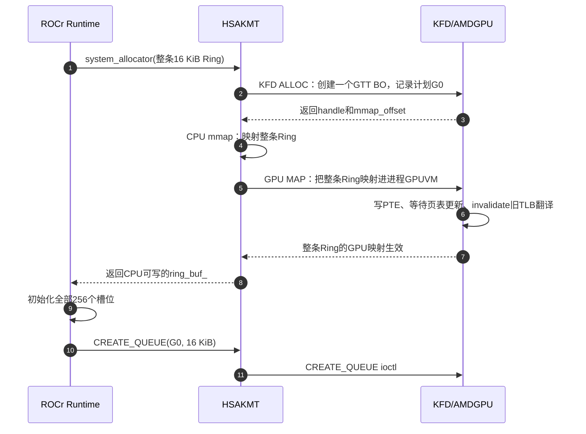
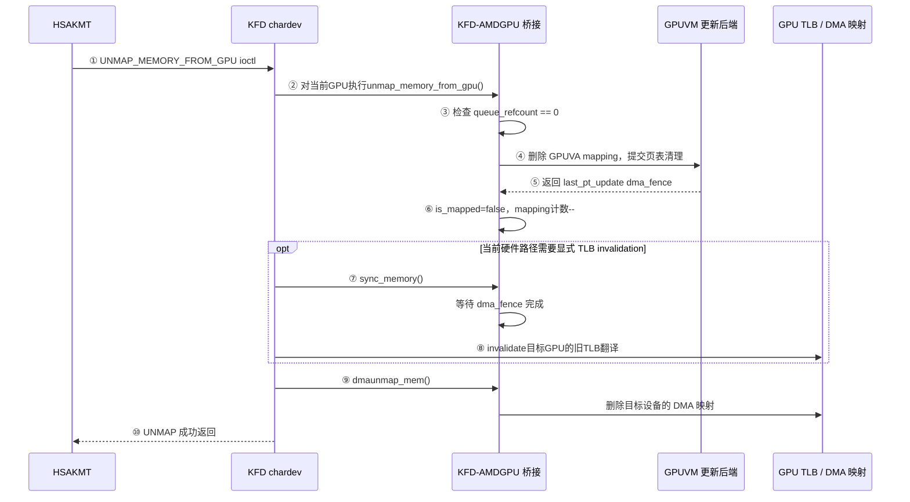
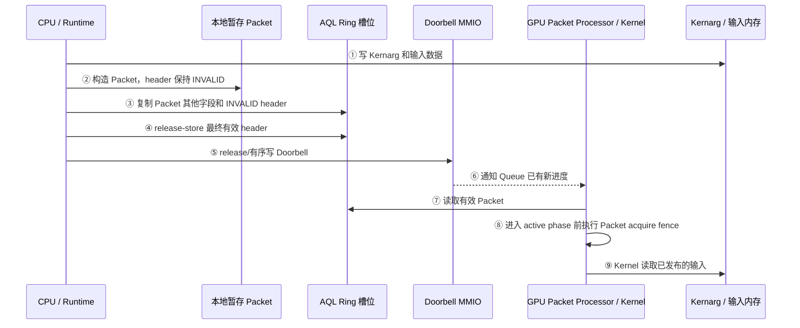
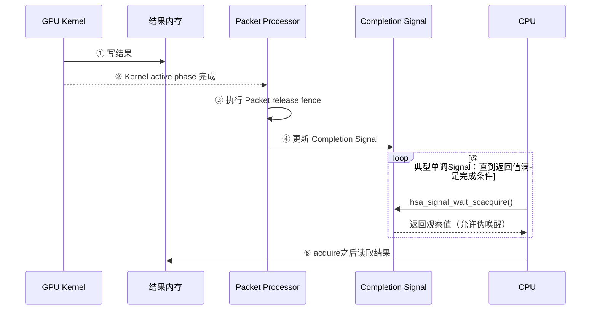

# GPU 内存管理基础

## 缩写表

| 缩写    | 英文全称                                     | 中文含义                                 |
| ------- | -------------------------------------------- | ---------------------------------------- |
| AMDGPU  | AMD GPU Linux Kernel Driver                  | AMD GPU Linux 内核驱动                   |
| API     | Application Programming Interface            | 应用程序编程接口                         |
| AQL     | Architected Queuing Language                 | HSA 定义的架构化队列包格式               |
| ASIC    | Application-Specific Integrated Circuit      | 专用集成电路；本文指具体 GPU 芯片/代际   |
| ATC     | Address Translation Cache                    | AMD GPU 地址翻译缓存及相关映射单元       |
| BAR     | Base Address Register                        | PCIe 基址寄存器；用于暴露设备地址窗口    |
| BO      | Buffer Object                                | 驱动用于管理一块缓冲区的对象             |
| CLR     | Common Language Runtime                      | ROCm 中承接上层计算接口的运行时层        |
| CP      | Command Processor                            | GPU 命令处理器                           |
| CPSCH   | Command Processor Scheduling                 | 由 GPU 命令处理器调度 Queue 的路径       |
| CPU     | Central Processing Unit                      | 中央处理器                               |
| CWSR    | Compute Wave Save/Restore                    | 计算 Wave 上下文的保存与恢复机制         |
| DMA     | Direct Memory Access                         | 设备直接内存访问                         |
| DQM     | Device Queue Manager                         | KFD 中管理进程与 Queue 调度状态的模块    |
| DRM     | Direct Rendering Manager                     | Linux 直接渲染管理框架                   |
| FB      | Frame Buffer                                 | 帧缓冲；源码中的 FB BAR 指显存窗口       |
| GART    | Graphics Address Remapping Table             | AMDGPU 内核驱动使用的 GPUVM 页表         |
| GEM     | Graphics Execution Manager                   | DRM 的图形内存对象管理框架               |
| GFP     | Get Free Pages                               | Linux 物理页分配标志                     |
| GFXHUB  | Graphics Hub                                 | 图形/计算访问使用的地址翻译 Hub          |
| GMC     | Graphics Memory Controller                   | AMDGPU 中生成内存/PTE属性的内存控制层    |
| GPU     | Graphics Processing Unit                     | 图形处理器                               |
| GPUVA   | GPU Virtual Address                          | GPU 虚拟地址                             |
| GPUVM   | GPU Virtual Memory                           | GPU 虚拟地址空间及其页表                 |
| GTT     | Graphics Translation Tables                  | TTM 管理的 system-resource 内存池        |
| HMM     | Heterogeneous Memory Management              | 异构内存管理                             |
| HQD     | Hardware Queue Descriptor                    | 硬件队列描述状态                         |
| HSA     | Heterogeneous System Architecture            | 异构系统架构                             |
| HSAKMT  | HSA Kernel Mode Thunk                        | ROCr 使用的 HSA 用户态内核接口层         |
| HWS     | Hardware Scheduling                          | 由 GPU 调度固件管理 Queue 驻留的硬件调度 |
| IB      | Indirect Buffer                              | 间接命令缓冲区                           |
| IDR     | ID Radix                                     | Linux 内核中把整数 ID 映射到对象的机制   |
| IOMMU   | Input/Output Memory Management Unit          | 输入/输出内存管理单元                    |
| IOVA    | Input/Output Virtual Address                 | 输入/输出虚拟地址                        |
| ISA     | Instruction Set Architecture                 | 指令集架构                               |
| ioctl   | Input/Output Control                         | 用户态向内核驱动发送控制请求的接口       |
| KFD     | Kernel Fusion Driver                         | Linux AMD GPU 计算驱动接口               |
| Kernarg | Kernel Arguments                             | Kernel Dispatch 使用的参数数据/参数段    |
| KGD     | Kernel Graphics Driver                       | 向 KFD 提供底层 GPU 服务的图形驱动侧     |
| KiB     | Kibibyte                                     | 二进制千字节，1 KiB 等于 1024 字节       |
| MEC     | Micro Engine Compute                         | AMD GPU 中处理计算队列的命令处理引擎     |
| MES     | Micro Engine Scheduler                       | AMD GPU 的微引擎调度器                   |
| MMIO    | Memory-Mapped Input/Output                   | 内存映射输入/输出                        |
| MMU     | Memory Management Unit                       | 内存管理单元                             |
| MQD     | Memory Queue Descriptor                      | 保存在内存中的队列配置描述               |
| MTYPE   | Memory Type                                  | GPU PTE 中选择缓存/一致性行为的内存类型  |
| PA      | Physical Address                             | 物理地址                                 |
| PASID   | Process Address Space ID                     | 进程地址空间标识                         |
| PDD     | Process Device Data                          | KFD 中某个进程在某个 GPU 上的状态        |
| PCI     | Peripheral Component Interconnect            | 外设组件互连标准                         |
| PCIe    | Peripheral Component Interconnect Express    | 高速外设互连总线                         |
| PDE     | Page Directory Entry                         | 页目录项                                 |
| PFN     | Page Frame Number                            | 物理页框编号                             |
| PTE     | Page Table Entry                             | 页表项                                   |
| RAM     | Random Access Memory                         | 随机存取存储器；本文主要指系统内存       |
| ROCr    | ROCm Runtime                                 | ROCm 的 HSA 用户态运行时                 |
| SC      | Sequential Consistency                       | 顺序一致性内存顺序                       |
| SDMA    | System Direct Memory Access                  | AMD GPU 中负责数据搬运的专用引擎         |
| SFENCE  | Store Fence                                  | x86 中约束先前 store 完成顺序的屏障指令  |
| SG      | Scatter-Gather                               | 分散—聚集页面描述                       |
| SVM     | Shared Virtual Memory                        | 共享虚拟内存                             |
| TLB     | Translation Lookaside Buffer                 | 地址翻译缓存                             |
| TTM     | Translation Table Maps                       | DRM 的缓冲对象放置和迁移管理器           |
| UC      | Uncached                                     | 为映射选择非普通缓存路径的内存类型标记   |
| UAPI    | User-space Application Programming Interface | 内核提供给用户态的接口                   |
| USERPTR | User Pointer                                 | 使用现有用户态指针及页面的内存路径       |
| VA      | Virtual Address                              | 虚拟地址                                 |
| VMID    | Virtual Memory ID                            | GPU 活动地址空间使用的硬件上下文编号     |
| VRAM    | Video Random-Access Memory                   | GPU 本地显存                             |
| WC      | Write Combining                              | 写合并                                   |

> 缩写表只用于查阅。正文会在概念首次出现时重新解释，不要求预先背诵。

## 全文大纲

GPU 内存管理不是单纯的“申请显存”。一块内存要真正被 CPU 和 GPU 使用，至少要同时解决位置、地址、映射、生命周期和可见性问题。

| 章节    | 核心问题                      | AQL 在本章中的位置                   |
| ------- | ----------------------------- | ------------------------------------ |
| 第 0 章 | GPU 内存管理到底要解决什么    | 用一段 16 KiB AQL Ring 固定问题背景  |
| 第 1 章 | CPU 和 GPU 怎样找到真正的数据 | 以 system RAM Ring 为主并对照 VRAM   |
| 第 2 章 | 内存怎样分配、映射并安全释放  | Ring 只演示 Queue 为什么必须持有引用 |
| 第 3 章 | CPU 和 GPU 怎样看见彼此的写入 | Packet→Doorbell 只演示发布顺序      |

> **[BOUNDARY]** 本文不展开完整 AQL Dispatch、MQD/HQD、CP/MEC 调度，也不展开通用 DRM/GEM/TTM 框架和普通 IB 提交。这些内容登记在 [待补充的知识点](./待补充的知识点.md)。本文只保留理解 AQL 内存行为所必需的接口和对象关系。

Linux 虚拟地址、物理页、页表和 DMA 的 CPU 侧基础可在 [01_Linux 内存管理基础](<./01_Linux 内存管理基础.md>) 中回看。本文 Linux 源码统一基于本地版本 `248951ddc14de84de3910f9b13f51491a8cd91df`，ROCr 源码基于 `ba56a24c6132c5d195686ae4adf969ca1222fbba`，ROCm CLR 源码基于 `81277d69e3352e7144ced2ee9601484f9b48d950`。

## 0. GPU 内存管理要解决什么

### 0.1 一块 GPU 可用内存涉及四个问题

假设程序需要一段 16 KiB、CPU 和 GPU 都能访问的缓冲区。“成功申请了 16 KiB”只回答了一小部分问题：

| 问题                     | 要确认什么                                         | 没解决时会怎样                          |
| ------------------------ | -------------------------------------------------- | --------------------------------------- |
| 数据放在哪里             | system RAM 还是 VRAM；由哪些页面或显存区间承载     | 根本不知道数据的实际存储位置            |
| CPU/GPU 使用什么地址     | CPU VA、GPUVA、DMA 地址、IOVA、PA 分别属于谁       | 把不同地址空间中的数字误当成同一地址    |
| 怎样建立访问关系         | CPU 页表、GPU 页表、必要时的 IOMMU 映射是否存在    | 地址存在，但访问会 fault 或到达错误位置 |
| 怎样保证生命周期与可见性 | 使用期间对象和映射是否有效；写入是否按正确顺序可见 | 提前释放、读取旧数据或读取半写入数据    |

这四个问题可以压缩成一条主线：

```text
存储资源已经存在
        ↓
CPU和GPU各自获得可用地址
        ↓
页表或窗口把地址连接到存储资源
        ↓
使用者持有对象和映射，防止资源提前消失
        ↓
同步与缓存规则保证双方看到正确内容
```

这里的“对象”只是驱动管理资源和生命周期的手段，不是另一份数据；“地址”只是访问者找到数据的名字，也不是数据本身。

### 0.2 CPU 和 GPU 访问内存的总矩阵

本文以带独立 VRAM 的离散 AMD GPU 为主。先固定最常见的四种访问：

| 访问者 | 目标       | 典型路径                                    | 是否经过 PCIe |
| ------ | ---------- | ------------------------------------------- | ------------- |
| CPU    | system RAM | CPU VA → CPU MMU → Host PA → RAM         | 否            |
| CPU    | VRAM       | CPU VA → CPU 页表 → PCIe BAR 窗口 → VRAM | 是            |
| GPU    | system RAM | GPUVA → GPU MMU → DMA 地址 → PCIe → RAM | 是            |
| GPU    | VRAM       | GPUVA → GPU MMU → 本地显存地址 → VRAM    | 否            |

分别画出来是：

```text
CPU访问system RAM                 CPU访问CPU可见VRAM

CPU load/store                    CPU load/store
      ↓                                 ↓
CPU MMU                           CPU MMU
      ↓                                 ↓
Host PA                           BAR映射的MMIO地址
      ↓                                 ↓ PCIe
system RAM                        VRAM


GPU访问system RAM                 GPU访问本地VRAM

GPU load/store或取包              GPU load/store
      ↓                                 ↓
GPU MMU                           GPU MMU
      ↓                                 ↓
DMA地址                           本地显存地址
      ↓ PCIe                            ↓
system RAM                        VRAM
```

从主机平台的角度看，GPU 对 system RAM 发起的读写属于设备 DMA 访问；这不表示每次访问都由 SDMA 引擎执行。Shader、命令处理前端和 SDMA 都可能成为发起者，SDMA 只是其中专门负责“读源再写目标”的搬运引擎。

还要修正一个常见误区：

> 不是所有 CPU↔GPU 内存访问都经过 PCIe。CPU 访问本机 RAM、GPU 访问本地 VRAM 都不经过 PCIe；只有跨越主机与离散 GPU 边界的路径才通常经过 PCIe。

### 0.3 访问、拷贝和通知不是同一件事

三种动作经常都表现为“写了一个地址”，但目的完全不同：

| 动作 | 本质                                 | 例子                                         |
| ---- | ------------------------------------ | -------------------------------------------- |
| 访问 | 一个执行者对目标地址做 load/store    | GPU Shader 读取 system RAM 中的输入          |
| 拷贝 | 一个引擎读取源地址，再写入目标地址   | SDMA 把 system RAM 数据搬到 VRAM             |
| 通知 | 写设备控制窗口，告诉硬件状态发生变化 | CPU 写 Doorbell MMIO，通知 Queue 有新 Packet |

```text
直接访问：
GPU读取system RAM中的数据

数据拷贝：
SDMA读system RAM → SDMA写VRAM

通知：
CPU写Doorbell → GPU得知“请检查Ring”
```

Doorbell 不包含 Packet 数据，也不会把 Packet 搬到 GPU。Packet 仍留在 Ring 中，GPU 收到通知后再通过已经建立好的地址映射读取它。

### 0.4 贯穿案例：16 KiB AQL Ring

AQL Ring 的“数据放在哪里”和“通过哪套 GPU 页表访问”是两个独立问题：

```text
数据位置
  ├─ system RAM backing
  └─ VRAM / device-local backing

用户AQL Queue使用时的地址关系
  └─ Ring GPUVA → 当前用户进程的GPUVM → 对应backing
```

后文使用一段 16 KiB AQL Ring 作为贯穿例子。为了能具体观察 `struct page`、DMA 地址和 Host IOMMU，本文主动选择 **system RAM backing**，并作如下教学假设：

| 项目     | 本文假设                                         |
| -------- | ------------------------------------------------ |
| 数据位置 | 4 个 4 KiB system RAM 页面                       |
| CPU 用途 | ROCr 在 Ring 中填写 AQL Packet                   |
| GPU 用途 | GPU 队列前端读取 Packet                          |
| CPU 地址 | 一段连续 CPU VA                                  |
| GPU 地址 | 一段连续 GPUVA                                   |
| 生命周期 | Queue 存活期间，Ring 的 BO 和 GPUVM 映射保持有效 |
| 可见性   | CPU 发布完整 Packet 后，才写 Doorbell            |

```text
同一份16 KiB Ring数据

CPU侧：CPU VA ──→ 4个system RAM页面
                         ↑
GPU侧：GPUVA ──→ GPU页表 ┘
```

这个例子会反复回答四个问题：

1. 4 个页面怎样被 CPU 和 GPU 分别找到？
2. GPUVA 怎样翻译到这些页面？
3. Queue 使用期间，为什么不能删掉映射或释放 BO？
4. CPU 写完 Packet 后，怎样保证 GPU 读到完整内容？

后文的图示按用途使用以下标记：

| 标记                          | 表示什么                                                |
| ----------------------------- | ------------------------------------------------------- |
| `[AQL主线]`                 | 用户 AQL Queue 使用进程 GPUVM 访问 Ring、Kernarg 等资源 |
| `[GPU系统上下文/非AQL对照]` | AMDGPU 内核驱动使用系统 GPU 地址空间的对照路径          |
| `[Host Driver建表阶段]`     | CPU 上运行的驱动创建或修改 GPU 页表                     |
| `[GPU运行阶段]`             | GPU MMU 根据当前地址空间实际遍历页表                    |

> **[BOUNDARY]** 16 KiB 和 system RAM 都只是本文的教学选择，不是 ROCr 固定的 Ring 大小或固定的 Ring backing。ROCr 还可以选择设备本地内存作为 Ring backing；该分支在 2.7 只作必要对照。本文也不会借这个例子展开完整 Queue 创建和 Kernel Dispatch。

## 1. GPU 怎样找到真正的数据

### 1.1 数据可能放在哪里

在当前离散 GPU 模型中，最重要的两类物理存储是：

| 存储       | 所在位置     | 谁访问更自然 | 典型特点                                      |
| ---------- | ------------ | ------------ | --------------------------------------------- |
| system RAM | 主机内存     | CPU          | CPU 直接访问；GPU 通常经 PCIe/DMA 访问        |
| VRAM       | GPU 本地内存 | GPU          | GPU 本地高带宽访问；CPU 只能访问 BAR 可见部分 |

GPUVA 并不天然属于某一种存储。一套 GPU 页表可以让不同 GPUVA 页面分别指向 system RAM 或 VRAM。

因此，AQL Ring 也不能仅凭名字判断数据位置：system RAM Ring 和 VRAM Ring 都可以映射进用户进程的 GPUVM。本文后续以 system RAM Ring 为贯穿案例，讲到 VRAM 时再单独画出另一条路径。

**[SOURCE]** Linux `248951ddc14de84de3910f9b13f51491a8cd91df` 的 [`drivers/gpu/drm/amd/amdgpu/amdgpu_vm.c`](./2.源码/linux/drivers/gpu/drm/amd/amdgpu/amdgpu_vm.c) 第 51～58 行写道：

```c
/*
 * GPUVM is the MMU functionality provided on the GPU.
 * ...
 * The GPUVM page tables can contain a mix
 * VRAM pages and system pages (both memory and MMIO) and system pages
 * can be mapped as snooped (cached system pages) or unsnooped
 * (uncached system pages).
 */
```

中文翻译：

```text
GPUVM 是 GPU 提供的 MMU 功能。

GPUVM 页表可以混合包含 VRAM 页面和 system RAM 页面；
system RAM 页面还可以按 snooped（参与缓存一致性观察）
或 unsnooped（不采用这种观察方式）映射。
```

因此：

```text
GPUVA范围
├─ 某些PTE → VRAM
└─ 某些PTE → system RAM
```

“这是 GPUVA”只说明 GPU 使用什么虚拟地址访问；真正的数据位置要看最终 PTE。

### 1.2 CPU 和 GPU 分别怎样到达数据

CPU 访问 system RAM 使用普通 CPU 地址翻译，这部分已经在 Linux 内存基础中学习过：

```text
CPU VA → CPU MMU / CPU页表 → Host PA → system RAM
```

GPU 访问本地 VRAM 仍然可以从 GPUVA 开始，但最终落在 GPU 本地内存系统中：

```text
GPUVA → GPU MMU / GPU页表 → 本地显存地址 → VRAM
```

GPU 访问 system RAM 则跨过离散 GPU 与主机之间的互连：

```text
GPUVA → GPU MMU / GPU页表 → DMA地址 → PCIe → system RAM
```

CPU 访问 VRAM 时，CPU 不能直接使用 GPUVA。驱动要把可见 VRAM 通过 PCIe BAR 暴露到 CPU 的物理/MMIO 地址空间，再由 CPU 页表建立 CPU VA：

```text
CPU VA
  → CPU页表
  → BAR窗口中的主机物理/MMIO地址
  → PCIe
  → VRAM中的目标位置
```

**[SOURCE]** Linux 的 [`drivers/gpu/drm/amd/amdgpu/amdgpu_gmc.h`](./2.源码/linux/drivers/gpu/drm/amd/amdgpu/amdgpu_gmc.h) 第 223～234 行专门区分 CPU 视角的 aperture 与 GPU 视角的地址：

```c
/* FB's physical address in MMIO space (for CPU to
 * map FB). This is different compared to the agp/
 * gart/vram_start/end field as the later is from
 * GPU's view and aper_base is from CPU's view.
 */
resource_size_t aper_size;
resource_size_t aper_base;
/* 省略mc_vram_size字段及其注释。 */
u64 visible_vram_size;
```

中文翻译：

```text
aper_base         = PCI BAR在CPU物理地址空间中的起点
aper_size         = PCI BAR资源的长度
visible_vram_size = 驱动最终允许作为CPU-visible VRAM使用的长度
```

可以把它们分成两层：

```text
硬件/平台提供：aper_base、aper_size
软件最终采用：visible_vram_size
```

**[SOURCE]** Linux [`drivers/gpu/drm/amd/amdgpu/gmc_v9_0.c`](./2.源码/linux/drivers/gpu/drm/amd/amdgpu/gmc_v9_0.c) 第 1683～1704、1731 行给出了调用者和返回后的处理：

```c
static int gmc_v9_0_mc_init(struct amdgpu_device *adev)
{
	int r;

	/* 省略VRAM大小初始化和外层设备类型判断。 */
	r = amdgpu_device_resize_fb_bar(adev);
	if (r)
		return r;

	adev->gmc.aper_base = pci_resource_start(adev->pdev, 0);
	adev->gmc.aper_size = pci_resource_len(adev->pdev, 0);

	/* 省略其他平台的特殊地址路径。 */
	adev->gmc.visible_vram_size = adev->gmc.aper_size;
	/* 省略后续GART配置。 */
```

在本文讨论的离散 GPU 路径中，调用者是 `gmc_v9_0_mc_init()`。顺序是：

```text
调用amdgpu_device_resize_fb_bar()调整BAR0
  → 返回内存控制器初始化
  → 重新读取BAR0的base和size
  → aper_size = 调整后的BAR长度
  → visible_vram_size先初始化为aper_size
```

**[SOURCE]** Linux [`drivers/gpu/drm/amd/amdgpu/amdgpu_gmc.c`](./2.源码/linux/drivers/gpu/drm/amd/amdgpu/amdgpu_gmc.c) 第 225～229 行随后还可能缩小这个软件可用长度：

```c
if (vis_limit && vis_limit < mc->visible_vram_size)
	mc->visible_vram_size = vis_limit;

if (mc->real_vram_size < mc->visible_vram_size)
	mc->visible_vram_size = mc->real_vram_size;
```

所以最终关系是：

```text
visible_vram_size <= aper_size
visible_vram_size <= real_vram_size
```

`visible_vram_size` 仍然只是“具备 CPU 直访条件的 VRAM 长度”，不表示某个进程已经建立了对应 CPU VA；具体 BO 仍需单独 mmap。

Large BAR 与 Small BAR 的基础区别只在“CPU 一次能看见多少 VRAM”：

| 情况      | CPU 可见范围      | 当前阶段的结论                                                     |
| --------- | ----------------- | ------------------------------------------------------------------ |
| Large BAR | 通常覆盖全部 VRAM | 落在可见范围内的 VRAM BO 可建立 CPU 直映射                         |
| Small BAR | 只覆盖较小窗口    | 只有窗口内的 VRAM 可直接映射；其他数据可能需要迁移、换窗或 staging |

**[SOURCE]** 被调用的 [`drivers/gpu/drm/amd/amdgpu/amdgpu_device.c`](./2.源码/linux/drivers/gpu/drm/amd/amdgpu/amdgpu_device.c) 第 1120～1125、1172～1188 行通过 PCI 核心接口调整 BAR0：

```c
int amdgpu_device_resize_fb_bar(struct amdgpu_device *adev)
{
	int rbar_size =
		pci_rebar_bytes_to_size(adev->gmc.real_vram_size);
	/* 省略其余局部变量，以及无需调整或平台不支持时返回的分支。 */

	max_size = pci_rebar_get_max_size(adev->pdev, 0);
	if (max_size < 0)
		return 0;
	rbar_size = min(max_size, rbar_size);

	/* 省略调整前临时关闭相关硬件状态的代码。 */
	r = pci_resize_resource(adev->pdev, 0, rbar_size,
				(adev->asic_type >= CHIP_BONAIRE) ? 1 << 5
								  : 1 << 2);
	/* 省略调整后的错误处理和恢复。 */
```

`pci_resize_resource(..., 0, ...)` 中的 `0` 表示 PCI BAR0。这个函数不直接修改 `visible_vram_size`；它先调整 BAR0 资源，调用者返回后再读取新的 `pci_resource_len()`，由此更新 `aper_size` 和 `visible_vram_size`。

> **[BOUNDARY]** BAR 只解决 CPU 能否把某段 VRAM 放入自己的地址空间，不保证这种访问与 GPU 本地访问同样快，也不自动解决缓存一致性。

### 1.3 地址不能混为一谈

| 地址      | 谁使用或解释          | 当前阶段需要记住的含义            |
| --------- | --------------------- | --------------------------------- |
| CPU VA    | CPU 程序、CPU MMU     | CPU 指令中的虚拟地址              |
| GPUVA     | GPU 引擎、GPU MMU     | 某个 GPUVM 中的虚拟地址           |
| DMA 地址  | 设备和主机 DMA 子系统 | 驱动交给设备使用的统一名称        |
| IOVA      | Host IOMMU            | 启用 IOMMU 转换时的一类 DMA 地址  |
| Host PA   | 主机物理内存系统      | system RAM 页面对应的主机物理地址 |
| VRAM 地址 | GPU 本地内存系统      | GPU 到达本地显存资源所用的地址    |

最容易混淆的是 DMA 地址、IOVA 与 Host PA。DMA 地址是驱动层使用的统一术语；它是否表现为 IOVA，取决于平台是否为设备启用 Host IOMMU。

**[SOURCE]** Linux [`Documentation/core-api/dma-api-howto.rst`](./2.源码/linux/Documentation/core-api/dma-api-howto.rst) 第 81～88 行解释了有无 IOMMU 的差异：

```text
In some simple systems, the device can do DMA directly to physical address
Y. But in many others, there is IOMMU hardware that translates DMA
addresses to physical addresses, e.g., it translates Z to Y.

dma_map_single() ... sets up any required IOMMU mapping and returns the DMA
address Z. The driver then tells the device to do DMA to Z, and the IOMMU
maps it to the buffer at address Y in system RAM.
```

中文翻译：

```text
在简单系统中，设备可能直接对物理地址Y发起DMA。
在许多其他系统中，IOMMU把DMA地址Z翻译成物理地址Y。

DMA映射接口建立必要的IOMMU映射并返回Z；
驱动让设备访问Z，IOMMU再把它映射到system RAM中的Y。
```

于是 system RAM 有两种典型路径。

启用 Host IOMMU：

```text
GPUVA
  → GPU MMU
  → DMA地址（本例是IOVA）
  → Host IOMMU
  → Host PA
  → system RAM
```

未启用 Host IOMMU：

```text
GPUVA
  → GPU MMU
  → 直连DMA/总线地址
  → 主机桥
  → system RAM
```

而访问本地 VRAM 时：

```text
GPUVA
  → GPU MMU
  → 本地显存地址
  → VRAM
```

因此必须记住：

```text
GPUVA不是IOVA
IOVA不是CPU VA
DMA地址不保证等于Host PA
GPU PTE的目标也不一定是IOVA
```

### 1.4 GPU 地址翻译

现在把 GPU MMU、GPU 页表、PTE、GPU TLB 和 Host IOMMU 放进同一张图。先看本文的贯穿案例：GPU 访问位于 system RAM 的 AQL Ring 第 0 页，并且 Host IOMMU 已启用。

```text
[AQL主线：system RAM Ring]
```

```text
GPU引擎发出 GPUVA 0x1000_0120
        │
        ▼
GPU TLB查询
   ┌────┴────┐
   │命中     │未命中
   ▼         ▼
缓存的翻译   从根页表逐级查找
                  │
                  ▼
              最终GPU PTE
                  │ 地址部分：IOVA 0x1234_5000
                  │ 属性：VALID/SYSTEM/READABLE...
                  ▼
翻译结果 0x1234_5120
        │
        ▼
Host IOMMU：IOVA → Host PA
        │
        ▼
system RAM第0页内偏移0x120
```

GPU MMU 负责解释 GPUVA；Host IOMMU 只在设备访问主机内存时解释 IOVA。两者不是同一个 MMU，也不查询同一套页表。

如果 AQL Ring 位于 VRAM，仍然使用该用户进程的 GPUVM，但 PTE 目标变为本地显存地址，不经过 Host IOMMU：

```text
[AQL主线：VRAM Ring]

Ring GPUVA
  → 当前用户进程的GPUVM页表
  → PTE中的VRAM本地地址
  → GPU本地内存系统
  → VRAM中的Ring数据
```

这两条 AQL 路径只在 PTE 目标不同；都不需要先经过 VMID 0 的内核 GART 页表。

最终 PTE 不是缓冲区数据，而是“目标页面地址 + 访问属性”。

**[SOURCE]** Linux 的 [`drivers/gpu/drm/amd/amdgpu/amdgpu_vm.h`](./2.源码/linux/drivers/gpu/drm/amd/amdgpu/amdgpu_vm.h) 第 57～68 行列出一部分 PTE 属性：

```c
#define AMDGPU_PTE_VALID		(1ULL << 0)
#define AMDGPU_PTE_SYSTEM		(1ULL << 1)
#define AMDGPU_PTE_SNOOPED		(1ULL << 2)
/* 省略与当前说明无关的属性位。 */
#define AMDGPU_PTE_EXECUTABLE	(1ULL << 4)
#define AMDGPU_PTE_READABLE		(1ULL << 5)
#define AMDGPU_PTE_WRITEABLE	(1ULL << 6)
```

`VALID` 表示映射有效，`SYSTEM` 表示目标是 system memory，`READABLE`、`WRITEABLE`、`EXECUTABLE` 表示访问权限。地址部分在不同目标下含义不同：

| PTE 映射目标             | PTE 地址部分可怎样理解 | 后续是否经过 Host IOMMU |
| ------------------------ | ---------------------- | ----------------------- |
| system RAM，IOMMU 开启   | DMA 地址，通常是 IOVA  | 是                      |
| system RAM，IOMMU 未开启 | 直连 DMA/总线地址      | 否                      |
| 本地 VRAM                | GPU 本地显存地址       | 否                      |

**驱动准备完成后，GPU 运行时做什么？**

此时 GPU 页表已经建立，例如第 2 页的 PTE 已经保存 `D2`。真正触发访问的是 GPU 正在执行的 ISA load/store 指令。

**[SOURCE]** ROCr [`libhsakmt/tests/kfdtest/src/ShaderStore.cpp`](./2.源码/rocr-runtime/libhsakmt/tests/kfdtest/src/ShaderStore.cpp) 第 1162～1169 行保存了一段实际测试 Shader，其中包含：

```cpp
"flat_load_dword v4, v[2:3]\n"\
"s_waitcnt vmcnt(0) & lgkmcnt(0)\n"\
```

这两条 GPU ISA 可以先这样读：

```text
flat_load_dword v4, v[2:3]
  → 从v2:v3给出的64位GPU虚拟地址读取一个32位值
  → 返回值放入v4

s_waitcnt vmcnt(0) & lgkmcnt(0)
  → 等待前面的访存操作完成
```

假设 `v2:v3` 中保存的是第 2 页内某个 GPUVA，GPU 发出 load 后，地址翻译完全由硬件继续完成：

```text
GPU Wave执行flat_load_dword
        │ 输入：GPUVA G2
        ▼
GPU TLB查询
   ┌────┴────┐
   │命中     │未命中
   ▼         ▼
直接得到D2   GPU Page Walker从当前页表根开始遍历
                  │
                  ▼
              读取第2页PTE
                  │
                  ├─ 检查VALID/READABLE等属性
                  └─ 取出地址D2并填入GPU TLB
        ┌─────────┘
        ▼
GPU使用D2发起system RAM访问
        │
        ├─ Host IOMMU开启：D2是IOVA，再翻译为Host PA
        └─ Host IOMMU关闭：D2是直连DMA/总线地址
        ▼
system RAM返回数据
        ▼
load结果写入v4
```

因此，“GPU 取出 `D2`”有两种情况：TLB 命中时从 TLB 直接得到；TLB 未命中时由硬件 Page Walker 读取 PTE 后得到。GPU 不会在这里调用 `amdgpu_vm_map_gart()` 或其他 Linux C 函数。

> **[BOUNDARY]** 能看到的软件代码是 `flat_load_dword` 这样的 GPU ISA。TLB 查询和 Page Walker 遍历是 GPU MMU 的硬件行为，没有对应的 Linux C 调用栈。AQL Ring 由 CP/MEC 而不是 Shader 读取，但它使用同一套 GPUVM/TLB 翻译机制；完整取包路径留到后续 AQL Dispatch 章节。

GPU TLB 只是翻译结果缓存，不是页表。页表修改后，如果旧 TLB 项仍有效，GPU 可能继续使用旧目标：

```text
旧状态：GPUVA G → PTE → 页面P0
                    TLB也缓存G → P0

修改后：GPUVA G → 新PTE → 页面P1
                    TLB仍缓存G → P0
```

正确顺序是：

```text
写完新PTE
  → 等待页表更新完成并可见
  → 使对应GPU TLB旧翻译失效
  → GPU再次访问时重新遍历页表
```

TLB invalidation 清除的是“旧地址翻译”，不是清空 Ring 或 Kernel 数据。第 2 章会在 `MAP_MEMORY_TO_GPU` 路径中看到“同步页表更新后再使旧 TLB 翻译失效”。

### 1.5 地址空间怎样被选择

#### 1.5.1 这里的“进程”是谁

同一个 GPUVA 数值可以在不同用户进程中指向不同数据，所以 GPU MMU 在查页表前必须知道“使用哪套地址空间”。

这里的“进程”是指**运行应用程序和 ROCr/HIP 运行时的 Linux 用户进程**，不是 Host Driver，也不是 GPU 内部的某种进程：

```text
Linux用户进程
├─ 应用程序
├─ ROCr/HIP运行时库（运行在同一个用户进程中）
├─ CPU地址空间：Linux mm_struct
└─ 驱动为它维护的GPU地址空间：GPUVM
```

Host Driver 中的 KFD/AMDGPU 代码运行在内核态，代表这个用户进程建立映射；GPU 则执行 Queue、Packet 和 Wave。二者都不是这里所说的“进程”。

**[SOURCE]** Linux [`drivers/gpu/drm/amd/amdkfd/kfd_priv.h`](./2.源码/linux/drivers/gpu/drm/amd/amdkfd/kfd_priv.h) 第 906～919 行把 `kfd_process` 与 Linux 的 `mm_struct` 联系起来：

```c
/* Process data */
struct kfd_process {
	/*
	 * kfd_process are stored in an mm_struct*->kfd_process*
	 * hash table (kfd_processes in kfd_process.c)
	 */
	struct hlist_node kfd_processes;

	/*
	 * Opaque pointer to mm_struct. We don't hold a reference to
	 * it so it should never be dereferenced from here. This is
	 * only used for looking up processes by their mm.
	 */
	void *mm;
	/* 省略后续字段。 */
};
```

中文翻译：`kfd_process` 可以通过 Linux 进程的 `mm_struct` 查找；其中的 `mm` 用来标识这个用户进程的 CPU 虚拟地址空间。因此，KFD 所说的 process 对应发起 GPU 工作的 Linux 用户进程。

PASID（Process Address Space ID，进程地址空间标识）是 GPU 用来区分“当前访问属于哪个用户进程地址空间”的编号。在当前 Linux 版本中，这个编号保存在对应的“进程—GPU 设备”状态 `kfd_process_device` 中。

**[SOURCE]** 同一文件第 763～769、876～879 行：

```c
/* Data that is per-process-per device. */
struct kfd_process_device {
	/* The device that owns this data. */
	struct kfd_node *dev;

	/* The process that owns this kfd_process_device. */
	struct kfd_process *process;

	/* 省略其他进程—设备状态。 */
	u32 pasid;
};
```

中文翻译：一个 `kfd_process_device` 属于某个 Linux 用户进程与某个 GPU 设备，`pasid` 记录该进程在这块 GPU 上使用的地址空间身份。后文写“进程的 PASID”，都是这一含义的简称。

| 名称         | 当前阶段的角色                                      |
| ------------ | --------------------------------------------------- |
| GPUVM        | Host Driver 为用户进程维护的 GPU 虚拟地址空间及页表 |
| PASID        | 标识用户进程在当前 GPU 上所用地址空间的身份编号     |
| VMID         | GPU 当前活动翻译上下文使用的有限硬件槽位编号        |
| 页表根寄存器 | 告诉 GPU MMU：这个 VMID 的根页表在哪里              |

可以先这样记：

```text
PASID回答：“这是谁的地址空间？”
VMID回答： “当前硬件用哪个活动槽位执行它？”
根页表寄存器回答：“这套页表从哪里开始？”
```

#### 1.5.2 HWS 与非 HWS 是什么，为什么同时存在

HWS 与非 HWS 描述的是 **Queue 由谁负责调度并放到 GPU 上运行**，不是两种内存，也不是两种 GPU 页表格式。

| 调度路径 | 谁维护 Queue 驻留和 VMID 分配                                           | 本节为什么要区分                                    |
| -------- | ----------------------------------------------------------------------- | --------------------------------------------------- |
| 非 HWS   | Host Driver 直接选择 VMID、配置地址空间并装载硬件 Queue                 | Linux C 代码能完整展示 VMID 选择与释放过程          |
| HWS      | Host Driver 提交进程和 Queue 信息，GPU 调度固件管理实际驻留与 VMID 槽位 | 更接近固件调度路径，但固件内部实现不在 Linux 源码中 |

两条路径最后必须得到相同的地址翻译状态：正在运行的 Queue 使用某个 VMID，而这个 VMID 对应进程的 PASID 和 GPUVM 根页表。

原来的“一行箭头”会把 HWS 的输入和调度结果混在一起。更完整的关系是：

```text
非HWS：Host Driver直接决定具体VMID

用户Queue
  → KFD Host Driver选择具体VMID N
  → 配置VMID N ↔ PASID 42
  → 配置VMID N的根页表 = R
  → 把MQD装载到HQD
  → Queue运行

HWS：Host Driver提供输入，GPU调度固件决定具体VMID

Host Driver提交三类输入
  ├─ SET_RESOURCES：可用VMID集合 = vmid_mask
  ├─ MAP_PROCESS：PASID = 42，根页表 = R
  └─ MAP_QUEUES：Queue / MQD
          │
          ▼
GPU调度固件
  → 从vmid_mask中选择具体VMID N
  → 配置VMID N ↔ PASID 42
  → 配置VMID N的根页表 = R
  → 把Queue装载到HQD
  → Queue运行
```

**[SOURCE]** Linux [`drivers/gpu/drm/amd/amdkfd/kfd_packet_manager.c`](./2.源码/linux/drivers/gpu/drm/amd/amdkfd/kfd_packet_manager.c) 第 188～195、223～242 行展示 HWS runlist 先构造进程映射，再构造用户 Queue 映射：

```c
/* build map process packet */
retval = pm->pmf->map_process(pm, &rl_buffer[rl_wptr], qpd);
/* 省略错误处理以及写指针更新。 */

list_for_each_entry(q, &qpd->queues_list, list) {
	/* 省略非活动Queue判断和日志。 */
	retval = pm->pmf->map_queues(pm, &rl_buffer[rl_wptr],
				     q, qpd->is_debug);
	/* 省略错误处理和写指针更新。 */
}
```

`map_process` 对应图中的进程信息，`map_queues` 对应 Queue/MQD 信息；`vmid_mask`、PASID 和根页表的具体字段将在 1.5.10 节用最小源码验证。

> **[BOUNDARY]** 图使用当前 Linux 源码中 CP 固件调度路径的 `SET_RESOURCES`、`MAP_PROCESS` 和 `MAP_QUEUES` 名称。不同代际或更新的调度固件接口可能使用不同命令，但“驱动提供 PASID、根页表和可用 VMID 范围，调度者决定具体 VMID”这一职责边界不变。

KFD 同时保留两条路径，主要有三个原因：

1. **GPU 代际和固件能力不同。** 某些旧 GPU 不具备可用的 HWS 调度能力，只能由 Host Driver 直接管理 Queue、VMID 和 HQD。
2. **HWS 依赖及时换出 Queue 的能力。** 例如 CWSR（Compute Wave Save/Restore，计算 Wave 保存与恢复）用于保存运行中的 Wave 状态，让调度固件可以换出一个进程并把有限的 VMID、HQD 交给另一个进程。
3. **支持 HWS 的 GPU 也可能主动选择非 HWS。** HWS 是默认路径；非 HWS 仍被保留为调试方式，使驱动可以静态地把 Queue 分配给 HQD，直接观察和控制硬件状态。

因此，不能把 HWS 简单理解成一个名为“HWS”的独立寄存器或单独硬件模块。它是一套依赖 GPU 命令处理器、调度固件、Queue 抢占和 CWSR 等能力的调度机制。

**[SOURCE]** Linux [`drivers/gpu/drm/amd/amdkfd/kfd_device_queue_manager.c`](./2.源码/linux/drivers/gpu/drm/amd/amdkfd/kfd_device_queue_manager.c) 第 3114～3126 行展示驱动怎样根据具体 GPU 能力强制选择非 HWS：

```c
switch (dev->adev->asic_type) {
/* HWS is not available on Hawaii. */
case CHIP_HAWAII:
/* HWS depends on CWSR for timely dequeue. CWSR is not
 * available on Tonga.
 *
 * FIXME: This argument also applies to Kaveri.
 */
case CHIP_TONGA:
	dqm->sched_policy = KFD_SCHED_POLICY_NO_HWS;
	break;
default:
	dqm->sched_policy = sched_policy;
	break;
}
```

中文翻译：Hawaii 不提供可用的 HWS；HWS 依赖 CWSR 及时换出 Queue，而 Tonga 没有 CWSR，所以这两种 GPU 在这里被强制设为非 HWS。其他 GPU 再按照驱动参数 `sched_policy` 选择路径。

这说明区分两条路径的首要原因确实是：KFD 必须同时适配不同代际 GPU 的硬件与固件能力。但“支持 HWS”并不意味着系统只能使用 HWS。

**[SOURCE]** Linux [`drivers/gpu/drm/amd/amdgpu/amdgpu_drv.c`](./2.源码/linux/drivers/gpu/drm/amd/amdgpu/amdgpu_drv.c) 第 736～745 行定义 `sched_policy`：

```c
/**
 * DOC: sched_policy (int)
 * Set scheduling policy. Default is HWS(hardware scheduling) with over-subscription.
 * Setting 1 disables over-subscription. Setting 2 disables HWS and statically
 * assigns queues to HQDs.
 */
int sched_policy = KFD_SCHED_POLICY_HWS;
module_param_unsafe(sched_policy, int, 0444);
MODULE_PARM_DESC(sched_policy,
	"Scheduling policy (0 = HWS (Default), 1 = HWS without over-subscription, 2 = Non-HWS (Used for debugging only)");
```

中文翻译：

```text
sched_policy=0：HWS，允许超额订阅，也是默认值
sched_policy=1：HWS，但禁止超额订阅
sched_policy=2：关闭HWS，静态地把Queue分配给HQD，主要用于调试
```

这里的“超额订阅”是指待运行的进程或 Queue 多于当前可同时驻留的 VMID、HQD 数量。HWS 可以让调度固件换入、换出 Queue 来复用有限硬件槽位；非 HWS 则由 Host Driver 进行较静态、直接的分配。

所以选择关系是：

```text
当前GPU缺少HWS所需能力
  → 驱动强制使用非HWS

当前GPU支持HWS
  → 默认HWS并允许超额订阅
  → 也可禁止超额订阅
  → 调试时可以主动切到非HWS
```

Linux 源码把两条路径分成不同的 Queue 操作函数。函数名中的 `nocpsch` 表示不使用 CP 固件调度；`cpsch` 表示使用 CP 调度路径。

**[SOURCE]** Linux [`drivers/gpu/drm/amd/amdkfd/kfd_device_queue_manager.c`](./2.源码/linux/drivers/gpu/drm/amd/amdkfd/kfd_device_queue_manager.c) 第 3131～3163 行根据调度策略选择不同的创建和销毁函数：

```c
switch (dqm->sched_policy) {
case KFD_SCHED_POLICY_HWS:
case KFD_SCHED_POLICY_HWS_NO_OVERSUBSCRIPTION:
	/* initialize dqm for cp scheduling */
	dqm->ops.create_queue = create_queue_cpsch;
	dqm->ops.destroy_queue = destroy_queue_cpsch;
	/* 省略其他HWS操作函数。 */
	break;
case KFD_SCHED_POLICY_NO_HWS:
	/* initialize dqm for no cp scheduling */
	dqm->ops.create_queue = create_queue_nocpsch;
	dqm->ops.destroy_queue = destroy_queue_nocpsch;
	/* 省略其他非HWS操作函数。 */
	break;
}
```

因此，后文展示 `allocate_vmid()` 和 `vmid_pasid[]` 时，会明确标为“非 HWS 源码示例”。它的价值是把 VMID 占用逻辑完整展示出来，不能据此误认为所有 AQL Queue 都由 Host Driver 直接分配 VMID。HWS 怎样把资源范围、PASID 和根页表交给调度固件，将在 1.5.10 节说明。

#### 1.5.3 用户进程、Host Driver 和 GPU 各自做什么

用户进程不会直接填写 GPU PTE。它通过 ROCr/KFD 请求分配和映射内存，Host Driver 才负责建立该进程的 GPUVM 页表。只需映射 GPU 当前需要访问的范围，不是预先映射“所有内存”。

```text
Linux用户进程打开GPU设备（应用程序+ROCr/HIP）
  │
  │ AMDGPU驱动从软件编号池分配PASID 42
  ▼
驱动创建该进程的GPUVM，记录PASID 42和根页表R
  │
  │ 用户进程请求分配、映射内存和创建Queue
  ▼
Host Driver为所需范围填写GPU PTE
  │
  │ Ring、Kernel代码、Kernarg、数据、Signal获得GPUVA
  ▼
Queue准备运行，驱动或GPU调度固件选择VMID 5
  │
  ├─ 配置VMID 5 ↔ PASID 42
  └─ 配置VMID 5的根页表地址 = R
  ▼
CPU把包含这些GPUVA的AQL Packet写入Ring，再写Doorbell
  │
  ▼
GPU使用VMID 5读取Packet和GPUVM页表
  │
  ▼
沿着Packet中的GPUVA访问代码、参数和数据
```

AQL Packet 主要描述任务并保存资源的 GPUVA，例如 `kernel_object`、`kernarg_address` 和 `completion_signal`；它不是把整个用户进程或所有资源复制给 GPU。GPU 能访问这些地址，是因为 Host Driver 此前已经把对应范围映射进该用户进程的 GPUVM。

这里还必须区分两套页表：

```text
CPU指令使用CPU VA → CPU MMU读取Linux CPU页表（mm_struct）
GPU指令使用GPUVA  → GPU MMU读取该进程的GPUVM页表
```

即使在统一虚拟地址场景中 CPU VA 与 GPUVA 的数值相同，也不代表 CPU 和 GPU 共用同一套页表。

#### 1.5.4 PASID、VMID 和根页表怎样连接

下面假设运行 ROCr/HIP 应用的 Linux 用户进程，在当前 GPU 上使用 PASID `42`，驱动为它维护的 GPUVM 根页表地址是 `R`；负责当前调度模式的一方再从有限硬件槽位中为它选择 VMID `5`。非 HWS 模式由 Host Driver 选择；HWS 模式由 GPU 调度固件负责驻留和槽位管理。`42` 和 `5` 都只是讲解用的示例值。

```text
[配置阶段]

Linux用户进程在当前GPU上的地址空间
├─ PASID = 42
└─ Host Driver维护的GPUVM根页表 = R
             │
             │ 当前模式的调度者选择空闲槽位
             ▼
          VMID = 5
             │
             ├─ 配置VMID 5 ↔ PASID 42
             └─ 配置VMID 5.PAGE_TABLE_BASE = R


[GPU运行阶段]

当前Queue使用VMID 5
  → GPU MMU选择VMID 5的上下文寄存器
  → 取得根页表地址R

GPU访问给出GPUVA G
  → Page Walker从R开始遍历G对应的页表
  → 读取最终PTE
  → 得到D2和访问属性
```

这张图分为配置和运行两个时刻：

1. 用户进程提出内存映射请求，Host Driver 为它维护一套 GPUVM 页表；PASID 标识“这是哪个用户进程在当前 GPU 上使用的地址空间”。
2. GPU 同时能保持的活动地址空间有限，因此 Host Driver 或 GPU 调度固件为它选择一个空闲 VMID 槽位。
3. 硬件记录 `VMID 5 ↔ PASID 42`，并在 VMID 5 的上下文寄存器中保存根页表地址 `R`。
4. 用户进程写入 Doorbell 后，GPU 执行这条 Queue 的工作时使用 VMID 5，因此 GPU MMU 选择 VMID 5 的根页表寄存器。
5. GPU 读取 Packet，并把 Packet 或访存指令中的 GPUVA 与根地址 `R` 一起交给 Page Walker，最终找到 PTE 和真正的数据。

因此，PASID、VMID 和根页表不是三级地址翻译：

```text
PASID：说明地址空间属于谁
VMID：选择当前硬件中的哪个活动上下文槽位
根页表寄存器：保存该槽位应从哪张页表开始遍历
```

GPU 正常页表遍历直接使用 VMID 选择的根页表。PASID 负责维持进程身份以及 PASID↔VMID 关系，不是夹在 GPUVA 与 PTE 之间的另一层地址。

下面先用源码确认“每个活动 VMID 关联一套 GPUVM 页表”，再按编号进入 PASID 与 VMID 的配置过程。

**[SOURCE]** Linux [`drivers/gpu/drm/amd/amdgpu/amdgpu_vm.c`](./2.源码/linux/drivers/gpu/drm/amd/amdgpu/amdgpu_vm.c) 第 51～67 行先说明硬件可以同时激活多套 GPUVM 页表，并让每个 VMID 关联一套页表：

```c
/*
 * GPUVM is the MMU functionality provided on the GPU.
 * ...
 * there can be multiple GPUVM page tables active at any given time.
 * ...
 * Each active GPUVM has an ID associated with it and there is a page table
 * linked with each VMID.
 */
```

中文翻译：GPUVM 是 GPU 的 MMU 功能；GPU 可以同时启用多套 GPUVM 页表，每个 VMID 关联其中一套页表。这对应图中的“VMID 槽位→根页表”。

#### 1.5.5 可选源码验证

1.5.1～1.5.4 已经给出了理解地址空间选择所需的主线。下面几段只用源码验证 PASID 分配、KFD VMID 范围、非 HWS 选择槽位、根页表配置和释放过程；第一次阅读可以直接跳到 1.5.6。

##### 1.5.5.1 源码第一步：驱动分配 PASID 并交给 GPUVM

PASID 不是 GPU 返回给驱动的编号。AMDGPU 使用 Linux 的软件编号分配器，从硬件支持的位宽范围内选择一个尚未使用的正整数。

**[SOURCE]** Linux [`drivers/gpu/drm/amd/amdgpu/amdgpu_ids.c`](./2.源码/linux/drivers/gpu/drm/amd/amdgpu/amdgpu_ids.c) 第 32～40、63～78 行：

```c
/*
 * PASIDs are global address space identifiers that can be shared
 * between the GPU, an IOMMU and the driver.
 * ...
 * Therefore PASIDs are allocated using IDR cyclic allocator
 * (similar to kernel PID allocation) which naturally delays reuse.
 */

int amdgpu_pasid_alloc(unsigned int bits)
{
	u32 pasid;
	int r;

	/* 省略参数检查。 */
	r = xa_alloc_cyclic_irq(&amdgpu_pasid_xa, &pasid, xa_mk_value(0),
			    XA_LIMIT(1, (1U << bits) - 1),
			    &amdgpu_pasid_xa_next, GFP_KERNEL);
	/* 省略错误处理和trace。 */
	return pasid;
}
```

中文翻译：PASID 是 GPU、IOMMU 和驱动共同使用的全局地址空间标识；驱动使用类似 Linux 分配 PID 的循环编号器分配它，并延迟旧编号的再次使用。这里的 `xa_alloc_cyclic_irq()` 从软件编号池中选择空闲值，GPU 不参与选择具体数字。

**[SOURCE]** Linux [`drivers/gpu/drm/amd/amdgpu/amdgpu_kms.c`](./2.源码/linux/drivers/gpu/drm/amd/amdgpu/amdgpu_kms.c) 第 1463～1475 行把新 PASID 交给 GPUVM 初始化：

```c
pasid = amdgpu_pasid_alloc(16);
/* 省略分配失败以及与当前概念无关的初始化。 */
r = amdgpu_vm_init(adev, &fpriv->vm, fpriv->xcp_id, pasid);
```

因此，示例中的 `PASID 42` 表示“驱动从软件编号池分配了 42，并把它记录到该用户进程的 GPUVM”；不是用户指定 42，也不是向 GPU 请求后由 GPU 返回 42。

##### 1.5.5.2 源码第二步：软件记录哪些硬件 VMID 被划给 KFD

VMID 是 GPU 已经实现好的有限硬件槽位；`compute_vmid_bitmap` 则是 Host Driver 保存在内核内存中的一个普通整数，用来记录“哪些硬件 VMID 被划给 KFD 使用”。它不是 BAR、不是 GPU 寄存器，也不保存页表地址。

还要区分“划给 KFD”与“当前分给某个进程”：

| 对象                    | 位于哪里             | 软件或硬件 | 保存什么                                          |
| ----------------------- | -------------------- | ---------- | ------------------------------------------------- |
| `compute_vmid_bitmap` | Host Driver 内核内存 | 软件       | 哪些硬件 VMID 属于 KFD 的可用资源范围             |
| `vmid_pasid[]`        | Host Driver 内核内存 | 软件       | 非 HWS 模式下，每个 VMID 当前绑定哪个 PASID       |
| VMID 上下文寄存器组     | GPU 内部             | 硬件       | 当前 PASID 映射、根页表地址以及对应的地址翻译状态 |

因此，`compute_vmid_bitmap` 的 bit 为 `1` 只表示“KFD 可以使用这个编号”，不表示该 VMID 此刻一定空闲。运行时是否空闲，要继续查看 `vmid_pasid[]` 或 HWS 调度固件维护的驻留状态。

**[SOURCE]** Linux [`drivers/gpu/drm/amd/include/kgd_kfd_interface.h`](./2.源码/linux/drivers/gpu/drm/amd/include/kgd_kfd_interface.h) 第 107～109 行直接把它定义为 AMDGPU 传给 KFD 的软件字段：

```c
struct kgd2kfd_shared_resources {
	/* Bit n == 1 means VMID n is available for KFD. */
	unsigned int compute_vmid_bitmap;
	/* 省略其他共享资源字段。 */
};
```

中文翻译：第 `n` 位为 `1`，表示硬件 VMID `n` 被划入 KFD 可以使用的资源范围。这里的 `unsigned int` 就是一个普通 C 变量。

**[SOURCE]** Linux [`drivers/gpu/drm/amd/amdgpu/amdgpu_amdkfd.c`](./2.源码/linux/drivers/gpu/drm/amd/amdgpu/amdgpu_amdkfd.c) 第 179～182 行展示 AMDGPU 怎样在软件中构造这张位图：

```c
struct kgd2kfd_shared_resources gpu_resources = {
	.compute_vmid_bitmap =
		((1 << AMDGPU_NUM_VMID) - 1) -
		((1 << adev->vm_manager.first_kfd_vmid) - 1),
	/* 省略其他共享资源字段。 */
};
```

先看一个容易按十六进制核对的例子。假设 GPU 有 VMID `0～15`，并且 `first_kfd_vmid = 8`：

```text
VMID编号：15 14 13 12 11 10  9  8 | 7 6 5 4 3 2 1 0
位图bit：  1  1  1  1  1  1  1  1 | 0 0 0 0 0 0 0 0

compute_vmid_bitmap = 0xFF00
```

这表示软件记录“VMID 8～15 被划给 KFD”，不是说这些槽位当前都没有进程使用。

本文后面要继续使用“进程获得 VMID 5”的贯穿示例，因此再假设另一种资源划分：`first_kfd_vmid = 3`。同一段软件计算得到：

```text
VMID编号：15 14 13 12 11 10  9  8  7  6  5  4  3 | 2 1 0
位图bit：  1  1  1  1  1  1  1  1  1  1  1  1  1 | 0 0 0

compute_vmid_bitmap = 0xFFF8
```

这只是软件对硬件资源划分结果的记录，含义是“VMID 3～15 可以交给 KFD”；它没有访问 BAR，也没有读取或映射某个 GPU 寄存器。

**[SOURCE]** Linux [`drivers/gpu/drm/amd/amdkfd/kfd_device.c`](./2.源码/linux/drivers/gpu/drm/amd/amdkfd/kfd_device.c) 第 789～791、927～930 行展示 KFD 怎样读取这张软件位图，取得首尾 VMID 并保存下来：

```c
first_vmid_kfd = ffs(gpu_resources->compute_vmid_bitmap)-1;
last_vmid_kfd = fls(gpu_resources->compute_vmid_bitmap)-1;
vmid_num_kfd = last_vmid_kfd - first_vmid_kfd + 1;

/* 省略多分区GPU的特殊范围调整。 */
node->vm_info.first_vmid_kfd = first_vmid_kfd;
node->vm_info.last_vmid_kfd = last_vmid_kfd;
node->compute_vmid_bitmap = gpu_resources->compute_vmid_bitmap;
```

`ffs()` 和 `fls()` 分别找到软件位图中第一个和最后一个置位位置。对于上面的 `0xFFF8`，结果是 `first_vmid_kfd = 3`、`last_vmid_kfd = 15`。

把软件范围记录与运行时分配连起来，就是：

```text
AMDGPU初始化软件资源信息
  │
  │ 构造compute_vmid_bitmap = 0xFFF8
  ▼
软件记录：硬件VMID 3～15划给KFD
  │
  │ 初始化非HWS占用表vmid_pasid[]，全部写成0
  ▼
创建某用户进程的第一条Queue
  │
  │ 在锁保护下扫描运行时占用表
  ▼
vmid_pasid[5] == 0，因此VMID 5当前空闲
  │
  ├─ 软件记录：vmid_pasid[5] = PASID 42
  ├─ 配置硬件PASID 42 ↔ VMID 5
  ├─ 配置GPU内部VMID 5的根页表地址R
  └─ invalidate该地址空间的旧TLB翻译
```

**[SOURCE]** Linux [`drivers/gpu/drm/amd/amdkfd/kfd_device_queue_manager.c`](./2.源码/linux/drivers/gpu/drm/amd/amdkfd/kfd_device_queue_manager.c) 第 1666 行初始化非 HWS 路径的占用表：

```c
memset(dqm->vmid_pasid, 0, sizeof(dqm->vmid_pasid));
```

这里约定数组值 `0` 表示“这个 VMID 尚未绑定有效 PASID”。因此，`compute_vmid_bitmap` 负责保存 KFD 的资源范围，`vmid_pasid[]` 才负责保存非 HWS 模式下的动态分配结果。

##### 1.5.5.3 源码第三步：非 HWS 从占用表选择空闲 VMID

以非 HWS 路径为例，驱动维护的表可能处于以下状态：

```text
dqm->vmid_pasid[]

VMID 3 → PASID 17    已占用
VMID 4 → PASID 28    已占用
VMID 5 → PASID 0     空闲
VMID 6 → PASID 51    已占用
```

创建 Queue 的代码先取得 DQM 锁。只有该进程在这块 GPU 上创建第一条 Queue 时才需要分配 VMID；同一进程之后创建的 Queue 复用 `qpd->vmid`。

**[SOURCE]** 同一文件第 772～786 行：

```c
dqm_lock(dqm);

/* 省略Queue数量检查。 */
if (list_empty(&qpd->queues_list)) {
	retval = allocate_vmid(dqm, qpd, q);
	if (retval)
		goto out_unlock;
}
q->properties.vmid = qpd->vmid;
```

`dqm_lock()` 防止两个进程同时看见 VMID 5 为空闲并重复分配。`list_empty()` 表示这是该进程设备上下文中的第一条 Queue。

下面源码第一次出现 `pdd`。它是 Process Device Data，即“当前进程在当前 GPU 上的 KFD 状态”；这里通过 `qpd_to_pdd(qpd)` 从其中内嵌的 Queue/调度状态 `qpd` 找回 PDD。`pdd->pasid` 就是这个进程—GPU组合使用的 PASID。

**[SOURCE]** Linux [`drivers/gpu/drm/amd/amdkfd/kfd_device_queue_manager.c`](./2.源码/linux/drivers/gpu/drm/amd/amdkfd/kfd_device_queue_manager.c) 第 681～715 行展示一种非 HWS 调度路径：

```c
for (i = dqm->dev->vm_info.first_vmid_kfd;
		i <= dqm->dev->vm_info.last_vmid_kfd; i++) {
	if (!dqm->vmid_pasid[i]) {
		allocated_vmid = i;
		break;
	}
}

/* 省略没有空闲VMID时的错误处理和调试日志。 */
dqm->vmid_pasid[allocated_vmid] = pdd->pasid;
set_pasid_vmid_mapping(dqm, pdd->pasid, allocated_vmid);
qpd->vmid = allocated_vmid;

/* 省略与当前地址空间选择无关的寄存器配置。 */
dqm->dev->kfd2kgd->set_vm_context_page_table_base(dqm->dev->adev,
		qpd->vmid, qpd->page_table_base);
kfd_flush_tlb(qpd_to_pdd(qpd));
```

按图逐行理解：

- 只扫描 `first_vmid_kfd～last_vmid_kfd`，不会占用不属于 KFD 的 VMID。
- `vmid_pasid[i] == 0` 表示该槽位空闲；例子中因此选中 VMID 5。
- 如果整个范围都没有空闲槽位，函数返回 `-ENOSPC`，不会覆盖正在使用的 VMID。
- `pdd` 是当前进程＋当前 GPU 的 PDD；`pdd->pasid` 提供这个 PDD 对应的进程地址空间标识。
- `vmid_pasid[allocated_vmid] = pdd->pasid` 记录 `VMID↔PASID`。
- `set_pasid_vmid_mapping()` 把对应关系配置给硬件。
- `qpd->vmid` 保存该进程设备上下文当前使用的 VMID。
- `set_vm_context_page_table_base()` 把该进程的根页表地址配置给这个 VMID。
- `kfd_flush_tlb()` 使该地址空间可能残留的旧 TLB 翻译失效。

##### 1.5.5.4 源码第四步：给这个 VMID 写入根页表地址

前文的 VMID `5` 是用来解释机制的抽象编号。这里既然选用 GFXHUB v2.0 的具体代码，就改用该代际实际划给 KFD 的 VMID 范围。

**[SOURCE]** Linux [`drivers/gpu/drm/amd/amdgpu/gmc_v10_0.c`](./2.源码/linux/drivers/gpu/drm/amd/amdgpu/gmc_v10_0.c) 第 870～875 行说明 GFX10 的划分：

```c
/*
 * VMID 0 is reserved for System
 * amdgpu graphics/compute will use VMIDs 1-7
 * amdkfd will use VMIDs 8-15
 */
adev->vm_manager.first_kfd_vmid = 8;
```

中文翻译：VMID 0 留给系统；AMDGPU 图形/计算路径使用 VMID 1～7；KFD 使用 VMID 8～15。因此下面假设非 HWS 路径给当前进程分配的是 VMID `8`，传给 GFXHUB v2.0 的根页表基值为：

```text
vmid = 8
R = page_table_base = 0x0000_1234_5678_9000
```

`R` 只是为了展示 64 位数值怎样写入寄存器而选取的示例值，不是源码中的固定地址。它是 GPU MMU 用来定位根页表的基值，不是 CPU VA。驱动配置和 GPU 运行是两个时刻：

```text
[配置阶段：Host Driver]

函数输入
├─ vmid = 8
└─ R = 0x0000_1234_5678_9000
       │
       ├─ vmid选择寄存器组
       │    CONTEXT0基准 + ctx_addr_distance × 8
       │
       ├─ lower_32_bits(R) = 0x5678_9000
       └─ upper_32_bits(R) = 0x0000_1234
                         │
                         ▼
GFXHUB的VMID 8上下文寄存器组
├─ PAGE_TABLE_BASE_ADDR_LO32 = 0x5678_9000
└─ PAGE_TABLE_BASE_ADDR_HI32 = 0x0000_1234
   两个寄存器共同表示根页表基值R


[运行阶段：GPU]

当前Queue使用VMID 8
  → GFXHUB选择VMID 8上下文寄存器
  → 取得根页表基值R

访存请求给出GPUVA G
  → GPU Page Walker从R开始遍历G对应的页表
  → 最终PTE给出目标地址D2和访问属性
```

**[INFERENCE]** 图中的“配置阶段”直接对应下面的寄存器写入源码；“运行阶段”把该配置结果与 1.5.4 已确认的“VMID 选择一套 GPUVM 页表”连接起来，并不是说 `gfxhub_v2_0_setup_vm_pt_regs()` 自己执行了 Page Walk。

这张图需要分成两遍读：

1. **配置时**，`vmid=8` 只负责选中 VMID 8 对应的寄存器组；`R` 被拆成低 32 位和高 32 位，分别写入这组寄存器。
2. **运行时**，当前 Queue 使用 VMID 8，GFXHUB 因而取得这组寄存器共同表示的根页表基值 `R`；Page Walker 再用 `R` 和 GPUVA `G` 遍历页表。

图中的 `ctx_addr_distance` 是相邻 VM 上下文寄存器组之间的寄存器偏移。

**[SOURCE]** Linux [`drivers/gpu/drm/amd/amdgpu/amdgpu_gmc.h`](./2.源码/linux/drivers/gpu/drm/amd/amdgpu/amdgpu_gmc.h) 第 130～135 行：

```c
/*
 * store the register distances between two continuous context domain
 * and invalidation engine.
 */
uint32_t ctx_distance;
uint32_t ctx_addr_distance; /* include LO32/HI32 */
```

中文翻译：这里保存相邻 VM 上下文和失效引擎的寄存器间距；`ctx_addr_distance` 描述地址寄存器的间距，并覆盖 LO32/HI32 这一对字段。

**[SOURCE]** GFXHUB v2.0 在 Linux [`drivers/gpu/drm/amd/amdgpu/gfxhub_v2_0.c`](./2.源码/linux/drivers/gpu/drm/amd/amdgpu/gfxhub_v2_0.c) 第 456～458 行，用 Context 1 与 Context 0 的 LO32 寄存器编号之差初始化这个间距：

```c
hub->ctx_addr_distance = mmGCVM_CONTEXT1_PAGE_TABLE_BASE_ADDR_LO32 -
	mmGCVM_CONTEXT0_PAGE_TABLE_BASE_ADDR_LO32;
```

因此，对 VMID 8 使用 `ctx_addr_distance * 8`，是在等间距的上下文寄存器组中定位 VMID 8 对应的寄存器组，不是在翻译 GPUVA。

**[SOURCE]** 同一文件第 120～131 行随后把 `page_table_base` 的低、高 32 位写入选中的寄存器组。只保留图中对应的两次写寄存器操作：

```c
WREG32_SOC15_OFFSET(GC, 0,
			mmGCVM_CONTEXT0_PAGE_TABLE_BASE_ADDR_LO32,
			hub->ctx_addr_distance * vmid,
			lower_32_bits(page_table_base));
WREG32_SOC15_OFFSET(GC, 0,
			mmGCVM_CONTEXT0_PAGE_TABLE_BASE_ADDR_HI32,
			hub->ctx_addr_distance * vmid,
			upper_32_bits(page_table_base));
```

源码与图一一对应：两个 `WREG32_SOC15_OFFSET()` 的寄存器偏移相同，因此定位同一个 VMID 上下文；区别只是一个写 `lower_32_bits(R)`，另一个写 `upper_32_bits(R)`。

> **[BOUNDARY]** 图表示寄存器选择与地址翻译之间的逻辑关系，不表示芯片内部模块的物理摆放，也不表示驱动在 GPU 每次访存时重新写寄存器。不同 GPU 代际的寄存器名称和布局可能不同；本图只对应这里引用的 GFXHUB v2.0 代码。

##### 1.5.5.5 源码第五步：最后一条 Queue 销毁后释放 VMID

驱动不能仅把软件表写成 `0` 就立即复用 VMID。它必须先让旧 Queue 停止使用这个地址空间；只有该进程在这块 GPU 上的最后一条 Queue 已被移除，才调用 `deallocate_vmid()`。

**[SOURCE]** Linux [`drivers/gpu/drm/amd/amdkfd/kfd_device_queue_manager.c`](./2.源码/linux/drivers/gpu/drm/amd/amdkfd/kfd_device_queue_manager.c) 第 1024～1045 行：

```c
retval = mqd_mgr->destroy_mqd(mqd_mgr, q->mqd,
			KFD_PREEMPT_TYPE_WAVEFRONT_RESET,
			KFD_UNMAP_LATENCY_MS,
			q->pipe, q->queue);
/* 省略超时时对残留wave的处理。 */

list_del(&q->list);
if (list_empty(&qpd->queues_list)) {
	/* 省略必要时重置残留wave的分支。 */
	deallocate_vmid(dqm, qpd, q);
}
```

`destroy_mqd()` 先让硬件 Queue 停止运行；`list_del()` 删除当前 Queue；删除后列表为空，才说明这是最后一条 Queue，可以释放进程占用的 VMID。

**[SOURCE]** 同一文件第 753～760 行清除地址翻译状态和占用记录：

```c
kfd_flush_tlb(qpd_to_pdd(qpd));

/* Release the vmid mapping */
set_pasid_vmid_mapping(dqm, 0, qpd->vmid);
dqm->vmid_pasid[qpd->vmid] = 0;

qpd->vmid = 0;
q->properties.vmid = 0;
```

这段顺序表示：

```text
旧Queue停止使用VMID 5
  → invalidate旧TLB翻译
  → 清除硬件中的PASID↔VMID映射
  → vmid_pasid[5] = 0
  → VMID 5重新成为可分配槽位
```

所以，“VMID 5 可用”的完整条件不是只看一个数字，而是：VMID 5 属于 KFD 的允许范围，并且旧使用者已经退出，负责调度的一方已将其占用状态标记为空闲。

**由此得到非 HWS 模式下的进程数量边界：**

```text
Linux用户进程存在
  → 尚未在这块GPU上创建Queue
  → 不占用VMID

该进程创建第一条Queue
  → 分配一个VMID

同一进程继续创建Queue
  → 复用同一个VMID

该进程销毁最后一条Queue
  → 释放VMID
```

**[INFERENCE]** 结合 1.5.7 的分配代码和本节的释放代码，可以得到：非 HWS 模式下，同一块 GPU 上同时拥有至少一条 KFD Queue 的进程数量，最多等于 `compute_vmid_bitmap` 中分给 KFD 的 VMID 数量。

例如 `compute_vmid_bitmap = 0xFF00` 表示 KFD 可以使用 VMID 8～15，共 8 个槽位：

```text
最多8个不同进程同时在这块GPU上持有Queue
  → 第9个进程创建第一条Queue
  → allocate_vmid()找不到空闲槽位
  → 返回-ENOSPC，Queue创建失败
```

这里限制的不是系统中能够存在的 Linux 进程总数，而是“在这块 GPU 上已经创建 Queue、因而必须占用 VMID 的进程—设备上下文数量”。这是 VMID 给出的上限；HQD 等其他 Queue 资源也可能更早达到限制。

##### 1.5.5.6 HWS：谁维护 VMID 占用

`compute_vmid_bitmap` 可以直接理解为：

> **AMDGPU 软件记录的“分给 KFD 用作计算的 VMID 表（位图）”。**

例如：

```text
compute_vmid_bitmap = 0xFF00
                         │
                         └─ VMID 8～15分给KFD使用
```

它只说明“哪些 VMID 可以由 KFD 使用”，不说明这些 VMID 当前是否已经被某个进程占用。

还需要再区分两种占用记录：

| 名称                    | 含义                                                    |
| ----------------------- | ------------------------------------------------------- |
| `compute_vmid_bitmap` | 哪些 VMID 被划给 KFD 用作计算                           |
| `vmid_pasid[]`        | 非 HWS 中，Host Driver 记录每个 VMID 当前分给哪个 PASID |
| HWS 的当前占用状态      | 由 GPU 调度固件维护，不使用`vmid_pasid[]`             |

因此两条路径是：

```text
非HWS：
Host Driver从compute_vmid_bitmap中选一个VMID
  → 写入vmid_pasid[]
  → 配置VMID↔PASID和根页表

HWS：
Host Driver把compute_vmid_bitmap、PASID、根页表和Queue信息交给固件
  → 固件从允许范围中选择VMID
  → 固件维护当前占用并配置硬件映射
```

**[SOURCE]** Linux [`drivers/gpu/drm/amd/amdkfd/kfd_device_queue_manager.c`](./2.源码/linux/drivers/gpu/drm/amd/amdkfd/kfd_device_queue_manager.c) 第 1853、1888 行把这张 KFD VMID 表作为可用范围发给调度固件：

```c
res.vmid_mask = dqm->dev->compute_vmid_bitmap;
/* 省略其他调度资源。 */
return pm_send_set_resources(&dqm->packet_mgr, &res);
```

进程信息则提供 PASID 和根页表；具体 VMID 仍由固件选择。下面的 `pdd` 仍是 Process Device Data，表示当前进程在当前 GPU 上的状态；`qpd` 是这个 PDD 内嵌的 Queue/调度状态。

**[SOURCE]** 以 VI 代际为例，Linux [`drivers/gpu/drm/amd/amdkfd/kfd_packet_manager_vi.c`](./2.源码/linux/drivers/gpu/drm/amd/amdkfd/kfd_packet_manager_vi.c) 第 52～57 行：

```c
packet->bitfields2.pasid = pdd->pasid;
packet->bitfields3.page_table_base = qpd->page_table_base;
```

这里分别从同一个进程—GPU上下文取出两类信息：`pdd->pasid` 说明地址空间属于谁，`qpd->page_table_base` 给出该地址空间的根页表地址。

普通 AQL Packet 只是已有 Queue 中的新任务：

```text
已有Queue新增AQL Packet
  → 写Ring
  → 写Doorbell
  → 不重新分配VMID

新建、销毁Queue或改变调度状态
  → Host Driver通知调度器
  → 固件可能重新安排VMID
```

> **[BOUNDARY]** HWS 固件内部怎样保存占用表、怎样选择换出对象，以及 MES 的具体调度协议留到 AQL Queue 调度阶段；当前只需要记住：`compute_vmid_bitmap` 是分给 KFD 的 VMID 范围，HWS 的实时占用由固件维护。

#### 1.5.6 VMID 0 不属于普通 AQL 进程地址空间

前面讨论的是分给 KFD 计算使用的 VMID。还要单独隔离一个系统上下文：在本文采用的 GFXHUB v2.0 例子中，VMID 0 用于 AMDGPU 内核驱动的系统 GPU 地址空间，不是某个 ROCr 用户进程的活动 VMID。

```text
[AQL主线]

KFD计算VMID（例如VMID 8～15中的一个）
  → 选择某个用户进程的GPUVM根页表
  → GPU访问该进程的Ring、Kernarg和结果缓冲区


[GPU系统上下文/非AQL对照]

VMID 0
  → 选择AMDGPU内核驱动的系统页表/GART
  → GPU访问内核驱动映射进系统GPU地址空间的资源
```

所以，普通 AQL Ring 的 GPUVA 不会因为 backing 位于 system RAM，就自动改用 VMID 0。它仍由当前用户进程的 KFD VMID 选择进程 GPUVM；VMID 0/GART 的用途在下一节作为非 AQL 对照说明。

### 1.6 GTT、GART 和 GPUVM：不是三级翻译

这三个名字经常同时出现，但分别回答不同问题。先固定两个相互独立的维度：

```text
数据放在哪里
  → 看backing和内存域：system RAM还是VRAM

GPU通过哪套地址空间访问
  → 看GPUVM映射：进程GPUVM还是内核驱动的系统GPUVM/GART
```

因此，看到一个 GTT BO，只能先得出“数据由 system resource 承载”；不能直接得出“用户 AQL 访问一定经过 VMID 0/GART”。

#### 1.6.1 先区分 backing 与地址映射

BO 是驱动管理缓冲区的软件对象，backing 才是真正保存数据的存储资源。软件管理对象保存在 system RAM；BO 数据则可以位于 system RAM 或 VRAM：

```text
GTT BO

system RAM
├─ struct amdgpu_bo等管理结构
└─ 4个system RAM页面              真正的16 KiB数据


VRAM BO

system RAM
└─ struct amdgpu_bo等管理结构

VRAM
└─ 一段16 KiB显存资源              真正的16 KiB数据
```

**[SOURCE]** Linux [`include/drm/ttm/ttm_bo.h`](./2.源码/linux/include/drm/ttm/ttm_bo.h) 第 81～84、117～121 行把“当前放置资源”和“system RAM 页面状态”分成两个字段：

```c
 * @resource: structure describing current placement.
 * @ttm: TTM structure holding system pages.

/* 省略其他字段。 */
struct ttm_resource *resource;
struct ttm_tt *ttm;
```

中文翻译：`resource` 描述 BO 当前使用哪类放置资源；`ttm` 保存 system RAM backing 的页面状态。二者都是管理信息，不是用户申请的那段缓冲区数据。

地址映射是下一层关系。同一份 backing 是否能被某个 GPUVA 到达，要看它是否已经映射进相应 GPUVM：

```text
BO/backing已经存在
        ≠
某个用户进程的GPUVA已经可以访问它
```

详细对象关系放到 2.4；本节先关注 GTT、GART 和 GPUVM 的职责边界。

#### 1.6.2 GTT：TTM 管理的 system-resource 内存池

在本文当前路径中，GTT 首先表示一类由 TTM 管理、供 GPU 使用的 system resource。对普通 system-memory BO，可以先读成：

```text
GTT BO
  → backing位于system RAM
  → 驱动为页面准备设备可用的DMA地址
```

**[SOURCE]** Linux [`Documentation/gpu/amdgpu/amdgpu-glossary.rst`](./2.源码/linux/Documentation/gpu/amdgpu/amdgpu-glossary.rst) 第 100～105 行给出了 AMDGPU 自己使用的定义：

```text
GTT
  Graphics Translation Tables. This is a memory pool managed through TTM
  which provides access to system resources (memory or MMIO space) for
  use by the GPU. These addresses can be mapped into the "GART" GPUVM page
  table for use by the kernel driver or into per process GPUVM page tables
  for application usage.
```

中文翻译：

```text
GTT是由TTM管理的内存池，为GPU提供system resource。
这些资源既可以映射进内核驱动使用的GART GPUVM页表，
也可以映射进应用使用的进程GPUVM页表。
```

这段定义给出本节最重要的边界：

```text
GTT回答：backing属于哪类资源？

内核GART和进程GPUVM回答：
这份资源通过哪套GPU地址空间被访问？
```

所以，GTT 不是 GPUVA、DMA 地址或一级硬件翻译，也不意味着每个 GTT BO 都必须先经过内核 GART。

#### 1.6.3 AQL 主线：映射进用户进程的 GPUVM

运行 ROCr/HIP 应用的 Linux 用户进程拥有自己的 GPU 地址空间。AQL Ring、Kernarg 和结果缓冲区只有映射进这套进程 GPUVM 后，GPU 才能使用进程 GPUVA 访问它们。

```text
[AQL主线：system RAM backing]

[Host Driver建表阶段]

Ring的4个system RAM页面
  → 准备DMA地址D0～D3
  → 把D0～D3写入当前进程GPUVM的PTE
  → PTE对应Ring GPUVA G0～G3


[GPU运行阶段]

Ring GPUVA G2
  → 当前Queue所属的进程VMID
  → 当前进程GPUVM根页表
  → GPU MMU读取PTE2
  → 得到DMA地址D2
  → 如果D2是IOVA，再经Host IOMMU得到Host PA
  → system RAM中的Ring第2页
```

如果 Ring 位于 VRAM，地址空间仍然是该用户进程的 GPUVM，只是 PTE 目标不同：

```text
[AQL主线：VRAM backing]

Ring GPUVA
  → 当前进程GPUVM
  → PTE中的VRAM本地地址
  → VRAM中的Ring数据
```

**[SOURCE]** Linux [`drivers/gpu/drm/amd/amdgpu/amdgpu_vm.c`](./2.源码/linux/drivers/gpu/drm/amd/amdgpu/amdgpu_vm.c) 第 51～56 行说明 GPUVM 可以同时存在多套页表，并混合映射 VRAM 与 system RAM：

```c
 * GPUVM is the MMU functionality provided on the GPU.
 * GPUVM is similar to the legacy GART on older asics, however
 * rather than there being a single global GART table
 * for the entire GPU, there can be multiple GPUVM page tables active
 * at any given time.  The GPUVM page tables can contain a mix
 * VRAM pages and system pages
```

中文翻译：GPUVM 是 GPU 的 MMU 功能。与旧式单一全局 GART 不同，GPU 可以同时启用多套 GPUVM 页表；一套 GPUVM 页表能够同时映射 VRAM 页面和 system RAM 页面。

第 2.3 节会沿着 `MAP_MEMORY_TO_GPU → amdgpu_bo_va → amdgpu_vm_bo_map()` 展开这条进程 GPUVM 建表路径。

#### 1.6.4 非 AQL 对照：内核 GART 与 VMID 0

GART 是 AMDGPU 内核驱动使用的一套 GPUVM 页表。

**[SOURCE]** Linux [`Documentation/gpu/amdgpu/amdgpu-glossary.rst`](./2.源码/linux/Documentation/gpu/amdgpu/amdgpu-glossary.rst) 第 69～76 行定义 GART：

```text
GART
  Graphics Address Remapping Table. This is the name we use for the GPUVM
  page table used by the GPU kernel driver. It remaps system resources
  (memory or MMIO space) into the GPU's address space so the GPU can access
  them.
```

中文翻译：GART 是 AMDGPU 用来称呼“GPU 内核驱动所使用的 GPUVM 页表”的名字；它把 system memory 或 MMIO 等系统资源重映射进 GPU 地址空间，供 GPU 访问。

在本文采用的 GFXHUB v2.0 例子中，这套系统页表安装在 VMID 0：

| 问题                   | 当前例子的答案                    |
| ---------------------- | --------------------------------- |
| 谁创建、填写 GART 页表 | CPU 上运行的 AMDGPU Host Driver   |
| 谁在运行时遍历页表     | GPU MMU / Page Walker             |
| 使用哪个地址空间上下文 | VMID 0 的系统上下文               |
| 输入是什么             | 内核驱动使用的 GART aperture 地址 |
| PTE 目标是什么         | system resource 的 DMA 地址       |

```text
[GPU系统上下文/非AQL对照]

[Host Driver建表阶段]

内核驱动准备system resource及其DMA地址
  → 填写GART页表
  → 把GART根页表地址B配置给VMID 0


[GPU运行阶段]

GART aperture地址A
  → GPU MMU选择VMID 0
  → 从根地址B遍历GART页表
  → 得到DMA地址D
  → system resource
```

**[SOURCE]** 以 GFXHUB v2.0 为例，Linux [`drivers/gpu/drm/amd/amdgpu/gfxhub_v2_0.c`](./2.源码/linux/drivers/gpu/drm/amd/amdgpu/gfxhub_v2_0.c) 第 134～138 行明确把 GART 根页表配置给 VMID 0：

```c
static void gfxhub_v2_0_init_gart_aperture_regs(struct amdgpu_device *adev)
{
	uint64_t pt_base = amdgpu_gmc_pd_addr(adev->gart.bo);

	gfxhub_v2_0_setup_vm_pt_regs(adev, 0, pt_base);
	/* 省略GART aperture起止范围等寄存器配置。 */
}
```

第二个参数 `0` 选择 VMID 0；`pt_base` 是 GART 页表的 GPU 侧根地址。这里展示的是 GPU/GART 初始化，不是某个 AQL Queue 创建时重新申请 VMID。

如果某个 GTT resource 被绑定进这套内核 GART，`resource->start` 可以参与表示它在 GART aperture 中的资源偏移；这只属于当前内核 GART alias。它不是用户进程 GPUVA，也不会成为 AQL 进程 GPUVM 建表时的额外翻译层。

> **[BOUNDARY]** 本节保留 GART 只是为了避免把它误接到 AQL 路径中。AMDGPU 内核命令 Ring、普通 DRM IB 和其他内核资源怎样完整使用系统 GPU 地址空间，留到后续 DRM/普通提交专题。

#### 1.6.5 最终对照：两条映射并列，不是串联

先用两个不同对象固定主线：

```text
[AQL主线：用户AQL Ring]

AQL Ring的GTT backing
  → 4个system RAM页面
  → 页面DMA地址D0～D3
  → 写入当前用户进程GPUVM
  → Ring GPUVA通过进程GPUVM到达数据


[GPU系统上下文/非AQL对照：内核资源]

某个AMDGPU内核GTT resource
  → system RAM页面及其DMA地址
  → 绑定进内核GART
  → GART aperture地址通过VMID 0到达数据
```

同一份 GTT backing 在设计上可以同时存在进程 GPUVM alias 和内核 GART alias，但必须分别建立映射；本文不能据此假设每个 AQL Ring 都同时拥有两种 alias：

```text
一份GTT backing
  ├─ 可选：amdgpu_bo_va → 某个用户进程GPUVM
  └─ 可选：GART aperture alias → VMID 0/GART
```

两条映射可以指向同一份数据，但它们的输入地址、页表和用途都不同：

| 名称       | 先回答什么                                      | AQL 主线中的位置        |
| ---------- | ----------------------------------------------- | ----------------------- |
| GTT        | 数据是否由 TTM 管理的 system resource 承载      | backing 类型            |
| 进程 GPUVM | 当前用户进程的 GPUVA 映射到哪里                 | AQL 访问使用的页表      |
| GART       | 内核驱动的系统 GPU 地址怎样映射 system resource | 只作非 AQL 对照         |
| VMID 0     | 选择本文例子中的系统 GPUVM/GART                 | 不属于普通 AQL 进程路径 |

因此不要记成：

```text
错误：进程GPUVA → GTT → GART → GPUVM → 数据
错误：进程GPUVA → 进程GPUVM → VMID 0/GART → 数据
```

第 1 章最终只需记住：

> AQL Queue 使用所属用户进程的 GPUVM。GPU MMU 从 Ring GPUVA 出发，PTE 可以直接给出 system RAM 的 DMA 地址或 VRAM 本地地址；VMID 0/GART 是 AMDGPU 内核驱动的系统地址空间对照，不是 AQL 进程 GPUVM 后面的固定第二级翻译。

## 2. GPU 可访问内存怎样建立、映射和释放

第 1 章从一次 GPU 访存出发，默认“GPU 页表中已经有可用 PTE”。本章把时间倒回去，看 Runtime 为什么要建立这条映射、外层内存分配怎样进入内部 KFD ALLOC，以及映射建立后 GPU 怎样真正使用它。

除非段落明确标记为“非 AQL 对照”，本章中的 GPU 映射都指 **AQL 用户资源映射进目标用户进程的 GPUVM**，不是映射进 VMID 0/GART。

### 2.0 先固定时间边界：整条 Ring 只准备一次

这里最容易产生的误解是：把“创建整条 Ring”读成“每提交一个 Packet 都重新分配内存”。实际对象关系是：

```text
一条AQL Ring Buffer                   	整个循环缓冲区
└─ 很多个固定大小的Packet槽位       		Ring中的数组元素
   └─ 一次提交写入一个槽位           	不是再创建一条Ring
```

ROCr 中的 `AqlPacket` 包含 2 字节 header 和 62 字节 body，因此一个 Ring 槽位是 64 字节。本文的 16 KiB Ring 可以容纳：

```text
16 KiB ÷ 64 B = 256个Packet槽位

Ring base
  │
  ├─ slot 0      64 B
  ├─ slot 1      64 B
  ├─ slot 2      64 B
  ├─ ...
  └─ slot 255    64 B
```

**[SOURCE]** ROCr [`runtime/hsa-runtime/core/inc/queue.h`](./2.源码/rocr-runtime/runtime/hsa-runtime/core/inc/queue.h) 第 60～78 行用一个 union 描述 AQL 槽位，其中通用视图正好是 2 字节 header 加 62 字节 body：

```cpp
struct AqlPacket {
  union {
    struct {
      uint16_t header;
      struct {
        uint8_t user_data[62];
      } body;
    } packet;
    /* 省略同一个64字节槽位的dispatch、barrier等其他视图。 */
  };
};
```

这不是说一个槽位里同时保存多份 Packet；union 只是让同一段 64 字节按不同 Packet 类型解释。

#### 2.0.1 创建 Queue：为整条 Ring 准备一次

下面这些动作发生在 **AQL Queue 创建阶段**，针对整条 16 KiB Ring 执行一次：

```text
[创建Queue：一次]

ROCr确定Ring容量：256个槽位，共16 KiB
  │
  ▼
KFD ALLOC
  → 为整条16 KiB Ring创建一个BO/backing
  → 记录计划GPUVA起点G0
  │
  ▼
CPU mmap
  → 把整条Ring映射到应用进程CPU VA
  → CPU以后可以填写任意槽位
  │
  ▼
GPU MAP
  → 把整条Ring映射进当前用户进程GPUVM
  → GPU以后可以从G0开始读取任意槽位
  │
  ▼
ROCr把256个槽位的header初始化为INVALID
  │
  ▼
CREATE_QUEUE(Ring GPUVA = G0，Ring大小 = 16 KiB)
  │
  ▼
Queue开始运行；上述CPU/GPU映射在Queue存活期间保持有效
```

这里的三个内存步骤可以压缩成：

1. **KFD ALLOC**：为整条 Ring 创建一个 GTT BO，同时记录计划 GPUVA `G0`。
2. **CPU mmap**：为整条 Ring 建立 CPU VA→BO backing 的访问通路。
3. **GPU MAP**：为整条 Ring 建立 `G0`→当前进程 GPUVM PTE→BO backing 的访问通路。

三步都是“把整条 Ring 准备好”的组成部分。只有全部完成后，`system_allocator()` 才返回 CPU 可写的 `ring_buf_`；ROCr 随后初始化所有槽位并创建 Queue。

**[SOURCE]** ROCr [`runtime/hsa-runtime/core/runtime/amd_aql_queue.cpp`](./2.源码/rocr-runtime/runtime/hsa-runtime/core/runtime/amd_aql_queue.cpp) 第 104～128 行先按槽位数计算整条 Ring 的字节数，只调用一次 Ring 分配函数，然后循环初始化所有槽位：

```cpp
uint32_t queue_size_bytes =
    queue_size_pkts * sizeof(core::AqlPacket);

/* Allocate the AQL packet ring buffer. */
AllocRegisteredRingBuffer(queue_size_pkts);

/* Fill the ring buffer with invalid packet headers. */
for (uint32_t pkt_id = 0; pkt_id < queue_size_pkts; ++pkt_id) {
  (((core::AqlPacket*)ring_buf_)[pkt_id]).dispatch.header =
      HSA_PACKET_TYPE_INVALID;
}

/* Initialize and map a HW AQL queue. */
```

中文翻译：先为整条 AQL Packet Ring 分配缓冲区；再把 Ring 中所有槽位的 header 初始化为无效；最后继续初始化并映射硬件 AQL Queue。循环变量 `pkt_id` 只是在遍历已经分配好的槽位，不是循环执行 KFD ALLOC。

#### 2.0.2 提交 Packet：反复使用已有槽位

Queue 创建完成后，每次 Dispatch 都在同一条 Ring 中选择一个槽位：

```text
[每次提交Packet：反复执行]

取得/预留write index = W
  │
  ▼
读取read index = R，确认W - R < 256，避免覆盖尚未消费的槽位
  │
  ▼
计算slot index = W & (256 - 1)
  │
  ▼
slot地址 = Ring base + slot index × 64 B
  │
  ▼
CPU通过已有CPU映射填写这个槽位
  │
  ▼
release发布有效header
  │
  ▼
写Doorbell通知GPU
  │
  ▼
GPU通过已有进程GPUVM映射读取这个槽位
  │
  ▼
GPU推进read index；Ring绕回后槽位可以再次使用
```

`write index` 和 `read index` 是不断前进的逻辑 Packet 编号；真正访问 Ring 数组时，才通过容量掩码把逻辑编号折回 `0～255`。因此“Ring 绕回”只是重新使用已经消费完成的槽位，不是重新分配 Ring backing。

这一阶段不会重新执行：

```text
不会重新KFD ALLOC
不会重新CPU mmap
不会重新GPU MAP
不会创建第二条Ring
```

**[SOURCE]** HSA [`runtime/hsa-runtime/inc/hsa.h`](./2.源码/rocr-runtime/runtime/hsa-runtime/inc/hsa.h) 第 2300～2353 行把 Queue 暴露为“一个 Ring 基地址＋一个槽位容量”：

```c
typedef struct hsa_queue_s {
  /* Starting address of the runtime-allocated AQL packet buffer. */
  void* base_address;

  hsa_signal_t doorbell_signal;

  /* Maximum number of packets the queue can hold. Must be a power of 2. */
  uint32_t size;
  /* 省略其他字段。 */
} hsa_queue_t;
```

中文翻译：`base_address` 是 Runtime 分配的 AQL Packet 缓冲区起点；`size` 是 Queue 最多容纳多少个 Packet，并且必须是 2 的幂。提交者使用基地址、容量和 write index 选择槽位，而不是为每个 Packet 再申请 BO。

#### 2.0.3 销毁 Queue：最后才拆除整条 Ring

```text
[销毁Queue：一次]

停止Queue，保证GPU不再读取Ring
  → Queue放下对Ring BO和进程GPUVM mapping的引用
  → GPU UNMAP删除整条Ring的进程GPUVM映射
  → KFD FREE删除handle并放下BO引用
  → HSAKMT释放自己管理的CPU VA区域，必要时执行munmap
  → 最后一个引用消失后回收BO/backing
```

所以需要固定的总时间线是：

```text
创建Queue一次
  → 准备并映射整条Ring
  → 提交很多个Packet，反复复用Ring槽位
  → 销毁Queue一次
  → 拆除整条Ring的映射并释放backing
```

因此，如果“Ring 已经建立好”指的是“Queue 已经能够运行”，那么你的理解是对的：此时 CPU 映射和进程 GPUVM 映射都已经完成。KFD ALLOC、CPU mmap 和 GPU MAP 不是在 Ring 建好以后为每个 Packet 再执行，而是 **建立整条 Ring 的内部步骤**。

#### 2.0.4 整条 Ring 的申请流程

2.0.1 已经从结果上说明“创建 Queue 时准备整条 Ring”。本节再沿调用层次展开这次 **只执行一次** 的申请，恢复 ROCr→HSAKMT→KFD 的总时序图：



这张图中的每一条箭头都属于同一次 Queue 创建。Packet 提交阶段不会重新进入这张申请时序。

下面从第一步开始阅读。进入内部 KFD ALLOC 时，Ring 的大小、来源和计划 GPUVA 已经明确，但内存对象尚未创建。

Runtime 此时只确定了三件事：

```text
大小：16 KiB
来源：GTT，也就是使用system RAM作为backing
计划使用的GPUVA：G0
```

这里要精确区分“地址数值是否已经选定”和“这个地址是否已经成为有效映射”。进入 KFD ALLOC 之前，BO 还没有创建，但 HSAKMT 已经选定计划 GPUVA `G0`，并把这个数值放进 ioctl 参数；它不会等 BO 创建以后再决定地址。

**[SOURCE]** HSAKMT [`libhsakmt/src/fmm.c`](./2.源码/rocr-runtime/libhsakmt/src/fmm.c) 第 1150～1158 行在发出 KFD ALLOC 前填写 `va_addr`；当前离散 GPU 的 GTT 路径直接保留 `mem` 的地址数值：

```c
args.gpu_id = gpu_id;
args.flags = ioc_flags |
	KFD_IOC_ALLOC_MEM_FLAGS_NO_SUBSTITUTE;
args.va_addr = (uint64_t)mem;
```

这里的 `mem` 是 HSAKMT 已经选择或预留的地址值；此时它还不能被当成已经映射到 BO 的可访问指针。

**[SOURCE]** KFD UAPI [`include/uapi/linux/kfd_ioctl.h`](./2.源码/linux/include/uapi/linux/kfd_ioctl.h) 第 430～446 行对 `va_addr` 的说明是：

```c
/* @va_addr: virtual address of the memory to be allocated
 *           all later mappings on all GPUs will use this address
 */
__u64 va_addr;       /* to KFD */
```

中文翻译：`va_addr` 是这次分配计划使用的虚拟地址，后续映射到各 GPU 时都使用这个地址；`to KFD` 表示它是 HSAKMT 传入 KFD 的输入，而不是 KFD 在 ALLOC 返回时新生成的地址。

但 `G0` 已经作为输入传入，并不会自动修改 GPU 页表：

```text
GPU发出地址G0
       │
       ▼
目标用户进程GPUVM中还没有对应PTE
       │
       └──× 目前没有任何存储可以通过G0到达
```

当前文档跟踪的这版 ROCr Ring 分配**没有请求双重映射**。`AllocRegisteredRingBuffer()` 把真实 Ring 大小直接交给 allocator，标志中只有可执行属性：

**[SOURCE]** ROCr [`runtime/hsa-runtime/core/runtime/amd_aql_queue.cpp`](./2.源码/rocr-runtime/runtime/hsa-runtime/core/runtime/amd_aql_queue.cpp) 第 518～535 行：

```cpp
ring_buf_alloc_bytes_ =
    queue_size_pkts * sizeof(core::AqlPacket);

/* 省略device-memory分支。 */
ring_buf_ = agent_->system_allocator()(
    ring_buf_alloc_bytes_, 0x1000,
    core::MemoryRegion::AllocateExecutable);
```

因此本文 16 KiB system-memory Ring 按当前显式标志路径阅读：申请一块 16 KiB backing，随后在一个目标 GPUVM 中建立一段 16 KiB GPUVA 映射。

ROCr 仍保留名为 `AllocateDoubleMap` 的旧选项，但当前定义已标注为 deprecated（已弃用），上面的 Ring 分配也没有传入该标志：

**[SOURCE]** ROCr [`runtime/hsa-runtime/core/inc/memory_region.h`](./2.源码/rocr-runtime/runtime/hsa-runtime/core/inc/memory_region.h) 第 91～96 行：

```cpp
AllocateDoubleMap = (1 << 2),   // Deprecated:Map twice VA allocation to backing store
```

中文翻译：该旧选项会把同一份 backing 映射到两段 VA，但已经被标记为弃用。它只在后文作为 `attachments` 为什么必须设计成列表的边界例子，不进入本文当前 AQL Ring 主线。

##### 2.0.4.1 KFD ALLOC：只创建或登记整条 Ring 的内存对象

HSAKMT 把 `G0`、16 KiB 和 GTT 等参数交给 `ALLOC_MEMORY_OF_GPU`。KFD 根据这些参数创建驱动管理的 BO，并为这次分配建立查询编号。这个内部 ioctl 返回给 HSAKMT 两个后续会用到的结果：

- `handle`：以后执行 MAP、UNMAP 和 FREE 时，用它找回同一个内存对象；它不是内存地址。
- `mmap_offset`：HSAKMT 后续执行 `mmap()` 时，用它指定要映射同一个 GTT BO；它也不是 CPU 指针。

下面第一次出现 `struct kgd_mem`，先把名字拆开：

```text
KGD = Kernel Graphics Driver    内核图形驱动；在这里指AMDGPU这一侧
mem = memory                   内存

kgd_mem
  → 可以读成“KGD memory object”
  → 即AMDGPU侧提供给KFD使用的内存管理对象
```

`KGD` 不是另一块硬件，也不是另一个用户进程。在 KFD/AMDGPU 接口的命名中，可以先把双方理解成：

```text
KFD计算驱动代码
      │
      │ KFD/KGD接口
      ▼
KGD（AMDGPU图形驱动侧）
      └─ struct kgd_mem：描述一块KFD内存分配
```

**[SOURCE]** Linux [`drivers/gpu/drm/amd/include/kgd_kfd_interface.h`](./2.源码/linux/drivers/gpu/drm/amd/include/kgd_kfd_interface.h) 第 24～27 行对这条边界的原始说明是：

```c
/*
 * This file defines the private interface between the
 * AMD kernel graphics drivers and the AMD KFD.
 */
```

中文翻译：这个文件定义 AMD 内核图形驱动与 AMD KFD 之间的私有接口。当前 AMDGPU 实现中，`kgd_mem` 就是图形驱动侧通过这条接口交给 KFD 使用的内存管理对象。

`struct kgd_mem` 是管理对象，不是那 16 KiB Ring 数据本身。它记录计划 GPUVA、BO 指针、内存域和映射状态等信息；真正的数据仍由它所关联 BO 的 system RAM 或 VRAM backing 承载。

**[SOURCE]** Linux [`drivers/gpu/drm/amd/amdgpu/amdgpu_amdkfd_gpuvm.c`](./2.源码/linux/drivers/gpu/drm/amd/amdgpu/amdgpu_amdkfd_gpuvm.c) 第 1828～1840 行显示 KFD/AMDGPU 创建 BO 后，把输入的 `va` 记入 `kgd_mem`，同时把 GPU 映射计数初始化为 0：

```c
bo = gem_to_amdgpu_bo(gobj);
bo->kfd_bo = *mem;
(*mem)->bo = bo;
(*mem)->va = va;
(*mem)->domain = domain;
(*mem)->mapped_to_gpu_memory = 0;
```

这几行揭示了两个不同层次：`(*mem)->va = va` 表示 KFD 已经记住计划 GPUVA；`mapped_to_gpu_memory = 0` 表示这个地址还没有成为任何目标 GPUVM 中的有效映射。计划地址记录在 `kgd_mem` 中，并不是 `amdgpu_bo` 自身拥有一个已经生效的唯一虚拟地址。

把三个时刻并排比较：

| 时刻              | `G0` 地址数值                           | BO            | `amdgpu_bo_va` / GPU PTE |
| ----------------- | ----------------------------------------- | ------------- | -------------------------- |
| 调用 KFD ALLOC 前 | HSAKMT 已经选定，并将传入`args.va_addr` | 尚未创建      | 不存在                     |
| KFD ALLOC 返回后  | 已记录在`kgd_mem->va`                   | 已创建        | 仍不存在，映射计数为 0     |
| KFD MAP 完成后    | 仍使用同一个`G0`                        | 仍是同一个 BO | 映射关系和 GPU PTE 已建立  |

**计划 GPUVA 在调用前已经选定；KFD ALLOC 创建 BO 并记住该数值；KFD MAP 才让该数值在目标 GPUVM 中生效。**

只看这个内部 KFD ALLOC 完成后的状态：

```text
HSAKMT持有handle
        │ 用handle查找
        ▼
   [驱动中的BO]
        │ 管理
        ▼
[16 KiB backing的管理/资源状态]

应用进程的CPU页表：	CPU VA ──×──→ 上面的backing
目标GPU的GPUVM：	GPUVA G0 ──×──→ 上面的backing
```

这里已经存在 `handle→BO→backing` 的管理关系，但它不是页表映射。底层页面或资源可以被驱动通过 BO 管理，并不表示它们已经进入应用进程的 CPU 页表或目标 GPU 的 GPUVM。所谓“映射”必须说明映射进哪个地址空间：CPU 映射要产生 CPU PTE，GPU 映射要产生 GPU PTE。

因此，这个时刻只是外层 `system_allocator()` 的中间状态。ROCr 尚未拿到 `ring_buf_`，也还没有开始初始化 Ring；HSAKMT 会在同一次外层分配中继续向下执行。

##### 2.0.4.2 CPU mmap：让 CPU 能够填写整条 Ring

本例要由 CPU 初始化并持续填写 Packet，因此 HSAKMT 使用内部 KFD ALLOC 返回的 `mmap_offset` 调用 `mmap()`，把同一个 GTT BO 映射进应用进程的 CPU 地址空间。完成后，两侧的状态是：

```text
CPU VA ──CPU页表──→ [16 KiB system RAM backing]    ✓ CPU可以写Ring

GPUVA G0 ──×──────→ [同一份backing]                ✗ GPU仍然走不到
```

此时“CPU 可以写”只表示 CPU 地址通路已经建立；外层 allocator 仍未返回，所以 `AqlQueue` 还没有开始写 Packet header。对一般 GPU BO 来说，CPU 映射可以是可选的；但对当前由 CPU 初始化和提交 Packet 的 AQL Ring 来说，它是必需的。USERPTR 是另一种来源：它在进入 KFD ALLOC 前就已经有 CPU VA，不需要再用 GTT 的 `mmap_offset` 建立这条通路。

**[SOURCE]** HSAKMT [`libhsakmt/src/fmm.c`](./2.源码/rocr-runtime/libhsakmt/src/fmm.c) 第 2078～2086 行显示 GTT 分支在 KFD 分配返回后，使用 `mmap_offset` 建立 CPU 映射：

```c
ioc_flags |= KFD_IOC_ALLOC_MEM_FLAGS_GTT;
mem = __fmm_allocate_device(preferred_gpu_id, address, size, aperture,
				    &mmap_offset, ioc_flags, alignment, &vm_obj);

if (mem && mflags.ui32.HostAccess) {
	void *ret = fmm_map_to_cpu(mem, MemorySizeInBytes,
				   mflags.ui32.HostAccess,
				   gpu_drm_fd, mmap_offset);
	/* 省略ret失败后的释放分支。 */
}
```

逐行只读出当前结论：`__fmm_allocate_device()` 先完成包含 KFD ALLOC 的设备对象分配；当这块内存要求 Host 访问时，`fmm_map_to_cpu()` 随后使用 `mmap_offset` 建立 CPU 映射。CPU 映射不是在 KFD ALLOC 之前凭空存在，也不是由 handle 本身提供。

##### 2.0.4.3 GPU MAP：把整条 Ring 接入进程 GPUVM

现在，内存对象和 CPU 地址通路已经存在，但 ROCr 还没有拿到外层 allocator 的返回值，Ring 也尚未初始化。HSAKMT 接着把 `handle` 和当前 GPU 交给 `MAP_MEMORY_TO_GPU`。KFD 用 handle 找回 BO，并在当前进程的 GPUVM 中建立下面的关系：

```text
GPUVA G0
    │
    ▼
目标用户进程GPUVM中的PTE
    │ PTE中记录设备可使用的地址
    ▼
DMA地址
    │
    ▼
[同一份16 KiB system RAM backing]
```

PTE 写入并不等于硬件立刻已经使用了新内容。KFD 还要等待页表更新完成，并让可能缓存旧翻译的 GPU TLB 失效。完成这些步骤以后，`G0` 才具备到达 Ring backing 的地址通路；但此时只是“可以访问”，Ring 的 Packet 槽位仍要由 ROCr 在外层 allocator 返回后初始化。

##### 2.0.4.4 allocator 返回：ROCr 初始化整条 Ring

CPU mmap 和 GPU MAP 都完成后，调用栈逐层返回，`system_allocator()` 最终把 CPU 可以解引用的 `ring_buf_` 交给 `AqlQueue`。随后 ROCr 才执行普通的 CPU store，把 Ring 变成一个初始为空、可以安全建队的 Packet 环：

```text
KFD MAP完成
    ↓
KfdDriver / MemoryRegion / Runtime逐层返回
    ↓
system_allocator()返回ring_buf_
    ↓
CPU通过ring_buf_把每个Packet header写成INVALID
    ↓
CPU清零Queue的读写状态
    ↓
ROCr调用CREATE_QUEUE(Ring地址, Ring大小)
```

这里的 `INVALID` 表示该槽位当前还没有已发布的有效 Packet。CPU mapping 不只服务于这一次初始化：Queue 创建以后，CPU 每次提交工作仍要通过同一个 `ring_buf_` 填写新的 Packet，因此这条 CPU 映射必须在 Queue 使用期间继续存在。

现在可以把内部步骤和外层完成点放在一起比较：

| 完成点                          | 此时真正完成了什么                     | Ring 能否被 ROCr/GPU 使用                 |
| ------------------------------- | -------------------------------------- | ----------------------------------------- |
| 内部 KFD ALLOC 返回             | BO、handle 和 backing 管理状态已建立   | 不能；CPU/GPU 地址通路尚未齐全            |
| CPU mmap 完成                   | 应用进程已有 CPU VA→backing 通路      | CPU 通路已存在，但外层 allocator 尚未返回 |
| KFD MAP 完成                    | 目标 GPU 已有 GPUVA→PTE→backing 通路 | 两侧地址通路齐全，Ring 内容尚未初始化     |
| 外层`system_allocator()` 返回 | ROCr 获得可解引用的`ring_buf_`       | CPU 可以初始化和持续填写 Ring             |
| ROCr 初始化完成                 | 所有槽位为`INVALID`，读写状态为初值  | 可以把 Ring 地址交给 KFD 创建 Queue       |

上面只讨论当前 GTT Ring。其他内存来源的 backing 和 CPU 地址通路将在 2.1～2.2 分别说明；这里先只记住 KFD ALLOC 与 GPU MAP 是两个阶段。

至此，Ring 的存储、CPU/GPU 地址通路和初始内容都已准备好。KFD CREATE_QUEUE 完成后，Runtime 才能让 Queue 正式使用这块 Ring；只要 CPU 还可能提交 Packet，CPU 映射就必须存在，只要 GPU 还可能通过 `G0` 取包，BO 和 GPU 映射也必须存在。等 Queue 使用结束以后，流程才进入本章的另一半：按依赖关系反向释放。

#### 2.0.5 申请完成后的持有与反向拆除

2.0.4 完成后，Queue 在整个运行期复用同一条 Ring。退出时才按相反顺序拆除。先看每一步“拆掉什么、还留下什么”：

```text
① GPU正在使用
   Queue仍可能通过GPUVA访问这块内存
             │
             │ 等待使用完成，Queue放下引用
             ▼
② GPU映射还在，但已经没有使用者
   GPUVA → PTE → 存储  这条通路仍然存在
             │
             │ UNMAP：删除GPU PTE，并等待更新、invalidate旧TLB翻译
             ▼
③ 内存对象还在，但GPU已经走不到它
   handle和BO仍然存在；GPUVA → 存储的通路已经消失
             │
             │ FREE：删除handle，并放下BO引用
             ▼
④ KFD不再管理这次分配
   最后一个对象引用消失后，驱动拥有的GTT/VRAM backing才能被回收
   USERPTR只撤销驱动登记，应用原有的CPU内存仍归应用
```

因此，UNMAP 和 FREE 也不是同一个动作：UNMAP 删除的是“GPU 怎样到达内存”的地址关系；FREE 删除的是“用户怎样通过 handle 管理该对象”的关系。

CPU VA mapping 不在这条 GPUVM 状态线上：由 HSAKMT 建立的 CPU 映射要按它自己的生命周期执行 `munmap()`；应用传入的 USERPTR 原始映射则由应用自己释放。后文 2.1～2.2 解释 backing 与设备地址从哪里来，2.3 展开 GPU MAP，2.4～2.5 收束对象和两侧访问通路，2.6 最后说明为什么必须按“使用者放下引用→UNMAP→FREE”的顺序退出。

### 2.1 三种基础内存来源

前文只用 GTT Ring 讲清了 `KFD ALLOC→CPU mmap→GPU MAP`。现在把视角从 GTT 拉开：KFD 还可以管理 VRAM，或者登记应用原本已有的 CPU 内存。2.1 只比较三种来源的入口差异；页面、DMA 地址和显存资源怎样准备，留到 2.2。

这里仍要保持第 1.6 节的边界：GTT、USERPTR、VRAM 选择 backing；后续 GPU MAP 才选择“把这份 backing 映射进哪套 GPUVM”。本章 AQL 主线中的目标是用户进程 GPUVM。

这里的 **backing** 可以直接读成“真正承载缓冲区数据的存储资源”。它不是 BO 管理对象，也不是 CPU VA 或 GPUVA：

```text
BO管理对象：记录这块缓冲区由谁管理、大小和当前位置
backing：   真正保存缓冲区数据的system RAM页面或VRAM区间
CPU VA/GPUVA：CPU或GPU找到这份数据所使用的地址
```

因此，下面比较“三种内存来源”，实际是在比较：**真正保存数据的 backing 是从哪里得到的。**

KFD 将三种基础来源路径表示为 VRAM、GTT 和 USERPTR 标志；一次常规分配按用途选择其中一种。USERPTR 是 User Pointer 的缩写，表示“登记应用已有的 CPU VA”，不是驱动重新复制一份用户数据。

**[SOURCE]** Linux [`include/uapi/linux/kfd_ioctl.h`](./2.源码/linux/include/uapi/linux/kfd_ioctl.h) 第 413～428 行：

```c
/* Allocation flags: memory types */
#define KFD_IOC_ALLOC_MEM_FLAGS_VRAM			(1 << 0)
#define KFD_IOC_ALLOC_MEM_FLAGS_GTT				(1 << 1)
#define KFD_IOC_ALLOC_MEM_FLAGS_USERPTR			(1 << 2)
/* 省略Doorbell和MMIO专用类型。 */

/* Allocation flags: attributes/access options */
#define KFD_IOC_ALLOC_MEM_FLAGS_WRITABLE		(1 << 31)
#define KFD_IOC_ALLOC_MEM_FLAGS_EXECUTABLE		(1 << 30)
#define KFD_IOC_ALLOC_MEM_FLAGS_PUBLIC			(1 << 29)
#define KFD_IOC_ALLOC_MEM_FLAGS_AQL_QUEUE_MEM	(1 << 27)
#define KFD_IOC_ALLOC_MEM_FLAGS_COHERENT		(1 << 26)
#define KFD_IOC_ALLOC_MEM_FLAGS_UNCACHED		(1 << 25)
```

中文翻译：

```text
第一组标志选择内存来源：VRAM、GTT或USERPTR。
第二组标志描述访问属性：能否写、能否执行、是否要求CPU可见、
旧AQL双重映射请求，以及缓存/一致性属性。
```

这里的 `AQL_QUEUE_MEM` 是旧的双重映射机制标志，不表示“所有 AQL Ring 都必须设置”。本文当前 ROCr Ring 分配没有使用它。

三种来源的核心区别是：

| 类型    | 数据从哪里来                                    | CPU 侧最初是否已有地址                     | GPU 访问前还需要什么                         |
| ------- | ----------------------------------------------- | ------------------------------------------ | -------------------------------------------- |
| GTT     | 驱动为 BO 分配的 system RAM 页面                | 分配后可通过 mmap 建立 CPU VA              | DMA 映射并写入目标进程 GPUVM                 |
| USERPTR | 用户已有 CPU VA 及其内存映射；物理页由 HMM 解析 | 是；但物理页不一定已经驻留                 | 解析/跟踪页面、建立 DMA 地址并写入进程 GPUVM |
| VRAM    | GPU 本地显存资源                                | 不一定；要看 BAR 可见性与是否建立 CPU 映射 | 映射进目标 GPUVM                             |

GTT 与 USERPTR 最终都可能让 GPU 访问 system RAM，但页面来源相反：

```text
GTT：    先请求GPU内存 → 驱动分配system RAM页面 → 可再映射给CPU
USERPTR：先有CPU VA及其映射 → HMM解析/按需调入对应页面 → 再映射给GPU
```

`PUBLIC`、`COHERENT`、`UNCACHED` 等是属性，不是第四种物理存储。它们会影响 CPU 可见性、缓存方式或实现选择，但不能取代 VRAM/GTT/USERPTR 这个来源问题。

到这里先只回答“backing 从谁那里来”：GTT 由驱动准备 system RAM backing，USERPTR 使用应用已有 CPU 映射对应的页面，VRAM 使用本地显存资源。三者最终怎样变成 PTE 可以填写的地址，是 2.2 的问题。

### 2.2 页面或显存资源从哪里来

2.1 只说了三种来源的名字，本节把它们落到真实资源：GTT/USERPTR 最终要得到逐页 DMA 地址，VRAM 最终要得到本地显存地址。这些地址准备好以后，后续 GPU MAP 才有内容可以写进 PTE。

#### 2.2.1 TTM 在这里负责什么

TTM（Translation Table Maps）是 Linux DRM 提供的通用 BO 内存管理层。AMDGPU 用它描述 BO 数据当前由哪类存储资源承载，并管理相关 CPU 映射、放置和迁移状态。虽然名字里有 Translation Table，但它不是 GPU 页表，也不负责 GPU 运行时的 GPUVA 翻译。

当前只展开两个字段：

```text
struct amdgpu_bo                         AMDGPU专用BO对象
└─ tbo：struct ttm_buffer_object         TTM通用BO部分
   │
   ├─ resource → struct ttm_resource     当前放置资源
   │  ├─ mem_type                        GTT/TT还是VRAM等资源类型
   │  ├─ start                           在该资源管理器中的起始位置
   │  └─ size                            资源大小
   │
   └─ ttm → struct ttm_tt                system RAM backing信息
      ├─ num_pages                       页面数量
      ├─ pages[0..n-1]                   当前BO自己的页面数组
      └─ dma_address[0..n-1]             对应页面的设备DMA地址
```

先不要把两边接成一条固定地址链：

```text
resource
  → 回答“BO当前放在哪类TTM资源中”

ttm
  → 当backing位于system RAM时，
     回答“当前BO有哪些页面、这些页面的DMA地址是什么”
```

**[SOURCE]** Linux [`include/drm/ttm/ttm_bo.h`](./2.源码/linux/include/drm/ttm/ttm_bo.h) 第 90～97、120～121 行说明 TTM BO 处理放置和 CPU 映射，而多地址空间 GPU 的 GPU 映射由具体驱动另外管理：

```c
/*
 * Base class for TTM buffer object, that deals with data placement and CPU
 * mappings. GPU mappings are really up to the driver, but for simpler GPUs
 * the driver can usually use the placement offset @offset directly as the
 * GPU virtual address. For drivers implementing multiple
 * GPU memory manager contexts, the driver should manage the address space
 * in these contexts separately and use these objects to get the correct
 * placement and caching for these GPU maps.
 */
/* 省略其他字段。 */
struct ttm_resource *resource;
struct ttm_tt *ttm;
```

中文翻译：TTM 通用 BO 层处理数据放置和 CPU 映射；如果 GPU 支持多套地址空间，具体驱动需要分别管理这些 GPU 地址空间，并利用 TTM 对象提供正确的放置与缓存信息。

##### 2.2.1.1 `resource->start` 到底是什么

`resource->start` 只表示“当前资源分配在所属资源管理器中的起始位置”。它必须和 `mem_type` 一起解释，不能单独叫作 CPU VA、GPUVA、DMA 地址或页表根地址。

**[SOURCE]** Linux [`include/drm/ttm/ttm_resource.h`](./2.源码/linux/include/drm/ttm/ttm_resource.h) 第 249～266 行给出字段定义：

```c
/**
 * struct ttm_resource
 *
 * @start: Start of the allocation.
 * @size: Actual size of resource in bytes.
 * @mem_type: Resource type of the allocation.
 *
 * Structure indicating the placement and space resources used by a
 * buffer object.
 */
struct ttm_resource {
	unsigned long start;
	size_t size;
	uint32_t mem_type;
	/* 省略其他字段。 */
};
```

中文翻译：`start` 是这次资源分配的起点，`size` 是实际资源大小，`mem_type` 指明资源类型；整个结构描述 BO 使用的放置与空间资源。

在本章关注的两种放置中：

| `mem_type`    | `resource->start` 怎样理解                                                                | 与 AQL 进程 GPUVA 的关系                         |
| --------------- | ------------------------------------------------------------------------------------------- | ------------------------------------------------ |
| `TTM_PL_TT`   | GTT/TT 资源管理器中的放置偏移；若内核把该资源绑定进 GART，可作为 GART aperture 中的资源偏移 | 不是 Ring GPUVA，也不是进程 PTE 中的 DMA 地址    |
| `TTM_PL_VRAM` | VRAM 资源域中的起始页号                                                                     | 可用于形成 VRAM 本地目标地址，但仍不是进程 GPUVA |

因此，16 KiB BO 的两种放置可以先这样读：

```text
GTT/TT放置

resource
├─ mem_type = TTM_PL_TT
├─ start = S                 TTM资源域中的放置偏移
└─ size = 16 KiB

ttm
├─ pages[0..3]               当前BO自己的4个system RAM页面
└─ dma_address[0..3]         D0～D3


VRAM放置

resource
├─ mem_type = TTM_PL_VRAM
├─ start = V                 VRAM资源域起始页号
└─ size = 16 KiB

真正数据位于VRAM资源V～V+3
```

`S` 不对应 `pages[S]`。`pages[]` 是当前 BO 自己的局部数组，始终从 `pages[0]` 开始。只有明确讨论“把这个资源绑定进内核 GART”时，`S` 才会进一步成为相应 GART aperture 偏移；普通 AQL 进程映射不需要先建立这条 alias。

##### 2.2.1.2 AQL 进程映射使用哪些量

这一节实际只回答一个问题：

> 怎样把“当前 BO 从某个 backing 偏移开始的数据”，放到“当前用户进程的一段 GPUVA”上？

先记住一句话：

> **`mapping` 描述“映射到哪个 GPUVA、从 BO 哪个偏移开始”；TTM 描述“这个 BO 偏移背后实际是什么页面或显存地址”；GPUVM 建表代码负责把两边接成 PTE。**

```text
GPUVA这一端                             实际存储这一端

mapping->start/last                     amdgpu_bo
  → 映射到哪段进程GPUVA                       └─ TTM
                                                ├─ system RAM：dma_address[]
mapping->offset                                 └─ VRAM：resource资源地址
  → 从BO内部哪个偏移开始                                ▲
           │                                          │
           └────── GPUVM建表代码把两端连接 ─────────┘
                            │
                            ▼
                     生成进程GPUVM PTE
```

这里不是 `mapping->start` 去对应 `resource->start`。二者属于不同坐标系：前者描述进程 GPUVA 页，后者描述 TTM 资源域中的放置位置；它们通过同一个 BO 以及 GPUVM 建表过程发生联系。

先用本文的 16 KiB GTT Ring 固定输入。假设 GPU 页面也是 4 KiB：

```text
已经准备好的Ring BO

BO大小 = 16 KiB
│
├─ BO内第0页 → pages[0] = P7 → dma_address[0] = D0
├─ BO内第1页 → pages[1] = P2 → dma_address[1] = D1
├─ BO内第2页 → pages[2] = P9 → dma_address[2] = D2
└─ BO内第3页 → pages[3] = P4 → dma_address[3] = D3


计划建立的进程地址范围

Ring GPUVA起点：G0 = 0x1000_0000
映射BO偏移：    0
映射大小：      16 KiB
```

这里有两套编号，先不要混在一起：

```text
进程GPUVA页
  → 当前用户进程地址空间里的页号

BO局部页
  → 当前16 KiB BO内部的第0～3页
```

###### 第一步：`entry->va` 把计划 GPUVA 交给 GPUVM 层

KFD attachment 中的 `entry->va` 保存字节单位的计划 GPUVA。当前例子是：

```text
entry->va = G0 = 0x1000_0000
```

**[SOURCE]** Linux [`drivers/gpu/drm/amd/amdgpu/amdgpu_amdkfd_gpuvm.c`](./2.源码/linux/drivers/gpu/drm/amd/amdgpu/amdgpu_amdkfd_gpuvm.c) 第 1324～1327 行把四个关键输入交给 `amdgpu_vm_bo_map()`：

```c
/* Set virtual address for the allocation */
ret = amdgpu_vm_bo_map(entry->adev, entry->bo_va, entry->va, 0,
		       amdgpu_bo_size(entry->bo_va->base.bo),
		       entry->pte_flags);
```

源码注释的中文翻译：为这次内存分配设置虚拟地址。

把当前调用按参数展开：

```text
amdgpu_vm_bo_map(
    当前目标GPU与“BO ↔ 进程GPUVM”关系,
    saddr = entry->va = 0x1000_0000,   	进程GPUVA起点
    offset = 0,                         从BO第0字节开始
    size = 16 KiB,                      映射整条Ring
    flags = 读写/缓存等PTE属性
)
```

所以 `entry->va` 回答的是：

> 把这条 Ring 放到当前用户进程 GPUVM 的哪个字节地址开始？

###### 第二步：`mapping->start/last` 把字节 GPUVA 换成 GPU 页号范围

`amdgpu_vm_bo_map()` 接收的 `saddr` 是字节地址，随后除以 GPU 页大小，保存成页号。

**[SOURCE]** Linux [`drivers/gpu/drm/amd/amdgpu/amdgpu_vm.c`](./2.源码/linux/drivers/gpu/drm/amd/amdgpu/amdgpu_vm.c) 第 1826～1877 行：

```c
/**
 * amdgpu_vm_bo_map - map bo inside a vm
 *
 * @saddr: where to map the BO
 * @offset: requested offset in the BO
 * @size: BO size in bytes
 */
/* 省略参数检查。 */
saddr /= AMDGPU_GPU_PAGE_SIZE;
eaddr = saddr + (size - 1) / AMDGPU_GPU_PAGE_SIZE;

/* 省略地址冲突检查和内存申请。 */
mapping->start = saddr;
mapping->last = eaddr;
mapping->offset = offset;
```

中文翻译：`saddr` 指定把 BO 映射到 VM 中的什么地址；`offset` 指定从 BO 内哪个偏移开始；`size` 是映射字节数。函数再把字节地址换算成 GPU 页号，并保存起止页号与 BO 偏移。

当前例子中：

```text
GPU页大小 = 0x1000

entry->va = 0x1000_0000               	字节GPUVA
        │ 除以0x1000
        ▼
mapping->start = 0x1_0000              	起始GPU页号
mapping->last  = 0x1_0003              	连续4个GPU页
mapping->offset = 0                    	从BO第0字节开始
```

因此，`entry->va` 和 `mapping->start` 描述的是同一个起点，但单位不同：

| 字段                | 单位   | 当前值          | 用途                         |
| ------------------- | ------ | --------------- | ---------------------------- |
| `entry->va`       | 字节   | `0x1000_0000` | KFD 保存并传入的计划 GPUVA   |
| `mapping->start`  | GPU 页 | `0x1_0000`    | 进程 GPUVM 映射的起始页号    |
| `mapping->last`   | GPU 页 | `0x1_0003`    | 进程 GPUVM 映射的结束页号    |
| `mapping->offset` | 字节   | `0`           | 从 BO backing 的哪个偏移开始 |

###### 第三步：把进程 GPUVA 页与 BO backing 页一一连接

Host Driver 建表时，把两边按相同的局部下标 `i` 连接起来：

```text
[Host Driver建表阶段]

当前用户进程GPUVM                 	 当前Ring BO backing

GPUVA G0 + 0×4KiB  ───────────────→  BO偏移0×4KiB
GPU页号 start + 0                     → dma_address[0] = D0 → 页面P7
        │
        └─ 对应GPUVA第0页的最终PTE写入D0


GPUVA G0 + 1×4KiB  ───────────────→  BO偏移1×4KiB
GPU页号 start + 1                     → dma_address[1] = D1 → 页面P2
        │
        └─ 对应GPUVA第1页的最终PTE写入D1


GPUVA G0 + 2×4KiB  ───────────────→  BO偏移2×4KiB
GPU页号 start + 2                     → dma_address[2] = D2 → 页面P9
        │
        └─ 对应GPUVA第2页的最终PTE写入D2


GPUVA G0 + 3×4KiB  ───────────────→  BO偏移3×4KiB
GPU页号 start + 3                     → dma_address[3] = D3 → 页面P4
        │
        └─ 对应GPUVA第3页的最终PTE写入D3
```

把重复部分压成公式：

```text
第i个GPUVA页
  = mapping->start + i

第i个BO backing页
  = mapping->offset / 4KiB + i

system RAM路径的PTE目标
  = ttm->dma_address[mapping->offset / 4KiB + i]
```

本例 `mapping->offset=0`，所以数组下标就是 `i=0～3`。如果只映射 BO 中间的一部分，`mapping->offset` 才会让 backing 下标从非零位置开始。

###### `resource->start` 为什么没有出现在上图中

`resource->start` 描述 BO 在 TTM 资源域中的放置位置，不是这次进程映射的 GPUVA 起点：

```text
amdgpu_bo
│
├─ resource
│    ├─ mem_type = TTM_PL_TT
│    └─ start = S                    TTM资源域放置状态
│
└─ ttm
     └─ dma_address[0..3] = D0～D3  system RAM逐页DMA地址
                                      │
                                      └─ 当前AQL进程PTE使用这些D_i
```

对于当前 system RAM AQL 路径：

```text
mapping->start
  → 决定写当前进程GPUVM中的哪4个GPUVA页

mapping->offset
  → 决定从当前BO的哪一页开始

ttm->dma_address[]
  → 提供最终写进PTE的D0～D3

resource->start
  → 保留为TTM放置状态
  → 不插入“进程GPUVA → PTE → D_i”这条运行时翻译链
```

VRAM 路径不同：它没有逐页 system RAM `dma_address[]`，需要从 VRAM `resource` 取得本地显存资源地址；2.2.5 再单独展开。

###### 建表完成后，GPU 运行时看见什么

`entry`、`mapping`、`resource` 和 `ttm` 都是 Host Driver 建表时使用的软件对象。GPU 运行时不会遍历这些 C 结构：

```text
[Host Driver建表阶段]

entry->va + mapping + ttm->dma_address[]
  → 生成当前进程GPUVM的4个PTE
  → 页表更新完成并invalidate旧TLB翻译


[GPU运行阶段]

GPU访问G0 + 0x2120
  → 属于Ring第2个GPU页，页内偏移0x120
  → GPU MMU遍历当前进程GPUVM
  → 最终PTE给出D2
  → D2 + 0x120
  → 页面P9中的目标数据
```

因此，职责边界最终是：

```text
TTM
  → 准备或描述system RAM页面/VRAM资源

AMDGPU Host Driver的GPUVM代码
  → 选择进程GPUVA范围和BO backing范围
  → 生成GPU PTE

GPU MMU
  → GPU运行时只读取页表
  → 不读取entry、mapping、resource或ttm这些C结构
```

> **[BOUNDARY]** 本节只解释正常 AQL 映射怎样把一段 BO backing 放进用户进程 GPUVM。TTM placement、迁移和驱逐以后单独学习；真正提交页表更新、等待 Fence 和 invalidate旧 TLB 翻译的调用顺序在 2.3 展开。

#### 2.2.2 三种来源怎样变成 PTE 目标地址

2.1 只区分了 GTT、USERPTR 和 VRAM 三种内存来源。本节继续追踪：每种来源怎样取得实际页面或显存资源，并变成目标进程 GPUVM 的 PTE 可以使用的地址。先看三条完整路径，不需要预先记忆 TTM、HMM 和 SG 的定义。每一行都按“存储从哪里来→驱动怎样描述→进程 PTE 填什么→GPU 最终访问什么”阅读：

```text
┌─────────────────────────────────────────────────────────────────────────────┐
│ GTT：驱动新建system RAM backing                                             │
│                                                                             │
│ KFD ALLOC → TTM pool取得页面 → ttm_tt.pages[]                               │
│                              ├→ 按需DMA映射 → dma_address[] → 进程GPUVM PTE ─┐
│                              └→ CPU mmap（可选）→ CPU VA              │     │
│                                                                        ▼    │
│                                                               system RAM页  │
├─────────────────────────────────────────────────────────────────────────────┤
│ USERPTR：用户原本已经拥有CPU VA及其内存映射                                  │
│                                                                             │
│ CPU VA → HMM查询得到hmm_pfns[] → AMDGPU填ttm_tt.pages[] → SG → DMA API     │
│    │                                                │                       │
│    │                                                └→ dma_address[]        │
│    │                                                     → 进程GPUVM PTE ─┐
│    └────────────── CPU仍通过原CPU VA访问同一组页面 ────────────────────┤    │
│                                                                        ▼    │
│                                                               system RAM页  │
├─────────────────────────────────────────────────────────────────────────────┤
│ VRAM：驱动取得GPU本地显存资源区间                                            │
│                                                                             │
│ KFD ALLOC → TTM VRAM resource → 本地显存地址 → 进程GPUVM PTE → VRAM         │
│                              └→ BAR可见时可选CPU mmap → CPU VA               │
└─────────────────────────────────────────────────────────────────────────────┘

三路最终都汇合到同一个问题：
存储地址已经准备好 → 把地址写入“目标进程GPUVM”的PTE → GPUVA才能到达数据
```

看完三条路径，再给图中出现的五个名字定位：

| 名称                       | 在上图中只负责什么                                           |
| -------------------------- | ------------------------------------------------------------ |
| `ttm_tt`                 | 保存当前 BO 的 system RAM 页面数组和 DMA 地址数组            |
| HMM                        | 从 USERPTR CPU VA 查询并跟踪页框信息，返回`hmm_pfns[]`     |
| AMDGPU USERPTR 辅助代码    | 把 HMM 页框信息转换成`struct page *`并填入`ttm->pages[]` |
| `sg_table`               | 把可能离散的页面组织成 DMA API 可以处理的页面列表            |
| DMA API /`dma_address[]` | 为目标 GPU 生成设备可用地址，并保存逐页 DMA 地址             |

其中，HMM 和 `sg_table` 第一次出现在 USERPTR 这条路径中。这里直接把它展开，避免等到后面才解释。

USERPTR 开始时只有一段 CPU VA。把它变成 GPU PTE 可以使用的 DMA 地址，需要依次回答两个不同问题：

```text
问题1：这段CPU VA当前对应哪些页框信息？
       → HMM负责查询并跟踪，返回hmm_pfns[]

问题2：怎样把HMM结果变成TTM保存的struct page *？
       → AMDGPU负责转换并填入ttm->pages[]

问题3：怎样把这些可能离散的页面交给DMA API？
       → sg_table负责组织
```

完整路径是：

```text
应用已有CPU VA
      │
      ▼
HMM查询并跟踪CPU页表
      │
      ▼
hmm_pfns[]                    HMM返回的逐页页框信息
      │ AMDGPU调用hmm_pfn_to_page()
      ▼
ttm->pages[]                  AMDGPU填入的当前BO struct page数组
      │ sg_alloc_table_from_pages()
      ▼
sg_table                      DMA API接受的SG页面列表
      │ dma_map_sgtable()
      ▼
已经完成DMA映射的SG条目
      │ drm_prime_sg_to_dma_addr_array()
      ▼
ttm->dma_address[]            GPU可使用的逐页DMA地址
      │ 后续MAP_MEMORY_TO_GPU
      ▼
进程GPUVM中的GPU PTE
```

假设 16 KiB USERPTR 对应 4 个不连续页面，需要分成“HMM 查询”和“AMDGPU 填入 TTM”两步：

```text
[HMM查询阶段]

CPU VA第0页 → hmm_pfns[0]
CPU VA第1页 → hmm_pfns[1]
CPU VA第2页 → hmm_pfns[2]
CPU VA第3页 → hmm_pfns[3]

HMM负责查询并跟踪这些CPU页表对应的页框信息。


[AMDGPU整理阶段]

hmm_pfns[0] → hmm_pfn_to_page() → 页面P7 → ttm->pages[0]
hmm_pfns[1] → hmm_pfn_to_page() → 页面P2 → ttm->pages[1]
hmm_pfns[2] → hmm_pfn_to_page() → 页面P9 → ttm->pages[2]
hmm_pfns[3] → hmm_pfn_to_page() → 页面P4 → ttm->pages[3]

AMDGPU驱动负责把HMM查询结果转换成struct page *，
再写入当前BO的ttm->pages[]。
```

所以，严格说不能写成“HMM 负责得到 `ttm->pages[]`”。HMM 的工作到“查询并跟踪 `hmm_pfns[]` 中的逐页页框信息”结束；`amdgpu_ttm_tt_set_user_pages()` 才由 AMDGPU 调用 `hmm_pfn_to_page()` 并填充 `ttm->pages[]`。HMM 不生成 DMA 地址，也不填写 GPU PTE。

`sg_table` 接手的是已经找到的页面：

```text
sg_table
├─ 页面P7，长度4 KiB
├─ 页面P2，长度4 KiB
├─ 页面P9，长度4 KiB
└─ 页面P4，长度4 KiB
```

`sg_table` 只是 DMA API 使用的标准页面清单，不查询 CPU 页表，也不复制数据。DMA API 映射这张清单以后，才得到 `D0～D3`；驱动再把结果展开到 `dma_address[]`。

五个阶段可以压缩成：

| 阶段                    | 输入              | 当前输出或作用                         |
| ----------------------- | ----------------- | -------------------------------------- |
| HMM                     | CPU VA            | 查询并跟踪页框信息，返回`hmm_pfns[]` |
| AMDGPU USERPTR 辅助代码 | `hmm_pfns[]`    | 转换并填入`ttm->pages[]`             |
| `sg_table`            | `ttm->pages[]`  | 组织成 DMA API 接受的 SG 列表          |
| DMA API                 | `sg_table`      | 为目标 GPU 建立设备 DMA 地址           |
| AMDGPU GPUVM            | `dma_address[]` | 把 DMA 地址写入目标进程的 GPU PTE      |

先记一句话即可：

```text
HMM负责“查页框信息”
AMDGPU负责“填TTM页面数组”
sg_table负责“列页面”
DMA API负责“生成设备地址”
GPUVM负责“写GPU页表”
```

这些角色并不是所有内存来源都必须依次经过的固定层级：普通 GTT 不需要先经过 HMM；VRAM 也不需要 host `struct page` 和 `dma_address[]`。只有 USERPTR 路径会经历“HMM 查询→AMDGPU 填页面数组→SG→DMA API”这条准备链。

其中 GTT 与 USERPTR 都可能使用 `ttm_tt` 保存 system RAM backing；区别仍然是页面来源，而不是用了哪一个数组。VRAM 则用本地资源区间提供 PTE 地址，不需要 `struct page` 数组。

总图中的“CPU mmap（可选）”是对一般 GTT BO 而言；前文的 AQL Ring 必须由 CPU 初始化和持续填写，因此在那个具体场景中 CPU 映射是必需的。

#### 2.2.3 GTT：怎样准备 system RAM 页面和 DMA 地址

本节只跟踪普通 GTT backing 的准备过程，不建立用户进程 GPUVA，也不绑定内核 GART。目标只有两个：

```text
问题一：真正保存数据的是哪些system RAM页面？
  → 填充ttm->pages[]

问题二：目标GPU应使用哪些设备地址访问这些页面？
  → 填充ttm->dma_address[]
```

对于 16 KiB GTT BO，希望得到：

```text
resource
├─ mem_type = TTM_PL_TT
└─ 说明当前是system-memory放置

ttm
├─ num_pages = 4
├─ pages[]       = P7、P2、P9、P4
└─ dma_address[] = D0、D1、D2、D3
```

`P7、P2、P9、P4` 表示可能离散的 system RAM 页面；`D0～D3` 是对应页面供目标设备使用的 DMA 地址。这里没有 `G0`，因为进程 GPUVA 映射要等到 `MAP_MEMORY_TO_GPU`。

##### 第一步：`ttm_pool_alloc()` 准备页面

**[SOURCE]** Linux [`drivers/gpu/drm/amd/amdgpu/amdgpu_ttm.c`](./2.源码/linux/drivers/gpu/drm/amd/amdgpu/amdgpu_ttm.c) 第 1246～1248 行在普通 GTT 路径调用 TTM pool：

```c
ret = ttm_pool_alloc(pool, ttm, ctx);
if (ret)
	return ret;
```

调用前，`ttm_tt` 和所需数组空间已经存在，但数组内容还要填充：

```text
调用前

ttm
├─ num_pages = 4
├─ pages[0..3]       = 尚未填充
└─ dma_address[0..3] = 尚未填充
```

**[SOURCE]** Linux [`drivers/gpu/drm/ttm/ttm_pool.c`](./2.源码/linux/drivers/gpu/drm/ttm/ttm_pool.c) 第 861～883 行对 `ttm_pool_alloc()` 的说明是：

```text
Fill the ttm_tt object with pages and also make sure to DMA map them when
necessary.
```

中文翻译：用页面填充 `ttm_tt`，并在需要时确保这些页面已经完成 DMA 映射。

取得页面时，TTM 会优先尝试复用页面池；没有合适页面时，再从 Linux 系统页面分配路径取得新页面。

**[SOURCE]** 同一文件第 797～825 行：

```c
/* First, try to allocate a page from a pool if one exists. */
p = NULL;
pt = ttm_pool_select_type(pool, page_caching, order);
if (pt && allow_pools)
	p = ttm_pool_type_take(pt, ttm_pool_nid(pool));

/* If that fails or previously failed, allocate from system. */
if (!p) {
	page_caching = ttm_cached;
	allow_pools = false;
	p = ttm_pool_alloc_page(pool, gfp_flags, order);
}

/* 省略申请失败后降低order重试的分支。 */
```

`p` 的类型是 `struct page *`。因此，`ttm_pool_alloc()` 的含义不是“每次都重新申请一个物理页”，而是“为当前 `ttm_tt` 准备所需页面，可能复用池中页面，也可能新分配”。

##### 第二步：DMA API 为页面生成设备地址

拿到 `struct page *` 以后，驱动不能自行假设 Host PA 就是 GPU 应使用的地址。需要设备地址时，TTM 把页面交给 DMA API。

**[SOURCE]** 同一文件第 685～699 行：

```c
if (alloc->dma_addr) {
	r = ttm_pool_map(pool, order, p, &first_dma);
	if (r)
		return r;
}

if (restore) {
	/* 省略备份恢复状态的保存。 */
} else {
	ttm_pool_allocated_page_commit(p, first_dma, alloc, 1UL << order);
	/* 省略缓存状态更新。 */
}
```

普通页面分配路径中的 `ttm_pool_map()` 最终调用 DMA API。同一文件第 281～288 行：

```c
/* 摘录：非dma_alloc_attrs分支。 */
size_t size = (1ULL << order) * PAGE_SIZE;

addr = dma_map_page(pool->dev, p, 0, size, DMA_BIDIRECTIONAL);
if (dma_mapping_error(pool->dev, addr))
	return -EFAULT;

*dma_addr = addr;
```

这里的输入是 `struct page *p`，返回值是目标设备应该使用的 `dma_addr_t`：

```text
Host IOMMU开启
  → dma_map_page()返回的DMA地址通常是IOVA

Host IOMMU关闭
  → 返回的DMA地址通常是直连DMA/总线地址
```

因此，不应把这一步描述成“驱动取出 CPU 物理地址，然后自己计算 DMA 地址”。DMA API 负责建立平台需要的 DMA/IOMMU 状态并返回设备地址。

##### 第三步：把页面和 DMA 地址写入当前 BO 的局部数组

**[SOURCE]** 同一文件第 544～562 行把结果依次写入两个数组：

```c
for (i = 0; i < nr; ++i)
	*alloc->pages++ = allocated++;

/* 省略剩余页面计数更新和dma_addr为空的返回分支。 */
for (i = 0; i < nr; ++i) {
	*alloc->dma_addr++ = first_dma;
	first_dma += PAGE_SIZE;
}
```

对于本文的 4 KiB 页面示例，可以把最终结果读成：

```text
ttm
├─ num_pages = 4
│
├─ pages[0] = P7        dma_address[0] = D0
├─ pages[1] = P2        dma_address[1] = D1
├─ pages[2] = P9        dma_address[2] = D2
└─ pages[3] = P4        dma_address[3] = D3
```

两组下标都是当前 BO 的局部下标 `0～3`。`pages[2]` 与 `dma_address[2]` 描述同一个 backing 页面；它们与 `resource->start=S` 没有 `pages[S]` 这样的数组关系。

##### 此刻处于哪个阶段：backing 已准备，GPU MAP 尚未发生

本节只完成了普通 GTT backing 的准备。把它放回时间线：

```text
KFD ALLOC / backing准备阶段           ← 当前学到这里

计划GPUVA
└─ G0                                只是已经记录的地址数值

GTT BO
├─ pages[0..3]                       4个system RAM页面
└─ dma_address[0..3]                 D0～D3
```

两边目前尚未连接：

```text
计划GPUVA G0  ─────────×─────────→  GTT BO backing
                  还没有有效的
             进程GPUVM mapping/PTE
```

此时需要准确描述为：

- BO、system RAM 页面和逐页 DMA 地址已经准备好。
- 计划 GPUVA `G0` 已经记录，但记录一个地址数值不等于建立页表映射。
- `amdgpu_vm_bo_map()` 尚未创建这段软件 mapping，GPU PTE 也尚未生效。
- GPU 现在使用 `G0` 访问，仍然无法到达这块 Ring。

下一阶段才执行真正的 GPU MAP：

```text
MAP_MEMORY_TO_GPU阶段                 ← 2.3展开

根据handle找到同一个BO
  → 取得目标用户进程的amdgpu_bo_va
  → amdgpu_vm_bo_map()创建软件mapping
  → GPUVM更新代码生成并提交PTE
  → 等待页表更新完成
  → invalidate旧TLB翻译
  → G0正式可以到达Ring backing
```

所以三节的分工是：

```text
2.2.1.2
  → mapping与TTM建立后分别描述什么

2.2.3
  → 为普通GTT backing准备pages[]和dma_address[]

2.3
  → MAP_MEMORY_TO_GPU在什么时刻创建mapping并写PTE
```

> **[BOUNDARY]** 某些 AMDGPU 内核资源可以把同一组 DMA 地址另外绑定进 VMID 0/GART；那是独立的内核 alias，不是当前 AQL 进程 GPU MAP 的必经步骤。

#### 2.2.4 USERPTR：从 CPU 页表取得现有页面

USERPTR 不重新创造一份用户数据。用户已经拥有 CPU VA 及其内存映射，驱动再从这段映射解析对应页面，并跟踪 CPU 页表变化。

这里说“从现有映射取得页面”，不表示每个物理页在调用前都已经驻留。匿名内存等映射可以按需分配物理页；HMM 范围查询会解析当前页表状态，并在允许时让缺失页面进入可用状态。USERPTR 的“已有”首先指 CPU VA 和内存映射已经存在，而不是保证所有 `struct page` 已经提前准备好。

下面源码来自两个不同函数，不能把它们误读成一个函数中紧邻的两段代码。第一个函数让 HMM 观察用户 VA 范围并取得页框信息；第二个函数把取得的页框信息放进 TTM 页面数组。

**[SOURCE]** Linux [`drivers/gpu/drm/amd/amdgpu/amdgpu_ttm.c`](./2.源码/linux/drivers/gpu/drm/amd/amdgpu/amdgpu_ttm.c) 第 737～803 行：

```c
int amdgpu_ttm_tt_get_user_pages(struct amdgpu_bo *bo,
				 struct amdgpu_hmm_range *range)
{
	struct ttm_tt *ttm = bo->tbo.ttm;
	struct amdgpu_ttm_tt *gtt = ttm_to_amdgpu_ttm_tt(ttm);
	unsigned long start = gtt->userptr;
	bool readonly;
	int r = 0;
	/* 省略mm、VMA、readonly赋值和错误检查。 */
	r = amdgpu_hmm_range_get_pages(&bo->notifier, start, ttm->num_pages,
				       readonly, NULL, range);
	/* 省略解锁和返回。 */
}

void amdgpu_ttm_tt_set_user_pages(struct ttm_tt *ttm,
				  struct amdgpu_hmm_range *range)
{
	unsigned long i;

	for (i = 0; i < ttm->num_pages; ++i)
		ttm->pages[i] =
			range ? hmm_pfn_to_page(range->hmm_range.hmm_pfns[i]) : NULL;
}
```

这段代码中的对象分别是：

| 源码变量              | 本节含义                                                        |
| --------------------- | --------------------------------------------------------------- |
| `bo`                | 正在登记 USERPTR 的 AMDGPU BO                                   |
| `gtt->userptr`      | 用户原本已有的 CPU VA 起点                                      |
| `bo->notifier`      | 用来观察这段 CPU 页表映射变化的通知对象                         |
| `range->hmm_pfns[]` | HMM 对本次范围查询返回的逐页页框信息                            |
| `ttm->pages[]`      | 把页框信息转换成`struct page *` 后保存的 TTM backing 页面数组 |
| `readonly`          | 本次设备访问是否只要求读权限                                    |

两个函数建立的是数据关系，不是“刚从第一个函数返回就必然直接调用第二个函数”的完整调用栈：

```text
用户CPU VA起点
  → HMM范围查询得到hmm_pfns[]
  → AMDGPU调用hmm_pfn_to_page()
  → AMDGPU填入ttm->pages[]
```

页面数组准备好以后，另一个 backend 函数在绑定阶段把它组织成 SG 列表，再调用 DMA API 为目标设备建立 DMA 地址。下面保留函数入口，是为了明确这不是上一段函数的尾部。

**[SOURCE]** 同一 Linux 文件 [`drivers/gpu/drm/amd/amdgpu/amdgpu_ttm.c`](./2.源码/linux/drivers/gpu/drm/amd/amdgpu/amdgpu_ttm.c) 第 807～835 行：

```c
static int amdgpu_ttm_tt_pin_userptr(struct ttm_device *bdev,
				     struct ttm_tt *ttm)
{
	struct amdgpu_device *adev = amdgpu_ttm_adev(bdev);
	struct amdgpu_ttm_tt *gtt = ttm_to_amdgpu_ttm_tt(ttm);
	int write = !(gtt->userflags & AMDGPU_GEM_USERPTR_READONLY);
	enum dma_data_direction direction = write ?
		DMA_BIDIRECTIONAL : DMA_TO_DEVICE;
	int r;

	r = sg_alloc_table_from_pages(ttm->sg, ttm->pages, ttm->num_pages, 0,
				      (u64)ttm->num_pages << PAGE_SHIFT,
				      GFP_KERNEL);
	/* 省略错误分支。 */
	r = dma_map_sgtable(adev->dev, ttm->sg, direction, 0);
	/* 省略错误分支。 */
	drm_prime_sg_to_dma_addr_array(ttm->sg, gtt->ttm.dma_address,
				       ttm->num_pages);
	return 0;
}
```

逐行只读出三件事：

1. `sg_alloc_table_from_pages()` 把 `ttm->pages[]` 包装成 SG 列表，没有复制页面数据。
2. `dma_map_sgtable()` 为 `adev` 代表的目标 GPU 建立设备访问地址；Host IOMMU 开启时，这里可能得到 IOVA。
3. `drm_prime_sg_to_dma_addr_array()` 把映射结果展开到 `dma_address[]`，供后续逐页生成 GPU PTE。

这三步对应本节开头总图中从 `ttm->pages[]` 到 `dma_address[]` 的部分。此时只准备好了设备地址；GPU PTE 仍要等后续 `MAP_MEMORY_TO_GPU` 才写入。

#### 2.2.5 VRAM：取得显存资源区间

VRAM BO 的数据位于 GPU 本地显存资源中，驱动管理的是显存地址区间，而不是一组普通 host `struct page`。映射进目标用户进程 GPUVM 时，PTE 最终指向本地显存地址；只有 CPU 需要直接访问且该区间位于 BAR 可见范围时，才另外建立 CPU 侧映射。

这里必须先看 `mem_type = TTM_PL_VRAM`，再解释 `resource->start`：它表示 VRAM 资源域中的起始页号，而不是进程 GPUVA：

```text
resource
├─ mem_type = TTM_PL_VRAM
├─ start = V                    VRAM域中的起始页号
└─ size = 16 KiB

VRAM域内字节偏移 = V << PAGE_SHIFT
GPU侧VRAM地址     = VRAM基地址 + VRAM域内字节偏移
```

进程 GPUVA 仍由 GPUVM 另外映射到这个 GPU 侧 VRAM 地址，`V` 本身不是进程 GPUVA。

**[SOURCE]** Linux [`drivers/gpu/drm/amd/amdgpu/amdgpu_object.c`](./2.源码/linux/drivers/gpu/drm/amd/amdgpu/amdgpu_object.c) 第 1499～1510 行展示连续 VRAM BO 的换算：

```c
WARN_ON_ONCE(bo->tbo.resource->mem_type != TTM_PL_VRAM);

fb_base = adev->gmc.fb_start;
fb_base += adev->gmc.xgmi.physical_node_id * adev->gmc.xgmi.node_segment_size;
offset = (bo->tbo.resource->start << PAGE_SHIFT) + fb_base;
```

`start << PAGE_SHIFT` 只产生 VRAM 域内偏移；加上 GPU 视角的 FB/VRAM 基地址以后，才形成 GPU 侧目标地址。

这里没有展开与 GTT 同等长度的源码，并不表示 VRAM 没有资源管理过程。VRAM placement、显存区间分配、迁移与驱逐属于完整 TTM 资源管理专题；当前只保留总图中的差别：GTT/USERPTR 的 PTE 目标来自逐页 DMA 地址数组，VRAM 的 PTE 目标来自本地显存资源区间。

> **[BOUNDARY]** 上图只用于解释连续 VRAM 资源。分段 VRAM 资源需要通过 AMDGPU 资源游标逐段读取，留到后续完整内存管理专题。

#### 2.2.6 pin、分配与映射不是一回事

| 动作     | 回答的问题                                     |
| -------- | ---------------------------------------------- |
| 分配     | 数据存储资源从哪里来；谁拥有它                 |
| pin/固定 | 已有页面或 BO 在使用期间能否被换出、迁移或改变 |
| 映射     | 某个 CPU VA 或 GPUVA 怎样到达这份存储          |

USERPTR 尤其容易被说成“GPU 分配了一块 pinned memory”，但准确顺序是：用户先有内存，驱动再登记并稳定/跟踪这些页面，然后建立设备访问关系。pin 不会凭空创建另一份数据。

> **[BOUNDARY]** USERPTR 页面失效、HMM notifier、迁移与 GPU Page Fault 的完整恢复路径留到 SVM/HMM 阶段；TTM placement、驱逐和迁移留到通用 DRM/GEM/TTM 阶段。本章只学习正常映射建立时需要哪些 backing 和设备地址。

至此只完成了“backing 和设备地址从哪里来”的准备。下一节回到 KFD UAPI，确认 KFD ALLOC 怎样创建/登记对象、GPU MAP 又怎样把这些地址写进指定 GPUVM。

### 2.3 `MAP_MEMORY_TO_GPU` 怎样让计划 GPUVA 真正生效

2.0～2.2 已经准备好三类输入：计划 GPUVA `G0`、Ring BO backing，以及 system RAM 的逐页 DMA 地址或 VRAM 本地资源地址。本节只回答一件事：

> `MAP_MEMORY_TO_GPU` 怎样把这些输入真正写成 GPU MMU 可以使用的进程 GPUVM 页表？

先固定时间位置：

```text
[当前正常AQL Queue创建：执行一次]

KFD ALLOC
  → CPU mmap
  → MAP_MEMORY_TO_GPU
       ├─ 建立软件mapping
       ├─ 提交PTE更新
       ├─ 等待页表写完
       └─ invalidate旧TLB翻译
  → CREATE_QUEUE
  → Queue开始运行


[以后每次AQL Dispatch：反复执行]

CPU填写已有Ring槽位
  → release发布Packet
  → Doorbell
  → GPU使用已经建立好的PTE读取Ring
```

所以这里说“申请时做一次”，准确含义是：在当前 Ring 的正常 Queue 创建流程中，GPU MAP 做一次；不是 `ALLOC_MEMORY_OF_GPU` 本身写页表，也不是每提交一个 AQL Packet 都重新写页表。

> **[BOUNDARY]** “一次”只描述本文的正常稳定路径。以后若发生 BO 迁移、驱逐恢复、USERPTR 失效恢复或重新映射，驱动仍可能再次更新 PTE；这些异常和恢复路径不进入本节。

#### 2.3.1 MAP 的输入、输出与状态边界

先比较四个时刻：

| 时刻              | 已经有什么                              | GPU 能否通过`G0` 访问              |
| ----------------- | --------------------------------------- | ------------------------------------ |
| KFD ALLOC 前      | HSAKMT 已选定计划地址`G0`             | 不能；BO 还不存在                    |
| KFD ALLOC 后      | handle、`kgd_mem`、BO/backing、`G0` | 不能；目标 GPUVM 还没有 PTE          |
| GPU MAP 后        | 软件 mapping、PDE/PTE、完成同步         | 能；`G0` 已在目标进程 GPUVM 中生效 |
| 每次 AQL Dispatch | 复用同一条 Ring 和同一组 PTE            | 能；不重新 MAP                       |

MAP 的输入和输出可以压缩成：

```text
输入
├─ handle：找到同一个kgd_mem/BO
├─ 目标GPU：确定映射到哪块GPU
├─ 计划GPUVA G0
└─ backing设备地址：D0～D3或VRAM地址
        │
        ▼
MAP_MEMORY_TO_GPU
        │
        ▼
输出
├─ 当前进程GPUVM中的软件mapping
├─ GPU MMU可读取的PDE/PTE
└─ 页表更新完成、旧TLB翻译已失效
```

把一次成功 MAP 按执行者展开，完整时序如下。后面 2.3.2～2.3.4 就是依次放大图中的各段：

```text
HSAKMT（用户态）
│
│ MAP_MEMORY_TO_GPU(handle，当前GPU)
▼
KFD字符设备入口
│
├─ 从当前PDD的handle表中查到同一个kgd_mem
└─ 从同一个PDD中取得当前进程的GPUVM
│
│ 交给KFD/AMDGPU GPUVM桥接层
▼
KFD/AMDGPU桥接层
│
├─ 找到kgd_mem中的主amdgpu_bo
├─ 创建或复用attachment
├─ 创建或复用“BO ↔ GPUVM”的amdgpu_bo_va
└─ 记录“GPUVA G0 ↔ BO offset 0”的software mapping
│
│ 请求把mapping落实到GPU页表
▼
AMDGPU GPUVM页表更新层
│
├─ 为backing准备当前GPU可使用的设备地址
├─ system RAM：选择D0、D1、D2、D3
├─ VRAM：选择对应的本地显存地址
└─ 计算每个PDE/PTE的地址和属性
│
│ 选择当前配置的页表更新后端
▼
CPU后端 或 SDMA后端
│
├─ 把计算好的PDE/PTE写进当前进程的页表BO
└─ 返回last_pt_update Fence
│
▼
KFD外层完成阶段
│
├─ 等待Fence，确认页表BO已经写完
├─ invalidate当前GPUVM的旧TLB翻译
└─ MAP成功返回HSAKMT
│
▼
以后每次AQL Dispatch直接复用这套GPUVA映射
```

这里最重要的等式是：

```text
MAP前：
G0只是一个已记录的数值
G0 ──×──→ Ring backing

MAP后：
G0 ──进程GPUVM/PTE──→ Ring backing
```

GPU MAP 不重新申请 Ring backing，也不复制 Ring 数据；它只建立并完成 GPU 地址关系。

#### 2.3.2 同一个 PDD 怎样找到 BO 和当前进程 GPUVM

当前示例只有一个 Linux 用户进程和一块 AMD GPU。PDD 是 **Process Device Data**，对应 `struct kfd_process_device`，表示“这个进程在这块 GPU 上的 KFD 状态”。

`handle` 和 PDD 不是两个并列对象。PDD 内部有一张 `alloc_idr` handle 表；HSAKMT 持有的 `handle` 是查找这张表所需的编号。与此同时，同一个 PDD 的 `drm_priv` 保存当前进程在当前 GPU 上的 GPUVM 上下文。因此，内存对象和 GPUVM 都从同一个 PDD 出发：

```text
                              MAP之前

struct kfd_process_device PDD
│
├─ alloc_idr（handle表）
│      │
│      └─ handle ──取出表内ID并查表──→ kgd_mem M
│                                         ├─ va = G0
│                                         │  只记录计划GPUVA
│                                         └─ bo
│                                             ▼
│                                         amdgpu_bo B
│                                             ▼
│                                         Ring backing
│
└─ drm_priv
       │ drm_priv_to_vm()
       ▼
   amdgpu_vm V
       └─ root：GPU页表根

此时两条分支都已找到对象，但还没有连接：

GPUVM V中的G0 ─────────×─────────→ Ring backing
                       还没有mapping/PTE
```

左侧分支中，`handle` 只负责在 `PDD->alloc_idr` 中找到 `kgd_mem`；它不负责寻找 GPUVM。右侧分支则直接从同一个 PDD 的 `drm_priv` 找到 `amdgpu_vm`。MAP 的任务，是创建两条分支之间的连接对象，并最终把连接结果写进 GPU 页表。

下面继续展开同一个 PDD 中的两条分支，得到当前单 GPU、一个 16 KiB GTT Ring 的完整软件对象关系；箭头表示“字段保存指针或引用”，不是结构体彼此内嵌：

```text
struct kfd_process_device（PDD）
│  含义：当前Linux用户进程在当前GPU上的KFD状态
│
├─ alloc_idr[handle ID]
│      │
│      │ 用KFD内存handle查表
│      ▼
│  struct kgd_mem M
│  │  含义：KFD对这次内存分配的总管理对象，不是16 KiB数据本身
│  │
│  ├─ va = G0
│  │      计划映射的Ring GPUVA起点
│  │
│  ├─ bo ────────────────────────────────┐
│  │                                    ▼
│  │                            struct amdgpu_bo B
│  │                              这次分配的一个主BO
│  │                                    │
│  │                                    └─ tbo
│  │                                        ├─ resource：GTT放置区间
│  │                                        └─ ttm
│  │                                            ├─ pages[0..3]
│  │                                            └─ dma_address[0..3]
│  │                                                D0、D1、D2、D3
│  │
│  └─ attachments链表
│         │
│         └─ struct kfd_mem_attachment E
│             含义：M映射到“当前这块GPU”时使用的连接记录
│
│             ├─ adev ─────────────→ 当前GPU
│             ├─ va = G0             本次映射的GPUVA起点
│             ├─ pte_flags            PTE访问/缓存属性
│             └─ bo_va ──────────────────────────────────────┐
│                                                           ▼
│                                                struct amdgpu_bo_va X
│                                                  含义：BO B与GPUVM V的关系对象
│
│                                                ├─ base.bo ─────→ 同一个BO B
│                                                ├─ base.vm ─────→ 同一个GPUVM V
│                                                ├─ valids/invalids
│                                                │       │
│                                                │       └─ mapping K
│                                                │          ├─ start：GPUVA起始页号
│                                                │          ├─ last：GPUVA结束页号
│                                                │          ├─ offset：BO内起始偏移
│                                                │          └─ flags：PTE属性
│                                                └─ last_pt_update
│                                                   最近一次页表更新Fence
│
└─ drm_priv
       │
       │ drm_priv_to_vm()
       ▼
   struct amdgpu_vm V
      含义：当前进程在当前GPU上的GPU地址空间
      ├─ root：GPU页表根
      └─ VA管理结构中登记同一个mapping K
```

这张图要按三层关系阅读：

```text
第一层：handle → kgd_mem M
        找到“这次KFD内存分配是谁”

第二层：kgd_mem M → amdgpu_bo B → backing
        找到“16 KiB数据实际放在哪里”

第三层：attachment E → amdgpu_bo_va X → mapping K → amdgpu_vm V
        记录“BO B的哪段内容映射到GPUVM V的哪段GPUVA”
```

因此，`kgd_mem`、`amdgpu_bo`、`amdgpu_bo_va` 和 `mapping` 不是四份 Ring 数据。真正的 16 KiB 数据只有 backing 一份；其他对象都在描述、连接或管理它。本文跟踪的当前 ROCr 单 GPU 路径在 2.0.4 已确认没有设置已弃用的 `AQL_QUEUE_MEM` 双重映射标志，因此这里可以按“一个 `kgd_mem`、一个主 BO、一条 attachment、一段 mapping”理解。旧双重映射和跨 GPU 辅助 BO 留到后续实现阶段。

**源码依据：这些连接字段确实保存在对象中**

**[SOURCE]** Linux [`drivers/gpu/drm/amd/amdgpu/amdgpu_amdkfd.h`](./2.源码/linux/drivers/gpu/drm/amd/amdgpu/amdgpu_amdkfd.h) 第 62～94 行。下面只保留图中使用的字段：

```c
struct kfd_mem_attachment {
	struct list_head list;
	bool is_mapped;
	struct amdgpu_bo_va *bo_va;
	struct amdgpu_device *adev;
	uint64_t va;
	uint64_t pte_flags;
};

struct kgd_mem {
	/* 省略锁、导入和USERPTR专用字段。 */
	struct amdgpu_bo *bo;
	struct list_head attachments;
	uint32_t domain;
	unsigned int mapped_to_gpu_memory;
	uint64_t va;
	/* 省略其余生命周期与同步字段。 */
};
```

这段定义确认了图中的第一组连接：`kgd_mem.bo` 指向主 BO，`kgd_mem.attachments` 是 attachment 链表，`kgd_mem.va` 保存计划 GPUVA。每条 attachment 再保存目标 GPU `adev`、本次 GPUVA `va`、PTE 属性和 `bo_va` 指针；`is_mapped` 用来记录这条关系当前是否已经落实为 GPU 映射。`mapped_to_gpu_memory` 是映射计数，不是 GPUVA，也不是 backing 页面数量。

**[SOURCE]** Linux [`drivers/gpu/drm/amd/amdgpu/amdgpu_vm.h`](./2.源码/linux/drivers/gpu/drm/amd/amdgpu/amdgpu_vm.h) 第 200～203 行，以及 [`drivers/gpu/drm/amd/amdgpu/amdgpu_object.h`](./2.源码/linux/drivers/gpu/drm/amd/amdgpu/amdgpu_object.h) 第 64～87 行，给出 `bo_va` 两端和 mapping 字段：

```c
struct amdgpu_vm_bo_base {
	struct amdgpu_vm *vm;
	struct amdgpu_bo *bo;
	/* 省略状态链表字段。 */
};

struct amdgpu_bo_va_mapping {
	struct amdgpu_bo_va *bo_va;
	/* 省略链表和区间树节点。 */
	uint64_t start;
	uint64_t last;
	uint64_t offset;
	uint32_t flags;
};

struct amdgpu_bo_va {
	struct amdgpu_vm_bo_base base;
	/* 省略引用计数。 */
	struct dma_fence *last_pt_update;
	struct list_head invalids;
	struct list_head valids;
	/* 省略其余Queue引用和状态字段。 */
};
```

`amdgpu_bo_va.base` 同时保存 `bo` 和 `vm`，因此它表示“这个 BO 与这套 GPUVM 的关系”，而不是第二个 BO。mapping 再挂在 `valids/invalids` 状态链表中，用 `start/last/offset/flags` 描述一段具体映射；`last_pt_update` 保存最近一次页表更新的完成 Fence。源码里的 `valids` 与 `invalids` 是驱动管理 mapping 是否需要重新更新的状态集合，不表示存在两套 Ring 数据。

**源码一：用 handle 找回 `kgd_mem`**

用途：从当前 PDD 的 KFD 内存 handle 表中取回 ALLOC 阶段登记的同一个管理对象。

入参与返回含义：

| 项目                             | 含义                                                                                |
| -------------------------------- | ----------------------------------------------------------------------------------- |
| `pdd`                          | 当前进程在当前 GPU 上的同一个 PDD，内部同时含`alloc_idr`和`drm_priv`            |
| `GET_IDR_HANDLE(args->handle)` | 从用户 handle 中取出供 IDR 查表的低位整数 ID                                        |
| 返回值                           | 找到时返回对象指针；未找到时返回`NULL`                                            |
| `mem`                          | 接收返回值的局部`void *`；当前 AMDGPU 内存路径中的真实类型是 `struct kgd_mem *` |

**[SOURCE]** Linux [`drivers/gpu/drm/amd/amdkfd/kfd_chardev.c`](./2.源码/linux/drivers/gpu/drm/amd/amdkfd/kfd_chardev.c) 第 1322～1327 行：

```c
mem = kfd_process_device_translate_handle(
	pdd, GET_IDR_HANDLE(args->handle));
if (!mem) {
	err = -ENOMEM;
	goto get_mem_obj_from_handle_failed;
}
```

这段源码整体只做“handle 查表”。`GET_IDR_HANDLE()` 先从用户传入的复合 handle 中取出供 IDR 使用的整数 ID，`kfd_process_device_translate_handle()` 再到当前 `pdd->alloc_idr` 中查找 ALLOC 阶段登记的对象。查找成功后，局部变量 `mem` 指向同一个 `struct kgd_mem`；它不是 Ring 数据、CPU VA、GPUVA，也不是新创建的 BO。

如果查表失败，`mem` 为 `NULL`，函数设置负错误码并跳到清理路径，因此不会继续建立 attachment、mapping 或 PTE。换句话说，这一段的输出只是“找到了哪个 KFD 内存管理对象”，尚未触碰 GPU 页表。

**源码二：把查到的内存对象和同一 PDD 的 GPUVM 交给 AMDGPU**

用途：进入 KFD/AMDGPU 桥接层，为当前进程的 GPUVM 建立映射。

入参与返回含义：

| 入参或返回                | 含义                                       |
| ------------------------- | ------------------------------------------ |
| `peer_pdd->dev->adev`   | 当前示例中的 AMD GPU                       |
| `(struct kgd_mem *)mem` | handle 找到的同一个 KFD 内存管理对象       |
| `peer_pdd->drm_priv`    | 同一个 PDD 中可转换为`amdgpu_vm`的上下文 |
| 返回值`err`             | `0` 表示映射提交成功；负错误码表示失败   |

**[SOURCE]** 同一文件第 1344～1346 行：

```c
err = amdgpu_amdkfd_gpuvm_map_memory_to_gpu(
	peer_pdd->dev->adev, (struct kgd_mem *)mem,
	peer_pdd->drm_priv);
```

源码把这里的局部变量命名为 `peer_pdd`；在本文当前单 GPU 示例中，它和前面用于 handle 查表的 `pdd` 指向同一个 PDD，不表示又出现了第二个 PDD。

这次调用把 MAP 所需的三组信息一起交给 AMDGPU GPUVM 层：当前 GPU、刚刚由 handle 找到的 `kgd_mem`，以及从同一个 PDD 取得的 GPUVM 上下文。GPUVM 层随后可以从 `kgd_mem` 找到主 BO 和计划 GPUVA，从 `drm_priv` 找到当前 `amdgpu_vm`，再建立上图中的 attachment、`amdgpu_bo_va` 和 mapping。

函数返回 `0`，表示这次映射流程已经成功提交；返回负错误码，表示中间某一步失败，上层将进入清理路径。这里绝不是把 `kgd_mem` 指针写进 GPU PTE：PTE 中最终保存的是 backing 的设备地址和属性位，软件对象指针只供 Host Driver 组织流程。

#### 2.3.3 软件 mapping 怎样落实为真正的 PTE

**先复习：BO 是什么**

BO 是 **Buffer Object**。它是 AMDGPU 驱动用来管理一块缓冲区的内核对象，不是另一份 Ring 数据，也不是 GPU 地址。本例中的 `amdgpu_bo B` 管理那段 16 KiB Ring；真正的 16 KiB 数据仍在 B 的 backing 中：GTT 情况是 system RAM 页面，VRAM 情况是显存资源。

```text
amdgpu_bo B                         BO管理对象
│
└─ tbo ──→ struct ttm_buffer_object
             │
             ├─ resource           当前放置位置，例如GTT或VRAM
             └─ ttm
                 ├─ pages[]        GTT backing的system RAM页面
                 └─ dma_address[]  这些页面供GPU使用的D0～D3

真正的Ring数据位于backing中；
B负责记录、管理和同步这份backing。
```

**[SOURCE]** Linux [`drivers/gpu/drm/amd/amdgpu/amdgpu_object.h`](./2.源码/linux/drivers/gpu/drm/amd/amdgpu/amdgpu_object.h) 第 103～127 行。这里只保留本节需要的字段：

```c
struct amdgpu_bo {
	/* 省略BO放置策略字段。 */
	struct ttm_buffer_object tbo;
	/* 省略CPU映射和BO属性字段。 */
	struct amdgpu_vm_bo_base *vm_bo;
	/* 省略父对象等字段。 */
	struct kgd_mem *kfd_bo;
	/* 省略其余字段。 */
};
```

逐个理解：

| 字段       | 本节含义                                                                   |
| ---------- | -------------------------------------------------------------------------- |
| `tbo`    | TTM 缓冲对象；从这里继续找到 BO 的大小、放置位置和 system RAM/VRAM backing |
| `vm_bo`  | 这块 BO 参加过哪些 GPUVM 的关系链；`amdgpu_bo_va` 通过这里与 BO 关联     |
| `kfd_bo` | 回指相应的 KFD 内存管理对象`kgd_mem`                                     |

因此，当前对象链的前半段是：

```text
kgd_mem M
│
├─ va = G0              计划GPUVA
└─ bo ──→ amdgpu_bo B   16 KiB Ring的BO管理对象
              │
              └─ tbo ──→ Ring backing
```

BO B 只回答“要映射的是哪一块缓冲区”。它本身不回答“映射进哪套 GPUVM”或“放在什么 GPUVA”。为此，AMDGPU 另外使用 `amdgpu_vm_bo_base`、`amdgpu_bo_va` 和 `amdgpu_bo_va_mapping`：

**[SOURCE]** Linux [`drivers/gpu/drm/amd/amdgpu/amdgpu_vm.h`](./2.源码/linux/drivers/gpu/drm/amd/amdgpu/amdgpu_vm.h) 第 200～203 行，以及 [`drivers/gpu/drm/amd/amdgpu/amdgpu_object.h`](./2.源码/linux/drivers/gpu/drm/amd/amdgpu/amdgpu_object.h) 第 64～87 行。下面三个片段分别摘自这些位置，并按概念顺序排列；它们不是源码中的一段连续定义。这里只保留本节需要的字段：

```c
struct amdgpu_vm_bo_base {
	struct amdgpu_vm *vm;
	struct amdgpu_bo *bo;
	/* 省略状态管理字段。 */
};

struct amdgpu_bo_va {
	struct amdgpu_vm_bo_base base;
	/* 省略引用计数。 */
	struct dma_fence *last_pt_update;
	struct list_head invalids;
	struct list_head valids;
	/* 省略其余字段。 */
};

struct amdgpu_bo_va_mapping {
	struct amdgpu_bo_va *bo_va;
	/* 省略链表和区间树节点。 */
	uint64_t start;
	uint64_t last;
	uint64_t offset;
	uint32_t flags;
};
```

三个对象逐层增加信息：

```text
amdgpu_bo B
    只表示“哪块缓冲区”

amdgpu_bo_va X
    base.bo = B
    base.vm = V
    增加“这块BO与哪套GPUVM发生关系”

amdgpu_bo_va_mapping K
    bo_va = X
    start/last、offset、flags
    再增加“具体映射到哪段GPUVA、从BO哪个偏移开始”
```

KFD 的 attachment 把这些 AMDGPU 对象串回当前 `kgd_mem`。它的最小定义也在这里重复一次：

**[SOURCE]** Linux [`drivers/gpu/drm/amd/amdgpu/amdgpu_amdkfd.h`](./2.源码/linux/drivers/gpu/drm/amd/amdgpu/amdgpu_amdkfd.h) 第 62～69 行：

```c
struct kfd_mem_attachment {
	struct list_head list;
	enum kfd_mem_attachment_type type;
	bool is_mapped;
	struct amdgpu_bo_va *bo_va;
	struct amdgpu_device *adev;
	uint64_t va;
	uint64_t pte_flags;
};
```

有了这次复习，现在把 `entry` 展开，区分两个名字很像、含义却完全不同的字段：

```text
struct kfd_mem_attachment E（entry）
│
├─ bo_va ──→ struct amdgpu_bo_va X
│               │
│               ├─ base.bo ──→ amdgpu_bo B
│               │               要映射的16 KiB Ring BO
│               │
│               └─ base.vm ──→ amdgpu_vm V
│                               要写入的当前进程GPUVM
│
├─ va = G0
│      真正的GPUVA数值，表示映射从哪里开始
│
├─ pte_flags
│      本次映射的访问和缓存属性
│
└─ adev
       当前GPU
```

在调用 `amdgpu_vm_bo_map()` 前，BO B、GPUVM V 和计划地址 `G0` 都已经存在，但还缺少最后一条范围关系：

```text
已经知道：
bo_va X = “BO B与GPUVM V的关系对象”
entry->va = G0

仍然不知道：
GPUVM V中的哪段GPUVA，应该对应BO B中的哪段字节
```

`amdgpu_vm_bo_map()` 的目的，就是创建这条范围关系。当前 16 KiB Ring 的目标是：

```text
在GPUVM V中：

GPUVA [G0, G0 + 16 KiB)
             │
             │ software mapping
             ▼
BO B   [0,       0 + 16 KiB)
```

因此，MAP 在这里分成两个动作：

```text
动作一：创建软件mapping
        记录“在GPUVM V中，GPUVA G0开始的16 KiB
              对应BO B从offset 0开始的16 KiB”

动作二：提交PTE更新
        根据BO偏移找到backing设备地址
        把“设备地址 | PTE属性”写进对应GPU页的叶子PTE
```

**源码一：创建 mapping，再请求 PTE 更新**

`map_bo_to_gpuvm()` 的用途：先登记 GPUVA 与 BO 范围的关系，再把该关系提交给页表更新函数。

先逐项代入 `amdgpu_vm_bo_map()` 的六个实参：

| 位置 | 实参                                      | 当前示例的含义                                 |
| ---- | ----------------------------------------- | ---------------------------------------------- |
| 1    | `entry->adev`                           | 在当前 GPU 上操作                              |
| 2    | `entry->bo_va`                          | 指定 BO B 和 GPUVM V；它是对象指针，不是地址值 |
| 3    | `entry->va`                             | 目标 GPUVA 起点`G0`                          |
| 4    | `0`                                     | BO B 内的起始字节偏移                          |
| 5    | `amdgpu_bo_size(entry->bo_va->base.bo)` | 映射整个 16 KiB BO                             |
| 6    | `entry->pte_flags`                      | 软件 mapping 以及后续 PTE 使用的属性           |

**[SOURCE]** Linux [`drivers/gpu/drm/amd/amdgpu/amdgpu_amdkfd_gpuvm.c`](./2.源码/linux/drivers/gpu/drm/amd/amdgpu/amdgpu_amdkfd_gpuvm.c) 第 1324～1337 行：

```c
ret = amdgpu_vm_bo_map(entry->adev, entry->bo_va, entry->va, 0,
		       amdgpu_bo_size(entry->bo_va->base.bo),
		       entry->pte_flags);
if (ret) {
	/* 省略错误日志。 */
	return ret;
}

if (no_update_pte)
	return 0;

ret = update_gpuvm_pte(mem, entry, sync);
```

把变量换成当前例子的对象后，这次调用可以直接读成：

```text
amdgpu_vm_bo_map(
    当前GPU，
    “BO B + GPUVM V”关系对象X，
    GPUVA起点G0，
    BO偏移0，
    长度16 KiB，
    PTE属性)
```

函数据此创建一个 `struct amdgpu_bo_va_mapping K`。它通过 `bo_va` 归属于 BO B 和 GPUVM V，同时记录 GPUVA 范围、BO offset 和属性：

```text
software mapping K
│
├─ bo_va ──→ X
│             ├─ base.bo ──→ BO B
│             └─ base.vm ──→ GPUVM V
│
├─ start/last ──→ GPUVA [G0, G0 + 16 KiB)
├─ offset = 0  ──→ BO B从第0字节开始
└─ flags       ──→ entry->pte_flags
```

所以 `amdgpu_vm_bo_map()` 完成后，Host Driver 已经知道“GPUVM V 的 `G0～G0+16 KiB` 对应 BO B 的 `0～16 KiB`”。但它只创建了软件 mapping，没有创建 BO、没有复制 Ring 数据，也还没有把 `D0～D3` 写进 GPU 页表。

如果软件地址范围与已有 mapping 冲突、参数不合法或管理内存分配失败，`amdgpu_vm_bo_map()` 返回负错误码，当前函数立即停止。`no_update_pte` 只用于“先登记关系、以后再写页表”的特殊路径；当前正常 AQL Ring MAP 中它为假，所以代码继续调用 `update_gpuvm_pte()`。

`update_gpuvm_pte()` 随后才沿着 `bo_va->base.bo` 找到 BO backing 的 `D0～D3`，并按照 mapping 中的 GPUVA 范围生成真实 PTE。完整效果是：

```text
software mapping提供                    BO backing提供

GPUVM V、G0、offset 0、16 KiB           D0、D1、D2、D3
                │                              │
                └───────────┬──────────────────┘
                            ▼
                     写入GPUVM V的页表

PTE(G0 + 0x0000) = D0 | flags
PTE(G0 + 0x1000) = D1 | flags
PTE(G0 + 0x2000) = D2 | flags
PTE(G0 + 0x3000) = D3 | flags
```

也就是说，这段代码的两个可观察结果是：先得到“GPUVA范围 ↔ BO字节范围”的软件 mapping，再请求把它落实为“GPUVA页 → backing设备地址”的真实 PTE。后续若 PTE 更新失败，完整函数还会撤销刚建立的 mapping 和相关 DMA attachment；这里省略的只是错误回滚，不改变成功主线。

软件 mapping 的结果仍然只是 Host Driver 状态。为了把字段算清楚，下面假设 GPU 基本页大小为 4 KiB，`G0 = 0x1000_0000`，16 KiB Ring 从 BO 偏移 0 开始映射：

```text
entry->va = G0 = 0x1000_0000          GPUVA字节地址

mapping->start  = G0 / 4KiB
                = 0x1_0000            GPUVA起始页号

mapping->last   = 0x1_0003            一共覆盖4个GPU页

mapping->offset = 0                    从BO第0字节开始

mapping->flags  = PTE访问属性          例如有效、可读写和缓存属性
```

这些量和 TTM/backing 的关系不是并列的两套映射，而是一前一后：

```text
mapping回答：映射到哪段GPUVA？从BO哪个偏移开始？
TTM/backing回答：这个BO偏移背后是哪一个RAM页面或VRAM地址？
GPUVM建表代码：把上面两个答案接成PTE。
```

对于当前 GTT Ring，逐页连接过程如下。`P7、P2、P9、P4` 只是用来强调 system RAM 页面可以不连续：

```text
当前进程的GPUVA             software mapping             BO backing设备地址        最终RAM页面

G0 + 0x0000                 BO offset 0x0000              dma_address[0] = D0       P7
0x1000_0000 ──────────────→ 第0个BO页 ──────────────────→ D0 ─────────────────────→ P7

G0 + 0x1000                 BO offset 0x1000              dma_address[1] = D1       P2
0x1000_1000 ──────────────→ 第1个BO页 ──────────────────→ D1 ─────────────────────→ P2

G0 + 0x2000                 BO offset 0x2000              dma_address[2] = D2       P9
0x1000_2000 ──────────────→ 第2个BO页 ──────────────────→ D2 ─────────────────────→ P9

G0 + 0x3000                 BO offset 0x3000              dma_address[3] = D3       P4
0x1000_3000 ──────────────→ 第3个BO页 ──────────────────→ D3 ─────────────────────→ P4
```

用展平后的记号表示，局部页下标 `i = 0～3` 时：

```text
GPU页号 = mapping->start + i
BO页号  = mapping->offset / 4KiB + i

对应GPU页的叶子PTE
  = dma_address[BO页号] | mapping->flags
```

“对应 GPU 页的叶子 PTE”不是说 GPU 页表在实现上必然是一张平坦数组。真实 GPU 页表通常是多级的，GPUVA 中的各级索引先选择 PDE，最后才到叶子 PTE：

```text
GPUVA = 0x1000_2000
│
├─ 高位索引 ──→ 根页目录中的PDE
│                │
│                └─→ 下一级页目录/页表
│                           │
├─ 叶子索引 ─────────────────┴─→ 本页对应的PTE
│                                  ├─ 目标地址 = D2
│                                  └─ 属性位   = mapping->flags
│
└─ 低12位页内偏移 = 0

GPU运行时取出PTE中的D2后，形成设备访问地址D2 + 页内偏移；
若Host IOMMU启用，D2是IOVA并继续翻译到Host PA；否则D2是直连DMA/总线地址。
```

若 BO 位于 VRAM，mapping 一侧完全不变，只是叶子 PTE 的目标换成对应 BO 偏移的 VRAM 本地地址，不再从 `dma_address[]` 取 system RAM 的 DMA 地址。

**源码二：确保设备地址可用并提交页表更新**

`update_gpuvm_pte()` 的用途：确保当前 GPU 能访问 BO backing，提交该 `bo_va` 的页表更新，并记录完成 Fence。

入参与返回含义：

| 项目           | 含义                                                 |
| -------------- | ---------------------------------------------------- |
| `mem`        | 当前`kgd_mem`                                      |
| `entry`      | 当前目标 GPUVM 的 attachment                         |
| `sync`       | 页表更新 Fence 的收集集合                            |
| `GFP_KERNEL` | 为同步记录分配内部管理内存时使用的普通内核分配上下文 |
| 返回值         | 三步都成功时返回`0`；任一步失败时返回负错误码      |

**[SOURCE]** 同一文件第 1295～1314 行：

```c
struct amdgpu_bo_va *bo_va = entry->bo_va;
struct amdgpu_device *adev = entry->adev;
int ret;

ret = kfd_mem_dmamap_attachment(mem, entry);
if (ret)
	return ret;

ret = amdgpu_vm_bo_update(adev, bo_va, false);
if (ret)
	return ret;

return amdgpu_sync_fence(
	sync, bo_va->last_pt_update, GFP_KERNEL);
```

这段代码按三个阶段工作。首先，它从 attachment 取得 `bo_va` 和目标 GPU，并调用 `kfd_mem_dmamap_attachment()`，确保当前 GPU 已经拥有访问该 BO backing 所需的设备地址。对 GTT/USERPTR 来说，后续 PTE 需要的是逐页 DMA 地址；对本地 VRAM 来说，则使用显存资源地址。设备地址准备失败时，函数立即返回，不会提交页表更新。

其次，`amdgpu_vm_bo_update(adev, bo_va, false)` 读取 `bo_va` 中待生效的 mapping，把 GPUVA 页、BO 偏移、backing 设备地址和 PTE 属性组合起来，并把 PDE/PTE 写入任务提交给配置好的页表更新后端。第三个参数 `false` 表示本次是在建立有效映射，不是在清空这些 PTE。

最后，页表写入是一个可能异步完成的操作。`bo_va->last_pt_update` 保存这次更新对应的 Fence；`amdgpu_sync_fence()` 只是把它登记进 `sync` 等待集合，并不在这一行立刻阻塞。`GFP_KERNEL` 只用于同步管理结构所需的内核内存分配，与 GPU PTE 的权限或缓存属性无关。三阶段全部成功时返回 `0`，任一阶段失败时返回负错误码。

这里必须把“谁在写什么”画清楚。GPU 页表本身也存放在驱动创建的页表 BO 中；Host Driver 先算出 PTE 内容，再根据当前配置（页表存储在 system ram / vram）选择 CPU 或 SDMA 后端，把这些值真正写进页表 BO：

```text
                    amdgpu_vm_bo_update()
                             │
                             │ 遍历software mapping
                             │ 计算每个PTE的目标地址和属性
                             ▼
                 已算好的PTE0、PTE1、PTE2、PTE3
                             │
               ┌─────────────┴─────────────┐
               │                           │
               ▼                           ▼
        CPU更新后端                    SDMA更新后端
        ──────────                    ──────────
        CPU获得页表BO                 Host Driver生成一份
        的可写映射                    内部页表更新命令
               │                           │
        CPU写入PTE值                  提交到内部SDMA Ring
               │                           │
               │                      GPU上的SDMA引擎执行命令
               │                           │
               └─────────────┬─────────────┘
                             ▼
                    当前进程的页表BO被更新
                    ├─ 叶子PTE(G0+0页) = D0 | flags
                    ├─ 叶子PTE(G0+1页) = D1 | flags
                    ├─ 叶子PTE(G0+2页) = D2 | flags
                    └─ 叶子PTE(G0+3页) = D3 | flags
                             │
                             ▼
                   产生last_pt_update Fence
```

两条后端路径的区别只在“由谁把已经算好的值写入页表 BO”：CPU 后端由 CPU 直接写；SDMA 后端由 Host Driver 生成内部命令，再让 GPU 的 **System DMA** 引擎完成写入。SDMA 写的是页表 BO，不是 AQL Ring 里的 Packet，也不是把 Kernel 结果刷回 system RAM。

还要把这个内部 SDMA 任务和 AQL Dispatch 分开：

```text
[Queue建立阶段：本节发生一次]

MAP_MEMORY_TO_GPU
  → Host Driver创建software mapping
  → CPU或SDMA后端写页表BO
  → 等待last_pt_update Fence
  → invalidate旧TLB翻译
  → CREATE_QUEUE


[Queue运行阶段：每个Packet反复发生]

CPU写已有AQL Ring槽位
  → release发布Packet
  → 写Doorbell
  → CP/MEC读取已有Ring
  → GPU MMU使用上面已经写好的页表

这里不会因为每来一个Packet就再次提交SDMA页表更新任务。
```

所以“AQL 是否走 SDMA 页表更新路径”的准确答案是：AQL Ring 在 **建立 GPU 映射时**，底层 GPUVM 可能选择 SDMA 后端写页表；映射完成后，每次 AQL Dispatch 只是复用已有 PTE，并不重复这条 MAP/SDMA 流程。

> **[BOUNDARY]** 页表 BO 的 VRAM/GTT 放置、`vm_update_mode` 的后端选择条件、CPU/Large BAR 限制，以及 SDMA 内部 IB/job 的具体包格式，已登记到后续“GPUVM 页表更新后端实现”。当前阶段保留上图的职责和时序，不展开实现分支。

#### 2.3.4 等待页表完成并 invalidate 旧 TLB 翻译

“PTE 更新已经提交”不等于“GPUVA 已经安全可用”：

```text
阶段A：提交页表更新
        │
        ├─ CPU或SDMA后端尚可能在写页表BO
        └─ 得到last_pt_update Fence
        │
        ▼
阶段B：等待Fence完成
        │
        └─ 确认新的PDE/PTE已经写完
        │
        ▼
阶段C：invalidate目标GPUVM的旧TLB翻译
        │
        └─ 让下一次访问重新遍历新页表
        │
        ▼
阶段D：MAP成功返回
        │
        └─ 此后GPU才能安全使用G0访问Ring
```

如果不等待，GPU 可能在页表尚未写完时访问；如果不处理旧 TLB，GPU 可能继续使用先前缓存的翻译。

TLB 和页表是两份不同状态。假设 `G0` 以前没有映射，或者曾经指向旧页面 `D_old`，只改 PTE 而不处理 TLB 时可能出现：

```text
                         页表中的状态                 GPU TLB中的缓存

更新前                   G0 → D_old                   G0 → D_old

页表写完、TLB未失效       G0 → D0                      G0 → D_old
                         已经是新关系                  仍可能命中旧关系

invalidate之后           G0 → D0                      G0对应旧项无效
                                                       │
GPU下一次访问G0                                          │ 发生页表遍历
       └─────────────────────────────────────────────────┘
                         最终重新得到G0 → D0
```

这里的 invalidate 是“让旧地址翻译缓存无效”。它不清空 Ring 数据，也不表示把 GPU 数据 Cache 写回 DDR。Linux 函数名仍叫 `kfd_flush_tlb()`，但本节在概念图中统一写成“invalidate 旧 TLB 翻译”，避免与数据 Cache 的 write-back flush 混淆。

**源码：外层等待后再处理 TLB**

用途：等待本次内存对象关联的页表更新全部完成，然后让目标 GPUVM 的旧翻译失效。

入参与返回含义：

| 项目                                         | 含义                                               |
| -------------------------------------------- | -------------------------------------------------- |
| `dev->adev`                                | 内存所属 AMD GPU                                   |
| `(struct kgd_mem *)mem`                    | 当前内存对象，其中保存待等待的同步状态             |
| `true`                                     | 允许等待被用户信号中断                             |
| `amdgpu_amdkfd_gpuvm_sync_memory()` 返回值 | `0` 表示等待成功；负错误码表示等待失败或被中断   |
| `peer_pdd`                                 | 当前进程在目标 GPU 上的 PDD，用来定位`amdgpu_vm` |
| `kfd_flush_tlb()` 返回值                   | `void`；该包装函数不向调用者返回状态             |

**[SOURCE]** Linux [`drivers/gpu/drm/amd/amdkfd/kfd_chardev.c`](./2.源码/linux/drivers/gpu/drm/amd/amdkfd/kfd_chardev.c) 第 1362～1375 行：

```c
err = amdgpu_amdkfd_gpuvm_sync_memory(
	dev->adev, (struct kgd_mem *)mem, true);
if (err)
	goto sync_memory_failed;

/* Flush TLBs after waiting for the page table updates to complete */
for (i = 0; i < args->n_devices; i++) {
	peer_pdd = kfd_process_device_data_by_id(
		p, devices_arr[i]);
	if (WARN_ON_ONCE(!peer_pdd))
		continue;
	kfd_flush_tlb(peer_pdd);
}
```

源码英文注释的中文翻译：等待页表更新完成之后，再处理 TLB。

这段代码首先调用 `amdgpu_amdkfd_gpuvm_sync_memory()`，等待当前 `kgd_mem` 关联的页表更新 Fence。`dev->adev` 和 `mem` 确定等待哪块设备、哪次内存映射，第三个参数 `true` 表示等待可以被用户信号中断。如果等待失败或被中断，代码跳到错误清理路径，不能向 HSAKMT 报告 MAP 成功。

只有 Fence 等待成功后，代码才遍历本次请求的目标 GPU。通用实现支持一次映射到多块 GPU，因此源码使用循环；当前单 GPU 案例中循环只执行一次。`kfd_process_device_data_by_id()` 取回当前进程在目标 GPU 上的 PDD，`kfd_flush_tlb(peer_pdd)` 再据此定位对应 GPUVM，并请求该地址空间的旧 TLB 翻译失效。PDD 缺失属于不应出现的内部状态，`WARN_ON_ONCE()` 记录警告并防止继续解引用空指针。

这段源码体现的关键顺序不是“调用了两个函数”，而是：**必须先等页表 BO 写完，才能 invalidate TLB**。顺序反过来会留下竞态——GPU 可能在新 PTE 尚未到位时重新遍历页表，又缓存一个错误或旧的结果。

正常 MAP 返回后，后续 AQL 路径只有：

```text
CPU填写已有Ring Packet
  → release发布header
  → Doorbell
  → CP/MEC发出Ring GPUVA
  → GPU MMU使用已经完成的PTE
  → 读取Packet
```

因此，当前 2.3 最终只需记住：

```text
handle找到BO和目标GPUVM
  → 创建GPUVA到BO偏移的软件mapping
  → 把backing设备地址写入PTE
  → 等待页表更新Fence
  → invalidate旧TLB翻译
  → GPUVA真正可用
```

### 2.4 AQL MAP 使用的最小对象关系

这里有意重复一次主图，但把“查找对象”“建立映射”和“GPU 运行时访问”放到同一条线上。以后阅读源码时，先判断自己正处在哪一层：

```text
┌────────────────────────────── 第一层：KFD查找内存对象 ──────────────────────────────┐
│                                                                                   │
│  用户handle                                                                       │
│      │                                                                            │
│      ▼                                                                            │
│  PDD->alloc_idr ──查表──→ kgd_mem M                                               │
│                             ├─ va = G0                                             │
│                             └─ bo ──→ amdgpu_bo B ──→ 16 KiB Ring backing          │
└───────────────────────────────────────────────────────────────────────────────────┘
                                      │
                                      │ MAP把两端连接起来
                                      ▼
┌────────────────────────────── 第二层：Host Driver建立GPUVM映射 ────────────────────┐
│                                                                                   │
│  kgd_mem M                                                                        │
│      │                                                                            │
│      └─ attachment E                                                              │
│             ├─ 当前GPU                                                            │
│             ├─ va = G0                                                            │
│             └─ bo_va X                                                            │
│                    ├─ base.bo ──→ 同一个amdgpu_bo B                               │
│                    ├─ base.vm ──→ 当前进程amdgpu_vm V                             │
│                    └─ mapping K                                                   │
│                         ├─ GPU页范围 = G0对应的4页                                 │
│                         ├─ BO offset = 0                                           │
│                         └─ PTE flags                                               │
│                                      │                                            │
│                                      ▼                                            │
│  CPU或SDMA页表更新后端 ──→ 把D0～D3和属性写入GPUVM V的叶子PTE                     │
│                                      │                                            │
│                         等待Fence → invalidate旧TLB                               │
└───────────────────────────────────────────────────────────────────────────────────┘
                                      │
                                      │ MAP完成，后续Dispatch复用
                                      ▼
┌────────────────────────────── 第三层：GPU运行时真的取Packet ───────────────────────┐
│                                                                                   │
│  CP/MEC发出Ring GPUVA G0 + packet_offset                                          │
│      │                                                                            │
│      ▼                                                                            │
│  当前Queue携带的地址空间身份（PASID/活动VMID）                                    │
│      │ 选择当前进程GPUVM的页表根                                                   │
│      ▼                                                                            │
│  GPU MMU / GPU TLB                                                                │
│      │ 未命中时遍历PDE/PTE                                                        │
│      ▼                                                                            │
│  PTE给出D0～D3中的一个DMA地址                                                     │
│      │                                                                            │
│      ├─ Host IOMMU开启：IOVA → Host PA                                            │
│      └─ Host IOMMU关闭：直连DMA/总线地址                                          │
│      ▼                                                                            │
│  System RAM中的AQL Ring页面                                                       │
└───────────────────────────────────────────────────────────────────────────────────┘
```

再把软件对象和真实数据分开看一次：

```text
软件管理对象（主要在system RAM中）
PDD、kgd_mem、amdgpu_bo、attachment、bo_va、mapping、amdgpu_vm
                 │
                 │ 描述、连接和管理
                 ▼
真实Ring数据（本例在4个system RAM页面中）
P7、P2、P9、P4
```

本文当前 ROCr 单 GPU 路径只要求先掌握一个直接主 BO、一条 attachment 和一段 mapping。图中重复这些对象，是为了让后面的 ALLOC、MAP、Queue 持有引用和最终释放都能回到同一张结构图；它们不是每次 AQL Packet 都重新创建。

下一节只把 CPU 与 GPU 两条最终访问通路并排收束，不再引入新对象。

### 2.5 CPU 与 GPU 访问通路：最终检查点

前文已经分别建立 CPU mmap 和进程 GPUVM mapping。本节不再重复源码，只把同一份 backing 的两条访问通路并排确认：

```text
CPU通路
CPU VA → CPU页表或BAR窗口 → backing

GPU通路
进程GPUVA → 进程GPUVM PTE → backing
```

两条通路独立建立；CPU VA 与 GPUVA 即使数值相同，也由不同 MMU 和页表解释。

| backing 来源 | CPU 通路                                   | GPU 通路                                        |
| ------------ | ------------------------------------------ | ----------------------------------------------- |
| GTT          | 使用 KFD 返回的`mmap_offset` 建立 CPU VA | 进程 PTE 指向逐页 DMA 地址                      |
| USERPTR      | 应用原有 CPU VA 已存在                     | HMM 查询→AMDGPU 填页面数组→DMA 映射→进程 PTE |
| VRAM         | 仅在 BAR 可见并建立 CPU 映射时可直接访问   | 进程 PTE 指向 VRAM 本地地址                     |

把本文的两种 AQL Ring 放进来：

```text
[AQL主线：system RAM Ring]

CPU写：
CPU VA → CPU页表 → system RAM页面P0

GPU读：
Ring GPUVA → 进程GPUVM PTE → DMA地址D0
           → 可选Host IOMMU → 同一个页面P0


[AQL主线：VRAM Ring]

CPU写：
CPU VA → CPU页表 → BAR可见地址 → VRAM

GPU读：
Ring GPUVA → 进程GPUVM PTE → VRAM本地地址 → 同一份VRAM数据
```

CPU mmap 的实际调用在 2.0.4.2；`MAP_MEMORY_TO_GPU` 怎样建立 GPU 通路在 2.3。本节只负责最终核对，不再引入第三条固定映射层。

到这里，“数据在哪里、对象怎样管理、CPU/GPU 怎样到达它”已经闭合。下一节转向相反问题：谁还在使用这些关系，以及何时允许删除。

### 2.6 引用、映射与最终释放

前面已经把存储、对象和两侧地址通路建立起来。本节只问一个相反的问题：谁仍可能使用它，以及每一层关系何时才允许删除。

“用户还拿着 handle”“CPU VA 仍有映射”“GPUVM 还有映射”“Queue 正在使用”是四种不同的存活关系。AQL Ring 能说明为什么仅有一个 BO 引用还不够。

建议分两遍阅读：

```text
首次阅读
  → 2.6.1 状态图：合法生命周期顺序
  → 2.6.2 Queue引用：为什么使用期间不能UNMAP
  → 2.6.5 FREE：为什么必须最后发生

第二遍源码
  → 2.6.3 PTE删除、Fence、TLB与DMA unmap顺序
  → 2.6.4 GPU UNMAP与CPU munmap的独立关系
```

#### 2.6.1 先固定合法状态顺序

先用状态图固定 GPU 侧的合法顺序。图中的 `mapping` 专指 GPUVM mapping，不是 CPU VA mapping；CPU 映射是独立关系，稍后单独画出。每个状态右侧列出此时仍然必须存活的 GPU 侧关系：

```text
合法主路径：

[ALLOCATED]
 handle✓  BO✓  mapping×
      │
      │ MAP_MEMORY_TO_GPU
      ▼
[MAPPED, IDLE]
 handle✓  BO✓  mapping✓  Queue引用×
      │
      │ Queue开始使用Ring
      │ amdgpu_bo_ref() + queue_refcount++
      ▼
[MAPPED, QUEUE USING]
 handle✓  BO✓  mapping✓  Queue引用✓
      │
      │ Queue停止使用；放下BO引用和queue_refcount
      ▼
[MAPPED, IDLE]
      │
      │ UNMAP_MEMORY_FROM_GPU
      │ 删除PTE/mapping，等待更新并处理TLB
      ▼
[UNMAPPED]
 handle✓  BO✓  mapping×
      │
      │ FREE_MEMORY_OF_GPU
      │ 清理attachment、删除handle、放下BO引用
      ▼
[RELEASED]
 销毁BO管理对象；底层存储是否回收取决于它的所有者

被拒绝的旁路：

[MAPPED, IDLE]        --FREE----------------→ [-EBUSY：仍有mapping]
[MAPPED, QUEUE USING] --UNMAP---------------→ [-EBUSY：Queue仍使用mapping]
[MAPPED, QUEUE USING] --FREE----------------→ [-EBUSY：仍有mapping]
```

这张图中的两个拒绝分支，正是后文源码里的两个 `-EBUSY`。下面先看完整 UNMAP 时序，再确认“Queue 为什么能阻止 UNMAP”，沿源码走完页表、TLB 和 DMA 映射的清理，最后确认“mapping 为什么能阻止 FREE”。

先把 UNMAP 的完整成功路径放进时序图。它与 MAP 基本对称；对曾经建立设备 DMA mapping 的 attachment，末尾还多了一条非常重要的“最后解除 DMA 映射”：



第一次阅读只需记住两个约束：③ 不通过就不能删映射；⑨ 必须位于必要的页表等待和 TLB invalidation 之后。下面的源码依次验证图中的 Queue 引用、页表删除、状态递减和最终 DMA unmap。

#### 2.6.2 Queue 为什么能阻止 UNMAP

Queue 建立时，KFD 会确认 Ring GPUVA 确实覆盖一条完整 BO 映射，然后同时增加 BO 引用与 Queue 对映射的使用计数。

下面源码包含两个不同目的的动作。前半段验证 Queue 给出的地址和大小正好覆盖一条已有 GPUVM mapping；后两行才真正取得 BO 引用并保护 mapping。

**[SOURCE]** Linux [`drivers/gpu/drm/amd/amdkfd/kfd_queue.c`](./2.源码/linux/drivers/gpu/drm/amd/amdkfd/kfd_queue.c) 第 197～220 行：

```c
user_addr = (u64)addr >> AMDGPU_GPU_PAGE_SHIFT;
size = expected_size >> AMDGPU_GPU_PAGE_SHIFT;

mapping = amdgpu_vm_bo_lookup_mapping(vm, user_addr);
if (!mapping)
	goto out_err;

if (user_addr != mapping->start ||
    (size != 0 && user_addr + size - 1 != mapping->last)) {
	pr_debug("expected size 0x%llx not equal to mapping addr 0x%llx size 0x%llx\n",
		 expected_size, mapping->start << AMDGPU_GPU_PAGE_SHIFT,
		 (mapping->last - mapping->start + 1) << AMDGPU_GPU_PAGE_SHIFT);
	goto out_err;
}

*pbo = amdgpu_bo_ref(mapping->bo_va->base.bo);
mapping->bo_va->queue_refcount++;
```

`user_addr`、`size`、`mapping->start` 和 `mapping->last` 在这里都以 GPU 页为单位，所以代码先右移页大小，再比较范围。必须“起点相同，并且给定大小时终点也相同”，才能确认 Queue 使用的不是一个只覆盖 Ring 局部或跨出 BO 边界的地址。

这两个计数保护不同关系：

| 动作                 | 保护什么                                       |
| -------------------- | ---------------------------------------------- |
| `amdgpu_bo_ref()`  | BO 对象和底层资源不能提前销毁                  |
| `queue_refcount++` | 这条 BO→GPUVM 映射不能在 Queue 使用期间被删除 |

为什么两个都需要？只保留 BO 引用，只能保证“数据对象还活着”；如果 GPUVM mapping 被删除，同一个 BO 虽然仍存在，Queue 持有的旧 GPUVA 也已经无法到达它。`queue_refcount` 单独保护的正是这条地址关系。

Queue 销毁路径必须反向放下这两种保护。下面源码中的 `pdd` 仍是 Process Device Data，即当前进程在当前 GPU 上的 KFD 状态；`pdd->qpd` 是这个 PDD 内嵌的 Queue/调度状态。源码通过同一个 PDD 找到当前进程 GPUVM 并销毁该 GPU 上的 Queue。

下面先展示 Queue 销毁流程怎样依次调用“映射使用计数释放、硬件 Queue 销毁、BO 引用释放”，再展开其中与 Ring 对应的两种计数动作。

**[SOURCE]** Linux [`drivers/gpu/drm/amd/amdkfd/kfd_process_queue_manager.c`](./2.源码/linux/drivers/gpu/drm/amd/amdkfd/kfd_process_queue_manager.c) 第 536～552 行，以及 [`drivers/gpu/drm/amd/amdkfd/kfd_queue.c`](./2.源码/linux/drivers/gpu/drm/amd/amdkfd/kfd_queue.c) 第 228～232、351～360、377～403 行：

```c
if (pqn->q) {
	retval = kfd_queue_unref_bo_vas(pdd, &pqn->q->properties);
	if (retval)
		goto err_destroy_queue;

	dqm = pqn->q->device->dqm;
	retval = dqm->ops.destroy_queue(dqm, &pdd->qpd, pqn->q);
	/* 省略错误处理和其他清理。 */
	kfd_queue_release_buffers(pdd, &pqn->q->properties);
}

void kfd_queue_unref_bo_va(struct amdgpu_vm *vm, struct amdgpu_bo **bo)
{
	if (*bo) {
		struct amdgpu_bo_va *bo_va;

		bo_va = amdgpu_vm_bo_find(vm, *bo);
		if (bo_va && bo_va->queue_refcount)
			bo_va->queue_refcount--;
	}
}

/* 对Ring映射放下Queue使用计数： */
kfd_queue_unref_bo_va(vm, &properties->ring_bo);

void kfd_queue_buffer_put(struct amdgpu_bo **bo)
{
	amdgpu_bo_unref(bo);
}

/* Queue释放Ring缓冲区时： */
kfd_queue_buffer_put(&properties->ring_bo);
```

这与取得引用时的两个动作相反：`queue_refcount--` 允许后续删除这条 BO→GPUVM 映射，`amdgpu_bo_unref()` 放下 BO 对象引用。源码把它们放在 Queue 销毁的受控路径中，并在中间调用设备队列管理器销毁 Queue；本章不展开该函数内部怎样停止硬件调度。等整个销毁流程成功完成后，UNMAP 才应进入下面的映射删除路径。

#### 2.6.3 UNMAP 怎样提交页表删除并安全撤销 DMA mapping

**[SOURCE]** 删除 GPUVM 映射前，[`amdgpu_amdkfd_gpuvm.c`](./2.源码/linux/drivers/gpu/drm/amd/amdgpu/amdgpu_amdkfd_gpuvm.c) 第 1269～1290 行先检查 Queue 使用计数，再提交映射删除并记录页表更新 `dma_fence`：

```c
struct amdgpu_bo_va *bo_va = entry->bo_va;

if (bo_va->queue_refcount) {
	pr_debug("bo_va->queue_refcount %d\n",
		 bo_va->queue_refcount);
	return -EBUSY;
}

(void)amdgpu_vm_bo_unmap(adev, bo_va, entry->va);

/* VM entity stopped if process killed, don't clear freed pt bo */
if (!amdgpu_vm_ready(vm))
	return 0;

(void)amdgpu_vm_clear_freed(adev, vm, &bo_va->last_pt_update);
(void)amdgpu_sync_fence(sync, bo_va->last_pt_update, GFP_KERNEL);
```

源码英文注释的中文翻译：如果进程已经被终止、对应 VM 更新实体也已停止，就不再通过该实体清理已经释放的页表 BO。

只要 Queue 仍可能读取 Ring，`UNMAP_MEMORY_FROM_GPU` 就不能删除这条映射，否则硬件下一次取包会失去有效地址。保护条件通过后，`amdgpu_vm_bo_unmap()` 先把这段 GPUVA mapping 记入待删除状态，`amdgpu_vm_clear_freed()` 再提交实际页表清理；返回的 `last_pt_update` 仍然只是完成凭证，当前函数尚未等待它。

**[SOURCE]** 外层桥接函数随后在 [`amdgpu_amdkfd_gpuvm.c`](./2.源码/linux/drivers/gpu/drm/amd/amdgpu/amdgpu_amdkfd_gpuvm.c) 第 2184～2199 行更新软件状态和映射计数：

```c
list_for_each_entry(entry, &mem->attachments, list) {
	if (entry->bo_va->base.vm != avm || !entry->is_mapped)
		continue;

	ret = unmap_bo_from_gpuvm(mem, entry, ctx.sync);
	if (ret)
		goto unreserve_out;

	entry->is_mapped = false;
	mem->mapped_to_gpu_memory--;
}
```

`entry->is_mapped = false` 表示当前 attachment 已不再映射到这套 GPUVM；`mapped_to_gpu_memory--` 则让后续 FREE 判断当前 GPU mapping 已经撤销。

**[SOURCE]** KFD ioctl 入口 [`drivers/gpu/drm/amd/amdkfd/kfd_chardev.c`](./2.源码/linux/drivers/gpu/drm/amd/amdkfd/kfd_chardev.c) 第 1431～1465 行给出了“等待→TLB invalidation→DMA unmap”的次序。源码使用通用设备循环；当前单 GPU 示例中循环只执行一次。这里的 `pdd` 和 `peer_pdd` 仍统一表示当前进程＋当前 GPU 的同一个 PDD：

```c
for (i = args->n_success; i < args->n_devices; i++) {
	/* 省略根据device ID取得peer_pdd。 */
	err = amdgpu_amdkfd_gpuvm_unmap_memory_from_gpu(
		peer_pdd->dev->adev, (struct kgd_mem *)mem,
		peer_pdd->drm_priv);
	/* 省略错误处理；成功后更新n_success。 */
}

flush_tlb = kfd_flush_tlb_after_unmap(pdd->dev->kfd);
if (flush_tlb) {
	err = amdgpu_amdkfd_gpuvm_sync_memory(
		pdd->dev->adev, (struct kgd_mem *)mem, true);
	/* 省略错误处理。 */
}

/* Flush TLBs after waiting for the page table updates to complete */
for (i = 0; i < args->n_devices; i++) {
	/* 省略重新取得peer_pdd。 */
	if (flush_tlb)
		kfd_flush_tlb(peer_pdd);

	/* Remove dma mapping after tlb flush to avoid IO_PAGE_FAULT */
	err = amdgpu_amdkfd_gpuvm_dmaunmap_mem(mem, peer_pdd->drm_priv);
	/* 省略错误处理。 */
}
```

在当前单 GPU 主线中逐项读取：

```text
pdd->dev
  → 当前GPU，用来判断该硬件是否需要显式TLB invalidation并等待页表更新

peer_pdd->dev / peer_pdd->drm_priv
  → 仍是当前GPU及当前进程GPUVM
  → 用于删除mapping、invalidate旧翻译、撤销这套GPUVM使用的DMA映射
```

两条源码英文注释的中文翻译：必须先等待页表更新完成，再使旧 TLB 翻译失效；而设备 DMA 映射必须在 TLB invalidation 之后删除，以避免仍持有旧翻译的 GPU 发起访问并触发 `IO_PAGE_FAULT`（设备 I/O 页故障）。

因此，UNMAP 成功不等于“调用了 `amdgpu_vm_bo_unmap()` 就结束”。完整完成条件是：页表删除已经提交并在需要时等待完成，旧 TLB 翻译已经失效，最后才撤销目标设备访问 system RAM 所需的 DMA 映射；没有建立这类 DMA mapping 的路径在最后一步可以不做实际解除工作。

#### 2.6.4 GPU UNMAP 与 CPU 映射释放是两条路径

`UNMAP_MEMORY_FROM_GPU` 删除的是 GPUVM mapping，以及按需建立的目标 GPU DMA mapping；它不会自动让进程中的 CPU VA 消失。对于本章的 ROCr 分配路径，Runtime 在释放时先执行 GPU UNMAP，再执行 KFD FREE。

**[SOURCE]** ROCr [`runtime/hsa-runtime/core/driver/kfd/amd_kfd_driver.cpp`](./2.源码/rocr-runtime/runtime/hsa-runtime/core/driver/kfd/amd_kfd_driver.cpp) 第 350～352、538～540 行：

```cpp
hsa_status_t KfdDriver::FreeMemory(void *mem, size_t size) {
  MakeKfdMemoryUnresident(mem);
  return FreeKfdMemory(mem, size) ? HSA_STATUS_SUCCESS : HSA_STATUS_ERROR;
}

void KfdDriver::MakeKfdMemoryUnresident(const void *mem) {
  HSAKMT_CALL(hsaKmtUnmapMemoryToGPU(const_cast<void *>(mem)));
}
```

这里的 `Unresident` 不是搬走一份 VRAM 数据；从函数实现可见，它在这条路径中就是调用 HSAKMT 发出 GPU UNMAP。随后 `FreeKfdMemory()` 才进入 `hsaKmtFreeMemory()` 和 KFD FREE。

对于由 HSAKMT 管理 CPU VA 的分配，KFD FREE 成功后，HSAKMT 还会释放 aperture 中的 CPU 地址区域；当该 aperture 由 `mmap()` 管理时，最终动作就是 `munmap()`。

**[SOURCE]** HSAKMT [`libhsakmt/src/fmm.c`](./2.源码/rocr-runtime/libhsakmt/src/fmm.c) 第 2162～2174、875～887 行：

```c
for (i = 0; i < object->handle_num; i++) {
	args.handle = object->handles[i];
	if (args.handle == 0)
		continue;
	if (hsakmt_ioctl(hsakmt_kfd_fd,
			 AMDKFD_IOC_FREE_MEMORY_OF_GPU, &args))
		ret = -errno;
}

if (ret)
	goto err_free_mem_failed;

aperture_release_area(aperture, object->start, object->size);

static void mmap_aperture_release(manageable_aperture_t *aper,
				  void *addr, uint64_t size)
{
	/* 省略可访问性检查和其他清理。 */
	munmap(addr, size);
}
```

所以 CPU/GPU 两条清理关系应分开记：

```text
GPU侧：GPUVA mapping → 等待页表更新 → invalidate旧TLB翻译 → DMA unmap
CPU侧：CPU VA mapping ─────────────────────────────→ munmap/释放VA区域
对象层：                         KFD FREE → 删除handle并放下BO引用
```

上面的 CPU `munmap()` 适用于 HSAKMT 自己建立并管理这段 CPU VA 的分配路径。若 USERPTR 登记的是应用原本拥有的内存，KFD FREE 只撤销驱动登记并放下页面引用；原始 CPU 映射仍由应用所有，不能由 KFD 替应用释放。

至此，Queue 引用已经归零、GPU mapping 已经撤销，CPU VA 的所有权也已分清，才可以继续讨论最终 FREE。

#### 2.6.5 FREE 为什么必须最后执行

下面第一段源码只证明 FREE 的前置保护条件：只要 `mapped_to_gpu_memory` 仍大于 0，函数立即返回 `-EBUSY`。它本身还没有展示资源释放。

**[SOURCE]** Linux [`drivers/gpu/drm/amd/amdgpu/amdgpu_amdkfd_gpuvm.c`](./2.源码/linux/drivers/gpu/drm/amd/amdgpu/amdgpu_amdkfd_gpuvm.c) 第 1915～1927 行：

```c
mutex_lock(&mem->lock);
mapped_to_gpu_memory = mem->mapped_to_gpu_memory;
mutex_unlock(&mem->lock);

if (mapped_to_gpu_memory > 0) {
	pr_debug("BO VA 0x%llx size 0x%lx is still mapped.\n",
		 mem->va, bo_size);
	return -EBUSY;
}
```

保护条件通过后，同一函数才清理 attachment、删除内部 GEM handle 并放下 BO 引用；外层 KFD ioctl 只在这一步成功以后删除用户持有的 KFD handle。

**[SOURCE]** Linux [`drivers/gpu/drm/amd/amdgpu/amdgpu_amdkfd_gpuvm.c`](./2.源码/linux/drivers/gpu/drm/amd/amdgpu/amdgpu_amdkfd_gpuvm.c) 第 1961～2005 行与 [`drivers/gpu/drm/amd/amdkfd/kfd_chardev.c`](./2.源码/linux/drivers/gpu/drm/amd/amdkfd/kfd_chardev.c) 第 1264～1272 行：

```c
list_for_each_entry_safe(entry, tmp, &mem->attachments, list) {
	kfd_mem_dmaunmap_attachment(mem, entry);
	kfd_mem_detach(entry);
}
/* 省略同步对象、特殊SG和其他资源清理。 */
drm_gem_handle_delete(adev->kfd.client.file, mem->gem_handle);
/* 省略外部共享缓冲区清理。 */
drm_gem_object_put(&mem->bo->tbo.base);
```

外层 `kfd_ioctl_free_memory_of_gpu()` 的对应代码是。这里的 `pdd` 仍是当前单 GPU 的 PDD：`pdd->dev` 指向当前 GPU，`pdd->drm_priv` 对应该进程 GPUVM，`pdd` 本身还持有用于删除 KFD handle 的 `alloc_idr` 对象表。

```c
ret = amdgpu_amdkfd_gpuvm_free_memory_of_gpu(pdd->dev->adev,
			(struct kgd_mem *)mem, pdd->drm_priv, &size);
if (!ret)
	kfd_process_device_remove_obj_handle(
		pdd, GET_IDR_HANDLE(args->handle));
```

这里的 `drm_gem_object_put()` 是放下一个对象引用；如果它释放的是最后一个引用，才会进入最终对象销毁。因此“FREE”应理解为按规则撤销管理关系并放下引用，而不是无条件直接覆盖或擦除一段物理内存。

BO 管理对象销毁以后，底层存储怎样处理取决于谁拥有它：

| 内存来源 | 最后一个驱动对象引用消失后的含义                                      |
| -------- | --------------------------------------------------------------------- |
| GTT      | 回收驱动拥有的 TTM system RAM backing 及相关 DMA 管理状态             |
| VRAM     | 把驱动拥有的显存资源区间交还给 VRAM/TTM 资源管理器                    |
| USERPTR  | 销毁驱动包装和登记状态、放下页面引用；应用原本拥有的 CPU 内存仍归应用 |

这与本节开头的状态图完全对应：Queue 引用先归零，才能 UNMAP；GPUVM mapping 归零以后，才能 FREE；FREE 成功后删除 KFD handle，并在最后一个对象引用消失时销毁 BO 管理对象。只有 GTT/VRAM 这类驱动拥有的 backing 才随资源回收；USERPTR 不能被概括成“KFD 释放用户页面”。

到 2.6 为止，第 2 章的概念主线已经闭合。2.7 不再引入新的内存层次，只保留 Runtime 选择 system/device backing，以及 system memory 内部选择 USERPTR/GTT 的两个源码分支。

### 2.7 可选源码索引：Runtime 怎样选择 Ring backing

到 2.6 为止，第 2 章主线已经闭合。本节不再重复 ROCr→HSAKMT→KFD 的完整申请时序，也不再重复 ALLOC/MAP；这些分别在 2.0.4 和 2.3。这里只保留两个仍有独立价值的源码分支：

```text
问题一：ROCr选择system memory Ring还是device memory Ring？
问题二：system memory内部选择USERPTR还是GTT？
```

#### 2.7.1 ROCr 选择 system 或 device-memory Ring

**[SOURCE]** ROCr [`runtime/hsa-runtime/core/runtime/amd_aql_queue.cpp`](./2.源码/rocr-runtime/runtime/hsa-runtime/core/runtime/amd_aql_queue.cpp) 第 518～535 行：

```cpp
void AqlQueue::AllocRegisteredRingBuffer(uint32_t queue_size_pkts) {
  ring_buf_alloc_bytes_ =
      queue_size_pkts * sizeof(core::AqlPacket);

  if (IsDeviceMemRingBuf()) {
    /* 省略Large BAR检查。 */
    ring_buf_ = agent_->coarsegrain_allocator()(
        ring_buf_alloc_bytes_,
        core::MemoryRegion::AllocateExecutable |
        core::MemoryRegion::AllocateUncached);
  } else {
    ring_buf_ = agent_->system_allocator()(
        ring_buf_alloc_bytes_, 0x1000,
        core::MemoryRegion::AllocateExecutable);
  }
}
```

中文解释：

```text
IsDeviceMemRingBuf() = true
  → 使用device/local-memory allocator
  → CPU还必须具备填写Ring的访问通路，源码因此检查Large BAR条件

IsDeviceMemRingBuf() = false
  → 使用system_allocator()
  → backing位于system RAM
```

`coarsegrain_allocator()` 是 Runtime 保存的分配器函数对象；这里不能仅凭名字把它等同为第 3 章完整的 coarse-grained 内存语义。无论选择哪种 backing，普通用户 AQL Queue 最终仍使用进程 GPUVA 和进程 GPUVM，不会因此改走 VMID 0/GART。

#### 2.7.2 system memory 内部选择 USERPTR 或 GTT

`system_allocator()` 只承诺使用 system-memory pool，并不保证内部固定选择 KFD GTT。离散 GPU 路径还会根据运行时配置和 `NonPaged` 属性选择 USERPTR 或 GTT。

**[SOURCE]** HSAKMT [`libhsakmt/src/fmm.c`](./2.源码/rocr-runtime/libhsakmt/src/fmm.c) 第 2043～2086 行：

```c
/* Paged memory is allocated as a userptr mapping, non-paged
 * memory is allocated from KFD
 */
if (!mflags.ui32.NonPaged && svm.userptr_for_paged_mem) {
	/* 省略地址区间管理。 */
	if (mmap(mem, MemorySizeInBytes, PROT_READ | PROT_WRITE,
		 MAP_ANONYMOUS | MAP_PRIVATE | MAP_FIXED, -1, 0)
	    == MAP_FAILED)
		goto out_release_area;

	mmap_offset = (uint64_t)mem;
	ioc_flags |= KFD_IOC_ALLOC_MEM_FLAGS_USERPTR;
	vm_obj = fmm_allocate_memory_object(preferred_gpu_id, mem, size,
					       aperture, &mmap_offset,
					       ioc_flags);
} else {
	ioc_flags |= KFD_IOC_ALLOC_MEM_FLAGS_GTT;
	mem = __fmm_allocate_device(preferred_gpu_id, address, size, aperture,
				    &mmap_offset, ioc_flags, alignment, &vm_obj);
	/* 省略按HostAccess建立CPU映射。 */
}
```

源码注释的中文翻译：paged system memory 使用 USERPTR mapping；non-paged system memory 由 KFD 分配。

对应两条准备路径：

```text
USERPTR
  → HSAKMT先建立CPU VA/映射
  → KFD登记这段CPU映射
  → HMM查询、AMDGPU填页面数组、DMA映射

GTT
  → KFD/TTM取得system RAM页面
  → HSAKMT按需建立CPU映射
```

两条路径随后都进入已经讲过的共同阶段：

```text
KFD MAP
  → 创建目标进程GPUVM mapping
  → 提交PTE
  → 等待页表更新
  → invalidate旧TLB翻译
  → allocator返回CPU可写的Ring地址
```

因此，2.7 只需要记住：

> ROCr 先选择 Ring 位于 system memory 还是 device memory；如果选择 system memory，HSAKMT 内部还可能选择 USERPTR 或 GTT。选择 backing 与最终映射进进程 GPUVM 是两个问题。

> **[BOUNDARY]** allocator 返回后的 Packet 槽位使用、Doorbell、MQD/HQD 和硬件取包属于后续 AQL Queue/Dispatch 路径，本章不继续展开。

## 3. CPU 和 GPU 怎样看见彼此的写入

第 1～2 章解决了“地址怎样到达同一份数据”：GPUVA 已经能够经过 GPUVM/PTE 找到 Ring、Kernarg 或结果缓冲区。本章不再建立地址映射，而是继续追问：CPU 和 GPU 何时可以把对方的写入当成已经发布的数据。

> **[AQL主线]** 本章中的 Ring、Packet、Doorbell 和 Completion Signal 都属于 AQL Queue 路径。除非特别说明，Ring 图继续使用本文选定的 system RAM backing 案例；本章不讨论 AMDGPU 内核 Ring 或普通 DRM IB。

建议分层阅读：

```text
首次阅读主线
  → 3.1 地址可达与数据可见是两层问题
  → 3.2 fine/coarse-grained的概念边界
  → 3.4 release/acquire与scope
  → 3.5～3.7 Packet发布、Doorbell与完成通知

第二遍源码
  → 3.3 具体代际怎样把BO属性转换成PTE MTYPE
  → 3.7 Signal wait的伪唤醒与返回值细节
```

### 3.1 “地址可访问”不等于“数据已经可见”

首先把三个经常混在一起的问题分开：

| 层次       | 问题                                               | 主要机制                                  |
| ---------- | -------------------------------------------------- | ----------------------------------------- |
| 地址可达性 | GPUVA 能否到达正确页面                             | GPUVM、PTE、TLB、必要时的 Host IOMMU      |
| 缓存一致性 | 同一地址是否还存在需要处理的旧副本                 | snoop、缓存失效/回写、PTE/BO 缓存属性     |
| 同步顺序   | 消费者何时可以在通知后读取生产者此前写入的其他地址 | release/acquire、原子/Signal、fence scope |

这里的“缓存一致性”只讨论同一内存位置的副本怎样保持一致；“同步顺序”还要约束不同位置之间的先后关系，例如“Packet 字段必须先于 Doorbell 对 GPU 可见”。即使平台能够 snoop CPU cache，也不能由此推出 Doorbell 和普通内存写入已经自动形成正确的发布顺序。

本章把 `snoop` 理解为“一个 Agent 的访问能够探查或促使处理另一个缓存域中的副本”；`store buffer` 是 CPU 尚未完成到后续层级的待提交写入队列；WC buffer 则会暂存并合并 write-combining 映射上的写入。这里只使用它们解释为什么“CPU 已执行 store”不等于“GPU 已按要求观察到 store”。

假设 Ring 的映射完全正确：

```text
GPUVA → 正确PTE → 正确system RAM页面
```

仍然可能在不同层次发生问题：

```text
CPU源代码：写Packet字段 → 写Doorbell
                    │
                    ├─ 编译器/CPU可能改变可观察顺序
                    ├─ store buffer或WC buffer尚未完成先前写入
                    └─ GPU/互连侧可能仍需处理旧缓存副本
                                      │
                                      ▼
                        GPU先响应Doorbell并检查Ring
                                      │
                                      ▼
                          可能看到旧字段或半写入Packet
```

CPU cache 中存在脏缓存行并不必然表示 GPU 一定看不见；如果平台和该映射参与硬件一致性，snoop 可能取得最新数据。真正可靠的结论必须同时依据缓存属性、平台一致性能力和同步操作，不能只看“数据现在可能在哪级 cache”。

所以“页表正确”只保证访问目标正确；“数据可见”还要求两件事同时成立：旧缓存副本得到正确处理，并且生产者的发布事件与消费者的观察事件建立了有效同步关系。

### 3.2 HSA 内存类型：fine-grained 与 coarse-grained

HSA 用 fine-grained 和 coarse-grained 描述不同的共享与所有权语义。这里的 Agent 是 HSA 内存模型中的执行参与者，例如一个 CPU Agent 或 GPU Agent；它不是 Linux 进程，也不是某个 Wave。

先守住与第 2 章的边界：内存类型语义不能替代地址映射。

```text
目标Agent已有访问权限和有效GPUVM mapping
                  ＋
内存池提供fine-grained或coarse-grained语义
                  ＋
程序使用正确的release/acquire或所有权转移
                  ＝
Agent之间可以按规则共享这份数据
```

**[SPEC]** ROCr 的 HSA 头文件 [`runtime/hsa-runtime/inc/hsa.h`](./2.源码/rocr-runtime/runtime/hsa-runtime/inc/hsa.h) 第 3251～3262 行：

```text
Updates to memory in this region are immediately visible to all the
agents under the terms of the HSA memory model.

Updates to memory in this region can be performed by a single agent at
a time. If a different agent in the system is allowed to access the
region, the application must explicitely invoke ::hsa_memory_assign_agent
in order to transfer ownership to that agent for a particular buffer.
```

中文翻译：

```text
Fine-grained区域：
在HSA内存模型规定的条件下，对该区域的更新对所有相关Agent可见。

Coarse-grained区域：
同一时刻由一个Agent更新；如果要允许另一个Agent访问，
应用必须显式转移特定缓冲区的所有权。
```

可以先这样比较：

| 类型           | 共享方式                             | 当前阶段的理解                                      |
| -------------- | ------------------------------------ | --------------------------------------------------- |
| fine-grained   | 多个 Agent 可按 HSA 内存模型共享数据 | 适合 CPU/GPU 细粒度协作，但仍需正确的原子操作与同步 |
| coarse-grained | 以单一 Agent 使用和所有权转移为主    | 适合阶段性由 CPU 或 GPU 独占更新                    |

“immediately visible”不能读成“程序不需要同步”。规范已经加了限定：必须在 HSA 内存模型的规则下。若 CPU 和 GPU 对同一位置存在数据竞争，或者缺少 release/acquire，fine-grained 也不会自动修复程序顺序。

这里的“数据竞争”是指多个 Agent 并发访问同一位置、至少一个是写入，却没有由原子操作或同步协议建立合法顺序。缓存硬件即使最终能传播新值，也不能替程序决定两个冲突访问谁先发生。

还要避免两个误解：

- fine-grained 不会自动把内存 MAP 到所有 GPU；Agent 必须先有访问权限和地址映射。
- coarse-grained 的 `hsa_memory_assign_agent()` 表达 HSA 所有权转移。Runtime 可能为此执行缓存或映射操作，但它不应被机械等同为一次固定的 KFD `MAP_MEMORY_TO_GPU` 或 `UNMAP_MEMORY_FROM_GPU`。

### 3.3 AMD 具体缓存属性：coherent 与 uncached

KFD 的 `COHERENT`、`UNCACHED` 是更低层的分配/映射属性。它们先成为 BO 属性，映射 GPUVM 时再由具体 GPU 代际的 GMC 代码转换成 PTE memory type（MTYPE）等硬件属性。

> 首次阅读只需掌握“HSA fine/coarse 语义不等于 AMDGPU coherent/uncached flag”。下面从 KFD flag 追到具体代际 PTE MTYPE 的源码属于第二遍阅读。

```text
HSA内存池语义（fine/coarse-grained）
                │ Runtime选择实现属性
                ▼
KFD COHERENT / UNCACHED
                │ ALLOC时保存
                ▼
AMDGPU BO flags
                │ MAP时由具体GPU代际解释
                ▼
GPU PTE的MTYPE/相关一致性属性
```

**[SOURCE]** Linux [`include/uapi/linux/kfd_ioctl.h`](./2.源码/linux/include/uapi/linux/kfd_ioctl.h) 第 425～427 行定义当前讨论的一致性/缓存属性位；[`drivers/gpu/drm/amd/amdgpu/amdgpu_amdkfd_gpuvm.c`](./2.源码/linux/drivers/gpu/drm/amd/amdgpu/amdgpu_amdkfd_gpuvm.c) 第 1774～1779 行把它们传入 AMDGPU BO 创建属性：

```c
#define KFD_IOC_ALLOC_MEM_FLAGS_COHERENT	(1 << 26)
#define KFD_IOC_ALLOC_MEM_FLAGS_UNCACHED	(1 << 25)
#define KFD_IOC_ALLOC_MEM_FLAGS_EXT_COHERENT	(1 << 24)

/* 省略其他属性转换。 */
if (flags & KFD_IOC_ALLOC_MEM_FLAGS_COHERENT)
	alloc_flags |= AMDGPU_GEM_CREATE_COHERENT;
if (flags & KFD_IOC_ALLOC_MEM_FLAGS_UNCACHED)
	alloc_flags |= AMDGPU_GEM_CREATE_UNCACHED;
```

这段代码只证明“请求属性被保存进 BO”，还没有证明最终 PTE 一定写入哪个位。下一步发生在 GPUVM 更新时：AMDGPU 读取 BO flags，再调用当前 GPU 代际的 GMC 回调调整 PTE 属性。

**[SOURCE]** Linux [`drivers/gpu/drm/amd/amdgpu/amdgpu_vm.c`](./2.源码/linux/drivers/gpu/drm/amd/amdgpu/amdgpu_vm.c) 第 1330～1365 行：

```c
bo_adev = amdgpu_ttm_adev(bo->tbo.bdev);
vram_base = bo_adev->vm_manager.vram_base_offset;
uncached = (bo->flags & AMDGPU_GEM_CREATE_UNCACHED) != 0;

/* 省略clear分支、同步状态、mapping遍历与权限过滤。 */

/* Apply ASIC specific mapping flags */
amdgpu_gmc_get_vm_pte(adev, vm, bo, mapping->flags,
			      &update_flags);
```

源码英文注释的中文翻译：在通用 GPUVM 层准备好基础 PTE 属性后，再应用当前 ASIC（具体 GPU 芯片/代际）相关的映射属性。

例如 GFX10 路径会把带有 `COHERENT`、扩展 coherent 或 `UNCACHED` BO flag 的映射选择为 UC memory type。这个例子正好说明：用户态标志名称与最终 PTE MTYPE 不是简单同名的一位对一位关系。

**[SOURCE]** Linux [`drivers/gpu/drm/amd/amdgpu/gmc_v10_0.c`](./2.源码/linux/drivers/gpu/drm/amd/amdgpu/gmc_v10_0.c) 第 518～521 行：

```c
if (bo && bo->flags & (AMDGPU_GEM_CREATE_COHERENT |
		       AMDGPU_GEM_CREATE_EXT_COHERENT |
		       AMDGPU_GEM_CREATE_UNCACHED))
	*flags = AMDGPU_PTE_MTYPE_NV10(*flags, MTYPE_UC);
```

`MTYPE_UC` 中的 UC 表示 uncached。这里只把 GFX10 当作一个具体例子；其他代际会结合内存位于 system RAM/VRAM、是否本地以及平台互连能力选择 MTYPE 和 snoop 属性，不能把上面四行推广成所有 AMD GPU 的固定规则。

这里应当分成两层理解：

| 层次            | 名词                          | 回答的问题                            |
| --------------- | ----------------------------- | ------------------------------------- |
| HSA 编程模型    | fine-grained / coarse-grained | Agent 怎样共享、同步或转移内存所有权  |
| AMDGPU 实现属性 | coherent / uncached           | BO 和 GPU 映射采用什么缓存/一致性策略 |

它们有关联，但不是同义词：

```text
fine-grained ≠ coherent这个flag
coarse-grained ≠ uncached
uncached也不等于“不需要release/acquire”
```

`UNCACHED` 也不能扩展成“系统中所有层级都绝不缓存”：它描述驱动为相关 BO/GPU 映射选择的内存类型，CPU VA 仍可能有自己的页表缓存属性。`COHERENT` 则表示实现应选择适合一致性访问的硬件策略，不会自动建立两个程序操作之间的 release/acquire 顺序。

具体内存池怎样组合这些属性取决于 GPU、平台和运行时策略。当前阶段只建立概念边界，不把 HSA 语义机械翻译成某一个 PTE 位。

> **[BOUNDARY]** 各代 GPU 的完整 MTYPE、snoop、CPU 页表缓存属性和具体 cache flush/invalidate 指令属于后续代际内存一致性专题；本章只证明这些实现属性与 HSA 同步语义不是一对一同义词。

### 3.4 release、acquire 与 fence scope

release/acquire 用来建立生产者与消费者之间的先后关系，但它们不会因为名字相同就自动配对：消费者的 acquire 必须通过同一个同步协议实际观察到对应的 release 发布事件。

```text
生产者写数据
  → 在程序顺序上位于release之前
  → release更新原子值、Signal或协议规定的发布位置
                         │
                         │ 消费者实际观察到这次发布
                         ▼
                      acquire
  → 在程序顺序上位于后续读取之前
  → 消费者读取生产者此前发布的数据
```

这条从生产者写入到消费者读取的有序关系通常称为 happens-before（先发生于）。建立它至少需要：

1. 数据写入位于 release 之前。
2. acquire 观察到与该 release 对应的发布事件，而不是另一个无关变量或旧值。
3. 同步作用范围足以覆盖生产者和消费者。

例如，“CPU 对变量 A 做 release，GPU 对无关变量 B 做 acquire”不能建立同步；“使用了 acquire API，但实际只观察到超时或伪唤醒”也不能证明工作已经完成。

HSA Signal 是一种带整数值的同步对象，Runtime/Agent 可以对它执行原子读写和等待。Doorbell Signal 用来通知 Queue 进度，Completion Signal 用来表示 Packet/Kernel 完成；两者用途不同，也不是 Linux 进程的传统信号处理机制。

**[SPEC]** ROCr HSA 头文件 [`runtime/hsa-runtime/inc/hsa.h`](./2.源码/rocr-runtime/runtime/hsa-runtime/inc/hsa.h) 第 1363～1382 行：

```c
typedef struct hsa_signal_s {
  uint64_t handle;
} hsa_signal_t;

#ifdef HSA_LARGE_MODEL
typedef int64_t hsa_signal_value_t;
#else
typedef int32_t hsa_signal_value_t;
#endif
```

`hsa_signal_t` 本身是不透明 handle；这里的 handle 用来引用 Signal 对象，真正参与比较、等待和原子更新的是它所代表的 32 或 64 位整数值。

它们有两个方向：

| 方向     | 生产者                        | 消费者             | 要保证什么                                |
| -------- | ----------------------------- | ------------------ | ----------------------------------------- |
| CPU→GPU | CPU 写输入、Kernarg 或 Packet | GPU 读取并执行     | GPU 看到发布事件后，也能看到此前 CPU 写入 |
| GPU→CPU | GPU 写结果                    | CPU 等待完成后读取 | CPU 看到完成事件后，也能看到此前 GPU 写入 |

HSA Packet header 还带有 acquire/release fence scope，用来描述栅栏覆盖的 Agent 范围。HSA 先定义三种 scope：

**[SPEC]** ROCr HSA 头文件 [`runtime/hsa-runtime/inc/hsa.h`](./2.源码/rocr-runtime/runtime/hsa-runtime/inc/hsa.h) 第 2845～2863 行：

```text
No scope (no fence is applied). The packet relies on external fences to
ensure visibility of memory updates.

The fence is applied with agent scope for the global segment.

The fence is applied across both agent and system scope for the global
segment.
```

中文翻译和本章使用方式如下：

| scope      | 规范含义                                | 本章怎样理解                              |
| ---------- | --------------------------------------- | ----------------------------------------- |
| `NONE`   | Packet 自身不执行 fence，依赖外部 fence | 只有外部协议已经保证可见性时才能使用      |
| `AGENT`  | fence 覆盖同一 Agent 的 global segment  | 约束同一 CPU/GPU Agent 内部的相关执行单元 |
| `SYSTEM` | fence 同时覆盖 Agent 和 system scope    | 用于需要跨 Agent/系统范围传播的关系       |

这里的 global segment 是 HSA 中可由 Agent 访问的全局数据区域，不是特指 C/C++ 的全局变量。

**[INFERENCE]** 根据 scope 的覆盖范围，CPU→GPU 或 GPU→CPU 这种跨 Agent 通信通常需要相关发布/观察边具备 system 范围；最终选择仍由 Runtime 根据内存池和命令需求决定。

Packet header 中的两个字段分别把 scope 放在 Kernel 执行前后：

**[SPEC]** 同一 HSA 头文件 [`runtime/hsa-runtime/inc/hsa.h`](./2.源码/rocr-runtime/runtime/hsa-runtime/inc/hsa.h) 第 2886～2906 行：

```text
Acquire fence scope. The value of this sub-field determines the scope and
type of the memory fence operation applied before the packet enters the
active phase.

An acquire fence ensures that any subsequent global segment or image loads
by any unit of execution that belongs to a dispatch that has not yet entered
the active phase on any queue of the same kernel agent, sees any data
previously released at the scopes specified by the acquire fence.

Release fence scope, The value of this sub-field determines the scope and
type of the memory fence operation applied after kernel completion but
before the packet is completed.

A release fence makes any global segment or image data that was stored by
any unit of execution that belonged to a dispatch that has completed the
active phase on any queue of the same kernel agent visible in all the scopes
specified by the release fence.
```

中文翻译：

```text
Acquire fence scope决定Packet进入活动阶段前，
执行哪种类型、覆盖多大范围的内存栅栏。
它保证随后执行的相关全局内存或 image（图像对象）读取，能够看到此前在相应 scope 发布的数据。

Release fence scope决定Kernel完成后、Packet被标记完成前，
执行哪种类型、覆盖多大范围的内存栅栏。
它把已经完成的Dispatch所写数据发布到指定scope。
```

因此，fence scope 不是“要不要使用页表”，也不是“清不清 TLB”；它规定一次内存同步要影响哪些观察者。第 2 章的 `dma_fence` 是异步页表任务的完成凭证，本节的 AQL memory fence 则约束数据访问顺序，二者只是都使用了 fence 这个词。

本章把 Packet 的 active phase 理解为“该 Packet 已进入实际执行阶段”；acquire fence 位于进入这个阶段之前，release fence 位于 Kernel 完成之后、Packet 被标记完成之前。

### 3.5 普通内存与 MMIO 顺序

在本文选定的 system RAM AQL Ring 案例中，Packet 通过 CPU 可写的普通内存映射保存，Doorbell 则是 MMIO 通知端点。二者虽然都可由 CPU store 写入，但语义不同：

| 写入目标          | 保存什么        | 写入目的           |
| ----------------- | --------------- | ------------------ |
| 普通内存中的 Ring | Packet 数据     | 让 GPU 以后读取    |
| Doorbell MMIO     | 队列进度/通知值 | 触发 GPU 检查 Ring |

如果 Ring 使用 CPU 可访问的 device/local memory，具体 CPU 缓存属性和 BAR 通路可能不同，但协议边界不变：先把 Packet 内容和有效 header 按要求发布，再写 Doorbell 通知 GPU。Doorbell 不搬运 Ring 数据。

所需顺序是：

```text
先写普通内存中的数据
  → 执行必要的release/fence
  → 最后写Doorbell MMIO
```

这里实际跨越三个实现层，不能只看到一个“fence”单词：

```text
C++/编译器层：std::atomic_thread_fence(release)
        ↓ 约束普通内存操作的语言级发布顺序
x86硬件层：_mm_sfence()
        ↓ 约束先前store，尤其是WC写入的完成顺序
设备通知层：写hardware_doorbell_ptr
        ↓ MMIO副作用通知GPU检查Queue
```

**[SOURCE]** ROCr [`runtime/hsa-runtime/core/runtime/amd_aql_queue.cpp`](./2.源码/rocr-runtime/runtime/hsa-runtime/core/runtime/amd_aql_queue.cpp) 第 468～482 行展示了当前 x86 路径：

```cpp
void AqlQueue::StoreRelaxed(hsa_signal_value_t value) {
  if (core::Runtime::runtime_singleton_->flag().enable_dtif()) {
    HSAKMT_CALL(hsaKmtQueueRingDoorbell(queue_id_));
  } else {
    // Hardware doorbell supports AQL semantics.
    _mm_sfence();
    *(signal_.hardware_doorbell_ptr) = uint64_t(value);
    /* signal_ is allocated as uncached so we do not need read-back to flush WC */
  }
}

void AqlQueue::StoreRelease(hsa_signal_value_t value) {
  std::atomic_thread_fence(std::memory_order_release);
  StoreRelaxed(value);
}
```

中文翻译：

```text
enable_dtif分支通过HSAKMT发出替代通知；本章沿else中的直接硬件Doorbell路径。
硬件Doorbell支持AQL通知语义。
StoreRelease先建立C++ release顺序，再进入实际Doorbell写入；
当前x86直接写Doorbell前还执行SFENCE。
signal_对应映射按uncached方式分配，因此这里不需要通过回读刷新WC写入。
```

`StoreRelaxed()` 的名字只表示它没有额外提供 HSA/C++ release 语义，不表示实现可以任意越过设备所需的 MMIO 顺序；因此直接硬件路径中仍有 `_mm_sfence()`。反过来，`std::atomic_thread_fence()` 也不能被简单理解成“已经刷新所有 CPU/GPU cache”，它首先建立语言和编译器可依赖的内存顺序，具体硬件屏障由平台实现补足。

`hardware_doorbell_ptr` 指向 MMIO 窗口，不是 Ring 数据。SFENCE 约束 store 顺序，也不是第 2 章的 TLB invalidation。不同 CPU 架构会使用不同屏障指令，但“先发布普通内存，再通知设备”的跨平台要求不变。

### 3.6 AQL 发布案例

现在只观察 Packet 发布顺序，不展开 Packet 全部字段和硬件取包状态机。图中的 Packet Processor 是 GPU 侧消费 AQL Queue 的逻辑角色；这里不继续区分其内部由 CP、MEC 还是其他调度部件完成。把普通输入内存、Ring 和 Doorbell 放在同一条时间线上：



第一次阅读只需守住两个发布点：④ 让槽位从 INVALID 变成有效 Packet；⑤ 在普通内存发布以后才通知设备。Packet header 中的 acquire fence scope 则在⑧约束 Kernel 开始读取输入前的可见性范围。

有效 header 必须最后发布。否则 GPU 可能先看到“这是有效 Packet”，再读到尚未写完的其他字段。这个规则从 Queue 初始化就开始成立：新建 Queue 时，每个槽位的 packet type 都被初始化为 INVALID。

**[SPEC]** ROCr HSA 头文件 [`runtime/hsa-runtime/inc/hsa.h`](./2.源码/rocr-runtime/runtime/hsa-runtime/inc/hsa.h) 第 2366～2371 行：

```text
The HSA runtime creates the queue structure, the underlying packet buffer,
the completion signal, and the write and read indexes. The initial value of
the write and read indexes is 0. The type of every packet in the buffer is
initialized to ::HSA_PACKET_TYPE_INVALID.
```

中文翻译：HSA Runtime 创建 Queue、底层 Packet buffer、Completion Signal 和读写索引；读写索引初值为 0，并把 buffer 中每个 Packet 的类型初始化为 `HSA_PACKET_TYPE_INVALID`。

CLR 构造当前 Kernel Dispatch Packet 时也显式让本地暂存对象保持无效 header，其他字段随后才逐步填写。

**[SOURCE]** ROCm CLR [`rocclr/device/rocm/rocvirtual.cpp`](./2.源码/rocm-clr/rocclr/device/rocm/rocvirtual.cpp) 第 66、4138～4142 行：

```cpp
static constexpr uint16_t kInvalidAql =
    (HSA_PACKET_TYPE_INVALID << HSA_PACKET_HEADER_TYPE);

// Initialize the dispatch Packet
hsa_kernel_dispatch_packet_t dispatchPacket{};

dispatchPacket.header = kInvalidAql;
dispatchPacket.kernel_object = gpuKernel.KernelCodeHandle();
```

源码英文注释的中文翻译：先初始化本地 Dispatch Packet；`{}` 零初始化整个对象，再显式把 header 设为无效 AQL 类型。

有了这个前提，才能正确理解后面的 `*aql_loc = *packet`：整体复制期间，Ring 槽位里跟着复制过去的仍然是无效 header。

**[SOURCE]** ROCm CLR [`rocclr/device/rocm/rocvirtual.cpp`](./2.源码/rocm-clr/rocclr/device/rocm/rocvirtual.cpp) 第 1074～1079、1254～1275 行只保留三个关键动作：

```cpp
static inline void packet_store_release(
    uint32_t* packet, uint16_t header, uint16_t rest) {
#if IS_WINDOWS
  std::atomic_ref<uint32_t> atomic_header(*packet);
  atomic_header.store(header | (rest << 16),
                      std::memory_order_release);
#else
  __atomic_store_n(packet, header | (rest << 16), __ATOMIC_RELEASE);
#endif
}

AqlPacket* aql_loc =
    &((AqlPacket*)(gpu_queue_->base_address))[index & queueMask];
*aql_loc = *packet;
if (header != 0) {
  packet_store_release(
      reinterpret_cast<uint32_t*>(aql_loc), header, rest);
}

/* 省略日志和与当前顺序无关的条件说明。 */
{
  Hsa::signal_store_screlease(
      gpu_queue_->doorbell_signal, index);
}
```

这段泛型代码中的变量先按本例理解：

| 变量        | 当前含义                                                                            |
| ----------- | ----------------------------------------------------------------------------------- |
| `packet`  | CPU 侧已经填好其他字段、但 header 仍无效的暂存 Packet                               |
| `aql_loc` | 根据 Queue write index 选中的 Ring 槽位                                             |
| `header`  | 准备最后发布的有效 Packet header                                                    |
| `rest`    | 与 16 位 header 相邻、一起放进首个 32 位字的内容；Kernel Dispatch 中对应 setup 字段 |

逐行理解：

1. `*aql_loc = *packet` 先把 Packet 内容连同无效 header 复制到 Ring 槽位；这次结构体复制不承担最终发布职责。
2. `packet_store_release()` 用一个 32 位原子 release store 同时写入最终 `header` 和 `rest`，让槽位在其他字段完成后才变为有效。
3. 最后用 `signal_store_screlease()` 写 Doorbell，通知 GPU 检查已经发布的槽位。

Windows 分支用 `std::atomic_ref`，其他分支使用编译器原子内建函数；两者在这里都承担“对首个 32 位字执行 release store”的职责，不是复制第二份 Packet。

本例沿 `header != 0` 的普通 Kernel Dispatch 路径解释。源码中的泛型函数也能处理其他 Packet 类型，不能把这个条件推广成“所有 AQL Packet 都以完全相同的 header 值发布”。

这段代码只用于证明普通内存与通知的顺序：

```text
Packet数据
  → 有效header
  → Doorbell
```

> **[BOUNDARY]** 这段代码没有说明 MQD/HQD 怎样配置、Packet Processor 最终落到哪个硬件模块，也没有展开 Kernel Dispatch；这些属于后续 AQL Queue/Dispatch 路径。

### 3.7 GPU 完成后的结果可见性

CPU→GPU 发布完整 Packet 只覆盖提交方向。Kernel 写完结果后，还需要建立 GPU→CPU 的发布关系：



为什么不能只看到 Signal 数值变化就直接读取数据？因为“完成通知”必须和此前 GPU 写结果建立 release/acquire 关系，才能成为可靠的可见性边界；同时，CPU 必须确认观察值确实满足完成条件，而不是把一次提前返回当成完成。

> 首次阅读先记住“GPU release结果→Completion Signal→CPU确认条件并acquire→读取结果”。下面 Signal wait 的伪唤醒和返回值规范属于第二遍阅读。

**[SPEC]** ROCr [`runtime/hsa-runtime/inc/hsa.h`](./2.源码/rocr-runtime/runtime/hsa-runtime/inc/hsa.h) 第 2900～2906 行已经说明，Packet 的 release fence 发生在 Kernel 完成后、Packet 被标记完成前。CPU 侧的 acquire 则体现在 Signal 等待接口中；同一文件第 2023～2067 行写道：

```text
A wait operation can spuriously resume at any time sooner than the timeout
(for example, due to system or other external factors) even when the
condition has not been met.

The function is guaranteed to return if the signal value satisfies the
condition at some point in time during the wait, but the value returned to
the application might not satisfy the condition.

The application must ensure that signals are used in such way that wait
wakeup conditions are not invalidated before dependent threads have woken up.

When the wait operation internally loads the value of the passed signal, it
uses the memory order indicated in the function name.

hsa_signal_value_t HSA_API hsa_signal_wait_scacquire(
    hsa_signal_t signal,
    hsa_signal_condition_t condition,
    hsa_signal_value_t compare_value,
    uint64_t timeout_hint,
    hsa_wait_state_t wait_state_hint);
```

中文翻译：

```text
等待操作可以在超时前伪唤醒，即使等待条件尚未满足；
如果等待期间Signal值曾经满足条件，函数保证能够返回，
但最终返回给应用的Signal值仍可能不满足指定条件。
应用必须以适当方式使用Signal，避免依赖线程被唤醒前，
等待条件又被其他参与者撤销。

等待操作在内部读取Signal值时，
使用函数名称所指明的内存顺序。

hsa_signal_wait_scacquire()读取Signal时采用SC acquire语义。
```

因此必须同时记住两个约束：wait 可能提前返回，返回值也可能不满足条件。调用方必须检查返回值，或使用能够保证完成条件不会在唤醒前后失效的 Signal 协议。

这里函数名中的 `sc` 表示 sequentially consistent（顺序一致），不是 system scope；同步作用范围由前面单独介绍的 fence scope 决定。即使每次内部 load 都采用 acquire，如果该 load 没有观察到 GPU 的完成发布事件，也不能据此读取结果。

最终可以用两条对称关系记住本章：

```text
CPU → GPU：
CPU写数据
  → release发布Packet/通知Doorbell
  → GPU在足够scope执行acquire
  → GPU读取

GPU → CPU：
GPU写结果
  → release fence
  → Completion Signal
  → CPU确认完成条件并执行acquire
  → CPU读取
```

常见错误可以按“哪一层关系被破坏”分类：

| 错误                                      | 可能结果                       | 被破坏的层次         |
| ----------------------------------------- | ------------------------------ | -------------------- |
| GPUVA 没有有效 PTE                        | GPU VM Fault                   | 地址翻译             |
| Queue 使用期间删除 Ring 映射              | 后续访问失去目标               | 映射生命周期         |
| 把`COHERENT` flag 当成完整同步协议      | 仍可能发生跨地址乱序或数据竞争 | 缓存属性/同步边界    |
| release 与 acquire 操作的是无关发布事件   | 两侧没有建立 happens-before    | 同步对象             |
| CPU↔GPU 通信却使用不足以覆盖双方的 scope | 数据没有发布到需要观察的 Agent | fence scope          |
| 有效 header 发布过早                      | GPU 读取半写入 Packet          | CPU→GPU 发布顺序    |
| Doorbell 早于普通内存发布                 | GPU 过早开始检查 Ring          | 普通内存与 MMIO 顺序 |
| Signal wait 返回后未确认完成条件          | 把伪唤醒或旧值误认为完成       | 完成协议             |
| 确认完成后没有使用正确 acquire            | 不能据此保证结果可见           | GPU→CPU 发布顺序    |

把全文压缩成最终记忆模型：

```text
数据位置：
system RAM 或 VRAM

地址路径：
CPU VA → CPU页表/BAR → 数据

[AQL主线：system RAM]
进程GPUVA → 进程GPUVM页表 → DMA地址
          → 可选Host IOMMU → system RAM

[AQL主线：VRAM]
进程GPUVA → 进程GPUVM页表 → VRAM本地地址 → VRAM

[GPU系统上下文/非AQL对照]
GART aperture地址 → VMID 0/GART页表 → DMA地址 → system resource

上面三条地址关系并列，不串联。

建立与释放：
ALLOC → 可选CPU映射 → MAP → Queue/使用者持有引用
      → Queue销毁并放下引用 → UNMAP（等待页表更新、处理TLB/DMA映射）
      → FREE → 按所有权释放CPU VA或底层存储

数据可见性：
正确缓存/一致性属性
      ＋ 生产者写数据 → release发布事件
      ＋ 消费者在足够scope以acquire观察同一事件
      ＝ 消费者可以读取已发布数据
```
