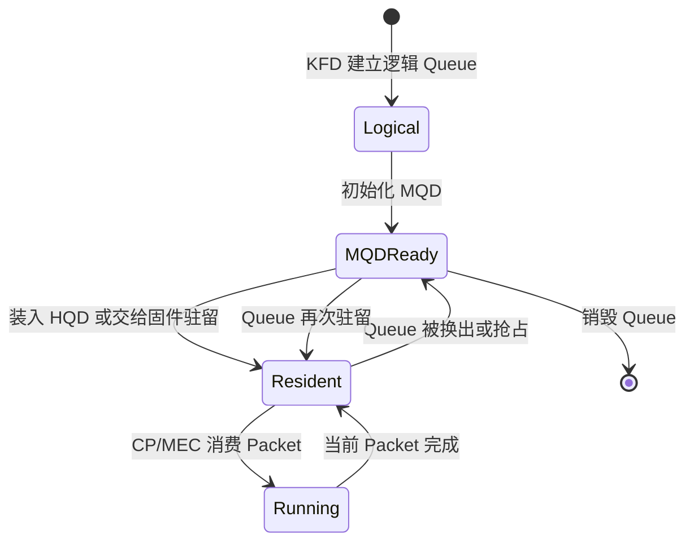
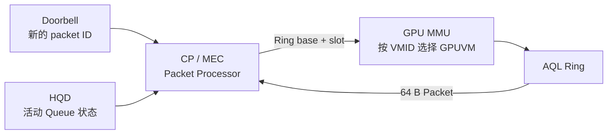
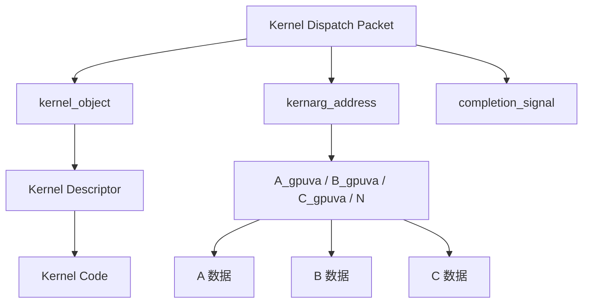
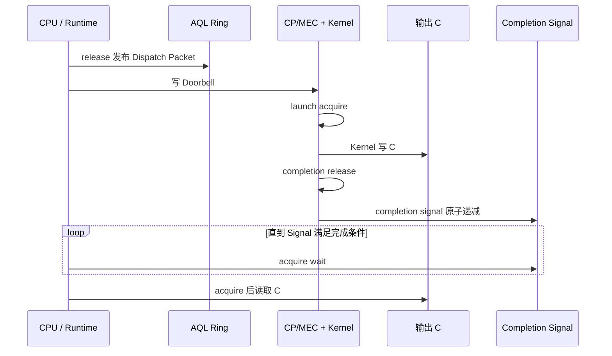
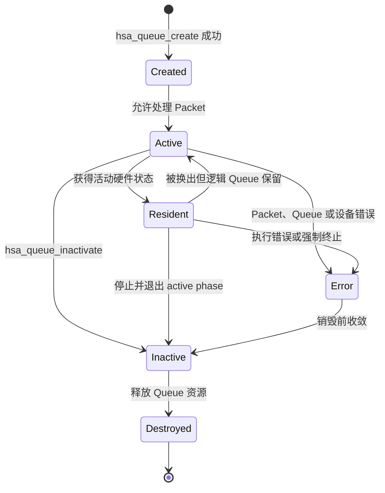
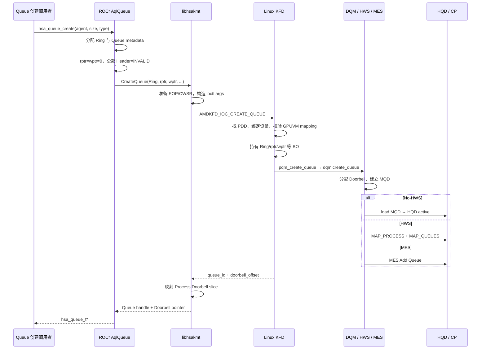
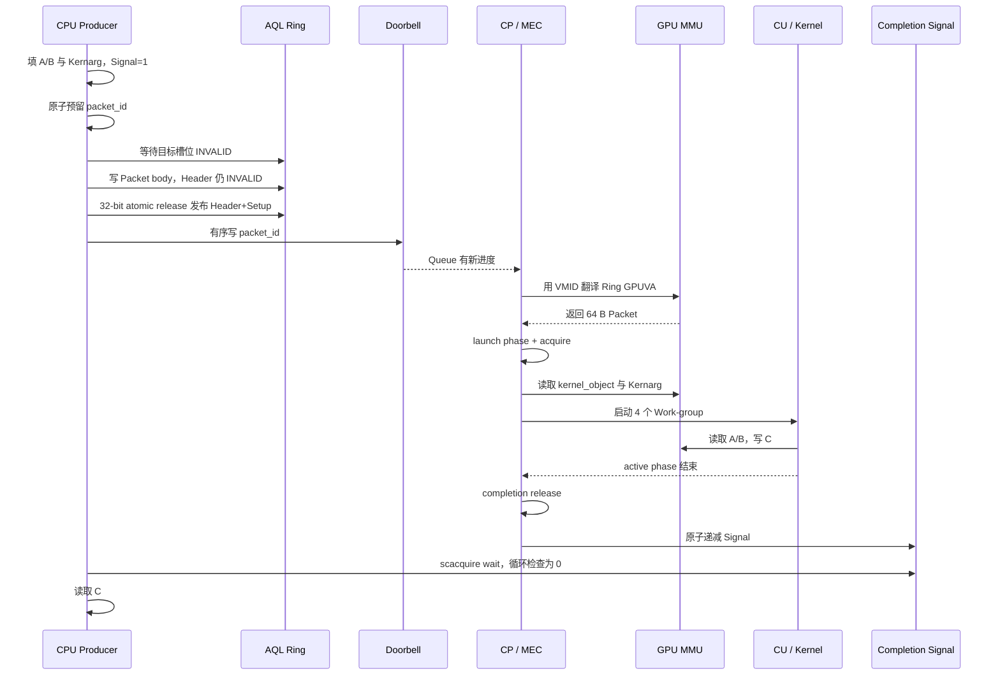
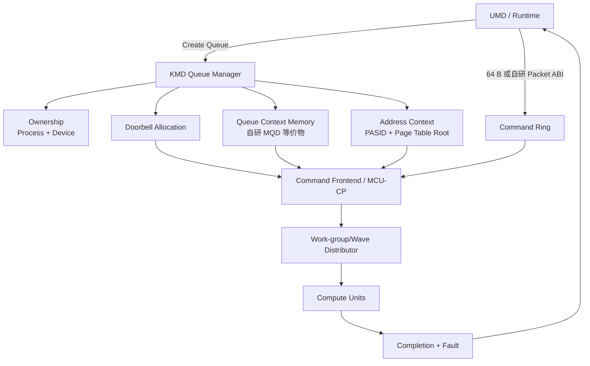

# AMD GPU 队列与 AQL Dispatch

## 缩写表

| 缩写   | 英文全称                                        | 中文含义                                                                  |
| ------ | ----------------------------------------------- | ------------------------------------------------------------------------- |
| ABI    | Application Binary Interface                    | 应用二进制接口                                                            |
| AMD    | Advanced Micro Devices                          | AMD 公司                                                                  |
| AMDGPU | AMD GPU Linux Kernel Driver                     | AMD GPU Linux 内核驱动                                                    |
| API    | Application Programming Interface               | 应用程序编程接口                                                          |
| AQL    | Architected Queuing Language                    | 架构化队列语言；本文主要指其 64 字节命令包格式与队列协议                  |
| ASIC   | Application-Specific Integrated Circuit         | 专用集成电路；本文指具体 GPU 芯片或代际                                   |
| ATC    | Address Translation Cache                       | 地址转换缓存                                                              |
| BAR    | Base Address Register                           | PCIe 基址寄存器；用于暴露设备 MMIO 窗口                                   |
| BO     | Buffer Object                                   | 缓冲对象                                                                  |
| CAS    | Compare-And-Swap                                | 比较并交换原子操作                                                        |
| CLR    | Compute Language Runtime                        | AMD 的计算语言 Runtime 代码库；包含`hipamd`、OpenCL 和 `rocclr`       |
| CP     | Command Processor                               | GPU 命令处理器                                                            |
| CPSCH  | Command Processor Scheduling                    | 命令处理器固件调度路径                                                    |
| CPU    | Central Processing Unit                         | 中央处理器                                                                |
| CU     | Compute Unit                                    | 计算单元                                                                  |
| CWSR   | Compute Wave Save/Restore                       | 计算 Wave 现场保存与恢复                                                  |
| DMA    | Direct Memory Access                            | 直接内存访问                                                              |
| DIQ    | Debug Interface Queue                           | KFD 调试接口使用的内核 Queue                                              |
| DQM    | Device Queue Manager                            | KFD 设备队列管理器                                                        |
| DRM    | Direct Rendering Manager                        | Linux 直接渲染管理框架                                                    |
| EOP    | End of Pipe                                     | 管线末端；本文指 Queue 使用的 EOP 状态资源                                |
| FW     | Firmware                                        | 固件                                                                      |
| GDS    | Global Data Share                               | AMD GPU 的全局数据共享资源                                                |
| GPU    | Graphics Processing Unit                        | 图形处理器                                                                |
| GPUVA  | GPU Virtual Address                             | GPU 虚拟地址                                                              |
| GPUVM  | GPU Virtual Memory                              | GPU 虚拟地址空间及其页表                                                  |
| GFXHUB | Graphics Hub                                    | 图形与计算访问使用的 GPU 地址翻译 Hub                                     |
| GTT    | Graphics Translation Table                      | AMDGPU 中主要表示 GPU 可访问的系统内存域                                  |
| HIP    | Heterogeneous-Compute Interface for Portability | AMD GPU 编程接口                                                          |
| hipamd | HIP implementation on AMD platform              | AMD 平台上的 HIP API 实现组件；`hipamd` 是项目名，不是首字母缩写        |
| HMM    | Heterogeneous Memory Management                 | 异构内存管理                                                              |
| HSA    | Heterogeneous System Architecture               | 异构系统架构；本文指 HSA 规范与执行模型，不是具体软件组件                 |
| HSAKMT | HSA Kernel Mode Thunk                           | ROCr 使用的 HSA 用户态内核接口层                                          |
| HQD    | Hardware Queue Descriptor                       | 硬件中一条活动 Queue 的寄存器状态                                         |
| HWS    | Hardware Scheduler                              | 负责 Queue 驻留调度的硬件/固件调度路径                                    |
| IB     | Indirect Buffer                                 | 间接命令缓冲区                                                            |
| ioctl  | Input/Output Control                            | 用户态向内核驱动发送控制请求的接口                                        |
| IP     | Intellectual Property                           | 芯片中的可复用硬件功能模块                                                |
| ISA    | Instruction Set Architecture                    | 指令集架构                                                                |
| KFD    | Kernel Fusion Driver                            | Linux AMD GPU 计算驱动接口                                                |
| KMD    | Kernel Mode Driver                              | 内核态驱动                                                                |
| KMT    | Kernel Mode Thunk                               | 用户态 Runtime 到内核驱动之间的封装层                                     |
| LDS    | Local Data Share                                | AMD GPU 上供同一 Work-group 共享的片上存储                                |
| MEC    | Micro Engine Compute                            | AMD GPU 中处理计算队列的命令处理引擎                                      |
| MES    | Micro-Engine Scheduler                          | 新一代 AMD GPU 的固件队列调度机制                                         |
| MMU    | Memory Management Unit                          | 内存管理单元                                                              |
| MMIO   | Memory-Mapped Input/Output                      | 内存映射输入/输出                                                         |
| MQD    | Memory Queue Descriptor                         | 保存在内存中的 Queue 配置镜像                                             |
| OpenCL | Open Computing Language                         | 开放计算语言及其异构计算 API                                              |
| PASID  | Process Address Space ID                        | 进程地址空间标识                                                          |
| PDD    | Process Device Data                             | KFD 中一个进程与一块 GPU 的连接对象                                       |
| PCIe   | Peripheral Component Interconnect Express       | 高速外设互连总线                                                          |
| PFN    | Page Frame Number                               | 物理页帧号                                                                |
| PM4    | AMD PM4                                         | AMD GPU 的一类底层命令包协议；本文只在 HWS 控制面中使用                   |
| PQM    | Process Queue Manager                           | KFD 进程队列管理器                                                        |
| PTE    | Page Table Entry                                | 页表项                                                                    |
| QPD    | Queue Process Device Data                       | Queue 管理层中一个进程与一块 GPU 的状态；源码类型为`qcm_process_device` |
| RAM    | Random Access Memory                            | 随机存取存储器；本文主要指系统内存                                        |
| RLC    | Run List Controller                             | 运行列表控制器                                                            |
| ROCm   | Radeon Open Compute                             | AMD GPU 计算软件栈与开发平台                                              |
| rocclr | Radeon Open Compute Common Language Runtime     | HIP/OpenCL 共用的计算 Runtime；Linux 后端连接 ROCr                        |
| ROCr   | ROCm Runtime                                    | ROCm 的 HSA 用户态运行时                                                  |
| rptr   | Read Pointer                                    | Queue 读索引；本文也写作`read_index`                                    |
| SDMA   | System Direct Memory Access                     | AMD GPU 的专用数据搬运引擎                                                |
| SE     | Shader Engine                                   | 着色器引擎                                                                |
| SIMD   | Single Instruction, Multiple Data               | 单指令多数据执行组织                                                      |
| SVM    | Shared Virtual Memory                           | 共享虚拟内存                                                              |
| TLB    | Translation Lookaside Buffer                    | 地址翻译缓存                                                              |
| UAPI   | Userspace Application Programming Interface     | 用户空间应用程序接口；本文指内核向用户态公开的 ioctl 等接口               |
| UMD    | User Mode Driver                                | 用户态驱动                                                                |
| VA     | Virtual Address                                 | 虚拟地址                                                                  |
| VMA    | Virtual Memory Area                             | Linux 虚拟内存区域                                                        |
| VMID   | Virtual Memory ID                               | GPU 活动地址空间使用的硬件上下文编号                                      |
| VRAM   | Video Random-Access Memory                      | GPU 本地显存                                                              |
| wptr   | Write Pointer                                   | Queue 写索引；本文也写作`write_index`                                   |

## 全文大纲

前两篇文档已经回答了“内存怎样成为 GPU 可访问资源”。本文继续回答“GPU 怎样收到并执行一个任务”。

本文反复使用以下术语：

| 术语             | 本文含义                                                                              |
| ---------------- | ------------------------------------------------------------------------------------- |
| Agent            | 参与 HSA 系统的执行或存储主体；本文的 Kernel Agent 是目标 AMD GPU                     |
| Producer         | 向 AQL Ring 写 Packet 的 CPU 线程或其他执行单元                                       |
| Packet Processor | 读取并处理 AQL Packet 的硬件/固件前端；AMD 计算路径主要落在 CP/MEC                    |
| Dispatch         | 某个 Kernel 的一次具体执行请求                                                        |
| Kernarg          | 按 Kernel ABI 排列的参数块                                                            |
| Work-item        | Kernel 的一个逻辑执行实例                                                             |
| Work-group       | 一组可以共享 LDS 并进行组内同步的 Work-item                                           |
| Wave             | AMD GPU 成批执行 Work-item 的硬件执行单位；具体宽度由 ISA 和 Kernel 决定              |
| Work Distributor | 本文对“把 Work-group/Wave 分配给 CU 的硬件前端”的概念性称呼；具体模块名随 ASIC 变化 |

| 章节    | 核心问题                                          | 贯穿案例所在阶段                        |
| ------- | ------------------------------------------------- | --------------------------------------- |
| 第 0 章 | 内存准备好后，还缺少哪些执行条件                  | 固定一个`vector_add` 任务和三条时间线 |
| 第 1 章 | AMD HSA 计算栈怎样分层，各类 Queue 对象分别是什么 | 建立层级图和对象地图                    |
| 第 2 章 | 一条 AQL Queue 怎样从 ROCr 创建到 KFD             | 创建控制面                              |
| 第 3 章 | MQD 怎样成为 HQD，谁决定 Queue 驻留               | 调度控制面                              |
| 第 4 章 | 一次 Kernel 调用怎样编码成 AQL Packet             | 任务描述                                |
| 第 5 章 | Producer 怎样发布 Packet 并通知硬件               | 提交数据面                              |
| 第 6 章 | CP/MEC 怎样取包并启动 Kernel                      | GPU 执行面                              |
| 第 7 章 | Kernel 完成后怎样通知 CPU                         | 完成与依赖                              |
| 第 8 章 | Queue 怎样销毁，错误发生在哪一层                  | 生命周期与错误边界                      |
| 第 9 章 | 怎样把完整路径用于调试和自研设计                  | 贯穿复盘                                |

本文采用以下固定证据基线：

- HSA Platform System Architecture Specification 1.2，重点是 §2.8“User mode queuing”和 §2.9“Architected Queuing Language”；
- Linux `248951ddc14de84de3910f9b13f51491a8cd91df`；
- ROCr `ba56a24c6132c5d195686ae4adf969ca1222fbba`；
- ROCm CLR `81277d69e3352e7144ced2ee9601484f9b48d950`。

> **源码摘录格式：** 代码块左侧数字是所链接文件的真实行号。不连续内容拆成不同代码块，不把教学伪代码写成原始源码。英文注释后会直接说明中文含义。

> **[BOUNDARY]** 本文以普通 Host 侧 Kernel Dispatch 为主线，不展开编译器内部、Device Enqueue、完整 OpenCL 跨队列调度、SVM Page Fault 恢复、普通 DRM scheduler/IB 提交以及特定 ASIC 的 MMU 微架构。这些内容分别留到后续专题。

## 0. 内存准备好后，GPU 为什么仍然不会自动执行

### 0.1 前两篇文档已经解决了什么

[01_Linux 内存管理基础](<./01_Linux 内存管理基础.md>) 建立了 CPU VA、页表、PFN、`struct page` 和 DMA 地址之间的关系。[02_GPU 内存管理基础](<./02_GPU 内存管理基础.md>) 在此基础上梳理了 GPUVA、GPUVM、BO、PTE、TLB、可见性和生命周期。

完成这两步后，已经能够判断内存是否满足 GPU 访问条件。本章再固定以下前置状态：

```text
HSA Runtime 已经初始化，目标 GPU Agent 已经选定
Kernel Code 已经装入 GPU 可访问内存
输入 A、B 和输出 C 已经映射进进程 GPUVM
Kernarg 所需内存可以分配并映射，具体参数在 Dispatch 前填写
AQL Queue 和 Ring 尚未创建，将在 Queue 创建阶段建立
```

这些前置状态只用于固定贯穿案例的讲解起点，不表示所有 Runtime 都必须先加载 Kernel Code，再创建 Queue。Runtime 可以提前建立并复用 Queue；本文关心的是开始提交当前 Packet 时，Queue、代码和相关内存都已经可用。

但这些资源不会主动告诉 GPU：

- 要运行哪个 Kernel；
- 一共有多少个 Work-item；
- 每个 Work-group 多大；
- 参数放在哪里；
- 任务完成后更新哪个 Signal。

Queue 和 AQL Packet 提供了这份“执行契约”。

### 0.2 三个面：创建、提交与完成

从驱动工程师的视角排查 Queue 问题时，先判断问题出在哪个面。

```text
创建控制面（低频）
ROCr 分配 Queue 资源
  → HSAKMT 发起 CREATE_QUEUE ioctl
  → KFD 校验归属、创建 MQD、安排驻留

提交数据面（高频）
CPU 预留 Ring 槽位
  → 填写 AQL Packet
  → release 发布有效 Header
  → 写 Doorbell

完成面（每个任务或一批任务）
CP/MEC 启动 Kernel
  → Kernel 写结果
  → Packet 完成阶段更新 Completion Signal
  → CPU acquire 后读取结果
```

三者的时间尺度不同：

| 动作                       | 通常发生次数       | 是否进入 KFD                |
| -------------------------- | ------------------ | --------------------------- |
| 创建一条 Queue             | Queue 生命周期一次 | 是                          |
| 提交一个 Kernel Packet     | 每个 Dispatch 一次 | 正常快路径不需要            |
| 等待一个 Completion Signal | 按同步策略发生     | 通常由 ROCr Signal 机制完成 |
| 销毁一条 Queue             | Queue 生命周期一次 | 是                          |

> **[INFERENCE]** AQL 的低开销来自“先把长期通路建好，再由用户态反复写 Ring”。它不是让内核少做安全校验，而是把资源归属和映射校验集中在 Queue 创建阶段。

### 0.3 贯穿案例：1024 个元素的 `vector_add`

本文使用一个一维任务：

```c
C[i] = A[i] + B[i];
```

教学参数如下：

| 项目                     | 假设                                                    |
| ------------------------ | ------------------------------------------------------- |
| 元素数量                 | 1024                                                    |
| Work-group 大小          | 256 个 Work-item                                        |
| Work-group 数量          | 4                                                       |
| AQL Ring 容量            | 256 个 Packet 槽位                                      |
| AQL Packet 大小          | 固定 64 字节                                            |
| Ring 承载内存（backing） | system RAM，已经映射进本进程 GPUVM                      |
| Kernarg                  | 保存`A_gpuva`、`B_gpuva`、`C_gpuva` 和 `N=1024` |
| Completion Signal        | 提交前值为 1，本文等待其变为 0                          |

这组数值只用于讲解，不是 ROCr 的固定配置。

这里的 Ring 容量、Packet 大小和 Work-group 数量处在三个不同层级。AQL Ring 容量以 Packet 槽位计数；Work-group 数量则表示一个 Kernel Dispatch Packet 描述的 Grid 怎样划分。两者不是一一对应关系。

```text
1 个 64 字节 Kernel Dispatch Packet
  ├─ 占用 AQL Ring 中 1 个槽位
  ├─ grid_size_x = 1024
  ├─ workgroup_size_x = 256
  └─ GPU 据此展开为 4 个 Work-group、1024 个 Work-item
```

Packet 是固定长度的执行描述符，只保存 Kernel 句柄、参数地址和执行范围等信息，不保存 1024 份机器码、参数或 Work-item 状态。增加 Grid 中的 Work-item 数量只会改变 Packet 的尺寸字段，不会增大 Packet 本身；只有 Runtime 把工作拆成多次 Dispatch 时，才会使用多个 Ring 槽位。第 4.1 节和第 4.5 节会分别展开 Packet 布局以及 Grid 与 Work-group 的关系。

```text
长期 Queue 通路

HSA Queue（`hsa_queue_t` 加关联状态）
  ├─ base_address ──→ 256 × 64 B AQL Ring
  ├─ read_index
  ├─ write_index
  └─ doorbell_signal

一次 vector_add

Packet
  ├─ kernel_object ──→ Kernel 执行对象
  ├─ kernarg_address ──→ {A_gpuva, B_gpuva, C_gpuva, 1024}
  ├─ grid_size_x = 1024
  ├─ workgroup_size_x = 256
  └─ completion_signal ──→ 初值 1
```

### 0.4 本文始终追问五个问题

1. 当前对象是谁创建、由谁拥有？
2. 当前地址是 CPU VA、GPUVA，还是 MMIO 地址？
3. 当前动作发生在 Queue 创建期，还是每次 Dispatch？
4. 当前进度表示“槽位释放”还是“Kernel 完成”？
5. 当前同步解决执行依赖，还是内存可见性？

这五个问题比函数名更值得记住。函数和寄存器会随代际变化，职责边界则相对稳定。

## 1. AMD HSA 计算栈与 Queue 对象地图

### 1.0 AMD HSA 计算栈如何连接到 GPU

先看软件组件怎样连接：

```text
HIP API    → hipamd ────────┐
                            ├→ rocclr → ROCr → HSAKMT → KFD/AMDGPU → GPU
OpenCL API → OpenCL Runtime ┘

直接使用 HSA API 的程序 ─────────────→ ROCr → HSAKMT → KFD/AMDGPU → GPU
```

这张图只表示组件依赖关系，不表示一次 Kernel Dispatch 会逐层调用所有组件。直接使用 HSA API 的程序跳过 HIP/OpenCL 前端和 `rocclr`，从 ROCr 开始执行。

| 组件                        | 在本文路径中的作用                                           |
| --------------------------- | ------------------------------------------------------------ |
| `hipamd` / OpenCL Runtime | 接收 HIP/OpenCL API 调用，维护高层 Stream、Queue 和 Event    |
| `rocclr`                  | 把高层命令转换为 Kernarg、Grid、依赖和 AQL Packet            |
| ROCr                        | 实现 HSA Runtime，管理 Agent、HSA Queue、Ring、Signal 和内存 |
| HSAKMT                      | 把 Queue、内存和事件请求转换为 KFD UAPI 调用                 |
| KFD / AMDGPU                | KFD 管理计算进程与 Queue；AMDGPU 提供 BO、GPUVM 和硬件操作   |
| GPU                         | 读取 AQL Packet，分发 Work-group，并由 CU 执行 Kernel        |

HSA 是一份接口与执行语义规范，不是调用链中的软件模块。它规定：

- Queue 和 Signal 的对外语义；
- AQL Packet 的格式与处理规则；
- Producer 与 Packet Processor 之间的内存顺序。

ROCr 在用户态实现这些 Runtime 语义，GPU 的 Packet Processor 按相同规则解析 AQL Packet。HSA 规范本身不会调用 HSAKMT 或 KFD，也不规定这些组件的内部类和函数。

对于 HIP/OpenCL 程序，`rocclr` 先把高层 Kernel 命令转换成 GPU 可以提交的任务描述：

```text
HIP/OpenCL Kernel 命令
  → Kernarg
  → Grid / Work-group 参数
  → Event 与依赖关系
  → Kernel Dispatch Packet
```

Queue 创建路径建立长期提交通路，Packet 提交路径随后反复使用这条通路。

```text
Queue 创建控制路径（每条 Queue 通常一次）

HIP/OpenCL 前端 → rocclr，或直接 HSA 调用者
  → 需要新 Queue 时，由 ROCr 创建 hsa_queue_t、Ring 和索引
  → HSAKMT 发起 CREATE_QUEUE ioctl
  → KFD 绑定 Process-Device、校验资源并持有 BO
  → PQM/DQM 建立 Queue 和 MQD
  → No-HWS 直接装载 HQD，或由 HWS/MES 管理驻留

Packet 提交快速路径（每个 Dispatch 重复）

rocclr 或直接 HSA AQL Producer
  → 准备 Kernarg、Grid、依赖和 Completion Signal
  → 在 hsa_queue_t 指向的 Ring 中填写 Packet
  → release 发布 Header
  → 写 Doorbell
  → CP/MEC 取包，GPU MMU 翻译相关 GPUVA
  → CU 执行 Kernel
  → Completion Signal 通知 CPU / Runtime
```

Queue 创建时，ROCr、HSAKMT 和 KFD 建立 Ring、Doorbell 与内核 Queue。创建完成后，Producer 反复写 AQL Ring 和 Doorbell。普通 Dispatch 不再逐 Packet 调用 HSAKMT，也不再逐 Packet 进入 KFD ioctl。

> **[BOUNDARY]** 本章只把 Runtime 初始化和 Agent 发现作为 Queue 创建的前置条件，不展开 `hsa_init()` 的完整实现，也不追踪 PCI Probe、AMDGPU IP 初始化、固件加载和设备启动。那些过程属于系统与驱动初始化生命周期，不是一次 AQL Queue 的创建或一次 Packet 的提交。

> **[SOURCE] 可选源码索引**
>
> - 固定 CLR 基线 `81277d69e3352e7144ced2ee9601484f9b48d950` 的 [`README.md`](./2.源码/rocm-clr/README.md) 第 1～3、21～23 行说明：CLR 是 Compute Language Runtime，`hipamd` 实现 AMD 平台上的 HIP，`opencl` 实现 OpenCL，`rocclr` 是两者共用的计算 Runtime；
> - [`rocclr/cmake/ROCclrHSA.cmake`](./2.源码/rocm-clr/rocclr/cmake/ROCclrHSA.cmake) 第 23～36 行显示，`rocclr` 的 ROCr 后端包含 HSA 头文件并链接 `hsa-runtime64`；[`rocclr/device/rocm/rocvirtual.cpp`](./2.源码/rocm-clr/rocclr/device/rocm/rocvirtual.cpp) 第 1184～1293 行显示，普通 Dispatch 直接写 `gpu_queue_->base_address`、发布 Header 并写 `doorbell_signal`；
> - 固定 ROCr 基线 `ba56a24c6132c5d195686ae4adf969ca1222fbba` 的 [`runtime/docs/what-is-rocr-runtime.rst`](./2.源码/rocr-runtime/runtime/docs/what-is-rocr-runtime.rst) 第 10～29 行说明 ROCr 是 AMD 的 HSA Runtime 实现，并提供 Agent、Signal、AQL Dispatch 和内存管理等接口；
> - ROCr [`README.md`](./2.源码/rocr-runtime/README.md) 第 6～8 行区分 HSA Runtime 与 `libhsakmt`；[`libhsakmt/README.md`](./2.源码/rocr-runtime/libhsakmt/README.md) 第 1～10 行说明 `libhsakmt` 提供访问内核驱动的用户态接口。

### 1.1 “Queue”可能指以下五种对象

同一条调用栈中会连续出现 HIP Stream、`hsa_queue_t`、AQL Ring、MQD 和 HQD。它们分别表示或保存命令顺序、用户态提交入口、Packet、Queue 配置和硬件活动状态。代码和日志可能都把这些对象简称为 `queue`，因此需要先确认当前语境指哪一层。

```text
HIP Stream S
  │ 高层命令按什么顺序执行
  ▼
rocclr 选择一个 hsa_queue_t Q
  │ Q 告诉 Producer：Ring 在哪里、Doorbell 在哪里
  ▼
AQL Ring R
  │ 真正存放 64 字节 AQL Packet
  ▼
MQD M
  │ 保存 R 的地址、rptr/wptr、Doorbell 等 Queue 配置
  ▼
HQD H
  │ M 被装入硬件寄存器后形成的活动 Queue 状态
  ▼
CP/MEC 根据 H 找到 R，并读取 Packet
```

图中的箭头表示对象之间的引用和配置关系，不表示 Queue 的创建调用顺序。Queue 创建时，KFD 根据 Ring、指针和 Doorbell 等资源建立 MQD；Queue 获得驻留时，KFD 或固件再把 MQD 装入 HQD。具体创建过程见第 2～3 章。

本文所说的“一条底层 HSA/KFD Queue”，由下面这些相互关联的状态共同组成：

```text
Queue Q
├─ AQL Ring：存放 Packet
├─ write_index：CPU 下一次提交到哪里
├─ read_index：GPU 已经处理到哪里
├─ Doorbell：CPU 通知 GPU 有新 Packet
├─ 所属进程和 GPU 地址空间
├─ MQD：保存在内存中的 Queue 配置
└─ HQD：Queue 驻留时使用的硬件状态
```

Queue 已经创建、但尚未提交任何 Packet 时，初始状态如下：

```text
Queue Q

Ring：
┌─────────┬─────────┬─────┬──────────┐
│ INVALID │ INVALID │ ... │ INVALID  │
│ slot 0  │ slot 1  │ ... │ slot 255 │
└─────────┴─────────┴─────┴──────────┘

write_index = 0
read_index  = 0
```

**[BOUNDARY]** 图中用 `...` 省略了 `slot 2`～`slot 254`。256 个 slot 的编号范围是 0～255。此时 Queue 已经存在，Ring 中还没有等待 GPU 处理的有效 Packet。

其中最容易混淆的是高层 API Queue 与 `hsa_queue_t`：

> HIP Stream 是应用使用的逻辑执行队列，表示命令顺序和依赖。`hsa_queue_t` 是 ROCr 提供的 AQL 提交入口，告诉 Producer 应向哪个 Ring 写 Packet，以及通过哪个 Doorbell 通知 GPU。

`hsa_queue_t` 位于用户态，保存 Producer 提交 Packet 所需的入口信息。HQD 位于 GPU 中，是数量有限的活动 Queue 寄存器槽。

一条 HIP Stream 可以在某段时间内独占一个 `hsa_queue_t`，但这种独占只是绑定关系；两个对象仍有各自的类型、状态和生命周期。

#### 1.1.1 HIP Stream：从接口调用到各层 Queue

以显式创建一条 HIP Stream 为例：

```cpp
hipStream_t stream1;
hipStreamCreate(&stream1);
```

下面假设 `rocclr` 的 Queue 池中没有可复用的底层 Queue。`hipStreamCreate()` 因而需要向下创建新的 HSA/KFD Queue。每一层都会创建自己的对象，并保存与相邻层对象的关系：

```text
应用程序
  hipStreamCreate(&stream1)
  │ 请求创建一条 HIP Stream
  ▼
hipamd
  new hip::Stream(...)
  │ 创建：hip::Stream 对象
  │ 最终以 hipStream_t 句柄返回给应用
  ▼
rocclr
  hip::Stream 的基类 amd::HostQueue 初始化
  → 为 HostQueue 创建 VirtualGPU（rocclr 用户态后端执行对象）
  → VirtualGPU::create()
  → Device::acquireQueue()
  │ 创建：HostQueue 和 VirtualGPU
  ▼
ROCr
  hsa_queue_create()
  → 创建 AqlQueue
  → 分配 AQL Ring，并把所有 Packet Header 初始化为 INVALID
  → 把 rptr、wptr 初始化为 0
  → 填充 hsa_queue_t 的 base_address、size 和 doorbell_signal 等字段
  │ 创建：hsa_queue_t、AQL Ring 和用户态索引状态
  ▼
HSAKMT
  hsaKmtCreateQueueExt()
  → 把 Ring、rptr/wptr、Queue 类型和优先级整理进 ioctl 参数
  → 发起 AMDKFD_IOC_CREATE_QUEUE
  ▼
KFD
  绑定当前进程与目标 GPU
  → PQM/DQM 创建内核 Queue 记录
  → 分配 Doorbell 并建立 MQD
  → No-HWS 模式直接装载 HQD；HWS/MES 模式交给固件安排驻留
  │ 创建：KFD Queue、MQD，以及 Queue 驻留时使用的 HQD 状态
  ▼
创建结果逐层返回
  KFD 返回 Queue ID 和 Doorbell offset
  → HSAKMT 映射 Doorbell，并返回 Queue resource
  → ROCr 完成 Doorbell Signal 等 AqlQueue 状态
  → rocclr 的 VirtualGPU 保存 hsa_queue_t 指针
  → hipamd 把 stream1 返回给应用
```

`VirtualGPU` 是 `rocclr` 为一条 `HostQueue` 创建的用户态 C++ 对象。它的 `gpu_queue_` 成员保存 `hsa_queue_t*`，并维护 Kernarg 缓冲区、Barrier、Signal 等与该高层 Queue 相关的后端状态。提交命令时，`VirtualGPU` 通过 `gpu_queue_->base_address` 定位 AQL Ring，写入 Packet，再通过 `gpu_queue_->doorbell_signal` 更新 Doorbell。名称中的 `VirtualGPU` 不表示另一块物理 GPU，也不表示硬件虚拟化。

调用返回后，`stream1` 指向高层 `hip::Stream`。`hip::Stream` 通过 `HostQueue` 和 `VirtualGPU` 关联到 `hsa_queue_t`，`hsa_queue_t` 再指向 AQL Ring 和 Doorbell。KFD 用 MQD 保存这条底层 Queue 的配置；Queue 驻留时，GPU 用 HQD 保存活动状态。

一个进程可以在同一目标 GPU 上创建多条 HIP Stream。本文固定的 CLR 实现会为每条 `HostQueue` 创建一个 `VirtualGPU`，而每个 `VirtualGPU` 当前通过一个 `gpu_queue_` 指针使用一条底层 `hsa_queue_t`。对于允许复用的普通 Queue，当对应优先级的底层 Queue 池达到上限时，多个 `VirtualGPU` 可以复用同一个 `hsa_queue_t`：

```text
进程
├─ HIP Stream / HostQueue A
│    └─ VirtualGPU A
│         └─ gpu_queue_ → hsa_queue_t Q0 → AQL Ring 0
│
├─ HIP Stream / HostQueue B
│    └─ VirtualGPU B
│         └─ gpu_queue_ → hsa_queue_t Q1 → AQL Ring 1
│
└─ HIP Stream / HostQueue C
     └─ VirtualGPU C
          └─ gpu_queue_ → hsa_queue_t Q0 → AQL Ring 0（与 A 复用）
```

这些对象的数量关系可以写成：

```text
HostQueue  → VirtualGPU  ：一对一
VirtualGPU → hsa_queue_t ：每个 VirtualGPU 当前使用一个；多个 VirtualGPU 可以复用同一个
hsa_queue_t → AQL Ring   ：一对一
```

创建和绑定的方向是：高层 `HostQueue` 创建 `VirtualGPU`，`VirtualGPU` 再从底层 Queue 池中取得或复用 `hsa_queue_t`。

**[BOUNDARY]** 如果 `Device::acquireQueue()` 选中 Queue 池中已有的 `hsa_queue_t`，`rocclr` 会直接复用该提交入口。这次 `hipStreamCreate()` 不再请求 ROCr、HSAKMT 和 KFD 创建新的底层 Queue。

> **[SOURCE] 可选源码索引**
>
> 以下路径均来自固定 CLR 基线 `81277d69e3352e7144ced2ee9601484f9b48d950`：
>
> - `hipStreamCreate() → hip::Stream`：[`hipamd/src/hip_stream.cpp`](./2.源码/rocm-clr/hipamd/src/hip_stream.cpp) 第 18～30、188～201、274～281 行；
> - `HostQueue → VirtualGPU → acquireQueue()`：[`rocclr/platform/commandqueue.hpp`](./2.源码/rocm-clr/rocclr/platform/commandqueue.hpp) 第 159～175 行，以及 [`rocclr/device/rocm/rocvirtual.cpp`](./2.源码/rocm-clr/rocclr/device/rocm/rocvirtual.cpp) 第 1737～1758、1877～1887 行；
> - 复用已有 Queue 或调用 ROCr 创建新 Queue：[`rocclr/device/rocm/rocdevice.cpp`](./2.源码/rocm-clr/rocclr/device/rocm/rocdevice.cpp) 第 3135～3175 行。
>
> ROCr、HSAKMT 和 KFD 的 Queue 创建源码分别在第 2.1～2.8 节和第 3.0～3.5 节展开。

#### 1.1.2 `hsa_queue_t`：底层 AQL 提交入口

`rocclr` 为 HIP Stream 建立或选择底层提交通道时，会取得一个 `hsa_queue_t`：

```text
hsa_queue_t Q
  ├─ base_address ─────→ AQL Ring
  ├─ doorbell_signal ──→ Doorbell
  ├─ size ─────────────→ Ring 容量
  └─ id ───────────────→ 公开 Queue ID
```

提交 Kernel 时，`rocclr` 使用这些字段完成以下操作：

```text
高层 Kernel 命令
  → rocclr 构造 Kernel Dispatch Packet
  → 写入 Q.base_address 指向的 Ring
  → release 发布 Packet Header
  → 写 Q.doorbell_signal
  → CP/MEC 取包
```

HIP Stream 与 `hsa_queue_t` 服务于不同层次：

- HIP Stream/OpenCL Command Queue 保存 API 规定的命令顺序、依赖和属性；
- `hsa_queue_t` 保存 HSA/AQL 提交需要的 Ring、Doorbell 和 Queue 身份；
- 应用可以创建多条 Queue，Runtime 则从底层 HSA Queue 池中选择或复用提交通道；
- 高层 Queue 与 `hsa_queue_t` 各自保持生命周期，Runtime 负责管理两者的绑定和复用。

Producer 通过 `hsa_queue_t` 找到 Ring，并通过 Doorbell 通知新进度。CP/MEC 通过 HQD 中的 Ring 地址、指针和地址空间状态找到同一个 Ring。MQD 和 HQD 保存 Queue 配置，具体的 Kernel Dispatch Packet 保存在 Ring 中。

#### 1.1.3 AQL Ring：真正存放 Packet

AQL Ring 是实际保存 Packet 的内存，每个 slot 存放一个固定 64 字节的 AQL Packet。Queue 创建完成后，应用向 `stream1` 提交第一个 Kernel：

```cpp
kernelA<<<grid, block, 0, stream1>>>();
```

`hipamd` 根据 `stream1` 找到 `hip::Stream`，`rocclr` 再取得该 Stream 对应的 `VirtualGPU`。`VirtualGPU` 通过成员 `gpu_queue_` 取得 `hsa_queue_t`，再根据 `hsa_queue_t.base_address` 定位 Ring，并把 Kernel A 编码成一个 Kernel Dispatch Packet：

```text
1. 取得旧 write_index = 0，并把 write_index 增加到 1
2. 用 0 & (256 - 1) 得到 slot 0
3. 把 Kernel Dispatch Packet 的内容写入 slot 0
4. 以 release 语义发布 Packet Header
5. 写 Doorbell，通知硬件 Packet ID 0 已经发布
```

此时 Ring 的简化状态是：

```text
Ring：
┌────────────────────────┬─────────┬─────┬──────────┐
│ Kernel Dispatch Packet │ INVALID │ ... │ INVALID  │
│ slot 0                 │ slot 1  │ ... │ slot 255 │
└────────────────────────┴─────────┴─────┴──────────┘

write_index = 1
read_index  = 0
```

CP/MEC 根据 HQD 定位这条 Ring，读取 `slot 0` 并启动 Kernel。硬件消费该 Packet 后，`read_index` 前进到 1。Ring 的 slot 保存 Packet，`hsa_queue_t` 提供 Ring 地址和 Doorbell 等提交入口信息。

> **[SOURCE]** 固定 CLR 基线 [`rocclr/device/rocm/rocvirtual.cpp`](./2.源码/rocm-clr/rocclr/device/rocm/rocvirtual.cpp) 第 1184～1276 行依次取得 write index、用掩码定位 slot、复制 Packet、以 release 语义发布 Header，并把 Packet ID 写入 Doorbell。

#### 1.1.4 MQD：内存中的 Queue 配置

MQD 保存整条 Queue 的配置，具体任务仍由 Ring 中的 Packet 描述。不同 ASIC 的字段布局不同，但通常包括以下信息：

```text
Ring base 和 Ring size
rptr/wptr 地址或保存值
Doorbell offset
EOP、CWSR 等 Queue 辅助资源
优先级和其他调度属性
地址空间相关状态
```

Queue 获得驻留时，KFD 或固件根据 MQD 恢复这些配置。一份 MQD 通常描述整条 Queue，与 Ring 中有多少个 Packet 无关。

#### 1.1.5 HQD：已经装入硬件的活动状态

HQD 是 GPU 中有限的一组活动 Queue 寄存器槽。以 No-HWS/GFX9 的简化路径为例，装载 MQD 会把 Queue 配置写入对应的 HQD 寄存器：

```text
MQD 中的 Ring base      → HQD Ring base 寄存器
MQD 中的 rptr/wptr 状态 → HQD 进度寄存器和轮询地址
MQD 中的 Doorbell       → HQD Doorbell 配置
MQD 中的地址空间状态    → HQD VM 上下文
```

HQD 激活后，CP/MEC 根据其中的 Ring 地址、进度和地址翻译上下文定位 AQL Ring，再读取 Packet。HWS/MES 路径还会把 PASID、页表根等进程状态交给固件，由固件管理最终使用的 VMID 和 HQD 位置。上图表达的是 MQD 与 HQD 的字段关系：MQD 保存可恢复的配置，HQD 保存当前活动配置。

可以用下面五个问题区分这些对象：

| 对象                        | 保存或表示什么                  | 主要回答                              |
| --------------------------- | ------------------------------- | ------------------------------------- |
| 高层 API Queue / HIP Stream | API 命令的顺序与依赖            | 哪些 Kernel、拷贝和 Event 先后执行？  |
| `hsa_queue_t`             | ROCr 暴露给 Producer 的提交入口 | Packet 写到哪里，发布后怎样通知硬件？ |
| AQL Ring                    | GPU 可访问的 Packet 循环缓冲区  | 当前有哪些 Packet 等待硬件处理？      |
| MQD                         | 保存在内存中的 Queue 配置镜像   | 这条 Queue 驻留时应恢复什么配置？     |
| HQD                         | GPU 中有限的活动 Queue 寄存器槽 | 哪条 Queue 当前可以被 CP/MEC 消费？   |

Queue 创建期负责建立这些对象之间的关系。ROCr 创建 `hsa_queue_t` 和 Ring，KFD 为同一条底层 Queue 建立 MQD。Queue 获得驻留时，KFD 或固件再把 MQD 装入 HQD。如果 Ring 中还没有有效 Packet，GPU 此时没有 Kernel 可以执行。

后续 Dispatch 会复用这些对象之间的关系。`rocclr` 通过 `hsa_queue_t` 找到 Ring，写入 Packet 并更新 Doorbell；CP/MEC 根据 HQD 中的状态定位同一个 Ring，再读取 Packet。

这些对象之间不是固定的一一对应关系：

- 多个高层 API Queue 可以共享 Runtime 池中的底层 HSA Queue；
- HWS/MES 可以把一条底层 HSA/KFD Queue 换出 HQD，稍后再恢复驻留；
- 一个 Ring 可以先后承载多个 Packet，而 MQD 始终描述整条 Queue。

### 1.2 可选规范阅读：`hsa_queue_t` 的公开字段

第 1.1.2 节已经说明了 `hsa_queue_t` 的用途。本节不再引入新的 Queue 对象，只用 HSA 接口定义核对它向 Producer 提供的信息：

| 字段                   | Producer 从中得到的信息              |
| ---------------------- | ------------------------------------ |
| `type`、`features` | Queue 类型以及支持的 Packet 类别     |
| `base_address`       | AQL Ring 的起始地址                  |
| `doorbell_signal`    | 发布 Packet 后使用的 Doorbell Signal |
| `size`               | Ring 能容纳的 Packet 数量            |
| `id`                 | ROCr 对应用公开的 Queue 标识         |

下面的定义用于验证这些字段。第一次阅读时可以跳过源码块，直接看源码后的结论。

> **[SPEC]** ROCr HSA 头文件 [`runtime/hsa-runtime/inc/hsa.h`](./2.源码/rocr-runtime/runtime/hsa-runtime/inc/hsa.h) 第 2300～2363 行：

```c
2300: /**
2301:  * @brief User mode queue.
2302:  *
2303:  * @details The queue structure is read-only and allocated by the HSA runtime,
2304:  * but agents can directly modify the contents of the buffer pointed by @a
2305:  * base_address, or use HSA runtime APIs to access the doorbell signal.
2306:  *
2307:  */
2308: typedef struct hsa_queue_s {
2309:   /**
2310:    * Queue type.
2311:    */
2312:   hsa_queue_type32_t type;
2313:
2314:   /**
2315:    * Queue features mask. This is a bit-field of ::hsa_queue_feature_t
2316:    * values. Applications should ignore any unknown set bits.
2317:    */
2318:   uint32_t features;
2319:
2320: #ifdef HSA_LARGE_MODEL
2321:   void* base_address;
2322: #elif defined HSA_LITTLE_ENDIAN
2323:   /**
2324:    * Starting address of the HSA runtime-allocated buffer used to store the AQL
2325:    * packets. Must be aligned to the size of an AQL packet.
2326:    */
2327:   void* base_address;
2328:   /**
2329:    * Reserved. Must be 0.
2330:    */
2331:   uint32_t reserved0;
2332: #else
2333:   uint32_t reserved0;
2334:   void* base_address;
2335: #endif
2336:
2337:   /**
2338:    * Signal object used by the application to indicate the ID of a packet that
2339:    * is ready to be processed. The HSA runtime manages the doorbell signal. If
2340:    * the application tries to replace or destroy this signal, the behavior is
2341:    * undefined.
2342:    *
2343:    * If @a type is ::HSA_QUEUE_TYPE_SINGLE, the doorbell signal value must be
2344:    * updated in a monotonically increasing fashion. If @a type is
2345:    * ::HSA_QUEUE_TYPE_MULTI, the doorbell signal value can be updated with any
2346:    * value.
2347:    */
2348:   hsa_signal_t doorbell_signal;
2349:
2350:   /**
2351:    * Maximum number of packets the queue can hold. Must be a power of 2.
2352:    */
2353:   uint32_t size;
2354:   /**
2355:    * Reserved. Must be 0.
2356:    */
2357:   uint32_t reserved1;
2358:   /**
2359:    * Queue identifier, which is unique over the lifetime of the application.
2360:    */
2361:   uint64_t id;
2362:
2363: } hsa_queue_t;
```

这段定义确认了以下边界：

- `hsa_queue_t` 结构本身由 Runtime 分配并管理，Producer 不修改结构体字段；
- Producer 把 Packet 写入 `base_address` 指向的 Ring，并通过 `doorbell_signal` 通知硬件；
- `size` 的单位是 Packet 槽位数，并且必须是 2 的幂；
- `id` 只标识 ROCr 对外公开的 Queue，不表示 Ring 地址或 KFD `queue_id`。

`base_address` 周围的条件编译只调整结构体在不同编译模型和字节序下的字段布局，不改变它指向 AQL Ring 这一职责。本文固定源码基线对应的 Linux AMD GPU 路径使用小端布局。

### 1.3 ROCr、HSAKMT 和 KFD 的 Queue 标识关系

Queue 创建完成后，Producer 可以通过 `hsa_queue_t` 提交 Packet。ROCr 后续更新或销毁这条 Queue 时，还会再次调用 HSAKMT 和 KFD。ROCr、HSAKMT 与 KFD 管理的是三份相互关联的对象，不是同一个结构体：

```text
ROCr      管理 AqlQueue
HSAKMT    管理用户态私有 struct queue
KFD       管理内核态 struct queue
```

创建请求向下执行时，HSAKMT 先分配自己的私有 `struct queue`，KFD 随后创建内核 Queue。创建成功后，结果按照下面的顺序返回：

```text
1. KFD
   创建内核态 struct queue
   → 分配 KFD queue_id
   → 向 HSAKMT 返回 queue_id 和 Doorbell offset

2. HSAKMT
   把 KFD queue_id 保存到私有 q->queue_id
   → 把私有 struct queue 的地址编码成 HSA_QUEUEID
   → 向 ROCr 返回这个 HSA_QUEUEID

3. ROCr
   把 HSA_QUEUEID 保存到 AqlQueue::queue_id_
   → 另行生成 hsa_queue_t::id，作为公开 Queue 标识
```

因此，ROCr 中会同时看到两个名称带有 `id` 的字段，但用途不同：

```text
应用持有 hsa_queue_t*
└─ hsa_queue_t::id
     ROCr 对外公开的数字标识
     不用于 HSAKMT 或 KFD ioctl

ROCr AqlQueue
└─ AqlQueue::queue_id_，类型为 HSA_QUEUEID
     │ ROCr 把它传给 hsaKmtUpdateQueue()、hsaKmtDestroyQueue()
     ▼
HSAKMT 私有 struct queue *q
└─ q->queue_id
     │ HSAKMT 把它写入 ioctl 参数
     ▼
KFD 内核态 struct queue
└─ properties.queue_id
     KFD 用它在当前进程中查找 Queue
```

这里的 `HSA_QUEUEID` 是 libhsakmt 接口中的不透明句柄，不是 `hsa_queue_t::id`。在本文固定的 libhsakmt 实现中，`HSA_QUEUEID` 编码了私有 `struct queue` 的用户态地址。ROCr 只需在后续 Queue 操作中把该值交还 HSAKMT，不需要解析它。

以销毁为例，ROCr 和 KFD 使用的查找值会在 HSAKMT 中完成一次转换：

```text
ROCr
  hsaKmtDestroyQueue(AqlQueue::queue_id_)
      │ 传入 HSA_QUEUEID
      ▼
HSAKMT
  HSA_QUEUEID → 私有 struct queue *q
  q->queue_id → KFD queue_id
      │
      ▼
KFD
  DESTROY_QUEUE(queue_id = KFD queue_id)
  → 在当前进程中查找并销毁内核 Queue
```

这条销毁路径不使用 `hsa_queue_t::id`。`hsa_queue_t::id` 只是在当前应用生命周期内唯一的公开标识；ROCr 传给 HSAKMT 的是 `AqlQueue::queue_id_`。

`doorbell_id` 属于另一条关系。KFD 用它选择当前进程在目标 GPU 上的 Doorbell 槽位，再计算返回给 HSAKMT 的 Doorbell offset：

```text
KFD doorbell_id
  → Doorbell offset
  → HSAKMT 映射出的用户态 Doorbell 地址
  → ROCr Doorbell Signal 使用的硬件写入地址
```

`doorbell_id` 是槽位索引，不参与 ROCr、HSAKMT 和 KFD 之间的 Queue 查找。

> **[BOUNDARY]** pre-SOC15 路径会令 `doorbell_id` 等于 KFD `queue_id`，而 SOC15 路径可以单独分配 `doorbell_id`。即使两个值相等，Doorbell 槽位和 KFD Queue 标识仍承担不同职责。

> **[SOURCE] 可选源码索引**
>
> - ROCr [`runtime/hsa-runtime/core/inc/queue.h`](./2.源码/rocr-runtime/runtime/hsa-runtime/core/inc/queue.h) 第 406～412 行定义公开 HSA Queue ID 的递增计数器；[`runtime/hsa-runtime/core/runtime/amd_aql_queue.cpp`](./2.源码/rocr-runtime/runtime/hsa-runtime/core/runtime/amd_aql_queue.cpp) 第 281～286 行分别填写 `hsa_queue_t::id`，并把 HSAKMT 返回的 `QueueResource.QueueId` 保存到 `queue_id_`；
> - libhsakmt [`libhsakmt/src/queues.c`](./2.源码/rocr-runtime/libhsakmt/src/queues.c) 第 54～56、719～747 行把 KFD `queue_id` 保存进私有 `struct queue`，再把该对象的地址编码成 `HSA_QUEUEID` 返回；第 785～797 行展示销毁时的反向转换；
> - Linux [`kfd_chardev.c`](./2.源码/linux/drivers/gpu/drm/amd/amdkfd/kfd_chardev.c) 第 405～424 行返回 KFD `queue_id` 和 Doorbell offset；[`kfd_device_queue_manager.c`](./2.源码/linux/drivers/gpu/drm/amd/amdkfd/kfd_device_queue_manager.c) 第 567～642 行展示不同 GPU 代际的 `doorbell_id` 分配与 Doorbell offset 计算。

### 1.4 AQL Queue 与普通 DRM IB 使用不同的提交路径

前一篇文档介绍过 GPUVM 和普通 DRM 命令提交。AQL Compute 也使用 GPUVM，但它组织和提交命令的方式不同：

```text
AQL Compute
ROCr / HSAKMT / KFD
  → 用户态 AQL Ring
  → Doorbell
  → CP/MEC 解析 Kernel Dispatch Packet

普通 DRM 命令提交
用户态提交 ioctl
  → DRM scheduler / amdgpu_job
  → IB
  → GPU 的普通命令 Ring
```

| 对比项                   | AQL Queue                         | 普通 DRM IB 路径          |
| ------------------------ | --------------------------------- | ------------------------- |
| 每次工作放在哪里         | 长期用户态 Ring 的 64 字节槽位    | 单独组织的 IB/Job         |
| 常规提交是否逐次进入 KMD | 否，创建后直接写 Ring 与 Doorbell | 是，通常由 ioctl 建立 Job |
| 主要调度对象             | KFD 计算 Queue 与 AQL Packet      | DRM scheduler Job 与 IB   |
| 是否使用 GPUVM           | 是                                | 也可以使用                |

两条路径可以共享 GPUVM、PTE 和 TLB 等内存管理基础设施。普通 AQL Dispatch 创建 Queue 后，由 Producer 写 AQL Ring 和 Doorbell；`drm_sched_job → amdgpu_ib_schedule()` 属于普通 DRM Job/IB 路径，不是 AQL 的逐 Packet 执行路径。

### 1.5 Queue 生命周期与后文章节的对应关系

第 1 章已经建立软件栈和 Queue 对象地图。后文沿同一条 Queue 的生命周期展开：

```text
第 2 章：ROCr、HSAKMT 和 KFD 创建底层 Queue
  → 第 3 章：MQD 怎样装入 HQD，Queue 怎样获得驻留
  → 第 4 章：一次 Kernel 调用怎样变成 AQL Packet
  → 第 5 章：Producer 怎样发布 Packet 并写 Doorbell
  → 第 6 章：CP/MEC 怎样取包并启动 Kernel
  → 第 7 章：Completion Signal 怎样通知 CPU
  → 第 8 章：Queue 怎样停止、销毁和处理错误
  → 第 9 章：把创建、提交、执行和完成串成完整时序
```

阅读后文源码时，先确认 `queue` 所在的软件或硬件层，再判断它保存的是 Packet、Queue 配置还是活动寄存器状态。对象定位清楚后，才有可能正确分析它的创建者、生命周期和并发关系。

## 2. Queue 创建：从 ROCr 到 KFD

### 2.0 Queue 创建一次，Packet 可以重复提交

贯穿案例的时间线是：

```text
Queue 创建期（一次）
  分配 Ring/rptr/wptr
  → 初始化全部 Packet Header 为 INVALID
  → CREATE_QUEUE ioctl
  → KFD 校验映射并持有引用
  → 建立 MQD、Doorbell 和驻留关系

Queue 使用期（重复）
  Dispatch 0 → Dispatch 1 → ... → Dispatch N

Queue 销毁期（一次）
  停止 Queue
  → 解除硬件状态
  → 释放 KFD 引用
  → 释放 Runtime Queue 内存
```

普通 Dispatch 不重新执行 `CREATE_QUEUE`，也不重新创建 MQD。

### 2.1 `hsa_queue_create()` 建立用户态 Queue 外壳

> **[SPEC]** 同一 HSA 头文件第 2365～2371 行规定，创建 Queue 时 Runtime 建立 Queue 结构、底层 Packet buffer 和读写索引；两个索引初值为 0，所有槽位的类型初始化为 `INVALID`。

> **[SOURCE]** ROCr [`runtime/hsa-runtime/core/runtime/hsa.cpp`](./2.源码/rocr-runtime/runtime/hsa-runtime/core/runtime/hsa.cpp) 第 717～760 行：

```cpp
717: hsa_status_t hsa_queue_create(
718:     hsa_agent_t agent_handle, uint32_t size, hsa_queue_type32_t type,
719:     void (*callback)(hsa_status_t status, hsa_queue_t* source, void* data),
720:     void* data, uint32_t private_segment_size, uint32_t group_segment_size,
721:     hsa_queue_t** queue) {
722:   TRY;
723:   IS_OPEN();
724:
725:   if ((queue == nullptr) || (size == 0) || (!IsPowerOfTwo(size)) ||
726:       (type > HSA_QUEUE_TYPE_COOPERATIVE)) {
727:     return HSA_STATUS_ERROR_INVALID_ARGUMENT;
728:   }
729:
730:   core::Agent* agent = core::Agent::Convert(agent_handle);
731:   IS_VALID(agent);
732:
733:   hsa_queue_type32_t agent_queue_type = HSA_QUEUE_TYPE_MULTI;
734:   hsa_status_t status =
735:       agent->GetInfo(HSA_AGENT_INFO_QUEUE_TYPE, &agent_queue_type);
736:   assert(HSA_STATUS_SUCCESS == status);
737:
738:   if ((agent_queue_type == HSA_QUEUE_TYPE_SINGLE) &&
739:       (type != HSA_QUEUE_TYPE_SINGLE)) {
740:     return HSA_STATUS_ERROR_INVALID_QUEUE_CREATION;
741:   }
742:
743:   if (callback == nullptr) callback = core::Queue::DefaultErrorHandler;
744:
745:   uint64_t queue_create_flags = 0;
746:
747:   if (core::Runtime::runtime_singleton_->flag().dev_mem_queue_buf())
748:     queue_create_flags = HSA_AMD_QUEUE_CREATE_DEVICE_MEM_RING_BUF;
749:
750:   core::Queue* cmd_queue = nullptr;
751:   status = agent->QueueCreate(size, type, queue_create_flags, callback, data, private_segment_size,
752:                               group_segment_size, &cmd_queue);
753:   if (status != HSA_STATUS_SUCCESS) return status;
754:
755:   assert(cmd_queue != nullptr && "Queue not returned but status was success.\n");
756:   *queue = core::Queue::Convert(cmd_queue);
757:   return status;
758:
759:   CATCH;
760: }
```

`hsa_queue_create()` 的入口可以确认以下三点：

1. Queue 容量必须是 2 的幂；
2. API 先选择目标 Agent，再把创建交给该 Agent；
3. `private_segment_size` 和 `group_segment_size` 是创建提示，不是某个具体 Packet 的最终字段。

`TRY/CATCH` 是 ROCr API 层的异常转换包装。正常路径在第 757 行返回 `status`；参数、Agent 能力或下层创建失败时，函数会在各自的判断点提前返回。

### 2.2 ROCr 分配 Ring，并把槽位初始化为 `INVALID`

`AqlQueue` 构造分为两个阶段：先建立 Ring、索引和 Runtime Queue 状态，再调用驱动创建 KFD Queue，并回填硬件 Doorbell 指针。

> **可选源码阅读：`AqlQueue` 构造的两个阶段**

> **[SOURCE]** ROCr [`runtime/hsa-runtime/core/runtime/amd_aql_queue.cpp`](./2.源码/rocr-runtime/runtime/hsa-runtime/core/runtime/amd_aql_queue.cpp) 第 78～148、260～285 行。下面先连续展示构造函数入口和 Ring 初始化：

```cpp
78: AqlQueue::AqlQueue(core::SharedQueue* shared_queue, GpuAgent* agent, size_t req_size_pkts,
79:                    HSAuint32 node_id, ScratchInfo& scratch, core::HsaEventCallback callback,
80:                    void* err_data, uint64_t flags)
81:     : Queue(shared_queue, flags, !agent->is_xgmi_cpu_gpu()),
82:       LocalSignal(0, false),
83:       DoorbellSignal(signal()),
84:       ring_buf_(nullptr),
85:       ring_buf_alloc_bytes_(0),
86:       queue_id_(HSA_QUEUEID(-1)),
87:       active_(false),
88:       agent_(agent),
89:       queue_scratch_(scratch),
90:       errors_callback_(callback),
91:       errors_data_(err_data),
92:       pm4_ib_buf_(nullptr),
93:       pm4_ib_size_b_(0x1000),
94:       dynamicScratchState(0),
95:       exceptionState(0),
96:       suspended_(false),
97:       priority_(HSA_QUEUE_PRIORITY_NORMAL),
98:       exception_signal_(nullptr) {
99:
100:   // Queue size is a function of several restrictions.
101:   const uint32_t min_pkts = ComputeRingBufferMinPkts();
102:   const uint32_t max_pkts = ComputeRingBufferMaxPkts();
103:
104:   // Apply sizing constraints to the ring buffer.
105:   uint32_t queue_size_pkts = uint32_t(req_size_pkts);
106:   queue_size_pkts = Min(queue_size_pkts, max_pkts);
107:   queue_size_pkts = Max(queue_size_pkts, min_pkts);
108:
109:   uint32_t queue_size_bytes = queue_size_pkts * sizeof(core::AqlPacket);
110:   if ((queue_size_bytes & (queue_size_bytes - 1)) != 0)
111:     throw AMD::hsa_exception(HSA_STATUS_ERROR_INVALID_QUEUE_CREATION,
112:                              "Requested queue with non-power of two packet capacity.\n");
113:
114:   // Allocate the AQL packet ring buffer.
115:   AllocRegisteredRingBuffer(queue_size_pkts);
116:   if (ring_buf_ == nullptr) throw std::bad_alloc();
117:   MAKE_NAMED_SCOPE_GUARD(RingGuard, [&]() { FreeQueueMemory(); });
118:
119:   // Fill the ring buffer with invalid packet headers.
120:   // Leave packet content uninitialized to help track errors.
121:   for (uint32_t pkt_id = 0; pkt_id < queue_size_pkts; ++pkt_id) {
122:     (((core::AqlPacket*)ring_buf_)[pkt_id]).dispatch.header = HSA_PACKET_TYPE_INVALID;
123:   }
124:
125:   // Zero the amd_queue_ structure to clear RPTR/WPTR before queue attach.
126:   memset(&amd_queue_, 0, sizeof(amd_queue_));
127:
128:   // Initialize and map a HW AQL queue.
129:   HsaQueueResource queue_rsrc = {0};
130:   queue_rsrc.Queue_read_ptr_aql = (uint64_t*)&amd_queue_.read_dispatch_id;
131:
132:   // Hardware write pointer supports AQL semantics.
133:   queue_rsrc.Queue_write_ptr_aql = (uint64_t*)&amd_queue_.write_dispatch_id;
134:
135:   // Populate amd_queue_ structure.
136:   amd_queue_.hsa_queue.type = HSA_QUEUE_TYPE_MULTI;
137:   amd_queue_.hsa_queue.features = HSA_QUEUE_FEATURE_KERNEL_DISPATCH;
138:   amd_queue_.hsa_queue.base_address = ring_buf_;
139:   amd_queue_.hsa_queue.doorbell_signal = Signal::Convert(this);
140:   amd_queue_.hsa_queue.size = queue_size_pkts;
141:   amd_queue_.hsa_queue.id = INVALID_QUEUEID;
142:   amd_queue_.read_dispatch_id_field_base_byte_offset = uint32_t(
143:       uintptr_t(&amd_queue_.read_dispatch_id) - uintptr_t(&amd_queue_));
144:   // Initialize the doorbell signal structure.
145:   memset(&signal_, 0, sizeof(signal_));
146:   signal_.kind = AMD_SIGNAL_KIND_DOORBELL;
147:   signal_.hardware_doorbell_ptr = nullptr;
148:   signal_.queue_ptr = &amd_queue_;
```

`AqlQueue` 构造函数的前半段完成以下工作：

- `req_size_pkts` 是调用者请求的容量，ROCr 会把它限制在硬件支持的最小值和最大值之间，并再次验证最终字节数是 2 的幂；
- 第 117 行建立 `RingGuard`，后续构造失败时会释放已经分配的 Queue 内存；
- ROCr 只初始化每个槽位的 Header，Packet 其余内容故意保持未初始化，以便暴露错误使用；
- `amd_queue_` 清零后，rptr、wptr、Ring base 和公开 Queue 字段才被关联起来；
- 第 139 行建立的是 Runtime Doorbell Signal 对象，第 147 行显示真正的硬件 Doorbell 指针此时仍为 `nullptr`。

此时还没有任何 Kernel Packet。将 Header 初始化为 `INVALID` 后，256 个槽位只进入可分配状态；Producer 尚未向任何槽位发布任务。

英文错误信息 “Requested queue with non-power of two packet capacity” 表示最终 Queue 容量不是 2 的幂，构造函数会直接拒绝创建。

第 149～259 行继续设置 CU/Wave 上限、LDS 与 Scratch aperture，并创建异常处理所需的 Signal。这些初始化不改变 Ring 的槽位协议，但必须在 KFD Queue 创建前完成。随后才进入驱动创建并回填 Doorbell：

```cpp
260:   // Ensure the amd_queue_ is fully initialized before creating the KFD queue.
261:   // This ensures that the debugger can access the fields once it detects there
262:   // is a KFD queue. The debugger may access the aperture addresses, queue
263:   // scratch base, and queue type.
264:
265:   hsa_status_t status;
266:   if (core::Runtime::runtime_singleton_->KfdVersion().supports_exception_debugging) {
267:     queue_rsrc.ErrorReason = &exception_signal_->signal_.value;
268:     status =
269:         agent->driver().CreateQueue(node_id, HSA_QUEUE_COMPUTE_AQL, 100, priority_, 0, ring_buf_,
270:                                     ring_buf_alloc_bytes_, queue_event(), queue_rsrc);
271:   } else {
272:     status = agent->driver().CreateQueue(node_id, HSA_QUEUE_COMPUTE_AQL, 100, priority_, 0,
273:                                          ring_buf_, ring_buf_alloc_bytes_, NULL, queue_rsrc);
274:   }
275:   if (status != HSA_STATUS_SUCCESS)
276:     throw AMD::hsa_exception(HSA_STATUS_ERROR_OUT_OF_RESOURCES,
277:                              "Queue create failed\n");
278:   // Complete populating the doorbell signal structure.
279:   signal_.hardware_doorbell_ptr = queue_rsrc.Queue_DoorBell_aql;
280:
281:   // Bind Id of Queue such that is unique i.e. it is not re-used by another
282:   // queue (AQL, HOST) in the same process during its lifetime.
283:   amd_queue_.hsa_queue.id = this->GetQueueId();
284:
285:   queue_id_ = queue_rsrc.QueueId;
```

第 269～273 行是同一个 `CreateQueue()` 调用的两个分支，区别只在于是否传入异常调试事件。驱动创建成功后，构造函数按以下顺序保存返回结果：

1. 第 279 行安装硬件 Doorbell 指针；
2. 第 283 行保存 ROCr 公开 ID；
3. 第 285 行保存 HSAKMT Queue 句柄。该句柄指向的私有对象中另有 KFD `queue_id`。

> **[SOURCE]** 同文件第 286～340 行继续完成构造函数：

1. 第 286 行建立 `QueueGuard`。后续初始化失败时，它会销毁刚创建的 KFD Queue；
2. 第 288～331 行初始化 Scratch、异步错误处理、PM4 IB 和 CU mask；
3. 第 333 行把 `active_` 设为 `true`；
4. 第 335～339 行撤销已经不再需要的回滚保护。

这些步骤负责构造失败保护和辅助资源初始化，不改变本节已经证明的 Ring/Header 与 Doorbell 两阶段关系。

### 2.3 Ring 可以来自 system RAM，也可以来自设备内存

`IsDeviceMemRingBuf()` 决定 Ring 使用设备内存分配器还是系统内存分配器。设备内存分支还要求 Large BAR，使 CPU 能够写入 Ring。

> **[SOURCE]** 同文件第 518～539 行：

```cpp
518: void AqlQueue::AllocRegisteredRingBuffer(uint32_t queue_size_pkts) {
519:   // Allocate storage for the ring buffer.
520:   ring_buf_alloc_bytes_ = queue_size_pkts * sizeof(core::AqlPacket);
521:   assert(IsMultipleOf(ring_buf_alloc_bytes_, 4096) && "Ring buffer sizes must be 4KiB aligned.");
522:
523:   if (IsDeviceMemRingBuf()) {
524:     if (!agent_->LargeBarEnabled()) {
525:       throw AMD::hsa_exception(HSA_STATUS_ERROR_INVALID_QUEUE_CREATION,
526:                                 "Trying to allocate an AQL ring buffer in device memory without "
527:                                 "large BAR PCIe enabled.");
528:     }
529:     ring_buf_ = agent_->coarsegrain_allocator()(
530:         ring_buf_alloc_bytes_,
531:         core::MemoryRegion::AllocateExecutable | core::MemoryRegion::AllocateUncached);
532:   } else {
533:     ring_buf_ = agent_->system_allocator()(
534:         ring_buf_alloc_bytes_, 0x1000,
535:         core::MemoryRegion::AllocateExecutable);
536:   }
537:
538:   assert(ring_buf_ != NULL && "AQL queue memory allocation failure");
539: }
```

这个短函数完整展示了两条分配分支和共同的结果检查。设备内存分支还要求启用 Large BAR；否则抛出的英文错误表示“未启用 Large BAR，不能把 AQL Ring 分配在设备内存中”。

这与第 02 章的结论一致：Ring 位于 system RAM 还是设备内存，描述的是物理承载位置；Ring 映射到哪套进程 GPUVM，描述的是地址空间归属。本文仍由 system RAM 承载 Ring，只是为了更直观地说明 CPU 填包路径。

### 2.4 HSAKMT 把用户态资源整理成 KFD ioctl

第 2.2 节已经看到，`AqlQueue` 会调用 `agent->driver().CreateQueue()`。Linux KFD 驱动包装层只是把这组参数继续交给 HSAKMT，并转换返回状态。

> **[SOURCE]** ROCr [`runtime/hsa-runtime/core/driver/kfd/amd_kfd_driver.cpp`](./2.源码/rocr-runtime/runtime/hsa-runtime/core/driver/kfd/amd_kfd_driver.cpp) 第 355～365 行：

```cpp
355: hsa_status_t KfdDriver::CreateQueue(uint32_t node_id, HSA_QUEUE_TYPE type, uint32_t queue_pct,
356:                                     HSA_QUEUE_PRIORITY priority, uint32_t sdma_engine_id,
357:                                     void* queue_addr, uint64_t queue_size_bytes, HsaEvent* event,
358:                                     HsaQueueResource& queue_resource) const {
359:   if (HSAKMT_CALL(hsaKmtCreateQueueExt(node_id, type, queue_pct, priority, sdma_engine_id,
360:                                        queue_addr, queue_size_bytes, event, &queue_resource)) !=
361:       HSAKMT_STATUS_SUCCESS) {
362:     return HSA_STATUS_ERROR_OUT_OF_RESOURCES;
363:   }
364:   return HSA_STATUS_SUCCESS;
365: }
```

这段短函数完整展示了调用关系：`KfdDriver::CreateQueue()` 调用 `hsaKmtCreateQueueExt()`；HSAKMT 失败时返回资源错误，成功时返回 `HSA_STATUS_SUCCESS`。

下面的 HSAKMT 函数较长，只保留与 AQL Queue 直接相关的完整分支。省略范围及其作用会在代码块之间明确说明。

> **可选源码阅读：`hsaKmtCreateQueueExt()` 的 AQL 相关路径**

> **[SOURCE]** ROCr [`libhsakmt/src/queues.c`](./2.源码/rocr-runtime/libhsakmt/src/queues.c) 第 611～642、669～717、719～751 行：

```c
611: HSAKMT_STATUS HSAKMTAPI hsaKmtCreateQueueExt(HSAuint32 NodeId,
612:                                              HSA_QUEUE_TYPE Type,
613:                                              HSAuint32 QueuePercentage,
614:                                              HSA_QUEUE_PRIORITY Priority,
615:                                              HSAuint32 SdmaEngineId,
616:                                              void *QueueAddress,
617:                                              HSAuint64 QueueSizeInBytes,
618:                                              HsaEvent *Event,
619:                                              HsaQueueResource *QueueResource)
620: {
621:   HSAKMT_STATUS result;
622:   uint32_t gpu_id;
623:   uint64_t doorbell_mmap_offset;
624:   unsigned int doorbell_offset;
625:   int err;
626:   HsaNodeProperties props;
627:   uint32_t cu_num, i;
628:
629:   CHECK_KFD_OPEN();
630:
631:   if (Priority < HSA_QUEUE_PRIORITY_MINIMUM ||
632:     Priority > HSA_QUEUE_PRIORITY_MAXIMUM)
633:     return HSAKMT_STATUS_INVALID_PARAMETER;
634:
635:   result = hsakmt_validate_nodeid(NodeId, &gpu_id);
636:   if (result != HSAKMT_STATUS_SUCCESS)
637:     return result;
638:
639:   struct queue *q = allocate_exec_aligned_memory(sizeof(*q),
640:       false, gpu_id, NodeId, true, false, true);
641:   if (!q)
642:     return HSAKMT_STATUS_NO_MEMORY;
```

> **[SOURCE]** 同文件第 643～668 行清零私有 `struct queue`，记录 GPU 代际，按 ASIC 选择 EOP buffer 大小，并初始化 CU mask。完成这些 Queue 私有状态后，函数才构造 ioctl 参数：

```c
669:   struct kfd_ioctl_create_queue_args args = {0};
670:
671:   args.gpu_id = gpu_id;
672:
673:   switch (Type) {
674:   case HSA_QUEUE_COMPUTE:
675:     args.queue_type = KFD_IOC_QUEUE_TYPE_COMPUTE;
676:     break;
677:   case HSA_QUEUE_SDMA:
678:     args.queue_type = KFD_IOC_QUEUE_TYPE_SDMA;
679:     break;
680:   case HSA_QUEUE_SDMA_XGMI:
681:     args.queue_type = KFD_IOC_QUEUE_TYPE_SDMA_XGMI;
682:     break;
683:   case HSA_QUEUE_SDMA_BY_ENG_ID:
684:     args.queue_type = KFD_IOC_QUEUE_TYPE_SDMA_BY_ENG_ID;
685:     break;
686:   case HSA_QUEUE_COMPUTE_AQL:
687:     args.queue_type = KFD_IOC_QUEUE_TYPE_COMPUTE_AQL;
688:     break;
689:   default:
690:     return HSAKMT_STATUS_INVALID_PARAMETER;
691:   }
692:
693:   if (Type != HSA_QUEUE_COMPUTE_AQL) {
694:     QueueResource->QueueRptrValue = (uintptr_t)&q->rptr;
695:     QueueResource->QueueWptrValue = (uintptr_t)&q->wptr;
696:   }
697:
698:   err = handle_concrete_asic(q, &args, gpu_id, NodeId, Event, QueueResource->ErrorReason);
699:   if (err != HSAKMT_STATUS_SUCCESS) {
700:     free_queue(q);
701:     return err;
702:   }
703:
704:   args.read_pointer_address = QueueResource->QueueRptrValue;
705:   args.write_pointer_address = QueueResource->QueueWptrValue;
706:   args.ring_base_address = (uintptr_t)QueueAddress;
707:   args.ring_size = QueueSizeInBytes;
708:   args.queue_percentage = QueuePercentage;
709:   args.queue_priority = priority_map[Priority+3];
710:   args.sdma_engine_id = SdmaEngineId;
711:
712:   err = hsakmt_ioctl(hsakmt_kfd_fd, AMDKFD_IOC_CREATE_QUEUE, &args);
713:
714:   if (err == -1) {
715:     free_queue(q);
716:     return HSAKMT_STATUS_ERROR;
717:   }
```

第 674～685 行处理非 AQL Queue 类型。第 686～688 行进入 AQL Compute Queue 分支，并保留 ROCr 传入的 rptr/wptr 地址。因此，第 704～705 行写入 ioctl 参数的仍是这两个地址。

调用 ioctl 前，第 698 行的 `handle_concrete_asic()` 还会准备当前 ASIC 所需的 EOP、CWSR 和错误事件字段。

ioctl 返回成功后，HSAKMT 保存 KFD Queue ID，计算并映射 Doorbell，最后把 Queue 句柄和 Doorbell 指针交还 ROCr：

```c
719:   q->queue_id = args.queue_id;
720:
721:   if (IS_SOC15(q->gfxv)) {
722:     HSAuint64 mask = DOORBELLS_PAGE_SIZE(DOORBELL_SIZE(q->gfxv)) - 1;
723:
724:     /* On SOC15 chips, the doorbell offset within the
725:      * doorbell page is included in the doorbell offset
726:      * returned by KFD. This allows CP queue doorbells to be
727:      * allocated dynamically (while SDMA queue doorbells fixed)
728:      * rather than based on the its process queue ID.
729:      */
730:     doorbell_mmap_offset = args.doorbell_offset & ~mask;
731:     doorbell_offset = args.doorbell_offset & mask;
732:   } else {
733:     /* On older chips, the doorbell offset within the
734:      * doorbell page is based on the queue ID.
735:      */
736:     doorbell_mmap_offset = args.doorbell_offset;
737:     doorbell_offset = q->queue_id * DOORBELL_SIZE(q->gfxv);
738:   }
739:
740:   err = map_doorbell(NodeId, gpu_id, doorbell_mmap_offset);
741:   if (err != HSAKMT_STATUS_SUCCESS) {
742:     hsaKmtDestroyQueue(q->queue_id);
743:     return HSAKMT_STATUS_ERROR;
744:   }
745:
746:   QueueResource->QueueId = PORT_VPTR_TO_UINT64(q);
747:   QueueResource->Queue_DoorBell = VOID_PTR_ADD(doorbells[NodeId].mapping,
748:                                                doorbell_offset);
749:
750:   return HSAKMT_STATUS_SUCCESS;
751: }
```

英文注释说明，SOC15 把 Queue 在进程 Doorbell 页内的偏移编码进 KFD 返回值；旧代际则根据 Queue ID 计算页内偏移。若 Doorbell 映射失败，第 742 行先销毁刚创建的 KFD Queue，再向调用者返回错误。

此处传给 KFD 的 Ring base、rptr 和 wptr 都是当前进程中的用户地址。KFD 不能只检查地址数值，还必须结合当前进程的 GPUVM，核对这些地址对应的 BO 和 mapping。

HSAKMT 还会按设备能力准备 EOP 和 CWSR 资源。它们的职责不同：

| 资源            | 用途                                          | 是否等于 AQL Ring |
| --------------- | --------------------------------------------- | ----------------- |
| EOP buffer      | 保存特定硬件所需的管线末端状态                | 否                |
| CWSR area       | Queue 被抢占时保存未完成 Wave 的现场          | 否                |
| Control stack   | CWSR 控制状态的一部分                         | 否                |
| Scratch backing | 支撑 Work-item private segment，ROCr 另行管理 | 否                |

> **[BOUNDARY]** 并非所有 ASIC 都要求相同大小的 EOP/CWSR 资源。这里关注它们为何属于 Queue 创建控制面，不把一个代际的数值写成通用硬件规则。

### 2.5 KFD 先绑定 Process-Device，再获取 Queue buffer

第 02 章已经介绍 PDD。这里补上 Queue 控制面的最小嵌套关系：

```text
kfd_process
├─ PQM：管理该进程的 Queue ID 和 Queue 列表
└─ PDD：该进程与 GPU0 的连接
   ├─ drm_priv → amdgpu_vm
   └─ QPD
      ├─ queues_list
      ├─ Doorbell slice/bitmap
      ├─ page_table_base
      └─ No-HWS 使用的 VMID 等调度状态
```

PQM 按进程管理 Queue，DQM 按设备管理硬件资源与调度。QPD 保存“该进程使用该 GPU”所需的连接状态，将两者关联起来。

> **可选源码阅读：KFD Queue 创建入口及回滚**

> **[SOURCE]** Linux [`drivers/gpu/drm/amd/amdkfd/kfd_chardev.c`](./2.源码/linux/drivers/gpu/drm/amd/amdkfd/kfd_chardev.c) 第 338～373、387～447 行：

```c
338: static int kfd_ioctl_create_queue(struct file *filep, struct kfd_process *p,
339:                                   void *data)
340: {
341:   struct kfd_ioctl_create_queue_args *args = data;
342:   struct kfd_node *dev;
343:   int err = 0;
344:   unsigned int queue_id;
345:   struct kfd_process_device *pdd;
346:   struct queue_properties q_properties;
347:   uint32_t doorbell_offset_in_process = 0;
348:
349:   memset(&q_properties, 0, sizeof(struct queue_properties));
350:
351:   pr_debug("Creating queue ioctl\n");
352:
353:   err = set_queue_properties_from_user(&q_properties, args);
354:   if (err)
355:     return err;
356:
357:   pr_debug("Looking for gpu id 0x%x\n", args->gpu_id);
358:
359:   mutex_lock(&p->mutex);
360:
361:   pdd = kfd_process_device_data_by_id(p, args->gpu_id);
362:   if (!pdd) {
363:     pr_debug("Could not find gpu id 0x%x\n", args->gpu_id);
364:     err = -EINVAL;
365:     goto err_pdd;
366:   }
367:   dev = pdd->dev;
368:
369:   pdd = kfd_bind_process_to_device(dev, p);
370:   if (IS_ERR(pdd)) {
371:     err = -ESRCH;
372:     goto err_bind_process;
373:   }
```

> **[SOURCE]** 同文件第 375～385 行只校验 `KFD_QUEUE_TYPE_SDMA_BY_ENG_ID` 的 SDMA 引擎 ID。本文主线是 AQL Compute Queue，因此省略该分支。后续公共路径从 Process-Device Doorbell 和 Queue buffer 开始：

```c
387:   if (!pdd->qpd.proc_doorbells) {
388:     err = kfd_alloc_process_doorbells(dev->kfd, pdd);
389:     if (err) {
390:       pr_debug("failed to allocate process doorbells\n");
391:       goto err_bind_process;
392:     }
393:   }
394:
395:   err = kfd_queue_acquire_buffers(pdd, &q_properties);
396:   if (err) {
397:     pr_debug("failed to acquire user queue buffers\n");
398:     goto err_acquire_queue_buf;
399:   }
400:
401:   pr_debug("Creating queue for process pid %d on gpu 0x%x\n",
402:       p->lead_thread->pid,
403:       dev->id);
404:
405:   err = pqm_create_queue(&p->pqm, dev, &q_properties, &queue_id,
406:       NULL, NULL, NULL, &doorbell_offset_in_process);
407:   if (err != 0)
408:     goto err_create_queue;
409:
410:   args->queue_id = queue_id;
411:
412:
413:   /* Return gpu_id as doorbell offset for mmap usage */
414:   args->doorbell_offset = KFD_MMAP_TYPE_DOORBELL;
415:   args->doorbell_offset |= KFD_MMAP_GPU_ID(args->gpu_id);
416:   if (KFD_IS_SOC15(dev))
417:     /* On SOC15 ASICs, include the doorbell offset within the
418:      * process doorbell frame, which is 2 pages.
419:      */
420:     args->doorbell_offset |= doorbell_offset_in_process;
421:
422:   mutex_unlock(&p->mutex);
423:
424:   pr_debug("Queue id %d was created successfully\n", args->queue_id);
425:
426:   pr_debug("Ring buffer address == 0x%016llX\n",
427:       args->ring_base_address);
428:
429:   pr_debug("Read ptr address    == 0x%016llX\n",
430:       args->read_pointer_address);
431:
432:   pr_debug("Write ptr address   == 0x%016llX\n",
433:       args->write_pointer_address);
434:
435:   kfd_dbg_ev_raise(KFD_EC_MASK(EC_QUEUE_NEW), p, dev, queue_id, false, NULL, 0);
436:   return 0;
437:
438: err_create_queue:
439:   kfd_queue_unref_bo_vas(pdd, &q_properties);
440:   kfd_queue_release_buffers(pdd, &q_properties);
441: err_acquire_queue_buf:
442: err_sdma_engine_id:
443: err_bind_process:
444: err_pdd:
445:   mutex_unlock(&p->mutex);
446:   return err;
447: }
```

这两个代码块属于同一个 `kfd_ioctl_create_queue()`。函数先把 ioctl 参数转换为 `queue_properties`，再持有进程 mutex 完成后续状态变化。它按以下顺序建立 Queue：

1. 根据 `gpu_id` 找到当前进程对应的 PDD；
2. 确保进程已经绑定到这块 GPU；
3. 为该 Process-Device 准备 Doorbell slice；
4. 获取并校验 Queue 使用的内存对象；
5. 调用 `pqm_create_queue()`，进入进程 Queue 管理器和设备 Queue 管理器；
6. 成功时把 Queue ID 和 Doorbell mmap 信息返回用户态，失败时释放已经取得的 Queue buffer 引用并解锁。

英文调试信息分别表示“找不到 GPU ID”“获取用户 Queue buffer 失败”和“Queue 创建成功”。它们只帮助定位失败点；真正决定控制流的是相邻的错误码、`goto` 标签和最终 `return`。

### 2.6 KFD 按 GPUVM mapping 解析并持有 Queue buffer

KFD 会在当前 PDD 的 `amdgpu_vm` 中解析每个 Queue 地址，检查 mapping 的起点和大小，并取得 BO 引用。部分资源获取失败时，函数还必须撤销此前已经取得的引用。

> **可选源码阅读：Queue buffer 的获取与失败清理**

> **[SOURCE]** Linux [`drivers/gpu/drm/amd/amdkfd/kfd_queue.c`](./2.源码/linux/drivers/gpu/drm/amd/amdkfd/kfd_queue.c) 第 197～226、234～274、336～349 行。先看单个地址如何转换为 Queue 持有的 BO：

```c
197: int kfd_queue_buffer_get(struct amdgpu_vm *vm, void __user *addr, struct amdgpu_bo **pbo,
198:                          u64 expected_size)
199: {
200:   struct amdgpu_bo_va_mapping *mapping;
201:   u64 user_addr;
202:   u64 size;
203:
204:   user_addr = (u64)addr >> AMDGPU_GPU_PAGE_SHIFT;
205:   size = expected_size >> AMDGPU_GPU_PAGE_SHIFT;
206:
207:   mapping = amdgpu_vm_bo_lookup_mapping(vm, user_addr);
208:   if (!mapping)
209:     goto out_err;
210:
211:   if (user_addr != mapping->start ||
212:       (size != 0 && user_addr + size - 1 != mapping->last)) {
213:     pr_debug("expected size 0x%llx not equal to mapping addr 0x%llx size 0x%llx\n",
214:       expected_size, mapping->start << AMDGPU_GPU_PAGE_SHIFT,
215:       (mapping->last - mapping->start + 1) << AMDGPU_GPU_PAGE_SHIFT);
216:     goto out_err;
217:   }
218:
219:   *pbo = amdgpu_bo_ref(mapping->bo_va->base.bo);
220:   mapping->bo_va->queue_refcount++;
221:   return 0;
222:
223: out_err:
224:   *pbo = NULL;
225:   return -EINVAL;
226: }
```

这个短函数完整展示了输入和返回路径。它先把用户地址与预期大小换算成 GPU 页号，再在当前 `amdgpu_vm` 中查找 mapping。匹配成功时同时增加 BO 引用和 `queue_refcount`；任何检查失败都会把输出 BO 清空并返回 `-EINVAL`。

`kfd_queue_acquire_buffers()` 决定每类 Queue 资源应该传入多大的 `expected_size`，然后依次获取 wptr、rptr 和 Ring：

```c
234: int kfd_queue_acquire_buffers(struct kfd_process_device *pdd, struct queue_properties *properties)
235: {
236:   struct kfd_topology_device *topo_dev;
237:   u64 expected_queue_size;
238:   struct amdgpu_vm *vm;
239:   u64 total_cwsr_size;
240:   int err;
241:
242:   topo_dev = kfd_topology_device_by_id(pdd->dev->id);
243:   if (!topo_dev)
244:     return -EINVAL;
245:
246:   /* AQL queues on GFX7 and GFX8 appear twice their actual size */
247:   if (properties->type == KFD_QUEUE_TYPE_COMPUTE &&
248:       properties->format == KFD_QUEUE_FORMAT_AQL &&
249:       topo_dev->node_props.gfx_target_version >= 70000 &&
250:       topo_dev->node_props.gfx_target_version < 90000)
251:     /* metadata_queue_size not supported on GFX7/GFX8 */
252:     expected_queue_size =
253:       PAGE_ALIGN(properties->queue_size / 2);
254:   else
255:     expected_queue_size =
256:       PAGE_ALIGN(properties->queue_size + properties->metadata_queue_size);
257:
258:   vm = drm_priv_to_vm(pdd->drm_priv);
259:   err = amdgpu_bo_reserve(vm->root.bo, false);
260:   if (err)
261:     return err;
262:
263:   err = kfd_queue_buffer_get(vm, properties->write_ptr, &properties->wptr_bo, PAGE_SIZE);
264:   if (err)
265:     goto out_err_unreserve;
266:
267:   err = kfd_queue_buffer_get(vm, properties->read_ptr, &properties->rptr_bo, PAGE_SIZE);
268:   if (err)
269:     goto out_err_unreserve;
270:
271:   err = kfd_queue_buffer_get(vm, (void *)properties->queue_address,
272:            &properties->ring_bo, expected_queue_size);
273:   if (err)
274:     goto out_err_unreserve;
```

英文注释说明，GFX7/GFX8 的 AQL Queue 在该接口中按实际大小的两倍表示，因此计算预期 mapping 大小时需要除以 2。其他代际使用 Queue 大小与 metadata 大小之和。这个代际分支直接决定第 271～272 行传给 `kfd_queue_buffer_get()` 的范围，不能从摘录中删除。

> **[SOURCE]** 同文件第 276～334 行继续处理 Compute Queue 的 EOP 和 CWSR：先检查设备要求的大小，再尝试从 GPUVM mapping 或 SVM 获取 CWSR。无论这些可选资源在哪一步失败，函数都会进入共同清理路径：

```c
336: out_unreserve:
337:   amdgpu_bo_unreserve(vm->root.bo);
338:   return 0;
339:
340: out_err_unreserve:
341:   amdgpu_bo_unreserve(vm->root.bo);
342: out_err_release:
343:   /* FIXME: make a _locked version of this that can be called before
344:    * dropping the VM reservation.
345:    */
346:   kfd_queue_unref_bo_vas(pdd, properties);
347:   kfd_queue_release_buffers(pdd, properties);
348:   return err;
349: }
```

英文 `FIXME` 注释指出，这里的清理最好改用一个持锁版本，以便在释放 GPUVM 根 BO 的 reservation 前调用。当前实现先解除该 reservation，再统一撤销 Queue 引用。这个待改进点不改变“失败时必须回收已取得资源”的控制流。

`kfd_queue_acquire_buffers()` 的三个片段覆盖以下获取和回滚步骤：

- KFD 在当前 PDD 对应的 `amdgpu_vm` 中查 mapping；
- mapping 的起点和范围必须符合 Queue 资源预期；
- 成功后增加 BO 引用和 `queue_refcount`；
- Ring、rptr、wptr 分别取得引用，不把它们当成一个裸地址集合；
- 任一后续资源获取失败时，已取得的 mapping 计数和 BO 引用会由共同错误路径撤销。

因此，Queue 活着时不能随意 UNMAP Ring。第 02 章讲过的映射生命周期，在这里变成了 KFD 的强制检查。

### 2.7 Doorbell 是按 Process-Device 分片、按 Queue 分槽

```text
一块 GPU 的 Doorbell aperture
  ├─ Process P1 的 slice
  │    ├─ Queue 0 slot
  │    ├─ Queue 1 slot
  │    └─ ...
  └─ Process P2 的 slice
       ├─ Queue 0 slot
       └─ ...
```

> **可选源码阅读：Doorbell ID 分配与进程 mmap**

> **[SOURCE]** Linux [`drivers/gpu/drm/amd/amdkfd/kfd_device_queue_manager.c`](./2.源码/linux/drivers/gpu/drm/amd/amdkfd/kfd_device_queue_manager.c) 第 571～643 行完整展示 `allocate_doorbell()` 的代际和 Queue 类型分支：

```c
571: static int allocate_doorbell(struct qcm_process_device *qpd,
572:                              struct queue *q,
573:                              uint32_t const *restore_id)
574: {
575:   struct kfd_node *dev = qpd->dqm->dev;
576:
577:   if (!KFD_IS_SOC15(dev)) {
578:     /* On pre-SOC15 chips we need to use the queue ID to
579:      * preserve the user mode ABI.
580:      */
581:
582:     if (restore_id && *restore_id != q->properties.queue_id)
583:       return -EINVAL;
584:
585:     q->doorbell_id = q->properties.queue_id;
586:   } else if (q->properties.type == KFD_QUEUE_TYPE_SDMA ||
587:       q->properties.type == KFD_QUEUE_TYPE_SDMA_XGMI) {
588:     /* For SDMA queues on SOC15 with 8-byte doorbell, use static
589:      * doorbell assignments based on the engine and queue id.
590:      * The doobell index distance between RLC (2*i) and (2*i+1)
591:      * for a SDMA engine is 512.
592:      */
593:
594:     uint32_t *idx_offset = dev->kfd->shared_resources.sdma_doorbell_idx;
595:
596:     /*
597:      * q->properties.sdma_engine_id corresponds to the virtual
598:      * sdma engine number. However, for doorbell allocation,
599:      * we need the physical sdma engine id in order to get the
600:      * correct doorbell offset.
601:      */
602:     uint32_t valid_id = idx_offset[qpd->dqm->dev->node_id *
603:                          get_num_all_sdma_engines(qpd->dqm) +
604:                          q->properties.sdma_engine_id]
605:                          + (q->properties.sdma_queue_id & 1)
606:                          * KFD_QUEUE_DOORBELL_MIRROR_OFFSET
607:                          + (q->properties.sdma_queue_id >> 1);
608:
609:     if (restore_id && *restore_id != valid_id)
610:       return -EINVAL;
611:     q->doorbell_id = valid_id;
612:   } else {
613:     /* For CP queues on SOC15 */
614:     if (restore_id) {
615:       if (*restore_id >= KFD_MAX_NUM_OF_QUEUES_PER_PROCESS)
616:         return -EINVAL;
617:
618:       /* make sure that ID is free  */
619:       if (__test_and_set_bit(*restore_id, qpd->doorbell_bitmap))
620:         return -EINVAL;
621:
622:       q->doorbell_id = *restore_id;
623:     } else {
624:       /* or reserve a free doorbell ID */
625:       unsigned int found;
626:
627:       found = find_first_zero_bit(qpd->doorbell_bitmap,
628:                           KFD_MAX_NUM_OF_QUEUES_PER_PROCESS);
629:       if (found >= KFD_MAX_NUM_OF_QUEUES_PER_PROCESS) {
630:         pr_debug("No doorbells available");
631:         return -EBUSY;
632:       }
633:       set_bit(found, qpd->doorbell_bitmap);
634:       q->doorbell_id = found;
635:     }
636:   }
637:
638:   q->properties.doorbell_off = amdgpu_doorbell_index_on_bar(dev->adev,
639:                                   qpd->proc_doorbells,
640:                                   q->doorbell_id,
641:                                   dev->kfd->device_info.doorbell_size);
642:   return 0;
643: }
```

英文注释和外围 `if/else` 区分了三条分配路径：

- SOC15 以前的设备使用 Queue ID；
- SOC15 的 SDMA Queue 根据引擎和 Queue ID 静态计算 `doorbell_id`；
- SOC15 的 CP Queue 从当前 QPD 的 bitmap 恢复或分配 `doorbell_id`。

三条路径成功后都会进入第 638～641 行，将 `doorbell_id` 换算成 BAR 中的 Doorbell offset。

`SOC15` 是 AMDGPU 源码中的硬件 IP 分支标签，此处只限定证据范围。

进程随后通过 `kfd_doorbell_mmap()` 映射自己在该设备上的完整 Doorbell slice。

> **[SOURCE]** Linux [`drivers/gpu/drm/amd/amdkfd/kfd_doorbell.c`](./2.源码/linux/drivers/gpu/drm/amd/amdkfd/kfd_doorbell.c) 第 106～146 行：

```c
106: int kfd_doorbell_mmap(struct kfd_node *dev, struct kfd_process *process,
107:                       struct vm_area_struct *vma)
108: {
109:   phys_addr_t address;
110:   struct kfd_process_device *pdd;
111:
112:   /*
113:    * For simplicitly we only allow mapping of the entire doorbell
114:    * allocation of a single device & process.
115:    */
116:   if (vma->vm_end - vma->vm_start != kfd_doorbell_process_slice(dev->kfd))
117:     return -EINVAL;
118:
119:   pdd = kfd_get_process_device_data(dev, process);
120:   if (!pdd)
121:     return -EINVAL;
122:
123:   /* Calculate physical address of doorbell */
124:   address = kfd_get_process_doorbells(pdd);
125:   if (!address)
126:     return -ENOMEM;
127:   vm_flags_set(vma, VM_IO | VM_DONTCOPY | VM_DONTEXPAND | VM_NORESERVE |
128:         VM_DONTDUMP | VM_PFNMAP);
129:
130:   vma->vm_page_prot = pgprot_noncached(vma->vm_page_prot);
131:
132:   pr_debug("Mapping doorbell page\n"
133:      "     target user address == 0x%08llX\n"
134:      "     physical address    == 0x%08llX\n"
135:      "     vm_flags            == 0x%04lX\n"
136:      "     size                == 0x%04lX\n",
137:      (unsigned long long) vma->vm_start, address, vma->vm_flags,
138:      kfd_doorbell_process_slice(dev->kfd));
139:
140:
141:   return io_remap_pfn_range(vma,
142:         vma->vm_start,
143:         address >> PAGE_SHIFT,
144:         kfd_doorbell_process_slice(dev->kfd),
145:         vma->vm_page_prot);
146: }
```

英文注释说明，该接口只允许映射单个 Process-Device 的完整 Doorbell allocation。函数先检查 VMA 大小并重新取得当前进程的 PDD，再设置 I/O VMA 标志和 noncached 页属性。第 141～145 行才真正建立 PFN 映射，并把结果返回调用者。

> **[INFERENCE]** Doorbell 隔离由 KFD 强制实施。KFD 先限制进程可映射的 slice，再在该 slice 内为 Queue 分配 slot；用户态最终拿到的 Doorbell 指针只覆盖已经授权的 MMIO 窗口。

### 2.8 创建成功后，用户态得到了什么

ioctl 成功后，HSAKMT 保存 KFD 返回的 Queue ID，映射 Doorbell slice，再把当前 Queue 对应的 Doorbell 指针交给 ROCr。

```text
创建前
  Ring/rptr/wptr 只是已经映射的 GPU 资源

创建后
  ├─ KFD struct queue 已建立
  ├─ Ring/rptr/wptr/EOP/CWSR 被 Queue 持有
  ├─ Doorbell slot 已分配
  ├─ MQD 已准备
  ├─ Queue 已进入所选调度路径
  └─ hsa_queue_t 可供 Producer 反复提交 Packet
```

`CREATE_QUEUE` 成功后，Queue 对象、资源引用、Doorbell 和调度状态已经建立。Ring 中仍没有有效 Packet，因此 GPU 尚未收到 Kernel Dispatch。

### 2.9 架构师检查点

创建控制面必须满足以下不变量：

- Ring、rptr 和 wptr 都属于当前进程可用的 GPUVM mapping；
- Queue 持有使用期间所需的 BO 和 mapping 引用；
- Doorbell 只能落在当前 Process-Device 获得的窗口；
- MQD 中的地址必须与刚才校验过的资源一致；
- 创建失败必须按相反顺序撤销已经取得的资源。

任一条件未满足时，GPU 都不具备安全执行这条 Queue 的完整前提。CPU 能够写入 Packet，只能说明 Host 侧写入已经发生。

## 3. MQD 怎样成为 HQD，谁决定 Queue 驻留

### 3.0 为什么同时需要 MQD 和 HQD

GPU 上可供计算 Queue 使用的硬件槽位有限，用户进程却可以创建更多逻辑 Queue。驱动需要同时保存两种状态：

```text
MQD：这条 Queue 如果运行，应恢复成什么状态
HQD：这条 Queue 此刻已经装入硬件的活动状态
```

MQD 放在内存里，适合创建、保存和恢复。HQD 是 CP/MEC 使用的寄存器状态，适合执行，但数量有限。



图中的 `Running` 表示 Queue 中至少有 Packet 处于执行过程，不表示这条 Queue 独占整个 GPU。

### 3.1 MQD 保存能恢复 Queue 的关键配置

以本地 Linux 的 GFX9 路径为例，MQD 会记录 Ring base、rptr report 地址、wptr poll 地址、Doorbell offset、EOP 地址和 VMID 等字段。GFX9 是 AMD GPU 图形/计算 IP 的一个代际标签。本文借助这条路径展示可核对的实现，但不把它的寄存器布局视为跨代标准。

> **可选源码阅读：GFX9 MQD 的 Queue 核心字段**

> **[SOURCE]** Linux [`drivers/gpu/drm/amd/amdkfd/kfd_mqd_manager_v9.c`](./2.源码/linux/drivers/gpu/drm/amd/amdkfd/kfd_mqd_manager_v9.c) 第 271～331 行。这里连续保留 `update_mqd()` 的入口和 Queue 核心字段配置：

```c
271: static void update_mqd(struct mqd_manager *mm, void *mqd,
272:                        struct queue_properties *q,
273:                        struct mqd_update_info *minfo)
274: {
275:   struct v9_mqd *m;
276:
277:   m = get_mqd(mqd);
278:
279:   m->cp_hqd_pq_control &= ~CP_HQD_PQ_CONTROL__QUEUE_SIZE_MASK;
280:   m->cp_hqd_pq_control |= order_base_2(q->queue_size / 4) - 1;
281:   pr_debug("cp_hqd_pq_control 0x%x\n", m->cp_hqd_pq_control);
282:
283:   m->cp_hqd_pq_base_lo = lower_32_bits((uint64_t)q->queue_address >> 8);
284:   m->cp_hqd_pq_base_hi = upper_32_bits((uint64_t)q->queue_address >> 8);
285:
286:   m->cp_hqd_pq_rptr_report_addr_lo = lower_32_bits((uint64_t)q->read_ptr);
287:   m->cp_hqd_pq_rptr_report_addr_hi = upper_32_bits((uint64_t)q->read_ptr);
288:   m->cp_hqd_pq_wptr_poll_addr_lo = lower_32_bits((uint64_t)q->write_ptr);
289:   m->cp_hqd_pq_wptr_poll_addr_hi = upper_32_bits((uint64_t)q->write_ptr);
290:
291:   m->cp_hqd_pq_doorbell_control =
292:     q->doorbell_off <<
293:       CP_HQD_PQ_DOORBELL_CONTROL__DOORBELL_OFFSET__SHIFT;
294:   pr_debug("cp_hqd_pq_doorbell_control 0x%x\n",
295:       m->cp_hqd_pq_doorbell_control);
296:
297:   m->cp_hqd_ib_control =
298:     3 << CP_HQD_IB_CONTROL__MIN_IB_AVAIL_SIZE__SHIFT |
299:     1 << CP_HQD_IB_CONTROL__IB_EXE_DISABLE__SHIFT;
300:
301:   /*
302:    * HW does not clamp this field correctly. Maximum EOP queue size
303:    * is constrained by per-SE EOP done signal count, which is 8-bit.
304:    * Limit is 0xFF EOP entries (= 0x7F8 dwords). CP will not submit
305:    * more than (EOP entry count - 1) so a queue size of 0x800 dwords
306:    * is safe, giving a maximum field value of 0xA.
307:    *
308:    * Also, do calculation only if EOP is used (size > 0), otherwise
309:    * the order_base_2 calculation provides incorrect result.
310:    *
311:    */
312:   m->cp_hqd_eop_control = q->eop_ring_buffer_size ?
313:     min(0xA, order_base_2(q->eop_ring_buffer_size / 4) - 1) : 0;
314:
315:   m->cp_hqd_eop_base_addr_lo =
316:       lower_32_bits(q->eop_ring_buffer_address >> 8);
317:   m->cp_hqd_eop_base_addr_hi =
318:       upper_32_bits(q->eop_ring_buffer_address >> 8);
319:
320:   m->cp_hqd_iq_timer = 0;
321:
322:   m->cp_hqd_vmid = q->vmid;
323:
324:   if (q->format == KFD_QUEUE_FORMAT_AQL) {
325:     m->cp_hqd_pq_control |= CP_HQD_PQ_CONTROL__NO_UPDATE_RPTR_MASK |
326:         2 << CP_HQD_PQ_CONTROL__SLOT_BASED_WPTR__SHIFT |
327:         1 << CP_HQD_PQ_CONTROL__QUEUE_FULL_EN__SHIFT |
328:         1 << CP_HQD_PQ_CONTROL__WPP_CLAMP_EN__SHIFT;
329:     m->cp_hqd_pq_doorbell_control |= 1 <<
330:       CP_HQD_PQ_DOORBELL_CONTROL__DOORBELL_BIF_DROP__SHIFT;
331:   }
```

这段代码处在 GFX9 MQD 更新函数中，`mqd` 被转换为 `struct v9_mqd`，`q` 则提供已校验的 Queue 属性。它把第 02 章中的对象关系落实成硬件配置：

```text
Ring GPUVA ───────→ cp_hqd_pq_base
rptr 地址 ───────→ rptr report
wptr 地址 ───────→ wptr poll
Doorbell slot ───→ doorbell control
进程地址空间 ────→ VMID（No-HWS 路径中为确定值）
```

第 301～313 行的英文注释说明，EOP Queue 大小受每个 Shader Engine 的 8 位完成计数限制。只有启用 EOP 时，代码才执行 `order_base_2` 计算。第 324～331 行只在 AQL Queue 上设置 slot-based wptr、Queue Full 和相关 Doorbell 控制位。

> **[SOURCE]** 同文件第 332～346 行还会更新 CWSR、性能计数、CU mask 和优先级。那些字段不影响本节的 Ring、进度指针、Doorbell、EOP 与 VMID 对照，因此不在此处展开。

> **[BOUNDARY]** 上述字段名和编码属于 GFX9。其他代际可能使用不同的结构或寄存器，但 MQD 仍需描述 Ring、进度、通知、地址空间和调度状态。对于 HWS/MES 路径，不能仅凭创建时 MQD 中的单个字段判断最终使用的 VMID。

### 3.2 HQD 是已经装入硬件的活动状态

HQD 装载不是一次简单的结构体复制。驱动先恢复寄存器，再启用 Doorbell、处理 wptr、启动 EOP fetcher，最后才把 HQD 置为 Active。

> **可选源码阅读：GFX9 HQD 的完整装载顺序**

> **[SOURCE]** Linux GFX9 路径 [`drivers/gpu/drm/amd/amdgpu/amdgpu_amdkfd_gfx_v9.c`](./2.源码/linux/drivers/gpu/drm/amd/amdgpu/amdgpu_amdkfd_gfx_v9.c) 第 222～299 行。这个函数不长，完整保留比拆掉中间步骤更容易看清硬件激活顺序：

```c
222: int kgd_gfx_v9_hqd_load(struct amdgpu_device *adev, void *mqd,
223:       uint32_t pipe_id, uint32_t queue_id,
224:       uint32_t __user *wptr, uint32_t wptr_shift,
225:       uint32_t wptr_mask, struct mm_struct *mm,
226:       uint32_t inst)
227: {
228:   struct v9_mqd *m;
229:   uint32_t *mqd_hqd;
230:   uint32_t reg, hqd_base, data;
231:
232:   m = get_mqd(mqd);
233:
234:   kgd_gfx_v9_acquire_queue(adev, pipe_id, queue_id, inst);
235:
236:   /* HQD registers extend from CP_MQD_BASE_ADDR to CP_HQD_EOP_WPTR_MEM. */
237:   mqd_hqd = &m->cp_mqd_base_addr_lo;
238:   hqd_base = SOC15_REG_OFFSET(GC, GET_INST(GC, inst), mmCP_MQD_BASE_ADDR);
239:
240:   for (reg = hqd_base;
241:        reg <= SOC15_REG_OFFSET(GC, GET_INST(GC, inst), mmCP_HQD_PQ_WPTR_HI); reg++)
242:     WREG32_XCC(reg, mqd_hqd[reg - hqd_base], inst);
243:
244:
245:   /* Activate doorbell logic before triggering WPTR poll. */
246:   data = REG_SET_FIELD(m->cp_hqd_pq_doorbell_control,
247:              CP_HQD_PQ_DOORBELL_CONTROL, DOORBELL_EN, 1);
248:   WREG32_SOC15_RLC(GC, GET_INST(GC, inst), mmCP_HQD_PQ_DOORBELL_CONTROL, data);
249:
250:   if (wptr) {
251:     /* Don't read wptr with get_user because the user
252:      * context may not be accessible (if this function
253:      * runs in a work queue). Instead trigger a one-shot
254:      * polling read from memory in the CP. This assumes
255:      * that wptr is GPU-accessible in the queue's VMID via
256:      * ATC or SVM. WPTR==RPTR before starting the poll so
257:      * the CP starts fetching new commands from the right
258:      * place.
259:      *
260:      * Guessing a 64-bit WPTR from a 32-bit RPTR is a bit
261:      * tricky. Assume that the queue didn't overflow. The
262:      * number of valid bits in the 32-bit RPTR depends on
263:      * the queue size. The remaining bits are taken from
264:      * the saved 64-bit WPTR. If the WPTR wrapped, add the
265:      * queue size.
266:      */
267:     uint32_t queue_size =
268:       2 << REG_GET_FIELD(m->cp_hqd_pq_control,
269:                  CP_HQD_PQ_CONTROL, QUEUE_SIZE);
270:     uint64_t guessed_wptr = m->cp_hqd_pq_rptr & (queue_size - 1);
271:
272:     if ((m->cp_hqd_pq_wptr_lo & (queue_size - 1)) < guessed_wptr)
273:       guessed_wptr += queue_size;
274:     guessed_wptr += m->cp_hqd_pq_wptr_lo & ~(queue_size - 1);
275:     guessed_wptr += (uint64_t)m->cp_hqd_pq_wptr_hi << 32;
276:
277:     WREG32_SOC15_RLC(GC, GET_INST(GC, inst), mmCP_HQD_PQ_WPTR_LO,
278:       lower_32_bits(guessed_wptr));
279:     WREG32_SOC15_RLC(GC, GET_INST(GC, inst), mmCP_HQD_PQ_WPTR_HI,
280:       upper_32_bits(guessed_wptr));
281:     WREG32_SOC15_RLC(GC, GET_INST(GC, inst), mmCP_HQD_PQ_WPTR_POLL_ADDR,
282:       lower_32_bits((uintptr_t)wptr));
283:     WREG32_SOC15_RLC(GC, GET_INST(GC, inst), mmCP_HQD_PQ_WPTR_POLL_ADDR_HI,
284:       upper_32_bits((uintptr_t)wptr));
285:     WREG32_SOC15_RLC(GC, GET_INST(GC, inst), mmCP_PQ_WPTR_POLL_CNTL1,
286:       (uint32_t)kgd_gfx_v9_get_queue_mask(adev, pipe_id, queue_id));
287:   }
288:
289:   /* Start the EOP fetcher */
290:   WREG32_SOC15_RLC(GC, GET_INST(GC, inst), mmCP_HQD_EOP_RPTR,
291:          REG_SET_FIELD(m->cp_hqd_eop_rptr, CP_HQD_EOP_RPTR, INIT_FETCHER, 1));
292:
293:   data = REG_SET_FIELD(m->cp_hqd_active, CP_HQD_ACTIVE, ACTIVE, 1);
294:   WREG32_SOC15_RLC(GC, GET_INST(GC, inst), mmCP_HQD_ACTIVE, data);
295:
296:   kgd_gfx_v9_release_queue(adev, inst);
297:
298:   return 0;
299: }
```

这个函数的真实顺序是：

1. 第 234～242 行取得目标硬件 Queue，并把 MQD 中对应范围写入 HQD 寄存器；
2. 第 245～248 行先启用 Doorbell；
3. 如果调用者提供了 wptr，第 250～287 行根据已保存的 rptr/wptr 恢复 64 位 wptr，并让 CP 从 Queue 所属 VMID 中轮询该地址；
4. 第 289～294 行启动 EOP fetcher，再把 HQD 置为 Active；
5. 第 296～298 行释放对硬件 Queue 的访问并返回成功。

英文长注释特别说明，内核工作队列上下文中不能假定用户地址可由 `get_user` 读取，因此这里让 CP 发起一次 wptr 内存读取；前提是该地址在 Queue 的 VMID 中可由 GPU 访问。这段完整顺序证明：

> MQD 是可保存的内存镜像；HQD 是加载后供硬件执行的状态。

### 3.3 No-HWS：KFD 直接选择 VMID 和 HQD

No-HWS 也称 No-CPSCH。在这条路径中，KFD 显式管理 VMID 和 HQD。

第一条 Queue 会为 Process-Device 分配 VMID。随后，每条计算 Queue 分别取得 HQD 和 Doorbell，并创建或恢复 MQD。如果 Queue 处于活动状态，KFD 会直接把 MQD 装入 HQD。任何一步失败，代码都按 Doorbell、HQD/SDMA Queue、VMID 的相反顺序回滚。

#### 3.3.1 可选源码阅读：No-HWS 创建与回滚

> **[SOURCE]** Linux [`drivers/gpu/drm/amd/amdkfd/kfd_device_queue_manager.c`](./2.源码/linux/drivers/gpu/drm/amd/amdkfd/kfd_device_queue_manager.c) 第 763～882 行。这个函数的成功路径和错误标签相互对应，完整阅读更容易确认资源顺序：

```c
763: static int create_queue_nocpsch(struct device_queue_manager *dqm,
764:                                 struct queue *q,
765:                                 struct qcm_process_device *qpd,
766:                                 const struct kfd_criu_queue_priv_data *qd,
767:                                 const void *restore_mqd, const void *restore_ctl_stack)
768: {
769:   struct mqd_manager *mqd_mgr;
770:   int retval;
771:
772:   dqm_lock(dqm);
773:
774:   if (dqm->total_queue_count >= max_num_of_queues_per_device) {
775:     pr_warn("Can't create new usermode queue because %d queues were already created\n",
776:         dqm->total_queue_count);
777:     retval = -EPERM;
778:     goto out_unlock;
779:   }
780:
781:   if (list_empty(&qpd->queues_list)) {
782:     retval = allocate_vmid(dqm, qpd, q);
783:     if (retval)
784:       goto out_unlock;
785:   }
786:   q->properties.vmid = qpd->vmid;
787:   /*
788:    * Eviction state logic: mark all queues as evicted, even ones
789:    * not currently active. Restoring inactive queues later only
790:    * updates the is_evicted flag but is a no-op otherwise.
791:    */
792:   q->properties.is_evicted = !!qpd->evicted;
793:
794:   q->properties.tba_addr = qpd->tba_addr;
795:   q->properties.tma_addr = qpd->tma_addr;
796:
797:   mqd_mgr = dqm->mqd_mgrs[get_mqd_type_from_queue_type(
798:       q->properties.type)];
799:   if (q->properties.type == KFD_QUEUE_TYPE_COMPUTE) {
800:     retval = allocate_hqd(dqm, q);
801:     if (retval)
802:       goto deallocate_vmid;
803:     pr_debug("Loading mqd to hqd on pipe %d, queue %d\n",
804:       q->pipe, q->queue);
805:   } else if (q->properties.type == KFD_QUEUE_TYPE_SDMA ||
806:       q->properties.type == KFD_QUEUE_TYPE_SDMA_XGMI) {
807:     retval = allocate_sdma_queue(dqm, q, qd ? &qd->sdma_id : NULL);
808:     if (retval)
809:       goto deallocate_vmid;
810:     dqm->asic_ops.init_sdma_vm(dqm, q, qpd);
811:   }
812:
813:   retval = allocate_doorbell(qpd, q, qd ? &qd->doorbell_id : NULL);
814:   if (retval)
815:     goto out_deallocate_hqd;
816:
817:   /* Temporarily release dqm lock to avoid a circular lock dependency */
818:   dqm_unlock(dqm);
819:   q->mqd_mem_obj = mqd_mgr->allocate_mqd(mqd_mgr, &q->properties);
820:   dqm_lock(dqm);
821:
822:   if (!q->mqd_mem_obj) {
823:     retval = -ENOMEM;
824:     goto out_deallocate_doorbell;
825:   }
826:
827:   if (qd)
828:     mqd_mgr->restore_mqd(mqd_mgr, &q->mqd, q->mqd_mem_obj, &q->gart_mqd_addr,
829:                  &q->properties, restore_mqd, restore_ctl_stack,
830:                  qd->ctl_stack_size);
831:   else
832:     mqd_mgr->init_mqd(mqd_mgr, &q->mqd, q->mqd_mem_obj,
833:           &q->gart_mqd_addr, &q->properties);
834:
835:   if (q->properties.is_active) {
836:     if (!dqm->sched_running) {
837:       WARN_ONCE(1, "Load non-HWS mqd while stopped\n");
838:       goto add_queue_to_list;
839:     }
840:
841:     if (WARN(q->process->mm != current->mm,
842:           "should only run in user thread"))
843:       retval = -EFAULT;
844:     else
845:       retval = mqd_mgr->load_mqd(mqd_mgr, q->mqd, q->pipe,
846:           q->queue, &q->properties, current->mm);
847:     if (retval)
848:       goto out_free_mqd;
849:   }
850:
851: add_queue_to_list:
852:   list_add(&q->list, &qpd->queues_list);
853:   qpd->queue_count++;
854:   if (q->properties.is_active)
855:     increment_queue_count(dqm, qpd, q);
856:
857:   /*
858:    * Unconditionally increment this counter, regardless of the queue's
859:    * type or whether the queue is active.
860:    */
861:   dqm->total_queue_count++;
862:   pr_debug("Total of %d queues are accountable so far\n",
863:       dqm->total_queue_count);
864:   goto out_unlock;
865:
866: out_free_mqd:
867:   mqd_mgr->free_mqd(mqd_mgr, q->mqd, q->mqd_mem_obj);
868: out_deallocate_doorbell:
869:   deallocate_doorbell(qpd, q);
870: out_deallocate_hqd:
871:   if (q->properties.type == KFD_QUEUE_TYPE_COMPUTE)
872:     deallocate_hqd(dqm, q);
873:   else if (q->properties.type == KFD_QUEUE_TYPE_SDMA ||
874:       q->properties.type == KFD_QUEUE_TYPE_SDMA_XGMI)
875:     deallocate_sdma_queue(dqm, q);
876: deallocate_vmid:
877:   if (list_empty(&qpd->queues_list))
878:     deallocate_vmid(dqm, qpd, q);
879: out_unlock:
880:   dqm_unlock(dqm);
881:   return retval;
882: }
```

英文 eviction 注释说明：Queue 即使当前不活动，也会继承 Process-Device 的 eviction 状态；恢复不活动 Queue 时只更新标志。

分配 MQD 前，函数暂时释放 DQM 锁，以避免循环锁依赖。重新取得锁后，函数还要初始化或恢复 MQD、按需装入 HQD，并更新 Queue 列表和计数。

第 857～860 行的英文注释说明，`total_queue_count` 会统计所有 Queue，不区分 Queue 类型，也不要求 Queue 当前处于活动状态。它用于设备级 Queue 数量限制，和只统计活动 Queue 的计数器职责不同。

No-HWS 创建活动 Queue 的顺序如下：

```text
当前 Process-Device 的第一条 Queue
  → KFD 分配 VMID

每条计算 Queue
  → KFD 分配确定的 pipe/queue 硬件槽
  → 分配 Doorbell
  → 建立 MQD
  → 若 Queue active，则直接 load_mqd 到 HQD
```

在 No-HWS 路径中，创建活动 Queue 时通常会同时为它分配确定的 HQD。

### 3.4 HWS/CPSCH：KFD 建立逻辑 Queue，固件管理驻留

HWS 模式仍由 KFD 创建 Queue、分配 Doorbell 并建立 MQD，但 KFD 不会为每条计算 Queue 永久绑定一个 HQD。进程与 Queue 状态会交给固件调度器。

这条路径先建立逻辑 Queue、Doorbell 和 MQD，再把 Queue 加入 QPD 列表。Queue 处于活动状态时，KFD 才触发传统 CPSCH runlist 更新或 MES Add Queue。调用失败后，刚加入的列表、计数、MQD、Doorbell 和 SDMA 资源会一起回滚。

#### 3.4.1 可选源码阅读：HWS/CPSCH 创建与回滚

> **[SOURCE]** 同文件第 2126～2232 行：

```c
2126: static int create_queue_cpsch(struct device_queue_manager *dqm, struct queue *q,
2127:             struct qcm_process_device *qpd,
2128:             const struct kfd_criu_queue_priv_data *qd,
2129:             const void *restore_mqd, const void *restore_ctl_stack)
2130: {
2131:   int retval;
2132:   struct mqd_manager *mqd_mgr;
2133:
2134:   if (dqm->total_queue_count >= max_num_of_queues_per_device) {
2135:     pr_warn("Can't create new usermode queue because %d queues were already created\n",
2136:         dqm->total_queue_count);
2137:     retval = -EPERM;
2138:     goto out;
2139:   }
2140:
2141:   if (q->properties.type == KFD_QUEUE_TYPE_SDMA ||
2142:     q->properties.type == KFD_QUEUE_TYPE_SDMA_XGMI ||
2143:     q->properties.type == KFD_QUEUE_TYPE_SDMA_BY_ENG_ID) {
2144:     dqm_lock(dqm);
2145:     retval = allocate_sdma_queue(dqm, q, qd ? &qd->sdma_id : NULL);
2146:     dqm_unlock(dqm);
2147:     if (retval)
2148:       goto out;
2149:   }
2150:
2151:   retval = allocate_doorbell(qpd, q, qd ? &qd->doorbell_id : NULL);
2152:   if (retval)
2153:     goto out_deallocate_sdma_queue;
2154:
2155:   mqd_mgr = dqm->mqd_mgrs[get_mqd_type_from_queue_type(
2156:       q->properties.type)];
2157:
2158:   if (q->properties.type == KFD_QUEUE_TYPE_SDMA ||
2159:     q->properties.type == KFD_QUEUE_TYPE_SDMA_XGMI)
2160:     dqm->asic_ops.init_sdma_vm(dqm, q, qpd);
2161:   q->properties.tba_addr = qpd->tba_addr;
2162:   q->properties.tma_addr = qpd->tma_addr;
2163:   q->mqd_mem_obj = mqd_mgr->allocate_mqd(mqd_mgr, &q->properties);
2164:   if (!q->mqd_mem_obj) {
2165:     retval = -ENOMEM;
2166:     goto out_deallocate_doorbell;
2167:   }
2168:
2169:   dqm_lock(dqm);
2170:   /*
2171:    * Eviction state logic: mark all queues as evicted, even ones
2172:    * not currently active. Restoring inactive queues later only
2173:    * updates the is_evicted flag but is a no-op otherwise.
2174:    */
2175:   q->properties.is_evicted = !!qpd->evicted;
2176:   q->properties.is_dbg_wa = qpd->pqm->process->debug_trap_enabled &&
2177:                 kfd_dbg_has_cwsr_workaround(q->device);
2178:
2179:   if (qd)
2180:     mqd_mgr->restore_mqd(mqd_mgr, &q->mqd, q->mqd_mem_obj, &q->gart_mqd_addr,
2181:                  &q->properties, restore_mqd, restore_ctl_stack,
2182:                  qd->ctl_stack_size);
2183:   else
2184:     mqd_mgr->init_mqd(mqd_mgr, &q->mqd, q->mqd_mem_obj,
2185:           &q->gart_mqd_addr, &q->properties);
2186:
2187:   list_add(&q->list, &qpd->queues_list);
2188:   qpd->queue_count++;
2189:
2190:   if (q->properties.is_active) {
2191:     increment_queue_count(dqm, qpd, q);
2192:
2193:     if (!dqm->dev->kfd->shared_resources.enable_mes)
2194:       retval = execute_queues_cpsch(dqm,
2195:           KFD_UNMAP_QUEUES_FILTER_DYNAMIC_QUEUES, 0, USE_DEFAULT_GRACE_PERIOD);
2196:     else
2197:       retval = add_queue_mes(dqm, q, qpd);
2198:     if (retval)
2199:       goto cleanup_queue;
2200:   }
2201:
2202:   /*
2203:    * Unconditionally increment this counter, regardless of the queue's
2204:    * type or whether the queue is active.
2205:    */
2206:   dqm->total_queue_count++;
2207:
2208:   pr_debug("Total of %d queues are accountable so far\n",
2209:       dqm->total_queue_count);
2210:
2211:   dqm_unlock(dqm);
2212:   return retval;
2213:
2214: cleanup_queue:
2215:   qpd->queue_count--;
2216:   list_del(&q->list);
2217:   if (q->properties.is_active)
2218:     decrement_queue_count(dqm, qpd, q);
2219:   mqd_mgr->free_mqd(mqd_mgr, q->mqd, q->mqd_mem_obj);
2220:   dqm_unlock(dqm);
2221: out_deallocate_doorbell:
2222:   deallocate_doorbell(qpd, q);
2223: out_deallocate_sdma_queue:
2224:   if (q->properties.type == KFD_QUEUE_TYPE_SDMA ||
2225:     q->properties.type == KFD_QUEUE_TYPE_SDMA_XGMI) {
2226:     dqm_lock(dqm);
2227:     deallocate_sdma_queue(dqm, q);
2228:     dqm_unlock(dqm);
2229:   }
2230: out:
2231:   return retval;
2232: }
```

第 2179～2185 行的完整 `if/else` 不能拆开：恢复 Queue 时调用 `restore_mqd()`，新建 Queue 时才调用 `init_mqd()`。第 2198～2231 行说明，CPSCH 或 MES 接受 Queue 失败后，软件列表和已经分配的资源会同步回滚。

英文 eviction 注释与 No-HWS 路径含义相同：即使 Queue 当前不活动，也要记录 Process-Device 的换出状态。

第 2202～2205 行还说明，`total_queue_count` 无条件增加，不受 Queue 类型和活动状态影响。这与 No-HWS 路径采用相同的设备级资源计数规则。

传统 HWS 运行列表（runlist）会分别提交进程身份和 Queue 信息：

```text
MAP_PROCESS
  ├─ PASID
  └─ Page Table Base

MAP_QUEUES
  ├─ Doorbell offset
  ├─ MQD GPU address
  └─ wptr address
```

#### 3.4.2 可选源码阅读：`MAP_PROCESS` 与 `MAP_QUEUES`

> **[SOURCE]** Linux [`drivers/gpu/drm/amd/amdkfd/kfd_packet_manager_v9.c`](./2.源码/linux/drivers/gpu/drm/amd/amdkfd/kfd_packet_manager_v9.c) 中，`pm_map_process_v9()` 位于第 32～87 行，`pm_map_queues_v9()` 位于第 227～297 行。下面按职责摘录，未展示的连续范围会在代码块之间说明。先看进程身份和页表根：

```c
32: static int pm_map_process_v9(struct packet_manager *pm,
33:     uint32_t *buffer, struct qcm_process_device *qpd)
34: {
35:   struct pm4_mes_map_process *packet;
36:   uint64_t vm_page_table_base_addr = qpd->page_table_base;
37:   struct kfd_node *kfd = pm->dqm->dev;
38:   struct kfd_process_device *pdd =
39:       container_of(qpd, struct kfd_process_device, qpd);
40:   struct amdgpu_device *adev = kfd->adev;
41:
42:   packet = (struct pm4_mes_map_process *)buffer;
43:   memset(buffer, 0, sizeof(struct pm4_mes_map_process));
44:   packet->header.u32All = pm_build_pm4_header(IT_MAP_PROCESS,
45:           sizeof(struct pm4_mes_map_process));
46:   if (adev->enforce_isolation[kfd->node_id] == AMDGPU_ENFORCE_ISOLATION_ENABLE)
47:     packet->bitfields2.exec_cleaner_shader = 1;
48:   packet->bitfields2.diq_enable = (qpd->is_debug) ? 1 : 0;
49:   packet->bitfields2.process_quantum = 10;
50:   packet->bitfields2.pasid = pdd->pasid;
```

第 51～80 行继续填写 GDS、调试 VMID、Trap handler 和共享内存字段。它们不改变本节关注的 PASID 与页表根来源；页表根在函数入口由 `qpd->page_table_base` 保存到局部变量，随后写进 Packet：

```c
81:   packet->vm_context_page_table_base_addr_lo32 =
82:       lower_32_bits(vm_page_table_base_addr);
83:   packet->vm_context_page_table_base_addr_hi32 =
84:       upper_32_bits(vm_page_table_base_addr);
85:
86:   return 0;
87: }
```

`pm_map_queues_v9()` 的输入是具体 `struct queue`。函数先建立 `MAP_QUEUES` Header 和默认计算 Queue 类型：

```c
227: static int pm_map_queues_v9(struct packet_manager *pm, uint32_t *buffer,
228:     struct queue *q, bool is_static)
229: {
230:   struct pm4_mes_map_queues *packet;
231:
232:   packet = (struct pm4_mes_map_queues *)buffer;
233:   memset(buffer, 0, sizeof(struct pm4_mes_map_queues));
234:
235:   packet->header.u32All = pm_build_pm4_header(IT_MAP_QUEUES,
236:           sizeof(struct pm4_mes_map_queues));
237:   packet->bitfields2.num_queues = 1;
238:   packet->bitfields2.queue_sel =
239:     queue_sel__mes_map_queues__map_to_hws_determined_queue_slots_vi;
240:
241:   packet->bitfields2.engine_sel =
242:     engine_sel__mes_map_queues__compute_vi;
243:   packet->bitfields2.gws_control_queue = q->properties.is_gws ? 1 : 0;
244:   packet->bitfields2.extended_engine_sel =
245:     extended_engine_sel__mes_map_queues__legacy_engine_sel;
246:   packet->bitfields2.queue_type =
247:     queue_type__mes_map_queues__normal_compute_vi;
```

第 249～280 行根据 `q->properties.type` 区分 Compute 与 SDMA，并在类型非法时返回 `-EINVAL`。完成引擎和类型选择后，函数把同一个 Queue 的 Doorbell、MQD 与 wptr 地址写入 Packet：

```c
281:   packet->bitfields3.doorbell_offset =
282:       q->properties.doorbell_off;
283:
284:   packet->mqd_addr_lo =
285:       lower_32_bits(q->gart_mqd_addr);
286:
287:   packet->mqd_addr_hi =
288:       upper_32_bits(q->gart_mqd_addr);
289:
290:   packet->wptr_addr_lo =
291:       lower_32_bits((uint64_t)q->properties.write_ptr);
292:
293:   packet->wptr_addr_hi =
294:       upper_32_bits((uint64_t)q->properties.write_ptr);
295:
296:   return 0;
297: }
```

这两个函数分别构造一个完整控制面 Packet：`MAP_PROCESS` 交付 PASID 和页表根，`MAP_QUEUES` 交付 Queue 的 Doorbell、MQD 与 wptr。它们的输入都来自已经建立的 QPD 或 Queue 对象。

`MAP_PROCESS` 和 `MAP_QUEUES` 是 KFD 在特权调度控制面使用的 PM4 Packet，不是用户 AQL Ring 中的 Kernel Dispatch Packet。

> **[INFERENCE]** HWS 得到了两组信息：一组标识 Queue 所属的地址空间，另一组指出 Queue 的可恢复状态。固件可据此在有限的 HQD 上调度多条逻辑 Queue，无需让每条 Queue 在整个生命周期中固定占用一个槽位。

### 3.5 MES：以 Add Queue 接口交付同一组核心状态

MES 是另一条固件调度路径。在这条路径中，KFD 不再通过传统 HWS runlist 表达全部操作，而是构造 `mes_add_queue_input`，再调用 MES 的 Add Queue 接口。

函数先确认调度器和 Reset 域允许提交，再构造包含进程、地址空间、Queue 和调度属性的输入；Queue 类型通过校验后，才在 MES 锁内调用固件接口。

#### 3.5.1 可选源码阅读：MES Add Queue 的完整短函数

> **[SOURCE]** Linux [`drivers/gpu/drm/amd/amdkfd/kfd_device_queue_manager.c`](./2.源码/linux/drivers/gpu/drm/amd/amdkfd/kfd_device_queue_manager.c) 第 207～280 行：

```c
207: static int add_queue_mes(struct device_queue_manager *dqm, struct queue *q,
208:              struct qcm_process_device *qpd)
209: {
210:   struct amdgpu_device *adev = (struct amdgpu_device *)dqm->dev->adev;
211:   struct kfd_process_device *pdd = qpd_to_pdd(qpd);
212:   struct mes_add_queue_input queue_input;
213:   int r, queue_type;
214:   uint64_t wptr_addr_off;
215:
216:   if (!dqm->sched_running || dqm->sched_halt)
217:     return 0;
218:   if (!down_read_trylock(&adev->reset_domain->sem))
219:     return -EIO;
220:
221:   memset(&queue_input, 0x0, sizeof(struct mes_add_queue_input));
222:   queue_input.process_id = pdd->pasid;
223:   queue_input.page_table_base_addr =  qpd->page_table_base;
224:   queue_input.process_va_start = 0;
225:   queue_input.process_va_end = adev->vm_manager.max_pfn - 1;
226:   /* MES unit for quantum is 100ns */
227:   queue_input.process_quantum = KFD_MES_PROCESS_QUANTUM;  /* Equivalent to 10ms. */
228:   queue_input.process_context_addr = pdd->proc_ctx_gpu_addr;
229:   queue_input.gang_quantum = KFD_MES_GANG_QUANTUM; /* Equivalent to 1ms */
230:   queue_input.gang_context_addr = q->gang_ctx_gpu_addr;
231:   queue_input.inprocess_gang_priority = q->properties.priority;
232:   queue_input.gang_global_priority_level =
233:           AMDGPU_MES_PRIORITY_LEVEL_NORMAL;
234:   queue_input.doorbell_offset = q->properties.doorbell_off;
235:   queue_input.mqd_addr = q->gart_mqd_addr;
236:   queue_input.wptr_addr = (uint64_t)q->properties.write_ptr;
237:
238:   wptr_addr_off = (uint64_t)q->properties.write_ptr & (PAGE_SIZE - 1);
239:   queue_input.wptr_mc_addr = amdgpu_bo_gpu_offset(q->properties.wptr_bo) + wptr_addr_off;
240:
241:   queue_input.is_kfd_process = 1;
242:   queue_input.is_aql_queue = (q->properties.format == KFD_QUEUE_FORMAT_AQL);
243:   queue_input.queue_size = q->properties.queue_size >> 2;
244:
245:   queue_input.paging = false;
246:   queue_input.tba_addr = qpd->tba_addr;
247:   queue_input.tma_addr = qpd->tma_addr;
248:   queue_input.trap_en = !kfd_dbg_has_cwsr_workaround(q->device);
249:   queue_input.skip_process_ctx_clear =
250:     qpd->pqm->process->runtime_info.runtime_state == DEBUG_RUNTIME_STATE_ENABLED &&
251:             (qpd->pqm->process->debug_trap_enabled ||
252:              kfd_dbg_has_ttmps_always_setup(q->device));
253:
254:   queue_type = convert_to_mes_queue_type(q->properties.type);
255:   if (queue_type < 0) {
256:     dev_err(adev->dev, "Queue type not supported with MES, queue:%d\n",
257:       q->properties.type);
258:     up_read(&adev->reset_domain->sem);
259:     return -EINVAL;
260:   }
261:   queue_input.queue_type = (uint32_t)queue_type;
262:
263:   queue_input.exclusively_scheduled = q->properties.is_gws;
264:   queue_input.sh_mem_config_data = qpd->sh_mem_config;
265:   queue_input.vm_cntx_cntl = qpd->vm_cntx_cntl;
266:   queue_input.xcc_id = ffs(dqm->dev->xcc_mask) - 1;
267:
268:   amdgpu_mes_lock(&adev->mes);
269:   r = adev->mes.funcs->add_hw_queue(&adev->mes, &queue_input);
270:   amdgpu_mes_unlock(&adev->mes);
271:   up_read(&adev->reset_domain->sem);
272:   if (r) {
273:     dev_err(adev->dev, "failed to add hardware queue to MES, doorbell=0x%x\n",
274:       q->properties.doorbell_off);
275:     dev_err(adev->dev, "MES might be in unrecoverable state, issue a GPU reset\n");
276:     kfd_hws_hang(dqm);
277:   }
278:
279:   return r;
280: }
```

这个函数包含以下状态和返回路径：

- 第 216～217 行检查调度器状态。调度器未运行或已经停机时，`add_queue_mes()` 在构造 MES 输入和调用固件之前返回 0。外层 `create_queue_cpsch()` 此前已经把 Queue 加入 QPD 列表，因而会继续按成功路径返回。此时已有逻辑 Queue，但本函数尚未向 MES 添加硬件 Queue；
- 第 218～219 行尝试取得 Reset 域读锁。获取失败时返回 `-EIO`，同样不会调用 MES；
- 第 222～239 行填写 PASID、页表根、Doorbell、MQD 和两种 wptr 地址；
- 第 241～266 行填写 Queue 大小、类型、优先级和调试状态；
- 第 268～279 行在 MES 锁内调用 `add_hw_queue()`，随后释放 Reset 域读锁。调用失败时，英文错误信息表示 MES 可能已进入不可恢复状态。KFD 会调用 `kfd_hws_hang()` 升级处理，并把原始返回值交给调用者。

源码中的英文 quantum 注释说明，MES 的时间单位是 100 ns。当前常量分别对应 10 ms 的 Process quantum 和 1 ms 的 Gang quantum。它们是该实现传给 MES 的调度参数，不代表 AQL 规范固定了这些数值。

MES 获得的核心输入仍然包括：

- PASID 和页表根；
- MQD 地址；
- wptr 地址；
- Doorbell offset；
- Queue 大小、类型和优先级。

MES Add Queue 同样属于 Queue 驻留控制面。它不会替代用户态向 AQL Ring 发布的 Kernel Dispatch Packet。

> **[BOUNDARY]** Linux 源码能够证明 KFD 向 MES 传递了哪些字段，也能确认接口调用是否成功。但 MES 固件如何选择时间片、何时抢占，以及怎样在 HQD 之间放置 Queue，不能由这个接口反推出固定算法。

### 3.6 No-HWS、HWS/CPSCH 与 MES 对照

| 维度                                   | No-HWS                         | HWS/CPSCH                         | MES                         |
| -------------------------------------- | ------------------------------ | --------------------------------- | --------------------------- |
| KFD 是否建立逻辑 Queue                 | 是                             | 是                                | 是                          |
| KFD 是否建立 MQD                       | 是                             | 是                                | 是                          |
| 计算 Queue 是否在创建时由 KFD 选定 HQD | 是                             | 否                                | 否                          |
| 谁管理 Queue 驻留                      | KFD                            | HWS 固件                          | MES 固件                    |
| 地址空间输入                           | KFD 直接设置 PASID/VMID/页表根 | `MAP_PROCESS` 携带 PASID/页表根 | Add Queue 携带 PASID/页表根 |
| Queue 输入                             | KFD 直接 load MQD              | `MAP_QUEUES` 携带 MQD           | Add Queue 携带 MQD          |
| 是否仍由 AQL Ring 提交 Kernel          | 是                             | 是                                | 是                          |

调度路径变化的是 Queue 如何获得活动硬件状态，不是 AQL Kernel Dispatch Packet 的基本格式。

### 3.7 三层“调度”不能混在一起

| 层次                 | 调度对象                          | 典型负责者              | 本文能确定什么                               |
| -------------------- | --------------------------------- | ----------------------- | -------------------------------------------- |
| Queue 驻留调度       | 哪条逻辑 Queue 占用 HQD           | KFD、HWS 或 MES         | MQD、PASID、页表根如何交付                   |
| Packet 启动          | 驻留 Queue 中哪个 Packet 进入执行 | CP/MEC Packet Processor | AQL 顺序、Header 与 Barrier 条件             |
| Work-group/Wave 分派 | Work-group/Wave 到哪些 CU/SIMD    | GPU 硬件前端            | Grid/Work-group 提供输入；具体仲裁算法不公开 |

“MEC 调度 Kernel”通常是第二、三层的口语概括，不能据此认为 MEC 也负责在系统中为所有进程分配长期 HQD。

### 3.8 创建、活动与驻留是三个状态

| 状态                         | 含义                                    | 能否推出正在执行 Kernel |
| ---------------------------- | --------------------------------------- | ----------------------- |
| 已创建                       | KFD 和 Runtime 对象存在                 | 不能                    |
| Active                       | Queue 允许被调度和消费                  | 不能                    |
| Resident                     | Queue 已有活动硬件上下文                | 不能                    |
| 有已发布 Packet              | Ring 中存在交给 Packet Processor 的任务 | 仍不能保证已开始        |
| Packet active phase          | Kernel 已进入执行阶段                   | 是                      |
| Packet completion phase 完成 | 本 Packet 已完成规范要求的收尾          | 是                      |

`CREATE_QUEUE` 返回成功时，Runtime 和 KFD 的 Queue 通路已经建立，Ring 中还没有本次 Kernel 的有效 Packet。Producer 发布 Packet，并且 Packet 进入 active phase 后，Kernel 才开始执行。

### 3.9 CWSR 保存的是 Wave 现场，不是 Queue 身份

Queue 被抢占时，未完成 Wave 的执行现场可能需要写入 CWSR area。MQD 保存 Queue 配置，PASID 标识进程地址空间，VMID 标识当前使用的硬件翻译上下文。它们各自回答不同问题：

```text
MQD：怎样恢复 Queue 配置
CWSR：怎样恢复被抢占的 Wave
PASID：这是谁的长期地址空间身份
VMID：当前使用哪个硬件翻译上下文
```

不能把 CWSR area 当成第二份 MQD，也不能把一次 Queue 换出理解为销毁 Queue。

### 3.10 架构师检查点

评审 Queue 调度设计时，至少检查：

- 逻辑 Queue 数量能否大于 HQD 数量；
- Queue 换出后，MQD、rptr/wptr 和未完成 Wave 分别保存在哪里；
- 驻留时怎样恢复 PASID/页表根与 Queue 的对应关系；
- Doorbell 在 Queue 不驻留时怎样处理，恢复后怎样重新观察进度；
- 固件算法未公开的部分是否被误写成确定的软件流程。

## 4. 一次 Kernel 调用怎样编码成 AQL Packet

### 4.0 Packet 的前置条件

Queue 创建完成后，高层 Kernel 命令才会进入反复执行的 Packet 提交路径。本文固定 CLR 作为高层 Runtime 示例：CLR 选择或复用一条 `hsa_queue_t`，取得 Kernel 执行信息，准备 Kernarg、Grid、依赖和 Completion Signal，再构造 AQL Packet。直接使用 HSA API 的程序也可以承担同样的 Producer 职责。

```text
HIP/OpenCL Kernel 命令，或直接 HSA Producer
  → 选择已经创建的 hsa_queue_t
  → 取得 kernel_object 和 segment 信息
  → 准备 Kernarg、Grid、依赖与 Completion Signal
  → 构造 Kernel Dispatch Packet
  → 进入第 5 章的 Allocate、Populate、Assign、Notify
```

第 4.1～4.7 节先解释 Packet 字段和协议语义，第 4.8 节再用固定 CLR 源码验证上述转换。生成 Packet 前至少要有：

- 目标 Kernel 的 `kernel_object`；
- 已按 ABI 排列的 Kernarg buffer；
- 合法的 Grid 和 Work-group 大小；
- 所需的 private/group segment 大小；
- 可选的 Completion Signal；
- 已映射且生命周期足够长的代码、参数和数据。

Packet 不会代替 Runtime 完成这些准备工作。即使 Packet 格式正确，其中的无效 GPUVA 也不会变成有效地址。

### 4.1 AQL Packet 固定为 64 字节

> **[SPEC]** [HSA Platform System Architecture Specification 1.2](https://hsafoundation.com/wp-content/uploads/2021/02/HSA-SysArch-1.2.pdf) §2.8.3 明确规定 AQL Packet 为 64 字节；§2.9.6 给出 Kernel Dispatch Packet 的 512 位布局。

| 字节范围 | 字段                                | 作用                                         |
| -------- | ----------------------------------- | -------------------------------------------- |
| 0～3     | `header + setup`                  | Packet 类型、Barrier、Fence scope、Grid 维数 |
| 4～11    | `workgroup_size_x/y/z + reserved` | 每个 Work-group 的三维尺寸                   |
| 12～23   | `grid_size_x/y/z`                 | 整个 Dispatch 的三维 Work-item 数            |
| 24～27   | `private_segment_size`            | 每个 Work-item 请求的 private segment 大小   |
| 28～31   | `group_segment_size`              | 每个 Work-group 请求的 group segment 大小    |
| 32～39   | `kernel_object`                   | Kernel 可执行对象的不透明句柄                |
| 40～47   | `kernarg_address`                 | Kernarg buffer 地址                          |
| 48～55   | `reserved2`                       | 保留字段                                     |
| 56～63   | `completion_signal`               | 完成通知 Signal                              |

因此，AQL Ring 容量为 256 个槽位时，占用 `256 × 64 = 16 KiB`，与第 02 章的 16 KiB Ring 案例一致。

### 4.2 Packet 的结构定义

上表的完整 64 字节布局以 HSA System Architecture 1.2 §2.9.6 为依据。下面的本地头文件摘录只验证第一个 32 位字、`kernel_object`、`kernarg_address` 和 `completion_signal` 的声明与生命周期说明。它不是完整结构体。

> **可选源码阅读：Packet 的 Header 与生命周期字段**

> **[SPEC]** ROCr HSA 头文件 [`runtime/hsa-runtime/inc/hsa.h`](./2.源码/rocr-runtime/runtime/hsa-runtime/inc/hsa.h) 第 2956～2976、3033～3070 行：

```c
2956: /**
2957:  * @brief AQL kernel dispatch packet
2958:  */
2959: typedef struct hsa_kernel_dispatch_packet_s {
2960:   union {
2961:     struct {
2962:         /**
2963:          * Packet header. Used to configure multiple packet parameters such as the
2964:          * packet type. The parameters are described by ::hsa_packet_header_t.
2965:          */
2966:         uint16_t header;
2967:
2968:         /**
2969:          * Dispatch setup parameters. Used to configure kernel dispatch parameters
2970:          * such as the number of dimensions in the grid. The parameters are described
2971:          * by ::hsa_kernel_dispatch_packet_setup_t.
2972:          */
2973:         uint16_t setup;
2974:     };
2975:     uint32_t full_header;
2976:   };
```

> **[SPEC]** 同一头文件第 2978～3031 行依次定义 Work-group、Grid、private segment 和 group segment 字段，顺序与上表一致。这些字段已经在表格和第 4.5～4.6 节解释，因此不重复整段注释。结构体随后进入三个与对象引用和生命周期直接相关的字段：

```c
3033:   /**
3034:    * Opaque handle to a code object that includes an implementation-defined
3035:    * executable code for the kernel.
3036:    */
3037:   uint64_t kernel_object;
3038:
3039: #ifdef HSA_LARGE_MODEL
3040:   void* kernarg_address;
3041: #elif defined HSA_LITTLE_ENDIAN
3042:   /**
3043:    * Pointer to a buffer containing the kernel arguments. May be NULL.
3044:    *
3045:    * The buffer must be allocated using ::hsa_memory_allocate, and must not be
3046:    * modified once the kernel dispatch packet is enqueued until the dispatch has
3047:    * completed execution.
3048:    */
3049:   void* kernarg_address;
3050:   /**
3051:    * Reserved. Must be 0.
3052:    */
3053:   uint32_t reserved1;
3054: #else
3055:   uint32_t reserved1;
3056:   void* kernarg_address;
3057: #endif
3058:
3059:   /**
3060:    * Reserved. Must be 0.
3061:    */
3062:   uint64_t reserved2;
3063:
3064:   /**
3065:    * Signal used to indicate completion of the job. The application can use the
3066:    * special signal handle 0 to indicate that no signal is used.
3067:    */
3068:   hsa_signal_t completion_signal;
3069:
3070: } hsa_kernel_dispatch_packet_t;
```

条件编译只改变指针和保留字段在不同编译模型、字节序下的排列。英文说明给出了三个重要生命周期边界：

- `kernel_object` 对 AQL 是不透明句柄；
- Kernarg 在 Dispatch 完成前不得修改或释放；
- Completion Signal handle 为 0 时，本 Packet 不执行完成 Signal 操作。

### 4.3 `kernel_object` 不是 Kernel 机器码本体

在 AMD 实现中，Runtime 从已经装载的 Code Object 得到 Kernel handle，再把它写进 Packet。AQL 只规定它是实现定义的可执行对象句柄。

Code Object 是编译工具链生成、可由 Runtime 装载的二进制容器。它的元数据（Metadata）记录 Kernel 名称、参数 ABI、segment 大小和其他资源要求。本文以 Runtime 已成功装载并解析 Code Object 为前提。

```text
Code Object
  → Runtime 装载并解析 Kernel Symbol/Metadata
  → 得到 kernel_object
  → Packet 保存 kernel_object
  → CP 按 AMD Kernel Descriptor ABI 配置执行入口
```

> **[BOUNDARY]** `kernel_object` 不能简单理解为“机器码首地址”。它可能指向包含入口和资源配置的 Kernel Descriptor，确切含义由目标 AMD Code Object ABI 和硬件代际决定。

### 4.4 `kernarg_address` 指向参数块，不是输入数据本身

贯穿案例的 Kernarg 可以画成：

```text
kernarg_address
      │
      ▼
+-------------------+
| A_gpuva           | ──→ A[0..1023]
| B_gpuva           | ──→ B[0..1023]
| C_gpuva           | ──→ C[0..1023]
| N = 1024          |
| hidden arguments  | 具体内容由 ABI 决定
+-------------------+
```

Kernarg 保存的是标量值和指针值。A、B、C 三组数组仍在各自的后备存储中，不会被复制进 64 字节 Packet，也不会被完整复制进 Kernarg。

Kernarg 的生命周期必须覆盖本次 Dispatch：

```text
填写 Kernarg
  → 发布 Packet
  → Kernel 读取参数
  → Kernel 完成
  → 才能复用或释放 Kernarg
```

> **[SPEC]** HSA System Architecture 1.2 §2.9.6 规定 `kernarg_address` 的最低对齐粒度为 16 字节，特定 Kernel 的 ABI 可以要求更大对齐。图中的 hidden arguments 是 Runtime 按 ABI 自动补入的参数，例如执行范围或 Queue 相关信息；其具体种类和偏移由目标 Code Object Metadata 决定，不是 AQL 的固定字段。

### 4.5 Grid 和 Work-group 怎样对应

贯穿案例是一维 Dispatch：

| 字段                   | 值   |
| ---------------------- | ---- |
| `setup.dimensions`   | 1    |
| `grid_size_x`        | 1024 |
| `grid_size_y/z`      | 1    |
| `workgroup_size_x`   | 256  |
| `workgroup_size_y/z` | 1    |

在这个整除案例中：

```text
Work-group 数 = 1024 / 256 = 4

Group 0：Work-item   0～255
Group 1：Work-item 256～511
Group 2：Work-item 512～767
Group 3：Work-item 768～1023
```

Packet 只描述逻辑执行范围。四个 Work-group 最终落在哪些 CU、是否并发以及先后次序，由 GPU 调度硬件决定。

### 4.6 Private Segment 和 Group Segment

| 字段                     | 粒度            | AMD GPU 上的典型承载                   | 常见误判                    |
| ------------------------ | --------------- | -------------------------------------- | --------------------------- |
| `private_segment_size` | 每个 Work-item  | 寄存器溢出或栈等需要的 Scratch backing | 以为全 Grid 只申请一次      |
| `group_segment_size`   | 每个 Work-group | LDS                                    | 以为 Packet 内保存 LDS 数据 |

这两个字段描述资源需求量，不是已经分配好的数据地址。硬件和 Runtime 会结合并发驻留的 Work-group 数量、CU 资源上限以及 Scratch 配置，判断 Dispatch 能否运行。

### 4.7 Header 同时控制类型、顺序和内存范围

> **[SPEC]** HSA System Architecture 1.2 §2.9.1 把 Header 分成：

- `format`：`INVALID`、`KERNEL_DISPATCH`、`BARRIER_AND` 等；
- `barrier`：置位时，当前 Packet 必须等到同一 Queue 中此前的 Packet 完成后才能开始；
- `acquire_fence_scope`：Dispatch 进入 active phase 前执行的 acquire 范围；
- `release_fence_scope`：Kernel 完成后、Packet 完成前执行的 release 范围。

执行依赖和内存可见性是两件事：

```text
Barrier / dep_signal
  回答：什么时候允许开始？

Acquire / Release fence scope
  回答：开始或完成时，哪些写入必须可见？
```

### 4.8 当前 CLR 怎样填写 Dispatch Packet

CLR 在一个较大的 `submitKernelInternal()` 中完成这项工作。相关流程如下：

1. 取得 Kernel 和 segment 信息；
2. 计算 Grid 与 Work-group；
3. 准备 Kernarg；
4. 构造 Header 仍为 `INVALID` 的 Packet；
5. 根据执行模式调用 `dispatchAqlPacket()`。

#### 4.8.1 可选源码阅读：CLR 从 Kernel 参数到 AQL 发布

> **[SOURCE]** ROCm CLR [`rocclr/device/rocm/rocvirtual.cpp`](./2.源码/rocm-clr/rocclr/device/rocm/rocvirtual.cpp) 中，`submitKernelInternal()` 位于第 3867～4237 行。下面按处理阶段摘录，所有省略范围都会在相邻段落中说明。函数入口给出了本次 Dispatch 的执行范围、Kernel、参数、动态 LDS 大小和是否附加 Signal：

```cpp
3867: bool VirtualGPU::submitKernelInternal(const amd::NDRangeContainer& sizes, const amd::Kernel& kernel,
3868:                                       const_address parameters, void* event_handle,
3869:                                       uint32_t sharedMemBytes, amd::NDRangeKernelCommand* vcmd,
3870:                                       hsa_kernel_dispatch_packet_t* aql_packet,
3871:                                       bool attach_signal) {
3872:   device::Kernel* devKernel = const_cast<device::Kernel*>(kernel.getDeviceKernel(dev()));
3873:   Kernel& gpuKernel = static_cast<Kernel&>(*devKernel);
3874:   size_t ldsUsage = gpuKernel.WorkgroupGroupSegmentByteSize();
```

第 3875～3899 行处理内存依赖、SVM 对象、Printf 和 Kernel signature。通过这些前置检查后，函数从 `sizes` 计算 Packet 使用的三维 Grid 与 Work-group：

```cpp
3900:   amd::NDRange local_size(sizes.local());
3901:   address hidden_arguments = const_cast<address>(parameters);
3902:   // Calculate local size if it wasn't provided
3903:   devKernel->FindLocalWorkSize(sizes.dimensions(), sizes.global(), local_size);
3904:
3905:   uint16_t local[3] = {1, 1, 1};
3906:   uint32_t global[3] = {1, 1, 1};
3907:   for (uint i = 0; i < sizes.dimensions(); i++) {
3908:     global[i] = static_cast<uint32_t>(sizes.global()[i]);
3909:     local[i] = static_cast<uint16_t>(local_size[i]);
3910:   }
```

第 3911～4086 行按 Kernel ABI 填写 hidden arguments。完成后，`argBuffer` 要么复用已有参数区，要么分配新的 Kernarg 并复制显式参数：

```cpp
4087:   address argBuffer = hidden_arguments;
4088:   size_t argSize = std::min(gpuKernel.KernargSegmentByteSize(), signature.paramsSize());
4089:
4090:   // Find all parameters for the current kernel
4091:   if (!kernel.parameters().deviceKernelArgs() || gpuKernel.isInternalKernel()) {
4092:     // Allocate buffer to hold kernel arguments
4093:     if (isGraphCapture) {
4094:       argBuffer = command_->getGraphKernArg(gpuKernel.KernargSegmentByteSize(),
4095:                                             gpuKernel.KernargSegmentAlignment(), dev().index());
4096:       command_->SetKernelName(gpuKernel.getDemangledName());
4097:     } else {
4098:       ClPrint(amd::LOG_DETAIL_DEBUG, amd::LOG_KERN,
4099:               "KernargSegmentByteSize = %lu "
4100:               "KernargSegmentAlignment = %lu",
4101:               gpuKernel.KernargSegmentByteSize(), gpuKernel.KernargSegmentAlignment());
4102:       argBuffer = reinterpret_cast<address>(
4103:           allocKernArg(gpuKernel.KernargSegmentByteSize(), gpuKernel.KernargSegmentAlignment()));
4104:     }
4105:
4106:     nontemporalMemcpy(argBuffer, parameters, argSize);
```

第 4107～4129 行完成设备 Kernarg 的可见性处理并结束参数分支。随后检查 LDS 上限，构造 Packet，并在需要栈空间时修正 private segment：

```cpp
4130:   // Check for group memory overflow
4131:   //! @todo Check should be in HSA - here we should have at most an assert
4132:   assert(dev().info().localMemSizePerCU_ > 0);
4133:   if (ldsUsage > dev().info().localMemSizePerCU_) {
4134:     LogError("No local memory available\n");
4135:     return false;
4136:   }
4137:
4138:   // Initialize the dispatch Packet
4139:   hsa_kernel_dispatch_packet_t dispatchPacket{};
4140:
4141:   dispatchPacket.header = kInvalidAql;
4142:   dispatchPacket.kernel_object = gpuKernel.KernelCodeHandle();
4143:
4144:   dispatchPacket.grid_size_x = global[0];
4145:   dispatchPacket.grid_size_y = global[1];
4146:   dispatchPacket.grid_size_z = global[2];
4147:
4148:   dispatchPacket.workgroup_size_x = local[0];
4149:   dispatchPacket.workgroup_size_y = local[1];
4150:   dispatchPacket.workgroup_size_z = local[2];
4151:
4152:   dispatchPacket.kernarg_address = argBuffer;
4153:   dispatchPacket.group_segment_size = ldsUsage + sharedMemBytes;
4154:   dispatchPacket.private_segment_size = devKernel->workGroupInfo()->privateMemSize_;
4155:   if ((devKernel->workGroupInfo()->usedStackSize_ & 0x1) == 0x1) {
4156:     dispatchPacket.private_segment_size =
4157:         std::max<uint64_t>(dev().StackSize(), dispatchPacket.private_segment_size);
4158:     // Validate privateMemSize is more than max allowed.
4159:     size_t maxStackSize = dev().MaxStackSize();
4160:     if (dispatchPacket.private_segment_size > maxStackSize) {
4161:       ClPrint(amd::LOG_ERROR, amd::LOG_KERN,
4162:               "Scratch size (%u) exceeds max allowed (%zu) for kernel : %s",
4163:               dispatchPacket.private_segment_size, maxStackSize,
4164:               gpuKernel.getDemangledName().c_str());
4165:       return false;
4166:     }
4167:   }
4168:
```

此时 Packet 仍是栈上的 `dispatchPacket` 临时对象，Header 仍为 `kInvalidAql`。函数接着确定 Header 的顺序属性。如果调用者要求保留调度包，Runtime 会先复制一份快照，再根据 Graph Capture 分支调用 `dispatchAqlPacket()`：

```cpp
4169:   // Pass the header accordingly
4170:   auto aqlHeaderWithOrder = aqlHeader_;
4171:   if (vcmd != nullptr) {
4172:     if (vcmd->getAnyOrderLaunchFlag()) {
4173:       constexpr uint32_t kAqlHeaderMask = ~(1 << HSA_PACKET_HEADER_BARRIER);
4174:       aqlHeaderWithOrder &= kAqlHeaderMask;
4175:     }
4176:     if (vcmd->getCommandEntryScope() == amd::Device::kCacheStateSystem) {
4177:       addSystemScope_ = true;
4178:     }
4179:   }
4180:
4181:   // Copy scheduler's AQL packet for possible relaunch from the scheduler itself
4182:   if (aql_packet != nullptr) {
4183:     *aql_packet = dispatchPacket;
4184:     aql_packet->header = (HSA_PACKET_TYPE_KERNEL_DISPATCH << HSA_PACKET_HEADER_TYPE) |
4185:                          (1 << HSA_PACKET_HEADER_BARRIER) |
4186:                          (HSA_FENCE_SCOPE_SYSTEM << HSA_PACKET_HEADER_ACQUIRE_FENCE_SCOPE) |
4187:                          (HSA_FENCE_SCOPE_SYSTEM << HSA_PACKET_HEADER_RELEASE_FENCE_SCOPE);
4188:     aql_packet->setup = sizes.dimensions() << HSA_KERNEL_DISPATCH_PACKET_SETUP_DIMENSIONS;
4189:   }
4190:
4191:   if (isGraphCapture) {
4192:     // Dispatch the packet
4193:     if (!dispatchAqlPacket(&dispatchPacket, aqlHeaderWithOrder,
4194:                            (sizes.dimensions() << HSA_KERNEL_DISPATCH_PACKET_SETUP_DIMENSIONS),
4195:                            GPU_FLUSH_ON_EXECUTION, command_->getPktCapturingState(),
4196:                            command_->getAqlPacket())) {
4197:       return false;
4198:     }
4199:   } else {
4200:     if (!dispatchAqlPacket(&dispatchPacket, aqlHeaderWithOrder,
4201:                            (sizes.dimensions() << HSA_KERNEL_DISPATCH_PACKET_SETUP_DIMENSIONS),
4202:                            GPU_FLUSH_ON_EXECUTION, false, nullptr, attach_signal)) {
4203:       return false;
4204:     }
4205:   }
```

这些片段按以下顺序执行：

1. 完成参数和资源检查；
2. 构造 Header 仍为 `kInvalidAql` 的临时 Packet；
3. 根据栈需求再次调整 `private_segment_size`；
4. 调用 `dispatchAqlPacket()`，进入 Queue 发布路径。

“尚未发布”只描述第 4138～4167 行的临时 Packet 构造阶段。整个 `submitKernelInternal()` 函数还包括后续发布和命令收尾。

`submitKernelInternal()` 在第 4206～4237 行继续处理 Printf 输出、Device Enqueue 和 Image buffer 回写，最后返回成功。这些步骤属于 Dispatch 之后的高层命令收尾，不再改变已经提交的 Kernel Dispatch Packet。

Runtime 是否附加 Completion Signal，取决于性能分析（profiling）、阻塞等待和批处理策略。本文的教学案例显式使用一个初值为 1 的 Signal，以便说明单次 Dispatch 的完成路径；这不表示每个高层 API Command 都必须拥有独立的 Completion Signal。

### 4.9 Packet 没有保存什么

| 不在 Kernel Dispatch Packet 中的内容 | 实际所在位置                                |
| ------------------------------------ | ------------------------------------------- |
| Kernel 完整机器码                    | Code Object 对应的 GPU 可访问内存           |
| A、B、C 数组内容                     | 各自的 BO/backing                           |
| Kernarg 参数块内容                   | `kernarg_address` 指向的 buffer           |
| 任意长度的 Event wait-list           | Runtime 对象，或被转换成 AQL Barrier/Signal |
| Queue priority、Doorbell offset      | Queue/MQD/HQD 控制状态                      |
| PASID、VMID 和页表根                 | Process-Device 与 Queue 驻留上下文          |
| GPU 页表                             | GPUVM 的页表 BO                             |

因此，Packet 可以固定为 64 字节。它携带的是执行所需的地址和数值，不是任务涉及的全部数据。

### 4.10 架构师检查点

拿到一个 Dispatch Packet dump 时，按以下顺序检查：

1. Header 是否仍为 `INVALID`，还是已经合法发布；
2. `kernel_object` 是否来自当前 Agent 已装载的可执行对象；
3. `kernarg_address` 是否满足 ABI、可访问性和生命周期要求；
4. Grid、Work-group 与维数是否一致；
5. private/group segment 是否超过设备资源限制；
6. Completion Signal 是否存在，谁负责等待和回收。

## 5. Producer 怎样发布 Packet 并通知硬件

### 5.0 AQL 提交协议可分为四个动作

> **[SPEC]** HSA System Architecture 1.2 §2.8.3 把提交过程定义为：

```text
① Allocate：分配一个 Packet slot
② Populate：填写任务内容，format 仍保持 INVALID
③ Assign：以有效 format 把 Packet 所有权交给 Packet Processor
④ Notify：写 Doorbell 通知新的 Packet 进度
```

这四步必须按顺序执行。

### 5.1 逻辑 Packet ID 与物理槽位

`read_index` 和 `write_index` 是单调递增的 64 位逻辑索引。Ring 地址按容量回绕：

```text
slot = packet_id % queue_size
```

因为 `queue_size` 是 2 的幂，可以写成：

```text
slot = packet_id & (queue_size - 1)
```

贯穿案例中，Queue 容量为 256：

```text
packet_id = 293
slot      = 293 & 255
          = 37
```

Packet ID 293 与 Packet ID 37 使用同一个物理槽位，但表示两个不同的任务。只有 Packet 37 已被 Packet Processor 释放，并且 Header 重新变为 `INVALID` 后，Producer 才能将槽位 37 分配给 Packet 293。

### 5.2 Queue 何时为空，何时已满

> **[SPEC]** HSA System Architecture 1.2 §2.8.3 给出的边界是：

```text
空：write_index == read_index

已分配的 packet_id 可安全写入：
packet_id < read_index + queue_size
并且目标槽位 Header == INVALID
```

因此：

```text
未释放槽位数 = write_index - read_index
```

当差值达到 Queue 容量时，没有空槽位。

> **关键边界：** `read_index` 前进只说明 Packet Processor 已经释放 Ring 槽位。规范允许 Packet Processor 在任务仍处于 active phase 时释放槽位，因此不能用 `read_index` 判断 Kernel 是否完成。真正的完成状态必须通过专门的“完成坐标”判断，例如 Completion Signal、受 Barrier 约束的后继完成点，或 Runtime 维护的其他状态对象。

### 5.3 Single Producer 与 Multi Producer

> **[SPEC]** ROCr HSA 头文件第 2250～2265 行区分两种 Queue：

- `HSA_QUEUE_TYPE_SINGLE`：只允许一个 Producer，可用原子 store 推进 `write_index`；
- `HSA_QUEUE_TYPE_MULTI`：允许多个 Producer，必须用原子读—改—写（read-modify-write）操作预留不同 Packet ID。

Multi Producer 的典型预留动作是：

```text
my_packet_id = atomic_fetch_add(write_index, 1)
```

返回旧值的原因是：旧值正是当前 Producer 独占的 Packet ID。

这一步只完成“编号预留”，没有让槽位变成有效 Packet。Producer 仍需等待该逻辑位置对应的旧任务被释放。

### 5.4 当前 CLR 先预留索引，再等待空槽

> **[SOURCE]** ROCm CLR [`rocclr/device/rocm/rocvirtual.cpp`](./2.源码/rocm-clr/rocclr/device/rocm/rocvirtual.cpp) 的 `dispatchGenericAqlPacket()` 位于第 1184～1293 行。本节先对照第 1184～1194 行的索引预留和第 1239～1242 行的槽位等待：

```cpp
1184: // ================================================================================================
1185: template <typename AqlPacket>
1186: bool VirtualGPU::dispatchGenericAqlPacket(AqlPacket* packet, uint16_t header, uint16_t rest,
1187:                                           bool blocking, bool attach_signal) {
1188:   const uint32_t queueSize = gpu_queue_->size;
1189:   const uint32_t queueMask = queueSize - 1;
1190:   const uint32_t sw_queue_size = queueMask;
1191:
1192:   // Check for queue full and wait if needed.
1193:   uint64_t index = Hsa::queue_add_write_index_screlease(gpu_queue_, 1);
1194:   setFenceDirty(true);
```

第 1195～1238 行仍在同一个函数中，执行位置位于“预留索引”和“等待槽位”之间。Runtime 在这个阶段准备 Packet 私有状态：

- 根据待提交工作的要求调整 Header 中的 fence scope；
- 更新内部 Fence 状态；
- 按 profiling 或调用参数附加 Completion Signal。

这些动作只修改暂存 Packet 和 Runtime 状态，目标 Ring 槽位的所有权仍属于 Packet Processor。完成上述准备后，函数才检查槽位是否已经释放：

```cpp
1239:   // Make sure the slot is free for usage
1240:   while ((index - Hsa::queue_load_read_index_scacquire(gpu_queue_)) >= sw_queue_size) {
1241:     amd::Os::yield();
1242:   }
```

当前 CLR 使用原子 add 取得 `index`，先为当前 Producer 预留唯一的逻辑 Packet ID。完成 Header、Fence 和 Signal 准备后，CLR 再以 acquire 读取 `read_index`，等待目标槽位可用。

`sw_queue_size = queueMask` 是 CLR 为 Queue 保留余量的实现选择。AQL 规范没有要求 Queue 永远少用一个槽位。

该函数的第 1243～1293 行继续处理阻塞模式、复制 Packet、发布 Header、写 Doorbell、可选等待以及最终返回。第 5.6 和 5.8 节会分别展开发布与通知步骤。

### 5.5 填写 Packet 时，Header 必须继续保持 `INVALID`

Producer 获得槽位后，先写 Packet 主体（下文简称 body）中除最终有效 Header 外的全部内容：

```text
slot.header = INVALID

写 kernel_object
写 kernarg_address
写 Grid / Work-group
写 segment size
写 completion_signal

最后才发布有效 header + setup
```

原因很直接：Packet Processor 用 Header 中的 `format` 判断槽位是否已经归它。如果一开始就写 `KERNEL_DISPATCH`，硬件可能读到只更新了一半的 Packet。

### 5.6 Assign：用最后一次 32 位写发布 Packet

> **[SPEC]** HSA System Architecture 1.2 §2.8.3 规定：

- Packet 前 32 位必须使用 32 位原子事务访问；
- Producer 在修改有效 format 前，必须让 Packet 其余内容全局可见；
- Header 从 `INVALID` 变为有效类型时，Packet 所有权转移给 Packet Processor；
- 所有权转移后，Producer 不应再依赖或修改该 Packet 内容。

当前 CLR 把 `header` 和 `setup` 合在一个 32 位 release store 中发布。

> **[SOURCE]** ROCm CLR [`rocclr/device/rocm/rocvirtual.cpp`](./2.源码/rocm-clr/rocclr/device/rocm/rocvirtual.cpp) 第 1074～1081、1254～1260 行。第一个代码块是 helper 的完整定义：

```cpp
1074: static inline void packet_store_release(uint32_t* packet, uint16_t header, uint16_t rest) {
1075: #if IS_WINDOWS
1076:   std::atomic_ref<uint32_t> atomic_header(*packet);
1077:   atomic_header.store(header | (rest << 16), std::memory_order_release);
1078: #else
1079:   __atomic_store_n(packet, header | (rest << 16), __ATOMIC_RELEASE);
1080: #endif
1081: }
```

Windows 分支使用 `std::atomic_ref`，其他平台使用 `__atomic_store_n`。两条分支都把 `header` 和 `rest` 合成一个 32 位值，并以 release 语义写入。第二个代码块回到 `dispatchGenericAqlPacket()`，展示 helper 的调用点：

```cpp
1254:   TrackQueueProgress(*packet, index);
1255:
1256:   AqlPacket* aql_loc = &((AqlPacket*)(gpu_queue_->base_address))[index & queueMask];
1257:   *aql_loc = *packet;
1258:   if (header != 0) {
1259:     packet_store_release(reinterpret_cast<uint32_t*>(aql_loc), header, rest);
1260:   }
```

第 1257 行复制的暂存 Packet 仍带 `INVALID` Header。第 1259 行调用刚才定义的 `packet_store_release()`，以 release store 发布有效 `header + setup`。两个不连续片段分别表示 helper 定义和调用点，调用点位于 `dispatchGenericAqlPacket()` 中。

### 5.7 Doorbell 是 Notify，不是执行闸门

Producer 在 Assign 之后写 Doorbell，告诉 Packet Processor 最新可处理到哪个 Packet ID。

> **[SPEC]** HSA System Architecture 1.2 §2.8.3 还规定，Packet Processor 观察到有效 format 后，可以在 Doorbell 写入前开始处理 Packet。Doorbell 的作用是通知并缩短发现新 Packet 的延迟，不能把它理解成“写入之前硬件绝不会读取 Packet”的闸门。

由此得到严格顺序：

```text
准备 Kernarg 和输入
  → 填 Packet body
  → release 发布有效 Header
  → 有序写 Doorbell
```

不能使用：

```text
写有效 Header
  → 再修改 Kernarg 或 Packet body
```

因为 Header 一旦有效，Packet 的所有权已经交给 Packet Processor。

### 5.8 当前 CLR 怎样写 Doorbell

这一段继续位于 `dispatchGenericAqlPacket()`。第 1259 行发布 Header 后，第 1261～1270 行只记录调试信息；随后执行 Doorbell store：

> **[SOURCE]** 同文件第 1261～1276 行中，第 1261～1270 行只记录调试信息，实际 Doorbell 操作位于第 1271～1276 行：

```cpp
1271:   // Optimization for native AQL path in windows has problems with PM4 emulation,
1272:   // skipping the doorbel will not wake up the AQL worker thread
1273:   //if (IS_WINDOWS && !dev().IsPm4Emulation() && (blocking || !hasPendingDispatch_))
1274:   {
1275:     Hsa::signal_store_screlease(gpu_queue_->doorbell_signal, index);
1276:   }
```

第 1275 行把本次 `index` 写入 Queue 的 Doorbell Signal。Doorbell 携带的是进度编号，不包含 Packet body，也不把 Ring 数据复制到 GPU。

英文注释说明，在 Windows 原生 AQL 路径中跳过 Doorbell，会导致 PM4 模拟使用的 AQL 工作线程无法被唤醒。当前条件已经被注释，因此外层代码块会无条件执行 Doorbell store。

CPU 普通内存写与 Doorbell MMIO 的平台顺序已经在 [02_GPU 内存管理基础](<./02_GPU 内存管理基础.md>) 的“3.5 普通内存与 MMIO 顺序”和“3.6 AQL 发布案例”中解释。本文只把它放回完整 Dispatch 路径。

### 5.9 Multi Producer 为什么可能出现“洞”

假设两个 CPU 线程同时向 Multi Queue 提交：

```text
Producer A 预留 packet_id = 40，但尚未发布 Header
Producer B 预留 packet_id = 41，并先发布完成

Ring：
  40 = INVALID
  41 = KERNEL_DISPATCH
```

Packet 41 不能安全越过 Packet 40。规范明确规定，Queue 中的 `INVALID` Packet 会阻塞后继 Packet 的 Dispatch。

因此 Multi Producer 协议必须同时保证：

- 每个 Producer 获得唯一 Packet ID；
- Queue 满时不会覆盖未释放槽位；
- 每个槽位都按 body → release Header 的顺序发布；
- Doorbell 通知不能宣告尚未发布的 Packet 已经可见。

### 5.10 一份只表达职责的教学伪代码

下面不是 ROCr 原始源码，只用来固定协议顺序：

```cpp
packet_id = atomic_fetch_add(queue.write_index, 1);

while (packet_id >= load_acquire(queue.read_index) + queue.size) {
    yield();
}

slot = &queue.base_address[packet_id & (queue.size - 1)];
wait_until(packet_format(atomic_load_acquire(&slot->full_header)) == INVALID);

fill_packet_body_except_first_dword(slot);
atomic_store_release(&slot->full_header, valid_header_and_setup);

store_release(queue.doorbell_signal, packet_id);
```

真实实现可以先检查 Queue 是否已满，再使用 CAS；也可以像当前 CLR 一样先执行 atomic-add，再等待槽位可用。无论采用哪种方式，都必须满足 AQL 的所有权和可见性约束。

### 5.11 常见发布错误

| 错误                                 | 直接后果                                     |
| ------------------------------------ | -------------------------------------------- |
| 把全零 Ring 当成空 Ring              | format 0 是 vendor-specific，不是`INVALID` |
| 先写有效 Header，再填 body           | Packet Processor 可能读取半写入 Packet       |
| 只更新`write_index`，不发布 Header | 槽位仍不可处理                               |
| 只发布 Header，从不写 Doorbell       | 不保证 Packet Processor 及时发现新任务       |
| 先写 Doorbell，再发布 Header         | 通知引用了尚未有效的 Packet                  |
| 用`read_index` 判断 Kernel 完成    | 槽位可复用不等于任务完成                     |
| Ring 满时直接按 mask 覆盖            | 破坏仍归 Packet Processor 所有的槽位         |

### 5.12 架构师检查点

审查一段 Queue 提交代码时，不要只找 `doorbell`。完整证据必须包含：

1. 怎样取得唯一 Packet ID；
2. 怎样判断目标槽位可用；
3. 怎样保持 Header 为 `INVALID`；
4. 哪一次 32 位原子 release 写完成 Assign；
5. 怎样保证 Doorbell 晚于 Packet 发布；
6. 怎样等待真正的任务完成，而不是只观察 rptr。

## 6. CP/MEC 怎样取包并启动 Kernel

### 6.0 Doorbell 之后，CPU 快路径已经结束

Producer 完成 release Header 和 Doorbell 写入后，不需要再为这次普通 Dispatch 调用 KFD：

```text
CPU / Runtime
  release 发布 Packet
  → 写 Doorbell
  → 返回异步 API 或进入 Signal wait

GPU / Packet Processor
  观察 Queue 进度
  → 读取 Packet
  → 执行 acquire
  → 启动 Kernel
  → 执行完成阶段
```

> **[SOURCE]** ROCm CLR [`rocclr/device/rocm/rocvirtual.cpp`](./2.源码/rocm-clr/rocclr/device/rocm/rocvirtual.cpp) 第 1184～1293 行的完整 `VirtualGPU::dispatchGenericAqlPacket()` 直接写入 `gpu_queue_->base_address` 和 `doorbell_signal`。该函数没有为每个 Packet 调用 KFD ioctl，因为 Ring、Doorbell 和地址空间的授权已在 Queue 创建期完成。

### 6.1 CP/MEC 靠 HQD 找到 Queue

已经驻留的 HQD 至少给 Packet Processor 提供：

- Ring base 和 size；
- rptr/wptr 相关状态；
- Doorbell 位置；
- AQL Queue 格式；
- 当前地址翻译上下文；
- EOP、CWSR 等队列状态。



Doorbell 告诉硬件“有新进度”，HQD 告诉硬件“去哪里、以什么上下文读取”。缺少任意一项，都不能组成完整取包路径。

### 6.2 取 Ring 本身就是一次 GPU 地址访问

贯穿案例的 Ring 位于 system RAM，但 HQD 中记录的是 Ring 的 GPU 地址。因此，取包时仍需经过 GPU 地址翻译：

```text
CP/MEC 发出 Ring GPUVA
  + 当前 Queue 的 VMID
  → GPU MMU 查当前进程 GPUVM
  → PTE 指向 system RAM 的 DMA 地址
  → 经 PCIe 读取 64 字节 Packet
```

如果 Ring 位于 VRAM，最后一步改为访问本地显存；AQL Packet 格式不变。

> **[BOUNDARY]** 本文只复用第 02 章已经建立的逻辑翻译路径。GFXHUB 内部有几级 TLB、Page Walker 怎样仲裁、一次 64 字节读取如何拆成总线事务，留到 AMD GPU MMU 微架构专题。

### 6.3 一个 Packet 会引出多次不同的地址访问

Packet Processor 读到 Kernel Dispatch Packet 后，至少面对四类地址：

| 地址                | 谁主要使用               | 指向什么                         |
| ------------------- | ------------------------ | -------------------------------- |
| Ring slot GPUVA     | CP/MEC                   | 64 字节 Packet                   |
| `kernel_object`   | CP/MEC                   | AMD Kernel Descriptor/可执行对象 |
| `kernarg_address` | Kernel 启动路径和 Shader | 参数块                           |
| A/B/C GPUVA         | Shader                   | 用户输入和输出数据               |



这些地址都必须在相应访问发生时保持有效。Ring 可读只说明 CP/MEC 能够取得 Packet。`kernel_object`、Kernarg 和用户数据还要分别满足 GPUVA mapping、访问权限和生命周期要求。

### 6.4 AQL Packet 有三个处理阶段

> **[SPEC]** HSA System Architecture 1.2 §2.9.2 把 Packet 处理分为 `launch`、`active` 和 `completion` 三个阶段。

```text
Launch phase
  检查前序与 Barrier 条件
  → 对 Dispatch 执行 acquire fence
  → 读取并准备启动状态

Active phase
  Kernel 在 GPU 上执行

Completion phase
  执行 release fence
  → 原子递减 completion_signal（若 handle 非 0）
  → Packet 完成
```

这三个阶段把“准备启动”“正在执行”和“执行后收尾”区分开，避免把 Packet 简单划分为“已提交/已完成”。

### 6.5 Launch phase 为什么允许 Kernel 重叠

同一 Queue 中的 Packet 按顺序进入 launch phase。默认情况下，当前 Packet 只需等待此前 Packet 完成 launch phase，不必等它们完成 active phase。

例如：

```text
Packet 10：Kernel A
Packet 11：Kernel B，barrier bit = 0

允许的时间线：
A 完成 launch → A active
                 B 完成 launch → B active
                 A、B 可能重叠
```

如果 Packet 11 的 barrier bit 为 1，它必须等此前 Packet 完成后才能开始：

```text
A launch → A active → A completion
                              ↓
                       B launch → B active
```

同一 Queue 中的 Packet 按顺序进入 launch phase。没有 Barrier 或其他依赖时，不同 Packet 的 active phase 可以重叠。

### 6.6 Acquire 在进入 active phase 前解决什么

贯穿案例中，CPU 先写 A、B 和 Kernarg，再发布 Packet。Packet Header 中的 acquire fence scope 决定 Kernel Agent 在进入 active phase 前，获取此前 release 写入的范围。

```text
CPU 写 A/B/Kernarg
  → CPU release 发布 Packet
  → Packet launch phase 的 acquire
  → Kernel 读取 A/B/Kernarg
```

Acquire 不能补救无效映射：

- PTE 不存在是地址翻译问题；
- BO 已释放是生命周期问题；
- CPU 写入尚未按协议 release 是可见性问题；
- Packet acquire 只有与相应的 release 配对时，才能建立所需的可见性关系；它不能修复前两类错误，也不能替代缺失的 release。

### 6.7 CP 怎样把逻辑 Grid 变成 GPU 工作

Packet 给出 Grid、Work-group、segment size 和 `kernel_object`。CP/MEC 根据 Kernel Descriptor 配置执行资源，并把逻辑 Grid 转换为可调度的 Work-group。每个 Work-group 再按照目标 ISA 的 Wave 大小拆分为多个 Wave。

贯穿案例：

```text
Grid：1024 个 Work-item
Work-group：每组 256 个 Work-item
共 4 个 Work-group

若目标 ISA 使用 wave64：
  每组 4 个 Wave，共 16 个 Wave

若目标 ISA 使用 wave32：
  每组 8 个 Wave，共 32 个 Wave
```

> **[BOUNDARY]** Wave32 或 Wave64 由目标 ISA、Kernel 属性和硬件代际决定，不能只从 AQL Packet 的 Grid 字段判断。Linux 驱动源码也没有给出 Work-group 在各 CU 间采用何种实时仲裁算法。

### 6.8 Queue 驻留调度与 Work-group 调度的交界

```text
HWS / MES
  选择：哪条逻辑 Queue 获得活动硬件上下文

CP / MEC
  处理：已驻留 Queue 中的 AQL Packet

GPU Work Distributor
  安排：Packet 产生的 Work-group/Wave 如何进入 CU
```

HWS/MES 决定哪些逻辑 Queue 获得硬件驻留。Queue 驻留后，下游硬件再把 Work-group 和 Wave 分配给执行资源。Queue 抢占会影响尚未完成的 Wave，但 HWS 不负责逐个选择 Work-item。

### 6.9 rptr 只表示槽位释放，active phase 可能仍在继续

> **[SPEC]** HSA System Architecture 1.2 §2.8.3 允许 Packet Processor 在 Packet 提交后的任意时刻释放槽位，而不取决于该任务是否已经完成。释放必须按以下顺序：

```text
把槽位 format 设回 INVALID，并使其全局可见
  → read_index 越过该 Packet
  → Producer 可以复用槽位
```

因此可能出现：

```text
Packet 37 的 Ring 槽位：已经 INVALID，可复用
Packet 37 对应的 Kernel：仍在 active phase
Packet 37 的 Completion Signal：仍为 1
```

调试 Queue 时，必须区分“槽位已释放”和“Kernel 已完成”这两个时间点。

### 6.10 Slot、Kernarg 和输出数据的生命周期不同

| 资源                   | 最早可复用时刻                                                 |
| ---------------------- | -------------------------------------------------------------- |
| AQL Ring slot          | Packet Processor 释放槽位，Header 为`INVALID` 且 rptr 已越过 |
| Kernarg buffer         | 对应 Dispatch 完成                                             |
| Kernel 使用的输入/输出 | 对应 Dispatch 完成，且没有其他未完成使用者                     |
| Completion Signal      | 所有会访问该 Signal 的 Packet 和等待者结束                     |
| 整条 Ring              | Queue 已停止并销毁                                             |

Ring slot 可以比 Kernarg 更早复用。为两者采用同一个释放条件会更保守，但不能反过来依据 rptr 提前释放 Kernarg。

### 6.11 架构师检查点

解释“GPU 已经取到 Packet”时，应能继续回答：

- 取 Ring 使用哪套 GPUVM；
- `kernel_object`、Kernarg 和用户数据是否使用同一进程地址空间；
- Packet 当前在 launch、active 还是 completion phase；
- barrier bit 是否要求等待此前 Packet 完成；
- rptr 前进后，还有哪些资源必须继续存活。

## 7. Kernel 完成后怎样通知 CPU

### 7.0 Completion Signal 是 Packet 的完成坐标

贯穿案例在提交前把 Signal 值设为 1，并把它的 handle 写入 `completion_signal`：

```text
提交前：Signal = 1

Kernel active phase 结束
  → Packet release fence
  → completion_signal 原子减 1

完成后：Signal = 0
```

> **[SPEC]** HSA System Architecture 1.2 §2.9.2 规定，Packet completion phase 先执行 release fence，再对非空 `completion_signal` 做原子递减。初值 1、等待 0 是常见的一次性完成协议，不表示所有 HSA Signal 都只能取 0 或 1。

### 7.1 GPU 发布结果与 CPU 读取结果的同步顺序



闭环包含两个不同的同步方向：

| 方向       | 发布者                            | 获取者       | 保护的数据                 |
| ---------- | --------------------------------- | ------------ | -------------------------- |
| CPU → GPU | CPU release + Packet acquire      | Kernel Agent | A、B、Kernarg、Packet body |
| GPU → CPU | Packet release + CPU acquire wait | CPU          | 输出 C                     |

只做第一半，不能保证 CPU 在 Kernel 完成后正确看见 C。

### 7.2 Wait 返回后仍要检查条件

`hsa_signal_wait_scacquire()` 返回它观察到的 Signal 值。函数可能因为条件满足、超时或提前唤醒而返回。

调用者必须把返回值与目标条件重新比较。条件满足并完成 acquire 后，CPU 才能读取受该同步关系保护的结果；条件不满足时，调用者需要继续等待或处理超时。

> **[SPEC]** ROCr HSA 头文件 [`runtime/hsa-runtime/inc/hsa.h`](./2.源码/rocr-runtime/runtime/hsa-runtime/inc/hsa.h) 第 2023～2067 行。下面保留语义说明、返回值和函数声明，中间的参数说明单独概括：

```c
2023: /**
2024:  * @brief Wait until a signal value satisfies a specified condition, or a
2025:  * certain amount of time has elapsed.
2026:  *
2027:  * @details A wait operation can spuriously resume at any time sooner than the
2028:  * timeout (for example, due to system or other external factors) even when the
2029:  * condition has not been met.
2030:  *
2031:  * The function is guaranteed to return if the signal value satisfies the
2032:  * condition at some point in time during the wait, but the value returned to
2033:  * the application might not satisfy the condition. The application must ensure
2034:  * that signals are used in such way that wait wakeup conditions are not
2035:  * invalidated before dependent threads have woken up.
2036:  *
2037:  * When the wait operation internally loads the value of the passed signal, it
2038:  * uses the memory order indicated in the function name.
```

第 2039～2057 行只解释 `signal`、`condition`、比较值、超时和等待状态参数。省略这些参数说明后，紧接着保留返回值约束和完整函数声明：

```c
2058:  * @return Observed value of the signal, which might not satisfy the specified
2059:  * condition.
2060:  *
2061: */
2062: hsa_signal_value_t HSA_API hsa_signal_wait_scacquire(
2063:     hsa_signal_t signal,
2064:     hsa_signal_condition_t condition,
2065:     hsa_signal_value_t compare_value,
2066:     uint64_t timeout_hint,
2067:     hsa_wait_state_t wait_state_hint);
```

英文说明包含两层约束。第一，等待可以提前唤醒，返回值也可能不满足条件；第二，即使 Signal 在等待期间一度满足条件，应用也要避免在依赖线程醒来前使该条件再次失效。对于本文初值为 1、完成时单向减到 0 的协议，正确模型是：

```cpp
do {
    observed = hsa_signal_wait_scacquire(
        signal, HSA_SIGNAL_CONDITION_EQ, 0, timeout, wait_state);
} while (observed != 0);

read_output_C();
```

这段代码是教学示意。关键不是函数名，而是“检查完成条件 + acquire 后再读结果”。

### 7.3 没有独立 Completion Signal 的 Packet 怎样跟踪

`completion_signal.handle == 0` 表示本 Packet 的 completion phase 不更新 Signal。高层 Runtime 仍可通过其他方式跟踪完成。这里的 Marker 是 Runtime 插入的完成标记：它不是用户 Kernel，而是用带完成状态的 Packet 表示“此前一批工作已经越过指定边界”。常见方式包括：

- 在一批 Packet 尾部放置带 Signal 的 Marker/Barrier；
- 用带 barrier 约束的后继完成点覆盖此前工作；
- 在必须阻塞时临时附加 Signal；
- 使用 Runtime 自己维护的批处理（batch）和 Event 状态。

因此：

> 一个高层 API Event 不必与一个 Kernel Packet Completion Signal 一一对应。

本文使用“一 Packet 一 Signal”只是为了清晰展示最小闭环。

### 7.4 barrier bit 管理同一 Queue 的前序完成

Header 的 barrier bit 为 1 时，当前 Packet 只有在同一 Queue 中此前 Packet 都完成后才能开始。

```text
Queue Q

Packet A：Kernel A，barrier = 0
Packet B：Kernel B，barrier = 0
Packet C：Kernel C，barrier = 1

A、B 可以在 active phase 重叠
C 必须等 A、B 完成后才能开始
```

barrier bit 不携带跨 Queue Signal，也不描述任意依赖图。

### 7.5 Barrier-AND 表达跨 Queue 依赖

若 Queue B 的 Kernel B 必须等待 Queue A 的 Signal `S_A`，Runtime 可以先向 Queue B 发布 Barrier-AND：

```text
Queue A:
  Kernel A, completion_signal = S_A

Queue B:
  Barrier-AND(dep_signal[0] = S_A)
  Kernel B
```

> **[SPEC]** ROCr HSA 头文件 [`runtime/hsa-runtime/inc/hsa.h`](./2.源码/rocr-runtime/runtime/hsa-runtime/inc/hsa.h) 第 3126～3164 行定义完整的 `hsa_barrier_and_packet_t`：其中有 5 个 `dep_signal`、一个保留字段和一个可选 Completion Signal。

Barrier-AND 会阻止后续 Packet 继续处理，但不要求 CPU 线程先等待再提交 Kernel B。因此，依赖可以直接在 GPU Queue 中处理。

> **[BOUNDARY]** OpenCL/HIP Event 怎样转换成一个或多个 Barrier Packet、何时由 Host 等待、怎样批量更新 Event 状态，属于后续 Runtime 跨队列调度专题。

### 7.6 四种“完成对象”各管一层

| 对象                  | 所在层    | 可以证明什么                                       | 不能证明什么                                     |
| --------------------- | --------- | -------------------------------------------------- | ------------------------------------------------ |
| AQL Completion Signal | HSA/GPU   | 关联 Packet 已执行 completion phase 的 Signal 操作 | 整条 Queue 已销毁                                |
| AQL Barrier-AND       | GPU Queue | 依赖 Signal 满足前，后继 Packet 不继续             | CPU 已处理高层 Event 回调（callback）            |
| OpenCL/HIP Event      | UMD/API   | 高层 Command 的 API 状态和依赖                     | 必然对应一个独立 Signal                          |
| Linux`dma_fence`    | KMD/DRM   | 内核异步 job 的完成坐标                            | HSA Packet 的 acquire/release 或用户 Kernel 完成 |

Runtime 可以在这些对象之间建立关联，但名称中的“fence”“signal”或“event”相近，并不表示它们是同一对象。

### 7.7 完成通知与中断不是一回事

CPU 可以轮询 Signal，也可以由 Runtime 借助事件和中断实现阻塞等待：

```text
轮询：
CPU 反复读取 Signal value

阻塞：
GPU/驱动事件唤醒等待线程
  → CPU 再检查 Signal condition
```

轮询和中断最终都落到同一个 Signal 条件检查。中断负责唤醒等待线程，以减少持续轮询；线程醒来后仍要重新读取 Signal，并判断目标条件是否满足。

### 7.8 什么时候可以回收本次 Dispatch 的资源

对于贯穿案例，观察到 Completion Signal 满足并执行 acquire 后：

- CPU 可以读取 C；
- 本次独占的 Kernarg 可以复用或释放；
- 本次独占的 Completion Signal 可以在没有其他使用者后销毁；
- A、B、C 是否能释放，还要检查其他 Queue/Packet 是否继续引用；
- 整条 AQL Ring 和 Queue 仍然存在，可继续提交下一次 Dispatch。

一次 Packet 完成与整条 Queue 生命周期没有绑定。

### 7.9 架构师检查点

评审完成路径时，需要看到完整的 Producer/Consumer 配对：

- GPU 写结果后，哪个 release 负责发布；
- 哪个 Signal 或 Barrier 表示完成坐标；
- CPU 使用什么 condition 等待；
- CPU 的观察是否带 acquire；
- 提前唤醒和超时是否重新检查条件；
- 资源回收依据的是 rptr、Completion Signal，还是更高层 Event。

## 8. Queue 怎样销毁，错误发生在哪一层

### 8.0 Queue 状态机



这是一张概念状态图，不表示每个 ASIC 都存在同名的硬件状态位。

### 8.1 Inactivate 停止 Queue，并可能终止未完成执行

`hsa_queue_inactivate()` 用于停止 Queue：它阻止新 Packet 继续处理，并可能终止尚未完成的执行。调用者若需要结果，必须在此之前完成同步。

> **[SPEC]** ROCr HSA 头文件 [`runtime/hsa-runtime/inc/hsa.h`](./2.源码/rocr-runtime/runtime/hsa-runtime/inc/hsa.h) 第 2533～2552 行：

```c
2533: /**
2534:  * @brief Inactivate a queue.
2535:  *
2536:  * @details Inactivating the queue aborts any pending executions and prevent any
2537:  * new packets from being processed. Any more packets written to the queue once
2538:  * it is inactivated will be ignored by the packet processor.
2539:  *
2540:  * @param[in] queue Pointer to a queue.
2541:  *
2542:  * @retval ::HSA_STATUS_SUCCESS The function has been executed successfully.
2543:  *
2544:  * @retval ::HSA_STATUS_ERROR_NOT_INITIALIZED The HSA runtime has not been
2545:  * initialized.
2546:  *
2547:  * @retval ::HSA_STATUS_ERROR_INVALID_QUEUE The queue is invalid.
2548:  *
2549:  * @retval ::HSA_STATUS_ERROR_INVALID_ARGUMENT @p queue is NULL.
2550:  */
2551: hsa_status_t HSA_API hsa_queue_inactivate(
2552:     hsa_queue_t *queue);
```

中文含义是：

- 阻止新的 Packet 继续处理；
- 尚未完成的执行可能被终止；
- 调用 Inactivate 前，应用必须等待仍需保留结果的任务完成。

函数声明和返回值说明还限定了调用对象：输入必须是有效 Queue，Runtime 未初始化、Queue 无效或指针为空都会返回相应错误。

### 8.2 Destroy 销毁 Queue，未完成 Packet 进入未定义状态

`hsa_queue_destroy()` 负责销毁 Queue 和 Runtime 为它分配的资源。调用时仍未完成的 Packet 会进入未定义状态。应用若需要这些 Packet 的结果，必须先等待相应的完成条件，再调用 Destroy。

> **[SPEC]** 同一头文件第 2507～2531 行：

```c
2507: /**
2508:  * @brief Destroy a user mode queue.
2509:  *
2510:  * @details When a queue is destroyed, the state of the AQL packets that have
2511:  * not been yet fully processed (their completion phase has not finished)
2512:  * becomes undefined. It is the responsibility of the application to ensure that
2513:  * all pending queue operations are finished if their results are required.
2514:  *
2515:  * The resources allocated by the HSA runtime during queue creation (queue
2516:  * structure, ring buffer, doorbell signal) are released.  The queue should not
2517:  * be accessed after being destroyed.
2518:  *
2519:  * @param[in] queue Pointer to a queue created using ::hsa_queue_create.
2520:  *
2521:  * @retval ::HSA_STATUS_SUCCESS The function has been executed successfully.
2522:  *
2523:  * @retval ::HSA_STATUS_ERROR_NOT_INITIALIZED The HSA runtime has not been
2524:  * initialized.
2525:  *
2526:  * @retval ::HSA_STATUS_ERROR_INVALID_QUEUE The queue is invalid.
2527:  *
2528:  * @retval ::HSA_STATUS_ERROR_INVALID_ARGUMENT @p queue is NULL.
2529:  */
2530: hsa_status_t HSA_API hsa_queue_destroy(
2531:     hsa_queue_t *queue);
```

如果结果仍有用，正确顺序是：

```text
停止提交新任务
  → 等待所需 Completion Signal / Event
  → 确认不再有 Producer 使用 Queue
  → hsa_queue_destroy
```

Destroy 会让 Queue 停止并回收资源，但被终止的 Packet 不会因此转为成功状态。

### 8.3 ROCr 先让 KFD 销毁 Queue，再释放 Ring

ROCr 析构 Queue 时，先收敛异步处理并让 KFD Queue 停止，再释放 Scratch、Signal、Ring 和辅助事件资源。

> **可选源码阅读：ROCr Queue 的完整析构顺序**

> **[SOURCE]** ROCr [`runtime/hsa-runtime/core/runtime/amd_aql_queue.cpp`](./2.源码/rocr-runtime/runtime/hsa-runtime/core/runtime/amd_aql_queue.cpp) 第 342～395、620～627 行。析构函数只有 54 行，完整保留才能看到异常处理、Scratch、Signal、Ring 和事件资源的真实释放顺序：

```cpp
342: AqlQueue::~AqlQueue() {
343:   // Remove error handler synchronously.
344:   // Sequences error handler callbacks with queue destroy.
345:   dynamicScratchState |= ERROR_HANDLER_TERMINATE;
346:   while ((dynamicScratchState & ERROR_HANDLER_DONE) != ERROR_HANDLER_DONE) {
347:     HSA::hsa_signal_store_screlease(amd_queue_.queue_inactive_signal, 0x8000000000000000ull);
348:     HSA::hsa_signal_wait_relaxed(amd_queue_.queue_inactive_signal, HSA_SIGNAL_CONDITION_NE,
349:                                  0x8000000000000000ull, -1ull, HSA_WAIT_STATE_BLOCKED);
350:   }
351:
352:   // Remove kfd exception handler
353:   if (core::Runtime::runtime_singleton_->KfdVersion().supports_exception_debugging) {
354:     exceptionState |= ERROR_HANDLER_TERMINATE;
355:     while ((exceptionState & ERROR_HANDLER_DONE) != ERROR_HANDLER_DONE) {
356:       const uint64_t timeout_ms = 5000;
357:
358:       exception_signal_->StoreRelease(-1ull);
359:       exception_signal_->WaitRelaxed(HSA_SIGNAL_CONDITION_NE, -1ull, timeout_ms,
360:                                      HSA_WAIT_STATE_BLOCKED);
361:     }
362:   }
363:
364:   Inactivate();
365:
366:   if (queue_scratch_.main_queue_base) {
367:     tool::notify_event_scratch_free_start(public_handle(),
368:                               HSA_AMD_EVENT_SCRATCH_ALLOC_FLAG_NONE);
369:     agent_->ReleaseQueueMainScratch(queue_scratch_);
370:     tool::notify_event_scratch_free_end(public_handle(),
371:                               HSA_AMD_EVENT_SCRATCH_ALLOC_FLAG_NONE);
372:   }
373:   if (queue_scratch_.alt_queue_base) {
374:     tool::notify_event_scratch_free_start(public_handle(),
375:                               HSA_AMD_EVENT_SCRATCH_ALLOC_FLAG_ALT);
376:     agent_->ReleaseQueueAltScratch(queue_scratch_);
377:     tool::notify_event_scratch_free_end(public_handle(),
378:                               HSA_AMD_EVENT_SCRATCH_ALLOC_FLAG_ALT);
379:   }
380:
381:   exception_signal_->WaitingDec();
382:   exception_signal_->DestroySignal();
383:   HSA::hsa_signal_destroy(amd_queue_.queue_inactive_signal);
384:   FreeQueueMemory();
385:
386:   if (core::g_use_interrupt_wait) {
387:     ScopedAcquire<KernelMutex> lock(&queue_lock());
388:     queue_count()--;
389:     if (queue_count() == 0) {
390:       core::InterruptSignal::DestroyEvent(queue_event());
391:       queue_event() = nullptr;
392:     }
393:   }
394:   agent_->system_deallocator()(pm4_ib_buf_);
395: }
```

第 364 行调用的 `Inactivate()` 负责跨越用户态与 KFD 的停止边界：

```cpp
620: hsa_status_t AqlQueue::Inactivate() {
621:   bool active = active_.exchange(false, std::memory_order_relaxed);
622:   if (active) {
623:     auto err = agent_->driver().DestroyQueue(queue_id_);
624:     assert(err == HSA_STATUS_SUCCESS && "Destroy queue failed.");
625:     atomic::Fence(std::memory_order_acquire);
626:   }
627:   return HSA_STATUS_SUCCESS;
```

这段析构路径证明：

1. 第 342～362 行先同步终止动态 Scratch error handler，并在设备支持时收敛 KFD exception handler；
2. 第 364 行调用 `Inactivate()`；其内部只让第一个调用者执行 `DestroyQueue()`，随后建立 acquire 同步边界；
3. KFD Queue 停止后，第 366～379 行释放主 Scratch 和备用 Scratch；
4. 第 381～384 行销毁异常 Signal、Queue inactive Signal 和 Queue 内存，其中 Ring 由 `FreeQueueMemory()` 释放；
5. 最后回收共享中断事件的 Queue 计数以及 PM4 IB。

因此，Ring 的释放发生在 KFD Queue 销毁和 Scratch 释放之后。`Inactivate()` 返回后，析构函数仍会依次释放 Scratch、Signal、Queue 内存和辅助事件资源。

### 8.4 KFD 先解除硬件使用，再释放 BO 引用

KFD 销毁用户 Queue 时，先找到 Queue 与 PDD，再降低 mapping 使用计数。随后，DQM 卸载或移除硬件 Queue。只有进入后续清理路径时，KFD 才会释放 BO 引用和软件对象；普通错误、超时和 I/O 错误的处理方式不同。

> **可选源码阅读：PQM Queue 销毁与异常返回**

> **[SOURCE]** Linux [`drivers/gpu/drm/amd/amdkfd/kfd_process_queue_manager.c`](./2.源码/linux/drivers/gpu/drm/amd/amdkfd/kfd_process_queue_manager.c) 第 497～566 行。函数先根据 KFD Queue ID 找到进程 Queue 节点和 PDD，再区分内核 Queue 与用户 Queue：

```c
497: int pqm_destroy_queue(struct process_queue_manager *pqm, unsigned int qid)
498: {
499:   struct process_queue_node *pqn;
500:   struct kfd_process_device *pdd;
501:   struct device_queue_manager *dqm;
502:   struct kfd_node *dev;
503:   int retval;
504:
505:   dqm = NULL;
506:
507:   retval = 0;
508:
509:   pqn = get_queue_by_qid(pqm, qid);
510:   if (!pqn) {
511:     pr_err("Queue id does not match any known queue\n");
512:     return -EINVAL;
513:   }
514:
515:   dev = NULL;
516:   if (pqn->kq)
517:     dev = pqn->kq->dev;
518:   if (pqn->q)
519:     dev = pqn->q->device;
520:   if (WARN_ON(!dev))
521:     return -ENODEV;
522:
523:   pdd = kfd_get_process_device_data(dev, pqm->process);
524:   if (!pdd) {
525:     pr_err("Process device data doesn't exist\n");
526:     return -1;
527:   }
528:
529:   if (pqn->kq) {
530:     /* destroy kernel queue (DIQ) */
531:     dqm = pqn->kq->dev->dqm;
532:     dqm->ops.destroy_kernel_queue(dqm, pqn->kq, &pdd->qpd);
533:     kernel_queue_uninit(pqn->kq);
534:   }
535:
536:   if (pqn->q) {
537:     retval = kfd_queue_unref_bo_vas(pdd, &pqn->q->properties);
538:     if (retval)
539:       goto err_destroy_queue;
540:
541:     dqm = pqn->q->device->dqm;
542:     retval = dqm->ops.destroy_queue(dqm, &pdd->qpd, pqn->q);
543:     if (retval) {
544:       pr_err("Pasid 0x%x destroy queue %d failed, ret %d\n",
545:         pdd->pasid,
546:         pqn->q->properties.queue_id, retval);
547:       if (retval != -ETIME && retval != -EIO)
548:         goto err_destroy_queue;
549:     }
550:     kfd_procfs_del_queue(pqn->q);
551:     kfd_queue_release_buffers(pdd, &pqn->q->properties);
552:     pqm_clean_queue_resource(pqm, pqn);
553:     uninit_queue(pqn->q);
554:   }
555:
556:   list_del(&pqn->process_queue_list);
557:   kfree(pqn);
558:   clear_bit(qid, pqm->queue_slot_bitmap);
559:
560:   if (list_empty(&pdd->qpd.queues_list) &&
561:       list_empty(&pdd->qpd.priv_queue_list))
562:     dqm->ops.unregister_process(dqm, &pdd->qpd);
563:
564: err_destroy_queue:
565:   return retval;
566: }
```

英文错误信息分别表示 Queue ID 无法匹配现有 Queue，以及进程对应的设备数据不存在。两种错误都发生在硬件销毁前，因此函数直接返回。

第 529～534 行处理调试接口队列（DIQ）这一类内核 Queue。本文的 AQL 用户 Queue 进入随后开始的 `pqn->q` 分支。

对于本文的用户 AQL Queue，`pqn->q` 分支给出以下顺序：

1. `kfd_queue_unref_bo_vas()` 先减少 mapping 的 Queue 使用计数，但不会立即 UNMAP，也不会释放对应 BO；
2. `dqm->ops.destroy_queue()` 让 DQM 卸载或移除硬件 Queue；
3. 正常成功后，第 551 行才释放 Ring、rptr、wptr、EOP 和 CWSR 的 BO 引用；
4. 最后清理 Queue 私有资源、进程 Queue 节点和 Queue ID；若该 PDD 已无 Queue，则注销 Process-Device 的调度状态。

第 543～549 行把 DQM 返回值分成三种情况：

- DQM 返回 0 时，硬件 Queue 停止路径成功，函数继续释放 BO 和软件对象；
- DQM 返回 `-ETIME` 或 `-EIO` 时，函数仍继续回收软件与 BO 资源，但该返回值没有证明硬件已经正常、有序地停止；
- DQM 返回其他错误时，函数停止清理并立即返回，不再执行后面的 BO 和软件对象释放。

> **[INFERENCE]** 在 `-ETIME/-EIO` 路径上，旧资源能否安全回收还取决于更外层的 Hang/Reset 处理是否已经阻止设备继续访问。仅凭 `pqm_destroy_queue()` 这一段不能证明该条件已经满足。

> **[SOURCE]** 外层 [`kfd_chardev.c`](./2.源码/linux/drivers/gpu/drm/amd/amdkfd/kfd_chardev.c) 第 449～464 行持有进程 mutex 调用 `pqm_destroy_queue()`。这把状态转换与同一进程的其他 KFD Queue 操作串行起来。

正常路径中，DQM 先让硬件 Queue 停止，第 551 行随后释放 BO 引用。`-ETIME/-EIO` 路径则按上面的异常边界继续清理。

```text
减少 mapping 的 queue_refcount
  → DQM unload/remove Queue
  → 释放 Ring/rptr/wptr/EOP/CWSR 的 BO 引用
  → 清理 MQD、Doorbell 和软件 Queue
```

### 8.5 创建失败也必须反向回滚

Queue 创建可能在不同阶段失败：

| 失败点                          | 已经取得的资源                        | 必须撤销什么                   |
| ------------------------------- | ------------------------------------- | ------------------------------ |
| Queue 参数非法                  | 基本没有                              | 返回错误                       |
| Ring/rptr/wptr mapping 不存在   | 可能已有 Doorbell slice               | 释放本次取得的引用和槽位       |
| 没有 Doorbell slot              | 已有 Queue buffer 引用                | 释放 buffer 引用               |
| MQD 分配失败                    | 已有 Doorbell、可能已有 VMID/HQD 预留 | 逐层释放                       |
| HQD load/HWS/MES Add Queue 失败 | MQD 和软件 Queue 已建立               | 卸载或回滚调度状态，再释放对象 |

源码中的 `goto` 错误标签不是无关细节，它们定义了失败路径如何完整回收对象。

### 8.6 Queue Full、Fault、Hang 和 Reset

四者的处理层次不同：

| 现象           | 本质                                | 是否表示设备坏了 | 典型动作                               |
| -------------- | ----------------------------------- | ---------------- | -------------------------------------- |
| Queue Full     | Producer 领先 Packet Processor 太多 | 否               | 等待 rptr 或采用背压                   |
| GPU Page Fault | 某次 GPU 地址翻译或权限检查失败     | 不一定           | 恢复映射并重试，或终止 Queue           |
| Queue Hang     | Queue 长时间无法前进                | 不一定           | 抢占、卸载、重置 Queue 或升级处理      |
| GPU Reset      | 设备级状态需要重建                  | 可能             | 停止受影响 Queue，复位并恢复可恢复状态 |

不要使用 `read_index` 静止这一条现象直接判定原因。可能是：

- Queue 前端没有驻留；
- 最前面的 Packet 仍为 `INVALID`；
- Barrier 正在等待依赖；
- Kernel 长时间执行；
- Page Fault 尚未恢复；
- Queue 或设备已经进入错误状态。

### 8.7 Fault 发生在哪个地址，决定排查方向

| 故障地址类型                            | 直接影响                            | 首要检查                                 |
| --------------------------------------- | ----------------------------------- | ---------------------------------------- |
| Ring GPUVA                              | CP/MEC 无法读取 Packet              | Queue mapping、VMID/PASID、Ring 生命周期 |
| `kernel_object`                       | 无法取得 Kernel Descriptor/代码入口 | Code Object 装载和执行权限               |
| `kernarg_address`                     | Kernel 启动时无法取得参数           | Kernarg mapping、对齐和生命周期          |
| A/B/C GPUVA                             | Shader 访存失败                     | 用户数据 mapping、权限、SVM 状态         |
| Completion Signal handle 对应的 backing | 完成阶段无法更新 Signal             | Signal backing、可访问性和生命周期       |

> **[BOUNDARY]** Fault 是否可重放、是否触发页面迁移、怎样从 PASID 找回 `kfd_process`，属于后续 HMM/SVM 与 GPU Page Fault 专题。本文只建立“哪个访问者在访问哪类地址”的诊断入口。

### 8.8 AQL Queue 错误的隔离范围

> **[SPEC]** HSA System Architecture 1.2 §2.9.3 规定，Queue 可以因 launch/completion 阶段错误、active 阶段任务错误，或显式 Inactivate/Destroy 而进入错误状态。

同一 PASID 下未发生错误的其他 Queue 应继续处理。只有当硬件无法确定责任 Queue，或无法在 Queue 级恢复时，错误范围才可能扩大到其他 Queue，甚至触发 Agent Reset。

由此应把错误隔离分成两级：

```text
Queue 级
  尽量只停止责任 Queue，并通过 callback 报告

设备级
  无法隔离或硬件状态不可恢复时，执行更大范围 Reset
```

实际恢复范围取决于 ASIC、固件和错误类型。

### 8.9 进程退出时为什么必须先拆 Queue

Queue 引用了当前进程 GPUVM 中的 Ring、指针、EOP/CWSR 和其他资源。若先销毁地址空间，仍活动的 CP/MEC 就可能使用已经失效的 GPUVA。

因此退出顺序必须保持：

```text
停止该进程的 Queue
  → 确认硬件不再使用 Queue 资源
  → 释放 Queue 持有的 BO/mapping
  → 再回收 Process-Device 和 GPUVM
```

这与 CPU 进程退出时先停止执行流、再拆地址空间是同类生命周期约束。

### 8.10 面向自研 GPU 的五条生命周期不变量

**[DESIGN]** 若为自研 GPU 设计 Queue/KMD，至少应把以下规则写入接口规格：

1. KMD 只有在验证 Ring、进度指针和地址空间归属后才能激活 Queue；
2. Queue 活动期间，KMD 必须持有所有硬件可访问对象；
3. 停止 Queue 的完成条件必须来自硬件或可信固件，不能只清软件标志；
4. Reset 后必须区分可恢复 MQD 状态和已经丢失的 active Wave 状态；
5. Queue 销毁完成后，旧 Doorbell 写入不得命中新创建的无关 Queue。

最后一条通常需要 Doorbell 槽位回收顺序、Queue generation 或严格的停止确认共同保证。

`generation` 可以理解为槽位版本号。同一物理 Doorbell slot 被重新分配时，系统递增版本，避免把旧 Producer 的迟到写入识别为新 Queue 的通知。

自研 Doorbell ABI 可以选择是否使用这一机制。硬件若不携带版本，就必须通过更严格的停机确认和映射撤销达到同样的隔离效果。

### 8.11 架构师检查点

看到一个销毁或错误恢复方案时，逐项确认：

- 谁阻止新 Producer；
- 谁让 Queue 退出 active phase；
- 谁证明 CP/MEC 不再读取 Ring；
- 谁释放 Doorbell、MQD、HQD 和 BO；
- 未完成 Signal/Event 怎样报告失败；
- Queue 级错误何时升级为设备级 Reset。

## 9. 用一次完整 Dispatch 串起全部对象

### 9.0 创建期对象快照

贯穿案例创建完成、尚未提交 Packet 时：

```text
Process P，PASID = P
└─ GPU0 的 Process-Device
   ├─ GPUVM / Page Table Root
   ├─ Doorbell slice
   └─ KFD Queue Q
      ├─ Ring BO：16 KiB，256 个槽位，全部 INVALID
      ├─ rptr BO：0
      ├─ wptr BO：0
      ├─ EOP/CWSR：按设备能力准备
      ├─ MQD：Ring、指针、Doorbell、调度状态
      └─ HQD：No-HWS 已确定；HWS/MES 下按驻留状态决定
```

### 9.1 Queue 创建完整时序

下图把 Queue 创建入口统一记为“Queue 创建调用者”。直接使用 HSA API 时，它可以是应用本身；HIP/OpenCL 路径中，它通常是替应用管理底层 Queue 的高层 Runtime，而不是用户源码直接调用 `hsa_queue_create()`。



### 9.2 单次 Dispatch 完整时序



### 9.3 十六步对象与状态表

| 步骤 | 主体   | 动作                      | 关键状态变化                      |
| ---- | ------ | ------------------------- | --------------------------------- |
| 1    | ROCr   | 创建`hsa_queue_t`       | 用户态 Queue 外壳存在             |
| 2    | ROCr   | 分配 Ring/rptr/wptr       | 资源已存在，尚未获 KFD Queue 身份 |
| 3    | ROCr   | Header 全置`INVALID`    | 槽位可分配                        |
| 4    | HSAKMT | 构造 CREATE_QUEUE ioctl   | 用户资源准备跨内核边界            |
| 5    | KFD    | 绑定 PDD、校验 mapping    | Queue 资源归属被确认              |
| 6    | KFD    | 持有 BO、分配 Doorbell    | 生命周期和通知入口建立            |
| 7    | DQM    | 建 MQD、安排 HQD/固件驻留 | Queue 可被硬件激活                |
| 8    | CPU    | 填 A/B/Kernarg、Signal=1  | 本次任务输入准备好                |
| 9    | CPU    | 预留 Packet ID            | 获得逻辑槽位所有权                |
| 10   | CPU    | 等待旧 Packet 释放        | 避免覆盖 Ring                     |
| 11   | CPU    | 写 body，release Header   | Packet 所有权交给 Processor       |
| 12   | CPU    | 写 Doorbell               | 通知 Queue 进度                   |
| 13   | CP/MEC | 取 Packet、做 acquire     | Packet 进入 launch/active         |
| 14   | CU     | 运行 Kernel、写 C         | 用户结果产生                      |
| 15   | CP/MEC | release、递减 Signal      | Packet completion phase 完成      |
| 16   | CPU    | acquire wait 后读 C       | 结果对 CPU 可见                   |

### 9.4 五条时间边界

| 观察到的状态              | 可以推出                        | 不能推出                      |
| ------------------------- | ------------------------------- | ----------------------------- |
| `hsa_queue_create` 成功 | Queue 通路已经建立              | 已有 Kernel 执行              |
| Header 变为有效           | Packet 已交给 Packet Processor  | Doorbell 已写或 Kernel 已完成 |
| Doorbell 已写             | Packet Processor 已收到进度通知 | Packet 已进入 active phase    |
| rptr 越过 Packet          | Ring slot 可被复用              | Kernel 已完成                 |
| Completion Signal 满足    | 关联 Packet 已完成 Signal 操作  | 整条 Queue 已空或已销毁       |

调试时应先确认观察值对应哪个时间边界，再解释日志或寄存器状态。

### 9.5 五类地址最终落在哪里

| 名称                | Producer 写入的值             | GPU 访问者             | 翻译/访问路径                                                |
| ------------------- | ----------------------------- | ---------------------- | ------------------------------------------------------------ |
| Ring slot           | `base_address + slot × 64` | CP/MEC                 | Queue VMID → GPUVM → Ring backing                          |
| `kernel_object`   | Kernel handle                 | CP/MEC                 | Queue VMID → GPUVM → Kernel Descriptor                     |
| `kernarg_address` | Kernarg GPUVA                 | Kernel 启动路径/Shader | Queue VMID → GPUVM → Kernarg backing                       |
| A/B/C 指针          | Kernarg 中的 GPUVA            | Shader                 | Queue VMID → GPUVM → 数据 backing                          |
| Doorbell            | MMIO 映射地址                 | Doorbell/CP 前端       | CPU store → MMIO 互连；离散 GPU 通常经 PCIe，不走进程 GPUVM |

Doorbell 是这张表中唯一的 MMIO 控制访问；其余四类都是 GPU 对 GPUVA 的数据或取指访问。

### 9.6 源码调试应沿三条线并行观察

#### 9.6.1 创建控制线

```text
hsa_queue_create
  → GpuAgent::QueueCreate
  → AqlQueue::AqlQueue
  → KfdDriver::CreateQueue
  → hsaKmtCreateQueueExt
  → kfd_ioctl_create_queue
  → pqm_create_queue
  → create_queue_nocpsch / create_queue_cpsch / add_queue_mes
```

重点记录：

- Ring base/size；
- rptr/wptr 地址；
- KFD Queue ID；
- Doorbell offset；
- 调度策略；
- MQD GPU 地址；
- PASID、VMID 或页表根。

#### 9.6.2 Packet 发布线

```text
CLR 构造 hsa_kernel_dispatch_packet_t
  → 预留 write_index
  → 等待 read_index
  → 复制 INVALID Packet
  → packet_store_release
  → signal_store_screlease(doorbell)
```

重点记录：

- 逻辑 `index`；
- `index & (size - 1)`；
- 发布前后的前 32 位；
- `kernel_object` 和 `kernarg_address`；
- Completion Signal handle/value。

#### 9.6.3 完成线

```text
Kernel active
  → Packet completion release
  → Completion Signal
  → ROCr wait/async handler
  → 高层 Event 或资源回收
```

只观察 Doorbell，无法诊断完成阶段的问题；只观察 Signal，也无法判断 Packet 是否曾被正确发布。

### 9.7 面向自研 GPU 的最小 Queue 架构

**[DESIGN]** 自研 GPU 无需照搬 AMD 的所有对象名，但必须覆盖相同的职责。



最小规格至少回答：

| 模块      | 必须定义的问题                                     |
| --------- | -------------------------------------------------- |
| Queue API | 谁能创建、更新、停止和销毁 Queue                   |
| Ring ABI  | Packet 大小、Header 原子性、索引回绕和满队列协议   |
| 地址空间  | Queue 怎样绑定进程页表，所有访问怎样携带身份       |
| Doorbell  | 每个进程可写哪些槽位，写入值代表什么               |
| 驻留      | 逻辑 Queue 多于硬件槽时由谁选择和抢占              |
| 执行      | Packet 如何变成 Work-group/Wave，资源不足怎样处理  |
| 完成      | release、Signal、轮询/中断和 Host acquire 怎样配对 |
| 错误      | Fault 定位、Queue 隔离、超时和 Reset 范围          |
| 生命周期  | 硬件停止前哪些内存和映射不得释放                   |

AMD 的 MQD/HQD/HWS/MES 是实现这些职责的一种方案，并非唯一方案。

### 9.8 学习者自测

如果不看正文，应该能回答下列问题：

1. 为什么 Queue 创建成功不表示 Kernel 已执行？
2. MQD 和 HQD 的核心区别是什么？
3. No-HWS 与 HWS/MES 在 Queue 驻留上有何不同？
4. 为什么 AQL Ring 的空槽必须初始化为 `INVALID`，不能清零？
5. 为什么 Packet 的 Header 要最后用 32 位 atomic release 发布？
6. Doorbell 写入的是 Packet 数据还是 Packet ID？
7. `kernel_object` 和 `kernarg_address` 分别指向什么？
8. 为什么同一 Queue 的两个 Kernel 仍可能重叠执行？
9. 为什么 rptr 前进不能证明 Kernel 完成？
10. CPU 在 Signal wait 返回后为什么还要检查条件并执行 acquire？
11. 销毁 Queue 前，为什么不能先释放 Ring？
12. 一个高层 Event 为什么不一定对应一个独立 Completion Signal？

若其中某题不能用两三句话说清，应回到对应章节重新画出对象和时间线，而不是继续背函数名。

### 9.9 源码与规范索引

> **[SOURCE] 固定证据索引**
>
> | 主题                                            | 固定证据                                                                                                                                       |
> | ----------------------------------------------- | ---------------------------------------------------------------------------------------------------------------------------------------------- |
> | AQL Queue、索引、Packet 发布与三阶段处理        | [HSA Platform System Architecture Specification 1.2](https://hsafoundation.com/wp-content/uploads/2021/02/HSA-SysArch-1.2.pdf) §2.8、§2.9     |
> | `hsa_queue_t`、Packet 结构、Signal wait       | [ROCr `runtime/hsa-runtime/inc/hsa.h`](./2.源码/rocr-runtime/runtime/hsa-runtime/inc/hsa.h)                                                   |
> | ROCr Queue API 入口                             | [ROCr `runtime/hsa-runtime/core/runtime/hsa.cpp`](./2.源码/rocr-runtime/runtime/hsa-runtime/core/runtime/hsa.cpp)                             |
> | Ring 初始化、KFD 创建入口、Doorbell store、销毁 | [ROCr `runtime/hsa-runtime/core/runtime/amd_aql_queue.cpp`](./2.源码/rocr-runtime/runtime/hsa-runtime/core/runtime/amd_aql_queue.cpp)         |
> | ROCr 到 HSAKMT 的 KFD Queue 包装                | [ROCr `runtime/hsa-runtime/core/driver/kfd/amd_kfd_driver.cpp`](./2.源码/rocr-runtime/runtime/hsa-runtime/core/driver/kfd/amd_kfd_driver.cpp) |
> | HSAKMT ioctl 和 Doorbell 映射                   | [ROCr `libhsakmt/src/queues.c`](./2.源码/rocr-runtime/libhsakmt/src/queues.c)                                                                 |
> | KFD CREATE_QUEUE 入口                           | [Linux `drivers/gpu/drm/amd/amdkfd/kfd_chardev.c`](./2.源码/linux/drivers/gpu/drm/amd/amdkfd/kfd_chardev.c)                                   |
> | Queue buffer 校验和引用                         | [Linux `drivers/gpu/drm/amd/amdkfd/kfd_queue.c`](./2.源码/linux/drivers/gpu/drm/amd/amdkfd/kfd_queue.c)                                       |
> | Process-Device Doorbell mmap                    | [Linux `drivers/gpu/drm/amd/amdkfd/kfd_doorbell.c`](./2.源码/linux/drivers/gpu/drm/amd/amdkfd/kfd_doorbell.c)                                 |
> | Process Queue 与 DQM 分派                       | [Linux `drivers/gpu/drm/amd/amdkfd/kfd_process_queue_manager.c`](./2.源码/linux/drivers/gpu/drm/amd/amdkfd/kfd_process_queue_manager.c)       |
> | No-HWS、HWS、MES 创建与销毁                     | [Linux `drivers/gpu/drm/amd/amdkfd/kfd_device_queue_manager.c`](./2.源码/linux/drivers/gpu/drm/amd/amdkfd/kfd_device_queue_manager.c)         |
> | GFX9 MQD 字段                                   | [Linux `drivers/gpu/drm/amd/amdkfd/kfd_mqd_manager_v9.c`](./2.源码/linux/drivers/gpu/drm/amd/amdkfd/kfd_mqd_manager_v9.c)                     |
> | GFX9 MQD 装入 HQD                               | [Linux `drivers/gpu/drm/amd/amdgpu/amdgpu_amdkfd_gfx_v9.c`](./2.源码/linux/drivers/gpu/drm/amd/amdgpu/amdgpu_amdkfd_gfx_v9.c)                 |
> | HWS`MAP_PROCESS/MAP_QUEUES`                   | [Linux `drivers/gpu/drm/amd/amdkfd/kfd_packet_manager_v9.c`](./2.源码/linux/drivers/gpu/drm/amd/amdkfd/kfd_packet_manager_v9.c)               |
> | CLR Kernel Packet 构造与发布                    | [CLR `rocclr/device/rocm/rocvirtual.cpp`](./2.源码/rocm-clr/rocclr/device/rocm/rocvirtual.cpp)                                                |

### 9.10 本章总结

1. Queue 是长期执行通路，Packet 是一次任务描述；普通 Dispatch 不重新创建 KFD Queue。
2. AQL Ring 是 GPU 可访问内存，MQD 是 Queue 配置镜像，HQD 是活动硬件状态。
3. No-HWS 由 KFD 直接分配 VMID/HQD；HWS 和 MES 让固件管理逻辑 Queue 的驻留。
4. Kernel Dispatch Packet 固定为 64 字节，主要保存 Grid、Work-group、segment size 和三个句柄：`kernel_object`、`kernarg_address`、`completion_signal`。
5. Producer 必须按“预留索引 → 等待空槽 → 写 body → 32 位 release Header → Doorbell”发布 Packet。
6. Doorbell 是进度通知，不携带 Packet，也不是阻止硬件提前读取有效 Packet 的执行闸门。
7. Packet 经 launch、active、completion 三个阶段；同一 Queue 中的 Packet 按序 launch，但没有 barrier 时可以重叠执行。
8. rptr 表示槽位释放，Completion Signal 表示任务完成坐标，两者不能互换。
9. GPU release、Signal 更新和 CPU acquire 共同保证结果可见；等待返回后仍要检查完成条件。
10. Queue 销毁必须先停止硬件使用，再释放 Ring、映射、Doorbell 和 MQD 等资源。

从 Queue 创建到结果回收的路径如下：

```text
一次创建：
ROCr Queue → KFD 校验 → MQD → HQD/固件驻留

反复提交：
Kernarg → AQL Packet → release Header → Doorbell
  → CP/MEC → GPUVM → CU 执行
  → release → Completion Signal → CPU acquire

一次销毁：
停止 Queue → 解除硬件状态 → 释放 BO/mapping → 释放 Runtime Queue
```
