# AMD GPU 队列与 AQL Dispatch

## 缩写表

| 缩写   | 英文全称                                        | 中文含义                                                                  |
| ------ | ----------------------------------------------- | ------------------------------------------------------------------------- |
| ABI    | Application Binary Interface                    | 应用二进制接口                                                            |
| AMD    | Advanced Micro Devices                          | AMD 公司                                                                  |
| AMDGPU | AMD GPU Linux Kernel Driver                     | AMD GPU Linux 内核驱动                                                    |
| API    | Application Programming Interface               | 应用程序编程接口                                                          |
| AQL    | Architected Queuing Language                    | 架构化队列语言；本文主要指其 64 字节命令包格式与队列协议                  |
| ASIC   | Application-Specific Integrated Circuit         | 专用集成电路；本文指具体 GPU 芯片                                         |
| ATC    | Address Translation Cache                       | 地址转换缓存                                                              |
| BAR    | Base Address Register                           | PCIe 基址寄存器；用于暴露设备 MMIO 窗口                                   |
| BO     | Buffer Object                                   | 缓冲对象                                                                  |
| CAS    | Compare-And-Swap                                | 比较并交换原子操作                                                        |
| CLR    | Compute Language Runtime                        | AMD 的计算语言 Runtime 代码库；包含`hipamd`、OpenCL 和 `rocclr`       |
| CP     | Command Processor                               | GPU 命令处理器                                                            |
| CPSCH  | Command Processor Scheduling                    | 命令处理器固件调度路径                                                    |
| CPU    | Central Processing Unit                         | 中央处理器                                                                |
| CU     | Compute Unit                                    | 计算单元                                                                  |
| CWSR   | Compute Wave Save/Restore                       | 计算 Wave 现场保存与恢复                                                  |
| DMA    | Direct Memory Access                            | 直接内存访问                                                              |
| DIQ    | Debug Interface Queue                           | KFD 调试接口使用的内核 Queue                                              |
| DQM    | Device Queue Manager                            | KFD 设备队列管理器                                                        |
| DRM    | Direct Rendering Manager                        | Linux 直接渲染管理框架                                                    |
| EOP    | End of Pipe                                     | 管线末端；本文指 Queue 使用的 EOP 状态资源                                |
| FW     | Firmware                                        | 固件                                                                      |
| GDS    | Global Data Share                               | AMD GPU 的全局数据共享资源                                                |
| GPU    | Graphics Processing Unit                        | 图形处理器                                                                |
| GPUVA  | GPU Virtual Address                             | GPU 虚拟地址                                                              |
| GPUVM  | GPU Virtual Memory                              | GPU 虚拟地址空间及其页表                                                  |
| GFXHUB | Graphics Hub                                    | 图形与计算访问使用的 GPU 地址翻译 Hub                                     |
| GTT    | Graphics Translation Table                      | AMDGPU 中主要表示 GPU 可访问的系统内存域                                  |
| HIP    | Heterogeneous-Compute Interface for Portability | AMD GPU 编程接口                                                          |
| hipamd | HIP implementation on AMD platform              | AMD 平台上的 HIP API 实现组件；`hipamd` 是项目名，不是首字母缩写        |
| HMM    | Heterogeneous Memory Management                 | 异构内存管理                                                              |
| HSA    | Heterogeneous System Architecture               | 异构系统架构；本文指 HSA 规范与执行模型，不是具体软件组件                 |
| HSAKMT | HSA Kernel Mode Thunk                           | ROCr 使用的 HSA 用户态内核接口层                                          |
| HQD    | Hardware Queue Descriptor                       | 硬件中一条活动 Queue 的寄存器状态                                         |
| HWS    | Hardware Scheduler                              | 负责 Queue 驻留调度的硬件/固件调度路径                                    |
| IB     | Indirect Buffer                                 | 间接命令缓冲区                                                            |
| ioctl  | Input/Output Control                            | 用户态向内核驱动发送控制请求的接口                                        |
| IP     | Intellectual Property                           | 芯片中的可复用硬件功能模块                                                |
| ISA    | Instruction Set Architecture                    | 指令集架构                                                                |
| KFD    | Kernel Fusion Driver                            | Linux AMD GPU 计算驱动接口                                                |
| KMD    | Kernel Mode Driver                              | 内核态驱动                                                                |
| KMT    | Kernel Mode Thunk                               | 用户态 Runtime 到内核驱动之间的封装层                                     |
| LDS    | Local Data Share                                | AMD GPU 上供同一 Work-group 共享的片上存储                                |
| MEC    | Micro Engine Compute                            | AMD GPU 中处理计算队列的命令处理引擎                                      |
| MES    | Micro-Engine Scheduler                          | 新一代 AMD GPU 的固件队列调度机制                                         |
| MMU    | Memory Management Unit                          | 内存管理单元                                                              |
| MMIO   | Memory-Mapped Input/Output                      | 内存映射输入/输出                                                         |
| MQD    | Memory Queue Descriptor                         | 保存在内存中的 Queue 配置镜像                                             |
| OpenCL | Open Computing Language                         | 开放计算语言及其异构计算 API                                              |
| PASID  | Process Address Space ID                        | 进程地址空间标识                                                          |
| PDD    | Process Device Data                             | KFD 中一个进程与一块 GPU 的连接对象                                       |
| PCIe   | Peripheral Component Interconnect Express       | 高速外设互连总线                                                          |
| PFN    | Page Frame Number                               | 物理页帧号                                                                |
| PM4    | AMD PM4                                         | AMD GPU 的一类底层命令包协议；本文只在 HWS 控制面中使用                   |
| PQM    | Process Queue Manager                           | KFD 进程队列管理器                                                        |
| PTE    | Page Table Entry                                | 页表项                                                                    |
| QPD    | Queue Process Device Data                       | Queue 管理层中一个进程与一块 GPU 的状态；源码类型为`qcm_process_device` |
| RAM    | Random Access Memory                            | 随机存取存储器；本文主要指系统内存                                        |
| RLC    | Run List Controller                             | 运行列表控制器                                                            |
| ROCm   | Radeon Open Compute                             | AMD GPU 计算软件栈与开发平台                                              |
| rocclr | Radeon Open Compute Common Language Runtime     | HIP/OpenCL 共用的计算 Runtime；Linux 后端连接 ROCr                        |
| ROCr   | ROCm Runtime                                    | ROCm 的 HSA 用户态运行时                                                  |
| rptr   | Read Pointer                                    | Queue 读索引；本文也写作`read_index`                                    |
| SDMA   | System Direct Memory Access                     | AMD GPU 的专用数据搬运引擎                                                |
| SE     | Shader Engine                                   | 着色器引擎                                                                |
| SIMD   | Single Instruction, Multiple Data               | 单指令多数据执行组织                                                      |
| SVM    | Shared Virtual Memory                           | 共享虚拟内存                                                              |
| TLB    | Translation Lookaside Buffer                    | 地址翻译缓存                                                              |
| UAPI   | Userspace Application Programming Interface     | 用户空间应用程序接口；本文指内核向用户态公开的 ioctl 等接口               |
| UMD    | User Mode Driver                                | 用户态驱动                                                                |
| VA     | Virtual Address                                 | 虚拟地址                                                                  |
| VMA    | Virtual Memory Area                             | Linux 虚拟内存区域                                                        |
| VMID   | Virtual Memory ID                               | GPU 活动地址空间使用的硬件上下文编号                                      |
| VRAM   | Video Random-Access Memory                      | GPU 本地显存                                                              |
| wptr   | Write Pointer                                   | Queue 写索引；本文也写作`write_index`                                   |

## 全文大纲

[00_GPU系统基础](<./00_GPU系统基础.md>) 已经建立一次 GPU 任务的系统图，01、02 两篇文档进一步说明了内存怎样成为 GPU 可访问资源。本文沿同一条 Queue 追踪创建、驻留、Packet 发布、执行与完成，并用固定源码解释各层怎样实现这些机制。

首次学习可以按章节顺序阅读；后续查阅可以从 [第 9.3 节的知识点索引](#93-知识点与源码检索入口)进入具体小节。源码紧随相关讲解，正文、图示和例子会先交代理解代码所需的对象与执行条件。

本文反复使用以下术语：

| 术语             | 本文含义                                                                                         |
| ---------------- | ------------------------------------------------------------------------------------------------ |
| Agent            | 参与 HSA 系统的执行或存储主体；本文的 Kernel Agent 是目标 AMD GPU                                |
| Producer         | 向 AQL Ring 写 Packet 的 CPU 线程或其他执行单元                                                  |
| Packet Processor | 读取并处理 AQL Packet 的硬件/固件前端；AMD 计算路径主要落在 CP/MEC                               |
| Dispatch         | 某个 Kernel 的一次具体执行请求                                                                   |
| Kernarg          | 按 Kernel ABI 排列的参数块                                                                       |
| Work-item        | Kernel 的一个逻辑执行实例                                                                        |
| Work-group       | 一组可以共享 LDS 并进行组内同步的 Work-item                                                      |
| Wave             | AMD GPU 成批执行 Work-item 的硬件执行单位；具体宽度由 ISA 和 Kernel 决定                         |
| Work Distributor | 本文对“把 Work-group/Wave 分配给 CU 的硬件前端”的概念性称呼；具体模块名随 GPU 硬件架构版本变化 |

| 章节    | 核心问题                                          | 贯穿案例所在阶段                        |
| ------- | ------------------------------------------------- | --------------------------------------- |
| 第 0 章 | 内存准备好后，还缺少哪些执行条件                  | 固定一个`vector_add` 任务和三条时间线 |
| 第 1 章 | AMD HSA 计算栈怎样分层，各类 Queue 对象分别是什么 | 建立层级图和对象地图                    |
| 第 2 章 | 一条 AQL Queue 怎样从 ROCr 创建到 KFD             | 创建控制面                              |
| 第 3 章 | MQD 怎样装入 HQD，谁管理 Queue 驻留               | 调度控制面                              |
| 第 4 章 | 一次 Kernel 调用怎样编码成 AQL Packet             | 任务描述                                |
| 第 5 章 | Producer 怎样发布 Packet 并通知硬件               | 提交数据面                              |
| 第 6 章 | CP/MEC 怎样取包并启动 Kernel                      | GPU 执行面                              |
| 第 7 章 | Kernel 完成后怎样通知 CPU                         | 完成与依赖                              |
| 第 8 章 | Queue 怎样销毁，错误发生在哪一层                  | 生命周期与错误边界                      |
| 第 9 章 | 怎样复盘完整路径并按知识点查阅                  | 贯穿复盘                                |

本文采用以下固定证据基线：

- HSA Platform System Architecture Specification 1.2，重点是 §2.8“User mode queuing”和 §2.9“Architected Queuing Language”；
- Linux `248951ddc14de84de3910f9b13f51491a8cd91df`；
- ROCr `ba56a24c6132c5d195686ae4adf969ca1222fbba`；
- ROCm CLR `81277d69e3352e7144ced2ee9601484f9b48d950`。

> **源码摘录格式：** 代码块左侧数字是所链接文件的真实行号。不连续内容拆成不同代码块，不把教学伪代码写成原始源码。英文注释后会直接说明中文含义。

> **[BOUNDARY]** 本文以普通 Host 侧 Kernel Dispatch 为主线，不展开编译器内部、Device Enqueue、完整 OpenCL 跨队列调度、SVM Page Fault 恢复、普通 DRM scheduler/IB 提交以及特定 GPU 硬件架构版本的 MMU 微架构。这些内容分别留到后续专题。

## 0. 内存准备好后，GPU 为什么仍然不会自动执行

### 0.1 前两篇文档已经解决了什么

[01_Linux 内存管理基础](<./01_Linux 内存管理基础.md>) 建立了 CPU VA、页表、PFN、`struct page` 和 DMA 地址之间的关系。[02_GPU 内存管理基础](<./02_GPU 内存管理基础.md>) 在此基础上梳理了 GPUVA、GPUVM、BO、PTE、TLB、可见性和生命周期。

完成这两步后，已经能够判断内存是否满足 GPU 访问条件。本章再固定以下前置状态：

```text
HSA Runtime 已经初始化，目标 GPU Agent 已经选定
Kernel Code 已经装入 GPU 可访问内存
输入 A、B 和输出 C 已经映射进进程 GPUVM
Kernarg 所需内存可以分配并映射，具体参数在 Dispatch 前填写
AQL Queue 和 Ring 尚未创建，将在 Queue 创建阶段建立
```

这些前置状态只用于固定贯穿案例的讲解起点，不表示所有 Runtime 都必须先加载 Kernel Code，再创建 Queue。Runtime 可以提前建立并复用 Queue；本文关心的是开始提交当前 Packet 时，Queue、代码和相关内存都已经可用。

但这些资源不会主动告诉 GPU：

- 要运行哪个 Kernel；
- 一共有多少个 Work-item；
- 每个 Work-group 多大；
- 参数放在哪里；
- 任务完成后更新哪个 Signal。

Queue 和 AQL Packet 提供了这份“执行契约”。

### 0.2 三个面：创建、提交与完成

从驱动工程师的视角排查 Queue 问题时，先判断问题出在哪个面。

```text
创建控制面（低频）
ROCr 分配 Queue 资源
  → HSAKMT 发起 CREATE_QUEUE ioctl
  → KFD 校验归属、创建 MQD、安排驻留

提交数据面（高频）
CPU 预留 Ring 槽位
  → 填写 AQL Packet
  → release 发布有效 Header
  → 写 Doorbell

完成面（每个任务或一批任务）
CP/MEC 启动 Kernel
  → Kernel 写结果
  → Packet 完成阶段更新 Completion Signal
  → CPU acquire 后读取结果
```

三者的时间尺度不同：

| 动作                       | 通常发生次数       | 是否进入 KFD                |
| -------------------------- | ------------------ | --------------------------- |
| 创建一条 Queue             | Queue 生命周期一次 | 是                          |
| 提交一个 Kernel Packet     | 每个 Dispatch 一次 | 正常快路径不需要            |
| 等待一个 Completion Signal | 按同步策略发生     | 通常由 ROCr Signal 机制完成 |
| 销毁一条 Queue             | Queue 生命周期一次 | 是                          |

> **[INFERENCE]** AQL 的低开销来自“先把长期通路建好，再由用户态反复写 Ring”。它不是让内核少做安全校验，而是把资源归属和映射校验集中在 Queue 创建阶段。

### 0.3 贯穿案例：1024 个元素的 `vector_add`

本文使用一个一维任务：

```c
C[i] = A[i] + B[i];
```

教学参数如下：

| 项目                     | 假设                                                    |
| ------------------------ | ------------------------------------------------------- |
| 元素数量                 | 1024                                                    |
| Work-group 大小          | 256 个 Work-item                                        |
| Work-group 数量          | 4                                                       |
| AQL Ring 容量            | 256 个 Packet 槽位                                      |
| AQL Packet 大小          | 固定 64 字节                                            |
| Ring 承载内存（backing） | system RAM，已经映射进本进程 GPUVM                      |
| Kernarg                  | 保存`A_gpuva`、`B_gpuva`、`C_gpuva` 和 `N=1024` |
| Completion Signal        | 提交前值为 1，本文等待其变为 0                          |

这组数值只用于讲解，不是 ROCr 的固定配置。

这里的 Ring 容量、Packet 大小和 Work-group 数量处在三个不同层级。AQL Ring 容量以 Packet 槽位计数；Work-group 数量则表示一个 Kernel Dispatch Packet 描述的 Grid 怎样划分。两者不是一一对应关系。

```text
1 个 64 字节 Kernel Dispatch Packet
  ├─ 占用 AQL Ring 中 1 个槽位
  ├─ grid_size_x = 1024
  ├─ workgroup_size_x = 256
  └─ GPU 据此展开为 4 个 Work-group、1024 个 Work-item
```

Packet 是固定长度的执行描述符，只保存 Kernel 句柄、参数地址和执行范围等信息，不保存 1024 份机器码、参数或 Work-item 状态。增加 Grid 中的 Work-item 数量只会改变 Packet 的尺寸字段，不会增大 Packet 本身；只有 Runtime 把工作拆成多次 Dispatch 时，才会使用多个 Ring 槽位。第 4.1 节和第 4.0 节会分别展开 Packet 布局以及 Grid 与 Work-group 的关系。

```text
长期 Queue 通路

HSA Queue（`hsa_queue_t` 加关联状态）
  ├─ base_address ──→ 256 × 64 B AQL Ring
  ├─ read_index
  ├─ write_index
  └─ doorbell_signal

一次 vector_add

Packet
  ├─ kernel_object ──→ Kernel 执行对象
  ├─ kernarg_address ──→ {A_gpuva, B_gpuva, C_gpuva, 1024}
  ├─ grid_size_x = 1024
  ├─ workgroup_size_x = 256
  └─ completion_signal ──→ 初值 1
```

### 0.4 本文始终追问五个问题

1. 当前对象是谁创建、由谁拥有？
2. 当前地址是 CPU VA、GPUVA，还是 MMIO 地址？
3. 当前动作发生在 Queue 创建期，还是每次 Dispatch？
4. 当前进度表示“槽位释放”还是“Kernel 完成”？
5. 当前同步解决执行依赖，还是内存可见性？

这五个问题比函数名更值得记住。函数和寄存器会随 GPU 硬件架构版本变化，职责边界则相对稳定。

## 1. AMD HSA 计算栈与 Queue 对象地图

### 1.0 AMD HSA 计算栈如何连接到 GPU

先看软件组件怎样连接：

```text
HIP API    → hipamd ────────┐
                            ├→ rocclr → ROCr → HSAKMT → KFD/AMDGPU → GPU
OpenCL API → OpenCL Runtime ┘

直接使用 HSA API 的程序 ─────────────→ ROCr → HSAKMT → KFD/AMDGPU → GPU
```

这张图只表示组件依赖关系，不表示一次 Kernel Dispatch 会逐层调用所有组件。直接使用 HSA API 的程序跳过 HIP/OpenCL 前端和 `rocclr`，从 ROCr 开始执行。

| 组件                        | 在本文路径中的作用                                           |
| --------------------------- | ------------------------------------------------------------ |
| `hipamd` / OpenCL Runtime | 接收 HIP/OpenCL API 调用，维护高层 Stream、Queue 和 Event    |
| `rocclr`                  | 把高层命令转换为 Kernarg、Grid、依赖和 AQL Packet            |
| ROCr                        | 实现 HSA Runtime，管理 Agent、HSA Queue、Ring、Signal 和内存 |
| HSAKMT                      | 把 Queue、内存和事件请求转换为 KFD UAPI 调用                 |
| KFD / AMDGPU                | KFD 管理计算进程与 Queue；AMDGPU 提供 BO、GPUVM 和硬件操作   |
| GPU                         | 读取 AQL Packet，分发 Work-group，并由 CU 执行 Kernel        |

HSA 是一份接口与执行语义规范，不是调用链中的软件模块。它规定：

- Queue 和 Signal 的对外语义；
- AQL Packet 的格式与处理规则；
- Producer 与 Packet Processor 之间的内存顺序。

ROCr 在用户态实现这些 Runtime 语义，GPU 的 Packet Processor 按相同规则解析 AQL Packet。HSA 规范本身不会调用 HSAKMT 或 KFD，也不规定这些组件的内部类和函数。

对于 HIP/OpenCL 程序，`rocclr` 先把高层 Kernel 命令转换成 GPU 可以提交的任务描述：

```text
HIP/OpenCL Kernel 命令
  → Kernarg
  → Grid / Work-group 参数
  → Event 与依赖关系
  → Kernel Dispatch Packet
```

Queue 创建路径建立长期提交通路，Packet 提交路径随后反复使用这条通路。

```text
Queue 创建控制路径（每条 Queue 通常一次）

HIP/OpenCL 前端 → rocclr，或直接 HSA 调用者
  → 需要新 Queue 时，由 ROCr 创建 hsa_queue_t、Ring 和索引
  → HSAKMT 发起 CREATE_QUEUE ioctl
  → KFD 绑定 Process-Device、校验资源并持有 BO
  → PQM/DQM 建立 Queue 和 MQD
  → No-HWS 直接装载 HQD，或由 HWS/MES 管理驻留

Packet 提交快速路径（每个 Dispatch 重复）

rocclr 或直接 HSA AQL Producer
  → 准备 Kernarg、Grid、依赖和 Completion Signal
  → 在 hsa_queue_t 指向的 Ring 中填写 Packet
  → release 发布 Header
  → 写 Doorbell
  → CP/MEC 取包，GPU MMU 翻译相关 GPUVA
  → CU 执行 Kernel
  → Completion Signal 通知 CPU / Runtime
```

Queue 创建时，ROCr、HSAKMT 和 KFD 建立 Ring、Doorbell 与内核 Queue。创建完成后，Producer 反复写 AQL Ring 和 Doorbell。普通 Dispatch 不再逐 Packet 调用 HSAKMT，也不再逐 Packet 进入 KFD ioctl。

> **[BOUNDARY]** 本章只把 Runtime 初始化和 Agent 发现作为 Queue 创建的前置条件，不展开 `hsa_init()` 的完整实现，也不追踪 PCI Probe、AMDGPU IP 初始化、固件加载和设备启动。那些过程属于系统与驱动初始化生命周期，不是一次 AQL Queue 的创建或一次 Packet 的提交。

> **[SOURCE] 可选源码索引**
>
> - 固定 CLR 基线 `81277d69e3352e7144ced2ee9601484f9b48d950` 的 [`README.md`](./2.源码/rocm-clr/README.md) 第 1～3、21～23 行说明：CLR 是 Compute Language Runtime，`hipamd` 实现 AMD 平台上的 HIP，`opencl` 实现 OpenCL，`rocclr` 是两者共用的计算 Runtime；
> - [`rocclr/cmake/ROCclrHSA.cmake`](./2.源码/rocm-clr/rocclr/cmake/ROCclrHSA.cmake) 第 23～36 行显示，`rocclr` 的 ROCr 后端包含 HSA 头文件并链接 `hsa-runtime64`；[`rocclr/device/rocm/rocvirtual.cpp`](./2.源码/rocm-clr/rocclr/device/rocm/rocvirtual.cpp) 第 1184～1293 行显示，普通 Dispatch 直接写 `gpu_queue_->base_address`、发布 Header 并写 `doorbell_signal`；
> - 固定 ROCr 基线 `ba56a24c6132c5d195686ae4adf969ca1222fbba` 的 [`runtime/docs/what-is-rocr-runtime.rst`](./2.源码/rocr-runtime/runtime/docs/what-is-rocr-runtime.rst) 第 10～29 行说明 ROCr 是 AMD 的 HSA Runtime 实现，并提供 Agent、Signal、AQL Dispatch 和内存管理等接口；
> - ROCr [`README.md`](./2.源码/rocr-runtime/README.md) 第 6～8 行区分 HSA Runtime 与 `libhsakmt`；[`libhsakmt/README.md`](./2.源码/rocr-runtime/libhsakmt/README.md) 第 1～10 行说明 `libhsakmt` 提供访问内核驱动的用户态接口。

### 1.1 “Queue”可能指以下五种对象

同一条调用栈中会连续出现 HIP Stream、`hsa_queue_t`、AQL Ring、MQD 和 HQD。它们分别表示或保存命令顺序、用户态提交入口、Packet、Queue 配置和硬件活动状态。代码和日志可能都把这些对象简称为 `queue`，因此需要先确认当前语境指哪一层。

```text
HIP Stream S
  │ 高层命令按什么顺序执行
  ▼
rocclr 选择一个 hsa_queue_t Q
  │ Q 告诉 Producer：Ring 在哪里、Doorbell 在哪里
  ▼
AQL Ring R
  │ 真正存放 64 字节 AQL Packet
  ▼
MQD M
  │ 保存 R 的地址、rptr/wptr、Doorbell 等 Queue 配置
  ▼
HQD H
  │ M 被装入硬件寄存器后形成的活动 Queue 状态
  ▼
CP/MEC 根据 H 找到 R，并读取 Packet
```

图中的箭头表示对象之间的引用和配置关系，不表示 Queue 的创建调用顺序。Queue 创建时，KFD 根据 Ring、指针和 Doorbell 等资源建立 MQD；Queue 获得驻留时，KFD 或固件再把 MQD 装入 HQD。具体创建过程见第 2～3 章。

本文所说的“一条底层 HSA/KFD Queue”，由下面这些相互关联的状态共同组成：

```text
Queue Q
├─ AQL Ring：存放 Packet
├─ write_index：CPU 下一次提交到哪里
├─ read_index：GPU 已经处理到哪里
├─ Doorbell：CPU 通知 GPU 有新 Packet
├─ 所属进程和 GPU 地址空间
├─ MQD：保存在内存中的 Queue 配置
└─ HQD：Queue 驻留时使用的硬件状态
```

Queue 已经创建、但尚未提交任何 Packet 时，初始状态如下：

```text
Queue Q

Ring：
┌─────────┬─────────┬─────┬──────────┐
│ INVALID │ INVALID │ ... │ INVALID  │
│ slot 0  │ slot 1  │ ... │ slot 255 │
└─────────┴─────────┴─────┴──────────┘

write_index = 0
read_index  = 0
```

**[BOUNDARY]** 图中用 `...` 省略了 `slot 2`～`slot 254`。256 个 slot 的编号范围是 0～255。此时 Queue 已经存在，Ring 中还没有等待 GPU 处理的有效 Packet。

其中最容易混淆的是高层 API Queue 与 `hsa_queue_t`：

> HIP Stream 是应用使用的逻辑执行队列，表示命令顺序和依赖。`hsa_queue_t` 是 ROCr 提供的 AQL 提交入口，告诉 Producer 应向哪个 Ring 写 Packet，以及通过哪个 Doorbell 通知 GPU。

`hsa_queue_t` 位于用户态，保存 Producer 提交 Packet 所需的入口信息。HQD 位于 GPU 中，是数量有限的活动 Queue 寄存器槽。

一条 HIP Stream 可以在某段时间内独占一个 `hsa_queue_t`，但这种独占只是绑定关系；两个对象仍有各自的类型、状态和生命周期。

#### 1.1.1 HIP Stream：从接口调用到各层 Queue

以显式创建一条 HIP Stream 为例：

```cpp
hipStream_t stream1;
hipStreamCreate(&stream1);
```

下面假设 `rocclr` 的 Queue 池中没有可复用的底层 Queue。`hipStreamCreate()` 因而需要向下创建新的 HSA/KFD Queue。每一层都会创建自己的对象，并保存与相邻层对象的关系：

```text
应用程序
  hipStreamCreate(&stream1)
  │ 请求创建一条 HIP Stream
  ▼
hipamd
  new hip::Stream(...)
  │ 创建：hip::Stream 对象
  │ 最终以 hipStream_t 句柄返回给应用
  ▼
rocclr
  hip::Stream 的基类 amd::HostQueue 初始化
  → 为 HostQueue 创建 VirtualGPU（rocclr 用户态后端执行对象）
  → VirtualGPU::create()
  → Device::acquireQueue()
  │ 创建：HostQueue 和 VirtualGPU
  ▼
ROCr
  hsa_queue_create()
  → 创建 AqlQueue
  → 分配 AQL Ring，并把所有 Packet Header 初始化为 INVALID
  → 把 rptr、wptr 初始化为 0
  → 填充 hsa_queue_t 的 base_address、size 和 doorbell_signal 等字段
  │ 创建：hsa_queue_t、AQL Ring 和用户态索引状态
  ▼
HSAKMT
  hsaKmtCreateQueueExt()
  → 把 Ring、rptr/wptr、Queue 类型和优先级整理进 ioctl 参数
  → 发起 AMDKFD_IOC_CREATE_QUEUE
  ▼
KFD
  绑定当前进程与目标 GPU
  → PQM/DQM 创建内核 Queue 记录
  → 分配 Doorbell 并建立 MQD
  → No-HWS 模式直接装载 HQD；HWS/MES 模式交给固件安排驻留
  │ 创建：KFD Queue 和 MQD；是否立即装入 HQD 取决于调度路径
  ▼
创建结果逐层返回
  KFD 返回 Queue ID 和 Doorbell offset
  → HSAKMT 映射 Doorbell，并返回 Queue resource
  → ROCr 完成 Doorbell Signal 等 AqlQueue 状态
  → rocclr 的 VirtualGPU 保存 hsa_queue_t 指针
  → hipamd 把 stream1 返回给应用
```

`VirtualGPU` 是 `rocclr` 为一条 `HostQueue` 创建的用户态 C++ 对象。它的 `gpu_queue_` 成员保存 `hsa_queue_t*`，并维护 Kernarg 缓冲区、Barrier、Signal 等与该高层 Queue 相关的后端状态。提交命令时，`VirtualGPU` 通过 `gpu_queue_->base_address` 定位 AQL Ring，写入 Packet，再通过 `gpu_queue_->doorbell_signal` 更新 Doorbell。名称中的 `VirtualGPU` 不表示另一块物理 GPU，也不表示硬件虚拟化。

调用返回后，`stream1` 指向高层 `hip::Stream`。`hip::Stream` 通过 `HostQueue` 和 `VirtualGPU` 关联到 `hsa_queue_t`，`hsa_queue_t` 再指向 AQL Ring 和 Doorbell。KFD 用 MQD 保存这条底层 Queue 的配置；Queue 驻留时，GPU 用 HQD 保存活动状态。

一个进程可以在同一目标 GPU 上创建多条 HIP Stream。本文固定的 CLR 实现会为每条 `HostQueue` 创建一个 `VirtualGPU`，而每个 `VirtualGPU` 当前通过一个 `gpu_queue_` 指针使用一条底层 `hsa_queue_t`。对于允许复用的普通 Queue，当对应优先级的底层 Queue 池达到上限时，多个 `VirtualGPU` 可以复用同一个 `hsa_queue_t`：

```text
进程
├─ HIP Stream / HostQueue A
│    └─ VirtualGPU A
│         └─ gpu_queue_ → hsa_queue_t Q0 → AQL Ring 0
│
├─ HIP Stream / HostQueue B
│    └─ VirtualGPU B
│         └─ gpu_queue_ → hsa_queue_t Q1 → AQL Ring 1
│
└─ HIP Stream / HostQueue C
     └─ VirtualGPU C
          └─ gpu_queue_ → hsa_queue_t Q0 → AQL Ring 0（与 A 复用）
```

这些对象的数量关系可以写成：

```text
HostQueue  → VirtualGPU  ：一对一
VirtualGPU → hsa_queue_t ：每个 VirtualGPU 当前使用一个；多个 VirtualGPU 可以复用同一个
hsa_queue_t → AQL Ring   ：一对一
```

创建和绑定的方向是：高层 `HostQueue` 创建 `VirtualGPU`，`VirtualGPU` 再从底层 Queue 池中取得或复用 `hsa_queue_t`。

**[BOUNDARY]** 如果 `Device::acquireQueue()` 选中 Queue 池中已有的 `hsa_queue_t`，`rocclr` 会直接复用该提交入口。这次 `hipStreamCreate()` 不再请求 ROCr、HSAKMT 和 KFD 创建新的底层 Queue。

**[BOUNDARY]** 启用动态 Queue 回收后，空闲的 `VirtualGPU` 还可能暂时归还 `gpu_queue_`，等后续工作到来时再从池中取得一条 Queue。因此，“每个 VirtualGPU 当前使用一个 `hsa_queue_t`”描述的是同一时刻的绑定，不表示该绑定在 VirtualGPU 的整个生命周期中永远不变。第 4.0 节会说明这个例外。

> **[SOURCE] 可选源码索引**
>
> 以下路径均来自固定 CLR 基线 `81277d69e3352e7144ced2ee9601484f9b48d950`：
>
> - `hipStreamCreate() → hip::Stream`：[`hipamd/src/hip_stream.cpp`](./2.源码/rocm-clr/hipamd/src/hip_stream.cpp) 第 18～30、188～201、274～281 行；
> - `HostQueue → VirtualGPU → acquireQueue()`：[`rocclr/platform/commandqueue.hpp`](./2.源码/rocm-clr/rocclr/platform/commandqueue.hpp) 第 159～175 行，以及 [`rocclr/device/rocm/rocvirtual.cpp`](./2.源码/rocm-clr/rocclr/device/rocm/rocvirtual.cpp) 第 1737～1758、1877～1887 行；
> - 复用已有 Queue 或调用 ROCr 创建新 Queue：[`rocclr/device/rocm/rocdevice.cpp`](./2.源码/rocm-clr/rocclr/device/rocm/rocdevice.cpp) 第 3135～3175 行。
>
> ROCr、HSAKMT 和 KFD 的 Queue 创建源码分别在第 2.1～2.8 节和第 3.0～3.5 节展开。

#### 1.1.2 `hsa_queue_t`：底层 AQL 提交入口

`rocclr` 为 HIP Stream 建立或选择底层提交通道时，会取得一个 `hsa_queue_t`：

```text
hsa_queue_t Q
  ├─ base_address ─────→ AQL Ring
  ├─ doorbell_signal ──→ Doorbell
  ├─ size ─────────────→ Ring 容量
  └─ id ───────────────→ 公开 Queue ID
```

提交 Kernel 时，`rocclr` 使用这些字段完成以下操作：

```text
高层 Kernel 命令
  → rocclr 构造 Kernel Dispatch Packet
  → 写入 Q.base_address 指向的 Ring
  → release 发布 Packet Header
  → 写 Q.doorbell_signal
  → CP/MEC 取包
```

HIP Stream 与 `hsa_queue_t` 服务于不同层次：

- HIP Stream/OpenCL Command Queue 保存 API 规定的命令顺序、依赖和属性；
- `hsa_queue_t` 保存 HSA/AQL 提交需要的 Ring、Doorbell 和 Queue 身份；
- 应用可以创建多条 Queue，Runtime 则从底层 HSA Queue 池中选择或复用提交通道；
- 高层 Queue 与 `hsa_queue_t` 各自保持生命周期，Runtime 负责管理两者的绑定和复用。

Producer 通过 `hsa_queue_t` 找到 Ring，并通过 Doorbell 通知新进度。CP/MEC 通过 HQD 中的 Ring 地址、指针和地址空间状态找到同一个 Ring。MQD 和 HQD 保存 Queue 配置，具体的 Kernel Dispatch Packet 保存在 Ring 中。

#### 1.1.3 AQL Ring：真正存放 Packet

AQL Ring 是实际保存 Packet 的内存，每个 slot 存放一个固定 64 字节的 AQL Packet。Queue 创建完成后，应用向 `stream1` 提交第一个 Kernel：

```cpp
kernelA<<<grid, block, 0, stream1>>>();
```

`hipamd` 根据 `stream1` 找到 `hip::Stream`，`rocclr` 再取得该 Stream 对应的 `VirtualGPU`。`VirtualGPU` 通过成员 `gpu_queue_` 取得 `hsa_queue_t`，再根据 `hsa_queue_t.base_address` 定位 Ring，并把 Kernel A 编码成一个 Kernel Dispatch Packet：

```text
1. 取得旧 write_index = 0，并把 write_index 增加到 1
2. 用 0 & (256 - 1) 得到 slot 0
3. 把 Kernel Dispatch Packet 的内容写入 slot 0
4. 以 release 语义发布 Packet Header
5. 写 Doorbell，通知硬件 Packet ID 0 已经发布
```

此时 Ring 的简化状态是：

```text
Ring：
┌────────────────────────┬─────────┬─────┬──────────┐
│ Kernel Dispatch Packet │ INVALID │ ... │ INVALID  │
│ slot 0                 │ slot 1  │ ... │ slot 255 │
└────────────────────────┴─────────┴─────┴──────────┘

write_index = 1
read_index  = 0
```

CP/MEC 根据 HQD 定位这条 Ring，读取 `slot 0` 并启动 Kernel。硬件消费该 Packet 后，`read_index` 前进到 1。Ring 的 slot 保存 Packet，`hsa_queue_t` 提供 Ring 地址和 Doorbell 等提交入口信息。

> **[SOURCE]** 固定 CLR 基线 [`rocclr/device/rocm/rocvirtual.cpp`](./2.源码/rocm-clr/rocclr/device/rocm/rocvirtual.cpp) 第 1184～1276 行依次取得 write index、用掩码定位 slot、复制 Packet、以 release 语义发布 Header，并把 Packet ID 写入 Doorbell。

#### 1.1.4 MQD：内存中的 Queue 配置

MQD 保存整条 Queue 的配置，具体任务仍由 Ring 中的 Packet 描述。这里的 ASIC 指具体的 GPU 芯片。

MQD 的格式与 GPU 硬件架构版本有关。不同 GPU 硬件架构版本都需要记录 Ring、进度指针和 Doorbell 等核心信息，但字段的排列、偏移、位定义和附加状态可能不同。KFD 必须按照目标 GPU 对应的 MQD 格式填写这些信息：

```text
Ring base 和 Ring size
rptr/wptr 地址或保存值
Doorbell offset
EOP、CWSR 等 Queue 辅助资源
优先级和其他调度属性
地址空间相关状态
```

这与 AQL Packet 不同。AQL Packet 的大小和字段布局由 HSA 规范定义，Kernel Dispatch Packet 固定为 64 字节；MQD 的格式则由具体的 GPU 硬件架构版本决定。

Queue 获得驻留时，KFD 或固件根据 MQD 恢复这些配置。一份 MQD 通常描述整条 Queue，与 Ring 中有多少个 Packet 无关。

#### 1.1.5 HQD：已经装入硬件的活动状态

HQD 是 GPU 中有限的一组活动 Queue 寄存器槽。以 No-HWS/GFX9 的简化路径为例，装载 MQD 会把 Queue 配置写入对应的 HQD 寄存器：

```text
MQD 中的 Ring base      → HQD Ring base 寄存器
MQD 中的 rptr/wptr 状态 → HQD 进度寄存器和轮询地址
MQD 中的 Doorbell       → HQD Doorbell 配置
MQD 中的地址空间状态    → HQD VM 上下文
```

HQD 激活后，CP/MEC 根据其中的 Ring 地址、进度和地址翻译上下文定位 AQL Ring，再读取 Packet。HWS/MES 路径还会把 PASID、页表根等进程状态交给固件，由固件管理最终使用的 VMID 和 HQD 位置。上图表达的是 MQD 与 HQD 的字段关系：MQD 保存可恢复的配置，HQD 保存当前活动配置。

把前面的对象放进同一次 Kernel 提交，关系如下：

```text
应用程序
  kernelA<<<grid, block, 0, stream1>>>()
       │
       ▼
HIP Stream / HostQueue stream1
  记录 Kernel A 所属的命令序列
       │ rocclr 取得该 Stream 的 VirtualGPU
       ▼
VirtualGPU
  └─ gpu_queue_ → hsa_queue_t Q
                    ├─ base_address ─────→ AQL Ring R
                    │                       └─ slot n：Kernel A 的 Packet
                    └─ doorbell_signal ──→ Doorbell D

Queue 创建和驻留时已经准备：

MQD M（GPU 可访问内存）
  保存 R 的地址、rptr/wptr、D 对应的 Doorbell 配置和地址空间状态
       │ KFD 装载，或由固件安排驻留
       ▼
HQD H（GPU 寄存器）
  保存当前活动的 Queue 状态

每次提交 Kernel A：

rocclr ──写 Packet──→ Ring R
rocclr ──写进度────→ Doorbell D
HQD H + Doorbell D ─→ CP/MEC ─→ 定位 Ring R ─→ 读取 slot n
```

图中没有 `Packet → MQD → HQD` 的转换。Kernel A 的 Packet 始终保存在 Ring R 中；MQD 和 HQD 保存的是整条 Queue 的配置，使 CP/MEC 能定位并读取 Ring R。

Queue 创建时，ROCr 建立 `hsa_queue_t` 和 Ring，KFD 建立 MQD。Queue 获得驻留时，KFD 或固件把 MQD 中的配置装入 HQD。此后每次 Dispatch 只需复用这些对象：`rocclr` 写 Ring 和 Doorbell，CP/MEC 根据 HQD 取包。

图中只画了一条 HIP Stream 当前使用一条底层 HSA Queue。多条 Stream 复用同一条 HSA Queue 的情况见第 1.1.1 节；一条 Queue 被换出 HQD、稍后再恢复驻留的情况见第 3 章。

### 1.2 可选规范阅读：`hsa_queue_t` 的公开字段

第 1.1.2 节已经说明了 `hsa_queue_t` 的用途。本节不再引入新的 Queue 对象，只用 HSA 接口定义核对它向 Producer 提供的信息：

| 字段                   | Producer 从中得到的信息              |
| ---------------------- | ------------------------------------ |
| `type`、`features` | Queue 类型以及支持的 Packet 类别     |
| `base_address`       | AQL Ring 的起始地址                  |
| `doorbell_signal`    | 发布 Packet 后使用的 Doorbell Signal |
| `size`               | Ring 能容纳的 Packet 数量            |
| `id`                 | ROCr 对应用公开的 Queue 标识         |

下面的定义用于验证这些字段。第一次阅读时可以跳过源码块，直接看源码后的结论。

> **[SPEC]** ROCr HSA 头文件 [`runtime/hsa-runtime/inc/hsa.h`](./2.源码/rocr-runtime/runtime/hsa-runtime/inc/hsa.h) 第 2300～2363 行：

```c
2300: /**
2301:  * @brief User mode queue.
2302:  *
2303:  * @details The queue structure is read-only and allocated by the HSA runtime,
2304:  * but agents can directly modify the contents of the buffer pointed by @a
2305:  * base_address, or use HSA runtime APIs to access the doorbell signal.
2306:  *
2307:  */
2308: typedef struct hsa_queue_s {
2309:   /**
2310:    * Queue type.
2311:    */
2312:   hsa_queue_type32_t type;
2313:
2314:   /**
2315:    * Queue features mask. This is a bit-field of ::hsa_queue_feature_t
2316:    * values. Applications should ignore any unknown set bits.
2317:    */
2318:   uint32_t features;
2319:
2320: #ifdef HSA_LARGE_MODEL
2321:   void* base_address;
2322: #elif defined HSA_LITTLE_ENDIAN
2323:   /**
2324:    * Starting address of the HSA runtime-allocated buffer used to store the AQL
2325:    * packets. Must be aligned to the size of an AQL packet.
2326:    */
2327:   void* base_address;
2328:   /**
2329:    * Reserved. Must be 0.
2330:    */
2331:   uint32_t reserved0;
2332: #else
2333:   uint32_t reserved0;
2334:   void* base_address;
2335: #endif
2336:
2337:   /**
2338:    * Signal object used by the application to indicate the ID of a packet that
2339:    * is ready to be processed. The HSA runtime manages the doorbell signal. If
2340:    * the application tries to replace or destroy this signal, the behavior is
2341:    * undefined.
2342:    *
2343:    * If @a type is ::HSA_QUEUE_TYPE_SINGLE, the doorbell signal value must be
2344:    * updated in a monotonically increasing fashion. If @a type is
2345:    * ::HSA_QUEUE_TYPE_MULTI, the doorbell signal value can be updated with any
2346:    * value.
2347:    */
2348:   hsa_signal_t doorbell_signal;
2349:
2350:   /**
2351:    * Maximum number of packets the queue can hold. Must be a power of 2.
2352:    */
2353:   uint32_t size;
2354:   /**
2355:    * Reserved. Must be 0.
2356:    */
2357:   uint32_t reserved1;
2358:   /**
2359:    * Queue identifier, which is unique over the lifetime of the application.
2360:    */
2361:   uint64_t id;
2362:
2363: } hsa_queue_t;
```

这段定义确认了以下边界：

- `hsa_queue_t` 结构本身由 Runtime 分配并管理，Producer 不修改结构体字段；
- Producer 把 Packet 写入 `base_address` 指向的 Ring，并通过 `doorbell_signal` 通知硬件；
- `size` 的单位是 Packet 槽位数，并且必须是 2 的幂；
- `id` 只标识 ROCr 对外公开的 Queue，不表示 Ring 地址或 KFD `queue_id`。

`base_address` 周围的条件编译只调整结构体在不同编译模型和字节序下的字段布局，不改变它指向 AQL Ring 这一职责。本文固定源码基线对应的 Linux AMD GPU 路径使用小端布局。

### 1.3 ROCr、HSAKMT 和 KFD 的 Queue 标识关系

Queue 创建完成后，Producer 可以通过 `hsa_queue_t` 提交 Packet。ROCr 后续更新或销毁这条 Queue 时，还会再次调用 HSAKMT 和 KFD。ROCr、HSAKMT 与 KFD 管理的是三份相互关联的对象，不是同一个结构体：

```text
ROCr      管理 AqlQueue
HSAKMT    管理用户态私有 struct queue
KFD       管理内核态 struct queue
```

创建请求向下执行时，HSAKMT 先分配自己的私有 `struct queue`，KFD 随后创建内核 Queue。创建成功后，结果按照下面的顺序返回：

```text
1. KFD
   创建内核态 struct queue
   → 分配 KFD queue_id
   → 向 HSAKMT 返回 queue_id 和 Doorbell offset

2. HSAKMT
   把 KFD queue_id 保存到私有 q->queue_id
   → 把私有 struct queue 的地址编码成 HSA_QUEUEID
   → 向 ROCr 返回这个 HSA_QUEUEID

3. ROCr
   把 HSA_QUEUEID 保存到 AqlQueue::queue_id_
   → 另行生成 hsa_queue_t::id，作为公开 Queue 标识
```

因此，ROCr 中会同时看到两个名称带有 `id` 的字段，但用途不同：

```text
应用持有 hsa_queue_t*
└─ hsa_queue_t::id
     ROCr 对外公开的数字标识
     不用于 HSAKMT 或 KFD ioctl

ROCr AqlQueue
└─ AqlQueue::queue_id_，类型为 HSA_QUEUEID
     │ ROCr 把它传给 hsaKmtUpdateQueue()、hsaKmtDestroyQueue()
     ▼
HSAKMT 私有 struct queue *q
└─ q->queue_id
     │ HSAKMT 把它写入 ioctl 参数
     ▼
KFD 内核态 struct queue
└─ properties.queue_id
     KFD 用它在当前进程中查找 Queue
```

这里的 `HSA_QUEUEID` 是 libhsakmt 接口中的不透明句柄，不是 `hsa_queue_t::id`。在本文固定的 libhsakmt 实现中，`HSA_QUEUEID` 编码了私有 `struct queue` 的用户态地址。ROCr 只需在后续 Queue 操作中把该值交还 HSAKMT，不需要解析它。

以销毁为例，ROCr 和 KFD 使用的查找值会在 HSAKMT 中完成一次转换：

```text
ROCr
  hsaKmtDestroyQueue(AqlQueue::queue_id_)
      │ 传入 HSA_QUEUEID
      ▼
HSAKMT
  HSA_QUEUEID → 私有 struct queue *q
  q->queue_id → KFD queue_id
      │
      ▼
KFD
  DESTROY_QUEUE(queue_id = KFD queue_id)
  → 在当前进程中查找并销毁内核 Queue
```

这条销毁路径不使用 `hsa_queue_t::id`。`hsa_queue_t::id` 只是在当前应用生命周期内唯一的公开标识；ROCr 传给 HSAKMT 的是 `AqlQueue::queue_id_`。

`doorbell_id` 不用于查找软件 Queue 对象。它表示这条 Queue 使用 Doorbell 内存中的哪个通知槽位。

KFD 创建该进程在目标 GPU 上的第一条 Queue 时，会为这个进程准备一片 Doorbell 区域。该区域包含多个槽位，后续创建的 Queue 分别使用其中的空闲槽位：

```text
当前进程在目标 GPU 上的 Doorbell 区域

┌────────┬────────┬────────┬────────┐
│ slot 0 │ slot 1 │ slot 2 │ slot 3 │
└────────┴────────┴────────┴────────┘
                       ↑
                 Queue Q 使用
                 doorbell_id = 2
```

KFD 创建 Queue Q 时，为它分配 `slot 2`。假设当前 GPU 的每个 Doorbell 槽位占 8 字节，只看这片区域内部的相对位置，则：

```text
doorbell_id        = 2
Doorbell slot 大小 = 8 字节
槽位相对偏移       = 2 × 8 = 16 字节
```

KFD 根据 `doorbell_id` 和当前进程的 Doorbell 区域计算实际 Doorbell offset。随后，各层按下面的顺序得到 Queue Q 的用户态 Doorbell 地址：

```text
KFD
  为 Queue Q 分配 doorbell_id
  → 计算并向 HSAKMT 返回 Doorbell offset

HSAKMT
  映射当前进程在目标 GPU 上的 Doorbell 区域
  → 根据 offset 找到 Queue Q 的槽位地址

ROCr
  把该地址保存到 Doorbell Signal 的实现对象中
  → 把 Signal 句柄填入 hsa_queue_t::doorbell_signal

Producer
  通过 Signal store 写 hsa_queue_t::doorbell_signal
  → 实际写入 Queue Q 对应的 Doorbell 槽位
  → 通知 GPU 检查 Queue Q 的 AQL Ring
```

因此，KFD `queue_id` 与 `doorbell_id` 回答的是两个不同问题：

```text
KFD queue_id → KFD 要更新或销毁哪条 Queue？
doorbell_id  → Producer 应写这片 Doorbell 区域中的哪个槽位？
```

> **[BOUNDARY]** `2 × 8 = 16` 只用于说明槽位编号怎样对应区域内的相对位置。真实 Doorbell offset 还涉及进程 Doorbell 区域的起点、GPU 硬件架构版本和 KFD 的 mmap 编码；第 2.7 节会展开这些细节。

> **[BOUNDARY]** pre-SOC15 路径会令 `doorbell_id` 等于 KFD `queue_id`，而 SOC15 路径可以单独分配 `doorbell_id`。即使两个值相等，Doorbell 槽位和 KFD Queue 标识仍承担不同职责。

> **[SOURCE] 可选源码索引**
>
> - ROCr [`runtime/hsa-runtime/core/inc/queue.h`](./2.源码/rocr-runtime/runtime/hsa-runtime/core/inc/queue.h) 第 406～412 行定义公开 HSA Queue ID 的递增计数器；[`runtime/hsa-runtime/core/runtime/amd_aql_queue.cpp`](./2.源码/rocr-runtime/runtime/hsa-runtime/core/runtime/amd_aql_queue.cpp) 第 278～286 行保存 HSAKMT 返回的 Doorbell 地址、填写 `hsa_queue_t::id`，并把 `QueueResource.QueueId` 保存到 `queue_id_`；
> - libhsakmt [`libhsakmt/src/queues.c`](./2.源码/rocr-runtime/libhsakmt/src/queues.c) 第 54～56、719～747 行把 KFD `queue_id` 保存进私有 `struct queue`，再把该对象的地址编码成 `HSA_QUEUEID` 返回；第 785～797 行展示销毁时的反向转换；
> - Linux [`kfd_chardev.c`](./2.源码/linux/drivers/gpu/drm/amd/amdkfd/kfd_chardev.c) 第 405～424 行返回 KFD `queue_id` 和 Doorbell offset；[`kfd_device_queue_manager.c`](./2.源码/linux/drivers/gpu/drm/amd/amdkfd/kfd_device_queue_manager.c) 第 567～642 行展示不同 GPU 硬件架构版本的 `doorbell_id` 分配与 Doorbell offset 计算。

### 1.4 AQL Queue 与普通 DRM IB 使用不同的提交路径

前一篇文档介绍过 GPUVM 和普通 DRM 命令提交。AQL Compute 也使用 GPUVM，但它组织和提交命令的方式不同：

```text
AQL Compute
ROCr / HSAKMT / KFD
  → 用户态 AQL Ring
  → Doorbell
  → CP/MEC 解析 Kernel Dispatch Packet

普通 DRM 命令提交
用户态提交 ioctl
  → DRM scheduler / amdgpu_job
  → IB
  → GPU 的普通命令 Ring
```

| 对比项                   | AQL Queue                         | 普通 DRM IB 路径          |
| ------------------------ | --------------------------------- | ------------------------- |
| 每次工作放在哪里         | 长期用户态 Ring 的 64 字节槽位    | 单独组织的 IB/Job         |
| 常规提交是否逐次进入 KMD | 否，创建后直接写 Ring 与 Doorbell | 是，通常由 ioctl 建立 Job |
| 主要调度对象             | KFD 计算 Queue 与 AQL Packet      | DRM scheduler Job 与 IB   |
| 是否使用 GPUVM           | 是                                | 也可以使用                |

两条路径可以共享 GPUVM、PTE 和 TLB 等内存管理基础设施。普通 AQL Dispatch 创建 Queue 后，由 Producer 写 AQL Ring 和 Doorbell；`drm_sched_job → amdgpu_ib_schedule()` 属于普通 DRM Job/IB 路径，不是 AQL 的逐 Packet 执行路径。

### 1.5 Queue 生命周期与后文章节的对应关系

第 1 章已经建立软件栈和 Queue 对象地图。后文沿同一条 Queue 的生命周期展开：

```text
第 2 章：ROCr、HSAKMT 和 KFD 创建底层 Queue
  → 第 3 章：MQD 怎样装入 HQD，Queue 怎样获得驻留
  → 第 4 章：一次 Kernel 调用怎样变成 AQL Packet
  → 第 5 章：Producer 怎样发布 Packet 并写 Doorbell
  → 第 6 章：CP/MEC 怎样取包并启动 Kernel
  → 第 7 章：Completion Signal 怎样通知 CPU
  → 第 8 章：Queue 怎样停止、销毁和处理错误
  → 第 9 章：把创建、提交、执行和完成串成完整时序
```

阅读后文源码时，先确认 `queue` 所在的软件或硬件层，再判断它保存的是 Packet、Queue 配置还是活动寄存器状态。对象定位清楚后，才有可能正确分析它的创建者、生命周期和并发关系。

## 2. Queue 创建：从 ROCr 到 KFD

### 2.0 本章从 `hsa_queue_create()` 展开底层创建过程

第 1.1.1 节已经从 `hipStreamCreate()` 讲到 KFD Queue。本章从 ROCr 的 `hsa_queue_create()` 开始，逐步跟踪底层 Queue 的创建：

```text
ROCr hsa_queue_create()
  → 分配 Ring、rptr 和 wptr
  → 把全部 Packet Header 初始化为 INVALID
  → HSAKMT 发起 CREATE_QUEUE ioctl
  → KFD 校验 GPUVM mapping 并持有 Queue 资源
  → 分配 Doorbell、建立 MQD，并进入相应的驻留管理路径
```

这些动作通常在一条底层 `hsa_queue_t` 创建时执行一次。创建完成后，普通 Dispatch 反复使用同一条提交通路，不重新执行 `CREATE_QUEUE`，也不为每个 Packet 创建 MQD。Queue 的停止与资源释放留到第 8 章。

阅读第 2 章及后文时，可以先看每节的正文、图示和教学例子。源码证据紧随对应讲解，用于核对具体实现；第一次阅读可以先跳过代码块，后文不会要求读者先掌握 C 或 C++。

### 2.1 `hsa_queue_create()` 接收创建请求并返回 `hsa_queue_t`

HIP 应用首先调用的是 `hipStreamCreate()`，不是 `hsa_queue_create()`。这个请求进入 `hipamd` 和 `rocclr` 后，`rocclr` 才会为新建的 VirtualGPU 取得底层 HSA Queue：

```text
HIP 应用
  hipStreamCreate(&stream1)
        ↓
hipamd 创建 hip::Stream
        ↓
rocclr 创建 HostQueue 和 VirtualGPU
        ↓
Device::acquireQueue()
  ├─ Queue 池中有可复用的 hsa_queue_t → 直接返回已有 Queue
  └─ Queue 池中没有可复用对象          → 调用 ROCr 的 hsa_queue_create()
```

因此，在 HIP 路径中，`hsa_queue_create()` 的直接调用者是 `rocclr`，不是 HIP 应用。只有直接使用 HSA API、没有经过 HIP 和 `rocclr` 的程序，才会由应用代码直接调用 `hsa_queue_create()`。

沿用本文的教学参数，可以先把这次调用理解成：

```text
输入
  目标 GPU Agent
  Queue 容量 = 256 个 Packet slot
  Queue 类型 = HSA_QUEUE_TYPE_MULTI
  错误回调及其 data
  private/group segment 创建提示

输出
  hsa_queue_t* queue
```

接口本身返回 `hsa_status_t` 状态码；新建的 Queue 指针通过最后一个输出参数 `hsa_queue_t** queue` 交给调用者。

`hsa_queue_create()` 自己负责检查请求，并把真正的 Queue 创建交给目标 Agent：

```text
调用者
  → hsa_queue_create(..., &queue)
       → 检查 size、type 和输出指针
       → 根据 agent_handle 找到目标 Agent
       → 检查目标 Agent 支持的 Queue 类型
       → 确定 Ring 是否请求使用设备内存
       → agent->QueueCreate(...)
            → 创建 AqlQueue、Ring 和索引
            → 请求 HSAKMT/KFD 创建内核 Queue
       → 成功后把 hsa_queue_t* 写入 queue
       → 返回 HSA_STATUS_SUCCESS
```

因此，`hsa_queue_create()` 成功返回时，得到的不是一个尚待补全的空结构体。ROCr、HSAKMT 和 KFD 的底层创建已经完成，`hsa_queue_t` 已经指向 Ring 和 Doorbell Signal，Producer 可以用它提交 Packet。此时 Ring 中的 Header 仍全部为 `INVALID`，还没有任何 Kernel 被提交。第 2.2～2.8 节会逐层展开 `agent->QueueCreate()` 下面发生的事情。

`private_segment_size` 和 `group_segment_size` 是创建 Queue 时传入的资源提示。它们不等于某个 Kernel Dispatch Packet 最终使用的 segment 字段；Runtime 仍会根据具体 Kernel 填写 Packet。

> **[SPEC]** ROCr HSA 头文件 [`runtime/hsa-runtime/inc/hsa.h`](./2.源码/rocr-runtime/runtime/hsa-runtime/inc/hsa.h) 第 2365～2371 行规定，创建 Queue 时 Runtime 建立 Queue 结构、底层 Packet buffer 和读写索引；两个索引初值为 0，所有槽位的类型初始化为 `INVALID`。

#### 2.1.1 可选源码阅读：入口检查与返回值

下面的源码用于核对上面的调用流程。第一次阅读时，可以先跳到第 2.2 节。

> **[SOURCE]** ROCr [`runtime/hsa-runtime/core/runtime/hsa.cpp`](./2.源码/rocr-runtime/runtime/hsa-runtime/core/runtime/hsa.cpp) 第 717～760 行：

```cpp
717: hsa_status_t hsa_queue_create(
718:     hsa_agent_t agent_handle, uint32_t size, hsa_queue_type32_t type,
719:     void (*callback)(hsa_status_t status, hsa_queue_t* source, void* data),
720:     void* data, uint32_t private_segment_size, uint32_t group_segment_size,
721:     hsa_queue_t** queue) {
722:   TRY;
723:   IS_OPEN();
724:
725:   if ((queue == nullptr) || (size == 0) || (!IsPowerOfTwo(size)) ||
726:       (type > HSA_QUEUE_TYPE_COOPERATIVE)) {
727:     return HSA_STATUS_ERROR_INVALID_ARGUMENT;
728:   }
729:
730:   core::Agent* agent = core::Agent::Convert(agent_handle);
731:   IS_VALID(agent);
732:
733:   hsa_queue_type32_t agent_queue_type = HSA_QUEUE_TYPE_MULTI;
734:   hsa_status_t status =
735:       agent->GetInfo(HSA_AGENT_INFO_QUEUE_TYPE, &agent_queue_type);
736:   assert(HSA_STATUS_SUCCESS == status);
737:
738:   if ((agent_queue_type == HSA_QUEUE_TYPE_SINGLE) &&
739:       (type != HSA_QUEUE_TYPE_SINGLE)) {
740:     return HSA_STATUS_ERROR_INVALID_QUEUE_CREATION;
741:   }
742:
743:   if (callback == nullptr) callback = core::Queue::DefaultErrorHandler;
744:
745:   uint64_t queue_create_flags = 0;
746:
747:   if (core::Runtime::runtime_singleton_->flag().dev_mem_queue_buf())
748:     queue_create_flags = HSA_AMD_QUEUE_CREATE_DEVICE_MEM_RING_BUF;
749:
750:   core::Queue* cmd_queue = nullptr;
751:   status = agent->QueueCreate(size, type, queue_create_flags, callback, data, private_segment_size,
752:                               group_segment_size, &cmd_queue);
753:   if (status != HSA_STATUS_SUCCESS) return status;
754:
755:   assert(cmd_queue != nullptr && "Queue not returned but status was success.\n");
756:   *queue = core::Queue::Convert(cmd_queue);
757:   return status;
758:
759:   CATCH;
760: }
```

这段入口源码可以按四组阅读：

1. 第 725～740 行检查输出指针、容量、Queue 类型和目标 Agent 能力；`size` 必须是非零的 2 的幂；
2. 第 743 行在调用者没有提供错误回调时安装默认处理函数；
3. 第 745～748 行根据 Runtime 配置决定是否请求设备内存 Ring；
4. 第 750～757 行调用 `agent->QueueCreate()`。下层创建成功后，ROCr 才把内部 `core::Queue` 转换为公开的 `hsa_queue_t*`，写入调用者提供的 `queue`，然后返回成功。

如果参数或 Agent 能力不符合要求，函数会在调用 `agent->QueueCreate()` 之前返回。`agent->QueueCreate()` 失败时，错误状态直接返回，调用者拿不到有效 Queue。`TRY/CATCH` 则负责把 ROCr 内部异常转换为 HSA API 的状态码。

### 2.2 ROCr 分配 Ring，并把槽位初始化为 `INVALID`

第 2.1 节最后调用了 `agent->QueueCreate()`。目标 Agent 是 AMD GPU 时，ROCr 会在这里创建一个 `AqlQueue` 对象。`AqlQueue` 负责保存 `hsa_queue_t`、Ring、读写索引、Doorbell Signal 和其他底层 Queue 状态。

先不看 C++ 源码，沿用本文参数梳理创建顺序：

```text
1. 确定 Ring 容量
   256 个 slot × 64 字节 = 16 KiB

2. 分配 16 KiB Ring
   slot 0 ～ slot 255 都在这块连续内存中

3. 初始化空 Ring
   每个 slot 只把 Header 中的 Packet type 写成 INVALID
   Packet body 暂时不初始化

4. 初始化进度
   read_index  = 0
   write_index = 0

5. 填写 hsa_queue_t
   base_address    → 这块 Ring
   size            → 256
   doorbell_signal → ROCr 创建的 Doorbell Signal 对象

6. 请求驱动创建底层 Queue
   把 Ring、read_index 和 write_index 的地址交给 HSAKMT/KFD

7. 驱动创建成功后补全返回信息
   填入真正的硬件 Doorbell 地址
   生成 ROCr 公开 Queue ID
   保存 HSAKMT 返回的 Queue 句柄
```

这个顺序分成前后两个阶段，是因为 KFD 创建 Queue 前必须先知道 Ring、rptr 和 wptr 位于哪里。ROCr 先准备这些用户态内存，再把地址交给 KFD 校验。KFD 创建成功后才会返回当前 Queue 对应的 Doorbell 地址，ROCr 随后把它补进 Doorbell Signal 的实现对象。

阶段 5 写入 `hsa_queue_t::doorbell_signal` 的是一个 Signal 句柄。此时 Signal 对象已经存在，但它内部保存的硬件 Doorbell 指针仍为 `nullptr`；阶段 7 才获得可以实际写入的 Doorbell 地址。

完成第 7 步后，Queue 已经创建成功，但 Ring 仍是空的：

```text
AQL Ring
┌─────────┬─────────┬─────┬──────────┐
│ INVALID │ INVALID │ ... │ INVALID  │
│ slot 0  │ slot 1  │ ... │ slot 255 │
└─────────┴─────────┴─────┴──────────┘

read_index  = 0
write_index = 0
```

`INVALID` 表示槽位尚未交给 Packet Processor。ROCr 只初始化 Header，是因为硬件会先检查 Header；只要 Header 仍为 `INVALID`，Packet body 中暂时存在什么值都不会被当成有效任务。

#### 2.2.1 可选源码阅读：`AqlQueue` 的两个构造阶段

下面的源码验证上述七个步骤。若不熟悉 C++，可以先只看带行号的赋值语句和源码后的中文解释：

- `AqlQueue::AqlQueue(...)` 表示创建 `AqlQueue` 时自动执行的构造函数；
- `ring_buf_`、`amd_queue_` 和 `signal_` 是这个对象保存的成员；
- `nullptr` 表示指针目前没有指向有效对象；
- `object.field` 访问对象字段，`pointer->field` 通过指针访问字段；
- `for (...)` 表示循环处理每个 Ring slot；
- `memset(..., 0, ...)` 表示把一段结构体内存清零。

> **[SOURCE]** ROCr [`runtime/hsa-runtime/core/runtime/amd_aql_queue.cpp`](./2.源码/rocr-runtime/runtime/hsa-runtime/core/runtime/amd_aql_queue.cpp) 第 78～148、260～285 行。下面先连续展示构造函数入口和 Ring 初始化：

```cpp
78: AqlQueue::AqlQueue(core::SharedQueue* shared_queue, GpuAgent* agent, size_t req_size_pkts,
79:                    HSAuint32 node_id, ScratchInfo& scratch, core::HsaEventCallback callback,
80:                    void* err_data, uint64_t flags)
81:     : Queue(shared_queue, flags, !agent->is_xgmi_cpu_gpu()),
82:       LocalSignal(0, false),
83:       DoorbellSignal(signal()),
84:       ring_buf_(nullptr),
85:       ring_buf_alloc_bytes_(0),
86:       queue_id_(HSA_QUEUEID(-1)),
87:       active_(false),
88:       agent_(agent),
89:       queue_scratch_(scratch),
90:       errors_callback_(callback),
91:       errors_data_(err_data),
92:       pm4_ib_buf_(nullptr),
93:       pm4_ib_size_b_(0x1000),
94:       dynamicScratchState(0),
95:       exceptionState(0),
96:       suspended_(false),
97:       priority_(HSA_QUEUE_PRIORITY_NORMAL),
98:       exception_signal_(nullptr) {
99:
100:   // Queue size is a function of several restrictions.
101:   const uint32_t min_pkts = ComputeRingBufferMinPkts();
102:   const uint32_t max_pkts = ComputeRingBufferMaxPkts();
103:
104:   // Apply sizing constraints to the ring buffer.
105:   uint32_t queue_size_pkts = uint32_t(req_size_pkts);
106:   queue_size_pkts = Min(queue_size_pkts, max_pkts);
107:   queue_size_pkts = Max(queue_size_pkts, min_pkts);
108:
109:   uint32_t queue_size_bytes = queue_size_pkts * sizeof(core::AqlPacket);
110:   if ((queue_size_bytes & (queue_size_bytes - 1)) != 0)
111:     throw AMD::hsa_exception(HSA_STATUS_ERROR_INVALID_QUEUE_CREATION,
112:                              "Requested queue with non-power of two packet capacity.\n");
113:
114:   // Allocate the AQL packet ring buffer.
115:   AllocRegisteredRingBuffer(queue_size_pkts);
116:   if (ring_buf_ == nullptr) throw std::bad_alloc();
117:   MAKE_NAMED_SCOPE_GUARD(RingGuard, [&]() { FreeQueueMemory(); });
118:
119:   // Fill the ring buffer with invalid packet headers.
120:   // Leave packet content uninitialized to help track errors.
121:   for (uint32_t pkt_id = 0; pkt_id < queue_size_pkts; ++pkt_id) {
122:     (((core::AqlPacket*)ring_buf_)[pkt_id]).dispatch.header = HSA_PACKET_TYPE_INVALID;
123:   }
124:
125:   // Zero the amd_queue_ structure to clear RPTR/WPTR before queue attach.
126:   memset(&amd_queue_, 0, sizeof(amd_queue_));
127:
128:   // Initialize and map a HW AQL queue.
129:   HsaQueueResource queue_rsrc = {0};
130:   queue_rsrc.Queue_read_ptr_aql = (uint64_t*)&amd_queue_.read_dispatch_id;
131:
132:   // Hardware write pointer supports AQL semantics.
133:   queue_rsrc.Queue_write_ptr_aql = (uint64_t*)&amd_queue_.write_dispatch_id;
134:
135:   // Populate amd_queue_ structure.
136:   amd_queue_.hsa_queue.type = HSA_QUEUE_TYPE_MULTI;
137:   amd_queue_.hsa_queue.features = HSA_QUEUE_FEATURE_KERNEL_DISPATCH;
138:   amd_queue_.hsa_queue.base_address = ring_buf_;
139:   amd_queue_.hsa_queue.doorbell_signal = Signal::Convert(this);
140:   amd_queue_.hsa_queue.size = queue_size_pkts;
141:   amd_queue_.hsa_queue.id = INVALID_QUEUEID;
142:   amd_queue_.read_dispatch_id_field_base_byte_offset = uint32_t(
143:       uintptr_t(&amd_queue_.read_dispatch_id) - uintptr_t(&amd_queue_));
144:   // Initialize the doorbell signal structure.
145:   memset(&signal_, 0, sizeof(signal_));
146:   signal_.kind = AMD_SIGNAL_KIND_DOORBELL;
147:   signal_.hardware_doorbell_ptr = nullptr;
148:   signal_.queue_ptr = &amd_queue_;
```

这段源码对应前面的第 1～5 步，可以分组阅读：

1. 第 81～98 行是构造函数的初始值列表。`ring_buf_(nullptr)` 表示 Ring 指针尚未填写，`active_(false)` 表示 Queue 尚未完成创建；其余辅助字段第一次阅读可以跳过。
2. 第 100～115 行根据调用者请求和硬件上下限确定最终槽位数，再按“槽位数 × Packet 大小”计算 Ring 字节数并分配内存。`req_size_pkts` 就是请求的 Packet 槽位数。
3. 第 119～123 行循环访问每个槽位，只把 `dispatch.header` 写成 `HSA_PACKET_TYPE_INVALID`。
4. 第 125～140 行先把 `amd_queue_` 清零，因此其中的 rptr 和 wptr 初值都是 0；随后把两个索引的地址、Ring 地址和槽位数关联到 Queue 状态。
5. 第 145～148 行创建 Doorbell Signal 的内部状态。`hardware_doorbell_ptr = nullptr` 说明此时还没有从 KFD 取得真正的 Doorbell 地址。

第 122 行虽然括号很多，动作只有一个：

```text
(core::AqlPacket*)ring_buf_  → 把 Ring 看成 AqlPacket 数组
[pkt_id]                     → 取出第 pkt_id 个 slot
.dispatch.header             → 找到这个 Packet 的 Header
= HSA_PACKET_TYPE_INVALID    → 标记为空槽
```

第 117 行的 `RingGuard` 是失败清理保护。后面的驱动创建如果抛出异常，它会调用 `FreeQueueMemory()` 释放已经分配的 Ring。英文错误信息 “Requested queue with non-power of two packet capacity” 表示最终 Queue 容量不是 2 的幂，构造函数会拒绝创建。

第 149～259 行继续设置 CU/Wave 上限、LDS 与 Scratch aperture，并创建异常处理所需的 Signal。这些初始化不改变 Ring 的槽位协议，但必须在 KFD Queue 创建前完成。随后才进入驱动创建并回填 Doorbell：

```cpp
260:   // Ensure the amd_queue_ is fully initialized before creating the KFD queue.
261:   // This ensures that the debugger can access the fields once it detects there
262:   // is a KFD queue. The debugger may access the aperture addresses, queue
263:   // scratch base, and queue type.
264:
265:   hsa_status_t status;
266:   if (core::Runtime::runtime_singleton_->KfdVersion().supports_exception_debugging) {
267:     queue_rsrc.ErrorReason = &exception_signal_->signal_.value;
268:     status =
269:         agent->driver().CreateQueue(node_id, HSA_QUEUE_COMPUTE_AQL, 100, priority_, 0, ring_buf_,
270:                                     ring_buf_alloc_bytes_, queue_event(), queue_rsrc);
271:   } else {
272:     status = agent->driver().CreateQueue(node_id, HSA_QUEUE_COMPUTE_AQL, 100, priority_, 0,
273:                                          ring_buf_, ring_buf_alloc_bytes_, NULL, queue_rsrc);
274:   }
275:   if (status != HSA_STATUS_SUCCESS)
276:     throw AMD::hsa_exception(HSA_STATUS_ERROR_OUT_OF_RESOURCES,
277:                              "Queue create failed\n");
278:   // Complete populating the doorbell signal structure.
279:   signal_.hardware_doorbell_ptr = queue_rsrc.Queue_DoorBell_aql;
280:
281:   // Bind Id of Queue such that is unique i.e. it is not re-used by another
282:   // queue (AQL, HOST) in the same process during its lifetime.
283:   amd_queue_.hsa_queue.id = this->GetQueueId();
284:
285:   queue_id_ = queue_rsrc.QueueId;
```

第 269～273 行是同一个 `CreateQueue()` 调用的两个分支，区别只在于是否传入异常调试事件。驱动创建成功后，构造函数按以下顺序保存返回结果：

1. 第 279 行安装硬件 Doorbell 指针；
2. 第 283 行保存 ROCr 公开 ID；
3. 第 285 行保存 HSAKMT Queue 句柄。该句柄指向的私有对象中另有 KFD `queue_id`。

`queue_rsrc` 是这次驱动调用使用的资源结构，不是另一条 Queue。调用前，ROCr 把 rptr 和 wptr 的地址放进去；调用成功后，HSAKMT 再通过它返回 Doorbell 地址和 Queue 句柄。

> **[SOURCE]** ROCr [`runtime/hsa-runtime/core/runtime/amd_aql_queue.cpp`](./2.源码/rocr-runtime/runtime/hsa-runtime/core/runtime/amd_aql_queue.cpp) 第 286～340 行继续完成构造函数：

1. 第 286 行建立 `QueueGuard`。后续初始化失败时，它会销毁刚创建的 KFD Queue；
2. 第 288～331 行初始化 Scratch、异步错误处理、PM4 IB 和 CU mask；
3. 第 333 行把 `active_` 设为 `true`；
4. 第 335～339 行撤销已经不再需要的回滚保护。

这些步骤负责构造失败保护和辅助资源初始化，不改变本节已经证明的 Ring/Header 与 Doorbell 两阶段关系。

### 2.3 Ring 可以来自 system RAM，也可以来自设备内存

Ring 必须同时满足两个条件：Producer 能够写入，GPU 的 Packet Processor 也能够读取。ROCr 因此可以从两类内存中选择 Ring backing：

```text
system RAM Ring
  CPU 直接写普通内存
  GPU 通过当前进程 GPUVM 读取

device memory Ring
  Ring 位于设备内存
  CPU 需要通过 Large BAR 映射才能写入
  GPU 从本地设备内存读取
```

本文教学案例选择 system RAM，因此 CPU 填写 Packet 的过程最直观。无论 backing 位于 system RAM 还是设备内存，`hsa_queue_t::base_address` 都指向同一条 AQL Ring；Packet 格式和 64 字节槽位协议不会改变。

ROCr 用 `IsDeviceMemRingBuf()` 选择分配器。选择设备内存时，它还会检查 Large BAR；CPU 无法访问完整设备内存窗口时，ROCr 会拒绝创建这种 Ring。

#### 2.3.1 可选源码阅读：Ring 的两条分配路径

> **[SOURCE]** ROCr [`runtime/hsa-runtime/core/runtime/amd_aql_queue.cpp`](./2.源码/rocr-runtime/runtime/hsa-runtime/core/runtime/amd_aql_queue.cpp) 第 518～539 行：

```cpp
518: void AqlQueue::AllocRegisteredRingBuffer(uint32_t queue_size_pkts) {
519:   // Allocate storage for the ring buffer.
520:   ring_buf_alloc_bytes_ = queue_size_pkts * sizeof(core::AqlPacket);
521:   assert(IsMultipleOf(ring_buf_alloc_bytes_, 4096) && "Ring buffer sizes must be 4KiB aligned.");
522:
523:   if (IsDeviceMemRingBuf()) {
524:     if (!agent_->LargeBarEnabled()) {
525:       throw AMD::hsa_exception(HSA_STATUS_ERROR_INVALID_QUEUE_CREATION,
526:                                 "Trying to allocate an AQL ring buffer in device memory without "
527:                                 "large BAR PCIe enabled.");
528:     }
529:     ring_buf_ = agent_->coarsegrain_allocator()(
530:         ring_buf_alloc_bytes_,
531:         core::MemoryRegion::AllocateExecutable | core::MemoryRegion::AllocateUncached);
532:   } else {
533:     ring_buf_ = agent_->system_allocator()(
534:         ring_buf_alloc_bytes_, 0x1000,
535:         core::MemoryRegion::AllocateExecutable);
536:   }
537:
538:   assert(ring_buf_ != NULL && "AQL queue memory allocation failure");
539: }
```

这个短函数完整展示了两条分配分支和共同的结果检查。设备内存分支还要求启用 Large BAR；否则抛出的英文错误表示“未启用 Large BAR，不能把 AQL Ring 分配在设备内存中”。

这与 [02_GPU 内存管理基础](<./02_GPU 内存管理基础.md>) 的结论一致：Ring 位于 system RAM 还是设备内存，描述的是物理承载位置；Ring 映射到哪套进程 GPUVM，描述的是地址空间归属。本文仍由 system RAM 承载 Ring，只是为了更直观地说明 CPU 填包路径。

### 2.4 HSAKMT 把用户态资源整理成 KFD ioctl

第 2.2 节结束时，ROCr 已经准备好 Ring、rptr、wptr 和 `HsaQueueResource`。这些仍是用户态对象，KFD 还不知道它们属于哪条 Queue。接下来要把创建请求送入内核：

#### 2.4.1 Ring base 同时作为 CPU VA 和当前进程的 GPUVA 使用

在本文固定的 system RAM Ring 路径中，`ring_buf_` 最初是 ROCr 得到的用户态虚拟地址。CPU Producer 用它填写 Packet；与此同时，这段 backing 已经映射进当前进程的 GPUVM，GPU 使用同一个地址数值读取 Packet。

假设 `ring_buf_ = 0x10000000`，地址关系是：

```text
                         地址数值 0x10000000
                                  │
                  ┌───────────────┴───────────────┐
                  ▼                               ▼
CPU 按用户态虚拟地址解释                 GPU 按当前进程的 GPUVA 解释
                  │                               │
                  └──────→ 同一组 system RAM 页面 ←──────┘

CPU Producer：从该地址开始写 64 字节 Packet
CP/MEC      ：从该地址开始读取 64 字节 Packet
```

这里共享的是地址数值和 backing，不是 CPU 与 GPU 共用同一套页表。CPU 页表和 GPUVM 页表分别完成翻译，最终都指向承载 Ring 的同一组内存页面。这个地址也不是物理地址。

ROCr 交给 HSAKMT 的几个参数可以展开为：

```text
Ring base
  = slot 0 的起始虚拟地址
  = CPU 可写的用户虚拟地址（CPU VA）
  = 当前进程 GPUVM 中同值映射的 GPUVA

Ring size
  = 整条 Ring 的字节数
  = 256 个 slot × 64 字节
  = 16 KiB

rptr/wptr 地址
  = 保存 read_index/write_index 的内存位置
  ≠ read_index/write_index 当前的数值
  = CPU 和 GPU 都能访问的同值映射地址
```

HSAKMT 保持这些地址数值不变，并把它们放进 `CREATE_QUEUE` ioctl。KFD 随后完成两类检查：先确认它们位于当前进程可访问的用户地址范围，再用同一个数值在当前进程的 `amdgpu_vm` 中查找 GPUVM mapping。找不到匹配的 mapping，Queue 就不能创建成功。

```text
ROCr AqlQueue
  已有：Ring base、Ring 字节数、rptr/wptr 地址、Queue 类型和优先级
        │
        ▼
KfdDriver::CreateQueue()
  只负责进入 HSAKMT，并把 HSAKMT 状态转换为 ROCr 状态
        │
        ▼
hsaKmtCreateQueueExt()
  分配 HSAKMT 私有 struct queue
  → 把 HSA Queue 类型转换成 KFD Queue 类型
  → 准备目标 GPU 需要的 EOP/CWSR 等辅助资源
  → 把 Ring、rptr/wptr、优先级等写入 ioctl 参数
  → 发起 AMDKFD_IOC_CREATE_QUEUE
        │
        ▼
KFD 返回
  KFD queue_id + Doorbell offset
        │
        ▼
HSAKMT
  保存 KFD queue_id
  → 映射 Doorbell
  → 向 ROCr 返回 HSAKMT Queue 句柄和 Doorbell 指针
```

HSAKMT 在这里处理的是整条 Queue 的创建参数，不会读取或解析 Ring 中的 AQL Packet。普通 Dispatch 发生时，这个 ioctl 已经完成，Producer 直接写 Ring 和 Doorbell。

> **[SOURCE]** ROCr [`runtime/hsa-runtime/core/runtime/amd_aql_queue.cpp`](./2.源码/rocr-runtime/runtime/hsa-runtime/core/runtime/amd_aql_queue.cpp) 第 130～138、269～273 行把 `amd_queue_` 中的 rptr/wptr 地址和 `ring_buf_` 交给 Queue 创建路径；libhsakmt [`libhsakmt/src/queues.c`](./2.源码/rocr-runtime/libhsakmt/src/queues.c) 第 704～707 行把这些数值原样写入 ioctl 参数；Linux [`drivers/gpu/drm/amd/amdkfd/kfd_chardev.c`](./2.源码/linux/drivers/gpu/drm/amd/amdkfd/kfd_chardev.c) 第 227～287 行检查用户地址并保存 Queue 属性；[`drivers/gpu/drm/amd/amdkfd/kfd_queue.c`](./2.源码/linux/drivers/gpu/drm/amd/amdkfd/kfd_queue.c) 第 197～220、263～272 行再用这些地址查询当前进程的 GPUVM mapping，并取得对应 BO 引用。

> **[BOUNDARY]** “同一个数值同时作为 CPU VA 和 GPUVA”描述的是本文固定的 Linux ROCr/KFD 映射路径。它不是所有设备 API 都必须采用的通用形式；如果某个平台为 CPU 和 GPU 分配不同的虚拟地址，Runtime 就必须保存并传递各自的地址。

#### 2.4.2 可选源码阅读：ROCr 包装与 HSAKMT ioctl

下面两组源码分别验证 ROCr 怎样进入 HSAKMT，以及 HSAKMT 怎样组织 `CREATE_QUEUE`。不熟悉 C/C++ 时，可以先跳到第 2.5 节。

> **[SOURCE]** ROCr [`runtime/hsa-runtime/core/driver/kfd/amd_kfd_driver.cpp`](./2.源码/rocr-runtime/runtime/hsa-runtime/core/driver/kfd/amd_kfd_driver.cpp) 第 355～365 行：

```cpp
355: hsa_status_t KfdDriver::CreateQueue(uint32_t node_id, HSA_QUEUE_TYPE type, uint32_t queue_pct,
356:                                     HSA_QUEUE_PRIORITY priority, uint32_t sdma_engine_id,
357:                                     void* queue_addr, uint64_t queue_size_bytes, HsaEvent* event,
358:                                     HsaQueueResource& queue_resource) const {
359:   if (HSAKMT_CALL(hsaKmtCreateQueueExt(node_id, type, queue_pct, priority, sdma_engine_id,
360:                                        queue_addr, queue_size_bytes, event, &queue_resource)) !=
361:       HSAKMT_STATUS_SUCCESS) {
362:     return HSA_STATUS_ERROR_OUT_OF_RESOURCES;
363:   }
364:   return HSA_STATUS_SUCCESS;
365: }
```

这段短函数完整展示了调用关系：`KfdDriver::CreateQueue()` 调用 `hsaKmtCreateQueueExt()`；HSAKMT 失败时返回资源错误，成功时返回 `HSA_STATUS_SUCCESS`。

下面的 HSAKMT 函数较长，只保留与 AQL Queue 直接相关的完整分支。省略范围及其作用会在代码块之间明确说明。

> **[SOURCE]** ROCr [`libhsakmt/src/queues.c`](./2.源码/rocr-runtime/libhsakmt/src/queues.c) 第 611～642、669～717、719～751 行：

```c
611: HSAKMT_STATUS HSAKMTAPI hsaKmtCreateQueueExt(HSAuint32 NodeId,
612:                                              HSA_QUEUE_TYPE Type,
613:                                              HSAuint32 QueuePercentage,
614:                                              HSA_QUEUE_PRIORITY Priority,
615:                                              HSAuint32 SdmaEngineId,
616:                                              void *QueueAddress,
617:                                              HSAuint64 QueueSizeInBytes,
618:                                              HsaEvent *Event,
619:                                              HsaQueueResource *QueueResource)
620: {
621:   HSAKMT_STATUS result;
622:   uint32_t gpu_id;
623:   uint64_t doorbell_mmap_offset;
624:   unsigned int doorbell_offset;
625:   int err;
626:   HsaNodeProperties props;
627:   uint32_t cu_num, i;
628:
629:   CHECK_KFD_OPEN();
630:
631:   if (Priority < HSA_QUEUE_PRIORITY_MINIMUM ||
632:     Priority > HSA_QUEUE_PRIORITY_MAXIMUM)
633:     return HSAKMT_STATUS_INVALID_PARAMETER;
634:
635:   result = hsakmt_validate_nodeid(NodeId, &gpu_id);
636:   if (result != HSAKMT_STATUS_SUCCESS)
637:     return result;
638:
639:   struct queue *q = allocate_exec_aligned_memory(sizeof(*q),
640:       false, gpu_id, NodeId, true, false, true);
641:   if (!q)
642:     return HSAKMT_STATUS_NO_MEMORY;
```

> **[SOURCE]** libhsakmt [`libhsakmt/src/queues.c`](./2.源码/rocr-runtime/libhsakmt/src/queues.c) 第 643～668 行清零私有 `struct queue`，记录 GPU 硬件架构版本，按具体 GPU 芯片选择 EOP buffer 大小，并初始化 CU mask。完成这些 Queue 私有状态后，函数才构造 ioctl 参数：

```c
669:   struct kfd_ioctl_create_queue_args args = {0};
670:
671:   args.gpu_id = gpu_id;
672:
673:   switch (Type) {
674:   case HSA_QUEUE_COMPUTE:
675:     args.queue_type = KFD_IOC_QUEUE_TYPE_COMPUTE;
676:     break;
677:   case HSA_QUEUE_SDMA:
678:     args.queue_type = KFD_IOC_QUEUE_TYPE_SDMA;
679:     break;
680:   case HSA_QUEUE_SDMA_XGMI:
681:     args.queue_type = KFD_IOC_QUEUE_TYPE_SDMA_XGMI;
682:     break;
683:   case HSA_QUEUE_SDMA_BY_ENG_ID:
684:     args.queue_type = KFD_IOC_QUEUE_TYPE_SDMA_BY_ENG_ID;
685:     break;
686:   case HSA_QUEUE_COMPUTE_AQL:
687:     args.queue_type = KFD_IOC_QUEUE_TYPE_COMPUTE_AQL;
688:     break;
689:   default:
690:     return HSAKMT_STATUS_INVALID_PARAMETER;
691:   }
692:
693:   if (Type != HSA_QUEUE_COMPUTE_AQL) {
694:     QueueResource->QueueRptrValue = (uintptr_t)&q->rptr;
695:     QueueResource->QueueWptrValue = (uintptr_t)&q->wptr;
696:   }
697:
698:   err = handle_concrete_asic(q, &args, gpu_id, NodeId, Event, QueueResource->ErrorReason);
699:   if (err != HSAKMT_STATUS_SUCCESS) {
700:     free_queue(q);
701:     return err;
702:   }
703:
704:   args.read_pointer_address = QueueResource->QueueRptrValue;
705:   args.write_pointer_address = QueueResource->QueueWptrValue;
706:   args.ring_base_address = (uintptr_t)QueueAddress;
707:   args.ring_size = QueueSizeInBytes;
708:   args.queue_percentage = QueuePercentage;
709:   args.queue_priority = priority_map[Priority+3];
710:   args.sdma_engine_id = SdmaEngineId;
711:
712:   err = hsakmt_ioctl(hsakmt_kfd_fd, AMDKFD_IOC_CREATE_QUEUE, &args);
713:
714:   if (err == -1) {
715:     free_queue(q);
716:     return HSAKMT_STATUS_ERROR;
717:   }
```

第 674～685 行处理非 AQL Queue 类型。第 686～688 行进入 AQL Compute Queue 分支，并保留 ROCr 传入的 rptr/wptr 地址。因此，第 704～705 行写入 ioctl 参数的仍是这两个地址。

调用 ioctl 前，第 698 行的 `handle_concrete_asic()` 还会按照目标 GPU 的硬件架构版本准备 EOP、CWSR 和错误事件字段。

ioctl 返回成功后，HSAKMT 保存 KFD Queue ID，计算并映射 Doorbell，最后把 Queue 句柄和 Doorbell 指针交还 ROCr：

```c
719:   q->queue_id = args.queue_id;
720:
721:   if (IS_SOC15(q->gfxv)) {
722:     HSAuint64 mask = DOORBELLS_PAGE_SIZE(DOORBELL_SIZE(q->gfxv)) - 1;
723:
724:     /* On SOC15 chips, the doorbell offset within the
725:      * doorbell page is included in the doorbell offset
726:      * returned by KFD. This allows CP queue doorbells to be
727:      * allocated dynamically (while SDMA queue doorbells fixed)
728:      * rather than based on the its process queue ID.
729:      */
730:     doorbell_mmap_offset = args.doorbell_offset & ~mask;
731:     doorbell_offset = args.doorbell_offset & mask;
732:   } else {
733:     /* On older chips, the doorbell offset within the
734:      * doorbell page is based on the queue ID.
735:      */
736:     doorbell_mmap_offset = args.doorbell_offset;
737:     doorbell_offset = q->queue_id * DOORBELL_SIZE(q->gfxv);
738:   }
739:
740:   err = map_doorbell(NodeId, gpu_id, doorbell_mmap_offset);
741:   if (err != HSAKMT_STATUS_SUCCESS) {
742:     hsaKmtDestroyQueue(q->queue_id);
743:     return HSAKMT_STATUS_ERROR;
744:   }
745:
746:   QueueResource->QueueId = PORT_VPTR_TO_UINT64(q);
747:   QueueResource->Queue_DoorBell = VOID_PTR_ADD(doorbells[NodeId].mapping,
748:                                                doorbell_offset);
749:
750:   return HSAKMT_STATUS_SUCCESS;
751: }
```

英文注释说明，SOC15 路径把 Queue 在进程 Doorbell 页内的偏移编码进 KFD 返回值；较早的 GPU 硬件架构路径则根据 Queue ID 计算页内偏移。若 Doorbell 映射失败，第 742 行先销毁刚创建的 KFD Queue，再向调用者返回错误。

第 704～707 行说明，HSAKMT 没有改写 Ring base、rptr 和 wptr 的地址数值。第 2.6 节会继续展示 KFD 怎样用这些数值查找当前进程的 GPUVM mapping，并持有对应的 BO。

HSAKMT 还会按设备能力准备 EOP 和 CWSR 资源。它们的职责不同：

| 资源            | 用途                                          | 是否等于 AQL Ring |
| --------------- | --------------------------------------------- | ----------------- |
| EOP buffer      | 保存特定硬件所需的管线末端状态                | 否                |
| CWSR area       | Queue 被抢占时保存未完成 Wave 的现场          | 否                |
| Control stack   | CWSR 控制状态的一部分                         | 否                |
| Scratch backing | 支撑 Work-item private segment，ROCr 另行管理 | 否                |

> **[BOUNDARY]** 不同 GPU 硬件架构版本要求的 EOP/CWSR 资源可能不同。这里关注这些资源为何属于 Queue 创建控制面，不把某个硬件架构版本的数值写成通用规则。

### 2.5 KFD 先绑定 Process-Device，再获取 Queue buffer

[02_GPU 内存管理基础](<./02_GPU 内存管理基础.md>) 已经介绍 PDD。这里补上 Queue 控制面的最小嵌套关系：

```text
kfd_process
├─ PQM：管理该进程的 Queue ID 和 Queue 列表
└─ PDD：该进程与 GPU0 的连接
   ├─ drm_priv → amdgpu_vm
   └─ QPD
      ├─ queues_list
      ├─ Doorbell slice/bitmap
      ├─ page_table_base
      └─ No-HWS 使用的 VMID 等调度状态
```

PQM 按进程管理 Queue，DQM 按设备管理硬件资源与调度。QPD 保存“该进程使用该 GPU”所需的连接状态，将两者关联起来。

`CREATE_QUEUE` ioctl 到达 KFD 后，KFD 按下面的顺序处理：

```text
1. 把用户态 ioctl 参数复制成内核 queue_properties
2. 根据 gpu_id 找到“当前进程 + 目标 GPU”的 PDD
3. 确认当前进程已经绑定到目标 GPU
4. 首次使用时，为这个 Process-Device 准备 Doorbell slice
5. 在当前进程的 GPUVM 中验证并持有 Ring、rptr、wptr 等资源
6. 通过 PQM 把 Queue 交给目标设备的 DQM
7. 成功后向 HSAKMT 返回 KFD queue_id 和 Doorbell mmap 信息
```

这里的“当前进程”由发起 ioctl 的文件上下文确定，不是用户态额外传入一个任意进程。KFD 持有进程 mutex 完成这些状态变化，避免同一进程的 Queue 创建、更新和销毁同时改动相同管理对象。

任何一步失败，KFD 都只撤销本次已经取得的资源。例如，Queue buffer 已经取得引用、但 PQM 创建失败时，错误路径会释放这些引用，然后再返回用户态。

#### 2.5.1 可选源码阅读：KFD Queue 创建入口及回滚

下面的 C 源码验证上述七步。第一次阅读时，重点看函数调用顺序和 `goto err_*` 指向的清理路径，不必先掌握 Linux 内核的所有宏。

> **[SOURCE]** Linux [`drivers/gpu/drm/amd/amdkfd/kfd_chardev.c`](./2.源码/linux/drivers/gpu/drm/amd/amdkfd/kfd_chardev.c) 第 338～373、387～447 行：

```c
338: static int kfd_ioctl_create_queue(struct file *filep, struct kfd_process *p,
339:                                   void *data)
340: {
341:   struct kfd_ioctl_create_queue_args *args = data;
342:   struct kfd_node *dev;
343:   int err = 0;
344:   unsigned int queue_id;
345:   struct kfd_process_device *pdd;
346:   struct queue_properties q_properties;
347:   uint32_t doorbell_offset_in_process = 0;
348:
349:   memset(&q_properties, 0, sizeof(struct queue_properties));
350:
351:   pr_debug("Creating queue ioctl\n");
352:
353:   err = set_queue_properties_from_user(&q_properties, args);
354:   if (err)
355:     return err;
356:
357:   pr_debug("Looking for gpu id 0x%x\n", args->gpu_id);
358:
359:   mutex_lock(&p->mutex);
360:
361:   pdd = kfd_process_device_data_by_id(p, args->gpu_id);
362:   if (!pdd) {
363:     pr_debug("Could not find gpu id 0x%x\n", args->gpu_id);
364:     err = -EINVAL;
365:     goto err_pdd;
366:   }
367:   dev = pdd->dev;
368:
369:   pdd = kfd_bind_process_to_device(dev, p);
370:   if (IS_ERR(pdd)) {
371:     err = -ESRCH;
372:     goto err_bind_process;
373:   }
```

> **[SOURCE]** Linux [`drivers/gpu/drm/amd/amdkfd/kfd_chardev.c`](./2.源码/linux/drivers/gpu/drm/amd/amdkfd/kfd_chardev.c) 第 375～385 行只校验 `KFD_QUEUE_TYPE_SDMA_BY_ENG_ID` 的 SDMA 引擎 ID。本文主线是 AQL Compute Queue，因此省略该分支。后续公共路径从 Process-Device Doorbell 和 Queue buffer 开始：

```c
387:   if (!pdd->qpd.proc_doorbells) {
388:     err = kfd_alloc_process_doorbells(dev->kfd, pdd);
389:     if (err) {
390:       pr_debug("failed to allocate process doorbells\n");
391:       goto err_bind_process;
392:     }
393:   }
394:
395:   err = kfd_queue_acquire_buffers(pdd, &q_properties);
396:   if (err) {
397:     pr_debug("failed to acquire user queue buffers\n");
398:     goto err_acquire_queue_buf;
399:   }
400:
401:   pr_debug("Creating queue for process pid %d on gpu 0x%x\n",
402:       p->lead_thread->pid,
403:       dev->id);
404:
405:   err = pqm_create_queue(&p->pqm, dev, &q_properties, &queue_id,
406:       NULL, NULL, NULL, &doorbell_offset_in_process);
407:   if (err != 0)
408:     goto err_create_queue;
409:
410:   args->queue_id = queue_id;
411:
412:
413:   /* Return gpu_id as doorbell offset for mmap usage */
414:   args->doorbell_offset = KFD_MMAP_TYPE_DOORBELL;
415:   args->doorbell_offset |= KFD_MMAP_GPU_ID(args->gpu_id);
416:   if (KFD_IS_SOC15(dev))
417:     /* On SOC15 ASICs, include the doorbell offset within the
418:      * process doorbell frame, which is 2 pages.
419:      */
420:     args->doorbell_offset |= doorbell_offset_in_process;
421:
422:   mutex_unlock(&p->mutex);
423:
424:   pr_debug("Queue id %d was created successfully\n", args->queue_id);
425:
426:   pr_debug("Ring buffer address == 0x%016llX\n",
427:       args->ring_base_address);
428:
429:   pr_debug("Read ptr address    == 0x%016llX\n",
430:       args->read_pointer_address);
431:
432:   pr_debug("Write ptr address   == 0x%016llX\n",
433:       args->write_pointer_address);
434:
435:   kfd_dbg_ev_raise(KFD_EC_MASK(EC_QUEUE_NEW), p, dev, queue_id, false, NULL, 0);
436:   return 0;
437:
438: err_create_queue:
439:   kfd_queue_unref_bo_vas(pdd, &q_properties);
440:   kfd_queue_release_buffers(pdd, &q_properties);
441: err_acquire_queue_buf:
442: err_sdma_engine_id:
443: err_bind_process:
444: err_pdd:
445:   mutex_unlock(&p->mutex);
446:   return err;
447: }
```

这两个代码块属于同一个 `kfd_ioctl_create_queue()`。第一个代码块完成参数转换、PDD 查找和 Process-Device 绑定；第二个代码块继续准备 Doorbell、取得 Queue buffer，并进入 PQM/DQM。成功路径和 `err_*` 标签分别对应前面列出的创建与回滚步骤。

英文调试信息分别表示“找不到 GPU ID”“获取用户 Queue buffer 失败”和“Queue 创建成功”。它们只帮助定位失败点；真正决定控制流的是相邻的错误码、`goto` 标签和最终 `return`。

### 2.6 KFD 按 GPUVM mapping 解析并持有 Queue buffer

KFD 会在当前 PDD 的 `amdgpu_vm` 中解析每个 Queue 地址，检查 mapping 的起点和大小，并取得 BO 引用。部分资源获取失败时，函数还必须撤销此前已经取得的引用。

以 Ring 为例，用户态传给 KFD 的只是一个 GPUVA 和期望大小。KFD 不能因为地址数值看起来合法就直接交给硬件，而要沿当前进程的 GPUVM 找到真实 mapping：

```text
Ring GPUVA + 期望大小 16 KiB
        │
        ▼
当前 PDD 对应的 amdgpu_vm
        │ 查找覆盖该 GPUVA 的 mapping
        ▼
检查 mapping 起点和范围
        │
        ├─ 不匹配 → 返回 -EINVAL
        └─ 匹配   → 取得 mapping 对应的 BO 引用
                       → 增加 queue_refcount
```

rptr、wptr、Ring、EOP 和 CWSR 会按各自的预期大小依次检查。KFD 取得引用后，即使用户态还持有原始地址，Queue 生命周期也会受到内核引用约束；销毁 Queue 时才能按相反顺序解除这些引用。

#### 2.6.1 可选源码阅读：Queue buffer 的获取与失败清理

下面的源码分成“检查一个地址”“依次取得多类资源”“失败时统一回滚”三部分。阅读时先跟随这三段控制流，不必逐个理解内核指针类型。

> **[SOURCE]** Linux [`drivers/gpu/drm/amd/amdkfd/kfd_queue.c`](./2.源码/linux/drivers/gpu/drm/amd/amdkfd/kfd_queue.c) 第 197～226、234～274、336～349 行。先看单个地址如何转换为 Queue 持有的 BO：

```c
197: int kfd_queue_buffer_get(struct amdgpu_vm *vm, void __user *addr, struct amdgpu_bo **pbo,
198:                          u64 expected_size)
199: {
200:   struct amdgpu_bo_va_mapping *mapping;
201:   u64 user_addr;
202:   u64 size;
203:
204:   user_addr = (u64)addr >> AMDGPU_GPU_PAGE_SHIFT;
205:   size = expected_size >> AMDGPU_GPU_PAGE_SHIFT;
206:
207:   mapping = amdgpu_vm_bo_lookup_mapping(vm, user_addr);
208:   if (!mapping)
209:     goto out_err;
210:
211:   if (user_addr != mapping->start ||
212:       (size != 0 && user_addr + size - 1 != mapping->last)) {
213:     pr_debug("expected size 0x%llx not equal to mapping addr 0x%llx size 0x%llx\n",
214:       expected_size, mapping->start << AMDGPU_GPU_PAGE_SHIFT,
215:       (mapping->last - mapping->start + 1) << AMDGPU_GPU_PAGE_SHIFT);
216:     goto out_err;
217:   }
218:
219:   *pbo = amdgpu_bo_ref(mapping->bo_va->base.bo);
220:   mapping->bo_va->queue_refcount++;
221:   return 0;
222:
223: out_err:
224:   *pbo = NULL;
225:   return -EINVAL;
226: }
```

这个短函数完整展示了输入和返回路径。它先把用户地址与预期大小换算成 GPU 页号，再在当前 `amdgpu_vm` 中查找 mapping。匹配成功时同时增加 BO 引用和 `queue_refcount`；任何检查失败都会把输出 BO 清空并返回 `-EINVAL`。

`kfd_queue_acquire_buffers()` 决定每类 Queue 资源应该传入多大的 `expected_size`，然后依次获取 wptr、rptr 和 Ring：

```c
234: int kfd_queue_acquire_buffers(struct kfd_process_device *pdd, struct queue_properties *properties)
235: {
236:   struct kfd_topology_device *topo_dev;
237:   u64 expected_queue_size;
238:   struct amdgpu_vm *vm;
239:   u64 total_cwsr_size;
240:   int err;
241:
242:   topo_dev = kfd_topology_device_by_id(pdd->dev->id);
243:   if (!topo_dev)
244:     return -EINVAL;
245:
246:   /* AQL queues on GFX7 and GFX8 appear twice their actual size */
247:   if (properties->type == KFD_QUEUE_TYPE_COMPUTE &&
248:       properties->format == KFD_QUEUE_FORMAT_AQL &&
249:       topo_dev->node_props.gfx_target_version >= 70000 &&
250:       topo_dev->node_props.gfx_target_version < 90000)
251:     /* metadata_queue_size not supported on GFX7/GFX8 */
252:     expected_queue_size =
253:       PAGE_ALIGN(properties->queue_size / 2);
254:   else
255:     expected_queue_size =
256:       PAGE_ALIGN(properties->queue_size + properties->metadata_queue_size);
257:
258:   vm = drm_priv_to_vm(pdd->drm_priv);
259:   err = amdgpu_bo_reserve(vm->root.bo, false);
260:   if (err)
261:     return err;
262:
263:   err = kfd_queue_buffer_get(vm, properties->write_ptr, &properties->wptr_bo, PAGE_SIZE);
264:   if (err)
265:     goto out_err_unreserve;
266:
267:   err = kfd_queue_buffer_get(vm, properties->read_ptr, &properties->rptr_bo, PAGE_SIZE);
268:   if (err)
269:     goto out_err_unreserve;
270:
271:   err = kfd_queue_buffer_get(vm, (void *)properties->queue_address,
272:            &properties->ring_bo, expected_queue_size);
273:   if (err)
274:     goto out_err_unreserve;
```

英文注释说明，GFX7/GFX8 的 AQL Queue 在该接口中按实际大小的两倍表示，因此计算预期 mapping 大小时需要除以 2。其他 GPU 硬件架构版本使用 Queue 大小与 metadata 大小之和。这个硬件架构分支直接决定第 271～272 行传给 `kfd_queue_buffer_get()` 的范围，不能从摘录中删除。

> **[SOURCE]** Linux [`drivers/gpu/drm/amd/amdkfd/kfd_queue.c`](./2.源码/linux/drivers/gpu/drm/amd/amdkfd/kfd_queue.c) 第 276～334 行继续处理 Compute Queue 的 EOP 和 CWSR：先检查设备要求的大小，再尝试从 GPUVM mapping 或 SVM 获取 CWSR。无论这些可选资源在哪一步失败，函数都会进入共同清理路径：

```c
336: out_unreserve:
337:   amdgpu_bo_unreserve(vm->root.bo);
338:   return 0;
339:
340: out_err_unreserve:
341:   amdgpu_bo_unreserve(vm->root.bo);
342: out_err_release:
343:   /* FIXME: make a _locked version of this that can be called before
344:    * dropping the VM reservation.
345:    */
346:   kfd_queue_unref_bo_vas(pdd, properties);
347:   kfd_queue_release_buffers(pdd, properties);
348:   return err;
349: }
```

英文 `FIXME` 注释指出，这里的清理最好改用一个持锁版本，以便在释放 GPUVM 根 BO 的 reservation 前调用。当前实现先解除该 reservation，再统一撤销 Queue 引用。这个待改进点不改变“失败时必须回收已取得资源”的控制流。

`kfd_queue_acquire_buffers()` 的三个片段覆盖以下获取和回滚步骤：

- KFD 在当前 PDD 对应的 `amdgpu_vm` 中查 mapping；
- mapping 的起点和范围必须符合 Queue 资源预期；
- 成功后增加 BO 引用和 `queue_refcount`；
- Ring、rptr、wptr 分别取得引用，不把它们当成一个裸地址集合；
- 任一后续资源获取失败时，已取得的 mapping 计数和 BO 引用会由共同错误路径撤销。

因此，Queue 活着时不能随意 UNMAP Ring。[02_GPU 内存管理基础](<./02_GPU 内存管理基础.md>) 讲过的映射生命周期，在这里变成了 KFD 的强制检查。

### 2.7 Doorbell 是按 Process-Device 分片、按 Queue 分槽

第 1.3 节已经说明：`doorbell_id` 用来选择进程 Doorbell 区域中的一个通知槽位。本节继续跟踪 KFD 怎样分配这个槽位、怎样计算 Doorbell offset，以及 HSAKMT 怎样把整片 Process-Device Doorbell 区域映射到用户态。

```text
一块 GPU 的 Doorbell aperture
  ├─ Process P1 的 slice
  │    ├─ Queue 0 slot
  │    ├─ Queue 1 slot
  │    └─ ...
  └─ Process P2 的 slice
       ├─ Queue 0 slot
       └─ ...
```

创建一条 Queue 时，Doorbell 路径按四步建立：

```text
1. KFD 为当前进程在目标 GPU 上准备 Doorbell slice
2. KFD 在该 slice 中为 Queue 选择 doorbell_id
3. KFD 根据 slice 起点、doorbell_id 和槽位大小计算 offset
4. HSAKMT 映射整片 slice，并用 offset 得到当前 Queue 的 Doorbell 指针
```

因此，Producer 最终写入的是当前进程已经获准映射的 MMIO 区域中的一个槽位。`doorbell_id` 选择槽位，KFD `queue_id` 查找内核 Queue；两者即使在某些硬件路径中数值相同，作用也不同。

#### 2.7.1 可选源码阅读：Doorbell ID 分配与进程 mmap

下面先看 KFD 怎样选择 `doorbell_id` 并计算 offset，再看 `mmap` 怎样把整个 Process-Device slice 映射给当前进程。

> **[SOURCE]** Linux [`drivers/gpu/drm/amd/amdkfd/kfd_device_queue_manager.c`](./2.源码/linux/drivers/gpu/drm/amd/amdkfd/kfd_device_queue_manager.c) 第 571～643 行完整展示 `allocate_doorbell()` 按 GPU 硬件架构版本和 Queue 类型选择的分支：

```c
571: static int allocate_doorbell(struct qcm_process_device *qpd,
572:                              struct queue *q,
573:                              uint32_t const *restore_id)
574: {
575:   struct kfd_node *dev = qpd->dqm->dev;
576:
577:   if (!KFD_IS_SOC15(dev)) {
578:     /* On pre-SOC15 chips we need to use the queue ID to
579:      * preserve the user mode ABI.
580:      */
581:
582:     if (restore_id && *restore_id != q->properties.queue_id)
583:       return -EINVAL;
584:
585:     q->doorbell_id = q->properties.queue_id;
586:   } else if (q->properties.type == KFD_QUEUE_TYPE_SDMA ||
587:       q->properties.type == KFD_QUEUE_TYPE_SDMA_XGMI) {
588:     /* For SDMA queues on SOC15 with 8-byte doorbell, use static
589:      * doorbell assignments based on the engine and queue id.
590:      * The doobell index distance between RLC (2*i) and (2*i+1)
591:      * for a SDMA engine is 512.
592:      */
593:
594:     uint32_t *idx_offset = dev->kfd->shared_resources.sdma_doorbell_idx;
595:
596:     /*
597:      * q->properties.sdma_engine_id corresponds to the virtual
598:      * sdma engine number. However, for doorbell allocation,
599:      * we need the physical sdma engine id in order to get the
600:      * correct doorbell offset.
601:      */
602:     uint32_t valid_id = idx_offset[qpd->dqm->dev->node_id *
603:                          get_num_all_sdma_engines(qpd->dqm) +
604:                          q->properties.sdma_engine_id]
605:                          + (q->properties.sdma_queue_id & 1)
606:                          * KFD_QUEUE_DOORBELL_MIRROR_OFFSET
607:                          + (q->properties.sdma_queue_id >> 1);
608:
609:     if (restore_id && *restore_id != valid_id)
610:       return -EINVAL;
611:     q->doorbell_id = valid_id;
612:   } else {
613:     /* For CP queues on SOC15 */
614:     if (restore_id) {
615:       if (*restore_id >= KFD_MAX_NUM_OF_QUEUES_PER_PROCESS)
616:         return -EINVAL;
617:
618:       /* make sure that ID is free  */
619:       if (__test_and_set_bit(*restore_id, qpd->doorbell_bitmap))
620:         return -EINVAL;
621:
622:       q->doorbell_id = *restore_id;
623:     } else {
624:       /* or reserve a free doorbell ID */
625:       unsigned int found;
626:
627:       found = find_first_zero_bit(qpd->doorbell_bitmap,
628:                           KFD_MAX_NUM_OF_QUEUES_PER_PROCESS);
629:       if (found >= KFD_MAX_NUM_OF_QUEUES_PER_PROCESS) {
630:         pr_debug("No doorbells available");
631:         return -EBUSY;
632:       }
633:       set_bit(found, qpd->doorbell_bitmap);
634:       q->doorbell_id = found;
635:     }
636:   }
637:
638:   q->properties.doorbell_off = amdgpu_doorbell_index_on_bar(dev->adev,
639:                                   qpd->proc_doorbells,
640:                                   q->doorbell_id,
641:                                   dev->kfd->device_info.doorbell_size);
642:   return 0;
643: }
```

英文注释和外围 `if/else` 区分了三条分配路径：

- SOC15 以前的设备使用 Queue ID；
- SOC15 的 SDMA Queue 根据引擎和 Queue ID 静态计算 `doorbell_id`；
- SOC15 的 CP Queue 从当前 QPD 的 bitmap 恢复或分配 `doorbell_id`。

三条路径成功后都会进入第 638～641 行，将 `doorbell_id` 换算成 BAR 中的 Doorbell offset。

`SOC15` 是 AMDGPU 源码中的硬件 IP 分支标签，此处只限定证据范围。

进程随后通过 `kfd_doorbell_mmap()` 映射自己在该设备上的完整 Doorbell slice。

> **[SOURCE]** Linux [`drivers/gpu/drm/amd/amdkfd/kfd_doorbell.c`](./2.源码/linux/drivers/gpu/drm/amd/amdkfd/kfd_doorbell.c) 第 106～146 行：

```c
106: int kfd_doorbell_mmap(struct kfd_node *dev, struct kfd_process *process,
107:                       struct vm_area_struct *vma)
108: {
109:   phys_addr_t address;
110:   struct kfd_process_device *pdd;
111:
112:   /*
113:    * For simplicitly we only allow mapping of the entire doorbell
114:    * allocation of a single device & process.
115:    */
116:   if (vma->vm_end - vma->vm_start != kfd_doorbell_process_slice(dev->kfd))
117:     return -EINVAL;
118:
119:   pdd = kfd_get_process_device_data(dev, process);
120:   if (!pdd)
121:     return -EINVAL;
122:
123:   /* Calculate physical address of doorbell */
124:   address = kfd_get_process_doorbells(pdd);
125:   if (!address)
126:     return -ENOMEM;
127:   vm_flags_set(vma, VM_IO | VM_DONTCOPY | VM_DONTEXPAND | VM_NORESERVE |
128:         VM_DONTDUMP | VM_PFNMAP);
129:
130:   vma->vm_page_prot = pgprot_noncached(vma->vm_page_prot);
131:
132:   pr_debug("Mapping doorbell page\n"
133:      "     target user address == 0x%08llX\n"
134:      "     physical address    == 0x%08llX\n"
135:      "     vm_flags            == 0x%04lX\n"
136:      "     size                == 0x%04lX\n",
137:      (unsigned long long) vma->vm_start, address, vma->vm_flags,
138:      kfd_doorbell_process_slice(dev->kfd));
139:
140:
141:   return io_remap_pfn_range(vma,
142:         vma->vm_start,
143:         address >> PAGE_SHIFT,
144:         kfd_doorbell_process_slice(dev->kfd),
145:         vma->vm_page_prot);
146: }
```

英文注释说明，该接口只允许映射单个 Process-Device 的完整 Doorbell allocation。函数先检查 VMA 大小并重新取得当前进程的 PDD，再设置 I/O VMA 标志和 noncached 页属性。第 141～145 行才真正建立 PFN 映射，并把结果返回调用者。

> **[INFERENCE]** Doorbell 隔离由 KFD 强制实施。KFD 先限制进程可映射的 slice，再在该 slice 内为 Queue 分配 slot；用户态最终拿到的 Doorbell 指针只覆盖已经授权的 MMIO 窗口。

### 2.8 创建成功后，用户态得到了什么

ioctl 成功后，HSAKMT 保存 KFD 返回的 Queue ID，映射 Doorbell slice，再把当前 Queue 对应的 Doorbell 指针交给 ROCr。

```text
创建前
  Ring/rptr/wptr 只是已经映射的 GPU 资源

创建后
  ├─ KFD struct queue 已建立
  ├─ Ring/rptr/wptr/EOP/CWSR 被 Queue 持有
  ├─ Doorbell slot 已分配
  ├─ MQD 已准备
  ├─ Queue 已进入所选调度路径
  └─ hsa_queue_t 可供 Producer 反复提交 Packet
```

`CREATE_QUEUE` 成功后，Queue 对象、资源引用、Doorbell 和调度状态已经建立。Ring 中仍没有有效 Packet，因此 GPU 尚未收到 Kernel Dispatch。

### 2.9 Queue 创建的资源约束

创建控制面必须满足以下不变量：

- Ring、rptr 和 wptr 都属于当前进程可用的 GPUVM mapping；
- Queue 持有使用期间所需的 BO 和 mapping 引用；
- Doorbell 只能落在当前 Process-Device 获得的窗口；
- MQD 中的地址必须与刚才校验过的资源一致；
- 创建失败必须按相反顺序撤销已经取得的资源。

任一条件未满足时，GPU 都不具备安全执行这条 Queue 的完整前提。CPU 能够写入 Packet，只能说明 Host 侧写入已经发生。

## 3. MQD 怎样装入 HQD，谁管理 Queue 驻留

### 3.0 Queue 可用、驻留与 Packet 执行分别表示什么

第 2 章结束时，ROCr 与 KFD 已经建立 Queue，验证并持有 Ring 等资源，准备好 Doorbell 和 MQD。接下来要解释：这条逻辑 Queue 怎样获得 GPU 命令前端的硬件槽位。

先把三个对象的状态分开：

| 对象 | 当前状态说明什么 | 后续动作 |
| --- | --- | --- |
| Runtime/KFD Queue | 创建完成后，Producer 有了可反复提交的通路 | 准备并发布本次 Packet |
| HQD | 某条 Queue 的配置已经驻留在硬件中 | CP/MEC 可以按该配置读取 Ring |
| 单个 Packet | 已发布后，依次经历启动准备、执行和完成收尾 | 完成条件满足后才能回收本次任务资源 |

因此，一条 Queue 可以已经创建、Ring 中也有有效 Packet，但暂时没有驻留在 HQD；一条已经驻留的 Queue 也可能因为 Ring 为空而没有任务可执行。后文出现 `is_active`、HQD `ACTIVE` 和 Packet `active phase` 时，都要保留它们各自修饰的对象。

HQD 数量有限。支持多条逻辑 Queue 轮流驻留的固件路径，可以把暂时不用的 Queue 配置保存在内存中，再为另一条 Queue 恢复硬件状态。下面是教学快照，假设有三条逻辑 Queue、两个可用 HQD，不表示某块 AMD GPU 的固定数量：

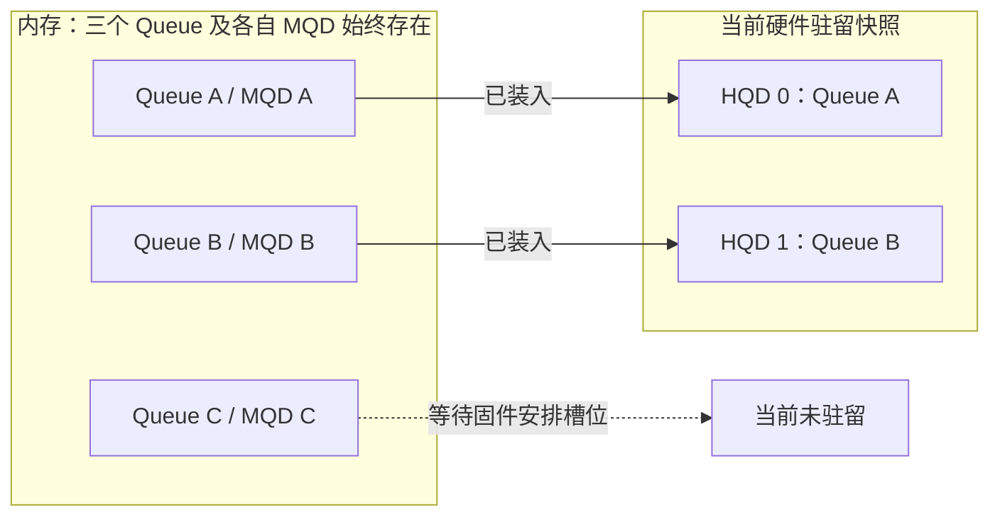

MQD 在这里保存可恢复的配置，HQD 保存当前供命令前端使用的寄存器状态。装载时，MQD 仍留在内存中，必要字段被写入 HQD 及相关硬件上下文。

三条驻留路径的分工如下。先记住“谁选择硬件槽位”，具体字段和调用在后面就近展开。

| 路径 | KFD 准备什么 | 谁安排计算 Queue 的 HQD | 地址空间怎样交付 |
| --- | --- | --- | --- |
| No-HWS / No-CPSCH | Queue、Doorbell、MQD，并直接预留 VMID/HQD | KFD | 驱动建立地址空间配置，MQD 等状态提供 VMID |
| 传统 HWS/CPSCH | Queue、Doorbell、MQD和运行列表 | HWS 固件 | `MAP_PROCESS` 提供 PASID、页表根，`MAP_QUEUES` 提供 Queue 状态 |
| MES | Queue、Doorbell、MQD和 Add Queue 输入 | MES 固件 | Add Queue 同时提供进程、地址空间和 Queue 信息 |

这三条路径都保留 AQL Ring 作为普通 Kernel Packet 的提交位置。固件驻留调度之后，还要经过不同粒度的设备工作：

```text
Queue 驻留调度：哪条逻辑 Queue 获得 HQD
        ↓
Packet Processor：按 AQL 顺序和依赖条件处理 Packet
        ↓
Work-group/Wave 分派：把任务交给 CU 的执行资源
```

[00_GPU系统基础](<./00_GPU系统基础.md>) 已经介绍这些层次；本章只展开第一层的 Queue 状态交付。Packet 的三阶段处理见 [第 6.2 节](#62-packet-的启动准备执行与完成收尾)，Work-group/Wave 的分派见 [第 6.4 节](#64-grid-怎样变成-work-group-和-wave)。

### 3.1 KFD 怎样把 Queue 属性写入 MQD

KFD 已经把验证过的资源记入 `queue_properties`。对应硬件架构的 MQD manager 再将这些属性换算成硬件需要的地址编码、大小和控制位。GFX9 是 AMD GPU 的一种图形/计算 IP 硬件架构版本，下面用它展示可直接核对的寄存器格式。

| 信息组 | `queue_properties` 提供的输入 | MQD 中的用途 |
| --- | --- | --- |
| Ring | Ring GPUVA、字节数 | 记录取包起点和容量 |
| 进度 | rptr report、wptr poll 的内存地址 | 指定硬件向哪里报告读进度、从哪里观察写进度 |
| 通知 | Doorbell offset | 将这条 Queue 与通知槽位关联 |
| 地址空间 | VMID 等上下文 | 指定取 Ring 和后续访问使用的地址空间 |
| 辅助状态 | EOP/CWSR 地址与大小 | 保存设备要求的 Queue 状态和可选的 Wave 恢复信息 |

EOP 是这里的队列辅助状态资源；CWSR 保存需要恢复的 Wave 现场。知道它们由 Queue 引用、在使用结束前必须存活，就足以继续理解创建与装载。CWSR 与 MQD 的区别在 [第 3.5 节](#35-queue-换出与恢复时哪些状态需要保留)说明。

以 `update_mqd()` 为例，`q` 是通用 Queue 属性，`mqd` 指向已经分配的 MQD。函数将 Ring、进度地址和 Doorbell 编码到同一个 `v9_mqd`：

> **[SOURCE]** Linux `248951ddc14d`，[`drivers/gpu/drm/amd/amdkfd/kfd_mqd_manager_v9.c`](<./2.源码/linux/drivers/gpu/drm/amd/amdkfd/kfd_mqd_manager_v9.c>) 第 271～293 行。这段入口与字段赋值证明 Queue 属性怎样进入 GFX9 MQD。

```c
271: static void update_mqd(struct mqd_manager *mm, void *mqd,
272: 			struct queue_properties *q,
273: 			struct mqd_update_info *minfo)
274: {
275: 	struct v9_mqd *m;
276:
277: 	m = get_mqd(mqd);
278:
279: 	m->cp_hqd_pq_control &= ~CP_HQD_PQ_CONTROL__QUEUE_SIZE_MASK;
280: 	m->cp_hqd_pq_control |= order_base_2(q->queue_size / 4) - 1;
281: 	pr_debug("cp_hqd_pq_control 0x%x\n", m->cp_hqd_pq_control);
282:
283: 	m->cp_hqd_pq_base_lo = lower_32_bits((uint64_t)q->queue_address >> 8);
284: 	m->cp_hqd_pq_base_hi = upper_32_bits((uint64_t)q->queue_address >> 8);
285:
286: 	m->cp_hqd_pq_rptr_report_addr_lo = lower_32_bits((uint64_t)q->read_ptr);
287: 	m->cp_hqd_pq_rptr_report_addr_hi = upper_32_bits((uint64_t)q->read_ptr);
288: 	m->cp_hqd_pq_wptr_poll_addr_lo = lower_32_bits((uint64_t)q->write_ptr);
289: 	m->cp_hqd_pq_wptr_poll_addr_hi = upper_32_bits((uint64_t)q->write_ptr);
290:
291: 	m->cp_hqd_pq_doorbell_control =
292: 		q->doorbell_off <<
293: 			CP_HQD_PQ_DOORBELL_CONTROL__DOORBELL_OFFSET__SHIFT;
```

第 271～277 行取得目标 MQD；第 279～284 行换算容量并编码 Ring 基址；第 286～293 行分别写入进度地址和 Doorbell offset。`read_ptr`、`write_ptr` 是保存索引的内存位置，不能用当前索引数值代替。

紧接着的第 294～321 行处理调试输出、IB 和 EOP 字段。其中 EOP 大小根据设备限制编码，不能照搬成 AQL Packet 数量。函数随后写 VMID，并仅对 AQL Queue 设置对应的进度和满队列控制位：

> **[SOURCE]** Linux `248951ddc14d`，[`drivers/gpu/drm/amd/amdkfd/kfd_mqd_manager_v9.c`](<./2.源码/linux/drivers/gpu/drm/amd/amdkfd/kfd_mqd_manager_v9.c>) 第 322～331 行。外围 AQL 条件限定了这些控制位的适用范围。

```c
322: 	m->cp_hqd_vmid = q->vmid;
323:
324: 	if (q->format == KFD_QUEUE_FORMAT_AQL) {
325: 		m->cp_hqd_pq_control |= CP_HQD_PQ_CONTROL__NO_UPDATE_RPTR_MASK |
326: 				2 << CP_HQD_PQ_CONTROL__SLOT_BASED_WPTR__SHIFT |
327: 				1 << CP_HQD_PQ_CONTROL__QUEUE_FULL_EN__SHIFT |
328: 				1 << CP_HQD_PQ_CONTROL__WPP_CLAMP_EN__SHIFT;
329: 		m->cp_hqd_pq_doorbell_control |= 1 <<
330: 			CP_HQD_PQ_DOORBELL_CONTROL__DOORBELL_BIF_DROP__SHIFT;
331: 	}
```

这里证明的是“通用资源怎样写进硬件格式”。MQD 保存整条 Queue 的配置，本次 Kernel 的 `kernel_object`、Grid 和参数地址仍由 AQL Packet 提供。

**[BOUNDARY]** 字段布局和移位属于 GFX9；第 332～346 行还处理 CWSR、性能计数、CU mask 和优先级。HWS/MES 最终选择的 VMID 与驻留过程有关，不能只看创建时 MQD 的一个字段，就断言 Queue 永久使用哪个硬件上下文。

### 3.2 No-HWS：KFD 选择硬件槽位并装载 HQD

No-HWS 由 KFD 直接管理计算 Queue 的硬件资源。第一条 Queue 需要为当前 Process-Device 分配 VMID；每条计算 Queue 再取得自己的 HQD 和 Doorbell。MQD 准备完成后，满足活动和调度条件的 Queue 才进入装载。

```text
Process-Device 首次建立 Queue → 分配 VMID
当前计算 Queue             → 分配 HQD、Doorbell 和 MQD
MQD 初始化或恢复           → 判断 Queue 是否允许活动、调度是否运行
条件满足                   → load_mqd → hqd_load → 设置 HQD ACTIVE
```

> **[SOURCE]** Linux `248951ddc14d`，[`drivers/gpu/drm/amd/amdkfd/kfd_device_queue_manager.c`](<./2.源码/linux/drivers/gpu/drm/amd/amdkfd/kfd_device_queue_manager.c>) 第 763～826 行。create_queue_nocpsch() 接收 dqm、Queue 和 QPD；第 781～786 行处理首条 Queue 的 VMID，第 797～811 行区分 Compute 的 HQD 与 SDMA 资源，第 813～824 行取得 Doorbell 和 MQD。

下面从同一函数的 MQD 准备阶段继续。`qd` 表示恢复输入是否存在；新建 Queue 使用 `init_mqd()`，恢复 Queue 使用 `restore_mqd()`。两者之后才判断是否装入硬件：

> **[SOURCE]** Linux `248951ddc14d`，[`drivers/gpu/drm/amd/amdkfd/kfd_device_queue_manager.c`](<./2.源码/linux/drivers/gpu/drm/amd/amdkfd/kfd_device_queue_manager.c>) 第 827～855 行。初始化、恢复和装载之间的控制条件必须一起阅读。

```c
827: 	if (qd)
828: 		mqd_mgr->restore_mqd(mqd_mgr, &q->mqd, q->mqd_mem_obj, &q->gart_mqd_addr,
829: 				     &q->properties, restore_mqd, restore_ctl_stack,
830: 				     qd->ctl_stack_size);
831: 	else
832: 		mqd_mgr->init_mqd(mqd_mgr, &q->mqd, q->mqd_mem_obj,
833: 					&q->gart_mqd_addr, &q->properties);
834:
835: 	if (q->properties.is_active) {
836: 		if (!dqm->sched_running) {
837: 			WARN_ONCE(1, "Load non-HWS mqd while stopped\n");
838: 			goto add_queue_to_list;
839: 		}
840:
841: 		if (WARN(q->process->mm != current->mm,
842: 					"should only run in user thread"))
843: 			retval = -EFAULT;
844: 		else
845: 			retval = mqd_mgr->load_mqd(mqd_mgr, q->mqd, q->pipe,
846: 					q->queue, &q->properties, current->mm);
847: 		if (retval)
848: 			goto out_free_mqd;
849: 	}
850:
851: add_queue_to_list:
852: 	list_add(&q->list, &qpd->queues_list);
853: 	qpd->queue_count++;
854: 	if (q->properties.is_active)
855: 		increment_queue_count(dqm, qpd, q);
```

英文告警分别表示“调度已停止时装载 No-HWS MQD”和“该操作应在用户线程上下文运行”。

- 第 827～833 行在恢复和新建之间选择，结果都是准备 `q->mqd` 及其地址。
- 第 835～849 行决定是否装载。Queue 不活动时不会进入此分支；调度停止时跳到列表登记；进程内存上下文不匹配时返回错误。只有通过这些条件才调用 `load_mqd()`。
- 第 851～855 行登记逻辑 Queue 和计数。因此，看到列表中存在 Queue，还要继续确认装载路径是否执行。

> **[SOURCE]** Linux `248951ddc14d`，[`drivers/gpu/drm/amd/amdkfd/kfd_device_queue_manager.c`](<./2.源码/linux/drivers/gpu/drm/amd/amdkfd/kfd_device_queue_manager.c>) 第 857～882 行。total_queue_count 统计所有 Queue；失败路径则逆序释放本次取得的 MQD、Doorbell、HQD/SDMA 和必要时的 VMID。错误返回不会使未完成的装载变成成功。

GFX9 MQD manager 用一个短包装把 Queue 属性交给硬件装载接口：

> **[SOURCE]** Linux `248951ddc14d`，[`drivers/gpu/drm/amd/amdkfd/kfd_mqd_manager_v9.c`](<./2.源码/linux/drivers/gpu/drm/amd/amdkfd/kfd_mqd_manager_v9.c>) 第 259～269 行。load_mqd() 把 MQD、硬件槽位和 write_ptr 交给 hqd_load。

```c
259: static int load_mqd(struct mqd_manager *mm, void *mqd,
260: 			uint32_t pipe_id, uint32_t queue_id,
261: 			struct queue_properties *p, struct mm_struct *mms)
262: {
263: 	/* AQL write pointer counts in 64B packets, PM4/CP counts in dwords. */
264: 	uint32_t wptr_shift = (p->format == KFD_QUEUE_FORMAT_AQL ? 4 : 0);
265:
266: 	return mm->dev->kfd2kgd->hqd_load(mm->dev->adev, mqd, pipe_id, queue_id,
267: 					  (uint32_t __user *)p->write_ptr,
268: 					  wptr_shift, 0, mms, 0);
269: }
```

这段代码把上面的 `mqd_mgr->load_mqd()` 连接到硬件接口。具体的 GFX9 `kgd_gfx_v9_hqd_load()` 先取得目标硬件 Queue，再恢复寄存器并启用 Doorbell：

> **[SOURCE]** Linux `248951ddc14d`，[`drivers/gpu/drm/amd/amdgpu/amdgpu_amdkfd_gfx_v9.c`](<./2.源码/linux/drivers/gpu/drm/amd/amdgpu/amdgpu_amdkfd_gfx_v9.c>) 第 222～248 行。装载入口保留 MQD、pipe_id、queue_id 和 wptr 等输入，以及硬件寄存器恢复的上下文。

```c
222: int kgd_gfx_v9_hqd_load(struct amdgpu_device *adev, void *mqd,
223: 			uint32_t pipe_id, uint32_t queue_id,
224: 			uint32_t __user *wptr, uint32_t wptr_shift,
225: 			uint32_t wptr_mask, struct mm_struct *mm,
226: 			uint32_t inst)
227: {
228: 	struct v9_mqd *m;
229: 	uint32_t *mqd_hqd;
230: 	uint32_t reg, hqd_base, data;
231:
232: 	m = get_mqd(mqd);
233:
234: 	kgd_gfx_v9_acquire_queue(adev, pipe_id, queue_id, inst);
235:
236: 	/* HQD registers extend from CP_MQD_BASE_ADDR to CP_HQD_EOP_WPTR_MEM. */
237: 	mqd_hqd = &m->cp_mqd_base_addr_lo;
238: 	hqd_base = SOC15_REG_OFFSET(GC, GET_INST(GC, inst), mmCP_MQD_BASE_ADDR);
239:
240: 	for (reg = hqd_base;
241: 	     reg <= SOC15_REG_OFFSET(GC, GET_INST(GC, inst), mmCP_HQD_PQ_WPTR_HI); reg++)
242: 		WREG32_XCC(reg, mqd_hqd[reg - hqd_base], inst);
243:
244:
245: 	/* Activate doorbell logic before triggering WPTR poll. */
246: 	data = REG_SET_FIELD(m->cp_hqd_pq_doorbell_control,
247: 			     CP_HQD_PQ_DOORBELL_CONTROL, DOORBELL_EN, 1);
248: 	WREG32_SOC15_RLC(GC, GET_INST(GC, inst), mmCP_HQD_PQ_DOORBELL_CONTROL, data);
```

英文注释说明了 HQD 寄存器范围，并要求在触发 wptr 轮询前先启用 Doorbell。第 234～242 行向选定的硬件槽位写配置，第 245～248 行启用该槽位的通知逻辑。

随后第 250～287 行仅在 `wptr` 非空时恢复或重新读取写进度。该分支不能依赖内核工作队列上下文直接访问用户地址，因此让 CP 从 Queue 所属 VMID 中读取 GPU 可访问的 wptr 地址。这里省略恢复 64 位进度的计算；它实际位于 Doorbell 启用与下面的激活步骤之间。

> **[SOURCE]** Linux `248951ddc14d`，[`drivers/gpu/drm/amd/amdgpu/amdgpu_amdkfd_gfx_v9.c`](<./2.源码/linux/drivers/gpu/drm/amd/amdgpu/amdgpu_amdkfd_gfx_v9.c>) 第 289～299 行。wptr 分支之后，函数启动 EOP fetcher、设置 ACTIVE，最后释放对硬件 Queue 的访问。

```c
289: 	/* Start the EOP fetcher */
290: 	WREG32_SOC15_RLC(GC, GET_INST(GC, inst), mmCP_HQD_EOP_RPTR,
291: 	       REG_SET_FIELD(m->cp_hqd_eop_rptr, CP_HQD_EOP_RPTR, INIT_FETCHER, 1));
292:
293: 	data = REG_SET_FIELD(m->cp_hqd_active, CP_HQD_ACTIVE, ACTIVE, 1);
294: 	WREG32_SOC15_RLC(GC, GET_INST(GC, inst), mmCP_HQD_ACTIVE, data);
295:
296: 	kgd_gfx_v9_release_queue(adev, inst);
297:
298: 	return 0;
299: }
```

英文注释“Start the EOP fetcher”表示启动 EOP 状态读取单元。第 293～294 行设置 HQD `ACTIVE` 后，命令前端获得消费该 Queue 的活动配置；Ring 是否有已发布 Packet，仍由提交过程决定。

### 3.3 HWS/CPSCH：通过运行列表交付进程与 Queue 状态

传统 HWS 路径由 KFD 建立逻辑 Queue、Doorbell 和 MQD，再通过运行列表（runlist）把进程与 Queue 信息交给固件。固件据此管理硬件驻留，KFD 不为每条计算 Queue 在整个生命周期内固定占用一个 HQD。

runlist 中有两种与当前主线直接相关的控制包：

| 控制包 | 主要输入 | 固件从中获得的信息 |
| --- | --- | --- |
| `MAP_PROCESS` | PDD 的 PASID、QPD 的页表根等 | Queue 所属进程和地址空间 |
| `MAP_QUEUES` | Queue 的 MQD 地址、wptr 地址、Doorbell offset | 从哪里取得 Queue 配置与进度、关联哪个通知槽位 |

这些是 KFD 特权控制面使用的 PM4 Packet。用户要执行的 Kernel Dispatch Packet 仍写入用户 AQL Ring。运行列表负责登记可调度的 Queue，AQL Ring 负责承载反复提交的任务。

> **[SOURCE]** Linux `248951ddc14d`，[`drivers/gpu/drm/amd/amdkfd/kfd_device_queue_manager.c`](<./2.源码/linux/drivers/gpu/drm/amd/amdkfd/kfd_device_queue_manager.c>) 第 2126～2178 行。create_queue_cpsch() 接收 Queue 与 QPD，完成资源限制检查、按类型取得辅助资源，并分配 Doorbell 和 MQD。

该函数接下来初始化或恢复 MQD，先登记逻辑 Queue，再在允许活动时选择传统 CPSCH 或 MES：

> **[SOURCE]** Linux `248951ddc14d`，[`drivers/gpu/drm/amd/amdkfd/kfd_device_queue_manager.c`](<./2.源码/linux/drivers/gpu/drm/amd/amdkfd/kfd_device_queue_manager.c>) 第 2179～2199 行。外围 is_active 和 enable_mes 分支限定了实际向哪种调度路径提交。

```c
2179: 	if (qd)
2180: 		mqd_mgr->restore_mqd(mqd_mgr, &q->mqd, q->mqd_mem_obj, &q->gart_mqd_addr,
2181: 				     &q->properties, restore_mqd, restore_ctl_stack,
2182: 				     qd->ctl_stack_size);
2183: 	else
2184: 		mqd_mgr->init_mqd(mqd_mgr, &q->mqd, q->mqd_mem_obj,
2185: 					&q->gart_mqd_addr, &q->properties);
2186:
2187: 	list_add(&q->list, &qpd->queues_list);
2188: 	qpd->queue_count++;
2189:
2190: 	if (q->properties.is_active) {
2191: 		increment_queue_count(dqm, qpd, q);
2192:
2193: 		if (!dqm->dev->kfd->shared_resources.enable_mes)
2194: 			retval = execute_queues_cpsch(dqm,
2195: 					KFD_UNMAP_QUEUES_FILTER_DYNAMIC_QUEUES, 0, USE_DEFAULT_GRACE_PERIOD);
2196: 		else
2197: 			retval = add_queue_mes(dqm, q, qpd);
2198: 		if (retval)
2199: 			goto cleanup_queue;
```

第 2179～2185 行保留新建/恢复的区别；第 2187～2188 行先登记 Queue；第 2190～2199 行才提交到调度路径。调用失败时进入 `cleanup_queue`，撤销刚才登记的状态。

> **[SOURCE]** Linux `248951ddc14d`，[`drivers/gpu/drm/amd/amdkfd/kfd_device_queue_manager.c`](<./2.源码/linux/drivers/gpu/drm/amd/amdkfd/kfd_device_queue_manager.c>) 第 2202～2232 行。成功路径更新设备 Queue 总数；cleanup_queue 及后续错误标签撤销列表、活动计数、MQD、Doorbell 和相关 SDMA 资源，并返回原错误。

控制包字段的来源也可以直接在源码中核对：

> **[SOURCE]** Linux `248951ddc14d`，[`drivers/gpu/drm/amd/amdkfd/kfd_packet_manager_v9.c`](<./2.源码/linux/drivers/gpu/drm/amd/amdkfd/kfd_packet_manager_v9.c>) 第 32～87 行。pm_map_process_v9() 在第 36 行取得 qpd->page_table_base，第 38～50 行取得 PDD 并填写 PASID，第 81～84 行将同一页表根编码进 MAP_PROCESS。

对于一条 Queue，`pm_map_queues_v9(pm, buffer, q, is_static)` 在第 227～247 行取得输出 Packet，建立 Header 并设置默认计算引擎。第 249～280 行按 Queue 类型选择引擎，非法类型直接返回；完成选择后，才执行下面的公共字段赋值：

> **[SOURCE]** Linux `248951ddc14d`，[`drivers/gpu/drm/amd/amdkfd/kfd_packet_manager_v9.c`](<./2.源码/linux/drivers/gpu/drm/amd/amdkfd/kfd_packet_manager_v9.c>) 第 281～297 行。同一个 q 提供 Doorbell、MQD 和 wptr 地址，最后返回控制包构造结果。

```c
281: 	packet->bitfields3.doorbell_offset =
282: 			q->properties.doorbell_off;
283:
284: 	packet->mqd_addr_lo =
285: 			lower_32_bits(q->gart_mqd_addr);
286:
287: 	packet->mqd_addr_hi =
288: 			upper_32_bits(q->gart_mqd_addr);
289:
290: 	packet->wptr_addr_lo =
291: 			lower_32_bits((uint64_t)q->properties.write_ptr);
292:
293: 	packet->wptr_addr_hi =
294: 			upper_32_bits((uint64_t)q->properties.write_ptr);
295:
296: 	return 0;
297: }
```

第 281～294 行将三类 Queue 信息编码到 `MAP_QUEUES` 中。它们与 `MAP_PROCESS` 的 PASID、页表根配合，使固件同时知道“这是谁的 Queue”和“应从哪里恢复状态”。

**[INFERENCE]** 在资源和调度策略允许时，多条逻辑 Queue 可以轮流使用有限的 HQD。这里能追到 KFD 提交的对象和字段；固件具体选中哪条 Queue、何时换出，需要对应固件和硬件证据。

### 3.4 MES：通过 Add Queue 接口交付状态

MES 使用 Add Queue 接口交付进程和 Queue 状态。前一节的 `create_queue_cpsch()` 在 `enable_mes` 分支调用 `add_queue_mes(dqm, q, qpd)`；本节从这个被调用函数继续。

| 输入组 | 代表字段 | 用途 |
| --- | --- | --- |
| 进程与地址空间 | PASID、页表根、进程上下文地址 | 识别所属进程并恢复地址空间 |
| Queue | MQD、Doorbell、Queue 大小与类型 | 找到配置并建立通知关联 |
| 提交进度 | wptr 的 GPUVA 和设备可访问地址 | 观察 Producer 已推进到哪里 |
| 调度属性 | 优先级、Process/Gang 上下文及时间参数 | 为固件调度提供输入 |

Gang 是 MES 接口中组织 Queue 调度状态的分组。这里保留它在输入中的位置，不展开固件如何划分或调度 Gang。

接口调用有明确前置条件。下面的完整入口说明：函数返回 0 时，可能还没有向固件发送 Add Queue。

> **[SOURCE]** Linux `248951ddc14d`，[`drivers/gpu/drm/amd/amdkfd/kfd_device_queue_manager.c`](<./2.源码/linux/drivers/gpu/drm/amd/amdkfd/kfd_device_queue_manager.c>) 第 207～223 行。入口先取得对象、检查调度状态和 Reset 域锁，然后才开始构造输入。

```c
207: static int add_queue_mes(struct device_queue_manager *dqm, struct queue *q,
208: 			 struct qcm_process_device *qpd)
209: {
210: 	struct amdgpu_device *adev = (struct amdgpu_device *)dqm->dev->adev;
211: 	struct kfd_process_device *pdd = qpd_to_pdd(qpd);
212: 	struct mes_add_queue_input queue_input;
213: 	int r, queue_type;
214: 	uint64_t wptr_addr_off;
215:
216: 	if (!dqm->sched_running || dqm->sched_halt)
217: 		return 0;
218: 	if (!down_read_trylock(&adev->reset_domain->sem))
219: 		return -EIO;
220:
221: 	memset(&queue_input, 0x0, sizeof(struct mes_add_queue_input));
222: 	queue_input.process_id = pdd->pasid;
223: 	queue_input.page_table_base_addr =  qpd->page_table_base;
```

第 216～217 行在调度未运行或已暂停时直接返回 0；外层已经登记逻辑 Queue，会继续成功返回。这个分支只保留逻辑状态，尚未调用 MES。第 218～219 行获取 Reset 域读锁失败时返回 `-EIO`；通过检查后，第 221～223 行才初始化输入并填写进程身份和页表根。

第 224～233 行继续填写地址范围、进程/Gang 上下文与优先级。随后从同一个 `q` 取得 Queue 的通知、配置和进度地址：

> **[SOURCE]** Linux `248951ddc14d`，[`drivers/gpu/drm/amd/amdkfd/kfd_device_queue_manager.c`](<./2.源码/linux/drivers/gpu/drm/amd/amdkfd/kfd_device_queue_manager.c>) 第 234～243 行。wptr_addr 保存传入的写索引地址，wptr_mc_addr 由 wptr BO 的设备地址加页内偏移计算。

```c
234: 	queue_input.doorbell_offset = q->properties.doorbell_off;
235: 	queue_input.mqd_addr = q->gart_mqd_addr;
236: 	queue_input.wptr_addr = (uint64_t)q->properties.write_ptr;
237:
238: 	wptr_addr_off = (uint64_t)q->properties.write_ptr & (PAGE_SIZE - 1);
239: 	queue_input.wptr_mc_addr = amdgpu_bo_gpu_offset(q->properties.wptr_bo) + wptr_addr_off;
240:
241: 	queue_input.is_kfd_process = 1;
242: 	queue_input.is_aql_queue = (q->properties.format == KFD_QUEUE_FORMAT_AQL);
243: 	queue_input.queue_size = q->properties.queue_size >> 2;
```

第 241～243 行还标明这是 KFD/AQL Queue，并换算接口要求的 Queue 大小。后面的第 245～266 行设置调试和硬件上下文，其中第 254～259 行会校验 Queue 类型；类型非法时释放 Reset 域读锁并返回，不能继续调用固件。

通过这些检查之后，才执行最终提交：

> **[SOURCE]** Linux `248951ddc14d`，[`drivers/gpu/drm/amd/amdkfd/kfd_device_queue_manager.c`](<./2.源码/linux/drivers/gpu/drm/amd/amdkfd/kfd_device_queue_manager.c>) 第 268～280 行。MES 调用位于锁内，返回后释放锁；失败时触发 Hang 处理并返回错误。

```c
268: 	amdgpu_mes_lock(&adev->mes);
269: 	r = adev->mes.funcs->add_hw_queue(&adev->mes, &queue_input);
270: 	amdgpu_mes_unlock(&adev->mes);
271: 	up_read(&adev->reset_domain->sem);
272: 	if (r) {
273: 		dev_err(adev->dev, "failed to add hardware queue to MES, doorbell=0x%x\n",
274: 			q->properties.doorbell_off);
275: 		dev_err(adev->dev, "MES might be in unrecoverable state, issue a GPU reset\n");
276: 		kfd_hws_hang(dqm);
277: 	}
278:
279: 	return r;
280: }
```

英文错误信息表示“向 MES 添加硬件 Queue 失败”和“MES 可能无法恢复，需要设备 Reset”。第 268～271 行调用 `add_hw_queue()` 并解锁；第 272～279 行在失败时交给 `kfd_hws_hang()` 处理，再把原返回值交给调用者。

**[BOUNDARY]** 第 226～229 行以 100 ns 为单位填写时间参数，当前 Process/Gang quantum 分别对应 10 ms 和 1 ms。这些是该版本的接口输入，不能据此认定每条 Queue 实际获得固定时间片。Linux 源码也不能补全 MES 的 HQD 选择、抢占和内部仲裁算法。

### 3.5 Queue 换出与恢复时，哪些状态需要保留

一条 Queue 暂时离开 HQD 后，逻辑 Queue 和 MQD 仍然存在。固件再次安排它驻留时，需要恢复 Queue 配置与提交进度；如果抢占涉及尚未完成的 Wave，还需要保存和恢复相应执行现场。

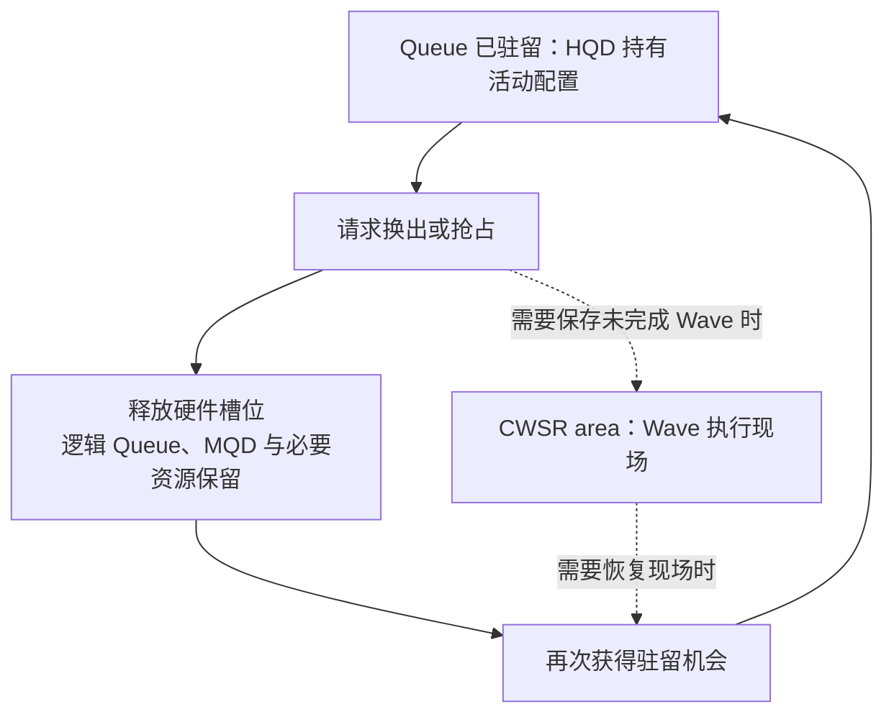

这是配置与现场的关系图，未规定具体硬件的保存顺序。一次换出可能等待工作自然结束，也可能使用支持的抢占机制；不能把所有换出都画成必然保存全部 Wave。

| 状态或对象 | 换出后仍需要保留什么 |
| --- | --- |
| MQD | 重新建立 Queue 所需的配置 |
| rptr/wptr 及相关进度状态 | 哪些逻辑位置已经预留、哪些槽位已经释放 |
| Ring 与任务资源 | 仍待处理的 Packet，以及未完成任务会访问的代码、参数和数据 |
| CWSR area | 采用 Wave 保存机制时所需的执行现场 |
| PASID 与 GPUVM | Queue 所属进程的地址空间身份和映射 |
| VMID/HQD | 驻留时使用的硬件上下文；不能据此假设长期固定绑定 |

**[BOUNDARY]** MQD、CWSR 和 GPUVM 分别保存 Queue 配置、Wave 现场和地址映射。Queue 换出并不构成这些资源的释放条件。未驻留期间的 Doorbell 如何被记录、恢复时怎样重新观察进度，取决于具体调度路径；前面的 GFX9 装载源码能证明其 wptr 恢复步骤，不能代表全部固件行为。

现在可以把驻留与后面的任务提交连接起来：Queue 创建建立长期通路，驻留让硬件获得当前消费条件；下一章开始描述某一次 `vector_add` 要写进 Ring 的任务内容。

## 4. 一次 Kernel 调用怎样编码成 AQL Packet

### 4.0 从 vector_add 的启动参数得到任务描述

现在假设 Queue 已创建，代码、A/B/C 数组和参数区也已经可以由 GPU 访问。Runtime 要把“计算 1024 个元素的向量加法”整理成一个 Kernel Dispatch Packet，然后交给第 5 章的发布过程。

在 CLR 路径中，高层 Kernel 命令进入对应的 HostQueue/VirtualGPU，使用当前 `gpu_queue_` 指向的 `hsa_queue_t`。直接使用 HSA API 的程序可以自行完成同样的 Packet 准备。

| 任务中的信息 | Packet 中的表示 | 本例取值 |
| --- | --- | --- |
| 一维计算范围 | 维数、`grid_size_x/y/z` | 维数为 1，Grid 为 `1024 × 1 × 1` |
| 每组大小 | `workgroup_size_x/y/z` | `256 × 1 × 1` |
| 执行哪个 Kernel | `kernel_object` | 已装载 Kernel 的执行句柄 |
| 参数放在哪里 | `kernarg_address` | 保存 A/B/C GPUVA 和 N 的参数块地址 |
| 执行需要的资源 | private/group segment size | Kernel 元数据及本次调用给出的需求 |
| 怎样表示完成 | `completion_signal` | 本例使用初值为 1 的 Signal |

本例的 Work-group 数为 `1024 / 256 = 4`：

```text
Group 0：Work-item   0～255
Group 1：Work-item 256～511
Group 2：Work-item 512～767
Group 3：Work-item 768～1023
```

一个 Packet 就能描述这四组工作。改变 Grid 大小会改变字段数值，不会把 Packet 扩成每个 Work-item 一份；至于四组工作落在哪些 CU、何时并发，则交给设备执行阶段。

> **[SOURCE]** ROCm CLR `81277d69e3352`，[`rocclr/device/rocm/rocvirtual.cpp`](<./2.源码/rocm-clr/rocclr/device/rocm/rocvirtual.cpp>) 第 1877～1882 行。VirtualGPU::create() 取得底层 Queue 并保存 gpu_queue_。这是 Kernel 命令随后复用的提交入口。

**[BOUNDARY]** 同文件第 2069～2087、2100～2104 行表明，启用动态 Queue 回收后，空闲 VirtualGPU 可以归还底层 Queue，后续工作再取得可用 Queue。普通 Packet 使用的是当前绑定的 Queue；这个机制不是“每次 Dispatch 都创建一条 KFD Queue”。第 1.1.1 节已说明高层 Stream 与底层 Queue 的复用关系。

### 4.1 64 字节 Packet 的布局与字段分组

AQL Kernel Dispatch Packet 固定占用一个 64 字节槽位。可以把这些字节按职责分组阅读：

| 字节范围 | 字段 | 含义 |
| --- | --- | --- |
| 0～3 | `header + setup` | Packet 类型、Barrier、fence scope 与 Grid 维数 |
| 4～11 | `workgroup_size_x/y/z + reserved` | 每组的三维 Work-item 数，含保留字段 |
| 12～23 | `grid_size_x/y/z` | 整个 Dispatch 的三维 Work-item 数 |
| 24～27 | `private_segment_size` | 每个 Work-item 的 private 内存请求字节数 |
| 28～31 | `group_segment_size` | 每个 Work-group 的 group 内存请求字节数 |
| 32～39 | `kernel_object` | 可执行对象句柄 |
| 40～47 | `kernarg_address` | 参数块地址 |
| 48～55 | `reserved2` | 保留字段 |
| 56～63 | `completion_signal` | 完成 Signal 的句柄 |

因此，256 槽 Ring 承载 Packet 的部分大小为 `256 × 64 = 16 KiB`。结构体只是给同一组字节命名，不额外创建另一份任务对象。

> **[SPEC]** [HSA Platform System Architecture 1.2](https://hsafoundation.com/wp-content/uploads/2021/02/HSA-SysArch-1.2.pdf) 第 2.8.3、2.9.6 节规定 Packet 大小及 Kernel Dispatch 布局。保留字段应按规范初始化；本地 HSA API 对应定义见下。

> **[SPEC]** ROCr `ba56a24c6132`，[`runtime/hsa-runtime/inc/hsa.h`](<./2.源码/rocr-runtime/runtime/hsa-runtime/inc/hsa.h>) 第 2956～2976 行。结构体开头用 header、setup 和 full_header 表示同一个 32 位字。

```c
2956: /**
2957:  * @brief AQL kernel dispatch packet
2958:  */
2959: typedef struct hsa_kernel_dispatch_packet_s {
2960:   union {
2961:     struct {
2962:         /**
2963:          * Packet header. Used to configure multiple packet parameters such as the
2964:          * packet type. The parameters are described by ::hsa_packet_header_t.
2965:          */
2966:         uint16_t header;
2967:
2968:         /**
2969:          * Dispatch setup parameters. Used to configure kernel dispatch parameters
2970:          * such as the number of dimensions in the grid. The parameters are described
2971:          * by ::hsa_kernel_dispatch_packet_setup_t.
2972:          */
2973:         uint16_t setup;
2974:     };
2975:     uint32_t full_header;
2976:   };
```

英文说明分别表示“Kernel Dispatch Packet”“Packet 类型等公共参数”和“Grid 维数等 Dispatch 参数”。第 2966、2973 行定义两个 16 位字段，第 2975 行提供整体的 32 位表示。第 5 章会用这个布局解释为什么发布时操作前 32 位。

> **[SPEC]** ROCr `ba56a24c6132`，[`runtime/hsa-runtime/inc/hsa.h`](<./2.源码/rocr-runtime/runtime/hsa-runtime/inc/hsa.h>) 第 2978～3070 行。后续字段依次定义 Work-group、Grid、segment、Kernel 对象、Kernarg 和 Signal；small/large machine model 与字节序分支不改变 Packet 的固定长度。

### 4.2 Packet 怎样连接代码、参数块和数组

Packet 保存的是执行范围和对象引用。理解 `kernel_object` 与 `kernarg_address` 时，要继续追踪它们指向的对象。

Code Object 是编译工具链生成、由 Runtime 装载的二进制容器。Runtime 从 Kernel Symbol 和 Metadata 中取得执行句柄、参数 ABI 与资源需求；本章以代码已经成功装载为前提。

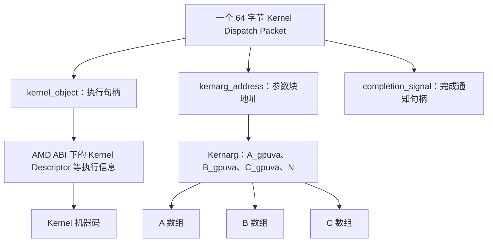

这张图沿 AMD 执行对象展示引用关系。AQL 对 `kernel_object` 只规定不透明的可执行对象句柄；它怎样对应 Kernel Descriptor 和入口，取决于目标 Code Object ABI，不能一概当成机器码首地址。

> **[SPEC]** ROCr `ba56a24c6132`，[`runtime/hsa-runtime/inc/hsa.h`](<./2.源码/rocr-runtime/runtime/hsa-runtime/inc/hsa.h>) 第 3033～3070 行。kernel_object 是不透明句柄；kernarg_address 引用参数区；completion_signal.handle 为 0 时，本 Packet 不执行完成 Signal 更新。

本例的 Kernarg 中，A/B/C 是指针值，N 是标量值。三个数组留在各自的后备存储中，不会被完整复制进 Kernarg 或 Packet。Runtime 还可能按 ABI 填写 hidden arguments；它们的种类与偏移由目标 Metadata 决定。

> **[SPEC]** HSA System Architecture 1.2 第 2.9.6 节要求 Kernarg 的最低对齐粒度为 16 字节，具体 Kernel 可以要求更大对齐。参数区必须在发布前准备好，并在对应 Kernel 完成前保持分配且不被修改。

```text
填写 Kernarg → 发布 Packet → Kernel 读取参数 → Dispatch 完成
                                                   ↓
                                        才能复用本次 Kernarg
```

同样，`kernel_object` 必须来自目标 Agent 可执行的已装载对象，代码与数据映射必须覆盖实际使用期间。Packet 中的合法字段格式不能补救无效 GPUVA。

Queue priority、Doorbell offset、PASID、VMID 和页表根属于 Queue/Process-Device 的控制状态；任意长度的 Event 依赖由 Runtime 转换为适当的等待与 Packet。它们都不作为整套对象复制进这 64 字节。

### 4.3 Private Segment 与 Group Segment 的资源需求

这两个字段都以字节计数，但共享范围不同。group 内存由同一个 Work-group 的 Work-item 共享；private 内存则按 Work-item 分开。

| 字段 | 请求粒度 | AMD GPU 上的典型承载 | 需求来源 |
| --- | --- | --- | --- |
| `private_segment_size` | 每个 Work-item | 栈、寄存器溢出等需要的 Scratch 存储 | Kernel 资源信息，必要时结合 Runtime 的栈配置 |
| `group_segment_size` | 每个 Work-group | LDS | Kernel 静态需求加本次动态共享内存请求 |

> **[SPEC]** ROCr `ba56a24c6132`，[`runtime/hsa-runtime/inc/hsa.h`](<./2.源码/rocr-runtime/runtime/hsa-runtime/inc/hsa.h>) 第 3020～3031 行。API 定义明确了 per-work-item 与 per-work-group 的单位；group 请求需要覆盖静态及动态 group 内存。

下面只为解释粒度而增加一组教学假设，不改变本例的元素数和分组方式：

```text
每个 Work-group：静态 LDS 4 KiB + 本次动态 LDS 2 KiB
Packet.group_segment_size = 6 KiB

Group 0 的 256 个 Work-item → 共享本组的一份 6 KiB
Group 1 的 256 个 Work-item → 使用另一份 6 KiB
其余 Work-group 同理
```

四组的逻辑需求合计为 24 KiB，但 Packet 填的是每组的 6 KiB。实际同时占用多少资源，还取决于哪些组同时驻留、分布在哪些执行资源上，以及硬件的分配粒度；不能把 24 KiB 直接当成某个 CU 此刻必须提供的空间。

若另假设 `private_segment_size = 32`，它表示每个 Work-item 请求 32 字节 private 内存。`32 × 1024` 是整个 Grid 按逻辑实例累计的请求量，不能直接用来推导 Runtime 此次实际分配的 Scratch BO 大小。实际承载还与并发执行、对齐和实现的 Scratch 配置有关。

这些字段提供资源需求量，并不携带分配完成后的 LDS 或 Scratch 数据地址。Runtime 和硬件还需要结合设备资源限制完成配置。固定 CLR 中的实际赋值及栈大小修正在 [第 4.5 节](#45-clr-怎样构造临时-packet-并交给发布函数)就近核对。

### 4.4 Header 怎样约束类型、执行顺序和可见性

任务参数准备好后，Header 决定 Packet 怎样被解释，以及启动和完成时要遵守哪些约束。

| Header 字段 | 解决的问题 | 本文后续展开位置 |
| --- | --- | --- |
| `format`，API 中通过 Packet type 表达 | 当前槽位无效，还是 Kernel/Barrier 等有效 Packet | [发布 Header](#53-填写-packet并用-32-位原子写发布-header) |
| `barrier` | 当前 Packet 是否要等待同一 Queue 的所有前序 Packet 完成 | [同 Queue 依赖](#72-barrier-bit-怎样约束同一-queue-的前序工作) |
| `acquire_fence_scope` | 任务进入执行前，需要在什么范围建立获取顺序 | [Packet 三阶段](#62-packet-的启动准备执行与完成收尾) |
| `release_fence_scope` | 任务执行结束后，需要在什么范围发布之前的写入 | [完成与结果可见性](#70-从-gpu-写结果到-cpu-观察完成) |

> **[SPEC]** HSA System Architecture 1.2 第 2.9.1 节定义 Header；第 2.9.1.1～2.9.1.2 节定义 fence scope。无 fence、Agent scope、System scope 表达不同同步范围，不能互换。

在本文的 CPU/GPU 数据交换案例中，同步范围需要覆盖双方。省略某个 Packet fence 的真实实现必须由其他同步保证补足，不能只因为 Queue 有序就省掉内存可见性条件。

执行依赖和可见性分别约束不同的事。例如 Kernel B 使用 A 的输出时，依赖机制限制 B 的开始时机，匹配的 release/acquire 则保证 B 能观察到所需写入。[02_GPU 内存管理基础](<./02_GPU 内存管理基础.md>) 第 3 章已解释同步基础，这里把约束放回 Packet 字段。

还要区分两种 release：Producer 发布有效 Header 的原子 release 用于交付 Packet；Header 内的 `release_fence_scope` 指定任务完成阶段的 fence 范围。它们发生在不同阶段。

### 4.5 CLR 怎样构造临时 Packet 并交给发布函数

固定 CLR 的 `submitKernelInternal()` 接收执行范围、Kernel、参数和动态 LDS 大小。函数先得到 Kernel 资源信息，再准备 Grid、Kernarg 和临时 Packet，最后调用发布函数。

> **[SOURCE]** ROCm CLR `81277d69e3352`，[`rocclr/device/rocm/rocvirtual.cpp`](<./2.源码/rocm-clr/rocclr/device/rocm/rocvirtual.cpp>) 第 3867～3874 行。入口给出本次调用的输入，并取得 Kernel 和静态 group segment 需求。

```cpp
3867: bool VirtualGPU::submitKernelInternal(const amd::NDRangeContainer& sizes, const amd::Kernel& kernel,
3868:                                       const_address parameters, void* event_handle,
3869:                                       uint32_t sharedMemBytes, amd::NDRangeKernelCommand* vcmd,
3870:                                       hsa_kernel_dispatch_packet_t* aql_packet,
3871:                                       bool attach_signal) {
3872:   device::Kernel* devKernel = const_cast<device::Kernel*>(kernel.getDeviceKernel(dev()));
3873:   Kernel& gpuKernel = static_cast<Kernel&>(*devKernel);
3874:   size_t ldsUsage = gpuKernel.WorkgroupGroupSegmentByteSize();
```

`sizes` 提供执行范围，`parameters` 提供参数，`sharedMemBytes` 是本次动态共享内存请求，`attach_signal` 影响是否附加独立完成 Signal。第 3872～3874 行得到目标设备的 Kernel 信息和 `ldsUsage`。

第 3875～3899 行处理前置依赖与对象检查。接着第 3900～3910 行根据 `sizes` 计算三维 `local` 和 `global`；未使用的维度初始化为 1。第 3911～4129 行准备 hidden arguments 与 Kernarg：已有设备参数区可以复用，否则按普通分配或 Graph Capture 分支取得参数区，并完成复制和可见性处理。

> **[SOURCE]** ROCm CLR `81277d69e3352`，[`rocclr/device/rocm/rocvirtual.cpp`](<./2.源码/rocm-clr/rocclr/device/rocm/rocvirtual.cpp>) 第 3900～4129 行。Grid 与 Work-group 来自 sizes；argBuffer 从已有参数区或本次分配中取得，具体分配受 deviceKernelArgs、内部 Kernel 和 isGraphCapture 条件控制。

这些准备之后，代码检查 LDS 并构造临时 Packet。下面连续保留字段赋值和影响 private segment 的完整栈分支：

> **[SOURCE]** ROCm CLR `81277d69e3352`，[`rocclr/device/rocm/rocvirtual.cpp`](<./2.源码/rocm-clr/rocclr/device/rocm/rocvirtual.cpp>) 第 4130～4167 行。临时 Packet 的 Header 仍为 INVALID，所有字段准备完毕后才交给发布过程。

```cpp
4130:   // Check for group memory overflow
4131:   //! @todo Check should be in HSA - here we should have at most an assert
4132:   assert(dev().info().localMemSizePerCU_ > 0);
4133:   if (ldsUsage > dev().info().localMemSizePerCU_) {
4134:     LogError("No local memory available\n");
4135:     return false;
4136:   }
4137:
4138:   // Initialize the dispatch Packet
4139:   hsa_kernel_dispatch_packet_t dispatchPacket{};
4140:
4141:   dispatchPacket.header = kInvalidAql;
4142:   dispatchPacket.kernel_object = gpuKernel.KernelCodeHandle();
4143:
4144:   dispatchPacket.grid_size_x = global[0];
4145:   dispatchPacket.grid_size_y = global[1];
4146:   dispatchPacket.grid_size_z = global[2];
4147:
4148:   dispatchPacket.workgroup_size_x = local[0];
4149:   dispatchPacket.workgroup_size_y = local[1];
4150:   dispatchPacket.workgroup_size_z = local[2];
4151:
4152:   dispatchPacket.kernarg_address = argBuffer;
4153:   dispatchPacket.group_segment_size = ldsUsage + sharedMemBytes;
4154:   dispatchPacket.private_segment_size = devKernel->workGroupInfo()->privateMemSize_;
4155:   if ((devKernel->workGroupInfo()->usedStackSize_ & 0x1) == 0x1) {
4156:     dispatchPacket.private_segment_size =
4157:         std::max<uint64_t>(dev().StackSize(), dispatchPacket.private_segment_size);
4158:     // Validate privateMemSize is more than max allowed.
4159:     size_t maxStackSize = dev().MaxStackSize();
4160:     if (dispatchPacket.private_segment_size > maxStackSize) {
4161:       ClPrint(amd::LOG_ERROR, amd::LOG_KERN,
4162:               "Scratch size (%u) exceeds max allowed (%zu) for kernel : %s",
4163:               dispatchPacket.private_segment_size, maxStackSize,
4164:               gpuKernel.getDemangledName().c_str());
4165:       return false;
4166:     }
4167:   }
```

英文注释说明要检查 group 内存溢出、初始化 Dispatch Packet，并提示该项检查理想上应由 HSA 层完成。Scratch 错误信息表示请求超过允许大小。对应的状态变化如下：

- 第 4130～4136 行检查此处的静态 LDS 需求 `ldsUsage`；失败直接返回。静态与动态需求之和随后写入第 4153 行的字段。
- 第 4138～4154 行建立临时对象，把执行句柄、Grid、Work-group、Kernarg 和两类资源需求写入字段。
- 第 4155～4167 行在需要栈时进一步调整 private segment，并保留超限返回。这也是只看初始赋值不足以确定最终请求值的原因。

随后第 4169～4179 行根据命令属性调整 Header 的 barrier 与 scope；第 4181～4189 行可选保存调度包快照。普通提交和 Graph Capture 最后都从这里进入 `dispatchAqlPacket()`，但参数不同：

> **[SOURCE]** ROCm CLR `81277d69e3352`，[`rocclr/device/rocm/rocvirtual.cpp`](<./2.源码/rocm-clr/rocclr/device/rocm/rocvirtual.cpp>) 第 4191～4205 行。完整 if/else 保留两条发布调用及各自失败返回。

```cpp
4191:   if (isGraphCapture) {
4192:     // Dispatch the packet
4193:     if (!dispatchAqlPacket(&dispatchPacket, aqlHeaderWithOrder,
4194:                            (sizes.dimensions() << HSA_KERNEL_DISPATCH_PACKET_SETUP_DIMENSIONS),
4195:                            GPU_FLUSH_ON_EXECUTION, command_->getPktCapturingState(),
4196:                            command_->getAqlPacket())) {
4197:       return false;
4198:     }
4199:   } else {
4200:     if (!dispatchAqlPacket(&dispatchPacket, aqlHeaderWithOrder,
4201:                            (sizes.dimensions() << HSA_KERNEL_DISPATCH_PACKET_SETUP_DIMENSIONS),
4202:                            GPU_FLUSH_ON_EXECUTION, false, nullptr, attach_signal)) {
4203:       return false;
4204:     }
4205:   }
```

英文“Dispatch the packet”表示提交该 Packet。第 4191～4198 行是 Graph Capture 路径，第 4199～4205 行是普通路径；普通路径传入 `attach_signal`。因此，“Header 仍为 INVALID”仅描述临时 Packet 的构造阶段，不能据此认为整个 `submitKernelInternal()` 都没有提交工作。

同文件第 4206～4237 行继续处理 Printf、Device Enqueue 和 Image 等命令收尾。普通主线到发布调用已经交出了本次任务描述，下一章继续追踪它怎样取得 Ring 槽位并被硬件观察。

## 5. Producer 怎样发布 Packet 并通知硬件

### 5.0 一次提交包含哪些动作

第 4 章已经准备好本次 Kernel 的代码句柄、参数和执行范围。Producer 接下来要取得一个可写槽位，把任务描述交给 Packet Processor，并通知这条 Queue 有新的提交进度。

```text
Allocate：取得逻辑编号，并确认对应槽位可写
    ↓
Populate：填写 Packet，format 保持 INVALID
    ↓
Assign：发布有效 Header，把 Packet 所有权交给 Packet Processor
    ↓
Notify：通过 Doorbell 通知本次提交进度
```

> **[SPEC]** HSA System Architecture 1.2 第 2.8.3 节定义 Allocate、Populate、Assign、Notify 及所有权约束；第 2.8.4 节给出多 Producer 的不同预留实现。

这里有两个不同的进度：`write_index` 表示逻辑编号预留到哪里，有效 Header 表示某个 Packet 已经交给硬件。多线程可以先取得编号，再各自准备内容，因此不能把这两个进度当成同一个状态。

### 5.1 Packet ID、物理槽位与容量约束

Ring 的物理槽位会循环使用，`read_index` 和 `write_index` 则是单调增加的 64 位逻辑索引。Packet ID 按逻辑顺序分配，物理地址再按容量回绕。设 Queue 容量为 `size`，定位槽位的方式是：

```text
slot = packet_id % size
     = packet_id & (size - 1)     // size 为 2 的幂
```

主案例的 `size = 256`，所以 Packet 37 和 Packet 293 都使用 slot 37：

```text
Packet ID 37  ─┐
               ├─→ 物理 slot 37（两次不同的使用）
Packet ID 293 ─┘
```

Producer 必须先确认旧 Packet 已释放，才能覆盖同一个物理位置。对已经预留的编号，规范要求同时满足：

```text
packet_id < read_index + size
并且目标槽位 format == INVALID
```

> **[SPEC]** HSA System Architecture 1.2 第 2.8.3 节规定上述修改条件；Packet Processor 要先把 format 设回 INVALID 并使其可见，再让 read_index 越过该 Packet。

例如 `read_index = 38` 时，Packet 37 的槽位已经越过释放边界。对 Packet 293，`293 < 38 + 256`，再确认 slot 37 的 format 为 `INVALID` 后，就满足复用条件。只看槽位已经为 `INVALID` 仍不够：它也可能是另一轮尚未发布的逻辑位置，容量边界用于区分这些轮次。

几个容易混淆的数值应分别解释：

| 数值或状态 | 表示什么 |
| --- | --- |
| `write_index` | 下一个待预留的逻辑 Packet ID；预留操作会推进它 |
| `read_index` | Packet Processor 已释放到的逻辑边界 |
| `write_index - read_index` | 已预留、尚未越过释放边界的逻辑位置数量，可能包含等待槽位的预留 |
| 有效 Header | 对应 Packet 已发布；不能仅由 write_index 推断 |
| `write_index == read_index` | 当前没有尚未释放的逻辑位置；已有 Kernel 仍可能在执行 |

用一个单独缩小到 **4 槽**的教学例子，可以看出逻辑预留量与物理容量的区别：

```text
初始：size = 4，read_index = 0，write_index = 4

物理槽位       slot 0     slot 1     slot 2     slot 3
保存的旧任务   Packet 0   Packet 1   Packet 2   Packet 3
释放状态       尚未释放   尚未释放   尚未释放   尚未释放

新 Producer 原子预留 Packet ID 4：
write_index：4 → 5
目标：slot 0
检查：4 < 0 + 4 为假，因此必须等待，不能覆盖 Packet 0

Packet 0 释放后：
slot 0 的 format 先变为 INVALID，read_index 再变为 1
检查：4 < 1 + 4 为真，此时 Packet 4 才能填写 slot 0
```

等待期间差值可以是 5，但 Ring 仍只有 4 个物理槽位。这个差值既不是“5 个已发布 Packet”，也不能用于统计正在执行的 Kernel。任务完成依据在 [资源生命周期](#65-槽位释放后哪些资源仍须保留)和[完成同步](#70-从-gpu-写结果到-cpu-观察完成)中继续说明。

### 5.2 Producer 怎样预留编号并等待槽位

多个 Producer 共享 Ring 时，首先需要避免重复领取同一个 Packet ID。原子预留解决编号冲突，容量检查解决旧槽位被提前覆盖的问题。

| Queue 类型 | write_index 的更新方式 | 需要维持的约束 |
| --- | --- | --- |
| `HSA_QUEUE_TYPE_SINGLE` | 唯一 Producer 可以使用原子 store 推进 | 保持本线程提交顺序和容量约束 |
| `HSA_QUEUE_TYPE_MULTI` | 多个 Producer 用原子读—改—写预留 | 每个编号只分配一次，各 Producer 分别满足发布协议 |

> **[SPEC]** ROCr `ba56a24c6132`，[`runtime/hsa-runtime/inc/hsa.h`](<./2.源码/rocr-runtime/runtime/hsa-runtime/inc/hsa.h>) 第 2250～2265 行。API 对 SINGLE 与 MULTI 的定义区分了提交者数量及索引更新要求。

多 Producer 有两类合法实现：

| 实现方式 | 顺序 | 满队列时的特点 |
| --- | --- | --- |
| atomic-add 预留 | 原子增加 write_index，获得旧值作为编号，再等待该编号对应的槽位 | 已领取编号的 Producer 需要继续推进，处理放弃提交更复杂 |
| CAS 预留 | 先检查容量，再尝试原子比较并交换；冲突则重新检查与重试 | 队列满时可以在取得编号前退出 |

> **[SPEC]** HSA System Architecture 1.2 第 2.8.4 节列出这两类方式。共同要求是唯一预留、容量保护与正确发布，没有要求所有实现都使用同一种检查顺序。

当前 CLR 的 `dispatchGenericAqlPacket()` 采用 atomic-add。下面的函数入口给出 Queue 容量与 mask，并取得唯一编号：

> **[SOURCE]** ROCm CLR `81277d69e3352`，[`rocclr/device/rocm/rocvirtual.cpp`](<./2.源码/rocm-clr/rocclr/device/rocm/rocvirtual.cpp>) 第 1185～1194 行。queue_add_write_index_screlease() 返回增加之前的索引，作为当前 Producer 的 Packet ID。

```cpp
1185: template <typename AqlPacket>
1186: bool VirtualGPU::dispatchGenericAqlPacket(AqlPacket* packet, uint16_t header, uint16_t rest,
1187:                                           bool blocking, bool attach_signal) {
1188:   const uint32_t queueSize = gpu_queue_->size;
1189:   const uint32_t queueMask = queueSize - 1;
1190:   const uint32_t sw_queue_size = queueMask;
1191:
1192:   // Check for queue full and wait if needed.
1193:   uint64_t index = Hsa::queue_add_write_index_screlease(gpu_queue_, 1);
1194:   setFenceDirty(true);
```

英文注释表示“必要时检查队列满并等待”。实际代码在第 1193 行先预留编号，等待循环位于后面。第 1195～1238 行准备 Header 的 scope、内部 Fence 和可选 Completion Signal，随后才确认槽位：

> **[SOURCE]** ROCm CLR `81277d69e3352`，[`rocclr/device/rocm/rocvirtual.cpp`](<./2.源码/rocm-clr/rocclr/device/rocm/rocvirtual.cpp>) 第 1239～1242 行。该循环以 acquire 读取 read_index，在目标槽位不满足软件容量约束时让出执行机会。

```cpp
1239:   // Make sure the slot is free for usage
1240:   while ((index - Hsa::queue_load_read_index_scacquire(gpu_queue_)) >= sw_queue_size) {
1241:     amd::Os::yield();
1242:   }
```

英文注释表示“确保槽位可以使用”。`sw_queue_size = queueMask` 使当前 CLR 留出一个槽位的余量，这是实现选择；规范容量条件仍是上一节的 `packet_id < read_index + size`。

第 1.1.1 节的 VirtualGPU A、C 即使复用同一个 `hsa_queue_t Q0`，也会从同一原子索引取得不同编号。槽位互不冲突之后，Runtime 仍要维持每条高层 Stream 的顺序并转换 Event 依赖；原子加法本身不负责这些语义。

> **[SOURCE]** ROCm CLR `81277d69e3352`，[`rocclr/device/rocm/rocdevice.cpp`](<./2.源码/rocm-clr/rocclr/device/rocm/rocdevice.cpp>) 第 3135～3174 行。Queue 池达到上限时可以复用现有 Queue；普通底层 Queue 的创建类型为 HSA_QUEUE_TYPE_MULTI。

### 5.3 填写 Packet，并用 32 位原子写发布 Header

槽位可写后，Producer 先把任务字段填进去，此时 format 保持 `INVALID`。Packet Processor 依据 format 判断该槽位是否已交给自己；过早写入 `KERNEL_DISPATCH`，可能让硬件读到只更新了一部分的内容。

```text
准备阶段：Kernarg 和输入数据已按要求准备
填写阶段：写 Packet body，format 仍为 INVALID
发布阶段：用一次 32 位原子 release 写入有效 header + setup
发布之后：Packet Processor 可以处理它，Producer 不再改写 Packet
```

这里同时需要两种保证：原子性避免前 32 位出现撕裂更新，release 顺序保证发布有效 Header 前的必要写入满足可见性要求。仅仅把字段填对，还没有完成这两项保证。

> **[SPEC]** HSA System Architecture 1.2 第 2.8.3 节要求 Packet 前 32 位使用 32 位原子事务访问；其余内容在有效 format 发布前或同时达到所需可见性。有效 format 完成所有权转移，Producer 此后不能依赖该槽位内容保持原样。

当前 CLR 用一个很短的 helper 完成有效 Header 发布：

> **[SOURCE]** ROCm CLR `81277d69e3352`，[`rocclr/device/rocm/rocvirtual.cpp`](<./2.源码/rocm-clr/rocclr/device/rocm/rocvirtual.cpp>) 第 1074～1081 行。header 和 rest 被合成一个 32 位值，两种平台分支都使用 release 写入。

```cpp
1074: static inline void packet_store_release(uint32_t* packet, uint16_t header, uint16_t rest) {
1075: #if IS_WINDOWS
1076:   std::atomic_ref<uint32_t> atomic_header(*packet);
1077:   atomic_header.store(header | (rest << 16), std::memory_order_release);
1078: #else
1079:   __atomic_store_n(packet, header | (rest << 16), __ATOMIC_RELEASE);
1080: #endif
1081: }
```

`rest` 在 Kernel Dispatch 调用中承载 `setup`。这个完整短函数说明 16 位 Header 与后续 16 位一起发布；Windows 使用 `std::atomic_ref`，其他平台使用 `__atomic_store_n`。

回到上一节的 `dispatchGenericAqlPacket()`：容量等待之后，第 1243～1253 行处理阻塞模式需要的完成 Signal，接着复制临时 Packet 并调用该 helper。

> **[SOURCE]** ROCm CLR `81277d69e3352`，[`rocclr/device/rocm/rocvirtual.cpp`](<./2.源码/rocm-clr/rocclr/device/rocm/rocvirtual.cpp>) 第 1254～1260 行。目标槽位来自 base_address 和 index；有效 Header 在 Packet 复制之后单独发布。

```cpp
1254:   TrackQueueProgress(*packet, index);
1255:
1256:   AqlPacket* aql_loc = &((AqlPacket*)(gpu_queue_->base_address))[index & queueMask];
1257:   *aql_loc = *packet;
1258:   if (header != 0) {
1259:     packet_store_release(reinterpret_cast<uint32_t*>(aql_loc), header, rest);
1260:   }
```

第 1256 行定位物理槽位，第 1257 行复制的临时 Packet 仍带 `INVALID` Header。普通 Kernel Dispatch 传入非零的有效 `header`，因此第 1258～1260 行会执行发布。至此，硬件可以消费该 Packet；输入和 Kernarg 也必须已经满足各自的准备要求。

### 5.4 Doorbell 通知哪条 Queue、哪次提交进度

有效 Header 发布之后，Producer 通过该 Queue 的 `doorbell_signal` 通知新的 Packet ID。Doorbell 的槽位选择 Queue，写入值表示本次通知的提交进度。

主例若提交 Packet 40：

| 对象 | 当前保存的信息 |
| --- | --- |
| Ring 的 slot 40 | 完整任务描述，Header 已有效 |
| Queue 的 Doorbell | 本次通知使用的进度值 40 |
| 已驻留的 HQD | Ring 基址、容量、地址上下文和进度配置 |

Packet Processor 根据 Queue 上下文回到 Ring 读取任务。Doorbell 不搬运 Packet body，也不复制 Kernel 代码或数组。

> **[SOURCE]** ROCm CLR `81277d69e3352`，[`rocclr/device/rocm/rocvirtual.cpp`](<./2.源码/rocm-clr/rocclr/device/rocm/rocvirtual.cpp>) 第 1271～1276 行。这是同一个 dispatchGenericAqlPacket() 中 Header 发布之后的 Doorbell store。

```cpp
1271:   // Optimization for native AQL path in windows has problems with PM4 emulation,
1272:   // skipping the doorbel will not wake up the AQL worker thread
1273:   //if (IS_WINDOWS && !dev().IsPm4Emulation() && (blocking || !hasPendingDispatch_))
1274:   {
1275:     Hsa::signal_store_screlease(gpu_queue_->doorbell_signal, index);
1276:   }
```

英文注释说明：Windows 的某条优化曾因跳过 Doorbell 而无法唤醒 PM4 模拟线程。第 1273 行条件已经被注释，所以下面的块直接执行。第 1275 行把当前 `index` 交给 Runtime 的 Doorbell Signal 接口。

> **[SPEC]** HSA System Architecture 1.2 第 2.8.3 节允许 Packet Processor 在观察到有效 format 后、Doorbell 写入前就开始处理。Producer 仍需按协议通知；缺少通知时，不能保证设备及时发现新 Packet。

因此，必须在发布有效 Header 之前完成本次任务所需准备，不能先发布 Header，再趁 Doorbell 尚未写入去补写 Kernarg 或 Packet body。

CPU 普通内存写与 Doorbell MMIO 的平台顺序见 [02_GPU 内存管理基础](<./02_GPU 内存管理基础.md>) 第 3.5～3.6 节。这里调用 Runtime 的门铃接口，不把原始 MMIO 访问宽度和某代硬件的进度编码当成统一接口。

### 5.5 多 Producer 发布顺序不同时，Queue 怎样推进

仍使用容量 256 的 Queue Q0，假设初始 `read_index = write_index = 40`，slot 40、41 已释放且为 `INVALID`。Producer A、B 依次预留 40、41，但 B 更早写完。

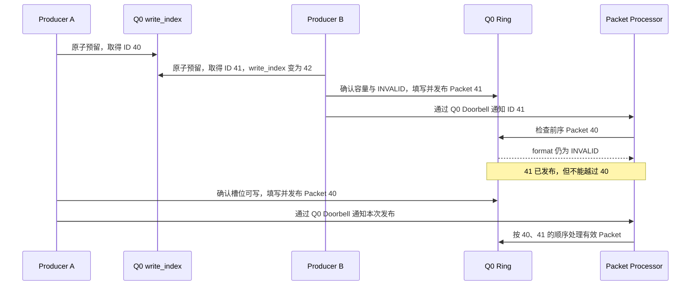

两次原子预留保证编号唯一，却不会让两个 CPU 线程以相同速度填写 Packet。B 通知 41 时，40 仍可能是“已预留但未发布”的洞。

> **[SPEC]** HSA System Architecture 1.2 第 2.8.3～2.8.4 节区分多 Producer 的提交与处理顺序：有效 Packet 可以由不同 Producer 先后发布，但 Queue 中前面的 INVALID 会阻止后继 Packet 被 Dispatch。

在 Multi Queue 中，通知一个已发布的 Packet 不代表所有较小编号都已发布。每个 Producer 必须保证自己通知的 Packet 已经有效并可见，Packet Processor 则在消费时遵守前序约束。Single Producer 的单调通知与连续发布要求不能直接套成 Multi Producer 的发布顺序。

这个例子也说明，领取编号后的线程长期停顿，会阻碍后面的工作推进。可靠的 Producer 实现必须处理自己的错误和退出路径，不能把“原子预留成功”当成提交已经完成。

### 5.6 完整提交伪代码与常见错误

下面是概念性伪代码，使用 atomic-add 方案串起本章步骤。`queue.write_index` 等名称表示抽象状态，不表示这些字段全部直接公开在 `hsa_queue_t` 中；真实程序应使用对应 Runtime 接口。

```text
prepare_inputs_and_kernarg();
prepare_completion_signal_if_needed();

packet_id = atomic_fetch_add(queue.write_index, 1);
while (packet_id >= load_acquire(queue.read_index) + queue.size) {
    yield();
}

slot = queue.base_address[packet_id & (queue.size - 1)];
wait_until(format(atomic_load_acquire(slot.full_header)) == INVALID);
fill_packet_body_except_first_dword(slot);
atomic_store_release(slot.full_header, valid_header_and_setup);
runtime_doorbell_store_release(queue, packet_id);
```

容量检查与 `INVALID` 检查共同确认目标位置可写；原子 release 发布后，Producer 停止修改该 Packet。平台内存和 MMIO 顺序由相应实现保证，伪代码不替代这些实现细节。

| 错误 | 直接影响 |
| --- | --- |
| 将全零 Ring 当成空 Ring | format 0 表示 vendor-specific，空槽需要 INVALID |
| 只推进 write_index | 编号已预留，任务仍可能没有发布 |
| Ring 满时直接按 mask 覆盖 | 覆盖上一轮仍未释放的 Packet |
| 先写有效 Header，再补 body 或 Kernarg | 硬件可能在准备完成前开始处理 |
| 仅凭 Doorbell 尚未写入就继续修改已发布 Packet | 设备允许提前观察有效 Header |
| 通知尚未发布的 Packet | Doorbell 引用了尚未有效的提交 |
| 从不发送 Doorbell 通知 | 不能保证设备及时发现工作 |
| 用 rptr 判断 Kernel 完成 | 混淆了槽位释放与任务完成 |

发布完成后，CPU 可以继续提交其他工作或等待完成状态；GPU 则依据当前驻留 Queue 的配置取包。下一章从命令前端的访问和执行过程继续。

## 6. CP/MEC 怎样取包并启动 Kernel

### 6.0 CP/MEC 怎样依据 HQD 读取 Ring

Producer 已经发布有效 Header 并发送 Doorbell 通知。普通 Dispatch 的 CPU 提交快路径到这里结束；后续可以继续提交，也可以等待完成状态。GPU 从已驻留 Queue 的配置出发读取任务。

> **[SOURCE]** ROCm CLR `81277d69e3352`，[`rocclr/device/rocm/rocvirtual.cpp`](<./2.源码/rocm-clr/rocclr/device/rocm/rocvirtual.cpp>) 第 1184～1293 行。dispatchGenericAqlPacket() 直接操作已有 Ring 与 Doorbell；普通逐 Packet 提交不再次调用 KFD 创建 Queue。

HQD 提供 Ring base、size、读写进度相关配置、Queue 格式及地址上下文。Doorbell 提供新进度通知，帮助设备发现工作。

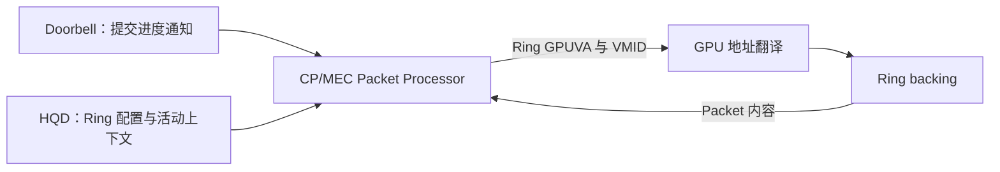

这是各部分提供信息的关系图，不限定硬件一定在 Doorbell 到达后才读取。[第 5.4 节](#54-doorbell-通知哪条-queue哪次提交进度)已经说明，有效 Header 发布后，设备可以提前发现 Packet。

沿用主例的 system RAM Ring，并以离散 GPU 为例，取包仍是一次 GPU 内存访问：

```text
CP/MEC：Ring GPUVA + Queue 的 VMID
    → GPU MMU 按当前 GPUVM 翻译
    → PTE 指向 system RAM 的 DMA 地址
    → 经设备与主机内存通路取得 Packet
```

Ring 位于 VRAM 时，最后转为访问本地显存。两种存放位置沿用相同的 AQL 格式。

**[BOUNDARY]** 上图复用 [02_GPU 内存管理基础](<./02_GPU 内存管理基础.md>) 已建立的地址翻译关系。HQD 的具体 GFX9 配置见 [第 3.1 节](#31-kfd-怎样把-queue-属性写入-mqd)和[第 3.2 节](#32-no-hwskfd-选择硬件槽位并装载-hqd)；TLB 层级、Page Walker 仲裁和总线事务拆分属于后续 MMU 微架构专题。

### 6.1 一个 Packet 会引出哪些代码与数据访问

CP/MEC 读到 Packet 后，还要继续使用它引用的执行对象和参数。[第 4.2 节](#42-packet-怎样连接代码参数块和数组)的对象关系图说明了指向关系；从访问者角度，可以分别看这些地址：

| 对象或字段 | 主要访问者 | 访问目的 |
| --- | --- | --- |
| Ring slot GPUVA | CP/MEC | 取得 64 字节任务描述 |
| `kernel_object` | CP/MEC 执行准备路径 | 按目标 AMD ABI 取得 Kernel 执行信息 |
| `kernarg_address` | Kernel 启动路径与 Shader | 取得参数值，包括 A/B/C 指针 |
| A/B/C GPUVA | 执行 Kernel 的 Shader | 读取输入并写入结果 |
| Completion Signal 的承载内存 | Packet 完成路径 | 更新完成状态 |

Signal 在 Packet 中是不透明句柄；不能把句柄的数值直接当成用户数组的 GPUVA。具体承载由 Runtime 实现。

访问本进程的 Ring、代码、Kernarg 和数组，都需要对应的有效映射、访问权限和足够长的生命周期。Ring 可读只证明取到了任务描述，不能代替对代码和参数的访问条件。

这也给故障定位提供了入口：故障发生在 Ring 地址时，优先检查 Queue 取包通路；发生在 A/B/C 地址时，则继续追踪 Kernel 使用的数据映射。不同地址的定位表见 [第 8.3 节](#83-怎样区分-queue-fullfaulthang-和-reset)。

### 6.2 Packet 的启动准备、执行与完成收尾

一个已发布的 Kernel Dispatch Packet 会经历三个阶段。这里的 `active` 修饰单个 Packet，与 KFD Queue 的 `is_active`、HQD 的 `ACTIVE` 分属不同对象。

| 阶段 | 进入条件与主要动作 | 结束时的状态 |
| --- | --- | --- |
| launch：启动准备 | 前序 Packet 已结束 launch，且没有未完成的 Barrier Packet 阻挡；barrier 置位时还需等待前序全部完成；进入 active 前执行规定的 acquire | 任务进入执行阶段 |
| active：执行 | Kernel 在 GPU 上运行，读取参数和数据，写入输出 | 该 Kernel 的工作结束 |
| completion：完成收尾 | 执行规定的 release，再原子递减非空 Completion Signal | 完成本 Packet 的完成操作 |

> **[SPEC]** HSA System Architecture 1.2 第 2.9.1.1、2.9.2 节定义处理阶段与 fence 位置。此表针对 Kernel Dispatch；Barrier Packet 的等待与 fence 位置见 [第 7.3 节](#73-barrier-and-怎样表达跨-queue-依赖)，不能直接照搬。

主例中，CPU 已准备 A、B 和 Kernarg。发布时的 release 与 Dispatch 进入 active 前的 acquire 按相应作用域建立所需的内存顺序：

```text
CPU 准备输入和参数
    → 按协议发布 Packet
    → Dispatch 的 launch acquire
    → Kernel 使用输入和参数
```

可见性建立在有效映射和合法生命周期之上。PTE 不存在需要解决地址翻译，BO 已释放需要解决生命周期；acquire 不能修复这两类错误，也不能补上缺失的发布操作。

**[BOUNDARY]** 三阶段说明的是规范行为，不是 CP/MEC 固件的完整指令序列。可配置的 fence 也不表示每一步必然执行相同的全缓存刷新，具体内存属性和 scope 需要与 [02_GPU 内存管理基础](<./02_GPU 内存管理基础.md>) 第 3 章的条件一起判断。

### 6.3 同一 Queue 的 Kernel 何时可以重叠执行

Queue 中的 Packet 按顺序进入 launch，但默认只需等待前序结束 launch。若后一个 Packet 没有 barrier 或其他依赖，前一个 Kernel 仍在 active 时，后一个 Kernel 就可能进入 active。

下面用同一时间轴画出两种允许情况；条带长度仅表达阶段关系，不表示实际耗时：

```text
时间 ───────────────────────────────────────────────→

B.barrier = 0，且没有其他依赖：
A： [launch][----------- active -----------][completion]
B：         [launch][--- active ---][completion]
                     ↑ 两者可以重叠

B.barrier = 1：
A： [launch][----------- active -----------][completion]
B：                                                   [launch][active][completion]
```

> **[SPEC]** HSA System Architecture 1.2 第 2.9.2 节要求前序 launch 先完成；Header barrier 为 1 时，当前 Packet 还须等待同 Queue 的前序 Packet 全部完成。

“可以重叠”表示协议允许，是否实际重叠还取决于资源与设备调度。同样，底层 AQL 允许重叠，也不能直接推出某条 HIP Stream 的两个 API 命令会失去高层顺序；Runtime 仍要按高层语义生成相应约束。

### 6.4 Grid 怎样变成 Work-group 和 Wave

Packet 给出逻辑 Grid、Work-group 大小、资源需求和执行对象。命令前端据此准备 Dispatch，下游硬件将可执行的 Work-group/Wave 分派到 CU。谁获得 HQD 与哪组工作进入 CU，处理的是不同粒度。

```text
KFD / HWS / MES：安排 Queue 获得活动硬件上下文
        ↓
CP/MEC：处理 Queue 中的 Packet，准备 Dispatch
        ↓
Work-group/Wave 分派：为工作安排执行资源
        ↓
CU：运行 Wave 中的 Kernel 指令
```

对于本例的 1024 个 Work-item、每组 256 个 Work-item：

| 目标 Kernel 的 Wave 宽度 | 每个 Work-group 的 Wave 数 | 整个 Dispatch 的逻辑 Wave 数 |
| --- | --- | --- |
| wave64 | `256 / 64 = 4` | `4 × 4 = 16` |
| wave32 | `256 / 32 = 8` | `4 × 8 = 32` |

这些是工作组织数量，不能直接当成某一时刻驻留的 Wave 数或使用的 CU 数。[00_GPU系统基础](<./00_GPU系统基础.md>) 已介绍 Work-item、Wave、CU 与物理执行资源的关系。

**[BOUNDARY]** Wave 宽度由目标 ISA、Kernel 属性和硬件支持共同决定，不能只看 Grid 字段选择。Work Distributor 是本文对分派职责的概念性称呼；公开 Linux 接口没有给出各 CU 间的实时仲裁算法。HWS/MES 管理 Queue 驻留，不逐个挑选 Work-item 执行。

### 6.5 槽位释放后，哪些资源仍须保留

命令前端取得任务描述后，可以比 Kernel 完成更早释放 Ring 槽位。因此，需要把“存放描述的空间”与“任务仍在使用的参数和数据”分别管理。

下面展示一种允许的时序。假设 Packet 293 也已预留，Producer 复用 slot 37 前仍检查容量与 `INVALID`：

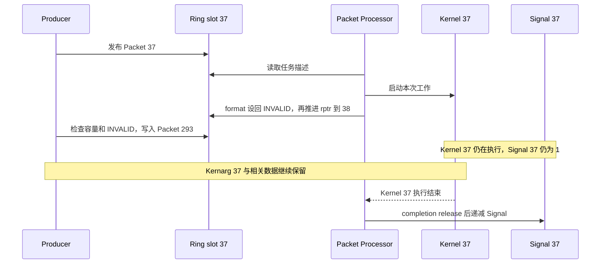

> **[SPEC]** HSA System Architecture 1.2 第 2.8.3 节允许 Packet Processor 在提交后释放槽位，不要求任务先完成。释放顺序是先让 INVALID 可见，再使 read_index 越过该 Packet。图中仅选取了早于 Kernel 完成的一种情况。

| 资源 | 可复用或释放的条件 |
| --- | --- |
| 单个 Ring slot | 对应旧 Packet 已释放，容量条件满足且 format 为 INVALID |
| 本次 Kernarg | 对应 Dispatch 完成，其他使用者也已结束 |
| Kernel 代码、输入与输出 | 所有会继续访问它们的任务结束 |
| Completion Signal | 相关 Packet、依赖它的工作和等待者均不再使用 |
| 整条 Ring 及 Queue 资源 | Queue 已停止并完成相应销毁过程 |

rptr 前进可以帮助 Producer 判断槽位复用。CPU 读取 Kernel 的最终结果，还需要下一章的 Signal 完成条件和同步关系。

## 7. Kernel 完成后怎样通知 CPU

### 7.0 从 GPU 写结果到 CPU 观察完成

本例在发布前把 Completion Signal 初始化为 1，并将其句柄写入 Packet。Kernel 写完 C 后，Packet 完成路径执行规定的 release，再原子递减 Signal；CPU 通过带 acquire 语义的等待观察到 0，随后读取结果。

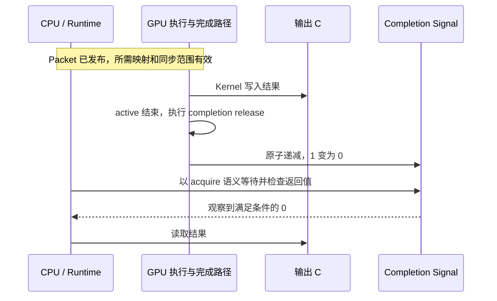

> **[SPEC]** HSA System Architecture 1.2 第 2.9.2 节规定完成阶段的 release 与非空 Signal 原子递减顺序。`1 → 0` 是本例的单次完成协议，HSA Signal 本身并非只有两个取值。

整个任务有两个同步方向：

| 方向 | 发布与获取 | 涉及的数据 |
| --- | --- | --- |
| CPU → GPU | Producer 的发布操作与 Dispatch 进入 active 前的 acquire | 任务描述及本次输入、参数的准备 |
| GPU → CPU | 完成路径的 release 与 CPU 对完成状态的 acquire 观察 | Kernel 写入的输出 C |

这两条关系都需要有效映射、正确内存属性和覆盖通信双方的 scope。第一条使 GPU 能正确开始工作；读取最终结果还需要第二条。Slot、Kernarg 与任务的不同释放时刻见 [生命周期图](#65-槽位释放后哪些资源仍须保留)。

### 7.1 等待返回、超时和唤醒后的状态判断

`hsa_signal_wait_scacquire()` 返回观察到的 Signal 值，而不是一个“Kernel 成功完成”的布尔结果。调用可能因条件满足、超时或提前唤醒而返回，调用者需要检查这个值。

本例使用只从 1 变到 0、在本次等待结束前不重置的 Signal。教学等待流程可以写成：

```text
do {
    observed = hsa_signal_wait_scacquire(
        signal, HSA_SIGNAL_CONDITION_EQ, 0, timeout_hint, wait_state_hint);
    // 未满足条件时，按调用者策略继续等待或处理超时/错误
} while (observed != 0);

read_output_C();
```

`scacquire` 已指定等待内部观察 Signal 时的 acquire 语义。检查到返回值为 0 后，本例可以依靠这次观察读取受同步保护的结果，无需因为“wait 已返回”而机械地再执行一次独立 acquire。返回值不满足条件时，不能读取尚未确认完成的结果。

> **[SPEC]** ROCr `ba56a24c6132`，[`runtime/hsa-runtime/inc/hsa.h`](<./2.源码/rocr-runtime/runtime/hsa-runtime/inc/hsa.h>) 第 2023～2038 行。API 说明等待可提前返回、条件可能失效，以及内部加载采用函数名指定的内存顺序。

```c
2023: /**
2024:  * @brief Wait until a signal value satisfies a specified condition, or a
2025:  * certain amount of time has elapsed.
2026:  *
2027:  * @details A wait operation can spuriously resume at any time sooner than the
2028:  * timeout (for example, due to system or other external factors) even when the
2029:  * condition has not been met.
2030:  *
2031:  * The function is guaranteed to return if the signal value satisfies the
2032:  * condition at some point in time during the wait, but the value returned to
2033:  * the application might not satisfy the condition. The application must ensure
2034:  * that signals are used in such way that wait wakeup conditions are not
2035:  * invalidated before dependent threads have woken up.
2036:  *
2037:  * When the wait operation internally loads the value of the passed signal, it
2038:  * uses the memory order indicated in the function name.
```

英文说明的含义是：即使条件未满足，等待也可能提前恢复；条件曾经满足不保证返回时仍满足；应用应避免依赖线程醒来前就重置条件。最后两行明确内部加载的内存顺序由函数名决定。

中间第 2039～2057 行说明参数：超时与等待状态都是 hint，不能将其当成精确的调度或唤醒期限。注释末尾和函数声明如下：

> **[SPEC]** ROCr `ba56a24c6132`，[`runtime/hsa-runtime/inc/hsa.h`](<./2.源码/rocr-runtime/runtime/hsa-runtime/inc/hsa.h>) 第 2058～2067 行。返回值是实际观察到的 Signal 值，可能不满足传入的比较条件。

```c
2058:  * @return Observed value of the signal, which might not satisfy the specified
2059:  * condition.
2060:  *
2061: */
2062: hsa_signal_value_t HSA_API hsa_signal_wait_scacquire(
2063:     hsa_signal_t signal,
2064:     hsa_signal_condition_t condition,
2065:     hsa_signal_value_t compare_value,
2066:     uint64_t timeout_hint,
2067:     hsa_wait_state_t wait_state_hint);
```

英文返回值说明再次限定了“函数已返回”与“完成条件已满足”的区别。代码保留完整声明，便于对照上面的 Signal、条件、比较值、超时和等待方式。

CPU 可以主动轮询，也可以由 Runtime 借助设备/驱动事件阻塞等待：

| 等待方式 | CPU 的动作 | 最终判断依据 |
| --- | --- | --- |
| 轮询 | 反复观察 Signal | Signal 是否满足目标条件 |
| 阻塞 | 等待事件唤醒，再观察 Signal | 仍检查 Signal 条件 |

中断和事件负责唤醒或降低轮询开销，不代替完成状态。实际程序还要结合 Queue 错误和设备恢复策略处理无法正常完成的等待。

### 7.2 barrier bit 怎样约束同一 Queue 的前序工作

Header 的 barrier bit 为 1 时，当前 Packet 必须等待同一 AQL Queue 中的所有前序 Packet 完成后才能开始。这个条件比“前序已经完成 launch”更强。

```text
同一 AQL Queue Q，Packet 顺序：
A（barrier=0） → B（barrier=0） → C（barrier=1）

A、B：协议允许 active 阶段重叠
C  ：等 A、B 都结束 completion 后，才进入自己的 launch
```

> **[SPEC]** HSA System Architecture 1.2 第 2.9.1、2.9.2 节定义 Header barrier 对同 Queue 前序完成的约束。

如果 C 使用 A/B 的输出，Runtime 还要确保写入与读取之间有匹配的 release/acquire 及合适的 scope。barrier bit 表达执行先后，不能单独代替所有内存同步条件。

这里的 Queue 指同一个 `hsa_queue_t` 对应的 AQL Ring。barrier bit 不携带另一条 Queue 的 Signal，跨 Queue 等待需要进一步表达依赖对象。

### 7.3 Barrier-AND 怎样表达跨 Queue 依赖

假设 Queue Q_A 的 Kernel A 产生数据，Queue Q_B 的 Kernel B 要使用它。Runtime 可以先为 A 设置 Completion Signal `S_A`，再在 Q_B 的 B 前面插入 Barrier-AND，依赖这个 Signal。

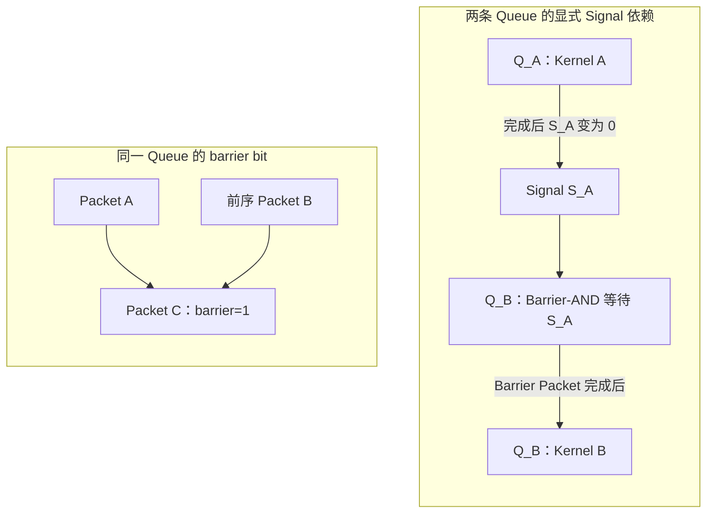

同 Queue 的 barrier bit 通过队内位置确定等待对象，跨 Queue 依赖则通过 `dep_signal` 指定 Signal。CPU 可以提前把 Barrier-AND 与 Kernel B 发布到 Q_B，不必先阻塞等 A 完成；设备在依赖满足前停止推进这条 Queue 的后继 Packet。

> **[SPEC]** ROCr `ba56a24c6132`，[`runtime/hsa-runtime/inc/hsa.h`](<./2.源码/rocr-runtime/runtime/hsa-runtime/inc/hsa.h>) 第 3126～3164 行。hsa_barrier_and_packet_t 有 5 个 dep_signal、保留字段和可选 Completion Signal。

> **[SPEC]** HSA System Architecture 1.2 第 2.9.2、2.9.8 节规定 Barrier-AND 的 active 阶段等待依赖，完成阶段先 acquire、再 release，随后更新非空完成 Signal；后继 Packet 要等这个 Barrier Packet 完成。这个 fence 位置与 Kernel Dispatch 不同。

本例将 `S_A` 从 1 递减到 0，并在 Barrier-AND 用完前保持该条件和 Signal 对象有效。依赖项为空句柄时按已满足处理。Runtime 仍需为 A 的结果和 B 的读取建立合适的内存顺序，不能只画出一条 Signal 连线就省略 scope。

**[BOUNDARY]** Q_A、Q_B 明确是两条底层 AQL Queue。两条 HIP Stream 可能复用同一条底层 Queue，不能仅凭 Stream 名称推断出图中的跨 Queue 关系。完整 Event wait-list 的转换、Host 等待与跨 Queue 批处理策略，留到 Runtime 调度专题。

### 7.4 Runtime 怎样跟踪一批 Packet 的完成

如果 `completion_signal.handle == 0`，该 Packet 的完成阶段不会更新独立 Signal。Runtime 可以在一批工作的尾部插入带完成状态的 Marker，统一跟踪此前工作。

Marker 是高层完成标记的称呼，不代表必须使用一种固定 Packet 类型。下面用一个带 barrier 的 Barrier-AND 举例，依赖项为空：

```text
同一 AQL Queue：
Kernel A（无独立完成 Signal）
    → Kernel B（无独立完成 Signal）
    → Marker M：Barrier-AND，barrier=1，completion_signal=S_end

M 的 barrier 等待 A、B 完成
    → M 完成同步并把 S_end 从 1 减到 0
    → Runtime 据此确认这批前序工作已完成
```

这个推导依赖 M 对前序完成的约束，以及覆盖结果的同步范围。仅仅在 Ring 尾部放一个带 Signal 的普通 Packet，没有建立相应等待关系，不能直接证明前面的 Kernel 全部结束。

> **[SOURCE]** ROCm CLR `81277d69e3352`，[`rocclr/device/rocm/rocvirtual.cpp`](<./2.源码/rocm-clr/rocclr/device/rocm/rocvirtual.cpp>) 第 1195～1238 行。当前提交函数根据 fence、profiling 和 attach_signal 等条件准备完成状态；不是每个高层 Command 都无条件附加独立 Signal。

Runtime 还可以在需要阻塞时附加 Signal，或维护 batch 与 Event 状态。因此，高层 Event 与单个 Kernel Packet 的 Completion Signal 不要求一一对应。

| 对象 | 所在层与用途 |
| --- | --- |
| Completion Signal | HSA 同步状态；Packet 完成路径按约定更新，等待者解释其条件 |
| Barrier-AND Packet | AQL 依赖命令；等待 Signal，并约束后续 Packet 推进 |
| HIP/OpenCL Event | 高层命令状态与依赖对象；Runtime 可将其关联到一个或一批 Packet |
| Linux `dma_fence` | KMD/DRM 的异步工作完成对象；普通 AQL Packet 不自动对应一个同名内核对象 |

`dma_fence` 的基础及两条提交路径见 [00_GPU系统基础](<./00_GPU系统基础.md>)；本文保留对象职责，不展开 DRM scheduler 的完成传播。

### 7.5 完成之后怎样读取结果和回收任务资源

对主例，CPU 已通过带 acquire 的等待观察到 Signal 为 0，此时可以读取 C。如果随后继续提交任务，资源的处理方式如下：

| 对象 | 本次完成后的处理 |
| --- | --- |
| C 的结果 | 在本例的有效映射与同步条件下，CPU 可以读取 |
| 本次独占 Kernarg | 可以复用或释放 |
| A/B/C 与 Kernel 代码 | 先确认没有其他未完成 Packet 或 Queue 继续使用 |
| Completion Signal | 先确认没有依赖 Packet、等待者或其他访问者，再复用或销毁 |
| Queue、Ring 和 Doorbell | 保持可用，可继续提交下一次任务 |

这些动作以任务的完成状态为依据；Ring slot 的复用可以更早，见 [第 6.5 节](#65-槽位释放后哪些资源仍须保留)。即使本例 Packet 已完成，整条 Queue 仍可能有其他工作，Queue 的停止与销毁将在下一章单独处理。

## 8. Queue 怎样销毁，错误发生在哪一层

### 8.0 正常停止与销毁需要满足哪些条件

完成一个 Packet 后，Queue 仍可继续使用。只有应用不再需要这条提交通路，或需要处理 Queue 错误时，才进入停止和销毁。

| 操作 | 完成的事情 | 调用者仍需负责什么 |
| --- | --- | --- |
| 等待所需 Signal/Event | 确认有关任务完成，并按同步规则使用结果 | 决定是否继续使用 Queue |
| `hsa_queue_inactivate()` | 停止 Queue 的处理，未完成执行可能被终止，后续 Packet 不再被消费 | 后续通过 Destroy 回收 Queue 自有资源 |
| `hsa_queue_destroy()` | 隐式停止 Queue，并回收 Queue 结构、Ring、Doorbell Signal 等 | 此后不能再访问该 Queue；有用结果必须提前等待 |

> **[SPEC]** ROCr `ba56a24c6132`，[`runtime/hsa-runtime/inc/hsa.h`](<./2.源码/rocr-runtime/runtime/hsa-runtime/inc/hsa.h>) 第 2507～2552 行。Destroy 使尚未完成 completion phase 的 Packet 状态变为未定义；Inactivate 阻止新 Packet 被处理。两者都不能把被中止的工作当成正常完成。

如果结果仍有用，正常顺序是：

```text
停止提交新工作
    → 等待需要保留结果的任务完成
    → 确认不再有 Producer 访问 Queue
    → hsa_queue_destroy()
```

> **[SPEC]** HSA System Architecture 1.2 第 2.9.3 节规定 Destroy 包含隐式 Inactivate；不要求应用总是先显式调用两个 API。实现可能等待 Wave 自然结束，也可能终止无法及时结束的 Wave。

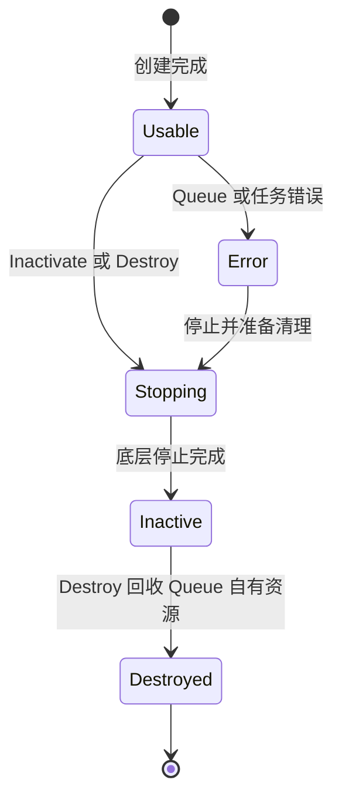

图中是概念性生命周期，不是某代硬件的状态位。Queue 是否驻留，以及某个 Packet 是否 active，仍分别按 [第 3.0 节](#30-queue-可用驻留与-packet-执行分别表示什么)和[第 6.2 节](#62-packet-的启动准备执行与完成收尾)解释。

### 8.1 ROCr 到 KFD 的资源释放顺序

销毁需要先消除仍在访问资源的执行者，再释放承载内存。ROCr 的析构首先通知异步错误处理器终止并等待其结束，避免回调继续使用 Queue；随后经 HSAKMT 请求 KFD 销毁底层 Queue，再回收 Runtime 的资源。

> **[SOURCE]** ROCr `ba56a24c6132`，[`runtime/hsa-runtime/core/runtime/amd_aql_queue.cpp`](<./2.源码/rocr-runtime/runtime/hsa-runtime/core/runtime/amd_aql_queue.cpp>) 第 342～395 行。第 343～362 行终止并等待相应错误处理器，第 364 行调用 Inactivate；之后才释放 Scratch、内部 Signal、Queue 内存、共享中断事件及 PM4 缓冲区。

跨越 Runtime/驱动边界的 `Inactivate()` 很短：

> **[SOURCE]** ROCr `ba56a24c6132`，[`runtime/hsa-runtime/core/runtime/amd_aql_queue.cpp`](<./2.源码/rocr-runtime/runtime/hsa-runtime/core/runtime/amd_aql_queue.cpp>) 第 620～628 行。active_ 的原子交换使底层 DestroyQueue 请求只由首次停止执行。

```cpp
620: hsa_status_t AqlQueue::Inactivate() {
621:   bool active = active_.exchange(false, std::memory_order_relaxed);
622:   if (active) {
623:     auto err = agent_->driver().DestroyQueue(queue_id_);
624:     assert(err == HSA_STATUS_SUCCESS && "Destroy queue failed.");
625:     atomic::Fence(std::memory_order_acquire);
626:   }
627:   return HSA_STATUS_SUCCESS;
628: }
```

英文断言信息“Destroy queue failed”表示驱动销毁失败。第 621～627 行将旧 `active_` 值保存下来，仅在旧值为 true 时调用驱动并执行 acquire fence。这里解释的是正常成功路径和重复停止保护；不能把清软件标志本身当成硬件已经停止。

KFD 内部还要区分两类引用：

| 状态 | 用途 | 减少它意味着什么 |
| --- | --- | --- |
| GPUVM 中 BO 关联对象的 `queue_refcount` | 记录 Queue 对该映射关系的使用 | 撤销 Queue 使用记录，本身不删除 PTE，也不释放 BO |
| Queue 持有的 BO 引用 | 保持 Ring、索引等承载对象存活 | 解除 Queue 对该 BO 的持有，最终释放还取决于其他引用 |

> **[SOURCE]** Linux `248951ddc14d`，[`drivers/gpu/drm/amd/amdkfd/kfd_queue.c`](<./2.源码/linux/drivers/gpu/drm/amd/amdkfd/kfd_queue.c>) 第 377～406 行。unref 路径在当前 GPUVM 中找到 BO 关联对象，再降低 queue_refcount；第 351～374 行的 release_buffers 则另外解除 BO 和相应 SVM 资源持有。

正常、成功的外层调用顺序如下。DQM 内部的资源记账和硬件操作按各调度路径实现，不能把所有释放都简单排到同一个末尾。

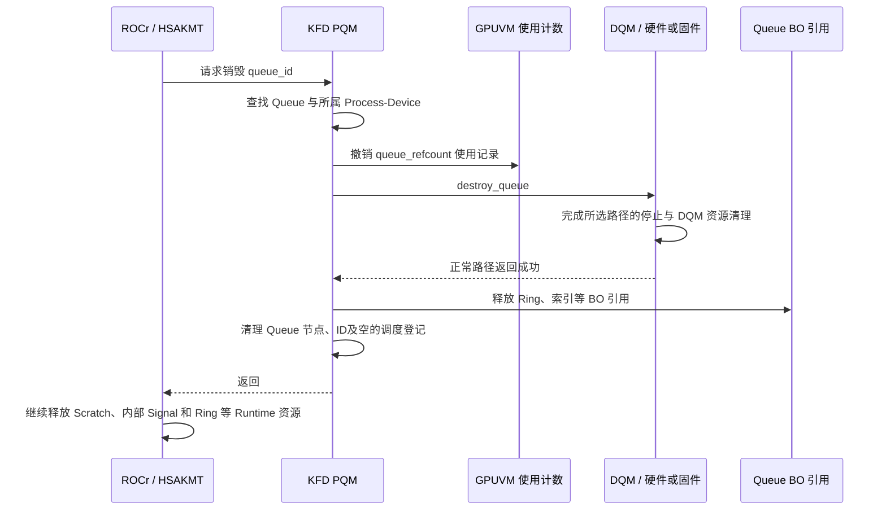

在 `pqm_destroy_queue(pqm, qid)` 中，第 509～527 行先根据 ID 找 Queue 节点与 PDD；第 529～534 行处理调试内核队列。下面保留用户 AQL Queue 分支以及公共返回尾部，异常条件也保留在原位置：

> **[SOURCE]** Linux `248951ddc14d`，[`drivers/gpu/drm/amd/amdkfd/kfd_process_queue_manager.c`](<./2.源码/linux/drivers/gpu/drm/amd/amdkfd/kfd_process_queue_manager.c>) 第 536～566 行。先降低映射使用计数，再调用 DQM；满足继续清理的返回条件后，才释放 Queue buffer 和软件节点。

```c
536: 	if (pqn->q) {
537: 		retval = kfd_queue_unref_bo_vas(pdd, &pqn->q->properties);
538: 		if (retval)
539: 			goto err_destroy_queue;
540:
541: 		dqm = pqn->q->device->dqm;
542: 		retval = dqm->ops.destroy_queue(dqm, &pdd->qpd, pqn->q);
543: 		if (retval) {
544: 			pr_err("Pasid 0x%x destroy queue %d failed, ret %d\n",
545: 				pdd->pasid,
546: 				pqn->q->properties.queue_id, retval);
547: 			if (retval != -ETIME && retval != -EIO)
548: 				goto err_destroy_queue;
549: 		}
550: 		kfd_procfs_del_queue(pqn->q);
551: 		kfd_queue_release_buffers(pdd, &pqn->q->properties);
552: 		pqm_clean_queue_resource(pqm, pqn);
553: 		uninit_queue(pqn->q);
554: 	}
555:
556: 	list_del(&pqn->process_queue_list);
557: 	kfree(pqn);
558: 	clear_bit(qid, pqm->queue_slot_bitmap);
559:
560: 	if (list_empty(&pdd->qpd.queues_list) &&
561: 	    list_empty(&pdd->qpd.priv_queue_list))
562: 		dqm->ops.unregister_process(dqm, &pdd->qpd);
563:
564: err_destroy_queue:
565: 	return retval;
566: }
```

英文错误信息记录失败的 PASID、Queue ID 和错误码。正常路径中，第 537 行撤销映射使用记录，第 542 行进入 DQM，第 551～553 行释放 buffer 引用与软件 Queue，第 556～562 行回收节点、ID，并按需注销空的 Process-Device 调度状态。第 543～549 行的异常继续条件在 [第 8.4 节](#84-异常清理与错误隔离有哪些边界)解释。

> **[SOURCE]** Linux `248951ddc14d`，[`drivers/gpu/drm/amd/amdkfd/kfd_device_queue_manager.c`](<./2.源码/linux/drivers/gpu/drm/amd/amdkfd/kfd_device_queue_manager.c>) 第 995～1083 行。No-HWS 在 DQM 内部处理硬件槽位、Doorbell、停止及 MQD 释放；这些操作发生在外层 release_buffers 之前。

> **[SOURCE]** Linux `248951ddc14d`，[`drivers/gpu/drm/amd/amdkfd/kfd_device_queue_manager.c`](<./2.源码/linux/drivers/gpu/drm/amd/amdkfd/kfd_device_queue_manager.c>) 第 2693～2780 行。CPSCH/MES 同样在 DQM 内部处理 Doorbell、运行列表或 Remove Queue，并清理 MQD；因此不能把 MQD、Doorbell 的全部释放画在 PQM 释放 BO 之后。

> **[SOURCE]** Linux `248951ddc14d`，[`drivers/gpu/drm/amd/amdkfd/kfd_chardev.c`](<./2.源码/linux/drivers/gpu/drm/amd/amdkfd/kfd_chardev.c>) 第 449～464 行。外层持有进程 mutex 调用 pqm_destroy_queue，使它与同一进程的相关 KFD 状态操作串行。

Runtime 这里释放的 Signal 是 Queue 自有的内部资源。应用创建并交给 Packet 使用的 Completion Signal 仍须按其使用者生命周期管理，不能因为销毁了 Queue 就继续访问或任意复用它。

### 8.2 创建失败后怎样回滚已取得的资源

创建 Queue 会逐步取得对象。失败时只撤销本次已经取得的资源，保留同一进程或设备上其他 Queue 仍在使用的状态。

| 失败位置 | 本次可能已取得什么 | 回滚范围 |
| --- | --- | --- |
| 参数检查 | 尚未取得 Queue 资源，或只有临时对象 | 返回错误并清理临时状态 |
| Ring/索引等 buffer 获取 | 可能已取得前面几个 BO 引用 | 撤销本次已增加的引用与使用计数 |
| Doorbell 或 MQD 分配 | Queue buffer，以及部分调度资源 | 按已完成步骤归还本次资源 |
| HQD 装载或 HWS/MES 提交 | MQD、Doorbell及相应软件登记 | 处理失败的调度状态，再回滚本次对象 |

第 2 章已经保留具体入口和 buffer 获取源码。本节只把回滚与资源生命周期对应起来，避免重新展开同一套获取过程。

> **[SOURCE]** Linux `248951ddc14d`，[`drivers/gpu/drm/amd/amdkfd/kfd_chardev.c`](<./2.源码/linux/drivers/gpu/drm/amd/amdkfd/kfd_chardev.c>) 第 387～447 行。buffer 获取或 PQM 创建失败时，入口通过对应错误标签撤销本次持有。

> **[SOURCE]** Linux `248951ddc14d`，[`drivers/gpu/drm/amd/amdkfd/kfd_device_queue_manager.c`](<./2.源码/linux/drivers/gpu/drm/amd/amdkfd/kfd_device_queue_manager.c>) 第 866～881 行。No-HWS 的清理标签按 MQD、Doorbell、硬件 Queue 资源和必要时的 VMID 顺序回滚。

> **[SOURCE]** Linux `248951ddc14d`，[`drivers/gpu/drm/amd/amdkfd/kfd_device_queue_manager.c`](<./2.源码/linux/drivers/gpu/drm/amd/amdkfd/kfd_device_queue_manager.c>) 第 2214～2232 行。CPSCH/MES 创建失败时撤销 Queue 列表、计数、MQD、Doorbell 和相关辅助资源。

错误标签表达的是资源取得与撤销的对应关系。共享的 Process-Device Doorbell 区域、其他 Queue 的资源以及已有地址空间，不能因某一次创建失败就一概释放。

### 8.3 怎样区分 Queue Full、Fault、Hang 和 Reset

同样表现为“任务没有继续”，原因可能出现在不同层。首先区分现象与恢复动作：

| 名称 | 含义 | 常见处理方向 |
| --- | --- | --- |
| Queue Full | Producer 的预留进度领先槽位释放进度，当前目标槽位不可写 | 等待 rptr、限制提交速率或向上层施加背压 |
| GPU Page Fault | 某次地址翻译或权限检查失败 | 根据路径恢复映射与重试，或终止受影响工作 |
| Queue Hang | Queue 在预期条件下长时间没有进展 | 分析依赖、抢占、卸载或故障升级 |
| GPU/Agent Reset | 恢复设备状态的一类动作 | 停止受影响工作并重建可恢复状态 |

Queue Full 本身不是设备损坏。Reset 是恢复动作，也不能用来证明旧任务已成功执行。

仅观察 `read_index` 静止不能确定原因：Queue 可能未驻留、队首 Packet 仍为 `INVALID`、Barrier 正在等待依赖，也可能遇到资源压力、长任务、Fault 或其他错误。需要继续结合 Queue 状态、Header、Signal 和错误报告。

若已有故障地址，可以按访问对象缩小范围：

| 地址类型 | 受影响的访问 | 首要关联信息 |
| --- | --- | --- |
| Ring GPUVA | CP/MEC 取 Packet | Ring mapping、VMID/PASID、Queue 生命周期 |
| `kernel_object` 对应的执行对象 | 读取执行信息或代码 | Code Object 装载、地址与访问权限 |
| `kernarg_address` | 参数读取 | 参数区 mapping、对齐与生命周期 |
| A/B/C GPUVA | Shader 访问数据 | 数据映射、权限及适用的 SVM 状态 |
| Completion Signal 的承载对象 | 完成状态更新 | Runtime Signal 对象的可访问性与使用者 |

**[BOUNDARY]** Fault 是否可重放、是否需要迁移页面，以及 Reset 如何恢复某代 GPU，属于后续 HMM/SVM、MMU 和故障恢复专题。这里保留定位入口，不从一个故障地址推导完整恢复算法。

### 8.4 异常清理与错误隔离有哪些边界

正常释放图假设相应停止操作成功。异常情况下，必须回到实际返回分支判断已经执行了哪些清理。

[第 8.1 节](#81-rocr-到-kfd-的资源释放顺序)保留的 `pqm_destroy_queue()` 对 DQM 返回值作了不同处理：

| DQM 返回值 | PQM 的后续动作 | 解释边界 |
| --- | --- | --- |
| 0 | 继续清理 Queue buffer、节点和 ID | 按正常成功路径理解 |
| `-ETIME` 或 `-EIO` | 记录错误后仍继续上述清理 | 不能仅凭本函数证明硬件已正常停止 |
| 其他错误 | 跳到返回路径，跳过后续清理 | 不能当成已经完整销毁 |

**[INFERENCE]** 在超时或 I/O 错误路径上，旧资源能否安全回收，还取决于外层 Hang/Reset 处理是否已经阻止设备继续访问。局部函数继续释放对象，并不补足这个硬件前提。反过来，返回错误也不表示此前没有发生任何状态变化。

错误隔离还要区分 Queue 与设备范围：

> **[SPEC]** HSA System Architecture 1.2 第 2.9.3 节要求未进入错误状态的同进程其他 Queue 继续处理；无法确定责任 Queue，或无法从检测到的错误恢复时，处理范围可以扩大到其他 Queue 及 Agent Reset。

可定位的 Queue 错误由对应状态和回调报告；设备状态无法在局部恢复时，再进入更大范围的恢复。任务被终止或执行出错后，不能期待它一定按正常路径递减 Completion Signal，Runtime 需要另行传播失败状态。

**[BOUNDARY]** 具体停止、隔离与恢复范围取决于 GPU 硬件、固件和错误类型。本文的正常时序不替代错误路径的证据。

### 8.5 进程退出时怎样停止 Queue 并释放地址空间

Queue 引用当前进程 GPUVM 中的 Ring、索引和辅助资源，未完成 Kernel 还可能继续访问代码、参数与数据。进程退出时，需要先阻止这些访问继续发生，再撤销它们依赖的地址空间。

```text
停止该进程的提交与 Queue 使用
    → 确认受影响的硬件/固件访问已经结束或被可靠阻止
    → 解除 Queue 对 BO 和映射的持有
    → 再回收 Process-Device 与 GPUVM
```

**[INFERENCE]** 这是由 Queue 引用关系得到的生命周期约束，与先停止执行流再拆除地址空间的原则一致。[正常销毁](#81-rocr-到-kfd-的资源释放顺序)和[异常处理](#84-异常清理与错误隔离有哪些边界)分别说明成功路径与故障路径怎样影响这个判断。

Doorbell、Queue ID 和硬件槽位还可能被后续 Queue 复用。资源回收必须防止旧 Producer 的迟到访问被误认为新 Queue 的通知；这些设计约束在 [第 9.2 节](#92-面向自研-gpu-的职责与设计约束)集中说明。

## 9. 完整 Dispatch 复盘与知识检索

### 9.0 vector_add 从创建通路到结果返回

本节沿用第 1.1.1 节的 HIP 入口，并假设 Queue 池中没有可复用的底层 Queue。创建阶段建立长期通路，随后每次 Dispatch 复用它。

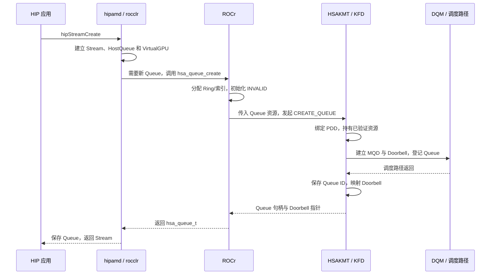

创建完成时，应用有高层 Stream，VirtualGPU 当前绑定一个 `hsa_queue_t`；KFD 有对应 Queue 和资源引用，MQD 已描述 Queue 配置。HQD 是否已经装入，要看 [所选驻留路径与当前状态](#30-queue-可用驻留与-packet-执行分别表示什么)。普通 Dispatch 从这条已有通路继续。

下面选取“Doorbell 通知后设备发现 Packet”的一种合法时序。规范也允许硬件在有效 Header 发布后、Doorbell 写入前开始处理，图中不将通知作为执行闸门。

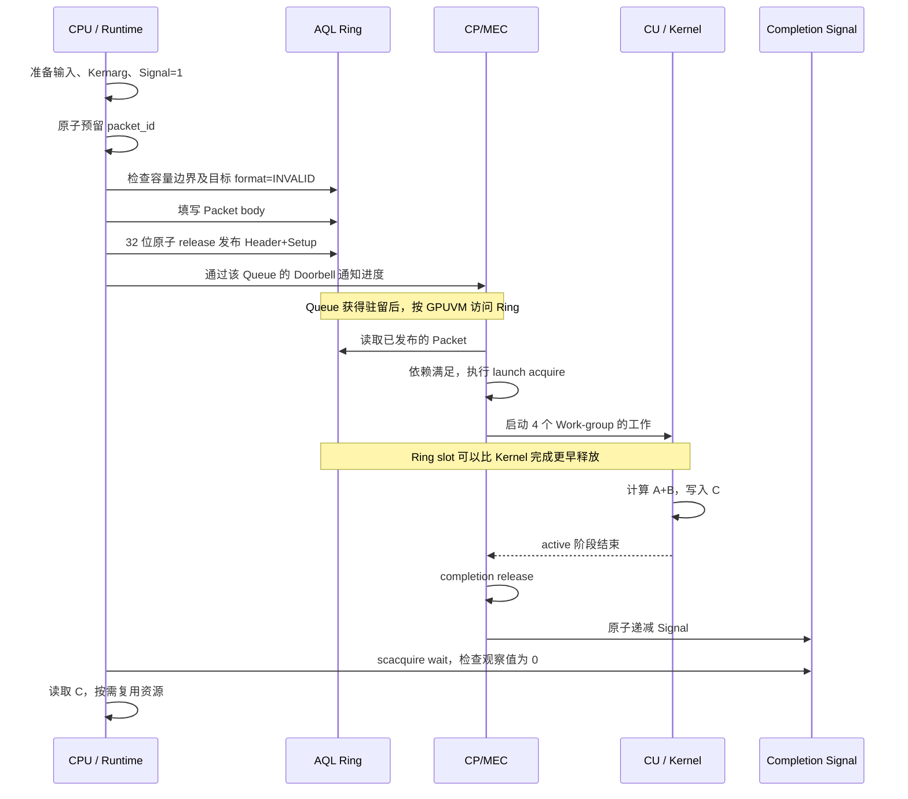

一次任务之后，Queue 可以继续承载后续 Packet。直到需要销毁通路时，才按 [停止条件](#80-正常停止与销毁需要满足哪些条件)和[释放顺序](#81-rocr-到-kfd-的资源释放顺序)处理长期资源。这样，创建成本由多次提交共同承担，而每次任务仍有独立的发布、执行与完成条件。

### 9.1 根据观察状态和故障地址定位问题

日志或寄存器中的单个值只反映一部分状态。查阅时可以先按观察到的对象定位，再沿相邻阶段继续追踪。

| 观察状态 | 当前能够说明什么 | 相关对象或后续定位方向 |
| --- | --- | --- |
| 高层 Stream 创建返回 | 高层对象已建立，并按当前策略取得提交通路 | VirtualGPU 当前绑定的 hsa_queue_t，见第 1.1.1 节 |
| `hsa_queue_create` 返回成功 | 底层 Queue 的创建流程已完成 | [Queue 可用与驻留状态](#30-queue-可用驻留与-packet-执行分别表示什么) |
| write_index 已增加 | 编号已预留 | [容量边界](#51-packet-id物理槽位与容量约束)与目标 Header |
| Header 已有效 | Packet 已交给 Packet Processor | [通知语义](#54-doorbell-通知哪条-queue哪次提交进度)、Queue 驻留和前序条件 |
| CPU 已执行 Doorbell 写入 | Producer 已执行通知动作 | 不能只凭 CPU 日志确认设备处理进度，继续看 Queue 与 Packet 状态 |
| rptr 已越过某 Packet | 对应旧槽位已释放 | [仍需存活的任务资源](#65-槽位释放后哪些资源仍须保留) |
| Signal 条件已满足 | 对应同步协议的完成条件已被观察 | [acquire 与结果可见性](#70-从-gpu-写结果到-cpu-观察完成)、其他使用者 |
| rptr 长时间未变 | 仅凭这个值无法区分等待与错误 | 驻留、INVALID 洞、Barrier、执行压力和错误报告 |

地址问题则先按用途区分：

| 地址或引用 | 访问路径中的位置 | 对应说明 |
| --- | --- | --- |
| Ring slot | Queue VMID → GPUVM → Ring backing | [设备取包](#60-cpmec-怎样依据-hqd-读取-ring) |
| Kernel 执行对象 | Packet 的 kernel_object → 目标 ABI 的执行信息 | [代码与对象关系](#42-packet-怎样连接代码参数块和数组) |
| Kernarg 与 A/B/C 指针 | 参数块与 Shader 数据访问 | [不同访问者](#61-一个-packet-会引出哪些代码与数据访问) |
| Doorbell | CPU 写入映射的 MMIO 通知窗口 | 第 2.7 节、[Doorbell 提交](#54-doorbell-通知哪条-queue哪次提交进度) |
| Signal 承载对象 | Packet 完成路径与等待者 | [完成通知](#70-从-gpu-写结果到-cpu-观察完成)、[故障地址分类](#83-怎样区分-queue-fullfaulthang-和-reset) |

Doorbell 是控制通知访问；Ring、代码和用户数据则沿其对应 GPU 地址空间访问。将它们画在同一张流程图中，不代表它们使用同一条地址翻译路径。

源码定位也可以按三条调用线查找：

```text
创建：
hsa_queue_create → GpuAgent::QueueCreate → AqlQueue
  → KfdDriver::CreateQueue → hsaKmtCreateQueueExt
  → kfd_ioctl_create_queue → pqm_create_queue → DQM

发布：
submitKernelInternal → dispatchAqlPacket → dispatchGenericAqlPacket
  → 预留 index → 等待容量 → 复制 INVALID Packet
  → packet_store_release → Doorbell Signal store

完成与回收：
Kernel 执行结束 → Packet release → Completion Signal
  → Runtime wait/异步处理 → 高层完成状态 → 资源回收
```

创建线关注 Ring/索引地址、Queue ID、Doorbell、MQD 和地址上下文；发布线关注逻辑编号、目标槽位和前 32 位；完成线关注 Signal、依赖、错误状态和剩余使用者。对应固定源码入口列在 [知识点索引](#93-知识点与源码检索入口)中。

### 9.2 面向自研 GPU 的职责与设计约束

**[DESIGN]** AMD 的对象名提供了一组可对照的实现。自研设计需要明确同样的职责，再决定具体对象和接口形式。

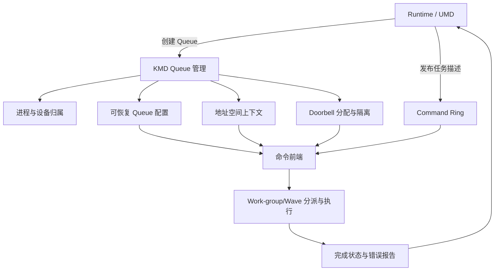

| 职责 | 需要明确的接口语义 |
| --- | --- |
| Queue 管理 | 谁能创建、更新、停止和销毁；调用返回时已经完成什么 |
| Ring 协议 | Packet 大小、索引与回绕、容量约束、Header 原子性和所有权转移 |
| 地址空间 | Queue 怎样绑定进程地址空间，访问怎样携带正确身份 |
| Doorbell | 可写窗口、槽位归属、进度值含义及未驻留期间的处理 |
| 驻留与恢复 | 逻辑 Queue 如何使用有限硬件槽位，配置和执行现场分别保存在哪里 |
| 完成同步 | 结果写入、release、状态更新与等待者 acquire 的配对 |
| 错误处理 | 责任对象、停止条件、失败传播与恢复范围 |
| 资源生命周期 | 各层分别持有哪些资源，在什么条件下解除持有和允许复用 |

Queue 自有的 Ring、索引、MQD 等资源需要在硬件使用期间受到保护；任务特有的代码、参数和数据也需要由 Runtime、驱动和使用者按职责维持生命周期。不能只保护 Ring，却允许仍在执行的任务引用已释放的数据。

停止完成条件应来自可信的硬件/固件协议及相应同步，不能只清除软件标志。Reset 后，可恢复的 Queue 配置与已经丢失的执行现场也要分别处理；恢复 MQD 不代表旧 Kernel 已成功完成。

Doorbell 槽位复用还存在迟到通知问题：旧 Producer 对某个槽位的写入，不应被识别为新 Queue 的任务。设计可以通过可靠停止旧 Producer、同步在途通知、控制映射和槽位复用来处理；也可以在接口中使用 generation，即槽位版本。

**[DESIGN]** 如果采用 generation，接收方必须能够识别并拒绝旧版本通知。仅在软件变量中增加版本、硬件却仍只看到无版本的 MMIO 写，并不能自动解决迟到通知。该机制是自研接口的可选方案，不是本文已经证明的 AMD 通用能力。

### 9.3 知识点与源码检索入口

下面先按知识点定位正文。各节已经在概念附近保留必要源码；这里用于查找位置，不要求集中阅读源码。

| 知识点 | 正文位置 |
| --- | --- |
| Stream、VirtualGPU、hsa_queue_t 的关系 | [1.1.1 高层对象](#111-hip-stream从接口调用到各层-queue)、[1.1.2 底层入口](#112-hsa_queue_t底层-aql-提交入口) |
| Ring 地址、创建请求与 Queue 资源保护 | [2.4 创建请求](#24-hsakmt-把用户态资源整理成-kfd-ioctl)、[2.6 buffer 保护](#26-kfd-按-gpuvm-mapping-解析并持有-queue-buffer)、[2.9 资源约束](#29-queue-创建的资源约束) |
| Queue 可用、驻留与 Packet active | [3.0 状态区分](#30-queue-可用驻留与-packet-执行分别表示什么) |
| MQD 字段、HQD 装载、No-HWS | [3.1 MQD](#31-kfd-怎样把-queue-属性写入-mqd)、[3.2 装载](#32-no-hwskfd-选择硬件槽位并装载-hqd) |
| HWS runlist、MAP_PROCESS、MAP_QUEUES | [3.3 传统 HWS](#33-hwscpsch通过运行列表交付进程与-queue-状态) |
| MES Add Queue 的输入与返回边界 | [3.4 MES](#34-mes通过-add-queue-接口交付状态) |
| CWSR、Queue 换出和恢复 | [3.5 状态保存](#35-queue-换出与恢复时哪些状态需要保留) |
| Packet 布局、Kernel 对象与 Kernarg | [4.1 字段布局](#41-64-字节-packet-的布局与字段分组)、[4.2 对象关系](#42-packet-怎样连接代码参数块和数组) |
| Grid、Work-group 与 segment 大小 | [4.0 启动参数](#40-从-vector_add-的启动参数得到任务描述)、[4.3 资源需求](#43-private-segment-与-group-segment-的资源需求) |
| Header、barrier 与 fence scope | [4.4 Header 约束](#44-header-怎样约束类型执行顺序和可见性) |
| CLR 临时 Packet 的构造与发布入口 | [4.5 CLR 调用](#45-clr-怎样构造临时-packet-并交给发布函数) |
| Packet ID、rptr/wptr、容量与回绕 | [5.1 索引与槽位](#51-packet-id物理槽位与容量约束) |
| SINGLE/MULTI、atomic-add 与 CAS | [5.2 预留实现](#52-producer-怎样预留编号并等待槽位) |
| INVALID、32 位原子 release 与所有权 | [5.3 Header 发布](#53-填写-packet并用-32-位原子写发布-header) |
| Doorbell、并发发布与 INVALID 洞 | [5.4 通知](#54-doorbell-通知哪条-queue哪次提交进度)、[5.5 多 Producer](#55-多-producer-发布顺序不同时queue-怎样推进) |
| 发布过程及常见错误 | [5.6 提交伪代码](#56-完整提交伪代码与常见错误) |
| 设备取包与各类地址访问 | [6.0 Ring 访问](#60-cpmec-怎样依据-hqd-读取-ring)、[6.1 访问者](#61-一个-packet-会引出哪些代码与数据访问) |
| Packet 三阶段与 Kernel 重叠 | [6.2 三阶段](#62-packet-的启动准备执行与完成收尾)、[6.3 重叠条件](#63-同一-queue-的-kernel-何时可以重叠执行) |
| Work-group/Wave 分派 | [6.4 工作组织](#64-grid-怎样变成-work-group-和-wave) |
| 槽位、Kernarg、数据与 Signal 的生命周期 | [6.5 生命周期](#65-槽位释放后哪些资源仍须保留) |
| Signal、acquire wait、超时与唤醒 | [7.0 完成同步](#70-从-gpu-写结果到-cpu-观察完成)、[7.1 等待状态](#71-等待返回超时和唤醒后的状态判断) |
| 同 Queue 与跨 Queue 的依赖 | [7.2 barrier bit](#72-barrier-bit-怎样约束同一-queue-的前序工作)、[7.3 Barrier-AND](#73-barrier-and-怎样表达跨-queue-依赖) |
| Marker、批处理、Event 与 dma_fence | [7.4 完成对象](#74-runtime-怎样跟踪一批-packet-的完成) |
| Inactivate、Destroy 与 BO 释放顺序 | [8.0 API 条件](#80-正常停止与销毁需要满足哪些条件)、[8.1 实际释放](#81-rocr-到-kfd-的资源释放顺序) |
| 创建回滚、Fault、Hang 与异常清理 | [8.2 回滚](#82-创建失败后怎样回滚已取得的资源)、[8.3 故障分类](#83-怎样区分-queue-fullfaulthang-和-reset)、[8.4 错误边界](#84-异常清理与错误隔离有哪些边界) |

> **[SOURCE] 固定源码索引**
>
> Linux 使用 `248951ddc14de84de3910f9b13f51491a8cd91df`，ROCr 使用 `ba56a24c6132c5d195686ae4adf969ca1222fbba`，CLR 使用 `81277d69e3352e7144ced2ee9601484f9b48d950`。
>
> - 高层 Kernel 构造与发布：[`rocclr/device/rocm/rocvirtual.cpp`](<./2.源码/rocm-clr/rocclr/device/rocm/rocvirtual.cpp>) 第 3867～4205、1074～1081、1184～1293 行；
> - ROCr Queue 资源与停止：[`runtime/hsa-runtime/core/runtime/amd_aql_queue.cpp`](<./2.源码/rocr-runtime/runtime/hsa-runtime/core/runtime/amd_aql_queue.cpp>) 第 342～395、620～628 行，创建入口见第 2.2 节的摘录；
> - KFD 创建与销毁入口：[`kfd_chardev.c`](<./2.源码/linux/drivers/gpu/drm/amd/amdkfd/kfd_chardev.c>) 第 338～464 行；
> - Queue buffer、BO 引用与映射使用计数：[`kfd_queue.c`](<./2.源码/linux/drivers/gpu/drm/amd/amdkfd/kfd_queue.c>) 第 197～226、234～406 行；
> - DQM 创建路径：[`kfd_device_queue_manager.c`](<./2.源码/linux/drivers/gpu/drm/amd/amdkfd/kfd_device_queue_manager.c>) 第 763～882、2126～2232 行，MES Add Queue 为第 207～280 行；
> - GFX9 MQD 与 HQD：[`kfd_mqd_manager_v9.c`](<./2.源码/linux/drivers/gpu/drm/amd/amdkfd/kfd_mqd_manager_v9.c>) 第 259～346 行；[`amdgpu_amdkfd_gfx_v9.c`](<./2.源码/linux/drivers/gpu/drm/amd/amdgpu/amdgpu_amdkfd_gfx_v9.c>) 第 222～299 行；
> - HWS 控制包：[`kfd_packet_manager_v9.c`](<./2.源码/linux/drivers/gpu/drm/amd/amdkfd/kfd_packet_manager_v9.c>) 第 32～87、227～297 行；
> - PQM 销毁：[`kfd_process_queue_manager.c`](<./2.源码/linux/drivers/gpu/drm/amd/amdkfd/kfd_process_queue_manager.c>) 第 497～566 行。

> **[SPEC] 规范与 API 索引**
>
> - [HSA Platform System Architecture 1.2](https://hsafoundation.com/wp-content/uploads/2021/02/HSA-SysArch-1.2.pdf)：第 2.8.3～2.8.5 节讲 Queue 协议与索引，第 2.9.1～2.9.3 节讲 Header、处理阶段和错误，第 2.9.6、2.9.8 节讲 Kernel Dispatch 与 Barrier-AND；
> - 固定 ROCr 的 [`runtime/hsa-runtime/inc/hsa.h`](<./2.源码/rocr-runtime/runtime/hsa-runtime/inc/hsa.h>)：第 2023～2067 行讲 Signal wait，第 2250～2265 行讲 Queue 类型，第 2507～2552 行讲停止与销毁，第 2956～3070、3126～3164 行定义 Packet。
