# AMD GPU 队列与 AQL Dispatch

## 缩写表

| 缩写    | 英文全称                                        | 中文含义                                                            |
| ------- | ----------------------------------------------- | ------------------------------------------------------------------- |
| ABI     | Application Binary Interface                    | 应用二进制接口                                                      |
| AMD     | Advanced Micro Devices                          | AMD 公司                                                            |
| AMDGPU  | AMD GPU Linux Kernel Driver                     | AMD GPU Linux 内核驱动                                              |
| API     | Application Programming Interface               | 应用程序编程接口                                                    |
| AQL     | Architected Queuing Language                    | 架构化队列语言；本文主要指其 64 字节命令包格式与队列协议            |
| ASIC    | Application-Specific Integrated Circuit         | 专用集成电路；本文指具体 GPU 芯片                                   |
| ATC     | Address Translation Cache                       | 地址转换缓存                                                        |
| BAR     | Base Address Register                           | PCIe 基址寄存器；用于暴露设备 MMIO 窗口                             |
| BO      | Buffer Object                                   | 缓冲对象                                                            |
| CAS     | Compare-And-Swap                                | 比较并交换原子操作                                                  |
| CDNA    | Compute DNA                                     | AMD 面向数据中心计算 GPU 的架构系列；MI300 使用 CDNA 3              |
| CLR     | Compute Language Runtime                        | AMD 的计算语言 Runtime 代码库；包含`hipamd`、OpenCL 和 `rocclr` |
| CP      | Command Processor                               | GPU 命令处理器                                                      |
| CPSCH   | Command Processor Scheduling                    | 命令处理器固件调度路径                                              |
| CPU     | Central Processing Unit                         | 中央处理器                                                          |
| CU      | Compute Unit                                    | 计算单元                                                            |
| CWSR    | Compute Wave Save/Restore                       | 计算 Wave 现场保存与恢复                                            |
| DMA     | Direct Memory Access                            | 直接内存访问                                                        |
| DIQ     | Debug Interface Queue                           | KFD 调试接口使用的内核 Queue                                        |
| DQM     | Device Queue Manager                            | KFD 设备队列管理器，管理该设备上各进程的 Queue 资源与调度           |
| DRM     | Direct Rendering Manager                        | Linux 直接渲染管理框架                                              |
| EOP     | End of Pipe                                     | 管线末端；本文指 Queue 使用的 EOP 状态资源                          |
| FW      | Firmware                                        | 固件                                                                |
| GDS     | Global Data Share                               | AMD GPU 的全局数据共享资源                                          |
| GPU     | Graphics Processing Unit                        | 图形处理器                                                          |
| GPUVA   | GPU Virtual Address                             | GPU 虚拟地址                                                        |
| GPUVM   | GPU Virtual Memory                              | GPU 虚拟地址空间及其页表                                            |
| GFXHUB  | Graphics Hub                                    | 图形与计算访问使用的 GPU 地址翻译 Hub                               |
| GTT     | Graphics Translation Table                      | AMDGPU 中主要表示 GPU 可访问的系统内存域                            |
| HIP     | Heterogeneous-Compute Interface for Portability | AMD GPU 编程接口                                                    |
| hipamd  | HIP implementation on AMD platform              | AMD 平台上的 HIP API 实现组件；`hipamd` 是项目名，不是首字母缩写  |
| HMM     | Heterogeneous Memory Management                 | 异构内存管理                                                        |
| HSA     | Heterogeneous System Architecture               | 异构系统架构；本文指 HSA 规范与执行模型，不是具体软件组件           |
| HSAKMT  | HSA Kernel Mode Thunk                           | ROCr 使用的 HSA 用户态内核接口层                                    |
| HQD     | Hardware Queue Descriptor                       | 硬件中一条活动 Queue 的寄存器状态                                   |
| HWS     | Hardware Scheduler                              | 负责 Queue 驻留调度的硬件/固件调度路径                              |
| IB      | Indirect Buffer                                 | 间接命令缓冲区                                                      |
| ioctl   | Input/Output Control                            | 用户态向内核驱动发送控制请求的接口                                  |
| IOMMU   | Input/Output Memory Management Unit             | 输入输出内存管理单元                                                |
| IOVA    | Input/Output Virtual Address                    | 设备侧输入输出虚拟地址                                              |
| IP      | Intellectual Property                           | 芯片中的可复用硬件功能模块                                          |
| ISA     | Instruction Set Architecture                    | 指令集架构                                                          |
| KFD     | Kernel Fusion Driver                            | Linux AMD GPU 计算驱动接口                                          |
| KMD     | Kernel Mode Driver                              | 内核态驱动                                                          |
| KMT     | Kernel Mode Thunk                               | 用户态 Runtime 到内核驱动之间的封装层                               |
| LDS     | Local Data Share                                | AMD GPU 上供同一 Work-group 共享的片上存储                          |
| MEC     | Micro Engine Compute                            | AMD GPU 中处理计算队列的命令处理引擎                                |
| MES     | Micro-Engine Scheduler                          | 新一代 AMD GPU 的固件队列调度机制                                   |
| MMU     | Memory Management Unit                          | 内存管理单元                                                        |
| MMIO    | Memory-Mapped Input/Output                      | 内存映射输入/输出                                                   |
| MQD     | Memory Queue Descriptor                         | 保存在内存中的 Queue 配置镜像                                       |
| NUMA    | Non-Uniform Memory Access                       | 非一致性内存访问                                                    |
| OpenCL  | Open Computing Language                         | 开放计算语言及其异构计算 API                                        |
| PA      | Physical Address                                | 物理地址                                                            |
| PASID   | Process Address Space ID                        | 进程地址空间标识                                                    |
| PDD     | Process Device Data                             | KFD 中某个进程在某个 GPU 上的状态                                   |
| PCIe    | Peripheral Component Interconnect Express       | 高速外设互连总线                                                    |
| PFN     | Page Frame Number                               | 物理页帧号                                                          |
| PM4     | AMD PM4                                         | AMD GPU 的一类底层命令包协议；本文只在 HWS 控制面中使用             |
| PQM     | Process Queue Manager                           | KFD 进程队列管理器，管理该进程的 Queue ID 和 Queue 列表             |
| PTE     | Page Table Entry                                | 页表项                                                              |
| QPD     | Queue Process Device Data                       | PDD 内嵌的 Queue 与调度状态；源码类型为`qcm_process_device`       |
| RAM     | Random Access Memory                            | 随机存取存储器；本文主要指系统内存                                  |
| RLC     | Run List Controller                             | 运行列表控制器                                                      |
| ROCm    | Radeon Open Compute                             | AMD GPU 计算软件栈与开发平台                                        |
| rocclr  | Radeon Open Compute Common Language Runtime     | HIP/OpenCL 共用的计算 Runtime；Linux 后端连接 ROCr                  |
| ROCr    | ROCm Runtime                                    | ROCm 的 HSA 用户态运行时                                            |
| rptr    | Read Pointer                                    | Queue 读索引；本文也写作`read_index`                              |
| RW      | Read Write                                      | 可读写权限                                                          |
| SDMA    | System Direct Memory Access                     | AMD GPU 的专用数据搬运引擎                                          |
| SE      | Shader Engine                                   | 着色器引擎                                                          |
| SIMD    | Single Instruction, Multiple Data               | 单指令多数据执行组织                                                |
| SVM     | Shared Virtual Memory                           | 共享虚拟内存                                                        |
| TLB     | Translation Lookaside Buffer                    | 地址翻译缓存                                                        |
| UAPI    | Userspace Application Programming Interface     | 用户空间应用程序接口；本文指内核向用户态公开的 ioctl 等接口         |
| UMD     | User Mode Driver                                | 用户态驱动                                                          |
| USERPTR | User Pointer                                    | 驱动使用用户态虚拟地址对应页面的内存路径                            |
| VA      | Virtual Address                                 | 虚拟地址                                                            |
| VMA     | Virtual Memory Area                             | Linux 虚拟内存区域                                                  |
| VMID    | Virtual Memory ID                               | GPU 活动地址空间使用的硬件上下文编号                                |
| VRAM    | Video Random-Access Memory                      | GPU 本地显存                                                        |
| wptr    | Write Pointer                                   | Queue 写索引；本文也写作`write_index`                             |
| XCC     | Accelerator Core Complex                        | 加速器计算核心复合体；MI300 中的计算模块                            |

## 全文大纲

[00_GPU系统基础](./00_GPU系统基础.md) 已经建立一次 GPU 任务的系统图，01、02 两篇文档进一步说明了内存怎样成为 GPU 可访问资源。本文沿同一条 Queue 追踪创建、驻留、Packet 发布、执行与完成，并用固定源码解释各层怎样实现这些机制。

首次学习可以按章节顺序阅读；后续查阅可以从 [第 9.3 节的知识点索引](#93-知识点与源码检索入口)进入具体小节。源码紧随相关讲解，正文、图示和例子会先交代理解代码所需的对象与执行条件。

本文反复使用以下术语：

| 术语             | 本文含义                                                                                         |
| ---------------- | ------------------------------------------------------------------------------------------------ |
| Agent            | 参与 HSA 系统的执行或存储主体；本文的 Kernel Agent 是目标 AMD GPU                                |
| Producer         | 向 AQL Ring 写 Packet 的 CPU 线程或其他执行单元                                                  |
| Packet Processor | 读取并处理 AQL Packet 的硬件/固件前端；AMD 计算路径主要落在 CP/MEC                               |
| Dispatch         | 某个 Kernel 的一次具体执行请求                                                                   |
| Kernarg          | 按 Kernel ABI 排列的参数块                                                                       |
| Work-item        | Kernel 的一个逻辑执行实例                                                                        |
| Work-group       | 一组可以共享 LDS 并进行组内同步的 Work-item                                                      |
| Wave             | AMD GPU 成批执行 Work-item 的硬件执行单位；具体宽度由 ISA 和 Kernel 决定                         |
| Work Distributor | 本文对“把 Work-group/Wave 分配给 CU 的硬件前端”的概念性称呼；具体模块名随 GPU 硬件架构版本变化 |

| 章节    | 核心问题                                          | 贯穿案例所在阶段                          |
| ------- | ------------------------------------------------- | ----------------------------------------- |
| 第 0 章 | 内存准备好后，还缺少哪些执行条件                  | 固定一个`vector_add` 任务和三条时间线   |
| 第 1 章 | AMD HSA 计算栈怎样分层，各类 Queue 对象分别是什么 | 建立层级图和对象地图                      |
| 第 2 章 | 一条 AQL Queue 怎样从 ROCr 创建到 KFD             | 内存准备、对象管理、资源保护与 Doorbell   |
| 第 3 章 | MQD 怎样装入 HQD，谁管理 Queue 驻留               | 展开创建中的 DQM 调用，以及后续驻留与恢复 |
| 第 4 章 | 一次 Kernel 调用怎样编码成 AQL Packet             | 任务描述                                  |
| 第 5 章 | Producer 怎样发布 Packet 并通知硬件               | 提交数据面                                |
| 第 6 章 | CP/MEC 怎样取包并启动 Kernel                      | GPU 执行面                                |
| 第 7 章 | Kernel 完成后怎样通知 CPU                         | 完成与依赖                                |
| 第 8 章 | Queue 怎样销毁，错误发生在哪一层                  | 生命周期与错误边界                        |
| 第 9 章 | 怎样复盘完整路径并按知识点查阅                    | 贯穿复盘                                  |

本文采用以下固定证据基线：

- HSA Platform System Architecture Specification 1.2，重点是 §2.8“User mode queuing”和 §2.9“Architected Queuing Language”；
- Linux `248951ddc14de84de3910f9b13f51491a8cd91df`；
- ROCr `ba56a24c6132c5d195686ae4adf969ca1222fbba`；
- ROCm CLR `81277d69e3352e7144ced2ee9601484f9b48d950`。

> **源码摘录格式：** 代码块左侧数字是所链接文件的真实行号。不连续内容拆成不同代码块，不把教学伪代码写成原始源码。英文注释后会直接说明中文含义。

> **[BOUNDARY]** 本文以普通 Host 侧 Kernel Dispatch 为主线，不展开编译器内部、Device Enqueue、完整 OpenCL 跨队列调度、SVM Page Fault 恢复、普通 DRM scheduler/IB 提交以及特定 GPU 硬件架构版本的 MMU 微架构。这些内容分别留到后续专题。

## 0. 内存准备好后，GPU 为什么仍然不会自动执行

### 0.1 前两篇文档已经解决了什么

[01_Linux 内存管理基础](<./01_Linux 内存管理基础.md>) 建立了 CPU VA、页表、PFN、`struct page` 和 DMA 地址之间的关系。[02_GPU 内存管理基础](<./02_GPU 内存管理基础.md>) 在此基础上梳理了 GPUVA、GPUVM、BO、PTE、TLB、可见性和生命周期。

完成这两步后，已经能够判断内存是否满足 GPU 访问条件。本章再固定以下前置状态：

```text
HSA Runtime 已经初始化，目标 GPU Agent 已经选定
Kernel Code 已经装入 GPU 可访问内存
输入 A、B 和输出 C 已经映射进进程 GPUVM
Kernarg 所需内存可以分配并映射，具体参数在 Dispatch 前填写
AQL Queue 和 Ring 尚未创建，将在 Queue 创建阶段建立
```

这些前置状态只用于固定贯穿案例的讲解起点，不表示所有 Runtime 都必须先加载 Kernel Code，再创建 Queue。Runtime 可以提前建立并复用 Queue；本文关心的是开始提交当前 Packet 时，Queue、代码和相关内存都已经可用。

但这些资源不会主动告诉 GPU：

- 要运行哪个 Kernel；
- 一共有多少个 Work-item；
- 每个 Work-group 多大；
- 参数放在哪里；
- 任务完成后更新哪个 Signal。

Queue 和 AQL Packet 提供了这份“执行契约”。

### 0.2 三个面：创建、提交与完成

从驱动工程师的视角排查 Queue 问题时，先判断问题出在哪个面。

```text
创建控制面（低频）
ROCr 分配 Queue 资源
  → HSAKMT 发起 CREATE_QUEUE ioctl
  → KFD 校验归属、创建 MQD、安排驻留

提交数据面（高频）
CPU 预留 Ring 槽位
  → 填写 AQL Packet
  → release 发布有效 Header
  → 写 Doorbell

完成面（每个任务或一批任务）
CP/MEC 启动 Kernel
  → Kernel 写结果
  → Packet 完成阶段更新 Completion Signal
  → CPU acquire 后读取结果
```

三者的时间尺度不同：

| 动作                       | 通常发生次数       | 是否进入 KFD                |
| -------------------------- | ------------------ | --------------------------- |
| 创建一条 Queue             | Queue 生命周期一次 | 是                          |
| 提交一个 Kernel Packet     | 每个 Dispatch 一次 | 正常快路径不需要            |
| 等待一个 Completion Signal | 按同步策略发生     | 通常由 ROCr Signal 机制完成 |
| 销毁一条 Queue             | Queue 生命周期一次 | 是                          |

> **[INFERENCE]** AQL 的低开销来自“先把长期通路建好，再由用户态反复写 Ring”。它不是让内核少做安全校验，而是把资源归属和映射校验集中在 Queue 创建阶段。

### 0.3 贯穿案例：1024 个元素的 `vector_add`

本文使用一个一维任务：

```c
C[i] = A[i] + B[i];
```

教学参数如下：

| 项目                     | 假设                                                    |
| ------------------------ | ------------------------------------------------------- |
| 元素数量                 | 1024                                                    |
| Work-group 大小          | 256 个 Work-item                                        |
| Work-group 数量          | 4                                                       |
| AQL Ring 容量            | 256 个 Packet 槽位                                      |
| AQL Packet 大小          | 固定 64 字节                                            |
| Ring 承载内存（backing） | system RAM，已经映射进本进程 GPUVM                      |
| Kernarg                  | 保存`A_gpuva`、`B_gpuva`、`C_gpuva` 和 `N=1024` |
| Completion Signal        | 提交前值为 1，本文等待其变为 0                          |

这组数值只用于讲解，不是 ROCr 的固定配置。

这里的 Ring 容量、Packet 大小和 Work-group 数量处在三个不同层级。AQL Ring 容量以 Packet 槽位计数；Work-group 数量则表示一个 Kernel Dispatch Packet 描述的 Grid 怎样划分。两者不是一一对应关系。

```text
1 个 64 字节 Kernel Dispatch Packet
  ├─ 占用 AQL Ring 中 1 个槽位
  ├─ grid_size_x = 1024
  ├─ workgroup_size_x = 256
  └─ GPU 据此展开为 4 个 Work-group、1024 个 Work-item
```

Packet 是固定长度的执行描述符，只保存 Kernel 句柄、参数地址和执行范围等信息，不保存 1024 份机器码、参数或 Work-item 状态。增加 Grid 中的 Work-item 数量只会改变 Packet 的尺寸字段，不会增大 Packet 本身；只有 Runtime 把工作拆成多次 Dispatch 时，才会使用多个 Ring 槽位。第 4.1 节和第 4.0 节会分别展开 Packet 布局以及 Grid 与 Work-group 的关系。

```text
长期 Queue 通路

HSA Queue（`hsa_queue_t` 加关联状态）
  ├─ base_address ──→ 256 × 64 B AQL Ring
  ├─ read_index
  ├─ write_index
  └─ doorbell_signal

一次 vector_add

Packet
  ├─ kernel_object ──→ Kernel 执行对象
  ├─ kernarg_address ──→ {A_gpuva, B_gpuva, C_gpuva, 1024}
  ├─ grid_size_x = 1024
  ├─ workgroup_size_x = 256
  └─ completion_signal ──→ 初值 1
```

### 0.4 本文始终追问五个问题

1. 当前对象是谁创建、由谁拥有？
2. 当前地址是 CPU VA、GPUVA，还是 MMIO 地址？
3. 当前动作发生在 Queue 创建期，还是每次 Dispatch？
4. 当前进度表示“槽位释放”还是“Kernel 完成”？
5. 当前同步解决执行依赖，还是内存可见性？

这五个问题比函数名更值得记住。函数和寄存器会随 GPU 硬件架构版本变化，职责边界则相对稳定。

## 1. AMD HSA 计算栈与 Queue 对象地图

### 1.0 AMD HSA 计算栈如何连接到 GPU

先看软件组件怎样连接：

```text
HIP API    → hipamd ────────┐
                            ├→ rocclr → ROCr → HSAKMT → KFD/AMDGPU → GPU
OpenCL API → OpenCL Runtime ┘

直接使用 HSA API 的程序 ─────────────→ ROCr → HSAKMT → KFD/AMDGPU → GPU
```

这张图只表示组件依赖关系，不表示一次 Kernel Dispatch 会逐层调用所有组件。直接使用 HSA API 的程序跳过 HIP/OpenCL 前端和 `rocclr`，从 ROCr 开始执行。

| 组件                        | 在本文路径中的作用                                           |
| --------------------------- | ------------------------------------------------------------ |
| `hipamd` / OpenCL Runtime | 接收 HIP/OpenCL API 调用，维护高层 Stream、Queue 和 Event    |
| `rocclr`                  | 把高层命令转换为 Kernarg、Grid、依赖和 AQL Packet            |
| ROCr                        | 实现 HSA Runtime，管理 Agent、HSA Queue、Ring、Signal 和内存 |
| HSAKMT                      | 把 Queue、内存和事件请求转换为 KFD UAPI 调用                 |
| KFD / AMDGPU                | KFD 管理计算进程与 Queue；AMDGPU 提供 BO、GPUVM 和硬件操作   |
| GPU                         | 读取 AQL Packet，分发 Work-group，并由 CU 执行 Kernel        |

HSA 是一份接口与执行语义规范，不是调用链中的软件模块。它规定：

- Queue 和 Signal 的对外语义；
- AQL Packet 的格式与处理规则；
- Producer 与 Packet Processor 之间的内存顺序。

ROCr 在用户态实现这些 Runtime 语义，GPU 的 Packet Processor 按相同规则解析 AQL Packet。HSA 规范本身不会调用 HSAKMT 或 KFD，也不规定这些组件的内部类和函数。

对于 HIP/OpenCL 程序，`rocclr` 先把高层 Kernel 命令转换成 GPU 可以提交的任务描述：

```text
HIP/OpenCL Kernel 命令
  → Kernarg
  → Grid / Work-group 参数
  → Event 与依赖关系
  → Kernel Dispatch Packet
```

Queue 创建路径建立长期提交通路，Packet 提交路径随后反复使用这条通路。

```text
Queue 创建控制路径（每条 Queue 通常一次）

HIP/OpenCL 前端 → rocclr，或直接 HSA 调用者
  → 需要新 Queue 时，由 ROCr 创建 hsa_queue_t、Ring 和索引
  → HSAKMT 发起 CREATE_QUEUE ioctl
  → KFD 绑定 Process-Device、校验资源并持有 BO
  → PQM/DQM 建立 Queue 和 MQD
  → No-HWS 直接装载 HQD，或由 HWS/MES 管理驻留

Packet 提交快速路径（每个 Dispatch 重复）

rocclr 或直接 HSA AQL Producer
  → 准备 Kernarg、Grid、依赖和 Completion Signal
  → 在 hsa_queue_t 指向的 Ring 中填写 Packet
  → release 发布 Header
  → 写 Doorbell
  → CP/MEC 取包，GPU MMU 翻译相关 GPUVA
  → CU 执行 Kernel
  → Completion Signal 通知 CPU / Runtime
```

Queue 创建时，ROCr、HSAKMT 和 KFD 建立 Ring、Doorbell 与内核 Queue。创建完成后，Producer 反复写 AQL Ring 和 Doorbell。普通 Dispatch 不再逐 Packet 调用 HSAKMT，也不再逐 Packet 进入 KFD ioctl。

> **[BOUNDARY]** 本章只把 Runtime 初始化和 Agent 发现作为 Queue 创建的前置条件，不展开 `hsa_init()` 的完整实现，也不追踪 PCI Probe、AMDGPU IP 初始化、固件加载和设备启动。那些过程属于系统与驱动初始化生命周期，不是一次 AQL Queue 的创建或一次 Packet 的提交。

> **[SOURCE] 可选源码索引**
>
> - 固定 CLR 基线 `81277d69e3352e7144ced2ee9601484f9b48d950` 的 [`README.md`](./2.源码/rocm-clr/README.md) 第 1～3、21～23 行说明：CLR 是 Compute Language Runtime，`hipamd` 实现 AMD 平台上的 HIP，`opencl` 实现 OpenCL，`rocclr` 是两者共用的计算 Runtime；
> - [`rocclr/cmake/ROCclrHSA.cmake`](./2.源码/rocm-clr/rocclr/cmake/ROCclrHSA.cmake) 第 23～36 行显示，`rocclr` 的 ROCr 后端包含 HSA 头文件并链接 `hsa-runtime64`；[`rocclr/device/rocm/rocvirtual.cpp`](./2.源码/rocm-clr/rocclr/device/rocm/rocvirtual.cpp) 第 1184～1293 行显示，普通 Dispatch 直接写 `gpu_queue_->base_address`、发布 Header 并写 `doorbell_signal`；
> - 固定 ROCr 基线 `ba56a24c6132c5d195686ae4adf969ca1222fbba` 的 [`runtime/docs/what-is-rocr-runtime.rst`](./2.源码/rocr-runtime/runtime/docs/what-is-rocr-runtime.rst) 第 10～29 行说明 ROCr 是 AMD 的 HSA Runtime 实现，并提供 Agent、Signal、AQL Dispatch 和内存管理等接口；
> - ROCr [`README.md`](./2.源码/rocr-runtime/README.md) 第 6～8 行区分 HSA Runtime 与 `libhsakmt`；[`libhsakmt/README.md`](./2.源码/rocr-runtime/libhsakmt/README.md) 第 1～10 行说明 `libhsakmt` 提供访问内核驱动的用户态接口。

### 1.1 “Queue”可能指以下五种对象

同一条调用栈中会连续出现 HIP Stream、`hsa_queue_t`、AQL Ring、MQD 和 HQD。它们分别表示或保存命令顺序、用户态提交入口、Packet、Queue 配置和硬件活动状态。代码和日志可能都把这些对象简称为 `queue`，因此需要先确认当前语境指哪一层。

```text
HIP Stream S
  │ 高层命令按什么顺序执行
  ▼
rocclr 选择一个 hsa_queue_t Q
  │ Q 告诉 Producer：Ring 在哪里、Doorbell 在哪里
  ▼
AQL Ring R
  │ 真正存放 64 字节 AQL Packet
  ▼
MQD M
  │ 保存 R 的地址、rptr/wptr、Doorbell 等 Queue 配置
  ▼
HQD H
  │ M 被装入硬件寄存器后形成的活动 Queue 状态
  ▼
CP/MEC 根据 H 找到 R，并读取 Packet
```

图中的箭头表示对象之间的引用和配置关系，不表示 Queue 的创建调用顺序。Queue 创建时，KFD 根据 Ring、指针和 Doorbell 等资源建立 MQD；Queue 获得驻留时，KFD 或固件再把 MQD 装入 HQD。具体创建过程见第 2～3 章。

本文所说的“一条底层 HSA/KFD Queue”，由下面这些相互关联的状态共同组成：

```text
Queue Q
├─ AQL Ring：存放 Packet
├─ write_index：CPU 下一次提交到哪里
├─ read_index：GPU 已经处理到哪里
├─ Doorbell：CPU 通知 GPU 有新 Packet
├─ 所属进程和 GPU 地址空间
├─ MQD：保存在内存中的 Queue 配置
└─ HQD：Queue 驻留时使用的硬件状态
```

Queue 已经创建、但尚未提交任何 Packet 时，初始状态如下：

```text
Queue Q

Ring：
┌─────────┬─────────┬─────┬──────────┐
│ INVALID │ INVALID │ ... │ INVALID  │
│ slot 0  │ slot 1  │ ... │ slot 255 │
└─────────┴─────────┴─────┴──────────┘

write_index = 0
read_index  = 0
```

**[BOUNDARY]** 图中用 `...` 省略了 `slot 2`～`slot 254`。256 个 slot 的编号范围是 0～255。此时 Queue 已经存在，Ring 中还没有等待 GPU 处理的有效 Packet。

其中最容易混淆的是高层 API Queue 与 `hsa_queue_t`：

> HIP Stream 是应用使用的逻辑执行队列，表示命令顺序和依赖。`hsa_queue_t` 是 ROCr 提供的 AQL 提交入口，告诉 Producer 应向哪个 Ring 写 Packet，以及通过哪个 Doorbell 通知 GPU。

`hsa_queue_t` 位于用户态，保存 Producer 提交 Packet 所需的入口信息。HQD 位于 GPU 中，是数量有限的活动 Queue 寄存器槽。

一条 HIP Stream 可以在某段时间内独占一个 `hsa_queue_t`，但这种独占只是绑定关系；两个对象仍有各自的类型、状态和生命周期。

#### 1.1.1 HIP Stream：从接口调用到各层 Queue

以显式创建一条 HIP Stream 为例：

```cpp
hipStream_t stream1;
hipStreamCreate(&stream1);
```

下面假设 `rocclr` 的 Queue 池中没有可复用的底层 Queue。`hipStreamCreate()` 因而需要向下创建新的 HSA/KFD Queue。每一层都会创建自己的对象，并保存与相邻层对象的关系：

```text
应用程序
  hipStreamCreate(&stream1)
  │ 请求创建一条 HIP Stream
  ▼
hipamd
  new hip::Stream(...)
  │ 创建：hip::Stream 对象
  │ 最终以 hipStream_t 句柄返回给应用
  ▼
rocclr
  hip::Stream 的基类 amd::HostQueue 初始化
  → 为 HostQueue 创建 VirtualGPU（rocclr 用户态后端执行对象）
  → VirtualGPU::create()
  → Device::acquireQueue()
  │ 创建：HostQueue 和 VirtualGPU
  ▼
ROCr
  hsa_queue_create()
  → 创建 AqlQueue
  → 分配 AQL Ring，并把所有 Packet Header 初始化为 INVALID
  → 把 rptr、wptr 初始化为 0
  → 填充 hsa_queue_t 的 base_address、size 和 doorbell_signal 等字段
  │ 创建：hsa_queue_t、AQL Ring 和用户态索引状态
  ▼
HSAKMT
  hsaKmtCreateQueueExt()
  → 把 Ring、rptr/wptr、Queue 类型和优先级整理进 ioctl 参数
  → 发起 AMDKFD_IOC_CREATE_QUEUE
  ▼
KFD
  绑定当前进程与目标 GPU
  → PQM/DQM 创建内核 Queue 记录
  → 分配 Doorbell 并建立 MQD
  → No-HWS 模式直接装载 HQD；HWS/MES 模式交给固件安排驻留
  │ 创建：KFD Queue 和 MQD；是否立即装入 HQD 取决于调度路径
  ▼
创建结果逐层返回
  KFD 返回 Queue ID 和 Doorbell offset
  → HSAKMT 映射 Doorbell，并返回 Queue resource
  → ROCr 完成 Doorbell Signal 等 AqlQueue 状态
  → rocclr 的 VirtualGPU 保存 hsa_queue_t 指针
  → hipamd 把 stream1 返回给应用
```

`VirtualGPU` 是 `rocclr` 为一条 `HostQueue` 创建的用户态 C++ 对象。它的 `gpu_queue_` 成员保存 `hsa_queue_t*`，并维护 Kernarg 缓冲区、Barrier、Signal 等与该高层 Queue 相关的后端状态。提交命令时，`VirtualGPU` 通过 `gpu_queue_->base_address` 定位 AQL Ring，写入 Packet，再通过 `gpu_queue_->doorbell_signal` 更新 Doorbell。名称中的 `VirtualGPU` 不表示另一块物理 GPU，也不表示硬件虚拟化。

调用返回后，`stream1` 指向高层 `hip::Stream`。`hip::Stream` 通过 `HostQueue` 和 `VirtualGPU` 关联到 `hsa_queue_t`，`hsa_queue_t` 再指向 AQL Ring 和 Doorbell。KFD 用 MQD 保存这条底层 Queue 的配置；Queue 驻留时，GPU 用 HQD 保存活动状态。

一个进程可以在同一目标 GPU 上创建多条 HIP Stream。本文固定的 CLR 实现会为每条 `HostQueue` 创建一个 `VirtualGPU`，而每个 `VirtualGPU` 当前通过一个 `gpu_queue_` 指针使用一条底层 `hsa_queue_t`。对于允许复用的普通 Queue，当对应优先级的底层 Queue 池达到上限时，多个 `VirtualGPU` 可以复用同一个 `hsa_queue_t`：

```text
进程
├─ HIP Stream / HostQueue A
│    └─ VirtualGPU A
│         └─ gpu_queue_ → hsa_queue_t Q0 → AQL Ring 0
│
├─ HIP Stream / HostQueue B
│    └─ VirtualGPU B
│         └─ gpu_queue_ → hsa_queue_t Q1 → AQL Ring 1
│
└─ HIP Stream / HostQueue C
     └─ VirtualGPU C
          └─ gpu_queue_ → hsa_queue_t Q0 → AQL Ring 0（与 A 复用）
```

这些对象的数量关系可以写成：

```text
HostQueue  → VirtualGPU  ：一对一
VirtualGPU → hsa_queue_t ：每个 VirtualGPU 当前使用一个；多个 VirtualGPU 可以复用同一个
hsa_queue_t → AQL Ring   ：一对一
```

创建和绑定的方向是：高层 `HostQueue` 创建 `VirtualGPU`，`VirtualGPU` 再从底层 Queue 池中取得或复用 `hsa_queue_t`。

**[BOUNDARY]** 如果 `Device::acquireQueue()` 选中 Queue 池中已有的 `hsa_queue_t`，`rocclr` 会直接复用该提交入口。这次 `hipStreamCreate()` 不再请求 ROCr、HSAKMT 和 KFD 创建新的底层 Queue。

**[BOUNDARY]** 启用动态 Queue 回收后，空闲的 `VirtualGPU` 还可能暂时归还 `gpu_queue_`，等后续工作到来时再从池中取得一条 Queue。因此，“每个 VirtualGPU 当前使用一个 `hsa_queue_t`”描述的是同一时刻的绑定，不表示该绑定在 VirtualGPU 的整个生命周期中永远不变。第 4.0 节会说明这个例外。

> **[SOURCE] 可选源码索引**
>
> 以下路径均来自固定 CLR 基线 `81277d69e3352e7144ced2ee9601484f9b48d950`：
>
> - `hipStreamCreate() → hip::Stream`：[`hipamd/src/hip_stream.cpp`](./2.源码/rocm-clr/hipamd/src/hip_stream.cpp) 第 18～30、188～201、274～281 行；
> - `HostQueue → VirtualGPU → acquireQueue()`：[`rocclr/platform/commandqueue.hpp`](./2.源码/rocm-clr/rocclr/platform/commandqueue.hpp) 第 159～175 行，以及 [`rocclr/device/rocm/rocvirtual.cpp`](./2.源码/rocm-clr/rocclr/device/rocm/rocvirtual.cpp) 第 1737～1758、1877～1887 行；
> - 复用已有 Queue 或调用 ROCr 创建新 Queue：[`rocclr/device/rocm/rocdevice.cpp`](./2.源码/rocm-clr/rocclr/device/rocm/rocdevice.cpp) 第 3135～3175 行。
>
> ROCr、HSAKMT 和 KFD 的 Queue 创建源码分别在第 2.1～2.8 节和第 3.0～3.5 节展开。

#### 1.1.2 `hsa_queue_t`：底层 AQL 提交入口

`rocclr` 为 HIP Stream 建立或选择底层提交通道时，会取得一个 `hsa_queue_t`：

```text
hsa_queue_t Q
  ├─ base_address ─────→ AQL Ring
  ├─ doorbell_signal ──→ Doorbell
  ├─ size ─────────────→ Ring 容量
  └─ id ───────────────→ 公开 Queue ID
```

提交 Kernel 时，`rocclr` 使用这些字段完成以下操作：

```text
高层 Kernel 命令
  → rocclr 构造 Kernel Dispatch Packet
  → 写入 Q.base_address 指向的 Ring
  → release 发布 Packet Header
  → 写 Q.doorbell_signal
  → CP/MEC 取包
```

HIP Stream 与 `hsa_queue_t` 服务于不同层次：

- HIP Stream/OpenCL Command Queue 保存 API 规定的命令顺序、依赖和属性；
- `hsa_queue_t` 保存 HSA/AQL 提交需要的 Ring、Doorbell 和 Queue 身份；
- 应用可以创建多条 Queue，Runtime 则从底层 HSA Queue 池中选择或复用提交通道；
- 高层 Queue 与 `hsa_queue_t` 各自保持生命周期，Runtime 负责管理两者的绑定和复用。

Producer 通过 `hsa_queue_t` 找到 Ring，并通过 Doorbell 通知新进度。CP/MEC 通过 HQD 中的 Ring 地址、指针和地址空间状态找到同一个 Ring。MQD 和 HQD 保存 Queue 配置，具体的 Kernel Dispatch Packet 保存在 Ring 中。

#### 1.1.3 AQL Ring：真正存放 Packet

AQL Ring 是实际保存 Packet 的内存，每个 slot 存放一个固定 64 字节的 AQL Packet。Queue 创建完成后，应用向 `stream1` 提交第一个 Kernel：

```cpp
kernelA<<<grid, block, 0, stream1>>>();
```

`hipamd` 根据 `stream1` 找到 `hip::Stream`，`rocclr` 再取得该 Stream 对应的 `VirtualGPU`。`VirtualGPU` 通过成员 `gpu_queue_` 取得 `hsa_queue_t`，再根据 `hsa_queue_t.base_address` 定位 Ring，并把 Kernel A 编码成一个 Kernel Dispatch Packet：

```text
1. 取得旧 write_index = 0，并把 write_index 增加到 1
2. 用 0 & (256 - 1) 得到 slot 0
3. 把 Kernel Dispatch Packet 的内容写入 slot 0
4. 以 release 语义发布 Packet Header
5. 写 Doorbell，通知硬件 Packet ID 0 已经发布
```

此时 Ring 的简化状态是：

```text
Ring：
┌────────────────────────┬─────────┬─────┬──────────┐
│ Kernel Dispatch Packet │ INVALID │ ... │ INVALID  │
│ slot 0                 │ slot 1  │ ... │ slot 255 │
└────────────────────────┴─────────┴─────┴──────────┘

write_index = 1
read_index  = 0
```

CP/MEC 根据 HQD 定位这条 Ring，读取 `slot 0` 并启动 Kernel。硬件消费该 Packet 后，`read_index` 前进到 1。Ring 的 slot 保存 Packet，`hsa_queue_t` 提供 Ring 地址和 Doorbell 等提交入口信息。

> **[SOURCE]** 固定 CLR 基线 [`rocclr/device/rocm/rocvirtual.cpp`](./2.源码/rocm-clr/rocclr/device/rocm/rocvirtual.cpp) 第 1184～1276 行依次取得 write index、用掩码定位 slot、复制 Packet、以 release 语义发布 Header，并把 Packet ID 写入 Doorbell。

#### 1.1.4 MQD：内存中的 Queue 配置

MQD 保存整条 Queue 的配置，具体任务仍由 Ring 中的 Packet 描述。这里的 ASIC 指具体的 GPU 芯片。

MQD 的格式与 GPU 硬件架构版本有关。不同 GPU 硬件架构版本都需要记录 Ring、进度指针和 Doorbell 等核心信息，但字段的排列、偏移、位定义和附加状态可能不同。KFD 必须按照目标 GPU 对应的 MQD 格式填写这些信息：

```text
Ring base 和 Ring size
rptr/wptr 地址或保存值
Doorbell offset
EOP、CWSR 等 Queue 辅助资源
优先级和其他调度属性
地址空间相关状态
```

这与 AQL Packet 不同。AQL Packet 的大小和字段布局由 HSA 规范定义，Kernel Dispatch Packet 固定为 64 字节；MQD 的格式则由具体的 GPU 硬件架构版本决定。

Queue 获得驻留时，KFD 或固件根据 MQD 恢复这些配置。一份 MQD 通常描述整条 Queue，与 Ring 中有多少个 Packet 无关。

#### 1.1.5 HQD：已经装入硬件的活动状态

HQD 是 GPU 中有限的一组活动 Queue 寄存器槽。以 No-HWS/GFX9 的简化路径为例，装载 MQD 会把 Queue 配置写入对应的 HQD 寄存器：

```text
MQD 中的 Ring base      → HQD Ring base 寄存器
MQD 中的 rptr/wptr 状态 → HQD 进度寄存器和轮询地址
MQD 中的 Doorbell       → HQD Doorbell 配置
MQD 中的地址空间状态    → HQD VM 上下文
```

HQD 激活后，CP/MEC 根据其中的 Ring 地址、进度和地址翻译上下文定位 AQL Ring，再读取 Packet。HWS/MES 路径还会把 PASID、页表根等进程状态交给固件，由固件管理最终使用的 VMID 和 HQD 位置。上图表达的是 MQD 与 HQD 的字段关系：MQD 保存可恢复的配置，HQD 保存当前活动配置。

把前面的对象放进同一次 Kernel 提交，关系如下：

```text
应用程序
  kernelA<<<grid, block, 0, stream1>>>()
       │
       ▼
HIP Stream / HostQueue stream1
  记录 Kernel A 所属的命令序列
       │ rocclr 取得该 Stream 的 VirtualGPU
       ▼
VirtualGPU
  └─ gpu_queue_ → hsa_queue_t Q
                    ├─ base_address ─────→ AQL Ring R
                    │                       └─ slot n：Kernel A 的 Packet
                    └─ doorbell_signal ──→ Doorbell D

Queue 创建和驻留时已经准备：

MQD M（GPU 可访问内存）
  保存 R 的地址、rptr/wptr、D 对应的 Doorbell 配置和地址空间状态
       │ KFD 装载，或由固件安排驻留
       ▼
HQD H（GPU 寄存器）
  保存当前活动的 Queue 状态

每次提交 Kernel A：

rocclr ──写 Packet──→ Ring R
rocclr ──写进度────→ Doorbell D
HQD H + Doorbell D ─→ CP/MEC ─→ 定位 Ring R ─→ 读取 slot n
```

图中没有 `Packet → MQD → HQD` 的转换。Kernel A 的 Packet 始终保存在 Ring R 中；MQD 和 HQD 保存的是整条 Queue 的配置，使 CP/MEC 能定位并读取 Ring R。

Queue 创建时，ROCr 建立 `hsa_queue_t` 和 Ring，KFD 建立 MQD。Queue 获得驻留时，KFD 或固件把 MQD 中的配置装入 HQD。此后每次 Dispatch 只需复用这些对象：`rocclr` 写 Ring 和 Doorbell，CP/MEC 根据 HQD 取包。

图中只画了一条 HIP Stream 当前使用一条底层 HSA Queue。多条 Stream 复用同一条 HSA Queue 的情况见第 1.1.1 节；一条 Queue 被换出 HQD、稍后再恢复驻留的情况见第 3 章。

### 1.2 可选规范阅读：`hsa_queue_t` 的公开字段

第 1.1.2 节已经说明了 `hsa_queue_t` 的用途。本节不再引入新的 Queue 对象，只用 HSA 接口定义核对它向 Producer 提供的信息：

| 字段                   | Producer 从中得到的信息              |
| ---------------------- | ------------------------------------ |
| `type`、`features` | Queue 类型以及支持的 Packet 类别     |
| `base_address`       | AQL Ring 的起始地址                  |
| `doorbell_signal`    | 发布 Packet 后使用的 Doorbell Signal |
| `size`               | Ring 能容纳的 Packet 数量            |
| `id`                 | ROCr 对应用公开的 Queue 标识         |

下面的定义用于验证这些字段。第一次阅读时可以跳过源码块，直接看源码后的结论。

> **[SPEC]** ROCr HSA 头文件 [`runtime/hsa-runtime/inc/hsa.h`](./2.源码/rocr-runtime/runtime/hsa-runtime/inc/hsa.h) 第 2300～2363 行：

```c
2300: /**
2301:  * @brief User mode queue.
2302:  *
2303:  * @details The queue structure is read-only and allocated by the HSA runtime,
2304:  * but agents can directly modify the contents of the buffer pointed by @a
2305:  * base_address, or use HSA runtime APIs to access the doorbell signal.
2306:  *
2307:  */
2308: typedef struct hsa_queue_s {
2309:   /**
2310:    * Queue type.
2311:    */
2312:   hsa_queue_type32_t type;
2313:
2314:   /**
2315:    * Queue features mask. This is a bit-field of ::hsa_queue_feature_t
2316:    * values. Applications should ignore any unknown set bits.
2317:    */
2318:   uint32_t features;
2319:
2320: #ifdef HSA_LARGE_MODEL
2321:   void* base_address;
2322: #elif defined HSA_LITTLE_ENDIAN
2323:   /**
2324:    * Starting address of the HSA runtime-allocated buffer used to store the AQL
2325:    * packets. Must be aligned to the size of an AQL packet.
2326:    */
2327:   void* base_address;
2328:   /**
2329:    * Reserved. Must be 0.
2330:    */
2331:   uint32_t reserved0;
2332: #else
2333:   uint32_t reserved0;
2334:   void* base_address;
2335: #endif
2336:
2337:   /**
2338:    * Signal object used by the application to indicate the ID of a packet that
2339:    * is ready to be processed. The HSA runtime manages the doorbell signal. If
2340:    * the application tries to replace or destroy this signal, the behavior is
2341:    * undefined.
2342:    *
2343:    * If @a type is ::HSA_QUEUE_TYPE_SINGLE, the doorbell signal value must be
2344:    * updated in a monotonically increasing fashion. If @a type is
2345:    * ::HSA_QUEUE_TYPE_MULTI, the doorbell signal value can be updated with any
2346:    * value.
2347:    */
2348:   hsa_signal_t doorbell_signal;
2349:
2350:   /**
2351:    * Maximum number of packets the queue can hold. Must be a power of 2.
2352:    */
2353:   uint32_t size;
2354:   /**
2355:    * Reserved. Must be 0.
2356:    */
2357:   uint32_t reserved1;
2358:   /**
2359:    * Queue identifier, which is unique over the lifetime of the application.
2360:    */
2361:   uint64_t id;
2362:
2363: } hsa_queue_t;
```

这段定义确认了以下边界：

- `hsa_queue_t` 结构本身由 Runtime 分配并管理，Producer 不修改结构体字段；
- Producer 把 Packet 写入 `base_address` 指向的 Ring，并通过 `doorbell_signal` 通知硬件；
- `size` 的单位是 Packet 槽位数，并且必须是 2 的幂；
- `id` 只标识 ROCr 对外公开的 Queue，不表示 Ring 地址或 KFD `queue_id`。

`base_address` 周围的条件编译只调整结构体在不同编译模型和字节序下的字段布局，不改变它指向 AQL Ring 这一职责。本文固定源码基线对应的 Linux AMD GPU 路径使用小端布局。

### 1.3 ROCr、HSAKMT 和 KFD 的 Queue 标识关系

Queue 创建完成后，Producer 可以通过 `hsa_queue_t` 提交 Packet。ROCr 后续更新或销毁这条 Queue 时，还会再次调用 HSAKMT 和 KFD。ROCr、HSAKMT 与 KFD 管理的是三份相互关联的对象，不是同一个结构体：

```text
ROCr      管理 AqlQueue
HSAKMT    管理用户态私有 struct queue
KFD       管理内核态 struct queue
```

创建请求向下执行时，HSAKMT 先分配自己的私有 `struct queue`，KFD 随后创建内核 Queue。创建成功后，结果按照下面的顺序返回：

```text
1. KFD
   创建内核态 struct queue
   → 分配 KFD queue_id
   → 向 HSAKMT 返回 queue_id 和 Doorbell offset

2. HSAKMT
   把 KFD queue_id 保存到私有 q->queue_id
   → 把私有 struct queue 的地址编码成 HSA_QUEUEID
   → 向 ROCr 返回这个 HSA_QUEUEID

3. ROCr
   把 HSA_QUEUEID 保存到 AqlQueue::queue_id_
   → 另行生成 hsa_queue_t::id，作为公开 Queue 标识
```

因此，ROCr 中会同时看到两个名称带有 `id` 的字段，但用途不同：

```text
应用持有 hsa_queue_t*
└─ hsa_queue_t::id
     ROCr 对外公开的数字标识
     不用于 HSAKMT 或 KFD ioctl

ROCr AqlQueue
└─ AqlQueue::queue_id_，类型为 HSA_QUEUEID
     │ ROCr 把它传给 hsaKmtUpdateQueue()、hsaKmtDestroyQueue()
     ▼
HSAKMT 私有 struct queue *q
└─ q->queue_id
     │ HSAKMT 把它写入 ioctl 参数
     ▼
KFD 内核态 struct queue
└─ properties.queue_id
     KFD 用它在当前进程中查找 Queue
```

这里的 `HSA_QUEUEID` 是 libhsakmt 接口中的不透明句柄，不是 `hsa_queue_t::id`。在本文固定的 libhsakmt 实现中，`HSA_QUEUEID` 编码了私有 `struct queue` 的用户态地址。ROCr 只需在后续 Queue 操作中把该值交还 HSAKMT，不需要解析它。

以销毁为例，ROCr 和 KFD 使用的查找值会在 HSAKMT 中完成一次转换：

```text
ROCr
  hsaKmtDestroyQueue(AqlQueue::queue_id_)
      │ 传入 HSA_QUEUEID
      ▼
HSAKMT
  HSA_QUEUEID → 私有 struct queue *q
  q->queue_id → KFD queue_id
      │
      ▼
KFD
  DESTROY_QUEUE(queue_id = KFD queue_id)
  → 在当前进程中查找并销毁内核 Queue
```

这条销毁路径不使用 `hsa_queue_t::id`。`hsa_queue_t::id` 只是在当前应用生命周期内唯一的公开标识；ROCr 传给 HSAKMT 的是 `AqlQueue::queue_id_`。

`doorbell_id` 不用于查找软件 Queue 对象。它表示这条 Queue 使用 Doorbell 内存中的哪个通知槽位。

KFD 创建该进程在目标 GPU 上的第一条 Queue 时，会为这个进程准备一片 Doorbell 区域。该区域包含多个槽位，后续创建的 Queue 分别使用其中的空闲槽位：

```text
当前进程在目标 GPU 上的 Doorbell 区域

┌────────┬────────┬────────┬────────┐
│ slot 0 │ slot 1 │ slot 2 │ slot 3 │
└────────┴────────┴────────┴────────┘
                       ↑
                 Queue Q 使用
                 doorbell_id = 2
```

KFD 创建 Queue Q 时，为它分配 `slot 2`。假设当前 GPU 的每个 Doorbell 槽位占 8 字节，只看这片区域内部的相对位置，则：

```text
doorbell_id        = 2
Doorbell slot 大小 = 8 字节
槽位相对偏移       = 2 × 8 = 16 字节
```

KFD 根据 `doorbell_id` 和当前进程的 Doorbell 区域计算实际 Doorbell offset。随后，各层按下面的顺序得到 Queue Q 的用户态 Doorbell 地址：

```text
KFD
  为 Queue Q 分配 doorbell_id
  → 计算并向 HSAKMT 返回 Doorbell offset

HSAKMT
  映射当前进程在目标 GPU 上的 Doorbell 区域
  → 根据 offset 找到 Queue Q 的槽位地址

ROCr
  把该地址保存到 Doorbell Signal 的实现对象中
  → 把 Signal 句柄填入 hsa_queue_t::doorbell_signal

Producer
  通过 Signal store 写 hsa_queue_t::doorbell_signal
  → 实际写入 Queue Q 对应的 Doorbell 槽位
  → 通知 GPU 检查 Queue Q 的 AQL Ring
```

因此，KFD `queue_id` 与 `doorbell_id` 回答的是两个不同问题：

```text
KFD queue_id → KFD 要更新或销毁哪条 Queue？
doorbell_id  → Producer 应写这片 Doorbell 区域中的哪个槽位？
```

> **[BOUNDARY]** `2 × 8 = 16` 只用于说明槽位编号怎样对应区域内的相对位置。真实 Doorbell offset 还涉及进程 Doorbell 区域的起点、GPU 硬件架构版本和 KFD 的 mmap 编码；第 2.7 节会展开这些细节。

> **[BOUNDARY]** pre-SOC15 路径会令 `doorbell_id` 等于 KFD `queue_id`，而 SOC15 路径可以单独分配 `doorbell_id`。即使两个值相等，Doorbell 槽位和 KFD Queue 标识仍承担不同职责。

> **[SOURCE] 可选源码索引**
>
> - ROCr [`runtime/hsa-runtime/core/inc/queue.h`](./2.源码/rocr-runtime/runtime/hsa-runtime/core/inc/queue.h) 第 406～412 行定义公开 HSA Queue ID 的递增计数器；[`runtime/hsa-runtime/core/runtime/amd_aql_queue.cpp`](./2.源码/rocr-runtime/runtime/hsa-runtime/core/runtime/amd_aql_queue.cpp) 第 278～286 行保存 HSAKMT 返回的 Doorbell 地址、填写 `hsa_queue_t::id`，并把 `QueueResource.QueueId` 保存到 `queue_id_`；
> - libhsakmt [`libhsakmt/src/queues.c`](./2.源码/rocr-runtime/libhsakmt/src/queues.c) 第 54～56、719～747 行把 KFD `queue_id` 保存进私有 `struct queue`，再把该对象的地址编码成 `HSA_QUEUEID` 返回；第 785～797 行展示销毁时的反向转换；
> - Linux [`kfd_chardev.c`](./2.源码/linux/drivers/gpu/drm/amd/amdkfd/kfd_chardev.c) 第 405～424 行返回 KFD `queue_id` 和 Doorbell offset；[`kfd_device_queue_manager.c`](./2.源码/linux/drivers/gpu/drm/amd/amdkfd/kfd_device_queue_manager.c) 第 567～642 行展示不同 GPU 硬件架构版本的 `doorbell_id` 分配与 Doorbell offset 计算。

### 1.4 AQL Queue 与普通 DRM IB 使用不同的提交路径

前一篇文档介绍过 GPUVM 和普通 DRM 命令提交。AQL Compute 也使用 GPUVM，但它组织和提交命令的方式不同：

```text
AQL Compute
ROCr / HSAKMT / KFD
  → 用户态 AQL Ring
  → Doorbell
  → CP/MEC 解析 Kernel Dispatch Packet

普通 DRM 命令提交
用户态提交 ioctl
  → DRM scheduler / amdgpu_job
  → IB
  → GPU 的普通命令 Ring
```

| 对比项                   | AQL Queue                         | 普通 DRM IB 路径          |
| ------------------------ | --------------------------------- | ------------------------- |
| 每次工作放在哪里         | 长期用户态 Ring 的 64 字节槽位    | 单独组织的 IB/Job         |
| 常规提交是否逐次进入 KMD | 否，创建后直接写 Ring 与 Doorbell | 是，通常由 ioctl 建立 Job |
| 主要调度对象             | KFD 计算 Queue 与 AQL Packet      | DRM scheduler Job 与 IB   |
| 是否使用 GPUVM           | 是                                | 也可以使用                |

两条路径可以共享 GPUVM、PTE 和 TLB 等内存管理基础设施。普通 AQL Dispatch 创建 Queue 后，由 Producer 写 AQL Ring 和 Doorbell；`drm_sched_job → amdgpu_ib_schedule()` 属于普通 DRM Job/IB 路径，不是 AQL 的逐 Packet 执行路径。

### 1.5 Queue 生命周期与后文章节的对应关系

第 1 章已经建立软件栈和 Queue 对象地图。后文沿同一条 Queue 的生命周期展开：

```text
第 2 章：ROCr、HSAKMT 和 KFD 创建底层 Queue
  → 第 3 章：MQD 怎样装入 HQD，Queue 怎样获得驻留
  → 第 4 章：一次 Kernel 调用怎样变成 AQL Packet
  → 第 5 章：Producer 怎样发布 Packet 并写 Doorbell
  → 第 6 章：CP/MEC 怎样取包并启动 Kernel
  → 第 7 章：Completion Signal 怎样通知 CPU
  → 第 8 章：Queue 怎样停止、销毁和处理错误
  → 第 9 章：把创建、提交、执行和完成串成完整时序
```

阅读后文源码时，先确认 `queue` 所在的软件或硬件层，再判断它保存的是 Packet、Queue 配置还是活动寄存器状态。对象定位清楚后，才有可能正确分析它的创建者、生命周期和并发关系。

## 2. Queue 创建：从 ROCr 到 KFD

### 2.0 本章从 `hsa_queue_create()` 展开底层创建过程

第 1.1.1 节已经说明 `hipStreamCreate()` 怎样取得底层 Queue。本章继续展开其中需要新建 Queue 的情况，从 ROCr 的 `hsa_queue_create()` 跟踪到 KFD：

```text
ROCr hsa_queue_create()
  → 分配 Ring、rptr 和 wptr
  → 把全部 Packet Header 初始化为 INVALID
  → HSAKMT 发起 CREATE_QUEUE ioctl
  → KFD 校验 GPUVM mapping 并持有 Queue 资源
  → 分配 Doorbell、建立 MQD，并进入相应的驻留管理路径
```

这些动作通常在一条底层 `hsa_queue_t` 创建时执行一次。创建完成后，普通 Dispatch 反复使用同一条提交通路，不重新执行 `CREATE_QUEUE`，也不为每个 Packet 创建 MQD。Queue 的停止与资源释放见第 8 章。

本章按调用关系分层讲解。第 2.1～2.4 节说明用户态怎样准备内存并发出请求，第 2.5～2.7 节展开 KFD 的对象管理、内存保护和 Doorbell 分配，第 2.8～2.9 节说明成功返回的结果与资源约束。这是讲解顺序；各层实际交错执行的先后关系，以调用图和源码中的条件为准。

阅读第 2 章及后文时，可以先看每节的正文、图示和教学例子。源码证据紧随对应讲解，用于核对具体实现；第一次阅读可以先跳过代码块，后文不会要求读者先掌握 C 或 C++。

### 2.1 `hsa_queue_create()` 接收创建请求并返回 `hsa_queue_t`

在本章跟踪的 HIP 路径中，应用通过 `hipStreamCreate()` 请求创建 Stream。请求经过 `hipamd` 和 `rocclr` 后，由 `rocclr` 为新建的 VirtualGPU 取得底层 HSA Queue：

```text
HIP 应用
  hipStreamCreate(&stream1)
        ↓
hipamd 创建 hip::Stream
        ↓
rocclr 创建 HostQueue 和 VirtualGPU
        ↓
Device::acquireQueue()
  ├─ Queue 池中有可复用的 hsa_queue_t → 直接返回已有 Queue
  └─ Queue 池中没有可复用对象          → 调用 ROCr 的 hsa_queue_create()
```

因此，在 HIP 路径中，`hsa_queue_create()` 的直接调用者是 `rocclr`，不是 HIP 应用。只有直接使用 HSA API、没有经过 HIP 和 `rocclr` 的程序，才会由应用代码直接调用 `hsa_queue_create()`。

沿用本文的教学参数，可以先把这次调用理解成：

```text
输入
  目标 GPU Agent
  Queue 容量 = 256 个 Packet slot
  Queue 类型 = HSA_QUEUE_TYPE_MULTI
  错误回调及其 data
  private/group segment 创建提示

输出
  hsa_queue_t* queue
```

接口本身返回 `hsa_status_t` 状态码；新建的 Queue 指针通过最后一个输出参数 `hsa_queue_t** queue` 交给调用者。

`hsa_queue_create()` 自己负责检查请求，并把真正的 Queue 创建交给目标 Agent：

```text
调用者
  → hsa_queue_create(..., &queue)
       → 检查 size、type 和输出指针
       → 根据 agent_handle 找到目标 Agent
       → 检查目标 Agent 支持的 Queue 类型
       → 确定 Ring 是否请求使用设备内存
       → agent->QueueCreate(...)
            → 创建 AqlQueue、Ring 和索引
            → 请求 HSAKMT/KFD 创建内核 Queue
       → 成功后把 hsa_queue_t* 写入 queue
       → 返回 HSA_STATUS_SUCCESS
```

`hsa_queue_create()` 成功返回时，ROCr、HSAKMT 和 KFD 已完成底层创建及返回前的初始化。调用者得到的 `hsa_queue_t` 已关联 Ring 和 Doorbell Signal，Producer 可以用它提交 Packet。

此时新 Ring 中的 Header 仍全部为 `INVALID`，尚未提交任何 Kernel。Queue 是否已经装入 HQD，由所选调度路径及当时的状态决定，第 3 章会区分这些情况。第 2.2～2.8 节先逐层展开 `agent->QueueCreate()` 内部的创建过程。

`private_segment_size` 和 `group_segment_size` 是创建 Queue 时传入的资源提示。每次提交 Kernel 时，Runtime 还会根据具体 Kernel 填写 Dispatch Packet 的 segment 字段，因此不能直接把创建提示当成本次任务的最终需求。两种粒度的区别见第 4.3 节。

> **[SPEC]** ROCr HSA 头文件 [`runtime/hsa-runtime/inc/hsa.h`](./2.源码/rocr-runtime/runtime/hsa-runtime/inc/hsa.h) 第 2365～2371 行规定，创建 Queue 时 Runtime 建立 Queue 结构、底层 Packet buffer 和读写索引；两个索引初值为 0，所有槽位的类型初始化为 `INVALID`。

#### 2.1.1 可选源码阅读：入口检查与返回值

下面的源码用于核对上面的调用流程。第一次阅读时，可以先跳到第 2.2 节。

> **[SOURCE]** ROCr [`runtime/hsa-runtime/core/runtime/hsa.cpp`](./2.源码/rocr-runtime/runtime/hsa-runtime/core/runtime/hsa.cpp) 第 717～760 行：

```cpp
717: hsa_status_t hsa_queue_create(
718:     hsa_agent_t agent_handle, uint32_t size, hsa_queue_type32_t type,
719:     void (*callback)(hsa_status_t status, hsa_queue_t* source, void* data),
720:     void* data, uint32_t private_segment_size, uint32_t group_segment_size,
721:     hsa_queue_t** queue) {
722:   TRY;
723:   IS_OPEN();
724:
725:   if ((queue == nullptr) || (size == 0) || (!IsPowerOfTwo(size)) ||
726:       (type > HSA_QUEUE_TYPE_COOPERATIVE)) {
727:     return HSA_STATUS_ERROR_INVALID_ARGUMENT;
728:   }
729:
730:   core::Agent* agent = core::Agent::Convert(agent_handle);
731:   IS_VALID(agent);
732:
733:   hsa_queue_type32_t agent_queue_type = HSA_QUEUE_TYPE_MULTI;
734:   hsa_status_t status =
735:       agent->GetInfo(HSA_AGENT_INFO_QUEUE_TYPE, &agent_queue_type);
736:   assert(HSA_STATUS_SUCCESS == status);
737:
738:   if ((agent_queue_type == HSA_QUEUE_TYPE_SINGLE) &&
739:       (type != HSA_QUEUE_TYPE_SINGLE)) {
740:     return HSA_STATUS_ERROR_INVALID_QUEUE_CREATION;
741:   }
742:
743:   if (callback == nullptr) callback = core::Queue::DefaultErrorHandler;
744:
745:   uint64_t queue_create_flags = 0;
746:
747:   if (core::Runtime::runtime_singleton_->flag().dev_mem_queue_buf())
748:     queue_create_flags = HSA_AMD_QUEUE_CREATE_DEVICE_MEM_RING_BUF;
749:
750:   core::Queue* cmd_queue = nullptr;
751:   status = agent->QueueCreate(size, type, queue_create_flags, callback, data, private_segment_size,
752:                               group_segment_size, &cmd_queue);
753:   if (status != HSA_STATUS_SUCCESS) return status;
754:
755:   assert(cmd_queue != nullptr && "Queue not returned but status was success.\n");
756:   *queue = core::Queue::Convert(cmd_queue);
757:   return status;
758:
759:   CATCH;
760: }
```

这段入口源码说明：参数检查通过后才进入目标 Agent 的创建函数，下层返回成功后才交出 Queue 指针。关键步骤分为四组：

1. 第 725～740 行检查输出指针、容量、Queue 类型和目标 Agent 能力；`size` 必须是非零的 2 的幂；
2. 第 743 行在调用者没有提供错误回调时安装默认处理函数；
3. 第 745～748 行根据 Runtime 配置决定是否请求设备内存 Ring；
4. 第 750～757 行调用 `agent->QueueCreate()`。下层创建成功后，ROCr 才把内部 `core::Queue` 转换为公开的 `hsa_queue_t*`，写入调用者提供的 `queue`，然后返回成功。

第 755 行的英文断言表示“状态是成功，但没有返回 Queue”，用于检查下层的返回结果是否自洽。

如果参数或 Agent 能力不符合要求，函数会在调用 `agent->QueueCreate()` 之前返回。`agent->QueueCreate()` 失败时，错误状态直接返回，调用者拿不到有效 Queue。`TRY/CATCH` 则负责把 ROCr 内部异常转换为 HSA API 的状态码。

### 2.2 ROCr 分配 Ring，并把槽位初始化为 `INVALID`

第 2.1 节最后调用了 `agent->QueueCreate()`。目标 Agent 是 AMD GPU 时，ROCr 会在这里创建一个 `AqlQueue` 对象。`AqlQueue` 负责保存 `hsa_queue_t`、Ring、读写索引、Doorbell Signal 和其他底层 Queue 状态。

沿用本文的 256 槽 Ring，创建顺序如下：

```text
1. 确定 Ring 容量
   256 个 slot × 64 字节 = 16 KiB

2. 分配 16 KiB Ring
   slot 0 ～ slot 255 都在这块连续内存中

3. 初始化空 Ring
   每个 slot 只把 Header 中的 Packet type 写成 INVALID
   Packet body 暂时不初始化

4. 初始化进度
   read_index  = 0
   write_index = 0

5. 填写 hsa_queue_t
   base_address    → 这块 Ring
   size            → 256
   doorbell_signal → ROCr 创建的 Doorbell Signal 对象

6. 请求驱动创建底层 Queue
   把 Ring、read_index 和 write_index 的地址交给 HSAKMT/KFD

7. 驱动创建成功后补全返回信息
   填入真正的硬件 Doorbell 地址
   生成 ROCr 公开 Queue ID
   保存 HSAKMT 返回的 Queue 句柄
```

这里的“连续内存”指 16 KiB 连续虚拟地址，承载 Ring 的物理页不要求连续。ROCr 在本次底层 Queue 创建中准备 Ring；第 2.3 节继续说明分配器怎样取得地址和页面。

创建分成前后两个阶段，是因为 KFD 必须先知道 Ring、rptr 和 wptr 位于哪里。ROCr 先准备这些用户态内存，再把地址交给 KFD 校验。

KFD 创建成功后返回 Doorbell 的 mmap 信息，由 HSAKMT 完成用户态映射并算出当前 Queue 的 Doorbell 地址。ROCr 随后把这个地址补进 Doorbell Signal 对象。

第 5 步写入 `hsa_queue_t::doorbell_signal` 的是一个 Signal 句柄。此时 Signal 对象已经存在，内部的硬件 Doorbell 指针仍为 `nullptr`；第 7 步才填入可以实际写入的 Doorbell 地址。

完成第 7 步后，Queue 已经创建成功，但 Ring 仍是空的：

```text
AQL Ring
┌─────────┬─────────┬─────┬──────────┐
│ INVALID │ INVALID │ ... │ INVALID  │
│ slot 0  │ slot 1  │ ... │ slot 255 │
└─────────┴─────────┴─────┴──────────┘

read_index  = 0
write_index = 0
```

`INVALID` 表示槽位尚未交给 Packet Processor。硬件会先检查 Header，因此 ROCr 此时只需初始化 Header；只要类型仍为 `INVALID`，Packet body 中暂存的值就不会被当成有效任务。后面真正提交 Packet 时，Producer 才填写任务内容并发布有效 Header。

#### 2.2.1 可选源码阅读：`AqlQueue` 的两个构造阶段

下面的源码验证上述七个步骤。若不熟悉 C++，可以先只看带行号的赋值语句和源码后的中文解释：

- `AqlQueue::AqlQueue(...)` 表示创建 `AqlQueue` 时自动执行的构造函数；
- `ring_buf_`、`amd_queue_` 和 `signal_` 是这个对象保存的成员；
- `nullptr` 表示指针目前没有指向有效对象；
- `object.field` 访问对象字段，`pointer->field` 通过指针访问字段；
- `for (...)` 表示循环处理每个 Ring slot；
- `memset(..., 0, ...)` 表示把一段结构体内存清零。

> **[SOURCE]** ROCr [`runtime/hsa-runtime/core/runtime/amd_aql_queue.cpp`](./2.源码/rocr-runtime/runtime/hsa-runtime/core/runtime/amd_aql_queue.cpp) 第 78～148、260～285 行。下面先连续展示构造函数入口和 Ring 初始化：

```cpp
78: AqlQueue::AqlQueue(core::SharedQueue* shared_queue, GpuAgent* agent, size_t req_size_pkts,
79:                    HSAuint32 node_id, ScratchInfo& scratch, core::HsaEventCallback callback,
80:                    void* err_data, uint64_t flags)
81:     : Queue(shared_queue, flags, !agent->is_xgmi_cpu_gpu()),
82:       LocalSignal(0, false),
83:       DoorbellSignal(signal()),
84:       ring_buf_(nullptr),
85:       ring_buf_alloc_bytes_(0),
86:       queue_id_(HSA_QUEUEID(-1)),
87:       active_(false),
88:       agent_(agent),
89:       queue_scratch_(scratch),
90:       errors_callback_(callback),
91:       errors_data_(err_data),
92:       pm4_ib_buf_(nullptr),
93:       pm4_ib_size_b_(0x1000),
94:       dynamicScratchState(0),
95:       exceptionState(0),
96:       suspended_(false),
97:       priority_(HSA_QUEUE_PRIORITY_NORMAL),
98:       exception_signal_(nullptr) {
99:
100:   // Queue size is a function of several restrictions.
101:   const uint32_t min_pkts = ComputeRingBufferMinPkts();
102:   const uint32_t max_pkts = ComputeRingBufferMaxPkts();
103:
104:   // Apply sizing constraints to the ring buffer.
105:   uint32_t queue_size_pkts = uint32_t(req_size_pkts);
106:   queue_size_pkts = Min(queue_size_pkts, max_pkts);
107:   queue_size_pkts = Max(queue_size_pkts, min_pkts);
108:
109:   uint32_t queue_size_bytes = queue_size_pkts * sizeof(core::AqlPacket);
110:   if ((queue_size_bytes & (queue_size_bytes - 1)) != 0)
111:     throw AMD::hsa_exception(HSA_STATUS_ERROR_INVALID_QUEUE_CREATION,
112:                              "Requested queue with non-power of two packet capacity.\n");
113:
114:   // Allocate the AQL packet ring buffer.
115:   AllocRegisteredRingBuffer(queue_size_pkts);
116:   if (ring_buf_ == nullptr) throw std::bad_alloc();
117:   MAKE_NAMED_SCOPE_GUARD(RingGuard, [&]() { FreeQueueMemory(); });
118:
119:   // Fill the ring buffer with invalid packet headers.
120:   // Leave packet content uninitialized to help track errors.
121:   for (uint32_t pkt_id = 0; pkt_id < queue_size_pkts; ++pkt_id) {
122:     (((core::AqlPacket*)ring_buf_)[pkt_id]).dispatch.header = HSA_PACKET_TYPE_INVALID;
123:   }
124:
125:   // Zero the amd_queue_ structure to clear RPTR/WPTR before queue attach.
126:   memset(&amd_queue_, 0, sizeof(amd_queue_));
127:
128:   // Initialize and map a HW AQL queue.
129:   HsaQueueResource queue_rsrc = {0};
130:   queue_rsrc.Queue_read_ptr_aql = (uint64_t*)&amd_queue_.read_dispatch_id;
131:
132:   // Hardware write pointer supports AQL semantics.
133:   queue_rsrc.Queue_write_ptr_aql = (uint64_t*)&amd_queue_.write_dispatch_id;
134:
135:   // Populate amd_queue_ structure.
136:   amd_queue_.hsa_queue.type = HSA_QUEUE_TYPE_MULTI;
137:   amd_queue_.hsa_queue.features = HSA_QUEUE_FEATURE_KERNEL_DISPATCH;
138:   amd_queue_.hsa_queue.base_address = ring_buf_;
139:   amd_queue_.hsa_queue.doorbell_signal = Signal::Convert(this);
140:   amd_queue_.hsa_queue.size = queue_size_pkts;
141:   amd_queue_.hsa_queue.id = INVALID_QUEUEID;
142:   amd_queue_.read_dispatch_id_field_base_byte_offset = uint32_t(
143:       uintptr_t(&amd_queue_.read_dispatch_id) - uintptr_t(&amd_queue_));
144:   // Initialize the doorbell signal structure.
145:   memset(&signal_, 0, sizeof(signal_));
146:   signal_.kind = AMD_SIGNAL_KIND_DOORBELL;
147:   signal_.hardware_doorbell_ptr = nullptr;
148:   signal_.queue_ptr = &amd_queue_;
```

源码中的英文注释依次说明容量限制、Ring 分配、Header 初始化，以及 Queue 与 Doorbell Signal 字段的填写。其中“保留 Packet 内容不初始化，以帮助排查错误”解释了为什么这里只设置 Header。源码对应前面的第 1～5 步：

1. 第 81～98 行是构造函数的初始值列表。`ring_buf_(nullptr)` 表示 Ring 指针尚未填写，`active_(false)` 表示 Queue 尚未完成创建；其余辅助字段第一次阅读可以跳过。
2. 第 100～115 行根据调用者请求和硬件上下限确定最终槽位数，再按“槽位数 × Packet 大小”计算 Ring 字节数并分配内存。`req_size_pkts` 就是请求的 Packet 槽位数。
3. 第 119～123 行循环访问每个槽位，只把 `dispatch.header` 写成 `HSA_PACKET_TYPE_INVALID`。
4. 第 125～140 行先把 `amd_queue_` 清零，因此其中的 rptr 和 wptr 初值都是 0；随后把两个索引的地址、Ring 地址和槽位数关联到 Queue 状态。
5. 第 145～148 行创建 Doorbell Signal 的内部状态。`hardware_doorbell_ptr = nullptr` 说明此时还没有从 KFD 取得真正的 Doorbell 地址。

第 122 行虽然括号很多，动作只有一个：

```text
(core::AqlPacket*)ring_buf_  → 把 Ring 看成 AqlPacket 数组
[pkt_id]                     → 取出第 pkt_id 个 slot
.dispatch.header             → 找到这个 Packet 的 Header
= HSA_PACKET_TYPE_INVALID    → 标记为空槽
```

第 117 行的 `RingGuard` 负责失败清理。后续构造过程如果抛出异常，它会调用 `FreeQueueMemory()` 释放已经分配的 Ring。英文错误信息 “Requested queue with non-power of two packet capacity” 表示最终 Queue 容量不是 2 的幂，构造函数会拒绝创建。

第 149～259 行继续设置 CU/Wave 上限、LDS 与 Scratch aperture，并创建异常处理所需的 Signal。这些初始化不改变 Ring 的槽位协议，但必须在 KFD Queue 创建前完成。随后才进入驱动创建并回填 Doorbell：

```cpp
260:   // Ensure the amd_queue_ is fully initialized before creating the KFD queue.
261:   // This ensures that the debugger can access the fields once it detects there
262:   // is a KFD queue. The debugger may access the aperture addresses, queue
263:   // scratch base, and queue type.
264:
265:   hsa_status_t status;
266:   if (core::Runtime::runtime_singleton_->KfdVersion().supports_exception_debugging) {
267:     queue_rsrc.ErrorReason = &exception_signal_->signal_.value;
268:     status =
269:         agent->driver().CreateQueue(node_id, HSA_QUEUE_COMPUTE_AQL, 100, priority_, 0, ring_buf_,
270:                                     ring_buf_alloc_bytes_, queue_event(), queue_rsrc);
271:   } else {
272:     status = agent->driver().CreateQueue(node_id, HSA_QUEUE_COMPUTE_AQL, 100, priority_, 0,
273:                                          ring_buf_, ring_buf_alloc_bytes_, NULL, queue_rsrc);
274:   }
275:   if (status != HSA_STATUS_SUCCESS)
276:     throw AMD::hsa_exception(HSA_STATUS_ERROR_OUT_OF_RESOURCES,
277:                              "Queue create failed\n");
278:   // Complete populating the doorbell signal structure.
279:   signal_.hardware_doorbell_ptr = queue_rsrc.Queue_DoorBell_aql;
280:
281:   // Bind Id of Queue such that is unique i.e. it is not re-used by another
282:   // queue (AQL, HOST) in the same process during its lifetime.
283:   amd_queue_.hsa_queue.id = this->GetQueueId();
284:
285:   queue_id_ = queue_rsrc.QueueId;
```

第 260～263 行的英文注释说明：创建 KFD Queue 前要先完整初始化 `amd_queue_`，因为调试器发现 Queue 后就可能读取 aperture、Scratch 基址和 Queue 类型。第 275～277 行在驱动创建失败时抛出异常，错误信息意为“Queue 创建失败”。

第 266～273 行根据是否支持异常调试选择 `CreateQueue()` 的调用参数：支持时填写 `ErrorReason` 并传入 Queue 事件，否则传入空事件。驱动创建成功后，构造函数按以下顺序保存返回结果：

1. 第 279 行安装硬件 Doorbell 指针；
2. 第 283 行保存 ROCr 公开 ID；前面的英文注释要求该 ID 在当前进程存活期间不被另一条 AQL 或 Host Queue 复用；
3. 第 285 行保存 HSAKMT Queue 句柄。该句柄指向的私有对象中另有 KFD `queue_id`。

`queue_rsrc` 是这次驱动调用使用的资源结构，不是另一条 Queue。调用前，ROCr 把 rptr 和 wptr 的地址放进去；调用成功后，HSAKMT 再通过它返回 Doorbell 地址和 Queue 句柄。

> **[SOURCE]** ROCr [`runtime/hsa-runtime/core/runtime/amd_aql_queue.cpp`](./2.源码/rocr-runtime/runtime/hsa-runtime/core/runtime/amd_aql_queue.cpp) 第 286～340 行继续完成构造函数：

1. 第 286 行建立 `QueueGuard`。后续初始化失败时，它会销毁刚创建的 KFD Queue；
2. 第 288～331 行初始化 Scratch、异步错误处理、PM4 IB 和 CU mask；
3. 第 333 行把 `active_` 设为 `true`；
4. 第 335～339 行撤销已经不再需要的回滚保护。

这些步骤完成辅助资源初始化，并在全部成功后撤销回滚保护。结合前面的源码，顺序是：先准备 Ring、索引和初始 Header，再取得驱动返回的 Doorbell 信息，最后完成 `AqlQueue` 构造。

### 2.3 Ring 可以来自 system RAM，也可以来自设备内存

Ring 必须同时满足两个条件：Producer 能够写入，GPU 的 Packet Processor 也能够读取。本文的 CPU Producer 指在 CPU 上执行、负责填写并发布 Packet 的线程；HIP 路径中通常由 Runtime 代码完成这些动作。

ROCr 可以选择两类内存来承载 Ring，文中将这种实际承载内存称为 backing：

```text
system RAM Ring
  CPU 直接写普通内存
  GPU 通过当前进程 GPUVM 读取

device memory Ring
  Ring 位于设备内存
  CPU 需要通过 Large BAR 映射才能写入
  GPU 从本地设备内存读取
```

本文教学案例选择 system RAM，CPU 可以通过普通内存写入填写 Packet。无论 backing 位于 system RAM 还是设备内存，`hsa_queue_t::base_address` 指向的都是当前 Queue 的 AQL Ring；Packet 格式和 64 字节槽位协议保持不变。

ROCr 用 `IsDeviceMemRingBuf()` 选择分配器。选择设备内存时，它还会检查 Large BAR；CPU 无法访问完整设备内存窗口时，ROCr 会拒绝创建这种 Ring。

#### 2.3.1 Ring 的地址准备：CPU 映射与 GPU 同值映射

创建一条新的底层 AQL Queue 时，ROCr 调用 `system_allocator()`，为这条 Queue 申请整块 Ring，并准备 CPU/GPU 访问所需的映射。

这里的 system-memory pool 用于选择内存类型和分配路径。本文的 Ring 会进入 HSAKMT 的本次内存申请流程，而不是从进程初始化时已映射的某块 Ring 内存中切出 16 KiB。调用与分配阶段的完整关系见 [02 的 2.0 节](<./02_GPU 内存管理基础.md#20-ring-的分配时机创建-queue-时准备一次>)。

> **[SOURCE]** ROCr `ba56a24c6132`：[`amd_gpu_agent.cpp`](./2.源码/rocr-runtime/runtime/hsa-runtime/core/runtime/amd_gpu_agent.cpp) 第 2451～2467 行建立 system allocator，并通过所选 pool 调用 Runtime 分配；[`amd_kfd_driver.cpp`](./2.源码/rocr-runtime/runtime/hsa-runtime/core/driver/kfd/amd_kfd_driver.cpp) 第 257～275 行将子分配限制在满足条件的本地内存，第 286～335 行继续执行内存申请与 GPU 映射，第 502～537 行分别封装 `hsaKmtAllocMemory()` 和 `hsaKmtMapMemoryToGPUNodes()`。

下面跟踪 system RAM 的 USERPTR 分支，并选择 HSAKMT 通过 `mmap()` 预留地址的方式。USERPTR 表示驱动使用用户地址对应的页面；在这个例子中，用户地址和匿名内存由 HSAKMT 在本次 Ring 分配中准备。

先看两次 `mmap()` 分别完成什么，再看物理页何时建立。RW 表示可读写；下图以未提前准备物理页的普通私有匿名映射为例，并假设 CPU 首次访问这一页时执行写入：

```text
第一次 mmap(PROT_NONE)
        ↓
Linux 在当前 mm_struct 中登记 PROT_NONE VMA
CPU VA 范围被占住，暂时不可读、不可写、不可执行
通常尚无 Ring 的数据物理页
        ↓
第二次 mmap：PROT_READ | PROT_WRITE
             MAP_FIXED | MAP_ANONYMOUS | MAP_PRIVATE
        ↓
在同一目标 VA 区间重新建立 RW 匿名映射
该区间原有的 PROT_NONE 映射被替换
        ↓
已有合法的 RW VMA，但未访问的页通常仍没有物理页和有效 PTE
        ↓
CPU 首次写入一页，MMU 查 CPU 页表时发现该页没有有效 PTE
        ↓
Page Fault：Linux 根据 VMA 检查地址合法且允许写入
        ↓
分配并清零物理页，填写 CPU PTE，重试写入
        ↓
该页的 CPU VA → CPU PA 通路建立
```

第一次调用发生在 `hsakmt_mmap_allocate_aligned()`。地址参数为 `0`，由 Linux 在当前进程的虚拟地址空间中选择空闲区间；`PROT_NONE` 暂时禁止 CPU 访问。预留长度包含对齐和保护间隔所需的额外空间，因此可能大于 Ring 本身的 16 KiB：

> **[SOURCE]** ROCr `ba56a24c6132c5d195686ae4adf969ca1222fbba`，[`libhsakmt/src/fmm.c`](./2.源码/rocr-runtime/libhsakmt/src/fmm.c) 第 770～783 行。调用先预留地址范围，失败时返回；随后第 785～805 行处理对齐、范围检查和多余区间，并返回保留的地址。

```c
770: void *hsakmt_mmap_allocate_aligned(int prot, int flags, uint64_t size, uint64_t align,
771: 			    uint64_t guard_size, void *aper_base, void *aper_limit, int fd)
772: {
773: 	void *addr, *aligned_addr, *aligned_end, *mapping_end;
774: 	uint64_t aligned_padded_size;
775:
776: 	aligned_padded_size = size + guard_size * 2 + (align - PAGE_SIZE);
777:
778: 	/* Map memory PROT_NONE to alloc address space only */
779: 	addr = mmap(0, aligned_padded_size, PROT_NONE, flags | MAP_ANONYMOUS, -1, 0);
780: 	if (addr == MAP_FAILED) {
781: 		pr_err("mmap failed: %s\n", strerror(errno));
782: 		return NULL;
783: 	}
```

英文注释表示“用 `PROT_NONE` 建立映射，只分配地址空间”。第 776 行计算预留长度，第 779 行发起匿名映射；`-1` 和最后的 `0` 不指定文件，也没有告诉 Linux 使用哪个物理地址。

第一次 `mmap()` 成功时，Linux 已通过 VMA 登记这段地址的占用和权限。CPU 此时还不能通过它读写 Ring，Ring 的数据物理页通常也尚未分配。

第二次调用发生在 `fmm_allocate_host_gpu()` 的 USERPTR 分支。`mem` 接收地址预留结果，随后传给指定地址的匿名映射：

> **[SOURCE]** ROCr `ba56a24c6132c5d195686ae4adf969ca1222fbba`，[`libhsakmt/src/fmm.c`](./2.源码/rocr-runtime/libhsakmt/src/fmm.c) 第 2043～2058 行。这里只展开地址预留和 RW 匿名映射；BO 登记发生在同一分支的后续代码中。

```c
2043: 	/* Paged memory is allocated as a userptr mapping, non-paged
2044: 	 * memory is allocated from KFD
2045: 	 */
2046: 	if (!mflags.ui32.NonPaged && svm.userptr_for_paged_mem) {
2047: 		/* Allocate address space */
2048: 		pthread_mutex_lock(&aperture->fmm_mutex);
2049: 		mem = aperture_allocate_area_aligned(aperture, address, size, alignment);
2050: 		pthread_mutex_unlock(&aperture->fmm_mutex);
2051: 		if (!mem)
2052: 			return NULL;
2053:
2054: 		/* Map anonymous pages */
2055: 		if (mmap(mem, MemorySizeInBytes, PROT_READ | PROT_WRITE,
2056: 			 MAP_ANONYMOUS | MAP_PRIVATE | MAP_FIXED, -1, 0)
2057: 		    == MAP_FAILED)
2058: 			goto out_release_area;
```

英文注释说明：分页内存使用 USERPTR 路径，非分页内存从 KFD 分配；当前分支先申请地址空间，再建立匿名映射。关键步骤如下：

- 第 2046 行给出进入 USERPTR 分支的条件。
- 第 2049 行取得预留地址 `mem`，失败时返回。
- 第 2055～2058 行在 `mem` 指定的区间建立读写映射，替换原有的 `PROT_NONE` 映射；失败时进入清理。

Linux 会相应调整 VMA，可能拆分或合并已有记录。

第二次调用返回时，目标区间的 VMA 已允许读写，但页面和 PTE 仍可以在后续访问时按需准备。若物理页尚未准备，CPU 访问会触发缺页处理：写入需要取得可写页面，首次读取则可能先映射共享零页。

缺页处理要先依据 VMA 判断地址和访问权限是否合法。因此，处于 `PROT_NONE` 阶段的 CPU 访问会因权限不符而失败；只有先建立允许相应访问的 VMA，才能按上图继续准备页面和 PTE。

> **[SOURCE]** Linux `248951ddc14de84de3910f9b13f51491a8cd91df`，[`mm/memory.c`](./2.源码/linux/mm/memory.c) 第 5287～5381 行展示匿名页缺页处理中的零页、私有页和 PTE 安装。参数含义及 VMA 与 PTE 的完整说明见 [02 的 2.0.4“整条 Ring 的申请流程”](<./02_GPU 内存管理基础.md#204-整条-ring-的申请流程>)。

实际创建 USERPTR Ring 时，KFD 还会主动获取这些用户页面，可能在 CPU 初始化 Ring 之前就完成页面准备。上图的“CPU 首次访问”解释了按需缺页的一种触发方式；实际 Ring 路径也可能由 KFD 提前触发页面准备。

> **[SOURCE]** Linux `248951ddc14de84de3910f9b13f51491a8cd91df`，[`amdgpu_amdkfd_gpuvm.c`](./2.源码/linux/drivers/gpu/drm/amd/amdgpu/amdgpu_amdkfd_gpuvm.c) 第 1845～1849 行调用 `init_user_pages()`；[`amdgpu_hmm.c`](./2.源码/linux/drivers/gpu/drm/amd/amdgpu/amdgpu_hmm.c) 第 186～202 行要求准备页面并调用 `hmm_range_fault()`。

到这里已经说明 CPU 访问 Ring 所需的 VMA、页面和 PTE。GPU 要读取同一块 Ring，还需要后续 GPUVM 映射，下面继续解释这个过程。

外层 `system_allocator()` 完成本文路径所需的分配和映射后，才返回可使用的 `ring_buf_`。ROCr 随后初始化 Packet 槽位，再发送 `CREATE_QUEUE`。若 HSAKMT 选择 GTT 分支，CPU 通路改为映射驱动分配的 BO，具体顺序仍见 02 的 2.0.4 节。

**为什么这个 Ring 的 CPU VA 与 GPUVA 数值相同**

CPU 地址通路准备好后，还要为 GPU 建立访问同一块 Ring 的映射。本文这条路径让两端使用同一个地址数值：**HSAKMT 把 Ring 的 CPU 地址数值同时指定为计划 GPUVA，KFD 随后按这个数值建立 GPUVM 映射。**

假设 Ring 起点为 `X = 0x10000000`，长度为 16 KiB。这里需要完成两件事：

| 要实现的关系                    | 软件怎样实现                                                                  |
| ------------------------------- | ----------------------------------------------------------------------------- |
| CPU VA 与 GPUVA 都使用数值 X    | CPU 映射使用 X；HSAKMT 将 X 写入`args.va_addr`，指定 GPU 映射起点           |
| CPU 与 GPU 访问同一份 Ring 数据 | USERPTR BO 关联 X 对应的用户页面；GPU MAP 再把这份 BO 的 backing 映射进 GPUVM |

CPU 和 GPU 各自有页表，软件可以在两套地址空间中使用同一个数值 X。CPU 访问 X 时查 CPU 页表，GPU 访问 X 时查当前进程的 GPUVM；两套页表分别解释 X，并将访问导向同一组页面。

**先选一个两端都能使用的地址。** 前面 `mmap()` 返回的地址还会经过 HSAKMT 的对齐和范围检查。只有保留区间落在允许的地址范围内，才继续进行本次分配；后续 GPU MAP 也必须成功。这样，CPU 地址既有合法的进程地址范围，也满足这条 GPU 路径的地址约束。

> **[SOURCE]** ROCr `ba56a24c6132`，[`libhsakmt/src/fmm.c`](./2.源码/rocr-runtime/libhsakmt/src/fmm.c) 第 785～805 行检查对齐后的地址区间是否落在 `aper_base`～`aper_limit` 内；第 2362～2406、2439～2462 行说明 GPU 可用范围与 mmap 地址分配方式的选择。较受限的范围也可以采用预留地址区间的管理方式。

**再把同一个数值放进两个不同含义的参数。** 下面继续前面 `fmm_allocate_host_gpu()` 的 USERPTR 分支。第 2059～2069 行处理 NUMA 策略和映射建议，随后代码把已经取得的 CPU 地址 `mem` 交给内存对象创建函数：

> **[SOURCE]** ROCr `ba56a24c6132`，[`libhsakmt/src/fmm.c`](./2.源码/rocr-runtime/libhsakmt/src/fmm.c) 第 2070～2077 行。调用者同时传入 mem 与保存其数值的 mmap_offset，并明确使用 USERPTR 标志。前文已展示这一分支的条件及 CPU 匿名映射。

```c
2070: 		/* Create userptr BO */
2071: 		mmap_offset = (uint64_t)mem;
2072: 		ioc_flags |= KFD_IOC_ALLOC_MEM_FLAGS_USERPTR;
2073: 		vm_obj = fmm_allocate_memory_object(preferred_gpu_id, mem, size,
2074: 						       aperture, &mmap_offset,
2075: 						       ioc_flags);
2076: 		if (!vm_obj)
2077: 			goto out_release_area;
```

英文注释表示“创建 USERPTR BO”。第 2071 行把 CPU 地址数值存入 `mmap_offset`，第 2072 行标记页面来自用户指针，第 2073～2075 行将 `mem` 和 `&mmap_offset` 一起传给 `fmm_allocate_memory_object()`，失败则进入清理。

被调用函数用这两个输入填写 KFD ALLOC 参数：

> **[SOURCE]** ROCr `ba56a24c6132`，[`libhsakmt/src/fmm.c`](./2.源码/rocr-runtime/libhsakmt/src/fmm.c) 第 1150～1177 行。fmm_allocate_memory_object() 用 mem 填计划 GPUVA，在 USERPTR 分支中用 *mmap_offset 填 CPU 地址来源。保留了会改写地址含义的分支。

```c
1150: 	/* Allocate memory from amdkfd */
1151: 	args.gpu_id = gpu_id;
1152:
1153: 	args.flags = ioc_flags |
1154: 		KFD_IOC_ALLOC_MEM_FLAGS_NO_SUBSTITUTE;
1155: 	args.va_addr = (uint64_t)mem;
1156: 	if (!hsakmt_is_dgpu &&
1157: 	    (ioc_flags & KFD_IOC_ALLOC_MEM_FLAGS_VRAM))
1158: 		args.va_addr = VOID_PTRS_SUB(mem, aperture->base);
1159:
1160: 	/* if allocate vram-only, use an invalid VA */
1161: 	if (aperture == &mem_handle_aperture)
1162: 		args.va_addr = 0;
1163:
1164: 	total_size = 0;
1165: 	/* Split to multiple buffers, if size is too big */
1166: 	if (ioc_flags & KFD_IOC_ALLOC_MEM_FLAGS_USERPTR) {
1167: 		size = MemorySizeInBytes < BIGGEST_SINGLE_BUF_SIZE ?
1168: 			MemorySizeInBytes : BIGGEST_SINGLE_BUF_SIZE;
1169: 		offset = *mmap_offset;
1170: 		args.mmap_offset = *mmap_offset;
1171: 	} else {
1172: 		size = MemorySizeInBytes;
1173: 	}
1174:
1175: 	mflags = fmm_translate_ioc_to_hsa_flags(ioc_flags);
1176:
1177: 	do {
```

英文注释依次说明：从 AMDKFD 分配内存；只有内存句柄的显存分配使用无效 VA；过大 USERPTR 范围需要拆成多个缓冲对象。当前例子是离散 GPU 的 16 KiB USERPTR Ring，不进入第 1156～1162 行的两种地址改写分支，也不需要按大缓冲拆分。

| 本次 ioctl 参数                | 数值               | 交给 KFD 的含义                           |
| ------------------------------ | ------------------ | ----------------------------------------- |
| 第 1155 行`args.va_addr`     | `X = 0x10000000` | 希望 GPU 将这块 Ring 放在哪个虚拟地址起点 |
| 第 1170 行`args.mmap_offset` | `X = 0x10000000` | USERPTR 页面来自哪个 CPU 用户地址         |
| 第 1167～1168 行得到的分配长度 | 16 KiB             | 本次 Ring 的范围长度                      |

HSAKMT 填参数时就指定了这两个地址使用同一数值。`mmap_offset` 在 USERPTR 请求中携带 CPU 地址；在 GTT 路径中，该字段由 KFD 返回 BO 的 mmap offset，供后续映射 BO 使用。理解这个字段时，需要先确认当前使用的分配分支。

**KFD 记住这个 GPU 地址，MAP 时再使用。** KFD ALLOC 保存 `args.va_addr`，之后 MAP 根据内存 handle 找回同一分配，继续使用已经记录的 GPUVA：

```text
HSAKMT：args.va_addr = X
          ↓ KFD ALLOC
kgd_mem.va = X
          ↓ GPU MAP
attachment.va = X
          ↓
amdgpu_vm_bo_map(..., X, ...)
          ↓
更新并完成 GPU 页表映射
GPUVA X 开始指向该 Ring 的 backing
```

> **[SOURCE]** Linux `248951ddc14d`：[`kfd_chardev.c`](./2.源码/linux/drivers/gpu/drm/amd/amdkfd/kfd_chardev.c) 第 1183～1186 行传入 `args->va_addr`；[`amdgpu_amdkfd_gpuvm.c`](./2.源码/linux/drivers/gpu/drm/amd/amdgpu/amdgpu_amdkfd_gpuvm.c) 第 1838 行记录 `kgd_mem.va`，第 876、987 行将其传到 attachment，第 1317～1351 行使用 `entry->va` 建立映射并更新 PTE。正常可用页面走更新 PTE 的路径，失效 USERPTR 的延后恢复另行处理。

映射成功后，两端的输入数值相同，后面的地址翻译过程仍分别进行：

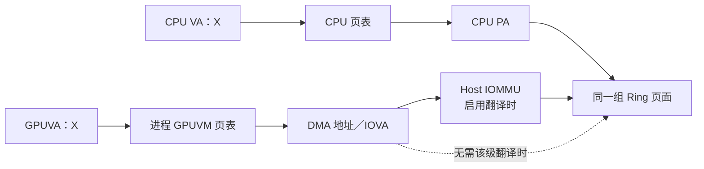

图中的 X 是虚拟地址数值。CPU PTE 提供 CPU 物理地址；访问 system RAM 时，GPU PTE 通常使用设备侧 DMA 地址，启用 Host IOMMU 翻译时它可以是 IOVA。这两条访问路径最终到达同一组 Ring 页面。

因此，CPU VA 与 GPUVA 同值描述的是访问时输入的虚拟地址数值相同，不要求两种 PTE 保存相同内容。

> **[SOURCE]** 两侧页表与 DMA/IOVA 的关系见 [02 的 2.5“CPU 与 GPU 的两条访问通路”](<./02_GPU 内存管理基础.md#25-cpu-与-gpu-的两条访问通路>)；固定 Linux 的 [`amdgpu_amdkfd_gpuvm.c`](./2.源码/linux/drivers/gpu/drm/amd/amdgpu/amdgpu_amdkfd_gpuvm.c) 第 1295～1314 行先取得设备侧 DMA 映射，再更新 GPU PTE。

**同值地址怎样用于 Packet 提交。** 主案例的 slot 37 距 Ring 起点 `37 × 64 = 2368 = 0x940` 字节。CPU 使用 `0x10000940` 写这个槽位，GPU 也使用数值 `0x10000940` 读取它，各自通过自己的页表到达同一位置。

Runtime 因而可以把同一个 Ring base 用作 CPU 指针和 Queue 创建参数。

> **[SOURCE]** ROCr `ba56a24c6132`，[`libhsakmt/src/queues.c`](./2.源码/rocr-runtime/libhsakmt/src/queues.c) 第 704～707 行将传入的 Ring 地址原样放入 `CREATE_QUEUE` 参数；这里使用的是前面内存分配与 MAP 已经建立的关系。

**[BOUNDARY]** 上述相等关系适用于本文已经完成相应分配和 GPU MAP 的 Ring。普通 CPU 指针只提供 CPU 侧地址，要供 GPU 访问还需要满足相应 Runtime 的登记、映射和权限要求。其他接口可以为同一份数据选择不同的 CPU VA 与 GPUVA，并分别保存两个地址。

#### 2.3.2 可选源码阅读：Ring 的两条分配路径

> **[SOURCE]** ROCr [`runtime/hsa-runtime/core/runtime/amd_aql_queue.cpp`](./2.源码/rocr-runtime/runtime/hsa-runtime/core/runtime/amd_aql_queue.cpp) 第 518～539 行：

```cpp
518: void AqlQueue::AllocRegisteredRingBuffer(uint32_t queue_size_pkts) {
519:   // Allocate storage for the ring buffer.
520:   ring_buf_alloc_bytes_ = queue_size_pkts * sizeof(core::AqlPacket);
521:   assert(IsMultipleOf(ring_buf_alloc_bytes_, 4096) && "Ring buffer sizes must be 4KiB aligned.");
522:
523:   if (IsDeviceMemRingBuf()) {
524:     if (!agent_->LargeBarEnabled()) {
525:       throw AMD::hsa_exception(HSA_STATUS_ERROR_INVALID_QUEUE_CREATION,
526:                                 "Trying to allocate an AQL ring buffer in device memory without "
527:                                 "large BAR PCIe enabled.");
528:     }
529:     ring_buf_ = agent_->coarsegrain_allocator()(
530:         ring_buf_alloc_bytes_,
531:         core::MemoryRegion::AllocateExecutable | core::MemoryRegion::AllocateUncached);
532:   } else {
533:     ring_buf_ = agent_->system_allocator()(
534:         ring_buf_alloc_bytes_, 0x1000,
535:         core::MemoryRegion::AllocateExecutable);
536:   }
537:
538:   assert(ring_buf_ != NULL && "AQL queue memory allocation failure");
539: }
```

这个短函数完整展示了两条分配分支和共同的结果检查。第 520～521 行计算字节数并要求按 4 KiB 对齐；第 523～535 行选择设备内存或 system RAM 的分配器；第 538 行检查返回的 Ring 指针。

设备内存分支还要求启用 Large BAR，否则抛出的英文错误表示“未启用 Large BAR，不能把 AQL Ring 分配在设备内存中”。两处英文断言分别表示“Ring 大小必须按 4 KiB 对齐”和“AQL Queue 内存分配失败”。

这与 [02_GPU 内存管理基础](<./02_GPU 内存管理基础.md>) 的结论一致：Ring 位于 system RAM 还是设备内存，描述的是物理承载位置；Ring 映射到哪套进程 GPUVM，描述的是地址空间归属。本文仍由 system RAM 承载 Ring，只是为了更直观地说明 CPU 填包路径。

### 2.4 HSAKMT 把用户态资源整理成 KFD ioctl

回到第 2.2 节创建顺序的第 6 步：ROCr 已经准备好 Ring、rptr、wptr 和 `HsaQueueResource`，现在要请求 KFD 建立内核 Queue。此前的内存分配与 GPU 映射已经进入过驱动，但本次 Queue 还没有建立；接下来的 `CREATE_QUEUE` 请求会说明它要使用哪些已有资源。

#### 2.4.1 CREATE_QUEUE 怎样使用已经映射好的地址

Ring 的 CPU VA 与 GPUVA 同值关系已在 [2.3.1 的地址选择与 GPU 映射过程](#231-ring-的地址准备cpu-映射与-gpu-同值映射)中建立：HSAKMT 指定同一个数值，KFD 按这个数值建立 GPUVM 映射。`CREATE_QUEUE` 直接使用这个已经映射好的 Ring 地址。

在本文固定的 system RAM Ring 路径中，`ring_buf_` 是 ROCr 得到的 CPU 用户态虚拟地址。CPU Producer 用它填写 Packet；承载 Ring 的页面也已映射进当前进程的 GPUVM，GPU 因而可以使用同一个地址数值读取 Packet。

假设 `ring_buf_ = 0x10000000`，地址关系是：

```text
                         地址数值 0x10000000
                                  │
                  ┌───────────────┴───────────────┐
                  ▼                               ▼
CPU 按用户态虚拟地址解释                 GPU 按当前进程的 GPUVA 解释
                  │                               │
                  └──────→ 同一组 system RAM 页面 ←──────┘

CPU Producer：从该地址开始写 64 字节 Packet
CP/MEC      ：从该地址开始读取 64 字节 Packet
```

这里的 `0x10000000` 是虚拟地址。CPU 页表和 GPUVM 页表各自完成翻译，最终访问承载 Ring 的同一组内存页面；两端共享地址数值和 backing，各自保留自己的页表。

ROCr 交给 HSAKMT 的几个参数可以展开为：

```text
Ring base
  = slot 0 的起始虚拟地址
  = CPU 可写的用户虚拟地址（CPU VA）
  = 当前进程 GPUVM 中同值映射的 GPUVA

Ring size
  = 整条 Ring 的字节数
  = 256 个 slot × 64 字节
  = 16 KiB

rptr/wptr 地址
  = 保存 read_index/write_index 的内存位置
  ≠ read_index/write_index 当前的数值
  = CPU 和 GPU 都能访问的同值映射地址
```

HSAKMT 保持这些地址数值不变，并把它们放进 `CREATE_QUEUE` ioctl。KFD 随后分两步检查：

1. 创建入口检查地址是否落在合法的用户地址数值范围内。这一步不替代页面和映射检查。
2. 用同一个数值在当前进程、目标 GPU 的 `amdgpu_vm` 中查找 GPUVM mapping，再核对资源范围。Ring、rptr 或 wptr 找不到符合要求的 mapping，Queue 就不能创建成功。

第二步的范围要求和引用获取见第 2.6 节。

```text
ROCr AqlQueue
  已有：Ring base、Ring 字节数、rptr/wptr 地址、Queue 类型和优先级
        │
        ▼
KfdDriver::CreateQueue()
  只负责进入 HSAKMT，并把 HSAKMT 状态转换为 ROCr 状态
        │
        ▼
hsaKmtCreateQueueExt()
  分配 HSAKMT 私有 struct queue
  → 把 HSA Queue 类型转换成 KFD Queue 类型
  → 准备目标 GPU 需要的 EOP/CWSR 等辅助资源
  → 把 Ring、rptr/wptr、优先级等写入 ioctl 参数
  → 发起 AMDKFD_IOC_CREATE_QUEUE
        │
        ▼
KFD 返回
  KFD queue_id + Doorbell offset
        │
        ▼
HSAKMT
  保存 KFD queue_id
  → 映射 Doorbell
  → 向 ROCr 返回 HSAKMT Queue 句柄和 Doorbell 指针
```

HSAKMT 在这里处理的是整条 Queue 的创建参数，不会读取或解析 Ring 中的 AQL Packet。普通 Dispatch 发生时，这个 ioctl 已经完成，Producer 直接写 Ring 和 Doorbell。

> **[SOURCE] 可选源码索引**
>
> 以下使用本文固定的 ROCr `ba56a24c6132` 与 Linux `248951ddc14d`：
>
> - ROCr 提供地址：[`runtime/hsa-runtime/core/runtime/amd_aql_queue.cpp`](./2.源码/rocr-runtime/runtime/hsa-runtime/core/runtime/amd_aql_queue.cpp) 第 130～138、269～273 行，把 `amd_queue_` 中的 rptr/wptr 地址和 `ring_buf_` 交给 Queue 创建路径。
> - HSAKMT 填写请求：[`libhsakmt/src/queues.c`](./2.源码/rocr-runtime/libhsakmt/src/queues.c) 第 704～707 行，把这些数值原样写入 ioctl 参数。
> - KFD 检查用户参数：[`drivers/gpu/drm/amd/amdkfd/kfd_chardev.c`](./2.源码/linux/drivers/gpu/drm/amd/amdkfd/kfd_chardev.c) 第 227～287 行，检查用户地址并保存 Queue 属性。
> - KFD 查找 GPU 映射：[`drivers/gpu/drm/amd/amdkfd/kfd_queue.c`](./2.源码/linux/drivers/gpu/drm/amd/amdkfd/kfd_queue.c) 第 197～220、263～272 行，查询当前 GPUVM 的 mapping，并取得 BO 引用、增加映射使用计数。

> **[BOUNDARY]** “同一个数值同时作为 CPU VA 和 GPUVA”描述的是本文固定的 Linux ROCr/KFD 映射路径。它不是所有设备 API 都必须采用的通用形式；如果某个平台为 CPU 和 GPU 分配不同的虚拟地址，Runtime 就必须保存并传递各自的地址。

#### 2.4.2 可选源码阅读：ROCr 包装与 HSAKMT ioctl

下面两组源码分别验证 ROCr 怎样进入 HSAKMT，以及 HSAKMT 怎样组织 `CREATE_QUEUE`。不熟悉 C/C++ 时，可以先跳到第 2.5 节。

> **[SOURCE]** ROCr [`runtime/hsa-runtime/core/driver/kfd/amd_kfd_driver.cpp`](./2.源码/rocr-runtime/runtime/hsa-runtime/core/driver/kfd/amd_kfd_driver.cpp) 第 355～365 行：

```cpp
355: hsa_status_t KfdDriver::CreateQueue(uint32_t node_id, HSA_QUEUE_TYPE type, uint32_t queue_pct,
356:                                     HSA_QUEUE_PRIORITY priority, uint32_t sdma_engine_id,
357:                                     void* queue_addr, uint64_t queue_size_bytes, HsaEvent* event,
358:                                     HsaQueueResource& queue_resource) const {
359:   if (HSAKMT_CALL(hsaKmtCreateQueueExt(node_id, type, queue_pct, priority, sdma_engine_id,
360:                                        queue_addr, queue_size_bytes, event, &queue_resource)) !=
361:       HSAKMT_STATUS_SUCCESS) {
362:     return HSA_STATUS_ERROR_OUT_OF_RESOURCES;
363:   }
364:   return HSA_STATUS_SUCCESS;
365: }
```

这段短函数说明了 ROCr 与 HSAKMT 的接口关系：`KfdDriver::CreateQueue()` 把参数交给 `hsaKmtCreateQueueExt()`。HSAKMT 返回失败时，包装函数转换为 `HSA_STATUS_ERROR_OUT_OF_RESOURCES`；返回成功时，则转换为 `HSA_STATUS_SUCCESS`。

下面的 HSAKMT 函数较长，只保留与 AQL Queue 直接相关的完整分支。省略范围及其作用会在代码块之间明确说明。

> **[SOURCE]** ROCr [`libhsakmt/src/queues.c`](./2.源码/rocr-runtime/libhsakmt/src/queues.c) 第 611～642、669～717、719～751 行：

```c
611: HSAKMT_STATUS HSAKMTAPI hsaKmtCreateQueueExt(HSAuint32 NodeId,
612:                                              HSA_QUEUE_TYPE Type,
613:                                              HSAuint32 QueuePercentage,
614:                                              HSA_QUEUE_PRIORITY Priority,
615:                                              HSAuint32 SdmaEngineId,
616:                                              void *QueueAddress,
617:                                              HSAuint64 QueueSizeInBytes,
618:                                              HsaEvent *Event,
619:                                              HsaQueueResource *QueueResource)
620: {
621:   HSAKMT_STATUS result;
622:   uint32_t gpu_id;
623:   uint64_t doorbell_mmap_offset;
624:   unsigned int doorbell_offset;
625:   int err;
626:   HsaNodeProperties props;
627:   uint32_t cu_num, i;
628:
629:   CHECK_KFD_OPEN();
630:
631:   if (Priority < HSA_QUEUE_PRIORITY_MINIMUM ||
632:     Priority > HSA_QUEUE_PRIORITY_MAXIMUM)
633:     return HSAKMT_STATUS_INVALID_PARAMETER;
634:
635:   result = hsakmt_validate_nodeid(NodeId, &gpu_id);
636:   if (result != HSAKMT_STATUS_SUCCESS)
637:     return result;
638:
639:   struct queue *q = allocate_exec_aligned_memory(sizeof(*q),
640:       false, gpu_id, NodeId, true, false, true);
641:   if (!q)
642:     return HSAKMT_STATUS_NO_MEMORY;
```

> **[SOURCE]** libhsakmt [`libhsakmt/src/queues.c`](./2.源码/rocr-runtime/libhsakmt/src/queues.c) 第 643～668 行清零私有 `struct queue`，记录 GPU 硬件架构版本，按具体 GPU 芯片选择 EOP buffer 大小，并初始化 CU mask。完成这些 Queue 私有状态后，函数才构造 ioctl 参数：

```c
669:   struct kfd_ioctl_create_queue_args args = {0};
670:
671:   args.gpu_id = gpu_id;
672:
673:   switch (Type) {
674:   case HSA_QUEUE_COMPUTE:
675:     args.queue_type = KFD_IOC_QUEUE_TYPE_COMPUTE;
676:     break;
677:   case HSA_QUEUE_SDMA:
678:     args.queue_type = KFD_IOC_QUEUE_TYPE_SDMA;
679:     break;
680:   case HSA_QUEUE_SDMA_XGMI:
681:     args.queue_type = KFD_IOC_QUEUE_TYPE_SDMA_XGMI;
682:     break;
683:   case HSA_QUEUE_SDMA_BY_ENG_ID:
684:     args.queue_type = KFD_IOC_QUEUE_TYPE_SDMA_BY_ENG_ID;
685:     break;
686:   case HSA_QUEUE_COMPUTE_AQL:
687:     args.queue_type = KFD_IOC_QUEUE_TYPE_COMPUTE_AQL;
688:     break;
689:   default:
690:     return HSAKMT_STATUS_INVALID_PARAMETER;
691:   }
692:
693:   if (Type != HSA_QUEUE_COMPUTE_AQL) {
694:     QueueResource->QueueRptrValue = (uintptr_t)&q->rptr;
695:     QueueResource->QueueWptrValue = (uintptr_t)&q->wptr;
696:   }
697:
698:   err = handle_concrete_asic(q, &args, gpu_id, NodeId, Event, QueueResource->ErrorReason);
699:   if (err != HSAKMT_STATUS_SUCCESS) {
700:     free_queue(q);
701:     return err;
702:   }
703:
704:   args.read_pointer_address = QueueResource->QueueRptrValue;
705:   args.write_pointer_address = QueueResource->QueueWptrValue;
706:   args.ring_base_address = (uintptr_t)QueueAddress;
707:   args.ring_size = QueueSizeInBytes;
708:   args.queue_percentage = QueuePercentage;
709:   args.queue_priority = priority_map[Priority+3];
710:   args.sdma_engine_id = SdmaEngineId;
711:
712:   err = hsakmt_ioctl(hsakmt_kfd_fd, AMDKFD_IOC_CREATE_QUEUE, &args);
713:
714:   if (err == -1) {
715:     free_queue(q);
716:     return HSAKMT_STATUS_ERROR;
717:   }
```

第 674～685 行处理非 AQL Queue 类型；第 686～688 行把 AQL Compute 类型转换为 KFD 的对应类型。随后，第 693～696 行只为非 AQL Queue 改写 rptr/wptr 的来源。本文的 AQL 路径保留 ROCr 传入的两个地址，再由第 704～705 行写入 ioctl 参数。

调用 ioctl 前，第 698 行的 `handle_concrete_asic()` 还会按照目标 GPU 的硬件架构版本准备 EOP、CWSR 和错误事件字段。

ioctl 返回成功后，HSAKMT 保存 KFD Queue ID，计算并映射 Doorbell，最后把 Queue 句柄和 Doorbell 指针交还 ROCr：

```c
719:   q->queue_id = args.queue_id;
720:
721:   if (IS_SOC15(q->gfxv)) {
722:     HSAuint64 mask = DOORBELLS_PAGE_SIZE(DOORBELL_SIZE(q->gfxv)) - 1;
723:
724:     /* On SOC15 chips, the doorbell offset within the
725:      * doorbell page is included in the doorbell offset
726:      * returned by KFD. This allows CP queue doorbells to be
727:      * allocated dynamically (while SDMA queue doorbells fixed)
728:      * rather than based on the its process queue ID.
729:      */
730:     doorbell_mmap_offset = args.doorbell_offset & ~mask;
731:     doorbell_offset = args.doorbell_offset & mask;
732:   } else {
733:     /* On older chips, the doorbell offset within the
734:      * doorbell page is based on the queue ID.
735:      */
736:     doorbell_mmap_offset = args.doorbell_offset;
737:     doorbell_offset = q->queue_id * DOORBELL_SIZE(q->gfxv);
738:   }
739:
740:   err = map_doorbell(NodeId, gpu_id, doorbell_mmap_offset);
741:   if (err != HSAKMT_STATUS_SUCCESS) {
742:     hsaKmtDestroyQueue(q->queue_id);
743:     return HSAKMT_STATUS_ERROR;
744:   }
745:
746:   QueueResource->QueueId = PORT_VPTR_TO_UINT64(q);
747:   QueueResource->Queue_DoorBell = VOID_PTR_ADD(doorbells[NodeId].mapping,
748:                                                doorbell_offset);
749:
750:   return HSAKMT_STATUS_SUCCESS;
751: }
```

英文注释说明，SOC15 路径把 Queue 在进程 Doorbell 页内的偏移编码进 KFD 返回值，允许 CP Queue 动态分配 Doorbell；较早的 GPU 硬件架构路径则根据 Queue ID 计算页内偏移。

若 Doorbell 映射失败，第 742 行调用 `hsaKmtDestroyQueue()` 尝试清理刚创建的 Queue，随后向调用者返回错误。

映射成功时，第 746 行返回指向 HSAKMT 私有 `struct queue` 的句柄，第 747～748 行用映射起点加页内偏移得到 Doorbell 指针。ROCr 接收的是这两个结果；KFD `queue_id` 另存于私有对象中。

第 704～707 行说明，HSAKMT 没有改写 Ring base、rptr 和 wptr 的地址数值。第 2.6 节会继续展示 KFD 怎样用这些数值查找当前进程的 GPUVM mapping，并持有对应的 BO。

HSAKMT 还会按设备能力准备 EOP 和 CWSR 资源。它们的职责不同：

| 资源            | 用途                                          | 是否等于 AQL Ring |
| --------------- | --------------------------------------------- | ----------------- |
| EOP buffer      | 保存特定硬件所需的管线末端状态                | 否                |
| CWSR area       | Queue 被抢占时保存未完成 Wave 的现场          | 否                |
| Control stack   | CWSR 控制状态的一部分                         | 否                |
| Scratch backing | 支撑 Work-item private segment，ROCr 另行管理 | 否                |

> **[BOUNDARY]** 不同 GPU 硬件架构版本要求的 EOP/CWSR 资源可能不同。这里关注这些资源为何属于 Queue 创建控制面，不把某个硬件架构版本的数值写成通用规则。

### 2.5 KFD 怎样管理 Queue 并完成创建

上一节已经说明 HSAKMT 怎样发出 `CREATE_QUEUE`。现在进入 KFD：创建入口要找到 Queue 所属的进程和目标 GPU，检查已有内存，再把创建工作交给队列管理器。先区分这些管理对象的职责，再看调用顺序。

#### 2.5.1 PQM 与 DQM：分别管理哪些 Queue

假设 GPU0 上已经创建了三条 Queue：进程 A 拥有 Q0、Q1，进程 B 拥有 Q2。Q0、Q1、Q2 是这里使用的示意名称。

KFD 按进程和设备分别管理同一批 Queue：

| 管理对象    | 管理范围              | 在这个例子中管理哪些 Queue |
| ----------- | --------------------- | -------------------------- |
| A 的 PQM    | 进程 A 的 Queue       | Q0、Q1                     |
| B 的 PQM    | 进程 B 的 Queue       | Q2                         |
| GPU0 的 DQM | GPU0 上各进程的 Queue | Q0、Q1、Q2                 |

**PQM 从进程的角度管理 Queue，DQM 从 GPU 设备的角度管理 Queue。** 以进程 A 在 GPU0 上的同一条 Q0 为例：

```text
A 的 PQM      → 管 Q0 的进程内编号和队列列表
GPU0 的 DQM   → 管 Q0 所需的设备资源和调度
```

PQM 即进程队列管理器。A 要更新或销毁 Q0 时，KFD 按 Queue ID 从 A 的 PQM 中找到 Q0。

DQM 即设备队列管理器。它检查设备资源限制，并按设备采用的调度方式执行 Queue 创建、销毁等操作。

这两种管理器都属于 KFD 内核驱动。驱动怎样进一步配置硬件或请求调度固件，在第三章展开。

> **[SOURCE]** Linux `248951ddc14d`：[`kfd_priv.h`](./2.源码/linux/drivers/gpu/drm/amd/amdkfd/kfd_priv.h) 第 665～670 行定义 PQM 的进程、列表和 ID 分配记录，第 938～945 行显示它保存在 `kfd_process` 内；[`kfd_device_queue_manager.h`](./2.源码/linux/drivers/gpu/drm/amd/amdkfd/kfd_device_queue_manager.h) 第 231～268 行定义 DQM 的设备级职责和资源记录。

#### 2.5.2 PDD 与 QPD：保存进程在目标 GPU 上的信息

在 KFD 中，**一份 PDD 对应一个进程和一块 GPU**，其中保存了 GPUVM 的访问入口和 Queue 相关状态。

创建 Q0 时，KFD 先找到进程 A 与 GPU0 对应的 PDD，再通过这份 PDD 找到 GPUVM，检查 Ring 地址。

**QPD 是 PDD 内嵌的一部分**，专门保存 Queue 相关记录。下图展示 Q0、Q1 都创建成功后的内容，只表示包含关系：

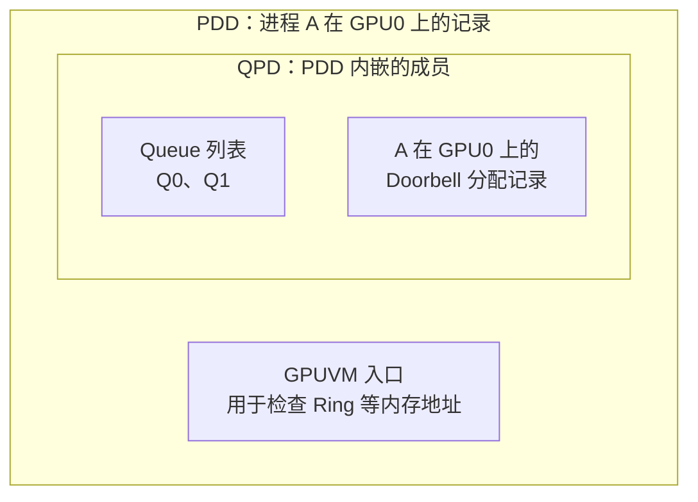

A 创建 Q1 时会复用 Q0 已使用的 PDD 和 QPD。创建成功后，QPD 的 Queue 列表从 `Q0` 变为 `Q0、Q1`；Q1 仍有独立的 Ring 和 Queue 属性。

如果 A 还要使用 GPU1，就使用“A＋GPU1”对应的另一份 PDD/QPD；A 的 PQM 仍是同一个，管理 A 在各个设备上的 Queue。B 在 GPU0 上也有自己的 PDD/QPD，和 A 的记录分开。

前面的 Ring 分配与映射已经用过 PDD 和 GPUVM，创建 Queue 时继续沿用。内存对象与 GPUVM 的查找关系见 [02 的 2.3.2 节](<./02_GPU 内存管理基础.md#232-同一个-pdd-怎样找到-bo-和当前进程-gpuvm>)。

> **[SOURCE]** Linux `248951ddc14d`，[`kfd_priv.h`](./2.源码/linux/drivers/gpu/drm/amd/amdkfd/kfd_priv.h) 第 763～787 行：PDD 的类型是 `kfd_process_device`，其中内嵌 `qpd`，并通过 `drm_priv` 保存 GPUVM 上下文入口。QPD 的类型是 `qcm_process_device`，定义在第 672～729 行。

#### 2.5.3 KFD 怎样完成 Q0 的创建

现在回看 Q0 刚开始创建时：16 KiB Ring 已经分配并完成 GPU 映射，HSAKMT 通过 `CREATE_QUEUE` 交来了地址、大小和 GPU0 的编号。

KFD 的创建入口先完成以下准备：

1. 把传入参数整理成 Queue 属性，找到 A 在 GPU0 上的 PDD。
2. 确认 PDD 已有 GPUVM 上下文，并让设备保持可使用的电源状态。
3. 如果这份 PDD 尚无 Doorbell 区域，就为它分配。随后检查 Ring、rptr、wptr 等地址，并取得对应内存对象的引用。

第 3 步使用前面已经分配、映射的内存。验证和持有 buffer 的具体过程在第 2.6 节展开。

准备完成后，创建入口调用 A 的 PQM，再由 PQM 调用 GPU0 的 DQM。下面只画创建成功的路径，DQM 内部的 MQD 准备与驻留处理在第 3 章展开：

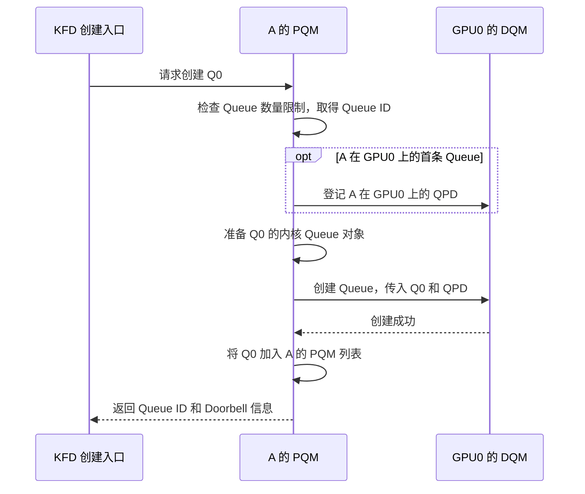

**取得 Queue ID 和加入 PQM 列表发生在两个时点。** ID 先取得；DQM 创建成功后，PQM 才把 Q0 加入列表。最后，创建入口把 Queue ID 和 Doorbell mmap 信息返回给 HSAKMT。

> **[SOURCE]** Linux `248951ddc14d`，[`kfd_process_queue_manager.c`](./2.源码/linux/drivers/gpu/drm/amd/amdkfd/kfd_process_queue_manager.c) 第 343～373 行查 PDD、检查数量限制、取得 ID，并按首条 Queue 条件登记 QPD；第 417～434 行检查 Compute Queue 的资源条件，再创建内核 Queue 对象并调用 DQM；第 442～452 行拦截创建失败，第 473 行才加入 PQM 列表。

#### 2.5.4 可选源码阅读：创建入口与失败清理

下面沿创建入口分段阅读。源码表达式对应前面的对象：

| 表达式       | 在当前例子中的含义                                      |
| ------------ | ------------------------------------------------------- |
| `p`        | 进程 A 的 KFD 记录，类型为`kfd_process`               |
| `pdd`      | A 在 GPU0 上的 PDD，类型为`kfd_process_device`        |
| `dev`      | GPU0 对应的 KFD 设备节点；`dev->dqm` 指向该节点的 DQM |
| `&p->pqm`  | 把 A 的 PQM 的地址传给函数                              |
| `pdd->qpd` | 访问 PDD 内嵌的 QPD，类型为`qcm_process_device`       |

本文用 GPU0 指代一个目标 KFD 设备节点。PQM 保存在进程记录中，DQM 由设备节点持有。

> **[SOURCE]** Linux `248951ddc14d`，[`kfd_priv.h`](./2.源码/linux/drivers/gpu/drm/amd/amdkfd/kfd_priv.h) 第 293～294、665～675、763～772、938～945 行给出上述字段和类型。

**入口先找到 PDD，并确认设备可用**

`p` 来自发起 ioctl 的文件上下文。用户态传入目标 `gpu_id`，KFD 据此查找该进程的 PDD；用户态不能在这个请求中任意指定另一个进程。

> **[SOURCE]** Linux `248951ddc14d`，[`kfd_chardev.c`](./2.源码/linux/drivers/gpu/drm/amd/amdkfd/kfd_chardev.c) 第 3586～3603 行从 `filep->private_data` 取得进程并校验调用者；第 338～373 行是下面的 Queue 创建入口前半段。

```c
338: static int kfd_ioctl_create_queue(struct file *filep, struct kfd_process *p,
339:                                   void *data)
340: {
341:   struct kfd_ioctl_create_queue_args *args = data;
342:   struct kfd_node *dev;
343:   int err = 0;
344:   unsigned int queue_id;
345:   struct kfd_process_device *pdd;
346:   struct queue_properties q_properties;
347:   uint32_t doorbell_offset_in_process = 0;
348:
349:   memset(&q_properties, 0, sizeof(struct queue_properties));
350:
351:   pr_debug("Creating queue ioctl\n");
352:
353:   err = set_queue_properties_from_user(&q_properties, args);
354:   if (err)
355:     return err;
356:
357:   pr_debug("Looking for gpu id 0x%x\n", args->gpu_id);
358:
359:   mutex_lock(&p->mutex);
360:
361:   pdd = kfd_process_device_data_by_id(p, args->gpu_id);
362:   if (!pdd) {
363:     pr_debug("Could not find gpu id 0x%x\n", args->gpu_id);
364:     err = -EINVAL;
365:     goto err_pdd;
366:   }
367:   dev = pdd->dev;
368:
369:   pdd = kfd_bind_process_to_device(dev, p);
370:   if (IS_ERR(pdd)) {
371:     err = -ESRCH;
372:     goto err_bind_process;
373:   }
```

日志中的英文分别表示“开始处理 Queue 创建请求”“查找 GPU ID”和“找不到该 GPU”。这一段主要证明：入口先整理参数，再在进程锁保护下找到已有 PDD。

- 第 353～355 行把用户参数转换成 `queue_properties`，转换失败就返回。
- 第 359～367 行取得进程 mutex，并用进程和 GPU ID 查 PDD。这把锁保护后续状态修改，避免同一进程的 Queue 创建、更新和销毁互相干扰。
- 第 369～373 行调用 `kfd_bind_process_to_device()`，失败时进入解锁出口。

`kfd_bind_process_to_device()` 会检查 PDD 及其 `drm_priv` 是否存在。若 `runtime_inuse` 尚未置位，函数按需恢复设备并取得运行时电源引用，使设备在使用期间不会因空闲而挂起。

成功后，函数设置 `runtime_inuse` 并返回 PDD；检查或设备恢复失败则返回错误。这里复用已有 GPUVM，Ring 的分配和映射已经在此前完成。

> **[SOURCE]** Linux `248951ddc14d`，[`kfd_process.c`](./2.源码/linux/drivers/gpu/drm/amd/amdkfd/kfd_process.c) 第 1814～1849 行给出上述完整条件和返回路径。这里依据函数体解释绑定操作；函数上方关于 IOMMU 绑定的注释不表示本函数实际执行了该操作。

**准备 Doorbell、持有 buffer，再调用 PQM**

> **[SOURCE]** Linux `248951ddc14d`，[`kfd_chardev.c`](./2.源码/linux/drivers/gpu/drm/amd/amdkfd/kfd_chardev.c) 第 375～385 行只校验 `KFD_QUEUE_TYPE_SDMA_BY_ENG_ID` 的 SDMA 引擎 ID，本文 AQL Compute Queue 路径省略该分支。下面接着展示同一函数第 387～408 行的公共路径。

```c
387:   if (!pdd->qpd.proc_doorbells) {
388:     err = kfd_alloc_process_doorbells(dev->kfd, pdd);
389:     if (err) {
390:       pr_debug("failed to allocate process doorbells\n");
391:       goto err_bind_process;
392:     }
393:   }
394:
395:   err = kfd_queue_acquire_buffers(pdd, &q_properties);
396:   if (err) {
397:     pr_debug("failed to acquire user queue buffers\n");
398:     goto err_acquire_queue_buf;
399:   }
400:
401:   pr_debug("Creating queue for process pid %d on gpu 0x%x\n",
402:       p->lead_thread->pid,
403:       dev->id);
404:
405:   err = pqm_create_queue(&p->pqm, dev, &q_properties, &queue_id,
406:       NULL, NULL, NULL, &doorbell_offset_in_process);
407:   if (err != 0)
408:     goto err_create_queue;
```

日志中的英文分别表示“分配进程 Doorbell 失败”“获取用户 Queue buffer 失败”和“正在为指定进程、GPU 创建 Queue”。这一段先取得资源引用，再把创建工作交给 PQM：

- 第 387～393 行仅在 `proc_doorbells` 为空时分配该 PDD 的 Doorbell 区域。
- 第 395～399 行验证并持有 Queue buffer；失败时进入对应清理出口。
- 第 405～408 行将 A 的 PQM、目标设备和 Queue 属性交给 `pqm_create_queue()`。该函数内部再调用 DQM，调用顺序见第 2.5.3 节。

表达式 `pdd->qpd.proc_doorbells` 先找到 PDD 内嵌的 QPD，再读取其中的 Doorbell 区域记录。QPD 中几个相关字段的用途如下：

| QPD 字段                                | 保存什么、在哪里使用                                                    |
| --------------------------------------- | ----------------------------------------------------------------------- |
| `queues_list`                         | 该进程在目标 GPU 上的 Queue 列表，供 DQM 管理                           |
| `proc_doorbells`、`doorbell_bitmap` | 该 Process-Device 的 Doorbell 区域和槽位使用情况；第 2.7 节展开分配过程 |
| `page_table_base`                     | 调度所需的 GPU 页表根及相关标志；第三章说明怎样交给硬件或固件           |
| `vmid` 等调度状态                     | 例如 No-HWS 为该进程在目标设备上分配的 VMID；第 3.2 节说明其用途        |

> **[SOURCE]** Linux `248951ddc14d`，[`kfd_priv.h`](./2.源码/linux/drivers/gpu/drm/amd/amdkfd/kfd_priv.h) 第 676～683、698～701、724～728 行定义这些字段。

**成功返回结果，失败按已取得的资源清理**

> **[SOURCE]** Linux `248951ddc14d`，[`kfd_chardev.c`](./2.源码/linux/drivers/gpu/drm/amd/amdkfd/kfd_chardev.c) 第 409～447 行紧接上面的 PQM 调用，包含返回结果和本函数的全部错误标签。

```c
409:
410:   args->queue_id = queue_id;
411:
412:
413:   /* Return gpu_id as doorbell offset for mmap usage */
414:   args->doorbell_offset = KFD_MMAP_TYPE_DOORBELL;
415:   args->doorbell_offset |= KFD_MMAP_GPU_ID(args->gpu_id);
416:   if (KFD_IS_SOC15(dev))
417:     /* On SOC15 ASICs, include the doorbell offset within the
418:      * process doorbell frame, which is 2 pages.
419:      */
420:     args->doorbell_offset |= doorbell_offset_in_process;
421:
422:   mutex_unlock(&p->mutex);
423:
424:   pr_debug("Queue id %d was created successfully\n", args->queue_id);
425:
426:   pr_debug("Ring buffer address == 0x%016llX\n",
427:       args->ring_base_address);
428:
429:   pr_debug("Read ptr address    == 0x%016llX\n",
430:       args->read_pointer_address);
431:
432:   pr_debug("Write ptr address   == 0x%016llX\n",
433:       args->write_pointer_address);
434:
435:   kfd_dbg_ev_raise(KFD_EC_MASK(EC_QUEUE_NEW), p, dev, queue_id, false, NULL, 0);
436:   return 0;
437:
438: err_create_queue:
439:   kfd_queue_unref_bo_vas(pdd, &q_properties);
440:   kfd_queue_release_buffers(pdd, &q_properties);
441: err_acquire_queue_buf:
442: err_sdma_engine_id:
443: err_bind_process:
444: err_pdd:
445:   mutex_unlock(&p->mutex);
446:   return err;
447: }
```

第 413～420 行的英文注释说明：把 GPU ID 编入用于 mmap 的 Doorbell 偏移；SOC15 还包含两页进程 Doorbell 区域内的偏移。后面的日志打印 Queue 创建成功信息，以及 Ring、rptr、wptr 的地址。

PQM 创建成功时，入口填写 Queue ID 和 Doorbell mmap 信息，解除进程锁并返回 `0`。

PQM 创建失败时，入口从 `err_create_queue` 开始清理：先撤销 Queue 对 mapping 的使用记录，再释放 buffer 引用，最后解锁并返回错误码。更早的失败从相应标签开始，跳过尚未取得的资源。

PQM、DQM 内部取得的资源由各自的失败路径处理。PDD 及其供多条 Queue 共用的记录有各自的生命周期，创建入口不会在这些错误标签中销毁整个 PDD。

### 2.6 KFD 怎样检查并保护 Queue 使用的内存

创建 Queue 时，KFD 要根据用户态传入的地址和大小找到已有内存，检查它们是否满足 Queue 的要求，再记录 Queue 对这些资源的使用。以后用户请求解除映射或释放内存时，驱动才能判断资源是否仍被 Queue 使用。

[02 的 2.6 节](<./02_GPU 内存管理基础.md#26-引用映射与最终释放>)已经说明内存对象和映射需要分别保护。本节沿 Q0 的创建过程，说明 KFD 怎样完成这些检查和保护。

#### 2.6.1 Queue 创建前已经准备好的内存

进程 A 要在 GPU0 上创建 Q0。用户态先为 Q0 准备一段 16 KiB 的 Ring，用来存放 Packet。这段内存已经分配，并映射到 A 在 GPU0 上的地址空间。

ROCr 还把所有槽位的 Header 设为 `INVALID`，表示这些槽位尚未发布有效任务。此时，Ring 已经具备 GPU 访问所需的内存和映射。

接下来，HSAKMT 向 KFD 请求创建 Q0，并告诉 KFD：Ring 的地址是多少、大小是多少，读写索引又存放在哪里。

内存分配、GPU 映射和 Queue 创建是先后发出的不同请求。KFD 收到 `CREATE_QUEUE` 后，要根据本次传入的地址重新查找已有映射，并检查范围是否符合 Q0 的要求。这里的“查找”复用已有内存和映射，不再为 Ring 分配一份页面。

检查通过后，KFD 取得内存对象的引用，并登记 Q0 对映射的使用。创建过程随后才进入 PQM，继续建立 Q0。

> **[SOURCE] 可选源码索引**
>
> 以下均为 Linux `248951ddc14d`：
>
> - 创建入口先检查并持有内存，再进入 PQM 创建 Queue：[`kfd_chardev.c`](./2.源码/linux/drivers/gpu/drm/amd/amdkfd/kfd_chardev.c) 第 395～408 行。
> - 从当前进程在目标 GPU 上的记录取得 GPUVM，并逐个检查 Queue 地址：[`kfd_queue.c`](./2.源码/linux/drivers/gpu/drm/amd/amdkfd/kfd_queue.c) 第 258～272 行；第 197～226 行完成单个地址的校验与引用获取。
> - 在驱动保存的映射记录中查找地址：[`amdgpu_vm.c`](./2.源码/linux/drivers/gpu/drm/amd/amdgpu/amdgpu_vm.c) 第 2134～2138 行。

#### 2.6.2 一条 Queue 需要检查哪些内存

这里的 Queue buffer 指 Queue 使用的内存，包括 Ring、保存读写索引的内存，以及设备要求的辅助状态区：

| 内存          | 用途                                              |
| ------------- | ------------------------------------------------- |
| Ring          | 保存 Producer 提交的 AQL Packet                   |
| wptr 所在内存 | 保存写索引，记录 Producer 的预留进度              |
| rptr 所在内存 | 保存读索引，记录 Packet 消费进度                  |
| EOP buffer    | 保存特定设备要求的管线末端状态                    |
| CWSR area     | 保存 Queue 被抢占时未完成 Wave 的现场，供后续恢复 |

创建请求传入 rptr、wptr 的存放地址。KFD 根据地址检查承载索引的内存，并取得引用；这一步不读取索引值来判断 Queue 是否有任务。

实际获取顺序是 wptr、rptr、Ring，再按 Compute Queue 分支处理 EOP 和 CWSR。

读写索引各按一个系统页大小检查映射。以系统页和 GPU 页均为 4 KiB 为例，索引字段可以位于这一页的内部；16 KiB Ring 则需要检查完整的四页范围。

EOP 和 CWSR 的大小由设备要求决定。EOP 仅在创建参数提供非零地址时检查。CWSR 可以从已有的 GPU 映射取得，也有使用 SVM 范围的路径，后者需要满足额外条件。

> **[SOURCE]** Linux `248951ddc14d`，[`kfd_queue.c`](./2.源码/linux/drivers/gpu/drm/amd/amdkfd/kfd_queue.c) 第 263～274 行分别获取 wptr、rptr 和 Ring；第 276～334 行给出 Compute Queue 辅助资源的条件与大小检查。Ring 的大小换算和 CWSR 的 SVM 分支在第 2.6.6 节说明。

**[BOUNDARY]** 本节重点检查 Queue 自身使用的内存。每次 Dispatch 使用的 Kernel 代码、Kernarg 和输入输出数组有各自的生命周期，见第 6.5 节。

#### 2.6.3 怎样确认 Ring 地址和大小正确

GPUVM 是进程在目标 GPU 上使用的地址空间。驱动为这个地址空间保存映射记录，称为 mapping，说明哪一段 GPU 地址映射到哪块内存。

Q0 属于进程 A，目标设备是 GPU0，KFD 就在 A 对应的 GPU0 地址空间中查找。第 2.5.2 节介绍的 PDD 提供这个 GPUVM 的访问入口，源码对象是 `amdgpu_vm`。

继续使用 16 KiB Ring 的例子，设起始地址为 `0x10000000`。此前已经建立的 mapping 覆盖 `0x10000000` 到 `0x10003FFF`。这里使用 GFX9 及之后的大小计算分支，不含额外 metadata（元数据区域），系统页和 GPU 页都按 4 KiB 计算。

这条 mapping 正好覆盖 4 页。KFD 查到记录后，需要检查本次请求的起始页、末页是否与它一致：

| 本次请求使用的范围      | 检查结果        | 原因                                 |
| ----------------------- | --------------- | ------------------------------------ |
| 完整的 16 KiB           | 通过范围检查    | 起始页、末页都相同                   |
| 只使用后半段 8 KiB      | 返回`-EINVAL` | 起始页不同，即使剩余空间足够也不接受 |
| 只使用前半段 8 KiB      | 返回`-EINVAL` | 末页不同，请求没有覆盖完整 mapping   |
| 从原起点开始使用 32 KiB | 返回`-EINVAL` | 请求超出了已有 mapping，末页不同     |

`-EINVAL` 表示参数不符合要求。若在当前 GPUVM 中根本找不到该地址的 mapping，也会返回这个错误。

这些检查由运行在 CPU 上的 KFD 驱动完成，依据是驱动保存的 mapping 记录。以后 GPU 读取 Ring 时，才按本次访问的 GPUVA 使用 GPU 页表完成地址翻译。创建时查映射记录与执行时查页表，发生在不同阶段。

> **[SOURCE]** Linux `248951ddc14d`，[`kfd_queue.c`](./2.源码/linux/drivers/gpu/drm/amd/amdkfd/kfd_queue.c) 第 197～226 行：地址与大小先换算成 GPU 页单位，再查 mapping、比较 `start` 和 `last`；失败时清空输出 BO 并返回 `-EINVAL`。第 258 行限定了本次查找所用的 GPUVM。

#### 2.6.4 BO 引用与映射使用计数分别保护什么

Q0 创建后会反复使用 Ring。如果 Q0 仍可能读取 Ring，内存对象却被销毁，或者 GPU 地址映射被解除，后续访问就会出错。KFD 要分别保护内存对象和地址映射。

BO 是驱动用来管理这块内存的对象。“取得 BO 引用”就是增加一次对象引用，表示 Q0 还需要这个对象。只要 Q0 尚未归还这份引用，BO 就不会因引用归零而销毁。

映射则需要单独保护：即使 BO 还存在，GPUVA 到 BO 的映射也可能被用户请求解除。KFD 因此增加 `queue_refcount`，记录 Queue 正在使用这个 BO 在当前 GPUVM 中的映射。

| KFD 取得的保护                 | 具体效果                                             |
| ------------------------------ | ---------------------------------------------------- |
| BO 引用                        | Q0 的引用仍在时，BO 不会因引用归零而销毁             |
| 映射使用计数`queue_refcount` | GPU UNMAP 检查到计数非零时，返回`-EBUSY`，保留映射 |

例如，假设 Ring 的映射使用计数原来为 0。Q0 取得 Ring 后，计数增加到 1。用户此时请求解除 Ring 的 GPU 映射，驱动返回 `-EBUSY`，表示资源仍在使用。Q0 的使用记录需要在销毁过程中归还。

每次成功获取资源都会增加相应的 `queue_refcount`，释放时再逐次减少。如果 rptr、wptr 共用同一个 BO 在同一个 GPUVM 中的映射，两次获取会让同一份计数增加两次。因此，这个计数表示累计的 Queue 资源使用记录，不能直接当作 Queue 条数。

> **[SOURCE]** Linux `248951ddc14d`：[`kfd_queue.c`](./2.源码/linux/drivers/gpu/drm/amd/amdkfd/kfd_queue.c) 第 219～220 行取得 BO 引用并增加映射使用计数，第 263～267 行分别获取 wptr、rptr，第 351～360、377～405 行分别归还 BO 引用和映射使用计数；[`amdgpu_amdkfd_gpuvm.c`](./2.源码/linux/drivers/gpu/drm/amd/amdgpu/amdgpu_amdkfd_gpuvm.c) 第 1269～1282 行在 `queue_refcount` 非零时返回 `-EBUSY`，检查通过后才进入解除映射操作。

#### 2.6.5 检查成功、失败和销毁时分别做什么

内存检查和资源保护由 `kfd_queue_acquire_buffers()` 完成。函数返回成功，表示 Q0 所需的这些内存已经检查通过，KFD 也已经取得相应 BO 引用并登记映射使用；CWSR 的 SVM 分支采用对应的范围使用计数。

创建入口随后调用 PQM，由 PQM、DQM 继续建立 Q0。内核 Queue 对象会保存刚才取得的资源引用。底层创建和用户态初始化全部完成后，ROCr 才把 `hsa_queue_t` 返回调用者；MQD 和硬件驻留的处理见第 3 章。

如果检查中途失败，已经取得的引用要归还。例如，wptr、rptr 都已取得，随后发现 Ring 范围不符合要求，就需要归还前两项引用，再返回错误。这个动作称为回滚，意思是撤销本次创建已经完成的部分工作。

如果内存检查全部成功，后面的 PQM 创建却失败，创建入口负责撤销映射使用计数并归还 buffer 的 BO 引用；PQM、DQM 分别清理自己已经建立的资源。

这里归还的是本次创建增加的 BO 引用和映射使用记录。Ring 原来的分配和 GPU 映射仍由此前准备这些资源的代码继续清理。检查函数复用了已有内存，因此它的回滚范围也限于本次取得的保护。

> **[SOURCE]** Linux `248951ddc14d`：[`kfd_queue.c`](./2.源码/linux/drivers/gpu/drm/amd/amdkfd/kfd_queue.c) 第 70～81 行把属性复制到内核 Queue，第 336～349 行给出 buffer 获取的成功出口与失败回滚；[`kfd_chardev.c`](./2.源码/linux/drivers/gpu/drm/amd/amdkfd/kfd_chardev.c) 第 395～408、438～446 行给出调用顺序和 PQM 失败后的清理责任。

Q0 正常销毁时，KFD 在进程锁保护下先降低映射使用计数，再由 DQM 停止并清理 Queue，最后释放 Queue 持有的 BO 引用。降低计数只改变软件记录，硬件停止仍由 DQM 的对应路径负责。完整调用链见[第 8.1 节](#81-rocr-到-kfd-的资源释放顺序)；之后的 GPU UNMAP 与内存释放见 02 的 2.6 节。

> **[SOURCE]** Linux `248951ddc14d`：[`kfd_process_queue_manager.c`](./2.源码/linux/drivers/gpu/drm/amd/amdkfd/kfd_process_queue_manager.c) 第 536～553 行给出用户 Queue 的销毁顺序；[`kfd_chardev.c`](./2.源码/linux/drivers/gpu/drm/amd/amdkfd/kfd_chardev.c) 第 449～464 行在进程 mutex 保护下调用该路径。这里描述正常销毁，异常返回的处理见第 8.4 节。

#### 2.6.6 可选源码阅读：Queue buffer 的获取与失败清理

下面用源码核对正文中的地址检查、引用获取和失败回滚。先看检查单个地址的函数，再看谁调用它、怎样处理失败。

> **[SOURCE]** Linux `248951ddc14d`，[`drivers/gpu/drm/amd/amdkfd/kfd_queue.c`](./2.源码/linux/drivers/gpu/drm/amd/amdkfd/kfd_queue.c) 第 197～226 行。输入包括当前 GPUVM、待检查地址和预期大小；`pbo` 指定检查成功后把 BO 指针保存在哪里。

```c
197: int kfd_queue_buffer_get(struct amdgpu_vm *vm, void __user *addr, struct amdgpu_bo **pbo,
198: 			 u64 expected_size)
199: {
200: 	struct amdgpu_bo_va_mapping *mapping;
201: 	u64 user_addr;
202: 	u64 size;
203:
204: 	user_addr = (u64)addr >> AMDGPU_GPU_PAGE_SHIFT;
205: 	size = expected_size >> AMDGPU_GPU_PAGE_SHIFT;
206:
207: 	mapping = amdgpu_vm_bo_lookup_mapping(vm, user_addr);
208: 	if (!mapping)
209: 		goto out_err;
210:
211: 	if (user_addr != mapping->start ||
212: 	    (size != 0 && user_addr + size - 1 != mapping->last)) {
213: 		pr_debug("expected size 0x%llx not equal to mapping addr 0x%llx size 0x%llx\n",
214: 			expected_size, mapping->start << AMDGPU_GPU_PAGE_SHIFT,
215: 			(mapping->last - mapping->start + 1) << AMDGPU_GPU_PAGE_SHIFT);
216: 		goto out_err;
217: 	}
218:
219: 	*pbo = amdgpu_bo_ref(mapping->bo_va->base.bo);
220: 	mapping->bo_va->queue_refcount++;
221: 	return 0;
222:
223: out_err:
224: 	*pbo = NULL;
225: 	return -EINVAL;
226: }
```

第 213～215 行的英文日志表示“预期范围与 mapping 不一致”，并打印预期字节数、mapping 起点和实际大小。

这个函数说明：地址检查通过后，KFD 才取得 BO 引用并增加映射使用计数。下一段的 `kfd_queue_acquire_buffers()` 会针对各类资源分别调用它：

- 第 204～209 行把地址和预期大小换成 GPU 页单位，再查找覆盖起始页的 mapping。
- 第 211～217 行要求起始页一致；预期页数非零时，还要求末页一致。
- 第 219～221 行取得 BO 引用，把 BO 指针写入调用者指定的输出位置，再增加该 `bo_va` 的 `queue_refcount`，然后返回 `0`。
- 第 223～226 行处理查找或范围检查失败：清空输出 BO，返回 `-EINVAL`。这个失败分支没有取得新引用。

第 204 行去掉地址的页内偏移，所以 rptr、wptr 可以位于页内。第 212 行还有一个条件：预期大小换算后的页数为 0 时，跳过末页比较。正文使用的 16 KiB Ring 对应 4 页，需要比较起始页和末页。

第 220 行的计数保存在 `amdgpu_bo_va` 中。每个这样的对象关联一块 BO 和一套 GPUVM，因此同一 BO 在同一 GPUVM 中被多次获取时，会累加同一份计数。

接下来，`kfd_queue_acquire_buffers()` 决定每类资源应该检查多大范围，并依次调用上述函数。代码中的 `PAGE_SIZE` 是系统页大小，`PAGE_ALIGN()` 表示按系统页大小向上取整。

> **[SOURCE]** Linux `248951ddc14d`，[`kfd_queue.c`](./2.源码/linux/drivers/gpu/drm/amd/amdkfd/kfd_queue.c) 第 234～274 行。下面保留大小换算、GPUVM 来源和三次获取之间的失败跳转。

```c
234: int kfd_queue_acquire_buffers(struct kfd_process_device *pdd, struct queue_properties *properties)
235: {
236: 	struct kfd_topology_device *topo_dev;
237: 	u64 expected_queue_size;
238: 	struct amdgpu_vm *vm;
239: 	u64 total_cwsr_size;
240: 	int err;
241:
242: 	topo_dev = kfd_topology_device_by_id(pdd->dev->id);
243: 	if (!topo_dev)
244: 		return -EINVAL;
245:
246: 	/* AQL queues on GFX7 and GFX8 appear twice their actual size */
247: 	if (properties->type == KFD_QUEUE_TYPE_COMPUTE &&
248: 	    properties->format == KFD_QUEUE_FORMAT_AQL &&
249: 	    topo_dev->node_props.gfx_target_version >= 70000 &&
250: 	    topo_dev->node_props.gfx_target_version < 90000)
251: 		/* metadata_queue_size not supported on GFX7/GFX8 */
252: 		expected_queue_size =
253: 			PAGE_ALIGN(properties->queue_size / 2);
254: 	else
255: 		expected_queue_size =
256: 			PAGE_ALIGN(properties->queue_size + properties->metadata_queue_size);
257:
258: 	vm = drm_priv_to_vm(pdd->drm_priv);
259: 	err = amdgpu_bo_reserve(vm->root.bo, false);
260: 	if (err)
261: 		return err;
262:
263: 	err = kfd_queue_buffer_get(vm, properties->write_ptr, &properties->wptr_bo, PAGE_SIZE);
264: 	if (err)
265: 		goto out_err_unreserve;
266:
267: 	err = kfd_queue_buffer_get(vm, properties->read_ptr, &properties->rptr_bo, PAGE_SIZE);
268: 	if (err)
269: 		goto out_err_unreserve;
270:
271: 	err = kfd_queue_buffer_get(vm, (void *)properties->queue_address,
272: 				   &properties->ring_bo, expected_queue_size);
273: 	if (err)
274: 		goto out_err_unreserve;
```

英文注释说明，GFX7/GFX8 的 AQL Queue 在该接口中按实际大小的两倍表示，且不支持 `metadata_queue_size`。该分支先除以 2，再按 `PAGE_SIZE` 向上对齐。

其他情况使用 Queue 大小与 metadata 大小之和，再向上对齐。这里的 metadata 是 Queue 可附带的元数据区域，正文示例将其大小设为 0。

这段代码负责选择当前 GPUVM，并把每类资源的地址、输出位置和预期大小传给 `kfd_queue_buffer_get()`：

- 第 242～256 行读取目标设备信息，并计算 Ring 的预期 mapping 大小；设备信息不存在时直接返回错误。
- 第 258～261 行从 PDD 的 `drm_priv` 取得 GPUVM，再获取根 BO 的 reservation 锁，保护后续 mapping 查找和计数修改。加锁失败时，尚未取得任何 Queue buffer 引用。
- 第 263～274 行依次获取 wptr、rptr、Ring。成功取得的 BO 指针分别保存在 `wptr_bo`、`rptr_bo` 和 `ring_bo` 中；其中任一步失败，都跳到后面的共同错误出口。

> **[SOURCE]** Linux `248951ddc14d`，[`kfd_queue.c`](./2.源码/linux/drivers/gpu/drm/amd/amdkfd/kfd_queue.c) 第 276～334 行继续处理辅助资源，此处不重复摘录：
>
> - 非 Compute Queue 直接进入成功出口。
> - 提供了 EOP 地址时，先确认大小达到设备要求，再获取对应 BO。
> - CWSR 先检查 Control stack 和现场区大小，再计入调试区，并按目标计算分区数量计算总范围。
> - CWSR 的 BO 映射获取失败后，第 327 行先解锁，再尝试 SVM。SVM 成功时直接返回 `0`；失败时跳到 `out_err_release`。
>
> SVM 路径第 91～149 行要求范围已映射、目标 GPU 可访问，并设置了 `KFD_IOCTL_SVM_FLAG_GPU_ALWAYS_MAPPED` 标志。成功后增加 SVM range 的 Queue 使用计数；这一路径的范围管理留到 SVM 专题。

下面接同一函数的公共出口。仍持有 reservation 锁的路径先解锁，再返回成功或回滚；已经解锁的 SVM 失败路径直接进入引用清理。

> **[SOURCE]** Linux `248951ddc14d`，[`kfd_queue.c`](./2.源码/linux/drivers/gpu/drm/amd/amdkfd/kfd_queue.c) 第 336～349 行，包含上面各分支使用的成功出口和错误标签。

```c
336: out_unreserve:
337: 	amdgpu_bo_unreserve(vm->root.bo);
338: 	return 0;
339:
340: out_err_unreserve:
341: 	amdgpu_bo_unreserve(vm->root.bo);
342: out_err_release:
343: 	/* FIXME: make a _locked version of this that can be called before
344: 	 * dropping the VM reservation.
345: 	 */
346: 	kfd_queue_unref_bo_vas(pdd, properties);
347: 	kfd_queue_release_buffers(pdd, properties);
348: 	return err;
349: }
```

英文 `FIXME` 注释提出，应提供一个持锁清理版本，以便在放开 GPUVM reservation 锁前执行。固定源码的实际顺序仍是先解锁，再调用两个清理函数。

这段代码完成整个获取函数的收尾：

- 第 336～338 行是成功出口，只解锁，保留已经取得的 Queue buffer 引用。
- 第 340～342 行把仍持锁和已经解锁的失败路径接到同一处引用清理。
- 第 346 行减少此前增加的 `queue_refcount`；第 347 行归还 BO 引用及相应 SVM 资源持有；第 348 行把此次失败的错误码返回创建入口。

这两个清理函数会按已保存的资源处理，具体实现见同文件第 351～407 行。创建入口收到失败后退出；收到成功后，才继续调用 `pqm_create_queue()`。

### 2.7 Doorbell 是按 Process-Device 分片、按 Queue 分槽

第 1.3 节已经说明：`doorbell_id` 用来选择进程 Doorbell 区域中的一个通知槽位。结合第 2.5 节的对象关系，Process-Device 在这里就是“一个进程与一块目标 GPU”的组合。KFD 为这个组合分配一片 Doorbell 区域，称为 slice，再从中为各条 Queue 选择槽位。

本节继续说明槽位怎样分配、Doorbell offset 怎样计算，以及 HSAKMT 怎样把整片 slice 映射到用户态。

```text
一块 GPU 的 Doorbell aperture
  ├─ Process P1 的 slice
  │    ├─ Queue 0 slot
  │    ├─ Queue 1 slot
  │    └─ ...
  └─ Process P2 的 slice
       ├─ Queue 0 slot
       └─ ...
```

继续沿用第 2.5 节的归属：Q0、Q1 属于 A，Q2 属于 B。再假设 A 在 GPU0 上创建了 Q3，A 的同一片 Doorbell slice 可以如下分配；槽位 3、4、5 是教学取值：

```text
进程 A 在 GPU0 上的 Doorbell slice
  ├─ slot 3 → Q0 的 Doorbell → Q0 的 Ring
  ├─ slot 4 → Q1 的 Doorbell → Q1 的 Ring
  └─ slot 5 → Q3 的 Doorbell → Q3 的 Ring
```

本文跟踪的每条底层 AQL Queue 各使用一个 Doorbell slot，并在 Queue 存活期间反复使用。Producer 为 Q0 发布 Packet 后，写入的始终是 Q0 的 Doorbell，不会为每个 Packet 再分配 Doorbell。

不同 Queue 通过不同的 Doorbell 地址区分。A 的 Q0、Q1、Q3 使用上图中的三个地址；B 的 Q2 使用 B 自己的 slice 中的地址。同一 Queue 内不同 Packet 的通知方法见[第 5.4 节](#54-doorbell-通知哪条-queue哪次提交进度)。

创建一条 Queue 时，Doorbell 路径按四步建立：

```text
1. KFD 为当前进程在目标 GPU 上准备 Doorbell slice
2. KFD 在该 slice 中为 Queue 选择 doorbell_id
3. KFD 根据 slice 起点、doorbell_id 和槽位大小计算 offset
4. HSAKMT 映射整片 slice，并用 offset 得到当前 Queue 的 Doorbell 指针
```

因此，Producer 最终写入的是当前进程已经获准映射的 MMIO 区域中的一个槽位。`doorbell_id` 选择槽位，KFD `queue_id` 查找内核 Queue；两者即使在某些硬件路径中数值相同，作用也不同。

Doorbell 的 `mmap` 建立的是设备 MMIO 窗口的 CPU 映射。第 2.3.1 节的匿名 `mmap` 则用于准备 system RAM Ring；这两种映射的对象和用途不同。

#### 2.7.1 可选源码阅读：Doorbell ID 分配与进程 mmap

下面先看 KFD 怎样选择 `doorbell_id` 并计算 offset，再看 `mmap` 怎样把整个 Process-Device slice 映射给当前进程。

> **[SOURCE]** Linux [`drivers/gpu/drm/amd/amdkfd/kfd_device_queue_manager.c`](./2.源码/linux/drivers/gpu/drm/amd/amdkfd/kfd_device_queue_manager.c) 第 571～643 行完整展示 `allocate_doorbell()` 按 GPU 硬件架构版本和 Queue 类型选择的分支：

```c
571: static int allocate_doorbell(struct qcm_process_device *qpd,
572:                              struct queue *q,
573:                              uint32_t const *restore_id)
574: {
575:   struct kfd_node *dev = qpd->dqm->dev;
576:
577:   if (!KFD_IS_SOC15(dev)) {
578:     /* On pre-SOC15 chips we need to use the queue ID to
579:      * preserve the user mode ABI.
580:      */
581:
582:     if (restore_id && *restore_id != q->properties.queue_id)
583:       return -EINVAL;
584:
585:     q->doorbell_id = q->properties.queue_id;
586:   } else if (q->properties.type == KFD_QUEUE_TYPE_SDMA ||
587:       q->properties.type == KFD_QUEUE_TYPE_SDMA_XGMI) {
588:     /* For SDMA queues on SOC15 with 8-byte doorbell, use static
589:      * doorbell assignments based on the engine and queue id.
590:      * The doobell index distance between RLC (2*i) and (2*i+1)
591:      * for a SDMA engine is 512.
592:      */
593:
594:     uint32_t *idx_offset = dev->kfd->shared_resources.sdma_doorbell_idx;
595:
596:     /*
597:      * q->properties.sdma_engine_id corresponds to the virtual
598:      * sdma engine number. However, for doorbell allocation,
599:      * we need the physical sdma engine id in order to get the
600:      * correct doorbell offset.
601:      */
602:     uint32_t valid_id = idx_offset[qpd->dqm->dev->node_id *
603:                          get_num_all_sdma_engines(qpd->dqm) +
604:                          q->properties.sdma_engine_id]
605:                          + (q->properties.sdma_queue_id & 1)
606:                          * KFD_QUEUE_DOORBELL_MIRROR_OFFSET
607:                          + (q->properties.sdma_queue_id >> 1);
608:
609:     if (restore_id && *restore_id != valid_id)
610:       return -EINVAL;
611:     q->doorbell_id = valid_id;
612:   } else {
613:     /* For CP queues on SOC15 */
614:     if (restore_id) {
615:       if (*restore_id >= KFD_MAX_NUM_OF_QUEUES_PER_PROCESS)
616:         return -EINVAL;
617:
618:       /* make sure that ID is free  */
619:       if (__test_and_set_bit(*restore_id, qpd->doorbell_bitmap))
620:         return -EINVAL;
621:
622:       q->doorbell_id = *restore_id;
623:     } else {
624:       /* or reserve a free doorbell ID */
625:       unsigned int found;
626:
627:       found = find_first_zero_bit(qpd->doorbell_bitmap,
628:                           KFD_MAX_NUM_OF_QUEUES_PER_PROCESS);
629:       if (found >= KFD_MAX_NUM_OF_QUEUES_PER_PROCESS) {
630:         pr_debug("No doorbells available");
631:         return -EBUSY;
632:       }
633:       set_bit(found, qpd->doorbell_bitmap);
634:       q->doorbell_id = found;
635:     }
636:   }
637:
638:   q->properties.doorbell_off = amdgpu_doorbell_index_on_bar(dev->adev,
639:                                   qpd->proc_doorbells,
640:                                   q->doorbell_id,
641:                                   dev->kfd->device_info.doorbell_size);
642:   return 0;
643: }
```

英文注释和外围 `if/else` 区分了三条分配路径：

- 第 577～585 行：SOC15 以前的设备使用 Queue ID，以兼容原有用户态 ABI；恢复时还要确认 ID 一致。
- 第 586～611 行：SOC15 的 SDMA Queue 根据引擎和 Queue ID 静态计算 `doorbell_id`。注释说明，计算使用物理 SDMA 引擎编号，同一引擎相关 RLC 的索引间距为 512；恢复时也要校验 ID。
- 第 612～635 行：SOC15 的 CP Queue 从当前 QPD 的 bitmap 恢复或分配 `doorbell_id`。恢复 ID 必须在范围内且尚未占用；新建时选择第一个空位，没有空位则返回 `-EBUSY`，日志意为“没有可用 Doorbell”。

三条路径成功后都会进入第 638～641 行，将 `doorbell_id` 换算成 BAR 中的 Doorbell offset。

`SOC15` 是 AMDGPU 源码中的硬件 IP 分支标签，此处只限定证据范围。

进程随后通过 `kfd_doorbell_mmap()` 映射自己在该设备上的完整 Doorbell slice。

> **[SOURCE]** Linux [`drivers/gpu/drm/amd/amdkfd/kfd_doorbell.c`](./2.源码/linux/drivers/gpu/drm/amd/amdkfd/kfd_doorbell.c) 第 106～146 行：

```c
106: int kfd_doorbell_mmap(struct kfd_node *dev, struct kfd_process *process,
107:                       struct vm_area_struct *vma)
108: {
109:   phys_addr_t address;
110:   struct kfd_process_device *pdd;
111:
112:   /*
113:    * For simplicitly we only allow mapping of the entire doorbell
114:    * allocation of a single device & process.
115:    */
116:   if (vma->vm_end - vma->vm_start != kfd_doorbell_process_slice(dev->kfd))
117:     return -EINVAL;
118:
119:   pdd = kfd_get_process_device_data(dev, process);
120:   if (!pdd)
121:     return -EINVAL;
122:
123:   /* Calculate physical address of doorbell */
124:   address = kfd_get_process_doorbells(pdd);
125:   if (!address)
126:     return -ENOMEM;
127:   vm_flags_set(vma, VM_IO | VM_DONTCOPY | VM_DONTEXPAND | VM_NORESERVE |
128:         VM_DONTDUMP | VM_PFNMAP);
129:
130:   vma->vm_page_prot = pgprot_noncached(vma->vm_page_prot);
131:
132:   pr_debug("Mapping doorbell page\n"
133:      "     target user address == 0x%08llX\n"
134:      "     physical address    == 0x%08llX\n"
135:      "     vm_flags            == 0x%04lX\n"
136:      "     size                == 0x%04lX\n",
137:      (unsigned long long) vma->vm_start, address, vma->vm_flags,
138:      kfd_doorbell_process_slice(dev->kfd));
139:
140:
141:   return io_remap_pfn_range(vma,
142:         vma->vm_start,
143:         address >> PAGE_SHIFT,
144:         kfd_doorbell_process_slice(dev->kfd),
145:         vma->vm_page_prot);
146: }
```

英文注释说明，该接口只允许映射一个进程在一块设备上的完整 Doorbell 区域，并需要取得该区域的物理地址。日志打印目标用户地址、物理地址、VMA 标志和映射大小。函数依次完成：

- 第 116～121 行检查 VMA 大小，再找到当前进程与设备对应的 PDD。
- 第 123～130 行取得 Doorbell 物理地址，设置 I/O VMA 标志和 noncached（不缓存）页属性；取得地址失败则返回错误。
- 第 141～145 行调用 `io_remap_pfn_range()`，把设备 PFN 范围映射到这段 CPU VA，并将映射结果返回调用者。

> **[INFERENCE]** Doorbell 隔离由 KFD 强制实施。KFD 先限制进程可映射的 slice，再在该 slice 内为 Queue 分配 slot；用户态最终拿到的 Doorbell 指针只覆盖已经授权的 MMIO 窗口。

### 2.8 创建成功后，用户态得到了什么

`CREATE_QUEUE` ioctl 成功后，HSAKMT 保存 KFD 返回的 Queue ID，映射 Doorbell slice，再把当前 Queue 对应的 Doorbell 指针交给 ROCr。ROCr 随后完成 `AqlQueue` 剩余初始化，才由 `hsa_queue_create()` 返回可用的 `hsa_queue_t`。

```text
创建前
  Ring/rptr/wptr 已完成分配和映射，尚未关联到本次内核 Queue

创建后
  ├─ KFD struct queue 已建立
  ├─ Ring/rptr/wptr 及本设备需要的 EOP/CWSR 已受 Queue 资源保护
  ├─ Doorbell slot 已分配
  ├─ MQD 已准备
  ├─ Queue 已进入所选调度路径
  └─ hsa_queue_t 可供 Producer 反复提交 Packet
```

这一过程中，KFD 建立 Queue 对象，持有资源并登记调度所需状态；HSAKMT 和 ROCr 把驱动返回信息整理成用户态可用的提交入口。新 Ring 中仍没有有效 Packet，因此 GPU 尚未收到本次 Queue 的 Kernel Dispatch。

MQD 的准备及所选调度路径已经包含在创建调用内。下一章继续展开 DQM 内部的工作，并说明哪些条件决定 HQD 驻留；章节顺序不表示要等 `hsa_queue_create()` 返回后才开始处理 MQD。

### 2.9 Queue 创建的资源约束

Queue 创建必须满足以下资源约束：

- Ring、rptr 和 wptr 都属于当前进程可用的 GPUVM mapping；
- Queue 持有使用期间所需的 BO 引用，并通过映射使用计数保护对应 mapping；
- Doorbell 只能落在当前 Process-Device 获得的窗口；
- MQD 中的地址必须与创建入口校验过的资源一致；
- 创建失败必须按相反顺序撤销已经取得的资源。

这些条件共同保证 Queue 的配置、地址和资源生命周期一致。任一条件未满足，都可能使 GPU 无法安全使用 Queue。CPU 能够写入 Packet 只说明 Host 侧写入已经发生；GPU 能否正确取包，还取决于对应映射、Queue 配置和驻留状态。

## 3. MQD 怎样装入 HQD，谁管理 Queue 驻留

### 3.0 Queue 可用、驻留与 Packet 执行分别表示什么

沿用进程 A 在 GPU0 上创建 Q0 的例子。第 2 章从调用者一侧看到，`hsa_queue_create()` 返回成功后，Q0 的 Ring、读写索引和 Doorbell 都已经准备好，Producer 可以向 Ring 发布 Packet。本章把创建过程展开，解释它怎样让 GPU 的命令前端也认识 Q0。仅有 Ring 内存还不够，命令前端还要获得 Ring 基址、容量、读写进度位置和进程地址空间等信息。

AMD 用两种对象保存这份硬件配置：

- **MQD** 位于内存中，保存 Q0 的 Ring、索引和 Doorbell 等 Queue 配置；
- **HQD** 是命令前端实际使用的一组硬件 Queue 寄存器。

进程地址空间信息由所选调度路径随 Queue 状态一并交给硬件；具体形式会在后面的 No-HWS、HWS/CPSCH 和 MES 小节分别展开。

可以把 MQD 看成 Q0 的配置单，把 HQD 看成 GPU0 上正在工作的 Queue 槽位。某个 HQD 当前装有 Q0 所需的配置时，命令前端就能通过这个 HQD 找到 Q0 的 Ring。本文把这个状态称为 **Q0 驻留**。

```text
内存中的 Q0 MQD
  ├─ Ring 基址与大小
  ├─ rptr / wptr 地址
  ├─ Doorbell offset
  └─ 其他 Queue 状态
             │ 把硬件需要的字段装入
             ▼
GPU0 的一个 HQD 当前代表 Q0        ← Q0 驻留
             │
             ▼
CP/MEC 可以读取并处理 Q0 Ring 中的 Packet
```

Queue 驻留只把 Q0 接到命令前端。Kernel Dispatch Packet 还要经过解析和依赖检查，再产生 Work-group 和 Wave；Wave 获得 CU 的执行资源后，才进入 Wave 驻留状态。因此，Queue 驻留与 Wave 驻留描述的是两个层级：

| 对比项         | Q0 驻留                                      | Wave 驻留                                                      |
| -------------- | -------------------------------------------- | -------------------------------------------------------------- |
| 驻留的对象     | 一整条底层 Queue                             | 某次 Kernel 产生的一条 Wave                                    |
| 占用的硬件资源 | 命令前端的 HQD                               | CU/SIMD 的 Wave 槽位和寄存器资源；所属 Work-group 还会占用 LDS |
| 已经具备的能力 | CP/MEC 能按 Q0 的配置读取和处理 Ring         | 该 Wave 已分配到 CU 资源，可以参与指令执行                     |
| 持续时间       | 可以跨越多个 Packet；Ring 为空时也可继续驻留 | 通常只持续到这条 Wave 执行结束或被抢占并保存                   |

例如，Q0 已经驻留，但 Ring 为空，此时 Q0 占有 HQD，GPU0 上却没有由 Q0 产生的驻留 Wave。随后 Q0 的一个 Kernel Packet 产生 16 条 Wave；若当前执行资源只能容纳其中 8 条，那么 Q0 仍是一条驻留 Queue，8 条 Wave 驻留在 CU 上，另外 8 条等待执行。16 条 Wave 全部结束后，Q0 仍可留在原 HQD 中等待下一个 Packet。

把几个状态按先后关系连起来，可以看到它们分别回答什么问题：

```text
Q0 创建成功
  └─ Producer 已经可以向 Q0 提交 Packet
            ↓
Q0 获得 HQD
  └─ 命令前端可以找到并处理 Q0 的 Ring
            ↓
Kernel Dispatch Packet 通过依赖检查并启动
  └─ 命令前端开始分派这次 Kernel 的工作
            ↓
部分 Wave 获得 CU 执行资源
  └─ 这些 Wave 当前驻留在 CU 上
```

这是一条概念上的状态链，不要求四个状态分别发生在四次 API 调用中。No-HWS 路径可能在创建 Q0 时就由 KFD 选定并装载 HQD；HWS/CPSCH 和 MES 路径可以由固件安排 Q0 何时占用硬件槽位。

对本文使用的 MI300/CDNA 3，GPU0 默认最多允许 24 条用户态 Compute Queue 同时驻留。SDMA Queue 使用另一组硬件队列，不计入这 24 条。

数量来源是：

```text
KFD 使用的第一个 MEC
  4 条 Pipe × 每条 Pipe 8 个 HQD = 32 个槽位

AMDGPU 默认保留 8 个 Kernel Compute Queue 槽位
  32 - 8 = 24 个用户 Compute Queue 槽位
```

24 个驻留槽位与 4 条 Pipe 的关系如下：

```text
最多 24 条 Queue 占有 HQD
             ↓
4 条 Pipe 各选择一条 Queue
             ↓
这些 Queue 的 Packet 才继续产生 Wave
```

超过 24 条逻辑 Queue 仍然可以创建；HWS 会进入超额订阅状态并轮流换入。等待中的 Queue 仍保留 Ring、MQD 和尚未处理的 Packet。

若 MI300 被划分成多个可见的计算分区，则每个分区分别计算这 24 条。整块物理 GPU 的合计数量取决于具体型号和分区模式。

> **[SOURCE]** AMD ROCm 文档 [Oversubscription of hardware resources in AMD Instinct accelerators](https://rocm.docs.amd.com/en/docs-6.3.0/conceptual/oversubscription.html)（2024-11-08）给出的用户态 Compute Queue 硬件上限是 24 条。Linux 固定版本 `248951ddc14d` 中，[`gfx_v9_4_3.c`](./2.源码/linux/drivers/gpu/drm/amd/amdgpu/gfx_v9_4_3.c) 第 1063～1065 行设置每个 MEC 的 4 条 Pipe 和每条 Pipe 的 8 个 Queue；[`amdgpu_gfx.c`](./2.源码/linux/drivers/gpu/drm/amd/amdgpu/amdgpu_gfx.c) 第 1375～1383、206～238 行给出默认 8 个 Kernel Compute Queue；[`amdgpu_amdkfd.c`](./2.源码/linux/drivers/gpu/drm/amd/amdgpu/amdgpu_amdkfd.c) 第 196～207 行只保留第一个 MEC 中未被 AMDGPU 使用的槽位；[`kfd_packet_manager.c`](./2.源码/linux/drivers/gpu/drm/amd/amdkfd/kfd_packet_manager.c) 第 57～75 行在 Queue 数量超过可用槽位时标记超额订阅。固定版本 `Documentation/gpu/amdgpu/driver-core.rst` 第 131～143 行说明每条 Pipe 同一时刻只执行一个 Queue。

为了只展示换入和换出，下面把 24 个槽位缩小成 2 个。假设 A 的 Q0、Q1 和 B 的 Q2 都已经创建：

```text
内存中一直保留                    当前 GPU0 的硬件槽位
Q0 的 Ring + MQD  ─────────────→  HQD 0 当前代表 Q0
Q1 的 Ring + MQD  ─────────────→  HQD 1 当前代表 Q1
Q2 的 Ring + MQD  ─ ─ ─ ─ ─ ─→  暂无 HQD，等待驻留
```

如果固件随后换出 Q1，再把 Q2 的配置装入 HQD 1，Q2 就开始驻留。Q1 的 Ring、MQD、软件 Queue 对象和未处理 Packet 仍保留在内存中，供以后恢复。装载时复制的是 MQD 中硬件需要的字段，MQD 本身不会搬进 HQD。

后续各节分别说明这条状态链怎样实现：[第 3.1 节](#31-kfd-怎样把-queue-属性写入-mqd)说明 MQD 怎样形成，[第 3.2 节](#32-no-hwskfd-选择硬件槽位并装载-hqd)说明 KFD 直接管理 HQD 的路径，[第 3.3 节](#33-hwscpsch通过运行列表交付进程与-queue-状态)和[第 3.4 节](#34-mes通过-add-queue-接口交付状态)说明两种固件路径。Packet 与 Wave 的后续处理见[第 6.2 节](#62-packet-的启动准备执行与完成收尾)和[第 6.4 节](#64-grid-怎样变成-work-group-和-wave)。

阅读源码时还会遇到三个名称相近的 `active`：`queue_properties.is_active` 是软件侧的 Queue 条件，HQD 的 `ACTIVE` 是硬件 Queue 状态位，Packet 的 `active phase` 是该 Packet 的执行阶段。它们分别属于 Queue 软件状态、HQD 和 Packet，不能互相代替。

### 3.1 KFD 怎样把 Queue 属性写入 MQD

本节要说明的是：**KFD 把“Q0 的 Ring 在哪里、怎样读取它”这些队列属性，按硬件要求的格式写入内存中的 MQD。** 后续驻留过程再把所需配置装入 HQD，供 GPU 的命令前端使用。

#### 3.1.1 已经有 Ring，为什么还需要 MQD

沿用第二章的 Q0：Runtime 已经分配并映射好 Ring，它能存放 256 个 AQL Packet，每个 Packet 为 64 字节。Ring 中存放任务描述，但 GPU 要找到并读取这些 Packet，还需要下面这些信息：

| 命令前端需要知道什么  | Q0 提供的信息                         | 用途                        |
| --------------------- | ------------------------------------- | --------------------------- |
| 到哪里读取 Packet？   | Ring GPUVA，例如`0x10000000`        | 找到 Ring 起点              |
| Ring 有多大？         | `256 × 64 = 16384` 字节，即 16 KiB | 确定容量与环绕范围          |
| 到哪里观察写入进度？  | 保存写索引的内存地址                  | 从该位置读取写入进度        |
| 向哪里报告读取进度？  | 保存读索引的内存地址                  | 向该位置写回读取进度        |
| 哪个通知槽位对应 Q0？ | Doorbell offset                       | 将通知槽位与这条 Queue 关联 |

MQD 保存这些队列配置。Ring 与 MQD 是两块用途不同的内存：Ring 保存要处理的 Packet，MQD 描述命令前端怎样使用这条 Queue。

例如，Q0 先执行 `vector_add`，下一次再执行另一个 Kernel，仍然可以使用同一个 Ring。每次任务的 `kernel_object`、Grid 和参数地址由各自的 AQL Packet 提供；MQD 继续保存整条 Q0 的配置。

#### 3.1.2 从软件属性到 MQD，再到 HQD

第 2.6 节检查通过后，KFD 已保存 Ring 等地址、大小以及相应资源引用。其中，`queue_properties` 是 KFD 管理 Queue 时使用的属性结构。MQD 则按照硬件要求的字段布局保存配置；同一项信息在这两种结构中的表示方式可能不同。

```text
queue_properties：KFD 使用的软件属性
  Ring 地址、Ring 字节数、索引地址、Doorbell offset 等
          │
          │ MQD manager 按硬件格式填写        ← 本节的重点
          ▼
MQD：内存中的队列配置描述
  编码后的 Ring 基址、容量字段、索引地址等
          │
          │ 后续驻留过程装载所需字段        ← 第 3.2～3.4 节
          ▼
HQD：GPU 命令前端实际使用的硬件寄存器
  命令前端依据这些配置找到并处理 Q0 的 Ring
```

MQD manager 是 KFD 内部负责某种硬件 MQD 格式的一组函数，提供分配、初始化、更新、装载和释放等操作。DQM 通过这组函数先取得 MQD 存储，再填写 Q0 的配置。第二章中由 Runtime 准备的 Ring 继续使用原来的内存和 GPUVM 映射。

> **[SOURCE]** Linux `248951ddc14d`，[`kfd_device_queue_manager.c`](./2.源码/linux/drivers/gpu/drm/amd/amdkfd/kfd_device_queue_manager.c) 第 819～834 行和第 2163～2186 行分别展示两条创建路径中分配、初始化 MQD 的调用。[`kfd_mqd_manager_v9.c`](./2.源码/linux/drivers/gpu/drm/amd/amdkfd/kfd_mqd_manager_v9.c) 第 133～182 行的 `allocate_mqd()` 取得 MQD 内存：启用 CWSR 的 Compute 分支申请带控制栈空间的缓冲区，其他分支使用 KFD 的 GTT 子分配接口。

#### 3.1.3 地址、容量和索引地址怎样填写

下面使用本仓库固定源码中的 GFX9 MQD 字段说明换算。GFX9 是图形/计算 IP 的版本系列；MI300 的 GFX9.4.3 路径也使用这里的 `v9_mqd` 和公共初始化函数，并补充各 XCC 的配置。

> **[SOURCE]** Linux `248951ddc14d`，[`kfd_mqd_manager_v9.c`](./2.源码/linux/drivers/gpu/drm/amd/amdkfd/kfd_mqd_manager_v9.c) 第 727～795 行的 `init_mqd_v9_4_3()` 按 XCC 调用公共 `init_mqd()`；公共函数在第 256 行调用下面分析的 `update_mqd()`。本节只展开公共字段的填写方式。

**Ring 基址：按字段单位填写。** 假设 Ring GPUVA 为 `0x10000000`，源码先将地址右移 8 位，再写入基址字段：

```text
实际 Ring 地址：0x10000000
         ↓ 右移 8 位，相当于除以 256
基址字段的编码：0x00100000
```

可以把这个字段理解为按 256 字节为单位记录基址。换算改变的是字段中的表示方式，Ring 仍然位于 `0x10000000`。源码中的 `_lo` 和 `_hi` 分别保存换算结果的低 32 位和高 32 位。

**Ring 容量：先换单位，再按指数编码。** 对于 256 个 Packet 的 Ring，计算过程是：

```text
256 个 Packet × 每个 64 字节 = 16384 字节
         ↓ 除以 4，换成 4 字节单元的数量
4096 个单元 = 2¹² 个单元
         ↓ 按容量字段规则：指数减 1
大小字段填入 12 - 1 = 11
```

因此，`11` 表示这个 16 KiB Ring 的容量编码，不是 Packet 数量。反向核对：`2^(11 + 1) × 4 = 16384` 字节，仍然可以存放 256 个 64 字节 Packet。

**进度字段：填写保存索引的位置。** 假设写索引存放在下面的内存位置，地址仅用于举例：

```text
内存地址          该位置当前保存的值
0x20000000        write_index = 38

MQD 的 wptr poll 地址字段填入 0x20000000
硬件以后从这个位置观察写入进度
```

`0x20000000` 回答“去哪里读取”，`38` 回答“当前进度是多少”。当该位置的值更新为 `39` 时，保存索引的位置没有变，因此无须为这次进度变化重新填写 MQD 的地址字段。

rptr report 地址字段也是同样的地址含义，只是数据流方向不同：命令前端向指定位置报告读取进度。`queue_properties.read_ptr` 和 `write_ptr` 提供的都是保存索引的内存地址。

除了这些字段，MQD 还保存 VMID 等上下文配置，以及 EOP/CWSR 资源的地址和大小。EOP 承载设备要求的队列辅助状态，CWSR 保存需要恢复的 Wave 现场；这些资源的分工见第 2.4.2 节，内存保护见第 2.6 节。CWSR 与 MQD 保存的状态有何区别，见 [第 3.5 节](#35-queue-换出与恢复时哪些状态需要保留)。

#### 3.1.4 可选源码阅读：将队列属性写入 MQD 字段

前面的例子已经给出了输入与结果。下面核对负责换算的 `update_mqd()`：`q` 指向 Q0 的软件属性，`mqd` 指向已经分配的 MQD。函数通过 `m` 向内存中的 `v9_mqd` 写入配置；这些赋值完成后，后续驻留过程才能继续使用所填的配置。

> **[SOURCE]** Linux `248951ddc14d`，[`drivers/gpu/drm/amd/amdkfd/kfd_mqd_manager_v9.c`](./2.源码/linux/drivers/gpu/drm/amd/amdkfd/kfd_mqd_manager_v9.c) 第 271～293 行。这段入口与字段赋值证明 Queue 属性怎样进入 GFX9 MQD。

```c
271: static void update_mqd(struct mqd_manager *mm, void *mqd,
272: 			struct queue_properties *q,
273: 			struct mqd_update_info *minfo)
274: {
275: 	struct v9_mqd *m;
276:
277: 	m = get_mqd(mqd);
278:
279: 	m->cp_hqd_pq_control &= ~CP_HQD_PQ_CONTROL__QUEUE_SIZE_MASK;
280: 	m->cp_hqd_pq_control |= order_base_2(q->queue_size / 4) - 1;
281: 	pr_debug("cp_hqd_pq_control 0x%x\n", m->cp_hqd_pq_control);
282:
283: 	m->cp_hqd_pq_base_lo = lower_32_bits((uint64_t)q->queue_address >> 8);
284: 	m->cp_hqd_pq_base_hi = upper_32_bits((uint64_t)q->queue_address >> 8);
285:
286: 	m->cp_hqd_pq_rptr_report_addr_lo = lower_32_bits((uint64_t)q->read_ptr);
287: 	m->cp_hqd_pq_rptr_report_addr_hi = upper_32_bits((uint64_t)q->read_ptr);
288: 	m->cp_hqd_pq_wptr_poll_addr_lo = lower_32_bits((uint64_t)q->write_ptr);
289: 	m->cp_hqd_pq_wptr_poll_addr_hi = upper_32_bits((uint64_t)q->write_ptr);
290:
291: 	m->cp_hqd_pq_doorbell_control =
292: 		q->doorbell_off <<
293: 			CP_HQD_PQ_DOORBELL_CONTROL__DOORBELL_OFFSET__SHIFT;
```

这段代码位于 MQD 的配置更新函数中，证明软件属性怎样转换成 MQD 字段：

- 第 271～277 行接收软件属性和目标 MQD，并取得用于写入字段的结构体指针。
- 第 279～284 行清除旧容量位，写入容量编码，再将 Ring 地址右移 8 位后拆成高、低两部分。这对应例子中的 `11` 和 `0x00100000`。第 281 行的调试输出表示“当前队列控制字段的值”。
- 第 286～293 行写入读、写索引的地址，并把 Doorbell offset 放入通知控制字段的对应位段。这里使用 `q->write_ptr` 所保存的地址，没有读取该地址中的当前索引值。

紧接着的第 294～321 行处理调试输出、IB 和 EOP 字段。其中 EOP 大小根据设备限制编码，不能照搬成 AQL Packet 数量。函数随后写 VMID，并仅对 AQL Queue 设置对应的进度和满队列控制位：

> **[SOURCE]** Linux `248951ddc14d`，[`drivers/gpu/drm/amd/amdkfd/kfd_mqd_manager_v9.c`](./2.源码/linux/drivers/gpu/drm/amd/amdkfd/kfd_mqd_manager_v9.c) 第 322～331 行。外围 AQL 条件限定了这些控制位的适用范围。

```c
322: 	m->cp_hqd_vmid = q->vmid;
323:
324: 	if (q->format == KFD_QUEUE_FORMAT_AQL) {
325: 		m->cp_hqd_pq_control |= CP_HQD_PQ_CONTROL__NO_UPDATE_RPTR_MASK |
326: 				2 << CP_HQD_PQ_CONTROL__SLOT_BASED_WPTR__SHIFT |
327: 				1 << CP_HQD_PQ_CONTROL__QUEUE_FULL_EN__SHIFT |
328: 				1 << CP_HQD_PQ_CONTROL__WPP_CLAMP_EN__SHIFT;
329: 		m->cp_hqd_pq_doorbell_control |= 1 <<
330: 			CP_HQD_PQ_DOORBELL_CONTROL__DOORBELL_BIF_DROP__SHIFT;
331: 	}
```

第 322 行写入当前属性中的 VMID。第 324～331 行只对 AQL Queue 设置相应进度、容量和 Doorbell 控制位；这些配置使同一套硬件 Queue 按 AQL 所需方式工作。理解本节只需掌握输入与输出关系，不必从宏名猜测每一位的微架构行为。

**[BOUNDARY]** 上述字段布局和移位来自固定源码中的 GFX9 实现。第 332～346 行还处理 CWSR、性能计数、CU mask 和优先级；GFX9.4.3 初始化路径另有各 XCC 的配置，不能把公共函数中的每个位值都当成 MI300 最终 MQD 的完整状态。HWS/MES 最终选择的 VMID 与驻留过程有关，创建时写入的 VMID 也不能用来断言 Queue 永久使用哪个硬件上下文。

### 3.2 No-HWS：KFD 选择硬件槽位并装载 HQD

No-HWS 路径由 KFD 的 DQM 直接管理计算 Queue 的硬件资源。A 在 GPU0 上创建第一条 Queue 时，DQM 为这份 QPD 分配 VMID；每条计算 Queue 再取得自己的 HQD 和 Doorbell。MQD 准备完成后，满足活动和调度条件的 Queue 才进入装载。

例如，A 的 Q0、Q1 访问同一份进程 GPUVM，可以使用 QPD 中同一个 VMID，但两条 Queue 各有自己的 HQD、Doorbell 和 MQD。VMID 用来选择硬件地址空间上下文；A 的 GPUVM 和 Ring 映射在进入 DQM 前已经存在。

HQD 槽位用 `pipe_id` 和硬件 `queue_id` 定位，可以理解为“哪条硬件管线中的哪一个槽”。这里的硬件 `queue_id` 与第二章中 PQM 分配的进程内 Queue ID 含义不同：PQM 的 ID 用于查找软件 Q0，硬件槽位编号用于选择要写的寄存器组。

> **[SOURCE]** Linux `248951ddc14d`，[`kfd_device_queue_manager.c`](./2.源码/linux/drivers/gpu/drm/amd/amdkfd/kfd_device_queue_manager.c) 第 884～916 行的 `allocate_hqd()` 查找可用槽位并记录 `q->pipe`、`q->queue`，没有槽位时返回 `-EBUSY`。因此，第 3.0 节的“轮流驻留”示例不能直接当成 No-HWS 在资源耗尽时的行为。

```text
Process-Device 首次建立 Queue → 分配 VMID
当前计算 Queue             → 分配 HQD、Doorbell 和 MQD
MQD 初始化或恢复           → 判断 Queue 是否允许活动、调度是否运行
条件满足                   → load_mqd → hqd_load → 设置 HQD ACTIVE
```

> **[SOURCE]** Linux `248951ddc14d`，[`drivers/gpu/drm/amd/amdkfd/kfd_device_queue_manager.c`](./2.源码/linux/drivers/gpu/drm/amd/amdkfd/kfd_device_queue_manager.c) 第 763～826 行。create_queue_nocpsch() 接收 dqm、Queue 和 QPD；第 781～786 行处理首条 Queue 的 VMID，第 797～811 行区分 Compute 的 HQD 与 SDMA 资源，第 813～824 行取得 Doorbell 和 MQD。

下面从同一函数的 MQD 准备阶段继续。普通新建 Q0 没有恢复输入，走 `init_mqd()`；若本次创建入口带有保存的 Queue 数据 `qd`，则走 `restore_mqd()`。这是这个创建入口中的两条分支，不表示固件每次让 Queue 重新驻留都要重新调用创建函数。准备好 MQD 后，才判断是否装入硬件：

> **[SOURCE]** Linux `248951ddc14d`，[`drivers/gpu/drm/amd/amdkfd/kfd_device_queue_manager.c`](./2.源码/linux/drivers/gpu/drm/amd/amdkfd/kfd_device_queue_manager.c) 第 827～855 行。初始化、恢复和装载之间的控制条件必须一起阅读。

```c
827: 	if (qd)
828: 		mqd_mgr->restore_mqd(mqd_mgr, &q->mqd, q->mqd_mem_obj, &q->gart_mqd_addr,
829: 				     &q->properties, restore_mqd, restore_ctl_stack,
830: 				     qd->ctl_stack_size);
831: 	else
832: 		mqd_mgr->init_mqd(mqd_mgr, &q->mqd, q->mqd_mem_obj,
833: 					&q->gart_mqd_addr, &q->properties);
834:
835: 	if (q->properties.is_active) {
836: 		if (!dqm->sched_running) {
837: 			WARN_ONCE(1, "Load non-HWS mqd while stopped\n");
838: 			goto add_queue_to_list;
839: 		}
840:
841: 		if (WARN(q->process->mm != current->mm,
842: 					"should only run in user thread"))
843: 			retval = -EFAULT;
844: 		else
845: 			retval = mqd_mgr->load_mqd(mqd_mgr, q->mqd, q->pipe,
846: 					q->queue, &q->properties, current->mm);
847: 		if (retval)
848: 			goto out_free_mqd;
849: 	}
850:
851: add_queue_to_list:
852: 	list_add(&q->list, &qpd->queues_list);
853: 	qpd->queue_count++;
854: 	if (q->properties.is_active)
855: 		increment_queue_count(dqm, qpd, q);
```

英文告警分别表示“调度已停止时装载 No-HWS MQD”和“该操作应在用户线程上下文运行”。

- 第 827～833 行在恢复和新建之间选择，结果都是准备 `q->mqd` 及其地址。
- 第 835～849 行决定是否装载。Queue 不活动时不会进入此分支；调度停止时跳到列表登记；进程内存上下文不匹配时返回错误。只有通过这些条件才调用 `load_mqd()`。
- 第 851～855 行把 Queue 加入 QPD 的设备队列列表并更新计数。该列表由 DQM 管理；DQM 成功返回后，PQM 才把 Queue 加入进程列表。因此，看到列表中存在 Queue，还要继续确认装载路径是否执行。

> **[SOURCE]** Linux `248951ddc14d`，[`drivers/gpu/drm/amd/amdkfd/kfd_device_queue_manager.c`](./2.源码/linux/drivers/gpu/drm/amd/amdkfd/kfd_device_queue_manager.c) 第 857～882 行。total_queue_count 统计所有 Queue；失败路径则逆序释放本次取得的 MQD、Doorbell、HQD/SDMA 和必要时的 VMID。错误返回不会使未完成的装载变成成功。

GFX9 MQD manager 用一个短包装把 Queue 属性交给硬件装载接口：

> **[SOURCE]** Linux `248951ddc14d`，[`drivers/gpu/drm/amd/amdkfd/kfd_mqd_manager_v9.c`](./2.源码/linux/drivers/gpu/drm/amd/amdkfd/kfd_mqd_manager_v9.c) 第 259～269 行。load_mqd() 把 MQD、硬件槽位和 write_ptr 交给 hqd_load。

```c
259: static int load_mqd(struct mqd_manager *mm, void *mqd,
260: 			uint32_t pipe_id, uint32_t queue_id,
261: 			struct queue_properties *p, struct mm_struct *mms)
262: {
263: 	/* AQL write pointer counts in 64B packets, PM4/CP counts in dwords. */
264: 	uint32_t wptr_shift = (p->format == KFD_QUEUE_FORMAT_AQL ? 4 : 0);
265:
266: 	return mm->dev->kfd2kgd->hqd_load(mm->dev->adev, mqd, pipe_id, queue_id,
267: 					  (uint32_t __user *)p->write_ptr,
268: 					  wptr_shift, 0, mms, 0);
269: }
```

英文注释表示“AQL 的写索引以 64 字节 Packet 计数，PM4/CP 使用 4 字节单元计数”。一个 Packet 相当于 16 个这种单元，因此 AQL 分支传入移位量 4。这个单位换算不会把软件的 Packet ID 改成字节地址。

调用关系到这里是 `create_queue_nocpsch()` → MQD manager 的 `load_mqd()` → GFX9 的 `kgd_gfx_v9_hqd_load()`。最后一个函数选择前面分配的硬件槽位，写入寄存器并启用 Doorbell：

> **[SOURCE]** Linux `248951ddc14d`，[`drivers/gpu/drm/amd/amdgpu/amdgpu_amdkfd_gfx_v9.c`](./2.源码/linux/drivers/gpu/drm/amd/amdgpu/amdgpu_amdkfd_gfx_v9.c) 第 222～248 行。装载入口保留 MQD、pipe_id、queue_id 和 wptr 等输入，以及硬件寄存器恢复的上下文。

```c
222: int kgd_gfx_v9_hqd_load(struct amdgpu_device *adev, void *mqd,
223: 			uint32_t pipe_id, uint32_t queue_id,
224: 			uint32_t __user *wptr, uint32_t wptr_shift,
225: 			uint32_t wptr_mask, struct mm_struct *mm,
226: 			uint32_t inst)
227: {
228: 	struct v9_mqd *m;
229: 	uint32_t *mqd_hqd;
230: 	uint32_t reg, hqd_base, data;
231:
232: 	m = get_mqd(mqd);
233:
234: 	kgd_gfx_v9_acquire_queue(adev, pipe_id, queue_id, inst);
235:
236: 	/* HQD registers extend from CP_MQD_BASE_ADDR to CP_HQD_EOP_WPTR_MEM. */
237: 	mqd_hqd = &m->cp_mqd_base_addr_lo;
238: 	hqd_base = SOC15_REG_OFFSET(GC, GET_INST(GC, inst), mmCP_MQD_BASE_ADDR);
239:
240: 	for (reg = hqd_base;
241: 	     reg <= SOC15_REG_OFFSET(GC, GET_INST(GC, inst), mmCP_HQD_PQ_WPTR_HI); reg++)
242: 		WREG32_XCC(reg, mqd_hqd[reg - hqd_base], inst);
243:
244:
245: 	/* Activate doorbell logic before triggering WPTR poll. */
246: 	data = REG_SET_FIELD(m->cp_hqd_pq_doorbell_control,
247: 			     CP_HQD_PQ_DOORBELL_CONTROL, DOORBELL_EN, 1);
248: 	WREG32_SOC15_RLC(GC, GET_INST(GC, inst), mmCP_HQD_PQ_DOORBELL_CONTROL, data);
```

英文注释说明了 HQD 寄存器范围，并要求在触发 wptr 轮询前先启用 Doorbell。第 234～242 行向选定的硬件槽位写配置，第 245～248 行启用该槽位的通知逻辑。

随后第 250～287 行仅在 `wptr` 非空时恢复或重新读取写进度。该分支不能依赖内核工作队列上下文直接访问用户地址，因此让 CP 从 Queue 所属 VMID 中读取 GPU 可访问的 wptr 地址。这里省略恢复 64 位进度的计算；它实际位于 Doorbell 启用与下面的激活步骤之间。

> **[SOURCE]** Linux `248951ddc14d`，[`drivers/gpu/drm/amd/amdgpu/amdgpu_amdkfd_gfx_v9.c`](./2.源码/linux/drivers/gpu/drm/amd/amdgpu/amdgpu_amdkfd_gfx_v9.c) 第 289～299 行。wptr 分支之后，函数启动 EOP fetcher、设置 ACTIVE，最后释放对硬件 Queue 的访问。

```c
289: 	/* Start the EOP fetcher */
290: 	WREG32_SOC15_RLC(GC, GET_INST(GC, inst), mmCP_HQD_EOP_RPTR,
291: 	       REG_SET_FIELD(m->cp_hqd_eop_rptr, CP_HQD_EOP_RPTR, INIT_FETCHER, 1));
292:
293: 	data = REG_SET_FIELD(m->cp_hqd_active, CP_HQD_ACTIVE, ACTIVE, 1);
294: 	WREG32_SOC15_RLC(GC, GET_INST(GC, inst), mmCP_HQD_ACTIVE, data);
295:
296: 	kgd_gfx_v9_release_queue(adev, inst);
297:
298: 	return 0;
299: }
```

英文注释“Start the EOP fetcher”表示启动 EOP 状态读取单元。第 293～294 行设置 HQD `ACTIVE` 后，命令前端获得消费该 Queue 的活动配置；Ring 是否有已发布 Packet，仍由提交过程决定。

### 3.3 HWS/CPSCH：通过运行列表交付进程与 Queue 状态

传统 HWS 路径仍由 KFD 的 DQM 准备逻辑 Queue、Doorbell 和 MQD，再通过运行列表（runlist）把进程与 Queue 信息交给固件。固件据此管理硬件驻留，KFD 不为每条计算 Queue 在整个生命周期内固定占用一个 HQD。

运行列表首先要解决一个具体问题：固件既要知道“Q0、Q1 属于 A”，也要知道“每条 Queue 的配置放在哪里”。第 2.5 节的 PDD、QPD 提供进程和地址空间信息，每条 Queue 提供自己的 MQD、进度地址和 Doorbell。KFD 把这些信息排列成固件可读的控制包序列。

runlist 中有两种与当前主线直接相关的控制包：

| 控制包          | 主要输入                                      | 固件从中获得的信息                            |
| --------------- | --------------------------------------------- | --------------------------------------------- |
| `MAP_PROCESS` | PDD 的 PASID、QPD 的页表根等                  | Queue 所属进程和地址空间                      |
| `MAP_QUEUES`  | Queue 的 MQD 地址、wptr 地址、Doorbell offset | 从哪里取得 Queue 配置与进度、关联哪个通知槽位 |

例如，假设 A 的 Q0、Q1 和 B 的 Q2 都满足活动条件，运行列表中的相关部分可以这样阅读。这是字段组织示意，省略了其他控制信息：

```text
KFD 准备的 runlist 缓冲区
  MAP_PROCESS：A 的 PASID、页表根
    MAP_QUEUES：Q0 的 MQD 地址、wptr 地址、Doorbell offset
    MAP_QUEUES：Q1 的 MQD 地址、wptr 地址、Doorbell offset
  MAP_PROCESS：B 的 PASID、页表根
    MAP_QUEUES：Q2 的 MQD 地址、wptr 地址、Doorbell offset

各自独立的用户 AQL Ring
  Q0 Ring：[Packet 37：vector_add] [后续 Packet] ...
  Q1 Ring：[Q1 的任务] ...
  Q2 Ring：[Q2 的任务] ...
```

固件从 runlist 得到可调度 Queue 的配置入口；命令前端再从被安排驻留的 Queue 的 AQL Ring 取得任务。`MAP_PROCESS`、`MAP_QUEUES` 是 KFD 使用的 PM4 控制包，其中的 “MAP” 表示把进程或 Queue 状态交给调度器；第二章建立内存映射的 `MAP_MEMORY_TO_GPU` 是另一个接口。

> **[SOURCE]** Linux `248951ddc14d`，[`kfd_packet_manager.c`](./2.源码/linux/drivers/gpu/drm/amd/amdkfd/kfd_packet_manager.c) 第 182～243 行按进程组织 `map_process` 和活动 Queue 的 `map_queues`；第 359～399 行的 `pm_send_runlist()` 构造指向 runlist 缓冲区的控制包，并通过 KFD 的特权 Queue 提交。用户 Kernel Packet 不写入这块 runlist 缓冲区。

> **[SOURCE]** Linux `248951ddc14d`，[`drivers/gpu/drm/amd/amdkfd/kfd_device_queue_manager.c`](./2.源码/linux/drivers/gpu/drm/amd/amdkfd/kfd_device_queue_manager.c) 第 2126～2178 行。create_queue_cpsch() 接收 Queue 与 QPD，完成资源限制检查、按类型取得辅助资源，并分配 Doorbell 和 MQD。

该函数接下来初始化或恢复 MQD，先把 Queue 加入 QPD 的设备队列列表，再在允许活动时选择传统 CPSCH 或 MES：

> **[SOURCE]** Linux `248951ddc14d`，[`drivers/gpu/drm/amd/amdkfd/kfd_device_queue_manager.c`](./2.源码/linux/drivers/gpu/drm/amd/amdkfd/kfd_device_queue_manager.c) 第 2179～2199 行。外围 is_active 和 enable_mes 分支限定了实际向哪种调度路径提交。

```c
2179: 	if (qd)
2180: 		mqd_mgr->restore_mqd(mqd_mgr, &q->mqd, q->mqd_mem_obj, &q->gart_mqd_addr,
2181: 				     &q->properties, restore_mqd, restore_ctl_stack,
2182: 				     qd->ctl_stack_size);
2183: 	else
2184: 		mqd_mgr->init_mqd(mqd_mgr, &q->mqd, q->mqd_mem_obj,
2185: 					&q->gart_mqd_addr, &q->properties);
2186:
2187: 	list_add(&q->list, &qpd->queues_list);
2188: 	qpd->queue_count++;
2189:
2190: 	if (q->properties.is_active) {
2191: 		increment_queue_count(dqm, qpd, q);
2192:
2193: 		if (!dqm->dev->kfd->shared_resources.enable_mes)
2194: 			retval = execute_queues_cpsch(dqm,
2195: 					KFD_UNMAP_QUEUES_FILTER_DYNAMIC_QUEUES, 0, USE_DEFAULT_GRACE_PERIOD);
2196: 		else
2197: 			retval = add_queue_mes(dqm, q, qpd);
2198: 		if (retval)
2199: 			goto cleanup_queue;
```

第 2179～2185 行区分新建与恢复；第 2187～2188 行先加入 QPD 的列表并更新计数；第 2190～2199 行再提交到调度路径。调用失败时进入 `cleanup_queue`，撤销刚才登记的状态。

这里修改的是 DQM 管理的 QPD 列表。第 2.5.3 节所说的“DQM 成功后才加入 PQM 列表”，发生在外层 `pqm_create_queue()` 中；两份列表的用途和加入时点不同。

> **[SOURCE]** Linux `248951ddc14d`，[`drivers/gpu/drm/amd/amdkfd/kfd_device_queue_manager.c`](./2.源码/linux/drivers/gpu/drm/amd/amdkfd/kfd_device_queue_manager.c) 第 2202～2232 行。成功路径更新设备 Queue 总数；cleanup_queue 及后续错误标签撤销列表、活动计数、MQD、Doorbell 和相关 SDMA 资源，并返回原错误。

从上面的 `execute_queues_cpsch()` 到真正发送 runlist，中间还有停止旧调度状态和检查新状态的过程：

```text
execute_queues_cpsch()
    → 取得 Reset 域读锁，失败则返回 -EIO
    → unmap_queues_cpsch()：处理旧的 Queue 调度状态
    → 前一步成功，才调用 map_queues_cpsch()
        → 调度条件允许，才调用 pm_send_runlist()
```

这里的 unmap/map 针对 Queue 调度状态，不是在拆除和重建 Ring 的 GPUVM PTE。`map_queues_cpsch()` 在调度未运行或暂停、没有活动 Queue 或进程、或者已有活动 runlist 时会直接返回 `0`。只有通过这些判断，才发送 runlist，并在发送成功后设置 `active_runlist`。因此，外层返回 `0` 时，要结合实际分支判断是否发送了新的控制包。

> **[SOURCE]** Linux `248951ddc14d`，[`kfd_device_queue_manager.c`](./2.源码/linux/drivers/gpu/drm/amd/amdkfd/kfd_device_queue_manager.c) 第 2643～2657 行给出 Reset 锁与先 unmap、再 map 的调用关系；第 2266～2287 行给出 `map_queues_cpsch()` 的提前返回条件、发送调用和成功后的状态更新。

控制包字段的来源也可以直接在源码中核对：

> **[SOURCE]** Linux `248951ddc14d`，[`drivers/gpu/drm/amd/amdkfd/kfd_packet_manager_v9.c`](./2.源码/linux/drivers/gpu/drm/amd/amdkfd/kfd_packet_manager_v9.c) 第 32～87 行。pm_map_process_v9() 在第 36 行取得 qpd->page_table_base，第 38～50 行取得 PDD 并填写 PASID，第 81～84 行将同一页表根编码进 MAP_PROCESS。

对于一条 Queue，`pm_map_queues_v9(pm, buffer, q, is_static)` 在第 227～247 行取得输出 Packet，建立 Header 并设置默认计算引擎。第 249～280 行按 Queue 类型选择引擎，非法类型直接返回；完成选择后，才执行下面的公共字段赋值：

> **[SOURCE]** Linux `248951ddc14d`，[`drivers/gpu/drm/amd/amdkfd/kfd_packet_manager_v9.c`](./2.源码/linux/drivers/gpu/drm/amd/amdkfd/kfd_packet_manager_v9.c) 第 281～297 行。同一个 q 提供 Doorbell、MQD 和 wptr 地址，最后返回控制包构造结果。

```c
281: 	packet->bitfields3.doorbell_offset =
282: 			q->properties.doorbell_off;
283:
284: 	packet->mqd_addr_lo =
285: 			lower_32_bits(q->gart_mqd_addr);
286:
287: 	packet->mqd_addr_hi =
288: 			upper_32_bits(q->gart_mqd_addr);
289:
290: 	packet->wptr_addr_lo =
291: 			lower_32_bits((uint64_t)q->properties.write_ptr);
292:
293: 	packet->wptr_addr_hi =
294: 			upper_32_bits((uint64_t)q->properties.write_ptr);
295:
296: 	return 0;
297: }
```

第 281～294 行将三类 Queue 信息编码到 `MAP_QUEUES` 中。它们与 `MAP_PROCESS` 的 PASID、页表根配合，使固件同时知道“这是谁的 Queue”和“应从哪里恢复状态”。

**[INFERENCE]** 在资源和调度策略允许时，多条逻辑 Queue 可以轮流使用有限的 HQD。这里能追到 KFD 提交的对象和字段；固件具体选中哪条 Queue、何时换出，需要对应固件和硬件证据。

### 3.4 MES：通过 Add Queue 接口交付状态

传统 HWS 把进程信息和 Queue 信息分别写入 `MAP_PROCESS`、`MAP_QUEUES`。MES 路径则先由 KFD 把这两组信息放入一份 `mes_add_queue_input`，再调用 `add_hw_queue()` 交给 MES。两条路径都需要知道 Q0 属于 A，以及 Q0 的配置和进度地址在哪里。

前一节的 `create_queue_cpsch()` 在 `enable_mes` 分支调用 `add_queue_mes(dqm, q, qpd)`；本节从这个被调用函数继续。下面的表用于对照这份输入的来源，不是需要应用逐项填写的 API 参数表。

| 输入组         | 代表字段                              | 用途                                                |
| -------------- | ------------------------------------- | --------------------------------------------------- |
| 进程与地址空间 | PASID、页表根、进程上下文地址         | 识别所属进程并恢复地址空间                          |
| Queue          | MQD、Doorbell、Queue 大小与类型       | 找到配置并建立通知关联                              |
| 提交进度       | wptr 的 GPUVA 和另一种设备可访问地址  | 驱动准备两种地址表示，由具体 MES 实现选择所需的一种 |
| 调度属性       | 优先级、Process/Gang 上下文及时间参数 | 为固件调度提供输入                                  |

Gang 是 MES 接口中组织 Queue 调度状态的分组。Process/Gang 上下文用于保存调度相关状态，和第 4 章的 Kernel 参数块用途不同；后者保存 A/B/C 指针等本次计算参数。这里先保留 Gang 在接口中的位置，固件如何划分和调度它不影响本节对 Q0 输入来源的理解。

接口调用有明确前置条件：调度未运行或已经暂停时，函数保留外层登记的逻辑 Queue，直接返回 `0`；只有调度条件允许，才继续准备并发送 Add Queue。下面的入口保留了这个分支，因此可以准确判断返回 `0` 时已经完成了哪些工作。

> **[SOURCE]** Linux `248951ddc14d`，[`drivers/gpu/drm/amd/amdkfd/kfd_device_queue_manager.c`](./2.源码/linux/drivers/gpu/drm/amd/amdkfd/kfd_device_queue_manager.c) 第 207～223 行。入口先取得对象、检查调度状态和 Reset 域锁，然后才开始构造输入。

```c
207: static int add_queue_mes(struct device_queue_manager *dqm, struct queue *q,
208: 			 struct qcm_process_device *qpd)
209: {
210: 	struct amdgpu_device *adev = (struct amdgpu_device *)dqm->dev->adev;
211: 	struct kfd_process_device *pdd = qpd_to_pdd(qpd);
212: 	struct mes_add_queue_input queue_input;
213: 	int r, queue_type;
214: 	uint64_t wptr_addr_off;
215:
216: 	if (!dqm->sched_running || dqm->sched_halt)
217: 		return 0;
218: 	if (!down_read_trylock(&adev->reset_domain->sem))
219: 		return -EIO;
220:
221: 	memset(&queue_input, 0x0, sizeof(struct mes_add_queue_input));
222: 	queue_input.process_id = pdd->pasid;
223: 	queue_input.page_table_base_addr =  qpd->page_table_base;
```

第 216～217 行在调度未运行或已暂停时直接返回 `0`。外层已经把 Queue 加入 QPD 的列表，可以继续完成软件创建；当前分支尚未调用 MES。

第 218～219 行获取 Reset 域读锁失败时返回 `-EIO`。通过检查后，第 221～223 行才初始化 Add Queue 输入，并填写进程身份和页表根。

第 224～233 行继续填写地址范围、进程/Gang 上下文与优先级。随后从同一个 `q` 取得 Queue 的通知、配置和进度地址：

> **[SOURCE]** Linux `248951ddc14d`，[`drivers/gpu/drm/amd/amdkfd/kfd_device_queue_manager.c`](./2.源码/linux/drivers/gpu/drm/amd/amdkfd/kfd_device_queue_manager.c) 第 234～243 行。wptr_addr 保存传入的写索引地址，wptr_mc_addr 由 wptr BO 的设备地址加页内偏移计算。

```c
234: 	queue_input.doorbell_offset = q->properties.doorbell_off;
235: 	queue_input.mqd_addr = q->gart_mqd_addr;
236: 	queue_input.wptr_addr = (uint64_t)q->properties.write_ptr;
237:
238: 	wptr_addr_off = (uint64_t)q->properties.write_ptr & (PAGE_SIZE - 1);
239: 	queue_input.wptr_mc_addr = amdgpu_bo_gpu_offset(q->properties.wptr_bo) + wptr_addr_off;
240:
241: 	queue_input.is_kfd_process = 1;
242: 	queue_input.is_aql_queue = (q->properties.format == KFD_QUEUE_FORMAT_AQL);
243: 	queue_input.queue_size = q->properties.queue_size >> 2;
```

第 234～236 行沿用 Q0 的 Doorbell、MQD 地址和 wptr 地址。第 238～239 行为同一处 wptr 内存另外计算设备可访问地址：取得 wptr 地址的页内偏移，再加到 wptr BO 的设备地址上。例如，假设页大小为 4 KiB，页内偏移为 `0x80`，结果就是 `amdgpu_bo_gpu_offset(wptr_bo) + 0x80`。这里既没有复制索引值，也没有把它换成 CPU 物理地址。

这两种 wptr 地址是驱动接口准备的候选输入。最终固件控制包使用哪一种，由具体 MES 实现决定，不能理解成固件总是同时收到两个地址。

> **[SOURCE]** Linux `248951ddc14d`，[`mes_v11_0.c`](./2.源码/linux/drivers/gpu/drm/amd/amdgpu/mes_v11_0.c) 第 347～351 行根据 MES 接口版本，从 `wptr_mc_addr` 或 `wptr_addr` 中选择一个写入控制包；[`mes_v12_0.c`](./2.源码/linux/drivers/gpu/drm/amd/amdgpu/mes_v12_0.c) 第 329～332 行使用 `wptr_mc_addr`。这属于接口实现差异，不改变 Producer 使用逻辑写索引的规则。

第 241～243 行标明这是 KFD/AQL Queue，并把字节数右移两位，换算成 4 字节单元；16 KiB Ring 对应 4096 个单元。后面的第 245～266 行设置调试和硬件上下文，其中第 254～259 行校验 Queue 类型；类型非法时释放 Reset 域读锁并返回，不能继续调用固件。

通过这些检查之后，才执行最终提交：

> **[SOURCE]** Linux `248951ddc14d`，[`drivers/gpu/drm/amd/amdkfd/kfd_device_queue_manager.c`](./2.源码/linux/drivers/gpu/drm/amd/amdkfd/kfd_device_queue_manager.c) 第 268～280 行。MES 调用位于锁内，返回后释放锁；失败时触发 Hang 处理并返回错误。

```c
268: 	amdgpu_mes_lock(&adev->mes);
269: 	r = adev->mes.funcs->add_hw_queue(&adev->mes, &queue_input);
270: 	amdgpu_mes_unlock(&adev->mes);
271: 	up_read(&adev->reset_domain->sem);
272: 	if (r) {
273: 		dev_err(adev->dev, "failed to add hardware queue to MES, doorbell=0x%x\n",
274: 			q->properties.doorbell_off);
275: 		dev_err(adev->dev, "MES might be in unrecoverable state, issue a GPU reset\n");
276: 		kfd_hws_hang(dqm);
277: 	}
278:
279: 	return r;
280: }
```

英文错误信息表示“向 MES 添加硬件 Queue 失败”和“MES 可能无法恢复，需要设备 Reset”。第 268～271 行调用 `add_hw_queue()` 并解锁；第 272～279 行在失败时交给 `kfd_hws_hang()` 处理，再把原返回值交给调用者。

阅读 `add_queue_mes()` 的返回值时，必须同时看经过的分支：调度暂停时的 `0` 表示本次跳过了 MES 提交；实际调用 `add_hw_queue()` 后返回 `0`，表示该接口调用成功。后者仍需由 MES 管理后续驻留，Kernel 是否正在执行要再看 Ring 中的 Packet 及执行状态。

**[BOUNDARY]** 第 226～229 行以 100 ns 为单位填写时间参数，当前 Process/Gang quantum 分别对应 10 ms 和 1 ms。这些是该版本的接口输入，不能据此认定每条 Queue 实际获得固定时间片。Linux 源码也不能补全 MES 的 HQD 选择、抢占和内部仲裁算法。

### 3.5 Queue 换出与恢复时，哪些状态需要保留

回到第 3.0 节的两个 HQD：为了让 Q2 获得执行机会，调度器可能暂时换出 Q0。Q0 的软件对象、Ring 和 MQD 继续存在。Q0 再次驻留时，要能接着处理剩余任务，而不是从 Packet 0 重新开始。

需要保存多少状态取决于 Q0 停在何处。若正在执行的工作已经自然结束，恢复 Queue 配置和进度即可继续取后面的 Packet。若 Packet 37 的某些 Wave 被中途抢占，还要恢复这些 Wave 的执行位置、寄存器等现场；支持 CWSR 时，相应保存区承担这部分工作。

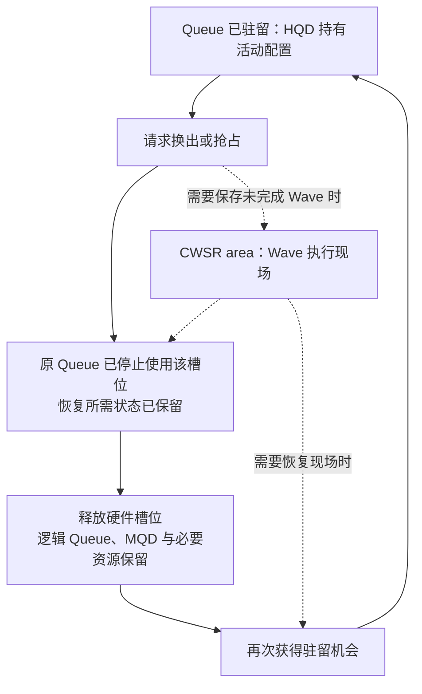

这是配置与现场的关系图，未规定具体硬件的保存顺序。一次换出可能等待工作自然结束，也可能使用支持的抢占机制；不能把所有换出都画成必然保存全部 Wave。

| 状态或对象               | 恢复 Q0 时的用途                    | 如果丢失会发生什么                       |
| ------------------------ | ----------------------------------- | ---------------------------------------- |
| MQD                      | 重建 Q0 的 Ring、进度地址等配置     | 无法按原配置继续取包                     |
| rptr/wptr 及相关进度状态 | 识别已预留、已释放的逻辑位置        | 可能重复处理旧位置或漏掉待处理位置       |
| Ring 与任务资源          | 保留待处理 Packet、代码、参数和数据 | 恢复的任务可能读取无效内容               |
| CWSR area                | 在采用 Wave 保存机制时恢复执行现场  | 未完成 Wave 无法接着原来的指令状态执行   |
| PASID 与 GPUVM           | 保持进程身份和所需映射              | 同一个 GPUVA 无法继续按原地址空间解释    |
| VMID/HQD                 | 提供本次驻留使用的硬件上下文        | 可以重新安排，但必须装入与 Q0 匹配的状态 |

MQD 不包含 Kernel 全部执行现场，CWSR 也不替代 Ring、代码和数组。第 3.1 节提到某些 GFX9 配置会把控制栈附在 MQD 缓冲区后面，这是存储布局上的安排；Queue 配置与执行现场仍承担不同职责。抢占前已经写入数组的数据仍在相应内存中，不能靠重新装入 MQD 把整个 Kernel 当作从未执行过。

**[BOUNDARY]** MQD、CWSR 和 GPUVM 分别保存 Queue 配置、Wave 现场和地址映射。Queue 暂时换出 HQD 后仍可能恢复执行，因此仍需保留这些资源；第 2.6.4 节介绍的 BO 引用与映射使用记录也不能仅因暂时未驻留就归还。

未驻留期间的 Doorbell 如何被记录、恢复时怎样重新观察进度，取决于具体调度路径。前面的 GFX9 装载源码能证明其 wptr 恢复步骤，不能代表全部固件行为。

Queue 创建建立了可复用的提交通路，HQD 驻留则使命令前端取得当前 Queue 的配置。Producer 可以向已创建的 Queue 提交任务；GPU 处理这些任务时，还需要该 Queue 获得驻留并满足 Packet 的依赖条件。下一章开始说明一次 `vector_add` 怎样写成任务描述。

## 4. 一次 Kernel 调用怎样编码成 AQL Packet

### 4.0 从 vector_add 的启动参数得到任务描述

Queue 已经创建，Runtime 也已装载 `vector_add`，并准备好 GPU 可以访问的 A、B、C 数组。本章开始描述一次具体调用：让 1024 个 Work-item 分别计算 `C[i] = A[i] + B[i]`，每个 Work-group 放 256 个 Work-item。

调用者提供的是 Kernel、参数和执行范围。Runtime 要把这些信息整理成一个 64 字节的 Kernel Dispatch Packet。第二章创建的 Ring 会反复接收这样的 Packet；A/B/C 和本次参数块则属于这一次任务。

如果从 HIP 启动形式理解本例，可写成下面的教学示意：

```cpp
// 教学示意：4 个 Block，每个 Block 256 个线程
vector_add<<<4, 256, 0, stream>>>(A, B, C, 1024);
```

HIP 的 Block 对应这里的 Work-group，线程对应 Work-item。**HIP 的 `gridDim.x = 4` 表示组数，AQL 的 `grid_size_x = 1024` 表示 Work-item 总数。** Runtime 在两种表示之间换算，不能把 HIP 的 4 原样填进 AQL 的 `grid_size_x`。

| 调用信息              | 换成 Packet 字段后的值                           | 字段中的数按什么计数                           |
| --------------------- | ------------------------------------------------ | ---------------------------------------------- |
| 一维任务，共 4 组     | 维数为 1；`grid_size_x/y/z = 1024/1/1`         | 整个 Dispatch 各维的 Work-item 数              |
| 每组 256 个线程       | `workgroup_size_x/y/z = 256/1/1`               | 每个 Work-group 各维的 Work-item 数            |
| 调用`vector_add`    | `kernel_object`                                | 已装载 Kernel 的执行句柄                       |
| 参数为 A、B、C、1024  | `kernarg_address`                              | 保存指针值和标量值的参数块地址                 |
| Kernel 的存储需求     | `private_segment_size`、`group_segment_size` | 分别按每 Work-item、每 Work-group 的字节数填写 |
| 需要 CPU 观察本次完成 | `completion_signal`                            | 本例所用 Signal 的句柄；Signal 的初值设为 1    |

这张表的前两行共同决定四组工作怎样划分：

```text
AQL Grid：1024 个 Work-item
  Group 0：Work-item   0～255
  Group 1：Work-item 256～511
  Group 2：Work-item 512～767
  Group 3：Work-item 768～1023

组数 = grid_size_x / workgroup_size_x = 1024 / 256 = 4
```

一个 Packet 描述全部四组工作。增加元素数时，通常只改变 Grid 等字段；Packet 仍为 64 字节。四组落到哪些 CU、是否同时运行，由第 6 章的执行机制决定。`completion_signal` 字段保存的也是句柄，数值 1 保存在 Signal 对象中，不能把“初值为 1”误填成“句柄等于 1”。

> **[SOURCE]** ROCm CLR `81277d69e3352`，[`rocclr/platform/ndrange.hpp`](./2.源码/rocm-clr/rocclr/platform/ndrange.hpp) 第 111～143 行：`LaunchParams` 用 `global_` 保存 Work-item 总数，`HIPLaunchParams` 用 `gridX * blockX + globalX_remainder` 等表达式得到该总数。本文普通完整分组的 remainder 为 0。

CLR 中的高层 Kernel 命令经 HostQueue/VirtualGPU 提交，当前底层 Queue 保存在 `gpu_queue_` 中。直接使用 HSA API 的程序也可以自行构造相同格式的 Packet。

> **[SOURCE]** ROCm CLR `81277d69e3352`，[`rocclr/device/rocm/rocvirtual.cpp`](./2.源码/rocm-clr/rocclr/device/rocm/rocvirtual.cpp) 第 1877～1882 行：`VirtualGPU::create()` 取得底层 Queue 并保存 `gpu_queue_`。

**[BOUNDARY]** 同文件第 2069～2087、2100～2104 行还包含动态 Queue 回收：启用后，空闲 VirtualGPU 可以归还底层 Queue，后续工作再取得可用 Queue。一次普通 Dispatch 使用当前绑定的 Queue；Stream 与底层 Queue 的复用关系见第 1.1.1 节。

### 4.1 64 字节 Packet 的布局与字段分组

Packet 最终要写入 Ring 中的一个槽位，因此字段的位置必须由提交者和硬件共同约定。AQL Kernel Dispatch Packet 固定为 64 字节，下面的偏移全部从 **该 Packet 的第一个字节**开始计算，范围包含两端。

| 字节偏移 | 字段及所占字节                                           | 保存的信息                                     |
| -------- | -------------------------------------------------------- | ---------------------------------------------- |
| 0～3     | `header` 2 字节，`setup` 2 字节                      | Packet 类型、依赖与 fence 范围，以及 Grid 维数 |
| 4～11    | `workgroup_size_x/y/z` 各 2 字节，`reserved0` 2 字节 | 每组的三维 Work-item 数                        |
| 12～23   | `grid_size_x/y/z` 各 4 字节                            | 整个 Dispatch 的三维 Work-item 数              |
| 24～27   | `private_segment_size` 4 字节                          | 每 Work-item 的 private 请求字节数             |
| 28～31   | `group_segment_size` 4 字节                            | 每 Work-group 的 group 请求字节数              |
| 32～39   | `kernel_object` 8 字节                                 | 可执行对象句柄                                 |
| 40～47   | `kernarg_address` 对应的 8 字节区域                    | 参数块地址；本例使用 64 位指针                 |
| 48～55   | `reserved2` 8 字节                                     | 按标准 Packet 格式保留                         |
| 56～63   | `completion_signal` 8 字节                             | 完成 Signal 的句柄                             |

例如，`grid_size_x` 位于 Packet 起点后的第 12 字节；`kernel_object` 位于第 32 字节。表中的 32 是**字节偏移**，第 4.4 节 Header 位图中的 bit 8 则是**位编号**，两者单位不同。

前 4 字节可以单独展开。本文使用的小端布局中，`header` 占低 16 位，`setup` 占高 16 位：

```text
Packet 内字节偏移     0       1       2       3       4 … 63
                   ┌───────────────┬───────────────┬───────────┐
                   │ header 16 位  │ setup 16 位   │ 其余字段  │
                   └───────────────┴───────────────┴───────────┘
                   └────── full_header 32 位 ──────┘
```

`full_header` 与 `header + setup` 是同四个字节的两种访问方式，不会额外占四个字节。Kernel Dispatch 的前 32 位之所以要这样组合，是为了在发布时用一次原子写同时交付 Header 和 setup，避免硬件看到新 Header 配旧 setup。

> **[SPEC]** [HSA Platform System Architecture 1.2](https://hsafoundation.com/wp-content/uploads/2021/02/HSA-SysArch-1.2.pdf) 第 2.8.3、2.9.6 节规定 64 字节 Packet、前 32 位的原子访问要求及字段布局。标准保留字段写为 0；依赖特定扩展的 Runtime 用法需要另按对应扩展解释。

> **[SPEC]** ROCr `ba56a24c6132`，[`runtime/hsa-runtime/inc/hsa.h`](./2.源码/rocr-runtime/runtime/hsa-runtime/inc/hsa.h) 第 2956～2976 行。`union` 让 `header`、`setup` 与 `full_header` 共用同一段存储。

```c
2956: /**
2957:  * @brief AQL kernel dispatch packet
2958:  */
2959: typedef struct hsa_kernel_dispatch_packet_s {
2960:   union {
2961:     struct {
2962:         /**
2963:          * Packet header. Used to configure multiple packet parameters such as the
2964:          * packet type. The parameters are described by ::hsa_packet_header_t.
2965:          */
2966:         uint16_t header;
2967:
2968:         /**
2969:          * Dispatch setup parameters. Used to configure kernel dispatch parameters
2970:          * such as the number of dimensions in the grid. The parameters are described
2971:          * by ::hsa_kernel_dispatch_packet_setup_t.
2972:          */
2973:         uint16_t setup;
2974:     };
2975:     uint32_t full_header;
2976:   };
```

英文说明分别是“Kernel Dispatch Packet”“Packet 类型等公共参数”和“Grid 维数等 Dispatch 参数”。第 2966、2973 行各定义一个 16 位字段，第 2975 行给出整个 32 位字的名称。

> **[SPEC]** 同一固定版本的 [`hsa.h`](./2.源码/rocr-runtime/runtime/hsa-runtime/inc/hsa.h) 第 2978～3070 行定义其余字段及 machine model 分支：small model 的指针只使用对应区域的一部分，但保留空间仍在，因此 Packet 长度保持 64 字节。未使用的 y/z 维度按一维任务要求填 1；各维和每组总规模还须满足目标 Agent 的限制。

第 2 章的 256 槽 Ring 正是按这个固定大小分配：`256 × 64 = 16384 字节 = 16 KiB`。用 C 结构体访问 Ring 时，结构体只是给这 64 字节起了字段名；第 4.5 节另建的临时 Packet 则是 CPU 准备任务时的一份独立副本。

### 4.2 Packet 怎样连接代码、参数块和数组

64 字节 Packet 保存任务范围和对象引用，GPU 再沿这些引用取得机器码、参数和数组数据。`vector_add` 的 A/B/C 数组各自在独立的存储中。

Code Object 是编译工具链生成、由 Runtime 装载的二进制容器。装载后，Runtime 从 Kernel Symbol 和 Metadata 中取得执行句柄、参数 ABI 和资源信息。下面的图只说明**从 Packet 能找到哪些对象**，箭头表示引用关系，不表示这些对象必须依次完成物理内存访问。

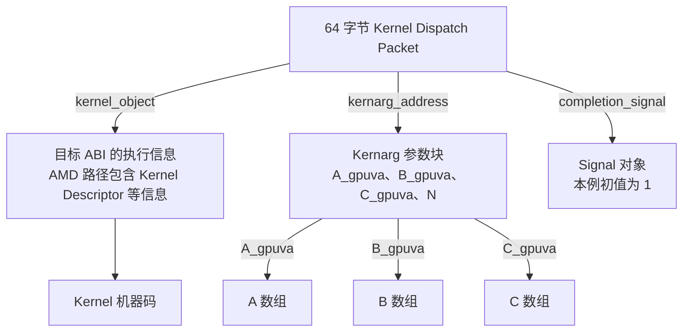

`kernel_object` 是不透明的执行句柄：调用者从 Runtime 取得并写入 Packet，设备按目标 ABI 解释它。AMD 的 Kernel Descriptor 等信息会帮助设备找到入口并配置执行状态，因此不能把这个句柄直接理解成“机器码第一条指令的地址”。`completion_signal` 也引用一个独立对象；句柄为 0 表示本 Packet 不更新完成 Signal。

> **[SPEC]** ROCr `ba56a24c6132`，[`runtime/hsa-runtime/inc/hsa.h`](./2.源码/rocr-runtime/runtime/hsa-runtime/inc/hsa.h) 第 3033～3070 行分别定义执行句柄、Kernarg 引用和可选完成 Signal。本文的 Kernel Descriptor 图用于说明 AMD 执行对象，具体布局仍取决于目标 Code Object ABI。

> **[SOURCE]** ROCr `ba56a24c6132` 的 [`runtime/hsa-runtime/loader/executable.cpp`](./2.源码/rocr-runtime/runtime/hsa-runtime/loader/executable.cpp) 第 1464～1494 行，在 `.kd` 符号分支中读取 Kernel Descriptor，并把符号地址保存到 Kernel Symbol；第 465～471 行在符号已装载时返回该地址作为 Kernel object 查询结果。Descriptor 定义见 [`runtime/hsa-runtime/loader/AMDHSAKernelDescriptor.h`](./2.源码/rocr-runtime/runtime/hsa-runtime/loader/AMDHSAKernelDescriptor.h) 第 198～211 行，包含代码入口相对偏移和执行资源字段。

Kernarg 中的“地址”有两层。`kernarg_address` 指向**参数块本身**；参数块内部的 A/B/C 值再指向**三个数组**。以下用假设的 64 位指针、32 位 `N` 和参数偏移演示。地址都只用于教学，真实偏移、总长度和 hidden arguments 必须服从目标 Kernel 的 Metadata。

```text
Packet.kernarg_address = K = 0x2000_0000

Kernarg 内的位置       存储的值          这个值的含义
K + 0  … K + 7        0x3000_0000      A 数组的 GPUVA
K + 8  … K + 15       0x4000_0000      B 数组的 GPUVA
K + 16 … K + 23       0x5000_0000      C 数组的 GPUVA
K + 24 … K + 27       1024             N 的标量值
```

例如，假设数组元素是 4 字节 `float`，Kernel 处理 `i = 10` 时：

```text
从 K + 0 取得指针值 0x3000_0000
    ↓
计算 A[10] 地址 = 0x3000_0000 + 10 × 4 = 0x3000_0028
    ↓
从 A 数组读取索引为 10 的元素（按顺序计数是第 11 个）
```

`K + 0` 是“指针参数存在哪里”，`0x3000_0000` 是“数组存在哪里”。把数组指针写进参数块，只复制了该指针的几个字节，数组内容仍留在数组自己的存储中。B、C 的处理同理；N 则作为数值直接使用。

Kernarg 的地址和内容都需要提前准备。其基址最低按 16 字节对齐，特定 Kernel 可以要求更大对齐；上例最后一个显式参数结束于偏移 27，不能据此断言实际参数区只需分配 28 字节。Runtime 还可能填入 hidden arguments，并按 Metadata 保留对齐和空间。

> **[SPEC]** HSA System Architecture 1.2 第 2.9.6 节规定 Kernarg 的对齐、分配用途和生命周期要求：应通过 Runtime 为该用途提供的接口取得参数内存，发布 Packet 前使参数内容在 System scope 可见，并保持分配和内容不变直到 Kernel 完成。

```text
准备 Kernarg 内容 → 发布 Packet → Kernel 读取参数 → 本次 Dispatch 完成
                   └──────── 此期间不能改写或复用 Kernarg ────────┘
```

代码与数组也必须在实际使用期间保持可访问。第二章 `CREATE_QUEUE` 检查的是 Ring、索引和 Queue 辅助资源；未来每次 Dispatch 的 Kernarg 与数组不在那次 Queue 创建检查的范围内。第 2.3.1 节证明的 CPU VA 与 GPUVA 同值也针对本文 Ring；填写其他对象时，要使用对应 Runtime 和 ABI 确认可用的地址。

Queue priority、Doorbell offset、PASID、VMID 和页表根保存在 Queue 或 Process-Device 的控制状态中。Packet 借助所在 Queue 使用这些状态，无需每次重新携带一整套。Event 依赖则由 Runtime 转为等待或 Barrier Packet，Kernel Dispatch Packet 本身没有任意长度的 Event 列表。

### 4.3 Private Segment 与 Group Segment 的资源需求

Runtime 已经知道要运行 1024 个 Work-item，还需告诉设备每个执行实例需要多少临时存储。Packet 的 `private_segment_size` 和 `group_segment_size` 都以字节计数，下面分别简称 private 和 group。两者的区别是每份存储归谁使用：

| 需求种类 | 一份请求对应谁                        | AMD GPU 上的典型承载                | 本次需求从哪里取得                           |
| -------- | ------------------------------------- | ----------------------------------- | -------------------------------------------- |
| private  | 一个 Work-item 单独使用               | 栈、寄存器溢出等需要的 Scratch 存储 | Kernel 资源信息，必要时结合 Runtime 的栈配置 |
| group    | 同一 Work-group 的所有 Work-item 共享 | LDS                                 | Kernel 的 group 需求加本次动态共享内存请求   |

这里的 private 指每个 Work-item 的独立存储需求，并不意味着所有局部变量都放进内存；编译器能够放进寄存器的值，不按同样方式占用 Scratch。group 则允许同组 Work-item 协作访问一份 LDS，不同组各有自己的实例。

> **[SPEC]** ROCr `ba56a24c6132`，[`runtime/hsa-runtime/inc/hsa.h`](./2.源码/rocr-runtime/runtime/hsa-runtime/inc/hsa.h) 第 3020～3031 行。`per-work-item` 表示“每个 Work-item”，`per-work-group` 表示“每个 Work-group”；group 请求必须覆盖 Kernel 及其调用函数所用的 group 存储和动态分配部分。

以下是在 `1024 个元素、每组 256 个 Work-item` 上额外加入的教学假设，用于推导字段单位，并非声称原始 `vector_add` 必然有这些需求：

```text
假设每组静态 LDS 4 KiB，本次再请求动态 LDS 2 KiB
  每组需要：4 KiB + 2 KiB = 6 KiB = 6144 字节
  Packet.group_segment_size = 6144

Group 0：256 个 Work-item 共享一份 6 KiB
Group 1：256 个 Work-item 共享另一份 6 KiB
Group 2、3：各有一份 6 KiB
```

字段填写的是 **6144**，不会乘以组内的 256。四组按逻辑实例合计为 `4 × 6 KiB = 24 KiB`；若某 CU 此时只驻留其中两组，单看这两组的需求则是 `2 × 6 KiB = 12 KiB`。其余组可以稍后使用资源，也可以位于别的 CU。实际占用还要按硬件粒度取整，并受寄存器、Wave 数等其他资源限制。

private 的乘法方向不同。若假设每个 Work-item 需要 32 字节：

```text
Packet.private_segment_size = 32
一个 Work-group 的逻辑需求：256 × 32 = 8192 字节 = 8 KiB
整个 Grid 的逻辑需求：    1024 × 32 = 32768 字节 = 32 KiB
```

32 KiB 用于理解“1024 份独立需求”的总量。Runtime 分配 Scratch 时还要考虑最大并发、对齐和设备实现，因此不能从这个乘法直接得出此次 Scratch BO 的实际大小。两个 Packet 字段都只给出需求量，不保存 LDS 或 Scratch 的数据地址。

第 2.1 节创建 Queue 时传入的同名参数用于提供资源提示；本节字段则随 Kernel 调用填写。第 4.5 节的 CLR 源码会展示 group 需求怎样相加，以及需要栈时 private 需求怎样进一步调整。资源需求超过设备能力时，需要在相应 Runtime 或设备处理路径中报告失败，不能靠增加 Grid 的执行时间解决单个 Work-group 已经放不下的问题。

### 4.4 Header 怎样约束类型、执行顺序和可见性

Grid、代码句柄和 Kernarg 已说明“运行什么”。Header 继续说明“这是什么 Packet、何时允许启动、启动和完成时怎样处理内存可见性”。先按执行过程理解：

```text
检查 Packet 类型
    ↓
若 barrier = 1，等待同一 Queue 的所有前序 Packet 完成
    ↓
在选定范围执行 acquire fence
    ↓
Kernel 读取输入、计算并写出结果
    ↓
在选定范围执行 release fence
    ↓
若 completion_signal 非零，更新完成 Signal
```

这是 Kernel Dispatch 的顺序；Barrier Packet 的 acquire fence 时机另见第 7 章。下面位编号从 16 位 `header` 的最低位开始，和第 4.1 节的字节偏移分开计算。

| Header 位 | 字段                           | 含义及常用取值                                                            |
| --------- | ------------------------------ | ------------------------------------------------------------------------- |
| 0～7      | `format`，API 称 Packet type | `INVALID = 1` 表示尚未交付；`KERNEL_DISPATCH = 2` 表示 Kernel 任务    |
| 8         | `barrier`                    | 1：当前 Packet 等待同一 Queue 全部前序 Packet 完成；0：不添加这项完成等待 |
| 9～10     | `acquire_fence_scope`        | Kernel 进入执行前，在哪些参与者范围内获取已发布的数据                     |
| 11～12    | `release_fence_scope`        | Kernel 执行结束后，在哪些参与者范围内发布之前的写入                       |
| 13～15    | 保留位                         | 标准格式要求为 0                                                          |

两个 scope 字段都用 `0 = NONE`、`1 = AGENT`、`2 = SYSTEM` 编码。NONE 表示该 Packet 省略这项 fence，需要由其他同步补足；AGENT 覆盖对应 Agent 的范围；SYSTEM 把范围扩展到系统中的相关参与者，适用于本文 CPU 与 GPU 的数据交换。选择 SYSTEM 也需要有效的映射、可访问内存和匹配的同步操作，它不是给任意地址增加访问权限。

> **[SPEC]** HSA System Architecture 1.2 第 2.9.1～2.9.2 节定义 Header 和执行阶段。固定 API 的位偏移与宽度见 ROCr `ba56a24c6132`，[`runtime/hsa-runtime/inc/hsa.h`](./2.源码/rocr-runtime/runtime/hsa-runtime/inc/hsa.h) 第 2807～2954 行；API 的 `SCACQUIRE`、`SCRELEASE` 名称与旧别名指向相同字段位置。

为了看清编码，本例假设采用 Kernel Dispatch、`barrier = 1`、acquire/release 都为 SYSTEM：

```text
header = (2 << 0) | (1 << 8) | (2 << 9) | (2 << 11)
       = 0x1502

setup 的低 2 位保存维数：一维任务取 1，其余位为 0
setup = 0x0001

小端平台整体前 32 位 = header | (setup << 16) = 0x00011502
```

这是一组明确的教学选择，不代表 CLR 的每次提交都固定使用 `0x1502`。Runtime 可以根据高层依赖、已有同步和命令属性调整这些字段，第 4.5、5.2 节会说明相关分支。

执行依赖和数据可见性需要分别满足。假设后一个 Kernel 使用前一个 Kernel 写出的数组：后一个 Packet 的 barrier bit 可以让它等到同 Queue 的前序工作完成；匹配且范围足够的 release/acquire 保证它读到已写出的数据。只设置 fence scope 不会自动建立任意跨 Queue 的执行依赖；只设置 barrier bit 也不能替代全部内存同步条件。

还要按时间区分同名操作：第 5.3 节由 **CPU Producer 原子 release 写 Header**，交付的是当前 Packet；本节 Header 内的 **`release_fence_scope` 由 Packet Processor 在任务完成阶段使用**，作用于执行产生的内存写入。一个发生在提交时，一个发生在任务执行后。

同 Queue barrier 的详细时序见[第 7.2 节](#72-barrier-bit-怎样约束同一-queue-的前序工作)，CPU 观察完成及读取结果见[第 7.0 节](#70-从-gpu-写结果到-cpu-观察完成)。内存同步的基础概念可回看 [02_GPU 内存管理基础](<./02_GPU 内存管理基础.md>) 第 3 章。

### 4.5 CLR 怎样构造临时 Packet 并交给发布函数

前面各节解释了 Packet 字段；现在把这些字段放回 CLR 的一次普通提交。`submitKernelInternal()` 在 CPU 上构造局部变量 `dispatchPacket`，调用发布函数后，发布函数再把它复制进 Queue Ring。两者内容相关，存储位置不同。

```text
CPU 准备 Kernel、执行范围与 Kernarg
    ↓
submitKernelInternal() 中的局部 dispatchPacket
    Header 为 INVALID，字段逐项填写
    ↓ dispatchAqlPacket(capturing = false)
dispatchGenericAqlPacket()
    取得 Ring 槽位 → 复制临时 Packet → 发布有效 Header → 通知 Doorbell
```

Graph Capture 的分支会把 Packet 保存到捕获存储中，暂时跳过 Ring 发布。下面先读普通路径的字段来源，再查看区分两条路径的函数。

> **[SOURCE]** ROCm CLR `81277d69e3352`，[`rocclr/device/rocm/rocvirtual.cpp`](./2.源码/rocm-clr/rocclr/device/rocm/rocvirtual.cpp) 第 3867～3874 行。入口给出本次调用输入，并取得目标设备上的 Kernel 信息和初始 group segment 需求。

```cpp
3867: bool VirtualGPU::submitKernelInternal(const amd::NDRangeContainer& sizes, const amd::Kernel& kernel,
3868:                                       const_address parameters, void* event_handle,
3869:                                       uint32_t sharedMemBytes, amd::NDRangeKernelCommand* vcmd,
3870:                                       hsa_kernel_dispatch_packet_t* aql_packet,
3871:                                       bool attach_signal) {
3872:   device::Kernel* devKernel = const_cast<device::Kernel*>(kernel.getDeviceKernel(dev()));
3873:   Kernel& gpuKernel = static_cast<Kernel&>(*devKernel);
3874:   size_t ldsUsage = gpuKernel.WorkgroupGroupSegmentByteSize();
```

`sizes` 提供执行范围，`parameters` 指向原始参数，`sharedMemBytes` 是本次动态共享内存请求；`attach_signal` 影响是否附加独立完成 Signal。第 3872～3874 行取得 `gpuKernel`，并用 Kernel 资源信息初始化 `ldsUsage`。

从入口到字段赋值之间还有几项准备，不能把原始参数地址直接当成最终 Kernarg：

- 第 3875～3899 行处理内存依赖、参数所涉及对象和命令状态。`processMemObjects()` 接收 `ldsUsage` 的引用；遇到适用的 local 参数时可继续增加需求。本文普通 HIP 向量参数没有这类额外 local 参数。
- 第 3900～3910 行从 `sizes` 得到三维 `local` 和 `global`，未使用的维度初始化为 1。本例得到 `local = 256/1/1`、`global = 1024/1/1`。
- 第 3911～4129 行准备 hidden arguments 和最终 `argBuffer`。若调用者已提供可用的设备参数区，可以复用；否则根据普通分配、内部 Kernel 或 Graph Capture 等条件取得参数区，完成复制和相应可见性处理。

> **[SOURCE]** 同一固定版本 [`rocvirtual.cpp`](./2.源码/rocm-clr/rocclr/device/rocm/rocvirtual.cpp) 第 3900～4129 行给出 Grid 和 Kernarg 的准备路径；第 807～810、897～924 行表明 `processMemObjects()` 可按 local 参数的大小与对齐更新传入的 LDS 需求。

随后构造临时 Packet。这里保留连续字段赋值，以及会改变 private 请求值或提前返回的完整分支：

> **[SOURCE]** ROCm CLR `81277d69e3352`，[`rocclr/device/rocm/rocvirtual.cpp`](./2.源码/rocm-clr/rocclr/device/rocm/rocvirtual.cpp) 第 4130～4167 行。临时 Header 为 `INVALID`，Grid、句柄、地址和两类资源需求来自前面的准备结果。

```cpp
4130:   // Check for group memory overflow
4131:   //! @todo Check should be in HSA - here we should have at most an assert
4132:   assert(dev().info().localMemSizePerCU_ > 0);
4133:   if (ldsUsage > dev().info().localMemSizePerCU_) {
4134:     LogError("No local memory available\n");
4135:     return false;
4136:   }
4137:
4138:   // Initialize the dispatch Packet
4139:   hsa_kernel_dispatch_packet_t dispatchPacket{};
4140:
4141:   dispatchPacket.header = kInvalidAql;
4142:   dispatchPacket.kernel_object = gpuKernel.KernelCodeHandle();
4143:
4144:   dispatchPacket.grid_size_x = global[0];
4145:   dispatchPacket.grid_size_y = global[1];
4146:   dispatchPacket.grid_size_z = global[2];
4147:
4148:   dispatchPacket.workgroup_size_x = local[0];
4149:   dispatchPacket.workgroup_size_y = local[1];
4150:   dispatchPacket.workgroup_size_z = local[2];
4151:
4152:   dispatchPacket.kernarg_address = argBuffer;
4153:   dispatchPacket.group_segment_size = ldsUsage + sharedMemBytes;
4154:   dispatchPacket.private_segment_size = devKernel->workGroupInfo()->privateMemSize_;
4155:   if ((devKernel->workGroupInfo()->usedStackSize_ & 0x1) == 0x1) {
4156:     dispatchPacket.private_segment_size =
4157:         std::max<uint64_t>(dev().StackSize(), dispatchPacket.private_segment_size);
4158:     // Validate privateMemSize is more than max allowed.
4159:     size_t maxStackSize = dev().MaxStackSize();
4160:     if (dispatchPacket.private_segment_size > maxStackSize) {
4161:       ClPrint(amd::LOG_ERROR, amd::LOG_KERN,
4162:               "Scratch size (%u) exceeds max allowed (%zu) for kernel : %s",
4163:               dispatchPacket.private_segment_size, maxStackSize,
4164:               gpuKernel.getDemangledName().c_str());
4165:       return false;
4166:     }
4167:   }
```

英文注释依次表示“检查 group 内存溢出”“初始化 Dispatch Packet”和“检查 private 请求是否超过上限”；注释还提示 group 检查理想上应由 HSA 层承担。两条错误信息分别表示没有足够 local 内存，以及 Scratch 请求超过最大允许值。

- 第 4130～4136 行检查此时的 `ldsUsage` 并在超限时返回。该判断没有包含后面才相加的 `sharedMemBytes`，不能把这几行解释成“已完整验证最终静态加动态请求”。
- 第 4138～4154 行新建并填充临时对象。`kernel_object` 来自 Kernel 句柄，`kernarg_address` 使用最终 `argBuffer`，group 字段保存 `ldsUsage + sharedMemBytes`。本例的六个 Grid/Work-group 字段与第 4.0 节相同。
- 第 4155～4167 行在 `usedStackSize_` 的对应标志置位时，把 private 请求提高到 Kernel 原值与 Runtime 栈配置中的较大值，并保留最大栈限制检查。故最终值可能大于第 4154 行的初始值。

第 4169～4179 行再根据命令属性调整 Header：允许任意顺序的启动可以清除 barrier bit，要求 System entry scope 的命令会设置后续提交要使用的状态。第 4181～4189 行在 `aql_packet` 非空时，另存一份供调度器再次启动用的 Packet。普通提交与 Graph Capture 随后分别调用同一个包装函数：

> **[SOURCE]** ROCm CLR `81277d69e3352`，[`rocclr/device/rocm/rocvirtual.cpp`](./2.源码/rocm-clr/rocclr/device/rocm/rocvirtual.cpp) 第 4191～4205 行。两条路径都调用 `dispatchAqlPacket()`，但捕获标志和目标存储参数不同。

```cpp
4191:   if (isGraphCapture) {
4192:     // Dispatch the packet
4193:     if (!dispatchAqlPacket(&dispatchPacket, aqlHeaderWithOrder,
4194:                            (sizes.dimensions() << HSA_KERNEL_DISPATCH_PACKET_SETUP_DIMENSIONS),
4195:                            GPU_FLUSH_ON_EXECUTION, command_->getPktCapturingState(),
4196:                            command_->getAqlPacket())) {
4197:       return false;
4198:     }
4199:   } else {
4200:     if (!dispatchAqlPacket(&dispatchPacket, aqlHeaderWithOrder,
4201:                            (sizes.dimensions() << HSA_KERNEL_DISPATCH_PACKET_SETUP_DIMENSIONS),
4202:                            GPU_FLUSH_ON_EXECUTION, false, nullptr, attach_signal)) {
4203:       return false;
4204:     }
4205:   }
```

英文注释是“提交该 Packet”。第 4191～4198 行传入命令的捕获状态和保存地址；第 4199～4205 行明确传入 `capturing = false`，并传递 `attach_signal`。实际是否写 Ring，要继续看被调用函数的分支：

> **[SOURCE]** ROCm CLR `81277d69e3352`，[`rocclr/device/rocm/rocvirtual.cpp`](./2.源码/rocm-clr/rocclr/device/rocm/rocvirtual.cpp) 第 1310～1322 行。捕获分支只保存 Packet；普通分支先处理等待，再进入 Ring 发布函数。

```cpp
1310: bool VirtualGPU::dispatchAqlPacket(hsa_kernel_dispatch_packet_t* packet, uint16_t header,
1311:                                    uint16_t rest, bool blocking, bool capturing,
1312:                                    const uint8_t* aqlPacket, bool attach_signal) {
1313:   if (capturing == true) {
1314:     packet->header = header;
1315:     packet->setup = rest;
1316:     std::memcpy(const_cast<uint8_t*>(aqlPacket), packet, sizeof(hsa_kernel_dispatch_packet_t));
1317:     return true;
1318:   } else {
1319:     dispatchBlockingWait();
1320:     return dispatchGenericAqlPacket(packet, header, rest, blocking, attach_signal);
1321:   }
1322: }
```

第 1313～1317 行在 `capturing = true` 时把最终 Header/setup 写进临时对象，并复制到 `aqlPacket` 指定的捕获存储，随即返回 `true`。这次返回表示已保存任务描述，尚未为这份描述预留 Ring 编号、发布 Ring Header 或通知 Doorbell。捕获存储中的有效 Header 也不会让硬件自动找到它。

第 1318～1321 行才是本章的普通主线：`dispatchBlockingWait()` 把必要的前置 Signal 等待转为 Barrier Packet，然后 `dispatchGenericAqlPacket()` 发布本次 Kernel Packet。`submitKernelInternal()` 的第 4206～4237 行还会继续处理 Printf、Device Enqueue 和 Image 等收尾，因此局部临时 Header 的初始值不能用来判断整个函数是否已提交工作。下一章从普通路径取得 Ring 编号的位置继续。

## 5. Producer 怎样发布 Packet 并通知硬件

### 5.0 一次提交包含哪些动作

第二章已为 Q0 分配并映射整块 Ring，创建时所有槽位的 format 都被初始化为 `INVALID`。第 4 章又准备好了本次 Kernel 的代码句柄、参数、执行范围和临时 Packet。本章的 CPU Producer，就是执行提交代码的 CPU 线程；它接下来要把这份描述放进 Q0 的 Ring。

提交普通 Packet 会使用已有 Ring 和 Queue。每次都需要取得的是一个逻辑编号及其可写槽位，而不是重新分配 16 KiB Ring 或再次调用 `CREATE_QUEUE`。

一次提交可以按“这段内存现在归谁操作”来理解：

```text
① Allocate：预留 Packet ID，并等到对应槽位可写
             Producer 取得填写本次位置的资格
    ↓
② Populate：填写任务字段，format 保持 INVALID
             Packet Processor 还不能处理这份任务描述
    ↓
③ Assign：原子发布有效 Header
             Packet 所有权交给 Packet Processor；Producer 停止改写
    ↓
④ Notify：向 Q0 的 Doorbell 通知已提交的 Packet ID
             让 Packet Processor 得知 Q0 有提交进度
```

> **[SPEC]** HSA System Architecture 1.2 第 2.8.3 节定义 Allocate、Populate、Assign、Notify 和所有权约束，第 2.8.4 节给出不同预留实现。这里把 Allocate 展开为“取得编号”和“等到可写”，是为了说明多 Producer 下的中间状态。

例如，某个线程原子取得 Packet ID 37 后，`write_index` 已推进到 38；如果它还在准备内容，slot 37 的 Header 仍为 `INVALID`。此时编号 37 已分配，但 Packet 37 尚未发布。等该线程写入有效 Header，Packet Processor 才有权处理任务。

因此，后面分别追踪 `write_index`、slot 的 format 和 Doorbell 通知：它们记录的是预留、发布和通知三个动作。Packet Processor 何时开始处理还受 Queue 驻留、前序 Packet 和资源条件影响。

### 5.1 Packet ID、物理槽位与容量约束

先解决一个位置问题：线程取得 Packet ID 293 时，怎样在只有 256 个槽位的 Ring 中找到自己的位置，以及怎样确认这个位置可以覆盖。

**Packet ID 是本次使用的逻辑编号，slot 是一段会反复使用的物理存储。** `write_index` 给出下一个待预留的 Packet ID，`read_index` 给出最早尚未释放的 Packet ID。这里的“释放”指允许 Producer 重新使用 Packet 槽位，不表示对应 Kernel 已执行完。

设 Queue 容量为 `size` 个 Packet，每个 Packet 为 64 字节：

```text
slot = packet_id % size
     = packet_id & (size - 1)         // size 为 2 的幂
Packet 的 CPU 地址 = Ring 的 CPU 基址 + slot × 64 字节
```

主案例的 `size = 256`，Packet 37 与 Packet 293 相差一整圈，因此都落在 slot 37：

```text
逻辑编号：     37                    293 = 37 + 256
               │                     │
               └───── 不同时间使用 ────┘
                            ↓
物理位置： Ring 基址 + 37 × 64 = Ring 基址 + 0x940
                            └── slot 37 的同一段 64 字节
```

只算出地址还不能写。对已经唯一预留的 `packet_id`，修改条件是：

```text
packet_id < read_index + size         // 这个编号已进入可用的容量范围
并且目标槽位 format == INVALID       // 该槽位当前未交给 Packet Processor
```

> **[SPEC]** HSA System Architecture 1.2 第 2.8.3 节规定上述条件。Packet Processor 必须先把旧槽位的 format 设为 `INVALID` 并使其可见，再使 `read_index` 越过旧 Packet。索引和槽位含义也见第 2.8 节的 Queue 定义。

对 Packet 293，slot 37 上一轮放的是 Packet 37。`read_index = 37` 时，`293 < 37 + 256` 不成立，表示旧 Packet 37 仍未越过释放边界；当 `read_index = 38` 时，`293 < 38 + 256` 成立，Packet 37 已释放。配合 `INVALID` 状态，Producer 才能开始写 Packet 293。

把 Ring 单独缩小为 **4 槽教学例子**，可以直接看到满队列时发生什么：

```text
初始：size = 4，read_index = 0，write_index = 4

物理槽位       slot 0     slot 1     slot 2     slot 3
上一轮使用者   Packet 0   Packet 1   Packet 2   Packet 3
释放状态       尚未释放   尚未释放   尚未释放   尚未释放

新 Producer 原子预留 Packet ID 4：write_index 从 4 变成 5
  目标是 slot 0
  4 < 0 + 4 为假 → 等待，不能覆盖 Packet 0

Packet Processor 释放 Packet 0：
  先使 slot 0 的 INVALID 可见，再把 read_index 改为 1
  4 < 1 + 4 为真 → Packet 4 可以开始填写 slot 0
```

为什么还要保留容量条件？假如同样是 `read_index = 0、write_index = 4`，只是 Packet 0～3 的 Producer 都已预留、尚未发布，四个物理槽位会全部显示 `INVALID`。Packet 4 如果只查 `INVALID` 就写 slot 0，会与正在准备 Packet 0 的线程争用同一段内存。format 没有记录“这是第几圈”，容量边界负责排除这种重复使用。

下面这些观察值分别适合回答不同问题：

| 观察值                        | 能说明什么                                           | 不能据此推断什么                       |
| ----------------------------- | ---------------------------------------------------- | -------------------------------------- |
| `write_index`               | 下一个可预留的逻辑编号                               | 之前的所有编号是否已发布               |
| `read_index`                | 比它小的编号所用槽位已释放                           | 这些编号对应的 Kernel 是否完成         |
| `write_index - read_index`  | 已预留、尚未越过释放边界的位置数，含正在等槽位的预留 | 已发布 Packet 数或正在执行的 Kernel 数 |
| 某个槽位 Header 有效          | 该次 Packet 已交给 Packet Processor                  | 该任务是否已完成                       |
| `write_index == read_index` | 当前无尚未释放的逻辑位置                             | 设备是否已执行完此前取出的所有任务     |

在上述 atomic-add 例子里，等待期间差值为 `5 - 0 = 5`，物理容量仍只有 4。逻辑预留允许排在容量范围之外；越界编号必须等待，不能写入对应地址。

本文按 HSA 的逻辑模型使用持续增加的 64 位索引，不把索引本身按 Ring 容量回绕；回绕的是 slot。公式按本次 Queue 生命周期不发生 64 位数值溢出来理解，不能把 `read_index + size` 在固定宽度整数中的溢出结果当成正常容量判断。第 5.6 节的教学伪代码会明确保留这一前提。Kernel 完成依据见[第 6.5 节](#65-槽位释放后哪些资源仍须保留)和[第 7.0 节](#70-从-gpu-写结果到-cpu-观察完成)。

### 5.2 Producer 怎样预留编号并等待槽位

容量规则已经明确，接下来需要让多个 CPU 线程各拿到不同的 Packet ID。若两个线程都把普通读取到的 `write_index = 40` 当成自己的编号，它们就会同时填写 slot 40。MULTI Queue 因此要求用原子读—改—写来分配编号。

| Queue 类型                | 谁可以提交    | 索引更新要求                                            |
| ------------------------- | ------------- | ------------------------------------------------------- |
| `HSA_QUEUE_TYPE_SINGLE` | 唯一 Producer | 可以用原子 store 推进；仍须遵守容量、连续发布和通知顺序 |
| `HSA_QUEUE_TYPE_MULTI`  | 多个 Producer | 用原子读—改—写保证编号唯一；各自等待槽位并正确发布    |

> **[SPEC]** ROCr `ba56a24c6132`，[`runtime/hsa-runtime/inc/hsa.h`](./2.源码/rocr-runtime/runtime/hsa-runtime/inc/hsa.h) 第 2250～2265 行定义两种 Queue 类型。HSA System Architecture 1.2 第 2.8.4 节说明单 Producer 可用原子 store、多 Producer 需要原子读—改—写。

预留并非只有一种顺序。下面比较两种实现，区别在于“满队列时是否已经领走编号”：

| 方案       | 如何取得编号                                                        | 满队列或竞争时怎样处理                                   |
| ---------- | ------------------------------------------------------------------- | -------------------------------------------------------- |
| atomic-add | 原子增加`write_index`，返回旧值作为 Packet ID，再等待该编号的槽位 | 满时已经持有编号，需要继续处理这次预留                   |
| CAS        | 先观察`write_index` 和容量，再尝试把观察到的值原子改成下一值      | 别人先改了索引则重新检查并重试；满时可在领号前等待或退出 |

CAS 是 Compare-And-Swap，即“比较并交换”。例如两个线程都观察到 40，只有一个能成功把 40 改成 41；另一个发现实际值已变，会重新读索引与容量。CAS 成功后也已经承担提交该编号的责任，不能随意放弃。

> **[SPEC]** HSA System Architecture 1.2 第 2.8.4 节列出上述方案。共同要求是唯一预留、容量保护与正确发布；“先预留，再等待”是本文接下来介绍的 atomic-add 路径的顺序。

当前 CLR 的 `dispatchGenericAqlPacket()` 采用 atomic-add。函数先取得容量，并把返回的旧索引保存为 `index`：

> **[SOURCE]** ROCm CLR `81277d69e3352`，[`rocclr/device/rocm/rocvirtual.cpp`](./2.源码/rocm-clr/rocclr/device/rocm/rocvirtual.cpp) 第 1185～1194 行。`queue_add_write_index_screlease()` 增加索引并返回增加前的值，作为本次 Packet ID。

```cpp
1185: template <typename AqlPacket>
1186: bool VirtualGPU::dispatchGenericAqlPacket(AqlPacket* packet, uint16_t header, uint16_t rest,
1187:                                           bool blocking, bool attach_signal) {
1188:   const uint32_t queueSize = gpu_queue_->size;
1189:   const uint32_t queueMask = queueSize - 1;
1190:   const uint32_t sw_queue_size = queueMask;
1191:
1192:   // Check for queue full and wait if needed.
1193:   uint64_t index = Hsa::queue_add_write_index_screlease(gpu_queue_, 1);
1194:   setFenceDirty(true);
```

英文注释表示“必要时检查队列满并等待”，但第 1193 行先完成预留，等待循环还在后面。第 1195～1238 行准备 Header scope、内部 Fence 状态和可选 Completion Signal；其中 `addSystemScope_` 与已有 fence 状态可以调整本次 Header，因此不能只从调用者传来的初值判断最终 scope。随后才检查槽位容量：

> **[SOURCE]** ROCm CLR `81277d69e3352`，[`rocclr/device/rocm/rocvirtual.cpp`](./2.源码/rocm-clr/rocclr/device/rocm/rocvirtual.cpp) 第 1239～1242 行。循环以 acquire 读取 `read_index`，在条件未满足时让出 CPU 执行机会。

```cpp
1239:   // Make sure the slot is free for usage
1240:   while ((index - Hsa::queue_load_read_index_scacquire(gpu_queue_)) >= sw_queue_size) {
1241:     amd::Os::yield();
1242:   }
```

英文注释表示“确保槽位可以使用”。令 `distance = index - read_index`，循环退出条件为 `distance < sw_queue_size`。本例中 `queueSize = 256`、`queueMask = 255`、`sw_queue_size = 255`：

```text
规范允许的容量范围：distance < 256
当前 CLR 使用的范围：distance < 255

read_index = 0 时：
  index = 254 → CLR 可填写
  index = 255 → CLR 仍等待，直到 read_index 至少到 1
```

CLR 因而留出一槽余量；Ring 的真实容量仍是 256，区别只是这条实现何时允许开始填写。既不能把源码的 255 改写成规范统一规定，也不能把规范的 256 当成源码实际使用的条件。

源码为什么没有再单独读取 `INVALID`？规范要求旧槽位先置为 `INVALID` 并可见，再推进 `read_index`。取得唯一编号的 Producer 通过 acquire 观察到足够靠后的 `read_index` 时，可以依赖这项释放顺序；第一次使用的槽位则已在创建时初始化为 `INVALID`。

**[INFERENCE]** 在 Queue 协议正常成立、编号唯一且没有越界写入的前提下，CLR 的容量等待结合上述释放顺序，能够确认旧内容已释放，因此无需再加一条显式 format 读取。第 5.1 节的容量与 `INVALID` 两项条件仍同时成立；省略额外读取不代表允许覆盖有效 Packet。

第 1.1.1 节中的 VirtualGPU A、C 即使复用同一个 `hsa_queue_t Q0`，也从该 Queue 的原子索引领取不同编号。原子操作只解决底层 Ring 的冲突，高层 Stream 顺序和 Event 依赖仍由 Runtime 另行维持。

> **[SOURCE]** ROCm CLR `81277d69e3352`，[`rocclr/device/rocm/rocdevice.cpp`](./2.源码/rocm-clr/rocclr/device/rocm/rocdevice.cpp) 第 3135～3174 行。Queue 池达到上限时可复用现有 Queue，普通底层 Queue 使用 `HSA_QUEUE_TYPE_MULTI` 创建。

### 5.3 填写 Packet，并用 32 位原子写发布 Header

Producer 已预留唯一编号，并确认对应槽位满足容量和 `INVALID` 条件。此时它可以写入本次任务描述；发布前，槽位的 format 必须保持 `INVALID`，让 Packet Processor 知道内容还没有交付。

问题不只在于最终字段是否正确，还在于硬件可能与 CPU 同时观察这段内存。若 CPU 先写有效类型，随后才写 `kernarg_address`，Packet Processor 就可能用旧地址启动新 Kernel。

```text
CPU Producer                       Packet Processor 对槽位的解释
准备输入与 Kernarg
写入 Packet body                   format 仍为 INVALID：不能处理
用 32 位原子 release 发布 Header ──→ 可处理完整 Packet
停止修改该槽位                     可以读取，并在适当时机释放槽位
```

这里的 32 位包含第 4.1 节的 `header + setup`。原子性保证这个组合以一个完整值被观察；release 发布则保证必要的先前写入按要求排在有效 Header 之前。若输入由另一 CPU 线程准备，提交线程还要先通过相应同步取得那些写入，不能仅靠自己最后的一条 release 补齐线程间缺失的同步。

> **[SPEC]** HSA System Architecture 1.2 第 2.8.3 节要求 Packet 前 32 位使用 32 位原子事务访问；其他 Packet 内容须在有效 format 发布前或同时达到所需可见性。Assign 完成所有权转移，此后提交者不能依赖该槽位内容保持不变。

CLR 用下面的 helper 发布有效值。`rest` 是“Header 后面的 16 位”，在 Kernel Dispatch 路径中对应 `setup`：

> **[SOURCE]** ROCm CLR `81277d69e3352`，[`rocclr/device/rocm/rocvirtual.cpp`](./2.源码/rocm-clr/rocclr/device/rocm/rocvirtual.cpp) 第 1074～1081 行。两种平台分支都把 `header | (rest << 16)` 作为一个 32 位值进行 release 写入。

```cpp
1074: static inline void packet_store_release(uint32_t* packet, uint16_t header, uint16_t rest) {
1075: #if IS_WINDOWS
1076:   std::atomic_ref<uint32_t> atomic_header(*packet);
1077:   atomic_header.store(header | (rest << 16), std::memory_order_release);
1078: #else
1079:   __atomic_store_n(packet, header | (rest << 16), __ATOMIC_RELEASE);
1080: #endif
1081: }
```

第 1075～1077 行在 Windows 上使用 `std::atomic_ref`，第 1078～1079 行在另一分支中使用 `__atomic_store_n`。`rest << 16` 把 setup 放到高 16 位，低 16 位放 Header；以第 4.4 节的教学值为例，这次整体写入为 `0x00011502`。

调用该 helper 的位置在 `dispatchGenericAqlPacket()` 中。第 1239～1242 行的容量等待之后，第 1243～1253 行为阻塞模式处理必要的完成 Signal，再复制临时 Packet：

> **[SOURCE]** ROCm CLR `81277d69e3352`，[`rocclr/device/rocm/rocvirtual.cpp`](./2.源码/rocm-clr/rocclr/device/rocm/rocvirtual.cpp) 第 1254～1260 行。先取得目标地址并复制内容，再单独发布有效 Header。

```cpp
1254:   TrackQueueProgress(*packet, index);
1255:
1256:   AqlPacket* aql_loc = &((AqlPacket*)(gpu_queue_->base_address))[index & queueMask];
1257:   *aql_loc = *packet;
1258:   if (header != 0) {
1259:     packet_store_release(reinterpret_cast<uint32_t*>(aql_loc), header, rest);
1260:   }
```

第 1256 行先把 Ring 基址转换成 `AqlPacket*`，所以数组下标每增加 1，地址就跨过一整个 Packet。本例 Packet 37 对应 `base_address + 37 × 64` 字节。第 1257 行复制的是第 4.5 节构造的临时 Packet，其 Header 仍为 `INVALID`。

第 1258～1260 行在 `header != 0` 时调用发布 helper。普通 Kernel Dispatch 传入的是非零有效 Header，因此会执行该分支。这里保留判断，是因为泛型函数的所有调用不能一律当成普通 Kernel Dispatch；本节证明的是当前这条普通路径。

还要避免混淆两种 release。这里的 CPU 原子 release 把任务描述交给 Packet Processor；Packet 内的 `release_fence_scope` 要等 Kernel 执行后才用于发布执行期间的写入。第 1193 行预留索引使用的 release 同样不能代替最终 Header 发布，因为 Packet body 是在预留之后才写入的。

有效 Header 发布完成后，输入、Kernarg 和 Packet 内容都必须已满足准备条件。Producer 接下来通知 Doorbell；即使通知尚未发生，也不能继续改写已发布的 Packet。

### 5.4 Doorbell 通知哪条 Queue、哪次提交进度

Packet 已经保存在 Ring 中，Producer 现在通过 Q0 的 `doorbell_signal` 通知提交进度。Doorbell 只传递通知：**写哪个 Doorbell 确定 Queue，交给 Runtime 的 Packet ID 表示本次通知了哪份已发布工作。** Packet body、Kernel 代码和数组仍留在各自的内存中。

沿用第 2.7 节进程 A 在 GPU0 上的 Q0。Q0 的 Doorbell 地址已在创建阶段取得；同一条 Queue 发布不同 Packet 时，会反复使用该 Doorbell：

```text
Packet 40：写 Q0 Ring 的 slot 40，发布后通知 Q0 Doorbell，接口值为 40
Packet 41：写 Q0 Ring 的 slot 41，发布后通知同一 Doorbell，接口值为 41

Queue 选择靠 Doorbell 地址
本次提交进度靠通知值
任务内容由 Packet Processor 从 Q0 Ring 读取
```

“通知到 Packet 41”也不表示硬件只处理 slot 41。若设备当前要处理的是 Packet 40，且尚未提前取出这些 Packet，它仍要先检查 40 是否已经发布，再按队列顺序推进到 41。Queue 上下文提供 Ring 基址、容量、地址空间和内部进度；Packet Header 提供有效性。第 5.5 节会说明通知 41 时，40 仍为 `INVALID` 的情况。

`read_index` 用于告诉 Producer 哪些槽位已经释放。Packet Processor 可以提前取出并释放槽位，因此不能把任意时刻的 `read_index` 一概当成“正在运行的 Kernel 编号”或“下一次才开始读取的 Packet 编号”。这些进度的区别在第 6 章继续展开。

> **[SOURCE]** ROCm CLR `81277d69e3352`，[`rocclr/device/rocm/rocvirtual.cpp`](./2.源码/rocm-clr/rocclr/device/rocm/rocvirtual.cpp) 第 1254～1276 行。第 1256～1260 行用 `index & queueMask` 定位、填写并发布槽位，随后第 1275 行把同一个逻辑 `index` 交给 Q0 的 Doorbell Signal 接口。下面保留发布之后的通知代码。

```cpp
1271:   // Optimization for native AQL path in windows has problems with PM4 emulation,
1272:   // skipping the doorbel will not wake up the AQL worker thread
1273:   //if (IS_WINDOWS && !dev().IsPm4Emulation() && (blocking || !hasPendingDispatch_))
1274:   {
1275:     Hsa::signal_store_screlease(gpu_queue_->doorbell_signal, index);
1276:   }
```

英文注释说，Windows 的某条优化曾因跳过 Doorbell 而无法唤醒 PM4 模拟线程。第 1273 行的条件现已被注释，紧接着的块会直接执行；第 1275 行调用 Runtime 接口通知当前 Packet ID。

Doorbell 的作用还需要和 Header 的作用分开：发布有效 Header 后，Packet Processor **可以在 Doorbell 写入之前**开始处理。通知有助于设备发现新工作，但不能作为“等 CPU 完全准备好才开工”的最后开关。

```text
必须先完成：输入、Kernarg、Packet body 的准备与可见性处理
    ↓
发布有效 Header ─── 从这里开始，设备就可能处理 Packet
    ↓
通知 Doorbell ───── 按协议告知设备已有提交进度
```

> **[SPEC]** HSA System Architecture 1.2 第 2.8.3 节允许在有效 format 发布后、Doorbell 通知前处理 Packet；未通知时，规范不要求 Packet Processor 已经发现并处理这份工作。因此 Producer 仍须通知，且不能通知自己尚未发布的 Packet。连续准备多份 Packet 时可以合并通知，通知值使用本次覆盖的最后一个已发布 Packet ID。

本例使用 Runtime 的 Doorbell Signal 接口，不由应用猜测某代硬件的 MMIO 宽度或进度编码，也不通过读取 Doorbell 判断任务是否完成。普通内存写和 Doorbell MMIO 的平台顺序可回看 [02_GPU 内存管理基础](<./02_GPU 内存管理基础.md>) 第 3.5～3.6 节。

### 5.5 多 Producer 发布顺序不同时，Queue 怎样推进

现在让同一个进程的两个 CPU 提交线程 **P0、P1** 共用 Q0。这里用 P0/P1 表示 Producer 线程，避免与第二章进程 A、B 的例子混淆；两个不同进程各自的 Queue 不属于本节这个共享 Ring 场景。

假设 Q0 容量为 256，初始 `read_index = write_index = 40`，slot 40、41 都已释放且为 `INVALID`。P0 先领取 Packet ID 40，P1 再领取 41，但 P1 更早完成准备。为只观察发布顺序，本例两份 Packet 的 barrier bit 均取 0，其他执行依赖也已满足。

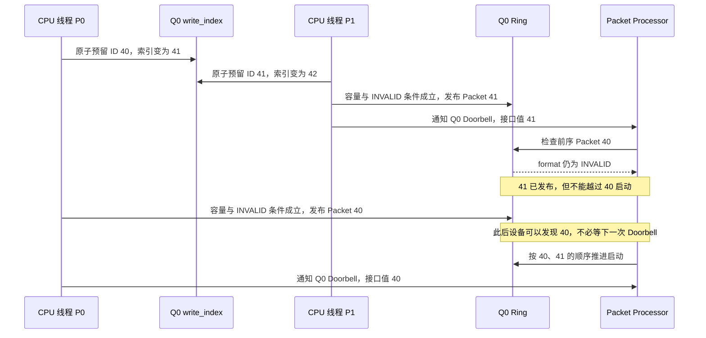

图中故意画出一种允许的时间顺序：设备在 P0 的 Doorbell 通知前就发现有效 Packet 40。也可能由这次通知促使设备发现；提交者不依赖二者谁先发生。

P1 通知 41 的时刻，Queue 处于下面的状态：

```text
write_index = 42
Packet 40：已预留，尚未发布 → 阻止后继 Packet 启动
Packet 41：已预留，而且已发布 → 等待前面的 40 被发布
```

原子加法保证两个线程不会领取相同编号，不保证两个线程的写入速度一致。Queue 遇到前序 `INVALID` 时必须保留启动顺序，不能因为较大编号已经有效就跳过前面的任务。等 40 发布后，两个 Packet 可以按顺序进入启动阶段；本例未设置 barrier 完成等待，因此不能再从“先 40 后 41 启动”推断“40 必须完成后 41 才能执行”。

> **[SPEC]** HSA System Architecture 1.2 第 2.8.3～2.8.4 节允许 MULTI Queue 的不同 Producer 乱序发布，但前序 `INVALID` 会阻止后继 Packet 被 Dispatch。只能在同一 Queue 所属进程地址空间内按该协议提交工作。

两次 Doorbell 接口值为 **41、40** 也属于多 Producer 下允许的交错。每个线程都通知自己已经发布的 Packet，并不会因为全局观察到的数字下降而把 Ring 中的 41“撤回”。Runtime 和硬件必须支持 MULTI Queue 的通知语义，应用不能自行把这条通知当成普通内存中的“唯一最新值”来推演。

> **[SPEC]** ROCr `ba56a24c6132`，[`runtime/hsa-runtime/inc/hsa.h`](./2.源码/rocr-runtime/runtime/hsa-runtime/inc/hsa.h) 第 2337～2348 行：SINGLE Queue 要求 Doorbell 值单调增加，MULTI Queue 允许不同取值的更新。这里的允许乱序仍以前述“所通知 Packet 已由 Producer 发布”为前提；单个提交线程按自己的提交顺序通知通常更合适。

如果 P0 领取 40 后长期停止，Packet 41 及其后续工作就会被阻挡。Producer 必须把“已领号但尚未发布”纳入错误和退出处理；预留成功尚未完成提交。任意回退 `write_index` 也不能解决这个问题，因为其他线程可能已经取得 41、42 等后续编号。

### 5.6 完整提交伪代码与常见错误

下面用一个 Packet 的提交串起全部条件。伪代码采用 atomic-add，并直接展示容量与 `INVALID` 检查；它描述协议步骤，不是可直接编译的 Runtime 实现。`queue.write_index` 等表示抽象状态，真实 HSA 应用通过 Runtime 接口访问索引。

前提是 Queue 仍有效，容量为 2 的幂，Ring 起点和原子访问满足对齐要求，64 位逻辑编号在这条 Queue 的使用期间不发生数值回绕。输入、参数区和所需 Signal 的分配等可能失败的准备应尽量在领取编号之前完成。

```text
prepare_inputs_and_kernarg();
prepare_completion_signal_if_needed();
prepare_temporary_packet_with_invalid_header();

packet_id = runtime_atomic_add_write_index(queue, 1);  // 返回旧值
while (packet_id >= runtime_load_read_index_acquire(queue) + queue.size) {
    yield();
}

slot_number = packet_id & (queue.size - 1);
byte_address = byte_pointer(queue.base_address) + slot_number * 64;
slot = packet_pointer(byte_address);

while (format(atomic_load_32_acquire(slot.full_header)) != INVALID) {
    yield();
}
copy_body_bytes_4_through_63(slot, temporary_packet);
atomic_store_32_release(slot.full_header, valid_header | (setup << 16));
runtime_doorbell_store_release(queue, packet_id);
```

`byte_pointer` 按字节做地址运算，所以必须乘以 64。若像 CLR 源码那样先转换为 Packet 指针，再写 `packet_array[slot_number]`，指针运算会自动按一个 Packet 跨步，此时不能再次乘 64。两种写法应算出同一地址。

容量检查确认当前编号可以使用这一圈的槽位，`INVALID` 确认该槽位已经归还给 Producer。第 5.2 节的 CLR 通过更保守的容量条件和释放顺序保证满足这些条件，源码不一定逐句对应本段伪代码。对固定宽度整数实现，还需处理容量算式的边界；这里没有把数值溢出算法隐藏在教学表达式中。

前 32 位始终按 32 位原子操作处理；其余 body 先复制，最后一次写入合成的 Header/setup。发布后槽位归 Packet Processor，Producer 不再依赖该槽位保存自己的任务状态，也不再补写字段。平台内存与 MMIO 的顺序由 Runtime 和对应实现负责。

下面按提交时最常见的误用列出后果，方便之后定位问题：

| 错误动作                                    | 为什么会出问题                                                |
| ------------------------------------------- | ------------------------------------------------------------- |
| 把全零 Ring 当成已初始化空 Ring             | type 0 是 vendor-specific；空槽的类型应为`INVALID = 1`      |
| 只增加`write_index` 就返回“已提交”      | 只预留了编号，前序`INVALID` 仍可能阻挡 Queue                |
| 不等容量，只按 mask 找到地址后覆盖          | 覆盖上一轮未释放的 Packet，或与另一轮尚未发布的 Producer 冲突 |
| 把字节偏移当 Packet 下标，再乘一次 64       | 写入错误地址，甚至越出 Ring                                   |
| 先写有效 Header，再写 body 或 Kernarg       | Packet Processor 可能用不完整任务描述开始处理                 |
| 因 Doorbell 尚未写入而继续改已发布 Packet   | 设备允许在通知前处理 Packet，所有权已经转移                   |
| 通知自己尚未发布的 Packet，或永远不通知     | 前者违背通知条件；后者无法保证设备发现这份工作                |
| 用`read_index` 越过某编号判断 Kernel 完成 | 槽位可提前释放，任务完成必须看相应完成依据                    |

领取编号后若发生错误，不能简单退出并遗留一个永久 `INVALID`，也不能无同步地回退 `write_index`。实现需要有能够继续完成该预留或停止整条 Queue 的协调机制；这段正常路径伪代码不假装用一个局部 `return` 就能取消已分配的编号。异常停止与清理的边界见第 8 章。

正常发布后，CPU 可以继续提交别的 Packet，或者等待本次完成；下一章转到 GPU 一侧，说明 Packet Processor 怎样读取任务并启动 Kernel。

## 6. CP/MEC 怎样取包并启动 Kernel

### 6.0 CP/MEC 怎样依据 HQD 读取 Ring

Producer 已把 Packet 37 写进 Ring，并发布有效 Header。普通 Dispatch 的 CPU 提交路径在发送 Doorbell 通知后结束；接下来，CPU 可以继续提交任务，也可以等待本次任务完成。GPU 则使用这条 Queue 当前驻留的 HQD 配置寻找 Packet。

沿用第二章的例子：Ring 的 GPUVA 是 `0x10000000`，共有 256 槽，每槽 64 字节。假设前序槽位已经释放，Packet Processor 当前要处理 Packet 37，那么取包地址是：

```text
Packet ID = 37
slot      = 37 & (256 - 1) = 37
字节偏移  = 37 × 64 = 0x940
取包 GPUVA = 0x10000000 + 0x940 = 0x10000940
```

这个计算只得到虚拟地址。CP/MEC 还需要 Queue 所属的地址上下文，才能让 GPU MMU 按正确的 GPUVM 翻译它。Ring base、size、Queue 格式和读写进度相关配置来自 HQD；Doorbell 告诉设备有新的提交进度，帮助设备发现工作。

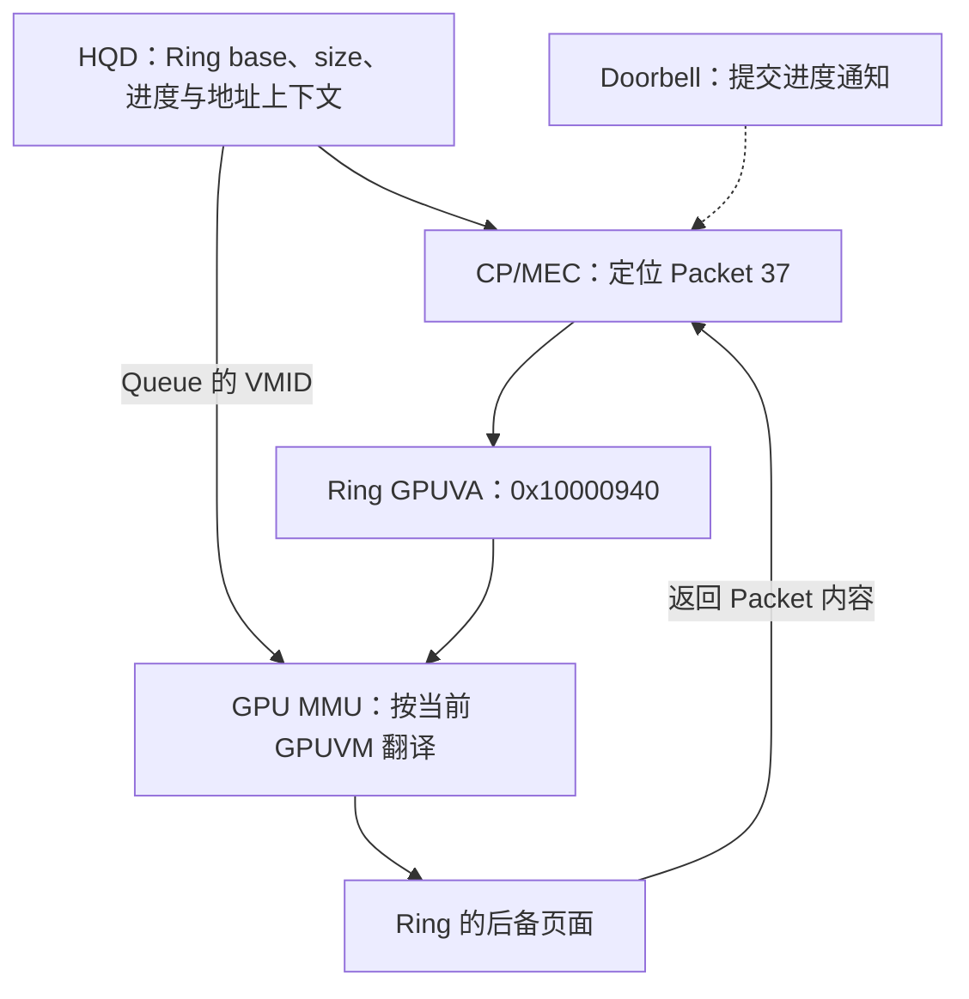

图中实线表示取包所需的信息和访问关系，虚线表示通知。图没有规定“先收到 Doorbell，才能开始读 Ring”：有效 Header 发布后，设备就可能发现 Packet，具体通知语义见 [第 5.4 节](#54-doorbell-通知哪条-queue哪次提交进度)。

本文 Ring 位于 system RAM。对离散 GPU，访问过程可继续展开为：

```text
GPUVA 0x10000940 + Queue 的 VMID
    → GPU MMU 查询当前 GPUVM
    → GPU PTE 给出 system RAM 的 DMA 地址及访问属性
    → 经过设备与主机内存通路，读取 Ring 页面
```

如果平台启用相应的 Host IOMMU 翻译，DMA 地址还会经过 Host IOMMU 到达主机物理页。Ring 位于 VRAM 时，最后转为访问本地显存；Packet 的 64 字节格式保持不变。

第 2.3.1 节为本文 Ring 建立了同值地址。因此，CPU 写 slot 37 和 GPU 读 slot 37 都可以使用数值 `0x10000940`，但 CPU 查 CPU 页表，GPU 查 GPUVM。两条访问最终指向同一块 Ring 中的同一段内容。

> **[SOURCE]** ROCm CLR `81277d69e3352`，[`rocclr/device/rocm/rocvirtual.cpp`](./2.源码/rocm-clr/rocclr/device/rocm/rocvirtual.cpp) 第 1184～1293 行。`dispatchGenericAqlPacket()` 直接操作已有 Ring 与 Doorbell；普通逐 Packet 提交不再次调用 KFD 创建 Queue。

**[BOUNDARY]** 本节使用 [02_GPU 内存管理基础](<./02_GPU 内存管理基础.md>) 已说明的地址翻译关系。HQD 的 GFX9 配置及装载证据见 [第 3.1 节](#31-kfd-怎样把-queue-属性写入-mqd)和[第 3.2 节](#32-no-hwskfd-选择硬件槽位并装载-hqd)。图中的地址计算用于说明如何定位 Packet，不规定 CP/MEC 内部如何预取、缓存或拆分访问；TLB 层级、Page Walker 仲裁和总线事务拆分属于后续 MMU 微架构专题。

### 6.1 一个 Packet 会引出哪些代码与数据访问

读到 Packet 37，只是取得了任务描述。`vector_add` 的机器指令、参数块和 A/B/C 数组都在 Ring 外，GPU 还要根据 Packet 中的字段找到这些对象。

先按“怎样找到下一个对象”理解访问关系：

```text
CP/MEC 读取 Packet 37
    ├─ kernel_object
    │      → 按目标 AMD ABI 取得 Kernel Descriptor / 执行信息
    │      → 确定代码入口及启动所需配置
    │      → Shader 执行时从代码区取指
    │
    ├─ kernarg_address
    │      → 找到本次 Kernarg：A_gpuva、B_gpuva、C_gpuva、N=1024
    │      → Kernel 按参数访问 A、B，并写 C
    │
    └─ completion_signal
           → 保存本次完成 Signal 的句柄
           → Packet 完成路径随后更新该 Signal
```

这张图表达对象之间的依赖，允许各硬件单元交叠准备和访问。它没有要求 CP 先把整份代码、参数和数组依次读完，再交给 CU。特别是，Kernel Descriptor 提供启动所需的信息，而执行中的机器指令由 Shader 的取指路径取得；“CP 处理 Dispatch”不能理解成“CP 执行 `vector_add` 的加法指令”。

下面的表用于区分**哪个对象出了问题，应先看哪条访问路径**：

| 被访问的对象                     | 主要访问者或阶段                                    | 对`vector_add` 的作用             |
| -------------------------------- | --------------------------------------------------- | ----------------------------------- |
| Ring slot 37                     | CP/MEC 取包                                         | 读取 64 字节任务描述                |
| `kernel_object` 指向的执行信息 | CP/MEC 执行准备路径                                 | 取得代码入口及目标 ABI 规定的配置   |
| Kernel 代码                      | Shader 取指路径                                     | 执行索引计算、内存访问和加法等指令  |
| `kernarg_address` 指向的参数块 | Kernel 启动路径与 Shader，具体分工由 ABI 和实现决定 | 取得 A/B/C 指针和 N                 |
| A/B/C 数组                       | 执行 Kernel 的 Shader                               | 读取输入元素并写入结果              |
| Completion Signal 的承载内存     | Packet 完成路径                                     | 更新完成状态，供 CPU 或其他工作观察 |

`completion_signal` 是不透明句柄。Runtime 根据句柄关联具体 Signal 对象；应用不能把句柄数值当成 A/B/C 那样的数组地址直接读写。Kernel Descriptor、参数块与数组的布局关系见 [第 4.2 节](#42-packet-怎样连接代码参数块和数组)。

第二章的 `CREATE_QUEUE` 已检查并保护 Ring 等 Queue buffer。每次 Dispatch 引用的代码、Kernarg、数组和 Signal 仍需各自保持有效映射、访问权限和生命周期。例如 Ring 映射正确而 `A_gpuva` 指向已解除映射的内存，CP/MEC 可以正常取到 Packet，Kernel 随后读取 A 时仍会发生访问错误。

因此，故障地址落在 Ring 范围时，先检查 Queue 取包通路；落在代码、Kernarg 或 A/B/C 范围时，继续检查相应对象。各类故障的区分见 [第 8.3 节](#83-怎样区分-queue-fullfaulthang-和-reset)。

### 6.2 Packet 的启动准备、执行与完成收尾

Packet 37 已经发布，但发布动作并不要求 GPU 当场开始运行 Kernel。HSA 用 `launch`、`active`、`completion` 描述一个 Packet 的处理过程。这里讨论的是**单个 Packet**；第二、三章的 Queue `is_active` 和 HQD `ACTIVE` 描述 Queue 的调度或驻留状态。

对于 Kernel Dispatch，先看何时允许开始 launch：

- 同一 Queue 的所有前序 Packet 都已结束各自的 launch。
- 如果前面有 Barrier-AND 或 Barrier-OR Packet，必须等该 Barrier Packet 完成，后继 Packet 才能继续处理。
- 如果 Packet 37 自己的 Header `barrier=1`，还要等同 Queue 的所有前序 Packet 完成。

满足启动条件后，Packet 37 按下面的阶段推进：

```text
launch：准备启动
    按 Packet 和 Kernel 执行信息准备本次工作
    在进入 active 前，执行 Header 指定的 acquire fence
        ↓
active：执行 Kernel
    分派并执行本次 Dispatch 的 Work-group / Wave
    读取参数和输入，计算并写入输出
    本次所有 Work-group 都结束，active 才结束
        ↓
completion：完成收尾
    执行 Header 指定的 release fence
    若 completion_signal 非空，原子递减该 Signal
    本 Packet 的完成操作结束
```

主例有 4 个 Work-group。即使第 0 组已经完成，只要还有其他组未完成，Packet 37 仍处于 active；所有组完成后，还要执行 completion 中的同步和 Signal 操作。CPU 因而使用完成条件判断何时可以读取最终结果，而不是根据某个 Wave 已退出或 rptr 已前进来推断。

> **[SPEC]** [HSA System Architecture 1.2](https://hsafoundation.com/wp-content/uploads/2021/02/HSA-SysArch-1.2.pdf) 第 2.9.1.1、2.9.2 节规定处理阶段及 fence 位置，第 2.11 节规定 Kernel Dispatch 的 active 在所有 Work-group 完成后结束。本节针对 Kernel Dispatch；Barrier Packet 的 acquire 发生在不同位置，见 [第 7.3 节](#73-barrier-and-怎样表达跨-queue-依赖)。

这些 fence 与第二章的地址准备承担不同职责。CPU 在发布前已填写输入和 Kernarg，并完成相应可见性处理；Dispatch 的 acquire 则按规定作用域参与 GPU 读取这些数据之前的同步：

```text
CPU 准备输入和参数
    → 按协议发布 Packet
    → Dispatch 的 launch acquire
    → Kernel 使用输入和参数
```

这条关系以映射有效、资源仍存活以及同步范围正确为前提。PTE 缺失要修复地址翻译，BO 已释放要修复生命周期；acquire 不会替调用者分配内存，也不能补上缺失的发布操作。Header scope 为 `NONE` 时，相应 Packet fence 不执行，所需同步必须由其他已建立的机制提供。

**[BOUNDARY]** 三阶段是规范要求的行为划分，不是公开的 CP/MEC 固件指令清单。`active` 期间还可能经历资源等待或调度，并不要求本次所有 Wave 始终同时占用 CU。fence 的实际处理也取决于内存属性与 scope，不能把每个 fence 都画成一次固定的全缓存刷新；这些条件与 [02_GPU 内存管理基础](<./02_GPU 内存管理基础.md>) 第 3 章衔接。

### 6.3 同一 Queue 的 Kernel 何时可以重叠执行

现在在同一 AQL Queue 中依次发布两个互不依赖的 Kernel Packet A、B。两者都有效，B 的 `barrier=0`，前面也没有尚未完成的 Barrier Packet。B 只需等 A 结束 launch，就可能开始自己的 launch；此时 A 的 Kernel 可以仍在执行。

下面两组图使用同一时间方向，条带长度只表达阶段关系：

```text
时间 ─────────────────────────────────────────────────→

B.barrier = 0，且没有其他依赖：
A： [launch][-------------- active --------------][completion]
B：         [launch][--- active ---][completion]
                    └── 两个 Kernel 的执行可以重叠 ──┘
                                    ↑ B 甚至可能先完成

B.barrier = 1：
A： [launch][-------------- active --------------][completion]
B：                                                            [launch][active][completion]
                                                              ↑ 等 A 完成后才能开始
```

第一种情况下，AQL 保持了 launch 的队内顺序，却没有要求 A 的 active 和 completion 必须先于 B 结束。因此，“A 先提交”和“B 已完成”合在一起，仍不足以确认 A 已完成。需要前序工作完成的地方，应使用明确的 barrier 或 Signal 依赖。

> **[SPEC]** [HSA System Architecture 1.2](https://hsafoundation.com/wp-content/uploads/2021/02/HSA-SysArch-1.2.pdf) 第 2.9.2 节要求前序 launch 先完成；Header barrier 为 1 时，当前 Packet 还须等待同 Queue 的前序 Packet 全部完成。

协议允许重叠之后，硬件还要有足够的寄存器、LDS、Wave 槽位等执行资源，并由设备调度安排实际运行。因此，`barrier=0` 允许重叠，但不会强制两个 Kernel 同时运行，也不是对实际并发程度的承诺。

本节比较的是底层 AQL Packet。HIP Stream 中命令的执行顺序仍由高层接口语义约束，Runtime 要通过生成的 Packet、barrier 或依赖关系实现这些要求。不能只看到一个底层 Packet 的 barrier bit，就省略 Runtime 已建立的其他顺序条件。同 Queue 的 barrier 范围将在 [第 7.2 节](#72-barrier-bit-怎样约束同一-queue-的前序工作)展开。

### 6.4 Grid 怎样变成 Work-group 和 Wave

Packet 37 的 `grid_size_x=1024`、`workgroup_size_x=256` 已经确定了本次工作的逻辑范围。执行 Kernel 时，硬件需要把这 1024 个 Work-item 组织成 Work-group，再按目标 Kernel 的 Wave 宽度执行。

本例的 Grid 正好整除，因而有 `1024 / 256 = 4` 个 Work-group：

```text
Dispatch：1024 个 Work-item
│
├─ Work-group 0：全局索引   0～255
├─ Work-group 1：全局索引 256～511
├─ Work-group 2：全局索引 512～767
└─ Work-group 3：全局索引 768～1023

以 Work-group 0 为例：
wave64 → [ 0～63 ][ 64～127 ][ 128～191 ][ 192～255 ]
          共 4 个 Wave，每个 Wave 64 个 Work-item

wave32 → [ 0～31 ][ 32～63 ] ... [ 224～255 ]
          共 8 个 Wave，每个 Wave 32 个 Work-item
```

图中的两行是两种目标 Kernel 的计算方式，不表示同一次 Dispatch 会混用两种 Wave 宽度。由此可以计算整个 Dispatch 需要执行多少个逻辑 Wave：

| 目标 Kernel 的 Wave 宽度 | 每个 Work-group 的 Wave 数 | 整个 Dispatch 的逻辑 Wave 数 |
| ------------------------ | -------------------------- | ---------------------------- |
| wave64                   | `256 / 64 = 4`           | `4 个组 × 4 = 16`         |
| wave32                   | `256 / 32 = 8`           | `4 个组 × 8 = 32`         |

表中统计的是这次任务一共包含多少个 Wave 实例。16 个 wave64 可以分批运行；实际同时驻留多少个、分布到哪些 CU，还取决于寄存器、LDS、硬件限制与其他工作的占用。仅凭这张表，无法得到本次使用的 CU 数或某一时刻的 Wave 驻留数。

这里也可以把第三章的 Queue 驻留放回完整执行过程：

```text
KFD / HWS / MES：安排 Queue 获得活动硬件上下文
        ↓
CP/MEC：处理 Queue 中的 Packet，准备 Dispatch
        ↓
Work-group / Wave 分派：为可执行工作安排资源
        ↓
CU：运行 Wave 中的 Kernel 指令
```

Queue 获得 HQD，只是让命令前端能够处理这条 Queue；Work-group/Wave 怎样使用 CU 是下一层分派工作。HWS/MES 不逐个挑选 Work-item 执行。[00_GPU系统基础](./00_GPU系统基础.md) 已介绍 Work-item、Wave、CU 与物理执行资源的关系；[第 4.3 节](#43-private-segment-与-group-segment-的资源需求)说明 Packet 中的资源需求怎样影响执行所需空间。

**[BOUNDARY]** Wave 宽度由目标 ISA、Kernel 属性和硬件支持共同决定，不能只看 Grid 字段选择。Work Distributor 是本文对分派职责的概念性称呼，公开 Linux 接口没有给出各 CU 间的实时仲裁算法。

### 6.5 槽位释放后，哪些资源仍须保留

Packet 37 使用 slot 37 存放 64 字节描述，但它的代码、Kernarg、数组和 Signal 都是独立对象。Packet Processor 一旦不再需要 Ring 中的这份描述，就可以释放槽位；Kernel 可能还要继续使用参数和数据。

用共同的时间刻度看这些对象，可以避免把 rptr 当成 Kernel 完成指示。以下是**规范允许的一种早期释放时序**，并假设后面已经预留到 Packet 293：

```text
时间          t0             t1               t2                 t3               t4
事件          发布 37        启动本次工作     释放 slot 37       Dispatch 37 完成  停止并销毁 Queue
              │              │                │                  │                │
slot 37       ├──── 保存 Packet 37 ────────────┤ 可由后续编号复用                    │
Packet 37                    ├──── active → completion ──────────┤                │
Kernarg 37    ├──────── 保持原参数，不覆盖 ────────────────────────┤                │
代码与 A/B/C  ├──────── 本次执行期间保持有效 ──────────────────────┤ 其他使用者可能仍需要
Signal 37     ├──────────────── 值为 1 ───────────────────────────┤ 变为 0，依赖者可能仍在使用
整条 Ring     ├──────────── Queue 存续期间继续保留 ──────────────────────────────────┤
```

在 t2，Packet Processor 先把 slot 37 的 format 设回 `INVALID` 并使其可见，再推进 rptr/read_index。假设此时 `read_index=38`，规范中的复用条件为：

```text
Packet 293 的 slot = 293 & 255 = 37
容量条件：293 < 38 + 256
发布状态：slot 37 的 format == INVALID
两者满足，才允许向这个槽位写 Packet 293
```

第 5.2 节介绍的当前 CLR 还留出一个槽位的余量，要求 `packet_id - read_index < 255`。因此，CLR 对 Packet 293 会继续等到 `read_index >= 39` 才通过自己的容量检查。上图表达允许早于 Kernel 完成释放槽位的规范关系；具体 Producer 还要遵守自身更严格的容量规则。

> **[SPEC]** [HSA System Architecture 1.2](https://hsafoundation.com/wp-content/uploads/2021/02/HSA-SysArch-1.2.pdf) 第 2.8.3 节允许 Packet Processor 在提交后释放槽位，不要求任务先完成，并规定 INVALID 先于 read_index 越过该 Packet 可见。

各对象的回收条件应分别判断。下表中的“完成”包含对应任务的完成收尾，并要求没有其他使用者继续访问：

| 资源                    | 允许复用或释放的条件                                         | 过早处理会影响什么                           |
| ----------------------- | ------------------------------------------------------------ | -------------------------------------------- |
| 单个 Ring slot          | 旧 Packet 已释放，目标编号满足容量条件，format 为`INVALID` | 覆盖设备尚需读取的任务描述                   |
| 本次 Kernarg            | 对应 Dispatch 完成，其他使用者也已结束                       | Kernel 可能读到下一次任务的参数              |
| Kernel 代码、输入与输出 | 所有会继续访问这些对象的任务结束                             | 仍在取指或读写数据的工作失去有效内容         |
| Completion Signal       | 更新它的 Packet、依赖 Packet 和等待者均不再使用              | 等待者可能错过本次完成或观察到下一次任务的值 |
| 整条 Ring 与 Queue 资源 | Queue 已停止，并完成相应销毁过程                             | Packet Processor 仍可能访问这条 Queue 的内存 |

CPU 在 slot 37 写 Packet 293，只是覆盖同一块 Ring 中已释放的 64 字节。整条 Queue 仍然存在，KFD 对 Ring BO 的引用和第 2.6.4 节的映射使用计数继续保留；槽位回绕不会重新分配或映射 Ring。

因此，rptr/read_index 用来判断描述空间的复用边界。CPU 读取 `vector_add` 的最终结果，需要下一章的 Completion Signal 和相应同步条件。

## 7. Kernel 完成后怎样通知 CPU

### 7.0 从 GPU 写结果到 CPU 观察完成

Packet 37 的 Kernel 正在写输出 C。CPU 要读取完整结果，需要知道本次工作已经完成，并与 GPU 的写入建立正确的内存顺序。本例通过 Completion Signal 表达这个完成状态。

先区分 Packet 中的**Signal 句柄**与 Signal 对象保存的**值**：

```text
Packet 37.completion_signal
    → 保存 Signal 37 的句柄，用于指定“更新哪一个 Signal”

Signal 37 的值
    发布前初始化为 1
    本次 Packet 完成时原子递减一次：1 → 0
    CPU 等待的条件是“Signal 37 的值等于 0”
```

Packet 的字段里不是直接填写数值 1。`completion_signal.handle == 0` 则是另一种约定：本 Packet 不使用完成 Signal。本例只让 Packet 37 的正常完成路径递减一次 Signal，等待者用完之前也不重置它；在这个协议下，值变为 0 就表示本次完成条件满足。Signal 本身可以保存其他整数，并非只有两个状态。

`vector_add` 的 Kernel 负责计算并写 C。等本次所有 Work-group 完成后，**Packet 的完成路径**执行规定的 release，再原子递减 Signal；本例的用户 Kernel 无需自行写入这个完成值。

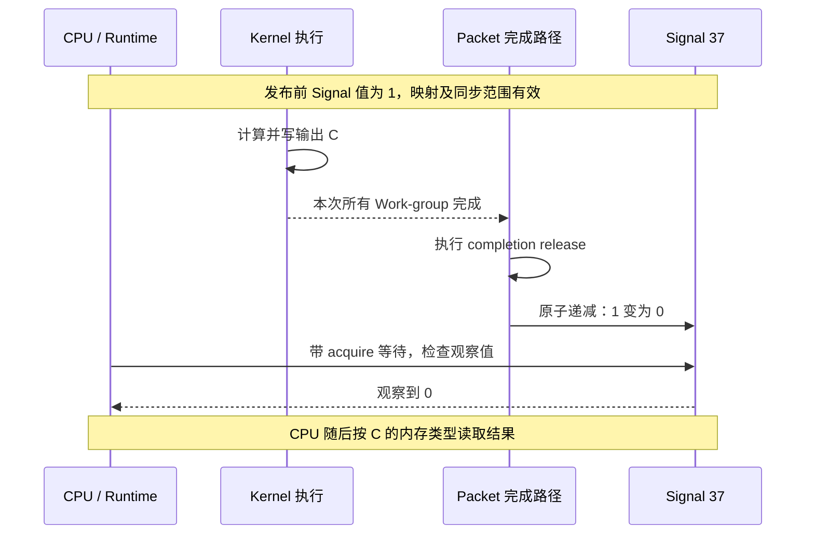

> **[SPEC]** [HSA System Architecture 1.2](https://hsafoundation.com/wp-content/uploads/2021/02/HSA-SysArch-1.2.pdf) 第 2.9.2 节规定完成阶段先执行 release，再原子递减非空 Completion Signal。`1 → 0` 是本文选择的单次完成协议。

一次任务需要两个方向的同步。下表用来区分“GPU 什么时候能读输入”和“CPU 什么时候能读输出”：

| 通信方向   | 数据先由谁准备                   | 让读取方观察写入的同步关系                                     |
| ---------- | -------------------------------- | -------------------------------------------------------------- |
| CPU → GPU | CPU 准备任务描述、输入和 Kernarg | Producer 按协议发布，Dispatch 在进入 active 前执行相应 acquire |
| GPU → CPU | Kernel 写输出 C                  | 完成路径 release，CPU 通过 acquire 观察到满足条件的完成值      |

这些关系都要求有效映射、正确内存属性和覆盖通信双方的 scope。第二章的地址映射、BO 引用和映射使用计数维持访问条件，本章的 release/acquire 规定写入与后续读取之间的可见性关系。

本章后文出现“CPU 读取 C”时，假设 C 本来就是 CPU 可访问的内存，并满足所用内存类型的共享或访问权要求。如果 C 仅供设备访问，CPU 应先通过适用的复制路径把结果取到 Host 可读缓冲区，再等待该复制完成。Kernel 的 Signal 变为 0，不会为 C 新建 CPU 映射，也不会自动把结果拷回 Host；不能直接把 GPUVA 当成可解引用的 CPU 指针。

### 7.1 等待返回、超时和唤醒后的状态判断

CPU 调用 `hsa_signal_wait_scacquire()` 等待 Signal 37 变为 0。这个 API 返回的是**实际观察到的 Signal 值**，没有另外返回一个“完成”“超时”或“Kernel 错误”的状态码。因此，调用返回之后，首先检查观察值是否满足传入的条件。

本例只允许 Signal 从 1 变为 0，并在所有本次等待者用完前保持 0。于是返回值可以这样解释：

| 返回的观察值 | 这次观察证明了什么                                | CPU 接下来可以做什么                                   |
| ------------ | ------------------------------------------------- | ------------------------------------------------------ |
| `0`        | 本例的完成条件满足；这次内部加载具有 acquire 语义 | 在相应内存条件下读取 C                                 |
| `1`        | 这次观察尚未确认完成                              | 继续等待，或由调用者判断是否结束等待；暂不读取最终结果 |

返回 1 可能发生在超时后，也可能是条件尚未满足时提前唤醒。**仅凭这个 1 无法区分返回原因。** 若应用有自己的等待期限，应另外记录和判断经过的时间；Queue 错误则从相应错误通路获得，不能把 Signal 值当成错误码。

下面是说明判断顺序的伪代码，`caller_must_stop_waiting()` 表示调用者自己的期限或错误处理策略：

```text
for (;;) {
    observed = hsa_signal_wait_scacquire(
        signal, HSA_SIGNAL_CONDITION_EQ, 0, timeout_hint, wait_state_hint);

    if (observed == 0)
        break;                         // 已通过 acquire 观察到本次完成

    if (caller_must_stop_waiting())
        return WITHOUT_READING_RESULT; // 停止等待，但不能假定 Kernel 已完成
}

read_output_C();                        // 本例 C 已具备 CPU 访问条件
```

`scacquire` 已指定函数内部加载 Signal 时的内存顺序。返回 0 并满足本例协议后，可以依靠这次 acquire 观察读取受同步保护的结果；无需因为 wait 返回了，就再机械地执行一次独立 acquire。再次等待是为了重新检查**尚未满足的条件**，而不是给已经成功的 acquire 再补一次 acquire。

> **[SPEC]** ROCr `ba56a24c6132`，[`runtime/hsa-runtime/inc/hsa.h`](./2.源码/rocr-runtime/runtime/hsa-runtime/inc/hsa.h) 第 2023～2038 行。API 说明等待可提前返回、条件可能失效，以及内部加载采用函数名指定的内存顺序。

```c
2023: /**
2024:  * @brief Wait until a signal value satisfies a specified condition, or a
2025:  * certain amount of time has elapsed.
2026:  *
2027:  * @details A wait operation can spuriously resume at any time sooner than the
2028:  * timeout (for example, due to system or other external factors) even when the
2029:  * condition has not been met.
2030:  *
2031:  * The function is guaranteed to return if the signal value satisfies the
2032:  * condition at some point in time during the wait, but the value returned to
2033:  * the application might not satisfy the condition. The application must ensure
2034:  * that signals are used in such way that wait wakeup conditions are not
2035:  * invalidated before dependent threads have woken up.
2036:  *
2037:  * When the wait operation internally loads the value of the passed signal, it
2038:  * uses the memory order indicated in the function name.
```

这段英文规定了调用者必须处理的情况：

- 第 2027～2029 行：即使条件未满足，等待也可能提前恢复。
- 第 2031～2035 行：条件曾经满足，不能保证返回的值仍满足条件；应用应避免依赖线程醒来前就重置条件。
- 第 2037～2038 行：内部加载使用函数名指定的内存顺序；此处就是 acquire。

中间第 2039～2057 行说明参数，末尾继续给出返回值和完整声明：

> **[SPEC]** ROCr `ba56a24c6132`，[`runtime/hsa-runtime/inc/hsa.h`](./2.源码/rocr-runtime/runtime/hsa-runtime/inc/hsa.h) 第 2058～2067 行。返回值是实际观察到的 Signal 值，可能不满足传入的比较条件。

```c
2058:  * @return Observed value of the signal, which might not satisfy the specified
2059:  * condition.
2060:  *
2061: */
2062: hsa_signal_value_t HSA_API hsa_signal_wait_scacquire(
2063:     hsa_signal_t signal,
2064:     hsa_signal_condition_t condition,
2065:     hsa_signal_value_t compare_value,
2066:     uint64_t timeout_hint,
2067:     hsa_wait_state_t wait_state_hint);
```

第 2058～2059 行的含义是“返回所观察到的 Signal 值，该值可能不满足指定条件”。第 2063～2067 行的参数依次指定等待哪个 Signal、怎样比较、与哪个值比较，以及超时和等待方式的提示。

两个 hint 也有各自的限制。`timeout_hint` 使用系统时间戳的计量单位，不能未经换算就当作纳秒；实际等待可能比提示时间更短或更长，`UINT64_MAX` 表示不指定最大时长。`wait_state_hint` 表示调用者偏好的等待方式，最终方式由 Runtime 决定，并不保证完全按提示执行。

从 CPU 行为看，等待可以采用主动轮询，也可以借助设备/驱动事件阻塞：

| 等待方式 | CPU 在等待期间做什么           | 恢复执行后怎样确认完成      |
| -------- | ------------------------------ | --------------------------- |
| 轮询     | 持续或反复加载 Signal          | 检查观察值是否满足条件      |
| 阻塞     | 暂停等待事件唤醒，减少持续轮询 | 重新观察 Signal，仍检查条件 |

中断或事件负责唤醒线程，Signal 条件负责判断本次工作是否完成。若 Queue 已发生错误而正常完成操作无法执行，调用者还需按 Queue 错误和设备恢复策略处理等待，见 [第 8.3 节](#83-怎样区分-queue-fullfaulthang-和-reset)。

### 7.2 barrier bit 怎样约束同一 Queue 的前序工作

假设同一 AQL Queue 中依次放入三个 Kernel Packet A、B、C，其中 C 要在前面的工作都结束后才能开始。把 C 的 Header `barrier` 设为 1，就为 C 增加了“等待同 Queue 所有前序 Packet 完成”的启动条件。

这个 bit 不存放 A 或 B 的地址，也不逐个列出等待对象。等待范围由 C 在 Queue 中的位置确定：C 前面的 Packet 都属于这个范围。

```text
同一 Queue 的逻辑顺序：A（barrier=0）→ B（barrier=0）→ C（barrier=1）

时间 ──────────────────────────────────────────────────→
A： [launch][------------ active ------------][completion]
B：         [launch][active][completion]
C：                                                        [launch][active]...
                                                          ↑
                                      即使 B 已完成，仍须等 A 完成
```

图中的 A、B、C 是任务代号。没有其他依赖时，A 与 B 的 active 可以重叠；C 则必须等两者的 completion 都结束。如果 Queue 中还有更早的未完成 Packet，C 也要等它们。反过来，C 后面才提交的 Packet 不属于 C 这个 bit 的等待范围。

> **[SPEC]** ROCr `ba56a24c6132`，[`runtime/hsa-runtime/inc/hsa.h`](./2.源码/rocr-runtime/runtime/hsa-runtime/inc/hsa.h) 第 2879～2884 行明确：barrier bit 置位时，当前 Packet 只有在同 Queue 的全部前序 Packet 完成后才开始 launch。HSA System Architecture 1.2 第 2.9.1、2.9.2 节给出对应规范语义。

如果 C 读取 A/B 产生的数据，还要有覆盖这些写入和读取的 release/acquire 及合适的 scope。barrier bit 规定“先完成前面的工作，再启动当前工作”；fence 则参与建立结果可见性。两类字段应按同一数据依赖一起设置。

这里的 Queue 是一个 `hsa_queue_t` 对应的 AQL Ring。这个 bit 既不指定另一条 Queue，也不表示 Kernel 内部 Work-group 中的线程同步。下一节使用独立的 Barrier-AND Packet，在 AQL 层显式列出需要等待的 Signal。

### 7.3 Barrier-AND 怎样表达跨 Queue 依赖

假设 Q_A 的 Kernel A 产生数据，Q_B 的 Kernel B 要读取这些数据，而且 Q_A、Q_B 确实是两条底层 AQL Queue。B 所在的 Queue 看不到 A 的队内位置，因此需要一个可由双方引用的完成对象：A 的 Completion Signal `S_A`。

Runtime 将 `S_A` 初始化为 1，把它的句柄填入 A 的 `completion_signal`，再在 Q_B 的 B 前面发布一个 Barrier-AND。Barrier-AND 的任务是等待依赖 Signal 满足条件；它本身不执行 `vector_add` 一类用户 Kernel。

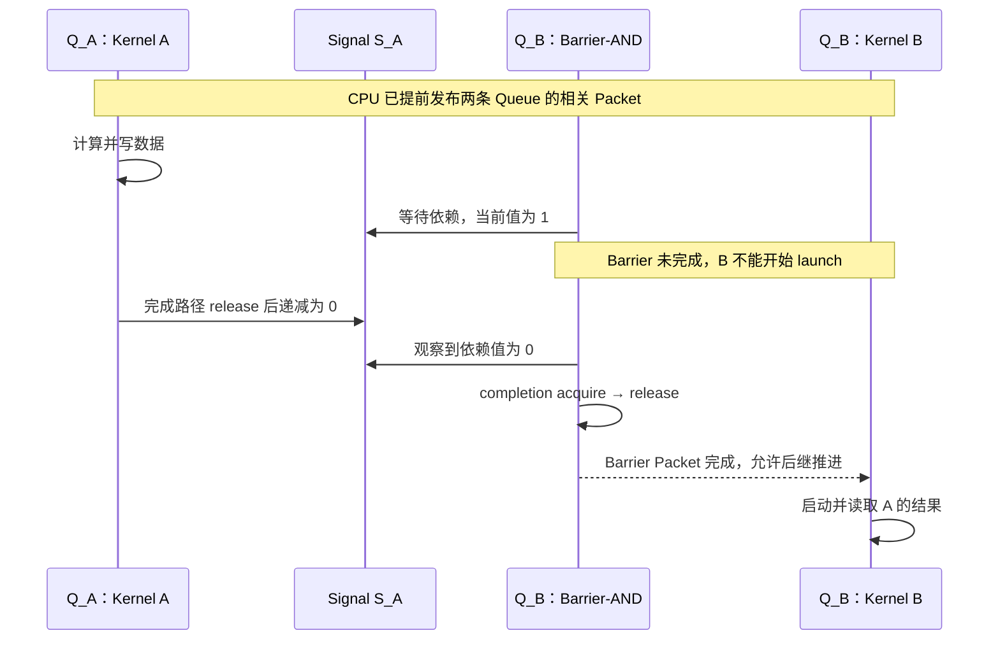

CPU 可以先发布这些 Packet，再去做其他工作。依赖等待由设备处理，不要求 CPU 先等 A 完成后才提交 B。

为使图中的依赖具体落到字段上，可以采用下面这组**教学配置**。假设所选内存满足双方访问条件，相关 fence 使用 system scope；实际 Runtime 可根据参与的 Agent 和既有同步选择范围。

| Packet 或字段                      | 本例设置                            | 设置的目的                               |
| ---------------------------------- | ----------------------------------- | ---------------------------------------- |
| A 的`completion_signal`          | `S_A` 的有效句柄，Signal 初值为 1 | A 完成后把`S_A` 递减为 0               |
| A 的 release scope                 | `SYSTEM`                          | 为 A 写入结果后的通信提供 release        |
| Barrier 的 type                    | `BARRIER_AND`                     | 要求所有非空依赖满足条件                 |
| Barrier 的`dep_signal[0]`        | `S_A` 的句柄                      | 指定要等 A 的完成状态                    |
| Barrier 的`dep_signal[1..4]`     | 空句柄，即 handle 为 0              | 不增加其他依赖；空依赖按已满足处理       |
| Barrier 的 barrier bit             | `0`，本例只要求等待 `S_A`       | 不额外要求 Q_B 的其他前序工作全部完成    |
| Barrier 的 acquire / release scope | `SYSTEM` / `SYSTEM`             | 在依赖满足后执行本 Packet 的同步         |
| Barrier 的`completion_signal`    | 空句柄                              | 本例不单独向 CPU 报告这个 Barrier 的完成 |
| Barrier 的保留字段                 | 全部为 0                            | 满足 Packet 格式要求                     |

`dep_signal` 与 `completion_signal` 方向不同：前者列出**这个 Barrier 要等谁**，后者指定**这个 Barrier 完成时更新谁**。把 `S_A` 放进 Barrier 自己的 `completion_signal`，并不能建立等待 A 的条件。

> **[SPEC]** ROCr `ba56a24c6132`，[`runtime/hsa-runtime/inc/hsa.h`](./2.源码/rocr-runtime/runtime/hsa-runtime/inc/hsa.h) 第 3126～3164 行定义 `hsa_barrier_and_packet_t`：一个 Header、5 个 `dep_signal`、保留字段和可选 Completion Signal。第 3146～3149 行的英文说明表示“依赖 Signal 的句柄可以为 0，Packet Processor 将其视为已满足”。

Barrier-AND 使用 Signal 值为 0 的依赖条件。为保证它完成，应用需要让依赖 Signal 到达 0 后保持为 0，直到 Barrier Packet 完成；还必须保留 Signal 对象。本例只有 `S_A` 一个有效依赖。如果刚看到 A 完成就把 `S_A` 重置为 1，Q_B 可能尚未完成等待，原来正确的依赖会被破坏。

Barrier Packet 的 fence 位置也与 Kernel Dispatch 不同：

```text
Kernel Dispatch：launch acquire → active 执行 Kernel → completion release → 更新完成 Signal
Barrier-AND    ：active 等待依赖 → completion acquire → release → 更新可选完成 Signal
```

Barrier 要在依赖满足后 acquire，才能参与获取依赖任务已经 release 的结果。它完成之前，Packet Processor 不开始 Q_B 后继 Packet 的 launch。这个后继阻挡来自 `BARRIER_AND` 类型本身，即使 Barrier 的 Header `barrier=0` 也存在；如果把 Header barrier 设为 1，则会再增加“启动该 Barrier 前，先等 Q_B 的全部前序 Packet 完成”的要求。

> **[SPEC]** [HSA System Architecture 1.2](https://hsafoundation.com/wp-content/uploads/2021/02/HSA-SysArch-1.2.pdf) 第 2.9.2、2.9.8 节规定 Barrier 的等待、后继阻挡和完成阶段的 fence 顺序，并要求依赖值稳定为 0 才能保证完成。

**[BOUNDARY]** 两条 HIP Stream 可能复用同一条底层 Queue，不能只凭 Stream 名称推断出图中的跨 Queue 关系。完整 Event wait-list 转换、Host 等待与跨 Queue 批处理策略留到 Runtime 调度专题。

### 7.4 Runtime 怎样跟踪一批 Packet 的完成

一个 Kernel Packet 可以把 `completion_signal.handle` 设为 0。Kernel 仍按协议执行完成阶段，只是没有独立 Signal 更新供外部观察。若一批任务只需要在全部完成时通知一次 CPU，Runtime 可以在批次末尾插入一个带 Signal 的 Marker。

Marker 是高层“完成标记”的称呼，不要求固定使用某一种 Packet。下面沿用上一节的 Barrier-AND，设置空依赖、`barrier=1`，并使用初值为 1 的 `S_end`：

```text
同一 AQL Queue 的 Packet 顺序

Kernel A                  Kernel B                  Marker M
completion_signal = 0  →  completion_signal = 0  →  type = BARRIER_AND
                                                   barrier = 1
                                                   dep_signal[0..4] = 空句柄
                                                   completion_signal = S_end

M 的 barrier bit：等 A、B 及同 Queue 更早的工作完成
        ↓
M 的依赖项为空：无需额外等待其他 Signal
        ↓
M 完成相应 acquire / release，并把 S_end 从 1 减到 0
        ↓
Runtime 观察 S_end，确认 M 之前的这批工作已经完成
```

这里 `barrier=1` 是关键。如果 M 的 barrier 为 0，且所有依赖项都为空，M 可以在 A/B 只完成 launch、Kernel 仍在执行时就满足自己的依赖并完成。仅把一个带 Signal 的 Packet 放在 Ring 尾部，不能证明所有前序 Kernel 已经结束。

若 Runtime 还要通过 `S_end` 向 CPU 交付这批任务的结果，Marker 必须配有覆盖这些结果的同步范围，CPU 也要以适当的 acquire 观察其完成。这样，`S_end` 才同时用于确认前序工作结束和建立读取结果所需的同步。

固定 CLR 中，是否附加独立 Signal 也有实际分支。调用者先根据 profiling 和 `attach_signal` 决定是否请求 Signal：

> **[SOURCE]** ROCm CLR `81277d69e3352`，[`rocclr/device/rocm/rocvirtual.cpp`](./2.源码/rocm-clr/rocclr/device/rocm/rocvirtual.cpp) 第 1221～1224 行。这段位于 `dispatchGenericAqlPacket()` 中，将本次是否需要 Signal 传给 `HwQueueTracker::ActiveSignal()`。

```cpp
1221:   bool attachSignal = timestamp_ != nullptr || attach_signal;
1222:   // Get active signal for current dispatch if profiling is necessary
1223:   packet->completion_signal =
1224:       Barriers().ActiveSignal(kInitSignalValueOne, timestamp_, attachSignal);
```

第 1222 行注释的意思是“需要 profiling 时，为当前 Dispatch 取得 Signal”。实际判断还包含调用者传入的 `attach_signal`；第 1223～1224 行把返回句柄写入 Packet 的完成字段。

对应的被调用函数位于同一文件较前位置。下面只展示“不需要 Signal”时的完整返回分支；需要 Signal 的后续管理逻辑从第 556 行继续：

> **[SOURCE]** ROCm CLR `81277d69e3352`，[`rocclr/device/rocm/rocvirtual.cpp`](./2.源码/rocm-clr/rocclr/device/rocm/rocvirtual.cpp) 第 542～554 行。`attach_signal` 为 false 时，函数清理当前 Command 的硬件事件关联并返回空句柄。

```cpp
542: hsa_signal_t VirtualGPU::HwQueueTracker::ActiveSignal(hsa_signal_value_t init_val, Timestamp* ts,
543:                                                       bool attach_signal) {
544:   amd::Command* cmd = gpu_.command();
545:   // If no signal is needed, decrement the refcount and clear the hw_event of current command
546:   if (!attach_signal) {
547:     if (nullptr != cmd) {
548:       if (cmd->HwEvent() != nullptr) {
549:         reinterpret_cast<ProfilingSignal*>(cmd->HwEvent())->release();
550:       }
551:       cmd->SetHwEvent(nullptr);
552:     }
553:     return hsa_signal_t{0};
554:   }
```

第 545 行注释表示“不需要 Signal 时，减少已有引用并清空当前命令的硬件事件关联”。第 546～552 行保留了 Command 和已有事件是否存在的判断，第 553 行才返回空句柄。

两段源码合起来证明：当前 CLR 根据本次提交是否需要完成状态来决定是否附加独立 Signal。后面若请求阻塞提交且句柄仍为空，第 1247～1251 行还会补取 Signal；fence 与 profiling 的相关准备见同文件第 1195～1238 行。

高层还会维护 batch 和 Event 状态，因此几个常见对象应按用途区分：

| 对象               | 保存或表达什么                               | 与一个 Kernel Packet 的关系                             |
| ------------------ | -------------------------------------------- | ------------------------------------------------------- |
| Completion Signal  | HSA 同步值；完成路径更新，等待者检查约定条件 | 可以由该 Packet 指定，也可以省略独立 Signal             |
| Barrier-AND Packet | 要等待的 Signal，以及对后继 Packet 的阻挡    | 自己就是一个 AQL Packet，可放在 Kernel 之前或之后       |
| HIP/OpenCL Event   | 高层命令的完成状态、依赖或时间信息           | Runtime 可以把它关联到一个或一批 Packet，不要求一一对应 |
| Linux`dma_fence` | KMD/DRM 中的异步工作完成对象                 | 普通 AQL Packet 不自动拥有一个对应的`dma_fence`       |

`dma_fence` 的基础和两条提交路径见 [00_GPU系统基础](./00_GPU系统基础.md)。本节保留各对象的用途，不展开 DRM scheduler 的完成传播。

### 7.5 完成之后怎样读取结果和回收任务资源

回到 Packet 37：CPU 已通过带 acquire 的等待观察到 Signal 37 为 0。若 C 已满足 [第 7.0 节](#70-从-gpu-写结果到-cpu-观察完成)中的 CPU 访问条件，就可以读取结果。接下来能否复用或释放某块内存，还要看有没有其他工作继续使用它。

例如，Packet 38 也读取同一个 A 数组。那么 Packet 37 完成后，本次独占的 Kernarg 可以复用，A 却要继续保留到 Packet 38 也不再访问它。这个判断跨 Queue 同样成立：对象被几条 Queue 使用，就需要考虑所有尚未结束的使用者。

下表给出本次完成后各对象的处理依据：

| 对象                    | 本次完成已经允许的动作     | 仍要满足的条件                                                                      |
| ----------------------- | -------------------------- | ----------------------------------------------------------------------------------- |
| C 的结果                | CPU 按相应内存类型读取     | C 可由 CPU 访问，且所需同步、共享或访问权条件已满足；设备专用结果先走适用的复制路径 |
| 本次独占 Kernarg        | 复用或释放这份参数区       | 没有其他任务引用同一份参数区                                                        |
| A/B/C 与 Kernel 代码    | 结束本次任务对它们的使用   | 其他未完成 Packet、Queue 或 CPU 访问者也已不再使用，才可整体回收                    |
| Completion Signal       | 把本次观察到的值解释为完成 | 更新者、依赖 Packet 和等待者全部用完后，才能重置、复用或销毁                        |
| Queue、Ring 和 Doorbell | 继续提交下一次任务         | 保持 Queue 有效；单个 Packet 完成不触发整条 Queue 的释放                            |

Signal 的复用尤其容易早于依赖者。以下顺序会破坏第 7.3 节的跨 Queue 等待：

```text
Kernel A 完成：S_A 从 1 变为 0
    ↓
CPU 观察到 0，立刻把 S_A 重置为 1，准备给下一次任务使用
    ↓
Q_B 的 Barrier-AND 仍在使用 S_A，尚未完成
    ↓
旧依赖条件被改掉，Barrier 不能再保证按原计划完成
```

正确的复用时点取决于 Signal 的全部使用者，而不只取决于创建它的线程是否已经等到 0。固定 CLR 的 Signal 管理在复用分支中还会等待相关操作，以避免 GPU 等待者与 CPU 重置发生竞争。

> **[SOURCE]** ROCm CLR `81277d69e3352`，[`rocclr/device/rocm/rocvirtual.cpp`](./2.源码/rocm-clr/rocclr/device/rocm/rocvirtual.cpp) 第 575～584 行。`HwQueueTracker::ActiveSignal()` 在没有新建 Signal 的分支中调用 `WaitCurrent()` 和 `WaitNext()`；第 581～582 行注释说明，后一次等待用于避免尚未触发的 GPU 等待者与随后 CPU 重置 Signal 之间的竞争。这是该 Runtime 的复用管理实现，不是应用仅凭两个函数名就能套用的通用回收方法。

Ring slot 可以更早复用，见 [第 6.5 节](#65-槽位释放后哪些资源仍须保留)；整条 Queue 则可能仍有 Packet 38、39 等其他工作。下一章说明如何停止提交、停止设备对 Queue 的访问，并释放 Queue 资源。

## 8. Queue 怎样销毁，错误发生在哪一层

### 8.0 正常停止与销毁需要满足哪些条件

第 7 章中，CPU 通过 Signal 确认一次 `vector_add` 已完成。Q0 的 Ring 和 Doorbell 此时仍可用于下一次任务。只有应用不再需要 Q0，或 Q0 已出错而需要清理时，才处理整条 Queue 的停止与销毁。

停止的目标是结束对 Queue 资源的访问；等待任务完成的目标是取得这次计算的结果。例如 Kernel 只写完一部分 C 时就停止 Q0，即使停止操作成功返回，也不能把这部分 C 当成完整结果。

HSA 提供 `hsa_queue_inactivate()` 和 `hsa_queue_destroy()`，下表分别简称 Inactivate 和 Destroy，并与任务等待作对照：

| 操作                  | 完成的事情                                                          | 调用者仍需负责什么                                                 |
| --------------------- | ------------------------------------------------------------------- | ------------------------------------------------------------------ |
| 等待所需 Signal/Event | 确认有关任务完成，并按同步规则使用结果                              | 决定是否继续使用 Queue                                             |
| Inactivate            | 使 Queue 停止处理工作，未完成执行可能被终止，后续 Packet 不再被消费 | Queue 已不可继续提交；后续通过 Destroy 回收仍保留的 Queue 自有资源 |
| Destroy               | 包含停止操作，并回收 Queue 结构、Ring、Doorbell Signal 等           | 此后不能再访问该 Queue；需要使用的结果应在调用前完成等待           |

> **[SPEC]** ROCr `ba56a24c6132`，[`runtime/hsa-runtime/inc/hsa.h`](./2.源码/rocr-runtime/runtime/hsa-runtime/inc/hsa.h) 第 2507～2552 行。Destroy 使尚未完成 completion phase 的 Packet 状态变为未定义；Inactivate 阻止新 Packet 被处理。两者都不能把被中止的工作当成正常完成。

如果结果仍有用，正常顺序是：

```text
通知所有使用 Q0 的 Producer 停止提交，并等待它们退出提交过程
    → 等待需要保留结果的任务完成，读取或保存所需结果
    → 确认没有线程还会访问 Q0 的 Ring 或 Doorbell
    → hsa_queue_destroy(Q0)
```

> **[SPEC]** HSA System Architecture 1.2 第 2.9.3 节规定 Destroy 包含隐式 Inactivate；不要求应用总是先显式调用两个 API。实现可能等待 Wave 自然结束，也可能终止无法及时结束的 Wave。

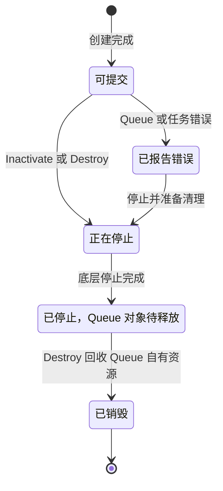

图中是停止操作成功时的概念性生命周期，不是某代硬件的状态位。显式 Inactivate 可以停在“已停止，Queue 对象待释放”；直接 Destroy 则继续完成资源回收。停止超时或设备出错时，不能直接沿图走到“已销毁”，需要按 [第 8.4 节](#84-异常清理与错误隔离有哪些边界)核对实际分支。

Queue 是否驻留，以及某个 Packet 是否 active，仍分别按 [第 3.0 节](#30-queue-可用驻留与-packet-执行分别表示什么)和[第 6.2 节](#62-packet-的启动准备执行与完成收尾)解释。

### 8.1 ROCr 到 KFD 的资源释放顺序

下面假设所有 Producer 已退出 Q0 的提交过程，应用需要的任务也已完成。本节追踪正常销毁：ROCr 先结束可能继续访问 Queue 的异步错误处理器，再经 HSAKMT 请求 KFD 停止并销毁底层 Queue，最后回收 Runtime 创建的内存和内部对象。

同一块 Ring 在第二章取得过两种 KFD 保护，因此释放时也有两个动作：撤销对 GPUVM 映射的使用记录，以及归还对 BO 的引用。Ring 原始分配的解除映射与释放还在更外层。看源码时，需要分清当前函数处理的是哪一种持有关系。

> **[SOURCE]** ROCr `ba56a24c6132`，[`runtime/hsa-runtime/core/runtime/amd_aql_queue.cpp`](./2.源码/rocr-runtime/runtime/hsa-runtime/core/runtime/amd_aql_queue.cpp) 第 342～395 行。第 343～362 行终止并等待相应错误处理器，第 364 行调用 Inactivate；之后才释放 Scratch、内部 Signal、Queue 内存、共享中断事件及 PM4 缓冲区。

跨越 Runtime/驱动边界的 `Inactivate()` 很短：

> **[SOURCE]** ROCr `ba56a24c6132`，[`runtime/hsa-runtime/core/runtime/amd_aql_queue.cpp`](./2.源码/rocr-runtime/runtime/hsa-runtime/core/runtime/amd_aql_queue.cpp) 第 620～628 行。active_ 的原子交换使底层 DestroyQueue 请求只由首次停止执行。

```cpp
620: hsa_status_t AqlQueue::Inactivate() {
621:   bool active = active_.exchange(false, std::memory_order_relaxed);
622:   if (active) {
623:     auto err = agent_->driver().DestroyQueue(queue_id_);
624:     assert(err == HSA_STATUS_SUCCESS && "Destroy queue failed.");
625:     atomic::Fence(std::memory_order_acquire);
626:   }
627:   return HSA_STATUS_SUCCESS;
628: }
```

英文断言信息“Destroy queue failed”表示驱动销毁失败。第 621～627 行将旧 `active_` 值保存下来，仅在旧值为 true 时调用驱动并执行 acquire fence。这里解释的是正常成功路径和重复停止保护；不能把清软件标志本身当成硬件已经停止。

第 2.6.4 节已经区分了 BO 引用与映射使用计数。下表中的“减少”只针对 Q0 本次取得的保护，不表示所有使用者都已退出：

| 状态                                     | 用途                          | 减少它意味着什么                                    |
| ---------------------------------------- | ----------------------------- | --------------------------------------------------- |
| GPUVM 中 BO 关联对象的`queue_refcount` | 记录 Queue 对该映射关系的使用 | 撤销 Queue 使用记录，本身不删除 PTE，也不释放 BO    |
| Queue 持有的 BO 引用                     | 保持 Ring、索引等承载对象存活 | 解除 Queue 对该 BO 的持有，最终释放还取决于其他引用 |

> **[SOURCE]** Linux `248951ddc14d`，[`drivers/gpu/drm/amd/amdkfd/kfd_queue.c`](./2.源码/linux/drivers/gpu/drm/amd/amdkfd/kfd_queue.c) 第 377～406 行。unref 路径在当前 GPUVM 中找到 BO 关联对象，再降低 queue_refcount；第 351～374 行的 release_buffers 则另外解除 BO 和相应 SVM 资源持有。

下面沿用 A 在 GPU0 上的 Q0，展示正常、成功的外层调用顺序。KFD 的销毁入口持有 A 的进程 mutex，再调用 A 的 PQM；PQM 找到 Q0 及其 PDD，随后调用 GPU0 的 DQM。DQM 内部的资源记录和硬件操作按各调度路径处理。

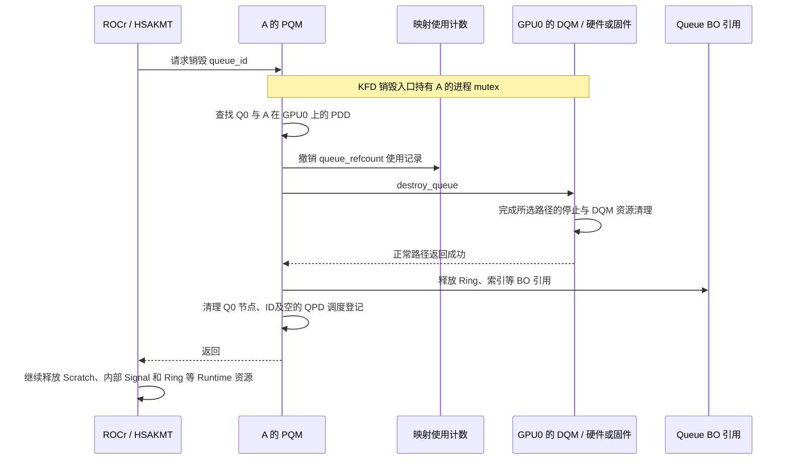

图中最容易误读的是“先减少计数，再停止硬件”。减少 `queue_refcount` 只是撤销 Q0 的使用记录，PTE 仍在。此时 KFD 的销毁调用还持有 A 的进程 mutex；同一进程的 KFD GPU UNMAP 也需要这把锁，只能等待当前销毁调用退出。

DQM 正常完成停止后，PQM 才释放 Queue 持有的 BO 引用。等调用返回用户态，Runtime/HSAKMT 才继续处理 Ring 原始分配的解除映射与释放。保护正常顺序的是这几个动作的配合，单独一个计数无法完成全部工作。

> **[SOURCE]** Linux `248951ddc14d`，[`kfd_chardev.c`](./2.源码/linux/drivers/gpu/drm/amd/amdkfd/kfd_chardev.c) 第 449～464 行在进程 mutex 保护下销毁 Queue；第 1392～1444 行显示 `kfd_ioctl_unmap_memory_from_gpu()` 同样在持有该锁后查找内存对象并调用 GPU UNMAP。这说明正常调用之间的串行关系；异常停止仍需按第 8.4 节判断。

在 `pqm_destroy_queue(pqm, qid)` 中，第 509～527 行先根据 ID 找 Queue 节点与 PDD；第 529～534 行处理调试内核队列。下面保留用户 AQL Queue 分支以及公共返回尾部，异常条件也保留在原位置：

> **[SOURCE]** Linux `248951ddc14d`，[`drivers/gpu/drm/amd/amdkfd/kfd_process_queue_manager.c`](./2.源码/linux/drivers/gpu/drm/amd/amdkfd/kfd_process_queue_manager.c) 第 536～566 行。先降低映射使用计数，再调用 DQM；满足继续清理的返回条件后，才释放 Queue buffer 和软件节点。

```c
536: 	if (pqn->q) {
537: 		retval = kfd_queue_unref_bo_vas(pdd, &pqn->q->properties);
538: 		if (retval)
539: 			goto err_destroy_queue;
540:
541: 		dqm = pqn->q->device->dqm;
542: 		retval = dqm->ops.destroy_queue(dqm, &pdd->qpd, pqn->q);
543: 		if (retval) {
544: 			pr_err("Pasid 0x%x destroy queue %d failed, ret %d\n",
545: 				pdd->pasid,
546: 				pqn->q->properties.queue_id, retval);
547: 			if (retval != -ETIME && retval != -EIO)
548: 				goto err_destroy_queue;
549: 		}
550: 		kfd_procfs_del_queue(pqn->q);
551: 		kfd_queue_release_buffers(pdd, &pqn->q->properties);
552: 		pqm_clean_queue_resource(pqm, pqn);
553: 		uninit_queue(pqn->q);
554: 	}
555:
556: 	list_del(&pqn->process_queue_list);
557: 	kfree(pqn);
558: 	clear_bit(qid, pqm->queue_slot_bitmap);
559:
560: 	if (list_empty(&pdd->qpd.queues_list) &&
561: 	    list_empty(&pdd->qpd.priv_queue_list))
562: 		dqm->ops.unregister_process(dqm, &pdd->qpd);
563:
564: err_destroy_queue:
565: 	return retval;
566: }
```

英文错误信息记录失败的 PASID、Queue ID 和错误码。正常路径中，第 537 行撤销映射使用记录，第 542 行进入 DQM，第 551～553 行释放 buffer 引用与软件 Queue，第 556～562 行回收节点、ID，并按需注销空的 Process-Device 调度状态。第 543～549 行的异常继续条件在 [第 8.4 节](#84-异常清理与错误隔离有哪些边界)解释。

> **[SOURCE]** Linux `248951ddc14d`，[`drivers/gpu/drm/amd/amdkfd/kfd_device_queue_manager.c`](./2.源码/linux/drivers/gpu/drm/amd/amdkfd/kfd_device_queue_manager.c) 第 995～1083 行。No-HWS 在 DQM 内部处理硬件槽位、Doorbell、停止及 MQD 释放；这些操作发生在外层 release_buffers 之前。

> **[SOURCE]** Linux `248951ddc14d`，[`drivers/gpu/drm/amd/amdkfd/kfd_device_queue_manager.c`](./2.源码/linux/drivers/gpu/drm/amd/amdkfd/kfd_device_queue_manager.c) 第 2693～2780 行。CPSCH/MES 同样在 DQM 内部处理 Doorbell、运行列表或 Remove Queue，并清理 MQD；因此不能把 MQD、Doorbell 的全部释放画在 PQM 释放 BO 之后。

> **[SOURCE]** Linux `248951ddc14d`，[`drivers/gpu/drm/amd/amdkfd/kfd_chardev.c`](./2.源码/linux/drivers/gpu/drm/amd/amdkfd/kfd_chardev.c) 第 449～464 行。外层持有进程 mutex 调用 pqm_destroy_queue，使它与同一进程的相关 KFD 状态操作串行。

例如，Q0 和 Q1 的某个 Queue buffer 使用同一 BO 在同一 GPUVM 中的关联对象时，销毁 Q0 只归还 Q0 取得的引用和使用记录，Q1 的持有继续存在。即使最后一个 Queue 释放了自己的 BO 引用，BO 是否立即销毁仍取决于原始分配及其他引用。`queue_refcount` 也按实际取得次数累计，不能简单当作 Queue 条数。

Runtime 这里释放的 Signal 是 Queue 自有的内部资源。销毁 Q0 不会替应用销毁应用创建的 Completion Signal；若 Q1 的依赖 Packet 或 CPU 等待线程仍在使用该 Signal，就须继续保留。所有使用者结束后，应用才能重置或销毁它。

### 8.2 创建失败后怎样回滚已取得的资源

第二章的创建过程跨越多个层：ROCr 先取得 Ring，KFD 再取得对已有 buffer 的保护，DQM 随后取得 Doorbell、MQD 和调度资源。某一层失败时，该层归还自己已取得的资源，并把错误传回外层；外层再处理自己的分配。

例如 A 已经有可用的 Q0，现在新建 Q1。如果 Q1 的 MQD 分配失败，本次创建必须退出，但 Q0 仍需保留。下面按失败位置说明回滚范围；表中列的是“本次可能取得的资源”，并不表示每条失败路径都已走完前面的全部步骤。

| 失败位置                                 | 本次可能已取得什么                                                        | 回滚范围                                                                 |
| ---------------------------------------- | ------------------------------------------------------------------------- | ------------------------------------------------------------------------ |
| KFD 参数检查                             | 内核尚未取得本次 Queue 的 buffer 引用；用户态可能已经分配 Ring 和辅助资源 | 内核返回错误，外层继续清理本次分配                                       |
| 已有 Ring/索引等 buffer 的校验与引用获取 | 可能已取得前面几个 BO 引用                                                | 撤销本次已增加的引用与使用计数                                           |
| Doorbell 或 MQD 分配                     | 对已有 Queue buffer 的保护，以及部分调度资源                              | 按已完成步骤归还本次资源                                                 |
| HQD 装载或 HWS/MES 提交                  | MQD、Doorbell 及相应软件登记                                              | 按该失败分支处理调度状态，再回滚本次对象；涉及硬件错误时还需结合恢复路径 |

第 2.5.4 节保留了创建入口的失败清理，第 2.6.5～2.6.6 节解释了 buffer 获取过程的回滚。这里的“buffer 获取”是检查已有资源并增加引用；Ring 本身的申请和 GPU 映射在第 2.3 节已经完成，失败时仍要由各自的分配路径清理。

> **[SOURCE]** Linux `248951ddc14d`，[`drivers/gpu/drm/amd/amdkfd/kfd_chardev.c`](./2.源码/linux/drivers/gpu/drm/amd/amdkfd/kfd_chardev.c) 第 387～447 行。buffer 获取或 PQM 创建失败时，入口通过对应错误标签撤销本次持有。

> **[SOURCE]** Linux `248951ddc14d`，[`drivers/gpu/drm/amd/amdkfd/kfd_device_queue_manager.c`](./2.源码/linux/drivers/gpu/drm/amd/amdkfd/kfd_device_queue_manager.c) 第 866～881 行。No-HWS 的清理标签按 MQD、Doorbell、硬件 Queue 资源和必要时的 VMID 顺序回滚。

> **[SOURCE]** Linux `248951ddc14d`，[`drivers/gpu/drm/amd/amdkfd/kfd_device_queue_manager.c`](./2.源码/linux/drivers/gpu/drm/amd/amdkfd/kfd_device_queue_manager.c) 第 2214～2232 行。CPSCH/MES 创建失败时撤销 Queue 列表、计数、MQD、Doorbell 和相关辅助资源。

回到“Q1 的 MQD 分配失败”这个例子，回滚的层次可以写成：

```text
DQM：MQD 未取得 → 归还本次已取得的 Doorbell/HQD 等资源
    ↓ 返回错误
PQM 与 KFD 创建入口：撤销本次软件创建及 buffer 引用、映射使用记录
    ↓ 返回错误
HSAKMT / ROCr：清理本次创建过程中由各自取得的辅助资源与 Ring 分配

原有 Q0：自己的 Ring、引用和调度状态继续保留
```

图中以普通新建失败为例，清理只覆盖实际取得的资源。若 KFD Queue 已创建成功，而 ROCr 后续初始化才失败，则还需要请求销毁这条底层 Queue，不能只释放 Ring。

> **[SOURCE]** ROCr `ba56a24c6132`，[`amd_aql_queue.cpp`](./2.源码/rocr-runtime/runtime/hsa-runtime/core/runtime/amd_aql_queue.cpp) 第 114～117 行在 Ring 分配成功后建立 `RingGuard`，失败退出时调用 `FreeQueueMemory()`；第 269～286 行在驱动创建成功并保存 Queue 句柄后建立 `QueueGuard`，负责请求 `DestroyQueue()`。这两处守卫分别对应 Ring 和底层 Queue，不是同一种资源。

这些守卫记录失败退出时的清理动作。构造成功时，第 335～339 行通过 `Dismiss()` 取消本次回滚，资源交由后续正常生命周期管理；否则离开作用域时，已建立的守卫负责清理。对 Ring 与底层 Queue 而言，后建立的 Queue 守卫先请求销毁底层 Queue，之后才轮到 Ring 守卫释放内存。销毁请求如果遇到硬件错误，仍需按第 8.4 节判断停止是否可靠。

A 在 GPU0 上的 PDD、共享 Doorbell slice、Q0 的资源和已有 GPUVM 各有自己的生命周期，不能随 Q1 一概释放。错误返回也不保证此前从未修改任何状态；需要沿已执行的分支判断哪些资源已归还。

### 8.3 怎样区分 Queue Full、Fault、Hang 和 Reset

假设 CPU 一直提交不进去，或等待 Signal 时迟迟得不到 0。两种现象都像“卡住了”，但前者可能只是在等待空槽，后者可能是在等待依赖、执行长任务，也可能遇到了设备错误。

下面四个名称不能混着使用。Queue Full 描述提交容量，Fault 描述访问失败，Hang 描述长时间没有进展，Reset 则是驱动采取的一类恢复动作：

| 名称            | 含义                                                    | 常见处理方向                             |
| --------------- | ------------------------------------------------------- | ---------------------------------------- |
| Queue Full      | Producer 的预留进度领先槽位释放进度，当前目标槽位不可写 | 等待 rptr、限制提交速率或向上层施加背压  |
| GPU Page Fault  | 某次地址翻译或权限检查失败                              | 根据路径恢复映射与重试，或终止受影响工作 |
| Queue Hang      | Queue 在预期条件下长时间没有进展                        | 分析依赖、抢占、卸载或故障升级           |
| GPU/Agent Reset | 恢复设备状态的一类动作                                  | 停止受影响工作并重建可恢复状态           |

例如第 5.1 节的 4 槽 Ring 中，Packet 4 已预留而 Packet 0 尚未释放，Producer 等待 slot 0 就是 Queue Full。只要消费者继续释放槽位，这次等待可以正常结束。这里的“背压”指让提交方等待或降低提交速度，避免无限堆积待处理工作。

若同一时刻驱动报告了访问 Ring GPUVA 的 Fault，则还需要处理地址翻译问题；仅减少提交速度不能修复无效映射。Reset 能让设备尝试恢复工作能力，但旧任务是否完成、输出是否可用，仍须根据任务状态判断。

仅观察 `read_index` 静止不能确定原因：Queue 可能未驻留、队首 Packet 仍为 `INVALID`、Barrier 正在等待依赖，也可能遇到资源压力、长任务、Fault 或其他错误。需要继续结合 Queue 状态、Header、Signal 和错误报告。

若已有故障地址，先结合 PASID/VMID 确认所属进程和地址空间，再与该进程的分配记录对照。同一个数值在不同 GPUVM 中可能对应不同对象。下表用于识别“哪一次访问失败”，不能仅凭地址所在范围断言唯一原因：

| 地址类型                         | 受影响的访问       | 首要关联信息                             |
| -------------------------------- | ------------------ | ---------------------------------------- |
| Ring GPUVA                       | CP/MEC 取 Packet   | Ring mapping、VMID/PASID、Queue 生命周期 |
| `kernel_object` 对应的执行对象 | 读取执行信息或代码 | Code Object 装载、地址与访问权限         |
| `kernarg_address`              | 参数读取           | 参数区 mapping、对齐与生命周期           |
| A/B/C GPUVA                      | Shader 访问数据    | 数据映射、权限及适用的 SVM 状态          |
| Completion Signal 的承载对象     | 完成状态更新       | Runtime Signal 对象的可访问性与使用者    |

**[BOUNDARY]** Fault 是否可重放、是否需要迁移页面，以及 Reset 如何恢复某代 GPU，属于后续 HMM/SVM、MMU 和故障恢复专题。这里保留定位入口，不从一个故障地址推导完整恢复算法。

### 8.4 异常清理与错误隔离有哪些边界

第 8.1 节的正常路径中，DQM 成功停止 Queue，PQM 才继续清理。异常路径需要分别回答两件事：软件已经释放了哪些对象，以及设备是否还可能访问这些对象。函数返回错误或继续执行清理，都不能单独回答后一个问题。

[第 8.1 节](#81-rocr-到-kfd-的资源释放顺序)保留的 `pqm_destroy_queue()` 对 DQM 返回值作了不同处理：

| DQM 返回值                                | PQM 的后续动作                   | 解释边界                                                            |
| ----------------------------------------- | -------------------------------- | ------------------------------------------------------------------- |
| 0                                         | 继续清理 Queue buffer、节点和 ID | 按正常成功路径理解                                                  |
| `-ETIME`（超时）或 `-EIO`（I/O 错误） | 记录错误后仍继续上述清理         | 需要继续追踪停止、Hang/Reset 路径；本函数没有给出硬件停止的完整证据 |
| 其他错误                                  | 跳到返回路径，跳过后续清理       | 不能当成已经完整销毁                                                |

**[INFERENCE]** 在超时或 I/O 错误路径上，旧资源能否安全回收，还取决于外层 Hang/Reset 处理是否已经阻止设备继续访问。进程 mutex、`queue_refcount` 和 BO 引用用于保护软件操作与资源生命周期，硬件停止仍需要相应的停止或恢复机制保证。

以 DQM 返回 `-ETIME` 为例：PQM 在进入 DQM 前已经降低映射使用计数，收到超时后记录错误，并按第 547 行的条件继续执行 buffer 和节点清理。因此，日志中既可能出现“销毁超时”，又能看到软件 Queue 被移除；这两条记录描述的是不同动作。

此时能否安全回收设备曾经使用的内存，要继续追踪负责停止或 Reset 的外层机制。若 DQM 返回的是其他错误，PQM 会跳过后续清理，但此前已经降低的计数也不会因为函数返回错误自动恢复。读错误路径需要保留这些已经发生的状态变化。

错误隔离还要区分 Queue 与设备范围：

> **[SPEC]** HSA System Architecture 1.2 第 2.9.3 节要求未进入错误状态的同进程其他 Queue 继续处理；无法确定责任 Queue，或无法从检测到的错误恢复时，处理范围可以扩大到其他 Queue 及 Agent Reset。

例如 GPU0 同时运行 A 的 Q0、Q1，错误明确属于 Q0 且能局部处理时，应保留 Q1 的正常处理。若无法判断责任 Queue，或设备状态已经无法局部恢复，处理范围可能扩大，Q1 也可能受到影响。具体范围由错误性质和恢复机制决定。

任务被终止或执行出错后，正常完成阶段可能不再执行，Completion Signal 也可能一直停在 1。Runtime 因而需要通过 Queue 错误状态或回调传播失败，不能让等待者只依赖“最终总会减到 0”的假设。Queue 错误回调也不应直接调用等待该回调退出的 Destroy，否则会形成等待自身结束的死锁。

> **[SPEC]** HSA System Architecture 1.2 第 2.9.3 节规定错误状态、回调及终止后的完成行为，并禁止 Queue 回调调用会等待回调结束的 Queue Destroy。这里的失败传播与第 7 章正常 Signal 完成路径分开处理。

**[BOUNDARY]** 具体停止、隔离与恢复范围取决于 GPU 硬件、固件和错误类型。本文的正常时序不替代错误路径的证据。

### 8.5 进程退出时怎样停止 Queue 并释放地址空间

如果应用没有逐条调用 Destroy 就退出，清理仍必须完成。Q0 引用进程 GPUVM 中的 Ring、索引和辅助资源，未完成 Kernel 还可能访问代码、参数和数组。CPU 线程退出后，这些 GPU 访问不会仅凭线程消失就自动变成安全状态。

以 A 同时拥有 GPU0 上的 Q0、Q1 为例，退出清理要覆盖 A 的全部 Queue；只停掉 Q0，Q1 仍可能访问即将被回收的进程内存。所需的先后关系是：

```text
停止该进程的提交与 Queue 使用
    → 确认受影响的硬件/固件访问已经结束或被可靠阻止
    → 解除 Queue 对 BO 和映射的持有
    → 再回收 Process-Device 与 GPUVM
```

Linux 的 MMU notifier 提供了地址空间释放前通知驱动的入口。固定 KFD 的释放回调先找到对应 `kfd_process`，再调用内部清理函数。该函数的开头如下；前面取消的工作用于避免退出过程中继续执行换出或恢复处理。

> **[SOURCE]** Linux `248951ddc14d`，[`kfd_process.c`](./2.源码/linux/drivers/gpu/drm/amd/amdkfd/kfd_process.c) 第 1376～1393 行将 MMU notifier 的释放事件交给 KFD；下面摘录第 1326～1340 行，展示停止设备侧 Queue 与清理 PQM 的先后关系。

```c
1326: void kfd_process_notifier_release_internal(struct kfd_process *p)
1327: {
1328: 	int i;
1329:
1330: 	kfd_process_table_remove(p);
1331: 	cancel_delayed_work_sync(&p->eviction_work);
1332: 	cancel_delayed_work_sync(&p->restore_work);
1333:
1334: 	/*
1335: 	 * Dequeue and destroy user queues, it is not safe for GPU to access
1336: 	 * system memory after mmu release notifier callback returns because
1337: 	 * exit_mmap free process memory afterwards.
1338: 	 */
1339: 	kfd_process_dequeue_from_all_devices(p);
1340: 	pqm_uninit(&p->pqm);
```

英文注释说明：释放回调返回后，`exit_mmap` 将继续释放进程内存，因此必须先让用户 Queue 退出设备处理并完成清理。第 1330～1332 行移除进程登记、取消相关后台工作；第 1339 行处理该进程在各设备上的 Queue，第 1340 行再清理 PQM 中的 Queue 对象与资源持有。函数后续还处理调试状态，并将 `p->mm` 设为 `NULL`，表示该 CPU 地址空间已不能继续使用。

> **[SOURCE]** Linux `248951ddc14d`，[`kfd_process_queue_manager.c`](./2.源码/linux/drivers/gpu/drm/amd/amdkfd/kfd_process_queue_manager.c) 第 218～243 行的 `pqm_uninit()` 遍历进程 Queue，找到相应 PDD 后归还映射使用记录与 BO 引用，再清理 Queue 和编号位图。它依赖外层先处理设备侧 Queue，不会在这个循环里逐次调用第 8.1 节的 `pqm_destroy_queue()`。

`kfd_process_dequeue_from_all_devices()` 会遍历各份 PDD，并调用各设备 DQM 的 `process_termination`。这个包装函数没有把各 DQM 的返回值汇总成“硬件已停止”的成功结果；其中的 `already_dequeued` 只用于避免重复调用。因此，上面的调用顺序还需要与具体 DQM 的停止和错误恢复路径一起解释。

> **[SOURCE]** Linux `248951ddc14d`，[`kfd_process_queue_manager.c`](./2.源码/linux/drivers/gpu/drm/amd/amdkfd/kfd_process_queue_manager.c) 第 83～102、168～174 行给出逐设备终止调用及防重复标记。该标记是软件调用记录，不能作为所有硬件访问已停止的证据。

`kfd_process` 的最后一个引用归还后，最终释放被安排到工作队列。固定实现先等待相关 Reset 工作结束，再释放剩余内存对象和各份 PDD；PDD 清理中包括 Process-Device Doorbell 资源。这也解释了为什么销毁一条 Queue 时，不能顺手释放整个进程的 Doorbell slice 和 GPUVM。

> **[SOURCE]** Linux `248951ddc14d`，[`kfd_process.c`](./2.源码/linux/drivers/gpu/drm/amd/amdkfd/kfd_process.c) 第 1236～1292 行给出延后释放及 Reset 等待的顺序；第 1223～1229 行等待相关 Reset 工作队列；第 1119～1168 行给出 PDD 及其共享资源的清理。此处只追踪退出所需的对象关系，不展开 MMU notifier、SVM 或 Reset 的内部算法。

**[BOUNDARY]** 上述源码证明了 KFD 安排清理的顺序。设备发生异常时，访问是否已经被可靠阻止，还需要结合 [第 8.4 节](#84-异常清理与错误隔离有哪些边界)的停止与恢复条件，不能仅凭 `pqm_uninit()` 已返回判断。

Doorbell、Queue ID 和硬件槽位还可能被后续 Queue 复用。资源回收必须防止旧 Producer 的迟到访问被误认为新 Queue 的通知；这些设计约束在 [第 9.2 节](#92-面向自研-gpu-的职责与设计约束)集中说明。

## 9. 完整 Dispatch 复盘与知识检索

### 9.0 vector_add 从创建通路到结果返回

本节把前面各小节接回同一次 `vector_add`。先创建可反复使用的 Q0，再选取其中的 Packet 37，追踪它怎样提交、执行并让 CPU 取得结果。两张时序图分别描述 Queue 的创建和一次任务，图中的箭头表示调用或数据交付，不能把所有箭头都理解成一次 ioctl。

沿用第 1.1.1 节的 HIP 入口，假设 Queue 池没有可复用的底层 Queue。`hipStreamCreate` 经 hipamd/rocclr 建立 Stream、HostQueue 和 VirtualGPU，需要新建底层 Queue 时调用 ROCr 的 `hsa_queue_create()`。下面从这次 ROCr 调用开始，省略已经讲过的高层对象转换：

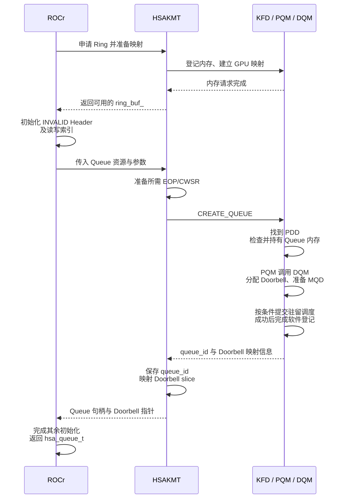

图中的内存请求准备 Ring 的 CPU/GPU 访问关系；后面的 `CREATE_QUEUE` 使用已准备的地址建立 Q0。DQM 的 MQD 准备与调度处理仍位于创建调用内部。ROCr 返回后，VirtualGPU 保存当前绑定的 `hsa_queue_t`，高层 Stream 的创建流程继续完成。

创建完成时，应用有高层 Stream，VirtualGPU 当前绑定一个 `hsa_queue_t`；KFD 有对应 Queue、BO 引用和映射使用记录，MQD 已描述 Queue 配置。HQD 是否已经装入，要看 [所选驻留路径与当前状态](#30-queue-可用驻留与-packet-执行分别表示什么)。普通 Dispatch 从这条已有通路继续。

接下来观察运行一段时间后的 Q0。假设之前的 Packet 0～36 已释放、对应工作也已完成，此时 `read_index = write_index = 37`。本次仍计算 1024 个元素，每组 256 个 Work-item，使用初值为 1 的独立 Signal。Packet 37 在 256 槽 Ring 中使用 slot 37，地址为 `Ring base + 37 × 64`。

下图选取“Doorbell 通知后设备发现 Packet”的一种合法时序。规范也允许硬件在有效 Header 发布后、Doorbell 写入前开始处理；Producer 必须在发布 Header 之前准备完任务所需内容。

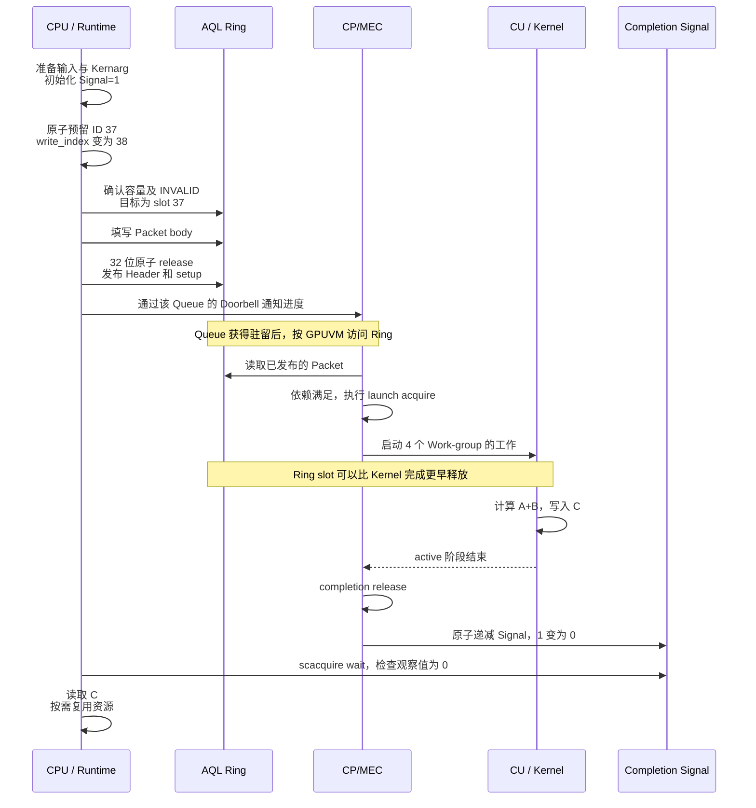

图中的“读取 C”沿用第 7 章的前提：C 已具备 CPU 可访问性及所需同步。若 C 的分配只允许 GPU 直接访问，还要把结果传到 CPU 可访问的内存，Signal 完成不会自动建立这种访问关系。

Packet 37 结束后，Q0 可以继续接收任务。以后 Packet 293 再使用 slot 37 时，复用的是同一块 Ring 中的 64 字节位置；仍要满足第 5.1～5.2 节的容量与释放条件。直到应用不再使用 Q0，才按 [停止条件](#80-正常停止与销毁需要满足哪些条件)和[释放顺序](#81-rocr-到-kfd-的资源释放顺序)回收整条 Queue。

### 9.1 根据观察状态和故障地址定位问题

排查时先确定观察到的是哪一个对象、哪个阶段。例如 `write_index = 42` 只说明编号已经预留到 41，不能直接说明 40、41 都已发布，更不能说明它们已经完成。

下面每一行都是一种独立观察，不是从上到下必然发生的状态机。第二列只写该观察能够支持的结论，第三列给出还需结合的信息：

| 观察状态                           | 当前能够说明什么                                             | 相关对象或后续定位方向                                                                                        |
| ---------------------------------- | ------------------------------------------------------------ | ------------------------------------------------------------------------------------------------------------- |
| 高层 Stream 创建返回               | 高层对象已建立，并按当前策略取得提交通路                     | VirtualGPU 当前绑定的 hsa_queue_t，见第 1.1.1 节                                                              |
| Ring 的`system_allocator()` 返回 | 本次 Ring 分配及本文路径所需映射已完成                       | [2.3.1 地址准备](#231-ring-的地址准备cpu-映射与-gpu-同值映射)；Queue 创建仍需继续                              |
| Queue buffer 检查通过              | KFD 已取得相应 BO 引用并增加映射使用计数                     | [2.6.5 后续创建与失败回滚](#265-检查成功失败和销毁时分别做什么)                                                |
| `hsa_queue_create` 返回成功      | 底层 Queue 的创建流程已完成                                  | [Queue 可用与驻留状态](#30-queue-可用驻留与-packet-执行分别表示什么)                                           |
| write_index 已增加                 | 编号已预留                                                   | [容量边界](#51-packet-id物理槽位与容量约束)与目标 Header                                                       |
| 目标槽位的 Header 已有效           | 对应 Packet 已交给 Packet Processor                          | 结合 Packet ID、rptr 判断是哪一轮使用，再看[通知语义](#54-doorbell-通知哪条-queue哪次提交进度)、驻留和前序条件 |
| CPU 已执行 Doorbell 写入           | Producer 已执行通知动作                                      | 不能只凭 CPU 日志确认设备处理进度，继续看 Queue 与 Packet 状态                                                |
| rptr 已越过某 Packet               | 对应旧槽位已释放                                             | [仍需存活的任务资源](#65-槽位释放后哪些资源仍须保留)                                                           |
| Signal 条件已满足                  | 在 Signal 初始化、更新和复用符合约定时，对应完成条件已被观察 | [acquire 与结果可见性](#70-从-gpu-写结果到-cpu-观察完成)、其他使用者；Signal 数值不单独证明算法计算正确        |
| rptr 长时间未变                    | 仅凭这个值无法区分等待与错误                                 | 驻留、INVALID 洞、Barrier、执行压力和错误报告                                                                 |

两个具体快照可以帮助解释这张表：

- 沿用第 5.5 节已知的提交过程：一个 Producer 预留 40 后尚未发布，另一个已经发布 41。此时 `read_index = 40`、`write_index = 42`，slot 40 为 `INVALID`、slot 41 已有效，未发布的 40 阻挡了后继。仅看到 41 的 Doorbell 日志，不能判断设备“漏执行”。
- `read_index = 38`，Packet 37 的 Signal 仍为 1：slot 37 已释放，但 Kernel 37 仍可能正常执行。是否完成要看对应 Signal 和错误状态，参见第 6.5、7.1 节。

第一个例子依赖已知的 Producer 发布记录。若只有相同的索引与 Header 快照，slot 40 的 `INVALID` 还可能表示消费者已经清除旧 Header、尚未推进 rptr 的短暂状态，不能直接断言 Producer 漏发。

这些例子也假定观察时各值能组成一致快照。运行中的 CPU 和设备会继续更新状态；分别读取的多条日志若来自不同时刻，不能强行组合成同一瞬间。

地址问题则先按用途区分。下表把“CPU 正在提交的地址”和“GPU 访问失败的地址”分开解释，避免看到同一个十六进制值就沿错路径：

| 地址或引用                   | 访问路径中的位置                               | 对应说明                                                                                              |
| ---------------------------- | ---------------------------------------------- | ----------------------------------------------------------------------------------------------------- |
| Ring slot                    | Queue VMID → GPUVM → Ring backing            | [设备取包](#60-cpmec-怎样依据-hqd-读取-ring)                                                           |
| 创建请求中的 Ring 地址和长度 | KFD 在已有 GPUVM mapping 中查找并比较范围      | [2.6.3 完整 mapping 的范围要求](#263-怎样确认-ring-地址和大小正确)                                     |
| Kernel 执行对象              | Packet 的 kernel_object → 目标 ABI 的执行信息 | [代码与对象关系](#42-packet-怎样连接代码参数块和数组)                                                  |
| Kernarg 与 A/B/C 指针        | 参数块与 Shader 数据访问                       | [不同访问者](#61-一个-packet-会引出哪些代码与数据访问)                                                 |
| Doorbell                     | CPU 写入映射的 MMIO 通知窗口                   | 第 2.7 节、[Doorbell 提交](#54-doorbell-通知哪条-queue哪次提交进度)                                    |
| Signal 承载对象              | Packet 完成路径与等待者                        | [完成通知](#70-从-gpu-写结果到-cpu-观察完成)、[故障地址分类](#83-怎样区分-queue-fullfaulthang-和-reset) |

Doorbell 是控制通知访问；Ring、代码和用户数据则沿其对应 GPU 地址空间访问。将它们画在同一张流程图中，不代表它们使用同一条地址翻译路径。

源码定位可以按创建、发布、完成三条调用线查找。创建内部还包含先行的内存申请与映射：

```text
创建：
hsa_queue_create → GpuAgent::QueueCreate → AqlQueue
  → KfdDriver::CreateQueue → hsaKmtCreateQueueExt
  → kfd_ioctl_create_queue → pqm_create_queue → DQM

发布：
submitKernelInternal → dispatchAqlPacket → dispatchGenericAqlPacket
  → 预留 index → 等待容量 → 复制 INVALID Packet
  → packet_store_release → Doorbell Signal store

完成与回收（行为顺序，不是一条连续 CPU 函数调用链）：
Kernel 执行结束 → Packet release → Completion Signal
  → Runtime wait/异步处理 → 高层完成状态 → 资源回收
```

创建线中的 `AqlQueue` 先经 `AllocRegisteredRingBuffer()` 准备 Ring，再调用 `KfdDriver::CreateQueue()`。KFD 入口先检查并持有 Queue buffer，再进入 PQM、DQM。查阅这条线时，应分别跟踪 Ring/索引地址、Queue ID、Doorbell、MQD 和地址上下文。

发布线关注逻辑编号、目标槽位和前 32 位；完成线关注 Signal、依赖、错误状态和剩余使用者。对应固定源码入口列在 [知识点索引](#93-知识点与源码检索入口)中。

### 9.2 面向自研 GPU 的职责与设计约束

**[DESIGN]** 自研 GPU 可以采用不同的对象名、Packet 格式或固件接口，但仍要让 Runtime、驱动和硬件对同一件事有一致理解。例如创建 Q0 返回成功后，Runtime 必须知道能否立即写 Ring；停止 Q0 返回成功后，驱动必须知道何时可以回收它引用的内存。

下图按创建和提交区分职责：上方的 KMD 准备长期 Queue 状态，Runtime 后续反复写 Command Ring；命令前端结合 Queue 配置取包，再交给执行资源。箭头表示输入或结果的传递，不要求所有模块都各自实现为一个独立硬件单元。

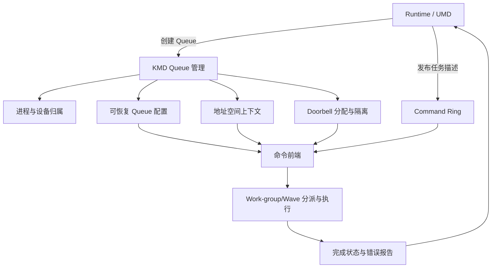

下面把每项职责落到一个需要写清的约定，以及约定不清时会出现的具体问题：

| 职责         | 接口中应明确的约定                                       | 对应的问题                                          |
| ------------ | -------------------------------------------------------- | --------------------------------------------------- |
| Queue 管理   | 创建、更新、停止、销毁的调用者权限与返回含义             | 软件已经返回成功，调用者却无法判断能否提交或释放    |
| Ring 协议    | Packet 大小、索引回绕、容量和发布原子性                  | 新任务覆盖未释放的旧槽位，或硬件读到半写入的 Packet |
| 地址空间     | Queue 的进程身份、页表上下文及访问权限                   | 相同 GPUVA 被放到错误进程的地址空间解释             |
| Doorbell     | 窗口归属、进度编码、未驻留时的通知处理                   | 通知错 Queue，或恢复驻留后遗漏已提交工作            |
| 驻留与恢复   | 有限槽位的分配、配置与执行现场的保存方式                 | 重新装入 Queue 后重复执行或丢失尚未完成的工作       |
| 完成同步     | 结果写入、release、状态更新与等待者 acquire 的顺序和范围 | 完成状态已经可见，所需结果却没有得到同步保证        |
| 错误处理     | 责任对象、可靠停止条件、失败传播与恢复范围               | 任务已终止，调用者仍无限等待正常完成 Signal         |
| 资源生命周期 | 各层持有什么、何时归还、何时可以复用                     | 仍在运行的任务访问已释放或已重新分配的内存          |

Queue 自有的 Ring、索引、MQD 等资源需要在硬件使用期间受到保护；任务特有的代码、参数和数据也需要由 Runtime、驱动和使用者按职责维持生命周期。不能只保护 Ring，却允许仍在执行的任务引用已释放的数据。

第二章的 BO 引用与 `queue_refcount` 提供了两个可对照的职责：保持内存对象存活，以及阻止用户提前解除仍被 Queue 使用的 GPUVM 映射。自研接口需要分别说明这两种保护怎样取得和归还，还要规定软件锁如何与硬件停止协议配合；仅增加一种对象计数不能自动覆盖全部条件。

例如自研的创建接口允许“软件 Queue 已建立、硬件稍后驻留”时，就应明确：此时可以发布 Packet，设备在获得驻留机会后继续处理。停止接口则需要一个可靠的完成条件，让调用者知道旧 Queue 已不能继续访问待释放资源。两种返回都可以叫“成功”，但承诺的动作不同，必须在接口中分别写清。

停止完成条件应来自可信的硬件/固件协议及相应同步，不能只清除软件标志。Reset 后，可恢复的 Queue 配置与已经丢失的执行现场也要分别处理；恢复 MQD 只能帮助重建 Queue 配置，旧 Kernel 是否完成仍需单独处理。

Doorbell 槽位复用还存在迟到通知问题。假设 Q0 曾使用 Doorbell slot 3，销毁后 slot 3 分给 Q1；若旧线程仍持有 Q0 的 Doorbell 指针并再次写入，设备不能把这次访问误当成 Q1 的合法通知。设计需要结合旧 Producer 的退出、在途通知的处理、映射控制与槽位复用规则解决这个问题；也可以在接口中使用 generation，即槽位版本。

**[DESIGN]** 如果采用 generation，接收方必须能够识别并拒绝旧版本通知。仅在软件变量中增加版本、硬件却仍只看到无版本的 MMIO 写，并不能自动解决迟到通知。该机制是自研接口的可选方案，不是本文已经证明的 AMD 通用能力。

### 9.3 知识点与源码检索入口

需要回顾一个概念时，先在下面按名称找到正文；需要验证实现时，再使用正文中的就近摘录或本节末尾的固定源码索引。索引按学习阶段分成三组，同一行的多个链接分别处理该知识点的不同部分。

**创建与内存准备（第 1、2 章）**

| 知识点                                  | 正文位置                                                                                                                                                                         |
| --------------------------------------- | -------------------------------------------------------------------------------------------------------------------------------------------------------------------------------- |
| Stream、VirtualGPU、hsa_queue_t 的关系  | [1.1.1 高层对象](#111-hip-stream从接口调用到各层-queue)、[1.1.2 底层入口](#112-hsa_queue_t底层-aql-提交入口)                                                                       |
| CPU Producer 与 Ring 分配时机           | [2.3 写入者与内存来源](#23-ring-可以来自-system-ram也可以来自设备内存)、[2.3.1 本次内存申请](#231-ring-的地址准备cpu-映射与-gpu-同值映射)、[5.0 后续提交](#50-一次提交包含哪些动作) |
| CPU VA 预留、RW VMA 与按需建立 CPU PTE  | [2.3.1 地址准备与首次访问](#231-ring-的地址准备cpu-映射与-gpu-同值映射)                                                                                                           |
| CPU VA 与 GPUVA 为什么同值              | [2.3.1 地址数值的选择与传递](#231-ring-的地址准备cpu-映射与-gpu-同值映射)、[2.4.1 Queue 创建中的同值地址](#241-create_queue-怎样使用已经映射好的地址)                              |
| Ring 地址、创建请求与 Queue 资源保护    | [2.4 创建请求](#24-hsakmt-把用户态资源整理成-kfd-ioctl)、[2.6 内存检查与保护](#26-kfd-怎样检查并保护-queue-使用的内存)、[2.9 资源约束](#29-queue-创建的资源约束)                    |
| PQM、DQM、PDD、QPD 的职责与归属         | [2.5.1 管理范围](#251-pqm-与-dqm分别管理哪些-queue)、[2.5.2 包含关系](#252-pdd-与-qpd保存进程在目标-gpu-上的信息)、[2.5.3 创建顺序](#253-kfd-怎样完成-q0-的创建)                    |
| Ring 范围检查与已有 GPUVM mapping       | [2.6.1 创建前提](#261-queue-创建前已经准备好的内存)、[2.6.3 起始页与末页](#263-怎样确认-ring-地址和大小正确)                                                                       |
| BO 引用、queue_refcount 与失败回滚      | [2.6.4 两种资源保护](#264-bo-引用与映射使用计数分别保护什么)、[2.6.5 返回与回滚](#265-检查成功失败和销毁时分别做什么)、[8.1 销毁顺序](#81-rocr-到-kfd-的资源释放顺序)               |
| Doorbell slice、slot 与用户态 MMIO 映射 | [2.7 分配与映射](#27-doorbell-是按-process-device-分片按-queue-分槽)、[5.4 提交时使用](#54-doorbell-通知哪条-queue哪次提交进度)                                                    |

**驻留、任务描述与发布（第 3～5 章）**

| 知识点                                         | 正文位置                                                                                                                |
| ---------------------------------------------- | ----------------------------------------------------------------------------------------------------------------------- |
| Queue 可用、驻留与 Packet active               | [3.0 状态区分](#30-queue-可用驻留与-packet-执行分别表示什么)                                                             |
| MQD 字段、HQD 装载、No-HWS                     | [3.1 MQD](#31-kfd-怎样把-queue-属性写入-mqd)、[3.2 装载](#32-no-hwskfd-选择硬件槽位并装载-hqd)                            |
| HWS runlist、MAP_PROCESS、MAP_QUEUES           | [3.3 传统 HWS](#33-hwscpsch通过运行列表交付进程与-queue-状态)                                                            |
| MES Add Queue 的输入与返回边界                 | [3.4 MES](#34-mes通过-add-queue-接口交付状态)                                                                            |
| CWSR、Queue 换出和恢复                         | [3.5 状态保存](#35-queue-换出与恢复时哪些状态需要保留)                                                                   |
| Packet 布局、Kernel 对象与 Kernarg             | [4.1 字段布局](#41-64-字节-packet-的布局与字段分组)、[4.2 对象关系](#42-packet-怎样连接代码参数块和数组)                  |
| Grid、Work-group 与 segment 大小               | [4.0 启动参数](#40-从-vector_add-的启动参数得到任务描述)、[4.3 资源需求](#43-private-segment-与-group-segment-的资源需求) |
| Header、barrier 与 fence scope                 | [4.4 Header 约束](#44-header-怎样约束类型执行顺序和可见性)                                                               |
| CLR 临时 Packet、普通发布与 Graph Capture 返回 | [4.5 CLR 调用](#45-clr-怎样构造临时-packet-并交给发布函数)                                                               |
| Packet ID、rptr/wptr、容量与回绕               | [5.1 索引与槽位](#51-packet-id物理槽位与容量约束)                                                                        |
| SINGLE/MULTI、atomic-add 与 CAS                | [5.2 预留实现](#52-producer-怎样预留编号并等待槽位)                                                                      |
| INVALID、32 位原子 release 与所有权            | [5.3 Header 发布](#53-填写-packet并用-32-位原子写发布-header)                                                            |
| Doorbell、并发发布与 INVALID 洞                | [5.4 通知](#54-doorbell-通知哪条-queue哪次提交进度)、[5.5 多 Producer](#55-多-producer-发布顺序不同时queue-怎样推进)      |
| 发布过程及常见错误                             | [5.6 提交伪代码](#56-完整提交伪代码与常见错误)                                                                           |

**执行、完成、退出与综合查阅（第 6～9 章）**

| 知识点                                   | 正文位置                                                                                                                                                 |
| ---------------------------------------- | -------------------------------------------------------------------------------------------------------------------------------------------------------- |
| 设备取包与各类地址访问                   | [6.0 Ring 访问](#60-cpmec-怎样依据-hqd-读取-ring)、[6.1 访问者](#61-一个-packet-会引出哪些代码与数据访问)                                                  |
| Packet 三阶段与 Kernel 重叠              | [6.2 三阶段](#62-packet-的启动准备执行与完成收尾)、[6.3 重叠条件](#63-同一-queue-的-kernel-何时可以重叠执行)                                               |
| Work-group/Wave 分派                     | [6.4 工作组织](#64-grid-怎样变成-work-group-和-wave)                                                                                                      |
| 槽位、Kernarg、数据与 Signal 的生命周期  | [6.5 生命周期](#65-槽位释放后哪些资源仍须保留)                                                                                                            |
| Signal、acquire wait、超时与唤醒         | [7.0 完成同步](#70-从-gpu-写结果到-cpu-观察完成)、[7.1 等待状态](#71-等待返回超时和唤醒后的状态判断)                                                       |
| 同 Queue 与跨 Queue 的依赖               | [7.2 barrier bit](#72-barrier-bit-怎样约束同一-queue-的前序工作)、[7.3 Barrier-AND](#73-barrier-and-怎样表达跨-queue-依赖)                                 |
| Marker、批处理、Event 与 dma_fence       | [7.4 完成对象](#74-runtime-怎样跟踪一批-packet-的完成)                                                                                                    |
| 完成后读取或传回 C、复用参数与 Signal    | [7.5 结果与任务资源](#75-完成之后怎样读取结果和回收任务资源)                                                                                              |
| Inactivate、Destroy 与 BO 释放顺序       | [8.0 API 条件](#80-正常停止与销毁需要满足哪些条件)、[8.1 实际释放](#81-rocr-到-kfd-的资源释放顺序)                                                         |
| 创建回滚、Fault、Hang 与异常清理         | [8.2 回滚](#82-创建失败后怎样回滚已取得的资源)、[8.3 故障分类](#83-怎样区分-queue-fullfaulthang-和-reset)、[8.4 错误边界](#84-异常清理与错误隔离有哪些边界) |
| 进程退出、PQM 清理与 PDD 共享资源        | [8.5 退出顺序](#85-进程退出时怎样停止-queue-并释放地址空间)                                                                                               |
| 一次完整 vector_add 与状态快照定位       | [9.0 完整过程](#90-vector_add-从创建通路到结果返回)、[9.1 状态与地址](#91-根据观察状态和故障地址定位问题)                                                  |
| 自研 Queue 接口、可靠停止与迟到 Doorbell | [9.2 职责与设计约定](#92-面向自研-gpu-的职责与设计约束)                                                                                                   |

> **[SOURCE] 固定源码索引**
>
> Linux 使用 `248951ddc14de84de3910f9b13f51491a8cd91df`，ROCr 使用 `ba56a24c6132c5d195686ae4adf969ca1222fbba`，CLR 使用 `81277d69e3352e7144ced2ee9601484f9b48d950`。
>
> - 高层 Kernel 构造与发布：[`rocclr/device/rocm/rocvirtual.cpp`](./2.源码/rocm-clr/rocclr/device/rocm/rocvirtual.cpp) 第 3867～4205、1074～1081、1184～1293 行；普通发布与捕获分支见第 1310～1322 行；
> - ROCr Queue 资源与停止：[`runtime/hsa-runtime/core/runtime/amd_aql_queue.cpp`](./2.源码/rocr-runtime/runtime/hsa-runtime/core/runtime/amd_aql_queue.cpp) 第 342～395、620～628 行，创建入口见第 2.2 节的摘录；
> - KFD 创建与销毁入口：[`kfd_chardev.c`](./2.源码/linux/drivers/gpu/drm/amd/amdkfd/kfd_chardev.c) 第 338～464 行；
> - Queue buffer、BO 引用与映射使用计数：[`kfd_queue.c`](./2.源码/linux/drivers/gpu/drm/amd/amdkfd/kfd_queue.c) 第 197～226、234～406 行；
> - DQM 创建路径：[`kfd_device_queue_manager.c`](./2.源码/linux/drivers/gpu/drm/amd/amdkfd/kfd_device_queue_manager.c) 第 763～882、2126～2232 行，MES Add Queue 为第 207～280 行；
> - GFX9 MQD 与 HQD：[`kfd_mqd_manager_v9.c`](./2.源码/linux/drivers/gpu/drm/amd/amdkfd/kfd_mqd_manager_v9.c) 第 259～346 行；[`amdgpu_amdkfd_gfx_v9.c`](./2.源码/linux/drivers/gpu/drm/amd/amdgpu/amdgpu_amdkfd_gfx_v9.c) 第 222～299 行；
> - HWS 控制包：[`kfd_packet_manager_v9.c`](./2.源码/linux/drivers/gpu/drm/amd/amdkfd/kfd_packet_manager_v9.c) 第 32～87、227～297 行；运行列表的组织与发送见 [`kfd_packet_manager.c`](./2.源码/linux/drivers/gpu/drm/amd/amdkfd/kfd_packet_manager.c) 第 182～243、359～399 行；
> - PQM 销毁：[`kfd_process_queue_manager.c`](./2.源码/linux/drivers/gpu/drm/amd/amdkfd/kfd_process_queue_manager.c) 第 497～566 行；
> - 进程退出：[`kfd_process.c`](./2.源码/linux/drivers/gpu/drm/amd/amdkfd/kfd_process.c) 第 1326～1393、1236～1292 行，PQM 清理见 [`kfd_process_queue_manager.c`](./2.源码/linux/drivers/gpu/drm/amd/amdkfd/kfd_process_queue_manager.c) 第 218～243 行。

> **[SPEC] 规范与 API 索引**
>
> - [HSA Platform System Architecture 1.2](https://hsafoundation.com/wp-content/uploads/2021/02/HSA-SysArch-1.2.pdf)：第 2.8.3～2.8.5 节讲 Queue 协议与索引，第 2.9.1～2.9.3 节讲 Header、处理阶段和错误，第 2.9.6、2.9.8 节讲 Kernel Dispatch 与 Barrier-AND；
> - 固定 ROCr 的 [`runtime/hsa-runtime/inc/hsa.h`](./2.源码/rocr-runtime/runtime/hsa-runtime/inc/hsa.h)：第 2023～2067 行讲 Signal wait，第 2250～2265 行讲 Queue 类型，第 2507～2552 行讲停止与销毁，第 2956～3070、3126～3164 行定义 Packet。
