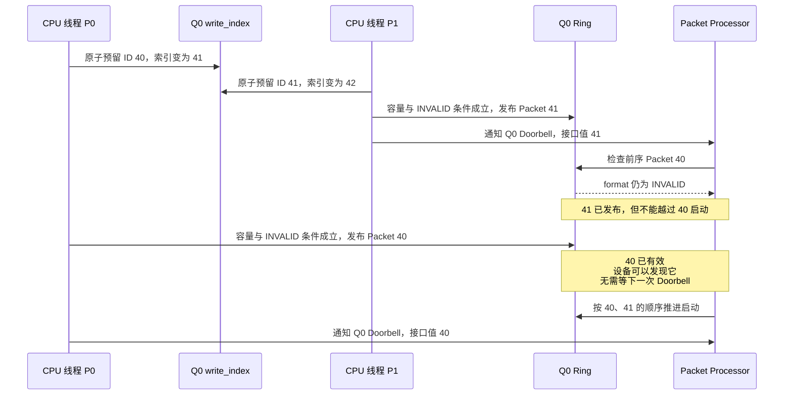
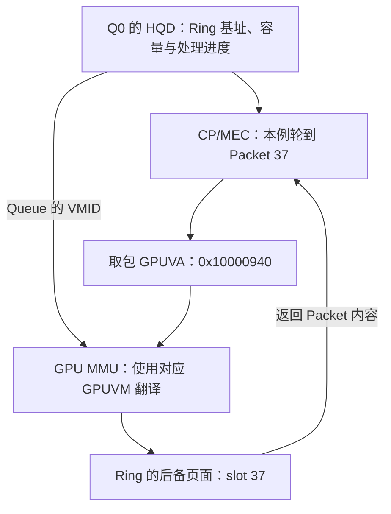
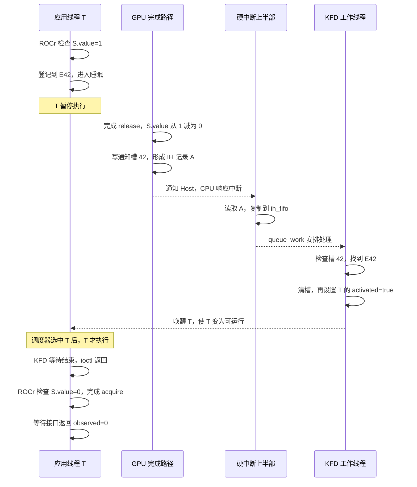
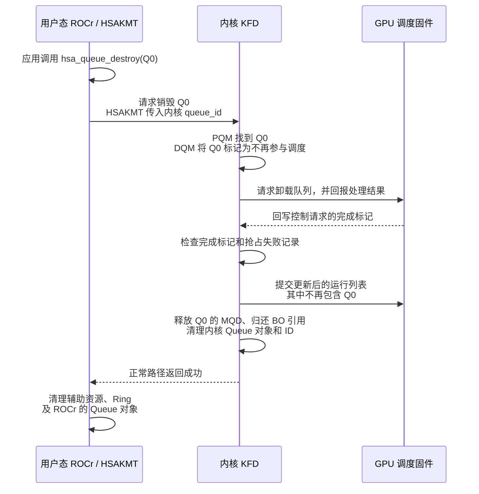
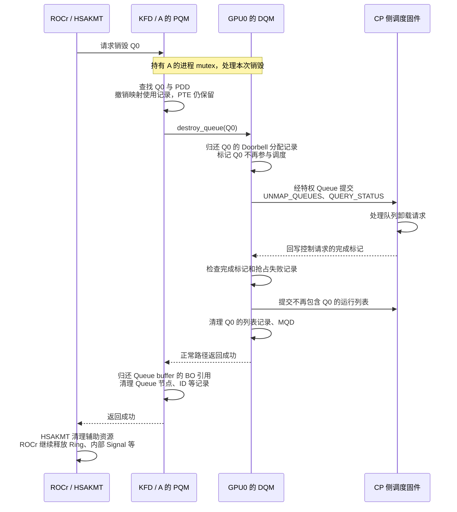
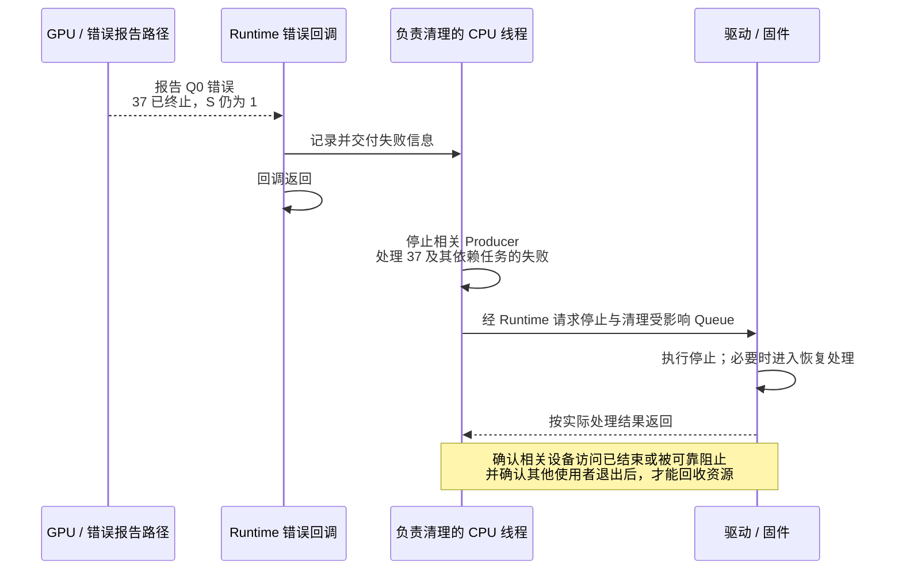
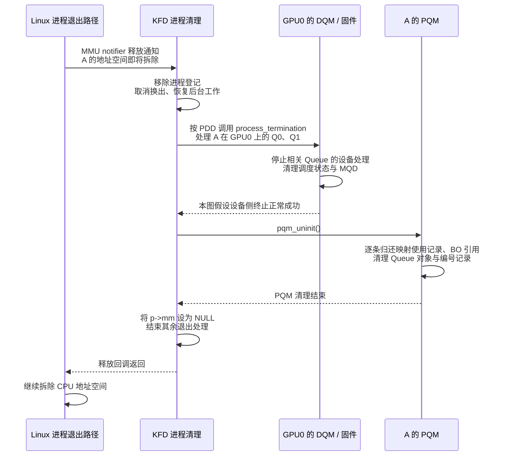
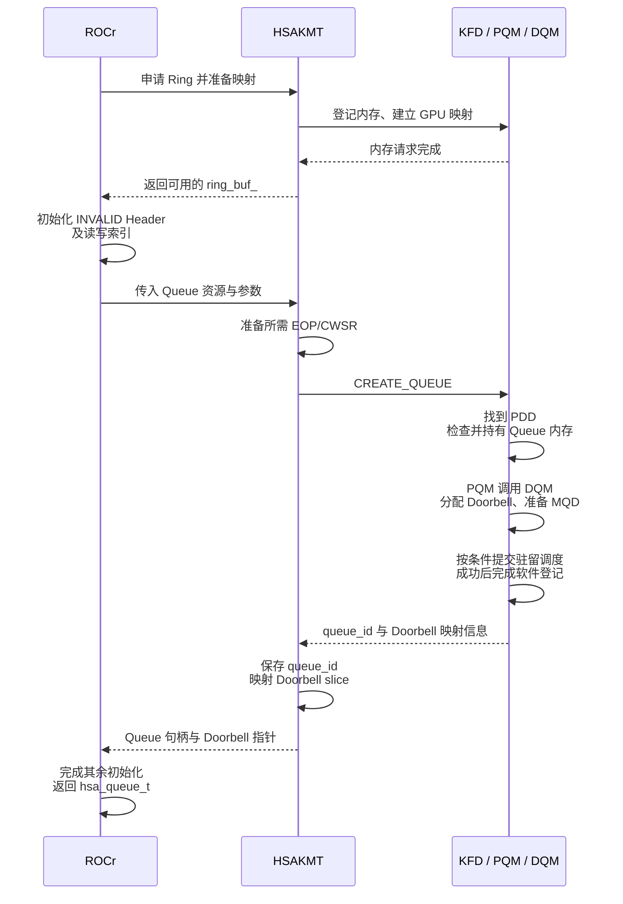
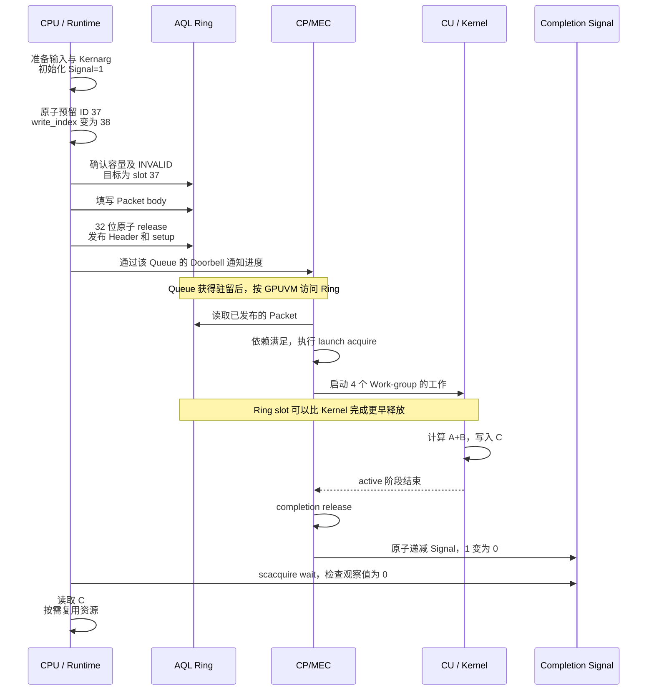
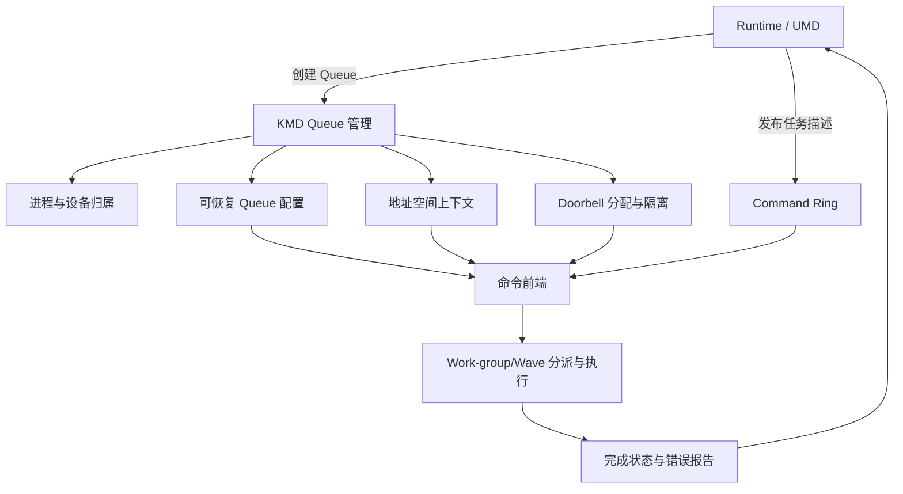

这是一个

这是一

# AMD GPU 队列与 AQL Dispatch（下）

## 缩写表

| 缩写    | 英文全称                                        | 中文含义                                                              |
| ------- | ----------------------------------------------- | --------------------------------------------------------------------- |
| ABI     | Application Binary Interface                    | 应用二进制接口                                                        |
| AccVGPR | Accumulation Vector General-Purpose Register    | 矩阵累加向量寄存器；ISA 记为 AV0～AV255                               |
| AMD     | Advanced Micro Devices                          | AMD 公司                                                              |
| AMDGPU  | AMD GPU Linux Kernel Driver                     | AMD GPU Linux 内核驱动                                                |
| API     | Application Programming Interface               | 应用程序编程接口                                                      |
| AQL     | Architected Queuing Language                    | 架构化队列语言；本文主要指其 64 字节命令包格式与队列协议              |
| ASIC    | Application-Specific Integrated Circuit         | 专用集成电路；本文指具体 GPU 芯片                                     |
| ATC     | Address Translation Cache                       | 地址转换缓存                                                          |
| BAR     | Base Address Register                           | PCIe 基址寄存器；用于暴露设备 MMIO 窗口                               |
| BO      | Buffer Object                                   | 缓冲对象                                                              |
| CAS     | Compare-And-Swap                                | 比较并交换原子操作                                                    |
| CDNA    | Compute DNA                                     | AMD 面向数据中心计算 GPU 的架构系列；MI300 使用 CDNA 3                |
| CLR     | Compute Language Runtime                        | AMD 的计算语言 Runtime 代码库；包含`hipamd`、OpenCL 和 `rocclr`   |
| CP      | Command Processor                               | GPU 命令处理器                                                        |
| CPSCH   | Command Processor Scheduling                    | 命令处理器固件调度路径                                                |
| CPU     | Central Processing Unit                         | 中央处理器                                                            |
| CU      | Compute Unit                                    | 计算单元                                                              |
| CWSR    | Compute Wave Save/Restore                       | 计算 Wave 现场保存与恢复                                              |
| DIQ     | Debug Interface Queue                           | KFD 调试接口使用的内核 Queue                                          |
| DMA     | Direct Memory Access                            | 直接内存访问                                                          |
| DQM     | Device Queue Manager                            | KFD 设备队列管理器，管理该设备上各进程的 Queue 资源与调度             |
| DRM     | Direct Rendering Manager                        | Linux 直接渲染管理框架                                                |
| ELF     | Executable and Linkable Format                  | 可执行与可链接格式；本文 Code Object 使用的二进制文件格式             |
| EOP     | End of Pipe                                     | 管线末端；本文指 Queue 使用的 EOP 状态资源                            |
| FW      | Firmware                                        | 固件                                                                  |
| GDS     | Global Data Share                               | AMD GPU 的全局数据共享资源                                            |
| GFX     | Graphics                                        | AMDGPU 图形/计算 IP 的版本前缀；不能等同于编译器目标名                |
| GFXHUB  | Graphics Hub                                    | 图形与计算访问使用的 GPU 地址翻译 Hub                                 |
| GPU     | Graphics Processing Unit                        | 图形处理器                                                            |
| GPUVA   | GPU Virtual Address                             | GPU 虚拟地址                                                          |
| GPUVM   | GPU Virtual Memory                              | GPU 虚拟地址空间及其页表                                              |
| GTT     | Graphics Translation Table                      | AMDGPU 中主要表示 GPU 可访问的系统内存域                              |
| HBM     | High Bandwidth Memory                           | 高带宽内存                                                            |
| HIP     | Heterogeneous-Compute Interface for Portability | AMD GPU 编程接口                                                      |
| hipamd  | HIP implementation on AMD platform              | AMD 平台上的 HIP API 实现组件；`hipamd` 是项目名，不是首字母缩写    |
| HMM     | Heterogeneous Memory Management                 | 异构内存管理                                                          |
| HQD     | Hardware Queue Descriptor                       | 硬件中一条活动 Queue 的寄存器状态                                     |
| HSA     | Heterogeneous System Architecture               | 异构系统架构；本文指 HSA 规范与执行模型，不是具体软件组件             |
| HSAKMT  | HSA Kernel Mode Thunk                           | ROCr 使用的 HSA 用户态内核接口层                                      |
| HWS     | Hardware Scheduler                              | 负责 Queue 驻留调度的硬件/固件调度路径                                |
| IB      | Indirect Buffer                                 | 间接命令缓冲区                                                        |
| IH      | Interrupt Handler                               | GPU 中断控制模块；将中断来源等信息写入中断记录缓冲区                  |
| ioctl   | Input/Output Control                            | 用户态向内核驱动发送控制请求的接口                                    |
| IOMMU   | Input/Output Memory Management Unit             | 输入输出内存管理单元                                                  |
| IOVA    | Input/Output Virtual Address                    | 设备侧输入输出虚拟地址                                                |
| IP      | Intellectual Property                           | 芯片中的可复用硬件功能模块                                            |
| ISA     | Instruction Set Architecture                    | 指令集架构                                                            |
| KFD     | Kernel Fusion Driver                            | Linux AMD GPU 计算驱动接口                                            |
| KMD     | Kernel Mode Driver                              | 内核态驱动                                                            |
| KMT     | Kernel Mode Thunk                               | 用户态 Runtime 到内核驱动之间的封装层                                 |
| LDS     | Local Data Share                                | AMD GPU 上供同一 Work-group 共享的片上存储                            |
| MEC     | Micro Engine Compute                            | AMD GPU 中处理计算队列的命令处理引擎                                  |
| MES     | Micro-Engine Scheduler                          | 其他受支持架构的固件队列调度接口；MI300 主线不启用                    |
| MFMA    | Matrix Fused Multiply-Add                       | 矩阵融合乘加                                                          |
| MMIO    | Memory-Mapped Input/Output                      | 内存映射输入/输出                                                     |
| MMU     | Memory Management Unit                          | 内存管理单元                                                          |
| MQD     | Memory Queue Descriptor                         | 保存在内存中的 Queue 配置镜像                                         |
| No-HWS  | No Hardware Scheduling                          | 不使用 HWS，由驱动直接管理计算 Queue 驻留的模式；固定源码标为调试用途 |
| NUMA    | Non-Uniform Memory Access                       | 非一致性内存访问                                                      |
| OpenCL  | Open Computing Language                         | 开放计算语言及其异构计算 API                                          |
| PA      | Physical Address                                | 物理地址                                                              |
| PASID   | Process Address Space ID                        | 进程地址空间标识                                                      |
| PCIe    | Peripheral Component Interconnect Express       | 高速外设互连总线                                                      |
| PDD     | Process Device Data                             | KFD 中某个进程在某个 GPU 上的状态                                     |
| PFN     | Page Frame Number                               | 物理页帧号                                                            |
| PID     | Process ID                                      | Linux 进程标识；用于关联进程记录与日志                                |
| PM4     | AMD PM4                                         | AMD GPU 的一类底层命令包协议；本文只在 HWS 控制面中使用               |
| PQM     | Process Queue Manager                           | KFD 进程队列管理器，管理该进程的 Queue ID 和 Queue 列表               |
| PTE     | Page Table Entry                                | 页表项                                                                |
| QPD     | Queue Process Device Data                       | PDD 内嵌的 Queue 与调度状态；源码类型为`qcm_process_device`         |
| RAM     | Random Access Memory                            | 随机存取存储器；本文主要指系统内存                                    |
| RLC     | Run List Controller                             | 运行列表控制器                                                        |
| rocclr  | Radeon Open Compute Common Language Runtime     | HIP/OpenCL 共用的计算 Runtime；Linux 后端连接 ROCr                    |
| ROCm    | Radeon Open Compute                             | AMD GPU 计算软件栈与开发平台                                          |
| ROCr    | ROCm Runtime                                    | ROCm 的 HSA 用户态运行时                                              |
| rptr    | Read Pointer                                    | Queue 读索引；本文也写作`read_index`                                |
| RW      | Read Write                                      | 可读写权限                                                            |
| SALU    | Scalar Arithmetic Logic Unit                    | 标量算术逻辑单元                                                      |
| SDMA    | System Direct Memory Access                     | AMD GPU 的专用数据搬运引擎                                            |
| SE      | Shader Engine                                   | 着色器引擎                                                            |
| SGPR    | Scalar General-Purpose Register                 | 标量通用寄存器                                                        |
| SIMD    | Single Instruction, Multiple Data               | 单指令多数据执行组织                                                  |
| SMEM    | Scalar Memory                                   | 标量访存路径                                                          |
| SVM     | Shared Virtual Memory                           | 共享虚拟内存                                                          |
| TLB     | Translation Lookaside Buffer                    | 地址翻译缓存                                                          |
| UAPI    | Userspace Application Programming Interface     | 用户空间应用程序接口；本文指内核向用户态公开的 ioctl 等接口           |
| UMD     | User Mode Driver                                | 用户态驱动                                                            |
| USERPTR | User Pointer                                    | 驱动使用用户态虚拟地址对应页面的内存路径                              |
| VA      | Virtual Address                                 | 虚拟地址                                                              |
| VALU    | Vector Arithmetic Logic Unit                    | 向量算术逻辑单元                                                      |
| VGPR    | Vector General-Purpose Register                 | 向量通用寄存器                                                        |
| VMA     | Virtual Memory Area                             | Linux 虚拟内存区域                                                    |
| VMEM    | Vector Memory                                   | 向量访存路径                                                          |
| VMID    | Virtual Memory ID                               | GPU 活动地址空间使用的硬件上下文编号                                  |
| VRAM    | Video Random-Access Memory                      | GPU 本地显存                                                          |
| wptr    | Write Pointer                                   | Queue 写索引；本文也写作`write_index`                               |
| XCC     | Accelerator Core Complex                        | 加速器核心复合体；包含多个 CU 及相关控制资源                          |
| XCD     | Accelerator Complex Die                         | 封装中的物理计算芯粒；MI300 中一个 XCD 对应一个 XCC                   |

## 本篇大纲

[上篇](<./03_AMD GPU 队列与 AQL Dispatch（上）.md>)已介绍 Queue 的创建与驻留。本篇包含第 4～9 章，从一次 Kernel 调用的 Packet 字段开始，继续追踪提交、执行、完成与资源回收。上下篇共同组成一篇连续的学习文档，共用章节编号、案例和源码基线。

[00_GPU系统基础](./00_GPU系统基础.md) 已经建立一次 GPU 任务的系统图，01、02 两篇文档进一步说明了内存怎样成为 GPU 可访问资源。本文沿同一条 Queue 追踪创建、驻留、Packet 发布、执行与完成，并用固定源码解释各层怎样实现这些机制。

首次学习可以按章节顺序阅读；后续查阅可以从 [第 9.2 节的知识点索引](#92-知识点与源码检索入口)进入具体小节。源码紧随相关讲解，正文、图示和例子会先交代理解代码所需的对象与执行条件。

本文反复使用以下术语：

| 术语             | 本文含义                                                                                         |
| ---------------- | ------------------------------------------------------------------------------------------------ |
| Agent            | 参与 HSA 系统的执行或存储主体；本文的 Kernel Agent 是目标 AMD GPU                                |
| Producer         | 向 AQL Ring 写 Packet 的 CPU 线程或其他执行单元                                                  |
| Packet Processor | 读取并处理 AQL Packet 的硬件/固件前端；AMD 计算路径主要落在 CP/MEC                               |
| Dispatch         | 某个 Kernel 的一次具体执行请求                                                                   |
| Kernarg          | 按 Kernel ABI 排列的参数块                                                                       |
| Work-item        | Kernel 的一个逻辑执行实例                                                                        |
| Work-group       | 一组可以共享 LDS 并进行组内同步的 Work-item                                                      |
| Wave             | AMD GPU 成批执行 Work-item 的执行单位；本文 MI300 固定为 64 Lane                                 |
| Work Distributor | 本文对“把 Work-group/Wave 分配给 CU 的硬件前端”的概念性称呼；具体模块名随 GPU 硬件架构版本变化 |

| 章节                                            | 主要内容                           | 贯穿案例所在阶段   |
| ----------------------------------------------- | ---------------------------------- | ------------------ |
| [第 4 章](#4-一次-kernel-调用的-aql-packet-编码) | 一次 Kernel 调用的 AQL Packet 编码 | 任务描述           |
| [第 5 章](#5-packet-的发布与-doorbell-通知)      | Packet 的发布与 Doorbell 通知      | 提交数据面         |
| [第 6 章](#6-cpmec-取包与-kernel-启动)           | CP/MEC 取包与 Kernel 启动          | GPU 执行面         |
| [第 7 章](#7-kernel-完成通知与-cpu-等待)         | Kernel 完成通知与 CPU 等待         | 完成与依赖         |
| [第 8 章](#8-queue-销毁与错误处理)               | Queue 销毁与错误处理               | 生命周期、状态观测与故障判断 |
| [第 9 章](#9-完整-dispatch-复盘与知识检索)       | Dispatch 全流程复盘与知识点检索    | 贯穿复盘           |

**[BOUNDARY]** 本文硬件基线为 **AMD Instinct MI300 / CDNA 3**，Wave 使用 wave64，Queue 寄存器和回调按本地 GFX9.4.3 路径核对。MI300A/MI300X 尚未确认，内存组织、主机连接及分区只按条件说明。硬件型号不能推定部署的软件版本或调度参数。

本文采用以下固定证据基线：

- [MI300 / CDNA 3 ISA](./amd-instinct-mi300-cdna3-instruction-set-architecture.pdf)（封面日期 2025-08-05），执行模型重点见 §1.1、§2、§3、§4.3，原文第 4～13、19 页；
- AMD 作者论文 [Realizing the AMD Exascale Heterogeneous Processor Vision](./isca2024_exascale.pdf)（ISCA 2024，作者版本），上篇第 3 章重点使用 §IV-B 的 XCD 结构和 §VI-A 的多 XCD 协作机制；[本地中文译文](./isca2024_exascale_中文全译.pdf)用于辅助阅读，非官方译本，页码与英文版分别标注；
- HSA Platform System Architecture Specification 1.2，重点是 §2.8“User mode queuing”和 §2.9“Architected Queuing Language”；
- Linux `248951ddc14de84de3910f9b13f51491a8cd91df`；
- ROCr `ba56a24c6132c5d195686ae4adf969ca1222fbba`；
- ROCm CLR `81277d69e3352e7144ced2ee9601484f9b48d950`。

> **源码摘录格式：** 代码块左侧数字是所链接文件的真实行号。不连续内容拆成不同代码块，不把教学伪代码写成原始源码。英文注释后会直接说明中文含义。

> **[BOUNDARY]** 本文以普通 Host 侧 Kernel Dispatch 为主线，不展开编译器内部、Device Enqueue、完整 OpenCL 跨队列调度、SVM Page Fault 恢复、普通 DRM scheduler/IB 提交以及特定 GPU 硬件架构版本的 MMU 微架构。这些内容分别留到后续专题。

## 4. 一次 Kernel 调用的 AQL Packet 编码

本章先把一次调用拆成 Packet 字段，再把这些字段放回 Runtime 的提交过程。阅读时可以沿下面的顺序看：

```text
4.0～4.2：用 vector_add 看任务规模、字段位置，以及代码和参数的引用
    ↓
4.3：换用 sum_products，看每线程 temp[4] 怎样形成 private 请求
     另用组内共享数组对照 group 请求
    ↓
4.4：继续 sum_products，从 CPU/GPU 交接扩展到 prepare_A → sum_products
    ↓
4.5：回到 vector_add，核对 CLR 怎样填好并发布 Packet
```

### 4.0 从 vector_add 的启动参数得到任务描述

Queue 已经创建，Runtime 也已装载 `vector_add`，并准备好 GPU 可以访问的 A、B、C 数组。本章开始描述一次具体调用：让 1024 个 Work-item 分别计算 `C[i] = A[i] + B[i]`，每个 Work-group 放 256 个 Work-item。

调用者提供的是 Kernel、参数和执行范围。Runtime 要把这些信息整理成一个 64 字节的 Kernel Dispatch Packet。第二章创建的 Ring 会反复接收这样的 Packet；A/B/C 和本次参数块则属于这一次任务。

如果从 HIP 启动形式理解本例，可写成下面的教学示意：

```cpp
// 教学示意：4 个 Block，每个 Block 256 个线程
vector_add<<<4, 256, 0, stream>>>(A, B, C, 1024);
```

HIP 的 Block 对应这里的 Work-group，线程对应 Work-item。**HIP 的 `gridDim.x = 4` 表示组数，AQL 的 `grid_size_x = 1024` 表示 Work-item 总数。**

| 调用信息              | 换成 Packet 字段后的值                           | 字段中的数按什么计数                                                                                                   |
| --------------------- | ------------------------------------------------ | ---------------------------------------------------------------------------------------------------------------------- |
| 一维任务，共 4 组     | 维数为 1；`grid_size_x/y/z = 1024/1/1`         | 整个 Dispatch 各维的 Work-item 数                                                                                      |
| 每组 256 个线程       | `workgroup_size_x/y/z = 256/1/1`               | 每个 Work-group 各维的 Work-item 数                                                                                    |
| 调用`vector_add`    | `kernel_object`                                | 已装载 Kernel 的执行句柄                                                                                               |
| 参数为 A、B、C、1024  | `kernarg_address`                              | 保存指针值和标量值的参数块地址                                                                                         |
| 执行时的临时存储      | `private_segment_size`、`group_segment_size` | 每个线程的私有内存大小、每组的共享内存大小，均以字节计；用途见[4.3 节](#43-private-segment-与-group-segment-的资源需求) |
| 需要 CPU 观察本次完成 | `completion_signal`                            | 本例所用 Signal 的句柄；Signal 的初值设为 1                                                                            |

这张表的前两行共同决定四组工作怎样划分：

```text
AQL Grid：1024 个 Work-item
  Group 0：Work-item   0～255
  Group 1：Work-item 256～511
  Group 2：Work-item 512～767
  Group 3：Work-item 768～1023

组数 = grid_size_x / workgroup_size_x = 1024 / 256 = 4
```

一个 Packet 描述全部四组工作。增加元素数时，通常只改变 Grid 等字段；Packet 仍为 64 字节。

把这个范围放回第三章的多 XCC 结构。假设 Q0 所属的逻辑 GPU 包含多个 XCC，且 Q0 已获得驻留，各 XCC 按自己的 HQD 配置找到同一个 Ring：

```text
所属节点各 XCC 中，Q0 的 HQD
    │ 各自保存同一个 Ring 的地址和队列配置
    ▼
Q0 的 AQL Ring：一个 64 字节 Kernel Dispatch Packet
    ├─ grid_size_x = 1024
    └─ workgroup_size_x = 256
    │ 各 XCC 读取同一份任务描述
    ▼
整次 Dispatch 共 4 个 Work-group
    │ 各 XCC 按分派策略承担其中的工作
    ▼
获得工作的 XCC 在本地 CU 上执行相应 Work-group
```

`grid_size_x = 1024` 描述整个逻辑 GPU 上这次 Dispatch 的任务范围。各 XCC 分担这四组工作，每组只执行一次；应用仍只向 Ring 写一个 Packet。XCC、MEC、Pipe 和 HQD 的编号由前面建立的队列配置及后续分派机制使用，Kernel Dispatch Packet 无需携带这些编号。

> **[SPEC]** AMD 作者论文 *Realizing the AMD Exascale Heterogeneous Processor Vision*（ISCA 2024，作者版本）§VI-A、图 13，[本地英文版第 9 页](./isca2024_exascale.pdf#page=9)：同一多 XCD 分区内的命令前端读取同一个 AQL Packet，分别启动其中一部分 Work-group。论文以 MI300A 为对象；这里沿用第 3.0.2、3.2 节的多 XCC 教学条件，不假定当前机器的具体型号、XCC 数量或分区。

图中只固定任务总量。四组落到哪些 XCC、哪些 CU，以及是否同时运行，由实际分派和资源条件决定，第 6 章继续展开。`completion_signal` 字段保存的也是句柄，数值 1 保存在 Signal 对象中，不能把“初值为 1”误填成“句柄等于 1”。该 Signal 表示整次 Dispatch 的完成，多 XCC 的完成协作见第 3.2 节。

> **[SOURCE]** ROCm CLR `81277d69e3352`，[`rocclr/platform/ndrange.hpp`](./2.源码/rocm-clr/rocclr/platform/ndrange.hpp) 第 111～143 行：`LaunchParams` 用 `global_` 保存 Work-item 总数，`HIPLaunchParams` 用 `gridX * blockX + globalX_remainder` 等表达式得到该总数。本文普通完整分组的 remainder 为 0。

CLR 中的高层 Kernel 命令经 HostQueue/VirtualGPU 提交，当前底层 Queue 保存在 `gpu_queue_` 中。直接使用 HSA API 的程序也可以自行构造相同格式的 Packet。

> **[SOURCE]** ROCm CLR `81277d69e3352`，[`rocclr/device/rocm/rocvirtual.cpp`](./2.源码/rocm-clr/rocclr/device/rocm/rocvirtual.cpp) 第 1877～1882 行：`VirtualGPU::create()` 取得底层 Queue 并保存 `gpu_queue_`。

**[BOUNDARY]** 同文件第 2069～2087、2100～2104 行还包含动态 Queue 回收：启用后，空闲 VirtualGPU 可以归还底层 Queue，后续工作再取得可用 Queue。一次普通 Dispatch 使用当前绑定的 Queue；Stream 与底层 Queue 的复用关系见第 1.1.1 节。

### 4.1 64 字节 Packet 的布局与字段分组

可以把一个 Kernel Dispatch Packet 看成一张 **64 字节的任务单**：提交者把任务信息填到约定的位置，GPU 的 Packet Processor 再按相同的位置解释这些信息。

#### 4.1.1 一个 Packet 占 Ring 中的一个槽位

沿用前面的 `vector_add`：共 1024 个 Work-item，每组 256 个。提交这次任务时，把描述全部四组工作的一个 Packet 写进 Ring 的一个可用槽位：

```text
Ring 中连续排列的槽位

    [前一个槽位：64 字节] [本次槽位：64 字节] [后一个槽位：64 字节]
                                  │
                                  └─ 保存本次 vector_add 的 Packet
                                     起点记作 P
                                     字节编号：0、1、2、……、63
```

“偏移 12”就是从 P 向后移动 12 字节，地址写作 `P + 12`。偏移从 0 开始，因此偏移 12 对应按顺序数的第 13 个字节；`12～15` 包含两端，共 4 字节。

#### 4.1.2 把这次任务的信息填进 64 字节

下面展开本次槽位。使用 64 位指针；为便于看布局，假设这个已编译 Kernel 的 private、group 请求都为 0，且没有动态 group 内存请求。参数块地址 `0x6000_0000` 是教学地址，句柄用名称表示。

```text
相对 P 的字节位置       字段中填写的内容

                       	┌─ Packet 类型和执行设置
 0～1   （2 字节）     	│  header：Kernel Dispatch 类型、依赖和 fence 范围
 2～3   （2 字节）     	│  setup = 1：一维任务
                       	│
                       	├─ 工作规模：每组 256 个，总共 1024 个
 4～5   （2 字节）     	│  workgroup_size_x = 256
 6～7   （2 字节）     	│  workgroup_size_y = 1
 8～9   （2 字节）     	│  workgroup_size_z = 1
10～11  （2 字节）     	│  reserved0 = 0
12～15  （4 字节）     	│  grid_size_x = 1024
16～19  （4 字节）     	│  grid_size_y = 1
20～23  （4 字节）     	│  grid_size_z = 1
                       	│
                       	├─ 内存请求：这里只保存请求的字节数
24～27  （4 字节）     	│  private_segment_size = 0：每 Work-item
28～31  （4 字节）     	│  group_segment_size = 0：每 Work-group
                       	│
                       	├─ 执行时要使用的对象
32～39  （8 字节）     	│  kernel_object = vector_add 的执行句柄
40～47  （8 字节）     	│  kernarg_address = 0x6000_0000
48～55  （8 字节）     	│  reserved2 = 0
56～63  （8 字节）     	│  completion_signal = 本次完成 Signal 的句柄
                       	└─ Packet 到此结束，共 64 字节
```

图中 y/z 都填 1，因为本例只沿 x 维展开。private、group 的 0 只属于上述假设，实际字节数由 Kernel 的资源需求决定，见第 4.3 节。`header` 中的依赖和 fence 范围决定执行等待及内存可见性，具体编码见第 4.4 节。

以 `grid_size_x` 为例，提交者和 Packet Processor 对这四个字节的理解相同：

```text
提交者：把整数 1024 编码后，写入 P + 12 ～ P + 15
                              │
                              ▼
Packet 发布后：Packet Processor 将同一位置的 4 字节解释为 grid_size_x
                              │
                              └─ 得知 x 维总共有 1024 个 Work-item
```

这里有三个不同的数：**12 是存放位置，4 是字段占用的字节数，1024 是字段保存的值。** 即使把任务改成 2048 个 Work-item，`grid_size_x` 仍占这 4 字节，整个 Packet 仍为 64 字节。

同样，偏移 `40～47` 的 8 字节保存参数块地址 `0x6000_0000`；A、B、C、N 等参数放在该地址指向的参数块中。代码、参数块、数组和 Signal 对象怎样与 Packet 关联，下一节再展开。

#### 4.1.3 `header`、`setup` 和 `full_header` 共用前四个字节

`header` 占前 2 字节，`setup` 紧接着占 2 字节。代码还把这四个字节整体命名为 `full_header`，方便一次读写整个 32 位值。

先用 `header = 0x1502`、`setup = 0x0001` 看存储位置，其中 setup 的 1 表示一维任务。Header 中各个位的含义及 `0x1502` 的计算过程留到第 4.4 节。下图按平时写十六进制数的习惯，**高位在左、低位在右**；字节偏移也从左到右按 3、2、1、0 排列：

```text
高位在左，低位在右；下面的 3、2、1、0 是字节偏移。

    3       2       1       0
+-------+-------+-------+-------+
|  00   |  01   |  15   |  02   |  ← 每格一个字节，值用十六进制表示
+-------+-------+-------+-------+
| setup=0x0001  | header=0x1502 |
+---------------+---------------+
|    full_header=0x00011502     |
+-------------------------------+
```

这样从左向右读，`00 01 15 02` 就对应整数 `0x00011502`：左边的 setup 占高 16 位，右边的 header 占低 16 位。

实际仍按**小端**存储，即低位字节放在较低地址。图中最右侧的 `02` 位于偏移 0，也就是 Packet 起点 P；从 P 开始按地址递增读取，要在图中从右向左看，依次得到 `02、15、01、00`。

`full_header` 是同一块存储的整体名称，Packet 的大小仍为 64 字节。使用两个字段名时，便于分别说明它们的含义；发布到 Ring 时，则把前四个字节作为一个整体原子写入：

```text
准备槽位内容，Packet 类型保持 INVALID
    ↓
发布：一次 32 位原子 release 写入 header 和 setup
      本例写入的整体值为 0x00011502
    ↓
Packet Processor 观察到有效类型后，可按队列规则处理该 Packet
```

这次原子写保证前四个字节整体更新，避免新 `header` 配上旧 `setup`；release 的发布顺序见第 5.3 节。第 4.4 节还会拆开 `header` 内部的位：例如 bit 8 是这个 16 位整数中的位编号，而本节的偏移 8 是 Packet 中的字节位置。

> **[SPEC]** [HSA Platform System Architecture 1.2](https://hsafoundation.com/wp-content/uploads/2021/02/HSA-SysArch-1.2.pdf)（2018-05-02），第 2.8.3 节、原文第 20 页规定 64 字节 Packet、INVALID 类型和前 32 位的原子访问要求；第 2.9.6 节表 2–7、原文第 29 页给出字段布局。标准保留字段写为 0；依赖特定扩展的 Runtime 用法需要另按对应扩展解释。

#### 4.1.4 可选源码核对

> **[SPEC]** ROCr `ba56a24c6132`，[`runtime/hsa-runtime/inc/hsa.h`](./2.源码/rocr-runtime/runtime/hsa-runtime/inc/hsa.h) 第 2956～2976 行。`union` 让 `header`、`setup` 与 `full_header` 共用同一段存储。

```c
2956: /**
2957:  * @brief AQL kernel dispatch packet
2958:  */
2959: typedef struct hsa_kernel_dispatch_packet_s {
2960:   union {
2961:     struct {
2962:         /**
2963:          * Packet header. Used to configure multiple packet parameters such as the
2964:          * packet type. The parameters are described by ::hsa_packet_header_t.
2965:          */
2966:         uint16_t header;
2967:
2968:         /**
2969:          * Dispatch setup parameters. Used to configure kernel dispatch parameters
2970:          * such as the number of dimensions in the grid. The parameters are described
2971:          * by ::hsa_kernel_dispatch_packet_setup_t.
2972:          */
2973:         uint16_t setup;
2974:     };
2975:     uint32_t full_header;
2976:   };
```

英文说明分别是“Kernel Dispatch Packet”“Packet 类型等公共参数”和“Grid 维数等 Dispatch 参数”。第 2966、2973 行各定义一个 16 位字段，第 2975 行给出整个 32 位字的名称。

> **[SPEC]** 同一固定版本的 [`hsa.h`](./2.源码/rocr-runtime/runtime/hsa-runtime/inc/hsa.h) 第 2978～3070 行定义其余字段及 machine model 分支：small model 的指针只使用对应区域的一部分，但保留空间仍在，因此 Packet 长度保持 64 字节。未使用的 y/z 维度按一维任务要求填 1；各维和每组总规模还须满足目标 Agent 的限制。

第 2 章的 256 槽 Ring 正是按这个固定大小分配：`256 × 64 = 16384 字节 = 16 KiB`。用 C 结构体访问 Ring 时，结构体只是给这 64 字节起了字段名；第 4.5 节另建的临时 Packet 则是 CPU 准备任务时的一份独立副本。

### 4.2 Packet 与代码、参数块及数组的引用关系

第 4.1 节已经列出 Packet 字段。本节沿“编译 Kernel → 装载代码 → 填写 Packet”的顺序，说明 `kernel_object` 和 `kernarg_address` 分别引用什么。前面假设 `vector_add` 已经装载好，这里回看它的准备过程；装载好的代码可以供多次调用复用，每次调用另行准备参数块。以下地址和参数偏移均为教学示意。

#### 4.2.1 从 HIP 函数生成 Code Object

`vector_add` 最初是一个 HIP 函数，例如源文件 `kernels.cpp`：

```cpp
#include <hip/hip_runtime.h>

extern "C" __global__
void vector_add(const float* A, const float* B, float* C, int N)
{
    int i = blockIdx.x * blockDim.x + threadIdx.x;
    if (i < N) {
        C[i] = A[i] + B[i];
    }
}
```

`__global__` 标记可从 Host 启动的 GPU Kernel，`extern "C"` 保持本例的符号名为 `vector_add`。函数体定义一个 Work-item 的计算；Grid / Work-group 决定启动多少个 Work-item、怎样分组。

在安装好 ROCm 的 Linux 环境中，可以为 MI300 的 `gfx942` 目标生成设备二进制：

```bash
hipcc --genco --offload-arch=gfx942 kernels.cpp -o kernels.hsaco
```

生成的 `kernels.hsaco` 称为 **Code Object**，采用 ELF 格式。下图表示相关文件内容，不表示实际偏移：

```text
kernels.hsaco
├─ .text   → vector_add 的机器码
├─ .rodata → vector_add.kd，即这个 Kernel 的 Descriptor
├─ 符号表
│    vector_add    → 机器码入口的位置
│    vector_add.kd → Descriptor 的位置
└─ .note 中的元数据 → Kernel 信息、参数 A/B/C/N 的布局等
```

编译工具链为 Kernel 入口生成 Descriptor，并把整个函数体编译成机器码。Code Object 保存这两部分；本次调用的数组地址和 N 的数值，稍后另行填入 Kernarg。

#### 4.2.2 Descriptor 保存启动信息，机器码在结构体外

Descriptor（内核描述符）告诉命令前端代码入口在哪里、需要哪些执行资源。它与机器码分别存放，通过一个相对偏移关联：

```text
0x7000_0000：vector_add 的 Descriptor（64 字节）
    保存资源需求、参数区大小、启动配置
    代码入口偏移 = +0x100
         │ Descriptor 地址 + 入口偏移
         ▼
0x7000_0100：vector_add 的机器码
    执行读取 A/B、相加、写入 C 等指令
```

下面的装载图和 Packet 总图继续使用这组教学地址，均假设未启用 Kernarg 预加载。这个 Descriptor 和第 4.1 节的 Packet 恰好都是 64 字节，但分别占用存储：Packet 通过 `kernel_object` 引用 Descriptor。

<details>
<summary>可选源码核对：Descriptor 的完整字段</summary>

> **[SOURCE]** ROCr `ba56a24c6132`，[`loader/AMDHSAKernelDescriptor.h`](./2.源码/rocr-runtime/runtime/hsa-runtime/loader/AMDHSAKernelDescriptor.h) 第 199～211 行。

```cpp
199: struct kernel_descriptor_t {
200:   uint32_t group_segment_fixed_size;
201:   uint32_t private_segment_fixed_size;
202:   uint32_t kernarg_size;
203:   uint8_t reserved0[4];
204:   int64_t kernel_code_entry_byte_offset;
205:   uint8_t reserved1[20];
206:   uint32_t compute_pgm_rsrc3; // GFX10+ and GFX90A+
207:   uint32_t compute_pgm_rsrc1;
208:   uint32_t compute_pgm_rsrc2;
209:   uint16_t kernel_code_properties;
210:   uint8_t reserved2[6];
211: };
```

第 206 行注释表示“GFX10 及之后，以及 GFX90A 及之后”。这个结构共 64 字节，其中没有机器码数组：

- 第 200～202 行保存固定 group/private 存储需求和参数区大小，资源需求见第 4.3 节。
- 第 204 行保存从 Descriptor 基址到机器码入口的字节偏移。
- 第 206～209 行保存执行资源与启动配置。

</details>

#### 4.2.3 装载后取得 Descriptor 地址

Runtime 取得 Code Object 的二进制内容后，按以下顺序准备可执行内容：

```text
Code Object 二进制
    │ hsa_code_object_reader_create_from_memory：建立 Reader
    ▼
hsa_executable_load_agent_code_object
    │ 分配装载内存、复制可装载段、登记符号、处理重定位
    ▼
hsa_executable_freeze
    │ 完成使装载内容可供执行使用的处理
    ▼
查询 Kernel 的执行句柄，供后续 Packet 使用
```

重定位用于修正需要随装载地址确定的引用。以先写 Host 暂存区、再复制到 GPU 本地代码内存的装载路径为例，内容最终放置如下；实际分配路径取决于运行环境：

```text
Host 暂存区                         GPU 本地代码内存
复制 Code Object 的段内容
处理需要修正的引用
    │
    │ Freeze 时通过 DMA 或 CPU 复制
    └─────────────────────────────→ 0x7000_0000
                                      vector_add Descriptor
                                      entry_offset = +0x100
                                             │ 基址 + 偏移
                                             ▼
                                    0x7000_0100
                                      vector_add 的机器码
```

装载器记录 `.kd` 符号的最终地址，CLR 查询这个地址并保存为 Kernel 执行句柄。准备 Packet 时再取出该值：

```text
已装载符号 vector_add.kd：地址 0x7000_0000
    │ 查询 HSA_EXECUTABLE_SYMBOL_INFO_KERNEL_OBJECT
    ▼
CLR Kernel 对象：kernelCodeHandle_ = 0x7000_0000
    │ 本次调用取出 KernelCodeHandle()
    ▼
Packet.kernel_object = 0x7000_0000
```

`kernel_object` 是 Packet 中的 8 字节字段，接口称其为“不透明的执行句柄”。在这里的 AMD `.kd` 路径中，它保存 Descriptor 地址；Descriptor 和机器码都位于 Packet 外。

#### 4.2.4 代码与本次参数在 Packet 中的引用

沿用第 4.0 节的 1024 个 Work-item、每组 256 个。假设 Kernarg 位于 `K = 0x6000_0000`，指针为 64 位、N 为 32 位，完整引用关系如下：

```text
Q0 的 AQL Ring
└─ 一个槽位中的 Kernel Dispatch Packet（64 字节）
     ├─ kernel_object = 0x7000_0000
     │       │
     │       ▼
     │   0x7000_0000：vector_add Descriptor
     │       kernel_code_entry_byte_offset = +0x100
     │       │ Descriptor 基址 + 入口偏移
     │       ▼
     │   0x7000_0100：vector_add 机器码
     │       计算下标、判断范围、读取、加法、写入
     │
     ├─ kernarg_address = 0x6000_0000
     │       │
     │       ▼
     │   0x6000_0000：本次调用的 Kernarg
     │       +0  ：A 的地址 = 0x3000_0000 ──→ A 数组
     │       +8  ：B 的地址 = 0x4000_0000 ──→ B 数组
     │       +16 ：C 的地址 = 0x5000_0000 ──→ C 数组
     │       +24 ：N = 1024
     │
     ├─ grid_size_x      = 1024
     ├─ workgroup_size_x = 256
     └─ completion_signal = S ──Signal 句柄──→ 完成 Signal
```

`kernel_object` 选择运行哪个 Kernel，`kernarg_address` 指向本次参数块。Kernarg 中保存 A/B/C 的指针值，数组元素仍在各自的存储中；N 则直接保存数值 `1024`。图中的计算步骤说明代码含义，实际指令由编译器生成。

**[BOUNDARY]** 真实参数偏移、总长度及 hidden arguments（隐藏参数）以目标 Kernel 的 Metadata 为准。Kernarg 至少按 16 字节对齐，特定 Kernel 可要求更大对齐；图中显式参数占 28 字节，不代表实际只需分配 28 字节。

图中的 `S` 是 Runtime 返回的有效 Signal 句柄，Packet 用它指定“完成时更新哪一个 Signal”。Signal 对象中的数值保存在 Packet 外。本例用一个独立 Signal 跟踪这次调用，发布前把数值设为 1：

```text
使用完成 Signal：
    Packet.completion_signal = S（有效句柄，S.handle 非零）
        │ 根据句柄找到要更新的对象
        ▼
    Signal 对象中的数值：1 ──本次 Kernel 完成，原子减 1──→ 0
                         未完成                         已完成

不使用完成 Signal：
    Packet.completion_signal.handle = 0（空句柄）
        └─ Kernel 仍会执行，完成时不更新独立的完成 Signal
```

**句柄为 0 可以理解成空引用，类似空指针**：Packet 没有关联完成 Signal，完成时就跳过 Signal 更新。使用有效句柄时，CPU 等待的是**句柄所引用的 Signal 对象中的数值从 1 变为 0**，句柄本身保持不变。完整完成顺序见 [第 7.0 节](#70-从-gpu-写结果到-cpu-观察完成)。

第三章的队列配置和这里的引用关系可以接成一条访问顺序：

```text
MQD ──装载队列配置──→ HQD ──定位──→ Ring
    Ring 中的 Packet ──引用──→ Descriptor、Kernarg、完成 Signal
```

代码、参数和数组必须有设备可用的地址、映射与权限，并保留到使用结束。Kernarg 应通过 Runtime 为该用途提供的接口取得，发布前使内容在 System scope 可见，且直到 Kernel 完成都保持分配和内容不变：

```text
准备 Kernarg → 发布 Packet → Kernel 使用参数 → Dispatch 完成
               └────── 此期间不能改写或复用 Kernarg ──────┘
```

#### 4.2.5 多种运算、Kernel 入口与多次调用的组织

一个 Kernel 可以同时包含加法和乘法。例如在 `kernels.cpp` 中另写一个 `add_mul`：

```cpp
extern "C" __global__
void add_mul(const float* A, const float* B, float* C,
             float factor, int N)
{
    int i = blockIdx.x * blockDim.x + threadIdx.x;
    if (i < N) {
        float sum = A[i] + B[i];  // 加法
        C[i] = sum * factor;      // 乘法
    }
}
```

`add_mul` 是一个 Kernel 入口，因此有一份 Descriptor，代码实现其中全部运算。如果将三种计算分别定义为独立 Kernel，同一份 Code Object 可以包含以下三组内容：

```text
vector_add() → Descriptor A，地址 0x7000_0000 → 加法代码
add_mul()    → Descriptor B，地址 0x7000_1000 → 加法＋乘法代码
vector_mul() → Descriptor C，地址 0x7000_2000 → 乘法代码

一次调用选择 add_mul()：
    Packet.kernel_object = 0x7000_1000
        → Descriptor B（entry_offset = +0x100）
        → 0x7000_1100 的 add_mul 机器码
    Packet.kernarg_address = K1
        → 本次 A、B、C、factor、N 的参数块
```

**一个 Kernel Dispatch Packet 只引用一个 Descriptor；Descriptor 按 Kernel 入口组织，不按运算种类计数。** `add_mul` 增加了 `factor` 参数，Kernarg 也必须按它的参数布局填写。

同一个已装载 Kernel 可以反复调用，复用 Descriptor 和机器码，只更换本次参数与执行范围：

```text
Packet 1：kernel_object = 0x7000_1000，kernarg_address = K1
Packet 2：kernel_object = 0x7000_1000，kernarg_address = K2
                            │
                            └─→ 同一份 Descriptor B → 同一份 add_mul 机器码
K1、K2 分别保存两次调用的 A、B、C、factor、N
```

若分别启动 `vector_add` 和 `vector_mul`，通常使用两个 Packet：

```text
Packet A.kernel_object = 0x7000_0000 → vector_add Descriptor
Packet B.kernel_object = 0x7000_2000 → vector_mul Descriptor
```

乘法若要使用加法的结果，还需建立执行与内存同步依赖，见 [第 7.2 节](#72-barrier-bit-对同一-queue-前序工作的约束)与 [第 7.3 节](#73-用-barrier-and-表达跨-queue-依赖)。

第 4.3 节先用私有、共享临时数组的例子说明 Packet 中的存储需求。第 4.4 节继续使用其中的 `sum_products` 调用，设置 Header；第 4.5 节再回到本章最初的 `vector_add`，核对 CLR 的字段填写过程，再交给第五章的 Ring 发布流程。

#### 4.2.6 可选核对：编译工具与源码依据

<details>
<summary>展开查看编译结果的方法与固定源码位置</summary>

生成 `kernels.hsaco` 后，可在 ROCm Linux 环境查看 section（节）、符号和反汇编。以下是查看命令，本节未展示实际反汇编结果：

```bash
/opt/rocm/llvm/bin/llvm-readelf --sections --symbols kernels.hsaco
/opt/rocm/llvm/bin/llvm-objdump --disassemble kernels.hsaco
```

> **[SOURCE]** 以下实现依据 CLR `81277d69e3352` 与 ROCr `ba56a24c6132`。
>
> - 装载顺序：CLR [`rocprogram.cpp`](./2.源码/rocm-clr/rocclr/device/rocm/rocprogram.cpp) 第 233～275 行依次建立 Reader、装载、Freeze，再调用各 Kernel 的 `postLoad()`。
> - 段复制与重定位：ROCr [`loader/executable.cpp`](./2.源码/rocr-runtime/runtime/hsa-runtime/loader/executable.cpp) 第 1303～1317、1356～1383、1414～1420 行。
> - 暂存与最终复制：ROCr [`core/runtime/amd_loader_context.cpp`](./2.源码/rocr-runtime/runtime/hsa-runtime/core/runtime/amd_loader_context.cpp) 第 281～291、300～332、347～371、463～470 行支撑本节采用的装载示例。
> - Descriptor 地址成为句柄：ROCr [`loader/executable.cpp`](./2.源码/rocr-runtime/runtime/hsa-runtime/loader/executable.cpp) 第 1464～1494 行保存 `.kd` 装载地址，第 465～471 行返回句柄查询结果。
> - CLR 取得并填写句柄：[`rockernel.cpp`](./2.源码/rocm-clr/rocclr/device/rocm/rockernel.cpp) 第 33～48 行保存 `kernelCodeHandle_`；[`rocvirtual.cpp`](./2.源码/rocm-clr/rocclr/device/rocm/rocvirtual.cpp) 第 4138～4142 行将其写入 Packet。

> **[SPEC]** 编译方法见 HIP 6.2.2 的 [Kernel compilation（Kernel 编译）](https://rocm.docs.amd.com/projects/HIP/en/docs-6.2.2/reference/cpp_language_extensions.html#kernel-compilation)；MI300A、MI300X 的 `gfx942` 目标见 [AMD GPU 规格表](https://rocmdocs.amd.com/en/develop/reference/gpu-specs.html)。这不限定实际安装的软件版本。

> **[SPEC]** AMDGPU ABI 的 [Symbols（符号）](https://llvm.org/docs/AMDGPUUsage.html#symbols)、[Note Records（附注记录）](https://llvm.org/docs/AMDGPUUsage.html#code-object-v3-and-above-note-records)说明文件内容；[Kernel Descriptor（内核描述符）](https://llvm.org/docs/AMDGPUUsage.html#kernel-descriptor)规定入口偏移相对于 Descriptor 基址，也可以为负。[Preloaded Kernel Arguments（预加载内核参数）](https://llvm.org/docs/AMDGPUUsage.html#preloaded-kernel-arguments)说明预加载时的入口调整，本节地址图未启用该功能。在线规范核对日期为 2026-09-09。

> **[SPEC]** ROCr `ba56a24c6132` 的 [`inc/hsa.h`](./2.源码/rocr-runtime/runtime/hsa-runtime/inc/hsa.h) 第 3033～3070 行定义执行句柄、Kernarg 地址与完成 Signal；HSA System Architecture 1.2 第 2.9.2 节规定完成时原子递减非空完成 Signal，第 2.9.6 节（原文第 29～30 页）规定 Kernarg 的对齐、可见性与生命周期。

</details>

### 4.3 Private Segment 与 Group Segment 的资源需求

第 4.2 节已经说明 Kernel 怎样根据 Kernarg 找到 A/B/C 数组。接下来说明计算时的临时存储怎样对应到 `private_segment_size` 和 `group_segment_size`。本节用 `sum_products` 展示每线程自己的私有数组，再用一个单独的协作计算片段展示整组共用的数组，最后回到 `sum_products` 填写 Packet。

#### 4.3.1 从线程自己的变量理解 Private Segment

先看一个用临时数组保存中间结果的计算：**每个线程取 4 对输入，算出 4 个乘积，再把它们相加。** 为此，在 Kernel 中声明一个 `temp[4]`，保存这 4 个乘积。每个线程各有一份数组，包含 4 个 float，大小为 `4 × 4 = 16` 字节。

这个例子单独使用 `sum_products` Kernel，N = 1024。仍启动 1024 个线程、每组 256 个；每个线程处理 4 对输入，因此 A、B 各有 4096 个元素，C 有 1024 个元素。数组已具备 GPU 访问条件。**下面按编译后 temp 保存在私有内存中的情况讲解。**

```cpp
__global__ void sum_products(const float* A,
                             const float* B,
                             float* C,
                             int N)
{
    int i = blockIdx.x * blockDim.x + threadIdx.x;
    if (i >= N) return;

    float temp[4];  // 每个线程自己的临时数组：4 个 float，共 16 字节
    int base = 4 * i;

    for (int k = 0; k < 4; ++k) {
        temp[k] = A[base + k] * B[base + k];
    }

    C[i] = temp[0] + temp[1] + temp[2] + temp[3];
}
```

`float temp[4]` 声明了每个线程自己的局部数组。编译器决定它的实际存放方式；需要私有内存时，由运行时与硬件安排相应存储。线程执行到这行时不会再发起一次系统内存申请。

只展开前两个线程，假设输入如下。图中列出的是它们完成乘法后，各自 temp 中保存的数值：

```text
线程 0
    读取 A[0..3] = [1, 2, 3, 4]
         B[0..3] = [10, 10, 10, 10]
                 │ 对应元素相乘，写入自己的 temp
                 ▼
    自己的 temp[4] = [10, 20, 30, 40]    ← 私有临时内存，16 字节
                 │ 将 4 个乘积相加，写入 C[0]
                 ▼
    C[0] = 100

线程 1
    读取 A[4..7] = [5, 6, 7, 8]
         B[4..7] = [10, 10, 10, 10]
                 │ 对应元素相乘，写入自己的 temp
                 ▼
    自己的 temp[4] = [50, 60, 70, 80]    ← 另一份私有临时内存，16 字节
                 │ 将 4 个乘积相加，写入 C[1]
                 ▼
    C[1] = 260
```

**本例中，每个线程用于保存 temp 的这份私有内存，属于 Private Segment。** AMD GPU 通常用 Scratch 存储承载它。线程 0 和线程 1 使用各自的 temp；A/B/C 数组仍留在原来的输入、输出存储中，不属于这些私有临时区域。

如果编译结果报告每个线程的 private 需求恰好为 16 字节，且本次调用没有额外的栈需求，Packet 就填写：

```text
private_segment_size = 16
    ├─ 线程 0：自己的一份 16 字节
    ├─ 线程 1：自己的一份 16 字节
    └─ 其他线程：各自的一份 16 字节
```

这个字段填写**每个线程需要多少私有内存**，不乘以一组或整个 Grid 的线程数，也不计寄存器占用。实际值要取编译结果及运行时调整后的需求，不能只看源代码中的数组长度。

**编译时也可能把 temp 优化为寄存器中的值，甚至消除数组。** 因此，上面的 16 字节是明确设定的存储示例，不是这段代码的实测编译结果。原来的 `vector_add` 只做单次加法，读出的值和中间结果通常可以保存在寄存器中；若没有其他私有内存需求，`private_segment_size` 就为 0。

> **[SPEC]** [HIP 编程模型的存储说明](https://rocm.docs.amd.com/projects/HIP/en/latest/understand/programming_model.html)介绍局部数据、寄存器分配和线程私有存储。ROCr `ba56a24c6132` 的 [`inc/hsa.h`](./2.源码/rocr-runtime/runtime/hsa-runtime/inc/hsa.h) 第 3020～3023 行规定，Packet 的 private 字段是每个 Work-item 的私有内存申请字节数。在线资料核对日期为 2026-09-14。

<details>
<summary>可选回看：A/B/C、x/y 与 GPU 寄存器的关系</summary>

沿用 1024 个元素、每组 256 个 Work-item 的 `vector_add`。本章已假设 A/B/C 数组具备 GPU 访问所需的映射与权限，Kernarg 保存它们的地址。若原始输入起初位于 CPU 的普通内存中，可以采用下面这条准备路径：

```text
CPU 内存中的原始输入
    │ 复制，例如 hipMemcpy
    ▼
已分配、GPU 可以访问的数组 A、B（输出数组 C 也已准备好）
    │ 将 A/B/C 的地址写入 Kernarg
    ▼
启动 Kernel
```

通过受支持的映射方式，GPU 也可以访问主机内存。这里只需明确：传入的数组地址必须可供 GPU 使用，普通 CPU 指针本身不能保证这一点。地址映射的关系见 [02 的 2.5 节](<./02_GPU 内存管理基础.md#25-cpu-与-gpu-的两条访问通路>)。

输入准备好后，GPU 才执行 Kernel 中的计算。把函数体展开，得到下面的教学片段：

```cpp
int i = blockIdx.x * blockDim.x + threadIdx.x;

float x = A[i];  // 读取 A[i] 的值，赋给当前线程的变量 x
float y = B[i];  // 读取 B[i] 的值，赋给当前线程的变量 y
float result = x + y;

C[i] = result;
```

**x、y 是 Kernel 内部的局部变量名。** 它们的值来自 A[i]、B[i]，并没有先在 CPU 进程中各自分配一个地址。这些读出的值通常由编译器安排在 GPU 的**寄存器**中，供计算指令使用。

寄存器是 GPU 计算单元内部的硬件存储，指令通过寄存器编号选择其中的值。假设线程 0 读取 A[0] = 2、B[0] = 3，计算过程如下；R0、R1、R2 只是示意编号，不是实际反汇编结果：

```text
GPU 可以访问的数组内存                  GPU 计算单元内部

A[0] = 2 ──根据 A 的地址读取────────→  寄存器 R0：2（x 的值）
B[0] = 3 ──根据 B 的地址读取────────→  寄存器 R1：3（y 的值）
                                              │
                                       使用 R0、R1 做加法
                                              ▼
                                      寄存器 R2：5（result）
                                              │
C[0] = 5 ←─根据 C 的地址写回───────────────────┘
```

读取 A[0]、B[0] 时，GPU 使用数组地址和相应的地址映射；读出数值后，原始数据仍留在数组中。加法直接使用寄存器中的值，无需再按用户进程的内存地址查找 x、y。编译器也可以复用寄存器，不必为每个变量保留一个独立寄存器。

同一个 Kernel 的机器码由多个 Work-item 分别执行，每个 Work-item 就是这里的一个 GPU 线程，各自处理对应元素：

```text
线程 0：读取 A[0]、B[0]，暂存自己读出的值和计算结果
线程 1：读取 A[1]、B[1]，暂存自己读出的值和计算结果
……
```

如果某些线程私有数据需要放进寄存器之外的私有内存，例如编译器将部分值移出寄存器保存，就会使用 **Private Segment**，在 AMD GPU 上通常由 Scratch 存储承载。它用于保存线程私有数据，不负责为输入数组建立 GPU 映射。

若 x、y、result 等临时值都保存在寄存器中，且没有其他私有内存需求，`private_segment_size` 就可以为 0。

> **[SPEC]** [MI300 / CDNA 3 ISA](./amd-instinct-mi300-cdna3-instruction-set-architecture.pdf#page=16)（封面日期 2025-08-05）§3.1，原文第 8 页，列出 Kernel 可用的通用寄存器。[HIP 编程模型的存储说明](https://rocm.docs.amd.com/projects/HIP/en/latest/understand/programming_model.html)介绍寄存器，以及局部数据、寄存器溢出和调用栈所需的线程私有存储；[HIP 7.0.2 内存管理接口](https://rocm.docs.amd.com/projects/HIP/en/docs-7.0.2/doxygen/html/group___memory.html)说明内存复制和主机内存映射。在线资料核对日期为 2026-09-14；本节未将教学片段当成实际编译结果。

</details>

#### 4.3.2 从线程合作理解 Group Segment

上面的 `sum_products` 中，每个线程只使用自己的 `temp[4]`。为了看清 Group Segment 的用途，这里暂时换成一个组内协作的示意片段：各线程先计算一对 A/B 的和，把结果放到整组共用的 `temp[256]`，供同组线程继续使用。

```cpp
__shared__ float temp[256];  // 同一组线程共同使用的一份数组

temp[threadIdx.x] = A[i] + B[i];
__syncthreads();             // 等同组线程都写完
// 后续同组线程可以读取 temp 中其他线程写入的结果
```

这段代码只展示共享存储的用途，未给出后续协作算法；它不属于 `sum_products`。i 仍为线程的全局下标，每组固定 256 个线程。`__shared__` 声明组内共享存储；假设后续协作计算实际使用这份数组，其访问关系是：

```text
同一个 Work-group

线程 0   ──写入──→ temp[0]
线程 1   ──写入──→ temp[1]
……
线程 255 ──写入──→ temp[255]

          整组共用同一个 temp 数组
          同步后，可以读取彼此写入的结果

其他 Work-group 各有自己的一份 temp
```

这份组内共享的临时数组使用 **Group Segment**，MI300 用 LDS 承载。这里的 LDS 就是 [00 文档第 8.7 节中的 LDS](./00_GPU系统基础.md#87-lds-是-work-group-的共享资源)。**它位于 GPU 计算芯片内部，既不是显存（HBM），也不是 System RAM（系统内存）。** “片上存储”在这里指做在 GPU 计算芯片内部的存储。

MI300 的每个 CU 都有 64 KiB LDS，按 Work-group 分配使用区域。假设编译后保留 `temp[256]`，它的存放位置如下：

```text
GPU 计算芯片内部
└─ CU（计算单元）
   ├─ 执行计算的硬件
   ├─ 寄存器：保存线程计算时使用的值
   └─ LDS：共 64 KiB
      └─ 分给当前 Work-group 的区域
         └─ temp[256]：占 256 × 4 = 1024 字节
            ↑
            同组的 256 个线程共同读写
```

若没有其他 group 请求，`group_segment_size` 就填 **1024**，表示这一组需要从所在 CU 的 LDS 中取得 1024 字节。这是整组共用一份的大小，而非每个线程各有一份 1024 字节。

> **[SPEC]** [MI300 / CDNA 3 ISA](./amd-instinct-mi300-cdna3-instruction-set-architecture.pdf#page=14)（封面日期 2025-08-05）§2.2.1，原文第 6 页，说明每个 CU 的 64 KiB LDS 及其组内数据交换用途；§2.3 在同页另述片外内存访问。[§3.6.5，原文第 13 页](./amd-instinct-mi300-cdna3-instruction-set-architecture.pdf#page=21)规定 LDS 按 Work-group 分配及访问范围。[HIP 7.0.1 语言扩展](https://rocm.docs.amd.com/projects/HIP/en/docs-7.0.1/how-to/hip_cpp_language_extensions.html)说明 `__shared__` 变量与 `__syncthreads()` 的组内同步语义。

#### 4.3.3 把存储需求填入本次 Packet

现在回到第 4.3.1 节的 `sum_products`：每个线程用自己的 `temp[4]` 保存 4 个乘积，再相加写入 C。本次仍有 **1024 个线程、每组 256 个线程，共 `1024 ÷ 256 = 4` 个 Work-group**。

沿用前面的编译结果假设：每份 temp 保存在私有内存中，每线程 private 需求恰好为 16 字节，没有其他 private 需求或额外栈调整。先把这些数组的大小逐层算出来：

```text
每个线程：自己的一份 temp[4]
    4 个 float × 每个 4 字节 = 16 字节

每个 Work-group：256 个线程，各有一份 temp[4]
    256 × 16 = 4096 字节 = 4 KiB

整个 Grid：4 个 Work-group
    Group 0：256 份 temp，共 4 KiB
    Group 1：256 份 temp，共 4 KiB
    Group 2：256 份 temp，共 4 KiB
    Group 3：256 份 temp，共 4 KiB
    合计：4 × 4096 = 16384 字节 = 16 KiB
          也就是 1024 个线程 × 每线程 16 字节
```

**一组的 4 KiB，是 256 份私有数组相加得到的总量。** 它们仍由各线程分别使用，没有变成一份组内共享数组。因此，Packet 的 private 字段取上图第一层的 **16 字节**，不填每组的 4096 或整个 Grid 的 16384。

这个 `sum_products` 没有第 4.3.2 节的 `__shared__ temp[256]`。在编译结果没有其他 group 需求、本次动态共享内存请求也为 0 的条件下，group 请求为 `0 + 0 = 0`。本次 Packet 的相关字段就是：

```text
sum_products 的 Kernel Dispatch Packet
├─ grid_size_x          = 1024    总线程数
├─ workgroup_size_x     = 256     每组线程数
├─ private_segment_size = 16    每个线程的一份 temp 所需的私有内存
└─ group_segment_size   = 0     本例没有组内共享内存需求
```

上面的 16 KiB 是所有线程私有数组大小的逻辑合计；实际 Scratch 分配还要考虑并发执行规模、对齐和设备实现。A/B/C 数组和 Kernarg 另有存储，不计入这里的 private/group 请求。这两个字段保存字节数，也不同于第 2.1 节创建 Queue 时提供的资源提示。

实际填写时，第 4.2.2 节的 Descriptor 和 Code Object 元数据提供编译得到的固定需求，CLR 再结合本次调用处理：

```text
固定 private 需求，必要时按 Runtime 栈配置调整 → private_segment_size
固定 group 需求 + 本次动态共享内存请求        → group_segment_size

本例：private = 16，无额外栈调整 → 填 16
      group  = 0 + 0           → 填 0
```

> **[SOURCE]** CLR `81277d69e3352`，[`device/devkernel.cpp`](./2.源码/rocm-clr/rocclr/device/devkernel.cpp) 第 526～530 行读取元数据中的固定 group/private 需求；[`rocm/rocvirtual.cpp`](./2.源码/rocm-clr/rocclr/device/rocm/rocvirtual.cpp) 第 3872～3874、4152～4167 行填写本次 group/private 字段，并在需要时调整 private 栈请求。完整赋值上下文见第 4.5 节的可选源码。

> **[SPEC]** ROCr `ba56a24c6132`，[`inc/hsa.h`](./2.源码/rocr-runtime/runtime/hsa-runtime/inc/hsa.h) 第 3020～3031 行：private 按每个 Work-item 计数，group 按每个 Work-group 计数，group 请求需覆盖 Kernel 及其调用函数和动态分配部分。

<details>
<summary>可选对照：第 4.3.2 节的共享数组怎样计算</summary>

第 4.3.2 节是另一种使用 `__shared__ float temp[256]` 的计算。沿用该节“数组编译后保留、没有其他 group 请求”的条件，也取 4 个 Work-group，其共享存储需求为：

```text
每个 Work-group：整组共用一份 temp[256]
    256 个 float × 每个 4 字节 = 1024 字节 = 1 KiB

整个 Grid：4 组，各有自己的一份共享数组
    4 × 1024 = 4096 字节 = 4 KiB

该共享数组例子的 Packet.group_segment_size = 1024
```

group 字段取**每组的一份 1024 字节**，不再乘以组内的 256 个线程。四组的 4 KiB 是逻辑合计，各组使用所在 CU 分配的 LDS 区域；这不是给上面 `sum_products` 增加了一份共享数组。

</details>

第 4.4 节继续使用本节的 `sum_products` Packet，保留 `private_segment_size = 16`、`group_segment_size = 0`，再设置 Header，说明输入、计算和结果交接的执行条件。

### 4.4 Header 中的类型、执行顺序与可见性设置

第 4.3.3 节已经为 `sum_products` 填好了执行规模和 private/group 请求。本节沿用这次调用：每个线程读取 4 对 A/B 元素，将乘积保存在自己的 `temp[4]` 中，再相加写入 C。接下来要确定：**GPU 什么时候可以开始读 A/B，CPU 又什么时候可以读取 C？**

这些执行条件由 Packet 的 Header 配合提交、完成协议表达。第 4.4.2 节先看 CPU 与 `sum_products` 怎样交接数据；第 4.4.3 节再在前面增加 `prepare_A`，看同一 GPU 上两个 Kernel 怎样交接。最后把 `sum_products` 的设置编码成第 4.1.3 节出现的 `0x1502`。

#### 4.4.1 把 Header 放回前面已经填写的 Packet

下面就是第 4.3.3 节的 `sum_products` Packet：1024 个线程、每组 256 个；A/B 各有 4096 个元素，C 有 1024 个元素。沿用每线程 private 需求恰好为 16 字节、group 需求为 0 的编译结果假设。

代码和参数的引用方式与第 4.2 节相同。这次用 `K_sum` 表示装载 `sum_products` 后取得的执行句柄，用 `K_args` 表示为本次调用准备的 Kernarg 地址：

```text
本次 sum_products Packet
├─ header：占偏移 0～1，这一节继续填写
│    类型：按 Kernel Dispatch 格式解释后面的字段
│    barrier：是否等同一 Queue 的前序 Packet 完成
│    acquire/release scope：输入、输出的同步覆盖谁
│
├─ setup                = 1          一维任务
├─ grid_size_x          = 1024       总共 1024 个 Work-item
├─ workgroup_size_x     = 256        每组 256 个 Work-item
├─ kernel_object        = K_sum      引用 sum_products 的执行信息
├─ kernarg_address      = K_args     指向保存 A/B/C 地址和 N 的参数块
├─ private_segment_size = 16         每线程自己的 temp[4]，4 × 4 字节
├─ group_segment_size   = 0          本例没有组内共享内存请求
└─ completion_signal    = S          指向初值为 1 的完成 Signal
```

`private_segment_size = 16` 对应每个线程自己的一份 `temp[4]`，不乘以每组或整个 Grid 的线程数。`group_segment_size = 0` 沿用第 4.3.3 节的条件：当前 `sum_products` 没有组内共享数组，也没有其他 group 请求。第 4.3.2 节那份 `__shared__ temp[256]` 属于另一个用途示例。

图按含义分组，字段的真实排列仍以第 4.1 节为准。提交者把执行设置写进 `header`，Packet Processor 读取后，按这些设置推进当前 Packet。

这里也接上了第 4.1 节的发布过程：槽位还在准备时，类型保持 `INVALID`，Packet Processor 不能处理它；提交者准备好内容后，才按发布协议把类型改为 `KERNEL_DISPATCH`，同时交付 Header 的其他设置和 `setup`。具体发布动作见第 5.3 节。

> **[SPEC]** [HSA Platform System Architecture 1.2](https://hsafoundation.com/wp-content/uploads/2021/02/HSA-SysArch-1.2.pdf)（2018-05-02）§2.8.3，原文第 20 页，规定 INVALID Packet 不得被处理，以及前 32 位的原子访问要求；§2.9.1、表 2–4，原文第 25 页，定义类型和 Header 各字段。

#### 4.4.2 沿 A/B 的输入和 C 的输出理解 acquire/release

继续看 `sum_products`。CPU 和 GPU 分别读写哪些数据，前面已经讲过：

```text
CPU 写 A/B → GPU 读 A/B，计算 → GPU 写 C → CPU 读 C
```

[02 文档第 3.4 节](<./02_GPU 内存管理基础.md#34-aql-同步releaseacquire-做什么scope-覆盖谁>) 介绍过 scope。这里先回看 **Agent**：可以把它理解为系统中的一个计算参与方。沿用前文的简化示意：

```text
系统
├─ CPU Agent：一组 CPU 执行资源
├─ GPU0 Agent：当前 GPU，内部有多个 CU、多条 Queue
└─ GPU1 Agent：示例中的另一个 GPU
```

GPU0 内的相关工作属于同一个 Agent；CPU 与 GPU0 则属于不同 Agent。**scope 决定数据写入的可见范围**，对应到 Header 中有以下取值：

| 数值  | 名称       | 含义                            |
| ----- | ---------- | ------------------------------- |
| `0` | `NONE`   | 不执行这道内存屏障              |
| `1` | `AGENT`  | **同一个 Agent 内可见**   |
| `2` | `SYSTEM` | **系统中所有 Agent 可见** |
| `3` | 保留       | 不能使用                        |

这里的“可见”以读取方具有合法访问权限，并完成相应的 release/acquire 同步为前提。选 `0` 时，需要的同步由其他操作保证。

选 scope 时，再看“谁写数据，谁接着读”。比如，两个 Kernel 都在 GPU0 上，已经安排好前一个写数组、后一个读取，就可以用 AGENT 范围覆盖它们。

**本例中，A/B 是 CPU 写、GPU 读，C 是 GPU 写、CPU 读；双方属于不同 Agent，所以选择 SYSTEM，填 2。**

Header 里有两个可以分别设置的 scope 字段，各占 2 位：`acquire_fence_scope` 用在 Kernel 开始执行前，`release_fence_scope` 用在 Kernel 执行结束后。**它们都配置 GPU 这一侧的同步：前一个接收输入，后一个交出结果。** CPU 的 release 和 acquire 由提交、等待协议完成。

下图假设 A/B/C 是双方都能访问的共享数组，已满足所用内存的访问要求。Q0 的前序工作也已完成，`barrier = 1` 的等待条件已满足。

**（1）输入：CPU 写好 A/B，GPU 再读取。**

线程 0 使用 `A[0..3] = [1, 2, 3, 4]` 和 `B[0..3] = [10, 10, 10, 10]`。为了让 GPU 读到这次准备的值，写入方 CPU 和读取方 GPU 要配合完成同步：

```text
CPU 写好 A/B，并准备 Kernarg、Packet
    A[0..3] = [1, 2, 3, 4]
    B[0..3] = [10, 10, 10, 10]
    其余线程的输入也已准备好
    ↓
CPU 执行提交协议中的 release：发布已经写好的内容
    ↓
Packet Processor 读到有效 Packet，启动条件已满足
    读出 acquire_fence_scope = 2，即 SYSTEM
    在 Kernel 开始执行前，完成这个范围的 acquire 同步
    ↓
GPU 线程读取 A/B
    线程 0 相乘，得到自己的 temp = [10, 20, 30, 40]
```

输入侧的配合是 **CPU release → GPU acquire**。release 放在 CPU 写好数据之后，acquire 放在 GPU 读取之前；两者按提交协议配合，使 GPU 能读到 CPU 已发布的输入。

CPU 将范围值 2 写入 Header 的 bit 9～10。Packet Processor 读出这个值，才知道要按 SYSTEM 范围处理 acquire。CPU 怎样发布 Packet，见第 5.3 节。

**（2）输出：GPU 写好 C，CPU 确认完成后再读取。**

线程 0 把四个乘积相加，得到 `C[0] = 100`。本次使用独立的完成 Signal，初值为 1。GPU 写结果到 CPU 读结果的过程如下：

```text
GPU 执行 sum_products
    线程 0：10 + 20 + 30 + 40 → 写 C[0] = 100
    本次 1024 个线程都执行结束
    ↓
GPU 按 release_fence_scope = 2，即 SYSTEM，执行 release
    发布包括 C 在内的执行写入
    ↓
更新完成 Signal：数值从 1 减为 0
    ↓
CPU 用带 acquire 的等待，确认这个 Signal 的数值为 0
    ↓
CPU 读取 C[0]，得到本次结果 100
```

输出侧的配合是 **GPU release → CPU acquire**。GPU 先发布结果，再更新 Signal；CPU 用带 acquire 的等待确认完成后，读取结果。等待接口已经包含 acquire，无需再额外补一次；具体接口见第 7.1 节。

所以，本例 Header 中的两个字段都填 2：输入要从 CPU 给 GPU，输出要从 GPU 给 CPU，都需要 SYSTEM 范围。这次两个 scope 的取值相同；如果输入来自 CPU，输出只交给同一 GPU 上的另一个 Kernel，两个字段就可以选不同的值。下一节用 `prepare_A` 展开这个变化，完整位编码见第 4.4.4 节。

<details>
<summary>可选核对：范围、访问条件和规范依据</summary>

- 同一个 GPU Agent 可以包含多条 Queue、多个 CU 和 Wave。scope 选择同步范围，任务依赖还需单独满足，下一节用 barrier 继续说明。
- 第 4.3 节的 `temp[4]` 仍是每线程自己的临时存储，private 请求仍为 16 字节。线程把最终结果写入 C，CPU 读取 C。
- 上图沿用双方可访问的共享数组。若 C 是设备专用数组，CPU 取得结果还需走适用的复制路径，见第 7.0 节。
- 上面的 acquire 时机针对 Kernel Dispatch；Barrier Packet 的 acquire 时机见第 7.3 节。

> **[SPEC]** [HSA System Architecture 1.2](https://hsafoundation.com/wp-content/uploads/2021/02/HSA-SysArch-1.2.pdf#page=26)（2018-05-02）§2.9.1.1～2.9.1.2、表 2–5 和表 2–6，原文第 26 页，定义 acquire/release scope 的 0、1、2 编码及保留值 3；§2.9.1.1～2.9.2，原文第 25～27 页，规定 Kernel Dispatch 的 acquire/release 时机及 release 后更新完成 Signal 的顺序。
>
> 同一规范 §3.3.6～3.3.8，原文第 52～54 页，说明 scope 的可见范围、作用域之间的包含关系及 Packet Processor 的内存屏障。
>
> ROCr `ba56a24c6132` 的 [`inc/hsa.h`](./2.源码/rocr-runtime/runtime/hsa-runtime/inc/hsa.h) 第 2845～2863 行定义有效枚举值，第 2885～2912 行说明 acquire/release 语义，第 2915～2931 行定义两个 scope 字段各占 2 位。

</details>

#### 4.4.3 barrier 等待前序任务完成，fence 交接任务之间的数据

**barrier（屏障）在这里是一个“启动前是否等待”的标志位，保存在 Packet Header 的 bit 8。** CPU 填写 Packet 时把它设为 0 或 1，GPU 的 Packet Processor 处理这份 Packet 时读取它：

```text
Packet Processor 准备启动当前 Packet
    ↓
读取当前 Packet 的 barrier 位
    ├─ 1：等同一 Queue 中前面的 Packet 全部完成，再启动当前 Packet
    └─ 0：不增加这项完成等待，仍须满足其他启动条件
```

所以，`barrier = 1` 可以直接读成：**“排在我前面的任务都完成以后，再开始我这份任务。”** 当当前任务要使用前序任务的结果时，这个标志用来防止当前任务启动得太早。下面用两份 Packet 看它怎样起作用。

先明确后面要执行什么计算：这里继续使用第 4.3.3 节的 `sum_products`。前面的 `vector_add` 是每个线程取一对元素，计算 `C[i] = A[i] + B[i]`；**本节的 `sum_products` 是每个线程取 4 对元素，先对应相乘，再把 4 个乘积相加，写入一个 C 元素。**

```text
sum_products 中各线程处理的数据：

线程 0：读取 A[0..3] 和 B[0..3] → 4 个乘积 → 相加 → 写入 C[0]
线程 1：读取 A[4..7] 和 B[4..7] → 4 个乘积 → 相加 → 写入 C[1]
……
```

因此，本节 `C[0]` 保存的是线程 0 算出的四个乘积之和，计算式为 `A[0]×B[0] + A[1]×B[1] + A[2]×B[2] + A[3]×B[3]`。

上一节由 CPU 准备原始 A/B。本节在 `sum_products` 之前增加一个 GPU Kernel `prepare_A`：**把 A 的全部 4096 个元素各乘以 10，并写回原来的 A 数组**，也就是对每个元素执行 `A[j] = A[j] * 10`。B 保持不变，后面的 `sum_products` 使用更新后的 A，按上面的规则计算 C。

先看线程 0 使用的四对输入，明确两个 Kernel 分别改了什么：

```text
CPU 准备原始输入
    A[0..3] = [1, 2, 3, 4]
    B[0..3] = [10, 10, 10, 10]
    ↓
GPU 执行 prepare_A：A 的每个元素乘以 10，写回 A
    A[0..3] = [10, 20, 30, 40]
    B[0..3] = [10, 10, 10, 10]，保持不变
    ↓
GPU 执行 sum_products：线程 0 读取更新后的四对输入
    temp[0] = A[0] × B[0] = 10 × 10 = 100
    temp[1] = A[1] × B[1] = 20 × 10 = 200
    temp[2] = A[2] × B[2] = 30 × 10 = 300
    temp[3] = A[3] × B[3] = 40 × 10 = 400
    ↓ 将线程 0 自己的四个乘积相加，写入 C[0]
    C[0] = 100 + 200 + 300 + 400 = 1000
```

`prepare_A` 修改的是同一个 A 数组中的数值。上一节直接使用原始 A，线程 0 算出 100；本节先把 A 乘以 10，再做相同的乘积求和，所以得到 1000。`sum_products` 必须读到改写后的 A，两个任务由此产生数据依赖。

**把这次计算接回上一节，先看每一份数据由谁写、接着由谁读。** CPU 仍准备原始 A/B，并提交两份 Packet；GPU 上的 `prepare_A` 改写 A，`sum_products` 再使用新 A 和原来的 B。CPU 最后等待 `sum_products` 的完成 Signal，读取 C：

```text
原始 A：CPU 写 → prepare_A 读              跨 Agent
更新 A：prepare_A 写 → sum_products 读     同一 GPU Agent
输入 B：CPU 写 → sum_products 读           跨 Agent
结果 C：sum_products 写 → CPU 读           跨 Agent
```

**`prepare_A` 的 acquire 和 release 因此可以选不同的 scope。** 它先接收 CPU 写的原始 A，acquire 选 SYSTEM；改写后的 A 只交给同一个 GPU Agent 上的 `sum_products`，release 选 AGENT 就能覆盖这次交接：

```text
prepare_A 的 Packet Header
├─ acquire_fence_scope = SYSTEM（2）  接收 CPU 写的原始 A
└─ release_fence_scope = AGENT （1）  把新 A 交给同一 GPU 上的 sum_products

sum_products 的 Packet Header
├─ acquire_fence_scope = SYSTEM（2）  覆盖 GPU 写的新 A，以及 CPU 写的 B
└─ release_fence_scope = SYSTEM（2）  把结果 C 交给 CPU
```

这里让 `sum_products` 的 acquire 继续使用 SYSTEM，直接覆盖两种输入。SYSTEM 也包含 AGENT 范围，因此能与 `prepare_A` 的 AGENT release 配合；同步范围匹配并不要求两个字段的数字相同。

把 `prepare_A` 的 release 也设成 SYSTEM 仍然有效，只是比这次 GPU 内交接所需的范围更大。这里选择 AGENT，是因为新 A 的写入方和接着读取它的任务都属于同一个 GPU Agent。

release/acquire 中的写入方和读取方可以是 CPU 与 GPU，也可以是同一 GPU 上的两个任务。上面 Header 配置的 GPU 同步，由 **Packet Processor 在相应任务的启动、完成阶段处理**。因此，“前一份 Packet 的 release”指按该 Packet 配置执行的 GPU 同步动作；Packet 本身保存的是配置。

**先看 barrier 写在哪份 Packet 里。** CPU 按下面的顺序，把两份 Packet 发布到同一个 Q0：

```text
Q0 中的先后顺序

前一份 Packet：运行 prepare_A
    将 A 的每个元素乘以 10，例如 A[0..3] 从 [1, 2, 3, 4] 变为 [10, 20, 30, 40]
    ↓
当前 Packet：运行 sum_products
    负责读取 A/B，计算并写入 C
    Header 的 barrier = 1
        └─ “等我前面的 Packet 全部完成，才允许我启动”
```

图中的 `barrier = 1` 设置在 **后面的 sum_products Packet** 中。CPU 可以先把两份 Packet 都发布到 Ring；等待发生在 GPU 的 Packet 处理过程中。

**为什么已经按顺序提交，还需要等待？**

底层 AQL 允许不同 Kernel 的执行重叠。如果后面 Packet 的 `barrier = 0`，又没有其他等待关系，`prepare_A` 还在写 A 时，`sum_products` 就可能开始读取。

例如，`prepare_A` 才把 A[0]、A[1] 更新成 10、20，A[2]、A[3] 还没乘以 10，后面的线程就来读取。这时无法保证它取得完整的新输入 `[10, 20, 30, 40]`。因此，本例需要让 `sum_products` 等待前面的 Packet 完成。

**把 scope 和 barrier 放回执行过程。** 下面沿用上一节双方可访问的共享数组条件，Q0 在 `prepare_A` 之前的工作已经完成，B[0..3] 始终为 [10, 10, 10, 10]：

```text
CPU 写好原始 A/B，按提交协议 release 发布
    ↓
Packet Processor 按 prepare_A 的 Header 执行 acquire
    SYSTEM：为读取 CPU 写的原始 A 完成同步
    ↓
prepare_A 运行
    把整个 A 的元素各乘以 10，并写回
    A[0..3] 从 [1, 2, 3, 4] 更新为 [10, 20, 30, 40]
    ↓
GPU 的 Packet Processor 按前一份 Header 的 release scope 执行同步
    AGENT：把 prepare_A 对 A 的更新交给同一 GPU 上的后续任务
    ↓
前一份 Packet 完成
    ↓
当前 Packet 的 barrier 等待条件满足
    ↓
GPU 的 Packet Processor 按当前 Header 的 acquire scope 执行同步
    SYSTEM：覆盖已更新的 A 和 CPU 准备的 B
    ↓
sum_products 运行
    线程 0 读更新后的 A[0..3] = [10, 20, 30, 40]
    与 B[0..3] = [10, 10, 10, 10] 对应相乘
    → temp = [100, 200, 300, 400]
    → C[0] = 1000
    ↓ 本次所有线程执行结束
Packet Processor 按 sum_products 的 Header 执行 SYSTEM release
    再把它的完成 Signal 从 1 减为 0
    ↓
CPU 用带 acquire 的等待确认完成，再读取 C[0] = 1000
```

沿这张图看，两种设置分别解决一个问题：

- **barrier = 1：先等任务完成。** `prepare_A` 还没完成时，后面的 `sum_products` 不能启动。
- **GPU 在前一个任务结束后 release，在后一个任务执行前 acquire：让 A 中乘以 10 后的新值对后面的读取可见。** 本例使用 `prepare_A` 的 AGENT release，与 `sum_products` 包含 AGENT 范围的 SYSTEM acquire 配合。

只把 scope 选成 SYSTEM，并没有增加“等前一个任务完成”的条件；它规定的是数据可见的范围。这里用 barrier 安排先后，再用 release/acquire 保证数据可见性。

图中只画了一份前序 Packet。如果 Q0 中还排着更早的 Packet，`barrier = 1` 也要等它们全部完成。即使取 0，各 Packet 的启动仍有队内顺序，但 Kernel 的执行可能重叠，具体阶段见第 6.4 节。

> **[SPEC]** [HSA System Architecture 1.2](https://hsafoundation.com/wp-content/uploads/2021/02/HSA-SysArch-1.2.pdf#page=25)（2018-05-02）§2.9.1～2.9.2，原文第 25～27 页，规定 barrier、acquire/release 及 Packet 启动条件；前序 Packet 结束启动阶段和完成整个 Packet 是两个不同的条件。ROCr `ba56a24c6132` 的 [`inc/hsa.h`](./2.源码/rocr-runtime/runtime/hsa-runtime/inc/hsa.h) 第 2879～2884 行明确 barrier bit 等待同一 Queue 的全部前序 Packet 完成，第 2885～2912 行说明 acquire/release 语义。
>
> 同一规范 §2.9.1.1～2.9.1.2，表 2–5、表 2–6，原文第 26 页，分别定义两个 scope 字段，并规定 SYSTEM fence 同时覆盖 agent 和 system 范围；ROCr 同一版本 `inc/hsa.h` 第 2845～2863 行给出对应枚举及范围说明。

<details>
<summary>可选对照：与组内同步、跨 Queue 依赖的区别</summary>

- 本节的 barrier bit 约束整个 Packet 的启动。第 4.3.2 节的 `__syncthreads()` 则在 Kernel 内部执行，让同一个 Work-group 的线程在指定位置同步。
- 如果 `prepare_A` 在另一个 Queue，当前 Packet 的 barrier bit 不负责等待它，需要通过 Signal 等机制建立依赖，见第 7.3 节。
- `barrier = 0` 允许 Kernel 重叠执行，实际能否重叠还取决于其他依赖和硬件资源。本节讲底层 AQL；HIP Stream 的命令顺序由 Runtime 通过相应 Packet 和同步机制保证，见第 6.4 节。

</details>

#### 4.4.4 把本次选择编码成前面见过的 0x1502

这里编码的是后一个 **`sum_products` Packet**：barrier 为 1，acquire 和 release 都选 SYSTEM。`prepare_A` 刚才选择的 AGENT release 属于它自己的 Header，两份 Packet 各自保存设置。

再看这些设置放在 16 位 Header 的哪里。位编号从 Header 的最低位开始；例如 bit 8 是 Header 内的一位，与第 4.1 节的 Packet 字节偏移 8 分开计数。

| Header 位 | 字段                           | 本例填写的值                                        |
| --------- | ------------------------------ | --------------------------------------------------- |
| 0～7      | `format`，API 称 Packet type | `KERNEL_DISPATCH = 2`；准备期间用 `INVALID = 1` |
| 8         | `barrier`                    | `1`，等待同一 Queue 的全部前序 Packet 完成        |
| 9～10     | `acquire_fence_scope`        | `SYSTEM = 2`，用于输入交接                        |
| 11～12    | `release_fence_scope`        | `SYSTEM = 2`，用于输出交接                        |
| 13～15    | 保留位                         | `0`                                               |

左移把每个值放到对应的起始位，按位或 `|` 把互不重叠的字段合并：

```text
类型       2 << 0   = 0x0002
barrier    1 << 8   = 0x0100
acquire    2 << 9   = 0x0400
release    2 << 11  = 0x1000

header = (2 << 0) | (1 << 8) | (2 << 9) | (2 << 11)
       = 0x1502

setup = 0x0001：低 2 位保存维数，本例为一维
小端平台前 32 位 = header | (setup << 16) = 0x00011502
```

这样就回到了第 4.1.3 节的字节图：前两个字节保存 `header = 0x1502`，后两个字节保存 `setup = 0x0001`，整体仍是 `full_header = 0x00011502`。

> **[SPEC]** ROCr `ba56a24c6132`，[`inc/hsa.h`](./2.源码/rocr-runtime/runtime/hsa-runtime/inc/hsa.h) 第 2807～2863、2865～2954 行给出类型值、scope 值、位偏移和宽度；API 的 `SCACQUIRE`、`SCRELEASE` 名称与旧别名指向相同字段位置。

本节的 `sum_products` 与第 4.1 节的 `vector_add` 选择了相同的类型、barrier 和 scope，因此 Header 都是 `0x1502`；运行哪个 Kernel、private 请求多少字节，由各自的其他字段保存。实际 CLR 会根据命令依赖和已有同步调整 Header，下一节继续核对临时 Packet 的构造过程。

到第 5.3 节，CPU 还会用一次原子 release 写把 Header/setup 发布到 Ring。那次操作发生在提交时，交付当前 Packet；本节 `release_fence_scope` 指定的 fence 发生在 Kernel 执行结束后，发布包括 C 在内的执行写入。

同 Queue 的等待时序见 [第 7.2 节](#72-barrier-bit-对同一-queue-前序工作的约束)，CPU 怎样观察完成并读取 C 见 [第 7.0 节](#70-从-gpu-写结果到-cpu-观察完成)。

### 4.5 CLR 构造临时 Packet 并调用发布函数

前面已经说明 Packet 应当填写什么，本节继续看 CLR 怎样把这些字段变成 Ring 中可供设备处理的任务。标题中的“临时 Packet”指 CPU 函数里的局部变量；正文按“准备局部变量 → 复制到已映射的 Ring → 发布并通知”的顺序展开。

#### 4.5.1 CLR：用户态计算运行时

**CLR 是 Compute Language Runtime（计算语言运行时），这里指 AMD 的计算 Runtime 代码库。** Runtime 是程序运行时替应用管理设备、准备任务和提交任务的软件。本节涉及的 CLR 代码在 CPU 上、应用进程的用户态中执行；GPU 稍后执行的是 `vector_add` 的机器码。

CLR 代码库中，`hipamd` 实现 AMD 平台的 HIP 接口，`opencl` 实现 OpenCL 接口，`rocclr` 提供两者共用的计算 Runtime。本文沿 HIP 路径往下看：应用发出 Kernel 调用，`hipamd` 接收调用，`rocclr` 再准备参数、处理依赖并构造 Packet。

下面省略接口内部的中间函数，只看一次 `vector_add` 调用怎样变成 GPU 可读取的任务：

```text
CPU 上的应用进程
    应用：vector_add<<<4, 256, 0, stream>>>(A, B, C, 1024)
        │ 提供 Kernel、参数和执行规模
        ▼
    CLR 中的 hipamd
        接收 HIP 调用，确定本次使用的 Kernel 和 Stream
        │ 将任务交给共用的计算 Runtime
        ▼
    CLR 中的 rocclr
        准备 Kernarg、Grid、资源大小和同步设置
        构造 AQL Packet，写入已建立的 Ring，再通知 Doorbell
        │
        ▼
GPU
    Packet Processor 读取 Packet，处理启动条件
        ↓
    CU 执行 vector_add 的机器码，计算 C[i] = A[i] + B[i]
```

前面说“Runtime 填写 Packet”，在这条路径中具体就是 CLR 内的 `rocclr` 在做这件事。CLR 与 **ROCr** 也要分开看：ROCr 提供底层 HSA 服务，管理 Agent、HSA Queue、Signal 和内存；`rocclr` 使用这些服务取得的对象，把本次 Kernel 调用变成 Packet。第二章已经建立了 Queue、Ring 和 Doorbell，本节继续使用这条提交通路。

> **[SOURCE]** CLR `81277d69e3352` 的 [`README.md`](./2.源码/rocm-clr/README.md) 第 1～3、21～23 行说明 CLR 的名称及 `hipamd`、`opencl`、`rocclr` 的分工。ROCr `ba56a24c6132` 的 [`what-is-rocr-runtime.rst`](./2.源码/rocr-runtime/runtime/docs/what-is-rocr-runtime.rst) 第 10～29 行说明其 HSA Runtime 定位及 Agent、Signal、Dispatch 和内存接口。
>
> CLR 同一版本的 [`rocclr/device/rocm/rocvirtual.cpp`](./2.源码/rocm-clr/rocclr/device/rocm/rocvirtual.cpp) 第 4138～4154 行填写 Kernel Packet，第 1256～1259、1275 行将 Packet 复制到 Ring、发布 Header 并写 Doorbell。后面的可选源码保留调用上下文。

#### 4.5.2 从 CLR 的提交对象到临时 Packet

这里的“临时 Packet”指 **CPU 函数中的局部变量 `dispatchPacket`**。它用来准备任务内容，生命周期随这次函数调用结束；“临时”不表示地址尚未映射，也不是一种特殊的 AQL Packet 格式。

用 C 风格伪代码看，这与普通结构体复制相同。下面省略等待、容量检查和同步细节，函数名只表示动作：

```cpp
void submit()
{
    hsa_kernel_dispatch_packet_t dispatchPacket{};  // CPU 局部变量
    prepare_fields(&dispatchPacket);              // 填写任务信息
    ring[slot] = dispatchPacket;                   // 复制到另一处存储
    publish_header_setup(&ring[slot]);             // 发布 Ring 中的 Packet
    notify_doorbell();                             // 通知设备
} // 函数返回后，dispatchPacket 的生命周期结束
```

**局部变量没有“变成”Ring 槽位，Ring 中保存的是另一个副本。** 局部变量结束生命周期后，Ring 中的副本仍可供设备处理；槽位按第五章的消费进度协议复用。

沿用第 4.2 节 `vector_add` 的示意地址，只展开相关字段，可以看到复制前后的关系：

```text
CPU 函数中的局部变量 dispatchPacket
    kernel_object   = 0x7000_0000
    kernarg_address = 0x6000_0000
    header = INVALID
            │
            │ CPU 将这份 64 字节任务描述复制到可写的 Ring 槽位
            ▼
Ring 中的 Packet（另一处存储）
    kernel_object   = 0x7000_0000
    kernarg_address = 0x6000_0000
    header = INVALID，此时尚未发布
            │ 原子写入最终 Header/setup
            ▼
Ring 中的有效 Packet
    允许设备按 Kernel Dispatch 处理
            │ CPU 再写 Doorbell
            ▼
通知设备；GPU 从 Ring 取包，按字段找到 Descriptor 和参数块
```

`0x7000_0000` 和 `0x6000_0000` 是**字段中保存的目标地址**，分别指向 Descriptor 和 Kernarg；Packet 自己存放在局部变量或 Ring 槽位的位置。复制 Packet 会复制这两个地址数值，不会把 Descriptor、机器码或参数块一起搬进 Ring。

“局部变量”描述的是对象放在哪里、存在多久；“未发布／有效”描述的是 Ring 中任务的发布状态。让 Ring 中的 Packet 有效的是最后发布 Header/setup，而不是为局部变量补做 GPU 映射。

> **[SOURCE]** CLR `81277d69e3352`，[`rocvirtual.cpp`](./2.源码/rocm-clr/rocclr/device/rocm/rocvirtual.cpp) 第 4138～4154 行在 `submitKernelInternal()` 中创建局部 Packet 并填写字段；第 1256～1259 行定位 Ring 槽位、复制 Packet 并发布 Header/setup，第 1275 行写 Doorbell。完整字段赋值及调用上下文保留在本节末尾的可选阅读中。

#### 4.5.3 提交前的 Ring 地址映射准备

[02 的 2.0.1 节](<./02_GPU 内存管理基础.md#201-创建-queue为整条-ring-准备一次>)讲的是创建 Queue 时为整条 Ring 准备内存；[02 的 2.0.2 节](<./02_GPU 内存管理基础.md#202-提交-packet反复使用已有槽位>)讲的是提交时反复使用已有槽位。把这两步接到上面的结构体复制，时序如下。这里继续采用 system RAM Ring 的路径：

```text
创建 Queue 时
    为整条 Ring 准备内存
    → 建立 CPU 访问 Ring 的映射
    → 建立 GPU 访问同一块 Ring 的映射
    → Ring 已具备两端访问条件，随后可反复使用

本次提交 Kernel 时
    CPU 构造局部 dispatchPacket，填写本次任务
    → 将内容复制到已经映射好的 Ring 槽位
    → 发布 Header/setup，再写 Doorbell
    → GPU 使用已有映射读取 Ring
```

局部 `dispatchPacket` 使用普通 CPU 局部变量的存储，通常位于进程栈上。CPU 按自己的页表访问它，必要时由 Linux 处理缺页；本次提交不需要把这个局部变量所在的栈内存映射给 GPU。

对 Ring，[02 的 2.5 节](<./02_GPU 内存管理基础.md#25-cpu-与-gpu-的两条访问通路>)已经说明两条访问通路。下面的 X 表示 Ring 中同一位置的虚拟地址，P 表示它所在的 system RAM 物理页面：

```text
CPU 写 Ring：
CPU VA：X → CPU 页表 → CPU PA → Ring 的 RAM 页面 P

GPU 读 Ring：
GPUVA：X → GPUVM 页表 → DMA 地址／IOVA
                       → 必要时经 Host IOMMU → 同一个 RAM 页面 P
```

CPU 和 GPU 分别使用各自的地址翻译通路，最终访问**同一份 Ring 数据**。这里不是先把 X 变成 CPU PA，再把它变成“GPU PA”；GPU 侧的设备地址可能还要经过 IOMMU，不能笼统地把所有中间地址都叫作物理地址。

映射在准备内存时建立，实际读写时再通过 MMU/TLB 使用这些映射。CPU VA 与 GPUVA 使用相同数值，是本文 Ring 的映射安排；不能据此认定任意 CPU 指针都能直接供 GPU 使用。

Packet 引用的其他对象也各有准备时机：`kernel_object` 指向的 Descriptor 和代码在第 4.2.3 节装载时准备；`kernarg_address` 指向的参数区在本次参数准备时分配或复用；A/B/C 则按前文流程准备。它们都要具备所需的 GPU 访问条件。**把地址写进 Packet、复制 Packet 或发布 Header，都不会代替这些对象的映射准备，也不会把字段中的虚拟地址改写成物理地址。**

> **[SOURCE]** ROCr `ba56a24c6132`，[`libhsakmt/src/fmm.c`](./2.源码/rocr-runtime/libhsakmt/src/fmm.c) 第 2083～2086 行在 GTT 分支调用 CPU 映射函数；Linux `248951ddc14d`，[`amdgpu_amdkfd_gpuvm.c`](./2.源码/linux/drivers/gpu/drm/amd/amdgpu/amdgpu_amdkfd_gpuvm.c) 第 1295～1314 行先准备设备侧 DMA 映射，再更新 GPUVM 页表并记录同步 Fence。完整分配、映射与完成条件见上面链接的 02 文档。

#### 4.5.4 把准备、复制和发布对应到 CLR 函数

这些动作由第 1.1.1 节介绍过的 `VirtualGPU` 用户态 C++ 对象执行。其成员 `gpu_queue_` 保存当前的 `hsa_queue_t*`，提供 Ring 和 Doorbell 的入口。普通提交时，三个成员函数依次承担以下工作：

```text
submitKernelInternal()
    创建局部 dispatchPacket，准备字段及待发布的 Header/setup
        ↓
dispatchAqlPacket(capturing = false)
    处理必要的前置等待，调用发布函数
        ↓
dispatchGenericAqlPacket()
    预留编号并处理同步字段，等待槽位可写
    → 复制 Packet 到 Ring → 发布 Header/setup → 写 Doorbell
```

这三个函数都由 CPU 执行。到最后一步，任务描述已放入具备 CPU/GPU 访问映射的 Ring，并完成发布与通知；GPU 随后从 Ring 取得这份描述。第五章从预留 Ring 编号开始展开协议细节。

下面保留完整字段流程和源码作为可选阅读；Graph Capture 的另一条分支单独列在后面。

<details>
<summary>可选源码阅读：普通提交怎样填写临时 Packet</summary>

本节源码示意回到第 4.2 节的 `vector_add`、Kernarg 地址和零 private/group 请求；第 4.4 节的 `sum_products` 使用相同的填写流程，但需传入它自己的执行句柄、参数块和 16 字节 private 请求。下面假设最终 Header 保留 `0x1502`，并使用有效完成句柄 S：

```text
submitKernelInternal()：在 CPU 上准备
    局部 dispatchPacket
      kernel_object   = 0x7000_0000
      kernarg_address = 0x6000_0000
      grid_size_x/y/z      = 1024 / 1 / 1
      workgroup_size_x/y/z = 256 / 1 / 1
      private_segment_size = 0，group_segment_size = 0
      header = INVALID，setup = 0，completion_signal.handle = 0
    单独准备函数参数：header = 0x1502，rest = 0x0001
    │ 传入 &dispatchPacket、header、rest
    ▼
dispatchAqlPacket(capturing = false)
    处理必要的前置 Signal 等待，再调用发布函数
    ▼
dispatchGenericAqlPacket()
    预留 Packet ID，按同步状态调整 Header，填写完成句柄 S
    → 等待槽位可写，按需补充等待所需的 Signal
    → 将临时 Packet 复制到 Ring，再原子写入 Header/setup
    ▼
Q0 的 Ring 中，本次 Packet
    代码、参数、规模与资源字段来自上面的临时对象
    header = 0x1502，setup = 0x0001，completion_signal = S
    │
    └─ 写 Doorbell，通知设备
```

`rest` 是传给发布函数的参数名，保存的就是 setup。发布时将 `header | (rest << 16)` 写入 **Ring 槽位的前 32 位**，所以局部 `dispatchPacket.header` 可以一直保持 `INVALID`。

图中局部对象的 setup 和 Signal 句柄最初为 0，是因为构造时先清零。本例在复制前填入有效句柄 S，再在 Ring 中写入最终 Header/setup；S 所引用的 Signal 初值为 1。这样才得到第 4.2 节展示的最终引用关系。是否给每次调用分配独立 Signal，留到第 7.4 节说明。

> **[SOURCE]** ROCm CLR `81277d69e3352`，[`rocclr/device/rocm/rocvirtual.cpp`](./2.源码/rocm-clr/rocclr/device/rocm/rocvirtual.cpp)：
>
> - 准备任务描述：第 4138～4154 行创建并填写临时 Packet，第 4169～4179、4199～4205 行另外准备并传递 Header/setup。
> - 填写同步字段并发布：`dispatchGenericAqlPacket()` 的第 1193～1224 行先预留编号、处理同步字段，再填写 Completion Signal；第 1239～1259 行等待容量、按需补充 Signal、复制 Packet 并发布前 32 位，第 1275 行写 Doorbell。
> - 合并前 32 位：第 1074～1081 行的 `packet_store_release()` 将 `header | (rest << 16)` 原子写入传入的 Ring 地址。

> **[SOURCE]** ROCm CLR `81277d69e3352`，[`rocclr/device/rocm/rocvirtual.cpp`](./2.源码/rocm-clr/rocclr/device/rocm/rocvirtual.cpp) 第 3867～3874 行。入口给出本次调用输入，并取得目标设备上的 Kernel 信息和初始 group segment 需求。

```cpp
3867: bool VirtualGPU::submitKernelInternal(const amd::NDRangeContainer& sizes, const amd::Kernel& kernel,
3868:                                       const_address parameters, void* event_handle,
3869:                                       uint32_t sharedMemBytes, amd::NDRangeKernelCommand* vcmd,
3870:                                       hsa_kernel_dispatch_packet_t* aql_packet,
3871:                                       bool attach_signal) {
3872:   device::Kernel* devKernel = const_cast<device::Kernel*>(kernel.getDeviceKernel(dev()));
3873:   Kernel& gpuKernel = static_cast<Kernel&>(*devKernel);
3874:   size_t ldsUsage = gpuKernel.WorkgroupGroupSegmentByteSize();
```

`sizes` 提供执行范围，`parameters` 指向原始参数，`sharedMemBytes` 是本次动态共享内存请求；`attach_signal` 影响是否附加独立完成 Signal。第 3872～3874 行取得 `gpuKernel`，并用 Kernel 资源信息初始化 `ldsUsage`。

从入口到字段赋值之间还有几项准备，不能把原始参数地址直接当成最终 Kernarg：

- 第 3875～3899 行处理内存依赖、参数所涉及对象和命令状态。`processMemObjects()` 接收 `ldsUsage` 的引用；遇到适用的 local 参数时可继续增加需求。本文普通 HIP 向量参数没有这类额外 local 参数。
- 第 3900～3910 行从 `sizes` 得到三维 `local` 和 `global`，未使用的维度初始化为 1。本例得到 `local = 256/1/1`、`global = 1024/1/1`。
- 第 3911～4129 行准备 hidden arguments 和最终 `argBuffer`。若调用者已提供可用的设备参数区，可以复用；否则按对应分配路径取得参数区，完成复制和相应可见性处理。

> **[SOURCE]** 同一固定版本 [`rocvirtual.cpp`](./2.源码/rocm-clr/rocclr/device/rocm/rocvirtual.cpp) 第 3900～4129 行给出 Grid 和 Kernarg 的准备路径；第 807～810、897～924 行表明 `processMemObjects()` 可按 local 参数的大小与对齐更新传入的 LDS 需求。

随后构造临时 Packet。这里保留连续字段赋值，以及会改变 private 请求值或提前返回的完整分支：

> **[SOURCE]** ROCm CLR `81277d69e3352`，[`rocclr/device/rocm/rocvirtual.cpp`](./2.源码/rocm-clr/rocclr/device/rocm/rocvirtual.cpp) 第 4130～4167 行。临时 Header 为 `INVALID`，Grid、句柄、地址和两类资源需求来自前面的准备结果。

```cpp
4130:   // Check for group memory overflow
4131:   //! @todo Check should be in HSA - here we should have at most an assert
4132:   assert(dev().info().localMemSizePerCU_ > 0);
4133:   if (ldsUsage > dev().info().localMemSizePerCU_) {
4134:     LogError("No local memory available\n");
4135:     return false;
4136:   }
4137:
4138:   // Initialize the dispatch Packet
4139:   hsa_kernel_dispatch_packet_t dispatchPacket{};
4140:
4141:   dispatchPacket.header = kInvalidAql;
4142:   dispatchPacket.kernel_object = gpuKernel.KernelCodeHandle();
4143:
4144:   dispatchPacket.grid_size_x = global[0];
4145:   dispatchPacket.grid_size_y = global[1];
4146:   dispatchPacket.grid_size_z = global[2];
4147:
4148:   dispatchPacket.workgroup_size_x = local[0];
4149:   dispatchPacket.workgroup_size_y = local[1];
4150:   dispatchPacket.workgroup_size_z = local[2];
4151:
4152:   dispatchPacket.kernarg_address = argBuffer;
4153:   dispatchPacket.group_segment_size = ldsUsage + sharedMemBytes;
4154:   dispatchPacket.private_segment_size = devKernel->workGroupInfo()->privateMemSize_;
4155:   if ((devKernel->workGroupInfo()->usedStackSize_ & 0x1) == 0x1) {
4156:     dispatchPacket.private_segment_size =
4157:         std::max<uint64_t>(dev().StackSize(), dispatchPacket.private_segment_size);
4158:     // Validate privateMemSize is more than max allowed.
4159:     size_t maxStackSize = dev().MaxStackSize();
4160:     if (dispatchPacket.private_segment_size > maxStackSize) {
4161:       ClPrint(amd::LOG_ERROR, amd::LOG_KERN,
4162:               "Scratch size (%u) exceeds max allowed (%zu) for kernel : %s",
4163:               dispatchPacket.private_segment_size, maxStackSize,
4164:               gpuKernel.getDemangledName().c_str());
4165:       return false;
4166:     }
4167:   }
```

英文注释依次表示“检查 group 内存溢出”“初始化 Dispatch Packet”和“检查 private 请求是否超过上限”；注释还提示 group 检查理想上应由 HSA 层承担。两条错误信息分别表示没有足够 local 内存，以及 Scratch 请求超过最大允许值。

- 第 4130～4136 行检查此时的 `ldsUsage` 并在超限时返回。该判断没有包含后面才相加的 `sharedMemBytes`，不能把这几行解释成“已完整验证最终静态加动态请求”。
- 第 4138～4154 行新建并填充临时对象。`kernel_object` 来自 Kernel 句柄，`kernarg_address` 使用最终 `argBuffer`，group 字段保存 `ldsUsage + sharedMemBytes`。本例的六个 Grid/Work-group 字段与第 4.0 节相同。
- 第 4155～4167 行在 `usedStackSize_` 的对应标志置位时，把 private 请求提高到 Kernel 原值与 Runtime 栈配置中的较大值，并保留最大栈限制检查。故最终值可能大于第 4154 行的初始值。

第 4169～4179 行再根据命令属性准备单独传递的 Header：允许任意顺序的启动可以清除 barrier bit，要求 System entry scope 的命令会设置后续提交要使用的状态。第 4199～4205 行将临时 Packet、准备好的 Header、由任务维数得到的 setup 交给 `dispatchAqlPacket()`，并传入 `capturing = false` 和 `attach_signal`。包装函数随后进入普通 Ring 发布路径。

这里已经取得了本次 Kernel 的主体字段。Header/setup 和 Completion Signal 何时写入 Ring，按本节开头的流程继续追踪即可。

</details>

<details>
<summary>可选阅读：Graph Capture 为什么只保存 Packet</summary>

Graph Capture（图捕获）在这里先保存任务描述，供后续使用。它与普通提交共用字段准备过程，但不会在捕获时把这份 Packet 发布到 Ring。第 4181～4189 行还允许在 `aql_packet` 非空时另存一份供调度器再次启动用的 Packet，这是独立的条件分支。下面保留调用处的完整 `if/else`，区分实际走向：

> **[SOURCE]** ROCm CLR `81277d69e3352`，[`rocclr/device/rocm/rocvirtual.cpp`](./2.源码/rocm-clr/rocclr/device/rocm/rocvirtual.cpp) 第 4191～4205 行。两条路径都调用 `dispatchAqlPacket()`，但捕获标志和目标存储参数不同。

```cpp
4191:   if (isGraphCapture) {
4192:     // Dispatch the packet
4193:     if (!dispatchAqlPacket(&dispatchPacket, aqlHeaderWithOrder,
4194:                            (sizes.dimensions() << HSA_KERNEL_DISPATCH_PACKET_SETUP_DIMENSIONS),
4195:                            GPU_FLUSH_ON_EXECUTION, command_->getPktCapturingState(),
4196:                            command_->getAqlPacket())) {
4197:       return false;
4198:     }
4199:   } else {
4200:     if (!dispatchAqlPacket(&dispatchPacket, aqlHeaderWithOrder,
4201:                            (sizes.dimensions() << HSA_KERNEL_DISPATCH_PACKET_SETUP_DIMENSIONS),
4202:                            GPU_FLUSH_ON_EXECUTION, false, nullptr, attach_signal)) {
4203:       return false;
4204:     }
4205:   }
```

英文注释是“提交该 Packet”。第 4191～4198 行传入命令的捕获状态和保存地址；第 4199～4205 行明确传入 `capturing = false`，并传递 `attach_signal`。实际是否写 Ring，要继续看被调用函数的分支：

> **[SOURCE]** ROCm CLR `81277d69e3352`，[`rocclr/device/rocm/rocvirtual.cpp`](./2.源码/rocm-clr/rocclr/device/rocm/rocvirtual.cpp) 第 1310～1322 行。捕获分支只保存 Packet；普通分支先处理等待，再进入 Ring 发布函数。

```cpp
1310: bool VirtualGPU::dispatchAqlPacket(hsa_kernel_dispatch_packet_t* packet, uint16_t header,
1311:                                    uint16_t rest, bool blocking, bool capturing,
1312:                                    const uint8_t* aqlPacket, bool attach_signal) {
1313:   if (capturing == true) {
1314:     packet->header = header;
1315:     packet->setup = rest;
1316:     std::memcpy(const_cast<uint8_t*>(aqlPacket), packet, sizeof(hsa_kernel_dispatch_packet_t));
1317:     return true;
1318:   } else {
1319:     dispatchBlockingWait();
1320:     return dispatchGenericAqlPacket(packet, header, rest, blocking, attach_signal);
1321:   }
1322: }
```

第 1313～1317 行在 `capturing = true` 时把最终 Header/setup 写进临时对象，并复制到 `aqlPacket` 指定的捕获存储，随即返回 `true`。这次返回表示已保存任务描述，尚未为这份描述预留 Ring 编号、发布 Ring Header 或通知 Doorbell。捕获存储中的有效 Header 也不会让硬件自动找到它。

第 1318～1321 行是本节前面讲解的普通路径：`dispatchBlockingWait()` 把必要的前置 Signal 等待转为 Barrier Packet，然后 `dispatchGenericAqlPacket()` 发布本次 Kernel Packet。`submitKernelInternal()` 的第 4206～4237 行还会处理 Printf、Device Enqueue 和 Image 等条件收尾。本章关注 Packet 的准备与发布入口，这些扩展功能暂不展开。

</details>

下一章沿普通路径进入 `dispatchGenericAqlPacket()`，从预留 Ring 编号开始，继续说明怎样安全地写入并发布这份任务描述。

## 5. Packet 的发布与 Doorbell 通知

### 5.0 单次提交的五个步骤

第 4.5 节已经在 CPU 上准备了 `vector_add` 的临时 Packet：它描述的是 `C[i] = A[i] + B[i]`，共 1024 个 Work-item，每组 256 个，private/group 请求均为 0。本章继续把这份 Packet 放进第二章创建的 Q0 Ring。

这里的 **Producer（提交者）就是执行 CLR 提交代码的 CPU 线程**。接下来进入的 `VirtualGPU::dispatchGenericAqlPacket()`，正是第 4.5 节最后介绍的发布函数；它通过 `gpu_queue_` 找到 Q0 的 Ring、索引和 Doorbell。

先固定主例子的状态：Q0 有 256 个槽位，每槽 64 字节，共 16 KiB；提交前 `read_index = write_index = 37`，slot 37 已可用。CPU 已准备好输入和 Kernarg，本次最终采用 `header = 0x1502`、`setup = 0x0001`，并使用完成句柄 S。前序任务已完成，Header 中 `barrier = 1` 的条件已满足。

```text
CPU 线程执行 CLR 提交函数
    手里已有：第 4.5 节的临时 vector_add Packet
    │
    ├─ ① 领取编号：取走 Packet ID 37，write_index 变成 38
    ├─ ② 等待槽位：确认 slot 37 已可写
    ├─ ③ 复制字段：把临时 Packet 复制到 slot 37，类型仍为 INVALID
    ├─ ④ 发布：原子写入 header + setup，slot 37 成为有效 Packet
    └─ ⑤ 通知：向 Q0 的 Doorbell 提交 Packet ID 37
        ↓
GPU 的 Packet Processor 从 Q0 Ring 取得这份任务描述
```

①②取得本次可写的位置，③准备内容，④把 Packet 交给设备，⑤告知设备提交进度。这些操作都使用已有的 Ring；每次提交只占用其中一个槽位，无需重新申请整块 Ring 或再次调用 `CREATE_QUEUE`。

> **[SPEC]** [HSA System Architecture 1.2](https://hsafoundation.com/wp-content/uploads/2021/02/HSA-SysArch-1.2.pdf#page=19)（2018-05-02）§2.8.3，原文第 19～21 页，将提交过程分为 Allocate、Populate、Assign、Notify。本图把 Allocate 展开为“领取编号”和“等待槽位”；第 5.1～5.4 节依次说明这些动作。

### 5.1 Packet ID、物理槽位与容量约束

先看 Packet 37 应当写在哪里。**Packet ID 是一次提交的逻辑编号，slot 是 Ring 中存放 Packet 的 64 字节位置。** Q0 的 slot 编号只有 0～255；提交编号则继续增加，让同一个槽位可以在不同时间反复使用。

```text
本次 Packet ID = 37
    │ 对 Ring 容量 256 取余
    ▼
slot = 37 % 256 = 37
    │ 每槽 64 字节
    ▼
距 Ring 起点的字节偏移 = 37 × 64 = 2368 = 0x940
    │ 加上 Q0 的 Ring CPU 基址
    ▼
CPU 写入地址 = gpu_queue_->base_address + 0x940 字节
```

图中最后一行按字节计算地址。这里的 `0x940` 是**整个 Ring 内的偏移**；第 4.1 节的 `kernel_object` 偏移 32 则从**本 Packet 的起点**计算。所以 Packet 37 的 `kernel_object` 字段位于 Ring 基址后 `0x940 + 32` 字节处。

一般写法是 `slot = packet_id % size`。HSA Queue 的 `size` 为 2 的幂，也可以写成 `packet_id & (size - 1)`；本例就是 `37 & 255 = 37`。

找到位置之后，还要确认这一轮能否使用它。Q0 的两个索引分别记录：

- `write_index`：下一个待领取的 Packet ID。本次领取 37 后，它变成 38。
- `read_index`：槽位的释放进度。比它小的 Packet ID 所用槽位都已归还，可以在后续轮次复用；若仍有未释放的位置，它指出其中最早的编号。

取得唯一编号后，Producer 只有满足下面两个条件，才能修改槽位。`format` 指的就是 Header 中的 Packet 类型字段：

```text
容量条件：packet_id < read_index + size
槽位状态：format == INVALID

本次：37 < 37 + 256，且 slot 37 为 INVALID
      → slot 37 可以填写
```

`read_index` 记录的是 **64 字节槽位能否再用**。Packet Processor 可以先取走任务描述、释放槽位，再让 Kernel 继续执行。因此，即使 `read_index` 已越过 37，CPU 要读取 `vector_add` 的结果，仍须等待本次完成 Signal。第 6.5 节和第 7.0 节会继续区分槽位与任务资源的生命周期。

> **[SPEC]** HSA System Architecture 1.2 §2.8、§2.8.3，原文第 18～21 页，定义索引、槽位地址和上述修改条件。Packet Processor 必须先使旧槽位的 `INVALID` 可见，再让 `read_index` 越过该 Packet。

<details>
<summary>可选例子：Packet 293 怎样复用 slot 37</summary>

Packet 293 比 Packet 37 多一整圈，两者会使用同一段内存：

```text
Packet 37  ── 37  % 256 = 37 ──┐
                               ├─ slot 37：Ring 基址 + 0x940
Packet 293 ── 293 % 256 = 37 ──┘
```

假设线程已取得编号 293。按规范的容量条件，`read_index = 37` 时，`293 < 37 + 256` 不成立，必须等待；`read_index = 38` 时条件成立，说明旧 Packet 37 的槽位已归还。这里算的是规范允许的范围；第 5.2 节会说明固定 CLR 实现还多留了一槽余量，因此这个边界例子在 CLR 中要等到 `read_index = 39`。

下一圈追上尚未释放的旧位置时，Producer 必须等待。这里持续增加的是 Packet ID，按容量回绕的是 slot；本章按 64 位逻辑编号未发生数值溢出来说明。槽位释放后的资源要求见[第 6.5 节](#65-ring-槽位归还后的资源保留)，完成判断见[第 7.0 节](#70-从-gpu-写结果到-cpu-观察完成)。

</details>

### 5.2 Producer 预留编号与等待槽位

现在回到 Packet 37。CLR 用 **atomic-add（原子加法）** 领取编号：把 Q0 的 `write_index` 加 1，并把增加前的旧值返回给当前 CPU 线程。

```text
Q0：write_index = 37
    │ CPU 线程调用 Runtime 的原子加法接口，加 1
    ├─ Q0 保存的新 write_index = 38，供下一次领取
    └─ 当前线程取得返回值 index = 37，作为自己的 Packet ID
        ↓
CPU 读取 Q0 的 read_index，检查自己的槽位能否使用
    本例 read_index = 37，槽位已可写 → 继续复制 Packet
    若容量条件尚未满足                  → 等待释放进度，再检查
```

原子操作把“取旧值”和“加 1”作为一次不可分割的更新。如果另一个 CPU 线程也来领取，它会取得下一个编号 38。若只是各自普通读取 `write_index`，两个线程就可能都读到 37，并误以为 slot 37 归自己使用。

领取完成时，**线程只取得了编号，Ring 中还没有本次有效 Packet**。即使 `write_index` 已变成 38，Packet Processor 仍须等 slot 37 的类型从 `INVALID` 变为有效类型，才能处理这次提交。

固定 CLR 实现还留出一槽余量：256 槽 Queue 要求 `index - read_index < 255` 才开始填写。主例子中差值为 `37 - 37 = 0`，可以直接继续；只有接近队列满的边界时，才需要区分规范容量与 CLR 的这个更保守条件。

> **[SOURCE]** ROCm CLR `81277d69e3352`，[`rocclr/device/rocm/rocvirtual.cpp`](./2.源码/rocm-clr/rocclr/device/rocm/rocvirtual.cpp) 第 1185～1194 行预留编号，第 1239～1242 行等待容量。下面的可选源码保留两处之间的同步字段准备顺序。

<details>
<summary>可选源码阅读：CLR 的领取、等待与一槽余量</summary>

当前 CLR 的 `dispatchGenericAqlPacket()` 采用 atomic-add。函数先取得容量，并把返回的旧索引保存为 `index`：

> **[SOURCE]** ROCm CLR `81277d69e3352`，[`rocclr/device/rocm/rocvirtual.cpp`](./2.源码/rocm-clr/rocclr/device/rocm/rocvirtual.cpp) 第 1185～1194 行。`queue_add_write_index_screlease()` 增加索引并返回增加前的值，作为本次 Packet ID。

```cpp
1185: template <typename AqlPacket>
1186: bool VirtualGPU::dispatchGenericAqlPacket(AqlPacket* packet, uint16_t header, uint16_t rest,
1187:                                           bool blocking, bool attach_signal) {
1188:   const uint32_t queueSize = gpu_queue_->size;
1189:   const uint32_t queueMask = queueSize - 1;
1190:   const uint32_t sw_queue_size = queueMask;
1191:
1192:   // Check for queue full and wait if needed.
1193:   uint64_t index = Hsa::queue_add_write_index_screlease(gpu_queue_, 1);
1194:   setFenceDirty(true);
```

英文注释表示“必要时检查队列满并等待”，但第 1193 行先完成预留，等待循环还在后面。第 1195～1238 行准备 Header scope、内部 Fence 状态和可选 Completion Signal；其中 `addSystemScope_` 与已有 fence 状态可以调整本次 Header，因此不能只从调用者传来的初值判断最终 scope。随后才检查槽位容量：

> **[SOURCE]** ROCm CLR `81277d69e3352`，[`rocclr/device/rocm/rocvirtual.cpp`](./2.源码/rocm-clr/rocclr/device/rocm/rocvirtual.cpp) 第 1239～1242 行。循环以 acquire 读取 `read_index`，在条件未满足时让出 CPU 执行机会。

```cpp
1239:   // Make sure the slot is free for usage
1240:   while ((index - Hsa::queue_load_read_index_scacquire(gpu_queue_)) >= sw_queue_size) {
1241:     amd::Os::yield();
1242:   }
```

英文注释表示“确保槽位可以使用”。令 `distance = index - read_index`，循环退出条件为 `distance < sw_queue_size`。本例中 `queueSize = 256`、`queueMask = 255`、`sw_queue_size = 255`：

```text
规范允许的容量范围：distance < 256
当前 CLR 使用的范围：distance < 255

read_index = 0 时：
  index = 254 → CLR 可填写
  index = 255 → CLR 仍等待，直到 read_index 至少到 1
```

CLR 因而留出一槽余量；Ring 的真实容量仍是 256，区别只是这条实现何时允许开始填写。既不能把源码的 255 改写成规范统一规定，也不能把规范的 256 当成源码实际使用的条件。

源码为什么没有再单独读取 `INVALID`？规范要求旧槽位先置为 `INVALID` 并可见，再推进 `read_index`。取得唯一编号的 Producer 通过 acquire 观察到足够靠后的 `read_index` 时，可以依赖这项释放顺序；第一次使用的槽位则已在创建时初始化为 `INVALID`。

**[INFERENCE]** 在 Queue 协议正常成立、编号唯一且没有越界写入的前提下，CLR 的容量等待结合上述释放顺序，能够确认旧内容已释放，因此无需再加一条显式 format 读取。第 5.1 节的容量与 `INVALID` 两项条件仍同时成立；省略额外读取不代表允许覆盖有效 Packet。

</details>

<details>
<summary>可选比较：SINGLE、MULTI 与另一种 CAS 预留方式</summary>

| Queue 类型                | 谁可以提交    | 索引更新要求                                            |
| ------------------------- | ------------- | ------------------------------------------------------- |
| `HSA_QUEUE_TYPE_SINGLE` | 唯一 Producer | 可以用原子 store 推进；仍须遵守容量、连续发布和通知顺序 |
| `HSA_QUEUE_TYPE_MULTI`  | 多个 Producer | 用原子读—改—写保证编号唯一；各自等待槽位并正确发布    |

> **[SPEC]** ROCr `ba56a24c6132`，[`runtime/hsa-runtime/inc/hsa.h`](./2.源码/rocr-runtime/runtime/hsa-runtime/inc/hsa.h) 第 2250～2265 行定义两种 Queue 类型。HSA System Architecture 1.2 第 2.8.4 节说明单 Producer 可用原子 store、多 Producer 需要原子读—改—写。

预留并非只有一种顺序。下面比较两种实现，区别在于“满队列时是否已经领走编号”：

| 方案       | 如何取得编号                                                        | 满队列或竞争时怎样处理                                   |
| ---------- | ------------------------------------------------------------------- | -------------------------------------------------------- |
| atomic-add | 原子增加`write_index`，返回旧值作为 Packet ID，再等待该编号的槽位 | 满时已经持有编号，需要继续处理这次预留                   |
| CAS        | 先观察`write_index` 和容量，再尝试把观察到的值原子改成下一值      | 别人先改了索引则重新检查并重试；满时可在领号前等待或退出 |

CAS 是 Compare-And-Swap，即“比较并交换”。例如两个线程都观察到 40，只有一个能成功把 40 改成 41；另一个发现实际值已变，会重新读索引与容量。CAS 成功后也已经承担提交该编号的责任，不能随意放弃。

> **[SPEC]** HSA System Architecture 1.2 第 2.8.4 节列出上述方案。共同要求是唯一预留、容量保护与正确发布；“先预留，再等待”是本章采用的 atomic-add 路径的顺序。

第 1.1.1 节中的 VirtualGPU A、C 即使复用同一个 `hsa_queue_t Q0`，也从该 Queue 的原子索引领取不同编号。原子操作解决底层槽位分配的冲突；高层 Stream 顺序和 Event 依赖仍由 Runtime 维持。

> **[SOURCE]** ROCm CLR `81277d69e3352`，[`rocclr/device/rocm/rocdevice.cpp`](./2.源码/rocm-clr/rocclr/device/rocm/rocdevice.cpp) 第 3135～3174 行。Queue 池达到上限时可复用现有 Queue，普通底层 Queue 使用 `HSA_QUEUE_TYPE_MULTI` 创建。

</details>

### 5.3 填写 Packet，并用 32 位原子写发布 Header

线程已取得 Packet ID 37，也确认 slot 37 可以写。接下来要把第 4.5 节的 **CPU 临时对象**复制到 **Ring 槽位**，再把这个槽位交给 Packet Processor。

#### 5.3.1 先复制内容，再让 Packet 生效

临时 Packet 的 `header` 仍为 `INVALID`，`setup` 仍为 0；最终值由函数参数 `header = 0x1502`、`rest = 0x0001` 单独传入。沿用第 4.5 节的条件，CLR 在复制前已填入完成句柄 S，且本次最终 Header 保留 `0x1502`：

```text
CPU 上的临时 Packet                  Q0 Ring：slot 37
                                     起点 = Ring CPU 基址 + 0x940
header = INVALID，setup = 0
kernel_object   = 0x7000_0000
kernarg_address = 0x6000_0000
Grid = 1024/1/1，Work-group = 256/1/1
private = 0，group = 0
completion_signal = S
            │
            └──── ① 复制到槽位 ────→ 相同的任务字段已写入
                                     类型仍为 INVALID，设备不能处理

单独传入的最终值
header = 0x1502，rest = 0x0001
            │
            └──── ② 32 位原子 release 写入槽位前 4 字节
                                     full_header = 0x00011502
                                     类型变为 KERNEL_DISPATCH
                                     → Packet 37 已发布，设备可以处理
```

图中复制的是 64 字节任务描述。A/B/C 数组和 Kernarg 参数块仍在第 4.2 节所画的各自内存中，Packet 通过句柄和地址引用它们。

为什么有效 Header 必须最后写？假如先让类型变成 `KERNEL_DISPATCH`，再填写 `kernarg_address`，Packet Processor 可能在中途读到“新类型、旧参数地址”，据此处理一份尚未准备好的任务。

第 4.1 节说过，`header + setup` 占同一块 4 字节区域。本次最终写入值为：

```text
高 16 位：setup  = 0x0001
低 16 位：header = 0x1502
合起来：full_header = 0x00011502
```

**原子性**保证设备一次看到完整的 Header/setup；**release 顺序**保证先前需要发布的写入排在有效 Header 之前。两者分别处理“这 4 字节会不会读到一半”和“其余内容是否已经准备好”。发布完成后，槽位交给 Packet Processor，CPU 就停止修改；Doorbell 尚未通知也不能继续补字段。

> **[SPEC]** HSA System Architecture 1.2 §2.8.3，原文第 19～21 页，要求 Ring Packet 前 32 位使用 32 位原子事务访问，其余 Packet 内容须在有效 format 发布前或同时达到全局可见；发布时 Packet 所有权转移给 Packet Processor。

#### 5.3.2 CPU release 发布与 GPU acquire 的配合

第 4.4.2 节把输入交接写成“CPU release → GPU acquire”。现在可以把 CPU 那一步展开了：**CPU 写好输入、Kernarg 和 Packet，再以 release 顺序发布有效 Header；GPU 随后按 Header 的配置，在执行 Kernel 前完成 acquire。**

**这里的 A/B 放在哪里，是否要先从 CPU 拷贝一次？** Kernel 使用的 A/B 必须位于 GPU 可以访问的内存中，地址、映射和权限都已准备好。输入可以先复制到设备内存，也可以直接写入 CPU/GPU 都能访问的共享内存。下面用两种方式区分原始数组与 Kernel 实际读取的数组。

**方式一：CPU 准备原始数组，再复制到设备内存。** 用 `h_A/h_B` 表示 CPU 普通内存中的原始数组，用 `d_A/d_B` 表示通过 `hipMalloc()` 分配的设备数组：

```text
CPU 普通内存                         已分配的设备内存
h_A：[1, 2, 3, ...]  ──复制数据──→  d_A：[1, 2, 3, ...]
h_B：[10,10,10,...]  ──复制数据──→  d_B：[10,10,10,...]
                                      ▲
                                      │ GPU 根据地址读取
                              Kernarg 保存 d_A、d_B 的地址
```

这就是“先把 CPU 提供的数组拷贝到 GPU 可以访问的位置”。例如调用 `hipMemcpy()` 完成输入复制；若采用异步复制，需要安排依赖，保证 Kernel 读取前复制已经完成。这条路径中，CPU 先填写 `h_A/h_B`，Kernel 读取的是另一份 `d_A/d_B`。

**方式二：CPU 直接填写双方都能访问的同一份数组。** 例如，通过 Runtime 准备映射主机内存，使系统内存中的数组同时具备 CPU 和 GPU 的访问条件：

```text
CPU 使用 CPU 地址
    │ 写 A[0] = 1、B[0] = 10
    ▼
系统内存中的同一份 A、B 数组
    ▲
    │ 按下面的 release/acquire 协议完成同步后读取
GPU 使用 GPU 可访问地址
    ▲
    │ Kernarg 保存 A、B 的 GPU 可访问地址
Ring Packet.kernarg_address → Kernarg
```

CPU 可以直接在这份共享存储中生成输入，无需再复制一份到设备内存。如果输入起初放在另一份普通 CPU 数组中，仍需把数据搬到这里，或通过受支持的登记与映射方式让原数组可供 GPU 使用。普通 CPU 指针本身不能保证 GPU 可访问；“GPU 可以访问”也不要求数组一定放在显存中。

> **[SPEC]** HIP 7.2.0 文档 [Host memory（主机内存）](https://rocm.docs.amd.com/projects/HIP/en/docs-7.2.0/how-to/hip_runtime_api/memory_management/host_memory.html) 的“Pageable memory”示例展示 `hipMalloc()` 与 `hipMemcpy()` 的分配、复制过程；“Memory allocation flags for pinned memory”说明 `hipHostMallocMapped` 提供设备映射，`hipHostGetDevicePointer()` 可取得设备使用的指针。这里用接口说明两种准备方式，不限定当前机器的软件版本或 MI300 具体型号。

**下面的同步图采用方式二。** A/B/C 已是双方可访问、满足所用内存要求的共享数组，输入由这个提交线程直接填写。Kernarg 保存数组地址，Ring Packet 保存 Kernarg 地址；数组内容仍留在各自的存储中。只展开线程 0 的 `A[0] = 1`、`B[0] = 10`，其余输入也已准备好：

```text
CPU 向已准备好的共享数组写 A[0] = 1、B[0] = 10，准备 Kernarg 和 Ring Packet
    ↓
CPU 以 release 顺序原子写 full_header = 0x00011502
    发布本次准备好的内容
    ↓
Packet Processor 观察到有效 Packet，且启动条件满足
    按 acquire_fence_scope = SYSTEM（2）完成 GPU 侧 acquire
    ↓
GPU 执行 vector_add：读 A[0]、B[0]，写 C[0] = 1 + 10 = 11
    ↓
全部 Work-item 执行结束后
    按 release_fence_scope = SYSTEM（2）完成 GPU 侧 release
    再把 S 所指 Signal 从 1 减为 0
    ↓
CPU 用带 acquire 的等待确认完成，再读到 C[0] = 11
```

这里有两个发生在不同阶段的 release：CPU 发布输入时执行一次；GPU 写完输出后，根据 `release_fence_scope` 再执行一次。**CPU 的 release 是提交代码的内存操作，Header 中的 scope 值是交给 GPU 的同步配置。** 只是把数字 2 填进 Header，还没有执行 GPU 的 fence。

输入和输出都在 CPU 与 GPU 之间传递，所以沿用第 4.4.2 节的 SYSTEM 范围。本例计算的是单个 `A[i] + B[i]`；第 4.4 节的 `sum_products` 则由每个线程累加四个乘积，两者提交协议相同，Kernel 算法不同。

若输入由另一个 CPU 线程准备，提交线程要先通过相应同步取得那些写入，再发布 Packet。第 5.2 节领取索引时的 release 也不能代替本节发布，因为 Ring 内容是在领取编号之后才写入的。CPU 端所需的内存与平台顺序仍由 Runtime 及对应内存使用约定保证。

> **[SPEC]** HSA System Architecture 1.2 §2.9.1.1～2.9.2、§3.3.8，原文第 25～27、54 页，规定 Kernel Dispatch 的 acquire、release 与完成 Signal 时机。输入和输出的同步关系见第 4.4.2 节；CPU 的完成等待在第 7 章展开。

<details>
<summary>可选源码阅读：复制临时 Packet 与发布前 32 位</summary>

CLR 用下面的 helper 发布有效值。`rest` 是“Header 后面的 16 位”，在 Kernel Dispatch 路径中对应 `setup`：

> **[SOURCE]** ROCm CLR `81277d69e3352`，[`rocclr/device/rocm/rocvirtual.cpp`](./2.源码/rocm-clr/rocclr/device/rocm/rocvirtual.cpp) 第 1074～1081 行。两种平台分支都把 `header | (rest << 16)` 作为一个 32 位值进行 release 写入。

```cpp
1074: static inline void packet_store_release(uint32_t* packet, uint16_t header, uint16_t rest) {
1075: #if IS_WINDOWS
1076:   std::atomic_ref<uint32_t> atomic_header(*packet);
1077:   atomic_header.store(header | (rest << 16), std::memory_order_release);
1078: #else
1079:   __atomic_store_n(packet, header | (rest << 16), __ATOMIC_RELEASE);
1080: #endif
1081: }
```

第 1075～1077 行在 Windows 上使用 `std::atomic_ref`，第 1078～1079 行在另一分支中使用 `__atomic_store_n`。`rest << 16` 把 setup 放到高 16 位，低 16 位放 Header；沿用第 4.5 节的最终 Header/setup，这次整体写入为 `0x00011502`。

调用该 helper 的位置在 `dispatchGenericAqlPacket()` 中。第 1239～1242 行的容量等待之后，第 1243～1253 行为阻塞模式处理必要的完成 Signal，再复制临时 Packet：

> **[SOURCE]** ROCm CLR `81277d69e3352`，[`rocclr/device/rocm/rocvirtual.cpp`](./2.源码/rocm-clr/rocclr/device/rocm/rocvirtual.cpp) 第 1254～1260 行。先取得目标地址并复制内容，再单独发布有效 Header。

```cpp
1254:   TrackQueueProgress(*packet, index);
1255:
1256:   AqlPacket* aql_loc = &((AqlPacket*)(gpu_queue_->base_address))[index & queueMask];
1257:   *aql_loc = *packet;
1258:   if (header != 0) {
1259:     packet_store_release(reinterpret_cast<uint32_t*>(aql_loc), header, rest);
1260:   }
```

第 1256 行先把 Ring 基址转换成 `AqlPacket*`，所以数组下标每增加 1，地址就跨过一整个 Packet。本例 Packet 37 对应 `base_address + 37 × 64` 字节。第 1257 行复制的是第 4.5 节构造的临时 Packet，其 Header 仍为 `INVALID`。

第 1258～1260 行在 `header != 0` 时调用发布 helper。普通 Kernel Dispatch 传入的是非零有效 Header，因此会执行该分支。这里保留判断，是因为泛型函数的所有调用不能一律当成普通 Kernel Dispatch；本节证明的是当前这条普通路径。

</details>

### 5.4 Doorbell 与 Queue、提交进度的对应关系

Packet 37 已经发布到 **Q0 Ring 的 slot 37**。CPU 接下来通过 `gpu_queue_->doorbell_signal` 调用 Runtime 的通知接口，传入 **37**。这个值是本次 Packet ID；此时 `write_index` 已是 38，表示下一次待领取的编号。

#### 5.4.1 Queue 创建与驻留时的 Doorbell 关联

第 2.7 节为每条底层 Queue 分配一个 Doorbell 槽位，第 3.1～3.2 节把对应配置写入 MQD，并在 Queue 驻留时装入 HQD。CPU 与 GPU 两端由此使用同一个 Doorbell：CPU 知道往哪里写，GPU 的队列配置记录了所关联的通知入口。

假设 Q0 分到当前进程 Doorbell slice 中的 slot 3，映射到 CPU 后的地址记为 D。下面只展开一个 XCC，并假设 Q0 已获得驻留：

```text
KFD 为 Q0 分配 Doorbell slot 3
    │
    ├─ 用户态这一端
    │    HSAKMT 映射 Doorbell 区域，算出 slot 3 的 CPU 地址 D
    │        ↓
    │    ROCr 的 Doorbell Signal 对象保存 D
    │        ↑ hsa_queue_t.doorbell_signal 保存句柄，引用这个对象
    │    Q0 的 hsa_queue_t
    │
    └─ GPU 这一端
         Q0 的 MQD 保存对应的 Doorbell offset
             ↓ Queue 驻留时装载
         Q0 占用的 HQD
             ├─ DOORBELL_CONTROL：关联该 Doorbell，并启用通知
             └─ Ring 基址等配置：用于访问 Q0 的 Ring
```

HQD 的 `CP_HQD_PQ_DOORBELL_CONTROL` 保存硬件使用的 Doorbell offset 和控制位。CPU 地址 D 则用于访问映射后的 MMIO 窗口，两端通过各自的地址表示关联到同一个 Doorbell 槽位；不能把 CPU 虚拟地址 D 直接填进 HQD 的 offset 字段。

MI300 的 HWS/CPSCH 路径中，KFD 把 Q0 的 Doorbell offset、MQD 地址和写索引地址一起交给固件，由固件安排驻留与 HQD 装载。Q0 正常换出后仍保留自己的 Doorbell，再次驻留时可以使用别的 HQD 槽位。

> **[SOURCE]** Linux `248951ddc14d`，[`kfd_mqd_manager_v9.c`](./2.源码/linux/drivers/gpu/drm/amd/amdkfd/kfd_mqd_manager_v9.c) 第 279～293 行将同一条 Queue 的 Ring、索引地址和 Doorbell offset 写入 MQD；[`kfd_packet_manager_v9.c`](./2.源码/linux/drivers/gpu/drm/amd/amdkfd/kfd_packet_manager_v9.c) 第 281～294 行将 Doorbell offset、MQD 地址和写索引地址编码进 HWS 的 `MAP_QUEUES` 控制包。用户态保存 Doorbell 地址的源码见本节末尾索引。

#### 5.4.2 Doorbell 的写入值与 Queue 上下文

**在本章直接写硬件 Doorbell 的路径中，CPU 向 Q0 的 Doorbell 映射地址 D 写入数值 `37`，完成一次 MMIO 写。** `doorbell_signal` 保存的是 Signal 句柄，ROCr 根据句柄找到内部记录的地址 D。

从通知到任务描述，关联链路是：**Q0 的 Doorbell → Q0 当前使用的 HQD 配置 → Q0 的 Ring → 按队列顺序处理的 Packet。** 沿用 Q0 已驻留的条件，下面只展开一个 XCC。假设 Ring 的 GPUVA 为 `0x10000000`，容量为 256 槽，前序 Packet 已处理到可以启动 37 的阶段：

```text
CPU 调用 Runtime：通知 Q0 的 doorbell_signal，值为 37
    ↓
ROCr 根据句柄找到 Q0 的 Doorbell 地址 D
    ↓
CPU 向地址 D 写入 64 位数值 37（MMIO 写）
    ↓ 该 Doorbell 已通过队列配置与 Q0 关联
硬件使用 Q0 当前的 HQD 配置
    保存 Ring 基址、容量、队列进度和地址空间等信息
    ↓ CP/MEC 根据配置定位 Ring
Q0 的 Ring：GPUVA = 0x10000000，容量 = 256 个 Packet
    ↓ 按队列处理进度，本例下一份是 Packet 37
slot = 37 % 256 = 37
Packet GPUVA = 0x10000000 + 37 × 64 = 0x10000940
    ↓ 通过 Q0 所用的 GPU 地址空间访问该槽位
读取 Packet 37 的任务描述
    kernel_object   → Kernel 执行对象
    kernarg_address → 本次参数块
```

这里“通过 Doorbell 找到 Q0”指硬件使用已经建立的 Doorbell 与队列上下文关联，随后依据 HQD 找 Ring；普通通知过程无需再让 CPU 上的 KFD 按 Queue ID 查找软件对象。上图的 Packet 地址是 GPUVA，实际读取仍使用对应的 GPU 地址翻译通路。

**通知值 37 表示提交进度，不会让 GPU 跳过前面的 Packet。** 如果 Q0 还有 Packet 35、36 尚未处理，就先按队列规则推进，再轮到 37；前序槽位仍为 `INVALID` 时，后面的 37 也不能越过它启动。这里的队内启动顺序与“等待前序 Kernel 全部完成”分开判断，是否增加完成等待由 barrier 等依赖条件决定，见第 5.5 节。

> **[SPEC]** HSA System Architecture 1.2 §2.8.3，原文第 19～21 页，规定 Doorbell 通知使用 Packet ID、槽位按容量取余定位，以及队内按序 Dispatch、前序 `INVALID` 阻挡后继 Packet 的规则。HQD 中 Ring 与 Doorbell 配置的固定源码依据见第 5.4.1 节。

这次提交写了两个不同的位置：

- **Q0 Ring 的 slot 37**：地址为 Ring CPU 基址加 `0x940` 字节，保存完整的 **64 字节 Packet**。
- **Q0 的 Doorbell 地址 D**：接收 **8 字节的通知值 37**。写入哪个 Doorbell 地址确定 Queue，写入的 Packet ID 表示提交进度。

Doorbell 写入无需再附带 KFD Queue ID、Ring 地址或 Kernel 地址。执行所需信息已经分别保存在队列配置和 Packet 中：

```text
本次 Doorbell 写入
    地址 D  → 选择 Q0 的通知入口
    数值 37 → 通知 Packet ID 37 已发布

此前准备好的信息
    Queue 配置 → Ring 地址、容量、地址空间等
    Ring 中的 Packet 37 → Kernel 句柄、Kernarg 地址、Grid、完成 Signal 等
```

例如，Q1 使用另一个 Doorbell 地址 D1。向 D 写 37 通知 Q0，向 D1 写 37 则通知 Q1；两条 Queue 可以各有自己的 Packet 37，并通过各自的 HQD 配置定位各自的 Ring。

本节的 MMIO 示例使用当前固定 ROCr 的直接硬件写入路径。实际提交调用 Runtime 的 Doorbell Signal 接口，由 Runtime 完成相应的内存顺序和 MMIO 操作。

#### 5.4.3 暂未驻留的 Queue 也可以接收提交和通知

**CPU 提交时无需先等待 Queue 驻留。** 假设 Q0 已创建成功、资源有效，只是当前没有 HQD 名额；Ring 中还有可用槽位，Producer 就可以按前面介绍的协议填写、发布 Packet 并通知 Doorbell：

```text
Q0 暂未驻留
    Ring、MQD、Doorbell 等资源仍然保留
    ↓
CPU 填写 Packet → 发布有效 Header → 通知 Q0 的 Doorbell
    ↓
Q0 等待调度，已发布的 Packet 留在 Ring 中
    ↓
固件安排 Q0 驻留，装载对应 HQD
    ↓
GPU 处理 Q0 中待执行的 Packet
```

应用无需因正常换出而重新提交同一份 Packet。驻留决定 GPU 何时能继续处理这条 Queue；写 Doorbell 只完成提交通知，不保证固件立即安排 Q0 驻留。若 Ring 已满，Producer 仍须等待第 5.2 节的槽位释放条件。

> **[SPEC]** AMD ROCm 6.3.0 文档 [Oversubscription of hardware resources in AMD Instinct accelerators](https://rocm.docs.amd.com/en/docs-6.3.0/conceptual/oversubscription.html)（2024-11-08）说明，Queue 等资源发生超额订阅时，硬件调度器轮流安排可用资源。本文的驻留和换出恢复过程见第 3.2.2、3.3 节。

**[BOUNDARY]** 上图说明应用提交与 Queue 驻留的关系，不规定未驻留期间 Doorbell 通知的内部保存位置、消息格式或唤醒时序。恢复时怎样重新观察提交进度，仍取决于具体硬件和固件路径。

#### 5.4.4 Doorbell 通知与其他进度观察机制

本章普通 AQL 提交的通知步骤是更新 Queue 的 Doorbell Signal。在直接 MMIO 快速路径中，Producer 完成这次写入即可，无需再额外发送中断或逐 Packet 提交 ioctl。

GPU 还可以通过配置好的 wptr 地址观察写进度，或在通知前发现有效 Packet。但 Producer 仍须完成 Doorbell 通知，不能只更新 `write_index` 就省略发布和通知步骤。

Header 与 Doorbell 在时间上的关系如下：

```text
准备好输入、Kernarg 和 Packet body
    ↓
发布有效 Header ── 从这里开始，Packet Processor 就可以处理 Packet
    ↓
通知 Doorbell ──── 按协议告知设备已有提交进度
```

设备可以在 Doorbell 写入前发现有效 Packet，但规范不要求它在尚未通知时就处理。因此 CPU 必须先把内容准备完整，再发布 Header，随后按协议通知。Doorbell 不是等待 CPU 补完字段的最后一道开关，也不能用来判断 Kernel 是否完成。

> **[SPEC]** HSA System Architecture 1.2 §2.8.3，原文第 19～21 页，允许在有效 format 发布后、Doorbell 通知前处理 Packet；Producer 仍须通知已经发布的工作。连续提交多份 Packet 时可以合并通知，接口值采用本次通知覆盖的最后一个 Packet ID。

实现上，更新 Doorbell Signal 不一定始终由用户态直接写 MMIO。固定 ROCr 的 `AqlQueue::StoreRelaxed()` 还包含通过驱动接口通知 Doorbell 的条件分支。仅凭该分支存在，不能认定当前 MI300 部署启用了它，具体条件与源码位置见下面的索引。

如果通知的是后面的 Packet 41，而前面 40 尚未发布，Packet Processor 仍须遵守 Queue 的启动顺序。下一节单独用两个 Producer 说明这种交错。

<details>
<summary>可选源码阅读：把 Packet ID 交给 Doorbell Signal 接口</summary>

> **[SOURCE]** ROCm CLR `81277d69e3352`，[`rocclr/device/rocm/rocvirtual.cpp`](./2.源码/rocm-clr/rocclr/device/rocm/rocvirtual.cpp) 第 1254～1276 行。第 1256～1260 行用 `index & queueMask` 定位、填写并发布槽位，随后第 1275 行把同一个逻辑 `index` 交给 Q0 的 Doorbell Signal 接口。下面保留发布之后的通知代码。

```cpp
1271:   // Optimization for native AQL path in windows has problems with PM4 emulation,
1272:   // skipping the doorbel will not wake up the AQL worker thread
1273:   //if (IS_WINDOWS && !dev().IsPm4Emulation() && (blocking || !hasPendingDispatch_))
1274:   {
1275:     Hsa::signal_store_screlease(gpu_queue_->doorbell_signal, index);
1276:   }
```

英文注释说，Windows 的某条优化曾因跳过 Doorbell 而无法唤醒 PM4 模拟线程。第 1273 行的条件现已被注释，紧接着的块会直接执行；第 1275 行调用 Runtime 接口通知当前 Packet ID。

这里的 `index` 就是领取编号时返回的值，主例子中为 37。ROCr 随后根据 Signal 句柄找到对象，调用它的 `StoreRelease()`；在直接写硬件的分支中，将传入的值按 64 位写到 `hardware_doorbell_ptr` 指向的地址。

> **[SOURCE]** ROCr `ba56a24c6132`，从句柄到 MMIO 写入的源码索引：
>
> - [`runtime/hsa-runtime/core/runtime/amd_aql_queue.cpp`](./2.源码/rocr-runtime/runtime/hsa-runtime/core/runtime/amd_aql_queue.cpp) 第 278～279 行，在创建 Queue 后保存驱动返回的 Doorbell 地址；
> - [`runtime/hsa-runtime/core/runtime/hsa.cpp`](./2.源码/rocr-runtime/runtime/hsa-runtime/core/runtime/hsa.cpp) 第 1230～1234 行，`hsa_signal_store_screlease()` 将句柄转换为 Signal 对象，再调用 `StoreRelease(value)`；
> - [`amd_aql_queue.cpp`](./2.源码/rocr-runtime/runtime/hsa-runtime/core/runtime/amd_aql_queue.cpp) 第 468～483 行，`StoreRelease()` 先执行 release fence，再进入 `StoreRelaxed()`。当 `enable_dtif()` 为 false 时，执行 `_mm_sfence()`，随后将 `uint64_t(value)` 写入 `hardware_doorbell_ptr`；另一分支通过驱动接口通知，本节不展开。

普通内存写与 Doorbell MMIO 的顺序可回看 [02_GPU 内存管理基础](<./02_GPU 内存管理基础.md>) 第 3.5～3.6 节。

</details>

### 5.5 多 Producer 的发布顺序与 Queue 推进

前面已经走完 Packet 37 的一次提交。现在单独观察一个并发例子：同一进程的两个 CPU 提交线程 **P0、P1** 共用 Q0，Q0 是支持多个提交者的 MULTI Queue。P0/P1 表示 Producer 线程；第二章不同进程 A、B 各自使用 Queue 的情形不属于这里的共享 Ring 场景。

假设 Q0 仍为 256 槽，初始 `read_index = write_index = 40`，slot 40、41 都已归还且为 `INVALID`。P0 先领取 40，P1 再领取 41，但 P1 写得更快。为观察发布顺序，本例两份 Packet 的 **barrier bit 均取 0**，其他执行依赖已满足；这里不再沿用前面含 `barrier = 1` 的 `0x1502`。



图中画出一种允许的顺序：设备在 P0 通知 Doorbell 之前就发现 Packet 40 已有效。也可能在这次通知之后才发现，Producer 仍按协议完成通知。

P1 通知 41 时，状态是：

```text
write_index = 42
Packet 40：已领取编号，尚未发布 → slot 40 仍为 INVALID
Packet 41：已领取编号，已经发布 → 不能越过 40 启动
```

原子加法保证线程拿到不同编号，但各线程何时填完内容，取决于它们的执行进度。Queue 遇到前序 `INVALID` 时会停在这里；等 40 发布并完成启动阶段，41 才能继续启动。

这与第 4.4.3 节的 barrier 要分别理解：

```text
Packet 40 还没发布：
    41 即使 barrier = 0，也要等 40 发布并完成启动阶段

Packet 40 已启动，Kernel 还在执行：
    41 的 barrier = 0 → 不增加“等 40 完成”的要求，两者可能重叠执行
    41 的 barrier = 1 → 还要等同一 Queue 中所有前序 Packet 完成
```

`INVALID` 阻止设备跳过一份尚未交付的任务；barrier 则在正常启动顺序之上增加完成等待。若 41 确实需要读取 40 写出的数据，还需像第 4.4.3 节那样安排执行依赖和相应的 release/acquire。

> **[SPEC]** HSA System Architecture 1.2 §2.8.3～2.8.4，原文第 19～22 页，允许 MULTI Queue 的不同 Producer 乱序发布，但前序 `INVALID` 会阻止后继 Packet 被 Dispatch。§2.9.1～2.9.2，原文第 25～27 页，区分前序启动阶段与 barrier 所增加的前序完成条件。

两次 Doorbell 接口值为 **41、40**，也是 MULTI Queue 允许的交错：每个线程通知自己已经发布的 Packet。后来的 40 不会把 Ring 中已发布的 41 撤回；Runtime 和硬件按多 Producer 的通知语义处理，不能把 Doorbell 当作普通内存中的“唯一最新值”来推演。

> **[SPEC]** ROCr `ba56a24c6132`，[`runtime/hsa-runtime/inc/hsa.h`](./2.源码/rocr-runtime/runtime/hsa-runtime/inc/hsa.h) 第 2337～2348 行规定：SINGLE Queue 的 Doorbell 值须单调增加，MULTI Queue 允许不同取值的更新。每次通知仍须满足 Packet 已由相应 Producer 发布；单个线程按自己的提交顺序通知通常更合适。

如果 P0 领取 40 后长期停止，后续工作就会被阻挡。已领取编号的提交需要继续完成，或通过协调机制停止 Queue；不能简单退出，也不能自行把 `write_index` 改回 40，因为其他线程可能已取得 41、42 等后续编号。

### 5.6 完整提交伪代码与常见错误

回到主例子，CPU 已经完成了下面这条路径：

```text
第 4.5 节的临时 vector_add Packet
    → 领取 37，write_index 变成 38
    → 确认 slot 37 可写，地址为 Ring CPU 基址 + 0x940
    → 复制任务字段，类型保持 INVALID
    → release 发布 full_header = 0x00011502
    → 通知 Q0 Doorbell，接口值为 37
```

下面把相同协议写成伪代码。它采用 atomic-add，并显式展示容量和 `INVALID` 检查，便于逐步对照；真实 HSA 应用通过 Runtime 接口访问索引。

前提是 Queue 仍有效，容量为 2 的幂，Ring 和原子访问满足对齐要求，64 位逻辑编号在 Queue 生命周期内不发生数值溢出。输入、参数区和所需 Signal 的分配等可能失败的准备，应尽量放在领取编号之前。

```text
prepare_inputs_and_kernarg();
prepare_completion_signal_if_needed();
prepare_temporary_packet_with_invalid_header();

packet_id = runtime_atomic_add_write_index(queue, 1);  // 返回旧值
while (packet_id >= runtime_load_read_index_acquire(queue) + queue.size) {
    yield();
}

slot_number = packet_id & (queue.size - 1);
byte_address = byte_pointer(queue.base_address) + slot_number * 64;
slot = packet_pointer(byte_address);

while (format(atomic_load_32_acquire(slot.full_header)) != INVALID) {
    yield();
}
copy_body_bytes_4_through_63(slot, temporary_packet);
atomic_store_32_release(slot.full_header, valid_header | (setup << 16));
runtime_doorbell_store_release(queue, packet_id);
```

`byte_pointer` 按字节运算，所以槽号要乘以 64。CLR 源码则先把基址转换为 Packet 指针，使用 `packet_array[slot_number]`，数组下标已经按 64 字节跨步，不能再乘一次。

这段伪代码展示规范条件。固定 CLR 实现使用第 5.2 节的 `distance < 255`，并依靠槽位释放顺序保证 `INVALID`，没有再单独轮询类型。临时 Packet 的实际复制方式见第 5.3 节源码；上面将 body 和前 32 位分开，明确展示“先准备内容、再发布”的顺序。

有效 Header 一旦发布，CPU 就不再补写字段，也不依赖 Ring 槽位保留自己的任务状态。需要读取结果时，要等待本次完成 Signal，并让代码、Kernarg 和数组等资源存活到各自可以回收的时机。

下面按提交时最常见的误用列出后果，方便之后定位问题：

| 错误动作                                    | 为什么会出问题                                                |
| ------------------------------------------- | ------------------------------------------------------------- |
| 把全零 Ring 当成已初始化空 Ring             | type 0 是 vendor-specific；空槽的类型应为`INVALID = 1`      |
| 只增加`write_index` 就返回“已提交”      | 只预留了编号，前序`INVALID` 仍可能阻挡 Queue                |
| 不等容量，只按 mask 找到地址后覆盖          | 覆盖上一轮未释放的 Packet，或与另一轮尚未发布的 Producer 冲突 |
| 把字节偏移当 Packet 下标，再乘一次 64       | 写入错误地址，甚至越出 Ring                                   |
| 先写有效 Header，再写 body 或 Kernarg       | Packet Processor 可能用不完整任务描述开始处理                 |
| 因 Doorbell 尚未写入而继续改已发布 Packet   | 设备允许在通知前处理 Packet，所有权已经转移                   |
| 通知自己尚未发布的 Packet，或永远不通知     | 前者违背通知条件；后者无法保证设备发现这份工作                |
| 用`read_index` 越过某编号判断 Kernel 完成 | 槽位可提前释放，任务完成必须看相应完成依据                    |

领取编号后若发生错误，实现必须协调完成该预留或停止 Queue，不能用局部 `return` 遗留永久 `INVALID`，也不能无同步地回退 `write_index`。异常停止与清理的边界见第 8 章。

正常发布后，CPU 可以继续提交其他 Packet，或者等待本次完成。第 6 章从 GPU 的 Packet Processor 继续：它怎样根据 Q0 的 Queue 上下文读取 Packet，再找到 `vector_add` 的代码和参数并启动执行。

## 6. CP/MEC 取包与 Kernel 启动

第五章结束时，CPU 已把 `vector_add` 的 Packet 37 发布到 Q0 Ring，并通知 Doorbell。本章继续看 GPU 怎样使用这份任务描述：找到代码和参数，执行 `C[i] = A[i] + B[i]`，再完成收尾。

仍沿用前面的条件：共 1024 个 Work-item，每组 256 个；`header = 0x1502`，完成句柄为 S，Signal 初值为 1。输入和映射已经准备好，前序任务也已完成。先看这一份 Packet，再比较两份 Packet 的执行关系。

### 6.0 CP/MEC 根据 HQD 读取 Ring

沿用第 5.4 节的条件：Q0 已获得驻留，下面先展开一个 XCC。CP/MEC 是本例处理 AQL Packet 的命令前端；Q0 占用的 HQD 保存取包所需的队列配置。

第五章已算出 Packet 37 的位置：Ring 基址为 `0x10000000`，容量为 256 槽，每槽 64 字节，因此 slot 37 的地址为 `0x10000940`。CPU 已在这个位置发布有效 Header，GPU 接下来通过 Q0 的地址空间读取它：



`0x10000940` 是 GPU 虚拟地址，访问时还要结合 Q0 的 VMID 等地址上下文。本文 Ring 位于 system RAM，GPU PTE 提供相应的 DMA 地址与访问属性，设备再通过主机内存通路读到 Ring 页面。若平台启用了相应的 Host IOMMU 翻译，该 DMA 地址还需经过 Host IOMMU；若 Ring 位于 VRAM，则访问其本地显存后备。

第 2.3.1 节为本文 Ring 建立了同值地址，所以 CPU 写入和 GPU 读取 slot 37 时都可以使用数值 `0x10000940`。CPU 查 CPU 页表，GPU 查 GPUVM，两端最终访问同一份 64 字节内容。

Doorbell 与 HQD 的关联已经在 [第 5.4 节](#54-doorbell-与-queue提交进度的对应关系)建立；这里从设备读取 Ring 继续。有效 Header 发布后，设备就可能发现 Packet，图中不额外要求先收到 Doorbell 才能取包。若 Q0 暂未驻留，则先等待第三章所述的调度与 HQD 装载。

> **[SOURCE]** Linux `248951ddc14d`，[`kfd_mqd_manager_v9.c`](./2.源码/linux/drivers/gpu/drm/amd/amdkfd/kfd_mqd_manager_v9.c) 第 279～293 行填写 Ring、进度地址及 Doorbell 配置。MQD 怎样装入 HQD，以及各 XCC 怎样共同处理一条 Queue，见 [第 3.1 节](<./03_AMD GPU 队列与 AQL Dispatch（上）.md#31-从-queue-属性生成-mqd>)和[第 3.2 节](<./03_AMD GPU 队列与 AQL Dispatch（上）.md#32-hqd队列配置寄存器与两种装载方式>)。

**[BOUNDARY]** 图中表示地址和访问关系，不规定 CP/MEC 内部的预取、缓存或总线事务顺序。GPUVM 与 Host IOMMU 的基础关系沿用 [02_GPU 内存管理基础](<./02_GPU 内存管理基础.md>)；各级 TLB、Page Walker 和失效引擎留到后续 MMU 专题。

### 6.1 Packet 引出的代码与数据访问

Packet 37 提供的是任务描述。代码、参数块和 A/B/C 数组仍在 Ring 外。沿用 [第 4.2 节](#42-packet-与代码参数块及数组的引用关系)的教学地址和“未启用 Kernarg 预加载”条件，先追踪字段引用的对象：

```text
Q0 Ring：0x1000_0940，保存 Packet 37
    │
    ├─ kernel_object = 0x7000_0000
    │      ↓ CP/MEC 的启动准备路径读取
    │   0x7000_0000：vector_add Descriptor
    │      保存资源与启动配置，代码入口偏移为 +0x100
    │      ↓ Descriptor 地址 + 入口偏移
    │   0x7000_0100：vector_add 机器码入口
    │      供 CU 执行时取指
    │
    ├─ kernarg_address = 0x6000_0000
    │      ↓ 指向本次调用的 Kernarg
    │   +0  ：A 的地址 = 0x3000_0000
    │   +8  ：B 的地址 = 0x4000_0000
    │   +16 ：C 的地址 = 0x5000_0000
    │   +24 ：N = 1024
    │      ↓ Kernel 按代码使用参数，再访问对应数组
    │   读取 A[i]、B[i]，计算并写入 C[i]
    │
    └─ completion_signal = S
           ↓ 指定完成时更新哪一个 Signal
        Signal 对象：值初始为 1，完成路径随后将它减为 0
```

CP/MEC 根据 Packet 和 Descriptor 准备本次执行。真正运行 `vector_add` 指令的是 CU 中的执行硬件：它取指、读取参数，按每个 Work-item 的索引访问数组。资料中也会用 **Shader** 指称计算 Kernel 或执行它的硬件；本章说“Shader 取指、访存”时，指的就是 CU 执行 Kernel 的这部分工作。

先解释两个词：

- **取指**：读取机器指令，例如“读 A”“做加法”“写 C”。
- **访存**：执行读写内存的指令，例如读取 `A[0]`、写入 `C[0]`。

沿用第 5.3.2 节已经准备好的 `vector_add` 输入，把 CP/MEC 的启动准备与线程 0 的计算连起来看：

```text
CP/MEC 读取 Packet 37
    │
    ├─ 根据 kernel_object 找到 Descriptor
    │      得到代码入口 0x7000_0100 和启动配置
    │
    └─ 得知本次参数块位于 0x6000_0000
           ↓ 准备并启动本次执行

CU 执行 vector_add 的机器指令
    │
    ├─ 读取参数：取得 A、B、C 的地址以及 N
    ├─ 计算线程自己的下标 i
    ├─ 读取数据：线程 0 读到 A[0]=1、B[0]=10
    ├─ 执行加法：1 + 10 = 11
    └─ 写回结果：C[0] = 11
```

S 保存的是 Signal 句柄，值 1 存在它引用的 Signal 对象中。完成路径更新该对象，本例的 `vector_add` 无需自行把 Signal 写成 0。

> **[SOURCE]** ROCr `ba56a24c6132`，[`loader/AMDHSAKernelDescriptor.h`](./2.源码/rocr-runtime/runtime/hsa-runtime/loader/AMDHSAKernelDescriptor.h) 第 199～211 行定义 Descriptor 的资源、入口偏移和启动配置字段；原始摘录及参数布局条件见第 4.2.2～4.2.4 节。
>
> **[SPEC]** [MI300 / CDNA 3 ISA](./amd-instinct-mi300-cdna3-instruction-set-architecture.pdf#page=12)（封面日期 2025-08-05）§1～§2.1，原文第 4～5 页，说明执行硬件从内存取指，以及 Work-item 根据索引计算数据地址。Packet 的完成 Signal 操作见 HSA System Architecture 1.2 §2.9.2，原文第 26～27 页。

**推演：Ring 可以正常取包，但 A 的 GPU 映射已经失效，会发生什么？**

<details>
<summary>展开分析：按被访问的对象找问题</summary>

**[INFERENCE]** 按前面的对象关系，这里有两次不同的访问：

```text
CP/MEC 访问 Ring  	→ Ring 映射有效，可以读到 Packet 37
CU 随后访问 A    	→ 仍需 A 自己的有效映射与权限
```

正常读到 Packet，只证明这次 Ring 访问成功。Kernel 继续读取 A 时，仍可能因为 A 的映射失效而报错。同理，Descriptor、代码、Kernarg 和 Signal 都需要各自的访问条件与生命周期保护；第二章对 Ring 的检查不会逐次检查 Packet 引用的所有对象。

若已有 GPU Fault 地址，可先判断它落在 Ring、代码、Kernarg 还是 A/B/C 的范围，再结合故障报告检查对应映射、权限和生命周期。仅凭 Signal 长期为 1，还不能认定一定是 A 的映射问题。进一步区分见 [第 8.3 节](#83-提交或等待停滞时的判断顺序)。

</details>

### 6.2 Packet 的启动准备、执行与完成收尾

前一节讲清了 GPU 要访问哪些对象，现在按时间看 Packet 37 怎样推进。HSA 把处理过程分为 **launch（启动准备）、active（任务执行）、completion（完成收尾）**。这是单个 Packet 的阶段；[上篇第 3.2.3 节](<./03_AMD GPU 队列与 AQL Dispatch（上）.md#323-queue-的活动条件与调度状态>)中的 Queue `is_active` 与 HQD `ACTIVE` 描述的是队列调度或驻留状态。

第五章发布的 `header = 0x1502` 已经包含本次选择：

```text
header = 0x1502
    ├─ 类型 = KERNEL_DISPATCH：按 Kernel 任务处理
    ├─ barrier = 1：启动前等待同 Queue 的所有前序 Packet 完成
    ├─ acquire_fence_scope = SYSTEM（2）：launch 使用的 acquire 范围
    └─ release_fence_scope = SYSTEM（2）：completion 使用的 release 范围
```

第 5.0 节假设前序任务已经完成，所以 Packet 37 的前序依赖条件已满足。若前序任务尚未完成，`barrier=1` 就会让 37 继续等待。满足启动条件后，处理过程如下：

```text
launch：准备启动 Packet 37
    根据 Packet 与 Descriptor 准备执行
    按 SYSTEM 范围执行 acquire，再进入 active
        ↓
active：执行 vector_add
    分派并执行 4 个 Work-group，共 1024 个 Work-item
    各线程读取 A[i]、B[i]，写 C[i] = A[i] + B[i]
    等到本次所有 Work-group 都结束
        ↓
completion：为本次 Dispatch 收尾
    按 SYSTEM 范围执行 release
    完成后，对 S 所指 Signal 原子减 1：1 → 0
```

这里的 SYSTEM 沿用第 5.3.2 节的共享数组例子：输入由 CPU 写好交给 GPU，结果再由 GPU 写好交给 CPU。CPU 已按协议 release 发布；GPU 的 launch acquire 与此前发布配合。输出方向则由 completion release 配合 CPU 后续的 acquire 等待。第四章选择 scope，第五章完成发布，这里说明 GPU 在什么阶段使用这些设置。

即使线程 0 已写出 `C[0] = 11`，其他线程也可能还没完成。只有四个 Work-group 全部结束，active 才结束；随后还要完成 release 和 Signal 更新。CPU 怎样等待 S 并读取结果，放在第七章继续讲。

> **[SPEC]** [HSA System Architecture 1.2](https://hsafoundation.com/wp-content/uploads/2021/02/HSA-SysArch-1.2.pdf#page=26)（2018-05-02）§2.9.1.1～§2.9.2，原文第 25～27 页，规定三阶段及 acquire、release、Signal 的处理位置；§2.11，原文第 32～33 页，规定 Kernel Dispatch 的 active 在全部 Work-group 完成后结束。

<details>
<summary>可选核对：启动顺序与其他 Packet 类型</summary>

同一 Queue 中，当前 Packet 开始 launch 前，所有前序 Packet 都必须结束各自的 launch。当前 Header 的 `barrier=1` 在此基础上，增加“前序 Packet 全部完成”的要求。

若前面还有未完成的 Barrier-AND/OR Packet，后继 Packet 也要等待该 Barrier Packet 完成。本节画的是 Kernel Dispatch：它在 launch 执行 acquire；Barrier-AND/OR 的 acquire 则在 completion 开始时执行，详见 [第 7.3 节](#73-用-barrier-and-表达跨-queue-依赖)。依据同上 §2.9.2。

Header scope 为 `NONE` 时，对应 Packet fence 跳过，需要的同步由其他已建立的机制提供。映射、访问权限与资源存活仍是前提：fence 处理可见性，缺失的映射或已回收的内存要由相应的内存管理路径处理。

</details>

**[BOUNDARY]** 三阶段是规范规定的行为关系，不是 CP/MEC 固件的逐条指令。active 期间可以存在资源等待、暂停或恢复；fence 的处理取决于内存属性和 scope，也不能统一画成一次全缓存刷新。

### 6.3 从 Grid 到 Work-group 和 Wave

上一节的 active 阶段要执行整次 Kernel。本节先说明 HQD 中的队列配置怎样关联到 CU 上的工作，再展开 Work-group 的分配和 Wave 的执行。

先区分 HQD 槽位与 Work-group。按 [第 3.0.3 节](<./03_AMD GPU 队列与 AQL Dispatch（上）.md#303-每个-xcc-的-24-个用户计算队列驻留名额>)的默认资源预留，一个 XCC 的 24 个用户可用 HQD 槽位，可以分别保存 24 条 Queue 的配置。每条 Queue 的 Ring 可以持续接收 Packet，一个 Kernel Dispatch Packet 又可以描述很多个 Work-group。**24 计的是 Queue 的驻留名额，不是 Work-group 的数量。**

下面提前看第 6.3.1 节的例子：Q0 的 Packet 37 包含四组，Q1 的 Packet 80 包含六组。沿用第三章六个 XCC 组成一个逻辑 GPU 的教学配置，只展开其中的 XCC 0。假设两条 Queue 都已驻留，两份任务独立、启动条件已满足，CU 资源足够；本例中，XCC 0 从两份 Packet 中各分到组 0：

```text
① 保存配置：XCC 0 的 HQD 槽位

   HQD slot 1   HQD slot 2   HQD slot 3   …   HQD slot 24
   [Q0 配置]    [Q1 配置]    [空闲]       …   [空闲]

       │ 命令前端根据各份配置中的 Ring 地址取包
       ▼

② 读取任务：内存中的两个 Ring

   Q0 Ring ── [Packet 37：整次 Dispatch 有 4 个组]
   Q1 Ring ── [Packet 80：整次 Dispatch 有 6 个组]

       │ 按本例的分配结果，确定 XCC 0 负责的组
       ▼

③ 分派工作：XCC 0 本次要执行的两个组

   [Q0 / Packet 37 / 组 0]    [Q1 / Packet 80 / 组 0]

       │ 本地分派硬件检查资源，为每个组选择可用 CU
       ▼

④ 执行计算：XCC 0 的 CU，下面是同一时刻的一种安排

   CU 0           CU 1           CU 2     CU 3     …   CU 37
   [Q0 的组 0]    [Q1 的组 0]    [空闲]   [空闲]   …   [空闲]
```

**[DESIGN]** 图中的 HQD slot、CU 都使用教学编号。38 个启用 CU 由这些 Queue 的工作共同使用，另有两个物理 CU 被禁用，数量沿用第 3.0.1 节。上图画出一种允许的并行状态；完整的六 XCC 分配见第 6.3.1 节。

图中 Q0、Q1 的工作正在不同 CU 上同时执行。**HQD slot 的编号不规定 Kernel 的执行先后，没有“slot 1 的任务全部算完，才轮到 slot 2”的规则。** 命令前端选择 Queue、读取 Packet 后，工作还要经过依赖判断和 CU 资源分配；满足条件的不同 Queue 的工作可以重叠执行。

因此，Q0 占用一个 HQD 槽位时，占用的是保存队列配置的位置，并没有为 Q0 预留某个 CU。Q0 的 Ring 暂时没有任务时，配置仍可驻留；有任务但依赖或资源条件尚未满足时，工作继续等待。驻留与执行的区别见 [第 3.0.4 节](<./03_AMD GPU 队列与 AQL Dispatch（上）.md#304-队列驻留工作分派与-wave-执行的分工>)。

接下来回到 Packet 37，计算它包含的组和 Wave。

Packet 37 指定 `grid_size_x=1024`、`workgroup_size_x=256`，因此本次有 4 个 Work-group。每个 Work-item 对应一个逻辑线程；MI300 的 CDNA 3 硬件按 **wave64** 执行，每个 Wave（Wavefront，波前）包含 64 个 Work-item：

```text
Packet 37：共 1024 个 Work-item
    ├─ Work-group 0：全局下标   0～255
    ├─ Work-group 1：全局下标 256～511
    ├─ Work-group 2：全局下标 512～767
    └─ Work-group 3：全局下标 768～1023

以 Work-group 0 为例，分成 4 个 wave64：
    Wave 0：  0～63
    Wave 1： 64～127
    Wave 2：128～191
    Wave 3：192～255

每组 256 / 64 = 4 个 Wave
本次总共 4 组 × 4 = 16 个 Wave
```

Wave 是工作编组，CU 是执行这些工作的物理计算单元。同一个 Work-group 的全部 Wave 安排在同一个 CU 上；不同 Work-group 可以安排到不同 CU，也可以在资源允许时共同驻留在一个 CU 上。这里的 16 个 Wave 是整次任务的总量，实际同时执行多少，要看各 CU 的可用资源。

> **[SPEC]** [MI300 / CDNA 3 ISA](./amd-instinct-mi300-cdna3-instruction-set-architecture.pdf#page=12)（封面日期 2025-08-05）§1.1、§2，原文第 4～5 页，定义 wave64；[§4.3，原文第 19 页](./amd-instinct-mi300-cdna3-instruction-set-architecture.pdf#page=27)说明同一 Work-group 的 Wave 在同一个 CU 上运行并可同步、共享数据。改变 Grid 或 Work-group 大小不会在 MI300 上启用 wave32。

#### 6.3.1 Packet 37 的 4 个 Work-group 在 XCC 间的分配

沿用 [第 3.0.2 节](<./03_AMD GPU 队列与 AQL Dispatch（上）.md#302-为什么一条-queue-要在多个-xcc-上占用-hqd>)的教学配置：假设 MI300A 的 6 个 XCC 组成一个逻辑 GPU。当前机器的具体型号和分区仍未确认。为了看清 XCC 怎样处理不同 Queue 的任务，本例同时放入两条 Queue：

- **Q0**：Ring 中的 Packet 37 描述主例 `vector_add`，共 1024 个 Work-item，每组 256 个，因此有 **4 个 Work-group（组 0～3）**，共 16 个 Wave。
- **Q1**：另一条独立 Queue，其 Ring 中的 Packet 80 描述另一次 `vector_add`，共 1536 个 Work-item，每组 256 个，因此有 **6 个 Work-group（组 0～5）**，共 24 个 Wave。

两次调用使用各自的 A/B/C 数组，参数 N 分别为 1024、1536。假设两条 Queue 都已在六个 XCC 上驻留，两份 Packet 已发布、启动依赖已满足，任务之间没有数据依赖，CU 资源也足够。

**先看 Queue 的配置。** 沿用第 3.0.3 节的默认资源预留条件，每个 XCC 有 24 个用户计算 Queue 可用的 HQD 槽位。Q0、Q1 在每个 XCC 上各占一个，剩余 22 个空闲。方框中保存的是队列配置，其中包括查找 Ring 所需的信息：

```text
         HQD slot 1   HQD slot 2   HQD slot 3   HQD slot 4   …   HQD slot 24
XCC 0    [Q0 配置]    [Q1 配置]    [空闲]       [空闲]       …   [空闲]
XCC 1    [Q0 配置]    [Q1 配置]    [空闲]       [空闲]       …   [空闲]
XCC 2    [Q0 配置]    [Q1 配置]    [空闲]       [空闲]       …   [空闲]
XCC 3    [Q0 配置]    [Q1 配置]    [空闲]       [空闲]       …   [空闲]
XCC 4    [Q0 配置]    [Q1 配置]    [空闲]       [空闲]       …   [空闲]
XCC 5    [Q0 配置]    [Q1 配置]    [空闲]       [空闲]       …   [空闲]
```

六行中的 Q0 配置都指向同一个 Q0 Ring，Q1 配置则都指向另一个 Q1 Ring。图中的 HQD slot 1～24 是教学编号，不是实际的 MEC / Pipe / HQD 硬件坐标。

**再看这次分到哪些 Work-group。** 各 XCC 的命令前端根据 HQD 配置找到 Ring，读取同一份 Packet，再按工作分配策略确定自己负责哪些组。对 Q0 处理的是 Packet 37，对 Q1 处理的是 Packet 80：

```text
         Q0 Ring / Packet 37           	Q1 Ring / Packet 80
         4 个 Work-group              	6 个 Work-group
XCC 0    组 0：下标   0～255            	组 0：下标    0～255
XCC 1    组 1：下标 256～511             组 1：下标  256～511
XCC 2    组 2：下标 512～767             组 2：下标  512～767
XCC 3    组 3：下标 768～1023            组 3：下标  768～1023
XCC 4    本次没有分到组                	组 4：下标 1024～1279
XCC 5    本次没有分到组                 	组 5：下标 1280～1535
```

**[DESIGN]** 此处假设两份 Dispatch 都从 XCC 0 开始轮转分配；后面的 CU 编号也只表示一种可行安排。真实硬件的分配起点、CU 选择和完成顺序不由这些教学图规定。两列中的“组 0”分别属于两次 Dispatch，每个组只执行一次。

XCC 4、5 本次只分到了 Q1 的计算工作，HQD 中仍同时保留 Q0、Q1 的配置。以 XCC 5 为例，把配置与工作连起来看：

```text
XCC 5 保存的队列配置              根据配置找到任务          本次分到的工作
HQD slot 1：[Q0 配置]  ────────→  Q0 Ring / Packet 37  ─→  没有分到组
HQD slot 2：[Q1 配置]  ────────→  Q1 Ring / Packet 80  ─→  组 5
```

Q0 驻留时已经在六个 XCC 上各占一个 HQD 槽位。Packet 37 的组数只够分给四个 XCC，Q0 仍可保持驻留；之后 Q0 提交新的 Packet，各 XCC 可以继续根据这份配置取包。是否换出 Q0，由队列调度决定。

**最后为分到的组安排 CU。** XCC 内的分派硬件为每个组寻找资源足够的本地 CU。假设安排如下，每个方框中的一组都包含 4 个 Wave；各行的 CU 编号属于各自的 XCC：

```text
         CU 0                         CU 1                         其他 CU
XCC 0    [Q0 / Packet 37 / 组 0]      [Q1 / Packet 80 / 组 0]      本例未使用
XCC 1    [Q0 / Packet 37 / 组 1]      [Q1 / Packet 80 / 组 1]      本例未使用
XCC 2    [Q0 / Packet 37 / 组 2]      [Q1 / Packet 80 / 组 2]      本例未使用
XCC 3    [Q0 / Packet 37 / 组 3]      [Q1 / Packet 80 / 组 3]      本例未使用
XCC 4    [Q1 / Packet 80 / 组 4]      [暂无工作]                    本例未使用
XCC 5    [Q1 / Packet 80 / 组 5]      [暂无工作]                    本例未使用
```

在 XCC 5 上，HQD slot 2 保存 Q1 配置，Q1 的组 5 却交给 CU 0 执行。HQD 槽位与 CU 没有固定的一一对应关系：HQD 让命令前端找到 Queue，Packet 描述要做的工作，CU 执行分派过来的组。

> **[SOURCE]** Linux `248951ddc14d`：`drivers/gpu/drm/amd/amdgpu/amdgpu_gfx.c` 第 206～238、1375～1383 行说明内核计算队列的预留；`drivers/gpu/drm/amd/amdgpu/amdgpu_amdkfd.c` 第 196～207 行筛选交给 KFD 的队列资源。24 个用户可用名额的计算与源码链接见 [第 3.0.3 节](<./03_AMD GPU 队列与 AQL Dispatch（上）.md#303-每个-xcc-的-24-个用户计算队列驻留名额>)。`drivers/gpu/drm/amd/amdkfd/kfd_mqd_manager_v9.c` 第 727～795 行为各 XCC 初始化同一 Queue 的 MQD，第 905～930 行在 No-HWS 路径中逐个装载 HQD；装载过程见 [第 3.2 节](<./03_AMD GPU 队列与 AQL Dispatch（上）.md#32-hqd队列配置寄存器与两种装载方式>)。

Q0 的 Packet 37 等自己的四组全部完成，再经过第 6.2 节的完成收尾。Q1 的六组由 Packet 80 的完成流程处理；本例两次 Dispatch 没有相互等待的依赖。

#### 6.3.2 额外例子：12 个 Work-group 在 6 个 XCC 间的分配

上一例中，Packet 37 只有四组，还看不出“同一个 XCC 分到多个组后，怎样安排执行”。下面单独设一个 **12 组的 Dispatch**，并在 6.3.3～6.3.5 持续追踪它。它与前面的 Packet 37、Packet 80 是不同的调用。

这份额外教学 Packet 仍提交到 Q0：执行 `vector_add`，A/B/C 各有 3072 个元素，`N=3072`，每组 256 个 Work-item。假设前例的 Packet 37、Packet 80 都已完成，Q0、Q1 继续驻留；现在只有 Q0 的这份新 Packet 提供计算工作，启动条件也已满足。

先看队列配置。沿用上一节的 24 个用户可用 HQD 槽位，每个 XCC 的 slot 1 保存本地的 Q0 配置，slot 2 保存本地的 Q1 配置：

```text
         HQD slot 1   HQD slot 2   HQD slot 3   HQD slot 4   …   HQD slot 24
XCC 0    [Q0 配置]    [Q1 配置]    [空闲]       [空闲]       …   [空闲]
XCC 1    [Q0 配置]    [Q1 配置]    [空闲]       [空闲]       …   [空闲]
XCC 2    [Q0 配置]    [Q1 配置]    [空闲]       [空闲]       …   [空闲]
XCC 3    [Q0 配置]    [Q1 配置]    [空闲]       [空闲]       …   [空闲]
XCC 4    [Q0 配置]    [Q1 配置]    [空闲]       [空闲]       …   [空闲]
XCC 5    [Q0 配置]    [Q1 配置]    [空闲]       [空闲]       …   [空闲]
```

六个 XCC 各自保存一份 Q0 的 HQD 配置，Ring 地址指向同一个 Q0 Ring，逻辑 XCC 编号等字段则可不同。Q1 当前没有待执行任务，配置仍可保留在 HQD 中。上图的槽位编号仍是教学编号，配置如何装载见 [第 3.2 节](<./03_AMD GPU 队列与 AQL Dispatch（上）.md#32-hqd队列配置寄存器与两种装载方式>)。

各 XCC 的命令前端分别沿本地配置读取这份 Packet：

```text
各 XCC 的命令前端
    ↓ 使用本地 HQD slot 1 中的 Q0 Ring 地址等配置
访问同一个 Q0 Ring，读取其中同一份额外教学 Packet
    grid_size_x = 3072，workgroup_size_x = 256
    → 共 12 个 Work-group，每组 4 个 Wave，整次共 48 个 Wave
    ↓ 按本例的轮转分配，确定本 XCC 负责哪些组
各 XCC 分担下面列出的工作
```

下面只列工作组的归属和下标范围；具体由哪个 CU 执行，在下一节展开：

```text
         本 XCC 负责的 Work-group 与全局下标                         工作量
XCC 0    [组 0：i =    0～255]   [组 6：i = 1536～1791]              2 组，8 个 Wave
XCC 1    [组 1：i =  256～511]   [组 7：i = 1792～2047]              2 组，8 个 Wave
XCC 2    [组 2：i =  512～767]   [组 8：i = 2048～2303]              2 组，8 个 Wave
XCC 3    [组 3：i =  768～1023]  [组 9：i = 2304～2559]              2 组，8 个 Wave
XCC 4    [组 4：i = 1024～1279]  [组 10：i = 2560～2815]             2 组，8 个 Wave
XCC 5    [组 5：i = 1280～1535]  [组 11：i = 2816～3071]             2 组，8 个 Wave
```

一行中的两个方框是两份组级工作。例如 XCC 0 负责组 0、组 6，每组各有 4 个 Wave。两组可以在资源允许时重叠执行，摆放在左右两侧并不规定执行先后。

**[DESIGN]** 本例固定上述轮转分配结果，每个组只执行一次。后续图中的 CU 编号、资源变化和时间点也都是教学条件，用于说明组怎样等待和执行，不表示固定的硬件分配算法。

第三章的 KFD / HWS/CPSCH 已经为 Q0 安排了驻留。现在由设备上的工作分派硬件为各组寻找 CU；应用只提交这份 Packet，无需替十二个组分别选择 CU。

> **[SPEC]** AMD 作者论文 *Realizing the AMD Exascale Heterogeneous Processor Vision*（ISCA 2024，作者版本）§VI-A、图 13，[本地英文版第 9 页](./isca2024_exascale.pdf#page=9)：各 XCD 读取同一 Packet，按可配置的策略启动其中一部分 Work-group；设备分派硬件在本地 CU 中寻找执行空间，初始化 Wave 的寄存器状态和代码起点。论文以 MI300A 为对象，这里沿用第三章一个 XCD 对应一个 XCC 的教学条件。

#### 6.3.3 XCC 内的 CU 资源检查与 Work-group 分派

各 XCC 已经确定了自己负责的两个组，接下来要把组安排到本地 CU。先接回 [第 3.0.1 节](<./03_AMD GPU 队列与 AQL Dispatch（上）.md#301-从整颗-mi300-到-xccmecpipehqd-和-cu>)的数量：一个 XCC 对应的芯粒物理实现 **40 个 CU，其中 38 个启用、2 个禁用**。工作只能分派给启用且具备所需资源的 CU。

为便于横向画图，下面把 38 个启用的 CU 依次标为 `CU 0～CU 37`，另外列出两个禁用 CU。这些是教学编号，具体硬件编号和禁用位置以硬件掩码为准。

分派时要遵守的是：**同一个 Work-group 的全部 Wave 安排在同一个 CU 上；一个 CU 可以在资源允许时同时驻留多个 Work-group。** 下面先选择“两组分别放到两个 CU”的安排 A 来画图，每个 CU 放一组只是这张图的选择，并非容量上限。

假设 t0 时各 XCC 的启用 CU 都空闲，足以接纳本例工作。到 t1，分派硬件已将每个 XCC 负责的两组分别安排到本地 CU 0、CU 1：

```text
安排 A：两组分别放到两个 CU
t1：只运行这份 12 组的 Dispatch；每个组包含 4 个 Wave

         CU 0          CU 1          CU 2     CU 3     …   CU 37    另外 2 个物理 CU
XCC 0    [组 0]        [组 6]        [空闲]   [空闲]   …   [空闲]   [禁用，不接收工作]
XCC 1    [组 1]        [组 7]        [空闲]   [空闲]   …   [空闲]   [禁用，不接收工作]
XCC 2    [组 2]        [组 8]        [空闲]   [空闲]   …   [空闲]   [禁用，不接收工作]
XCC 3    [组 3]        [组 9]        [空闲]   [空闲]   …   [空闲]   [禁用，不接收工作]
XCC 4    [组 4]        [组 10]       [空闲]   [空闲]   …   [空闲]   [禁用，不接收工作]
XCC 5    [组 5]        [组 11]       [空闲]   [空闲]   …   [空闲]   [禁用，不接收工作]

每个 XCC：2 个 CU 各执行一组，另外 36 个启用 CU 空闲
```

以 XCC 0 为例，组 0 的四个 Wave 全部在 CU 0，组 6 的四个 Wave 全部在 CU 1。虽然还有 36 个启用 CU 空闲，本次分给 XCC 0 的工作总量只有两组；每组都要完整安排到一个 CU 上。

资源允许时，同样的两个组也可以一起驻留在 CU 0。只展开 XCC 0，对照两种分配结果；各组始终保留自己的四个 Wave：

```text
两种可选安排        CU 0                                  	CU 1               	CU 2 … CU 37
A：分别放置         [组 0：4 个 Wave]                     	[组 6：4 个 Wave]  	[空闲] … [空闲]

B：共同驻留         [组 0：4 个 Wave][组 6：4 个 Wave]     	[空闲]             	[空闲] … [空闲]
                    └──── CU 0 中共驻留 8 个 Wave ────┘
```

**[DESIGN]** A、B 都是资源允许时的可行安排，不指定硬件必须选择哪一种。第 6.3.4～6.3.5 节继续追踪安排 A，组 0 在 CU 0，组 6 在 CU 1。

> **[SPEC]** AMD 作者论文 *Realizing the AMD Exascale Heterogeneous Processor Vision*（ISCA 2024）§IV-B，[本地英文版第 4 页](./isca2024_exascale.pdf#page=4)说明每个 XCD 物理实现 40 个 CU、启用 38 个；在本文 MI300A 教学配置中，一个 XCD 对应一个 XCC。同一 Work-group 的 Wave 在同一 CU 上运行，依据本节开头引用的 MI300 / CDNA 3 ISA（封面日期 2025-08-05）§4.3，原文第 19 页。

第 3.0.1 节介绍过，一个 CU 内有 4 个 SIMD，每个 SIMD 最多驻留 8 个 Wave：

```text
一个 CU
├─ SIMD 0：最多驻留 8 个 Wave
├─ SIMD 1：最多驻留 8 个 Wave
├─ SIMD 2：最多驻留 8 个 Wave
└─ SIMD 3：最多驻留 8 个 Wave

整个 CU：最多驻留 4 × 8 = 32 个 Wave
```

本例每组有 `256 ÷ 64 = 4` 个 Wave。这 4 个 Wave 必须一起进入同一个 CU，再由 CU 安排到各 SIMD 的 Wave 槽位中；具体使用哪几个 SIMD，由硬件决定。只看 Wave 槽位，这一组占用 32 个名额中的 4 个。CU 能否继续接纳其他组，还要看寄存器、LDS 等资源是否够用，相关字段见 [第 4.3 节](#43-private-segment-与-group-segment-的资源需求)。

> **[SPEC]** [ROCm Compute Profiler 3.8.0：Pipeline descriptions](https://rocm.docs.amd.com/projects/rocprofiler-compute/en/latest/conceptual/cdna/pipeline-descriptions.html)说明 MI300 的一个 CU 有 4 个 SIMD，每个 SIMD 有 8 个 Wave 槽位；AMD HIP 6.2.2 文档 [Hardware features（硬件特性）](https://rocm.docs.amd.com/projects/HIP/en/docs-6.2.2/reference/hardware_features.html)的 CDNA3 列给出每 CU 最多驻留 32 个 Wave。实际可驻留数量还受寄存器、LDS 等资源限制。

<details>
<summary>可选推演：已有其他任务占用 CU，组 6 怎样等待资源</summary>

另设一种资源紧张的场景：XCC 0 上已有其他任务，它们的组仍驻留在各 CU 中。这里的“旧工作”来自另外的任务，不是前例已经完成的 Packet 80；只规定当前资源状态，不展开这些任务的总组数。

假设 CU 0 的剩余资源只够再接纳本例的一组，CU 1～CU 37 的剩余资源都不足以接纳一组。为了与上面的资源充足场景区分，下面用 u0、u1 标记时间：

```text
XCC 0：本次负责组 0、组 6；每组 256 个 Work-item、4 个 Wave

时刻与动作       CU 0              CU 1           CU 2         …   CU 37        另外 2 个 CU
u0 分派前        [余量够 1 组]     [余量不足]     [余量不足]   …   [余量不足]   [禁用]
u0 分派组 0 后   [组 0 执行中]     [余量不足]     [余量不足]   …   [余量不足]   [禁用]
     ↓ CU 1 上的旧工作结束，释放出足够接纳组 6 的资源
u1 分派组 6 后   [组 0 继续执行]   [组 6 执行中]  [余量不足]   …   [余量不足]   [禁用]

本次尚待分派：u0 分派前为组 0、组 6 → 分派组 0 后只剩组 6 → u1 分派后为无
“余量不足”：旧工作仍占用资源，剩余资源不足以接纳本例的一组
```

组 6 等待时，已经没有能够接纳它的本地启用 CU。到了 u1，CU 1 腾出足够资源，组 6 就可以获得执行机会，CU 0 上的组 0 仍可继续运行。若 CU 2～CU 37 中任何一个更早具备足够资源，组 6 也可以被安排过去，无需固定等 CU 1。

Producer 早已提交描述这十二个组的 Packet，后续组获得执行资源时，无需再提交 Packet 或再写 Doorbell。这里的等待来自 CU 资源不足，组号本身没有要求组 6 等组 0 完成。

</details>

> **[SPEC]** AMD HIP 7.0.1 文档 [Hardware implementation / Compute units（硬件实现：计算单元）](https://rocm.docs.amd.com/projects/HIP/en/docs-7.0.1/understand/hardware_implementation.html#compute-units)说明：一个组分配给一个 CU，CU 可同时容纳多个组；寄存器不足时，新组等待资源。该页的 CDNA 部分及上面的 MI300 ISA 用于本节背景，不沿用其 RDNA 的 Wave 宽度或执行组织。

#### 6.3.4 CU 上的 Wave 执行

继续上一节资源充足场景中 t1 之后的执行，只展开 XCC 0 上获得本次工作的两个 CU：组 0 的四个 Wave 在 CU 0，组 6 的四个 Wave 在 CU 1，其余启用 CU 此时空闲。它们运行同一份 `vector_add` 代码，各 Work-item 使用自己的全局下标 `i`。下图的 Wave 0～3 都是**组内编号**：

```text
                    XCC 0 / CU 0 / 组 0         XCC 0 / CU 1 / 组 6
组的起始下标        	0 × 256 = 0                 6 × 256 = 1536
Wave 0              i =   0～63                 i = 1536～1599
Wave 1              i =  64～127                i = 1600～1663
Wave 2              i = 128～191                i = 1664～1727
Wave 3              i = 192～255                i = 1728～1791
                    ↓ 写入对应下标的 C          ↓ 写入对应下标的 C
本组负责的输出      C[0]～C[255]                C[1536]～C[1791]

每个 Work-item：读取 A[i]、B[i] → 相加 → 写入 C[i] = A[i] + B[i]
```

CU 的执行硬件推进已经驻留且就绪的 Wave。“就绪”指接下来要执行的指令已经具备所需条件。例如组 0 的 Wave 0 读取 A/B 后，加法需要等数据返回；在此期间，其他 Wave 如果有可执行的指令，就可以继续推进：

```text
只展开 CU 0 中的一段执行，时间从左向右；长度不表示实际耗时

组 0 / Wave 0   [发出读取 A/B 的请求] → [等待读取结果] → [数据就绪，继续加法和写回]
组 0 / Wave 1                         [可推进就绪指令]
组 0 / Wave 2                         [可推进就绪指令]
组 0 / Wave 3                         [可推进就绪指令]

CU 1 中的组 6：也按自身 Wave 的就绪情况执行，无需等组 0 的四条 Wave 全部结束
```

上图表示等待访存期间可以推进其他就绪工作，具体推进哪条 Wave 由当时的执行状态决定。Wave 0～3 不必按编号逐条完整执行；Wave 0 等待数据时，仍占用其寄存器等驻留资源。

组 0 的四条 Wave 全部结束，组 0 才完成；组 6 也要等自己的四条 Wave 全部结束。两组谁先完成，取决于各自的执行情况。Wave 和组结束后，相应资源归还，后续工作才有机会使用这些空间。

> **[SPEC]** [MI300 / CDNA 3 ISA](./amd-instinct-mi300-cdna3-instruction-set-architecture.pdf#page=12)（封面日期 2025-08-05）§1，原文第 4 页，说明通过跟踪处于不同执行阶段的工作来交叠计算与访存；[§4.3～4.4，原文第 19 页](./amd-instinct-mi300-cdna3-instruction-set-architecture.pdf#page=27)说明同组 Wave 及访存依赖。HSA System Architecture 1.2 §2.11，原文第 32～33 页，规定组内所有 Wave 完成后 Work-group 才完成。

#### 6.3.5 资源释放后的工作分派

继续前面的十二组 Dispatch：Q0 的组 0 在 XCC 0 的 CU 0 上执行，组 6 在 CU 1 上执行。这两个组都已分派，所以 XCC 0 手里没有这份任务中还在排队等待 CU 的组。

假设组 0 先完成，CU 0 就可以接其他工作，不必等组 6 完成。下面让仍驻留的 Q1 提交一份新任务，其中一个组分给 XCC 0，已满足依赖条件，CU 0 的资源也够用：

```text
XCC 0 的时间线       CU 0                    						CU 1
t1：两组都在执行     [Q0 的组 0]             							[Q0 的组 6]
                          │												│
                          ↓ 组 0 的四条 Wave 全部结束，释放资源			↓
t2：CU 0 空出来      [空闲]                  						[Q0 的组 6 继续执行]
                          │												│
                          ↓ 分派硬件安排 Q1 的新工作						↓
t3：CU 0 接到新工作  [Q1 新任务中的一个组]   							[Q0 的组 6 继续执行]
```

图中只展开 CU 0、CU 1；其余 36 个启用 CU 在本例中保持空闲，另外 2 个物理 CU 仍禁用。选择 CU 0 接 Q1 的工作只是举例，硬件也可以选择其他资源足够的 CU。

如果没有其他可执行的工作，CU 0 就保持空闲。有空闲资源，还要有可执行的组，才能继续计算。

**[INFERENCE]** 本次 Dispatch 总共只有十二个组，工作总量由 Packet 确定。这里继续沿用既定的 XCC 归属，不假设 XCC 0 空闲后会自动接管其他 XCC 的组。

接下来只看 Q0 这份十二组 Dispatch 的完成进度。假设又过了一段时间，其中其他组都已完成，只有 XCC 5 的组 11 仍在运行：

```text
         本 XCC 负责的两组                 本 XCC 的执行进度
XCC 0    [组 0：完成]  [组 6：完成]         两组均已完成
XCC 1    [组 1：完成]  [组 7：完成]         两组均已完成
XCC 2    [组 2：完成]  [组 8：完成]         两组均已完成
XCC 3    [组 3：完成]  [组 9：完成]         两组均已完成
XCC 4    [组 4：完成]  [组 10：完成]        两组均已完成
XCC 5    [组 5：完成]  [组 11：运行中]      仍有一组未完成
                  ↓
这份 Dispatch 仍未完成
                  ↓ 组 11 也完成，且满足规定的写入可见性条件
各 XCC 完成协作，由指定 XCC 发出整次 Dispatch 的完成信号
```

因此，一个 CU 空出资源、一个 XCC 做完自己的组、整次 Dispatch 完成，是执行过程中不同的进度。整次 Dispatch 的完成要求所有参与 XCC 的工作都结束，并完成规定的收尾；多 XCC 的完成协作见 [第 3.2 节](<./03_AMD GPU 队列与 AQL Dispatch（上）.md#32-hqd队列配置寄存器与两种装载方式>)。

回到主例 Packet 37，它仍是 **4 个 Work-group、16 个 Wave**，也遵循同样的分派、执行和完成关系。上面的十二组只是为了展开资源等待和多 XCC 协作。

#### 6.3.6 推演：总量仍是 1024，把每组从 256 改为 128，会怎样

<details>
<summary>展开计算：哪些数字变了，哪些结论还不能得出</summary>

假设仍执行同一个允许这种分组的 `vector_add`，每组大小也满足设备与 Kernel 的限制：

```text
                         	每组 256 个 Work-item          	每组 128 个 Work-item
总工作量                 	1024 个 Work-item             	1024 个 Work-item
划分的组                 	组 0～3，共 4 组               	组 0～7，共 8 组
每组包含的 Wave          	256 / 64 = 4                   	128 / 64 = 2
整次包含的 Wave          	4 组 × 4 = 16                  	8 组 × 2 = 16
交给 CU 时的分组         	每组的 4 个 Wave 在同一 CU     	每组的 2 个 Wave 在同一 CU
```

**[INFERENCE]** 组数增加，每组包含的 Wave 减少；线程总数和逻辑 Wave 总数保持不变。同一组仍须安排在同一 CU，这次只是把待安排的工作划分得更细。

这些数字不能单独说明哪种配置更快。判断实际并行度还需要目标 Kernel 的寄存器、LDS 等资源信息；判断性能则还要观察访存与执行耗时。可先按第 4.2 节的方法查看编译结果，再在具备 ROCm 的目标环境中比较两种配置，不能把教学计算当成实测结果。

</details>

### 6.4 同一 Queue 内 Kernel 重叠执行的条件

第 6.3 节里，Q0、Q1 提供的 Work-group 可以在不同 CU 上同时执行。现在把问题换成：两份任务都来自 Q0，后提交的那份能否提前用上空闲 CU？

本节另设两次独立的 `vector_add` 调用，Q0 依次提交 Packet 38、39。每次都是 1024 个 Work-item、每组 256 个，共 4 个 Work-group。两次调用各用自己的参数块、A/B/C 数组和完成 Signal；输入已准备好，Packet 37 及更早的工作已完成，也没有未完成的 Barrier Packet 阻挡。

#### 6.4.1 barrier 为 0：前一份还在计算，后一份可以启动

先让 38、39 的 Header 都设置 `barrier=0`。按第 6.2 节的三阶段，39 要等 38 结束 launch（启动准备），随后就可以开始自己的 launch；此时 38 可以仍处于 active（任务执行）阶段：

```text
时间 ───────────────────────────────────────────────────→

38：[launch][----------- active -----------][completion]
39：        [launch][-- active --][completion]
                    └─ active 可以重叠 ─┘
                       39 也可能先完成
```

接回第 6.3 节的 CU 图。假设两份任务都按前面的教学分法，把组 0 分给 XCC 0，而且 CU 资源足够。只展开其中两个 CU，一种可能的安排是：

```text
XCC 0 的时间线       CU 0                       CU 1
t1：38 已开始执行    [Packet 38 / 组 0 开始]    [空闲]
       ↓ 39 完成启动准备，获得 CU 资源
t2：两份工作重叠     [Packet 38 / 组 0 继续]    [Packet 39 / 组 0 开始]
```

这里的“重叠”就是：38 的组还没算完，39 的组已经在计算。两份 Packet 都通过 Q0 提交，Q0 仍使用原来的 HQD 配置；每份 Packet 各有自己的四个组，无需为它们分别占用一个 HQD 槽位。

**[DESIGN]** 图中只举 XCC 0 的一组工作，不规定硬件必须选择 CU 0、CU 1，也不表示一个 CU 只能驻留一个组。`barrier=0` 允许这种重叠；如果寄存器、LDS 或 Wave 槽位不足，39 的组仍要等待资源。

38、39 的完成先后也可能不同。CPU 观察到 39 的完成 Signal 时，只能确认 39 已完成；要使用 38 的结果，还需确认 38 自己的完成状态。

#### 6.4.2 barrier 为 1：等前面的任务全部完成

现在只把 39 的 Header 改成 `barrier=1`。39 必须等 Q0 中所有前序 Packet 完成，才能开始 launch。本例更早的工作已经结束，所以剩下要等的就是 38：

```text
时间 ───────────────────────────────────────────────────→

38：[launch][----------- active -----------][completion]
39：                                                    [launch][active][completion]
                                                        ↑ 38 完成后才开始
```

因此，即使 CU 1 空闲，也要等 38 的四个组全部结束并完成收尾，才能让 39 启动。空闲 CU 仍可接其他已满足条件的任务，和第 6.3.5 节的 Q1 例子相同。这个 bit 等待的是同 Queue 的前序工作，不会要求整个 GPU 的所有 Queue 都结束。

> **[SPEC]** [HSA System Architecture 1.2](https://hsafoundation.com/wp-content/uploads/2021/02/HSA-SysArch-1.2.pdf#page=26)（2018-05-02）§2.9.2，原文第 26～27 页，规定前序 launch 的顺序，以及 Header barrier 为 1 时增加的前序完成条件。

本节能用 `barrier=0` 举例，是因为 38、39 各算各的数据。第四章的 `prepare_A → sum_products` 则要先把 A 乘以 10，再让后一个 Kernel 读取更新后的 A；这种情况需要等待，并配合正确范围的 release/acquire。队内等待范围见 [第 7.2 节](#72-barrier-bit-对同一-queue-前序工作的约束)，跨 Queue 的 Signal 依赖见 [第 7.3 节](#73-用-barrier-and-表达跨-queue-依赖)。

**[BOUNDARY]** 本节比较底层 AQL Packet。使用 HIP Stream 时，Runtime 还必须实现 HIP 规定的命令顺序，不能只看某个 Packet 的 barrier bit 就判断整条 Stream 的执行顺序。

### 6.5 Ring 槽位归还后的资源保留

第 6.3 节讲的是组执行结束后，归还 CU 上的执行资源。这里回到主例 Packet 37，看另一件事：第五章所说的 Ring slot 37 被归还后，CPU 可以改写哪些内存？

#### 6.5.1 Ring 槽位归还时，Kernel 可能还在执行

slot 37 是 Ring 中保存 Packet 37 的 64 字节位置。Packet Processor 不再需要这里的原描述后，就可以归还这个位置；Kernel 仍可能在 CU 上读取参数、访问 A/B/C。

先看完成通知保存在哪里。第四章介绍的 `completion_signal` 占 Packet 最后 8 字节，保存的是 Signal 的句柄 S，用来找到对应的 Signal 对象。**从 1 变成 0 的值保存在 Ring 外的 Signal 对象中。**

```text
Ring 中的 slot 37：64 字节 Packet
┌─────────────────────────────┐
│ 其他字段……                   │
│ completion_signal = 句柄 S   │
└─────────────────────────────┘
               │ 用句柄找到对应对象
               ▼
Ring 外，单独分配的 Signal 对象
┌─────────────────────────────┐
│ value = 1                   │ ← 完成时变成 0 的是这里
└─────────────────────────────┘
```

因此，可以先归还 Packet 所占的槽位，再完成 Kernel 的计算：

1. GPU 已取得本次执行和完成通知所需的信息，包括完成时要更新哪个 Signal；Packet Processor 可以归还 slot 37。
2. Kernel 继续在 CU 上执行，Ring 外的 Signal 对象保持有效，值仍为 1。
3. 本次四个 Work-group 全部结束，再完成 release，完成路径把那个 Signal 对象的值原子减为 0。

**最后更新的是 Ring 外的 Signal 对象，无需回到旧 slot 37 中写一个 0。** 所以 slot 37 可以先复用，Signal 对象仍须保留。

> **[SOURCE]** ROCr `ba56a24c6132`，[`runtime/hsa-runtime/inc/hsa.h`](./2.源码/rocr-runtime/runtime/hsa-runtime/inc/hsa.h) 第 1366～1372 行定义 `hsa_signal_t`，其中只有一个 `handle` 字段；第 3064～3068 行把 Kernel Dispatch Packet 的 `completion_signal` 声明为这个句柄类型。
>
> **[SPEC]** [HSA System Architecture 1.2](https://hsafoundation.com/wp-content/uploads/2021/02/HSA-SysArch-1.2.pdf#page=26)（2018-05-02）§2.9.2，原文第 26～27 页，规定完成路径在 release 结束后，原子递减 `completion_signal` 指定的 Signal。

下面把 Ring 槽位、Kernel 的计算和 Signal 的值分开看。图中 t2 就已归还槽位，旧 Kernel 到 t3 才完成计算和收尾；这是规范允许的一种时序：

```text
时刻              	Ring 内的 slot 37    	Packet 37 的 Kernel      	Ring 外的 Signal 值
t0：发布           	[Packet 37 的描述]     	尚未开始计算               	1
t1：启动执行       	[Packet 37 的描述]     	正在计算                   	1
t2：归还槽位        	[已归还，INVALID]       	仍在计算，尚未完成         	1
t3：完成收尾        	[早已在 t2 归还]        	四组全部结束，收尾完成     	0
```

在 t2，Packet Processor 先将 slot 37 的类型设回 `INVALID` 并使其可见，再让 `read_index` 越过 37，完成槽位归还。后续提交者满足 [第 5.1～5.2 节](#51-packet-id物理槽位与容量约束)的复用条件后，就可以写入新 Packet，无需等到 t3；固定 CLR 多留一槽余量的条件也仍适用。

此时 Q0 的 HQD 仍可保存队列配置，正在运行的 Wave 也继续占用 CU 资源。归还 Ring 中的这 64 字节，只让后续 Packet 有地方保存描述。

图中的 t2 只是一个例子，槽位也可以在 Kernel 启动前归还。`read_index` 记录槽位释放进度，无法告诉 CPU 这个 Kernel 已经算到哪一步。

> **[SPEC]** [HSA System Architecture 1.2](https://hsafoundation.com/wp-content/uploads/2021/02/HSA-SysArch-1.2.pdf#page=21)（2018-05-02）§2.8.3，原文第 21 页，允许 Packet Processor 在提交后的任意时刻释放槽位，不以任务状态为条件；同时要求 INVALID 先于 read_index 越过该 Packet 可见。

#### 6.5.2 Packet 293 可以复用槽位，旧参数为什么还要保留

沿用第五章的 256 槽 Ring：`293 % 256 = 37`，所以 Packet 293 会使用同一个 slot 37。假设 CPU 已领取编号 293，槽位状态和容量条件都已满足，但 Packet 37 的工作仍未完成。CPU 可以填写新的 Packet；新任务的参数放在另一块内存中：

```text
Q0 Ring 中的 slot 37：0x1000_0940
    原来的 Packet 37 描述已经释放
        ↓ CPU 填写新的 64 字节
    [Packet 293]
        └─ kernarg_address → 另一块参数内存，保存 293 的参数

CU 上仍在执行 Packet 37 的 Kernel
    └─ 仍可能读取 0x6000_0000：旧 Kernarg
           └─ A/B/C 的地址、N = 1024
```

写入 Packet 293 只需要满足槽位的复用条件；它何时开始执行，还要按第 6.4 节检查前序依赖和资源。例如 293 的 `barrier=1` 时，可以先提交进去，等包括 37 在内的所有前序 Packet 完成后再启动。

slot 37 和 `0x6000_0000` 是两块不同的内存，关系与第 6.1 节相同。CPU 改写 Ring 中的描述时，旧任务的 Signal 对象和 Kernarg 都必须继续保留；如果把旧 Kernarg 覆盖成 293 的参数，37 就可能读到错误的数组地址或 N。

Kernarg 从发布到对应 Dispatch 完成都应保持分配和内容不变。代码与 A/B/C 也必须继续可访问，供尚未结束的组取指、读取输入和写入结果。

> **[SPEC]** HSA System Architecture 1.2（2018-05-02）§3.3.3.1，[原文第 51 页](https://hsafoundation.com/wp-content/uploads/2021/02/HSA-SysArch-1.2.pdf#page=51)，规定 Dispatch 完成前再次修改其 Kernarg 会使 Kernel 的参数读取结果未定义。

整条 Ring 仍是原来的分配。KFD 对 Ring BO 的引用，以及第 2.6.4 节的映射使用保护，都继续保留；单个槽位回绕时，无需重新申请 Ring。

#### 6.5.3 确认完成后的资源使用检查

第 6.3.5 节说明，一个组完成只会结束它自己的工作。Packet 37 要等四个组全部结束，再经过第 6.2 节的完成收尾，才能把 Signal 对象的值从 1 减为 0。CPU 用 [第 7.0 节](#70-从-gpu-写结果到-cpu-观察完成)介绍的 acquire 等待确认这个值已变为 0，再处理本次任务的结果和资源。

接下来，按各对象是否还有使用者处理：

- 本次独用的 Kernarg 可以复用或回收；代码和 Descriptor 若还供其他任务使用，就继续保留。
- A/B/C 若还被其他任务访问，就继续保留；输出 C 还要等 CPU 或其他结果使用者用完。
- Signal 对象的值变为 0 后，对象仍然存在。更新它的 Packet、依赖 Packet 和等待者都不再使用后，才能按协议重置或回收。
- Q0 继续工作时，整条 Ring 及其映射继续存在；停止和销毁 Queue 后，才按第八章的流程释放。

**推演：read_index 已越过 37，但 S 的值还是 1，现在能做什么？**

<details>
<summary>展开分析：哪些状态已经确定，还缺什么证据</summary>

假设沿用本例的单次 Signal 协议，没有重置或其他更新者，而且所述数值来自本次正确的观察：

```text
read_index 越过 37
    → 37 的旧槽位已经释放
    → Producer 仍按自己的容量规则判断新编号能否写入

S 的值为 1
    → 尚未观察到本次完成条件
    → 继续保留本次任务仍可能使用的资源
```

**[INFERENCE]** 这两个值无法单独区分“尚未开始执行”“正在运行”和“还在完成收尾”，也不足以认定发生了故障。若长时间没有完成，需要结合 Queue 状态、Fault 或执行跟踪等独立证据定位，见第 8.3 节。

要读取完整结果，CPU 继续等待 S，并按第七章的同步与内存访问条件处理 C。read_index 用于归还描述空间，Completion Signal 用于观察本次任务的完成。

</details>

下一章继续沿 Packet 37 追踪：GPU 怎样更新 Signal 的值，CPU 怎样等待本次完成，再读取 C 中的结果。

## 7. Kernel 完成通知与 CPU 等待

第六章已经把 Packet 37 分成四个 Work-group，交给 CU 执行。Ring 中的 slot 37 可能已经归还，但 CPU 还在等结果。本章接着追踪 Ring 外的 Signal 对象 S：GPU 何时把它的值减为 0，CPU 怎样确认完成，以及后续任务怎样使用这个完成状态。

先沿 Packet 37 走完“计算结束 → CPU 读取结果”，再把同一种 Signal 用于任务之间的依赖。第 7.4 节说明 Runtime 怎样用一个完成 Signal 跟踪一批任务，第 7.5 节继续处理参数、数组和 Signal 的保留与复用。

### 7.0 从 GPU 写结果到 CPU 观察完成

#### 7.0.1 四个组都结束后，才更新本次完成值

沿用前文：`vector_add` 处理 1024 个元素，每组 256 个 Work-item，共四组。Packet 37 的 `completion_signal` 保存句柄 S，S 指向的 Signal 对象在 Ring 外，发布前的值为 1。`1 → 0` 是本例选择的完成约定，Signal 也可以保存其他整数。

下面只展示计算和完成通知。slot 37 的归还仍按第 6.5 节独立进行：

```text
Packet 37：vector_add，C[i] = A[i] + B[i]
    ├─ 组 0：i =   0～255，线程 0 写出 C[0] = 1 + 10 = 11
    ├─ 组 1：i = 256～511
    ├─ 组 2：i = 512～767
    └─ 组 3：i = 768～1023
              │ 四个组的所有 Wave 都结束
              ▼
GPU 的 Packet 完成路径
    ① 按 release_fence_scope = SYSTEM 完成 release
    ② 根据句柄 S，原子递减 Ring 外的 Signal 值：1 → 0
              │
              ▼
CPU 用带 acquire 的等待观察 S
    观察到 0 → 本次完成条件满足 → 按内存访问条件读取 C
```

组 0 提前写出 `C[0]=11` 时，另外三组可能还在运行，S 的值仍为 1。本例只让 Packet 37 的正常完成路径递减 S 一次；**四组共用一次 Dispatch 的完成通知，每个组不会分别把 S 减一次。** 在第三章的多 XCC 条件下，也要等整次 Dispatch 的工作完成。

`vector_add` 的代码负责写 C，完成路径负责更新 Signal 对象。即使 slot 37 已经被下一圈 Packet 使用，旧任务仍通过此前取得的完成信息更新 S，见 [第 6.5.1 节](#651-ring-槽位归还时kernel-可能还在执行)。

> **[SPEC]** [HSA System Architecture 1.2](https://hsafoundation.com/wp-content/uploads/2021/02/HSA-SysArch-1.2.pdf)（2018-05-02）§2.9.2，原文第 26～27 页，规定任务结束后的 release 和 Completion Signal 原子递减；§2.11，原文第 32～33 页，规定 Kernel Dispatch 的 active 在所有 Work-group 完成后结束。

#### 7.0.2 从第四章的 release/acquire 接到 CPU 读结果

第四章用 scope 说明同步要覆盖哪些 Agent。Packet 37 的输出要交给 CPU，因此沿用 `release_fence_scope=SYSTEM`。CPU 则用带 acquire 的 Signal 等待接收这次结果：

```text
输入方向，第四章与第五章已经讲过：
CPU 写 A/B、Kernarg → 按协议 release 发布 → GPU acquire → 读取输入

输出方向，本章继续展开：
GPU 写 C → 完成路径 SYSTEM release → S 的值变为 0
                                      ↓ CPU acquire 观察到这个 0
                                    CPU 读取 C[0] = 11
```

这里的 acquire/release 仍是数据交接：前面是 CPU 把输入交给 GPU，现在是 GPU 把输出交给 CPU。等待接口中的 acquire 已经承担 CPU 这一侧的同步，下一节会看到具体调用。

后文直接说“CPU 读取 C”时，假设 C 已经是双方可访问、且满足相应共享与同步要求的内存。如果 C 使用设备专用分配，CPU 需要另外取得一份可访问的结果：

```text
GPU 完成 vector_add，设备中的 C 已算好
    ↓ 通过适用的复制接口，把 C 传到 Host 缓冲区
    ↓ 确认这次复制也已完成
CPU 读取 Host 缓冲区
```

Runtime 可以提前安排有依赖的复制，CPU 不必在两步之间亲自等待。这里要区分的是 Kernel 完成和复制完成。内存映射与访问权沿用 [02_GPU 内存管理基础](<./02_GPU 内存管理基础.md>)；Signal 更新本身不会建立 CPU 映射，也不会发起数据复制。

### 7.1 等待返回、超时和唤醒后的状态判断

#### 7.1.1 等的是 S 的值，返回的也是观察值

CPU 可以调用下面的 HSA 接口。先看一次调用的含义，暂不加入应用自己的超时策略：

```c
hsa_signal_value_t observed = hsa_signal_wait_scacquire(
    S,                         // 等待 Packet 37 使用的 Signal 对象
    HSA_SIGNAL_CONDITION_EQ,   // 比较方式：等于
    0,                         // 希望观察到的值：0
    UINT64_MAX,                // 不指定最大等待时长
    HSA_WAIT_STATE_BLOCKED);   // 允许 Runtime 挂起当前线程等待
```

S 是句柄；最后比较的是对象中保存的值。`observed` 返回实际观察值，不是表示 API 成功的状态码。本例约定 S 只从 1 变到 0，而且所有等待者用完之前保持为 0：

| `observed` | 这次观察的含义                | 下一步                                 |
| ------------ | ----------------------------- | -------------------------------------- |
| `0`        | 已通过 acquire 观察到本次完成 | 按第 7.0 节的访问条件读取结果          |
| `1`        | 尚未观察到完成                | 继续等待，或进入调用者的超时、错误处理 |

等待允许在条件未满足时提前返回。即使传入 `UINT64_MAX`，调用者也要检查返回值；选择有限超时时，返回 1 也不能单独说明究竟是超时还是提前返回。

下面的教学伪代码把这个判断补齐。`caller_must_stop_waiting()` 代表应用自己的期限或错误处理策略：

```text
for (;;) {
    observed = hsa_signal_wait_scacquire(
        S, HSA_SIGNAL_CONDITION_EQ, 0, timeout_hint, wait_state_hint);

    if (observed == 0)
        break;                         // 已用 acquire 确认本次完成

    if (caller_must_stop_waiting())
        return WITHOUT_READING_RESULT; // 交给超时或错误处理，继续保留任务资源
}

read_output_C();                        // 此处假设 C 已满足 CPU 访问条件
```

成功观察到 0 后，无需另补一次 acquire。若应用决定停止等待，GPU 上的任务仍可能运行，不能因此立即释放 Kernarg 或数组。Signal 值也不提供 Kernel 错误码；异常判断接 [第 8.3 节](#83-提交或等待停滞时的判断顺序)。

#### 7.1.2 CPU 的轮询与阻塞等待

上一节的应用线程 T 要等到 `S.value=0`。T 可以持续检查这个值，也可以先睡眠，把 CPU 让给其他线程。睡眠期间，T 不再主动检查 S。本节沿正常完成通知，追踪 T 怎样被唤醒，以及恢复执行后怎样检查 S。

`wait_state_hint` 指定等待方式的偏好。`ACTIVE=1` 偏向忙等待；`BLOCKED=0` 允许 Runtime 让线程睡眠。这里的 1、0 是等待方式的枚举值，与 `S.value` 中表示本次完成状态的 1、0 含义不同。

```text
ACTIVE：T 反复检查 S.value：1 → 1 → …… → 0
        T 花 CPU 时间主动检查，Linux 仍可抢占它

BLOCKED：T 先检查 S.value
             ↓ 尚未满足条件，Runtime 选择阻塞等待
         T 登记等待并睡眠
             ↓ 收到通知，被唤醒并获得 CPU
         T 恢复执行，ROCr 再检查 S.value
```

`BLOCKED` 允许睡眠，ROCr 仍可以先轮询一段时间。下面沿 T 实际进入阻塞等待的情况，走完“登记等待 → GPU 通知 → 驱动处理 → T 恢复执行”。

**[DESIGN]** 沿用 Q0 的 Packet 37，S 初值为 1。假设 ROCr 已为 S 取得支持中断通知的事件资源，驱动和队列正常运行，没有通知队列溢出。中断部分沿普通、未强制线程化的硬中断路径，记录进入主 IH Ring；CPU 0 是处理中断的示意 CPU。

##### （1）Signal、通知槽与等待线程的关联

假设进程 P 中，S 关联的 KFD 事件编号为 42，本文将这个内核事件称为 E42。GPU 根据 Signal 中的地址写通知槽；KFD 根据进程和事件编号找到 E42，再通知登记在 E42 上的等待者：

```text
Packet 37.completion_signal = 句柄 S
    ↓ 找到 Ring 外的 Signal 对象
AMD Signal 对象
    ├─ value = 1                 本次完成值，GPU 完成路径将其减为 0
    ├─ event_id = 42             对应进程 P 的 KFD 事件 E42
    └─ event_mailbox_ptr
           │ 保存地址，GPU 按这个地址写通知
           ▼
       事件通知槽 42            设备通知时，在这里写入事件编号 42

KFD 内核中的进程 P 事件表
    └─ 编号 42 ──按编号查找──→ E42
                                ├─ 事件状态：记录收到的通知
                                └─ 等待队列
                                     └─ T 的等待记录
                                          activated：本次等待是否已收到通知
```

通知槽是普通内存中的一个 8 字节位置。“事件通知页”指保存这些槽的整片缓冲区，它可能跨多个内存页。KFD 按事件编号选择槽位；事件编号 42 与 Packet ID 37 分别计数。

这里有两层等待条件。**ROCr 检查 `S.value` 是否满足应用要求；KFD 检查 T 的等待记录是否已收到事件通知。** T 进入内核等待时，把事件编号 42 交给 KFD；设备通知被 KFD 接收后，T 的等待记录会被置为 `activated=true`。T 返回用户态后，ROCr 仍要检查 S。

与第五章的 Doorbell 对照，提交和完成的通知方向如下：

```text
提交：CPU 写 Packet 37 → 向 Q0 的 MMIO Doorbell 写入 37 → 通知 GPU
完成：GPU 更新 S → 写事件通知槽 → 经中断机制通知 Host → 驱动处理
```

Doorbell 是设备的硬件通知入口；事件通知槽保存通知数据。GPU 写通知槽后，还需要通过中断机制通知 Host。单独修改普通内存，不会自动调用 CPU 的中断处理函数。Signal 的 `value`、事件通知槽和内核事件 E42 分别保存状态，后面会对照它们的变化。

> **[SOURCE]** Linux `248951ddc14d`，[`kfd_events.c`](./2.源码/linux/drivers/gpu/drm/amd/amdkfd/kfd_events.c) 第 47～62、95～131 行给出 64 位通知槽及事件编号到槽位的对应关系。Doorbell 的写入过程见 [第 5.4.2 节](#542-doorbell-的写入值与-queue-上下文)。

##### （2）从 T 睡眠到等待返回的完整时序

先把各段代码放到同一条时间线上。图中 T 这一列也包含它进入内核后执行的 KFD 等待代码；中断上半部和 KFD 工作线程分别在自己的执行上下文中处理通知。

**[DESIGN]** 本图假设 T 已登记等待并睡眠，随后收到 E42 的一次正常完成通知。图中把工作线程的处理画在记录转交之后；工作线程也可以在另一 CPU 上与尚未结束的上半部交错运行。



设备中断先让 CPU 进入驱动。驱动的后续处理唤醒 T，调度器再决定 T 何时获得 CPU；T 恢复执行后，才完成本次 Signal 等待。下面的（3）～（6）依次展开这四段处理，并给出对应源码。

##### （3）T 登记等待并进入睡眠

沿用上一节的 `hsa_signal_wait_scacquire()` 调用。ROCr 尚未观察到 `S.value=0`，并决定进入内核事件等待。此时的执行者始终是应用线程 T，只是从用户态进入了内核态：

```text
T 在用户态执行 ROCr：检查 S.value，仍为 1
    ↓ 调用 hsaKmtWaitOnEvent_Ext(关联 E42 的用户态 HsaEvent, ...)
HSAKMT 通过 WAIT_EVENTS ioctl 把事件编号 42 交给内核
    ↓ T 进入 KFD 等待代码
按编号 42 找到本进程的 E42，建立 T 的等待记录
    ↓ 本例尚未收到通知，activated=false，将记录加入 E42 的等待队列
设置 T 为 TASK_INTERRUPTIBLE，再检查等待记录
    ├─ 已收到通知：结束内核事件等待
    └─ 尚未收到且还有等待时间：调用 schedule_timeout()
                                  ↓
                              T 睡眠，等待唤醒
```

T 睡眠后，CPU 可以运行其他线程。通知到达时，KFD 会更新等待记录并唤醒 T；调度器负责从可运行线程中选择执行者，不会周期性唤醒 T 去扫描通知槽。通知恰好发生在登记或睡眠前的情况，放在本节末尾的可选推演中。

> **[SOURCE]** ROCr `ba56a24c6132`，[`core/runtime/interrupt_signal.cpp`](./2.源码/rocr-runtime/runtime/hsa-runtime/core/runtime/interrupt_signal.cpp) 第 157～197 行先检查完成值，再按等待方式进入事件等待；[`libhsakmt/src/events.c`](./2.源码/rocr-runtime/libhsakmt/src/events.c) 第 229～235、406～420 行把事件编号交给 KFD。Linux `248951ddc14d`，[`kfd_events.c`](./2.源码/linux/drivers/gpu/drm/amd/amdkfd/kfd_events.c) 第 818～844 行登记等待者，第 1026～1047 行设置线程状态、检查条件并睡眠；该处注释说明并发唤醒怎样避免线程错过通知后长时间睡眠。

##### （4）GPU 更新完成值并通知 Host

T 睡眠后，Packet 37 的四个 Work-group 全部结束。GPU 的完成路径按第 7.0 节更新 S，再发出关联 E42 的通知。IH 是 GPU 的中断控制模块，会把各模块的中断信息写成记录，放进内存中的 IH Ring，供驱动读取。

假设进程 P 的 PASID 为教学编号 1007，本例的完成通知如下：

```text
GPU 完成路径：完成 SYSTEM release，将 S.value 从 1 减为 0
    ↓ 按 event_mailbox_ptr 向通知槽 42 写入事件编号 42
向 IH 报告，形成中断记录 A
    ├─ source_id：CP_END_OF_PIPE，表示本例的 CP 完成通知
    ├─ PASID = 1007：属于进程 P
    └─ context_id0 = 42：本分支使用的事件编号
    ↓ 记录及写入进度对驱动可见
设备中断通知到达 Host
    ↓ CPU 响应中断，进入 AMDGPU 中断处理入口
```

Q0 的 AQL Ring 保存提交的 Packet；通知槽保存设备写来的通知；IH Ring 保存供驱动解析的中断记录。驱动从记录 A 中取得 PASID 和事件编号，才能定位进程 P 的 E42。

Host 中断通知负责让 CPU 进入驱动，具体事件身份保存在 IH 记录中。E42 是内核软件对象，不是一个独立的硬件中断入口。

> **[SPEC]** Linux 官方文档 [AMDGPU Core Driver Infrastructure](https://docs.kernel.org/gpu/amdgpu/driver-core.html#gpu-hardware-structure) 的 IH 说明：GPU 各模块把中断信息交给 IH，IH 汇集到 Ring Buffer，供驱动解析。在线核对日期为 2026-09-18。
>
> **[SOURCE]** Linux `248951ddc14d`，[`kfd_int_process_v9.c`](./2.源码/linux/drivers/gpu/drm/amd/amdkfd/kfd_int_process_v9.c) 第 362～382 行从记录提取字段，对 CP 完成通知调用 `kfd_signal_event_interrupt(pasid, context_id0, 32, true)`；第 607～610 行将 MI300 的 GFX9.4.3 后续处理绑定到该函数。这里的 32 表示完整的 32 位事件标识，`true` 表示按设备已写通知槽的路径检查；其他中断类型可赋予 `context_id0` 不同含义。

**[BOUNDARY]** 本节的设备侧流程按完成通知接口说明；仓库没有 MI300 CP 固件内部这段处理的逐指令源码。`vector_add` 本身只计算 C，不能把 SDMA 通知命令或用户 Kernel 的指令序列当作 CP 固件实现。

##### （5）中断上半部：读取记录并转交 KFD

CPU 0 响应中断后，执行 AMDGPU 的硬中断上半部。T 此时仍在睡眠。假设记录 A 属于 KFD 需要处理的事件，并且软件队列有空间，上半部按下面的顺序接收它：

```text
读取 IH Ring 中的记录 A，解码并推进软件读指针
    ↓ 检查记录是否属于本节点需要处理的事件
把 A 的内容复制进 KFD 软件队列 ih_fifo
    ↓ 调用 queue_work()，安排工作线程处理
继续读取本批记录
    ↓ 一批读取结束后，把消费进度反馈给硬件
复查写指针，有新记录就继续读取
```

`ih_fifo` 保存记录的副本，供工作线程稍后使用。上半部把消费进度反馈给硬件后，IH Ring 中已经消费的位置可以复用；通知槽仍留给工作线程检查。

`queue_work()` 负责安排后续工作，事件查找和 T 的唤醒由工作线程完成。工作线程可能在另一 CPU 上开始处理，此时 CPU 0 仍在上半部的读取循环中。

在本节采用的普通硬中断路径中，CPU 0 的本地可屏蔽中断保持关闭。GPU 仍可以写通知槽和 IH Ring，CPU 0 也能继续读取这些内存。完整调用链、读写指针循环以及新记录到达的时序，见后面的可选阅读。

> **[SOURCE]** Linux `248951ddc14d`：
>
> - 硬中断入口：[`amdgpu_irq.c`](./2.源码/linux/drivers/gpu/drm/amd/amdgpu/amdgpu_irq.c) 第 200～206 行调用主 IH Ring 处理，第 343～344 行注册该处理函数；第 468～527 行解码、分发记录并转交 KFD。
> - 读取与反馈进度：[`amdgpu_ih.c`](./2.源码/linux/drivers/gpu/drm/amd/amdgpu/amdgpu_ih.c) 第 209～240 行读取写指针、循环分发、反馈读指针并复查新记录；第 263～295 行的解码函数推进软件读指针。循环中的单批数量限制不会阻止末尾再次检查未读记录；这里采用无溢出的正常路径。
> - 复制记录和安排工作：[`kfd_device.c`](./2.源码/linux/drivers/gpu/drm/amd/amdkfd/kfd_device.c) 第 1184～1195 行在锁保护下检查、入队并调用 `queue_work()`；[`kfd_interrupt.c`](./2.源码/linux/drivers/gpu/drm/amd/amdkfd/kfd_interrupt.c) 第 108～117 行将记录内容复制到 `ih_fifo`。
> - 本地中断状态：[`kernel/irq/handle.c`](./2.源码/linux/kernel/irq/handle.c) 第 185～216 行调用硬中断处理函数，并检查处理函数是否违规打开本地中断。强制中断线程化的配置不在本例假设内。
>
> **[SPEC]** Linux 官方文档 [中断处理流程](https://docs.kernel.org/core-api/genericirq.html#default-flow-handler-implementations) 分别说明电平、边沿等中断的确认、屏蔽与结束处理，在线核对日期为 2026-09-18。

##### （6）KFD 工作线程接收通知，T 恢复执行

KFD 工作线程获得 CPU 后，从 `ih_fifo` 取出记录 A。这个工作线程与等待 S 的应用线程 T 是两个线程。记录中的 PASID 选择进程，事件编号选择该进程的对象；另一个进程即使也有事件 42，也有自己的事件表和通知页。

```text
KFD 工作线程：从 A 读到 PASID=1007、context_id0=42
    ↓ 找到进程 P，检查通知槽[42] 已通知，再找到 E42
acknowledge_signal()：把槽 42 写回“未通知标记”
    ↓ set_event()：更新事件状态，将 T 的等待记录置为 activated=true
    ↓ wake_up_all(E42 的等待队列)
T 从睡眠变为可运行

调度器选中 T，T 获得 CPU
    ↓ 从内核等待的位置继续执行
KFD 检查 T 的等待记录，结束事件等待，ioctl 返回用户态
    ↓ ROCr 再检查 S.value，观察到 0，在返回前完成 acquire
hsa_signal_wait_scacquire() 返回 observed=0
```

清槽写入的是 `UNSIGNALED_EVENT_SLOT`，即 64 位全 1；`S.value` 仍为 0。工作线程先清槽，再把通知记录到内核事件及等待者状态中，随后唤醒 T。T 可以根据自己的 `activated=true` 结束内核等待。

ROCr 还要用 S 判断应用要求的完成条件。如果 S 仍不满足条件，ROCr 会继续等待或按超时规则返回；调用者仍按第 7.1.1 节检查 `observed`。本例观察到 0 并完成 acquire 后，CPU 才按第 7.0 节的访问条件读取结果。

工作队列把事件处理延后到线程上下文，可以把它理解为本例的下半部。普通工作线程运行期间允许响应中断；具体函数仍会使用必要的锁。固定实现处理时间较长时，还会重新安排工作，让剩余记录稍后继续处理。

> **[SOURCE]** Linux `248951ddc14d`，[`kfd_interrupt.c`](./2.源码/linux/drivers/gpu/drm/amd/amdkfd/kfd_interrupt.c) 第 136～154 行从软件队列取记录，调用事件处理函数，并在处理过久时重新安排工作；[`kfd_int_process_v9.c`](./2.源码/linux/drivers/gpu/drm/amd/amdkfd/kfd_int_process_v9.c) 第 362～382 行解析 CP 通知；[`kfd_events.c`](./2.源码/linux/drivers/gpu/drm/amd/amdkfd/kfd_events.c) 第 737～759 行按 PASID 查进程，第 161～178 行检查通知槽并查事件表，第 721～735、641～661 行接收通知、更新等待记录并唤醒线程。

> **[SOURCE]** ROCr `ba56a24c6132`，[`core/runtime/interrupt_signal.cpp`](./2.源码/rocr-runtime/runtime/hsa-runtime/core/runtime/interrupt_signal.cpp) 第 157～197 行在事件等待返回后重新检查 Signal，第 201～207 行在返回前完成 acquire。Linux `248951ddc14d`，[`kfd_events.c`](./2.源码/linux/drivers/gpu/drm/amd/amdkfd/kfd_events.c) 第 857～876 行检查等待者记录，第 1035～1047 行决定结束等待或继续睡眠。

##### （7）IH 记录、通知槽与等待记录的状态变化

到这里，T 已经走完一次正常等待。再比较中间的三个时刻，就能看清 IH 记录的取走和通知槽的清除分别改变了什么。以下假设 E42 只有这一次通知，工作线程稍后才处理 A，T 被唤醒后也尚未获得 CPU：

```text
GPU 已发出通知，上半部尚未取走 A
    记录 A：在 IH Ring 中
    S.value=0；通知槽[42]=42
    T 的等待记录：activated=false；T 仍在睡眠

上半部已复制 A，并已反馈消费进度；工作线程尚未处理 A
    记录 A：副本在 ih_fifo 中，IH Ring 原位置可以复用
    S.value=0；通知槽[42]=42
    T 的等待记录：activated=false；T 仍在睡眠

工作线程已接收通知、清槽并唤醒 T
    记录 A：已被工作线程处理
    S.value=0；通知槽[42]=未通知标记（64 位全 1）
    T 的等待记录：activated=true；T 已可运行，等待调度
```

上半部复制的是 IH 记录；工作线程清除的是事件通知槽。两者操作不同的内存位置。图中选取了便于观察的先后顺序；实际执行可以交错，但清槽始终在工作线程的事件处理路径中。

IH 记录已经带有完整的 `context_id0=42`，通知槽还提供什么信息？编号告诉 KFD 去找哪个事件，槽的状态告诉 KFD 是否还有设备通知待接收：

```text
工作线程读到 A：PASID=1007、context_id0=42
    ↓ 找到进程 P，检查 P 的通知槽[42]
    ├─ 已通知 → 找到 E42，清槽、更新等待记录、唤醒 T
    └─ 未通知 → 不凭编号 42 再通知 E42；后续可能补查其他槽
```

KFD 此处检查槽内是否为“未通知标记”，无需再从槽内数值识别一次事件编号。因此，上半部必须把通知槽留给工作线程检查；若提前清槽，工作线程就无法按记录 A 直接接收 E42 的通知。补查扫描提前接收通知的例子，放在下方可选推演中。

> **[SOURCE]** Linux `248951ddc14d`，[`kfd_int_process_v9.c`](./2.源码/linux/drivers/gpu/drm/amd/amdkfd/kfd_int_process_v9.c) 第 381～382 行对 CP 完成通知传入 `32, true`；[`kfd_events.c`](./2.源码/linux/drivers/gpu/drm/amd/amdkfd/kfd_events.c) 第 173～178 行即使收到完整编号，也先检查槽是否为 `UNSIGNALED_EVENT_SLOT`，再用 `idr_find()` 查事件。

**可选阅读：创建过程、并发情况与源码核对**

下面分别补充对象创建、函数调用和并发时序。首次阅读可以在理解上面的正常流程后，再按需要展开。

<details>
<summary>可选阅读：这些对象怎样创建，GPU 怎样取得通知槽地址</summary>

以下创建流程中的 E，就是正文编号为 42 的 E42。

创建 Signal 时，ROCr 会根据属性、配置和消费者选择实现。下面沿 `InterruptSignal` 的成功路径说明，并假设事件池中没有可复用的事件，需要新建 E：

```text
ROCr：创建初值为 1 的 InterruptSignal
    ↓ 从事件池取得事件；池中没有时调用 hsaKmtCreateEvent()
HSAKMT：发出 CREATE_EVENT ioctl
    ↓
KFD：创建内核事件 E
    ├─ 初始化事件状态和等待队列
    ├─ 分配事件编号 42，登记到本进程事件表
    └─ 为 E 选定通知槽 42，初始化为“未通知”
    ↓ 将事件编号、通知槽索引等信息返回用户态
HSAKMT：构造用户态 HsaEvent 记录
    ├─ EventId = 42
    └─ EventData.HWData2 = 通知槽 42 的地址
    ↓
ROCr：把 EventId、HWData2 填入 Signal 的 event_id、event_mailbox_ptr
    ↓
提交者：将这个 Signal 的句柄 S 填进 Packet 37.completion_signal
```

这里有两个相关的软件对象：HSAKMT 的 `HsaEvent` 是用户态记录，保存编号和地址；KFD 的 E 是内核对象，保存事件状态和等待队列。它们用同一个事件编号关联。GPU 通过 S 取得的是设备可访问的 Signal 字段和通知槽地址，不需要解引用内核事件 E。

通知页的内存要先建立相应映射。固定实现有两条准备路径：dGPU 分支由 HSAKMT 先分配可供 GPU 访问的存储，把内存句柄交给 KFD 建立内核映射；另一条路径由 KFD 分配，HSAKMT 再通过 `mmap()` 取得用户态映射。两条路径最后都得到通知页和槽位地址；不能只凭“MI300”就省略软件分支条件。

用一组地址看 HSAKMT 怎样计算 `HWData2`。以下只是假设本例已经建立有效映射后的用户态/GPU 同值虚拟地址，内核映射地址另行保存：

```text
通知页起点：0x8000_0000
每槽 8 字节，事件编号 42 对应槽 42（从 0 编号）

槽 42 的字节偏移 = 42 × 8 = 336 = 0x150
槽 42 的地址     = 0x8000_0000 + 0x150 = 0x8000_0150

Signal.event_mailbox_ptr = 0x8000_0150
    ↓ GPU 按此地址写入通知
通知页：…… [槽 41：8 字节] [槽 42：8 字节] [槽 43：8 字节] ……
```

这解释了两个字段为什么都需要：`event_id` 标识事件，`event_mailbox_ptr` 给出写通知的位置。地址映射沿用第二篇文档，通知槽本身不是一段 MMIO Doorbell 空间。

> **[SOURCE]** ROCr `ba56a24c6132`，[`libhsakmt/src/events.c`](./2.源码/rocr-runtime/libhsakmt/src/events.c) 第 51～119 行给出两条通知页准备路径、创建请求、返回编号及槽地址计算。Linux `248951ddc14d`，[`kfd_chardev.c`](./2.源码/linux/drivers/gpu/drm/amd/amdkfd/kfd_chardev.c) 第 861～883 行处理用户态传入的页句柄；[`kfd_events.c`](./2.源码/linux/drivers/gpu/drm/amd/amdkfd/kfd_events.c) 第 362～405 行建立内核映射，第 408～447 行创建事件、初始化等待队列并返回编号；没有既有通知页时的分配见第 65～106 行。

**源码核对：事件信息怎样写入 Signal。**

> **[SOURCE]** ROCr `ba56a24c6132`，[`core/runtime/interrupt_signal.cpp`](./2.源码/rocr-runtime/runtime/hsa-runtime/core/runtime/interrupt_signal.cpp) 第 94～112 行。构造函数先接收既有事件或从事件池取得事件，再填写设备可见的 Signal 字段。

```cpp
94: InterruptSignal::InterruptSignal(hsa_signal_value_t initial_value, HsaEvent* use_event)
95:     : LocalSignal(initial_value, false), Signal(signal()) {
96:   if (use_event != nullptr) {
97:     event_ = use_event;
98:     free_event_ = false;
99:   } else {
100:     event_ = Runtime::runtime_singleton_->GetEventPool()->alloc();
101:     free_event_ = true;
102:   }
103:
104:   if (event_ != nullptr) {
105:     signal_.event_id = event_->EventId;
106:     signal_.event_mailbox_ptr = event_->EventData.HWData2;
107:   } else {
108:     signal_.event_id = 0;
109:     signal_.event_mailbox_ptr = 0;
110:   }
111:   signal_.kind = AMD_SIGNAL_KIND_USER;
112: }
```

第 96～102 行确定用户态事件记录 `event_` 的来源；第 104～106 行把编号和通知槽地址写入 Signal。如果没有取得事件，第 108～109 行将通知字段清零；使用中断通知前，还需要确认事件资源已经取得。本节图示沿事件取得成功的路径。

初始完成值由 `LocalSignal(initial_value, false)` 传入；同版本 [`core/runtime/signal.cpp`](./2.源码/rocr-runtime/runtime/hsa-runtime/core/runtime/signal.cpp) 第 126～130 行将 `initial_value` 保存到 `amd_signal.value`。本例传入 1。

> **[SOURCE]** ROCr `ba56a24c6132`，[`core/runtime/hsa_ext_amd.cpp`](./2.源码/rocr-runtime/runtime/hsa-runtime/core/runtime/hsa_ext_amd.cpp) 第 543～565 行按属性、配置及消费者选择 Signal 实现。

</details>

<details>
<summary>可选接口核对：为什么必须检查返回值</summary>

`timeout_hint` 使用系统时间戳的计量单位，不能直接把数值当成纳秒。实际等待可能比提示值短或长；若应用有严格的等待期限，还应自行记录经过时间。

> **[SPEC]** ROCr `ba56a24c6132`，[`runtime/hsa-runtime/inc/hsa.h`](./2.源码/rocr-runtime/runtime/hsa-runtime/inc/hsa.h) 第 2023～2038 行规定提前返回、条件保持和内部加载的内存顺序。

```c
2023: /**
2024:  * @brief Wait until a signal value satisfies a specified condition, or a
2025:  * certain amount of time has elapsed.
2026:  *
2027:  * @details A wait operation can spuriously resume at any time sooner than the
2028:  * timeout (for example, due to system or other external factors) even when the
2029:  * condition has not been met.
2030:  *
2031:  * The function is guaranteed to return if the signal value satisfies the
2032:  * condition at some point in time during the wait, but the value returned to
2033:  * the application might not satisfy the condition. The application must ensure
2034:  * that signals are used in such way that wait wakeup conditions are not
2035:  * invalidated before dependent threads have woken up.
2036:  *
2037:  * When the wait operation internally loads the value of the passed signal, it
2038:  * uses the memory order indicated in the function name.
```

第 2024～2029 行说明：函数等待指定条件或时间经过，但条件未满足时也可能提前恢复。第 2031～2035 行要求应用保持唤醒条件，避免等待者尚未醒来就重置 Signal。第 2037～2038 行说明内部加载使用函数名指定的内存顺序，这里是 acquire。

> **[SPEC]** ROCr `ba56a24c6132`，[`runtime/hsa-runtime/inc/hsa.h`](./2.源码/rocr-runtime/runtime/hsa-runtime/inc/hsa.h) 第 2008～2020 行定义等待方式；第 2039～2057 行说明参数；下面的第 2058～2067 行给出返回值和声明。

```c
2058:  * @return Observed value of the signal, which might not satisfy the specified
2059:  * condition.
2060:  *
2061: */
2062: hsa_signal_value_t HSA_API hsa_signal_wait_scacquire(
2063:     hsa_signal_t signal,
2064:     hsa_signal_condition_t condition,
2065:     hsa_signal_value_t compare_value,
2066:     uint64_t timeout_hint,
2067:     hsa_wait_state_t wait_state_hint);
```

返回值说明的含义是“实际观察到的 Signal 值，可能不满足指定条件”。五个参数依次指定对象、比较方式、比较值、超时提示和等待方式提示。

</details>

<details>
<summary>可选源码核对：上半部与工作线程的调用关系</summary>

上半部沿以下调用链接收记录 A；复制完成后，后续处理使用 `ih_fifo` 中的副本：

```text
CPU 0：硬中断上半部
amdgpu_irq_handler()
    ↓ 调用 amdgpu_ih_process()，读取 IH Ring 写指针
amdgpu_irq_dispatch()
    ↓ 从当前读指针处取出记录 A，解码并推进软件读指针
amdgpu_amdkfd_interrupt() → kgd2kfd_interrupt()
    ↓ 检查是否为本节点需要处理的记录
enqueue_ih_ring_entry()
    ↓ 将 A 的内容复制进 KFD 的软件队列 ih_fifo
queue_work()
    ↓ 安排 KFD 的内核工作线程处理这批记录
返回 IH 读取循环，继续检查是否还有记录
```

工作线程从软件队列取出副本，按记录中的进程和事件编号接收通知。下图也标出了 T 随后恢复执行的位置：

```text
KFD 内核工作线程：interrupt_wq()
    ↓ 从 ih_fifo 取出记录 A
event_interrupt_wq_v9()
    ↓ 识别 CP 完成通知，读到 PASID=1007、context_id0=42
kfd_signal_event_interrupt()
    ├─ 用 PASID=1007 找到进程 P
    ├─ 检查 P 的通知槽[42]：已收到设备通知
    └─ 从 P 的事件表按编号 42 找到 E42
    ↓
set_event_from_interrupt()
    ├─ acknowledge_signal()：把通知槽 42 恢复为“未通知”
    └─ set_event()：更新事件状态，把 T 的等待记录置为 activated=true
                       ↓ wake_up_all(E42 的等待队列)
                   T 从睡眠变为可运行

调度器选中 T，给它分配 CPU
    ↓ T 从内核等待的位置继续执行
KFD 检查 T 的等待记录，确认事件条件满足，结束事件等待
    ↓ ioctl 返回用户态
ROCr 再检查 S.value，观察到 0，完成 acquire
    ↓
hsa_signal_wait_scacquire() 返回 observed = 0
```

两条调用链的源码位置分别列在正文（5）和（6）。其中，ROCr 在事件等待返回后的检查与 acquire 见（6）末尾的源码索引。

</details>

<details>
<summary>可选推演：通知到达时，T 还没有睡眠</summary>

正文选取了 T 先睡眠、GPU 后通知的顺序。实际运行时，通知也可能更早到达；KFD 在登记等待记录时检查已有事件状态，并在准备睡眠时先设置线程状态、再检查等待条件：

```text
KFD 接收通知早于 T 登记等待：
    登记时检查已有事件状态，可以直接发现通知
        → T 无需为这次事件继续睡眠

通知发生在 T 检查等待条件之后、实际睡眠之前：
    唤醒路径把 T 改回可运行
        → schedule_timeout() 不再按原计划让 T 睡眠
        → T 继续检查等待记录
```

这里检查的是内核事件和等待记录；返回用户态后，ROCr 仍按正常流程检查 `S.value`。

> **[SOURCE]** Linux `248951ddc14d`，[`kfd_events.c`](./2.源码/linux/drivers/gpu/drm/amd/amdkfd/kfd_events.c) 第 818～844 行在登记时检查事件状态及通知计数，第 1026～1047 行设置线程状态、检查等待条件并决定是否睡眠；其中的注释解释了并发唤醒怎样避免线程错过通知后长时间睡眠。

</details>

<details>
<summary>可选推演：上半部顺带接收 E43，随后又响应一次中断</summary>

IH 读取循环用 `rptr` 表示下一条待读记录的位置，用 `wptr` 表示硬件写入进度；固定实现中的指针是环内字节偏移。上半部每批读取结束后会再次检查写指针：

```text
读取当前 wptr
    ↓
只要 rptr != wptr：取出下一条记录、分发、推进 rptr
    ↓ 一批读取结束
将 rptr 反馈给硬件：这些位置已经消费，可以复用
    ↓ 再读取一次 wptr
    ├─ 发现还有未读记录：继续循环
    └─ rptr == wptr：结束本轮 IH Ring 读取
```

已经消费的记录即使字节仍留在 Ring 中，也位于待读范围之外，不会在下次中断时再次分发。最后一次检查之后才到达的新记录，留给后续处理。

增加同一进程 P 的事件 E43，线程 T2 等待它。假设 E42、E43 的记录进入同一条主 IH Ring，使用同一个 Host 中断入口。要同时观察两份状态：

```text
内存中的 IH Ring
    [记录 A：P / E42] [记录 B：P / E43]
    保存具体事件信息，驱动取走后推进读指针

Host 中断系统
    [GPU 中断等待 CPU 响应]
    保存待处理的中断状态，促使 CPU 进入 AMDGPU
```

IH Ring 读完，只说明记录已被接收和分发。已经进入 Host 中断系统的待处理通知，由中断控制器及操作系统的中断流程管理；推进 Ring 读指针不等于撤销这份通知。

**[DESIGN]** 下图专门举“额外的 Host 中断通知已挂起，稍后还会响应一次”的时序。它解释软件怎样处理这个情况，不规定 MI300 每个事件实际产生多少次 Host 中断。假设图中没有其他新记录：

```text
t0  GPU：写入记录 A，通知 Host
        ↓
t1  CPU 0：进入第一次硬中断上半部
           本地可屏蔽中断关闭，开始读取 A
        │
t2      │ GPU 继续运行，写入记录 B
        │ 额外 Host 中断通知已挂起，等待 CPU 响应
        ↓
t3  CPU 0：仍在第一次上半部的 IH 读取循环中
           复查写指针，发现 B，也将 B 复制进 KFD 软件队列
           反馈新的读指针，此时 IH Ring 没有未读记录
        ↓
t4  CPU 0：退出第一次硬中断处理，恢复中断响应
        ↓
t5  CPU 0：响应此前挂起的通知，再次进入 AMDGPU
           检查发现 rptr == wptr，不再分发 A、B
           结束这一轮 IH Ring 处理
```

**t3 属于第一次中断的上半部。** CPU 0 已经在执行读取循环，所以可以顺带接收 B。t5 即使再次进入驱动，也只是按当前指针检查；记录 B 已交给 KFD，后续由工作线程处理，不需要再从 IH Ring 取一次。

若 A、B 在第一次读取前都已可见，同一轮也可以一起取走；若没有额外的 Host 中断等待响应，就没有图中的 t5。具体出现几次响应，取决于中断控制配置和到达时序。仅凭“B 被取走”不能断言后面一定有、或一定没有另一次 Host 中断。

> **[SOURCE]** 上图的软件消费行为对应 Linux `248951ddc14d` 的 [`amdgpu_ih.c`](./2.源码/linux/drivers/gpu/drm/amd/amdgpu/amdgpu_ih.c) 第 217～240 行：读指针追上写指针时不再分发记录。Host 中断的待处理状态、确认和响应由上述 Linux 通用中断流程另行管理；本图不把某一种控制器的寄存器或中断合并策略当作已确认的机器配置。

记录 B 转交 KFD 后，工作线程按正文（6）的过程找到 E43，再通知它的等待者 T2。

CPU 本地关闭可屏蔽中断期间，GPU 仍能写入 B，正在执行的上半部也能读到 B。中断控制器是否暂时屏蔽某个入口，由具体中断类型和平台流程决定；设备侧另有中断使能控制。这些控制需要分别判断，不能统称为“关闭 GPU 中断”。

</details>

<details>
<summary>可选推演：补查扫描先接收了 E42 的通知</summary>

如果某条记录没能直接找到已通知事件，KFD 会检查该进程各事件的通知槽。因此，E42 可能先被扫描发现并处理，随后才轮到它自己的记录。两条路径都由工作线程接收通知、清除通知槽。

**[INFERENCE]** 根据直接查找和补查扫描两条源码路径，可以构造下面的时序。假设 E42 在此期间只有这一次通知，没有被再次通知或销毁重建：

```text
t0：GPU 通知 E42
    槽 42 = 已通知
    对应的记录 A 尚未轮到 KFD 工作线程处理

t1：KFD 处理另一条记录，直接查找失败，转入补查扫描
    发现槽 42 已通知
        → 找到 E42，先把槽 42 清回“未通知”
        → 把通知转存到内核事件及等待记录，唤醒等待者

t2：KFD 随后处理记录 A
    context_id0 仍然是 42
    但槽 42 已是“未通知”
        → 不把已经接收的这份通知再次交给 E42
```

编号一直是 42，变化的是“是否还有通知待接收”。在这条时序中，槽 42 是由 t1 的补查处理清除的，所以上半部交来的记录 A 到 t2 才被处理时，工作线程能看到通知已经接收过。

> **[SOURCE]** Linux `248951ddc14d`，[`kfd_events.c`](./2.源码/linux/drivers/gpu/drm/amd/amdkfd/kfd_events.c) 第 754～759 行进行直接查找，第 760～793 行在未找到有效事件时补查该进程的事件或通知槽。上图是在这些分支基础上构造的教学时序。

</details>

<details>
<summary>可选源码阅读：工作线程清槽、记录通知并唤醒线程</summary>

> **[SOURCE]** Linux `248951ddc14d`，[`kfd_events.c`](./2.源码/linux/drivers/gpu/drm/amd/amdkfd/kfd_events.c) 第 721～735 行。这是中断后续处理找到事件后调用的函数，先清除通知槽，再持有事件锁调用 `set_event()`。

```c
721: static void acknowledge_signal(struct kfd_process *p, struct kfd_event *ev)
722: {
723: 	WRITE_ONCE(page_slots(p->signal_page)[ev->event_id], UNSIGNALED_EVENT_SLOT);
724: }
725:
726: static void set_event_from_interrupt(struct kfd_process *p,
727: 					struct kfd_event *ev)
728: {
729: 	if (ev && event_can_be_gpu_signaled(ev)) {
730: 		acknowledge_signal(p, ev);
731: 		spin_lock(&ev->lock);
732: 		set_event(ev);
733: 		spin_unlock(&ev->lock);
734: 	}
735: }
```

第 729 行先检查事件存在且属于可由 GPU 通知的类型。第 730 行只操作事件通知槽；第 731～733 行则保护内核事件状态的修改。`UNSIGNALED_EVENT_SLOT` 在同版本 [`kfd_events.h`](./2.源码/linux/drivers/gpu/drm/amd/amdkfd/kfd_events.h) 第 49 行定义为 64 位全 1，和 Signal 的完成值 0 是不同约定。

> **[SOURCE]** Linux `248951ddc14d`，同一 [`kfd_events.c`](./2.源码/linux/drivers/gpu/drm/amd/amdkfd/kfd_events.c) 第 641～661 行，完整的 `set_event()`：

```c
641: static void set_event(struct kfd_event *ev)
642: {
643: 	struct kfd_event_waiter *waiter;
644:
645: 	/* Auto reset if the list is non-empty and we're waking
646: 	 * someone. waitqueue_active is safe here because we're
647: 	 * protected by the ev->lock, which is also held when
648: 	 * updating the wait queues in kfd_wait_on_events.
649: 	 */
650: 	ev->signaled = !ev->auto_reset || !waitqueue_active(&ev->wq);
651: 	if (!(++ev->event_age)) {
652: 		/* Never wrap back to reserved/default event age 0/1 */
653: 		ev->event_age = 2;
654: 		WARN_ONCE(1, "event_age wrap back!");
655: 	}
656:
657: 	list_for_each_entry(waiter, &ev->wq.head, wait.entry)
658: 		WRITE_ONCE(waiter->activated, true);
659:
660: 	wake_up_all(&ev->wq);
661: }
```

第 645～649 行注释说明：自动重置事件在已有等待者时可以消耗这次通知；检查等待队列受事件锁保护。第 652 行注释说明事件计数回绕时跳过保留值 0、1；第 654 行的信息表示“事件计数发生回绕”。

第 650～655 行维护事件状态与通知计数。第 657～658 行先把每个已登记等待者的 `activated` 设为 true，第 660 行才唤醒线程。即使自动重置事件的 `signaled` 没有保持为 true，已登记的 T 仍有自己的通知记录。T 的等待代码在第 857～876 行检查这些记录，在第 1035～1045 行决定退出等待还是继续睡眠。

</details>

接下来把等待者从 CPU 线程换成 GPU 上的后续任务：第 7.2 节讲同 Queue 的前序完成条件，第 7.3 节讲跨 Queue 的 Signal 依赖。第 7.4 节再回到 Runtime，说明批量完成与高层 Event 怎样关联到底层 Signal。

### 7.2 barrier bit 对同一 Queue 前序工作的约束

第 7.1 节中，CPU 线程等待 S，再决定是否读取结果。现在考虑另一种需要：GPU 上的后一份任务必须等前面的任务完成，才能开始执行。CPU 可以提前发布这些 Packet，等待条件由 GPU 的 Packet Processor 检查。

#### 7.2.1 等待范围由当前 Packet 在 Queue 中的位置决定

第 6.4 节已经说明，两个独立 Kernel 可以重叠执行。沿用其中的 Q0、Packet 38 和 39：两份 `vector_add` 各自处理自己的数组，`barrier=0`，且 37 和更早的工作都已完成。现在在后面加一份 Kernel Dispatch Packet 40，并把 40 的 `barrier` 设为 1。40 仍然负责执行一个 Kernel，只是在启动前增加了等待前序完成的条件：

```text
Q0 的提交顺序：[38，barrier=0] → [39，barrier=0] → [40，barrier=1]

Packet 40 的 Header
├─ type = KERNEL_DISPATCH     类型：执行 Kernel
└─ barrier = 1               启动前：等同 Queue 全部前序 Packet 完成

时间向下       Packet 38                Packet 39              Packet 40
t0             启动并执行               等待启动               等待前序完成
t1             继续执行                 启动并执行             等待前序完成
t2             继续执行                 已完成                 仍须等 38
t3             已完成                   已完成                 可以开始 launch
```

这里的“已完成”包括 completion 收尾。39 虽然紧挨着 40，而且先完成，40 仍须等待 38。**`barrier=1` 等待同 Queue 的所有前序 Packet，不只等紧挨着的一个。** 若还有更早的未完成 Packet，也属于等待范围；40 后面的 Packet 则不属于这个 bit 的等待范围。

`Header.type` 和 `barrier bit` 是两个独立字段。40 的 `type` 仍为 `KERNEL_DISPATCH`：等前序完成后，40 会启动并执行自己的 Kernel。开启 barrier bit 不会把包类型改成 `BARRIER_AND`。

等待前序完成的要求与 Ring 中的槽位位置无关。即使 38、39 的旧槽位已经归还，40 的启动条件仍按这两份工作的完成状态判断。此时 CU 有空余资源，也要先满足依赖才能执行 40；其他 Queue 的合格任务仍可使用这些资源。

> **[SPEC]** ROCr `ba56a24c6132`，[`runtime/hsa-runtime/inc/hsa.h`](./2.源码/rocr-runtime/runtime/hsa-runtime/inc/hsa.h) 第 2821～2831 行分别定义 Kernel Dispatch 和 Barrier-AND 类型；第 2872～2884 行分别定义 Header 的类型字段和 bit 8（barrier）。barrier bit 为 1 时，当前 Packet 的 launch 等待同 Queue 全部前序 Packet 完成。对应 HSA System Architecture 1.2（2018-05-02）§2.9.1～2.9.2，原文第 25～27 页。

#### 7.2.2 先后执行确定后，还要交接数据

第 4.4.3 节已用 `prepare_A → sum_products` 说明数据交接。这里保留其中的执行顺序：`prepare_A` 将线程 0 对应的 A 从 `[1,2,3,4]` 更新为 `[10,20,30,40]`，`sum_products` 随后读取这组 A，与 B 的四个 10 分别相乘，再求和得到 1000。

```text
prepare_A 写好 A
    ↓ 完成路径 release
prepare_A 完成
    ↓ 后一份 Packet 的 barrier=1 满足启动条件
sum_products 在 launch 中 acquire
    ↓ 读取更新后的 A
线程 0：10×10 + 20×10 + 30×10 + 40×10 = 1000
```

barrier 解决何时可以启动，release/acquire 解决写入怎样交给后续读取。两者在同一 GPU Agent 内传递 A，可以用 AGENT 范围；第四章的完整配置还考虑了 CPU 提供 B、CPU 读取结果，见 [第 4.4.3 节](#443-barrier-等待前序任务完成fence-交接任务之间的数据)。这里的 `sum_products` 与主线中 `C[0]=11` 的 `vector_add` 是两段不同的 Kernel。

如果当前任务只依赖某一项工作，`barrier=1` 的范围可能比所需依赖更大。下一节用 Signal 明确指定等待对象。不过，Barrier Packet 自己也有 Queue 位置，仍会影响它后面的任务怎样推进。

### 7.3 用 Barrier-AND 表达跨 Queue 依赖

#### 7.3.1 让 Q1 使用 Packet 37 算好的 C

回到主线，增加一份读取 C 的任务。假设 Q0、Q1 是同一个逻辑 GPU Agent 上的两条底层 AQL Queue，数组和参数的访问条件已经满足：

- Q0 的 Packet 37 执行 `vector_add`：`C[i]=A[i]+B[i]`，线程 0 得到 `C[0]=11`，完成时把 S 的值从 1 减为 0。
- Q1 的 Packet 101 执行另一段 Kernel `double_C`：`D[i]=2*C[i]`，线程 0 应得到 `D[0]=22`。这份任务也处理 1024 个元素，分成四组。

Q1 不能靠自己的 Header barrier bit 等 Q0。因此，CPU 在 Q1 的 101 前面发布 Packet 100，类型为 **Barrier-AND**。它是一份独立的 64 字节 AQL Packet，作用是等待列出的 Signal；AND 表示所有有效依赖都要满足。

```text
Q0 Ring：[Packet 37：vector_add]
                │ 完成路径更新
                ▼
Ring 外的 Signal S：value = 1 → 0
                ▲
                │ Packet 100 根据 dep_signal[0] 中的句柄观察
Q1 Ring：[Packet 100：Barrier-AND] → [Packet 101：double_C]
          等 S 的值为 0 并完成同步      随后才能启动，读取 C[0]=11
                                       计算 D[0]=2×11=22
```

100、101 是本节额外示例中的 Q1 Packet ID，分别占用该 Ring 的一个槽位。Barrier-AND 不生成 Work-group，也不占用 CU 来执行一段等待 Kernel；它由 Packet Processor 处理。Q1 等待期间，Q0 的四个组仍可继续执行。

CPU 可以提前发布图中的三份 Packet，然后处理其他事情。依赖对象 S 必须在发布前准备好，并保留到所有使用者用完。

沿用第 7.1 节的 CPU 等待者 T，同一个 S 现在有两条观察路径。两边检查的都是 `S.value`，各自满足条件后继续执行：

```text
Packet 37 的完成路径将 S.value 从 1 减为 0
                         │
                         ├─ CPU 线程 T：ROCr 读取 S.value
                         │    └─ 观察到 0 并完成 acquire → 结束本次 Signal 等待
                         │       若 T 已睡眠，先由 E42 的通知路径唤醒，再重新检查 S
                         │
                         └─ GPU Packet Processor：按 100.dep_signal[0] 找到 S
                              └─ 观察到 0 → Barrier 100 完成同步与收尾
                                             → Q1 的 Packet 101 可以启动
```

CPU 线程 T 何时被唤醒、何时获得 CPU，按 [第 7.1.2 节](#712-cpu-的轮询与阻塞等待) 处理。Q1 的推进取决于 Packet Processor 观察到的依赖值和 Packet 处理条件，无需等 T 返回用户态。KFD 清除通知槽 42 时，`S.value` 仍保持为 0，GPU 依赖继续以这个值为依据。

> **[SPEC]** [HSA System Architecture 1.2](https://hsafoundation.com/wp-content/uploads/2021/02/HSA-SysArch-1.2.pdf)（2018-05-02）§2.9.2、§2.9.8，原文第 26～27、30～31 页，规定 Packet Processor 根据依赖 Signal 的值处理 Barrier-AND，并在 Barrier 完成前阻挡后继 Packet。CPU 阻塞等待的事件通知路径见第 7.1.2 节。

#### 7.3.2 Barrier Packet 的依赖 Signal 与完成 Signal

下面给出 Packet 100 的教学配置。为先看清依赖，假设 Q1 没有其他未完成的前序 Barrier Packet：

```text
Packet 100：Barrier-AND
├─ header.type = BARRIER_AND
├─ header.barrier = 0                 	不额外等待 Q1 全部前序工作完成
├─ header.acquire_fence_scope = AGENT
├─ header.release_fence_scope = AGENT
├─ dep_signal[0] = 句柄 S              	等 Packet 37 使用的 Signal 值变为 0
├─ dep_signal[1..4] = 空句柄            	本例没有其他依赖
├─ completion_signal = 空句柄          	100 完成时不更新完成 Signal
└─ 保留字段全部为 0
```

本例中，100 等待的是 37 使用的同一个 S，没有另外配置自己的完成 Signal。Packet 字段保存的是句柄，Signal 对象本身在 Ring 外：

```text
Q0 Ring / Packet 37（Kernel Dispatch）
└─ completion_signal = 句柄 S
       └─ 完成时更新 ──→ Ring 外的 Signal S：value = 1 → 0

Q1 Ring / Packet 100（Barrier-AND）
├─ dep_signal[0] = 句柄 S
│      └─ 读取并等待 ──→ 上面同一个 S：等待 value = 0
└─ completion_signal = 空句柄
       └─ 100 完成时，不更新任何完成 Signal
```

37 的 `completion_signal` 指定**37 完成后更新谁**；100 的 `dep_signal` 指定**100 要等谁**。两个字段保存同一个 S 的句柄，但执行的操作不同：37 完成时将 S 的值从 1 减为 0，100 只观察 S，不会因为等待成功就修改 S。

100 等到 S 为 0，并完成规定的 fence 与收尾后，Packet Processor 就可以继续处理 101。这个推进过程不要求 100 配置完成 Signal。若只把 S 填进 `100.completion_signal`，则只指定了“100 完成后更新 S”，没有建立“100 等待 37”的条件。

再看 100 同时配置依赖 Signal 和完成 Signal 时的处理过程。这里仅为说明两个字段如何配合，给 100 另配一个完成 Signal；前面的主线配置仍保持 `completion_signal` 为空。

**[DESIGN]** 在发布 Packet 前，应用或 Runtime 另建 Signal `S_100`，初值为 1，并将它的句柄填入 `100.completion_signal`。S 仍只由 37 的完成路径递减，`S_100` 只由 100 的完成路径递减；观察者用完之前，不重置这两个值。其余字段沿用上面的配置，100 只有 S 这一项有效依赖：

```text
Packet 100（Barrier-AND）
├─ dep_signal[0] = 句柄 S
│      └─ 指向 Ring 外的 S：初值为 1，37 完成时将其减为 0
└─ completion_signal = 句柄 S_100
       └─ 指向 Ring 外的 S_100：初值为 1，由 100 的完成路径递减
```

Packet Processor 先按 `dep_signal[0]` 找到 S，检查 `S.value`。等到依赖满足后，才进入 100 的完成阶段，按 Header 执行 fence，最后更新 `completion_signal` 指向的 `S_100`：

```text
Packet Processor 处理 100
    ↓
读取 dep_signal[0] 指向的 S.value
    ├─ 不为 0 → 继续等待；S_100.value 仍为 1
    └─ 为 0   → 依赖满足，进入完成阶段
                    ↓
              完成 AGENT acquire fence
                    ↓
              完成 AGENT release fence
                    ↓
              根据 completion_signal 找到 S_100
              将 S_100.value 原子减 1：1 → 0
                    ↓
              100 完成，后面的 101 可以继续处理
```

这里先检查 S，再更新 `S_100`。100 的等待过程不会修改 S；被减 1 的是 Ring 外 `S_100` 对象中的值，Packet 字段里保存的句柄不变。如果有多项有效依赖，Barrier-AND 要等所有依赖满足后，才执行完成阶段。

`S_100` 的作用是让外部观察者检查“100 已完成”：CPU 可以等待 `S_100.value=0`，其他 Queue 的 Barrier 也可以把 `S_100` 填入自己的 `dep_signal`。是否产生中断通知，还取决于 `S_100` 的实现。

S 已到 0 时，100 可能还没处理到这项依赖；观察到 `S_100` 为 0，便能确认 100 的等待与同步已经完成，但这不表示后面的 101 已完成。

回到主线，101 已经排在 100 后面，Barrier 的处理规则会保证 100 完成后才继续处理 101，所以不需要额外的 `S_100`。`100.completion_signal` 为空时，上图省去“找到 S_100 并原子减 1”这一步，依赖等待、fence 和后续推进照常完成。

> **[SPEC]** [HSA System Architecture 1.2](https://hsafoundation.com/wp-content/uploads/2021/02/HSA-SysArch-1.2.pdf)（2018-05-02）§2.9.2、§2.9.8，原文第 26～27、30～31 页：Barrier 满足依赖后进入完成阶段，依次执行 acquire fence、release fence，再原子递减非空 Completion Signal；Completion Signal 为空时省去 Signal 操作。Barrier 的 active 与 completion 阶段都结束后，Packet Processor 才继续处理后继 Packet。

还要区分两个 0：空句柄的数值为 0，表示这一项没有依赖对象；有效句柄 S 指向的对象，其值变为 0，才表示本例约定的完成。一个 Barrier-AND 最多列出五个依赖句柄，未使用的依赖项填空句柄。

> **[SPEC]** ROCr `ba56a24c6132`，[`runtime/hsa-runtime/inc/hsa.h`](./2.源码/rocr-runtime/runtime/hsa-runtime/inc/hsa.h) 第 3126～3164 行定义 `hsa_barrier_and_packet_t`，包含 Header、五个 `dep_signal`、保留字段和可选 Completion Signal。第 3146～3149 行规定空依赖视为已满足。

#### 7.3.3 等到依赖后，再通过 fence 交接 C

Signal 指定等待对象，scope 则要回到第四章的问题：谁写数据，谁接着读？这里是同一 GPU Agent 上的两次 Kernel 执行，所以 Barrier 的 fence 采用 AGENT。Q0、Q1 是两条 Queue，不代表两个 Agent；第三章示例中属于同一逻辑 GPU 的多个 XCC，也在这个 Agent 范围内。

Packet 37 保留前文的 SYSTEM release，因为它还供 CPU 观察完成、读取 C；这个范围也覆盖同一 GPU Agent 内的交接。Packet 101 的输入参数由 CPU 准备，结果 D 还要交给 CPU，所以本例让 101 使用 SYSTEM acquire/release，并关联另一个初值为 1 的完成 Signal `S_101`。

```text
Q0 / Packet 37
    写 C → 四组结束 → SYSTEM release → S：1 → 0
                                               │
Q1 / Packet 100                                ▼
    active：等待 S 的值为 0
    completion：AGENT acquire → AGENT release → Barrier 完成
                                               │
Q1 / Packet 101                                ▼
    launch：SYSTEM acquire
    active：读取 C，计算 D；线程 0 写 D[0]=22
    completion：SYSTEM release → S_101：1 → 0
                                               │
CPU                                            ▼
    acquire 等待 S_101 的值为 0 → 读取 D
```

Kernel Dispatch 在 launch 的末尾 acquire，然后执行 Kernel。Barrier-AND 则先等待依赖，在 completion 的开头 acquire。这样才能先等到生产者完成，再接收生产者发布的数据。

在本例正常协议下，S 到达 0 后要保持为 0，直到 Packet 100 完成等待。若 CPU 提前把 S 重置为 1，100 可能错过原来的完成条件；第 7.5 节继续说明复用时点。

> **[SPEC]** [HSA System Architecture 1.2](https://hsafoundation.com/wp-content/uploads/2021/02/HSA-SysArch-1.2.pdf)（2018-05-02）§2.9.2、§2.9.8，原文第 26～27、30～31 页，规定 Barrier 的等待、后继阻挡和完成阶段 fence 顺序；依赖值到达 0 后持续保持，才保证 Barrier 完成。scope 编码及 Packet fence 对数据访问的作用见 §2.9.1、§3.3.8，原文第 25～26、54 页。

#### 7.3.4 barrier=0，为什么仍会挡住 Packet 101

这两个行为来自不同位置：

```text
Packet 100 的 Header barrier=0
    → 不要求先等 Q1 全部前序工作完成，才启动这份 Barrier

Packet 100 的类型是 BARRIER_AND
    → 100 自己完成前，Q1 后面的 Packet 101 不能开始 launch
```

所以，即使 101 自己也设 `barrier=0`，仍然要等 100。如果改成 100 的 `barrier=1`，就又加上一项要求：100 启动前，先等 Q1 的所有前序 Packet 完成。

Barrier-AND 也能放在同一 Queue 内，用 Signal 指定依赖。例如前面有两个独立任务，后面三项工作按顺序依赖，可以在每个消费者前放入等待其生产者 Signal 的 Barrier，避免要求所有更早任务都结束。但每份 Barrier 都会阻挡所在 Queue 的全部后继 Packet；安排独立任务时仍要考虑它们放在哪条 Queue、哪个位置。

**[BOUNDARY]** 这里分析的是底层 AQL Queue。两条 HIP Stream 可能复用底层 Queue，不能只凭 Stream 名称推断上述关系。完整 Event wait-list 转换与 Runtime 调度策略仍留到对应专题。

### 7.4 Runtime 对一批 Packet 完成状态的跟踪

#### 7.4.1 用一个完成 Signal 跟踪两个 Kernel

##### （1）Kernel Packet 可以不配完成 Signal

**完成 Signal 是可选的。** 前面的 Packet 37 配了 S，所以 37 完成时会将 `S.value` 从 1 减为 0，CPU 可以据此等待这一次 Dispatch。如果某份 Kernel Packet 不需要单独报告完成，可以把它的 `completion_signal.handle` 设为 0。

这里的 0 是空句柄，表示“没有关联完成 Signal”。它与 `S.value=0` 不同：后者有一个实际存在的 Signal 对象，只是对象中的值为 0。

```text
配置了完成 Signal：
    执行 Kernel → 所有 Work-group 结束 → release fence → Signal 原子减 1
                                                             ↓
                                                        Packet 完成

完成 Signal 为空：
    执行 Kernel → 所有 Work-group 结束 → release fence → Packet 完成
                                                        跳过 Signal 更新
```

Kernel 的计算、结果写入和规定的 fence 都照常进行。省去的是最后的 Signal 更新；这份 Packet 仍然会完成，只是没有给 CPU 单独留下一个可等待的完成 Signal。

##### （2）50、51 执行计算，52 更新完成 Signal

这里要同时看 Packet 的类型和 Header 中的 barrier bit：`type` 决定按哪种包格式和流程处理，`barrier=1` 则要求启动前等待同 Queue 的前序 Packet 全部完成。Kernel Dispatch 和 Barrier-AND 都可以设置这个 bit。下面用 Barrier-AND 承担等待与完成通知，并把它的 barrier bit 设为 1。

**[DESIGN]** 假设 Q0 更早的工作已经完成，现在提交两次独立的 `vector_add`，分别使用自己的参数和数组。CPU 只需要在两次计算都完成后读取结果，不需要分别等待每一次计算。提交前，Runtime 准备一个初值为 1 的 Signal `S_end`，再安排下面三份 Packet：

```text
Q0 Ring 中的提交顺序：Packet 50 → Packet 51 → Packet 52

Packet 50：Kernel Dispatch
    header.type = KERNEL_DISPATCH      Kernel 派发包
    header.barrier = 0
    执行第一次 vector_add
    completion_signal.handle = 0       不配完成 Signal

Packet 51：Kernel Dispatch
    header.type = KERNEL_DISPATCH      Kernel 派发包
    header.barrier = 0
    执行第二次 vector_add
    completion_signal.handle = 0       不配完成 Signal

Packet 52：Barrier-AND
    header.type = BARRIER_AND          AND 屏障包
    header.barrier = 1                 先等同 Queue 的 50、51 都完成
    dep_signal[0..4] = 空句柄           不再等待额外的 Signal
    completion_signal = 句柄 S_end
                               ↓ 指向 Ring 外的对象
                           S_end.value = 1
                               ↓ 52 完成时原子减 1
                           S_end.value = 0
```

50、51 都没有关联完成 Signal。**S_end 只放在 52 的 `completion_signal` 中，只由 52 的完成路径递减一次。**

Runtime 把 52 用作这批工作的“完成标记”，称为 **Marker M**。Marker 是这里的用途名称；52 的底层类型仍是 Barrier-AND。52 由 Packet Processor 处理等待与收尾，不执行第三次 `vector_add`。

##### （3）52 等前序完成，再让 CPU 观察 S_end

50、51 没有完成 Signal，52 根据什么等它们？这里使用第 7.2 节的 `barrier=1`：**Packet Processor 必须等同一 Queue 的全部前序 Packet 完成，才能启动 52。** 这个条件按前序 Packet 的完成状态判断，无需给 50、51 各配一个 Signal。

52 的具体配置如下：

```text
Packet 52：Barrier-AND（本例的 Marker M）
├─ header.type = BARRIER_AND
├─ header.barrier = 1                   等同 Queue 全部前序 Packet 完成
├─ dep_signal[0..4] = 空句柄             不再添加 Signal 依赖
├─ header.acquire_fence_scope = SYSTEM
├─ header.release_fence_scope = SYSTEM
├─ completion_signal = 句柄 S_end       对象初值为 1
└─ 保留字段全部为 0
```

52 仍叫 Barrier-AND，是因为 `header.type=BARRIER_AND`。AND 表示所列依赖都要满足；空句柄对应的依赖视为已满足，五项全空也是合法配置。这里没有有效的 Signal 依赖，等待 50、51 的条件来自 `barrier=1`。

用第 7.2 节的 Kernel Dispatch Packet 40 作对照，两种类型都能开启 barrier bit，但等待之后要做的事情不同：

```text
Packet 40：type=KERNEL_DISPATCH，barrier=1
    等同 Queue 全部前序 Packet 完成
        → 启动并执行 Kernel → 完成收尾

Packet 52：type=BARRIER_AND，barrier=1，dep_signal 全空
    等同 Queue 全部前序 Packet 完成
        → 所有 Signal 依赖项直接满足
        → 完成 fence → 更新 S_end
```

“同 Queue 的 barrier”描述这里采用的前序等待条件，不是另一个 Packet 类型的名称。Barrier-AND 也不专指跨 Queue 等待：第 7.3 节的 100 用 `dep_signal[0]=S` 等另一条 Queue 的 37；这里的 52 则用 `barrier=1` 等自己 Queue 的前序工作。应结合 `type`、`barrier` 和 `dep_signal` 判断具体行为。

50、51 的 `barrier=0`，可以重叠执行；两份 Kernel 都使用 SYSTEM acquire/release。假设 51 较早完成，按下面的顺序继续：

```text
50、51 已启动，在 CU 上执行各自的 Kernel
    ↓
51 已完成计算和收尾，50 还在执行
    → 52 的前序完成条件尚未满足，S_end.value 仍为 1
    ↓
50 也完成计算和收尾
    → 52 的前序完成条件满足，Packet Processor 开始处理 52
    ↓
52 没有有效 dep_signal，无需再等其他 Signal
    ↓
52 完成 SYSTEM acquire fence → SYSTEM release fence
    ↓
52 的完成路径按句柄找到 S_end，将其值原子减 1：1 → 0
    ↓
CPU 通过 acquire 等待观察到 S_end.value=0
    → 确认 52 及其前面的 50、51 都已完成
    → 按第 7.0 节的内存访问条件，读取两次计算的结果
```

CPU 可以在 GPU 执行期间就开始等待 S_end；图中最后两步表示 CPU 确认完成后才能读取结果。SYSTEM release/acquire 负责把已写入的结果交给 CPU，仍沿用前面讲过的 fence 规则。

因此，52 的 `barrier=1` 和 `completion_signal=S_end` 分别承担两步：先保证 50、51 都已完成，再把完成信息交给 CPU。如果把 52 的 `barrier` 改成 0，同时保持 `dep_signal` 全空，52 就可能在 50、51 尚未完成时更新 S_end；仅把 52 排在后面，不足以保证整批完成。

本例只需跟踪一个完成 Signal。CPU 可以轮询 S_end，也可以在适用的阻塞等待路径中由事件通知唤醒；一个完成 Signal 不限定 CPU 实际响应中断的次数。实际 Runtime 还可以让 Marker 等待其他 Queue 或数据复制，具体依赖由 Runtime 配置。下一节沿 Marker M 和 S_end，继续看高层 Event 怎样关联到底层完成状态。

> **[SPEC]** HSA System Architecture 1.2（2018-05-02）§2.9.1～2.9.2，原文第 25～27 页，将 Packet 类型与 Header barrier 定义为独立字段；barrier 为 1 时等待同 Queue 全部前序 Packet 完成，Completion Signal 为空时仅省去 Signal 操作。§2.9.8，原文第 30～31 页，规定 Barrier-AND 的空依赖视为已满足，并在完成阶段原子递减非空 Completion Signal；§2.11，原文第 32～33 页，规定 Kernel Dispatch 的所有 Work-group 完成后才结束 active 阶段。

#### 7.4.2 高层 Event、完成 Signal 与 KFD 事件的关联

上一节直接说“CPU 等待 S_end”。本节接着解释应用接口：**应用等待一个 Event 时，Runtime 怎样找到底层完成依据；如果等待线程需要睡眠，又怎样接上 KFD 的唤醒流程。** 继续沿用 50、51、52 和 S_end，先从应用为什么需要 Event 开始。

##### （1）应用用 Event H 指定要等待的完成位置

以 HIP 为例，应用通过 Runtime 创建 Event，并持有它的句柄。这里把这个高层 Event 称为 H。应用可以把 H 记录在一条 Stream 的某个位置，随后查询或等待这个位置之前的工作是否已经完成。

假设应用需要在两次计算都结束后读取结果，可以这样使用 H。下面是操作顺序，不是源码：

```text
应用创建 Event H
    ↓
在同一条 Stream 中依次提交：
    第一次 vector_add
    第二次 vector_add
    记录 Event H       ← H 对应两次计算之后的这个完成位置
    ↓
应用可以继续处理其他 CPU 工作
    ↓
应用等待 H
    ↓ 等待成功
按内存访问条件读取两次计算的结果
```

“记录 H”是把 H 关联到这个完成位置，记录调用返回时，GPU 上的两次计算仍可能没有完成。之后查询 H，可以得到“尚未完成”或“已完成”；等待 H，则要等到它代表的工作完成后才成功返回。H 只对应本次记录位置及其前序工作，不代表整颗 GPU 上的所有工作，也不要求后续新提交的工作全部结束。

##### （2）Runtime 根据 H 找到 S_end，判断这批工作是否完成

应用拿着 H 调用等待接口，Runtime 负责向下找到完成依据。为了接上上一节，下面用 Marker M、Packet 52 和 S_end 说明这层关联。

**[DESIGN]** 假设 Runtime 将 H 关联到 Marker M 的完成记录，并用上一节的 Packet 52 和 S_end 跟踪这个 Marker。这里展示记录位置与底层完成的对应关系；具体 Packet 的生成、合并及字段配置取决于 Runtime，不把它规定成所有 HIP/OpenCL Event 的固定实现。

Runtime 在用户态保存命令的完成记录，其中包括命令状态和底层完成关联。沿这个教学配置，可以根据 H 依次找到 Marker M 的记录，再找到 Signal S_end：

```text
应用持有 Event H 的句柄
    ↓ Runtime 根据 H 找到关联的命令
Marker M 的完成记录（用户态）
    ├─ 命令状态：Runtime 维护已提交、运行中、已完成等状态
    └─ 底层完成关联 ──→ Signal 句柄 S_end
                              ↓ 指向 Ring 外的对象
                          S_end.value：初值为 1

Q0 Ring：[50：计算] → [51：计算] → [52：完成标记]
    52：barrier=1，dep_signal 全空
    52.completion_signal = 句柄 S_end
        └─ 完成时更新上面同一个 S_end：value 从 1 减为 0
```

H 与 S_end 通过 Runtime 的记录关联起来。应用使用 H，GPU 的 Packet 52 按 `completion_signal` 更新 S_end；GPU 不需要拿到应用的 H 句柄。

沿 S_end 判断完成时，查询和等待分别这样处理：

```text
应用查询或等待 H
    ↓ Runtime 找到对应的 S_end
检查 S_end.value
    ├─ 为 1：52 尚未报告完成
    │    ├─ 查询 H → 返回“尚未完成”
    │    └─ 等待 H → 继续等待
    │
    └─ 为 0：按所需同步确认 52 已完成
         → 结合 52 的 barrier=1，可确认 50、51 都已完成
         → 查询 H 可报告完成；等待 H 可成功返回
```

这就把上一节的“CPU 等 S_end”接到了应用的“等待 H”。如果 Runtime 已经有可信的命令完成状态，也可以使用这个状态判断，无需每次都重新走一遍 Signal 检查。一个 Event 可以跟踪某次 Kernel，也可以像本例一样跟踪一个完成标记；本例的两个 Kernel 无需各配一个应用可见的 Event。

##### （3）线程睡眠时，通过 KFD 事件 E57 接收唤醒

现在才考虑等待期间 CPU 做什么。S_end 尚未到 0 时，等待线程可以继续检查，也可以在适用的路径中睡眠。**KFD 事件在这里负责记录通知、唤醒线程；判断本批工作完成，仍要回到 Runtime 的完成记录和 S_end。**

**[DESIGN]** 假设 S_end 支持中断通知，关联的 KFD 事件编号为 57，称为 E57。再假设应用线程 T 等待 H 时，实际进入了 ROCr 对 S_end 的阻塞等待，并在 Packet 52 完成前已经睡眠。E57 对应第 7.1 节中 E42 的用途；这里只是换了一个教学编号，它与 Packet ID 52 分别计数。

```text
应用线程 T 等待 H
    ↓ Runtime 找到 S_end，尚未观察到完成；ROCr 选择阻塞等待
KFD 将 T 的等待记录登记到 E57 的等待队列，T 睡眠

GPU 完成 50、51，随后完成 52 的 fence
    ↓ 52 将 S_end.value 从 1 减为 0
设备写事件通知槽 57，并通过中断通知 Host
    ↓
KFD 接收通知，找到 E57，更新等待记录并唤醒 T
    ↓ 调度器让 T 获得 CPU
T 返回 ROCr，重新检查 S_end，观察到 0 并完成 acquire
    ↓
Runtime 确认 H 对应的工作已完成，等待 H 成功返回
```

H 和 E57 虽然都叫 Event，但关联的位置不同：H 是应用交给用户态 Runtime 的完成对象，E57 是 KFD 管理等待记录和等待队列的内核对象。KFD 唤醒 T 后，T 还要恢复执行并检查完成条件，不能把“E57 收到通知”直接当成“应用等待 H 已返回”。

图中只展开实际进入 ROCr 阻塞等待的一条路径。高层接口也可能检查已有完成状态、轮询底层完成值，或等待 Runtime 的内部通知；CLR 也会按用途选择带中断或不带中断的 Signal。具体睡眠与唤醒步骤沿用第 7.1.2 节。

<details>
<summary>可选对象核对：S_end 怎样关联到通知槽与 E57</summary>

下面接上第 7.1.2 节已经说明的 AMD Signal 对象。H 到 S_end 的查找发生在用户态；GPU 和 KFD 处理通知时，使用 Signal 中的通知字段和内核事件表：

```text
用户态：H → Marker M 的完成记录 → Signal S_end
                                      ├─ value = 1 → 0
                                      ├─ event_id = 57
                                      └─ event_mailbox_ptr
                                             ↓ 保存通知槽的地址
                                         事件通知槽 57

KFD 内核中的本进程事件表
    └─ 编号 57 → E57
                  ├─ 事件状态：记录收到的通知
                  └─ 等待队列：登记实际进入内核等待的 CPU 线程
```

GPU 按通知槽地址写入通知；KFD 根据进程和事件编号找到 E57，通知登记的等待者。S_end 的完成值、通知槽中的内容、E57 的状态分别保存在不同位置，具体更新顺序见第 7.1.2 节。

> **[SOURCE]** ROCr `ba56a24c6132`，[`core/runtime/interrupt_signal.cpp`](./2.源码/rocr-runtime/runtime/hsa-runtime/core/runtime/interrupt_signal.cpp) 第 94～106 行将关联事件的编号与通知槽地址保存到 AMD Signal；内核处理入口见下方源码索引。

</details>

<details>
<summary>可选源码索引：Event H、命令记录与 S_end 的关联</summary>

> **[SOURCE] 可选源码索引**
>
> - Event 记录到 Stream：ROCm CLR `81277d69e3352`，[`hipamd/src/hip_event.cpp`](./2.源码/rocm-clr/hipamd/src/hip_event.cpp) 第 415～473 行的普通记录分支调用 `addMarker()`；第 190～243 行创建、提交 Marker 命令，并将 Event 关联到该命令的 Event。
> - 高层 Event 关联命令：ROCm CLR `81277d69e3352`，[`hipamd/src/hip_event.hpp`](./2.源码/rocm-clr/hipamd/src/hip_event.hpp) 第 129～135 行把 HIP Event 绑定到命令的 Event；[`rocclr/platform/command.hpp`](./2.源码/rocm-clr/rocclr/platform/command.hpp) 第 46～79、200～207 行定义命令 Event 的状态及底层完成关联。
> - 完成记录关联 Signal：同一 CLR 版本，[`rocclr/device/rocm/rocdevice.hpp`](./2.源码/rocm-clr/rocclr/device/rocm/rocdevice.hpp) 第 59～70 行的 `ProfilingSignal` 保存 `hsa_signal_t` 和通知方式；[`rocclr/device/rocm/rocvirtual.cpp`](./2.源码/rocm-clr/rocclr/device/rocm/rocvirtual.cpp) 第 632～646 行初始化完成记录并关联当前命令，第 607～631 行按条件选择 Signal 类型。
> - 高层查询与完成状态：同一 CLR 版本，[`hipamd/src/hip_event.cpp`](./2.源码/rocm-clr/hipamd/src/hip_event.cpp) 第 22～68 行分别检查底层完成情况、命令状态，并选择等待路径；[`rocclr/device/rocm/rocvirtual.cpp`](./2.源码/rocm-clr/rocclr/device/rocm/rocvirtual.cpp) 第 2235～2266 行展示批次收尾时更新命令状态的路径。
> - Signal 关联 KFD 事件：ROCr `ba56a24c6132`，[`core/runtime/interrupt_signal.cpp`](./2.源码/rocr-runtime/runtime/hsa-runtime/core/runtime/interrupt_signal.cpp) 第 94～106 行把事件编号和通知槽地址写入 Signal；内核事件及其等待队列的处理见 [第 7.1.2 节](#712-cpu-的轮询与阻塞等待)。

</details>

<details>
<summary>可选对照：这里的完成对象与 dma_fence</summary>

Linux `dma_fence` 用于 KMD/DRM 的异步完成管理；普通 AQL Packet 不会自动对应一个 `dma_fence`。两条提交路径的区别沿用 [00_GPU系统基础](./00_GPU系统基础.md)。

</details>

<details>
<summary>可选源码阅读：CLR 怎样决定是否附加独立 Signal</summary>

> **[SOURCE]** ROCm CLR `81277d69e3352`，[`rocclr/device/rocm/rocvirtual.cpp`](./2.源码/rocm-clr/rocclr/device/rocm/rocvirtual.cpp) 第 1221～1224 行，位于 `dispatchGenericAqlPacket()`。它根据计时对象 `timestamp_` 和调用者的 `attach_signal` 请求，取得本次完成句柄。

```cpp
1221:   bool attachSignal = timestamp_ != nullptr || attach_signal;
1222:   // Get active signal for current dispatch if profiling is necessary
1223:   packet->completion_signal =
1224:       Barriers().ActiveSignal(kInitSignalValueOne, timestamp_, attachSignal);
```

注释的含义是“需要性能计时时，为当前 Dispatch 取得 Signal”。判断还包含调用者显式传入的请求；返回句柄随后写入 Packet。

被调用函数的“不需要 Signal”分支如下，后续分配与复用逻辑从第 556 行继续：

> **[SOURCE]** ROCm CLR `81277d69e3352`，[`rocclr/device/rocm/rocvirtual.cpp`](./2.源码/rocm-clr/rocclr/device/rocm/rocvirtual.cpp) 第 542～554 行，`HwQueueTracker::ActiveSignal()` 的入口与空句柄返回分支。

```cpp
542: hsa_signal_t VirtualGPU::HwQueueTracker::ActiveSignal(hsa_signal_value_t init_val, Timestamp* ts,
543:                                                       bool attach_signal) {
544:   amd::Command* cmd = gpu_.command();
545:   // If no signal is needed, decrement the refcount and clear the hw_event of current command
546:   if (!attach_signal) {
547:     if (nullptr != cmd) {
548:       if (cmd->HwEvent() != nullptr) {
549:         reinterpret_cast<ProfilingSignal*>(cmd->HwEvent())->release();
550:       }
551:       cmd->SetHwEvent(nullptr);
552:     }
553:     return hsa_signal_t{0};
554:   }
```

第 545 行注释表示“不需要 Signal 时，减少已有引用并清空当前 Command 的硬件事件关联”。第 546～552 行先处理这个关联，第 553 行返回空句柄。

两段代码共同说明 Signal 可以按需附加。函数后面的第 1247～1251 行还处理阻塞提交：若需要阻塞且句柄为空，就补取一个 Signal。这里证明的是 CLR 的条件分支；前面的 Marker 图是便于理解批量完成的教学配置。

</details>

### 7.5 完成后的结果读取与任务资源回收

#### 7.5.1 Packet 37 完成，只能结束它自己的资源使用

CPU 已通过 acquire 等待观察到 S 的值为 0。在第 7.0 节的内存条件下，可以读取 `C[0]=11`。接下来沿第 7.3 节的例子判断哪些内存还能继续使用：

```text
Packet 37 已完成：S 指向的 Signal 值为 0
    ├─ 37 独用的 Kernarg：37 已用完，可以由管理者复用或释放
    ├─ A/B：37 已用完；没有其他使用者时，才可回收
    └─ C：Q1 的 Packet 101 还要读取，继续保留
                  ↓ S_101 的值变为 0，确认 101 也完成
              101 已不再读取 C
                  ↓ CPU 或其他任务也不再使用 C
              管理者才可复用或释放 C
```

同一份代码和 Descriptor 也可能服务多次调用，应保留到相关执行都结束。某份 Packet 完成，只结束它对这些对象的使用；第 6.5 节所说的“slot 37 早已归还”，则更早结束了对 Ring 中那 64 字节的占用。

#### 7.5.2 应用与 Runtime 的内存管理分工

在常见 HIP 使用方式中，应用或框架决定 A/B/C 什么时候还要使用，通过内存 API 请求分配或释放；CLR 管理自己为提交准备的 Kernarg、内部 Signal 等对象，按完成记录回收或放回池中。驱动承接底层 BO、GPUVM 映射等操作，见前两篇内存管理文档。

以 Runtime 自己的参数池为例，可以这样理解复用过程：

```text
Runtime 从参数池取一块内存，写入 Packet 37 的 A/B/C 指针和 N
    ↓ 把地址填进 kernarg_address，发布 Packet
slot 37 被归还
    ↓ 参数区继续保留，GPU 仍可能读取
Runtime 确认覆盖这块参数区所有使用者的工作已经完成
    ↓ 把参数区重新用于后续提交
```

Runtime 可以用一批任务的完成标记管理参数池，不必在每个 Kernel 结束时立刻释放一小块内存。数组的最后使用者则由应用、框架及其依赖记录共同决定；GPU 看到一个数组地址，不会自动得知应用以后还要怎样使用它。

> **[SOURCE]** ROCm CLR `81277d69e3352`，[`rocclr/device/rocm/rocvirtual.cpp`](./2.源码/rocm-clr/rocclr/device/rocm/rocvirtual.cpp) 第 2021～2023 行将 Kernarg 分配交给 `managed_kernarg_buffer_.Acquire()`；第 1980～2010 行实现池分配。当前分块用完后，第 1989～1996 行提交带 Signal 的 Barrier，第 1997～2007 行切到下一块、等待该块的 Signal，再复用空间。这个池 Signal 用来跟踪一段参数存储的使用，与教学中每次 Kernel 独立使用的 S 不必一一对应。

如果应用直接使用 HSA API、自行构造 AQL Packet，那么自己分配的 Kernarg、Signal 和数组，也要由应用按依赖管理生命周期。ROCr 不会仅凭 Packet 中的地址自动接管这些对象。

CU 内部的寄存器、LDS 等执行资源，仍由硬件随 Wave/Work-group 的执行分配和归还；它们与上图中的内存分配由不同机制管理。

#### 7.5.3 Signal 值到了 0，还要等所有使用者用完

Signal 对象可以保留下来，供以后提交的新 Packet 使用，以减少反复创建和销毁的开销。这叫 **Signal 复用**，由应用或 Runtime 管理；Packet 完成后，硬件不会自动把 Signal 恢复成 1。

**[DESIGN]** 以下按“每份 Kernel Packet 用独立的 `1 → 0` 表示完成”来配置。A、B、C 是三份可以同时执行的 Packet，各用一个完成 Signal。A 用完后，原来的 Signal 可以供尚未发布的新 Packet E 使用：

```text
A、B、C 已发布，分别使用不同的完成 Signal

    A.completion_signal = S_A ──→ S_A.value = 1
    B.completion_signal = S_B ──→ S_B.value = 1
    C.completion_signal = S_C ──→ S_C.value = 1

A 完成：S_A.value 从 1 减为 0
    ↓ 确认等待 A 的 CPU 线程、Barrier 等也都已用完 S_A
S_A 可以复用；B、C 仍可继续使用各自的 S_B、S_C
    ↓ CPU 准备新的 Packet E
CPU 把 S_A.value 写回 1
填写 E.completion_signal = S_A ──→ 仍指向原来的 S_A 对象
    ↓ 发布 E
E 完成时，再把 S_A.value 从 1 减为 0
```

`completion_signal` 要在 Packet 发布前填写好。图中 B、C 已经发布，始终使用各自的 Signal；可复用 S_A 的是后来准备的 E。Runtime 可以保留多个 Signal，让多个任务同时执行，再把用完的对象用于后续提交。

**判断能否复用，除了看负责更新 Signal 的 Packet 是否完成，还要看本次等待者是否都已用完它。** 沿用第 7.3 节：37 完成时，按 `completion_signal=S` 找到 S 并将其减为 0；100 则按 `dep_signal[0]=S` 读取并等待同一个 S。如果 100 还没完成，CPU 就要继续保留这个 0；提前写回 1，可能使 100 继续等待。

本例可以等到 `S_101.value=0`，确认 101 已完成，从而确认排在它前面的 Barrier 100 已完成；再确认原来等待 S 的 CPU 线程都已结束，S 才可复用。若要销毁 S，也要确认这些使用者都已结束。

<details>
<summary>可选核对：Signal 复用的源码与规范依据</summary>

> **[SOURCE]** ROCm CLR `81277d69e3352`，[`rocclr/device/rocm/rocvirtual.cpp`](./2.源码/rocm-clr/rocclr/device/rocm/rocvirtual.cpp)：第 558～570 行在已有 Signal 仍忙时增加对象；第 575～584 行在复用前执行 `WaitCurrent()`、`WaitNext()`，保护旧任务和 GPU 等待者；第 586～598 行处理仍有额外引用的对象。第 632～634 行重置选中的 Signal，第 1221～1224 行把返回的句柄写入 `completion_signal`，第 1256～1259 行再复制并发布 Packet。

> **[SPEC]** HSA System Architecture 1.2（2018-05-02）§2.9.8，原文第 30～31 页：Barrier-AND 的有效依赖值到达 0 后，持续保持为 0 直到 Barrier 完成，才保证 Barrier 能够完成。

第 7.1 节的 KFD 清槽和事件自动重置操作通知状态，完成后 S 的值仍为 0；它们不会替应用或 Runtime 把 S 写回 1。

> **[SOURCE]** Linux `248951ddc14d`，[`kfd_events.c`](./2.源码/linux/drivers/gpu/drm/amd/amdkfd/kfd_events.c) 第 721～735 行清通知槽并调用 `set_event()`；第 641～661 行设置事件状态、更新等待记录并唤醒线程；第 818～841 行在等待者登记时接收已有事件状态。这些操作没有重置 Signal 的完成值。

</details>

Q0 的 Ring 和 Doorbell 继续供后续任务使用。只有准备停止整条 Queue 时，才处理 Queue 的停用和销毁，下一章沿这条路径继续。

## 8. Queue 销毁与错误处理

### 8.0 等待所需任务完成，再销毁 Queue

Packet 37 完成后，Q0 还可以接收后续任务。如果应用决定以后不再使用 Q0，就需要销毁这条 Queue，回收它的 Ring 等资源。

**需要保留计算结果时，先等相关任务完成，再销毁 Queue。** 下面把这句话放进一个具体例子。

**[DESIGN]** 假设 Q0 前面的任务都已完成，现在只剩 Packet 37 还在计算 `C=A+B`。37 的 `completion_signal` 指向 S，`S.value=1`。CPU 仍需要这次结果，之后不再使用 Q0：

```text
① CPU 不再向 Q0 添加新任务
   所有提交线程结束手头的提交操作，此后不再写 Q0 的 Ring、Doorbell
   GPU 继续执行已经提交的 Packet 37
        ↓
② 等待 Packet 37 完成，取得结果
   GPU 写好 C → 执行完成收尾 → 将 S.value 从 1 减为 0
   CPU 按第七章的方法等待并观察到 0，然后读取 C
        ↓
③ CPU 调用 hsa_queue_destroy(Q0)
   Runtime 停用底层 Queue，释放 Ring、Queue 对象等自有资源
   销毁成功返回后，CPU 不再访问 Q0
```

第一步由 CPU 提交线程配合完成：结束当前提交，以后不再添加任务。此时 GPU 仍继续计算 37；第二步才是等待 GPU 把这次任务做完。

本例只有 37 尚未完成，所以等待 S 即可。多项任务时，可以沿用第 7.4 节的批量完成标记，确认需要等待的工作都已完成。

HSA 提供两个相关接口：

- **`hsa_queue_inactivate(Q0)`：停用 Q0。** GPU 不再处理这条 Queue 的后续 Packet，未完成的任务可能被中止。ROCr 的外层 Queue 对象、Ring 等资源暂时保留，但这条 Queue 已不能继续用于执行任务。
- **`hsa_queue_destroy(Q0)`：停用并销毁 Q0。** 内部包含停用操作，再回收 Queue 自身资源。因此，上图可以直接调用 Destroy，无需先单独调用 Inactivate。

如果 37 还没算完就调用这两个接口，37 可能被中止，C 也可能只写了一部分。因此，要取得完整结果，应先按图中的第二步确认任务完成。

<details>
<summary>可选核对：停用、销毁与任务完成的 API 约定</summary>

> **[SPEC]** ROCr `ba56a24c6132`，[`runtime/hsa-runtime/inc/hsa.h`](./2.源码/rocr-runtime/runtime/hsa-runtime/inc/hsa.h) 第 2507～2531 行规定：需要任务结果时，应用负责在销毁前确认相关操作已完成；Destroy 释放 Queue 结构、Ring 和 Doorbell Signal 等 Runtime 创建的资源，销毁后不得再访问 Queue。第 2533～2552 行说明 Inactivate 会停止后续 Packet 的处理，并中止未完成执行。

> **[SPEC]** HSA System Architecture 1.2（2018-05-02）§2.9.3，原文第 27～28 页：Destroy 包含隐式 Inactivate；停用实现可以等待 Wave 结束，也可以终止未能及时结束的 Wave。被终止的工作不能按正常完成来使用结果。

> **[SOURCE]** ROCr `ba56a24c6132`，[`amd_aql_queue.cpp`](./2.源码/rocr-runtime/runtime/hsa-runtime/core/runtime/amd_aql_queue.cpp) 第 620～628 行的 `Inactivate()` 请求销毁底层 Queue；第 342～395 行的析构函数调用 `Inactivate()` 后，才继续释放 Ring 等外层资源。

</details>

下一节沿图中的第三步，说明 ROCr、KFD 和固件怎样停止并释放 Q0。任务出错或停止超时时，按[第 8.4 节](#84-异常清理与错误隔离的边界)处理。

### 8.1 ROCr 到 KFD 的资源释放顺序

上一节已经让 CPU 停止提交，并等完需要的任务。本节接着看：**调用 `hsa_queue_destroy(Q0)` 后，谁负责停止 GPU 对 Q0 的使用，谁负责释放 Ring 等资源。**

#### 8.1.1 Q0 在用户态、内核和 GPU 上的关联

先回顾创建时留下了什么。进程 A 在 GPU0 上使用 Q0，ROCr 和 HSAKMT 在用户态保存管理对象，KFD 在内核中保存另一份 Queue 对象。后续更新或销毁 Q0 时，请求沿这些对象之间的关联传递：

```text
用户态 ROCr：Q0 的 AqlQueue 对象
    ├─ 管理 Ring 内存：里面存放 AQL Packet
    └─ 保存 HSAKMT 返回的 Queue 句柄
              │ 用句柄找到
              ▼
用户态 HSAKMT：自己的 Queue 描述
    └─ 保存内核 queue_id
              │ 把 queue_id 填入 ioctl 请求
              ▼
内核 KFD：Q0 的 Queue 对象
    ├─ 保存 Ring 等资源的地址与引用
    └─ 关联 MQD：内存中的 Queue 配置，包括 Ring 地址、容量等
              │ Q0 获得驻留时，由固件装载相应配置
              ▼
GPU 的 HQD 寄存器
    └─ CP/MEC 根据这些配置访问上面的 Ring，读取 Packet
```

图中只有一条 Q0，各层保存的是管理这条 Queue 所需的不同对象。销毁时，ROCr 把句柄交给 HSAKMT；HSAKMT 据此找到自己的 Queue 描述，再取出 `queue_id` 发给 KFD。详细字段见[上篇 1.3：Queue 标识关系](<./03_AMD GPU 队列与 AQL Dispatch（上）.md#13-rocrhsakmt-和-kfd-的-queue-标识关系>)；MQD 与 HQD 的关系见[上篇 3.1.2](<./03_AMD GPU 队列与 AQL Dispatch（上）.md#312-从软件属性到-mqd再到-hqd>)。

KFD 内部有两种管理器参与销毁。**PQM 按进程管理 Queue**，根据 `queue_id` 在进程 A 的记录里找到 Q0；**DQM 按 GPU 设备管理 Queue**，处理 Q0 在 GPU0 上的资源和调度。两者都是内核驱动中的管理代码，分工见[上篇 2.5.1](<./03_AMD GPU 队列与 AQL Dispatch（上）.md#251-pqm-与-dqm按进程和设备管理-queue>)。

在本文的 HWS 路径中，KFD 把需要参与调度的 Queue 写进**运行列表（runlist）**，交给 CP 侧调度固件；固件根据列表和 MQD 安排 Queue 驻留。销毁 Q0 时，也要通过这条控制路径，让固件结束对 Q0 的调度和使用。创建时的对应过程见[上篇 3.2.2](<./03_AMD GPU 队列与 AQL Dispatch（上）.md#322-hwscp-侧调度固件装载-hqd>)。

#### 8.1.2 请求停止 Q0，再逐层清理资源

下面采用 MI300 的 HWS/CPSCH 路径，假设 Q0 仍参与活动运行列表，停止请求正常成功。图中先看请求经过哪几层，以及主要资源何时释放；引用计数和锁在第 8.1.3 节接着解释。



GPU 上某次 Kernel 已经完成后，Q0 仍是一条可继续使用的 Queue。销毁时，驱动还要结束固件对 Q0 的调度和设备访问，之后才能回收设备可能引用的内存。

图中的“卸载队列”会按过滤条件处理一组动态 Queue。Q0 已被标记为不再参与调度，所以更新后的运行列表不再包含 Q0；其他仍需运行的 Queue 继续保留。控制请求的完成标记供 DQM 检查停止进度使用，第七章的 Signal S 则供任务完成等待使用，两者分别管理。

ROCr 把图中“请求 KFD 停止并销毁底层 Queue”的动作放在 `AqlQueue::Inactivate()` 中，因此这里会调用驱动的 `DestroyQueue()`。应用调用 `hsa_queue_inactivate()` 时，也会走这段底层销毁流程，但 ROCr 还保留 Q0 的管理对象和 Ring。应用调用 `hsa_queue_destroy()` 时，ROCr 会继续执行图中最后的用户态清理。若此前已停用，ROCr 会跳过重复的底层销毁请求。

#### 8.1.3 Ring 引用、映射记录与内存释放

时序图里，KFD “归还 BO 引用”后，ROCr 还要“释放 Ring”。先看这两步分别处理什么。**BO 是驱动管理内存的对象。KFD 为 Q0 保留一份 BO 引用，表示“Q0 还在使用这块内存，暂时不能释放”。**

下面只跟踪 Q0 独用的 Ring，省略其他辅助内存：

```text
创建 Q0 时
    ROCr 申请并映射 Ring，保留这份原始分配
        ↓ 把已有 Ring 的地址交给 KFD
    KFD 为 Q0 增加一份 Ring BO 引用
        → 原始分配与 Queue 引用，共同维持同一块 Ring 内存的存活

正常销毁 Q0 时
    先完成设备侧停止
        ↓
    KFD 归还 Q0 的 Ring BO 引用
        → ROCr 的原始分配仍在，Ring 此时继续保留
        ↓ 返回用户态
    ROCr 再处理 Ring 原始分配的解除映射与释放
```

KFD 在创建时还增加过 **`queue_refcount`**，记录 Q0 正在使用这个 BO 在当前 GPUVM 中的映射。BO 引用保护内存对象；`queue_refcount` 非零时，相关 GPU UNMAP 请求会被拒绝，映射得以保留。这两种保护的创建过程见[上篇 2.6.4](<./03_AMD GPU 队列与 AQL Dispatch（上）.md#264-bo-引用与映射使用计数的保护范围>)。

固定 KFD 的正常销毁顺序如下。这里的“减少计数”只修改使用记录，页表项（PTE）和内存仍然存在：

```text
KFD 取得进程 A 的 mutex（互斥锁）
    ① 减少 Q0 对相关映射的 queue_refcount
       PTE 仍保留，BO 引用也仍在
    ② 调用 DQM，完成设备侧停止与相应 Queue 资源清理
    ③ 归还 Q0 持有的 BO 引用，清理 Queue 对象和 ID
KFD 释放进程 mutex，返回用户态
    ↓
ROCr / HSAKMT 继续清理各自的原始分配
```

同一进程的 KFD GPU UNMAP 操作也需要这把 mutex。假如另一个线程在第①步之后请求解除 Ring 映射，它要等当前销毁调用释放锁后才能继续。因此，在图中的正常停止过程中，GPU 需要的映射和内存仍受保护。完整的计数、Doorbell 记录和固件命令顺序保留在下面的可选时序中。

如果其他 Queue 也持有某个 BO，销毁 Q0 只归还 Q0 的那份引用。应用创建的完成 Signal S 也由应用管理；只要其他 Queue 的 Barrier 或 CPU 等待者还会使用 S，就继续保留，条件沿用第 7.5.3 节。上面的顺序按停止成功解释，超时或设备错误转到[第 8.4 节](#84-异常清理与错误隔离的边界)。

<details>
<summary>可选时序：计数、Doorbell 记录与固件控制命令</summary>

下面展开同一条正常成功路径。PDD 是进程 A 在 GPU0 上的记录，PQM 通过它取得设备相关状态；对象关系见[上篇第 2.5.2 节](<./03_AMD GPU 队列与 AQL Dispatch（上）.md#252-pdd-与-qpd保存进程在目标-gpu-上的信息>)。



`UNMAP_QUEUES` 请求固件卸载队列；`QUERY_STATUS` 让固件向指定内存回写控制请求的完成标记。两个 PM4 控制包通过驱动的特权 Queue 提交，DQM 等待回写后还要检查抢占失败记录。

图中撤销 `queue_refcount`、归还 Doorbell 分配记录发生在固件停止之前。这些动作修改软件管理记录，设备停止由后续控制请求及结果检查完成；PQM 归还 BO 引用、外层释放 Ring 则位于正常停止之后。相应源码见下面的 PQM 与 HWS 索引。

</details>

<details>
<summary>可选源码：ROCr 停用与外层资源释放</summary>

> **[SOURCE]** ROCr `ba56a24c6132`，[`amd_aql_queue.cpp`](./2.源码/rocr-runtime/runtime/hsa-runtime/core/runtime/amd_aql_queue.cpp) 第 342～395 行。析构函数先终止并等待相关错误处理器，第 364 行调用 `Inactivate()`，再释放 Scratch、内部 Signal、Ring 等资源。第 620～628 行给出底层销毁请求：

```cpp
620: hsa_status_t AqlQueue::Inactivate() {
621:   bool active = active_.exchange(false, std::memory_order_relaxed);
622:   if (active) {
623:     auto err = agent_->driver().DestroyQueue(queue_id_);
624:     assert(err == HSA_STATUS_SUCCESS && "Destroy queue failed.");
625:     atomic::Fence(std::memory_order_acquire);
626:   }
627:   return HSA_STATUS_SUCCESS;
628: }
```

英文断言信息“Destroy queue failed”表示驱动销毁失败。第 621～623 行取出原来的 `active_` 值，仅在原值为 true 时调用驱动；第 625 行在驱动调用之后执行 acquire fence。重复调用时跳过底层请求。这里按驱动正常成功解释，清除 `active_` 这个软件标志本身没有执行硬件停止。

> **[SOURCE]** ROCr `ba56a24c6132`，[`core/driver/kfd/amd_kfd_driver.cpp`](./2.源码/rocr-runtime/runtime/hsa-runtime/core/driver/kfd/amd_kfd_driver.cpp) 第 367～372 行把请求交给 `hsaKmtDestroyQueue()`；[`libhsakmt/src/queues.c`](./2.源码/rocr-runtime/libhsakmt/src/queues.c) 第 785～805 行取出内核 `queue_id`，调用 `DESTROY_QUEUE` ioctl，成功后再清理 HSAKMT 的 Queue 辅助对象。

</details>

<details>
<summary>可选源码：PQM 释放顺序、HWS 停止与内存保护</summary>

`pqm_destroy_queue(pqm, qid)` 先根据 ID 找到 Queue 节点及 PDD。下面保留用户 Queue 分支和公共返回尾部；错误码对应的清理差异在第 8.4 节解释。

> **[SOURCE]** Linux `248951ddc14d`，[`kfd_process_queue_manager.c`](./2.源码/linux/drivers/gpu/drm/amd/amdkfd/kfd_process_queue_manager.c) 第 509～527 行完成查找，第 536～566 行如下：

```c
536: 	if (pqn->q) {
537: 		retval = kfd_queue_unref_bo_vas(pdd, &pqn->q->properties);
538: 		if (retval)
539: 			goto err_destroy_queue;
540:
541: 		dqm = pqn->q->device->dqm;
542: 		retval = dqm->ops.destroy_queue(dqm, &pdd->qpd, pqn->q);
543: 		if (retval) {
544: 			pr_err("Pasid 0x%x destroy queue %d failed, ret %d\n",
545: 				pdd->pasid,
546: 				pqn->q->properties.queue_id, retval);
547: 			if (retval != -ETIME && retval != -EIO)
548: 				goto err_destroy_queue;
549: 		}
550: 		kfd_procfs_del_queue(pqn->q);
551: 		kfd_queue_release_buffers(pdd, &pqn->q->properties);
552: 		pqm_clean_queue_resource(pqm, pqn);
553: 		uninit_queue(pqn->q);
554: 	}
555:
556: 	list_del(&pqn->process_queue_list);
557: 	kfree(pqn);
558: 	clear_bit(qid, pqm->queue_slot_bitmap);
559:
560: 	if (list_empty(&pdd->qpd.queues_list) &&
561: 	    list_empty(&pdd->qpd.priv_queue_list))
562: 		dqm->ops.unregister_process(dqm, &pdd->qpd);
563:
564: err_destroy_queue:
565: 	return retval;
566: }
```

英文错误信息记录失败的 PASID、Queue ID 和错误码。这段代码主要证明外层顺序：第 537 行撤销映射使用记录，第 542 行进入 DQM，第 551～553 行归还 buffer 引用并清理软件 Queue，第 556～562 行回收节点、ID，并按需注销空的 Process-Device 调度登记。

> **[SOURCE] HWS 停止路径**
>
> Linux `248951ddc14d`，[`kfd_device_queue_manager.c`](./2.源码/linux/drivers/gpu/drm/amd/amdkfd/kfd_device_queue_manager.c)：
>
> - 第 2693～2780 行的 `destroy_queue_cpsch()` 处理 Q0。第 2736 行归还 Doorbell 分配记录；第 2744～2752 行将活动 Queue 标为不再参与调度并更新运行列表；第 2757～2778 行清理列表和 MQD。
> - 第 2643～2656 行的 `execute_queues_cpsch()` 先卸载旧运行列表中的相关 Queue，成功后提交新的运行列表。
> - 第 2574～2588 行发送卸载请求、查询状态并等待完成标记；第 2591～2602 行继续检查抢占失败记录，第 2621～2625 行给出恢复失败时的 Hang 处理。收到回写后仍有检查步骤，不能省成“收到标记就一定停止成功”。
>
> [`kfd_packet_manager_v9.c`](./2.源码/linux/drivers/gpu/drm/amd/amdkfd/kfd_packet_manager_v9.c) 第 390～437 行编码 `UNMAP_QUEUES`，第 441～465 行编码状态回写地址与值；[`kfd_packet_manager.c`](./2.源码/linux/drivers/gpu/drm/amd/amdkfd/kfd_packet_manager.c) 第 401～424、492～513 行通过特权 Queue 提交这些控制包。

此处沿用[上篇第 3.2.2 节](<./03_AMD GPU 队列与 AQL Dispatch（上）.md#322-hwscp-侧调度固件装载-hqd>)的 MI300 HWS/CPSCH 路径。通用销毁函数也包含 MES 分支；No-HWS 的直接停止与 MQD 释放见同文件第 995～1083 行，上面的时序图只展开 HWS/CPSCH。

> **[SOURCE] 内存保护**
>
> Linux `248951ddc14d`，[`kfd_chardev.c`](./2.源码/linux/drivers/gpu/drm/amd/amdkfd/kfd_chardev.c) 第 449～464 行持有进程 mutex 销毁 Queue；第 1392～1444 行的 GPU UNMAP 请求也使用该锁。[`kfd_queue.c`](./2.源码/linux/drivers/gpu/drm/amd/amdkfd/kfd_queue.c) 第 377～406 行归还映射使用记录，第 351～374 行另外归还 BO 及相应 SVM 资源持有。

`queue_refcount` 按实际取得资源的次数累计，不能简单当作 Queue 条数。即使最后一条 Queue 归还了自己的 BO 引用，BO 的最终释放仍取决于原始分配及其他引用，见[上篇第 2.6.4 节](<./03_AMD GPU 队列与 AQL Dispatch（上）.md#264-bo-引用与映射使用计数的保护范围>)。

</details>

### 8.2 创建失败后的资源回滚

创建 Q1 失败时，各层要归还**本次创建已经取得的资源**。沿用进程 A 已有 Q0、现在准备新建 Q1 的例子：Q0 原来的 Ring、引用和调度状态继续保留。

下面固定为本文 MI300 的 HWS/CPSCH 计算 Queue 路径，并假设 Q1 的 MQD 分配失败：

```text
创建 Q1 已完成的步骤
    ROCr / HSAKMT：准备 Ring 和辅助资源
    KFD：检查已有 Queue buffer，取得引用与映射使用记录
    DQM：取得 Q1 的 Doorbell 槽位
        ↓ 申请 Q1 的 MQD 失败
本次尚未进行后续 Queue 列表登记，也未为 Q1 更新运行列表

失败返回时逐层清理
    DQM：归还刚取得的 Doorbell 槽位
        ↓ 返回错误
    PQM / KFD 创建入口：清理本次软件对象，归还 buffer 保护
        ↓ 返回错误
    HSAKMT / ROCr：清理本次辅助资源和 Ring 分配

原有 Q0：保留原来的资源，仍可使用
```

按[上篇第 3.2.2 节](<./03_AMD GPU 队列与 AQL Dispatch（上）.md#322-hwscp-侧调度固件装载-hqd>)的 HWS 路径，固件根据运行列表和 MQD 装载 HQD。本例在 MQD 分配失败时就退出，尚未请求固件调度 Q1，因此也无需卸载 Q1 的 HQD。

失败位置不同，清理范围也不同。参数检查就失败时，KFD 还没取得 Queue buffer 引用；获取 buffer 到一半失败时，只归还前面已经取得的保护。若底层 KFD Queue 已创建成功、ROCr 后续初始化才失败，则要先请求销毁底层 Queue，再释放 Ring。前两种情况见上篇的[创建失败清理](<./03_AMD GPU 队列与 AQL Dispatch（上）.md#254-可选源码阅读创建入口与失败清理>)和[buffer 获取与回滚](<./03_AMD GPU 队列与 AQL Dispatch（上）.md#265-检查成功失败与销毁时的资源处理>)。

<details>
<summary>可选源码：MQD 失败分支与 ROCr 的回滚守卫</summary>

> **[SOURCE]** Linux `248951ddc14d`，[`kfd_device_queue_manager.c`](./2.源码/linux/drivers/gpu/drm/amd/amdkfd/kfd_device_queue_manager.c) 第 2151～2167 行先取得 Doorbell，再申请 MQD；申请失败跳到第 2221～2222 行归还 Doorbell。第 2187～2199 行的列表登记与运行列表更新在 MQD 成功之后，本例尚未执行。

> **[SOURCE]** Linux `248951ddc14d`，[`kfd_chardev.c`](./2.源码/linux/drivers/gpu/drm/amd/amdkfd/kfd_chardev.c) 第 387～447 行给出 buffer 获取、PQM 创建及失败清理。归还 buffer 保护只撤销本次引用与使用记录，Ring 的原始分配仍由外层清理。

> **[SOURCE]** ROCr `ba56a24c6132`，[`amd_aql_queue.cpp`](./2.源码/rocr-runtime/runtime/hsa-runtime/core/runtime/amd_aql_queue.cpp) 第 114～117 行在 Ring 分配成功后建立 `RingGuard`，失败时调用 `FreeQueueMemory()`；第 269～286 行在驱动创建成功后建立 `QueueGuard`，失败时请求 `DestroyQueue()`；第 335～339 行在全部构造成功后用 `Dismiss()` 取消回滚。

这些守卫记录退出当前作用域时的清理动作。失败退出时，后建立的 Queue 守卫先请求销毁底层 Queue，随后 Ring 守卫释放内存；构造成功后，资源交给正常生命周期管理。底层销毁若遇到设备错误，仍需按第 8.4 节核对停止和恢复结果。

其他失败分支应按实际取得的资源核对。CPSCH 更新运行列表失败后的清理见上述 DQM 文件第 2214～2232 行；No-HWS 的 MQD、Doorbell、硬件 Queue 资源和 VMID 回滚见第 866～881 行。后者的资源顺序不用于解释本节 HWS 例子。

</details>

### 8.3 提交或等待停滞时的判断顺序

第 8.2 节处理创建阶段的失败。本节转到 Q0 已经创建、应用开始提交任务之后。CPU 提交迟迟不能继续，或者等不到 Signal 变成 0 时，先找出**谁在等待、等什么条件**，再根据进度和错误报告判断原因。

#### 8.3.1 CPU 等待 Ring 的可用槽位

假设 CPU 已领取编号 293，准备向 Q0 提交下一份 Packet。沿用第五章的 256 槽 Ring，293 要复用旧 Packet 37 使用过的 slot 37：

```text
CPU：已领取 Packet ID = 293，尚未填写这一份 Packet
    ↓ 293 % 256 = 37
目标：slot 37
    ↓ 当前 read_index = 37，旧槽位尚未归还
CPU 等待容量条件满足，暂时不能继续提交
```

这就是 Queue Full 所描述的提交受阻。让 Producer 等待，把提交速度限制在可用容量内，称为“背压”。

继续观察后，如果 `read_index` 从 37 推进到 39，固定 CLR 实现中的等待条件就会解除：`293 - 39 = 254 < 255`，CPU 可以继续填写 Packet 293。这里沿用 CLR 留一槽余量的规则，计算过程见[第 5.1 节](#51-packet-id物理槽位与容量约束)和[第 5.2 节](#52-producer-预留编号与等待槽位)。

这个变化说明 **Ring 仍在归还槽位，刚才的容量等待已经解除**。`read_index` 描述槽位释放进度；判断 Packet 37 的 Kernel 是否完成，还要看它的完成 Signal。若 `read_index` 一直不动，则需要继续查槽位为什么没有归还，不能停在“队列满了”这个结论上。

#### 8.3.2 正常计算时，CPU 与 Q1 都可能等待

现在另看第七章的依赖例子。假设 Q0 的 Packet 37 正在正常计算，Q1 的 100、101 已发布；S 是 37 的独立完成 Signal，初值为 1，尚未被重置或复用：

```text
Q0 的 Packet 37：vector_add
    completion_signal = S
    正在计算 C，尚未执行完成更新
                         │ 完成时才把值减为 0
                         ▼
                 Ring 外的 S.value = 1
                         ├─ CPU 等待线程：等 S = 0，尚未结束等待
                         │
                         └─ Q1 的 Packet 100：Barrier-AND
                              dep_signal[0] = S，等 S = 0
                                  ↓ 100 尚未完成
                              Packet 101 暂不能启动
```

此时 CPU 和 Q1 都在等 Q0 的 37。37 完成并把 S 减为 0 后，CPU 观察到 0、完成 acquire，就能结束本次等待；Q1 的 Packet Processor 观察到 0、完成 100 的同步与收尾后，101 才能启动。两条观察路径各自推进，完整关系见[第 7.3.1 节](#731-让-q1-使用-packet-37-算好的-c)。

本例已经给定“37 正在正常计算”。实际排查时，**只读到 `S = 1`，还不知道 37 是尚未启动、正在运行，还是已经失败**。需要结合发布记录、依赖值、执行跟踪或错误报告。CPU 的一次等待超时，只说明在这段时间内没有观察到完成条件。

#### 8.3.3 访问故障对完成等待和后续提交的影响

把上例改成一次执行失败：假设 37 读取 A 时发生 GPU Page Fault，随后被终止，驱动报告了故障地址与访问类型。这里的 Page Fault 指这次 GPU 访问遇到了地址翻译或权限问题。先沿[第 6.1 节](#61-packet-引出的代码与数据访问)的地址关系定位访问对象，下面的地址是教学示意：

```text
故障报告中的 PASID / VMID
    → 确认是进程 A 在 GPU0 上的地址空间

故障 GPUVA = 0x3000_0040，访问类型 = 读取
    → 对照同一地址空间的分配记录
    → 地址落在数组 A 的范围内（A 起始于 0x3000_0000）
    → 检查 A 当时是否仍有有效 GPU 映射、是否允许读取
    → 对照解除映射和释放记录，检查 A 是否被过早回收
```

例如，若记录进一步显示 CPU 在 37 仍使用 A 时就解除了 A 的 GPU 映射，便找到了需要修复的生命周期问题。只有故障地址时，还只能定位到 A 这次访问，不能据此确定是权限错误还是过早回收。Ring 能正常取包，也不能替代对 A 的检查，因为它们是两块不同的内存。

37 出错终止后，本例不再执行正常完成更新，S 仍为 1。CPU 只检查 S 的等待仍无法得知 37 已失败；若 Q1 尚未被停止，100 也继续等 S，101 仍被挡住。**正常计算和执行失败都可能留下 `S = 1`；错误报告提供了 Signal 数值本身没有的信息。** 如何让等待者处理失败，接第 8.4 节。

> **[SPEC]** [HSA System Architecture 1.2](https://hsafoundation.com/wp-content/uploads/2021/02/HSA-SysArch-1.2.pdf)（2018-05-02）§2.9.3，原文第 27～29 页：Packet 执行出错或被终止时，不执行 completion phase。上例据此保留 S 的初值；并非所有 Page Fault 都会导致 Packet 被终止。

**[INFERENCE]** 故障还可能使后续提交受阻。下面额外假设：故障后 Q0 持续不再归还 Ring 槽位，而尚未获知错误的 Producer 仍在尝试提交：

```text
Q0 发生故障，本例中此后不再归还 Ring 槽位
    ↓ Producer 继续用掉剩余的可用容量
后续提交到达容量限制
    ↓
CPU 等待槽位，表现为 Queue Full
```

在这个例子里，Fault 是前面发生的访问错误，Queue Full 是后续提交看到的现象；排查要沿时间顺序追到先前的故障。降低提交速度可以缓解容量压力，但无法修复 A 的无效映射。仅有 Fault 报告时，也不能直接推断 Ring 已停止归还，还要核对 `read_index` 的变化。

#### 8.3.4 Hang 判断与 Reset 的触发依据

Hang 通常描述“预期应当继续推进，却持续没有进展”的异常。判断时，要先检查当前停在哪里：

- 前序 Packet 已被预留，却迟迟没有发布有效 Header：先检查对应 Producer 是否还在填包，后继 Packet 需要等它就绪。
- Q1 的 100 仍在等 `S = 0`：沿依赖回查 Q0 的 37。Q1 的等待可能来自 Q0 的计算或失败。
- 目标 Packet 已就绪、依赖已满足：再确认 Queue 的驻留和执行进度，并结合驱动错误报告调查停滞。一次 `S = 1` 或 `read_index` 不变的快照，仍不足以确定 Hang。

Reset 是驱动或设备采取的恢复动作。固定 KFD 的 HWS 路径有一个具体例子，可以接上第 8.1 节的销毁时序：

```text
KFD 请求固件卸载 Queue，并查询控制请求的完成状态
    ↓ 在设定时间内，没有等到控制请求的完成标记
KFD 进入 kfd_hws_hang() 处理
    ↓
请求 GPU Reset
```

这里超时的是**驱动对固件控制请求的等待**。CPU 等任务的 S 尚未变成 0，并不会直接触发图中的这个分支；排查时要分清日志记录的是哪一种等待。

> **[SOURCE]** Linux `248951ddc14d`，[`kfd_device_queue_manager.c`](./2.源码/linux/drivers/gpu/drm/amd/amdkfd/kfd_device_queue_manager.c) 第 2574～2588 行发送卸载与状态查询请求，等待超时后调用 `kfd_hws_hang()`；第 165～184 行标记相关状态并请求 GPU Reset。这只是该 HWS 卸载路径中的一个触发条件。

Reset 的目标是恢复设备的工作能力。即使恢复成功，37 的 C 仍可能只写了一部分，旧任务需要另行处理失败。错误通知、依赖任务和资源清理由[第 8.4 节](#84-异常清理与错误隔离的边界)继续说明。

**[BOUNDARY]** 本节使用给定条件推演现象与判断依据。Fault 是否可重放、是否需要迁移页面，以及 Reset 如何恢复设备状态，留到后续 HMM/SVM、MMU 和故障恢复专题。

#### 8.3.5 从进程与 Queue 编号定位观测入口

前四节使用已经给定的状态推演。实际排查时，需要先把应用、KFD 和硬件中的记录对应到同一条 Queue，再沿时间查看变化。以下入口按本文固定 Linux 基线核对；在目标 Linux 环境使用前，先确认运行的内核、ROCm 版本和入口是否存在。debugfs 路径假设挂载在 `/sys/kernel/debug`，读取受目标机器的权限和内核配置限制。

**先找到软件 Queue 与目标设备。** 假设进程 A 的 PID 为 24680，使用普通主上下文；Q0 的 KFD Queue ID 为 5，所在 KFD 节点的 `gpuid` 为 1234。这些都是教学编号，不是前文的 Packet ID 37，也不是 HIP Stream 句柄或公开 `hsa_queue_t::id`。各层 Queue 编号的转换见[上篇第 1.3 节](<./03_AMD GPU 队列与 AQL Dispatch（上）.md#13-rocrhsakmt-和-kfd-的-queue-标识关系>)。

```text
/sys/class/kfd/kfd/proc/24680/
    └─ queues/5/          对应这个进程中的 KFD Queue
         ├─ gpuid         读取值 1234：选择目标 KFD 节点
         ├─ size          读取值 16384：Ring 大小，单位为字节
         └─ type          Queue 类型，按该版本定义解释

PID 24680 + gpuid 1234
    │ 选择同一进程、同一设备的 PASID 文件
    ▼
/sys/kernel/debug/kfd/proc/24680/pasid_1234
    └─ 读取值 1007：该 PDD 当前保存的 PASID
```

上面的 `proc` 是 KFD 在 sysfs/debugfs 下创建的目录名，不是 Linux 的 `/proc/24680`。Queue 目录存在，说明驱动已登记该软件对象；目录中的 `size`、`type`、`gpuid` 不报告当前 Packet 是否运行，也没有导出 `is_active`。附加上下文有自己的子目录，不能把示例路径硬套到所有上下文。

> **[SOURCE]** Linux `248951ddc14d`，[`kfd_process.c`](./2.源码/linux/drivers/gpu/drm/amd/amdkfd/kfd_process.c) 第 377～386、403～418、470～533、844～870 行，分别建立 KFD 的进程目录、读取 Queue 属性、用 KFD Queue ID 命名目录，并区分主上下文与附加上下文。[`kfd_debugfs.c`](./2.源码/linux/drivers/gpu/drm/amd/amdkfd/kfd_debugfs.c) 第 126～169 行按设备建立 `pasid_<gpuid>`，返回 `pdd->pasid`。

这个固定版本有两个需要按实现解释的旧标签：sysfs 的 `proc/<pid>/pasid` 固定返回 0；`mqds` 输出标题虽然写着 `PASID`，对应参数却是 `lead_thread->pid`。关联真实 PASID 时，使用上述按设备划分的 `pasid_<gpuid>`，并与同一时段的故障记录核对。进程退出或对象重新建立后，要重新取得对应关系。

> **[SOURCE]** Linux `248951ddc14d`，[`kfd_process.c`](./2.源码/linux/drivers/gpu/drm/amd/amdkfd/kfd_process.c) 第 327～331、2369～2382 行，直接给出这两个输出的取值。这里指出的是固定版本的行为，其他部署版本应重新查看对应实现。

**再比较内存配置与硬件快照。** 在上述挂载位置下，KFD 提供以下只读入口：

| 入口 | 读取到什么 | 判断时保留的边界 |
| --- | --- | --- |
| `/sys/kernel/debug/kfd/mqds` | 内存中的 MQD 内容 | 用于检查配置和保存状态；不持续反映硬件的当前执行进度 |
| `/sys/kernel/debug/kfd/hqds` | 按 XCC、Pipe、硬件槽位读取的寄存器 | 用于检查采样时的硬件配置；读取多个寄存器期间，调度仍可能变化 |
| `/sys/kernel/debug/kfd/rls` | 驱动保存的 runlist 内容 | 用于核对提交给固件的清单；不能单独证明每条 Queue 当前都驻留 |

`hqds` 中的 `Inst / CP Pipe / Queue` 标记硬件实例和槽位，不能把这里的 Queue 数字直接当成 sysfs 目录中的 KFD Queue ID。要结合目标设备、Ring 基址、Doorbell 配置和地址空间上下文关联 Q0；字段编码回看[上篇第 3.2 节](<./03_AMD GPU 队列与 AQL Dispatch（上）.md#32-hqd队列配置寄存器与两种装载方式>)。`mqds` 的设备编号使用十六进制输出，sysfs 的 `gpuid` 使用十进制，比较时先统一进制。

```text
软件记录：进程 A → KFD Queue 5 → GPU 节点 1234 → Ring 地址 R
                                           │
MQD 快照：核对 R、Doorbell 等配置            │
                                           ▼
HQD 快照：在目标节点的相关 XCC 中找匹配配置，检查 ACTIVE
                                           │
                                           ▼
驻留证据：采样时观察到 Q0 的活动配置
任务进展：还要继续核对 Packet 发布、索引、依赖和完成值
```

**[BOUNDARY]** 单次快照里没找到 Q0，可能是未驻留、已经停止、采样时发生切换或读取失败。确认原因需要连续记录以及软件调度状态。`is_active`、`is_evicted`、`is_suspended` 的变化，可在对应 KFD 函数中跟踪；它们的赋值位置和条件见[上篇第 3.2.3 节](<./03_AMD GPU 队列与 AQL Dispatch（上）.md#323-queue-的活动条件与调度状态>)。

需要驱逐、挂起和恢复的时间线时，可先在目标内核的 `/proc/dynamic_debug/control` 中查找 `evict_process_queues_cpsch`、`restore_process_queues_cpsch`、`suspend_single_queue`、`resume_single_queue` 的已有调试输出位置，再按函数选择启用输出。固定源码中的这些消息记录“开始处理哪个进程或 Queue”，处理是否成功还要结合返回值和后续状态。需要直接观察状态字段时，则在相应赋值点增加针对性的跟踪；开启已有消息不会自动打印全部字段。

> **[SOURCE] 可选源码索引**，Linux `248951ddc14d`：
>
> - 调试文件注册：[`kfd_debugfs.c`](./2.源码/linux/drivers/gpu/drm/amd/amdkfd/kfd_debugfs.c) 第 102～113 行。
> - MQD 输出：[`kfd_process_queue_manager.c`](./2.源码/linux/drivers/gpu/drm/amd/amdkfd/kfd_process_queue_manager.c) 第 1115～1161 行遍历 Queue 和 XCC；[`kfd_mqd_manager_v9.c`](./2.源码/linux/drivers/gpu/drm/amd/amdkfd/kfd_mqd_manager_v9.c) 第 974～978 行输出 MQD 的十六进制内容。
> - HQD 输出：[`kfd_device_queue_manager.c`](./2.源码/linux/drivers/gpu/drm/amd/amdkfd/kfd_device_queue_manager.c) 第 3854～3908 行按 XCC、Pipe 和槽位调用寄存器读取；MI300 的回调绑定见 [`amdgpu_amdkfd_gc_9_4_3.c`](./2.源码/linux/drivers/gpu/drm/amd/amdgpu/amdgpu_amdkfd_gc_9_4_3.c) 第 540 行，实际读取见 [`amdgpu_amdkfd_gfx_v9.c`](./2.源码/linux/drivers/gpu/drm/amd/amdgpu/amdgpu_amdkfd_gfx_v9.c) 第 353～381 行。
> - runlist 输出：[`kfd_packet_manager.c`](./2.源码/linux/drivers/gpu/drm/amd/amdkfd/kfd_packet_manager.c) 第 534～551 行检查是否已分配运行列表缓冲区，再输出其内容。
> - 调试消息与启用方式：[`kfd_device_queue_manager.c`](./2.源码/linux/drivers/gpu/drm/amd/amdkfd/kfd_device_queue_manager.c) 第 1211～1213、1259～1261、1351～1352、1499～1500 行；[`dynamic-debug-howto.rst`](./2.源码/linux/Documentation/admin-guide/dynamic-debug-howto.rst) 第 8～27、34～60、74～75 行说明查询现有输出位置、按函数选择以及控制文件位置，亦可参阅[内核在线文档](https://docs.kernel.org/admin-guide/dynamic-debug-howto.html)的对应小节。

#### 8.3.6 用提交记录与故障日志判断停滞

软件 Queue 和硬件快照确定了观察对象，接下来查看本次 Packet。最直接的记录位置在 Producer：准备提交时保存 Packet ID、最终 Header、代码和 Kernarg 地址、数组范围、依赖 Signal 与完成 Signal，并记录发布和通知发生的先后。查看正在运行的 Ring 时，旧槽位可能已经被复用；历史任务应以提交时保存的记录为准。

进程内部持有有效的 `hsa_queue_t` 和 Signal 句柄时，可通过 `hsa_queue_load_read_index_scacquire()`、`hsa_queue_load_write_index_scacquire()` 和 `hsa_signal_load_scacquire()` 读取槽位释放进度、编号预留进度和完成值。三次读取发生在不同时刻，不能当成一次原子快照。通过 HIP 使用 Queue 时，这些对象通常由 Runtime 管理，应在对应提交路径记录，不能把 `hipStream_t` 强转为 `hsa_queue_t*`。

> **[SOURCE]** ROCr `ba56a24c6132`，[`hsa.h`](./2.源码/rocr-runtime/runtime/hsa-runtime/inc/hsa.h) 第 1437～1445、2563～2594 行定义上述 Signal 与索引读取接口。CLR `81277d69e3352` 的 [`rocvirtual.cpp`](./2.源码/rocm-clr/rocclr/device/rocm/rocvirtual.cpp) 第 1184～1276 行是本章普通发布路径的记录位置；保留记录时应覆盖实际选用的最终 Header 和完成句柄。

内核侧先保留目标时段的完整日志，例如在具备权限的目标 Linux 环境读取 `sudo dmesg`。AMDGPU 的故障输出可能包含设备标识、Hub、VMID、PASID、访问页地址和故障状态，进程信息则取决于是否还能查到对应记录。先用设备和 PASID 找到地址空间，再把故障页与提交记录中的 Ring、代码、Kernarg、A/B/C 范围比较。

这里的 `ring` 来自中断记录，不能直接当作 KFD Queue ID 或 Packet ID。故障日志也未必报告精确到字节的访问地址：固定 GFX9 路径打印的是故障页起点，应先与对象覆盖的页面范围匹配。日志可能被限流，部分已处理的故障会提前返回，所以“没有看到故障日志”不能单独证明 GPU 没有发生故障。

> **[SOURCE]** Linux `248951ddc14d`，[`gmc_v9_0.c`](./2.源码/linux/drivers/gpu/drm/amd/amdgpu/gmc_v9_0.c) 第 585～615 行依次处理可重试故障、KFD 快速路径与限流，再打印 Hub、`entry->ring_id`、VMID、PASID 和页面起始地址；第 643～679 行在取得有效状态后打印故障状态及读写信息。原文 `in page starting at address` 表示“位于从该地址开始的页面中”。

下面用这些入口重看第 8.3.3 节。**[DESIGN]** 假设 A 有 1024 个 float，共 4096 字节，映射从 `0x30000000` 开始；页面大小为 4 KiB。S 没有重置或其他更新者，相关 Queue 和地址空间身份在记录期间保持有效。沿用第 8.3.3 节的失败条件：Packet 37 在访问 A 时发生故障，随后被终止，未执行正常完成更新。以下为按已确认先后顺序整理的教学记录，不是实机输出，也不是原生日志格式：

```text
① 对象关联记录
   PID=24680，gpuid=1234，KFD Queue ID=5（Q0），PASID=1007
   Ring=[0x10000000, 0x10003fff]，A=[0x30000000, 0x30000fff]

② Producer 提交记录
   Q0 发布 Packet 37；completion_signal=S；S 初值为 1

③ 进度采样
   Q0 read_index=38，write_index=38；S=1

④ 内存操作记录
   A 的 GPU 映射解除成功；此时 Packet 37 仍需要访问 A

⑤ 同一设备的内核故障记录
   PASID=1007；读取故障；故障页起点=0x30000000

⑥ 后续等待记录
   CPU 仍读到 S=1；Q1 的 Barrier 100 仍依赖 S
```

沿记录可以逐步缩小范围：

1. ③ 说明 Q0 已归还 Packet 37 的槽位，S 仍未满足完成条件；此时继续检查任务使用的对象。
2. ①、⑤ 将故障定位到同一地址空间中 A 所在的页面。故障页没有落在 Ring 范围，不能把它解释为取包地址错误。
3. ④ 补上了生命周期证据：GPU 还需要读取 A 时，映射已经解除。修复应放在 A 的依赖与回收顺序上。若缺少这条记录，还只能继续调查映射、权限等可能原因。
4. ⑥ 是未完成依赖造成的后续等待。按第 8.4 节处理失败传播和清理，不能通过把 S 强行改为 0 让后续任务读取不完整结果。

同一进程可能有多条 Queue 访问 A。只有 PASID 和故障页时，能确定的是进程地址空间与受影响页面；进一步归责到 Packet 37，还要结合提交、依赖和资源使用记录。该例只示范怎样使用已有证据，实际停滞仍按第 8.3.1～8.3.4 节区分容量、发布、依赖、驻留和执行故障。

### 8.4 异常清理与错误隔离的边界

第七章追踪的是正常完成：37 写好 C，再把 S 从 1 减到 0。现在假设 37 在执行期间出错并被终止，没有进入正常完成阶段。**这时 S 可能仍为 1，不能继续假定“等久一点总会变成 0”。**

沿用第 7.3 节，S 只有 37 负责完成更新，CPU 和 Q1 的 Barrier 100 都读取它。若 Q1 尚未被停止，关系如下：

```text
Q0 的 Packet 37 执行出错并终止
    ├─ C 可能只写了一部分，不能当作完整结果
    └─ 未执行正常完成更新，S.value 保持为 1
                              ├─ CPU：仍未观察到本次成功完成
                              └─ Q1 的 100：dep_signal[0] = S，继续等 0
                                               ↓
                                          101 仍被挡住
```

因此，错误处理还要照顾等待 37 的 CPU 逻辑和依赖任务。Q1 即使没有发生自己的硬件错误，100 也可能因为 37 失败而一直等下去。应用或 Runtime 需要通过错误处理路径记录并传播失败，安排受影响任务的停止与清理。不能把 S 人为改成 0 来冒充 37 成功，否则 101 可能继续读取不完整的 C。

> **[SPEC]** [HSA System Architecture 1.2](https://hsafoundation.com/wp-content/uploads/2021/02/HSA-SysArch-1.2.pdf)（2018-05-02）§2.9.3，原文第 27～29 页：Packet 执行出错或被终止时不执行 completion phase；Queue 错误按规定通过已注册回调报告。该回调不能调用会等待它自身结束的 Queue Destroy。

**[DESIGN]** 下图是一种失败处理安排：进程仍可处理错误，已注册 Queue 错误回调。回调把失败交给另一个 CPU 线程，随后退出；另一个线程负责后续清理。这条通知传递的是失败信息，S 仍保持为 1。



底层 Signal wait 检查的是 S 的值。错误发生后，等待逻辑还需通过 Runtime 的错误处理获知失败；直接使用 HSA 时，调用者负责安排错误回调与等待线程的配合，使等待逻辑能够结束失败任务的等待。

清理时也要分别观察两件事：软件已经释放了哪些对象，以及设备是否还可能访问这些对象。停止超时后，固定 KFD 的某些分支仍会删除软件 Queue；此时还要继续检查 Hang/Reset 处理。软件节点已经消失，不能单独证明设备已经停止。

<details>
<summary>可选源码：DQM 返回错误后，PQM 是否继续清理</summary>

[第 8.1 节](#81-rocr-到-kfd-的资源释放顺序)保留的 `pqm_destroy_queue()` 在调用 DQM 前已降低映射使用计数，然后按返回值选择后续动作：

| DQM 返回值                                | PQM 的后续动作                   | 还需核对的状态                                     |
| ----------------------------------------- | -------------------------------- | -------------------------------------------------- |
| 0                                         | 继续清理 Queue buffer、节点和 ID | 按正常成功路径理解                                 |
| `-ETIME`（超时）或 `-EIO`（I/O 错误） | 记录错误后仍继续上述清理         | 继续追踪停止、Hang/Reset 的结果                    |
| 其他错误                                  | 跳到返回路径，跳过后续清理       | Queue 未完整销毁，此前发生的计数变化也不会自动撤销 |

> **[SOURCE]** Linux `248951ddc14d`，[`kfd_process_queue_manager.c`](./2.源码/linux/drivers/gpu/drm/amd/amdkfd/kfd_process_queue_manager.c) 第 536～565 行，尤其第 547～548 行决定哪些错误跳过后续清理。[`kfd_device_queue_manager.c`](./2.源码/linux/drivers/gpu/drm/amd/amdkfd/kfd_device_queue_manager.c) 第 2583～2588、2621～2625 行在相应卸载失败路径中调用 `kfd_hws_hang()`；第 165～184 行记录受影响状态并请求 GPU Reset。

例如，DQM 返回 `-ETIME` 后，PQM 会记录错误并继续释放 buffer 引用和 Queue 节点。所以日志里可以同时出现“销毁超时”和软件 Queue 被移除。这时仍要沿恢复路径确认设备访问何时被阻止，不能只靠返回码或节点是否存在判断内存安全。

**[INFERENCE]** 进程 mutex、`queue_refcount` 和 BO 引用保护软件操作与资源生命周期；设备停止及异常时的访问隔离，要由相应硬件、固件和恢复路径共同保证。请求 Reset 后，仍需确认恢复处理的结果。

</details>

错误的处理范围取决于责任对象和设备状态。错误明确属于 Q0、且能局部处理时，应让未进入错误状态的其他 Queue 继续处理；无法确定责任 Queue 或无法局部恢复时，范围可能扩大到其他 Queue，甚至整个 Agent。受影响任务怎样结束和报告失败，也要随这个范围一起处理。

> **[SPEC]** HSA System Architecture 1.2（2018-05-02）§2.9.3，原文第 27～29 页，规定其他 Queue 的继续处理、错误范围扩大及 Agent Reset 的条件。具体停止和恢复方法仍取决于硬件、固件及错误类型。

### 8.5 进程退出时的 Queue 停止与地址空间释放

这里的“进程”是运行 HIP/ROCm 程序的 **Linux 进程**。例如，启动 `./gpu_app` 后，它创建 Stream、提交 Kernel；程序运行完退出，或者被强制终止时，Linux 就要回收这个进程的地址空间和资源。

一次 Kernel 完成后，程序还可以继续提交下一次任务。进程退出则意味着这个程序整体结束：**它在各个 GPU 上仍然持有的 Queue 和相关资源，都需要进入清理流程。**

#### 8.5.1 一个进程的 VirtualGPU、Queue 与 PDD

一个进程可以创建多个 Stream，对应多个 `VirtualGPU`。`VirtualGPU` 是 Runtime 在用户态创建的管理对象，通过底层 HSA Queue 提交工作。多个 VirtualGPU 可以使用同一块物理 GPU，也可能共用一条底层 Queue。

沿用[上篇第 1.1.1 节](<./03_AMD GPU 队列与 AQL Dispatch（上）.md#111-hip-stream从接口调用到各层-queue>)的普通 Queue 复用条件，假设进程 A 当前有三个 Stream，其中前两个共用 Q0：

```text
Linux 进程 A：gpu_app

    Stream 1 → VirtualGPU 1 ─┐
                            ├→ 底层 Queue Q0 → GPU0
    Stream 2 → VirtualGPU 2 ─┘

    Stream 3 → VirtualGPU 3 ──→ 底层 Queue Q1 → GPU0
```

图中有 **3 个 VirtualGPU、2 条底层 Queue、1 块物理 GPU**。Q0、Q1 创建时，KFD 已经保存各自的内核 Queue 对象，并将它们登记到进程 A 的记录中。退出清理时，KFD 按这些内核记录找到 Queue：

```text
KFD 保存的进程 A 记录
    │
    └─ A 在 GPU0 上的记录（PDD）
          └─ Queue 列表（位于 PDD 内嵌的 QPD 中）
                ├─ Q0
                └─ Q1
```

一份 PDD 对应“一个进程＋一个 GPU”。如果 A 还使用 GPU1，KFD 就沿“A 在 GPU1 上的 PDD”处理那边的 Queue。对象关系见[上篇第 2.5.2 节](<./03_AMD GPU 队列与 AQL Dispatch（上）.md#252-pdd-与-qpd保存进程在目标-gpu-上的信息>)。本例虽然有三个 VirtualGPU，KFD 需要处理的底层 Queue 仍只有 Q0、Q1 两条。

应用主动清理 Stream 时，Runtime 可以执行相应的用户态释放；进程被强制终止时，这些清理代码可能没有机会执行。**KFD 根据自己的 Queue 记录完成退出清理，不依赖逐个调用 VirtualGPU 的 C++ 析构函数。** VirtualGPU 所占的普通用户态内存，会随进程地址空间一起回收；GPU Queue 则需要下面的停止与释放过程。

这也决定了两种操作的清理范围：

- 只销毁 Stream 1：进程 A 还在运行，VirtualGPU 2 仍使用 Q0，Q0 需要继续保留。
- 整个进程 A 退出：A 剩余的 Q0、Q1 都需要处理。若之前已主动销毁其中一条，退出路径处理仍留在内核记录中的 Queue。其他进程的 Queue 记录在正常清理时继续保留。

#### 8.5.2 先结束 GPU 访问，再拆除进程地址空间

即使应用的 CPU 代码已经停止，GPU 上提交过的工作仍可能运行。例如，Q0 的 Packet 37 可能还在读取 A、B，写入 C；Linux 如果直接回收这些内存，GPU 就可能继续访问已经释放或改作其他用途的页面。因此，在释放相关内存前，必须先结束或可靠阻止这些设备访问。

Linux 通过 **MMU notifier 的释放通知**，在继续拆除 CPU 地址空间之前调用 KFD。这个通知的作用是：“这份进程地址空间即将拆除，请先处理仍在使用它的设备。”下面以 A 的 Q0、Q1 尚未销毁、设备侧停止正常成功为例：

```text
进程 A 退出，Linux 准备拆除它的地址空间
    ↓ 通过 MMU notifier 通知 KFD
KFD 根据 A 的各份 PDD，找到剩余的 Queue
    ↓ 本例找到 GPU0 上的 Q0、Q1
结束这些 Queue 的设备访问
    ↓
清理 Queue 配置与软件对象，归还 Queue 持有的内存引用
    ↓ KFD 的释放回调返回
Linux 继续拆除 A 的用户地址空间
```

图中先处理设备访问，再归还 Queue 持有的资源。退出清理的目标是结束资源使用，未完成的 Kernel 结果仍可能无效；这条路径不承诺先把全部任务正常算完。

<details>
<summary>可选时序：退出通知怎样经过 DQM 和 PQM</summary>

下面展开同一条正常成功路径。DQM 负责目标 GPU 上的 Queue 调度与资源，PQM 管理进程 A 的 Queue 对象；A 使用多个 GPU 时，KFD 先逐设备调用终止处理：



这条路径先批量处理设备侧 Queue，再清理 PQM 中的软件对象。它没有在 `pqm_uninit()` 的循环里逐条调用第 8.1 节的 `pqm_destroy_queue()`。

</details>

**[BOUNDARY]** 源码先发出逐设备终止调用，再清理 PQM；逐设备包装函数没有汇总出一个“所有设备都已停止”的成功结果。上图按正常成功路径帮助理解顺序。发生异常时，仍需核对[第 8.4 节](#84-异常清理与错误隔离的边界)的停止与恢复结果，不能只凭 `pqm_uninit()` 返回就判断设备已停止访问。

#### 8.5.3 共享资源与 KFD 对象的延后释放

前面的流程画的是地址空间退出通知中的处理。KFD 的进程对象 `kfd_process` 还有自己的引用计数；最后一个引用归还后，KFD 才把剩余释放工作交给工作线程：

```text
kfd_process 最后一个引用归还
    → 安排 KFD 释放工作
    → 等待相关 GPU Reset 工作结束
    → 回收剩余 KFD 内存对象、PDD、进程事件等资源
```

PDD 清理中包括进程 A 在该 GPU 上的共享 Doorbell 资源。单独销毁 Q0 时，Q1 还可能使用这些资源，因此只能归还 Q0 自己取得的部分；进程退出则要处理 A 在各设备上的全部使用关系。对于还有其他使用者持有引用的共享内存，退出清理只归还 A 持有的部分，最终释放仍取决于剩余引用。

<details>
<summary>可选源码：退出通知、PQM 清理与延后释放</summary>

> **[SOURCE]** CLR `81277d69e3352`，[`rocvirtual.cpp`](./2.源码/rocm-clr/rocclr/device/rocm/rocvirtual.cpp) 第 1871～1873 行在 VirtualGPU 析构时调用 `releaseQueue()`。[`rocdevice.cpp`](./2.源码/rocm-clr/rocclr/device/rocm/rocdevice.cpp) 第 3340～3392 行处理 Queue 池的引用计数和销毁条件；本节两个 VirtualGPU 共用的普通 Queue，在归还其中一个引用后继续保留。

> **[SOURCE]** Linux `248951ddc14d`，[`kfd_process.c`](./2.源码/linux/drivers/gpu/drm/amd/amdkfd/kfd_process.c) 第 1376～1393 行将 MMU notifier 释放通知交给 KFD；下面摘录第 1326～1340 行，保留内部函数开头与先后两个清理调用：

```c
1326: void kfd_process_notifier_release_internal(struct kfd_process *p)
1327: {
1328: 	int i;
1329:
1330: 	kfd_process_table_remove(p);
1331: 	cancel_delayed_work_sync(&p->eviction_work);
1332: 	cancel_delayed_work_sync(&p->restore_work);
1333:
1334: 	/*
1335: 	 * Dequeue and destroy user queues, it is not safe for GPU to access
1336: 	 * system memory after mmu release notifier callback returns because
1337: 	 * exit_mmap free process memory afterwards.
1338: 	 */
1339: 	kfd_process_dequeue_from_all_devices(p);
1340: 	pqm_uninit(&p->pqm);
```

英文注释说明：释放回调返回后，`exit_mmap` 将继续释放进程内存，因此必须先让用户 Queue 退出设备处理并完成清理。第 1330～1332 行移除进程登记、取消相关后台工作；第 1339 行处理该进程在各设备上的 Queue，第 1340 行清理 PQM。后续第 1351 行将 `p->mm` 设为 `NULL`，标明该 CPU 地址空间已不能继续使用。

> **[SOURCE] 逐设备与逐 Queue 的清理**
>
> Linux `248951ddc14d`，[`kfd_process_queue_manager.c`](./2.源码/linux/drivers/gpu/drm/amd/amdkfd/kfd_process_queue_manager.c) 第 168～174 行遍历 PDD，第 83～102 行调用相应 DQM 的 `process_termination`。`already_dequeued` 只用于避免重复调用；包装函数没有检查并汇总 DQM 返回值。第 218～243 行的 `pqm_uninit()` 再遍历 Queue，归还映射使用记录与 BO 引用，并清理软件对象。
>
> [`kfd_device_queue_manager.c`](./2.源码/linux/drivers/gpu/drm/amd/amdkfd/kfd_device_queue_manager.c) 第 2958～3046 行给出 CPSCH 的进程终止路径：先移除该进程的调度登记，再更新运行列表；按条件处理 Wave 复位，最后释放各 Queue 的 MQD。MES 分支不用于本节的 MI300 主线。

> **[SOURCE] 延后释放**
>
> Linux `248951ddc14d`，[`kfd_process.c`](./2.源码/linux/drivers/gpu/drm/amd/amdkfd/kfd_process.c) 第 1286～1292 行在最后一个引用归还时安排释放工作；第 1236～1283 行执行剩余清理。第 1245 行先等待 Reset，第 1270～1277 行再处理剩余内存、PDD 和事件；等待实现见第 1223～1229 行。第 1119～1168 行清理 PDD，其中第 1147 行释放 Process-Device 的 Doorbell 资源。

这两段过程分别处理地址空间退出时的设备访问，以及 KFD 对象最后引用归还后的释放。它们由不同入口触发，不应合并成一次用户态 Destroy 调用。

</details>

第九章把创建、提交、执行和完成重新接到一次 `vector_add` 上。Doorbell 槽位复用等接口设计问题放在第 9.1 节选读。

## 9. 完整 Dispatch 复盘与知识检索

### 9.0 vector_add 从创建通路到结果返回

本节把前面各小节接回同一次 `vector_add`。先创建可反复使用的 Q0，再选取其中的 Packet 37，追踪它怎样提交、执行并让 CPU 取得结果。两张时序图分别描述 Queue 的创建和一次任务，图中的箭头表示调用或数据交付，不能把所有箭头都理解成一次 ioctl。

沿用第 1.1.1 节的 HIP 入口，假设 Queue 池没有可复用的底层 Queue。`hipStreamCreate` 经 hipamd/rocclr 建立 Stream、HostQueue 和 VirtualGPU，需要新建底层 Queue 时调用 ROCr 的 `hsa_queue_create()`。下面从这次 ROCr 调用开始，省略已经讲过的高层对象转换：



图中的内存请求准备 Ring 的 CPU/GPU 访问关系；后面的 `CREATE_QUEUE` 使用已准备的地址建立 Q0。DQM 的 MQD 准备与调度处理仍位于创建调用内部。ROCr 返回后，VirtualGPU 保存当前绑定的 `hsa_queue_t`，高层 Stream 的创建流程继续完成。

创建完成时，应用有高层 Stream，VirtualGPU 当前绑定一个 `hsa_queue_t`；KFD 有对应 Queue、BO 引用和映射使用记录，MQD 已描述 Queue 配置。HQD 是否已经装入，要看 [所选驻留路径与当前状态](<./03_AMD GPU 队列与 AQL Dispatch（上）.md#304-队列驻留工作分派与-wave-执行的分工>)。普通 Dispatch 从这条已有通路继续。

接下来观察运行一段时间后的 Q0。假设之前的 Packet 0～36 已释放、对应工作也已完成，此时 `read_index = write_index = 37`。本次仍计算 1024 个元素，每组 256 个 Work-item，使用初值为 1 的独立 Signal。Packet 37 在 256 槽 Ring 中使用 slot 37，地址为 `Ring base + 37 × 64`。

下图选取“Doorbell 通知后设备发现 Packet”的一种合法时序。规范也允许硬件在有效 Header 发布后、Doorbell 写入前开始处理；Producer 必须在发布 Header 之前准备完任务所需内容。



图中将 CPU 等待压成一条箭头；主动轮询、阻塞睡眠和中断唤醒的过程见 [第 7.1.2 节](#712-cpu-的轮询与阻塞等待)。Signal 到 0 后，资源是否可复用仍按第 7.5 节检查剩余使用者。

图中的“读取 C”沿用第 7 章的前提：C 已具备 CPU 可访问性及所需同步。若 C 的分配只允许 GPU 直接访问，还要把结果传到 CPU 可访问的内存，Signal 完成不会自动建立这种访问关系。

Packet 37 结束后，Q0 可以继续接收任务。以后 Packet 293 再使用 slot 37 时，复用的是同一块 Ring 中的 64 字节位置；仍要满足第 5.1～5.2 节的容量与释放条件。直到应用不再使用 Q0，才按 [销毁前的等待](#80-等待所需任务完成再销毁-queue)和[释放顺序](#81-rocr-到-kfd-的资源释放顺序)回收整条 Queue。

### 9.1 面向自研 GPU 的职责与设计约束

**选读。** 本节把前面学到的 Queue 协议用于自研接口设计。当前学习 AMD 实现时，可在完成主线后再读；知识检索入口在第 9.2 节。

<details>
<summary>展开：Queue 接口约定、可靠停止与迟到 Doorbell</summary>

**[DESIGN]** 自研 GPU 可以采用不同的对象名、Packet 格式或固件接口，但仍要让 Runtime、驱动和硬件对同一件事有一致理解。例如创建 Q0 返回成功后，Runtime 必须知道能否立即写 Ring；停止 Q0 返回成功后，驱动必须知道何时可以回收它引用的内存。

下图按创建和提交区分职责：上方的 KMD 准备长期 Queue 状态，Runtime 后续反复写 Command Ring；命令前端结合 Queue 配置取包，再交给执行资源。箭头表示输入或结果的传递，不要求所有模块都各自实现为一个独立硬件单元。



下面把每项职责落到一个需要写清的约定，以及约定不清时会出现的具体问题：

| 职责         | 接口中应明确的约定                                       | 对应的问题                                          |
| ------------ | -------------------------------------------------------- | --------------------------------------------------- |
| Queue 管理   | 创建、更新、停止、销毁的调用者权限与返回含义             | 软件已经返回成功，调用者却无法判断能否提交或释放    |
| Ring 协议    | Packet 大小、索引回绕、容量和发布原子性                  | 新任务覆盖未释放的旧槽位，或硬件读到半写入的 Packet |
| 地址空间     | Queue 的进程身份、页表上下文及访问权限                   | 相同 GPUVA 被放到错误进程的地址空间解释             |
| Doorbell     | 窗口归属、进度编码、未驻留时的通知处理                   | 通知错 Queue，或恢复驻留后遗漏已提交工作            |
| 驻留与恢复   | 有限槽位的分配、配置与执行现场的保存方式                 | 重新装入 Queue 后重复执行或丢失尚未完成的工作       |
| 完成同步     | 结果写入、release、状态更新与等待者 acquire 的顺序和范围 | 完成状态已经可见，所需结果却没有得到同步保证        |
| 错误处理     | 责任对象、可靠停止条件、失败传播与恢复范围               | 任务已终止，调用者仍无限等待正常完成 Signal         |
| 资源生命周期 | 各层持有什么、何时归还、何时可以复用                     | 仍在运行的任务访问已释放或已重新分配的内存          |

Queue 自有的 Ring、索引、MQD 等资源需要在硬件使用期间受到保护；任务特有的代码、参数和数据也需要由 Runtime、驱动和使用者按职责维持生命周期。不能只保护 Ring，却允许仍在执行的任务引用已释放的数据。

第二章的 BO 引用与 `queue_refcount` 提供了两个可对照的职责：保持内存对象存活，以及阻止用户提前解除仍被 Queue 使用的 GPUVM 映射。自研接口需要分别说明这两种保护怎样取得和归还，还要规定软件锁如何与硬件停止协议配合；仅增加一种对象计数不能自动覆盖全部条件。

例如自研的创建接口允许“软件 Queue 已建立、硬件稍后驻留”时，就应明确：此时可以发布 Packet，设备在获得驻留机会后继续处理。停止接口则需要一个可靠的完成条件，让调用者知道旧 Queue 已不能继续访问待释放资源。两种返回都可以叫“成功”，但承诺的动作不同，必须在接口中分别写清。

停止完成条件应来自可信的硬件/固件协议及相应同步，不能只清除软件标志。Reset 后，可恢复的 Queue 配置与已经丢失的执行现场也要分别处理；恢复 MQD 只能帮助重建 Queue 配置，旧 Kernel 是否完成仍需单独处理。

Doorbell 槽位复用还存在迟到通知问题。假设 Q0 曾使用 Doorbell slot 3，销毁后 slot 3 分给 Q1；若旧线程仍持有 Q0 的 Doorbell 指针并再次写入，设备不能把这次访问误当成 Q1 的合法通知。设计需要结合旧 Producer 的退出、在途通知的处理、映射控制与槽位复用规则解决这个问题；也可以在接口中使用 generation，即槽位版本。

**[DESIGN]** 如果采用 generation，接收方必须能够识别并拒绝旧版本通知。仅在软件变量中增加版本、硬件却仍只看到无版本的 MMIO 写，并不能自动解决迟到通知。该机制是自研接口的可选方案，不是本文已经证明的 AMD 通用能力。

</details>

### 9.2 知识点与源码检索入口

需要回顾一个概念时，先在下面按名称找到正文；需要验证实现时，再使用正文中的就近摘录或本节末尾的固定源码索引。索引按学习阶段分成三组，同一行的多个链接分别处理该知识点的不同部分。

**创建与内存准备（第 1、2 章）**

| 知识点                                  | 正文位置                                                                                                                                                                                                                                                                                           |
| --------------------------------------- | -------------------------------------------------------------------------------------------------------------------------------------------------------------------------------------------------------------------------------------------------------------------------------------------------- |
| Stream、VirtualGPU、hsa_queue_t 的关系  | [1.1.1 高层对象](<./03_AMD GPU 队列与 AQL Dispatch（上）.md#111-hip-stream从接口调用到各层-queue>)、[1.1.2 底层入口](<./03_AMD GPU 队列与 AQL Dispatch（上）.md#112-hsa_queue_t底层-aql-提交入口>)                                                                                                   |
| CPU Producer 与 Ring 分配时机           | [2.3 写入者与内存来源](<./03_AMD GPU 队列与 AQL Dispatch（上）.md#23-ring-可以来自-system-ram也可以来自设备内存>)、[2.3.1 本次内存申请](<./03_AMD GPU 队列与 AQL Dispatch（上）.md#231-ring-的地址准备cpu-映射与-gpu-同值映射>)、[5.0 后续提交](#50-单次提交的五个步骤)                               |
| CPU VA 预留、RW VMA 与按需建立 CPU PTE  | [2.3.1 地址准备与首次访问](<./03_AMD GPU 队列与 AQL Dispatch（上）.md#231-ring-的地址准备cpu-映射与-gpu-同值映射>)                                                                                                                                                                                  |
| CPU VA 与 GPUVA 为什么同值              | [2.3.1 地址数值的选择与传递](<./03_AMD GPU 队列与 AQL Dispatch（上）.md#231-ring-的地址准备cpu-映射与-gpu-同值映射>)、[2.4.1 Queue 创建中的同值地址](<./03_AMD GPU 队列与 AQL Dispatch（上）.md#241-create_queue-的地址参数与既有映射>)                                                              |
| Ring 地址、创建请求与 Queue 资源保护    | [2.4 创建请求](<./03_AMD GPU 队列与 AQL Dispatch（上）.md#24-hsakmt-把用户态资源整理成-kfd-ioctl>)、[2.6 内存检查与保护](<./03_AMD GPU 队列与 AQL Dispatch（上）.md#26-queue-内存的检查与生命周期保护>)、[2.9 资源约束](<./03_AMD GPU 队列与 AQL Dispatch（上）.md#29-queue-创建的资源约束>)          |
| PQM、DQM、PDD、QPD 的职责与归属         | [2.5.1 管理范围](<./03_AMD GPU 队列与 AQL Dispatch（上）.md#251-pqm-与-dqm按进程和设备管理-queue>)、[2.5.2 包含关系](<./03_AMD GPU 队列与 AQL Dispatch（上）.md#252-pdd-与-qpd保存进程在目标-gpu-上的信息>)、[2.5.3 创建顺序](<./03_AMD GPU 队列与 AQL Dispatch（上）.md#253-kfd-创建-q0-的调用流程>) |
| Ring 范围检查与已有 GPUVM mapping       | [2.6.1 创建前提](<./03_AMD GPU 队列与 AQL Dispatch（上）.md#261-queue-创建前已经准备好的内存>)、[2.6.3 起始页与末页](<./03_AMD GPU 队列与 AQL Dispatch（上）.md#263-ring-地址与大小的合法性检查>)                                                                                                    |
| BO 引用、queue_refcount 与失败回滚      | [2.6.4 两种资源保护](<./03_AMD GPU 队列与 AQL Dispatch（上）.md#264-bo-引用与映射使用计数的保护范围>)、[2.6.5 返回与回滚](<./03_AMD GPU 队列与 AQL Dispatch（上）.md#265-检查成功失败与销毁时的资源处理>)、[8.1 销毁顺序](#81-rocr-到-kfd-的资源释放顺序)                                             |
| Doorbell slice、slot 与用户态 MMIO 映射 | [2.7 分配与映射](<./03_AMD GPU 队列与 AQL Dispatch（上）.md#27-doorbell-是按-process-device-分片按-queue-分槽>)、[5.4 提交时使用](#54-doorbell-与-queue提交进度的对应关系)                                                                                                                           |

**驻留、任务描述与发布（第 3～5 章）**

| 知识点                                            | 正文位置                                                                                                                                                                                                                             |
| ------------------------------------------------- | ------------------------------------------------------------------------------------------------------------------------------------------------------------------------------------------------------------------------------------ |
| XCC、MEC、Pipe、HQD 与 CU 的硬件关系              | [3.0.1 硬件总图](<./03_AMD GPU 队列与 AQL Dispatch（上）.md#301-从整颗-mi300-到-xccmecpipehqd-和-cu>)                                                                                                                                 |
| 一条 Queue 跨 XCC 分工、为何各占一个 HQD          | [3.0.2 多 XCC 协作](<./03_AMD GPU 队列与 AQL Dispatch（上）.md#302-为什么一条-queue-要在多个-xcc-上占用-hqd>)                                                                                                                         |
| 24 条用户队列与全部 HQD 位置的计数范围            | [3.0.3 驻留名额](<./03_AMD GPU 队列与 AQL Dispatch（上）.md#303-每个-xcc-的-24-个用户计算队列驻留名额>)                                                                                                                               |
| Queue 可用、驻留与 Packet active                  | [3.0.4 状态与调度](<./03_AMD GPU 队列与 AQL Dispatch（上）.md#304-队列驻留工作分派与-wave-执行的分工>)                                                                                                                                |
| Queue 任务未完成时怎样切换，Pipe 切换与 CWSR 抢占 | [3.3 队列切换、状态保存与恢复](<./03_AMD GPU 队列与 AQL Dispatch（上）.md#33-queue-换出与恢复时的状态保存>)                                                                                                                           |
| MQD 字段、HQD 寄存器定义与装载                    | [3.1 MQD](<./03_AMD GPU 队列与 AQL Dispatch（上）.md#31-从-queue-属性生成-mqd>)、[3.2 HQD 寄存器与装载方式](<./03_AMD GPU 队列与 AQL Dispatch（上）.md#32-hqd队列配置寄存器与两种装载方式>)                                            |
| No-HWS 直接装载、HWS runlist 与固件调度           | [3.2.1 No-HWS](<./03_AMD GPU 队列与 AQL Dispatch（上）.md#321-no-hwskfd-驱动直接写-hqd>)、[3.2.2 HWS](<./03_AMD GPU 队列与 AQL Dispatch（上）.md#322-hwscp-侧调度固件装载-hqd>)                                                        |
| 两种装载路径的源码                                | [3.2.1.1 No-HWS 源码](<./03_AMD GPU 队列与 AQL Dispatch（上）.md#3211-可选源码阅读驱动写-hqd-的位置与装载条件>)、[3.2.2.1 HWS 源码](<./03_AMD GPU 队列与 AQL Dispatch（上）.md#3221-可选源码阅读kfd-提交-runlist-与-mi300-的路径选择>) |
| MES 与 MI300 的适用边界                           | [3.2.2.1 HWS 的可选源码阅读](<./03_AMD GPU 队列与 AQL Dispatch（上）.md#3221-可选源码阅读kfd-提交-runlist-与-mi300-的路径选择>)                                                                                                       |
| CWSR、Queue 换出和恢复                            | [3.3 状态保存](<./03_AMD GPU 队列与 AQL Dispatch（上）.md#33-queue-换出与恢复时的状态保存>)                                                                                                                                           |
| Queue 软件活动条件、驱逐、挂起与固件换出 | [3.2.3 活动条件与调度状态](<./03_AMD GPU 队列与 AQL Dispatch（上）.md#323-queue-的活动条件与调度状态>) |
| Packet 布局、Kernel 对象与 Kernarg                | [4.1 字段布局](#41-64-字节-packet-的布局与字段分组)、[4.2 对象关系](#42-packet-与代码参数块及数组的引用关系)                                                                                                                           |
| HIP 编译、Code Object 与装载后的代码位置          | [4.2.1 源码与二进制](#421-从-hip-函数生成-code-object)、[4.2.2 Descriptor 结构](#422-descriptor-保存启动信息机器码在结构体外)、[4.2.3 装载与句柄](#423-装载后取得-descriptor-地址)                                                      |
| Kernel 句柄、参数地址、多种运算与重复调用         | [4.2.4 引用总图](#424-代码与本次参数在-packet-中的引用)、[4.2.5 多种运算与复用](#425-多种运算kernel-入口与多次调用的组织)、[4.2.6 可选核对](#426-可选核对编译工具与源码依据)                                                            |
| Grid、Work-group 与 segment 大小                  | [4.0 启动参数](#40-从-vector_add-的启动参数得到任务描述)、[4.3 资源需求](#43-private-segment-与-group-segment-的资源需求)                                                                                                              |
| Header、barrier 与 fence scope                    | [4.4 Header 约束](#44-header-中的类型执行顺序与可见性设置)                                                                                                                                                                            |
| CLR 临时 Packet、普通发布与 Graph Capture 返回    | [4.5 CLR 调用](#45-clr-构造临时-packet-并调用发布函数)                                                                                                                                                                                |
| Packet ID、rptr/wptr、容量与回绕                  | [5.1 索引与槽位](#51-packet-id物理槽位与容量约束)                                                                                                                                                                                     |
| SINGLE/MULTI、atomic-add 与 CAS                   | [5.2 预留实现](#52-producer-预留编号与等待槽位)                                                                                                                                                                                       |
| INVALID、32 位原子 release 与所有权               | [5.3 Header 发布](#53-填写-packet并用-32-位原子写发布-header)                                                                                                                                                                         |
| Doorbell、并发发布与 INVALID 洞                   | [5.4 通知](#54-doorbell-与-queue提交进度的对应关系)、[5.5 多 Producer](#55-多-producer-的发布顺序与-queue-推进)                                                                                                                        |
| 发布过程及常见错误                                | [5.6 提交伪代码](#56-完整提交伪代码与常见错误)                                                                                                                                                                                        |

**执行、完成、退出与综合查阅（第 6～9 章）**

| 知识点                                   | 正文位置                                                                                                                                                                                                                                                 |
| ---------------------------------------- | -------------------------------------------------------------------------------------------------------------------------------------------------------------------------------------------------------------------------------------------------------- |
| 设备取包与各类地址访问                   | [6.0 Ring 访问](#60-cpmec-根据-hqd-读取-ring)、[6.1 访问者](#61-packet-引出的代码与数据访问)                                                                                                                                                               |
| Packet 三阶段与 Kernel 重叠              | [6.2 三阶段](#62-packet-的启动准备执行与完成收尾)、[6.4 重叠条件](#64-同一-queue-内-kernel-重叠执行的条件)                                                                                                                                                 |
| Work-group/Wave 分派                     | [6.3 工作组织](#63-从-grid-到-work-group-和-wave)                                                                                                                                                                                                         |
| 槽位、Kernarg、数据与 Signal 的生命周期  | [6.5 生命周期](#65-ring-槽位归还后的资源保留)                                                                                                                                                                                                             |
| Signal、acquire wait、超时与唤醒         | [7.0 完成同步](#70-从-gpu-写结果到-cpu-观察完成)、[7.1 等待状态](#71-等待返回超时和唤醒后的状态判断)、[7.1.2 阻塞等待与通知时序](#712-cpu-的轮询与阻塞等待)                                                                                                 |
| 同 Queue 与跨 Queue 的依赖               | [7.2 barrier bit](#72-barrier-bit-对同一-queue-前序工作的约束)、[7.3 Barrier-AND](#73-用-barrier-and-表达跨-queue-依赖)、[7.3.1 CPU 与 GPU 等待者](#731-让-q1-使用-packet-37-算好的-c)、[7.3.2 两类 Signal](#732-barrier-packet-的依赖-signal-与完成-signal) |
| Marker、Event、KFD 事件与 dma_fence      | [7.4 完成对象](#74-runtime-对一批-packet-完成状态的跟踪)、[7.4.1 批量完成](#741-用一个完成-signal-跟踪两个-kernel)、[7.4.2 Event 与 Signal](#742-高层-event完成-signal-与-kfd-事件的关联)                                                                   |
| 完成后读取或传回 C、复用参数与 Signal    | [7.5 结果与任务资源](#75-完成后的结果读取与任务资源回收)、[7.5.3 Signal 复用条件](#753-signal-值到了-0还要等所有使用者用完)                                                                                                                                |
| Inactivate、Destroy 与 BO 释放顺序       | [8.0 等待与销毁](#80-等待所需任务完成再销毁-queue)、[8.1 实际释放](#81-rocr-到-kfd-的资源释放顺序)                                                                                                                                                         |
| 创建回滚、Fault、Hang 与异常清理         | [8.2 回滚](#82-创建失败后的资源回滚)、[8.3 停滞判断](#83-提交或等待停滞时的判断顺序)、[8.4 错误边界](#84-异常清理与错误隔离的边界)                                                                                                                          |
| PID、PASID、Queue 编号与实际观测入口 | [8.3.5 对象关联与状态快照](#835-从进程与-queue-编号定位观测入口)、[8.3.6 提交记录与故障日志](#836-用提交记录与故障日志判断停滞) |
| 进程退出、VirtualGPU 与底层 Queue 清理   | [8.5 退出顺序](#85-进程退出时的-queue-停止与地址空间释放)                                                                                                                                                                                                 |
| 一次完整 vector_add       | [9.0 完整过程](#90-vector_add-从创建通路到结果返回)                                                                                                                                                  |
| 自研 Queue 接口、可靠停止与迟到 Doorbell | [9.1 选读：职责与设计约定](#91-面向自研-gpu-的职责与设计约束)                                                                                                                                                                                             |

> **[SOURCE] 固定源码索引**
>
> Linux 使用 `248951ddc14de84de3910f9b13f51491a8cd91df`，ROCr 使用 `ba56a24c6132c5d195686ae4adf969ca1222fbba`，CLR 使用 `81277d69e3352e7144ced2ee9601484f9b48d950`。
>
> - 高层 Kernel 构造与发布：[`rocclr/device/rocm/rocvirtual.cpp`](./2.源码/rocm-clr/rocclr/device/rocm/rocvirtual.cpp) 第 3867～4205、1074～1081、1184～1293 行；普通发布与捕获分支见第 1310～1322 行；
> - ROCr Queue 资源与停止：[`runtime/hsa-runtime/core/runtime/amd_aql_queue.cpp`](./2.源码/rocr-runtime/runtime/hsa-runtime/core/runtime/amd_aql_queue.cpp) 第 342～395、620～628 行，创建入口见第 2.2 节的摘录；
> - KFD 创建与销毁入口：[`kfd_chardev.c`](./2.源码/linux/drivers/gpu/drm/amd/amdkfd/kfd_chardev.c) 第 338～464 行；
> - Queue buffer、BO 引用与映射使用计数：[`kfd_queue.c`](./2.源码/linux/drivers/gpu/drm/amd/amdkfd/kfd_queue.c) 第 197～226、234～406 行；
> - DQM 创建路径：[`kfd_device_queue_manager.c`](./2.源码/linux/drivers/gpu/drm/amd/amdkfd/kfd_device_queue_manager.c) 第 763～882、2126～2232 行，MI300 使用的 CPSCH 分支为第 2193～2195 行；
> - MI300 MQD 与 HQD：[`kfd_mqd_manager_v9.c`](./2.源码/linux/drivers/gpu/drm/amd/amdkfd/kfd_mqd_manager_v9.c) 第 271～346、727～795、905～930、1024～1033 行；[`amdgpu_amdkfd_gc_9_4_3.c`](./2.源码/linux/drivers/gpu/drm/amd/amdgpu/amdgpu_amdkfd_gc_9_4_3.c) 第 284～361 行；
> - HWS 控制包：[`kfd_packet_manager_v9.c`](./2.源码/linux/drivers/gpu/drm/amd/amdkfd/kfd_packet_manager_v9.c) 第 89～143、227～297、486～495 行；运行列表的组织与发送见 [`kfd_packet_manager.c`](./2.源码/linux/drivers/gpu/drm/amd/amdkfd/kfd_packet_manager.c) 第 182～243、359～399 行；
> - PQM 销毁：[`kfd_process_queue_manager.c`](./2.源码/linux/drivers/gpu/drm/amd/amdkfd/kfd_process_queue_manager.c) 第 497～566 行；
> - 进程退出：[`kfd_process.c`](./2.源码/linux/drivers/gpu/drm/amd/amdkfd/kfd_process.c) 第 1326～1393、1236～1292 行，PQM 清理见 [`kfd_process_queue_manager.c`](./2.源码/linux/drivers/gpu/drm/amd/amdkfd/kfd_process_queue_manager.c) 第 218～243 行。

> **[SPEC] 规范与 API 索引**
>
> - [HSA Platform System Architecture 1.2](https://hsafoundation.com/wp-content/uploads/2021/02/HSA-SysArch-1.2.pdf)：第 2.8.3～2.8.5 节讲 Queue 协议与索引，第 2.9.1～2.9.3 节讲 Header、处理阶段和错误，第 2.9.6、2.9.8 节讲 Kernel Dispatch 与 Barrier-AND；
> - 固定 ROCr 的 [`runtime/hsa-runtime/inc/hsa.h`](./2.源码/rocr-runtime/runtime/hsa-runtime/inc/hsa.h)：第 2023～2067 行讲 Signal wait，第 2250～2265 行讲 Queue 类型，第 2507～2552 行讲停止与销毁，第 2956～3070、3126～3164 行定义 Packet。
