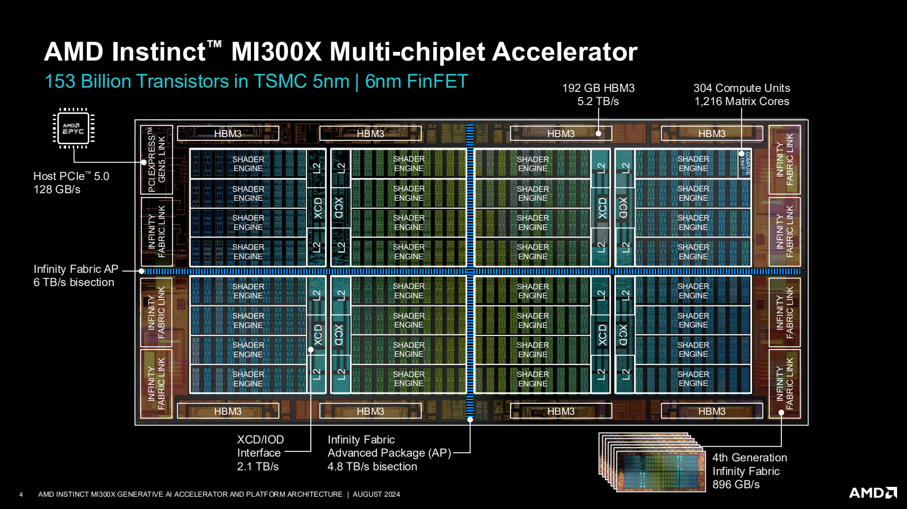
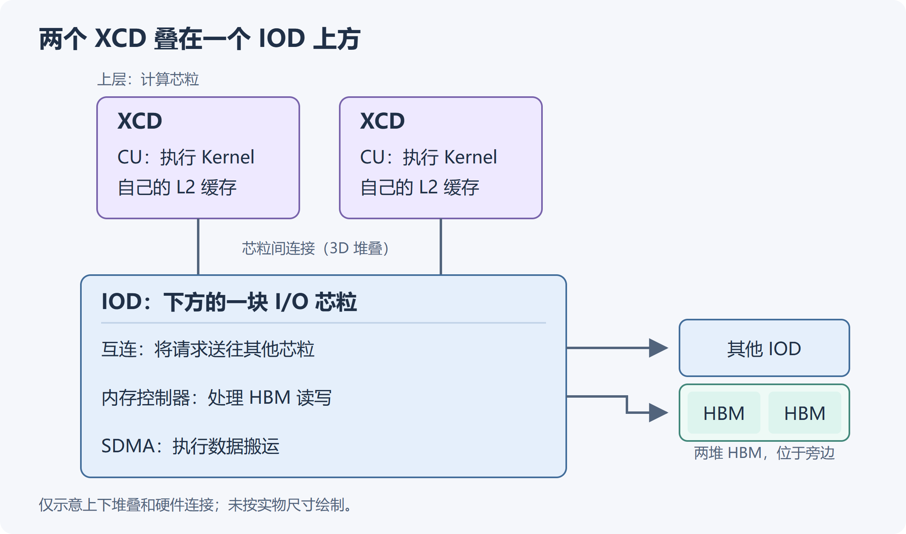
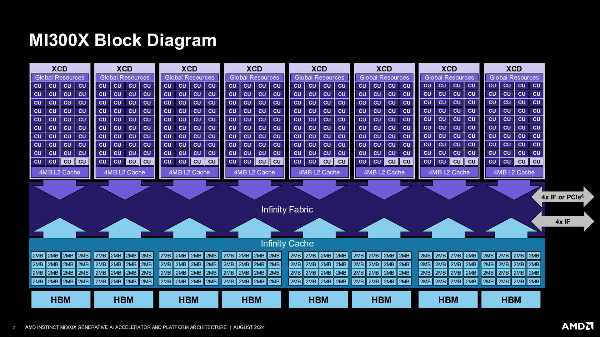
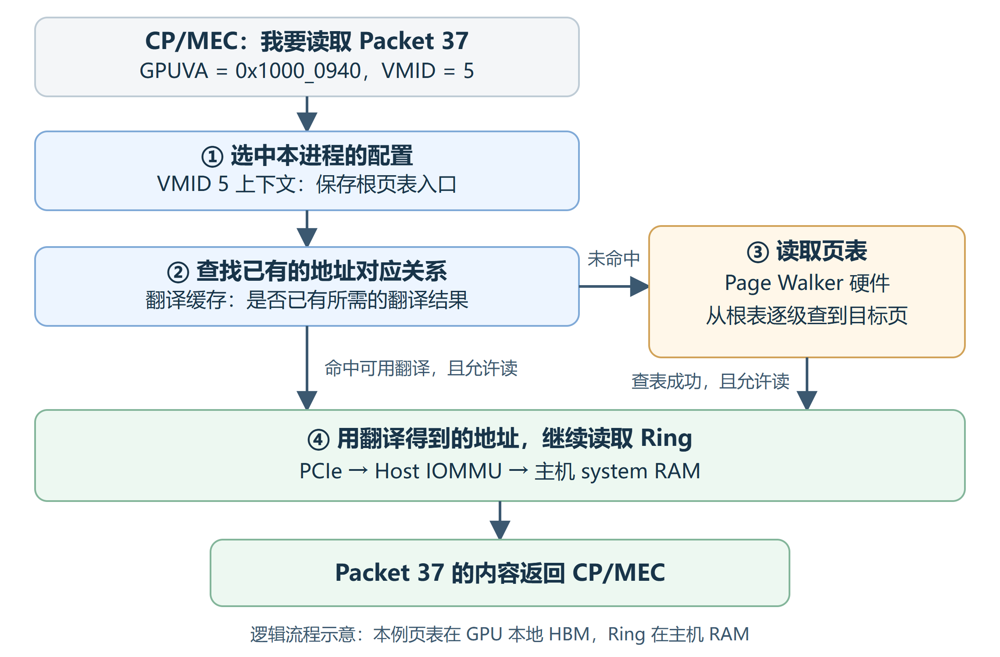
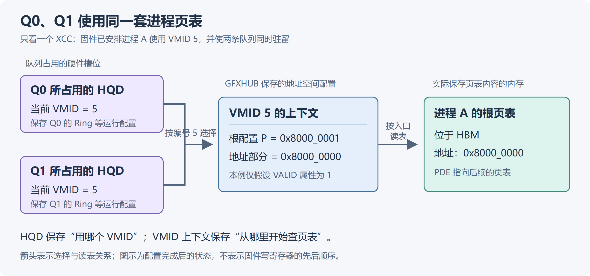
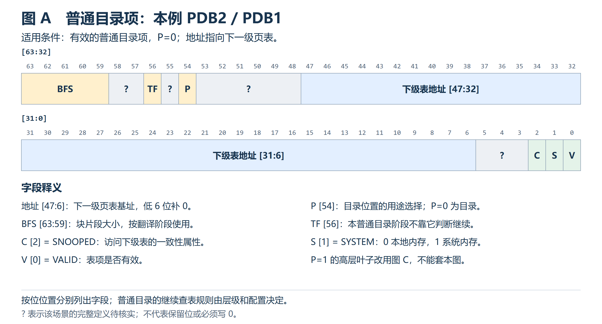
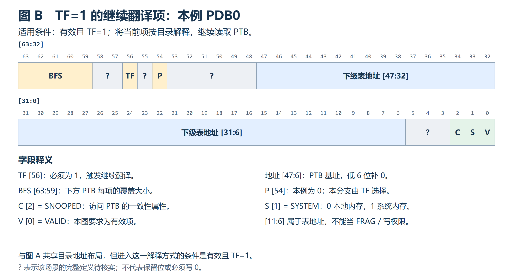
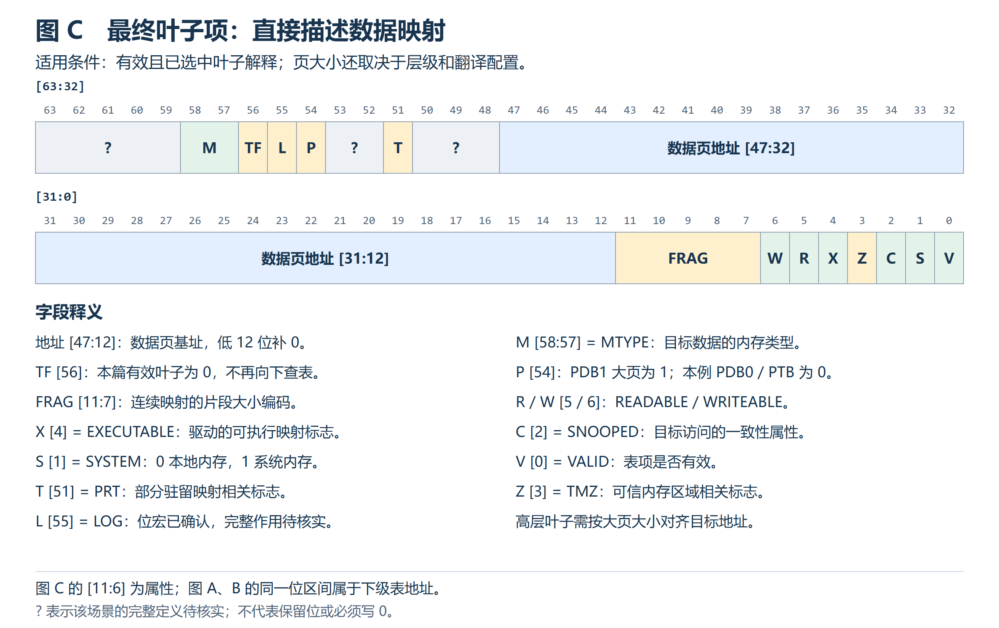
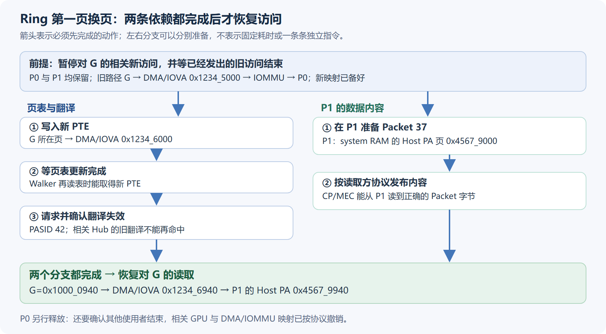

# AMD GPU MMU 与地址翻译

## 缩写表

| 缩写   | 英文全称                                         | 中文含义                                                   |
| ------ | ------------------------------------------------ | ---------------------------------------------------------- |
| ACK    | Acknowledgement                                  | 请求完成确认；本文用于失效确认寄存器及其字段               |
| AMD    | Advanced Micro Devices                           | AMD 公司                                                   |
| AMDGPU | AMD GPU Linux Kernel Driver                      | AMD GPU Linux 内核驱动                                     |
| AID    | Active Interposer Die                            | 有源中介芯粒；MI300 的 I/O 基底芯粒，源码用于相关实例编号  |
| API    | Application Programming Interface                | 应用程序编程接口                                           |
| AQL    | Architected Queuing Language                     | 架构化队列语言及其命令包格式                               |
| Arm64  | Arm 64-bit Architecture                          | 64 位 Arm 架构；第 4 章以 Cortex-A35 对照中间查表缓存      |
| ASIC   | Application-Specific Integrated Circuit          | 专用集成电路；源码中指具体芯片系列                         |
| ATC    | Address Translation Cache                        | 地址翻译缓存；也出现在地址空间关联寄存器名称中             |
| ATS    | Address Translation Services                     | PCIe 地址翻译服务                                          |
| BAR    | Base Address Register                            | PCIe 基址寄存器及其描述的地址窗口                          |
| BFS    | Block Fragment Size                              | 目录项中的块片段大小编码                                   |
| BO     | Buffer Object                                    | 驱动管理内存后备的缓冲对象                                 |
| CAM    | Content-Addressable Memory                       | 内容寻址存储器；本篇指 Retry 故障跟踪资源                  |
| CDNA   | Compute DNA                                      | AMD 数据中心计算 GPU 架构系列                              |
| CID    | Client ID                                        | Hub 内的访存客户端编号                                     |
| CP     | Command Processor                                | GPU 命令处理器                                             |
| CPSCH  | Command Processor Scheduling                     | CP 固件队列调度路径                                        |
| CPU    | Central Processing Unit                          | 中央处理器                                                 |
| CU     | Compute Unit                                     | GPU 计算单元                                               |
| DF     | Data Fabric                                      | 芯片的数据互连体系                                         |
| DDR    | Double Data Rate                                 | 双倍数据速率存储器；本文用于外部主机内存对照               |
| DMA    | Direct Memory Access                             | 设备直接访问内存                                           |
| DRM    | Direct Rendering Manager                         | Linux 图形设备内核框架                                     |
| ENG    | Engine                                           | `VM_INVALIDATE_ENGn` 中编号为 n 的失效控制寄存器组       |
| GART   | Graphics Address Remapping Table                 | AMDGPU 内核系统地址空间所用的地址重映射表                  |
| FRAG   | Fragment                                         | 叶子表项中的连续映射片段大小编码                           |
| GC     | Graphics and Compute                             | 驱动中的图形与计算硬件 IP 类别                             |
| GCN    | Graphics Core Next                               | AMD 较早的 GPU 架构系列                                    |
| GFX    | Graphics                                         | AMDGPU 图形与计算 IP 的版本前缀                            |
| GFXHUB | Graphics Hub                                     | 图形与计算客户端使用的地址翻译 Hub                         |
| GMC    | Graphics Memory Controller                       | AMDGPU 中管理内存控制与 GPUVM 接口的组件                   |
| GPU    | Graphics Processing Unit                         | 图形处理器                                                 |
| GPUVA  | GPU Virtual Address                              | GPU 虚拟地址                                               |
| GPUVM  | GPU Virtual Memory                               | GPU 地址空间及其页表                                       |
| GTT    | Graphics Translation Table                       | 本篇指 AMDGPU 的系统内存资源域                             |
| HBM    | High Bandwidth Memory                            | 高带宽内存；MI300 使用 HBM3                                |
| HMM    | Heterogeneous Memory Management                  | Linux 异构内存管理                                         |
| HQD    | Hardware Queue Descriptor                        | 硬件队列描述状态                                           |
| HSA    | Heterogeneous System Architecture                | 异构系统架构                                               |
| HWS    | Hardware Scheduler                               | 硬件与固件队列调度路径                                     |
| IB     | Indirect Buffer                                  | 间接命令缓冲区                                             |
| IF     | Infinity Fabric                                  | AMD 的芯片内、芯粒间及设备间互连技术                       |
| IH     | Interrupt Handler                                | GPU 中断记录与通知硬件                                     |
| IOD    | I/O Die                                          | I/O 芯粒                                                   |
| IOMMU  | Input/Output Memory Management Unit              | 输入输出内存管理单元                                       |
| IOVA   | I/O Virtual Address                              | I/O 虚拟地址                                               |
| IP     | Intellectual Property                            | 芯片中的硬件功能模块                                       |
| ISA    | Instruction Set Architecture                     | 指令集架构                                                 |
| ISCA   | International Symposium on Computer Architecture | 国际计算机体系结构研讨会                                   |
| IV     | Interrupt Vector                                 | GPU 中断记录；本篇不指 CPU 中断向量号                      |
| KFD    | Kernel Fusion Driver                             | AMD GPU 计算内核驱动接口                                   |
| KIQ    | Kernel Interface Queue                           | 驱动提交硬件控制命令的内核接口队列                         |
| L1     | Level 1                                          | 第一级；本文按上下文区分翻译缓存与数据缓存                 |
| L2     | Level 2                                          | 第二级；用于描述数据缓存或地址翻译缓存的层级               |
| LDS    | Local Data Share                                 | CU 内按 Work-group 分配的片上共享存储                      |
| LOG    | Log                                              | 本节页表项中的记录控制标志；示例取 0                       |
| MC     | Memory Controller                                | 内存控制器；本文的 MC 地址属于 GPU 侧的系统地址布局        |
| MEC    | Micro Engine Compute                             | CP 中处理计算队列的引擎                                    |
| MES    | Micro-Engine Scheduler                           | 其他受支持路径使用的微引擎调度器；本文 MI300 主线不启用    |
| MMHUB  | Multimedia Hub                                   | AMDGPU 沿用的 Hub 名称；MI300 的 SDMA 也使用该路径         |
| MMIO   | Memory-Mapped I/O                                | 内存映射输入输出                                           |
| MMU    | Memory Management Unit                           | 内存管理单元                                               |
| MQD    | Memory Queue Descriptor                          | 保存在内存中的队列配置描述                                 |
| MTYPE  | Memory Type                                      | 页表或访存控制中的内存类型                                 |
| NUMA   | Non-Uniform Memory Access                        | 非一致性内存访问                                           |
| PA     | Physical Address                                 | 物理地址；使用时仍需注明属于 GPU 还是主机地址域            |
| PASID  | Process Address Space ID                         | 进程地址空间标识                                           |
| PCIe   | Peripheral Component Interconnect Express        | 高速外设互连总线                                           |
| PDB    | Page Directory Base                              | 驱动页表层级名称中的页目录层                               |
| PDE    | Page Directory Entry                             | 页目录项                                                   |
| PDD    | Process Device Data                              | KFD 中进程在某个设备上的状态                               |
| PDF    | Portable Document Format                         | 本地规范使用的文档格式                                     |
| PFN    | Page Frame Number                                | 页帧号；本篇的 GPU PFN 按 4 KiB 计数                       |
| PM4    | AMD PM4                                          | AMD GPU 底层控制命令包协议                                 |
| PRT    | Partially Resident Texture                       | 部分驻留纹理；本文指相关的特殊映射标志                     |
| PTB    | Page Table Base                                  | 驱动中的叶子页表层                                         |
| PTE    | Page Table Entry                                 | 页表项                                                     |
| PWC    | Page Walk Cache                                  | 页表遍历缓存；第 4 章用于资料中的经典 CPU 方案             |
| QPD    | Queue Process Device Data                        | PDD 内嵌的队列与调度状态；源码类型为`qcm_process_device` |
| RAM    | Random Access Memory                             | 随机存取存储器；system RAM 表示系统内存                    |
| REQ    | Request                                          | 请求；本文用于失效请求寄存器及其字段                       |
| ROCm   | Radeon Open Compute                              | AMD GPU 软件栈                                             |
| ROCr   | ROCm Runtime                                     | ROCm 的 HSA 用户态运行时                                   |
| RW     | Read/Write                                       | 读写；本文也用于故障状态中的访问方向字段                   |
| SDMA   | System Direct Memory Access                      | GPU 专用数据搬运引擎                                       |
| SMI    | System Management Interface                      | AMD 的系统管理接口；本文引用其分区术语说明                 |
| SQ     | Shader Sequencer                                 | Shader 指令执行与控制相关硬件                              |
| SVM    | Shared Virtual Memory                            | 共享虚拟内存                                               |
| TF     | Translate Further                                | 表项要求继续向下一层翻译的编码                             |
| TLB    | Translation Lookaside Buffer                     | 地址翻译缓存                                               |
| TMZ    | Trusted Memory Zone                              | 可信内存区域；本文中的相关页表标志取 0                     |
| TTM    | Translation Table Maps                           | Linux 图形内存资源管理框架                                 |
| UC     | Uncached                                         | 不缓存内存类型                                             |
| UMR    | User Mode Register Debugger                      | AMD 用户态寄存器调试器；本文引用其页表解码实现             |
| UTCL2  | Unified Translation Cache Level 2                | 二级统一翻译缓存；源码与中断中的名称                       |
| VA     | Virtual Address                                  | 虚拟地址                                                   |
| VM     | Virtual Memory                                   | 虚拟内存                                                   |
| VMC    | Virtual Memory Controller                        | 虚拟内存控制器；本文用于 MMHUB 故障来源名称                |
| VMID   | Virtual Memory ID                                | GPU 活动地址空间的硬件上下文编号                           |
| VRAM   | Video Random-Access Memory                       | AMDGPU 的设备本地内存资源域                                |
| XCC    | Accelerator Core Complex                         | 驱动管理的计算资源复合体                                   |
| XCD    | Accelerator Complex Die                          | 物理计算芯粒；MI300 中一个 XCD 对应一个 XCC                |
| XGMI   | External Global Memory Interconnect              | AMD GPU 之间的外部内存互连                                 |
| XNACK  | AMD XNACK                                        | AMD 对可重试内存访问异常相关能力的名称                     |

## 全文大纲

本文接续已经完成的 01、02、03 上下篇，从准备好的 GPUVM 映射和已驻留的 Queue 出发，追踪硬件怎样读到 Packet 37，以及映射改变或访问失败时硬件怎样处理。

缩写表供遇到术语时回查。正文先交代当前任务和目标，给出完整关系图或访问路径，再沿图解释对象、字段和计算；原始源码放在相关过程之后供核对。第一次阅读可沿 Packet 37 走完过程，再回看引用块中的证据。引用 02、03 时，本节需要的背景会在引用附近简要说明，链接供需要完整过程时查阅。第 1 章确定硬件位置，第 2 章找到页表入口，第 3～4 章讲清查表与缓存，第 5～6 章继续讨论映射变化和访问失败。

```text
MI300 内存系统的硬件结构
    ↓
访存请求与地址空间上下文
    ↓
Page Walker 与翻译缓存
    ↓
访问目标内存
    ↓
映射更新、翻译失效与完成确认
    ↓
硬件故障检测与上报
```

- **0. 从已有 GPU 映射进入硬件访存**：0.1 与 02、03 的衔接；0.2 读取 Packet 37；0.3 同一次 Dispatch 中的访问对象。
- **1. MI300 内存系统的硬件架构**：1.1 XCD/XCC、IOD 与 HBM；1.2 访存客户端；1.3 GFXHUB 与 MMHUB；1.4 地址翻译子系统；1.5 缓存与片上存储；1.6 配置关系。
- **2. VMID 上下文与根页表配置**：2.1 选择地址空间；2.2 硬件配置；2.3 根页表的归属与存放；2.4 MC 地址换算与根配置编码；2.5 HWS 提交；2.6 多实例上下文。
- **3. Page Walker 逐级读取 PDE 与 PTE**：3.1 页表连接；3.2 三种解码场景的字段定义；3.3 4 KiB 完整查表；3.4 读表通路；3.5 2 MiB、1 GiB 大页。
- **4. TLB 与页表缓存的硬件组织**：4.1 TLB 缓存；4.2 Page Table Cache（4.2.1 AMD、4.2.2 Intel、4.2.3 共享页表项的记录数量）；4.3 MI300X 缓存层级；4.4 BFS 与 FRAG；4.5 数据访问；4.6 映射变化后的旧缓存。
- **5. 翻译失效硬件与映射更新顺序**：5.1 换页地址与保护；5.2 PASID/KIQ 路径；5.3 多 XCC 与 Hub 范围；5.4 PASID→VMID 回退；5.5 REQ/ACK 的 CPU/KIQ 执行；5.6 旧页使用者；5.7 页表、翻译与内容的完成条件。
- **6. 硬件访存故障的检测与上报**：6.1 检测位置；6.2 记录精度；6.3 IH 分发；6.4 Retry 分支；6.5 数组访问失败。
- **7. 完整访存过程与知识检索**：7.1 Packet 37 全流程；7.2 正文、字段与源码索引。

**证据基线与阅读约定。** 学习模型固定为外部 Host CPU + MI300X 独立 GPU（CDNA 3），通过 PCIe 连接。Host CPU 运行 Linux、驱动与应用的 CPU 端代码，MI300X 执行 GPU Kernel；system RAM 指主机内存，本地 HBM 指 GPU 显存。驱动固定为 Linux `248951ddc14de84de3910f9b13f51491a8cd91df`，下文 `[SOURCE]` 中简称 Linux `248951ddc14d`，Linux 源码链接均指向仓库中的这个版本。Queue 和 Packet 对象沿用 03 的 ROCr `ba56a24c6132c5d195686ae4adf969ca1222fbba` 基线。

> **[SPEC]** 本地 [MI300 / CDNA 3 ISA](./amd-instinct-mi300-cdna3-instruction-set-architecture.pdf)，封面日期 **2025-08-05**。本文引用“原文页码”时采用页脚编号；例如原文第 74 页是 PDF 第 82 页。该 ISA 说明指令与内存语义，并未公开一份涵盖所有 TLB 容量、替换策略和 Page Walker 内部流水线的 MMU 手册。
>
> 本地 AMD 作者论文 [*Realizing the AMD Exascale Heterogeneous Processor Vision*](./isca2024_exascale.pdf)，ISCA 2024 作者版本，本文按英文 PDF 第 4～6、9、11～12 页引用。它提供 MI300 的芯粒、互连和内存组织。中文译稿只辅助阅读，硬件结论核对英文原文。

`[SOURCE]` 表示固定源码可以直接证明的实现；`[SPEC]` 表示规范或硬件资料；`[INFERENCE]` 表示基于这些事实的推演；`[DESIGN]` 表示教学条件；`[BOUNDARY]` 表示适用范围或尚无直接证据的细节。功能图表达输入、输出和状态依赖，不自动等同于芯片版图、总线信号或时钟级时序。

本文将超过 4 位的教学十六进制值按每 4 位分组，例如 `0x40_8000_0000`。下划线仅帮助阅读，数值与位宽不变；原始源码保留原有写法。

## 0. 从已有 GPU 映射进入硬件访存

### 0.1 与 02、03 的衔接

03 已经讲到：CPU 把一次 Kernel 任务写成 Packet，放进队列的 Ring；GPU 的命令处理器 CP/MEC 从 Ring 读取 Packet，再安排后续执行。04 就从其中的“读取 Packet”展开：**CP/MEC 算出了地址，硬件怎样根据这个地址，读到内存里的内容？**

先沿用 Packet 37，把读取之前已经完成的准备说清楚。

**02 说明了 Ring 的存储空间和页表映射怎样准备。** Ring 是一块保存 Packet 的缓冲区，本例位于 system RAM。驱动已经为 Ring 准备好实际存放内容的内存页，并在这个进程的 GPU 页表中写入映射。映射的作用是告诉硬件：访问某个 GPU 虚拟页时，应去读哪一页内存，以及是否允许读写。GPUVM 指这个进程的 GPU 地址空间及其页表。

本篇假设这些页表已经写好，读表硬件能够看到新表项，可能残留的旧地址翻译也已按要求处理。Ring 的内存页和映射在本次访问期间保持有效。因此，下面可以直接讨论硬件如何使用映射。

**03 说明了 CP/MEC 从哪里取得 Ring 地址，以及哪个 Packet 已经可以读取。** 队列配置先保存在内存中的 MQD，队列获得驻留时，相关配置被装入 GPU 的 HQD 寄存器，随后激活队列。本例假设这一步已经完成。CP/MEC 根据 HQD 中的 Ring 基址、容量和处理进度，确定接下来读取 Packet 37。

CPU 也已经填好 Packet 37，并用 release 语义发布了有效 Header。这里的 Header 是 Packet 的头部；发布协议让设备看到有效包时，可以按协议使用此前写好的字段。Doorbell 用来通知提交进度，Packet 内容仍保存在 Ring 中，等 CP/MEC 来读。

**04 继续展开这次读取中的地址翻译和内存访问。** Ring 基址是 `0x1000_0000`，每个槽位占 64 字节，Packet 37 的起始地址因此是：

```text
0x1000_0000 + 37 × 64 = 0x1000_0940
```

这个结果是 GPU 虚拟地址，简称 GPUVA。硬件还需要知道使用哪个进程的地址空间；Q0 当前的 VMID 就用于选择相应的硬件地址空间上下文，其中保存着页表入口。下面只画一次读取的主要关系，详细配置和逐级计算从第 2、3 章展开：

```text
Q0 的 HQD：保存 Ring 配置、处理进度和当前 VMID
    │
    ▼
CP/MEC：请求读取 GPUVA 0x1000_0940
    │ 同时使用 Q0 的 VMID，选择对应地址空间
    ▼
地址翻译硬件：取得该虚拟地址的映射，检查读权限
    │ 翻译与权限检查成功，得到目标地址及内存属性
    ▼
内存访问通路：读取 system RAM 中 Ring 对应位置的内容
    │
    ▼
返回给 CP/MEC：Packet 37 的内容
```

图中“取得映射”可以使用翻译缓存中已有的结果；没有可用结果时，硬件从页表入口开始查表。后面的章节会逐步打开这一步，说明硬件读取哪些表项、怎样形成目标地址，以及怎样到达目标内存。访问外部主机内存且启用相应 Host IOMMU 翻译时，GPU 得到的 DMA 地址还要经过主机侧翻译，§3.3 会沿同一次读取说明这段通路。

读到 Packet 后，GPU 还要读取代码、参数和数组，这些访问将在 §0.3 对照说明。眼下先跟住一个动作：**CP/MEC 发出对 `0x1000_0940` 的读取，直到 Ring 中的内容返回。** 本例的地址计算用于说明位置关系，不规定硬件必须用一次事务读完 64 字节。

前文对应位置，供需要完整过程时查阅：

- 内存与映射：[02 §1.4](<./02_GPU 内存管理基础.md#14-gpu-地址翻译>)、[02 §2.3.3](<./02_GPU 内存管理基础.md#233-从-software-mapping-到硬件-pte>)、[02 §2.3.4～2.3.5](<./02_GPU 内存管理基础.md#234-等待页表完成并-invalidate-旧-tlb-翻译>)。
- 队列与取包：[03 上篇 §3.2](<./03_AMD GPU 队列与 AQL Dispatch（上）.md#32-hqd队列配置寄存器与两种装载方式>)、[03 下篇 §6.0～6.1](<./03_AMD GPU 队列与 AQL Dispatch（下）.md#60-cpmec-根据-hqd-读取-ring>)。

### 0.2 贯穿案例：读取 Packet 37

沿用 03 的 Q0：Ring GPUVA 基址为 `0x1000_0000`，256 个槽，每槽 64 字节，后备位于 system RAM。当前处理的逻辑 Packet ID 为 37，尚不涉及绕回：

```text
slot        = 37 mod 256 = 37
slot_offset = 37 × 64 = 2368 = 0x940
GPUVA G     = 0x1000_0000 + 0x940 = 0x1000_0940
Ring 大小   = 256 × 64 = 16384 = 0x4000 = 16 KiB
Ring 范围   = [0x1000_0000, 0x1000_4000)
Packet 范围 = [0x1000_0940, 0x1000_0980)
```

**[DESIGN]** 本例从一次已经具备执行条件的读取出发：Q0 已驻留，CPU 已发布 Packet 37，页表和所需映射已准备好。本次访问期间，相关内存与映射保持有效。

GPU 页表保存在设备 HBM，Ring 内容保存在主机 system RAM。GPU 先取得地址翻译结果，再通过 PCIe 和已经建立的 Host IOMMU 映射读取 Ring。第一次访问假设所需翻译缓存均未命中，因此会实际读取页表。

本例使用进程地址空间编号 PASID 42、当前硬件上下文编号 VMID 5；先把它们理解为“哪个进程”和“当前使用哪份硬件配置”，第 2 章再沿请求解释对应关系。页表连接与表项格式在 §3.1～3.2 说明，§3.3 用这些格式完成逐级读表，并继续追踪主机侧的地址换算。

基础页按 4 KiB 计算。这 64 字节全部落在 Ring 第一页：`0x940 + 0x40 = 0x980 < 0x1000`，因此一次页面翻译覆盖整个 Packet。实际取包可以拆成多个事务，也可以预取更多字节；这里计算的是地址关系，不规定 CP 的事务粒度。

### 0.3 同一次 Dispatch 中的访问对象

本例的 `vector_add` 让 1024 个 Work-item 分别计算 `C[i] = A[i] + B[i]`；一个 Work-item 是一次带有自身下标的逻辑执行实例。沿用 03 下篇的教学地址，假设未启用 Kernarg 预加载，由 Kernel 的访存指令读取参数块。地址从一个对象中的字段指向另一个对象：

```text
Q0.HQD 的 Ring 基址和处理进度
    └─ CP/MEC 读 G=0x1000_0940：Packet 37
          ├─ kernel_object=0x7000_0000
          │     └─ 启动准备路径读 Kernel Descriptor
          │           └─ 入口偏移 +0x100 → CU 从 0x7000_0100 取机器指令
          ├─ kernarg_address=0x6000_0000
          │     └─ Kernel 的访存指令读取参数块
          │           ├─ +0 ：A=0x3000_0000 → 读 A[i]
          │           ├─ +8 ：B=0x4000_0000 → 读 B[i]
          │           ├─ +16：C=0x5000_0000 → 写 C[i]
          │           └─ +24：N=1024，决定本例有效元素范围
          └─ completion_signal=S
                └─ 用句柄 S 找到 Ring 外的 Signal 对象
                      └─ value 初始为 1，正常完成收尾后减为 0
```

Descriptor 保存启动配置、资源需求和机器码入口偏移。CP/MEC 的启动准备路径读取它，以 `0x7000_0000 + 0x100` 得到代码入口。CU 执行代码后，先从 `0x6000_0000` 的 Kernarg 读取 A/B/C 指针和 N，再按自己的下标访问数组。图中的参数偏移是教学布局，实际布局由编译结果规定；完整装载与字段说明见 [03 下篇 §4.2](<./03_AMD GPU 队列与 AQL Dispatch（下）.md#42-packet-与代码参数块及数组的引用关系>)。

`completion_signal` 保存句柄 S，完成值位于 S 所指的独立 Signal 对象中。正常完成路径在本次工作及所需 release 完成后，将该值从 1 减为 0；CPU 再通过规定的等待与 acquire 协议确认完成并读取结果。更新者是完成路径，`vector_add` 的计算指令只负责读 A/B、写 C。

> **[SOURCE]** ROCr `ba56a24c6132`，[`AMDHSAKernelDescriptor.h`](./2.源码/rocr-runtime/runtime/hsa-runtime/loader/AMDHSAKernelDescriptor.h) 第 199～211 行定义 Descriptor 的资源、入口偏移和启动配置；[`hsa.h`](./2.源码/rocr-runtime/runtime/hsa-runtime/inc/hsa.h) 第 1366～1372、3064～3068 行定义 Signal 句柄及 Packet 中的完成字段。

每一次对象访问都需要自己的映射与访问权限。Ring 读成功后，代码取指、参数读取或 C 的写入仍可能各自失败。位于同一个 GPUVM，只表示这些请求使用同一地址空间；它们不必共用同一个 PTE、后备页面或内存类型。

## 1. MI300 内存系统的硬件架构

### 1.1 XCD/XCC、IOD 与 HBM 的组织

Queue 驻留时，所选 XCC 中的 HQD 保存当前队列配置，CP/MEC 据此取包；计算工作随后由 CU 执行。沿访存方向继续向外看，执行计算和发出请求的 XCD 通过下方 IOD 的互连访问 HBM。MI300 由多个这样的芯粒共同组成，一个请求可能跨越芯粒边界才能到达目标内存。

先看 AMD 在 Hot Chips 2024 发布的 MI300X 原图。它标出了封装中的计算芯粒、HBM 和互连接口：



> **[SPEC]** AMD，Alan Smith、Vamsi Alla，*AMD Instinct MI300X Generative AI Accelerator and Platform Architecture*，Hot Chips 2024，**2024 年 8 月，第 4 页**。上图由[本地保存的原始 PDF](./assets/04/amd-mi300x-hot-chips-2024.pdf#page=4)整页渲染，保留原始标注，没有重绘。标题意为“AMD Instinct MI300X 多芯粒加速器”；[会议发布的原始资料](https://hc2024.hotchips.org/assets/program/conference/day1/23_HC2024.AMD.MI300X.ASmith%28MI300X%29.v1.Final.20240817.pdf)可用于核对来源。

XCD 是物理计算芯粒，XCC 是驱动中的计算资源复合体；在 MI300 中，一个 XCD 对应一个 XCC。IOD 提供互连、内存及 I/O 连接，HBM 堆栈接到 IOD 的内存接口。后文用 XCD 说明物理位置，用 XCC 说明驱动选择哪个计算实例。

先找中间的 **8 个 XCD**，再看上、下两侧共 **8 个 HBM3 堆栈**。每两个 XCD 叠在一个 IOD 上方，通过 3D 混合键合连接；图中的 `XCD/IOD Interface` 表示这类芯粒间接口。HBM 堆栈位于旁边，经无源硅中介层连接到 IOD。四个 IOD 之间通过 IF 互连，使请求能够到达目标内存通道。图左侧的 Host PCIe 表示与外部主机的连接。

原图没有清楚展示 IOD 位于 XCD 下方这一层关系。下面只取一组，画出**两个 XCD 叠在一个 IOD 上方**的结构。IOD 是一块实际的硅芯片，全称为 I/O Die；图中只示意上下堆叠和连接关系，不按实物尺寸绘制，HBM 位于旁边。



上方两个 XCD 中的 CU 执行 Kernel。需要访问 HBM 时，请求经下方 IOD 的互连，送到负责目标 HBM 的内存控制器；目标 HBM 若连接在其他 IOD 上，请求还会经过 IOD 之间的互连。SDMA 也位于 IOD 上，负责数据搬运；§1.3 会展开同一 IOD 上的 4 个 SDMA 与 MMHUB 的关系。

MI300X 共有四组这样的堆叠结构：每组两个 XCD、一个 IOD，因此总计 **8 个 XCD、4 个 IOD**。每个 IOD 连接两堆 HBM，合计 8 堆。后文的 XCC 是驱动管理计算资源时使用的名称；在本文 MI300X 中，一个 XCD 对应一个 XCC。

> **[SPEC]** AMD ROCm 博客 [Deep dive into the MI300 compute and memory partition modes](https://rocm.blogs.amd.com/software-tools-optimization/compute-memory-modes/README.html)（2025-02-09），“MI300: Architecture, compute, and memory partitions”小节明确说明：MI300X 有 8 个 XCD、4 个 IOD，每两个 XCD 通过 3D 堆叠置于一个 IOD 上方，每个 IOD 连接两堆 HBM。上图为据此补画的教学示意；SDMA 的数量与所属 IOD 见 §1.3 的固定源码证据。

再看同一份资料中的逻辑框图，按从上到下的顺序读计算、互连、缓存和内存之间的关系：



> **[SPEC]** 同一份 AMD Hot Chips 2024 资料，**第 7 页“MI300X Block Diagram”**，意为“MI300X 逻辑框图”。上图同样保留[原始 PDF 第 7 页](./assets/04/amd-mi300x-hot-chips-2024.pdf#page=7)的完整内容。

图中每个紫色 XCD 方框都包含 CU、Global Resources（共享控制资源）和自己的 L2 Cache（二级数据缓存）。下面的 Infinity Fabric 连接计算与内存系统；Infinity Cache 是内存侧缓存，底部浅蓝色方框是 HBM。这张逻辑图没有单独框出四个 IOD，理解芯粒位置时需对照上面的堆叠示意图。这里把逻辑关系展开成上下几层，便于看清连接，不能据此认为八个 XCD 在实物中排成一行，也不能把整张图当作每一次访存必经的流水线。

每个 XCD 物理实现 40 个 CU，产品启用 38 个，所以 MI300X 为 `8×38=304` 个启用 CU。每个 XCD 的 4 MiB 数据 L2 分别属于该 XCD，总量为 `8×4 MiB=32 MiB`；这八块 L2 各自服务对应 XCD 的访问。

HBM 一侧共有 128 个内存通道，每通道配一个 2 MiB Infinity Cache 切片：`128×2 MiB=256 MiB`。按四个 IOD 的组织，每个 IOD 连接两堆 HBM，并承担相应的内存侧资源。IF 将请求送往目标地址所对应的通道；发请求的 XCD 可以访问由其他 IOD 连接的 HBM。

> **[SPEC]** 本地 [ISCA 2024 论文 §VII、图 16，第 11 页](./isca2024_exascale.pdf#page=11)给出 MI300X 的 8 个 XCD、304 个 CU、192 GB HBM，以及复用 XCD、IOD 组件的说明。因此，本节结合 [§IV-A/B/D，第 4～5 页](./isca2024_exascale.pdf#page=4)与[§V-A/B，第 6～7 页](./isca2024_exascale.pdf#page=6)核对这些组件的 CU、缓存、内存通道和封装连接。只采用适用于 MI300X 的组件信息。论文使用 MB/GB 记法；容量单位按 AMD [ROCm 6.1 硬件规格表的 MI300X 行](https://rocm.docs.amd.com/en/docs-6.1.0/reference/gpu-arch-specs.html)统一写成 MiB/GiB。

**[DESIGN]** 本篇采用整卡 8 个 XCC 组成一个逻辑 GPU、HBM 组成一个内存分区的配置。后文仍按驱动记录的实例范围解释配置与失效操作；实际实验时核对该范围。以上原图不包含内存控制器的地址选择公式，不能用它们直接计算某个 GPUVA 对应哪一堆 HBM。

### 1.2 CP/MEC、Shader 与 SDMA 访存客户端

Packet 37 交付的是一次 `vector_add` 任务。CP/MEC 读完 Packet 后，CU 要取得机器指令，再按指令读取 A、B 并写入 C。本节沿这几个动作说明“谁在发起访存”。

沿用 §0.3 的 `C[i] = A[i] + B[i]`，可以用熟悉的 CPU 取指、执行过程理解这两个动作：先读取指令，知道要做什么；执行到读取或写入指令时，再访问指令指定的数据地址。

```text
CP/MEC 读取 Ring 中的 Packet 37
    │ 根据 Packet 和 Kernel Descriptor 准备启动 vector_add
    ▼
CU 中的执行硬件运行 Kernel
    │
    ├─ 取指：根据 Wave 当前的程序地址，读取机器指令
    │         例如取得一条“读取 A 中数据”的指令
    │
    └─ 执行取得的指令
         ├─ 遇到读取指令 → 从 A、B 的相应地址读取数据
         ├─ 遇到加法指令 → 对寄存器中的值做加法
         └─ 遇到写入指令 → 把结果写到 C 的相应地址

执行过程中持续取指、执行，直到 Kernel 结束。
```

Shader 通常译为“着色器”。在编程语境中，它常指运行在 GPU 上的程序；硬件资料也会用 Shader Processor 指执行这些程序的处理硬件。**本篇采用硬件侧的用法：“Shader 取指、读写”指 CU 在执行 Kernel 时读取机器指令、访问数据的动作。** 文中遇到这些说法时，可以直接理解为“CU 取指”和“CU 执行访存指令”。

`vector_add` 是要运行的 Kernel 程序，编译后成为 GPU 机器指令；CU 是执行这些指令的计算单元；Wave 是一批共同执行指令的 Work-item。CP/MEC 先读取 Packet，并根据 Packet 和 Kernel Descriptor 准备启动，随后由 CU 执行 Kernel 中的计算指令。

CU 在执行过程中持续取指。取指取得的是“要执行什么操作”的机器码，数据读取取得的是参与计算的值。A、B 的值读入寄存器后，加法指令使用寄存器中的值计算结果，再由写入指令把结果存回 C。

**[DESIGN]** 只观察 `i=5` 这个 Work-item，数组元素均为 4 字节，地址沿用 §0.3。下面分别列出代码入口和数据地址；例子不规定实际机器指令序列或内存事务数量。

```text
取指访问的对象：vector_add 的机器码
    代码入口 = 0x7000_0100
    后续取指地址随程序执行推进或跳转

执行访存指令时访问的对象：数组元素
    读 A[5]：0x3000_0000 + 5×4 = 0x3000_0014
    读 B[5]：0x4000_0000 + 5×4 = 0x4000_0014
    写 C[5]：0x5000_0000 + 5×4 = 0x5000_0014
```

数组地址由 CU 按 Kernel 代码计算。例如读取 A[5] 前，CU 先算出 `0x3000_0014`，再发起读取；地址翻译硬件收到的是这个已经算好的 GPUVA。代码和数组分别占用各自的地址范围，取指和数据读写也各自需要有效映射与相应权限。

> **[SPEC]** [MI300 ISA](./amd-instinct-mi300-cdna3-instruction-set-architecture.pdf#page=12)（封面日期 **2025-08-05**），第 1 章及 §1.1，原文第 **4 页**：CU 执行管线从内存取得指令和数据并执行 Kernel，硬件在执行期间自动取指；术语表使用 `shader processor` 描述为 Wave 执行程序的处理硬件。取包与 Descriptor 的对象来源见 [03 下篇 §6.0～6.1](<./03_AMD GPU 队列与 AQL Dispatch（下）.md#60-cpmec-根据-hqd-读取-ring>)。

CP/MEC 取 Packet、CU 取指和读写数组，都会产生内存访问。发起这些访问的硬件就称为“访存客户端”。SDMA 也属于访存客户端：收到搬运命令后，它从源地址读取数据，再把数据写到目的地址。

下面按地址来源画出这几类访问。“CU 取指”和“CU 数据读写”是 CU 执行同一个 Kernel 时的不同动作。SDMA 一行另取使用虚拟地址的搬运命令作对照，源、目的地址均已建立相应映射；`vector_add` 的数组读写仍由 CU 执行。

```text
CP/MEC：HQD 的 Ring 基址 + slot 偏移
    └─ 读 0x1000_0940 → 取得 Packet 37

CU 取指：本 Wave 当前的程序地址
    └─ 从代码入口 0x7000_0100 开始取指 → 取得要执行的机器指令

CU 数据读写：执行指令时算出的数组地址
    ├─ 读 0x3000_0014、0x4000_0014 → 取得 A[5]、B[5]
    └─ 写 0x5000_0014             → 保存 C[5]

SDMA：搬运命令指定的源地址、目的地址
    ├─ 源读请求 → 取得数据
    └─ 目的写请求 → 写到另一地址

这些虚拟地址访问都要经过各自的地址翻译通路，再访问目标内存。
```

形成 GPUVA 后，硬件还需要确定使用哪个进程的映射，因为不同进程可以使用相同的虚拟地址数值。沿用 §0.2 的条件，本例当前实例中的 VMID 5 已关联到该进程的 GPUVM。CU 读取 A[5] 时，地址翻译过程使用这个关联：

```text
CU 要读取 A[5]：GPUVA = 0x3000_0014
    │ 使用本次执行关联的 VMID 5
    ▼
地址翻译硬件选择本进程的 GPUVM
    │ 在这套映射中翻译 0x3000_0014，并检查是否允许读取
    ▼
按翻译结果访问后备内存 → 把 A[5] 的值返回 CU
```

Q0 取包、Kernel 取指和读写 A/B/C 都使用本例进程的地址空间，但各次访问查找的地址、所需权限不同。VMID 与根页表怎样关联，第 2 章再展开。

<details>
<summary>补充：CU 访问 LDS、scratch 时的通路</summary>

上面的 A/B/C 属于 global 数据访问，沿本文的 GPUVM 路径寻找后备页面。CU 还可以访问其他类型的存储，通路要按访问对象区分。

LDS 是 CU 内按 Work-group 分配的共享存储，同组 Work-item 可借此交换数据。访问 LDS 使用片上存储通路，不需要沿 A/B/C 的 GPUVM 路径寻找片外数据页；§1.5 会把 LDS 放回 CU 的存储结构中。

scratch 保存各 Work-item 的私有临时数据，其片外后备仍需经过相应的地址形成与翻译。FLAT 是一类访存指令，可以按地址范围选择 global、scratch 或 LDS，因此要先看地址指向哪类存储，再判断访问通路。

> **[SPEC]** [MI300 ISA](./amd-instinct-mi300-cdna3-instruction-set-architecture.pdf#page=87)（2025-08-05），§10.1～§10.3，原文第 79～82 页，说明 FLAT 地址空间选择；§3.1、原文第 8 页说明 LDS。

</details>

上面暂时把负责翻译的部分统称为“地址翻译硬件”。下一节继续沿 CP/MEC 读取 Packet 37 的请求，说明这部分硬件在 MI300X 中叫什么，以及它与 CP/MEC、CU、SDMA 怎样连接。

### 1.3 GFXHUB、MMHUB 与客户端的连接

上一节中，CP/MEC 已经算出 Packet 37 的 GPUVA 为 `0x1000_0940`，并使用当前的 VMID 5。接下来需要有硬件根据本进程的 GPUVM，把这个虚拟地址翻译成访问 Ring 后备页面所需的地址。

GFXHUB 和 MMHUB 统称为 VM Hub，负责 GPU 地址翻译、权限检查等功能。下面举例补出 §1.1 原图中没有展开的关系；箭头表示访问请求交给哪个 Hub 处理：

```text
VM Hub：承担 GPU 地址翻译等功能的内存 Hub
    │
    ├─ GFXHUB：服务 CP/MEC、CU 的访问
    │    │
    │    ├─ XCC 0 的 CP/MEC、多个 CU ──→ GFXHUB(0)
    │    └─ XCC 1 的 CP/MEC、多个 CU ──→ GFXHUB(1)
    │
    └─ MMHUB：服务 SDMA 的访问
         │
         └─ 同一个 IOD 上的 4 个 SDMA ──→ 该 IOD 对应的 MMHUB
```

例如，若 Packet 37 由 XCC 0 的 CP/MEC 读取，这次访问就交给 `GFXHUB(0)` 做地址翻译。同一 XCC 中，多个 CU 执行 Kernel 时的取指和 global 数据访问，也使用 `GFXHUB(0)`。

换成 XCC 1 发出的这些访问，就使用 `GFXHUB(1)`。

MI300X 中有多个 SDMA，每个 SDMA 都是专门搬运数据的硬件。每个 IOD 配有 4 个 SDMA，它们使用该 IOD 对应的 MMHUB 做地址翻译。只取其中两个 IOD 展开来看：

```text
IOD 0
  第 1 个 SDMA ──┐
  第 2 个 SDMA ──┤
  第 3 个 SDMA ──┼──→ IOD 0 对应的 MMHUB
  第 4 个 SDMA ──┘

IOD 1
  第 1 个 SDMA ──┐
  第 2 个 SDMA ──┤
  第 3 个 SDMA ──┼──→ IOD 1 对应的 MMHUB
  第 4 个 SDMA ──┘
```

例如，IOD 0 上的第 1 个 SDMA 执行搬运命令时，从源地址读取数据，再写到目的地址。在本节使用虚拟地址的例子中，源读请求和目的写请求都由 IOD 0 对应的 MMHUB 做地址翻译；同一 IOD 上另外 3 个 SDMA 发出的这类请求，也使用这个 MMHUB。

> **[SOURCE]** Linux `248951ddc14d`：
>
> - [`gfx_v9_4_3.c`](./2.源码/linux/drivers/gpu/drm/amd/amdgpu/gfx_v9_4_3.c) 第 983～998 行在计算 Ring 初始化中记录所属 XCC，并将 `vm_hub` 设为 `AMDGPU_GFXHUB(xcc_id)`。
> - [`aqua_vanjaram.c`](./2.源码/linux/drivers/gpu/drm/amd/amdgpu/aqua_vanjaram.c) 第 514～521 行将每个 AID（即这里的 IOD）对应的 SDMA 数量设为 4，并根据设备的 SDMA 掩码统计可用总数。
> - [`sdma_v4_4_2.c`](./2.源码/linux/drivers/gpu/drm/amd/amdgpu/sdma_v4_4_2.c) 第 1470～1502 行根据 SDMA 所属的 `aid_id`，将其 Ring 的 `vm_hub` 设为 `AMDGPU_MMHUB0(aid_id)`。

**翻译硬件可以有多份，使用的进程页表可以是同一套。** 例如进程 P 的任务在 XCC 0、XCC 1 上执行，驱动和调度方已为两边准备好相应的地址空间配置，并使根页表入口都指向 P 的同一套 GPUVM 页表：

```text
GFXHUB(0) 的翻译硬件 ──使用──┐
                            ├── 进程 P 的同一套 GPUVM 页表
GFXHUB(1) 的翻译硬件 ──使用──┘
```

图中的“使用”表示页表配置关系。页表页面保存在内存中，两边硬件按各自的配置使用它；每次访问是否需要读取页表，取决于相应翻译缓存是否命中。两个 Hub 仍各自保存上下文和翻译缓存状态，因此以后修改共享页表时，还需要处理相关 Hub 中可能保留的旧翻译，第 5 章再展开这一步。

> **[SOURCE]** Linux `248951ddc14d`，[`gfxhub_v1_2.c`](./2.源码/linux/drivers/gpu/drm/amd/amdgpu/gfxhub_v1_2.c) 第 42～61 行把传入的同一个 `page_table_base` 写入所选多个 XCC 的相应 VMID 上下文；第 196～219 行按 XCC 配置翻译缓存。该寄存器接口说明多份翻译硬件可以使用同一个根页表；HWS 路径怎样提交进程根配置见 §2.5。

把这些关系放回 Packet 37：CP/MEC 先向所属 XCC 的 GFXHUB 发出请求，翻译硬件再使用本进程的映射找到 Ring 后备页。仍沿用 §0.2 的条件，Ring 位于主机 system RAM，Host IOMMU 映射已建立。下面的箭头表示请求与数据返回：

```text
当前 XCC 的 CP/MEC
    │ 读取 Packet 37：GPUVA=0x1000_0940，使用 VMID 5
    │ 请求进入本 XCC 对应的翻译通路
    ▼
该 XCC 的 GFXHUB
    │ 使用 VMID 5 对应的进程 GPUVM 完成翻译、检查读权限
    │ 得到 Ring 后备页的访问地址与主机内存属性
    ▼
主机内存访问通路：PCIe → Host IOMMU
    │ 使用已经建立的主机侧映射
    ▼
主机 system RAM 中的 Ring 页面
    └─ 读出的 Packet 37 内容返回 CP/MEC
```

在这次访问中，CP/MEC 提出“读哪个 GPUVA”，GFXHUB 相关硬件完成 GPU 地址翻译，后续内存通路再按翻译结果读取 Ring 内容。Kernel 启动后，同一 XCC 中 CU 的取指和 global 数据访问，也由该 XCC 的 GFXHUB 翻译通路服务。

SDMA 则使用所属 MMHUB 的翻译硬件。沿用 §1.2 的虚拟地址搬运条件，若命令要求把主机内存中的数据搬到本地 HBM，SDMA 发出的源读和目的写都经过对应 MMHUB，翻译后分别访问主机页面和本地页面。

两类 Hub 翻译后的目标都可以是主机 system RAM 或设备本地 HBM。先按请求来自哪个客户端确定翻译通路，再按翻译结果确定目标内存；主例 Ring 位于主机内存中，也仍由 CP/MEC 所属的 GFXHUB 完成 GPU 地址翻译。

<details>
<summary>可选源码阅读：GFXHUB(j)、MMHUB0(k) 的实例编号</summary>

MI300X 有多个 XCC，驱动需要区分正在配置哪一个 XCC 的 GFXHUB。后文的 `GFXHUB(j)` 就表示 XCC 编号为 j 时对应的那一份 Hub；每个实例有各自的配置和翻译状态。

MMHUB 的相关实例按 AID 区分。AID 是 Active Interposer Die，指承载计算芯粒并提供互连的有源基底芯粒，对应 §1.1 资料中的 IOD 名称。SDMA 的 `aid_id` 用于确定它所使用的 MMHUB 实例：

```text
计算 Ring 记录 xcc_id=j → vm_hub=AMDGPU_GFXHUB(j)
SDMA Ring 记录 aid_id=k → vm_hub=AMDGPU_MMHUB0(k)
```

这里的 j、k 分别表示两类实例的编号。同一片 IOD 上可以连接多个 XCD，所以 XCC 编号和 AID 编号要分别使用；它们也不是前面选择进程地址空间的 VMID。驱动按设备发现结果建立这些关联，不能直接用示意图中的物理位置推算编号。

> **[SPEC]** AMD [SMI 27.0.0：GPU partitioning](https://rocmdocs.amd.com/projects/amdsmi/en/latest/conceptual/partition.html#architecture-background)的“Physical die types”小节明确解释 AID 与 IOD 的名称关系。本文只采用这个术语定义，不将页面中其他型号的分区规则作为 MI300 当前配置。

固定实现使用 GFXHUB 1.2 和 MMHUB 1.8 的配置接口：GFXHUB 按 XCC 配置寄存器，MMHUB 则遍历 `aid_mask` 指定的实例。后面设置页表入口、失效翻译或处理故障时，都需要找到相应实例；多实例上下文在 §2.6 继续展开。

> **[SOURCE]** Linux `248951ddc14d`，[`gmc_v9_0.c`](./2.源码/linux/drivers/gpu/drm/amd/amdgpu/gmc_v9_0.c) 第 1445～1455、1487～1492 行选择对应配置接口，第 1936～1946 行登记 GFX9.4.3 等分支的 Hub 范围；[`mmhub_v1_8.c`](./2.源码/linux/drivers/gpu/drm/amd/amdgpu/mmhub_v1_8.c) 第 236～260 行按 `aid_mask` 设置 MMHUB 的 SDMA snoop 属性。

**[BOUNDARY]** 这些接口确认到客户端归属和配置范围，未给出所有内部端口与物理摆放。GFXHUB 是 MI300X 计算设备沿用的硬件名称。故障记录中的 `node_id` 与这里的 XCC、AID 编号还有各自的转换，留到第 6 章结合具体记录解释。

</details>

接下来继续看 GFXHUB 中怎样完成这次翻译：VMID 选择哪份配置、是否已有缓存结果，以及需要读页表时由谁发起。§1.4 将展开这些部分之间的关系。

### 1.4 地址翻译子系统的组成

CP/MEC 要读取 Packet 37：地址是 `0x1000_0940`，使用 VMID 5。先沿图看一次成功的读取。§1.1 的 AMD 原图没有展开这段翻译过程，因此在这里补画流程图。



图中的①～③负责找到访问地址，④才去读取 Packet 内容。本例第一次读取所需的翻译均未命中，走②右侧通往③的分支。下面按这四步看各部分怎样配合。

**① VMID 5 选中本进程的页表配置。**

这里的 **VMID 5 上下文，就是本 XCC 的 GFXHUB 中编号为 5 的一组地址翻译配置寄存器**。“上下文”是这组配置的统称。下面按含义列出寄存器保存的内容，暂不展开字段编码。

```text
CP/MEC 的请求：GPUVA=0x1000_0940，VMID=5
    │ 按编号 5 选择
    ▼
VMID 5 上下文（GFXHUB 中对应的一组硬件寄存器）
    ├─ 启用状态：已启用
    │
    ├─ 根页表入口
    │    ├─ 地址字段：指向 0x8000_0000
    │    └─ 读表属性：读取根页表时使用的属性
    │
    ├─ 有效地址范围：起始页号、结束页号
    │    └─ 用于检查请求的 GPUVA 是否越界
    │
    ├─ 页表解释规则：深度、块大小等配置
    │    └─ 用于解释多级页表的组织
    │
    └─ 故障控制
         └─ 决定越界、表项无效、权限错误等故障的处理方式

需要读表时，Page Walker 取出上面的根页表入口
    │ 使用入口中的地址和读表属性
    ▼
GPU 本地 HBM：地址 0x8000_0000 处的根页表
    └─ 表内的目录项 → 下一级页表 → ……
```

**入口和控制配置在硬件寄存器中，实际页表在内存中。** 本例的根页表位于 HBM 的 `0x8000_0000` 处，下级页表也都在 HBM 中。Page Walker 使用寄存器中的入口读取根页表，再沿其中的目录项找到下一张表。

这次读取使用已经准备好的配置。驱动、固件与硬件的分工在 §1.6 概览，第 2 章再展开配置从哪里来、怎样与队列关联。这里继续沿 Packet 37 的请求向下看。

**② 有可用的缓存结果，就复用地址关系。**

**翻译缓存**保存已经查到的“虚拟页 → 目标页”关系，以及权限等信息。再次访问同一页时，如果结果仍在缓存中而且允许本次读取，硬件就能复用这个地址关系，直接走向图中的④。

这里缓存的是“去哪里读”，Packet 的字节内容要通过④的数据访问取得。

**③ 缓存不能满足时，由 Page Walker 读取页表。**

本例第一次访问时，所需翻译均未命中。**Page Walker 是执行查表的硬件**：它使用①保存的根页表入口，读取一个表项，再根据表项找到下一张表，直到查到目标页。

```text
VMID 5 上下文中的入口
    ↓ Page Walker 据此读取根表
根页表 → 第 2 层表 → 第 3 层表 → 第 4 层表中的 PTE
                                         ↓
                                目标页地址、权限、内存属性
```

目录项 PDE 用于指向下一张表；本例最终由叶子表项 PTE 给出 Ring 后备页的信息。取得翻译后，相关信息可以进入翻译缓存，供后续请求复用。缓存也可能只保留中间目录信息，从而省去一部分读表操作。

正常查表由硬件完成，Linux 驱动不需要为每次取包逐项读取页表。第 3 章再把这四层查找代入具体地址计算。

**④ 有了地址，继续读取 Ring 中的内容。**

本例每页 4 KiB，Packet 37 的位置可以拆成：

```text
0x1000_0940 = 虚拟页起点 0x1000_0000 + 页内偏移 0x940
                         ↓ GPU 页表翻译
                   得到目标页基址 + 页内偏移 0x940
                         ↓ 继续发出数据读取请求
             PCIe → Host IOMMU → 主机 RAM 中的 Ring
```

Page Walker 刚才读取 HBM 中的页表，是为了找地址；现在读取主机 RAM 中的 Ring，才会取得 Packet 37。本例启用了 Host IOMMU，GPU 翻译得到的地址还需经过主机侧翻译，完整数值过程见 §3.3。

**映射改变时，失效引擎撤销旧的缓存翻译。**

例如，驱动把某个虚拟页改为指向新页面，内存中的页表和芯片中的缓存可能暂时不同：

```text
内存中的新页表：虚拟页 → 新页面
翻译缓存仍保留：虚拟页 → 旧页面

随后撤销缓存中的旧翻译：
驱动发出请求 → 失效引擎 → 指定的旧翻译失效 → 给出完成确认
```

这样，后续请求就不能再复用被撤销的旧翻译。这里假定已停止相关新访问、等待旧访问结束，并使新页表对翻译硬件可见；驱动还要检查失效完成状态，再恢复访问。第 5 章会讲完整顺序。

**翻译出错时，故障逻辑记录并上报问题。**

访问可能因地址超出允许范围、表项无效、权限不足或读取页表出错而失败。即使缓存命中，也仍需检查本次访问的权限。

```text
范围检查、读表或权限检查发现错误
    ↓
故障逻辑按配置处理
    ├─ 更新故障状态寄存器
    └─ 向 IH 上报事件 → 记录到中断队列 → 通知 Host CPU
                                               ↓
                                      驱动读取故障信息
```

IH 是 GPU 记录和通知中断事件的硬件。驱动结合事件记录和 Hub 状态，判断哪个地址空间、哪一页发生了什么问题。记录的具体字段与精度在第 6 章说明。

<details>
<summary>可选阅读：上下文的其他配置与源码证据</summary>

VMID 上下文除根页表入口外，还保存有效地址范围、页表深度和块大小等解释规则，以及故障处理选项。硬件据此检查地址范围、解释各级表项，并按配置处理故障；第 2 章逐项展开这些配置。

> **[SOURCE]** Linux `248951ddc14d`，上述功能对应的源码入口：
>
> - [`gfxhub_v1_2.c`](./2.源码/linux/drivers/gpu/drm/amd/amdgpu/gfxhub_v1_2.c) 第 42～62 行配置根页表入口；第 196～268 行配置翻译缓存；第 328～398 行配置 VMID 上下文，第 418～434 行在 Hub 初始化过程中调用这项配置；第 400～415、556～568 行提供失效范围、请求、确认和故障状态接口。
> - [`kfd_packet_manager_v9.c`](./2.源码/linux/drivers/gpu/drm/amd/amdkfd/kfd_packet_manager_v9.c) 第 89～110、140～145 行将进程身份和根页表信息写入 `MAP_PROCESS`，交给 CP 调度固件使用。
> - [`gmc_v9_0.c`](./2.源码/linux/drivers/gpu/drm/amd/amdgpu/gmc_v9_0.c) 第 543～679 行从中断记录及 Hub 状态中提取故障信息；第 707～724、851～878 行生成失效请求并检查确认。

**[BOUNDARY]** 本节图示说明各部分怎样配合，不表示芯片中的精确位置、模块数量或固定的内部流水线。源码展示驱动怎样配置和控制硬件；HWS 固件内部逐条写入上下文寄存器的顺序未在这些源码中公开。实际逐级读表由 Page Walker 执行。

</details>

### 1.5 数据缓存与片上存储的位置

下面以允许逐级使用缓存的 CU 取指、读数据请求为例，画出命中与未命中时的去向。继续向外访问的部分以本地 HBM 为目标；地址翻译缓存另在第 4 章展开。

```text
一个 XCD / XCC：按访问类型查询对应的 L1
  CU 取指         → 指令 L1：64 KiB / 每 2 CU 共享
  CU 读取标量数据 → 标量数据 L1：16 KiB / 每 2 CU 共享
  CU 读取向量数据 → 向量数据 L1：32 KiB / 每 CU

对应 L1 的查询结果
  ├─ 命中：直接向 CU 返回所需的指令或数据
  └─ 未命中：继续查询下方的 L2
        ▼
XCD 共享 L2 缓存：4 MiB / XCD，可缓存指令和数据
  ├─ 命中：返回所需内容，供 CU 使用
  └─ 未命中：请求继续向外访问
        ▼
      IOD 上的 IF 与目标路由
        │ 本图继续追踪目标为本地 HBM 的请求
        ▼
      Infinity Cache：256 MiB / 封装，分片在内存侧
        ├─ 命中：返回所需内容
        └─ 未命中
              ▼
            HBM3 后备存储 → 取回所需内容

CU 的 LDS 指令 ─────→ LDS：64 KiB / CU，按 Work-group 分配
                        不沿上述 global 数据缓存层级查找 LDS 内容
```

“共享”需要指明范围：两个 CU 可以共享某组指令/标量缓存；同 XCD 的 CU 共享该 XCD 的 L2；不同 XCD 保留各自 L2。Infinity Cache 的“全封装容量”由多个内存通道旁的切片组成，一次地址访问由路由选择相应切片。

请求从发起 XCD 下方的 IOD 接入 IF，再按目标地址送往对应内存通道；目标通道位于其他 IOD 一侧时，请求经过 IOD 间互连。通道选择取决于地址映射和交织规则，一个大页可以覆盖多个通道。当前资料不足以从本篇教学地址算出具体通道，因此图中只画到目标路由。

> **[SPEC]** 本地 [ISCA 2024 论文 §IV-D、第 5 页](./isca2024_exascale.pdf#page=5)与 [§V-A、图 7、第 6 页](./isca2024_exascale.pdf#page=6)说明内存通道旁的缓存切片和 IOD 间连接；[§VII～VIII、第 11～12 页](./isca2024_exascale.pdf#page=11)说明 MI300X 的组件复用与内存分区。这里不采用其他产品的地址交织示例来计算 MI300X 通道。

**例：两个 CU 先后读取同一段 Kernel 机器码。**

另取一个缓存示意：CU 甲和 CU 乙正在执行同一进程、同一向量加法 Kernel 的不同 Work-group。假定这两个 CU 属于同一个指令缓存共享组。两个工作组处理不同的数组元素，执行的计算都是 `C[i] = A[i] + B[i]`；取指时，它们读取的是同一份 Kernel 机器码。

下面只跟踪其中一条指令缓存行 I，它保存一小段机器码。假设开始时共享指令 L1 中没有 I，L2 中已有 I；CU 乙在 I 已经填入 L1、且尚未被替换或失效时发起读取。

```text
同一组内的两个 CU
  CU 甲取指 ---+
               +--> 共用一份 64 KiB 指令 L1
  CU 乙取指 ---+

先看 CU 甲的一次取指：
  CU 甲请求 I → 指令 L1 未命中 → 从 L2 取回 I
                                      ↓
                         I 填入共享指令 L1，供 CU 甲使用

稍后，CU 乙也要读取 I：
  CU 乙请求 I → 同一份指令 L1 中已有 I → 命中，返回给 CU 乙
```

CU 甲取回的机器码也能供 CU 乙使用，所以 CU 乙这次取指可以直接命中 L1，省去再次向 L2 请求 I。这就是多个 CU 执行同一指令流时，共享指令缓存能够提高命中率的一种具体情况。

两个 CU 仍各自推进执行进度；这里的复用只要求后来的取指需要同一条缓存行，且该行仍在共享 L1 中并保持有效。这个例子复用的是机器码，两个工作组仍读取各自要计算的数组元素。

> **[SPEC]** 本地 [ISCA 2024 论文 §IV-B，第 5 页](./isca2024_exascale.pdf#page=5)说明，每两个 CU 共享指令缓存；多个 CU 经常执行同一指令流，因此共享指令缓存可以提高命中率，并控制芯片面积开销。[同论文 §VII，第 11 页](./isca2024_exascale.pdf#page=11)确认 MI300X 复用了所述 XCD。上面的甲、乙和先后顺序是用于说明这一收益的教学条件。

缓存路径还受访问语义影响。device scope 涉及设备范围的可见性，system scope 涉及系统范围的可见性；一次访问需要与更大范围中的使用者交接数据时，指令的缓存控制也要满足该范围的要求。MI300 ISA 因此为某些访问规定绕过 CU 缓存或采用 L2 的 coherent bypass，即按对应一致性方式旁路处理。

图中列出的是可用的存储层级；某个请求是否查询、填充或绕过某一层，还取决于内存类型和指令控制。CP、SDMA 和 Walker 各有自己的访问路径，不能直接套用 Shader 指令的所有缓存控制位。

> **[SPEC]** 本地 [ISCA 2024 论文 §IV-B～D，第 4～5 页](./isca2024_exascale.pdf#page=4)给出 XCD L2、向量 L1、LDS、指令缓存及内存侧缓存；标量缓存的容量与共享范围见 [AMD ROCm 6.1 规格表](https://rocm.docs.amd.com/en/docs-6.1.0/reference/gpu-arch-specs.html)的 MI300X 行，该页术语说明也注明 L2 缓存指令和数据。[MI300 ISA](./amd-instinct-mi300-cdna3-instruction-set-architecture.pdf#page=81)（2025-08-05）§9.1.10，原文第 73～75 页、表 48～51，规定指令的缓存访问、写回和失效控制。

### 1.6 软件、固件与硬件的配置关系

前面已经介绍发起访问的客户端、负责翻译的 VM Hub，以及查页表和缓存的硬件。这些硬件开始工作前，需要驱动和固件准备好内存、映射和运行配置。本文采用 HWS 调度路径，分工如下：

```text
Host CPU 上的 AMDGPU/KFD 驱动
    准备页表内存、写入映射，提交进程和队列配置
    │ 通过控制命令交给固件
    ▼
GPU 上的 CP 调度固件
    安排进程和 Queue 运行，将相关配置装入硬件
    │ 队列运行时发出访问请求
    ▼
GPU 地址翻译硬件
    收到访问请求，按已有配置查询翻译缓存
    需要查页表时，由 Walker 读取内存中的表项
```

驱动和固件负责运行前的准备，之后的一次次地址翻译由硬件完成。映射发生变化时，驱动再更新表项，并通知硬件处理可能保留的旧翻译。

下一章先看访问请求怎样选中进程的地址空间，再说明硬件保存什么配置、驱动从哪里取得页表入口，以及固件怎样让队列使用这些配置。

## 2. VMID 上下文与根页表配置

CP/MEC 已经知道要读 `0x1000_0940`。本章要确定它使用谁的页表，以及这张表的入口怎样准备好：先从请求看硬件需要哪些配置，再回到驱动取得页表地址，最后看配置怎样交给固件、供 Queue 运行时使用。

### 2.1 访存请求选择的地址空间

同一个数值 `0x1000_0940` 在不同进程中可以指向不同页面，因此硬件使用翻译前必须确定地址空间。沿用 [02 §1.5.4](<./02_GPU 内存管理基础.md#154-pasidvmid-和根页表怎样连接>)的两个编号：PASID 42 标识进程地址空间，VMID 5 选择当前硬件中的上下文槽位，槽位中的根描述再给出读表起点。两种编号各有用途，不需要数值相同。

```text
Q0 的 HQD：当前使用 VMID 5
    │ CP/MEC 请求读取 GPUVA 0x1000_0940
    ▼
当前 GFXHUB 的 VMID 5 上下文
    ├─ 当前关联进程 A 的地址空间：PASID 42
    └─ 根页表入口：指向 A 的页表
         │ 需要读表时，从这里开始
         ▼
进程 A 的 GPUVM 页表 → 查找 0x1000_0940 对应的页面

对照：另一个 VMID 6 当前关联进程 B 的页表
    └─ 即使也访问 0x1000_0940，仍按 B 的映射解释
```

PASID 42 标识这份进程地址空间，驱动和固件借此关联调度、故障与按进程失效请求。VMID 5 则表示这份地址空间当前占用了本实例的第 5 号硬件上下文槽。

读 Ring 时，硬件先按 VMID 5 选中配置，再在该配置指定的页表中解释 `0x1000_0940`。进程以后换出再驻留，可能使用另一个 VMID；驱动仍可按 PASID 找到同一份进程地址空间。

固定 GPUVM 实现支持 16 个 VMID 槽位，编号为 0～15；VMID 0 用于内核系统地址空间。AMDGPU 用软件位图 `compute_vmid_bitmap` 指定哪些编号可交给 KFD，KFD 再结合分区得到当前节点的可用范围。位图中的 1 表示“允许 KFD 使用”，当前是否空闲则由运行时调度状态决定。

这些槽位由同时驻留的地址空间使用，同一进程的多条 Queue 可以使用同一地址空间上下文。允许超额订阅时，更多进程等待调度，再通过换出、换入复用槽位。因此，16 是活动上下文的数量边界，不是每个进程分到的配额。本例只假设可用范围包含 VMID 5；位图计算和分区分支的完整背景见 [02 §1.5.5](<./02_GPU 内存管理基础.md#155-可选源码验证>)。

> **[SOURCE]** Linux `248951ddc14d`，[`amdgpu_vm.c`](./2.源码/linux/drivers/gpu/drm/amd/amdgpu/amdgpu_vm.c) 第 60～87 行说明活动 VMID 与页表关系；[`gfxhub_v1_2.c`](./2.源码/linux/drivers/gpu/drm/amd/amdgpu/gfxhub_v1_2.c) 第 343～396 行初始化上下文 1～15。这里沿用 03 的 HWS 路径，活动槽位由调度固件管理。
>
> 软件资源范围见 [`amdgpu_amdkfd.c`](./2.源码/linux/drivers/gpu/drm/amd/amdgpu/amdgpu_amdkfd.c) 第 179～182 行；KFD 的范围计算、并发进程上限和分区调整见 [`kfd_device.c`](./2.源码/linux/drivers/gpu/drm/amd/amdkfd/kfd_device.c) 第 789～813、913～930 行。

### 2.2 VM 上下文保存的硬件配置

现在沿 Packet 37 的读取打开 VMID 5 上下文：硬件要检查 `0x1000_0940` 是否在允许范围内，再知道从哪张表开始、怎样继续查找。下面先把这些任务放到寄存器组中，再逐项解释。

最先用到的是根描述和合法地址范围。根描述提供第一张表的地址及读表属性；范围用于判断输入 GPUVA 是否落在允许翻译的区间。开始遍历后，深度和块大小又告诉硬件怎样解释各层；故障控制则决定失败时采用何种响应。下面把这些含义对应到寄存器名称：

```text
GFXHUB(j)，VMID=5
  PAGE_TABLE_BASE_ADDR_LO32/HI32
      └─ 保存根目录描述值：地址字段 + 低位属性
  PAGE_TABLE_START_ADDR / END_ADDR
      ├─ START 保存起始页号：0
      └─ END 保存结束页号：0xF_FFFF_FFFF（包含这一页）
  VM_CONTEXT5_CNTL
      ├─ ENABLE_CONTEXT = 1
      ├─ PAGE_TABLE_DEPTH：保存页表深度的编码
      ├─ PAGE_TABLE_BLOCK_SIZE：保存表组织的配置
      └─ 范围、有效性、权限、Retry 等故障控制
```

**START 和 END 保存的是两个边界值，不是数组。**

它们共同规定一个连续区间：允许访问从起始页号到结束页号之间的页面，包含两端。先用一个十进制小例子说明含义：

```text
START = 0       ← 只保存起点这个数
END   = 100     ← 只保存终点这个数

允许范围：页号 0、1、2、……、100，共 101 页
检查方法：0 ≤ 请求的页号 ≤ 100
```

**页号是 GPU 虚拟地址所在页的编号。**

本例以 4 KiB，也就是 4096 字节为一页。把 GPUVA 除以 4096 并取整数部分，就得到页号；余数是页内偏移。在二进制中，这相当于把地址右移 12 位：

```text
Packet 37 的 GPUVA = 0x1000_0940
    ├─ 页号     = GPUVA >> 12    = 0x1_0000
    └─ 页内偏移 = GPUVA & 0xFFF  = 0x940

GPUVA = 页号 × 每页字节数 + 页内偏移
      = 0x1_0000 × 0x1000 + 0x940
      = 0x1000_0940
```

这里的页号来自请求的 GPU 虚拟地址。START、END 用它检查虚拟地址范围；具体映射到哪个后备页面，要由后续地址翻译确定。

**逻辑上是两个数，实际用四个 32 位硬件寄存器保存。**

本例使用 48 位 GPUVA，去掉 12 位页内偏移后，页号占 36 位，单个 32 位寄存器放不下。因此 START 和 END 各拆成 `LO32`、`HI32` 两个寄存器：`LO32` 保存页号的低 32 位，`HI32` 的低 4 位保存页号的高 4 位。

本例要允许整个低 48 位地址范围。共有 `max_pfn = 2^48 / 2^12 = 2^36` 个基础页，页号从 0 开始，所以最后一页的编号是 `2^36 - 1 = 0xF_FFFF_FFFF`。VMID 5 对应寄存器中的值如下：

```text
起始页号 START = 0
  VM_CONTEXT5_PAGE_TABLE_START_ADDR_HI32 = 0x0000_0000
  VM_CONTEXT5_PAGE_TABLE_START_ADDR_LO32 = 0x0000_0000

结束页号 END = 0xF_FFFF_FFFF
  VM_CONTEXT5_PAGE_TABLE_END_ADDR_HI32   = 0x0000_000F
  VM_CONTEXT5_PAGE_TABLE_END_ADDR_LO32   = 0xFFFF_FFFF

把结束页号的高、低部分拼回去：
  (0xF << 32) | 0xFFFF_FFFF = 0xF_FFFF_FFFF
```

开头图中的 `PAGE_TABLE_START_ADDR / END_ADDR` 省略了 VMID 前缀和高、低位后缀，实际就是上面这四个寄存器。它们保存边界值，页表内容保存在另外的内存页面中。

将 Packet 37 的地址代入，范围检查就是：

```text
起始页号 ≤ 请求页号 ≤ 结束页号

    0    ≤ 0x1_0000  ≤ 0xF_FFFF_FFFF
                   ↓
                在允许范围内
```

通过范围检查后，还要确认该页存在有效映射并满足访问权限。若翻译缓存没有所需结果，Page Walker 就使用根页表入口继续查表；范围内也可以存在尚未映射的页面。

范围寄存器保存的是页号；根页表入口寄存器保存的则是“根表地址 + 属性”的编码值。给范围寄存器写页号所用的右移 12 位操作，不能直接套到根页表入口上。

深度和块大小告诉硬件怎样解释多级页表。[§3.1](#31-多级页表的连接关系)先给出四层结构，[§3.2](#32-pdepte-的地址字段与控制属性)再说明表项格式与相应配置；这里先确定这两个字段保存在当前 VMID 的上下文中。

> **[SOURCE]** Linux `248951ddc14d`，[`gfxhub_v1_2.c`](./2.源码/linux/drivers/gpu/drm/amd/amdgpu/gfxhub_v1_2.c) 第 336～341、345～395 行给出深度转换、控制项及 `max_pfn-1`；第 42～63 行把根描述拆成低、高 32 位写入。寄存器字段见 [`gc_9_4_3_sh_mask.h`](./2.源码/linux/drivers/gpu/drm/amd/include/asic_reg/gc/gc_9_4_3_sh_mask.h) 第 9594～9635、10902～10903 行；其中第 11028～11032、11124～11128 行明确给出 VMID 5 起止页号的低 32 位、高 4 位字段。

### 2.3 根页表的归属与存放位置

上一节已经看到，VMID 上下文需要保存根页表入口。本节先看这张表归谁管理、实际内容放在哪里；§2.4 再说明驱动怎样取得并换算它的地址。

#### 2.3.1 进程与根页表 BO

先看根页表在驱动中归谁管理。在本文 KFD 使用一块 MI300X 的场景中，每个使用这块 GPU 的进程都有自己的 GPUVM，也有自己的根页表 BO。`root.bo` 就是指向这个根页表 BO 的 CPU 指针。下面把进程 A 和另一个进程 B 放在一起看，并假设 A 创建了 Q0、Q1 两条队列：

```text
进程 A 在当前 GPU 上的状态
    ├─ GPUVM_A
    │    └─ 自己的 root.bo
    │         └─ 指向 A 的根页表 BO
    │              └─ 管理 A 的根页表内存
    ├─ Q0：属于 A，使用 GPUVM_A
    └─ Q1：属于 A，也使用 GPUVM_A

进程 B 在当前 GPU 上的状态
    └─ GPUVM_B
         └─ 自己的 root.bo
              └─ 指向 B 的根页表 BO
                   └─ 管理 B 的根页表内存
```

两边都叫 `root.bo`，因为它们是不同软件对象中的同名字段。严格按源码说，是每个 `amdgpu_vm` 对象有自己的 `root.bo`；本例可理解为每个进程在这块 GPU 上各有一份。一个进程使用多块 GPU 时，还要分别看它在各设备上的 GPUVM。同一进程的 Q0、Q1 则可以共用这一套页表。

> **[SOURCE]** Linux `248951ddc14d`，[`amdgpu_vm.h`](./2.源码/linux/drivers/gpu/drm/amd/amdgpu/amdgpu_vm.h) 第 200～203、396～397 行定义每个 GPUVM 对象中的 `root.bo`；[`kfd_process.c`](./2.源码/linux/drivers/gpu/drm/amd/amdkfd/kfd_process.c) 第 1741～1773 行将 VM 关联到进程在目标设备上的状态。

#### 2.3.2 管理对象与页表内容的存放位置

这里的根页表属于 GPUVM，由 GPU 的 Page Walker 读取。前面 Linux 内存管理中讲的 CPU 页表由 CPU MMU 使用，在当前 Host 模型中保存在 system RAM；GPU 页表则有自己的存储资源，可以使用本地显存或 GPU 可访问的系统内存。

本例选择将 GPU 页表放在 MI300X 的本地 HBM 中。“为根页表分配一块 HBM 内存”是指从显存中分配一段空间，保存根页表的 PDE；主例的这段空间为 4 KiB。

BO 是软件管理对象，backing 是它管理的、实际保存内容的内存。根页表的 BO 管理对象在 Host 内核内存中，本例的根页表 backing 则在 HBM 中。沿用进程 A 的例子：

```text
root.bo
    │ CPU 使用这个内核指针
    ▼
根页表的 BO 管理对象（保存在 Host 内核内存中）
    │ 驱动从这里查询后备内存的位置等管理信息
    ▼
根页表的 backing（本例位于 GPU 的 HBM 中）
    ├─ 分配大小：0x1000 字节，即 4 KiB
    └─ 里面保存的内容：根页表中的 PDE
```

`root.bo` 让 CPU 找到 BO 管理对象，驱动再通过 BO 查询页表内存的位置。GPU Page Walker 读取的是 backing 中的表项。管理对象和实际表项各有自己的存放位置。

> **[SOURCE]** Linux `248951ddc14d`，[`amdgpu_vm.c`](./2.源码/linux/drivers/gpu/drm/amd/amdgpu/amdgpu_vm.c) 第 2613～2630 行创建根页表 BO 并关联到 `vm->root`；[`amdgpu_vm_pt.c`](./2.源码/linux/drivers/gpu/drm/amd/amdgpu/amdgpu_vm_pt.c) 第 441～479 行按配置选择页表 BO 的存储域，包含本地显存分配路径；[`amdgpu_gmc.c`](./2.源码/linux/drivers/gpu/drm/amd/amdgpu/amdgpu_gmc.c) 第 112～130 行分别处理系统内存与本地显存的页表后备地址。

页表所在的位置与它映射的数据所在的位置也可以不同。本例的 Ring 位于 system RAM，GPU 页表位于 HBM；需要完整查表时，访问顺序如下：

```text
GPU Page Walker 读取 HBM 中的根页表和下级页表
    │ 根据表项确定 Ring 页面的地址
    ▼
内存访问请求沿主机通路到达 system RAM
    │ 读取 Ring 中的内容
    ▼
Packet 返回 CP/MEC
```

这两段访问分别读取页表和 Ring 数据；第 3、5 章再展开逐级查表与主机侧通路。

<details>
<summary>补充：Ring、数组和页表都可以由 BO 管理</summary>

BO 保存或关联缓冲区的大小、存储位置、放置与同步状态，以及它参与的 GPUVM 关系。实际内容保存在 backing 中，同样是 BO，所管理的内存可以有不同用途：

```text
Ring 的 BO 管理对象
    └─ 管理一块 backing
         └─ 里面保存 AQL Packet

数组 A 的 BO 管理对象
    └─ 管理一块 backing
         └─ 里面保存 A[0]、A[1]、A[2]……

页表的 BO 管理对象
    └─ 管理一块 backing
         └─ 里面保存 PDE / PTE
```

“往页表 BO 里写 PTE”的完整意思是：**往这个 BO 管理的页表内存中写入 PTE**，不是把硬件表项直接写进 `struct amdgpu_bo` 的字段中。CPU/SDMA 更新的是 backing 中的表项，Walker 遍历时读取的也是这些表项。[05 §4.4～4.5](<./05_HMM 与 SVM：GPU 缺页恢复与页面迁移.md#44-从页面信息生成-gpu-映射>)结合故障恢复解释写表、等待与失效；完整更新后端留到后续专题。

驱动还记录各级页表 BO 的父子关系，便于更新和释放页表。硬件查表时，读取父级页表 backing 中的 PDE，再按其中的地址找到下一级页表 backing。

> **[SOURCE]** Linux `248951ddc14d`，[`amdgpu_object.h`](./2.源码/linux/drivers/gpu/drm/amd/amdgpu/amdgpu_object.h) 第 103～115 行定义 BO 的放置、内存管理及 VM 关联字段；第 139～142 行定义页表用途的扩展对象 `amdgpu_bo_vm`，其中的 `entries[]` 是软件管理记录。[`amdgpu_vm_pt.c`](./2.源码/linux/drivers/gpu/drm/amd/amdgpu/amdgpu_vm_pt.c) 第 626～646 行根据子表 BO 的后备地址更新父级 PDE。

</details>

### 2.4 根页表的 MC 地址换算与配置编码

上一节已经通过 `vm->root.bo` 找到了根页表 BO。现在 CPU 上的驱动要从这个 BO 取得页表地址，并生成根配置 P，供硬件定位和读取根页表。先看完整路径，再沿图解释每一步；本文的 HBM 主例走右下方的 `TTM_PL_VRAM` 分支。

```text
vm->root.bo：CPU 用这个内核指针找到根表 BO
    │ 查看 bo->tbo.resource->mem_type，确定后备类型
    ├─ TTM_PL_TT：根表位于系统内存
    │    └─ 取 dma_address[0] → DMA 地址及相应目录属性
    │
    └─ TTM_PL_VRAM：根表位于设备本地内存
         └─ amdgpu_bo_gpu_offset(bo) → GPU 侧的 MC 地址
              └─ mc_addr - vram_start + vram_base_offset
                   → GPU 读表物理地址及相应目录属性

两条分支都由 amdgpu_gmc_get_pde_for_bo() 输出 addr、flags
    │ flags 可包含 VALID/SYSTEM/SNOOPED
    ▼
amdgpu_gmc_pd_addr()：pd_addr = addr | flags
    ▼
vm->pd_phys_addr = P：保存生成的根配置
```

图中先根据页表内存的位置选择地址来源，再准备硬件所需的地址和属性，最后合成并保存 P。`addr` 表示处理后的表地址，`flags` 表示读表属性；各个函数怎样完成这些工作，下面按图中的顺序展开。

#### 2.4.1 按 BO 的存储类型选择地址来源

驱动先查看 `bo->tbo.resource`，这是 BO 当前使用的存储资源描述。其中的 `mem_type` 记录存储类型，图中的两条分支分别是：

- `TTM_PL_TT`：这里由 TTM 管理的系统内存后备。`dma_address[0]` 保存起始后备页供 GPU 使用的 DMA 地址，驱动据此准备读表地址及相应属性。
- `TTM_PL_VRAM`：设备本地显存后备，本例就是 HBM。驱动调用 `amdgpu_bo_gpu_offset(bo)` 查询这块内存的 GPU MC 地址，再进行图中的地址换算。

本节接下来展开第二条分支。系统内存分支取得的是 DMA 地址，不套用本地显存的“减去 `vram_start`、加上 `vram_base_offset`”公式。

> **[SOURCE]** Linux `248951ddc14d`，[`amdgpu_gmc.c`](./2.源码/linux/drivers/gpu/drm/amd/amdgpu/amdgpu_gmc.c) 第 112～130 行按 `mem_type` 选择地址来源，再处理地址与属性；第 135～149 行合成根配置。完整短函数保留在本节末尾，正文先解释两条分支所用的地址。

#### 2.4.2 GPU 的 MC 地址与 CPU 的 BAR 地址

**MC 地址属于 GPU 一侧。** MC 是 Memory Controller，即内存控制器。在本文的 BO 查询路径中，MC 地址表示这块内存在驱动所用的 GPU 系统地址布局中的位置。驱动使用的 GPU 系统地址空间与应用进程的 GPUVM 分开，VMID 0 用于驱动的内存管理等任务。

AMDGPU 驱动运行在 Host CPU 上，可以计算、保存 GPU 地址，再写入控制命令或配置交给 GPU 使用。CPU 此时只是处理这个地址数值；实际访问由 GPU 按 GPU 的地址布局解释。

CPU 自己访问 HBM 时，使用的是另一条通路。驱动建立 CPU 映射后，CPU 通过 PCIe BAR 窗口访问显存：

```text
CPU 使用内核虚拟地址
    ↓ CPU 页表映射
CPU 地址空间中的 PCIe BAR 窗口
    ↓ PCIe 访问
GPU 的 HBM 中保存根页表的那块内存
```

这个 CPU 侧窗口的资源基址在驱动中记为 `aper_base`；BO 的 GPU MC 地址则使用 `vram_start` 作为本地显存区域的起点。两者分别属于 CPU 和 GPU 的地址布局，不能互换。CPU 侧窗口还必须覆盖待访问的显存范围；本节后面的根配置换算使用 GPU 侧地址，不使用 `aper_base`。

> **[SOURCE]** Linux `248951ddc14d`，[`amdgpu_gmc.h`](./2.源码/linux/drivers/gpu/drm/amd/amdgpu/amdgpu_gmc.h) 第 224～230 行明确区分 CPU 视角的 `aper_base` 与 GPU 视角的 `vram_start/end`，第 259～269 行说明本地显存窗口；[`gmc_v9_0.c`](./2.源码/linux/drivers/gpu/drm/amd/amdgpu/gmc_v9_0.c) 第 1703～1704 行从 PCIe BAR 资源取得 CPU 侧窗口；[`amdgpu_vm.c`](./2.源码/linux/drivers/gpu/drm/amd/amdgpu/amdgpu_vm.c) 第 73～85 行区分驱动使用的 VMID 0 与应用进程 GPUVM。

#### 2.4.3 显存内偏移与 BO 的 MC 地址

沿用 §2.3 中占用 4 KiB 的根页表。先看它在本地显存中的位置，再看驱动如何为这块内存形成 MC 地址。

**[DESIGN]** 本节假设根页表在本地显存中的字节偏移为 `0x8000_0000`，GPU MC 地址布局中的本地显存起点为 `vram_start=0x40_0000_0000`。这些数值用于展示换算过程，不代表用户设备的实测配置。

```text
根页表 BO 所管理的内存
    ├─ 存储类型：VRAM，即本例的 HBM
    ├─ 在本地显存中的字节偏移：0x8000_0000
    └─ 大小：0x1000 字节，即 4 KiB
```

偏移表示根页表距离这片显存起点多远，大小表示它占多少空间。`0x8000_0000` 是存放偏移；这块分配本身的大小是 `0x1000`。

GPU 系统地址布局为本地显存安排了一段地址区间，也称显存窗口。本例将这个区间的起点放在 `0x40_0000_0000`。驱动查询 VRAM BO 的 MC 地址时，将窗口起点与 BO 的存放偏移相加：

```text
GPU 的 MC 地址布局

0x40_0000_0000  ← 本地显存起点，即 vram_start
        │
        │ 加上根页表的存放偏移 0x8000_0000
        ▼
0x40_8000_0000  ← 根页表的 MC 地址

MC 地址 = vram_start + 存放偏移
        = 0x40_0000_0000 + 0x8000_0000
        = 0x40_8000_0000
```

这里的起点和完整地址都属于 GPU 侧。CPU 的 PCIe BAR 窗口有自己的基址，本例没有为它指定数值。

> **[SOURCE]** Linux `248951ddc14d`，[`amdgpu_object.c`](./2.源码/linux/drivers/gpu/drm/amd/amdgpu/amdgpu_object.c) 第 1520～1533 行在 BO 地址查询中将资源起点换算为字节偏移，再加上所属内存区域的起点；[`amdgpu_ttm.c`](./2.源码/linux/drivers/gpu/drm/amd/amdgpu/amdgpu_ttm.c) 第 707～717 行对 VRAM 返回 `vram_start`。代码最后还会按 GPU 地址格式进行符号扩展，本例数值不受这一步影响。

#### 2.4.4 从 MC 地址换算到 GPU 读表地址

GPU 内部也有不同用途的地址表示。BO 查询接口返回 MC 地址，根页表配置要求的是 GPU 读表使用的物理地址表示。两者可能使用不同的显存起点，因此驱动不能直接把查询结果当成最终根页表地址。

驱动用 `vram_base_offset` 保存页表地址所需的显存基址。这个字段根据硬件配置取得；本例再假设它为 `0`。这里的 `0` 是读表地址表示中的显存起点，根页表在显存中的存放偏移仍为 `0x8000_0000`。

```text
同一块根页表内存，存放偏移始终是 0x8000_0000
    │
    ├─ MC 地址使用的显存起点：0x40_0000_0000
    │    └─ 根页表 MC 地址：0x40_8000_0000
    │
    └─ GPU 读表地址使用的显存起点：0
         └─ 根页表读表地址：0x8000_0000
```

MC 地址已经包含 `vram_start`。换算时先减去这个旧起点，保留根页表在显存中的位置，再加上读表地址要求的起点：

```text
① 取回根页表在显存中的偏移
   MC 地址 - vram_start
   = 0x40_8000_0000 - 0x40_0000_0000
   = 0x8000_0000

② 形成 GPU 读表地址
   存放偏移 + vram_base_offset
   = 0x8000_0000 + 0
   = 0x8000_0000
```

换算后的 `0x8000_0000` 就是主例使用的根页表地址 `R2`。这个过程由 CPU 上的驱动执行，结果交给 GPU 使用；页表仍保存在原来的 HBM 内存中。两种地址都属于 GPU 侧，换算不经过 CPU 的 BAR 地址。

> **[SOURCE]** Linux `248951ddc14d`，[`amdgpu_vm.h`](./2.源码/linux/drivers/gpu/drm/amd/amdgpu/amdgpu_vm.h) 第 466～467 行将 `vram_base_offset` 定义为页表项使用的显存基地址；[`gmc_v9_0.c`](./2.源码/linux/drivers/gpu/drm/amd/amdgpu/gmc_v9_0.c) 第 1666～1671 行准备该值；MI300X 对应的 [`gfxhub_v1_2.c`](./2.源码/linux/drivers/gpu/drm/amd/amdgpu/gfxhub_v1_2.c) 第 37～40 行读取硬件配置。实际换算见 [`amdgpu_gmc.c`](./2.源码/linux/drivers/gpu/drm/amd/amdgpu/amdgpu_gmc.c) 第 1199～1202 行；本地目录地址在 [`gmc_v9_0.c`](./2.源码/linux/drivers/gpu/drm/amd/amdgpu/gmc_v9_0.c) 第 1019～1024 行调用该换算。

#### 2.4.5 地址与属性组成根配置

得到根页表地址后，驱动还要按硬件格式加入读表属性，生成根配置值 P（也称根描述）。本例只假设 `VALID=1`，其他属性位为 0。`VALID` 位于 bit 0，表示根入口有效：

```text
根页表地址 R2：0x0000_0000_8000_0000
有效标志：    0x0000_0000_0000_0001
              按位或 |
根配置 P：    0x0000_0000_8000_0001
```

根页表按页对齐，本例地址的低 12 位都是 0。硬件格式将其中的指定位用于属性编码；`|` 是按位或，按定义把有效标志写入 bit 0。硬件使用根配置时分别解释地址和属性：

```text
根配置 P = 0x0000_0000_8000_0001
    ├─ 地址部分：0x8000_0000 → 从这里读取根页表
    └─ VALID 位：1          → 根入口有效
```

末尾的 `1` 表示有效标志，页表地址仍为 `0x8000_0000`。实际目录后备若要求 `SNOOPED`，或根表位于 system RAM，则需要相应属性，不能统一只加一个 `VALID`。

> **[SOURCE]** Linux `248951ddc14d`，[`amdgpu_gmc.c`](./2.源码/linux/drivers/gpu/drm/amd/amdgpu/amdgpu_gmc.c) 第 135～149 行将地址与属性按位或，形成根描述；[`amdgpu_vm.h`](./2.源码/linux/drivers/gpu/drm/amd/amdgpu/amdgpu_vm.h) 第 57～58 行定义 `VALID`；[`amdgpu_ttm.c`](./2.源码/linux/drivers/gpu/drm/amd/amdgpu/amdgpu_ttm.c) 第 1430～1452 行给出目录属性；[`gmc_v9_0.c`](./2.源码/linux/drivers/gpu/drm/amd/amdgpu/gmc_v9_0.c) 第 1019～1043 行处理该代际的地址与目录编码。

驱动将生成的根配置 P 保存在这套 GPUVM 的 `vm->pd_phys_addr` 字段中。此时得到的是软件保存的配置值；§2.5 再说明它怎样交给调度固件，并与队列运行时使用的 VMID 对应。

> **[SOURCE]** Linux `248951ddc14d`，[`amdgpu_amdkfd_gpuvm.c`](./2.源码/linux/drivers/gpu/drm/amd/amdgpu/amdgpu_amdkfd_gpuvm.c) 第 481～497 行在页表 BO 校验成功后，根据 `vm->root.bo` 计算并保存 `vm->pd_phys_addr`。

<details>
<summary>可选源码：查询后备地址并生成根配置</summary>

本节开头的关系图对应下面的地址准备函数。它通过输出参数 `addr` 和 `flags`，分别把处理后的表地址与读表属性交给调用者。

给根入口生成配置时，驱动传入特殊参数 `level=-1`，用于区别下级目录项的处理；这个值是软件调用参数，不表示硬件页表有负数层级。随后，`amdgpu_gmc_pd_addr()` 将地址与属性合成根配置 P。

> **[SOURCE]** Linux `248951ddc14d`，[`amdgpu_gmc.c`](./2.源码/linux/drivers/gpu/drm/amd/amdgpu/amdgpu_gmc.c) 第 112～130 行。下面保留取得后备地址所需的完整短函数，说明 Host 驱动怎样按存储类型准备硬件将要使用的地址。

```c
112: void amdgpu_gmc_get_pde_for_bo(struct amdgpu_bo *bo, int level,
113: 			       uint64_t *addr, uint64_t *flags)
114: {
115: 	struct amdgpu_device *adev = amdgpu_ttm_adev(bo->tbo.bdev);
116:
117: 	switch (bo->tbo.resource->mem_type) {
118: 	case TTM_PL_TT:
119: 		*addr = bo->tbo.ttm->dma_address[0];
120: 		break;
121: 	case TTM_PL_VRAM:
122: 		*addr = amdgpu_bo_gpu_offset(bo);
123: 		break;
124: 	default:
125: 		*addr = 0;
126: 		break;
127: 	}
128: 	*flags = amdgpu_ttm_tt_pde_flags(bo->tbo.ttm, bo->tbo.resource);
129: 	amdgpu_gmc_get_vm_pde(adev, level, addr, flags);
130: }
```

第 117～127 行按后备类型选择地址来源；第 128～129 行再补资源属性和 ASIC 编码。尤其是第 122 行的结果还可能在代际回调里转换，不能在读到 `amdgpu_bo_gpu_offset()` 后就认定得到了最终硬件根值。

</details>

### 2.5 HWS 路径中的根页表配置提交

现在已经得到根配置 P，接下来要让 Q0 运行时使用它。KFD 是运行在 Host CPU 上的计算内核驱动，负责组织进程和队列的配置；本文的 HWS/CPSCH 路径由 GPU 上的 CP 调度固件安排驻留。

固件安排 A 运行时，假设本次让 A 使用 VMID 5，并让 Q0、Q1 同时驻留。此时需要配好两处状态：

1. 在 VMID 5 对应的上下文中，设置 A 的根页表配置 P。
2. 将 Q0、Q1 的配置装入各自的 HQD，并让这些 HQD 记录“当前使用 VMID 5”。

**Queue 驻留在 HQD 中，HQD 记录 Queue 当前使用的 VMID。** 下面只画一个 XCC 中配置完成后的关系，箭头表示按编号选择上下文、再按入口读取页表：



Q0 和 Q1 占用不同的 HQD，但可以使用同一个 VMID 5，进而使用 A 的同一套页表。图中根配置 P 保存在 VMID 上下文中；HQD 保存的是选择这个上下文的编号 5。

> **[SOURCE]** Linux `248951ddc14d`，[`gc_9_4_3_offset.h`](./2.源码/linux/drivers/gpu/drm/amd/include/asic_reg/gc/gc_9_4_3_offset.h) 第 3288～3289 行定义 `CP_HQD_VMID`；[`gfxhub_v1_2.c`](./2.源码/linux/drivers/gpu/drm/amd/amdgpu/gfxhub_v1_2.c) 第 42～61 行展示按 VMID 设置根页表入口的寄存器接口。本文仍采用 HWS 路径，由驱动提交进程和队列配置，再由固件安排驻留；图示表达配置完成后的关系。

下面回到创建和提交过程，说明驱动与固件怎样准备出图中的关系。

创建 Q0 时，驱动就记录了它属于进程 A，并将它加入 A 在当前 GPU 上的队列列表。因此，**Q0 在软件中已经关联到 A 的 GPUVM；具体使用 VMID 5，则由后面的调度配置确定。** 假设 A 还创建了 Q1，两条队列可以使用 §2.3 所示的同一套页表。

> **[SOURCE]** Linux `248951ddc14d`，[`kfd_process_queue_manager.c`](./2.源码/linux/drivers/gpu/drm/amd/amdkfd/kfd_process_queue_manager.c) 第 343～347、428～434 行取得进程在目标设备上的状态，并据此创建 Queue。

KFD 从上一节的 `vm->pd_phys_addr` 取得根配置 P，保存在 `qpd.page_table_base` 中，再把进程与队列配置写入 GPU 可读的运行列表（Runlist）。驱动通过专用的特权队列提交 Runlist；应用的 Kernel Dispatch Packet 继续保存在 Q0 的 AQL Ring 中。配置传递过程如下：

```text
AMDGPU 驱动：pd_phys_addr = P
    │ 把根配置值交给 KFD
    ▼
KFD：qpd.page_table_base = P
    │ 构造进程与队列的运行列表
    ▼
进程 A 的配置
    MAP_PROCESS：进程身份 PASID=42，根页表配置=P

随后列出 A 的队列
    MAP_QUEUES：Q0 的 MQD 地址、Doorbell 等信息
    MAP_QUEUES：Q1 的 MQD 地址、Doorbell 等信息
    │
    ▼
提交运行列表给 GPU 调度固件
```

`MAP_PROCESS` 是交付进程配置的控制命令，`MAP_QUEUES` 是交付队列配置的控制命令。固件由这组记录得知 A 的根页表在哪里，以及 Q0、Q1 属于 A。沿这条链传递的是配置值和队列信息，实际页表内容继续保存在原来的 HBM backing 中。

> **[SOURCE]** Linux `248951ddc14d`，[`amdgpu_amdkfd_gpuvm.c`](./2.源码/linux/drivers/gpu/drm/amd/amdgpu/amdgpu_amdkfd_gpuvm.c) 第 481～497、1621～1630 行保存并返回根配置值；[`kfd_device_queue_manager.c`](./2.源码/linux/drivers/gpu/drm/amd/amdkfd/kfd_device_queue_manager.c) 第 1503～1504 行将其保存到 `qpd.page_table_base`。
>
> 同版本的 [`kfd_packet_manager.c`](./2.源码/linux/drivers/gpu/drm/amd/amdkfd/kfd_packet_manager.c) 第 182～243 行先生成一个进程的 `MAP_PROCESS`，再遍历它的队列列表生成 `MAP_QUEUES`；[`kfd_packet_manager_v9.c`](./2.源码/linux/drivers/gpu/drm/amd/amdkfd/kfd_packet_manager_v9.c) 第 89～110、140～145 行填写进程身份与根配置，第 227～247、281～294 行填写队列选择方式、MQD 地址和 Doorbell 等信息。

VMID 上下文中的寄存器由谁准备，取决于当前采用的调度路径。本文的 HWS 路径由驱动和固件分工：

- **Host CPU 上的 AMDGPU 驱动**在设备初始化时，设置启用状态、地址范围、页表解释规则和故障控制等基础配置。
- **GPU 上的 CP 调度固件**在安排进程运行时，根据 KFD 通过 `MAP_PROCESS` 交来的进程身份和根页表信息，为选中的 VMID 配好该进程的根页表入口。

沿用 Packet 37 所属的进程 A，再假设以后另一个进程 B 复用 VMID 5。图中始终是同一组寄存器，变化的是它保存的配置：

```text
设备初始化
  AMDGPU 驱动设置 VMID 5 寄存器组的基础配置
      ↓
准备让进程 A 使用 VMID 5
  CP 调度固件配置根页表入口：指向 A 的页表
      ↓
A 连续访问内存，包括读取 Packet 37
  请求携带 VMID 5，反复使用已经配好的寄存器
      ↓
以后把 VMID 5 分配给进程 B
  完成必要的切换处理后，
  CP 调度固件修改根页表入口：改为指向 B 的页表
```

读取 Packet 37 时，硬件使用已经准备好的配置，无需为每次读取重新准备上下文。VMID 5 是可复用的硬件编号，服务的进程可以随调度改变。切换还需要处理旧访问和缓存中的旧翻译，第 5 章会说明相关要求。

如果进程仍使用同一套页表，只修改其中某个页面的映射，通常改变的是内存中的表项，再处理翻译缓存失效；根页表入口可以保持不变。

固件内部逐条写寄存器的顺序没有在这份 Linux 驱动源码中公开。这里能核对的是交给固件的配置内容，以及运行时 HQD、VMID 上下文和页表之间的对应关系。

Q0 运行后，再沿一次 Packet 37 读取看这些配置如何被使用。假设页表更新已完成，本次也没有可复用的翻译缓存结果，需要从根页表开始查找：

```text
CP/MEC 从 Q0 的 HQD 取得 Ring 基址和当前 VMID 5
    │ 发出读取请求：GPUVA=0x1000_0940，VMID=5
    ▼
GFXHUB 选择 VMID 5 的上下文，取得根配置 P
    │ 从 P 中解释出根页表地址 0x8000_0000
    ▼
Walker 读取 A 的根页表，再逐级找到 Ring 的后备页
    │
    ▼
内存访问硬件读出 Packet 37，返回给 CP/MEC
```

有可用翻译缓存结果时，硬件直接复用缓存。驱动和固件无需为每次访问重新交付根配置。A 以后换出再运行，固件可以安排另一个 VMID，例如 6；届时重新配置相应入口，并让 Q0 的 HQD 使用编号 6。Q0 仍属于 A、仍使用 A 的 GPUVM。切换时旧访问和旧翻译的处理放在第 5 章。

<details>
<summary>可选源码：根配置提交字段与 No-HWS 对照</summary>

实际控制记录把根配置 P 拆成低、高 32 位。字段及调用关系如下：

```text
GPUVM 根描述 P = vm->pd_phys_addr
    ↓ amdgpu_amdkfd_gpuvm_get_process_page_dir()
进程设备的 qpd.page_table_base = P
    ↓ 构造 Runlist 中的进程控制记录
MAP_PROCESS
  PASID = pdd->pasid
  vm_context_page_table_base_addr_lo32 = low32(P)
  vm_context_page_table_base_addr_hi32 = high32(P)
    ↓
含有进程身份和根配置的控制记录交给 CP 调度固件
```

KFD 获取进程根地址时，GFX9 路径直接返回这个值；只有源码中的更老代际分支右移页大小。把旧代际的右移照搬到 MI300 会损坏地址与属性编码。

> **[SOURCE]** Linux `248951ddc14d`，[`amdgpu_amdkfd_gpuvm.c`](./2.源码/linux/drivers/gpu/drm/amd/amdgpu/amdgpu_amdkfd_gpuvm.c) 第 481～497、1621～1630 行。函数返回的名字带 `phys_addr`，仍须按该代际的“地址加属性”格式解释。

固定源码对 GFX9.4.3 选择 `kfd_aldebaran_pm_funcs`，因此应读 `pm_map_process_aldebaran()`。函数名来自复用的实现，适用于 MI300 的依据是版本选择分支，而不是凭名字把另一产品的行为搬过来。结构体名中的 `mes` 也不能据此推断本例启用了另一套 MES 调度路径。

驱动在这个格式中提交 PASID 和根表低、高位；没有在这里替当前进程填入一个永久 VMID。固件实际写上下文寄存器的顺序和驻留细节，不能从这段封包函数中补造出来。

> **[SOURCE]** Linux `248951ddc14d`，[`kfd_packet_manager.c`](./2.源码/linux/drivers/gpu/drm/amd/amdkfd/kfd_packet_manager.c) 第 195～200、295～301 行说明 Runlist 的 `map_process` 调用与 GFX9.4.3 的实现选择；[`kfd_packet_manager_v9.c`](./2.源码/linux/drivers/gpu/drm/amd/amdkfd/kfd_packet_manager_v9.c) 第 89～110、128～145 行说明对象来源和字段赋值；[`kfd_device_queue_manager.c`](./2.源码/linux/drivers/gpu/drm/amd/amdkfd/kfd_device_queue_manager.c) 第 1503～1504 行取得根描述。
>
> Runlist 中进程与队列控制记录的组织、以及通过特权队列提交的过程，见同一版本的 [`kfd_packet_manager.c`](./2.源码/linux/drivers/gpu/drm/amd/amdkfd/kfd_packet_manager.c) 第 182～243、359～399 行。

在 No-HWS 这个对照分支中，Host Driver 自己选择 VMID 并装载队列配置。选定 VMID 后，驱动调用 `set_vm_context_page_table_base()`；GFXHUB 1.2 的底层接口再按 XCC 范围写 `PAGE_TABLE_BASE_ADDR_LO32/HI32`。这个接口展示了根描述怎样进入寄存器。前面的 HWS 主线则由驱动提交控制记录，再由固件安排相关配置，不能把两条路径串成一次提交。

> **[SOURCE]** Linux `248951ddc14d`，[`kfd_device_queue_manager.c`](./2.源码/linux/drivers/gpu/drm/amd/amdkfd/kfd_device_queue_manager.c) 第 708～715 行；[`amdgpu_amdkfd_gc_9_4_3.c`](./2.源码/linux/drivers/gpu/drm/amd/amdgpu/amdgpu_amdkfd_gc_9_4_3.c) 第 549～550 行；[`gfxhub_v1_2.c`](./2.源码/linux/drivers/gpu/drm/amd/amdgpu/gfxhub_v1_2.c) 第 42～75 行。上下文仍与 [03 上篇 §3.2.1～3.2.2](<./03_AMD GPU 队列与 AQL Dispatch（上）.md#321-no-hwskfd-驱动直接写-hqd>)的两种装载条件一致。

</details>

以上只画了一个 XCC 中的配置。下一节继续看同一套进程页表被多个 XCC、VM Hub 使用时，各处怎样分别保存上下文。

### 2.6 多个 XCC、VM Hub 中的上下文

一套 GPUVM 页表可以供多个 XCC 使用，但每个相关 Hub 都有自己的配置和翻译状态。共享页表内存并不会把寄存器、TLB 或失效确认自动变成全设备唯一的一份。

```text
同一进程的 GPUVM，根表 R2，PASID 42
         │ 同一份页表内存
         ├──→ 当前分区 XCC a / GFXHUB(a)：相应 VMID 上下文、缓存
         ├──→ 当前分区 XCC b / GFXHUB(b)：相应 VMID 上下文、缓存
         └──→ 相关 AID / MMHUB0(k)：SDMA 所需的上下文、缓存

配置范围：由设备发现、节点/分区与调度路径共同决定
失效范围：必须覆盖仍可能保存该地址空间旧翻译的相关实例
```

例如两个 GFXHUB 都使用 VMID 5 时，GFXHUB(a) 的槽 5 和 GFXHUB(b) 的槽 5 仍是两个位置。它们可以指向同一张根表，却各自保留配置和翻译状态。记录某个 VMID 时，需要同时写明设备和 Hub/实例，再结合当时的 PASID 关联确定地址空间；是否使用相同的槽位数字由调度协议决定。

设备初始化时，驱动按 XCC 数量登记 GFXHUB，再按 `aid_mask` 登记 MMHUB。运行期的计算失效则接受当前计算分区的 `xcc_mask`。因此需要区分“整个设备有哪些 Hub”和“当前 Q0/进程在哪些 XCC 上使用上下文”。

> **[SOURCE]** Linux `248951ddc14d`，[`gmc_v9_0.c`](./2.源码/linux/drivers/gpu/drm/amd/amdgpu/gmc_v9_0.c) 第 1936～1946 行建立 `vmhubs_mask`；[`gfxhub_v1_2.c`](./2.源码/linux/drivers/gpu/drm/amd/amdgpu/gfxhub_v1_2.c) 第 343～396 行按 XCC 初始化上下文；[`mmhub_v1_8.c`](./2.源码/linux/drivers/gpu/drm/amd/amdgpu/mmhub_v1_8.c) 第 379～441 行按 AID 设置上下文；[`amdgpu_vm.c`](./2.源码/linux/drivers/gpu/drm/amd/amdgpu/amdgpu_vm.c) 第 1686～1715 行按计算分区 XCC 范围提交失效。

## 3. Page Walker 逐级读取 PDE 与 PTE

硬件已经选中了进程页表的根入口。接下来要用 Packet 37 的 GPUVA 找到 Ring 的目标页。本章先看“根表 → 下级表 → 目标页”的连接，再说明每条表项怎样保存地址和属性，最后用 GPUVA 的索引逐次读取并解码。

### 3.1 多级页表的连接关系

第 2 章已经让 Walker 拿到了根地址 `R2`。但根表只给出查询起点，里面还没有直接列出每一个 GPUVA 的完整翻译。多级页表把地址范围逐级细分：先选一个大区间，再在其中选更小的区间，最后定位到 4 KiB 页面。

**[DESIGN]** 本例使用低 48 位 GPUVA、4 KiB 基础页，每张表有 512 个 8 字节表项。先沿箭头从根表走到数据页，再解释层级名称和覆盖范围：

```text
GPUVA 覆盖 48 位，基础页内偏移 12 位
        剩余 36 位 = 9 + 9 + 9 + 9

PDB2 根表：512 项；每项覆盖 512 GiB 的 GPUVA
   └─ 一个 PDE → PDB1：512 项；每项覆盖 1 GiB
                    └─ 一个 PDE → PDB0：512 项；每项覆盖 2 MiB
                                     └─ 继续翻译项 → PTB：512 项
                                                       └─ PTE → 4 KiB 数据页

每张表大小 = 512 × 8 字节 = 4096 字节
四级覆盖量 = 512^4 × 4096 = 2^48 字节
```

01 中用 descriptor 描述 CPU 页表里的硬件记录。这里的 PDE/PTE 同样是写在页表内存中的 64 位表项，每项占 8 字节；硬件读取这些位，再按 GPU 的表项格式解释。

指向下一张表的项承担目录的作用；直接描述目标数据范围、使遍历结束的项叫叶子项。高层表里也可以放叶子映射。下一节把这些用途与具体位布局对应起来，尤其比较 PDB0 继续查表和直接映射大页这两个分支。

这里的 PDB2、PDB1、PDB0、PTB 采用驱动枚举。通用枚举还包含 PDB3，本例配置从 PDB2 开始，实际使用的是图中的四层。阅读通用代码时，应以当前配置选中的根层级为起点。

> **[SOURCE]** Linux `248951ddc14d`，[`amdgpu_vm.h`](./2.源码/linux/drivers/gpu/drm/amd/amdgpu/amdgpu_vm.h) 第 188～197 行定义软件层级；[`amdgpu_vm_pt.c`](./2.源码/linux/drivers/gpu/drm/amd/amdgpu/amdgpu_vm_pt.c) 第 50～91 行给出各级移位与表项数。

**[DESIGN]** 主例采用普通 4 KiB 映射，目录项均有效，不加入加密、特殊稀疏映射、ATS、嵌套虚拟化或设备直连翻译缓存。大页在 §3.5 对照，Fragment 在 §4.4 对照。

<details>
<summary>可选：驱动怎样配置本例的页表层级</summary>

接着把这套四层结构对应到配置。48 位 GPUVA 中有 12 位留给页内偏移，剩下 36 位用于选择页表项。每级索引使用 9 位，因此需要 `36/9=4` 级表项选择。其中最后一级是叶表 PTB，前面有三个目录层，所以软件计算 `num_level=ceil(36/9)-1=3`，根枚举为 PDB2。

本例对应的软件配置为 `num_level=3`、`root_level=PDB2`、`block_size=9`、`translate_further=true`。MI300 对应路径启用的 `translate_further` 表示还需结合继续翻译的表项控制来解释层级。在这个模式中，驱动把深度字段写成 `3-1=2`，同时保留 `PAGE_TABLE_BLOCK_SIZE=9`，并在有关目录项中写入 BFS/TF。硬件要把这些字段合起来解释，不能只把深度值当作读表次数。

对本例，需要检查的配置组合是：PDB1 的非叶子项带 `BFS=9`；PDB0 中指向 PTB 的项带 `TF=1`，要求继续读取叶表。这样，硬件虽然收到深度编码 2，实际仍沿四张表完成 4 KiB 页面翻译：

```text
软件目录层数 num_level       = 3
硬件 PAGE_TABLE_DEPTH 编码   = 2
基础页映射的实际读表层数      = 4（PDB2、PDB1、PDB0、PTB）

PDB1 非叶子：BFS=9，说明继续翻译所需的块组织
PDB0 非叶子：TF=1，要求把该项继续当作下一张表的入口
PTB 叶子：取目标页基址和属性，再组合 12 位页内偏移
```

> **[SOURCE]** Linux `248951ddc14d`，[`amdgpu_vm.h`](./2.源码/linux/drivers/gpu/drm/amd/amdgpu/amdgpu_vm.h) 第 188～197 行定义软件层级；[`amdgpu_vm.c`](./2.源码/linux/drivers/gpu/drm/amd/amdgpu/amdgpu_vm.c) 第 2392～2425 行计算层级与 block size；[`amdgpu_vm_pt.c`](./2.源码/linux/drivers/gpu/drm/amd/amdgpu/amdgpu_vm_pt.c) 第 50～91 行给出各级移位与表项数；[`gfxhub_v1_2.c`](./2.源码/linux/drivers/gpu/drm/amd/amdgpu/gfxhub_v1_2.c) 第 336～368 行做硬件深度转换；[`gmc_v9_0.c`](./2.源码/linux/drivers/gpu/drm/amd/amdgpu/gmc_v9_0.c) 第 1026～1042 行设置 BFS/TF。

> **[SOURCE]** Linux `248951ddc14d`，[`gmc_v9_0.c`](./2.源码/linux/drivers/gpu/drm/amd/amdgpu/gmc_v9_0.c) 第 1936～1947 行为 GFX9.4.3 等分支选择 48 位、最多三个目录层的 VM 参数，并设置 `translate_further`；[`amdgpu_vm.c`](./2.源码/linux/drivers/gpu/drm/amd/amdgpu/amdgpu_vm.c) 第 2350～2436 行还允许模块参数调整。本例采用该路径的默认层级推导，未将其当作不可变硬件常量。

</details>

### 3.2 PDE/PTE 的地址字段与控制属性

Walker 每次读到的 8 字节就是一个 descriptor（描述符、硬件页表项）。本节只说明它的字段定义，按当前解码场景分别画图：

```text
PDB2/PDB1 普通目录，P=0 → 图 A：取下级表地址，继续查表
本例 PDB0 有效且 TF=1   → 图 B：取 PTB 地址，再查一级
已经选中叶子解释        → 图 C：取数据页基址和属性，结束查表
```

三图都完整标出 64 位。相同位置可能复用，但要按各图的适用条件解释；灰色 `?` 表示该场景的完整定义尚未核实，不等于保留位或必须写 0。

#### 3.2.1 普通目录项——本例 PDB2/PDB1

本例 PDB2、PDB1 处于普通目录阶段，P=0，地址指向下一张表。此阶段按层级配置继续查表，不靠 TF=1。



[查看图 A 的可缩放位图](./assets/04/page-entry-formats.svg)。

BFS 控制相关翻译阶段的块粒度。本例 PDB1 的 BFS=9，使下方 PDB0 每项负责 `4 KiB × 2^9 = 2 MiB` 的 GPUVA 范围。PDB2 所在的更高目录阶段按层级配置划分范围，不能把它的 BFS=0 套成每项只覆盖 4 KiB。

#### 3.2.2 TF=1 的继续翻译项——本例 PDB0

本例走到 PDB0 后，有效项中的 TF=1 要求再向下查 PTB。地址仍按目录布局提取；进入这一解释方式的条件与图 A 不同。



[查看图 B 的可缩放位图](./assets/04/page-entry-further-format.svg)。

这里 BFS 控制下方 PTB 每项覆盖的范围：`4 KiB × 2^BFS`。本例 BFS=0，PTB 每项映射 4 KiB。`[11:6]` 属于下级表地址，不能套用叶子项的 FRAG 和写权限解释。

#### 3.2.3 最终叶子项

硬件选中叶子解释后，地址指向数据区域。主例的叶子在 PTB；§3.5 的大页对照则在更高层结束：PDB0 用 TF=0 描述 2 MiB 大页，PDB1 用 P=1 描述 1 GiB 大页。



[查看图 C 的可缩放位图](./assets/04/page-entry-leaf-format.svg)。

页内偏移来自 GPUVA，宽度由叶子覆盖范围决定。FRAG 是连续映射片段的编码，翻译缓存如何利用它见 §4.4；它与目录项中控制后续查表粒度的 BFS 分开使用。

<details>
<summary>三张位图的源码依据</summary>

> **[SOURCE]** Linux `248951ddc14d`，[amdgpu_vm.h](./2.源码/linux/drivers/gpu/drm/amd/amdgpu/amdgpu_vm.h) 第 57～101 行定义位宏；[gmc_v9_0.c](./2.源码/linux/drivers/gpu/drm/amd/amdgpu/gmc_v9_0.c) 第 1019～1043 行处理普通目录、BFS 与 TF，第 1161～1198 行处理叶子属性，第 1986 行给出叶子地址掩码。宏注释含历史型号名称，本节按 MI300X 所调用的路径核对。
>
> AMD UMR 固定版本 `a3d8666f936144ef497d93ea366070464b3a4d5b` 按 GFX IP 选择解码分支；以下核对 GFX9.4.3 所属的 GFX9 分支：
>
> - [decode_pde_entry.c](https://gitlab.freedesktop.org/tomstdenis/umr/-/blob/a3d8666f936144ef497d93ea366070464b3a4d5b/src/lib/vm/decode_pde_entry.c#L75) 第 75～90 行提取目录字段。
> - [decode_pte_entry.c](https://gitlab.freedesktop.org/tomstdenis/umr/-/blob/a3d8666f936144ef497d93ea366070464b3a4d5b/src/lib/vm/decode_pte_entry.c#L76) 第 76～90、156～180 行区分继续翻译的目录地址掩码与叶子地址掩码。
> - [access_vram_ai.c](https://gitlab.freedesktop.org/tomstdenis/umr/-/blob/a3d8666f936144ef497d93ea366070464b3a4d5b/src/lib/vm/access_vram_ai.c#L1050) 第 1050～1064、1080～1087、1120～1145 行使用 BFS 计算范围，并将有效 TF 项重新按目录解码。

</details>

### 3.3 GPUVA 拆分与一次完整 Page Walk

本节作为 4 KiB 映射的完整例子，用 Packet 37 的地址串起“取索引 → 找到表项 → 读取内容 → 得到下一级地址”的过程。

将 `G=0x1000_0940` 补齐为 48 位，按这些边界拆分：

```text
位号      [47:39]    [38:30]    [29:21]    [20:12]    [11:0]
用途      PDB2索引   PDB1索引   PDB0索引   PTB索引    页内偏移
位宽         9          9          9          9          12
二进制    000000000  000000000  010000000  000000000  100101000000
十六进制    0x000      0x000      0x080      0x000        0x940
十进制        0          0         128          0          2368
```

**[DESIGN]** 沿用 4 KiB 页、每项 8 字节的配置，所需最终翻译和中间目录信息均未命中。驱动已经为本次映射分配页表内存并写好表项；本例这些页表都在 HBM 中，表项有效、可见。叶子采用 UC（MTYPE=3）、SYSTEM=1、SNOOPED=1，允许读写，FRAG=0；未设置位在本教学例中为 0。Walker 开始时从 VMID 5 的上下文取得根地址 `R2=0x8000_0000`，下级表地址要在读表过程中逐级取得。

`PDB2[0]` 表示 PDB2 的第 0 项，方括号里的 `0` 是索引。每项占 8 字节，所以该项的**存放地址**是 `R2 + 0 × 8 = R2`：第 0 项的偏移为 0，读取长度为 8 字节。读出的**表项内容**才包含下一级表地址。下面把这两个步骤都画出来，W1～W4 表示四次逻辑读表，D1 表示读取 Packet 内容：

```text
输入：G=0x1000_0940，VMID=5，读
    │ 从 VMID 5 上下文取得根表地址 R2=0x8000_0000
    ▼
W1：G[47:39]=0，选择 PDB2[0]（普通目录项，图 A）
    表项地址 = R2 + 0 × 8 = 0x8000_0000
    读取该处 8 字节 → 表项内容 0x0000_0000_8000_1001
    从内容中解出下级表地址 R1=0x8000_1000
    │ 使用刚读出的 R1
    ▼
W2：G[38:30]=0，选择 PDB1[0]（普通目录项，图 A）
    表项地址 = R1 + 0 × 8 = 0x8000_1000
    读取该处 8 字节 → 表项内容 0x4800_0000_8000_2001
    从内容中解出下级表地址 R0=0x8000_2000，BFS=9
    │ 使用刚读出的 R0
    ▼
W3：G[29:21]=128，选择 PDB0[128]（TF=1 的继续翻译项，图 B）
    表项地址 = R0 + 128 × 8 = 0x8000_2000 + 0x400 = 0x8000_2400
    读取该处 8 字节 → 表项内容 0x0100_0000_8000_3001
    从内容中解出 RT=0x8000_3000，TF=1、BFS=0，继续读取 PTB
    │ 使用刚读出的 RT
    ▼
W4：G[20:12]=0，选择 PTB[0]（4 KiB 叶子项，图 C）
    表项地址 = RT + 0 × 8 = 0x8000_3000
    读取该处 8 字节 → 表项内容 0x0600_0000_1234_5067
    检查有效性和读取权限，解出目标页 D0=0x1234_5000，SYSTEM=1
    │ 使用 G[11:0]=0x940，作为目标页内偏移
    ▼
目标 DMA/IOVA = D0 + 0x940 = 0x1234_5940
    │
    ▼
D1：访问主机 system RAM 中的 Ring
    GPU 经 PCIe 发出 DMA/IOVA 0x1234_5940 的读取请求
    Host IOMMU：0x1234_5000 → Host PA 页 0x4567_8000
    加上保留的偏移 0x940 → Host PA=0x4567_8940
    读取 Packet 37 的内容，经 PCIe 返回给 CP/MEC
```

例如 W3 中，`128` 决定去 `0x8000_2400` 读取表项；读出的表项内容才给出 `0x8000_3000` 这个下级表地址。若另一 GPUVA 的 PDB2 索引为 1，仍用同一方法。下面单独假设 PDB2[1] 有效，并保存另一张下级表的地址：

```text
索引为 1 → 表项地址 = R2 + 1 × 8 = 0x8000_0008
读取该处 8 字节 → 假设表项内容为 0x0000_0000_9000_0001
从内容中解出下级表地址 → 0x9000_0000
```

这与 [01 §1.4 的 CPU 四级页表遍历](<./01_Linux 内存管理基础.md#14-用一个虚拟地址完成四级页表遍历>)采用相同的查找方法：从配置好的根地址开始，逐级读取表项获得下级地址。主例把各张表安排在相邻的 4 KiB 页面上，是为了便于计算；实际分配可以不连续，Walker 始终依照表项内容取得下级地址。

PTB[0] 的地址和属性可以按图 C 核对：

```text
PTB[0] = 0x0600_0000_1234_5067
       = 0x0000_0000_1234_5000 | 0x0600_0000_0000_0000 | 0x67
         数据页基址             MTYPE=3                  V/S/C/R/W

数据页基址 = PTB[0] & 0x0000_FFFF_FFFF_F000 = 0x1234_5000
```

> **[SOURCE]** Linux `248951ddc14d`，[amdgpu_vm.h](./2.源码/linux/drivers/gpu/drm/amd/amdgpu/amdgpu_vm.h) 第 57～101 行给出位编码；[gmc_v9_0.c](./2.源码/linux/drivers/gpu/drm/amd/amdgpu/gmc_v9_0.c) 第 1101～1138 行包含本设备访问外部主机内存时的 UC 选择；[vega10_enum.h](./2.源码/linux/drivers/gpu/drm/amd/include/vega10_enum.h) 第 1037～1043 行定义 UC 编码为 3。

D1 使用的 Host IOMMU 映射已在访问前为目标 GPU 建立：IOVA 页 `0x1234_5000` 对应 Host PA 页 `0x4567_8000`，本例也按 4 KiB 页保留偏移。GPU PTE 使用 DMA API 返回的设备地址；地址准备过程见 [02 §2.2.3](<./02_GPU 内存管理基础.md#223-gtt怎样准备-system-ram-页面和-dma-地址>)。本次取包直接使用现有映射。

> **[SOURCE]** Linux `248951ddc14d`，[`DMA-API-HOWTO`](./2.源码/linux/Documentation/core-api/dma-api-howto.rst) 第 75～109 行说明 DMA API 准备所需的 IOMMU 映射并返回设备地址，设备随后用该地址访问系统内存。图中的具体地址是教学值。

图中的地址和表项内容是教学值，字段定义见[§3.2](#32-pdepte-的地址字段与控制属性)。W1～W4 读取表项，D1 读取 Packet 字节；8 字节表示一个表项的大小，实际内存事务还受缓存行填充、请求合并等影响。Host IOMMU 的查表属于另一套翻译，未计入这四次 GPU 读表。

### 3.4 Page Walker 访问页表自身的通路

页表本身也占内存，Walker 因而也是一个访存请求的发起者。但读表的地址来源与 CP 的原请求不同：CP 提供 GPUVA `0x1000_0940`，Walker 读第一张表时使用上下文中的 R2，读第二张表时使用前一项返回的 R1。

R2、R1 等已经是供读表使用的后备地址，并带有相应内存属性。Walker 可以据此直接请求对应的设备或 system 地址，不需要先把 R2 再当作 GPUVA 查询同一套 GPUVM。若后备是主机 IOVA，后续仍可能由 Host IOMMU 完成另一套翻译。

```text
根表在本地内存：
  根描述的本地地址 → 设备内存路由 → 对应页表缓存行 → PDE

根表在外部 system RAM，使用 DMA/IOVA：
  根描述的 system 地址 → 主机连接 → Host IOMMU（若启用）
                       → Host PA 页表页面 → PDE

后续每一级：
  前一级 PDE 的地址 + 内存属性 → 选择该页表页面的访问通路
```

GPU 页表放在 system RAM 时，读表也可能触发 Host IOMMU 翻译；GPU 页表放在本地内存时，主例 W1～W4 留在设备侧，而 D1 才去主机。反过来，数据在本地内存也不能证明读表没有走主机链路。

同一套页表中，不同表 BO 可以有各自的后备。父目录项必须随下级表的位置和属性变化而更新。保持根 BO 不变，只能保证起点未变；不能保证所有下级表项或翻译缓存都仍然有效。

> **[SOURCE]** Linux `248951ddc14d`，[`amdgpu_gmc.c`](./2.源码/linux/drivers/gpu/drm/amd/amdgpu/amdgpu_gmc.c) 第 112～129 行从每个页表 BO 的资源取地址；[`amdgpu_vm_pt.c`](./2.源码/linux/drivers/gpu/drm/amd/amdgpu/amdgpu_vm_pt.c) 第 638～646 行把子表 BO 的地址写入父表。GFXHUB 的读表请求属性另见 [`gfxhub_v1_2.c`](./2.源码/linux/drivers/gpu/drm/amd/amdgpu/gfxhub_v1_2.c) 第 263～275 行：在本篇 PCIe 连接的独立 GPU 条件下，该分支将 `VMC_TAP_PDE_REQUEST_PHYSICAL`、`VMC_TAP_PTE_REQUEST_PHYSICAL` 都设为 0。

**[BOUNDARY]** 这段源码给出了本模型的读表请求配置。仅凭 `REQUEST_PHYSICAL` 字段名及取值，仍不能推断读表事务经过哪些内部缓存或地址 aperture；这些细节需要对应寄存器的语义资料。本文画到已确认的后备地址域与路由边界。

### 3.5 大页映射与遍历终止位置

GPU 要访问 `0x1000_0940`，Page Walker 需要找到这个 GPUVA 对应的目标内存地址。先比较 4 KiB 小页与 2 MiB 大页的查找路径。下面的箭头表示按表项内容继续查找，最后才读取数据：

```text
4 KiB 小页：
  PDB2[0] → PDB1[0] → PDB0[128] → PTB[0] → 数据页
  PDB0[128] 保存“PTB 在哪里”；PTB[0] 保存“数据页在哪里”。

2 MiB 大页：
  PDB2[0] → PDB1[0] → PDB0[128] → 数据区域
  PDB0[128] 直接保存“这段数据在哪里”，省去对 PTB 的读取。

两条路径找到目标页基址后，都要加上页内偏移，再访问数据。
```

**遍历终止，就是已经找到目标数据区域的基址，不需要再往下查表。** 直接描述数据映射、让查表结束的项叫叶子项；大页映射把这样的叶子放到了更高一层。

**从 512 个小页表项到一个大页表项**

**[DESIGN]** 为了比较两种映射，下面单独假设：从 GPUVA `0x1000_0000` 开始的整段 2 MiB，映射到从 `0x9000_0000` 开始的连续 HBM。两边的起点都按 2 MiB 对齐，整段权限和内存属性一致。驱动已按所比较的映射形式写好有效表项。这里使用独立的教学映射；贯穿全文的 Ring 主例仍位于 system RAM，按原来的 4 KiB 页面映射。

一张 PTB 有 512 个表项，每个表项映射 4 KiB，因此整张 PTB 能描述 `512 × 4 KiB = 2 MiB` 的数据。用小页映射这段 HBM 时，要分别记录每个小页的位置：

```text
PDB0[128]
  │ 保存 PTB 的地址
  ▼
PTB：分别记录 512 个小页的映射

  PTB[0]    GPUVA 0x1000_0000 → HBM 0x9000_0000
  PTB[1]    GPUVA 0x1000_1000 → HBM 0x9000_1000
  PTB[2]    GPUVA 0x1000_2000 → HBM 0x9000_2000
  ...
  PTB[511]  GPUVA 0x101F_F000 → HBM 0x901F_F000

  每一项各映射 4 KiB 数据。
```

PTB 这张表自身只占 `512 × 8 字节 = 4 KiB`，它描述的数据范围却有 2 MiB。“大页”的大小指映射的数据范围。

图中的 GPUVA 连续，目标地址也连续，每个小页的权限和内存属性相同。在满足大页条件时，驱动可以让 PDB0[128] 直接描述整段映射。下面给出相应的叶子描述符，采用 UC、SNOOPED=1、允许读写、FRAG=9，其他未列位取 0。

```text
PDB0[128] = 0x0600_0000_9000_04E5（按图 C 解码）
  TF=0，P=0，MTYPE=3，FRAG=9，SYSTEM=0
  VALID=1，SNOOPED=1，READABLE=1，WRITEABLE=1

  本项覆盖的 GPUVA 起点：0x1000_0000
  表项提供的目标基址：  0x9000_0000
  覆盖长度：            2 MiB

Walker 读取此项 → 提取目标基址和属性 → 加上页内偏移 → 访问数据
```

该值由数据基址 `0x9000_0000`、MTYPE 位 `0x0600_0000_0000_0000`、FRAG 位 `0x0480` 和低位属性 `0x65` 按位或组成。对描述符使用地址掩码 `0x0000_FFFF_FFFF_F000`，即可取出数据基址。驱动会同时更新地址和属性；只清除旧目录项的 TF，仍会留下 PTB 的旧地址。

GPUVA 区域由该项所在的层级和索引确定；表项的地址字段给出目标基址。对于这个范围，一个 PDB0 叶子已经能表达原来 512 个 PTB 表项描述的映射，Walker 因此无需再访问 PTB。采用哪种形式由驱动建表时决定，Walker 根据已写好的表项进行查找。

**2 MiB 大页直接取虚拟地址低 21 位作为偏移**

`2 MiB = 2^21` 字节，区域内的字节位置用 21 位就能表示。掩码 `0x1F_FFFF` 的低 21 位全是 1，与 GPUVA 做按位与后，就只留下大页内偏移：

```text
off      = GPUVA & 0x1F_FFFF
目标地址 = 目标大页基址 + off
```

沿用 `0x1000_0940`，从 PDB0[128] 取到的目标基址为 `0x9000_0000`：

```text
GPUVA        = 0x1000_0940
目标大页基址 = 0x9000_0000

off          = 0x1000_0940 & 0x1F_FFFF
             = 0x940

目标地址     = 0x9000_0000 + 0x940
             = 0x9000_0940
```

再看同一大页内的另一个地址 `0x1000_5940`。它已经超出第一个 4 KiB 小页，但仍可直接用同一个大页基址计算：

```text
GPUVA        = 0x1000_5940

off          = 0x1000_5940 & 0x1F_FFFF
             = 0x5940

目标地址     = 0x9000_0000 + 0x5940
             = 0x9000_5940
```

若采用 4 KiB 映射，这个地址需要通过 PTB[5] 取得小页基址 `0x9000_5000`，再加上 `GPUVA & 0xFFF = 0x940`。采用 2 MiB 映射时，低 21 位整体作为偏移，原来用于选择 PTB 表项的 9 位也包含在其中，无需再计算 PTB 索引。

这个算法的前提是当前叶子描述 2 MiB 大页，且目标基址按 2 MiB 对齐、低 21 位全为 0。基址须从表项的地址字段提取，先分离权限和内存属性。若叶子指向 system RAM，且后面还有 Host IOMMU，`base + off` 得到的是 DMA/IOVA 地址，之后才由 Host IOMMU 翻译为主机 PA；本节的独立例子直接使用 HBM 目标地址。

**1 GiB 大页在 PDB1 结束查找**

同样的关系再向上一层延伸：每个 PDB0 项覆盖 2 MiB，512 项共覆盖 `512 × 2 MiB = 1 GiB`。如果整段都满足连续、对齐、统一权限和属性等条件，驱动可以让 PDB1 的一项直接描述这个 1 GiB 区域。

此时 PDB1 通过 `P[54]=1` 选择叶子解释，使用目标地址、权限和内存属性字段，不再按普通目录的 BFS 布局解释这条记录。PDB1 大页使用 P 位选择叶子，本篇继续翻译模式下的 PDB0 大页则采用前面已经说明的 TF=0 叶子情形；两者要按各自层级判断。

下面另设一段 1 GiB 映射：GPUVA 起点为 `0x0000_0000`，HBM 目标基址为 `0xC000_0000`，两者均按 1 GiB 对齐。仍访问 `0x1000_0940`：

```text
PDB2[0] → PDB1[0]（P=1，按图 C 解码）→ 数据区域
          此项直接给出目标基址 0xC000_0000，查表到此结束。

1 GiB = 2^30 字节，因此取 GPUVA 低 30 位：

off      = 0x1000_0940 & 0x3FFF_FFFF
         = 0x1000_0940

目标地址 = 0xC000_0000 + 0x1000_0940
         = 0xD000_0940
```

本例 GPUVA 小于 1 GiB，所以整个 `0x1000_0940` 都落在页内偏移中。按本章的层级配置，未命中所需翻译缓存时，4 KiB 映射逻辑上读四级表项，2 MiB 读三级，1 GiB 读两级。这里统计的是读表层数，后续访问目标数据仍是另一件事。

<details>
<summary>可选源码：驱动怎样编码“继续查表”与“在此结束”</summary>

通用页表更新代码用 `PDE_PTE` 表达“在高层写入叶子映射”。随后，MI300X 所用路径的回调根据层级和 `translate_further` 配置，转换成硬件使用的格式。

对于 PDB0，指向 PTB 的条目会设置 `TF=1`，要求继续翻译；写入有效叶子时，回调会清除通用的 `PDE_PTE` 标志，也不加入 TF，得到 TF=0 的叶子情形。对于 PDB1 的高层叶子，这个 P 标志则保留在最终表项中。因此，核对原始表项时，需要结合所在层级和转换后的编码判断用途。

> **[SOURCE]** Linux `248951ddc14d`，[`amdgpu_vm_pt.c`](./2.源码/linux/drivers/gpu/drm/amd/amdgpu/amdgpu_vm_pt.c) 第 675～710、725～770、819～901 行选择映射层级、写入 FRAG 并转换叶子标志；[`gmc_v9_0.c`](./2.源码/linux/drivers/gpu/drm/amd/amdgpu/gmc_v9_0.c) 第 1029～1041 行处理 PDB1/PDB0 的目录与叶子编码。以上例子假设驱动选择了对应大页映射，实际 BO 是否采用大页仍取决于映射条件和更新路径。

</details>

使用大页时，同一个叶子项的权限和内存属性作用于整个大页。若只需改变其中 4 KiB 的映射，驱动可能要拆分映射，并处理缓存中的翻译和在途访问对原页面的使用。完整建表、拆表和页表更新作业留到 GPUVM 更新后端专题，范围见[待补充清单第 4 项](./待补充的知识点.md#4-通用-drmgemttm-机制与普通-ib-提交路径)。

## 4. TLB 与页表缓存的硬件组织

CP/MEC 读完 Packet 37 后，还会读取同一 Ring 中的其他 Packet。第 3 章已经说明怎样找到一个 Packet；本章接着看：硬件能记住哪些查表结果，使后面的请求少做一些重复工作。

先沿一次请求看缓存起什么作用，再用原来的地址逐步展开：

```text
CP/MEC 发出 GPUVA 读取请求
    │
    ├─ 找到可用的最终翻译
    │    └─ 直接得到目标数据页 → 组合偏移 → 读取 Packet
    │
    └─ 没有可用的最终翻译，需要查表
         ├─ 缓存了表项内容 → 从缓存逐级取得这些表项
         ├─ 缓存了 VA 前缀对应的下级表地址 → 从那张表继续查
         └─ 没有可用信息 → 从根表逐级读取
              │
              └─ 得到有效翻译 → 组合偏移 → 读取 Packet
```

这里有两种不同的查表加速办法：一种减少向页表内存取表项的操作，另一种还能跳过前面几级的查询。§4.2 用同一套页表比较这两种设计；§4.3 再说明 MI300X 的公开接口能确认哪些缓存。

### 4.1 TLB 缓存：复用最终翻译

先回到 [§3.3](#33-gpuva-拆分与一次完整-page-walk) 的第一次读取。GPUVA 的四段索引是 `0、0、128、0`，页内偏移为 `0x940`。需要的缓存都未命中时，Walker 执行以下四步：

```text
G = 0x1000_0940
根表地址 R2 = 0x8000_0000，由 VMID 5 的上下文提供

W1：读 0x8000_0000 上的 PDB2[0]   → 解出 R1 = 0x8000_1000
W2：读 0x8000_1000 上的 PDB1[0]   → 解出 R0 = 0x8000_2000
W3：读 0x8000_2400 上的 PDB0[128] → 解出 RT = 0x8000_3000
W4：读 0x8000_3000 上的 PTB[0]    → 解出 D0 = 0x1234_5000

目标 DMA 地址 = D0 + 0x940 = 0x1234_5940
```

每一步的结果都供下一步使用。例如，Walker 要先从 W2 得到 `R0`，才能计算 W3 的表项地址 `R0 + 128 × 8`。这里既有取表项的开销，也有前后依赖。

取得完整翻译后，硬件可以把“这一虚拟页对应哪个目标数据页”留在 **TLB（地址翻译缓存）** 中。下面是一条教学记录，展示可供后续请求复用的信息：

```text
查找条件
    属于当前进程的 GPUVM
    GPUVA 落在 0x1000_0000～0x1000_0FFF

命中后得到
    目标页基址：0x1234_5000
    覆盖大小：4 KiB
    访问权限：本例允许读写
    目标属性：本例 SYSTEM=1、SNOOPED=1、MTYPE=UC
```

后面读取 Packet 38，地址为 `0x1000_0980`。**[DESIGN]** 假设映射没有改变，这条缓存记录仍然有效并且命中：

```text
0x1000_0980 落在缓存覆盖的 4 KiB 范围内
    ↓
从 TLB 取得 D0 = 0x1234_5000
    ↓ 检查读取权限，取当前请求的页内偏移 0x980
目标 DMA 地址 = 0x1234_5000 + 0x980 = 0x1234_5980
    ↓
沿目标内存通路读取 Packet 38
```

这次 W1～W4 都可以省去。TLB 缓存的是地址关系和属性，Packet 的字节仍需通过数据访问取得。主例的目标是 DMA/IOVA，后面的 Host IOMMU 翻译继续沿用 §3.3 的路径。

再访问 `0x1000_1940`，它已经属于第二个 4 KiB 页，超出这条 TLB 记录的范围。如果也没有其他最终翻译覆盖它，就要查找 `PTB[1]`。不过，两次访问的上面三段索引相同，之前取得的目录信息仍可能有用。

后文的缓存记录都在同一套 GPUVM、映射有效且未改变的条件下讨论。图中“查找条件”和“命中结果”用于说明行为，不是 MI300X 内部缓存条目的位图。

### 4.2 Page Table Cache：加速页表遍历

TLB 未命中后，Walker 要取得页表项，才能继续翻译。Page Table Cache（页表缓存）保存此前查表得到的信息，让 Walker 复用这些结果。本节用这个名称统称两种查表加速设计，分别看它们用什么查询、缓存里保存什么，以及命中后从哪里继续。

先把两种方案放回同一条路径：

```text
要翻译 G = 0x1000_1940，最终翻译未命中
    │
    ├─ AMD 经典方案：按表项自身的地址查缓存
    │    查 PDB2[0] → 得到 PDB1 地址
    │    查 PDB1[0] → 得到 PDB0 地址
    │    查 PDB0[128] → 得到 PTB 地址
    │    再读取 PTB[1] → 得到目标数据页
    │
    └─ Intel 经典方案：按 VA 前面的几段索引查缓存
         用 (0,0,128) 查询
         若命中 → 直接得到 PTB 地址
         再读取 PTB[1] → 得到目标数据页
```

下面的 AMD、Intel 指资料中的经典 **x86 CPU 缓存设计**。为便于与第 3 章衔接，仍使用本篇的表名和地址演示；并不把 AMD CPU 的内部实现直接当成 AMD GPU 的实现。MI300X 已确认的缓存配置见 §4.3。

#### 4.2.1 AMD：按页表项地址缓存

资料中的经典 AMD **Page Walk Cache（PWC，页表遍历缓存）**，拿“某个页表项存放在哪里”作为查询条件，返回这个表项中已缓存的相关信息。此处讨论的 PWC 保存上面几级的目录信息；最后一级叶子给出的完整数据页翻译由 TLB 复用。

**查找键是表项的存放地址。**

例如，Walker 已经知道 PDB0 表在 `0x8000_2000`，当前 GPUVA 的 PDB0 索引是 128。它先算出自己要读哪个表项，再查 PWC：

```text
当前表的基址：R0 = 0x8000_2000
本级索引：128
每个表项：8 字节

需要的表项地址：
    R0 + 128 × 8 = 0x8000_2400
        │ 用这个地址查询 PWC
        ▼
命中后取得 PDB0[128] 的相关内容
        │ 从内容中解出下一张表地址
        ▼
RT = 0x8000_3000
```

这里的 `0x8000_2400` 是**表项自身的地址**，`0x8000_3000` 是**表项内容指向的下级表地址**。它们都不是本次请求最终要访问的数据页地址。

如果用 PFN 表示当前页表页，关系也相同：

```text
PDB0 页表页的 PFN = 0x8_0002
页表页基址        = PFN << 12 = 0x8000_2000

同一张表里的不同项：
    PDB0[128] → 0x8000_2000 + 128 × 8 = 0x8000_2400
    PDB0[129] → 0x8000_2000 + 129 × 8 = 0x8000_2408
```

PFN 确定的是整张页表页的位置，还要加本级索引才能确定一个表项。同一个 PFN 下的第 128、129 项具有不同的查询地址，需要分别匹配。

因此，这种缓存保存的关系是“表项的物理地址 → 表项的相关内容”。它不保存这个 PA 对应哪些 VA，也不能从页表页的 PFN 推出唯一的 VA。

**缓存记录来自先前的读表。**

以第一次访问 `0x1000_0940` 为例，假设 PWC 也为空。在这个硬件遍历模型中，驱动事先写好的是内存中的页表；下面的缓存记录由硬件读表时按填入策略形成。

```text
第一次访问：索引 0、0、128、0

查 0x8000_0000 → PWC 未命中
    → 读取 PDB2[0]，得到 R1
    → 可缓存：0x8000_0000 → PDB2[0] 的相关内容

查 0x8000_1000 → PWC 未命中
    → 读取 PDB1[0]，得到 R0
    → 可缓存：0x8000_1000 → PDB1[0] 的相关内容

查 0x8000_2400 → PWC 未命中
    → 读取 PDB0[128]，得到 RT
    → 可缓存：0x8000_2400 → PDB0[128] 的相关内容

读取 PTB[0]，得到数据页 D0
    → 完整翻译可填入 TLB：
      虚拟页 0x1000_0000 → 目标页 0x1234_5000
```

**[DESIGN]** 假设三个目录项都已填入且仍然保留。下表展开其信息来源，方便与 §3.3 的 descriptor 对照；它不要求硬件缓存内部原样保存完整的 64 位表项。

| 查找用的表项地址 | 该地址上表项的原始内容    | 从内容中解出的下级表地址 |
| ---------------- | ------------------------- | ------------------------ |
| `0x8000_0000`  | `0x0000_0000_8000_1001` | `R1=0x8000_1000`       |
| `0x8000_1000`  | `0x4800_0000_8000_2001` | `R0=0x8000_2000`       |
| `0x8000_2400`  | `0x0100_0000_8000_3001` | `RT=0x8000_3000`       |

访问同页的 `0x1000_0980` 时，若最终 TLB 翻译命中，就可以直接使用 §4.1 的快速路径。下面专门看跨到第二页、最终翻译未命中的情况，才能观察 PWC 的作用。

**三个目录项命中，仍然逐级查询。**

**[DESIGN]** 改为访问 `0x1000_1940`，索引为 `0、0、128、1`。前三个目录项与刚才相同，但叶子要改读 `PTB[1]`。假设它指向另一 DMA 页 `Dnext=0x2345_6000`，与第一页目标不连续。

```text
输入：G = 0x1000_1940，索引 0、0、128、1，偏移 0x940
    │ 根表地址 R2 已知
    ▼
算出 R2 + 0 × 8 = 0x8000_0000
    → 查 PWC，命中 PDB2[0] → 解出 R1 = 0x8000_1000
    │
    ▼
用刚得到的 R1，算 R1 + 0 × 8 = 0x8000_1000
    → 查 PWC，命中 PDB1[0] → 解出 R0 = 0x8000_2000
    │
    ▼
用刚得到的 R0，算 R0 + 128 × 8 = 0x8000_2400
    → 查 PWC，命中 PDB0[128] → 解出 RT = 0x8000_3000
    │
    ▼
用刚得到的 RT，算 RT + 1 × 8 = 0x8000_3008
    → 读取 PTB[1]，检查表项 → 解出 Dnext = 0x2345_6000
    │
    ▼
目标 DMA 地址 = Dnext + 0x940 = 0x2345_6940
```

前三项直接从专用缓存取得，省掉了向后面的缓存或内存层次取这三项的操作。但第二次 PWC 查询仍须等第一次返回 R1，第三次又须等第二次返回 R0。**每一级查询变快了，前后依赖仍然存在。**

这也说明：最终数据地址还没译出来，Walker 已经可以用表项地址查 PWC。第一个表项地址由已配置的根地址算出，后续表项地址由前一级结果算出，整个过程不需要提前知道 Dnext。

**其中一级未命中，只需先补回缺少的那一级。**

假设 PDB1[0] 的缓存记录已经被替换，但 PDB2[0]、PDB0[128] 的记录仍保留：

```text
查 0x8000_0000 → 命中 → 得到 R1
    ↓
查 0x8000_1000 → 未命中
    → 沿读表通路取回 PDB1[0]，得到 R0
    → 可重新填入这一条 PWC 记录
    ↓
查 0x8000_2400 → 命中 → 得到 RT
    ↓
读取 PTB[1] → 得到 Dnext
```

一次 PWC 未命中不要求把其余缓存记录也全部丢弃。Walker 取得缺少的表项后，继续按地址查询，后面的表项仍可能命中。这个例子需要向 PWC 之外取回 PDB1[0] 和 PTB[1]，共两个表项；三个目录项都命中时，则只需取回 PTB[1]。

这里统计的是逻辑取表操作。一次向 PWC 之外的读取还可能命中普通数据缓存，不能直接把它计为一次 HBM 访问。

**VA 改变时，是否复用取决于还会不会访问同一个表项。**

`0x1000_0940` 和 `0x1000_1940` 只改变了 PTB 索引，所以上面三条 PWC 记录都可以复用。如果地址改为 `0x1020_0940`，PDB0 索引变成 129：

```text
0x1020_0940 → 索引 0、0、129、0，偏移 0x940

仍访问 PDB2[0]   → 查询地址仍为 0x8000_0000
仍访问 PDB1[0]   → 查询地址仍为 0x8000_1000
改访问 PDB0[129] → 查询地址变为 0x8000_2408
```

前两条记录仍有用；原来的 `0x8000_2400` 记录无法代替 `0x8000_2408`。若 PDB0[129] 尚未缓存，就必须先取回它，才能知道新的 PTB 在哪里。两项处于同一个页表页内，并不代表两项内容相同。

> **[SOURCE]** Barr、Cox、Rixner，[*Translation Caching: Skip, Don’t Walk (the Page Table)*](https://cs.rice.edu/CS/Architecture/docs/barr-isca10.pdf#page=3)，ISCA 2010，§3.1.1、图 3，PDF 第 3 页，说明按表项物理地址标记的经典 AMD Page Walk Cache；§4.1，PDF 第 5 页，讨论由这种查找键产生的逐级依赖。上面的地址、命中组合和填入过程是教学推演。

#### 4.2.2 Intel：按虚拟地址前缀缓存

资料中的 Intel **Paging-Structure Caches** 改变了查找条件：拿 VA 前面的几段索引查缓存，命中后直接取得后面某张页表的地址。这里不先计算那几个上级表项自身的物理地址。

先看当前请求中有哪些现成的查询信息：

```text
G = 0x1000_1940

位区间   [47:39]  [38:30]  [29:21]  [20:12]  [11:0]
索引值       0        0       128        1       0x940
             └─────────┬─────────┘
                  前三段索引
                   (0, 0, 128)
```

**前缀记录保存的是某段查表路径已经得到的结果。**

“VA 前缀”就是上述索引中从最高位开始的连续几段。对这套四级页表来说，前一段有 9 位，前两段有 18 位，前三段有 27 位。最后的 PTB 索引与页内偏移不属于前三段前缀。

假设之前遍历这条路径后，形成了以下记录。记录还要关联正确的地址空间，并保留继续查表所需的权限和属性；图中先突出地址：

```text
查找用的 VA 前缀          命中后得到

(0)                     → PDB1 的地址 R1 = 0x8000_1000
(0, 0)                  → PDB0 的地址 R0 = 0x8000_2000
(0, 0, 128)             → PTB  的地址 RT = 0x8000_3000
```

例如，第三条记录表示：“在当前地址空间中，凡是前三段索引为 0、0、128 的地址，查到最后一级时会使用 0x8000_3000 处的 PTB。”它覆盖 `0x1000_0000～0x101F_FFFF` 这一段虚拟地址，但仍要靠不同的 PTB 项取得各个数据页的地址。

这些结果同样来自此前的遍历：

```text
之前访问 0x1000_0940：

走过 PDB2[0]，取得 R1
    → 可形成 (0) → R1

继续走过 PDB1[0]，取得 R0
    → 可形成 (0,0) → R0

继续走过 PDB0[128]，取得 RT
    → 可形成 (0,0,128) → RT

读取 PTB[0]，取得 D0
    → 完整翻译另可进入 TLB
```

每条前缀记录保存一个中间结果，不必把 R1、R0、RT 整条链都塞进同一条记录。等下次请求到来时，前缀可直接从 VA 取出，所以查询这些记录也不需要先恢复整条链。

**最长前缀命中，直接从 PTB 继续。**

**[DESIGN]** 访问第二页 `0x1000_1940`，最终翻译未命中，而 `(0,0,128)` 对应的记录命中：

```text
输入 G = 0x1000_1940
    │ 直接取出前三段索引
    ▼
用 (0, 0, 128) 查询缓存
    → 命中，直接得到 RT = 0x8000_3000
    │ PDB2、PDB1、PDB0 的查询可以跳过
    ▼
取最后一级索引 1：
    RT + 1 × 8 = 0x8000_3008
    ↓
读取 PTB[1]，检查表项 → 得到 Dnext = 0x2345_6000
    ↓
目标 DMA 地址 = Dnext + 0x940 = 0x2345_6940
```

这里无需先命中 `(0)`，再命中 `(0,0)`，才能使用 `(0,0,128)`。即使较短前缀的记录已被替换，只要最长前缀的记录仍然有效、地址空间匹配，就能直接使用其中的 RT。

这与 AMD 方案的区别在于查询条件的来源：AMD 的下一级表项地址要等待上一级结果；Intel 的各段前缀一开始就包含在 VA 中，因此前缀查询没有这条逐级依赖。实现可以选择查询顺序，也可以并行查询，不能仅凭示意图推断它们一定在同一拍完成。

**长前缀未命中，可以使用较短的命中前缀。**

假设 `(0,0,128)` 没有缓存，但 `(0,0)` 仍在：

```text
输入 G = 0x1000_1940

(0,0,128) → 未命中
(0,0)     → 命中，得到 R0 = 0x8000_2000
    ↓ 从 PDB0 开始继续查
读取 R0 + 128 × 8 = 0x8000_2400
    → 得到 RT = 0x8000_3000
    ↓
读取 RT + 1 × 8 = 0x8000_3008
    → 得到第二个数据页基址
```

这次省去了 PDB2、PDB1 的查询，但 PDB0 和 PTB 仍需读取。如果只有 `(0)` 命中，就从 PDB1 继续；如果没有任何前缀命中，才从根表开始完整遍历。

“最长命中前缀”描述的是选择结果：在有效的匹配记录中，选能把 Walker 带到最下一级的那条。它不要求硬件先后按上述文字顺序试完所有长度。

> **[SPEC]** [Intel 64 and IA-32 Software Developer’s Manual，卷 3A](https://cdrdv2-public.intel.com/819714/253668-sdm-vol-3a.pdf#page=155)，253668-083US，2024-03，§4.10.3.1～4.10.3.2，原文第 4-44～4-47 页，规定前缀缓存中的地址、权限、地址空间关联及从命中层级继续查表的行为。上面的具体缓存状态和地址计算是教学例子。

**改变完整 VA，不一定改变中间缓存记录。**

下面比较三个具体地址，假设缓存仍只保留前面展示的三条前缀记录：

| 请求地址        | 四段索引         | 可复用的最长前缀                    |
| --------------- | ---------------- | ----------------------------------- |
| `0x1000_0940` | `0、0、128、0` | `(0,0,128)`，取得 RT              |
| `0x1000_1940` | `0、0、128、1` | `(0,0,128)`，仍取得同一个 RT      |
| `0x1020_0940` | `0、0、129、0` | `(0,0)`，取得 R0 后再查 PDB0[129] |

前两个地址的 PTB 索引不同，最终 TLB 翻译也分别对应不同的 4 KiB 页，但中间仍共用 `(0,0,128) → RT`。页内偏移变化时，连最后一级索引都不变，同样不会因此新增一条前缀记录。

第三个地址改变了 PDB0 索引，旧的 `(0,0,128)` 就不能覆盖它。不过，前两段 `(0,0)` 仍相同，所以可以复用到 PDB0 这一层。AMD 方案在此也需要查询另一个表项地址 `0x8000_2408`；两者都不能仅因最后得到的地址“看起来接近”就复用错误记录。

**对照查询开销时，要区分缓存查询与向外取表项。**

统一访问第二页 `0x1000_1940`，比较三种独立的缓存状态。索引均为 `0、0、128、1`，页内偏移为 `0x940`；区别在于请求到来时，硬件已经缓存了哪些信息。

```text
情况一：最终 TLB 翻译命中

    用当前地址空间和虚拟页 0x1000_1000 查 TLB
        → 直接得到目标页 Dnext = 0x2345_6000
        → 不需要再查询 PDB2、PDB1、PDB0、PTB

    后续取表项：0 次


情况二：最终翻译未命中，AMD 方案的三个目录项都命中

    查 PWC[0x8000_0000] → 得到 R1 = 0x8000_1000
        ↓ 用 R1 算出下一次查询地址
    查 PWC[0x8000_1000] → 得到 R0 = 0x8000_2000
        ↓ 用 R0 + 128 × 8 算出下一次查询地址
    查 PWC[0x8000_2400] → 得到 RT = 0x8000_3000
        ↓ 用 RT + 1 × 8 算出叶子项地址
    读取 0x8000_3008 处的 PTB[1] → 得到 Dnext = 0x2345_6000

    工作量：3 次串行 PWC 查询 + 1 次向外读取叶子表项


情况三：最终翻译未命中，Intel 方案的最长前缀命中

    用 VA 前缀 (0,0,128) 查缓存
        → 直接得到 RT = 0x8000_3000
        ↓ 用 RT + 1 × 8 算出叶子项地址
    读取 0x8000_3008 处的 PTB[1] → 得到 Dnext = 0x2345_6000

    工作量：前缀查询取得 RT + 1 次向外读取叶子表项
    无需先后查询 R1、R0


三种情况取得 Dnext 后，都继续原来的数据请求：

    Dnext + 0x940 = 0x2345_6940
        → 沿目标内存通路读取数据
```

这里的“向外读取”指从专用页表缓存之外取得表项，仍可能由其他缓存满足，不直接等于一次 HBM 访问。

后两种情况都只剩一个叶子项需要向外读取，但 AMD 方案还保留了前面三次查询的串行依赖。Intel 这类方案能减少这部分依赖；实际耗时还取决于命中率、各级缓存的查询延迟和访问模式，不能据此给所有 AMD、Intel 处理器排出固定快慢顺序。

#### 4.2.3 共享物理页表项时的缓存记录数量

**[DESIGN]** 另设一个独立例子：根表第 1 项、第 9 项都指向页表 P；P 在 `0x9000_0000`，它的第 2 项指向 `0x9000_1000` 处的 Q。

```text
根表[1] ──→ P，基址 0x9000_0000
根表[9] ──→ 同一张 P
              │
              └─ P[2]
                   自身地址：0x9000_0000 + 2 × 8 = 0x9000_0010
                   内容指向：Q，基址 0x9000_1000

两条查表路径：
    VA 前缀 (1,2) → 访问 P[2] → 到达 Q
    VA 前缀 (9,2) → 访问 P[2] → 到达 Q
```

AMD 的这类 PWC 用 P[2] 自身的地址查询，因此两条路径走到这里时，可以复用同一条记录：

```text
0x9000_0010 → P[2] 的相关内容 → Q 在 0x9000_1000
```

Intel 的这类缓存用 VA 前缀查询。要同时记住两个前缀已经到达 Q，需要两条不同记录：

```text
(1,2) → Q 在 0x9000_1000
(9,2) → Q 在 0x9000_1000
```

这里虽然结果地址相同，但查询键不同，所以会出现重复保存同一物理表项结果的情况。比较的只是共享 P[2] 对应的记录；两条完整路径上还有其他记录，不能据此直接算出整个缓存的总占用。

能产生这种复用差别的前提，是两条路径访问了**同一个物理位置上的页表项**。如果只是两个不同叶子项最终指向同一个数据页，它们自身的位置仍不同，不能按上述方式合并为同一条 PWC 记录。

> **[SPEC]** 上述 Intel 手册 §4.10.3.3，原文第 4-47 页，说明一份物理页表项可能产生多条前缀缓存记录。AMD 在这个例子中的记录复用，由 §4.2.1 的表项地址查询方式推得。

比较空间也要分别计算“单条记录大小”和“需要保留多少条记录”。例如，仅做地址信息位数的教学计算，假设物理地址有 52 位：精确到 8 字节表项、省去低 3 位后的地址信息有 49 位；本例三种 VA 前缀分别有 9、18、27 位。可见，“按 VA 前缀保存”不代表单条地址标签一定更长。完整记录还要考虑地址空间、有效性、权限、属性及具体缓存组织，这些位数不能当作 MI300X 缓存条目的规格。

共享 P[2] 的例子讨论的是条目数量，标签长度讨论的是单条记录的一部分，两者要放在一起才能评估总空间。硬件容量有限，需要保留的记录变多时，增加的是替换压力；缓存会淘汰记录，不会因 VA 增多而自动扩容。

### 4.3 MI300X 的 L1 TLB 与 VM L2

CP/MEC 要读取 Packet 37，已经有 GPUVA `0x1000_0940`，接下来需要找到它对应的目标地址。MI300X 的 GFXHUB 翻译通路先尝试复用缓存的结果，缺少最终翻译时再由 Page Walker 查页表。

**L1 TLB 是第一级地址翻译缓存，VM L2 是第二级地址翻译缓存。** VM L2 也承担 TLB 的作用，能够提供最终翻译；它还涉及目录相关缓存信息，帮助 Walker 继续查表。两者是翻译通路中的前后两级。

这里的 **VM L2 与 XCD 的数据 L2 是两类缓存**：VM L2 帮助找到目标地址，数据 L2 保存内存中的内容。前面介绍的每个 XCD 的 4 MiB 数据 L2，不能当作 VM L2 的容量。

**[DESIGN]** 以下沿用主例：VMID 5 对应当前进程，映射有效且允许读取，虚拟页 `0x1000_0000` 映射到 DMA 页 `0x1234_5000`。图中各分支表示不同缓存状态下的查询过程，不表示物理布局或精确时序：

```text
CP/MEC：读取 GPUVA 0x1000_0940，VMID = 5
    │ 经当前 XCC 的 GFXHUB 翻译通路
    ▼
L1 TLB：第一级，查找这个虚拟页的最终翻译
    ├─ 命中 → 得到目标页 0x1234_5000，结束查找
    └─ 未命中
         ▼
       VM L2：第二级，继续查找最终翻译
         ├─ 命中 → 得到目标页 0x1234_5000，结束查找
         └─ 没有可用的最终翻译
              ▼
            Page Walker 查页表
              ├─ 目录缓存有可用信息 → 利用它完成相应查表步骤
              └─ 缺少表项信息       → 发出读表请求，取得表项
              │
              └─ 从有效叶子项得到目标页 0x1234_5000

以上成功路径：检查读取权限，组合当前请求的偏移 0x940
    ↓
目标 DMA 地址 = 0x1234_5000 + 0x940 = 0x1234_5940
    ↓
沿目标内存通路读取 Packet 37 的内容
（主例还要经过 Host IOMMU，见 §3.3）
```

**L1 未命中后，VM L2 仍可能直接给出结果。** 例如，L1 没有保存这个虚拟页的翻译，而 VM L2 中还有对应记录：

```text
当前 GPUVM 的虚拟页 0x1000_0000
    → 目标 DMA 页 0x1234_5000，覆盖 4 KiB，允许读取
```

这次请求在 VM L2 就能取得目标页，不必执行第 3 章的四次读表。返回的翻译也可以供 L1 复用，后续访问便可能直接在 L1 命中。

**两级都没有最终翻译时，Walker 才需要查页表。** 这时，目录缓存仍可能有帮助。例如，主例的 `PDB0[128]` 中保存着下一张 PTB 的地址：

```text
目录信息：PDB0[128] 指向 PTB，PTB 位于 0x8000_3000
    ↓ 只有页表位置，还需要取得当前请求的叶子项
读取并检查 PTB[0]
    ↓
最终翻译：目标数据页位于 0x1234_5000
```

如果所需的目录信息已经缓存，Walker 就可以复用；缺少的表项仍要沿读表通路取得。这里展示目录信息能提供什么，具体按表项地址查询还是按 VA 前缀查询，仍需 MI300X 的直接资料确认。

查到有效翻译后，硬件继续原来的读取请求，并可把结果存入缓存。这就是“填充缓存”：把刚取得的信息留下，供后续请求复用。Linux 不需要因为这次普通的 TLB 未命中而重新提交 Packet；若读表失败、表项无效或权限不满足，则进入第 6 章的故障处理。

前面的图沿 CP/MEC 的 GFXHUB 路径展开。SDMA 使用相应 MMHUB 的翻译通路，那里也有 L1、VM L2 的配置和失效入口。同一进程的页表可以被不同 Hub 使用，各 Hub 留下的缓存状态都要纳入失效范围，不能把图理解为整张 GPU 只有一套缓存。客户端归属和实例配置见 [§1.3](#13-gfxhubmmhub-与客户端的连接)、[§2.6](#26-多个-xccvm-hub-中的上下文)。

<details>
<summary>可选：源码证据、资料边界与 Arm 对照</summary>

驱动分别配置 L1 TLB 和 VM L2。失效接口又把 L1 PTE、L2 PTE、L2 PDE0/1/2 分开列出，说明最终翻译相关状态和目录相关状态都需要管理。

> **[SOURCE]** Linux `248951ddc14d`：
>
> - [`gfxhub_v1_2.c`](./2.源码/linux/drivers/gpu/drm/amd/amdgpu/gfxhub_v1_2.c) 第 196～268 行使能 L1 TLB、VM L2，并按 XCC 写入配置；
> - [`mmhub_v1_8.c`](./2.源码/linux/drivers/gpu/drm/amd/amdgpu/mmhub_v1_8.c) 第 215～233、274～322 行提供 MMHUB 的对应配置；
> - [`gmc_v9_0.c`](./2.源码/linux/drivers/gpu/drm/amd/amdgpu/gmc_v9_0.c) 第 707～724 行分别设置 L1 PTE、L2 PTE、L2 PDE0/1/2 的失效请求。

**[BOUNDARY]** 这些接口能确认缓存的功能类别，但不足以画出 VM L2 的内部物理分区，也不能据此认定其目录缓存完整采用 §4.2 的某一种设计。`L2_PDE0_CACHE_TAG_GENERATION_MODE` 说明存在标签生成配置，当前资料尚未给出完整语义和查询键位图。缓存条目数、相联度、替换与填充策略、内部共享方式仍待核实。

Arm64 也有缓存中间查表结果的实现。Cortex-A35 的 Walk cache 保存 Stage 1 翻译中最后一级之前的结果，可用于对照理解“保留中间信息、加速后续查表”；其缓存参数不能套到 MI300X。

> **[SPEC]** [Arm Cortex-A35 Technical Reference Manual](https://documentation-service.arm.com/static/5e7cd0427158f500bd5c4cc0#page=91)，100236_0100_00_en，§A6.2，原文第 A6-91 页。

</details>

### 4.4 BFS、FRAG 与翻译覆盖范围

前面已经分别看过“找到下一张表”和“找到数据页”。现在用主例把字段放回各自的位置，区分目录覆盖范围与最终翻译覆盖范围。

#### 4.4.1 BFS 决定后续表项的覆盖粒度

主例采用 §3.3 的继续翻译配置：

```text
PDB1[0]
    地址 = 0x8000_2000 → 下一张 PDB0 表在这里
    BFS = 9           → PDB0 的每项负责 4 KiB × 2^9 = 2 MiB
        │
        ▼
PDB0[128]
    负责 GPUVA 0x1000_0000～0x101F_FFFF
    地址 = 0x8000_3000 → 这段范围对应的 PTB 在这里
    TF = 1            → 继续查 PTB
    BFS = 0           → PTB 的每项负责 4 KiB × 2^0 = 4 KiB
        │
        ├─ PTB[0] → 第一页目标 D0 = 0x1234_5000
        └─ PTB[1] → 第二页目标 Dnext = 0x2345_6000
```

`PDB0[128]` 覆盖 2 MiB，说明这段虚拟地址都由它继续处理。它指向的 PTB 可以把各个 4 KiB 页映射到不同目标，图中的 D0、Dnext 就不连续。因此，缓存“这段 2 MiB 对应哪张 PTB”时，还不能把整段当成一条连续的数据映射。

`BFS=9` 是大小编码，不是“允许缓存”的开关；`BFS=0` 也可以正常使用缓存。L1 TLB 是否使能，由 §4.3 对应的 `ENABLE_L1_TLB` 等硬件配置控制。本例 PDB0 是否继续查表看 `TF`；表项是否有效看 `VALID`。这些字段回答的是不同问题。

> **[SOURCE]** Linux `248951ddc14d`，[`gmc_v9_0.c`](./2.源码/linux/drivers/gpu/drm/amd/amdgpu/gmc_v9_0.c) 第 1029～1041 行在相应路径设置 PDB1 的 BFS=9 与 PDB0 的 TF。范围计算核对 AMD UMR `a3d8666f936144ef497d93ea366070464b3a4d5b` 的 [`access_vram_ai.c`](https://gitlab.freedesktop.org/tomstdenis/umr/-/blob/a3d8666f936144ef497d93ea366070464b3a4d5b/src/lib/vm/access_vram_ai.c#L1050) 第 1050～1060、1120～1145 行；该公式限定在这里使用的后续翻译层级，不能把 PDB2 中的 BFS=0 解释为 PDB1 每项只覆盖 4 KiB。

#### 4.4.2 FRAG 让一份 L1 翻译覆盖连续的多个页

Walker 从一个叶子 PTE 取得目标页后，L1 能否把相邻页的翻译一起保存？本节的 `FRAG` 字段就是为此提供信息的：**每个 PTE 仍映射自己的 4 KiB 页，FRAG 额外说明所在的连续映射范围可以有多大。**

**[DESIGN]** 沿用 64 KiB 连续映射例子：虚拟地址和目标地址都按 64 KiB 对齐，16 个 4 KiB 页连续映射到本地 HBM，权限和内存属性相同。驱动确认这些条件后，在这 16 个 PTE 中都写入 `FRAG=4`。下图说明页表中的 16 项怎样对应到 L1 中可复用的一份翻译：

```text
内存中的页表：仍有 16 个 PTE，每项对应一个 4 KiB 页

虚拟页             对应 PTE 中的目标页地址和 FRAG
0x2000_0000  ──→  PTE[0] ：0xA000_0000，FRAG=4
0x2000_1000  ──→  PTE[1] ：0xA000_1000，FRAG=4
     ……
0x2000_5000  ──→  PTE[5] ：0xA000_5000，FRAG=4
     ……
0x2000_F000  ──→  PTE[15]：0xA000_F000，FRAG=4

Walker 取得其中一项的翻译
    │ FRAG=4，所在范围满足连续性、对齐和公共属性条件
    ▼
L1 可用一份翻译覆盖整组：
    GPUVA 0x2000_0000～0x2000_FFFF
        → HBM 0xA000_0000～0xA000_FFFF
    覆盖 64 KiB，共用权限和内存属性
```

`FRAG` 保存的是大小编码。对本例的 4 KiB 基础页，连续页数为 `2^FRAG`，所以 `FRAG=4` 表示 **16 个页**：

```text
连续页数 = 2^4 = 16
覆盖大小 = 4 KiB × 16 = 2^(12+4) 字节 = 64 KiB

FRAG=0 → 1 个页  →  4 KiB
FRAG=2 → 4 个页  → 16 KiB
FRAG=4 → 16 个页 → 64 KiB
```

**这 64 KiB 是包含当前页、按 64 KiB 对齐的整个区间，不是以当前页为中心向上下各扩展 32 KiB。** 以最后一项 `PTE[15]` 为例，它的目标页地址是 `0xA000_F000`。64 KiB 等于 `2^16` 字节，清除地址低 16 位，就得到所在区间的起点：

```text
PTE[15] 的目标页地址 = 0xA000_F000，FRAG=4

HBM 区间起点 = 0xA000_F000 & ~0xFFFF = 0xA000_0000
整个 HBM 范围：0xA000_0000～0xA000_FFFF

PTE[15] 自己对应的 4 KiB 页：
    0xA000_F000～0xA000_FFFF（整组中的最后一页）

虚拟地址一侧同样按 64 KiB 对齐：
    区间起点 = 0x2000_F000 & ~0xFFFF = 0x2000_0000
    整个范围：0x2000_0000～0x2000_FFFF
```

这里 `& ~0xFFFF` 表示清除低 16 位、保留高位。页表中的各项仍保留自己的目标页地址；连续映射由驱动事先建立，写入 FRAG 本身不会改变这些地址。

**页表中的 16 个 PTE 仍然保留，L1 则可以只用一条记录表示这整组映射。** 这条记录可以根据本次 Walker 实际取得的那一项 PTE 形成，不要求先读取 `PTE[0]`。例如，假设第一次访问 `0x2000_5234` 时需要查表，Walker 会取得 `PTE[5]`：

```text
请求：读取 GPUVA 0x2000_5234
    ↓ 页表索引选中 PTE[5]
Walker 取得 PTE[5]
    目标页地址：0xA000_5000
    FRAG：     4
    权限与属性：适用于这组连续映射
    ↓ 利用 FRAG、连续性与 64 KiB 对齐条件
L1 可保存一条覆盖整组的记录（功能示意）
    地址空间：当前 GPUVM
    虚拟区间起点：0x2000_0000
    目标区间起点：0xA000_5000 & ~0xFFFF = 0xA000_0000
    覆盖大小：    64 KiB
    权限与属性：  取自本次 PTE，适用于整组
```

这条记录以 `PTE[5]` 提供的信息为依据，却能表示整个 64 KiB 范围。页表中的另外 15 项继续保留；形成这份翻译无需先把它们全部读一遍。图中列出的是记录能表达的信息，不是 MI300X 内部缓存条目的位格式。

原请求的目标地址仍按整个区间计算，取虚拟地址低 16 位作为偏移：

```text
偏移 = 0x2000_5234 & 0xFFFF = 0x5234

目标地址：
    0xA000_0000 + 0x5234 = 0xA000_5234
```

随后访问 `0x2000_F234`。按页表索引，这个地址对应 `PTE[15]`；但如果命中刚才形成的 L1 记录，就能直接计算，无需读取 `PTE[15]`：

```text
偏移 = 0x2000_F234 & 0xFFFF = 0xF234
目标地址 = 0xA000_0000 + 0xF234 = 0xA000_F234
```

若驱动后来把其中一页改映射到别处，旧的 64 KiB 翻译就不能继续使用，必须按更新协议失效。主例 Ring 的页面 DMA 地址不保证连续，所以使用 `FRAG=0`，只按一个 4 KiB 页复用最终翻译。

这种做法与 §3.5 的大页可以直接对照：

| 当前例子            | 完整查表在哪里结束           | 缓存命中时可复用什么              |
| ------------------- | ---------------------------- | --------------------------------- |
| 主例 4 KiB，FRAG=0  | PTB 叶子项                   | 一个 4 KiB 页的翻译               |
| 64 KiB，FRAG=4      | 仍到 PTB，本例保留 16 个 PTE | L1 可用一条覆盖整组 64 KiB 的记录 |
| §3.5 的 2 MiB 大页 | 提前在 PDB0 的叶子项结束     | 该大页的地址关系与属性            |

BFS 描述相应后续表项的粒度，FRAG 在这里帮助 L1 扩大最终翻译的复用范围；大页还改变完整遍历的结束层级。三者不能都按“TLB 是否映射”理解。

> **[SOURCE]** Linux `248951ddc14d`：
>
> - [`amdgpu_vm_pt.c`](./2.源码/linux/drivers/gpu/drm/amd/amdgpu/amdgpu_vm_pt.c) 第 730～748 行说明 Fragment 的连续性、公共属性和 L1 覆盖。其中第 736～737 行明确说明 L1 可用单个 PTE 的信息覆盖整个 Fragment；第 747～748 行指出从 Vega10 起该字段只控制 L1，L2 的页大小信息由 Walker 提供。MI300X 属于这一后续实现范围，不能把注释中更早硬件的 L2 分区描述直接套入本设备。
> - 同文件第 765～770 行按起点对齐与区间长度选择 Fragment；第 883～901 行把 `AMDGPU_PTE_FRAG(frag)` 加入公共标志，再按 `nptes` 更新这一批 PTE。第 758～761 行在分散的 `pages_addr` 路径中将 Fragment 设为 0。
> - [`amdgpu_vm.h`](./2.源码/linux/drivers/gpu/drm/amd/amdgpu/amdgpu_vm.h) 第 70 行定义 `FRAG` 的字段编码。

### 4.5 翻译缓存命中后仍要读取数据

沿上节的 `0x2000_5234` 再走一步。**[DESIGN]** 假设从该地址读取一个 32 位整数，内容为 42，映射允许使用相应的数据缓存。

```text
CU 要读取 GPUVA 0x2000_5234 处的整数
    │
    ▼
翻译：查出目标 HBM 地址 0xA000_5234，并检查读取权限
    │
    ▼
数据：查找覆盖 0xA000_5234 的内容
    ├─ 命中可用的数据缓存副本 → 从缓存取得 42
    └─ 未命中 → 沿数据通路继续取得内容 → 得到 42
    │
    ▼
把读出的整数交给执行这条指令的 CU
```

TLB 命中只完成了“找地址和检查权限”。数据缓存中有没有 42，是另一次判断。反过来，即使数据字节仍在缓存中，当前请求缺少翻译时，也需要先取得可用地址关系与权限，才能完成这次访问。图按逻辑依赖绘制，实际硬件可以重叠其中一些工作。

同样，页表项本身也是内存中的字节。“按表项地址命中专用页表缓存”和“读表请求命中普通数据缓存”，都可以减少更远处的读取，但使用的缓存及查询过程不同。§4.2.1 专门讨论前一种；统计实际 HBM 访问次数时，才需要继续跟踪完整读表通路。

MI300X 中 `VM_L2` 保存翻译和目录相关信息；XCD 的数据 L2 保存内存内容。两个名称都含 L2，不能因此把数据 L2 的容量当作 VM L2 的 TLB 条目容量。

主例 Ring 使用 UC 属性，不能直接套用上图的所有数据缓存命中情况。CPU 发布新的 Packet 内容时，即使 GPUVA 到 DMA 页的映射一直有效，仍要满足数据可见性与发布顺序；如果改的是页表映射，则还要处理旧翻译。

> **[SPEC]** [MI300 / CDNA 3 ISA](./amd-instinct-mi300-cdna3-instruction-set-architecture.pdf#page=81)，封面日期 2025-08-05，§9.1.10，原文第 73～75 页，说明数据缓存控制。VM L2 的翻译缓存配置依据是 §4.3 的驱动接口，两类缓存分别管理。

### 4.6 页表改变后的旧缓存与重新查询

缓存是此前查表留下的信息。驱动后来修改页表时，内存中的新表项与缓存中的旧信息可能同时存在。先用主例的第一页看这个问题：

```text
更新前
    PTB[0]：GPUVA 页 0x1000_0000 → 旧目标页 D0
    TLB   ：GPUVA 页 0x1000_0000 → 旧目标页 D0

驱动写入新表项后
    PTB[0]：GPUVA 页 0x1000_0000 → 新目标页
    TLB   ：可能仍保存旧目标页 D0
```

如果后续请求直接命中旧 TLB，它会复用 D0，根本不需要读取已经更新的 `PTB[0]`。所以页表写入完成后，还要按 GPUVM 更新协议使相关旧翻译失效；后续查询没有可用缓存时，Walker 才会取得新表项并重新填充。第 5 章继续说明这些操作的提交与完成顺序。

目录变化也有同样的问题。若 `PDB0[128]` 改为指向另一张 PTB，那么保存旧 `PDB0[128]` 内容的缓存，或保存 `(0,0,128) → 旧 RT` 的缓存，都会让后续遍历继续使用旧表。因此需要管理的状态包括中间目录信息。

> **[SOURCE]** Linux `248951ddc14d`，[`kfd_chardev.c`](./2.源码/linux/drivers/gpu/drm/amd/amdkfd/kfd_chardev.c) 第 1362～1379 行先等待 MAP 页表同步，再请求翻译失效；[`gmc_v9_0.c`](./2.源码/linux/drivers/gpu/drm/amd/amdgpu/gmc_v9_0.c) 第 707～724 行列出需要处理的 PTE/PDE 类别。

<details>
<summary>待核实：无效表项是否也会留下失败结果缓存</summary>

“失败结果缓存”指硬件记住某次查询未能得到有效翻译，后续查询可能复用这个失败结果。它不同于驱动保存的一条故障日志。

当前核对的 MI300X 资料未给出无效 PDE/PTE 是否这样缓存、缓存在哪里以及保留多久的直接定义，因此本章不据此设计缓存路径。即使此前没有有效的叶子结果，中间目录仍可能已被缓存；驱动新建映射后，仍须执行规定的页表同步与翻译失效流程。

`amdgpu_vm_update_fault_cache()` 的软件记录以及 Retry CAM 的故障跟踪，也不能单独证明硬件存在这种失败翻译缓存。相关参数和失败结果缓存的直接证据继续保留在 [待补充的知识点](./待补充的知识点.md#5-mi300-翻译缓存的内部规格与失败结果缓存) 中。

> **[SOURCE]** Linux `248951ddc14d`，[`gmc_v9_0.c`](./2.源码/linux/drivers/gpu/drm/amd/amdgpu/gmc_v9_0.c) 第 652 行调用软件故障缓存接口；[`amdgpu_gmc.c`](./2.源码/linux/drivers/gpu/drm/amd/amdgpu/amdgpu_gmc.c) 第 545～591 行处理 Retry 事件与过滤。这些代码证明软件和故障跟踪的作用，不提供失败翻译缓存的内部规格。

</details>

## 5. 翻译失效硬件与映射更新顺序

§4.6 已经看到：PTE 改了，翻译缓存里仍可能保留旧地址。本章沿 Packet 37 所在的 Ring 第一页构造一次受控换页，说明驱动怎样使新映射可用，随后怎样判断旧页能否释放。这里是教学推演；它不表示固定驱动会在已驻留的 Q0 上直接在线搬迁 AQL Ring。

恢复读取前，软件要写好并同步新 PTE，让相关 Hub 撤销旧翻译并取得完成确认，还要准备好新页中的 Packet 内容。§5.1 给出地址与保护条件，§5.2～5.5 沿软件入口解释正常提交和回退分支，§5.6～5.7 再处理旧请求、数据内容与页面释放。

### 5.1 Ring 页从 P0 切到 P1：地址与保护条件

Q0 读取 Packet 37 的 GPUVA 仍是 `G=0x1000_0940`。第 3 章已经得到：旧 PTE 中的目标页基址是 DMA/IOVA `0x1234_5000`，Host IOMMU 把它映射到 system RAM 的 Host PA 页 `0x4567_8000`。本章把这个主机后备页称为 **P0**；另准备一个主机后备页 **P1**。两页均为 4 KiB，页内偏移始终是 `0x940`。

**[DESIGN]** 本例启用 Host IOMMU。驱动已为 P1 建立新的 DMA/IOVA `0x1234_6000` 到 Host PA `0x4567_9000` 的映射，并保留旧映射。接下来改变的是 GPU 页表中 G 所在页的 PTE；本次关键顺序中不改写 Host IOMMU 的现有映射：

```text
旧路径：
GPUVA 页 0x1000_0000 → GPU PTE 中的 DMA/IOVA 0x1234_5000
                     → Host IOMMU → P0：Host PA 0x4567_8000
读取 G=0x1000_0940 → DMA/IOVA 0x1234_5940 → Host PA 0x4567_8940

新路径：
同一 GPUVA 页       → 新 GPU PTE 中的 DMA/IOVA 0x1234_6000
                     → Host IOMMU → P1：Host PA 0x4567_9000
读取 G=0x1000_0940 → DMA/IOVA 0x1234_6940 → Host PA 0x4567_9940
```

P0/P1 是 **system RAM 的主机后备页**；GPU PTE 编码相应的 DMA/IOVA 地址，并不直接保存这里列出的 Host PA。后文说“改为 P1”，指整条新路径。旧路径的数值和 IOMMU 作用见[§3.3](#33-gpuva-拆分与一次完整-page-walk)。

软件先阻止相关客户端再发出 G 的新访问，并等待已经发出的旧访问结束。已经完成翻译的旧请求 R0 手里是 `0x1234_5940`：即使后来改写 PTE，它也不会自动变成 `0x1234_6940`。仅使翻译缓存失效，不能据此认定 R0 已经停止访问 P0。本例在更新前等 R0 完成，并在整个更新期间保留 P0/P1；其他使用者的检查留到 §5.6。

```text
先暂停相关新访问并等 R0 完成
    → 负责换页的 Host 软件在 P1 准备 Packet 37 所需内容
    → 写入新 PTE：G 所在页 → 0x1234_6000，等 Walker 可读
    → 按本次地址空间和 Hub 范围提交翻译失效，等确认
    → 确认 P1 内容已按读取方要求可见，恢复访问
    → 新请求用原来的 G，经 0x1234_6000 到达 P1
    → 另查其他使用者和映射，再决定何时释放 P0
```

这张顺序表列出恢复访问必须满足的条件。P1 内容的准备和发布可以在页表更新之前完成，不要求每一行对应一条独立命令；§5.7 用依赖图把两个分支合起来。页表写入与翻译失效之间的先后关系沿用 [02 §2.3.4](<./02_GPU 内存管理基础.md#234-等待页表完成并-invalidate-旧-tlb-翻译>)。

**[BOUNDARY]** 某种失效协议可能约束部分在途请求，但只有确认它覆盖的客户端、请求和完成条件后，才能用它代替旧访问等待。本章不从 `FLUSH_TYPE=2` 或某一个 ACK 推断整块 GPU 的数据访问均已结束。

### 5.2 驱动选择失效路径：先按 PASID，必要时回退到 VMID

新 PTE 已经可供 Walker 读取，相关访问仍暂停。现在由 Host CPU 上的驱动请求撤销进程 A 的旧翻译。本例进程 A 的 PASID 是 42；当前一次 Queue 驻留中使用过 VMID 5。PASID 指明进程地址空间，VMID 是硬件当前分配的上下文槽位。

固定源码中，计算 VM 的失效入口先根据页表变化序号判断是否需要再次提交。需要提交时，驱动按 `xcc_mask` 逐个选择 XCC，调用 PASID 失效接口；接口再按 KIQ 就绪状态选择一条执行分支：

```text
页表更新已完成 → amdgpu_vm_flush_compute_tlb()
    │ 页表变化序号与上次记录相同？是 → 本次不再提交
    └─ 否：遍历 xcc_mask 选中的 XCC
          │ inst：当前 XCC 的提交入口
          ▼
       amdgpu_gmc_flush_gpu_tlb_pasid(PASID=42, inst)
          ├─ KIQ 可用且允许 PASID 命令
          │    → 在 KIQ[inst] 写 INVALIDATE_TLBS(PASID=42)
          │    → GPU 执行，CPU 等完成序号              §5.2.1～5.3
          │
          └─ 不能采用上述命令
               → 查询 PASID 42 当前对应哪些 VMID       §5.4
               → 对所需 Hub 的每个匹配 VMID 操作 REQ/ACK §5.5
                    ├─ KIQ 可用：GPU 命令写 REQ、等 ACK
                    └─ KIQ 不可用：CPU 写 REQ、轮询 ACK
```

这两条是**替代路径**，不是先写 REQ/ACK、再发送 `INVALIDATE_TLBS`。回退可能因为 PASID 命令不可用而发生；如果这时 KIQ 本身仍可用，下层仍可用 KIQ 操作 REQ/ACK。回退只说明驱动改为先查 VMID。§5.2 先讲正常 KIQ 命令，§5.3 扩展提交范围，§5.4～5.5 再沿回退分支走完。

> **[SOURCE]** Linux `248951ddc14d`，[`kfd_chardev.c`](./2.源码/linux/drivers/gpu/drm/amd/amdkfd/kfd_chardev.c) 第 1362～1375 行先等页表更新再请求失效；[`amdgpu_vm.c`](./2.源码/linux/drivers/gpu/drm/amd/amdgpu/amdgpu_vm.c) 第 1686～1715 行按变化序号与 `xcc_mask` 提交；[`amdgpu_gmc.c`](./2.源码/linux/drivers/gpu/drm/amd/amdgpu/amdgpu_gmc.c) 第 785～874 行选择 PASID/KIQ 或回退；[`gmc_v9_0.c`](./2.源码/linux/drivers/gpu/drm/amd/amdgpu/gmc_v9_0.c) 第 892～918、776～811 行分别查 VMID、选择寄存器操作者。

#### 5.2.1 设备启动时建立 KIQ，运行时用 PM4 发命令

03 中，ROCr 向 Q0 的 AQL Ring 写 64 字节的 Kernel Dispatch Packet。这里换成另一条路径：Host CPU 上的 AMDGPU 驱动向 KIQ Ring 写控制命令，GPU 的 CP/MEC 从中取出命令。**KIQ 是传送命令的队列；PM4 是命令包的格式和执行约定。** 两者分别回答“从哪里取命令”和“取到的命令是什么意思”。本例只看一个 XCC、未启用 MES 的驱动路径。

设备初始化与后续控制提交按以下顺序发生：

```text
设备初始化，CPU 上的 AMDGPU 驱动：
  为该 XCC 选择 KIQ 使用的 MEC / Pipe / Queue 和 Doorbell
  分配 KIQ Ring（GTT/system RAM），取得 CPU 写入地址与 GPU 读取地址
  准备 KIQ MQD、读写进度和完成序号所用的回写内存
  用 MQD 的配置写入相应 HQD 等寄存器，使 KIQ 可供 CP/MEC 取包
                           │ 后续需要控制 GPU 时，复用已建立的 KIQ
                           ▼
一次运行时控制提交：
  CPU 写 PM4 包到 KIQ Ring → 更新写指针并写 KIQ Doorbell
                           → CP/MEC 取包，按包头和参数执行操作
                           → 若驱动追加“写完成序号”包，GPU 把序号写回内存
                           → CPU 读同一完成记录，判断这批命令是否执行完
```

KIQ Ring 中保存 PM4 命令；KIQ Doorbell 是 GPU 的 MMIO 入口。驱动先更新 KIQ 的写指针，再向对应 Doorbell 写入新 `wptr`；这次设备写入经 PCIe 到达 GPU。GPU 根据已配置的 Doorbell offset 将写入关联到 KIQ，CP/MEC 随后可从 Ring 取新命令。

[03 下篇 §5.4.2.1](<./03_AMD GPU 队列与 AQL Dispatch（下）.md#5421-doorbell-写入触发-gpu-队列处理>) 的 Q0 则向自己的 Doorbell 写入 AQL Packet ID `37`。两条队列各有通知入口，写入值的含义不同。**[BOUNDARY]** 现有资料未说明 Doorbell 命中在 MEC 内部是否表现为中断请求，或是否进入中断处理程序。

KIQ 的内存资源在设备初始化时分配；CP 恢复时，驱动用 MQD 的配置写入硬件寄存器并激活 KIQ。

创建 Q0 或修改页表都不会为这次操作重新分配 KIQ Ring。KIQ 自己的队列配置使用 VMID 0；§5.5 回退分支中的 `VMID=5` 是失效命令要处理的**目标地址空间**，并非 KIQ 自己占用的 VMID。

先把取命令时使用的地址空间和命令指定的失效目标分开看：

```text
KIQ 的 HQD：VMID 0
    └─ CP/MEC 据此读取 KIQ Ring 中的 PM4 包
         └─ INVALIDATE_TLBS(PASID=42)
              └─ 撤销进程 A 的旧翻译（本例 Q0 使用 VMID 5）
```

KIQ 和 Q0 的请求都可经过 GFXHUB。CP/MEC 根据 KIQ 的 HQD 读取 PM4；执行 `INVALIDATE_TLBS` 时，硬件依据包内的 `PASID=42` 处理进程 A 的旧翻译。KIQ 的 HQD 保存 Ring 基址、读写进度和 VMID 等队列配置；旧地址翻译保存在翻译缓存中。§5.5 的回退路径改为先找到进程 A 使用的 `VMID=5`，再按 VMID 请求失效。回退与上图按 PASID 发送命令是两条替代路径。

KIQ 取包也有自己的内存访问路径。本例 KIQ Ring 位于 GTT/system RAM，VMID 0 的 GART 窗口可以通过对应页表访问系统内存；因此，VMID 0 不表示“完全不需要地址翻译”。本次失效请求针对进程 A 的旧翻译，不以 KIQ Ring 的映射为目标。

KIQ Ring 中保存的是一串 32 位命令字。这里使用的 **PM4 Type-3 包**以一个 32 位包头开头，接着放该操作的参数；它没有 AQL Packet 那样固定的 64 字节槽位：

```text
包头（第 1 个 32 位字）
  [31:30] Type = 3         说明这是 Type-3 包
  [29:16] Count = N - 1    后面有 N 个 32 位参数字
  [15:8]  Opcode           说明要执行哪种操作
  [7:0]   本例为 0         这里的 PACKET3 写法将这些位留为 0
后续 N 个 32 位字：该 Opcode 规定的参数
```

即将使用的 `INVALIDATE_TLBS` 的 Opcode 是 `0x98`。驱动写 `PACKET3(PACKET3_INVALIDATE_TLBS, 0)` 时，包头为 `0xC000_9800`，`Count=0` 表示包头后面还有 **1 个**参数字。CP/MEC 读包头后，才知道要按该 Opcode 解释下一字；§5.2.2 接着列出这两个字。回退分支的 `WRITE_DATA`/`WAIT_REG_MEM` 包放在 §5.5.2。

Q0 与 KIQ 各有独立的 Ring、读写进度和 Doorbell。Q0 的 AQL Packet 用于提交 `vector_add`；KIQ 的 PM4 包用于驱动控制。03 中 KFD 还通过自己的特权 Queue 把 runlist 交给 CP 调度固件，使 Q0 驻留；下文 KIQ 的 `MAP_QUEUES` 例子管理的是**驱动的内核计算队列**，不是这次 Q0 的 HWS 驻留。完整的 Q0 驻留路径见 [03 上篇 §3.2.2](<./03_AMD GPU 队列与 AQL Dispatch（上）.md#322-hwscp-侧调度固件装载-hqd>)。

KIQ 的用途由驱动当时要做的控制操作决定，页表变化只是其中一种情况：

- 设备准备内核计算队列时，驱动向 KIQ 写 `SET_RESOURCES` 和 `MAP_QUEUES`，告诉 GPU 这些驱动队列占用哪些资源、MQD 在哪里；停用这些队列时写 `UNMAP_QUEUES`。
- 驱动需要通过 GPU 命令操作寄存器时，可以写 `WRITE_DATA`；若后续必须等寄存器达到某个值，再写 `WAIT_REG_MEM`。§5.5.2 的“写 REQ、等 ACK”就是一个具体例子。
- 驱动需要撤销某进程的旧翻译，且选定的 KIQ 路径可用时，可以写 `INVALIDATE_TLBS`，把 PASID、Hub 范围和失效类型交给 GPU。§5.2.2 再展开这条命令。

§5.2 的上分支接下来会使用 `INVALIDATE_TLBS`。KIQ Ring 在设备初始化时已建立，这次只往里面追加命令；驱动还会追加一个写完成序号的 PM4 包，使 CPU 能等到 GPU 的处理进度。应用连续提交 Packet 37、38 而映射没有变化时，不会为每个 AQL Packet 各发一条 KIQ 失效命令。KIQ 也能发送前面列出的队列管理、寄存器写入等控制包；§5.5.2 会看到回退分支怎样借 KIQ 操作 REQ/ACK。

> **[SOURCE]** Linux `248951ddc14d`，KIQ 的创建、提交与用途：
>
> - 设备初始化：[`gfx_v9_4_3.c`](./2.源码/linux/drivers/gpu/drm/amd/amdgpu/gfx_v9_4_3.c) 第 1130～1143 行按 XCC 初始化 KIQ 资源；[`amdgpu_gfx.c`](./2.源码/linux/drivers/gpu/drm/amd/amdgpu/amdgpu_gfx.c) 第 271～335 行选择 MEC、Pipe、Queue 和 Doorbell，第 354～375、397～416 行分配辅助内存与 MQD；[`amdgpu_ring.c`](./2.源码/linux/drivers/gpu/drm/amd/amdgpu/amdgpu_ring.c) 第 279～309、359～366 行准备回写位置与 GTT Ring；[`amdgpu_device.c`](./2.源码/linux/drivers/gpu/drm/amd/amdgpu/amdgpu_device.c) 第 1041～1060 行分配回写缓冲区。
> - KIQ 激活：[`gfx_v9_4_3.c`](./2.源码/linux/drivers/gpu/drm/amd/amdgpu/gfx_v9_4_3.c) 第 1932～1933 行设置 KIQ 的 VMID 0，第 1961～2070、2115～2152 行通过寄存器装载 HQD，第 2220～2223、2260～2264 行在 CP 恢复时先配置 KIQ，再启用驱动计算队列。
> - VMID 0 的地址访问：[`amdgpu_vm.c`](./2.源码/linux/drivers/gpu/drm/amd/amdgpu/amdgpu_vm.c) 第 73～80 行说明 VMID 0 是驱动使用的特殊地址空间；[`amdgpu_gmc.h`](./2.源码/linux/drivers/gpu/drm/amd/amdgpu/amdgpu_gmc.h) 第 248～255 行说明 VMID 0 的 GART 窗口通过页表访问系统内存。
> - PM4 包头：[`soc15d.h`](./2.源码/linux/drivers/gpu/drm/amd/amdgpu/soc15d.h) 第 35～53、466～470 行定义 `PACKET3` 的类型、Count 和 `INVALIDATE_TLBS` Opcode；KFD 的同类 Type-3 包头字段见 [`kfd_pm4_headers_ai.h`](./2.源码/linux/drivers/gpu/drm/amd/amdkfd/kfd_pm4_headers_ai.h) 第 30～42 行。
> - Doorbell 配置与提交：[`gfx_v9_4_3.c`](./2.源码/linux/drivers/gpu/drm/amd/amdgpu/gfx_v9_4_3.c) 第 1859～1879 行设置 KIQ 的 Doorbell offset 和启用位；[`amdgpu_ring.c`](./2.源码/linux/drivers/gpu/drm/amd/amdgpu/amdgpu_ring.c) 第 169～185 行先执行内存屏障再设置写指针；[`gfx_v9_4_3.c`](./2.源码/linux/drivers/gpu/drm/amd/amdgpu/gfx_v9_4_3.c) 第 3025～3035 行更新写指针并写 Doorbell；[`amdgpu_doorbell_mgr.c`](./2.源码/linux/drivers/gpu/drm/amd/amdgpu/amdgpu_doorbell_mgr.c) 第 94～109 行将值写入选中的设备 Doorbell 地址。
> - 控制包种类及实际调用：[`gfx_v9_4_3.c`](./2.源码/linux/drivers/gpu/drm/amd/amdgpu/gfx_v9_4_3.c) 第 175～289、324～345 行提供资源设置、队列映射/撤销、状态查询和翻译失效的 PM4 编码，第 2236～2240、2319～2322 行从 GFX9.4.3 路径调用内核计算队列的启用与停用；[`amdgpu_gfx.c`](./2.源码/linux/drivers/gpu/drm/amd/amdgpu/amdgpu_gfx.c) 第 711～761、555～592 行分别提交驱动计算队列的映射和撤销；[`amdgpu_gmc.c`](./2.源码/linux/drivers/gpu/drm/amd/amdgpu/amdgpu_gmc.c) 第 785～856 行按条件通过 KIQ 提交 PASID 失效。
> - 重复失效的判断：[`amdgpu_vm.c`](./2.源码/linux/drivers/gpu/drm/amd/amdgpu/amdgpu_vm.c) 第 1686～1715 行比较 VM 的翻译缓存更新序号；已经处理到当前序号时返回，否则按 XCC 提交失效。
> - HWS 的另一条特权队列：[`kfd_packet_manager.c`](./2.源码/linux/drivers/gpu/drm/amd/amdkfd/kfd_packet_manager.c) 第 309～312、359～386 行创建特权队列并用它提交 runlist。

#### 5.2.2 KIQ 按 PASID 提交 INVALIDATE_TLBS

驱动修改进程 GPUVM 的映射后，需要在后续访问使用新映射前撤销旧翻译。固定源码里的一个实际入口是 KFD 的 `MAP_MEMORY_TO_GPU`：先建立映射、等待页表更新完成，再调用 `kfd_flush_tlb()`。这个函数调用 `amdgpu_vm_flush_compute_tlb()` 比较页表变化序号；没有新的待失效变化就返回。确有变化且 KIQ 路径可用时，驱动才向 KIQ Ring 提交 `INVALIDATE_TLBS`。AQL Packet 执行完成本身不会调用这条流程。

**[DESIGN]** 回到本章的 P0→P1 受控换页：相关新访问仍暂停，旧请求已结束，G 的新 PTE 已对 Walker 可见。此时提交失效，是为了让恢复后的访问使用 P1 的新路径。本节这条路径不以 AQL Packet 执行完成为触发条件；若映射未变，Packet 37 执行结束也不会因此提交失效。若修改或释放的页面仍有旧使用者，软件须另外确认其访问已结束；等待旧访问与撤销旧翻译解决的是两个不同问题。

沿 §5.2 的上分支，驱动把 PASID 42 和失效范围写进 `INVALIDATE_TLBS` PM4 包，再放入已经建立的 KIQ Ring。此处用 PASID 指定进程，不需要驱动先查询它当前占用的 VMID。下分支的 REQ/ACK 操作将在 §5.4～5.5 说明；两种封包方式不能连成同一次提交，也不能假定 `INVALIDATE_TLBS` 在芯片内部固定使用 ENG17。

本节采用设备正常运行、无 Reset 竞争、KIQ 已就绪且该路径允许使用 KIQ 的条件。先固定一个提交入口，使用 PASID 42、`all_hub=true`；跨 XCC 的提交范围在 §5.3 展开：

```text
触发：G 的 PTE 已改为指向 P1，旧请求结束，相关新访问仍暂停
  → 页表更新依赖已满足；变化序号有新增（否则不提交）
  → 本次入口已选定：inst 选择对应 XCC 的 KIQ
  → amdgpu_gmc_flush_gpu_tlb_pasid(..., inst)
  → KIQ 可用，进入下面的正常提交过程

阶段① 驱动构造命令；本次新命令尚未提交
  KIQ Ring：[INVALIDATE_TLBS：PASID、ALL_HUB、FLUSH_TYPE]
            [随后写入完成序号的硬件命令]
      │ commit：使这段提交可被 GPU 处理
      ▼
阶段② GPU 执行；CPU 等待本次完成序号
  处理失效控制命令 → 推进到后续完成标记 → 更新完成序号
                                              │ CPU 轮询观察到
                                              ▼
阶段③ 驱动确认这次控制提交正常完成，调用者继续
  应用 Kernel 是否完成，仍由其自己的完成协议判断
```

> **[SOURCE]** Linux `248951ddc14d`，[`kfd_chardev.c`](./2.源码/linux/drivers/gpu/drm/amd/amdkfd/kfd_chardev.c) 第 1344～1375 行展示建立映射、等待页表更新、随后请求失效；[`kfd_priv.h`](./2.源码/linux/drivers/gpu/drm/amd/amdkfd/kfd_priv.h) 第 1560～1566 行把请求交给计算 VM；[`amdgpu_vm.c`](./2.源码/linux/drivers/gpu/drm/amd/amdgpu/amdgpu_vm.c) 第 1691～1713 行比较变化序号并选择 XCC；[`amdgpu_gmc.c`](./2.源码/linux/drivers/gpu/drm/amd/amdgpu/amdgpu_gmc.c) 第 802～856 行选择 KIQ 或回退，KIQ 分支写包并提交。

图中的 `FLUSH_TYPE` 由调用者选择。本路径的 `kfd_flush_tlb()` 使用 `TLB_FLUSH_HEAVYWEIGHT`，枚举值为 2；名称中的 heavyweight 本身不足以推出所有在途访问的完成范围。

用 §5.2.1 的包头规则展开阶段①，可以看到这次 `INVALIDATE_TLBS` 只有两个 32 位字：

```text
字 0  0xC000_9800   Type=3，Count=0，Opcode=0x98（INVALIDATE_TLBS）
字 1  0x4000_0551   DST_SEL=1、ALL_HUB=1、PASID=42、FLUSH_TYPE=2
```

`Count=0` 表示包头后面仍有 **1 个**参数字。参数 `0x4000_0551` 是本例字段按位合成的教学值：`(2 << 29) | (42 << 5) | (1 << 4) | 1`。`DST_SEL` 是包内的目标选择字段，本例按固定驱动填 1；`PASID=42` 指定进程，`ALL_HUB=1` 指定本次命令的 Hub 范围，跨 XCC 的提交见 §5.3。这个参数不是 §5.5 写入 ENG17_REQ 的 `0x007E_0020`；CP/MEC 按本包的 Opcode 解释它。驱动随后追加一个把完成序号写入内存的 PM4 包，再提交 KIQ Ring；这个包的具体命令字见 §5.5.2。

CPU 读取图中预先准备的完成记录，等待它达到本次序号，才确认这批 KIQ 控制命令已执行到完成标记。应用的 `vector_add` 仍使用自己的 HSA Completion Signal 报告任务完成。若本路径不能使用 KIQ，则进入 §5.4 说明的 PASID→VMID 回退。

> **[SOURCE]** Linux `248951ddc14d`，[`gfx_v9_4_3.c`](./2.源码/linux/drivers/gpu/drm/amd/amdgpu/gfx_v9_4_3.c) 第 279～289 行是 GFX9.4.3 的完整失效封包函数；[`soc15d.h`](./2.源码/linux/drivers/gpu/drm/amd/amdgpu/soc15d.h) 第 466～470 行定义 Opcode `0x98` 和参数的位移位置：

```c
279: static void gfx_v9_4_3_kiq_invalidate_tlbs(struct amdgpu_ring *kiq_ring,
280: 				uint16_t pasid, uint32_t flush_type,
281: 				bool all_hub)
282: {
283: 	amdgpu_ring_write(kiq_ring, PACKET3(PACKET3_INVALIDATE_TLBS, 0));
284: 	amdgpu_ring_write(kiq_ring,
285: 			PACKET3_INVALIDATE_TLBS_DST_SEL(1) |
286: 			PACKET3_INVALIDATE_TLBS_ALL_HUB(all_hub) |
287: 			PACKET3_INVALIDATE_TLBS_PASID(pasid) |
288: 			PACKET3_INVALIDATE_TLBS_FLUSH_TYPE(flush_type));
289: }
```

这个函数证明驱动怎样把失效请求交给 KIQ。第 283 行写命令头，第 284～288 行写目标选择、Hub 范围、PASID 和类型。函数返回时，两个 dword 已经写入驱动正在构造的命令序列；外层随后追加完成标记、提交并等待。

> **[SOURCE]** Linux `248951ddc14d`，[`amdgpu_gmc.c`](./2.源码/linux/drivers/gpu/drm/amd/amdgpu/amdgpu_gmc.c) 第 795～874 行：先处理 Reset/回退条件，正常 KIQ 分支分配空间、写失效命令、追加 polling fence、提交并轮询；失败路径包含分配失败、撤销未提交空间和超时处理。类型枚举见 [`amdgpu_amdkfd.h`](./2.源码/linux/drivers/gpu/drm/amd/amdgpu/amdgpu_amdkfd.h) 第 45～49 行。

对照图中的三个阶段：第 845～846 行完成封包与追加标记，第 853 行提交，第 856～869 行等待并处理超时。完成序号把 GPU 的处理进度变成 CPU 可检查的值。[05 §4.5](<./05_HMM 与 SVM：GPU 缺页恢复与页面迁移.md#45-更新完成等待与翻译失效>)解释 SVM 更新的完成对象与等待条件；完整 `dma_fence` 和页表更新作业的关系留到后续专题。

**[BOUNDARY]** Reset 正在进行时，函数有依靠 Reset 清理 TLB 的特殊返回；轮询还受 Reset pending 和重试次数影响。KFD 的 `kfd_flush_tlb()` 包装函数为 `void`，不会把所有底层状态原样返回给 MAP 调用者。因此判断正常完成时，应确认确实走过提交和成功等待分支；Reset 依赖及超时等状态仍需结合对应路径判断。

固定代码还保留一些额外 flush type 的兼容分支。`flush_tlb_needs_extra_type_2` 的条件明确限定 GFX9.4.0 加 XGMI，并非 MI300 GFX9.4.3；本文不把这段旧代际 workaround 当作 MI300 固定需要执行两次失效的证据。

> **[SOURCE]** Linux `248951ddc14d`，[`gmc_v9_0.c`](./2.源码/linux/drivers/gpu/drm/amd/amdgpu/gmc_v9_0.c) 第 2165～2174 行设置 KIQ 与额外类型的使用条件；[`kfd_priv.h`](./2.源码/linux/drivers/gpu/drm/amd/amdkfd/kfd_priv.h) 第 1560～1567 行展示外层返回边界。

### 5.3 多 XCC 提交与 Hub 失效范围

§5.2.2 只展示了一个 XCC 的 KIQ 提交。实际计算 VM 入口还有两个独立选择：`xcc_mask` 指定 CPU 要从哪些 XCC 的 KIQ 提交；命令中的 `ALL_HUB` 指定 GPU 收到命令后要处理的 Hub 范围。选择提交入口与选择失效目标不是同一动作。

**[DESIGN]** 沿用进程 A、PASID 42 和 G 所在页的换页例子。为了展示多个 Hub 都可能留下旧翻译，再假设暂停访问前，XCC 0、XCC 1 的客户端以及一次 SDMA 搬运都曾以进程 A 的上下文访问过 **同一个 GPUVA 页 G**。三处因而都可能缓存 `G → 旧 DMA/IOVA 0x1234_5000`。这里的 SDMA 读取是额外的教学条件，不属于 Q0 的取包步骤。如果 SDMA 从未访问 G，不能仅凭“该进程使用过 SDMA”断言 MMHUB 留有 G 的旧翻译。

```text
进程 A：PASID 42
GPU 页表已改成：G 所在页 → 新 DMA/IOVA 0x1234_6000 → P1

此前实际访问过 G 的三处：
  XCC 0 的 GFXHUB(0)：可能缓存 G → 0x1234_5000
  XCC 1 的 GFXHUB(1)：可能缓存 G → 0x1234_5000
  SDMA 使用的 MMHUB ：可能缓存 G → 0x1234_5000

本次目标：使进程 A 在所需 Hub 中的旧翻译失效
各 Hub 当前可以把 PASID 42 关联到某个 VMID；这里不要求编号相同
```

只处理 GFXHUB(0)，不能保证另两处不再使用旧翻译。下面先沿 PASID 命令路径看软件如何选择提交入口与范围；§5.4 再看不能走该路径时如何查 VMID 并逐 Hub 操作。

#### 5.3.1 通过各 XCC 的 KIQ 提交 PASID 命令

沿用 §5.2.2 的 `INVALIDATE_TLBS` 命令。驱动既要选定写入哪条 KIQ，也要填写命令中的目标与范围。这是两个不同的动作：选择 KIQ 决定命令从哪里提交；命令里的 PASID 和 `ALL_HUB` 则告诉 GPU 要处理谁、按什么 Hub 范围处理。

**[DESIGN]** 为展示循环，假设本次 `xcc_mask=0b0011`：第 0、1 位为 1，表示依次使用 XCC 0、1 的提交入口。每次调用都正常完成，没有 Reset 或超时：

```text
驱动输入：PASID=42，xcc_mask=0b0011
命令的 Hub 范围选项：all_hub=true
    │
    ▼
CPU 执行 amdgpu_vm_flush_compute_tlb()

    ① 取出掩码中的 XCC 0 → inst=0 → 选择 KIQ[0]
       写入 {PASID=42，ALL_HUB=true，失效类型}
       提交，并等待这次 KIQ 命令完成
          │ 正常完成后，进入下一次循环
          ▼
    ② 取出掩码中的 XCC 1 → inst=1 → 选择 KIQ[1]
       写入 {PASID=42，ALL_HUB=true，失效类型}
       提交，并等待这次 KIQ 命令完成
          │
          ▼
    掩码中的入口已遍历完，返回调用者
```

`inst` 是当前这次调用选中的 XCC 编号，用来找到 `KIQ[inst]`。`all_hub=true` 让命令选择 ALL_HUB（所有 Hub）范围：这个字段控制 GPU 收到命令后的处理范围，`xcc_mask` 则控制 CPU 从哪些 XCC 提交命令。固定驱动仍逐 XCC 提交，并在每次提交中设置 ALL_HUB。

上图每次提交后的等待，仍是 §5.2.2 讲过的 CPU 读取完成序号。若某次调用返回错误，外层循环会停止，不继续提交剩余入口。正常完成、Reset 和超时的区别仍按 §5.2.2 的条件判断，不能只数调用次数。

**[BOUNDARY]** 这里能够确认软件选择了哪些入口、命令写了哪些字段；不能仅凭 `ALL_HUB` 的名称画出命令在芯片内部的广播路线，也不能据此省掉源码中的 XCC 循环。范围限于当前设备；同一进程使用其他物理 GPU 时，需要分别处理那些设备的缓存。

> **[SOURCE]** Linux `248951ddc14d`，[`amdgpu_vm.c`](./2.源码/linux/drivers/gpu/drm/amd/amdgpu/amdgpu_vm.c) 第 1705～1715 行设置 `all_hub`、遍历 `xcc_mask`，并在调用返回错误时退出循环；[`amdgpu_gmc.c`](./2.源码/linux/drivers/gpu/drm/amd/amdgpu/amdgpu_gmc.c) 第 785～790 行用 `inst` 选择 KIQ，第 845～874 行提交、等待并返回状态；[`gfx_v9_4_3.c`](./2.源码/linux/drivers/gpu/drm/amd/amdgpu/gfx_v9_4_3.c) 第 279～289 行把 PASID、ALL_HUB 和失效类型写入命令。

### 5.4 回退：从 PASID 找到 VMID 和相关 Hub

如果驱动没有采用上述 PASID 命令路径，例如该路径的 KIQ 尚未就绪，就调用回退接口。此时输入仍是 PASID 42，但 REQ 寄存器按 VMID 选择目标，所以 CPU 要先查询硬件保存的 `VMID → PASID` 关联，找出属于进程 A 的槽位。

下面沿用 `all_hub=true`。`vmhubs_mask` 是驱动保存的 Hub 位图，其中被置位的项目列出本次回退需要遍历的 Hub：

```text
回退输入：PASID=42，all_hub=true
    │
    ▼
CPU 依次检查 VMID 1 ... 15 的 PASID 关联
    │
    ├─ 关联无效，或者 PASID 不是 42
    │    → 继续检查下一个 VMID
    │
    └─ 关联有效，而且 PASID=42
         │ 例如找到 VMID 5
         ▼
       遍历 vmhubs_mask 中的每个 Hub
         │
         └─ 调用该 Hub 的 VMID 5 失效接口
              → 执行对应 REQ/ACK 的请求与等待过程
              → 返回后继续下一个 Hub
         │
         ▼
       所选 Hub 遍历完，再继续检查其余 VMID
```

外层循环找出匹配 PASID 的 VMID，内层循环对这些 VMID 逐 Hub 发起失效。函数会检查完其余 VMID，不是在找到 VMID 5 后就结束。若传入 `all_hub=false`，这段回退实现对匹配项只调用 GFXHUB(0) 的接口；主例仍使用 true。

**这里回退的是“按 PASID 提交一条失效命令”的方式。** 找到 VMID 后，下层仍会按 §5.5 的条件选择寄存器操作者：可以由 CPU 直接写 REQ、读 ACK，也可以通过 KIQ 提交寄存器写入/等待命令。因此，“进入回退”本身不能用来判断每次寄存器读写一定由 CPU 执行。下层发生超时时，也不能把继续遍历或函数返回当成已经取得全部完成确认。

> **[SOURCE]** Linux `248951ddc14d`，[`amdgpu_gmc.c`](./2.源码/linux/drivers/gpu/drm/amd/amdgpu/amdgpu_gmc.c) 第 802～823 行选择回退；[`gmc_v9_0.c`](./2.源码/linux/drivers/gpu/drm/amd/amdgpu/gmc_v9_0.c) 第 747～757 行读取 PASID 和关联有效位，第 892～918 行执行两层循环。该循环调用的 `gmc_v9_0_flush_gpu_tlb()` 在第 776～811 行再次选择寄存器操作路径，第 851～878 行包含 CPU 轮询及超时出口。

VMID 复用也需要清理旧关联留下的状态。例如 VMID 5 从进程 A 改为进程 B 时，要先阻止 A 继续使用旧上下文，并按切换协议处理旧请求、相关翻译缓存和根页表配置，之后才允许 B 使用这个槽位。仅改写根页表入口，会改变下一次查表的起点，却不能让已经缓存的 A 的旧翻译自动消失。这里给出复用所需的条件，固件内部的完整切换步骤不在本节展开。

<details>
<summary>可选源码索引：KFD 的输入与 all_hub 的取值</summary>

KFD 从 PDD（进程在该设备上的管理对象）取得进程 VM 和当前计算节点的 XCC 掩码，交给上面的失效函数：

```text
KFD 的 PDD
    ├─ drm_priv → 找到进程的 amdgpu_vm → vm->pasid=42
    └─ dev->xcc_mask → 当前计算节点使用的 XCC
             │
             ▼
amdgpu_vm_flush_compute_tlb()
    ├─ 按页表变化序号进行去重判断
    ├─ 根据设备 family 设置 all_hub
    └─ 需要提交时，按 xcc_mask 执行前面的遍历
```

固定版本将 GFX9.4.3 归入 `AMDGPU_FAMILY_AI`，该 family 在本函数中取 `all_hub=true`。页表变化序号相同的调用可能在遍历前返回；正文展示的是需要实际提交失效的情况。

> **[SOURCE]** Linux `248951ddc14d`，[`kfd_priv.h`](./2.源码/linux/drivers/gpu/drm/amd/amdkfd/kfd_priv.h) 第 1560～1567 行取得 VM 并传入 `xcc_mask`；[`amdgpu_discovery.c`](./2.源码/linux/drivers/gpu/drm/amd/amdgpu/amdgpu_discovery.c) 第 3085～3095 行给出 family 归属；[`amdgpu_vm.c`](./2.源码/linux/drivers/gpu/drm/amd/amdgpu/amdgpu_vm.c) 第 1686～1715 行包含序号判断、范围选择和遍历。

</details>

### 5.5 已知 VMID 后的 REQ/ACK 控制与确认

§5.4 的回退已经从 PASID 42 找到当前关联的 VMID，并选定需要处理的 Hub。先只看 GFXHUB(0) 的 VMID 5：软件要请求这个 Hub 撤销 VMID 5 的旧翻译，再等它确认。Host CPU 可以直接操作寄存器；KIQ 就绪时，也可以让 CP/MEC 执行寄存器操作。

固定 GFXHUB 为每个相关 XCC 配置编号 0～17 的失效控制寄存器，共 18 组。每组都有 `REQ`（写入失效请求）和 `ACK`（读取完成状态），例如 ENG0_REQ/ACK 与 ENG17_REQ/ACK 是两组不同地址的寄存器。发令者先选 Hub，再选该 Hub 的一组寄存器，把目标 VMID 和失效类型写入 REQ，最后查看同组 ACK。这里的 `ENG` 是控制入口的编号；18 组控制寄存器不能用来推算访存通路或 Page Walker 的数量。

驱动给不同请求来源分配编号。它在 Ring 对象中保存 `ring->vm_inv_eng`；Ring 需要刷新 VM 时，按这个编号访问所属 Hub 的 REQ/ACK。分配注释把编号 2、3 留给固件，把 17 留给 GART flushes。本节的 `gmc_v9_0_flush_gpu_tlb()` 固定选择 `eng=17`，再把调用者传入的 VMID 写进请求。因此，注释中的“GART flushes”说明这组入口的驱动用途，目标仍可为本例的 VMID 5。

下面让寄存器操作者把 `0x007E_0020` 写进 GFXHUB(0) 的 ENG17_REQ，再检查 ENG17_ACK 的 `0x20` 位。写 REQ 让 Hub 处理旧翻译缓存，不会改写内存中的新 PTE；CPU 和 KIQ 两种操作者在 §5.5.1～5.5.2 分别展开。

```text
已选 GFXHUB(0) 的 ENG17 寄存器组；REQ 内容另指定目标 VMID 5
    │
    ▼
① 寄存器操作者写 VM_INVALIDATE_ENG17_REQ
    目标：VMID 5
    类别：L1 PTE、L2 PTE、L2 PDE0/1/2 缓存
    类型：本例 FLUSH_TYPE=2
    │ 写入只表示发出了请求，还要等硬件处理
    ▼
② 该 Hub 的失效硬件执行请求
    使本次范围内、被选中的旧翻译缓存记录失效
    │
    ▼
③ 寄存器操作者检查 VM_INVALIDATE_ENG17_ACK
    查看其中对应 VMID 5 的完成位
    ├─ 尚未取得完成确认 → 继续等待；驱动等待路径有超时限制
    └─ 取得完成确认     → 本次失效操作已完成
```

本例的 `17` 出现在寄存器名中，选择写入和检查哪一组 REQ/ACK；`5` 编入请求值，并决定检查 ACK 的哪一位。两种编号各有用途。

REQ 中的各类信息共同说明本次要做什么：

- `PER_VMID_INVALIDATE_REQ` 选择目标 VMID。本例把第 5 位置 1，要求处理 VMID 5 的缓存状态。
- `INVALIDATE_L1_PTES`、`INVALIDATE_L2_PTES` 选择最终翻译相关缓存；`INVALIDATE_L2_PDE0/1/2` 选择目录相关缓存。这里的 PTE/PDE 指缓存类别，操作不会把内存中的页表项清零。
- `FLUSH_TYPE` 选择硬件规定的失效操作类型。本例取 2，具体位编码放在下面的可选推导中。

**ACK 也按 VMID 提供确认位。** 请求目标为 VMID 5，所以提交后检查 ACK 的第 5 位；检查条件不是“整个 ACK 等于请求值”：

```text
目标 VMID = 5
目标位掩码 = 1 << 5 = 0x20

提交请求后，读取 ACK：
    (ACK & 0x20) == 0 → 尚未取得 VMID 5 的完成确认
    (ACK & 0x20) != 0 → 已取得 VMID 5 的完成确认
```

因此，“写 REQ”和“等 ACK”是两个步骤：前者提交任务，后者确认硬件已经完成。若等待超时，软件没有取得这次操作完成的保证，不能把超时当成成功。

正常确认后，本次操作覆盖的旧缓存记录已按请求处理；硬件并不需要在 ACK 返回前就把 P1 的新翻译装入缓存。恢复访问后，缺少可用翻译的请求再由 Walker 查新页表。其他 Hub 是否也要处理，见 §5.3；已经发出的数据访问是否结束、P0 是否能释放，仍按 §5.6 的条件判断。

<details>
<summary>可选：REQ 的完整数值推导与范围配置</summary>

**[DESIGN]** 本例采用 VMID 5、`flush_type=2`，并沿用固定函数选择的五类缓存，其他字段保持 0。按 GFX9.4.3 的字段位置，将这些值组合成 REQ 寄存器值：

```text
目标 VMID 5：
    1 << 5                         = 0x0000_0020

FLUSH_TYPE 位于 bits [17:16]：
    2 << 16                        = 0x0002_0000

选择五类缓存：
    L2 PTE  ：1 << 18              = 0x0004_0000
    L2 PDE0 ：1 << 19              = 0x0008_0000
    L2 PDE1 ：1 << 20              = 0x0010_0000
    L2 PDE2 ：1 << 21              = 0x0020_0000
    L1 PTE  ：1 << 22              = 0x0040_0000
    上述五位按位 OR               = 0x007C_0000

最终请求值：
    inv_req = 0x0000_0020 | 0x0002_0000 | 0x007C_0000
            = 0x007E_0020

写入 ENG17_REQ：0x007E_0020
读取 ENG17_ACK：只检查目标 VMID 位，即 ACK & 0x20
```

这里 `ENG17` 决定写哪个寄存器，`0x007E_0020` 是写入该寄存器的内容。§5.2.2 的 `INVALIDATE_TLBS` 命令包使用另一种格式，不能直接把这个值作为命令载荷。

每组接口还有地址范围配置。固定 GFXHUB 初始化为引擎 0～17 的范围寄存器写入低位 `0xFFFF_FFFF`、高位 `0x1F`。上述失效函数使用已配置的范围，没有接收调用者传入的单页起止地址，因此不能把本例理解为只失效 Ring 所在的一个 4 KiB 页。

**[BOUNDARY]** 此处保留范围寄存器的原始配置值，尚不把它换算成未经规范确认的字节区间。`FLUSH_TYPE=2` 在这里是明确的编码条件；仅凭字段名称和数值，也不能推出它对所有在途数据请求的完成保证。

</details>

> **[SOURCE]** Linux `248951ddc14d`：
>
> - [`amdgpu_gmc.c`](./2.源码/linux/drivers/gpu/drm/amd/amdgpu/amdgpu_gmc.c) 第 643～699 行说明 ENG 的驱动分配并把编号保存到 Ring；[`gmc_v9_0.c`](./2.源码/linux/drivers/gpu/drm/amd/amdgpu/gmc_v9_0.c) 第 920～955 行展示 Ring 使用分配到的编号。
> - [`gfxhub_v1_2.c`](./2.源码/linux/drivers/gpu/drm/amd/amdgpu/gfxhub_v1_2.c) 第 400～415 行按 XCC 配置 18 组失效范围接口。
> - [`gmc_v9_0.c`](./2.源码/linux/drivers/gpu/drm/amd/amdgpu/gmc_v9_0.c) 第 707～724 行生成请求；第 776～808 行选择引擎 17 并按条件调用寄存器写入/等待封装；第 837～878 行包含 Host 写 REQ、检查 ACK 和超时出口。
> - [`gc_9_4_3_offset.h`](./2.源码/linux/drivers/gpu/drm/amd/include/asic_reg/gc/gc_9_4_3_offset.h) 第 1664～1735 行定义 ENG0～ENG17 各组 REQ/ACK 的寄存器位置。
> - [`gc_9_4_3_sh_mask.h`](./2.源码/linux/drivers/gpu/drm/amd/include/asic_reg/gc/gc_9_4_3_sh_mask.h) 第 10326～10343、10649～10666 行分别给出 ENG0、ENG17 的相同请求字段布局；第 10753～10756 行定义 ENG17 的 ACK 字段。

#### 5.5.1 CPU 直接写 REQ，再循环读取 ACK

驱动通过 MMIO 访问 GPU 寄存器：CPU 使用已经映射好的寄存器地址，读写请求经 PCIe 到达设备。`inv_req` 是上文按 VMID 5、缓存类别和失效类型组成的请求值。

ACK 的第 5 位对应 VMID 5，因此 CPU 检查 `ACK & 0x20`，其中 `0x20 = 1 << 5`。下面是保留等待方式的**教学伪代码**，`write_gpu_reg`、`read_gpu_reg` 是示意名称：

```c
write_gpu_reg(REQ, inv_req);         // CPU 写一次请求
for (j = 0; j < usec_timeout; j++) {
    value = read_gpu_reg(ACK);      // CPU 每轮重新读取 ACK
    if (value & 0x20)
        break;                     // 已读到 VMID 5 的完成位
    udelay(1);                     // 忙等延时，再进入下一轮
}
// 超过循环上限仍未读到完成位：按超时处理
```

**一次寄存器读取只取得当前值。** 即使 ACK 的第 5 位还是 0，这次读取也会返回，CPU 随后执行判断和下一轮读取。等待由这个软件循环实现；不是发出一次读操作后，就一直卡在该次读取中，直到失效完成才返回。这里区分的是等待完成位与普通寄存器访问本身的总线延迟。

固定实现用 `invalidate_lock` 保护这段直接操作，成功或超时后释放锁。超时会记录错误，函数本身为 `void`；调用者不能把一次函数返回直接解释成已经取得 ACK。

> **[SOURCE]** Linux `248951ddc14d`，[`gmc_v9_0.c`](./2.源码/linux/drivers/gpu/drm/amd/amdgpu/gmc_v9_0.c) 第 810～811、837～878 行：直接路径加锁、写 REQ、循环读取 ACK、调用 `udelay(1)`，最后解锁并检查超时。MI300X 不执行其中仅适用于 GFX9.4.2 之前硬件的额外读取；第 733～744 行也排除了本例 multi-AID 路径的旧式失效 semaphore 操作。

#### 5.5.2 KIQ 中的命令由 GPU 执行，CPU 读取完成序号

现在让 KIQ 替 CPU 执行同一组寄存器操作。**[DESIGN]** 前面已说明目标是 GFXHUB(0) 的 VMID 5：`ENG17_REQ` 写入 `inv_req=0x007E_0020`，`ENG17_ACK` 检查第 5 位（掩码 `0x20`）。驱动给这批控制命令分配完成序号 101，完成记录原值为 100；设备正常运行，没有 Reset 竞争。KIQ 自己使用 VMID 0，这里的 VMID 5 仅是失效目标。

CPU 先在 KIQ Ring 中连续写入以下三包。每一行代表一个 32 位命令字；`REQ/ACK` 是目标寄存器的偏移，`完成记录地址` 是 GPU 可写的内存地址，分别由驱动在提交时填入：

```text
包① WRITE_DATA：向 REQ 寄存器写失效请求，共 5 个字
  字 0  0xC003_3700       Type=3，Count=3，Opcode=0x37（WRITE_DATA）
  字 1  0x0001_0000       目的地为寄存器，写入时寄存器地址不递增
  字 2  ENG17_REQ 偏移    目标寄存器
  字 3  0                 地址高位
  字 4  0x007E_0020       inv_req：目标 VMID 5 及本例选择的缓存类别

包② WAIT_REG_MEM：等待 ACK 对应位成立，共 7 个字
  字 0  0xC005_3C00       Type=3，Count=5，Opcode=0x3C（WAIT_REG_MEM）
  字 1  3                 在寄存器空间等待；比较方式为“等于”
  字 2  ENG17_ACK 偏移    要读取的寄存器
  字 3  0                 地址高位
  字 4  0x20              比较值
  字 5  0x20              掩码：只看 VMID 5 的完成位
  字 6  0x20              硬件轮询间隔的编码值

包③ WRITE_DATA：把本次完成序号写到内存，共 5 个字
  字 0  0xC003_3700       同为 WRITE_DATA，参数改变写入目标
  字 1  0x0010_0500       目的地为内存，并等待写入确认
  字 2  完成记录地址低 32 位
  字 3  完成记录地址高 32 位
  字 4  101               本次完成序号
```

`Count` 的含义在这里可以逐包核对：包①和包③的 `Count=3`，包头后各有 4 个参数字；包②的 `Count=5`，包头后有 6 个参数字。KIQ Ring 保存的是这些连续的命令字，并不会另给每包分配一个固定长度的槽位。CPU 写好三包后提交 Ring：先保证写入顺序，再更新写指针和 KIQ Doorbell。CPU 提交动作只表示“命令已经交给 GPU”，还要等待执行结果。

```text
CP/MEC 读取 KIQ Ring
  包① → 写 ENG17_REQ，Hub 的失效硬件开始处理
  包② → 检查 (ENG17_ACK & 0x20) == 0x20
          未满足时停在这条等待命令；满足后取下一包
  包③ → 向主机内存中的完成记录写 101

CPU 同时轮询同一个完成记录
  读到 100 → 本次提交尚未完成
  读到 101 → 这批命令已越过包②，并执行到包③
```

**ACK 是 Hub 的寄存器状态，不是一份发回 KIQ Ring 的 PM4 应答包。** 包②让 CP/MEC 检查 ACK；实际撤销旧翻译的是 Hub 的失效硬件。包③才把这批命令的完成结果变成 CPU 可读取的内存值。完成记录由驱动预先准备，GPU 用它的 GPU 地址写入，CPU 用映射到同一位置的指针读取；固定实现读到的是 `le32_to_cpu(*drv->cpu_addr)`。因此 KIQ 路径中 CPU 轮询的是完成序号，而非直接读取 ACK。

PM4 Type-3 包头没有 AQL Dispatch Packet 那样的 `completion_signal` 字段。本例由驱动**显式追加**包③，并用完成序号等待这批控制命令结束；应用 `vector_add` 的 HSA Completion Signal 仍由 Q0 的 AQL 执行流程更新。

CPU 的等待仍然包含循环。下面按上述数值简化为教学伪代码；真实实现还处理序号回绕，达到或越过目标序号都能满足本次等待：

```c
budget = 5000;                     // 本轮轮询的延时预算，单位为微秒
while (read_completion_seq() < 101 && budget > 0) {
    udelay(2);                     // CPU 忙等延时
    budget -= 2;
}
```

这段循环每轮重新读取完成记录。预算用完还未完成时，若当前上下文允许睡眠且没有触发停止重试的条件，外层会调用 `msleep(5)`，让等待线程睡眠，然后再进入下一轮轮询。重试次数也有上限；中断上下文中的这条寄存器封装路径不会继续睡眠重试。

`udelay` 是忙等，`msleep` 会让出 CPU。5000 微秒是代码中的轮询预算，读取和循环本身还有开销，不能当作精确的总耗时。

使用 KIQ 后，CPU 仍需要确认这批命令完成。变化是把“操作 GPU 寄存器、等待 ACK”交给 GPU，CPU 改为观察 GPU 写回的完成序号。源码将这类完成标记称为 polling fence；这里先理解它的序号与读写关系，完整 `dma_fence` 软件对象链留到后续 GPUVM 更新与完成通知专题。

<details>
<summary>可选源码索引：控制命令、完成序号与存储位置</summary>

> **[SOURCE]** Linux `248951ddc14d`：
>
> - 三包的格式：[`soc15d.h`](./2.源码/linux/drivers/gpu/drm/amd/amdgpu/soc15d.h) 第 35～53、129～144、177～198 行定义 Type-3 包头、Opcode 和控制字段；[`amdgpu_ring.c`](./2.源码/linux/drivers/gpu/drm/amd/amdgpu/amdgpu_ring.c) 第 433～439 行先追加寄存器写命令，再追加等待命令；[`gfx_v9_4_3.c`](./2.源码/linux/drivers/gpu/drm/amd/amdgpu/gfx_v9_4_3.c) 第 3081～3118 行编码包①、包②，后者的字段构造见第 388～414 行；第 3038～3049 行编码包③。
> - 追加完成标记、提交与 CPU 等待：[`amdgpu_gmc.c`](./2.源码/linux/drivers/gpu/drm/amd/amdgpu/amdgpu_gmc.c) 第 877～929 行，未使用 MES 时走第 894 行之后的 KIQ 分支。正常提交后先轮询；未完成时按上下文、Reset 和重试次数决定是否睡眠后重试。
> - 完成序号的写入与读取：[`amdgpu_fence.c`](./2.源码/linux/drivers/gpu/drm/amd/amdgpu/amdgpu_fence.c) 第 159～181 行分配序号并追加 GPU 写入命令，第 79～90 行读取完成记录，第 310～320 行实现 CPU 轮询。等待参数见 [`amdgpu.h`](./2.源码/linux/drivers/gpu/drm/amd/amdgpu/amdgpu.h) 第 360～362 行。
> - KIQ Ring 与完成记录的存储：[`amdgpu_ring.c`](./2.源码/linux/drivers/gpu/drm/amd/amdgpu/amdgpu_ring.c) 第 360～366 行分配 GTT Ring，第 279～300 行取得完成记录及其两侧地址；[`amdgpu_device.c`](./2.源码/linux/drivers/gpu/drm/amd/amdgpu/amdgpu_device.c) 第 1041～1060 行分配 GTT 回写缓冲区；[`amdgpu_fence.c`](./2.源码/linux/drivers/gpu/drm/amd/amdgpu/amdgpu_fence.c) 第 414～416 行把地址交给完成记录的读写路径。
> - 忙等与睡眠的语义：[`delay_sleep_functions.rst`](https://github.com/torvalds/linux/blob/248951ddc14de84de3910f9b13f51491a8cd91df/Documentation/timers/delay_sleep_functions.rst#L63-L85) 第 63～85 行分别说明忙等延时与由计时器支持的睡眠。

</details>

#### 5.5.3 驱动选择寄存器操作的执行者

对于已经知道 VMID 和 Hub 的这条接口，固定函数 `gmc_v9_0_flush_gpu_tlb()` 根据 KIQ 的就绪状态和设备运行条件选择执行方式。沿本文非虚拟化、未启用 MES 的配置看：所选 KIQ 已就绪时，通过 KIQ 提交寄存器写入/等待命令；KIQ 尚未就绪时，由 CPU 直接操作寄存器。例如，初始化早期就需要后一条路径。

这项选择由驱动状态和条件判断决定，并不是每次失效都要先尝试 CPU 轮询、失败后再改用 KIQ。正常确认需要实际读到 ACK 或对应完成序号；超时、Reset 等异常出口要按各自分支判断，不能只看封装函数是否返回。

> **[SOURCE]** Linux `248951ddc14d`，[`gmc_v9_0.c`](./2.源码/linux/drivers/gpu/drm/amd/amdgpu/gmc_v9_0.c) 第 776～811 行计算寄存器地址并选择执行分支；[`amdgpu_gmc.c`](./2.源码/linux/drivers/gpu/drm/amd/amdgpu/amdgpu_gmc.c) 第 888～928 行包含 MES 分流、KIQ 提交及异常出口。

### 5.6 其他在途访问与旧页面释放

§5.1 的受控例子已经暂停相关新访问，并等本次旧请求 R0 完成；这只排除了已明确等待的使用者。驱动释放 P0 前，还要确认其他 Queue、SDMA、设备或有效映射没有继续使用 P0。即使新请求已经通过 `0x1234_6000` 读到 P1，也不能据此推出旧页无人使用。

```text
释放 P0 前逐项检查：
  ├─ 其他旧请求仍可能读写 P0                  → 继续保留
  ├─ 其他有效 GPU 映射仍能找到 P0              → 继续保留
  ├─ 其他 Queue、SDMA 或设备仍在使用 P0         → 继续保留
  └─ P0 中需要交接的数据尚未同步                → 完成交接

所有使用均结束，相关 GPU 与 DMA/IOMMU 映射按协议撤销
    → 才能释放 P0，或把它交给其他对象复用
```

翻译失效确认只覆盖所提交的失效操作；它不自动代替对所有访问者的完成判断。撤销 DMA/IOMMU 映射还要与停止设备访问和页面释放配合。[05 第 5～6 章](<./05_HMM 与 SVM：GPU 缺页恢复与页面迁移.md#5-system-ram-与-hbm-之间的页面迁移>)继续解释迁移、失效通知和并发恢复。

<details>
<summary>对照已学内容：Ring 槽位归还后，数组仍可能被旧 Kernel 使用</summary>

Ring 的槽位和 Kernel 的数组属于不同资源，结束使用的时刻也可能不同。Packet Processor 已经保存执行所需信息、不再需要 Packet 37 的 64 字节描述后，就可以把槽位标回 INVALID，再推进 `read_index`。此时 CU 仍可能读取旧任务的 Kernarg 和 A/B、写入 C。

例如 `read_index=38` 已越过 Packet 37，而它在 Ring 外的 Completion Signal 值仍为 1。CPU 可以按容量和发布规则复用槽位；旧任务的数组与 Signal 对象还要保留，直到任务完成，并确认没有其他使用者。这个例子说明：释放某个资源，要检查使用该资源的工作是否结束。

对应的对象关系和时序见 [03 下篇 §6.5](<./03_AMD GPU 队列与 AQL Dispatch（下）.md#65-ring-槽位归还后的资源保留>)。

</details>

### 5.7 页表、旧翻译和 P1 内容各有完成条件

恢复对 G 的读取前，Walker 要能读到新 PTE，相关旧翻译要失效，CP/MEC 还要能读到 P1 中的正确 Packet 内容。图中的左右分支可以分别准备；箭头表示恢复访问前必须满足的依赖：



#### 5.7.1 新 PTE 可见后，确认旧翻译失效

驱动先安排把 G 所在页的 PTE 改为 `0x1234_6000`，等页表更新作业结束，并保证 Walker 再读页表时能取得新值。仅把写入任务放进队列，还没有满足这一条件。CPU/SDMA 后端的选择与完成条件见 [05 §4.5](<./05_HMM 与 SVM：GPU 缺页恢复与页面迁移.md#45-更新完成等待与翻译失效>)。

然后驱动按 §5.2～5.5 选出的地址空间和 Hub 范围提交失效，并取得正常完成确认。被选中的旧 `G → 0x1234_5000` 翻译此后不能再供新请求命中。确认失效不要求硬件提前把 P1 的翻译装入缓存；恢复访问后，Walker 才可能读取新 PTE 并填入新翻译。

#### 5.7.2 P1 的 Packet 内容可供读取

另一条依赖是 P1 中的实际字节。**[DESIGN]** 负责这次换页的 Host 软件在暂停期间把 Ring 第一页所需的字节准备到 P1，包括 Packet 37，并在恢复前使写入对 CP/MEC 可见。已经发布的 Packet 是否有效、后续 Producer 如何继续填写槽位，仍要遵守 [03 下篇的 Packet 发布规则](<./03_AMD GPU 队列与 AQL Dispatch（下）.md#53-填写-packet并用-32-位原子写发布-header>)。本例假设 Producer 的 CPU 视图也已与新后备协调；具体 Ring 迁移实现不在此推演。GPU PTE 指向新的 DMA/IOVA，只改变“去哪里读取”，不会复制或发布 P1 的字节。

内容准备与页表更新可以按依赖提前安排。驱动只需在恢复访问前同时确认：Walker 能读到新 PTE、相关旧翻译已失效、P1 内容已按读取方的协议发布。数据可见性按内存类型、缓存属性和交接协议保证，不能简单等同于清空全部数据缓存。

<details>
<summary>对照：数组 A 的 SYSTEM 发布</summary>

同一 Dispatch 的数组 A 展示另一种读取方。假设 CPU 把已映射的 system RAM 元素 `A[0]` 写成 7，使用覆盖 CPU/GPU 的 SYSTEM 同步范围；地址映射已经正确，所需翻译失效也已经完成：

```text
CPU 写 A[0]=7 → 按提交协议 release 发布输入和任务
              → GPU 在启动 Kernel 前执行 SYSTEM acquire
              → Kernel 读取 A[0]，取得已发布的 7
```

这里的 release/acquire 保证内容交接，和本章的 GPU 页表翻译失效是不同操作。完整对照见 [03 下篇 §5.3.2](<./03_AMD GPU 队列与 AQL Dispatch（下）.md#532-cpu-release-发布与-gpu-acquire-的配合>)。

> **[SOURCE]** ROCr `ba56a24c6132`，[`hsa.h`](./2.源码/rocr-runtime/runtime/hsa-runtime/inc/hsa.h) 第 2885～2912 行定义 AQL Packet 的 acquire/release 字段及执行时机。

</details>

#### 5.7.3 恢复访问后，再单独判断 P0 的释放

上述条件满足后，软件允许相关客户端恢复。新请求仍使用 `G=0x1000_0940`，由新 PTE 得到 DMA/IOVA `0x1234_6940`，经 Host IOMMU 到达 P1 中的 `0x4567_9940`。请求使用 P1 期间，这块后备页继续保留。

P0 的释放是另一项判断。本例的旧请求 R0 已结束；如果还有 §5.6 列出的其他使用者或映射，继续保留 P0。恢复 P1 的访问与释放 P0 无需同时发生。

<details>
<summary>可选：源码中的完成对象与硬件等待范围</summary>

源码里有几种名称接近的对象，使用时要看正在等待哪一件事：页表更新的 `dma_fence` 用于跟踪相关异步作业完成；KIQ 的完成序号用于确认控制命令已经执行到对应位置；HSA Completion Signal 用于观察应用任务的完成状态。AQL fence scope 则规定任务启动或结束时的内存同步范围。它们分别作用于更新作业、控制提交和应用执行。[05 §5.6](<./05_HMM 与 SVM：GPU 缺页恢复与页面迁移.md#56-复制完成与映射完成>)在迁移时序中继续区分这些完成条件，完整软件对象链留到后续专题。

MI300 ISA 中的 `S_WAITCNT` 也有明确范围：它等待当前 Wave 相关的指令计数达到要求。例如向量读取在数据回到向量寄存器后减少计数，向量写入的计数完成位置是数据 L2；这不是“整块 GPU 的全部访存都已结束”。ISA 的数据缓存控制指令则操作对应缓存和作用范围，不能用来代替本章按地址空间提交的 VM Hub 翻译失效。

> **[SOURCE]** Linux `248951ddc14d`，[`kfd_chardev.c`](./2.源码/linux/drivers/gpu/drm/amd/amdkfd/kfd_chardev.c) 第 1362～1379 行先等待页表更新，再请求失效；[`amdgpu_gmc.c`](./2.源码/linux/drivers/gpu/drm/amd/amdgpu/amdgpu_gmc.c) 第 833～874 行提交并等待 KIQ 控制命令，异常和 Reset 分支仍按 §5.2.2 判断。完整 CPU/SDMA 更新后端及 `last_pt_update` 等对象传播保留在[后续专题清单](./待补充的知识点.md#4-通用-drmgemttm-机制与普通-ib-提交路径)中。
>
> **[SPEC]** [MI300 ISA](./amd-instinct-mi300-cdna3-instruction-set-architecture.pdf#page=27)（封面日期 2025-08-05）§4.4，原文第 19～20 页，规定 `S_WAITCNT` 的计数与完成位置；[§9.1.10](./amd-instinct-mi300-cdna3-instruction-set-architecture.pdf#page=81)，原文第 73～75 页，规定数据访存与缓存控制的作用范围。

</details>

## 6. 硬件访存故障的检测与上报

第 5 章处理的是映射改变后怎样让新访问使用新页表。本章看另一种情况：映射已经供硬件使用，但某次访问在翻译或权限检查时失败。沿用同一次 Dispatch，先假设 CP/MEC 已从 system RAM 读到 Packet 37，CU 执行 `vector_add` 时读取 `A[5]`，地址 `0x3000_0014` 对应的映射却无效或不允许读。

先认清两次访问的关系。Ring 读成功只说明 **Ring 那一页** 可以读取；A 的页面有自己的表项和权限。下面沿 A 的失败请求追踪到驱动，§6.5 再用故障记录判断它指向哪个对象。

```text
CP/MEC 读 Ring 0x1000_0940 → 成功，取得 Packet 37
    ↓ 启动 Kernel
CU 读 A[5]，GPUVA 0x3000_0014 → 翻译或读权限检查失败
    ↓ GFXHUB 保存故障状态，并按配置报告
IH（中断处理硬件）将故障事件写入 IH Ring，通知 Host CPU
    ↓ AMDGPU 驱动读取这条事件
驱动取得故障页、PASID、VMID 和来源，按 Retry 属性处理或转交 KFD
```

### 6.1 地址翻译中的故障检测位置

CU 已发出对 `A[5]` 的读请求。它携带 GPUVA、读操作类型和当前 VMID；GFXHUB 用 VMID 选出地址空间配置，再尝试取得翻译。下图按理解故障所需的依赖关系画出检查点，**不表示硬件逐拍按图中次序执行**。

**[DESIGN]** 本例已启用相关故障中断，使用正常驱动路径接收事件。是否上报中断、是否使用默认页等响应策略另由故障配置控制。

```text
CU 读 A[5]：GPUVA 0x3000_0014，读请求，VMID 5
    ↓ GFXHUB 选中 VMID 5 的上下文，检查地址范围
    ├─ 范围不允许 ───────────────────────────────→ [F]
    └─ 范围允许 → 查翻译缓存
                     ├─ 命中且允许读 ─────────────→ [D]
                     ├─ 命中但不允许读 ───────────→ [F]
                     └─ 未命中 → Page Walker 读页表
                                    ├─ 读表或目录检查失败 → [F]
                                    ├─ 叶子无效或不允许读 → [F]
                                    └─ 得到可用翻译 ─────→ [D]

[F] Hub 保存故障状态；按本例配置向 IH 报告。
[D] 发出目标内存请求；数据正常返回后，CU 才得到 A[5]。
```

翻译缓存未命中时，Walker 读取页表是正常步骤，本身不是故障。若 A 的中间目录项无效，Walker 找不到叶子 PTE；若叶子 PTE 有效却没有读权限，硬件也不能为这次读取发出有效的数据访问。这两个失败位置不同，故障状态可帮助驱动区分。

图中的 `[D]` 之后仍可能有内存通路错误。例如目标在 system RAM，GPU 翻译已得到 DMA/IOVA，但 Host IOMMU 中对应映射被撤销，就要检查主机侧状态。这样的错误不能仅凭 GPU 页表的 `VALID` 位解释，也不能预设它一定产生与 `[F]` 相同的 GPU VM 故障记录。

> **[SOURCE]** Linux `248951ddc14d`，[`gfxhub_v1_2.c`](./2.源码/linux/drivers/gpu/drm/amd/amdgpu/gfxhub_v1_2.c) 第 351～379 行配置范围、目录、有效性、读写执行与 Retry 故障策略；[`gmc_v9_0.c`](./2.源码/linux/drivers/gpu/drm/amd/amdgpu/gmc_v9_0.c) 第 633～679 行读取、分类并打印 `WALKER_ERROR`、`PERMISSION_FAULTS` 和 `MAPPING_ERROR` 等字段。图示表达故障类别及依赖位置，不规定所有检查的内部流水线顺序。

**[DESIGN]** 仍以 CU 读取 `A[5]` 为例：若 A 的 PTE 无效，GFXHUB 会检测到翻译故障。驱动需要分别配置硬件怎样处理这次访问，以及是否把故障通知 Host CPU：

```text
CU 读 A[5] → PTE 无效 → GFXHUB 检测到故障
                         ├─ 访问怎样处理？
                         │    *_ENABLE_DEFAULT：配置默认页这种故障响应
                         └─ 是否通知 Host CPU？
                              *_ENABLE_INTERRUPT：配置向 IH 上报故障事件
```

默认页是一页事先配置的兜底内存。`set_fault_enable_default(true)` 的源码注释把它的作用描述为“将 VM fault 重定向到默认页”；该接口还调整 `CRASH_ON_*` 故障响应位。

驱动通过另一函数设置各 Hub/VMID 的 `*_ENABLE_INTERRUPT` 位，控制相应故障的中断上报。**看到 `*_ENABLE_DEFAULT=1`，还不能判断是否会向 CPU 发中断。** 本例已单独假设相关中断启用，所以后文才沿 IH 追踪故障记录。

> **[SOURCE]** Linux `248951ddc14d`，[`gmc_v9_0.c`](./2.源码/linux/drivers/gpu/drm/amd/amdgpu/gmc_v9_0.c) 第 463～535 行遍历 Hub/VMID 并设置或清除 `*_ENABLE_INTERRUPT` 位；[`gfxhub_v1_2.c`](./2.源码/linux/drivers/gpu/drm/amd/amdgpu/gfxhub_v1_2.c) 第 486～532 行设置 `*_ENABLE_DEFAULT`、`CRASH_ON_*` 位，并说明参数 `true` 的含义。本文不将某一响应配置下的后续行为推广为所有故障都会立即终止 Queue。

### 6.2 故障状态与记录精度

本例已启用故障中断。第 6.1 节图中的 `[F]` 发生后，GFXHUB 向 IH 报告；IH 把事件写入 IH Ring。驱动读到的这一条记录称为 **IV**。驱动要从 IV 找出哪个地址空间出了问题、故障落在哪一页，以及该交给哪个处理函数。

**[DESIGN]** 仍沿用同一次 Dispatch：PASID 为 42，当前 VMID 为 5；CU 读取 `A[5]` 时发生故障。下面给 IV 填入示例数字来计算故障页；这些数字是教学假设，不是从设备抓到的日志。

```text
教学已知：CU 读 A[5]，GPUVA 0x3000_0014 → GFXHUB 检测到故障
                                             ↓
IH Ring 中的一条 IV（32 字节）
  ├─ PASID 42               → 哪个进程
  ├─ VMID 5                 → 当前哪套硬件页表配置
  ├─ src_data[0]/[1]        → 驱动算出故障页 0x3000_0000
  ├─ client_id、src_id      → 驱动找到处理这类故障的函数
  └─ node_id                → 选中发生故障的 XCC，再读该 XCC 的 Hub 状态
```

先看故障页。本例每页 4 KiB，地址低 12 位表示页内位置：

```text
实际读取地址：0x3000_0014 = 0x3000_0000 + 0x14
                            页面起点       页内偏移

页号：0x3000_0014 >> 12 = 0x0003_0000
IV 中：src_data[0] = 0x0003_0000
       src_data[1] 的低 4 位 = 0（本例的地址高位为 0）

驱动：0x0003_0000 << 12 = 0x3000_0000
      得到故障页起点 fault_page = 0x3000_0000
```

驱动使用的 IV 地址字段没有原请求的低 12 位，因此只能得到页起点，无法从这条 IV 反推出 `0x14`。假如同页的 `A[6]`（`0x3000_0018`）也发生故障，驱动同样会重建出 `0x3000_0000`。我们知道失败请求是 `A[5]`，是因为教学例子事先给出了这次请求；IV 自身没有数组下标。

再看是谁报告故障。`client_id` 说明哪个硬件模块把事件交给 IH，`src_id` 说明这个模块报告的事件类型。驱动用这两个编号选择处理函数。对本例的 GFXHUB 故障，驱动会走 GPU 页表故障处理函数；这两个编号没有指出应用的 Packet ID。

同名的 GFXHUB 会出现在多个 XCC。驱动根据 IV 中的 `node_id` 选中那个 XCC，再读取其 Hub 状态寄存器中的 `CID`，进一步定位哪个硬件单元发起了访问。**`node_id` 在 IV 中，`CID` 在 Hub 状态里。**

IV 中还有 `ring_id`，固定驱动会把它打印在故障日志的 `ring:` 字段里。它不是 AQL Packet ID；驱动若要把故障与 Packet 37 关联，还需结合当时保存的 Queue、Dispatch 和提交记录。§6.5 会用这些记录与故障页范围一起判断。

<details>
<summary>可选：IV 的 32 字节布局、地址位段与其他状态字段</summary>

固定实现把一条 IV 分成 8 个 dword，每个 dword 为 32 位。GFXHUB 的 UTCL2/FAULT 来源在驱动中注册到 GMC 故障处理函数：

```text
DW0：client_id、src_id、ring_id、VMID、vmid_src
DW1/DW2：timestamp 及来源
DW3：PASID、node_id
DW4～DW7：src_data[0..3]，按事件来源解释

fault_page[47:44] ← src_data[1] 的低 4 位
fault_page[43:12] ← src_data[0] 的 32 位
fault_page[11:0]  ← 补 0；故障页起点没有页内偏移

fault_page = ((u64)src_data[0] << 12)
           | (((u64)src_data[1] & 0xF) << 44)
```

本例 `src_data[1]` 的低 4 位为 0，公式的第二项为 0。该字段的其他相关位还可表示 Retry、读、写、取指；固定头文件定义 `RETRY=0x80`、`READ=0x40`、`WRITE=0x20`、`EXE=0x10`。中断函数直接提取 Retry 与 Write，并按处理路径读取 Hub 状态。一个读写位不足以还原原子操作等完整指令语义。

Hub 的 `VM_L2_PROTECTION_FAULT_STATUS` 寄存器保存 `CID`、`RW`、`WALKER_ERROR`、`PERMISSION_FAULTS`、`MAPPING_ERROR` 和 `MORE_FAULTS` 等诊断位。多实例换算在固定源码中分别为：GFX 路径用 `ih_node_to_logical_xcc()` 找逻辑 XCC；VMC 路径用 `node_id/4` 选择 MMHUB0 实例。

</details>

> **[SOURCE]** Linux `248951ddc14d`，[`amdgpu_ih.c`](./2.源码/linux/drivers/gpu/drm/amd/amdgpu/amdgpu_ih.c) 第 263～296 行解码 32 字节 IV；[`amdgpu_irq.c`](./2.源码/linux/drivers/gpu/drm/amd/amdgpu/amdgpu_irq.c) 第 488～527 行依据 `client_id`、`src_id` 找处理函数；[`gmc_v9_0.c`](./2.源码/linux/drivers/gpu/drm/amd/amdgpu/gmc_v9_0.c) 第 543～583、601～679 行重建故障页、打印 `ring_id`、选择 Hub 并读取状态，第 1952～1966 行注册故障来源。访问类型位见 [`amdgpu_gmc.h`](./2.源码/linux/drivers/gpu/drm/amd/amdgpu/amdgpu_gmc.h) 第 92～95 行；GFX9.4.3 状态位见 [`gc_9_4_3_sh_mask.h`](./2.源码/linux/drivers/gpu/drm/amd/include/asic_reg/gc/gc_9_4_3_sh_mask.h) 第 9106～9130 行。

**[BOUNDARY]** Hub 状态寄存器不是逐事务历史。出现 `MORE_FAULTS`、多客户端并发或日志限流时，一条输出不能代表整次 Dispatch 的全部故障；当前记录也不能直接给出 Packet 37、Work-item 下标或源代码行。

### 6.3 故障信息经 IH 进入驱动

现在沿 §6.2 的那条 IV 看它怎样到达驱动。GFXHUB 把故障事件送给 IH；IH 将 IV 写入内存中的 IH Ring，并按中断配置通知 Host CPU。**通知只让 CPU 开始处理；故障地址和身份信息仍由 CPU 从 IV 中读取。**

```text
本例 CU 读 A 失败：GFXHUB / UTCL2 来源 ──→ [I：IH 接收事件]
其他客户端若在 MMHUB 出错：VMC 来源 ──────→ [I]

[I] IH 将故障 IV 写入 IH Ring
    │ 按中断配置通知 Host CPU
    ▼
CPU 进入 AMDGPU 中断处理，读取并解码 IV
    │ 得到 amdgpu_iv_entry：包含 §6.2 的身份、页地址载荷等字段
    ▼
amdgpu_irq_dispatch() 按 client_id + src_id 找注册的回调
    │
    ▼
gmc_v9_0_process_interrupt()：先尝试 Retry/快速处理（§6.4）
    ├─ 返回正值：本轮已有处理去向，不再转交 KFD
    └─ 返回 0：分发层调用 amdgpu_amdkfd_interrupt()
         │
         ▼
       KFD 检查节点与事件类型，符合接收条件的记录再排队
         │
         ▼
       相应工作线程继续事件处理
```

IH Ring 中保存的是 32 字节 IV；Q0 的 AQL Ring 中保存的是 64 字节 Packet。两条 Ring 各自管理读写进度，IV 中的 `ring_id` 也不是 AQL 的 slot 37。

[03 下篇 §7.1.2](<./03_AMD GPU 队列与 AQL Dispatch（下）.md#712-cpu-的轮询与阻塞等待>)讲过正常完成通知：GPU 更新 Signal，相关事件经中断路径到达驱动，CPU 等待线程醒来后还需检查 Signal 值。本节沿用 IH 接收事件的方式；这次事件的来源是地址翻译故障，IV 中记录的是故障信息。

驱动初始化把 VMC 与 UTCL2 的故障来源注册到同一个 GMC 故障处理对象，再由处理函数根据记录选择实际 Hub。MI300 的 IH 使用相应发现到的 IP 版本选择实现；文件名 `vega20_ih.c` 在此表示复用实现，不表示把 MI300 当成 Vega20 硬件。

> **[SOURCE]** Linux `248951ddc14d`，[`gmc_v9_0.c`](./2.源码/linux/drivers/gpu/drm/amd/amdgpu/gmc_v9_0.c) 第 1952～1966 行注册 VMC/UTCL2 来源；[`amdgpu_discovery.c`](./2.源码/linux/drivers/gpu/drm/amd/amdgpu/amdgpu_discovery.c) 第 2212～2217 行为包括 IH 4.4.2 在内的相应版本选择 `vega20_ih`；[`vega20_ih.c`](./2.源码/linux/drivers/gpu/drm/amd/amdgpu/vega20_ih.c) 第 739～740 行绑定公共解码辅助函数；[`amdgpu_irq.c`](./2.源码/linux/drivers/gpu/drm/amd/amdgpu/amdgpu_irq.c) 第 468～527 行完成解码、回调与有条件的 KFD 转交。

KFD 收到记录后仍有节点、VMID 范围、PASID 与事件类型判断。04 到“硬件报告以及驱动分发”这一层；[05 第 4～7 章](<./05_HMM 与 SVM：GPU 缺页恢复与页面迁移.md#4-gpu-故障处理与映射恢复>)继续展开恢复、迁移、并发处理与用户态错误事件。

> **[SOURCE]** Linux `248951ddc14d`，[`kfd_int_process_v9.c`](./2.源码/linux/drivers/gpu/drm/amd/amdkfd/kfd_int_process_v9.c) 第 264～360、538～596 行包含 KFD 接收条件、故障事件处理及 GFX9.4.3 节点过滤入口。

### 6.4 Retry 属性与处理分支

§6.2 的 IV 里有 Retry 位。位为 1 时，`gmc_v9_0_process_interrupt()` 先走可重试故障的处理入口；位为 0 时，跳过这个入口。**Retry 位只决定先尝试哪条处理路径**。故障原因是否被消除、CU 的读取能否继续，需要后续处理结果，不能从这个位推断。

本节只跟踪一条 IV 最终由谁继续处理。驱动回调返回 1 或 0 后，`amdgpu_irq_dispatch()` 才决定是否再把 IV 送给 KFD：

```text
AMDGPU 的 GMC 故障回调收到 IV
  │
  ├─ Retry=1 → 尝试 amdgpu_gmc_handle_retry_fault()
  │              ├─ 返回 1 → [本轮停止向 KFD 转交]
  │              └─ 返回 0 → [继续]
  └─ Retry=0 ───────────────→ [继续]

[继续] GMC 回调调用 KFD 快速检查函数，判断进程状态和重复事件
  ├─ 已处理或过滤 → 回调返回 1 → [本轮停止向 KFD 转交]
  └─ 仍需报告 → 读取故障状态、记录日志 → 回调返回 0
                                             ↓
                               分发层把 IV 转交 KFD
```

快速检查函数只处理指定事件队列中的记录。来自其他队列的 IV 会得到 `false`，GMC 回调继续后续报告。

回调返回 1 的原因可能是把 IV 委派到另一条处理 Ring，也可能是过滤重复事件。此时本轮中断分发停下，委派出去的处理仍可继续。回调返回 0 时，分发层会把 IV 交给 KFD。

这里的返回值描述的是**中断记录的去向**；它没有给出 A 的新 PTE，也没有证明失败的读取已经重试成功。

即使 GFXHUB 允许 Retry，也不能据此认定本进程每次故障都会走 Retry 路径。这里的 `noretry` 是驱动选项；XNACK 是可按进程控制的重试能力。固定源码设置 Hub 的 `RETRY_PERMISSION_OR_INVALID_PAGE_FAULT` 位时会考虑这两项，处理本次事件时再看 IV 中实际记录的 Retry 位。

> **[SOURCE]** Linux `248951ddc14d`，[`gfxhub_v1_2.c`](./2.源码/linux/drivers/gpu/drm/amd/amdgpu/gfxhub_v1_2.c) 第 318～325、369～379 行；无效表项还存在特殊 no-retry 标志组合，见 [`amdgpu_vm.h`](./2.源码/linux/drivers/gpu/drm/amd/amdgpu/amdgpu_vm.h) 第 89～95 行和 [`amdgpu_vm_pt.c`](./2.源码/linux/drivers/gpu/drm/amd/amdgpu/amdgpu_vm_pt.c) 第 650～707 行。普通有效 PTE 的读写位解释不能直接覆盖这些特殊无效项编码。

> **[SOURCE]** Linux `248951ddc14d`，[`amdgpu_gmc.c`](./2.源码/linux/drivers/gpu/drm/amd/amdgpu/amdgpu_gmc.c) 第 545～591 行包含 CAM/无 CAM 两类处理及全部返回；[`gmc_v9_0.c`](./2.源码/linux/drivers/gpu/drm/amd/amdgpu/gmc_v9_0.c) 第 585～599 行先 Retry、再 KFD 快速处理、最后判断日志限流；[`amdgpu_irq.c`](./2.源码/linux/drivers/gpu/drm/amd/amdgpu/amdgpu_irq.c) 第 511～527 行根据回调返回值决定是否转交。

<details>
<summary>可选：Retry CAM 与 KFD 快速路径的具体分支</summary>

启用 Retry CAM 时，CAM 是跟踪相关 Retry 故障的资源。主 IH 收到的 IV 可以先由驱动委派到另一个处理上下文，此时返回 1；随后驱动调用 `amdgpu_vm_handle_fault()`，并通过 CAM Doorbell 回告相应跟踪项。未启用 CAM 时，驱动先用软件记录过滤同地址重复故障，也可以委派到另一条处理 Ring。以上行为只说明记录怎样流转；`amdgpu_vm_handle_fault()` 的计算恢复分支见 [05 §4.1](<./05_HMM 与 SVM：GPU 缺页恢复与页面迁移.md#41-从故障记录进入恢复入口>)。

图中的 KFD 快速路径由 `kgd2kfd_vmfault_fast_path()` 实现。它在 `ih_soft` 或 `ih1` 的记录上检查进程故障标志；返回 `true` 时外层回调返回 1，返回 `false` 时外层继续处理：

```text
kgd2kfd_vmfault_fast_path(entry)
    │
    ▼
记录来自 ih_soft 或 ih1？
    ├─ 否 → 返回 false → 外层继续日志/状态及后续分发
    └─ 是 → 按 PASID 查找进程
         ├─ 查不到 → 返回 true → 外层 return 1，本轮停止转交
         └─ 找到进程
              ▼
         已有 gpu_page_fault，且未启用调试 trap？
              ├─ 是 → 过滤这条后续故障
              │        若 Retry 且启用 CAM，再回告 CAM 跟踪项
              │        返回 true → 外层 return 1，本轮停止转交
              └─ 否 → 设置 gpu_page_fault=true
                       返回 false → 外层继续日志/状态及后续分发
```

在快速路径适用且找到进程时，首次故障设置 `gpu_page_fault`，然后返回 `false`，使外层继续报告。后续重复事件可能被过滤；调试 trap 配置会影响这一判断。这个函数只改变进程故障标志和 IV 的处理去向。

> **[SOURCE]** Linux `248951ddc14d`，[`kfd_device.c`](./2.源码/linux/drivers/gpu/drm/amd/amdkfd/kfd_device.c) 第 1738～1771 行给出 `kgd2kfd_vmfault_fast_path()` 的完整控制流。其英文注释“first page fault, set flag and then signal user space”的含义是：首次故障先设置进程标志，后续正常分发再向用户态报告；该函数本身没有完成整个通知链。

</details>

### 6.5 Ring 成功、数组页面访问失败的案例

现在用 §6.2 重建出的 `fault_page=0x3000_0000` 定位对象。**[DESIGN]** 已确认 CP/MEC 读到了有效 Packet 37，Descriptor、机器码和 Kernarg 也已成功取得；CU 读取 A[5] 时，A 的表项无效或不允许读。本例的 PASID 为 42，当前 VMID 为 5，三个数组各有 1024 个 4 字节元素：

```text
Ring：[0x1000_0000,0x1000_4000)，其中 Packet 37 在 0x1000_0940
A   ：[0x3000_0000,0x3000_1000)
B   ：[0x4000_0000,0x4000_1000)
C   ：[0x5000_0000,0x5000_1000)

A[5] 的字节地址 = 0x3000_0000 + 5×4 = 0x3000_0014（无法访问！！！）
IV 中的地址字段 → 驱动重建故障页 = 0x3000_0000
```

驱动先用 PASID 42 确定地址空间，再把 `0x3000_0000` 与当时保存的对象范围比较：该页落在 A 内，优先检查 A 的映射、读权限和页面生命周期。若这次只有 Packet 37 使用 A，提交记录还能把故障关联到这次 Dispatch。若多个 Kernel 同时使用 A，故障页只能先定位到共享的 A 页面，还要结合提交时序继续缩小范围。

IV 没有保存原访问的低 12 位，因此只凭这条记录无法反推出偏移 `0x14`、数组下标 5、Work-item 编号或源代码行。驱动日志中的 `ring_id` 也不是 Packet ID。定位具体任务需要事先保留 Queue、Packet ID、代码与参数地址、数组范围及 Signal 等提交信息；Ring 槽位后来可能被复用，不能拿它现在的内容还原旧任务。

<details>
<summary>可选：故障页落在其他对象时</summary>

若故障页为 `0x7000_0000`，本例的 Descriptor 和机器码入口 `0x7000_0100` 落在同一页，需结合访问类型和客户端再判断失败的是启动配置读取还是取指。若故障页落在 Ring，则回查 CP/MEC 的取包映射与 Queue 上下文。即使 Signal 长期保持 1，它也只说明尚未观察到预期的正常完成；单看 Signal 不能定位到 A。

</details>

> **[SOURCE]** Linux `248951ddc14d`，[`gmc_v9_0.c`](./2.源码/linux/drivers/gpu/drm/amd/amdgpu/gmc_v9_0.c) 第 564～565、601～619 行确定页地址重建与输出字段。对象地址和“Ring 成功后仍可能在 A 上失败”的前置关系见 [03 下篇 §6.1](<./03_AMD GPU 队列与 AQL Dispatch（下）.md#61-packet-引出的代码与数据访问>)；记录与任务的关联方法接续 [03 下篇 §8.3.6](<./03_AMD GPU 队列与 AQL Dispatch（下）.md#836-用提交记录与故障日志判断停滞>)。

## 7. 完整访存过程与知识检索

### 7.1 Packet 37 的硬件访问全流程

现在把地址来源、实例范围、上下文、翻译、目标内存与故障出口放回同一张图。仍采用 §0.2 的外部主机与 IOMMU 教学条件。

```text
软件与驻留前提
  GPUVM 页表已准备并完成所需同步
  HWS 已将 PASID 42、根描述与 Q0 的驻留状态关联到相关实例
  CPU 已发布 Packet 37
             │
             ▼
当前 XCC 的 CP/MEC
  HQD：Ring base=0x1000_0000，256 槽，64 B/槽
  计算：37 mod 256=37；37×64=0x940
  请求：读 G=0x1000_0940，使用当前 VMID 5
             │
             ▼
GFXHUB(当前 XCC)
  VMID 上下文：根 R2、合法范围、depth=2、block=9
  查询翻译缓存
    ├─ 命中且权限满足 ──→ [T：可用翻译]
    ├─ 命中但权限不满足 ──→ 故障出口
    └─ 缺少所需翻译，需继续读表
          ▼
        Walker：使用上下文与表项解释规则
          W1：R2[0]    @0x8000_0000 → R1
          W2：R1[0]    @0x8000_1000 → R0，BFS=9
          W3：R0[128]  @0x8000_2400 → RT，TF=1
          W4：RT[0]    @0x8000_3000 → D0=0x1234_5000
             │ 这些是本地页表内存读取
             ├─ 有效性/读表/权限失败 → 故障出口
             └─ 成功 → 返回并按策略缓存翻译 → [T]
  范围/上下文检查失败也直接进入故障出口。

[T] 翻译结果：SYSTEM=1，D0+0x940=0x1234_5940
             │
             ▼
system-memory 出口 → 外部主机连接 → Host IOMMU
  IOVA 页0x1234_5000 → Host PA页0x4567_8000，保留偏移
             │
             ▼
Host RAM 地址0x4567_8940 → 返回 Packet 37 内容 → CP/MEC
             │
             ├─ kernel_object → Descriptor → CU 取机器码
             ├─ kernarg_address → 参数 → A/B/C load/store
             └─ completion_signal → 完成路径访问 Signal

故障出口：
  Hub 状态 + IH IV → AMDGPU 解码 → Retry/快速处理
                                   ├─ 已处理：本轮返回
                                   └─ 未处理：继续转交 KFD

后续修改映射：
  停止相关新访问并等旧访问结束 → 写新表并确认可见 → 相关实例失效并确认
               → 满足数据同步 → 允许新访问 → 按生命周期释放旧后备
```

Descriptor、机器码、Kernarg、A/B/C 和 Signal 的访问可以重复这个结构，但要换成各自的地址来源、客户端、访问类型、页大小和目标属性。共享 GPUVM 使它们从同一个地址空间解释 GPUVA，并没有把一次 Dispatch 缩成一次翻译或一次内存事务。

将目标换成本地 HBM 中的数组时，相应叶子把请求送往设备内存系统。请求仍从本实例的 VMID 上下文和翻译状态出发，改变的是翻译结果及后续内存路径。

### 7.2 正文、硬件字段与源码索引

以下按主题回到正文，再列出字段和证据入口。源码均属于 Linux `248951ddc14d`，所列为本次核对的真实行号。正文中的解释可以独立阅读，需要核对实现时再打开对应文件。

**硬件架构与内存通路**

- 芯粒、HBM、缓存共享与目标路由：[§1.1](#11-xcdxcciod-与-hbm-的组织)、[§1.5](#15-数据缓存与片上存储的位置)。
- GFXHUB/SDMA 的归属：[§1.3](#13-gfxhubmmhub-与客户端的连接)，`vm_hub`、`xcc_id`、`aid_id`。
- 主机 RAM 与 Host IOMMU：[§3.3](#33-gpuva-拆分与一次完整-page-walk)，沿 D1 继续追踪 DMA/IOVA 到 Host PA 的转换；DMA 地址准备见 [02 §2.2.3](<./02_GPU 内存管理基础.md#223-gtt怎样准备-system-ram-页面和-dma-地址>)。
- Walker 的读表地址与通路：[§3.4](#34-page-walker-访问页表自身的通路)；翻译完成后的数据读取：[§4.5](#45-翻译缓存命中后仍要读取数据)。

> **[SOURCE] / [SPEC] 可选证据索引**
>
> - 芯粒、HBM、共享范围：[ISCA 2024 论文](./isca2024_exascale.pdf#page=4)第 4～6、11～12 页。
> - GFXHUB/SDMA 的归属：[`gfx_v9_4_3.c`](./2.源码/linux/drivers/gpu/drm/amd/amdgpu/gfx_v9_4_3.c) 第 996 行；[`sdma_v4_4_2.c`](./2.源码/linux/drivers/gpu/drm/amd/amdgpu/sdma_v4_4_2.c) 第 1473～1502 行。
> - 页表与数据各自的通路：[ISCA 2024 论文 §IV-D](./isca2024_exascale.pdf#page=5)；[`amdgpu_gmc.c`](./2.源码/linux/drivers/gpu/drm/amd/amdgpu/amdgpu_gmc.c) 第 112～129 行。

**VMID 上下文与配置提交**

- 实例范围：[§2.6](#26-多个-xccvm-hub-中的上下文)、[§5.3](#53-多-xcc-提交与-hub-失效范围)，`vmhubs_mask`、`xcc_mask`、`aid_mask`。
- VMID 配置：[§2.1～2.2](#21-访存请求选择的地址空间)，`PAGE_TABLE_BASE/START/END`、`PAGE_TABLE_DEPTH/BLOCK_SIZE`。
- 根页表的归属与存放：[§2.3](#23-根页表的归属与存放位置)，`root.bo`、BO 管理对象与 backing。
- 根页表地址换算与编码：[§2.4](#24-根页表的-mc-地址换算与配置编码)，CPU BAR 地址、GPU MC 地址、MC→PA、`pd_phys_addr`。
- HWS 根配置提交：[§2.5](#25-hws-路径中的根页表配置提交)，`qpd.page_table_base`、`MAP_PROCESS`。

> **[SOURCE] 可选源码索引**
>
> - 实例范围：[`gmc_v9_0.c`](./2.源码/linux/drivers/gpu/drm/amd/amdgpu/gmc_v9_0.c) 第 1936～1946 行；[`amdgpu_vm.c`](./2.源码/linux/drivers/gpu/drm/amd/amdgpu/amdgpu_vm.c) 第 1686～1715 行。
> - VMID 配置：[`gfxhub_v1_2.c`](./2.源码/linux/drivers/gpu/drm/amd/amdgpu/gfxhub_v1_2.c) 第 42～75、328～398 行。
> - 根页表的归属与存放：[`amdgpu_vm.h`](./2.源码/linux/drivers/gpu/drm/amd/amdgpu/amdgpu_vm.h) 第 200～203、396～397 行；[`amdgpu_vm.c`](./2.源码/linux/drivers/gpu/drm/amd/amdgpu/amdgpu_vm.c) 第 2613～2630 行；[`amdgpu_vm_pt.c`](./2.源码/linux/drivers/gpu/drm/amd/amdgpu/amdgpu_vm_pt.c) 第 441～479 行。
> - 根页表地址换算与编码：[`amdgpu_gmc.h`](./2.源码/linux/drivers/gpu/drm/amd/amdgpu/amdgpu_gmc.h) 第 224～230、259～269 行；[`amdgpu_object.c`](./2.源码/linux/drivers/gpu/drm/amd/amdgpu/amdgpu_object.c) 第 1520～1533 行；[`amdgpu_gmc.c`](./2.源码/linux/drivers/gpu/drm/amd/amdgpu/amdgpu_gmc.c) 第 112～149、1199～1202 行；[`amdgpu_amdkfd_gpuvm.c`](./2.源码/linux/drivers/gpu/drm/amd/amdgpu/amdgpu_amdkfd_gpuvm.c) 第 481～497、1621～1630 行。
> - HWS 根配置提交：[`kfd_packet_manager.c`](./2.源码/linux/drivers/gpu/drm/amd/amdkfd/kfd_packet_manager.c) 第 295～301 行；[`kfd_packet_manager_v9.c`](./2.源码/linux/drivers/gpu/drm/amd/amdkfd/kfd_packet_manager_v9.c) 第 89～145 行。

**页表层级与表项解释**

- 页表连接：[§3.1](#31-多级页表的连接关系)，PDB2/PDB1/PDB0/PTB；索引与逐级读表：[§3.3](#33-gpuva-拆分与一次完整-page-walk)。
- 表项格式与字段：[§3.2](#32-pdepte-的地址字段与控制属性)，普通目录、TF 继续翻译、最终叶子的三张位图；目标地址计算：[§3.3](#33-gpuva-拆分与一次完整-page-walk)。

> **[SOURCE] 可选源码索引**
>
> - 层级、索引、数值读表：[`amdgpu_vm.c`](./2.源码/linux/drivers/gpu/drm/amd/amdgpu/amdgpu_vm.c) 第 2392～2425 行；[`amdgpu_vm_pt.c`](./2.源码/linux/drivers/gpu/drm/amd/amdgpu/amdgpu_vm_pt.c) 第 50～91 行；[`gmc_v9_0.c`](./2.源码/linux/drivers/gpu/drm/amd/amdgpu/gmc_v9_0.c) 第 1019～1043 行。
> - 表项属性：[`amdgpu_vm.h`](./2.源码/linux/drivers/gpu/drm/amd/amdgpu/amdgpu_vm.h) 第 57～97 行；[`gmc_v9_0.c`](./2.源码/linux/drivers/gpu/drm/amd/amdgpu/gmc_v9_0.c) 第 1101～1138 行。

**翻译缓存、大页与 Fragment**

- 缓存查找过程：[§4.1 TLB](#41-tlb-缓存复用最终翻译)、[§4.2 Page Table Cache](#42-page-table-cache加速页表遍历)，其中 [§4.2.1 AMD](#421-amd按页表项地址缓存) 按表项地址查询，[§4.2.2 Intel](#422-intel按虚拟地址前缀缓存) 按 VA 前缀查询。
- 共享页表项与记录占用：[§4.2.3](#423-共享物理页表项时的缓存记录数量)，比较按表项地址和按 VA 前缀保存记录的数量与空间。
- 大页与覆盖范围：[§3.5](#35-大页映射与遍历终止位置)、[§4.4](#44-bfsfrag-与翻译覆盖范围)，高层叶子、BFS、FRAG。
- MI300X 缓存与更新：[§4.3](#43-mi300x-的-l1-tlb-与-vm-l2)、[§4.5](#45-翻译缓存命中后仍要读取数据)、[§4.6](#46-页表改变后的旧缓存与重新查询)，硬件层级、数据访问、旧缓存失效与证据范围。

> **[SOURCE] 可选源码索引**
>
> - 大页与 Fragment：[`amdgpu_vm_pt.c`](./2.源码/linux/drivers/gpu/drm/amd/amdgpu/amdgpu_vm_pt.c) 第 675～770、819～870 行。
> - 翻译缓存与资料边界：[`gfxhub_v1_2.c`](./2.源码/linux/drivers/gpu/drm/amd/amdgpu/gfxhub_v1_2.c) 第 196～275 行；[`mmhub_v1_8.c`](./2.源码/linux/drivers/gpu/drm/amd/amdgpu/mmhub_v1_8.c) 第 215～233、274～322 行。

**失效接口、完成与生命周期**

- KIQ 的建立、PM4 包头与使用时机：[§5.2.1](#521-设备启动时建立-kiq运行时用-pm4-发命令)，KIQ Ring、Type-3 包头、Doorbell 提交及与 Q0 的关系。
- CPU 与 GPU 的寄存器操作分工：[§5.5](#55-已知-vmid-后的-reqack-控制与确认)，直接轮询 ACK、KIQ 命令、内存中的完成序号。
- 失效引擎与 ACK：[§5.5](#55-已知-vmid-后的-reqack-控制与确认)，`ENGn_REQ/ACK`。
- KIQ 的 PASID 命令与等待：[§5.2.2](#522-kiq-按-pasid-提交-invalidate_tlbs)，`INVALIDATE_TLBS`、polling fence。
- PASID 命令的回退：[§5.4](#54-回退从-pasid-找到-vmid-和相关-hub)，查 VMID 并逐 Hub 请求失效。
- 数据同步与旧页保护：[§5.6～5.7](#56-其他在途访问与旧页面释放)。

> **[SOURCE] / [SPEC] 可选证据索引**
>
> - KIQ 的创建与控制包：[`amdgpu_gfx.c`](./2.源码/linux/drivers/gpu/drm/amd/amdgpu/amdgpu_gfx.c) 第 271～335、711～761 行；[`gfx_v9_4_3.c`](./2.源码/linux/drivers/gpu/drm/amd/amdgpu/gfx_v9_4_3.c) 第 175～289 行。
> - CPU 与 GPU 的执行分工：[`amdgpu_gmc.c`](./2.源码/linux/drivers/gpu/drm/amd/amdgpu/amdgpu_gmc.c) 第 877～929 行；[`amdgpu_fence.c`](./2.源码/linux/drivers/gpu/drm/amd/amdgpu/amdgpu_fence.c) 第 79～90、310～320 行。
> - 失效引擎与 ACK：[`gmc_v9_0.c`](./2.源码/linux/drivers/gpu/drm/amd/amdgpu/gmc_v9_0.c) 第 707～918 行；[`gc_9_4_3_sh_mask.h`](./2.源码/linux/drivers/gpu/drm/amd/include/asic_reg/gc/gc_9_4_3_sh_mask.h) 第 10326～10343 行。
> - KIQ 的 PASID 命令与等待：[`gfx_v9_4_3.c`](./2.源码/linux/drivers/gpu/drm/amd/amdgpu/gfx_v9_4_3.c) 第 279～289 行；[`amdgpu_gmc.c`](./2.源码/linux/drivers/gpu/drm/amd/amdgpu/amdgpu_gmc.c) 第 795～874 行。
> - 数据同步与旧页保护：[MI300 ISA](./amd-instinct-mi300-cdna3-instruction-set-architecture.pdf#page=27)（2025-08-05）§4.4 原文第 19～20 页、§9.1.10 原文第 73～75 页。

**故障记录与驱动分发**

- 故障页与状态精度：[§6.1～6.2](#61-地址翻译中的故障检测位置)，`src_data[]`、CID、RW。
- Retry、快速处理与转交：[§6.3～6.4](#63-故障信息经-ih-进入驱动)。

> **[SOURCE] 可选源码索引**
>
> - 故障页与状态精度：[`gmc_v9_0.c`](./2.源码/linux/drivers/gpu/drm/amd/amdgpu/gmc_v9_0.c) 第 543～680 行；[`amdgpu_ih.c`](./2.源码/linux/drivers/gpu/drm/amd/amdgpu/amdgpu_ih.c) 第 263～296 行。
> - Retry、快速处理与转交：[`amdgpu_gmc.c`](./2.源码/linux/drivers/gpu/drm/amd/amdgpu/amdgpu_gmc.c) 第 545～591 行；[`kfd_device.c`](./2.源码/linux/drivers/gpu/drm/amd/amdkfd/kfd_device.c) 第 1738～1771 行；[`amdgpu_irq.c`](./2.源码/linux/drivers/gpu/drm/amd/amdgpu/amdgpu_irq.c) 第 468～527 行。

与前后学习阶段的连接：

- **02 的地址与映射基础**：[GPU 地址翻译](<./02_GPU 内存管理基础.md#14-gpu-地址翻译>)、[PASID/VMID/根表](<./02_GPU 内存管理基础.md#154-pasidvmid-和根页表怎样连接>)、[PTE 的生成](<./02_GPU 内存管理基础.md#233-从-software-mapping-到硬件-pte>)、[页表完成后失效](<./02_GPU 内存管理基础.md#234-等待页表完成并-invalidate-旧-tlb-翻译>)。
- **03 的 Queue 与执行基础**：[硬件结构与驻留](<./03_AMD GPU 队列与 AQL Dispatch（上）.md#30-mi300-的硬件结构与队列分工>)、[CP/MEC 取包](<./03_AMD GPU 队列与 AQL Dispatch（下）.md#60-cpmec-根据-hqd-读取-ring>)、[代码与数据访问](<./03_AMD GPU 队列与 AQL Dispatch（下）.md#61-packet-引出的代码与数据访问>)、[完成等待与 IH](<./03_AMD GPU 队列与 AQL Dispatch（下）.md#712-cpu-的轮询与阻塞等待>)、[故障记录的定位范围](<./03_AMD GPU 队列与 AQL Dispatch（下）.md#836-用提交记录与故障日志判断停滞>)。
- **05 的 HMM/SVM 故障恢复与迁移**：从本篇第 6 章进入 [05 学习文档](<./05_HMM 与 SVM：GPU 缺页恢复与页面迁移.md>)，继续学习 CPU 页面来源、GPU 映射恢复、system RAM/HBM 迁移、并发失效与错误回收。其中 §4.5、§5.6 解释当前过程需要的页表更新与完成条件。
- **后续 GPUVM 更新与 DRM 提交专题**：完整 CPU/SDMA 后端、更新 job、`last_pt_update`、`kgd_mem->sync` 和 Fence 完成传播仍保留在[待补充清单第 4 项](./待补充的知识点.md#4-通用-drmgemttm-机制与普通-ib-提交路径)中。
