# HMM 与 SVM：GPU 缺页恢复与页面迁移

| 缩写    | 英文全称                                         | 中文含义                                           |
| ------- | ------------------------------------------------ | -------------------------------------------------- |
| AIP     | Access In Place                                  | 按页面当前位置访问；对应`ACCESS_IN_PLACE` 属性   |
| AMDGPU  | AMD GPU Linux Kernel Driver                      | AMD GPU Linux 内核驱动                             |
| API     | Application Programming Interface                | 应用程序编程接口                                   |
| AQL     | Architected Queuing Language                     | HSA 队列包格式与提交协议                           |
| Arm64   | Arm 64-bit Architecture                          | 64 位 Arm 架构                                     |
| BAR     | Base Address Register                            | PCIe 基址寄存器及其描述的设备地址窗口              |
| BO      | Buffer Object                                    | 驱动管理的缓冲对象                                 |
| CDNA    | Compute DNA                                      | AMD 数据中心计算 GPU 架构系列                      |
| CLR     | Common Language Runtime                          | ROCm 中承接上层计算接口的运行时层                  |
| COW     | Copy-on-Write                                    | 写时复制                                           |
| CP      | Command Processor                                | GPU 命令处理器                                     |
| CPU     | Central Processing Unit                          | 中央处理器                                         |
| CU      | Compute Unit                                     | GPU 计算单元                                       |
| DMA     | Direct Memory Access                             | 直接内存访问                                       |
| DRM     | Direct Rendering Manager                         | Linux 图形设备内核框架                             |
| ESR     | Exception Syndrome Register                      | 异常综合信息寄存器；正文实例使用 ESR_EL1           |
| ESR_EL1 | Exception Syndrome Register at Exception Level 1 | Arm 异常级别 1 的异常综合信息寄存器                |
| FAR     | Fault Address Register                           | 故障地址寄存器；正文实例使用 FAR_EL1               |
| FAR_EL1 | Fault Address Register at Exception Level 1      | Arm 异常级别 1 的故障地址寄存器                    |
| GEM     | Graphics Execution Manager                       | DRM 缓冲对象管理框架                               |
| GPU     | Graphics Processing Unit                         | 图形处理器                                         |
| GPUVA   | GPU Virtual Address                              | GPU 虚拟地址                                       |
| GPUVM   | GPU Virtual Memory                               | GPU 虚拟地址空间及其页表管理                       |
| HBM     | High Bandwidth Memory                            | 高带宽内存；本文为 MI300X 本地显存                 |
| HDP     | Host Data Path                                   | AMD GPU 主机数据通路                               |
| HMM     | Heterogeneous Memory Management                  | Linux 异构内存管理支持                             |
| HSA     | Heterogeneous System Architecture                | 异构系统架构                                       |
| HSAKMT  | HSA Kernel Mode Thunk                            | 用户态与 KFD 交互的接口库                          |
| IB      | Indirect Buffer                                  | GPU 间接命令缓冲区                                 |
| ID      | Identifier                                       | 标识符                                             |
| IH      | Interrupt Handler                                | AMD GPU 中断记录与处理设施                         |
| I/O     | Input/Output                                     | 输入与输出                                         |
| ioctl   | Input/Output Control                             | 用户态向内核驱动发送控制请求的接口                 |
| IOMMU   | Input/Output Memory Management Unit              | 设备访问主机内存时的地址转换与隔离单元             |
| IOVA    | I/O Virtual Address                              | 设备 DMA 使用的 I/O 虚拟地址                       |
| ISA     | Instruction Set Architecture                     | 指令集架构                                         |
| IV      | Interrupt Vector                                 | 中断向量；本文也指承载故障字段的记录               |
| KFD     | Kernel Fusion Driver                             | AMD GPU 计算内核驱动组件                           |
| KIQ     | Kernel Interface Queue                           | 驱动提交控制命令所用的内核接口队列                 |
| LDS     | Local Data Share                                 | CU 内按 Work-group 分配的片上共享存储              |
| MEC     | Micro Engine Compute                             | AMD GPU 计算命令处理引擎                           |
| MMU     | Memory Management Unit                           | 内存管理单元                                       |
| PASID   | Process Address Space ID                         | 进程地址空间标识                                   |
| PCIe    | Peripheral Component Interconnect Express        | 主机与独立 GPU 之间的高速互连                      |
| PDE     | Page Directory Entry                             | 页目录项                                           |
| PDD     | Process Device Data                              | 本文对`kfd_process_device` 进程设备对象的简称    |
| PFN     | Page Frame Number                                | 页框编号                                           |
| PQM     | Process Queue Manager                            | KFD 进程队列管理器                                 |
| PTE     | Page Table Entry                                 | 页表项                                             |
| RAM     | Random-Access Memory                             | 随机访问存储器；system RAM 指主机内存              |
| ROCm    | Radeon Open Compute                              | AMD GPU 计算软件平台                               |
| ROCr    | ROCm Runtime                                     | ROCm 的 HSA 用户态运行时                           |
| SDMA    | System Direct Memory Access                      | AMD GPU 的专用数据搬运与内存写入引擎               |
| SIGBUS  | Bus Error Signal                                 | Linux 总线错误信号；也用于某些无法完成的映射访问   |
| SIGSEGV | Segmentation Violation Signal                    | Linux 地址或权限访问异常信号                       |
| SVM     | Shared Virtual Memory                            | 共享虚拟内存                                       |
| SRCU    | Sleepable Read-Copy Update                       | 允许读侧睡眠的读复制更新机制                       |
| TLB     | Translation Lookaside Buffer                     | 地址翻译缓存                                       |
| TTM     | Translation Table Maps                           | DRM 内存资源管理框架                               |
| VA      | Virtual Address                                  | 虚拟地址                                           |
| VM      | Virtual Memory                                   | 虚拟内存                                           |
| VMA     | Virtual Memory Area                              | Linux 进程虚拟内存区域                             |
| VMID    | Virtual Memory ID                                | GPU 当前硬件地址空间上下文编号                     |
| VRAM    | Video Random-Access Memory                       | 驱动中的设备本地显存域；本文实际存储为 HBM         |
| XCC     | Accelerator Complex                              | MI300 中包含计算单元等部件的计算复合体             |
| XNACK   | XNACK（AMD 功能名称）                            | GPU 缺页后重试访存的能力；软件可为进程选择相应模式 |

## 0. 学习起点与贯穿案例

### 0.0 XNACK 与 GPU 缺页后的访问重试

**[DESIGN]** 沿用 Packet 37 执行 `C[i] = A[i] + B[i]` 的任务。A 是输入数组，CPU 已将数据写入 system RAM；A 的地址仍有效，目标 GPU 也获准读取。但 GPU 页表暂时没有 A 的可用映射。Kernel 已经开始执行，CU 现在读取第六个元素 `A[5]`，地址为 `0x3000_0014`。

这次读取会因缺少映射而失败。本篇要解释的是：系统怎样处理这次故障，让 GPU 随后读到 A，并继续原来的计算。下面先看启用 XNACK、故障允许重试且驱动恢复成功时的完整过程：

```text
GPU 执行读取 A[5] 的指令，使用地址 0x3000_0014
    → 地址翻译发现 A 缺少可用映射，这次读取尚未取得数据
    → GPU 报告可重试故障，相关执行等待访问恢复
        ↓ Host CPU 上的 AMDGPU / KFD 处理故障
      检查 A 的地址与读取权限，找到当前页面
        → 准备设备访问地址，补上 GPU 映射
        → 完成所需的页表更新与翻译失效
        ↓ 映射满足访问条件
GPU 后续重试对 A 的访问
    → 读取 A[5] 成功，原 Kernel 继续计算
```

**XNACK 描述 GPU 在访存因缺页失败后，能够重试该访问的能力。** 它使图中的“先遇到缺页，经过软件处理后再继续访问”成为可能。Host CPU 运行驱动检查故障原因、恢复映射，GPU 再完成后续访问。在这条正常恢复路径中，应用无需重新提交 Packet 37，也无需将整个 Kernel 从头运行。

可以联系已学过的 CPU 缺页过程：CPU 执行读取时缺页，Linux 处理成功后，CPU 重试原访问。上图中，发起读取和后续重试的是 GPU，运行内存管理与驱动代码的是 Host CPU。包含失败访问的 Wave 会受到访存停顿影响；其他就绪 Wave 能否继续执行，取决于依赖和执行资源，详见 [§4.0](#40-缺页期间的-wave-等待与其他工作执行)。

> **[SPEC]** ROCm 6.3.3 文档 [《Unified memory management》“XNACK”小节](https://rocm.docs.amd.com/projects/HIP/en/docs-6.3.3/how-to/hip_runtime_api/memory_management/unified_memory.html#xnack)说明缺页后的 GPU 访存重试能力，同页系统要求包含 CDNA 3；[MI300 / CDNA 3 ISA](./amd-instinct-mi300-cdna3-instruction-set-architecture.pdf#page=68)（封面日期 `2025-08-05`）§8.2，原文第 60 页，也说明标量访存指令可能因 XNACK 重放，并据此约束源寄存器的使用。Wave 停顿与其他就绪工作的执行条件沿用 §4.0 的直接证据。

沿准备与执行顺序，需要分别确认三个条件：

1. **GPU 支持 XNACK**：硬件具备相关的访存重试能力。
2. **进程启用 XNACK**：运行时与驱动为这个进程采用该模式。本篇主例在创建用户 Queue 前已经完成设置；启用方式和代码兼容性见 [§1.5](#15-可恢复访问的前置条件)。
3. **本次故障记录的 Retry 位为 1**：它描述已经发生的这一次故障，驱动据此进入可重试处理分支，随后仍要检查进程模式、地址、权限和页面状态。

因此，**启用 XNACK 是本篇 GPU 按需缺页恢复主线的必要条件，恢复成功还需要合法地址、访问权限和可用资源。** 例如，A 的地址合法，只是 GPU 映射暂时缺失，驱动可以尝试补映射；如果这段地址已经被解除映射，或本次写入没有权限，就不能靠重试补回旧映射或绕过权限检查。

> **[SOURCE]** Linux `248951ddc14d`，[`gmc_v9_0.c`](./2.源码/linux/drivers/gpu/drm/amd/amdgpu/gmc_v9_0.c) 第 547～550、585～589 行读取本次故障的 Retry 位并分发处理；[`kfd_svm.c`](./2.源码/linux/drivers/gpu/drm/amd/amdkfd/kfd_svm.c) 第 3099～3103 行在进程未启用 XNACK 时退出 SVM 故障恢复，第 3182～3201 行继续检查 VMA、权限和恢复位置。

XNACK 提供重试能力，恢复期间的页面工作仍由 Linux 与驱动完成。主例借助 HMM 找到 A 当前的 RAM 页，再为它建立 GPU 映射，数据可以继续留在 RAM。若位置策略选择 HBM，则由驱动先安排迁移，再恢复映射；GPU 随后的重试才能使用迁移后的页面。第 3～5 章分别展开页面取得、建表和迁移。

> **[SOURCE]** Linux `248951ddc14d`，[`kfd_svm.c`](./2.源码/linux/drivers/gpu/drm/amd/amdkfd/kfd_svm.c) 第 3211～3245 行按当前位置与恢复目标决定是否迁移，然后进入页面验证与映射；本例的 RAM 查询与设备地址准备见 §3.2、§4.2。

**[BOUNDARY]** 这里的前提限定于上图的 GPU 按需缺页恢复。CPU 自己的缺页仍由 Linux 的 CPU 缺页路径处理；未启用 XNACK 的 GPU 进程也可以使用提前准备好的映射。已有页面需要变化时，驱动可先暂停队列，主动恢复映射后再恢复队列，详见 [§6.4](#64-暂停队列后主动恢复映射可选)。这些流程各有自己的条件，不能把 XNACK 扩大成所有缺页处理和页面迁移的共同开关。

上图给出的是访问与恢复的先后关系，不规定 MI300X 内部怎样保存待恢复请求、采用什么重放粒度或重试间隔。下面接回故障记录，沿同一个 A 查看驱动实际处理的对象与步骤。

### 0.1 从故障记录接到页面恢复

§0.0 已说明这次读取可以在恢复后重试。现在接上 [04 第 6 章](<./04_AMD GPU MMU 与地址翻译.md#6-硬件访存故障的检测与上报>)的处理结果：CU 读取 `A[5]` 失败后，硬件已经形成对应的故障记录。

硬件报告故障后，驱动取得故障页、PASID、VMID、来源和访问类型。04 已说明记录怎样被解码和分发；本篇继续查清 A 的地址是否仍有效、数据页在哪里，以及怎样让 GPU 再次访问这页。

**[DESIGN]** 先看本次故障前的状态：A 仍是进程的有效地址，Linux 允许读取，CPU 已把输入写入 system RAM。目标 GPU 也获准读取 A，但它的页表目前没有 A 的可用映射。

```text
CPU 已写入 A：A 所在页 0x3000_0000 → CPU 页表 → system RAM 中的 A
GPU 读取 A[5]：地址 0x3000_0014 → GPU 页表 → 映射缺失 → 本次故障
```

A 的数据仍在 RAM。驱动要找到这页数据，再补上 GPU 访问它所需的映射。

本例采用 [§0.0](#00-xnack-与-gpu-缺页后的访问重试) 的配置：进程在创建 Queue 前已启用 XNACK，本次故障记录的 Retry 位为 1。驱动接下来检查实际地址、权限和页面，确定本次访问能否恢复。

驱动接下来要先找到进程和 A 的范围，再决定数据是否需要搬动，并为当前页面建立 GPU 映射。页表更新、所需翻译失效、GPU 后续访问和整个 Kernel 完成各有自己的完成条件。§0.2 沿同一组地址画出处理路径。

#### 0.1.1 Queue 资源与数组 A 的映射

Queue 创建时，Runtime 和驱动准备 Ring、读写索引、Doorbell 等队列资源，使 GPU 能够接收任务。Kernel 要访问的 A、B、C 等数组，则在各自的内存准备路径中处理映射。一条 Queue 可以长期复用，执行不同 Kernel；后续任务使用的数组甚至可以在 Queue 创建之后才分配。

**[DESIGN]** 本篇假设 Queue 已经可用，Ring、Kernel 代码和 Kernarg 等资源均能被 GPU 访问；A 的数据已在 system RAM，但 A 的 GPU 映射尚未建立。同一进程的 GPUVM 中，各段地址可以处于不同状态：

```text
同一进程的 GPUVM
│
├─ Ring 所在页面：映射已准备好
│    └─ CP/MEC 可以读取 0x1000_0940 处的 Packet 37
│
├─ Kernel 代码、Kernarg：本例假设已可访问
│    └─ GPU 能取得代码和参数，开始执行 Kernel
│
└─ 输入数组 A 所在页面：GPU 映射尚未建立
     └─ CU 读取 A[5]，地址 0x3000_0014
          → 查不到可用 GPU 映射
          → 产生缺页故障
```

Ring 的页面可访问，保证 CP/MEC 能读到任务描述；Kernel 随后读取 A 时，还要查询 A 自己的表项。共用同一套 GPU 页表，并不要求所有页面同时建立映射。

这里需要区分 03 和本篇的案例前提。[03 上篇 §0.1](<./03_AMD GPU 队列与 AQL Dispatch（上）.md#01-前两篇文档建立的内存基础>)为了集中讲任务提交，先假设 A、B、C 已经映射，并明确说明此时 Queue 和 Ring 尚未创建。因此，数组映射是那篇案例独立的准备条件，不能归因于 Queue 创建。

本篇继续使用同一组数组和地址，把 A 的状态改为“首次访问时按需建立 GPU 映射”。CPU 已经写好 A；§2.2 的属性登记保存 GPU 访问与位置要求；直到 GPU 首次读取 A，KFD 才沿故障路径取得当前页面并补上 GPU 映射。数据可以继续留在原来的 RAM 页中。其他分配或映射路径也可以提前建立数组的 GPU 映射；如果 A 的映射已经有效、权限允许且没有发生变化，这次读取就不会产生本例的缺映射故障。

另有一种情况是 A 曾经有 GPU 映射，后来 Linux 替换页面或改变地址空间，KFD 经通知撤销旧映射，后续合法访问再触发恢复。那是第 6 章讨论的情况；本例先从首次按需映射讲起。

> **[SOURCE]** ROCr `ba56a24c6132`，[`hsa.h`](./2.源码/rocr-runtime/runtime/hsa-runtime/inc/hsa.h) 第 2365～2371 行说明 Queue 创建时准备的队列结构、Packet buffer 和读写索引等资源，第 2435～2443 行给出创建接口的入参。Linux `248951ddc14d`，[`kfd_ioctl.h`](./2.源码/linux/include/uapi/linux/kfd_ioctl.h) 第 73～93 行定义 Queue 创建请求，传入 Ring、读写指针及队列辅助资源的地址；请求中没有未来各次 Kernel 使用的 A、B、C 数组地址列表。

### 0.2 沿用 Packet 37 与数组 A

**[DESIGN]** 教学任务仍为 `C[i] = A[i] + B[i]`，三个数组各有 1024 个 4 字节元素。地址与 04 一致：

```text
Ring：[0x1000_0000, 0x1000_4000)
Packet 37：0x1000_0940
A：[0x3000_0000, 0x3000_1000)
B：[0x4000_0000, 0x4000_1000)
C：[0x5000_0000, 0x5000_1000)

A[5] = A 的基地址 + 5 × 4
     = 0x3000_0014
故障页起点 = 0x3000_0000
页内偏移 = 0x14
PASID = 42，当前 VMID = 5
```

Ring、代码、Kernarg、B、C 和完成通知所需资源均已可访问。GPU 首次按需访问 A，或 Linux 改变 A 的页面后撤销旧 GPU 映射，都可能使当前 GPU 映射缺失。

A 的 CPU VA 与传入 Kernarg 的 GPUVA 数值相同。驱动用 PASID 找到进程地址空间后，可以用故障页地址查询 Linux 页表；GPU 访问 A 时仍查自己的页表。第 1 章再展开这两套页表怎样到达同一份数据。

故障 IV 提供页级地址和确认故障来源所需的信息；驱动不能从页地址 `0x3000_0000` 反推出偏移 `0x14`、数组下标 5、Wave 或源码行。`A[5]` 是教学案例事先给出的失败访问。

下面只画主例：A 的数据留在 system RAM，驱动为 GPU 补上访问 A 所需的映射。箭头按处理顺序连接每步的输入和结果；图不表示硬件逐拍执行顺序。

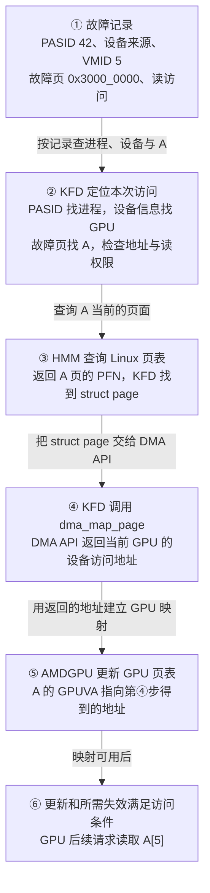

在②，KFD 用 PASID 42 找进程，结合设备来源和 VMID 5 确认发生故障的 GPU。随后用故障页 `0x3000_0000` 找 A 的范围，检查地址与读权限。Linux 的 VMA 记录地址与权限；KFD 的 `svm_range` 记录这个范围的 GPU 访问和位置要求。第 2 章再解释这两个对象。

在③，HMM 用 A 的进程虚拟地址查询 Linux 当前页表，返回页面编号和状态；KFD 据此取得这页的 `struct page`。KFD 传给 DMA API 的是 `struct page`，不必先单独算出一个 CPU 物理地址作为 `dma_map_page()` 的入参。

**[DESIGN]** 为追踪地址，本例设 A 的主机物理页为 `0x4567_8000`，第④步的 `dma_map_page()` 为当前 GPU 返回 `0x1234_5000`。本例启用 Host IOMMU 翻译，因此把这个 DMA 地址作为 IOVA 使用。三处映射分别保存：

```text
CPU 页表：A 的 CPU VA 0x3000_0000 → 主机物理页 0x4567_8000
Host IOMMU：IOVA 0x1234_5000 → 主机物理页 0x4567_8000
GPU 页表：A 的 GPUVA 0x3000_0000 → IOVA 0x1234_5000
```

第④步由 DMA API 为设备准备访问这页所需的映射，并把 IOVA 返回 KFD；第⑤步 AMDGPU 才把 IOVA 用作 GPU 页表项的目标地址。GPU 后续读取 `A[5]` 时，GPU 页表先把 `0x3000_0014` 译成 `0x1234_5014`，Host IOMMU 再把请求译到 `0x4567_8014`。A 的数据仍留在原来的 system RAM 页。

在⑥，页表更新和所需翻译失效达到访问条件后，GPU 的后续请求才可能读到 `A[5]`。故障处理函数可能在异步更新完成前返回；整个 Kernel 是否结束，还要看 Completion Signal。§4.4 再解释更新由谁等待。

> **[SOURCE]** Linux `248951ddc14d`，[`amdgpu_hmm.c`](./2.源码/linux/drivers/gpu/drm/amd/amdgpu/amdgpu_hmm.c) 第 186～215 行调用 HMM 取得页面信息；[`kfd_svm.c`](./2.源码/linux/drivers/gpu/drm/amd/amdkfd/kfd_svm.c) 第 182～200 行将 HMM 页面转为 `struct page`，并以 `dma_map_page()` 取得 DMA 地址，第 1492～1497 行将该地址交给 GPUVM 映射更新。

> **[SPEC]** Linux `248951ddc14d`，[`dma-api-howto.rst`](./2.源码/linux/Documentation/core-api/dma-api-howto.rst) 第 81～87、603～617 行区分设备 DMA 地址与主机物理地址，并说明 `dma_map_page()` 接收页面、返回设备访问地址；IOMMU 在设备发出 DMA 请求时把该地址翻译到主机页面。

若期望把 A 放进 HBM，第 5 章会在②与③之间加入页面迁移，此时第④步走设备页的地址换算分支。查找、查询或建表不能继续时，本次处理不会走到⑥；这些出口放在第 7 章说明。

### 0.3 A 的就地映射、迁移与并发变化

主例先恢复指向 system RAM 页面的 GPU 映射。后面沿同一个 A 依次改变条件或访问者：

1. 第 5 章把期望位置改为目标 GPU，驱动尝试把 A 从 system RAM 迁入 HBM。
2. GPU 使用结束且应用完成同步后，CPU 再次读取 A，进入从 HBM 迁回 system RAM 的路径。
3. 第 6、7 章加入地址空间修改或进程退出，检查旧页面结果、迟到的故障记录和资源清理。

读过 [§0.0 的 XNACK 与访问重试](#00-xnack-与-gpu-缺页后的访问重试) 后，后文章节按恢复所需的对象与步骤展开：

- [第 1 章：同一进程指针的 CPU 与 GPU 访问](#1-同一进程指针的-cpu-与-gpu-访问)。建立指针、两套页表、后备页面的关系。
- [第 2 章：KFD 范围登记与状态跟踪](#2-kfd-范围登记与状态跟踪)。沿 A 的登记、访问和位置选择，理解 `svm_range` 怎样跟踪地址范围，以及迁入 HBM 时怎样关联 BO。
- [第 3 章：CPU 故障处理与 HMM 页面取得](#3-cpu-故障处理与-hmm-页面取得)。接着第二章选定的 RAM 位置，说明 HMM 怎样取得当前页面，以及何时需要借用 Linux 通用缺页处理。
- [第 4 章：GPU 故障处理与映射恢复](#4-gpu-故障处理与映射恢复)。先看缺页期间 Wave 的等待与其他工作的执行，再把 HMM 页面结果变成设备地址和 GPU 映射，区分更新提交与完成。
- [第 5 章：system RAM 与 HBM 之间的页面迁移](#5-system-ram-与-hbm-之间的页面迁移)。在第二章的 HBM BO 关系上，展开实际复制、页面状态变化和 CPU 迁回。
- [第 6 章：地址空间失效与并发恢复](#6-地址空间失效与并发恢复)。沿 RAM 页 P → Q 的变化，说明页面为何仍在 RAM 却需要迁移、Linux 怎样通过 notifier 通知 KFD，以及 KFD 怎样处理旧映射和过期查询结果；随后展开地址删除与暂停队列的分支。
- [第 7 章：故障结果、资源回收与全篇复盘](#7-故障结果资源回收与全篇复盘)。解释返回值、错误通知和退出清理，最后用访问流程与自检题回查全篇。

### 0.4 固定配置、源码版本与证据边界

**[DESIGN]** 平台采用外部 Host CPU + MI300X 独立 GPU，通过 PCIe 连接。A 选用匿名内存；其页面来源在第 3 章解释。地址计算固定 CPU 基本页和 GPU 基本页均为 4 KiB，Host IOMMU 启用翻译。应用的数据交接遵守 02、03 已说明的同步规则。未启用 XNACK 时的完整队列保护流程在 §6.4 展开。

第 3 章以 Arm64 异常入口帮助理解 HMM 所借用的 Linux 通用缺页处理；这个例子不指定目标机器的 Host CPU 型号。§4.4 再说明 CPU/SDMA 两种页表更新方式及其选择条件。

需要回查已有对象时，可分别看 [01：Linux 内存管理](<./01_Linux 内存管理基础.md>)、[02：GPU 内存管理](<./02_GPU 内存管理基础.md>)、[03 上篇：Queue 创建与驻留](<./03_AMD GPU 队列与 AQL Dispatch（上）.md>)和[03 下篇：提交与完成](<./03_AMD GPU 队列与 AQL Dispatch（下）.md>)。

本文源码固定为：

- Linux：`248951ddc14de84de3910f9b13f51491a8cd91df`，后文简称 `248951ddc14d`。
- ROCr：`ba56a24c6132c5d195686ae4adf969ca1222fbba`，后文简称 `ba56a24c6132`。
- 版本目录说明见[源码基线说明](./2.源码/README.md)。本篇沿 ROCr → KFD 说明属性路径，不要求先读完整 CLR 实现。

`[SOURCE]` 表示固定源码可验证的实现，`[SPEC]` 表示规范或接口说明，`[DESIGN]` 表示教学取值，`[INFERENCE]` 表示据已知条件作出的推导，`[BOUNDARY]` 表示当前证据所能支持的范围。源码块左侧保留真实行号，教学伪代码会明确注明。

硬件语义继续参考 [MI300 / CDNA 3 ISA](./amd-instinct-mi300-cdna3-instruction-set-architecture.pdf)，封面日期 `2025-08-05`。本篇图示主要展示驱动对象、页面状态和软件时序，这些关系不能从硬件架构原图中直接看出，因此采用补画的流程图。

**[BOUNDARY]** 本篇不推定故障恢复时具体 Wave 的驻留位置、重放缓冲结构或指令重放粒度。源码能够证明“驱动处理了什么”；一次访问和整个 Kernel 最终是否完成，还要分别观察访问结果与应用完成通知。完整 GPUVM 更新后端、DRM job/IB 调度及 Fence 中断传播留到后续专题。

## 1. 同一进程指针的 CPU 与 GPU 访问

### 1.1 指针数值、两套页表与实际页面

CPU 已经把输入写进 A，GPU 现在要读取 A。先看数据留在 system RAM 时的正常访问路径。CPU 和 GPU 使用数值相同的指针，访问时分别查自己的页表，最后到达同一份数据。本例故障时，GPU 页表还缺少 A 的映射。

**[DESIGN]** 沿用 §0.2 的教学取值：A 所在主机物理页为 `0x4567_8000`，DMA API 为当前 GPU 返回的 IOVA 页地址为 `0x1234_5000`。这组地址只用于本例计算。

```mermaid
flowchart TD
    A["进程指针 A = 0x3000_0000<br/>本次读取 A[5] = 0x3000_0014"]
    C["CPU 页表<br/>A 页 → 主机物理页 0x4567_8000"]
    G["当前进程的 GPU 页表<br/>A 页 → DMA 页地址 0x1234_5000"]
    I["Host IOMMU 映射<br/>0x1234_5000 → 0x4567_8000"]
    D["system RAM 中同一份 A 数据<br/>A[5] 位于 0x4567_8014"]
    A -->|CPU 按当前进程页表翻译| C
    A -->|GPU 按当前 GPU 页表翻译| G
    C -->|加页内偏移 0x14| D
    G -->|设备发出 0x1234_5014 请求| I
    I -->|翻译并保留页内偏移| D
```

CPU PTE 保存的是 CPU 访问需要的物理页与属性，GPU PTE 保存的是设备访问需要的地址与属性。GPU 并没有因为拿到相同指针，就直接使用 CPU 的整棵页表。

HMM 帮驱动查询 Linux 当前页面状态，并跟踪地址空间变化。KFD 和 AMDGPU 根据这些信息维护 GPU 映射；两套页表的格式、目标地址和更新方式各不相同。

页面迁入 HBM 后，A 的数值仍为 `0x3000_0000`。GPU PTE 改为描述本地 HBM 页面；CPU 页表中留下 device-private 特殊条目。CPU 再读 A 时会触发缺页并进入迁回路径，详见第 5 章。

> **[SOURCE]** Linux `248951ddc14d`，[`kfd_svm.c`](./2.源码/linux/drivers/gpu/drm/amd/amdkfd/kfd_svm.c) 第 160～203 行区分系统页的 `dma_map_page()` 与设备页地址换算，第 1434～1517 行据这些设备地址更新当前 `amdgpu_vm`；[`Documentation/mm/hmm.rst`](https://github.com/torvalds/linux/blob/248951ddc14de84de3910f9b13f51491a8cd91df/Documentation/mm/hmm.rst#L269-L272) 第 269～272 行说明 device-private 特殊页表项使 CPU 访问进入缺页处理，[`mm/memory.c`](./2.源码/linux/mm/memory.c) 第 4774～4808 行可核对随后的迁回调用。

### 1.2 SVM、HMM 与 GPUVM 的协作

A 在 CPU 和 GPU 一侧使用数值相同的进程虚拟地址，这是本例的 SVM 访问方式。§0.2 已沿故障记录走过一次主路径。Linux VMA 说明 A 是否可读，CPU 页表记录它当前指向的页面。KFD 的 `svm_range` 保存 GPU 访问设置与期望位置。KFD 借助 HMM 取得当前页面信息，再由 AMDGPU 把设备访问地址写入 GPU 页表。

图从本次 Retry 故障记录开始，展示 KFD 怎样找到 A 的当前页面并更新 GPU 页表。

```text
Retry 故障：PASID 42、故障页 0x3000_0000、读访问
  → KFD：找到进程、目标 GPU 和 A 的范围，检查 VMA 与 GPU 读权限
  → HMM：查询 A 的进程虚拟地址，返回当前页面信息
  → KFD：取得当前 GPU 访问该页面所需的设备地址
  → AMDGPU：把该地址写入 A 对应的 GPU 页表项
```

主例在故障前已登记 A 的范围属性和 notifier，第 2 章会讲这一步；§2.4 另讲尚未登记范围的情况。

以后 Linux 若改变 A 的后备页，notifier 通知 KFD 撤销旧 GPU 映射。只要 A 仍有效，后续 Retry 故障会重新查询页面并建立映射。这个并发变化留到第 6 章。

页面留在 system RAM 时，KFD 可用 DMA 地址建立 GPU 映射，A 的数据不用搬动。若期望位置改为 HBM，KFD 会先选择迁移路径并复制页面；第 5 章再展开。

> **[SOURCE] 可选源码索引**
>
> - 范围记录与故障入口：Linux `248951ddc14d`，[`kfd_svm.h`](./2.源码/linux/drivers/gpu/drm/amd/amdkfd/kfd_svm.h) 第 68～140 行定义 `svm_range` 字段；[`kfd_svm.c`](./2.源码/linux/drivers/gpu/drm/amd/amdkfd/kfd_svm.c) 第 3065～3194 行按故障记录查进程、GPU 与范围。
> - 当前页面与 GPU 映射：[`kfd_svm.c`](./2.源码/linux/drivers/gpu/drm/amd/amdkfd/kfd_svm.c) 第 1679～1871 行连接 VMA 检查、HMM 查询、DMA 映射和有效性检查，第 1434～1517 行更新 GPUVM。
> - 后续失效：[`kfd_svm.c`](./2.源码/linux/drivers/gpu/drm/amd/amdkfd/kfd_svm.c) 第 2063～2085、2651～2654 行说明 Retry 模式下先撤销旧映射，后续故障再恢复。

### 1.3 显式 BO 映射、userptr 与 SVM

对照 02、03 已学过的路径，可以看出本例 A 的后备页面由谁管理。显式 BO 的后备由驱动管理，AQL Ring 使用这类资源；userptr 和本例 SVM 都从已有 CPU 地址出发，但跟踪页面的驱动对象不同。

```text
显式 BO：应用申请驱动资源 → 驱动管理 BO 后备 → 映射进 GPUVM
userptr：应用提供已有 CPU 地址 → 驱动用 BO 等对象跟踪页面变化
                                  → 取得当前页面并建立 GPU 映射
本例 SVM：应用使用进程指针 A → KFD 用 svm_range 跟踪地址范围
                                → 故障时查询页面并恢复 GPU 映射
```

userptr 也可以使用 HMM 和 notifier 跟踪 Linux 页面变化。两条路径都可能让 GPU 访问 system RAM，但驱动保存的对象和映射生命周期不同，不能把 userptr 当作永久固定的物理页。

> **[SOURCE]** Linux `248951ddc14d`，[`amdgpu_hmm.c`](./2.源码/linux/drivers/gpu/drm/amd/amdgpu/amdgpu_hmm.c) 第 64～160 行包含 BO/userptr 的失效处理与 notifier 登记；[`kfd_svm.c`](./2.源码/linux/drivers/gpu/drm/amd/amdkfd/kfd_svm.c) 第 2866～2965 行检查已有 BO/userptr 范围与未登记 SVM 范围的冲突。

### 1.4 共享地址、访问权限与数据同步

GPU 要读到 CPU 写入的 A，需要满足地址权限和数据同步两组条件。GPU 页表要指向承载 A 的页面，VMA、SVM 访问设置和 GPU PTE 要允许这次读取。应用还需按 02、03 的规则发布输入，Kernel 启动满足相应的 acquire 条件。

CPU 要读到 GPU 写出的 C，还需等 Kernel 完成阶段发布结果，再按约定观察 Completion Signal，并以所需 acquire 语义读取 C。这是任务完成的条件，不属于 A 的缺页恢复步骤。

```text
CPU 写 A/B
  → 按 02、03 的同步规则提交 Packet
  → GPU 访问 A 时发现映射缺失（B 已可访问）
  → KFD 为 A 建立映射，GPU 后续完成输入读取并写 C
  → Kernel 完成阶段更新 Completion Signal
  → CPU 按协议等待并读取 C
```

CPU 若在 Kernel 读取 A 的同时无协议地修改 A，即使两侧 PTE 都有效，仍可能产生数据竞争。

共享指针也不能单独证明某种 CPU/GPU 原子操作可用。原子性、作用域和数据可见性要按实际内存类型、运行时能力及指令语义判断。本篇不引入新的跨设备原子协议。

> **[SPEC]** [MI300 / CDNA 3 ISA](./amd-instinct-mi300-cdna3-instruction-set-architecture.pdf#page=81)（2025-08-05）§9.1.10，原文第 73～75 页，说明内存作用域和缓存控制；应用提交与完成时的组合使用见 [03 下篇 §4.4](<./03_AMD GPU 队列与 AQL Dispatch（下）.md#44-header-中的类型执行顺序与可见性设置>)与[第 7 章](<./03_AMD GPU 队列与 AQL Dispatch（下）.md#7-kernel-完成通知与-cpu-等待>)。

### 1.5 可恢复访问的前置条件

[§0.0](#00-xnack-与-gpu-缺页后的访问重试) 已说明 XNACK 让 GPU 能在缺页恢复后重试访问，§0.1 采用了进程启用 XNACK、本次故障 Retry 位为 1 的配置。本节接着说明：运行前怎样采用这个模式，以及代码装载和故障处理还要检查什么。

```text
准备阶段：内核与设备支持 SVM → 进程在创建 Queue 前采用 XNACK 模式
代码阶段：ROCr 记录 Agent 的 XNACK 特征 → 装载时检查代码对象兼容性
故障阶段：Retry 位为 1 → KFD 再查进程模式、地址、权限、页面和资源
```

KFD 在进程创建时选择默认 XNACK 模式。应用若要显式切换，必须在创建用户 Queue 前完成；已有用户 Queue 时，ioctl 会拒绝模式切换。启用请求还会检查设备支持，故障入口则再次检查 `p->xnack_enabled`。

应用启动时可以设置环境变量 `HSA_XNACK=1`，让 ROCr 请求启用 XNACK；`HSA_XNACK=0` 表示请求关闭。ROCr 将请求交给 KFD，请求未指定或设置失败时会查询驱动当前模式。因此，应以运行时最终取得的模式为准，不能只根据环境变量已经写成 1 判断设置成功。

内核须编入 SVM 支持，设备也须支持。ROCr 将所用 XNACK 模式反映到 Agent ISA；加载器检查代码对象与 Agent 是否相容。若代码对象明确要求相反的 XNACK 特征，加载器会拒绝它。

普通 `malloc()` 地址还需满足运行时的系统内存访问条件、目标 Agent 能力、进程模式、VMA 权限和 KFD 范围检查。§2.4 会说明 KFD 怎样在 GPU 缺页时为未登记的地址创建范围记录；创建记录仍以地址有效为前提。

> **[SOURCE] 可选源码索引**
>
> - 构建与设备支持：Linux `248951ddc14d`，[`amdkfd/Kconfig`](./2.源码/linux/drivers/gpu/drm/amd/amdkfd/Kconfig) 第 15～26 行定义构建条件；[`kfd_svm.h`](./2.源码/linux/drivers/gpu/drm/amd/amdkfd/kfd_svm.h) 第 203～204 行定义运行时 SVM 支持判断。
> - 默认模式与显式切换：[`kfd_process.c`](./2.源码/linux/drivers/gpu/drm/amd/amdkfd/kfd_process.c) 第 1501～1555、1609～1610 行选择并设置默认模式；[`kfd_chardev.c`](./2.源码/linux/drivers/gpu/drm/amd/amdkfd/kfd_chardev.c) 第 1708～1738 行检查显式切换请求与 Queue 状态。
> - 环境变量与实际模式：ROCr `ba56a24c6132`，[`flag.h`](./2.源码/rocr-runtime/runtime/hsa-runtime/core/util/flag.h) 第 212～215 行读取 `HSA_XNACK`；[`amd_kfd_driver.cpp`](./2.源码/rocr-runtime/runtime/hsa-runtime/core/driver/kfd/amd_kfd_driver.cpp) 第 542～567 行请求设置，必要时查询驱动模式。
> - 故障入口：[`kfd_svm.c`](./2.源码/linux/drivers/gpu/drm/amd/amdkfd/kfd_svm.c) 第 3065～3103 行检查设备 SVM 支持与进程 XNACK 模式。
> - Agent ISA 与代码对象：ROCr `ba56a24c6132`，[`amd_kfd_driver.cpp`](./2.源码/rocr-runtime/runtime/hsa-runtime/core/driver/kfd/amd_kfd_driver.cpp) 第 542～567 行取得或设置 XNACK 模式；[`amd_gpu_agent.cpp`](./2.源码/rocr-runtime/runtime/hsa-runtime/core/runtime/amd_gpu_agent.cpp) 第 166～181 行形成 Agent ISA 特征；[`executable.cpp`](./2.源码/rocr-runtime/runtime/hsa-runtime/loader/executable.cpp) 第 1287～1296 行在装载时检查目标 Agent，[`isa.cpp`](./2.源码/rocr-runtime/runtime/hsa-runtime/core/runtime/isa.cpp) 第 96～100 行拒绝不匹配的 XNACK 特征。

## 2. KFD 范围登记与状态跟踪

本章沿输入数组 A 的一页，说明 KFD 怎样登记访问要求、在故障时找到记录，并选择让数据留在 RAM 或迁入 HBM。先看 `svm_range`、数据页面和 BO 的关系，再把应用请求与故障地址代入这些对象。页面取得、实际建表和迁移的详细步骤分别在第 3、4、5 章展开。

**[DESIGN] 本章的 A** 沿用 §0.2 的任务与地址：

```text
计算任务：C[i] = A[i] + B[i]；A 是输入数组，共 1024 个 4 字节元素
A 的虚拟地址：[0x3000_0000, 0x3000_1000)，恰好一页（4 KiB）
本次访问：GPU 将读取 A[5]；其地址是 0x3000_0014，所在页从 0x3000_0000 开始
当前状态：CPU 已把输入写入这页匿名内存，数据在 system RAM；
          Linux VMA 允许读取，目标 GPU 页表尚无 A 的可用映射
```

沿这页 A，后面的阅读顺序是：

```text
认识 A 的范围记录、存储资源与关联对象（§2.1）
  → 应用登记要求，KFD 保存记录（§2.2）
  → GPU 故障到来，KFD 查记录并选择恢复位置（§2.3）
      ├─ 留在 RAM：为现有 RAM 页面补上 GPU 映射
      └─ 迁入 HBM：准备 BO 管理的存储资源，搬数据并更新映射

独立变体：未提前登记时按需创建 A 的范围记录（§2.4）；另取范围 R 演示局部拆分（§2.5）
```

### 2.1 A 的 svm_range 与关联对象

目标 GPU 接下来要读取 `A[5]`。Linux 的 VMA 能说明 A 的地址是否有效、是否允许读取，CPU 页表能说明 A 当前映射到哪个页面。KFD 还需要记住：应用要求哪些 GPU 访问这段内存、希望页面放在哪里，以及驱动已经为 GPU 准备了哪些映射信息。

**`struct svm_range` 就是 KFD 为一段进程虚拟地址保存的管理记录。** 一份记录可以覆盖一页或连续多页，记录这段内存的 GPU 访问要求、位置要求和映射状态。A 所在的页面保存数组数据，`svm_range` 保存驱动管理这些页面所需的信息。

创建动作由 Host CPU 上运行的 KFD 代码完成。**[DESIGN]** 本章从 A 的 CPU 端数据已准备好、KFD 尚无 A 的范围记录这个状态出发，比较两种创建时机：

```text
应用准备好输入数组 A，CPU 已把数据写入 RAM
  Linux 已有 A 的地址范围和页面；KFD 尚无 A 的 svm_range
  │
  ├─ 主例：应用先提交 A 的访问与位置要求（§2.2）
  │   → KFD 处理请求时创建 svm_range，保存应用要求
  │   → 后来 GPU 读取 A 缺页时，KFD 查到这份已有记录（§2.3）
  │
  └─ 变体：应用未提前登记，GPU 读取 A 时缺少映射（§2.4）
      → KFD 处理缺页，查不到 A 的 svm_range
      → 检查地址范围和映射冲突后，创建记录并采用默认属性
```

本章把应用提交访问与位置要求、KFD 保存这些要求的过程称为“登记 A”。主例中的 `svm_range` 就在这次请求中创建，早于 GPU 读取 A；后来的缺页处理可以直接使用已有记录。

§2.4 则把创建动作推迟到缺页处理时：先创建记录，再使用它继续权限检查和恢复位置选择。两条路径中，范围记录的创建与 GPU 页表映射的建立是不同的步骤。

> **[SOURCE]** Linux `248951ddc14d`，[`kfd_svm.c`](./2.源码/linux/drivers/gpu/drm/amd/amdkfd/kfd_svm.c) 第 3751～3765 行在属性请求中创建或更新范围，第 2291～2295、2149～2166 行为尚无记录的地址调用 `svm_range_new()`；第 3135～3157 行在缺页处理时检查记录是否存在，第 2948～2965 行执行按需创建并加入集合。`svm_range_new()` 第 325～365 行分配并初始化结构体。

#### 2.1.1 A 的 svm_range 与 BO

A 的这一页是匿名内存，没有文件作为后备。CPU 已写入数据，Linux 已有相应的 VMA、CPU 页表和 RAM 页面：

```text
CPU 访问 A 的虚拟地址
    → CPU 页表
    → 存放 A 的 RAM 页面
```

应用接下来希望 GPU 也能通过 A 的地址访问这些数据。KFD 为此登记 `svm_range`，保存访问与位置要求，并跟踪 Linux 页面变化。在本章的初始 RAM 情形中，A 继续使用原来的 RAM 页面，登记时无需另外准备 HBM 存储。§2.2 会把这次登记的输入和结果逐项代入。

如果后来需要把 A 搬进 HBM，驱动就要另外准备承载数据的 HBM 存储资源。这里会用到 **BO（Buffer Object，缓冲对象）**，具体结构体是 `amdgpu_bo`。BO 是内核中的管理对象，关联一份缓冲区的大小、存储资源、同步和生命周期信息；A 的字节实际存放在这份对象管理的存储中。BO 也可以管理 system RAM 等存储类型，本节只看迁移 A 时使用的 HBM BO。

下面假设 A 的这一页已成功迁入 HBM，并完成所需的 GPU 映射更新。图中箭头表示驱动中的引用和资源管理关系：

```text
svm_range：记录 A 的虚拟地址范围、访问要求和迁移状态
    │
    │ svm_bo 成员引用
    ▼
svm_range_bo：把 SVM 范围与 BO 关联起来
    │
    │ bo 成员引用
    ▼
amdgpu_bo：管理这份缓冲区及其存储资源
    │
    │ 背后的存储资源位于
    ▼
HBM：实际存放 A 的数据
```

同一段 A 此时同时有 `svm_range` 和 BO。KFD 通过 `svm_range` 继续管理 A 这段地址的访问要求和页面变化，通过关联的 BO 管理承载 A 数据的 HBM 存储。GPU 执行读取时使用 GPU 页表，不会沿图中的软件对象逐个查找。

中间的 `svm_range_bo` 持有 BO 的引用，还记录哪些 `svm_range` 共用这个 BO。一个范围以后可能被拆成几段，各段仍可引用原 BO 中的不同部分，因此 `svm_range` 与 BO 无须一一对应。§2.5 先讲 RAM 中的范围拆分，[§6.3](#63-解除映射后的范围拆分与清理)再讲已有 HBM 资源时怎样共享引用和保留偏移。

§2.3 会接上实际处理：A 留在 RAM 时怎样补映射，需要迁入 HBM 时怎样准备 BO。接下来先从进程找到这些对象，再认识登记和恢复要用的成员。

> **[SOURCE] 可选源码索引**
>
> - BO 的存储管理含义：Linux `248951ddc14d`，[`amdgpu_object.c`](./2.源码/linux/drivers/gpu/drm/amd/amdgpu/amdgpu_object.c) 第 47～58 行说明 BO 表示驱动使用的 VRAM、system RAM 等内存，并由 TTM 管理；具体对象定义见 [`amdgpu_object.h`](./2.源码/linux/drivers/gpu/drm/amd/amdgpu/amdgpu_object.h) 第 103～128 行。
> - 范围与 BO 的关联：[`kfd_svm.h`](./2.源码/linux/drivers/gpu/drm/amd/amdkfd/kfd_svm.h) 第 41～51 行定义 `svm_range_bo`，其中 `bo` 指向 `amdgpu_bo`，`range_list` 组织共享该 BO 的范围；第 108～140 行定义 `svm_range`，其中 `svm_bo` 引用上述关联对象。
> - 初始 RAM 状态：[`kfd_svm.c`](./2.源码/linux/drivers/gpu/drm/amd/amdkfd/kfd_svm.c) 第 325～365 行以清零分配创建范围，初始化页数与属性，此时 `svm_bo` 为空。迁入 HBM 后，第 640～646 行保存 BO、范围引用和存储资源信息，并把范围加入共享列表。

#### 2.1.2 从进程找到范围记录与 GPU 页表

从 `kfd_process` 出发，KFD 要取得本进程的 Linux 地址空间、A 的管理记录和目标 GPU 的页表对象。下面是软件对象关系图，箭头表示 KFD 根据已有对象继续查找：

```text
本进程的 KFD 记录：kfd_process
  ├─ lead_thread：关联本进程的主线程
  │   └─ 由线程取得 mm_struct：本进程的 Linux 地址空间
  │       ├─ 按 A 的地址查 vm_area_struct（VMA） → 检查地址与读写权限
  │       └─ HMM 查询 CPU 页表 → 取得 A 当前页面的信息
  ├─ 内嵌 svm_range_list：本进程的 SVM 范围集合
  │   └─ 按 A 的页号查区间树 → 找到 A 的 svm_range
  └─ 按目标 GPU 选择 kfd_process_device：本进程在该 GPU 上的记录
      └─ 取得 amdgpu_vm → 由 AMDGPU 更新该 GPU 的页表
```

`kfd_process` 的 `lead_thread` 成员指向本进程主线程的 `task_struct`。处理故障时，KFD 通过这个线程取得 `mm_struct` 的有效引用，之后才能查询该进程的 VMA 和页面。§2.1.5 的通知对象也登记到这个地址空间，供 Linux 在页面变化时调用 KFD。

`kfd_process` 的 `svms` 成员内嵌一个 `svm_range_list`，其中的区间树按虚拟地址范围组织各个 `svm_range`。区间树在这里用来回答“这个页号落在哪段已登记范围内”。

找到 A 的 `svm_range` 后，KFD 就能读取 A 的 GPU 访问与位置要求。接着，KFD 还要在同一进程的 `mm_struct` 中检查 A 所在的 VMA，并借助 HMM 查询当前页面。一段 VMA 可以对应多个 `svm_range`，一个 `svm_range` 在验证时也可能跨多个 VMA；KFD 按地址把两侧信息对应起来。

更新页表时，还需要知道本次要更新哪块 GPU。`kfd_process` 的 `pdds` 成员保存指向 `kfd_process_device` 的指针；每项是本进程与一项 KFD 可见 GPU 设备的关联记录。KFD 选中目标记录后，通过其中的 `drm_priv` 取得 `amdgpu_vm`，再把准备好的页面地址交给 AMDGPU 更新页表。

处理 A 时，KFD 用 **`svm_range` 读取管理要求，用 `mm_struct` 查询 Linux 页面，用目标 GPU 的 `amdgpu_vm` 更新 GPU 页表**。§2.3 会把故障记录中的 PASID、地址和 GPU 信息代入这条查找路径。

#### 2.1.3 核心成员与按地址查找

§2.2 登记完成后，KFD 会持有下面这组对象。将来 GPU 因 A 缺映射而故障时，KFD 用故障地址找到 A 的 `svm_range`；这里先沿这条查找路径认识成员，§2.2 再讲登记动作。图中的 `A.svm_range` 是“管理 A 的那份 `svm_range`”的简称，不是应用数组 A 的 C 语言成员。

```text
进程 P 的 kfd_process
├─ svms：内嵌的 svm_range_list（P 的地址范围集合）
│  ├─ objects：区间树根 ──按 A 的页号查找──> A.svm_range.it_node
│  └─ list：链表头 ─────遍历范围记录──> A.svm_range.list
└─ pdds[gpuidx] ──> kfd_process_device（P 与目标 GPU 的关联记录）
                    └─ dev ──> kfd_node（KFD 可见设备，背后是 MI300X 硬件）

A.svm_range.svms ──指回──> P.svms
A.svm_range 的访问位图：第 gpuidx 位 ──对应──> P.pdds[gpuidx]
```

`objects` 和 `list` 组织同一批 `svm_range`：故障时按页号查区间树，遍历范围时走链表。`pdds` 中的每一项是进程与设备的关联记录指针，背后是 KFD 可见的 GPU 设备。`gpuidx` 是目标设备在本进程 `pdds` 中的下标，§2.1.4 会用它读取 A 的访问位。

**[DESIGN]** 下面三个定义只列当前主线要用的成员，顺序按讲解重排，并非完整源码。先看进程内的范围集合：

```c
struct svm_range_list {
    struct rb_root_cached objects; // 区间树根：按页号查找范围
    struct list_head list;         // 链表头：遍历范围记录
};
```

再看 A 的范围记录。`DECLARE_BITMAP` 表示按 GPU 下标编号的一排 0/1 位；位图在 C 中用 `unsigned long` 数组存放。其他成员的用途写在定义旁边：

```c
struct svm_range {
    /* 地址范围和归属 */
    struct svm_range_list *svms;       // 指回所属进程的范围集合
    unsigned long start;              // 起始虚拟页号
    unsigned long last;               // 末尾虚拟页号，包含该页
    uint64_t npages;                  // 页数：last - start + 1
    struct interval_tree_node it_node; // 加入 svms 的区间树，供按页号查找
    struct list_head list;            // 加入 svms 的链表，供遍历

    /* 本范围对每项进程设备的访问要求；第 gpuidx 位对应 pdds[gpuidx] */
    DECLARE_BITMAP(bitmap_access, MAX_GPU_INSTANCE); // 普通 ACCESS 访问要求
    DECLARE_BITMAP(bitmap_aip, MAX_GPU_INSTANCE);    // AIP 原地访问要求

    /* 页面位置 */
    uint32_t preferred_loc;           // 应用期望的位置
    uint32_t prefetch_loc;            // 上次请求预取到的位置
    // 位置摘要：0 表示全在 RAM；GPU ID 表示可能含该 GPU 的 HBM 页
    uint32_t actual_loc;

    /* 迁入 HBM 时关联承载数据的 BO */
    struct svm_range_bo *svm_bo;       // 通过 svm_bo->bo 引用 amdgpu_bo

    /* 为 GPU 建立映射时使用的信息 */
    dma_addr_t *dma_addr[MAX_GPU_INSTANCE]; // 每项指向该 GPU 的逐页设备地址数组
    bool mapped_to_gpu;                     // 范围的映射状态标记

    /* Linux 页面变化时，由通知对象找回本范围 */
    struct mmu_interval_notifier notifier;
};
```

`svm_bo` 在初始 RAM 主例中为空；需要 HBM 存储时，它会引用下面的关联对象：

```c
struct svm_range_bo {
    struct amdgpu_bo *bo;     // 引用承载数据的缓冲对象
    struct list_head range_list; // 组织共用这个 BO 的 svm_range
};
```

现在沿图找 A。`start` 和 `last` 用页号表示记录覆盖的范围，`last` 包含末尾页；`npages` 是页数。本例的字节区间右端不含 `0x3000_1000`，因此最后一个字节是 `0x3000_0FFF`：

```text
A 的字节范围：[0x3000_0000, 0x3000_1000)，共 4 KiB
  start  = 0x3000_0000 / 0x1000 = 0x3_0000
  last   = 0x3000_0FFF / 0x1000 = 0x3_0000（整数除法）
  npages = last - start + 1 = 1

故障页 0x3000_0000 → 页号 0x3_0000
  → 查 P.svms.objects → 命中 A.it_node → 找回 A 的 svm_range
```

这里按页号查的是区间树 `objects`；`list` 留给遍历全部范围时使用。A 的 `svms` 指回所属的范围集合。

`0x3_0000` 是 A 在进程虚拟地址空间中的页号；`0` 是从 A 起点开始数的页下标。A 只有一页，所以 A 的第一页下标是 0，`A[5]` 就在这一页。`A[5]` 中的 5 选数组第六个元素；页下标 0 选容纳它的整页。这页不是空页，也不是 Linux 的零页。

#### 2.1.4 访问要求、页面位置与映射信息

沿上图从 A 的 `svm_range` 继续看：进程设备数组 `pdds` 确定“是哪块设备”，A 的两张位图保存“这块设备怎样访问 A”。每份 `svm_range` 都有自己的两张位图；同一位号在两张位图中都对应 `pdds` 的同一项。

**[DESIGN]** 本例假设进程只有一个可访问的 KFD GPU 设备条目，所以 `n_pdds=1`，目标 GPU 的 `gpuidx=0`。图中的位值是 §2.2 为 A 登记普通 `ACCESS` 后的结果。

进程有多个设备条目时，即使任务只使用一块 GPU，目标设备也可能在第 1 项或更后面；运行任务的 GPU 数量不决定 `gpuidx`。

```text
目标 GPU → 位于 P.pdds[0] → gpuidx = 0
                               ↓ 选第 0 位

A.bitmap_access： [第 63 位 ... 第 1 位 | 第 0 位 = 1] → 选中 ACCESS
A.bitmap_aip：    [第 63 位 ... 第 1 位 | 第 0 位 = 0] → 未选 AIP

ACCESS 是普通访问要求：目标 GPU 可以访问 A；若 GPU 缺映射，KFD 按恢复位置要求判断是否搬页。
AIP 是 Access In Place：希望 GPU 按页面当前位置访问，避免这次访问触发迁移；它仍需要可用的 GPU 映射。
```

本例选 `ACCESS`，所以两张位图的第 0 位分别为 1 和 0。若改选 AIP，两位分别为 0 和 1。位值记录的是访问要求；GPU 页表映射要在后续恢复时建立。

位图在 C 中用 `unsigned long` 数组保存。`MAX_GPU_INSTANCE=64` 为每张位图留出 64 个位的位置；在 64 位内核中，这些位装在一个数组元素 `bitmap_access[0]` 里。图中的“第 0 位”只是这个元素内的一位，KFD 用 `test_bit(0, bitmap_access)` 读取它。64 是容量上限；`n_pdds` 才是本进程已有的设备记录数。

这三个成员分别记录应用的放置要求、主动迁移请求的目标，以及驱动掌握的实际页面位置：

- `preferred_loc`：应用希望 A 放在哪里。例如，希望 A 放在目标 GPU 的 HBM；后续处理 GPU 缺页时，KFD 会根据这个要求选择恢复位置。
- `prefetch_loc`：应用最近一次预取请求要把 A 搬到哪里。例如，在 GPU 读取 A 之前，主动请求把 A 从 RAM 搬到 HBM。这个成员保存请求的目标，迁移是否完成要另行确认。
- `actual_loc`：驱动记录的页面实际存放情况。值为 0 时，范围内的页面都在 system RAM；值为某个 GPU ID 时，范围内可能有该 GPU 的 HBM 页面，也可能还有部分页面留在 RAM。因此，对多页范围还要逐页查看实际位置。

这三个成员都是 `uint32_t`，保存位置编码。`preferred_loc` 和 `prefetch_loc` 使用同一组取值：

- `0`，即 `KFD_IOCTL_SVM_LOCATION_SYSMEM`：目标是 system RAM。写入 `preferred_loc` 表示希望页面留在或恢复到 RAM；作为预取目标写入 `prefetch_loc`，则请求把页面迁到 RAM，已经在 RAM 的页面无需搬动。
- 某个有效的 GPU ID：目标是这块 GPU 的本地 HBM。例如，设备 ID 为 7 时，`preferred_loc=7` 表示希望页面放在它的 HBM，`prefetch_loc=7` 表示预取请求以它的 HBM 为目标。
- `0xFFFF_FFFF`，即 `KFD_IOCTL_SVM_LOCATION_UNDEFINED`：未指定目标。对 `preferred_loc`，表示没有指定期望位置，故障恢复时需要继续根据访问要求选择位置；对 `prefetch_loc`，表示没有指定预取目标。**0 已经明确指定 RAM，不能用它表示“未指定”。**

`actual_loc` 由驱动根据页面迁移结果维护，使用 `0` 或实际 GPU ID：`0` 表示范围内页面都在 RAM，GPU ID 表示该范围可能含有这块 GPU 的 HBM 页面。它不使用 `0xFFFF_FFFF` 表示“位置未知”。本章新建的 RAM 范围从 `actual_loc=0` 开始；即使应用没有指定期望位置或预取目标，驱动仍能记录这个实际状态。

GPU ID 是 KFD 识别设备的编号。固定源码根据设备信息生成 16 位非零 ID，并检查重复值，因此数值范围是 1～65535，但实际填写时必须使用已有设备的 ID。第一块 GPU 不一定编号为 1，也不能把任意非零数都当作有效设备。`gpuidx` 则是设备在本进程 `pdds` 数组中的下标，从 0 开始；同一块 GPU 可以同时具有 `gpuidx=0` 和 `GPU ID=7`。

**[DESIGN]** 仍用 A 的这一页，假设目标 MI300X 的 KFD GPU ID 为 7。下面从 §2.2 的 RAM 登记结果出发，再改变要求，展示一次成功迁入 HBM 时三个成员的值；这些状态用来解释字段含义，具体迁移步骤见 §2.3.3 和第 5 章。

```text
登记完成：希望 A 留在 RAM，尚未请求预取，数据也在 RAM
  preferred_loc = 0
  prefetch_loc  = 0xFFFF_FFFF
  actual_loc    = 0
    ↓ 应用只把期望位置改为 GPU ID 7，尚未请求预取
要求已更新，数据仍在 RAM
  preferred_loc = 7
  prefetch_loc  = 0xFFFF_FFFF
  actual_loc    = 0
    ↓ 应用另行请求预取到 GPU ID 7
预取目标已记录，迁移尚未完成
  preferred_loc = 7
  prefetch_loc  = 7
  actual_loc    = 0
    ↓ A 的这一页成功迁入该 GPU 的 HBM，驱动更新实际位置
迁移完成
  preferred_loc = 7
  prefetch_loc  = 7
  actual_loc    = 7
```

最后三项恰好相同，是因为期望位置、预取目标和迁移结果都落在 GPU ID 7。若迁移未能搬走 A，`prefetch_loc` 可以已经是 7，而 `actual_loc` 仍为 0。对包含多页的范围，即使 `actual_loc=7`，也可能仍有页面留在 RAM，需要逐页确认。

> **[SOURCE] 可选源码索引**
>
> - 位置编码与成员类型：Linux `248951ddc14d`，[`kfd_ioctl.h`](./2.源码/linux/include/uapi/linux/kfd_ioctl.h) 第 777～795 行定义 system RAM、未指定及 GPU ID 的含义；[`kfd_svm.h`](./2.源码/linux/drivers/gpu/drm/amd/amdkfd/kfd_svm.h) 第 89～93、126～128 行说明实际位置语义和三个成员的类型。
> - 初始值与请求写入：[`kfd_svm.c`](./2.源码/linux/drivers/gpu/drm/amd/amdkfd/kfd_svm.c) 第 313～365 行以清零分配创建范围，并把期望位置、预取位置初始化为未指定；第 772～777 行分别保存应用提交的位置要求，第 3515～3527、3596～3622 行根据预取目标选择后续迁移动作。
> - 实际位置更新：[`kfd_migrate.c`](./2.源码/linux/drivers/gpu/drm/amd/amdkfd/kfd_migrate.c) 第 559～566 行在有页面迁入 HBM 后记录 GPU ID，第 859～866 行在 HBM 页面数归零时将实际位置改为 0。
> - GPU ID 的取值：[`kfd_priv.h`](./2.源码/linux/drivers/gpu/drm/amd/amdkfd/kfd_priv.h) 第 57 行定义 16 位宽度；[`kfd_topology.c`](./2.源码/linux/drivers/gpu/drm/amd/amdkfd/kfd_topology.c) 第 1085～1137 行根据设备信息生成 ID、排除 0 并处理重复值。

再看保存地址的成员 `dma_addr`。A 是应用的输入数组，数据放在 system RAM 的一页中。驱动要为目标 GPU 建立映射，需要知道这块 GPU 用哪个设备地址访问 A 所在的页。`dma_addr` 就用来保存这个地址；如果一个范围包含多页，驱动会为每页分别保存地址。

**[DESIGN]** 本例 A 只有一页，目标 GPU 的 `gpuidx=0`。沿用 §0.2 的教学取值，假设驱动已经得到设备地址 `0x1234_5000`，下面看它在 `svm_range` 中怎样保存：

```text
应用输入数组 A：[0x3000_0000, 0x3000_1000)，只有一页
  A[5] 位于 0x3000_0014 → 落在 A 的第一页（范围内页下标 0）

进程 P：
  pdds[0] ──选设备──> P 与目标 GPU 的关联记录       gpuidx = 0

A 的 svm_range：
  dma_addr[0] ──指向──> 为上述 GPU 保存的逐页地址数组
                              └─ [0] = 0x1234_5000
                                 ↑ 该 GPU 访问 A 第一页所用的地址
```

`pdds[0]` 让 KFD 找到目标设备；`dma_addr[0]` 指向这块设备对应的逐页地址数组。两处第一个 `[0]` 都是本进程的设备下标。`dma_addr[0][0]` 末尾的 `[0]` 才是 A 的范围内页下标，取出 A 第一页的设备访问地址。`dma_addr[0]` 本身是数组指针，具体地址保存在它指向的第 `[0]` 项。

有了这项记录，驱动就知道：为这个 GPU 建页表时，A 的虚拟页 `0x3000_0000` 应指向设备地址 `0x1234_5000`。`dma_addr` 保存的是供驱动建表使用的地址，GPU 执行访存时查的是 GPU 页表。这个设备地址怎样取得、何时填入数组，放到 §4.2 的恢复流程中展开。

`mapped_to_gpu` 是 KFD 在验证与映射路径中维护的范围状态。它帮助驱动管理这份记录；GPU 实际使用的映射仍在 GPU 页表中，页表更新的完成条件见 §4.4。

#### 2.1.5 页面变化通知与范围记录

`mmu_interval_notifier` 让 **Linux 在进程地址空间发生相关变化时通知 KFD**，例如解除 A 的映射、替换 A 对应的物理页。KFD 收到通知后，处理受影响的 GPU 映射。

GPU 缺少映射时，先走 [04 §6.3“故障信息经 IH 进入驱动”](<./04_AMD GPU MMU 与地址翻译.md#63-故障信息经-ih-进入驱动>)和 [§6.4“Retry 属性与处理分支”](<./04_AMD GPU MMU 与地址翻译.md#64-retry-属性与处理分支>)介绍的故障分发路径。随后，AMDGPU 的 `amdgpu_vm_handle_fault()` 调用 KFD 的 `svm_range_restore_pages()`，进入范围恢复；这段调用在本篇 [§4.1“从故障记录进入恢复入口”](#41-从故障记录进入恢复入口)展开。先把故障恢复和页面变化通知放在一起看：

```text
GPU 访问 A，却没有可用映射：
  GPU 产生缺页故障，经 04 介绍的中断路径分发
    → amdgpu_vm_handle_fault：按 PASID 找到 amdgpu_vm
    → svm_range_restore_pages：进入 KFD 的 SVM 恢复
    → 按故障页号查范围区间树，经 it_node 找到 A 的 svm_range
    → 检查 VMA、查询当前页面
    → 为 GPU 建立可用映射（第 3、4 章展开）

Linux 要解除 A 的映射，或替换 A 对应的物理页：
  Linux 根据已登记的地址范围找到 notifier
    → 调用 KFD 的通知处理函数
    → KFD 通过 notifier 找回 A 的 svm_range
    → 撤销受影响的旧 GPU 映射（第 6 章展开）
```

第一条路径解决“GPU 现在缺少可用映射”；第二条路径处理“Linux 正在改变原映射的依据，GPU 不能继续使用旧映射”。这里的“地址空间失效”，指原有的地址对应关系或访问权限需要重新处理。

若对应到结构体中的接口，故障分发使用的是 `struct amdgpu_irq_src` 中断源对象的 `funcs->process`。这里 `adev` 指向目标 GPU 的 `amdgpu_device` 对象，其中的 `gmc.vm_fault` 是故障中断源；它的 `funcs` 指向 `amdgpu_irq_src_funcs` 函数表，表中的 `process` 指向 `gmc_v9_0_process_interrupt()`。处理函数接收 `struct amdgpu_iv_entry` 故障记录，从中取得 PASID、VMID 和故障地址载荷等信息，供后续恢复使用。

`svm_range_restore_pages()` 是 KFD 的普通 C 函数，进入函数后才按 PASID 找到 `kfd_process`，再用 `svm_range_from_addr()` 从进程的范围集合中找到 A 的 `svm_range`。因此，`svm_range` 在这条路径中提供范围与属性记录，自身没有一个用于接收 GPU 缺页故障的回调成员。

**[DESIGN]** 为看清第二条路径，暂时看 A 在后续建立 GPU 映射之后的情况。A 仍是那页输入数组，虚拟地址范围为 `[0x3000_0000, 0x3000_1000)`，数据在 system RAM。假设应用使用完 A，随后调用 `munmap()` 解除这段地址的映射。CPU 与 GPU 使用各自的页表，Linux 必须让 KFD 同步处理 GPU 侧的旧映射，防止 GPU 以后仍通过 A 的地址访问那张旧 RAM 页。

Linux 能通知到 KFD，是因为 KFD 在登记 A 时就建立了下面的联系。`svm_range` 中的 `notifier` 是一个内嵌的通知对象；KFD 将它与进程的 `mm_struct`、A 的地址范围和处理函数一起登记给 Linux。

```text
A 的 svm_range（KFD 管理这段地址的记录）
└─ notifier（内嵌的 mmu_interval_notifier 对象）
   登记到 Linux 时关联：
     进程地址空间：本进程的 mm_struct
     关注地址范围：[0x3000_0000, 0x3000_1000)
     处理函数：    KFD 提供的通知处理函数

Linux 执行 munmap，发现解除的范围与上述范围重叠
  → 调用已登记的 KFD 函数，传入 notifier 和本次变化范围
  → KFD 从 notifier 找回外层的 A.svm_range
  → 撤销相交的 GPU 映射，并安排清理 A 的范围记录
```

这里的“回调”就是上图的函数调用：KFD 先提供处理函数，Linux 在处理相关地址变化时，在 Host CPU 上调用这个函数。由于 `notifier` 内嵌在 `svm_range` 中，KFD 可以根据这个成员的地址找回所属的整份范围记录，再处理记录所覆盖的 GPU 映射。解除映射后，这段地址已失去原来的用途；后续 GPU 访问不能再通过补回旧映射继续使用 A。

`notifier` 也参与故障恢复期间的检查。例如，KFD 刚查到 A 对应的 RAM 页，Linux 就开始替换这一页，KFD 必须发现这次变化，重新查询页面，避免用过时的结果建表。`notifier` 提供检查所需的变化记录，GPU 缺映射仍由 GPU 故障路径触发恢复；第 6.2 节再解释两者怎样配合。

回到本章的首次访问主线：§2.2 将登记 A 的 `notifier`，此时 GPU 映射还未建立。提前登记后，KFD 在后续查询页面、建立和维护 GPU 映射时，就能获知相关的 Linux 地址空间变化。

> **[SOURCE] 可选源码索引**
>
> - 核心成员：Linux `248951ddc14d`，[`kfd_svm.h`](./2.源码/linux/drivers/gpu/drm/amd/amdkfd/kfd_svm.h) 第 68～140 行给出成员说明与完整定义；[`kfd_svm.c`](./2.源码/linux/drivers/gpu/drm/amd/amdkfd/kfd_svm.c) 第 324～369 行分配并初始化范围记录。
> - 进程、范围集合与 GPUVM：[`kfd_priv.h`](./2.源码/linux/drivers/gpu/drm/amd/amdkfd/kfd_priv.h) 第 763～784、883～943、1008～1009 行定义对象关系；[`kfd_svm.c`](./2.源码/linux/drivers/gpu/drm/amd/amdkfd/kfd_svm.c) 第 3070～3108 行取得进程与 Linux 地址空间，第 1434～1447 行取得目标 GPUVM；[`amdgpu_amdkfd.h`](./2.源码/linux/drivers/gpu/drm/amd/amdgpu/amdgpu_amdkfd.h) 第 303～306 行给出 `drm_priv` 到 `amdgpu_vm` 的转换。
> - 范围插入与查找：[`kfd_svm.c`](./2.源码/linux/drivers/gpu/drm/amd/amdkfd/kfd_svm.c) 第 129～137 行把记录加入链表和区间树，第 883～899 行分别遍历链表和区间树，第 2711～2729 行按页号查节点并找回 `svm_range`。
> - 进程设备记录与下标：Linux `248951ddc14d`，[`kfd_flat_memory.c`](./2.源码/linux/drivers/gpu/drm/amd/amdkfd/kfd_flat_memory.c) 第 381～403 行遍历并筛选该进程可访问的设备；[`kfd_process.c`](./2.源码/linux/drivers/gpu/drm/amd/amdkfd/kfd_process.c) 第 1685～1712 行把新记录加入 `pdds`，第 2047～2054 行按 GPU ID 查进程数组下标；[`kfd_device.c`](./2.源码/linux/drivers/gpu/drm/amd/amdkfd/kfd_device.c) 第 881～900 行把 KFD 节点关联到 AMDGPU 设备对象。
> - 访问位与逐页地址：[`types.h`](./2.源码/linux/include/linux/types.h) 第 9～10 行定义 `DECLARE_BITMAP`，[`bitops.h`](./2.源码/linux/include/linux/bitops.h) 第 11 行定义 `BITS_TO_LONGS`；[`amdgpu.h`](./2.源码/linux/drivers/gpu/drm/amd/amdgpu/amdgpu.h) 第 120 行定义 `MAX_GPU_INSTANCE=64`；[`kfd_priv.h`](./2.源码/linux/drivers/gpu/drm/amd/amdkfd/kfd_priv.h) 第 938～943、1084～1090 行给出进程设备数组与索引；[`kfd_svm.c`](./2.源码/linux/drivers/gpu/drm/amd/amdkfd/kfd_svm.c) 第 784～795、841～846 行设置和读取访问位，第 160～203 行准备逐页设备地址，第 1539～1559 行按目标 GPU 选地址数组，第 1492～1497、1845～1866 行更新 GPUVM 和范围管理状态。
> - 两种访问属性与恢复位置：ROCr `ba56a24c6132`，[`hsa_ext_amd.h`](./2.源码/rocr-runtime/runtime/hsa-runtime/inc/hsa_ext_amd.h) 第 2997～3011 行说明普通访问可能引起缺页和迁移，以及原地访问的语义；Linux `248951ddc14d`，[`kfd_svm.c`](./2.源码/linux/drivers/gpu/drm/amd/amdkfd/kfd_svm.c) 第 2785～2809 行先检查期望位置，再根据 `bitmap_access` 或 `bitmap_aip` 选择恢复位置。
> - GPU 故障入口：Linux `248951ddc14d`，[`amdgpu_irq.h`](./2.源码/linux/drivers/gpu/drm/amd/amdgpu/amdgpu_irq.h) 第 47～80 行定义故障记录、中断源和处理接口；[`gmc_v9_0.c`](./2.源码/linux/drivers/gpu/drm/amd/amdgpu/gmc_v9_0.c) 第 683～697 行绑定 `funcs->process`，第 543～589 行从记录中取出故障信息并进入 Retry 处理；[`amdgpu_gmc.c`](./2.源码/linux/drivers/gpu/drm/amd/amdgpu/amdgpu_gmc.c) 第 545～591 行进入 VM 故障处理；[`amdgpu_vm.c`](./2.源码/linux/drivers/gpu/drm/amd/amdgpu/amdgpu_vm.c) 第 2986～3022 行按 PASID 查 VM 并调用 KFD 恢复；[`kfd_svm.c`](./2.源码/linux/drivers/gpu/drm/amd/amdkfd/kfd_svm.c) 第 3047～3075、3135 行取得进程与范围记录。
> - 页面变化通知：Linux `248951ddc14d`，[`kfd_svm.c`](./2.源码/linux/drivers/gpu/drm/amd/amdkfd/kfd_svm.c) 第 80～82、109～118 行设置处理函数并登记通知，第 2660～2695 行接收通知、由 `notifier` 找回所属的 `svm_range` 并分发事件，第 2623～2634 行撤销相交的 GPU 映射并安排范围清理；第 1667～1676 行说明建表前还需检查查询到的页面是否有效。

### 2.2 应用登记 A 的访问与位置要求

A 是章首那页由 CPU 写好的输入数组，此时 KFD 还没有 A 的范围记录。应用调用 `hsa_amd_svm_attributes_set()`，提交 A 的地址、长度以及“目标 GPU 可以访问、希望页面留在 system RAM”的要求。运行时把请求交给 KFD；KFD 在处理这次请求时创建 A 的 `svm_range`。这一过程发生在 GPU 读取 A 之前：

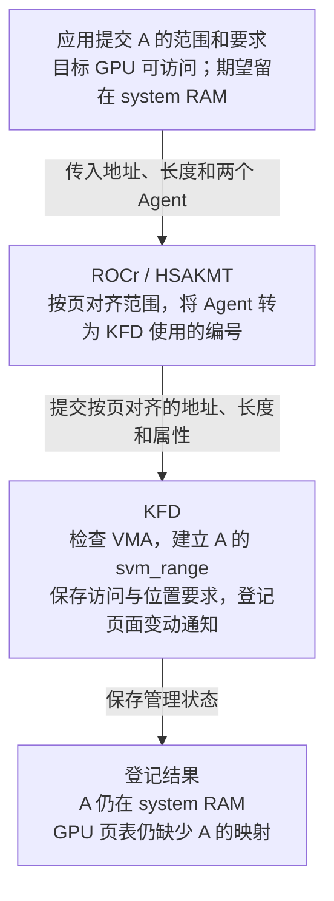

ROCr 用 Agent 表示 CPU 或 GPU 设备。应用把目标 GPU Agent 放在“谁可以访问”的属性里，运行时把它转换成 KFD 的 `ACCESS`；应用把 CPU Agent 放在“希望页面位于哪里”的属性里，运行时把它转换成 KFD 的 `PREFERRED_LOC`。两个 Agent 在这次请求中分别表示访问者和期望位置，之后读取 `A[5]` 的仍是目标 GPU。

本例 A 已按 4 KiB 页边界对齐，运行时按页对齐后提交的仍是一页。KFD 检查 VMA 后，为尚无记录的这一页分配并初始化 `svm_range`，将它加入本进程的范围集合，登记页面变化通知，再填写应用提交的属性。请求完成后，KFD 就能在后来的 GPU 缺页处理中按 A 的页号找到这份记录。

本例沿用已启用 XNACK 的配置，只请求 `ACCESS` 和 `PREFERRED_LOC`，没有请求预取或修改映射标志。此次属性请求完成后，KFD 已建立管理记录并保存要求。A 继续使用 CPU 已写好的 RAM 页面，没有为它另外分配 HBM 存储；GPU 页表仍缺少 A 的映射。

沿用 §2.1 的 `gpuidx`，把应用的要求代入 A 的 `svm_range`，得到：

```text
A 的 svm_range：覆盖 [0x3000_0000, 0x3000_1000)，1 页
  范围与归属：
    start = last = 0x3_0000，npages = 1
    svms 指回本进程的范围集合，it_node 已加入集合的区间树
    notifier 已登记到本进程的 Linux 地址空间
  目标 GPU 的访问位：
    bitmap_access 的第 gpuidx 位 = 1  ← 已设置 ACCESS
    bitmap_aip 的第 gpuidx 位 = 0     ← 未设置 ACCESS_IN_PLACE
  位置要求与当前状态：
    preferred_loc = 0          ← 期望位置是 system RAM
    prefetch_loc = 未指定       ← 没有发起预取
    actual_loc = 0             ← A 当前在 system RAM
    svm_bo = NULL             ← 尚未关联承载 A 数据的 HBM BO
  映射准备状态：
    dma_addr[gpuidx] = NULL    ← 尚未准备目标 GPU 的逐页 DMA 地址数组
    mapped_to_gpu = false      ← 此范围尚未建立 GPU 映射
```

`ACCESS` 让 KFD 把目标 GPU 的 `bitmap_access` 位设为 1，同时把同一 GPU 的 `bitmap_aip` 位清为 0。这个 0 只表示本例没有选 `ACCESS_IN_PLACE`；目标 GPU 的访问要求仍由 `bitmap_access` 中的 1 表示。

本例还把 `preferred_loc` 设为 0，即期望页面留在 system RAM。故障恢复时 KFD 先采用这个可用的期望位置，所以 A 即使选择普通 `ACCESS`，也可以留在 RAM 并为目标 GPU 建立映射；`bitmap_aip` 的 0 不表示必须把 A 搬到 HBM。

`preferred_loc=0` 和 `actual_loc=0` 中的 0 是 system RAM 的位置编码，含义与位图中的 0 不同。`prefetch_loc` 未指定只说明没有预取目标；A 的当前位置仍由 `actual_loc=0` 表示。

若改为请求 `ACCESS_IN_PLACE`，KFD 会把目标 GPU 记入另一张访问位图，供恢复时按当前位置选择访问方式。若请求 `PREFETCH_LOC`，属性路径会尝试提前迁移页面，第 5 章再展开。本例到这里完成的是范围与属性登记；下一节从 GPU 首次读取 A 开始，使用这份记录。

> **[SOURCE] 可选源码索引**
>
> - 应用属性进入 ROCr：ROCr `ba56a24c6132`，[`hsa_ext_amd.h`](./2.源码/rocr-runtime/runtime/hsa-runtime/inc/hsa_ext_amd.h) 第 2973～2977、2997～3011 行定义“期望位置”与“Agent 可访问”属性；[`hsa_ext_amd.cpp`](./2.源码/rocr-runtime/runtime/hsa-runtime/core/runtime/hsa_ext_amd.cpp) 第 1234～1242 行接收请求；[`runtime.cpp`](./2.源码/rocr-runtime/runtime/hsa-runtime/core/runtime/runtime.cpp) 第 2562～2730 行转换属性并按页对齐，其中第 2654～2661 行传递期望位置的 Agent 节点编号。
> - 节点与位置值：ROCr [`svm.c`](./2.源码/rocr-runtime/libhsakmt/src/svm.c) 第 40～101 行转换节点并构造 ioctl；[`topology.c`](./2.源码/rocr-runtime/libhsakmt/src/topology.c) 第 2157～2164、2316～2318 行说明节点到 KFD GPU ID 的转换及 CPU-only 节点的 ID 取值。
> - KFD 登记：Linux `248951ddc14d`，[`kfd_chardev.c`](./2.源码/linux/drivers/gpu/drm/amd/amdkfd/kfd_chardev.c) 第 1741～1763 行检查对齐并转交请求；[`kfd_svm.c`](./2.源码/linux/drivers/gpu/drm/amd/amdkfd/kfd_svm.c) 第 4330～4350 行换算页单位，第 763～806、3751～3810 行保存属性并按条件执行后续动作。
> - 属性与初始状态：Linux `248951ddc14d`，[`kfd_ioctl.h`](./2.源码/linux/include/uapi/linux/kfd_ioctl.h) 第 777～814 行定义位置编码和属性；[`kfd_svm.c`](./2.源码/linux/drivers/gpu/drm/amd/amdkfd/kfd_svm.c) 第 313～369 行初始化新范围，第 763～813 行更新位图和位置。
> - 本例停在登记的依据：[`kfd_svm.c`](./2.源码/linux/drivers/gpu/drm/amd/amdkfd/kfd_svm.c) 第 3515～3625 行按 `prefetch_loc` 决定属性路径的迁移，第 3802～3804 行在无需迁移和映射更新时跳过建表。

### 2.3 从故障记录找到 A 并选择恢复位置

本节沿用 [§0.1.1 的首次按需映射情形](#011-queue-资源与数组-a-的映射)：Queue 与 Ring 已可用，A 的 GPU 映射尚未建立。KFD 已在 §2.2 的属性请求中创建 A 的 `svm_range`，并保存访问与位置要求；输入数据仍在 system RAM。现在 GPU 才开始读取 A，KFD 可以使用提前建好的记录处理缺页。

GPU 首次读取 `A[5]`（地址 `0x3000_0014`）时产生 Retry 故障。KFD 收到 PASID 42、故障页 `0x3000_0000`、读访问类型和目标 GPU 信息，需要找到 A 的登记记录，再决定页面恢复到哪里。

```text
PASID 42 → 找到 kfd_process
  → 根据故障来源确认目标 GPU，取得它在本进程中的 gpuidx
  → 通过进程关联的线程取得 mm_struct
  → 用故障页号 0x3_0000 查范围集合，找到 A 的 svm_range
  → 查询 A 的 VMA，确认本次读取被允许
  → 读取 A 的位置与访问要求，选择本次恢复位置
```

故障来源用于确定哪块 GPU 发出了请求；`gpuidx` 随后用于读取该 GPU 的访问位，并从 `pdds[gpuidx]` 取得对应设备对象。后续更新 GPU 页表时，KFD 会沿这个设备对象取得 `amdgpu_vm`。上图走的是“查到已有记录”分支；§2.4 展开同一个查找步骤中“查不到记录”的分支，先创建记录，再继续权限检查和位置选择。

#### 2.3.1 当前页面位置与本次恢复目标

找到 A 并确认读取权限后，KFD 要决定：继续使用 RAM 中的这页数据，还是先把数据搬到 GPU 的 HBM。

A 的范围记录中，`preferred_loc` 保存应用希望页面放置的位置，`actual_loc` 保存当前页面位置的摘要。本例两个成员都为 0，分别表示“希望留在 RAM”和“当前就在 RAM”。这里的 0 是 system RAM 的位置编码，不是页面地址或映射状态。

驱动先检查期望位置是否可用；没有可用期望位置时，再根据访问位图选择。选择结果保存在本次故障处理的临时变量 `best_loc` 中。本例明确要求留在 RAM，因此得到：

```text
preferred_loc = 0 → 应用希望 A 留在 RAM → KFD 选择 best_loc = 0
actual_loc = 0    → A 当前就在 RAM

当前位置与本次目标相同 → 保留原来的 RAM 页，无需复制 A
GPU 映射仍然缺失       → 取得这页的信息，再为目标 GPU 建立映射
```

接下来，KFD 通过 HMM 查询 A 对应的 RAM 页面，为目标 GPU 准备设备访问地址，再更新 GPU 页表。处理过程中没有为 A 的 RAM 数据页新建 BO，`svm_bo` 仍为空。第 3、4 章会展开取得页面、准备地址和完成映射更新的步骤。

映射可用后，A 的 `svm_range` 继续保存访问与位置要求，并跟踪 Linux 页面变化。如果 Linux 后来替换 A 的 RAM 页面，KFD 仍使用这份范围记录处理旧 GPU 映射。因此，`svm_range` 会用于建立映射后的维护；是否已有 GPU 映射，不决定 A 是否需要数据 BO。

> **[SOURCE]** Linux `248951ddc14d`，[`kfd_svm.c`](./2.源码/linux/drivers/gpu/drm/amd/amdkfd/kfd_svm.c) 第 3211～3245 行在 RAM 主例中进入页面验证与映射；第 1434～1517 行的 `svm_range_map_to_gpu()` 根据逐页设备地址直接调用 `amdgpu_vm_update_range()` 更新 GPU 页表。这里讨论的是承载 A 数据的 BO，页表自身的存储由 GPUVM 管理。

#### 2.3.2 已有 IOVA 与 GPU 页表映射

沿用 [§0.2](#02-沿用-packet-37-与数组-a) 启用 Host IOMMU 翻译的配置。假设驱动已为 A 准备好 DMA IOVA，并完成所需的 GPU 页表更新和翻译失效，CPU 与 GPU 就能通过各自的地址转换访问同一份 RAM 数据：

```text
CPU 访问 A 的页起点 0x3000_0000
  → CPU 页表
  → system RAM 物理页 0x4567_8000

GPU 访问 A 的页起点 0x3000_0000
  → GPU 页表：GPUVA 0x3000_0000 → IOVA 0x1234_5000
  → Host IOMMU：IOVA 0x1234_5000 → system RAM 物理页 0x4567_8000

两条路径最终访问同一份 A；本次只补映射，数据没有搬到 HBM。
```

如果驱动只完成了 IOMMU 映射，GPU 页表中的第一段还未建立，GPU 读取 A 时仍会缺页。IOVA 已经准备好，只说明驱动取得了可用于建表的设备地址。

如果两段映射都有效，权限也允许本次读取，GPU 就可以直接访问 RAM。此时不会因为应用期望把 A 放在 HBM，就自动产生一次缺页；位置要求怎样影响后续处理，接着看下一节。

#### 2.3.3 迁入 HBM 的触发条件与 BO 准备

现在改变条件，考虑把同一页 A 从 RAM 搬到目标 GPU 的 HBM。先区分怎样触发迁移，再看驱动怎样为 A 准备 BO 和存储资源。

应用只修改 `PREFERRED_LOC` 时，KFD 先保存期望位置；在本例没有预取请求、没有修改映射标志的条件下，这次请求不会立即搬动 A，也不会故意撤销原本可用的 GPU 映射来制造缺页。后续确实发生缺页时，驱动才会在恢复流程中使用这个位置要求。

**[DESIGN]** 下面改看一个确实进入缺页恢复的变体：A 仍只有一页，数据在 RAM，采用普通 `ACCESS`，进程启用 XNACK；A 的 GPU 映射缺失或已被撤销。本次访问的目标 GPU 的设备 ID 记为 G，应用也将期望位置设为 G，表示希望 A 位于该 GPU 的 HBM。

```text
actual_loc = 0       → A 的数据目前在 system RAM
preferred_loc = G   → 应用希望 A 放在 GPU G 的 HBM
        ↓ KFD 在本次缺页恢复中选择位置
best_loc = G        → 本次恢复选择尝试迁入 GPU G 的 HBM
```

如果应用希望主动搬动 A，可以提交 `hsa_amd_svm_prefetch_async()` 预取请求。依赖满足后，运行时向 KFD 提交预取位置，驱动据此尝试迁移。这样即使原来的 RAM 映射可用，也能发起搬动数据的请求。API 的提交与完成通知见 [§5.1](#51-迁移目标处理范围与设备页)。

无论由上述缺页恢复还是显式预取触发，迁入 HBM 都需要目标存储。下面假设 A 的这一页成功迁移，并完成所需的 GPU 映射更新；图中概括主要动作，复制期间的访问保护和等待顺序留到第 5 章展开：

```text
KFD 决定把 A 从 RAM 迁到 GPU G 的 HBM
  → 创建或复用合适的 BO，为 A 准备 HBM 存储资源
  → 将这份 BO 与 A 的 svm_range 关联
  → 在迁移保护下复制 A 的数据，调整 Linux 页面与映射状态
  → 更新 GPU 页表，完成所需的同步和翻译失效
  → GPU 通过原虚拟地址 0x3000_0000 访问 HBM 中的 A
```

准备目标存储时，KFD 的 `svm_range_vram_node_new()` 先检查能否复用已有 BO；没有合适对象时，创建 `svm_range_bo` 和一个使用 VRAM 存储域的 `amdgpu_bo`。VRAM 在当前 MI300X 模型中对应本地 HBM。本例 A 只有一页，驱动按这一页所需的大小准备存储；BO 创建成功后，还要继续执行数据复制。

关联动作落实到成员上就是：

```text
A 的 svm_range
    └─ svm_bo → svm_range_bo
                    └─ bo → amdgpu_bo
```

驱动随后将 A 的数据搬进这份 BO 管理的 HBM 存储，并为当前页面更新映射。迁移完成后，应用的 A 指针保持不变，`svm_range` 继续跟踪同一段虚拟地址的访问要求与页面变化，关联的 BO 则管理承载数据的 HBM 资源。GPU 最终通过页表访问这些数据。

迁移可能因资源或页面状态而失败。`best_loc=G` 只是本次选择的目标，关联 BO 也只说明已经准备了相应存储；实际结果还取决于页面迁移、数据复制和映射更新。完整顺序见 [§5.2](#52-system-ram-hbm-的迁移与完成条件)，部分迁移与失败回退见 [§5.3](#53-部分迁移与失败回退)。

> **[SOURCE]** Linux `248951ddc14d`，[`kfd_migrate.c`](./2.源码/linux/drivers/gpu/drm/amd/amdkfd/kfd_migrate.c) 第 533～538 行为迁移准备 BO 并计算范围在资源中的偏移；[`kfd_svm.c`](./2.源码/linux/drivers/gpu/drm/amd/amdkfd/kfd_svm.c) 第 554～605 行检查复用或创建 VRAM BO，第 640～646 行保存 `svm_bo->bo`、`prange->svm_bo`、资源和共享列表。这里的 BO 用于存放 A 的数据。

回到本节主例：`preferred_loc=0`、`actual_loc=0`，KFD 选择让 A 留在 RAM。第 3 章继续解释 HMM 怎样取得页面信息，第 4 章再建立 GPU 映射。若没有这个 RAM 期望位置，普通 `ACCESS` 也可能让 KFD 选择目标 GPU 的 HBM，§2.4 会用默认属性说明这一差别。

> **[SOURCE] 可选源码索引**
>
> - 查找与权限检查：Linux `248951ddc14d`，[`kfd_svm.c`](./2.源码/linux/drivers/gpu/drm/amd/amdkfd/kfd_svm.c) 第 3070～3135 行取得进程、GPU、Linux 地址空间与范围，第 3182～3196 行检查 VMA 权限并选择恢复位置；第 1439～1440 行说明后续建表时从设备对象取得 GPUVM。
> - 位置选择与是否迁移：[`kfd_svm.c`](./2.源码/linux/drivers/gpu/drm/amd/amdkfd/kfd_svm.c) 第 2765～2809 行选择恢复位置，第 3211～3245 行根据 `actual_loc` 与 `best_loc` 决定是否迁移，再进入页面验证与映射路径。
> - 只修改期望位置与显式预取：Linux `248951ddc14d`，[`kfd_svm.c`](./2.源码/linux/drivers/gpu/drm/amd/amdkfd/kfd_svm.c) 第 772～777 行分别保存期望位置和预取位置，第 3515～3518、3596～3625 行根据预取位置选择并触发迁移，第 3802～3804 行在无需迁移和映射更新时跳过建表。ROCr `ba56a24c6132`，[`runtime.cpp`](./2.源码/rocr-runtime/runtime/hsa-runtime/core/runtime/runtime.cpp) 第 2988～3027 行在预取依赖满足后提交位置请求，并处理完成通知。

### 2.4 GPU 缺页时按需创建 A 的范围记录

本节假设：**应用没有提前调用 `hsa_amd_svm_attributes_set()` 为 A 设置 SVM 属性，KFD 此前也没有 A 的 `svm_range`。** A 仍是那组输入数据，应用已经准备好内存，CPU 已将数据写入 system RAM；缺少的是 KFD 管理这段地址的记录。

§2.3 中，KFD 能找到 §2.2 的属性请求提前创建的记录。本节改走同一次查找的另一条分支：GPU 缺页后，KFD 查不到记录，就先创建一份，再继续处理本次缺页。因此，§2.4 是 §2.3 的另一种情况，不是执行完 §2.3 后再做一次登记。

**[DESIGN]** 目标 GPU 支持 SVM，进程启用 XNACK。A 的匿名 VMA 覆盖 `[0x3000_0000, 0x3000_1000)`，允许读取，且与已有 BO/userptr 映射没有冲突。GPU 页表中还没有 A 的可用映射：

```text
CPU 已写好 A，应用未调用 hsa_amd_svm_attributes_set() 为 A 设置属性
  → GPU 读取 A[5]，因缺少 GPU 映射而报告 Retry 缺页
  → KFD 用故障页 0x3000_0000 查范围集合：找不到 svm_range
  → 查询 Linux VMA，确认地址范围存在，并检查映射冲突
  → KFD 创建 A 的 svm_range，填写范围边界和默认属性
  → 将记录加入本进程的范围集合，并登记页面变化通知
  → 继续本次缺页处理：检查读取权限，选择页面位置，再恢复 GPU 映射
```

创建动作由 Host CPU 上的 KFD 代码执行。到“加入范围集合”这一步，KFD 已经有了 A 的管理记录；后续还需要取得页面信息，并为 GPU 建立可用映射。

#### 2.4.1 新范围采用的默认属性

本例 VMA 只有一页，因此新记录覆盖这一页：`start=last=0x3_0000`、`npages=1`。应用没有通过属性接口提交访问与位置要求，新记录就采用驱动的默认设置。下面还假设 A 不属于 Linux 识别的初始堆或初始栈，以便直接观察这些默认值：

```text
新建的 A 范围记录：
  bitmap_access 的第 gpuidx 位 = 1  ← XNACK 模式下，默认包含支持 SVM 的目标 GPU
  bitmap_aip 的第 gpuidx 位 = 0     ← 未选择原地访问要求
  preferred_loc = 0xFFFF_FFFF       ← 未指定期望位置
  prefetch_loc = 0xFFFF_FFFF        ← 未指定预取目标
  actual_loc = 0                    ← 页面当前在 system RAM
  范围已加入集合，notifier 已登记
```

创建记录时，KFD 还没有搬动 A。`preferred_loc=0xFFFF_FFFF` 表示应用没有指定放置偏好，后续由驱动按访问要求选择位置；`actual_loc=0` 则记录 A 当前仍在 RAM。`prefetch_loc` 未指定只表示没有预取目标，本次迁移仍可由 GPU 缺页触发。

#### 2.4.2 默认 ACCESS 下的 HBM 选择与 RAM 访问

现在 KFD 已找到 A 的范围，需要决定本次在哪里恢复访问。设发生缺页的 GPU 的设备 ID 为 G，`gpuidx` 是这块设备在进程数组中的下标。按本例条件，选择过程如下：

```text
GPU G 读取 A，发生缺映射故障
  → preferred_loc 未指定：没有可直接采用的期望位置
  → 检查 bitmap_access 中的第 gpuidx 位：值为 1
  → 普通 ACCESS 分支选择访问者：best_loc = G
  → 此时 actual_loc = 0：A 还在 RAM，与恢复目标不同
  → 尝试为 A 准备 HBM 存储并迁移数据
  → 根据迁移后的实际页面结果，继续恢复 GPU 映射
```

这里起决定作用的是默认的普通 `ACCESS`。在没有可用期望位置时，`svm_range_best_restore_location()` 检查目标 GPU 的普通访问位；该位为 1，就返回这块 GPU 的 ID，作为 `best_loc`。这个分支不会因 `actual_loc=0` 而改选 RAM。只有后面检查是否需要迁移时，驱动才把当前位置与恢复目标结合起来处理。

因此，`preferred_loc` 未指定时，KFD 会按默认访问策略选择位置，并没有收到“保持当前位置”的要求。§2.3 的 RAM 主例则明确设置了 `preferred_loc=0`，驱动在检查期望位置时就选中了 RAM，随后只需补上 GPU 映射。

**[INFERENCE]** 从本篇的 MI300X 访存路径看，把 A 迁入 HBM，可以让 GPU 后续访问这份数据时使用本地显存，减少经 PCIe 访问主机 RAM 的需要。首次迁移要付出复制数据的成本；如果 GPU 后续反复使用 A，本地访问的收益可能抵消这次搬运。若 GPU 只短暂访问，或 CPU 与 GPU 频繁交替访问，迁移未必更划算。固定源码在这里按位置属性和访问设备选择目标，没有比较这次迁移与后续访问的总成本。

> **[SPEC]** ROCm 6.3.3 文档 [《Unified memory management》的 XNACK 小节](https://rocm.docs.amd.com/projects/HIP/en/docs-6.3.3/how-to/hip_runtime_api/memory_management/unified_memory.html#xnack)说明自动页面迁移与数据位置对性能的影响；同页 “System requirements” 将 CDNA3 纳入相关支持范围。本节具体的默认选择顺序依据下方固定 KFD 源码。

页面也可以继续留在 system RAM。应用可以通过下面两种要求影响选择：

- 将 `preferred_loc` 设为 0：明确希望使用 RAM，正是 §2.2、§2.3 的主例。
- 将目标 GPU 的访问要求改为 `ACCESS_IN_PLACE`，并保持 `preferred_loc` 未指定：A 当前在 RAM，驱动按原地访问分支选择 RAM，再建立相应 GPU 映射。

还有一个与本节默认创建直接相关的特例：如果 A 属于 Linux 识别的初始堆或初始栈，KFD 创建范围时会把 `preferred_loc` 改为 0。因此，“没有调用属性接口”本身不能推出一定尝试迁入 HBM；还要看新记录最后采用了哪些属性。

即使本例已选出 `best_loc=G`，迁移仍可能失败。固定恢复路径会尝试回退到 system RAM，再验证页面并建立映射；是否恢复成功还取决于后续处理结果。HBM 存储与 BO 的关联见 §2.3.3，实际搬页及失败回退见第 5 章。

#### 2.4.3 创建记录时的锁与范围检查

创建记录还需要两项保护。首先，KFD 要把地址空间读锁切换为写锁，也就是取得 `mmap_write_lock`。锁切换期间其他线程可能改变地址空间，所以取得写锁后必须重新查询；仍找不到范围时才执行本节开头图中的创建步骤。

其次，候选边界受 VMA、默认处理粒度和相邻已登记范围共同限制。故障页本身已属于 BO/userptr 映射时，KFD 不会再为它建立 SVM 范围；如果只是较大的候选范围与这类映射相交，故障页本身没有冲突，固定源码会把候选范围缩为故障所在的一页。没有有效 VMA 时也无法创建这份记录。

> **[SOURCE] 可选源码索引**
>
> - 按需创建与保护：Linux `248951ddc14d`，[`kfd_svm.c`](./2.源码/linux/drivers/gpu/drm/amd/amdkfd/kfd_svm.c) 第 2812～2965 行计算边界、检查冲突、创建范围并登记通知，第 3135～3160 行切换锁并重新查询。
> - 默认属性与例外：Linux `248951ddc14d`，[`kfd_svm.c`](./2.源码/linux/drivers/gpu/drm/amd/amdkfd/kfd_svm.c) 第 313～365 行初始化位置与访问位，第 3382～3384 行记录支持 SVM 的设备，第 2828、2959～2960 行识别初始堆、栈并将期望位置改为 RAM。
> - 选择顺序与 RAM 路径：[`kfd_svm.c`](./2.源码/linux/drivers/gpu/drm/amd/amdkfd/kfd_svm.c) 第 2785～2793 行先检查期望位置，第 2795～2796 行在普通访问位为 1 时返回访问者的 GPU ID，第 2798～2806 行处理原地访问；其中 `actual_loc=0` 时返回 RAM。
> - 迁移与失败回退：[`kfd_svm.c`](./2.源码/linux/drivers/gpu/drm/amd/amdkfd/kfd_svm.c) 第 3196 行取得 `best_loc`，第 3215～3238 行根据目标尝试迁移、处理 RAM 回退，第 3244～3245 行继续页面验证与映射。

### 2.5 局部属性修改与范围 R 的拆分

主例 A 只有一页，无法演示“只修改中间几页”。本节暂时换成另一段范围 R，用它说明局部属性修改；结束后再回到 A。一个 `svm_range` 只有一份 `preferred_loc`，这个值作用于它覆盖的整个范围。中间几页需要不同的期望位置时，KFD 就要用不同的范围记录分别保存这些要求。

**[DESIGN]** R 共 16 页，当前都在 RAM，期望位置也为 RAM。进程启用 XNACK，原先没有预取请求。应用这次只把中间 4 页的 `PREFERRED_LOC` 改为目标 GPU。下图用 G 表示该 GPU 的 ID，用 `R_old` 等名字区分教学中的范围对象。

```text
修改前，本进程的范围集合中有一份记录：
  R_old：[0x6000_0000, 0x6001_0000)，16 页，preferred_loc = 0

本次请求：只把 [0x6000_4000, 0x6000_8000) 的 preferred_loc 改为 G

修改后，同一个范围集合中有三份记录：
  R_front：[0x6000_0000, 0x6000_4000)，4 页，preferred_loc = 0
  R_mid：  [0x6000_4000, 0x6000_8000)，4 页，preferred_loc = G
  R_back： [0x6000_8000, 0x6001_0000)，8 页，preferred_loc = 0

R_old 已从集合移除并释放。
三份新记录各有自己的范围节点和 notifier，svms 都指回同一个进程范围集合。
三段的 actual_loc 仍为 0：本次只改位置要求，数据继续留在 RAM。
```

KFD 先准备替换旧记录所需的新对象，保留原记录以应对准备失败。准备成功后，再把新范围加入集合、登记各自的通知、给中段写入新属性，并移除旧范围及其通知对象。以后按前段、中段或后段的地址查询，就会找到对应的新 `svm_range`。

这次请求完成后，中段已经保存了新的期望位置；实际页面仍由原 RAM 页承载。后续故障可以根据中段的 `preferred_loc=G` 选择迁移，预取请求也可以另行触发迁移。拆分范围记录与复制页面数据是两个独立动作。

源码把“准备变更”和“提交变更”分给两个函数，按下面的先后关系阅读即可：

```text
svm_range_set_attr：处理本次属性请求
  → 调用 svm_range_add：准备新范围和待插入、更新、移除的记录
  → 准备成功后，由 svm_range_set_attr 提交区间树、notifier 和属性变更
  → 本例没有预取或映射更新要求，完成此次属性请求
```

本例 R 始终在 RAM，没有关联 HBM BO。若拆分的范围已经使用 HBM 存储，拆出的记录可以按 §2.1.1 的关系共享同一个 `svm_range_bo`，分别保留引用和资源偏移，详见 §6.3。请求涉及映射更新或迁移时的等待和失败处理分别见 §4.4、§5.3。

以后把三段属性改回相同值时，可以得到相同的属性查询结果；固定实现没有保证三份相邻记录自动合并成一份。

> **[SOURCE]** Linux `248951ddc14d`，[`kfd_svm.c`](./2.源码/linux/drivers/gpu/drm/amd/amdkfd/kfd_svm.c) 第 2173～2307 行说明并实现 `svm_range_add()` 的准备与失败清理；第 3751～3776 行由 `svm_range_set_attr()` 调用准备函数后提交变更；第 3790～3804 行检查迁移与映射更新要求，本例随后跳过建表。

回到章首那页输入数组 A：它已在 §2.2 登记；§2.3 的故障查找命中 A 的范围，并根据 `preferred_loc=0` 选择让数据留在 RAM。第 3 章继续查 Linux 页表，取得 A 当前对应的页面。

## 3. CPU 故障处理与 HMM 页面取得

### 3.1 HMM 查询的输入、对象与结果

第二章已经找到 A 的 `svm_range`，检查了 VMA，并选择让数据留在 RAM。现在 KFD 要取得 A 的虚拟地址当前对应的物理页及其状态，才能继续准备 GPU 映射。查询需要知道进程地址空间、虚拟地址区间和页面权限要求；成功后返回逐页 PFN 与状态标志。

KFD 用临时的 `amdgpu_hmm_range` 包装对象发起这次查询，其中内嵌的 `hmm_range` 保存查询条件和结果数组。它引用 A 已登记的 notifier，从而关联到同一个进程地址空间：

```text
A 的 svm_range：继续保存访问属性、位置要求和映射状态
  └─ notifier：已关联本进程的 mm_struct 和 A 的地址范围
       ↑ 本次查询引用这个通知对象
临时 amdgpu_hmm_range
  └─ hmm_range：描述本次查询
       ├─ start / end：查询的虚拟地址范围
       ├─ default_flags：希望取得有效页面，是否还要求可写
       ├─ notifier / notifier_seq：通知对象与本次查询的变化序号
       └─ hmm_pfns：逐页结果数组，保存 PFN 与状态标志
```

下面是查询对象的核心成员，属于省略部分字段的教学简化定义：

```c
struct hmm_range {
    struct mmu_interval_notifier *notifier; /* 指向 A 已登记的通知对象 */
    unsigned long notifier_seq;            /* 本次查询使用的变化序号 */
    unsigned long start, end;              /* 字节地址：[start, end) */
    unsigned long *hmm_pfns;                /* 每个 CPU 页对应一个结果项 */
    unsigned long default_flags;           /* 本次查询的默认页面要求 */
};
```

`svm_range` 持续记录 A 的 SVM 属性和映射状态，`hmm_range` 描述一次页面查询。两者通过同一个 notifier 关联：HMM 由它找到进程的 `mm_struct`，KFD 也通过它检查查询期间页面是否变化。

KFD 填好查询区间和要求后调用 HMM；HMM 读取 CPU 页表，将结果写入 `hmm_pfns`，供 KFD 准备设备地址。下面用 A 的具体地址完整走一遍，再分别处理页面未就绪和查询结果失效的情况。

> **[SOURCE]** Linux `248951ddc14d`，[`amdgpu_hmm.h`](./2.源码/linux/drivers/gpu/drm/amd/amdgpu/amdgpu_hmm.h) 第 34～37 行定义临时包装对象；[`include/linux/hmm.h`](./2.源码/linux/include/linux/hmm.h) 第 17～36、64～72、99～120 行说明请求、结果标志、页面转换和 `hmm_range`。

### 3.2 从 A 的范围记录取得当前页面

沿用 §2.3 的主例：CPU 已把 A 写入 system RAM，GPU 读取 `A[5]`（地址 `0x3000_0014`）时缺少映射。KFD 已找到 A 的 `svm_range` 和可读写 VMA，目标 GPU 获准访问。`preferred_loc=0`、`actual_loc=0`，本次选择的 `best_loc` 也为 0，因此数据继续留在 RAM，承载 A 数据的 `svm_bo` 仍为空。

下面把具体地址代入查询过程，一直看到 GPU 恢复读取。CPU 页与 GPU 基本页均为 4 KiB，Host IOMMU 已启用：

```text
GPU 读取 A[5]：0x3000_0014，GPU 映射缺失
  → KFD 找到 A 的 svm_range，检查 VMA，选择留在 RAM
      svms：指向所属进程的 SVM 范围管理对象
      start = last = 0x3_0000：A 的虚拟页号
      notifier.mm：指向已登记的进程地址空间
  → KFD 请求 HMM 查询：[0x3000_0000, 0x3000_1000)
  → HMM 从 notifier.mm 取得 mm_struct，读取这段地址的 CPU 页表
      ├─ 主例：PTE 有效、可写，指向 RAM 物理页 0x4567_8000
      │    → 取得 PFN 0x4_5678，以及有效、可写标志
      └─ 页面或权限未就绪：转入 §3.3 的通用缺页处理
           → 调用 Linux 通用缺页处理，准备页面或调整映射
           → 重新读取页表，取得处理后的 PFN 与状态
  → HMM 把结果写入逐页结果数组 hmm_pfns[0]，返回 KFD
  → KFD 由 PFN 取得 struct page，再准备设备地址
      本例得到 IOVA 0x1234_5000，保存到 svm_range.dma_addr[0][0]
  → 检查查询结果仍有效，再更新 GPU 页表
      GPUVA 0x3000_0000 → IOVA 0x1234_5000
```

#### 第一步：确定查询的进程与虚拟地址范围

`svm_range.svms` 指向所属 `kfd_process` 内嵌的 `svm_range_list`，其中的树和链表组织这个进程的 SVM 范围记录。它把 A 的范围记录关联到进程；逐页的 RAM 物理页号需要继续查询 CPU 页表。

本例 `svm_range` 的边界成员叫 `start` 和 `last`，单位是虚拟页，包含两端。A 只占一页，因此两者都为 `0x3_0000`。换成字节地址：

```text
起始地址      = start << 12      = 0x3000_0000
结束地址之后  = (last + 1) << 12 = 0x3000_1000
查询字节区间  = [0x3000_0000, 0x3000_1000)
```

这次换算只确定了要查询的虚拟地址区间。`0x3_0000` 是虚拟页号，把它左移只能还原虚拟地址；物理页放在哪里，要由该进程的页表给出。`actual_loc=0` 将位置概括为 system RAM，也没有给出 RAM 中具体的物理页框。

#### 第二步：准备 HMM 查询对象与页面要求

KFD 现在准备一次查询请求：查询 A 所属进程的 `[0x3000_0000, 0x3000_1000)`，成功时取得这一页的物理页框号和状态。本步先填写查询条件、准备结果存放位置；第三步才读取 CPU 页表。

##### 创建查询对象并准备结果位置

KFD 使用 §3.1 的临时对象保存这次请求。代入 A 的地址后，准备的内容如下；其中“要求可写”来自本例可读写的 VMA，后面再展开这个判断。

```text
临时 amdgpu_hmm_range
    ├─ bo = NULL：这次不给临时对象关联 BO
    └─ hmm_range：本次查询请求
         ├─ notifier → A 已登记的 notifier
         │              └─ mm → A 所属进程的地址空间
         ├─ start = 0x3000_0000
         ├─ end   = 0x3000_1000
         ├─ default_flags：本例要求取得有效、可写的页面
         ├─ notifier_seq：记录本次查询使用的变化序号
         └─ hmm_pfns → 已分配的结果数组
                          └─ [0]：等待 HMM 填入这一页的查询结果
```

`amdgpu_hmm_range_alloc(NULL)` 创建外层临时对象。参数 `NULL` 表示不为这个对象关联 BO；对象内嵌的 `hmm_range` 仍能通过 notifier 查询 A 的 CPU 映射。

随后，`amdgpu_hmm_range_get_pages()` 为结果数组分配空间，并填写地址区间、请求标志等信息。A 只有一页，因此一个数组项 `hmm_pfns[0]` 就够了。此时准备好的是结果项的存储空间，尚未取得本次查询的 PFN；第三步查询成功后，HMM 才会把页框号和状态写进去。

这两次分配用于保存内核管理信息，A 的 4 KiB 数组数据继续留在原 RAM 页中。较大的查询区间可以按 VMA 分段处理。

##### 按 VMA 权限设置页面要求

KFD 通过 `default_flags` 告诉 HMM，成功返回的页面需要满足什么条件。这条路径总会设置 `HMM_PFN_REQ_FAULT`：要求取得有效页面；当前页面尚未准备好时，允许调用 Linux 通用缺页处理来准备。已有页面满足要求时直接返回，设置这个标志不会强制制造一次缺页。

**是否还要求可写，取决于 VMA 是否允许写。** `readonly` 的意思是“是否只读”，具体判断如下：

```text
KFD 检查 A 所在 VMA 的权限
    ├─ 只允许读
    │    → readonly = true
    │    → default_flags = HMM_PFN_REQ_FAULT
    │    → 取得有效页面即可，不要求可写
    │
    └─ 允许读写（本例）
         → readonly = false
         → default_flags = HMM_PFN_REQ_FAULT | HMM_PFN_REQ_WRITE
         → 要求取得有效、可写的页面
```

`HMM_PFN_REQ_WRITE` 表示请求可写页面。GPU 读取合法的只读映射只需要读权限；本例还提出可写要求，是因为 A 的 VMA 允许写，而这条 KFD 实现按 VMA 的权限准备页面。GPU 故障记录中的“读”描述刚才失败的指令，`readonly` 则由 VMA 的 `VM_WRITE` 决定。

VMA 允许写，说明应用有权修改这段地址；当前 CPU PTE 是否可写，还要查询页表才能确认。例如，COW 会暂时让 PTE 只读，§3.3 再说明 HMM 怎样准备这种页面。主例的 CPU PTE 已有效、可写，可以直接取得结果。

##### 从准备请求进入实际查询

`notifier_seq` 记录本次查询使用的变化序号，供后续检查查询期间页面是否发生变化，详见 §3.4。准备完成后，调用链继续执行：

```text
amdgpu_hmm_range_alloc(NULL)
    → 创建临时包装对象
amdgpu_hmm_range_get_pages(...)
    → 准备结果数组、查询条件和变化序号（本步）
    → 调用 hmm_range_fault()，读取 CPU 页表（第三步）
    → 成功时，结果数组已填入 PFN 与状态，返回 KFD
```

第二步和第三步是按操作阶段划分的；`amdgpu_hmm_range_get_pages()` 的一次调用包含准备请求和执行查询两个阶段。

> **[SOURCE]** Linux `248951ddc14d`，[`kfd_svm.c`](./2.源码/linux/drivers/gpu/drm/amd/amdkfd/kfd_svm.c) 第 1775～1777 行由 VMA 的 `VM_WRITE` 计算 `readonly`，第 1804～1808 行创建临时对象并请求页面；[`amdgpu_hmm.c`](./2.源码/linux/drivers/gpu/drm/amd/amdgpu/amdgpu_hmm.c) 第 259～268 行创建包装对象，第 168～215 行分配结果数组、填写参数并调用 HMM。

#### 第三步：HMM 读取 CPU PTE，返回物理页信息

查询条件准备好后，HMM 从引用的 `notifier.mm` 取得进程地址空间，再通过 Linux 的页表遍历代码定位 A 的 PTE。

因此，即使已经能找到 `mm_struct`，仍需执行读取页表这一步：`mm_struct` 提供访问该进程页表的入口，具体 PTE 才记录这个虚拟页当前的映射。在这条路径中，HMM 是运行在 Host CPU 上的内核代码；它只查询请求的地址区间。

假设 CPU 初始化 A 时，Linux 为它分配的 RAM 物理页起始地址是 `0x4567_8000`，并建立了可读写映射。HMM 本次读取 PTE 后，得到：

```text
被查询的虚拟页：0x3000_0000 → 当前 RAM 物理页：0x4567_8000
物理页框号 PFN = 0x4567_8000 >> 12 = 0x4_5678
结果项 hmm_pfns[0]：PFN 0x4_5678，加 HMM_PFN_VALID / HMM_PFN_WRITE 标志
```

`HMM_PFN_VALID` 和 `HMM_PFN_WRITE` 分别报告查询结果有效、可写。请求标志说明 KFD 要求什么，结果标志说明 HMM 查到了什么。A 的数组内容仍留在原 RAM 页中。

数组下标 0 对应查询区间的第一页。查询多页时，结果按虚拟地址顺序排列，连续虚拟页背后的物理页可以不连续。

#### 第四步：KFD 根据逐页结果准备设备地址

KFD 用 `hmm_pfn_to_page(hmm_pfns[0])` 去掉结果标志，取得这张 RAM 页的 `struct page`，再交给 DMA API。本例得到设备地址 IOVA `0x1234_5000`，并把它保存到 `svm_range.dma_addr[0][0]`。这份逐页设备地址是在查询之后准备的；最初找到 `svm_range` 时，本例的 `dma_addr[0]` 仍为空。

KFD 随后按 §3.4 检查查询结果仍有效，再用已准备的设备地址更新 GPU 映射。第四章展开 DMA 地址准备和页表更新的具体调用。

#### 第五步：GPU 映射生效后重试读取

当页表更新和所需的翻译失效处理完成后，GPU 对 `A[5]` 的访问可沿下面的地址关系到达原 RAM 页：

```text
GPU 使用虚拟地址   0x3000_0014
  → GPU 页表翻译为 IOVA 0x1234_5014
  → Host IOMMU 翻译为物理地址 0x4567_8014
  → 读取原 RAM 页中偏移 0x14 处的 A[5]
```

本例通过 HMM 查到当前 RAM 页，最终让 CPU 和 GPU 访问同一份 A。接下来分别处理页面未就绪和查询结果失效的情况。

<details>
<summary>可选源码：范围、查询对象与页面结果</summary>

> **[SOURCE] 可选源码索引**
>
> - 范围记录与进程归属：Linux `248951ddc14d`，[`kfd_svm.h`](./2.源码/linux/drivers/gpu/drm/amd/amdkfd/kfd_svm.h) 第 70～81、108～132 行说明 `svms`、虚拟页边界与设备地址数组；[`kfd_priv.h`](./2.源码/linux/drivers/gpu/drm/amd/amdkfd/kfd_priv.h) 第 883～904 行定义进程的 SVM 范围管理对象。
> - 查询进程与地址：[`kfd_svm.c`](./2.源码/linux/drivers/gpu/drm/amd/amdkfd/kfd_svm.c) 第 110～118 行登记 notifier 与 `mm_struct`，第 1753、1763～1808 行取得所属进程、将虚拟页范围转成字节区间并请求 HMM；[`mm/hmm.c`](./2.源码/linux/mm/hmm.c) 第 659～684 行从 `notifier.mm` 取得地址空间并遍历页表。
> - 页面结果及后续处理：[`mm/hmm.c`](./2.源码/linux/mm/hmm.c) 第 227～332 行读取 PTE、提取 PFN 和状态；[`kfd_svm.c`](./2.源码/linux/drivers/gpu/drm/amd/amdkfd/kfd_svm.c) 第 160～203、1818～1859 行将结果转成设备地址、检查有效性并更新 GPU 映射。页面缺失时的通用缺页处理见 §3.3。

> **[SOURCE]** Linux `248951ddc14d`，[`amdgpu_hmm.c`](./2.源码/linux/drivers/gpu/drm/amd/amdgpu/amdgpu_hmm.c) 第 168～215 行接收 notifier、地址、页数、`readonly` 和设备页面 owner，建立查询并调用 HMM。以下连续片段展示如何填写查询对象；这些参数均来自函数入参。

```c
186:     hmm_range->notifier = notifier;
187:     hmm_range->default_flags = HMM_PFN_REQ_FAULT;
188:     if (!readonly)
189:         hmm_range->default_flags |= HMM_PFN_REQ_WRITE;
190:     hmm_range->hmm_pfns = pfns;
191:     hmm_range->start = start;
192:     end = start + npages * PAGE_SIZE;
193:     hmm_range->dev_private_owner = owner;
194:
195:     hmm_range->notifier_seq = mmu_interval_read_begin(notifier);
```

186～193 行建立查询对象、权限要求与结果数组的联系；195 行记录序号，供 §3.4 的有效性检查使用。设备页面 owner 用于识别调用方所属的 device-private 页面，第五章再解释；本节查询的是普通 RAM 页。

</details>

### 3.3 页面未就绪时借用通用缺页处理

现在进入 §3.2 流程图的另一个分支：查询的进程和虚拟页范围都已确定，但 HMM 读取 CPU 页表后发现页面缺失，或当前 PTE 不满足写权限要求。它需要先通过 `handle_mm_fault()` 请 Linux 准备页面，再重新读取结果。

这个函数也是 CPU 缺页异常使用的通用入口。下图保留两条调用路径，说明 GPU 故障恢复怎样借用已有的 Linux 页面处理代码：

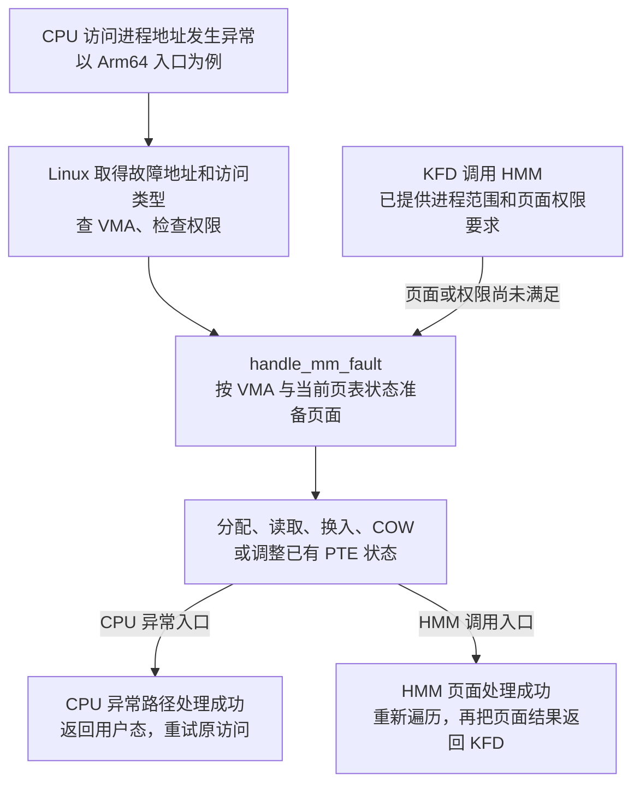

图中的 KFD、HMM 和 Linux 通用缺页代码都运行在 Host CPU 上。HMM 通过普通函数调用进入 `handle_mm_fault()`，无需应用再执行一次 CPU load，也不经过 Arm64 异常入口。Arm64 那条路径使用 `FAR_EL1` 提供地址、`ESR_EL1` 提供异常信息，供熟悉 CPU 异常的读者对应；GPU 的故障地址则已经由第二章的故障记录传给 KFD。

#### 匿名 A 尚未分配页面

只改变主例的初始条件：应用已申请并登记 A，但还没有访问它。`svm_range` 和 VMA 都已存在，A 的 CPU PTE 尚未映射实际数据页。

KFD 按可读写 VMA 请求有效、可写页面。HMM 发现 PTE 缺失后调用 `handle_mm_fault()`；Linux 准备私有、已清零的匿名页并建立 CPU 映射；HMM 再次遍历，返回新页的 PFN 与状态。随后 KFD 继续 §3.2 第四步的设备地址准备。这里得到的是零初始化内存，应用需要的 A 输入值仍须由应用写入。

若只请求读且允许使用零页，Linux 可以映射共享零页。本例请求可写页面，因此走私有匿名页的准备路径。

#### COW：共享页面在写入前分离

COW 是 Copy-on-Write，中文叫“写时复制”：先让多个进程共享同一张物理页，某一方需要写入时，再按需要为它准备独立副本。这里先用普通 Linux 私有匿名内存说明，再接回 HMM 的页面准备。

**[DESIGN]** 假设父进程有一页 4 KiB 的匿名内存，保存数组 A，`A[0] = 10`。父进程调用 `fork()` 后，Linux 让父子进程暂时共享物理页 P。为了在写入前处理分离，双方对应的 CPU PTE 都暂时设为只读：

```text
父进程的 A → 父进程的只读 PTE → 物理页 P
子进程的 A → 子进程的只读 PTE → 同一张物理页 P

P 中的数据：A[0] = 10
双方的 VMA：仍允许读写
```

双方只读取时，可以共用 P，暂时省去复制。但这段内存具有私有语义，父进程修改自己的 A 时，子进程应继续看到自己的原数据。VMA 保留写权限，说明进程有权修改；PTE 暂时只读，使 Linux 能在实际写入前处理 COW。

现在父进程执行 `A[0] = 99`，并假设子进程仍在共享 P，处理顺序是：

1. CPU 发现父进程的 PTE 只读，触发写故障。
2. Linux 检查到 VMA 允许写，进入写保护故障处理。
3. Linux 为父进程分配新物理页 Q，把 P 的整页内容复制到 Q，再把父进程的 PTE 改为指向 Q 并允许写入。
4. 父进程重试原写操作，把 Q 中的 `A[0]` 改为 99。

```text
父进程的 A → 可写 PTE → 物理页 Q：A[0] = 99
子进程的 A → 只读 PTE → 物理页 P：A[0] = 10
```

父进程中 A 的虚拟地址保持不变，背后的物理页由 P 换成 Q。如果 Linux 确认原页面已经满足独占复用条件，也可以直接复用原页、恢复写权限，无需实际复制。

再回到写入前的 COW 状态，改由 KFD 请求 HMM 取得可写页面。这是另一条触发页面准备的路径：

```text
KFD 请求 HMM 取得 A 的有效、可写页面
    → HMM 读到：VMA 允许写，但当前 CPU PTE 因 COW 只读
    → 调用 handle_mm_fault()，带上写故障标志
    → Linux 按条件复制页面或复用原页，建立可写映射
    → HMM 重新查询，返回处理后的 PFN 与状态
    → KFD 根据这个结果继续准备 GPU 映射
```

这次由 HMM 准备可写页面，没有执行上面那条 `A[0] = 99`。若复制出 Q，Q 中的 `A[0]` 仍为 10；后续 GPU 读取的也是保留原内容的页面。因此，GPU 故障指令只是读取，也可能因为 KFD 提出了可写页面要求而提前引出 COW 处理。

> **[SOURCE]** Linux `248951ddc14d`，[`mm/memory.c`](./2.源码/linux/mm/memory.c) 第 1098～1118 行在复制 COW 映射时对父子进程的 PTE 设置写保护，第 4244～4336 行选择复用或复制，第 3853～3946 行分配新页、复制内容并安装新 PTE；[`mm/hmm.c`](./2.源码/linux/mm/hmm.c) 第 96～127 行比较请求和当前页面状态，第 73～93 行在需要写故障处理时检查 VMA 权限，并带写标志调用 `handle_mm_fault()`。

#### 已有数据需要换入或从文件读取

以下是独立变体，按查询时的实际状态选择：

- **A 已被换出。** Linux 根据 PTE 中的软件交换条目取得缓存页或换入原数据，再恢复 CPU 映射。换入后的 PFN 可以变化，HMM 返回本次恢复后的结果。
- **普通文件映射尚未建立 PTE。** Linux 按文件偏移取得 Page Cache 中的有效内容，必要时读入，再建立 CPU 映射。文件页能够通过 HMM 查询并映射到 GPU，不保证能够迁入 HBM；第五章的迁移主例仍是匿名 A。

CPU 缺页也有只调整访问标志或脏状态、保留原页框的分支。HMM 已取得满足请求的页面时，可以直接返回。

失败时要看调用入口：CPU 地址或权限错误通常形成 `SIGSEGV`，文件越界、设备页迁回失败等可能形成 `SIGBUS`。HMM 调用失败则先返回错误码，由 KFD 决定本次 GPU 恢复能否继续；该路径没有一个等待异常返回的用户态 CPU 访存指令。并发失效还可能要求重新查询，下一节继续说明。

> **[SOURCE] 可选源码索引**
>
> - 两条入口：Linux `248951ddc14d`，[`arch/arm64/mm/fault.c`](./2.源码/linux/arch/arm64/mm/fault.c) 第 600～827 行处理 VMA、权限、通用缺页调用和 CPU 错误信号；[`mm/hmm.c`](./2.源码/linux/mm/hmm.c) 第 73～127 行根据 HMM 请求调用 `handle_mm_fault()`，第 659～684 行在处理后继续遍历。
> - 匿名页与已有 PTE：[`mm/memory.c`](./2.源码/linux/mm/memory.c) 第 5287～5400 行处理零页、匿名页与 PTE 安装，第 6387～6408 行更新已有 PTE 状态。
> - 文件页与换入：[`mm/filemap.c`](./2.源码/linux/mm/filemap.c) 第 3540～3690 行检查文件缓存并读入；[`mm/memory.c`](./2.源码/linux/mm/memory.c) 第 4747～4859、5036～5116 行识别软件条目、换入并安装 PTE。其中 `do_swap_page()` 还分派迁移和 device-private 条目，进入这个函数不代表一定读取交换设备。

### 3.4 查询结果的有效期与后续建表

回到 §3.2 第四步：KFD 已用 HMM 结果准备设备地址，接下来要确认这份结果还能用于 GPU 建表。Linux 在此期间可能替换 A 的物理页，第二章介绍的 `svm_range.notifier` 会将这种变化通知 KFD。

**[DESIGN]** 假设查询开始时记录的 notifier 序号为 S，HMM 查到 A 对应页 P。KFD 使用查询结果准备设备地址后，要取得与失效回调配合的范围锁，再检查 S：

```text
记录序号 S → HMM 查询得到页 P → KFD 为 P 准备设备地址
  → 取得 svm_range 的范围锁
  → 检查 notifier 序号与范围状态
      ├─ 结果仍有效，范围也未发生待处理拆分
      │    → 使用已准备的设备地址更新 GPU 映射
      └─ 查询期间发生失效，或出现待处理拆分
           → 返回 -EAGAIN，本次不继续建表
           → 后续恢复重新取得页面结果
```

如果 Linux 已把 A 从 P 改为 Q，KFD 就不能再用指向 P 的地址建立 GPU 映射。序号检查必须与范围锁、失效回调配合；检查后才发生的页面变化，也要由同一套通知协议处理。第六章再展开完整交错时序。本节先记住：一次 HMM 查询没有把这页长期固定，结果要在协议保护下使用。

`mmap_lock` 的读锁保护 VMA 等地址空间结构，但不会冻结所有 PTE。COW、页面迁移等变化仍需上述检查。因此，持有读锁也不能省略 notifier 有效性判断。

临时查询对象的任务到这里结束。在该基线中，KFD 先把结果转成 `svm_range.dma_addr` 中的设备地址，在范围锁内检查查询有效性，然后释放临时 `amdgpu_hmm_range` 及其结果数组；检查成功才继续 GPU 建表。A 的 `svm_range` 和 notifier 保留，用于后续映射维护。

> **[SOURCE]** Linux `248951ddc14d`，[`amdgpu_hmm.c`](./2.源码/linux/drivers/gpu/drm/amd/amdgpu/amdgpu_hmm.c) 第 239～246 行通过 `mmu_interval_read_retry()` 检查查询，第 280～287 行释放临时对象；[`kfd_svm.c`](./2.源码/linux/drivers/gpu/drm/amd/amdkfd/kfd_svm.c) 第 1818～1859 行依次准备 DMA 地址、加范围锁、检查查询、释放临时对象、检查拆分状态并更新 GPU 映射。

HMM 自己遍历时也会检查序号。若因失效返回 `-EBUSY`，AMDGPU 包装层将其转换成 `-EAGAIN`，让上层暂缓本次恢复；权限不允许、内存不足或页面无法准备好则是其他错误出口，见 §7.1。

> **[SOURCE]** Linux `248951ddc14d`，[`mm/hmm.c`](./2.源码/linux/mm/hmm.c) 第 640～684 行给出错误语义、失效检查与遍历重试；[`amdgpu_hmm.c`](./2.源码/linux/drivers/gpu/drm/amd/amdgpu/amdgpu_hmm.c) 第 202～223 行调用 HMM 并转换错误。本篇固定使用仓库中的 `hmm_range_fault()` 调用链。

回到成功主例：KFD 已能取得 A 的原 RAM 页，并知道建表前怎样确认结果仍可使用。下一章沿完整 GPU 故障路径，把这张页变成目标 GPU 的 IOVA，再更新 A 的 GPU PTE。数据仍留在 RAM，`svm_bo` 仍为空。

## 4. GPU 故障处理与映射恢复

### 4.0 缺页期间的 Wave 等待与其他工作执行

第二章已经找到 A 的范围并选择留在 RAM，第三章已经说明 HMM 怎样取得当前页面。进入驱动调用链之前，先把这次恢复放回 GPU 的执行过程：谁发起了失败的读取，恢复期间谁在等待，其他工作又能否继续？

#### 4.0.1 CU 执行访存指令，地址翻译硬件报告故障

沿用本篇主例：进程启用 XNACK，Ring、Descriptor、Kernel 代码和 Kernarg 均可访问，只有 A 缺少可用的 GPU 映射。下面按一次读取与恢复的关系画出主路径：

```text
CP/MEC 读取 Packet 37 和 Descriptor，准备启动 Kernel
  → Work-group 获得 CU 资源，其中的 Wave 开始执行 Kernel
  → CU 执行读取 A[5] 的指令，发出对 0x3000_0014 的读请求
  → 地址翻译硬件发现 A 缺少可用的 GPU 映射，报告 Retry 故障
  → IH 记录故障并通知 Host CPU
  → AMDGPU / KFD 查询页面、准备设备地址并更新 GPU 页表
  → 页表更新和所需翻译失效满足访问条件
  → GPU 后续读取 A[5] 成功，相关计算继续推进
```

本例的读取由 CU 执行 Kernel 指令时发起，故障由地址翻译硬件检测并上报。CP/MEC 此前已经完成取包和启动准备；它不会在启动前替 Kernel 把 A/B/C 的所有数据地址试读一遍。数组访问的地址由执行中的指令根据参数、线程下标等信息计算。

CP/MEC 读取 Packet、Descriptor 也需要访问内存，这些访问遇到映射或权限问题时，同样可能发生 GPU 访存故障。判断来源时要看失败的访问对象；本篇已假设启动资源可访问，故障发生在 CU 读取 A 的阶段。故障检测与上报的细节见 [04 §6.1～§6.3](<./04_AMD GPU MMU 与地址翻译.md#61-地址翻译中的故障检测位置>)。

> **[SPEC]** [MI300 / CDNA 3 ISA](./amd-instinct-mi300-cdna3-instruction-set-architecture.pdf#page=12)（封面日期 2025-08-05），第 1 章及 §1.1，原文第 4 页，说明 CU 执行管线从内存取得指令和数据、执行 Kernel，并通过计算与访存重叠隐藏延迟。Packet、Descriptor 与数组访问的衔接见 [03 下篇 §6.1](<./03_AMD GPU 队列与 AQL Dispatch（下）.md#61-packet-引出的代码与数据访问>)。

#### 4.0.2 故障 Wave 等待时，其他就绪 Wave 可以执行

把包含 `A[5]` 这次访问的 Wave 记为 W0。A 的读取尚未完成时，依赖这份数据的计算不能完成，W0 会受到访存停顿的影响。CU 上若还有其他已经驻留且就绪的 Wave，硬件可以选择它们的指令执行。

**[DESIGN]** 为展示这种重叠，假设恢复期间没有发生队列抢占或换出；同一 CU 上的 W1、W2 还有不依赖缺失页面的就绪指令，相关执行管线也可接收指令。下图展示 GPU 等待与 Host 恢复的并行关系，不规定逐拍顺序或重试间隔：

```text
同一段缺页恢复期间
├─ GPU 执行侧：同一个 CU 上的驻留 Wave
│   ├─ W0：A 的读取未完成，相关执行受阻
│   ├─ W1：就绪指令可由硬件选中并执行
│   └─ W2：就绪指令可由硬件选中并执行
│
└─ Host CPU 恢复侧：AMDGPU / KFD
    → 查询 A 的当前页面
    → 准备目标 GPU 的设备访问地址
    → 安排 GPU 页表更新和所需翻译失效

映射满足访问条件后
  → W0 的后续访问才有机会成功，继续使用 A 的数据
```

这里选择其他 Wave 指令的是 GPU 执行硬件，无需 Host CPU 逐次指定“下一条执行 W1”。Host 上的驱动负责恢复可用映射；§4.4 会说明更新提交、更新完成和后续访问之间的关系。

> **[SPEC]** AMD ROCprofiler 文档（页面版本 1.3.5，查阅日期 2026-09-27）[《CDNA3/CDNA4 的程序地址采样分析》](https://rocmdocs.amd.com/projects/rocprofiler-sdk/en/latest/how-to/cdna3-cdna4-pc-sampling.html#stall-reasons)明确适用于 MI300 所属的 CDNA 3。其中 “Stall reasons”（停顿原因）的 `OTHER` 包含 XNACK 可恢复缺页；“Arbiter state”（仲裁器状态）说明硬件从活动 Wave 的就绪指令中选择可发射工作。单个 Wave 的停顿与整个执行单元没有工作推进，需要分别观察。

上述条件未满足时，其他 Wave 也会等待。**[INFERENCE]** 本篇 A 的 1024 个元素恰好占一页，其他 Wave 读取 A 的其他元素时，也可能遇到同一页缺映射。若就绪工作耗尽，CU 就可能没有指令可执行；不能假设总能靠切换 Wave 覆盖整段缺页恢复时间。

驱动成功恢复映射后，相关访问才能继续。权限、页面或必要资源无法满足要求时，会进入第七章的失败处理，不能把可恢复缺页理解成“一直等到成功”。

#### 4.0.3 后续 Packet 的启动取决于依赖与执行资源

“CU 选择其他 Wave”与“启动另一个 Packet 描述的任务”处于不同层次。Queue 驻留时，硬件队列槽位保存队列配置；Packet 是 Ring 中的一份任务描述；CU 上取得执行资源的是任务的 Work-group 和 Wave：

```text
已驻留 Queue 的配置 → CP/MEC 从对应 Ring 读取 Packet
  → 检查该 Packet 的启动条件
  → 为其 Work-group 分配 CU 资源
  → Wave 驻留并参与指令选择
```

因此，CU 内继续执行其他就绪 Wave，并不要求先把 Packet 37 换出，再换入另一个 Packet。若希望启动尚未执行的 Packet，则要另外检查顺序、依赖和资源条件。

**[DESIGN]** 假设 Q0 中 Packet 37 的 Kernel 正因 A 缺页而未完成，后面的 Packet 38 使用独立的数组和完成 Signal。两份任务互不依赖，也没有未完成的 Barrier Packet 阻挡：

- Packet 38 的 Header 为 `barrier=1` 时，必须等 Q0 中所有前序 Packet 完成。Packet 37 尚未完成，即使另有空闲 CU，38 也不能开始启动。
- Packet 38 的 Header 为 `barrier=0` 时，37 已完成启动准备，38 可以在满足资源等条件后启动，其执行可与 37 重叠。允许重叠不保证 38 立即获得执行机会。

其他 Queue 中已满足依赖的任务也可能继续推进，仍须取得执行资源。完整的多 Queue 与同 Queue 示例见 [03 下篇 §6.3～§6.4](<./03_AMD GPU 队列与 AQL Dispatch（下）.md#63-从-grid-到-work-group-和-wave>)。

W0 等待也不能作为资源已释放的依据。在上图未换出的条件下，驻留工作仍占用寄存器、Wave 槽位，其所属 Work-group 还可能占用 LDS。新 Work-group 需要的资源不足时，仍须等待。队列抢占、换出与恢复另见 [03 上篇 §3.3](<./03_AMD GPU 队列与 AQL Dispatch（上）.md#33-queue-换出与恢复时的状态保存>)。

> **[SPEC]** [HSA System Architecture 1.2](https://hsafoundation.com/wp-content/uploads/2021/02/HSA-SysArch-1.2.pdf#page=26)（2018-05-02）§2.9.2，原文第 26～27 页，规定前序 Packet 的启动顺序，以及 Header `barrier=1` 增加的前序完成条件。这里讨论底层 AQL Packet；上层运行时仍须实现其接口规定的执行顺序。

**[BOUNDARY]** 本节说明故障访存、Wave 停顿、其他就绪工作的执行机会，以及 Packet 的启动条件；不据此推定 MI300X 的具体重放缓冲、重试频率或停顿期间每个 Wave 的完整状态。接下来的 §4.1～§4.4 回到 Host 驱动，沿 A 的当前页面恢复 GPU 映射。

### 4.1 从故障记录进入恢复入口

沿 §4.0 中 Host 收到故障记录后的路径，把第二章的范围查找和第三章的 HMM 页面取得放回完整调用链，再继续完成设备地址准备、GPU 建表和更新完成处理。下图前半段用于定位已学内容，新增步骤从 `svm_range_validate_and_map()` 开始。

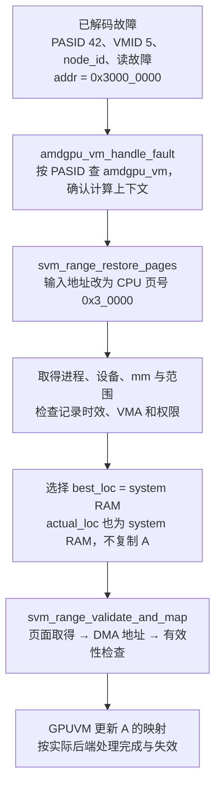

沿 §2.1.5 的入口，`amdgpu_vm_handle_fault()` 把故障字节地址右移 `PAGE_SHIFT`，将虚拟页号 `0x3_0000` 传给 `svm_range_restore_pages()`。后者按第二章的对象关系完成查找；第三章的页面查询发生在随后的验证映射函数内部。

> **[SOURCE]** Linux `248951ddc14d`，[`amdgpu_vm.c`](./2.源码/linux/drivers/gpu/drm/amd/amdgpu/amdgpu_vm.c) 第 2986～3035 行查 VM、释放锁并调用计算恢复入口；[`kfd_svm.c`](./2.源码/linux/drivers/gpu/drm/amd/amdkfd/kfd_svm.c) 第 3047～3063 行给出恢复函数完整入参。

这里有两种时间信息。硬件记录中的 `ts` 用于与故障排空检查点比较；近期重复恢复判断则使用进入 `svm_range_restore_pages()` 时取得的系统时间，与范围的 `validate_timestamp` 比较。后者保存最近一次验证成功的时间，不是硬件 IV 的时间戳。

主例各项检查通过，继续取得设备地址；过期、重复和暂缓分支的返回结果集中在 §7.1。

> **[SOURCE]** Linux `248951ddc14d`，[`kfd_svm.c`](./2.源码/linux/drivers/gpu/drm/amd/amdkfd/kfd_svm.c) 第 3056 行取得本次系统时间，第 3079～3082、3108～3113 行检查退出状态，第 3119～3132 行比较硬件时间与检查点，第 3164～3193 行处理范围状态、近期重复与 VMA 权限；第 1864～1866 行更新 `validate_timestamp`。

### 4.2 从 RAM 页面取得设备访问地址

沿第三章的结果，HMM 已找到 A 的 RAM 页。接下来，`svm_range_validate_and_map()` 要把这张页变成目标 GPU 可以使用的设备地址，再交给 GPUVM 建表：

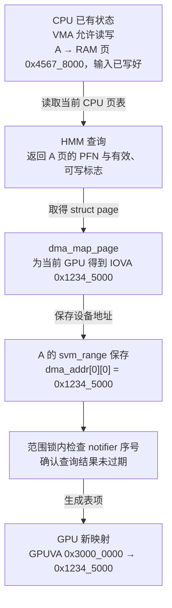

KFD 将 A 页的 `struct page` 交给 `dma_map_page()`，同时指定目标 GPU 的设备对象。本例返回 IOVA `0x1234_5000`；KFD 将它保存到 §2.1.4 介绍的 `dma_addr[0][0]`，两个下标分别选择 `gpuidx=0` 的设备和 A 的第一页。

返回的设备地址由设备与 IOMMU 配置决定；本例 IOVA 与主机物理地址不同。GPU 映射建好后，GPU 页表把 `A[5]` 的 GPUVA `0x3000_0014` 翻译为 IOVA `0x1234_5014`，Host IOMMU 再把请求翻译到主机物理地址 `0x4567_8014`。

设备地址准备好后，按 §3.4 在范围锁内确认查询结果和范围状态仍有效，再进入 GPUVM 更新。

> **[SOURCE]** Linux `248951ddc14d`，[`kfd_svm.c`](./2.源码/linux/drivers/gpu/drm/amd/amdkfd/kfd_svm.c) 第 160～203 行生成逐页设备地址，第 1763～1859 行逐 VMA 取得页面、检查有效性并映射；第 3211～3245 行决定是否迁移并进入验证路径。

### 4.3 从设备地址生成 GPU 映射

KFD 已经知道“A 的这一页应指向哪个设备地址”，AMDGPU 接下来要修改存放在内存中的 GPU 页表。

这里用 `vm` 指向目标 GPU 的 `amdgpu_vm`。其中的 `last_update` 成员是一个 `struct dma_fence *`，保存页表更新的完成对象；页表由异步作业更新时，驱动用它跟踪更新进度。§4.4 再说明谁等待这个对象。

```text
svm_range_map_to_gpu
  → 从 PDD 取得 amdgpu_vm
  → 将 CPU 页号范围转换为 GPU 页号范围
  → 根据存储域、范围属性、VMA 只读状态构造 PTE 标志
  → amdgpu_vm_update_range：定位/准备页表，安排 PTE 更新
  → amdgpu_vm_update_pdes：更新有变化的上级目录
  → 当前 VM 的更新完成对象保存在 vm->last_update
```

本例 CPU 页和 GPU 基本页均为 4 KiB，页号换算比例 `AMDGPU_GPU_PAGES_IN_CPU_PAGE` 为 1。KFD 提交的 GPU 虚拟页范围是 `[0x3_0000, 0x3_0000]`，PTE 的目标地址取自 IOVA `0x1234_5000`，另加系统内存域、有效性、读写和内存类型等属性。

沿用 04 的多级页表关系：已有层级时修改相关表项；中间层缺失时，GPUVM 先准备页表 BO，再更新上级目录。这里分配的是页表存储；第二章讨论的 A 数据 BO 在本例仍为空。

数据 A 仍在原 RAM 页。被 CPU 或 SDMA 写入的是 GPU 页表存储，修改映射本身没有复制 A 的 4096 字节。

> **[SOURCE]** Linux `248951ddc14d`，[`kfd_svm.c`](./2.源码/linux/drivers/gpu/drm/amd/amdkfd/kfd_svm.c) 第 1210～1353 行按设备版本和范围属性形成 PTE 标志，第 1434～1517 行更新 PTE/PDE；[`amdgpu_vm.h`](./2.源码/linux/drivers/gpu/drm/amd/amdgpu/amdgpu_vm.h) 第 398 行定义 `last_update`；[`amdgpu_vm.c`](./2.源码/linux/drivers/gpu/drm/amd/amdgpu/amdgpu_vm.c) 第 972～1020、1107～1238 行组织目录和范围更新。本篇取 GFX9.4.3 对应实现，不套用文件中其他代际分支。

### 4.4 更新完成、等待与翻译失效

此时 A 的数据仍在 RAM，驱动已取得 IOVA `0x1234_5000`，并确定要更新 A 对应的 GPU 表项。本节继续说明：谁把表项写进页表存储、Host 是否等待写入完成，以及 GPU 何时能使用新映射。

#### 页表 BO 保存地址翻译信息

本例没有为 A 的 RAM 数据页新建 BO，`svm_range.svm_bo` 仍为空。GPU 页表也需要内存来保存 PTE/PDE，这份页表存储由另外的 BO 管理。两块存储在访问中这样配合：

```text
GPU 使用 A 的虚拟地址
    → 定位 GPU 页表中的表项（页表存储由页表 BO 管理）
    → 从 A 对应的 PTE 取得 IOVA 0x1234_5000 及权限等信息
    → Host IOMMU 将请求翻译到 RAM 物理页 0x4567_8000
    → 访问这张页中的 A 数据
```

本节写入的是页表存储，A 的数组内容继续留在原 RAM 页里。驱动可以复用已有 GPU 页表；缺少相应层级时才准备新的页表存储，不需要为每个数组单独创建一套页表。

> **[SOURCE]** Linux `248951ddc14d`，[`amdgpu_vm_pt.c`](./2.源码/linux/drivers/gpu/drm/amd/amdgpu/amdgpu_vm_pt.c) 第 441～479 行为 GPU 页目录、页表创建 BO；A 的 RAM 页面与设备地址准备见 §4.2。

#### CPU 或 SDMA 写入 GPU 页表

驱动可以让 Host CPU 直接写页表，也可以提交任务，让 GPU 上的 SDMA 引擎执行写入。固定实现由 `vm->use_cpu_for_update` 选择：

```text
CPU 后端
Host CPU 取得页表存储的访问地址 → 等待必要的既有依赖
  → CPU 直接写 PTE/PDE
  → commit 执行内存屏障与 HDP 刷新
  → 按需处理 GPU 翻译失效

SDMA 后端
Host 构造页表写入命令 → 提交更新 job
  → 返回跟踪该作业的 dma_fence → 保存到 vm->last_update
  → SDMA 稍后执行更新，Fence 随完成流程被置为完成
  → 等待者或失效处理按各自路径继续
```

CPU 后端所说的“映射页表 BO”，是让 Host CPU 能通过内核地址访问页表存储，然后直接修改其中的 GPU 表项。正常 `commit` 路径执行 `mb()` 与 HDP 刷新，使写表结果满足设备读取的可见性要求。

SDMA 后端由 Host 准备写表命令并提交任务，SDMA 随后执行。`dma_fence` 是记录异步操作是否完成的内核对象，驱动可以检查或等待它；`vm->last_update` 保存相关页表更新的完成对象。这里跟踪的是写表任务，A 的数据没有因此被搬到 HBM。

> **[SOURCE]** Linux `248951ddc14d`，[`amdgpu_vm_cpu.c`](./2.源码/linux/drivers/gpu/drm/amd/amdgpu/amdgpu_vm_cpu.c) 第 50～108、119～135 行；[`amdgpu_vm_sdma.c`](./2.源码/linux/drivers/gpu/drm/amd/amdgpu/amdgpu_vm_sdma.c) 第 106～145 行。后端选择见 [`amdgpu_vm.c`](./2.源码/linux/drivers/gpu/drm/amd/amdgpu/amdgpu_vm.c) 第 2699～2724、2845～2863 行：默认选择受编译架构、显存 BAR 可见性等条件影响，非 `CONFIG_X86_64` 分支在此基线设置 SDMA 模式；不能仅凭 MI300X 型号断言使用 CPU 更新。

#### wait 控制 Host 在本层是否等待

任务提交后，Host 是否在 `svm_range_map_to_gpus()` 中等待，由 `wait` 决定：

- `wait=true`：取回本次更新的 Fence，非空时调用 `dma_fence_wait()` 等待完成，再继续后续处理。
- `wait=false`：本层跳过对本次更新 Fence 的等待，继续后续处理；GPUVM 仍通过 `vm->last_update` 跟踪相关更新。

本次 Retry 故障恢复传入 `wait=false`。采用 SDMA 时，Host 可以在异步写表尚未完成时返回；GPU 后续访问仍要等映射满足使用条件。下层处理已有依赖时仍可能等待；若选择 CPU 后端，直接写表也仍在调用过程中执行。

属性修改的映射分支和后台 `restore_work` 传入 `wait=true`，本层取得非空 Fence 后等待；撤销旧映射则使用自己的 Fence 等待路径。第六章会解释后两种等待怎样保护即将变化的页面。

<details>
<summary>可选源码：Fence 等待与后续 TLB 处理</summary>

> **[SOURCE]** Linux `248951ddc14d`，[`kfd_svm.c`](./2.源码/linux/drivers/gpu/drm/amd/amdkfd/kfd_svm.c) 第 3244～3245、3809～3810、1947～1948、1414～1427 行给出这些调用。下列片段是 `svm_range_map_to_gpus()` 遍历目标 GPU 时的连续代码，`wait` 与 `flush_tlb` 来自该函数入参，第 1524～1526 行可核对其定义。

```c
1557:         r = svm_range_map_to_gpu(pdd, prange, offset, npages, readonly,
1558:                                  prange->dma_addr[gpuidx],
1559:                                  bo_adev, wait ? &fence : NULL,
1560:                                  flush_tlb);
1561:         if (r)
1562:             break;
1563:
1564:         if (fence) {
1565:             r = dma_fence_wait(fence, false);
1566:             dma_fence_put(fence);
1567:             fence = NULL;
1568:             if (r) {
1569:                 pr_debug("failed %d to dma fence wait\n", r);
1570:                 break;
1571:             }
1572:         }
1573:
1574:         kfd_flush_tlb(pdd);
```

日志的意思是“等待 DMA Fence 失败，并打印返回码”。1557～1560 行按 `wait` 决定是否取回 Fence；1564～1572 行只对非空 Fence 等待；1574 行在本次映射及所需等待未失败时调用 TLB 处理。

本篇沿 `vm->last_update` 跟踪 SVM 页表更新；02 的普通 BO 映射仍沿 `bo_va->last_pt_update → kgd_mem->sync → 外层等待`。完整 SDMA job 与 Fence 传播留到后续专题。

</details>

#### 写表之后处理所需的翻译失效

GPU 会缓存地址翻译结果。新 PTE 写进内存后，还要按需处理不应继续使用的旧翻译，使后续访问能使用更新后的映射。CPU 后端的内存屏障、HDP 刷新解决写表结果的可见性，GPU TLB 失效处理已缓存的翻译；两类操作各有作用。

`flush_tlb=false` 只描述传给页表更新层的参数。后面的 `kfd_flush_tlb()` 仍会进入计算 VM 的失效处理，根据当前序号与已处理序号决定是否提交失效；序号未变化可以直接返回。表项更新也可能按实际需要设置失效状态，因此调用函数以后还要区分“无需失效”和“已经执行所需失效”。

> **[SOURCE]** Linux `248951ddc14d`，[`kfd_priv.h`](./2.源码/linux/drivers/gpu/drm/amd/amdkfd/kfd_priv.h) 第 1560～1567 行调用计算 VM 失效；[`amdgpu_vm.c`](./2.源码/linux/drivers/gpu/drm/amd/amdgpu/amdgpu_vm.c) 第 1049～1080 行关联更新完成与失效状态，第 1686～1715 行比较序号并按需提交 PASID 失效；[`amdgpu_vm_pt.c`](./2.源码/linux/drivers/gpu/drm/amd/amdgpu/amdgpu_vm_pt.c) 第 900～940 行可见具体页表变化引起的 `needs_flush` 设置。这里的 `kfd_flush_tlb()` 是 `void` 包装，调用它也不能替代对下层错误路径的检查。

#### 从页表更新完成到 Kernel 完成

页表更新完成后，还要满足写入可见性和所需翻译失效等访问条件；GPU 随后读到 `A[5]`，再继续计算。整个 Kernel 完成则由应用的 Completion Signal 表示。沿主例分别记录这些时间点：

```text
t0：驱动找到 A 的有效 VMA 与 system RAM 页面
t1：驱动取得 DMA 地址，并通过 notifier 有效性检查
t2：GPUVM 已完成同步写入，或已提交异步更新
t3：相关页表更新及所需失效满足访问条件
t4：GPU 后续读取 A[5] 成功，继续计算
t5：整个 Kernel 完成，更新应用 Completion Signal
```

CPU 后端与 SDMA 后端会改变 t2、t3 的关系；`wait=false` 路径允许软件处理返回早于异步更新完成。一次读成功只说明这一访问完成，Packet 37 中其他 Work-item 仍可能执行，t5 要单独观察。

这里走的是建表成功分支。第七章再区分过期记录、暂缓处理等返回结果；下一章先改变数据位置，解释迁入 HBM 后怎样满足上述访问条件。

**[BOUNDARY]** 以上时序列的是可区分的事件，并未规定硬件怎样保存和重放某一条访存指令。MI300X 上更细的 Wave/指令过程需直接证据；本篇不把 Host 函数返回画成给某条 Wave 发送“立即继续”的软件命令。

## 5. system RAM 与 HBM 之间的页面迁移

第三、四章让 GPU 直接访问 RAM 中的 A。本章改变第二章的位置要求：A 仍在 RAM，应用已把 `preferred_loc` 改为目标 GPU 的 ID；这次 GPU 缺页恢复选择把 A 迁入该 GPU 的 HBM。选择位置和关联 BO 的过程沿用第二章，下面继续看实际搬运。

本章沿 A 的一次往返展开，始终保留原来的指针：

```text
起点：A 的数据在 system RAM
    ↓ KFD 确定处理范围，准备 HBM 存储与设备页描述（§5.1）
    ↓ 保护旧访问，复制数据，完成迁移并更新 GPU 映射（§5.2）
GPU 通过 A 访问 HBM 中的数据
    │ 多页范围可能只迁成一部分，按逐页结果处理（§5.3）
    ↓ GPU 工作结束，应用完成同步
CPU 再用 A 读取，触发缺页并将页面迁回 RAM（§5.4）
    ↓ 恢复 CPU 映射，重新执行读取
终点：CPU 从 RAM 取得数据，A 的指针数值始终不变
```

### 5.1 迁移目标、处理范围与设备页

KFD 已经知道要迁入哪块 GPU，接下来需要确定处理哪些虚拟页，并为这些页准备 HBM 存储。Linux 通用迁移代码按页处理，因此还需要 RAM 源页和 HBM 目标页各自的 `struct page`。本节先算范围，再说明这些页面描述怎样取得。

#### 5.1.1 按故障地址确定处理范围

GPU 在一个地址发生缺页后，KFD 要确定本次准备处理哪几页。`granularity` 用来计算包含故障页的一组虚拟页，再由当前范围边界限制处理区间：

```text
故障地址 → 找到故障页 → 找到 granularity 指定大小的页组
    → 保留页组与当前 svm_range 重叠的部分
    → 按 VMA 边界分段，逐页尝试迁移
```

##### granularity 的取值与页分组

`granularity` 可以设为 `0`、`1`、`2` 等值。这个字段保存的是指数，页数按 `2^granularity` 计算。每页为 4 KiB 时：

- `granularity = 0`：一组包含 `2⁰ = 1` 页，共 4 KiB。
- `granularity = 1`：一组包含 `2¹ = 2` 页，共 8 KiB。
- `granularity = 2`：一组包含 `2² = 4` 页，共 16 KiB。

因此，`0` 表示按一页计算处理范围。每个页仍然是 4 KiB，改变的是一组包含多少页。

**[DESIGN]** 为了看清分组，先用简单的虚拟页编号 0、1、2……，假设故障发生在页 7，暂不考虑 `svm_range` 边界。不同取值下，包含故障页的组分别是：

```text
granularity = 0：{0}、{1}、……、{6}、{7}、{8}……
    → 选中页 7

granularity = 1：{0,1}、{2,3}、{4,5}、{6,7}、{8,9}……
    → 选中页 6、7

granularity = 2：{0,1,2,3}、{4,5,6,7}、{8,9,10,11}……
    → 选中页 4、5、6、7
```

“按四页对齐”就是找到包含故障页的那个四页组，组起始页号是 4 的整数倍。例如页 7 属于页 4～7 这一组，并非从页 7 开始再向后取四页。

> **[SOURCE]** Linux `248951ddc14d`，[`kfd_svm.c`](./2.源码/linux/drivers/gpu/drm/amd/amdkfd/kfd_svm.c) 第 805～807 行接受并保存 `0`、`1` 等粒度值，第 3211～3214 行用 `1UL << prange->granularity` 计算每组页数，再进行对齐与边界限制。

##### 用 svm_range 限制本次处理区间

下面的地址例子假设 `granularity = 2`，用四页组演示范围计算；这是示例取值，不是必须设置的值。

先沿 A 的单页例子计算。`A[5]` 是数组中的第六个元素，每个元素占 4 字节，距 A 起点只有 20 字节，因此仍在 A 的第一个页中：

```text
故障地址 A[5]：0x3000_0014
    ↓ 找到故障页，再按 4 页对齐
候选处理区间：[0x3000_0000, 0x3000_4000)
    ↓ 只保留与 A 的 svm_range 重叠的部分
A 的范围：   [0x3000_0000, 0x3000_1000)
    ↓
最终请求处理 A 这一页
```

这就是“与 `svm_range` 求交”：只保留既属于故障页所在组，又属于当前范围记录的页面。A 的范围只包含一页，所以本次最终只请求处理这一页。

<details>
<summary>多页例子：范围边界截掉四页组中的一页</summary>

对 §2.5 中尚未拆分的 R，故障 `0x6000_7014` 对应虚拟页号 `0x6_0007`，按四页对齐得到 `[0x6000_4000, 0x6000_8000)`。如果当前范围改为从 `0x6000_5000` 开始，并仍覆盖到这组末尾，最前面一页就超出了当前范围，求交后留下：

```text
四页组：     [0x6000_4000, 0x6000_8000)
范围限制后：[0x6000_5000, 0x6000_8000)
    ↓
保留起始地址为 0x6000_5000、0x6000_6000、0x6000_7000 的三页
```

</details>

##### 按 VMA 边界分段

确定处理区间后，迁移函数还要逐个找到覆盖它的 VMA。若请求涉及的四页中，前两页属于一个 VMA，后两页属于另一个 VMA，就分别处理这两段；请求范围保持不变。A 的单页例子位于一个 VMA 内，只需要处理这一段。

到这里，KFD 得到了本次尝试迁移的虚拟地址区间。每一页能否迁移，要在 §5.2 的准备和复制过程中继续检查；多页范围只迁成一部分的例子见 §5.3。

> **[SOURCE]** Linux `248951ddc14d`，[`kfd_migrate.c`](./2.源码/linux/drivers/gpu/drm/amd/amdkfd/kfd_migrate.c) 第 540～548 行按 VMA 边界分段调用迁移；第 439～476 行记录请求、候选与成功迁移的页面数量。

<details>
<summary>显式预取：应用主动触发迁移的入口</summary>

第二章的显式预取由应用主动请求：ROCr 在依赖满足后设置 `PREFETCH_LOC`，内核执行迁移请求；API 提交返回和预取完成 Signal 分别表示提交与完成进度。

> **[SOURCE]** ROCr `ba56a24c6132`，[`runtime.cpp`](./2.源码/rocr-runtime/runtime/hsa-runtime/core/runtime/runtime.cpp) 第 2988～3027 行先处理依赖，再设置预取属性并更新完成 Signal。Linux `248951ddc14d`，[`kfd_svm.c`](./2.源码/linux/drivers/gpu/drm/amd/amdkfd/kfd_svm.c) 第 3596～3625 行触发迁移，第 3211～3245 行计算故障恢复范围并选择迁移。

</details>

#### 5.1.2 RAM 与 HBM 页的 struct page

确定迁移范围后，KFD 要准备 HBM 目标存储。§2.1.1 已有下面的关系：

```text
A 的 svm_range
    └─ svm_bo → svm_range_bo
                    └─ bo → amdgpu_bo
                                └─ 管理用于存放 A 的 HBM 资源
```

这份 BO 让 KFD 有了存放 A 的 HBM 空间。接下来，Linux 通用迁移代码要处理“从哪一页迁到哪一页”，需要拿到两端的页面描述，也就是 `struct page`。

`struct page` 是 Linux 通用内存管理定义的结构体，KFD 使用它。先看 A 最初占用的普通 RAM 页：

```text
RAM 中保存 A 的 4 KiB 页面
    物理起始地址：0x4567_8000
    内容：A[0]、A[1]、A[2]……
            ↑
            │ Linux 用页面描述对象管理这一页
            │
对应的 struct page
    保存引用计数、页面状态等管理信息
```

这 4 KiB 存储空间保存 A 的实际数据，`struct page` 保存内核管理这一页所需的信息。复制 A 时，搬运的是页面里的字节；操作页面描述时，则可以取得引用、加锁或调整页面状态。

PFN 是页框编号。对于本例的普通 RAM 页，页号与页面描述的查找关系是：

```text
RAM 页起始物理地址：0x4567_8000
    ↓ 除以页大小 0x1000，即右移 12 位
PFN：0x4_5678
    ↓ pfn_to_page(PFN)
得到这一页的 struct page 指针
```

为参与 Linux 通用迁移，HBM 页也需要对应的页面描述。驱动通过下节介绍的设备内存登记机制，使迁移代码能够表达：

```text
源：RAM 页对应的 struct page
    ↓ 迁移页面状态，并由驱动安排数据复制
目标：HBM 页对应的 struct page
```

本例中，HBM 页的 `struct page` 保存在内核可访问的主机内存中，A 的数据则在迁移后存入 HBM。Linux 可以在 Host 上操作这个页面描述，由 KFD 安排数据搬运。

> **[SOURCE]** Linux `248951ddc14d`，[`include/linux/mm_types.h`](./2.源码/linux/include/linux/mm_types.h) 第 80～149 行定义 `struct page` 及设备页使用的成员；[`kfd_migrate.c`](./2.源码/linux/drivers/gpu/drm/amd/amdkfd/kfd_migrate.c) 第 219～227 行通过 PFN 取得设备页描述，第 1023～1024、1078～1081 行说明设备页描述所需的主机内存。

#### 5.1.3 ZONE_DEVICE 与设备私有内存

HBM 页的 `struct page` 来自设备初始化时的登记。Linux 按内存的用途和管理约束，把页面归入不同的 Zone，即内存区域类型。`ZONE_NORMAL`、`ZONE_DMA` 是常见的类型；`ZONE_DEVICE` 用来接入由驱动登记的设备内存，使其拥有 Linux 能识别的页面描述，并参与相应的页面管理流程。

对当前 HBM 迁移例子，登记过程可以理解为：

```text
GPU 上的 HBM 存储
    ↓ KFD 向 Linux 登记设备内存的描述信息
建立对应的 struct page
    ↓ 这些设备页归入 ZONE_DEVICE
Linux 可以识别页面、管理引用，并参与迁移
```

HBM 存储仍由驱动的显存管理器分配和释放。一般 `alloc_pages()` 请求从 Linux 页面分配器管理的空闲页面中分配；登记 `ZONE_DEVICE` 页面描述，不会把这批 HBM 存储自动加入普通 RAM 的伙伴分配器。CPU 经 BAR 访问这批存储的条件，放在 §5.4 的迁回流程之后说明。

`ZONE_DEVICE` 支持多种设备内存类型。本模型的 KFD SVM 路径使用 `MEMORY_DEVICE_PRIVATE`：

```text
ZONE_DEVICE：让设备内存具有 Linux 页面描述
    ↓ 本例登记的具体类型
MEMORY_DEVICE_PRIVATE：采用设备私有内存的访问协议
    ├─ GPU 通过 GPU 页表访问 HBM
    └─ CPU 通过应用原来的 A 地址访问时，缺页迁回 RAM
```

这里的 `PRIVATE` 描述设备内存的访问性质，与 §3.3 中 COW 的“进程私有映射”用途不同。判断 CPU 访问行为时，要看具体的设备内存类型，不能仅凭 `ZONE_DEVICE` 这个名称就认定都要迁回 RAM。

设备初始化已经建立这套页面描述。迁移 A 时，KFD 根据选中的 HBM 存储位置，取得对应的 `struct page`，再建立这次迁移所需的引用和关联。下节用 P 表示 A 原来的 RAM 页，用 D 表示目标 HBM 页的设备 PFN；“HBM 页 D”就是设备页编号为 D 的那一页。

> **[SOURCE]** Linux `248951ddc14d`，[`include/linux/memremap.h`](./2.源码/linux/include/linux/memremap.h) 第 30～75 行定义设备内存类型；[`mm/memremap.c`](./2.源码/linux/mm/memremap.c) 第 200～244 行为设备私有内存建立页面描述并归入 `ZONE_DEVICE`；[`mm/mm_init.c`](./2.源码/linux/mm/mm_init.c) 第 1008～1051 行初始化设备页及其驱动关联；[`kfd_migrate.c`](./2.源码/linux/drivers/gpu/drm/amd/amdkfd/kfd_migrate.c) 第 1026～1085 行完成 KFD 的设备页登记。

### 5.2 system RAM → HBM 的迁移与完成条件

现在回到 A：KFD 已确定只处理这一页，并通过关联 BO 准备了 HBM 存储。接下来要把 RAM 页 P 中的 4 KiB 数据搬到 HBM 页 D，最后让 GPU 通过原来的 A 地址读到它。

复制前必须先保护旧访问。例如，SDMA 刚复制完 `A[5]`，CPU 又通过旧映射改写 RAM 中的 `A[5]`，目标页就会漏掉这次修改。因此，Linux 负责保护 CPU 页面访问，KFD 的失效处理负责撤销旧 GPU 映射，SDMA 才能在受保护的条件下搬运数据。页面锁用于 Linux 的页面管理，GPU 的访问还需要对应的映射失效处理。

下面沿本例启用 XNACK 的成功路径展开；其他模式的队列保护放在 §6.4。

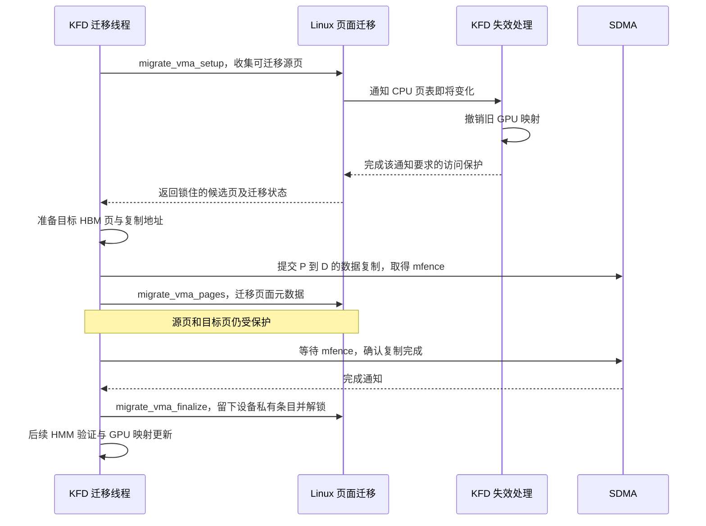

#### 第一步：收集源页，保护迁移期间的访问

KFD 将 VMA 和待处理的字节区间交给 `migrate_vma_setup()`。Linux 查找源页，检查页面能否参与迁移，并对候选页取得所需的锁与引用。本例收集到的源页就是保存 A 的 RAM 页 P。

迁移期间，CPU 原来指向 P 的映射会进入受保护的迁移状态。CPU 再访问时可能需要等待；CPU 页表变化也会触发 notifier，让 KFD 处理旧 GPU 映射。完成这些准备后，驱动才继续安排复制。notifier 如何撤销映射，在第六章展开。

#### 第二步：准备目标页，提交整页复制

HBM 存储已由 BO 准备好，KFD 在这里选出与源页 P 对应的目标页 D，取得它的设备页描述，并准备 SDMA 访问两端存储所需的地址。

```text
源：RAM 页 P，保存 A 的 4 KiB 数据
    ↓ SDMA 复制整页字节
目标：BO 管理的 HBM 页 D
```

提交复制后，KFD 得到 `mfence`，用它跟踪这批复制是否完成。此时复制可以仍在执行，CPU 与 GPU 的旧访问仍受保护。

#### 第三步：调整页面管理信息

KFD 调用 `migrate_vma_pages()`，让 Linux 将源页 P 的相关页面管理状态迁移到目标页 D，并记录逐页的处理结果。这里操作的是 `struct page` 相关元数据；A 的字节由上一步提交的 SDMA 复制搬运。

这一步发生在等待复制 Fence 之前。页面仍处于迁移保护中，所以 Linux 可以先调整管理状态，等复制完成后再结束保护。不能把这次元数据调整当成应用已经可以访问目标数据的时刻。

#### 第四步：等待复制完成，结束页面迁移

KFD 通过 `svm_migrate_copy_done()` 等待复制，然后调用 `migrate_vma_finalize()` 收尾。成功页的 CPU 页表留下设备私有条目；迁移未成功的页面恢复原映射。收尾还会释放迁移阶段持有的页面锁与引用。

A 迁入 HBM 后，Linux 需要保留“这个虚拟地址的数据目前在哪个设备页”的记录，以便 CPU 下次访问时恢复。这里使用 CPU 页表中的 device-private 软件条目。

先看普通 RAM 映射与迁入 HBM 后的条目含义。下图只说明语义，不表示实际位布局：

```text
迁移前，A 对应的 CPU 页表条目：
    有效 RAM 映射
    目标 RAM 页号与读写权限
        → CPU 硬件可据此访问 RAM

迁入 HBM 后，A 对应的 CPU 页表条目：
    对 CPU 硬件：当前没有可供本次访问使用的有效映射
    对 Linux 软件：类型 = device-private，设备页编号 = D
        → CPU 访问触发缺页，Linux 再解析其中的记录
```

Linux 在硬件无法直接使用的条目中保留这些软件编码：CPU 硬件负责报告缺页，进入内核后，Linux 才读取类型、解析设备页编号并选择处理分支。A 的 VMA 仍可存在并允许读取；地址合法但页面需要恢复，是一次可处理的缺页。

这里的 D 是 Linux 用来查找设备页描述的 PFN。KFD 在设备初始化时申请一段资源编号范围，为这些编号建立对应的 `struct page`，D 就来自这段范围。主机内存中保存的是页面描述；登记这些编号不会额外分配一份与 HBM 等大的 RAM。GPU 访问 HBM 时使用的地址在下一步换算。

> **[SOURCE]** Linux `248951ddc14d`，[`kfd_migrate.c`](./2.源码/linux/drivers/gpu/drm/amd/amdkfd/kfd_migrate.c) 第 1053～1068 行建立设备私有页的编号范围；[`mm/migrate_device.c`](./2.源码/linux/mm/migrate_device.c) 第 1268～1316、1337～1352 行根据迁移结果恢复页表状态并解锁；[`mm/memory.c`](./2.源码/linux/mm/memory.c) 第 4766～4808 行识别设备私有条目并进入迁回处理。

#### 第五步：查询迁移结果，恢复 GPU 映射

页面迁移完成后，KFD 还要接上第三、四章的 HMM 查询与 GPU 建表。这里出现了一个新的查询结果：A 的 CPU 页表中现在是 device-private 条目，而不是普通 RAM 映射。

HMM 能识别属于调用方的设备私有页，直接报告其中的设备 PFN。KFD 据此换算出 GPU 可用的 HBM 本地地址 V，再更新 GPU 页表：

```text
A 的 CPU 页表：device-private 条目，设备页编号 D
    ↓ HMM 查询本驱动所属的设备页
返回设备 PFN D 与页面状态
    ↓ KFD 按登记范围与显存基址换算
得到 GPU 使用的 HBM 本地地址 V
    ↓ 更新 GPU 页表，并满足所需的完成与失效条件
GPU 用原来的 A 地址访问 HBM 中的数据
```

本例满足“设备页属于查询调用方”的条件，HMM 可以报告设备 PFN，保留 HBM 页面。查询时读取的是 CPU 页表中的记录；应用 CPU 真正读取 A 的数据时，则按 §5.4 触发迁回。

> **[SOURCE]** Linux `248951ddc14d`，[`kfd_svm.c`](./2.源码/linux/drivers/gpu/drm/amd/amdkfd/kfd_svm.c) 第 3244～3245 行在迁移后继续验证与映射，第 182～190 行根据设备 PFN、`pgmap.range.start` 和显存地址基址换算 GPU 地址；[`mm/hmm.c`](./2.源码/linux/mm/hmm.c) 第 260～283 行识别调用方拥有的设备私有页并报告 PFN。

迁移与建表完成后，同一个 A 地址的访问关系如下。图中的 `dev_pagemap` 保存设备页类型和驱动回调，§5.4 会沿 CPU 缺页展开它的使用过程。

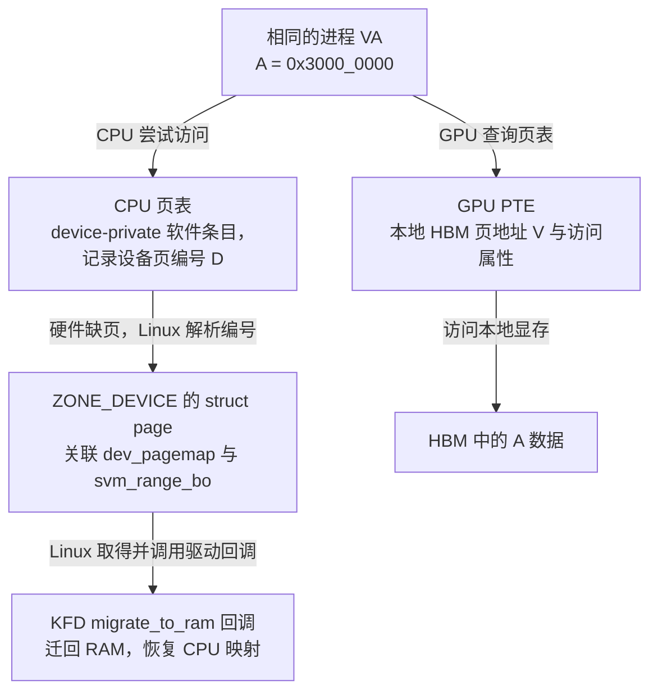

GPU 正常读取时，通过 GPU 页表中的 V 找到 HBM。`struct page`、`dev_pagemap` 和 BO 供 Linux 与驱动管理页面、处理后续变化时使用。

本节依次完成了数据复制、迁移收尾和 GPU 建表。`mfence` 跟踪复制完成，后续 `vm->last_update` 跟踪页表更新；Packet 37 是否执行结束，仍要由应用 Completion Signal 判断，等待规则沿用 §4.4。

<details>
<summary>源码验证：复制提交、元数据调整、等待与收尾的顺序</summary>

> **[SOURCE]** Linux `248951ddc14d`，[`kfd_migrate.c`](./2.源码/linux/drivers/gpu/drm/amd/amdkfd/kfd_migrate.c) 第 533～548 行先准备关联 BO，再按 VMA 分段迁移；第 394～476 行是 RAM → VRAM 的 VMA 迁移函数。以下为其中第 451～455 行连续片段，`migrate` 在第 403、410～425 行初始化，`mfence` 初始为 NULL，并由复制调用返回。

```c
451:     r = svm_migrate_copy_to_vram(node, prange, &migrate, &mfence, scratch, ttm_res_offset);
452:     migrate_vma_pages(&migrate);
453:
454:     svm_migrate_copy_done(adev, mfence);
455:     migrate_vma_finalize(&migrate);
```

第 451 行提交复制并保存返回值，第 452 行调整页面元数据；第 454 行等待复制，第 455 行再收尾。这个顺序对应正文的第二至第四步。各层返回值与错误传播见 §7.1。

> **[SOURCE]** Linux `248951ddc14d`，[`mm/migrate_device.c`](./2.源码/linux/mm/migrate_device.c) 第 681～727 行说明源/目标锁、逐页结果与 finalize 的约定，第 729～764 行收集并保护页面，第 1254～1266 行说明元数据迁移，第 1337～1352 行说明页表恢复与解锁。复制的设备提交见 [`kfd_migrate.c`](./2.源码/linux/drivers/gpu/drm/amd/amdkfd/kfd_migrate.c) 第 126～181 行；此处只追到 `amdgpu_copy_buffer()`，不展开完整 SDMA 命令格式。

旧页的最终回收还要满足临时 DMA 映射和其他引用的释放条件。固定实现会在 finalize 之后清理迁移所用的临时 DMA 映射。

> **[SOURCE]** Linux `248951ddc14d`，[`kfd_migrate.c`](./2.源码/linux/drivers/gpu/drm/amd/amdkfd/kfd_migrate.c) 第 200～210 行等待复制 Fence，第 451～461 行等待、finalize 并清理临时 DMA 映射；[`kfd_svm.c`](./2.源码/linux/drivers/gpu/drm/amd/amdkfd/kfd_svm.c) 第 1492～1517、1557～1574 行保存并按条件等待页表更新结果。应用完成仍采用 [03 下篇第 7 章](<./03_AMD GPU 队列与 AQL Dispatch（下）.md#7-kernel-完成通知与-cpu-等待>)的协议。

KFD 还以 `faulting_task` 识别自身的页面准备调用，避免在这类调用中递归迁回 RAM。这是驱动内部的保护条件；上文 HMM 直接报告设备 PFN 的条件，则是设备页属于查询的调用方。

> **[SOURCE]** Linux `248951ddc14d`，[`kfd_migrate.c`](./2.源码/linux/drivers/gpu/drm/amd/amdkfd/kfd_migrate.c) 第 972～975 行检查 `faulting_task`。

</details>

### 5.3 部分迁移与失败回退

A 只有一页，容易看清完整成功路径。范围包含多页时，每一页都要经过上一节的检查；其中一页无法迁移，其他页仍可能成功。

**[DESIGN]** 暂时使用 §2.5 中尚未拆分的 R。假设这次请求迁移整个 16 页范围，原来的 16 页都在 RAM，收集到 12 页候选，最终 10 页成功：

```text
请求范围：16 页
  → setup 收集到可迁移候选：12 页
  → 目标准备、复制与迁移处理后成功：10 页
结果：10 页在 HBM，其余 6 页仍在 RAM
```

第一次减少发生在收集候选页时，例如某些页仍被其他使用者持有，无法迁移。第二次减少可能发生在目标准备或页面元数据迁移等后续阶段。驱动根据逐页结果统计成功数，再更新范围状态。

本例得到 `vram_pages=10`、`actual_loc=目标 GPU ID`。这接上了 §2.1.4 的混合位置：`actual_loc` 能说明范围内有该 GPU 的 HBM 页面，建表时仍须用 HMM 逐页结果，为那 10 页填写 HBM 地址，为另外 6 页填写 RAM 的设备访问地址。

上面的“剩余 6 页在 RAM”依赖于 16 页最初都在 RAM。原范围若有空洞、其他设备页或先前留下的混合位置，未成功页要按各自原状态处理。

GPU 故障恢复还要处理迁入 HBM 返回错误的情况：KFD 会尝试继续使用系统内存，必要时先迁回，再进行页面验证与映射。如果这些步骤也无法完成，本次故障才进入相应的失败出口，详见 §7.1。

属性 ioctl 也可能只完成一部分动作。它返回失败时，已经完成的范围或页面变化可能保留，需要按实际状态继续处理。

> **[SOURCE]** Linux `248951ddc14d`，[`kfd_migrate.c`](./2.源码/linux/drivers/gpu/drm/amd/amdkfd/kfd_migrate.c) 第 439～476 行统计候选、请求与成功页数，第 559～561 行更新 `actual_loc` 与 `vram_pages`；[`kfd_svm.h`](./2.源码/linux/drivers/gpu/drm/amd/amdkfd/kfd_svm.h) 第 79～94 行定义页面计数与位置语义；[`kfd_svm.c`](./2.源码/linux/drivers/gpu/drm/amd/amdkfd/kfd_svm.c) 第 3215～3245 行处理迁移错误后的系统内存回退，第 3780～3784 行说明属性动作可能部分完成。

### 5.4 CPU 再次访问后的 HBM → system RAM

**[DESIGN]** 回到单页 A：虚拟地址范围为 `[0x3000_0000, 0x3000_1000)`，每个元素占 4 字节。设 `A[5]` 的值为 123；Packet 37 读取 A、把计算结果写入 C，所以 A 的这个值保持不变。现在 Packet 37 已经结束，应用已完成同步，A 的数据仍在 HBM，CPU 接着执行：

```cpp
int x = A[5];
```

应用继续使用原来的指针。这条读取第一次尝试时触发缺页，Linux 与 KFD 把页面迁回 RAM，恢复后再执行读取。下面先给出完整成功路径，再逐步解释：

```text
CPU 执行读取 A[5] 的指令，地址为 0x3000_0014
    ↓ 当前 CPU 页表无法直接完成访问
CPU 硬件触发缺页异常，进入 Linux
    ↓ 检查 VMA 与读取权限，解析 device-private 条目
Linux 取得设备页编号 D，找到对应的 struct page
    ↓ 根据设备页取得 dev_pagemap，并持有必要的锁与引用
调用 ops->migrate_to_ram，即 KFD svm_migrate_to_ram()
    ↓ 找到进程与 svm_range，确定迁回区间
Linux 发出页面变化通知，KFD 撤销 A 的旧 GPU 映射并处理旧翻译缓存
    ↓ 完成迁移所需的访问保护
准备 RAM 目标页 Q，复制 HBM 中的数据，等待并完成迁移收尾
    ↓ CPU 映射恢复为指向 Q；GPU 原来指向 HBM 的映射已失效
CPU 重新执行刚才的读取
    ↓
x = 123
```

应用通常不需要为这次恢复显式调用迁回 API，内核根据访问引发的缺页完成处理。本例已等待 GPU 工作完成；如果 CPU 在页面正在迁移时访问，可能先遇到迁移中的条目并等待。页面迁移保护也不能替代应用访问共享数据所需的同步。

#### 第一步：CPU 执行读取，硬件触发缺页

这次读取的地址为：

```text
A 的基地址 + 5 × 4
    = 0x3000_0000 + 0x14
    = 0x3000_0014
```

A 的 CPU 页表已经采用 device-private 软件条目，硬件无法完成这次读取，于是触发 CPU 缺页异常。此时读取指令尚未完成，`x` 还没有取得 A 的数据。硬件在这里报告无法完成访问；后续类型识别、驱动调用和数据迁移由内核代码执行。

#### 第二步：Linux 检查地址权限并识别设备私有条目

Linux 根据当前进程的地址空间和故障地址，找到覆盖 `0x3000_0014` 的 VMA，并检查本次读取是否合法。主例中 VMA 仍然存在，权限允许读取。

随后，内核读取当前页表条目。条目不是普通 Present 映射，进入 `do_swap_page()`；这个函数也处理设备私有等软件条目。函数名中的 `swap` 不表示本例的数据已经写入磁盘。内核识别出 device-private 类型后，进入设备页恢复分支：

```text
A 的 VMA 存在，允许读取
    ↓
CPU 页表记录 device-private 类型
    ↓
地址合法，当前数据在设备内存中
    ↓
继续查找设备页及其迁回处理函数
```

本例继续恢复访问。地址被解除映射、权限不符或迁回失败时，则进入相应的错误处理。

> **[SOURCE]** Linux `248951ddc14d`，[`mm/memory.c`](./2.源码/linux/mm/memory.c) 第 6381～6382 行把非 Present 条目交给 `do_swap_page()`；第 4766～4808 行区分迁移中、设备私有等软件条目，迁移中的访问在第 4768～4770 行等待。VMA 与权限检查接续 §3.3 已说明的 CPU 缺页入口。

#### 第三步：从设备页编号取得 struct page

Linux 从软件条目中取出设备页编号 D，再找到对应的页面描述：

```text
CPU 页表里的 device-private 条目
    ↓ 解析条目中的设备 PFN：D
pfn_to_page(D)
    ↓
HBM 页对应的 struct page
```

Linux 用 `vm_fault` 结构体保存本次缺页的地址、VMA 和页面等信息，下面用 `vmf` 表示这个上下文的指针。固定实现调用 `softleaf_to_page()` 完成上述转换，将页面描述放入 `vmf->page`。此时 A 的数据仍在 HBM 中。

接下来，Linux 要通过这个页面描述找到负责迁回的驱动。

> **[SOURCE]** Linux `248951ddc14d`，[`mm/memory.c`](./2.源码/linux/mm/memory.c) 第 4785 行取得设备页；[`include/linux/leafops.h`](./2.源码/linux/include/linux/leafops.h) 第 384～391 行说明并实现从软件条目中的 PFN 取得 `struct page`。

#### 第四步：通过 dev_pagemap 调用 KFD 的迁回函数

Linux 已经取得设备页描述。接下来需要知道：这批页面属于哪种设备内存，以及迁回时应该调用哪个驱动。`struct dev_pagemap` 保存这些信息。它同样由 Linux 定义，KFD 为自己的设备填入范围、类型和操作回调。

KFD 在先前迁入 HBM 时，还通过设备页的 `zone_device_data` 关联了第二章的 `svm_range_bo`。现在可以沿下面两条关联找到驱动回调和存储管理对象：

```text
HBM 页对应的 struct page
    │
    ├─ page_pgmap(page)：取得所属设备页管理信息
    │      ↓
    │   dev_pagemap
    │      ├─ type：本例为 MEMORY_DEVICE_PRIVATE
    │      ├─ range：登记地址范围，用于设备 PFN 换算
    │      └─ ops->migrate_to_ram：迁回 RAM 的驱动回调
    │                              ↓
    │                         KFD svm_migrate_to_ram()
    │
    └─ zone_device_data：本页关联的驱动对象
           ↓
        svm_range_bo → amdgpu_bo → HBM 存储资源
```

下面是教学简化定义，只保留本节用到的成员：

```c
struct dev_pagemap_ops {
    vm_fault_t (*migrate_to_ram)(struct vm_fault *vmf); // CPU 缺页时迁回 RAM
};

struct dev_pagemap {
    enum memory_type type;             // 设备内存类型
    struct range range;                // 按字节记录的登记地址范围
    const struct dev_pagemap_ops *ops;  // 驱动提供的操作函数集合
};
```

CPU、GPU 的硬件地址翻译仍使用各自的页表。Linux 处理设备页时，通过 `dev_pagemap` 取得这里保存的类型和操作函数。

`migrate_to_ram` 是 Linux 定义的回调接口；KFD 提供实现 `svm_migrate_to_ram()`，并在初始化时登记。本次 CPU 缺页进入设备私有分支后，Linux 就能通过函数指针调用 KFD，并将 `vmf` 中的故障信息传给它。

> **[SOURCE]** Linux `248951ddc14d`，[`include/linux/memremap.h`](./2.源码/linux/include/linux/memremap.h) 第 77～109 行定义操作集合，第 114～147 行说明并定义 `dev_pagemap`；[`kfd_migrate.c`](./2.源码/linux/drivers/gpu/drm/amd/amdkfd/kfd_migrate.c) 第 219～227 行关联 `zone_device_data`，第 1018～1021、1061～1063 行登记回调；[`mm/memory.c`](./2.源码/linux/mm/memory.c) 第 4785～4805 行取得页面和 `dev_pagemap` 后调用迁回函数。

回到本次 CPU 缺页，Linux 按上面的关联关系调用 KFD：

```text
vmf->page：HBM 页对应的 struct page
    ↓ page_pgmap(vmf->page)
所属的 dev_pagemap
    ↓ ops：驱动登记的操作集合
ops->migrate_to_ram(vmf)
    ↓ 本例登记的实现
KFD svm_migrate_to_ram(vmf)
```

调用前，Linux 重新检查页表条目，取得设备页的锁和引用。页面暂时锁不住时，缺页处理先等待。调用发生在内核中，应用的那条读取指令仍未完成。

KFD 进入回调后，还通过 `vmf->page->zone_device_data` 找到关联的 `svm_range_bo`，取得所属进程的 `mm` 和 KFD 进程对象，再用故障地址定位 `svm_range`。`dev_pagemap` 提供调用哪个驱动的入口，设备页上的驱动关联则帮助 KFD 找到本次需要处理的进程与范围。

> **[SOURCE]** Linux `248951ddc14d`，[`mm/memory.c`](./2.源码/linux/mm/memory.c) 第 4785～4808 行检查条目、取得锁与引用并调用迁回回调；[`kfd_migrate.c`](./2.源码/linux/drivers/gpu/drm/amd/amdkfd/kfd_migrate.c) 第 942～990 行根据设备页和故障地址查找相关对象，第 1018～1021 行登记回调。

#### 第五步：把 HBM 数据迁回 RAM，恢复 CPU 映射

KFD 先按 `granularity` 与 `svm_range` 边界计算迁回区间，再进入逐 VMA 迁移。本例只处理 A 这一页。迁回沿用 §5.2 的保护、复制、等待与收尾顺序，将源改为 HBM 页 D，目标改为新准备的 RAM 页 Q。

本例启用 XNACK，A 未设置 `GPU_ALWAYS_MAPPED`。复制前，Linux 的页面变化通知会让 KFD 撤销 A 原来指向 HBM 的 GPU 映射，等待撤销所需的页表更新，并处理 TLB 中的旧翻译。下面把这部分明确列入迁回步骤：

```text
migrate_vma_setup：开始准备页面迁移
    ↓ Linux 发出页面变化通知，进入 KFD 的 notifier 回调
KFD 撤销 A 原来指向 HBM 页 D 的 GPU 映射
    ↓ 等待撤销所需的页表更新，执行 GPU TLB 失效处理
GPU 不能再通过 A 的旧映射访问 HBM 页 D
    ↓ Linux 继续收集源设备页，取得所需的锁与引用并保护 CPU 访问
migrate_vma_setup 返回，迁移准备完成
    ↓
准备 RAM 目标页 Q，建立复制所需的设备地址
    ↓
提交 HBM 页 D → RAM 页 Q 的数据复制，取得复制 Fence
    ↓
migrate_vma_pages：调整页面元数据，页面仍受迁移保护
    ↓
等待复制完成
    ↓
migrate_vma_finalize：完成收尾，恢复指向 Q 的 CPU 映射
    ↓
迁回完成：CPU 可以访问 RAM 页 Q；GPU 原来指向 HBM 的映射已失效
```

Q 不一定是 A 最初使用的 RAM 页，新的主机 PFN 可以与 `0x4_5678` 不同。应用的虚拟地址保持不变，迁回成功后，Q 中保存 A 的整页数据，因此 `A[5]` 仍为 123。

迁回前后，两侧的映射状态是：

```text
迁回前：
    CPU：device-private 软件条目，记录设备页编号 D
    GPU：A 的有效映射指向 HBM 页 D

迁回完成后（尚未发生下一次 GPU 访问）：
    CPU：A 的有效映射指向 RAM 页 Q
    GPU：A 原来指向 HBM 页 D 的映射已撤销，旧翻译也已失效
```

GPU 旧映射的撤销发生在复制前的准备阶段，所以迁回完成时，GPU 已经不能通过旧映射继续修改原 HBM 页中的 A。A 当前由 RAM 页 Q 承载；如果页面与映射没有再次变化，CPU 后续读取可以继续使用这份 RAM 映射。

以后 GPU 再访问 A，需要按当前页面位置恢复映射：可以直接映射 RAM，也可能再次将 A 迁入 HBM。如果再次迁入 HBM，CPU 的 RAM 映射也会改成 device-private 条目；CPU 后续读取时会重新缺页，迁回当时的数据。第六章展开旧 GPU 映射的撤销与并发保护。

CPU 迁回失败时，回调可返回 `VM_FAULT_SIGBUS`，按 §3.3 的 CPU 异常路径处理。

> **[SOURCE]** Linux `248951ddc14d`，[`mm/migrate_device.c`](./2.源码/linux/mm/migrate_device.c) 第 502～519 行在收集页面前发出迁移失效通知；[`kfd_svm.c`](./2.源码/linux/drivers/gpu/drm/amd/amdkfd/kfd_svm.c) 第 2660～2695 行将通知交给范围失效处理，第 2024～2085 行按 XNACK 与映射属性选择撤销路径，第 1414～1427 行等待撤销更新并执行 TLB 失效；第 3211～3245 行在后续 GPU 故障中选择迁移并恢复映射。

> **[SOURCE]** Linux `248951ddc14d`，[`kfd_migrate.c`](./2.源码/linux/drivers/gpu/drm/amd/amdkfd/kfd_migrate.c) 第 995～1001 行计算迁回区间并调用迁移；第 638～661 行准备 RAM 目标和复制地址，第 735～765 行执行迁移准备、复制提交、元数据调整、等待和收尾；第 1015 行将失败转换为 `VM_FAULT_SIGBUS`。

#### 第六步：CPU 重新执行读取，取得 A 的值

缺页处理成功后，CPU 重新执行刚才没有完成的读取。这次访问可以通过恢复后的 CPU 页表完成：

```text
CPU 读取虚拟地址 0x3000_0014
    ↓ 查询恢复后的 CPU 页表
找到 RAM 页 Q 内偏移 0x14 的位置
    ↓ 读取迁回的数据
得到 123
    ↓
x = 123
```

应用执行的仍然是 `int x = A[5];`。第一次尝试触发页面迁回，恢复后重试取得数据，整个过程中 A 的指针数值不变。

#### 补充：CPU 经 BAR 直接访问 HBM

CPU 可以通过 BAR，经 PCIe 访问满足条件的 HBM。假设目标页面处于 BAR 可见范围内，驱动已经建立合适的 CPU 映射，并处理好同步与资源生命周期，则访问路径是：

```text
CPU 使用驱动建立的虚拟地址
    ↓ CPU 页表翻译
GPU 显存 BAR 对应的主机物理地址范围
    ↓ 主机经 PCIe 发出访问
GPU 定位对应的 HBM 存储
    ↓
读取或写入数据，数据仍存放在 HBM
```

BAR 提供访问设备存储的地址窗口；这种访问本身不要求先把整页搬回 RAM。固定 AMDGPU 实现通过 `devm_ioremap_wc()` 映射 CPU 可见的显存窗口，BO 映射路径也根据窗口基址和显存偏移计算 CPU 访问地址。

建立这种映射后，HBM 的分配、移动与释放仍由驱动管理。类似于驱动对设备地址执行 `ioremap()`：CPU 获得访问途径，但这一步没有把设备存储加入普通 RAM 的空闲页池。`alloc_pages()` 也不会因为出现这份映射，就开始分配该 HBM。

本文 SVM 路径中的 A 使用 §5.2 说明的 device-private 条目。CPU 使用原来的 A 指针时，页表仍然要求进入缺页恢复；BAR 窗口的存在不会自动把 A 改成一份 BAR 映射。若要通过 BAR 直接访问，还需要相应的映射方式、缓存属性、数据同步和资源生命周期管理。

> **[SOURCE]** Linux `248951ddc14d`，[`amdgpu_ttm.c`](./2.源码/linux/drivers/gpu/drm/amd/amdgpu/amdgpu_ttm.c) 第 652～661、681～695 行计算 CPU 经 BAR 访问 BO 的地址，第 2134～2138 行映射 CPU 可见显存窗口；[`kfd_migrate.c`](./2.源码/linux/drivers/gpu/drm/amd/amdkfd/kfd_migrate.c) 第 1053～1058 行在本模型对应分支中选择 `MEMORY_DEVICE_PRIVATE`。两条路径同时存在，不能从 BAR 可访问性推定 A 的 SVM 页表处理方式。

A 的往返迁移中，Linux 页表变化都需要通知 KFD 处理旧 GPU 映射。下一章展开这套失效通知，以及它与正在进行的 HMM 查询、GPU 建表怎样协调。

## 6. 地址空间失效与并发恢复

前面已经说明 KFD 怎样找到 A 的页面、建立 GPU 映射，以及按需迁移数据。现在要解决后续使用中的一个问题：**Linux 改变了承载 A 的物理页，GPU 怎样避免继续使用旧页面？** 只更新 CPU 页表还不够，GPU 有自己的页表，正在进行的 HMM 查询也可能已经取得旧页面信息。

本章先让 A 始终留在 system RAM，用 RAM 页 P → RAM 页 Q 的迁移例子贯穿 §6.0～§6.2，依次解释变化的起因、通知与撤销、并发建表检查。§6.3 再看应用删除地址的情况；另一种配置下的队列保护放在 §6.4。第五章 HBM → RAM 的迁回也需要通知，§6.1 会接回那条路径。

### 6.0 RAM 页面变化与 GPU 访问保护

**[DESIGN]** 沿用第二至四章的 RAM 主例：A 覆盖 `[0x3000_0000, 0x3000_1000)`，`preferred_loc=0`、`actual_loc=0`，数据由 RAM 页 P 承载。应用仍保留这段地址及其读写权限，目标 GPU 获准访问。下面假设 Linux 为整理 RAM 中的空闲空间，准备把 A 搬到另一张 RAM 页 Q，且迁移最终成功。

RAM 内部也可能需要搬页。例如，内存规整会移动可迁移的页面，使分散的空闲空间有机会组成较大的连续区域。这里的触发者是 Linux 内存管理路径；GPU 本次是否缺页，并不决定 Linux 是否需要规整内存。

```text
迁移前：
  A 的虚拟页地址 0x3000_0000 → CPU 页表指向 RAM 页 P
  preferred_loc = 0：希望放在 RAM
  actual_loc    = 0：当前就在 RAM

  Linux 准备将 A 的数据从 P 搬到 Q
      → 先通知 KFD 处理旧 GPU 映射及旧查询结果
      → 再继续数据搬运和 CPU 映射更新

迁移完成后：
  A 的虚拟页地址 0x3000_0000 → CPU 页表指向 RAM 页 Q
  preferred_loc = 0：期望位置没变
  actual_loc    = 0：当前仍在 RAM

  GPU 后续访问 A → 需要使用依据 Q 建立的新映射
```

`preferred_loc=0` 指定的是 system RAM，没有指定必须一直使用物理页 P；`actual_loc=0` 也只把当前位置概括为 RAM。P、Q 都是 RAM 页，因此迁移前后这两个成员都为 0。应用仍通过 `A[5]` 的地址 `0x3000_0014` 访问同一份数据，改变的是具体承载页面。

> **[SOURCE]** Linux `248951ddc14d`，[`kfd_ioctl.h`](./2.源码/linux/include/uapi/linux/kfd_ioctl.h) 第 777～795 行定义位置编码；[`mm/compaction.c`](./2.源码/linux/mm/compaction.c) 第 5～7 行说明规整通过页面迁移减少外部碎片，第 2667～2670 行调用 `migrate_pages()`。这里只借规整说明 RAM 内部搬页的起因，不展开页面选择算法。

#### 已有映射和正在建表都要受到保护

如果 GPU 已有访问 P 的映射，Linux 只把 CPU 页表改成 Q，GPU 仍可能访问 P。P 以后被释放或用于其他数据时，旧 GPU 映射就会造成错误访问。§6.1 先解释怎样撤销这份映射。

还有一种交错：GPU 的映射尚未建好，故障恢复路径已经通过 HMM 查到 P，正准备建表。通知即使撤销了已有映射，也必须防止这条路径随后又把 P 写回 GPU 页表。§6.2 继续解释怎样发现查询结果过期。

本章主例沿用 [§0.0](#00-xnack-与-gpu-缺页后的访问重试) 的 XNACK 模式，并且 A 未设置 `GPU_ALWAYS_MAPPED`。这两个条件允许 KFD 先撤销旧映射，让后续合法的 GPU 访问通过缺页重新取得当前页面：

```text
Linux 通知页面即将变化
  → KFD 撤销旧 GPU 映射，并使旧查询结果能被检查出来
  → Linux 继续迁移；假设 P → Q 已完成
  → GPU 后续访问 A 时因缺少映射而报告可重试故障
  → KFD 重新通过 HMM 取得 Q，按第三、四章恢复映射
  → 满足更新与翻译失效条件后，GPU 重试并读到 Q 中的 A
```

`GPU_ALWAYS_MAPPED` 是保存在 `svm_range.flags` 中的一项范围要求，完整名称为 `KFD_IOCTL_SVM_FLAG_GPU_ALWAYS_MAPPED`。设置后，KFD 会先暂停队列，在恢复执行前主动补好映射；即使启用了 XNACK，也采用这种保护方式。§2.2 的 A 只登记了 `ACCESS` 和 `PREFERRED_LOC`，默认标志也不包含这一位，因此本章先沿上图学习，完整的另一分支放在 [§6.4](#64-暂停队列后主动恢复映射可选)。

> **[SOURCE]** Linux `248951ddc14d`，[`kfd_ioctl.h`](./2.源码/linux/include/uapi/linux/kfd_ioctl.h) 第 761～762 行定义保持映射的要求；[`kfd_svm.c`](./2.源码/linux/drivers/gpu/drm/amd/amdkfd/kfd_svm.c) 第 313～321 行初始化默认标志，第 2024～2085 行按 XNACK 与范围标志选择暂停队列或撤销映射。

### 6.1 页面变化通知与 GPU 映射撤销

先看 GPU 已有访问 RAM 页 P 的映射这一种状态。Linux 准备迁移 A 时，必须让 KFD 有机会处理旧 GPU 映射。第二章登记的 `svm_range.notifier` 就用于接收这类变化通知。

#### 从 A 的地址范围找到 KFD 回调

KFD 在登记 A 时，已经把“进程地址空间、关注的虚拟地址区间、失效回调函数”关联起来。Linux 迁移路径知道当前要处理哪个进程的哪段映射，通知框架便能根据这些信息找到订阅者，并调用 KFD 事先提供的函数。

沿用 A 的一页范围 `[0x3000_0000, 0x3000_1000)`，登记完成后的对象关系如下。`itree` 是 Linux 通知框架维护的区间树，用来查找与变化区间相交的订阅；箭头表示成员引用或函数指针。

```text
事先登记：
  应用进程的 mm
    └─ notifier_subscriptions：本地址空间的通知订阅记录
         └─ itree：按虚拟地址范围组织的区间树
              └─ A 的 notifier.interval_tree 节点
                   区间：[0x3000_0000, 0x3000_0FFF]，包含末地址

  A 的 svm_range
    └─ 内嵌 notifier
         ├─ interval_tree：上面插入区间树的那个节点
         ├─ mm → 应用进程的 mm
         └─ ops → svm_range_mn_ops：KFD 提供的回调操作表
                    └─ invalidate → svm_range_cpu_invalidate_pagetables

本次通知：
  Linux 迁移路径取得受影响的 VMA 和虚拟地址
    → 从 vma->vm_mm 取得该映射所属的进程地址空间
    → 向通知框架提交 mm 和即将变化的虚拟地址区间
    → 在这个 mm 的 itree 中查找相交节点，找到 A 的 notifier
    → 调用 notifier->ops->invalidate(...)，进入已登记的 KFD 函数
    → KFD 根据内嵌 notifier 找回 A 的 svm_range
```

区间树使用包含末地址的表示，因此 A 的末地址保存为 `0x3000_0FFF`。这与平时写的半开区间 `[0x3000_0000, 0x3000_1000)` 覆盖同一页。第二章 KFD 用于按故障地址查找范围的树，通过 `svm_range.it_node` 挂接范围；这里的 Linux 通知树使用 `notifier.interval_tree`，服务于地址变化通知。

**[DESIGN]** 为对照图中的成员，下面只保留 `mmu_interval_notifier` 中参与本次查找的部分；这是教学简化定义，实际结构还包含失效序号等成员。

```c
struct mmu_interval_notifier {
    struct interval_tree_node interval_tree;  /* 订阅区间及通知树节点 */
    const struct mmu_interval_notifier_ops *ops; /* 驱动提供的回调操作表 */
    struct mm_struct *mm;                     /* 订阅所属的进程地址空间 */
};
```

> **[SOURCE]** Linux `248951ddc14d`，[`mm_types.h`](./2.源码/linux/include/linux/mm_types.h) 第 1330 行在 `mm_struct` 中保存订阅入口；[`mm/mmu_notifier.c`](./2.源码/linux/mm/mmu_notifier.c) 第 39～48 行定义订阅管理对象及区间树；[`mmu_notifier.h`](./2.源码/linux/include/linux/mmu_notifier.h) 第 279～296 行定义回调操作表和 notifier。KFD 自己的范围树插入见 [`kfd_svm.c`](./2.源码/linux/drivers/gpu/drm/amd/amdkfd/kfd_svm.c) 第 129～137 行。

沿图看三个连续动作。首先，KFD 用 `svm_range_add_notifier_locked()` 登记 A：传入 `&prange->notifier`、本进程的 `mm`、起始地址 `0x3000_0000`、长度 `0x1000`，以及操作表 `&svm_range_mn_ops`。Linux 保存 notifier 的 `mm`、`ops` 和区间，并把节点纳入该 `mm` 的通知树。多个范围可以共用同一个回调函数，实际命中了哪段范围，由回调收到的 notifier 指针区分。

随后，Linux 准备迁移 RAM 页 P，通过反向映射找到使用 P 的 VMA 和虚拟地址。“反向映射”在这里就是从物理页找回哪些虚拟地址映射了它。迁移函数从 `vma->vm_mm` 取得进程地址空间，构造变化区间，再显式调用 `mmu_notifier_invalidate_range_start()`。

最后，通知框架沿 `range->mm->notifier_subscriptions` 找到订阅记录，在 `itree` 中遍历与变化区间相交的 notifier，并调用保存的 `ops->invalidate`。A 的操作表将这个函数指针设为 `svm_range_cpu_invalidate_pagetables()`；KFD 进入回调后，通过 `container_of(mni, struct svm_range, notifier)` 找回 A 的范围记录，继续下一段的 GPU 映射撤销。

这些调用都由 Host CPU 上的内核代码执行。Linux 通知框架根据登记的区间和函数指针分发，无需在通用迁移代码中写入 KFD 的函数名。如果这个 `mm` 中没有 KFD 为相交范围登记的 notifier，本次范围通知就不会调用对应的 KFD 回调。

`notifier` 订阅的是 A 的虚拟地址范围。A 从 P 换到 Q 后，范围保持不变，通知关系可以继续使用。通知传达“这个范围的旧映射信息正在失效”，新页面的位置由后续 HMM 查询取得；实际数据复制仍由页面迁移流程完成。

<details>
<summary>源码核对：登记回调、查找订阅与调用 KFD</summary>

**登记阶段：操作表保存函数地址，范围登记传入操作表。**

> **[SOURCE]** Linux `248951ddc14d`，[`kfd_svm.c`](./2.源码/linux/drivers/gpu/drm/amd/amdkfd/kfd_svm.c) 第 80～82 行定义回调操作表，第 109～119 行登记一个范围。下面是同一文件中两个不连续的完整定义。

```c
80: static const struct mmu_interval_notifier_ops svm_range_mn_ops = {
81:     .invalidate = svm_range_cpu_invalidate_pagetables,
82: };
```

这份操作表把 `.invalidate` 指向 KFD 的失效处理函数。KFD 随后将操作表与具体范围一起登记：

```c
109: static void
110: svm_range_add_notifier_locked(struct mm_struct *mm, struct svm_range *prange)
111: {
112:     pr_debug("svms 0x%p prange 0x%p [0x%lx 0x%lx]\n", prange->svms,
113:          prange, prange->start, prange->last);
114:
115:     mmu_interval_notifier_insert_locked(&prange->notifier, mm,
116:                      prange->start << PAGE_SHIFT,
117:                      prange->npages << PAGE_SHIFT,
118:                      &svm_range_mn_ops);
119: }
```

第 112～113 行是调试日志，输出范围对象及页号。第 115～118 行完成登记调用：`prange->start` 是页号，左移 `PAGE_SHIFT` 得到字节地址；`npages` 同样换算为字节长度。本例分别得到 `0x3000_0000` 和 `0x1000`。注册对象是 `prange` 内嵌的 notifier，操作表是刚才定义的 `svm_range_mn_ops`。

应用通过属性接口登记新范围时，`svm_range_set_attr()` 会先把范围加入 KFD 集合，再调用这里的登记函数。进入 Linux 后，`mmu_interval_notifier_insert_locked()` 取得 `mm->notifier_subscriptions`，必要时初始化订阅管理对象，再进入内部插入函数，保存 `mm`、`ops` 和区间。没有并发失效时直接插入区间树；并发登记还要经过相应的延后处理。

> **[SOURCE]** Linux `248951ddc14d`，[`kfd_svm.c`](./2.源码/linux/drivers/gpu/drm/amd/amdkfd/kfd_svm.c) 第 3759～3763 行给出范围加入集合与 notifier 登记的顺序；[`mm/mmu_notifier.c`](./2.源码/linux/mm/mmu_notifier.c) 第 1041～1059 行取得或初始化订阅管理对象，第 936～952 行保存关联信息，第 974～998 行处理区间树插入及并发登记。

**迁移阶段：从受影响的 VMA 取得 mm，再发出范围通知。**

普通 RAM 页面迁移通过 `try_to_migrate()` 遍历页面的反向映射。其回调 `try_to_migrate_one()` 已经拿到受影响的 `vma` 和 `address`，因此能够确定这次变化属于哪个地址空间。下面保留构造变化区间到发出通知的连续片段。

> **[SOURCE]** Linux `248951ddc14d`，[`mm/rmap.c`](./2.源码/linux/mm/rmap.c) 第 2739～2775 行设置并调用反向映射遍历；第 2415～2418 行是 `try_to_migrate_one()` 入口及 `mm` 的来源；下列第 2445～2459 行位于该函数内。`mmu_notifier_range_init()` 对通知成员的赋值见 [`mmu_notifier.h`](./2.源码/linux/include/linux/mmu_notifier.h) 第 533～545 行。

```c
2445:     range.end = vma_address_end(&pvmw);
2446:     mmu_notifier_range_init(&range, MMU_NOTIFY_CLEAR, 0, vma->vm_mm,
2447:                 address, range.end);
2448:     if (folio_test_hugetlb(folio)) {
2449:         /*
2450:          * If sharing is possible, start and end will be adjusted
2451:          * accordingly.
2452:          */
2453:         adjust_range_if_pmd_sharing_possible(vma, &range.start,
2454:                              &range.end);
2455:
2456:         /* We need the huge page size for set_huge_pte_at() */
2457:         hsz = huge_page_size(hstate_vma(vma));
2458:     }
2459:     mmu_notifier_invalidate_range_start(&range);
```

英文注释说明：可能存在大页页表共享时，需要调整通知区间；设置大页表项还需要取得大页大小。本例采用普通 4 KiB RAM 页，不进入这个大页分支。

第 2446～2447 行把 `vma->vm_mm`、起始地址和结束地址填入 `range`；第 2459 行显式发出通知。本条普通 RAM 迁移路径使用的事件是 `MMU_NOTIFY_CLEAR`。第五章设备页面迁移入口使用的 `MMU_NOTIFY_MIGRATE` 会在本节末尾接回，不应仅根据“发生迁移”就推定事件名相同。

**通知分发：先选中这个 mm 的区间树，再查相交订阅。**

外层 `mmu_notifier_invalidate_range_start()` 检查 `range->mm` 是否存在订阅，然后进入下列内部函数。

> **[SOURCE]** Linux `248951ddc14d`，[`mmu_notifier.h`](./2.源码/linux/include/linux/mmu_notifier.h) 第 470～481 行是外层入口；下列完整函数来自 [`mm/mmu_notifier.c`](./2.源码/linux/mm/mmu_notifier.c) 第 568～582 行。

```c
568: int __mmu_notifier_invalidate_range_start(struct mmu_notifier_range *range)
569: {
570:     struct mmu_notifier_subscriptions *subscriptions =
571:         range->mm->notifier_subscriptions;
572:     int ret;
573:
574:     if (subscriptions->has_itree) {
575:         ret = mn_itree_invalidate(subscriptions, range);
576:         if (ret)
577:             return ret;
578:     }
579:     if (!hlist_empty(&subscriptions->list))
580:         return mn_hlist_invalidate_range_start(subscriptions, range);
581:     return 0;
582: }
```

第 570～575 行根据通知携带的 `mm` 找到订阅记录，并进入区间树分发。KFD 的 `mmu_interval_notifier` 走这个分支；第 579～580 行是另一类通知订阅的列表分发，本例不沿该路径展开。

`mn_itree_invalidate()` 遍历相交订阅，先调用下面的函数寻找第一个命中项，再通过 `mn_itree_inv_next()` 取得后续命中项。

> **[SOURCE]** Linux `248951ddc14d`，[`mm/mmu_notifier.c`](./2.源码/linux/mm/mmu_notifier.c) 第 464～467 行给出遍历循环；下列完整函数位于第 95～116 行，后续节点的查找位于第 118～129 行。

```c
95: static struct mmu_interval_notifier *
96: mn_itree_inv_start_range(struct mmu_notifier_subscriptions *subscriptions,
97:              const struct mmu_notifier_range *range,
98:              unsigned long *seq)
99: {
100:     struct interval_tree_node *node;
101:     struct mmu_interval_notifier *res = NULL;
102:
103:     spin_lock(&subscriptions->lock);
104:     subscriptions->active_invalidate_ranges++;
105:     node = interval_tree_iter_first(&subscriptions->itree, range->start,
106:                     range->end - 1);
107:     if (node) {
108:         subscriptions->invalidate_seq |= 1;
109:         res = container_of(node, struct mmu_interval_notifier,
110:                    interval_tree);
111:     }
112:
113:     *seq = subscriptions->invalidate_seq;
114:     spin_unlock(&subscriptions->lock);
115:     return res;
116: }
```

第 105～106 行用本次变化区间搜索区间树，`range->end - 1` 将半开区间转换为包含末地址的区间。第 109～110 行从命中的树节点找回 notifier；函数同时取得本次失效序号，并返回命中的订阅对象。这里得到的是 A 的 notifier，还没有进入 KFD 回调。

**回调调用：通过订阅保存的函数指针进入 KFD。**

遍历函数对每个命中的 notifier 选择回调形式。KFD 的 `svm_range_mn_ops` 只设置了 `.invalidate`，静态操作表中未指定的 `.invalidate_start` 为 NULL，所以进入下面的 `else` 分支。保留整个判断，便于对照调用条件。

> **[SOURCE]** Linux `248951ddc14d`，[`mm/mmu_notifier.c`](./2.源码/linux/mm/mmu_notifier.c) 第 470～486 行，位于 `mn_itree_invalidate()` 的相交订阅遍历循环内。

```c
470:         if (interval_sub->ops->invalidate_start) {
471:             struct mmu_interval_notifier_finish *finish = NULL;
472:
473:             ret = interval_sub->ops->invalidate_start(interval_sub,
474:                                   range,
475:                                   cur_seq,
476:                                   &finish);
477:             if (ret && finish) {
478:                 finish->notifier = interval_sub;
479:                 __llist_add(&finish->link, &finish_passes);
480:             }
481:
482:         } else {
483:             ret = interval_sub->ops->invalidate(interval_sub,
484:                                 range,
485:                                 cur_seq);
486:         }
```

第 483～485 行传入命中的 notifier、变化区间及事件、当前失效序号。代入 A 的登记结果，`interval_sub` 就是 `&prange->notifier`，`interval_sub->ops` 指向 `svm_range_mn_ops`，实际调用的函数就是 `svm_range_cpu_invalidate_pagetables()`。

KFD 回调收到的参数 `mni` 指向这个内嵌成员。第 2681 行的 `container_of(mni, struct svm_range, notifier)` 根据成员位置找回整个 `svm_range`，因此多个范围共用回调时，仍能准确找到本次需要处理的 A。

> **[SOURCE]** Linux `248951ddc14d`，[`kfd_svm.h`](./2.源码/linux/drivers/gpu/drm/amd/amdkfd/kfd_svm.h) 第 132 行定义内嵌 notifier；[`kfd_svm.c`](./2.源码/linux/drivers/gpu/drm/amd/amdkfd/kfd_svm.c) 第 2660～2662 行定义回调入参，第 2681～2695 行找回范围、加锁、记录序号并分发事件。GPU 映射的实际撤销继续沿下面的流程学习。

</details>

#### 先撤销旧 GPU 映射，再让迁移继续

收到通知时，P 仍处在迁移流程的保护下。KFD 要先阻止 GPU 继续通过旧映射访问 P，完成所需处理后，才把控制交回 Linux 迁移路径。下面沿各步成功的情况展开：

```text
Linux 准备改变 A 的页面映射，发出失效通知
    ↓ 调用 KFD 回调
KFD 取得 A 的范围锁 prange->lock
    → 记录本次失效序号 cur_seq
    → 求变化区间与 A 的交集，确定需要处理哪些地址
    → 撤销交集内已有的 GPU 映射
    → 等待非空的页表更新 Fence，执行 GPU TLB 失效处理
    → 释放范围锁，回调返回
    ↓ Linux 继续迁移流程
完成 P → Q 的数据搬运和 CPU 映射更新
    ↓ 假设迁移已经结束
GPU 后续缺页恢复：HMM 查到 Q → 准备 Q 的设备访问地址 → 重建映射
```

撤销 GPU 映射后，A 的虚拟地址和访问权限仍然有效。因此 GPU 以后读取 `A[5]` 时，可以按第三、四章重新取得页面并恢复访问。本例 `preferred_loc=0`、Q 也在 RAM，恢复时直接为 Q 建立映射，无需再把 A 迁入 HBM。如果恢复与迁移仍有交错，就需要下一节的检查。

撤销路径使用 `svm_range_unmap_from_gpus()` 更新 GPU 表项，并等待返回的非空 Fence、处理旧翻译。Linux 返回迁移流程后，才能继续本次受保护的页面处理。§4.4 中恢复映射时的 `wait=false` 属于另一个调用分支，不能用它推断这里也跳过等待。

图中的 `cur_seq` 是 Linux 通知框架传入的失效序号。KFD 将它记录到 `notifier` 中，供正在查询 A 的路径检查是否发生了交错。这样既能撤销已经存在的旧映射，也能阻止尚未完成的查询重新建立旧映射。

> **[SOURCE]** Linux `248951ddc14d`，[`kfd_svm.c`](./2.源码/linux/drivers/gpu/drm/amd/amdkfd/kfd_svm.c) 第 2660～2695 行找回范围、记录序号并分发事件，第 2063～2085 行选择撤销区间，第 1356～1427 行更新 GPU 表项、等待并处理 TLB。

接回 §5.4 的 HBM 迁回：CPU 读取 A 触发 KFD 将 HBM 页 D 迁到 RAM 页 Q，KFD 调用 `migrate_vma_setup()` 进入迁移准备。该路径也会通过 Linux 通知框架调用同一个 KFD 回调，先撤销访问 D 的 GPU 映射，再继续第五章的数据复制与收尾。这里改变的是迁移的发起路径和源页面，通知与 GPU 映射保护的关系仍然相同。

> **[SOURCE]** Linux `248951ddc14d`，[`mm/migrate_device.c`](./2.源码/linux/mm/migrate_device.c) 第 502～519 行在收集页面前发出迁移通知。本节 RAM → RAM 的通知来自 `mm/rmap.c`，HBM 迁回则经过这里；两者不能因作用相似就写成同一个迁移入口。

### 6.2 并发查询与建表结果的有效性

上一节解释怎样撤销已经存在的 GPU 映射。本节把起始状态改为“映射尚未建好”：GPU 读取 `A[5]` 已经缺页，KFD 正在查询页面、准备建表。要解决的问题是：**KFD 刚查到 A 在 RAM 页 P，还没有提交映射，Linux 就准备把 A 搬到 Q，怎样避免继续用过期的 P 建表？**

**[DESIGN]** A 仍覆盖 `[0x3000_0000, 0x3000_1000)`，`preferred_loc=0`、`actual_loc=0`，地址和读写权限保持有效。进程启用 XNACK，A 未设置 `GPU_ALWAYS_MAPPED`。P、Q 都是 RAM 页；Linux 因 §6.0 的内存规整需求准备迁移 A。下面只观察同一段 A 上的查询、通知与建表。

#### 两条路径的起因与执行位置

参与这次交错的是两条在 Host CPU 上执行的内核软件路径。先看各自从哪里开始、准备完成什么：

```text
GPU 故障恢复路径：
  MI300X 读取 A[5] 缺页，报告故障
    → Host CPU 上的 AMDGPU / KFD 处理故障
    → KFD 调用 HMM，查询 A 当前对应的页面
    → 根据有效的查询结果，准备设备访问地址并提交 GPU 映射

Linux 页面迁移路径：
  Linux 为整理 RAM，准备将 A 从 P 搬到 Q
    → Host CPU 上的迁移代码通过 notifier 发出通知
    → 在这次通知调用中执行 KFD 失效回调，保护 GPU 映射
    → 回调返回后，迁移路径继续搬页及更新 CPU 映射
```

故障恢复路径由 GPU 的失败访问触发，建表工作由 Host CPU 上的驱动完成。页面迁移路径则有自己的内存管理起因；它调用 KFD 回调时，仍在这条迁移路径的调用过程中，回调处理结束后才返回迁移代码。

两条路径可能交错推进。HMM 是故障恢复路径调用的页面查询代码，CPU 页表是查询和迁移涉及的数据结构，因此下面只画“故障恢复”和“页面迁移”两列，不把 HMM 或页表单独画成一条执行路径。

#### 查询结果的变化记录与范围锁

故障恢复路径在查询前保存一份通知序号，本文仍记作 `seq_old`；实际保存在 HMM 查询对象的 `notifier_seq` 成员中。随后 HMM 查到 P。准备使用 P 建表时，驱动检查这份序号是否仍有效。如果通知回调已经记录了新的失效序号，就说明查询期间已经收到映射即将变化的通知，本次取得的 P 不能继续用于建表。

两条路径还会使用 **A 同一个 `svm_range` 中的范围锁 `prange->lock`**。故障恢复路径拿着这把锁检查结果并提交映射；迁移路径中的 KFD 回调也要拿到这把锁，才能记录序号并处理失效。一侧持锁期间，另一侧申请同一把锁就必须等待。

下面两幅图分别展示谁先取得锁。每幅图都从故障恢复路径查询页面开始，表示两种独立的可能顺序。每幅图的步骤编号独立，从上向下按编号阅读；自指箭头表示该路径正在执行的操作。

#### 通知先取得锁：放弃本次查询结果

故障恢复路径已经通过 HMM 查到 P，但尚未取得范围锁。这时，迁移路径先进入 KFD 失效回调并拿到锁，将本次失效序号记录下来。

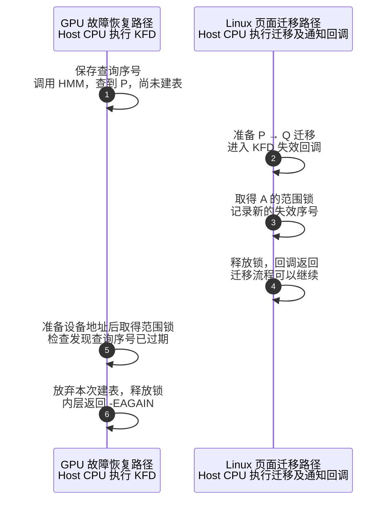

本例的 A 映射尚未建立，因此通知到来时，没有现成的 A 映射需要撤销；这里起作用的是记录新序号。故障恢复路径随后检查时发现结果过期，便放弃 P，本次不提交映射。

发现过期时，P → Q 的迁移可能尚未完成，也可能已经完成。序号检查只判断旧查询结果还能否使用，并没有返回 Q。当前调用先结束，后续恢复再重新查询；假设迁移已完成且没有新的变化，才会取得 Q、准备设备访问地址并建表。`-EAGAIN` 如何交给外层，见 §7.1。

#### 建表先取得锁：通知随后撤销新映射

这次改由故障恢复路径先取得范围锁。它检查时尚未发生使查询结果过期的通知，因此可以继续使用 P。迁移路径随后进入 KFD 回调，申请同一把锁时就需要等待。

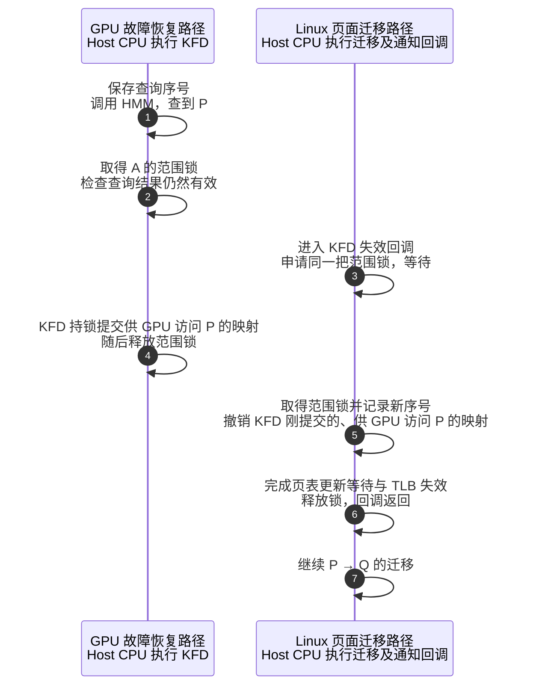

迁移路径等待的是范围锁：故障恢复路径还持有它，KFD 回调就不能继续处理失效。这次迁移也不能越过尚未返回的回调，直接继续后面的受保护页面处理。

这里允许“KFD 先提交 GPU 映射，通知回调随后撤销”。KFD 提交时，P 仍是有效的页面；迁移路径中的 KFD 失效回调取得锁后，先撤销故障恢复路径刚刚提交的、供 GPU 访问 P 的映射，再让迁移继续。撤销所需的页表更新等待与 TLB 处理沿用 §6.1，避免 GPU 在页面变化后仍使用旧映射。

#### 检查与建表必须放在同一段锁保护中

序号能够发现已经记录的失效通知，锁还要保护检查之后的动作。如果故障恢复路径刚检查完就解锁，提交映射之前便会出现下面的错误顺序：

```text
故障恢复路径：检查通过，提前释放范围锁
    ↓ 此时尚未提交 GPU 映射
迁移路径：取得锁，记录失效序号，处理旧映射后释放锁
    ↓ 返回迁移流程，继续改变页面
故障恢复路径：仍用先前查到的 P，提交访问 P 的 GPU 映射
    → 失效回调已经处理完，旧映射却又被建了回来
```

所以，故障恢复路径必须持锁完成“检查查询结果 → 使用结果提交映射”，通知回调则持同一把锁完成“记录失效序号 → 处理旧映射”。前两幅图展示的两种顺序，正是这两段处理互相排斥后的结果。

> **[SOURCE]** Linux `248951ddc14d`，[`amdgpu_hmm.c`](./2.源码/linux/drivers/gpu/drm/amd/amdgpu/amdgpu_hmm.c) 第 195 行保存查询序号，第 239～246 行检查有效性；[`kfd_svm.c`](./2.源码/linux/drivers/gpu/drm/amd/amdkfd/kfd_svm.c) 第 1818～1859 行在准备设备地址后加锁、检查并建表，第 2683～2695 行在同一把锁下处理通知；[`include/linux/mmu_notifier.h`](./2.源码/linux/include/linux/mmu_notifier.h) 第 352～390 行要求记录序号与最终检查使用同一把调用方锁。

#### VMA 稳定时，具体 RAM 页面仍可能变化

故障恢复路径还持有 `mmap_lock` 读锁，保护本次处理中使用的 VMA 等地址空间结构。A 的虚拟地址可以持续有效，而承载数据的 RAM 页从 P 换成 Q；普通 RAM 页面迁移仍可能改变具体页表映射，所以需要刚才的通知、序号和范围锁。

本例采用 Linux 的普通 RAM 页面迁移路径。KFD 自己对同一范围的迁移、验证还受 `migrate_mutex` 串行化，不能直接套用为图中的两条独立路径。如果应用改为调用 `munmap()` 删除 A 的地址范围，则需要取得 `mmap_lock` 写锁，先等待持有读锁的处理结束；删除后的地址也不能按普通迁移那样补回映射，下一节单独展开。

> **[SOURCE]** Linux `248951ddc14d`，[`kfd_svm.c`](./2.源码/linux/drivers/gpu/drm/amd/amdkfd/kfd_svm.c) 第 3115、3162 行分别取得 `mmap_lock` 读锁与范围的 `migrate_mutex`；[`mm/vma.c`](./2.源码/linux/mm/vma.c) 第 3278～3292 行在 `__vm_munmap()` 中取得地址空间写锁，再处理解除映射。

### 6.3 解除映射后的范围拆分与清理

前两节中，A 的地址一直有效，换成 Q 后仍可以恢复访问。现在改变操作：应用调用 `munmap()`，明确删除一段虚拟地址。KFD 收到 `UNMAP` 通知后，除了撤销 GPU 映射，还要删除相应的范围登记；被删除的部分不能按 P → Q 的例子重新补回。

**[DESIGN]** A 只有一页，无法演示“只删除中间四页”，因此本节改用 §2.5 的 16 页范围 R，并明确取另一个起始状态：R 尚未拆分，16 页已迁入 HBM，引用同一个 `svm_range_bo`，初始 `offset=0`。应用已结束对待删除部分的 GPU 使用，随后解除中间四页。下面要保留两侧地址及其数据，只清理被删除的中段；图中的范围名称用于教学。

```text
原范围 R：[0x6000_0000, 0x6001_0000)，16 页
    svm_bo → 同一个 HBM BO；offset = 0

munmap 删除：[0x6000_4000, 0x6000_8000)，中间 4 页
    ↓ 撤销中段 GPU 映射，拆分并完成范围清理
保留前段：[0x6000_0000, 0x6000_4000)，4 页，offset = 0
保留后段：[0x6000_8000, 0x6001_0000)，8 页，offset = 8

前段的 svm_bo ─┐
              ├→ 同一个 svm_range_bo → 原 amdgpu_bo
后段的 svm_bo ─┘

中段已失去原来的地址用途；两侧记录仍引用原 BO 的相应部分。
```

`offset` 按页计数。前段从 BO 的第 0 页开始，后段从第 8 页开始；后段原来保存的数据仍在原位置。这次拆分调整地址范围、引用和偏移，没有为两侧各复制一份 HBM 数据。只要保留范围等使用者仍持有 BO 引用，BO 就继续受引用保护；删除中段不代表整份 BO 立即释放。

> **[SOURCE]** Linux `248951ddc14d`，[`kfd_svm.h`](./2.源码/linux/drivers/gpu/drm/amd/amdkfd/kfd_svm.h) 第 41～50、68～90 行说明共享 BO 与页偏移；[`kfd_svm.c`](./2.源码/linux/drivers/gpu/drm/amd/amdkfd/kfd_svm.c) 第 1006～1082 行调整偏移、取得共享引用并复制属性，第 2516～2545 行按解除区间拆分范围。

#### 回调先撤销映射，后台工作再完成范围登记

解除映射的通知发生时，KFD 正处在 Linux 的通知回调中。Linux 明确限制：`mmu_interval_notifier_remove()` 不能从 notifier 回调中调用。因此，范围与 notifier 的清理需要分成当前回调和延后工作两段：

```text
Linux 解除 R 的中段映射，调用 KFD 的 UNMAP 回调
    → 撤销中段的 GPU 映射并完成所需等待
    → 拆出范围，记录哪些要保留、更新或删除
    → 将待处理范围加入工作列表；入队时取得 mm 引用
    → 安排 deferred_list_work，当前回调返回

后台工作取得所需锁
    → 更新保留范围的区间树与 notifier
    → 移除待删除范围及其 notifier，归还范围资源引用
    → 处理结束，释放入队时取得的 mm 引用
```

入队时先取得引用，是为了让后台工作尚未开始时，所需的 `mm` 仍然有效。这里的 `deferred_list_work` 负责完成范围登记与清理。

<details>
<summary>可选源码细节：过渡范围与已进入处理通路的故障记录</summary>

短暂存在的 `child_list` 保存已经拆出、尚待完成登记或清理的子范围。故障恢复如果遇到这些过渡状态，会按 `skip_recover` 或 `-EAGAIN` 分支暂缓。后段仍合法时，可以在登记完成后恢复；中段已删除时，必须结合当前 VMA 与故障记录判断，不能把旧中段映射补回来。

若另一条恢复路径已经持有 `mmap_lock` 读锁，`munmap()` 要先等待写锁。普通解除映射路径还记录故障时间戳检查点，并由后续故障处理检查，以协调已进入处理通路的旧记录；这些记录的判断不应写成后台清理线程统一排空。

`deferred_list_work` 没有在本流程中执行“排空全部 Retry 记录”。进程退出时的显式排空放在 §7.3。

</details>

> **[SOURCE]** Linux `248951ddc14d`，[`mm/mmu_notifier.c`](./2.源码/linux/mm/mmu_notifier.c) 第 1076～1083 行说明移除 notifier 的限制；[`kfd_svm.c`](./2.源码/linux/drivers/gpu/drm/amd/amdkfd/kfd_svm.c) 第 2480～2505 行在入队时调用 `mmget_not_zero()`，第 2417～2477 行处理工作并调用 `mmput_async()`，第 2338～2377 行执行范围操作。解除映射、时间戳检查和暂缓恢复分别见第 2550～2637、3119～3132、2968～3005 行。

### 6.4 暂停队列后主动恢复映射（可选）

前面按“撤销旧映射，后续 GPU 缺页再恢复”的方式保护访问。本节只改变保护方式：当进程未启用 XNACK，或某段范围要求始终保持 GPU 映射时，KFD 要先暂停队列，再主动恢复映射。首次阅读可直接进入第七章。

<details>
<summary>展开：暂停队列、恢复映射与恢复队列</summary>

**[DESIGN]** 仍取 [§6.0](#60-ram-页面变化与-gpu-访问保护) 的 RAM 页 P → Q，A 的地址和权限保留，GPU 已有访问 P 的映射；本节改为进程未启用 XNACK，并假设各步成功。KFD 不能撤销映射后就让队列继续运行、等待主例的 Retry 恢复，而要先暂停该进程的队列，待当前页面的映射恢复后再继续执行。

已启用 XNACK 的进程也可以对某段范围设置 `GPU_ALWAYS_MAPPED`。这项要求保存在 `svm_range.flags` 中，应用通过 SVM 属性接口设置或清除相应位。设置后，KFD 按未启用 XNACK 时的方式维护该范围的 GPU 映射，也采用下面的流程。因此，“保持映射”允许页面迁移期间暂停队列，但要求恢复队列前先恢复所需映射。

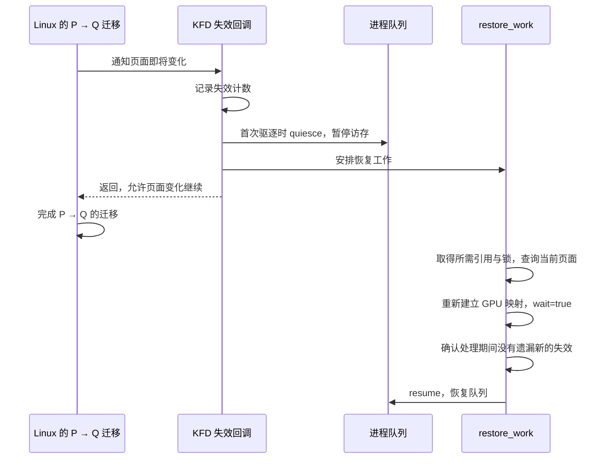

此处的 `restore_work` 负责“查询页面、恢复映射、恢复队列”，与 §6.3 处理范围登记的 `deferred_list_work` 分工不同。Queue 暂停与恢复沿用 [03 上篇 §3.3](<./03_AMD GPU 队列与 AQL Dispatch（上）.md#33-queue-换出与恢复时的状态保存>)；停止访存后，Linux 才能继续这次页面变化。

恢复工作用 `prange->invalid` 记录该范围的失效，用 `svms->evicted_ranges` 跟踪进程级驱逐状态。假设开始处理时范围计数为 1，建表期间又变为 2，工作线程就不能按旧值 1 清零并恢复队列，而要另行安排恢复。映射恢复且范围、进程计数检查通过后，才调用 `kgd2kfd_resume_mm()`。

读到这里后，后文重新沿用启用 XNACK、范围未设置 `GPU_ALWAYS_MAPPED` 的主例。

> **[SOURCE] 可选源码索引**
>
> - 范围要求的定义和保存：Linux `248951ddc14d`，[`kfd_ioctl.h`](./2.源码/linux/include/uapi/linux/kfd_ioctl.h) 第 761～762 行定义标志，第 800～802 行说明设置、清除标志的属性；[`kfd_svm.h`](./2.源码/linux/drivers/gpu/drm/amd/amdkfd/kfd_svm.h) 第 88、125 行说明并定义 `flags` 成员；[`kfd_svm.c`](./2.源码/linux/drivers/gpu/drm/amd/amdkfd/kfd_svm.c) 第 797～803 行设置或清除相应位。
> - 通知后的保护与恢复：[`kfd_svm.c`](./2.源码/linux/drivers/gpu/drm/amd/amdkfd/kfd_svm.c) 第 2024～2062 行判断配置、暂停队列并安排工作；第 1898～1990 行重新建表、比较并清零计数、恢复队列或重新安排工作。

</details>

<details>
<summary>可选回查：各类通知的分支与属性接口边界</summary>

下面汇总本章已经讲过的分支。`mprotect()` 保留地址范围但改变权限，后续恢复要重新读取 VMA 权限；`munmap()` 删除的地址用途需要按 §6.3 清理。

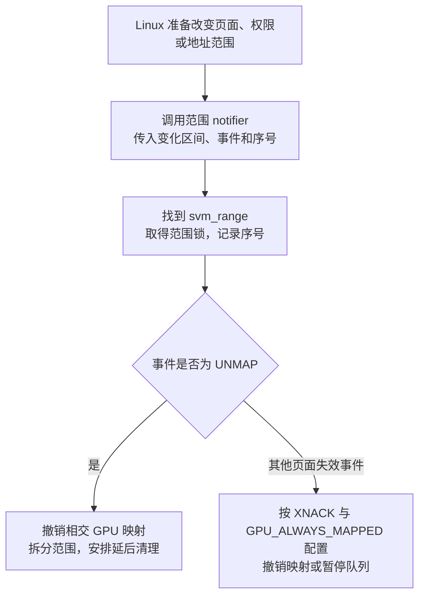

范围回调收到 `MMU_NOTIFY_RELEASE` 时直接返回，进程级退出由 §7.3 的另一份 notifier 处理。应用通过属性接口提交 `NO_ACCESS` 时，固定基线只清除相应访问位，更新处仍留有撤销旧映射的 TODO；因此，不能把这次属性请求当成已经完成 §6.1 的同步撤销流程。

> **[SOURCE]** Linux `248951ddc14d`，[`kfd_svm.c`](./2.源码/linux/drivers/gpu/drm/amd/amdkfd/kfd_svm.c) 第 2668～2695 行分发通知，第 786～788、3764～3768 行处理 `NO_ACCESS` 并保留上述 TODO。

</details>

## 7. 故障结果、资源回收与全篇复盘

前六章已经说明怎样得到页面、迁移数据、建立映射，以及怎样应对页面变化。现在把处理结果交回调用者：本次是已经建表、暂缓、跳过旧记录，还是恢复失败？随后再看错误怎样通知应用，以及进程退出时怎样结束这些资源的使用。

### 7.1 故障返回结果与恢复失败

`svm_range_restore_pages()` 每次处理一条 GPU 故障记录。调用它的 `amdgpu_vm_handle_fault()` 根据返回值决定后续处理，但需要结合分支才能知道这次实际完成了什么：

```text
KFD 处理 A 的一条 GPU 故障记录
    ├─ 查询、迁移及建表所需步骤成功
    │    → 返回 0；满足 §4.4 的更新条件后，GPU 访问可以继续
    ├─ 页面或范围仍在变化
    │    → 暂缓本次恢复；外层返回 0，后续请求可再尝试
    ├─ 故障记录已经过期或重复
    │    → 跳过本次恢复，返回 0
    └─ 权限不允许，或必要页面、资源无法准备
         → 返回错误，进入计算故障失败处理
```

#### 暂缓与跳过：本次都可能没有建立映射

沿 §6.2 的例子，查询结果过期时，内层返回 `-EAGAIN`。故障恢复出口调用故障过滤清理接口，再把返回值改为 0。这个 0 让外层结束本条记录的处理；后续恢复仍需重新取得有效页面，并完成建表。

故障过滤用于减少重复记录带来的重复处理。清理接口按实际跟踪配置执行：使用软件过滤时，处理相应记录以允许后续故障进入；某些硬件跟踪配置下该接口直接返回。无论哪一种，这个出口都没有在函数内部一直循环到恢复成功。

跳过则是另一种情况。例如 A 的范围刚被其他故障处理验证，当前记录重复；或者已找到旧范围，却发现其 VMA 已被移除。当前调用可直接返回 0，避免继续使用旧状态。后者与“原本没有范围，尝试新建时却没有合法 VMA”的失败路径要分别判断。

> **[SOURCE]** Linux `248951ddc14d`，[`kfd_svm.c`](./2.源码/linux/drivers/gpu/drm/amd/amdkfd/kfd_svm.c) 第 3070～3113、3135～3193、3244～3272 行给出跳过、暂缓和返回路径；[`amdgpu_vm.c`](./2.源码/linux/drivers/gpu/drm/amd/amdgpu/amdgpu_vm.c) 第 3020～3022 行将 KFD 返回 0 视为本条记录已处理；[`amdgpu_gmc.c`](./2.源码/linux/drivers/gpu/drm/amd/amdgpu/amdgpu_gmc.c) 第 417～430、491～519 行说明过滤用途及清理接口的配置分支。

#### 无法恢复：沿失败路径报告访问错误

**[DESIGN]** 另取一个权限错误变体：A 所在 VMA 只允许读取，后续另一个 Kernel 却向 A 写入。原 Packet 37 仍只读取 A。KFD 根据这次 `write_fault` 检查 VMA，发现写权限不允许，返回 `-EPERM`；分配新页面也不能使这次写入合法。

```text
KFD 返回无法恢复的错误
    → AMDGPU 重新查找并锁定该进程的 GPUVM
    → VM 仍存在时，尝试写入促成 no-retry fault 的表项状态
    → 后续按实际故障记录进入内存异常报告（§7.2）
```

固定计算分支用 `AMDGPU_VM_NORETRY_FLAGS` 促成非重试故障。若 VM 已经消失，则按相应退出路径结束处理。这里应跟踪后续故障报告，不能把 KFD 的 C 函数返回值当成已经送达应用的错误事件。

§5.3 的迁入 HBM 失败会先尝试系统内存回退；只有回退后的页面验证、映射等必要步骤仍失败，才进入相应错误出口。内存不足、DMA 映射失败也没有在此统一转换成无限重试。

> **[SOURCE]** Linux `248951ddc14d`，[`kfd_svm.c`](./2.源码/linux/drivers/gpu/drm/amd/amdkfd/kfd_svm.c) 第 3189～3201 行检查权限和位置，第 3217～3247 行处理迁移回退与建表；[`amdgpu_vm.c`](./2.源码/linux/drivers/gpu/drm/amd/amdgpu/amdgpu_vm.c) 第 3024～3047 行重新查 VM 并选择计算错误表项。

<details>
<summary>可选源码：暂缓出口与复制等待的错误边界</summary>

下面是故障恢复函数的出口；此前已释放相应锁与引用。

> **[SOURCE]** Linux `248951ddc14d`，[`kfd_svm.c`](./2.源码/linux/drivers/gpu/drm/amd/amdkfd/kfd_svm.c) 第 3254～3272 行给出释放与返回顺序。

```c
3267:     if (r == -EAGAIN) {
3268:         pr_debug("recover vm fault later\n");
3269:         amdgpu_gmc_filter_faults_remove(node->adev, addr, pasid);
3270:         r = 0;
3271:     }
3272:     return r;
```

日志表示“稍后恢复这个 VM 故障”。这段代码将暂缓转换为外层可接受的处理结果；原 Kernel 的执行与 Completion Signal 更新仍由后续执行决定。

第五章的正常迁移路径还要保留一个错误边界：`svm_migrate_copy_done()` 返回等待结果，但调用者没有把该结果赋回 `r`。Fence 等待、作业错误状态、设备异常和 Reset 需要分别追踪，不能仅凭帮助函数返回就宣称所有硬件错误已被检查。

> **[SOURCE]** Linux `248951ddc14d`，[`kfd_migrate.c`](./2.源码/linux/drivers/gpu/drm/amd/amdkfd/kfd_migrate.c) 第 200～210、451～476 行显示等待函数与调用者的关系；[`include/linux/dma-fence.h`](./2.源码/linux/include/linux/dma-fence.h) 第 646～665、721～747 行分别说明完成状态、错误状态和等待结果。

**[BOUNDARY]** 本篇沿正常恢复和可见错误分支学习；SDMA 超时、GPU Reset 或设备消失后的完整作业错误传播留待后续专题。

</details>

### 7.2 故障通知与任务完成等待

#### 进入错误通知路径的前提

本节承接 §7.1 中需要向用户态报告内存错误的分支。先沿启用 XNACK 的主例，区分 KFD 处理 A 的一条缺页记录后可能出现的结果：

```text
内核 KFD 处理 A 的一条 GPU 缺页记录
    ├─ 恢复成功
    │    → 满足页表更新与翻译失效条件后，GPU 可以继续访问
    │    → 不因这次成功恢复调用 VMFaultHandler()
    ├─ 暂缓恢复，例如 HMM 查询结果过期
    │    → 本次放弃建表，后续可以重新尝试
    │    → 不因这次暂缓调用 VMFaultHandler()
    ├─ 跳过过期或重复记录
    │    → 结束本条记录的处理，不因此通知用户态内存错误
    └─ 无法正常恢复，进入错误报告路径
         → 按实际故障记录形成 KFD 内存错误事件
         → ROCr 收到事件，执行 VMFaultHandler()
```

`VMFaultHandler()` 是 ROCr 在用户态处理 GPU 内存错误事件的函数，不是所有缺页的总入口。前几章的 HMM 查询、页面迁移与 GPU 建表由内核恢复路径完成，正常恢复不需要经过这个用户态函数。非重试内存异常也可以直接进入错误通知路径，无需先完整尝试一次缺页恢复。

第六章的“暂缓恢复”需要单独看清。KFD 查到页面 P 后，若发现失效序号已经改变，就放弃使用本次查询结果，内层返回 `-EAGAIN`。随后发生的是：

```text
svm_range_restore_pages() 将 -EAGAIN 转为 0 后返回
    → amdgpu_vm_handle_fault() 收到 0，返回 true
    → 外层 Retry 故障处理据此提前返回
    → 本条记录不再进入后面的 KFD 内存错误上报路径
```

这里允许本条记录以“暂缓”结束，后续恢复仍需重新查询页面并完成建表。如果后来重新尝试时发现权限错误等无法恢复的问题，错误通知由后来的故障触发；前一次暂缓本身不会调用 `VMFaultHandler()`。

> **[SOURCE]** Linux `248951ddc14d`，[`kfd_svm.c`](./2.源码/linux/drivers/gpu/drm/amd/amdkfd/kfd_svm.c) 第 3267～3272 行将 `-EAGAIN` 转为 0；[`amdgpu_vm.c`](./2.源码/linux/drivers/gpu/drm/amd/amdgpu/amdgpu_vm.c) 第 3020～3022 行据此返回 `true`；[`amdgpu_gmc.c`](./2.源码/linux/drivers/gpu/drm/amd/amdgpu/amdgpu_gmc.c) 第 554～588 行向外返回已处理结果；[`gmc_v9_0.c`](./2.源码/linux/drivers/gpu/drm/amd/amdgpu/gmc_v9_0.c) 第 585～592 行提前结束本条记录的处理。[`kfd_device.c`](./2.源码/linux/drivers/gpu/drm/amd/amdkfd/kfd_device.c) 第 1702～1732 行说明恢复失败与非重试故障进入 KFD 错误通知的路径。

#### 从 KFD 内存事件到用户态回调

进入错误报告路径后，需要把故障信息从内核交给用户态。ROCr 事先创建内存错误事件，并把自己的 `VMFaultHandler()` 注册为异步处理函数；应用还可以向 ROCr 注册系统事件回调，接收运行时整理后的错误信息。

**[DESIGN]** 下面沿普通内存异常路径，假设调试器等没有接管异常。内核处理和用户态处理都由 Host CPU 执行：

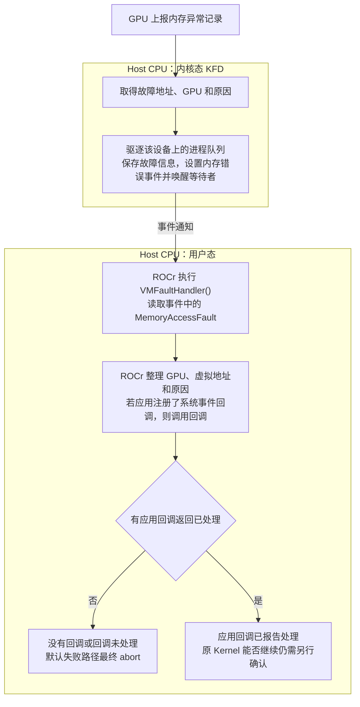

KFD 先把故障信息保存在内存错误事件中，再设置事件并唤醒等待者。ROCr 收到事件后，在用户态执行 `VMFaultHandler()`。跨越内核态与用户态边界的是事件通知，KFD 不会直接调用应用提供的用户态函数。

`VMFaultHandler()` 随后读取 `MemoryAccessFault`，把 GPU Agent、虚拟地址和原因交给应用已注册的系统事件回调。因此，ROCr 的处理函数和应用回调是先后执行的两层用户态函数。没有应用回调，或没有回调返回 `HSA_STATUS_SUCCESS` 时，固定默认路径按配置输出诊断，最终调用 `abort()`；有回调报告已处理时，ROCr 跳过这条默认终止路径，原 Kernel 是否还能继续需要另行确认。

第六章的 `svm_range.notifier` 回调发生在内核中，用来通知 KFD 页面或地址范围即将变化；这里的应用回调发生在用户态，用来接收 GPU 内存访问错误。

调试器或启用的 Runtime 异常处理也可能在 KFD 分发阶段接管事件；这属于上图之前的分支。首次阅读先掌握普通错误事件路径即可。

> **[SOURCE]** Linux `248951ddc14d`，[`kfd_int_process_v9.c`](./2.源码/linux/drivers/gpu/drm/amd/amdkfd/kfd_int_process_v9.c) 第 540～572、578～599 行形成异常并适配 GFX9.4.3 分发；[`kfd_debug.c`](./2.源码/linux/drivers/gpu/drm/amd/amdkfd/kfd_debug.c) 第 199～245 行选择接管或普通内存事件路径；[`kfd_events.c`](./2.源码/linux/drivers/gpu/drm/amd/amdkfd/kfd_events.c) 第 1207～1256 行保存信息并设置事件，第 641～660 行更新事件状态并唤醒等待者。ROCr `ba56a24c6132`，[`runtime.cpp`](./2.源码/rocr-runtime/runtime/hsa-runtime/core/runtime/runtime.cpp) 第 1743～1758 行创建内存事件并注册异步处理函数，第 1826～1943 行实现 `VMFaultHandler()`。

#### 错误通知与任务完成等待

回到 Packet 37：假设它读取 A 最终失败，C 可能只写了一部分，Completion Signal 也可能仍未达到完成值，依赖它的后续任务可能继续等待。内存错误事件负责报告失败，正常完成 Signal 需要 Kernel 走到相应完成阶段才更新。应用应按运行时的错误协议结束等待或执行上层恢复，不能把错误通知当成 C 已计算完。

### 7.3 进程退出与范围释放

整个进程退出时，Linux 将拆除用户地址空间。即使 CPU 应用已经停止，GPU Queue、内核恢复路径和后台工作仍可能持有相关资源，因此退出清理需要先结束设备访问，再收回这些内核对象。

这里使用的是 `kfd_process` 上的进程级 MMU notifier，关注整份地址空间退出。第二章介绍的 `svm_range.notifier` 关注某段地址变化；它收到 `MMU_NOTIFY_RELEASE` 时直接返回，整进程的退出由进程级回调处理。

下面沿设备停止正常成功的路径，区分地址空间退出通知和稍后的最终对象释放：

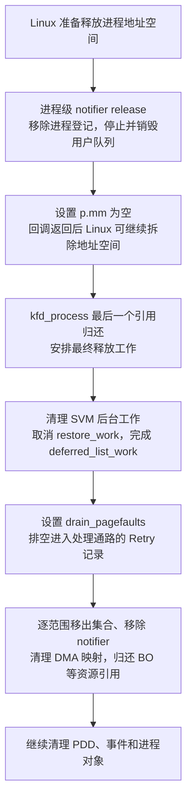

#### 退出通知阶段：先停止设备使用

进程级回调先从查找表移除进程，取消相关工作，并停止、销毁该进程的用户 Queue；随后将 `p->mm` 设为 `NULL`。Linux 在回调返回后可以继续拆除地址空间，所以正常停止必须先完成。这里沿用 [03 下篇 §8.5](<./03_AMD GPU 队列与 AQL Dispatch（下）.md#85-进程退出时的-queue-停止与地址空间释放>)的 Queue 退出流程。

进程从表中移除后，新的故障查找无法再取得这份进程记录。此前已经取得引用的内核路径仍需结束处理并归还引用，因而 `kfd_process` 的最终释放可以晚于退出通知。

#### 最终释放阶段：结束后台使用，再归还范围资源

最后一个进程对象引用归还后，释放工作调用 `svm_range_list_fini()`：先取消 SVM 映射恢复工作，等待已安排的范围清理工作完成；再设置 `drain_pagefaults`，排空相应 Retry 记录；最后逐一移除范围、notifier 和 DMA 映射，归还 BO 等资源引用。

这个顺序保证清理范围时，后台工作不会继续拿它建表或修改登记。范围资源处理完后，再清理 PDD 等仍被这些流程使用的对象。涉及共享 BO 时，归还一个范围的引用后，最终释放仍取决于其他使用者的引用。

> **[SOURCE]** Linux `248951ddc14d`，[`kfd_process.c`](./2.源码/linux/drivers/gpu/drm/amd/amdkfd/kfd_process.c) 第 1326～1352、1376～1395 行给出退出通知，第 1286～1305 行连接引用归还与最终释放工作，第 1236～1283 行安排资源释放顺序；[`kfd_svm.c`](./2.源码/linux/drivers/gpu/drm/amd/amdkfd/kfd_svm.c) 第 3333～3363 行处理 SVM 工作、故障排空与范围清理，第 254～310 行释放范围持有的映射和资源，第 2668～2669 行处理范围级释放通知。

**[BOUNDARY]** 退出流程以结束资源使用为目标，不保证未完成的 Kernel 已算出有效结果。异常停机或 Reset 时的设备停止条件，仍按 03 的退出边界判断。

#### 7.3.1 缺页恢复与退出的竞争点

当前 GPU 因访问 `A[5]` 产生 Retry 故障，Host 上的处理已经进入 `svm_range_restore_pages()`，并按 PASID 42 找到了 P 的 `kfd_process`。就在这之后，P 开始退出。要判断恢复路径能否继续使用 A，需要核对它是否还取得了地址空间使用引用。

**[DESIGN]** 本节只分析正常主上下文的进程退出：P 在这个例子里只有一个用户线程，该线程也是 `lead_thread`；设备存在，未发生 Reset，停止 Queue 的正常路径成功。A 已有合法 SVM 范围，采用本篇的 RAM 就地恢复条件。计数图只计入该线程和本次恢复的 `mm_users` 引用，没有其他临时使用者。这样可以把同一个竞争点的两种结果写清楚，无需引入范围首次创建、迁移或第二个并发案例。

**[INFERENCE]** 下图的两条分支互斥，分别表示谁先在任务锁保护下完成对 `task->mm` 的操作。图中 `mm_users` 的变化是上述条件下的推演；进程对象引用的总数取决于文件、notifier 等实际持有者，不假定为一个固定值。

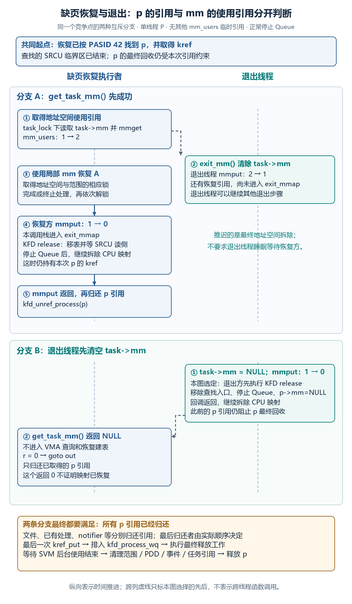

图中“最终拆除被推迟”表示 `mm_users` 尚未归零；退出线程可以继续自己的其他退出步骤，并非必定睡眠等待恢复线程。若恢复路径的 `mmput()` 归还的是最后一个地址空间使用引用，退出通知就在这次 `mmput()` 的调用上下文中触发。[可编辑源图](./assets/05/fault-exit-lifetime.svg)。

##### 7.3.1.1 进程引用、任务引用和地址空间引用分别保护什么

沿本次访问看，恢复函数需要三个层次的对象：先根据 PASID 找到 P，再从 P 保存的主线程取得可使用的地址空间，最后在地址空间和 SVM 范围保护下恢复 A。

```text
PASID 42
    → 在 KFD 进程表中找到 PDD，取得 p 的 kref
    → p->lead_thread：P 的主线程 task_struct
    → get_task_mm(p->lead_thread)：尝试取得 mm_users 引用
    → mmap_read_lock(mm)：保护本段地址空间查询
    → svms->lock：保护 SVM 范围集合操作
    → prange->migrate_mutex：协调当前范围的恢复／迁移操作
    → 查 A 的 VMA 和权限，继续本篇的页面与映射恢复
```

第一层是 `p` 的引用。`kfd_lookup_process_by_pasid()` 在 KFD 进程表的 SRCU 读侧保护内遍历 PDD，找到匹配 PASID 后执行 `kref_get()`，然后退出 SRCU 临界区并返回。恢复函数因而可以在离开查找临界区后继续持有 `p`，直到调用 `kfd_unref_process()`。

第二层是主线程的 `task_struct`。创建 `p` 时，KFD 保存 `thread->group_leader`，并取得任务对象引用；最终释放 `p` 的工作才归还它。因此恢复路径持有 `p` 时，保存的任务对象仍可用于安全调用 `get_task_mm()`。任务对象可以保留到线程已停止执行之后，其中的 `task->mm` 则可能已经被清空。

第三层是本次恢复自己的地址空间使用引用。`get_task_mm()` 在任务锁保护下读取 `task->mm`，非空时执行 `mmget()`。这个引用作用于 `mm_users`，必须用 `mmput()` 归还。恢复路径从这里拿到局部变量 `mm`，后续使用它，而不是仅凭 `p->mm` 保存过一个地址就直接查询 A。

> **[SOURCE]** Linux `248951ddc14d`，[`kfd_process.c`](./2.源码/linux/drivers/gpu/drm/amd/amdkfd/kfd_process.c) 第 1882～1926 行在 SRCU 内按 PASID 查找并增加进程引用，第 1580～1584、1647～1648、1281～1283 行保存并管理任务对象引用；[`kfd_svm.c`](./2.源码/linux/drivers/gpu/drm/amd/amdkfd/kfd_svm.c) 第 3070～3117 行先取得 `p`，再通过主线程取得 `mm` 并加锁。

可以用下面的短函数确认第三层引用是怎样取得的。它同时说明：决定结果的是受任务锁保护的 `task->mm`，并非“进程退出”这个描述出现的早晚。

> **[SOURCE]** Linux `248951ddc14d`，[`kernel/fork.c`](./2.源码/linux/kernel/fork.c) 第 1378～1391 行，`get_task_mm()` 的完整函数体。任务没有可用 `mm` 时返回 `NULL`；成功时增加地址空间使用引用。

```c
1378: struct mm_struct *get_task_mm(struct task_struct *task)
1379: {
1380: 	struct mm_struct *mm;
1381:
1382: 	if (task->flags & PF_KTHREAD)
1383: 		return NULL;
1384:
1385: 	task_lock(task);
1386: 	mm = task->mm;
1387: 	if (mm)
1388: 		mmget(mm);
1389: 	task_unlock(task);
1390: 	return mm;
1391: }
```

第 1382～1383 行排除相应内核线程情形，本例是普通用户线程。第 1385～1389 行把“读取 `task->mm`”和“增加其使用引用”放在同一任务锁保护下。退出路径也在持有这把任务锁时清除 `current->mm`，所以恢复方得到的是已成功取得引用的地址空间，或明确的 `NULL`。

还要保留一个范围区别：`mm_struct` 描述对象的内存寿命，与其中用户地址空间仍可使用的时间不同。notifier 等引用可以让描述对象继续存在；当 `mm_users` 归零，Linux 仍会进入用户地址空间拆除。`p` 的 kref 只保护 `p` 的最终回收，无法单独替代本次 `mmget()`。

> **[SOURCE]** Linux `248951ddc14d`，[`kernel/exit.c`](./2.源码/linux/kernel/exit.c) 第 581～615 行在任务锁内清除 `current->mm`，之后归还地址空间使用引用；[`kernel/fork.c`](./2.源码/linux/kernel/fork.c) 第 1179～1211 行在 `mm_users` 归零后调用 `exit_mmap()`，再归还描述对象引用；[`mm/mmu_notifier.c`](./2.源码/linux/mm/mmu_notifier.c) 第 704～705、885～893 行展示 notifier 对描述对象的取得与归还。本节对引用和释放顺序的判断均以这些固定源码为准。

##### 7.3.1.2 分支 A：恢复路径先取得地址空间引用

假设恢复路径已经取得 `p`，并且 `get_task_mm()` 在退出线程清空 `task->mm` 之前成功。按本例简化计数，`mm_users` 从 1 增为 2：一个引用来自用户线程，一个来自本次恢复。

接着退出线程执行 `exit_mm()`，清除自己的 `task->mm`，再调用 `mmput()`。计数从 2 减为 1，因此这次调用还不会进入 `__mmput()` 和 `exit_mmap()`。P 的用户线程正在退出，但用户地址空间的最终拆除要等现有恢复引用归还后才能继续。

恢复路径仍使用局部变量 `mm`。它依次取得 `mmap_read_lock(mm)`、SVM 集合锁和当前范围的 `migrate_mutex`，检查 A 的 VMA、访问权限与恢复位置，再进入页面验证与映射。这些锁和 前文已说明的 notifier 重试条件负责处理范围和映射变化；`mm_users` 引用本身只推迟最终地址空间拆除，不会冻结所有 PTE 或替代页面有效性检查。

> **[SOURCE]** Linux `248951ddc14d`，[`kfd_svm.c`](./2.源码/linux/drivers/gpu/drm/amd/amdkfd/kfd_svm.c) 第 3108～3117、3135～3162、3182～3201、3244～3245 行连接地址空间取得、锁、范围检查和映射调用。本例已有范围，直接沿该分支读取；范围不存在时的锁升级与创建流程回查 [§2.4](#24-gpu-缺页时按需创建-a-的范围记录)。页面失效并发回查 [§6.2](#62-并发查询与建表结果的有效性)。

恢复成功或决定结束处理后，先解除范围锁、SVM 集合锁和 `mmap` 读锁，再 `mmput(mm)`，最后归还 `p` 引用。这个顺序决定了一种容易漏掉的执行上下文：如果恢复引用是最后一个 `mm_users` 引用，这次 `mmput()` 会在恢复处理的调用栈上进入 `exit_mmap()`，并调用 KFD 的释放通知。

因此，不能把时序固定画成“退出线程一定执行 KFD 释放通知，恢复线程在另一边等它”。本分支中，恢复线程可以成为触发最终地址空间拆除的那个执行者。恢复函数在调用 `mmput()` 前已经释放上述锁，调用之后仍持有 `p` 的 kref，直至走到最后的 `kfd_unref_process()`。

> **[SOURCE]** Linux `248951ddc14d`，[`kfd_svm.c`](./2.源码/linux/drivers/gpu/drm/amd/amdkfd/kfd_svm.c) 第 3254～3265 行的实际收尾顺序如下。它与 [`kernel/fork.c`](./2.源码/linux/kernel/fork.c) 第 1205～1211 行、[`mm/mmap.c`](./2.源码/linux/mm/mmap.c) 第 1273～1285 行一起，证明最后一个 `mmput()` 可以同步进入地址空间释放通知。

```c
3254: out_unlock_range:
3255: 	mutex_unlock(&prange->migrate_mutex);
3256: out_unlock_svms:
3257: 	mutex_unlock(&svms->lock);
3258: 	mmap_read_unlock(mm);
3259:
3260: 	if (r != -EAGAIN)
3261: 		svm_range_count_fault(node, p, gpuidx);
3262:
3263: 	mmput(mm);
3264: out:
3265: 	kfd_unref_process(p);
```

本段处在 `svm_range_restore_pages()` 的函数尾部。第 3255～3258 行先解锁；第 3263 行归还地址空间使用引用，必要时触发上面说明的拆除；第 3265 行再归还进程对象引用。计数之外若还有其他地址空间使用者，拆除会继续推迟，不能照搬本例的“1 减到 0”。

恢复处理能够继续完成，只说明当前引用允许它检查并处理地址空间。进程既已退出，后续 Queue 停止和清理仍会进行；即使本次补映射成功，也不构成向应用保证 C 已算完或 S 已正常更新的承诺。

##### 7.3.1.3 分支 B：退出路径先清除任务的地址空间

另一种合法顺序是：恢复路径已经拿到 `p` 的 kref，但还没调用 `get_task_mm()`；退出线程先在任务锁内把 `task->mm` 清空。恢复路径后来读取这个字段，得到 `NULL`，于是结束本次处理，归还 `p` 引用。

固定函数确实有这条早退路径，而且返回 0。这里的 0 表示这条退出相关处理分支不再继续恢复，不能在观察记录中写成“A 的映射已经修复”。

> **[SOURCE]** Linux `248951ddc14d`，[`kfd_svm.c`](./2.源码/linux/drivers/gpu/drm/amd/amdkfd/kfd_svm.c) 第 3105～3117 行如下；`out` 标签对应上一节展示的第 3264～3265 行。两个源码块在同一函数中，早退直接跳到进程引用归还，跳过 `mmput()`，因为本分支没有取得 `mm` 引用。

```c
3105: 	/* p->lead_thread is available as kfd_process_wq_release flush the work
3106: 	 * before releasing task ref.
3107: 	 */
3108: 	mm = get_task_mm(p->lead_thread);
3109: 	if (!mm) {
3110: 		pr_debug("svms 0x%p failed to get mm\n", svms);
3111: 		r = 0;
3112: 		goto out;
3113: 	}
3114:
3115: 	mmap_read_lock(mm);
3116: retry_write_locked:
3117: 	mutex_lock(&svms->lock);
```

注释的中文含义是：最终进程释放路径在归还任务引用前处理相关工作，因此这里的 `lead_thread` 对象仍可用；日志表示“无法取得 mm”。第 3108～3113 行控制本分支：任务对象可用，但已无法从该任务取得地址空间使用引用，随后不进入 VMA 查询或映射恢复。

在图示选择的顺序中，退出方还可以先完成释放通知、移除进程查找入口并拆除 CPU 地址空间，恢复方才执行这个失败的 `get_task_mm()`。此前取得的 `p` kref 让进程描述对象继续存在，恢复方仍能安全执行末尾的引用归还。

**[BOUNDARY]** `get_task_mm(p->lead_thread)` 检查的是保存的主线程。复杂多线程退出中，主线程与其他线程持有地址空间的状态可能不同；因此仅凭这里返回 `NULL`，不能概括为“所有线程的 `mm_users` 一定为零”。本节的单线程条件用于明确两条时序，通用代码结论仍是“本恢复路径未取得可使用的 mm，必须退出”。

##### 7.3.1.4 退出通知先阻止后续查找，再停止设备使用

地址空间最后一个使用引用归还后，`exit_mmap()` 首先调用 `mmu_notifier_release(mm)`，随后才继续解除 CPU 映射。KFD 的进程释放回调在这个位置处理仍使用该进程内存的 Queue。

本例的顺序如下，普通 Queue 停止与范围释放细节分别回查 [03 下篇 §8.5](<./03_AMD GPU 队列与 AQL Dispatch（下）.md#85-进程退出时的-queue-停止与地址空间释放>)和 [§7.3](#73-进程退出与范围释放)：

```text
exit_mmap(mm)
  → MMU notifier 调用 KFD 的 release
  → 从 KFD 进程表摘除 p，等待进程表 SRCU 读侧结束
  → 取消并等待 p 的 eviction_work / restore_work
  → 停止该进程在各设备上的 Queue，清理 PQM
  → p->mm = NULL
  → 归还主上下文的 notifier 引用
  → 回调返回，Linux 继续拆除 CPU 映射
```

进程表删除使后续按 PASID 查找无法再从表中取得 `p`。删除时等待的 SRCU 读侧，是 `kfd_lookup_process_by_pasid()` 这类查找仍在访问表项的短临界区。已经完成查找、带着 kref 离开临界区的恢复函数，不由这次 `synchronize_srcu()` 等待到函数末尾；它的长期使用通过自身引用，以及是否取得 `mm` 来协调。

回到两条分支：A 中的有效 `mm_users` 引用把正常地址空间释放通知推迟到恢复归还引用之后；B 中的恢复方只有 `p` 引用，取不到 `mm` 就结束。正常退出要等 A 中这份 `mm_users` 引用归还后，才能完成 `exit_mmap()` 和用户地址空间拆除；这个先后关系由引用计数约束。

> **[SOURCE]** Linux `248951ddc14d`，[`kfd_process.c`](./2.源码/linux/drivers/gpu/drm/amd/amdkfd/kfd_process.c) 第 1307～1324 行从表中删除并等待 SRCU，第 1326～1352、1372～1395 行给出释放通知中的取消工作、Queue 停止、PQM 清理与 `p->mm` 失效；第 1908～1920 行说明 PASID 查找在增加 kref 后就离开 SRCU。[`mm/mmap.c`](./2.源码/linux/mm/mmap.c) 第 1281～1300 行把 notifier release 放在 CPU 映射拆除之前。

这里取消的 `p->restore_work` 是进程队列恢复工作；本次 Retry 故障处理则直接进入 `svm_range_restore_pages()`，通过刚才分析的进程引用与地址空间条件收尾。SVM 自己的 `p->svms.restore_work` 在后面的范围最终清理中处理。三个执行入口处理的对象和取消时机分别由对应代码决定。

> **[SOURCE]** Linux `248951ddc14d`，[`kfd_process.c`](./2.源码/linux/drivers/gpu/drm/amd/amdkfd/kfd_process.c) 第 1587～1588、1331～1332 行初始化并取消进程级工作；[`kfd_svm.c`](./2.源码/linux/drivers/gpu/drm/amd/amdkfd/kfd_svm.c) 第 3046～3050 行定义当前故障恢复入口，第 3341～3344 行在最终范围清理阶段取消 SVM 恢复工作并等待范围清理工作。

##### 7.3.1.5 最后一个进程引用触发最终释放

退出通知完成后，`p` 可能仍被已打开的 KFD 文件、尚未归还的查找引用或 notifier 的异步释放持有。各使用者都归还自己的引用，最后一次 `kref_put()` 才调用 `kfd_process_ref_release()`，把释放工作排入 `kfd_process_wq`。

因此不能固定说“缺页线程一定是最后释放者”，也不能固定说“退出回调返回时就释放 p”。在分支 A 中，恢复方在 `mmput()` 之后还会归还一次 `p` 引用；在分支 B 中，这个引用可能晚于地址空间拆除才归还。到底哪次归还使计数变为零，要看其他使用者是否已经结束。

```text
KFD 文件归还引用 ─┐
恢复路径归还引用 ─┼→ 最后一次 kref_put
notifier 归还引用 ┘      → kfd_process_ref_release()
                         → 排入 kfd_process_wq
                         → kfd_process_wq_release()
```

notifier 也分成两个动作：release 回调在地址空间拆除前处理设备使用；`mmu_notifier_put()` 触发的异步 `free_notifier` 再归还它持有的进程引用。前一个回调执行结束，并不要求后一个异步释放已经完成。

> **[SOURCE]** Linux `248951ddc14d`，[`kfd_process.c`](./2.源码/linux/drivers/gpu/drm/amd/amdkfd/kfd_process.c) 第 1016～1019 行归还 kref，第 1286～1305 行连接零引用回调、释放工作和 notifier 引用归还；[`kfd_chardev.c`](./2.源码/linux/drivers/gpu/drm/amd/amdkfd/kfd_chardev.c) 第 183～193 行归还文件持有的引用；[`mm/mmu_notifier.c`](./2.源码/linux/mm/mmu_notifier.c) 第 885～893、918～928 行通过 SRCU 安排 notifier 的异步释放。

释放工作再按顺序结束剩余资源使用：处理所需的设备停止条件，清理进程内存相关资源，调用 `svm_range_list_fini()` 结束 SVM 后台工作并清理范围，然后释放 PDD、事件和任务引用，最后释放 `p`。SVM 清理会设置 `drain_pagefaults` 并排空相应 Retry 记录，但这个标志是在最终释放阶段设置的；不能把它提前画成“收到退出请求的第一步”。

> **[SOURCE]** Linux `248951ddc14d`，[`kfd_process.c`](./2.源码/linux/drivers/gpu/drm/amd/amdkfd/kfd_process.c) 第 1236～1283 行给出最终释放顺序；[`kfd_svm.c`](./2.源码/linux/drivers/gpu/drm/amd/amdkfd/kfd_svm.c) 第 3333～3363 行先结束 SVM 工作，再设置 `drain_pagefaults`、排空故障并清理范围。范围与映射的释放展开见 [§7.3](#73-进程退出与范围释放)。

##### 7.3.1.6 可以发生的交错与必须推迟的动作

沿图复述时，应把四个条件分别说清：

- **`p` 已被引用，而地址空间已不可取得，可以发生。** 查找引用延长 `p` 的寿命；`get_task_mm()` 可以随后返回 `NULL`，恢复方按早退路径归还引用。
- **退出线程已清空自己的 `task->mm`，恢复仍使用局部 `mm`，可以发生。** 前提是恢复方先成功取得了 `mm_users` 引用。最终用户地址空间拆除因此延后。
- **正常 `exit_mmap()` 与仍有效的本次 `mm_users` 使用引用不能按任意顺序交错。** 最后一个使用引用归还才触发地址空间拆除；任务退出的意图不能绕过这个条件。
- **`p` 已从表中删除，先前的引用仍未归还，可以发生。** 后续查找失去入口，已有使用者通过自己的引用收尾；最终释放工作等到全部 `p` 引用归还后才被安排。

本案例中真实的等待包括：进程表删除等待 SRCU 查找临界区结束；取消工作接口等待正在执行的对应工作结束；最终 SVM 清理等待已有后台工作与故障记录处理完成。`mm_users` 引用则通过“尚未满足零引用条件”推迟最终拆除，不要求退出线程用某个等待队列等待恢复函数。

**[BOUNDARY]** Reset 只改变本例之外的设备停止条件。固定源码的 `kfd_process_wq_release()` 在继续释放前会等待 GPU Reset 完成；不能在 Queue 停止异常时照搬本例的正常释放结论。KFD eviction fence 在此仅作为“设备使用已经结束后，后续内存释放可以继续”的接口条件，其内部实现见 [07 大纲 §7.4](<./07_AMDGPU 通用内存管理与 DRM 任务提交（大纲）.md#74-ttm-放置驱逐迁移与-kfd-队列协调>)。本节也不由对象回收推断未完成 Kernel 的结果有效。

> **[SOURCE]** Linux `248951ddc14d`，[`kfd_process.c`](./2.源码/linux/drivers/gpu/drm/amd/amdkfd/kfd_process.c) 第 1223～1254 行在最终释放工作中等待相关 Reset 完成，并在 Queue 已销毁的前提下处理 eviction fence。正常进程退出之外的停止失败边界，回查 [03 下篇 §8.4](<./03_AMD GPU 队列与 AQL Dispatch（下）.md#84-异常清理与错误隔离的边界>)。

### 7.4 访问过程复盘与学习自检

先用两条短流程复盘正常访问。第一条沿第二至第四章的 RAM 主例，A 的页面不发生变化：

```text
应用登记 A，preferred_loc=0
    → GPU 读 A 缺页，KFD 找到范围并选择 RAM
    → HMM 取得 PFN 0x4_5678，DMA API 返回 IOVA 0x1234_5000
    → 检查查询仍有效，更新 GPU 页表并满足所需更新与失效条件
    → GPU 读取 0x3000_0014
    → 经 IOVA 0x1234_5014 到达 RAM 0x4567_8014
```

此时 A 未被复制，`svm_bo` 仍为空。第二条沿第五章的 HBM 变体：应用已把期望位置改为目标 GPU。P 是原 RAM 页，D 是设备页编号，Q 是迁回后的 RAM 页；GPU 访问 HBM 时使用的是对应的本地地址 V。

```text
CPU 初始化 A：数据在 RAM 页 P
    → KFD 关联 HBM BO，准备设备页 D
    → 保护旧访问，复制 P → D，等待并完成迁移
    → CPU 页表留下 device-private 条目；GPU 映射指向 HBM
    → GPU 使用 A，应用随后完成同步
    → CPU 再读 A：缺页，先撤销旧 GPU 映射并处理旧翻译
    → 复制 D → RAM Q，等待并恢复 CPU 映射
    → CPU 从 Q 读取；GPU 后续访问需按当前页面重新恢复映射
```

上面任一阶段遇到页面并发变化，都要按第六章重新确认映射依据；恢复失败则进入本章的错误处理。一次访存成功后，Packet 37 仍须完成余下计算，CPU 才能按 Completion Signal 的规则使用完整结果。

开始自检前，先根据 [§0.0](#00-xnack-与-gpu-缺页后的访问重试) 说明本篇 GPU 按需缺页恢复为何需要 XNACK，以及启用它以后还要检查什么。再用下面四组问题检查后续主线。能沿具体过程回答即可，无需背诵全部函数名；链接也作为全篇的回查索引，各节保留了对应源码证据。

1. **已有范围记录，为什么还要查页面？** 说出 `svm_range`、临时 HMM 查询对象和 GPU 页表各自保存的内容，再沿 PFN → IOVA → GPU 映射说明 A 留在 RAM 时是否需要数据 BO。回查 [§2.1](#21-a-的-svm_range-与关联对象)、[§3.2](#32-从-a-的范围记录取得当前页面)、[§4.2～§4.4](#42-从-ram-页面取得设备访问地址)。页面缺失或 COW 分支见 [§3.3](#33-页面未就绪时借用通用缺页处理)。
2. **页面搬到 HBM、再迁回后，两侧怎样访问？** 说明 `struct page`、device-private 条目、BO 与 `dev_pagemap` 怎样参与，并指出复制完成、CPU 映射恢复和 GPU 旧映射撤销的先后。回查 [§5.1～§5.4](#51-迁移目标处理范围与设备页)；部分迁移的逐页结果见 [§5.3](#53-部分迁移与失败回退)。
3. **A 一直在 RAM，物理页变化后 GPU 怎样继续访问？** 先按 [§6.0](#60-ram-页面变化与-gpu-访问保护) 说明 `preferred_loc=0` 时 P → Q 仍可能发生的原因和主例条件，再沿 [§6.1](#61-页面变化通知与-gpu-映射撤销) 找到迁移发起者、notifier 和 KFD 回调，按 [§6.2](#62-并发查询与建表结果的有效性) 推演查询与通知的两种顺序。应用删除地址时，按 [§6.3](#63-解除映射后的范围拆分与清理) 画出 R 保留范围及共享 BO 的偏移；暂停队列的保护流程另见 [§6.4](#64-暂停队列后主动恢复映射可选)。
4. **本条故障处理结束后，还能判断什么？** 分清返回 0 的几种原因、错误事件和任务完成 Signal；再解释退出时为什么先停止设备使用，后清理范围；沿 [§7.3.1](#731-缺页恢复与退出的竞争点) 分别推演恢复先取得 mm 引用和退出先清空 task->mm 的结果。回查 [§7.1](#71-故障返回结果与恢复失败)、[§7.2](#72-故障通知与任务完成等待)、[§7.3](#73-进程退出与范围释放)。
