# HMM 与 SVM：GPU 缺页恢复与页面迁移

| 缩写    | 英文全称                                         | 中文含义                                            |
| ------- | ------------------------------------------------ | --------------------------------------------------- |
| AIP     | Access In Place                                  | 按页面当前位置访问；对应`ACCESS_IN_PLACE` 属性    |
| AMDGPU  | AMD GPU Linux Kernel Driver                      | AMD GPU Linux 内核驱动                              |
| API     | Application Programming Interface                | 应用程序编程接口                                    |
| AQL     | Architected Queuing Language                     | HSA 队列包格式与提交协议                            |
| Arm64   | Arm 64-bit Architecture                          | 64 位 Arm 架构                                      |
| BAR     | Base Address Register                            | PCIe 基址寄存器及其描述的设备地址窗口               |
| BO      | Buffer Object                                    | 驱动管理的缓冲对象                                  |
| CDNA    | Compute DNA                                      | AMD 数据中心计算 GPU 架构系列                       |
| CLR     | Common Language Runtime                          | ROCm 中承接上层计算接口的运行时层                   |
| COW     | Copy-on-Write                                    | 写时复制                                            |
| CP      | Command Processor                                | GPU 命令处理器                                      |
| CPU     | Central Processing Unit                          | 中央处理器                                          |
| CU      | Compute Unit                                     | GPU 计算单元                                        |
| DMA     | Direct Memory Access                             | 直接内存访问                                        |
| DRM     | Direct Rendering Manager                         | Linux 图形设备内核框架                              |
| ESR     | Exception Syndrome Register                      | 异常综合信息寄存器；正文实例使用 ESR_EL1            |
| ESR_EL1 | Exception Syndrome Register at Exception Level 1 | Arm 异常级别 1 的异常综合信息寄存器                 |
| FAR     | Fault Address Register                           | 故障地址寄存器；正文实例使用 FAR_EL1                |
| FAR_EL1 | Fault Address Register at Exception Level 1      | Arm 异常级别 1 的故障地址寄存器                     |
| GEM     | Graphics Execution Manager                       | DRM 缓冲对象管理框架                                |
| GPU     | Graphics Processing Unit                         | 图形处理器                                          |
| GPUVA   | GPU Virtual Address                              | GPU 虚拟地址                                        |
| GPUVM   | GPU Virtual Memory                               | GPU 虚拟地址空间及其页表管理                        |
| HBM     | High Bandwidth Memory                            | 高带宽内存；本文为 MI300X 本地显存                  |
| HDP     | Host Data Path                                   | AMD GPU 主机数据通路                                |
| HMM     | Heterogeneous Memory Management                  | Linux 异构内存管理支持                              |
| HSA     | Heterogeneous System Architecture                | 异构系统架构                                        |
| HSAKMT  | HSA Kernel Mode Thunk                            | 用户态与 KFD 交互的接口库                           |
| IB      | Indirect Buffer                                  | GPU 间接命令缓冲区                                  |
| ID      | Identifier                                       | 标识符                                              |
| IH      | Interrupt Handler                                | AMD GPU 中断记录与处理设施                          |
| I/O     | Input/Output                                     | 输入与输出                                          |
| ioctl   | Input/Output Control                             | 用户态向内核驱动发送控制请求的接口                  |
| IOMMU   | Input/Output Memory Management Unit              | 设备访问主机内存时的地址转换与隔离单元              |
| IOVA    | I/O Virtual Address                              | 设备 DMA 使用的 I/O 虚拟地址                        |
| ISA     | Instruction Set Architecture                     | 指令集架构                                          |
| IV      | Interrupt Vector                                 | 中断向量；本文也指承载故障字段的记录                |
| KFD     | Kernel Fusion Driver                             | AMD GPU 计算内核驱动组件                            |
| KIQ     | Kernel Interface Queue                           | 驱动提交控制命令所用的内核接口队列                  |
| MEC     | Micro Engine Compute                             | AMD GPU 计算命令处理引擎                            |
| MMU     | Memory Management Unit                           | 内存管理单元                                        |
| PASID   | Process Address Space ID                         | 进程地址空间标识                                    |
| PCIe    | Peripheral Component Interconnect Express        | 主机与独立 GPU 之间的高速互连                       |
| PDE     | Page Directory Entry                             | 页目录项                                            |
| PDD     | Process Device Data                              | 本文对`kfd_process_device` 进程设备对象的简称     |
| PFN     | Page Frame Number                                | 页框编号                                            |
| PTE     | Page Table Entry                                 | 页表项                                              |
| RAM     | Random-Access Memory                             | 随机访问存储器；system RAM 指主机内存               |
| ROCm    | Radeon Open Compute                              | AMD GPU 计算软件平台                                |
| ROCr    | ROCm Runtime                                     | ROCm 的 HSA 用户态运行时                            |
| RSS     | Resident Set Size                                | 进程驻留集大小                                      |
| SDMA    | System Direct Memory Access                      | AMD GPU 的专用数据搬运与内存写入引擎                |
| SIGBUS  | Bus Error Signal                                 | Linux 总线错误信号；也用于某些无法完成的映射访问    |
| SIGSEGV | Segmentation Violation Signal                    | Linux 地址或权限访问异常信号                        |
| SVM     | Shared Virtual Memory                            | 共享虚拟内存                                        |
| TLB     | Translation Lookaside Buffer                     | 地址翻译缓存                                        |
| TTM     | Translation Table Maps                           | DRM 内存资源管理框架                                |
| VA      | Virtual Address                                  | 虚拟地址                                            |
| VM      | Virtual Memory                                   | 虚拟内存                                            |
| VMA     | Virtual Memory Area                              | Linux 进程虚拟内存区域                              |
| VMID    | Virtual Memory ID                                | GPU 当前硬件地址空间上下文编号                      |
| VRAM    | Video Random-Access Memory                       | 驱动中的设备本地显存域；本文实际存储为 HBM          |
| XCC     | Accelerator Complex                              | MI300 中包含计算单元等部件的计算复合体              |
| XNACK   | XNACK（AMD 功能名称）                            | 本文指与 GPU 可恢复访存故障相关的重试能力及进程模式 |

## 0. 学习起点与贯穿案例

### 0.1 从故障记录接到页面恢复

在 [04 第 6 章](<./04_AMD GPU MMU 与地址翻译.md#6-硬件访存故障的检测与上报>)，CU 读取 `A[5]` 失败。A 是应用提供的输入数组，GPU Kernel 按 `C[i] = A[i] + B[i]` 读取其中的元素；`A[5]` 是第六个元素。

硬件报告故障后，驱动取得故障页、PASID、VMID、来源和访问类型。04 已说明记录怎样被解码和分发；本篇继续查清 A 的地址是否仍有效、数据页在哪里，以及怎样让 GPU 再次访问这页。

**[DESIGN]** 先看本次故障前的状态：A 仍是进程的有效地址，Linux 允许读取，CPU 已把输入写入 system RAM。目标 GPU 也获准读取 A，但它的页表目前没有 A 的可用映射。

```text
CPU 已写入 A：A 所在页 0x3000_0000 → CPU 页表 → system RAM 中的 A
GPU 读取 A[5]：地址 0x3000_0014 → GPU 页表 → 映射缺失 → 本次故障
```

A 的数据仍在 RAM。驱动要找到这页数据，再补上 GPU 访问它所需的映射。

本例还约定：

1. 进程在创建 Queue 前已启用 XNACK
2. 本次故障记录的 Retry 位为 1

XNACK 表示进程启用了可重试访存能力；Retry 位表示这条故障先走可重试处理入口。驱动仍要检查地址、权限和页面状态，才能决定能否恢复。§1.5 再讲这些设置的来源。

驱动接下来要先找到进程和 A 的范围，再决定数据是否需要搬动，并为当前页面建立 GPU 映射。页表更新、所需翻译失效、GPU 后续访问和整个 Kernel 完成各有自己的完成条件。§0.2 沿同一组地址画出处理路径。

#### 0.1.1 Queue 资源与数组 A 的映射

Queue 创建时，Runtime 和驱动准备 Ring、读写索引、Doorbell 等队列资源，使 GPU 能够接收任务。Kernel 要访问的 A、B、C 等数组，则在各自的内存准备路径中处理映射。一条 Queue 可以长期复用，执行不同 Kernel；后续任务使用的数组甚至可以在 Queue 创建之后才分配。

**[DESIGN]** 本篇假设 Queue 已经可用，Ring、Kernel 代码和 Kernarg 等资源均能被 GPU 访问；A 的数据已在 system RAM，但 A 的 GPU 映射尚未建立。同一进程的 GPUVM 中，各段地址可以处于不同状态：

```text
同一进程的 GPUVM
│
├─ Ring 所在页面：映射已准备好
│    └─ CP/MEC 可以读取 0x1000_0940 处的 Packet 37
│
├─ Kernel 代码、Kernarg：本例假设已可访问
│    └─ GPU 能取得代码和参数，开始执行 Kernel
│
└─ 输入数组 A 所在页面：GPU 映射尚未建立
     └─ CU 读取 A[5]，地址 0x3000_0014
          → 查不到可用 GPU 映射
          → 产生缺页故障
```

Ring 的页面可访问，保证 CP/MEC 能读到任务描述；Kernel 随后读取 A 时，还要查询 A 自己的表项。共用同一套 GPU 页表，并不要求所有页面同时建立映射。

这里需要区分 03 和本篇的案例前提。[03 上篇 §0.1](<./03_AMD GPU 队列与 AQL Dispatch（上）.md#01-前两篇文档建立的内存基础>)为了集中讲任务提交，先假设 A、B、C 已经映射，并明确说明此时 Queue 和 Ring 尚未创建。因此，数组映射是那篇案例独立的准备条件，不能归因于 Queue 创建。

本篇继续使用同一组数组和地址，把 A 的状态改为“首次访问时按需建立 GPU 映射”。CPU 已经写好 A；§2.2 的属性登记保存 GPU 访问与位置要求；直到 GPU 首次读取 A，KFD 才沿故障路径取得当前页面并补上 GPU 映射。数据可以继续留在原来的 RAM 页中。其他分配或映射路径也可以提前建立数组的 GPU 映射；如果 A 的映射已经有效、权限允许且没有发生变化，这次读取就不会产生本例的缺映射故障。

另有一种情况是 A 曾经有 GPU 映射，后来 Linux 替换页面或改变地址空间，KFD 经通知撤销旧映射，后续合法访问再触发恢复。那是第 6 章讨论的情况；本例先从首次按需映射讲起。

> **[SOURCE]** ROCr `ba56a24c6132`，[`hsa.h`](./2.源码/rocr-runtime/runtime/hsa-runtime/inc/hsa.h) 第 2365～2371 行说明 Queue 创建时准备的队列结构、Packet buffer 和读写索引等资源，第 2435～2443 行给出创建接口的入参。Linux `248951ddc14d`，[`kfd_ioctl.h`](./2.源码/linux/include/uapi/linux/kfd_ioctl.h) 第 73～93 行定义 Queue 创建请求，传入 Ring、读写指针及队列辅助资源的地址；请求中没有未来各次 Kernel 使用的 A、B、C 数组地址列表。

### 0.2 沿用 Packet 37 与数组 A

**[DESIGN]** 教学任务仍为 `C[i] = A[i] + B[i]`，三个数组各有 1024 个 4 字节元素。地址与 04 一致：

```text
Ring：[0x1000_0000, 0x1000_4000)
Packet 37：0x1000_0940
A：[0x3000_0000, 0x3000_1000)
B：[0x4000_0000, 0x4000_1000)
C：[0x5000_0000, 0x5000_1000)

A[5] = A 的基地址 + 5 × 4
     = 0x3000_0014
故障页起点 = 0x3000_0000
页内偏移 = 0x14
PASID = 42，当前 VMID = 5
```

Ring、代码、Kernarg、B、C 和完成通知所需资源均已可访问。GPU 首次按需访问 A，或 Linux 改变 A 的页面后撤销旧 GPU 映射，都可能使当前 GPU 映射缺失。

A 的 CPU VA 与传入 Kernarg 的 GPUVA 数值相同。驱动用 PASID 找到进程地址空间后，可以用故障页地址查询 Linux 页表；GPU 访问 A 时仍查自己的页表。第 1 章再展开这两套页表怎样到达同一份数据。

故障 IV 提供页级地址和确认故障来源所需的信息；驱动不能从页地址 `0x3000_0000` 反推出偏移 `0x14`、数组下标 5、Wave 或源码行。`A[5]` 是教学案例事先给出的失败访问。

下面只画主例：A 的数据留在 system RAM，驱动为 GPU 补上访问 A 所需的映射。箭头按处理顺序连接每步的输入和结果；图不表示硬件逐拍执行顺序。

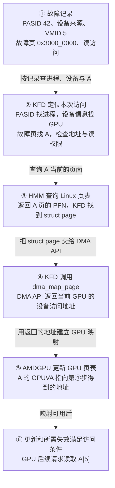

在②，KFD 用 PASID 42 找进程，结合设备来源和 VMID 5 确认发生故障的 GPU。随后用故障页 `0x3000_0000` 找 A 的范围，检查地址与读权限。Linux 的 VMA 记录地址与权限；KFD 的 `svm_range` 记录这个范围的 GPU 访问和位置要求。第 2 章再解释这两个对象。

在③，HMM 用 A 的进程虚拟地址查询 Linux 当前页表，返回页面编号和状态；KFD 据此取得这页的 `struct page`。KFD 传给 DMA API 的是 `struct page`，不必先单独算出一个 CPU 物理地址作为 `dma_map_page()` 的入参。

**[DESIGN]** 为追踪地址，本例设 A 的主机物理页为 `0x4567_8000`，第④步的 `dma_map_page()` 为当前 GPU 返回 `0x1234_5000`。本例启用 Host IOMMU 翻译，因此把这个 DMA 地址作为 IOVA 使用。三处映射分别保存：

```text
CPU 页表：A 的 CPU VA 0x3000_0000 → 主机物理页 0x4567_8000
Host IOMMU：IOVA 0x1234_5000 → 主机物理页 0x4567_8000
GPU 页表：A 的 GPUVA 0x3000_0000 → IOVA 0x1234_5000
```

第④步由 DMA API 为设备准备访问这页所需的映射，并把 IOVA 返回 KFD；第⑤步 AMDGPU 才把 IOVA 用作 GPU 页表项的目标地址。GPU 后续读取 `A[5]` 时，GPU 页表先把 `0x3000_0014` 译成 `0x1234_5014`，Host IOMMU 再把请求译到 `0x4567_8014`。A 的数据仍留在原来的 system RAM 页。

在⑥，页表更新和所需翻译失效达到访问条件后，GPU 的后续请求才可能读到 `A[5]`。故障处理函数可能在异步更新完成前返回；整个 Kernel 是否结束，还要看 Completion Signal。§4.5 再解释更新由谁等待。

> **[SOURCE]** Linux `248951ddc14d`，[`amdgpu_hmm.c`](./2.源码/linux/drivers/gpu/drm/amd/amdgpu/amdgpu_hmm.c) 第 186～215 行调用 HMM 取得页面信息；[`kfd_svm.c`](./2.源码/linux/drivers/gpu/drm/amd/amdkfd/kfd_svm.c) 第 182～200 行将 HMM 页面转为 `struct page`，并以 `dma_map_page()` 取得 DMA 地址，第 1492～1497 行将该地址交给 GPUVM 映射更新。

> **[SPEC]** Linux `248951ddc14d`，[`dma-api-howto.rst`](./2.源码/linux/Documentation/core-api/dma-api-howto.rst) 第 81～87、603～617 行区分设备 DMA 地址与主机物理地址，并说明 `dma_map_page()` 接收页面、返回设备访问地址；IOMMU 在设备发出 DMA 请求时把该地址翻译到主机页面。

若期望把 A 放进 HBM，第 5 章会在②与③之间加入页面迁移，此时第④步走设备页的地址换算分支。查找、查询或建表不能继续时，本次处理不会走到⑥；这些出口放在第 7 章说明。

### 0.3 A 的就地映射、迁移与并发变化

主例先恢复指向 system RAM 页面的 GPU 映射。后面沿同一个 A 依次改变条件或访问者：

1. 第 5 章把期望位置改为目标 GPU，驱动尝试把 A 从 system RAM 迁入 HBM。
2. GPU 使用结束且应用完成同步后，CPU 再次读取 A，进入从 HBM 迁回 system RAM 的路径。
3. 第 6、7 章加入地址空间修改或进程退出，检查旧页面结果、迟到的故障记录和资源清理。

后文章节按恢复所需的前提展开：

- [第 1 章：同一进程指针的 CPU 与 GPU 访问](#1-同一进程指针的-cpu-与-gpu-访问)。建立指针、两套页表、后备页面的关系。
- [第 2 章：KFD 范围登记与状态跟踪](#2-kfd-范围登记与状态跟踪)。沿应用准备 A 的过程，查看驱动保存的对象。
- [第 3 章：CPU 故障处理与 HMM 页面取得](#3-cpu-故障处理与-hmm-页面取得)。解释匿名页、文件页、换入、COW 与 HMM 查询。
- [第 4 章：GPU 故障处理与映射恢复](#4-gpu-故障处理与映射恢复)。先走通页面留在 system RAM 的成功案例。
- [第 5 章：system RAM 与 HBM 之间的页面迁移](#5-system-ram-与-hbm-之间的页面迁移)。追踪实际数据搬运及两侧页表变化。
- [第 6 章：地址空间失效与并发恢复](#6-地址空间失效与并发恢复)。加入其他 CPU 线程、失效通知和延后工作。
- [第 7 章：故障结果、错误报告与资源回收](#7-故障结果错误报告与资源回收)。解释返回值、错误事件及退出时的资源保护。
- [第 8 章：完整案例复盘与源码检索](#8-完整案例复盘与源码检索)。用状态变化复盘，并按问题寻找源码入口。

### 0.4 固定配置、源码版本与证据边界

**[DESIGN]** 平台采用外部 Host CPU + MI300X 独立 GPU，通过 PCIe 连接。A 选用匿名内存；其页面来源在第 3 章解释。地址计算固定 CPU 基本页和 GPU 基本页均为 4 KiB，Host IOMMU 启用翻译。应用的数据交接遵守 02、03 已说明的同步规则。未启用 XNACK 的情况只在 §6.3 单独推演。

第 3 章沿 Arm64 异常入口解释 Linux 通用缺页处理；这个例子不指定目标机器的 Host CPU 型号。§4.5 再说明 CPU/SDMA 两种页表更新方式及其选择条件。

需要回查已有对象时，可分别看 [01：Linux 内存管理](<./01_Linux 内存管理基础.md>)、[02：GPU 内存管理](<./02_GPU 内存管理基础.md>)、[03 上篇：Queue 创建与驻留](<./03_AMD GPU 队列与 AQL Dispatch（上）.md>)和[03 下篇：提交与完成](<./03_AMD GPU 队列与 AQL Dispatch（下）.md>)。

本文源码固定为：

- Linux：`248951ddc14de84de3910f9b13f51491a8cd91df`，后文简称 `248951ddc14d`。
- ROCr：`ba56a24c6132c5d195686ae4adf969ca1222fbba`，后文简称 `ba56a24c6132`。
- 版本目录说明见[源码基线说明](./2.源码/README.md)。本篇沿 ROCr → KFD 说明属性路径，不要求先读完整 CLR 实现。

`[SOURCE]` 表示固定源码可验证的实现，`[SPEC]` 表示规范或接口说明，`[DESIGN]` 表示教学取值，`[INFERENCE]` 表示据已知条件作出的推导，`[BOUNDARY]` 表示当前证据所能支持的范围。源码块左侧保留真实行号，教学伪代码会明确注明。

硬件语义继续参考 [MI300 / CDNA 3 ISA](./amd-instinct-mi300-cdna3-instruction-set-architecture.pdf)，封面日期 `2025-08-05`。本篇图示主要展示驱动对象、页面状态和软件时序，这些关系不能从硬件架构原图中直接看出，因此采用补画的流程图。

**[BOUNDARY]** 本篇不推定故障恢复时具体 Wave 的驻留位置、重放缓冲结构或指令重放粒度。源码能够证明“驱动处理了什么”；一次访问和整个 Kernel 最终是否完成，还要分别观察访问结果与应用完成通知。完整 GPUVM 更新后端、DRM job/IB 调度及 Fence 中断传播留到后续专题。

## 1. 同一进程指针的 CPU 与 GPU 访问

### 1.1 指针数值、两套页表与实际页面

CPU 已经把输入写进 A，GPU 现在要读取 A。先看数据留在 system RAM 时的正常访问路径。CPU 和 GPU 使用数值相同的指针，访问时分别查自己的页表，最后到达同一份数据。本例故障时，GPU 页表还缺少 A 的映射。

**[DESIGN]** 沿用 §0.2 的教学取值：A 所在主机物理页为 `0x4567_8000`，DMA API 为当前 GPU 返回的 IOVA 页地址为 `0x1234_5000`。这组地址只用于本例计算。

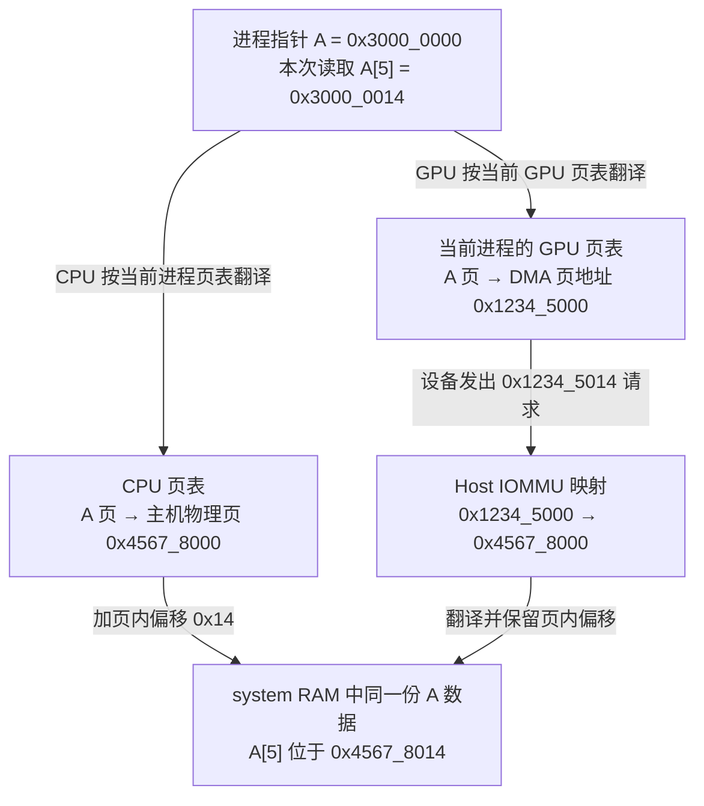

CPU PTE 保存的是 CPU 访问需要的物理页与属性，GPU PTE 保存的是设备访问需要的地址与属性。GPU 并没有因为拿到相同指针，就直接使用 CPU 的整棵页表。

HMM 帮驱动查询 Linux 当前页面状态，并跟踪地址空间变化。KFD 和 AMDGPU 根据这些信息维护 GPU 映射；两套页表的格式、目标地址和更新方式各不相同。

页面迁入 HBM 后，A 的数值仍为 `0x3000_0000`。GPU PTE 改为描述本地 HBM 页面；CPU 页表中留下 device-private 特殊条目。CPU 再读 A 时会触发缺页并进入迁回路径，详见第 5 章。

> **[SOURCE]** Linux `248951ddc14d`，[`kfd_svm.c`](./2.源码/linux/drivers/gpu/drm/amd/amdkfd/kfd_svm.c) 第 160～203 行区分系统页的 `dma_map_page()` 与设备页地址换算，第 1434～1517 行据这些设备地址更新当前 `amdgpu_vm`；[`Documentation/mm/hmm.rst`](https://github.com/torvalds/linux/blob/248951ddc14de84de3910f9b13f51491a8cd91df/Documentation/mm/hmm.rst#L269-L272) 第 269～272 行说明 device-private 特殊页表项使 CPU 访问进入缺页处理，[`mm/memory.c`](./2.源码/linux/mm/memory.c) 第 4774～4808 行可核对随后的迁回调用。

### 1.2 SVM、HMM 与 GPUVM 的协作

A 在 CPU 和 GPU 一侧使用数值相同的进程虚拟地址，这是本例的 SVM 访问方式。§0.2 已沿故障记录走过一次主路径。Linux VMA 说明 A 是否可读，CPU 页表记录它当前指向的页面。KFD 的 `svm_range` 保存 GPU 访问设置与期望位置。KFD 借助 HMM 取得当前页面信息，再由 AMDGPU 把设备访问地址写入 GPU 页表。

图从本次 Retry 故障记录开始，展示 KFD 怎样找到 A 的当前页面并更新 GPU 页表。

```text
Retry 故障：PASID 42、故障页 0x3000_0000、读访问
  → KFD：找到进程、目标 GPU 和 A 的范围，检查 VMA 与 GPU 读权限
  → HMM：查询 A 的进程虚拟地址，返回当前页面信息
  → KFD：取得当前 GPU 访问该页面所需的设备地址
  → AMDGPU：把该地址写入 A 对应的 GPU 页表项
```

主例在故障前已登记 A 的范围属性和 notifier，第 2 章会讲这一步；§2.4 另讲尚未登记范围的情况。

以后 Linux 若改变 A 的后备页，notifier 通知 KFD 撤销旧 GPU 映射。只要 A 仍有效，后续 Retry 故障会重新查询页面并建立映射。这个并发变化留到第 6 章。

页面留在 system RAM 时，KFD 可用 DMA 地址建立 GPU 映射，A 的数据不用搬动。若期望位置改为 HBM，KFD 会先选择迁移路径并复制页面；第 5 章再展开。

> **[SOURCE] 可选源码索引**
>
> - 范围记录与故障入口：Linux `248951ddc14d`，[`kfd_svm.h`](./2.源码/linux/drivers/gpu/drm/amd/amdkfd/kfd_svm.h) 第 68～140 行定义 `svm_range` 字段；[`kfd_svm.c`](./2.源码/linux/drivers/gpu/drm/amd/amdkfd/kfd_svm.c) 第 3065～3194 行按故障记录查进程、GPU 与范围。
> - 当前页面与 GPU 映射：[`kfd_svm.c`](./2.源码/linux/drivers/gpu/drm/amd/amdkfd/kfd_svm.c) 第 1679～1871 行连接 VMA 检查、HMM 查询、DMA 映射和有效性检查，第 1434～1517 行更新 GPUVM。
> - 后续失效：[`kfd_svm.c`](./2.源码/linux/drivers/gpu/drm/amd/amdkfd/kfd_svm.c) 第 2063～2085、2651～2654 行说明 Retry 模式下先撤销旧映射，后续故障再恢复。

### 1.3 显式 BO 映射、userptr 与 SVM

对照 02、03 已学过的路径，可以看出本例 A 的后备页面由谁管理。显式 BO 的后备由驱动管理，AQL Ring 使用这类资源；userptr 和本例 SVM 都从已有 CPU 地址出发，但跟踪页面的驱动对象不同。

```text
显式 BO：应用申请驱动资源 → 驱动管理 BO 后备 → 映射进 GPUVM
userptr：应用提供已有 CPU 地址 → 驱动用 BO 等对象跟踪页面变化
                                  → 取得当前页面并建立 GPU 映射
本例 SVM：应用使用进程指针 A → KFD 用 svm_range 跟踪地址范围
                                → 故障时查询页面并恢复 GPU 映射
```

userptr 也可以使用 HMM 和 notifier 跟踪 Linux 页面变化。两条路径都可能让 GPU 访问 system RAM，但驱动保存的对象和映射生命周期不同，不能把 userptr 当作永久固定的物理页。

> **[SOURCE]** Linux `248951ddc14d`，[`amdgpu_hmm.c`](./2.源码/linux/drivers/gpu/drm/amd/amdgpu/amdgpu_hmm.c) 第 64～160 行包含 BO/userptr 的失效处理与 notifier 登记；[`kfd_svm.c`](./2.源码/linux/drivers/gpu/drm/amd/amdkfd/kfd_svm.c) 第 2866～2965 行检查已有 BO/userptr 范围与未登记 SVM 范围的冲突。

### 1.4 共享地址、访问权限与数据同步

GPU 要读到 CPU 写入的 A，需要满足地址权限和数据同步两组条件。GPU 页表要指向承载 A 的页面，VMA、SVM 访问设置和 GPU PTE 要允许这次读取。应用还需按 02、03 的规则发布输入，Kernel 启动满足相应的 acquire 条件。

CPU 要读到 GPU 写出的 C，还需等 Kernel 完成阶段发布结果，再按约定观察 Completion Signal，并以所需 acquire 语义读取 C。这是任务完成的条件，不属于 A 的缺页恢复步骤。

```text
CPU 写 A/B
  → 按 02、03 的同步规则提交 Packet
  → GPU 访问 A 时发现映射缺失（B 已可访问）
  → KFD 为 A 建立映射，GPU 后续完成输入读取并写 C
  → Kernel 完成阶段更新 Completion Signal
  → CPU 按协议等待并读取 C
```

CPU 若在 Kernel 读取 A 的同时无协议地修改 A，即使两侧 PTE 都有效，仍可能产生数据竞争。

共享指针也不能单独证明某种 CPU/GPU 原子操作可用。原子性、作用域和数据可见性要按实际内存类型、运行时能力及指令语义判断。本篇不引入新的跨设备原子协议。

> **[SPEC]** [MI300 / CDNA 3 ISA](./amd-instinct-mi300-cdna3-instruction-set-architecture.pdf#page=81)（2025-08-05）§9.1.10，原文第 73～75 页，说明内存作用域和缓存控制；应用提交与完成时的组合使用见 [03 下篇 §4.4](<./03_AMD GPU 队列与 AQL Dispatch（下）.md#44-header-中的类型执行顺序与可见性设置>)与[第 7 章](<./03_AMD GPU 队列与 AQL Dispatch（下）.md#7-kernel-完成通知与-cpu-等待>)。

### 1.5 可恢复访问的前置条件

§0.1 已固定进程启用 XNACK、本次故障的 Retry 位为 1。运行前的模式、代码兼容性和故障时的检查分别发生在三个阶段：

```text
准备阶段：内核与设备支持 SVM → 进程在创建 Queue 前采用 XNACK 模式
代码阶段：ROCr 记录 Agent 的 XNACK 特征 → 装载时检查代码对象兼容性
故障阶段：Retry 位为 1 → KFD 再查进程模式、地址、权限、页面和资源
```

KFD 在进程创建时选择默认 XNACK 模式。应用若要显式切换，必须在创建用户 Queue 前完成；已有用户 Queue 时，ioctl 会拒绝模式切换。启用请求还会检查设备支持，故障入口则再次检查 `p->xnack_enabled`。

内核须编入 SVM 支持，设备也须支持。ROCr 将所用 XNACK 模式反映到 Agent ISA；加载器检查代码对象与 Agent 是否相容。若代码对象明确要求相反的 XNACK 特征，加载器会拒绝它。

普通 `malloc()` 地址还需满足运行时的系统内存访问条件、目标 Agent 能力、进程模式、VMA 权限和 KFD 范围检查。§2.4 会说明 KFD 怎样在 GPU 缺页时为未登记的地址创建范围记录；创建记录仍以地址有效为前提。

> **[SOURCE] 可选源码索引**
>
> - 构建与设备支持：Linux `248951ddc14d`，[`amdkfd/Kconfig`](./2.源码/linux/drivers/gpu/drm/amd/amdkfd/Kconfig) 第 15～26 行定义构建条件；[`kfd_svm.h`](./2.源码/linux/drivers/gpu/drm/amd/amdkfd/kfd_svm.h) 第 203～204 行定义运行时 SVM 支持判断。
> - 默认模式与显式切换：[`kfd_process.c`](./2.源码/linux/drivers/gpu/drm/amd/amdkfd/kfd_process.c) 第 1501～1555、1609～1610 行选择并设置默认模式；[`kfd_chardev.c`](./2.源码/linux/drivers/gpu/drm/amd/amdkfd/kfd_chardev.c) 第 1708～1738 行检查显式切换请求与 Queue 状态。
> - 故障入口：[`kfd_svm.c`](./2.源码/linux/drivers/gpu/drm/amd/amdkfd/kfd_svm.c) 第 3065～3103 行检查设备 SVM 支持与进程 XNACK 模式。
> - Agent ISA 与代码对象：ROCr `ba56a24c6132`，[`amd_kfd_driver.cpp`](./2.源码/rocr-runtime/runtime/hsa-runtime/core/driver/kfd/amd_kfd_driver.cpp) 第 542～567 行取得或设置 XNACK 模式；[`amd_gpu_agent.cpp`](./2.源码/rocr-runtime/runtime/hsa-runtime/core/runtime/amd_gpu_agent.cpp) 第 166～181 行形成 Agent ISA 特征；[`executable.cpp`](./2.源码/rocr-runtime/runtime/hsa-runtime/loader/executable.cpp) 第 1287～1296 行在装载时检查目标 Agent，[`isa.cpp`](./2.源码/rocr-runtime/runtime/hsa-runtime/core/runtime/isa.cpp) 第 96～100 行拒绝不匹配的 XNACK 特征。

## 2. KFD 范围登记与状态跟踪

本章以输入数组 A 的一页为主线，说明 KFD 怎样登记这页的访问要求、在故障时找到记录，以及怎样选择恢复位置。先记住 A 的身份和当前状态；页面取得和实际建表分别在第 3、4 章展开。

**[DESIGN] 本章的 A** 沿用 §0.2 的任务与地址：

```text
计算任务：C[i] = A[i] + B[i]；A 是输入数组，共 1024 个 4 字节元素
A 的虚拟地址：[0x3000_0000, 0x3000_1000)，恰好一页（4 KiB）
本次访问：GPU 将读取 A[5]；其地址是 0x3000_0014，所在页从 0x3000_0000 开始
当前状态：CPU 已把输入写入这页匿名内存，数据在 system RAM；
          Linux VMA 允许读取，目标 GPU 页表尚无 A 的可用映射
```

沿这页 A，后面的阅读顺序是：

```text
认识 A 的管理记录（§2.1）
  → 应用登记要求，KFD 保存记录（§2.2）
  → GPU 故障到来，KFD 查记录并选择恢复位置（§2.3）

独立变体：未提前登记时按需创建 A 的范围记录（§2.4）；另取范围 R 演示局部拆分（§2.5）
```

### 2.1 A 的 svm_range 与关联对象

目标 GPU 接下来要读取 `A[5]`。Linux 的 VMA 能说明 A 的地址是否有效、是否允许读取，CPU 页表能说明 A 当前映射到哪个页面。KFD 还需要记住：应用要求哪些 GPU 访问这段内存、希望页面放在哪里，以及驱动已经为 GPU 准备了哪些映射信息。

**`struct svm_range` 就是 KFD 为一段进程虚拟地址保存的管理记录。** 一份记录可以覆盖一页或连续多页，记录这段内存的 GPU 访问要求、位置要求和映射状态。A 所在的页面保存数组数据，`svm_range` 保存驱动管理这些页面所需的信息。

创建动作由 Host CPU 上运行的 KFD 代码完成。**[DESIGN]** 本章从 A 的 CPU 端数据已准备好、KFD 尚无 A 的范围记录这个状态出发，比较两种创建时机：

```text
应用准备好输入数组 A，CPU 已把数据写入 RAM
  Linux 已有 A 的地址范围和页面；KFD 尚无 A 的 svm_range
  │
  ├─ 主例：应用先提交 A 的访问与位置要求（§2.2）
  │   → KFD 处理请求时创建 svm_range，保存应用要求
  │   → 后来 GPU 读取 A 缺页时，KFD 查到这份已有记录（§2.3）
  │
  └─ 变体：应用未提前登记，GPU 读取 A 时缺少映射（§2.4）
      → KFD 处理缺页，查不到 A 的 svm_range
      → 检查地址范围和映射冲突后，创建记录并采用默认属性
```

本章把应用提交访问与位置要求、KFD 保存这些要求的过程称为“登记 A”。主例中的 `svm_range` 就在这次请求中创建，早于 GPU 读取 A；后来的缺页处理可以直接使用已有记录。

§2.4 则把创建动作推迟到缺页处理时：先创建记录，再使用它继续权限检查和恢复位置选择。两条路径中，范围记录的创建与 GPU 页表映射的建立是不同的步骤。

> **[SOURCE]** Linux `248951ddc14d`，[`kfd_svm.c`](./2.源码/linux/drivers/gpu/drm/amd/amdkfd/kfd_svm.c) 第 3751～3765 行在属性请求中创建或更新范围，第 2291～2295、2149～2166 行为尚无记录的地址调用 `svm_range_new()`；第 3135～3157 行在缺页处理时检查记录是否存在，第 2948～2965 行执行按需创建并加入集合。`svm_range_new()` 第 325～365 行分配并初始化结构体。

A 的这一页是匿名内存，没有文件作为后备。下面先认识创建后的对象与成员，§2.2 再展开主例的登记请求。

#### 2.1.1 从进程找到范围记录与 GPU 页表

从 `kfd_process` 出发，KFD 要取得本进程的 Linux 地址空间、A 的管理记录和目标 GPU 的页表对象。下面是软件对象关系图，箭头表示 KFD 根据已有对象继续查找：

```text
本进程的 KFD 记录：kfd_process
  ├─ lead_thread：关联本进程的主线程
  │   └─ 由线程取得 mm_struct：本进程的 Linux 地址空间
  │       ├─ 按 A 的地址查 vm_area_struct（VMA） → 检查地址与读写权限
  │       └─ HMM 查询 CPU 页表 → 取得 A 当前页面的信息
  ├─ 内嵌 svm_range_list：本进程的 SVM 范围集合
  │   └─ 按 A 的页号查区间树 → 找到 A 的 svm_range
  └─ 按目标 GPU 选择 kfd_process_device：本进程在该 GPU 上的记录
      └─ 取得 amdgpu_vm → 由 AMDGPU 更新该 GPU 的页表
```

`kfd_process` 的 `lead_thread` 成员指向本进程主线程的 `task_struct`。处理故障时，KFD 通过这个线程取得 `mm_struct` 的有效引用，之后才能查询该进程的 VMA 和页面。§2.1.4 的通知对象也登记到这个地址空间，供 Linux 在页面变化时调用 KFD。

`kfd_process` 的 `svms` 成员内嵌一个 `svm_range_list`，其中的区间树按虚拟地址范围组织各个 `svm_range`。区间树在这里用来回答“这个页号落在哪段已登记范围内”。

找到 A 的 `svm_range` 后，KFD 就能读取 A 的 GPU 访问与位置要求。接着，KFD 还要在同一进程的 `mm_struct` 中检查 A 所在的 VMA，并借助 HMM 查询当前页面。一段 VMA 可以对应多个 `svm_range`，一个 `svm_range` 在验证时也可能跨多个 VMA；KFD 按地址把两侧信息对应起来。

更新页表时，还需要知道本次要更新哪块 GPU。`kfd_process` 的 `pdds` 成员保存指向 `kfd_process_device` 的指针；每项是本进程与一项 KFD 可见 GPU 设备的关联记录。KFD 选中目标记录后，通过其中的 `drm_priv` 取得 `amdgpu_vm`，再把准备好的页面地址交给 AMDGPU 更新页表。

处理 A 时，KFD 用 **`svm_range` 读取管理要求，用 `mm_struct` 查询 Linux 页面，用目标 GPU 的 `amdgpu_vm` 更新 GPU 页表**。§2.3 会把故障记录中的 PASID、地址和 GPU 信息代入这条查找路径。

#### 2.1.2 核心成员与按地址查找

§2.2 登记完成后，KFD 会持有下面这组对象。将来 GPU 因 A 缺映射而故障时，KFD 用故障地址找到 A 的 `svm_range`；本节先沿这条查找线认识核心成员，下一节再讲登记动作。图中的 `A.svm_range` 是“管理 A 的那份 `svm_range`”的简称，不是应用数组 A 的 C 语言成员。

```text
进程 P 的 kfd_process
├─ svms：内嵌的 svm_range_list（P 的地址范围集合）
│  ├─ objects：区间树根 ──按 A 的页号查找──> A.svm_range.it_node
│  └─ list：链表头 ─────遍历范围记录──> A.svm_range.list
└─ pdds[gpuidx] ──> kfd_process_device（P 与目标 GPU 的关联记录）
                    └─ dev ──> kfd_node（KFD 可见设备，背后是 MI300X 硬件）

A.svm_range.svms ──指回──> P.svms
A.svm_range 的访问位图：第 gpuidx 位 ──对应──> P.pdds[gpuidx]
```

`objects` 和 `list` 组织同一批 `svm_range`：故障时按页号查区间树，遍历范围时走链表。`pdds` 中的每一项是进程与设备的关联记录指针，背后是 KFD 可见的 GPU 设备。`gpuidx` 是目标设备在本进程 `pdds` 中的下标，§2.1.3 会用它读取 A 的访问位。

**[DESIGN]** 下面两个定义只列当前主线要用的成员，顺序按讲解重排，并非完整源码。先看进程内的范围集合：

```c
struct svm_range_list {
    struct rb_root_cached objects; // 区间树根：按页号查找范围
    struct list_head list;         // 链表头：遍历范围记录
};
```

再看 A 的范围记录。`DECLARE_BITMAP` 表示按 GPU 下标编号的一排 0/1 位；位图在 C 中用 `unsigned long` 数组存放。其他成员的用途写在定义旁边：

```c
struct svm_range {
    /* 地址范围和归属 */
    struct svm_range_list *svms;       // 指回所属进程的范围集合
    unsigned long start;              // 起始虚拟页号
    unsigned long last;               // 末尾虚拟页号，包含该页
    uint64_t npages;                  // 页数：last - start + 1
    struct interval_tree_node it_node; // 加入 svms 的区间树，供按页号查找
    struct list_head list;            // 加入 svms 的链表，供遍历

    /* 本范围对每项进程设备的访问要求；第 gpuidx 位对应 pdds[gpuidx] */
    DECLARE_BITMAP(bitmap_access, MAX_GPU_INSTANCE); // 普通 ACCESS 访问要求
    DECLARE_BITMAP(bitmap_aip, MAX_GPU_INSTANCE);    // AIP 原地访问要求

    /* 页面位置 */
    uint32_t preferred_loc;           // 应用期望的位置
    uint32_t prefetch_loc;            // 上次请求预取到的位置
    // 位置摘要：0 表示全在 RAM；GPU ID 表示可能含该 GPU 的 HBM 页
    uint32_t actual_loc;

    /* 为 GPU 建立映射时使用的信息 */
    dma_addr_t *dma_addr[MAX_GPU_INSTANCE]; // 每项指向该 GPU 的逐页设备地址数组
    bool mapped_to_gpu;                     // 范围的映射状态标记

    /* Linux 页面变化时，由通知对象找回本范围 */
    struct mmu_interval_notifier notifier;
};
```

现在沿图找 A。`start` 和 `last` 用页号表示记录覆盖的范围，`last` 包含末尾页；`npages` 是页数。本例的字节区间右端不含 `0x3000_1000`，因此最后一个字节是 `0x3000_0FFF`：

```text
A 的字节范围：[0x3000_0000, 0x3000_1000)，共 4 KiB
  start  = 0x3000_0000 / 0x1000 = 0x3_0000
  last   = 0x3000_0FFF / 0x1000 = 0x3_0000（整数除法）
  npages = last - start + 1 = 1

故障页 0x3000_0000 → 页号 0x3_0000
  → 查 P.svms.objects → 命中 A.it_node → 找回 A 的 svm_range
```

这里按页号查的是区间树 `objects`；`list` 留给遍历全部范围时使用。A 的 `svms` 指回所属的范围集合。

`0x3_0000` 是 A 在进程虚拟地址空间中的页号；`0` 是从 A 起点开始数的页下标。A 只有一页，所以 A 的第一页下标是 0，`A[5]` 就在这一页。`A[5]` 中的 5 选数组第六个元素；页下标 0 选容纳它的整页。这页不是空页，也不是 Linux 的零页。

#### 2.1.3 访问要求、页面位置与映射信息

沿上图从 A 的 `svm_range` 继续看：进程设备数组 `pdds` 确定“是哪块设备”，A 的两张位图保存“这块设备怎样访问 A”。每份 `svm_range` 都有自己的两张位图；同一位号在两张位图中都对应 `pdds` 的同一项。

**[DESIGN]** 本例假设进程只有一个可访问的 KFD GPU 设备条目，所以 `n_pdds=1`，目标 GPU 的 `gpuidx=0`。图中的位值是 §2.2 为 A 登记普通 `ACCESS` 后的结果。

进程有多个设备条目时，即使任务只使用一块 GPU，目标设备也可能在第 1 项或更后面；运行任务的 GPU 数量不决定 `gpuidx`。

```text
目标 GPU → 位于 P.pdds[0] → gpuidx = 0
                               ↓ 选第 0 位

A.bitmap_access： [第 63 位 ... 第 1 位 | 第 0 位 = 1] → 选中 ACCESS
A.bitmap_aip：    [第 63 位 ... 第 1 位 | 第 0 位 = 0] → 未选 AIP

ACCESS 是普通访问要求：目标 GPU 可以访问 A；若 GPU 缺映射，KFD 按恢复位置要求判断是否搬页。
AIP 是 Access In Place：希望 GPU 按页面当前位置访问，避免这次访问触发迁移；它仍需要可用的 GPU 映射。
```

本例选 `ACCESS`，所以两张位图的第 0 位分别为 1 和 0。若改选 AIP，两位分别为 0 和 1。位值记录的是访问要求；GPU 页表映射要在后续恢复时建立。

位图在 C 中用 `unsigned long` 数组保存。`MAX_GPU_INSTANCE=64` 为每张位图留出 64 个位的位置；在 64 位内核中，这些位装在一个数组元素 `bitmap_access[0]` 里。图中的“第 0 位”只是这个元素内的一位，KFD 用 `test_bit(0, bitmap_access)` 读取它。64 是容量上限；`n_pdds` 才是本进程已有的设备记录数。

位置成员回答页面放在哪里：

- `preferred_loc` 保存应用希望页面放置的位置，供故障恢复时参考。
- `prefetch_loc` 保存上次预取请求指定的目标位置。
- `actual_loc` 保存范围当前所在位置的摘要。

位置值中的 0 表示 system RAM，GPU ID 表示某块 GPU。GPU ID 是设备标识；`gpuidx` 是该设备在进程数组中的下标，两者用途不同。

再看保存地址的成员 `dma_addr`。A 是应用的输入数组，数据放在 system RAM 的一页中。驱动要为目标 GPU 建立映射，需要知道这块 GPU 用哪个设备地址访问 A 所在的页。`dma_addr` 就用来保存这个地址；如果一个范围包含多页，驱动会为每页分别保存地址。

**[DESIGN]** 本例 A 只有一页，目标 GPU 的 `gpuidx=0`。沿用 §0.2 的教学取值，假设驱动已经得到设备地址 `0x1234_5000`，下面看它在 `svm_range` 中怎样保存：

```text
应用输入数组 A：[0x3000_0000, 0x3000_1000)，只有一页
  A[5] 位于 0x3000_0014 → 落在 A 的第一页（范围内页下标 0）

进程 P：
  pdds[0] ──选设备──> P 与目标 GPU 的关联记录       gpuidx = 0

A 的 svm_range：
  dma_addr[0] ──指向──> 为上述 GPU 保存的逐页地址数组
                              └─ [0] = 0x1234_5000
                                 ↑ 该 GPU 访问 A 第一页所用的地址
```

`pdds[0]` 让 KFD 找到目标设备；`dma_addr[0]` 指向这块设备对应的逐页地址数组。两处第一个 `[0]` 都是本进程的设备下标。`dma_addr[0][0]` 末尾的 `[0]` 才是 A 的范围内页下标，取出 A 第一页的设备访问地址。`dma_addr[0]` 本身是数组指针，具体地址保存在它指向的第 `[0]` 项。

有了这项记录，驱动就知道：为这个 GPU 建页表时，A 的虚拟页 `0x3000_0000` 应指向设备地址 `0x1234_5000`。`dma_addr` 保存的是供驱动建表使用的地址，GPU 执行访存时查的是 GPU 页表。这个设备地址怎样取得、何时填入数组，放到 §4.3 的恢复流程中展开。

`mapped_to_gpu` 是 KFD 在验证与映射路径中维护的范围状态。它帮助驱动管理这份记录；GPU 实际使用的映射仍在 GPU 页表中，页表更新的完成条件见 §4.5。

#### 2.1.4 页面变化通知与范围记录

`mmu_interval_notifier` 让 **Linux 在进程地址空间发生相关变化时通知 KFD**，例如解除 A 的映射、替换 A 对应的物理页。KFD 收到通知后，处理受影响的 GPU 映射。

GPU 缺少映射时，先走 [04 §6.3“故障信息经 IH 进入驱动”](<./04_AMD GPU MMU 与地址翻译.md#63-故障信息经-ih-进入驱动>)和 [§6.4“Retry 属性与处理分支”](<./04_AMD GPU MMU 与地址翻译.md#64-retry-属性与处理分支>)介绍的故障分发路径。随后，AMDGPU 的 `amdgpu_vm_handle_fault()` 调用 KFD 的 `svm_range_restore_pages()`，进入范围恢复；这段调用在本篇 [§4.1“从故障记录进入恢复入口”](#41-从故障记录进入恢复入口)展开。先把故障恢复和页面变化通知放在一起看：

```text
GPU 访问 A，却没有可用映射：
  GPU 产生缺页故障，经 04 介绍的中断路径分发
    → amdgpu_vm_handle_fault：按 PASID 找到 amdgpu_vm
    → svm_range_restore_pages：进入 KFD 的 SVM 恢复
    → 按故障页号查范围区间树，经 it_node 找到 A 的 svm_range
    → 检查 VMA、查询当前页面
    → 为 GPU 建立可用映射（第 3、4 章展开）

Linux 要解除 A 的映射，或替换 A 对应的物理页：
  Linux 根据已登记的地址范围找到 notifier
    → 调用 KFD 的通知处理函数
    → KFD 通过 notifier 找回 A 的 svm_range
    → 撤销受影响的旧 GPU 映射（第 6 章展开）
```

第一条路径解决“GPU 现在缺少可用映射”；第二条路径处理“Linux 正在改变原映射的依据，GPU 不能继续使用旧映射”。这里的“地址空间失效”，指原有的地址对应关系或访问权限需要重新处理。

若对应到结构体中的接口，故障分发使用的是 `struct amdgpu_irq_src` 中断源对象的 `funcs->process`。这里 `adev` 指向目标 GPU 的 `amdgpu_device` 对象，其中的 `gmc.vm_fault` 是故障中断源；它的 `funcs` 指向 `amdgpu_irq_src_funcs` 函数表，表中的 `process` 指向 `gmc_v9_0_process_interrupt()`。处理函数接收 `struct amdgpu_iv_entry` 故障记录，从中取得 PASID、VMID 和故障地址载荷等信息，供后续恢复使用。

`svm_range_restore_pages()` 是 KFD 的普通 C 函数，进入函数后才按 PASID 找到 `kfd_process`，再用 `svm_range_from_addr()` 从进程的范围集合中找到 A 的 `svm_range`。因此，`svm_range` 在这条路径中提供范围与属性记录，自身没有一个用于接收 GPU 缺页故障的回调成员。

**[DESIGN]** 为看清第二条路径，暂时看 A 在后续建立 GPU 映射之后的情况。A 仍是那页输入数组，虚拟地址范围为 `[0x3000_0000, 0x3000_1000)`，数据在 system RAM。假设应用使用完 A，随后调用 `munmap()` 解除这段地址的映射。CPU 与 GPU 使用各自的页表，Linux 必须让 KFD 同步处理 GPU 侧的旧映射，防止 GPU 以后仍通过 A 的地址访问那张旧 RAM 页。

Linux 能通知到 KFD，是因为 KFD 在登记 A 时就建立了下面的联系。`svm_range` 中的 `notifier` 是一个内嵌的通知对象；KFD 将它与进程的 `mm_struct`、A 的地址范围和处理函数一起登记给 Linux。

```text
A 的 svm_range（KFD 管理这段地址的记录）
└─ notifier（内嵌的 mmu_interval_notifier 对象）
   登记到 Linux 时关联：
     进程地址空间：本进程的 mm_struct
     关注地址范围：[0x3000_0000, 0x3000_1000)
     处理函数：    KFD 提供的通知处理函数

Linux 执行 munmap，发现解除的范围与上述范围重叠
  → 调用已登记的 KFD 函数，传入 notifier 和本次变化范围
  → KFD 从 notifier 找回外层的 A.svm_range
  → 撤销相交的 GPU 映射，并安排清理 A 的范围记录
```

这里的“回调”就是上图的函数调用：KFD 先提供处理函数，Linux 在处理相关地址变化时，在 Host CPU 上调用这个函数。由于 `notifier` 内嵌在 `svm_range` 中，KFD 可以根据这个成员的地址找回所属的整份范围记录，再处理记录所覆盖的 GPU 映射。解除映射后，这段地址已失去原来的用途；后续 GPU 访问不能再通过补回旧映射继续使用 A。

`notifier` 也参与故障恢复期间的检查。例如，KFD 刚查到 A 对应的 RAM 页，Linux 就开始替换这一页，KFD 必须发现这次变化，重新查询页面，避免用过时的结果建表。`notifier` 提供检查所需的变化记录，GPU 缺映射仍由 GPU 故障路径触发恢复；第 6.4 节再解释两者怎样配合。

回到本章的首次访问主线：§2.2 将登记 A 的 `notifier`，此时 GPU 映射还未建立。提前登记后，KFD 在后续查询页面、建立和维护 GPU 映射时，就能获知相关的 Linux 地址空间变化。

> **[SOURCE] 可选源码索引**
>
> - 核心成员：Linux `248951ddc14d`，[`kfd_svm.h`](./2.源码/linux/drivers/gpu/drm/amd/amdkfd/kfd_svm.h) 第 68～140 行给出成员说明与完整定义；[`kfd_svm.c`](./2.源码/linux/drivers/gpu/drm/amd/amdkfd/kfd_svm.c) 第 324～369 行分配并初始化范围记录。
> - 进程、范围集合与 GPUVM：[`kfd_priv.h`](./2.源码/linux/drivers/gpu/drm/amd/amdkfd/kfd_priv.h) 第 763～784、883～943、1008～1009 行定义对象关系；[`kfd_svm.c`](./2.源码/linux/drivers/gpu/drm/amd/amdkfd/kfd_svm.c) 第 3070～3108 行取得进程与 Linux 地址空间，第 1434～1447 行取得目标 GPUVM；[`amdgpu_amdkfd.h`](./2.源码/linux/drivers/gpu/drm/amd/amdgpu/amdgpu_amdkfd.h) 第 303～306 行给出 `drm_priv` 到 `amdgpu_vm` 的转换。
> - 范围插入与查找：[`kfd_svm.c`](./2.源码/linux/drivers/gpu/drm/amd/amdkfd/kfd_svm.c) 第 129～137 行把记录加入链表和区间树，第 883～899 行分别遍历链表和区间树，第 2711～2729 行按页号查节点并找回 `svm_range`。
> - 进程设备记录与下标：Linux `248951ddc14d`，[`kfd_flat_memory.c`](./2.源码/linux/drivers/gpu/drm/amd/amdkfd/kfd_flat_memory.c) 第 381～403 行遍历并筛选该进程可访问的设备；[`kfd_process.c`](./2.源码/linux/drivers/gpu/drm/amd/amdkfd/kfd_process.c) 第 1685～1712 行把新记录加入 `pdds`，第 2047～2054 行按 GPU ID 查进程数组下标；[`kfd_device.c`](./2.源码/linux/drivers/gpu/drm/amd/amdkfd/kfd_device.c) 第 881～900 行把 KFD 节点关联到 AMDGPU 设备对象。
> - 访问位与逐页地址：[`types.h`](./2.源码/linux/include/linux/types.h) 第 9～10 行定义 `DECLARE_BITMAP`，[`bitops.h`](./2.源码/linux/include/linux/bitops.h) 第 11 行定义 `BITS_TO_LONGS`；[`amdgpu.h`](./2.源码/linux/drivers/gpu/drm/amd/amdgpu/amdgpu.h) 第 120 行定义 `MAX_GPU_INSTANCE=64`；[`kfd_priv.h`](./2.源码/linux/drivers/gpu/drm/amd/amdkfd/kfd_priv.h) 第 938～943、1084～1090 行给出进程设备数组与索引；[`kfd_svm.c`](./2.源码/linux/drivers/gpu/drm/amd/amdkfd/kfd_svm.c) 第 784～795、841～846 行设置和读取访问位，第 160～203 行准备逐页设备地址，第 1539～1559 行按目标 GPU 选地址数组，第 1492～1497、1845～1866 行更新 GPUVM 和范围管理状态。
> - 两种访问属性与恢复位置：ROCr `ba56a24c6132`，[`hsa_ext_amd.h`](./2.源码/rocr-runtime/runtime/hsa-runtime/inc/hsa_ext_amd.h) 第 2997～3011 行说明普通访问可能引起缺页和迁移，以及原地访问的语义；Linux `248951ddc14d`，[`kfd_svm.c`](./2.源码/linux/drivers/gpu/drm/amd/amdkfd/kfd_svm.c) 第 2785～2809 行先检查期望位置，再根据 `bitmap_access` 或 `bitmap_aip` 选择恢复位置。
> - GPU 故障入口：Linux `248951ddc14d`，[`amdgpu_irq.h`](./2.源码/linux/drivers/gpu/drm/amd/amdgpu/amdgpu_irq.h) 第 47～80 行定义故障记录、中断源和处理接口；[`gmc_v9_0.c`](./2.源码/linux/drivers/gpu/drm/amd/amdgpu/gmc_v9_0.c) 第 683～697 行绑定 `funcs->process`，第 543～589 行从记录中取出故障信息并进入 Retry 处理；[`amdgpu_gmc.c`](./2.源码/linux/drivers/gpu/drm/amd/amdgpu/amdgpu_gmc.c) 第 545～591 行进入 VM 故障处理；[`amdgpu_vm.c`](./2.源码/linux/drivers/gpu/drm/amd/amdgpu/amdgpu_vm.c) 第 2986～3022 行按 PASID 查 VM 并调用 KFD 恢复；[`kfd_svm.c`](./2.源码/linux/drivers/gpu/drm/amd/amdkfd/kfd_svm.c) 第 3047～3075、3135 行取得进程与范围记录。
> - 页面变化通知：Linux `248951ddc14d`，[`kfd_svm.c`](./2.源码/linux/drivers/gpu/drm/amd/amdkfd/kfd_svm.c) 第 80～82、109～118 行设置处理函数并登记通知，第 2660～2695 行接收通知、由 `notifier` 找回所属的 `svm_range` 并分发事件，第 2623～2634 行撤销相交的 GPU 映射并安排范围清理；第 1667～1676 行说明建表前还需检查查询到的页面是否有效。

### 2.2 应用登记 A 的访问与位置要求

A 是章首那页由 CPU 写好的输入数组，此时 KFD 还没有 A 的范围记录。应用调用 `hsa_amd_svm_attributes_set()`，提交 A 的地址、长度以及“目标 GPU 可以访问、希望页面留在 system RAM”的要求。运行时把请求交给 KFD；KFD 在处理这次请求时创建 A 的 `svm_range`。这一过程发生在 GPU 读取 A 之前：

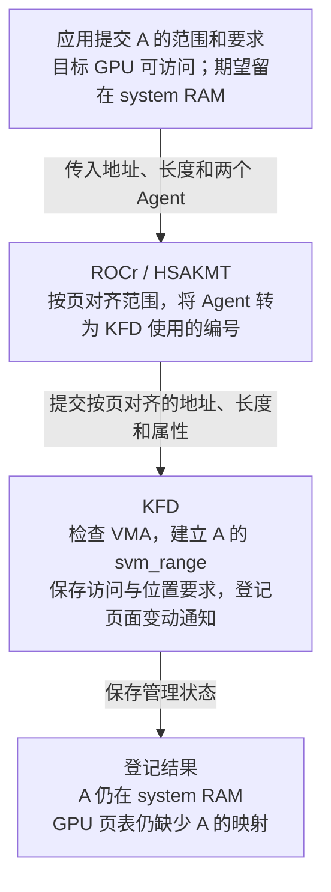

ROCr 用 Agent 表示 CPU 或 GPU 设备。应用把目标 GPU Agent 放在“谁可以访问”的属性里，运行时把它转换成 KFD 的 `ACCESS`；应用把 CPU Agent 放在“希望页面位于哪里”的属性里，运行时把它转换成 KFD 的 `PREFERRED_LOC`。两个 Agent 在这次请求中分别表示访问者和期望位置，之后读取 `A[5]` 的仍是目标 GPU。

本例 A 已按 4 KiB 页边界对齐，运行时按页对齐后提交的仍是一页。KFD 检查 VMA 后，为尚无记录的这一页分配并初始化 `svm_range`，将它加入本进程的范围集合，登记页面变化通知，再填写应用提交的属性。请求完成后，KFD 就能在后来的 GPU 缺页处理中按 A 的页号找到这份记录。

本例沿用已启用 XNACK 的配置，只请求 `ACCESS` 和 `PREFERRED_LOC`，没有请求预取或修改映射标志。此次属性请求完成后，KFD 已建立管理记录并保存要求，页面仍在 system RAM，GPU 页表仍缺少 A 的映射。

沿用 §2.1 的 `gpuidx`，把应用的要求代入 A 的 `svm_range`，得到：

```text
A 的 svm_range：覆盖 [0x3000_0000, 0x3000_1000)，1 页
  范围与归属：
    start = last = 0x3_0000，npages = 1
    svms 指回本进程的范围集合，it_node 已加入集合的区间树
    notifier 已登记到本进程的 Linux 地址空间
  目标 GPU 的访问位：
    bitmap_access 的第 gpuidx 位 = 1  ← 已设置 ACCESS
    bitmap_aip 的第 gpuidx 位 = 0     ← 未设置 ACCESS_IN_PLACE
  位置要求与当前状态：
    preferred_loc = 0          ← 期望位置是 system RAM
    prefetch_loc = 未指定       ← 没有发起预取
    actual_loc = 0             ← A 当前在 system RAM
  映射准备状态：
    dma_addr[gpuidx] = NULL    ← 尚未准备目标 GPU 的逐页 DMA 地址数组
    mapped_to_gpu = false      ← 此范围尚未建立 GPU 映射
```

`ACCESS` 让 KFD 把目标 GPU 的 `bitmap_access` 位设为 1，同时把同一 GPU 的 `bitmap_aip` 位清为 0。这个 0 只表示本例没有选 `ACCESS_IN_PLACE`；目标 GPU 的访问要求仍由 `bitmap_access` 中的 1 表示。

本例还把 `preferred_loc` 设为 0，即期望页面留在 system RAM。故障恢复时 KFD 先采用这个可用的期望位置，所以 A 即使选择普通 `ACCESS`，也可以留在 RAM 并为目标 GPU 建立映射；`bitmap_aip` 的 0 不表示必须把 A 搬到 HBM。

`preferred_loc=0` 和 `actual_loc=0` 中的 0 是 system RAM 的位置编码，含义与位图中的 0 不同。`prefetch_loc` 未指定只说明没有预取目标；A 的当前位置仍由 `actual_loc=0` 表示。

若改为请求 `ACCESS_IN_PLACE`，KFD 会把目标 GPU 记入另一张访问位图，供恢复时按当前位置选择访问方式。若请求 `PREFETCH_LOC`，属性路径会尝试提前迁移页面，第 5 章再展开。本例到这里完成的是范围与属性登记；下一节从 GPU 首次读取 A 开始，使用这份记录。

> **[SOURCE] 可选源码索引**
>
> - 应用属性进入 ROCr：ROCr `ba56a24c6132`，[`hsa_ext_amd.h`](./2.源码/rocr-runtime/runtime/hsa-runtime/inc/hsa_ext_amd.h) 第 2973～2977、2997～3011 行定义“期望位置”与“Agent 可访问”属性；[`hsa_ext_amd.cpp`](./2.源码/rocr-runtime/runtime/hsa-runtime/core/runtime/hsa_ext_amd.cpp) 第 1234～1242 行接收请求；[`runtime.cpp`](./2.源码/rocr-runtime/runtime/hsa-runtime/core/runtime/runtime.cpp) 第 2562～2730 行转换属性并按页对齐，其中第 2654～2661 行传递期望位置的 Agent 节点编号。
> - 节点与位置值：ROCr [`svm.c`](./2.源码/rocr-runtime/libhsakmt/src/svm.c) 第 40～101 行转换节点并构造 ioctl；[`topology.c`](./2.源码/rocr-runtime/libhsakmt/src/topology.c) 第 2157～2164、2316～2318 行说明节点到 KFD GPU ID 的转换及 CPU-only 节点的 ID 取值。
> - KFD 登记：Linux `248951ddc14d`，[`kfd_chardev.c`](./2.源码/linux/drivers/gpu/drm/amd/amdkfd/kfd_chardev.c) 第 1741～1763 行检查对齐并转交请求；[`kfd_svm.c`](./2.源码/linux/drivers/gpu/drm/amd/amdkfd/kfd_svm.c) 第 4330～4350 行换算页单位，第 763～806、3751～3810 行保存属性并按条件执行后续动作。
> - 属性与初始状态：Linux `248951ddc14d`，[`kfd_ioctl.h`](./2.源码/linux/include/uapi/linux/kfd_ioctl.h) 第 777～814 行定义位置编码和属性；[`kfd_svm.c`](./2.源码/linux/drivers/gpu/drm/amd/amdkfd/kfd_svm.c) 第 313～369 行初始化新范围，第 763～813 行更新位图和位置。
> - 本例停在登记的依据：[`kfd_svm.c`](./2.源码/linux/drivers/gpu/drm/amd/amdkfd/kfd_svm.c) 第 3515～3625 行按 `prefetch_loc` 决定属性路径的迁移，第 3802～3804 行在无需迁移和映射更新时跳过建表。

### 2.3 从故障记录找到 A 并选择恢复位置

本节沿用 [§0.1.1 的首次按需映射情形](#011-queue-资源与数组-a-的映射)：Queue 与 Ring 已可用，A 的 GPU 映射尚未建立。KFD 已在 §2.2 的属性请求中创建 A 的 `svm_range`，并保存访问与位置要求；输入数据仍在 system RAM。现在 GPU 才开始读取 A，KFD 可以使用提前建好的记录处理缺页。

GPU 首次读取 `A[5]`（地址 `0x3000_0014`）时产生 Retry 故障。KFD 收到 PASID 42、故障页 `0x3000_0000`、读访问类型和目标 GPU 信息，需要找到 A 的登记记录，再决定页面恢复到哪里。

```text
PASID 42 → 找到 kfd_process
  → 根据故障来源确认目标 GPU，取得它在本进程中的 gpuidx
  → 通过进程关联的线程取得 mm_struct
  → 用故障页号 0x3_0000 查范围集合，找到 A 的 svm_range
  → 查询 A 的 VMA，确认本次读取被允许
  → 读取 A 的位置与访问要求，选择本次恢复位置
```

故障来源用于确定哪块 GPU 发出了请求；`gpuidx` 随后用于读取该 GPU 的访问位，并从 `pdds[gpuidx]` 取得对应设备对象。后续更新 GPU 页表时，KFD 会沿这个设备对象取得 `amdgpu_vm`。上图走的是“查到已有记录”分支；§2.4 展开同一个查找步骤中“查不到记录”的分支，先创建记录，再继续权限检查和位置选择。

#### 2.3.1 当前页面位置与本次恢复目标

找到 A 并确认读取权限后，KFD 要决定：继续使用 RAM 中的这页数据，还是先把数据搬到 GPU 的 HBM。需要把应用的要求、页面现状和本次决定分开看：

| 字段或变量                  | 回答的问题                   | 主例中的值                          |
| --------------------------- | ---------------------------- | ----------------------------------- |
| `svm_range.preferred_loc` | 应用希望数据放在哪里？       | `0`：system RAM                   |
| `svm_range.actual_loc`    | 数据当前在哪里？             | `0`：本例 A 的这一页在 system RAM |
| `best_loc`                | KFD 决定这次按哪个位置恢复？ | `0`：选择 system RAM              |

前两个是 A 的范围记录中的成员，`best_loc` 是故障处理函数中的临时变量。这里的 **0 是“system RAM”的位置编码**，不表示地址为 0，也不表示没有映射。

KFD 先检查期望位置是否可用；没有可用期望位置时，再根据访问位图选择。本例明确要求留在 RAM，因此得到：

```text
preferred_loc = 0 → 应用希望 A 留在 RAM → KFD 选择 best_loc = 0
actual_loc = 0    → A 当前就在 RAM

当前位置与本次目标相同 → 保留原来的 RAM 页，无需复制 A
GPU 映射仍然缺失       → 取得这页的信息，再为目标 GPU 建立映射
```

这里“无需迁移”说的是数据继续放在原处；缺页恢复仍要补上 GPU 访问这页数据所需的映射。

#### 2.3.2 已有 IOVA 与 GPU 页表映射

再看“驱动已经为 A 取得 DMA IOVA”的情况。沿用 [§0.2](#02-沿用-packet-37-与数组-a) 启用 Host IOMMU 翻译的配置，GPU 访问 A 的 RAM 页需要下面两段映射都可用：

```text
GPU 页表：
  A 的 GPUVA 0x3000_0000 → IOVA 0x1234_5000

Host IOMMU：
  IOVA 0x1234_5000 → system RAM 物理页 0x4567_8000
```

如果驱动只完成了 IOMMU 映射，GPU 页表中的第一段还未建立，GPU 读取 A 时仍会缺页。IOVA 已经准备好，只说明驱动取得了可用于建表的设备地址。

如果两段映射都有效，权限也允许本次读取，GPU 就可以直接访问 RAM。此时不会因为应用期望把 A 放在 HBM，就自动产生一次缺页；位置要求怎样影响后续处理，接着看下一节。

#### 2.3.3 期望 HBM 时的迁移条件

应用把 A 的期望位置改为目标 GPU 后，KFD 先保存这个要求。在本例没有预取请求、仅修改 `PREFERRED_LOC` 的条件下，这次修改不会立即搬动 A，也不会故意撤销原本可用的 GPU 映射来制造缺页。

**[DESIGN]** 下面改看一个确实进入缺页恢复的变体：A 仍只有一页，数据在 RAM，采用普通 `ACCESS`，进程启用 XNACK；A 的 GPU 映射缺失或已被撤销。本次访问的目标 GPU 的设备 ID 记为 G，应用也将期望位置设为 G，表示希望 A 位于该 GPU 的 HBM。

```text
actual_loc = 0       → A 的数据目前在 system RAM
preferred_loc = G   → 应用希望 A 放在 GPU G 的 HBM
        ↓ KFD 在本次缺页恢复中选择位置
best_loc = G        → 尝试迁往 GPU G 的 HBM
        ↓
准备 HBM 目标页，复制 A 的数据，协调旧映射
        ↓ 迁移成功并完成相应映射更新后
A 的 GPUVA 0x3000_0000 → GPU G 的 HBM 页面
```

这里既要移动实际数据，也要更新 GPU 映射。应用使用的 A 指针仍是原来的虚拟地址；成功迁移后，GPU 通过新的表项访问 HBM 中的 A。迁移可能因资源或页面状态而失败，因此 `best_loc=G` 表示本次选择的目标，不能据此判断数据已经到达 HBM。复制和映射的配合见 [§5.3](#53-system-ram-hbm-的执行步骤)，失败回退见 [§5.4](#54-部分迁移与失败回退)。

如果希望在 GPU 访问前主动把 A 搬到 HBM，可以提交 `hsa_amd_svm_prefetch_async()` 预取请求。它明确安排迁移，与只保存期望位置的作用不同；触发条件和完成通知见 [§5.1](#51-迁移的触发条件与处理范围)。

回到本节主例：`preferred_loc=0`、`actual_loc=0`，KFD 选择让 A 留在 RAM。第 3 章继续解释 HMM 怎样取得页面信息，第 4 章再建立 GPU 映射。若没有这个 RAM 期望位置，普通 `ACCESS` 也可能让 KFD 选择目标 GPU 的 HBM，§2.4 会用默认属性说明这一差别。

> **[SOURCE] 可选源码索引**
>
> - 查找与权限检查：Linux `248951ddc14d`，[`kfd_svm.c`](./2.源码/linux/drivers/gpu/drm/amd/amdkfd/kfd_svm.c) 第 3070～3135 行取得进程、GPU、Linux 地址空间与范围，第 3182～3196 行检查 VMA 权限并选择恢复位置；第 1439～1440 行说明后续建表时从设备对象取得 GPUVM。
> - 位置选择与是否迁移：[`kfd_svm.c`](./2.源码/linux/drivers/gpu/drm/amd/amdkfd/kfd_svm.c) 第 2765～2809 行选择恢复位置，第 3211～3245 行根据 `actual_loc` 与 `best_loc` 决定是否迁移，再进入页面验证与映射路径。
> - 只修改期望位置与显式预取：Linux `248951ddc14d`，[`kfd_svm.c`](./2.源码/linux/drivers/gpu/drm/amd/amdkfd/kfd_svm.c) 第 772～777 行分别保存期望位置和预取位置，第 3515～3518、3596～3625 行根据预取位置选择并触发迁移，第 3802～3804 行在无需迁移和映射更新时跳过建表。ROCr `ba56a24c6132`，[`runtime.cpp`](./2.源码/rocr-runtime/runtime/hsa-runtime/core/runtime/runtime.cpp) 第 2988～3027 行在预取依赖满足后提交位置请求，并处理完成通知。

### 2.4 GPU 缺页时按需创建 A 的范围记录

本节假设：**应用没有提前调用 `hsa_amd_svm_attributes_set()` 为 A 设置 SVM 属性，KFD 此前也没有 A 的 `svm_range`。** A 仍是那组输入数据，应用已经准备好内存，CPU 已将数据写入 system RAM；缺少的是 KFD 管理这段地址的记录。

§2.3 中，KFD 能找到 §2.2 的属性请求提前创建的记录。本节改走同一次查找的另一条分支：GPU 缺页后，KFD 查不到记录，就先创建一份，再继续处理本次缺页。因此，§2.4 是 §2.3 的另一种情况，不是执行完 §2.3 后再做一次登记。

**[DESIGN]** 目标 GPU 支持 SVM，进程启用 XNACK。A 的匿名 VMA 覆盖 `[0x3000_0000, 0x3000_1000)`，允许读取，且与已有 BO/userptr 映射没有冲突。GPU 页表中还没有 A 的可用映射：

```text
CPU 已写好 A，应用未调用 hsa_amd_svm_attributes_set() 为 A 设置属性
  → GPU 读取 A[5]，因缺少 GPU 映射而报告 Retry 缺页
  → KFD 用故障页 0x3000_0000 查范围集合：找不到 svm_range
  → 查询 Linux VMA，确认地址范围存在，并检查映射冲突
  → KFD 创建 A 的 svm_range，填写范围边界和默认属性
  → 将记录加入本进程的范围集合，并登记页面变化通知
  → 继续本次缺页处理：检查读取权限，选择页面位置，再恢复 GPU 映射
```

创建动作由 Host CPU 上的 KFD 代码执行。到“加入范围集合”这一步，KFD 已经有了 A 的管理记录；后续还需要取得页面信息，并为 GPU 建立可用映射。

本例 VMA 只有一页，因此新记录覆盖这一页：`start=last=0x3_0000`、`npages=1`。应用没有通过属性接口提交访问与位置要求，新记录就采用驱动的默认设置。下面还假设 A 不属于 Linux 识别的初始堆或初始栈，以便直接观察这些默认值：

```text
新建的 A 范围记录：
  bitmap_access 的第 gpuidx 位 = 1  ← XNACK 模式下，默认包含支持 SVM 的目标 GPU
  bitmap_aip 的第 gpuidx 位 = 0     ← 未选择原地访问要求
  preferred_loc = 未指定            ← 应用没有登记期望位置
  prefetch_loc = 未指定             ← 没有预取请求
  actual_loc = 0                    ← 页面当前在 system RAM
  范围已加入集合，notifier 已登记

接着选择本次恢复位置：
  没有可用的 preferred_loc
  → 目标 GPU 的普通访问位为 1
  → best_loc = 目标 GPU 的 ID，进入尝试迁入该 GPU HBM 的路径
```

这里与 §2.3 使用同样的位置选择规则，但记录中的属性不同：§2.3 读取的是应用提前设置的 `preferred_loc=0`，因此选择留在 RAM；本节没有收到这个要求，按上述默认值选择尝试迁入目标 GPU 的 HBM。真正的迁移与失败回退见第 5 章。若地址属于初始堆或初始栈，创建记录时会额外把期望位置设为 RAM，位置选择也会随之改变。

创建记录还需要两项保护。首先，KFD 要把地址空间读锁切换为写锁，也就是取得 `mmap_write_lock`。锁切换期间其他线程可能改变地址空间，所以取得写锁后必须重新查询；仍找不到范围时才创建。这个重新查询发生在上图的创建流程之前。

其次，候选边界受 VMA、默认处理粒度和相邻已登记范围共同限制。故障页本身已属于 BO/userptr 映射时，KFD 不会再为它建立 SVM 范围；如果只是较大的候选范围与这类映射相交，故障页本身没有冲突，固定源码会把候选范围缩为故障所在的一页。没有有效 VMA 时也无法创建这份记录。

> **[SOURCE] 可选源码索引**
>
> - 按需创建与保护：Linux `248951ddc14d`，[`kfd_svm.c`](./2.源码/linux/drivers/gpu/drm/amd/amdkfd/kfd_svm.c) 第 2812～2965 行计算边界、检查冲突、创建范围并登记通知，第 3135～3160 行切换锁并重新查询。
> - 默认属性与位置选择：[`kfd_svm.c`](./2.源码/linux/drivers/gpu/drm/amd/amdkfd/kfd_svm.c) 第 313～365 行初始化位置与访问位，第 3382～3384 行记录支持 SVM 的设备，第 2959～2960 行处理初始堆、栈的期望位置；第 2765～2809、3215～3245 行选择恢复位置并尝试迁移或回退。

### 2.5 局部属性修改与范围 R 的拆分

主例 A 只有一页，无法演示“只修改中间几页”。本节暂时换成另一段范围 R，用它说明局部属性修改；结束后再回到 A。一个 `svm_range` 只有一份 `preferred_loc`，这个值作用于它覆盖的整个范围。中间几页需要不同的期望位置时，KFD 就要用不同的范围记录分别保存这些要求。

**[DESIGN]** R 共 16 页，当前都在 RAM，期望位置也为 RAM。进程启用 XNACK，原先没有预取请求。应用这次只把中间 4 页的 `PREFERRED_LOC` 改为目标 GPU。下图用 G 表示该 GPU 的 ID，用 `R_old` 等名字区分教学中的范围对象。

```text
修改前，本进程的范围集合中有一份记录：
  R_old：[0x6000_0000, 0x6001_0000)，16 页，preferred_loc = 0

本次请求：只把 [0x6000_4000, 0x6000_8000) 的 preferred_loc 改为 G

修改后，同一个范围集合中有三份记录：
  R_front：[0x6000_0000, 0x6000_4000)，4 页，preferred_loc = 0
  R_mid：  [0x6000_4000, 0x6000_8000)，4 页，preferred_loc = G
  R_back： [0x6000_8000, 0x6001_0000)，8 页，preferred_loc = 0

R_old 已从集合移除并释放。
三份新记录各有自己的范围节点和 notifier，svms 都指回同一个进程范围集合。
三段的 actual_loc 仍为 0：本次只改位置要求，数据继续留在 RAM。
```

KFD 先准备替换旧记录所需的新对象，保留原记录以应对准备失败。准备成功后，再把新范围加入集合、登记各自的通知、给中段写入新属性，并移除旧范围及其通知对象。以后按前段、中段或后段的地址查询，就会找到对应的新 `svm_range`。

这次请求完成后，中段已经保存了新的期望位置；实际页面仍由原 RAM 页承载。后续故障可以根据中段的 `preferred_loc=G` 选择迁移，预取请求也可以另行触发迁移。拆分范围记录与复制页面数据是两个独立动作。

源码把“准备变更”和“提交变更”分给两个函数，按下面的先后关系阅读即可：

```text
svm_range_set_attr：处理本次属性请求
  → 调用 svm_range_add：准备新范围和待插入、更新、移除的记录
  → 准备成功后，由 svm_range_set_attr 提交区间树、notifier 和属性变更
  → 本例没有预取或映射更新要求，完成此次属性请求
```

若请求还涉及映射更新、迁移或已有 HBM 资源，等待、失败处理和资源共享分别见 §4.5、§5.4、§6.5。以后把三段属性改回相同值时，可以得到相同的属性查询结果；固定实现没有保证三份相邻记录自动合并成一份。

> **[SOURCE]** Linux `248951ddc14d`，[`kfd_svm.c`](./2.源码/linux/drivers/gpu/drm/amd/amdkfd/kfd_svm.c) 第 2173～2307 行说明并实现 `svm_range_add()` 的准备与失败清理；第 3751～3776 行由 `svm_range_set_attr()` 调用准备函数后提交变更；第 3790～3804 行检查迁移与映射更新要求，本例随后跳过建表。

回到章首那页输入数组 A：它已在 §2.2 登记；§2.3 的故障查找命中 A 的范围，并根据 `preferred_loc=0` 选择让数据留在 RAM。第 3 章继续查 Linux 页表，取得 A 当前对应的页面。

## 3. CPU 故障处理与 HMM 页面取得

### 3.1 Arm64 故障进入 Linux

驱动准备 GPU 映射时，需要先知道 A 当前对应哪一页。HMM 在页面尚未准备好时会调用 Linux 通用缺页处理。先用熟悉的 CPU 访问说明这些通用代码完成什么，再回到 HMM。

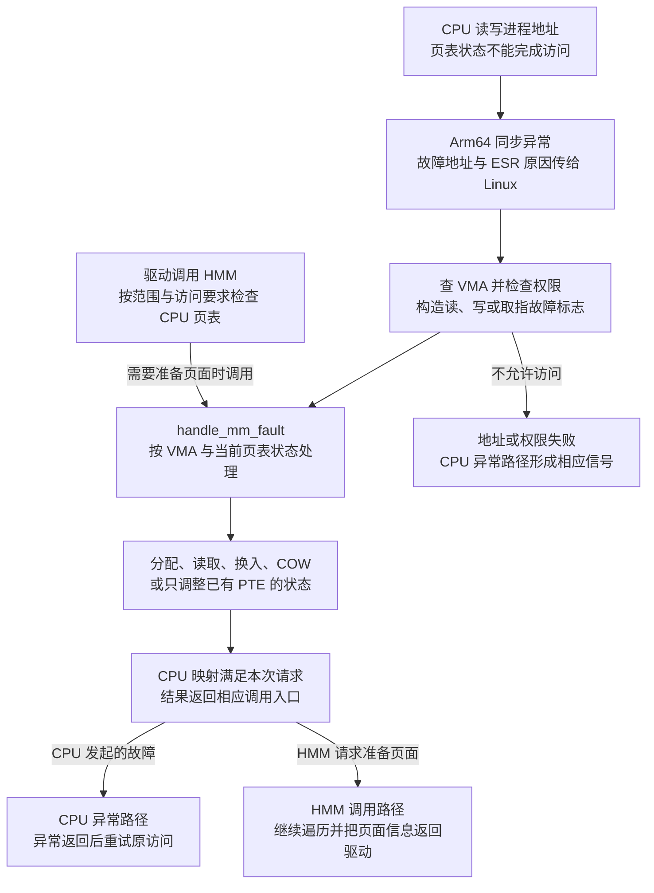

`FAR_EL1` 提供故障地址，`ESR_EL1` 提供异常类型、读写方向等信息。Linux 的 Arm64 入口把这些信息传给 `do_page_fault()`；函数查找 VMA、核对权限，再调用 `handle_mm_fault()`。快速 VMA 锁路径与退回 `mmap_lock` 的路径会影响重试，但不改变“先确定合法访问，再准备页面”的依赖。

HMM 从驱动调用进入，它没有制造一次新的 CPU 异常，也不需要从 FAR/ESR 重新读取 GPU 地址。HMM 已经拿到范围和所需权限，必要时直接调用相同的通用 `handle_mm_fault()`。CPU 异常返回与 HMM 返回到驱动，是不同的后续动作。

> **[SOURCE]** Linux `248951ddc14d`，[`arch/arm64/mm/fault.c`](./2.源码/linux/arch/arm64/mm/fault.c) 第 600～827 行包含故障标志、VMA 检查、两处 `handle_mm_fault()` 调用与信号处理，第 917～928 行列出翻译、访问标志和权限故障分发；[`mm/hmm.c`](./2.源码/linux/mm/hmm.c) 第 73～94 行直接调用通用缺页处理。

### 3.2 匿名页首次访问与零页

**[DESIGN]** 先把 A 改成“刚建立匿名 VMA、尚未写入”的变体。CPU 页表中还没有普通数据页映射，Linux 会根据这次访问是否需要写入作出不同处理。

```text
匿名 VMA 有效，PTE 缺失
  ├─ 首次读，且允许使用零页
  │    → 映射共享零页，CPU 读到 0
  │    → 后续写入再取得私有可写页
  └─ 首次写，或不能使用零页
       → 分配并清零匿名页，安装当前进程的 PTE
       → CPU 重试写入，修改自己的数据
```

首次读可以通过共享零页得到全零内容，把独立数据页的分配推迟到写入时。首次写获得的新匿名页也必须先完成清零，再建立允许应用访问的 PTE；故障指令重新执行后才把相应字节改成应用写入的值。其余尚未写入的字节仍为零。

主案例已经由 CPU 初始化 A，因此回到第 4 章时，A 已有承载输入的匿名页。GPU 缺映射不会要求 Linux 再分配一份 A。HMM 如果发现 CPU 侧页面和权限已经满足要求，可以读取现有页面信息。

PTE 缺失也可能只是“这个进程还没有映射已存在的页面”，例如下节的文件缓存命中。数据页分配与页表页分配是两类动作：页表结构缺失时可以分配页表页，即使数据页早已存在。

> **[SOURCE]** Linux `248951ddc14d`，[`mm/memory.c`](./2.源码/linux/mm/memory.c) 第 5287～5400 行的 `do_anonymous_page()` 包含零页分支、匿名页准备和 PTE 安装；第 6378～6379 行把缺失 PTE 交给 `do_pte_missing()`。这里选基本页讲解，不展开匿名大 folio 分配策略。

> **[SOURCE]** Linux `248951ddc14d`，[`mm/memory.c`](./2.源码/linux/mm/memory.c) 第 5161～5247 行的 `alloc_anon_folio()` 安排清零或调用要求清零的预分配路径；第 5351～5356 行说明页面内容准备与后续 PTE 写入之间的可见性顺序。

### 3.3 文件映射与 Page Cache

**[DESIGN]** 另取文件 VMA：起点 `0x7000_0000`，文件起始偏移为 8192 字节。CPU 访问 `0x7000_3014`，先计算它对应文件中的哪一页。

```text
VMA 内偏移 = 0x3014
文件字节偏移 = 8192 + 0x3014 = 0x5014
文件页索引 = 0x5014 >> 12 = 5
页内偏移 = 0x14

VMA → 映射文件 → address_space 的 Page Cache → 第 5 页
  ├─ 已有且内容有效 → 取得缓存页，建立当前进程 PTE
  └─ 不在缓存或内容未就绪 → 准备/读取页面，等待可用，再建立 PTE
```

Page Cache 属于文件缓存管理，不专属于当前进程的页表。另一个进程或预读已经把这页带入 RAM 时，当前 CPU 缺页可以直接使用现有页面。

通常，不需为本次缺页读取后备数据的恢复归为次缺页；需要从文件或交换后备取得数据的路径归为主缺页。但排查时应看具体函数返回的 `VM_FAULT_MAJOR` 及统计路径，不能仅凭“这次调用等待了很久”判断。缓存中存在 folio 也还需检查内容是否有效、是否正在读入或被截断。

文件映射能由 HMM 取得页面，不代表它必然能迁到 device-private HBM。能否迁移还受文件类型、页面类型和迁移实现限制；本篇 HBM 迁移主例始终使用匿名 A。

> **[SOURCE]** Linux `248951ddc14d`，[`mm/filemap.c`](./2.源码/linux/mm/filemap.c) 第 3540～3618 行按 `vmf->pgoff` 查缓存，并在无缓存页的分支设置主缺页结果；第 3619～3690 行继续检查内容并处理读入。[`mm/memory.c`](./2.源码/linux/mm/memory.c) 第 5964～6010 行分派文件缺页，第 6555～6600 行可核对最终缺页统计。

### 3.4 换出页面的恢复

匿名页被换出后，VA 仍由原来的 VMA 管理，页表中则可以保留软件解释的非 Present 条目，记录交换位置。CPU 再访问时，需要恢复原数据，而不是把这一页重新清零。

**[DESIGN]** A 曾在 PFN `0x4_5678`，被换出以后再次访问：

```text
CPU PTE：Present 页 → 软件 Swap Entry
  → do_swap_page 识别普通交换条目
  → 由交换位置查 Swap Cache
      ├─ 命中可用页 → 复用
      └─ 未命中 → 分配页并换入原数据
  → 重新检查原 PTE，安装当前页 PFN
  → 调整匿名驻留页数与交换条目计数
```

换入后可以得到另一个 PFN，例如 `0x4_5680`；指针仍为 `0x3000_0000`，恢复的是同一份逻辑数据。当前 PTE 改为指向新页时，匿名 RSS 相应增加，当前进程记录的交换条目数减少。Swap Cache 的全局生命周期另由引用和回收决定，不能从单个 PTE 更新推定缓存项已经销毁。

本地新基线使用 `softleaf_t` 及 `softleaf_is_*()` 区分非 Present 条目。`do_swap_page()` 除普通交换页，还能识别 migration、device-private 等条目。看到进入这个函数，只能说明它需要解释软件条目；是否读交换设备，必须继续看条目类型。

> **[SOURCE]** Linux `248951ddc14d`，[`mm/memory.c`](./2.源码/linux/mm/memory.c) 第 4747～4819 行区分软件条目类型，第 4821～4859 行查 Swap Cache 并换入，第 5036～5116 行更新计数、PTE 并处理后续写访问。

### 3.5 COW、访问标志和权限异常

现在 CPU 要写一个仍为只读的 PTE。需要先比较 VMA 允许的访问与 PTE 的当前状态：VMA 允许写，可能只是 COW 暂时限制了写；VMA 禁止写，则没有把它改为可写的依据。

**[DESIGN]** 父子进程起初共享一页数据，两个 PTE 均只读：

```text
写入前：父进程 A → PFN P（只读）
        子进程 A → PFN P（只读）

父进程写，且该页仍须与子进程隔离：
  分配 Q → 复制 P 的内容 → 父进程 PTE 改指 Q 并允许写
  子进程 PTE 继续指 P

若页面已经由当前进程独占且满足复用条件：
  保留 PFN P → 调整当前 PTE 的可写/脏等状态
```

`do_wp_page()` 判断能否复用匿名页，不能复用才进入 `wp_page_copy()`。因此一次写保护异常可以复制数据页，也可以只调整现有映射。

已有 PTE 的访问标志、脏状态也可能需要更新。`handle_pte_fault()` 在锁内核对 PTE 没被并发修改，然后执行 `pte_mkyoung()`、必要的 `pte_mkdirty()` 与 `ptep_set_access_flags()`，由架构相关接口完成所需同步。这里页框可以不变。Arm64 是否由硬件自动维护某些标志取决于配置，本文解释软件实际处理分支。

CPU 地址没有有效 VMA，或本次读写被 VMA 禁止时，架构异常处理会走错误信号路径。通常分别对应 `SIGSEGV` 的地址错误或权限错误。文件越界、设备页迁回失败等又可能形成 `SIGBUS`，不要把所有缺页失败都写成同一种信号。

GPU 驱动通过 HMM 进入通用缺页代码时，错误先作为 HMM/驱动返回值处理；它没有自动变成某个正在执行 CPU load 的 `SIGSEGV`。

> **[SOURCE]** Linux `248951ddc14d`，[`mm/memory.c`](./2.源码/linux/mm/memory.c) 第 4244～4336 行说明 COW/复用选择，第 6387～6408 行更新访问标志；[`arch/arm64/mm/fault.c`](./2.源码/linux/arch/arm64/mm/fault.c) 第 774～827 行处理 CPU 故障结果与信号。

### 3.6 HMM 取得当前页面信息

回到 GPU 读取 A。KFD 已找到 VMA 和范围，现在调用 `amdgpu_hmm_range_get_pages()`，请求一组可用于建立 GPU 映射的当前页面信息。

```text
输入：notifier、起始字节地址、CPU 页数、readonly、设备页面 owner
  → 建立 hmm_range 和结果数组
  → 设置请求：页面有效；需要时要求可写
  → 记录 notifier 序号
  → hmm_range_fault 遍历 CPU 页表
      已满足要求：填入页面信息
      尚未满足：调用通用缺页处理，再检查
  → 返回 hmm_pfns，或错误
  → KFD 生成设备地址，再检查这批结果是否仍有效
```

HMM 数组项包含 PFN 与标志，不能当成没有附加位的裸物理地址。驱动通过 `hmm_pfn_to_page()` 等接口取得 `struct page`，再区分系统页与设备页。

本例 VMA 若可写，KFD 计算出的 `readonly=false`，HMM 请求会包含写权限。即使此次 GPU IV 记录的是读故障，映射准备也可能按整个 VMA 的可写能力取得页面；这里要区分“触发本次处理的访问类型”和“这次准备映射所请求的权限”。

> **[SOURCE]** Linux `248951ddc14d`，[`amdgpu_hmm.c`](./2.源码/linux/drivers/gpu/drm/amd/amdgpu/amdgpu_hmm.c) 第 168～223 行定义请求与返回路径；[`kfd_svm.c`](./2.源码/linux/drivers/gpu/drm/amd/amdkfd/kfd_svm.c) 第 1775～1823 行根据 VMA 计算 `readonly`，取得页面后生成 DMA 地址。

以下连续片段位于 `amdgpu_hmm_range_get_pages()` 内部，展示请求与序号如何建立；`notifier`、`start`、`npages`、`readonly`、`owner` 均来自该函数入参。

```c
186:     hmm_range->notifier = notifier;
187:     hmm_range->default_flags = HMM_PFN_REQ_FAULT;
188:     if (!readonly)
189:         hmm_range->default_flags |= HMM_PFN_REQ_WRITE;
190:     hmm_range->hmm_pfns = pfns;
191:     hmm_range->start = start;
192:     end = start + npages * PAGE_SIZE;
193:     hmm_range->dev_private_owner = owner;
194:
195:     hmm_range->notifier_seq = mmu_interval_read_begin(notifier);
```

186～193 行描述这次查询要取得什么，195 行保存用于后续有效性判断的序号。函数随后分段调用 `hmm_range_fault()`；成功后数组包含当前页面信息，GPU 页表此时仍由后续 KFD/GPUVM 代码更新。

HMM 可返回无效参数、权限不足、内存不足、页面无法准备好或需要重新尝试等结果。AMDGPU 包装层把 `-EBUSY` 转成 `-EAGAIN`，上层恢复路径据此暂缓本次处理，详见 §7.1。

> **[SOURCE]** Linux `248951ddc14d`，[`mm/hmm.c`](./2.源码/linux/mm/hmm.c) 第 640～684 行列出错误语义与遍历重试；[`amdgpu_hmm.c`](./2.源码/linux/drivers/gpu/drm/amd/amdgpu/amdgpu_hmm.c) 第 202～223 行调用 HMM 并转换错误。当前线上 HMM 文档还介绍较新的包装接口，本篇调用链固定使用仓库中的 `hmm_range_fault()`。

### 3.7 页面信息的有效期

HMM 返回的 PFN 描述某次查询观察到的页面。Linux 后续可能改变它，驱动需要让“检查结果仍有效”和“使用结果更新 GPU 映射”与失效回调按协议协调。

```text
取得 notifier 序号 S
  → 查询页面并生成设备地址
  → 取得与失效回调配合的范围锁
  → 检查 S 是否仍有效
      有效：在保护下继续更新 GPU 映射
      已失效：丢弃这次建表机会，重新取得页面信息
```

长期 pin 通常用于在一段使用期内固定页面及其生命周期，代价是限制迁移或回收。本篇 HMM/SVM 依靠 notifier 跟踪变化，并在变化时撤销或恢复 GPU 映射；不能把一次 `hmm_range_fault()` 返回解释成长期 pin，也不能在脱离这套协议后继续使用旧 PFN。

`mmap_lock` 保护 VMA 等地址空间结构，但只持读锁不能冻结所有 PTE。COW、页面迁移及其他页表变化仍需 notifier 与页表锁协调。第 6 章将用具体交错时序说明这些保护分别解决什么问题。

> **[SOURCE]** Linux `248951ddc14d`，[`amdgpu_hmm.c`](./2.源码/linux/drivers/gpu/drm/amd/amdgpu/amdgpu_hmm.c) 第 239～246 行使用 `mmu_interval_read_retry()`；[`kfd_svm.c`](./2.源码/linux/drivers/gpu/drm/amd/amdkfd/kfd_svm.c) 第 1826～1859 行在范围锁下检查结果与拆分状态，再更新映射。

## 4. GPU 故障处理与映射恢复

### 4.1 从故障记录进入恢复入口

现在完整走通主案例。A 的数据已在 system RAM，CPU VMA 可读写，目标 GPU 可以访问，GPU 当前缺少可用映射。04 已完成 IV 解码与分发，本节从 `amdgpu_vm_handle_fault()` 接着追踪。

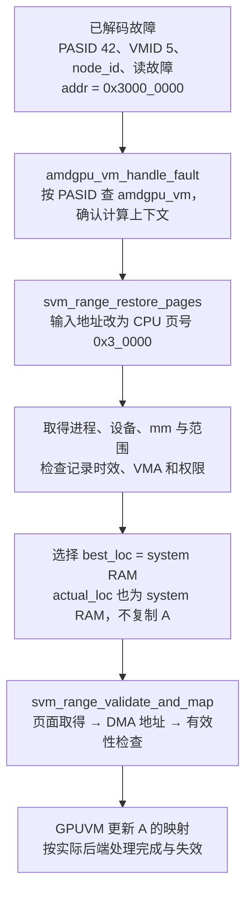

`amdgpu_vm_handle_fault()` 先锁定 PASID 对应的 VM。若属于计算上下文，它先释放根页目录相关锁，再进入 KFD 恢复，因为后续建表也可能需要取得这些锁。传入 KFD 的地址执行了 `addr >> PAGE_SHIFT`：这里的 `0x3_0000` 是虚拟页号，不是主机物理 PFN。

恢复入口还接收故障时间戳和 `write_fault`。时间戳用于处理迟到或重复记录，读写类型用于 VMA 权限检查；它们都不是 Kernel 的源代码执行位置。

> **[SOURCE]** Linux `248951ddc14d`，[`amdgpu_vm.c`](./2.源码/linux/drivers/gpu/drm/amd/amdgpu/amdgpu_vm.c) 第 2986～3035 行查 VM、释放锁并调用计算恢复入口；[`kfd_svm.c`](./2.源码/linux/drivers/gpu/drm/amd/amdkfd/kfd_svm.c) 第 3047～3063 行给出恢复函数完整入参。

### 4.2 找到进程、设备和地址范围

驱动按以下顺序缩小查找范围。PASID 找进程，设备信息找此次故障所在 GPU，故障地址再找这个进程中的内存范围。

```text
PASID 42
  → kfd_lookup_process_by_pasid：取得 kfd_process 引用
  → 检查是否正在排空故障

adev + node_id + VMID 5
  → kfd_node_by_irq_ids：确认所属 KFD 节点
  → 当前进程的 GPU ID 与 gpuidx
  → 检查 p->xnack_enabled

p->lead_thread
  → get_task_mm：取得 mm 引用
  → mmap_read_lock + svms->lock
  → 用页号 0x3_0000 查 svm_range
  → 取得 migrate_mutex，检查范围状态和 VMA 权限
```

VMID 是当前硬件上下文编号，可能随驻留和调度变化；PASID 才用于这里的进程查找。`gpuidx` 又是进程设备数组与位图使用的索引，不能拿 VMID 5 直接当作 `dma_addr[5]` 的下标。

拿到 `svm_range` 后，驱动还检查它是否等待拆分后的 notifier 更新、是否正在删除、是否近期已经恢复。范围中的 `validate_timestamp` 保存最后一次验证成功时的系统时间，驱动将故障时间与它比较，用于识别短时间内重复到来的故障。只有仍适合处理的范围，才继续查 VMA，并根据 `write_fault` 判断访问是否被允许。

主例读 A，VMA 允许读，范围没有延后操作，因此继续。进程已消失、VMA 已被移除等情况会走不同的返回路径，第 7 章会说明它们为什么也可能返回 0。

> **[SOURCE]** Linux `248951ddc14d`，[`kfd_svm.c`](./2.源码/linux/drivers/gpu/drm/amd/amdkfd/kfd_svm.c) 第 3065～3194 行依次执行上述检查与查找，其中第 3170～3176 行比较故障时间与范围验证时间；第 1864～1866 行在验证成功后更新时间戳，第 3254～3272 行释放锁、`mm` 和进程引用。

### 4.3 页面留在 system RAM 的恢复

主例的 `preferred_loc=0`、`actual_loc=0`，位置选择仍为 system RAM。恢复函数跳过迁移分支，进入页面验证和映射。

这里需要组合三类输入：A 的 GPUVA 范围、Linux 当前数据页，以及这个 GPU 访问数据页时使用的 DMA 地址。

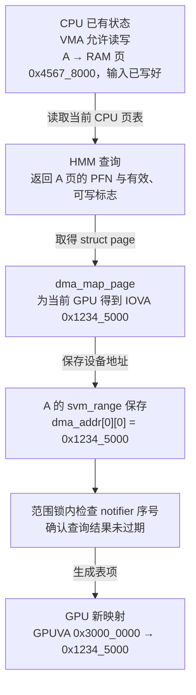

`svm_range_validate_and_map()` 逐个 VMA 计算此次处理的页面数。VMA 可写时取得可写页面信息，缺少可读权限时有专门的撤销映射处理。HMM 成功后，`svm_range_dma_map()` 为目标 GPU 准备逐页地址；系统页通过 DMA API 转换，设备页使用本地显存地址换算。

§2.1.3 已说明 `dma_addr` 的保存方式，这里把填入地址的过程接上。HMM 找到 A 当前的 system RAM 页面；本例假设主机物理页是 `0x4567_8000`。目标 GPU 的 `gpuidx=0`，KFD 针对这块设备调用 `dma_map_page()`；本例假设返回 `0x1234_5000`，KFD 将返回值存入 `A.svm_range.dma_addr[0][0]`。末尾的 `[0]` 对应 A 的第一页。

返回的设备地址由设备与 IOMMU 配置决定；本例 IOVA 与主机物理地址不同。GPU 映射建好后，GPU 页表把 `A[5]` 的 GPUVA `0x3000_0014` 翻译为 IOVA `0x1234_5014`，Host IOMMU 再把请求翻译到主机物理地址 `0x4567_8014`。

生成设备地址后，还要在范围锁内检查 HMM 序号，并检查是否出现待处理的子范围。结果已失效就返回 `-EAGAIN`，不会继续用这批结果建立 GPU PTE。结果有效才进入 GPUVM 更新。

> **[SOURCE]** Linux `248951ddc14d`，[`kfd_svm.c`](./2.源码/linux/drivers/gpu/drm/amd/amdkfd/kfd_svm.c) 第 160～203 行生成逐页设备地址，第 1763～1859 行逐 VMA 取得页面、检查有效性并映射；第 3211～3245 行决定是否迁移并进入验证路径。

### 4.4 从页面信息生成 GPU 映射

KFD 已经知道“A 的这一页应指向哪个设备地址”，AMDGPU 接下来要修改存放在内存中的 GPU 页表。

这里用 `vm` 指向目标 GPU 的 `amdgpu_vm`。其中的 `last_update` 成员是一个 `struct dma_fence *`，保存页表更新的完成对象；页表由异步作业更新时，驱动用它跟踪更新进度。§4.5 再说明谁等待这个对象。

```text
svm_range_map_to_gpu
  → 从 PDD 取得 amdgpu_vm
  → 将 CPU 页号范围转换为 GPU 页号范围
  → 根据存储域、范围属性、VMA 只读状态构造 PTE 标志
  → amdgpu_vm_update_range：定位/准备页表，安排 PTE 更新
  → amdgpu_vm_update_pdes：更新有变化的上级目录
  → 当前 VM 的更新完成对象保存在 vm->last_update
```

KFD 用 `AMDGPU_GPU_PAGES_IN_CPU_PAGE` 表示一个 CPU 页对应多少个 GPU 基本页，按这个比例换算页号。本例两种页都为 4 KiB，比例为 1，GPU 虚拟页范围仍为 `[0x3_0000, 0x3_0000]`。PTE 的地址部分来自 `0x1234_5000`，同时带上系统内存域、有效性、读写和内存类型等属性。不会把 `0x4567_8000` 直接代替本例 DMA 地址，也不会把 C 指针值直接写成数据物理页。

PDE 指向下一层页表，PTE 指向目标数据页。若所需页表层级已经存在，只需修改相关表项；若中间层缺失，GPUVM 还要准备页表 BO，并更新上级目录。该过程沿用 04 的多级页表关系。

数据 A 仍在原 RAM 页。被 CPU 或 SDMA 写入的是 GPU 页表存储，修改映射本身没有复制 A 的 4096 字节。

> **[SOURCE]** Linux `248951ddc14d`，[`kfd_svm.c`](./2.源码/linux/drivers/gpu/drm/amd/amdkfd/kfd_svm.c) 第 1210～1353 行按设备版本和范围属性形成 PTE 标志，第 1434～1517 行更新 PTE/PDE；[`amdgpu_vm.h`](./2.源码/linux/drivers/gpu/drm/amd/amdgpu/amdgpu_vm.h) 第 398 行定义 `last_update`；[`amdgpu_vm.c`](./2.源码/linux/drivers/gpu/drm/amd/amdgpu/amdgpu_vm.c) 第 972～1020、1107～1238 行组织目录和范围更新。本篇取 GFX9.4.3 对应实现，不套用文件中其他代际分支。

### 4.5 更新完成、等待与翻译失效

读这一段时，要分别跟踪“谁写页表”和“当前调用者等到哪里”。固定实现由 `vm->use_cpu_for_update` 选择 CPU 或 SDMA 页表更新后端：

```text
CPU 后端
CPU 映射页表 BO → 等待必要的既有依赖 → 直接写 PTE/PDE
  → commit 执行内存屏障与 HDP 刷新
  → 按需处理 GPU 翻译失效

SDMA 后端
Host 构造页表写入命令 → 提交更新 job
  → 返回跟踪该作业的 dma_fence → 保存到 vm->last_update
  → SDMA 稍后执行更新，Fence 随完成流程被置为完成
  → 等待者或失效处理按各自路径继续
```

CPU 后端没有为每次同步写表创建一个新的 SDMA 硬件完成对象，但仍可能等待旧依赖。它的 `commit` 在正常路径执行 `mb()` 与 HDP 刷新，使写表结果满足后续设备读取的可见性要求。

SDMA 后端的 `commit` 提交 job，并把得到的 Fence 记录到页表根 BO 的 reservation 对象；对这里的非 immediate 更新，还把结果写进调用者传入的 Fence 指针。SVM 调用传入的是 `&vm->last_update`。

> **[SOURCE]** Linux `248951ddc14d`，[`amdgpu_vm_cpu.c`](./2.源码/linux/drivers/gpu/drm/amd/amdgpu/amdgpu_vm_cpu.c) 第 50～108、119～135 行；[`amdgpu_vm_sdma.c`](./2.源码/linux/drivers/gpu/drm/amd/amdgpu/amdgpu_vm_sdma.c) 第 106～145 行。后端选择见 [`amdgpu_vm.c`](./2.源码/linux/drivers/gpu/drm/amd/amdgpu/amdgpu_vm.c) 第 2699～2724、2845～2863 行：默认选择受编译架构、显存 BAR 可见性等条件影响，非 `CONFIG_X86_64` 分支在此基线设置 SDMA 模式；不能仅凭 MI300X 型号断言使用 CPU 更新。

恢复调用与属性调用使用了不同的等待参数：

| 当前调用                                       | 传给验证映射的`wait` | 本层的动作                                           |
| ---------------------------------------------- | ---------------------- | ---------------------------------------------------- |
| GPU Retry 故障：`svm_range_restore_pages()`  | `false`              | 不在`svm_range_map_to_gpus()` 取得并等待更新 Fence |
| 属性修改：`svm_range_set_attr()` 的映射分支  | `true`               | 取得非空更新 Fence 后等待                            |
| 后台恢复：`svm_range_restore_work()`         | `true`               | 等待所需映射更新，再判断是否能恢复队列               |
| 撤销 GPU 映射：`svm_range_unmap_from_gpus()` | 使用自己的 Fence 处理  | 对返回的非空 Fence 等待，再调用 TLB 处理             |

> **[SOURCE]** Linux `248951ddc14d`，[`kfd_svm.c`](./2.源码/linux/drivers/gpu/drm/amd/amdkfd/kfd_svm.c) 第 3244～3245、3809～3810、1947～1948、1414～1427 行给出这些调用。下列片段是 `svm_range_map_to_gpus()` 遍历目标 GPU 时的连续代码，`wait` 与 `flush_tlb` 来自该函数入参，第 1524～1526 行可核对其定义。

```c
1557:         r = svm_range_map_to_gpu(pdd, prange, offset, npages, readonly,
1558:                                  prange->dma_addr[gpuidx],
1559:                                  bo_adev, wait ? &fence : NULL,
1560:                                  flush_tlb);
1561:         if (r)
1562:             break;
1563:
1564:         if (fence) {
1565:             r = dma_fence_wait(fence, false);
1566:             dma_fence_put(fence);
1567:             fence = NULL;
1568:             if (r) {
1569:                 pr_debug("failed %d to dma fence wait\n", r);
1570:                 break;
1571:             }
1572:         }
1573:
1574:         kfd_flush_tlb(pdd);
```

日志的意思是“等待 DMA Fence 失败，并打印返回码”。1557～1560 行决定是否取回 Fence；1564～1572 行只对非空 Fence 等待；1574 行在本次映射及所需等待未失败时调用 TLB 处理。故障恢复传入 `wait=false`，因此不能把这段描述成每次 GPU 缺页都在这里阻塞等待 SDMA 完成。

`flush_tlb=false` 也只描述传给页表更新层的参数。`svm_range_map_to_gpus()` 后面仍调用 `kfd_flush_tlb()`，而后者进入 `amdgpu_vm_flush_compute_tlb()`，比较 VM 的失效序号与上次已处理序号；序号未变化可以直接返回。表项更新层还可能因实际更新需要设置失效状态。因此需分别记录调用、条件判断、硬件失效执行和完成结果，不能只凭函数名宣称每次都发生了硬件失效。

Retry 恢复允许 Host 安排更新后返回，让后续 GPU 访问在映射准备好时继续。若采用 SDMA，故障函数返回时可能还有更新在执行。旧有效映射的撤销则要满足旧页面保护所需的顺序，§6.2 会单独展开。

> **[SOURCE]** Linux `248951ddc14d`，[`kfd_priv.h`](./2.源码/linux/drivers/gpu/drm/amd/amdkfd/kfd_priv.h) 第 1560～1567 行调用计算 VM 失效；[`amdgpu_vm.c`](./2.源码/linux/drivers/gpu/drm/amd/amdgpu/amdgpu_vm.c) 第 1049～1080 行关联更新完成与失效状态，第 1686～1715 行比较序号并按需提交 PASID 失效；[`amdgpu_vm_pt.c`](./2.源码/linux/drivers/gpu/drm/amd/amdgpu/amdgpu_vm_pt.c) 第 900～940 行可见具体页表变化引起的 `needs_flush` 设置。这里的 `kfd_flush_tlb()` 是 `void` 包装，调用它也不能替代对下层错误路径的检查。

02 的普通 KFD 内存映射还有另一组对象：

```text
本篇 SVM 范围映射
svm_range → amdgpu_vm_update_range → vm->last_update
  → 是否复制 Fence 引用、是否等待，由本次 wait 参数决定

02 的普通 KFD BO 映射
kgd_mem → BO 的映射更新 → bo_va->last_pt_update
  → amdgpu_sync_fence 收集到 kgd_mem->sync
  → 外层 MAP ioctl 的同步函数等待 → 后续失效与返回
```

这两条调用链共用 GPUVM 更新设施，但完成对象保存在不同位置。完整 SDMA job、调度 Fence、硬件完成序号和中断传播，可以回看 [00 的完成通知章节](./00_GPU系统基础.md)及 [02 的映射流程](<./02_GPU 内存管理基础.md>)，后续专题再逐层展开；不把它们塞进每个 AQL Packet 的执行路径。

### 4.6 恢复返回与后续访问

主案例最终希望 CU 读到 `A[5]`，但调试时要分开记录几个时间点：

```text
t0：驱动找到 A 的有效 VMA 与 system RAM 页面
t1：驱动取得 DMA 地址，并通过 notifier 有效性检查
t2：GPUVM 已完成同步写入，或已提交异步更新
t3：相关页表更新及所需失效满足访问条件
t4：GPU 后续读取 A[5] 成功，继续计算
t5：整个 Kernel 完成，更新应用 Completion Signal
```

CPU 后端与 SDMA 后端会改变 t2、t3 的关系；`wait=false` 路径允许软件处理返回早于异步更新完成。一次读成功只说明这一访问完成，Packet 37 中其他 Work-item 仍可能执行，t5 要单独观察。

`svm_range_restore_pages()` 返回 0 后，计算分支的 `amdgpu_vm_handle_fault()` 返回 `true`，表示此记录已按该分支处理。第 7 章还会看到丢弃过期记录和暂缓处理也能到达这条返回路径。因此调试日志中应保留分支原因，不能把一个布尔值翻译成“Kernel 已恢复完成”。

> **[SOURCE]** Linux `248951ddc14d`，[`amdgpu_vm.c`](./2.源码/linux/drivers/gpu/drm/amd/amdgpu/amdgpu_vm.c) 第 3020～3022 行将 KFD 返回 0 转换为已处理；[`kfd_svm.c`](./2.源码/linux/drivers/gpu/drm/amd/amdkfd/kfd_svm.c) 第 3070～3083、3170～3186、3267～3272 行给出不同的零返回来源。

**[BOUNDARY]** 以上时序列的是可区分的事件，并未规定硬件怎样保存和重放某一条访存指令。MI300X 上更细的 Wave/指令过程需直接证据；本篇不把 Host 函数返回画成给某条 Wave 发送“立即继续”的软件命令。

## 5. system RAM 与 HBM 之间的页面迁移

### 5.1 迁移的触发条件与处理范围

现在改变主例：A 仍是相同的进程地址，但期望位置设为目标 GPU。本次恢复选出的 `best_loc` 为该 GPU，数据需要从 system RAM 迁到 HBM。

```text
GPU 访问 A 发生故障
  → 读 actual_loc 与范围属性
  → 选 best_loc
  → 按 granularity 对齐故障页附近范围
  → 裁剪到 svm_range 边界
  → 迁移函数再按 VMA 边界处理
  → 对成功取得的目标页更新位置与映射
```

显式预取也能触发迁移。ROCr 的 `hsa_amd_svm_prefetch_async()` 先安排依赖等待；依赖满足后，后台处理调用 HSAKMT 设置 `PREFETCH_LOC`，内核再执行迁移请求。API 提交返回与预取完成 Signal 是两个时间点，位置请求也不能替代成功页数的观察。

> **[SOURCE]** ROCr `ba56a24c6132`，[`runtime.cpp`](./2.源码/rocr-runtime/runtime/hsa-runtime/core/runtime/runtime.cpp) 第 2988～3027 行先处理依赖，再设置预取属性并更新完成 Signal。Linux `248951ddc14d`，[`kfd_svm.c`](./2.源码/linux/drivers/gpu/drm/amd/amdkfd/kfd_svm.c) 第 3596～3625 行触发迁移，第 3211～3245 行计算故障恢复范围并选择迁移。

`granularity` 保存的是页数的以 2 为底对数。**[DESIGN]** 取 `granularity=2`，则粒度为 `2²=4` 个 CPU 页，即 16 KiB。故障在 `0x6000_7014`，页号为 `0x6_0007`：

```text
按 4 页对齐：页号 [0x6_0004, 0x6_0007]
对应字节区间：[0x6000_4000, 0x6000_8000)

若当前 svm_range 只有：[0x6000_5000, 0x6000_B000)
裁剪后：[0x6000_5000, 0x6000_8000)，3 页

若其中 VMA 又在 0x6000_7000 处分界：
分别处理 [0x6000_5000, 0x6000_7000)，2 页
以及     [0x6000_7000, 0x6000_8000)，1 页
```

A 本身只有 1 页，即使粒度设置得更大，也会被 A 的实际范围裁剪，不能在这个例子里把它写成迁移整个 2 MiB。对齐范围、收集到的页面与成功迁移页数还可能不同，见 §5.4。

### 5.2 Linux 对设备页面的表示

Linux 需要继续管理迁入 HBM 的 A，包括页的引用、归属和 CPU 再访问时的处理。`ZONE_DEVICE` 为设备内存建立页管理描述；其中 `MEMORY_DEVICE_PRIVATE` 表示 CPU 普通进程访问不能直接使用这种后备，需要由驱动参与处理。

图中 D 是 Linux 用于识别设备页的描述性 PFN，V 是 GPU 访问 HBM 的本地地址，二者不能直接互换。

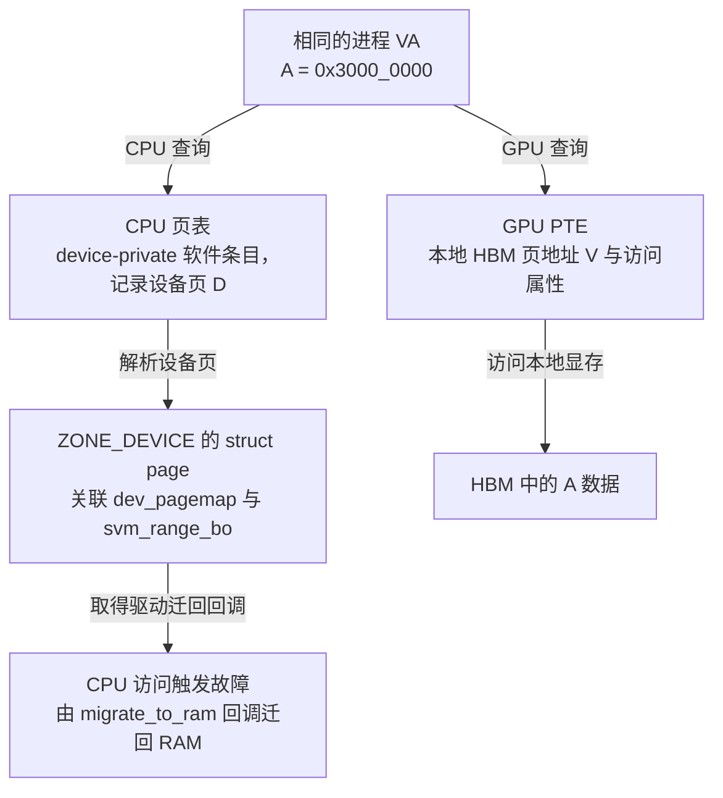

固定 KFD 在本模型对应的设备私有分支中，为页描述申请一段资源编号范围，设置 `pgmap->type=MEMORY_DEVICE_PRIVATE`，再登记页管理信息。这个编号范围服务于 Linux 的页描述，并不表示把相同数值的主机 RAM 分配给 HBM。

CPU 页表里的 device-private 条目是软件可解释的特殊条目，不是供 CPU 正常 load/store 直达 HBM 的普通 Present PTE。即使驱动能通过 BAR 访问某段显存，应用原来的 A 映射仍按这里的 device-private 协议工作；两种访问使用不同的映射和生命周期。

GPU PTE 中的本地地址要从设备页编号、`pgmap.range.start`、显存基址等信息换算。CPU 页表保存的设备页身份与 GPU 的实际访存地址承担不同用途。

> **[SOURCE]** Linux `248951ddc14d`，[`kfd_migrate.c`](./2.源码/linux/drivers/gpu/drm/amd/amdkfd/kfd_migrate.c) 第 1018～1085 行注册页管理回调并建立设备页描述；[`kfd_svm.c`](./2.源码/linux/drivers/gpu/drm/amd/amdkfd/kfd_svm.c) 第 182～190 行将设备 PFN 换算为 GPU 地址。CPU 软件条目处理见 [`mm/memory.c`](./2.源码/linux/mm/memory.c) 第 4766～4808 行。

### 5.3 system RAM → HBM 的执行步骤

把 A 从 RAM 页 P 迁到 HBM 页 D，需要同时保护数据与映射。复制期间，CPU 和 GPU 都不能继续用旧映射写 P，否则刚复制的 D 可能立刻过期。

下面沿固定 `svm_migrate_vma_to_vram()` 路径画时序。CPU 页面的保护来自迁移条目、锁和引用；GPU 访问的保护来自 notifier 撤销旧映射或暂停队列。页面锁本身不会让 GPU 停止 DMA。

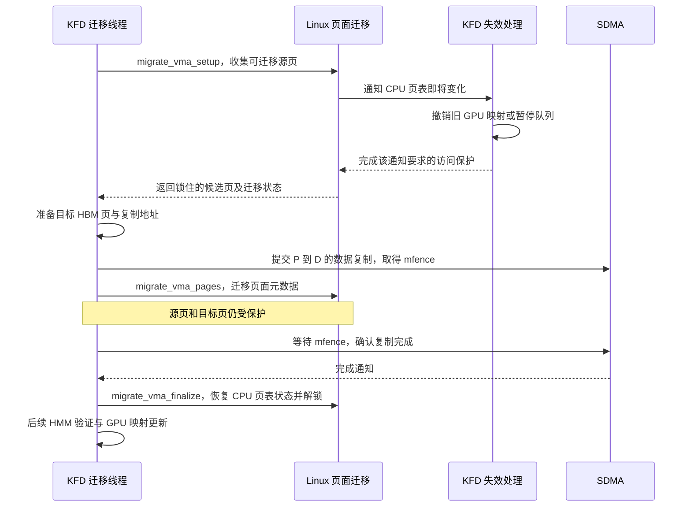

先理解各阶段的结果：

1. **准备。** `migrate_vma_setup()` 根据 VMA 和字节范围收集页面，筛出可迁移候选，对所需页面取得锁与引用，并把正在迁移的 CPU 映射转成受保护状态。其他 CPU 访问可能等待迁移完成；GPU 旧映射由失效协议处理。
2. **复制。** 驱动为候选页准备设备目标和 DMA 地址，使用 SDMA 搬运数据。复制命令提交后，`mfence` 跟踪这批复制的完成。A 的字节在这个阶段才实际搬动。
3. **页面元数据调整。** `migrate_vma_pages()` 迁移 `struct page` 相关元数据，并在逐页状态中标出成功或失败。它不负责替驱动执行数据复制。
4. **等待并收尾。** 驱动等待复制 Fence，再调用 `migrate_vma_finalize()`。成功页的 CPU 页表转为目标设备页对应的软件条目，未成功迁移的页面恢复原映射，随后释放迁移阶段的保护。
5. **恢复 GPU 映射。** 回到 KFD 上层后，HMM 读取当前页面结果，再为 GPU 建立指向 HBM 或仍留在 RAM 的映射。应用指针保持不变。

第 3 步在第 4 步的 Fence 等待之前，必须保留这个实际顺序。元数据已经调整的中间状态仍有迁移保护；不能据此让应用提前使用复制尚未完成的目标页。

> **[SOURCE]** Linux `248951ddc14d`，[`kfd_migrate.c`](./2.源码/linux/drivers/gpu/drm/amd/amdkfd/kfd_migrate.c) 第 394～476 行是 RAM → VRAM 的 VMA 迁移函数。以下为其中第 451～455 行连续片段，`migrate` 在第 403、410～425 行初始化，`mfence` 初始为 NULL，并由复制调用返回。

```c
451:     r = svm_migrate_copy_to_vram(node, prange, &migrate, &mfence, scratch, ttm_res_offset);
452:     migrate_vma_pages(&migrate);
453:
454:     svm_migrate_copy_done(adev, mfence);
455:     migrate_vma_finalize(&migrate);
```

这段代码主要证明复制提交、页面元数据调整、等待与收尾的先后关系。第 451 行保存复制函数的返回值；第 454 行调用等待帮助函数。完整错误传播还应检查各层实际使用了哪个返回值，见 §7.2。

> **[SOURCE]** Linux `248951ddc14d`，[`mm/migrate_device.c`](./2.源码/linux/mm/migrate_device.c) 第 681～727 行说明源/目标锁、逐页结果与 finalize 的约定，第 729～764 行收集并保护页面，第 1254～1266 行说明元数据迁移，第 1337～1352 行说明页表恢复与解锁。复制的设备提交见 [`kfd_migrate.c`](./2.源码/linux/drivers/gpu/drm/amd/amdkfd/kfd_migrate.c) 第 126～181 行；此处只追到 `amdgpu_copy_buffer()`，不展开完整 SDMA 命令格式。

### 5.4 部分迁移与失败回退

迁移请求覆盖一个范围，但可迁移性按页面判断。页面正在被其他使用者持有、页面类型不受支持、目标分配失败或迁移元数据处理失败，都可能使某些页面留在原处。

**[DESIGN]** 假设对 R 请求 16 页，收集到 12 页候选，其中 10 页完成迁移：

```text
请求范围：16 页
  → 可处理候选：12 页
  → 成功迁移：10 页
结果：10 页在 HBM，其余 6 页仍按各自原状态保留
```

这里“其余 6 页仍在 RAM”只在原来的 16 页都由 RAM 承载的本例成立。若原范围有空洞、其他设备页或前次迁移留下的混合状态，就要逐页检查，不能只用减法推定后备位置。

`migrate_vma_pages()` 更新逐页迁移标志，`svm_migrate_successful_pages()` 根据这些结果统计成功数。`svm_range` 的 `vram_pages` 成员保存范围中的 HBM 页数，本例结果为 10。`actual_loc` 此时记为目标 GPU 的 ID，表示范围含有该 GPU 的 HBM 页面，不能据此把全部 16 页都视为已迁入 HBM。GPU 建表还要根据逐页设备地址区分内存域，因此一段连续 VA 可以对应不同存储中的页面。

在 GPU 故障恢复中，迁入目标 HBM 失败时，代码会尝试保留或退回系统内存，再继续验证映射。这个回退是否成功，仍取决于页面和映射是否可用。属性 ioctl 已提交的部分动作也可能保留，不能承诺失败后自动恢复到调用前的全部状态。

> **[SOURCE]** Linux `248951ddc14d`，[`kfd_migrate.c`](./2.源码/linux/drivers/gpu/drm/amd/amdkfd/kfd_migrate.c) 第 439～476 行比较候选页数、请求页数与成功页数；[`kfd_svm.h`](./2.源码/linux/drivers/gpu/drm/amd/amdkfd/kfd_svm.h) 第 79～94 行定义页面计数与位置语义；[`kfd_svm.c`](./2.源码/linux/drivers/gpu/drm/amd/amdkfd/kfd_svm.c) 第 3215～3245 行处理 GPU 故障迁移失败后的系统内存回退，第 3780～3784 行说明属性动作可能部分完成。

### 5.5 CPU 再次访问后的 HBM → system RAM

**[DESIGN]** Packet 37 已经结束，应用按协议完成同步。A 的数据仍在 HBM，CPU 接着读取 `A[5]`。CPU 查询页表时遇到 device-private 条目，进入迁回路径。

```text
CPU 读取 0x3000_0014
  → CPU 页表是 device-private 软件条目
  → do_swap_page 识别设备私有条目
  → 取得设备页引用与锁
  → page 的 dev_pagemap.ops->migrate_to_ram
  → KFD svm_migrate_to_ram
  → 找进程与范围，计算迁回区间
  → 分配 RAM 目标，复制 HBM 内容，等待，finalize
  → CPU 页表重新描述 RAM 页
  → CPU 重试访问并取得 A[5]
```

`dev_pagemap` 保存设备页对应的操作回调。KFD 把 `migrate_to_ram` 设为 `svm_migrate_to_ram()`；该函数从 `vmf->page->zone_device_data` 找到显存管理对象，再取得 `mm` 和 KFD 进程，定位原范围。

迁回也按粒度和范围边界计算，A 的指针保持不变，新的主机 PFN 可以与最初不同。GPU 旧映射随 CPU 页表变化被撤销或重建；以后 GPU 再访问 A，可能重新建立 RAM 映射，也可能因策略再次迁入 HBM。

KFD 的 HMM 查询在某些路径中也会进入通用缺页代码。为避免把自己的页面准备过程误当作普通 CPU 访问，固定实现检查 `faulting_task`，必要时跳过递归迁回。本节的普通应用 CPU 读取不属于这个分支。

CPU 迁回失败时，回调可返回 `VM_FAULT_SIGBUS`；这时没有可以承诺成功重试的普通 RAM 映射。第 3 章已说明它与 VMA 权限错误的区别。

> **[SOURCE]** Linux `248951ddc14d`，[`mm/memory.c`](./2.源码/linux/mm/memory.c) 第 4774～4808 行解析 device-private 条目并调用迁回回调；[`kfd_migrate.c`](./2.源码/linux/drivers/gpu/drm/amd/amdkfd/kfd_migrate.c) 第 942～1020 行查对象、计算范围、处理 `faulting_task` 和失败返回。HBM → RAM 的复制、元数据调整、等待与 finalize 顺序见同文件第 693～779 行。

### 5.6 复制完成与映射完成

从 RAM 迁到 HBM 后重新使用 A，需要分别满足数据与访问条件。下面画的是正常迁移恢复路径中的依赖；实际进入哪些等待分支仍按 §4.5 判断。

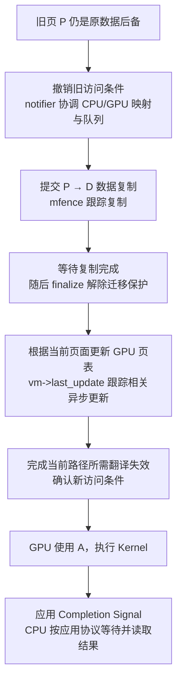

`mfence` 由复制调用返回，迁移帮助函数等待它；`vm->last_update` 跟踪页表更新，具体等待者由映射调用决定；TLB 处理确认的是相应翻译失效工作；Completion Signal 则属于应用 Dispatch 的完成协议。

四种事件可能由不同线程观察。CPU 迁移线程等到复制结束时，Kernel 还没完成；CPU 应用线程观察 Kernel 完成时，也不能据此替另一个并发使用者释放页面。旧页最终回收还要满足迁移代码、DMA 映射和其他引用的释放条件。

> **[SOURCE]** Linux `248951ddc14d`，[`kfd_migrate.c`](./2.源码/linux/drivers/gpu/drm/amd/amdkfd/kfd_migrate.c) 第 200～210 行等待复制 Fence，第 451～461 行在 finalize 后清理临时 DMA 映射；[`kfd_svm.c`](./2.源码/linux/drivers/gpu/drm/amd/amdkfd/kfd_svm.c) 第 1492～1517、1557～1574 行保存并按条件等待页表更新结果。应用完成继续采用 [03 下篇第 7 章](<./03_AMD GPU 队列与 AQL Dispatch（下）.md#7-kernel-完成通知与-cpu-等待>)的协议。

## 6. 地址空间失效与并发恢复

### 6.1 CPU 地址空间变化触发通知

GPU 已经能访问 A 以后，Linux 还可能改变 A 的后备页、权限或有效范围。KFD 必须在旧页面被重新使用之前，让 GPU 停止沿旧映射访问。

`mmu_interval_notifier` 登记的是某个 `mm` 的地址区间。Linux 进行相关页表变化时，回调收到变化范围、事件类型与序号；KFD 先取与当前范围的交集，再处理 GPU 映射和范围状态。

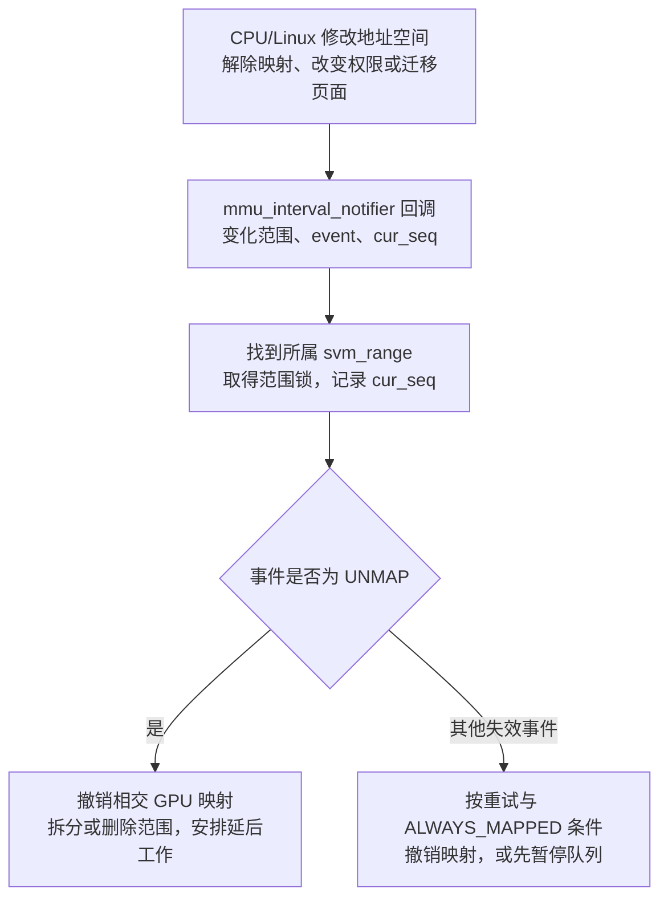

`munmap()` 删除一段地址用途，后续恢复不能再把原对象建立回来。页面迁移通常保留 VMA，只改变页面状态和位置，因此失效后仍可能为同一个 VA 建立新映射。`mprotect()` 保留地址范围但改变权限，恢复时要读取新的 VMA 权限。

范围 callback 收到 `MMU_NOTIFY_RELEASE` 时直接返回，进程退出的队列停止和范围清理走进程级退出路径，见 §7.4。不能只读这个 return 就判断退出时未保护 GPU 访问。

> **[SOURCE]** Linux `248951ddc14d`，[`kfd_svm.c`](./2.源码/linux/drivers/gpu/drm/amd/amdkfd/kfd_svm.c) 第 2639～2698 行说明并实现 notifier 回调，第 2671～2674 行计算交集，第 2683～2695 行在范围锁下设置序号并分发事件。

### 6.2 启用重试时的映射撤销

主例启用了 XNACK，且 A 未设置要求持续保持 GPU 映射的 `GPU_ALWAYS_MAPPED` 标志。Linux 要迁移或替换 A 的页面时，KFD 可以撤销相交 GPU 映射，让后续访问通过 Retry 故障重新建立当前映射。

```text
Linux 开始相关页面变化
  → notifier 持范围锁并推进失效序号
  → svm_range_unmap_from_gpus
  → 写入撤销所需的 GPU 表项
  → 等待返回的非空更新 Fence
  → 调用计算 VM 的 TLB 失效处理
  → 当前失效阶段结束，Linux 继续页面变化

GPU 后续再访问 A
  → 如产生新的可恢复故障，重新查 VMA、页面与权限
  → 只按当前合法状态恢复
```

这条撤销路径会取得返回的 Fence 并等待，与 §4.5 中 `wait=false` 的按需映射恢复分支分别处理。旧数据页即将失去原用途，驱动必须先落实对旧映射的处理，才能允许内存管理继续。

CPU 页面被迁移后，VA 还在，后续可以映射新的页面。CPU 已经 `munmap()` 后，旧访问对应的范围应删除；迟到的故障记录按过期记录处理，新执行的非法访问也不能靠重新映射旧页获得授权。

“撤销范围”不会自动取消应用的数据竞争。应用若一边让 GPU 使用 A，一边从 CPU 解除映射，内核会保护地址空间和资源生命周期，应用的那次计算仍可能失败。

应用也可以通过 `NO_ACCESS` 属性请求清除某块 GPU 的访问位。固定源码的属性更新处仍留有撤销旧 GPU 映射的 TODO，因此单次 `NO_ACCESS` 请求完成后，不能据此认定旧映射已经同步撤销。本节上图描述的是 Linux 地址空间变化经 notifier 触发的撤销流程。

> **[SOURCE]** Linux `248951ddc14d`，[`kfd_svm.c`](./2.源码/linux/drivers/gpu/drm/amd/amdkfd/kfd_svm.c) 第 2063～2085 行对 Retry 范围撤销相交映射，第 1356～1427 行提交撤销并等待 Fence、调用 TLB 处理；`UNMAP` 的范围处理见第 2550～2637 行。

> **[SOURCE]** Linux `248951ddc14d`，[`kfd_svm.c`](./2.源码/linux/drivers/gpu/drm/amd/amdkfd/kfd_svm.c) 第 786～788 行按 `NO_ACCESS` 清访问位，第 3764～3768 行保留撤销旧映射的 TODO。

### 6.3 未启用重试时的队列保护

**[DESIGN]** 单独切换到未启用 XNACK 的进程配置。GPU 不能依赖同一套可恢复缺页流程临时补图，所以在让页面变化继续前，KFD 先让相关队列停止访问，再由后台工作恢复映射与队列。

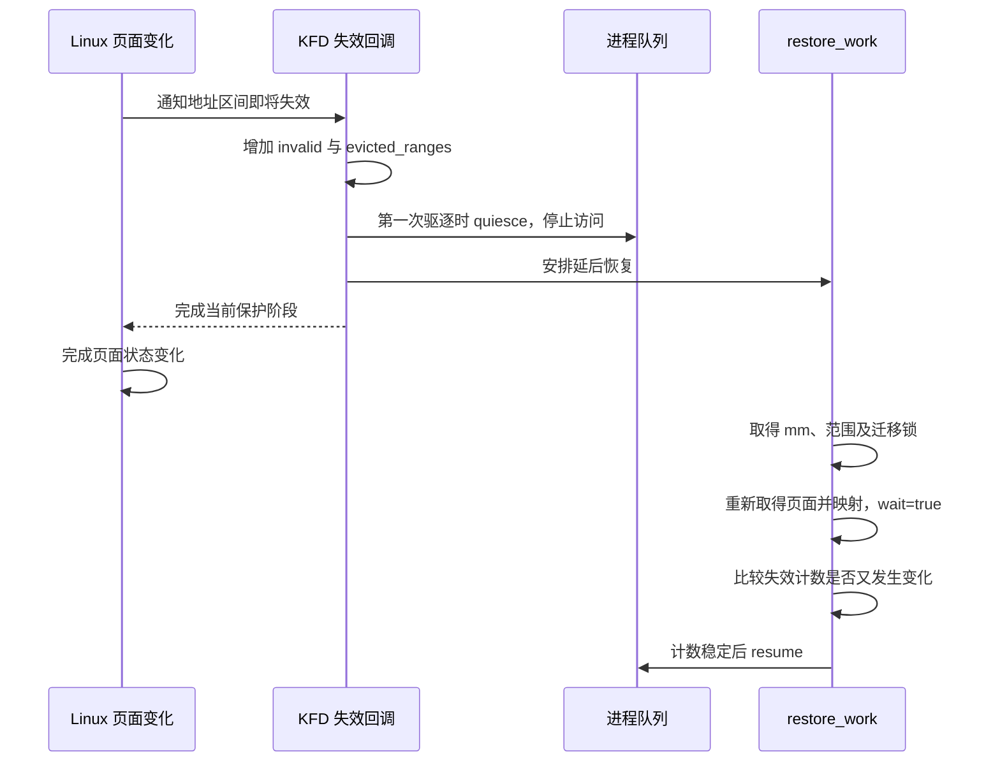

`invalid` 表示范围又发生了失效；`evicted_ranges` 记录进程范围恢复相关状态。后台线程记住开始处理时的计数，映射完成后用比较交换清零。如果期间又有新失效，计数已经改变，工作线程重新安排恢复，不能覆盖掉新事件后直接恢复队列。

Queue 驱逐与恢复沿用 03 的队列状态管理。这里驱逐的目的是暂时停止访存，并不是把应用重新创建为另一条 Queue。`kgd2kfd_resume_mm()` 在映射恢复且计数检查通过后执行；失败时不能写成 GPU 已继续运行。

固定源码还把设置了 `GPU_ALWAYS_MAPPED` 的范围放入这类保护分支，即使进程启用了 XNACK，也不能简单按“开 XNACK 就一律只撤销 PTE”判断。主例排除了这个标志，避免把两条流程混在一起。

> **[SOURCE]** Linux `248951ddc14d`，[`kfd_svm.c`](./2.源码/linux/drivers/gpu/drm/amd/amdkfd/kfd_svm.c) 第 2024～2062 行判断 XNACK/ALWAYS_MAPPED、驱逐并安排工作；第 1898～1990 行重新验证映射、比较计数并恢复队列。队列状态前提见 [03 上篇 §3.3](<./03_AMD GPU 队列与 AQL Dispatch（上）.md#33-queue-换出与恢复时的状态保存>)。

### 6.4 HMM 查询期间发生并发修改

**[DESIGN]** 线程 T1 正在为 GPU 恢复映射；另一个内存管理执行路径 T2 在允许并发的锁条件下替换或迁移了 A 的后备页。T1 的旧 PFN 必须在写进 GPU 页表之前被识别出来。

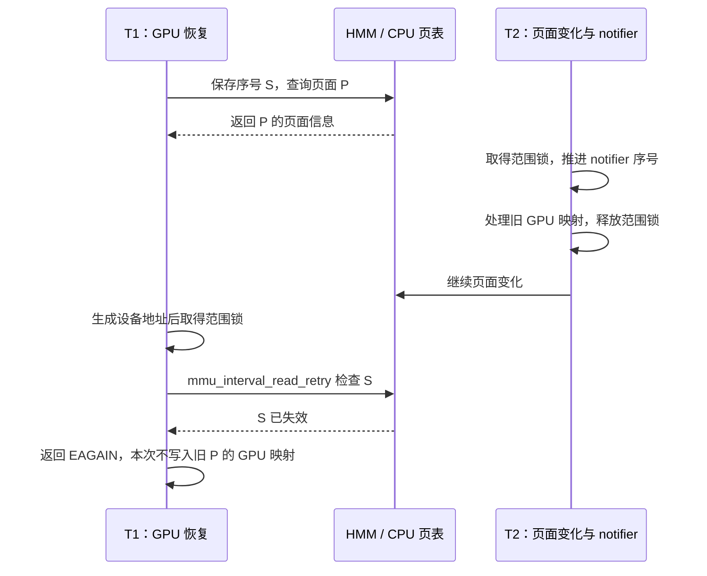

序号不是页面号，而是这次查询是否跨过失效事件的判据。`mmu_interval_read_begin()` 保存查询起点，回调在范围锁内通过 `mmu_interval_set_seq()` 记录变化。T1 也取得同一范围锁后检查旧序号，避免检查刚通过、回调就穿插进来，而 T1 仍毫无协调地写入旧映射。

各层保护的对象不同：

- `mm` 引用保护地址空间对象的使用期；不能阻止进程在其他阶段改变 VMA。
- `mmap_lock` 保护 VMA 结构和相关操作的合法时序；读锁允许其他符合锁规则的页表活动。
- `svms->lock` 保护进程范围集合的管理。
- `migrate_mutex` 串行化同一范围的迁移、验证与映射更新。
- `prange->lock` 配合失效回调，保护范围字段及检查后使用页面结果的阶段。

`munmap()` 需要的写锁会与当前持有的 `mmap_read_lock` 冲突，因此不能把它画成在 T1 持读锁期间任意删除 VMA。上图选择的是允许相应并发的页面变化；解除映射要按下一节的锁边界推演。

> **[SOURCE]** Linux `248951ddc14d`，[`amdgpu_hmm.c`](./2.源码/linux/drivers/gpu/drm/amd/amdgpu/amdgpu_hmm.c) 第 195、239～246 行保存和检查序号；[`kfd_svm.c`](./2.源码/linux/drivers/gpu/drm/amd/amdkfd/kfd_svm.c) 第 1826～1859 行在范围锁下检查并使用结果，第 2683～2695 行在同一范围锁保护下处理通知。范围锁与迁移锁的字段说明见 [`kfd_svm.h`](./2.源码/linux/drivers/gpu/drm/amd/amdkfd/kfd_svm.h) 第 68～103 行。

### 6.5 范围拆分与迁移交错

**[DESIGN]** R 是 §2.5 的 16 页范围，CPU 线程准备解除中间 4 页映射，另一执行路径正在处理 R 的迁移或 GPU 恢复。要先看谁取得地址空间锁，而不是假设所有动作都能同时执行。

```text
情况一：迁移/恢复已持有 mmap 读锁
  T1：保持 VMA 稳定，完成当前受保护处理，再释放锁
  T2：munmap 等待写锁；取得后才删除中间地址并触发 UNMAP
  KFD：撤销相交 GPU 映射，安排范围拆分与 notifier 更新

情况二：UNMAP 已进入范围处理，延后列表工作尚未完成
  T2：在回调允许的上下文中标记/拆出范围，安排 deferred_list_work
  T1：故障查找可能遇到待更新范围或 child_list
      → 按 skip_recover 或 EAGAIN 分支暂缓
  worker：更新区间树与 notifier，排空相关旧故障，再完成删除
```

notifier 回调所处的锁环境不适合直接完成所有区间树、notifier 和内存释放动作，所以源码把部分工作放到延后线程。短暂存在的 `child_list` 表示拆分出的子范围还没有完成全部登记；查范围函数也会检查这些子范围。

延后工作需要使用 `mm` 时，通过 `mmget_not_zero()` 取得有效引用，处理结束后配对释放。范围本身的生命周期由范围锁、集合管理和工作列表协议协调；显存管理对象另用自己的引用。不能把它概括为“每次 fault 给 `svm_range` 随便加一个引用就安全”。

拆分涉及已有 HBM 资源时，多个新范围可以通过引用共享同一个 `svm_range_bo`。这个对象管理已有的显存缓冲对象，范围拆分时保留相应资源引用和偏移关系：

```text
拆出的范围一、范围二 → 各自持有引用 → 同一个 svm_range_bo → 原有 HBM 缓冲对象
```

因此，新增范围记录可以继续使用原来的 HBM 资源；记录数量增加本身不表示发生了相同次数的页面复制。

当中间 4 页解除映射后，两侧合法范围可以继续存在。旧记录如果指向已经删除的部分，应被丢弃或按失败处理；若指向仍保留但尚待 notifier 更新的部分，可以在状态完成后再尝试恢复。

> **[SOURCE]** Linux `248951ddc14d`，[`kfd_svm.c`](./2.源码/linux/drivers/gpu/drm/amd/amdkfd/kfd_svm.c) 第 2417～2507 行执行延后工作并持有/释放 `mm` 引用，第 2550～2637 行撤销、拆分并安排工作，第 2711～2740 行查询父/子范围，第 2968～3005 行判断暂缓恢复，第 1840～1843 行在验证时发现子范围则返回 `-EAGAIN`。

> **[SOURCE]** Linux `248951ddc14d`，[`kfd_svm.h`](./2.源码/linux/drivers/gpu/drm/amd/amdkfd/kfd_svm.h) 第 41～50 行定义显存管理对象；[`kfd_svm.c`](./2.源码/linux/drivers/gpu/drm/amd/amdkfd/kfd_svm.c) 第 1006～1082 行在拆分时维护共享资源引用、范围偏移和属性。

## 7. 故障结果、错误报告与资源回收

### 7.1 返回值对应的实际处理结果

故障处理函数处理的是一条记录。记录可能对应当前仍需修复的访问，也可能对应已经被别的恢复、解除映射或进程退出处理过的旧状态。返回值要结合到达它的分支解释。

| `svm_range_restore_pages()` 中的情况   | 本次完成的工作                       | 后续应怎样理解                                |
| ---------------------------------------- | ------------------------------------ | --------------------------------------------- |
| 页面验证与映射处理成功                   | 已完成同步更新或安排异步更新，返回 0 | GPU 后续访问与 Kernel 完成仍各有条件          |
| 查不到 PASID 对应进程                    | 直接返回 0                           | 当前记录没有可恢复的进程对象，未创建新映射    |
| 正在排空故障，或已取不到`mm`           | 放弃本次恢复并返回 0                 | 不再对退出中的地址空间建表                    |
| 范围刚被恢复，命中重复记录判断           | 跳过重复恢复，返回 0                 | 使用先前恢复的进展，不重复迁移和建表          |
| 已有范围，但对应 VMA 已移除              | 视为迟到记录，返回 0                 | 该地址未被重新授权                            |
| 范围正在延后操作中，命中`skip_recover` | 移除相关过滤记录后退出               | 等待范围处理推进，不能使用未登记完的 notifier |
| 验证返回`-EAGAIN`                      | 释放锁与引用，清理过滤项，外层改为 0 | 允许后续再尝试；这次并未完成映射恢复          |
| 访问权限或必要资源检查失败               | 返回实际错误                         | 上层进入计算故障失败路径                      |

“VMA 已移除返回 0”适用于代码已经找到某个旧范围后，再发现 VMA 消失的分支。若故障时从未找到范围，尝试创建记录又因没有 VMA 失败，则会返回错误。不能把“没有 VMA”压成一个脱离上下文的固定返回值。

> **[SOURCE]** Linux `248951ddc14d`，[`kfd_svm.c`](./2.源码/linux/drivers/gpu/drm/amd/amdkfd/kfd_svm.c) 第 3070～3113、3135～3193、3244～3272 行给出上述返回路径。下面是函数末尾的连续片段，前文已在第 3254～3265 行释放相应锁与引用。

```c
3267:     if (r == -EAGAIN) {
3268:         pr_debug("recover vm fault later\n");
3269:         amdgpu_gmc_filter_faults_remove(node->adev, addr, pasid);
3270:         r = 0;
3271:     }
3272:     return r;
```

日志的意思是“稍后再恢复这个 VM 故障”。这段把本次暂缓处理转为上层可接受的返回结果，并移除相关故障过滤项；它没有在这里循环到成功，也没有把当前 Kernel 的 Completion Signal 改为完成。

### 7.2 权限失败和资源失败

先看写入只读 VMA 的情况。KFD 根据本次 `write_fault` 检查 VMA；权限不允许时，不会用分配新页的方式绕过权限，而是返回 `-EPERM`。页面取得、设备地址映射或资源分配失败，也会沿各自错误路径向上返回。

```text
可恢复故障进入 KFD
  ├─ 暂时失效：EAGAIN → 暂缓本次处理，允许以后再尝试
  ├─ 迁入 HBM 失败：尝试系统内存回退 → 再验证是否可映射
  └─ 无法恢复的权限/页面/映射错误：非零返回
       → amdgpu_vm_handle_fault 重新取得 VM
       → VM 仍存在时进入计算故障失败处理
       → 尝试写入促成 no-retry fault 的表项状态
       → 后续错误上报按实际故障记录继续
```

固定计算分支选择 `AMDGPU_VM_NORETRY_FLAGS`，源码说明其用途是促成非重试故障。文件里其他上下文还存在 dummy page 等处理，不能把那些分支搬进本篇的 KFD 计算恢复。

错误码与可重试性也要分开：`-EAGAIN` 在这里有明确的暂缓协议；内存不足、DMA 映射失败等并没有在该出口统一改成“无限重试”。即使应用以后可能重新申请资源，当前调用的失败仍要按上层实际处理。

复制 Fence 需要额外看返回传播。`svm_migrate_copy_done()` 返回 `dma_fence_wait()` 的结果，但 §5.3 中调用它时没有把该返回值赋回 `r`。而 `dma_fence_wait()` 主要等待 Fence 进入完成状态，不能单独当作所有硬件作业错误都已检查的证明。阅读这个基线时，应分别追踪复制提交错误、Fence 状态、设备错误与 Reset 路径，不把帮助函数名称当作完整错误处理协议。

> **[SOURCE]** Linux `248951ddc14d`，[`kfd_svm.c`](./2.源码/linux/drivers/gpu/drm/amd/amdkfd/kfd_svm.c) 第 3189～3201 行检查权限和可选位置，第 3217～3238 行尝试迁移回退；[`amdgpu_vm.c`](./2.源码/linux/drivers/gpu/drm/amd/amdgpu/amdgpu_vm.c) 第 3024～3047 行重新查 VM 并选择计算错误表项；[`kfd_migrate.c`](./2.源码/linux/drivers/gpu/drm/amd/amdkfd/kfd_migrate.c) 第 200～210、451～476 行显示等待帮助函数与调用者的返回值关系。

> **[SOURCE]** Linux `248951ddc14d`，[`include/linux/dma-fence.h`](./2.源码/linux/include/linux/dma-fence.h) 第 646～665 行定义完成状态与错误状态查询，第 721～747 行定义 `dma_fence_wait()` 的等待结果，两者需分别解释。

**[BOUNDARY]** 本篇验证正常恢复及可见错误分支，不据此承诺 SDMA 超时、GPU Reset 或设备消失以后还能保留这次任务的正确结果。完整作业错误传播与 Reset 单独学习。

### 7.3 故障通知与任务完成等待

GPU 内存访问无法恢复时，CPU 应用需要收到错误信息。错误通知与正常 Completion Signal 更新是两条流程。

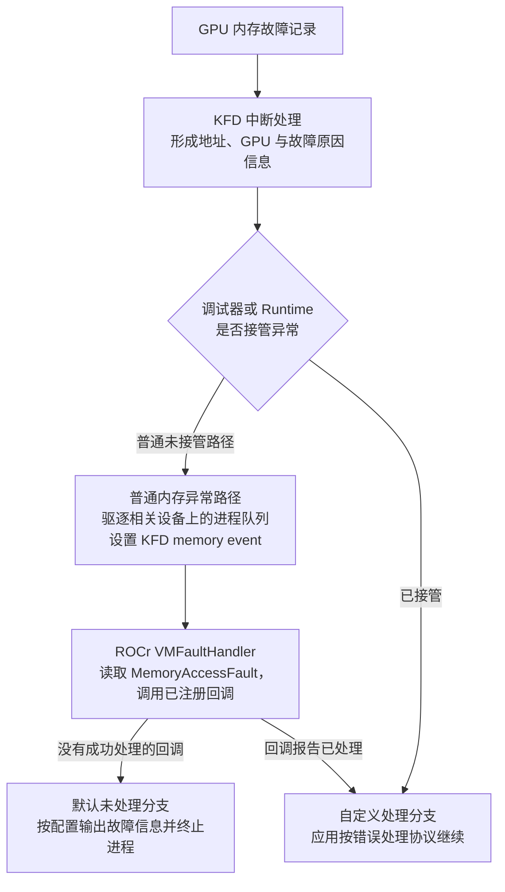

固定 GFX9 路径提取故障页和权限位，形成异常数据，再交给 KFD 调试/运行时异常分发。在普通未接管的内存异常分支，KFD 驱逐进程在该设备上的队列，并设置内存事件；事件中携带故障信息，等待该事件的用户态处理获得通知。

ROCr 的 `VMFaultHandler()` 从事件取得 `MemoryAccessFault`，向已注册系统事件回调提供 GPU Agent、虚拟地址和原因。没有成功处理的自定义回调时，固定默认路径最终调用 `abort()`。自定义回调返回成功，只表示该回调接管了错误处理，不能由此推定原 Kernel 已继续执行。

03 中应用等待的是某个任务的 Completion Signal 条件。发生不可恢复故障后，不应假定驱动会把所有依赖 Signal 自动减到 0。依赖该 Kernel 的任务可能无法正常推进；应用需按运行时错误协议处理取消、终止或上层恢复。

一个 CPU 等待线程即使被唤醒，也还要重新检查它等待的条件、错误和超时状态。内存错误事件被设置与“C 数组已完整计算”分别表达不同结果。

> **[SOURCE]** Linux `248951ddc14d`，[`kfd_int_process_v9.c`](./2.源码/linux/drivers/gpu/drm/amd/amdkfd/kfd_int_process_v9.c) 第 540～572 行形成内存异常，第 578～599 行给出 GFX9.4.3 的节点分发适配；[`kfd_debug.c`](./2.源码/linux/drivers/gpu/drm/amd/amdkfd/kfd_debug.c) 第 199～245 行选择分发、驱逐及内存事件路径；[`kfd_events.c`](./2.源码/linux/drivers/gpu/drm/amd/amdkfd/kfd_events.c) 第 1207～1256 行设置内存事件。ROCr `ba56a24c6132`，[`runtime.cpp`](./2.源码/rocr-runtime/runtime/hsa-runtime/core/runtime/runtime.cpp) 第 1826～1943 行实现 `VMFaultHandler()`。

### 7.4 进程退出与范围释放

进程退出时，Linux 即将释放它的用户地址空间。KFD 必须先停止 GPU 对这些地址的使用，再处理尚未结束的恢复工作和范围对象。

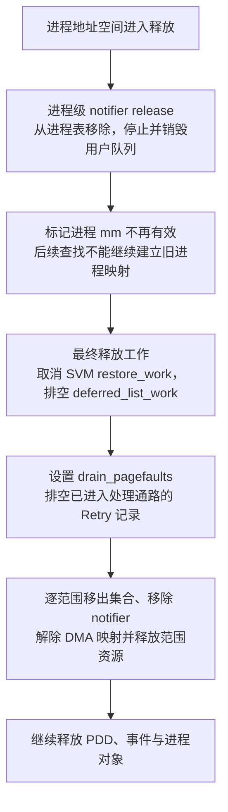

进程级 release 回调先移除进程表项，取消相关工作，再停止并销毁用户队列。源码明确说明，在该回调返回以后，Linux 的地址空间退出可以继续释放进程内存，所以设备停止访问必须发生在此前。

最终释放阶段调用 `svm_range_list_fini()`。它先取消范围恢复工作、排空延后列表工作，再设置停止处理故障的标志并排空 Retry 记录，随后移除范围与 notifier、清理 DMA 映射和资源。完成范围清理后才继续销毁 PDD 等对象。

迟到的故障记录有两类保护：查进程表已经找不到对象时直接退出；已经拿到进程引用的处理者仍会检查排空标志、`mm` 和 VMA，并在结束时释放引用。资源回收不能只看“应用线程退出了”，还要保证这些内核使用者结束。

GPUVA 消失、GPU PTE 撤销、IOMMU/DMA 映射释放和物理页可回收是不同层级的动作。进程级停止访问、VM 生命周期与范围资源清理共同保护这个过程；不能在观察到一条 unmap 调用后就提前释放所有后备页。

> **[SOURCE]** Linux `248951ddc14d`，[`kfd_process.c`](./2.源码/linux/drivers/gpu/drm/amd/amdkfd/kfd_process.c) 第 1326～1352 行移除进程并停止用户队列，第 1268～1283 行展示最终资源释放顺序；[`kfd_svm.c`](./2.源码/linux/drivers/gpu/drm/amd/amdkfd/kfd_svm.c) 第 3333～3363 行清理 SVM 范围，第 254～310 行清理范围持有的 DMA 映射与资源。Queue 退出的详细前提见 [03 下篇 §8.5](<./03_AMD GPU 队列与 AQL Dispatch（下）.md#85-进程退出时的-queue-停止与地址空间释放>)。

### 7.5 从现象判断失败阶段

下面的记录都是教学推演，不是实体设备日志。判断时先列已经观察到的事件，再决定下一处观测位置。

**同一页反复发生 GPU 故障。** 已知 PASID 相同、故障页相同，还不能判断为同一个缺陷。先按时间排列：范围失效 → HMM 查询 → 映射提交 → 更新完成或错误 → 后续故障。若每次恢复后都有新的 notifier 事件，应先找谁在改变页面；若范围稳定但 SDMA 更新一直未完成，则检查更新作业进度；若 VMA 权限拒绝访问，则检查应用访问是否合法。重复故障过滤和范围时间戳会影响记录数量，不能用原始计数直接当作执行次数。

**CPU/GPU 交替访问导致反复迁移。** 已知同一范围出现 RAM → HBM、HBM → RAM、再次 RAM → HBM，可以对照期望位置、预取请求和实际访问者。若 GPU 工作阶段之间，CPU 每次都读取该页，device-private 语义会触发迁回；下一次 GPU 又按偏好迁入，形成反复搬运。优化前需要知道迁移页数、发生频率和数据使用期，不能只凭一次 fault 就修改全局策略。

**任务长期没有正常完成。** 先看是否有不可恢复错误事件或队列驱逐，再看 GPUVM 更新和复制各自的 Fence 状态。若这些阶段都已结束，继续检查应用 Completion Signal 与依赖任务；不要因为页面恢复函数返回 0，就排除后续 Kernel 或完成通知问题。CPU 的等待返回也要核对等待条件，沿用 03 的判断方式。

适合一起记录的字段包括：PASID、故障页、读写类型、节点、时间戳、`svm_range` 边界、`actual_loc`/`preferred_loc`、请求和成功迁移页数、失效原因，以及对应更新或复制 Fence 的状态。不同记录之间先按进程、地址和时间关联，再判断能否关联到 Packet 37。

> **[SOURCE]** Linux `248951ddc14d`，[`kfd_svm.c`](./2.源码/linux/drivers/gpu/drm/amd/amdkfd/kfd_svm.c) 第 3170～3176 行过滤近期重复恢复，第 3208～3252 行记录故障与迁移过程；[`kfd_migrate.c`](./2.源码/linux/drivers/gpu/drm/amd/amdkfd/kfd_migrate.c) 第 427～467、730～771 行记录迁移范围、方向及完成信息。本篇据这些可见状态安排观测顺序，不推定未观察到的硬件原因。

## 8. 完整案例复盘与源码检索

### 8.1 页面留在 system RAM

回到最初的 A：CPU 写好输入，页在 `0x4567_8000`；GPU 读取 `0x3000_0014` 时缺少可用映射。

```text
1. GPU 故障记录：PASID 42，VMID 5，故障页 0x3000_0000，读访问
2. KFD 找到进程和设备；用虚拟页号 0x3_0000 找到 A 的范围
3. VMA 允许读，范围状态有效；actual_loc=0，best_loc=0
4. HMM 取得已有 RAM 页的信息；DMA API 为当前 GPU 返回 0x1234_5000
5. 范围锁内确认 notifier 序号有效，且没有待处理拆分
6. GPUVM 为 0x3000_0000 安排指向 0x1234_5000 的 PTE/PDE 更新
7. 按当前 CPU/SDMA 后端与失效条件推进，不额外假定 wait=true
8. 新访问满足条件后，GPU 请求 0x1234_5014
9. Host IOMMU 将请求翻译到 0x4567_8014，返回 A[5]
10. GPU 继续计算；整个 Kernel 的完成另由 Completion Signal 表达
```

整个过程中没有复制 A。新增的是设备访问所需的地址映射与 GPU 表项；Linux 原来的 CPU 映射继续指向同一 RAM 页。若 CPU 页表期间改变，步骤 5 或后续 notifier 处理会迫使驱动重新取得页面，不能继续使用旧结果。

### 8.2 页面迁入 HBM，再由 CPU 访问

这次期望位置为目标 GPU。用 P、D、Q 分别表示最初 RAM 页、目标 HBM 页、后来迁回的 RAM 页；不要求 Q 与 P 是同一个物理页。

| 时间点              | 数据后备         | CPU 页表状态                  | GPU 访问状态                            |
| ------------------- | ---------------- | ----------------------------- | --------------------------------------- |
| CPU 初始化后        | RAM 页 P         | 普通映射到 P                  | 本例尚无 A 的可用映射                   |
| 迁移准备与复制期间  | P 为源，D 为目标 | 受迁移条目和锁保护            | 旧映射按 notifier 协议撤销或队列暂停    |
| 复制与 finalize 后  | 成功页位于 HBM D | device-private 软件条目       | 后续验证并建立指向 D 的映射             |
| GPU 工作阶段        | HBM D            | 仍记录设备私有后备            | GPU 读取 D，执行 Packet 37              |
| 应用同步后 CPU 读 A | D 向 RAM Q 迁回  | 故障处理，迁回并安装 Q 的映射 | 对 D 的旧映射随失效协议处理             |
| CPU 读取成功        | RAM Q            | 普通映射到 Q                  | 下次 GPU 使用时按策略恢复映射或再次迁移 |

A 的指针数值从始至终为 `0x3000_0000`。改变的是数据所在页面、CPU 页表的软件状态，以及 GPU PTE 的目标地址。复制完成由 `mfence` 跟踪，页表更新使用自己的完成状态，Kernel 结束继续使用应用的完成协议。

### 8.3 恢复期间解除映射或退出进程

先按锁确定发生顺序，再按对象是否还存在决定后续动作。

```text
局部解除映射
  已持 mmap 读锁的恢复阶段先完成或退出
  → munmap 取得写锁并改变 VMA
  → notifier 撤销相交 GPU 映射
  → 范围拆分与 notifier 更新交给适当上下文完成
  → 旧故障被丢弃；保留范围的后续访问按新状态检查

进程退出
  从进程表移除并停止用户队列
  → mm 进入退出状态
  → 排空恢复工作、延后范围工作和 Retry 记录
  → 移除 notifier，清理设备地址与范围资源
  → 已持有引用的处理者结束，最终释放对象
```

若处理过程中遇到 `-EAGAIN`，本次恢复没有完成；若查不到进程或 VMA，驱动没有义务保留旧计算。应用在资源还被 GPU 使用时撤销或退出，正常任务结果可能无法取得，内核仍需保证不会继续使用已释放的对象。

### 8.4 源码索引与自检题

以下索引按“当前要回答的问题”组织。所有 Linux 位置对应 `248951ddc14d`，所有 ROCr 位置对应 `ba56a24c6132`；行号用于本地固定文件。

> **[SOURCE] 可选源码索引**
>
> - 属性请求怎样进入驱动：ROCr [`hsa_ext_amd.cpp`](./2.源码/rocr-runtime/runtime/hsa-runtime/core/runtime/hsa_ext_amd.cpp) 第 1234～1242 行；[`runtime.cpp`](./2.源码/rocr-runtime/runtime/hsa-runtime/core/runtime/runtime.cpp) 第 2562～2730 行；[`libhsakmt/src/svm.c`](./2.源码/rocr-runtime/libhsakmt/src/svm.c) 第 40～101 行；Linux [`kfd_chardev.c`](./2.源码/linux/drivers/gpu/drm/amd/amdkfd/kfd_chardev.c) 第 1741～1763 行。
> - 范围保存什么、按什么拆分：[`kfd_svm.h`](./2.源码/linux/drivers/gpu/drm/amd/amdkfd/kfd_svm.h) 第 68～140 行；[`kfd_svm.c`](./2.源码/linux/drivers/gpu/drm/amd/amdkfd/kfd_svm.c) 第 2204～2307、3710～3843 行。
> - HMM 在哪里调用通用 CPU 缺页：[`mm/hmm.c`](./2.源码/linux/mm/hmm.c) 第 73～94、659～684 行；[`amdgpu_hmm.c`](./2.源码/linux/drivers/gpu/drm/amd/amdgpu/amdgpu_hmm.c) 第 168～246 行。
> - CPU 缺页怎样选择分支：[`mm/memory.c`](./2.源码/linux/mm/memory.c) 第 4244～4336 行 COW，第 4747～5116 行软件条目与换入，第 5287～5400 行匿名页，第 5964～6010 行文件缺页，第 6335～6408 行普通 PTE 分派；[`mm/filemap.c`](./2.源码/linux/mm/filemap.c) 第 3540～3690 行文件缓存与读入。
> - GPU 恢复怎样进入 KFD：[`amdgpu_vm.c`](./2.源码/linux/drivers/gpu/drm/amd/amdgpu/amdgpu_vm.c) 第 2986～3047 行；[`kfd_svm.c`](./2.源码/linux/drivers/gpu/drm/amd/amdkfd/kfd_svm.c) 第 3047～3272 行。
> - 页面怎样成为 GPU 映射：[`kfd_svm.c`](./2.源码/linux/drivers/gpu/drm/amd/amdkfd/kfd_svm.c) 第 160～203、1434～1577、1679～1871 行；[`amdgpu_vm.c`](./2.源码/linux/drivers/gpu/drm/amd/amdgpu/amdgpu_vm.c) 第 972～1020、1107～1238 行。
> - 页表由谁写，谁等待：[`amdgpu_vm_cpu.c`](./2.源码/linux/drivers/gpu/drm/amd/amdgpu/amdgpu_vm_cpu.c) 第 50～135 行；[`amdgpu_vm_sdma.c`](./2.源码/linux/drivers/gpu/drm/amd/amdgpu/amdgpu_vm_sdma.c) 第 77～145 行；[`kfd_svm.c`](./2.源码/linux/drivers/gpu/drm/amd/amdkfd/kfd_svm.c) 第 1557～1574、3244～3245 行。
> - 数据怎样迁移、CPU 如何迁回：[`kfd_migrate.c`](./2.源码/linux/drivers/gpu/drm/amd/amdkfd/kfd_migrate.c) 第 126～210、394～476、693～779、942～1020 行；[`mm/migrate_device.c`](./2.源码/linux/mm/migrate_device.c) 第 681～764、1254～1266、1337～1352 行。
> - 失效与后台恢复怎样配合：[`kfd_svm.c`](./2.源码/linux/drivers/gpu/drm/amd/amdkfd/kfd_svm.c) 第 1898～1990、2010～2088、2417～2507、2550～2698 行。
> - 内存错误怎样进入用户态：[`kfd_int_process_v9.c`](./2.源码/linux/drivers/gpu/drm/amd/amdkfd/kfd_int_process_v9.c) 第 540～572 行；[`kfd_debug.c`](./2.源码/linux/drivers/gpu/drm/amd/amdkfd/kfd_debug.c) 第 199～245 行；[`kfd_events.c`](./2.源码/linux/drivers/gpu/drm/amd/amdkfd/kfd_events.c) 第 1207～1256 行；ROCr [`runtime.cpp`](./2.源码/rocr-runtime/runtime/hsa-runtime/core/runtime/runtime.cpp) 第 1826～1943 行。
> - 进程退出怎样停止恢复并释放资源：[`kfd_process.c`](./2.源码/linux/drivers/gpu/drm/amd/amdkfd/kfd_process.c) 第 1268～1283、1326～1352 行；[`kfd_svm.c`](./2.源码/linux/drivers/gpu/drm/amd/amdkfd/kfd_svm.c) 第 3333～3363 行。

学习后，先不看源码，沿前面的图回答以下问题：

1. A 的指针值、CPU PTE 中的物理页、GPU PTE 中的设备地址、IOMMU 映射各保存什么？用 `0x3000_0014` 算出两侧最终访问位置。
2. A 已由 CPU 写好，为什么 GPU 仍可能缺页？此时哪些动作只更新映射，哪些动作才复制数据？
3. `svm_range`、VMA 和 `amdgpu_vm` 怎样关联？PASID、VMID、GPU ID 与 `gpuidx` 分别参与哪次查找？
4. HMM 怎样借用 CPU 缺页代码？为什么驱动调用它并不要求 CPU 先对 A 执行一次 load？
5. 匿名首次读、首次写、文件缓存命中、换入、COW 和访问标志故障，各会改变什么？哪些情况可以保持原数据页？
6. 故障恢复中的 `wait=false` 改变了哪个等待位置？为什么还要继续读 TLB 调用与序号判断？
7. `migrate_vma_pages()` 已返回，而复制 Fence 尚未完成时，什么保护仍在？何时调用 finalize？
8. `actual_loc` 是某 GPU ID，能否据此认定范围内所有页都在 HBM？还需检查什么？
9. HMM 查询之后页面被替换，哪次序号检查阻止旧 PFN 被写入 GPU 页表？这个检查为什么要配合范围锁？
10. `munmap()` 与已持 `mmap_read_lock` 的恢复怎样排序？延后范围工作又为何会让后续 fault 暂缓？
11. `svm_range_restore_pages()` 返回 0 有哪些含义？哪些分支根本没有创建映射？
12. 内存异常事件到达 Runtime 后，为什么仍不能把依赖任务的 Completion Signal 当作成功？退出时又要先停止哪些访问？

核对时，可分别回到 §1.1、§4.3、§2.1/2.3/4.2、§3.1/3.6、§3.2～3.5、§4.5、§5.3、§5.4、§6.4、§6.5、§7.1、§7.3～7.4。回答应包含对象保存的值、查找依据、状态变化与后续动作，而不只列出函数名。
