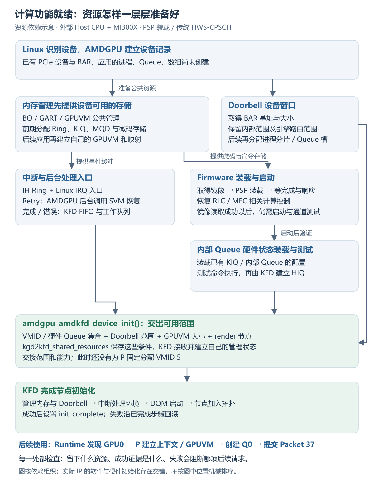
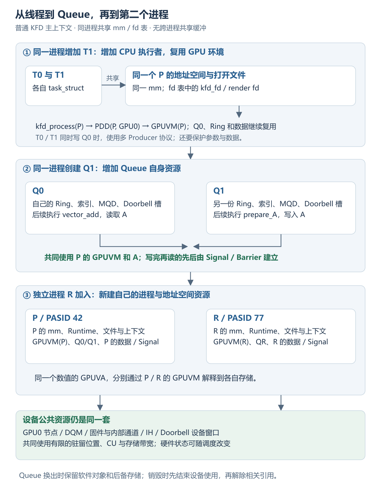
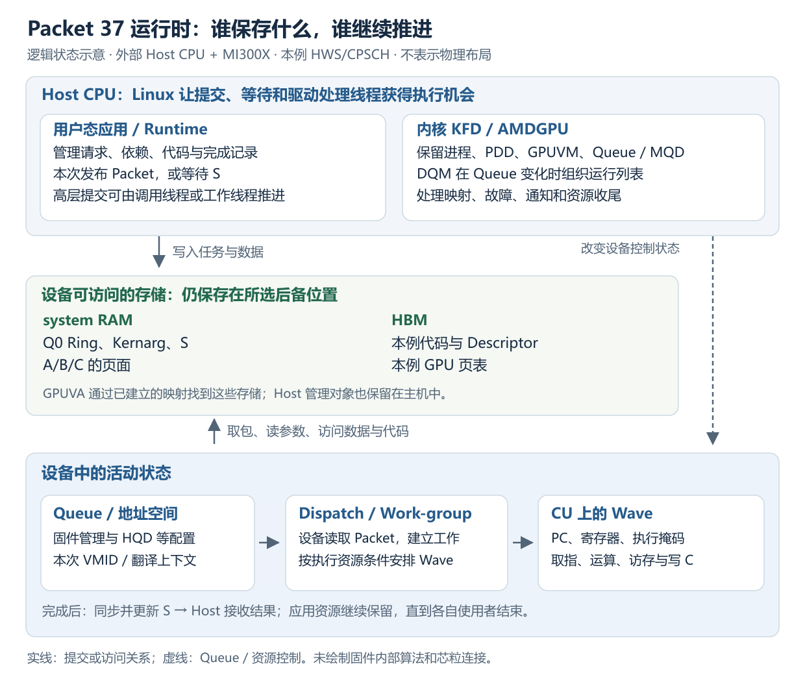
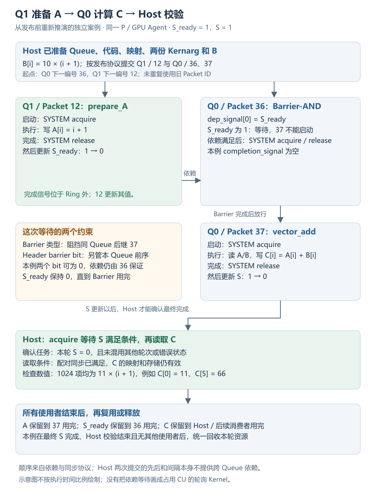
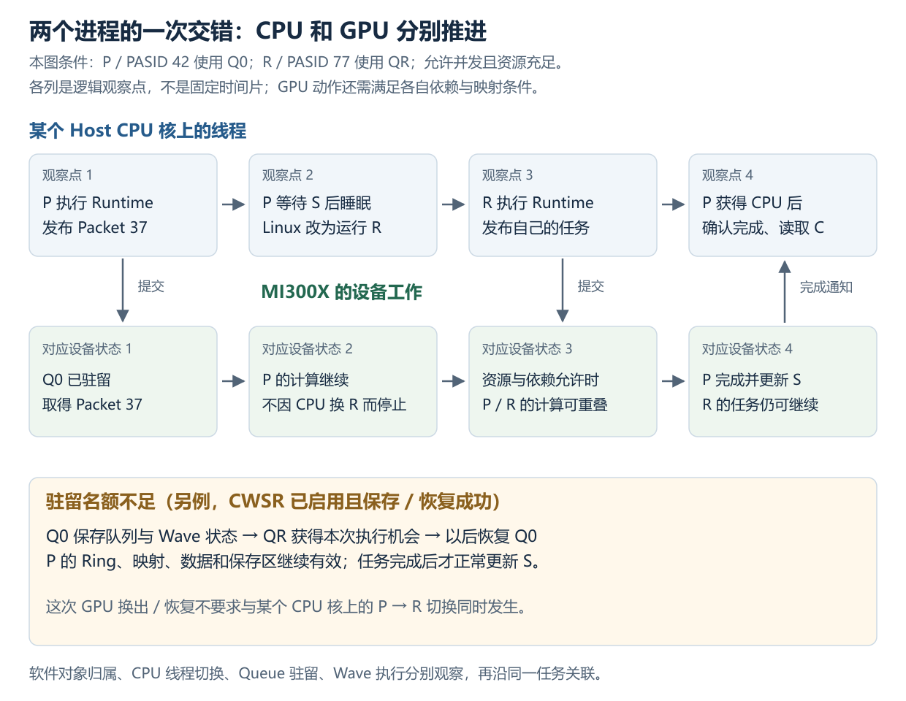

# AQL 应用的完整运行流程：驱动初始化、执行与资源释放

| 缩写   | 英文全称                                        | 中文含义                                               |
| ------ | ----------------------------------------------- | ------------------------------------------------------ |
| AMDGPU | AMD GPU Linux Kernel Driver                     | Linux 中的 AMD GPU 驱动                                |
| API    | Application Programming Interface               | 应用程序编程接口                                       |
| AQL    | Architected Queuing Language                    | HSA 的队列包格式与提交协议                             |
| BAR    | Base Address Register                           | PCIe 基址寄存器；描述设备地址窗口                      |
| BO     | Buffer Object                                   | 驱动管理的缓冲对象                                     |
| BSP    | Board Support Package                           | 板级支持包                                             |
| CDNA   | Compute DNA                                     | AMD 数据中心计算 GPU 架构系列                          |
| CLR    | Compute Language Runtime                        | ROCm 的高层语言运行时公共实现                          |
| CP     | Command Processor                               | GPU 命令处理器                                         |
| CPSCH  | Command Processor Scheduling                    | 命令处理器固件调度路径                                 |
| CPU    | Central Processing Unit                         | 中央处理器                                             |
| CU     | Compute Unit                                    | GPU 计算单元                                           |
| CWSR   | Compute Wave Save and Restore                   | 计算 Wave 执行现场的保存与恢复                         |
| DMA    | Direct Memory Access                            | 设备直接访问内存的机制                                 |
| DQM    | Device Queue Manager                            | KFD 的设备队列管理器                                   |
| DRM    | Direct Rendering Manager                        | Linux 图形设备管理框架                                 |
| FD     | File Descriptor                                 | 文件描述符，正文写作 fd                                |
| FIFO   | First In, First Out                             | 先进先出队列                                           |
| GART   | Graphics Address Remapping Table                | AMDGPU 访问系统内存所用的地址重映射表                  |
| GFX    | Graphics                                        | AMD 驱动中的图形／计算核心 IP 命名                     |
| GMC    | Graphics Memory Controller                      | 驱动中的 GPU 内存控制模块                              |
| GPU    | Graphics Processing Unit                        | 图形处理器                                             |
| GPUVA  | GPU Virtual Address                             | GPU 虚拟地址                                           |
| GPUVM  | GPU Virtual Memory                              | GPU 虚拟地址空间及其页表管理                           |
| GTT    | Graphics Translation Table                      | 本文指 AMDGPU 中可供设备访问的系统内存资源域           |
| HBM    | High Bandwidth Memory                           | 高带宽内存；本例为设备本地显存                         |
| HIP    | Heterogeneous-compute Interface for Portability | AMD 异构计算编程接口                                   |
| HIQ    | HSA Interface Queue                             | KFD 向设备提交调度管理命令的内部队列                   |
| HMM    | Heterogeneous Memory Management                 | Linux 异构内存管理机制                                 |
| HQD    | Hardware Queue Descriptor                       | 计算 Queue 驻留时使用的硬件描述状态                    |
| HSA    | Heterogeneous System Architecture               | 异构系统架构                                           |
| HSAKMT | HSA Kernel Mode Thunk                           | 用户态与 KFD 交互的接口层                              |
| HWS    | Hardware Scheduling                             | KFD 使用硬件／固件进行队列调度的模式                   |
| IB     | Indirect Buffer                                 | 存放设备命令的间接缓冲区                               |
| ID     | Identifier                                      | 标识符或编号，具体作用取决于所属对象                   |
| IH     | Interrupt Handler                               | AMDGPU 的中断记录与处理模块                            |
| IOMMU  | Input/Output Memory Management Unit             | 设备访问主机内存时使用的地址翻译单元                   |
| IOVA   | I/O Virtual Address                             | Host IOMMU 翻译前的设备地址                            |
| IP     | Intellectual Property                           | 本文指按功能组织的硬件模块                             |
| IRQ    | Interrupt Request                               | 中断请求                                               |
| ISA    | Instruction Set Architecture                    | 指令集架构                                             |
| KFD    | Kernel Fusion Driver                            | AMD GPU 的 Linux 计算驱动接口                          |
| KIQ    | Kernel Interface Queue                          | AMDGPU 内核使用的控制队列                              |
| LDS    | Local Data Share                                | CU 上供同组工作共享的局部存储                          |
| MEC    | Micro Engine Compute                            | AMD GPU 处理计算队列的命令处理引擎                     |
| MES    | Micro Engine Scheduler                          | AMD 的一种设备队列调度实现；本例关闭此分支             |
| MMU    | Memory Management Unit                          | 内存管理单元                                           |
| MQD    | Memory Queue Descriptor                         | 保存在内存中的 Queue 配置与状态描述                    |
| OpenCL | Open Computing Language                         | 开放计算语言及其异构计算接口                           |
| PASID  | Process Address Space ID                        | 设备使用的进程地址空间标识                             |
| PC     | Program Counter                                 | 程序计数器；记录下一条要执行的指令地址                 |
| PCI    | Peripheral Component Interconnect               | 外设互连；本文也用于 Linux PCI 子系统名称              |
| PCIe   | Peripheral Component Interconnect Express       | Host 与 MI300X 之间的高速互连                          |
| PDD    | Process Device Data                             | KFD 中某个进程在某个逻辑 GPU 上的记录                  |
| PM4    | AMD PM4                                         | AMD 驱动与设备使用的一类命令包格式                     |
| PQM    | Process Queue Manager                           | KFD 的进程队列管理器                                   |
| PSP    | Platform Security Processor                     | 参与 GPU 固件装载等工作的安全处理器                    |
| PTE    | Page Table Entry                                | 页表项                                                 |
| QPD    | Queue Process Device Data                       | PDD 内嵌的队列与调度状态，类型为`qcm_process_device` |
| RAM    | Random-Access Memory                            | 随机存取存储器；system RAM 指主机内存                  |
| RLC    | Run List Controller                             | GPU 运行列表控制器                                     |
| ROCm   | Radeon Open Compute                             | AMD GPU 计算软件平台                                   |
| ROCr   | ROCm Runtime                                    | ROCm 的 HSA 用户态运行时                               |
| SDMA   | System Direct Memory Access                     | AMD GPU 中执行数据搬运等操作的专用引擎                 |
| SVM    | Shared Virtual Memory                           | 共享虚拟内存                                           |
| TLB    | Translation Lookaside Buffer                    | 地址翻译缓存                                           |
| TTM    | Translation Table Maps                          | DRM 中的通用缓冲对象内存管理机制                       |
| VM     | Virtual Memory                                  | 虚拟内存或对应地址空间                                 |
| VMA    | Virtual Memory Area                             | Linux 中连续虚拟地址范围的管理对象                     |
| VMID   | Virtual Memory ID                               | GPU 硬件地址空间上下文编号                             |
| VRAM   | Video Random-Access Memory                      | 设备本地显存；本例对应 MI300X 的 HBM                    |
| XCC    | Accelerator Core Complex                        | 驱动描述的计算复合体实例                               |
| XCD    | Accelerator Complex Die                         | MI300X 的计算芯粒                                      |
| XNACK  | XNACK（AMD 功能名称）                           | GPU 缺页后重试访存的能力及相应进程模式                 |

## 本篇大纲

05 已经说明 GPU 读取 A 受阻时怎样取得页面、恢复映射，以及页面变化和进程退出怎样影响访问。本篇回溯同一项 AQL 应用的完整生命周期：先看这次计算依赖的设备和进程环境怎样建立，再把提交、访存、完成通知、下一轮复用和退出串起来。设备初始化发生在应用使用之前，缺页恢复发生在执行期间；下面按各自的触发时机说明。

本篇沿进程 P 使用 MI300X 计算 `C[i] = A[i] + B[i]` 的完整过程展开。开始时，Linux 已经识别出设备，但计算应用尚不能使用它；结束时，P 的任务、Queue、映射和引用已经收尾，设备继续服务其他进程。中间始终追踪同一组资源：前一步把什么准备好，后一步通过什么对象找到它，使用期间由谁保证它仍然有效。


这是软件调用与资源使用的流程图，箭头表示本例的先后与依赖关系，不表示芯片物理布局。[可编辑源图](./assets/06/application-lifecycle.svg)。

- [1. 驱动初始化：建立可供应用使用的设备资源](#1-驱动初始化建立可供应用使用的设备资源)：先概览 AMDGPU 的公共准备与 KFD 初始化的关系，再依次讲清内存、中断、Firmware、内部队列与 Doorbell 的准备、就绪判断和失败影响。
- [2. 应用接入：建立进程、地址空间与可复用资源](#2-应用接入建立进程地址空间与可复用资源)：连接 Runtime、设备文件、GPUVM 和 Queue，再依次加入同进程第二个线程、第二条 Queue、第二个进程，解释对象归属和生命周期保护。
- [3. 一项计算从 Runtime 请求到 GPU 执行](#3-一项计算从-runtime-请求到-gpu-执行)：跟踪代码与数据准备、软件提交、设备驻留、执行与访存；用两条 Queue 完成“准备 A → 计算 C”，再分别分析多进程调度和缺页变体。
- [4. 任务完成：通知 Host 并继续应用工作](#4-任务完成通知-host-并继续应用工作)：区分任务完成、结果可见和数值正确，接上 Signal、中断、Host 线程重新运行与下一轮资源复用；最后用这些阶段定位停滞。
- [5. 应用退出：停止设备访问并释放资源](#5-应用退出停止设备访问并释放资源)：先结束所有异步使用，再分别回收 Queue、任务资源、Runtime 与内核进程对象，并解释任务未完成时的退出。

<details>
<summary>小节索引：按运行阶段查阅</summary>

- **1. 驱动初始化**
  - [1.1 AMDGPU 提供设备信息，KFD 据此初始化](#11-amdgpu-提供设备信息kfd-据此初始化)
    - [设备信息的来源与计算](#设备信息的来源与计算)
    - [KFD 保存描述，后续为 Q0 安排资源](#kfd-保存描述后续为-q0-安排资源)
  - [1.2 PCI 设备与 IP 初始化顺序](#12-pci-设备记录与-ip-初始化的依赖顺序)
  - [1.3 驱动自身的内存准备](#13-内存管理先为驱动自己建立可用存储)
  - [1.4 IH、缺页恢复与事件通知入口](#14-ih-为缺页恢复与事件通知建立入口)
  - [1.5 Firmware 装载与启动](#15-firmware-从取得镜像到接受驱动命令)
  - [1.6 内部 Queue 与 Ring 测试](#16-内部-queue-与-ring-测试建立计算控制能力)
  - [1.7 Doorbell 窗口与分配](#17-doorbell-窗口进程分片与-queue-槽位)
  - [1.8 KFD 节点与拓扑就绪](#18-kfd-节点dqm-与拓扑进入可用状态)
  - [1.9 初始化失败的定位](#19-从初始化失败现象回到缺少的资源)
- **2. 应用接入**
  - [2.1 Runtime 初始化与设备发现](#21-runtime-初始化与-gpu-发现)
  - [2.2 设备文件、mm 与 GPUVM 关联](#22-设备文件mmkfd-上下文与-gpuvm-的关联)
  - [2.3 执行支持与应用内存](#23-运行时支持资源与应用内存的准备)
  - [2.4 Q0 创建与缓冲保护](#24-q0-的创建把用户存储交给驱动和设备使用)
  - [2.5 同进程的第二个线程](#25-同一进程增加第二个线程)
  - [2.6 同进程的第二条 Queue](#26-同一进程再创建-q1)
  - [2.7 第二个进程的资源归属](#27-第二个进程建立自己的资源关系)
  - [2.8 引用与资源寿命](#28-引用映射与任务完成共同约束资源寿命)
- **3. 提交与执行**
  - [3.1 代码、参数与数据准备](#31-代码参数与数据在发布前满足使用条件)
  - [3.2 Host 线程与 Runtime 提交](#32-host-线程与-runtime-安排本轮软件提交)
  - [3.3 Packet 发布与 Doorbell](#33-从预留槽位到有效发布再到设备推进)
  - [3.4 Queue 驻留与运行列表](#34-kfd-和设备固件使用户-queue-获得驻留条件)
  - [3.5 Kernel 执行与设备状态](#35-设备从-queue-状态进入-kernel-执行状态)
  - [3.6 跨 Queue 依赖变体](#36-两条-queue-完成准备依赖等待与计算)
  - [3.7 多进程调度变体](#37-两个进程运行时的-cpu-与-gpu-调度)
  - [3.8 可恢复缺页变体](#38-可恢复缺页把设备执行接回-host-处理)
- **4. 完成与复用**
  - [4.1 Kernel 结束与结果交接](#41-kernel-结束signal-更新与结果交接)
  - [4.2 Signal 通知与线程唤醒](#42-signal通知槽中断与等待线程的衔接)
  - [4.3 完成、可见与正确性检查](#43-分别确认完成可见与数值正确)
    - [SVM 变体完成后的 CPU 迁回](#svm-变体gpu-使用后cpu-读取-a-触发-hbm-迁回)
  - [4.4 下一轮的资源复用](#44-下一轮使用已有环境并等待所有消费者结束)
  - [4.5 用阶段证据定位停滞](#45-用阶段证据判断任务停在何处)
- **5. 退出与释放**
  - [5.1 停止提交与结束消费者](#51-先结束提交与所有消费者再归还任务资源)
  - [5.2 Queue 销毁与设备停止](#52-销毁-queue-时先撤销设备使用)
  - [5.3 解除映射与 Runtime 关闭](#53-内存解除映射runtime-关闭与对象收尾)
  - [5.4 提前退出与后台使用](#54-任务未完成时的进程退出与后台使用)
  - [5.5 应用结束后的设备服务](#55-p-退出以后设备继续服务-r)

</details>

前两节建立可以复用的设备和进程环境，第三、四节随任务反复执行，第五节结束应用对设备的使用。Runtime 可以延迟准备某些资源；Queue 的驻留管理从创建时就可能开始，以后还会因调度或内存变化再次发生。正文在实际交接处说明这些关系，不把它们排成每次 Dispatch 都串行经过的调用链。

首次连读正常任务时，沿 §1、§2 和 §3.1～§3.5 建立环境并执行，再接 [§4](#4-任务完成通知-host-并继续应用工作)取得结果、接 §5 释放资源。§3.6～§3.8 分别改变跨 Queue 依赖、进程竞争和访存条件；每个变体都从明示的起点重新推演，结束后回到同一套完成协议。停滞检查放在完成与复用之后的 [§4.5](#45-用阶段证据判断任务停在何处)，可以按已经学过的阶段反查。

00～05 已建立的系统参与者、进程地址空间、内存分配、Packet、地址翻译和缺页处理，会在本次任务用到它们时接回运行过程。正文保留当前步骤需要的条件和状态变化；字段编码、逐函数调用以及页表算法通过链接回查。文末 [§5.5](#55-p-退出以后设备继续服务-r)按各章的作用总结这条 AQL 主线，再指向 07 的具体小节。

**[DESIGN]** 固定采用外部 Host CPU + MI300X / CDNA 3 独立 GPU，system RAM 与 HBM 经 PCIe 连接；整卡作为一个逻辑 GPU Agent，Host IOMMU 开启翻译。P 在本例 GPU 上使用 PASID 42，VMID 5 是观察时刻的硬件驻留上下文编号。主线先取资源充足、映射有效、正常完成的条件；固件装载与 Queue 管理的具体配置在用到它们的小节说明。

任务仍有 1024 个元素，Q0 的 Packet 37 发起 `vector_add`，完成 Signal S 初值为 1。Q0 Ring 基址为 `0x1000_0000`，Packet 37 位于 `0x1000_0940`。Ring、Kernarg、S 和 A/B/C 放在 system RAM；代码、Descriptor 与 GPU 页表采用本例的 HBM 布置。A/B/C 使用满足 CPU/GPU 访问与 HSA 同步要求的细粒度系统内存，正常主线通过普通 KFD 内存接口建立 GPU 映射。

本例让 CPU 与 GPU 按 SYSTEM 范围交接输入、参数和结果。Packet 37 的 acquire/release fence scope 均取 SYSTEM，Host 以 acquire 语义等待 S。发布 Packet 的顺序在 §3.3 展开，计算结束后怎样交付结果在 §4 展开。

接口关系从 HSA/ROCr 层展开，便于看清驱动请求。高层 Runtime 应用会由其实现完成相应底层调用，§3.2 再接上 CLR 的提交路径。图中的接口不要求 HIP 应用逐个显式调用，也不把 Stream 与底层 AQL Queue 固定画成一一对应。

源码基线为 Linux `248951ddc14de84de3910f9b13f51491a8cd91df`、ROCr `ba56a24c6132c5d195686ae4adf969ca1222fbba`、CLR `81277d69e3352e7144ced2ee9601484f9b48d950`，后文使用其前 12 位。目录见[源码基线说明](./2.源码/README.md)。`[SOURCE]` 标记实现事实，`[SPEC]` 标记规范语义，`[DESIGN]` 标记教学条件，`[INFERENCE]` 标记条件推演，`[BOUNDARY]` 说明适用范围。

**[BOUNDARY]** 普通 DRM job、scheduler、TTM、`dma_resv` 及 CPU/SDMA 页表更新后端，按 [07 大纲](<./07_AMDGPU 通用内存管理与 DRM 任务提交（大纲）.md>)展开。本篇解释 AQL 在什么时机使用这些公共能力、接口返回时已经完成什么、还需要等待谁。

## 1. 驱动初始化：建立可供应用使用的设备资源

此时还没有进程 P，也没有 Q0、A/B/C 或 S。Linux 已枚举到 MI300X，能够识别设备及其 PCIe 资源。接下来要解决的问题是：应用打开计算接口时，驱动能否提供可访问的内存、可运行的 Queue 和能返回 Host 的通知通路。

先看资源依赖，再读初始化函数。图中的几个分支最后共同支撑 KFD，某个分支缺失会使后面的能力无法建立。图按依赖组织，实际 IP 初始化会交错进行。



图中方框写的是本阶段留下的资源和后续使用者，底部说明 AMDGPU 把设备信息传给 KFD，KFD 据此建立计算服务；不是芯片布局图。[可编辑源图](./assets/06/initialization-dependencies.svg)。下面先概览两部分的初始化关系，再沿设备初始化过程展开。

### 1.1 AMDGPU 提供设备信息，KFD 据此初始化

Linux 识别出 MI300X 后，驱动要把设备准备到计算应用可以使用的状态。AMDGPU 先建立公共内存管理、内部工作通道等基础，并确定供计算使用的资源范围；KFD 再依据这些信息，建立自己的计算设备管理。两部分代码都由 Host CPU 在 Linux 内核中执行。

本节先概览这两部分怎样接续，再说明传递的信息及其来源。§1.2～§1.7 从设备识别开始解释公共条件怎样准备，§1.8 说明 KFD 怎样完成节点初始化。当前仍处于设备初始化阶段，应用 P 和 Q0 要到第 2 节才建立。

```text
Linux 识别 MI300X，AMDGPU 建立设备记录
    → AMDGPU 完成 KFD 所需的公共准备，保存资源范围与配置
    → amdgpu_amdkfd_device_init()：读取已有记录，填写设备信息
        gpu_resources 保存：可用集合、地址窗口、地址上限和接口配置
    → 调用 kgd2kfd_device_init()，通过参数传入这份信息
    → KFD 把信息保存到自己的设备记录
    → KFD 继续建立管理内存、Doorbell 管理与节点服务
    → KFD 初始化成功，计算节点可供后续应用发现和使用
```

图中的 `gpu_resources` 是一个临时变量，类型为 `kgd2kfd_shared_resources`。它保存的是 Host 内核中的设备描述：AMDGPU 填写这些信息，KFD 接收后将结构体内容保存到 `kfd->shared_resources`，供自己的初始化与后续管理使用。

同一份描述包含硬件资源的可用范围、设备地址窗口、GPUVM 地址上限和软件接口配置。下面按用途列出本节需要的成员；这是简化说明，原始字段类型与未参与讲解的成员已省略。

```text
kgd2kfd_shared_resources：AMDGPU 提供给 KFD 的设备信息
    硬件资源的可用集合与数量：
        compute_vmid_bitmap        哪些 VMID 可供计算进程驻留使用
        cp_queue_bitmap            哪些硬件 Queue 位置可供 KFD 使用
        num_pipe_per_mec            每个 MEC 的 Pipe 数
        num_queue_per_pipe          每个 Pipe 的 Queue 数
    设备地址窗口与地址空间范围：
        doorbell_physical_address  Doorbell BAR 的起始地址
        doorbell_aperture_size      Doorbell 窗口的大小
        doorbell_start_offset       窗口前部由 AMDGPU 保留的字节数
        non_cp_doorbells_start/end  不能分配给 CP Queue 的 Doorbell 索引范围
        gpuvm_size                 GPU 虚拟地址空间的大小上限
    软件入口与实现配置：
        drm_render_minor           当前设备的 render 节点编号
        enable_mes                 队列管理实现的选择；本例关闭 MES
```

#### 设备信息的来源与计算

填写上面的成员时，AMDGPU 主要做两类操作：直接复制已有的软件记录，或用已有记录计算位图、大小与边界。已有记录又来自不同的初始化步骤。先看这些值怎样进入设备描述；图按来源归类，准备的详细顺序在后续小节展开。

```text
对应 IP 的已知参数与布局 → 记录每 MEC 的 Pipe 数、每 Pipe 的 Queue 数、Doorbell 布局
PCI 子系统的 BAR 2 资源 → 记录 Doorbell 窗口基址与大小
驱动的资源预留与 VM 配置 → 记录自用 Queue、KFD 的 VMID 起点、虚拟地址范围
DRM 设备建立与实现选择 → 记录 render 节点编号、MES 软件状态

上述结果分别保存在 AMDGPU 的设备记录中
    → amdgpu_amdkfd_device_init() 复制已有值，并计算所需位图、大小或边界
    → 填入 gpu_resources，供调用 KFD 初始化时传递
```

`num_pipe_per_mec` 和 `num_queue_per_pipe` 来自对应 IP 实现里的已知参数。设备识别选择本例的 GFX9.4.3 实现后，`gfx_v9_4_3_sw_init()` 直接把每个 MEC 的 Pipe 数设为 4、每个 Pipe 的 Queue 数设为 8，先保存到 AMDGPU 的设备记录，再复制到 `gpu_resources`。这组数值是该驱动实现所用的组织参数，本次填写时没有读取寄存器来统计数量。

`compute_vmid_bitmap` 由驱动选定的 KFD 起始 VMID 和支持的 VMID 数量计算：把允许 KFD 使用的编号标成 1。`cp_queue_bitmap` 则从 AMDGPU 自用 Queue 的软件位图计算：先对自用位置记录取反，再清掉超出有效硬件范围的位。两份位图中的“可用”表示驱动划给 KFD 的使用范围，而不是现场读取硬件的忙闲状态。

```text
AMDGPU 为内部计算 Ring 选择硬件 Queue 位置
    → 在软件位图中把自用位置标成 1
    → 准备 KFD 信息时取反，排除这些自用位置
    → 清除超过第一个 MEC 有效 Queue 范围的位
    → 得到 cp_queue_bitmap：1 表示该位置可供 KFD 使用
```

Doorbell 的几个成员来源不同。`doorbell_physical_address` 和 `doorbell_aperture_size` 来自 Linux 已建立的 PCI BAR 2 资源记录：AMDGPU 通过 `pci_resource_start()`、`pci_resource_len()` 取得基址与长度，保存后再复制给 KFD。`doorbell_start_offset` 是驱动预留区的字节大小，由预留计数换算；该计数已考虑页对齐和额外预留。`non_cp_doorbells_start/end` 则来自当前设备所选 Doorbell 布局的固定索引边界，本次传递时没有读取路由寄存器。

`gpuvm_size` 来自地址空间配置的计算。前面的 VM 初始化根据支持的地址位数、驱动参数和默认策略确定虚拟页范围，保存为 `max_pfn` 等记录。这里再把虚拟页数量换算成字节，并结合允许的地址范围限制，得到传给 KFD 的大小上限。

`drm_render_minor` 来自 DRM 核心的软件编号分配。DRM 建立 render 节点时分配编号，AMDGPU 从已有设备对象中取出编号，再复制给 KFD。

`enable_mes` 是驱动的软件状态，来自按 IP 版本选择队列管理实现的过程。本例固定源码的 GFX9.4.3 路径保持该值为 `false`，随后复制给 KFD；这里没有读取一个 MES 开关寄存器。

#### KFD 保存描述，后续为 Q0 安排资源

设备描述传到 KFD 后，KFD 继续建立自己的管理资源。以 Doorbell 为例，当前固定源码通过 Doorbell BO 分配接口取得资源，并用位图管理槽位；非 CP 索引范围会在进程位图中标为保留位置，使计算 Queue 避开它们。窗口描述的填写、KFD 内部管理的建立，以及以后 Q0 的分配分属不同步骤，具体分配与映射在 [§1.7](#17-doorbell-窗口进程分片与-queue-槽位)展开。

```text
设备信息传递：
    AMDGPU 取得 Doorbell 窗口与保留信息
        → 填入 gpu_resources
        → KFD 保存这份设备描述

KFD 自身初始化：
    通过 Doorbell BO 分配接口取得内部资源，建立槽位管理位图

以后 P 请求创建 Q0 时：
    P 取得自己的设备分片，位图标记非 CP 保留位置
        → 为 Q0 分配可用 Doorbell 槽位并准备用户访问
        → Runtime 取得 Q0 的 Doorbell 访问接口
        → 通过 Q0 发布 Packet 37 时，Host CPU 写这个 Doorbell 通知设备
```

以后 P 的 Q0 驻留时，才会使用相应的硬件 Queue 位置与 VMID；本例在后面的驻留阶段选用 VMID 5 作为教学取值。硬件位置有限，软件 Queue 的数量还受 KFD 配置与调度模式影响，有换出能力时可以随时间复用硬件位置。`gpuvm_size` 则提供地址空间上限，P 的 A/B/C 在申请与映射时才取得后备存储和具体页表项。

> **[SOURCE] 可选源码索引** Linux `248951ddc14d`：
>
> - 调用时点与信息传递：[`amdgpu_device.c`](./2.源码/linux/drivers/gpu/drm/amd/amdgpu/amdgpu_device.c) 第 2487～2495 行准备公共能力后调用入口；[`amdgpu_amdkfd.c`](./2.源码/linux/drivers/gpu/drm/amd/amdgpu/amdgpu_amdkfd.c) 第 171～230 行复制已有信息、计算可用位图，再调用 KFD 初始化。
> - 描述定义与接收：[`kgd_kfd_interface.h`](./2.源码/linux/drivers/gpu/drm/amd/include/kgd_kfd_interface.h) 第 107～148 行定义成员；[`kfd_device.c`](./2.源码/linux/drivers/gpu/drm/amd/amdkfd/kfd_device.c) 第 742～761 行保存结构体内容，第 789～859、881～977 行继续初始化并处理成功或失败。
> - IP 实现与数量参数：[`amdgpu_discovery.c`](./2.源码/linux/drivers/gpu/drm/amd/amdgpu/amdgpu_discovery.c) 第 2484～2487 行选择 GFX9.4.3 实现；[`gfx_v9_4_3.c`](./2.源码/linux/drivers/gpu/drm/amd/amdgpu/gfx_v9_4_3.c) 第 1063～1065 行直接设置组织参数，第 627～633 行建立自用 Queue 位图；[`amdgpu_gfx.c`](./2.源码/linux/drivers/gpu/drm/amd/amdgpu/amdgpu_gfx.c) 第 206～232 行选择位置并置位。
> - VMID 起点与位图：[`gmc_v9_0.c`](./2.源码/linux/drivers/gpu/drm/amd/amdgpu/gmc_v9_0.c) 第 2020～2034 行选择 KFD 起始编号；`amdgpu_amdkfd.c` 第 180～182 行据此计算可用集合，第 196～207 行计算 Queue 可用集合。
> - BAR 信息与驱动预留：[`amdgpu_doorbell_mgr.c`](./2.源码/linux/drivers/gpu/drm/amd/amdgpu/amdgpu_doorbell_mgr.c) 第 193～215 行取得 BAR 2 资源并记录初始预留，第 149～178 行按页对齐、增加预留并更新计数；`amdgpu_amdkfd.c` 第 96～125 行整理窗口信息与字节偏移。
> - 当前设备的非 CP 布局：[`soc15.c`](./2.源码/linux/drivers/gpu/drm/amd/amdgpu/soc15.c) 第 1170～1173、912～924 行选择并绑定当前 IP 的 Doorbell 初始化函数；[`aqua_vanjaram.c`](./2.源码/linux/drivers/gpu/drm/amd/amdgpu/aqua_vanjaram.c) 第 34～58 行设置布局，其中第 55～56 行保存非 CP 索引边界；`amdgpu_amdkfd.c` 第 222～226 行复制边界。
> - GPUVM 大小：`gmc_v9_0.c` 第 1936～1946 行选择本例 VM 配置；[`amdgpu_vm.c`](./2.源码/linux/drivers/gpu/drm/amd/amdgpu/amdgpu_vm.c) 第 2350～2392 行确定虚拟页范围；`amdgpu_amdkfd.c` 第 185～187 行换算并限制传给 KFD 的大小。
> - 软件编号与模式：[`drm_drv.c`](https://github.com/torvalds/linux/blob/248951ddc14de84de3910f9b13f51491a8cd91df/drivers/gpu/drm/drm_drv.c#L143-L172) 第 143～172、761～769 行分配 render 编号；`amdgpu_discovery.c` 第 2716～2754 行按 IP 版本选择 MES 实现；`amdgpu_amdkfd.c` 第 188～190 行复制软件记录。
> - KFD 的 Doorbell 分配：[`kfd_doorbell.c`](./2.源码/linux/drivers/gpu/drm/amd/amdkfd/kfd_doorbell.c) 第 62～96 行分配内部 Doorbell BO 和位图，第 210～234 行标记非 CP 保留索引，第 255～293 行分配进程位图与 Doorbell BO，第 106～142 行建立用户映射；[`kfd_device_queue_manager.c`](./2.源码/linux/drivers/gpu/drm/amd/amdkfd/kfd_device_queue_manager.c) 第 571～642 行分配 Queue 槽位并计算 Doorbell 索引。

后面逐项检查公共准备时，要看初始化函数留下了什么状态、从哪个返回路径确认成功，以及失败会阻断哪个后续请求。[§1.9](#19-从初始化失败现象回到缺少的资源)给出记录方法；未运行过的项目保留“未实测”，预期状态与设备观察分别记录。

### 1.2 PCI 设备记录与 IP 初始化的依赖顺序

PCI 子系统找到设备后，AMDGPU 的匹配路径进入 `amdgpu_pci_probe()`，建立 `amdgpu_device` 并启用设备。这个对象保存一块 GPU 的公共驱动状态，后来的 P、R 都使用它所管理的资源。AMDGPU 模块还准备全局 KFD 字符设备和拓扑框架；每块可支持的 GPU 再建立相应 KFD 设备记录。

接下来按 IP 块初始化。这里的 `sw_init` 主要建立软件管理状态、分配缓冲与取得镜像；`hw_init` 把已经准备的地址和配置用于硬件，使相应通路工作。两者有资源依赖：若要装载 Firmware 或建立内部 Ring，必须先有能分配且设备可以访问的内存。

```text
PCI 设备与 amdgpu_device 已存在
    → 各 IP 建立软件状态
        COMMON（公共基础模块）、GMC（内存控制模块）提前完成必要的硬件准备
        GMC 使后面的设备内存分配与访问具备条件
    → 建立公共命令缓冲与微码 BO
    → 第一阶段硬件初始化，包括 IH
    → 本例通过 PSP 装载 Firmware
    → 第二阶段硬件初始化，恢复计算通路并测试
    → 公共调度/搬运能力准备后，初始化 KFD
```

因此不能把 `sw_init` 和 `hw_init` 理解成两个彼此隔绝的大循环。源码在 GMC 软件初始化后提前执行它的硬件初始化，并准备设备回写区域；这样后续模块才能把 GPU 地址、回写地址和内部 Ring 交给设备使用。后面的硬件初始化循环跳过已经完成硬件准备的 IP。

本阶段的就绪依据要落到具体回调和错误返回。驱动为 IP 保存 `status.sw`、`status.hw` 等状态，只有相应回调成功后才设置；这证明初始化路径完成了该阶段的要求。后面还要用 Ring 测试、KFD 节点建立和应用接口请求验证更高层的能力。

> **[SOURCE]** Linux `248951ddc14d`：[`amdgpu_drv.c`](./2.源码/linux/drivers/gpu/drm/amd/amdgpu/amdgpu_drv.c) 第 2424～2464、3146～3183 行连接 probe、设备建立与模块注册；[`kfd_module.c`](./2.源码/linux/drivers/gpu/drm/amd/amdkfd/kfd_module.c) 第 48～75 行准备全局 KFD 服务。[`amdgpu_device.c`](./2.源码/linux/drivers/gpu/drm/amd/amdgpu/amdgpu_device.c) 第 2327～2389 行给出软件初始化和 COMMON/GMC 提前硬件初始化，第 2416～2437、2487～2496 行连接微码、后续硬件准备和 KFD；第 2146～2198 行根据 IP 状态执行两阶段硬件初始化。

### 1.3 内存管理先为驱动自己建立可用存储

P 尚未申请 A/B/C，驱动自身已经需要内存：保存命令的 Ring、GPU 页表、Firmware 镜像与命令缓冲、设备回写的位置，都必须在相应硬件开始访问前分配好。GMC 初始化先建立这个基础。

沿“驱动要建立一个设备可读的管理缓冲”看，所需过程如下：

```text
取得 HBM 容量与 CPU 可见窗口
    → 安排 GPU 地址空间中的 VRAM/GART 范围
    → 建立 BO 分配与放置管理
    → 取得后备存储，并按访问者准备 CPU/设备地址
    → 建立所需 GART/GPUVM 管理与硬件翻译条件
    → CPU 写入管理数据，设备以后按配置中的地址读取
```

固定驱动通过设备接口读取内存容量寄存器，取得 HBM 容量；CPU 可见窗口来自 PCI BAR0 记录。GMC 根据这些信息、设备提供的本地显存基址和布局策略，计算 GPU 地址空间中的 VRAM/GART 范围，保存到 `adev->gmc`。GART 范围为设备访问系统内存提供地址窗口；具体 Host 后备页在后续分配与 DMA 映射时取得。这里准备的是设备地址布局，没有枚举 Host 全部 RAM。

BO 保存驱动对这份存储的管理信息。CPU 用自己的映射填写内容，设备使用驱动给出的设备地址；两个地址可以不同。系统内存被设备访问时还要符合 DMA 能力和 Host IOMMU 映射条件。内存管理初始化会设置设备 DMA 地址能力、确定内存布局、建立 BO 管理、准备 GART，并初始化 GPUVM 的公共管理状态。

GART 在这里先服务驱动对系统内存的访问。P 后面建立的 GPUVM 则用于解释 P 的 GPUVA。两者在本例中共同存在：设备可以经驱动公共地址配置读取管理数据，也可以在 P 的地址空间内访问 A/B/C。Host IOMMU 继续负责本例设备访问 system RAM 时的主机侧地址翻译。不能把 GART 表、P 的 GPU 页表和 Host IOMMU 页表合成一张表。

把 02、04 的地址关系放回这里，初始化阶段准备的是建立映射的能力及必要公共映射。`gpuvm_size` 限定以后应用可用的 GPU 虚拟地址范围，并不意味着该范围已经全部分配后备存储；P 的 A 直到申请和映射时才取得具体页表项。GMC 提前设置的计算 VMID 范围，也只是后续 KFD 调度可使用的硬件资源范围。

KFD 在交接后还会申请一块供自身使用的 GTT 内存，再建立子分配器。GTT 在这段实现中对应设备可访问的系统内存资源域。这块存储用于 MQD、运行列表、内部 Queue 和调度完成记录等管理数据，不是预先替应用分配的 A/B/C。CPU 地址用于 KFD 填写管理命令，GPU 地址用于设备读取同一份内容。

内存资源就绪，至少要有分配成功、所需地址有效和硬件翻译配置完成这几层依据。若公共 BO/GART 初始化失败，后面的内部 Ring 或微码存储可能无法建立；若 AMDGPU 的公共部分已可用，但 KFD 管理内存申请失败，计算节点仍无法完成加入。应用看到的都是“计算功能不能用”，源码上的阻断点却不同。

> **[SOURCE]** Linux `248951ddc14d`：[`gmc_v9_0.c`](./2.源码/linux/drivers/gpu/drm/amd/amdgpu/gmc_v9_0.c) 第 1649～1671、1687～1704、1733～1753 行取得本地内存容量、基址及 BAR0 窗口，并安排设备地址布局，第 1988～2036 行准备 DMA、BO、GART 与 VM 管理，第 2135～2156、2159～2220 行启用相关翻译条件；[`nbio_v7_9.c`](./2.源码/linux/drivers/gpu/drm/amd/amdgpu/nbio_v7_9.c) 第 70～73 行读取内存容量寄存器；[`kfd_device.c`](./2.源码/linux/drivers/gpu/drm/amd/amdkfd/kfd_device.c) 第 818～853 行计算管理存储需求、申请 GTT 内存并初始化子分配器。地址路径回查 [02](<./02_GPU 内存管理基础.md>)和 [04](<./04_AMD GPU MMU 与地址翻译.md>)；BO 放置与更新后端留在 07。

### 1.4 IH 为缺页恢复与事件通知建立入口

以后设备完成计算或遇到访存故障时，需要把记录交给 Host。当前尚无应用任务，初始化先建立这条通路：准备设备写入记录的缓冲、Host 读取记录的中断入口，以及需要延后执行的后台处理环境。

```text
AMDGPU 初始化：分配 IH Ring，设置设备使用的地址与进度信息
    → 建立 Linux IRQ 入口与后台 IH 处理，登记事件处理函数
    → 启用 IH 与相应事件来源，设备以后可以报告记录
KFD 节点初始化：建立软件 FIFO 和中断工作队列，准备接收转交的事件

运行时：GPU 写入 IH 记录 → Host 读取并分发
    ├─ 可重试访存故障 → AMDGPU 的恢复路径 → §3.8 继续受阻访问
    ├─ 完成通知 → KFD 完成事件路径 → §4 通知 Host 继续工作
    └─ 需报告的错误 → KFD 错误事件路径 → §3.8 处理失败、§5 收尾
```

AMDGPU 的 IH Ring 是 GPU 写、Host 读的事件缓冲。初始化分配 Ring，设置硬件使用的基址、大小与进度信息，并建立 Linux 中断处理入口。各功能模块还要登记自己的事件来源，否则读到记录后仍缺少对应处理函数。MI300X 在固定源码中复用 `vega20_ih.c` 的相应实现，文件名中的平台名不改变调用点已经选择的适用关系。

KFD 的软件 FIFO 保存分发层转交的记录，KFD 中断工作队列据此处理完成和错误事件。这里的 FIFO 与 IH Ring 处于不同位置：IH Ring 承接设备写入，软件 FIFO 保存 Host 已转交给 KFD 的记录；后者主要支撑本例的事件通知与等待关系。

两条运行路径共用 IH 基础设施，后台处理各有入口。KFD FIFO 主要承接完成和错误事件；可重试故障通过 AMDGPU 的恢复路径使用 KFD 的进程与 SVM 范围管理。初始化时先把这些入口准备好，应用运行后才会有具体记录进入。

就绪要分开看：IH 的软件缓冲和 IRQ 注册成功、硬件 Ring 配置成功、相关中断源启用、KFD FIFO 与工作队列建立，分别解决不同一段。`kfd_interrupt_init()` 设置 `interrupts_active` 前先建立其依赖状态，并通过内存屏障保证另一个 CPU 上的处理路径能看到已完成的初始化。

若 IH 的公共初始化失败，设备不能沿这条通路可靠地上报事件。若 KFD FIFO 或工作队列分配失败，KFD 节点初始化会回滚。进入运行阶段后，某次等待没有及时醒来还可能是任务未完成、事件尚未处理或 Host 尚未重新调度，届时应沿 §4 检查具体阶段。

> **[SOURCE]** Linux `248951ddc14d`：[`amdgpu_discovery.c`](./2.源码/linux/drivers/gpu/drm/amd/amdgpu/amdgpu_discovery.c) 第 2212～2218 行选择 IH 实现；[`vega20_ih.c`](./2.源码/linux/drivers/gpu/drm/amd/amdgpu/vega20_ih.c) 第 569～638 行连接 IH Ring 分配、IRQ 初始化和硬件初始化；[`kfd_interrupt.c`](./2.源码/linux/drivers/gpu/drm/amd/amdkfd/kfd_interrupt.c) 第 53～87、108～145 行建立 FIFO/工作队列并处理转交记录；[`kfd_device.c`](./2.源码/linux/drivers/gpu/drm/amd/amdkfd/kfd_device.c) 第 620～665 行给出 KFD 中断准备失败时的返回和回滚。事件分发细节接到 [04](<./04_AMD GPU MMU 与地址翻译.md>)与 [03 下篇第 7 章](<./03_AMD GPU 队列与 AQL Dispatch（下）.md#7-kernel-完成通知与-cpu-等待>)。

<details>
<summary>可选回查：Retry 故障怎样进入后台恢复</summary>

Retry 故障先进入 AMDGPU 的故障分发。记录从主 IH 到来时，固定实现先将它委派到另一条 IH 处理通路，随后在可执行恢复的后台上下文调用 `amdgpu_vm_handle_fault()`，再调用 KFD 的 `svm_range_restore_pages()`。因此，HMM 查询和页面恢复放在后台执行；这次调用也没有先经过 KFD 事件 FIFO。

```text
主 IH 收到 Retry 故障 → 委派到后台 IH 处理通路
    → amdgpu_vm_handle_fault → KFD SVM 恢复入口
已经接管或处理的记录 → 结束本轮分发
仍需报告的故障 → KFD 错误事件通路
```

具体分支回查 [04 §6.4](<./04_AMD GPU MMU 与地址翻译.md#64-retry-属性与处理分支>)，实际页面恢复接到 [05 §4.1](<./05_HMM 与 SVM：GPU 缺页恢复与页面迁移.md#41-从故障记录进入恢复入口>)。

> **[SOURCE]** 同一 Linux 基线：[`amdgpu_irq.c`](./2.源码/linux/drivers/gpu/drm/amd/amdgpu/amdgpu_irq.c) 第 511～527、533～548 行按 IP 回调结果决定转交，并提供软件 IH 委派；[`gmc_v9_0.c`](./2.源码/linux/drivers/gpu/drm/amd/amdgpu/gmc_v9_0.c) 第 585～596 行先尝试 Retry 处理；[`amdgpu_gmc.c`](./2.源码/linux/drivers/gpu/drm/amd/amdgpu/amdgpu_gmc.c) 第 545～591 行委派记录或调用 VM 故障入口；[`amdgpu_vm.c`](./2.源码/linux/drivers/gpu/drm/amd/amdgpu/amdgpu_vm.c) 第 2986～3022 行按 PASID 定位 VM 并调用 SVM 恢复；[`kfd_device.c`](./2.源码/linux/drivers/gpu/drm/amd/amdkfd/kfd_device.c) 第 1701～1727 行注释区分 Retry 恢复失败和 no-retry 故障的事件通知通路。

</details>

### 1.5 Firmware 从取得镜像到接受驱动命令

可以沿用 BSP 中“Host 准备固件 → 让设备装载并启动 → 用一项小请求验证通路”的思路。GPU 的固件有不同执行主体。**[DESIGN]** 本例由 PSP 执行固件装载；本节围绕 RLC/MEC 相关镜像和 PSP 装载路径展开，不要求阅读固件内部调度算法。

本阶段准备的是设备控制 Firmware：PSP 参与装载，RLC/MEC 相关控制随后恢复并接受驱动请求。P 的 `vector_add` 机器码属于应用执行对象，要等 §3 由 Runtime 装载；以后设备控制部分读取 AQL 工作描述，再启动这份应用代码。先建立控制服务、后装载应用计算，才能把驱动启动与应用启动分开理解。

```text
IP 版本 → 镜像文件名 → Linux Firmware 接口取得镜像字节
    → 解析头部，将微码复制到公共 BO，记录各段设备地址与长度
    → Host 生成本次完成编号，向 PSP 提交装载命令
    → PSP 将本次编号写回完成缓冲，Host 确认编号并读取响应
    → 恢复计算控制，装载前期已准备的内部 Queue 状态
    → 用 Ring 测试检查实际命令执行
```

取得镜像时，`gfx_v9_4_3_init_microcode()` 按 IP 版本生成文件名，通过 Linux Firmware 接口取得 RLC 与 MEC 镜像字节，保存在 AMDGPU 的 Firmware 记录中。驱动随后解析头部。此时 Host 已经拿到镜像内容和版本信息，设备仍待装载与启动。

公共初始化为微码建立 BO，并把待装载字节复制进去。BO 的设备基址加上各段偏移，成为 PSP 请求使用的地址；长度来自镜像头部和对应分段规则，不能直接拿整个文件长度替代。PSP 请求带上各段地址、长度和 Firmware 类型，命令本身通过已经准备的命令缓冲与提交通路交给设备。

提交时，`psp_cmd_submit_buf()` 在 Host 上递增 PSP 上下文中的完成计数，把本次编号与完成缓冲地址一起交给 PSP。提交以后，Host 轮询该缓冲，等待设备写回同一个编号，再取回响应并按分支判断。这个编号由 Host 软件生成，服务本次 PSP 请求；应用的 Signal S 使用另一套完成协议。

镜像取得、命令提交和完成等待都有各自的失败出口。装载后应同时检查提交返回、等待是否超时，以及后续启动和 Ring 测试的结果，才能判断计算控制通路是否可用。

最后，GFX 硬件初始化恢复 RLC 和计算控制通路。本例选用 PSP 装载，后面的 CP 恢复走对应分支，把前期已分配的 KIQ、内部计算 Queue 配置装入硬件，再运行测试。这里开始使用已有 Ring 和 MQD；它们的存储分配发生在此前的软件初始化中。下一小节沿同一组资源区分“内存已准备”和“设备已能执行命令”。

> **[SOURCE]** Linux `248951ddc14d`：[`gfx_v9_4_3.c`](./2.源码/linux/drivers/gpu/drm/amd/amdgpu/gfx_v9_4_3.c) 第 534～607 行取得并处理 RLC/MEC 镜像，第 2243～2278、2353～2372 行恢复计算通路；[`amdgpu_device.c`](./2.源码/linux/drivers/gpu/drm/amd/amdgpu/amdgpu_device.c) 第 2201～2246、2423～2437 行连接 PSP 装载与后续硬件初始化；[`amdgpu_psp.c`](./2.源码/linux/drivers/gpu/drm/amd/amdgpu/amdgpu_psp.c) 第 541～554 行分配命令与完成缓冲，第 3298～3330 行构造和提交 IP 固件装载请求，第 719～800 行生成完成编号、等待回写并处理响应；[`amdgpu_ucode.c`](./2.源码/linux/drivers/gpu/drm/amd/amdgpu/amdgpu_ucode.c) 第 1504～1529 行调用 Linux Firmware 接口，第 871～872、906～918、1107～1119、1148～1165、1175～1214 行准备微码 BO、分段地址与长度并复制内容。

<details>
<summary>可选回查：PSP 装载响应与兼容分支</summary>

固定版本兼容部分 PSP Firmware：某些非零响应只输出 warning，正常物理设备路径未必据此返回错误。定位初始化问题时，应同时记录原始响应、函数返回、是否超时及后续启动/测试结果，再沿前述 `amdgpu_psp.c` 的分支判断。单独一个 `status` 字段不足以说明整个初始化结果。

</details>

**[BOUNDARY]** 这里核对的是驱动与 Firmware 的公开交互。镜像内如何选择用户 Queue、具体执行多少调度周期，本篇不由 Host 侧字段推断。

### 1.6 内部 Queue 与 Ring 测试建立计算控制能力

Host 要通过内部 Queue 向设备发送管理命令，必须先准备命令存储，再使设备能够读取并执行。以 AMDGPU 的 KIQ 和内部计算 Ring 为例，沿 §1.2 的软件、硬件初始化顺序追踪同一组对象：

```text
GFX 软件初始化 sw_init
    → 分配内部 Ring、KIQ 的缓冲，建立所需 MQD 等软件资源
    → CPU 已能填写配置，设备尚需后续装载与启动
PSP 装载固件，GFX 硬件初始化恢复计算控制
    → kiq_resume / kcq_resume 使用已有资源，装载或恢复 Queue 硬件状态
    → Ring 测试提交一项命令，检查设备是否实际执行
```

软件分配成功留下的是缓冲、地址和管理记录；硬件恢复把这些地址与配置用于设备；测试再给出命令经过该通路执行的证据。

**[DESIGN]** 本例 Queue 管理采用传统 HWS/CPSCH 路径：KFD 组织进程与 Queue 的运行列表，交给设备固件调度；`enable_mes` 关闭。KFD 随后建立 HIQ，供自己的队列管理使用。到应用创建 Q0 时，才出现用户 AQL Ring。这三类通道的生产者和用途如下：

```text
AMDGPU 内核代码 → KIQ / 内部 Ring → 设备控制与驱动工作
KFD 队列管理    → HIQ              → SET_RESOURCES、运行列表等管理命令
应用 Runtime    → 用户 Q0 Ring     → Packet 37 等 AQL 工作
```

在第一条通路中，Ring 测试给出一项可以独立判断结果的请求。GFX9.4.3 实现先把 scratch 寄存器设为 `0xCAFE_DEAD`，再经内部 Ring 提交写 `0xDEAD_BEEF` 的命令，然后轮询寄存器。观察到目标值，说明这次测试命令已经经过提交、设备取令和执行；超出等待范围仍未看到目标值，返回超时。

这个测试尚未使用 P 的 GPUVM、Kernarg 或输入数组。测试通过可支持内部通道能执行该命令的结论，应用任务仍需后面所有准备条件。测试失败则应先沿内部 Ring、地址和固件启动检查，此时追查 Packet 37 没有意义，因为用户 Packet 还不存在。

Packet Manager 是 DQM 内的 Host 软件对象。DQM 启动时通过它建立 HIQ；以后 Packet Manager 按当前 IP 的命令格式生成调度管理命令，再经 HIQ 提交给设备。这里先发送设备级可用 VMID 和 Queue 范围，创建 Q0 后才进一步组织进程的用户 Queue 运行列表。§3.4 再沿 Q0 展开。

> **[SOURCE]** Linux `248951ddc14d`：[`gfx_v9_4_3.c`](./2.源码/linux/drivers/gpu/drm/amd/amdgpu/gfx_v9_4_3.c) 第 1039～1048、1101～1145 行在 `sw_init` 中准备内部 Ring、KIQ 与 MQD，第 2243～2278 行恢复硬件 Queue 状态并测试，第 416～448 行实现寄存器写入测试；[`kfd_packet_manager.c`](./2.源码/linux/drivers/gpu/drm/amd/amdkfd/kfd_packet_manager.c) 第 279～320 行建立 Packet Manager、关联 DQM 并准备 HIQ；[`kfd_device_queue_manager.c`](./2.源码/linux/drivers/gpu/drm/amd/amdkfd/kfd_device_queue_manager.c) 第 1850～1888、1967～2037 行交代调度资源、启动管理通路并处理失败。

### 1.7 Doorbell 窗口、进程分片与 Queue 槽位

Doorbell 让 Host 通知设备某条 Queue 有了新工作。它首先是一段设备通知地址窗口，来源于 PCIe BAR；驱动再从这个窗口划出内部使用范围和应用可使用的部分。后面 CPU 写入映射后的 Doorbell 地址，访问会到达设备，而不是修改 A/B/C 所在的普通 RAM 页。

```text
设备 Doorbell BAR：基址与总长度
    → AMDGPU 保留内部通知位置，并描述各类引擎的路由范围
    → KFD 建立自身内部 Doorbell 管理
应用接入后（§2.4）：P 使用 GPU0，取得进程设备分片并映射到用户态
    → 创建 Q0：在该分片中分配一个 Queue 槽位
    → Runtime 写这个槽位：通知设备检查 Q0
```

这条分配关系解释了两个约束。首先，硬件把部分 Doorbell 地址范围路由给 SDMA、IH 等引擎，不能把这些位置当作任意 CP Queue 的通知槽。其次，设备初始化先留下可分配的窗口；P 接入后取得自己的分片，Q0 再从中取得槽位。以后增加 Queue 时可以在这个分片中另分配槽位，具体关系在 §2.6 展开。

AMDGPU 的初始化读取 BAR 基址和长度，并检查资源是否已分配、可用空间是否满足要求。KFD 还要为内部使用准备位图和 Doorbell 存储。应用的用户映射则发生在进程使用设备后，映射代码检查请求范围、找到 PDD 对应的分片，以非缓存的设备映射属性交给 CPU。

因此设备级 Doorbell 初始化成功之后，P 仍需完成自己的分片分配、用户映射和 Queue 槽位建立。若 BAR 资源不合法，设备公共准备就被阻断；若设备已准备好但 P 的分片或槽位分配失败，本次 Queue 创建会失败，不能继续使用未返回的 Doorbell 地址。

> **[SOURCE]** Linux `248951ddc14d`：[`amdgpu_doorbell_mgr.c`](./2.源码/linux/drivers/gpu/drm/amd/amdgpu/amdgpu_doorbell_mgr.c) 第 193～229 行取得 BAR 2 的基址、长度并设置内部范围；[`amdgpu_amdkfd.c`](./2.源码/linux/drivers/gpu/drm/amd/amdgpu/amdgpu_amdkfd.c) 第 209～226 行交接窗口和非 CP 路由范围；[`kfd_doorbell.c`](./2.源码/linux/drivers/gpu/drm/amd/amdkfd/kfd_doorbell.c) 第 40～97、106～145 行定义进程分片、准备内部 Doorbell 并建立用户映射。分片和槽位的具体计算回查 [03 上篇 §2.7](<./03_AMD GPU 队列与 AQL Dispatch（上）.md#27-doorbell-是按-process-device-分片按-queue-分槽>)。

### 1.8 KFD 节点、DQM 与拓扑进入可用状态

现在沿 KFD 初始化串起前面介绍过的资源准备。AMDGPU 已交出设备信息，KFD 据此建立管理内存、Doorbell 和节点服务，直到节点可供应用发现和使用。

KFD 设备初始化先按当前逻辑节点配置确定 VMID 范围与并发上限，再建立管理内存子分配器和 Doorbell 资源，为节点设置设备关联及可用计算实例。本例把整卡作为一个逻辑 GPU，因此后文 P 和 R 都连接这个节点。

`kfd_init_node()` 接着准备 KFD 中断处理、创建 DQM、准备所需同步资源、启动节点的调度服务，最后将设备加入拓扑。DQM 保存这个节点上各进程的 Queue 集合、活动数量和调度状态；以后创建或停止 Queue 都通过这份设备级管理状态协调。

```text
AMDGPU 交接资源
    → KFD 保存范围，分配管理内存与内部 Doorbell
    → 节点取得中断处理环境和 DQM
    → DQM 启动，设备可接受 Queue 管理命令
    → 节点加入拓扑
    → KFD init_complete = true
    → Runtime 可以发现并尝试使用该计算节点
```

每一层有自己的失败出口。KFD 中断初始化失败时，DQM 尚未建立；DQM 或后续节点准备失败时，已建立的相关资源按错误路径释放；设备级初始化失败还会回收先前分配的管理内存与 Doorbell。最终的 `init_complete` 只在成功走到末尾后设置，AMDGPU 侧也保存 KFD 初始化结果。

KFD 将节点信息导出为 sysfs 拓扑记录，其中包括 KFD 生成的 GPU 标识与对应 render minor。§2 的 HSAKMT 读取这些记录，找到 render 文件，并在后续请求中传入对应 GPU 标识。本文的 GPU0 是教学名称，ioctl 中的 `gpu_id` 来自拓扑记录。

到此为止，P 的代码还未装载，Queue 和数组还未创建。计算节点已经具备服务条件，应用仍要通过实际接口取得属于自己的资源。

> **[SOURCE]** Linux `248951ddc14d`：[`kfd_device.c`](./2.源码/linux/drivers/gpu/drm/amd/amdkfd/kfd_device.c) 第 789～859、881～977 行建立节点条件、设置 `init_complete` 并处理失败；第 620～665 行给出 `kfd_init_node()` 的依赖与回滚；[`kfd_topology.c`](./2.源码/linux/drivers/gpu/drm/amd/amdkfd/kfd_topology.c) 第 2039～2073、2112～2116 行生成 GPU 标识并登记 render minor，第 702～708、851～870 行导出 sysfs 拓扑记录；[`amdgpu_amdkfd.c`](./2.源码/linux/drivers/gpu/drm/amd/amdgpu/amdgpu_amdkfd.c) 第 229～230 行保存 KFD 返回状态。

### 1.9 从初始化失败现象回到缺少的资源

假设现在出现一个具体问题：Linux 能列出设备，应用却找不到可用的计算 GPU。先沿依赖图确认最后已经完成的阶段，再查下一个尚未满足的条件。

```text
Linux 能识别设备，Runtime 却找不到可用 GPU
    → 从本次日志与返回值确认最后成功的阶段
        ├─ 公共内存/IP 初始化未成功 → 查该模块的首个失败与缺少的资源
        ├─ 内部 Ring 测试未通过 → 查地址配置、Firmware 装载与计算通路
        ├─ KFD 节点建立失败 → 查管理内存、Doorbell、DQM 与拓扑
        └─ KFD 节点已公开 → 查权限、接口版本、枚举与 render 文件，再进入 §2
```

图中的分支用于选择检查入口。先取得实际证据，再决定查哪一层。若 AMDGPU 公共初始化尚未成功，KFD 资源交接的前提还未满足；若失败在 `kgd2kfd_device_init()` 内，则继续沿错误出口确认哪些 KFD 资源已被回滚。

**[DESIGN]** 可以用下面这段格式保存一次观察。它是记录模板，不是本仓库已经得到的设备日志。

```text
对象：本次启动中的 GPU0
最后确认的资源：例如内部 Ring 测试通过
证据：函数/返回值/原始日志及时间；只有源码时注明“源码推演”
下一项所需资源：例如 KFD 管理内存、Doorbell、DQM 与拓扑节点
实际阻断点：具体函数与错误分支；未运行时填“未实测”
影响：按实际阻断点填写，例如计算节点未加入、P 暂不能取得 Q0
```

同样，`/dev/kfd` 是全局接口，其存在不能替代对某块 GPU 节点的判断。应用打开这个接口时，KFD 还会检查可用 GPU 节点，再建立或取得该应用在 KFD 中的进程记录。设备初始化最终留下的是供进程申请资源的服务环境，下一节才开始建立 P 的使用关系。

> **[SOURCE]** Linux `248951ddc14d`：[`kfd_process.c`](./2.源码/linux/drivers/gpu/drm/amd/amdkfd/kfd_process.c) 第 925～957 行在创建进程上下文时检查 GPU 节点及 KFD 可用状态。本节各失败现象的定位顺序是依据前述初始化调用与返回路径作出的 **[INFERENCE]**，具体机器上的首个失败点须由该次运行记录确定。

## 2. 应用接入：建立进程、地址空间与可复用资源

设备已经具备计算服务条件，进程 P 开始运行。P 要做的第一件事是建立自己的使用环境：Runtime 认识哪些设备，驱动怎样识别 P，P 的 Queue 和内存又归到哪份地址空间。

```text
P 的线程调用 Runtime 初始化
    → 打开 /dev/kfd，取得 P 的 KFD 进程记录 kfd_process
    → 读取拓扑，找到 GPU0 对应的 render 节点
    → 打开 render 文件，建立 GPUVM，并用 ACQUIRE_VM 关联到 KFD
    → Runtime 建立 Agent、分配器与执行支持资源
    → 准备映射、Q0 和完成对象
    → 返回可供反复提交任务使用的地址与句柄
```

先走通一份进程环境，再加入第二个线程、第二条 Queue 和第二个进程。这样每次只改变一个条件，便能看出哪些资源随线程增加，哪些随 Queue 增加，哪些属于整个进程或设备。

### 2.1 Runtime 初始化与 GPU 发现

以 `hsa_init()` 为入口，ROCr 建立当前进程内的 Runtime 状态。HSAKMT 打开 `/dev/kfd`、检查接口版本并读取 §1.8 导出的系统拓扑；ROCr 根据可见的节点建立 Agent，使应用可以查询 GPU0 的属性、内存池和 Queue 能力。

Agent 是 P 用户态中的 Runtime 对象，保存对目标设备的描述和访问接口。设备自身已经由 §1 初始化。P 中的 Agent 让应用能够选择“把工作交给 GPU0”，并让后续调用找到相应后端；它没有在用户态复制一份 GPU 驱动或硬件状态。

Runtime 初始化引用也属于 P。多个模块分别调用 `hsa_init()` 时，要有相应的关闭配对；后面最后一份初始化引用归还才触发 Runtime 卸载。高层 Runtime 可以把部分准备推迟到首次使用，阅读某个调用时要看当前路径是否已经创建了底层资源。

这一步成功后，应用取得了可工作的 Runtime 和设备发现结果，但 Q0、A/B/C 与 `vector_add` 的执行对象仍需后续创建或装载。观察记录应分别保存 Runtime 初始化返回、枚举到的目标 Agent、关联节点和后续资源请求结果，避免把“发现了 GPU”写成“任务已经可以执行”。

> **[SOURCE]** ROCr `ba56a24c6132`：[`runtime.cpp`](./2.源码/rocr-runtime/runtime/hsa-runtime/core/runtime/runtime.cpp) 第 111～155、2029～2092 行管理 Runtime 初始化引用与装载；[`amd_kfd_driver.cpp`](./2.源码/rocr-runtime/runtime/hsa-runtime/core/driver/kfd/amd_kfd_driver.cpp) 第 89～116、130～164 行打开 KFD；[`topology.c`](./2.源码/rocr-runtime/libhsakmt/src/topology.c) 第 622～638、681～714 行读取 GPU 标识和 render minor 并打开设备，第 2182～2229 行取得拓扑和地址范围；[`amd_topology.cpp`](./2.源码/rocr-runtime/runtime/hsa-runtime/core/runtime/amd_topology.cpp) 第 127～179、263～289、299～355 行建立 Agent。

### 2.2 设备文件、mm、KFD 上下文与 GPUVM 的关联

先假定 P 只有一个提交线程 T0。T0 在 CPU 上执行，Linux 用 `task_struct` 表示这个线程；`mm_struct` 表示 P 的 CPU 地址空间。fd 则是 P 文件描述符表中的一个整数，通过这个整数找到打开文件对象。它们回答的是不同问题：谁在执行、访问哪份 CPU 地址空间、调用哪个已打开的设备接口。

```text
T0：task_struct
    ├─ mm → P 的 CPU 地址空间
    └─ fd 表
         ├─ kfd_fd → /dev/kfd 的打开文件 → 持有 kfd_process(P) 引用
         └─ drm_fd → render 打开文件 → amdgpu_fpriv（文件私有记录）→ GPUVM(P)

kfd_process(P)
    ├─ PQM：P 的 Queue ID 与 Queue 记录
    └─ PDD(P, GPU0)：P 对 GPU0 的使用记录
         ├─ ACQUIRE_VM 关联成功后保留 render 文件引用 → 使用 GPUVM(P)
         ├─ QPD：P 在 GPU0 上的 Queue 集合与调度配置
         └─ KFD 节点 → 使用 DQM（设备级 Queue 管理器）
```

打开 `/dev/kfd` 时，KFD 按当前 `mm_struct` 查找 `kfd_process`。本篇所说的“普通主上下文”就是这份按 CPU 地址空间找到的 KFD 进程记录。若此前已经建立，就取得已有记录的引用；否则创建。源码用进程表保护避免同一进程的两个线程同时建立重复对象。打开文件保存这份引用，关闭时归还。

首次创建这份 KFD 进程记录时，KFD 初始化 P 的 PQM，并为 P 有权限使用的 GPU 节点建立 PDD，放入 `pdds[]`。此时 PDD 已关联 P 与节点，Queue 集合仍为空，render 文件与 GPUVM 待后面的 `ACQUIRE_VM` 关联。PDD 的类型是 `kfd_process_device`；QPD 是 PDD 内嵌的 Queue 与调度数据。

打开 render 文件时，AMDGPU 为这次打开建立文件私有对象 `amdgpu_fpriv`，其中包含 `amdgpu_vm`。PASID 也在这条路径中取得：AMDGPU 的软件编号分配器选择一个可用编号，再传给 VM 初始化。本例取此次分配结果为 42，作为后续跟踪地址空间的教学取值；42 不是从硬件寄存器读出的进程号。

```text
打开 render 文件
    → AMDGPU 分配 PASID，本例取得 42
    → GPUVM 保存 PASID 42
随后 ACQUIRE_VM 将该 VM 关联到 PDD(P, GPU0)
    → KFD 将 VM 的 PASID 复制到 PDD
    → 后面的调度管理命令与故障记录用 42 定位这份地址空间
```

下面是后文会继续使用的核心成员关系，只保留当前需要的部分。这是教学简化定义，不是可编译的原始结构体。

```text
kfd_process
    mm             按 CPU 地址空间查找上下文的标识，不能据此直接长期访问用户内存
    lead_thread    保留引用的主线程对象，用于尝试取得当前可用的 mm
    ref            保护这个 KFD 软件对象本身的引用
    mutex          串行化相关进程资源操作
    pqm            管理属于 P 的 Queue
    pdds[]         指向 P 在各逻辑 GPU 上的 PDD
    mmu_notifier   在地址空间退出时收到清理通知

kfd_process_device（PDD）
    process        回到所属 kfd_process
    dev            指向 GPU0 的 KFD 节点
    drm_file       保留的 render 文件引用
    drm_priv       取得该文件的 GPUVM 等驱动私有状态
    qpd            当前进程在当前 GPU 上的 Queue 与调度状态
    alloc_idr      本进程设备关联下的内存分配句柄记录
    pasid          当前关联 VM 的进程地址空间标识

queue
    process/device 找到所属进程与设备
    properties     Ring、索引、辅助存储与 Queue 属性
    mqd            指向内存中的 Queue 描述
    doorbell_id    该 Queue 分配到的 Doorbell 槽位编号
```

> **[SOURCE]** Linux `248951ddc14d`：[`kfd_priv.h`](./2.源码/linux/drivers/gpu/drm/amd/amdkfd/kfd_priv.h) 第 613～638、665～703、764～787、876、907～945 行定义上述对象；[`kfd_process.c`](./2.源码/linux/drivers/gpu/drm/amd/amdkfd/kfd_process.c) 第 925～1018 行按 mm 查找普通主上下文并取得引用；[`kfd_chardev.c`](./2.源码/linux/drivers/gpu/drm/amd/amdkfd/kfd_chardev.c) 第 145～195 行在文件打开与关闭之间保存和归还引用；[`amdgpu_kms.c`](./2.源码/linux/drivers/gpu/drm/amd/amdgpu/amdgpu_kms.c) 第 1435～1477 行建立 render 文件私有状态、分配 PASID 并初始化 VM；[`amdgpu_ids.c`](./2.源码/linux/drivers/gpu/drm/amd/amdgpu/amdgpu_ids.c) 第 53～79 行实现软件 PASID 分配。KFD 首次建立 PQM 与 PDD 的顺序见 [`kfd_process.c`](./2.源码/linux/drivers/gpu/drm/amd/amdkfd/kfd_process.c) 第 1600～1609、1685～1724 行，以及 [`kfd_flat_memory.c`](./2.源码/linux/drivers/gpu/drm/amd/amdkfd/kfd_flat_memory.c) 第 381～399 行。

两类文件还需要明确关联。HSAKMT 根据拓扑中的 render minor 打开对应文件，再向 KFD 提交 `ACQUIRE_VM(gpu_id, drm_fd)`。KFD 通过 `fget()` 取得 render 文件引用，按 `gpu_id` 找到 PDD，再把这份 GPUVM 接到 PDD。成功后由 PDD 保留文件引用；发生错误则归还临时取得的引用。

```text
ACQUIRE_VM 输入：P 的 KFD 上下文 + GPU0 标识 + render fd
    → 取得 render 打开文件
    → 定位 PDD(P, GPU0)
    → 建立 KFD 对该 VM 的使用关系，准备必要支持资源
    → 保存 drm_file、drm_priv 与 PASID
返回成功：PDD 已能沿这份关系找到 GPUVM
```

本次返回建立的是“P 的 KFD 资源使用哪份 GPUVM”的关系，A/B/C 的映射尚待后续请求。同一 PDD 已关联同一个 render 文件时，重复关联可成功返回；若试图换成另一份打开文件，固定实现返回忙。这说明不能把“同一进程可以打开多个 render fd”推演成“一个普通 PDD 同时任意切换多份 GPUVM”。

> **[SOURCE]** ROCr `ba56a24c6132`，[`fmm.c`](./2.源码/rocr-runtime/libhsakmt/src/fmm.c) 第 2310～2359、2833～2857、3004～3008 行连接 render 打开与 `ACQUIRE_VM`。Linux `248951ddc14d`，[`kfd_chardev.c`](./2.源码/linux/drivers/gpu/drm/amd/amdkfd/kfd_chardev.c) 第 1006～1044 行处理文件引用及重复关联；[`kfd_process.c`](./2.源码/linux/drivers/gpu/drm/amd/amdkfd/kfd_process.c) 第 1741～1794 行关联 VM、准备支持资源并保存 PASID。

### 2.3 运行时支持资源与应用内存的准备

GPUVM 已经找到所属关系，Runtime 接着准备执行支持。ROCr 为 Agent 建立分配器、scratch 池、Trap Handler 绑定与搬运支持。分配器负责后面的存储请求；scratch 为 Kernel 所需私有存储提供后备；Trap Handler 提供设备异常处理所用的代码与状态。支持资源可以被多次任务使用，具体 Queue 或 Kernel 再取得自己的份额。

应用数据也走各自的分配接口。本例从系统内存池申请 A/B/C，授权 GPU0 访问。把 A 的准备展开，就能接回 02 的分配与 04 的映射完成条件：

```text
申请 A 的存储 → Runtime 得到可由 Host 使用的地址
    → 授权 GPU0 访问该分配
    → HSAKMT/KFD 找到 PDD 与对应 GPUVM
    → AMDGPU 建立 A 的 GPUVA 映射，提交必要的页表更新
    → KFD 映射请求等待页表更新，并完成本路径要求的翻译失效
    → GPU 可以按约定 GPUVA 访问 A
    → CPU 再填写本轮输入，并在提交时发布给 GPU
```

分配时，KFD 还会为内存管理对象生成软件句柄。KFD 把对象放入 PDD 的 `alloc_idr`，分配一个进程设备关联内的编号，再把 GPU 标识与该编号组合成返回句柄。HSAKMT 在用户态分配记录中保存这个句柄，后面的映射与释放请求通过它让 KFD 找回原对象。应用访问 A 时使用的是地址；这份内部句柄供 Runtime 与驱动管理资源。

```text
KFD 已取得 A 对应的内存管理对象
    → PDD.alloc_idr：分配编号，保存“编号 → 内存对象”
    → 返回包含 GPU 标识和分配编号的句柄
    → HSAKMT：在 A 的分配记录中保存句柄和地址范围
    → 授权、解除映射或释放时，再用句柄找到同一对象
```

分配返回解决“存储在哪里、应用用什么地址访问”，映射返回解决“目标 GPU 在哪份地址空间中可以访问”。本轮数据还需要 CPU 写入，并经正确同步交给设备。三个条件缺一不可：有存储却未授权目标 GPU，设备访问条件不足；映射完成但 CPU 尚未填写，设备会得到旧内容；内容已写却缺少发布与同步，消费者也没有正确的数据交接协议。

本例 A 的地址仍从 `0x3000_0000` 开始，`A[5]` 位于 `0x3000_0014`。GPU 用 P 的 GPUVM 翻译这个地址；访问 system RAM 时继续经过本例 Host IOMMU 路径。这里把地址与资源归属接上即可，PTE 与 IOVA 的逐级换算回查 04、05。

Kernarg、代码和 Signal 也要用满足各自要求的存储接口。Kernarg 必须符合代码要求的布局、大小和对齐；代码装载后要保持 GPU 可访问；Signal 则需要供设备完成路径和等待者共同使用。不能因为 A/B/C 已经映射，就认为这些对象也自动具备访问条件。

> **[SOURCE]** ROCr `ba56a24c6132`：[`amd_gpu_agent.cpp`](./2.源码/rocr-runtime/runtime/hsa-runtime/core/runtime/amd_gpu_agent.cpp) 第 941～949 行连接分配器、scratch、Trap Handler 与搬运支持；[`hsa_ext_amd.cpp`](./2.源码/rocr-runtime/runtime/hsa-runtime/core/runtime/hsa_ext_amd.cpp) 第 857～907 行连接内存池分配和访问授权；[`amd_memory_region.cpp`](./2.源码/rocr-runtime/runtime/hsa-runtime/core/runtime/amd_memory_region.cpp) 第 467～520 行处理目标 Agent 访问。Linux `248951ddc14d`，[`kfd_chardev.c`](./2.源码/linux/drivers/gpu/drm/amd/amdkfd/kfd_chardev.c) 第 1344～1382 行在映射路径等待更新并处理翻译失效。分配句柄由 [`kfd_process.c`](./2.源码/linux/drivers/gpu/drm/amd/amdkfd/kfd_process.c) 第 1854～1869 行分配和查找，返回编码见 [`kfd_chardev.c`](./2.源码/linux/drivers/gpu/drm/amd/amdkfd/kfd_chardev.c) 第 1191～1208 行；ROCr [`fmm.c`](./2.源码/rocr-runtime/libhsakmt/src/fmm.c) 第 1186～1196 行保存返回句柄。分配和地址路径分别见 [02](<./02_GPU 内存管理基础.md>)、[04](<./04_AMD GPU MMU 与地址翻译.md>)。

### 2.4 Q0 的创建把用户存储交给驱动和设备使用

P 请求创建 Q0 时，Runtime 准备 AQL Ring、读写索引与所需辅助存储。Ring 槽位先处于无效状态，保证设备不会把未填写内容当成任务。随后 HSAKMT 把这些对象的地址、大小和 Queue 属性交给 KFD。

```text
Runtime：准备 Q0 Ring、索引和辅助存储
    → CREATE_QUEUE：带上 GPU0、地址与 Queue 属性
    → KFD：找到 PDD，取得进程 Doorbell 分片，检查 Queue 缓冲映射
    → PQM/DQM：登记 Queue、分配 Doorbell 槽位和 MQD，按活动条件更新调度
    → 返回 queue_id（PQM 分配的进程内编号）与 Doorbell 映射信息
    → HSAKMT：把 queue_id 存入用户 Queue 记录，返回底层 Queue 句柄
    → ROCr：保留底层句柄与用户 Queue 对象，供提交及销毁使用
```

这里的 `queue_id` 用于 KFD 在 P 的 PQM 中找回 Q0，Doorbell 编号用于通知设备，硬件 Queue 位置用于设备驻留。它们分别由软件登记、Doorbell 分配和设备调度产生。HSAKMT 返回的底层 Queue 句柄还指向自己的用户态 Queue 记录，销毁时先从该记录取出内核 `queue_id`，过程见 §5.2。

这里有一个比“创建了 Queue”更具体的交接：驱动接受的 Ring 地址必须属于当前 VM 中满足要求的映射。固定源码查找写索引、读索引、Ring 和相关辅助区的映射，检查地址与范围，再为相应 BO 取得引用，并增加映射记录中的 Queue 引用计数。普通 BO 路径中，后续取消映射若发现仍有 Queue 引用，会返回忙。

这些保护的作用各有范围。BO 引用保证 Queue 使用的后备对象不会因其他引用归还而过早消失；映射上的 Queue 使用计数约束相关取消映射操作。进程锁和 VM 的保护则使检查与修改在正确的并发条件下发生。它们不会自动发现所有未来 Packet 指向的应用数组，也不能修复应用提前改写 Kernarg 的错误。

例如，Q0 的 Packet 37 会引用 A，但 KFD 在创建 Q0 时尚未看到 Packet 37。A 的“必须保留到任务结束”由应用/Runtime 的任务生命周期安排，不能从 Ring BO 已被引用推出 A 可以任意释放。03 的 Queue 内存保护与任务资源保留，正是在这里分开使用。

完成对象 S 也在提交前创建。若选用支持设备中断通知的 Signal（ROCr 的 `InterruptSignal`），Runtime 会关联 KFD Event 和通知槽，使 GPU 的完成通知能够唤醒 Host 等待者。Signal 对象、KFD Event 和硬件中断分别承载完成值、等待管理和唤醒通路；完整查找关系见 [§4.2](#42-signal通知槽中断与等待线程的衔接)。下一次任务可能复用其中一些资源，不必每个 Packet 都重新申请一套内核事件。

Queue 创建成功后，P 获得可写的 Ring 与 Doorbell 接口，KFD 已保存 Q0 的管理记录和相关引用。设备能处理任务，还要有驻留条件、有效 Packet 和满足要求的依赖。若创建途中失败，驱动和 Runtime 按已完成的步骤回滚；应用只使用成功返回的句柄，不继续发布到失败请求留下的临时地址。

> **[SOURCE]** ROCr `ba56a24c6132`，[`hsa.cpp`](./2.源码/rocr-runtime/runtime/hsa-runtime/core/runtime/hsa.cpp) 第 717～759 行连接 Queue 创建；Linux `248951ddc14d`，[`kfd_chardev.c`](./2.源码/linux/drivers/gpu/drm/amd/amdkfd/kfd_chardev.c) 第 338～424 行找到 PDD、分配 Doorbell、取得缓冲并创建 Queue；[`kfd_queue.c`](./2.源码/linux/drivers/gpu/drm/amd/amdkfd/kfd_queue.c) 第 197～274、313～360 行检查映射、取得引用及失败回滚；[`amdgpu_amdkfd_gpuvm.c`](./2.源码/linux/drivers/gpu/drm/amd/amdgpu/amdgpu_amdkfd_gpuvm.c) 第 1272～1282 行拒绝仍被 Queue 引用的取消映射。ROCr [`interrupt_signal.cpp`](./2.源码/rocr-runtime/runtime/hsa-runtime/core/runtime/interrupt_signal.cpp) 第 94～109 行关联通知信息。PQM 的编号分配见 [`kfd_process_queue_manager.c`](./2.源码/linux/drivers/gpu/drm/amd/amdkfd/kfd_process_queue_manager.c) 第 61～80、361～365 行；ROCr [`queues.c`](./2.源码/rocr-runtime/libhsakmt/src/queues.c) 第 719～746 行将内核编号存入用户态记录并返回底层句柄。完整创建路径回查 [03 上篇第 2 章](<./03_AMD GPU 队列与 AQL Dispatch（上）.md#2-queue-创建从-rocr-到-kfd>)。

### 2.5 同一进程增加第二个线程

现在让 P 增加 T1，仍只保留 Q0。取普通线程共享 CPU 地址空间和文件描述符表的条件，T0、T1 因而使用同一个 mm、同一份 Runtime 状态及已有设备文件。增加的是一个可被 Linux 独立调度的线程，并没有因此增加 GPUVM 或 Queue。



图分三步改变条件；实线表示对象归属或查找关系，底部设备资源被各进程共同使用。它不表示不同线程固定绑定某个硬件 Queue。[可编辑源图](./assets/06/ownership-evolution.svg)。

若 T1 又执行一次 `/dev/kfd` 打开，会产生相应打开文件与引用；普通主上下文查找仍按同一个 mm 找到 P。若只是复制已有 fd，复制的是对已打开文件的引用。fd 数量、打开文件数量和 `kfd_process` 数量因此需要分别判断。

T0、T1 能否同时向 Q0 提交，取决于 Queue 类型和提交协议。若 Q0 是 `HSA_QUEUE_TYPE_MULTI`，两个 Producer 必须用多生产者协议原子预留 Packet ID，各自填写所占槽位并正确发布。这里共享的 Queue 不会替它们修复对同一 Kernarg 或数组的无保护写入。

**[DESIGN]** 另取一个多 Producer 变体：T0 预留 Packet 37，T1 预留 Packet 38。T1 先填完 38 并通知 Doorbell，T0 尚未把 37 发布为有效 Packet：

```text
T0：预留 37 → 尚未发布有效 Header
T1：预留 38 → 发布有效 Header → 写 Doorbell
设备：推进到 37 → 等待 37 有效 → 暂时不能越过它处理 38
```

设备按队列协议等待前面的可处理条件。这种停顿由 Producer 的发布顺序引起，应先检查 37 的准备与发布；增加 GPU 调度优先级并不能替 T0 写出缺少的 Packet。

线程结束也要看剩余使用者。如果 T0 提交完任务便退出，而 P 和 T1 继续运行，Q0 及其资源不会仅因 T0 消失而按整进程退出处理。不过 T0 栈上的临时参数不能因此继续被设备引用：提交前应把异步使用的数据放到满足要求且寿命足够的存储，或在返回前等待使用结束。

> **[SOURCE]** Linux `248951ddc14d`，[`kernel/fork.c`](./2.源码/linux/kernel/fork.c) 第 1587～1601、1642～1669 行给出 `CLONE_VM`、`CLONE_FILES` 的共享关系；[`kfd_process.c`](./2.源码/linux/drivers/gpu/drm/amd/amdkfd/kfd_process.c) 第 941～1013 行避免重复建立普通主上下文并取得引用。
>
> **[SPEC]** ROCr `ba56a24c6132`，[`hsa.h`](./2.源码/rocr-runtime/runtime/hsa-runtime/inc/hsa.h) 第 2249～2265 行要求多 Producer Queue 使用对应提交协议。37/38 的发布推演沿用 [03 下篇 §5.5](<./03_AMD GPU 队列与 AQL Dispatch（下）.md#55-多-producer-的发布顺序与-queue-推进>)；本节用它说明线程共享 Queue 后新增的同步责任。

### 2.6 同一进程再创建 Q1

P 再向 GPU0 创建 Q1。设备仍是 GPU0，mm、普通 `kfd_process`、PDD 和已关联 GPUVM 都可复用。新增的是 Q1 的用户 Queue 对象、Ring、进度、Queue ID、Doorbell 槽位、MQD 及所需辅助存储；PQM 与 DQM 中也出现这条 Queue 的记录。

Q0、Q1 各自有自己的 Packet 序列。Q0 的 Packet 37 与 Q1 的 Packet 12 属于不同 Ring，编号不能拿来建立跨 Queue 的先后关系。它们都可以在 P 的 GPUVM 中访问 A，但“能访问同一数组”还没有规定谁先写、谁后读。把 Q1 的准备完成 Signal 记为 S_ready，Q0 用它等待 A 准备完成；§3.6 再展开这份依赖的 Packet 和同步条件。

```text
P 的 GPUVM 中映射 A
    ├─ Q1 的准备任务：写 A
    └─ Q0 的 vector_add：读 A

共享映射解决访问位置
Signal 与 Barrier 解决写完后何时允许读取
应用/Runtime 的使用记录决定何时能释放 A
```

这时 T0 可以负责向 Q1 提交准备工作，T1 向 Q0 提交计算；也可以由一个线程先后提交两条 Queue。Queue 归属由进程与设备关系决定，不随当前哪个线程调用接口而转移。

销毁 Q1 只结束 Q1 的设备使用并归还它的 Queue 资源。P 仍保留 Q0，GPUVM 也仍服务 Q0；若 A 还被 Q0 读取，A 必须继续存活。即使 Q1 的准备任务已经完成，Q0 尚未结束时也不能凭“生产者已结束”释放 A。

多 Queue 会增加需要调度的工作入口，却不会复制 CU、HBM 带宽或硬件驻留位置。运行是否重叠还取决于依赖、设备可用资源和调度状态。软件对象已经建立与当前占有硬件资源，是随后要分别观察的两件事。

> **[SOURCE]** Linux `248951ddc14d`，[`kfd_process_queue_manager.c`](./2.源码/linux/drivers/gpu/drm/amd/amdkfd/kfd_process_queue_manager.c) 第 245～265 行把 Queue 关联到所属进程和设备；[`kfd_device_queue_manager.c`](./2.源码/linux/drivers/gpu/drm/amd/amdkfd/kfd_device_queue_manager.c) 第 2126～2200 行建立 MQD、登记 Queue 并更新活动调度；对象中的 PQM、QPD 和 Queue 关系见 [`kfd_priv.h`](./2.源码/linux/drivers/gpu/drm/amd/amdkfd/kfd_priv.h) 第 613～638、665～703 行。

### 2.7 第二个进程建立自己的资源关系

再加入独立进程 R，取 PASID 77，其 Queue 记为 QR。本例没有跨进程共享内存，也不通过继承设备文件展开特殊使用。R 从自己的 Runtime 初始化与设备打开开始，建立独立 mm、KFD 普通主上下文、PDD、render 文件/GPUVM 和 Queue 资源。

P 与 R 复用的是 §1 中的设备公共服务：同一个 GPU0 节点、DQM、固件控制通路、中断基础设施与硬件资源。两份用户态 Runtime 及私有数据各在自己的进程中，驱动再把两份进程的 Queue 集合组织进设备调度。

举例说，P 的 A 和 R 的一个数组都可能使用数值 `0x3000_0000`。设备处理 Q0 时，按 P 的 GPUVM 找到 P 的 A；处理 QR 时，按 R 的 GPUVM 找到 R 的存储。比较地址数值之前，必须先确定当前 Queue、PASID 与地址空间。跨进程共享需要另行建立明确的共享对象和各自映射，07 才沿 DRM 共享例子展开。

```text
P / PASID 42 → PDD(P, GPU0) → GPUVM(P)、Q0/Q1、P 的 A/B/C 与 Signal
                     └─ 使用 GPU0 的 DQM 与硬件资源

R / PASID 77 → PDD(R, GPU0) → GPUVM(R)、QR、R 的数据与 Signal
                     └─ 使用同一个 GPU0 的 DQM 与硬件资源
```

进程隔离落实在对象归属、地址空间和接口检查上；共享硬件仍会造成资源竞争。P 的 Q0 暂时让出驻留资源时，P 的软件对象和数据可以继续存在；R 当前获得 CPU 时间也不意味着设备立即停止 P。§3.7 再沿一个具体交错说明这两类调度。

> **[SOURCE]** Linux `248951ddc14d`，[`kfd_process.c`](./2.源码/linux/drivers/gpu/drm/amd/amdkfd/kfd_process.c) 第 925～1013、1685～1724、1741～1794 行建立普通进程、PDD 与 VM 关联；[`kfd_packet_manager.c`](./2.源码/linux/drivers/gpu/drm/amd/amdkfd/kfd_packet_manager.c) 第 181～240 行按进程和其 Queue 集合组织运行列表。相同 GPUVA 分别解释的例子是上述对象关系下的 **[INFERENCE]**。

### 2.8 引用、映射与任务完成共同约束资源寿命

到这里，P 已经可以运行多个线程和 Queue。接下来最容易出错的是把所有生命周期保护都称为“引用计数”，却不知道它具体保护什么。先沿正常 Packet 37 看任务资源何时可以归还，再看 Q0 自身的资源：

```text
Packet 37 在途：GPU 仍可能读取代码、Kernarg、A/B，并写 C
    → 应用/Runtime 保留这些任务资源
    → 全部工作结束，正常完成路径更新 S
    → Host 以 acquire 确认完成并读取 C，各等待者结束对 S 的使用
    → 本轮所有消费者结束，参数、数组与 Signal 才能按约定复用或归还

Q0 继续存在：设备仍可能读取 Ring、索引和辅助存储
    → Queue 持有相应 BO 引用与映射使用记录，资源继续保留
    → 销毁 Q0 并结束设备使用后，归还这些 Queue 保护
```

上半段的一次任务结束后，下半段的 Q0 可以继续服务下一轮。代码若还要用于后续任务，也继续保留到最后一个代码使用者结束。Signal 的更新、等待和 Queue 停用分别在 §4、§5 展开；这里先交代这些完成状态怎样约束资源寿命。

进程环境还有更长的持有关系：设备打开文件保留 `kfd_process` 引用，PDD 保留 render 文件引用，使相关软件对象在使用期间继续存在。

`kfd_process` 的引用只保护这个软件对象。结构体中的 `mm` 主要用于查找，源码明确说明它不是长期持有 CPU 地址空间的引用；后台工作若要访问用户地址空间，仍需单独安全取得 mm，并按具体路径加锁、归还。对象仍在内存中，不意味着进程地址空间仍可供任意访问。

BO 引用同样首先保护 BO 对象的存活，并不独自承诺某个物理页面永远不移动。若内存管理要改变存储位置或访问条件，还需要协调映射与正在使用它的 Queue；07 会把这一过程与 TTM、KFD 队列暂停和恢复接起来。本篇的正常使用阶段先按映射保持有效的条件推进。

锁、引用与完成状态也不能相互替代。锁控制并发检查和修改的时刻；引用延长被引用对象的寿命；完成状态说明某项异步使用已经达到协议规定的终点。安全释放通常需要先让设备或后台使用结束，再归还引用，由最后引用触发最终释放。

> **[SOURCE]** Linux `248951ddc14d`，[`kfd_priv.h`](./2.源码/linux/drivers/gpu/drm/amd/amdkfd/kfd_priv.h) 第 907～936 行明确区分 mm 标识、对象引用和退出通知；[`kfd_process.c`](./2.源码/linux/drivers/gpu/drm/amd/amdkfd/kfd_process.c) 第 1236～1305 行连接最后引用与最终释放工作；[`kfd_svm.c`](./2.源码/linux/drivers/gpu/drm/amd/amdkfd/kfd_svm.c) 第 3070～3117 行在故障处理时先取得进程，再取得 mm 并加锁。Queue BO 与映射保护见前述 `kfd_queue.c` 和 `amdgpu_amdkfd_gpuvm.c`。

现在 P 已有可复用的资源环境。接下来发布一次任务时，驱动不会从头重建这些对象；Runtime 使用这里返回的地址和句柄，把本轮工作交给设备。

## 3. 一项计算从 Runtime 请求到 GPU 执行

P 已有 GPUVM、Q0 和可访问存储，现在发起本轮 `vector_add`。§3.1～§3.5 先走正常任务；后面的三个变体分别改变依赖、进程竞争和访存条件，使用各自声明的起点，不把所有分支累加到同一次执行中。

```text
代码、输入、参数和完成对象满足使用条件
    → 应用发起请求，Runtime 安排软件提交与依赖
    → 向 Q0 发布 Packet 37，并写 Doorbell
    → Q0 具备驻留条件，设备处理可启动的 Packet
    → 建立 Dispatch，Work-group/Wave 在 CU 上执行与访存
    → 全部工作结束后，进入 §4 的完成同步与通知
```

Q0 的驻留管理从创建时已经参与，随后还会因 Queue 集合、资源竞争或内存状态变化再次发生。下面按应用请求向设备推进，在取包处接上控制路径；不会假定每次写 Doorbell 都先进入一次 KFD 调度函数。

### 3.1 代码、参数与数据在发布前满足使用条件

先看 Packet 37 将要访问什么。Packet 本身描述一次调用，机器码和参数在 Ring 之外，数组地址又放在参数中。设备需要逐层取得这些内容，才能计算 C。

```text
Q0 / Packet 37
    ├─ kernel_object → 已装载的 Descriptor → GPU 执行的机器码
    ├─ kernarg_address → 本轮 Kernarg → A、B、C 的 GPUVA 与元素数
    └─ completion_signal → S，提交前 value = 1

以上设备访问都使用对应映射；对象内容保留到各自最后使用者结束
```

编译器生成的 Code Object 已携带 `vector_add` 的机器码、Descriptor 和参数元数据。Descriptor 保存代码入口的相对偏移及固定资源需求；ROCr 装载器为这些内容准备 GPU 可访问的目标存储，把 `.kd` 符号的最终地址保存到已装载符号记录，并处理装载地址相关的引用。

这里的执行对象是 Runtime 保存的已装载代码及其符号集合。`hsa_executable_freeze()` 成功后，应用不能再向该执行对象装入代码或定义外部变量。沿本例通过 Host 暂存区装载 HBM 代码的路径，后端还在 Freeze 时把内容复制到目标代码存储，并完成所需的写出与代码缓存处理。

```text
Code Object：机器码、Descriptor、参数元数据
    → ROCr 装载：准备代码存储，保存 Descriptor 的最终地址
    → freeze：固定执行对象，完成所选后端的代码内容交付
    → 查询 vector_add 的执行句柄，本例取得 Descriptor 地址
    → Packet.kernel_object 指向 Descriptor，再按入口偏移找到机器码
```

本例代码位于 HBM。freeze 成功后，应用查询 Kernel 符号并取得 Packet 要使用的执行句柄；执行对象继续保留，供多轮任务复用。最后一个使用代码的任务结束前，应用不能销毁它。装载地址与 Descriptor 的具体关系回查 [03 下篇 §4.2.3](<./03_AMD GPU 队列与 AQL Dispatch（下）.md#423-装载后取得-descriptor-地址>)。

数据准备沿 §2 的有效映射进行。CPU 填写 A/B，把 A/B/C 地址和元素数写进 Kernarg，为本轮准备 S。参数元数据给出各参数的大小与偏移，以及 Kernarg 总大小与对齐要求；CPU 本轮提供的值则是 A/B/C 地址和 `N=1024`。参数准备代码按这份布局填写本次值，`kernarg_address` 指向最终参数区。高层 CLR 路径在其 Kernel 对象中保存并使用这些元数据；直接构造 AQL 的应用也须遵守所选 Kernel 的参数约定。主线的字段布局与地址沿用 [03 下篇 §4.2](<./03_AMD GPU 队列与 AQL Dispatch（下）.md#42-packet-与代码参数块及数组的引用关系>)。

**[DESIGN]** 为使完成后的校验有明确预期，本轮 CPU 写 `A[i] = float(i + 1)`、`B[i] = float(10 * (i + 1))`，预期 `C[i] = float(11 * (i + 1))`，其中 `i = 0..1023`。这些小整数及其和可由单精度格式精确表示。§3.6 只把 A 的填写者改为 Q1 的准备 Kernel，保留同一组输入和预期结果。

发布前应能回答四个具体问题：Q0 是否创建成功且还未被销毁；代码和 Descriptor 是否已完成装载并对 GPU0 可用；Kernarg 与 A/B/C 是否有正确地址、访问权限和足够寿命；S 是否属于本轮且没有被其他未结束的使用者复用。这些条件分别来自创建、装载、映射和应用同步，不能用一个“提交准备完成”笼统代替。

例如 GPUVM 中 A 的映射已经有效，CPU 仍可能没有填好本轮 A。反过来，CPU 能读到新 A，也不能据此判断 GPU0 已取得访问授权。准备记录要把映射完成和内容写入分开，再由发布协议建立 CPU 到设备的数据交接。

> **[SOURCE]** ROCr `ba56a24c6132`：[`hsa.cpp`](./2.源码/rocr-runtime/runtime/hsa-runtime/core/runtime/hsa.cpp) 第 2308～2347、2484～2525 行连接代码装载、freeze 与符号查询；[`amd_loader_context.cpp`](./2.源码/rocr-runtime/runtime/hsa-runtime/core/runtime/amd_loader_context.cpp) 第 281～332、347～371 行给出代码存储、Host 暂存与复制处理；[`executable.cpp`](./2.源码/rocr-runtime/runtime/hsa-runtime/loader/executable.cpp) 第 1464～1494 行处理 `.kd` Descriptor 并保存符号地址，第 465～470、521～535 行返回执行句柄与参数区属性。CLR `81277d69e335`，[`devkernel.cpp`](./2.源码/rocm-clr/rocclr/device/devkernel.cpp) 第 362～378、523～533 行读取参数偏移、大小和 Kernarg 要求，[`rocvirtual.cpp`](./2.源码/rocm-clr/rocclr/device/rocm/rocvirtual.cpp) 第 4087～4106、4142～4152 行取得参数区并填写 Packet 引用。
>
> **[SPEC]** ROCr 同基线 [`hsa.h`](./2.源码/rocr-runtime/runtime/hsa-runtime/inc/hsa.h) 第 4425～4456 行说明 freeze 后不能再装入代码对象或定义外部变量，但仍可查询属性；第 3033～3068 行定义 Kernel 对象、参数和完成 Signal 引用。内存布局、执行期间保留与发布条件沿用 [03 下篇第 4 章](<./03_AMD GPU 队列与 AQL Dispatch（下）.md#4-一次-kernel-调用的-aql-packet-编码>)。

### 3.2 Host 线程与 Runtime 安排本轮软件提交

P 的提交线程首先要获得 CPU 执行机会，才能填写参数和发布 Packet。正常主线直接沿 HSA Producer 向 Q0 发布；下面再用 CLR 对照高层请求在发布前可能经过的软件处理。

固定 CLR 源码有两类路径。Direct Dispatch 由当前调用线程推进命令提交；另一条路径先把命令放进 HostQueue，工作线程再取出命令、处理等待条件并进入设备提交。HostQueue 是 P 用户态中的 CPU 软件命令队列，保存高层命令；工作线程处理后，才向底层 AQL Queue 发布设备工作。Q0 的 Ring 保存的是设备要读取的 Packet，位于这段软件处理之后。

```text
Direct Dispatch：应用线程调用 → 当前线程处理命令与依赖
    → 进入 §3.3 的底层 AQL 发布
软件队列路径：应用线程把命令放入 HostQueue → 工作线程取得并处理命令与依赖
    → 进入 §3.3 的底层 AQL 发布
```

因此，“应用 API 返回了”需要按接口语义判断。对异步请求，这时可能已安排或发布工作，结果还要通过对应完成接口确认。若命令仍停在 HostQueue，GPU 无法执行尚未发布的 Packet；若 Packet 已经正确发布，Host 线程转去睡眠则可让设备独立推进。

Runtime 还会选择怎样表达依赖：有的路径先在 Host 等待，有的把依赖变成设备可观察的 Signal 与 Barrier。§3.6 的两 Queue 案例直接在 AQL 层表达依赖，便于看清设备侧先后关系；完整 HIP Stream、OpenCL Event 以及 CLR 的所有调度策略不在本篇展开。

高层命令可能按批次或 Marker 跟踪完成，一条 Stream 也可能复用底层 Queue。定位问题时，先找到这次高层请求实际发布到哪条 AQL Queue、哪段 Packet ID，以及关联的完成对象，再用底层状态解释高层等待。

> **[SOURCE]** CLR `81277d69e335`：[`command.cpp`](./2.源码/rocm-clr/rocclr/platform/command.cpp) 第 356～419 行区分 Direct Dispatch 和软件入队；[`commandqueue.cpp`](./2.源码/rocm-clr/rocclr/platform/commandqueue.cpp) 第 241～311 行由工作线程处理命令和事件依赖。高层命令到 AQL 的衔接见 [03 下篇 §4.5](<./03_AMD GPU 队列与 AQL Dispatch（下）.md#45-clr-构造临时-packet-并调用发布函数>)，批次完成见 [§7.4](<./03_AMD GPU 队列与 AQL Dispatch（下）.md#74-runtime-对一批-packet-完成状态的跟踪>)。

### 3.3 从预留槽位到有效发布，再到设备推进

本轮开始预留时，Q0 的写索引取 37。Producer 原子增加写索引，取得更新前的值 37 作为本次 Packet ID，写索引变为 38；37 来自这一时刻的队列进度。Producer 再根据 Packet ID 和 Ring 容量找到物理槽位。本例 Ring 基址为 `0x1000_0000`，Packet 37 的槽位地址为 `0x1000_0940`。

本轮字段也有各自的提供者：`kernel_object` 来自 §3.1 的执行句柄，`kernarg_address` 来自已填写的参数区，完成句柄来自本轮 S。调用者选定 Grid 1024、每组 256；private/group 请求按 Kernel 资源信息与本次动态请求填写，本例取两者为 0。Packet 的 acquire/release fence scope 沿文首取 SYSTEM。准备这些值后，Producer 利用既有映射执行下面的发布过程：

```text
Producer 原子预留：写索引 37 → 38，取得 ID 37，并确认槽位可写
    → 填入本轮 Packet 内容，此时仍未允许设备按有效任务处理
    → 按 release 发布协议写入有效 Header
    → 向 Q0 的 Doorbell 通知已发布进度
    → 设备在 Queue 驻留及前序条件满足时读取和处理
```

预留编号只表示 Producer 获得了写入位置。多线程场景中，写索引已经推进到 38，37 仍可能尚未填完。只有完成内容写入并正确发布有效 Header，才把这份任务描述交给 Packet Processor。Doorbell 再使用 §1、§2 准备的通知窗口告诉设备检查 Queue。

这一段正常 AQL 发布由用户态反复使用既有映射完成。KFD 不逐个接收 Packet 37，也不会为每份 Packet 重建 GPUVM。分配、Queue 变更与故障处理仍可能进入驱动；这不改变 Ring 发布使用预先建立通路的事实。

发布证据应在正确时机采集。例如在 Producer 记录 Q0 身份、预留 ID、内容写完、Header 发布和 Doorbell 通知时刻，可以确认 Host 执行到了哪一步。过一段时间再随意读取同一个物理槽位，可能看到设备已回收或后来一轮写入的内容，必须结合单调 Packet ID 和 Ring 复用情况解释。

设备侧也有多个进度。观察到 Q0 的读索引越过 37，可以支持队列消费者已推进的判断；它尚不能代替 Kernel 的完成 Signal。Packet 的任务描述被消费后，引用的代码、Kernarg 和数组仍可能被正在运行的 Wave 使用。下一步要把 Queue 驻留与实际执行状态接上。

> **[SOURCE]** ROCr `ba56a24c6132`，[`hsa.cpp`](./2.源码/rocr-runtime/runtime/hsa-runtime/core/runtime/hsa.cpp) 第 1058～1069 行返回更新前的写索引，[`amd_aql_queue.cpp`](./2.源码/rocr-runtime/runtime/hsa-runtime/core/runtime/amd_aql_queue.cpp) 第 458～465 行执行原子加法。CLR `81277d69e335`，[`rocvirtual.cpp`](./2.源码/rocm-clr/rocclr/device/rocm/rocvirtual.cpp) 第 1185～1194、1239～1277 行连接槽位写入、Header 发布与 Doorbell，第 3900～3910、4138～4154 行取得启动规模并填写本轮字段。预留、有效发布和多 Producer 的完整证据见 [03 下篇第 5 章](<./03_AMD GPU 队列与 AQL Dispatch（下）.md#5-packet-的发布与-doorbell-通知>)；读索引推进后仍保留任务资源的条件见 [§6.5](<./03_AMD GPU 队列与 AQL Dispatch（下）.md#65-ring-槽位归还后的资源保留>)。

回看资源来源：设备 Doorbell 窗口在 §1 准备，Q0 的槽位与用户映射在 §2 建立，本次才写入通知；P 的 GPUVM 和 A/B/C 映射也已经存在，本次只发布使用它们的新任务。每次提交省去的驱动调用，正是前面一次性准备和持续保留资源的结果。

### 3.4 KFD 和设备固件使用户 Queue 获得驻留条件

Q0 的软件记录和 Ring 已经存在，设备还需要知道当前应处理哪些进程与 Queue。在本例 HWS/CPSCH 路径中，KFD 保存 Queue 属性、MQD 及进程设备关系，组织要交给设备的运行列表。运行列表描述进程与 Queue 的配置，设备调度据此建立或调整取包所需的驻留状态。

```text
创建或变更用户 Queue
    → KFD 更新进程设备下的 Queue 集合与 MQD
    → 组织进程、Queue 的运行列表，提交内部调度命令
    → 设备固件安排 Queue 的硬件上下文
    → Q0 驻留时，CP/MEC 按其 Ring 与进度读取 AQL Packet
```

源码中的 `MAP_PROCESS` 描述进程配置，`MAP_QUEUES` 描述 Queue 的映射配置，运行列表命令把这些信息交给设备控制部分。这里也会出现内部命令缓冲，但 Packet 37 仍在用户 AQL Ring 中。普通 DRM scheduler/job 的任务提交在 07 另行展开。

沿 P 的数据看，QPD 是 PDD 中保存设备调度配置的部分。DQM 首次登记 P 的进程设备关系时，沿 PDD 找到关联 GPUVM，从 AMDGPU 取得其已记录的根页表地址，保存到 `qpd->page_table_base`。QPD 还保存 Queue 集合和内存访问相关设置；PDD 的 PASID 则来自 §2.2 的 VM 关联。

创建 Q0 时，驱动接受用户提供的 Ring 和索引地址，分配 Doorbell 编号与 MQD 存储，再按 Queue 属性生成 MQD。KFD 管理 Packet 的构造代码随后取出这些记录：进程 Packet 使用 PASID 与页表配置，Queue Packet 使用 MQD 的设备地址、Doorbell 位置及写索引地址。设备固件执行管理请求后，才安排硬件上下文并装载 Queue 配置。

```text
PDD / QPD：P 在 GPU0 上的进程配置
    pasid = 42（来自 VM 关联）、根页表地址（来自 GPUVM）
    Queue 集合、内存与陷阱相关状态
        → MAP_PROCESS：告诉设备建立哪份进程执行与地址空间环境

Q0：属于 P 的 Queue
    MQD 设备地址（KFD 分配）
    Doorbell 的 BAR 内索引（由进程分片位置与槽位编号换算）
    写索引地址（Runtime 提供）；MQD 内容中另记录 Runtime 提供的 Ring 地址
        → MAP_QUEUES：告诉设备怎样找到和配置这条 Queue

设备按运行列表建立驻留
    → 当前可用 VMID 承载 P 的地址空间配置
    → MQD 所描述的 Queue 配置进入硬件活动状态
    → CP/MEC 才能沿 Q0 Ring 处理 Packet 37
```

本例观察时使用 VMID 5。PASID 42 从进程设备关联进入管理命令，VMID 则是当前设备驻留时使用的上下文资源。Q0 暂时换出时，PDD 和页表继续存在，以后恢复再建立所需硬件状态。固定 CPSCH 路径中，Host 描述进程和 Queue，设备按管理请求安排驻留；阅读源码时应沿当前分支追踪 VMID 的使用，不能把无 HWS 分支中对 `qpd->vmid` 的赋值套到本例。

Q0 进入活动集合后，KFD 的软件状态表示它满足当前管理条件、需要被纳入调度。实际硬件驻留还由设备执行相应管理请求；固件要安排进程地址空间和 Queue 描述，使 CP/MEC 能按正确 Ring 及进度取包。软件记录、已经发出的运行列表和此刻硬件装载状态，需要分别观察。

改变 Queue 集合与发布新 Packet 也有不同触发。P 创建 Q1、销毁 Q0 或发生需要暂停/恢复 Queue 的管理事件，可能需要重组运行列表；正常向已有 Q0 发布 Packet 37，则通过 Ring 与 Doorbell 使用已经建立的通路。驱动的管理命令负责可服务哪些 Queue，用户 Packet 负责这些 Queue 中具体要执行什么任务。

> **[SOURCE]** Linux `248951ddc14d`：[`kfd_priv.h`](./2.源码/linux/drivers/gpu/drm/amd/amdkfd/kfd_priv.h) 第 672～703 行定义 QPD 的 Queue 列表和页表等配置；[`kfd_packet_manager.c`](./2.源码/linux/drivers/gpu/drm/amd/amdkfd/kfd_packet_manager.c) 第 279～318 行为 GFX9.4.3 选择 `kfd_aldebaran_pm_funcs`；[`kfd_packet_manager_v9.c`](./2.源码/linux/drivers/gpu/drm/amd/amdkfd/kfd_packet_manager_v9.c) 第 89～145 行从 PDD/QPD 构造本例适用的进程 Packet，第 227～296 行构造 Queue Packet。名称含 `aldebaran` 的共用函数由当前 IP 分支明确选中，本篇只使用该分支支持的关系。

资源竞争或 Queue 状态变化时，Q0 可以保留软件记录与 Ring，暂时没有活动的硬件驻留状态，随后再恢复。P 的 PASID 42 继续标识其地址空间；VMID 5 表示当前使用的硬件上下文，不应把它当成 P 永久独占的编号。Queue 换出、Wave 保存和恢复的细节回查 [03 上篇 §3.3](<./03_AMD GPU 队列与 AQL Dispatch（上）.md#33-queue-换出与恢复时的状态保存>)。

> **[SOURCE]** Linux `248951ddc14d`，[`kfd_device_queue_manager.c`](./2.源码/linux/drivers/gpu/drm/amd/amdkfd/kfd_device_queue_manager.c) 第 627～641 行分配 Doorbell 槽位并换算 BAR 内索引，第 1536～1561 行取得根页表地址并保存到 QPD，第 2126～2200 行分配 Doorbell/MQD、登记 Queue 并在活动条件下更新调度，第 2266～2286、2643～2656 行连接运行列表提交与重新映射；[`amdgpu_amdkfd_gpuvm.c`](./2.源码/linux/drivers/gpu/drm/amd/amdgpu/amdgpu_amdkfd_gpuvm.c) 第 1621～1630 行返回当前 GPUVM 的根页表地址。[`kfd_packet_manager.c`](./2.源码/linux/drivers/gpu/drm/amd/amdkfd/kfd_packet_manager.c) 第 181～240 行组织进程与 Queue 描述，第 359～398 行提交运行列表。这里限定 `enable_mes` 为关闭的传统 CPSCH 分支；源码中的其他分支不作为本例的实际路径。

**[BOUNDARY]** 源码公开了 Host 如何描述和提交 Queue 管理请求。设备固件内部的精确选择算法、时间片和逐周期行为，不从这些接口反推。

### 3.5 设备从 Queue 状态进入 Kernel 执行状态

Q0 驻留且 Packet 可处理后，CP/MEC 读取 Packet，取得代码、参数和资源需求，按协议满足启动同步条件，再让计算前端建立 Dispatch。Work-group/Wave 获得所需执行资源后，在 CU 上取指、运算与访存。前面的 Queue 调度解决“哪条 Queue 能被设备服务”；这里开始推进这条 Queue 所描述的计算。

把 Packet 37 的处理分成启动、执行和完成，便能看出每一步留下什么状态。启动时，设备已经有 Q0 的地址与进度配置，再读取 Packet 和 Descriptor，取得 Kernel 入口、资源需求与参数位置；在前序和依赖条件满足后，按 Packet 设置执行启动 acquire。执行阶段才运行 Kernel 的 Work-item，访问 A/B 并写 C。全部工作结束后，设备仍要执行 §4 的完成同步和 Signal 更新。

```text
Queue 可被处理
    → Packet 37 的任务描述与代码信息可用
    → 启动条件和 acquire 满足
    → 分配并推进本次 Work-group / Wave
    → 全部计算结束
    → release 与 S 更新，向等待者交付完成
```

沿用 03 的启动规模：1024 个 Work-item，每组 256 个，因此本次有 4 个 Work-group。CDNA 3 使用 Wave64，每组分成 4 个 Wave，总计 16 个 Wave。这个数量描述本次逻辑工作，不表示 16 个 Wave 必须在同一瞬间全部驻留，也不表示每个 Wave 固定分配到一个独占 CU。

能同时推进多少工作，还要看寄存器、LDS、Wave 等执行资源以及其他任务的占用。本例 `vector_add` 沿用 private/group 请求为 0 的简化条件；Runtime 已建立 scratch 等支持能力，不代表本次 Kernel 必定分配同样数量的私有后备存储。若换成有 LDS 或私有存储需求的 Kernel，就要按该 Kernel 的实际需求重新判断资源条件。

这里也能区分四层“调度”：Linux 决定哪个 Host 线程执行；Runtime 安排高层命令的提交和依赖；KFD 与固件协调进程/Queue 的设备驻留；设备执行前端和计算单元推进具体 Work-group/Wave。某一层暂时等待，其他层仍可能前进。例如一个 Wave 等待 A 的访问返回，不能据此推断 Linux 已切走 P，也不能推断 Q0 已被换出。

下图把 Host 的管理对象、设备可访问的存储和设备活动状态放到同一时刻。箭头标出实际交接或访问；KFD 更新驻留是 Queue 管理动作，不是每次 Packet 发布的必经调用。



这是运行状态的逻辑图，不表达芯粒布局或未公开的固件内部结构。[可编辑源图](./assets/06/application-running-state.svg)。物理结构仍回查 [04 §1.1](<./04_AMD GPU MMU 与地址翻译.md#11-xcdxcciod-与-hbm-的组织>)中的 MI300X 原图。

观察这一刻，状态分布在三个位置：

```text
Host 软件中：Runtime 的任务/等待记录；KFD 的进程、PDD、Queue 与 MQD 管理
设备可访问的内存中：Ring、Kernarg、S、A/B/C；代码、Descriptor 与 GPU 页表
设备活动状态中：Queue 的 HQD 等配置；当前地址空间上下文；正在执行的 Wave 状态
```

本例前两组存储位置已经在文首固定。Ring 和 A/B/C 放在 system RAM，并不要求先全部复制到 HBM 才能执行；设备根据映射访问它们。Kernel 代码在 HBM，执行时还会使用设备中的缓存和寄存器。Host 的 `kfd_process` 是管理对象，设备使用的是相应配置、地址与命令，不会把这个 Linux 对象当成 GPU 程序执行。

以 `A[5]` 为例，Kernarg 交出的是 A 的基址，执行到取数指令后才产生具体元素地址。**[DESIGN]** 下面取映射有效、这次读取需要到达 system RAM 的情形；设备数据缓存直接返回内容时，不必重复走到 RAM：

```text
Kernarg 保存 A 基址：0x3000_0000
    → Work-item 5 读取 float 元素：基址 + 5 × 4，得到 GPUVA 0x3000_0014
    → 当前 VMID 5 的地址翻译：命中 TLB，或查询 P 的 GPU 页表
    → 得到设备 DMA 地址：A 所在 RAM 页的 IOVA + 页内偏移 0x14
    → 经 PCIe 发出 IOVA 请求，Host IOMMU 将设备地址翻译为主机物理地址
    → 内存访问取得 RAM 中的 A[5]，数据返回正在执行的 Wave，继续计算 C[5]
```

图中只展开数组读取。机器码从本例 HBM 代码存储取得；Kernarg、A/B/C 则按各自映射访问。代码访问、参数读取和数组访存都要正确，但不要求它们来自同一个物理位置。地址翻译细节回查 [04](<./04_AMD GPU MMU 与地址翻译.md>)，这里把它放回正在执行的取数指令。

对正在执行的 Wave，设备保留 PC、寄存器和执行掩码等状态；其他 Kernel 还可能按自身需求使用 LDS 和 private 后备存储。设备在执行资源与指令条件允许时推进这些 Wave。本例用前述 4 组、16 个 Wave 把工作规模接到执行状态；更具体的寄存器占用与并发限制沿 03 的对应例子继续推算。

这也把 04 接回了运行过程：Queue 的地址空间配置给代码、参数和数据访问提供翻译上下文；MMU 与缓存服务实际访存。Queue 已驻留、某个 Wave 已建立和一次内存访问已返回，是任务推进中的不同状态，需要按当前观察对象理解。

> **[SPEC]** [MI300 / CDNA 3 ISA](./amd-instinct-mi300-cdna3-instruction-set-architecture.pdf)，封面日期 2025-08-05，§1.1、§2、§3.1～§3.3，原文第 4～9 页，定义 Work-group/Wave、存储访问及 PC、寄存器、执行掩码等程序状态。这里描述可见状态与职责，不推定未公开的硬件发射算法。
>
> **[SOURCE]** Queue 配置与 MQD/HQD 关系见固定 Linux `248951ddc14d`，[`kfd_mqd_manager_v9.c`](./2.源码/linux/drivers/gpu/drm/amd/amdkfd/kfd_mqd_manager_v9.c) 第 727～835 行的 GFX9.4.3 MQD 初始化与更新。取包到执行的规范与接口证据集中在 [03 下篇第 6 章](<./03_AMD GPU 队列与 AQL Dispatch（下）.md#6-cpmec-取包与-kernel-启动>)；翻译上下文接到 [04](<./04_AMD GPU MMU 与地址翻译.md>)。

正常路径至此，16 个 Wave 已完成本轮对 C 的业务写入。Q0、代码、参数与映射仍按各自使用关系保留；接下来由 Packet 的完成阶段执行 SYSTEM release、更新 S，再由 Host 的 acquire 等待取得结果读取条件。

可以直接接 [§4 的完成通知](#4-任务完成通知-host-并继续应用工作)，看这个完成值怎样使 Host 继续工作。下面三个小节分别改变正常任务的一个条件；它们最终仍回到 S 的完成与结果交接。[§4.5](#45-用阶段证据判断任务停在何处)在完成路径之后反查哪一步尚未完成。

### 3.6 两条 Queue 完成准备、依赖等待与计算

现在使用 §2.6 创建的 Q1，把 A 的写入从 Host 改为一个准备 Kernel。Q1 写 A，Q0 必须等 A 准备完成再执行 `vector_add`，Host 最后读取 C。代码、映射和 Queue 已经准备好，下面只改变任务的先后关系。

**[DESIGN]** 这是对主线提交条件的独立变体，案例重新从 Packet 37 尚未预留、尚未发布的时刻开始。在这个起点，Q0 的 0～35 和 Q1 的 0～11 已完成；Q0 接下来分配 36、37，Q1 接下来分配 12。Q1 的 Packet 12 执行 `prepare_A`，Q0 的 Packet 36 为 Barrier-AND，Packet 37 执行 `vector_add`。沿用 Q0 Ring 基址与 Packet 37 地址，是为了对照同一任务；没有在已经执行过 37 的同一条 Queue 中倒退索引或重新使用旧编号。

两条 Queue 属于 P、指向同一个 GPU Agent，分别保留本轮 Kernarg；S_ready 和 S 初值均为 1，所有使用者结束前不复用。A/B/C 使用前述细粒度系统内存。CPU 预先填好 B 和两份参数，本例采用 SYSTEM 范围完成各处数据交接。

> **[SPEC]** [HSA System Architecture 1.2](https://hsafoundation.com/wp-content/uploads/2021/02/HSA-SysArch-1.2.pdf)（2018-05-02），§2.8.3，原文第 19～20 页：Producer 增加写索引时取得 Packet ID，物理槽位由索引对 Ring 容量取模得到；Ring 槽位的循环使用不重置逻辑 Packet ID。实际下一轮的编号与资源复用见 [§4.4](#44-下一轮使用已有环境并等待所有消费者结束)。

为便于检验，令 `prepare_A` 写 `A[i] = float(i + 1)`，CPU 预先写 `B[i] = float(10 * (i + 1))`，最终应得到 `C[i] = float(11 * (i + 1))`。这组小整数可由本例单精度格式精确表示，且没有归约运算；`C[0]` 应为 11，`C[5]` 应为 66。



图中 Q1 指向 Q0 的横向箭头表示准备完成依赖；Q0 内向下的箭头表示 Barrier 完成后才能启动 Dispatch，后续再交给 Host 读取。图不按运行时间比例绘制。[可编辑源图](./assets/06/cross-queue-dependency.svg)。

#### 发布前建立两个不同的完成对象

S_ready 表示准备任务的完成，S 表示最终计算的完成。两者初值都为 1，但分别由自己的生产者在完成路径递减：

```text
Q1 / Packet 12：prepare_A
    completion_signal = S_ready   完成准备后把 S_ready 从 1 减为 0

Q0 / Packet 36：Barrier-AND
    dep_signal[0] = S_ready        等待准备任务完成
    其余 dep_signal = 空句柄       本例没有其他依赖
    completion_signal = 空句柄    本例不单独报告 Barrier 完成

Q0 / Packet 37：vector_add
    completion_signal = S         全部计算结束后把 S 从 1 减为 0
```

这些字段放的是 Signal 句柄，Signal 值在 Ring 外的对象中。36 观察 S_ready，不会因为等待成功而把它递减；12 才是本例约定的 S_ready 更新者。把 S_ready 错填进 36 的 `completion_signal`，只能指定 36 完成后更新谁，无法建立“36 等待 12”的关系。

#### 先满足依赖，再允许后面的 Dispatch 启动

Host 可以先把 Q0 的 36、37 都发布，再把 Q1 的 12 发布，也可以先提交 Q1。正确性依靠依赖协议，不依靠两次 CPU 调用恰好相隔多久。为避免形成软件层死锁，Host 必须让准备任务实际获得发布机会，不能先同步等待最终 S，再把本应由自己发布的准备任务留在后面。

当设备处理到 36，若 S_ready 仍为 1，Barrier 等待条件尚未满足，Q0 的 37 不能继续启动。Q1 的 12 可以在其自身条件满足时运行，写 A，完成相应 release 后递减 S_ready。36 观察到依赖满足，再完成自己的同步和收尾，才放行 37。

这个后继约束来自 36 的 Barrier-AND 类型。Header 的 barrier bit 另有用途：设置后，当前 Packet 启动前还要等同一 Queue 的全部前序 Packet 完成。本例相关前序工作已结束，36 的 Header barrier bit 取 0；即使 37 的 bit 也为 0，37 仍受前面 Barrier Packet 的阻挡。若只给 37 设置 barrier bit，却没有跨 Queue 的依赖 Signal，便不能据此等待 Q1 的 12。

Barrier 由 Packet Processor 处理，其依赖等待不需要运行一段占据 CU 的轮询 Kernel。实际先获得哪次驻留机会仍由调度决定，但等待 Q1 的 Q0 不能用这个软件依赖倒推 Q1 已经执行或已经出错。

> **[SPEC]** [HSA System Architecture 1.2](https://hsafoundation.com/wp-content/uploads/2021/02/HSA-SysArch-1.2.pdf)（2018-05-02），§2.9.1、§2.9.2、§2.9.8、§2.10，原文第 25～27、30～32 页：Header barrier bit 约束本 Queue 前序工作，Barrier-AND 监视依赖 Signal 并在自身完成前阻挡后继 Packet；依赖等待不得占用其他任务取得进展所需的执行资源。ROCr `ba56a24c6132`，[`hsa.h`](./2.源码/rocr-runtime/runtime/hsa-runtime/inc/hsa.h) 第 3126～3164 行定义依赖 Signal 数组、保留字段和可选完成 Signal。

#### 顺序依赖与数据可见性一起传递

12 写完 A 后，37 还要按正确同步读到这些写入；37 写完 C 后，CPU 也要满足自己的读取条件。本例把每次交接的生产者和消费者写在同一条路径上：

```text
CPU 写 B、两份 Kernarg，并按协议发布 Packet
    → 12 启动时 SYSTEM acquire，执行 prepare_A
    → 12 完成：写 A 的工作结束 → SYSTEM release → S_ready = 0
    → 36 等 S_ready = 0 → SYSTEM acquire → SYSTEM release → Barrier 完成
    → 37 启动：SYSTEM acquire → 读取 A/B → 写 C
    → 37 完成：SYSTEM release → S = 0
    → Host acquire 等待观察到 S = 0 → 读取并校验 C
```

Header 的发布解决“设备何时可以读取这份有效任务描述”；Packet 的 acquire/release 与 Signal 依赖则建立相应数据交接。Doorbell 只是通知设备检查 Queue，不能替代这两种同步责任。

SYSTEM 范围在这里覆盖 CPU 参与的输入、参数和结果交接；Q1 到 Q0 的内部交接也按同一保守配置解释。若单独讨论同一个 GPU Agent 内的生产与消费，可以按所需数据和消费者评估 AGENT 范围，但不能因为有两条 Queue 就把它们当成两个 Agent，也不能把要交给 CPU 的 C 随意缩小为只覆盖设备内部的范围。

Kernel Dispatch 的 acquire 位于启动阶段末尾，随后才执行 Kernel。Barrier 则先等待依赖，在完成阶段执行 acquire，再执行 release 和可选完成 Signal 更新。先等到 S_ready，再执行对应 acquire，才能沿准备任务已经完成的交接读取 A。

> **[SPEC]** [HSA System Architecture 1.2](https://hsafoundation.com/wp-content/uploads/2021/02/HSA-SysArch-1.2.pdf)（2018-05-02），§2.9.1～§2.9.2、§3.3.8，原文第 25～27、54 页规定 Packet fence 的作用域与执行阶段；ROCr `ba56a24c6132`，[`hsa.h`](./2.源码/rocr-runtime/runtime/hsa-runtime/inc/hsa.h) 第 2885～2912 行说明 Dispatch 的 acquire/release 范围。Barrier 的阶段区别按前述系统规范核对，不能把 Dispatch 的时序直接套用到 Barrier。

#### 用同一案例解释正常等待、推进和失败

若记录显示 12 尚未发布、S_ready 为 1、S 为 1，Q0 等待是预期状态，应先让准备任务完成发布。若 12 已发布、S_ready 为 1，则继续查 Q1 的驻留、执行与访存，不要直接把 Q0 判为故障。

若 S_ready 已为 0，说明按本例协议准备任务已经完成，但 36 可能尚未获得处理机会。Q0 还要完成 Barrier 同步、启动 37 并执行所有组，最终才更新 S。若 S 已为 0 且 Host 满足 acquire 读取条件，再校验 C 的全部 1024 个元素；只检查 Signal 不能发现参数填错、Kernel 算错或输入使用错轮次的问题。

若 12 发生错误并使正常完成路径无法继续，S_ready 可能长期不能满足。此时 36 的等待不会把失败的准备工作变成成功，应用应结合错误通道处理未完成任务。不能为了让等待结束而由 Host 强行把 S_ready 改成 0，再把 C 作为正确结果使用。

最后观察资源寿命：12 更新 S_ready 后，A 还要留给 37 读取；S_ready 要保持有效且为 0，直到 36 完成使用。若没有另建 Barrier 完成通知，本例可以保守地等最终 S 完成后再复用 S_ready。这样不需要 Host 在设备处理 36 的内部瞬间插入操作，协议也容易验证。

> **[SPEC]** [HSA System Architecture 1.2](https://hsafoundation.com/wp-content/uploads/2021/02/HSA-SysArch-1.2.pdf)（2018-05-02），§2.9.8，原文第 30～31 页要求依赖值到 0 后持续保持到 Barrier 完成，才能保证其完成。上述 S_ready/S 状态与释放时点是本节明确条件下的 **[INFERENCE]**。同类依赖的字段展开回查 [03 下篇 §7.3](<./03_AMD GPU 队列与 AQL Dispatch（下）.md#73-用-barrier-and-表达跨-queue-依赖>)。

这个变体在执行前增加了“准备 A → Barrier 等待”的依赖，最终仍由 Packet 37 更新 S，接到 [§4](#4-任务完成通知-host-并继续应用工作)的 Host 完成处理。

### 3.7 两个进程运行时的 CPU 与 GPU 调度

回到 §2.7 的 P 与 R，先观察 P 的单 Queue 正常任务，暂不加入上一小节的 Q1 依赖。两份进程环境已经建立；起点取 P 已经向 Q0 发布 Packet 37，R 接下来取得 CPU 时间并向 QR 提交计算。下面先看资源充足时的交错，再单独改变驻留资源条件。

**[DESIGN]** P、R 使用独立地址空间和普通 KFD 主上下文，没有显式共享 GPU 缓冲区。P 沿用 PASID 42 和 Q0，R 取 PASID 77，其 Queue 记为 QR。先假定当前配置允许两个进程同时驻留，相关依赖与内存条件均已满足。CPU 时序只选取一个核上的一次线程切换来观察，不假定整台 Host 只有一个核。

对象归属沿用 [§2.7](#27-第二个进程建立自己的资源关系)：P、R 分别持有自己的地址空间与 Queue，共用 GPU0 的 DQM 和设备资源。这里先观察 P 已发布的任务在 Host 切换线程后怎样继续，再观察 R 发布任务后怎样参与设备竞争。执行机会变化时，Q0、QR 和私有数组仍归原进程使用。

#### CPU 切换线程，已经提交的 GPU 工作继续推进

**[INFERENCE]** 在 Q0 已驻留、访问条件稳定且没有触发驱逐或错误的前提下，可以出现下面的交错：P 发布 Packet 37 后等待 S；Linux 在某个 CPU 核上改为运行 R；与此同时，GPU 继续执行 P 已提交的计算。R 随后提交自己的任务，在资源和依赖允许时，两份 GPU 工作还可以重叠执行。



图中上下两条时间线各自推进，横向间距只用于阅读，不表示测得的持续时间。[可编辑源图](./assets/06/multiprocess-scheduling.svg)。

Linux 切换的是 Host 线程的寄存器、栈与 CPU 地址空间状态。P 的 Q0、映射和已启动的设备工作仍有自己的有效期，除非另有 Queue 管理、内存变化或错误事件要求停止。反过来，R 正在 CPU 上运行，只能说明它获得了 CPU 执行机会；QR 能否被设备处理，还要看提交、驻留和依赖条件。

如果 P 尚未发布 Packet，CPU 上长时间没有运行到 P 的提交代码，会推迟 GPU 工作的开始。如果 P 已经发布、Q0 正常运行，P 睡眠等待可以让出 CPU，设备仍继续计算。到完成通知时，P 又需要获得 CPU 执行机会，才能从等待返回并处理结果。

> **[SOURCE]** Linux `248951ddc14d`，[`kernel/sched/core.c`](./2.源码/linux/kernel/sched/core.c) 第 5451～5510 行切换 Host 任务的地址空间和执行状态；[`kfd_packet_manager.c`](./2.源码/linux/drivers/gpu/drm/amd/amdkfd/kfd_packet_manager.c) 第 181～240 行按各进程的 Queue 集合组织设备运行列表。两组入口与 §3.3 的用户态发布路径共同支持上述条件推演。

#### 驻留名额不足时，GPU 保存和恢复已有工作

现在单独改变条件：设备上还有其他工作占用资源，P、R 的活动需求超过当前可同时驻留的容量。这种超额使用由进程数、Queue 数和当前配置共同决定，不能因为出现两个进程就认定一定发生换出。

KFD 构建运行列表时检查进程数与计算 Queue 数，并把相应调度信息交给设备。允许同时映射的进程数还受可用 VMID、并发配置和隔离配置约束。资源允许时可以让多个进程共存；超出条件时，需要安排不同工作获得驻留和执行机会。

> **[SOURCE]** Linux `248951ddc14d`，[`kfd_packet_manager.c`](./2.源码/linux/drivers/gpu/drm/amd/amdkfd/kfd_packet_manager.c) 第 46～96、253～270 行检查超额使用并处理运行列表；[`kfd_packet_manager_v9.c`](./2.源码/linux/drivers/gpu/drm/amd/amdkfd/kfd_packet_manager_v9.c) 第 148～188 行构造并发进程数量等运行列表信息。源码注释说明该数量受可用 VMID、并发进程配置和隔离配置约束。

**[DESIGN]** 为说明被暂停的任务怎样接着运行，选择一次设备调度使 Q0 让出资源、QR 获得驻留的情形。假定 CWSR 已启用、保存区已准备，抢占和恢复均成功。这是状态推演，不断言两个进程的实际轮转顺序或时间片长度。

保存区的地址在创建 Q0 时就已确定。HSAKMT 按设备能力计算保存区与控制栈大小，取得 GPU 可访问的存储，把地址和大小放入 `CREATE_QUEUE` 请求。KFD 将这些值存入 Q0 的 Queue 属性，再写入 MQD；当前 GFX9.4.3 路径还按“保存区基址＋XCC 编号×每 XCC 保存区大小”设置各 XCC 的地址。队列配置装入硬件后，设备已有定位保存区的依据，抢占时才把需要暂停的 Wave 现场写入，恢复时再读取。

```text
Q0 的 Packet 37 正在执行
    → 保存 Q0 的队列进度与需要暂停的 Wave 执行现场
    → Q0 让出相应硬件资源，QR 获得本次驻留与执行机会
    → P 的 Ring、映射、代码、数据和保存区继续保留，S 尚未正常完成
    → 以后恢复 Q0 的地址空间、Queue 与 Wave 状态
    → Packet 37 继续剩余工作，最终按 §4 更新 S
```

MQD 与 Queue 辅助状态用于恢复队列，CWSR 保存区用于恢复暂停的 Wave。原来已写入的数组内容仍保留；不会因一次调度就重新调用应用的初始化函数，也不能把恢复理解为从头重做整个 Kernel。保存区的内部布局和指令过程回查 [03 上篇 §3.3](<./03_AMD GPU 队列与 AQL Dispatch（上）.md#33-queue-换出与恢复时的状态保存>)。

> **[SOURCE]** ROCr `ba56a24c6132`，[`queues.c`](./2.源码/rocr-runtime/libhsakmt/src/queues.c) 第 516～582 行准备保存区并把地址交给 KFD；Linux `248951ddc14d`，[`kfd_mqd_manager_v9.c`](./2.源码/linux/drivers/gpu/drm/amd/amdkfd/kfd_mqd_manager_v9.c) 第 235～245、727～763 行把保存区与控制栈配置写入 MQD，并设置各 XCC 的保存区地址；[`kfd_chardev.c`](./2.源码/linux/drivers/gpu/drm/amd/amdkfd/kfd_chardev.c) 第 286～293 行保存请求中的保存区属性。完整保存与恢复的证据和边界见上述 03 小节。

讨论“P 的优先级”时，还要说明它指 Host 线程还是 GPU Queue。前者影响 CPU 工作获得执行机会，后者属于 GPU 工作调度的输入；P 在 CPU 上先运行，不能推出它的 GPU 任务先完成。本节不展开 CPU 调度器算法，也不假定固件按固定的公平比例分配 GPU 时间。Q0 恢复并完成剩余计算后，仍按 §4 更新 S、通知 P；R 的任务按自己的完成对象继续推进。

### 3.8 可恢复缺页把设备执行接回 Host 处理

**[DESIGN]** 本节采用独立的 SVM 变体，从 P 的准备阶段重新取条件：在创建 Q0 前启用 XNACK，并选用兼容代码。A 改用 05 中的匿名 system RAM，由 KFD 的 `svm_range` 跟踪；A 的地址和权限有效，目标 GPU 获准读取，但首次访问时尚缺有效 GPU 映射。A 保留 `0x3000_0000` 的起始地址与 `A[5]` 的位置，采用 SVM 范围管理；正常主线则使用普通 KFD 内存接口建立映射。Q0、代码、Kernarg、B/C 和 S 均已满足使用条件，本次不叠加跨 Queue 依赖或多进程竞争。

这些前提也由准备阶段的请求建立。本变体在应用启动时请求 `HSA_XNACK=1`，ROCr 通过 HSAKMT 向 KFD 设置进程模式。KFD 检查设备支持和已有用户 Queue 状态，成功后把模式保存到 `kfd_process.xnack_enabled`。本例在创建 Q0 前确认实际取得启用状态，并选择兼容该模式的代码。

```text
CPU 准备匿名 RAM 中的 A，地址范围和 CPU 权限有效
    → 应用设置 SVM 属性：A 的地址/长度、允许 GPU0 访问、期望位置为 RAM
    → ROCr/HSAKMT 将属性请求交给 KFD
    → KFD 建立 A 的 svm_range，保存访问位与 preferred_loc = 0（RAM）
    → 本例不预取、不改映射标志，登记后 A 仍在 RAM，GPU 映射待缺页补齐
```

这里的范围登记由应用调用 `hsa_amd_svm_attributes_set()` 触发。位置属性记录的是要求，范围中 A 的实际页面仍在 RAM；首次故障恢复再按这些记录取得页面和准备映射。

两种准备方式的对象和生命周期见 [05 §1.3](<./05_HMM 与 SVM：GPU 缺页恢复与页面迁移.md#13-显式-bo-映射userptr-与-svm>)。这个变体重新选择 A 的管理路径；原来通过普通接口取得的 BO，不能只撤掉映射就当作本例的 SVM 范围。

```text
设备访问 A[5] 遇到可恢复缺页
    → 经 §1 的 IH 故障分支，AMDGPU 调用 KFD SVM 恢复入口
    → 按 PASID 找到 P，再确认 A 的范围和权限
    → Host 的恢复处理取得页面，准备设备地址并更新 GPU 映射
    → 满足更新完成与翻译失效条件，相关设备访问可继续
    → Packet 37 继续计算；完成后才进入 §4
```

故障记录中的 PASID 让 KFD 找到 P，再找到当前设备及故障范围。恢复代码取得对 KFD 进程对象的引用后，还要安全取得 mm；这正是 §2.8 所区分的软件对象寿命和地址空间可访问条件。找不到进程、地址空间已经退出或权限不满足时，后续处理走相应退出或错误分支。

本例期望 A 留在 RAM，HMM 取得当前 RAM 页面后，驱动为设备准备地址并更新 GPU 页表。若另选要求迁入 HBM 的位置策略，则先按 05 完成相应搬运，再建立该位置的映射。页表工作结束和旧翻译失效之后，原来受阻的访问才具备继续条件。这里没有创建一个新的 `vector_add` 来替代旧任务，S 也仍等待原任务的完整完成。

此时，§1 的中断通路报告问题，§2 的进程与 GPUVM 关联定位处理对象，05 的恢复过程补齐访问条件，原来的 Packet 37 再继续计算。Host 恢复工作结束之后，仍要等 Kernel 执行和正常完成路径，应用才能取得完整 C。

> **[SOURCE]** ROCr `ba56a24c6132`，[`flag.h`](./2.源码/rocr-runtime/runtime/hsa-runtime/core/util/flag.h) 第 212～215 行读取 XNACK 请求，[`amd_kfd_driver.cpp`](./2.源码/rocr-runtime/runtime/hsa-runtime/core/driver/kfd/amd_kfd_driver.cpp) 第 542～567 行设置或查询实际模式，[`runtime.cpp`](./2.源码/rocr-runtime/runtime/hsa-runtime/core/runtime/runtime.cpp) 第 2654～2661、2723～2730 行转换位置属性并提交范围。Linux `248951ddc14d`，[`kfd_chardev.c`](./2.源码/linux/drivers/gpu/drm/amd/amdkfd/kfd_chardev.c) 第 1708～1738 行处理模式请求，[`kfd_svm.c`](./2.源码/linux/drivers/gpu/drm/amd/amdkfd/kfd_svm.c) 第 3320～3330 行更新进程模式，第 763～806、3751～3810 行登记范围属性并按条件决定是否迁移或建表。
>
> **[SOURCE]** Linux `248951ddc14d`，[`kfd_svm.c`](./2.源码/linux/drivers/gpu/drm/amd/amdkfd/kfd_svm.c) 第 3047～3267 行实现故障恢复入口、进程与地址空间取得、范围处理和引用归还。具体前提与恢复路径见 [05 §1.5](<./05_HMM 与 SVM：GPU 缺页恢复与页面迁移.md#15-可恢复访问的前置条件>)、[第 4 章](<./05_HMM 与 SVM：GPU 缺页恢复与页面迁移.md#4-gpu-故障处理与映射恢复>)。

#### RAM 页面变化后的旧映射撤销与恢复

**[DESIGN]** 单独取 A 已位于 RAM、CPU 与 GPU 映射均有效的时刻。Linux 准备把 A 的数据从旧 RAM 页搬到另一张 RAM 页 Q。A 的虚拟地址与权限保留，期望位置仍为 RAM；进程启用 XNACK，范围未设置要求始终保持 GPU 映射的 `GPU_ALWAYS_MAPPED`。下面取页面迁移和后续恢复成功的情形。

```text
Linux 准备迁移 A 的 RAM 页面
    → 页面变化通知进入 KFD notifier 回调
    → 撤销旧 GPU 映射，等待所需更新并处理旧翻译
    → Linux 搬运数据，CPU 映射改为 RAM 页 Q
    → GPU 后续访问 A 再缺页，HMM 取得当前页 Q
    → 为 Q 准备设备地址并恢复 GPU 映射，访问继续
```

A 的指针保持不变，GPU 后续使用新页面对应的映射。恢复查询若与页面变化交错，KFD 要按失效序号重新确认查询结果。通知与并发检查回查 [05 §6.1](<./05_HMM 与 SVM：GPU 缺页恢复与页面迁移.md#61-页面变化通知与-gpu-映射撤销>)、[§6.2](<./05_HMM 与 SVM：GPU 缺页恢复与页面迁移.md#62-并发查询与建表结果的有效性>)。未启用 XNACK，或范围要求始终保持 GPU 映射时，KFD 改为先暂停 Queue、再主动恢复；这条分支见 [05 §6.4](<./05_HMM 与 SVM：GPU 缺页恢复与页面迁移.md#64-暂停队列后主动恢复映射可选>)。

> **[SOURCE]** Linux `248951ddc14d`，[`kfd_svm.c`](./2.源码/linux/drivers/gpu/drm/amd/amdkfd/kfd_svm.c) 第 2660～2695 行处理 notifier 与失效序号，第 2024～2085 行按 XNACK 和范围属性选择访问保护方式，第 1356～1427 行撤销 GPU 表项、等待更新并处理 TLB。当前页面的查询与重新映射接到 05 第 3～4 章。

#### 故障处理结果与原任务的后续推进

下面只归纳本节 GPU Retry 故障恢复入口的处理结果。处理结束后，按实际分支确认本次已经完成什么：

```text
svm_range_restore_pages 处理本条 GPU Retry 故障记录
    ├─ 页面与映射准备成功 → 满足更新条件后，受阻访问继续
    │                         → Packet 37 完成剩余计算 → §4 正常完成
    ├─ 查询失效或页面仍在变化 → 本次暂缓，继续检查后续恢复
    ├─ 旧记录或重复记录 → 跳过本条处理，按当前任务状态继续观察
    └─ 无法恢复 → 错误报告与任务收尾，先结束设备使用再释放资源
```

`svm_range_restore_pages()` 返回 0，可能对应成功恢复、暂缓或跳过，应沿实际分支确认是否已经建表。确认页面与 GPU 映射准备成功，并满足更新完成与翻译失效条件后，受阻访问才具备继续条件；Packet 37 随后完成剩余计算，再按 §4 交付完整 C。暂缓或跳过时仍按本次分支继续检查，无法恢复时进入错误处理。返回分支与错误通知见 [05 §7.1](<./05_HMM 与 SVM：GPU 缺页恢复与页面迁移.md#71-故障返回结果与恢复失败>)、[§7.2](<./05_HMM 与 SVM：GPU 缺页恢复与页面迁移.md#72-故障通知与任务完成等待>)。

> **[SOURCE]** Linux `248951ddc14d`，[`kfd_svm.c`](./2.源码/linux/drivers/gpu/drm/amd/amdkfd/kfd_svm.c) 第 3070～3113、3164～3186 行包含进程退出、过期记录和重复记录的返回，第 3244～3272 行归还资源并将暂缓错误 `-EAGAIN` 转为 0。这里总结处理结果，具体控制流仍在 05 展开。

本节的恢复发生在 GPU 访问受阻时。任务完成后，CPU 读取已迁入 HBM 的 A 则由 CPU 缺页触发迁回；这一步放在[完成确认之后](#svm-变体gpu-使用后cpu-读取-a-触发-hbm-迁回)继续解释。

## 4. 任务完成：通知 Host 并继续应用工作

接着 §3.5 的正常任务，Packet 37 已完成本次计算，设备和 Host 接下来交接结果。本节先沿 Host 准备 A/B、Q0 执行 `vector_add`、S 报告完成的单 Queue 主线，走到校验和下一轮复用。读过 §3.6 的两 Queue 变体后，再对照它增加的 S_ready 依赖；§4.3 末尾单独接回 SVM 变体中的 CPU 迁回。

```text
Packet 37 的全部工作完成对 C 的写入
    → 执行 SYSTEM 范围的 release，正常完成路径把 S 从 1 减为 0
    → Host 直接观察 S，或经事件通知后重新检查 S
    → acquire 等待确认本轮条件满足
    → 读取 C，检查全部结果
    → 保留环境提交下一轮，或进入资源释放
```

### 4.1 Kernel 结束、Signal 更新与结果交接

先从业务计算看。某个 Work-item 已经写出 `C[0]`，其他元素还可能在执行；Packet 的正常完成要覆盖这次 Dispatch 的全部工作。本例四个 Work-group 完成后，才进入后续完成阶段，执行所配置的 release 并更新 S。

Kernel 业务代码负责按索引写 C。Packet 的完成处理负责把“这次工作已经完成”的状态交给 Signal。应用不需要在 `vector_add` 的某个线程里手工把 S 置 0；否则一个线程过早报告完成，会破坏其他线程和 Host 之间的使用关系。

本例 Packet 的 release 采用 SYSTEM 范围，Host 用 acquire 等待观察 S。沿这组配对，GPU 写 C、完成同步、S 更新和 CPU 读取组成明确顺序。映射有效保证 CPU/GPU 能到达相应存储，完成同步保证本轮生产与读取按协议交接，两者都需要。

如果某次任务使用 HBM 输出且 Host 没有可以直接读取的合适映射，还要另外安排结果搬运并等待搬运完成；本篇主线 C 位于细粒度 system RAM，因此 Host 在满足读取条件后直接校验。本例的完成链由 C 的实际存储条件决定，不能把“Signal 完成后直接解引用”泛化到所有分配类型。

> **[SPEC]** ROCr `ba56a24c6132`，[`hsa.h`](./2.源码/rocr-runtime/runtime/hsa-runtime/inc/hsa.h) 第 2885～2912、2023～2067 行给出 Packet 同步与 acquire 等待语义；[HSA System Architecture 1.2](https://hsafoundation.com/wp-content/uploads/2021/02/HSA-SysArch-1.2.pdf)（2018-05-02）§2.9.2，原文第 26～27 页规定正常完成阶段的 fence 与 Signal 更新顺序。Work-group 完成和 Packet 收尾的衔接见 [03 下篇 §6.2](<./03_AMD GPU 队列与 AQL Dispatch（下）.md#62-packet-的启动准备执行与完成收尾>)。

### 4.2 Signal、通知槽、中断与等待线程的衔接

Host 可能正在主动读取 S，也可能使用 §2.4 介绍的 `InterruptSignal`，在 KFD Event 上睡眠等待 GPU 的中断通知。两种情况最终都回到对同一个 S 的条件判断，但使线程继续执行的过程不同。

```text
GPU 完成路径更新 S
    ├─ Host 正在轮询 → 观察 S → 判断条件并完成 acquire
    └─ 使用 InterruptSignal，Host 已进入事件等待
         → 关联通知槽和中断使 KFD Event 得到处理
         → KFD 唤醒等待线程，使它进入可运行状态
         → Linux 重新调度该线程
         → Runtime 再读 S，确认本轮条件并完成 acquire
```

`InterruptSignal` 在创建时已经保存 KFD Event 以及通知槽相关信息。设备通知经 §1 建立的 IH 通路返回 Host，KFD 根据事件记录和通知信息找到等待关系。这个过程没有把 C 的数据装进中断记录；C 仍留在原来的存储，Host 按自己的映射读取。

以本轮 S 的通知为例，把 S 关联的 KFD Event 记作 E。创建这份关联时，各个值按下面的过程取得；已有通知页和事件可以按 Runtime 的使用约定复用。

```text
HSAKMT：首次需要通知页时，申请 GPU 可访问的存储，把存储句柄交给 KFD
    → 需要新 Event 时，KFD 创建 E，在 P 的事件表分配编号并选定通知槽
    → HSAKMT 根据通知页基址和槽索引算出槽地址
    → ROCr 在 S 中保存 E 的编号和槽地址，后续设备通知使用这些值
Host 等待 S，当前尚未收到事件且需要阻塞
    → WAIT_EVENTS 带上 E 的编号，KFD 在 P 的事件表找到 E
    → 将等待者登记到 E 的等待队列，通知到来时据此唤醒
```

ROCr 的 Signal 对象保存完成值、E 的编号和通知槽地址；KFD 在 P 的事件表与通知页中保存对应查找关系。下面接着看各对象保存什么，以及通知怎样找到已登记的等待者：

```text
S：ROCr 的 Signal 对象
    ├─ value：初值 1，GPU 正常完成路径减为 0
    ├─ event_id：E 的事件编号
    └─ event_mailbox_ptr：通知槽地址 → GPU 按地址写入待接收的通知标记

IH 记录中的 PASID 42 与事件标识
    → KFD 后台按 PASID 找到 P
    → 检查 P 的通知槽，按编号从 P 的事件表找到 E
    → E 保存事件状态和等待队列，KFD 更新等待记录并唤醒等待线程
    → Linux 选中该线程执行，ROCr 再读 S.value 并完成 acquire
```

通知槽中的标记用于接收事件；S.value 用于判断本轮计算是否完成。KFD 处理事件时更新等待记录，ROCr 恢复执行后继续检查 S。后台事件处理没有运行在 P 的原提交线程中，因此查找 P 时也要取得相应引用。

这条关系说明中断为什么需要同时携带进程与事件定位信息。设备上可能有 P、R 两个进程，各自又有多条 Queue 和多个 Signal；只有“GPU 有一个完成事件”不足以决定唤醒哪个等待者。事件标识如何压缩、通知槽如何辅助查找，回查 03 的细节即可；本次全过程必须保留的是从设备通知回到原等待对象的查找关系。

ROCr 的阻塞等待也不是直接进入一次内核睡眠后就宣布成功。固定实现先保留 Signal 的内部使用引用，反复读取值并判断条件；允许阻塞时先经过短暂主动等待，再调用 KFD 事件等待，返回后继续循环。`WaitAcquire()` 在该过程返回后执行 acquire fence。应用仍须遵守 Signal 的外部生命周期约定，不能一边等待一边无协议地销毁或重置它。

“线程被唤醒”只推进了 Host 等待流程。Linux 还要给线程 CPU 时间，Runtime 还要重新读取 S 并确认条件。通知槽清理和 Signal 值更新也分属不同对象；清理通知记录用于完成事件处理，不能据此把 S 重置成下一轮初值。

如果 GPU 已把 S 更新为 0，Host 正忙于其他 CPU 工作，最终业务回调可能稍后才发生。这时设备计算完成到应用处理结果之间的延迟，应沿事件处理、线程调度和 Runtime 回调继续查，而不是倒推 GPU 仍在计算。

> **[SOURCE]** ROCr `ba56a24c6132`，[`interrupt_signal.cpp`](./2.源码/rocr-runtime/runtime/hsa-runtime/core/runtime/interrupt_signal.cpp) 第 94～109 行保存事件编号和通知槽地址，第 138～207 行先检查 Signal、按条件调用 `hsaKmtWaitOnEvent_Ext()`，返回后继续检查；Linux `248951ddc14d`，[`kfd_events.c`](./2.源码/linux/drivers/gpu/drm/amd/amdkfd/kfd_events.c) 第 95～131、408～447 行分配事件编号与通知槽，第 161～178 行检查通知槽并按编号查事件，第 641～660、726～794 行处理事件并唤醒等待者，第 818～844 行在事件尚未激活时登记等待者。ROCr [`events.c`](./2.源码/rocr-runtime/libhsakmt/src/events.c) 第 78～119 行准备本例独立 GPU 路径的通知页、提交创建请求并计算槽地址，第 406～420 行提交等待请求。通知槽和 Signal 的完整关系见 [03 下篇 §7.1](<./03_AMD GPU 队列与 AQL Dispatch（下）.md#71-等待返回超时和唤醒后的状态判断>)。

### 4.3 分别确认完成、可见与数值正确

Host 现在等待 Q0 的 Packet 37，完成对象是 S。若等待接口有超时，返回后先检查实际观察值是否满足本次条件。超时只结束这次 Host 等待；设备任务仍可能继续，应用需要保留资源并检查其状态。确认正常完成和同步条件后，再读取 C。

```text
Host 等待 S，取得本次观察值并核对任务身份与错误状态
    ├─ 未满足完成条件，或出现错误 → 保留资源，检查任务状态或进入错误处理
    └─ 确认本轮正常完成，并已用 acquire 观察到 S = 0
         → 确认 C 的当前映射和存储满足 CPU 读取条件
             ├─ 读取条件不足 → 先取得合法读取条件，再访问 C
             └─ 可以读取 → 逐项校验 C[0..1023]
                  ├─ 与本轮预期一致 → 本轮结果已验证
                  └─ 数值不符 → 检查本轮输入、参数与 Kernel 计算
```

沿图依次检查完成、读取条件和数值，才能决定下一步做什么。

第一层判断是任务正常完成。本例 S 由 Packet 37 的正常完成路径递减，Host 未随意改写它，且没有混用其他轮次。按这个约定观察到 S 为 0，才能把它作为本次完成证据。错误回调、设备停止和超时需要沿相应路径记录，不能把它们统一记成成功。

第二层判断是结果读取条件。确认 GPU 侧完成 release、Host 侧以 acquire 观察到完成，并且 C 的当前映射和存储使用条件仍有效，再读取 C。普通加载恰好读到 S 为 0，不能代替程序本应使用的同步接口。

第三层是业务正确性。在 §3.1 的指定输入下，CPU 逐一检查 1024 个元素是否等于 `float(11 * (i + 1))`。例如 `C[0]` 应为 11，`C[5]` 应为 66；只检查第一个元素会漏掉后面元素的参数或计算错误。对其他浮点算法，需要按计算方式选择比较规则，本例的小整数加法用于让这一轮验证容易理解。

这三层回答不同问题。S 可以正常完成而 C 数值错误，例如 Kernarg 指向了错误数组；C 某个元素看起来正确，也可能只是旧值。只有身份、同步和数据校验都对应同一轮任务，才能把记录写成“本轮结果已验证”。

读过 §3.6 的两 Queue 变体后，可以用同样的三层检查：S_ready 只报告 A 的准备完成，Host 仍等待最终 S，再读取 C。该变体采用相同数值，只改变 A 的填写者，因此沿用这里的预期结果。

> **[SPEC]** ROCr `ba56a24c6132`，[`hsa.h`](./2.源码/rocr-runtime/runtime/hsa-runtime/inc/hsa.h) 第 2023～2067 行规定等待条件与返回的观察值。数值校验方法属于本例的 **[DESIGN]**，未在本次文档修订中执行；正常完成与错误通知的区别接到 [05 §7.2](<./05_HMM 与 SVM：GPU 缺页恢复与页面迁移.md#72-故障通知与任务完成等待>)。

#### SVM 变体：GPU 使用后，CPU 读取 A 触发 HBM 迁回

下面另沿 §3.8 的 SVM 管理路径观察，正常主线可以直接接 §4.4。**[DESIGN]** 在这个独立场景中，另取 A 的期望位置为 GPU0 的 HBM，A 已完成迁入，CPU 页表保留 device-private 条目；Packet 37 已正常完成，应用已满足同步条件。CPU 接下来用原指针读取 A。进程启用 XNACK，范围未要求始终保持 GPU 映射，下面取迁回成功的情形。

```text
GPU 任务完成，应用满足同步条件；A 当前在 HBM
    → CPU 读取 A，device-private 条目使访问进入 CPU 缺页
    → Linux 调用 KFD 的 migrate_to_ram 回调
    → 迁移准备发出通知，先撤销旧 GPU 映射并处理旧翻译
    → 复制 HBM 数据到 RAM 页 Q，等待复制完成并恢复 CPU 映射
    → CPU 重试读取；GPU 以后使用 A 时按当前页面重新恢复映射
```

device-private 条目记录 A 当前由设备私有页面保存，CPU 不能按普通 RAM 映射直接取数，因此这次读取从 CPU 缺页入口触发迁回。原 GPU 任务在本段起点已经完成。迁回后，GPU 原来指向 HBM 的映射已撤销；下一次 GPU 恢复可以映射 RAM，也可以按当时的位置策略再次迁入 HBM。完整过程见 [05 §5.4](<./05_HMM 与 SVM：GPU 缺页恢复与页面迁移.md#54-cpu-再次访问后的-hbm-system-ram>)。

> **[SOURCE]** Linux `248951ddc14d`，[`mm/memory.c`](./2.源码/linux/mm/memory.c) 第 4774～4808 行识别 device-private 条目并调用迁回回调；[`kfd_migrate.c`](./2.源码/linux/drivers/gpu/drm/amd/amdkfd/kfd_migrate.c) 第 942～1015 行找到进程与范围并发起迁回，第 735～763 行连接迁移准备、复制、等待和收尾；[`mm/migrate_device.c`](./2.源码/linux/mm/migrate_device.c) 第 502～519 行在迁移收集前发出页面变化通知。旧 GPU 映射保护见 [§3.8 的 RAM 页面变化路径](#ram-页面变化后的旧映射撤销与恢复)及其 notifier 证据。

### 4.4 下一轮使用已有环境，并等待所有消费者结束

本轮完成后，Q0、GPUVM、已经装载的代码和部分分配都可以继续使用。下一轮不必重新 probe 设备，也不必重新执行 `ACQUIRE_VM`。P 更新输入、准备对应 Kernarg 和完成对象，再沿已有 Queue 发布新任务。

先沿正常单 Queue 主线，取一个明确的复用时点：Host 已等到 Packet 37 的 S、校验完 C，并确认没有其他等待者或后续消费者。上一轮对数组、参数和 S 的使用都已结束，应用可以填写新内容并重置完成值。

**[DESIGN]** 假设两轮之间没有其他提交，下一轮继续使用 Q0，编号接着增加：

```text
本轮：Q0 / Dispatch 37 → S = 0 → Host 校验结束，所有使用者离开
    → 重置 S 为 1，填写新一轮 A/B 和 Kernarg
    → Q0 新预留 Packet 38，填写并发布
下一轮：Q0 / Dispatch 38 → Host 等待新结果
```

读过 §3.6 后，再看两 Queue 的复用：最终 S 覆盖了本轮准备与计算依赖链，所有使用者离开后，才重置 S_ready 和 S。仍取两轮之间没有其他提交的条件：

```text
上一轮：Q1 / 12 → Q0 / Barrier 36 → Q0 / Dispatch 37 → Host 校验结束
    → 重置 S_ready、S 为 1，填写新一轮的 B 和两份 Kernarg
    → Q1 新预留 13；Q0 新预留 38、39
下一轮：Q1 / 13 → Q0 / Barrier 38 → Q0 / Dispatch 39 → Host 等待新结果
```

两种情形中，新 Packet 都继续引用原来的存储与代码，Signal 值重新表示新一轮状态，Queue 的读写索引继续向前。若以后要重叠多轮，可以为同时在途的轮次保留不同参数、数据缓冲和完成对象，或建立更细的复用协议；复用时点仍需覆盖各对象的最后使用者。

对于多个 Host 模块共享 Runtime 的情况，某个模块结束自己的任务后只归还自己负责的资源与初始化引用。其余线程和 Queue 继续使用 Runtime，直到最后使用者结束。应用决定全部退出时，按 [§5](#5-应用退出停止设备访问并释放资源)解除这些使用关系；下一节先用已经讲过的阶段检查未完成任务。

### 4.5 用阶段证据判断任务停在何处

前面已经说明 S 怎样更新、Host 怎样确认结果和复用资源。现在观察另一种情况：“Host 等待 S，S 一直为 1”。这个值只说明尚未观察到本轮约定的正常完成，原因还要沿发布、依赖、驻留、执行与访存过程判断。

```text
请求进入 Runtime
    → Producer 实际发布了目标 Packet
    → 目标 Queue 获得处理机会，前序 Packet 和依赖允许推进
    → Kernel 已开始执行，必要访存能够继续
    → 全部工作与完成同步结束，S 被正常更新
    → Host 观察完成并取得可读结果
```

先查发布侧的身份和时间。记录对应的进程、GPU、Queue、Packet ID 和 Signal，再看高层命令是否已经落实为底层发布。只有写索引增长时，仍需查目标槽位的有效发布；看到 Doorbell 写入记录后，还要沿前序 Packet 和 Queue 状态继续判断。没有这组身份，另一个线程或另一条 Queue 的进展很容易被误认成 Packet 37 的进展。

然后查依赖。两 Queue 例子中，S_ready 为 1 且 12 尚未完成，36 的等待符合协议。应转向 Q1 的准备任务；若只盯着 Q0 的最终 S，就会漏掉真正的前置工作。多 Producer 场景则先查是否存在已经预留但尚未发布的前序槽位，两种“前面还没准备好”发生在不同对象上。

接着查 Queue 管理与驻留。KFD 中存在 Q0、MQD 内容完整、运行列表包含 Q0，分别说明软件对象和调度请求的状态。当前 HQD 配置与对应进程上下文，才描述某个观察时刻的硬件驻留。瞬时未驻留在资源竞争时可能是正常调度；应结合前后采样和该进程的实际推进，不从一个快照断言永久挂起。

固定源码提供 `mqds`、`hqds` 和 `rls` 等只读 debugfs 入口，可分别辅助观察内存 Queue 描述、硬件 Queue 状态和运行列表。使用前核对内核配置、权限及当前设备路径；读取结果是某时刻的快照，仍需结合 Queue/进程身份。正文不假定所有环境都已挂载或启用这些入口，也不把原始转储中的每个字段都列为本章必修。

> **[SOURCE]** Linux `248951ddc14d`，[`kfd_debugfs.c`](./2.源码/linux/drivers/gpu/drm/amd/amdkfd/kfd_debugfs.c) 第 102～113 行建立 `mqds`、`hqds`、`rls` 只读入口；字段含义接到 [03 上篇第 3 章](<./03_AMD GPU 队列与 AQL Dispatch（上）.md#3-mi300-硬件结构queue-驻留与-mqd-装载>)。本节列出的观察用途是这些入口与已解释对象关系的结合，不是已采集的实机结果。

最后查执行和访存。Queue 读索引已经前进，可以证明消费者取得了进展；要确认 Packet 37 的 Kernel 已开始执行，还需能关联到这次任务的执行记录、调试观察或相应状态。只看到整卡 CU 有活动，可能是 R 在运行。若出现 PASID 42 对 A 的故障记录，就沿 §3.8 检查恢复是否取得有效页面、映射是否更新、设备是否继续，而不是直接把所有故障都归为不可恢复错误。

如果已有不可恢复错误或 Queue 停止记录，应进入错误处理和资源收尾，不再仅通过延长正常 Signal 等待寻找成功。若只是一次等待到期，任务仍可能处在上述某个合法阶段；超时返回没有取消设备工作，资源仍应保留。

**[DESIGN]** 一份简短记录可以按下面的顺序写。每一项都应有实际返回、日志或源码条件，未取得的证据保留空缺，不填猜测结果。

```text
P / GPU0 / Q0 / Packet 37 / Signal S
发布：记录目标 Header 发布和 Doorbell 时刻
依赖：本轮是否有 Barrier 36；S_ready 当前属于哪一轮、由谁更新
驻留：软件 Queue/运行列表情况；当前硬件状态及采样时刻
执行：能否把设备进展或故障明确关联到 Packet 37
完成：S 的本次观察值、等待条件、错误通道状态
数据：Host 读取前满足的同步条件，C 的实际校验结果
```

这段检查过程用来验证前面的运行解释：正常等待、尚未驻留、正在执行、缺页恢复和错误停止都可能留下 S 未完成，但各自缺少的下一步不同。只有找到当前对象、最后确认的动作和下一项条件，才能决定继续等待、推进前置工作，还是处理失败。

## 5. 应用退出：停止设备访问并释放资源

P 决定不再提交新工作。此时需要先确定所有异步使用者已经结束，才按对象关系回收资源。§2 建立的所有权和引用在这里用来回答：哪个对象可以先放，哪个仍被设备、其他 Queue 或 Host 后台工作使用。

```text
停止新的提交，并使 Producer 线程完成提交侧交接
    → 等待本轮任务及其后续消费者结束
    → 正常销毁 Queue，使设备停止使用其 Ring 与辅助状态
    → 归还无人使用的参数、Signal、数据和代码
    → 结束 Runtime 使用并归还设备文件引用
    → 地址空间退出、通知及最后引用触发内核侧最终清理

设备公共内存管理、固件与中断服务继续供 R 使用
```

这是本例选择的正常结束顺序。某份任务资源若已经没有任何使用者，可以更早释放；Runtime 也可能先把资源归还复用池，等池销毁时才释放后备存储。下面把业务完成、Queue 停止和最终对象释放分别讲清。

### 5.1 先结束提交与所有消费者，再归还任务资源

先让 P 停止向 Q0 追加工作。若一个线程正在拆除 Queue，另一个线程还按旧指针写 Ring，即使驱动内部资源计数正确，也无法维持合法的应用使用顺序。应用需要先完成线程间交接，确定没有新的 Producer 再进入提交。

正常主线取应用在 Packet 37 这一轮后退出，不再发起 §4.4 的下一轮。退出方确认 S 报告正常完成，再收齐 Host 等待者和其他消费者的结束状态，把资源交给回收路径。

```text
所有 Producer 已停止进入提交，进行中的提交操作已结束
    → Host 确认 Packet 37 的 S：本轮设备使用已结束
    → 等待线程已离开对 Signal 的使用，Host 已读完 C，其他消费者已结束
    → 本轮数据、参数与 Signal 具备回收条件
    → 按选定结束顺序停用 Queue、归还分配与代码对象
```

退出方确认的是各使用者已经离开，而不只是某次查询读到了 0。§2 中的文件和 BO 引用由各自持有者归还，应用持有的数据、参数与 Signal 则在上述交接结束后按接口释放；后两节继续解释 Queue 停用和映射撤销。

若采用 §3.6 的两 Queue 变体，T0/T1 要停止对 Q0/Q1 的所有提交，并等待最终 S。12、36、37 按依赖先后完成后，A 已结束准备和读取，S_ready 已结束 Barrier 使用；其余 Host 等待者和消费者仍按上图逐一收尾。

若一次等待超时，P 可以继续定位或进入受支持的错误收尾，但仍需确认设备访问已结束再释放。Host 放弃等待只改变 Host 的动作，没有凭空撤销 Packet 中保存的地址。

### 5.2 销毁 Queue 时先撤销设备使用

正常 Queue 销毁沿 Runtime、HSAKMT、KFD 进入驱动。ROCr 保存着 §2.4 返回的底层 Queue 句柄；HSAKMT 据此找到用户态 Queue 记录，取出其中的内核 `queue_id`。KFD 用这个编号从 P 的 PQM 找到 Q0，再沿 Queue 的设备关联找到 PDD/DQM。

随后 KFD 更新活动状态和设备调度集合，按本例 CPSCH 路径撤销设备对这条 Queue 的使用，然后拆除软件登记与 MQD 等资源。Runtime 在停用路径返回后继续归还自己管理的 Ring 和辅助存储。

```text
P 请求销毁 Q0，ROCr 使用已保存的底层 Queue 句柄
    → HSAKMT 从用户 Queue 记录取出内核 queue_id
    → DESTROY_QUEUE 携带 queue_id，PQM 按编号找到 Q0
    → 沿 Queue 的设备关联定位 PDD/DQM
    → 调整活动集合，要求设备撤销相应 Queue 使用
    → 正常停止成功后，完成 Queue 登记、MQD 与引用清理
    → Runtime 归还 Ring、scratch 等 Queue 自身资源
    → Q1 或其他 Queue 使用的共享对象继续保留
```

软件中归还编号与硬件停止访问，不能混成一个瞬间。固定实现内部对 Doorbell 等记账状态的更新可能早于整个撤销流程结束；安全回收的判断应覆盖完整停止过程。若撤销或抢占超时，就不能把正常成功路径的释放结论直接套用，必须按错误与恢复处理确认旧访问怎样结束。

Queue 创建时持有的 Ring、索引和辅助 BO 引用，到 Queue 不再使用它们时归还；相关映射上的 Queue 使用计数也要解除。BO 是否马上消失还取决于其他引用。相反，即使一个软件对象仍有引用，如果设备还可能访问其旧映射，也不能先撤销访问条件再等待硬件自行结束。

Q0 销毁后，P 可以保留 Q1 和 GPUVM。销毁 Queue 解除的是这条 Queue 的使用关系；A/B/C、代码或 PDD 是否可以释放，要看其他 Queue、应用和内核关联是否仍使用它们。这个过程把“谁创建”与“谁最后使用”连接起来，而不是按创建函数顺序机械反向调用。

> **[SOURCE]** ROCr `ba56a24c6132`，[`amd_aql_queue.cpp`](./2.源码/rocr-runtime/runtime/hsa-runtime/core/runtime/amd_aql_queue.cpp) 第 352～394、620～627 行先停用 Queue，再归还 scratch、Signal、Ring 等资源；[`queues.c`](./2.源码/rocr-runtime/libhsakmt/src/queues.c) 第 785～805 行从用户态记录取得内核编号并提交销毁；Linux `248951ddc14d`，[`kfd_device_queue_manager.c`](./2.源码/linux/drivers/gpu/drm/amd/amdkfd/kfd_device_queue_manager.c) 第 2693～2785 行更新调度与 Queue 登记并释放 MQD；[`kfd_queue.c`](./2.源码/linux/drivers/gpu/drm/amd/amdkfd/kfd_queue.c) 第 351～384 行归还缓冲引用和相关映射计数。编号查找见 [`kfd_chardev.c`](./2.源码/linux/drivers/gpu/drm/amd/amdkfd/kfd_chardev.c) 第 450～464 行，以及 [`kfd_process_queue_manager.c`](./2.源码/linux/drivers/gpu/drm/amd/amdkfd/kfd_process_queue_manager.c) 第 33～44、497～523 行。完整正常与错误边界回查 [03 下篇 §8.1](<./03_AMD GPU 队列与 AQL Dispatch（下）.md#81-rocr-到-kfd-的资源释放顺序>)、[§8.4](<./03_AMD GPU 队列与 AQL Dispatch（下）.md#84-异常清理与错误隔离的边界>)。

### 5.3 内存解除映射、Runtime 关闭与对象收尾

先沿 A 的释放把映射与对象接起来。相关 GPU 使用以及本轮 Host 结果校验均已结束后，Runtime 归还这份分配；所选后端按该分配类型解除 GPU 访问关系并释放存储。应用看到一次内存释放调用，驱动内部还要区分取消 GPU 映射、撤销设备 DMA 映射、移除分配句柄和归还对象引用。

```text
确认 A 没有在途设备或 Host 使用者
    → HSAKMT 按 A 的基地址找到分配记录，取出 §2.3 保存的 KFD 句柄
    → KFD 从句柄取得 GPU 标识与分配编号，找到 PDD
    → PDD.alloc_idr 按编号找到内存对象
    → UNMAP_MEMORY_FROM_GPU：解除 GPUVM 中的访问关系
    → 完成本路径要求的页表更新等待与旧翻译处理
    → 撤销相应设备 DMA 映射
    → 再发 FREE_MEMORY_OF_GPU，按同一句柄找回对象
    → AMDGPU 后端归还 BO 等资源引用
    → 成功返回后移除 KFD 分配编号；失败则保留编号
```

在本例普通 KFD 内存路径中，ROCr 后端先请求解除映射，再请求释放；两次请求都通过同一句柄找回对象。

固定 KFD 取消映射接口在需要刷新 TLB 的条件下，先等待页表更新，再刷新目标进程的翻译，之后才撤销 DMA 映射。源码特别把 DMA 解除放在相应翻译处理之后，以免设备仍使用旧设备地址。是否需要该刷新由当前设备条件判断，不能把图当成所有内存类型都无条件执行的固定调用链。

应用交给释放接口的是 A 的地址。HSAKMT 按地址找到自己的分配记录，再用记录中的 KFD 句柄发出请求；KFD 通过句柄内的 GPU 标识定位 PDD，按分配编号从 `alloc_idr` 找到内存对象，交给 AMDGPU 后端处理。后端先归还 BO 等资源引用，返回成功后 KFD 才删除分配编号；释放失败则保留编号，供后续进程清理使用。调用者因此要处理实际返回，不能只因为已经发出释放请求就继续复用旧地址。通用 BO 内部引用和回收实现在 07 深入，本节先把应用归还资源到驱动完成解除使用的条件讲全。

> **[SOURCE]** Linux `248951ddc14d`，[`kfd_chardev.c`](./2.源码/linux/drivers/gpu/drm/amd/amdkfd/kfd_chardev.c) 第 1392～1482 行处理取消 GPU 映射、按条件等待/刷新和 DMA 解除，第 1230～1279 行处理分配句柄查找、后端释放及失败保留；[`amdgpu_amdkfd_gpuvm.c`](./2.源码/linux/drivers/gpu/drm/amd/amdgpu/amdgpu_amdkfd_gpuvm.c) 第 1992～2005 行归还后端资源引用。ROCr `ba56a24c6132`，[`amd_kfd_driver.cpp`](./2.源码/rocr-runtime/runtime/hsa-runtime/core/driver/kfd/amd_kfd_driver.cpp) 第 350～352、509～539 行先解除映射再释放。地址到用户态记录的查找见 ROCr `ba56a24c6132`，[`fmm.c`](./2.源码/rocr-runtime/libhsakmt/src/fmm.c) 第 2138～2174、2181～2213 行；内核编号到对象的查找见 Linux 同基线 [`kfd_process.c`](./2.源码/linux/drivers/gpu/drm/amd/amdkfd/kfd_process.c) 第 1863～1869 行。以上顺序针对普通 KFD 内存接口；SVM 范围撤销继续按 05 的 notifier 与范围管理路径判断。

未再使用的分配、Signal 与代码对象归还后，应用再归还 Runtime 初始化引用。最后一份初始化引用归还时，ROCr 卸载装载器与 Agent 资源，处理异步服务和事件池，再进入后端卸载。这里仍是进程内的软件生命周期，设备公共驱动继续存在。

设备文件也按持有关系释放。关闭一个 `/dev/kfd` 打开文件，会归还该文件持有的 `kfd_process` 引用；PDD 则在自己的生命周期内保留 render 文件引用，以便关联的 GPUVM 继续可用。因此，应用某个 fd 从描述符表中消失，只能说明对应用户引用已归还，不能单凭这个动作推断整个 KFD 进程、PDD 和 GPUVM 已经全部释放。

本例随后让 P 真正退出。当这份 mm 的最后一个使用引用归还时，Linux 才进入地址空间最终拆除并通知 KFD。若 P 结束 GPU 使用后继续执行 CPU 工作，mm 仍可使用，剩余的 KFD 进程关联等待后续退出收尾。

```text
归还某个 fd → 文件引用减少
相关内核对象仍被其他文件、PDD、通知或后台使用持有 → 继续保留
随后 P 退出，mm 满足最终拆除条件 → KFD 收到停用与清理通知
已有使用者归还各自引用
最后的 kfd_process 引用归还 → 安排最终释放工作
```

最终释放工作还要处理剩余内存、SVM 范围、PDD 和事件等对象。若设备正处于复位，固定源码在这条最终清理路径中先等待相关复位完成，避免旧用户 Queue 仍可能运行时释放资源。常规 DRM Fence、BO 迁移与错误传播的内部实现，在 07 再展开；这里保留调用者必须满足的释放条件。

> **[SOURCE]** ROCr `ba56a24c6132`，[`runtime.cpp`](./2.源码/rocr-runtime/runtime/hsa-runtime/core/runtime/runtime.cpp) 第 138～155、2095～2142 行处理最后初始化引用与卸载。Linux `248951ddc14d`，[`kfd_chardev.c`](./2.源码/linux/drivers/gpu/drm/amd/amdkfd/kfd_chardev.c) 第 183～195、1006～1044 行分别归还 KFD 文件引用和保留成功关联的 render 文件引用；[`kfd_process.c`](./2.源码/linux/drivers/gpu/drm/amd/amdkfd/kfd_process.c) 第 1236～1305 行在最后引用后安排最终释放，先处理复位等待，再回收剩余对象。

### 5.4 任务未完成时的进程退出与后台使用

现在单独改变条件：P 在 Packet 37 完成前退出，用户态来不及执行前面的正常清理。Linux 最终拆除地址空间时会通知 KFD，要求驱动先处理仍在使用这些地址的设备。下面先按设备侧终止正常成功、没有并发复位的条件追踪；停止失败时的边界紧接图后说明。

```text
P 的地址空间进入退出处理
    → KFD 从进程查找表移除 P，阻止后来的正常查找取得它
    → 取消并等待相关 eviction/restore 后台工作
    → 请求终止 P 的设备 Queue；本图取设备停止正常成功
    → 清理 Queue 管理对象及其持有的映射、缓冲引用
    → 标记 mm 已不再有效
    → 地址空间拆除继续；已有软件引用逐一归还
    → 最后引用触发剩余对象最终释放
```

这里的目标是停止旧访问并安全收尾，C 不要求先被算完。若应用已经退出，KFD 不能让仍在设备中的地址引用继续指向即将被 Linux 释放或复用的页面。

**[BOUNDARY]** 固定实现逐设备调用终止函数，再清理 PQM；外层包装没有汇总出“所有设备均已停止”的成功结果。CPSCH 终止内部有错误与 Wave 复位处理分支。因此图中的完成状态依赖设备停止成功；遇到停止失败或复位时，要沿 [03 下篇 §8.4](<./03_AMD GPU 队列与 AQL Dispatch（下）.md#84-异常清理与错误隔离的边界>)检查旧访问怎样结束，不能只凭软件清理函数返回就判断设备已停止。§5.3 的最终释放等待复位，也属于需要一起核对的条件。

> **[SOURCE]** Linux `248951ddc14d`：[`kfd_process_queue_manager.c`](./2.源码/linux/drivers/gpu/drm/amd/amdkfd/kfd_process_queue_manager.c) 第 83～102、168～174 行逐设备发起终止，未将终止返回值汇总给调用者；[`kfd_device_queue_manager.c`](./2.源码/linux/drivers/gpu/drm/amd/amdkfd/kfd_device_queue_manager.c) 第 2983～3046 行更新 CPSCH 调度、按条件处理 Wave 复位并清理 MQD。正常停止与异常边界沿用 [03 下篇 §8.5.2](<./03_AMD GPU 队列与 AQL Dispatch（下）.md#852-先结束-gpu-访问再拆除进程地址空间>)。

再把 §3.8 的故障恢复接到退出之前。**[DESIGN]** 沿用 05 的有限场景：P 只剩主线程 T0 使用该地址空间，A 已有合法 SVM 范围，设备侧停止成功；恢复工作已经按 PASID 42 取得 P 的软件对象引用。现在只观察恢复方是否先取得有效 mm，不加入其他临时地址空间使用者。

**[INFERENCE]** 恢复方已经取得 P 的软件对象引用，接下来由 `get_task_mm(p->lead_thread)` 尝试取得可用 mm。取得成功和返回空时，后续动作不同：

```text
恢复方持有 kfd_process 引用，调用 get_task_mm(p->lead_thread)
    ├─ 成功取得一份 mm_users 使用引用
    │    → 取得 mmap 读锁与 SVM 范围锁，处理 A 的页面与映射
    │    → T0 清空 task->mm 并归还引用，恢复方仍持有 mm，最终拆除延后
    │    → 恢复方结束本次地址空间操作，释放范围锁与 mmap 读锁
    │    → mmput(mm) 归还自己的引用；若为最后一份，触发拆除和退出通知
    │    → kfd_unref_process(p)，归还 KFD 软件对象引用
    └─ 返回空：T0 已先清空 task->mm
         → 不再查询 A 或建立映射，直接归还 KFD 软件对象引用
```

T0 可以继续自己的其他退出步骤；被推迟的是地址空间的最终拆除，不要求 T0 一定睡眠等待恢复线程。持有 mm 的依据是恢复方自己取得的使用引用，mmap 锁和范围锁则保护相应操作期间的地址空间及范围状态。

恢复方持有 P 的软件对象引用后，仍须成功取得可用 mm，才能查询页面或建表。完整引用计数与锁的推演回查 [05 §7.3.1](<./05_HMM 与 SVM：GPU 缺页恢复与页面迁移.md#731-缺页恢复与退出的竞争点>)。

> **[SOURCE]** Linux `248951ddc14d`：[`kfd_svm.c`](./2.源码/linux/drivers/gpu/drm/amd/amdkfd/kfd_svm.c) 第 3070～3117、3244～3265 行取得进程和 mm、加锁并依次归还；[`kernel/fork.c`](./2.源码/linux/kernel/fork.c) 第 1378～1391 行在任务锁下取得 mm，第 1179～1211 行在最后一份 mm 使用引用归还后进入最终拆除；[`kernel/exit.c`](./2.源码/linux/kernel/exit.c) 第 581～618 行清空退出线程的 mm 并归还使用引用；[`mm/mmap.c`](./2.源码/linux/mm/mmap.c) 第 1273～1297 行在最终拆除映射前发出 notifier 释放通知。
>
> [`kfd_process.c`](./2.源码/linux/drivers/gpu/drm/amd/amdkfd/kfd_process.c) 第 1580～1584、1647～1648、1281～1283 行保存主线程、取得和归还任务对象引用，第 1307～1352、1376～1395 行在退出通知中移除登记、等待后台工作、停用并拆除 Queue；[`kfd_svm.c`](./2.源码/linux/drivers/gpu/drm/amd/amdkfd/kfd_svm.c) 第 3333～3363 行处理范围后台工作与清理。

### 5.5 P 退出以后，设备继续服务 R

P 的 Queue、映射和引用都完成收尾后，R 仍持有自己的 Runtime、GPUVM、QR 和数据。§1 建立的公共内存管理、IH、中断入口、Firmware、内部控制通路和 KFD 节点继续服务 R。正常结束一个应用不要求重新初始化整块 GPU，也不会替 R 释放私有资源。

回看完整过程，可以沿三种重复范围定位下一次工作：P 继续提交下一轮时，复用进程环境与 Queue；新的进程到来时，复用设备服务并新建自己的关联；设备移除、卸载、复位或电源状态变化，则进入各自的设备生命周期处理。前两种情形已经在本篇走通，后一类事件只在影响当前资源有效性时接入。

沿这次应用回看 00～05，可以把前面各章放回实际使用位置：

- [00：GPU 系统基础](./00_GPU系统基础.md)建立 Host、驱动、Firmware 与设备执行的关系。本篇在 §1 准备控制服务，在 §3 区分 Host 提交、Queue 驻留和 CU 执行，在 §4 接回结果交付。
- [01：Linux 内存管理基础](<./01_Linux 内存管理基础.md>)解释 CPU 地址空间、页面、DMA 地址及资源寿命。本篇 §2.2～§2.8 用这些基础连接线程、mm、打开文件和 KFD 对象，§5.4 再用于解释恢复与退出竞争。
- [02：GPU 内存管理基础](<./02_GPU 内存管理基础.md>)让 Ring、参数和数组取得存储与访问地址。本篇 §2.3 接上分配、授权和映射，§4 区分可访问与本轮写入可见，§5.3 完成解除映射和资源归还。
- [03 上篇](<./03_AMD GPU 队列与 AQL Dispatch（上）.md>)与[下篇](<./03_AMD GPU 队列与 AQL Dispatch（下）.md>)建立 Queue、Packet、驻留、执行与完成协议。本篇把它们串成 Q0 的创建、Packet 37 的发布和执行、S 的更新、下一轮复用及 Queue 停用。
- [04：AMD GPU MMU 与地址翻译](<./04_AMD GPU MMU 与地址翻译.md>)解释设备怎样在当前地址空间中访问 Ring、代码和 A/B/C。本篇 §3.4～§3.5 接上 PASID、VMID 与实际访存，映射变化时仍需满足页表更新和旧翻译失效条件。
- [05：HMM 与 SVM](<./05_HMM 与 SVM：GPU 缺页恢复与页面迁移.md>)处理合法 SVM 地址的缺页、页面迁移与并发变化。本篇 §3.8 回顾 GPU 访问恢复和页面变化，§4.3 接上任务完成后的 CPU 迁回，§5.4 接上地址空间退出；访问恢复之后，原任务继续通过 §4 交付完整结果。

到这里，AQL 主线可以沿同一项任务说清：设备和进程先准备可用资源，Runtime 发布 Packet 37，设备取得代码与参数并执行；访存受阻时恢复所需条件；全部工作结束后，S 与同步协议把结果交给 Host；最后按各对象的使用者归还资源。

07 将从这些交接处继续深入，普通 DRM 任务另取 X/Y 的 SDMA 拷贝案例：

- 本篇 §2 的 render 文件、BO 与 GPUVM 关系接到 [07 §7.1](<./07_AMDGPU 通用内存管理与 DRM 任务提交（大纲）.md#71-drm-文件bo地址映射与跨进程共享>)，继续追踪 handle、共享对象与各进程映射。
- 本篇 §3 的 AQL 发布和 KFD 驻留用来对照 [07 §7.2](<./07_AMDGPU 通用内存管理与 DRM 任务提交（大纲）.md#72-一次普通-drm-提交从拷贝请求到硬件-ring>)的 context、job、scheduler、IB 和 Ring 路径。
- 本篇 §4 的完成、可见与数值正确接到 [07 §7.3](<./07_AMDGPU 通用内存管理与 DRM 任务提交（大纲）.md#73-dma_fencedma_resv-与依赖和完成传播>)，解释 Fence、依赖保存与共享结果交接。
- 本篇 §2.8、§3.8 的资源位置变化和 Queue 使用条件接到 [07 §7.4](<./07_AMDGPU 通用内存管理与 DRM 任务提交（大纲）.md#74-ttm-放置驱逐迁移与-kfd-队列协调>)，深入 TTM 迁移与 KFD 队列暂停、恢复。
- 本篇各映射路径要求的更新完成与旧翻译处理接到 [07 §7.5](<./07_AMDGPU 通用内存管理与 DRM 任务提交（大纲）.md#75-gpuvm-更新后端超时与一次小范围验证>)，分别追踪 CPU/SDMA 更新后端及错误结果。

正常 AQL 工作继续沿用户 Ring 与 Doorbell 发布；07 的普通 DRM 请求沿 job、scheduler、IB 和硬件 Ring 提交。两条路径使用的公共内存与同步能力，在上述交接位置联系起来。

**[BOUNDARY]** 本篇于 2026-09-30 按固定源码与规范核对资源关系、调用条件和同步语义。示例中的初始化观察、线程交错、两 Queue 数值与完成状态均区分源码事实和教学推演；本次未编译驱动，也未在 MI300X 上运行这些场景。文档已写入、源码已核对和学习者已经掌握分别判断。
