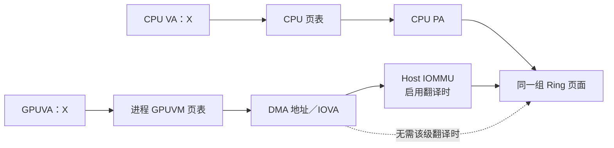
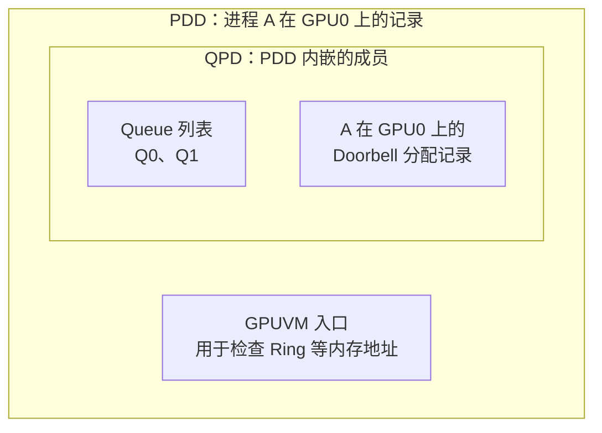
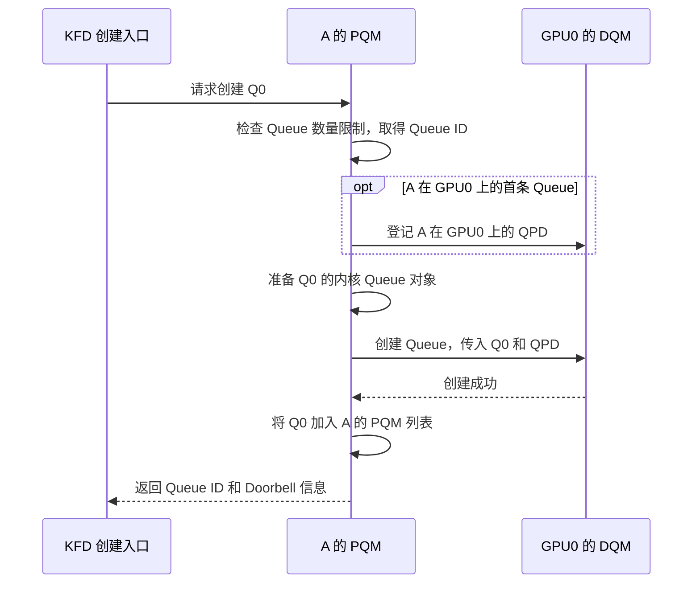

# AMD GPU 队列与 AQL Dispatch（上）

## 缩写表

| 缩写    | 英文全称                                        | 中文含义                                                              |
| ------- | ----------------------------------------------- | --------------------------------------------------------------------- |
| ABI     | Application Binary Interface                    | 应用二进制接口                                                        |
| AccVGPR | Accumulation Vector General-Purpose Register    | 矩阵累加向量寄存器；ISA 记为 AV0～AV255                               |
| AMD     | Advanced Micro Devices                          | AMD 公司                                                              |
| AMDGPU  | AMD GPU Linux Kernel Driver                     | AMD GPU Linux 内核驱动                                                |
| API     | Application Programming Interface               | 应用程序编程接口                                                      |
| AQL     | Architected Queuing Language                    | 架构化队列语言；本文主要指其 64 字节命令包格式与队列协议              |
| ASIC    | Application-Specific Integrated Circuit         | 专用集成电路；本文指具体 GPU 芯片                                     |
| ATC     | Address Translation Cache                       | 地址转换缓存                                                          |
| BAR     | Base Address Register                           | PCIe 基址寄存器；用于暴露设备 MMIO 窗口                               |
| BO      | Buffer Object                                   | 缓冲对象                                                              |
| CAS     | Compare-And-Swap                                | 比较并交换原子操作                                                    |
| CDNA    | Compute DNA                                     | AMD 面向数据中心计算 GPU 的架构系列；MI300 使用 CDNA 3                |
| CLR     | Compute Language Runtime                        | AMD 的计算语言 Runtime 代码库；包含`hipamd`、OpenCL 和 `rocclr`   |
| CP      | Command Processor                               | GPU 命令处理器                                                        |
| CPSCH   | Command Processor Scheduling                    | 命令处理器固件调度路径                                                |
| CPU     | Central Processing Unit                         | 中央处理器                                                            |
| CU      | Compute Unit                                    | 计算单元                                                              |
| CWSR    | Compute Wave Save/Restore                       | 计算 Wave 现场保存与恢复                                              |
| DIQ     | Debug Interface Queue                           | KFD 调试接口使用的内核 Queue                                          |
| DMA     | Direct Memory Access                            | 直接内存访问                                                          |
| DQM     | Device Queue Manager                            | KFD 设备队列管理器，管理该设备上各进程的 Queue 资源与调度             |
| DRM     | Direct Rendering Manager                        | Linux 直接渲染管理框架                                                |
| ELF     | Executable and Linkable Format                  | 可执行与可链接格式；本文 Code Object 使用的二进制文件格式             |
| EOP     | End of Pipe                                     | 管线末端；本文指 Queue 使用的 EOP 状态资源                            |
| FW      | Firmware                                        | 固件                                                                  |
| GDS     | Global Data Share                               | AMD GPU 的全局数据共享资源                                            |
| GFX     | Graphics                                        | AMDGPU 图形/计算 IP 的版本前缀；不能等同于编译器目标名                |
| GFXHUB  | Graphics Hub                                    | 图形与计算访问使用的 GPU 地址翻译 Hub                                 |
| GPU     | Graphics Processing Unit                        | 图形处理器                                                            |
| GPUVA   | GPU Virtual Address                             | GPU 虚拟地址                                                          |
| GPUVM   | GPU Virtual Memory                              | GPU 虚拟地址空间及其页表                                              |
| GTT     | Graphics Translation Table                      | AMDGPU 中主要表示 GPU 可访问的系统内存域                              |
| HBM     | High Bandwidth Memory                           | 高带宽内存                                                            |
| HIP     | Heterogeneous-Compute Interface for Portability | AMD GPU 编程接口                                                      |
| hipamd  | HIP implementation on AMD platform              | AMD 平台上的 HIP API 实现组件；`hipamd` 是项目名，不是首字母缩写    |
| HMM     | Heterogeneous Memory Management                 | 异构内存管理                                                          |
| HQD     | Hardware Queue Descriptor                       | 硬件中一条活动 Queue 的寄存器状态                                     |
| HSA     | Heterogeneous System Architecture               | 异构系统架构；本文指 HSA 规范与执行模型，不是具体软件组件             |
| HSAKMT  | HSA Kernel Mode Thunk                           | ROCr 使用的 HSA 用户态内核接口层                                      |
| HWS     | Hardware Scheduler                              | 负责 Queue 驻留调度的硬件/固件调度路径                                |
| IB      | Indirect Buffer                                 | 间接命令缓冲区                                                        |
| IH      | Interrupt Handler                               | GPU 中断控制模块；将中断来源等信息写入中断记录缓冲区                  |
| ioctl   | Input/Output Control                            | 用户态向内核驱动发送控制请求的接口                                    |
| IOMMU   | Input/Output Memory Management Unit             | 输入输出内存管理单元                                                  |
| IOVA    | Input/Output Virtual Address                    | 设备侧输入输出虚拟地址                                                |
| IP      | Intellectual Property                           | 芯片中的可复用硬件功能模块                                            |
| ISA     | Instruction Set Architecture                    | 指令集架构                                                            |
| KFD     | Kernel Fusion Driver                            | Linux AMD GPU 计算驱动接口                                            |
| KMD     | Kernel Mode Driver                              | 内核态驱动                                                            |
| KMT     | Kernel Mode Thunk                               | 用户态 Runtime 到内核驱动之间的封装层                                 |
| LDS     | Local Data Share                                | AMD GPU 上供同一 Work-group 共享的片上存储                            |
| MEC     | Micro Engine Compute                            | AMD GPU 中处理计算队列的命令处理引擎                                  |
| MES     | Micro-Engine Scheduler                          | 其他受支持架构的固件队列调度接口；MI300 主线不启用                    |
| MFMA    | Matrix Fused Multiply-Add                       | 矩阵融合乘加                                                          |
| MMIO    | Memory-Mapped Input/Output                      | 内存映射输入/输出                                                     |
| MMU     | Memory Management Unit                          | 内存管理单元                                                          |
| MQD     | Memory Queue Descriptor                         | 保存在内存中的 Queue 配置镜像                                         |
| No-HWS  | No Hardware Scheduling                          | 不使用 HWS，由驱动直接管理计算 Queue 驻留的模式；固定源码标为调试用途 |
| NUMA    | Non-Uniform Memory Access                       | 非一致性内存访问                                                      |
| OpenCL  | Open Computing Language                         | 开放计算语言及其异构计算 API                                          |
| PA      | Physical Address                                | 物理地址                                                              |
| PASID   | Process Address Space ID                        | 进程地址空间标识                                                      |
| PCIe    | Peripheral Component Interconnect Express       | 高速外设互连总线                                                      |
| PDD     | Process Device Data                             | KFD 中某个进程在某个 GPU 上的状态                                     |
| PFN     | Page Frame Number                               | 物理页帧号                                                            |
| PM4     | AMD PM4                                         | AMD GPU 的一类底层命令包协议；本篇重点看 HWS 控制包                    |
| PQM     | Process Queue Manager                           | KFD 进程队列管理器，管理该进程的 Queue ID 和 Queue 列表               |
| PTE     | Page Table Entry                                | 页表项                                                                |
| QPD     | Queue Process Device Data                       | PDD 内嵌的 Queue 与调度状态；源码类型为`qcm_process_device`         |
| RAM     | Random Access Memory                            | 随机存取存储器；本文主要指系统内存                                    |
| RLC     | Run List Controller                             | 运行列表控制器                                                        |
| rocclr  | Radeon Open Compute Common Language Runtime     | HIP/OpenCL 共用的计算 Runtime；Linux 后端连接 ROCr                    |
| ROCm    | Radeon Open Compute                             | AMD GPU 计算软件栈与开发平台                                          |
| ROCr    | ROCm Runtime                                    | ROCm 的 HSA 用户态运行时                                              |
| rptr    | Read Pointer                                    | Queue 读索引；本文也写作`read_index`                                |
| RW      | Read Write                                      | 可读写权限                                                            |
| SALU    | Scalar Arithmetic Logic Unit                    | 标量算术逻辑单元                                                      |
| SDMA    | System Direct Memory Access                     | AMD GPU 的专用数据搬运引擎                                            |
| SE      | Shader Engine                                   | 着色器引擎                                                            |
| SGPR    | Scalar General-Purpose Register                 | 标量通用寄存器                                                        |
| SIMD    | Single Instruction, Multiple Data               | 单指令多数据执行组织                                                  |
| SMEM    | Scalar Memory                                   | 标量访存路径                                                          |
| SVM     | Shared Virtual Memory                           | 共享虚拟内存                                                          |
| TLB     | Translation Lookaside Buffer                    | 地址翻译缓存                                                          |
| UAPI    | Userspace Application Programming Interface     | 用户空间应用程序接口；本文指内核向用户态公开的 ioctl 等接口           |
| UMD     | User Mode Driver                                | 用户态驱动                                                            |
| USERPTR | User Pointer                                    | 驱动使用用户态虚拟地址对应页面的内存路径                              |
| VA      | Virtual Address                                 | 虚拟地址                                                              |
| VALU    | Vector Arithmetic Logic Unit                    | 向量算术逻辑单元                                                      |
| VGPR    | Vector General-Purpose Register                 | 向量通用寄存器                                                        |
| VMA     | Virtual Memory Area                             | Linux 虚拟内存区域                                                    |
| VMEM    | Vector Memory                                   | 向量访存路径                                                          |
| VMID    | Virtual Memory ID                               | GPU 活动地址空间使用的硬件上下文编号                                  |
| VRAM    | Video Random-Access Memory                      | GPU 本地显存                                                          |
| wptr    | Write Pointer                                   | Queue 写索引；本文也写作`write_index`                               |
| XCC     | Accelerator Core Complex                        | 加速器核心复合体；包含多个 CU 及相关控制资源                          |
| XCD     | Accelerator Complex Die                         | 封装中的物理计算芯粒；MI300 中一个 XCD 对应一个 XCC                   |

## 本篇大纲

本篇包含第 0～3 章，讲 Queue 对象、创建时的资源准备，以及队列在硬件上的驻留。[下篇](<./03_AMD GPU 队列与 AQL Dispatch（下）.md>)从第 4 章接着讲 Packet、提交、执行、完成与资源回收。上下篇共同组成一篇连续的学习文档，共用章节编号、案例和源码基线。

[00_GPU系统基础](./00_GPU系统基础.md) 已经建立一次 GPU 任务的系统图，01、02 两篇文档进一步说明了内存怎样成为 GPU 可访问资源。本文沿同一条 Queue 追踪创建、驻留、Packet 发布、执行与完成，并用固定源码解释各层怎样实现这些机制。

首次学习可以按章节顺序阅读；后续查阅可以从 [第 9.2 节的知识点索引](<./03_AMD GPU 队列与 AQL Dispatch（下）.md#92-知识点与源码检索入口>)进入具体小节。源码紧随相关讲解，正文、图示和例子会先交代理解代码所需的对象与执行条件。

本文反复使用以下术语：

| 术语             | 本文含义                                                                                         |
| ---------------- | ------------------------------------------------------------------------------------------------ |
| Agent            | 参与 HSA 系统的执行或存储主体；本文的 Kernel Agent 是目标 AMD GPU                                |
| Producer         | 向 AQL Ring 写 Packet 的 CPU 线程或其他执行单元                                                  |
| Packet Processor | 读取并处理 AQL Packet 的硬件/固件前端；AMD 计算路径主要落在 CP/MEC                               |
| Dispatch         | 某个 Kernel 的一次具体执行请求                                                                   |
| Kernarg          | 按 Kernel ABI 排列的参数块                                                                       |
| Work-item        | Kernel 的一个逻辑执行实例                                                                        |
| Work-group       | 一组可以共享 LDS 并进行组内同步的 Work-item                                                      |
| Wave             | AMD GPU 成批执行 Work-item 的执行单位；本文 MI300 固定为 64 Lane                                 |
| Work Distributor | 本文对“把 Work-group/Wave 分配给 CU 的硬件前端”的概念性称呼；具体模块名随 GPU 硬件架构版本变化 |

| 章节    | 主要内容                           | 贯穿案例所在阶段                            |
| ------- | ---------------------------------- | ------------------------------------------- |
| [第 0 章](#0-从内存准备到-gpu-任务执行) | 从内存准备到 GPU 任务执行的条件    | 固定一个`vector_add` 任务和三条时间线     |
| [第 1 章](#1-amd-hsa-计算栈与-queue-对象地图) | AMD HSA 计算栈与 Queue 对象        | 建立层级图和对象地图                        |
| [第 2 章](#2-queue-创建从-rocr-到-kfd) | AQL Queue 的创建与资源准备         | 内存准备、对象管理、资源保护与 Doorbell     |
| [第 3 章](#3-mi300-硬件结构queue-驻留与-mqd-装载) | MI300 硬件、Queue 驻留与 MQD 装载  | 硬件结构、多 XCC 分工、活动条件、驻留与恢复 |

**[BOUNDARY]** 本文固定采用外部 Host CPU + **AMD Instinct MI300X / CDNA 3** 的学习模型，通过 PCIe 连接。Wave 使用 wave64，Queue 寄存器和回调按本地 GFX9.4.3 路径核对。多 XCC 案例固定整卡 8 个 XCC 组成一个逻辑 GPU；实际实验另行核对设备分区和软件配置。

本文采用以下固定证据基线：

- [MI300 / CDNA 3 ISA](<../3.资料/amd-instinct-mi300-cdna3-instruction-set-architecture.pdf>)（封面日期 2025-08-05），执行模型重点见 §1.1、§2、§3、§4.3，原文第 4～13、19 页；
- AMD 作者论文 [Realizing the AMD Exascale Heterogeneous Processor Vision](<../3.资料/isca2024_exascale.pdf>)（ISCA 2024，作者版本），上篇第 3 章结合 §VII 的 MI300X 组件复用说明，使用 §IV-B 的 XCD 结构和 §VI-A 的多 XCD 协作机制；[本地中文译文](<../3.资料/isca2024_exascale_中文全译.pdf>)用于辅助阅读，非官方译本，页码与英文版分别标注；
- HSA Platform System Architecture Specification 1.2，重点是 §2.8“User mode queuing”和 §2.9“Architected Queuing Language”；
- Linux `248951ddc14de84de3910f9b13f51491a8cd91df`；
- ROCr `ba56a24c6132c5d195686ae4adf969ca1222fbba`；
- ROCm CLR `81277d69e3352e7144ced2ee9601484f9b48d950`。

> **源码摘录格式：** 代码块左侧数字是所链接文件的真实行号。不连续内容拆成不同代码块，不把教学伪代码写成原始源码。英文注释后会直接说明中文含义。

> **[BOUNDARY]** 本文以普通 Host 侧 Kernel Dispatch 为主线，不展开编译器内部、Device Enqueue、完整 OpenCL 跨队列调度、SVM Page Fault 恢复、普通 DRM scheduler/IB 提交以及特定 GPU 硬件架构版本的 MMU 微架构。这些内容分别留到后续专题。

## 0. 从内存准备到 GPU 任务执行

### 0.1 前两篇文档建立的内存基础

[01_Linux 内存管理基础](<./01_Linux 内存管理基础.md>) 建立了 CPU VA、页表、PFN、`struct page` 和 DMA 地址之间的关系。[02_GPU 内存管理基础](<./02_GPU 内存管理基础.md>) 在此基础上梳理了 GPUVA、GPUVM、BO、PTE、TLB、可见性和生命周期。

完成这两步后，已经能够判断内存是否满足 GPU 访问条件。本章再固定以下前置状态：

```text
HSA Runtime 已经初始化，目标 GPU Agent 已经选定
Kernel Code 已经装入 GPU 可访问内存
输入 A、B 和输出 C 已经映射进进程 GPUVM
Kernarg 所需内存可以分配并映射，具体参数在 Dispatch 前填写
AQL Queue 和 Ring 尚未创建，将在 Queue 创建阶段建立
```

这些前置状态只用于固定贯穿案例的讲解起点，不表示所有 Runtime 都必须先加载 Kernel Code，再创建 Queue。Runtime 可以提前建立并复用 Queue；本文关心的是开始提交当前 Packet 时，Queue、代码和相关内存都已经可用。

但这些资源不会主动告诉 GPU：

- 要运行哪个 Kernel；
- 一共有多少个 Work-item；
- 每个 Work-group 多大；
- 参数放在哪里；
- 任务完成后更新哪个 Signal。

Queue 和 AQL Packet 提供了这份“执行契约”。

### 0.2 三个面：创建、提交与完成

从驱动工程师的视角排查 Queue 问题时，先判断问题出在哪个面。

```text
创建控制面（低频）
ROCr 分配 Queue 资源
  → HSAKMT 发起 CREATE_QUEUE ioctl
  → KFD 校验归属、创建 MQD、安排驻留

提交数据面（高频）
CPU 预留 Ring 槽位
  → 填写 AQL Packet
  → release 发布有效 Header
  → 写 Doorbell

完成面（每个任务或一批任务）
CP/MEC 启动 Kernel
  → Kernel 写结果
  → Packet 完成阶段更新 Completion Signal
  → CPU acquire 后读取结果
```

三者的时间尺度不同：

| 动作                       | 通常发生次数       | 是否进入 KFD                |
| -------------------------- | ------------------ | --------------------------- |
| 创建一条 Queue             | Queue 生命周期一次 | 是                          |
| 提交一个 Kernel Packet     | 每个 Dispatch 一次 | 正常快路径不需要            |
| 等待一个 Completion Signal | 按同步策略发生     | 通常由 ROCr Signal 机制完成 |
| 销毁一条 Queue             | Queue 生命周期一次 | 是                          |

> **[INFERENCE]** AQL 的低开销来自“先把长期通路建好，再由用户态反复写 Ring”。它不是让内核少做安全校验，而是把资源归属和映射校验集中在 Queue 创建阶段。

### 0.3 贯穿案例：1024 个元素的 `vector_add`

本文使用一个一维任务：

```c
C[i] = A[i] + B[i];
```

教学参数如下：

| 项目                     | 假设                                                    |
| ------------------------ | ------------------------------------------------------- |
| 元素数量                 | 1024                                                    |
| Work-group 大小          | 256 个 Work-item                                        |
| Work-group 数量          | 4                                                       |
| AQL Ring 容量            | 256 个 Packet 槽位                                      |
| AQL Packet 大小          | 固定 64 字节                                            |
| Ring 承载内存（backing） | system RAM，已经映射进本进程 GPUVM                      |
| Kernarg                  | 保存`A_gpuva`、`B_gpuva`、`C_gpuva` 和 `N=1024` |
| Completion Signal        | 提交前值为 1，本文等待其变为 0                          |

这组数值只用于讲解，不是 ROCr 的固定配置。

这里的 Ring 容量、Packet 大小和 Work-group 数量处在三个不同层级。AQL Ring 容量以 Packet 槽位计数；Work-group 数量则表示一个 Kernel Dispatch Packet 描述的 Grid 怎样划分。两者不是一一对应关系。

```text
1 个 64 字节 Kernel Dispatch Packet
  ├─ 占用 AQL Ring 中 1 个槽位
  ├─ grid_size_x = 1024
  ├─ workgroup_size_x = 256
  └─ GPU 据此展开为 4 个 Work-group、1024 个 Work-item
```

Packet 是固定长度的执行描述符，只保存 Kernel 句柄、参数地址和执行范围等信息，不保存 1024 份机器码、参数或 Work-item 状态。增加 Grid 中的 Work-item 数量只会改变 Packet 的尺寸字段，不会增大 Packet 本身；只有 Runtime 把工作拆成多次 Dispatch 时，才会使用多个 Ring 槽位。第 4.1 节和第 4.0 节会分别展开 Packet 布局以及 Grid 与 Work-group 的关系。

```text
长期 Queue 通路

HSA Queue（`hsa_queue_t` 加关联状态）
  ├─ base_address ──→ 256 × 64 B AQL Ring
  ├─ read_index
  ├─ write_index
  └─ doorbell_signal

一次 vector_add

Packet
  ├─ kernel_object ──→ Kernel 执行对象
  ├─ kernarg_address ──→ {A_gpuva, B_gpuva, C_gpuva, 1024}
  ├─ grid_size_x = 1024
  ├─ workgroup_size_x = 256
  └─ completion_signal ──→ 初值 1
```

### 0.4 贯穿全文的五个问题

1. 当前对象是谁创建、由谁拥有？
2. 当前地址是 CPU VA、GPUVA，还是 MMIO 地址？
3. 当前动作发生在 Queue 创建期，还是每次 Dispatch？
4. 当前进度表示“槽位释放”还是“Kernel 完成”？
5. 当前同步解决执行依赖，还是内存可见性？

这五个问题比函数名更值得记住。函数和寄存器会随 GPU 硬件架构版本变化，职责边界则相对稳定。

## 1. AMD HSA 计算栈与 Queue 对象地图

### 1.0 AMD HSA 计算栈的分层与调用路径

先看软件组件怎样连接：

```text
HIP API    → hipamd ────────┐
                            ├→ rocclr → ROCr → HSAKMT → KFD/AMDGPU → GPU
OpenCL API → OpenCL Runtime ┘

直接使用 HSA API 的程序 ─────────────→ ROCr → HSAKMT → KFD/AMDGPU → GPU
```

这张图只表示组件依赖关系，不表示一次 Kernel Dispatch 会逐层调用所有组件。直接使用 HSA API 的程序跳过 HIP/OpenCL 前端和 `rocclr`，从 ROCr 开始执行。

| 组件                        | 在本文路径中的作用                                           |
| --------------------------- | ------------------------------------------------------------ |
| `hipamd` / OpenCL Runtime | 接收 HIP/OpenCL API 调用，维护高层 Stream、Queue 和 Event    |
| `rocclr`                  | 把高层命令转换为 Kernarg、Grid、依赖和 AQL Packet            |
| ROCr                        | 实现 HSA Runtime，管理 Agent、HSA Queue、Ring、Signal 和内存 |
| HSAKMT                      | 把 Queue、内存和事件请求转换为 KFD UAPI 调用                 |
| KFD / AMDGPU                | KFD 管理计算进程与 Queue；AMDGPU 提供 BO、GPUVM 和硬件操作   |
| GPU                         | 读取 AQL Packet，分发 Work-group，并由 CU 执行 Kernel        |

HSA 是一份接口与执行语义规范，不是调用链中的软件模块。它规定：

- Queue 和 Signal 的对外语义；
- AQL Packet 的格式与处理规则；
- Producer 与 Packet Processor 之间的内存顺序。

ROCr 在用户态实现这些 Runtime 语义，GPU 的 Packet Processor 按相同规则解析 AQL Packet。HSA 规范本身不会调用 HSAKMT 或 KFD，也不规定这些组件的内部类和函数。

对于 HIP/OpenCL 程序，`rocclr` 先把高层 Kernel 命令转换成 GPU 可以提交的任务描述：

```text
HIP/OpenCL Kernel 命令
  → Kernarg
  → Grid / Work-group 参数
  → Event 与依赖关系
  → Kernel Dispatch Packet
```

Queue 创建路径建立长期提交通路，Packet 提交路径随后反复使用这条通路。

```text
Queue 创建控制路径（每条 Queue 通常一次）

HIP/OpenCL 前端 → rocclr，或直接 HSA 调用者
  → 需要新 Queue 时，由 ROCr 创建 hsa_queue_t、Ring 和索引
  → HSAKMT 发起 CREATE_QUEUE ioctl
  → KFD 绑定 Process-Device、校验资源并持有 BO
  → PQM/DQM 建立 Queue 和 MQD
  → No-HWS 直接装载 HQD，或由 HWS/CPSCH 管理驻留

Packet 提交快速路径（每个 Dispatch 重复）

rocclr 或直接 HSA AQL Producer
  → 准备 Kernarg、Grid、依赖和 Completion Signal
  → 在 hsa_queue_t 指向的 Ring 中填写 Packet
  → release 发布 Header
  → 写 Doorbell
  → CP/MEC 取包，GPU MMU 翻译相关 GPUVA
  → CU 执行 Kernel
  → Completion Signal 通知 CPU / Runtime
```

Queue 创建时，ROCr、HSAKMT 和 KFD 建立 Ring、Doorbell 与内核 Queue。创建完成后，Producer 反复写 AQL Ring 和 Doorbell。普通 Dispatch 不再逐 Packet 调用 HSAKMT，也不再逐 Packet 进入 KFD ioctl。

> **[BOUNDARY]** 本章只把 Runtime 初始化和 Agent 发现作为 Queue 创建的前置条件，不展开 `hsa_init()` 的完整实现，也不追踪 PCI Probe、AMDGPU IP 初始化、固件加载和设备启动。那些过程属于系统与驱动初始化生命周期，不是一次 AQL Queue 的创建或一次 Packet 的提交。

> **[SOURCE] 可选源码索引**
>
> - 固定 CLR 基线 `81277d69e3352e7144ced2ee9601484f9b48d950` 的 [`README.md`](<../2.源码/rocm-clr/README.md>) 第 1～3、21～23 行说明：CLR 是 Compute Language Runtime，`hipamd` 实现 AMD 平台上的 HIP，`opencl` 实现 OpenCL，`rocclr` 是两者共用的计算 Runtime；
> - [`rocclr/cmake/ROCclrHSA.cmake`](<../2.源码/rocm-clr/rocclr/cmake/ROCclrHSA.cmake>) 第 23～36 行显示，`rocclr` 的 ROCr 后端包含 HSA 头文件并链接 `hsa-runtime64`；[`rocclr/device/rocm/rocvirtual.cpp`](<../2.源码/rocm-clr/rocclr/device/rocm/rocvirtual.cpp>) 第 1184～1293 行显示，普通 Dispatch 直接写 `gpu_queue_->base_address`、发布 Header 并写 `doorbell_signal`；
> - 固定 ROCr 基线 `ba56a24c6132c5d195686ae4adf969ca1222fbba` 的 [`runtime/docs/what-is-rocr-runtime.rst`](<../2.源码/rocr-runtime/runtime/docs/what-is-rocr-runtime.rst>) 第 10～29 行说明 ROCr 是 AMD 的 HSA Runtime 实现，并提供 Agent、Signal、AQL Dispatch 和内存管理等接口；
> - ROCr [`README.md`](<../2.源码/rocr-runtime/README.md>) 第 6～8 行区分 HSA Runtime 与 `libhsakmt`；[`libhsakmt/README.md`](<../2.源码/rocr-runtime/libhsakmt/README.md>) 第 1～10 行说明 `libhsakmt` 提供访问内核驱动的用户态接口。

### 1.1 “Queue”可能指以下五种对象

同一条调用栈中会连续出现 HIP Stream、`hsa_queue_t`、AQL Ring、MQD 和 HQD。它们分别表示或保存命令顺序、用户态提交入口、Packet、Queue 配置和硬件活动状态。代码和日志可能都把这些对象简称为 `queue`，因此需要先确认当前语境指哪一层。

```text
HIP Stream S
  │ 高层命令按什么顺序执行
  ▼
rocclr 选择一个 hsa_queue_t Q
  │ Q 告诉 Producer：Ring 在哪里、Doorbell 在哪里
  ▼
AQL Ring R
  │ 真正存放 64 字节 AQL Packet
  ▼
MQD M
  │ 保存 R 的地址、rptr/wptr、Doorbell 等 Queue 配置
  ▼
HQD H
  │ M 被装入硬件寄存器后形成的活动 Queue 状态
  ▼
CP/MEC 根据 H 找到 R，并读取 Packet
```

图中的箭头表示对象之间的引用和配置关系，不表示 Queue 的创建调用顺序。Queue 创建时，KFD 根据 Ring、指针和 Doorbell 等资源建立 MQD；Queue 获得驻留时，KFD 或固件再把 MQD 装入 HQD。具体创建过程见第 2～3 章。

本文所说的“一条底层 HSA/KFD Queue”，由下面这些相互关联的状态共同组成：

```text
Queue Q
├─ AQL Ring：存放 Packet
├─ write_index：CPU 下一次提交到哪里
├─ read_index：GPU 已经处理到哪里
├─ Doorbell：CPU 通知 GPU 有新 Packet
├─ 所属进程和 GPU 地址空间
├─ MQD：保存在内存中的 Queue 配置
└─ HQD：Queue 驻留时使用的硬件状态
```

Queue 已经创建、但尚未提交任何 Packet 时，初始状态如下：

```text
Queue Q

Ring：
┌─────────┬─────────┬─────┬──────────┐
│ INVALID │ INVALID │ ... │ INVALID  │
│ slot 0  │ slot 1  │ ... │ slot 255 │
└─────────┴─────────┴─────┴──────────┘

write_index = 0
read_index  = 0
```

**[BOUNDARY]** 图中用 `...` 省略了 `slot 2`～`slot 254`。256 个 slot 的编号范围是 0～255。此时 Queue 已经存在，Ring 中还没有等待 GPU 处理的有效 Packet。

其中最容易混淆的是高层 API Queue 与 `hsa_queue_t`：

> HIP Stream 是应用使用的逻辑执行队列，表示命令顺序和依赖。`hsa_queue_t` 是 ROCr 提供的 AQL 提交入口，告诉 Producer 应向哪个 Ring 写 Packet，以及通过哪个 Doorbell 通知 GPU。

`hsa_queue_t` 位于用户态，保存 Producer 提交 Packet 所需的入口信息。HQD 位于 GPU 中，是数量有限的活动 Queue 寄存器槽。

一条 HIP Stream 可以在某段时间内独占一个 `hsa_queue_t`，但这种独占只是绑定关系；两个对象仍有各自的类型、状态和生命周期。

#### 1.1.1 HIP Stream：从接口调用到各层 Queue

以显式创建一条 HIP Stream 为例：

```cpp
hipStream_t stream1;
hipStreamCreate(&stream1);
```

下面假设 `rocclr` 的 Queue 池中没有可复用的底层 Queue。`hipStreamCreate()` 因而需要向下创建新的 HSA/KFD Queue。每一层都会创建自己的对象，并保存与相邻层对象的关系：

```text
应用程序
  hipStreamCreate(&stream1)
  │ 请求创建一条 HIP Stream
  ▼
hipamd
  new hip::Stream(...)
  │ 创建：hip::Stream 对象
  │ 最终以 hipStream_t 句柄返回给应用
  ▼
rocclr
  hip::Stream 的基类 amd::HostQueue 初始化
  → 为 HostQueue 创建 VirtualGPU（rocclr 用户态后端执行对象）
  → VirtualGPU::create()
  → Device::acquireQueue()
  │ 创建：HostQueue 和 VirtualGPU
  ▼
ROCr
  hsa_queue_create()
  → 创建 AqlQueue
  → 分配 AQL Ring，并把所有 Packet Header 初始化为 INVALID
  → 把 rptr、wptr 初始化为 0
  → 填充 hsa_queue_t 的 base_address、size 和 doorbell_signal 等字段
  │ 创建：hsa_queue_t、AQL Ring 和用户态索引状态
  ▼
HSAKMT
  hsaKmtCreateQueueExt()
  → 把 Ring、rptr/wptr、Queue 类型和优先级整理进 ioctl 参数
  → 发起 AMDKFD_IOC_CREATE_QUEUE
  ▼
KFD
  绑定当前进程与目标 GPU
  → PQM/DQM 创建内核 Queue 记录
  → 分配 Doorbell 并建立 MQD
  → No-HWS 模式直接装载 HQD；HWS/CPSCH 模式交给固件安排驻留
  │ 创建：KFD Queue 和 MQD；是否立即装入 HQD 取决于调度路径
  ▼
创建结果逐层返回
  KFD 返回 Queue ID 和 Doorbell offset
  → HSAKMT 映射 Doorbell，并返回 Queue resource
  → ROCr 完成 Doorbell Signal 等 AqlQueue 状态
  → rocclr 的 VirtualGPU 保存 hsa_queue_t 指针
  → hipamd 把 stream1 返回给应用
```

`VirtualGPU` 是 `rocclr` 为一条 `HostQueue` 创建的用户态 C++ 对象。它的 `gpu_queue_` 成员保存 `hsa_queue_t*`，并维护 Kernarg 缓冲区、Barrier、Signal 等与该高层 Queue 相关的后端状态。提交命令时，`VirtualGPU` 通过 `gpu_queue_->base_address` 定位 AQL Ring，写入 Packet，再通过 `gpu_queue_->doorbell_signal` 更新 Doorbell。名称中的 `VirtualGPU` 不表示另一块物理 GPU，也不表示硬件虚拟化。

调用返回后，`stream1` 指向高层 `hip::Stream`。`hip::Stream` 通过 `HostQueue` 和 `VirtualGPU` 关联到 `hsa_queue_t`，`hsa_queue_t` 再指向 AQL Ring 和 Doorbell。KFD 用 MQD 保存这条底层 Queue 的配置；Queue 驻留时，GPU 用 HQD 保存活动状态。

一个进程可以在同一目标 GPU 上创建多条 HIP Stream。本文固定的 CLR 实现会为每条 `HostQueue` 创建一个 `VirtualGPU`，而每个 `VirtualGPU` 当前通过一个 `gpu_queue_` 指针使用一条底层 `hsa_queue_t`。对于允许复用的普通 Queue，当对应优先级的底层 Queue 池达到上限时，多个 `VirtualGPU` 可以复用同一个 `hsa_queue_t`：

```text
进程
├─ HIP Stream / HostQueue A
│    └─ VirtualGPU A
│         └─ gpu_queue_ → hsa_queue_t Q0 → AQL Ring 0
│
├─ HIP Stream / HostQueue B
│    └─ VirtualGPU B
│         └─ gpu_queue_ → hsa_queue_t Q1 → AQL Ring 1
│
└─ HIP Stream / HostQueue C
     └─ VirtualGPU C
          └─ gpu_queue_ → hsa_queue_t Q0 → AQL Ring 0（与 A 复用）
```

这些对象的数量关系可以写成：

```text
HostQueue  → VirtualGPU  ：一对一
VirtualGPU → hsa_queue_t ：每个 VirtualGPU 当前使用一个；多个 VirtualGPU 可以复用同一个
hsa_queue_t → AQL Ring   ：一对一
```

创建和绑定的方向是：高层 `HostQueue` 创建 `VirtualGPU`，`VirtualGPU` 再从底层 Queue 池中取得或复用 `hsa_queue_t`。

**[BOUNDARY]** 如果 `Device::acquireQueue()` 选中 Queue 池中已有的 `hsa_queue_t`，`rocclr` 会直接复用该提交入口。这次 `hipStreamCreate()` 不再请求 ROCr、HSAKMT 和 KFD 创建新的底层 Queue。

**[BOUNDARY]** 启用动态 Queue 回收后，空闲的 `VirtualGPU` 还可能暂时归还 `gpu_queue_`，等后续工作到来时再从池中取得一条 Queue。因此，“每个 VirtualGPU 当前使用一个 `hsa_queue_t`”描述的是同一时刻的绑定，不表示该绑定在 VirtualGPU 的整个生命周期中永远不变。第 4.0 节会说明这个例外。

> **[SOURCE] 可选源码索引**
>
> 以下路径均来自固定 CLR 基线 `81277d69e3352e7144ced2ee9601484f9b48d950`：
>
> - `hipStreamCreate() → hip::Stream`：[`hipamd/src/hip_stream.cpp`](<../2.源码/rocm-clr/hipamd/src/hip_stream.cpp>) 第 18～30、188～201、274～281 行；
> - `HostQueue → VirtualGPU → acquireQueue()`：[`rocclr/platform/commandqueue.hpp`](<../2.源码/rocm-clr/rocclr/platform/commandqueue.hpp>) 第 159～175 行，以及 [`rocclr/device/rocm/rocvirtual.cpp`](<../2.源码/rocm-clr/rocclr/device/rocm/rocvirtual.cpp>) 第 1737～1758、1877～1887 行；
> - 复用已有 Queue 或调用 ROCr 创建新 Queue：[`rocclr/device/rocm/rocdevice.cpp`](<../2.源码/rocm-clr/rocclr/device/rocm/rocdevice.cpp>) 第 3135～3175 行。
>
> ROCr、HSAKMT 和 KFD 的 Queue 创建源码分别在第 2.1～2.8 节和第 3.0～3.3 节展开。

#### 1.1.2 `hsa_queue_t`：底层 AQL 提交入口

`rocclr` 为 HIP Stream 建立或选择底层提交通道时，会取得一个 `hsa_queue_t`：

```text
hsa_queue_t Q
  ├─ base_address ─────→ AQL Ring
  ├─ doorbell_signal ──→ Doorbell
  ├─ size ─────────────→ Ring 容量
  └─ id ───────────────→ 公开 Queue ID
```

提交 Kernel 时，`rocclr` 使用这些字段完成以下操作：

```text
高层 Kernel 命令
  → rocclr 构造 Kernel Dispatch Packet
  → 写入 Q.base_address 指向的 Ring
  → release 发布 Packet Header
  → 写 Q.doorbell_signal
  → CP/MEC 取包
```

HIP Stream 与 `hsa_queue_t` 服务于不同层次：

- HIP Stream/OpenCL Command Queue 保存 API 规定的命令顺序、依赖和属性；
- `hsa_queue_t` 保存 HSA/AQL 提交需要的 Ring、Doorbell 和 Queue 身份；
- 应用可以创建多条 Queue，Runtime 则从底层 HSA Queue 池中选择或复用提交通道；
- 高层 Queue 与 `hsa_queue_t` 各自保持生命周期，Runtime 负责管理两者的绑定和复用。

Producer 通过 `hsa_queue_t` 找到 Ring，并通过 Doorbell 通知新进度。CP/MEC 通过 HQD 中的 Ring 地址、指针和地址空间状态找到同一个 Ring。MQD 和 HQD 保存 Queue 配置，具体的 Kernel Dispatch Packet 保存在 Ring 中。

#### 1.1.3 AQL Ring：真正存放 Packet

AQL Ring 是实际保存 Packet 的内存，每个 slot 存放一个固定 64 字节的 AQL Packet。Queue 创建完成后，应用向 `stream1` 提交第一个 Kernel：

```cpp
kernelA<<<grid, block, 0, stream1>>>();
```

`hipamd` 根据 `stream1` 找到 `hip::Stream`，`rocclr` 再取得该 Stream 对应的 `VirtualGPU`。`VirtualGPU` 通过成员 `gpu_queue_` 取得 `hsa_queue_t`，再根据 `hsa_queue_t.base_address` 定位 Ring，并把 Kernel A 编码成一个 Kernel Dispatch Packet：

```text
1. 取得旧 write_index = 0，并把 write_index 增加到 1
2. 用 0 & (256 - 1) 得到 slot 0
3. 把 Kernel Dispatch Packet 的内容写入 slot 0
4. 以 release 语义发布 Packet Header
5. 写 Doorbell，通知硬件 Packet ID 0 已经发布
```

此时 Ring 的简化状态是：

```text
Ring：
┌────────────────────────┬─────────┬─────┬──────────┐
│ Kernel Dispatch Packet │ INVALID │ ... │ INVALID  │
│ slot 0                 │ slot 1  │ ... │ slot 255 │
└────────────────────────┴─────────┴─────┴──────────┘

write_index = 1
read_index  = 0
```

CP/MEC 根据 HQD 定位这条 Ring，读取 `slot 0` 并启动 Kernel。硬件消费该 Packet 后，`read_index` 前进到 1。Ring 的 slot 保存 Packet，`hsa_queue_t` 提供 Ring 地址和 Doorbell 等提交入口信息。

> **[SOURCE]** 固定 CLR 基线 [`rocclr/device/rocm/rocvirtual.cpp`](<../2.源码/rocm-clr/rocclr/device/rocm/rocvirtual.cpp>) 第 1184～1276 行依次取得 write index、用掩码定位 slot、复制 Packet、以 release 语义发布 Header，并把 Packet ID 写入 Doorbell。

#### 1.1.4 MQD：内存中的 Queue 配置

MQD 保存整条 Queue 的配置，具体任务仍由 Ring 中的 Packet 描述。这里的 ASIC 指具体的 GPU 芯片。

MQD 的格式与 GPU 硬件架构版本有关。不同 GPU 硬件架构版本都需要记录 Ring、进度指针和 Doorbell 等核心信息，但字段的排列、偏移、位定义和附加状态可能不同。KFD 必须按照目标 GPU 对应的 MQD 格式填写这些信息：

```text
Ring base 和 Ring size
rptr/wptr 地址或保存值
Doorbell offset
EOP、CWSR 等 Queue 辅助资源
优先级和其他调度属性
地址空间相关状态
```

这与 AQL Packet 不同。AQL Packet 的大小和字段布局由 HSA 规范定义，Kernel Dispatch Packet 固定为 64 字节；MQD 的格式则由具体的 GPU 硬件架构版本决定。

Queue 获得驻留时，KFD 或固件根据 MQD 恢复这些配置。一份 MQD 通常描述整条 Queue，与 Ring 中有多少个 Packet 无关。

#### 1.1.5 HQD：已经装入硬件的活动状态

HQD 是 GPU 中有限的一组活动 Queue 寄存器槽。以 MI300 的 No-HWS 条件路径为例，装载 MQD 会把 Queue 配置写入对应的 HQD 寄存器：

```text
MQD 中的 Ring base      → HQD Ring base 寄存器
MQD 中的 rptr/wptr 状态 → HQD 进度寄存器和轮询地址
MQD 中的 Doorbell       → HQD Doorbell 配置
MQD 中的地址空间状态    → HQD VM 上下文
```

HQD 激活后，CP/MEC 根据其中的 Ring 地址、进度和地址翻译上下文定位 AQL Ring，再读取 Packet。HWS/CPSCH 路径还会把 PASID、页表根等进程状态交给固件，由固件管理最终使用的 VMID 和 HQD 位置。上图表达的是 MQD 与 HQD 的字段关系：MQD 保存可恢复的配置，HQD 保存当前活动配置。

把前面的对象放进同一次 Kernel 提交，关系如下：

```text
应用程序
  kernelA<<<grid, block, 0, stream1>>>()
       │
       ▼
HIP Stream / HostQueue stream1
  记录 Kernel A 所属的命令序列
       │ rocclr 取得该 Stream 的 VirtualGPU
       ▼
VirtualGPU
  └─ gpu_queue_ → hsa_queue_t Q
                    ├─ base_address ─────→ AQL Ring R
                    │                       └─ slot n：Kernel A 的 Packet
                    └─ doorbell_signal ──→ Doorbell D

Queue 创建和驻留时已经准备：

MQD M（GPU 可访问内存）
  保存 R 的地址、rptr/wptr、D 对应的 Doorbell 配置和地址空间状态
       │ KFD 装载，或由固件安排驻留
       ▼
HQD H（GPU 寄存器）
  保存当前活动的 Queue 状态

每次提交 Kernel A：

rocclr ──写 Packet──→ Ring R
rocclr ──写进度────→ Doorbell D
HQD H + Doorbell D ─→ CP/MEC ─→ 定位 Ring R ─→ 读取 slot n
```

图中没有 `Packet → MQD → HQD` 的转换。Kernel A 的 Packet 始终保存在 Ring R 中；MQD 和 HQD 保存的是整条 Queue 的配置，使 CP/MEC 能定位并读取 Ring R。

Queue 创建时，ROCr 建立 `hsa_queue_t` 和 Ring，KFD 建立 MQD。Queue 获得驻留时，KFD 或固件把 MQD 中的配置装入 HQD。此后每次 Dispatch 只需复用这些对象：`rocclr` 写 Ring 和 Doorbell，CP/MEC 根据 HQD 取包。

图中只画了一条 HIP Stream 当前使用一条底层 HSA Queue。多条 Stream 复用同一条 HSA Queue 的情况见第 1.1.1 节；一条 Queue 被换出 HQD、稍后再恢复驻留的情况见第 3 章。

### 1.2 可选规范阅读：`hsa_queue_t` 的公开字段

第 1.1.2 节已经说明了 `hsa_queue_t` 的用途。本节不再引入新的 Queue 对象，只用 HSA 接口定义核对它向 Producer 提供的信息：

| 字段                   | Producer 从中得到的信息              |
| ---------------------- | ------------------------------------ |
| `type`、`features` | Queue 类型以及支持的 Packet 类别     |
| `base_address`       | AQL Ring 的起始地址                  |
| `doorbell_signal`    | 发布 Packet 后使用的 Doorbell Signal |
| `size`               | Ring 能容纳的 Packet 数量            |
| `id`                 | ROCr 对应用公开的 Queue 标识         |

下面的定义用于验证这些字段。第一次阅读时可以跳过源码块，直接看源码后的结论。

> **[SPEC]** ROCr HSA 头文件 [`runtime/hsa-runtime/inc/hsa.h`](<../2.源码/rocr-runtime/runtime/hsa-runtime/inc/hsa.h>) 第 2300～2363 行：

```c
2300: /**
2301:  * @brief User mode queue.
2302:  *
2303:  * @details The queue structure is read-only and allocated by the HSA runtime,
2304:  * but agents can directly modify the contents of the buffer pointed by @a
2305:  * base_address, or use HSA runtime APIs to access the doorbell signal.
2306:  *
2307:  */
2308: typedef struct hsa_queue_s {
2309:   /**
2310:    * Queue type.
2311:    */
2312:   hsa_queue_type32_t type;
2313:
2314:   /**
2315:    * Queue features mask. This is a bit-field of ::hsa_queue_feature_t
2316:    * values. Applications should ignore any unknown set bits.
2317:    */
2318:   uint32_t features;
2319:
2320: #ifdef HSA_LARGE_MODEL
2321:   void* base_address;
2322: #elif defined HSA_LITTLE_ENDIAN
2323:   /**
2324:    * Starting address of the HSA runtime-allocated buffer used to store the AQL
2325:    * packets. Must be aligned to the size of an AQL packet.
2326:    */
2327:   void* base_address;
2328:   /**
2329:    * Reserved. Must be 0.
2330:    */
2331:   uint32_t reserved0;
2332: #else
2333:   uint32_t reserved0;
2334:   void* base_address;
2335: #endif
2336:
2337:   /**
2338:    * Signal object used by the application to indicate the ID of a packet that
2339:    * is ready to be processed. The HSA runtime manages the doorbell signal. If
2340:    * the application tries to replace or destroy this signal, the behavior is
2341:    * undefined.
2342:    *
2343:    * If @a type is ::HSA_QUEUE_TYPE_SINGLE, the doorbell signal value must be
2344:    * updated in a monotonically increasing fashion. If @a type is
2345:    * ::HSA_QUEUE_TYPE_MULTI, the doorbell signal value can be updated with any
2346:    * value.
2347:    */
2348:   hsa_signal_t doorbell_signal;
2349:
2350:   /**
2351:    * Maximum number of packets the queue can hold. Must be a power of 2.
2352:    */
2353:   uint32_t size;
2354:   /**
2355:    * Reserved. Must be 0.
2356:    */
2357:   uint32_t reserved1;
2358:   /**
2359:    * Queue identifier, which is unique over the lifetime of the application.
2360:    */
2361:   uint64_t id;
2362:
2363: } hsa_queue_t;
```

这段定义确认了以下边界：

- `hsa_queue_t` 结构本身由 Runtime 分配并管理，Producer 不修改结构体字段；
- Producer 把 Packet 写入 `base_address` 指向的 Ring，并通过 `doorbell_signal` 通知硬件；
- `size` 的单位是 Packet 槽位数，并且必须是 2 的幂；
- `id` 只标识 ROCr 对外公开的 Queue，不表示 Ring 地址或 KFD `queue_id`。

`base_address` 周围的条件编译只调整结构体在不同编译模型和字节序下的字段布局，不改变它指向 AQL Ring 这一职责。本文固定源码基线对应的 Linux AMD GPU 路径使用小端布局。

### 1.3 ROCr、HSAKMT 和 KFD 的 Queue 标识关系

Queue 创建完成后，Producer 可以通过 `hsa_queue_t` 提交 Packet。ROCr 后续更新或销毁这条 Queue 时，还会再次调用 HSAKMT 和 KFD。ROCr、HSAKMT 与 KFD 管理的是三份相互关联的对象，不是同一个结构体：

```text
ROCr      管理 AqlQueue
HSAKMT    管理用户态私有 struct queue
KFD       管理内核态 struct queue
```

创建请求向下执行时，HSAKMT 先分配自己的私有 `struct queue`，KFD 随后创建内核 Queue。创建成功后，结果按照下面的顺序返回：

```text
1. KFD
   创建内核态 struct queue
   → 分配 KFD queue_id
   → 向 HSAKMT 返回 queue_id 和 Doorbell offset

2. HSAKMT
   把 KFD queue_id 保存到私有 q->queue_id
   → 把私有 struct queue 的地址编码成 HSA_QUEUEID
   → 向 ROCr 返回这个 HSA_QUEUEID

3. ROCr
   把 HSA_QUEUEID 保存到 AqlQueue::queue_id_
   → 另行生成 hsa_queue_t::id，作为公开 Queue 标识
```

因此，ROCr 中会同时看到两个名称带有 `id` 的字段，但用途不同：

```text
应用持有 hsa_queue_t*
└─ hsa_queue_t::id
     ROCr 对外公开的数字标识
     不用于 HSAKMT 或 KFD ioctl

ROCr AqlQueue
└─ AqlQueue::queue_id_，类型为 HSA_QUEUEID
     │ ROCr 把它传给 hsaKmtUpdateQueue()、hsaKmtDestroyQueue()
     ▼
HSAKMT 私有 struct queue *q
└─ q->queue_id
     │ HSAKMT 把它写入 ioctl 参数
     ▼
KFD 内核态 struct queue
└─ properties.queue_id
     KFD 用它在当前进程中查找 Queue
```

这里的 `HSA_QUEUEID` 是 libhsakmt 接口中的不透明句柄，不是 `hsa_queue_t::id`。在本文固定的 libhsakmt 实现中，`HSA_QUEUEID` 编码了私有 `struct queue` 的用户态地址。ROCr 只需在后续 Queue 操作中把该值交还 HSAKMT，不需要解析它。

以销毁为例，ROCr 和 KFD 使用的查找值会在 HSAKMT 中完成一次转换：

```text
ROCr
  hsaKmtDestroyQueue(AqlQueue::queue_id_)
      │ 传入 HSA_QUEUEID
      ▼
HSAKMT
  HSA_QUEUEID → 私有 struct queue *q
  q->queue_id → KFD queue_id
      │
      ▼
KFD
  DESTROY_QUEUE(queue_id = KFD queue_id)
  → 在当前进程中查找并销毁内核 Queue
```

这条销毁路径不使用 `hsa_queue_t::id`。`hsa_queue_t::id` 只是在当前应用生命周期内唯一的公开标识；ROCr 传给 HSAKMT 的是 `AqlQueue::queue_id_`。

`doorbell_id` 不用于查找软件 Queue 对象。它表示这条 Queue 使用 Doorbell 内存中的哪个通知槽位。

KFD 创建该进程在目标 GPU 上的第一条 Queue 时，会为这个进程准备一片 Doorbell 区域。该区域包含多个槽位，后续创建的 Queue 分别使用其中的空闲槽位：

```text
当前进程在目标 GPU 上的 Doorbell 区域

┌────────┬────────┬────────┬────────┐
│ slot 0 │ slot 1 │ slot 2 │ slot 3 │
└────────┴────────┴────────┴────────┘
                       ↑
                 Queue Q 使用
                 doorbell_id = 2
```

KFD 创建 Queue Q 时，为它分配 `slot 2`。假设当前 GPU 的每个 Doorbell 槽位占 8 字节，只看这片区域内部的相对位置，则：

```text
doorbell_id        = 2
Doorbell slot 大小 = 8 字节
槽位相对偏移       = 2 × 8 = 16 字节
```

KFD 根据 `doorbell_id` 和当前进程的 Doorbell 区域计算实际 Doorbell offset。随后，各层按下面的顺序得到 Queue Q 的用户态 Doorbell 地址：

```text
KFD
  为 Queue Q 分配 doorbell_id
  → 计算并向 HSAKMT 返回 Doorbell offset

HSAKMT
  映射当前进程在目标 GPU 上的 Doorbell 区域
  → 根据 offset 找到 Queue Q 的槽位地址

ROCr
  把该地址保存到 Doorbell Signal 的实现对象中
  → 把 Signal 句柄填入 hsa_queue_t::doorbell_signal

Producer
  通过 Signal store 写 hsa_queue_t::doorbell_signal
  → 实际写入 Queue Q 对应的 Doorbell 槽位
  → 通知 GPU 检查 Queue Q 的 AQL Ring
```

因此，KFD `queue_id` 与 `doorbell_id` 回答的是两个不同问题：

```text
KFD queue_id → KFD 要更新或销毁哪条 Queue？
doorbell_id  → Producer 应写这片 Doorbell 区域中的哪个槽位？
```

> **[BOUNDARY]** `2 × 8 = 16` 只用于说明槽位编号怎样对应区域内的相对位置。真实 Doorbell offset 还涉及进程 Doorbell 区域的起点、GPU 硬件架构版本和 KFD 的 mmap 编码；第 2.7 节会展开这些细节。

> **[BOUNDARY]** pre-SOC15 路径会令 `doorbell_id` 等于 KFD `queue_id`，而 SOC15 路径可以单独分配 `doorbell_id`。即使两个值相等，Doorbell 槽位和 KFD Queue 标识仍承担不同职责。

> **[SOURCE] 可选源码索引**
>
> - ROCr [`runtime/hsa-runtime/core/inc/queue.h`](<../2.源码/rocr-runtime/runtime/hsa-runtime/core/inc/queue.h>) 第 406～412 行定义公开 HSA Queue ID 的递增计数器；[`runtime/hsa-runtime/core/runtime/amd_aql_queue.cpp`](<../2.源码/rocr-runtime/runtime/hsa-runtime/core/runtime/amd_aql_queue.cpp>) 第 278～286 行保存 HSAKMT 返回的 Doorbell 地址、填写 `hsa_queue_t::id`，并把 `QueueResource.QueueId` 保存到 `queue_id_`；
> - libhsakmt [`libhsakmt/src/queues.c`](<../2.源码/rocr-runtime/libhsakmt/src/queues.c>) 第 54～56、719～747 行把 KFD `queue_id` 保存进私有 `struct queue`，再把该对象的地址编码成 `HSA_QUEUEID` 返回；第 785～797 行展示销毁时的反向转换；
> - Linux [`kfd_chardev.c`](<../2.源码/linux/drivers/gpu/drm/amd/amdkfd/kfd_chardev.c>) 第 405～424 行返回 KFD `queue_id` 和 Doorbell offset；[`kfd_device_queue_manager.c`](<../2.源码/linux/drivers/gpu/drm/amd/amdkfd/kfd_device_queue_manager.c>) 第 567～642 行展示不同 GPU 硬件架构版本的 `doorbell_id` 分配与 Doorbell offset 计算。

### 1.4 AQL Queue 与普通 DRM IB 使用不同的提交路径

前一篇文档介绍过 GPUVM 和普通 DRM 命令提交。AQL Compute 也使用 GPUVM，但它组织和提交命令的方式不同：

```text
AQL Compute
ROCr / HSAKMT / KFD
  → 用户态 AQL Ring
  → Doorbell
  → CP/MEC 解析 Kernel Dispatch Packet

普通 DRM 命令提交
用户态提交 ioctl
  → DRM scheduler / amdgpu_job
  → IB
  → GPU 的普通命令 Ring
```

| 对比项                   | AQL Queue                         | 普通 DRM IB 路径          |
| ------------------------ | --------------------------------- | ------------------------- |
| 每次工作放在哪里         | 长期用户态 Ring 的 64 字节槽位    | 单独组织的 IB/Job         |
| 常规提交是否逐次进入 KMD | 否，创建后直接写 Ring 与 Doorbell | 是，通常由 ioctl 建立 Job |
| 主要调度对象             | KFD 计算 Queue 与 AQL Packet      | DRM scheduler Job 与 IB   |
| 是否使用 GPUVM           | 是                                | 也可以使用                |

两条路径可以共享 GPUVM、PTE 和 TLB 等内存管理基础设施。普通 AQL Dispatch 创建 Queue 后，由 Producer 写 AQL Ring 和 Doorbell；`drm_sched_job → amdgpu_ib_schedule()` 属于普通 DRM Job/IB 路径，不是 AQL 的逐 Packet 执行路径。

### 1.5 Queue 生命周期与后文章节的对应关系

第 1 章已经建立软件栈和 Queue 对象地图。后文沿同一条 Queue 的生命周期展开：

```text
第 2 章：ROCr、HSAKMT 和 KFD 创建底层 Queue
  → 第 3 章：MQD 怎样装入 HQD，Queue 怎样获得驻留
  → 第 4 章：一次 Kernel 调用怎样变成 AQL Packet
  → 第 5 章：Producer 怎样发布 Packet 并写 Doorbell
  → 第 6 章：CP/MEC 怎样取包并启动 Kernel
  → 第 7 章：Completion Signal 怎样通知 CPU
  → 第 8 章：Queue 怎样停止、销毁和处理错误
  → 第 9 章：把创建、提交、执行和完成串成完整时序
```

阅读后文源码时，先确认 `queue` 所在的软件或硬件层，再判断它保存的是 Packet、Queue 配置还是活动寄存器状态。对象定位清楚后，才有可能正确分析它的创建者、生命周期和并发关系。

## 2. Queue 创建：从 ROCr 到 KFD

### 2.0 底层 AQL Queue 的创建流程

第 1.1.1 节已经说明 `hipStreamCreate()` 怎样取得底层 Queue。本章继续展开其中需要新建 Queue 的情况，从 ROCr 的 `hsa_queue_create()` 跟踪到 KFD：

```text
ROCr hsa_queue_create()
  → 分配 Ring、rptr 和 wptr
  → 把全部 Packet Header 初始化为 INVALID
  → HSAKMT 发起 CREATE_QUEUE ioctl
  → KFD 校验 GPUVM mapping 并持有 Queue 资源
  → 分配 Doorbell、建立 MQD，并进入相应的驻留管理路径
```

这些动作通常在一条底层 `hsa_queue_t` 创建时执行一次。创建完成后，普通 Dispatch 反复使用同一条提交通路，不重新执行 `CREATE_QUEUE`，也不为每个 Packet 创建 MQD。Queue 的停止与资源释放见第 8 章。

本章按调用关系分层讲解。第 2.1～2.4 节说明用户态怎样准备内存并发出请求，第 2.5～2.7 节展开 KFD 的对象管理、内存保护和 Doorbell 分配，第 2.8～2.9 节说明成功返回的结果与资源约束。这是讲解顺序；各层实际交错执行的先后关系，以调用图和源码中的条件为准。

阅读第 2 章及后文时，可以先看每节的正文、图示和教学例子。源码证据紧随对应讲解，用于核对具体实现；第一次阅读可以先跳过代码块，后文不会要求读者先掌握 C 或 C++。

### 2.1 `hsa_queue_create()` 接收创建请求并返回 `hsa_queue_t`

在本章跟踪的 HIP 路径中，应用通过 `hipStreamCreate()` 请求创建 Stream。请求经过 `hipamd` 和 `rocclr` 后，由 `rocclr` 为新建的 VirtualGPU 取得底层 HSA Queue：

```text
HIP 应用
  hipStreamCreate(&stream1)
        ↓
hipamd 创建 hip::Stream
        ↓
rocclr 创建 HostQueue 和 VirtualGPU
        ↓
Device::acquireQueue()
  ├─ Queue 池中有可复用的 hsa_queue_t → 直接返回已有 Queue
  └─ Queue 池中没有可复用对象          → 调用 ROCr 的 hsa_queue_create()
```

因此，在 HIP 路径中，`hsa_queue_create()` 的直接调用者是 `rocclr`，不是 HIP 应用。只有直接使用 HSA API、没有经过 HIP 和 `rocclr` 的程序，才会由应用代码直接调用 `hsa_queue_create()`。

沿用本文的教学参数，可以先把这次调用理解成：

```text
输入
  目标 GPU Agent
  Queue 容量 = 256 个 Packet slot
  Queue 类型 = HSA_QUEUE_TYPE_MULTI
  错误回调及其 data
  private/group segment 创建提示

输出
  hsa_queue_t* queue
```

接口本身返回 `hsa_status_t` 状态码；新建的 Queue 指针通过最后一个输出参数 `hsa_queue_t** queue` 交给调用者。

`hsa_queue_create()` 自己负责检查请求，并把真正的 Queue 创建交给目标 Agent：

```text
调用者
  → hsa_queue_create(..., &queue)
       → 检查 size、type 和输出指针
       → 根据 agent_handle 找到目标 Agent
       → 检查目标 Agent 支持的 Queue 类型
       → 确定 Ring 是否请求使用设备内存
       → agent->QueueCreate(...)
            → 创建 AqlQueue、Ring 和索引
            → 请求 HSAKMT/KFD 创建内核 Queue
       → 成功后把 hsa_queue_t* 写入 queue
       → 返回 HSA_STATUS_SUCCESS
```

`hsa_queue_create()` 成功返回时，ROCr、HSAKMT 和 KFD 已完成底层创建及返回前的初始化。调用者得到的 `hsa_queue_t` 已关联 Ring 和 Doorbell Signal，Producer 可以用它提交 Packet。

此时新 Ring 中的 Header 仍全部为 `INVALID`，尚未提交任何 Kernel。Queue 是否已经装入 HQD，由所选调度路径及当时的状态决定，第 3 章会区分这些情况。第 2.2～2.8 节先逐层展开 `agent->QueueCreate()` 内部的创建过程。

`private_segment_size` 和 `group_segment_size` 是创建 Queue 时传入的资源提示。每次提交 Kernel 时，Runtime 还会根据具体 Kernel 填写 Dispatch Packet 的 segment 字段，因此不能直接把创建提示当成本次任务的最终需求。两种粒度的区别见第 4.3 节。

> **[SPEC]** ROCr HSA 头文件 [`runtime/hsa-runtime/inc/hsa.h`](<../2.源码/rocr-runtime/runtime/hsa-runtime/inc/hsa.h>) 第 2365～2371 行规定，创建 Queue 时 Runtime 建立 Queue 结构、底层 Packet buffer 和读写索引；两个索引初值为 0，所有槽位的类型初始化为 `INVALID`。

#### 2.1.1 可选源码阅读：入口检查与返回值

下面的源码用于核对上面的调用流程。第一次阅读时，可以先跳到第 2.2 节。

> **[SOURCE]** ROCr [`runtime/hsa-runtime/core/runtime/hsa.cpp`](<../2.源码/rocr-runtime/runtime/hsa-runtime/core/runtime/hsa.cpp>) 第 717～760 行：

```cpp
717: hsa_status_t hsa_queue_create(
718:     hsa_agent_t agent_handle, uint32_t size, hsa_queue_type32_t type,
719:     void (*callback)(hsa_status_t status, hsa_queue_t* source, void* data),
720:     void* data, uint32_t private_segment_size, uint32_t group_segment_size,
721:     hsa_queue_t** queue) {
722:   TRY;
723:   IS_OPEN();
724:
725:   if ((queue == nullptr) || (size == 0) || (!IsPowerOfTwo(size)) ||
726:       (type > HSA_QUEUE_TYPE_COOPERATIVE)) {
727:     return HSA_STATUS_ERROR_INVALID_ARGUMENT;
728:   }
729:
730:   core::Agent* agent = core::Agent::Convert(agent_handle);
731:   IS_VALID(agent);
732:
733:   hsa_queue_type32_t agent_queue_type = HSA_QUEUE_TYPE_MULTI;
734:   hsa_status_t status =
735:       agent->GetInfo(HSA_AGENT_INFO_QUEUE_TYPE, &agent_queue_type);
736:   assert(HSA_STATUS_SUCCESS == status);
737:
738:   if ((agent_queue_type == HSA_QUEUE_TYPE_SINGLE) &&
739:       (type != HSA_QUEUE_TYPE_SINGLE)) {
740:     return HSA_STATUS_ERROR_INVALID_QUEUE_CREATION;
741:   }
742:
743:   if (callback == nullptr) callback = core::Queue::DefaultErrorHandler;
744:
745:   uint64_t queue_create_flags = 0;
746:
747:   if (core::Runtime::runtime_singleton_->flag().dev_mem_queue_buf())
748:     queue_create_flags = HSA_AMD_QUEUE_CREATE_DEVICE_MEM_RING_BUF;
749:
750:   core::Queue* cmd_queue = nullptr;
751:   status = agent->QueueCreate(size, type, queue_create_flags, callback, data, private_segment_size,
752:                               group_segment_size, &cmd_queue);
753:   if (status != HSA_STATUS_SUCCESS) return status;
754:
755:   assert(cmd_queue != nullptr && "Queue not returned but status was success.\n");
756:   *queue = core::Queue::Convert(cmd_queue);
757:   return status;
758:
759:   CATCH;
760: }
```

这段入口源码说明：参数检查通过后才进入目标 Agent 的创建函数，下层返回成功后才交出 Queue 指针。关键步骤分为四组：

1. 第 725～740 行检查输出指针、容量、Queue 类型和目标 Agent 能力；`size` 必须是非零的 2 的幂；
2. 第 743 行在调用者没有提供错误回调时安装默认处理函数；
3. 第 745～748 行根据 Runtime 配置决定是否请求设备内存 Ring；
4. 第 750～757 行调用 `agent->QueueCreate()`。下层创建成功后，ROCr 才把内部 `core::Queue` 转换为公开的 `hsa_queue_t*`，写入调用者提供的 `queue`，然后返回成功。

第 755 行的英文断言表示“状态是成功，但没有返回 Queue”，用于检查下层的返回结果是否自洽。

如果参数或 Agent 能力不符合要求，函数会在调用 `agent->QueueCreate()` 之前返回。`agent->QueueCreate()` 失败时，错误状态直接返回，调用者拿不到有效 Queue。`TRY/CATCH` 则负责把 ROCr 内部异常转换为 HSA API 的状态码。

### 2.2 ROCr 分配 Ring，并把槽位初始化为 `INVALID`

第 2.1 节最后调用了 `agent->QueueCreate()`。目标 Agent 是 AMD GPU 时，ROCr 会在这里创建一个 `AqlQueue` 对象。`AqlQueue` 负责保存 `hsa_queue_t`、Ring、读写索引、Doorbell Signal 和其他底层 Queue 状态。

沿用本文的 256 槽 Ring，创建顺序如下：

```text
1. 确定 Ring 容量
   256 个 slot × 64 字节 = 16 KiB

2. 分配 16 KiB Ring
   slot 0 ～ slot 255 都在这块连续内存中

3. 初始化空 Ring
   每个 slot 只把 Header 中的 Packet type 写成 INVALID
   Packet body 暂时不初始化

4. 初始化进度
   read_index  = 0
   write_index = 0

5. 填写 hsa_queue_t
   base_address    → 这块 Ring
   size            → 256
   doorbell_signal → ROCr 创建的 Doorbell Signal 对象

6. 请求驱动创建底层 Queue
   把 Ring、read_index 和 write_index 的地址交给 HSAKMT/KFD

7. 驱动创建成功后补全返回信息
   填入真正的硬件 Doorbell 地址
   生成 ROCr 公开 Queue ID
   保存 HSAKMT 返回的 Queue 句柄
```

这里的“连续内存”指 16 KiB 连续虚拟地址，承载 Ring 的物理页不要求连续。ROCr 在本次底层 Queue 创建中准备 Ring；第 2.3 节继续说明分配器怎样取得地址和页面。

创建分成前后两个阶段，是因为 KFD 必须先知道 Ring、rptr 和 wptr 位于哪里。ROCr 先准备这些用户态内存，再把地址交给 KFD 校验。

KFD 创建成功后返回 Doorbell 的 mmap 信息，由 HSAKMT 完成用户态映射并算出当前 Queue 的 Doorbell 地址。ROCr 随后把这个地址补进 Doorbell Signal 对象。

第 5 步写入 `hsa_queue_t::doorbell_signal` 的是一个 Signal 句柄。此时 Signal 对象已经存在，内部的硬件 Doorbell 指针仍为 `nullptr`；第 7 步才填入可以实际写入的 Doorbell 地址。

完成第 7 步后，Queue 已经创建成功，但 Ring 仍是空的：

```text
AQL Ring
┌─────────┬─────────┬─────┬──────────┐
│ INVALID │ INVALID │ ... │ INVALID  │
│ slot 0  │ slot 1  │ ... │ slot 255 │
└─────────┴─────────┴─────┴──────────┘

read_index  = 0
write_index = 0
```

`INVALID` 表示槽位尚未交给 Packet Processor。硬件会先检查 Header，因此 ROCr 此时只需初始化 Header；只要类型仍为 `INVALID`，Packet body 中暂存的值就不会被当成有效任务。后面真正提交 Packet 时，Producer 才填写任务内容并发布有效 Header。

#### 2.2.1 可选源码阅读：`AqlQueue` 的两个构造阶段

下面的源码验证上述七个步骤。若不熟悉 C++，可以先只看带行号的赋值语句和源码后的中文解释：

- `AqlQueue::AqlQueue(...)` 表示创建 `AqlQueue` 时自动执行的构造函数；
- `ring_buf_`、`amd_queue_` 和 `signal_` 是这个对象保存的成员；
- `nullptr` 表示指针目前没有指向有效对象；
- `object.field` 访问对象字段，`pointer->field` 通过指针访问字段；
- `for (...)` 表示循环处理每个 Ring slot；
- `memset(..., 0, ...)` 表示把一段结构体内存清零。

> **[SOURCE]** ROCr [`runtime/hsa-runtime/core/runtime/amd_aql_queue.cpp`](<../2.源码/rocr-runtime/runtime/hsa-runtime/core/runtime/amd_aql_queue.cpp>) 第 78～148、260～285 行。下面先连续展示构造函数入口和 Ring 初始化：

```cpp
78: AqlQueue::AqlQueue(core::SharedQueue* shared_queue, GpuAgent* agent, size_t req_size_pkts,
79:                    HSAuint32 node_id, ScratchInfo& scratch, core::HsaEventCallback callback,
80:                    void* err_data, uint64_t flags)
81:     : Queue(shared_queue, flags, !agent->is_xgmi_cpu_gpu()),
82:       LocalSignal(0, false),
83:       DoorbellSignal(signal()),
84:       ring_buf_(nullptr),
85:       ring_buf_alloc_bytes_(0),
86:       queue_id_(HSA_QUEUEID(-1)),
87:       active_(false),
88:       agent_(agent),
89:       queue_scratch_(scratch),
90:       errors_callback_(callback),
91:       errors_data_(err_data),
92:       pm4_ib_buf_(nullptr),
93:       pm4_ib_size_b_(0x1000),
94:       dynamicScratchState(0),
95:       exceptionState(0),
96:       suspended_(false),
97:       priority_(HSA_QUEUE_PRIORITY_NORMAL),
98:       exception_signal_(nullptr) {
99:
100:   // Queue size is a function of several restrictions.
101:   const uint32_t min_pkts = ComputeRingBufferMinPkts();
102:   const uint32_t max_pkts = ComputeRingBufferMaxPkts();
103:
104:   // Apply sizing constraints to the ring buffer.
105:   uint32_t queue_size_pkts = uint32_t(req_size_pkts);
106:   queue_size_pkts = Min(queue_size_pkts, max_pkts);
107:   queue_size_pkts = Max(queue_size_pkts, min_pkts);
108:
109:   uint32_t queue_size_bytes = queue_size_pkts * sizeof(core::AqlPacket);
110:   if ((queue_size_bytes & (queue_size_bytes - 1)) != 0)
111:     throw AMD::hsa_exception(HSA_STATUS_ERROR_INVALID_QUEUE_CREATION,
112:                              "Requested queue with non-power of two packet capacity.\n");
113:
114:   // Allocate the AQL packet ring buffer.
115:   AllocRegisteredRingBuffer(queue_size_pkts);
116:   if (ring_buf_ == nullptr) throw std::bad_alloc();
117:   MAKE_NAMED_SCOPE_GUARD(RingGuard, [&]() { FreeQueueMemory(); });
118:
119:   // Fill the ring buffer with invalid packet headers.
120:   // Leave packet content uninitialized to help track errors.
121:   for (uint32_t pkt_id = 0; pkt_id < queue_size_pkts; ++pkt_id) {
122:     (((core::AqlPacket*)ring_buf_)[pkt_id]).dispatch.header = HSA_PACKET_TYPE_INVALID;
123:   }
124:
125:   // Zero the amd_queue_ structure to clear RPTR/WPTR before queue attach.
126:   memset(&amd_queue_, 0, sizeof(amd_queue_));
127:
128:   // Initialize and map a HW AQL queue.
129:   HsaQueueResource queue_rsrc = {0};
130:   queue_rsrc.Queue_read_ptr_aql = (uint64_t*)&amd_queue_.read_dispatch_id;
131:
132:   // Hardware write pointer supports AQL semantics.
133:   queue_rsrc.Queue_write_ptr_aql = (uint64_t*)&amd_queue_.write_dispatch_id;
134:
135:   // Populate amd_queue_ structure.
136:   amd_queue_.hsa_queue.type = HSA_QUEUE_TYPE_MULTI;
137:   amd_queue_.hsa_queue.features = HSA_QUEUE_FEATURE_KERNEL_DISPATCH;
138:   amd_queue_.hsa_queue.base_address = ring_buf_;
139:   amd_queue_.hsa_queue.doorbell_signal = Signal::Convert(this);
140:   amd_queue_.hsa_queue.size = queue_size_pkts;
141:   amd_queue_.hsa_queue.id = INVALID_QUEUEID;
142:   amd_queue_.read_dispatch_id_field_base_byte_offset = uint32_t(
143:       uintptr_t(&amd_queue_.read_dispatch_id) - uintptr_t(&amd_queue_));
144:   // Initialize the doorbell signal structure.
145:   memset(&signal_, 0, sizeof(signal_));
146:   signal_.kind = AMD_SIGNAL_KIND_DOORBELL;
147:   signal_.hardware_doorbell_ptr = nullptr;
148:   signal_.queue_ptr = &amd_queue_;
```

源码中的英文注释依次说明容量限制、Ring 分配、Header 初始化，以及 Queue 与 Doorbell Signal 字段的填写。其中“保留 Packet 内容不初始化，以帮助排查错误”解释了为什么这里只设置 Header。源码对应前面的第 1～5 步：

1. 第 81～98 行是构造函数的初始值列表。`ring_buf_(nullptr)` 表示 Ring 指针尚未填写，`active_(false)` 表示 Queue 尚未完成创建；其余辅助字段第一次阅读可以跳过。
2. 第 100～115 行根据调用者请求和硬件上下限确定最终槽位数，再按“槽位数 × Packet 大小”计算 Ring 字节数并分配内存。`req_size_pkts` 就是请求的 Packet 槽位数。
3. 第 119～123 行循环访问每个槽位，只把 `dispatch.header` 写成 `HSA_PACKET_TYPE_INVALID`。
4. 第 125～140 行先把 `amd_queue_` 清零，因此其中的 rptr 和 wptr 初值都是 0；随后把两个索引的地址、Ring 地址和槽位数关联到 Queue 状态。
5. 第 145～148 行创建 Doorbell Signal 的内部状态。`hardware_doorbell_ptr = nullptr` 说明此时还没有从 KFD 取得真正的 Doorbell 地址。

第 122 行虽然括号很多，动作只有一个：

```text
(core::AqlPacket*)ring_buf_  → 把 Ring 看成 AqlPacket 数组
[pkt_id]                     → 取出第 pkt_id 个 slot
.dispatch.header             → 找到这个 Packet 的 Header
= HSA_PACKET_TYPE_INVALID    → 标记为空槽
```

第 117 行的 `RingGuard` 负责失败清理。后续构造过程如果抛出异常，它会调用 `FreeQueueMemory()` 释放已经分配的 Ring。英文错误信息 “Requested queue with non-power of two packet capacity” 表示最终 Queue 容量不是 2 的幂，构造函数会拒绝创建。

第 149～259 行继续设置 CU/Wave 上限、LDS 与 Scratch aperture，并创建异常处理所需的 Signal。这些初始化不改变 Ring 的槽位协议，但必须在 KFD Queue 创建前完成。随后才进入驱动创建并回填 Doorbell：

```cpp
260:   // Ensure the amd_queue_ is fully initialized before creating the KFD queue.
261:   // This ensures that the debugger can access the fields once it detects there
262:   // is a KFD queue. The debugger may access the aperture addresses, queue
263:   // scratch base, and queue type.
264:
265:   hsa_status_t status;
266:   if (core::Runtime::runtime_singleton_->KfdVersion().supports_exception_debugging) {
267:     queue_rsrc.ErrorReason = &exception_signal_->signal_.value;
268:     status =
269:         agent->driver().CreateQueue(node_id, HSA_QUEUE_COMPUTE_AQL, 100, priority_, 0, ring_buf_,
270:                                     ring_buf_alloc_bytes_, queue_event(), queue_rsrc);
271:   } else {
272:     status = agent->driver().CreateQueue(node_id, HSA_QUEUE_COMPUTE_AQL, 100, priority_, 0,
273:                                          ring_buf_, ring_buf_alloc_bytes_, NULL, queue_rsrc);
274:   }
275:   if (status != HSA_STATUS_SUCCESS)
276:     throw AMD::hsa_exception(HSA_STATUS_ERROR_OUT_OF_RESOURCES,
277:                              "Queue create failed\n");
278:   // Complete populating the doorbell signal structure.
279:   signal_.hardware_doorbell_ptr = queue_rsrc.Queue_DoorBell_aql;
280:
281:   // Bind Id of Queue such that is unique i.e. it is not re-used by another
282:   // queue (AQL, HOST) in the same process during its lifetime.
283:   amd_queue_.hsa_queue.id = this->GetQueueId();
284:
285:   queue_id_ = queue_rsrc.QueueId;
```

第 260～263 行的英文注释说明：创建 KFD Queue 前要先完整初始化 `amd_queue_`，因为调试器发现 Queue 后就可能读取 aperture、Scratch 基址和 Queue 类型。第 275～277 行在驱动创建失败时抛出异常，错误信息意为“Queue 创建失败”。

第 266～273 行根据是否支持异常调试选择 `CreateQueue()` 的调用参数：支持时填写 `ErrorReason` 并传入 Queue 事件，否则传入空事件。驱动创建成功后，构造函数按以下顺序保存返回结果：

1. 第 279 行安装硬件 Doorbell 指针；
2. 第 283 行保存 ROCr 公开 ID；前面的英文注释要求该 ID 在当前进程存活期间不被另一条 AQL 或 Host Queue 复用；
3. 第 285 行保存 HSAKMT Queue 句柄。该句柄指向的私有对象中另有 KFD `queue_id`。

`queue_rsrc` 是这次驱动调用使用的资源结构，不是另一条 Queue。调用前，ROCr 把 rptr 和 wptr 的地址放进去；调用成功后，HSAKMT 再通过它返回 Doorbell 地址和 Queue 句柄。

> **[SOURCE]** ROCr [`runtime/hsa-runtime/core/runtime/amd_aql_queue.cpp`](<../2.源码/rocr-runtime/runtime/hsa-runtime/core/runtime/amd_aql_queue.cpp>) 第 286～340 行继续完成构造函数：

1. 第 286 行建立 `QueueGuard`。后续初始化失败时，它会销毁刚创建的 KFD Queue；
2. 第 288～331 行初始化 Scratch、异步错误处理、PM4 IB 和 CU mask；
3. 第 333 行把 `active_` 设为 `true`；
4. 第 335～339 行撤销已经不再需要的回滚保护。

这些步骤完成辅助资源初始化，并在全部成功后撤销回滚保护。结合前面的源码，顺序是：先准备 Ring、索引和初始 Header，再取得驱动返回的 Doorbell 信息，最后完成 `AqlQueue` 构造。

### 2.3 Ring 可以来自 system RAM，也可以来自设备内存

Ring 必须同时满足两个条件：Producer 能够写入，GPU 的 Packet Processor 也能够读取。本文的 CPU Producer 指在 CPU 上执行、负责填写并发布 Packet 的线程；HIP 路径中通常由 Runtime 代码完成这些动作。

ROCr 可以选择两类内存来承载 Ring，文中将这种实际承载内存称为 backing：

```text
system RAM Ring
  CPU 直接写普通内存
  GPU 通过当前进程 GPUVM 读取

device memory Ring
  Ring 位于设备内存
  CPU 必须具有有效访问映射；ROCr 还会检查 LargeBarEnabled()
  GPU 从本地设备内存读取
```

本文教学案例选择 system RAM，CPU 可以通过普通内存写入填写 Packet。无论 backing 位于 system RAM 还是设备内存，`hsa_queue_t::base_address` 指向的都是当前 Queue 的 AQL Ring；Packet 格式和 64 字节槽位协议保持不变。

**[BOUNDARY]** `LargeBarEnabled()` 是 ROCr 的能力判断名称，不能直接用于判断 MI300 型号或物理连接。

> **[SOURCE]** ROCr `ba56a24c6132`，[`amd_gpu_agent.cpp`](<../2.源码/rocr-runtime/runtime/hsa-runtime/core/runtime/amd_gpu_agent.cpp>) 第 228～234 行读取 CPU—GPU link 信息，并在 `num_hop >= 1` 时设置该标志。判断实际内存路径还须核对平台配置。

ROCr 用 `IsDeviceMemRingBuf()` 选择分配器。选择设备内存时，它还会检查 Large BAR；该能力判断为假时，ROCr 会拒绝创建这种 Ring。判断名称本身不证明 MI300 的实际主机连接。

#### 2.3.1 Ring 的地址准备：CPU 映射与 GPU 同值映射

创建一条新的底层 AQL Queue 时，ROCr 调用 `system_allocator()`，为这条 Queue 申请整块 Ring，并准备 CPU/GPU 访问所需的映射。

这里的 system-memory pool 用于选择内存类型和分配路径。本文的 Ring 会进入 HSAKMT 的本次内存申请流程，而不是从进程初始化时已映射的某块 Ring 内存中切出 16 KiB。调用与分配阶段的完整关系见 [02 的 2.0 节](<./02_GPU 内存管理基础.md#20-ring-的分配时机创建-queue-时准备一次>)。

> **[SOURCE]** ROCr `ba56a24c6132`：[`amd_gpu_agent.cpp`](<../2.源码/rocr-runtime/runtime/hsa-runtime/core/runtime/amd_gpu_agent.cpp>) 第 2451～2467 行建立 system allocator，并通过所选 pool 调用 Runtime 分配；[`amd_kfd_driver.cpp`](<../2.源码/rocr-runtime/runtime/hsa-runtime/core/driver/kfd/amd_kfd_driver.cpp>) 第 257～275 行将子分配限制在满足条件的本地内存，第 286～335 行继续执行内存申请与 GPU 映射，第 502～537 行分别封装 `hsaKmtAllocMemory()` 和 `hsaKmtMapMemoryToGPUNodes()`。

下面跟踪 system RAM 的 USERPTR 分支，并选择 HSAKMT 通过 `mmap()` 预留地址的方式。USERPTR 表示驱动使用用户地址对应的页面；在这个例子中，用户地址和匿名内存由 HSAKMT 在本次 Ring 分配中准备。

先看两次 `mmap()` 分别完成什么，再看物理页何时建立。RW 表示可读写；下图以未提前准备物理页的普通私有匿名映射为例，并假设 CPU 首次访问这一页时执行写入：

```text
第一次 mmap(PROT_NONE)
        ↓
Linux 在当前 mm_struct 中登记 PROT_NONE VMA
CPU VA 范围被占住，暂时不可读、不可写、不可执行
通常尚无 Ring 的数据物理页
        ↓
第二次 mmap：PROT_READ | PROT_WRITE
             MAP_FIXED | MAP_ANONYMOUS | MAP_PRIVATE
        ↓
在同一目标 VA 区间重新建立 RW 匿名映射
该区间原有的 PROT_NONE 映射被替换
        ↓
已有合法的 RW VMA，但未访问的页通常仍没有物理页和有效 PTE
        ↓
CPU 首次写入一页，MMU 查 CPU 页表时发现该页没有有效 PTE
        ↓
Page Fault：Linux 根据 VMA 检查地址合法且允许写入
        ↓
分配并清零物理页，填写 CPU PTE，重试写入
        ↓
该页的 CPU VA → CPU PA 通路建立
```

第一次调用发生在 `hsakmt_mmap_allocate_aligned()`。地址参数为 `0`，由 Linux 在当前进程的虚拟地址空间中选择空闲区间；`PROT_NONE` 暂时禁止 CPU 访问。预留长度包含对齐和保护间隔所需的额外空间，因此可能大于 Ring 本身的 16 KiB：

> **[SOURCE]** ROCr `ba56a24c6132c5d195686ae4adf969ca1222fbba`，[`libhsakmt/src/fmm.c`](<../2.源码/rocr-runtime/libhsakmt/src/fmm.c>) 第 770～783 行。调用先预留地址范围，失败时返回；随后第 785～805 行处理对齐、范围检查和多余区间，并返回保留的地址。

```c
770: void *hsakmt_mmap_allocate_aligned(int prot, int flags, uint64_t size, uint64_t align,
771: 			    uint64_t guard_size, void *aper_base, void *aper_limit, int fd)
772: {
773: 	void *addr, *aligned_addr, *aligned_end, *mapping_end;
774: 	uint64_t aligned_padded_size;
775:
776: 	aligned_padded_size = size + guard_size * 2 + (align - PAGE_SIZE);
777:
778: 	/* Map memory PROT_NONE to alloc address space only */
779: 	addr = mmap(0, aligned_padded_size, PROT_NONE, flags | MAP_ANONYMOUS, -1, 0);
780: 	if (addr == MAP_FAILED) {
781: 		pr_err("mmap failed: %s\n", strerror(errno));
782: 		return NULL;
783: 	}
```

英文注释表示“用 `PROT_NONE` 建立映射，只分配地址空间”。第 776 行计算预留长度，第 779 行发起匿名映射；`-1` 和最后的 `0` 不指定文件，也没有告诉 Linux 使用哪个物理地址。

第一次 `mmap()` 成功时，Linux 已通过 VMA 登记这段地址的占用和权限。CPU 此时还不能通过它读写 Ring，Ring 的数据物理页通常也尚未分配。

第二次调用发生在 `fmm_allocate_host_gpu()` 的 USERPTR 分支。`mem` 接收地址预留结果，随后传给指定地址的匿名映射：

> **[SOURCE]** ROCr `ba56a24c6132c5d195686ae4adf969ca1222fbba`，[`libhsakmt/src/fmm.c`](<../2.源码/rocr-runtime/libhsakmt/src/fmm.c>) 第 2043～2058 行。这里只展开地址预留和 RW 匿名映射；BO 登记发生在同一分支的后续代码中。

```c
2043: 	/* Paged memory is allocated as a userptr mapping, non-paged
2044: 	 * memory is allocated from KFD
2045: 	 */
2046: 	if (!mflags.ui32.NonPaged && svm.userptr_for_paged_mem) {
2047: 		/* Allocate address space */
2048: 		pthread_mutex_lock(&aperture->fmm_mutex);
2049: 		mem = aperture_allocate_area_aligned(aperture, address, size, alignment);
2050: 		pthread_mutex_unlock(&aperture->fmm_mutex);
2051: 		if (!mem)
2052: 			return NULL;
2053:
2054: 		/* Map anonymous pages */
2055: 		if (mmap(mem, MemorySizeInBytes, PROT_READ | PROT_WRITE,
2056: 			 MAP_ANONYMOUS | MAP_PRIVATE | MAP_FIXED, -1, 0)
2057: 		    == MAP_FAILED)
2058: 			goto out_release_area;
```

英文注释说明：分页内存使用 USERPTR 路径，非分页内存从 KFD 分配；当前分支先申请地址空间，再建立匿名映射。关键步骤如下：

- 第 2046 行给出进入 USERPTR 分支的条件。
- 第 2049 行取得预留地址 `mem`，失败时返回。
- 第 2055～2058 行在 `mem` 指定的区间建立读写映射，替换原有的 `PROT_NONE` 映射；失败时进入清理。

Linux 会相应调整 VMA，可能拆分或合并已有记录。

第二次调用返回时，目标区间的 VMA 已允许读写，但页面和 PTE 仍可以在后续访问时按需准备。若物理页尚未准备，CPU 访问会触发缺页处理：写入需要取得可写页面，首次读取则可能先映射共享零页。

缺页处理要先依据 VMA 判断地址和访问权限是否合法。因此，处于 `PROT_NONE` 阶段的 CPU 访问会因权限不符而失败；只有先建立允许相应访问的 VMA，才能按上图继续准备页面和 PTE。

> **[SOURCE]** Linux `248951ddc14de84de3910f9b13f51491a8cd91df`，[`mm/memory.c`](<../2.源码/linux/mm/memory.c>) 第 5287～5381 行展示匿名页缺页处理中的零页、私有页和 PTE 安装。参数含义及 VMA 与 PTE 的完整说明见 [02 的 2.0.4“整条 Ring 的申请流程”](<./02_GPU 内存管理基础.md#204-整条-ring-的申请流程>)。

实际创建 USERPTR Ring 时，KFD 还会主动获取这些用户页面，可能在 CPU 初始化 Ring 之前就完成页面准备。上图的“CPU 首次访问”解释了按需缺页的一种触发方式；实际 Ring 路径也可能由 KFD 提前触发页面准备。

> **[SOURCE]** Linux `248951ddc14de84de3910f9b13f51491a8cd91df`，[`amdgpu_amdkfd_gpuvm.c`](<../2.源码/linux/drivers/gpu/drm/amd/amdgpu/amdgpu_amdkfd_gpuvm.c>) 第 1845～1849 行调用 `init_user_pages()`；[`amdgpu_hmm.c`](<../2.源码/linux/drivers/gpu/drm/amd/amdgpu/amdgpu_hmm.c>) 第 186～202 行要求准备页面并调用 `hmm_range_fault()`。

到这里已经说明 CPU 访问 Ring 所需的 VMA、页面和 PTE。GPU 要读取同一块 Ring，还需要后续 GPUVM 映射，下面继续解释这个过程。

外层 `system_allocator()` 完成本文路径所需的分配和映射后，才返回可使用的 `ring_buf_`。ROCr 随后初始化 Packet 槽位，再发送 `CREATE_QUEUE`。若 HSAKMT 选择 GTT 分支，CPU 通路改为映射驱动分配的 BO，具体顺序仍见 02 的 2.0.4 节。

**为什么这个 Ring 的 CPU VA 与 GPUVA 数值相同**

CPU 地址通路准备好后，还要为 GPU 建立访问同一块 Ring 的映射。本文这条路径让两端使用同一个地址数值：**HSAKMT 把 Ring 的 CPU 地址数值同时指定为计划 GPUVA，KFD 随后按这个数值建立 GPUVM 映射。**

假设 Ring 起点为 `X = 0x10000000`，长度为 16 KiB。这里需要完成两件事：

| 要实现的关系                    | 软件怎样实现                                                                  |
| ------------------------------- | ----------------------------------------------------------------------------- |
| CPU VA 与 GPUVA 都使用数值 X    | CPU 映射使用 X；HSAKMT 将 X 写入`args.va_addr`，指定 GPU 映射起点           |
| CPU 与 GPU 访问同一份 Ring 数据 | USERPTR BO 关联 X 对应的用户页面；GPU MAP 再把这份 BO 的 backing 映射进 GPUVM |

CPU 和 GPU 各自有页表，软件可以在两套地址空间中使用同一个数值 X。CPU 访问 X 时查 CPU 页表，GPU 访问 X 时查当前进程的 GPUVM；两套页表分别解释 X，并将访问导向同一组页面。

**先选一个两端都能使用的地址。** 前面 `mmap()` 返回的地址还会经过 HSAKMT 的对齐和范围检查。只有保留区间落在允许的地址范围内，才继续进行本次分配；后续 GPU MAP 也必须成功。这样，CPU 地址既有合法的进程地址范围，也满足这条 GPU 路径的地址约束。

> **[SOURCE]** ROCr `ba56a24c6132`，[`libhsakmt/src/fmm.c`](<../2.源码/rocr-runtime/libhsakmt/src/fmm.c>) 第 785～805 行检查对齐后的地址区间是否落在 `aper_base`～`aper_limit` 内；第 2362～2406、2439～2462 行说明 GPU 可用范围与 mmap 地址分配方式的选择。较受限的范围也可以采用预留地址区间的管理方式。

**再把同一个数值放进两个不同含义的参数。** 下面继续前面 `fmm_allocate_host_gpu()` 的 USERPTR 分支。第 2059～2069 行处理 NUMA 策略和映射建议，随后代码把已经取得的 CPU 地址 `mem` 交给内存对象创建函数：

> **[SOURCE]** ROCr `ba56a24c6132`，[`libhsakmt/src/fmm.c`](<../2.源码/rocr-runtime/libhsakmt/src/fmm.c>) 第 2070～2077 行。调用者同时传入 mem 与保存其数值的 mmap_offset，并明确使用 USERPTR 标志。前文已展示这一分支的条件及 CPU 匿名映射。

```c
2070: 		/* Create userptr BO */
2071: 		mmap_offset = (uint64_t)mem;
2072: 		ioc_flags |= KFD_IOC_ALLOC_MEM_FLAGS_USERPTR;
2073: 		vm_obj = fmm_allocate_memory_object(preferred_gpu_id, mem, size,
2074: 						       aperture, &mmap_offset,
2075: 						       ioc_flags);
2076: 		if (!vm_obj)
2077: 			goto out_release_area;
```

英文注释表示“创建 USERPTR BO”。第 2071 行把 CPU 地址数值存入 `mmap_offset`，第 2072 行标记页面来自用户指针，第 2073～2075 行将 `mem` 和 `&mmap_offset` 一起传给 `fmm_allocate_memory_object()`，失败则进入清理。

被调用函数用这两个输入填写 KFD ALLOC 参数：

> **[SOURCE]** ROCr `ba56a24c6132`，[`libhsakmt/src/fmm.c`](<../2.源码/rocr-runtime/libhsakmt/src/fmm.c>) 第 1150～1177 行。fmm_allocate_memory_object() 用 mem 填计划 GPUVA，在 USERPTR 分支中用 *mmap_offset 填 CPU 地址来源。保留了会改写地址含义的分支。

```c
1150: 	/* Allocate memory from amdkfd */
1151: 	args.gpu_id = gpu_id;
1152:
1153: 	args.flags = ioc_flags |
1154: 		KFD_IOC_ALLOC_MEM_FLAGS_NO_SUBSTITUTE;
1155: 	args.va_addr = (uint64_t)mem;
1156: 	if (!hsakmt_is_dgpu &&
1157: 	    (ioc_flags & KFD_IOC_ALLOC_MEM_FLAGS_VRAM))
1158: 		args.va_addr = VOID_PTRS_SUB(mem, aperture->base);
1159:
1160: 	/* if allocate vram-only, use an invalid VA */
1161: 	if (aperture == &mem_handle_aperture)
1162: 		args.va_addr = 0;
1163:
1164: 	total_size = 0;
1165: 	/* Split to multiple buffers, if size is too big */
1166: 	if (ioc_flags & KFD_IOC_ALLOC_MEM_FLAGS_USERPTR) {
1167: 		size = MemorySizeInBytes < BIGGEST_SINGLE_BUF_SIZE ?
1168: 			MemorySizeInBytes : BIGGEST_SINGLE_BUF_SIZE;
1169: 		offset = *mmap_offset;
1170: 		args.mmap_offset = *mmap_offset;
1171: 	} else {
1172: 		size = MemorySizeInBytes;
1173: 	}
1174:
1175: 	mflags = fmm_translate_ioc_to_hsa_flags(ioc_flags);
1176:
1177: 	do {
```

英文注释依次说明：从 AMDKFD 分配内存；只有内存句柄的显存分配使用无效 VA；过大 USERPTR 范围需要拆成多个缓冲对象。当前例子是离散 GPU 的 16 KiB USERPTR Ring，不进入第 1156～1162 行的两种地址改写分支，也不需要按大缓冲拆分。

| 本次 ioctl 参数                | 数值               | 交给 KFD 的含义                           |
| ------------------------------ | ------------------ | ----------------------------------------- |
| 第 1155 行`args.va_addr`     | `X = 0x10000000` | 希望 GPU 将这块 Ring 放在哪个虚拟地址起点 |
| 第 1170 行`args.mmap_offset` | `X = 0x10000000` | USERPTR 页面来自哪个 CPU 用户地址         |
| 第 1167～1168 行得到的分配长度 | 16 KiB             | 本次 Ring 的范围长度                      |

HSAKMT 填参数时就指定了这两个地址使用同一数值。`mmap_offset` 在 USERPTR 请求中携带 CPU 地址；在 GTT 路径中，该字段由 KFD 返回 BO 的 mmap offset，供后续映射 BO 使用。理解这个字段时，需要先确认当前使用的分配分支。

**KFD 记住这个 GPU 地址，MAP 时再使用。** KFD ALLOC 保存 `args.va_addr`，之后 MAP 根据内存 handle 找回同一分配，继续使用已经记录的 GPUVA：

```text
HSAKMT：args.va_addr = X
          ↓ KFD ALLOC
kgd_mem.va = X
          ↓ GPU MAP
attachment.va = X
          ↓
amdgpu_vm_bo_map(..., X, ...)
          ↓
更新并完成 GPU 页表映射
GPUVA X 开始指向该 Ring 的 backing
```

> **[SOURCE]** Linux `248951ddc14d`：[`kfd_chardev.c`](<../2.源码/linux/drivers/gpu/drm/amd/amdkfd/kfd_chardev.c>) 第 1183～1186 行传入 `args->va_addr`；[`amdgpu_amdkfd_gpuvm.c`](<../2.源码/linux/drivers/gpu/drm/amd/amdgpu/amdgpu_amdkfd_gpuvm.c>) 第 1838 行记录 `kgd_mem.va`，第 876、987 行将其传到 attachment，第 1317～1351 行使用 `entry->va` 建立映射并更新 PTE。正常可用页面走更新 PTE 的路径，失效 USERPTR 的延后恢复另行处理。

映射成功后，两端的输入数值相同，后面的地址翻译过程仍分别进行：



图中的 X 是虚拟地址数值。CPU PTE 提供 CPU 物理地址；访问 system RAM 时，GPU PTE 通常使用设备侧 DMA 地址，启用 Host IOMMU 翻译时它可以是 IOVA。这两条访问路径最终到达同一组 Ring 页面。

因此，CPU VA 与 GPUVA 同值描述的是访问时输入的虚拟地址数值相同，不要求两种 PTE 保存相同内容。

> **[SOURCE]** 两侧页表与 DMA/IOVA 的关系见 [02 的 2.5“CPU 与 GPU 的两条访问通路”](<./02_GPU 内存管理基础.md#25-cpu-与-gpu-的两条访问通路>)；固定 Linux 的 [`amdgpu_amdkfd_gpuvm.c`](<../2.源码/linux/drivers/gpu/drm/amd/amdgpu/amdgpu_amdkfd_gpuvm.c>) 第 1295～1314 行先取得设备侧 DMA 映射，再更新 GPU PTE。

**同值地址怎样用于 Packet 提交。** 主案例的 slot 37 距 Ring 起点 `37 × 64 = 2368 = 0x940` 字节。CPU 使用 `0x10000940` 写这个槽位，GPU 也使用数值 `0x10000940` 读取它，各自通过自己的页表到达同一位置。

Runtime 因而可以把同一个 Ring base 用作 CPU 指针和 Queue 创建参数。

> **[SOURCE]** ROCr `ba56a24c6132`，[`libhsakmt/src/queues.c`](<../2.源码/rocr-runtime/libhsakmt/src/queues.c>) 第 704～707 行将传入的 Ring 地址原样放入 `CREATE_QUEUE` 参数；这里使用的是前面内存分配与 MAP 已经建立的关系。

**[BOUNDARY]** 上述相等关系适用于本文已经完成相应分配和 GPU MAP 的 Ring。普通 CPU 指针只提供 CPU 侧地址，要供 GPU 访问还需要满足相应 Runtime 的登记、映射和权限要求。其他接口可以为同一份数据选择不同的 CPU VA 与 GPUVA，并分别保存两个地址。

#### 2.3.2 可选源码阅读：Ring 的两条分配路径

> **[SOURCE]** ROCr [`runtime/hsa-runtime/core/runtime/amd_aql_queue.cpp`](<../2.源码/rocr-runtime/runtime/hsa-runtime/core/runtime/amd_aql_queue.cpp>) 第 518～539 行：

```cpp
518: void AqlQueue::AllocRegisteredRingBuffer(uint32_t queue_size_pkts) {
519:   // Allocate storage for the ring buffer.
520:   ring_buf_alloc_bytes_ = queue_size_pkts * sizeof(core::AqlPacket);
521:   assert(IsMultipleOf(ring_buf_alloc_bytes_, 4096) && "Ring buffer sizes must be 4KiB aligned.");
522:
523:   if (IsDeviceMemRingBuf()) {
524:     if (!agent_->LargeBarEnabled()) {
525:       throw AMD::hsa_exception(HSA_STATUS_ERROR_INVALID_QUEUE_CREATION,
526:                                 "Trying to allocate an AQL ring buffer in device memory without "
527:                                 "large BAR PCIe enabled.");
528:     }
529:     ring_buf_ = agent_->coarsegrain_allocator()(
530:         ring_buf_alloc_bytes_,
531:         core::MemoryRegion::AllocateExecutable | core::MemoryRegion::AllocateUncached);
532:   } else {
533:     ring_buf_ = agent_->system_allocator()(
534:         ring_buf_alloc_bytes_, 0x1000,
535:         core::MemoryRegion::AllocateExecutable);
536:   }
537:
538:   assert(ring_buf_ != NULL && "AQL queue memory allocation failure");
539: }
```

这个短函数完整展示了两条分配分支和共同的结果检查。第 520～521 行计算字节数并要求按 4 KiB 对齐；第 523～535 行选择设备内存或 system RAM 的分配器；第 538 行检查返回的 Ring 指针。

设备内存分支还要求启用 Large BAR，否则抛出的英文错误表示“未启用 Large BAR，不能把 AQL Ring 分配在设备内存中”。两处英文断言分别表示“Ring 大小必须按 4 KiB 对齐”和“AQL Queue 内存分配失败”。

这与 [02_GPU 内存管理基础](<./02_GPU 内存管理基础.md>) 的结论一致：Ring 位于 system RAM 还是设备内存，描述的是物理承载位置；Ring 映射到哪套进程 GPUVM，描述的是地址空间归属。本文仍由 system RAM 承载 Ring，只是为了更直观地说明 CPU 填包路径。

### 2.4 HSAKMT 把用户态资源整理成 KFD ioctl

回到第 2.2 节创建顺序的第 6 步：ROCr 已经准备好 Ring、rptr、wptr 和 `HsaQueueResource`，现在要请求 KFD 建立内核 Queue。此前的内存分配与 GPU 映射已经进入过驱动，但本次 Queue 还没有建立；接下来的 `CREATE_QUEUE` 请求会说明它要使用哪些已有资源。

#### 2.4.1 CREATE_QUEUE 的地址参数与既有映射

Ring 的 CPU VA 与 GPUVA 同值关系已在 [2.3.1 的地址选择与 GPU 映射过程](#231-ring-的地址准备cpu-映射与-gpu-同值映射)中建立：HSAKMT 指定同一个数值，KFD 按这个数值建立 GPUVM 映射。`CREATE_QUEUE` 直接使用这个已经映射好的 Ring 地址。

在本文固定的 system RAM Ring 路径中，`ring_buf_` 是 ROCr 得到的 CPU 用户态虚拟地址。CPU Producer 用它填写 Packet；承载 Ring 的页面也已映射进当前进程的 GPUVM，GPU 因而可以使用同一个地址数值读取 Packet。

假设 `ring_buf_ = 0x10000000`，地址关系是：

```text
                         地址数值 0x10000000
                                  │
                  ┌───────────────┴───────────────┐
                  ▼                               ▼
CPU 按用户态虚拟地址解释                 GPU 按当前进程的 GPUVA 解释
                  │                               │
                  └──────→ 同一组 system RAM 页面 ←──────┘

CPU Producer：从该地址开始写 64 字节 Packet
CP/MEC      ：从该地址开始读取 64 字节 Packet
```

这里的 `0x10000000` 是虚拟地址。CPU 页表和 GPUVM 页表各自完成翻译，最终访问承载 Ring 的同一组内存页面；两端共享地址数值和 backing，各自保留自己的页表。

ROCr 交给 HSAKMT 的几个参数可以展开为：

```text
Ring base
  = slot 0 的起始虚拟地址
  = CPU 可写的用户虚拟地址（CPU VA）
  = 当前进程 GPUVM 中同值映射的 GPUVA

Ring size
  = 整条 Ring 的字节数
  = 256 个 slot × 64 字节
  = 16 KiB

rptr/wptr 地址
  = 保存 read_index/write_index 的内存位置
  ≠ read_index/write_index 当前的数值
  = CPU 和 GPU 都能访问的同值映射地址
```

HSAKMT 保持这些地址数值不变，并把它们放进 `CREATE_QUEUE` ioctl。KFD 随后分两步检查：

1. 创建入口检查地址是否落在合法的用户地址数值范围内。这一步不替代页面和映射检查。
2. 用同一个数值在当前进程、目标 GPU 的 `amdgpu_vm` 中查找 GPUVM mapping，再核对资源范围。Ring、rptr 或 wptr 找不到符合要求的 mapping，Queue 就不能创建成功。

第二步的范围要求和引用获取见第 2.6 节。

```text
ROCr AqlQueue
  已有：Ring base、Ring 字节数、rptr/wptr 地址、Queue 类型和优先级
        │
        ▼
KfdDriver::CreateQueue()
  只负责进入 HSAKMT，并把 HSAKMT 状态转换为 ROCr 状态
        │
        ▼
hsaKmtCreateQueueExt()
  分配 HSAKMT 私有 struct queue
  → 把 HSA Queue 类型转换成 KFD Queue 类型
  → 准备目标 GPU 需要的 EOP/CWSR 等辅助资源
  → 把 Ring、rptr/wptr、优先级等写入 ioctl 参数
  → 发起 AMDKFD_IOC_CREATE_QUEUE
        │
        ▼
KFD 返回
  KFD queue_id + Doorbell offset
        │
        ▼
HSAKMT
  保存 KFD queue_id
  → 映射 Doorbell
  → 向 ROCr 返回 HSAKMT Queue 句柄和 Doorbell 指针
```

HSAKMT 在这里处理的是整条 Queue 的创建参数，不会读取或解析 Ring 中的 AQL Packet。普通 Dispatch 发生时，这个 ioctl 已经完成，Producer 直接写 Ring 和 Doorbell。

> **[SOURCE] 可选源码索引**
>
> 以下使用本文固定的 ROCr `ba56a24c6132` 与 Linux `248951ddc14d`：
>
> - ROCr 提供地址：[`runtime/hsa-runtime/core/runtime/amd_aql_queue.cpp`](<../2.源码/rocr-runtime/runtime/hsa-runtime/core/runtime/amd_aql_queue.cpp>) 第 130～138、269～273 行，把 `amd_queue_` 中的 rptr/wptr 地址和 `ring_buf_` 交给 Queue 创建路径。
> - HSAKMT 填写请求：[`libhsakmt/src/queues.c`](<../2.源码/rocr-runtime/libhsakmt/src/queues.c>) 第 704～707 行，把这些数值原样写入 ioctl 参数。
> - KFD 检查用户参数：[`drivers/gpu/drm/amd/amdkfd/kfd_chardev.c`](<../2.源码/linux/drivers/gpu/drm/amd/amdkfd/kfd_chardev.c>) 第 227～287 行，检查用户地址并保存 Queue 属性。
> - KFD 查找 GPU 映射：[`drivers/gpu/drm/amd/amdkfd/kfd_queue.c`](<../2.源码/linux/drivers/gpu/drm/amd/amdkfd/kfd_queue.c>) 第 197～220、263～272 行，查询当前 GPUVM 的 mapping，并取得 BO 引用、增加映射使用计数。

> **[BOUNDARY]** “同一个数值同时作为 CPU VA 和 GPUVA”描述的是本文固定的 Linux ROCr/KFD 映射路径。它不是所有设备 API 都必须采用的通用形式；如果某个平台为 CPU 和 GPU 分配不同的虚拟地址，Runtime 就必须保存并传递各自的地址。

#### 2.4.2 可选源码阅读：ROCr 包装与 HSAKMT ioctl

下面两组源码分别验证 ROCr 怎样进入 HSAKMT，以及 HSAKMT 怎样组织 `CREATE_QUEUE`。不熟悉 C/C++ 时，可以先跳到第 2.5 节。

> **[SOURCE]** ROCr [`runtime/hsa-runtime/core/driver/kfd/amd_kfd_driver.cpp`](<../2.源码/rocr-runtime/runtime/hsa-runtime/core/driver/kfd/amd_kfd_driver.cpp>) 第 355～365 行：

```cpp
355: hsa_status_t KfdDriver::CreateQueue(uint32_t node_id, HSA_QUEUE_TYPE type, uint32_t queue_pct,
356:                                     HSA_QUEUE_PRIORITY priority, uint32_t sdma_engine_id,
357:                                     void* queue_addr, uint64_t queue_size_bytes, HsaEvent* event,
358:                                     HsaQueueResource& queue_resource) const {
359:   if (HSAKMT_CALL(hsaKmtCreateQueueExt(node_id, type, queue_pct, priority, sdma_engine_id,
360:                                        queue_addr, queue_size_bytes, event, &queue_resource)) !=
361:       HSAKMT_STATUS_SUCCESS) {
362:     return HSA_STATUS_ERROR_OUT_OF_RESOURCES;
363:   }
364:   return HSA_STATUS_SUCCESS;
365: }
```

这段短函数说明了 ROCr 与 HSAKMT 的接口关系：`KfdDriver::CreateQueue()` 把参数交给 `hsaKmtCreateQueueExt()`。HSAKMT 返回失败时，包装函数转换为 `HSA_STATUS_ERROR_OUT_OF_RESOURCES`；返回成功时，则转换为 `HSA_STATUS_SUCCESS`。

下面的 HSAKMT 函数较长，只保留与 AQL Queue 直接相关的完整分支。省略范围及其作用会在代码块之间明确说明。

> **[SOURCE]** ROCr [`libhsakmt/src/queues.c`](<../2.源码/rocr-runtime/libhsakmt/src/queues.c>) 第 611～642、669～717、719～751 行：

```c
611: HSAKMT_STATUS HSAKMTAPI hsaKmtCreateQueueExt(HSAuint32 NodeId,
612:                                              HSA_QUEUE_TYPE Type,
613:                                              HSAuint32 QueuePercentage,
614:                                              HSA_QUEUE_PRIORITY Priority,
615:                                              HSAuint32 SdmaEngineId,
616:                                              void *QueueAddress,
617:                                              HSAuint64 QueueSizeInBytes,
618:                                              HsaEvent *Event,
619:                                              HsaQueueResource *QueueResource)
620: {
621:   HSAKMT_STATUS result;
622:   uint32_t gpu_id;
623:   uint64_t doorbell_mmap_offset;
624:   unsigned int doorbell_offset;
625:   int err;
626:   HsaNodeProperties props;
627:   uint32_t cu_num, i;
628:
629:   CHECK_KFD_OPEN();
630:
631:   if (Priority < HSA_QUEUE_PRIORITY_MINIMUM ||
632:     Priority > HSA_QUEUE_PRIORITY_MAXIMUM)
633:     return HSAKMT_STATUS_INVALID_PARAMETER;
634:
635:   result = hsakmt_validate_nodeid(NodeId, &gpu_id);
636:   if (result != HSAKMT_STATUS_SUCCESS)
637:     return result;
638:
639:   struct queue *q = allocate_exec_aligned_memory(sizeof(*q),
640:       false, gpu_id, NodeId, true, false, true);
641:   if (!q)
642:     return HSAKMT_STATUS_NO_MEMORY;
```

> **[SOURCE]** libhsakmt [`libhsakmt/src/queues.c`](<../2.源码/rocr-runtime/libhsakmt/src/queues.c>) 第 643～668 行清零私有 `struct queue`，记录 GPU 硬件架构版本，按具体 GPU 芯片选择 EOP buffer 大小，并初始化 CU mask。完成这些 Queue 私有状态后，函数才构造 ioctl 参数：

```c
669:   struct kfd_ioctl_create_queue_args args = {0};
670:
671:   args.gpu_id = gpu_id;
672:
673:   switch (Type) {
674:   case HSA_QUEUE_COMPUTE:
675:     args.queue_type = KFD_IOC_QUEUE_TYPE_COMPUTE;
676:     break;
677:   case HSA_QUEUE_SDMA:
678:     args.queue_type = KFD_IOC_QUEUE_TYPE_SDMA;
679:     break;
680:   case HSA_QUEUE_SDMA_XGMI:
681:     args.queue_type = KFD_IOC_QUEUE_TYPE_SDMA_XGMI;
682:     break;
683:   case HSA_QUEUE_SDMA_BY_ENG_ID:
684:     args.queue_type = KFD_IOC_QUEUE_TYPE_SDMA_BY_ENG_ID;
685:     break;
686:   case HSA_QUEUE_COMPUTE_AQL:
687:     args.queue_type = KFD_IOC_QUEUE_TYPE_COMPUTE_AQL;
688:     break;
689:   default:
690:     return HSAKMT_STATUS_INVALID_PARAMETER;
691:   }
692:
693:   if (Type != HSA_QUEUE_COMPUTE_AQL) {
694:     QueueResource->QueueRptrValue = (uintptr_t)&q->rptr;
695:     QueueResource->QueueWptrValue = (uintptr_t)&q->wptr;
696:   }
697:
698:   err = handle_concrete_asic(q, &args, gpu_id, NodeId, Event, QueueResource->ErrorReason);
699:   if (err != HSAKMT_STATUS_SUCCESS) {
700:     free_queue(q);
701:     return err;
702:   }
703:
704:   args.read_pointer_address = QueueResource->QueueRptrValue;
705:   args.write_pointer_address = QueueResource->QueueWptrValue;
706:   args.ring_base_address = (uintptr_t)QueueAddress;
707:   args.ring_size = QueueSizeInBytes;
708:   args.queue_percentage = QueuePercentage;
709:   args.queue_priority = priority_map[Priority+3];
710:   args.sdma_engine_id = SdmaEngineId;
711:
712:   err = hsakmt_ioctl(hsakmt_kfd_fd, AMDKFD_IOC_CREATE_QUEUE, &args);
713:
714:   if (err == -1) {
715:     free_queue(q);
716:     return HSAKMT_STATUS_ERROR;
717:   }
```

第 674～685 行处理非 AQL Queue 类型；第 686～688 行把 AQL Compute 类型转换为 KFD 的对应类型。随后，第 693～696 行只为非 AQL Queue 改写 rptr/wptr 的来源。本文的 AQL 路径保留 ROCr 传入的两个地址，再由第 704～705 行写入 ioctl 参数。

调用 ioctl 前，第 698 行的 `handle_concrete_asic()` 还会按照目标 GPU 的硬件架构版本准备 EOP、CWSR 和错误事件字段。

ioctl 返回成功后，HSAKMT 保存 KFD Queue ID，计算并映射 Doorbell，最后把 Queue 句柄和 Doorbell 指针交还 ROCr：

```c
719:   q->queue_id = args.queue_id;
720:
721:   if (IS_SOC15(q->gfxv)) {
722:     HSAuint64 mask = DOORBELLS_PAGE_SIZE(DOORBELL_SIZE(q->gfxv)) - 1;
723:
724:     /* On SOC15 chips, the doorbell offset within the
725:      * doorbell page is included in the doorbell offset
726:      * returned by KFD. This allows CP queue doorbells to be
727:      * allocated dynamically (while SDMA queue doorbells fixed)
728:      * rather than based on the its process queue ID.
729:      */
730:     doorbell_mmap_offset = args.doorbell_offset & ~mask;
731:     doorbell_offset = args.doorbell_offset & mask;
732:   } else {
733:     /* On older chips, the doorbell offset within the
734:      * doorbell page is based on the queue ID.
735:      */
736:     doorbell_mmap_offset = args.doorbell_offset;
737:     doorbell_offset = q->queue_id * DOORBELL_SIZE(q->gfxv);
738:   }
739:
740:   err = map_doorbell(NodeId, gpu_id, doorbell_mmap_offset);
741:   if (err != HSAKMT_STATUS_SUCCESS) {
742:     hsaKmtDestroyQueue(q->queue_id);
743:     return HSAKMT_STATUS_ERROR;
744:   }
745:
746:   QueueResource->QueueId = PORT_VPTR_TO_UINT64(q);
747:   QueueResource->Queue_DoorBell = VOID_PTR_ADD(doorbells[NodeId].mapping,
748:                                                doorbell_offset);
749:
750:   return HSAKMT_STATUS_SUCCESS;
751: }
```

英文注释说明，SOC15 路径把 Queue 在进程 Doorbell 页内的偏移编码进 KFD 返回值，允许 CP Queue 动态分配 Doorbell；较早的 GPU 硬件架构路径则根据 Queue ID 计算页内偏移。

若 Doorbell 映射失败，第 742 行调用 `hsaKmtDestroyQueue()` 尝试清理刚创建的 Queue，随后向调用者返回错误。

映射成功时，第 746 行返回指向 HSAKMT 私有 `struct queue` 的句柄，第 747～748 行用映射起点加页内偏移得到 Doorbell 指针。ROCr 接收的是这两个结果；KFD `queue_id` 另存于私有对象中。

第 704～707 行说明，HSAKMT 没有改写 Ring base、rptr 和 wptr 的地址数值。第 2.6 节会继续展示 KFD 怎样用这些数值查找当前进程的 GPUVM mapping，并持有对应的 BO。

HSAKMT 还会按设备能力准备 EOP 和 CWSR 资源。它们的职责不同：

| 资源            | 用途                                          | 是否等于 AQL Ring |
| --------------- | --------------------------------------------- | ----------------- |
| EOP buffer      | 保存特定硬件所需的管线末端状态                | 否                |
| CWSR area       | Queue 被抢占时保存未完成 Wave 的现场          | 否                |
| Control stack   | CWSR 控制状态的一部分                         | 否                |
| Scratch backing | 支撑 Work-item private segment，ROCr 另行管理 | 否                |

> **[BOUNDARY]** 不同 GPU 硬件架构版本要求的 EOP/CWSR 资源可能不同。这里关注这些资源为何属于 Queue 创建控制面，不把某个硬件架构版本的数值写成通用规则。

### 2.5 KFD 的 Queue 管理与创建

上一节已经说明 HSAKMT 怎样发出 `CREATE_QUEUE`。现在进入 KFD：创建入口要找到 Queue 所属的进程和目标 GPU，检查已有内存，再把创建工作交给队列管理器。先区分这些管理对象的职责，再看调用顺序。

#### 2.5.1 PQM 与 DQM：按进程和设备管理 Queue

假设 GPU0 上已经创建了三条 Queue：进程 A 拥有 Q0、Q1，进程 B 拥有 Q2。Q0、Q1、Q2 是这里使用的示意名称。

KFD 按进程和设备分别管理同一批 Queue：

| 管理对象    | 管理范围              | 在这个例子中管理哪些 Queue |
| ----------- | --------------------- | -------------------------- |
| A 的 PQM    | 进程 A 的 Queue       | Q0、Q1                     |
| B 的 PQM    | 进程 B 的 Queue       | Q2                         |
| GPU0 的 DQM | GPU0 上各进程的 Queue | Q0、Q1、Q2                 |

**PQM 从进程的角度管理 Queue，DQM 从 GPU 设备的角度管理 Queue。** 以进程 A 在 GPU0 上的同一条 Q0 为例：

```text
A 的 PQM      → 管 Q0 的进程内编号和队列列表
GPU0 的 DQM   → 管 Q0 所需的设备资源和调度
```

PQM 即进程队列管理器。A 要更新或销毁 Q0 时，KFD 按 Queue ID 从 A 的 PQM 中找到 Q0。

DQM 即设备队列管理器。它检查设备资源限制，并按设备采用的调度方式执行 Queue 创建、销毁等操作。

这两种管理器都属于 KFD 内核驱动。驱动怎样进一步配置硬件或请求调度固件，在第三章展开。

> **[SOURCE]** Linux `248951ddc14d`：[`kfd_priv.h`](<../2.源码/linux/drivers/gpu/drm/amd/amdkfd/kfd_priv.h>) 第 665～670 行定义 PQM 的进程、列表和 ID 分配记录，第 938～945 行显示它保存在 `kfd_process` 内；[`kfd_device_queue_manager.h`](<../2.源码/linux/drivers/gpu/drm/amd/amdkfd/kfd_device_queue_manager.h>) 第 231～268 行定义 DQM 的设备级职责和资源记录。

#### 2.5.2 PDD 与 QPD：保存进程在目标 GPU 上的信息

在 KFD 中，**一份 PDD 对应一个进程和一块 GPU**，其中保存了 GPUVM 的访问入口和 Queue 相关状态。

创建 Q0 时，KFD 先找到进程 A 与 GPU0 对应的 PDD，再通过这份 PDD 找到 GPUVM，检查 Ring 地址。

**QPD 是 PDD 内嵌的一部分**，专门保存 Queue 相关记录。下图展示 Q0、Q1 都创建成功后的内容，只表示包含关系：



A 创建 Q1 时会复用 Q0 已使用的 PDD 和 QPD。创建成功后，QPD 的 Queue 列表从 `Q0` 变为 `Q0、Q1`；Q1 仍有独立的 Ring 和 Queue 属性。

如果 A 还要使用 GPU1，就使用“A＋GPU1”对应的另一份 PDD/QPD；A 的 PQM 仍是同一个，管理 A 在各个设备上的 Queue。B 在 GPU0 上也有自己的 PDD/QPD，和 A 的记录分开。

前面的 Ring 分配与映射已经用过 PDD 和 GPUVM，创建 Queue 时继续沿用。内存对象与 GPUVM 的查找关系见 [02 的 2.3.2 节](<./02_GPU 内存管理基础.md#232-同一个-pdd-怎样找到-bo-和当前进程-gpuvm>)。

> **[SOURCE]** Linux `248951ddc14d`，[`kfd_priv.h`](<../2.源码/linux/drivers/gpu/drm/amd/amdkfd/kfd_priv.h>) 第 763～787 行：PDD 的类型是 `kfd_process_device`，其中内嵌 `qpd`，并通过 `drm_priv` 保存 GPUVM 上下文入口。QPD 的类型是 `qcm_process_device`，定义在第 672～729 行。

#### 2.5.3 KFD 创建 Q0 的调用流程

现在回看 Q0 刚开始创建时：16 KiB Ring 已经分配并完成 GPU 映射，HSAKMT 通过 `CREATE_QUEUE` 交来了地址、大小和 GPU0 的编号。

KFD 的创建入口先完成以下准备：

1. 把传入参数整理成 Queue 属性，找到 A 在 GPU0 上的 PDD。
2. 确认 PDD 已有 GPUVM 上下文，并让设备保持可使用的电源状态。
3. 如果这份 PDD 尚无 Doorbell 区域，就为它分配。随后检查 Ring、rptr、wptr 等地址，并取得对应内存对象的引用。

第 3 步使用前面已经分配、映射的内存。验证和持有 buffer 的具体过程在第 2.6 节展开。

准备完成后，创建入口调用 A 的 PQM，再由 PQM 调用 GPU0 的 DQM。下面只画创建成功的路径，DQM 内部的 MQD 准备与驻留处理在第 3 章展开：



**取得 Queue ID 和加入 PQM 列表发生在两个时点。** ID 先取得；DQM 创建成功后，PQM 才把 Q0 加入列表。最后，创建入口把 Queue ID 和 Doorbell mmap 信息返回给 HSAKMT。

> **[SOURCE]** Linux `248951ddc14d`，[`kfd_process_queue_manager.c`](<../2.源码/linux/drivers/gpu/drm/amd/amdkfd/kfd_process_queue_manager.c>) 第 343～373 行查 PDD、检查数量限制、取得 ID，并按首条 Queue 条件登记 QPD；第 417～434 行检查 Compute Queue 的资源条件，再创建内核 Queue 对象并调用 DQM；第 442～452 行拦截创建失败，第 473 行才加入 PQM 列表。

#### 2.5.4 可选源码阅读：创建入口与失败清理

下面沿创建入口分段阅读。源码表达式对应前面的对象：

| 表达式       | 在当前例子中的含义                                      |
| ------------ | ------------------------------------------------------- |
| `p`        | 进程 A 的 KFD 记录，类型为`kfd_process`               |
| `pdd`      | A 在 GPU0 上的 PDD，类型为`kfd_process_device`        |
| `dev`      | GPU0 对应的 KFD 设备节点；`dev->dqm` 指向该节点的 DQM |
| `&p->pqm`  | 把 A 的 PQM 的地址传给函数                              |
| `pdd->qpd` | 访问 PDD 内嵌的 QPD，类型为`qcm_process_device`       |

本文用 GPU0 指代一个目标 KFD 设备节点。PQM 保存在进程记录中，DQM 由设备节点持有。

> **[SOURCE]** Linux `248951ddc14d`，[`kfd_priv.h`](<../2.源码/linux/drivers/gpu/drm/amd/amdkfd/kfd_priv.h>) 第 293～294、665～675、763～772、938～945 行给出上述字段和类型。

**入口先找到 PDD，并确认设备可用**

`p` 来自发起 ioctl 的文件上下文。用户态传入目标 `gpu_id`，KFD 据此查找该进程的 PDD；用户态不能在这个请求中任意指定另一个进程。

> **[SOURCE]** Linux `248951ddc14d`，[`kfd_chardev.c`](<../2.源码/linux/drivers/gpu/drm/amd/amdkfd/kfd_chardev.c>) 第 3586～3603 行从 `filep->private_data` 取得进程并校验调用者；第 338～373 行是下面的 Queue 创建入口前半段。

```c
338: static int kfd_ioctl_create_queue(struct file *filep, struct kfd_process *p,
339:                                   void *data)
340: {
341:   struct kfd_ioctl_create_queue_args *args = data;
342:   struct kfd_node *dev;
343:   int err = 0;
344:   unsigned int queue_id;
345:   struct kfd_process_device *pdd;
346:   struct queue_properties q_properties;
347:   uint32_t doorbell_offset_in_process = 0;
348:
349:   memset(&q_properties, 0, sizeof(struct queue_properties));
350:
351:   pr_debug("Creating queue ioctl\n");
352:
353:   err = set_queue_properties_from_user(&q_properties, args);
354:   if (err)
355:     return err;
356:
357:   pr_debug("Looking for gpu id 0x%x\n", args->gpu_id);
358:
359:   mutex_lock(&p->mutex);
360:
361:   pdd = kfd_process_device_data_by_id(p, args->gpu_id);
362:   if (!pdd) {
363:     pr_debug("Could not find gpu id 0x%x\n", args->gpu_id);
364:     err = -EINVAL;
365:     goto err_pdd;
366:   }
367:   dev = pdd->dev;
368:
369:   pdd = kfd_bind_process_to_device(dev, p);
370:   if (IS_ERR(pdd)) {
371:     err = -ESRCH;
372:     goto err_bind_process;
373:   }
```

日志中的英文分别表示“开始处理 Queue 创建请求”“查找 GPU ID”和“找不到该 GPU”。这一段主要证明：入口先整理参数，再在进程锁保护下找到已有 PDD。

- 第 353～355 行把用户参数转换成 `queue_properties`，转换失败就返回。
- 第 359～367 行取得进程 mutex，并用进程和 GPU ID 查 PDD。这把锁保护后续状态修改，避免同一进程的 Queue 创建、更新和销毁互相干扰。
- 第 369～373 行调用 `kfd_bind_process_to_device()`，失败时进入解锁出口。

`kfd_bind_process_to_device()` 会检查 PDD 及其 `drm_priv` 是否存在。若 `runtime_inuse` 尚未置位，函数按需恢复设备并取得运行时电源引用，使设备在使用期间不会因空闲而挂起。

成功后，函数设置 `runtime_inuse` 并返回 PDD；检查或设备恢复失败则返回错误。这里复用已有 GPUVM，Ring 的分配和映射已经在此前完成。

> **[SOURCE]** Linux `248951ddc14d`，[`kfd_process.c`](<../2.源码/linux/drivers/gpu/drm/amd/amdkfd/kfd_process.c>) 第 1814～1849 行给出上述完整条件和返回路径。这里依据函数体解释绑定操作；函数上方关于 IOMMU 绑定的注释不表示本函数实际执行了该操作。

**准备 Doorbell、持有 buffer，再调用 PQM**

> **[SOURCE]** Linux `248951ddc14d`，[`kfd_chardev.c`](<../2.源码/linux/drivers/gpu/drm/amd/amdkfd/kfd_chardev.c>) 第 375～385 行只校验 `KFD_QUEUE_TYPE_SDMA_BY_ENG_ID` 的 SDMA 引擎 ID，本文 AQL Compute Queue 路径省略该分支。下面接着展示同一函数第 387～408 行的公共路径。

```c
387:   if (!pdd->qpd.proc_doorbells) {
388:     err = kfd_alloc_process_doorbells(dev->kfd, pdd);
389:     if (err) {
390:       pr_debug("failed to allocate process doorbells\n");
391:       goto err_bind_process;
392:     }
393:   }
394:
395:   err = kfd_queue_acquire_buffers(pdd, &q_properties);
396:   if (err) {
397:     pr_debug("failed to acquire user queue buffers\n");
398:     goto err_acquire_queue_buf;
399:   }
400:
401:   pr_debug("Creating queue for process pid %d on gpu 0x%x\n",
402:       p->lead_thread->pid,
403:       dev->id);
404:
405:   err = pqm_create_queue(&p->pqm, dev, &q_properties, &queue_id,
406:       NULL, NULL, NULL, &doorbell_offset_in_process);
407:   if (err != 0)
408:     goto err_create_queue;
```

日志中的英文分别表示“分配进程 Doorbell 失败”“获取用户 Queue buffer 失败”和“正在为指定进程、GPU 创建 Queue”。这一段先取得资源引用，再把创建工作交给 PQM：

- 第 387～393 行仅在 `proc_doorbells` 为空时分配该 PDD 的 Doorbell 区域。
- 第 395～399 行验证并持有 Queue buffer；失败时进入对应清理出口。
- 第 405～408 行将 A 的 PQM、目标设备和 Queue 属性交给 `pqm_create_queue()`。该函数内部再调用 DQM，调用顺序见第 2.5.3 节。

表达式 `pdd->qpd.proc_doorbells` 先找到 PDD 内嵌的 QPD，再读取其中的 Doorbell 区域记录。QPD 中几个相关字段的用途如下：

| QPD 字段                                | 保存什么、在哪里使用                                                    |
| --------------------------------------- | ----------------------------------------------------------------------- |
| `queues_list`                         | 该进程在目标 GPU 上的 Queue 列表，供 DQM 管理                           |
| `proc_doorbells`、`doorbell_bitmap` | 该 Process-Device 的 Doorbell 区域和槽位使用情况；第 2.7 节展开分配过程 |
| `page_table_base`                     | 调度所需的 GPU 页表根及相关标志；第三章说明怎样交给硬件或固件           |
| `vmid` 等调度状态                     | 例如 No-HWS 为该进程在目标设备上分配的 VMID；第 3.2.1 节说明其用途      |

> **[SOURCE]** Linux `248951ddc14d`，[`kfd_priv.h`](<../2.源码/linux/drivers/gpu/drm/amd/amdkfd/kfd_priv.h>) 第 676～683、698～701、724～728 行定义这些字段。

**成功返回结果，失败按已取得的资源清理**

> **[SOURCE]** Linux `248951ddc14d`，[`kfd_chardev.c`](<../2.源码/linux/drivers/gpu/drm/amd/amdkfd/kfd_chardev.c>) 第 409～447 行紧接上面的 PQM 调用，包含返回结果和本函数的全部错误标签。

```c
409:
410:   args->queue_id = queue_id;
411:
412:
413:   /* Return gpu_id as doorbell offset for mmap usage */
414:   args->doorbell_offset = KFD_MMAP_TYPE_DOORBELL;
415:   args->doorbell_offset |= KFD_MMAP_GPU_ID(args->gpu_id);
416:   if (KFD_IS_SOC15(dev))
417:     /* On SOC15 ASICs, include the doorbell offset within the
418:      * process doorbell frame, which is 2 pages.
419:      */
420:     args->doorbell_offset |= doorbell_offset_in_process;
421:
422:   mutex_unlock(&p->mutex);
423:
424:   pr_debug("Queue id %d was created successfully\n", args->queue_id);
425:
426:   pr_debug("Ring buffer address == 0x%016llX\n",
427:       args->ring_base_address);
428:
429:   pr_debug("Read ptr address    == 0x%016llX\n",
430:       args->read_pointer_address);
431:
432:   pr_debug("Write ptr address   == 0x%016llX\n",
433:       args->write_pointer_address);
434:
435:   kfd_dbg_ev_raise(KFD_EC_MASK(EC_QUEUE_NEW), p, dev, queue_id, false, NULL, 0);
436:   return 0;
437:
438: err_create_queue:
439:   kfd_queue_unref_bo_vas(pdd, &q_properties);
440:   kfd_queue_release_buffers(pdd, &q_properties);
441: err_acquire_queue_buf:
442: err_sdma_engine_id:
443: err_bind_process:
444: err_pdd:
445:   mutex_unlock(&p->mutex);
446:   return err;
447: }
```

第 413～420 行的英文注释说明：把 GPU ID 编入用于 mmap 的 Doorbell 偏移；SOC15 还包含两页进程 Doorbell 区域内的偏移。后面的日志打印 Queue 创建成功信息，以及 Ring、rptr、wptr 的地址。

PQM 创建成功时，入口填写 Queue ID 和 Doorbell mmap 信息，解除进程锁并返回 `0`。

PQM 创建失败时，入口从 `err_create_queue` 开始清理：先撤销 Queue 对 mapping 的使用记录，再释放 buffer 引用，最后解锁并返回错误码。更早的失败从相应标签开始，跳过尚未取得的资源。

PQM、DQM 内部取得的资源由各自的失败路径处理。PDD 及其供多条 Queue 共用的记录有各自的生命周期，创建入口不会在这些错误标签中销毁整个 PDD。

### 2.6 Queue 内存的检查与生命周期保护

创建 Queue 时，KFD 要根据用户态传入的地址和大小找到已有内存，检查它们是否满足 Queue 的要求，再记录 Queue 对这些资源的使用。以后用户请求解除映射或释放内存时，驱动才能判断资源是否仍被 Queue 使用。

[02 的 2.6 节](<./02_GPU 内存管理基础.md#26-引用映射与最终释放>)已经说明内存对象和映射需要分别保护。本节沿 Q0 的创建过程，说明 KFD 怎样完成这些检查和保护。

#### 2.6.1 Queue 创建前已经准备好的内存

进程 A 要在 GPU0 上创建 Q0。用户态先为 Q0 准备一段 16 KiB 的 Ring，用来存放 Packet。这段内存已经分配，并映射到 A 在 GPU0 上的地址空间。

ROCr 还把所有槽位的 Header 设为 `INVALID`，表示这些槽位尚未发布有效任务。此时，Ring 已经具备 GPU 访问所需的内存和映射。

接下来，HSAKMT 向 KFD 请求创建 Q0，并告诉 KFD：Ring 的地址是多少、大小是多少，读写索引又存放在哪里。

内存分配、GPU 映射和 Queue 创建是先后发出的不同请求。KFD 收到 `CREATE_QUEUE` 后，要根据本次传入的地址重新查找已有映射，并检查范围是否符合 Q0 的要求。这里的“查找”复用已有内存和映射，不再为 Ring 分配一份页面。

检查通过后，KFD 取得内存对象的引用，并登记 Q0 对映射的使用。创建过程随后才进入 PQM，继续建立 Q0。

> **[SOURCE] 可选源码索引**
>
> 以下均为 Linux `248951ddc14d`：
>
> - 创建入口先检查并持有内存，再进入 PQM 创建 Queue：[`kfd_chardev.c`](<../2.源码/linux/drivers/gpu/drm/amd/amdkfd/kfd_chardev.c>) 第 395～408 行。
> - 从当前进程在目标 GPU 上的记录取得 GPUVM，并逐个检查 Queue 地址：[`kfd_queue.c`](<../2.源码/linux/drivers/gpu/drm/amd/amdkfd/kfd_queue.c>) 第 258～272 行；第 197～226 行完成单个地址的校验与引用获取。
> - 在驱动保存的映射记录中查找地址：[`amdgpu_vm.c`](<../2.源码/linux/drivers/gpu/drm/amd/amdgpu/amdgpu_vm.c>) 第 2134～2138 行。

#### 2.6.2 Queue 创建涉及的内存检查范围

这里的 Queue buffer 指 Queue 使用的内存，包括 Ring、保存读写索引的内存，以及设备要求的辅助状态区：

| 内存          | 用途                                              |
| ------------- | ------------------------------------------------- |
| Ring          | 保存 Producer 提交的 AQL Packet                   |
| wptr 所在内存 | 保存写索引，记录 Producer 的预留进度              |
| rptr 所在内存 | 保存读索引，记录 Packet 消费进度                  |
| EOP buffer    | 保存特定设备要求的管线末端状态                    |
| CWSR area     | 保存 Queue 被抢占时未完成 Wave 的现场，供后续恢复 |

创建请求传入 rptr、wptr 的存放地址。KFD 根据地址检查承载索引的内存，并取得引用；这一步不读取索引值来判断 Queue 是否有任务。

实际获取顺序是 wptr、rptr、Ring，再按 Compute Queue 分支处理 EOP 和 CWSR。

读写索引各按一个系统页大小检查映射。以系统页和 GPU 页均为 4 KiB 为例，索引字段可以位于这一页的内部；16 KiB Ring 则需要检查完整的四页范围。

EOP 和 CWSR 的大小由设备要求决定。EOP 仅在创建参数提供非零地址时检查。CWSR 可以从已有的 GPU 映射取得，也有使用 SVM 范围的路径，后者需要满足额外条件。

> **[SOURCE]** Linux `248951ddc14d`，[`kfd_queue.c`](<../2.源码/linux/drivers/gpu/drm/amd/amdkfd/kfd_queue.c>) 第 263～274 行分别获取 wptr、rptr 和 Ring；第 276～334 行给出 Compute Queue 辅助资源的条件与大小检查。Ring 的大小换算和 CWSR 的 SVM 分支在第 2.6.6 节说明。

**[BOUNDARY]** 本节重点检查 Queue 自身使用的内存。每次 Dispatch 使用的 Kernel 代码、Kernarg 和输入输出数组有各自的生命周期，见第 6.5 节。

#### 2.6.3 Ring 地址与大小的合法性检查

GPUVM 是进程在目标 GPU 上使用的地址空间。驱动为这个地址空间保存映射记录，称为 mapping，说明哪一段 GPU 地址映射到哪块内存。

Q0 属于进程 A，目标设备是 GPU0，KFD 就在 A 对应的 GPU0 地址空间中查找。第 2.5.2 节介绍的 PDD 提供这个 GPUVM 的访问入口，源码对象是 `amdgpu_vm`。

继续使用 16 KiB Ring 的例子，设起始地址为 `0x10000000`。此前已经建立的 mapping 覆盖 `0x10000000` 到 `0x10003FFF`。这里使用 GFX9 及之后的大小计算分支，不含额外 metadata（元数据区域），系统页和 GPU 页都按 4 KiB 计算。

这条 mapping 正好覆盖 4 页。KFD 查到记录后，需要检查本次请求的起始页、末页是否与它一致：

| 本次请求使用的范围      | 检查结果        | 原因                                 |
| ----------------------- | --------------- | ------------------------------------ |
| 完整的 16 KiB           | 通过范围检查    | 起始页、末页都相同                   |
| 只使用后半段 8 KiB      | 返回`-EINVAL` | 起始页不同，即使剩余空间足够也不接受 |
| 只使用前半段 8 KiB      | 返回`-EINVAL` | 末页不同，请求没有覆盖完整 mapping   |
| 从原起点开始使用 32 KiB | 返回`-EINVAL` | 请求超出了已有 mapping，末页不同     |

`-EINVAL` 表示参数不符合要求。若在当前 GPUVM 中根本找不到该地址的 mapping，也会返回这个错误。

这些检查由运行在 CPU 上的 KFD 驱动完成，依据是驱动保存的 mapping 记录。以后 GPU 读取 Ring 时，才按本次访问的 GPUVA 使用 GPU 页表完成地址翻译。创建时查映射记录与执行时查页表，发生在不同阶段。

> **[SOURCE]** Linux `248951ddc14d`，[`kfd_queue.c`](<../2.源码/linux/drivers/gpu/drm/amd/amdkfd/kfd_queue.c>) 第 197～226 行：地址与大小先换算成 GPU 页单位，再查 mapping、比较 `start` 和 `last`；失败时清空输出 BO 并返回 `-EINVAL`。第 258 行限定了本次查找所用的 GPUVM。

#### 2.6.4 BO 引用与映射使用计数的保护范围

Q0 创建后会反复使用 Ring。如果 Q0 仍可能读取 Ring，内存对象却被销毁，或者 GPU 地址映射被解除，后续访问就会出错。KFD 要分别保护内存对象和地址映射。

BO 是驱动用来管理这块内存的对象。“取得 BO 引用”就是增加一次对象引用，表示 Q0 还需要这个对象。只要 Q0 尚未归还这份引用，BO 就不会因引用归零而销毁。

映射则需要单独保护：即使 BO 还存在，GPUVA 到 BO 的映射也可能被用户请求解除。KFD 因此增加 `queue_refcount`，记录 Queue 正在使用这个 BO 在当前 GPUVM 中的映射。

| KFD 取得的保护                 | 具体效果                                             |
| ------------------------------ | ---------------------------------------------------- |
| BO 引用                        | Q0 的引用仍在时，BO 不会因引用归零而销毁             |
| 映射使用计数`queue_refcount` | GPU UNMAP 检查到计数非零时，返回`-EBUSY`，保留映射 |

例如，假设 Ring 的映射使用计数原来为 0。Q0 取得 Ring 后，计数增加到 1。用户此时请求解除 Ring 的 GPU 映射，驱动返回 `-EBUSY`，表示资源仍在使用。Q0 的使用记录需要在销毁过程中归还。

每次成功获取资源都会增加相应的 `queue_refcount`，释放时再逐次减少。如果 rptr、wptr 共用同一个 BO 在同一个 GPUVM 中的映射，两次获取会让同一份计数增加两次。因此，这个计数表示累计的 Queue 资源使用记录，不能直接当作 Queue 条数。

> **[SOURCE]** Linux `248951ddc14d`：[`kfd_queue.c`](<../2.源码/linux/drivers/gpu/drm/amd/amdkfd/kfd_queue.c>) 第 219～220 行取得 BO 引用并增加映射使用计数，第 263～267 行分别获取 wptr、rptr，第 351～360、377～405 行分别归还 BO 引用和映射使用计数；[`amdgpu_amdkfd_gpuvm.c`](<../2.源码/linux/drivers/gpu/drm/amd/amdgpu/amdgpu_amdkfd_gpuvm.c>) 第 1269～1282 行在 `queue_refcount` 非零时返回 `-EBUSY`，检查通过后才进入解除映射操作。

#### 2.6.5 检查成功、失败与销毁时的资源处理

内存检查和资源保护由 `kfd_queue_acquire_buffers()` 完成。函数返回成功，表示 Q0 所需的这些内存已经检查通过，KFD 也已经取得相应 BO 引用并登记映射使用；CWSR 的 SVM 分支采用对应的范围使用计数。

创建入口随后调用 PQM，由 PQM、DQM 继续建立 Q0。内核 Queue 对象会保存刚才取得的资源引用。底层创建和用户态初始化全部完成后，ROCr 才把 `hsa_queue_t` 返回调用者；MQD 和硬件驻留的处理见第 3 章。

如果检查中途失败，已经取得的引用要归还。例如，wptr、rptr 都已取得，随后发现 Ring 范围不符合要求，就需要归还前两项引用，再返回错误。这个动作称为回滚，意思是撤销本次创建已经完成的部分工作。

如果内存检查全部成功，后面的 PQM 创建却失败，创建入口负责撤销映射使用计数并归还 buffer 的 BO 引用；PQM、DQM 分别清理自己已经建立的资源。

这里归还的是本次创建增加的 BO 引用和映射使用记录。Ring 原来的分配和 GPU 映射仍由此前准备这些资源的代码继续清理。检查函数复用了已有内存，因此它的回滚范围也限于本次取得的保护。

> **[SOURCE]** Linux `248951ddc14d`：[`kfd_queue.c`](<../2.源码/linux/drivers/gpu/drm/amd/amdkfd/kfd_queue.c>) 第 70～81 行把属性复制到内核 Queue，第 336～349 行给出 buffer 获取的成功出口与失败回滚；[`kfd_chardev.c`](<../2.源码/linux/drivers/gpu/drm/amd/amdkfd/kfd_chardev.c>) 第 395～408、438～446 行给出调用顺序和 PQM 失败后的清理责任。

Q0 正常销毁时，KFD 在进程锁保护下先降低映射使用计数，再由 DQM 停止并清理 Queue，最后释放 Queue 持有的 BO 引用。降低计数只改变软件记录，硬件停止仍由 DQM 的对应路径负责。完整调用链见[第 8.1 节](<./03_AMD GPU 队列与 AQL Dispatch（下）.md#81-rocr-到-kfd-的资源释放顺序>)；之后的 GPU UNMAP 与内存释放见 02 的 2.6 节。

> **[SOURCE]** Linux `248951ddc14d`：[`kfd_process_queue_manager.c`](<../2.源码/linux/drivers/gpu/drm/amd/amdkfd/kfd_process_queue_manager.c>) 第 536～553 行给出用户 Queue 的销毁顺序；[`kfd_chardev.c`](<../2.源码/linux/drivers/gpu/drm/amd/amdkfd/kfd_chardev.c>) 第 449～464 行在进程 mutex 保护下调用该路径。这里描述正常销毁，异常返回的处理见第 8.4 节。

#### 2.6.6 可选源码阅读：Queue buffer 的获取与失败清理

下面用源码核对正文中的地址检查、引用获取和失败回滚。先看检查单个地址的函数，再看谁调用它、怎样处理失败。

> **[SOURCE]** Linux `248951ddc14d`，[`drivers/gpu/drm/amd/amdkfd/kfd_queue.c`](<../2.源码/linux/drivers/gpu/drm/amd/amdkfd/kfd_queue.c>) 第 197～226 行。输入包括当前 GPUVM、待检查地址和预期大小；`pbo` 指定检查成功后把 BO 指针保存在哪里。

```c
197: int kfd_queue_buffer_get(struct amdgpu_vm *vm, void __user *addr, struct amdgpu_bo **pbo,
198: 			 u64 expected_size)
199: {
200: 	struct amdgpu_bo_va_mapping *mapping;
201: 	u64 user_addr;
202: 	u64 size;
203:
204: 	user_addr = (u64)addr >> AMDGPU_GPU_PAGE_SHIFT;
205: 	size = expected_size >> AMDGPU_GPU_PAGE_SHIFT;
206:
207: 	mapping = amdgpu_vm_bo_lookup_mapping(vm, user_addr);
208: 	if (!mapping)
209: 		goto out_err;
210:
211: 	if (user_addr != mapping->start ||
212: 	    (size != 0 && user_addr + size - 1 != mapping->last)) {
213: 		pr_debug("expected size 0x%llx not equal to mapping addr 0x%llx size 0x%llx\n",
214: 			expected_size, mapping->start << AMDGPU_GPU_PAGE_SHIFT,
215: 			(mapping->last - mapping->start + 1) << AMDGPU_GPU_PAGE_SHIFT);
216: 		goto out_err;
217: 	}
218:
219: 	*pbo = amdgpu_bo_ref(mapping->bo_va->base.bo);
220: 	mapping->bo_va->queue_refcount++;
221: 	return 0;
222:
223: out_err:
224: 	*pbo = NULL;
225: 	return -EINVAL;
226: }
```

第 213～215 行的英文日志表示“预期范围与 mapping 不一致”，并打印预期字节数、mapping 起点和实际大小。

这个函数说明：地址检查通过后，KFD 才取得 BO 引用并增加映射使用计数。下一段的 `kfd_queue_acquire_buffers()` 会针对各类资源分别调用它：

- 第 204～209 行把地址和预期大小换成 GPU 页单位，再查找覆盖起始页的 mapping。
- 第 211～217 行要求起始页一致；预期页数非零时，还要求末页一致。
- 第 219～221 行取得 BO 引用，把 BO 指针写入调用者指定的输出位置，再增加该 `bo_va` 的 `queue_refcount`，然后返回 `0`。
- 第 223～226 行处理查找或范围检查失败：清空输出 BO，返回 `-EINVAL`。这个失败分支没有取得新引用。

第 204 行去掉地址的页内偏移，所以 rptr、wptr 可以位于页内。第 212 行还有一个条件：预期大小换算后的页数为 0 时，跳过末页比较。正文使用的 16 KiB Ring 对应 4 页，需要比较起始页和末页。

第 220 行的计数保存在 `amdgpu_bo_va` 中。每个这样的对象关联一块 BO 和一套 GPUVM，因此同一 BO 在同一 GPUVM 中被多次获取时，会累加同一份计数。

接下来，`kfd_queue_acquire_buffers()` 决定每类资源应该检查多大范围，并依次调用上述函数。代码中的 `PAGE_SIZE` 是系统页大小，`PAGE_ALIGN()` 表示按系统页大小向上取整。

> **[SOURCE]** Linux `248951ddc14d`，[`kfd_queue.c`](<../2.源码/linux/drivers/gpu/drm/amd/amdkfd/kfd_queue.c>) 第 234～274 行。下面保留大小换算、GPUVM 来源和三次获取之间的失败跳转。

```c
234: int kfd_queue_acquire_buffers(struct kfd_process_device *pdd, struct queue_properties *properties)
235: {
236: 	struct kfd_topology_device *topo_dev;
237: 	u64 expected_queue_size;
238: 	struct amdgpu_vm *vm;
239: 	u64 total_cwsr_size;
240: 	int err;
241:
242: 	topo_dev = kfd_topology_device_by_id(pdd->dev->id);
243: 	if (!topo_dev)
244: 		return -EINVAL;
245:
246: 	/* AQL queues on GFX7 and GFX8 appear twice their actual size */
247: 	if (properties->type == KFD_QUEUE_TYPE_COMPUTE &&
248: 	    properties->format == KFD_QUEUE_FORMAT_AQL &&
249: 	    topo_dev->node_props.gfx_target_version >= 70000 &&
250: 	    topo_dev->node_props.gfx_target_version < 90000)
251: 		/* metadata_queue_size not supported on GFX7/GFX8 */
252: 		expected_queue_size =
253: 			PAGE_ALIGN(properties->queue_size / 2);
254: 	else
255: 		expected_queue_size =
256: 			PAGE_ALIGN(properties->queue_size + properties->metadata_queue_size);
257:
258: 	vm = drm_priv_to_vm(pdd->drm_priv);
259: 	err = amdgpu_bo_reserve(vm->root.bo, false);
260: 	if (err)
261: 		return err;
262:
263: 	err = kfd_queue_buffer_get(vm, properties->write_ptr, &properties->wptr_bo, PAGE_SIZE);
264: 	if (err)
265: 		goto out_err_unreserve;
266:
267: 	err = kfd_queue_buffer_get(vm, properties->read_ptr, &properties->rptr_bo, PAGE_SIZE);
268: 	if (err)
269: 		goto out_err_unreserve;
270:
271: 	err = kfd_queue_buffer_get(vm, (void *)properties->queue_address,
272: 				   &properties->ring_bo, expected_queue_size);
273: 	if (err)
274: 		goto out_err_unreserve;
```

英文注释说明，GFX7/GFX8 的 AQL Queue 在该接口中按实际大小的两倍表示，且不支持 `metadata_queue_size`。该分支先除以 2，再按 `PAGE_SIZE` 向上对齐。

其他情况使用 Queue 大小与 metadata 大小之和，再向上对齐。这里的 metadata 是 Queue 可附带的元数据区域，正文示例将其大小设为 0。

这段代码负责选择当前 GPUVM，并把每类资源的地址、输出位置和预期大小传给 `kfd_queue_buffer_get()`：

- 第 242～256 行读取目标设备信息，并计算 Ring 的预期 mapping 大小；设备信息不存在时直接返回错误。
- 第 258～261 行从 PDD 的 `drm_priv` 取得 GPUVM，再获取根 BO 的 reservation 锁，保护后续 mapping 查找和计数修改。加锁失败时，尚未取得任何 Queue buffer 引用。
- 第 263～274 行依次获取 wptr、rptr、Ring。成功取得的 BO 指针分别保存在 `wptr_bo`、`rptr_bo` 和 `ring_bo` 中；其中任一步失败，都跳到后面的共同错误出口。

> **[SOURCE]** Linux `248951ddc14d`，[`kfd_queue.c`](<../2.源码/linux/drivers/gpu/drm/amd/amdkfd/kfd_queue.c>) 第 276～334 行继续处理辅助资源，此处不重复摘录：
>
> - 非 Compute Queue 直接进入成功出口。
> - 提供了 EOP 地址时，先确认大小达到设备要求，再获取对应 BO。
> - CWSR 先检查 Control stack 和现场区大小，再计入调试区，并按目标计算分区数量计算总范围。
> - CWSR 的 BO 映射获取失败后，第 327 行先解锁，再尝试 SVM。SVM 成功时直接返回 `0`；失败时跳到 `out_err_release`。
>
> SVM 路径第 91～149 行要求范围已映射、目标 GPU 可访问，并设置了 `KFD_IOCTL_SVM_FLAG_GPU_ALWAYS_MAPPED` 标志。成功后增加 SVM range 的 Queue 使用计数；这一路径的范围管理留到 SVM 专题。

下面接同一函数的公共出口。仍持有 reservation 锁的路径先解锁，再返回成功或回滚；已经解锁的 SVM 失败路径直接进入引用清理。

> **[SOURCE]** Linux `248951ddc14d`，[`kfd_queue.c`](<../2.源码/linux/drivers/gpu/drm/amd/amdkfd/kfd_queue.c>) 第 336～349 行，包含上面各分支使用的成功出口和错误标签。

```c
336: out_unreserve:
337: 	amdgpu_bo_unreserve(vm->root.bo);
338: 	return 0;
339:
340: out_err_unreserve:
341: 	amdgpu_bo_unreserve(vm->root.bo);
342: out_err_release:
343: 	/* FIXME: make a _locked version of this that can be called before
344: 	 * dropping the VM reservation.
345: 	 */
346: 	kfd_queue_unref_bo_vas(pdd, properties);
347: 	kfd_queue_release_buffers(pdd, properties);
348: 	return err;
349: }
```

英文 `FIXME` 注释提出，应提供一个持锁清理版本，以便在放开 GPUVM reservation 锁前执行。固定源码的实际顺序仍是先解锁，再调用两个清理函数。

这段代码完成整个获取函数的收尾：

- 第 336～338 行是成功出口，只解锁，保留已经取得的 Queue buffer 引用。
- 第 340～342 行把仍持锁和已经解锁的失败路径接到同一处引用清理。
- 第 346 行减少此前增加的 `queue_refcount`；第 347 行归还 BO 引用及相应 SVM 资源持有；第 348 行把此次失败的错误码返回创建入口。

这两个清理函数会按已保存的资源处理，具体实现见同文件第 351～407 行。创建入口收到失败后退出；收到成功后，才继续调用 `pqm_create_queue()`。

### 2.7 Doorbell 是按 Process-Device 分片、按 Queue 分槽

第 1.3 节已经说明：`doorbell_id` 用来选择进程 Doorbell 区域中的一个通知槽位。结合第 2.5 节的对象关系，Process-Device 在这里就是“一个进程与一块目标 GPU”的组合。KFD 为这个组合分配一片 Doorbell 区域，称为 slice，再从中为各条 Queue 选择槽位。

本节继续说明槽位怎样分配、Doorbell offset 怎样计算，以及 HSAKMT 怎样把整片 slice 映射到用户态。

```text
一块 GPU 的 Doorbell aperture
  ├─ Process P1 的 slice
  │    ├─ Queue 0 slot
  │    ├─ Queue 1 slot
  │    └─ ...
  └─ Process P2 的 slice
       ├─ Queue 0 slot
       └─ ...
```

继续沿用第 2.5 节的归属：Q0、Q1 属于 A，Q2 属于 B。再假设 A 在 GPU0 上创建了 Q3，A 的同一片 Doorbell slice 可以如下分配；槽位 3、4、5 是教学取值：

```text
进程 A 在 GPU0 上的 Doorbell slice
  ├─ slot 3 → Q0 的 Doorbell → Q0 的 Ring
  ├─ slot 4 → Q1 的 Doorbell → Q1 的 Ring
  └─ slot 5 → Q3 的 Doorbell → Q3 的 Ring
```

本文跟踪的每条底层 AQL Queue 各使用一个 Doorbell slot，并在 Queue 存活期间反复使用。Producer 为 Q0 发布 Packet 后，写入的始终是 Q0 的 Doorbell，不会为每个 Packet 再分配 Doorbell。

不同 Queue 通过不同的 Doorbell 地址区分。A 的 Q0、Q1、Q3 使用上图中的三个地址；B 的 Q2 使用 B 自己的 slice 中的地址。同一 Queue 内不同 Packet 的通知方法见[第 5.4 节](<./03_AMD GPU 队列与 AQL Dispatch（下）.md#54-doorbell-与-queue提交进度的对应关系>)。

创建一条 Queue 时，Doorbell 路径按四步建立：

```text
1. KFD 为当前进程在目标 GPU 上准备 Doorbell slice
2. KFD 在该 slice 中为 Queue 选择 doorbell_id
3. KFD 根据 slice 起点、doorbell_id 和槽位大小计算 offset
4. HSAKMT 映射整片 slice，并用 offset 得到当前 Queue 的 Doorbell 指针
```

因此，Producer 最终写入的是当前进程已经获准映射的 MMIO 区域中的一个槽位。`doorbell_id` 选择槽位，KFD `queue_id` 查找内核 Queue；两者即使在某些硬件路径中数值相同，作用也不同。

Doorbell 的 `mmap` 建立的是设备 MMIO 窗口的 CPU 映射。第 2.3.1 节的匿名 `mmap` 则用于准备 system RAM Ring；这两种映射的对象和用途不同。

#### 2.7.1 可选源码阅读：Doorbell ID 分配与进程 mmap

下面先看 KFD 怎样选择 `doorbell_id` 并计算 offset，再看 `mmap` 怎样把整个 Process-Device slice 映射给当前进程。

> **[SOURCE]** Linux [`drivers/gpu/drm/amd/amdkfd/kfd_device_queue_manager.c`](<../2.源码/linux/drivers/gpu/drm/amd/amdkfd/kfd_device_queue_manager.c>) 第 571～643 行完整展示 `allocate_doorbell()` 按 GPU 硬件架构版本和 Queue 类型选择的分支：

```c
571: static int allocate_doorbell(struct qcm_process_device *qpd,
572:                              struct queue *q,
573:                              uint32_t const *restore_id)
574: {
575:   struct kfd_node *dev = qpd->dqm->dev;
576:
577:   if (!KFD_IS_SOC15(dev)) {
578:     /* On pre-SOC15 chips we need to use the queue ID to
579:      * preserve the user mode ABI.
580:      */
581:
582:     if (restore_id && *restore_id != q->properties.queue_id)
583:       return -EINVAL;
584:
585:     q->doorbell_id = q->properties.queue_id;
586:   } else if (q->properties.type == KFD_QUEUE_TYPE_SDMA ||
587:       q->properties.type == KFD_QUEUE_TYPE_SDMA_XGMI) {
588:     /* For SDMA queues on SOC15 with 8-byte doorbell, use static
589:      * doorbell assignments based on the engine and queue id.
590:      * The doobell index distance between RLC (2*i) and (2*i+1)
591:      * for a SDMA engine is 512.
592:      */
593:
594:     uint32_t *idx_offset = dev->kfd->shared_resources.sdma_doorbell_idx;
595:
596:     /*
597:      * q->properties.sdma_engine_id corresponds to the virtual
598:      * sdma engine number. However, for doorbell allocation,
599:      * we need the physical sdma engine id in order to get the
600:      * correct doorbell offset.
601:      */
602:     uint32_t valid_id = idx_offset[qpd->dqm->dev->node_id *
603:                          get_num_all_sdma_engines(qpd->dqm) +
604:                          q->properties.sdma_engine_id]
605:                          + (q->properties.sdma_queue_id & 1)
606:                          * KFD_QUEUE_DOORBELL_MIRROR_OFFSET
607:                          + (q->properties.sdma_queue_id >> 1);
608:
609:     if (restore_id && *restore_id != valid_id)
610:       return -EINVAL;
611:     q->doorbell_id = valid_id;
612:   } else {
613:     /* For CP queues on SOC15 */
614:     if (restore_id) {
615:       if (*restore_id >= KFD_MAX_NUM_OF_QUEUES_PER_PROCESS)
616:         return -EINVAL;
617:
618:       /* make sure that ID is free  */
619:       if (__test_and_set_bit(*restore_id, qpd->doorbell_bitmap))
620:         return -EINVAL;
621:
622:       q->doorbell_id = *restore_id;
623:     } else {
624:       /* or reserve a free doorbell ID */
625:       unsigned int found;
626:
627:       found = find_first_zero_bit(qpd->doorbell_bitmap,
628:                           KFD_MAX_NUM_OF_QUEUES_PER_PROCESS);
629:       if (found >= KFD_MAX_NUM_OF_QUEUES_PER_PROCESS) {
630:         pr_debug("No doorbells available");
631:         return -EBUSY;
632:       }
633:       set_bit(found, qpd->doorbell_bitmap);
634:       q->doorbell_id = found;
635:     }
636:   }
637:
638:   q->properties.doorbell_off = amdgpu_doorbell_index_on_bar(dev->adev,
639:                                   qpd->proc_doorbells,
640:                                   q->doorbell_id,
641:                                   dev->kfd->device_info.doorbell_size);
642:   return 0;
643: }
```

英文注释和外围 `if/else` 区分了三条分配路径：

- 第 577～585 行：SOC15 以前的设备使用 Queue ID，以兼容原有用户态 ABI；恢复时还要确认 ID 一致。
- 第 586～611 行：SOC15 的 SDMA Queue 根据引擎和 Queue ID 静态计算 `doorbell_id`。注释说明，计算使用物理 SDMA 引擎编号，同一引擎相关 RLC 的索引间距为 512；恢复时也要校验 ID。
- 第 612～635 行：SOC15 的 CP Queue 从当前 QPD 的 bitmap 恢复或分配 `doorbell_id`。恢复 ID 必须在范围内且尚未占用；新建时选择第一个空位，没有空位则返回 `-EBUSY`，日志意为“没有可用 Doorbell”。

三条路径成功后都会进入第 638～641 行，将 `doorbell_id` 换算成 BAR 中的 Doorbell offset。

`SOC15` 是 AMDGPU 源码中的硬件 IP 分支标签，此处只限定证据范围。

进程随后通过 `kfd_doorbell_mmap()` 映射自己在该设备上的完整 Doorbell slice。

> **[SOURCE]** Linux [`drivers/gpu/drm/amd/amdkfd/kfd_doorbell.c`](<../2.源码/linux/drivers/gpu/drm/amd/amdkfd/kfd_doorbell.c>) 第 106～146 行：

```c
106: int kfd_doorbell_mmap(struct kfd_node *dev, struct kfd_process *process,
107:                       struct vm_area_struct *vma)
108: {
109:   phys_addr_t address;
110:   struct kfd_process_device *pdd;
111:
112:   /*
113:    * For simplicitly we only allow mapping of the entire doorbell
114:    * allocation of a single device & process.
115:    */
116:   if (vma->vm_end - vma->vm_start != kfd_doorbell_process_slice(dev->kfd))
117:     return -EINVAL;
118:
119:   pdd = kfd_get_process_device_data(dev, process);
120:   if (!pdd)
121:     return -EINVAL;
122:
123:   /* Calculate physical address of doorbell */
124:   address = kfd_get_process_doorbells(pdd);
125:   if (!address)
126:     return -ENOMEM;
127:   vm_flags_set(vma, VM_IO | VM_DONTCOPY | VM_DONTEXPAND | VM_NORESERVE |
128:         VM_DONTDUMP | VM_PFNMAP);
129:
130:   vma->vm_page_prot = pgprot_noncached(vma->vm_page_prot);
131:
132:   pr_debug("Mapping doorbell page\n"
133:      "     target user address == 0x%08llX\n"
134:      "     physical address    == 0x%08llX\n"
135:      "     vm_flags            == 0x%04lX\n"
136:      "     size                == 0x%04lX\n",
137:      (unsigned long long) vma->vm_start, address, vma->vm_flags,
138:      kfd_doorbell_process_slice(dev->kfd));
139:
140:
141:   return io_remap_pfn_range(vma,
142:         vma->vm_start,
143:         address >> PAGE_SHIFT,
144:         kfd_doorbell_process_slice(dev->kfd),
145:         vma->vm_page_prot);
146: }
```

英文注释说明，该接口只允许映射一个进程在一块设备上的完整 Doorbell 区域，并需要取得该区域的物理地址。日志打印目标用户地址、物理地址、VMA 标志和映射大小。函数依次完成：

- 第 116～121 行检查 VMA 大小，再找到当前进程与设备对应的 PDD。
- 第 123～130 行取得 Doorbell 物理地址，设置 I/O VMA 标志和 noncached（不缓存）页属性；取得地址失败则返回错误。
- 第 141～145 行调用 `io_remap_pfn_range()`，把设备 PFN 范围映射到这段 CPU VA，并将映射结果返回调用者。

> **[INFERENCE]** Doorbell 隔离由 KFD 强制实施。KFD 先限制进程可映射的 slice，再在该 slice 内为 Queue 分配 slot；用户态最终拿到的 Doorbell 指针只覆盖已经授权的 MMIO 窗口。

### 2.8 创建完成后的用户态资源与句柄

`CREATE_QUEUE` ioctl 成功后，HSAKMT 保存 KFD 返回的 Queue ID，映射 Doorbell slice，再把当前 Queue 对应的 Doorbell 指针交给 ROCr。ROCr 随后完成 `AqlQueue` 剩余初始化，才由 `hsa_queue_create()` 返回可用的 `hsa_queue_t`。

```text
创建前
  Ring/rptr/wptr 已完成分配和映射，尚未关联到本次内核 Queue

创建后
  ├─ KFD struct queue 已建立
  ├─ Ring/rptr/wptr 及本设备需要的 EOP/CWSR 已受 Queue 资源保护
  ├─ Doorbell slot 已分配
  ├─ MQD 已准备
  ├─ Queue 已进入所选调度路径
  └─ hsa_queue_t 可供 Producer 反复提交 Packet
```

这一过程中，KFD 建立 Queue 对象，持有资源并登记调度所需状态；HSAKMT 和 ROCr 把驱动返回信息整理成用户态可用的提交入口。新 Ring 中仍没有有效 Packet，因此 GPU 尚未收到本次 Queue 的 Kernel Dispatch。

MQD 的准备及所选调度路径已经包含在创建调用内。下一章继续展开 DQM 内部的工作，并说明哪些条件决定 HQD 驻留；章节顺序不表示要等 `hsa_queue_create()` 返回后才开始处理 MQD。

### 2.9 Queue 创建的资源约束

Queue 创建必须满足以下资源约束：

- Ring、rptr 和 wptr 都属于当前进程可用的 GPUVM mapping；
- Queue 持有使用期间所需的 BO 引用，并通过映射使用计数保护对应 mapping；
- Doorbell 只能落在当前 Process-Device 获得的窗口；
- MQD 中的地址必须与创建入口校验过的资源一致；
- 创建失败必须按相反顺序撤销已经取得的资源。

这些条件共同保证 Queue 的配置、地址和资源生命周期一致。任一条件未满足，都可能使 GPU 无法安全使用 Queue。CPU 能够写入 Packet 只说明 Host 侧写入已经发生；GPU 能否正确取包，还取决于对应映射、Queue 配置和驻留状态。

## 3. MI300 硬件结构、Queue 驻留与 MQD 装载

第 2 章沿着 Runtime 到 KFD 的调用说明了 Queue 创建。本章继续展开其中的 GPU 侧过程：进程 A 的 Q0 怎样取得硬件队列资源，配置怎样进入 HQD，以及暂时让出资源后怎样恢复。

```text
3.0 硬件结构：Q0 会使用哪些 XCC、HQD 和 CU？
    ↓ 知道配置要交给哪些硬件
3.1 准备 MQD：在内存中写好 Q0 的队列配置
    ↓ 取得装载所需的字段
3.2 装载 HQD：由 KFD 或 CP 侧固件把配置写入硬件
    ↓ Q0 获得驻留，可以按配置取包
3.3 换出与恢复：Q0 让出 HQD 后，怎样保留进度并继续执行？
```

下面先说明队列资源与计算资源的关系。Packet 的具体格式、发布规则和执行阶段在第 4～6 章展开。

### 3.0 MI300 的硬件结构与队列分工

#### 3.0.1 从整颗 MI300 到 XCC、MEC、Pipe、HQD 和 CU

MI300 把多块计算芯粒封装在一起。**XCD 是物理计算芯粒，XCC 是驱动管理的这块芯粒上的计算资源。** 在 MI300X 中，一个 XCD 对应一个 XCC。

MI300X 一共包含 8 个 XCD。每个 XCD 物理实现 40 个 CU，产品启用 38 个，因此全设备启用 `8 × 38 = 304` 个 CU。

每个 XCC 中既有处理队列的控制资源，也有执行计算的 CU。计算一侧按 MI300X 的公开硬件规格展开，队列一侧按本仓库固定驱动的资源配置展开。图中标出资源的数量和所属范围：

```text
一颗 MI300X 的 GPU 计算部分
└─ XCC：共 8 个
   └─ 展开其中一个 XCC
      ├─ 队列控制资源（按固定驱动配置）
      │  ├─ MEC 1
      │  │  ├─ Pipe 0：HQD 槽位 0～7
      │  │  ├─ Pipe 1：HQD 槽位 0～7
      │  │  ├─ Pipe 2：HQD 槽位 0～7
      │  │  └─ Pipe 3：HQD 槽位 0～7
      │  └─ MEC 2（本版本未将其槽位交给 KFD）
      │     └─ 4 条 Pipe，每条 8 个 HQD 槽位
      └─ 计算与缓存资源（MI300 / CDNA 3）
         ├─ 40 个物理 CU：产品配置启用 38 个，禁用 2 个
         │  └─ 展开一个启用的 CU
         │     ├─ 4 个 SIMD 的向量执行与寄存器资源
         │     │  ├─ SIMD 0：16 路 VALU，128 KiB 向量寄存器，最多驻留 8 条 Wave
         │     │  ├─ SIMD 1：16 路 VALU，128 KiB 向量寄存器，最多驻留 8 条 Wave
         │     │  ├─ SIMD 2：16 路 VALU，128 KiB 向量寄存器，最多驻留 8 条 Wave
         │     │  └─ SIMD 3：16 路 VALU，128 KiB 向量寄存器，最多驻留 8 条 Wave
         │     ├─ 4 个 Matrix Core Unit：执行 MFMA 矩阵运算
         │     ├─ 标量执行路径：SALU、SMEM，SGPR 存储每 CU 合计 12.5 KiB
         │     ├─ 向量访存路径：VMEM，向量 L1 Cache 每 CU 32 KiB
         │     ├─ LDS：每 CU 共 64 KiB，供该 CU 内的 Work-group 分配使用
         │     └─ 取指、译码、Wave 指令调度与分支控制
         ├─ 每 2 个 CU 共享：64 KiB 指令 L1、16 KiB 标量数据 L1
         └─ 整个 XCC 共享：4 MiB L2 Cache
```

**每个 XCC 启用 38 个 CU，芯粒上物理实现了 40 个 CU。** 具体启用了哪些 CU，由驱动读取硬件禁用位和相应掩码确认。队列分支中的 MEC 2 表示驱动枚举的寄存器范围；本版本交给 KFD 的用户计算队列范围在第 3.0.3 节计算。

图中的容量需要按各自的范围理解：

- 每个 SIMD 的 128 KiB 是向量寄存器的总存储容量，供驻留在该 SIMD 上的 Wave 分配；4 个 SIMD 合计 512 KiB。普通 VGPR 和矩阵累加寄存器 AccVGPR 都会占用这部分存储容量。
- 每个 SIMD 最多保留 8 条 Wave，4 个 SIMD 合计最多 32 条。这里数的是 Wave 驻留槽位；实际能驻留多少，还受寄存器、LDS 和 Work-group 资源限制。MI300 的每条 Wave 仍有 64 个 Lane，图中的“16 路”指 VALU 的向量执行宽度。
- LDS 的 64 KiB 属于整个 CU，由驻留在该 CU 上的 Work-group 按需分配。同一个 Work-group 的 Wave 可以通过自己分到的 LDS 区域共享数据。指令 L1、标量数据 L1 则按两个 CU 共享，L2 按整个 XCC 共享。

先只看一个 XCC。假设 Q0 的配置已装入该 XCC 的一个 HQD 并激活，Ring 中已有一个可处理的 `vector_add` Packet。

在这个 XCC 内，MEC 是 CP 中负责计算队列的命令处理引擎，具体的队列命令由它内部的 Pipe 处理。某条 Pipe 选中 Q0 后，需要知道去哪里读取任务。**Q0 所占的 HQD 保存着 Ring 地址、容量和进度等配置，Pipe 据此找到 Q0 的 Ring。** HQD 中保存的是读取队列所需的配置，任务 Packet 保存在 Ring 中。

Pipe 读取并处理这个 Kernel Dispatch Packet，命令前端再把分到当前 XCC 的 Work-group 分派给具备所需执行资源的 CU。Work-group 中的 Wave 获得寄存器等资源后，CU 开始执行 `vector_add` 的指令，完成读取数组、相加和写回结果的计算。

**MEC/Pipe 处理的是队列里的命令，CU 执行的是 Kernel 的计算。**

例如，Q0 的 Ring 中依次放着 Packet 0 和 Packet 1。Pipe 根据 Q0 的 HQD 中保存的 Ring 地址和进度信息，找到 Packet 0。随着读取进度推进，Pipe 再找到 Packet 1。**在 Q0 保持驻留期间，读取这两个 Packet 使用的是同一个 HQD，不需要为每个 Packet 单独分配 HQD。** 因为 HQD 保存的是 Q0 这条队列的配置，两个 Packet 都保存在 Q0 的 Ring 中。

这两个 Kernel Dispatch Packet 所对应任务的 Work-group 可以分派到不同 CU。HQD 和 CU 没有固定的一对一配对。

```text
这个 XCC 内的 MEC / Pipe 选中 Q0
    │ 使用 Q0 的 HQD 中保存的地址和进度配置
    ▼
从 Q0 的 Ring 读取并处理 Kernel Dispatch Packet
    │ 分派当前 XCC 承担的 Work-group
    ▼
这个 XCC 内的 CU 获得工作
    └─ Wave 获得执行资源，CU 执行 Kernel 指令
```

同一条 Pipe 下的另一个 HQD 还可以保存 Q1 的配置。Pipe 选择 Q1 时，就改用 Q1 的配置去读取 Q1 的 Ring。因此，一条 Pipe 下的 8 个 HQD 用于保留多条队列的配置，Pipe 每次选择一条队列处理命令。各队列产生的 Wave 能否在 CU 上同时驻留，还要看寄存器、LDS 等执行资源是否足够。

> **[SPEC]** [AMD GPU specifications](https://rocm.docs.amd.com/en/latest/reference/gpu-specs.html)（核对日期 2026-09-08）“AMD Instinct GPUs”表的 MI300X 行给出启用 CU 数、wave64、每 CU 的 64 KiB LDS、512 KiB 向量寄存器、12.5 KiB 标量寄存器，以及上述各级缓存的容量和共享范围。[ROCm Compute Profiler 3.8.0：Pipeline descriptions](https://rocm.docs.amd.com/projects/rocprofiler-compute/en/latest/conceptual/cdna/pipeline-descriptions.html) 的 VALU、SALU 小节说明 4 个 16 路 SIMD、按 SIMD 划分的寄存器文件和 Wave 槽位；这里采用 MI300 的 128 KiB / SIMD、8 Wave / SIMD 配置，其他代际的数值不用于这张图。

> **[SPEC]** AMD 作者论文 *Realizing the AMD Exascale Heterogeneous Processor Vision*（ISCA 2024）§VII 的 [本地英文版第 11 页](<../3.资料/isca2024_exascale.pdf#page=11>)、[译文第 20 页](<../3.资料/isca2024_exascale_中文全译.pdf#page=20>)给出 MI300X 的 8 个 XCD、304 个 CU，并说明复用 XCD 组件。每个 XCD 的 40 个物理 CU、38 个启用 CU 和 4 MiB L2，结合 §IV-B 的 [英文版第 4 页](<../3.资料/isca2024_exascale.pdf#page=4>)、[译文第 9 页](<../3.资料/isca2024_exascale_中文全译.pdf#page=9>)核对。

> **[SPEC]** [AMD Instinct MI300 Series microarchitecture](https://rocm.docs.amd.com/en/latest/reference/gpu-arch/mi300.html) 的 XCD 结构图和封装结构图分别给出芯粒内的计算资源、MI300X 的 8 个 XCD。[AMD SMI 27.0.0：GPU partitioning](https://rocmdocs.amd.com/projects/amdsmi/en/latest/conceptual/partition.html#architecture-background) 的“Architecture background / Physical die types / Logical units”说明 MI300X 中一个 XCD 对应一个 XCC。该文称 XCC 为 `Accelerated Compute Core`；本文沿用固定 Linux 术语表的 `Accelerator Core Complex`。

> **[SOURCE]** Linux `248951ddc14d`，结构与数量的源码依据：
>
> - 实际启用的 CU：[`gfx_v9_4_3.c`](<../2.源码/linux/drivers/gpu/drm/amd/amdgpu/gfx_v9_4_3.c>) 第 4957～4969 行结合硬件和用户禁用位得到活动 CU 掩码，第 5039～5041 行记录活动 CU 数和每 CU 的 SIMD 数。
> - XCC 名称和 CU 分组：[`amdgpu-glossary.rst`](<../2.源码/linux/Documentation/gpu/amdgpu/amdgpu-glossary.rst>) 第 288～289 行；[`kfd_mqd_manager.c`](<../2.源码/linux/drivers/gpu/drm/amd/amdkfd/kfd_mqd_manager.c>) 第 176～186 行。
> - MEC、Pipe 和槽位数量：[`gfx_v9_4_3.c`](<../2.源码/linux/drivers/gpu/drm/amd/amdgpu/gfx_v9_4_3.c>) 第 1063～1065 行配置 `2 / 4 / 8`，第 4668～4686 行按 XCC、MEC、Pipe、Queue 四层枚举队列寄存器。
> - Pipe 与 HQD 的职责：[`driver-core.rst`](<../2.源码/linux/Documentation/gpu/amdgpu/driver-core.rst>) 第 131～149 行说明 Pipe 处理已装载队列的命令、每次选择一条队列，以及 HQD/MQD 分别保存硬件和内存中的队列状态。

> **[SPEC]** [MI300 / CDNA 3 ISA](<../3.资料/amd-instinct-mi300-cdna3-instruction-set-architecture.pdf>)（封面日期 2025-08-05）§3.1，原文第 8 页，列出 VGPR、AccVGPR、SGPR、64 位执行掩码和 64 KiB LDS；§3.12，原文第 16 页，区分 SIMD、CU、SE 与 XCC 的执行位置编号；§5.8，原文第 29 页，说明 `XCC_ID`；第 7 章，原文第 40 页，说明矩阵指令及 AccVGPR 的用途。寄存器名称描述程序可见的状态，上图的 KiB 数值描述硬件存储容量，两者分别计数。

#### 3.0.2 为什么一条 Queue 要在多个 XCC 上占用 HQD

应用选择的是一个逻辑 GPU。KFD 把属于这个设备的一组 XCC 作为一个节点来管理，Q0 就属于这个节点。**本节固定 MI300X 的 8 个 XCC 组成一个节点，应用通过 Q0 提交一次 Kernel，由这 8 个 XCC 分担工作。** 这是后续多 XCC 示例共同使用的教学配置。

Queue 是提交任务的入口。一条 Queue 中的一个 Kernel Dispatch，可以包含很多个 Work-group。为看清 8 个 XCC 怎样分工，下面用一次包含 16 个 Work-group 的 Dispatch 举例：

```text
Q0 的 Ring 中有一个 Kernel Dispatch Packet
    └─ 这次 Kernel 包含 16 个 Work-group
       ├─ XCC 0：执行组 0、8
       ├─ XCC 1：执行组 1、9
       ├─ XCC 2：执行组 2、10
       ├─ XCC 3：执行组 3、11
       ├─ XCC 4：执行组 4、12
       ├─ XCC 5：执行组 5、13
       ├─ XCC 6：执行组 6、14
       └─ XCC 7：执行组 7、15
```

**[DESIGN]** 图中组号用于示意轮转分配，不规定实际分配的起点或执行完成顺序。各 XCC 分担同一次 Dispatch 中的不同 Work-group，每个 Work-group 只执行一次。全文的 1024 元素案例仍使用原来的 4 个 Work-group。

每个 XCC 都有自己的命令前端。为了处理 Q0 的工作，各 XCC 都需要保存 Q0 的 Ring 地址、进度等配置。驱动把这些配置写成内存中的记录，称为 MQD，并为各 XCC 分别准备一份。Q0 获得硬件资源时，再把这些配置分别装入各 XCC 的 HQD。

```text
应用侧：一条 Q0，一个 AQL Ring

内存中的队列配置                 各 XCC 中使用的硬件配置
Q0 在 XCC 0 上的 MQD  ──装载──→  XCC 0 的一个 HQD 槽位
Q0 在 XCC 1 上的 MQD  ──装载──→  XCC 1 的一个 HQD 槽位
          ……                              ……
Q0 在 XCC 7 上的 MQD  ──装载──→  XCC 7 的一个 HQD 槽位
```

这些 MQD 共同描述同一条 Q0，使用同一个 Ring，同时保留各 XCC 需要的配置差异。HQD 保存配置，AQL Packet 继续保存在 Ring 中。

本章把队列配置装入相关 HQD 并激活的状态称为 **Queue 驻留**。在这个例子中，Q0 驻留时会在 8 个 XCC 上各占一个 HQD 槽位。Q1 也可以在各 XCC 的另一个槽位中驻留。两条队列的任务都可以使用这些 XCC 的 CU，**占用一个 HQD 槽位不会让 Q0 独占整个 XCC 的计算资源**。

这样，应用可以通过一条 Queue 使用整个逻辑 GPU，无需为每个 XCC 分别创建队列、拆分并提交同一次 Kernel。若计算分区把这些 XCC 分成了不同逻辑设备，队列就只覆盖所属节点内的 XCC；“每个 XCC”始终指这个范围。

> **[SPEC]** 本地 [ISCA 2024 论文 §VII，第 11 页](<../3.资料/isca2024_exascale.pdf#page=11>)确认 MI300X 复用 XCD、IOD 组件；结合 [§VI-A、图 13，第 9 页](<../3.资料/isca2024_exascale.pdf#page=9>)说明这些组件共同取包、分担 Work-group 和协调完成的关系。本节只采用多 XCD 计算部分的机制。具体消息格式和握手时序未在论文中展开。
>
> 轮转分配的 MI300X 依据见 [AMD：MI300 计算与内存分区模式](https://rocm.blogs.amd.com/software-tools-optimization/compute-memory-modes/README.html)（2025-02-09）“Compute partitioning modes / Workgroup scheduling behavior”：整卡作为单个计算设备时，Work-group 在 8 个 XCD 间分配。本节额外选用 16 个 Work-group，便于画出每个 XCC 分到两组的情况。

> **[SOURCE]** Linux `248951ddc14d`，[`kfd_mqd_manager_v9.c`](<../2.源码/linux/drivers/gpu/drm/amd/amdkfd/kfd_mqd_manager_v9.c>) 第 727～795 行使用同一份 Queue 属性为各 XCC 初始化 MQD，并分别设置逻辑 XCC 编号、保存区地址等字段；第 905～930 行在 No-HWS 装载路径中遍历节点的 `xcc_mask`，逐个调用 HQD 装载接口。No-HWS 的装载过程见第 3.2.1 节。

#### 3.0.3 每个 XCC 的 24 个用户计算队列驻留名额

**本章要计算的是：一个 KFD 节点能让多少条不同的用户计算队列同时驻留。** 按固定驱动的默认资源预留，结果是 24 条。

先只看一个 XCC。虽然驱动按两个 MEC 组织资源，但交给 KFD 的用户计算队列资源只来自第一个 MEC：

```text
一个 XCC 的 MEC 1
    4 条 Pipe × 每条 8 个 HQD = 32 个槽位
    其中 8 个由 AMDGPU 内核计算队列预留
    留给用户计算队列：32 − 8 = 24 个槽位
```

再回到 8 个 XCC 组成一个节点的例子。Q0 在每个 XCC 上各占一个槽位，Q1 也一样，直到 Q23：

```text
应用队列       XCC 0    XCC 1    XCC 2    XCC 3    XCC 4    XCC 5    XCC 6    XCC 7
Q0             占1个    占1个    占1个    占1个    占1个    占1个    占1个    占1个
Q1             占1个    占1个    占1个    占1个    占1个    占1个    占1个    占1个
...
Q23            占1个    占1个    占1个    占1个    占1个    占1个    占1个    占1个
```

横着看，同一行始终是同一条应用队列。竖着看，每个 XCC 的 24 个用户槽位都已占满。因此，这里是 **24 条用户计算队列，共占用 192 个 HQD 槽位**。再增加 Q24 时，已有队列需要先让出驻留名额；是否允许等待和轮流驻留，由调度策略决定。

**[BOUNDARY]** `8 × 2 × 4 × 8 = 512` 计算的是 MI300X 按固定驱动枚举范围得到的全部 HQD 位置，包含第二个 MEC 和内核使用的资源。这个乘法不能证明 512 个位置都能同时供用户队列使用。计算本节的用户队列驻留名额，应使用上面的“每个 XCC 留下 24 个槽位、每条队列在各 XCC 各占一个”这一规则。

这 24 条是上述资源预留下的队列驻留名额，SDMA Queue 使用另一组资源。具体部署还要核对计算分区、内核预留、进程地址空间等限制；它也不表示 24 个 Kernel 或某个固定数量的 Wave 正在同时计算。

**队列名额少，会不会让大量 CU 闲着？** 要看队列提交了多少可并行的工作。沿用前面包含 16 个 Work-group 的教学例子，只使用一条 Q0，也能把工作交给多个 XCC：

```text
Q0：每个 XCC 占一个 HQD
    │ 读取同一个 Kernel Dispatch Packet
    ▼
16 个 Work-group 分到 8 个 XCC
    │ 各 XCC 在本地 CU 上执行分到的组
    ▼
一条队列可以让多个 CU 获得工作
```

这个例子只说明工作如何分散到多个 CU，16 个组不足以让整颗 MI300X 的 304 个 CU 同时执行这些组。要利用更多 CU，可以让同一次 Dispatch 包含更多独立 Work-group；实际利用率还取决于每组的资源需求、依赖和访存情况。HQD 数量限制的是同时驻留的队列数，不能直接换算成 CU 利用率。

> **[SOURCE]** Linux `248951ddc14d`，用户队列名额的计算依据：
>
> - 默认内核预留：[`amdgpu_gfx.c`](<../2.源码/linux/drivers/gpu/drm/amd/amdgpu/amdgpu_gfx.c>) 第 1375～1383 行默认返回 8；[`gfx_v9_4_3.c`](<../2.源码/linux/drivers/gpu/drm/amd/amdgpu/gfx_v9_4_3.c>) 第 2611～2616 行将其用于内核计算队列数。
> - 各 XCC 的槽位预留：[`amdgpu_gfx.c`](<../2.源码/linux/drivers/gpu/drm/amd/amdgpu/amdgpu_gfx.c>) 第 206～238 行在各 XCC 的第一个 MEC 中标记内核占用槽位。
> - KFD 可用范围：[`amdgpu_amdkfd.c`](<../2.源码/linux/drivers/gpu/drm/amd/amdgpu/amdgpu_amdkfd.c>) 第 196～207 行去掉已被内核占用的槽位，并只保留第一个 MEC 的范围。
> - 超额订阅判断：[`kfd_packet_manager.c`](<../2.源码/linux/drivers/gpu/drm/amd/amdkfd/kfd_packet_manager.c>) 第 57～75 行比较活动计算队列数和可用槽位数。

> **[SPEC]** AMD ROCm 6.3.0 文档 [Oversubscription of hardware resources in AMD Instinct accelerators](https://rocm.docs.amd.com/en/docs-6.3.0/conceptual/oversubscription.html)（2024-11-08）“What triggers oversubscription?”列出 24 条用户计算队列的硬件上限。本文同时列出固定驱动的计算过程，以限定这个数字的资源范围和预留条件。

#### 3.0.4 队列驻留、工作分派与 Wave 执行的分工

Q0 创建完成后，应用拿到 Ring、索引和 Doorbell 等提交资源，可以向 Ring 发布 Packet。驱动或固件为 Q0 安排驻留，把队列配置装入各相关 XCC 的 HQD；这次装载可以在创建期间完成，也可能要等待后续调度。应用也可以向正在等待驻留的 Q0 发布 Packet，等待 GPU 后续处理。

应用发布 Kernel Dispatch Packet 后，命令前端按 HQD 中的配置找到 Ring。Packet 满足依赖条件后，前端开始分派 Work-group；其中的 Wave 获得 CU 资源，才开始执行 Kernel 指令。

Q0 的 Ring 可以跨多次 Kernel 调用使用，相应 HQD 也可以持续保存 Q0 的配置。即使 Ring 暂时为空，Q0 仍可驻留。这里的 Queue 驻留，是 HQD 保存并激活了队列配置；Wave 驻留，则是 Wave 占有 CU/SIMD 的寄存器等执行资源，等待或正在执行指令。

本章后面有两条装载路径，分别由驱动和固件安排 Queue 驻留：

- **No-HWS**：CPU 上的 KFD 驱动直接选槽位、写入 HQD，采用静态分配。
- **HWS/CPSCH**：KFD 把进程和 Queue 信息交给 GPU 侧的调度固件，由固件安排驻留。

Q0 的任务尚未完成时，GPU 怎样处理其他 Queue，以及换出后如何保存和恢复状态，集中在 [第 3.3 节](#33-queue-换出与恢复时的状态保存)说明。

第 3.0.1 节所说的“多个 Packet 使用同一个 HQD”，范围是 **Q0 的这一次驻留期间**。Q0 换出后仍保留自己的 Ring 和 MQD；再次驻留时，固件可以为它安排别的 HQD 槽位，并装入与 Q0 匹配的配置。

> **[SOURCE] 可选源码索引**，Linux `248951ddc14d`：
>
> - 调度方式：[`kgd_kfd_interface.h`](<../2.源码/linux/drivers/gpu/drm/amd/include/kgd_kfd_interface.h>) 第 81～104 行区分 HWS 固件调度和 No-HWS 直接设置寄存器；[`amdgpu_drv.c`](<../2.源码/linux/drivers/gpu/drm/amd/amdgpu/amdgpu_drv.c>) 第 737～745 行说明 No-HWS 静态分配 HQD。
> - 两种队列切换：[`driver-core.rst`](<../2.源码/linux/Documentation/gpu/amdgpu/driver-core.rst>) 第 131～152 行说明 Pipe 在已映射 Queue 中选择队列处理命令，第 154～160 行说明固件请求换出、保存队列状态和装载另一条 Queue 的过程。该通用说明以 MES 举例；本文 MI300 使用前述 HWS/CPSCH 路径，不套用 MES 接口。
> - Wave 途中抢占：[`amdgpu_drv.c`](<../2.源码/linux/drivers/gpu/drm/amd/amdgpu/amdgpu_drv.c>) 第 758～765 行说明 CWSR 允许在 Wave 执行途中抢占，参数默认开启。实际是否启用仍取决于运行配置。
> - MI300 的 CWSR 配置：[`kfd_device.c`](<../2.源码/linux/drivers/gpu/drm/amd/amdkfd/kfd_device.c>) 第 512～535 行检查 CWSR 开关和设备支持，并为 GFX9.4.3 选择相应处理程序；[`kfd_mqd_manager_v9.c`](<../2.源码/linux/drivers/gpu/drm/amd/amdkfd/kfd_mqd_manager_v9.c>) 第 235～245 行在启用 CWSR 且提供保存区时配置队列切换模式，第 727～763 行将这套初始化用于各 XCC，并设置各自的保存区地址。

[第 3.1 节](#31-从-queue-属性生成-mqd)说明 Q0 的属性怎样写入 MQD。[第 3.2 节](#32-hqd队列配置寄存器与两种装载方式)接着介绍 HQD 寄存器，以及 No-HWS、HWS 两种装载方式。[第 3.3 节](#33-queue-换出与恢复时的状态保存)说明 Queue 换出后需要保留哪些状态。Packet 的执行阶段和 Wave 分派在第 6 章展开。

阅读源码时，还应按对象区分 `queue_properties.is_active`、HQD 的 `ACTIVE` 和 Packet 的 `active phase`：它们依次表示软件队列条件、硬件队列状态位和 Packet 执行阶段。软件活动条件及其与驻留的关系，见 [第 3.2.3 节](#323-queue-的活动条件与调度状态)。

### 3.1 从 Queue 属性生成 MQD

Q0 要在所属节点的各 XCC 上保存队列配置，KFD 为此准备对应的 MQD。**本节先展开每份 MQD 共有的内容：把 Q0 的 Ring 地址、容量、进度地址等属性写成硬件要求的字段。** 各 XCC 的专用字段在这些公共配置之上补充，后续装载时再使用对应的那份 MQD。

#### 3.1.1 已经有 Ring，为什么还需要 MQD

沿用第二章的 Q0：Runtime 已经分配并映射好 Ring，它能存放 256 个 AQL Packet，每个 Packet 为 64 字节。Ring 中存放任务描述，但 GPU 要找到并读取这些 Packet，还需要下面这些信息：

```text
Q0 的队列配置，保存在 MQD 中
  ├─ Ring GPU 地址：0x10000000 → 从这里开始找 Packet
  ├─ Ring 容量：256 × 64 = 16384 字节 → 确定容量与环绕范围
  ├─ 写索引地址 → 从这块内存观察提交进度
  ├─ 读索引地址 → 把读取进度报告到这块内存
  └─ Doorbell offset → 关联 Q0 的提交通知入口
```

这些配置帮助命令前端使用整条 Queue。Ring 则保存具体任务的 Packet：GPU 先根据队列配置找到 Ring，再从 Packet 取得本次任务的描述。第 3.1.3 节会说明上述地址、容量怎样编码成 MQD 字段。

例如，Q0 先执行 `vector_add`，下一次再执行另一个 Kernel，仍然可以使用同一个 Ring。每次任务的 `kernel_object`、Grid 和参数地址由各自的 AQL Packet 提供；MQD 继续保存整条 Q0 的配置。

#### 3.1.2 从软件属性到 MQD，再到 HQD

第 2.6 节检查通过后，KFD 已保存 Ring 等地址、大小以及相应资源引用。其中，`queue_properties` 是 KFD 管理 Queue 时使用的属性结构。MQD 按硬件要求的字段布局保存配置，同一项信息在这两种结构中的表示方式可能不同。下面只展开 Q0 在一个 XCC 上的配置；其他 XCC 也按相同方式填写公共字段。

```text
queue_properties：KFD 使用的软件属性
  Ring 地址、Ring 字节数、索引地址、Doorbell offset 等
          │
          │ MQD manager 按硬件格式填写        ← 本节的重点
          ▼
MQD：内存中的队列配置描述
  编码后的 Ring 基址、容量字段、索引地址等
          │
          │ 后续驻留过程装载所需字段        ← 第 3.2 节
          ▼
HQD：GPU 命令前端实际使用的硬件寄存器
  命令前端依据这些配置找到并处理 Q0 的 Ring
```

MQD manager 是 KFD 内部负责某种硬件 MQD 格式的一组函数，提供分配、初始化、更新、装载和释放等操作。DQM 通过这组函数先取得 MQD 存储，再填写 Q0 的配置。第二章中由 Runtime 准备的 Ring 继续使用原来的内存和 GPUVM 映射。

> **[SOURCE]** Linux `248951ddc14d`，[`kfd_device_queue_manager.c`](<../2.源码/linux/drivers/gpu/drm/amd/amdkfd/kfd_device_queue_manager.c>) 第 819～834 行和第 2163～2186 行分别展示两条创建路径中分配、初始化 MQD 的调用。[`kfd_mqd_manager_v9.c`](<../2.源码/linux/drivers/gpu/drm/amd/amdkfd/kfd_mqd_manager_v9.c>) 第 133～182 行的 `allocate_mqd()` 取得 MQD 内存：启用 CWSR 的 Compute 分支申请带控制栈空间的缓冲区，其他分支使用 KFD 的 GTT 子分配接口。

#### 3.1.3 MQD 中的 Ring 地址、容量与索引地址

下面使用本仓库固定源码中的 GFX9 MQD 字段说明换算。GFX9 是驱动使用的 IP 版本系列；MI300 的 GFX9.4.3 路径复用 `v9_mqd` 和公共初始化函数，再补充各 XCC 的配置。这里的 GFX9.4.3 是驱动 IP 版本，须与工具链目标名分开理解。

> **[SOURCE]** Linux `248951ddc14d`，[`kfd_mqd_manager_v9.c`](<../2.源码/linux/drivers/gpu/drm/amd/amdkfd/kfd_mqd_manager_v9.c>) 第 727～795 行的 `init_mqd_v9_4_3()` 按 XCC 调用公共 `init_mqd()`；公共函数在第 256 行调用下面分析的 `update_mqd()`。本节只展开公共字段的填写方式。

**Ring 基址：按字段单位填写。** 假设 Ring GPUVA 为 `0x10000000`，源码先将地址右移 8 位，再写入基址字段：

```text
实际 Ring 地址：0x10000000
         ↓ 右移 8 位，相当于除以 256
基址字段的编码：0x00100000
```

可以把这个字段理解为按 256 字节为单位记录基址。换算改变的是字段中的表示方式，Ring 仍然位于 `0x10000000`。源码中的 `_lo` 和 `_hi` 分别保存换算结果的低 32 位和高 32 位。

**Ring 容量：先换单位，再按指数编码。** 对于 256 个 Packet 的 Ring，计算过程是：

```text
256 个 Packet × 每个 64 字节 = 16384 字节
         ↓ 除以 4，换成 4 字节单元的数量
4096 个单元 = 2¹² 个单元
         ↓ 按容量字段规则：指数减 1
大小字段填入 12 - 1 = 11
```

因此，`11` 表示这个 16 KiB Ring 的容量编码，不是 Packet 数量。反向核对：`2^(11 + 1) × 4 = 16384` 字节，仍然可以存放 256 个 64 字节 Packet。

**进度字段：填写保存索引的位置。** 假设写索引存放在下面的内存位置，地址仅用于举例：

```text
内存地址          该位置当前保存的值
0x20000000        write_index = 38

MQD 的 wptr poll 地址字段填入 0x20000000
硬件以后从这个位置观察写入进度
```

`0x20000000` 回答“去哪里读取”，`38` 回答“当前进度是多少”。当该位置的值更新为 `39` 时，保存索引的位置没有变，因此无须为这次进度变化重新填写 MQD 的地址字段。

rptr report 地址字段也是同样的地址含义，只是数据流方向不同：命令前端向指定位置报告读取进度。`queue_properties.read_ptr` 和 `write_ptr` 提供的都是保存索引的内存地址。

除了这些字段，MQD 还保存 VMID 等上下文配置，以及 EOP/CWSR 资源的地址和大小。EOP 承载设备要求的队列辅助状态，CWSR 保存需要恢复的 Wave 现场；这些资源的分工见第 2.4.2 节，内存保护见第 2.6 节。CWSR 与 MQD 保存的状态有何区别，见 [第 3.3 节](#33-queue-换出与恢复时的状态保存)。

#### 3.1.4 可选源码阅读：将队列属性写入 MQD 字段

前面的例子已经给出了输入与结果。下面核对负责换算的 `update_mqd()`：`q` 指向 Q0 的软件属性，`mqd` 指向已经分配的 MQD。函数通过 `m` 向内存中的 `v9_mqd` 写入配置；这些赋值完成后，后续驻留过程才能继续使用所填的配置。

> **[SOURCE]** Linux `248951ddc14d`，[`drivers/gpu/drm/amd/amdkfd/kfd_mqd_manager_v9.c`](<../2.源码/linux/drivers/gpu/drm/amd/amdkfd/kfd_mqd_manager_v9.c>) 第 271～293 行。这段入口与字段赋值证明 Queue 属性怎样进入 GFX9 MQD。

```c
271: static void update_mqd(struct mqd_manager *mm, void *mqd,
272: 			struct queue_properties *q,
273: 			struct mqd_update_info *minfo)
274: {
275: 	struct v9_mqd *m;
276:
277: 	m = get_mqd(mqd);
278:
279: 	m->cp_hqd_pq_control &= ~CP_HQD_PQ_CONTROL__QUEUE_SIZE_MASK;
280: 	m->cp_hqd_pq_control |= order_base_2(q->queue_size / 4) - 1;
281: 	pr_debug("cp_hqd_pq_control 0x%x\n", m->cp_hqd_pq_control);
282:
283: 	m->cp_hqd_pq_base_lo = lower_32_bits((uint64_t)q->queue_address >> 8);
284: 	m->cp_hqd_pq_base_hi = upper_32_bits((uint64_t)q->queue_address >> 8);
285:
286: 	m->cp_hqd_pq_rptr_report_addr_lo = lower_32_bits((uint64_t)q->read_ptr);
287: 	m->cp_hqd_pq_rptr_report_addr_hi = upper_32_bits((uint64_t)q->read_ptr);
288: 	m->cp_hqd_pq_wptr_poll_addr_lo = lower_32_bits((uint64_t)q->write_ptr);
289: 	m->cp_hqd_pq_wptr_poll_addr_hi = upper_32_bits((uint64_t)q->write_ptr);
290:
291: 	m->cp_hqd_pq_doorbell_control =
292: 		q->doorbell_off <<
293: 			CP_HQD_PQ_DOORBELL_CONTROL__DOORBELL_OFFSET__SHIFT;
```

这段代码位于 MQD 的配置更新函数中，证明软件属性怎样转换成 MQD 字段：

- 第 271～277 行接收软件属性和目标 MQD，并取得用于写入字段的结构体指针。
- 第 279～284 行清除旧容量位，写入容量编码，再将 Ring 地址右移 8 位后拆成高、低两部分。这对应例子中的 `11` 和 `0x00100000`。第 281 行的调试输出表示“当前队列控制字段的值”。
- 第 286～293 行写入读、写索引的地址，并把 Doorbell offset 放入通知控制字段的对应位段。这里使用 `q->write_ptr` 所保存的地址，没有读取该地址中的当前索引值。

紧接着的第 294～321 行处理调试输出、IB 和 EOP 字段。其中 EOP 大小根据设备限制编码，不能照搬成 AQL Packet 数量。函数随后写 VMID，并仅对 AQL Queue 设置对应的进度和满队列控制位：

> **[SOURCE]** Linux `248951ddc14d`，[`drivers/gpu/drm/amd/amdkfd/kfd_mqd_manager_v9.c`](<../2.源码/linux/drivers/gpu/drm/amd/amdkfd/kfd_mqd_manager_v9.c>) 第 322～331 行。外围 AQL 条件限定了这些控制位的适用范围。

```c
322: 	m->cp_hqd_vmid = q->vmid;
323:
324: 	if (q->format == KFD_QUEUE_FORMAT_AQL) {
325: 		m->cp_hqd_pq_control |= CP_HQD_PQ_CONTROL__NO_UPDATE_RPTR_MASK |
326: 				2 << CP_HQD_PQ_CONTROL__SLOT_BASED_WPTR__SHIFT |
327: 				1 << CP_HQD_PQ_CONTROL__QUEUE_FULL_EN__SHIFT |
328: 				1 << CP_HQD_PQ_CONTROL__WPP_CLAMP_EN__SHIFT;
329: 		m->cp_hqd_pq_doorbell_control |= 1 <<
330: 			CP_HQD_PQ_DOORBELL_CONTROL__DOORBELL_BIF_DROP__SHIFT;
331: 	}
```

第 322 行写入当前属性中的 VMID。第 324～331 行只对 AQL Queue 设置相应进度、容量和 Doorbell 控制位；这些配置使同一套硬件 Queue 按 AQL 所需方式工作。理解本节只需掌握输入与输出关系，不必从宏名猜测每一位的微架构行为。

**[BOUNDARY]** 上述字段布局和移位来自固定源码中的 GFX9 实现。第 332～346 行还处理 CWSR、性能计数、CU mask 和优先级；GFX9.4.3 初始化路径另有各 XCC 的配置，不能把公共函数中的每个位值都当成 MI300 最终 MQD 的完整状态。HWS/CPSCH 最终选择的 VMID 与驻留过程有关，创建时写入的 VMID 也不能用来断言 Queue 永久使用哪个硬件上下文。

> **[SOURCE]** Linux `248951ddc14d`，[`kfd_mqd_manager_v9.c`](<../2.源码/linux/drivers/gpu/drm/amd/amdkfd/kfd_mqd_manager_v9.c>) 第 727～795 行。`init_mqd_v9_4_3()` 逐 XCC 调用公共初始化，设置 MQD stride、每个实例的 CWSR 地址和逻辑 XCC ID；AQL 的第一个 XCC 还会清除 `NO_UPDATE_RPTR`。第 1024～1033 行将 GFX9.4.3 的 MQD 操作绑定到这些函数。因此前面的公共字段是初始化过程的一部分。

### 3.2 HQD：队列配置寄存器与两种装载方式

**一个 HQD 槽位就是 GPU 中的一组队列寄存器。** 第 3.0 节的 XCC / MEC / Pipe / HQD 层级用于找到这组寄存器；第 3.1 节的 MQD 则在内存中保存准备写入的配置。Q0 获得驻留时，相关配置被装入选定的 HQD，CP/MEC 才能据此找到 Q0 的 Ring、读取 Packet。

把 MQD 配置装入 HQD，有两种方式：

- **No-HWS（No Hardware Scheduling）**：由 CPU 上的 KFD 驱动直接选择 HQD 槽位、写入寄存器，采用静态分配。
- **HWS（Hardware Scheduler）**：由 CP 侧的调度固件安排 Queue 驻留，并把 MQD 配置装入 HQD。KFD 负责准备 MQD、把进程和队列信息提交给固件。

```text
No-HWS
  KFD 驱动选择槽位，把 MQD 配置写入 HQD
      ↓
  CP/MEC 根据 HQD 读取 Ring、处理 Packet → CU 执行 Wave

HWS
  KFD 准备 MQD，把待调度的队列信息提交给 CP 侧调度固件
      ↓
  CP 侧调度固件安排驻留、换入换出，并装载 HQD
      ↓
  CP/MEC 根据 HQD 读取 Ring、处理 Packet → CU 执行 Wave
```

两种模式使用同一套 CP/MEC 和 HQD 硬件。No-HWS 下，CP/MEC 仍然读取并处理 Packet；**HWS 让 CP 侧固件进一步承担队列驻留、换入换出和 HQD 装载的调度工作。** 无论采用哪种模式，应用都继续向 Ring 发布 Packet，并用 Doorbell 通知新进度。

**[BOUNDARY]** 本文固定版本中的 MI300 主线是 HWS/CPSCH，CPSCH 表示命令处理器调度路径。No-HWS 在固定源码中被标为调试用途；下面用它展示驱动如何直接写寄存器，再讲 HWS 如何把这项工作交给固件。

> **[SOURCE]** Linux `248951ddc14d`，[`kgd_kfd_interface.h`](<../2.源码/linux/drivers/gpu/drm/amd/include/kgd_kfd_interface.h>) 第 81～104 行区分 HWS 固件调度和 No-HWS 直接设置寄存器，并将 No-HWS 标为仅用于调试；[`amdgpu_drv.c`](<../2.源码/linux/drivers/gpu/drm/amd/amdgpu/amdgpu_drv.c>) 第 737～745 行说明 No-HWS 静态分配 HQD。

具体写哪些寄存器，可以直接看 MI300 使用的 GFX9.4.3 定义。先看激活状态和地址空间：

> **[SOURCE]** Linux `248951ddc14d`，[`gc_9_4_3_offset.h`](<../2.源码/linux/drivers/gpu/drm/amd/include/asic_reg/gc/gc_9_4_3_offset.h>) 第 3286～3289 行。以下定义仅缩短对齐空格，保留原始行号、宏名和数值。MI300 装载代码在 [`amdgpu_amdkfd_gc_9_4_3.c`](<../2.源码/linux/drivers/gpu/drm/amd/amdgpu/amdgpu_amdkfd_gc_9_4_3.c>) 第 26～27 行包含这组寄存器偏移和位域头文件。

```c
3286: #define regCP_HQD_ACTIVE          0x1247
3287: #define regCP_HQD_ACTIVE_BASE_IDX 0
3288: #define regCP_HQD_VMID            0x1248
3289: #define regCP_HQD_VMID_BASE_IDX   0
```

`CP_HQD_ACTIVE` 中的 `ACTIVE` 位设为 `1`，表示这个 HQD 中的队列配置已激活。

宏名后面的 `0x1247`、`0x1248` 是以 **4 字节为单位**的寄存器偏移。偏移增加 `1`，寄存器位置相隔 `4` 字节。`_BASE_IDX` 用于选择驱动记录的寄存器基址；驱动还要选中目标 XCC 和 HQD 槽位，才能访问那一个槽位的寄存器组。

这里的 VMID 就是 [02 的 1.5.4 节](<./02_GPU 内存管理基础.md#154-pasidvmid-和根页表怎样连接>)介绍的活动地址空间编号。沿用该节的例子，假设进程 A 使用 VMID `5`，GPU 页表的根地址为 `R`。Q0 的 HQD 与这份页表通过下面的配置关联：

```text
Q0 占用的 HQD
  CP_HQD_VMID 的 VMID 字段 = 5
                  │ 指定使用哪个地址空间上下文
                  ▼
GPU 的 VMID 5 上下文
  页表根寄存器 = R
                  │ 指定页表放在哪里
                  ▼
进程 A 的 GPU 页表
```

HQD 中保存编号 `5`，VMID 5 对应的另一组上下文寄存器保存页表根地址 `R`。GPU 根据 Q0 的 VMID 选择上下文，再从该上下文取得 `R`，找到翻译 Q0 内存访问所需的页表。

No-HWS 下，这个编号先记录在 KFD 的 `qpd->vmid` 和 `q->properties.vmid` 中，再填入内存中的 MQD 字段 `cp_hqd_vmid`，最后由驱动装入 HQD。HWS 下，实际驻留时使用的 VMID 由调度固件安排，HQD 保存 Queue 当前使用的编号。

**下面这组寄存器让 GPU 知道：Q0 的任务放在哪里、应用提交到了哪里，以及读取进度要报告到哪里。** 先列出定义，再沿 Q0 的提交和取包过程看它们怎样配合。

> **[SOURCE]** Linux `248951ddc14d`，[`gc_9_4_3_offset.h`](<../2.源码/linux/drivers/gpu/drm/amd/include/asic_reg/gc/gc_9_4_3_offset.h>) 第 3298～3315 行，保留连续定义，仅缩短对齐空格。

```c
3298: #define regCP_HQD_PQ_BASE                        	0x124d
3299: #define regCP_HQD_PQ_BASE_BASE_IDX               	0
3300: #define regCP_HQD_PQ_BASE_HI                     	0x124e
3301: #define regCP_HQD_PQ_BASE_HI_BASE_IDX             0
3302: #define regCP_HQD_PQ_RPTR                        	0x124f
3303: #define regCP_HQD_PQ_RPTR_BASE_IDX               	0
3304: #define regCP_HQD_PQ_RPTR_REPORT_ADDR            	0x1250
3305: #define regCP_HQD_PQ_RPTR_REPORT_ADDR_BASE_IDX    0
3306: #define regCP_HQD_PQ_RPTR_REPORT_ADDR_HI          0x1251
3307: #define regCP_HQD_PQ_RPTR_REPORT_ADDR_HI_BASE_IDX 0
3308: #define regCP_HQD_PQ_WPTR_POLL_ADDR              	0x1252
3309: #define regCP_HQD_PQ_WPTR_POLL_ADDR_BASE_IDX      0
3310: #define regCP_HQD_PQ_WPTR_POLL_ADDR_HI            0x1253
3311: #define regCP_HQD_PQ_WPTR_POLL_ADDR_HI_BASE_IDX   0
3312: #define regCP_HQD_PQ_DOORBELL_CONTROL            	0x1254
3313: #define regCP_HQD_PQ_DOORBELL_CONTROL_BASE_IDX   	0
3314: #define regCP_HQD_PQ_CONTROL                     	0x1256
3315: #define regCP_HQD_PQ_CONTROL_BASE_IDX            	0
```

这里的 `0x124d`、`0x124e` 仍是按 4 字节编号的寄存器偏移。相对于同一寄存器组的字节基址，位置分别为：

```text
CP_HQD_PQ_BASE：    0x124d × 4 = 0x4934 字节
CP_HQD_PQ_BASE_HI： 0x124e × 4 = 0x4938 字节
                               两者相隔 4 字节
```

这些数值帮助驱动找到寄存器。寄存器中保存的 Queue 配置，要在装载时另外写入。

**GPU 从哪里取 Q0 的 Packet？**

`CP_HQD_PQ_BASE` 和 `CP_HQD_PQ_BASE_HI` 合起来保存 Ring 的基址配置；`CP_HQD_PQ_CONTROL` 中的 `QUEUE_SIZE` 字段告诉 GPU 这个 Ring 有多大。沿用 Q0 的例子，GPU 根据这些配置找到地址为 `0x10000000`、容量为 16 KiB 的缓冲区：

```text
HQD：Ring 基址配置 + Ring 容量配置
                 │ 定位 Q0 的任务缓冲区
                 ▼
Q0 的 Ring：GPU 地址 0x10000000，容量 16 KiB
       [Packet 0][Packet 1][Packet 2]…
```

HQD 让 GPU 找到 Ring，Ring 中的 Packet 再说明要执行哪个 Kernel、使用哪些参数。地址和容量怎样编码成寄存器值，放在下面的可选说明中。

**GPU 怎样知道 Q0 有新提交？**

应用向 Ring 发布 Packet，并写 Q0 的 Doorbell 通知新的提交进度。`CP_HQD_PQ_DOORBELL_CONTROL` 配置 Q0 关联的 Doorbell，并控制是否启用通知。

应用还在内存中维护写索引。`CP_HQD_PQ_WPTR_POLL_ADDR` 及其高位寄存器保存这块内存的地址；CP 需要从内存取得写进度时，就从这里读取：

```text
CPU 更新 ───────────→ 内存中的写索引值
                              ↑ 指定这块内存的地址
                    HQD 的 WPTR_POLL_ADDR 及其高位字段

CPU 写 Doorbell ────→ Q0 的提交通知入口
                              ↑ 配置关联关系和通知使能
                    HQD 的 DOORBELL_CONTROL
```

图中画的是写索引和 Doorbell 两种信息来源。`WPTR_POLL_ADDR` 保存“去哪里读取写进度”，具体的进度值在它指向的内存中。

**GPU 的读取进度保存在哪里，又怎样让 CPU 看到？**

`CP_HQD_PQ_RPTR` 在 HQD 中保存硬件读取进度。`CP_HQD_PQ_RPTR_REPORT_ADDR` 及其高位寄存器指定读进度的写回位置，CPU 可以从这块内存观察队列消费进度：

```text
HQD 中的 CP_HQD_PQ_RPTR：硬件读取进度
                 │ GPU 报告读进度
                 ▼
内存中的读索引值 ← RPTR_REPORT_ADDR 及其高位字段指定地址
                 │ CPU 读取
                 ▼
CPU 得知 Queue 的消费进度，用于管理 Ring 槽位复用
```

这里要区分 **`RPTR` 中的进度值**和 **`RPTR_REPORT_ADDR` 中的写回地址**。多个 XCC 使用同一条 Q0 时，谁负责对外报告读进度，紧接着在后面的协作图中说明。

<details>
<summary>可选说明：地址与容量的编码、寄存器寻址和源码依据</summary>

Ring 基址按硬件格式右移 8 位，再拆成低位和高位字段。Q0 的例子中，写入 `CP_HQD_PQ_BASE` 的值是 `0x00100000`，写入 `CP_HQD_PQ_BASE_HI` 的值是 `0`：

```text
Ring 的 GPU 地址 0x10000000
    │ 右移 8 位
    ▼
编码值 0x00100000
    ├─ 低 32 位 → CP_HQD_PQ_BASE
    └─ 高 32 位 → CP_HQD_PQ_BASE_HI
```

宏中的 `0x124d` 用于定位 `CP_HQD_PQ_BASE`，`0x00100000` 是本例实际写入其中的配置值。`QUEUE_SIZE` 字段同样保存编码值：16 KiB Ring 按 `log2(16384 / 4) − 1` 计算，结果为 `11`；`CP_HQD_PQ_CONTROL` 的其他位还保存其他控制设置。

寄存器寻址时，`_BASE_IDX = 0` 表示使用驱动记录的第 0 组寄存器基址。`SOC15_REG_OFFSET()` 把该基址与宏中的偏移相加，得到以 4 字节为单位的寄存器偏移。底层直接 MMIO 访问再将结果乘以 `4`，加到 MMIO 映射基址上；访问目标 HQD 前还要选择对应 XCC 和槽位。

> **[SOURCE]** Linux `248951ddc14d`：
>
> - 配置值的来源：[`kfd_mqd_manager_v9.c`](<../2.源码/linux/drivers/gpu/drm/amd/amdkfd/kfd_mqd_manager_v9.c>) 第 279～293 行填写基址、容量、进度地址和 Doorbell offset，第 322 行填写 VMID。
> - No-HWS 的 VMID 记录：[`kfd_device_queue_manager.c`](<../2.源码/linux/drivers/gpu/drm/amd/amdkfd/kfd_device_queue_manager.c>) 第 700～713 行将编号记入 QPD 和 Queue 属性，并配置该 VMID 对应的页表根。
> - 寄存器位域：[`gc_9_4_3_sh_mask.h`](<../2.源码/linux/drivers/gpu/drm/amd/include/asic_reg/gc/gc_9_4_3_sh_mask.h>) 第 16330～16338 行定义 `ACTIVE` 和 VMID，第 16407～16417 行定义 Doorbell offset 与使能位，第 16420、16438 行定义 `QUEUE_SIZE`。
> - 寄存器寻址：[`soc15_common.h`](<../2.源码/linux/drivers/gpu/drm/amd/amdgpu/soc15_common.h>) 第 36 行选择基址；[`amdgpu_amdkfd_gfx_v9.c`](<../2.源码/linux/drivers/gpu/drm/amd/amdgpu/amdgpu_amdkfd_gfx_v9.c>) 第 50～70 行选择目标队列。
> - 字节偏移换算：[`amdgpu_reg_access.c`](<../2.源码/linux/drivers/gpu/drm/amd/amdgpu/amdgpu_reg_access.c>) 第 554～580 行的 `amdgpu_device_xcc_wreg()` 在直接 MMIO 分支中使用 `reg * 4` 计算访问位置，关键写入在第 575 行。
> - 从内存读取写进度：[`amdgpu_amdkfd_gc_9_4_3.c`](<../2.源码/linux/drivers/gpu/drm/amd/amdgpu/amdgpu_amdkfd_gc_9_4_3.c>) 第 311～348 行在提供写索引地址时准备写进度、设置轮询地址并触发一次读取。

</details>

**多个 XCC 的 HQD 都指向 Q0，取包时怎样协作？**

各份 HQD 的配置不完全相同。Ring 地址、容量等共同配置让各 XCC 找到同一条 Q0；逻辑 XCC 编号、读进度更新控制等配置则区分各自的分工。每个 XCC 使用自己的一组 HQD 寄存器。

**[DESIGN]** 沿用 MI300X 的 8 个 XCC 同属一个节点、共同处理 Q0 的例子。下面只画 XCC 0 和 XCC 1，假设 XCC 0 是驱动标记的 Master XCC（主 XCC）；其余六个 XCC 也指向同一个 Ring。

```text
XCC 0 中 Q0 的 HQD                  XCC 1 中 Q0 的 HQD
  Ring 指向 Q0 的缓冲区               Ring 指向 Q0 的缓冲区
  Ring 容量 = 16 KiB                 Ring 容量 = 16 KiB
  NO_UPDATE_RPTR = 0                 NO_UPDATE_RPTR = 1
           │                                  │
           └───────────────┬──────────────────┘
                           ▼
                  Q0 的同一个 AQL Ring
              [Packet 0][Packet 1][Packet 2]…
```

一个 Ring 可以保存多个 Packet，每个 Packet 占一个槽位。图中的 `NO_UPDATE_RPTR` 是 `CP_HQD_PQ_CONTROL` 中的控制位：驱动为 Master XCC 将它清零，允许对外更新读进度；其他 XCC 的配置保持为 `1`，禁止这项更新。因此，即使各份 `RPTR_REPORT_ADDR` 指向同一个内存位置，也有对应的写回控制。

各 XCC 的 MQD 还记录不同的逻辑 XCC 编号；启用 CWSR 并提供保存区时，各 XCC 使用各自的现场保存区。

> **[SOURCE]** Linux `248951ddc14d`，[`kfd_mqd_manager_v9.c`](<../2.源码/linux/drivers/gpu/drm/amd/amdkfd/kfd_mqd_manager_v9.c>) 第 279～293 行从 Queue 属性填写 Ring 基址、容量、进度地址和 Doorbell，第 324～330 行为 AQL 设置 `NO_UPDATE_RPTR`；第 740～743 行为各 XCC 使用同一份 Queue 属性初始化 MQD，第 753～769 行设置各自的保存区地址和逻辑 XCC 编号，第 771～779 行只为 Master XCC 清除 `NO_UPDATE_RPTR`。

再看 Packet 0。假设它描述一次包含 16 个 Work-group 的 Kernel，各 XCC 都读取这个 Packet，再分别启动自己负责的 Work-group：

```text
Packet 0：执行这个 Kernel，共 16 个 Work-group
   ├─ XCC 0：读取 Packet 0，执行组 0、8
   ├─ XCC 1：读取 Packet 0，执行组 1、9
   ├─ XCC 2：读取 Packet 0，执行组 2、10
   ├─ XCC 3：读取 Packet 0，执行组 3、11
   ├─ XCC 4：读取 Packet 0，执行组 4、12
   ├─ XCC 5：读取 Packet 0，执行组 5、13
   ├─ XCC 6：读取 Packet 0，执行组 6、14
   └─ XCC 7：读取 Packet 0，执行组 7、15
```

读取 Packet 是取得任务描述，不会把它从 Ring 中拿走。**各 XCC 读取同一份描述，分别执行其中一部分工作。** 图中的组号只示意一种分配结果，不规定组 0 必须由物理 XCC 0 执行，也不规定完成顺序。全文的 `vector_add` 案例仍使用原来的 4 个 Work-group。

各 XCC 的命令引擎在处理 Packet 的过程中还会相互同步。本例通过封装内互连协调各 XCC 的完成进度。例如，发出整个 Kernel 的完成通知之前，需要确认各 XCC 的工作都已完成，并满足写入可见性要求：

```text
各 XCC 执行自己负责的 Work-group
    │ 通过封装内互连协调完成进度
    ▼
各 XCC 确认本次 Dispatch 的 Wave 已完成，写入已满足可见性要求
    │
    ▼
一个指定的 XCC 发出整个 Kernel 的完成通知
```

> **[SPEC]** 本地 [ISCA 2024 论文 §VII，第 11 页](<../3.资料/isca2024_exascale.pdf#page=11>)确认 MI300X 复用 XCD、IOD 组件；结合 [§VI-A、图 13，第 9 页](<../3.资料/isca2024_exascale.pdf#page=9>)说明这些组件共同取包、分担 Work-group 和协调完成的关系。本节只采用多 XCD 计算部分的机制。具体消息格式和握手时序未在论文中展开。

对外读进度和 Kernel 完成通知仍是两件事：读进度用于管理 Ring 槽位的复用，Completion Signal 表示任务完成。本例中，CPU 发布 Packet 并更新写进度，GPU 报告读进度；Master XCC 对读进度的更新权限，不表示它负责修改 CPU 的写索引。两种进度与任务完成的关系在第 5～7 章继续展开。

**[BOUNDARY]** 上述源码给出了各 XCC 的配置差异，论文说明了共同取包、分担工作和通信同步机制。论文没有展开读进度推进时的具体握手消息与时序，因此不能只凭 `NO_UPDATE_RPTR` 推断完整的 Ring 槽位回收协议，也不能把 Kernel 完成同步直接当作每次读进度更新的条件。

#### 3.2.1 No-HWS：KFD 驱动直接写 HQD

**No-HWS 下，选槽位和写寄存器都由 CPU 上的 KFD 驱动完成。** 沿用进程 A 创建 Q0 的例子，Ring 的分配和 GPU 映射已经完成，接下来要把 Q0 的配置装进硬件。

如果 Q0 是 A 在当前节点的第一条 Queue，DQM 先分配 VMID、配置 A 的页表根。随后，DQM 为 Q0 预留 HQD 槽位并分配 Doorbell，再分配 MQD，把 Ring 属性和刚取得的资源信息填进去。预留 HQD 时，驱动先记下槽位编号，后面的装载才会把配置写入这组寄存器。

**[DESIGN]** 假设 Q0 允许活动、驱动调度已运行，各步均成功。沿用第 3.0 节的教学配置：MI300X 的 8 个 XCC 同属一个 KFD 节点，DQM 为 Q0 预留了 MEC 1 / Pipe 1 / HQD 3。

驱动先选中 XCC 0 的这组 HQD 寄存器，从 Q0 对应的 MQD 读取配置字段并写入。例如，把 Ring 基址的编码值写入 `CP_HQD_PQ_BASE`，把 VMID 写入 `CP_HQD_VMID`。处理好 Doorbell 和写进度后，驱动将 `CP_HQD_ACTIVE` 的 `ACTIVE` 位设为 `1`，激活这份配置。

其他 XCC 有各自的 HQD 寄存器，因此驱动要在这个节点的每个 XCC 上做同样的装载：

```text
CPU 上的 KFD 驱动
  ├─ Q0 的 XCC 0 MQD → XCC 0 / MEC 1 / Pipe 1 / HQD 3 → 激活
  ├─ Q0 的 XCC 1 MQD → XCC 1 / MEC 1 / Pipe 1 / HQD 3 → 激活
  ├─ Q0 的 XCC 2 MQD → XCC 2 / MEC 1 / Pipe 1 / HQD 3 → 激活
  ├─ Q0 的 XCC 3 MQD → XCC 3 / MEC 1 / Pipe 1 / HQD 3 → 激活
  ├─ Q0 的 XCC 4 MQD → XCC 4 / MEC 1 / Pipe 1 / HQD 3 → 激活
  ├─ Q0 的 XCC 5 MQD → XCC 5 / MEC 1 / Pipe 1 / HQD 3 → 激活
  ├─ Q0 的 XCC 6 MQD → XCC 6 / MEC 1 / Pipe 1 / HQD 3 → 激活
  └─ Q0 的 XCC 7 MQD → XCC 7 / MEC 1 / Pipe 1 / HQD 3 → 激活
```

图中的八个 `HQD 3` 是八组独立的寄存器，分别保存 Q0 在各 XCC 上的配置。Q0 仍使用同一个 AQL Ring，各 XCC 按第 3.0.2 节的方式分担 Work-group。驱动实际遍历当前节点的 XCC，八次装载来自这里的教学配置。

装载成功后，CP/MEC 已有读取 Q0 所需的配置。如果 Ring 还是空的，Q0 此时还没有可执行的任务；应用发布 `vector_add` 的 Packet 并通知 Doorbell 后，GPU 才能处理这次提交。`ACTIVE=1` 表示队列配置已激活，Kernel 的执行与完成要看后续 Packet 的处理进度。

若 A 再创建 Q1，Q1 可以复用 A 在这个节点上的 VMID，但有自己的 Doorbell、各 XCC 的 MQD 和另一组 HQD 槽位。No-HWS 使用静态分配；没有空闲 HQD 时，创建会返回 `-EBUSY`，而不会把 Q1 留给 HWS 轮流安排驻留。

> **[SOURCE]** Linux `248951ddc14d`，[`kfd_device_queue_manager.c`](<../2.源码/linux/drivers/gpu/drm/amd/amdkfd/kfd_device_queue_manager.c>) 第 673～715 行分配 VMID、配置页表根，第 781～849 行准备并装载队列，第 884～915 行分配 HQD、无槽位时返回 `-EBUSY`；[`kfd_mqd_manager_v9.c`](<../2.源码/linux/drivers/gpu/drm/amd/amdkfd/kfd_mqd_manager_v9.c>) 第 905～930 行逐 XCC 选择 MQD，向底层接口传入相同的 `pipe_id`、硬件 `queue_id` 和不同的 XCC 编号。

##### 3.2.1.1 可选源码阅读：驱动写 HQD 的位置与装载条件

<details>
<summary>展开 No-HWS 调用链、装载条件与寄存器写入源码</summary>

No-HWS 创建队列时，调用关系如下：

```text
create_queue_nocpsch()       分配资源、准备 MQD、检查是否装载
    ↓
load_mqd_v9_4_3()            遍历当前节点的 XCC，取出对应 MQD
    ↓
kgd_gfx_v9_4_3_hqd_load()    选择该 XCC 的槽位、写 HQD 寄存器
```

第一层接收设备管理器 `dqm`、当前 Queue `q` 和进程在设备上的状态 `qpd`。新建 Q0 使用 `init_mqd()`，带保存数据的恢复入口使用 `restore_mqd()`。MQD 准备完成后，创建函数还要判断本次是否装载：

- Q0 不允许活动，或者驱动调度尚未运行：跳过 HQD 装载，继续登记软件 Queue。这条返回路径已经创建软件对象，硬件装载留待后续处理。
- Q0 允许活动且调度已运行：检查当前线程与 Q0 所属进程是否使用同一份 CPU 地址空间（`mm`）。一致才调用 `load_mqd()`；不一致返回 `-EFAULT`。资源分配或装载出错时，沿错误路径清理已取得的资源。

> **[SOURCE]** Linux `248951ddc14d`，[`kfd_device_queue_manager.c`](<../2.源码/linux/drivers/gpu/drm/amd/amdkfd/kfd_device_queue_manager.c>) 第 763～882 行给出完整创建函数：第 827～849 行初始化或恢复 MQD，并区分跳过装载、地址空间不匹配和实际装载；第 851～881 行完成软件登记或错误清理。第 3131～3163 行按调度策略选择创建函数。

第二层 `load_mqd_v9_4_3()` 为每个 XCC 取出对应 MQD，调用第三层。这里的 `queue_id` 是 HQD 的硬件槽位号，PQM 分配的进程内 Queue ID 用于查找软件对象。循环中某个 XCC 装载失败就停止并返回错误；所有底层调用成功才返回 `0`。

> **[SOURCE]** Linux `248951ddc14d`，[`kfd_mqd_manager_v9.c`](<../2.源码/linux/drivers/gpu/drm/amd/amdkfd/kfd_mqd_manager_v9.c>) 第 905～930 行。第 909～910 行还处理写索引单位：AQL 按 64 字节 Packet 计数，PM4/CP 按 4 字节计数，因此 AQL 的移位量为 4。

第三层直接执行寄存器写入。它的输入包括对应 XCC 的 MQD、Pipe 和 HQD 槽位号，以及 XCC 实例编号 `inst`：

> **[SOURCE]** Linux `248951ddc14d`，[`amdgpu_amdkfd_gc_9_4_3.c`](<../2.源码/linux/drivers/gpu/drm/amd/amdgpu/amdgpu_amdkfd_gc_9_4_3.c>) 第 284～309 行。第 533～537 行将 `hqd_load` 回调绑定到这个函数。

```c
284: static int kgd_gfx_v9_4_3_hqd_load(struct amdgpu_device *adev, void *mqd,
285: 			uint32_t pipe_id, uint32_t queue_id,
286: 			uint32_t __user *wptr, uint32_t wptr_shift,
287: 			uint32_t wptr_mask, struct mm_struct *mm, uint32_t inst)
288: {
289: 	struct v9_mqd *m;
290: 	uint32_t *mqd_hqd;
291: 	uint32_t reg, hqd_base, hqd_end, data;
292:
293: 	m = get_mqd(mqd);
294:
295: 	kgd_gfx_v9_acquire_queue(adev, pipe_id, queue_id, inst);
296:
297: 	/* HQD registers extend to CP_HQD_AQL_DISPATCH_ID_HI */
298: 	mqd_hqd = &m->cp_mqd_base_addr_lo;
299: 	hqd_base = SOC15_REG_OFFSET(GC, GET_INST(GC, inst), regCP_MQD_BASE_ADDR);
300: 	hqd_end = SOC15_REG_OFFSET(GC, GET_INST(GC, inst), regCP_HQD_AQL_DISPATCH_ID_HI);
301:
302: 	for (reg = hqd_base; reg <= hqd_end; reg++)
303: 		WREG32_XCC(reg, mqd_hqd[reg - hqd_base], inst);
304:
305:
306: 	/* Activate doorbell logic before triggering WPTR poll. */
307: 	data = REG_SET_FIELD(m->cp_hqd_pq_doorbell_control,
308: 			     CP_HQD_PQ_DOORBELL_CONTROL, DOORBELL_EN, 1);
309: 	WREG32_SOC15_RLC(GC, GET_INST(GC, inst), regCP_HQD_PQ_DOORBELL_CONTROL, data);
```

两条英文注释分别说明：这段连续寄存器范围一直延伸到 `CP_HQD_AQL_DISPATCH_ID_HI`；触发写进度读取前，要先启用 Doorbell 逻辑。

第 293～295 行取得 MQD 并选中目标槽位。第 298～303 行找到 MQD 中对应的连续字段，用 `WREG32_XCC()` 把它们逐个写入该 XCC 的寄存器；这里可以直接看到 CPU 驱动读取 MQD、写入 HQD 的动作。第 306～309 行再设置 Doorbell 使能位。

接下来的第 311～348 行在提供 `wptr` 地址时恢复写进度、配置进度地址并触发 CP 从内存读取进度。下面继续同一函数的结尾，省略的进度处理发生在这两段代码之间：

> **[SOURCE]** Linux `248951ddc14d`，[`amdgpu_amdkfd_gc_9_4_3.c`](<../2.源码/linux/drivers/gpu/drm/amd/amdgpu/amdgpu_amdkfd_gc_9_4_3.c>) 第 350～360 行，完成 EOP 初始化和 HQD 激活，再释放寄存器选择并返回。

```c
350: 	/* Start the EOP fetcher */
351: 	WREG32_SOC15_RLC(GC, GET_INST(GC, inst), regCP_HQD_EOP_RPTR,
352: 	       REG_SET_FIELD(m->cp_hqd_eop_rptr, CP_HQD_EOP_RPTR, INIT_FETCHER, 1));
353:
354: 	data = REG_SET_FIELD(m->cp_hqd_active, CP_HQD_ACTIVE, ACTIVE, 1);
355: 	WREG32_SOC15_RLC(GC, GET_INST(GC, inst), regCP_HQD_ACTIVE, data);
356:
357: 	kgd_gfx_v9_release_queue(adev, inst);
358:
359: 	return 0;
360: }
```

英文注释表示“启动 EOP 状态读取”。第 350～352 行完成这项设置；第 354～355 行把 `ACTIVE` 置为 `1` 并写入 `CP_HQD_ACTIVE`；第 357～359 行释放寄存器选择、返回成功。

</details>

#### 3.2.2 HWS：CP 侧调度固件装载 HQD

**HWS 下，KFD 准备 MQD，CP 侧调度固件决定 Q0 何时驻留，并把配置装入 HQD。** HQD 中仍然保存本节开头列出的 Ring 地址与容量、读写进度、Doorbell、VMID 和激活状态；变化的是选择和装载这些寄存器的执行者。

为了让固件安排 Q0，KFD 要发送进程和队列的控制命令。**PM4 是驱动交给 GPU 命令处理器的一套命令包格式和执行约定。** 一个控制包先给出操作种类和后续参数的长度，再给出该操作需要的参数。这里的 KFD 用 PM4 包描述要调度的进程和 Queue；Q0 的 AQL Ring 则保存应用提交的 Kernel Dispatch Packet。04 的 [§5.2](<./04_AMD GPU MMU 与地址翻译.md#52-驱动选择失效路径先按-pasid必要时回退到-vmid>)会用 KIQ 实例展开 PM4 包头、运行时提交和完成确认。

创建 Q0 时，KFD 先准备 Doorbell、MQD 等资源，并把 Q0 加入自己管理的队列列表。Q0 满足活动条件后，KFD 将它纳入**运行列表（runlist）**。runlist 是放在 GPU 可读内存中的进程与队列清单，由 PM4 控制包组成，用于告诉固件哪些 Queue 要参与调度。

固件既需要知道 Q0 属于谁，也需要找到 Q0 的配置。KFD 用 `MAP_PROCESS` 控制包提供进程 A 的 PASID、GPU 页表根等信息，再用 `MAP_QUEUES` 提供 Q0 的 MQD 地址、写进度地址和 Doorbell offset。Q0 的 Kernel 任务继续保存在自己的 AQL Ring 中。

清单写好后，KFD 通过驱动专用的特权 Queue 提交 runlist 的 GPU 地址。固件读取清单，按可用资源和调度策略安排队列。假设 Q0 获得驻留，装载过程如下：

```text
CPU 上的 KFD 驱动
  准备 Q0 的 MQD
  构造 runlist：A 的进程信息 + Q0 的 MQD、进度地址等信息
    │ 通过特权 Queue 提交 runlist 地址
    ▼
CP 侧调度固件
  读取 runlist，安排 Q0 驻留
  按 MQD 配置所属节点各 XCC 的 HQD 寄存器，并激活
    │ Q0 已有可用的硬件队列配置
    ▼
CP/MEC 依据 HQD 读取 Q0 的 AQL Ring，处理可执行的 Packet
```

**KFD 提交 runlist 后，Q0 何时得到 HQD 由固件安排。** 装载成功后，Q0 仍按第 3.0 节的方式在所属节点各 XCC 上占用 HQD，各 XCC 分担同一次 Dispatch 的 Work-group。应用后续提交 Kernel 时，继续写 Q0 的 AQL Ring 和 Doorbell。

> **[SOURCE]** Linux `248951ddc14d`，[`kfd_device_queue_manager.c`](<../2.源码/linux/drivers/gpu/drm/amd/amdkfd/kfd_device_queue_manager.c>) 第 2151～2199 行准备资源、登记队列并按活动条件进入调度路径；[`kfd_packet_manager.c`](<../2.源码/linux/drivers/gpu/drm/amd/amdkfd/kfd_packet_manager.c>) 第 182～243 行构造进程与活动 Queue 的清单，第 359～399 行通过特权 Queue 提交指向 runlist 的控制包。[`kfd_pm4_headers_ai.h`](<../2.源码/linux/drivers/gpu/drm/amd/amdkfd/kfd_pm4_headers_ai.h>) 第 30～42 行定义 Type-3 包头中的类型、操作码和长度字段；[`kfd_packet_manager_v9.c`](<../2.源码/linux/drivers/gpu/drm/amd/amdkfd/kfd_packet_manager_v9.c>) 第 101～110 行实际填入 `MAP_PROCESS` 的包头与 PASID。

HWS 还可以让多条 Queue 轮流使用有限的驻留名额。在第 3.0.3 节的默认资源预留下，一个节点有 24 条用户计算队列的驻留名额。允许超额订阅且满足软件资源限制时，可以创建更多待调度 Queue；暂时没有名额的 Queue 保留 Ring、MQD 和待处理 Packet，等待固件安排。

例如，名额已满、Q2 正在等待时，固件可以安排 Q0 暂时换出，让 Q2 使用相应 HQD。Q0 的恢复状态需要保留，Q1 等其他队列可以继续驻留。Q0 尚未完成的计算保存在哪里、以后怎样继续，见 [第 3.3 节](#33-queue-换出与恢复时的状态保存)。

> **[SPEC]** AMD ROCm 6.3.0 文档 [Oversubscription of hardware resources in AMD Instinct accelerators](https://rocm.docs.amd.com/en/docs-6.3.0/conceptual/oversubscription.html)（2024-11-08）说明超额订阅时硬件调度器轮流安排资源。具体换出时刻由调度器决定；CWSR 保存与恢复的过程见第 3.3 节。

##### 3.2.2.1 可选源码阅读：KFD 提交 runlist 与 MI300 的路径选择

<details>
<summary>展开 HWS 队列登记、runlist 提交与路径选择源码</summary>

下面核对 KFD 怎样完成资源准备、更新队列列表并发送控制包。这里能够看到 CPU 驱动交给固件的内容；固件内部怎样选择和装载 HQD，需要对应固件与硬件资料，不能用 No-HWS 的驱动调用链替代。

> **[SOURCE]** Linux `248951ddc14d`，[`drivers/gpu/drm/amd/amdkfd/kfd_device_queue_manager.c`](<../2.源码/linux/drivers/gpu/drm/amd/amdkfd/kfd_device_queue_manager.c>) 第 2126～2178 行。create_queue_cpsch() 接收 Queue 与 QPD，完成资源限制检查、按类型取得辅助资源，并分配 Doorbell 和 MQD。

该公共函数接下来初始化或恢复 MQD，先把 Queue 加入 QPD 的设备队列列表，再在允许活动时检查 `enable_mes`。本地 MI300 使用下面的 CPSCH 分支，`enable_mes` 的适用范围在本折叠说明末尾交代：

> **[SOURCE]** Linux `248951ddc14d`，[`drivers/gpu/drm/amd/amdkfd/kfd_device_queue_manager.c`](<../2.源码/linux/drivers/gpu/drm/amd/amdkfd/kfd_device_queue_manager.c>) 第 2179～2199 行。外围 is_active 和 enable_mes 分支限定了实际向哪种调度路径提交。

```c
2179: 	if (qd)
2180: 		mqd_mgr->restore_mqd(mqd_mgr, &q->mqd, q->mqd_mem_obj, &q->gart_mqd_addr,
2181: 				     &q->properties, restore_mqd, restore_ctl_stack,
2182: 				     qd->ctl_stack_size);
2183: 	else
2184: 		mqd_mgr->init_mqd(mqd_mgr, &q->mqd, q->mqd_mem_obj,
2185: 					&q->gart_mqd_addr, &q->properties);
2186:
2187: 	list_add(&q->list, &qpd->queues_list);
2188: 	qpd->queue_count++;
2189:
2190: 	if (q->properties.is_active) {
2191: 		increment_queue_count(dqm, qpd, q);
2192:
2193: 		if (!dqm->dev->kfd->shared_resources.enable_mes)
2194: 			retval = execute_queues_cpsch(dqm,
2195: 					KFD_UNMAP_QUEUES_FILTER_DYNAMIC_QUEUES, 0, USE_DEFAULT_GRACE_PERIOD);
2196: 		else
2197: 			retval = add_queue_mes(dqm, q, qpd);
2198: 		if (retval)
2199: 			goto cleanup_queue;
```

第 2179～2185 行区分新建与恢复；第 2187～2188 行先加入 QPD 的列表并更新计数；第 2190～2199 行再提交到调度路径；MI300 对应第 2193～2195 行，MES 的 `else` 分支属于其他设备。调用失败时进入 `cleanup_queue`，撤销刚才登记的状态。

这里修改的是 DQM 管理的 QPD 列表。第 2.5.3 节所说的“DQM 成功后才加入 PQM 列表”，发生在外层 `pqm_create_queue()` 中；两份列表的用途和加入时点不同。

> **[SOURCE]** Linux `248951ddc14d`，[`drivers/gpu/drm/amd/amdkfd/kfd_device_queue_manager.c`](<../2.源码/linux/drivers/gpu/drm/amd/amdkfd/kfd_device_queue_manager.c>) 第 2202～2232 行。成功路径更新设备 Queue 总数；cleanup_queue 及后续错误标签撤销列表、活动计数、MQD、Doorbell 和相关 SDMA 资源，并返回原错误。

从上面的 `execute_queues_cpsch()` 到真正发送 runlist，中间还有停止旧调度状态和检查新状态的过程：

```text
execute_queues_cpsch()
    → 取得 Reset 域读锁，失败则返回 -EIO
    → unmap_queues_cpsch()：处理旧的 Queue 调度状态
    → 前一步成功，才调用 map_queues_cpsch()
        → 调度条件允许，才调用 pm_send_runlist()
```

这里的 unmap/map 针对 Queue 调度状态，不是在拆除和重建 Ring 的 GPUVM PTE。`map_queues_cpsch()` 在调度未运行或暂停、没有活动 Queue 或进程、或者已有活动 runlist 时会直接返回 `0`。只有通过这些判断，才发送 runlist，并在发送成功后设置 `active_runlist`。外层返回 `0` 时，可能已经发送新 runlist，也可能沿前述条件直接返回；确认本次提交结果需要检查实际分支。

> **[SOURCE]** Linux `248951ddc14d`，[`kfd_device_queue_manager.c`](<../2.源码/linux/drivers/gpu/drm/amd/amdkfd/kfd_device_queue_manager.c>) 第 2643～2657 行给出 Reset 锁与先 unmap、再 map 的调用关系；第 2266～2287 行给出 `map_queues_cpsch()` 的提前返回条件、发送调用和成功后的状态更新。

控制包字段的来源也可以直接在源码中核对：

> **[SOURCE]** Linux `248951ddc14d`，[`kfd_packet_manager_v9.c`](<../2.源码/linux/drivers/gpu/drm/amd/amdkfd/kfd_packet_manager_v9.c>) 第 89～143 行。MI300 实际使用 `pm_map_process_aldebaran()`，从 QPD/PDD 取得页表根和 PASID，并编码进 `MAP_PROCESS`。

> **[SOURCE]** Linux `248951ddc14d`，[`kfd_packet_manager.c`](<../2.源码/linux/drivers/gpu/drm/amd/amdkfd/kfd_packet_manager.c>) 第 294～301 行。GFX9.4.3 明确选择 `kfd_aldebaran_pm_funcs`；该表在 `kfd_packet_manager_v9.c` 第 486～495 行绑定上述进程函数和公共 `pm_map_queues_v9()`。函数名保留了历史设备名，但适用于 MI300 的依据是此处实际选用它，不能由名称推定整个旧架构。

对于一条 Queue，`pm_map_queues_v9(pm, buffer, q, is_static)` 在第 227～247 行取得输出 Packet，建立 Header 并设置默认计算引擎。第 249～280 行按 Queue 类型选择引擎，非法类型直接返回；完成选择后，才执行下面的公共字段赋值：

> **[SOURCE]** Linux `248951ddc14d`，[`drivers/gpu/drm/amd/amdkfd/kfd_packet_manager_v9.c`](<../2.源码/linux/drivers/gpu/drm/amd/amdkfd/kfd_packet_manager_v9.c>) 第 281～297 行。同一个 q 提供 Doorbell、MQD 和 wptr 地址，最后返回控制包构造结果。

```c
281: 	packet->bitfields3.doorbell_offset =
282: 			q->properties.doorbell_off;
283:
284: 	packet->mqd_addr_lo =
285: 			lower_32_bits(q->gart_mqd_addr);
286:
287: 	packet->mqd_addr_hi =
288: 			upper_32_bits(q->gart_mqd_addr);
289:
290: 	packet->wptr_addr_lo =
291: 			lower_32_bits((uint64_t)q->properties.write_ptr);
292:
293: 	packet->wptr_addr_hi =
294: 			upper_32_bits((uint64_t)q->properties.write_ptr);
295:
296: 	return 0;
297: }
```

第 281～294 行将三类 Queue 信息编码到 `MAP_QUEUES` 中。它们与 `MAP_PROCESS` 的 PASID、页表根配合，使固件同时知道“这是谁的 Queue”和“应从哪里恢复状态”。

**[BOUNDARY]** 本节源码证明了 KFD 怎样准备并提交进程与 Queue 信息。确认某条 Queue 已经驻留，需要观察它的硬件状态；固件具体选择哪条 Queue、何时换出，不由这些 CPU 侧函数的返回值给出。

读取通用 `create_queue_cpsch()` 时会看到 `enable_mes` 判断。MES 是其他受支持架构使用的固件调度接口，通过 Add Queue 等操作提交队列状态；本地固定版本的 MI300 使用上面的 HWS/CPSCH 分支，不执行 `add_queue_mes()`。PM4 结构体名称中的 `mes` 也不能单独证明启用了 MES，应检查实际回调表和条件分支。

> **[SOURCE]** Linux `248951ddc14d`，[`amdgpu_discovery.c`](<../2.源码/linux/drivers/gpu/drm/amd/amdgpu/amdgpu_discovery.c>) 第 2716～2755 行的 MES 模块选择覆盖列出的 GFX11/GFX12 设备，未覆盖 GFX9.4.3。MES 的 Gang、时间参数和固件接口细节不用于解释本节 MI300 的驻留过程。

</details>

#### 3.2.3 Queue 的活动条件与调度状态

第 3.2.2 节说“Q0 满足活动条件后进入 runlist”。这里补全这项条件：KFD 在内核 Queue 的 `properties` 中保存软件状态，据此决定 Q0 是否作为活动 Queue 交给调度路径。固件取得这份清单后，再安排实际驻留。

沿用进程 A、GPU0 和 16 KiB Ring。假设 Q0 创建正常，未进入销毁或错误处理，相关属性如下：

```text
KFD 的 Q0.properties
  queue_address = 0x10000000    Ring 的 GPU 地址
  queue_size    = 16384         Ring 的字节数
  queue_percent = 100           当前配置值大于 0
  is_evicted    = false         未被 KFD 驱逐
  is_suspended  = false         未被 KFD 挂起
           │ 检查这些软件条件
           ▼
      is_active = true
           │ 构造 runlist 时选入 Q0
           ▼
      Q0 的 MAP_QUEUES 控制包
```

这个判断检查 Ring 的配置和软件状态，不读取 Ring 中是否已有有效 Packet。即使 Q0 的 `read_index = write_index`，上述条件仍可成立。`queue_percent = 100` 也不是一次“占满所有 CU”的实测结果；这里用到的只是该配置值大于 0。

> **[SOURCE]** Linux `248951ddc14d`，[`kfd_priv.h`](<../2.源码/linux/drivers/gpu/drm/amd/amdkfd/kfd_priv.h>) 第 510～527 行定义这些 Queue 属性，第 556～560 行给出完整的活动条件：

```c
556: #define QUEUE_IS_ACTIVE(q) ((q).queue_size > 0 &&	\
557: 			    (q).queue_address != 0 &&	\
558: 			    (q).queue_percent > 0 &&	\
559: 			    !(q).is_evicted &&		\
560: 			    !(q).is_suspended)
```

宏本身只返回条件是否成立。第 556～558 行要求 Ring 大小和配置比例大于 0、地址非 0；第 559～560 行排除驱逐与挂起状态。MQD 更新代码用这个结果填写 `is_active`，runlist 构造代码再按 `is_active` 选取 Queue。

> **[SOURCE]** 同一 Linux 基线：[`kfd_mqd_manager_v9.c`](<../2.源码/linux/drivers/gpu/drm/amd/amdkfd/kfd_mqd_manager_v9.c>) 第 256、271～358 行连接 MQD 初始化、更新与 `is_active` 赋值，MI300 的逐 XCC 初始化入口见第 727～743 行；[`kfd_packet_manager.c`](<../2.源码/linux/drivers/gpu/drm/amd/amdkfd/kfd_packet_manager.c>) 第 223～241 行跳过非活动 Queue，并为活动 Queue 构造控制包。

接下来还要经过设备调度和 Packet 自身的执行条件。下图按正常成功路径展开；“已创建”表示软件对象和资源已建立，后续状态由各层分别推进：

```text
KFD 已建立 Q0、Ring 资源记录和 MQD
    │ Q0 满足活动条件，is_active = true
    ▼
KFD 将 Q0 选入新 runlist
    │ 设备调度允许发送，控制包提交成功
    ▼
固件取得 Q0 的调度信息
    │ 等待名额并装载配置
    ▼
Q0 驻留：相关 XCC 的 HQD 保存并激活 Q0 配置
    │ Ring 中已有有效 Packet，启动依赖满足
    ▼
命令前端推进 Packet，工作获得 CU 资源后执行
```

因此，读取 `is_active=true` 后，还需要确认 runlist 提交、HQD 驻留和任务进展。设备级的 `sched_running`、`sched_halt` 等条件也会影响 runlist 发送；它们不保存在 Q0 的 `is_active` 中。发送函数的提前返回条件已经在 [第 3.2.2.1 节](#3221-可选源码阅读kfd-提交-runlist-与-mi300-的路径选择)展开。Packet 的启动和完成则继续看[下篇第 6.2 节](<./03_AMD GPU 队列与 AQL Dispatch（下）.md#62-packet-的启动准备执行与完成收尾>)。

**正常换出、KFD 驱逐和调试挂起，要分别看。** 假设没有其他状态修改，下图比较它们对 Q0 的影响；驱动发出的停止与恢复请求均按成功处理：

```text
固件正常轮换驻留名额
  Q0 仍是 KFD 的活动 Queue，is_active = true
      → 固件暂时让 Q0 交出 HQD
      → Q0 保留在参与调度的队列中，之后可再次驻留

KFD 驱逐进程 A 在 GPU0 上的 Queue
  将相关 Queue 的 is_evicted 设为 true，活动 Queue 的 is_active 改为 false
      → 更新调度，新的 runlist 不再选入这些 Queue
      → 恢复路径清除驱逐标志，重新检查活动条件，再请求调度

调试接口挂起 Q0
  is_suspended = true，原本活动的 Q0 改为 is_active = false
      → 更新调度，Q0 暂停参与
      → 恢复接口清除挂起标志，其他活动条件仍满足时才重新加入
```

只清除 `is_evicted`，而 `is_suspended` 仍为 true 时，Q0 仍不满足活动条件。固定实现还用 QPD 的 `evicted` 计数记录驱逐请求；计数尚未归零时，一次恢复调用可能只减少计数，继续保留驱逐状态。这里讲的是恢复条件，不展开驱逐请求的全部来源。

这些标志由 CPU 上的 KFD 修改，实际卸载和装载仍通过调度控制路径完成。驱动先改软件标志、再请求固件处理时，中间会有状态尚未同步的阶段；判断停止成功还要看控制请求的结果，异常处理见[下篇第 8.4 节](<./03_AMD GPU 队列与 AQL Dispatch（下）.md#84-异常清理与错误隔离的边界>)。正常换出需要保存哪些内容，下一节继续说明。

> **[SOURCE] 可选源码索引**，Linux `248951ddc14d`：
>
> - 驱逐与恢复：[`kfd_device_queue_manager.c`](<../2.源码/linux/drivers/gpu/drm/amd/amdkfd/kfd_device_queue_manager.c>) 第 1330～1389、1473～1533 行，分别设置驱逐状态、撤销活动计数，以及在最后一次恢复时重查条件并更新调度。
> - 调试挂起与恢复：同文件第 1202～1277 行修改单 Queue 的标志和活动计数，第 3492～3583、3597～3685 行由外层批量更新 HWS 调度；接口入口见 [`kfd_chardev.c`](<../2.源码/linux/drivers/gpu/drm/amd/amdkfd/kfd_chardev.c>) 第 3196～3206 行。
> - 设备级发送条件：[`kfd_device_queue_manager.c`](<../2.源码/linux/drivers/gpu/drm/amd/amdkfd/kfd_device_queue_manager.c>) 第 2266～2287 行。`active_runlist` 记录驱动侧的运行列表状态，不能据此逐条确认 HQD 驻留。

**[BOUNDARY]** 上述宏是正常创建、更新和恢复路径使用的活动条件。销毁、Reset 等路径还会直接更新 Queue 状态，不能把这个宏当作覆盖全部异常的状态机。`is_evicted` 表示 KFD 发起的驱逐状态；固件正常轮换 HQD 名额时，应按实际驻留变化判断，不因“暂时未驻留”就推定该标志为 true。

### 3.3 Queue 换出与恢复时的状态保存

本节回答一个问题：**Q0 的 Kernel 算到一半，把 HQD 槽位让给 Q2 以后，Q0 怎样接着算？** 第 3.2 节说明了谁来装载 HQD，这里接着看换出前要保留什么，以及恢复时怎样使用这些内容。

先看只改变取包对象的情况。假设一个 XCC 中，Q0、Q1 已经驻留在同一条 Pipe 下，各占一个 HQD：

```text
Pipe 先读取 Q0 的 Packet → Q0 的 Wave 开始在 CU 上计算
    │ 随后改变取包对象
    ▼
Pipe 改读 Q1 的 Packet   → Q0 已启动的 Wave 可以继续计算

这期间：Q0、Q1 各自的 HQD 都保留，没有让出槽位
```

若 Q1 的任务依赖已满足，CU 也有足够资源，Q1 的 Wave 可以开始执行，与 Q0 的计算重叠。

下面讨论的换出则要让 Q0 **交出 HQD 槽位**，供 Q2 使用。仍有 Wave 未完成时，可以通过 CWSR 暂停并保存执行现场，供以后恢复。这种让未完成工作暂停、让出资源的方式称为抢占。

**[DESIGN]** 沿用 HWS 的例子：驻留名额已满，固件安排 Q0 换出，让 Q2 驻留。假设 CWSR（计算 Wave 现场保存与恢复）已启用、保存区已准备好，且换出和恢复都成功。下面把 Q0 在各 XCC 上的状态合并画出；Q1 等其他队列继续驻留，省略不画。

**① 换出 Q0：保存队列状态，以及算到一半的 Wave。**

Q0 正在使用两类硬件资源：HQD 保存队列配置与进度，CU 保存正在执行的 Wave 的寄存器等数据。Q0 让出资源前，GPU 需要把恢复所需的内容留在内存中。

```text
Q0 占用的 HQD
  Ring 地址、容量、队列进度等
    │ CP 侧调度固件保存队列状态
    ▼
内存中的 Q0 MQD

CU 上尚未完成的 Wave
  执行位置、寄存器值，以及使用到的 LDS 数据
    │ GPU 的 CWSR 程序保存执行现场
    ▼
内存中的 Q0 CWSR 保存区
```

这两份内容解决不同的问题：MQD 让 GPU 恢复“怎样访问 Q0、队列处理到了哪里”；CWSR 保存区让 GPU 恢复“暂停的 Wave 执行到了哪里、寄存器中间值是什么”。**算到一半的 Wave 要靠执行现场继续，单独装回 HQD 中的 Ring 配置还不够。**

**CWSR 保存区在哪里，GPU 怎样找到它？**

CWSR 保存区是为 Q0 专门分配的一块 GPU 可访问内存，用于备份执行现场。HSAKMT 在创建 Q0 时申请这块缓冲区，Q0 的软件对象记录它的地址；KFD 再把对应的 GPU 地址写入 MQD，装载时带入 HQD。它是 Q0 的配套内存资源，不是普通的函数调用栈。

下面只展开一个 XCC，假设它对应的保存区 GPU 基址为 `S`。图中省略保存区内部的布局，只看地址怎样连接到现场数据。

```text
Q0 的 MQD
  保存区基址 = S
        │ 装载队列配置
        ▼
Q0 占用的 HQD
  保存区基址 = S
        │ GPU 根据这个地址找到保存区
        ▼
GPU 可访问的内存缓冲区
  ├─ Wave 的执行位置
  ├─ 寄存器中的值
  └─ 需要恢复的 LDS 数据
        ▲
        │ 抢占时：把 CU 上的现场写入这里
        │ 恢复时：从这里读回，恢复执行
        ▼
CU 上执行的 Wave
```

**HQD 保存的是“保存区在哪里”，现场数据保存在地址 `S` 指向的内存区域中。** 所以 Q0 让出 HQD 槽位后，仍可保留这块内存，供以后恢复。CWSR 还涉及控制栈，它与 Wave 现场数据区的布局见本节末尾的可选说明。

> **[SOURCE]** ROCr `ba56a24c6132`，[`queues.c`](<../2.源码/rocr-runtime/libhsakmt/src/queues.c>) 第 516～582 行分配保存区，并把地址传给 KFD。Linux `248951ddc14d`，[`kfd_mqd_manager_v9.c`](<../2.源码/linux/drivers/gpu/drm/amd/amdkfd/kfd_mqd_manager_v9.c>) 第 235～245 行将保存区地址写入 MQD，第 753～763 行为各 XCC 设置各自的地址。

**② Q2 运行时：Q0 的硬件名额让出，内存中的内容继续保留。**

固件确认 Q0 已停止使用相应 HQD、恢复所需状态已保存后，才能把 Q2 的配置装入这些槽位。Q0 的软件 Queue 对象仍然存在，等待下一次驻留。

```text
原来由 Q0 占用的 HQD 槽位
  现在保存 Q2 的配置 → CP/MEC 可以读取 Q2 的 Ring

Q0 等待期间，内存中仍保留：
  ├─ MQD 和必要的队列辅助状态：以后恢复队列
  ├─ CWSR 保存区：以后恢复暂停的 Wave
  ├─ Q0 的 Ring：尚未读取的 Packet 留在这里
  └─ Kernel 代码、参数和数组：后续计算仍要使用
```

已经写入数组的计算结果也保留在内存中。这些内存及其 GPU 地址映射需要继续保留，供 Q0 恢复后访问。

**③ Q0 再次驻留：装回队列状态，恢复 Wave，继续处理剩余工作。**

固件以后为 Q0 安排驻留时，需要恢复下面两部分。HQD 槽位可以重新选择，装入的配置仍属于 Q0。

```text
Q0 的 MQD 等队列状态
    │ CP 侧调度固件重新装载
    ▼
Q0 本次占用的 HQD
    │ CP/MEC 根据恢复的配置和进度访问原来的 Ring
    ▼
继续处理尚未消费的 Packet

Q0 的 CWSR 保存区
    │ GPU 的 CWSR 程序恢复执行位置、寄存器和所需 LDS
    ▼
CU 上恢复的 Wave
    │ 接着执行原来的 Kernel
    ▼
继续完成被暂停的计算
```

恢复后，暂停的 Wave 继续执行，尚未分派的工作也可以继续获得执行机会。应用无需因这次正常抢占重新提交整个 Kernel。

如果换出前已经分派的 Wave 都自然执行完毕，就无需保存这些 Wave 的执行现场；保留队列状态和剩余任务所需的资源即可。

<details>
<summary>可选说明：MI300 的保存区、地址空间与源码依据</summary>

MI300 按所属节点的 XCC 保存和恢复相应状态。启用 CWSR 并提供保存区时，各 XCC 的 MQD 指向各自的现场保存区。上图合并画出这些实例，只说明保存内容与恢复用途，不规定内部操作的精确顺序。

队列恢复还涉及控制栈等辅助状态。第 3.1 节提到，某些 GFX9 配置把控制栈分配在 MQD 缓冲区后面。因此图中的“MQD”和“CWSR 保存区”按内容用途区分，不能据此认定所有恢复状态都在 MQD 结构体里，或各部分一定分别分配一个缓冲区。

恢复时，Q0 使用的 VMID 可以重新安排。PASID 仍用于标识进程 A，GPUVM 保留任务所需的地址映射；新装入的队列配置必须选择 A 的 GPU 地址空间，才能继续访问原来的 Ring、代码和数据。

> **[SOURCE] 可选源码索引**，Linux `248951ddc14d`：
>
> - Pipe 切换与 Queue 换出：[`driver-core.rst`](<../2.源码/linux/Documentation/gpu/amdgpu/driver-core.rst>) 第 131～152 行说明 Pipe 选择已装载队列处理命令；第 154～160 行说明固件等待队列停止、保存状态并装载另一条 Queue 的过程。该通用说明以 MES 举例；本文 MI300 使用第 3.2.2 节的 HWS/CPSCH 路径。
> - MI300 的保存区配置：[`kfd_mqd_manager_v9.c`](<../2.源码/linux/drivers/gpu/drm/amd/amdkfd/kfd_mqd_manager_v9.c>) 第 133～162 行说明带控制栈的 MQD 缓冲区布局，第 235～245 行在 CWSR 条件满足时填写保存区配置，第 727～763 行初始化各 XCC 的 MQD，并设置各自的现场保存区地址。
> - Wave 现场的保存与恢复：[`cwsr_trap_handler_gfx9.asm`](<../2.源码/linux/drivers/gpu/drm/amd/amdkfd/cwsr_trap_handler_gfx9.asm>) 第 37～39 行给出 GFX9.4.3 的生成入口；第 421～499 行保存执行位置等硬件状态和 SGPR，第 537～625 行处理 LDS 保存，第 630～728 行处理 VGPR 与 AccVGPR 保存，第 739～953 行恢复现场并返回原程序。这些分支证明执行现场包含哪些内容。

**[BOUNDARY]** 暂时换出仍需保留恢复所需的内存与映射。第 2.6.4 节介绍的 BO 引用和映射使用记录，不能仅因 Q0 暂时没有驻留就归还。

未驻留期间的 Doorbell 如何被记录、恢复时怎样重新观察进度，取决于具体调度路径。第 3.2.1.1 节的 GFX9 装载源码能证明该驱动路径的 wptr 恢复步骤，不能代表全部固件行为。

</details>

继续阅读[下篇第 4 章](<./03_AMD GPU 队列与 AQL Dispatch（下）.md#4-一次-kernel-调用的-aql-packet-编码>)，从一次 `vector_add` 调用出发，说明应用怎样把 Kernel 任务写成 Ring 中的 AQL Packet。

