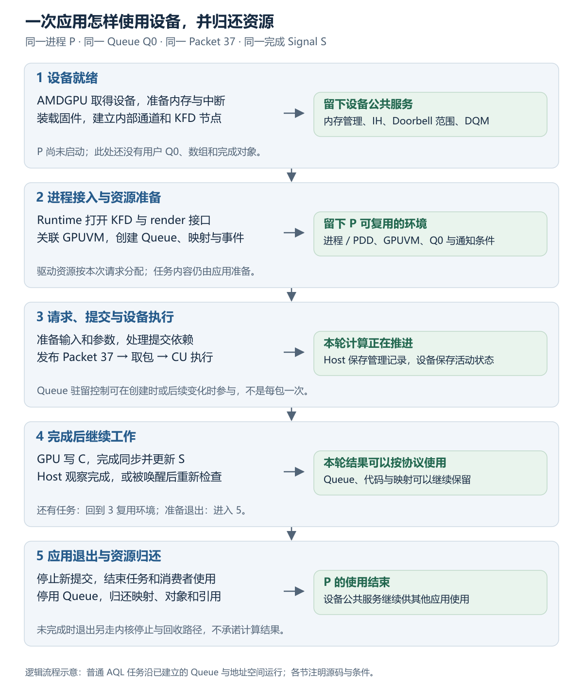
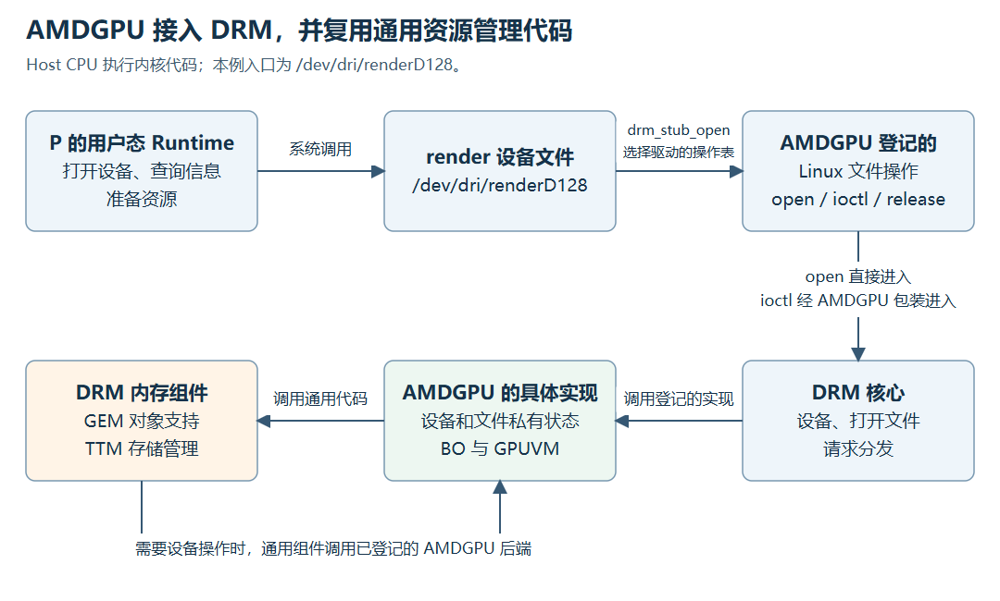
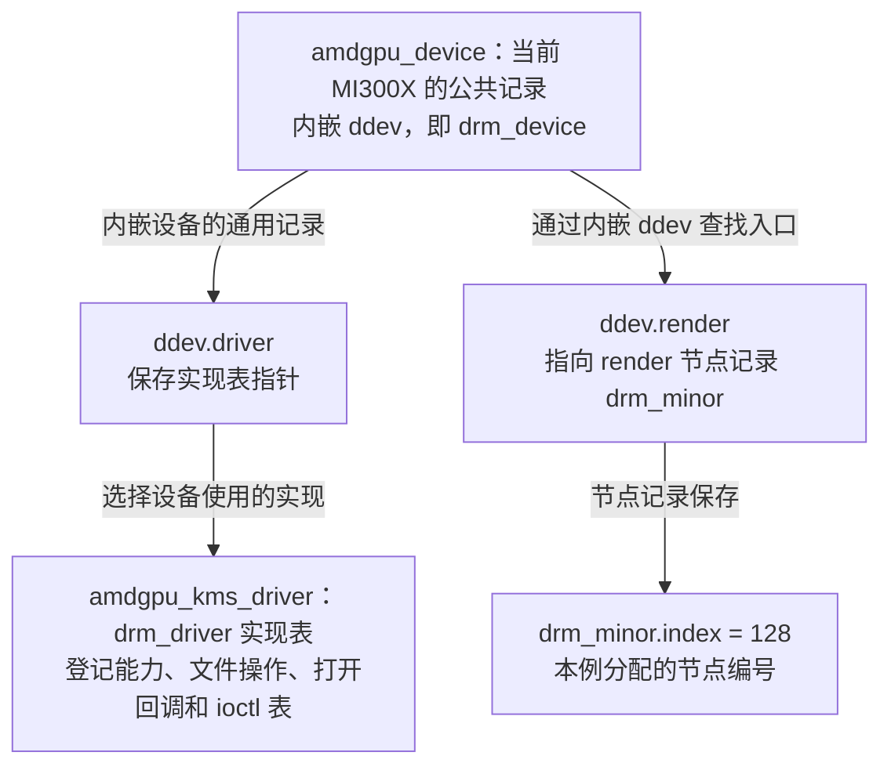
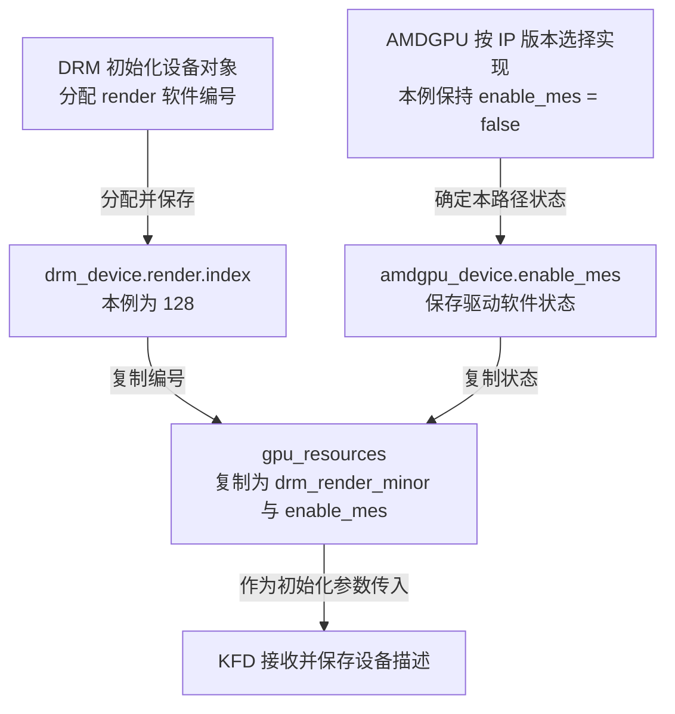
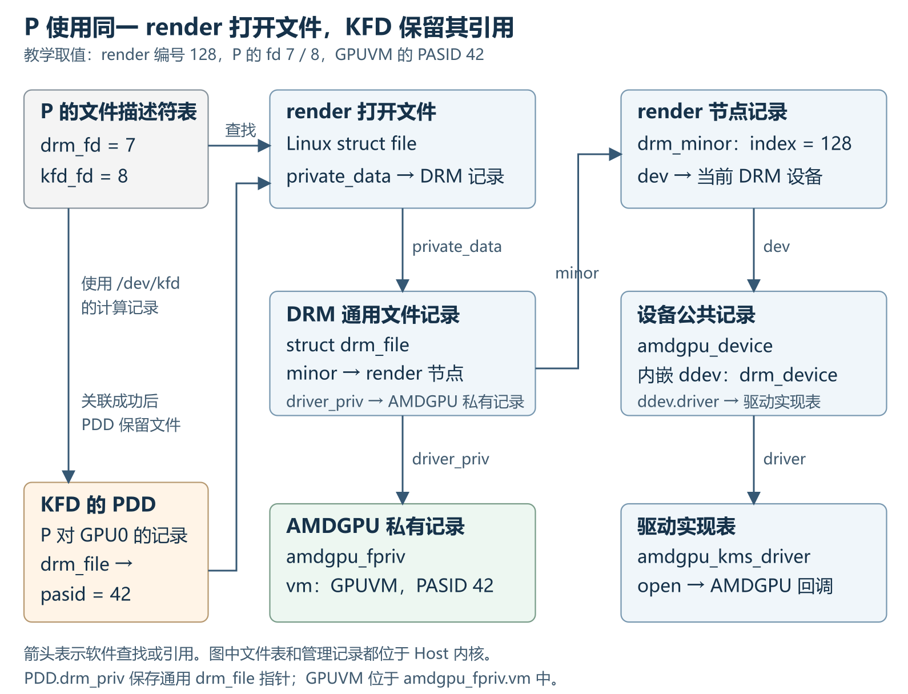

# AQL 应用的完整运行流程：驱动初始化、执行与资源释放（上）

| 缩写    | 英文全称                                        | 中文含义                                                     |
| ------- | ----------------------------------------------- | ------------------------------------------------------------ |
| AMDGPU  | AMD GPU Linux Kernel Driver                     | Linux 中的 AMD GPU 驱动                                      |
| API     | Application Programming Interface               | 应用程序编程接口                                             |
| AQL     | Architected Queuing Language                    | HSA 的队列包格式与提交协议                                   |
| BAR     | Base Address Register                           | PCIe 基址寄存器；描述设备地址窗口                            |
| BO      | Buffer Object                                   | 驱动管理的缓冲对象                                           |
| BSP     | Board Support Package                           | 板级支持包                                                   |
| CDNA    | Compute DNA                                     | AMD 数据中心计算 GPU 架构系列                                |
| CLR     | Compute Language Runtime                        | ROCm 的高层语言运行时公共实现                                |
| CP      | Command Processor                               | GPU 命令处理器                                               |
| CPSCH   | Command Processor Scheduling                    | 命令处理器固件调度路径                                       |
| CPU     | Central Processing Unit                         | 中央处理器                                                   |
| CU      | Compute Unit                                    | GPU 计算单元                                                 |
| CWSR    | Compute Wave Save and Restore                   | 计算 Wave 执行现场的保存与恢复                               |
| DMA     | Direct Memory Access                            | 设备直接访问内存的机制                                       |
| DMA-BUF | Direct Memory Access Buffer                     | Linux 缓冲区共享机制                                         |
| DQM     | Device Queue Manager                            | KFD 的设备队列管理器                                         |
| DRM     | Direct Rendering Manager                        | Linux 图形设备管理框架                                       |
| FD      | File Descriptor                                 | 文件描述符，正文写作 fd                                      |
| FIFO    | First In, First Out                             | 先进先出队列                                                 |
| GART    | Graphics Address Remapping Table                | AMDGPU 访问系统内存所用的地址重映射表                        |
| GEM     | Graphics Execution Manager                      | DRM 缓冲对象及相关接口的通用支持                             |
| GFP     | Get Free Pages                                  | Linux 内存分配标志                                           |
| GFX     | Graphics                                        | AMD 驱动中的图形／计算核心 IP 命名                           |
| GMC     | Graphics Memory Controller                      | 驱动中的 GPU 内存控制模块                                    |
| GPU     | Graphics Processing Unit                        | 图形处理器                                                   |
| GPUVA   | GPU Virtual Address                             | GPU 虚拟地址                                                 |
| GPUVM   | GPU Virtual Memory                              | GPU 虚拟地址空间及其页表管理                                 |
| GTT     | Graphics Translation Table                      | 本文指 AMDGPU 中可供设备访问的系统内存资源域                 |
| HBM     | High Bandwidth Memory                           | 高带宽内存；本例为设备本地显存                               |
| HIP     | Heterogeneous-compute Interface for Portability | AMD 异构计算编程接口                                         |
| HIQ     | HSA Interface Queue                             | KFD 向设备提交调度管理命令的内部队列                         |
| HMM     | Heterogeneous Memory Management                 | Linux 异构内存管理机制                                       |
| HQD     | Hardware Queue Descriptor                       | 计算 Queue 驻留时使用的硬件描述状态                          |
| HSA     | Heterogeneous System Architecture               | 异构系统架构                                                 |
| HSAKMT  | HSA Kernel Mode Thunk                           | 用户态与 KFD 交互的接口层                                    |
| HW      | Hardware                                        | 硬件；本文用于硬件初始化阶段及其完成状态                     |
| HWS     | Hardware Scheduling                             | KFD 使用硬件／固件进行队列调度的模式                         |
| IB      | Indirect Buffer                                 | 存放设备命令的间接缓冲区                                     |
| ID      | Identifier                                      | 标识符或编号，具体作用取决于所属对象                         |
| IH      | Interrupt Handler                               | AMDGPU 的中断记录与处理模块                                  |
| IOMMU   | Input/Output Memory Management Unit             | 设备访问主机内存时使用的地址翻译单元                         |
| IOVA    | I/O Virtual Address                             | Host IOMMU 翻译前的设备地址                                  |
| IP      | Intellectual Property                           | 本文指按功能组织的硬件模块                                   |
| IRQ     | Interrupt Request                               | 中断请求                                                     |
| ISA     | Instruction Set Architecture                    | 指令集架构                                                   |
| KFD     | Kernel Fusion Driver                            | AMD GPU 的 Linux 计算驱动接口                                |
| KiB     | Kibibyte                                        | 二进制千字节；1 KiB = 1024 字节                              |
| KIQ     | Kernel Interface Queue                          | AMDGPU 内核使用的控制队列                                    |
| KMS     | Kernel Mode Setting                             | 内核显示模式设置                                             |
| LDS     | Local Data Share                                | CU 上供同组工作共享的局部存储                                |
| MEC     | Micro Engine Compute                            | AMD GPU 处理计算队列的命令处理引擎                           |
| MES     | Micro Engine Scheduler                          | AMD 的一种设备队列调度实现；本例关闭此分支                   |
| MMU     | Memory Management Unit                          | 内存管理单元                                                 |
| MQD     | Memory Queue Descriptor                         | 保存在内存中的 Queue 配置与状态描述                          |
| OpenCL  | Open Computing Language                         | 开放计算语言及其异构计算接口                                 |
| PASID   | Process Address Space ID                        | 设备使用的进程地址空间标识                                   |
| PC      | Program Counter                                 | 程序计数器；记录下一条要执行的指令地址                       |
| PCI     | Peripheral Component Interconnect               | 外设互连；本文也用于 Linux PCI 子系统名称                    |
| PCIe    | Peripheral Component Interconnect Express       | Host 与 MI300X 之间的高速互连                                |
| PDD     | Process Device Data                             | KFD 中某个进程在某个逻辑 GPU 上的记录                        |
| PID     | Process ID                                      | 进程号；用于定位`/proc` 中的进程记录                       |
| PM4     | AMD PM4                                         | AMD 驱动与设备使用的一类命令包格式                           |
| PQM     | Process Queue Manager                           | KFD 的进程队列管理器                                         |
| PSP     | Platform Security Processor                     | GPU 内部的安全处理器，负责安全服务及其他 IP 的固件校验与装载 |
| PTE     | Page Table Entry                                | 页表项                                                       |
| QPD     | Queue Process Device Data                       | PDD 内嵌的队列与调度状态，类型为`qcm_process_device`       |
| RAM     | Random-Access Memory                            | 随机存取存储器；system RAM 指主机内存                        |
| RLC     | Run List Controller                             | GPU 运行列表控制器                                           |
| ROCm    | Radeon Open Compute                             | AMD GPU 计算软件平台                                         |
| ROCr    | ROCm Runtime                                    | ROCm 的 HSA 用户态运行时                                     |
| SDMA    | System Direct Memory Access                     | AMD GPU 中执行数据搬运等操作的专用引擎                       |
| SVM     | Shared Virtual Memory                           | 共享虚拟内存                                                 |
| SW      | Software                                        | 软件；本文用于软件初始化阶段及其完成状态                     |
| syncobj | Synchronization Object                          | DRM 同步对象，保存完成 Fence 的引用                          |
| sysfs   | sysfs (system filesystem)                       | Linux 导出设备拓扑和内核对象属性的虚拟文件系统               |
| TLB     | Translation Lookaside Buffer                    | 地址翻译缓存                                                 |
| TMR     | Trusted Memory Region                           | PSP 管理固件时使用的可信内存区域                             |
| sOS     | Secure Operating System                         | 运行于 PSP 的安全操作系统，源码也写作 SOS                    |
| TTM     | Translation Table Maps                          | DRM 中的通用缓冲对象内存管理机制                             |
| USERPTR | User Pointer                                    | 用户提供的地址及其后备页面路径                               |
| VM      | Virtual Memory                                  | 虚拟内存或对应地址空间                                       |
| VMA     | Virtual Memory Area                             | Linux 中连续虚拟地址范围的管理对象                           |
| VMID    | Virtual Memory ID                               | GPU 硬件地址空间上下文编号                                   |
| VRAM    | Video Random-Access Memory                      | 设备本地显存；本例对应 MI300X 的 HBM                         |
| XCC     | Accelerator Core Complex                        | 驱动描述的计算复合体实例                                     |
| XCD     | Accelerator Complex Die                         | MI300X 的计算芯粒                                            |
| XNACK   | XNACK（AMD 功能名称）                           | GPU 缺页后重试访存的能力及相应进程模式                       |
| EOP     | End of Pipe                                     | 管线末端；本文指 Queue 使用的 EOP 支持缓冲                   |
| GWS     | Global Wave Sync                                | 设备级 Wave 同步资源                                         |
| IDR     | ID Radix Tree                                   | Linux 按整数编号保存与查找对象的机制                         |
| ioctl   | Input/Output Control                            | 用户态向内核驱动发送控制请求的接口                           |
| ISR     | Interrupt Service Routine                       | 中断服务例程；本文指筛选中断记录的回调                       |
| RCU     | Read-Copy Update                                | 读、复制、更新；用于并发读者与对象移除协调                   |
| SMI     | System Management Interface                     | 系统管理事件接口                                             |
| SRCU    | Sleepable Read-Copy Update                      | 允许读侧睡眠的 RCU 变体                                      |
| bpp     | Bits per Pixel                                  | 每像素位数                                                   |
| fbdev   | Framebuffer Device                              | Linux 帧缓冲设备接口                                         |
| PRIME   | PRIME（DRM 共享缓冲接口名称）                   | DRM 通过 DMA-BUF 在设备之间共享缓冲的接口                    |

## 本篇大纲

本篇为 06 上篇，包含第 0～2 章，讲清设备怎样具备计算服务条件，以及进程 P 怎样取得 GPUVM、Q0 和可复用的资源。[下篇](<./06_AQL 应用的完整运行流程：驱动初始化、执行与资源释放（下）.md>)包含第 3～6 章，接着追踪一次任务的执行、完成通知和应用退出，并提供源码练习。两篇共用章节编号、术语、贯穿案例和固定源码基线。

05 已经说明 GPU 读取 A 受阻时怎样取得页面、恢复映射，以及页面变化和进程退出怎样影响访问。06 沿 P 使用 MI300X 计算 `C[i] = A[i] + B[i]` 的完整过程展开：开始时，Linux 已经识别出设备，但计算应用尚不能使用它；结束时，P 的任务、Queue、映射和引用已经收尾，设备继续服务其他进程。中间始终追踪同一组资源，观察前一步把什么准备好，后一步通过什么对象找到它，使用期间由谁保证它仍然有效。



这是软件调用与资源使用的流程图，箭头表示本例的先后与依赖关系，不表示芯片物理布局。上篇展开前两段，后三段在下篇继续。[可编辑源图](./assets/06/application-lifecycle.svg)。

- [0. AMDGPU 对 DRM 框架的接入与调用](#0-amdgpu-对-drm-框架的接入与调用)：先沿设备注册、文件打开和一个缓冲申请例子，认识 DRM 回调、AMDGPU 设备记录与 GEM/TTM。这里跨阶段解释框架关系，为后两章提供前提。
- [1. 驱动初始化：建立可供应用使用的设备资源](#1-驱动初始化建立可供应用使用的设备资源)：回到 P 启动之前，从模块注册和 PCI probe 出发，按初始化顺序准备 IP、存储、中断、固件、内部队列与 KFD 节点，最后完成设备注册。
- [2. 应用接入：建立进程、地址空间与可复用资源](#2-应用接入建立进程地址空间与可复用资源)：先建立 P 的 KFD 记录，打开 render、关联 GPUVM 并取得 Agent；再申请任务存储，由 Runtime 准备 Ring、KFD 配置 Q0，最后交回 Queue 接口。§2.5 补充资源复用，§2.6 说明资源应保留到何时。

<details>
<summary>小节索引：框架、设备初始化与应用接入</summary>

- [0. AMDGPU 对 DRM 框架的接入与调用](#0-amdgpu-对-drm-框架的接入与调用)
  - [0.1 DRM 核心调用驱动实现，通用组件支持资源管理](#01-drm-核心调用驱动实现通用组件支持资源管理)
  - [0.2 AMDGPU 登记实现表，并关联当前设备](#02-amdgpu-登记实现表并关联当前设备)
    - [0.2.1 probe 调用 drm_dev_register 注册设备入口](#021-probe-调用-drm_dev_register-注册设备入口)
    - [0.2.2 实现表保存处理方式，设备实例保存当前 GPU 状态](#022-实现表保存处理方式设备实例保存当前-gpu-状态)
      - [0.2.2.1 文件操作与打开、清理回调](#0221-文件操作与打开清理回调)
      - [0.2.2.2 ioctl 请求分发、版本查询与能力位](#0222-ioctl-请求分发版本查询与能力位)
      - [0.2.2.3 简单显示缓冲与 fbdev 操作](#0223-简单显示缓冲与-fbdev-操作)
      - [0.2.2.4 共享缓冲导入与文件诊断](#0224-共享缓冲导入与文件诊断)
  - [0.3 AMDGPU 复用 GEM、TTM，并管理 GPUVM](#03-amdgpu-复用-gemttm并管理-gpuvm)
    - [0.3.1 创建请求进入 AMDGPU，建立 BO 与 GEM 记录](#031-创建请求进入-amdgpu建立-bo-与-gem-记录)
    - [0.3.2 TTM 按顺序准备 GTT 资源、页面与设备后端状态](#032-ttm-按顺序准备-gtt-资源页面与设备后端状态)
    - [0.3.3 返回 GEM handle，再发起 GPUVA 映射请求](#033-返回-gem-handle再发起-gpuva-映射请求)
  - [0.4 文件最终清理再次调用 AMDGPU 回调](#04-文件最终清理再次调用-amdgpu-回调)
  - [0.5 用已有 DRM 与 AMDGPU 对象接回 KFD](#05-用已有-drm-与-amdgpu-对象接回-kfd)
- [1. 驱动初始化：建立可供应用使用的设备资源](#1-驱动初始化建立可供应用使用的设备资源)
  - [1.1 模块注册与 PCI probe](#11-模块注册与-pci-probe)
    - [1.1.1 全局 KFD 服务准备后注册 PCI 驱动](#111-全局-kfd-服务准备后注册-pci-驱动)
    - [1.1.2 probe 建立当前 GPU 的设备记录](#112-probe-建立当前-gpu-的设备记录)
  - [1.2 建立设备访问通路并选择 IP 实现](#12-建立设备访问通路并选择-ip-实现)
    - [1.2.1 寄存器 BAR 提供 Host 访问设备的入口](#121-寄存器-bar-提供-host-访问设备的入口)
    - [1.2.2 IP 数组把当前设备关联到具体回调](#122-ip-数组把当前设备关联到具体回调)
    - [1.2.3 GFX early_init 取得固件文件并登记微码条目](#123-gfx-early_init-取得固件文件并登记微码条目)
    - [1.2.4 建立 KFD 设备记录并登记 Doorbell 窗口](#124-建立-kfd-设备记录并登记-doorbell-窗口)
  - [1.3 软件初始化与内存基础](#13-软件初始化与内存基础)
    - [1.3.1 公共循环先为后续 IP 建立内存条件](#131-公共循环先为后续-ip-建立内存条件)
    - [1.3.2 IH 与 PSP 的软件回调取得支持资源](#132-ih-与-psp-的软件回调取得支持资源)
      - [1.3.2.1 IH 准备事件缓冲与 Host 中断入口](#1321-ih-准备事件缓冲与-host-中断入口)
      - [1.3.2.2 PSP 准备固件交互所需的对象与缓冲](#1322-psp-准备固件交互所需的对象与缓冲)
    - [1.3.3 GFX 分配内部 Ring 与 MQD](#133-gfx-分配内部-ring-与-mqd)
    - [1.3.4 软件循环结束后建立 IB 池与微码暂存 BO](#134-软件循环结束后建立-ib-池与微码暂存-bo)
  - [1.4 第一阶段硬件初始化：配置公共 IH 通路](#14-第一阶段硬件初始化配置公共-ih-通路)
  - [1.5 PSP 启动与固件装载](#15-psp-启动与固件装载)
    - [1.5.1 填充微码暂存区并确定装载输入](#151-填充微码暂存区并确定装载输入)
    - [1.5.2 启动 PSP 服务并登记命令 Ring](#152-启动-psp-服务并登记命令-ring)
    - [1.5.3 提交装载命令并等待 PSP 返回结果](#153-提交装载命令并等待-psp-返回结果)
  - [1.6 第二阶段硬件初始化：配置并测试内部队列](#16-第二阶段硬件初始化配置并测试内部队列)
    - [1.6.1 将已有 Ring 与 MQD 配置交给内部队列](#161-将已有-ring-与-mqd-配置交给内部队列)
    - [1.6.2 提交基础 Ring 测试并确认执行结果](#162-提交基础-ring-测试并确认执行结果)
  - [1.7 公共调度与 KFD 节点初始化](#17-公共调度与-kfd-节点初始化)
    - [1.7.1 为内部 Ring 建立 DRM 调度器并准备缓冲搬运](#171-为内部-ring-建立-drm-调度器并准备缓冲搬运)
    - [1.7.2 AMDGPU 告知 KFD 哪些 GPU 资源可用](#172-amdgpu-告知-kfd-哪些-gpu-资源可用)
    - [1.7.3 准备存储：以后把管理命令放在哪里](#173-准备存储以后把管理命令放在哪里)
      - [1.7.3.1 申请整块管理池并建立池内分配器](#1731-申请整块管理池并建立池内分配器)
      - [1.7.3.2 设备从 HIQ 取得地址并读取运行列表 IB](#1732-设备从-hiq-取得地址并读取运行列表-ib)
      - [1.7.3.3 管理通路与应用 AQL Queue 的关联](#1733-管理通路与应用-aql-queue-的关联)
    - [1.7.4 准备 Doorbell：以后怎样通知 GPU 读取内部队列](#174-准备-doorbell以后怎样通知-gpu-读取内部队列)
    - [1.7.5 准备中断接收：以后 GPU 上报事件，KFD 怎样接住并处理](#175-准备中断接收以后-gpu-上报事件kfd-怎样接住并处理)
    - [1.7.6 DQM 启动、计算节点发布与失败回滚](#176-dqm-启动计算节点发布与失败回滚)
  - [1.8 完成设备初始化并注册用户入口](#18-完成设备初始化并注册用户入口)
    - [1.8.1 准备内部命令的完成通知，补齐 IP 配置并安排 IB 测试](#181-准备内部命令的完成通知补齐-ip-配置并安排-ib-测试)
    - [1.8.2 登记设备页并更新 SVM 能力](#182-登记设备页并更新-svm-能力)
    - [1.8.3 返回 probe，注册 DRM 设备入口](#183-返回-probe注册-drm-设备入口)
    - [1.8.4 按最后成功的阶段定位初始化失败](#184-按最后成功的阶段定位初始化失败)
- [2. 应用接入：建立进程、地址空间与可复用资源](#2-应用接入建立进程地址空间与可复用资源)
  - [2.1 Runtime 进入 KFD，建立 P 的进程记录](#21-runtime-进入-kfd建立-p-的进程记录)
    - [2.1.1 hsa_init 建立或复用 P 的 Runtime](#211-hsa_init-建立或复用-p-的-runtime)
    - [2.1.2 打开 /dev/kfd，按 mm 取得 KFD 进程记录](#212-打开-devkfd按-mm-取得-kfd-进程记录)
    - [2.1.3 创建 PQM 与 PDD，保存 P 对 GPU0 的使用关系](#213-创建-pqm-与-pdd保存-p-对-gpu0-的使用关系)
  - [2.2 读取拓扑、关联 GPUVM 并建立 Agent](#22-读取拓扑关联-gpuvm-并建立-agent)
    - [2.2.1 从拓扑找到 render 入口并建立 GPUVM](#221-从拓扑找到-render-入口并建立-gpuvm)
    - [2.2.2 把这份 GPUVM 关联到已有 PDD](#222-把这份-gpuvm-关联到已有-pdd)
    - [2.2.3 建立 Agent，向应用交付 GPU 使用入口](#223-建立-agent向应用交付-gpu-使用入口)
  - [2.3 申请任务内存并准备完成对象](#23-申请任务内存并准备完成对象)
    - [2.3.1 申请 A/B/C，并为 GPU0 建立访问映射](#231-申请-abc并为-gpu0-建立访问映射)
    - [2.3.2 准备 Kernarg 与完成 Signal](#232-准备-kernarg-与完成-signal)
  - [2.4 Q0 的创建把用户存储交给驱动和设备使用](#24-q0-的创建把用户存储交给驱动和设备使用)
    - [2.4.1 Runtime 准备 Ring 并提交创建参数](#241-runtime-准备-ring-并提交创建参数)
    - [2.4.2 KFD 登记 Q0 并提交设备配置](#242-kfd-登记-q0-并提交设备配置)
    - [2.4.3 返回 Queue 接口，等待应用发布任务](#243-返回-queue-接口等待应用发布任务)
  - [2.5 线程、Queue 与进程增加时的资源复用](#25-线程queue-与进程增加时的资源复用)
    - [2.5.1 T1 复用 P 的环境与 Q0](#251-t1-复用-p-的环境与-q0)
    - [2.5.2 Q1 复用 P 的 GPUVM，单独取得 Queue 资源](#252-q1-复用-p-的-gpuvm单独取得-queue-资源)
    - [2.5.3 R 建立自己的进程资源，共用 GPU0](#253-r-建立自己的进程资源共用-gpu0)
  - [2.6 引用、映射与任务完成共同约束资源寿命](#26-引用映射与任务完成共同约束资源寿命)
    - [2.6.1 进程查找与地址空间退出的交错](#261-进程查找与地址空间退出的交错)

</details>

实际运行先完成第 1 章的设备初始化，再进入第 2 章的应用接入。第 0 章中的打开和内存申请例子，是为了提前说明后面会用到的框架关系。第 1 章按资源依赖展开，各 IP 的初始化会交错进行；第 2 章从全局调用图进入，沿设备打开、进程记录、GPUVM 关联、Agent 与运行时支持依次展开，再继续应用的内存和 Queue 请求。

首次阅读时，可先沿正文和关系图走通各阶段，再展开相应的源码导读，核对回调、字段、返回值和失败清理。Queue 的驻留管理从创建时就可能开始，部分 Runtime 支持资源则按首次使用延迟建立，具体发生时机在对应小节说明。

首次连读正常任务时，先沿本篇 §0～§2 建立环境，再从[下篇 §3.1](<./06_AQL 应用的完整运行流程：驱动初始化、执行与资源释放（下）.md#31-kfd-和设备固件使用户-queue-获得驻留条件>)先看 Queue 驻留和设备执行，再看 Host 准备与发布，随后读取完成和退出章节。[下篇 §3.6](<./06_AQL 应用的完整运行流程：驱动初始化、执行与资源释放（下）.md#36-两条-queue-完成准备依赖等待与计算>)～[下篇 §3.8](<./06_AQL 应用的完整运行流程：驱动初始化、执行与资源释放（下）.md#38-可恢复缺页把设备执行接回-host-处理>) 分别改变跨 Queue 依赖、进程竞争和访存条件；每个变体都从明示的起点重新推演。[下篇 §6.4](<./06_AQL 应用的完整运行流程：驱动初始化、执行与资源释放（下）.md#64-接入第七章的公共驱动能力>)集中提供 00～05 的回查入口和第七章衔接，[下篇 §6](<./06_AQL 应用的完整运行流程：驱动初始化、执行与资源释放（下）.md#6-源码追踪故障推演与小范围验证>)提供追踪和验证练习，并接到第七章。

**[DESIGN]** 固定采用外部 Host CPU + MI300X / CDNA 3 独立 GPU，system RAM 与 HBM 经 PCIe 连接；整卡作为一个逻辑 GPU Agent，Host IOMMU 开启翻译。本例 DRM render 编号取 128，P 打开 render 文件与 `/dev/kfd` 后分别得到 fd 7、fd 8。P 在本例 GPU 上使用 PASID 42，VMID 5 是观察时刻的硬件驻留上下文编号；这些编号均为教学取值，实际分配结果可以不同。主线先取资源充足、映射有效、正常完成的条件；固件装载与 Queue 管理的具体配置在用到它们的小节说明。

任务仍有 1024 个元素，Q0 的 Packet 37 发起 `vector_add`，完成 Signal S 初值为 1。Q0 Ring 基址为 `0x1000_0000`，Packet 37 位于 `0x1000_0940`。Ring、Kernarg、S 和 A/B/C 放在 system RAM；代码、Descriptor 与 GPU 页表采用本例的 HBM 布置。A/B/C 使用满足 CPU/GPU 访问与 HSA 同步要求的细粒度系统内存，正常主线通过普通 KFD 内存接口建立 GPU 映射。

本例让 CPU 与 GPU 按 SYSTEM 范围交接输入、参数和结果。Packet 37 的 acquire/release fence scope 均取 SYSTEM，Host 以 acquire 语义等待 S。发布 Packet 的顺序在 [下篇 §3.5](<./06_AQL 应用的完整运行流程：驱动初始化、执行与资源释放（下）.md#35-从预留槽位到有效发布再到设备推进>) 展开，计算结束后怎样交付结果在 [下篇 §4](<./06_AQL 应用的完整运行流程：驱动初始化、执行与资源释放（下）.md#4-任务完成通知-host-并继续应用工作>) 展开。

接口关系从 HSA/ROCr 层展开，便于看清驱动请求。高层 Runtime 应用会由其实现完成相应底层调用，[下篇 §3.4](<./06_AQL 应用的完整运行流程：驱动初始化、执行与资源释放（下）.md#34-host-线程与-runtime-安排本轮软件提交>) 再接上 CLR 的提交路径。图中的接口不要求 HIP 应用逐个显式调用，也不把 Stream 与底层 AQL Queue 固定画成一一对应。

源码基线为 Linux `248951ddc14de84de3910f9b13f51491a8cd91df`、ROCr `ba56a24c6132c5d195686ae4adf969ca1222fbba`、CLR `81277d69e3352e7144ced2ee9601484f9b48d950`，后文使用其前 12 位。目录见[源码基线说明](<../2.源码/README.md>)。`[SOURCE]` 标记实现事实，`[SPEC]` 标记规范语义，`[DESIGN]` 标记教学条件，`[INFERENCE]` 标记条件推演，`[BOUNDARY]` 说明适用范围。

源码文件名链接定位到该处引用的第一段，行号链接分别定位到对应片段的起始行。可在 VS Code 的 Markdown 编辑区中 Ctrl＋左键点击，或在预览中直接点击。本地源码定位采用 VS Code 原生链接，按当前仓库的绝对路径生成；移动仓库目录后需更新这些定位路径。

**[BOUNDARY]** 本篇只展开理解 AQL 初始化、映射和 Queue 创建所需的公共驱动能力。第 0 章的 GEM/TTM 例子说明一次缓冲请求怎样被处理；普通 DRM job、scheduler、TTM 迁移、`dma_resv` 及 CPU/SDMA 页表更新后端，仍按 [07 大纲](<./07_AMDGPU 通用内存管理与 DRM 任务提交（大纲）.md>)继续展开。

## 0. AMDGPU 对 DRM 框架的接入与调用

第 1 章将沿 AMDGPU 初始化代码准备 MI300X，第 2 章再让 P 通过 Runtime 使用这块设备。两章会反复经过同一组框架对象：设备保存驱动实现表，打开文件保存本次使用的私有状态，内存请求沿这些关联找到 AMDGPU 的处理函数。本章先沿“登记实现 → 打开文件 → 处理请求 → 清理文件”说明这些关系，再用一块缓冲解释 GEM、TTM 和 GPUVM 怎样配合。

设备注册、P 打开文件和最终文件清理发生在不同阶段；本章按框架关系阅读，第 1～5 章再按实际触发时机展开。这里出现的 render 请求用于说明公共接口，P 的 AQL 内存和 Queue 请求在第 2 章沿 KFD 接口展开。沿用 Host CPU + MI300X，以及 render 编号 128、fd 7/8、PASID 42 的教学取值；假设相关初始化正常、打开回调返回 0，以下软件调用由 Host CPU 执行。

### 0.1 DRM 核心调用驱动实现，通用组件支持资源管理

P 要使用 MI300X，Runtime 先通过设备文件请求查询信息和准备资源。AMDGPU 为这些入口登记操作；DRM 核心组织通用的设备与文件状态，再按设备保存的关联调用 AMDGPU。AMDGPU 处理内存需求时，还会使用 DRM 子系统中的 GEM、TTM 等通用组件。



这张补图把入口、通用分发和设备实现分开放置，便于沿调用方向阅读。[可编辑源图](./assets/06/drm-amdgpu-framework.svg)。

这是软件接口关系图。沿图有两种配合：DRM 核心调用 AMDGPU 登记的实现；AMDGPU 使用通用资源管理代码，并提供 AMD 设备需要的后端。§0.2 带读第一种关系，§0.3 带读内存组件的复用，§0.4 说明清理回调。

“DRM 子系统”通常包含通用代码和 AMDGPU 这样的具体驱动；本篇的“DRM 核心”专指设备、文件和通用分发部分。GEM、TTM 属于可复用的内存组件。scheduler、syncobj 在普通 DRM 任务提交中参与调度与同步，按第七章继续展开；KMS 用于显示配置，当前计算主线只需知道它也是 DRM 的一部分。KFD 另有 `/dev/kfd` 入口，§0.5 用已有对象接回计算应用。

### 0.2 AMDGPU 登记实现表，并关联当前设备

#### 0.2.1 probe 调用 drm_dev_register 注册设备入口

注册前，AMDGPU 已经准备好当前 GPU 的 DRM 设备记录 `ddev`，并把驱动实现表关联到这份记录中。`amdgpu_pci_probe()` 在 `amdgpu_driver_load_kms()` 完成设备加载后，调用 `drm_dev_register(ddev, flags)` 注册 DRM 设备入口。先沿成功路径看入口怎样交到 P 手中：

```text
probe 准备设备记录，并关联 AMDGPU 的驱动实现表
    ↓
amdgpu_driver_load_kms()：完成设备加载
    ↓
drm_dev_register()：注册 DRM 设备入口
    ↓
P 可以打开本例的 /dev/dri/renderD128
    ↓
DRM 根据设备记录找到文件操作，处理 P 的打开请求
```

图中省略了设备加载内部的资源准备；第 1 章会按初始化调用顺序展开内存、中断、Firmware、内部 Queue 和 KFD 服务的准备。这里先跟踪 DRM 入口的登记，设备各项能力的就绪条件在 [§1.8.4 的失败定位](#184-按最后成功的阶段定位初始化失败)集中检查。

下面的 [§0.2.2](#022-实现表保存处理方式设备实例保存当前-gpu-状态)回看注册之前建立的对象关联，说明 DRM 怎样从设备记录找到实现表；[§0.2.2.1](#0221-文件操作与打开清理回调)再沿 P 打开设备的过程，解释这些文件操作和回调怎样被调用。

> **[SOURCE]** Linux `248951ddc14d`，[amdgpu_drv.c](vscode://file/C:/Users/28431/Desktop/GPU%E5%AD%A6%E4%B9%A0%E8%B5%84%E6%96%99/gpu_study/2.%E6%BA%90%E7%A0%81/linux/drivers/gpu/drm/amd/amdgpu/amdgpu_drv.c:2443:1) 第 [2443～2457](vscode://file/C:/Users/28431/Desktop/GPU%E5%AD%A6%E4%B9%A0%E8%B5%84%E6%96%99/gpu_study/2.%E6%BA%90%E7%A0%81/linux/drivers/gpu/drm/amd/amdgpu/amdgpu_drv.c:2443:1) 行。probe 先完成设备加载，再调用 DRM 注册接口，并处理注册重试或错误。

#### 0.2.2 实现表保存处理方式，设备实例保存当前 GPU 状态

先回看注册前的准备：Linux 已识别 MI300X，AMDGPU 的 PCI probe 正在建立设备记录。驱动要把自己的操作交给 DRM，同时保存当前这块 GPU 的状态。实现表 `amdgpu_kms_driver` 描述处理方式；`amdgpu_device` 保存当前设备状态，并内嵌 DRM 使用的 `drm_device`。probe 把实现表传给 `devm_drm_dev_alloc()`；分配接口初始化内嵌 DRM 设备时，把表指针保存到 `ddev.driver`，以后 DRM 就从这个成员查找回调。



图中 `drm_driver` 是实现表，`drm_device` 是设备实例。AMDGPU 的 `amdgpu_device` 内嵌 `drm_device`，所以驱动既能使用自己的设备状态，也能把同一设备交给 DRM 的通用代码管理。

**[DESIGN]** 下面只展开本章需要的成员关系，省略类型细节和其他成员。这是教学简化定义，实际声明以源码为准。

```text
drm_driver：驱动实现表，本例为 amdgpu_kms_driver
    driver_features    声明 DRM 能力，例如支持 render 节点
    fops               提供设备文件的操作，例如 open、ioctl、release
    open               DRM 建立通用打开记录后调用的驱动回调
    postclose          DRM 清理打开记录时调用的驱动回调
    ioctls/num_ioctls   驱动专用请求的处理表与表项数量
    dumb_create        按宽、高和像素位数创建简单显示缓冲
    dumb_map_offset    查询这个缓冲供 CPU mmap 使用的偏移
    fbdev_probe        有条件地登记 TTM 的 fbdev 缓冲准备函数
    gem_prime_import   把共享 DMA-BUF 接入当前 DRM 设备
    show_fdinfo        输出这次打开的内存和任务使用统计
    release            DRM 设备引用归零后执行的设备清理回调
    name/desc          版本查询返回的驱动名称与说明
    major/minor/patchlevel   版本查询返回的驱动接口版本

amdgpu_device：当前 GPU 的 AMDGPU 公共记录
    ddev               内嵌 drm_device
        driver         指向上面的驱动实现表
        render         指向当前 render 节点的 drm_minor
            index      本例为 128
            dev        回到这个 drm_device
```

这里建立的是 Host 内核中的软件关联。后面打开 render 文件时，DRM 沿节点记录找到设备，再沿 `device.driver` 找到 AMDGPU 登记的回调。

> **[SOURCE]** Linux `248951ddc14d`，[drm_drv.c](https://github.com/torvalds/linux/blob/248951ddc14de84de3910f9b13f51491a8cd91df/drivers/gpu/drm/drm_drv.c#L703-L720) 第 [703～720](https://github.com/torvalds/linux/blob/248951ddc14de84de3910f9b13f51491a8cd91df/drivers/gpu/drm/drm_drv.c#L703-L720) 行。初始化 DRM 设备时保存父设备与驱动实现表，`dev->driver = driver` 建立后续回调查找依据。

> **[SOURCE]** Linux `248951ddc14d`：[`amdgpu.h`](vscode://file/C:/Users/28431/Desktop/GPU%E5%AD%A6%E4%B9%A0%E8%B5%84%E6%96%99/gpu_study/2.%E6%BA%90%E7%A0%81/linux/drivers/gpu/drm/amd/amdgpu/amdgpu.h:822:1) 第 [822～825](vscode://file/C:/Users/28431/Desktop/GPU%E5%AD%A6%E4%B9%A0%E8%B5%84%E6%96%99/gpu_study/2.%E6%BA%90%E7%A0%81/linux/drivers/gpu/drm/amd/amdgpu/amdgpu.h:822:1) 行内嵌 `drm_device`；[`drm_device.h`](vscode://file/C:/Users/28431/Desktop/GPU%E5%AD%A6%E4%B9%A0%E8%B5%84%E6%96%99/gpu_study/2.%E6%BA%90%E7%A0%81/linux/include/drm/drm_device.h:123:1) 第 [123](vscode://file/C:/Users/28431/Desktop/GPU%E5%AD%A6%E4%B9%A0%E8%B5%84%E6%96%99/gpu_study/2.%E6%BA%90%E7%A0%81/linux/include/drm/drm_device.h:123:1)、[154](vscode://file/C:/Users/28431/Desktop/GPU%E5%AD%A6%E4%B9%A0%E8%B5%84%E6%96%99/gpu_study/2.%E6%BA%90%E7%A0%81/linux/include/drm/drm_device.h:154:1) 行保存实现表和 render 节点；[`drm_file.h`](vscode://file/C:/Users/28431/Desktop/GPU%E5%AD%A6%E4%B9%A0%E8%B5%84%E6%96%99/gpu_study/2.%E6%BA%90%E7%A0%81/linux/include/drm/drm_file.h:78:1) 第 [78～88](vscode://file/C:/Users/28431/Desktop/GPU%E5%AD%A6%E4%B9%A0%E8%B5%84%E6%96%99/gpu_study/2.%E6%BA%90%E7%A0%81/linux/include/drm/drm_file.h:78:1) 行定义节点的类型、编号和设备指针；[`amdgpu_drv.c`](vscode://file/C:/Users/28431/Desktop/GPU%E5%AD%A6%E4%B9%A0%E8%B5%84%E6%96%99/gpu_study/2.%E6%BA%90%E7%A0%81/linux/drivers/gpu/drm/amd/amdgpu/amdgpu_drv.c:3081:1) 第 [3081～3107](vscode://file/C:/Users/28431/Desktop/GPU%E5%AD%A6%E4%B9%A0%E8%B5%84%E6%96%99/gpu_study/2.%E6%BA%90%E7%A0%81/linux/drivers/gpu/drm/amd/amdgpu/amdgpu_drv.c:3081:1) 行给出当前实现表。

下面保留完整初始化器。能力位和版本字段保存数据，回调字段保存函数地址，`fops` 和 `ioctls` 保存另一张表的地址。写下这些地址时尚未执行回调；后面的打开、请求、诊断或清理才会按条件调用对应函数。

> **[SOURCE]** Linux `248951ddc14d`，[`amdgpu_drv.c`](vscode://file/C:/Users/28431/Desktop/GPU%E5%AD%A6%E4%B9%A0%E8%B5%84%E6%96%99/gpu_study/2.%E6%BA%90%E7%A0%81/linux/drivers/gpu/drm/amd/amdgpu/amdgpu_drv.c:3081:1) 第 [3081～3107](vscode://file/C:/Users/28431/Desktop/GPU%E5%AD%A6%E4%B9%A0%E8%B5%84%E6%96%99/gpu_study/2.%E6%BA%90%E7%A0%81/linux/drivers/gpu/drm/amd/amdgpu/amdgpu_drv.c:3081:1) 行。AMDGPU 登记能力、文件操作、私有打开/清理回调和专用请求表。

```c
3081: static const struct drm_driver amdgpu_kms_driver = {
3082: 	.driver_features =
3083: 	    DRIVER_ATOMIC |
3084: 	    DRIVER_GEM |
3085: 	    DRIVER_RENDER | DRIVER_MODESET | DRIVER_SYNCOBJ |
3086: 	    DRIVER_SYNCOBJ_TIMELINE,
3087: 	.open = amdgpu_driver_open_kms,
3088: 	.postclose = amdgpu_driver_postclose_kms,
3089: 	.ioctls = amdgpu_ioctls_kms,
3090: 	.num_ioctls = ARRAY_SIZE(amdgpu_ioctls_kms),
3091: 	.dumb_create = amdgpu_mode_dumb_create,
3092: 	.dumb_map_offset = amdgpu_mode_dumb_mmap,
3093: 	DRM_FBDEV_TTM_DRIVER_OPS,
3094: 	.fops = &amdgpu_driver_kms_fops,
3095: 	.release = &amdgpu_driver_release_kms,
3096: #ifdef CONFIG_PROC_FS
3097: 	.show_fdinfo = amdgpu_show_fdinfo,
3098: #endif
3099:
3100: 	.gem_prime_import = amdgpu_gem_prime_import,
3101:
3102: 	.name = DRIVER_NAME,
3103: 	.desc = DRIVER_DESC,
3104: 	.major = KMS_DRIVER_MAJOR,
3105: 	.minor = KMS_DRIVER_MINOR,
3106: 	.patchlevel = KMS_DRIVER_PATCHLEVEL,
3107: };
```

下面用 P 的 render 文件追踪打开和请求分发。显示、共享缓冲及文件诊断回调保留在 §0.2.2.3～§0.2.2.4 的可选阅读中；沿 AQL 主线阅读时，看完 §0.2.2.2 可以继续到 [§0.3](#03-amdgpu-复用-gemttm并管理-gpuvm)。先分清每次操作找的是哪一层：

```text
P 打开 render 文件
    → fops.open = drm_open：建立 DRM 文件记录
    → drm_driver.open：准备这个文件的 AMDGPU 私有状态

P 对 fd 发请求、建立 CPU 映射或查看状态
    → fops 中的 ioctl / mmap / show_fdinfo
    → DRM 按请求类型调用专用回调或通用组件

最后一个 render 文件引用归还
    → fops.release：文件清理包装
    → DRM 文件清理中的 postclose：拆除这个文件的私有状态

DRM 设备自身的引用归零
    → drm_driver.release：回收整块设备的软件资源
```

##### 0.2.2.1 文件操作与打开、清理回调

以 P 打开 `/dev/dri/renderD128` 为例。`dev` 是当前 GPU 的 DRM 设备；`struct file` 是 Linux 为这次打开建立的文件对象，其中的 `f_op` 指向文件操作表。沿成功路径，打开过程如下：

```text
P 调用 open("/dev/dri/renderD128", ...)
    ↓
drm_stub_open()：DRM 的统一打开入口
    │
    ├─ 取得 dev->driver->fops
    │      就是 &amdgpu_driver_kms_fops
    │
    ├─ replace_fops()：替换本次 struct file 的 f_op
    │
    └─ 调用新操作表中的 open
           ↓
       drm_open()：因为 amdgpu_driver_kms_fops.open = drm_open
           ↓
       drm_open_helper()：继续准备本次打开的文件
           ↓
       drm_file_alloc()：创建本次打开的 drm_file
           ↓
       调用 dev->driver->open(dev, drm_file)
           ↓
       amdgpu_driver_open_kms()：创建 AMDGPU 私有状态
```

两个 `open` 位于不同的表中：`fops.open = drm_open` 是 Linux 的文件打开操作；`drm_driver.open = amdgpu_driver_open_kms` 是 DRM 创建通用记录时调用的驱动回调。先看文件操作的登记：

> **[SOURCE]** Linux `248951ddc14d`，[`amdgpu_drv.c`](vscode://file/C:/Users/28431/Desktop/GPU%E5%AD%A6%E4%B9%A0%E8%B5%84%E6%96%99/gpu_study/2.%E6%BA%90%E7%A0%81/linux/drivers/gpu/drm/amd/amdgpu/amdgpu_drv.c:3024:1) 第 [3024～3040](vscode://file/C:/Users/28431/Desktop/GPU%E5%AD%A6%E4%B9%A0%E8%B5%84%E6%96%99/gpu_study/2.%E6%BA%90%E7%A0%81/linux/drivers/gpu/drm/amd/amdgpu/amdgpu_drv.c:3024:1) 行。文件 open 进入 DRM；ioctl 和 release 则先进入 AMDGPU 的包装函数。

```c
3024: static const struct file_operations amdgpu_driver_kms_fops = {
3025: 	.owner = THIS_MODULE,
3026: 	.open = drm_open,
3027: 	.flush = amdgpu_flush,
3028: 	.release = amdgpu_drm_release,
3029: 	.unlocked_ioctl = amdgpu_drm_ioctl,
3030: 	.mmap = drm_gem_mmap,
3031: 	.poll = drm_poll,
3032: 	.read = drm_read,
3033: #ifdef CONFIG_COMPAT
3034: 	.compat_ioctl = amdgpu_kms_compat_ioctl,
3035: #endif
3036: #ifdef CONFIG_PROC_FS
3037: 	.show_fdinfo = drm_show_fdinfo,
3038: #endif
3039: 	.fop_flags = FOP_UNSIGNED_OFFSET,
3040: };
```

文件操作表怎样在打开时被使用，还要回到 DRM 的统一入口。Linux 最初进入 `drm_stub_open()`；该函数从节点记录取得 `minor->dev->driver->fops`，替换当前文件的 `f_op`，随后调用替换后的 `open`。本例表中的函数就是上面登记的 `drm_open()`。后续 ioctl 和 release 也沿这份已替换的操作表进入。

AMDGPU 私有状态包括本次打开使用的 GPUVM，`drm_file->driver_priv` 保存指向这份私有状态的指针。各层成功返回后，P 得到 fd，后续请求就能沿这个文件找到对应状态。

> **[SOURCE]** Linux `248951ddc14d`，打开调用链：
>
> - 选中操作表、替换 `f_op` 并调用新表的 `open`：[drm_drv.c](https://github.com/torvalds/linux/blob/248951ddc14de84de3910f9b13f51491a8cd91df/drivers/gpu/drm/drm_drv.c#L1191-L1219) 第 [1191～1219](https://github.com/torvalds/linux/blob/248951ddc14de84de3910f9b13f51491a8cd91df/drivers/gpu/drm/drm_drv.c#L1191-L1219) 行。
> - `drm_open()` 调用 helper，helper 调用 `drm_file_alloc()`，分配函数再调用驱动的 `open`：[drm_file.c](https://github.com/torvalds/linux/blob/248951ddc14de84de3910f9b13f51491a8cd91df/drivers/gpu/drm/drm_file.c#L388) 第 [388](https://github.com/torvalds/linux/blob/248951ddc14de84de3910f9b13f51491a8cd91df/drivers/gpu/drm/drm_file.c#L388)、[335～348](https://github.com/torvalds/linux/blob/248951ddc14de84de3910f9b13f51491a8cd91df/drivers/gpu/drm/drm_file.c#L335-L348)、[132～179](https://github.com/torvalds/linux/blob/248951ddc14de84de3910f9b13f51491a8cd91df/drivers/gpu/drm/drm_file.c#L132-L179) 行。

文件清理也经过两层调用：最后一个文件引用归还时，文件操作表的 `release` 进入 `amdgpu_drm_release()`，再调用 `drm_release()`；DRM 清理文件时调用 `postclose = amdgpu_driver_postclose_kms`，释放 AMDGPU 私有状态。具体过程见 [§0.4](#04-文件最终清理再次调用-amdgpu-回调)。

<details>
<summary>其他文件操作、初始化与清理细节（按需查阅）</summary>

`amdgpu_driver_open_kms(dev, file_priv)` 从 `dev` 找到当前 `amdgpu_device`，先等待设备的延后初始化工作，再申请运行时电源使用。沿本例成功路径，回调分配 `amdgpu_fpriv`、取得 PASID、选择文件使用的计算分区，并初始化其中的 GPUVM。回调还建立文件的缓冲列表、上下文管理器和相关提交管理状态，最后把 `fpriv` 写入 `file_priv->driver_priv`。这样下一次请求才能沿文件找到自己的 VM。VM 初始化等中途失败时，代码按已经完成的步骤拆除 VM、归还 PASID 并释放 `fpriv`；调用者根据返回值决定打开是否成功。

> **[SOURCE]** Linux `248951ddc14d`，[amdgpu_kms.c](vscode://file/C:/Users/28431/Desktop/GPU%E5%AD%A6%E4%B9%A0%E8%B5%84%E6%96%99/gpu_study/2.%E6%BA%90%E7%A0%81/linux/drivers/gpu/drm/amd/amdgpu/amdgpu_kms.c:1435:1) 第 [1435～1536](vscode://file/C:/Users/28431/Desktop/GPU%E5%AD%A6%E4%B9%A0%E8%B5%84%E6%96%99/gpu_study/2.%E6%BA%90%E7%A0%81/linux/drivers/gpu/drm/amd/amdgpu/amdgpu_kms.c:1435:1) 行。打开回调从设备取得 AMDGPU 记录，建立文件私有 VM 等状态，并保留失败清理与返回出口。

文件操作表中的其余入口也各有具体动作：

- `unlocked_ioctl = amdgpu_drm_ioctl`：从文件找设备，申请运行时电源使用，再把命令和参数交给 `drm_ioctl()` 分发，出口归还电源使用并返回处理结果。`CONFIG_COMPAT` 打开时，`compat_ioctl` 为 32 位应用提供入口；AMDGPU 的兼容包装把通用命令交给 `drm_compat_ioctl()`，专用命令继续交给 `amdgpu_drm_ioctl()`。
- `mmap = drm_gem_mmap`：按用户传入的 mmap 偏移查找 GEM 对象，检查这个文件是否有权使用对象，再调用对象的映射操作。AMDGPU 后端经过 TTM，把对象和缺页处理入口接到 CPU 的 VMA，并交接映射所持的 BO 引用。成功返回时 VMA 已经建立，CPU 后续访问触发缺页时再填写相应 CPU 页表；GPUVA 和 GPU 页表另由 GPUVM 管理。
- `poll = drm_poll`、`read = drm_read`：前者把等待者加入这个 DRM 文件的事件等待队列，事件列表非空时报告可读；后者取出完整事件记录，复制到用户缓冲。列表为空时，阻塞读取睡眠等待，非阻塞读取返回 `-EAGAIN`。这是 DRM 文件事件接口；KFD 的 Signal 等待沿[下篇第 4 章](<./06_AQL 应用的完整运行流程：驱动初始化、执行与资源释放（下）.md#4-任务完成通知-host-并继续应用工作>)的 KFD Event 路径进行。
- `flush = amdgpu_flush`：关闭文件描述符时，先等待该文件上下文的调度实体队列，再等待 VM 的更新任务。函数把非负结果转换为 0，负值作为错误返回；最终释放私有对象由后面的文件清理完成。
- `show_fdinfo = drm_show_fdinfo`：读取 `/proc/PID/fdinfo/7` 时进入 DRM 的通用报告函数，再调用下面的驱动统计回调。`owner = THIS_MODULE` 用于文件操作期间的模块引用，`fop_flags = FOP_UNSIGNED_OFFSET` 标记文件偏移按无符号值处理。

> **[SOURCE]** Linux `248951ddc14d`，源码索引：
>
> - 文件操作表：[amdgpu_drv.c](vscode://file/C:/Users/28431/Desktop/GPU%E5%AD%A6%E4%B9%A0%E8%B5%84%E6%96%99/gpu_study/2.%E6%BA%90%E7%A0%81/linux/drivers/gpu/drm/amd/amdgpu/amdgpu_drv.c:3024:1) 第 [3024～3040](vscode://file/C:/Users/28431/Desktop/GPU%E5%AD%A6%E4%B9%A0%E8%B5%84%E6%96%99/gpu_study/2.%E6%BA%90%E7%A0%81/linux/drivers/gpu/drm/amd/amdgpu/amdgpu_drv.c:3024:1) 行。
> - ioctl 包装与电源归还：[amdgpu_drv.c](vscode://file/C:/Users/28431/Desktop/GPU%E5%AD%A6%E4%B9%A0%E8%B5%84%E6%96%99/gpu_study/2.%E6%BA%90%E7%A0%81/linux/drivers/gpu/drm/amd/amdgpu/amdgpu_drv.c:2978:1) 第 [2978～2995](vscode://file/C:/Users/28431/Desktop/GPU%E5%AD%A6%E4%B9%A0%E8%B5%84%E6%96%99/gpu_study/2.%E6%BA%90%E7%A0%81/linux/drivers/gpu/drm/amd/amdgpu/amdgpu_drv.c:2978:1) 行。
> - 32 位应用的兼容请求分发：[amdgpu_ioc32.c](vscode://file/C:/Users/28431/Desktop/GPU%E5%AD%A6%E4%B9%A0%E8%B5%84%E6%96%99/gpu_study/2.%E6%BA%90%E7%A0%81/linux/drivers/gpu/drm/amd/amdgpu/amdgpu_ioc32.c:37:1) 第 [37～45](vscode://file/C:/Users/28431/Desktop/GPU%E5%AD%A6%E4%B9%A0%E8%B5%84%E6%96%99/gpu_study/2.%E6%BA%90%E7%A0%81/linux/drivers/gpu/drm/amd/amdgpu/amdgpu_ioc32.c:37:1) 行。
> - flush 的两个等待与返回值：[amdgpu_drv.c](vscode://file/C:/Users/28431/Desktop/GPU%E5%AD%A6%E4%B9%A0%E8%B5%84%E6%96%99/gpu_study/2.%E6%BA%90%E7%A0%81/linux/drivers/gpu/drm/amd/amdgpu/amdgpu_drv.c:3012:1) 第 [3012～3022](vscode://file/C:/Users/28431/Desktop/GPU%E5%AD%A6%E4%B9%A0%E8%B5%84%E6%96%99/gpu_study/2.%E6%BA%90%E7%A0%81/linux/drivers/gpu/drm/amd/amdgpu/amdgpu_drv.c:3012:1) 行。
> - GEM mmap 的对象查找与访问检查：[drm_gem.c](vscode://file/C:/Users/28431/Desktop/GPU%E5%AD%A6%E4%B9%A0%E8%B5%84%E6%96%99/gpu_study/2.%E6%BA%90%E7%A0%81/linux/drivers/gpu/drm/drm_gem.c:1273:1) 第 [1273～1314](vscode://file/C:/Users/28431/Desktop/GPU%E5%AD%A6%E4%B9%A0%E8%B5%84%E6%96%99/gpu_study/2.%E6%BA%90%E7%A0%81/linux/drivers/gpu/drm/drm_gem.c:1273:1) 行。
> - GEM 对象映射调用与引用处理：[drm_gem.c](vscode://file/C:/Users/28431/Desktop/GPU%E5%AD%A6%E4%B9%A0%E8%B5%84%E6%96%99/gpu_study/2.%E6%BA%90%E7%A0%81/linux/drivers/gpu/drm/drm_gem.c:1223:1) 第 [1223～1264](vscode://file/C:/Users/28431/Desktop/GPU%E5%AD%A6%E4%B9%A0%E8%B5%84%E6%96%99/gpu_study/2.%E6%BA%90%E7%A0%81/linux/drivers/gpu/drm/drm_gem.c:1223:1) 行。
> - AMDGPU 对象的 CPU 映射后端：[amdgpu_gem.c](vscode://file/C:/Users/28431/Desktop/GPU%E5%AD%A6%E4%B9%A0%E8%B5%84%E6%96%99/gpu_study/2.%E6%BA%90%E7%A0%81/linux/drivers/gpu/drm/amd/amdgpu/amdgpu_gem.c:368:1) 第 [368～397](vscode://file/C:/Users/28431/Desktop/GPU%E5%AD%A6%E4%B9%A0%E8%B5%84%E6%96%99/gpu_study/2.%E6%BA%90%E7%A0%81/linux/drivers/gpu/drm/amd/amdgpu/amdgpu_gem.c:368:1) 行。
> - TTM 映射与对象引用交接：[drm_gem_ttm_helper.c](https://github.com/torvalds/linux/blob/248951ddc14de84de3910f9b13f51491a8cd91df/drivers/gpu/drm/drm_gem_ttm_helper.c#L101-L119) 第 [101～119](https://github.com/torvalds/linux/blob/248951ddc14de84de3910f9b13f51491a8cd91df/drivers/gpu/drm/drm_gem_ttm_helper.c#L101-L119) 行。
> - CPU 映射的缺页处理入口：[amdgpu_gem.c](vscode://file/C:/Users/28431/Desktop/GPU%E5%AD%A6%E4%B9%A0%E8%B5%84%E6%96%99/gpu_study/2.%E6%BA%90%E7%A0%81/linux/drivers/gpu/drm/amd/amdgpu/amdgpu_gem.c:119:1) 第 [119～157](vscode://file/C:/Users/28431/Desktop/GPU%E5%AD%A6%E4%B9%A0%E8%B5%84%E6%96%99/gpu_study/2.%E6%BA%90%E7%A0%81/linux/drivers/gpu/drm/amd/amdgpu/amdgpu_gem.c:119:1) 行。
> - DRM read 的事件取出与等待：[drm_file.c](https://github.com/torvalds/linux/blob/248951ddc14de84de3910f9b13f51491a8cd91df/drivers/gpu/drm/drm_file.c#L540-L606) 第 [540～606](https://github.com/torvalds/linux/blob/248951ddc14de84de3910f9b13f51491a8cd91df/drivers/gpu/drm/drm_file.c#L540-L606) 行。
> - DRM poll 的等待登记与事件检查：[drm_file.c](https://github.com/torvalds/linux/blob/248951ddc14de84de3910f9b13f51491a8cd91df/drivers/gpu/drm/drm_file.c#L624-L635) 第 [624～635](https://github.com/torvalds/linux/blob/248951ddc14de84de3910f9b13f51491a8cd91df/drivers/gpu/drm/drm_file.c#L624-L635) 行。

`fops.release = amdgpu_drm_release` 在最后一个文件引用归还时执行。包装函数在 `fpriv` 存在且设备允许进入时，关闭该文件的提交与事件管理状态，再调用 `drm_release()`。DRM 清理通用文件状态时，调用实现表中的 `postclose = amdgpu_driver_postclose_kms`。

`amdgpu_driver_postclose_kms(dev, file_priv)` 取得这次打开的 `fpriv`，解除附属映射，保存 VM 根页表 BO 的引用和 PASID，再结束上下文管理器、拆除 GPUVM。PASID 交给延后归还函数，等待相关 Fence 的条件满足后才能重新分配。回调随后释放缓冲列表和 `fpriv`，清空 `driver_priv`。文件最后引用与 KFD PDD 的关系见 [§0.4](#04-文件最终清理再次调用-amdgpu-回调)和[下篇 §5.3.1](<./06_AQL 应用的完整运行流程：驱动初始化、执行与资源释放（下）.md#531-render-文件最终清理中的-amdgpu-私有状态>)。

> **[SOURCE]** Linux `248951ddc14d`，源码索引：
>
> - 文件 release 的前置清理与通用调用：[amdgpu_drv.c](vscode://file/C:/Users/28431/Desktop/GPU%E5%AD%A6%E4%B9%A0%E8%B5%84%E6%96%99/gpu_study/2.%E6%BA%90%E7%A0%81/linux/drivers/gpu/drm/amd/amdgpu/amdgpu_drv.c:2959:1) 第 [2959～2976](vscode://file/C:/Users/28431/Desktop/GPU%E5%AD%A6%E4%B9%A0%E8%B5%84%E6%96%99/gpu_study/2.%E6%BA%90%E7%A0%81/linux/drivers/gpu/drm/amd/amdgpu/amdgpu_drv.c:2959:1) 行。
> - 文件 postclose 的私有 VM 与引用清理：[amdgpu_kms.c](vscode://file/C:/Users/28431/Desktop/GPU%E5%AD%A6%E4%B9%A0%E8%B5%84%E6%96%99/gpu_study/2.%E6%BA%90%E7%A0%81/linux/drivers/gpu/drm/amd/amdgpu/amdgpu_kms.c:1546:1) 第 [1546～1600](vscode://file/C:/Users/28431/Desktop/GPU%E5%AD%A6%E4%B9%A0%E8%B5%84%E6%96%99/gpu_study/2.%E6%BA%90%E7%A0%81/linux/drivers/gpu/drm/amd/amdgpu/amdgpu_kms.c:1546:1) 行。
> - PASID 延后归还的 Fence 条件：[amdgpu_ids.c](vscode://file/C:/Users/28431/Desktop/GPU%E5%AD%A6%E4%B9%A0%E8%B5%84%E6%96%99/gpu_study/2.%E6%BA%90%E7%A0%81/linux/drivers/gpu/drm/amd/amdgpu/amdgpu_ids.c:98:1) 第 [98～155](vscode://file/C:/Users/28431/Desktop/GPU%E5%AD%A6%E4%B9%A0%E8%B5%84%E6%96%99/gpu_study/2.%E6%BA%90%E7%A0%81/linux/drivers/gpu/drm/amd/amdgpu/amdgpu_ids.c:98:1) 行。

实现表自身的 `release = amdgpu_driver_release_kms` 处理另一种生命周期：DRM 设备引用归零时，`drm_dev_release()` 才调用这个回调。回调运行 `amdgpu_device_fini_sw()`，继续释放 IP 软件状态、Fence 管理、固件和设备记录所持资源，再把 PCI 设备的驱动数据指针清空。P 关闭一个 render 文件时，文件回调清理的是 P 的打开记录；这块设备仍可被其他使用者持有。

> **[SOURCE]** Linux `248951ddc14d`，源码索引：
>
> - 设备引用归零后的回调执行：[drm_drv.c](https://github.com/torvalds/linux/blob/248951ddc14de84de3910f9b13f51491a8cd91df/drivers/gpu/drm/drm_drv.c#L904-L917) 第 [904～917](https://github.com/torvalds/linux/blob/248951ddc14de84de3910f9b13f51491a8cd91df/drivers/gpu/drm/drm_drv.c#L904-L917) 行。
> - 归还 DRM 设备引用：[drm_drv.c](https://github.com/torvalds/linux/blob/248951ddc14de84de3910f9b13f51491a8cd91df/drivers/gpu/drm/drm_drv.c#L945-L949) 第 [945～949](https://github.com/torvalds/linux/blob/248951ddc14de84de3910f9b13f51491a8cd91df/drivers/gpu/drm/drm_drv.c#L945-L949) 行。
> - AMDGPU 设备 release：[amdgpu_kms.c](vscode://file/C:/Users/28431/Desktop/GPU%E5%AD%A6%E4%B9%A0%E8%B5%84%E6%96%99/gpu_study/2.%E6%BA%90%E7%A0%81/linux/drivers/gpu/drm/amd/amdgpu/amdgpu_kms.c:1603:1) 第 [1603～1609](vscode://file/C:/Users/28431/Desktop/GPU%E5%AD%A6%E4%B9%A0%E8%B5%84%E6%96%99/gpu_study/2.%E6%BA%90%E7%A0%81/linux/drivers/gpu/drm/amd/amdgpu/amdgpu_kms.c:1603:1) 行。
> - 设备软件资源收尾：[amdgpu_device.c](vscode://file/C:/Users/28431/Desktop/GPU%E5%AD%A6%E4%B9%A0%E8%B5%84%E6%96%99/gpu_study/2.%E6%BA%90%E7%A0%81/linux/drivers/gpu/drm/amd/amdgpu/amdgpu_device.c:4276:1) 第 [4276～4340](vscode://file/C:/Users/28431/Desktop/GPU%E5%AD%A6%E4%B9%A0%E8%B5%84%E6%96%99/gpu_study/2.%E6%BA%90%E7%A0%81/linux/drivers/gpu/drm/amd/amdgpu/amdgpu_device.c:4276:1) 行。

```c
1603: void amdgpu_driver_release_kms(struct drm_device *dev)
1604: {
1605: 	struct amdgpu_device *adev = drm_to_adev(dev);
1606:
1607: 	amdgpu_device_fini_sw(adev);
1608: 	pci_set_drvdata(adev->pdev, NULL);
1609: }
```

第 1605 行把通用设备转换为 AMDGPU 外层记录；第 1607～1608 行完成设备软件收尾并断开 PCI 驱动数据关联。该函数没有 `file_priv` 参数，清理对象由设备生命周期决定。

</details>

##### 0.2.2.2 ioctl 请求分发、版本查询与能力位

P 已[打开 render 节点](#0221-文件操作与打开清理回调)，取得 fd 7。接下来通过 `ioctl(fd, cmd, 参数)` 发出请求：命令决定调用哪个函数，参数说明具体要做什么。

```text
P 调用 ioctl(7, cmd, 参数)
    ↓
amdgpu_drm_ioctl() → drm_ioctl()
    从打开文件找到本次 drm_file 和设备
    按 cmd 查表选函数，复制参数并检查请求权限
    │
    ├─ DRM_IOCTL_VERSION → drm_version()
    │      读取驱动填写的名称和版本，如 amdgpu、3.64.0
    │
    └─ DRM_IOCTL_AMDGPU_INFO → amdgpu_info_ioctl()
           按参数中的 query 走对应分支
           例如 AMDGPU_INFO_ACCEL_WORKING：读取 accel_working
    ↓
把查询结果写入 P 的输出缓冲，ioctl 返回成功或错误状态
```

`amdgpu_ioctls_kms` 就是 AMDGPU 的“命令 → 函数”数组，可以按 `switch (cmd)` 理解：查询信息对应 `amdgpu_info_ioctl()`，创建缓冲对应 `amdgpu_gem_create_ioctl()`。`ioctls` 指向这个数组，`num_ioctls` 给出数组长度，供 DRM 检查索引是否越界。版本查询则从 DRM 的通用表中选择函数。

`driver_features` 是另一组供**内核态 DRM** 使用的功能标志，由 AMDGPU 提前填写。例如 `DRIVER_RENDER` 表示支持 render 入口，`DRIVER_GEM` 表示使用 GEM 对象管理；DRM 据此准备相应资源，用户态不直接读取这个字段。

[§0.3](#03-amdgpu-复用-gemttm并管理-gpuvm) 把查询命令换成创建缓冲命令，继续沿同一入口追踪。

<details>
<summary>源码：请求表定义、文件入口与查表分支</summary>

下面的教学简化定义只列出请求表项的核心成员：

```text
drm_ioctl_desc：内核中的一条请求描述
    cmd      内核侧命令定义，用于确定参数方向和大小
    flags    请求许可条件，例如 DRM_RENDER_ALLOW
    func     实际处理函数，接收设备、内核参数和本次 drm_file
    name     供调试输出使用的请求名称
```

> **[SOURCE]** Linux `248951ddc14d`：
>
> - 专用请求表及其登记：[amdgpu_drv.c](vscode://file/C:/Users/28431/Desktop/GPU%E5%AD%A6%E4%B9%A0%E8%B5%84%E6%96%99/gpu_study/2.%E6%BA%90%E7%A0%81/linux/drivers/gpu/drm/amd/amdgpu/amdgpu_drv.c:3057:1) 第 [3057～3090](vscode://file/C:/Users/28431/Desktop/GPU%E5%AD%A6%E4%B9%A0%E8%B5%84%E6%96%99/gpu_study/2.%E6%BA%90%E7%A0%81/linux/drivers/gpu/drm/amd/amdgpu/amdgpu_drv.c:3057:1) 行，第 3068 行将信息查询请求关联到 `amdgpu_info_ioctl()`。

> **[SOURCE]** Linux `248951ddc14d`，[`drm_ioctl.h`](vscode://file/C:/Users/28431/Desktop/GPU%E5%AD%A6%E4%B9%A0%E8%B5%84%E6%96%99/gpu_study/2.%E6%BA%90%E7%A0%81/linux/include/drm/drm_ioctl.h:125:1) 第 [125～139](vscode://file/C:/Users/28431/Desktop/GPU%E5%AD%A6%E4%B9%A0%E8%B5%84%E6%96%99/gpu_study/2.%E6%BA%90%E7%A0%81/linux/include/drm/drm_ioctl.h:125:1)、[151～157](vscode://file/C:/Users/28431/Desktop/GPU%E5%AD%A6%E4%B9%A0%E8%B5%84%E6%96%99/gpu_study/2.%E6%BA%90%E7%A0%81/linux/include/drm/drm_ioctl.h:151:1) 行定义请求描述及成员，并说明 `DRM_IOCTL_DEF_DRV()` 怎样把命令、处理函数和许可标志写入驱动表项。

文件操作表已把 `unlocked_ioctl` 指向 `amdgpu_drm_ioctl()`，先从这个入口开始：

> **[SOURCE]** Linux `248951ddc14d`，[`amdgpu_drv.c`](vscode://file/C:/Users/28431/Desktop/GPU%E5%AD%A6%E4%B9%A0%E8%B5%84%E6%96%99/gpu_study/2.%E6%BA%90%E7%A0%81/linux/drivers/gpu/drm/amd/amdgpu/amdgpu_drv.c:2978:1) 第 [2978～2995](vscode://file/C:/Users/28431/Desktop/GPU%E5%AD%A6%E4%B9%A0%E8%B5%84%E6%96%99/gpu_study/2.%E6%BA%90%E7%A0%81/linux/drivers/gpu/drm/amd/amdgpu/amdgpu_drv.c:2978:1) 行。AMDGPU 先从文件取得设备并准备电源条件，再进入 DRM 通用分发。

```c
2978: long amdgpu_drm_ioctl(struct file *filp,
2979: 		      unsigned int cmd, unsigned long arg)
2980: {
2981: 	struct drm_file *file_priv = filp->private_data;
2982: 	struct drm_device *dev;
2983: 	long ret;
2984:
2985: 	dev = file_priv->minor->dev;
2986: 	ret = pm_runtime_get_sync(dev->dev);
2987: 	if (ret < 0)
2988: 		goto out;
2989:
2990: 	ret = drm_ioctl(filp, cmd, arg);
2991:
2992: out:
2993: 	pm_runtime_put_autosuspend(dev->dev);
2994: 	return ret;
2995: }
```

这段是文件操作与通用分发之间的包装函数。第 2981～2985 行沿已有文件记录找设备；第 2986～2988 行申请运行时电源使用，失败时跳到 `out`。成功时，第 2990 行把原来的文件、命令和参数交给 `drm_ioctl()`；通用分发选中驱动请求后会调用 AMDGPU 的专用实现。第 2992～2994 行是共同出口：电源请求失败或 DRM 分发结束后，都归还本次电源使用并返回 `ret`。

进入 DRM 后，先完整读取表选择分支：

> **[SOURCE]** Linux `248951ddc14d`，[`drm_ioctl.c`](https://github.com/torvalds/linux/blob/248951ddc14de84de3910f9b13f51491a8cd91df/drivers/gpu/drm/drm_ioctl.c#L834-L872) 第 [834～872](https://github.com/torvalds/linux/blob/248951ddc14de84de3910f9b13f51491a8cd91df/drivers/gpu/drm/drm_ioctl.c#L834-L872) 行。从文件取得设备，检查命令类型，并按通用或驱动编号选择 ioctl 描述。

```c
834: long drm_ioctl(struct file *filp,
835: 	      unsigned int cmd, unsigned long arg)
836: {
837: 	struct drm_file *file_priv = filp->private_data;
838: 	struct drm_device *dev;
839: 	const struct drm_ioctl_desc *ioctl = NULL;
840: 	drm_ioctl_t *func;
841: 	unsigned int nr = DRM_IOCTL_NR(cmd);
842: 	int retcode = -EINVAL;
843: 	char stack_kdata[128];
844: 	char *kdata = NULL;
845: 	unsigned int in_size, out_size, drv_size, ksize;
846: 	bool is_driver_ioctl;
847:
848: 	dev = file_priv->minor->dev;
849:
850: 	if (drm_dev_is_unplugged(dev))
851: 		return -ENODEV;
852:
853: 	if (DRM_IOCTL_TYPE(cmd) != DRM_IOCTL_BASE)
854: 		return -ENOTTY;
855:
856: 	is_driver_ioctl = nr >= DRM_COMMAND_BASE && nr < DRM_COMMAND_END;
857:
858: 	if (is_driver_ioctl) {
859: 		/* driver ioctl */
860: 		unsigned int index = nr - DRM_COMMAND_BASE;
861:
862: 		if (index >= dev->driver->num_ioctls)
863: 			goto err_i1;
864: 		index = array_index_nospec(index, dev->driver->num_ioctls);
865: 		ioctl = &dev->driver->ioctls[index];
866: 	} else {
867: 		/* core ioctl */
868: 		if (nr >= DRM_CORE_IOCTL_COUNT)
869: 			goto err_i1;
870: 		nr = array_index_nospec(nr, DRM_CORE_IOCTL_COUNT);
871: 		ioctl = &drm_ioctls[nr];
872: 	}
```

英文注释分别表示“驱动 ioctl”和“核心 ioctl”。

第 837～848 行使用本次文件关联取得设备；第 850～854 行先检查设备和命令类型。第 856～872 行按编号范围选择描述：驱动请求从 `dev->driver->ioctls[index]` 取得，通用请求从 `drm_ioctls[nr]` 取得。这是两次查询能够从同一入口到达不同实现的直接依据。

</details>

<details>
<summary>源码：参数复制、权限检查、函数调用与结果返回</summary>

> **[SOURCE]** Linux `248951ddc14d`，[`drm_ioctl.c`](https://github.com/torvalds/linux/blob/248951ddc14de84de3910f9b13f51491a8cd91df/drivers/gpu/drm/drm_ioctl.c#L645) 第 [645](https://github.com/torvalds/linux/blob/248951ddc14de84de3910f9b13f51491a8cd91df/drivers/gpu/drm/drm_ioctl.c#L645) 行登记通用的版本查询；render 文件的请求许可检查见第 [614～633](https://github.com/torvalds/linux/blob/248951ddc14de84de3910f9b13f51491a8cd91df/drivers/gpu/drm/drm_ioctl.c#L614-L633) 行。

第 874～886 行按选中的描述计算参数缓冲大小。随后从描述中取出处理函数，检查它是否存在：

> **[SOURCE]** Linux `248951ddc14d`，[`drm_ioctl.c`](https://github.com/torvalds/linux/blob/248951ddc14de84de3910f9b13f51491a8cd91df/drivers/gpu/drm/drm_ioctl.c#L887-L894) 第 [887～894](https://github.com/torvalds/linux/blob/248951ddc14de84de3910f9b13f51491a8cd91df/drivers/gpu/drm/drm_ioctl.c#L887-L894) 行。从选中的 ioctl 描述取得函数地址；未登记函数则返回错误。

```c
887: 	/* Do not trust userspace, use our own definition */
888: 	func = ioctl->func;
889:
890: 	if (unlikely(!func)) {
891: 		drm_dbg_core(dev, "no function\n");
892: 		retcode = -EINVAL;
893: 		goto err_i1;
894: 	}
```

第 888 行的 `func = ioctl->func` 把请求描述和实际函数接起来。英文注释表示“不要信任用户态，使用内核自己的定义”；`no function` 表示“未登记处理函数”。本段从已选中的内核 ioctl 描述取得处理函数。第 895～904 行继续准备参数缓冲，接下来读取输入、调用并交接输出：

> **[SOURCE]** Linux `248951ddc14d`，[`drm_ioctl.c`](https://github.com/torvalds/linux/blob/248951ddc14de84de3910f9b13f51491a8cd91df/drivers/gpu/drm/drm_ioctl.c#L906-L916) 第 [906～916](https://github.com/torvalds/linux/blob/248951ddc14de84de3910f9b13f51491a8cd91df/drivers/gpu/drm/drm_ioctl.c#L906-L916) 行。复制请求参数，调用统一的内核检查入口，并处理返回参数的交接。

```c
906: 	if (copy_from_user(kdata, (void __user *)arg, in_size) != 0) {
907: 		retcode = -EFAULT;
908: 		goto err_i1;
909: 	}
910:
911: 	if (ksize > in_size)
912: 		memset(kdata + in_size, 0, ksize - in_size);
913:
914: 	retcode = drm_ioctl_kernel(filp, func, kdata, ioctl->flags);
915: 	if (copy_to_user((void __user *)arg, kdata, out_size) != 0)
916: 		retcode = -EFAULT;
```

第 906～912 行准备内核参数，第 914 行把选中的 `func` 和描述标志交给 `drm_ioctl_kernel()`。权限检查和实际函数调用继续在这个短函数中完成：

> **[SOURCE]** Linux `248951ddc14d`，[`drm_ioctl.c`](https://github.com/torvalds/linux/blob/248951ddc14de84de3910f9b13f51491a8cd91df/drivers/gpu/drm/drm_ioctl.c#L800-L819) 第 [800～819](https://github.com/torvalds/linux/blob/248951ddc14de84de3910f9b13f51491a8cd91df/drivers/gpu/drm/drm_ioctl.c#L800-L819) 行。统一检查设备状态与请求许可，随后调用已经选中的实现。

```c
800: long drm_ioctl_kernel(struct file *file, drm_ioctl_t *func, void *kdata,
801: 		      u32 flags)
802: {
803: 	struct drm_file *file_priv = file->private_data;
804: 	struct drm_device *dev = file_priv->minor->dev;
805: 	int ret;
806:
807: 	/* Update drm_file owner if fd was passed along. */
808: 	drm_file_update_pid(file_priv);
809:
810: 	if (drm_dev_is_unplugged(dev))
811: 		return -ENODEV;
812:
813: 	ret = drm_ioctl_permit(flags, file_priv);
814: 	if (unlikely(ret))
815: 		return ret;
816:
817: 	return func(dev, kdata, file_priv);
818: }
819: EXPORT_SYMBOL(drm_ioctl_kernel);
```

英文注释的含义是“如果 fd 被传给其他使用者，更新 DRM 文件的报告用拥有者记录”。

第 813～815 行检查描述标志与当前文件是否匹配；第 817 行调用已经选好的通用查询或 AMDGPU 查询函数，传入设备、内核参数和本次 DRM 文件。函数结果返回到第 914 行，再经输出交接和末尾清理返回用户态。

上述代码最后执行 `func(dev, kdata, file_priv)`。沿设备信息查询继续进入 AMDGPU，可以看到 DRM 交来的对象怎样被驱动使用：

> **[SOURCE]** Linux `248951ddc14d`，[`amdgpu_kms.c`](vscode://file/C:/Users/28431/Desktop/GPU%E5%AD%A6%E4%B9%A0%E8%B5%84%E6%96%99/gpu_study/2.%E6%BA%90%E7%A0%81/linux/drivers/gpu/drm/amd/amdgpu/amdgpu_kms.c:652:1) 第 [652～676](vscode://file/C:/Users/28431/Desktop/GPU%E5%AD%A6%E4%B9%A0%E8%B5%84%E6%96%99/gpu_study/2.%E6%BA%90%E7%A0%81/linux/drivers/gpu/drm/amd/amdgpu/amdgpu_kms.c:652:1) 行。AMDGPU 查询回调接收通用对象，取得外层设备，并在一个查询分支返回设备状态。

```c
652: int amdgpu_info_ioctl(struct drm_device *dev, void *data, struct drm_file *filp)
653: {
654: 	struct amdgpu_device *adev = drm_to_adev(dev);
655: 	struct drm_amdgpu_info *info = data;
656: 	struct amdgpu_mode_info *minfo = &adev->mode_info;
657: 	void __user *out = (void __user *)(uintptr_t)info->return_pointer;
658: 	struct amdgpu_fpriv *fpriv;
659: 	struct amdgpu_ip_block *ip_block;
660: 	enum amd_ip_block_type type;
661: 	struct amdgpu_xcp *xcp;
662: 	u32 count, inst_mask;
663: 	uint32_t size = info->return_size;
664: 	struct drm_crtc *crtc;
665: 	uint32_t ui32 = 0;
666: 	uint64_t ui64 = 0;
667: 	int i, found, ret;
668: 	int ui32_size = sizeof(ui32);
669:
670: 	if (!info->return_size || !info->return_pointer)
671: 		return -EINVAL;
672:
673: 	switch (info->query) {
674: 	case AMDGPU_INFO_ACCEL_WORKING:
675: 		ui32 = adev->accel_working;
676: 		return copy_to_user(out, &ui32, min(size, 4u)) ? -EFAULT : 0;
```

第 654 行通过 `drm_to_adev()`，从内嵌的 `drm_device` 取得外层 `amdgpu_device`；第 655 行按当前请求的类型解释参数。第 670～671 行检查输出要求，第 674～676 行沿 `AMDGPU_INFO_ACCEL_WORKING` 查询分支读取 `adev->accel_working`，把结果复制给用户态。

</details>

<details>
<summary>补充：版本字段、能力位示例与源码依据</summary>

**版本查询由 DRM 读取 AMDGPU 预先填写的数据。**

P 发出 `DRM_IOCTL_VERSION` 时，DRM 从通用的 `drm_ioctls[]` 中选出 `drm_version()`。该函数沿 `dev->driver` 读取名称和版本：`name = amdgpu`、`desc = AMD GPU`，以及 `major = 3`、`minor = 64`、`patchlevel = 0`，返回接口版本 `3.64.0`。

这里的 `minor` 是次版本号；`drm_minor.index = 128` 则是设备节点编号。驱动接口版本用于回答用户态查询，本篇核对实现仍以 Linux commit `248951ddc14d` 为准。

> **[SOURCE]** Linux `248951ddc14d`：
>
> - 名称与说明：[amdgpu_drv.h](vscode://file/C:/Users/28431/Desktop/GPU%E5%AD%A6%E4%B9%A0%E8%B5%84%E6%96%99/gpu_study/2.%E6%BA%90%E7%A0%81/linux/drivers/gpu/drm/amd/amdgpu/amdgpu_drv.h:41:1) 第 [41～42](vscode://file/C:/Users/28431/Desktop/GPU%E5%AD%A6%E4%B9%A0%E8%B5%84%E6%96%99/gpu_study/2.%E6%BA%90%E7%A0%81/linux/drivers/gpu/drm/amd/amdgpu/amdgpu_drv.h:41:1) 行；接口版本数值：[amdgpu_drv.c](vscode://file/C:/Users/28431/Desktop/GPU%E5%AD%A6%E4%B9%A0%E8%B5%84%E6%96%99/gpu_study/2.%E6%BA%90%E7%A0%81/linux/drivers/gpu/drm/amd/amdgpu/amdgpu_drv.c:131:1) 第 [131～133](vscode://file/C:/Users/28431/Desktop/GPU%E5%AD%A6%E4%B9%A0%E8%B5%84%E6%96%99/gpu_study/2.%E6%BA%90%E7%A0%81/linux/drivers/gpu/drm/amd/amdgpu/amdgpu_drv.c:131:1) 行。
> - 版本查询读取实现表中的数据：[drm_ioctl.c](https://github.com/torvalds/linux/blob/248951ddc14de84de3910f9b13f51491a8cd91df/drivers/gpu/drm/drm_ioctl.c#L540-L560) 第 [540～560](https://github.com/torvalds/linux/blob/248951ddc14de84de3910f9b13f51491a8cd91df/drivers/gpu/drm/drm_ioctl.c#L540-L560) 行。

**能力位由 AMDGPU 填写，供内核态 DRM 使用。**

在设备准备阶段，`driver_features` 保存在内核的 `amdgpu_kms_driver` 中，告诉 DRM 这个驱动支持哪些功能。DRM 检查这些标志后执行相应准备；用户态通过准备好的设备入口使用功能，不直接读取这个成员。

每个二进制位代表一项能力，用按位或 `|` 可以同时声明多项。下面只演示两项，实际 AMDGPU 声明的能力更多：

```text
DRIVER_GEM    = 0001（二进制）：使用 GEM 缓冲对象管理支持
DRIVER_RENDER = 1000（二进制）：支持独立的 render 设备入口

0001 | 1000   = 1001（二进制）：同时保留两项声明
```

`DRIVER_RENDER` 让 DRM 分配 render 节点记录，随后注册入口，P 才能打开它。`DRIVER_GEM` 让 DRM 在打开时初始化对象句柄表，在文件最终清理时释放相关记录。标志供代码判断，具体工作仍由相应函数执行。

`DRIVER_SYNCOBJ` 声明支持用于同步任务的对象；`DRIVER_SYNCOBJ_TIMELINE` 进一步用时间线上的编号区分多次完成进度，按第七章继续学习。`DRIVER_MODESET` 和 `DRIVER_ATOMIC` 声明显示模式设置及原子显示配置能力；MI300X 的 AQL 主线继续使用 render、KFD 和 GPUVM。

> **[SOURCE]** Linux `248951ddc14d`：
>
> - 能力位定义：[drm_drv.h](vscode://file/C:/Users/28431/Desktop/GPU%E5%AD%A6%E4%B9%A0%E8%B5%84%E6%96%99/gpu_study/2.%E6%BA%90%E7%A0%81/linux/include/drm/drm_drv.h:59:1) 第 [59～101](vscode://file/C:/Users/28431/Desktop/GPU%E5%AD%A6%E4%B9%A0%E8%B5%84%E6%96%99/gpu_study/2.%E6%BA%90%E7%A0%81/linux/include/drm/drm_drv.h:59:1) 行；DRM 检查 `DRIVER_RENDER` 并分配 render 节点记录见 [drm_drv.c](https://github.com/torvalds/linux/blob/248951ddc14de84de3910f9b13f51491a8cd91df/drivers/gpu/drm/drm_drv.c#L761-L775) 第 [761～775](https://github.com/torvalds/linux/blob/248951ddc14de84de3910f9b13f51491a8cd91df/drivers/gpu/drm/drm_drv.c#L761-L775) 行。
> - 按 GEM 能力准备、清理文件的对象记录：[drm_file.c](https://github.com/torvalds/linux/blob/248951ddc14de84de3910f9b13f51491a8cd91df/drivers/gpu/drm/drm_file.c#L164-L165) 第 [164～165](https://github.com/torvalds/linux/blob/248951ddc14de84de3910f9b13f51491a8cd91df/drivers/gpu/drm/drm_file.c#L164-L165)、[260～261](https://github.com/torvalds/linux/blob/248951ddc14de84de3910f9b13f51491a8cd91df/drivers/gpu/drm/drm_file.c#L260-L261) 行。

</details>

##### 0.2.2.3 简单显示缓冲与 fbdev 操作

**[BOUNDARY]** 这组显示入口属于 AMDGPU 共用实现表。它们不参与本文 MI300X 的 AQL 初始化与任务提交；保留下面的例子，是为了说明表中的回调在什么条件下使用。

<details>
<summary>可选阅读：显示缓冲、CPU 映射与 fbdev 准备</summary>

这组回调可供简单的用户态显示程序使用。例如，一个程序只想用 CPU 画出启动界面，不需要复杂的图形加速，就可以先申请一块能够用于显示的像素缓冲。`dumb` 在这里表示一种简单的显示缓冲接口，调用者按宽、高和每像素位数申请存储。

下面的尺寸例子只推演回调怎样处理参数，沿创建和映射成功的路径，不假设本例 MI300X 具有显示输出。

先沿一幅画面从申请缓冲到显示在屏幕上的过程，看这些回调用在哪里。下面是操作流程示意，假设程序能够使用所需的显示接口，且各步均成功：

```text
程序给出画面宽、高和每像素位数
    → dumb_create：申请像素缓冲
    → dumb_map_offset + mmap：取得 CPU 可访问的地址
    → CPU 向缓冲写入像素，画出文字或图片
    → 程序通过 DRM 配置显示输出
    → 显示硬件读取这块缓冲，把画面送到屏幕
```

`dumb_create` 解决的是“给我一块可以存放显示画面的缓冲”。申请成功、CPU 已经画好之后，仍需要配置显示输出，屏幕才会显示它。本节接着展开前面的缓冲创建和 CPU 映射，说明各步返回的编号、偏移和地址怎样使用。

<details>
<summary>创建与映射的回调路径（按需查阅）</summary>

应用通过 DRM 请求触发创建缓冲和查询映射偏移的回调，再调用 `mmap`：

```text
调用者给出：宽、高、每像素位数 bpp
    ↓
DRM 调用 dumb_create → amdgpu_mode_dumb_create()
    计算行跨度 pitch 和总大小 size，创建缓冲对象
    为当前 DRM 文件登记 handle，返回 pitch、size、handle
    ↓
调用者拿着 handle，请求这块缓冲的映射偏移
    ↓
DRM 调用 dumb_map_offset → amdgpu_mode_dumb_mmap()
    在当前文件中按 handle 找到对象，返回 mmap 偏移
    ↓
调用者把设备 fd、大小和这个偏移交给 mmap()
    文件的 mmap 处理函数按偏移找到缓冲，建立 CPU 虚拟地址区间
    ↓
mmap 返回 CPU 虚拟地址，调用者通过这个地址读写缓冲
```

</details>

**创建缓冲时，先把像素尺寸换成存储大小。** `dumb_create = amdgpu_mode_dumb_create` 表示 DRM 收到简单缓冲创建请求后，调用右侧的 AMDGPU 函数。函数从请求参数中取出宽、高和 `bpp`，计算需要多少存储。

**[DESIGN]** 取宽 100 像素、高 10 行、每像素 32 位，并假设 Host 页大小为 4096 字节。按这份固定源码，4 字节像素对应的宽度向上对齐到 64 像素的倍数，因此本例按 128 像素安排一行：

```text
每像素字节数 = 32 ÷ 8 = 4 字节
一行有效像素 = 100 × 4 = 400 字节
行跨度 pitch = 128 × 4 = 512 字节
10 行占用    = 512 × 10 = 5120 字节
按页对齐 size = 8192 字节
```

`pitch` 是从一行开头到下一行开头的字节距离。本例每行的有效像素占 400 字节，后面留有 112 字节的对齐空间；CPU 写下一行时，应前进 512 字节。`size` 是最终申请的总大小，包含行对齐和页对齐带来的空间。

接下来，AMDGPU 创建用于保存像素的 BO，并为当前 `drm_file` 登记一个 GEM handle。BO 是驱动管理缓冲的内核对象，GEM handle 是应用在这次打开的 DRM 文件中引用它的整数编号。成功返回后，调用者已经知道缓冲大小和编号，下一步才能请求 CPU 映射。

**映射偏移把同一块缓冲交给 mmap 入口。** 调用者把 handle 交给 `dumb_map_offset`。AMDGPU 在当前文件的对象记录中找到对应 BO，检查它是否允许 CPU 访问，再返回一个供设备文件 `mmap` 使用的偏移。

这个偏移用来让驱动识别要映射哪块缓冲。调用者随后把它连同设备 fd 和大小传给 `mmap()`，由文件映射路径建立 CPU 的 VMA，取得可供 CPU 使用的虚拟地址。也就是说，handle 用于对象查询，偏移用于选中 mmap 的对象，CPU 最后通过 mmap 返回的地址访问数据。映射建立后的缺页处理沿 [§0.2.2.1 的文件 `mmap` 路径](#0221-文件操作与打开清理回调)进行。

**fbdev 由内核为帧缓冲接口准备存储。** 前面的路径由调用者申请缓冲；fbdev 准备则由内核的 DRM fb helper 发起。fbdev 是 Linux 的帧缓冲设备接口，可供控制台等使用。`fbdev_probe` 是 helper 准备这套接口时调用的缓冲准备函数。

下面只画满足构建和设备条件后会执行的路径。AMDGPU 会先检查显示配置已经初始化，并且存在连接器；启用 `CONFIG_DRM_FBDEV_EMULATION` 时，实现表中的宏才登记可调用的准备函数。

```text
满足 fbdev 的构建条件与设备显示条件
    ↓
DRM fb helper 准备尺寸和 fb_info（帧缓冲接口的内核记录）
    ↓
调用 fbdev_probe → drm_fbdev_ttm_driver_fbdev_probe()
    ├─ 创建 dumb 缓冲和描述其像素布局的 DRM framebuffer
    ├─ 在主机 RAM 中分配影子缓冲，作为 CPU 读写的副本
    └─ 在 fb_info 中保存访问操作，准备延迟更新处理
    ↓
回调成功返回：所需缓冲和访问状态已经准备好
    ↓
DRM fb helper 继续调用 register_framebuffer() 注册帧缓冲接口
```

`DRM_FBDEV_TTM_DRIVER_OPS` 是填充结构体成员的宏。开启上述配置时，它填入 `.fbdev_probe = drm_fbdev_ttm_driver_fbdev_probe`；关闭配置时填入 `.fbdev_probe = NULL`。写下宏时只是登记函数地址，实际分配缓冲发生在 helper 后续调用该函数时。

影子缓冲是在主机 RAM 中另行分配的 CPU 访问副本，DRM framebuffer 则保存显示缓冲及其像素布局。驱动还需要安排修改区域的更新处理，才能把影子缓冲中的改动送到显示缓冲。这里读懂两个缓冲的关系和注册顺序即可，AQL 计算继续沿 KFD 路径展开。

> **[SOURCE]** Linux `248951ddc14d`，可选源码索引：
>
> - 简单显示缓冲的用途与标准创建接口：[drm_dumb_buffers.c](https://github.com/torvalds/linux/blob/248951ddc14de84de3910f9b13f51491a8cd91df/drivers/gpu/drm/drm_dumb_buffers.c#L37-L60) 第 [37～60](https://github.com/torvalds/linux/blob/248951ddc14de84de3910f9b13f51491a8cd91df/drivers/gpu/drm/drm_dumb_buffers.c#L37-L60) 行；DRM 调用已登记的创建、映射偏移回调见同文件第 [193～259](https://github.com/torvalds/linux/blob/248951ddc14de84de3910f9b13f51491a8cd91df/drivers/gpu/drm/drm_dumb_buffers.c#L193-L259) 行。
> - 行跨度对齐、大小计算、BO 创建及 handle 登记：[amdgpu_gem.c](vscode://file/C:/Users/28431/Desktop/GPU%E5%AD%A6%E4%B9%A0%E8%B5%84%E6%96%99/gpu_study/2.%E6%BA%90%E7%A0%81/linux/drivers/gpu/drm/amd/amdgpu/amdgpu_gem.c:1238:1) 第 [1238～1313](vscode://file/C:/Users/28431/Desktop/GPU%E5%AD%A6%E4%B9%A0%E8%B5%84%E6%96%99/gpu_study/2.%E6%BA%90%E7%A0%81/linux/drivers/gpu/drm/amd/amdgpu/amdgpu_gem.c:1238:1) 行。
> - 按 handle 查对象、检查 CPU 访问条件并返回偏移：[amdgpu_gem.c](vscode://file/C:/Users/28431/Desktop/GPU%E5%AD%A6%E4%B9%A0%E8%B5%84%E6%96%99/gpu_study/2.%E6%BA%90%E7%A0%81/linux/drivers/gpu/drm/amd/amdgpu/amdgpu_gem.c:584:1) 第 [584～604](vscode://file/C:/Users/28431/Desktop/GPU%E5%AD%A6%E4%B9%A0%E8%B5%84%E6%96%99/gpu_study/2.%E6%BA%90%E7%A0%81/linux/drivers/gpu/drm/amd/amdgpu/amdgpu_gem.c:584:1) 行。
> - AMDGPU 发起 fbdev 准备的显示条件：[amdgpu_drv.c](vscode://file/C:/Users/28431/Desktop/GPU%E5%AD%A6%E4%B9%A0%E8%B5%84%E6%96%99/gpu_study/2.%E6%BA%90%E7%A0%81/linux/drivers/gpu/drm/amd/amdgpu/amdgpu_drv.c:2466:1) 第 [2466～2481](vscode://file/C:/Users/28431/Desktop/GPU%E5%AD%A6%E4%B9%A0%E8%B5%84%E6%96%99/gpu_study/2.%E6%BA%90%E7%A0%81/linux/drivers/gpu/drm/amd/amdgpu/amdgpu_drv.c:2466:1) 行。
> - dumb 缓冲、影子内存、访问操作与失败清理：[drm_fbdev_ttm.c](https://github.com/torvalds/linux/blob/248951ddc14de84de3910f9b13f51491a8cd91df/drivers/gpu/drm/drm_fbdev_ttm.c#L172-L233) 第 [172～233](https://github.com/torvalds/linux/blob/248951ddc14de84de3910f9b13f51491a8cd91df/drivers/gpu/drm/drm_fbdev_ttm.c#L172-L233) 行。
> - 把影子缓冲中修改区域的数据复制到显示缓冲：[drm_fbdev_ttm.c](https://github.com/torvalds/linux/blob/248951ddc14de84de3910f9b13f51491a8cd91df/drivers/gpu/drm/drm_fbdev_ttm.c#L67-L138) 第 [67～138](https://github.com/torvalds/linux/blob/248951ddc14de84de3910f9b13f51491a8cd91df/drivers/gpu/drm/drm_fbdev_ttm.c#L67-L138) 行。
> - helper 调用驱动的 fbdev_probe：[drm_fb_helper.c](https://github.com/torvalds/linux/blob/248951ddc14de84de3910f9b13f51491a8cd91df/drivers/gpu/drm/drm_fb_helper.c#L1526-L1546) 第 [1526～1546](https://github.com/torvalds/linux/blob/248951ddc14de84de3910f9b13f51491a8cd91df/drivers/gpu/drm/drm_fb_helper.c#L1526-L1546) 行；后续帧缓冲注册见同文件第 [1709～1758](https://github.com/torvalds/linux/blob/248951ddc14de84de3910f9b13f51491a8cd91df/drivers/gpu/drm/drm_fb_helper.c#L1709-L1758) 行。

<details>
<summary>可选源码：宏展开、回调返回与失败清理</summary>

> **[SOURCE]** Linux `248951ddc14d`，[drm_fbdev_ttm.h](vscode://file/C:/Users/28431/Desktop/GPU%E5%AD%A6%E4%B9%A0%E8%B5%84%E6%96%99/gpu_study/2.%E6%BA%90%E7%A0%81/linux/include/drm/drm_fbdev_ttm.h:11:1) 第 [11～20](vscode://file/C:/Users/28431/Desktop/GPU%E5%AD%A6%E4%B9%A0%E8%B5%84%E6%96%99/gpu_study/2.%E6%BA%90%E7%A0%81/linux/include/drm/drm_fbdev_ttm.h:11:1) 行。宏按构建条件补入 fbdev_probe 初始化项。

```c
11: #ifdef CONFIG_DRM_FBDEV_EMULATION
12: int drm_fbdev_ttm_driver_fbdev_probe(struct drm_fb_helper *fb_helper,
13: 				     struct drm_fb_helper_surface_size *sizes);
14:
15: #define DRM_FBDEV_TTM_DRIVER_OPS \
16: 	.fbdev_probe = drm_fbdev_ttm_driver_fbdev_probe
17: #else
18: #define DRM_FBDEV_TTM_DRIVER_OPS \
19: 	.fbdev_probe = NULL
20: #endif
```

第 15～16 行在启用 `CONFIG_DRM_FBDEV_EMULATION` 时登记 `drm_fbdev_ttm_driver_fbdev_probe()`；第 18～19 行在关闭该配置时填入 `NULL`。

这个宏位于 `drm_driver` 初始化器中，证明这里保存的是回调地址或 `NULL`；它没有在初始化器中直接调用准备函数。

创建简单缓冲时，`amdgpu_mode_dumb_create()` 要求 CPU 可访问，并按可用显示资源域创建 BO。跨度或大小无效时返回 `-EINVAL`，BO 创建失败返回 `-ENOMEM`；handle 登记失败则返回该步骤的错误。成功时，handle 持有对象引用，函数归还创建过程中临时持有的引用。

查询映射偏移时，`amdgpu_mode_dumb_mmap()` 找不到 handle 就返回 `-ENOENT`；对象来自用户页面或禁止 CPU 访问时返回 `-EPERM`。允许访问时，函数填写输出偏移，归还临时对象引用并返回 0。CPU 的 VMA 在调用者后续执行 `mmap()` 时建立。

fbdev 准备函数先创建客户端缓冲，再用 `vzalloc()` 分配零填充的影子缓冲，填写 `fb_info` 并初始化延迟更新。客户端缓冲创建失败时直接返回错误；影子缓冲分配失败返回 `-ENOMEM`；延迟更新初始化失败时，释放影子缓冲和已创建的客户端缓冲。回调返回 0 后，由 helper 继续执行帧缓冲注册。

</details>

</details>

##### 0.2.2.4 共享缓冲导入与文件诊断

这两个回调沿已有 DRM 文件处理共享缓冲和资源查询。本例 `vector_add` 的正常主线不依赖下面的导入操作；共享缓冲的完整使用过程在第七章展开。

<details>
<summary>可选阅读：共享缓冲导入与 fdinfo 查询</summary>

先沿共享缓冲的接收过程读 `gem_prime_import`，再沿一次状态查询读 `show_fdinfo`。这里会用到 GEM handle：它是某份 DRM 打开文件中用于查找缓冲对象的整数编号，创建过程在 [§0.3.3](#033-返回-gem-handle再发起-gpuva-映射请求)展开。

**共享缓冲导入：让当前 DRM 文件能够引用已有缓冲。** 另一个进程只拿到原文件中的 GEM handle，无法据此在自己的 DRM 文件中找到同一个对象。DMA-BUF 提供另一种共享方式：导出方把缓冲作为共享对象导出，接收方取得一个引用该共享对象的文件描述符。

**[DESIGN]** 本例假设另一进程 R 已把同一块 MI300X 上的 BO 导出为 DMA-BUF，并把共享文件描述符传给 P。P 已打开本例的 render 文件，且这是该 DRM 文件第一次导入这块共享缓冲。下面只追踪描述符已经传递完成后的操作，不展开进程间传递方式。

```text
P 已有：render fd 7，以及收到的 DMA-BUF 文件描述符
    ↓
P 向 fd 7 发出 PRIME_FD_TO_HANDLE 请求，参数带上共享描述符
    ↓
DRM 从共享描述符取得内核中的 dma_buf
    查询本次 drm_file，确认尚未为它登记 handle
    ↓
调用 dev->driver->gem_prime_import(dev, dma_buf)
    → 本例进入 amdgpu_gem_prime_import()
    → 发现 DMA-BUF 由 AMDGPU 导出，原对象属于当前 DRM 设备
    → 增加原 GEM 对象引用，返回这个对象
    ↓
DRM 在 P 的 drm_file 中登记指向该对象的 handle
    ↓
P 得到自己的 handle，后续请求据此找到同一块缓冲
```

共享文件描述符让内核找到 `dma_buf`；导入后得到的 GEM handle 让 P 后续通过当前 render 文件引用对象。`gem_prime_import = amdgpu_gem_prime_import` 登记的是中间的驱动回调：它接收当前设备和共享对象，返回 GEM 对象指针。把对象登记成 P 可用的 handle，由调用它的 DRM 上层代码完成。

本例的原对象已经属于当前 DRM 设备，所以 AMDGPU 增加对象引用后直接返回。R 和 P 各自的 DRM 文件可以用各自的 handle 找到同一对象，导入过程复用已有存储。若 P 再向同一个 DRM 文件导入同一 DMA-BUF，DRM 会先查到已有 handle，并直接返回，无需再次进入这个回调。

源码还要处理无法直接复用原对象的情况。此时 AMDGPU 创建接收侧的 GEM/BO 管理对象，再通过 `dma_buf_dynamic_attach()` 把当前设备与共享缓冲关联起来。对象中的 `import_attach` 保存这个关联，供后续处理共享存储时使用；接收对象还共用 DMA-BUF 的 `dma_resv`，用同一份同步记录协调缓冲的使用。这里新增的是接收侧管理记录，导入步骤没有把缓冲内容复制成另一份数据。

回调成功返回时，当前设备已取得可引用的对象；DRM 上层完成 handle 登记后，P 才取得本次请求的结果。若后续要让 GPU 通过某个 GPUVA 访问这块缓冲，还要继续建立相应的 GPUVM 映射。

> **[SOURCE]** Linux `248951ddc14d`，共享缓冲导入的源码索引：
>
> - 从共享 fd 取得 DMA-BUF、查重、调用驱动回调并建立 handle：[drm_prime.c](https://github.com/torvalds/linux/blob/248951ddc14de84de3910f9b13f51491a8cd91df/drivers/gpu/drm/drm_prime.c#L292-L358) 第 [292～358](https://github.com/torvalds/linux/blob/248951ddc14de84de3910f9b13f51491a8cd91df/drivers/gpu/drm/drm_prime.c#L292-L358) 行；请求入口见同文件第 [362～373](https://github.com/torvalds/linux/blob/248951ddc14de84de3910f9b13f51491a8cd91df/drivers/gpu/drm/drm_prime.c#L362-L373) 行。
> - AMDGPU 复用原对象或创建接收对象的分支：[amdgpu_dma_buf.c](vscode://file/C:/Users/28431/Desktop/GPU%E5%AD%A6%E4%B9%A0%E8%B5%84%E6%96%99/gpu_study/2.%E6%BA%90%E7%A0%81/linux/drivers/gpu/drm/amd/amdgpu/amdgpu_dma_buf.c:546:1) 第 [546～578](vscode://file/C:/Users/28431/Desktop/GPU%E5%AD%A6%E4%B9%A0%E8%B5%84%E6%96%99/gpu_study/2.%E6%BA%90%E7%A0%81/linux/drivers/gpu/drm/amd/amdgpu/amdgpu_dma_buf.c:546:1) 行。
> - 创建接收侧对象、共用同步记录并设置后续允许的资源域：[amdgpu_dma_buf.c](vscode://file/C:/Users/28431/Desktop/GPU%E5%AD%A6%E4%B9%A0%E8%B5%84%E6%96%99/gpu_study/2.%E6%BA%90%E7%A0%81/linux/drivers/gpu/drm/amd/amdgpu/amdgpu_dma_buf.c:415:1) 第 [415～452](vscode://file/C:/Users/28431/Desktop/GPU%E5%AD%A6%E4%B9%A0%E8%B5%84%E6%96%99/gpu_study/2.%E6%BA%90%E7%A0%81/linux/drivers/gpu/drm/amd/amdgpu/amdgpu_dma_buf.c:415:1) 行。

<details>
<summary>可选源码：导入的两条分支与失败收尾</summary>

> **[SOURCE]** Linux `248951ddc14d`，[amdgpu_dma_buf.c](vscode://file/C:/Users/28431/Desktop/GPU%E5%AD%A6%E4%B9%A0%E8%B5%84%E6%96%99/gpu_study/2.%E6%BA%90%E7%A0%81/linux/drivers/gpu/drm/amd/amdgpu/amdgpu_dma_buf.c:546:1) 第 [546～578](vscode://file/C:/Users/28431/Desktop/GPU%E5%AD%A6%E4%B9%A0%E8%B5%84%E6%96%99/gpu_study/2.%E6%BA%90%E7%A0%81/linux/drivers/gpu/drm/amd/amdgpu/amdgpu_dma_buf.c:546:1) 行。保留自导入复用、新对象创建、关联失败清理和成功返回。

```c
546: struct drm_gem_object *amdgpu_gem_prime_import(struct drm_device *dev,
547: 					       struct dma_buf *dma_buf)
548: {
549: 	struct dma_buf_attachment *attach;
550: 	struct drm_gem_object *obj;
551:
552: 	if (dma_buf->ops == &amdgpu_dmabuf_ops) {
553: 		obj = dma_buf->priv;
554: 		if (obj->dev == dev) {
555: 			/*
556: 			 * Importing dmabuf exported from out own gem increases
557: 			 * refcount on gem itself instead of f_count of dmabuf.
558: 			 */
559: 			drm_gem_object_get(obj);
560: 			return obj;
561: 		}
562: 	}
563:
564: 	obj = amdgpu_dma_buf_create_obj(dev, dma_buf);
565: 	if (IS_ERR(obj))
566: 		return obj;
567:
568: 	attach = dma_buf_dynamic_attach(dma_buf, dev->dev,
569: 					&amdgpu_dma_buf_attach_ops, obj);
570: 	if (IS_ERR(attach)) {
571: 		drm_gem_object_put(obj);
572: 		return ERR_CAST(attach);
573: 	}
574:
575: 	get_dma_buf(dma_buf);
576: 	obj->import_attach = attach;
577: 	return obj;
578: }
```

英文注释说明：从同一设备自己的 GEM 对象导出的 DMA-BUF 再导入时，增加 GEM 对象本身的引用。

第 552～562 行判断并返回可复用的原对象；第 564～573 行创建接收对象并关联，失败时归还该对象；第 575～578 行持有共享缓冲、保存关联并返回。这个回调的返回类型是对象指针，handle 的建立由调用它的上层请求完成。

</details>

**文件诊断：沿 fd 找到这次打开的资源统计。** 现在换一个操作：查看 P 通过 fd 7 使用了多少内存，以及该 DRM 文件记录了哪些引擎使用时间。启用 `CONFIG_PROC_FS` 时，AMDGPU 在实现表中登记 `show_fdinfo = amdgpu_show_fdinfo`。

读取 `/proc/PID/fdinfo/7` 就会触发诊断路径，其中 `PID` 替换为 P 的进程号。这个文件描述的是 P 的 fd 7：

```text
读取 /proc/PID/fdinfo/7
    ↓
内核找到 P 的 fd 7 对应的打开文件
    ↓
文件操作中的 show_fdinfo → drm_show_fdinfo()
    从 file.private_data 取得 drm_file，输出驱动名等通用信息
    ↓
调用 dev->driver->show_fdinfo → amdgpu_show_fdinfo()
    从 drm_file->driver_priv 取得本文件的 fpriv
    ├─ 从 fpriv->vm 读取 PASID 和各资源域的内存统计
    └─ 从 fpriv->ctx_mgr 取得该文件的引擎使用时间
    ↓
把这些记录格式化成文本，返回给读取者
```

和前面的打开过程类似，这里也有两层回调。文件操作中的 `show_fdinfo` 先进入 DRM 的通用报告函数；该函数输出驱动名称、客户端编号等信息，再调用 `drm_driver` 中登记的 AMDGPU 统计函数。

AMDGPU 统计函数沿 `driver_priv` 找到本文件的私有状态。VM 提供显存、主机内存等资源域的使用记录；上下文管理器提供本文件记录的引擎使用时间。本例 VM 的 PASID 为 42，因此报告中的 `pasid` 项输出 42。引擎时间有记录时，才输出相应的 `drm-engine-*` 项；原有的显存迁出量等统计也从本文件关联的记录中取得。

> **[SOURCE]** Linux `248951ddc14d`，源码索引：
>
> - 通用诊断检查设备、输出标识并调用驱动：[drm_file.c](https://github.com/torvalds/linux/blob/248951ddc14de84de3910f9b13f51491a8cd91df/drivers/gpu/drm/drm_file.c#L974-L1004) 第 [974～1004](https://github.com/torvalds/linux/blob/248951ddc14de84de3910f9b13f51491a8cd91df/drivers/gpu/drm/drm_file.c#L974-L1004) 行。
> - AMDGPU 内存与引擎统计输出：[amdgpu_fdinfo.c](vscode://file/C:/Users/28431/Desktop/GPU%E5%AD%A6%E4%B9%A0%E8%B5%84%E6%96%99/gpu_study/2.%E6%BA%90%E7%A0%81/linux/drivers/gpu/drm/amd/amdgpu/amdgpu_fdinfo.c:58:1) 第 [58～124](vscode://file/C:/Users/28431/Desktop/GPU%E5%AD%A6%E4%B9%A0%E8%B5%84%E6%96%99/gpu_study/2.%E6%BA%90%E7%A0%81/linux/drivers/gpu/drm/amd/amdgpu/amdgpu_fdinfo.c:58:1) 行。
> - 持锁复制 VM 内存统计：[amdgpu_vm.c](vscode://file/C:/Users/28431/Desktop/GPU%E5%AD%A6%E4%B9%A0%E8%B5%84%E6%96%99/gpu_study/2.%E6%BA%90%E7%A0%81/linux/drivers/gpu/drm/amd/amdgpu/amdgpu_vm.c:1241:1) 第 [1241～1247](vscode://file/C:/Users/28431/Desktop/GPU%E5%AD%A6%E4%B9%A0%E8%B5%84%E6%96%99/gpu_study/2.%E6%BA%90%E7%A0%81/linux/drivers/gpu/drm/amd/amdgpu/amdgpu_vm.c:1241:1) 行。
> - 上下文管理器累计引擎时间：[amdgpu_ctx.c](vscode://file/C:/Users/28431/Desktop/GPU%E5%AD%A6%E4%B9%A0%E8%B5%84%E6%96%99/gpu_study/2.%E6%BA%90%E7%A0%81/linux/drivers/gpu/drm/amd/amdgpu/amdgpu_ctx.c:1000:1) 第 [1000～1034](vscode://file/C:/Users/28431/Desktop/GPU%E5%AD%A6%E4%B9%A0%E8%B5%84%E6%96%99/gpu_study/2.%E6%BA%90%E7%A0%81/linux/drivers/gpu/drm/amd/amdgpu/amdgpu_ctx.c:1000:1) 行。

**[BOUNDARY]** 上述引擎时间来自当前 DRM 文件的上下文统计。KFD 的 AQL Queue 由 KFD 管理，因此不能把这里的 `drm-engine-compute` 输出直接解释为 P 的全部 AQL Kernel 执行时间。

</details>

### 0.3 AMDGPU 复用 GEM、TTM，并管理 GPUVM

接着 §0.2 的打开和请求分发过程：P 已打开 `/dev/dri/renderD128`，拿到 fd 7；内核为这次打开保存了 `drm_file` 和 AMDGPU 的 GPUVM。现在 P 通过 render 接口申请一块 64 KiB 缓冲。本节依次追踪请求入口、管理对象创建、实际页面准备和 handle 返回，最后再发起 GPUVA 映射请求。

**[DESIGN]** 本例申请全新的普通 GTT BO，数据放在 Host 的 system RAM；Host 基础页和请求对齐均为 4 KiB。请求不使用 USERPTR、外部导入、抢占内存或其他特殊创建标志，假设资源充足、首次创建成功，返回 handle 1。这是用于理解公共内存组件的独立示例；第 2 章的 A/B/C 仍沿 KFD 内存接口准备。

先区分管理对象与数据存储：BO 及其内嵌的 GEM 对象描述同一块缓冲，实际保存数据的 64 KiB 页面另行准备。

```text
amdgpu_bo：这块缓冲的管理结构体
├─ tbo.base：内嵌的 GEM 对象，保存大小、引用等信息
└─ tbo.ttm → pages[] → 实际存放数据的 64 KiB 页面
```

图中的 `tbo` 是 BO 内嵌的 TTM 对象；`base` 是其中的 GEM 成员，`ttm` 指向系统页面的管理记录。

GEM 的通用对象接口接收 `struct drm_gem_object *`，所以 AMDGPU 在自己的 BO 中内嵌这个结构体。通用代码通过 GEM 成员管理对象，AMDGPU 再通过 `gem_to_amdgpu_bo()` 从这个成员找到整个 BO。

> **[SOURCE]** Linux `248951ddc14d`：内嵌关系见 [amdgpu_object.h](vscode://file/C:/Users/28431/Desktop/GPU%E5%AD%A6%E4%B9%A0%E8%B5%84%E6%96%99/gpu_study/2.%E6%BA%90%E7%A0%81/linux/drivers/gpu/drm/amd/amdgpu/amdgpu_object.h:103:1) 第 [103～113](vscode://file/C:/Users/28431/Desktop/GPU%E5%AD%A6%E4%B9%A0%E8%B5%84%E6%96%99/gpu_study/2.%E6%BA%90%E7%A0%81/linux/drivers/gpu/drm/amd/amdgpu/amdgpu_object.h:103:1) 行和 [ttm_bo.h](vscode://file/C:/Users/28431/Desktop/GPU%E5%AD%A6%E4%B9%A0%E8%B5%84%E6%96%99/gpu_study/2.%E6%BA%90%E7%A0%81/linux/include/drm/ttm/ttm_bo.h:101:1) 第 [101～121](vscode://file/C:/Users/28431/Desktop/GPU%E5%AD%A6%E4%B9%A0%E8%B5%84%E6%96%99/gpu_study/2.%E6%BA%90%E7%A0%81/linux/include/drm/ttm/ttm_bo.h:101:1) 行；从 GEM 成员找回 BO 的宏见 [amdgpu_gem.h](vscode://file/C:/Users/28431/Desktop/GPU%E5%AD%A6%E4%B9%A0%E8%B5%84%E6%96%99/gpu_study/2.%E6%BA%90%E7%A0%81/linux/drivers/gpu/drm/amd/amdgpu/amdgpu_gem.h:34:1) 第 [34](vscode://file/C:/Users/28431/Desktop/GPU%E5%AD%A6%E4%B9%A0%E8%B5%84%E6%96%99/gpu_study/2.%E6%BA%90%E7%A0%81/linux/drivers/gpu/drm/amd/amdgpu/amdgpu_gem.h:34:1) 行。

沿下面的完整申请路径，GEM 负责通用对象、句柄和引用管理，TTM 根据存储要求准备和管理实际资源。设备初始化先登记 TTM 后端，本次申请随后使用这些回调：

```text
设备初始化时，已完成的准备
    amdgpu_ttm_init()
      → ttm_device_init()：接收 amdgpu_bo_driver 操作表
      → bdev->funcs → 这张表，保存 AMDGPU 回调地址

本次 64 KiB GTT 申请
    P：ioctl(fd 7, DRM_IOCTL_AMDGPU_GEM_CREATE, 创建参数)
      ↓
    ① amdgpu_gem_create_ioctl()：接收大小、对齐、GTT 存储要求
      ↓
    ② amdgpu_gem_object_create() → amdgpu_bo_create_user()
       → amdgpu_bo_create()：分配 BO 管理结构，初始化内嵌 GEM
      ↓
    ③ ttm_bo_init_reserved() → ttm_bo_validate()：准备 GTT 存储
       先分配 GTT 资源记录，再进入 ttm_bo_handle_move_mem()
       ├─ ttm_tt_create → amdgpu_ttm_tt_create：建立页面管理记录
       ├─ ttm_tt_populate → amdgpu_ttm_tt_populate：准备实际页面和 DMA 地址
       └─ move → amdgpu_bo_move：完成本例的初始存储登记
      ↓
    ④ 沿创建调用链返回，amdgpu_gem_create_ioctl() 取得 GEM 对象
       → drm_gem_handle_create()：登记 handle 1 对应的对象
      ↓
    ioctl 返回：P 得到 handle 1，本次创建请求结束

P 后续另发映射请求
    DRM_IOCTL_AMDGPU_GEM_VA：指定 handle 1、GPUVA、偏移和长度
      → 建立映射记录，并按请求条件安排 GPU 页表更新
```

①～② 在 §0.3.1 展开，③ 在 §0.3.2 展开，④和后续映射在 §0.3.3 展开。图中 `ttm_tt_create`、`ttm_tt_populate` 和 `move` 是本例申请过程中按顺序用到的操作表成员；写下操作表时只保存函数地址，运行到相应步骤时才调用。

<details>
<summary>已完成的设备初始化：操作表怎样交给 TTM</summary>

`bdev` 是当前设备的 TTM 管理记录，即 `adev->mman.bdev`。`amdgpu_ttm_init()` 把 `amdgpu_bo_driver` 传给 `ttm_device_init()`，后者保存 `bdev->funcs = funcs`。以后每份 BO 都能沿自己的设备指针找到同一张操作表。

> **[SOURCE]** Linux `248951ddc14d`：
>
> - 完整操作表：[amdgpu_ttm.c](vscode://file/C:/Users/28431/Desktop/GPU%E5%AD%A6%E4%B9%A0%E8%B5%84%E6%96%99/gpu_study/2.%E6%BA%90%E7%A0%81/linux/drivers/gpu/drm/amd/amdgpu/amdgpu_ttm.c:1681:1) 第 [1681～1694](vscode://file/C:/Users/28431/Desktop/GPU%E5%AD%A6%E4%B9%A0%E8%B5%84%E6%96%99/gpu_study/2.%E6%BA%90%E7%A0%81/linux/drivers/gpu/drm/amd/amdgpu/amdgpu_ttm.c:1681:1) 行。
> - AMDGPU 传入操作表，TTM 保存为 funcs：[amdgpu_ttm.c](vscode://file/C:/Users/28431/Desktop/GPU%E5%AD%A6%E4%B9%A0%E8%B5%84%E6%96%99/gpu_study/2.%E6%BA%90%E7%A0%81/linux/drivers/gpu/drm/amd/amdgpu/amdgpu_ttm.c:2083:1) 第 [2083～2102](vscode://file/C:/Users/28431/Desktop/GPU%E5%AD%A6%E4%B9%A0%E8%B5%84%E6%96%99/gpu_study/2.%E6%BA%90%E7%A0%81/linux/drivers/gpu/drm/amd/amdgpu/amdgpu_ttm.c:2083:1) 行。
> - 保存设备回调指针：[ttm_device.c](vscode://file/C:/Users/28431/Desktop/GPU%E5%AD%A6%E4%B9%A0%E8%B5%84%E6%96%99/gpu_study/2.%E6%BA%90%E7%A0%81/linux/drivers/gpu/drm/ttm/ttm_device.c:205:1) 第 [205～228](vscode://file/C:/Users/28431/Desktop/GPU%E5%AD%A6%E4%B9%A0%E8%B5%84%E6%96%99/gpu_study/2.%E6%BA%90%E7%A0%81/linux/drivers/gpu/drm/ttm/ttm_device.c:205:1) 行。

下面是已登记的完整操作表。本次申请会用到的三个成员分别在第 1682、1683、1688 行：

```c
1681: static struct ttm_device_funcs amdgpu_bo_driver = {
1682: 	.ttm_tt_create = &amdgpu_ttm_tt_create,
1683: 	.ttm_tt_populate = &amdgpu_ttm_tt_populate,
1684: 	.ttm_tt_unpopulate = &amdgpu_ttm_tt_unpopulate,
1685: 	.ttm_tt_destroy = &amdgpu_ttm_backend_destroy,
1686: 	.eviction_valuable = amdgpu_ttm_bo_eviction_valuable,
1687: 	.evict_flags = &amdgpu_evict_flags,
1688: 	.move = &amdgpu_bo_move,
1689: 	.delete_mem_notify = &amdgpu_bo_delete_mem_notify,
1690: 	.release_notify = &amdgpu_bo_release_notify,
1691: 	.io_mem_reserve = &amdgpu_ttm_io_mem_reserve,
1692: 	.io_mem_pfn = amdgpu_ttm_io_mem_pfn,
1693: 	.access_memory = &amdgpu_ttm_access_memory,
1694: };
```

这张表覆盖缓冲创建、使用和释放时的不同操作。先沿本例的系统页面看前四项，它们分别处理页面管理记录和实际数据页面：

- `ttm_tt_create`：创建页面管理记录。准备 `ttm_tt` 等管理结构，以及保存页面信息所需的空间；实际数据页面由后面的 populate 准备。
- `ttm_tt_populate`：把实际页面准备好。对本例普通 GTT 缓冲，从页面池取得或按需分配 system RAM 页面，并完成 DMA 地址等相关准备。按 4 KiB 基础页计算，64 KiB 对应 16 个数据页面。
- `ttm_tt_unpopulate`：归还实际页面。缓冲不再需要这批页面时，执行对应的页面清理。
- `ttm_tt_destroy`：销毁页面管理记录。释放前面建立的管理结构。

可以沿它们理解两种东西的生命周期：

```text
管理记录：create 建立 ───────────────────→ destroy 销毁
实际页面：          populate 准备 → unpopulate 归还
```

图中表示管理记录和实际页面各自的建立、归还关系；具体何时调用，仍由 TTM 根据缓冲状态决定。

**需要腾出存储空间时**，`eviction_valuable` 帮助判断驱逐这个 BO 是否有助于腾出目标资源，`evict_flags` 给出驱逐后的放置条件，`move` 处理存储位置的变化。这里的“驱逐”通常是把缓冲移出当前占用的资源，缓冲对象和数据可以继续保留。`move` 也用于本例全新 BO 的首次放置：页面准备完成后，`amdgpu_bo_move()` 走初始存储登记分支，没有旧数据需要复制。

**需要清理资源时**，`delete_mem_notify` 在删除 BO 的存储资源时通知 AMDGPU；`release_notify` 在 BO 释放过程中通知驱动，让 AMDGPU 清理自身状态，并按需要补充同步处理。

**CPU 需要访问设备存储时**，`io_mem_reserve` 准备映射设备内存所需的信息，`io_mem_pfn` 按 BO 内的页面偏移返回映射所需的页帧号，`access_memory` 则提供调试访问等场景下的缓冲读写实现。TTM 在相应访问路径中选择这些回调。

> **[SOURCE]** Linux `248951ddc14d`：[ttm_device.h](vscode://file/C:/Users/28431/Desktop/GPU%E5%AD%A6%E4%B9%A0%E8%B5%84%E6%96%99/gpu_study/2.%E6%BA%90%E7%A0%81/linux/include/drm/ttm/ttm_device.h:62:1) 第 [62～109](vscode://file/C:/Users/28431/Desktop/GPU%E5%AD%A6%E4%B9%A0%E8%B5%84%E6%96%99/gpu_study/2.%E6%BA%90%E7%A0%81/linux/include/drm/ttm/ttm_device.h:62:1) 行定义页面记录和实际页面的创建、归还回调，第 [112～153](vscode://file/C:/Users/28431/Desktop/GPU%E5%AD%A6%E4%B9%A0%E8%B5%84%E6%96%99/gpu_study/2.%E6%BA%90%E7%A0%81/linux/include/drm/ttm/ttm_device.h:112:1) 行定义驱逐与移动回调，第 [155～210](vscode://file/C:/Users/28431/Desktop/GPU%E5%AD%A6%E4%B9%A0%E8%B5%84%E6%96%99/gpu_study/2.%E6%BA%90%E7%A0%81/linux/include/drm/ttm/ttm_device.h:155:1) 行定义清理通知与 CPU 访问回调。全新 BO 的初始放置分支见 [amdgpu_ttm.c](vscode://file/C:/Users/28431/Desktop/GPU%E5%AD%A6%E4%B9%A0%E8%B5%84%E6%96%99/gpu_study/2.%E6%BA%90%E7%A0%81/linux/drivers/gpu/drm/amd/amdgpu/amdgpu_ttm.c:507:1) 第 [507～541](vscode://file/C:/Users/28431/Desktop/GPU%E5%AD%A6%E4%B9%A0%E8%B5%84%E6%96%99/gpu_study/2.%E6%BA%90%E7%A0%81/linux/drivers/gpu/drm/amd/amdgpu/amdgpu_ttm.c:507:1) 行。

本例创建成功路径会按顺序用到 `ttm_tt_create`、`ttm_tt_populate` 和 `move`。下面从 ioctl 入口开始，沿同一次 64 KiB GTT 申请追到这些调用，再返回 handle。

</details>

#### 0.3.1 创建请求进入 AMDGPU，建立 BO 与 GEM 记录

P 把大小 64 KiB、对齐 4 KiB 和 GTT 存储域放入请求参数，通过 fd 7 调用 `ioctl()`。内核沿 §0.2 已登记的文件操作和请求表，找到本次打开文件及其创建函数：

```text
ioctl(fd 7, DRM_IOCTL_AMDGPU_GEM_CREATE, 参数)
    → amdgpu_drm_ioctl()：从 AMDGPU 文件操作进入
    → drm_ioctl()：按命令查请求表，传入设备、参数和 drm_file
    → amdgpu_gem_create_ioctl()：检查请求，发起对象创建
    → amdgpu_gem_object_create()：整理 amdgpu_bo_param 创建参数
    → amdgpu_bo_create_user()：指定用户 BO 的管理结构大小与销毁函数
    → amdgpu_bo_create()：开始建立 BO
```

`amdgpu_bo_param` 保存本次创建要求，由调用者传给 `amdgpu_bo_create()`；`amdgpu_bo` 保存创建后的缓冲状态，后续请求会继续使用它。AMDGPU 把一份缓冲作为 BO（Buffer Object）管理，实际的 64 KiB 数据页面在下一节准备。

**[DESIGN]** 下面是便于阅读的成员节选，保留源码中的类型和名称；中文注释说明它们在本次申请中的作用：

```c
struct amdgpu_bo_param {
    unsigned long size;       // 本例申请 64 KiB 数据空间
    int byte_align;          // 本例要求 4 KiB 对齐
    u32 bo_ptr_size;          // 管理结构体本身需要多少字节
    u32 domain;               // 本例选择 GTT
    u64 flags;                // 创建属性
    // 其他参数省略
};

struct drm_gem_object {
    size_t size;              // 记录缓冲大小：64 KiB
    // 引用计数、设备指针和对象操作等成员省略
};

struct ttm_buffer_object {
    struct drm_gem_object base;    // 内嵌 GEM 通用对象
    struct ttm_device *bdev;       // 指向设备的 TTM 状态和回调表
    struct ttm_resource *resource; // 当前使用的存储资源
    struct ttm_tt *ttm;            // 系统页面及 DMA 地址的管理记录
    // 其他成员省略
};

struct amdgpu_bo {
    struct ttm_placement placement; // 请求 TTM 使用的存储条件
    struct ttm_buffer_object tbo;   // 内嵌 TTM 对象
    // AMDGPU 的其他状态省略
};
```

GEM（Graphics Execution Manager）是 DRM 的通用对象管理代码。在本例中，`drm_gem_object` 是 BO 内嵌的通用记录；GEM 代码通过这个成员管理对象引用，并在创建结束时登记用户可见的 handle。`bo->tbo.base` 取出这份 GEM 成员，`&bo->tbo.base` 得到它的地址。AMDGPU、TTM 和 GEM 因而能使用同一份 BO 中各自需要的成员。

`amdgpu_bo_create()` 先校验大小和对齐。本例 64 KiB 已按 4 KiB 对齐，对应 16 个基础页。随后 `kvzalloc()` 分配管理结构体，`drm_gem_private_object_init()` 初始化内嵌 GEM 的大小、引用等信息，并登记 AMDGPU 的 GEM 对象操作。

这里 `kvzalloc()` 使用的是 `bp->bo_ptr_size`。上层 `amdgpu_bo_create_user()` 已将它设为 `sizeof(struct amdgpu_bo_user)`，其中包含本节关注的 `amdgpu_bo`。64 KiB 则保存在缓冲大小字段中，随后用于准备数据存储。

接着，`amdgpu_bo_placement_from_domain()` 把 GTT 要求转成 TTM 的放置条件，本例选择 `TTM_PL_TT`。BO 的设备指针指向 `adev->mman.bdev`，因此接下来的 TTM 调用能够找到已经登记的 AMDGPU 后端。函数现在调用 `ttm_bo_init_reserved()`，进入 §0.3.2；此时创建请求尚未返回 handle。

<details>
<summary>源码：请求参数、对象成员与 GEM 初始化</summary>

> **[SOURCE]** Linux `248951ddc14d`：
>
> - 接收创建请求并调用对象创建：[amdgpu_gem.c](vscode://file/C:/Users/28431/Desktop/GPU%E5%AD%A6%E4%B9%A0%E8%B5%84%E6%96%99/gpu_study/2.%E6%BA%90%E7%A0%81/linux/drivers/gpu/drm/amd/amdgpu/amdgpu_gem.c:403:1) 第 [403～492](vscode://file/C:/Users/28431/Desktop/GPU%E5%AD%A6%E4%B9%A0%E8%B5%84%E6%96%99/gpu_study/2.%E6%BA%90%E7%A0%81/linux/drivers/gpu/drm/amd/amdgpu/amdgpu_gem.c:403:1) 行。
> - 整理参数并返回内嵌 GEM 对象：[amdgpu_gem.c](vscode://file/C:/Users/28431/Desktop/GPU%E5%AD%A6%E4%B9%A0%E8%B5%84%E6%96%99/gpu_study/2.%E6%BA%90%E7%A0%81/linux/drivers/gpu/drm/amd/amdgpu/amdgpu_gem.c:167:1) 第 [167～200](vscode://file/C:/Users/28431/Desktop/GPU%E5%AD%A6%E4%B9%A0%E8%B5%84%E6%96%99/gpu_study/2.%E6%BA%90%E7%A0%81/linux/drivers/gpu/drm/amd/amdgpu/amdgpu_gem.c:167:1) 行。
> - 创建参数定义：[amdgpu_object.h](vscode://file/C:/Users/28431/Desktop/GPU%E5%AD%A6%E4%B9%A0%E8%B5%84%E6%96%99/gpu_study/2.%E6%BA%90%E7%A0%81/linux/drivers/gpu/drm/amd/amdgpu/amdgpu_object.h:48:1) 第 [48～61](vscode://file/C:/Users/28431/Desktop/GPU%E5%AD%A6%E4%B9%A0%E8%B5%84%E6%96%99/gpu_study/2.%E6%BA%90%E7%A0%81/linux/drivers/gpu/drm/amd/amdgpu/amdgpu_object.h:48:1) 行。
> - GEM 大小成员：[drm_gem.h](vscode://file/C:/Users/28431/Desktop/GPU%E5%AD%A6%E4%B9%A0%E8%B5%84%E6%96%99/gpu_study/2.%E6%BA%90%E7%A0%81/linux/include/drm/drm_gem.h:329:1) 第 [329～335](vscode://file/C:/Users/28431/Desktop/GPU%E5%AD%A6%E4%B9%A0%E8%B5%84%E6%96%99/gpu_study/2.%E6%BA%90%E7%A0%81/linux/include/drm/drm_gem.h:329:1) 行。
> - BO 中内嵌 TTM，TTM 中内嵌 GEM：[amdgpu_object.h](vscode://file/C:/Users/28431/Desktop/GPU%E5%AD%A6%E4%B9%A0%E8%B5%84%E6%96%99/gpu_study/2.%E6%BA%90%E7%A0%81/linux/drivers/gpu/drm/amd/amdgpu/amdgpu_object.h:103:1) 第 [103～113](vscode://file/C:/Users/28431/Desktop/GPU%E5%AD%A6%E4%B9%A0%E8%B5%84%E6%96%99/gpu_study/2.%E6%BA%90%E7%A0%81/linux/drivers/gpu/drm/amd/amdgpu/amdgpu_object.h:103:1) 行。
> - TTM 对象的设备、资源和页面记录：[ttm_bo.h](vscode://file/C:/Users/28431/Desktop/GPU%E5%AD%A6%E4%B9%A0%E8%B5%84%E6%96%99/gpu_study/2.%E6%BA%90%E7%A0%81/linux/include/drm/ttm/ttm_bo.h:101:1) 第 [101～121](vscode://file/C:/Users/28431/Desktop/GPU%E5%AD%A6%E4%B9%A0%E8%B5%84%E6%96%99/gpu_study/2.%E6%BA%90%E7%A0%81/linux/include/drm/ttm/ttm_bo.h:101:1) 行。
> - 用户 BO 指定管理结构大小与销毁函数：[amdgpu_object.c](vscode://file/C:/Users/28431/Desktop/GPU%E5%AD%A6%E4%B9%A0%E8%B5%84%E6%96%99/gpu_study/2.%E6%BA%90%E7%A0%81/linux/drivers/gpu/drm/amd/amdgpu/amdgpu_object.c:766:1) 第 [766～780](vscode://file/C:/Users/28431/Desktop/GPU%E5%AD%A6%E4%B9%A0%E8%B5%84%E6%96%99/gpu_study/2.%E6%BA%90%E7%A0%81/linux/drivers/gpu/drm/amd/amdgpu/amdgpu_object.c:766:1) 行。
> - 创建入口、大小校验与 GEM 初始化：[amdgpu_object.c](vscode://file/C:/Users/28431/Desktop/GPU%E5%AD%A6%E4%B9%A0%E8%B5%84%E6%96%99/gpu_study/2.%E6%BA%90%E7%A0%81/linux/drivers/gpu/drm/amd/amdgpu/amdgpu_object.c:628:1) 第 [628～674](vscode://file/C:/Users/28431/Desktop/GPU%E5%AD%A6%E4%B9%A0%E8%B5%84%E6%96%99/gpu_study/2.%E6%BA%90%E7%A0%81/linux/drivers/gpu/drm/amd/amdgpu/amdgpu_object.c:628:1) 行。
> - GTT 转为 TT 放置要求：[amdgpu_object.c](vscode://file/C:/Users/28431/Desktop/GPU%E5%AD%A6%E4%B9%A0%E8%B5%84%E6%96%99/gpu_study/2.%E6%BA%90%E7%A0%81/linux/drivers/gpu/drm/amd/amdgpu/amdgpu_object.c:156:1) 第 [156～164](vscode://file/C:/Users/28431/Desktop/GPU%E5%AD%A6%E4%B9%A0%E8%B5%84%E6%96%99/gpu_study/2.%E6%BA%90%E7%A0%81/linux/drivers/gpu/drm/amd/amdgpu/amdgpu_object.c:156:1) 行。
> - 关联设备、准备放置条件并调用 TTM：[amdgpu_object.c](vscode://file/C:/Users/28431/Desktop/GPU%E5%AD%A6%E4%B9%A0%E8%B5%84%E6%96%99/gpu_study/2.%E6%BA%90%E7%A0%81/linux/drivers/gpu/drm/amd/amdgpu/amdgpu_object.c:692:1) 第 [692～710](vscode://file/C:/Users/28431/Desktop/GPU%E5%AD%A6%E4%B9%A0%E8%B5%84%E6%96%99/gpu_study/2.%E6%BA%90%E7%A0%81/linux/drivers/gpu/drm/amd/amdgpu/amdgpu_object.c:692:1) 行。

下面摘录位于 `amdgpu_bo_create(adev, bp, bo_ptr)` 中，前面已经检查大小。它证明管理结构分配完成后，AMDGPU 立即初始化其中的 GEM 成员：

```c
665: 	*bo_ptr = NULL;
666: 	bo = kvzalloc(bp->bo_ptr_size, GFP_KERNEL);
667: 	if (bo == NULL)
668: 		return -ENOMEM;
669: 	drm_gem_private_object_init(adev_to_drm(adev), &bo->tbo.base, size);
670: 	bo->tbo.base.funcs = &amdgpu_gem_object_funcs;
671: 	bo->vm_bo = NULL;
672: 	bo->preferred_domains = bp->preferred_domain ? bp->preferred_domain :
673: 		bp->domain;
674: 	bo->allowed_domains = bo->preferred_domains;
```

第 665～670 行分配管理结构、初始化 GEM 并保存 GEM 对象操作表；第 671～674 行初始化 VM 关联和允许的存储域。后续第 692 行把设备的 TTM 状态交给 BO，再准备放置条件并调用 TTM：

```c
692: 	bo->tbo.bdev = &adev->mman.bdev;
693: 	if (bp->domain & (AMDGPU_GEM_DOMAIN_GWS | AMDGPU_GEM_DOMAIN_OA |
694: 			  AMDGPU_GEM_DOMAIN_GDS))
695: 		amdgpu_bo_placement_from_domain(bo, AMDGPU_GEM_DOMAIN_CPU);
696: 	else
697: 		amdgpu_bo_placement_from_domain(bo, bp->domain);
698: 	if (bp->type == ttm_bo_type_kernel)
699: 		bo->tbo.priority = 2;
700: 	else if (!(bp->flags & AMDGPU_GEM_CREATE_DISCARDABLE))
701: 		bo->tbo.priority = 1;
702: 
703: 	if (!bp->destroy)
704: 		bp->destroy = &amdgpu_bo_destroy;
705: 
706: 	r = ttm_bo_init_reserved(&adev->mman.bdev, &bo->tbo, bp->type,
707: 				 &bo->placement, page_align, &ctx,  NULL,
708: 				 bp->resv, bp->destroy);
709: 	if (unlikely(r != 0))
710: 		return r;
```

第 693～697 行按存储域选择放置条件，本例进入第 697 行；第 698～704 行设置优先级并补齐销毁回调，本例上层已经提供 `amdgpu_bo_user_destroy`。第 706～710 行进入 TTM，并把失败结果返回调用者；成功时继续下一节所述的返回过程。

</details>

#### 0.3.2 TTM 按顺序准备 GTT 资源、页面与设备后端状态

调用停在 `amdgpu_bo_create()` 内部：BO 与 GEM 记录已经建立，现在 `ttm_bo_init_reserved()` 接收 BO、设备和 `TTM_PL_TT` 放置要求，准备真正保存数据的存储。TTM（Translation Table Maps）提供通用缓冲内存管理代码，AMDGPU 用放置条件和设备回调告诉它怎样处理本例的 GTT 缓冲。

下面把这次调用展开。缩进表示被调用关系，兄弟分支按从上到下的顺序执行；省略一般性的锁、计数和失败清理：

```text
ttm_bo_init_reserved()：初始化 BO 内的 TTM 状态
└─ ttm_bo_validate()：按 TT 放置要求准备存储
   ├─ 1. ttm_bo_alloc_resource() → ttm_resource_alloc()
   │     → amdgpu_gtt_mgr_new()：创建 GTT 资源记录
   │
   └─ 2. ttm_bo_handle_move_mem()：使 BO 使用这份新资源
      ├─ 2a. ttm_tt_create()
      │       → bdev->funcs->ttm_tt_create
      │       → amdgpu_ttm_tt_create()：建立页面管理记录
      │
      ├─ 2b. ttm_bo_populate() → ttm_tt_populate()
      │       → bdev->funcs->ttm_tt_populate
      │       → amdgpu_ttm_tt_populate()
      │       → ttm_pool_alloc()：取得实际页面，准备 DMA 地址
      │
      └─ 2c. bdev->funcs->move → amdgpu_bo_move()
              → amdgpu_ttm_backend_bind()：检查 GTT 后端绑定条件，本例返回 0
              → 回到 amdgpu_bo_move()，继续处理尚无旧存储的 BO
              → ttm_bo_move_null()：全新 BO 登记初始存储资源

成功返回到 amdgpu_bo_create()
    → 完成创建收尾并交付 BO
    → 返回上层，继续 §0.3.3 的 handle 创建
```

**先取得 GTT 资源记录。** `ttm_bo_init_reserved()` 初始化已经内嵌在 BO 里的 TTM 状态，然后调用 `ttm_bo_validate()`。对这份全新 BO，尚无当前存储资源可复用，因此 `ttm_bo_validate()` 调用资源分配代码，最终由 GTT 资源管理器的 `amdgpu_gtt_mgr_new()` 创建记录，登记本次缓冲的大小、资源类型和占用。本步返回的是资源记录，实际 system RAM 页面在 2b 准备。

**再通过 `ttm_tt_create` 建立页面记录。** GTT 管理器已设置 `use_tt = true`，表示这种资源需要系统页面记录，所以 `ttm_bo_handle_move_mem()` 进入 `ttm_tt_create()`。全新 BO 的页面记录为空，TTM 沿 `bdev->funcs->ttm_tt_create` 调用 `amdgpu_ttm_tt_create()`，把返回的记录保存到 `bo->ttm`。这里的 `bo` 是 TTM 对象；从 AMDGPU 外层看，同一成员写作 `abo->tbo.ttm`。

`ttm_tt` 用于保存页面数量、页面指针和 DMA 地址。`amdgpu_ttm_tt_create()` 通过 `ttm_sg_tt_init()` 先为这些记录准备空间；随后 populate 才填入实际页面。

**[DESIGN]** 下面节选后续会用到的成员，类型和名称与源码一致：

```c
struct ttm_tt {
    struct page **pages;       // 每个基础页的 struct page 指针
    uint32_t num_pages;        // 本例为 16
    dma_addr_t *dma_address;   // 设备访问各页面所需的 DMA 地址
    // 其他成员省略
};
```

**然后通过 `ttm_tt_populate` 取得页面。** 本例目标类型为 `TTM_PL_TT`，满足页面填充条件。`ttm_bo_populate()` 继续调用 `ttm_tt_populate()`，后者查操作表，进入 `amdgpu_ttm_tt_populate()`。本例使用驱动分配的普通页面，因此该回调选择设备的 TTM 页面池并调用 `ttm_pool_alloc()`。

页面池取得或按需分配页面，并准备设备访问所需的 DMA 地址。完成后，`pages[]` 指向合计 64 KiB 的数据页面，`dma_address[]` 保存对应设备地址。按本例 4 KiB 基础页计数，共有 16 个页面记录；页面池内部可以使用更大阶的分配，物理页面也不要求全部连续。AMDGPU 回调执行结束后，结果逐层返回给 TTM。

**最后调用 `.move`，完成初始存储登记。** 页面准备成功后，`ttm_bo_handle_move_mem()` 还会调用 `bdev->funcs->move`，即 `amdgpu_bo_move()`。后者先调用 `amdgpu_ttm_backend_bind()` 检查 GTT 后端绑定条件。本例是普通 GTT 初始分配，资源尚未取得 GART 地址，因此 `amdgpu_ttm_backend_bind()` 返回 0，把控制流交回 `amdgpu_bo_move()`；应用 GPUVA 的映射留给 §0.3.3。

`amdgpu_bo_move()` 继续检查这份 BO，发现尚无旧存储资源，于是调用通知函数和 `ttm_bo_move_null()`，把新资源登记为 BO 的当前资源。完成登记后，`amdgpu_bo_move()` 才向 TTM 返回 0。虽然回调名是 `move`，本次执行的是首次放置，没有旧数据需要复制；已有 BO 更换存储位置时，这个回调才按相应条件处理迁移。

到这里，本例已具备 GTT 资源记录、系统页面记录、64 KiB 实际页面和对应 DMA 地址。`ttm_bo_init_reserved()` 返回成功，`amdgpu_bo_create()` 完成收尾，通过 `*bo_ptr` 交付 BO。TTM 后续还会参与存储移动与归还，但本次申请已经完成存储准备，可以向上返回并创建 handle。

<details>
<summary>源码：核对资源分配、create、populate 和 move 的顺序</summary>

> **[SOURCE]** Linux `248951ddc14d`：
>
> - 初始化 TTM 后调用 validate：[ttm_bo.c](vscode://file/C:/Users/28431/Desktop/GPU%E5%AD%A6%E4%B9%A0%E8%B5%84%E6%96%99/gpu_study/2.%E6%BA%90%E7%A0%81/linux/drivers/gpu/drm/ttm/ttm_bo.c:929:1) 第 [929～982](vscode://file/C:/Users/28431/Desktop/GPU%E5%AD%A6%E4%B9%A0%E8%B5%84%E6%96%99/gpu_study/2.%E6%BA%90%E7%A0%81/linux/drivers/gpu/drm/ttm/ttm_bo.c:929:1) 行。
> - validate 先分配资源，再进入存储处理：[ttm_bo.c](vscode://file/C:/Users/28431/Desktop/GPU%E5%AD%A6%E4%B9%A0%E8%B5%84%E6%96%99/gpu_study/2.%E6%BA%90%E7%A0%81/linux/drivers/gpu/drm/ttm/ttm_bo.c:818:1) 第 [818～865](vscode://file/C:/Users/28431/Desktop/GPU%E5%AD%A6%E4%B9%A0%E8%B5%84%E6%96%99/gpu_study/2.%E6%BA%90%E7%A0%81/linux/drivers/gpu/drm/ttm/ttm_bo.c:818:1) 行。
> - 按放置条件调用资源分配：[ttm_bo.c](vscode://file/C:/Users/28431/Desktop/GPU%E5%AD%A6%E4%B9%A0%E8%B5%84%E6%96%99/gpu_study/2.%E6%BA%90%E7%A0%81/linux/drivers/gpu/drm/ttm/ttm_bo.c:715:1) 第 [715～768](vscode://file/C:/Users/28431/Desktop/GPU%E5%AD%A6%E4%B9%A0%E8%B5%84%E6%96%99/gpu_study/2.%E6%BA%90%E7%A0%81/linux/drivers/gpu/drm/ttm/ttm_bo.c:715:1) 行。
> - 资源层调用该类型的 alloc 回调：[ttm_resource.c](vscode://file/C:/Users/28431/Desktop/GPU%E5%AD%A6%E4%B9%A0%E8%B5%84%E6%96%99/gpu_study/2.%E6%BA%90%E7%A0%81/linux/drivers/gpu/drm/ttm/ttm_resource.c:389:1) 第 [389～421](vscode://file/C:/Users/28431/Desktop/GPU%E5%AD%A6%E4%B9%A0%E8%B5%84%E6%96%99/gpu_study/2.%E6%BA%90%E7%A0%81/linux/drivers/gpu/drm/ttm/ttm_resource.c:389:1) 行。
> - GTT 资源记录的创建：[amdgpu_gtt_mgr.c](vscode://file/C:/Users/28431/Desktop/GPU%E5%AD%A6%E4%B9%A0%E8%B5%84%E6%96%99/gpu_study/2.%E6%BA%90%E7%A0%81/linux/drivers/gpu/drm/amd/amdgpu/amdgpu_gtt_mgr.c:115:1) 第 [115～159](vscode://file/C:/Users/28431/Desktop/GPU%E5%AD%A6%E4%B9%A0%E8%B5%84%E6%96%99/gpu_study/2.%E6%BA%90%E7%A0%81/linux/drivers/gpu/drm/amd/amdgpu/amdgpu_gtt_mgr.c:115:1) 行。
> - GTT 注册分配实现并要求系统页面记录：[amdgpu_gtt_mgr.c](vscode://file/C:/Users/28431/Desktop/GPU%E5%AD%A6%E4%B9%A0%E8%B5%84%E6%96%99/gpu_study/2.%E6%BA%90%E7%A0%81/linux/drivers/gpu/drm/amd/amdgpu/amdgpu_gtt_mgr.c:320:1) 第 [320～364](vscode://file/C:/Users/28431/Desktop/GPU%E5%AD%A6%E4%B9%A0%E8%B5%84%E6%96%99/gpu_study/2.%E6%BA%90%E7%A0%81/linux/drivers/gpu/drm/amd/amdgpu/amdgpu_gtt_mgr.c:320:1) 行。
> - 依次调用 create、populate、move：[ttm_bo.c](vscode://file/C:/Users/28431/Desktop/GPU%E5%AD%A6%E4%B9%A0%E8%B5%84%E6%96%99/gpu_study/2.%E6%BA%90%E7%A0%81/linux/drivers/gpu/drm/ttm/ttm_bo.c:121:1) 第 [121～166](vscode://file/C:/Users/28431/Desktop/GPU%E5%AD%A6%E4%B9%A0%E8%B5%84%E6%96%99/gpu_study/2.%E6%BA%90%E7%A0%81/linux/drivers/gpu/drm/ttm/ttm_bo.c:121:1) 行。
> - TTM 创建页面记录时调用设备回调：[ttm_tt.c](vscode://file/C:/Users/28431/Desktop/GPU%E5%AD%A6%E4%B9%A0%E8%B5%84%E6%96%99/gpu_study/2.%E6%BA%90%E7%A0%81/linux/drivers/gpu/drm/ttm/ttm_tt.c:68:1) 第 [68～111](vscode://file/C:/Users/28431/Desktop/GPU%E5%AD%A6%E4%B9%A0%E8%B5%84%E6%96%99/gpu_study/2.%E6%BA%90%E7%A0%81/linux/drivers/gpu/drm/ttm/ttm_tt.c:68:1) 行。
> - AMDGPU 建立页面记录并初始化数组：[amdgpu_ttm.c](vscode://file/C:/Users/28431/Desktop/GPU%E5%AD%A6%E4%B9%A0%E8%B5%84%E6%96%99/gpu_study/2.%E6%BA%90%E7%A0%81/linux/drivers/gpu/drm/amd/amdgpu/amdgpu_ttm.c:1184:1) 第 [1184～1212](vscode://file/C:/Users/28431/Desktop/GPU%E5%AD%A6%E4%B9%A0%E8%B5%84%E6%96%99/gpu_study/2.%E6%BA%90%E7%A0%81/linux/drivers/gpu/drm/amd/amdgpu/amdgpu_ttm.c:1184:1) 行。
> - 页面记录中的 pages、num_pages 与 dma_address：[ttm_tt.h](vscode://file/C:/Users/28431/Desktop/GPU%E5%AD%A6%E4%B9%A0%E8%B5%84%E6%96%99/gpu_study/2.%E6%BA%90%E7%A0%81/linux/include/drm/ttm/ttm_tt.h:48:1) 第 [48～112](vscode://file/C:/Users/28431/Desktop/GPU%E5%AD%A6%E4%B9%A0%E8%B5%84%E6%96%99/gpu_study/2.%E6%BA%90%E7%A0%81/linux/include/drm/ttm/ttm_tt.h:48:1) 行。
> - BO 页面准备进入 TT 页面准备：[ttm_bo.c](vscode://file/C:/Users/28431/Desktop/GPU%E5%AD%A6%E4%B9%A0%E8%B5%84%E6%96%99/gpu_study/2.%E6%BA%90%E7%A0%81/linux/drivers/gpu/drm/ttm/ttm_bo.c:1257:1) 第 [1257～1283](vscode://file/C:/Users/28431/Desktop/GPU%E5%AD%A6%E4%B9%A0%E8%B5%84%E6%96%99/gpu_study/2.%E6%BA%90%E7%A0%81/linux/drivers/gpu/drm/ttm/ttm_bo.c:1257:1) 行。
> - TT 页面准备按操作表调用 populate：[ttm_tt.c](vscode://file/C:/Users/28431/Desktop/GPU%E5%AD%A6%E4%B9%A0%E8%B5%84%E6%96%99/gpu_study/2.%E6%BA%90%E7%A0%81/linux/drivers/gpu/drm/ttm/ttm_tt.c:370:1) 第 [370～416](vscode://file/C:/Users/28431/Desktop/GPU%E5%AD%A6%E4%B9%A0%E8%B5%84%E6%96%99/gpu_study/2.%E6%BA%90%E7%A0%81/linux/drivers/gpu/drm/ttm/ttm_tt.c:370:1) 行。
> - AMDGPU 普通页面分支调用页面池：[amdgpu_ttm.c](vscode://file/C:/Users/28431/Desktop/GPU%E5%AD%A6%E4%B9%A0%E8%B5%84%E6%96%99/gpu_study/2.%E6%BA%90%E7%A0%81/linux/drivers/gpu/drm/amd/amdgpu/amdgpu_ttm.c:1221:1) 第 [1221～1254](vscode://file/C:/Users/28431/Desktop/GPU%E5%AD%A6%E4%B9%A0%E8%B5%84%E6%96%99/gpu_study/2.%E6%BA%90%E7%A0%81/linux/drivers/gpu/drm/amd/amdgpu/amdgpu_ttm.c:1221:1) 行。
> - 页面池填充页面并准备 DMA 映射：[ttm_pool.c](vscode://file/C:/Users/28431/Desktop/GPU%E5%AD%A6%E4%B9%A0%E8%B5%84%E6%96%99/gpu_study/2.%E6%BA%90%E7%A0%81/linux/drivers/gpu/drm/ttm/ttm_pool.c:862:1) 第 [862～884](vscode://file/C:/Users/28431/Desktop/GPU%E5%AD%A6%E4%B9%A0%E8%B5%84%E6%96%99/gpu_study/2.%E6%BA%90%E7%A0%81/linux/drivers/gpu/drm/ttm/ttm_pool.c:862:1) 行。
> - move 回调的全新 BO 分支：[amdgpu_ttm.c](vscode://file/C:/Users/28431/Desktop/GPU%E5%AD%A6%E4%B9%A0%E8%B5%84%E6%96%99/gpu_study/2.%E6%BA%90%E7%A0%81/linux/drivers/gpu/drm/amd/amdgpu/amdgpu_ttm.c:507:1) 第 [507～541](vscode://file/C:/Users/28431/Desktop/GPU%E5%AD%A6%E4%B9%A0%E8%B5%84%E6%96%99/gpu_study/2.%E6%BA%90%E7%A0%81/linux/drivers/gpu/drm/amd/amdgpu/amdgpu_ttm.c:507:1) 行。
> - 没有 GART 地址时结束绑定检查：[amdgpu_ttm.c](vscode://file/C:/Users/28431/Desktop/GPU%E5%AD%A6%E4%B9%A0%E8%B5%84%E6%96%99/gpu_study/2.%E6%BA%90%E7%A0%81/linux/drivers/gpu/drm/amd/amdgpu/amdgpu_ttm.c:921:1) 第 [921～978](vscode://file/C:/Users/28431/Desktop/GPU%E5%AD%A6%E4%B9%A0%E8%B5%84%E6%96%99/gpu_study/2.%E6%BA%90%E7%A0%81/linux/drivers/gpu/drm/amd/amdgpu/amdgpu_ttm.c:921:1) 行。
> - 把新资源交给 BO：[ttm_bo.h](vscode://file/C:/Users/28431/Desktop/GPU%E5%AD%A6%E4%B9%A0%E8%B5%84%E6%96%99/gpu_study/2.%E6%BA%90%E7%A0%81/linux/include/drm/ttm/ttm_bo.h:355:1) 第 [355～366](vscode://file/C:/Users/28431/Desktop/GPU%E5%AD%A6%E4%B9%A0%E8%B5%84%E6%96%99/gpu_study/2.%E6%BA%90%E7%A0%81/linux/include/drm/ttm/ttm_bo.h:355:1) 行。
> - 成功交付 BO 并返回上层：[amdgpu_object.c](vscode://file/C:/Users/28431/Desktop/GPU%E5%AD%A6%E4%B9%A0%E8%B5%84%E6%96%99/gpu_study/2.%E6%BA%90%E7%A0%81/linux/drivers/gpu/drm/amd/amdgpu/amdgpu_object.c:735:1) 第 [735～745](vscode://file/C:/Users/28431/Desktop/GPU%E5%AD%A6%E4%B9%A0%E8%B5%84%E6%96%99/gpu_study/2.%E6%BA%90%E7%A0%81/linux/drivers/gpu/drm/amd/amdgpu/amdgpu_object.c:735:1) 行。

下面是 `ttm_bo_handle_move_mem()` 的相关连续片段。函数已取得新资源 `mem`，先判断是否需要系统页面，再按顺序调用 create、populate 和 move：

```c
121: static int ttm_bo_handle_move_mem(struct ttm_buffer_object *bo,
122: 				  struct ttm_resource *mem, bool evict,
123: 				  struct ttm_operation_ctx *ctx,
124: 				  struct ttm_place *hop)
125: {
126: 	struct ttm_device *bdev = bo->bdev;
127: 	bool old_use_tt, new_use_tt;
128: 	int ret;
129: 
130: 	old_use_tt = !bo->resource || ttm_manager_type(bdev, bo->resource->mem_type)->use_tt;
131: 	new_use_tt = ttm_manager_type(bdev, mem->mem_type)->use_tt;
132: 
133: 	ttm_bo_unmap_virtual(bo);
134: 
135: 	/*
136: 	 * Create and bind a ttm if required.
137: 	 */
138: 
139: 	if (new_use_tt) {
140: 		/* Zero init the new TTM structure if the old location should
141: 		 * have used one as well.
142: 		 */
143: 		ret = ttm_tt_create(bo, old_use_tt);
144: 		if (ret)
145: 			goto out_err;
146: 
147: 		if (mem->mem_type != TTM_PL_SYSTEM) {
148: 			ret = ttm_bo_populate(bo, ctx);
149: 			if (ret)
150: 				goto out_err;
151: 		}
152: 	}
153: 
154: 	ret = dma_resv_reserve_fences(bo->base.resv, 1);
155: 	if (ret)
156: 		goto out_err;
157: 
158: 	ret = bdev->funcs->move(bo, evict, ctx, mem, hop);
159: 	if (ret) {
160: 		if (ret == -EMULTIHOP)
161: 			return ret;
162: 		goto out_err;
163: 	}
```

英文注释的意思是：按需要创建并绑定系统页面记录；若旧位置也应使用这类记录，则为新记录设置零初始化要求。第 130～148 行表明：本例新资源需要系统页面记录，且类型为 `TTM_PL_TT`，因此依次进入 create 和 populate。第 154～158 行准备同步记录所需空间，然后调用驱动的 move；分支失败时转入同一函数后面的清理路径。

页面池和 DMA 地址的进一步准备见 [02 §2.2.3](<./02_GPU 内存管理基础.md#223-gtt怎样准备-system-ram-页面和-dma-地址>)。TTM 的迁移和回收策略在第七章 §7.4 展开。

</details>

#### 0.3.3 返回 GEM handle，再发起 GPUVA 映射请求

先回到尚未结束的创建请求。`amdgpu_bo_create()` 成功交付 BO 后，结果沿 `amdgpu_bo_create_user()` 返回到 `amdgpu_gem_object_create()`；后者取出 `&bo->tbo.base`，把内嵌 GEM 对象交给 `amdgpu_gem_create_ioctl()`。现在创建函数才调用 `drm_gem_handle_create()`，让应用能够引用这份已经准备好的缓冲。

```text
amdgpu_gem_create_ioctl() 取得 GEM 对象
    ↓
drm_gem_handle_create() → drm_gem_handle_create_tail()
    ├─ 为 handle 保留对象引用，分配本文件中的编号 1
    ├─ 调用 amdgpu_gem_object_open()
    │     → amdgpu_vm_bo_add()：建立这份 BO 与本次 GPUVM 的关联
    └─ 在 drm_file 的句柄表中保存：handle 1 → GEM 对象
    ↓
创建函数归还临时引用，把 handle 1 写入输出参数
    ↓
ioctl 返回成功：P 取得 handle 1
```

GEM 在这里提供句柄登记和引用管理。P 以后带上 fd 7 和 handle 1，内核先找到同一份 `drm_file`，再从句柄表查到 GEM 成员地址；AMDGPU 用 `gem_to_amdgpu_bo()` 从这个内嵌成员找回整个 BO。该宏使用 `container_of`，根据成员在结构体中的位置找到外层对象。

创建 handle 时还调用了 AMDGPU 的对象打开回调，建立 `amdgpu_bo_va`，记录“这份 BO 与这份 GPUVM 有关联”。具体 GPUVA、BO 内偏移和映射长度由接下来的请求指定。handle 1 是应用查找对象所用的编号；GPU 要访问数据，还需要 GPUVA 映射和相应页表准备。

> **[SOURCE]** Linux `248951ddc14d`：
>
> - 取出并返回内嵌 GEM 对象：[amdgpu_gem.c](vscode://file/C:/Users/28431/Desktop/GPU%E5%AD%A6%E4%B9%A0%E8%B5%84%E6%96%99/gpu_study/2.%E6%BA%90%E7%A0%81/linux/drivers/gpu/drm/amd/amdgpu/amdgpu_gem.c:192:1) 第 [192～199](vscode://file/C:/Users/28431/Desktop/GPU%E5%AD%A6%E4%B9%A0%E8%B5%84%E6%96%99/gpu_study/2.%E6%BA%90%E7%A0%81/linux/drivers/gpu/drm/amd/amdgpu/amdgpu_gem.c:192:1) 行。
> - 创建 handle 并写回用户输出：[amdgpu_gem.c](vscode://file/C:/Users/28431/Desktop/GPU%E5%AD%A6%E4%B9%A0%E8%B5%84%E6%96%99/gpu_study/2.%E6%BA%90%E7%A0%81/linux/drivers/gpu/drm/amd/amdgpu/amdgpu_gem.c:484:1) 第 [484～492](vscode://file/C:/Users/28431/Desktop/GPU%E5%AD%A6%E4%B9%A0%E8%B5%84%E6%96%99/gpu_study/2.%E6%BA%90%E7%A0%81/linux/drivers/gpu/drm/amd/amdgpu/amdgpu_gem.c:484:1) 行。
> - 保留引用、调用对象 open、登记 handle：[drm_gem.c](vscode://file/C:/Users/28431/Desktop/GPU%E5%AD%A6%E4%B9%A0%E8%B5%84%E6%96%99/gpu_study/2.%E6%BA%90%E7%A0%81/linux/drivers/gpu/drm/drm_gem.c:480:1) 第 [480～559](vscode://file/C:/Users/28431/Desktop/GPU%E5%AD%A6%E4%B9%A0%E8%B5%84%E6%96%99/gpu_study/2.%E6%BA%90%E7%A0%81/linux/drivers/gpu/drm/drm_gem.c:480:1) 行。
> - AMDGPU 对象 open 建立 VM/BO 关联：[amdgpu_gem.c](vscode://file/C:/Users/28431/Desktop/GPU%E5%AD%A6%E4%B9%A0%E8%B5%84%E6%96%99/gpu_study/2.%E6%BA%90%E7%A0%81/linux/drivers/gpu/drm/amd/amdgpu/amdgpu_gem.c:230:1) 第 [230～272](vscode://file/C:/Users/28431/Desktop/GPU%E5%AD%A6%E4%B9%A0%E8%B5%84%E6%96%99/gpu_study/2.%E6%BA%90%E7%A0%81/linux/drivers/gpu/drm/amd/amdgpu/amdgpu_gem.c:230:1) 行。
> - 从 GEM 成员找回 AMDGPU BO：[amdgpu_gem.h](vscode://file/C:/Users/28431/Desktop/GPU%E5%AD%A6%E4%B9%A0%E8%B5%84%E6%96%99/gpu_study/2.%E6%BA%90%E7%A0%81/linux/drivers/gpu/drm/amd/amdgpu/amdgpu_gem.h:34:1) 第 [34](vscode://file/C:/Users/28431/Desktop/GPU%E5%AD%A6%E4%B9%A0%E8%B5%84%E6%96%99/gpu_study/2.%E6%BA%90%E7%A0%81/linux/drivers/gpu/drm/amd/amdgpu/amdgpu_gem.h:34:1) 行。

现在 P 已取得 handle 1，通过同一个 fd 7 另发 `DRM_IOCTL_AMDGPU_GEM_VA` 请求，指定映射操作、GPUVA、BO 内偏移和映射长度。

**[DESIGN]** 本次映射不请求延迟页表更新，即不设置 `AMDGPU_VM_DELAY_UPDATE`；`debug_vm` 关闭，VM 已具备更新条件。继续沿资源充足、映射与页表更新均正常的路径展开：

```text
P 请求：把 handle 1 对应的 BO 映射到选定 GPUVA
    ↓
amdgpu_gem_va_ioctl() 取得同一份 drm_file
    ├─ 按 handle 1 查到 BO
    └─ 沿 driver_priv 找到本次打开的 GPUVM
    ↓
找到创建 handle 时建立的 amdgpu_bo_va 关联
    ↓
amdgpu_vm_bo_map()：保存 GPUVA 范围、BO 内偏移和访问标志
    ↓
amdgpu_gem_va_update_vm()：安排页表更新，以 Fence 记录完成进度
    ↓
GEM_VA ioctl 返回：已登记映射，并安排本例的页表更新

以后通过普通 DRM 提交使用这份映射
    → 提交路径处理页表更新依赖和所需的地址翻译失效
    → 满足这些条件后，GPU 任务才能通过 GPUVA 访问数据
```

页表更新使用 BO 的当前存储。对本例的普通 GTT 页面，更新代码读取 `bo->tbo.ttm->dma_address`，以设备可访问的地址填写页表。于是，前一请求准备好的数据页面，与后一请求选择的 GPUVA 建立了访问关系。

图中分开了请求返回与设备使用：本例 `GEM_VA` 处理函数登记映射、调用页表更新后，就沿清理出口返回；它不把等待页表更新完成作为本例成功返回的条件。后续普通 DRM 提交会收集相关更新 Fence，把依赖交给任务，并在设备执行前安排所需的 VM flush。页表更新可能早已完成，也可能需要后续提交等待；使用条件满足后，GPU 才能按新映射访问缓冲。

> **[SOURCE]** Linux `248951ddc14d`：
>
> - 映射请求查找 BO 与 VM/BO 关联并建立映射：[amdgpu_gem.c](vscode://file/C:/Users/28431/Desktop/GPU%E5%AD%A6%E4%B9%A0%E8%B5%84%E6%96%99/gpu_study/2.%E6%BA%90%E7%A0%81/linux/drivers/gpu/drm/amd/amdgpu/amdgpu_gem.c:884:1) 第 [884～949](vscode://file/C:/Users/28431/Desktop/GPU%E5%AD%A6%E4%B9%A0%E8%B5%84%E6%96%99/gpu_study/2.%E6%BA%90%E7%A0%81/linux/drivers/gpu/drm/amd/amdgpu/amdgpu_gem.c:884:1) 行。
> - 安排页表更新、处理 Fence 后清理并返回：[amdgpu_gem.c](vscode://file/C:/Users/28431/Desktop/GPU%E5%AD%A6%E4%B9%A0%E8%B5%84%E6%96%99/gpu_study/2.%E6%BA%90%E7%A0%81/linux/drivers/gpu/drm/amd/amdgpu/amdgpu_gem.c:973:1) 第 [973～1004](vscode://file/C:/Users/28431/Desktop/GPU%E5%AD%A6%E4%B9%A0%E8%B5%84%E6%96%99/gpu_study/2.%E6%BA%90%E7%A0%81/linux/drivers/gpu/drm/amd/amdgpu/amdgpu_gem.c:973:1) 行；更新函数返回 Fence，其显式同步等待位于合并 Fence 分配失败的后备分支，见同文件第 [743～802](vscode://file/C:/Users/28431/Desktop/GPU%E5%AD%A6%E4%B9%A0%E8%B5%84%E6%96%99/gpu_study/2.%E6%BA%90%E7%A0%81/linux/drivers/gpu/drm/amd/amdgpu/amdgpu_gem.c:743:1) 行。
> - 后续普通 DRM 提交收集页表更新依赖并交给任务：[amdgpu_cs.c](vscode://file/C:/Users/28431/Desktop/GPU%E5%AD%A6%E4%B9%A0%E8%B5%84%E6%96%99/gpu_study/2.%E6%BA%90%E7%A0%81/linux/drivers/gpu/drm/amd/amdgpu/amdgpu_cs.c:1144:1) 第 [1144～1169](vscode://file/C:/Users/28431/Desktop/GPU%E5%AD%A6%E4%B9%A0%E8%B5%84%E6%96%99/gpu_study/2.%E6%BA%90%E7%A0%81/linux/drivers/gpu/drm/amd/amdgpu/amdgpu_cs.c:1144:1)、[1226～1230](vscode://file/C:/Users/28431/Desktop/GPU%E5%AD%A6%E4%B9%A0%E8%B5%84%E6%96%99/gpu_study/2.%E6%BA%90%E7%A0%81/linux/drivers/gpu/drm/amd/amdgpu/amdgpu_cs.c:1226:1) 行；设备提交阶段调用 VM flush，见 [amdgpu_ib.c](vscode://file/C:/Users/28431/Desktop/GPU%E5%AD%A6%E4%B9%A0%E8%B5%84%E6%96%99/gpu_study/2.%E6%BA%90%E7%A0%81/linux/drivers/gpu/drm/amd/amdgpu/amdgpu_ib.c:219:1) 第 [219～225](vscode://file/C:/Users/28431/Desktop/GPU%E5%AD%A6%E4%B9%A0%E8%B5%84%E6%96%99/gpu_study/2.%E6%BA%90%E7%A0%81/linux/drivers/gpu/drm/amd/amdgpu/amdgpu_ib.c:219:1) 行。
> - 建立 VM/BO 关联：[amdgpu_vm.c](vscode://file/C:/Users/28431/Desktop/GPU%E5%AD%A6%E4%B9%A0%E8%B5%84%E6%96%99/gpu_study/2.%E6%BA%90%E7%A0%81/linux/drivers/gpu/drm/amd/amdgpu/amdgpu_vm.c:1733:1) 第 [1733～1750](vscode://file/C:/Users/28431/Desktop/GPU%E5%AD%A6%E4%B9%A0%E8%B5%84%E6%96%99/gpu_study/2.%E6%BA%90%E7%A0%81/linux/drivers/gpu/drm/amd/amdgpu/amdgpu_vm.c:1733:1) 行。
> - 保存 GPUVA 范围、偏移与访问标志：[amdgpu_vm.c](vscode://file/C:/Users/28431/Desktop/GPU%E5%AD%A6%E4%B9%A0%E8%B5%84%E6%96%99/gpu_study/2.%E6%BA%90%E7%A0%81/linux/drivers/gpu/drm/amd/amdgpu/amdgpu_vm.c:1843:1) 第 [1843～1882](vscode://file/C:/Users/28431/Desktop/GPU%E5%AD%A6%E4%B9%A0%E8%B5%84%E6%96%99/gpu_study/2.%E6%BA%90%E7%A0%81/linux/drivers/gpu/drm/amd/amdgpu/amdgpu_vm.c:1843:1) 行。
> - 对 TT 存储读取页面 DMA 地址：[amdgpu_vm.c](vscode://file/C:/Users/28431/Desktop/GPU%E5%AD%A6%E4%B9%A0%E8%B5%84%E6%96%99/gpu_study/2.%E6%BA%90%E7%A0%81/linux/drivers/gpu/drm/amd/amdgpu/amdgpu_vm.c:1261:1) 第 [1261～1320](vscode://file/C:/Users/28431/Desktop/GPU%E5%AD%A6%E4%B9%A0%E8%B5%84%E6%96%99/gpu_study/2.%E6%BA%90%E7%A0%81/linux/drivers/gpu/drm/amd/amdgpu/amdgpu_vm.c:1261:1) 行。
> - render 文件内嵌 AMDGPU VM：[amdgpu.h](vscode://file/C:/Users/28431/Desktop/GPU%E5%AD%A6%E4%B9%A0%E8%B5%84%E6%96%99/gpu_study/2.%E6%BA%90%E7%A0%81/linux/drivers/gpu/drm/amd/amdgpu/amdgpu.h:444:1) 第 [444～445](vscode://file/C:/Users/28431/Desktop/GPU%E5%AD%A6%E4%B9%A0%E8%B5%84%E6%96%99/gpu_study/2.%E6%BA%90%E7%A0%81/linux/drivers/gpu/drm/amd/amdgpu/amdgpu.h:444:1) 行。

普通 DRM 的句柄、CPU/GPU 映射和共享在 [第七章 §7.1](<./07_AMDGPU 通用内存管理与 DRM 任务提交（大纲）.md#71-drm-文件bo地址映射与跨进程共享>)展开，提交如何使用这些映射继续见[第七章 §7.2](<./07_AMDGPU 通用内存管理与 DRM 任务提交（大纲）.md#72-一次普通-drm-提交从拷贝请求到硬件-ring>)。[02 §2.3](<./02_GPU 内存管理基础.md#23-map_memory_to_gpu-如何建立可用的-gpuva-映射>)讲的是 KFD 的 `MAP_MEMORY_TO_GPU`：它在成功返回前等待页表更新并处理 TLB 失效，供后面的 AQL Queue 使用；这份返回保证只适用于那里明确说明的 KFD 路径。

<details>
<summary>后续释放：GEM 归还引用，AMDGPU 与 TTM 清理存储</summary>

P 删除句柄时，GEM 删除表项并归还相应引用。还有其他引用时继续保留对象；最后 GEM 引用归还后，GEM 调用 AMDGPU 的清理函数，再由 TTM 等后续代码处理存储释放。若设备仍在使用资源，实际归还还要满足相应同步条件。

> **[SOURCE]** Linux `248951ddc14d`：
>
> - 按 handle 查找对象并持有引用：[drm_gem.c](vscode://file/C:/Users/28431/Desktop/GPU%E5%AD%A6%E4%B9%A0%E8%B5%84%E6%96%99/gpu_study/2.%E6%BA%90%E7%A0%81/linux/drivers/gpu/drm/drm_gem.c:882:1) 第 [882～890](vscode://file/C:/Users/28431/Desktop/GPU%E5%AD%A6%E4%B9%A0%E8%B5%84%E6%96%99/gpu_study/2.%E6%BA%90%E7%A0%81/linux/drivers/gpu/drm/drm_gem.c:882:1) 行。
> - 删除 handle 并归还相应引用：[drm_gem.c](vscode://file/C:/Users/28431/Desktop/GPU%E5%AD%A6%E4%B9%A0%E8%B5%84%E6%96%99/gpu_study/2.%E6%BA%90%E7%A0%81/linux/drivers/gpu/drm/drm_gem.c:335:1) 第 [335～420](vscode://file/C:/Users/28431/Desktop/GPU%E5%AD%A6%E4%B9%A0%E8%B5%84%E6%96%99/gpu_study/2.%E6%BA%90%E7%A0%81/linux/drivers/gpu/drm/drm_gem.c:335:1) 行。
> - 最后 GEM 引用归还后调用清理：[drm_gem.c](vscode://file/C:/Users/28431/Desktop/GPU%E5%AD%A6%E4%B9%A0%E8%B5%84%E6%96%99/gpu_study/2.%E6%BA%90%E7%A0%81/linux/drivers/gpu/drm/drm_gem.c:1156:1) 第 [1156～1166](vscode://file/C:/Users/28431/Desktop/GPU%E5%AD%A6%E4%B9%A0%E8%B5%84%E6%96%99/gpu_study/2.%E6%BA%90%E7%A0%81/linux/drivers/gpu/drm/drm_gem.c:1156:1) 行。
> - AMDGPU 对象清理进入 TTM：[amdgpu_gem.c](vscode://file/C:/Users/28431/Desktop/GPU%E5%AD%A6%E4%B9%A0%E8%B5%84%E6%96%99/gpu_study/2.%E6%BA%90%E7%A0%81/linux/drivers/gpu/drm/amd/amdgpu/amdgpu_gem.c:159:1) 第 [159～165](vscode://file/C:/Users/28431/Desktop/GPU%E5%AD%A6%E4%B9%A0%E8%B5%84%E6%96%99/gpu_study/2.%E6%BA%90%E7%A0%81/linux/drivers/gpu/drm/amd/amdgpu/amdgpu_gem.c:159:1) 行。
> - TTM 释放判断与必要的延迟清理：[ttm_bo.c](vscode://file/C:/Users/28431/Desktop/GPU%E5%AD%A6%E4%B9%A0%E8%B5%84%E6%96%99/gpu_study/2.%E6%BA%90%E7%A0%81/linux/drivers/gpu/drm/ttm/ttm_bo.c:235:1) 第 [235～319](vscode://file/C:/Users/28431/Desktop/GPU%E5%AD%A6%E4%B9%A0%E8%B5%84%E6%96%99/gpu_study/2.%E6%BA%90%E7%A0%81/linux/drivers/gpu/drm/ttm/ttm_bo.c:235:1) 行。

</details>

**[BOUNDARY]** 本节沿 render fd 的创建与映射请求说明 GEM、TTM 和 GPUVM 怎样配合。KFD 的内存请求使用 `/dev/kfd` 和自己的分配句柄，再按具体路径调用 AMDGPU 后端；AQL 主线继续沿 [§2.3](#23-申请任务内存并准备完成对象) 和 02 的 KFD 调用关系追踪。本例 GPUVM 由 AMDGPU 的 `amdgpu_vm` 实现，内嵌在 render 文件的 `amdgpu_fpriv` 中。

### 0.4 文件最终清理再次调用 AMDGPU 回调

各使用者已经结束设备访问并归还相关引用，render 打开文件进入最终清理。这里观察框架怎样把通用状态和 AMDGPU 私有状态收尾：

```text
最后文件引用归还
    → AMDGPU 登记的 release 包装完成自己的前置清理，进入 DRM release
    → DRM 清理 drm_file 的通用状态
    → dev->driver->postclose(dev, file)
    → AMDGPU 从 file->driver_priv 取得 fpriv，清理私有状态与 GPUVM
```

> **[SOURCE]** Linux `248951ddc14d`，[`amdgpu_drv.c`](vscode://file/C:/Users/28431/Desktop/GPU%E5%AD%A6%E4%B9%A0%E8%B5%84%E6%96%99/gpu_study/2.%E6%BA%90%E7%A0%81/linux/drivers/gpu/drm/amd/amdgpu/amdgpu_drv.c:2959:1) 第 [2959～2976](vscode://file/C:/Users/28431/Desktop/GPU%E5%AD%A6%E4%B9%A0%E8%B5%84%E6%96%99/gpu_study/2.%E6%BA%90%E7%A0%81/linux/drivers/gpu/drm/amd/amdgpu/amdgpu_drv.c:2959:1) 行给出文件 release 包装的前置清理及对 `drm_release()` 的调用。

打开时调用登记的 `open`，最终清理时调用登记的 `postclose`。两次操作都由同一设备的实现表找到驱动；通用文件记录保存的私有指针，使清理回调能找到这次打开创建的状态。

以下代码处于 `drm_file_free(struct drm_file *file)`。先看当前设备的来源，再跟进同一函数中的通用组件清理与回调：

> **[SOURCE]** Linux `248951ddc14d`，[`drm_file.c`](https://github.com/torvalds/linux/blob/248951ddc14de84de3910f9b13f51491a8cd91df/drivers/gpu/drm/drm_file.c#L233-L240) 第 [233～240](https://github.com/torvalds/linux/blob/248951ddc14de84de3910f9b13f51491a8cd91df/drivers/gpu/drm/drm_file.c#L233-L240) 行。文件清理函数从本次打开记录的节点取得设备。

```c
233: void drm_file_free(struct drm_file *file)
234: {
235: 	struct drm_device *dev;
236:
237: 	if (!file)
238: 		return;
239:
240: 	dev = file->minor->dev;
```

第 242～255 行处理报告、事件等状态；同一函数随后按能力清理组件并调用驱动：

> **[SOURCE]** Linux `248951ddc14d`，[`drm_file.c`](https://github.com/torvalds/linux/blob/248951ddc14de84de3910f9b13f51491a8cd91df/drivers/gpu/drm/drm_file.c#L257-L279) 第 [257～279](https://github.com/torvalds/linux/blob/248951ddc14de84de3910f9b13f51491a8cd91df/drivers/gpu/drm/drm_file.c#L257-L279) 行。DRM 清理通用组件后，按设备实现表调用私有清理回调，最后释放通用记录。

```c
257: 	if (drm_core_check_feature(dev, DRIVER_SYNCOBJ))
258: 		drm_syncobj_release(file);
259:
260: 	if (drm_core_check_feature(dev, DRIVER_GEM))
261: 		drm_gem_release(dev, file);
262:
263: 	if (drm_is_primary_client(file))
264: 		drm_master_release(file);
265:
266: 	if (dev->driver->postclose)
267: 		dev->driver->postclose(dev, file);
268:
269: 	drm_prime_destroy_file_private(&file->prime);
270:
271: 	WARN_ON(!list_empty(&file->event_list));
272:
273: 	put_pid(rcu_access_pointer(file->pid));
274:
275: 	mutex_destroy(&file->client_name_lock);
276: 	kfree(file->client_name);
277:
278: 	kfree(file);
279: }
```

第 266～267 行调用 §0.2 登记的 `amdgpu_driver_postclose_kms()`。AMDGPU 回调再由 `file_priv->driver_priv` 找到私有记录，清理其 GPUVM 和其他文件状态。清理结束后，这次打开创建的记录收尾；设备实例仍可服务其他打开文件。

> **[SOURCE]** Linux `248951ddc14d`，[`amdgpu_kms.c`](vscode://file/C:/Users/28431/Desktop/GPU%E5%AD%A6%E4%B9%A0%E8%B5%84%E6%96%99/gpu_study/2.%E6%BA%90%E7%A0%81/linux/drivers/gpu/drm/amd/amdgpu/amdgpu_kms.c:1546:1) 第 [1546～1600](vscode://file/C:/Users/28431/Desktop/GPU%E5%AD%A6%E4%B9%A0%E8%B5%84%E6%96%99/gpu_study/2.%E6%BA%90%E7%A0%81/linux/drivers/gpu/drm/amd/amdgpu/amdgpu_kms.c:1546:1) 行。postclose 取得私有记录并拆除 VM、归还记录。详细释放条件与代码回查 [下篇 §5.3](<./06_AQL 应用的完整运行流程：驱动初始化、执行与资源释放（下）.md#53-内存解除映射runtime-关闭与对象收尾>)。

`close(fd)` 归还的是对应文件引用。KFD 的 PDD 可能仍持有同一 render 文件；最后引用何时归还，以及怎样先停止 Queue 和设备访问，在 [§5.3](<./06_AQL 应用的完整运行流程：驱动初始化、执行与资源释放（下）.md#53-内存解除映射runtime-关闭与对象收尾>)按退出顺序展开。

### 0.5 用已有 DRM 与 AMDGPU 对象接回 KFD

回到 P 的 AQL 应用。第 2 章的 Runtime 初始化先打开 `/dev/kfd`，取得 P 的 KFD 上下文，再按拓扑找到目标 render 节点。render 打开建立 AMDGPU GPUVM 后，Runtime 经已经打开的 `/dev/kfd` 提供 `ACQUIRE_VM(gpu_id, drm_fd)`，让 KFD 对目标设备的计算资源使用这份地址空间。

```text
P 的 render fd 7 → Linux 文件 → drm_file → amdgpu_fpriv.vm
                                     ↑
KFD 的 PDD 保留同一 render 文件引用，沿上述关联取得 GPUVM
```

这使 KFD 的计算资源与 AMDGPU 已建立的地址空间关联起来。[§2.2](#22-读取拓扑关联-gpuvm-并建立-agent) 沿实际调用说明 `ACQUIRE_VM` 怎样建立关联，文件引用细节放在该节的可选阅读中。

资源准备好之后，正常 AQL 发布使用已有 Q0 Ring 和 Doorbell，由用户态发布 Packet 37；每轮发布的步骤在 [§3.5](<./06_AQL 应用的完整运行流程：驱动初始化、执行与资源释放（下）.md#35-从预留槽位到有效发布再到设备推进>)展开。普通 DRM 任务则通过提交请求进入 job/scheduler，按 [第七章 §7.2](<./07_AMDGPU 通用内存管理与 DRM 任务提交（大纲）.md#72-一次普通-drm-提交从拷贝请求到硬件-ring>)继续学习。

现在回到应用启动之前：第 1 章从 Linux 已识别 MI300X 开始，展开设备加载怎样准备内存、中断和计算服务。第 2 章才让 P 打开这些入口，建立本进程的 GPUVM、映射和 Q0。本章的设备实现表、文件私有状态与缓冲对象，会在这两个阶段分别被建立和使用。

官方资料按需回查 [Driver Initialization](https://docs.kernel.org/gpu/drm-internals.html#driver-initialization)、[Open/Close, File Operations and IOCTLs](https://docs.kernel.org/gpu/drm-internals.html#open-close-file-operations-and-ioctls)、[Render nodes](https://docs.kernel.org/gpu/drm-uapi.html#render-nodes)和 [DRM Memory Management](https://docs.kernel.org/gpu/drm-mm.html)。它们提供框架背景，当前实现仍以本篇固定源码为准。

## 1. 驱动初始化：建立可供应用使用的设备资源

Linux 已枚举到 MI300X，应用 P 尚未启动。下面沿正常首次初始化、PSP 装载固件、关闭 MES 的路径，追踪 Host 驱动从模块注册到 probe 成功返回的主要步骤；各节编号与图中阶段对应。

```text
1.1 模块注册与 PCI probe
    准备全局 KFD 服务：/dev/kfd、拓扑框架与进程工作队列
    → 注册 PCI 驱动 → Linux 匹配当前 GPU
    → amdgpu_pci_probe()：建立当前 GPU 的 adev / ddev
    → amdgpu_driver_load_kms()
        → amdgpu_device_init()
            │
            ├─ 1.2 建立设备访问通路并选择 IP 实现
            │      映射寄存器 BAR，取得 Host 访问寄存器的地址
            │      → 识别 IP 版本，将对应实现登记到 ip_blocks[]
            │      → 按登记顺序调用 early_init，取得固件文件等
            │      → 建立当前 GPU 的 KFD 设备记录
            │      → 登记 Doorbell BAR 与内核索引范围
            │
            ├─ amdgpu_device_ip_init()
            │   │
            │   ├─ 1.3 软件初始化与内存基础
            │   │      按 IP 顺序执行 sw_init，准备各模块的存储和管理记录
            │   │      → COMMON / GMC 先完成软件与必要的硬件准备
            │   │          在软件循环中建立 BO/TTM、GART 与回写条件
            │   │      → IH、PSP、GFX 等取得中断、通信、内部 Ring / MQD 资源
            │   │      → 软件循环结束后，建立公共 IB 池并分配微码暂存 BO
            │   │
            │   ├─ 1.4 第一阶段硬件初始化：配置公共 IH 通路
            │   │      将已准备的 IH Ring 等配置交给设备
            │   │      → 为 Host 接收 GPU 中断记录准备硬件通路
            │   │
            │   ├─ 1.5 PSP 启动与固件装载
            │   │      把已取得的固件镜像复制到微码暂存 BO
            │   │      → 建立 PSP 命令 Ring，启动并连接设备侧服务
            │   │      → 请求 PSP 校验、装载 MEC / RLC 等镜像，检查结果
            │   │
            │   ├─ 1.6 第二阶段硬件初始化：配置并测试内部队列
            │   │      恢复计算通路，将已有 Ring / MQD 配置交给设备
            │   │      → 建立内部队列的执行条件 → 执行基础 Ring 测试
            │   │
            │   └─ 1.7 公共调度与 KFD 节点初始化
            │          1.7.1 为每条需要调度器的已有内部 Ring 初始化 DRM 调度器
            │              → 保存 AMDGPU 任务回调，准备缓冲搬运能力
            │          1.7.2 AMDGPU 告知 KFD 哪些 GPU 资源可用
            │              → gpu_resources 描述 VMID / Queue、Doorbell 等范围
            │              → KFD 保存到 shared_resources，供后续管理使用
            │          1.7.3 准备存储：申请管理池，建立池内分配器
            │              → 后续可从池中取得 HIQ Ring、运行列表 IB 等存储
            │          1.7.4 准备 Doorbell：分配内部通知范围，建立槽位位图与内核映射
            │              → 后续内部队列取得具体槽位，用于通知 GPU
            │          1.7.5 准备中断接收：为计算节点准备 FIFO、工作队列与工作项
            │              → 后续接收并处理 AMDGPU 转交的 KFD 事件
            │          1.7.6 建立并启动 DQM：开始使用前面准备的管理资源
            │              → 建立 HIQ，取得 Ring 存储和 Doorbell 槽位
            │              → 将 HIQ 配置装载到设备，提交允许使用的调度资源范围
            │              → 发布计算节点，保存节点并标记 KFD 初始化完成
            │
            └─ 1.8 完成设备初始化，随后返回 probe 注册用户入口
                   1.8.1 为符合条件的内部 Ring 启用 Fence 完成中断
                       → 执行各 IP 的 late_init 和设备后续配置
                       → 排入延迟 IB 测试，由工作线程独立执行
                   1.8.2 登记设备页并更新 SVM 能力（启用 SVM 支持时）
                       → 为 HBM 建立 Linux 页面管理记录，供后续按需迁移使用
                       → 更新已有 KFD 节点的 SVM 支持能力
                   → 准备设备属性接口、PCI 状态和电源通知等收尾
                   → 返回 amdgpu_driver_load_kms()，完成剩余配置
    → 1.8.3 返回 amdgpu_pci_probe()
        → drm_dev_register()：注册当前 GPU 的 DRM 设备入口
        → 完成适用的后续注册与处理，probe 返回成功
    ↓
第 2 章：P 调用 hsa_init()，读取拓扑、打开设备并建立进程资源
    → 后续按应用请求创建 AQL Queue Q0，准备执行所需资源
```

图中缩进表示调用层级，同层从上往下表示主要执行顺序，省略本章无需展开的辅助操作。`adev` 指向当前 GPU 的 AMDGPU 设备记录，`ddev` 指向其中内嵌的 DRM 设备；第 0 章介绍过两者的关联，本章观察它们在初始化中逐步保存什么。

每一阶段使用前面留下的记录、缓冲或硬件状态继续工作。例如 §1.3 取得内部 Ring 的存储与地址，§1.6 再把地址配置给硬件并测试取令；§1.7.3～§1.7.5 准备 KFD 管理资源，§1.7.6 才使用这些资源建立 HIQ。COMMON/GMC 的必要硬件准备穿插在软件初始化中，图中保留了这个顺序。P 的 GPUVM、Q0、A/B/C 和完成 Signal S 从第 2 章才按应用请求创建。

§1.8.1 的 IB 测试排入工作队列后，主调用链继续执行，因此 probe 返回成功与后台测试完成要分别确认。§1.8.2 当前只建立设备页面管理基础，实际迁移发生在后续需要时。§1.8.4 用日志、返回值和设备入口反查失败位置，是本章的排查方法，不是正常初始化中另一个要执行的步骤。

### 1.1 模块注册与 PCI probe

Linux 已经枚举到 MI300X，并用 `struct pci_dev` 保存这块 PCI 设备的信息。现在 Host CPU 加载 AMDGPU 驱动：先建立全局 KFD 服务，再把 AMDGPU 的 PCI 驱动登记给 Linux。匹配成功后，PCI 子系统调用 `amdgpu_pci_probe()`，本章随后沿这一次 probe 继续向下走。

```text
Host CPU 执行 amdgpu_init()：加载 AMDGPU 模块
    → amdgpu_amdkfd_init()：准备全局 KFD 服务
        → kgd2kfd_init() → kfd_init()
            建立 /dev/kfd、拓扑框架和进程工作队列
    → pci_register_driver()：登记 AMDGPU 的 PCI 驱动
        → Linux 匹配设备，调用 amdgpu_pci_probe(pdev)
            → 分配 amdgpu_device，取得内嵌的 drm_device
            → 记录 PCI 关联，启用设备
            → amdgpu_driver_load_kms(adev)
                → amdgpu_device_init(adev)：从 §1.2 开始准备当前设备
```

图中第一段为驱动的全局服务做准备，第二段接收当前 GPU 的 PCI 设备记录。`/dev/kfd` 在全局初始化中建立，当前 GPU 的计算节点要到 §1.7 才加入拓扑。应用在本章初始化完成后才能沿第 2 章的流程发现并使用本例设备。

#### 1.1.1 全局 KFD 服务准备后注册 PCI 驱动

`amdgpu_amdkfd_init()` 调用 KFD 的全局入口，并记录全局初始化结果。KFD 在这里建立字符设备、拓扑框架以及处理进程相关工作的工作队列。这些对象供后面各设备和进程使用；此时还没有 P 的 GPUVM、Q0 或任务数组。

AMDGPU 随后把 `amdgpu_kms_pci_driver` 交给 `pci_register_driver()`。这份 PCI 驱动描述中保存了设备匹配表和 `.probe = amdgpu_pci_probe`。Linux 根据设备与驱动的匹配结果，取出该函数地址，把当前设备的 `pdev` 传进去。

> **[SOURCE]** Linux `248951ddc14d`：[amdgpu_drv.c](vscode://file/C:/Users/28431/Desktop/GPU%E5%AD%A6%E4%B9%A0%E8%B5%84%E6%96%99/gpu_study/2.%E6%BA%90%E7%A0%81/linux/drivers/gpu/drm/amd/amdgpu/amdgpu_drv.c:3146:1) 第 [3146～3183](vscode://file/C:/Users/28431/Desktop/GPU%E5%AD%A6%E4%B9%A0%E8%B5%84%E6%96%99/gpu_study/2.%E6%BA%90%E7%A0%81/linux/drivers/gpu/drm/amd/amdgpu/amdgpu_drv.c:3146:1) 行 定义 PCI 驱动描述，并在全局 KFD 初始化后注册 PCI 驱动；[amdgpu_amdkfd.c](vscode://file/C:/Users/28431/Desktop/GPU%E5%AD%A6%E4%B9%A0%E8%B5%84%E6%96%99/gpu_study/2.%E6%BA%90%E7%A0%81/linux/drivers/gpu/drm/amd/amdgpu/amdgpu_amdkfd.c:50:1) 第 [50～63](vscode://file/C:/Users/28431/Desktop/GPU%E5%AD%A6%E4%B9%A0%E8%B5%84%E6%96%99/gpu_study/2.%E6%BA%90%E7%A0%81/linux/drivers/gpu/drm/amd/amdgpu/amdgpu_amdkfd.c:50:1) 行 保存 KFD 全局初始化结果；[kfd_module.c](vscode://file/C:/Users/28431/Desktop/GPU%E5%AD%A6%E4%B9%A0%E8%B5%84%E6%96%99/gpu_study/2.%E6%BA%90%E7%A0%81/linux/drivers/gpu/drm/amd/amdkfd/kfd_module.c:48:1) 第 [48～75](vscode://file/C:/Users/28431/Desktop/GPU%E5%AD%A6%E4%B9%A0%E8%B5%84%E6%96%99/gpu_study/2.%E6%BA%90%E7%A0%81/linux/drivers/gpu/drm/amd/amdkfd/kfd_module.c:48:1) 行、[kfd_module.c](vscode://file/C:/Users/28431/Desktop/GPU%E5%AD%A6%E4%B9%A0%E8%B5%84%E6%96%99/gpu_study/2.%E6%BA%90%E7%A0%81/linux/drivers/gpu/drm/amd/amdkfd/kfd_module.c:88:1) 第 [88～91](vscode://file/C:/Users/28431/Desktop/GPU%E5%AD%A6%E4%B9%A0%E8%B5%84%E6%96%99/gpu_study/2.%E6%BA%90%E7%A0%81/linux/drivers/gpu/drm/amd/amdkfd/kfd_module.c:88:1) 行 建立 KFD 全局服务并提供调用入口；[pci-driver.c](vscode://file/C:/Users/28431/Desktop/GPU%E5%AD%A6%E4%B9%A0%E8%B5%84%E6%96%99/gpu_study/2.%E6%BA%90%E7%A0%81/linux/drivers/pci/pci-driver.c:445:1) 第 [445～458](vscode://file/C:/Users/28431/Desktop/GPU%E5%AD%A6%E4%B9%A0%E8%B5%84%E6%96%99/gpu_study/2.%E6%BA%90%E7%A0%81/linux/drivers/pci/pci-driver.c:445:1) 行 在 PCI 匹配后调用驱动的 probe。

#### 1.1.2 probe 建立当前 GPU 的设备记录

probe 接到的是 PCI 核心已经建立的 `pdev`。AMDGPU 为当前 GPU 分配自己的 `amdgpu_device`，把 `adev->pdev` 指回 `pdev`，再取得内嵌的 `adev->ddev`。后续设备初始化沿用同一个 `adev`，把访问窗口、各 IP 的初始化状态以及驱动缓冲保存在这份记录中。

```text
Linux 已有的 pci_dev（pdev）
    ← adev->pdev 保存关联
当前 GPU 的 amdgpu_device（adev）
    ├─ dev  → pdev->dev，供 Linux 设备接口使用
    ├─ pdev → 已匹配的 PCI 设备
    └─ ddev：内嵌 drm_device，关联第 0 章的 DRM 实现表

同一个 adev
    → amdgpu_driver_load_kms(adev)
        → amdgpu_device_init(adev)
            后续各阶段继续填写这份设备记录
```

设备记录准备好后，probe 启用 PCI 设备，保存供后续查找的驱动数据，再调用设备加载入口。这里先跟进 `amdgpu_driver_load_kms()`；probe 在加载返回后继续执行的设备注册，统一放到 §1.8。

<details>
<summary>可选源码：probe 把同一个设备记录交给加载入口</summary>

> **[SOURCE]** Linux `248951ddc14d`，[amdgpu_drv.c](vscode://file/C:/Users/28431/Desktop/GPU%E5%AD%A6%E4%B9%A0%E8%B5%84%E6%96%99/gpu_study/2.%E6%BA%90%E7%A0%81/linux/drivers/gpu/drm/amd/amdgpu/amdgpu_drv.c:2424:1) 第 [2424～2445](vscode://file/C:/Users/28431/Desktop/GPU%E5%AD%A6%E4%B9%A0%E8%B5%84%E6%96%99/gpu_study/2.%E6%BA%90%E7%A0%81/linux/drivers/gpu/drm/amd/amdgpu/amdgpu_drv.c:2424:1) 行 是 probe 中从分配设备到调用加载入口的连续片段。[amdgpu_kms.c](vscode://file/C:/Users/28431/Desktop/GPU%E5%AD%A6%E4%B9%A0%E8%B5%84%E6%96%99/gpu_study/2.%E6%BA%90%E7%A0%81/linux/drivers/gpu/drm/amd/amdgpu/amdgpu_kms.c:135:1) 第 [135～152](vscode://file/C:/Users/28431/Desktop/GPU%E5%AD%A6%E4%B9%A0%E8%B5%84%E6%96%99/gpu_study/2.%E6%BA%90%E7%A0%81/linux/drivers/gpu/drm/amd/amdgpu/amdgpu_kms.c:135:1) 行 说明加载入口继续调用 `amdgpu_device_init(adev)`。

```c
2424: 	adev = devm_drm_dev_alloc(&pdev->dev, &amdgpu_kms_driver, typeof(*adev), ddev);
2425: 	if (IS_ERR(adev))
2426: 		return PTR_ERR(adev);
2427: 
2428: 	adev->dev  = &pdev->dev;
2429: 	adev->pdev = pdev;
2430: 	ddev = adev_to_drm(adev);
2431: 
2432: 	if (!supports_atomic)
2433: 		ddev->driver_features &= ~DRIVER_ATOMIC;
2434: 
2435: 	ret = pci_enable_device(pdev);
2436: 	if (ret)
2437: 		return ret;
2438: 
2439: 	pci_set_drvdata(pdev, ddev);
2440: 
2441: 	amdgpu_init_debug_options(adev);
2442: 
2443: 	ret = amdgpu_driver_load_kms(adev, flags);
2444: 	if (ret)
2445: 		goto err_pci;
```

这段代码证明设备记录在进入公共初始化前已经存在。第 2424～2430 行分配 `amdgpu_device`，保存 PCI 关联并取得内嵌 DRM 对象；第 2435～2439 行启用 PCI 设备并保存驱动数据；第 2443～2445 行把同一个 `adev` 交给加载入口，失败时返回 probe 的清理路径。

</details>

现在 `amdgpu_device_init()` 已拿到当前 GPU 的设备记录。下一步要取得 Host 访问寄存器的通路，并确定这块 GPU 的各 IP 应调用哪一套实现。

### 1.2 建立设备访问通路并选择 IP 实现

`amdgpu_device_init()` 接到 `adev` 后，先根据其中的 `pdev` 取得寄存器 BAR，建立 Host 内核映射。驱动随后识别各 IP 的版本，登记相应实现并执行 `early_init`。本节结束时，后面的初始化循环已经知道要处理哪些 IP、去哪里找到回调，以及从哪里取得固件文件和 Doorbell 窗口信息。

```text
amdgpu_device_init(adev)：当前 PCI 设备已启用
    → 取得寄存器 BAR，建立 adev->rmmio 内核映射
    → amdgpu_device_ip_early_init(adev)
        → discovery 识别 IP 版本，填写 adev->ip_blocks[]
        → 按登记顺序执行各 IP 的 early_init，记录 status.valid
            本例 GFX：取得 MEC 等固件文件，登记待装载的微码条目
        → amdgpu_amdkfd_device_probe()
            建立 kfd_dev，保存在 adev->kfd.dev
    → amdgpu_doorbell_init()
        登记 Doorbell BAR 地址、大小与内核索引范围
    → 完成其余公共前置调用，随后进入 §1.3 的 ip_init
```

图中省略了不影响当前主线的设备参数设置。下面依次解释寄存器访问、IP 回调选择、固件取得和 KFD/Doorbell 记录。

#### 1.2.1 寄存器 BAR 提供 Host 访问设备的入口

BAR 描述设备在 PCIe 地址空间中提供的访问窗口。本例的寄存器窗口从 PCI BAR 5 取得：驱动把窗口起始地址和长度存入 `adev->rmmio_base`、`adev->rmmio_size`，再调用 `ioremap()`，把返回的 Host 内核地址保存到 `adev->rmmio`。

```text
adev->pdev：PCI 核心已有的设备资源信息
    → pci_resource_start/len(..., 5)：取得寄存器窗口起点和长度
    → adev->rmmio_base / rmmio_size：保存窗口信息
    → ioremap()：建立 Host 内核访问窗口
    → adev->rmmio：后面的驱动代码据此访问 GPU 寄存器
```

这次映射建立后，Host 有了读写设备寄存器的通路。GPU 内部各模块的工作状态，仍要由接下来的对应回调逐步设置。本章从 Linux 已能识别设备的阶段开始，板卡断电后的电源时序与启动固件内部过程不在本次调用路径内。

> **[SOURCE]** Linux `248951ddc14d`，[amdgpu_device.c](vscode://file/C:/Users/28431/Desktop/GPU%E5%AD%A6%E4%B9%A0%E8%B5%84%E6%96%99/gpu_study/2.%E6%BA%90%E7%A0%81/linux/drivers/gpu/drm/amd/amdgpu/amdgpu_device.c:3846:1) 第 [3846～3861](vscode://file/C:/Users/28431/Desktop/GPU%E5%AD%A6%E4%B9%A0%E8%B5%84%E6%96%99/gpu_study/2.%E6%BA%90%E7%A0%81/linux/drivers/gpu/drm/amd/amdgpu/amdgpu_device.c:3846:1) 行 按当前设备类型取得 BAR 5 并建立寄存器映射；[amdgpu_device.c](vscode://file/C:/Users/28431/Desktop/GPU%E5%AD%A6%E4%B9%A0%E8%B5%84%E6%96%99/gpu_study/2.%E6%BA%90%E7%A0%81/linux/drivers/gpu/drm/amd/amdgpu/amdgpu_device.c:3900:1) 第 [3900～3905](vscode://file/C:/Users/28431/Desktop/GPU%E5%AD%A6%E4%B9%A0%E8%B5%84%E6%96%99/gpu_study/2.%E6%BA%90%E7%A0%81/linux/drivers/gpu/drm/amd/amdgpu/amdgpu_device.c:3900:1) 行 随后进入 IP 早期初始化。

#### 1.2.2 IP 数组把当前设备关联到具体回调

驱动已经能够访问设备，接下来要回答“本例的 GFX、GMC 和 IH 分别用哪套实现”。`amdgpu_device_ip_early_init()` 调用 discovery 路径，按识别出的 IP 版本选择实现描述，再把描述保存到当前设备的 `ip_blocks[]` 数组。

以本例 GFX 为例，先看登记后留下的对象关系，再沿公共循环进入回调。图的上半部表示保存的指针及其查找方向，下半部表示执行顺序；`i` 是当前设备的软件数组下标。

```text
discovery 按 IP 版本选择实现，将各项登记到 adev->ip_blocks[]
    ↓ 登记后，当前设备保存以下关联
adev → 当前 GPU 的 amdgpu_device
    ├─ num_ip_blocks：已登记的 IP 记录数量
    └─ ip_blocks[i]：本次选择的 GFX 记录
        ├─ status：保存 valid、sw、hw 等阶段状态
        ├─ adev → 回指外层同一份设备记录
        └─ version → gfx_v9_4_3_ip_block（实现描述）
            └─ funcs → gfx_v9_4_3_ip_funcs（函数表）
                ├─ early_init → gfx_v9_4_3_early_init，§1.2.3 展开其内部工作
                ├─ sw_init    → gfx_v9_4_3_sw_init，§1.3 调用
                └─ hw_init    → gfx_v9_4_3_hw_init，§1.6 调用

登记完成后，amdgpu_device_ip_early_init() 的公共循环继续：
    按 i = 0 … num_ip_blocks - 1 遍历已登记的数组
        → ip_block = &adev->ip_blocks[i]：取出当前 IP 项的地址
        → 检查该项未被 IP 掩码禁用，且 early_init 回调存在
        → 调用 ip_block->version->funcs->early_init(ip_block)
            ↓ 本次遍历到 GFX 项，函数指针指向 gfx_v9_4_3_early_init
        gfx_v9_4_3_early_init(ip_block)
            → 读取 ip_block->adev，取得当前 GPU 的设备记录
            → 进入 §1.2.3：取得固件文件，登记待装载的微码条目
```

因此，§1.2.3 接着展开图中这一次 `gfx_v9_4_3_early_init()` 调用。先登记各 IP 的实现，公共循环再取出数组项，通过该项的函数表调用回调；本节讲到回调入口，下一节沿同一个 `ip_block` 进入函数内部。

> **[SOURCE]** Linux `248951ddc14d`，[`amdgpu_device.c`](vscode://file/C:/Users/28431/Desktop/GPU%E5%AD%A6%E4%B9%A0%E8%B5%84%E6%96%99/gpu_study/2.%E6%BA%90%E7%A0%81/linux/drivers/gpu/drm/amd/amdgpu/amdgpu_device.c:2065:1) 第 [2065～2087](vscode://file/C:/Users/28431/Desktop/GPU%E5%AD%A6%E4%B9%A0%E8%B5%84%E6%96%99/gpu_study/2.%E6%BA%90%E7%A0%81/linux/drivers/gpu/drm/amd/amdgpu/amdgpu_device.c:2065:1) 行遍历已登记的 IP 数组，取得当前项，检查掩码和回调，再执行 `early_init(ip_block)` 并记录结果。

`amdgpu_device` 是整块 GPU 的驱动记录；数组元素 `amdgpu_ip_block` 则保存这块 GPU 上某项 IP 的状态和实现关联。多个设备可以使用同一份实现描述与函数表，回调通过参数中的 `ip_block->adev` 找到本次要操作的设备。

**[DESIGN]** 以下按上图的查找顺序保留相关成员的真实类型和名称，添加中文注释并省略无关成员。这是教学简化定义，不是完整源码摘录或独立编译单元。

```c
struct amdgpu_device {
    struct device *dev;       // 当前 Linux 设备
    struct pci_dev *pdev;     // PCI 设备记录
    struct drm_device ddev;   // 内嵌 DRM 设备
    struct amdgpu_ip_block ip_blocks[AMDGPU_MAX_IP_NUM]; // 当前设备的 IP 数组
    int num_ip_blocks;       // 已登记的数组项数
};

struct amdgpu_ip_block_status {
    bool valid;              // 本项是否纳入本次初始化
    bool sw;                 // 软件阶段是否完成
    bool hw;                 // 硬件阶段是否完成
};

struct amdgpu_ip_block {
    struct amdgpu_ip_block_status status;          // 内嵌状态记录
    const struct amdgpu_ip_block_version *version; // 指向所选实现描述
    struct amdgpu_device *adev;                    // 指回所属设备
};

struct amdgpu_ip_block_version {
    const enum amd_ip_block_type type; // 模块类型，例如 GFX
    const u32 major;                   // 主版本
    const u32 minor;                   // 次版本
    const u32 rev;                     // 修订版本
    const struct amd_ip_funcs *funcs;  // 指向实现的函数表
};

struct amd_ip_funcs {
    char *name; // 实现名称，例如 "gfx_v9_4_3"
    int (*early_init)(struct amdgpu_ip_block *ip_block); // 早期初始化
    int (*sw_init)(struct amdgpu_ip_block *ip_block);    // 软件初始化
    int (*hw_init)(struct amdgpu_ip_block *ip_block);    // 硬件初始化
};
```

数组元素直接内嵌 `status`，所以访问状态写成 `adev->ip_blocks[i].status.valid`。元素中的 `version` 与描述中的 `funcs` 都是指针；函数表的 `early_init`、`sw_init`、`hw_init` 保存相应函数的地址。调用时，框架把当前数组元素的地址作为参数传给函数，而后者再从参数中取得 `adev`。

> **[SOURCE]** Linux `248951ddc14d`：[amdgpu.h](vscode://file/C:/Users/28431/Desktop/GPU%E5%AD%A6%E4%B9%A0%E8%B5%84%E6%96%99/gpu_study/2.%E6%BA%90%E7%A0%81/linux/drivers/gpu/drm/amd/amdgpu/amdgpu.h:822:1) 第 [822～825](vscode://file/C:/Users/28431/Desktop/GPU%E5%AD%A6%E4%B9%A0%E8%B5%84%E6%96%99/gpu_study/2.%E6%BA%90%E7%A0%81/linux/drivers/gpu/drm/amd/amdgpu/amdgpu.h:822:1) 行、[amdgpu.h](vscode://file/C:/Users/28431/Desktop/GPU%E5%AD%A6%E4%B9%A0%E8%B5%84%E6%96%99/gpu_study/2.%E6%BA%90%E7%A0%81/linux/drivers/gpu/drm/amd/amdgpu/amdgpu.h:1031:1) 第 [1031～1033](vscode://file/C:/Users/28431/Desktop/GPU%E5%AD%A6%E4%B9%A0%E8%B5%84%E6%96%99/gpu_study/2.%E6%BA%90%E7%A0%81/linux/drivers/gpu/drm/amd/amdgpu/amdgpu.h:1031:1) 行 定义设备关联和 IP 数组；[amdgpu_ip.h](vscode://file/C:/Users/28431/Desktop/GPU%E5%AD%A6%E4%B9%A0%E8%B5%84%E6%96%99/gpu_study/2.%E6%BA%90%E7%A0%81/linux/drivers/gpu/drm/amd/amdgpu/amdgpu_ip.h:100:1) 第 [100～120](vscode://file/C:/Users/28431/Desktop/GPU%E5%AD%A6%E4%B9%A0%E8%B5%84%E6%96%99/gpu_study/2.%E6%BA%90%E7%A0%81/linux/drivers/gpu/drm/amd/amdgpu/amdgpu_ip.h:100:1) 行 定义状态、实现描述和 IP 记录；[amd_shared.h](vscode://file/C:/Users/28431/Desktop/GPU%E5%AD%A6%E4%B9%A0%E8%B5%84%E6%96%99/gpu_study/2.%E6%BA%90%E7%A0%81/linux/drivers/gpu/drm/amd/include/amd_shared.h:458:1) 第 [458～466](vscode://file/C:/Users/28431/Desktop/GPU%E5%AD%A6%E4%B9%A0%E8%B5%84%E6%96%99/gpu_study/2.%E6%BA%90%E7%A0%81/linux/drivers/gpu/drm/amd/include/amd_shared.h:458:1) 行 定义本节使用的回调类型。

对本例 GFX，discovery 选择 `gfx_v9_4_3_ip_block`；GMC 与 IH 则分别选择 `gmc_v9_0_ip_block`、`vega20_ih_ip_block`。后两个文件名含有其他版本或平台名，但这里的适用性来自实际选择分支。登记函数 `amdgpu_device_ip_block_add()` 将实现描述存入当前设备的数组，并保存该数组项指回当前 `adev` 的关联。

登记完成后，公共循环按 IP 掩码和 `early_init()` 的结果决定 `status.valid`：被掩码禁用或回调返回 `-ENOENT` 的项不进入后面的初始化；本例正常使用的项在早期准备成功后保留为有效。`valid`、后面的 `sw/hw` 都保存在 Host 内核记录中，由驱动写入。

<details>
<summary>可选源码：实现描述、函数表与 early_init 调用</summary>

> **[SOURCE]** Linux `248951ddc14d`：[amdgpu_device.c](vscode://file/C:/Users/28431/Desktop/GPU%E5%AD%A6%E4%B9%A0%E8%B5%84%E6%96%99/gpu_study/2.%E6%BA%90%E7%A0%81/linux/drivers/gpu/drm/amd/amdgpu/amdgpu_device.c:2022:1) 第 [2022～2029](vscode://file/C:/Users/28431/Desktop/GPU%E5%AD%A6%E4%B9%A0%E8%B5%84%E6%96%99/gpu_study/2.%E6%BA%90%E7%A0%81/linux/drivers/gpu/drm/amd/amdgpu/amdgpu_device.c:2022:1) 行 进入 discovery；[amdgpu_discovery.c](vscode://file/C:/Users/28431/Desktop/GPU%E5%AD%A6%E4%B9%A0%E8%B5%84%E6%96%99/gpu_study/2.%E6%BA%90%E7%A0%81/linux/drivers/gpu/drm/amd/amdgpu/amdgpu_discovery.c:2142:1) 第 [2142～2158](vscode://file/C:/Users/28431/Desktop/GPU%E5%AD%A6%E4%B9%A0%E8%B5%84%E6%96%99/gpu_study/2.%E6%BA%90%E7%A0%81/linux/drivers/gpu/drm/amd/amdgpu/amdgpu_discovery.c:2142:1) 行、[amdgpu_discovery.c](vscode://file/C:/Users/28431/Desktop/GPU%E5%AD%A6%E4%B9%A0%E8%B5%84%E6%96%99/gpu_study/2.%E6%BA%90%E7%A0%81/linux/drivers/gpu/drm/amd/amdgpu/amdgpu_discovery.c:2202:1) 第 [2202～2218](vscode://file/C:/Users/28431/Desktop/GPU%E5%AD%A6%E4%B9%A0%E8%B5%84%E6%96%99/gpu_study/2.%E6%BA%90%E7%A0%81/linux/drivers/gpu/drm/amd/amdgpu/amdgpu_discovery.c:2202:1) 行、[amdgpu_discovery.c](vscode://file/C:/Users/28431/Desktop/GPU%E5%AD%A6%E4%B9%A0%E8%B5%84%E6%96%99/gpu_study/2.%E6%BA%90%E7%A0%81/linux/drivers/gpu/drm/amd/amdgpu/amdgpu_discovery.c:2471:1) 第 [2471～2488](vscode://file/C:/Users/28431/Desktop/GPU%E5%AD%A6%E4%B9%A0%E8%B5%84%E6%96%99/gpu_study/2.%E6%BA%90%E7%A0%81/linux/drivers/gpu/drm/amd/amdgpu/amdgpu_discovery.c:2471:1) 行 分别给出本例 GMC、IH、GFX 的实现选择；[amdgpu_ip.c](vscode://file/C:/Users/28431/Desktop/GPU%E5%AD%A6%E4%B9%A0%E8%B5%84%E6%96%99/gpu_study/2.%E6%BA%90%E7%A0%81/linux/drivers/gpu/drm/amd/amdgpu/amdgpu_ip.c:247:1) 第 [247～251](vscode://file/C:/Users/28431/Desktop/GPU%E5%AD%A6%E4%B9%A0%E8%B5%84%E6%96%99/gpu_study/2.%E6%BA%90%E7%A0%81/linux/drivers/gpu/drm/amd/amdgpu/amdgpu_ip.c:247:1) 行 保存当前设备与实现描述。
>
> 以下两段来自 [gfx_v9_4_3.c](vscode://file/C:/Users/28431/Desktop/GPU%E5%AD%A6%E4%B9%A0%E8%B5%84%E6%96%99/gpu_study/2.%E6%BA%90%E7%A0%81/linux/drivers/gpu/drm/amd/amdgpu/gfx_v9_4_3.c:5046:1) 第 [5046～5052](vscode://file/C:/Users/28431/Desktop/GPU%E5%AD%A6%E4%B9%A0%E8%B5%84%E6%96%99/gpu_study/2.%E6%BA%90%E7%A0%81/linux/drivers/gpu/drm/amd/amdgpu/gfx_v9_4_3.c:5046:1) 行、[gfx_v9_4_3.c](vscode://file/C:/Users/28431/Desktop/GPU%E5%AD%A6%E4%B9%A0%E8%B5%84%E6%96%99/gpu_study/2.%E6%BA%90%E7%A0%81/linux/drivers/gpu/drm/amd/amdgpu/gfx_v9_4_3.c:4782:1) 第 [4782～4789](vscode://file/C:/Users/28431/Desktop/GPU%E5%AD%A6%E4%B9%A0%E8%B5%84%E6%96%99/gpu_study/2.%E6%BA%90%E7%A0%81/linux/drivers/gpu/drm/amd/amdgpu/gfx_v9_4_3.c:4782:1) 行，按“实现描述 → 函数表”的查找顺序展示。

```c
5046: const struct amdgpu_ip_block_version gfx_v9_4_3_ip_block = {
5047: 	.type = AMD_IP_BLOCK_TYPE_GFX,
5048: 	.major = 9,
5049: 	.minor = 4,
5050: 	.rev = 3,
5051: 	.funcs = &gfx_v9_4_3_ip_funcs,
5052: };
```

```c
4782: static const struct amd_ip_funcs gfx_v9_4_3_ip_funcs = {
4783: 	.name = "gfx_v9_4_3",
4784: 	.early_init = gfx_v9_4_3_early_init,
4785: 	.late_init = gfx_v9_4_3_late_init,
4786: 	.sw_init = gfx_v9_4_3_sw_init,
4787: 	.sw_fini = gfx_v9_4_3_sw_fini,
4788: 	.hw_init = gfx_v9_4_3_hw_init,
4789: 	.hw_fini = gfx_v9_4_3_hw_fini,
```

第 5051 行把实现描述关联到函数表；第 4784 行给出本阶段 `early_init` 的目标。第 4786、4788 行登记的软件与硬件回调，在后面对应阶段才由框架调用。

> **[SOURCE]** Linux `248951ddc14d`，[amdgpu_device.c](vscode://file/C:/Users/28431/Desktop/GPU%E5%AD%A6%E4%B9%A0%E8%B5%84%E6%96%99/gpu_study/2.%E6%BA%90%E7%A0%81/linux/drivers/gpu/drm/amd/amdgpu/amdgpu_device.c:2064:1) 第 [2064～2087](vscode://file/C:/Users/28431/Desktop/GPU%E5%AD%A6%E4%B9%A0%E8%B5%84%E6%96%99/gpu_study/2.%E6%BA%90%E7%A0%81/linux/drivers/gpu/drm/amd/amdgpu/amdgpu_device.c:2064:1) 行 按 IP 掩码和早期回调结果设置 `status.valid`；[gfx_v9_4_3.c](vscode://file/C:/Users/28431/Desktop/GPU%E5%AD%A6%E4%B9%A0%E8%B5%84%E6%96%99/gpu_study/2.%E6%BA%90%E7%A0%81/linux/drivers/gpu/drm/amd/amdgpu/gfx_v9_4_3.c:2611:1) 第 [2611～2626](vscode://file/C:/Users/28431/Desktop/GPU%E5%AD%A6%E4%B9%A0%E8%B5%84%E6%96%99/gpu_study/2.%E6%BA%90%E7%A0%81/linux/drivers/gpu/drm/amd/amdgpu/gfx_v9_4_3.c:2611:1) 行 是本例 GFX 早期回调，接收 IP 记录并调用微码准备入口。

</details>

#### 1.2.3 GFX early_init 取得固件文件并登记微码条目

上一节的公共循环已经取出 GFX 对应的 `ip_blocks[i]`，并通过函数指针进入 `gfx_v9_4_3_early_init(ip_block)`。现在沿这个回调继续向下：它从 `ip_block->adev` 取得当前设备，调用 `gfx_v9_4_3_init_microcode()` 请求固件文件，再把微码主体和跳转表登记到该设备的固件记录中。下面以 MEC 微码为例展开。

```text
gfx_v9_4_3_early_init(ip_block)
    → 从 ip_block->adev 找到当前 GPU
    → gfx_v9_4_3_init_microcode()：请求 RLC 与 MEC 镜像
        → 本例 MEC 文件：amdgpu/gc_9_4_3_mec.bin
        → Linux firmware 接口返回文件记录，保存到 adev->gfx.mec_fw
        → 登记 CP_MEC1 主体条目与 CP_MEC1_JT 跳转表条目
            保存原始文件指针，累计后续暂存 BO 所需大小
    ↓ 本阶段留下的结果
Host 已持有文件与待装载条目
    → §1.3 分配公共暂存 BO
    → §1.5 填入微码字节，再请求 PSP 装载
```

这里有两份相关记录。Linux 的 `struct firmware` 描述已经取得的文件；AMDGPU 的 `struct amdgpu_firmware_info` 描述一次待装载的微码条目。MEC 文件可以为多个条目提供不同片段，因此后续提交给 PSP 的长度要按具体条目计算。

**[DESIGN]** 以下只保留文件取得和公共暂存空间准备所需的成员；条目的设备地址、装载结果等成员在 §1.5 展开。

```c
struct firmware {
    size_t size;           // 整个固件文件的大小
    const u8 *data;        // Host 可读取的文件内容
};

struct amdgpu_firmware_info {
    enum AMDGPU_UCODE_ID ucode_id; // 当前微码条目的编号
    const struct firmware *fw;    // 指向提供字节的原始文件
};

struct amdgpu_firmware {
    struct amdgpu_firmware_info ucode[AMDGPU_UCODE_ID_MAXIMUM]; // 待装载条目
    enum amdgpu_firmware_load_type load_type; // 本例采用 PSP 装载
    unsigned int fw_size;        // 各条目累计所需的暂存空间
    struct amdgpu_bo *fw_buf;    // §1.3 才申请的暂存 BO
    void *fw_buf_ptr;            // 暂存 BO 的 Host 基址
    uint64_t fw_buf_mc;          // 同一 BO 的设备基址
};
```

当前得到的是原始文件和条目登记结果。Host 后面先为这些条目分配设备可访问的空间，再把文件中的相应字节复制进去，最后才向 PSP 发起装载请求。这样，文件取得、缓冲申请和设备装载各有明确的发生位置。

> **[SOURCE]** Linux `248951ddc14d`：[firmware.h](vscode://file/C:/Users/28431/Desktop/GPU%E5%AD%A6%E4%B9%A0%E8%B5%84%E6%96%99/gpu_study/2.%E6%BA%90%E7%A0%81/linux/include/linux/firmware.h:13:1) 第 [13～19](vscode://file/C:/Users/28431/Desktop/GPU%E5%AD%A6%E4%B9%A0%E8%B5%84%E6%96%99/gpu_study/2.%E6%BA%90%E7%A0%81/linux/include/linux/firmware.h:13:1) 行 定义固件文件记录；[amdgpu_ucode.h](vscode://file/C:/Users/28431/Desktop/GPU%E5%AD%A6%E4%B9%A0%E8%B5%84%E6%96%99/gpu_study/2.%E6%BA%90%E7%A0%81/linux/drivers/gpu/drm/amd/amdgpu/amdgpu_ucode.h:585:1) 第 [585～618](vscode://file/C:/Users/28431/Desktop/GPU%E5%AD%A6%E4%B9%A0%E8%B5%84%E6%96%99/gpu_study/2.%E6%BA%90%E7%A0%81/linux/drivers/gpu/drm/amd/amdgpu/amdgpu_ucode.h:585:1) 行 定义微码条目和公共固件记录；[amdgpu.h](vscode://file/C:/Users/28431/Desktop/GPU%E5%AD%A6%E4%B9%A0%E8%B5%84%E6%96%99/gpu_study/2.%E6%BA%90%E7%A0%81/linux/drivers/gpu/drm/amd/amdgpu/amdgpu.h:982:1) 第 [982～985](vscode://file/C:/Users/28431/Desktop/GPU%E5%AD%A6%E4%B9%A0%E8%B5%84%E6%96%99/gpu_study/2.%E6%BA%90%E7%A0%81/linux/drivers/gpu/drm/amd/amdgpu/amdgpu.h:982:1) 行 将固件记录与 PSP 上下文保存在当前 `amdgpu_device` 中。

<details>
<summary>可选源码：取得 MEC 文件并登记条目</summary>

**先取得文件并登记要装载的条目。** 本例的 GFX `early_init` 调用 `gfx_v9_4_3_init_microcode()`，先请求 RLC，再请求 MEC。下面的物理设备分支使用 `amdgpu/%s_mec.bin`；本例前缀为 `gc_9_4_3`。

> **[SOURCE]** Linux `248951ddc14d`：[`gfx_v9_4_3.c`](vscode://file/C:/Users/28431/Desktop/GPU%E5%AD%A6%E4%B9%A0%E8%B5%84%E6%96%99/gpu_study/2.%E6%BA%90%E7%A0%81/linux/drivers/gpu/drm/amd/amdgpu/gfx_v9_4_3.c:2611:1) 第 [2611～2626](vscode://file/C:/Users/28431/Desktop/GPU%E5%AD%A6%E4%B9%A0%E8%B5%84%E6%96%99/gpu_study/2.%E6%BA%90%E7%A0%81/linux/drivers/gpu/drm/amd/amdgpu/gfx_v9_4_3.c:2611:1) 行 将 `early_init` 接到微码请求；[`gfx_v9_4_3.c`](vscode://file/C:/Users/28431/Desktop/GPU%E5%AD%A6%E4%B9%A0%E8%B5%84%E6%96%99/gpu_study/2.%E6%BA%90%E7%A0%81/linux/drivers/gpu/drm/amd/amdgpu/gfx_v9_4_3.c:592:1) 第 [592～608](vscode://file/C:/Users/28431/Desktop/GPU%E5%AD%A6%E4%B9%A0%E8%B5%84%E6%96%99/gpu_study/2.%E6%BA%90%E7%A0%81/linux/drivers/gpu/drm/amd/amdgpu/gfx_v9_4_3.c:592:1) 行 为请求入口；以下是 [`gfx_v9_4_3.c`](vscode://file/C:/Users/28431/Desktop/GPU%E5%AD%A6%E4%B9%A0%E8%B5%84%E6%96%99/gpu_study/2.%E6%BA%90%E7%A0%81/linux/drivers/gpu/drm/amd/amdgpu/gfx_v9_4_3.c:560:1) 第 [560～590](vscode://file/C:/Users/28431/Desktop/GPU%E5%AD%A6%E4%B9%A0%E8%B5%84%E6%96%99/gpu_study/2.%E6%BA%90%E7%A0%81/linux/drivers/gpu/drm/amd/amdgpu/gfx_v9_4_3.c:560:1) 行 的完整函数。

```c
560: static int gfx_v9_4_3_init_cp_compute_microcode(struct amdgpu_device *adev,
561: 					  const char *chip_name)
562: {
563: 	int err;
564:
565: 	if (amdgpu_sriov_vf(adev)) {
566: 		err = amdgpu_ucode_request(adev, &adev->gfx.mec_fw,
567: 					   AMDGPU_UCODE_REQUIRED,
568: 					   "amdgpu/%s_sjt_mec.bin", chip_name);
569:
570: 		if (err)
571: 			err = amdgpu_ucode_request(adev, &adev->gfx.mec_fw,
572: 							AMDGPU_UCODE_REQUIRED,
573: 							"amdgpu/%s_mec.bin", chip_name);
574: 	} else
575: 		err = amdgpu_ucode_request(adev, &adev->gfx.mec_fw,
576: 					   AMDGPU_UCODE_REQUIRED,
577: 					   "amdgpu/%s_mec.bin", chip_name);
578: 	if (err)
579: 		goto out;
580: 	amdgpu_gfx_cp_init_microcode(adev, AMDGPU_UCODE_ID_CP_MEC1);
581: 	amdgpu_gfx_cp_init_microcode(adev, AMDGPU_UCODE_ID_CP_MEC1_JT);
582:
583: 	adev->gfx.mec2_fw_version = adev->gfx.mec_fw_version;
584: 	adev->gfx.mec2_feature_version = adev->gfx.mec_feature_version;
585:
586: out:
587: 	if (err)
588: 		amdgpu_ucode_release(&adev->gfx.mec_fw);
589: 	return err;
590: }
```

第 575～579 行通过 `amdgpu_ucode_request()` 取得 MEC 文件，失败进入释放路径。第 580～581 行将微码主体和跳转表分别登记为两个条目；本导读继续跟踪 `CP_MEC1` 这个主体条目。该辅助函数的 PSP 分支把文件指针保存在 `adev->firmware.ucode[ucode_id].fw`，并累计公共暂存 BO 所需大小。

> **[SOURCE]** Linux `248951ddc14d`：[`amdgpu_ucode.c`](vscode://file/C:/Users/28431/Desktop/GPU%E5%AD%A6%E4%B9%A0%E8%B5%84%E6%96%99/gpu_study/2.%E6%BA%90%E7%A0%81/linux/drivers/gpu/drm/amd/amdgpu/amdgpu_ucode.c:1504:1) 第 [1504～1534](vscode://file/C:/Users/28431/Desktop/GPU%E5%AD%A6%E4%B9%A0%E8%B5%84%E6%96%99/gpu_study/2.%E6%BA%90%E7%A0%81/linux/drivers/gpu/drm/amd/amdgpu/amdgpu_ucode.c:1504:1) 行 调用 Linux `request_firmware()` 并检查镜像；[`amdgpu_gfx.c`](vscode://file/C:/Users/28431/Desktop/GPU%E5%AD%A6%E4%B9%A0%E8%B5%84%E6%96%99/gpu_study/2.%E6%BA%90%E7%A0%81/linux/drivers/gpu/drm/amd/amdgpu/amdgpu_gfx.c:1460:1) 第 [1460～1476](vscode://file/C:/Users/28431/Desktop/GPU%E5%AD%A6%E4%B9%A0%E8%B5%84%E6%96%99/gpu_study/2.%E6%BA%90%E7%A0%81/linux/drivers/gpu/drm/amd/amdgpu/amdgpu_gfx.c:1460:1)、[1518～1524](vscode://file/C:/Users/28431/Desktop/GPU%E5%AD%A6%E4%B9%A0%E8%B5%84%E6%96%99/gpu_study/2.%E6%BA%90%E7%A0%81/linux/drivers/gpu/drm/amd/amdgpu/amdgpu_gfx.c:1518:1) 行 计算 MEC 分段大小并登记微码条目。

</details>

#### 1.2.4 建立 KFD 设备记录并登记 Doorbell 窗口

各 IP 的早期回调结束后，公共代码在 GFX 有效的条件下调用 `amdgpu_amdkfd_device_probe()`。该入口根据当前设备选择 KFD 所需的实现，分配 `kfd_dev`，把结果保存在 `adev->kfd.dev`，并在 KFD 记录中保存指回 AMDGPU 设备的 `kfd->adev`。

```text
当前 amdgpu_device（adev）
    → amdgpu_amdkfd_device_probe()
        → kgd2kfd_probe(adev, vf=false)
            选择 KFD 硬件接口，分配并填写 kfd_dev
    ↓ 返回后保存关联
adev->kfd.dev → kfd_dev
                 ├─ adev → 当前 amdgpu_device
                 └─ init_complete = false
    → §1.7 再为这个设备建立管理池、计算节点与 DQM
```

这次 `device_probe` 留下的是后续设备初始化使用的 KFD 记录。KFD 节点所需的内存、内部队列和调度能力仍由接下来的阶段准备；§1.7 会继续使用这里保存的 `adev->kfd.dev`。

> **[SOURCE]** Linux `248951ddc14d`：[amdgpu_device.c](vscode://file/C:/Users/28431/Desktop/GPU%E5%AD%A6%E4%B9%A0%E8%B5%84%E6%96%99/gpu_study/2.%E6%BA%90%E7%A0%81/linux/drivers/gpu/drm/amd/amdgpu/amdgpu_device.c:2136:1) 第 [2136～2138](vscode://file/C:/Users/28431/Desktop/GPU%E5%AD%A6%E4%B9%A0%E8%B5%84%E6%96%99/gpu_study/2.%E6%BA%90%E7%A0%81/linux/drivers/gpu/drm/amd/amdgpu/amdgpu_device.c:2136:1) 行 在 GFX 有效时调用 KFD 设备探测；[amdgpu_amdkfd.c](vscode://file/C:/Users/28431/Desktop/GPU%E5%AD%A6%E4%B9%A0%E8%B5%84%E6%96%99/gpu_study/2.%E6%BA%90%E7%A0%81/linux/drivers/gpu/drm/amd/amdgpu/amdgpu_amdkfd.c:73:1) 第 [73～81](vscode://file/C:/Users/28431/Desktop/GPU%E5%AD%A6%E4%B9%A0%E8%B5%84%E6%96%99/gpu_study/2.%E6%BA%90%E7%A0%81/linux/drivers/gpu/drm/amd/amdgpu/amdgpu_amdkfd.c:73:1) 行 保存 `kgd2kfd_probe()` 的返回指针；[kfd_device.c](vscode://file/C:/Users/28431/Desktop/GPU%E5%AD%A6%E4%B9%A0%E8%B5%84%E6%96%99/gpu_study/2.%E6%BA%90%E7%A0%81/linux/drivers/gpu/drm/amd/amdkfd/kfd_device.c:482:1) 第 [482～510](vscode://file/C:/Users/28431/Desktop/GPU%E5%AD%A6%E4%B9%A0%E8%B5%84%E6%96%99/gpu_study/2.%E6%BA%90%E7%A0%81/linux/drivers/gpu/drm/amd/amdkfd/kfd_device.c:482:1) 行 检查实现是否存在，分配 KFD 设备记录，保存 `adev` 并初始化 `init_complete=false`。

`ip_early_init` 返回后，`amdgpu_device_init()` 继续登记 Doorbell 窗口。`amdgpu_doorbell_init()` 从 PCI BAR 2 取得基址与大小，记录到 `adev->doorbell`，并确定 AMDGPU 内核队列使用的索引范围。后续的内部 Ring 初始化据此分配或选择 Doorbell，§1.7 再把可供 KFD 使用的范围交给 KFD。

```text
pci_dev 中的 BAR 2 资源
    → amdgpu_doorbell_init()
        ├─ adev->doorbell.base / size：窗口起始地址和大小
        └─ 内核 Doorbell 索引与保留数量：供后面的内部队列使用
```

这里得到的是 Doorbell 窗口的资源描述；后续使用路径再建立所需的 CPU 映射。§1.3 的 Ring 初始化先从这些范围中记录本队列要使用的索引。

> **[SOURCE]** Linux `248951ddc14d`：[amdgpu_device.c](vscode://file/C:/Users/28431/Desktop/GPU%E5%AD%A6%E4%B9%A0%E8%B5%84%E6%96%99/gpu_study/2.%E6%BA%90%E7%A0%81/linux/drivers/gpu/drm/amd/amdgpu/amdgpu_device.c:3970:1) 第 [3970～3971](vscode://file/C:/Users/28431/Desktop/GPU%E5%AD%A6%E4%B9%A0%E8%B5%84%E6%96%99/gpu_study/2.%E6%BA%90%E7%A0%81/linux/drivers/gpu/drm/amd/amdgpu/amdgpu_device.c:3970:1) 行 调用 Doorbell 初始化；[amdgpu_doorbell_mgr.c](vscode://file/C:/Users/28431/Desktop/GPU%E5%AD%A6%E4%B9%A0%E8%B5%84%E6%96%99/gpu_study/2.%E6%BA%90%E7%A0%81/linux/drivers/gpu/drm/amd/amdgpu/amdgpu_doorbell_mgr.c:193:1) 第 [193～230](vscode://file/C:/Users/28431/Desktop/GPU%E5%AD%A6%E4%B9%A0%E8%B5%84%E6%96%99/gpu_study/2.%E6%BA%90%E7%A0%81/linux/drivers/gpu/drm/amd/amdgpu/amdgpu_doorbell_mgr.c:193:1) 行 读取 BAR 2、初始化索引并记录内核保留范围；[amdgpu_device.c](vscode://file/C:/Users/28431/Desktop/GPU%E5%AD%A6%E4%B9%A0%E8%B5%84%E6%96%99/gpu_study/2.%E6%BA%90%E7%A0%81/linux/drivers/gpu/drm/amd/amdgpu/amdgpu_device.c:4044:1) 第 [4044～4058](vscode://file/C:/Users/28431/Desktop/GPU%E5%AD%A6%E4%B9%A0%E8%B5%84%E6%96%99/gpu_study/2.%E6%BA%90%E7%A0%81/linux/drivers/gpu/drm/amd/amdgpu/amdgpu_device.c:4044:1) 行 完成其余公共前置调用后进入 `amdgpu_device_ip_init()`。

到这里，驱动已经选好有效 IP 和对应回调，持有后续所需的固件文件，并记录当前设备的 KFD 关联与 Doorbell 范围。接下来沿 IP 数组执行软件初始化，为后面的硬件配置取得实际存储和访问地址。

### 1.3 软件初始化与内存基础

`amdgpu_device_ip_init()` 取得 §1.2 填好的 IP 数组，按登记顺序执行软件初始化。本阶段要为后面的硬件配置准备存储、映射与管理记录。由于后续 IP 的软件回调本身就需要设备内存，COMMON 与 GMC 的硬件准备会在这个循环内提前完成。

```text
amdgpu_device_ip_init(adev)：遍历有效的 IP 记录
    → COMMON sw_init → 提前执行 COMMON hw_init
        为 GMC 准备公共硬件条件
    → GMC sw_init
        记录 HBM/地址范围，建立 BO/TTM 管理，准备 GART 页表
        → 准备 scratch → 提前执行 GMC hw_init → 建立设备回写区域
    → IH sw_init
        分配事件 Ring，建立 Linux IRQ 入口与后台工作项
    → PSP sw_init
        准备 Host 命令对象、固件暂存区、完成缓冲和命令/响应缓冲
    → GFX sw_init
        分配内部 Ring、KIQ 和 MQD，保存 CPU/GPU 地址
    → 继续完成其余有效 IP 的 sw_init
    ↓ 软件初始化循环结束
    → amdgpu_ib_pool_init()：建立公共间接命令缓冲池
    → amdgpu_ucode_create_bo()：为已登记微码分配公共暂存 BO
    → §1.4 第一阶段硬件初始化，使用已准备好的 IH 资源
```

图按本例正常物理设备路径的登记顺序，展开本章需要跟踪的 IP；其他 IP 仍由实际循环执行。软件回调成功返回后，公共框架记录该项 `status.sw=true`。`sw` 是 software（软件）、`hw` 是 hardware（硬件）的缩写；两类回调都由 Host CPU 执行，硬件回调通过寄存器、内存中的配置和设备接口改变 GPU 的工作状态。

> **[SOURCE]** Linux `248951ddc14d`：[amdgpu_discovery.c](vscode://file/C:/Users/28431/Desktop/GPU%E5%AD%A6%E4%B9%A0%E8%B5%84%E6%96%99/gpu_study/2.%E6%BA%90%E7%A0%81/linux/drivers/gpu/drm/amd/amdgpu/amdgpu_discovery.c:3396:1) 第 [3396～3444](vscode://file/C:/Users/28431/Desktop/GPU%E5%AD%A6%E4%B9%A0%E8%B5%84%E6%96%99/gpu_study/2.%E6%BA%90%E7%A0%81/linux/drivers/gpu/drm/amd/amdgpu/amdgpu_discovery.c:3396:1) 行 给出本例 COMMON、GMC、IH、PSP、GFX 等实现的登记先后；[amdgpu_device.c](vscode://file/C:/Users/28431/Desktop/GPU%E5%AD%A6%E4%B9%A0%E8%B5%84%E6%96%99/gpu_study/2.%E6%BA%90%E7%A0%81/linux/drivers/gpu/drm/amd/amdgpu/amdgpu_device.c:2327:1) 第 [2327～2426](vscode://file/C:/Users/28431/Desktop/GPU%E5%AD%A6%E4%B9%A0%E8%B5%84%E6%96%99/gpu_study/2.%E6%BA%90%E7%A0%81/linux/drivers/gpu/drm/amd/amdgpu/amdgpu_device.c:2327:1) 行 遍历软件回调，在循环中提前准备 COMMON/GMC，随后建立 IB 池和公共微码 BO。

#### 1.3.1 公共循环先为后续 IP 建立内存条件

框架从 `ip_blocks[i].version->funcs` 找到当前项的软件回调，再把 `&adev->ip_blocks[i]` 传进去。沿本例 GFX 代入时，这次调用的目标就是 §1.2 已经选好的 `gfx_v9_4_3_sw_init()`；函数从 `ip_block->adev` 取得当前 GPU，准备该设备的 GFX 资源。

**[DESIGN]** 下面用局部变量拆开同一次函数指针调用，省略外围循环、有效性检查和错误处理。

```c
struct amdgpu_ip_block *ip = &adev->ip_blocks[i]; // 当前数组元素
const struct amdgpu_ip_block_version *version = ip->version;
const struct amd_ip_funcs *funcs = version->funcs;
r = funcs->sw_init(ip); // 执行所选回调，传入当前设备上的 IP 记录
```

要走到后面的 GFX 回调，前面的 COMMON/GMC 必须先留下可用的内存条件。GMC 是 AMDGPU 的内存控制模块；它的软件初始化读取设备内存信息，确定 HBM 与相关地址范围，建立 BO/TTM 内存管理，并为 GPU 访问主机 RAM 准备 GART 页表。

```text
Host CPU 执行 gmc_v9_0_sw_init()
    → gmc_v9_0_mc_init()：取得 HBM 容量和窗口，安排设备地址范围
    → amdgpu_bo_init() → amdgpu_ttm_init()：建立后续缓冲的管理能力
    → gmc_v9_0_gart_init()：准备 GART 页表
    ↓ GMC 软件回调成功返回
公共 IP 循环继续处理同一个 GMC 记录
    → 准备设备 scratch 存储
    → gmc_v9_0_hw_init() → gmc_v9_0_gart_enable()：启用地址翻译
    → amdgpu_device_wb_init()：建立设备回写区域
    → 记录 GMC status.hw=true，再处理后续 IP
```

主机 RAM 与设备 HBM 在此之前已经存在；GMC 建立的是驱动分配、映射和使用这些存储的能力。后续内部 Ring 申请主机页面时，再取得这份 Ring 的具体页面、GART 地址和映射。设备回写区域则为后续 Ring 保存读写进度等设备返回数据提供公共存储。

> **[SOURCE]** Linux `248951ddc14d`：[gmc_v9_0.c](vscode://file/C:/Users/28431/Desktop/GPU%E5%AD%A6%E4%B9%A0%E8%B5%84%E6%96%99/gpu_study/2.%E6%BA%90%E7%A0%81/linux/drivers/gpu/drm/amd/amdgpu/gmc_v9_0.c:1683:1) 第 [1683～1753](vscode://file/C:/Users/28431/Desktop/GPU%E5%AD%A6%E4%B9%A0%E8%B5%84%E6%96%99/gpu_study/2.%E6%BA%90%E7%A0%81/linux/drivers/gpu/drm/amd/amdgpu/gmc_v9_0.c:1683:1) 行、[gmc_v9_0.c](vscode://file/C:/Users/28431/Desktop/GPU%E5%AD%A6%E4%B9%A0%E8%B5%84%E6%96%99/gpu_study/2.%E6%BA%90%E7%A0%81/linux/drivers/gpu/drm/amd/amdgpu/gmc_v9_0.c:1988:1) 第 [1988～2016](vscode://file/C:/Users/28431/Desktop/GPU%E5%AD%A6%E4%B9%A0%E8%B5%84%E6%96%99/gpu_study/2.%E6%BA%90%E7%A0%81/linux/drivers/gpu/drm/amd/amdgpu/gmc_v9_0.c:1988:1) 行 取得内存范围并调用 BO/GART 初始化；[amdgpu_object.c](vscode://file/C:/Users/28431/Desktop/GPU%E5%AD%A6%E4%B9%A0%E8%B5%84%E6%96%99/gpu_study/2.%E6%BA%90%E7%A0%81/linux/drivers/gpu/drm/amd/amdgpu/amdgpu_object.c:1065:1) 第 [1065～1089](vscode://file/C:/Users/28431/Desktop/GPU%E5%AD%A6%E4%B9%A0%E8%B5%84%E6%96%99/gpu_study/2.%E6%BA%90%E7%A0%81/linux/drivers/gpu/drm/amd/amdgpu/amdgpu_object.c:1065:1) 行 从 BO 管理进入 TTM；[gmc_v9_0.c](vscode://file/C:/Users/28431/Desktop/GPU%E5%AD%A6%E4%B9%A0%E8%B5%84%E6%96%99/gpu_study/2.%E6%BA%90%E7%A0%81/linux/drivers/gpu/drm/amd/amdgpu/gmc_v9_0.c:2128:1) 第 [2128～2156](vscode://file/C:/Users/28431/Desktop/GPU%E5%AD%A6%E4%B9%A0%E8%B5%84%E6%96%99/gpu_study/2.%E6%BA%90%E7%A0%81/linux/drivers/gpu/drm/amd/amdgpu/gmc_v9_0.c:2128:1) 行、[gmc_v9_0.c](vscode://file/C:/Users/28431/Desktop/GPU%E5%AD%A6%E4%B9%A0%E8%B5%84%E6%96%99/gpu_study/2.%E6%BA%90%E7%A0%81/linux/drivers/gpu/drm/amd/amdgpu/gmc_v9_0.c:2159:1) 第 [2159～2220](vscode://file/C:/Users/28431/Desktop/GPU%E5%AD%A6%E4%B9%A0%E8%B5%84%E6%96%99/gpu_study/2.%E6%BA%90%E7%A0%81/linux/drivers/gpu/drm/amd/amdgpu/gmc_v9_0.c:2159:1) 行 在硬件回调中启用 GART。回写区域的建立位于下面公共循环的第 2383 行。

<details>
<summary>可选源码：软件回调与 COMMON/GMC 提前硬件初始化</summary>

> **[SOURCE]** Linux `248951ddc14d`，[amdgpu_device.c](vscode://file/C:/Users/28431/Desktop/GPU%E5%AD%A6%E4%B9%A0%E8%B5%84%E6%96%99/gpu_study/2.%E6%BA%90%E7%A0%81/linux/drivers/gpu/drm/amd/amdgpu/amdgpu_device.c:2327:1) 第 [2327～2389](vscode://file/C:/Users/28431/Desktop/GPU%E5%AD%A6%E4%B9%A0%E8%B5%84%E6%96%99/gpu_study/2.%E6%BA%90%E7%A0%81/linux/drivers/gpu/drm/amd/amdgpu/amdgpu_device.c:2327:1) 行 是同一个函数内连续的循环片段：先执行软件回调，再处理 COMMON/GMC 的提前硬件准备。循环后续的条件资源和结束位置见 [amdgpu_device.c](vscode://file/C:/Users/28431/Desktop/GPU%E5%AD%A6%E4%B9%A0%E8%B5%84%E6%96%99/gpu_study/2.%E6%BA%90%E7%A0%81/linux/drivers/gpu/drm/amd/amdgpu/amdgpu_device.c:2391:1) 第 [2391～2411](vscode://file/C:/Users/28431/Desktop/GPU%E5%AD%A6%E4%B9%A0%E8%B5%84%E6%96%99/gpu_study/2.%E6%BA%90%E7%A0%81/linux/drivers/gpu/drm/amd/amdgpu/amdgpu_device.c:2391:1) 行。

```c
2327: static int amdgpu_device_ip_init(struct amdgpu_device *adev)
2328: {
2329: 	bool init_badpage;
2330: 	int i, r;
2331: 
2332: 	r = amdgpu_ras_init(adev);
2333: 	if (r)
2334: 		return r;
2335: 
2336: 	for (i = 0; i < adev->num_ip_blocks; i++) {
2337: 		if (!adev->ip_blocks[i].status.valid)
2338: 			continue;
2339: 		if (adev->ip_blocks[i].version->funcs->sw_init) {
2340: 			r = adev->ip_blocks[i].version->funcs->sw_init(&adev->ip_blocks[i]);
2341: 			if (r) {
2342: 				dev_err(adev->dev,
2343: 					"sw_init of IP block <%s> failed %d\n",
2344: 					adev->ip_blocks[i].version->funcs->name,
2345: 					r);
2346: 				goto init_failed;
2347: 			}
2348: 		}
2349: 		adev->ip_blocks[i].status.sw = true;
2350: 
2351: 		if (!amdgpu_ip_member_of_hwini(
2352: 			    adev, adev->ip_blocks[i].version->type))
2353: 			continue;
2354: 
2355: 		if (adev->ip_blocks[i].version->type == AMD_IP_BLOCK_TYPE_COMMON) {
2356: 			/* need to do common hw init early so everything is set up for gmc */
2357: 			r = adev->ip_blocks[i].version->funcs->hw_init(&adev->ip_blocks[i]);
2358: 			if (r) {
2359: 				dev_err(adev->dev, "hw_init %d failed %d\n", i,
2360: 					r);
2361: 				goto init_failed;
2362: 			}
2363: 			adev->ip_blocks[i].status.hw = true;
2364: 		} else if (adev->ip_blocks[i].version->type == AMD_IP_BLOCK_TYPE_GMC) {
2365: 			/* need to do gmc hw init early so we can allocate gpu mem */
2366: 			/* Try to reserve bad pages early */
2367: 			if (amdgpu_sriov_vf(adev))
2368: 				amdgpu_virt_exchange_data(adev);
2369: 
2370: 			r = amdgpu_device_mem_scratch_init(adev);
2371: 			if (r) {
2372: 				dev_err(adev->dev,
2373: 					"amdgpu_mem_scratch_init failed %d\n",
2374: 					r);
2375: 				goto init_failed;
2376: 			}
2377: 			r = adev->ip_blocks[i].version->funcs->hw_init(&adev->ip_blocks[i]);
2378: 			if (r) {
2379: 				dev_err(adev->dev, "hw_init %d failed %d\n", i,
2380: 					r);
2381: 				goto init_failed;
2382: 			}
2383: 			r = amdgpu_device_wb_init(adev);
2384: 			if (r) {
2385: 				dev_err(adev->dev,
2386: 					"amdgpu_device_wb_init failed %d\n", r);
2387: 				goto init_failed;
2388: 			}
2389: 			adev->ip_blocks[i].status.hw = true;
```

英文注释说明：COMMON 的硬件初始化提前执行，为 GMC 准备条件；GMC 的硬件初始化提前执行，使后续 GPU 内存分配可用，并尝试尽早保留坏页。日志依次报告软件回调、硬件回调、scratch 或回写区域初始化的失败位置。

这段代码证明提前硬件准备发生在逐项软件初始化的循环内部。第 2336～2349 行跳过无效项，调用存在的软件回调并检查返回值；成功后记录软件阶段完成。某项没有 `sw_init` 回调时，也会执行第 2349 行；本例 GFX 有对应回调。

第 2351～2363 行检查本次硬件初始化范围，并为 COMMON 执行提前硬件准备。第 2364～2389 行处理 GMC：先准备 scratch，再调用 GMC 硬件回调，随后取得回写区域，成功后记录 `status.hw=true`。本例为正常物理设备，不进入这里的虚拟化数据交换分支。后面的硬件阶段会依据 `status.hw` 跳过已经完成的 IP。

</details>

#### 1.3.2 IH 与 PSP 的软件回调取得支持资源

GMC 已提供分配和映射能力。下面沿公共循环依次看 IH 与 PSP 怎样取得后续硬件初始化需要的资源。

##### 1.3.2.1 IH 准备事件缓冲与 Host 中断入口

GMC 已经完成本阶段的内存准备，循环继续进入 IH 的软件回调。本例使用 §1.2 选择的 `vega20_ih_sw_init()`。驱动先为事件记录取得 Ring 缓冲，保存 Ring 的 Doorbell 索引等信息，再建立 Linux IRQ 处理入口和后台工作项。§1.4 会把这里保存的地址与大小写入 IH 硬件配置。

```text
vega20_ih_sw_init(ip_block)：取得当前 adev
    → 登记 IH 自身事件的处理关联
    → amdgpu_ih_ring_init()：准备本例所需的 IH Ring
    → 记录 Ring 的 Doorbell 索引和寄存器偏移
    → amdgpu_irq_init()
        → 分配 Linux IRQ 向量
        → 初始化 ih1/ih2/ih_soft 的后台工作项
        → request_irq() 登记 amdgpu_irq_handler
    ↓ 返回公共 IP 循环
IH 的 Host 缓冲与处理入口已准备，硬件配置接到 §1.4
```

Linux IRQ 入口负责接住设备发给 Host 的中断通知；IH Ring 保存具体事件记录。软件回调在这里把缓冲与 Host 处理入口准备好，设备侧 Ring 配置在下一阶段执行。其他功能模块在各自初始化中登记事件来源，KFD 的节点接收对象则在 §1.7 建立。

> **[SOURCE]** Linux `248951ddc14d`：[vega20_ih.c](vscode://file/C:/Users/28431/Desktop/GPU%E5%AD%A6%E4%B9%A0%E8%B5%84%E6%96%99/gpu_study/2.%E6%BA%90%E7%A0%81/linux/drivers/gpu/drm/amd/amdgpu/vega20_ih.c:569:1) 第 [569～618](vscode://file/C:/Users/28431/Desktop/GPU%E5%AD%A6%E4%B9%A0%E8%B5%84%E6%96%99/gpu_study/2.%E6%BA%90%E7%A0%81/linux/drivers/gpu/drm/amd/amdgpu/vega20_ih.c:569:1) 行 分配 IH Ring、记录 Doorbell 与寄存器偏移并调用 IRQ 初始化；[amdgpu_irq.c](vscode://file/C:/Users/28431/Desktop/GPU%E5%AD%A6%E4%B9%A0%E8%B5%84%E6%96%99/gpu_study/2.%E6%BA%90%E7%A0%81/linux/drivers/gpu/drm/amd/amdgpu/amdgpu_irq.c:307:1) 第 [307～357](vscode://file/C:/Users/28431/Desktop/GPU%E5%AD%A6%E4%B9%A0%E8%B5%84%E6%96%99/gpu_study/2.%E6%BA%90%E7%A0%81/linux/drivers/gpu/drm/amd/amdgpu/amdgpu_irq.c:307:1) 行 分配中断向量、建立后台工作项并登记 `amdgpu_irq_handler`。

##### 1.3.2.2 PSP 准备固件交互所需的对象与缓冲

公共循环执行到 PSP 项时，通过该项的函数表调用 `psp_sw_init(ip_block)`。PSP 是 GPU 内部提供固件校验、装载等安全服务的处理器；这里的回调由 Host CPU 执行，先为后面的请求准备存储。它从 `ip_block->adev` 找到当前 GPU，再用 `psp = &adev->psp` 取得该设备内嵌的 `psp_context` 管理记录。

本节先申请后续固件交互需要的内存，并把对象和访问地址保存在同一个 `psp_context` 中。分配完成时，`fw_pri_buf` 已有可用空间，但启动镜像尚未复制进去；命令缓冲也要等提交请求时才填写具体内容。图按相关资源的分配顺序展开，省略中间的启动配置读取等操作。

```text
psp_sw_init(ip_block)：Host 已能使用公共 BO 分配接口
    → 取得当前设备的 psp = &adev->psp
    → 分配 Host 命令对象
        cmd：普通内核内存，Host 后面先在这里组装请求
    → 通过 amdgpu_bo_create_kernel() 申请设备可访问的缓冲
        ① fw_pri_buf / fw_pri_mc_addr
           分配固件暂存区，保存 Host 指针 / 设备地址；此时尚未填入启动镜像
        ② fence_buf / fence_buf_mc_addr
           完成缓冲的 Host 指针 / 设备地址，供 PSP 回写、Host 读取完成编号
        ③ cmd_buf_mem / cmd_buf_mc_addr
           命令/响应缓冲的 Host 指针 / 设备地址，供双方交接请求与结果
    ↓ 已取得这些存储及访问地址，镜像复制和具体请求填写留到后面
成功返回，公共框架记录 PSP 的 status.sw = true
回到 IP 软件初始化循环，继续处理后面的 GFX 等项

到 §1.5 才使用这些准备：
    分配 PSP 命令 Ring
        → 按需把 PSP 启动镜像复制到 fw_pri_buf，再通过寄存器请求启动
        → PSP 服务就绪后，登记命令 Ring
        → Host 把 cmd 中的请求复制到 cmd_buf_mem，再通过 Ring 提交
        → PSP 读取请求，写回响应和完成编号
        → Host 从已有缓冲中检查结果
```

“取得固件文件”和“填好设备读取的暂存区”发生在不同步骤。例如，§1.2.3 已取得 MEC 文件，Host 能通过文件记录读取其中的字节；§1.3.4 才为 MEC 等 IP 分配公共 `adev->firmware.fw_buf`，§1.5.1 再把各段微码复制进去。文件已经拿到时，后面的暂存缓冲仍可能尚未分配，或已经分配但尚未填入微码。

本节申请的 `fw_pri_buf` 则供 PSP 自身启动等操作使用。到 §1.5 需要启动相应 PSP 固件时，Host 才把镜像复制到这份暂存区，再通过寄存器把设备地址交给 PSP 的启动程序。这里的“准备完成”具体指存储和地址已经取得，镜像复制与设备装载还要继续执行。

命令也有两份存储：`cmd` 供 Host 组装内容，`cmd_buf_mem` 供 PSP 读取请求并写回响应。提交时 Host 把前者的内容复制到后者，再把后者的设备地址放入 Ring。独立的 `fence_buf` 保存完成编号，让 Host 判断 PSP 是否处理到了本次请求；它与应用后面使用的完成 Signal S 属于不同阶段的资源。

因此，`psp_sw_init()` 成功返回时，驱动已经持有这些对象、缓冲和访问地址。PSP 命令 Ring 的分配、设备侧服务启动和固件装载仍在 §1.5 的 `psp_load_fw()` 路径中完成。当前公共循环继续向下执行 GFX 的软件回调。

> **[SOURCE]** Linux `248951ddc14d`，[`amdgpu_psp.c`](vscode://file/C:/Users/28431/Desktop/GPU%E5%AD%A6%E4%B9%A0%E8%B5%84%E6%96%99/gpu_study/2.%E6%BA%90%E7%A0%81/linux/drivers/gpu/drm/amd/amdgpu/amdgpu_psp.c:463:1) 第 [463～476](vscode://file/C:/Users/28431/Desktop/GPU%E5%AD%A6%E4%B9%A0%E8%B5%84%E6%96%99/gpu_study/2.%E6%BA%90%E7%A0%81/linux/drivers/gpu/drm/amd/amdgpu/amdgpu_psp.c:463:1) 行取得当前设备和 PSP 管理记录，并分配 Host 命令对象；第 [532～567](vscode://file/C:/Users/28431/Desktop/GPU%E5%AD%A6%E4%B9%A0%E8%B5%84%E6%96%99/gpu_study/2.%E6%BA%90%E7%A0%81/linux/drivers/gpu/drm/amd/amdgpu/amdgpu_psp.c:532:1) 行依次申请固件暂存区、完成缓冲、命令/响应缓冲，并处理失败返回。第 [3517～3541](vscode://file/C:/Users/28431/Desktop/GPU%E5%AD%A6%E4%B9%A0%E8%B5%84%E6%96%99/gpu_study/2.%E6%BA%90%E7%A0%81/linux/drivers/gpu/drm/amd/amdgpu/amdgpu_psp.c:3517:1) 行在后面的装载路径中分配 PSP Ring，再启动服务并装载其他 IP 固件。

#### 1.3.3 GFX 分配内部 Ring 与 MQD

循环执行到 GFX 的软件回调时，驱动已有分配和映射能力。GFX 接下来准备内部计算 Ring 和 KIQ。KIQ 是 AMDGPU 的内部控制队列；Ring 存放命令，MQD 保存队列配置。软件回调为 Ring 和 MQD 取得存储，并记录队列位置、Doorbell 索引、回写位置及访问地址。正常首次初始化时，具体 MQD 内容和设备队列配置在 §1.6 填写。

下面沿一条内部计算 Ring 的首次分配展开，假设各步成功。驱动选择 GTT 域，后备存储位于主机 RAM，并用 `struct amdgpu_ring` 保存分配结果。图先接上 §1.3.1 已建立的内存条件，再追踪缓冲与地址怎样返回到这份管理记录中。

```text
§1.3.1：GMC 已建立 BO/TTM 管理、GART 页表并启用地址翻译
    ↓ 当前 GFX 软件回调使用这些分配与映射能力
gfx_v9_4_3_sw_init()：准备当前设备的 GFX 软件资源
    → gfx_v9_4_3_compute_ring_init()：准备一条内部计算 Ring
    → amdgpu_ring_init()：发现 ring->ring_obj 为空，申请缓冲
    → amdgpu_bo_create_kernel()：传入大小、GTT 域和结果保存位置
    → amdgpu_bo_create_reserved()
         ├─ amdgpu_bo_create()：创建 BO，取得 RAM 后备存储
         ├─ amdgpu_bo_pin()：固定存储位置，使用期间避免迁移
         ├─ amdgpu_ttm_alloc_gart()：取得 GPU 访问所需地址与映射
         └─ amdgpu_bo_kmap()：建立 CPU 内核映射
    ↓ 返回结果，保存在同一个 struct amdgpu_ring 中
    ├─ ring_obj → BO 管理记录，管理这份缓冲
    ├─ ring     → CPU 内核指针，驱动据此填写命令
    └─ gpu_addr → GPU 地址，§1.6 用于配置设备取令位置

到 §1.6 完成队列硬件配置后，再使用这份缓冲：
    Host 通过 ring->ring 写入命令，并按提交协议发布
        → 命令字节保存在主机 RAM 的 Ring 中
        → GPU 根据已配置的 ring->gpu_addr 读取同一份缓冲并执行
```

`ring->ring` 与 `ring->gpu_addr` 分别供 Host CPU 和 GPU 访问同一份 RAM 缓冲；`ring->ring_obj` 指向管理缓冲的 BO。Ring 申请返回后，驱动已持有存储、映射和两种访问地址。GFX 软件回调还要继续完成其余支持资源，成功返回后，公共循环才把该 GFX 记录的 `status.sw` 设为 true。

本节完成的是存储准备，图末的命令提交与设备取令在 §1.6 继续。CPU、GPU 的地址翻译细节回查 [02 §1.6.4](<./02_GPU 内存管理基础.md#164-非-aql-对照内核-gart-与-vmid-0>)。

> **[SOURCE]** Linux `248951ddc14d`：[gfx_v9_4_3.c](vscode://file/C:/Users/28431/Desktop/GPU%E5%AD%A6%E4%B9%A0%E8%B5%84%E6%96%99/gpu_study/2.%E6%BA%90%E7%A0%81/linux/drivers/gpu/drm/amd/amdgpu/gfx_v9_4_3.c:1063:1) 第 [1063～1091](vscode://file/C:/Users/28431/Desktop/GPU%E5%AD%A6%E4%B9%A0%E8%B5%84%E6%96%99/gpu_study/2.%E6%BA%90%E7%A0%81/linux/drivers/gpu/drm/amd/amdgpu/gfx_v9_4_3.c:1063:1) 行 保存参数与中断关联，[gfx_v9_4_3.c](vscode://file/C:/Users/28431/Desktop/GPU%E5%AD%A6%E4%B9%A0%E8%B5%84%E6%96%99/gpu_study/2.%E6%BA%90%E7%A0%81/linux/drivers/gpu/drm/amd/amdgpu/gfx_v9_4_3.c:1107:1) 第 [1107～1145](vscode://file/C:/Users/28431/Desktop/GPU%E5%AD%A6%E4%B9%A0%E8%B5%84%E6%96%99/gpu_study/2.%E6%BA%90%E7%A0%81/linux/drivers/gpu/drm/amd/amdgpu/gfx_v9_4_3.c:1107:1) 行 准备内部 Ring、KIQ 和 MQD；[amdgpu_gfx.c](vscode://file/C:/Users/28431/Desktop/GPU%E5%AD%A6%E4%B9%A0%E8%B5%84%E6%96%99/gpu_study/2.%E6%BA%90%E7%A0%81/linux/drivers/gpu/drm/amd/amdgpu/amdgpu_gfx.c:306:1) 第 [306～339](vscode://file/C:/Users/28431/Desktop/GPU%E5%AD%A6%E4%B9%A0%E8%B5%84%E6%96%99/gpu_study/2.%E6%BA%90%E7%A0%81/linux/drivers/gpu/drm/amd/amdgpu/amdgpu_gfx.c:306:1) 行、[amdgpu_gfx.c](vscode://file/C:/Users/28431/Desktop/GPU%E5%AD%A6%E4%B9%A0%E8%B5%84%E6%96%99/gpu_study/2.%E6%BA%90%E7%A0%81/linux/drivers/gpu/drm/amd/amdgpu/amdgpu_gfx.c:397:1) 第 [397～422](vscode://file/C:/Users/28431/Desktop/GPU%E5%AD%A6%E4%B9%A0%E8%B5%84%E6%96%99/gpu_study/2.%E6%BA%90%E7%A0%81/linux/drivers/gpu/drm/amd/amdgpu/amdgpu_gfx.c:397:1) 行 记录 KIQ 的位置和 Doorbell，申请 Ring、MQD 及备份存储。

<details>
<summary>可选源码：一份 Ring 缓冲的分配结果</summary>

> **[SOURCE]** Linux `248951ddc14d`：[gfx_v9_4_3.c](vscode://file/C:/Users/28431/Desktop/GPU%E5%AD%A6%E4%B9%A0%E8%B5%84%E6%96%99/gpu_study/2.%E6%BA%90%E7%A0%81/linux/drivers/gpu/drm/amd/amdgpu/gfx_v9_4_3.c:971:1) 第 [971～1008](vscode://file/C:/Users/28431/Desktop/GPU%E5%AD%A6%E4%B9%A0%E8%B5%84%E6%96%99/gpu_study/2.%E6%BA%90%E7%A0%81/linux/drivers/gpu/drm/amd/amdgpu/gfx_v9_4_3.c:971:1) 行 将内部计算 Ring 交给 `amdgpu_ring_init()`；[amdgpu_ring.c](vscode://file/C:/Users/28431/Desktop/GPU%E5%AD%A6%E4%B9%A0%E8%B5%84%E6%96%99/gpu_study/2.%E6%BA%90%E7%A0%81/linux/drivers/gpu/drm/amd/amdgpu/amdgpu_ring.c:260:1) 第 [260～309](vscode://file/C:/Users/28431/Desktop/GPU%E5%AD%A6%E4%B9%A0%E8%B5%84%E6%96%99/gpu_study/2.%E6%BA%90%E7%A0%81/linux/drivers/gpu/drm/amd/amdgpu/amdgpu_ring.c:260:1) 行 取得回写位置与地址。以下 [amdgpu_ring.c](vscode://file/C:/Users/28431/Desktop/GPU%E5%AD%A6%E4%B9%A0%E8%B5%84%E6%96%99/gpu_study/2.%E6%BA%90%E7%A0%81/linux/drivers/gpu/drm/amd/amdgpu/amdgpu_ring.c:359:1) 第 [359～373](vscode://file/C:/Users/28431/Desktop/GPU%E5%AD%A6%E4%B9%A0%E8%B5%84%E6%96%99/gpu_study/2.%E6%BA%90%E7%A0%81/linux/drivers/gpu/drm/amd/amdgpu/amdgpu_ring.c:359:1) 行 保留首次 Ring 缓冲分配的完整分支。

```c
359: 	/* Allocate ring buffer */
360: 	if (ring->ring_obj == NULL) {
361: 		r = amdgpu_bo_create_kernel(adev, ring->ring_size + ring->funcs->extra_bytes,
362: 					    PAGE_SIZE,
363: 					    AMDGPU_GEM_DOMAIN_GTT,
364: 					    &ring->ring_obj,
365: 					    &ring->gpu_addr,
366: 					    (void **)&ring->ring);
367: 		if (r) {
368: 			dev_err(adev->dev, "(%d) ring create failed\n", r);
369: 			kvfree(ring->ring_backup);
370: 			return r;
371: 		}
372: 		amdgpu_ring_clear_ring(ring);
373: 	}
```

这段代码证明 BO、GPU 地址和 CPU 指针由同一次分配返回到 Ring 记录。第 362～366 行选择 GTT 域，并传入三个成员的保存位置；第 367～373 行检查返回结果并清空缓冲。此时初始化代码完成的是存储准备，设备从该地址读取命令所需的队列配置接到 §1.6。

> **[SOURCE]** Linux `248951ddc14d`：[amdgpu_object.c](vscode://file/C:/Users/28431/Desktop/GPU%E5%AD%A6%E4%B9%A0%E8%B5%84%E6%96%99/gpu_study/2.%E6%BA%90%E7%A0%81/linux/drivers/gpu/drm/amd/amdgpu/amdgpu_object.c:340:1) 第 [340～356](vscode://file/C:/Users/28431/Desktop/GPU%E5%AD%A6%E4%B9%A0%E8%B5%84%E6%96%99/gpu_study/2.%E6%BA%90%E7%A0%81/linux/drivers/gpu/drm/amd/amdgpu/amdgpu_object.c:340:1) 行 从内核 BO 接口进入内部创建函数；[amdgpu_object.c](vscode://file/C:/Users/28431/Desktop/GPU%E5%AD%A6%E4%B9%A0%E8%B5%84%E6%96%99/gpu_study/2.%E6%BA%90%E7%A0%81/linux/drivers/gpu/drm/amd/amdgpu/amdgpu_object.c:252:1) 第 [252～304](vscode://file/C:/Users/28431/Desktop/GPU%E5%AD%A6%E4%B9%A0%E8%B5%84%E6%96%99/gpu_study/2.%E6%BA%90%E7%A0%81/linux/drivers/gpu/drm/amd/amdgpu/amdgpu_object.c:252:1) 行 创建 BO、固定后备存储、准备 GART 和 CPU 映射并返回地址；[amdgpu_ring.h](vscode://file/C:/Users/28431/Desktop/GPU%E5%AD%A6%E4%B9%A0%E8%B5%84%E6%96%99/gpu_study/2.%E6%BA%90%E7%A0%81/linux/drivers/gpu/drm/amd/amdgpu/amdgpu_ring.h:305:1) 第 [305～312](vscode://file/C:/Users/28431/Desktop/GPU%E5%AD%A6%E4%B9%A0%E8%B5%84%E6%96%99/gpu_study/2.%E6%BA%90%E7%A0%81/linux/drivers/gpu/drm/amd/amdgpu/amdgpu_ring.h:305:1) 行、[amdgpu_ring.h](vscode://file/C:/Users/28431/Desktop/GPU%E5%AD%A6%E4%B9%A0%E8%B5%84%E6%96%99/gpu_study/2.%E6%BA%90%E7%A0%81/linux/drivers/gpu/drm/amd/amdgpu/amdgpu_ring.h:355:1) 第 [355](vscode://file/C:/Users/28431/Desktop/GPU%E5%AD%A6%E4%B9%A0%E8%B5%84%E6%96%99/gpu_study/2.%E6%BA%90%E7%A0%81/linux/drivers/gpu/drm/amd/amdgpu/amdgpu_ring.h:355:1) 行 定义 Ring 管理记录中的 BO、CPU 指针和 GPU 地址。

</details>

#### 1.3.4 软件循环结束后建立 IB 池与微码暂存 BO

其余有效 IP 的软件回调完成后，公共代码离开循环，继续建立 IB 池和公共微码 BO。IB 是 Indirect Buffer（间接命令缓冲）：驱动可以把一批命令放在独立缓冲中，再由 Ring 上的命令引用它。本节先建立公共池，具体任务怎样组织和提交这类命令留在相应使用路径展开。

微码暂存 BO 接着使用 §1.2 已累计的 `adev->firmware.fw_size` 申请空间。沿本例正常物理设备、PSP 装载、`debug_use_vram_fw_buf` 关闭的条件，分配选择 GTT 域，返回 BO、Host 基址和设备基址。

```text
§1.2 已登记的固件信息
    ├─ ucode[]：各条目指向原始文件
    └─ fw_size：各条目累计所需的暂存空间
    ↓ 本节软件循环结束
amdgpu_ucode_create_bo(adev)
    → 按 fw_size 申请 GTT 域 BO
    → 保存 firmware.fw_buf：管理这份暂存存储
    → 保存 firmware.fw_buf_ptr / fw_buf_mc：Host/设备基址
    ↓ 当前状态：空间已分配，MEC 等微码字节尚未复制到这里
    ↓ §1.5 才继续
amdgpu_ucode_init_bo() 将微码字节填入 BO，再进入 PSP 装载
```

本阶段返回的是公共暂存空间及其地址，尚未把 MEC 等微码字节复制到这份 BO。已取得的原始文件仍由 `ucode[].fw` 指向；§1.5 的填充过程再选取文件中的分段、复制字节，并保存每段在暂存 BO 中的地址和长度。

<details>
<summary>可选源码：软件循环之后的公共缓冲申请</summary>

> **[SOURCE]** Linux `248951ddc14d`，[amdgpu_device.c](vscode://file/C:/Users/28431/Desktop/GPU%E5%AD%A6%E4%B9%A0%E8%B5%84%E6%96%99/gpu_study/2.%E6%BA%90%E7%A0%81/linux/drivers/gpu/drm/amd/amdgpu/amdgpu_device.c:2416:1) 第 [2416～2429](vscode://file/C:/Users/28431/Desktop/GPU%E5%AD%A6%E4%B9%A0%E8%B5%84%E6%96%99/gpu_study/2.%E6%BA%90%E7%A0%81/linux/drivers/gpu/drm/amd/amdgpu/amdgpu_device.c:2416:1) 行 在软件初始化循环之后先建立 IB 池，再申请微码 BO，随后调用第一阶段硬件初始化。

```c
2416: 	r = amdgpu_ib_pool_init(adev);
2417: 	if (r) {
2418: 		dev_err(adev->dev, "IB initialization failed (%d).\n", r);
2419: 		amdgpu_vf_error_put(adev, AMDGIM_ERROR_VF_IB_INIT_FAIL, 0, r);
2420: 		goto init_failed;
2421: 	}
2422: 
2423: 	r = amdgpu_ucode_create_bo(adev); /* create ucode bo when sw_init complete*/
2424: 	if (r)
2425: 		goto init_failed;
2426: 
2427: 	r = amdgpu_device_ip_hw_init_phase1(adev);
2428: 	if (r)
2429: 		goto init_failed;
```

日志表示“IB 初始化失败”，第 2423 行的英文注释说明在软件初始化完成后创建微码 BO。第 2416～2421 行处理 IB 池申请及失败；第 2423～2425 行申请公共微码 BO；两项都成功后，第 2427 行才进入下一节的第一阶段硬件初始化。

> **[SOURCE]** Linux `248951ddc14d`，[amdgpu_ucode.c](vscode://file/C:/Users/28431/Desktop/GPU%E5%AD%A6%E4%B9%A0%E8%B5%84%E6%96%99/gpu_study/2.%E6%BA%90%E7%A0%81/linux/drivers/gpu/drm/amd/amdgpu/amdgpu_ucode.c:1148:1) 第 [1148～1166](vscode://file/C:/Users/28431/Desktop/GPU%E5%AD%A6%E4%B9%A0%E8%B5%84%E6%96%99/gpu_study/2.%E6%BA%90%E7%A0%81/linux/drivers/gpu/drm/amd/amdgpu/amdgpu_ucode.c:1148:1) 行 是 `amdgpu_ucode_create_bo()` 的完整函数。它按本例的装载方式和内存域条件创建 BO，并保存两种访问基址。

```c
1148: int amdgpu_ucode_create_bo(struct amdgpu_device *adev)
1149: {
1150: 	if ((adev->firmware.load_type != AMDGPU_FW_LOAD_DIRECT) &&
1151: 	    (adev->firmware.load_type != AMDGPU_FW_LOAD_RLC_BACKDOOR_AUTO)) {
1152: 		amdgpu_bo_create_kernel(adev, adev->firmware.fw_size, PAGE_SIZE,
1153: 			(amdgpu_sriov_vf(adev) || adev->debug_use_vram_fw_buf || adev->gmc.xgmi.connected_to_cpu) ?
1154: 			AMDGPU_GEM_DOMAIN_VRAM : AMDGPU_GEM_DOMAIN_GTT,
1155: 			&adev->firmware.fw_buf,
1156: 			&adev->firmware.fw_buf_mc,
1157: 			&adev->firmware.fw_buf_ptr);
1158: 		if (!adev->firmware.fw_buf) {
1159: 			dev_err(adev->dev, "failed to create kernel buffer for firmware.fw_buf\n");
1160: 			return -ENOMEM;
1161: 		} else if (amdgpu_sriov_vf(adev)) {
1162: 			memset(adev->firmware.fw_buf_ptr, 0, adev->firmware.fw_size);
1163: 		}
1164: 	}
1165: 	return 0;
1166: }
```

日志表示“创建固件公共内核缓冲失败”。在本例 PSP 路径中，函数进入分配分支，并因物理设备、调试开关关闭和外部 Host CPU 的配置选择 GTT 域；成功后保存 `fw_buf`、`fw_buf_mc`、`fw_buf_ptr`。本例不进入虚拟化设备的清零分支，微码内容的填充由后续的 `amdgpu_ucode_init_bo()` 完成。

</details>

现在 COMMON/GMC 的提前硬件准备已经完成，IH 的缓冲与 Host 入口、PSP 的请求与结果缓冲、GFX 的 Ring/MQD 和公共微码 BO 也已取得。公共代码接着调用第一阶段硬件初始化，先让 IH 使用已有缓冲建立设备侧事件通路。

### 1.4 第一阶段硬件初始化：配置公共 IH 通路

§1.3 已经为 IH 分配事件缓冲、建立 Linux IRQ 入口，并在驱动中保存缓冲地址。现在 `amdgpu_device_ip_init()` 调用 `amdgpu_device_ip_hw_init_phase1()`，把这些准备交给硬件使用。本例的 COMMON 已提前完成硬件初始化，因此这一阶段重点看 IH：GPU 应把中断记录写到哪里，Host 又从哪里读取进度。

```text
amdgpu_device_ip_hw_init_phase1()：检查各 IP 的初始化状态
    → 跳过软件准备未完成、硬件已完成或不属于本次范围的项
    → 选中 IH，调用 vega20_ih_hw_init()
        → vega20_ih_irq_init()：使用已有 IH Ring 管理记录
            → 配置 Ring 基址、大小和写指针回写地址
            → 初始化读写进度，设置 IH 使用的 Doorbell 范围
            → 启用 IH 中断通路
    → 回调成功，记录 IH 的 status.hw = true
    → 返回公共初始化，下一步进入固件装载
```

这段顺序中的 `vega20_ih.c` 是固定源码为本例选中的共有实现。驱动已经在早期初始化中选好回调，现在沿函数表调用它；文件名不代表本节切换了硬件模型。

IH Ring 用来保存 GPU 写入、Host 读取的事件记录。本例 IH 使用设备 DMA 地址，代码把这项地址保存为 `ih->gpu_addr`，此时按寄存器格式写入 Ring 基址。回写地址告诉设备把写入进度存到哪里；Host 后来收到中断，便能根据进度从这份缓冲中取出记录，交给对应的处理函数。

公共 IH 通路启用后，各功能模块仍按自己的初始化阶段启用相应事件源。KFD 的节点 FIFO 和工作队列到 §1.7 才建立；本节完成的是公共事件传输通路。运行期的故障恢复和完成通知分别接到[下篇 §3.8](<./06_AQL 应用的完整运行流程：驱动初始化、执行与资源释放（下）.md#38-可恢复缺页把设备执行接回-host-处理>)和[下篇 §4](<./06_AQL 应用的完整运行流程：驱动初始化、执行与资源释放（下）.md#4-任务完成通知-host-并继续应用工作>)。

> **[SOURCE]** Linux `248951ddc14d`，[`amdgpu_device.c`](vscode://file/C:/Users/28431/Desktop/GPU%E5%AD%A6%E4%B9%A0%E8%B5%84%E6%96%99/gpu_study/2.%E6%BA%90%E7%A0%81/linux/drivers/gpu/drm/amd/amdgpu/amdgpu_device.c:2146:1) 第 [2146～2174](vscode://file/C:/Users/28431/Desktop/GPU%E5%AD%A6%E4%B9%A0%E8%B5%84%E6%96%99/gpu_study/2.%E6%BA%90%E7%A0%81/linux/drivers/gpu/drm/amd/amdgpu/amdgpu_device.c:2146:1) 行给出第一阶段的状态检查、IP 选择、回调执行和成功标记。

> **[SOURCE]** Linux `248951ddc14d`，[`amdgpu_discovery.c`](vscode://file/C:/Users/28431/Desktop/GPU%E5%AD%A6%E4%B9%A0%E8%B5%84%E6%96%99/gpu_study/2.%E6%BA%90%E7%A0%81/linux/drivers/gpu/drm/amd/amdgpu/amdgpu_discovery.c:2212:1) 第 [2212～2218](vscode://file/C:/Users/28431/Desktop/GPU%E5%AD%A6%E4%B9%A0%E8%B5%84%E6%96%99/gpu_study/2.%E6%BA%90%E7%A0%81/linux/drivers/gpu/drm/amd/amdgpu/amdgpu_discovery.c:2212:1) 行给出本例 IH 实现的选择。

> **[SOURCE]** Linux `248951ddc14d`，[`vega20_ih.c`](vscode://file/C:/Users/28431/Desktop/GPU%E5%AD%A6%E4%B9%A0%E8%B5%84%E6%96%99/gpu_study/2.%E6%BA%90%E7%A0%81/linux/drivers/gpu/drm/amd/amdgpu/vega20_ih.c:569:1) 第 [569～584](vscode://file/C:/Users/28431/Desktop/GPU%E5%AD%A6%E4%B9%A0%E8%B5%84%E6%96%99/gpu_study/2.%E6%BA%90%E7%A0%81/linux/drivers/gpu/drm/amd/amdgpu/vega20_ih.c:569:1) 行为物理设备选择使用总线地址的 IH 分配方式；[`amdgpu_ih.c`](vscode://file/C:/Users/28431/Desktop/GPU%E5%AD%A6%E4%B9%A0%E8%B5%84%E6%96%99/gpu_study/2.%E6%BA%90%E7%A0%81/linux/drivers/gpu/drm/amd/amdgpu/amdgpu_ih.c:65:1) 第 [65～74](vscode://file/C:/Users/28431/Desktop/GPU%E5%AD%A6%E4%B9%A0%E8%B5%84%E6%96%99/gpu_study/2.%E6%BA%90%E7%A0%81/linux/drivers/gpu/drm/amd/amdgpu/amdgpu_ih.c:65:1) 行将一致性 DMA 分配得到的设备地址保存到 gpu_addr。

> **[SOURCE]** Linux `248951ddc14d`，[`vega20_ih.c`](vscode://file/C:/Users/28431/Desktop/GPU%E5%AD%A6%E4%B9%A0%E8%B5%84%E6%96%99/gpu_study/2.%E6%BA%90%E7%A0%81/linux/drivers/gpu/drm/amd/amdgpu/vega20_ih.c:244:1) 第 [244～283](vscode://file/C:/Users/28431/Desktop/GPU%E5%AD%A6%E4%B9%A0%E8%B5%84%E6%96%99/gpu_study/2.%E6%BA%90%E7%A0%81/linux/drivers/gpu/drm/amd/amdgpu/vega20_ih.c:244:1) 行将已有 Ring 的地址和进度位置写入硬件；同文件的 [`vega20_ih.c`](vscode://file/C:/Users/28431/Desktop/GPU%E5%AD%A6%E4%B9%A0%E8%B5%84%E6%96%99/gpu_study/2.%E6%BA%90%E7%A0%81/linux/drivers/gpu/drm/amd/amdgpu/vega20_ih.c:307:1) 第 [307～387](vscode://file/C:/Users/28431/Desktop/GPU%E5%AD%A6%E4%B9%A0%E8%B5%84%E6%96%99/gpu_study/2.%E6%BA%90%E7%A0%81/linux/drivers/gpu/drm/amd/amdgpu/vega20_ih.c:307:1) 行配置并启用 IH，[`vega20_ih.c`](vscode://file/C:/Users/28431/Desktop/GPU%E5%AD%A6%E4%B9%A0%E8%B5%84%E6%96%99/gpu_study/2.%E6%BA%90%E7%A0%81/linux/drivers/gpu/drm/amd/amdgpu/vega20_ih.c:629:1) 第 [629～638](vscode://file/C:/Users/28431/Desktop/GPU%E5%AD%A6%E4%B9%A0%E8%B5%84%E6%96%99/gpu_study/2.%E6%BA%90%E7%A0%81/linux/drivers/gpu/drm/amd/amdgpu/vega20_ih.c:629:1) 行将这些操作接到硬件初始化回调。

<details>
<summary>可选回查：Retry 故障怎样进入后台恢复</summary>

Retry 故障先进入 AMDGPU 的故障分发。记录从主 IH 到来时，固定实现先将它委派到另一条 IH 处理通路，随后在可执行恢复的后台上下文调用 `amdgpu_vm_handle_fault()`，再调用 KFD 的 `svm_range_restore_pages()`。因此，HMM 查询和页面恢复放在后台执行；这次调用也没有先经过 KFD 事件 FIFO。

```text
主 IH 收到 Retry 故障 → 委派到后台 IH 处理通路
    → amdgpu_vm_handle_fault → KFD SVM 恢复入口
已经接管或处理的记录 → 结束本轮分发
仍需报告的故障 → KFD 错误事件通路
```

具体分支回查 [04 §6.4](<./04_AMD GPU MMU 与地址翻译.md#64-retry-属性与处理分支>)，实际页面恢复接到 [05 §4.1](<./05_HMM 与 SVM：GPU 缺页恢复与页面迁移.md#41-从故障记录进入恢复入口>)。

> **[SOURCE]** 同一 Linux 基线：[`amdgpu_irq.c`](vscode://file/C:/Users/28431/Desktop/GPU%E5%AD%A6%E4%B9%A0%E8%B5%84%E6%96%99/gpu_study/2.%E6%BA%90%E7%A0%81/linux/drivers/gpu/drm/amd/amdgpu/amdgpu_irq.c:511:1) 第 [511～527](vscode://file/C:/Users/28431/Desktop/GPU%E5%AD%A6%E4%B9%A0%E8%B5%84%E6%96%99/gpu_study/2.%E6%BA%90%E7%A0%81/linux/drivers/gpu/drm/amd/amdgpu/amdgpu_irq.c:511:1)、[533～548](vscode://file/C:/Users/28431/Desktop/GPU%E5%AD%A6%E4%B9%A0%E8%B5%84%E6%96%99/gpu_study/2.%E6%BA%90%E7%A0%81/linux/drivers/gpu/drm/amd/amdgpu/amdgpu_irq.c:533:1) 行按 IP 回调结果决定转交，并提供软件 IH 委派；[`gmc_v9_0.c`](vscode://file/C:/Users/28431/Desktop/GPU%E5%AD%A6%E4%B9%A0%E8%B5%84%E6%96%99/gpu_study/2.%E6%BA%90%E7%A0%81/linux/drivers/gpu/drm/amd/amdgpu/gmc_v9_0.c:585:1) 第 [585～596](vscode://file/C:/Users/28431/Desktop/GPU%E5%AD%A6%E4%B9%A0%E8%B5%84%E6%96%99/gpu_study/2.%E6%BA%90%E7%A0%81/linux/drivers/gpu/drm/amd/amdgpu/gmc_v9_0.c:585:1) 行先尝试 Retry 处理；[`amdgpu_gmc.c`](vscode://file/C:/Users/28431/Desktop/GPU%E5%AD%A6%E4%B9%A0%E8%B5%84%E6%96%99/gpu_study/2.%E6%BA%90%E7%A0%81/linux/drivers/gpu/drm/amd/amdgpu/amdgpu_gmc.c:545:1) 第 [545～591](vscode://file/C:/Users/28431/Desktop/GPU%E5%AD%A6%E4%B9%A0%E8%B5%84%E6%96%99/gpu_study/2.%E6%BA%90%E7%A0%81/linux/drivers/gpu/drm/amd/amdgpu/amdgpu_gmc.c:545:1) 行委派记录或调用 VM 故障入口；[`amdgpu_vm.c`](vscode://file/C:/Users/28431/Desktop/GPU%E5%AD%A6%E4%B9%A0%E8%B5%84%E6%96%99/gpu_study/2.%E6%BA%90%E7%A0%81/linux/drivers/gpu/drm/amd/amdgpu/amdgpu_vm.c:2986:1) 第 [2986～3022](vscode://file/C:/Users/28431/Desktop/GPU%E5%AD%A6%E4%B9%A0%E8%B5%84%E6%96%99/gpu_study/2.%E6%BA%90%E7%A0%81/linux/drivers/gpu/drm/amd/amdgpu/amdgpu_vm.c:2986:1) 行按 PASID 定位 VM 并调用 SVM 恢复；[`kfd_device.c`](vscode://file/C:/Users/28431/Desktop/GPU%E5%AD%A6%E4%B9%A0%E8%B5%84%E6%96%99/gpu_study/2.%E6%BA%90%E7%A0%81/linux/drivers/gpu/drm/amd/amdkfd/kfd_device.c:1701:1) 第 [1701～1727](vscode://file/C:/Users/28431/Desktop/GPU%E5%AD%A6%E4%B9%A0%E8%B5%84%E6%96%99/gpu_study/2.%E6%BA%90%E7%A0%81/linux/drivers/gpu/drm/amd/amdkfd/kfd_device.c:1701:1) 行注释区分 Retry 恢复失败和 no-retry 故障的事件通知通路。

</details>

IH 硬件回调成功返回后，公共初始化继续调用 `amdgpu_device_fw_loading()`。下一节使用已取得的固件文件和微码 BO，向 PSP 发起装载请求。

### 1.5 PSP 启动与固件装载

现在公共 IH 已配置，§1.2 取得的固件文件仍由驱动持有，§1.3 申请的公共微码 BO 也已存在。Host 接下来把文件中的微码复制到设备可访问的暂存区，再请求 PSP 校验和装载，使后面的 GFX 硬件初始化能够恢复计算通路。

PSP（Platform Security Processor，平台安全处理器）是 GPU 内部提供固件校验、装载等安全服务的处理器。Host 上的 `amdgpu_psp.c` 通过寄存器和内存缓冲与它通信；设备侧的 sOS（Secure Operating System，安全操作系统）运行在 PSP 上，接收这些请求。

**[DESIGN]** 延续章首的物理 MI300X、PSP 装载、正常首次初始化条件，`debug_use_vram_fw_buf` 关闭。GFX 使用 9.4.3 实现，PSP 的 MP0 IP 使用 13.0.6 实现。下面取 PSP 启动程序已能响应 Host、sOS 尚未运行的分支；函数调用都由 Host CPU 执行，设备动作在图中单独标出。

```text
amdgpu_device_fw_loading() → PSP 的 psp_hw_init()
    → 1.5.1 填充微码 BO：保存 MEC / RLC 等镜像分段和设备地址
    → psp_load_fw()
        → 1.5.2 分配 PSP Ring，启动设备侧 sOS 服务
            Host 写消息寄存器 → PSP 启动程序装载并启动 sOS
            Host 等待状态更新 → 向 sOS 登记 Ring，完成 TMR 设置
        → 1.5.3 逐项提交 LOAD_IP_FW 请求
            Host 填写命令和 Ring → PSP 读取、校验并装载微码
            PSP 回写响应与完成编号 → Host 检查结果并继续
    → 返回公共初始化，由第二阶段硬件初始化配置内部队列
```

这次装载使用的是设备控制固件。应用的 `vector_add` 由 Runtime 在[下篇 §3](<./06_AQL 应用的完整运行流程：驱动初始化、执行与资源释放（下）.md#3-一项计算从-runtime-请求到-gpu-执行>)装载并提交，最终在 CU 上执行。

> **[SOURCE]** Linux `248951ddc14d`，[`amdgpu_device.c`](vscode://file/C:/Users/28431/Desktop/GPU%E5%AD%A6%E4%B9%A0%E8%B5%84%E6%96%99/gpu_study/2.%E6%BA%90%E7%A0%81/linux/drivers/gpu/drm/amd/amdgpu/amdgpu_device.c:2201:1) 第 [2201～2238](vscode://file/C:/Users/28431/Desktop/GPU%E5%AD%A6%E4%B9%A0%E8%B5%84%E6%96%99/gpu_study/2.%E6%BA%90%E7%A0%81/linux/drivers/gpu/drm/amd/amdgpu/amdgpu_device.c:2201:1) 行由公共固件装载入口调用 PSP 硬件回调，并检查返回值和记录状态。

> **[SOURCE]** Linux `248951ddc14d`：[`driver-core.rst`](vscode://file/C:/Users/28431/Desktop/GPU%E5%AD%A6%E4%B9%A0%E8%B5%84%E6%96%99/gpu_study/2.%E6%BA%90%E7%A0%81/linux/Documentation/gpu/amdgpu/driver-core.rst:47:1) 第 [47～49](vscode://file/C:/Users/28431/Desktop/GPU%E5%AD%A6%E4%B9%A0%E8%B5%84%E6%96%99/gpu_study/2.%E6%BA%90%E7%A0%81/linux/Documentation/gpu/amdgpu/driver-core.rst:47:1)、[66～73](vscode://file/C:/Users/28431/Desktop/GPU%E5%AD%A6%E4%B9%A0%E8%B5%84%E6%96%99/gpu_study/2.%E6%BA%90%E7%A0%81/linux/Documentation/gpu/amdgpu/driver-core.rst:66:1) 行 说明 PSP 的安全服务、固件校验与装载职责，以及 GC 内的 MEC/RLC 微控制器；[`amdgpu_psp.c`](vscode://file/C:/Users/28431/Desktop/GPU%E5%AD%A6%E4%B9%A0%E8%B5%84%E6%96%99/gpu_study/2.%E6%BA%90%E7%A0%81/linux/drivers/gpu/drm/amd/amdgpu/amdgpu_psp.c:228:1) 第 [228～232](vscode://file/C:/Users/28431/Desktop/GPU%E5%AD%A6%E4%B9%A0%E8%B5%84%E6%96%99/gpu_study/2.%E6%BA%90%E7%A0%81/linux/drivers/gpu/drm/amd/amdgpu/amdgpu_psp.c:228:1) 行 为 MP0 13.0.6 选择 `psp_v13_0` 回调，并设置 `autoload_supported=false`。本节的 PSP 装载按微码条目发出请求。

#### 1.5.1 填充微码暂存区并确定装载输入

§1.2 已把 `amdgpu/gc_9_4_3_mec.bin` 读入 Host 内存，并登记微码主体、跳转表等条目；§1.3 根据所需总大小分配了公共微码 BO。现在 PSP 的 `psp_hw_init()` 先调用 `amdgpu_ucode_init_bo()`，从文件取出各段字节，复制到已有 BO 中。本例 BO 使用 GTT 域，后备存储位于主机 RAM。

```text
本节入口：MEC 文件字节已取得，公共微码 BO 已分配但尚未填入微码
    → 按文件头选取微码分段，复制到 BO 中
    → 复制完成：设备可访问的暂存区中已有这段微码字节
    → 同一条微码记录保存：Host 指针、设备地址、实际长度
    → 稍后构造 LOAD_IP_FW 请求时，从这条记录取得输入
    → PSP 读取对应字节，按固件类型校验和装载
```

`adev` 内嵌的 `firmware` 管理这份公共暂存区，`ucode[]` 中每项对应一个待装载的微码条目。下面保留本次追踪需要的真实类型和成员，中文注释用于教学；这是简化定义，不表示完整内存布局或独立编译单元。

```c
struct firmware {
    size_t size;           // Linux 取得的整个固件文件大小
    const u8 *data;        // Host 可读取的文件内容
};

struct amdgpu_firmware_info {
    enum AMDGPU_UCODE_ID ucode_id; // 当前要装载的微码条目
    const struct firmware *fw;    // 指向原始固件文件
    uint64_t mc_addr;             // 暂存区中该段微码的设备地址
    void *kaddr;                  // 同一段暂存区的 Host 指针
    uint32_t ucode_size;          // 该段实际提交的字节数
    uint32_t tmr_mc_addr_lo;      // PSP 响应给出的 TMR 地址低位
    uint32_t tmr_mc_addr_hi;      // PSP 响应给出的 TMR 地址高位
};

struct amdgpu_firmware {
    struct amdgpu_firmware_info ucode[AMDGPU_UCODE_ID_MAXIMUM];
    enum amdgpu_firmware_load_type load_type; // 本例选择 PSP 装载
    struct amdgpu_bo *fw_buf;     // 管理公共微码暂存 BO
    unsigned int fw_size;        // 所有条目所需的暂存空间
    unsigned int max_ucodes;     // 遍历微码条目的范围
    void *fw_buf_ptr;            // 暂存 BO 的 Host 基址
    uint64_t fw_buf_mc;          // 暂存 BO 的设备基址
};
```

> **[SOURCE]** Linux `248951ddc14d`，[`firmware.h`](vscode://file/C:/Users/28431/Desktop/GPU%E5%AD%A6%E4%B9%A0%E8%B5%84%E6%96%99/gpu_study/2.%E6%BA%90%E7%A0%81/linux/include/linux/firmware.h:13:1) 第 [13～19](vscode://file/C:/Users/28431/Desktop/GPU%E5%AD%A6%E4%B9%A0%E8%B5%84%E6%96%99/gpu_study/2.%E6%BA%90%E7%A0%81/linux/include/linux/firmware.h:13:1) 行定义 Linux 固件文件记录；[`amdgpu_ucode.h`](vscode://file/C:/Users/28431/Desktop/GPU%E5%AD%A6%E4%B9%A0%E8%B5%84%E6%96%99/gpu_study/2.%E6%BA%90%E7%A0%81/linux/drivers/gpu/drm/amd/amdgpu/amdgpu_ucode.h:585:1) 第 [585～618](vscode://file/C:/Users/28431/Desktop/GPU%E5%AD%A6%E4%B9%A0%E8%B5%84%E6%96%99/gpu_study/2.%E6%BA%90%E7%A0%81/linux/drivers/gpu/drm/amd/amdgpu/amdgpu_ucode.h:585:1) 行定义微码条目与公共暂存状态。

同一条记录中的 `fw` 指向原始文件，`kaddr` 和 `mc_addr` 指向 BO 内同一段字节，`ucode_size` 保存本段实际提交的长度。后续 PSP 请求使用这段设备地址和长度，而不是把整个 `.bin` 文件或 Host 指针交给设备执行。

输入暂存区与装载结果分开保存。PSP 响应中的 `fw_addr_lo/hi` 表示固件在 TMR（Trusted Memory Region，可信内存区域）中的位置，Host 把它保存到该条目的 `tmr_mc_addr_lo/hi`。具体 IP 在设备内部怎样取得并使用装载后的固件，由相应硬件和固件实现决定。

<details>
<summary>可选源码：填充已有微码 BO，再进入 PSP 装载</summary>

`amdgpu_ucode_create_bo()` 已在 §1.3 分配公共微码 BO。现在公共固件装载入口调用 PSP 的硬件初始化回调，先填充这个 BO，再执行 PSP 装载流程：

> **[SOURCE]** Linux `248951ddc14d`：[`amdgpu_device.c`](vscode://file/C:/Users/28431/Desktop/GPU%E5%AD%A6%E4%B9%A0%E8%B5%84%E6%96%99/gpu_study/2.%E6%BA%90%E7%A0%81/linux/drivers/gpu/drm/amd/amdgpu/amdgpu_device.c:2423:1) 第 [2423～2437](vscode://file/C:/Users/28431/Desktop/GPU%E5%AD%A6%E4%B9%A0%E8%B5%84%E6%96%99/gpu_study/2.%E6%BA%90%E7%A0%81/linux/drivers/gpu/drm/amd/amdgpu/amdgpu_device.c:2423:1) 行 给出公共 BO、固件装载与第二阶段硬件初始化的顺序；以下为 [`amdgpu_psp.c`](vscode://file/C:/Users/28431/Desktop/GPU%E5%AD%A6%E4%B9%A0%E8%B5%84%E6%96%99/gpu_study/2.%E6%BA%90%E7%A0%81/linux/drivers/gpu/drm/amd/amdgpu/amdgpu_psp.c:3608:1) 第 [3608～3632](vscode://file/C:/Users/28431/Desktop/GPU%E5%AD%A6%E4%B9%A0%E8%B5%84%E6%96%99/gpu_study/2.%E6%BA%90%E7%A0%81/linux/drivers/gpu/drm/amd/amdgpu/amdgpu_psp.c:3608:1) 行 的完整函数。

```c
3608: static int psp_hw_init(struct amdgpu_ip_block *ip_block)
3609: {
3610: 	int ret;
3611: 	struct amdgpu_device *adev = ip_block->adev;
3612:
3613: 	mutex_lock(&adev->firmware.mutex);
3614:
3615: 	ret = amdgpu_ucode_init_bo(adev);
3616: 	if (ret)
3617: 		goto failed;
3618:
3619: 	ret = psp_load_fw(adev);
3620: 	if (ret) {
3621: 		dev_err(adev->dev, "PSP firmware loading failed\n");
3622: 		goto failed;
3623: 	}
3624:
3625: 	mutex_unlock(&adev->firmware.mutex);
3626: 	return 0;
3627:
3628: failed:
3629: 	adev->firmware.load_type = AMDGPU_FW_LOAD_DIRECT;
3630: 	mutex_unlock(&adev->firmware.mutex);
3631: 	return -EINVAL;
3632: }
```

错误日志表示“PSP 固件装载失败”。第 3615 行为已有 BO 填充微码，第 3619 行才进入 PSP 装载。失败分支虽然把 `load_type` 改成 DIRECT，但本函数同时返回 `-EINVAL`，上层初始化会处理这个错误；不能把该赋值读成已经成功执行了另一套装载流程。

`amdgpu_ucode_init_bo()` 遍历已登记的条目，把 BO 基址加上本条目的偏移，交给 `amdgpu_ucode_init_single_fw()`。下面保留这个循环；本例 PSP 路径跳过其中的非 PSP 跳转表补拷分支。

> **[SOURCE]** Linux `248951ddc14d`：[`amdgpu_ucode.c`](vscode://file/C:/Users/28431/Desktop/GPU%E5%AD%A6%E4%B9%A0%E8%B5%84%E6%96%99/gpu_study/2.%E6%BA%90%E7%A0%81/linux/drivers/gpu/drm/amd/amdgpu/amdgpu_ucode.c:1200:1) 第 [1200～1217](vscode://file/C:/Users/28431/Desktop/GPU%E5%AD%A6%E4%B9%A0%E8%B5%84%E6%96%99/gpu_study/2.%E6%BA%90%E7%A0%81/linux/drivers/gpu/drm/amd/amdgpu/amdgpu_ucode.c:1200:1) 行 是填充循环；[`amdgpu_ucode.c`](vscode://file/C:/Users/28431/Desktop/GPU%E5%AD%A6%E4%B9%A0%E8%B5%84%E6%96%99/gpu_study/2.%E6%BA%90%E7%A0%81/linux/drivers/gpu/drm/amd/amdgpu/amdgpu_ucode.c:851:1) 第 [851～872](vscode://file/C:/Users/28431/Desktop/GPU%E5%AD%A6%E4%B9%A0%E8%B5%84%E6%96%99/gpu_study/2.%E6%BA%90%E7%A0%81/linux/drivers/gpu/drm/amd/amdgpu/amdgpu_ucode.c:851:1)、[906～918](vscode://file/C:/Users/28431/Desktop/GPU%E5%AD%A6%E4%B9%A0%E8%B5%84%E6%96%99/gpu_study/2.%E6%BA%90%E7%A0%81/linux/drivers/gpu/drm/amd/amdgpu/amdgpu_ucode.c:906:1)、[1119～1122](vscode://file/C:/Users/28431/Desktop/GPU%E5%AD%A6%E4%B9%A0%E8%B5%84%E6%96%99/gpu_study/2.%E6%BA%90%E7%A0%81/linux/drivers/gpu/drm/amd/amdgpu/amdgpu_ucode.c:1119:1) 行 保存两种地址、选取 MEC 分段并复制字节。

```c
1200: 	for (i = 0; i < adev->firmware.max_ucodes; i++) {
1201: 		ucode = &adev->firmware.ucode[i];
1202: 		if (ucode->fw) {
1203: 			amdgpu_ucode_init_single_fw(adev, ucode, adev->firmware.fw_buf_mc + fw_offset,
1204: 						    adev->firmware.fw_buf_ptr + fw_offset);
1205: 			if (i == AMDGPU_UCODE_ID_CP_MEC1 &&
1206: 			    adev->firmware.load_type != AMDGPU_FW_LOAD_PSP) {
1207: 				const struct gfx_firmware_header_v1_0 *cp_hdr;
1208:
1209: 				cp_hdr = (const struct gfx_firmware_header_v1_0 *)ucode->fw->data;
1210: 				amdgpu_ucode_patch_jt(ucode,  adev->firmware.fw_buf_mc + fw_offset,
1211: 						    adev->firmware.fw_buf_ptr + fw_offset);
1212: 				fw_offset += ALIGN(le32_to_cpu(cp_hdr->jt_size) << 2, PAGE_SIZE);
1213: 			}
1214: 			fw_offset += ALIGN(ucode->ucode_size, PAGE_SIZE);
1215: 		}
1216: 	}
1217: 	return 0;
```

第 1203～1204 行传入当前段的设备地址与 Host 指针。被调用函数把它们保存为 `ucode->mc_addr`、`ucode->kaddr`，从镜像头部计算段的起点和长度，再执行 `memcpy(ucode->kaddr, ucode_addr, ucode->ucode_size)`。第 1214 行按页对齐推进下一段偏移。因此，后续命令的长度来自这一段的 `ucode_size`，而非整个 `.bin` 文件大小。

</details>

镜像字节与输入地址已准备好。接下来 `psp_load_fw()` 建立与设备侧安全服务的通信，才能提交这些条目。

#### 1.5.2 启动 PSP 服务并登记命令 Ring

Host 在 §1.2 已获得寄存器访问通路。现在先用消息寄存器与 PSP 启动程序通信，等待 sOS 可提供服务，再登记后续提交请求要用的命令 Ring。

驱动先为 Ring 分配缓冲，再启动 PSP 服务并登记这份缓冲。按实际调用顺序看：

```text
psp_load_fw()
    → psp_ring_init()：分配 4 KiB 的 PSP Ring BO
    → psp_hw_start()：准备设备侧服务
        → 按需装载 PSP 自身固件，检查 sOS 运行状态
            已运行：读取版本，继续
            未运行：通过消息寄存器提供镜像，等待启动完成
        → psp_ring_create()：登记已有 Ring 的地址与大小，等待响应
        → psp_tmr_load()：完成本路径的 TMR 设置请求
    → psp_load_non_psp_fw()：逐项请求装载 MEC、RLC 等 IP 固件
```

本例的 Ring 创建回调为 `psp_v13_0_ring_create()`。Host 等待安全操作系统就绪，把 Ring 地址的低、高 32 位分别写入 `C2PMSG_69/70`，把大小写入 `C2PMSG_71`，再通过 `C2PMSG_64` 发出创建请求并等待响应。PSP 因而知道以后去哪里读 Ring。后续提交命令时，Host 更新 `C2PMSG_67` 中的 Ring 写指针。

> **[SOURCE]** Linux `248951ddc14d`：[`psp_v13_0.c`](vscode://file/C:/Users/28431/Desktop/GPU%E5%AD%A6%E4%B9%A0%E8%B5%84%E6%96%99/gpu_study/2.%E6%BA%90%E7%A0%81/linux/drivers/gpu/drm/amd/amdgpu/psp_v13_0.c:337:1) 第 [337～376](vscode://file/C:/Users/28431/Desktop/GPU%E5%AD%A6%E4%B9%A0%E8%B5%84%E6%96%99/gpu_study/2.%E6%BA%90%E7%A0%81/linux/drivers/gpu/drm/amd/amdgpu/psp_v13_0.c:337:1) 行 检查并按需装载 sOS；[`amdgpu_psp.c`](vscode://file/C:/Users/28431/Desktop/GPU%E5%AD%A6%E4%B9%A0%E8%B5%84%E6%96%99/gpu_study/2.%E6%BA%90%E7%A0%81/linux/drivers/gpu/drm/amd/amdgpu/amdgpu_psp.c:66:1) 第 [66～91](vscode://file/C:/Users/28431/Desktop/GPU%E5%AD%A6%E4%B9%A0%E8%B5%84%E6%96%99/gpu_study/2.%E6%BA%90%E7%A0%81/linux/drivers/gpu/drm/amd/amdgpu/amdgpu_psp.c:66:1) 行 分配 Ring；[`amdgpu_psp.c`](vscode://file/C:/Users/28431/Desktop/GPU%E5%AD%A6%E4%B9%A0%E8%B5%84%E6%96%99/gpu_study/2.%E6%BA%90%E7%A0%81/linux/drivers/gpu/drm/amd/amdgpu/amdgpu_psp.c:3517:1) 第 [3517～3541](vscode://file/C:/Users/28431/Desktop/GPU%E5%AD%A6%E4%B9%A0%E8%B5%84%E6%96%99/gpu_study/2.%E6%BA%90%E7%A0%81/linux/drivers/gpu/drm/amd/amdgpu/amdgpu_psp.c:3517:1) 行 给出先分配、再启动、再装载其他 IP 的顺序；[`amdgpu_psp.c`](vscode://file/C:/Users/28431/Desktop/GPU%E5%AD%A6%E4%B9%A0%E8%B5%84%E6%96%99/gpu_study/2.%E6%BA%90%E7%A0%81/linux/drivers/gpu/drm/amd/amdgpu/amdgpu_psp.c:2966:1) 第 [2966～2999](vscode://file/C:/Users/28431/Desktop/GPU%E5%AD%A6%E4%B9%A0%E8%B5%84%E6%96%99/gpu_study/2.%E6%BA%90%E7%A0%81/linux/drivers/gpu/drm/amd/amdgpu/amdgpu_psp.c:2966:1)、[3013～3019](vscode://file/C:/Users/28431/Desktop/GPU%E5%AD%A6%E4%B9%A0%E8%B5%84%E6%96%99/gpu_study/2.%E6%BA%90%E7%A0%81/linux/drivers/gpu/drm/amd/amdgpu/amdgpu_psp.c:3013:1) 行 在启动路径中创建 Ring 并设置 TMR；[`psp_v13_0.c`](vscode://file/C:/Users/28431/Desktop/GPU%E5%AD%A6%E4%B9%A0%E8%B5%84%E6%96%99/gpu_study/2.%E6%BA%90%E7%A0%81/linux/drivers/gpu/drm/amd/amdgpu/psp_v13_0.c:443:1) 第 [443～474](vscode://file/C:/Users/28431/Desktop/GPU%E5%AD%A6%E4%B9%A0%E8%B5%84%E6%96%99/gpu_study/2.%E6%BA%90%E7%A0%81/linux/drivers/gpu/drm/amd/amdgpu/psp_v13_0.c:443:1) 行 是物理设备的 Ring 登记分支，[`psp_v13_0.c`](vscode://file/C:/Users/28431/Desktop/GPU%E5%AD%A6%E4%B9%A0%E8%B5%84%E6%96%99/gpu_study/2.%E6%BA%90%E7%A0%81/linux/drivers/gpu/drm/amd/amdgpu/psp_v13_0.c:510:1) 第 [510～520](vscode://file/C:/Users/28431/Desktop/GPU%E5%AD%A6%E4%B9%A0%E8%B5%84%E6%96%99/gpu_study/2.%E6%BA%90%E7%A0%81/linux/drivers/gpu/drm/amd/amdgpu/psp_v13_0.c:510:1) 行 更新写指针。

Host 写入启动请求后，PSP 在设备侧装载并启动 sOS；Host 观察到运行状态变化，才继续登记 Ring。若 sOS 已在运行，驱动读取版本并复用已有状态。这里从 PSP 启动程序可响应的条件开始，设备上电后怎样进入该程序不在这段 Linux 驱动中展开。

用于通信的地址保存在同一个 `psp_context` 中。其 `km_ring` 描述命令 Ring，`cmd_buf_mem` 保存 PSP 可读写的命令和响应，`fence_buf` 保存完成编号。以下是保留相关成员的教学简化定义：

```c
struct psp_ring {
    struct psp_gfx_rb_frame *ring_mem; // Host 写入 Ring 条目的指针
    uint64_t ring_mem_mc_addr;        // PSP 访问 Ring 的设备地址
    uint32_t ring_size;               // Ring 缓冲的字节数
};

struct psp_context {
    struct amdgpu_device *adev;  // 指回所属 GPU
    struct psp_ring km_ring;    // 内嵌 PSP 命令 Ring 的管理记录
    const struct psp_funcs *funcs; // 本例指向 psp_v13_0_funcs
    struct psp_gfx_cmd_resp *cmd; // Host 组装命令使用的软件对象
    void *fw_pri_buf;           // PSP 自身启动等操作使用的暂存区
    uint64_t fw_pri_mc_addr;    // 上述暂存区的设备地址
    struct psp_gfx_cmd_resp *cmd_buf_mem; // PSP 可读写的命令/响应缓冲
    uint64_t cmd_buf_mc_addr;   // 命令/响应缓冲的设备地址
    void *fence_buf;            // Host 观察完成编号的指针
    uint64_t fence_buf_mc_addr; // PSP 写回完成编号的设备地址
    atomic_t fence_value;       // Host 生成请求编号的计数器
    struct mutex mutex;        // 串行使用共用的命令对象和缓冲
};
```

Host 先在普通内核内存中的 `cmd` 组装请求，再复制到 PSP 可访问的 `cmd_buf_mem`。`fw_pri_buf` 用于 PSP 自身启动等操作的暂存；本例 MEC 微码继续使用公共 `adev->firmware.fw_buf`。Ring、命令缓冲和完成缓冲保存通信信息，微码 BO 保存待装载的程序字节。

这些通信缓冲通过 BO 取得设备可访问的存储。固定代码允许相应支持缓冲使用 VRAM 或 GTT 域，最终位置由分配器决定；后续交互使用驱动保存的设备地址。

> **[SOURCE]** Linux `248951ddc14d`，[`amdgpu_psp.h`](vscode://file/C:/Users/28431/Desktop/GPU%E5%AD%A6%E4%B9%A0%E8%B5%84%E6%96%99/gpu_study/2.%E6%BA%90%E7%A0%81/linux/drivers/gpu/drm/amd/amdgpu/amdgpu_psp.h:121:1) 第 [121～128](vscode://file/C:/Users/28431/Desktop/GPU%E5%AD%A6%E4%B9%A0%E8%B5%84%E6%96%99/gpu_study/2.%E6%BA%90%E7%A0%81/linux/drivers/gpu/drm/amd/amdgpu/amdgpu_psp.h:121:1) 行定义 PSP Ring；[`amdgpu_psp.h`](vscode://file/C:/Users/28431/Desktop/GPU%E5%AD%A6%E4%B9%A0%E8%B5%84%E6%96%99/gpu_study/2.%E6%BA%90%E7%A0%81/linux/drivers/gpu/drm/amd/amdgpu/amdgpu_psp.h:386:1) 第 [386～438](vscode://file/C:/Users/28431/Desktop/GPU%E5%AD%A6%E4%B9%A0%E8%B5%84%E6%96%99/gpu_study/2.%E6%BA%90%E7%A0%81/linux/drivers/gpu/drm/amd/amdgpu/amdgpu_psp.h:386:1) 行及[`amdgpu_psp.h`](vscode://file/C:/Users/28431/Desktop/GPU%E5%AD%A6%E4%B9%A0%E8%B5%84%E6%96%99/gpu_study/2.%E6%BA%90%E7%A0%81/linux/drivers/gpu/drm/amd/amdgpu/amdgpu_psp.h:461:1) 第 [461](vscode://file/C:/Users/28431/Desktop/GPU%E5%AD%A6%E4%B9%A0%E8%B5%84%E6%96%99/gpu_study/2.%E6%BA%90%E7%A0%81/linux/drivers/gpu/drm/amd/amdgpu/amdgpu_psp.h:461:1) 行定义上下文和互斥锁；[`amdgpu_psp.c`](vscode://file/C:/Users/28431/Desktop/GPU%E5%AD%A6%E4%B9%A0%E8%B5%84%E6%96%99/gpu_study/2.%E6%BA%90%E7%A0%81/linux/drivers/gpu/drm/amd/amdgpu/amdgpu_psp.c:463:1) 第 [463～476](vscode://file/C:/Users/28431/Desktop/GPU%E5%AD%A6%E4%B9%A0%E8%B5%84%E6%96%99/gpu_study/2.%E6%BA%90%E7%A0%81/linux/drivers/gpu/drm/amd/amdgpu/amdgpu_psp.c:463:1) 行及[`amdgpu_psp.c`](vscode://file/C:/Users/28431/Desktop/GPU%E5%AD%A6%E4%B9%A0%E8%B5%84%E6%96%99/gpu_study/2.%E6%BA%90%E7%A0%81/linux/drivers/gpu/drm/amd/amdgpu/amdgpu_psp.c:532:1) 第 [532～572](vscode://file/C:/Users/28431/Desktop/GPU%E5%AD%A6%E4%B9%A0%E8%B5%84%E6%96%99/gpu_study/2.%E6%BA%90%E7%A0%81/linux/drivers/gpu/drm/amd/amdgpu/amdgpu_psp.c:532:1) 行分配 Host 命令对象和设备可访问的支持缓冲。

<details>
<summary>可选源码：PSP 自身启动与 Ring 的设备登记</summary>

`psp_load_fw()` 先分配 Ring，随后调用 `psp_hw_start()`。启动函数按各段 PSP 镜像是否有效调用相应回调；下面取其中 `psp_v13_0_bootloader_load_sos()`，说明在 Ring 可用前怎样同 PSP 交互。

> **[SOURCE]** Linux `248951ddc14d`：[`psp_v13_0.c`](vscode://file/C:/Users/28431/Desktop/GPU%E5%AD%A6%E4%B9%A0%E8%B5%84%E6%96%99/gpu_study/2.%E6%BA%90%E7%A0%81/linux/drivers/gpu/drm/amd/amdgpu/psp_v13_0.c:120:1) 第 [120～134](vscode://file/C:/Users/28431/Desktop/GPU%E5%AD%A6%E4%B9%A0%E8%B5%84%E6%96%99/gpu_study/2.%E6%BA%90%E7%A0%81/linux/drivers/gpu/drm/amd/amdgpu/psp_v13_0.c:120:1) 行 与 [`amdgpu_psp.c`](vscode://file/C:/Users/28431/Desktop/GPU%E5%AD%A6%E4%B9%A0%E8%B5%84%E6%96%99/gpu_study/2.%E6%BA%90%E7%A0%81/linux/drivers/gpu/drm/amd/amdgpu/amdgpu_psp.c:4081:1) 第 [4081～4106](vscode://file/C:/Users/28431/Desktop/GPU%E5%AD%A6%E4%B9%A0%E8%B5%84%E6%96%99/gpu_study/2.%E6%BA%90%E7%A0%81/linux/drivers/gpu/drm/amd/amdgpu/amdgpu_psp.c:4081:1) 行 取得 PSP 自身镜像；[`amdgpu_psp.c`](vscode://file/C:/Users/28431/Desktop/GPU%E5%AD%A6%E4%B9%A0%E8%B5%84%E6%96%99/gpu_study/2.%E6%BA%90%E7%A0%81/linux/drivers/gpu/drm/amd/amdgpu/amdgpu_psp.c:2966:1) 第 [2966～2980](vscode://file/C:/Users/28431/Desktop/GPU%E5%AD%A6%E4%B9%A0%E8%B5%84%E6%96%99/gpu_study/2.%E6%BA%90%E7%A0%81/linux/drivers/gpu/drm/amd/amdgpu/amdgpu_psp.c:2966:1) 行 按镜像有效性调用启动回调；以下为 [`psp_v13_0.c`](vscode://file/C:/Users/28431/Desktop/GPU%E5%AD%A6%E4%B9%A0%E8%B5%84%E6%96%99/gpu_study/2.%E6%BA%90%E7%A0%81/linux/drivers/gpu/drm/amd/amdgpu/psp_v13_0.c:337:1) 第 [337～376](vscode://file/C:/Users/28431/Desktop/GPU%E5%AD%A6%E4%B9%A0%E8%B5%84%E6%96%99/gpu_study/2.%E6%BA%90%E7%A0%81/linux/drivers/gpu/drm/amd/amdgpu/psp_v13_0.c:337:1) 行。

```c
337: static int psp_v13_0_bootloader_load_sos(struct psp_context *psp)
338: {
339: 	int ret;
340: 	unsigned int psp_gfxdrv_command_reg = 0;
341: 	struct amdgpu_device *adev = psp->adev;
342:
343: 	/* Check sOS sign of life register to confirm sys driver and sOS
344: 	 * are already been loaded.
345: 	 */
346: 	if (psp_v13_0_is_sos_alive(psp)) {
347: 		psp_v13_0_init_sos_version(psp);
348: 		return 0;
349: 	}
350:
351: 	ret = psp_v13_0_wait_for_bootloader(psp);
352: 	if (ret)
353: 		return ret;
354:
355: 	ret = psp_copy_fw(psp, psp->sos.start_addr, psp->sos.size_bytes);
356: 	if (ret)
357: 		return ret;
358:
359: 	/* Provide the PSP secure OS to bootloader */
360: 	WREG32_SOC15(MP0, 0, regMP0_SMN_C2PMSG_36,
361: 	       (uint32_t)(psp->fw_pri_mc_addr >> 20));
362: 	psp_gfxdrv_command_reg = PSP_BL__LOAD_SOSDRV;
363: 	WREG32_SOC15(MP0, 0, regMP0_SMN_C2PMSG_35,
364: 	       psp_gfxdrv_command_reg);
365:
366: 	/* there might be handshake issue with hardware which needs delay */
367: 	mdelay(20);
368: 	ret = psp_wait_for(psp, SOC15_REG_OFFSET(MP0, 0, regMP0_SMN_C2PMSG_81),
369: 			   RREG32_SOC15(MP0, 0, regMP0_SMN_C2PMSG_81), 0,
370: 			   PSP_WAITREG_CHANGED);
371:
372: 	if (!ret)
373: 		psp_v13_0_init_sos_version(psp);
374:
375: 	return ret;
376: }
```

英文注释依次说明：先检查安全操作系统的运行标志；向启动程序提供安全操作系统；设备握手需要一段延迟。第 346～348 行在 sOS 已运行时直接读取版本并返回。需要装载时，第 355 行把镜像复制到 `fw_pri_buf`，第 360～364 行把其设备地址按接口要求编码后写入消息寄存器，并发送 `PSP_BL__LOAD_SOSDRV`；第 368～373 行等待运行标志变化，再读取版本。

这里的 `psp_copy_fw()` 只是 Host 向暂存区复制镜像。让 PSP 启动程序处理这份镜像的是随后的寄存器请求。地址右移 20 位属于该启动接口的编码要求，后面的 IP 装载命令使用完整地址的高、低 32 位。

> **[SOURCE]** Linux `248951ddc14d`：[`amdgpu_psp.c`](vscode://file/C:/Users/28431/Desktop/GPU%E5%AD%A6%E4%B9%A0%E8%B5%84%E6%96%99/gpu_study/2.%E6%BA%90%E7%A0%81/linux/drivers/gpu/drm/amd/amdgpu/amdgpu_psp.c:4579:1) 第 [4579～4597](vscode://file/C:/Users/28431/Desktop/GPU%E5%AD%A6%E4%B9%A0%E8%B5%84%E6%96%99/gpu_study/2.%E6%BA%90%E7%A0%81/linux/drivers/gpu/drm/amd/amdgpu/amdgpu_psp.c:4579:1) 行 实现暂存复制；[`psp_v13_0.c`](vscode://file/C:/Users/28431/Desktop/GPU%E5%AD%A6%E4%B9%A0%E8%B5%84%E6%96%99/gpu_study/2.%E6%BA%90%E7%A0%81/linux/drivers/gpu/drm/amd/amdgpu/psp_v13_0.c:142:1) 第 [142～150](vscode://file/C:/Users/28431/Desktop/GPU%E5%AD%A6%E4%B9%A0%E8%B5%84%E6%96%99/gpu_study/2.%E6%BA%90%E7%A0%81/linux/drivers/gpu/drm/amd/amdgpu/psp_v13_0.c:142:1) 行 定义运行标志检查；[`psp_v13_0.c`](vscode://file/C:/Users/28431/Desktop/GPU%E5%AD%A6%E4%B9%A0%E8%B5%84%E6%96%99/gpu_study/2.%E6%BA%90%E7%A0%81/linux/drivers/gpu/drm/amd/amdgpu/psp_v13_0.c:949:1) 第 [949～965](vscode://file/C:/Users/28431/Desktop/GPU%E5%AD%A6%E4%B9%A0%E8%B5%84%E6%96%99/gpu_study/2.%E6%BA%90%E7%A0%81/linux/drivers/gpu/drm/amd/amdgpu/psp_v13_0.c:949:1)、[979～982](vscode://file/C:/Users/28431/Desktop/GPU%E5%AD%A6%E4%B9%A0%E8%B5%84%E6%96%99/gpu_study/2.%E6%BA%90%E7%A0%81/linux/drivers/gpu/drm/amd/amdgpu/psp_v13_0.c:979:1) 行 将启动、Ring 创建和写指针操作绑定到本例回调。

PSP 的安全操作系统可提供服务后，`psp_hw_start()` 调用 `psp_ring_create()`。下面摘取 `psp_v13_0_ring_create()` 的完整物理设备分支；这里的 `ring` 已在函数入口指向 `&psp->km_ring`。

> **[SOURCE]** Linux `248951ddc14d`：[`psp_v13_0.c`](vscode://file/C:/Users/28431/Desktop/GPU%E5%AD%A6%E4%B9%A0%E8%B5%84%E6%96%99/gpu_study/2.%E6%BA%90%E7%A0%81/linux/drivers/gpu/drm/amd/amdgpu/psp_v13_0.c:409:1) 第 [409～417](vscode://file/C:/Users/28431/Desktop/GPU%E5%AD%A6%E4%B9%A0%E8%B5%84%E6%96%99/gpu_study/2.%E6%BA%90%E7%A0%81/linux/drivers/gpu/drm/amd/amdgpu/psp_v13_0.c:409:1) 行 给出函数与 Ring 来源；以下是 [`psp_v13_0.c`](vscode://file/C:/Users/28431/Desktop/GPU%E5%AD%A6%E4%B9%A0%E8%B5%84%E6%96%99/gpu_study/2.%E6%BA%90%E7%A0%81/linux/drivers/gpu/drm/amd/amdgpu/psp_v13_0.c:443:1) 第 [443～474](vscode://file/C:/Users/28431/Desktop/GPU%E5%AD%A6%E4%B9%A0%E8%B5%84%E6%96%99/gpu_study/2.%E6%BA%90%E7%A0%81/linux/drivers/gpu/drm/amd/amdgpu/psp_v13_0.c:443:1) 行。

```c
443: 	} else {
444: 		/* Wait for sOS ready for ring creation */
445: 		ret = psp_wait_for(
446: 			psp, SOC15_REG_OFFSET(MP0, 0, regMP0_SMN_C2PMSG_64),
447: 			MBOX_TOS_READY_FLAG, MBOX_TOS_READY_MASK, 0);
448: 		if (ret) {
449: 			DRM_ERROR("Failed to wait for trust OS ready for ring creation\n");
450: 			return ret;
451: 		}
452:
453: 		/* Write low address of the ring to C2PMSG_69 */
454: 		psp_ring_reg = lower_32_bits(ring->ring_mem_mc_addr);
455: 		WREG32_SOC15(MP0, 0, regMP0_SMN_C2PMSG_69, psp_ring_reg);
456: 		/* Write high address of the ring to C2PMSG_70 */
457: 		psp_ring_reg = upper_32_bits(ring->ring_mem_mc_addr);
458: 		WREG32_SOC15(MP0, 0, regMP0_SMN_C2PMSG_70, psp_ring_reg);
459: 		/* Write size of ring to C2PMSG_71 */
460: 		psp_ring_reg = ring->ring_size;
461: 		WREG32_SOC15(MP0, 0, regMP0_SMN_C2PMSG_71, psp_ring_reg);
462: 		/* Write the ring initialization command to C2PMSG_64 */
463: 		psp_ring_reg = ring_type;
464: 		psp_ring_reg = psp_ring_reg << 16;
465: 		WREG32_SOC15(MP0, 0, regMP0_SMN_C2PMSG_64, psp_ring_reg);
466:
467: 		/* there might be handshake issue with hardware which needs delay */
468: 		mdelay(20);
469:
470: 		/* Wait for response flag (bit 31) in C2PMSG_64 */
471: 		ret = psp_wait_for(
472: 			psp, SOC15_REG_OFFSET(MP0, 0, regMP0_SMN_C2PMSG_64),
473: 			MBOX_TOS_RESP_FLAG, MBOX_TOS_RESP_MASK, 0);
474: 	}
```

英文注释对应四组操作：等待安全操作系统就绪；写入 Ring 地址与大小；写入 Ring 创建命令；延迟后等待响应标志。错误日志表示“等待安全操作系统就绪、以便创建 Ring 时失败”。完成这个分支后，PSP 才知道先前分配的 Ring 在哪里；随后还要完成 TMR 设置，调用者才进入其他 IP 的固件装载。

本例 `boot_time_tmr=true`、`autoload_supported=false`，`psp_hw_start()` 跳过运行期 TMR BO 的分配分支，仍调用 `psp_tmr_load()` 发送设置请求。本例使用启动阶段准备的 TMR，Host 的这一段流程继续完成设置请求。

> **[SOURCE]** Linux `248951ddc14d`：[`amdgpu_psp.c`](vscode://file/C:/Users/28431/Desktop/GPU%E5%AD%A6%E4%B9%A0%E8%B5%84%E6%96%99/gpu_study/2.%E6%BA%90%E7%A0%81/linux/drivers/gpu/drm/amd/amdgpu/amdgpu_psp.c:181:1) 第 [181～185](vscode://file/C:/Users/28431/Desktop/GPU%E5%AD%A6%E4%B9%A0%E8%B5%84%E6%96%99/gpu_study/2.%E6%BA%90%E7%A0%81/linux/drivers/gpu/drm/amd/amdgpu/amdgpu_psp.c:181:1)、[225～232](vscode://file/C:/Users/28431/Desktop/GPU%E5%AD%A6%E4%B9%A0%E8%B5%84%E6%96%99/gpu_study/2.%E6%BA%90%E7%A0%81/linux/drivers/gpu/drm/amd/amdgpu/amdgpu_psp.c:225:1) 行 确定本例标志；[`amdgpu_psp.c`](vscode://file/C:/Users/28431/Desktop/GPU%E5%AD%A6%E4%B9%A0%E8%B5%84%E6%96%99/gpu_study/2.%E6%BA%90%E7%A0%81/linux/drivers/gpu/drm/amd/amdgpu/amdgpu_psp.c:2993:1) 第 [2993～2999](vscode://file/C:/Users/28431/Desktop/GPU%E5%AD%A6%E4%B9%A0%E8%B5%84%E6%96%99/gpu_study/2.%E6%BA%90%E7%A0%81/linux/drivers/gpu/drm/amd/amdgpu/amdgpu_psp.c:2993:1)、[3013～3019](vscode://file/C:/Users/28431/Desktop/GPU%E5%AD%A6%E4%B9%A0%E8%B5%84%E6%96%99/gpu_study/2.%E6%BA%90%E7%A0%81/linux/drivers/gpu/drm/amd/amdgpu/amdgpu_psp.c:3013:1) 行 给出 TMR 分配判断与设置调用；[`amdgpu_psp.c`](vscode://file/C:/Users/28431/Desktop/GPU%E5%AD%A6%E4%B9%A0%E8%B5%84%E6%96%99/gpu_study/2.%E6%BA%90%E7%A0%81/linux/drivers/gpu/drm/amd/amdgpu/amdgpu_psp.c:925:1) 第 [925～954](vscode://file/C:/Users/28431/Desktop/GPU%E5%AD%A6%E4%B9%A0%E8%B5%84%E6%96%99/gpu_study/2.%E6%BA%90%E7%A0%81/linux/drivers/gpu/drm/amd/amdgpu/amdgpu_psp.c:925:1) 行 给出设置命令的提交。

</details>

PSP 现在已知道 Ring 的位置，TMR 设置请求也已完成。Host 可以沿这条通路逐项提交微码装载请求。

#### 1.5.3 提交装载命令并等待 PSP 返回结果

现在 PSP 知道 Ring 的位置，Host 也已准备好 MEC 微码。驱动填写一个 `LOAD_IP_FW` 命令，把命令放入设备可访问的命令缓冲，再在 Ring 条目中填写该命令缓冲的地址。Ring 条目还携带一个完成缓冲地址和本次编号，供 PSP 处理后回写。

**[DESIGN]** 下图假设本次 Host 生成的完成编号为 7；编号仅用于说明交接。箭头表示按地址访问，各项标出缓冲实际保存的内容。

```text
PSP 已登记的 Ring
    本次条目：命令缓冲地址、完成缓冲地址、完成编号 7
        │
        ├─ 按命令地址读取 → 命令缓冲
        │                    LOAD_IP_FW
        │                    MEC 微码地址、长度、类型
        │                        │
        │                        └─ 按微码地址读取 → 微码 BO 中的 MEC 字节
        │
        └─ 完成后写入 → 完成缓冲：7

同一命令缓冲中的 resp 区域
    ← PSP 写入响应状态、TMR 中的固件地址
Host 观察到完成编号 7 → 读取 resp → 保存结果并继续初始化
```

命令缓冲回答“做什么、输入在哪里”，Ring 条目回答“本次命令在哪里、怎样报告完成”。一条 Ring 条目保存的是这些地址和编号，MEC 微码字节保存在另外的微码 BO 中。Host 先完成内存写入及所需同步，再更新 Ring 写指针，PSP 才能按提交协议消费新请求。

`psp_cmd_submit_buf()` 会递增软件计数，生成本次完成编号；提交后轮询完成缓冲，并在循环中执行相应的 Host 数据通路缓存操作。正常完成时，Host 看到匹配编号，再取回命令缓冲里的响应。这里的完成缓冲属于 PSP 请求协议；应用的 Signal S 到运行阶段才参与任务完成通知。

装载响应还需要按驱动规则判断。这个固定版本兼容部分 PSP 固件：某些非零响应只记录 warning，超时则走错误返回。因而应把“编号已回写”“响应内容”“函数返回值”和“后续 Ring 测试”分别看清。PSP 装载阶段结束后，GFX 还要配置内部 Queue 并执行测试，§1.6 接着检查队列配置和基础 Ring 测试。

> **[SOURCE]** Linux `248951ddc14d`：[`amdgpu_psp.c`](vscode://file/C:/Users/28431/Desktop/GPU%E5%AD%A6%E4%B9%A0%E8%B5%84%E6%96%99/gpu_study/2.%E6%BA%90%E7%A0%81/linux/drivers/gpu/drm/amd/amdgpu/amdgpu_psp.c:3298:1) 第 [3298～3331](vscode://file/C:/Users/28431/Desktop/GPU%E5%AD%A6%E4%B9%A0%E8%B5%84%E6%96%99/gpu_study/2.%E6%BA%90%E7%A0%81/linux/drivers/gpu/drm/amd/amdgpu/amdgpu_psp.c:3298:1) 行 构造装载命令；[`amdgpu_psp.c`](vscode://file/C:/Users/28431/Desktop/GPU%E5%AD%A6%E4%B9%A0%E8%B5%84%E6%96%99/gpu_study/2.%E6%BA%90%E7%A0%81/linux/drivers/gpu/drm/amd/amdgpu/amdgpu_psp.c:718:1) 第 [718～801](vscode://file/C:/Users/28431/Desktop/GPU%E5%AD%A6%E4%B9%A0%E8%B5%84%E6%96%99/gpu_study/2.%E6%BA%90%E7%A0%81/linux/drivers/gpu/drm/amd/amdgpu/amdgpu_psp.c:718:1) 行 复制命令、生成编号、等待并处理响应；[`amdgpu_psp.c`](vscode://file/C:/Users/28431/Desktop/GPU%E5%AD%A6%E4%B9%A0%E8%B5%84%E6%96%99/gpu_study/2.%E6%BA%90%E7%A0%81/linux/drivers/gpu/drm/amd/amdgpu/amdgpu_psp.c:3874:1) 第 [3874～3889](vscode://file/C:/Users/28431/Desktop/GPU%E5%AD%A6%E4%B9%A0%E8%B5%84%E6%96%99/gpu_study/2.%E6%BA%90%E7%A0%81/linux/drivers/gpu/drm/amd/amdgpu/amdgpu_psp.c:3874:1) 行 填写 Ring 条目、完成同步并更新写指针；[`psp_gfx_if.h`](vscode://file/C:/Users/28431/Desktop/GPU%E5%AD%A6%E4%B9%A0%E8%B5%84%E6%96%99/gpu_study/2.%E6%BA%90%E7%A0%81/linux/drivers/gpu/drm/amd/amdgpu/psp_gfx_if.h:495:1) 第 [495～510](vscode://file/C:/Users/28431/Desktop/GPU%E5%AD%A6%E4%B9%A0%E8%B5%84%E6%96%99/gpu_study/2.%E6%BA%90%E7%A0%81/linux/drivers/gpu/drm/amd/amdgpu/psp_gfx_if.h:495:1) 行 定义 Ring 条目的地址与完成字段。

<details>
<summary>可选源码：装载命令、Ring 条目和完成响应</summary>

**把同一份微码记录变成装载命令。** `psp_load_non_psp_fw()` 遍历 `adev->firmware.ucode[]`，按有效性和类型跳过不需装载的条目，对本例 MEC 条目调用 `psp_execute_ip_fw_load()`。后者取得受互斥锁保护的共用 `cmd`，填入请求并提交，完成后释放锁。

命令使用下面这些协议字段。仍只保留本节涉及的成员；低、高 32 位在图和解释中合称一个地址。`fw_phy_addr_lo/hi` 虽然含有 `phy`，协议原注释将其定义为 GPU Virtual address，中文即“GPU 虚拟地址”；这里使用微码 BO 的 GPU 地址，不能按字段名把它理解成 Host 物理地址。

```c
struct psp_gfx_cmd_load_ip_fw {
    uint32_t fw_phy_addr_lo;   // 输入微码段的设备地址低位
    uint32_t fw_phy_addr_hi;   // 输入微码段的设备地址高位
    uint32_t fw_size;          // 输入段的字节数
    enum psp_gfx_fw_type fw_type; // PSP 协议中的固件类型
};
union psp_gfx_commands {
    struct psp_gfx_cmd_load_ip_fw cmd_load_ip_fw;
};
struct psp_gfx_resp {
    uint32_t status;           // PSP 响应状态
    uint32_t fw_addr_lo;       // TMR 中固件地址的低位
    uint32_t fw_addr_hi;       // TMR 中固件地址的高位
};
struct psp_gfx_cmd_resp {
    uint32_t cmd_id;           // 本次为 GFX_CMD_ID_LOAD_IP_FW
    union psp_gfx_commands cmd; // 命令的具体参数
    struct psp_gfx_resp resp;  // 与命令位于同一缓冲的响应区域
};
struct psp_gfx_rb_frame {
    uint32_t cmd_buf_addr_lo;  // 命令缓冲的设备地址低位
    uint32_t cmd_buf_addr_hi;  // 命令缓冲的设备地址高位
    uint32_t fence_addr_lo;    // 完成缓冲的设备地址低位
    uint32_t fence_addr_hi;    // 完成缓冲的设备地址高位
    uint32_t fence_value;      // PSP 应写回的本次完成编号
};
```

> **[SOURCE]** Linux `248951ddc14d`：[`psp_gfx_if.h`](vscode://file/C:/Users/28431/Desktop/GPU%E5%AD%A6%E4%B9%A0%E8%B5%84%E6%96%99/gpu_study/2.%E6%BA%90%E7%A0%81/linux/drivers/gpu/drm/amd/amdgpu/psp_gfx_if.h:313:1) 第 [313～321](vscode://file/C:/Users/28431/Desktop/GPU%E5%AD%A6%E4%B9%A0%E8%B5%84%E6%96%99/gpu_study/2.%E6%BA%90%E7%A0%81/linux/drivers/gpu/drm/amd/amdgpu/psp_gfx_if.h:313:1)、[381～395](vscode://file/C:/Users/28431/Desktop/GPU%E5%AD%A6%E4%B9%A0%E8%B5%84%E6%96%99/gpu_study/2.%E6%BA%90%E7%A0%81/linux/drivers/gpu/drm/amd/amdgpu/psp_gfx_if.h:381:1)、[447～489](vscode://file/C:/Users/28431/Desktop/GPU%E5%AD%A6%E4%B9%A0%E8%B5%84%E6%96%99/gpu_study/2.%E6%BA%90%E7%A0%81/linux/drivers/gpu/drm/amd/amdgpu/psp_gfx_if.h:447:1)、[495～510](vscode://file/C:/Users/28431/Desktop/GPU%E5%AD%A6%E4%B9%A0%E8%B5%84%E6%96%99/gpu_study/2.%E6%BA%90%E7%A0%81/linux/drivers/gpu/drm/amd/amdgpu/psp_gfx_if.h:495:1) 行 定义上述协议结构；[`amdgpu_psp.c`](vscode://file/C:/Users/28431/Desktop/GPU%E5%AD%A6%E4%B9%A0%E8%B5%84%E6%96%99/gpu_study/2.%E6%BA%90%E7%A0%81/linux/drivers/gpu/drm/amd/amdgpu/amdgpu_psp.c:3439:1) 第 [3439～3467](vscode://file/C:/Users/28431/Desktop/GPU%E5%AD%A6%E4%B9%A0%E8%B5%84%E6%96%99/gpu_study/2.%E6%BA%90%E7%A0%81/linux/drivers/gpu/drm/amd/amdgpu/amdgpu_psp.c:3439:1)、[3497～3514](vscode://file/C:/Users/28431/Desktop/GPU%E5%AD%A6%E4%B9%A0%E8%B5%84%E6%96%99/gpu_study/2.%E6%BA%90%E7%A0%81/linux/drivers/gpu/drm/amd/amdgpu/amdgpu_psp.c:3497:1) 行 遍历条目并调用装载入口；[`amdgpu_psp.c`](vscode://file/C:/Users/28431/Desktop/GPU%E5%AD%A6%E4%B9%A0%E8%B5%84%E6%96%99/gpu_study/2.%E6%BA%90%E7%A0%81/linux/drivers/gpu/drm/amd/amdgpu/amdgpu_psp.c:803:1) 第 [803～817](vscode://file/C:/Users/28431/Desktop/GPU%E5%AD%A6%E4%B9%A0%E8%B5%84%E6%96%99/gpu_study/2.%E6%BA%90%E7%A0%81/linux/drivers/gpu/drm/amd/amdgpu/amdgpu_psp.c:803:1) 行 获取和释放共用命令对象的互斥锁。以下为 [`amdgpu_psp.c`](vscode://file/C:/Users/28431/Desktop/GPU%E5%AD%A6%E4%B9%A0%E8%B5%84%E6%96%99/gpu_study/2.%E6%BA%90%E7%A0%81/linux/drivers/gpu/drm/amd/amdgpu/amdgpu_psp.c:3298:1) 第 [3298～3331](vscode://file/C:/Users/28431/Desktop/GPU%E5%AD%A6%E4%B9%A0%E8%B5%84%E6%96%99/gpu_study/2.%E6%BA%90%E7%A0%81/linux/drivers/gpu/drm/amd/amdgpu/amdgpu_psp.c:3298:1) 行 的命令构造与提交函数。

```c
3298: static int psp_prep_load_ip_fw_cmd_buf(struct psp_context *psp,
3299: 				       struct amdgpu_firmware_info *ucode,
3300: 				       struct psp_gfx_cmd_resp *cmd)
3301: {
3302: 	int ret;
3303: 	uint64_t fw_mem_mc_addr = ucode->mc_addr;
3304:
3305: 	cmd->cmd_id = GFX_CMD_ID_LOAD_IP_FW;
3306: 	cmd->cmd.cmd_load_ip_fw.fw_phy_addr_lo = lower_32_bits(fw_mem_mc_addr);
3307: 	cmd->cmd.cmd_load_ip_fw.fw_phy_addr_hi = upper_32_bits(fw_mem_mc_addr);
3308: 	cmd->cmd.cmd_load_ip_fw.fw_size = ucode->ucode_size;
3309:
3310: 	ret = psp_get_fw_type(psp, ucode, &cmd->cmd.cmd_load_ip_fw.fw_type);
3311: 	if (ret)
3312: 		dev_err(psp->adev->dev, "Unknown firmware type %d\n", ucode->ucode_id);
3313: 	return ret;
3314: }
3315:
3316: int psp_execute_ip_fw_load(struct psp_context *psp,
3317: 			   struct amdgpu_firmware_info *ucode)
3318: {
3319: 	int ret = 0;
3320: 	struct psp_gfx_cmd_resp *cmd = acquire_psp_cmd_buf(psp);
3321:
3322: 	ret = psp_prep_load_ip_fw_cmd_buf(psp, ucode, cmd);
3323: 	if (!ret) {
3324: 		ret = psp_cmd_submit_buf(psp, ucode, cmd,
3325: 					 psp->fence_buf_mc_addr);
3326: 	}
3327:
3328: 	release_psp_cmd_buf(psp);
3329:
3330: 	return ret;
3331: }
```

错误日志表示“未知固件类型”。第 3303～3308 行把输入段的 `mc_addr` 和 `ucode_size` 写入请求，第 3310 行把驱动微码 ID 转换为 PSP 协议类型。本例 `CP_MEC1` 转换为 `GFX_FW_TYPE_CP_MEC`。第 3324～3325 行把微码记录、命令和完成缓冲地址一起传给提交函数。

> **[SOURCE]** Linux `248951ddc14d`：[`amdgpu_psp.c`](vscode://file/C:/Users/28431/Desktop/GPU%E5%AD%A6%E4%B9%A0%E8%B5%84%E6%96%99/gpu_study/2.%E6%BA%90%E7%A0%81/linux/drivers/gpu/drm/amd/amdgpu/amdgpu_psp.c:3074:1) 第 [3074～3079](vscode://file/C:/Users/28431/Desktop/GPU%E5%AD%A6%E4%B9%A0%E8%B5%84%E6%96%99/gpu_study/2.%E6%BA%90%E7%A0%81/linux/drivers/gpu/drm/amd/amdgpu/amdgpu_psp.c:3074:1) 行 给出 MEC 条目的类型转换。

**提交函数先准备命令缓冲和完成编号。** 下面是 `psp_cmd_submit_buf()` 的入口及提交部分；完成等待在同一函数的后半段，稍后接回。

> **[SOURCE]** Linux `248951ddc14d`，[`amdgpu_psp.c`](vscode://file/C:/Users/28431/Desktop/GPU%E5%AD%A6%E4%B9%A0%E8%B5%84%E6%96%99/gpu_study/2.%E6%BA%90%E7%A0%81/linux/drivers/gpu/drm/amd/amdgpu/amdgpu_psp.c:718:1) 第 [718～741](vscode://file/C:/Users/28431/Desktop/GPU%E5%AD%A6%E4%B9%A0%E8%B5%84%E6%96%99/gpu_study/2.%E6%BA%90%E7%A0%81/linux/drivers/gpu/drm/amd/amdgpu/amdgpu_psp.c:718:1) 行。

```c
718: static int
719: psp_cmd_submit_buf(struct psp_context *psp,
720: 		   struct amdgpu_firmware_info *ucode,
721: 		   struct psp_gfx_cmd_resp *cmd, uint64_t fence_mc_addr)
722: {
723: 	int ret;
724: 	int index;
725: 	int timeout = psp->adev->psp_timeout;
726: 	bool ras_intr = false;
727: 	bool skip_unsupport = false;
728:
729: 	if (psp->adev->no_hw_access)
730: 		return 0;
731:
732: 	memset(psp->cmd_buf_mem, 0, PSP_CMD_BUFFER_SIZE);
733:
734: 	memcpy(psp->cmd_buf_mem, cmd, sizeof(struct psp_gfx_cmd_resp));
735:
736: 	index = atomic_inc_return(&psp->fence_value);
737: 	ret = psp_ring_cmd_submit(psp, psp->cmd_buf_mc_addr, fence_mc_addr, index);
738: 	if (ret) {
739: 		atomic_dec(&psp->fence_value);
740: 		goto exit;
741: 	}
```

第 732～734 行清空共享命令缓冲，再复制已组装的请求。第 736 行递增 Host 软件计数，第 737 行把命令地址、完成地址、本次编号交给 `psp_ring_cmd_submit()`。提交失败就退回编号并进入本函数的错误出口；此时不会执行后面的等待循环。

**Ring 提交函数把两个地址和编号写成一个条目。** `psp_ring_cmd_submit()` 先读取当前写指针，在 `psp->km_ring` 中定位待写条目并检查越界，再执行下面的发布部分：

> **[SOURCE]** Linux `248951ddc14d`，[`amdgpu_psp.c`](vscode://file/C:/Users/28431/Desktop/GPU%E5%AD%A6%E4%B9%A0%E8%B5%84%E6%96%99/gpu_study/2.%E6%BA%90%E7%A0%81/linux/drivers/gpu/drm/amd/amdgpu/amdgpu_psp.c:3839:1) 第 [3839～3872](vscode://file/C:/Users/28431/Desktop/GPU%E5%AD%A6%E4%B9%A0%E8%B5%84%E6%96%99/gpu_study/2.%E6%BA%90%E7%A0%81/linux/drivers/gpu/drm/amd/amdgpu/amdgpu_psp.c:3839:1) 行 给出 Ring 来源、条目定位及越界检查；以下为 [`amdgpu_psp.c`](vscode://file/C:/Users/28431/Desktop/GPU%E5%AD%A6%E4%B9%A0%E8%B5%84%E6%96%99/gpu_study/2.%E6%BA%90%E7%A0%81/linux/drivers/gpu/drm/amd/amdgpu/amdgpu_psp.c:3874:1) 第 [3874～3889](vscode://file/C:/Users/28431/Desktop/GPU%E5%AD%A6%E4%B9%A0%E8%B5%84%E6%96%99/gpu_study/2.%E6%BA%90%E7%A0%81/linux/drivers/gpu/drm/amd/amdgpu/amdgpu_psp.c:3874:1) 行 的发布部分。

```c
3874: 	/* Initialize KM RB frame */
3875: 	memset(write_frame, 0, sizeof(struct psp_gfx_rb_frame));
3876:
3877: 	/* Update KM RB frame */
3878: 	write_frame->cmd_buf_addr_hi = upper_32_bits(cmd_buf_mc_addr);
3879: 	write_frame->cmd_buf_addr_lo = lower_32_bits(cmd_buf_mc_addr);
3880: 	write_frame->fence_addr_hi = upper_32_bits(fence_mc_addr);
3881: 	write_frame->fence_addr_lo = lower_32_bits(fence_mc_addr);
3882: 	write_frame->fence_value = index;
3883: 	amdgpu_device_flush_hdp(adev, NULL);
3884:
3885: 	/* Update the write Pointer in DWORDs */
3886: 	psp_write_ptr_reg = (psp_write_ptr_reg + rb_frame_size_dw) % ring_size_dw;
3887: 	psp_ring_set_wptr(psp, psp_write_ptr_reg);
3888: 	return 0;
3889: }
```

英文注释依次表示“初始化 Ring 条目”“填写 Ring 条目”“按 32 位字更新写指针”。第 3878～3882 行只写命令地址、完成地址和编号；第 3883 行执行 Host 数据通路同步，第 3886～3887 行推进写指针并通过硬件回调通知 PSP。本例回调最终写 `C2PMSG_67`。微码字节仍在先前的暂存 BO 中，PSP 按命令里的地址再去读取。

**回到提交函数，等待 PSP 写回同一个编号。** 以下紧接前面的提交部分，完整保留等待循环及提前结束条件：

> **[SOURCE]** Linux `248951ddc14d`，[`amdgpu_psp.c`](vscode://file/C:/Users/28431/Desktop/GPU%E5%AD%A6%E4%B9%A0%E8%B5%84%E6%96%99/gpu_study/2.%E6%BA%90%E7%A0%81/linux/drivers/gpu/drm/amd/amdgpu/amdgpu_psp.c:743:1) 第 [743～757](vscode://file/C:/Users/28431/Desktop/GPU%E5%AD%A6%E4%B9%A0%E8%B5%84%E6%96%99/gpu_study/2.%E6%BA%90%E7%A0%81/linux/drivers/gpu/drm/amd/amdgpu/amdgpu_psp.c:743:1) 行。

```c
743: 	amdgpu_device_invalidate_hdp(psp->adev, NULL);
744: 	while (*((unsigned int *)psp->fence_buf) != index) {
745: 		if (--timeout == 0)
746: 			break;
747: 		/*
748: 		 * Shouldn't wait for timeout when err_event_athub occurs,
749: 		 * because gpu reset thread triggered and lock resource should
750: 		 * be released for psp resume sequence.
751: 		 */
752: 		ras_intr = amdgpu_ras_intr_triggered();
753: 		if (ras_intr)
754: 			break;
755: 		usleep_range(60, 100);
756: 		amdgpu_device_invalidate_hdp(psp->adev, NULL);
757: 	}
```

英文注释说明：如果相关硬件错误已触发 GPU 复位，不应继续等到超时，而应退出等待，让复位恢复流程能够取得资源。正常路径在第 744 行反复比较完成缓冲与 `index`，第 745～746 行限制等待次数，第 755～756 行短暂休眠并更新读取条件。

循环结束后，第 763 行从共享命令缓冲复制响应到 Host 的 `cmd->resp`。第 772～792 行按响应、超时和错误条件处理结果；对本例物理设备，某些非零响应只报 warning，等待超时则返回错误。成功走到保存结果处时，将 PSP 返回的 TMR 地址写回原来的微码记录：

> **[SOURCE]** Linux `248951ddc14d`，[`amdgpu_psp.c`](vscode://file/C:/Users/28431/Desktop/GPU%E5%AD%A6%E4%B9%A0%E8%B5%84%E6%96%99/gpu_study/2.%E6%BA%90%E7%A0%81/linux/drivers/gpu/drm/amd/amdgpu/amdgpu_psp.c:759:1) 第 [759～792](vscode://file/C:/Users/28431/Desktop/GPU%E5%AD%A6%E4%B9%A0%E8%B5%84%E6%96%99/gpu_study/2.%E6%BA%90%E7%A0%81/linux/drivers/gpu/drm/amd/amdgpu/amdgpu_psp.c:759:1) 行 给出响应复制和兼容性判断；以下为 [`amdgpu_psp.c`](vscode://file/C:/Users/28431/Desktop/GPU%E5%AD%A6%E4%B9%A0%E8%B5%84%E6%96%99/gpu_study/2.%E6%BA%90%E7%A0%81/linux/drivers/gpu/drm/amd/amdgpu/amdgpu_psp.c:794:1) 第 [794～801](vscode://file/C:/Users/28431/Desktop/GPU%E5%AD%A6%E4%B9%A0%E8%B5%84%E6%96%99/gpu_study/2.%E6%BA%90%E7%A0%81/linux/drivers/gpu/drm/amd/amdgpu/amdgpu_psp.c:794:1) 行。

```c
794: 	if (ucode) {
795: 		ucode->tmr_mc_addr_lo = psp->cmd_buf_mem->resp.fw_addr_lo;
796: 		ucode->tmr_mc_addr_hi = psp->cmd_buf_mem->resp.fw_addr_hi;
797: 	}
798:
799: exit:
800: 	return ret;
801: }
```

`tmr_mc_addr_lo/hi` 保存装载结果地址，最初的 `mc_addr` 继续描述输入暂存区。函数返回后，调用者释放 PSP 命令互斥锁，再处理后续微码或继续设备初始化。

</details>

**[BOUNDARY]** 本节依据公开驱动确认镜像、请求、地址、响应和完成等待。PSP 内部怎样认证、搬运各类固件，以及 MEC/RLC 的具体取令过程，仍需相应固件或硬件资料，不能由暂存 BO 的位置推出。

固件装载入口成功返回后，公共初始化进入第二阶段硬件初始化。下一节使用 §1.3 留下的 Ring、MQD 和地址，恢复计算控制并验证内部队列。

### 1.6 第二阶段硬件初始化：配置并测试内部队列

固件装载阶段已经返回，内部 Ring 与 MQD 的存储也已在 §1.3 取得。公共框架现在调用 `amdgpu_device_ip_hw_init_phase2()`，继续执行本次初始化范围内尚未完成的 IP 硬件回调。本节沿 GFX9.4.3 展开：把已有缓冲变成能读取并执行命令的内部队列。

```text
第二阶段硬件初始化：跳过已完成的 IP
    → gfx_v9_4_3_hw_init()：恢复 GFX 计算控制
        → 配置相关寄存器，恢复 RLC 和命令处理通路
        → 1.6.1 用已有 Ring / MQD 配置 KIQ 与内部计算队列
        → 1.6.2 提交基础 Ring 测试，检查设备执行结果
        → 启用本回调负责的 GFX 事件源
    → 回调成功，框架记录 GFX 的 status.hw = true
    → 继续本次所需的其他 IP 初始化，再进入公共调度与 KFD 准备
```

软件准备中的 `status.sw` 表示缓冲和管理状态已建立；当前的 `status.hw` 在硬件回调成功返回后设置。驱动设置这两个标志，是为了让公共框架知道哪些步骤已经完成。

> **[SOURCE]** Linux `248951ddc14d`，[`amdgpu_device.c`](vscode://file/C:/Users/28431/Desktop/GPU%E5%AD%A6%E4%B9%A0%E8%B5%84%E6%96%99/gpu_study/2.%E6%BA%90%E7%A0%81/linux/drivers/gpu/drm/amd/amdgpu/amdgpu_device.c:2176:1) 第 [2176～2198](vscode://file/C:/Users/28431/Desktop/GPU%E5%AD%A6%E4%B9%A0%E8%B5%84%E6%96%99/gpu_study/2.%E6%BA%90%E7%A0%81/linux/drivers/gpu/drm/amd/amdgpu/amdgpu_device.c:2176:1) 行按状态和本次初始化范围执行第二阶段回调。

> **[SOURCE]** Linux `248951ddc14d`，[`gfx_v9_4_3.c`](vscode://file/C:/Users/28431/Desktop/GPU%E5%AD%A6%E4%B9%A0%E8%B5%84%E6%96%99/gpu_study/2.%E6%BA%90%E7%A0%81/linux/drivers/gpu/drm/amd/amdgpu/gfx_v9_4_3.c:2353:1) 第 [2353～2393](vscode://file/C:/Users/28431/Desktop/GPU%E5%AD%A6%E4%B9%A0%E8%B5%84%E6%96%99/gpu_study/2.%E6%BA%90%E7%A0%81/linux/drivers/gpu/drm/amd/amdgpu/gfx_v9_4_3.c:2353:1) 行连接 GFX 寄存器设置、RLC/命令通路恢复与事件源启用，并保留失败返回和回滚。

#### 1.6.1 将已有 Ring 与 MQD 配置交给内部队列

继续沿正常首次初始化、关闭 MES 的路径，观察同一条 KIQ。KIQ 是 AMDGPU 的内部控制队列；软件阶段已经保存 Ring 和 MQD 的地址，现在 Host 使用这些记录填写配置，再写入选中的硬件队列槽。

```text
§1.3 留下的 struct amdgpu_ring（当前 KIQ 的管理记录）
    ring / gpu_addr / ring_size：Ring 的 CPU 指针、GPU 地址与大小
    mqd_ptr / mqd_gpu_addr：MQD 的 CPU 指针与 GPU 地址
    doorbell_index：当前 Queue 的 Doorbell 索引
    ↓ Host 加锁并选择对应硬件队列槽
读取 Ring 记录与所选槽的当前寄存器值，填写 MQD
    ↓ 将 MQD 中的配置写回同一个槽
    → Ring 基址与大小：设备从哪里、按多大范围读取命令
    → MQD 与读指针回写地址：描述和进度分别存在哪里
    → Doorbell 索引：这条 Queue 接收哪个通知
    → ACTIVE 状态：激活该队列
    ↓
通过 KIQ 的管理命令启用内部计算队列，继续执行基础 Ring 测试
```

命令处理器和硬件队列槽已经存在。这里改变的是硬件采用的地址、队列参数、通知关联和启停状态；应用 P 的 Q0 到第 2 章才创建。

固件装载完成后，本例 GFX 的硬件初始化先设置相关寄存器、恢复 RLC 和命令处理通路，再配置内部队列。沿同一条 KIQ 看，驱动选择该 Queue 对应的硬件队列槽，结合软件阶段留下的地址、大小与所选槽的当前寄存器值填写 MQD，再把 MQD 中的配置写入 GPU 寄存器：

- 将 Ring 的 GPU 地址编码后写入 `CP_HQD_PQ_BASE/HI`，告诉命令处理器从哪里取令；将 Ring 大小等参数写入 `CP_HQD_PQ_CONTROL`，设置队列的工作参数。
- 将 MQD 的 GPU 地址写入 `CP_MQD_BASE_ADDR/HI`，并设置读指针回写地址，使设备知道描述存储和读取进度的保存位置。
- 将 Doorbell 索引和使能配置写入 `CP_HQD_PQ_DOORBELL_CONTROL`，建立通知与这条队列的关联；设置指针、地址空间上下文等状态后，写入 `CP_HQD_ACTIVE` 激活 KIQ。

这时改变的是 GPU 内部队列硬件采用的配置。写寄存器的代码在 Host 上执行，寄存器保存在 GPU 中；随后 GPU 根据寄存器里的地址和参数访问 Ring、读取命令。硬件初始化继续恢复内部计算队列、执行 Ring 测试，并启用相关中断。完整 GFX 硬件回调成功返回后，框架才把当前实例的 `status.hw` 设为 true。下面先沿缓冲地址看取令路径，再检查测试结果。

> **[SOURCE]** Linux `248951ddc14d`，[gfx_v9_4_3.c](vscode://file/C:/Users/28431/Desktop/GPU%E5%AD%A6%E4%B9%A0%E8%B5%84%E6%96%99/gpu_study/2.%E6%BA%90%E7%A0%81/linux/drivers/gpu/drm/amd/amdgpu/gfx_v9_4_3.c:2353:1) 第 [2353～2386](vscode://file/C:/Users/28431/Desktop/GPU%E5%AD%A6%E4%B9%A0%E8%B5%84%E6%96%99/gpu_study/2.%E6%BA%90%E7%A0%81/linux/drivers/gpu/drm/amd/amdgpu/gfx_v9_4_3.c:2353:1) 行是 GFX 硬件初始化入口；第 [2115～2159](vscode://file/C:/Users/28431/Desktop/GPU%E5%AD%A6%E4%B9%A0%E8%B5%84%E6%96%99/gpu_study/2.%E6%BA%90%E7%A0%81/linux/drivers/gpu/drm/amd/amdgpu/gfx_v9_4_3.c:2115:1) 行给出 KIQ 的首次初始化与复位分支，首次初始化先填写 MQD，再配置队列寄存器；第 [1859～1958](vscode://file/C:/Users/28431/Desktop/GPU%E5%AD%A6%E4%B9%A0%E8%B5%84%E6%96%99/gpu_study/2.%E6%BA%90%E7%A0%81/linux/drivers/gpu/drm/amd/amdgpu/gfx_v9_4_3.c:1859:1) 行从 Ring 记录生成 MQD 配置，第 [1961～2073](vscode://file/C:/Users/28431/Desktop/GPU%E5%AD%A6%E4%B9%A0%E8%B5%84%E6%96%99/gpu_study/2.%E6%BA%90%E7%A0%81/linux/drivers/gpu/drm/amd/amdgpu/gfx_v9_4_3.c:1961:1) 行把配置写入 GPU 并激活 KIQ；第 [2243～2278](vscode://file/C:/Users/28431/Desktop/GPU%E5%AD%A6%E4%B9%A0%E8%B5%84%E6%96%99/gpu_study/2.%E6%BA%90%E7%A0%81/linux/drivers/gpu/drm/amd/amdgpu/gfx_v9_4_3.c:2243:1) 行恢复内部队列并测试。正文沿正常首次初始化解释，复位分支保留在原文件中。

配置已经说明，现在把 Host 填写命令与 GPU 读取同一份 RAM 缓冲接起来。§1.3 取得的 CPU 指针用于写入，交给硬件的 GPU 地址用于取令：

```text
Host CPU 执行 GFX 的 hw_init
    → 使用已有 ring->gpu_addr 和缓冲大小，配置内部 Queue
    → 启用 Queue，使设备能够从这份 Ring 缓冲取令
    ↓ 内部通道已具备提交条件
Host 驱动通过 ring->ring 写入命令字节
    → 按内部提交协议发布命令，通知设备
    ↓
GPU 从配置的 Ring 地址出发
    → 经地址翻译访问主机 RAM 中的同一份命令缓冲
    → 读取并执行命令
```

<details>
<summary>可选源码：从 KIQ 的 Ring 记录到硬件队列配置</summary>

下面沿正文中的首次初始化路径，跟踪同一个 `ring`。`gfx_v9_4_3_xcc_kiq_resume()` 把 `&adev->gfx.kiq[xcc_id].ring` 传给队列初始化函数；这个记录中已经保存 §1.3 分配的 Ring 与 MQD 的地址。

> **[SOURCE]** Linux `248951ddc14d`，[`gfx_v9_4_3.c`](vscode://file/C:/Users/28431/Desktop/GPU%E5%AD%A6%E4%B9%A0%E8%B5%84%E6%96%99/gpu_study/2.%E6%BA%90%E7%A0%81/linux/drivers/gpu/drm/amd/amdgpu/gfx_v9_4_3.c:2220:1) 第 [2220～2224](vscode://file/C:/Users/28431/Desktop/GPU%E5%AD%A6%E4%B9%A0%E8%B5%84%E6%96%99/gpu_study/2.%E6%BA%90%E7%A0%81/linux/drivers/gpu/drm/amd/amdgpu/gfx_v9_4_3.c:2220:1) 行给出当前 KIQ 记录的来源。

**先选择队列槽，再填写 MQD 并写入寄存器。** 保留完整的队列初始化函数，便于看清首次初始化和复位恢复分别使用哪份配置。

> **[SOURCE]** Linux `248951ddc14d`，[`gfx_v9_4_3.c`](vscode://file/C:/Users/28431/Desktop/GPU%E5%AD%A6%E4%B9%A0%E8%B5%84%E6%96%99/gpu_study/2.%E6%BA%90%E7%A0%81/linux/drivers/gpu/drm/amd/amdgpu/gfx_v9_4_3.c:2115:1) 第 [2115～2160](vscode://file/C:/Users/28431/Desktop/GPU%E5%AD%A6%E4%B9%A0%E8%B5%84%E6%96%99/gpu_study/2.%E6%BA%90%E7%A0%81/linux/drivers/gpu/drm/amd/amdgpu/gfx_v9_4_3.c:2115:1) 行在同一次加锁和队列选择期间调用 MQD 填写与 KIQ 寄存器配置。

```c
2115: static int gfx_v9_4_3_xcc_kiq_init_queue(struct amdgpu_ring *ring, int xcc_id)
2116: {
2117: 	struct amdgpu_device *adev = ring->adev;
2118: 	struct v9_mqd *mqd = ring->mqd_ptr;
2119: 	struct v9_mqd *tmp_mqd;
2120: 
2121: 	gfx_v9_4_3_xcc_kiq_setting(ring, xcc_id);
2122: 
2123: 	/* GPU could be in bad state during probe, driver trigger the reset
2124: 	 * after load the SMU, in this case , the mqd is not be initialized.
2125: 	 * driver need to re-init the mqd.
2126: 	 * check mqd->cp_hqd_pq_control since this value should not be 0
2127: 	 */
2128: 	tmp_mqd = (struct v9_mqd *)adev->gfx.kiq[xcc_id].mqd_backup;
2129: 	if (amdgpu_in_reset(adev) && tmp_mqd->cp_hqd_pq_control) {
2130: 		/* for GPU_RESET case , reset MQD to a clean status */
2131: 		if (adev->gfx.kiq[xcc_id].mqd_backup)
2132: 			memcpy(mqd, adev->gfx.kiq[xcc_id].mqd_backup, sizeof(struct v9_mqd_allocation));
2133: 
2134: 		/* reset ring buffer */
2135: 		ring->wptr = 0;
2136: 		amdgpu_ring_clear_ring(ring);
2137: 		mutex_lock(&adev->srbm_mutex);
2138: 		soc15_grbm_select(adev, ring->me, ring->pipe, ring->queue, 0, GET_INST(GC, xcc_id));
2139: 		gfx_v9_4_3_xcc_kiq_init_register(ring, xcc_id);
2140: 		soc15_grbm_select(adev, 0, 0, 0, 0, GET_INST(GC, xcc_id));
2141: 		mutex_unlock(&adev->srbm_mutex);
2142: 	} else {
2143: 		memset((void *)mqd, 0, sizeof(struct v9_mqd_allocation));
2144: 		((struct v9_mqd_allocation *)mqd)->dynamic_cu_mask = 0xFFFFFFFF;
2145: 		((struct v9_mqd_allocation *)mqd)->dynamic_rb_mask = 0xFFFFFFFF;
2146: 		mutex_lock(&adev->srbm_mutex);
2147: 		if (amdgpu_sriov_vf(adev) && adev->in_suspend)
2148: 			amdgpu_ring_clear_ring(ring);
2149: 		soc15_grbm_select(adev, ring->me, ring->pipe, ring->queue, 0, GET_INST(GC, xcc_id));
2150: 		gfx_v9_4_3_xcc_mqd_init(ring, xcc_id);
2151: 		gfx_v9_4_3_xcc_kiq_init_register(ring, xcc_id);
2152: 		soc15_grbm_select(adev, 0, 0, 0, 0, GET_INST(GC, xcc_id));
2153: 		mutex_unlock(&adev->srbm_mutex);
2154: 
2155: 		if (adev->gfx.kiq[xcc_id].mqd_backup)
2156: 			memcpy(adev->gfx.kiq[xcc_id].mqd_backup, mqd, sizeof(struct v9_mqd_allocation));
2157: 	}
2158: 
2159: 	return 0;
2160: }
```

英文注释说明：probe 期间若因设备状态异常触发复位，MQD 可能尚未初始化，因此要检查备份中的队列控制字段，再决定恢复备份还是重新填写；复位路径还会清理 Ring。

本例正常首次初始化进入第 2142 行的 `else`。第 2143～2145 行清空并设置 MQD 的初始值；第 2146～2153 行持有 `srbm_mutex`，用当前 Ring 的 `me / pipe / queue` 选择硬件队列槽，依次填写 MQD、写入队列寄存器，再恢复默认选择并解锁。第 2155～2156 行保存配置备份，供后续恢复使用。这样，填写 MQD 时读取的寄存器和随后写回的寄存器都属于刚才选中的槽。

**MQD 中的地址来自同一个 Ring 记录。** 第 2150 行调用的函数先取出当前设备和 MQD 的 CPU 指针：

> **[SOURCE]** Linux `248951ddc14d`，[`gfx_v9_4_3.c`](vscode://file/C:/Users/28431/Desktop/GPU%E5%AD%A6%E4%B9%A0%E8%B5%84%E6%96%99/gpu_study/2.%E6%BA%90%E7%A0%81/linux/drivers/gpu/drm/amd/amdgpu/gfx_v9_4_3.c:1826:1) 第 [1826～1831](vscode://file/C:/Users/28431/Desktop/GPU%E5%AD%A6%E4%B9%A0%E8%B5%84%E6%96%99/gpu_study/2.%E6%BA%90%E7%A0%81/linux/drivers/gpu/drm/amd/amdgpu/gfx_v9_4_3.c:1826:1) 行给出 MQD 填写函数及其输入对象。

```c
1826: static int gfx_v9_4_3_xcc_mqd_init(struct amdgpu_ring *ring, int xcc_id)
1827: {
1828: 	struct amdgpu_device *adev = ring->adev;
1829: 	struct v9_mqd *mqd = ring->mqd_ptr;
1830: 	uint64_t hqd_gpu_addr, wb_gpu_addr, eop_base_addr;
1831: 	uint32_t tmp;
```

该函数先填写头部和其他队列参数，随后处理 MQD 自身的地址、Ring 基址、队列大小和读指针回写地址。下面是连续的字段填写过程：

> **[SOURCE]** Linux `248951ddc14d`，[`gfx_v9_4_3.c`](vscode://file/C:/Users/28431/Desktop/GPU%E5%AD%A6%E4%B9%A0%E8%B5%84%E6%96%99/gpu_study/2.%E6%BA%90%E7%A0%81/linux/drivers/gpu/drm/amd/amdgpu/gfx_v9_4_3.c:1888:1) 第 [1888～1921](vscode://file/C:/Users/28431/Desktop/GPU%E5%AD%A6%E4%B9%A0%E8%B5%84%E6%96%99/gpu_study/2.%E6%BA%90%E7%A0%81/linux/drivers/gpu/drm/amd/amdgpu/gfx_v9_4_3.c:1888:1) 行把已有地址和大小编码到 MQD。

```c
1888: 	/* set the pointer to the MQD */
1889: 	mqd->cp_mqd_base_addr_lo = ring->mqd_gpu_addr & 0xfffffffc;
1890: 	mqd->cp_mqd_base_addr_hi = upper_32_bits(ring->mqd_gpu_addr);
1891: 
1892: 	/* set MQD vmid to 0 */
1893: 	tmp = RREG32_SOC15(GC, GET_INST(GC, xcc_id), regCP_MQD_CONTROL);
1894: 	tmp = REG_SET_FIELD(tmp, CP_MQD_CONTROL, VMID, 0);
1895: 	mqd->cp_mqd_control = tmp;
1896: 
1897: 	/* set the pointer to the HQD, this is similar CP_RB0_BASE/_HI */
1898: 	hqd_gpu_addr = ring->gpu_addr >> 8;
1899: 	mqd->cp_hqd_pq_base_lo = hqd_gpu_addr;
1900: 	mqd->cp_hqd_pq_base_hi = upper_32_bits(hqd_gpu_addr);
1901: 
1902: 	/* set up the HQD, this is similar to CP_RB0_CNTL */
1903: 	tmp = RREG32_SOC15(GC, GET_INST(GC, xcc_id), regCP_HQD_PQ_CONTROL);
1904: 	tmp = REG_SET_FIELD(tmp, CP_HQD_PQ_CONTROL, QUEUE_SIZE,
1905: 			    (order_base_2(ring->ring_size / 4) - 1));
1906: 	tmp = REG_SET_FIELD(tmp, CP_HQD_PQ_CONTROL, RPTR_BLOCK_SIZE,
1907: 			((order_base_2(AMDGPU_GPU_PAGE_SIZE / 4) - 1) << 8));
1908: #ifdef __BIG_ENDIAN
1909: 	tmp = REG_SET_FIELD(tmp, CP_HQD_PQ_CONTROL, ENDIAN_SWAP, 1);
1910: #endif
1911: 	tmp = REG_SET_FIELD(tmp, CP_HQD_PQ_CONTROL, UNORD_DISPATCH, 0);
1912: 	tmp = REG_SET_FIELD(tmp, CP_HQD_PQ_CONTROL, ROQ_PQ_IB_FLIP, 0);
1913: 	tmp = REG_SET_FIELD(tmp, CP_HQD_PQ_CONTROL, PRIV_STATE, 1);
1914: 	tmp = REG_SET_FIELD(tmp, CP_HQD_PQ_CONTROL, KMD_QUEUE, 1);
1915: 	mqd->cp_hqd_pq_control = tmp;
1916: 
1917: 	/* set the wb address whether it's enabled or not */
1918: 	wb_gpu_addr = adev->wb.gpu_addr + (ring->rptr_offs * 4);
1919: 	mqd->cp_hqd_pq_rptr_report_addr_lo = wb_gpu_addr & 0xfffffffc;
1920: 	mqd->cp_hqd_pq_rptr_report_addr_hi =
1921: 		upper_32_bits(wb_gpu_addr) & 0xffff;
```

英文注释依次说明：设置 MQD 指针及其 VMID、设置队列基址和控制参数、填写回写地址；其中与其他寄存器的类比只是源码注释，本节沿当前 KIQ 的字段解释。

- 第 1888～1895 行把 `ring->mqd_gpu_addr` 拆成低、高位，并将 MQD 使用的 VMID 设为 0。Host 通过 `mqd_ptr` 填写描述，设备侧配置使用对应的 GPU 地址。
- 第 1897～1915 行把 `ring->gpu_addr` 右移 8 位后保存为队列基址，再将 `ring_size` 从字节换成 32 位字数，按寄存器要求编码队列大小。其余控制字段在当前寄存器值的基础上设置。
- 第 1917～1921 行用设备回写区的 GPU 基址，加上当前 Ring 的读指针槽偏移，得到设备写回读取进度的位置。

Doorbell 字段在这段之前填写；函数末尾还单独为 KIQ 设置待写入的激活值：

> **[SOURCE]** Linux `248951ddc14d`，[`gfx_v9_4_3.c`](vscode://file/C:/Users/28431/Desktop/GPU%E5%AD%A6%E4%B9%A0%E8%B5%84%E6%96%99/gpu_study/2.%E6%BA%90%E7%A0%81/linux/drivers/gpu/drm/amd/amdgpu/gfx_v9_4_3.c:1859:1) 第 [1859～1879](vscode://file/C:/Users/28431/Desktop/GPU%E5%AD%A6%E4%B9%A0%E8%B5%84%E6%96%99/gpu_study/2.%E6%BA%90%E7%A0%81/linux/drivers/gpu/drm/amd/amdgpu/gfx_v9_4_3.c:1859:1)、[1952～1959](vscode://file/C:/Users/28431/Desktop/GPU%E5%AD%A6%E4%B9%A0%E8%B5%84%E6%96%99/gpu_study/2.%E6%BA%90%E7%A0%81/linux/drivers/gpu/drm/amd/amdgpu/gfx_v9_4_3.c:1952:1) 行分别填写 Doorbell 配置，并为 KIQ 设置 `cp_hqd_active`。

```c
1952: 	/* map_queues packet doesn't need activate the queue,
1953: 	 * so only kiq need set this field.
1954: 	 */
1955: 	if (ring->funcs->type == AMDGPU_RING_TYPE_KIQ)
1956: 		mqd->cp_hqd_active = 1;
1957: 
1958: 	return 0;
1959: }
```

英文注释说明：通过 `map_queues` 命令映射的队列不需要在这个 MQD 字段中设置激活值，因此这里仅为 KIQ 设置 `cp_hqd_active = 1`。此时 Host 已填好内存中的字段，下一步才把 KIQ 配置写入硬件。

**把 MQD 字段写入选中的 KIQ 硬件槽。** 第 2151 行调用的寄存器配置函数仍接收同一个 `ring`，并取出刚填好的 MQD：

> **[SOURCE]** Linux `248951ddc14d`，[`gfx_v9_4_3.c`](vscode://file/C:/Users/28431/Desktop/GPU%E5%AD%A6%E4%B9%A0%E8%B5%84%E6%96%99/gpu_study/2.%E6%BA%90%E7%A0%81/linux/drivers/gpu/drm/amd/amdgpu/gfx_v9_4_3.c:1961:1) 第 [1961～1969](vscode://file/C:/Users/28431/Desktop/GPU%E5%AD%A6%E4%B9%A0%E8%B5%84%E6%96%99/gpu_study/2.%E6%BA%90%E7%A0%81/linux/drivers/gpu/drm/amd/amdgpu/gfx_v9_4_3.c:1961:1) 行给出寄存器配置函数的输入，并先关闭写指针轮询。

```c
1961: static int gfx_v9_4_3_xcc_kiq_init_register(struct amdgpu_ring *ring,
1962: 					    int xcc_id)
1963: {
1964: 	struct amdgpu_device *adev = ring->adev;
1965: 	struct v9_mqd *mqd = ring->mqd_ptr;
1966: 	int j;
1967: 
1968: 	/* disable wptr polling */
1969: 	WREG32_FIELD15_PREREG(GC, GET_INST(GC, xcc_id), CP_PQ_WPTR_POLL_CNTL, EN, 0);
```

英文注释表示“关闭写指针轮询”。函数随后设置队列所需的其他参数；如果目标槽仍处于活动状态，会先请求停用，再继续配置。以下片段从 MQD 中取值，写入 MQD 基址、Ring 基址、队列控制和读指针回写寄存器：

> **[SOURCE]** Linux `248951ddc14d`，[`gfx_v9_4_3.c`](vscode://file/C:/Users/28431/Desktop/GPU%E5%AD%A6%E4%B9%A0%E8%B5%84%E6%96%99/gpu_study/2.%E6%BA%90%E7%A0%81/linux/drivers/gpu/drm/amd/amdgpu/gfx_v9_4_3.c:1984:1) 第 [1984～2000](vscode://file/C:/Users/28431/Desktop/GPU%E5%AD%A6%E4%B9%A0%E8%B5%84%E6%96%99/gpu_study/2.%E6%BA%90%E7%A0%81/linux/drivers/gpu/drm/amd/amdgpu/gfx_v9_4_3.c:1984:1)、[2002～2026](vscode://file/C:/Users/28431/Desktop/GPU%E5%AD%A6%E4%B9%A0%E8%B5%84%E6%96%99/gpu_study/2.%E6%BA%90%E7%A0%81/linux/drivers/gpu/drm/amd/amdgpu/gfx_v9_4_3.c:2002:1) 行分别处理仍活动的队列槽，并写入地址与队列参数。

```c
2002: 	/* set the pointer to the MQD */
2003: 	WREG32_SOC15_RLC(GC, GET_INST(GC, xcc_id), regCP_MQD_BASE_ADDR,
2004: 	       mqd->cp_mqd_base_addr_lo);
2005: 	WREG32_SOC15_RLC(GC, GET_INST(GC, xcc_id), regCP_MQD_BASE_ADDR_HI,
2006: 	       mqd->cp_mqd_base_addr_hi);
2007: 
2008: 	/* set MQD vmid to 0 */
2009: 	WREG32_SOC15_RLC(GC, GET_INST(GC, xcc_id), regCP_MQD_CONTROL,
2010: 	       mqd->cp_mqd_control);
2011: 
2012: 	/* set the pointer to the HQD, this is similar CP_RB0_BASE/_HI */
2013: 	WREG32_SOC15_RLC(GC, GET_INST(GC, xcc_id), regCP_HQD_PQ_BASE,
2014: 	       mqd->cp_hqd_pq_base_lo);
2015: 	WREG32_SOC15_RLC(GC, GET_INST(GC, xcc_id), regCP_HQD_PQ_BASE_HI,
2016: 	       mqd->cp_hqd_pq_base_hi);
2017: 
2018: 	/* set up the HQD, this is similar to CP_RB0_CNTL */
2019: 	WREG32_SOC15_RLC(GC, GET_INST(GC, xcc_id), regCP_HQD_PQ_CONTROL,
2020: 	       mqd->cp_hqd_pq_control);
2021: 
2022: 	/* set the wb address whether it's enabled or not */
2023: 	WREG32_SOC15_RLC(GC, GET_INST(GC, xcc_id), regCP_HQD_PQ_RPTR_REPORT_ADDR,
2024: 				mqd->cp_hqd_pq_rptr_report_addr_lo);
2025: 	WREG32_SOC15_RLC(GC, GET_INST(GC, xcc_id), regCP_HQD_PQ_RPTR_REPORT_ADDR_HI,
2026: 				mqd->cp_hqd_pq_rptr_report_addr_hi);
```

英文注释对应 MQD 地址及 VMID、队列基址与控制参数、回写地址的设置。这段处在 MQD 填写之后：`WREG32_SOC15_RLC` 使用 `mqd` 中的值配置 GPU 寄存器。例如第 2013～2016 行写入的 Ring 基址，正是前面由 `ring->gpu_addr` 编码得到的值。

接着，函数设置写指针轮询地址及所需的 Doorbell 范围，然后完成通知关联、指针和地址空间配置，最后激活 KIQ：

> **[SOURCE]** Linux `248951ddc14d`，[`gfx_v9_4_3.c`](vscode://file/C:/Users/28431/Desktop/GPU%E5%AD%A6%E4%B9%A0%E8%B5%84%E6%96%99/gpu_study/2.%E6%BA%90%E7%A0%81/linux/drivers/gpu/drm/amd/amdgpu/gfx_v9_4_3.c:2028:1) 第 [2028～2048](vscode://file/C:/Users/28431/Desktop/GPU%E5%AD%A6%E4%B9%A0%E8%B5%84%E6%96%99/gpu_study/2.%E6%BA%90%E7%A0%81/linux/drivers/gpu/drm/amd/amdgpu/gfx_v9_4_3.c:2028:1)、[2050～2073](vscode://file/C:/Users/28431/Desktop/GPU%E5%AD%A6%E4%B9%A0%E8%B5%84%E6%96%99/gpu_study/2.%E6%BA%90%E7%A0%81/linux/drivers/gpu/drm/amd/amdgpu/gfx_v9_4_3.c:2050:1) 行连接 Doorbell 范围设置与 KIQ 激活。

```c
2050: 	WREG32_SOC15_RLC(GC, GET_INST(GC, xcc_id), regCP_HQD_PQ_DOORBELL_CONTROL,
2051: 	       mqd->cp_hqd_pq_doorbell_control);
2052: 
2053: 	/* reset read and write pointers, similar to CP_RB0_WPTR/_RPTR */
2054: 	WREG32_SOC15_RLC(GC, GET_INST(GC, xcc_id), regCP_HQD_PQ_WPTR_LO,
2055: 	       mqd->cp_hqd_pq_wptr_lo);
2056: 	WREG32_SOC15_RLC(GC, GET_INST(GC, xcc_id), regCP_HQD_PQ_WPTR_HI,
2057: 	       mqd->cp_hqd_pq_wptr_hi);
2058: 
2059: 	/* set the vmid for the queue */
2060: 	WREG32_SOC15_RLC(GC, GET_INST(GC, xcc_id), regCP_HQD_VMID, mqd->cp_hqd_vmid);
2061: 
2062: 	WREG32_SOC15_RLC(GC, GET_INST(GC, xcc_id), regCP_HQD_PERSISTENT_STATE,
2063: 	       mqd->cp_hqd_persistent_state);
2064: 
2065: 	/* activate the queue */
2066: 	WREG32_SOC15_RLC(GC, GET_INST(GC, xcc_id), regCP_HQD_ACTIVE,
2067: 	       mqd->cp_hqd_active);
2068: 
2069: 	if (ring->use_doorbell)
2070: 		WREG32_FIELD15_PREREG(GC, GET_INST(GC, xcc_id), CP_PQ_STATUS, DOORBELL_ENABLE, 1);
2071: 
2072: 	return 0;
2073: }
```

英文注释依次说明：重设读写指针、设置队列 VMID、激活队列；本摘录第 2054～2057 行具体写入的是写指针低、高位。第 2050～2051 行采用 MQD 中的 Doorbell 配置，第 2066～2067 行将前面为 KIQ 设置的激活值写入 `CP_HQD_ACTIVE`。至此，KIQ 的硬件槽已经取得取令所需的配置，驱动可以继续用这条控制队列提交内部管理命令。

**再经 KIQ 启用内部计算队列。** 调用者先完成 KIQ 的配置，再进入下面的内部计算队列恢复函数。该函数逐条准备计算 Ring 的 MQD，最后调用公共入口提交队列管理命令：

> **[SOURCE]** Linux `248951ddc14d`，[`gfx_v9_4_3.c`](vscode://file/C:/Users/28431/Desktop/GPU%E5%AD%A6%E4%B9%A0%E8%B5%84%E6%96%99/gpu_study/2.%E6%BA%90%E7%A0%81/linux/drivers/gpu/drm/amd/amdgpu/gfx_v9_4_3.c:2260:1) 第 [2260～2266](vscode://file/C:/Users/28431/Desktop/GPU%E5%AD%A6%E4%B9%A0%E8%B5%84%E6%96%99/gpu_study/2.%E6%BA%90%E7%A0%81/linux/drivers/gpu/drm/amd/amdgpu/gfx_v9_4_3.c:2260:1)、[2226～2241](vscode://file/C:/Users/28431/Desktop/GPU%E5%AD%A6%E4%B9%A0%E8%B5%84%E6%96%99/gpu_study/2.%E6%BA%90%E7%A0%81/linux/drivers/gpu/drm/amd/amdgpu/gfx_v9_4_3.c:2226:1) 行给出先 KIQ、后内部计算队列的调用顺序，以及计算队列恢复函数。

```c
2226: static int gfx_v9_4_3_xcc_kcq_resume(struct amdgpu_device *adev, int xcc_id)
2227: {
2228: 	struct amdgpu_ring *ring;
2229: 	int i;
2230: 
2231: 	gfx_v9_4_3_xcc_cp_compute_enable(adev, true, xcc_id);
2232: 
2233: 	for (i = 0; i < adev->gfx.num_compute_rings; i++) {
2234: 		ring = &adev->gfx.compute_ring[i + xcc_id *
2235: 			adev->gfx.num_compute_rings];
2236: 
2237: 		gfx_v9_4_3_xcc_kcq_init_queue(ring, xcc_id, false);
2238: 	}
2239: 
2240: 	return amdgpu_gfx_enable_kcq(adev, xcc_id);
2241: }
```

第 2233～2237 行从当前 XCC 的 `compute_ring[]` 取得各条内部计算 Ring，并准备各自的 MQD。第 2240 行进入 `amdgpu_gfx_enable_kcq()`；在本例关闭 MES 的路径中，驱动向 KIQ 写入资源设置和队列映射命令，再提交并检查执行结果。随后外层函数逐条测试内部计算 Ring，接到 §1.6.2。

> **[SOURCE]** Linux `248951ddc14d`，[`amdgpu_gfx.c`](vscode://file/C:/Users/28431/Desktop/GPU%E5%AD%A6%E4%B9%A0%E8%B5%84%E6%96%99/gpu_study/2.%E6%BA%90%E7%A0%81/linux/drivers/gpu/drm/amd/amdgpu/amdgpu_gfx.c:711:1) 第 [711～722](vscode://file/C:/Users/28431/Desktop/GPU%E5%AD%A6%E4%B9%A0%E8%B5%84%E6%96%99/gpu_study/2.%E6%BA%90%E7%A0%81/linux/drivers/gpu/drm/amd/amdgpu/amdgpu_gfx.c:711:1)、[744～772](vscode://file/C:/Users/28431/Desktop/GPU%E5%AD%A6%E4%B9%A0%E8%B5%84%E6%96%99/gpu_study/2.%E6%BA%90%E7%A0%81/linux/drivers/gpu/drm/amd/amdgpu/amdgpu_gfx.c:744:1) 行给出公共入口的对象和分支条件，以及经 KIQ 提交资源设置、队列映射与检查结果的过程。

</details>

#### 1.6.2 提交基础 Ring 测试并确认执行结果

驱动配置 KIQ 后，经 KIQ 提交资源和队列映射命令，使内部计算队列可用，再逐条测试内部计算 Ring。现在缓冲与硬件配置都已准备好，Host 要观察一条命令是否确实经过 Ring 被设备执行。

沿本例 GFX9.4.3 的寄存器写入测试，scratch 寄存器用于保存可观察的结果。下面的箭头表示提交与结果检查的先后：

```text
Host 驱动直接写 GPU scratch 寄存器：初始值 0xCAFE_DEAD
    → 向内部 Ring 写命令：“把该寄存器设为 0xDEAD_BEEF”
    → 提交 Ring，通知设备处理已写入的命令
GPU 命令处理器从 Ring 取令
    → 执行寄存器写入，scratch 变为 0xDEAD_BEEF
Host 驱动轮询同一个寄存器
    → 观察到目标值：本次 Ring 测试通过
    → 超时仍未观察到：返回超时错误，初始化沿错误路径退出
```

第一次写入由 Host 直接完成，用来建立已知初始状态；第二次由 GPU 执行 Ring 中的命令完成。Host 写入 Ring 的内容包含操作种类、目标寄存器和目标值，随后读取寄存器检查结果。若 Host 自己直接写入目标值，就无法用这次变化检验 Ring 的取令与执行。

测试通过确认的是这条内部通路执行了该测试命令。此时 P 的 GPUVM、Q0 和输入数组仍待第 2 章建立；测试失败应先检查内部 Ring 地址、队列配置与固件启动。

> **[SOURCE]** Linux `248951ddc14d`：[`amdgpu_gfx.c`](vscode://file/C:/Users/28431/Desktop/GPU%E5%AD%A6%E4%B9%A0%E8%B5%84%E6%96%99/gpu_study/2.%E6%BA%90%E7%A0%81/linux/drivers/gpu/drm/amd/amdgpu/amdgpu_gfx.c:744:1) 第 [744～767](vscode://file/C:/Users/28431/Desktop/GPU%E5%AD%A6%E4%B9%A0%E8%B5%84%E6%96%99/gpu_study/2.%E6%BA%90%E7%A0%81/linux/drivers/gpu/drm/amd/amdgpu/amdgpu_gfx.c:744:1) 行经 KIQ 提交队列映射并测试；[`gfx_v9_4_3.c`](vscode://file/C:/Users/28431/Desktop/GPU%E5%AD%A6%E4%B9%A0%E8%B5%84%E6%96%99/gpu_study/2.%E6%BA%90%E7%A0%81/linux/drivers/gpu/drm/amd/amdgpu/gfx_v9_4_3.c:2260:1) 第 [2260～2274](vscode://file/C:/Users/28431/Desktop/GPU%E5%AD%A6%E4%B9%A0%E8%B5%84%E6%96%99/gpu_study/2.%E6%BA%90%E7%A0%81/linux/drivers/gpu/drm/amd/amdgpu/gfx_v9_4_3.c:2260:1) 行恢复内部队列后逐条测试计算 Ring；[`gfx_v9_4_3.c`](vscode://file/C:/Users/28431/Desktop/GPU%E5%AD%A6%E4%B9%A0%E8%B5%84%E6%96%99/gpu_study/2.%E6%BA%90%E7%A0%81/linux/drivers/gpu/drm/amd/amdgpu/gfx_v9_4_3.c:416:1) 第 [416～448](vscode://file/C:/Users/28431/Desktop/GPU%E5%AD%A6%E4%B9%A0%E8%B5%84%E6%96%99/gpu_study/2.%E6%BA%90%E7%A0%81/linux/drivers/gpu/drm/amd/amdgpu/gfx_v9_4_3.c:416:1) 行实现初始值写入、Ring 命令提交和结果轮询。

<details>
<summary>可选源码：同一条 Ring 的命令写入与结果检查</summary>

硬件初始化已经找到要测试的内部 Ring，下面的函数接收这条 Ring 的管理记录，用一次寄存器写入验证取令与执行。保留完整短函数，便于同时检查提交失败与等待超时：

> **[SOURCE]** Linux `248951ddc14d`，[`gfx_v9_4_3.c`](vscode://file/C:/Users/28431/Desktop/GPU%E5%AD%A6%E4%B9%A0%E8%B5%84%E6%96%99/gpu_study/2.%E6%BA%90%E7%A0%81/linux/drivers/gpu/drm/amd/amdgpu/gfx_v9_4_3.c:416:1) 第 [416～449](vscode://file/C:/Users/28431/Desktop/GPU%E5%AD%A6%E4%B9%A0%E8%B5%84%E6%96%99/gpu_study/2.%E6%BA%90%E7%A0%81/linux/drivers/gpu/drm/amd/amdgpu/gfx_v9_4_3.c:416:1) 行实现基础 Ring 测试。

```c
416: static int gfx_v9_4_3_ring_test_ring(struct amdgpu_ring *ring)
417: {
418: 	uint32_t scratch_reg0_offset, xcc_offset;
419: 	struct amdgpu_device *adev = ring->adev;
420: 	uint32_t tmp = 0;
421: 	unsigned i;
422: 	int r;
423: 
424: 	/* Use register offset which is local to XCC in the packet */
425: 	xcc_offset = SOC15_REG_OFFSET(GC, 0, regSCRATCH_REG0);
426: 	scratch_reg0_offset = SOC15_REG_OFFSET(GC, GET_INST(GC, ring->xcc_id), regSCRATCH_REG0);
427: 	WREG32(scratch_reg0_offset, 0xCAFEDEAD);
428: 	tmp = RREG32(scratch_reg0_offset);
429: 
430: 	r = amdgpu_ring_alloc(ring, 3);
431: 	if (r)
432: 		return r;
433: 
434: 	amdgpu_ring_write(ring, PACKET3(PACKET3_SET_UCONFIG_REG, 1));
435: 	amdgpu_ring_write(ring, xcc_offset - PACKET3_SET_UCONFIG_REG_START);
436: 	amdgpu_ring_write(ring, 0xDEADBEEF);
437: 	amdgpu_ring_commit(ring);
438: 
439: 	for (i = 0; i < adev->usec_timeout; i++) {
440: 		tmp = RREG32(scratch_reg0_offset);
441: 		if (tmp == 0xDEADBEEF)
442: 			break;
443: 		udelay(1);
444: 	}
445: 
446: 	if (i >= adev->usec_timeout)
447: 		r = -ETIMEDOUT;
448: 	return r;
449: }
```

英文注释说明：Packet 中使用的是 XCC 内的寄存器偏移。第 425～428 行确定目标并由 Host 写入初始值；第 430～437 行取得 Ring 空间，把寄存器写命令和目标值放入 Ring，再发布命令。第 439～448 行由 Host 轮询实际寄存器，观察设备是否写入 `0xDEAD_BEEF`，超时则返回错误。

</details>

这里通过的是硬件初始化中的基础 Ring 测试。后面的设备收尾还会安排延迟工作执行 IB 测试，时序见 §1.8。公共流程接下来完成所需的设备状态处理、调度器和搬运准备，再把已有资源范围交给 KFD。

### 1.7 公共调度与 KFD 节点初始化

§1.6 已使内部计算通路完成配置与测试。Host CPU 仍在 `amdgpu_device_ip_init()` 中，接下来先准备公共任务调度与缓冲搬运，再调用 KFD，将已有的设备能力组织成计算节点。本节结束时留下 KFD 的设备资源、节点服务和拓扑记录；AMDGPU 的设备初始化随后进入 §1.8 收尾。

**[DESIGN]** 继续沿本章正常首次初始化路径，整卡作为一个逻辑 GPU，KFD 使用传统 HWS/CPSCH，`enable_mes=false`。下面按实际执行顺序展开；应用 P 此时尚未创建 Q0。

```text
第二阶段硬件初始化完成
    → 执行可靠性恢复准备，处理已退役显存页面
    → 1.7.1 AMDGPU 为内部 Ring 建立调度器，启用缓冲搬运接口
    → 1.7.2 AMDGPU 告知 KFD 可用的 GPU 资源 → KFD 保存描述并确定节点范围
    → 1.7.3 KFD 申请设备级管理池 → 建立 512 字节块的子分配器
    → 1.7.4 KFD 建立 Doorbell 槽位位图 → 申请内部 Doorbell 页面
    → 为本例计算节点填写设备关联、VMID 范围与并发上限
        → 1.7.5 准备节点中断 FIFO、工作队列与工作项
        → 1.7.6 创建 DQM → 准备同步资源 → 启动 DQM / Packet Manager / HIQ
            → 加入拓扑并准备系统管理事件状态
    → 保存成功节点 → 设置 KFD init_complete
    → 返回 AMDGPU 公共初始化，接到 1.8
```

#### 1.7.1 为内部 Ring 建立 DRM 调度器并准备缓冲搬运

到这里，当前 GPU 已经创建了多条驱动内部 Ring，包括内部计算 Ring、搬运 Ring 等，相应的硬件执行通路也已完成配置。驱动把这些 Ring 的管理记录指针登记在 `adev->rings[]` 中。下面用 n 表示已登记的 Ring 数量，A、B、…、N 只是示意名称，不指定实际数量或数组位置。

后续由 DRM 调度的任务，需要经相应调度器向这些 Ring 提交命令。因此，本节逐个查看数组中的记录，为每条需要调度服务的 Ring 初始化自己的 `ring->sched`；空记录和标记了 `no_scheduler` 的 Ring 会被跳过。

```text
当前设备 adev->rings[]：已登记 n 条内部 Ring
    ├─ Ring A → 若需要调度服务，初始化 A 的 sched
    ├─ Ring B → 若需要调度服务，初始化 B 的 sched
    ├─ ……
    └─ Ring N → 若需要调度服务，初始化 N 的 sched

后续任务若选中 B 的调度器：
    B 的调度器安排提交 → AMDGPU 回调 → Ring B → GPU 执行
```

DRM 提供通用调度框架，负责管理排队、依赖等待、提交时机以及完成和超时；AMDGPU 用这个框架建立每条 Ring 的调度器，并提供具体回调。DRM 在任务可以提交时调用 AMDGPU 的执行回调，由回调向目标 Ring 提交命令。

这里的“内部 Ring”由驱动使用，用来向 GPU 交付命令。Host 通过 Ring 的 CPU 指针写入命令，GPU 根据先前配置的 GPU 地址访问同一份缓冲。Host 保存的 `struct amdgpu_ring` 则是管理记录，其中既有缓冲地址和大小，也有本节要初始化的调度器成员 `sched`；GPU 读取的是命令缓冲，整个管理记录由 Host 驱动使用。

**从直接提交到调度任务。** 在调度器建立之前，驱动已经可以直接向配置好的 Ring 提交命令。§1.6 的内部计算 Ring 测试就是这样做的：

```text
Host 驱动准备一条寄存器写入测试命令
    → 写入已有 Ring，提交并通知 GPU
    → GPU 读取并执行命令
    → Host 检查寄存器值，判断测试是否通过
```

后续正常运行时，驱动可能持续产生任务，例如任务 A 搬运一块数据、任务 B 搬运另一块数据、任务 C 清零一块内存。每次工作用一个 Host 侧的软件任务 Job 描述。驱动需要持续处理：哪些 Job 还在等待前置操作完成，哪些已经满足提交条件，当前允许再提交多少工作，以及已提交的任务是否完成或超时。DRM 调度器负责这部分软件管理，AMDGPU 提供具体的提交和异常处理实现。

下面以这些缓冲操作使用 GPU 执行、相关资源均已准备好为例，展示调度器建立后的使用过程；本节初始化时还没有实际产生图中的 A、B、C。

```text
Host 内存管理代码产生任务 A、B、C
    ↓ 将 Job 放入关联了搬运调度器的软件任务队列
在可用的搬运调度器中选定一个，例如 Ring B 的调度器
    ↓ 该调度器选出满足提交条件的任务，例如任务 A
    → 调用 AMDGPU 驱动的执行回调
        → 驱动向 Ring B 提交任务 A 的命令
            → GPU 读取命令，执行搬运
    ↓ 通过完成 Fence 跟踪结果，并按配置处理超时
调度器继续安排后续可执行的任务
```

调度器安排任务，AMDGPU 驱动负责提交命令，GPU 负责执行命令。选中了哪个调度器，也就确定了使用它所属的 Ring。搬运任务的候选调度器来自可用的 SDMA 搬运 Ring：只有一个候选时就使用对应 Ring，允许多个时则在候选范围内选择。前面 §1.6 重点展开的是内部计算 Ring；设备为不同用途准备各自的执行通路。软件任务队列由 Host 管理，而交付 GPU 命令的 Ring 必须能够被 GPU 访问。

> **[SOURCE]** Linux `248951ddc14d`，[`amdgpu_ttm.c`](vscode://file/C:/Users/28431/Desktop/GPU%E5%AD%A6%E4%B9%A0%E8%B5%84%E6%96%99/gpu_study/2.%E6%BA%90%E7%A0%81/linux/drivers/gpu/drm/amd/amdgpu/amdgpu_ttm.c:2660:1) 第 [2660～2703](vscode://file/C:/Users/28431/Desktop/GPU%E5%AD%A6%E4%B9%A0%E8%B5%84%E6%96%99/gpu_study/2.%E6%BA%90%E7%A0%81/linux/drivers/gpu/drm/amd/amdgpu/amdgpu_ttm.c:2660:1) 行收集可用的 SDMA 调度器，并根据并发刷新条件确定允许使用的数量。执行回调从调度器取得目标 Ring 的过程见下方 `amdgpu_job_run()` 源码索引。

> **[SOURCE]** Linux `248951ddc14d`，[`sched_main.c`](vscode://file/C:/Users/28431/Desktop/GPU%E5%AD%A6%E4%B9%A0%E8%B5%84%E6%96%99/gpu_study/2.%E6%BA%90%E7%A0%81/linux/drivers/gpu/drm/scheduler/sched_main.c:24:1) 第 [24～44](vscode://file/C:/Users/28431/Desktop/GPU%E5%AD%A6%E4%B9%A0%E8%B5%84%E6%96%99/gpu_study/2.%E6%BA%90%E7%A0%81/linux/drivers/gpu/drm/scheduler/sched_main.c:24:1) 行说明软件任务队列、任务依赖和驱动回调的关系。

> **[SOURCE]** Linux `248951ddc14d`，[`sched_main.c`](vscode://file/C:/Users/28431/Desktop/GPU%E5%AD%A6%E4%B9%A0%E8%B5%84%E6%96%99/gpu_study/2.%E6%BA%90%E7%A0%81/linux/drivers/gpu/drm/scheduler/sched_main.c:987:1) 第 [987～1044](vscode://file/C:/Users/28431/Desktop/GPU%E5%AD%A6%E4%B9%A0%E8%B5%84%E6%96%99/gpu_study/2.%E6%BA%90%E7%A0%81/linux/drivers/gpu/drm/scheduler/sched_main.c:987:1) 行选择可提交的任务，调用驱动的 `run_job`，并通过返回的 Fence 跟踪完成。

**把调度服务接到已有 Ring 上。** 回到当前 probe 的初始化过程。AMDGPU 逐条查看设备已登记的内部 Ring，为需要调度服务的 Ring 建立调度器，并指定 AMDGPU 回调。下面的操作都在 Host 内核中完成：

```text
amdgpu_device_init_schedulers(adev)
    → 从 adev->rings[] 取出一条已有的内部 Ring
    → 若需要调度器，调用 drm_sched_init(&ring->sched, &args)
        → 初始化这条 Ring 的调度器 ring->sched
        → 保存 AMDGPU 回调表 amdgpu_sched_ops
            ├─ prepare_job → amdgpu_job_prepare_job：准备提交条件，必要时等待
            ├─ run_job → amdgpu_job_run：向所属 Ring 提交任务
            ├─ timedout_job → amdgpu_job_timedout：处理任务超时
            └─ free_job → amdgpu_job_free_cb：释放任务对象
    → 成功后继续处理下一条 Ring

留下的关系：已有 Ring → 自己的 DRM 调度器 → AMDGPU 回调
```

`args` 中指定了 AMDGPU 回调表。初始化后，各个 `ring->sched.ops` 都指向这张表；DRM 分别管理各条 Ring 的任务，在需要提交、处理超时或释放任务时调用相应的 AMDGPU 实现。原有命令缓冲继续使用；应用 P 的 AQL Ring 要到后面创建应用队列时才分配。

> **[SOURCE]** Linux `248951ddc14d`，[`sched_main.c`](vscode://file/C:/Users/28431/Desktop/GPU%E5%AD%A6%E4%B9%A0%E8%B5%84%E6%96%99/gpu_study/2.%E6%BA%90%E7%A0%81/linux/drivers/gpu/drm/scheduler/sched_main.c:1073:1) 第 [1073～1078](vscode://file/C:/Users/28431/Desktop/GPU%E5%AD%A6%E4%B9%A0%E8%B5%84%E6%96%99/gpu_study/2.%E6%BA%90%E7%A0%81/linux/drivers/gpu/drm/scheduler/sched_main.c:1073:1) 行接收调度器实例和初始化参数，保存驱动回调表、提交额度、名称与超时配置。AMDGPU 侧的遍历和回调表见下方可选源码。

接着，`amdgpu_ttm_enable_buffer_funcs()` 为内存管理代码准备提交实体 `entity`。这里先把 entity 理解为接入调度器的软件任务队列：内存管理代码把搬运或清零 Job 放进去，调度器再安排执行。该函数准备默认、清零和搬运操作使用的提交实体，将其关联到可用的搬运调度器，成功后设置 `buffer_funcs_enabled=true`。

> **[SOURCE]** Linux `248951ddc14d`，[`amdgpu_ttm.c`](vscode://file/C:/Users/28431/Desktop/GPU%E5%AD%A6%E4%B9%A0%E8%B5%84%E6%96%99/gpu_study/2.%E6%BA%90%E7%A0%81/linux/drivers/gpu/drm/amd/amdgpu/amdgpu_ttm.c:2304:1) 第 [2304～2396](vscode://file/C:/Users/28431/Desktop/GPU%E5%AD%A6%E4%B9%A0%E8%B5%84%E6%96%99/gpu_study/2.%E6%BA%90%E7%A0%81/linux/drivers/gpu/drm/amd/amdgpu/amdgpu_ttm.c:2304:1) 行检查搬运调度资源，建立提交实体，并在成功后启用缓冲操作。

<details>
<summary>可选源码：AMDGPU 怎样使用 DRM 调度框架</summary>

先看初始化入口如何登记回调并找到已有 Ring。`args` 是传给 DRM 的初始化参数，`ops` 指向 AMDGPU 提供的回调表：

> **[SOURCE]** Linux `248951ddc14d`，[`amdgpu_device.c`](vscode://file/C:/Users/28431/Desktop/GPU%E5%AD%A6%E4%B9%A0%E8%B5%84%E6%96%99/gpu_study/2.%E6%BA%90%E7%A0%81/linux/drivers/gpu/drm/amd/amdgpu/amdgpu_device.c:2249:1) 第 [2249～2264](vscode://file/C:/Users/28431/Desktop/GPU%E5%AD%A6%E4%B9%A0%E8%B5%84%E6%96%99/gpu_study/2.%E6%BA%90%E7%A0%81/linux/drivers/gpu/drm/amd/amdgpu/amdgpu_device.c:2249:1) 行设置驱动回调，并筛选需要调度器的 Ring。

```c
2249: static int amdgpu_device_init_schedulers(struct amdgpu_device *adev)
2250: {
2251: 	struct drm_sched_init_args args = {
2252: 		.ops = &amdgpu_sched_ops,
2253: 		.timeout_wq = adev->reset_domain->wq,
2254: 		.dev = adev->dev,
2255: 	};
2256: 	long timeout;
2257: 	int r, i;
2258: 
2259: 	for (i = 0; i < AMDGPU_MAX_RINGS; ++i) {
2260: 		struct amdgpu_ring *ring = adev->rings[i];
2261: 
2262: 		/* No need to setup the GPU scheduler for rings that don't need it */
2263: 		if (!ring || ring->no_scheduler)
2264: 			continue;
```

英文注释表示：不需要 GPU 调度器的 Ring 无须初始化调度器。第 2252 行登记 AMDGPU 回调表；第 2259～2264 行取得已有的 Ring 管理记录并检查是否需要处理。

函数随后按 Ring 类型选择超时值，再用同一份参数初始化 `ring->sched`：

> **[SOURCE]** Linux `248951ddc14d`，[`amdgpu_device.c`](vscode://file/C:/Users/28431/Desktop/GPU%E5%AD%A6%E4%B9%A0%E8%B5%84%E6%96%99/gpu_study/2.%E6%BA%90%E7%A0%81/linux/drivers/gpu/drm/amd/amdgpu/amdgpu_device.c:2281:1) 第 [2281～2292](vscode://file/C:/Users/28431/Desktop/GPU%E5%AD%A6%E4%B9%A0%E8%B5%84%E6%96%99/gpu_study/2.%E6%BA%90%E7%A0%81/linux/drivers/gpu/drm/amd/amdgpu/amdgpu_device.c:2281:1) 行配置超时、提交额度等参数，调用 DRM 初始化入口并检查失败返回。

```c
2281: 		args.timeout = timeout;
2282: 		args.credit_limit = ring->num_hw_submission;
2283: 		args.score = ring->sched_score;
2284: 		args.name = ring->name;
2285: 
2286: 		r = drm_sched_init(&ring->sched, &args);
2287: 		if (r) {
2288: 			dev_err(adev->dev,
2289: 				"Failed to create scheduler on ring %s.\n",
2290: 				ring->name);
2291: 			return r;
2292: 		}
```

第 2281～2284 行从这条 Ring 的配置中取得调度参数，其中 `credit_limit` 限制调度器允许同时提交的工作额度。第 2286 行把 DRM 框架应用到当前 `ring->sched`。若初始化失败，第 2287～2292 行打印“无法为该 Ring 创建调度器”的错误并向上返回。

前面登记的回调表如下。读本节时重点看 `run_job`：通用框架通过这个成员找到 AMDGPU 的任务执行实现。

> **[SOURCE]** Linux `248951ddc14d`，[`amdgpu_job.c`](vscode://file/C:/Users/28431/Desktop/GPU%E5%AD%A6%E4%B9%A0%E8%B5%84%E6%96%99/gpu_study/2.%E6%BA%90%E7%A0%81/linux/drivers/gpu/drm/amd/amdgpu/amdgpu_job.c:512:1) 第 [512～517](vscode://file/C:/Users/28431/Desktop/GPU%E5%AD%A6%E4%B9%A0%E8%B5%84%E6%96%99/gpu_study/2.%E6%BA%90%E7%A0%81/linux/drivers/gpu/drm/amd/amdgpu/amdgpu_job.c:512:1) 行将 DRM 调度操作关联到 AMDGPU 函数。

```c
512: const struct drm_sched_backend_ops amdgpu_sched_ops = {
513: 	.prepare_job = amdgpu_job_prepare_job,
514: 	.run_job = amdgpu_job_run,
515: 	.timedout_job = amdgpu_job_timedout,
516: 	.free_job = amdgpu_job_free_cb
517: };
```

任务满足提交条件后，DRM 调用 `run_job`，进入 `amdgpu_job_run()`。正常执行路径再调用 `amdgpu_ib_schedule()`，通过目标 Ring 提交执行任务 IB 的命令；IB 保存该任务的具体命令。DRM 因而可以管理通用调度过程，具体命令怎样提交则由 AMDGPU 实现。

> **[SOURCE]** Linux `248951ddc14d`，[`amdgpu_job.c`](vscode://file/C:/Users/28431/Desktop/GPU%E5%AD%A6%E4%B9%A0%E8%B5%84%E6%96%99/gpu_study/2.%E6%BA%90%E7%A0%81/linux/drivers/gpu/drm/amd/amdgpu/amdgpu_job.c:428:1) 第 [428～458](vscode://file/C:/Users/28431/Desktop/GPU%E5%AD%A6%E4%B9%A0%E8%B5%84%E6%96%99/gpu_study/2.%E6%BA%90%E7%A0%81/linux/drivers/gpu/drm/amd/amdgpu/amdgpu_job.c:428:1) 行从调度任务找到目标 Ring，并在正常路径调用 `amdgpu_ib_schedule()`。

</details>

调度器初始化用错误码向上返回，失败会转入公共初始化的错误路径。搬运接口初始化函数返回 `void`：若没有可用的搬运调度资源，或提交实体准备失败，函数会提前结束，因此判断搬运服务是否启用还要检查 `buffer_funcs_enabled`。

本节沿各项准备成功的路径继续。公共初始化接下来调用 `amdgpu_amdkfd_device_init()`，开始 §1.7.2 的 KFD 资源交接。这是 probe 中的下一项初始化工作；上图中的搬运任务提交过程在使用这些服务时发生。后面的 DQM 管理 KFD 节点内的进程和 Queue，应用 P 的 AQL Queue 到第 2 章才创建。

> **[SOURCE]** Linux `248951ddc14d`，[`amdgpu_device.c`](vscode://file/C:/Users/28431/Desktop/GPU%E5%AD%A6%E4%B9%A0%E8%B5%84%E6%96%99/gpu_study/2.%E6%BA%90%E7%A0%81/linux/drivers/gpu/drm/amd/amdgpu/amdgpu_device.c:2439:1) 第 [2439～2496](vscode://file/C:/Users/28431/Desktop/GPU%E5%AD%A6%E4%B9%A0%E8%B5%84%E6%96%99/gpu_study/2.%E6%BA%90%E7%A0%81/linux/drivers/gpu/drm/amd/amdgpu/amdgpu_device.c:2439:1) 行给出第二阶段之后的设备状态处理，以及调度器 → 搬运接口 → KFD 的初始化顺序。

#### 1.7.2 AMDGPU 告知 KFD 哪些 GPU 资源可用

前面 AMDGPU 已经初始化设备，并为自己的内部 Ring 使用了一部分硬件资源。接下来 KFD 要建立计算服务，首先需要知道哪些资源可以使用、哪些范围需要避开。本节就由 AMDGPU 把这些信息整理好，交给 KFD 保存：

```text
AMDGPU 已掌握当前 GPU 的资源信息
    ├─ 哪些硬件队列位置可供 KFD 使用
    ├─ 哪些 VMID 可供计算进程使用
    └─ Doorbell 窗口在哪里，哪些范围需要避开
    ↓ 整理成一份描述
gpu_resources
    ↓ 作为参数调用 KFD 初始化函数
KFD 将内容保存到 kfd->shared_resources
    ↓
后续按这些范围建立管理资源、管理计算进程和队列
```

例如，AMDGPU 已经为内部计算 Ring 选用了一些硬件队列位置，交给 KFD 的可用范围就要排除这些位置。这样 KFD 后续管理队列时，才能避开驱动自用的部分。当前传递的是资源信息；应用 P 的 AQL Ring 仍要等后面创建应用队列时准备。

这些信息最初保存在 AMDGPU 的设备记录 `adev` 中。交接时，驱动先准备一份临时描述，KFD 收到后再复制到自己的设备记录：

```text
adev                    AMDGPU 原本保存的设备信息
    ↓ 整理
gpu_resources           函数内临时准备的交接描述
    ↓ 复制
kfd->shared_resources   KFD 长期保存的那份描述
```

在源码中，整理信息的是 `amdgpu_amdkfd_device_init()`，其中的 `gpu_resources` 类型为 `kgd2kfd_shared_resources`。随后调用 `kgd2kfd_device_init(kfd, &gpu_resources)`，由 KFD 保存描述并继续初始化。图中的三份记录都位于 Host 内核中。

除了图中列出的队列、VMID 和 Doorbell 信息，这份描述还带有 GPU 虚拟地址空间上限、render 节点编号等参数。下面把这些内容对应到结构体成员，便于后面回查来源；这里只列本节用到的成员及其含义：

```text
kgd2kfd_shared_resources：AMDGPU 提供给 KFD 的设备信息
    硬件资源的可用集合与数量：
        compute_vmid_bitmap        哪些 VMID 可供计算进程驻留使用
        cp_queue_bitmap            哪些硬件 Queue 位置可供 KFD 使用
        num_pipe_per_mec            每个 MEC 的 Pipe 数
        num_queue_per_pipe          每个 Pipe 的 Queue 数
    设备地址窗口与地址空间范围：
        doorbell_physical_address  Doorbell BAR 的起始地址
        doorbell_aperture_size      Doorbell 窗口的大小
        doorbell_start_offset      窗口前部由 AMDGPU 保留的字节数
        non_cp_doorbells_start/end 不能分配给 CP Queue 的 Doorbell 索引范围
        gpuvm_size                 GPU 虚拟地址空间的大小上限
    软件入口与实现配置：
        drm_render_minor           当前设备的 render 节点编号
        enable_mes                  队列管理实现的选择；本例关闭 MES
```

这些成员有的直接从 `adev` 复制，有的需要根据已有记录计算，例如排除驱动自用的硬件队列位置。下面的可选内容解释各项信息的来源；沿初始化主线继续阅读时，KFD 会根据收到的信息确定节点资源范围，再进入 §1.7.3 申请管理池。

<details>
<summary>可选回查：组织参数、资源位图、地址窗口与软件编号的来源</summary>

下面按字段来源归类，箭头表示记录的生成与传递，不表示各 IP 的执行顺序。

```text
对应 IP 的已知参数与布局 → 记录每 MEC 的 Pipe 数、每 Pipe 的 Queue 数、Doorbell 布局
PCI 子系统的 BAR 2 资源 → 记录 Doorbell 窗口基址与大小
驱动的资源预留与 VM 配置 → 记录自用 Queue、KFD 的 VMID 起点、虚拟地址范围
DRM 核心初始化设备对象 → 分配并保存 render 节点编号
AMDGPU 按 IP 版本选择队列管理实现 → 保存 MES 启用状态

上述结果分别保存在 AMDGPU 的设备记录中
    → amdgpu_amdkfd_device_init() 复制已有值，并计算所需位图、大小或边界
    → 填入 gpu_resources，供调用 KFD 初始化时传递
```

`num_pipe_per_mec` 和 `num_queue_per_pipe` 来自对应 IP 实现里的已知参数。设备识别选择本例的 GFX9.4.3 实现后，`gfx_v9_4_3_sw_init()` 直接把每个 MEC 的 Pipe 数设为 4、每个 Pipe 的 Queue 数设为 8，先保存到 AMDGPU 的设备记录，再复制到 `gpu_resources`。这组数值是该驱动实现所用的组织参数，本次填写时没有读取寄存器来统计数量。

沿这两个成员看，IP 软件初始化先把数值写入当前设备记录，后面的交接函数再读取这份记录。`adev` 指向 Host 内核中的 `amdgpu_device`；其中的 `gfx` 保存图形／计算 IP 状态，`gfx.mec` 保存该实现使用的 MEC 组织参数。下面把保存位置和传递顺序展开：

```text
gfx_v9_4_3_sw_init(ip_block)：执行当前 IP 的软件初始化
    → 从 ip_block->adev 取得当前设备记录
    → 写入 adev（amdgpu_device，Host 内核中的设备记录）
        gfx（amdgpu_gfx，图形／计算 IP 状态）
            mec（amdgpu_mec，MEC 组织参数）
                num_mec = 2                 该 IP 实现记录的 MEC 数
                num_pipe_per_mec = 4        每个 MEC 的 Pipe 数
                num_queue_per_pipe = 8      每个 Pipe 的硬件 Queue 位置数
后续 amdgpu_amdkfd_device_init(adev)：准备交给 KFD 的设备信息
    → 读取 gfx.mec 中的 4 和 8，复制到局部 gpu_resources
    → kgd2kfd_device_init(kfd, &gpu_resources)：传入设备描述
    → KFD 复制到 kfd->shared_resources，继续自身初始化
```

图中始终使用同一份 AMDGPU 设备记录。写入组织参数发生在 IP 的软件初始化阶段；把参数交给 KFD 发生在公共准备完成后的设备信息交接阶段。

<details>
<summary>可选源码：组织参数的赋值、复制与 KFD 保存</summary>

先定位 `gfx_v9_4_3_sw_init()` 的调用来源。设备识别代码选中 GFX9.4.3 的 IP 实现；该实现的函数表把 `sw_init` 指向这个函数。AMDGPU 的 IP 初始化框架调用 `sw_init` 回调时，就把当前 IP 对象作为参数传入。

> **[SOURCE]** Linux `248951ddc14d`：
>
> - 实现选择：[`amdgpu_discovery.c`](vscode://file/C:/Users/28431/Desktop/GPU%E5%AD%A6%E4%B9%A0%E8%B5%84%E6%96%99/gpu_study/2.%E6%BA%90%E7%A0%81/linux/drivers/gpu/drm/amd/amdgpu/amdgpu_discovery.c:2471:1) 第 [2471～2473](vscode://file/C:/Users/28431/Desktop/GPU%E5%AD%A6%E4%B9%A0%E8%B5%84%E6%96%99/gpu_study/2.%E6%BA%90%E7%A0%81/linux/drivers/gpu/drm/amd/amdgpu/amdgpu_discovery.c:2471:1)、[2484～2488](vscode://file/C:/Users/28431/Desktop/GPU%E5%AD%A6%E4%B9%A0%E8%B5%84%E6%96%99/gpu_study/2.%E6%BA%90%E7%A0%81/linux/drivers/gpu/drm/amd/amdgpu/amdgpu_discovery.c:2484:1) 行；
> - IP 实现与回调关联：[`gfx_v9_4_3.c`](vscode://file/C:/Users/28431/Desktop/GPU%E5%AD%A6%E4%B9%A0%E8%B5%84%E6%96%99/gpu_study/2.%E6%BA%90%E7%A0%81/linux/drivers/gpu/drm/amd/amdgpu/gfx_v9_4_3.c:5046:1) 第 [5046～5052](vscode://file/C:/Users/28431/Desktop/GPU%E5%AD%A6%E4%B9%A0%E8%B5%84%E6%96%99/gpu_study/2.%E6%BA%90%E7%A0%81/linux/drivers/gpu/drm/amd/amdgpu/gfx_v9_4_3.c:5046:1)、[4782～4786](vscode://file/C:/Users/28431/Desktop/GPU%E5%AD%A6%E4%B9%A0%E8%B5%84%E6%96%99/gpu_study/2.%E6%BA%90%E7%A0%81/linux/drivers/gpu/drm/amd/amdgpu/gfx_v9_4_3.c:4782:1) 行；回调调用点见 [`amdgpu_device.c`](vscode://file/C:/Users/28431/Desktop/GPU%E5%AD%A6%E4%B9%A0%E8%B5%84%E6%96%99/gpu_study/2.%E6%BA%90%E7%A0%81/linux/drivers/gpu/drm/amd/amdgpu/amdgpu_device.c:2336:1) 第 [2336～2349](vscode://file/C:/Users/28431/Desktop/GPU%E5%AD%A6%E4%B9%A0%E8%B5%84%E6%96%99/gpu_study/2.%E6%BA%90%E7%A0%81/linux/drivers/gpu/drm/amd/amdgpu/amdgpu_device.c:2336:1) 行；
> - 设备记录的成员关系：[`amdgpu.h`](vscode://file/C:/Users/28431/Desktop/GPU%E5%AD%A6%E4%B9%A0%E8%B5%84%E6%96%99/gpu_study/2.%E6%BA%90%E7%A0%81/linux/drivers/gpu/drm/amd/amdgpu/amdgpu.h:954:1) 第 [954](vscode://file/C:/Users/28431/Desktop/GPU%E5%AD%A6%E4%B9%A0%E8%B5%84%E6%96%99/gpu_study/2.%E6%BA%90%E7%A0%81/linux/drivers/gpu/drm/amd/amdgpu/amdgpu.h:954:1) 行与 [`amdgpu_gfx.h`](vscode://file/C:/Users/28431/Desktop/GPU%E5%AD%A6%E4%B9%A0%E8%B5%84%E6%96%99/gpu_study/2.%E6%BA%90%E7%A0%81/linux/drivers/gpu/drm/amd/amdgpu/amdgpu_gfx.h:107:1) 第 [107～119](vscode://file/C:/Users/28431/Desktop/GPU%E5%AD%A6%E4%B9%A0%E8%B5%84%E6%96%99/gpu_study/2.%E6%BA%90%E7%A0%81/linux/drivers/gpu/drm/amd/amdgpu/amdgpu_gfx.h:107:1)、[415～422](vscode://file/C:/Users/28431/Desktop/GPU%E5%AD%A6%E4%B9%A0%E8%B5%84%E6%96%99/gpu_study/2.%E6%BA%90%E7%A0%81/linux/drivers/gpu/drm/amd/amdgpu/amdgpu_gfx.h:415:1) 行。

进入软件初始化函数后，先取得当前设备记录：

> **[SOURCE]** Linux `248951ddc14d`，[`gfx_v9_4_3.c`](vscode://file/C:/Users/28431/Desktop/GPU%E5%AD%A6%E4%B9%A0%E8%B5%84%E6%96%99/gpu_study/2.%E6%BA%90%E7%A0%81/linux/drivers/gpu/drm/amd/amdgpu/gfx_v9_4_3.c:1039:1) 第 [1039～1042](vscode://file/C:/Users/28431/Desktop/GPU%E5%AD%A6%E4%B9%A0%E8%B5%84%E6%96%99/gpu_study/2.%E6%BA%90%E7%A0%81/linux/drivers/gpu/drm/amd/amdgpu/gfx_v9_4_3.c:1039:1) 行。第 [1042](vscode://file/C:/Users/28431/Desktop/GPU%E5%AD%A6%E4%B9%A0%E8%B5%84%E6%96%99/gpu_study/2.%E6%BA%90%E7%A0%81/linux/drivers/gpu/drm/amd/amdgpu/gfx_v9_4_3.c:1042:1) 行说明后续 `adev->gfx.mec` 的对象来源。

```c
1039: static int gfx_v9_4_3_sw_init(struct amdgpu_ip_block *ip_block)
1040: {
1041: 	int i, j, k, r, ring_id, xcc_id, num_xcc;
1042: 	struct amdgpu_device *adev = ip_block->adev;
```

接着在同一函数中写入组织参数。两段之间的第 [1044～1061](vscode://file/C:/Users/28431/Desktop/GPU%E5%AD%A6%E4%B9%A0%E8%B5%84%E6%96%99/gpu_study/2.%E6%BA%90%E7%A0%81/linux/drivers/gpu/drm/amd/amdgpu/gfx_v9_4_3.c:1044:1) 行处理 cleaner shader 的软件准备，与这三个数值的赋值无关，此处省略。

> **[SOURCE]** Linux `248951ddc14d`，[`gfx_v9_4_3.c`](vscode://file/C:/Users/28431/Desktop/GPU%E5%AD%A6%E4%B9%A0%E8%B5%84%E6%96%99/gpu_study/2.%E6%BA%90%E7%A0%81/linux/drivers/gpu/drm/amd/amdgpu/gfx_v9_4_3.c:1063:1) 第 [1063～1065](vscode://file/C:/Users/28431/Desktop/GPU%E5%AD%A6%E4%B9%A0%E8%B5%84%E6%96%99/gpu_study/2.%E6%BA%90%E7%A0%81/linux/drivers/gpu/drm/amd/amdgpu/gfx_v9_4_3.c:1063:1) 行。这里直接使用整数字面量填写组织参数。

```c
1063: 	adev->gfx.mec.num_mec = 2;
1064: 	adev->gfx.mec.num_pipe_per_mec = 4;
1065: 	adev->gfx.mec.num_queue_per_pipe = 8;
```

第 [1042](vscode://file/C:/Users/28431/Desktop/GPU%E5%AD%A6%E4%B9%A0%E8%B5%84%E6%96%99/gpu_study/2.%E6%BA%90%E7%A0%81/linux/drivers/gpu/drm/amd/amdgpu/gfx_v9_4_3.c:1042:1) 行取得的 `adev` 与第 [1063～1065](vscode://file/C:/Users/28431/Desktop/GPU%E5%AD%A6%E4%B9%A0%E8%B5%84%E6%96%99/gpu_study/2.%E6%BA%90%E7%A0%81/linux/drivers/gpu/drm/amd/amdgpu/gfx_v9_4_3.c:1063:1) 行写入的 `adev` 指向同一设备记录。执行这些赋值后，Host 内核记录中已经保存 `2`、`4`、`8`。这几次赋值发生在 §1.3 的软件初始化阶段；§1.6 完成计算通路配置与测试后，才执行当前的 KFD 交接。

公共准备完成后，`amdgpu_amdkfd_device_init()` 接收同一份 `adev`。函数在 KFD 设备记录存在时建立局部 `gpu_resources`，并从已有记录填写成员：

> **[SOURCE]** Linux `248951ddc14d`，[`amdgpu_amdkfd.c`](vscode://file/C:/Users/28431/Desktop/GPU%E5%AD%A6%E4%B9%A0%E8%B5%84%E6%96%99/gpu_study/2.%E6%BA%90%E7%A0%81/linux/drivers/gpu/drm/amd/amdgpu/amdgpu_amdkfd.c:171:1) 第 [171～191](vscode://file/C:/Users/28431/Desktop/GPU%E5%AD%A6%E4%B9%A0%E8%B5%84%E6%96%99/gpu_study/2.%E6%BA%90%E7%A0%81/linux/drivers/gpu/drm/amd/amdgpu/amdgpu_amdkfd.c:171:1) 行。函数入口、外围条件和完整的结构体初始化器共同说明两个成员从哪里取得。

```c
171: void amdgpu_amdkfd_device_init(struct amdgpu_device *adev)
172: {
173: 	int i;
174: 	int last_valid_bit;
175:
176: 	amdgpu_amdkfd_gpuvm_init_mem_limits();
177:
178: 	if (adev->kfd.dev) {
179: 		struct kgd2kfd_shared_resources gpu_resources = {
180: 			.compute_vmid_bitmap =
181: 				((1 << AMDGPU_NUM_VMID) - 1) -
182: 				((1 << adev->vm_manager.first_kfd_vmid) - 1),
183: 			.num_pipe_per_mec = adev->gfx.mec.num_pipe_per_mec,
184: 			.num_queue_per_pipe = adev->gfx.mec.num_queue_per_pipe,
185: 			.gpuvm_size = min(adev->vm_manager.max_pfn
186: 					  << AMDGPU_GPU_PAGE_SHIFT,
187: 					  AMDGPU_GMC_HOLE_START),
188: 			.drm_render_minor = adev_to_drm(adev)->render->index,
189: 			.sdma_doorbell_idx = adev->doorbell_index.sdma_engine,
190: 			.enable_mes = adev->enable_mes,
191: 		};
```

第 [178](vscode://file/C:/Users/28431/Desktop/GPU%E5%AD%A6%E4%B9%A0%E8%B5%84%E6%96%99/gpu_study/2.%E6%BA%90%E7%A0%81/linux/drivers/gpu/drm/amd/amdgpu/amdgpu_amdkfd.c:178:1) 行先检查这块 GPU 的 KFD 设备记录。第 [183～184](vscode://file/C:/Users/28431/Desktop/GPU%E5%AD%A6%E4%B9%A0%E8%B5%84%E6%96%99/gpu_study/2.%E6%BA%90%E7%A0%81/linux/drivers/gpu/drm/amd/amdgpu/amdgpu_amdkfd.c:183:1) 行右侧读取 `adev->gfx.mec`，左侧填写局部结构体成员，因此本例复制后仍是 `4` 和 `8`。同一个初始化器中，VMID 位图和 GPUVM 大小使用表达式计算；相应计算在下面的正文继续解释。

函数随后补齐 Queue 位图、Doorbell 等信息，再把这份描述交给 KFD。下面两行仍位于第 [178](vscode://file/C:/Users/28431/Desktop/GPU%E5%AD%A6%E4%B9%A0%E8%B5%84%E6%96%99/gpu_study/2.%E6%BA%90%E7%A0%81/linux/drivers/gpu/drm/amd/amdgpu/amdgpu_amdkfd.c:178:1) 行的 `if` 分支中；中间的第 [193～227](vscode://file/C:/Users/28431/Desktop/GPU%E5%AD%A6%E4%B9%A0%E8%B5%84%E6%96%99/gpu_study/2.%E6%BA%90%E7%A0%81/linux/drivers/gpu/drm/amd/amdgpu/amdgpu_amdkfd.c:193:1) 行准备其他成员，此处不重复摘录。

> **[SOURCE]** Linux `248951ddc14d`，[`amdgpu_amdkfd.c`](vscode://file/C:/Users/28431/Desktop/GPU%E5%AD%A6%E4%B9%A0%E8%B5%84%E6%96%99/gpu_study/2.%E6%BA%90%E7%A0%81/linux/drivers/gpu/drm/amd/amdgpu/amdgpu_amdkfd.c:229:1) 第 [229～230](vscode://file/C:/Users/28431/Desktop/GPU%E5%AD%A6%E4%B9%A0%E8%B5%84%E6%96%99/gpu_study/2.%E6%BA%90%E7%A0%81/linux/drivers/gpu/drm/amd/amdgpu/amdgpu_amdkfd.c:229:1) 行将 `gpu_resources` 的地址传给 KFD 初始化入口；调用前的公共准备见 [`amdgpu_device.c`](vscode://file/C:/Users/28431/Desktop/GPU%E5%AD%A6%E4%B9%A0%E8%B5%84%E6%96%99/gpu_study/2.%E6%BA%90%E7%A0%81/linux/drivers/gpu/drm/amd/amdgpu/amdgpu_device.c:2487:1) 第 [2487～2496](vscode://file/C:/Users/28431/Desktop/GPU%E5%AD%A6%E4%B9%A0%E8%B5%84%E6%96%99/gpu_study/2.%E6%BA%90%E7%A0%81/linux/drivers/gpu/drm/amd/amdgpu/amdgpu_device.c:2487:1) 行。

```c
229: 		adev->kfd.init_complete = kgd2kfd_device_init(adev->kfd.dev,
230: 							&gpu_resources);
```

第 [229～230](vscode://file/C:/Users/28431/Desktop/GPU%E5%AD%A6%E4%B9%A0%E8%B5%84%E6%96%99/gpu_study/2.%E6%BA%90%E7%A0%81/linux/drivers/gpu/drm/amd/amdgpu/amdgpu_amdkfd.c:229:1) 行传入的是局部描述的地址。KFD 在 `kgd2kfd_device_init()` 中执行 `kfd->shared_resources = *gpu_resources`，把结构体内容复制到自己的设备记录，后续从这份保存的描述读取参数。入口返回的布尔结果写入 `adev->kfd.init_complete`，记录整个 KFD 设备初始化的结果；后续准备与失败回滚见[§1.7.6 的节点初始化导读](#176-dqm-启动计算节点发布与失败回滚)。

> **[SOURCE]** Linux `248951ddc14d`，[`kfd_device.c`](vscode://file/C:/Users/28431/Desktop/GPU%E5%AD%A6%E4%B9%A0%E8%B5%84%E6%96%99/gpu_study/2.%E6%BA%90%E7%A0%81/linux/drivers/gpu/drm/amd/amdkfd/kfd_device.c:742:1) 第 [742～761](vscode://file/C:/Users/28431/Desktop/GPU%E5%AD%A6%E4%B9%A0%E8%B5%84%E6%96%99/gpu_study/2.%E6%BA%90%E7%A0%81/linux/drivers/gpu/drm/amd/amdkfd/kfd_device.c:742:1) 行给出接收参数与结构体复制，第 [955～977](vscode://file/C:/Users/28431/Desktop/GPU%E5%AD%A6%E4%B9%A0%E8%B5%84%E6%96%99/gpu_study/2.%E6%BA%90%E7%A0%81/linux/drivers/gpu/drm/amd/amdkfd/kfd_device.c:955:1) 行给出成功和失败返回。

</details>

`compute_vmid_bitmap` 由驱动选定的 KFD 起始 VMID 和支持的 VMID 数量计算：把允许 KFD 使用的编号标成 1。`cp_queue_bitmap` 则从 AMDGPU 自用 Queue 的软件位图计算：先对自用位置记录取反，再清掉超出有效硬件范围的位。两份位图中的“可用”表示驱动划给 KFD 的使用范围，而不是现场读取硬件的忙闲状态。

```text
AMDGPU 为内部计算 Ring 选择硬件 Queue 位置
    → 在软件位图中把自用位置标成 1
    → 准备 KFD 信息时取反，排除这些自用位置
    → 清除超过第一个 MEC 有效 Queue 范围的位
    → 得到 cp_queue_bitmap：1 表示该位置可供 KFD 使用
```

Doorbell 的几个成员来源不同。`doorbell_physical_address` 和 `doorbell_aperture_size` 来自 Linux 已建立的 PCI BAR 2 资源记录：AMDGPU 通过 `pci_resource_start()`、`pci_resource_len()` 取得基址与长度，保存后再复制给 KFD。`doorbell_start_offset` 是驱动预留区的字节大小，由预留计数换算；该计数已考虑页对齐和额外预留。`non_cp_doorbells_start/end` 则来自当前设备所选 Doorbell 布局的固定索引边界，本次传递时没有读取路由寄存器。

`gpuvm_size` 来自地址空间配置的计算。前面的 VM 初始化根据支持的地址位数、驱动参数和默认策略确定虚拟页范围，保存为 `max_pfn` 等记录。这里再把虚拟页数量换算成字节，并结合允许的地址范围限制，得到传给 KFD 的大小上限。

`drm_render_minor` 来自 DRM 核心的软件编号分配。DRM 初始化设备对象时建立 render 节点记录并分配编号；后续注册设备时，才把入口提供给用户态。AMDGPU 从内嵌 DRM 设备对象的 `render->index` 取出已有编号，再复制给 KFD。实现表、设备实例与节点的源码关系见 [§0.2 的设备与节点源码](#02-amdgpu-登记实现表并关联当前设备)。

render 编号与 MES 状态各自保存后，交接函数再把它们复制给 KFD。下图只展开这两项来源，箭头表示软件记录的保存与传递：



`enable_mes` 是驱动的软件状态，来自按 IP 版本选择队列管理实现的过程。本例固定源码的 GFX9.4.3 路径保持该值为 `false`，随后复制给 KFD；这里没有读取一个 MES 开关寄存器。

> **[SOURCE]** Linux `248951ddc14d`：[`amdgpu_amdkfd.c`](vscode://file/C:/Users/28431/Desktop/GPU%E5%AD%A6%E4%B9%A0%E8%B5%84%E6%96%99/gpu_study/2.%E6%BA%90%E7%A0%81/linux/drivers/gpu/drm/amd/amdgpu/amdgpu_amdkfd.c:171:1) 第 [171～191](vscode://file/C:/Users/28431/Desktop/GPU%E5%AD%A6%E4%B9%A0%E8%B5%84%E6%96%99/gpu_study/2.%E6%BA%90%E7%A0%81/linux/drivers/gpu/drm/amd/amdgpu/amdgpu_amdkfd.c:171:1)、[229～230](vscode://file/C:/Users/28431/Desktop/GPU%E5%AD%A6%E4%B9%A0%E8%B5%84%E6%96%99/gpu_study/2.%E6%BA%90%E7%A0%81/linux/drivers/gpu/drm/amd/amdgpu/amdgpu_amdkfd.c:229:1) 行复制并传递设备描述；[`amdgpu_discovery.c`](vscode://file/C:/Users/28431/Desktop/GPU%E5%AD%A6%E4%B9%A0%E8%B5%84%E6%96%99/gpu_study/2.%E6%BA%90%E7%A0%81/linux/drivers/gpu/drm/amd/amdgpu/amdgpu_discovery.c:2716:1) 第 [2716～2754](vscode://file/C:/Users/28431/Desktop/GPU%E5%AD%A6%E4%B9%A0%E8%B5%84%E6%96%99/gpu_study/2.%E6%BA%90%E7%A0%81/linux/drivers/gpu/drm/amd/amdgpu/amdgpu_discovery.c:2716:1) 行按 IP 版本选择 MES 实现；[`kfd_topology.c`](vscode://file/C:/Users/28431/Desktop/GPU%E5%AD%A6%E4%B9%A0%E8%B5%84%E6%96%99/gpu_study/2.%E6%BA%90%E7%A0%81/linux/drivers/gpu/drm/amd/amdkfd/kfd_topology.c:2112:1) 第 [2112～2116](vscode://file/C:/Users/28431/Desktop/GPU%E5%AD%A6%E4%B9%A0%E8%B5%84%E6%96%99/gpu_study/2.%E6%BA%90%E7%A0%81/linux/drivers/gpu/drm/amd/amdkfd/kfd_topology.c:2112:1) 行取得拓扑中的 render 编号。ROCr `ba56a24c6132`：[`fmm.c`](vscode://file/C:/Users/28431/Desktop/GPU%E5%AD%A6%E4%B9%A0%E8%B5%84%E6%96%99/gpu_study/2.%E6%BA%90%E7%A0%81/rocr-runtime/libhsakmt/src/fmm.c:2291:1) 第 [2291～2344](vscode://file/C:/Users/28431/Desktop/GPU%E5%AD%A6%E4%B9%A0%E8%B5%84%E6%96%99/gpu_study/2.%E6%BA%90%E7%A0%81/rocr-runtime/libhsakmt/src/fmm.c:2291:1) 行根据编号打开设备文件。

</details>

#### 1.7.3 准备存储：以后把管理命令放在哪里

上一节 KFD 已收到 AMDGPU 提供的资源范围，现在开始准备 KFD 自己的管理存储。

##### 1.7.3.1 申请整块管理池并建立池内分配器

KFD 根据可管理的队列数量、管理对象大小和内部命令缓冲需求计算池的大小，再调用 AMDGPU 的内存管理接口申请。下面的步骤都由 Host CPU 执行：

```text
KFD 计算所需字节数 size
    → amdgpu_amdkfd_alloc_kernel_mem()：指定 GTT 域
    → AMDGPU / TTM 准备主机 RAM 后备存储，用 BO 管理
    → pin 固定放置，准备 GART 映射和 CPU 内核映射
    → 成功后返回 BO、CPU 基地址、GPU 基地址
    → kfd_gtt_sa_init()：按 512 字节分块，建立空闲记录
```

GTT 域在这里表示可供 GPU 访问的主机 system RAM 存储。这条申请路径复用 §1.3 建立的 BO/TTM 基础，成功后 KFD 将结果保存在自己的设备记录中：

```text
kfd：当前 GPU 的 KFD 设备记录
    ├─ gtt_mem             → 管理整块池的 BO
    ├─ gtt_start_cpu_ptr   → CPU 基地址 cpu_base
    └─ gtt_start_gpu_addr  → GPU 基地址 gpu_base
```

BO 管理存储的生命周期；CPU 指针和 GPU 地址通过各自的映射访问同一份 RAM。KFD 以后需要一段空间时，从已有池中划出足够的连续空闲块，这就叫“子分配”。例如需要 1024 字节，就划出两个连续的 512 字节块。若片段从池内偏移 δ 开始，返回的地址分别是 `cpu_base + δ` 和 `gpu_base + δ`；归还片段时把对应块标为空闲，整块池继续保留。

**[DESIGN]** 本例池位于 system RAM，采用内核 GART 映射，Host IOMMU 开启翻译。正常使用期间保留 BO 引用、pin 和相应映射；详细地址翻译和数值例子放在节末可选阅读中。

本例新建 GTT 管理池的基本路径，是 Host 分配存储和建立映射，不需要先经过 §1.7.1 的 DRM 调度器提交 GPU Job。DRM 调度器安排的是 GPU 任务执行，例如缓冲搬运。内存管理若另外触发 GPU 加速的迁移或清零，可能使用调度服务；这与当前申请池的基本步骤需要分开理解。

> **[SOURCE]** Linux `248951ddc14d`，[`kfd_device.c`](vscode://file/C:/Users/28431/Desktop/GPU%E5%AD%A6%E4%B9%A0%E8%B5%84%E6%96%99/gpu_study/2.%E6%BA%90%E7%A0%81/linux/drivers/gpu/drm/amd/amdkfd/kfd_device.c:818:1) 第 [818～853](vscode://file/C:/Users/28431/Desktop/GPU%E5%AD%A6%E4%B9%A0%E8%B5%84%E6%96%99/gpu_study/2.%E6%BA%90%E7%A0%81/linux/drivers/gpu/drm/amd/amdkfd/kfd_device.c:818:1) 行计算池大小，以 GTT 域申请存储，并初始化池内分配器。

> **[SOURCE]** Linux `248951ddc14d`，[`amdgpu_amdkfd.c`](vscode://file/C:/Users/28431/Desktop/GPU%E5%AD%A6%E4%B9%A0%E8%B5%84%E6%96%99/gpu_study/2.%E6%BA%90%E7%A0%81/linux/drivers/gpu/drm/amd/amdgpu/amdgpu_amdkfd.c:348:1) 第 [348～419](vscode://file/C:/Users/28431/Desktop/GPU%E5%AD%A6%E4%B9%A0%E8%B5%84%E6%96%99/gpu_study/2.%E6%BA%90%E7%A0%81/linux/drivers/gpu/drm/amd/amdgpu/amdgpu_amdkfd.c:348:1) 行创建 BO，完成 pin、GART 和 CPU 映射，并处理失败清理。

> **[SOURCE]** Linux `248951ddc14d`，[`amdgpu_ttm.c`](vscode://file/C:/Users/28431/Desktop/GPU%E5%AD%A6%E4%B9%A0%E8%B5%84%E6%96%99/gpu_study/2.%E6%BA%90%E7%A0%81/linux/drivers/gpu/drm/amd/amdgpu/amdgpu_ttm.c:517:1) 第 [517～548](vscode://file/C:/Users/28431/Desktop/GPU%E5%AD%A6%E4%B9%A0%E8%B5%84%E6%96%99/gpu_study/2.%E6%BA%90%E7%A0%81/linux/drivers/gpu/drm/amd/amdgpu/amdgpu_ttm.c:517:1) 行对新放置或从 SYSTEM 转入 TT 的情况建立绑定并更新资源记录，无须复制原有数据。

> **[SOURCE]** Linux `248951ddc14d`，[`kfd_device.c`](vscode://file/C:/Users/28431/Desktop/GPU%E5%AD%A6%E4%B9%A0%E8%B5%84%E6%96%99/gpu_study/2.%E6%BA%90%E7%A0%81/linux/drivers/gpu/drm/amd/amdkfd/kfd_device.c:1290:1) 第 [1290～1314](vscode://file/C:/Users/28431/Desktop/GPU%E5%AD%A6%E4%B9%A0%E8%B5%84%E6%96%99/gpu_study/2.%E6%BA%90%E7%A0%81/linux/drivers/gpu/drm/amd/amdkfd/kfd_device.c:1290:1) 行记录块大小和数量，分配空闲位图并初始化管理锁。

> **[SOURCE]** Linux `248951ddc14d`，[`kfd_device.c`](vscode://file/C:/Users/28431/Desktop/GPU%E5%AD%A6%E4%B9%A0%E8%B5%84%E6%96%99/gpu_study/2.%E6%BA%90%E7%A0%81/linux/drivers/gpu/drm/amd/amdkfd/kfd_device.c:1322:1) 第 [1322～1431](vscode://file/C:/Users/28431/Desktop/GPU%E5%AD%A6%E4%B9%A0%E8%B5%84%E6%96%99/gpu_study/2.%E6%BA%90%E7%A0%81/linux/drivers/gpu/drm/amd/amdkfd/kfd_device.c:1322:1) 行按池内偏移计算 CPU/GPU 地址，并分配连续空闲块。
>
> 同文件第 [1440～1461](vscode://file/C:/Users/28431/Desktop/GPU%E5%AD%A6%E4%B9%A0%E8%B5%84%E6%96%99/gpu_study/2.%E6%BA%90%E7%A0%81/linux/drivers/gpu/drm/amd/amdkfd/kfd_device.c:1440:1) 行归还片段时清除占用位，并释放该片段的管理记录。

##### 1.7.3.2 设备从 HIQ 取得地址并读取运行列表 IB

管理池后面会拿出一段空间作为 HIQ Ring，再拿出另一段空间保存运行列表 IB。HIQ 是 KFD 向设备发送管理命令的内部队列；IB 中保存的是一批具体的进程、队列管理命令。设备先读 HIQ，再从 HIQ 的命令中取得地址，去读取 IB。

先看两段存储的关系，图中的引用箭头表示 HIQ 命令保存了另一段 IB 的 GPU 地址：

```text
管理池
    ├─ 一段空间 → HIQ Ring
    │               RUN_LIST 命令：保存 IB 的 GPU 地址和长度
    │                                   │
    │                                   ↓ 按地址引用
    └─ 另一段空间 → 运行列表 IB：保存具体的进程、队列管理命令
```

再沿设备读取这两段存储的顺序走一遍。**[DESIGN]** 假设后续 HIQ 已经建立，KFD 也填好一份运行列表 IB；这份 IB 的 GPU 地址为 `0x80_0020_1800`，有效内容长 64 个 32 位字。地址和长度仅用于演示，实际值由当次分配和命令内容决定。

```text
HIQ Ring 中，KFD 写好了一条 RUN_LIST 命令：
    “请读取 GPU 地址 0x80_0020_1800，处理其中的 64 个 32 位字”
        ↓ 设备读到这条命令，取得地址和长度
设备访问 GPU 地址 0x80_0020_1800
        ↓ 经过已建立的地址映射
找到 RAM 中的运行列表 IB
        ↓
读取并处理 IB 中具体的进程、队列管理命令
```

这就是 `RUN_LIST` 的作用：告诉设备要处理哪一份运行列表。HIQ 中放的是这条请求，IB 中放的是请求所指向的一批管理命令。KFD 把 IB 的地址和长度填入 HIQ，整份 IB 仍保存在池中的另一段空间。

**Host 怎样把这两段内容填好？** KFD 先用 IB 的 CPU 指针填写具体管理命令，再用 HIQ Ring 的 CPU 指针写入 `RUN_LIST`。写入 `RUN_LIST` 的是 IB 的 GPU 地址，因为后面使用这个地址的是设备。

下面保留结构体，沿同一份 IB 对照地址。**这是教学用简化模型，不是驱动原始结构体或硬件包布局。** `64` 和 `8` 是示意容量；`RunListCommand` 只展示地址与长度，省略实际包头等字段，`HIQRing` 只展示这一种命令。

```c
/* Host 保存的子分配记录：两个地址对应池中同一段存储 */
struct BufferAllocation {
    void *cpu_ptr;          /* Host 访问片段的 CPU 指针 */
    uint64_t gpu_addr;      /* 设备访问片段的 GPU 地址 */
};

/* 运行列表 IB：存放具体的进程、队列管理命令 */
struct RunlistIB {
    uint32_t commands[64];
};

/* HIQ 中的一条 RUN_LIST 命令：引用 IB */
struct RunListCommand {
    uint64_t ib_gpu_addr;
    uint32_t ib_size_dw;    /* 长度，以 32 位字为单位 */
};

/* HIQ Ring：示意只保留 RUN_LIST 命令 */
struct HIQRing {
    struct RunListCommand entries[8];
};
```

`BufferAllocation` 是 Host 保存的分配记录。它的 `cpu_ptr` 和 `gpu_addr` 分别供 Host、GPU 访问同一段存储。先取得 HIQ 和 IB 各自的分配记录，再通过 CPU 指针填写内容：

```c
/* 两段存储分别从同一管理池取得，各自返回 CPU/GPU 地址 */
struct BufferAllocation hiq_mem = pool_alloc(sizeof(struct HIQRing));
struct BufferAllocation ib_mem  = pool_alloc(sizeof(struct RunlistIB));

/* Host 通过 CPU 指针访问两段存储 */
struct HIQRing *hiq = hiq_mem.cpu_ptr;
struct RunlistIB *ib = ib_mem.cpu_ptr;

fill_runlist(ib->commands, 64);

/* HIQ 命令保存 IB 的 GPU 地址，供设备使用 */
hiq->entries[0].ib_gpu_addr = ib_mem.gpu_addr;
hiq->entries[0].ib_size_dw = 64;
```

这里的 `pool_alloc()`、`fill_runlist()` 是教学伪函数，表示从池中取得空间、填写管理命令；示例假设分配成功。实际 HIQ 在初始化时取得缓冲，运行列表在需要时另行申请，这里将两份结果放在一起展示。对照上面的地址例子，`ib_mem.gpu_addr` 的值就是 `0x80_0020_1800`。

按代码顺序看，`ib_mem.cpu_ptr` 先让 Host 找到 IB，`fill_runlist()` 把管理命令写进这段 RAM。接着，`hiq->entries[0].ib_gpu_addr = ib_mem.gpu_addr` 把同一份 IB 的 GPU 地址写入 HIQ 命令，下一行填写读取长度。此时 HIQ 命令已经记录了 IB 的位置和长度，等待 KFD 发布给设备。

```text
Host：ib_mem.cpu_ptr → CPU 映射 → 写入 RAM 中的 IB

设备：从 HIQ 命令中取得 ib_gpu_addr（值来自 ib_mem.gpu_addr）
    → GPU 访问映射 → 读取同一份 RAM 中的 IB
```

设备首先能找到 HIQ，是因为 HIQ 建立时已把 Ring 的 GPU 地址配置给硬件，示意中对应 `hiq_mem.gpu_addr`。KFD 填好 IB 和 HIQ 命令后，还要按提交协议发布写指针、写 Doorbell，设备才会读取新增命令。设备按地址和长度读取字节，再解释其中的命令；C 语言中的 `ib` 变量只是 Host 写入这段存储时使用的指针。

本节仍在准备管理池。上述过程说明后续怎样使用池中的空间；HIQ 的建立在 §1.7.6 展开，下一小节先说明这些管理命令与应用 AQL Queue 的关系。

<details>
<summary>可选源码索引：缓冲分配、IB 地址填写与 HIQ 提交</summary>

> **[SOURCE]** Linux `248951ddc14d`，[`kfd_kernel_queue.c`](vscode://file/C:/Users/28431/Desktop/GPU%E5%AD%A6%E4%B9%A0%E8%B5%84%E6%96%99/gpu_study/2.%E6%BA%90%E7%A0%81/linux/drivers/gpu/drm/amd/amdkfd/kfd_kernel_queue.c:71:1) 第 [71～79](vscode://file/C:/Users/28431/Desktop/GPU%E5%AD%A6%E4%B9%A0%E8%B5%84%E6%96%99/gpu_study/2.%E6%BA%90%E7%A0%81/linux/drivers/gpu/drm/amd/amdkfd/kfd_kernel_queue.c:71:1) 行为内部 Ring 子分配；[`kfd_packet_manager.c`](vscode://file/C:/Users/28431/Desktop/GPU%E5%AD%A6%E4%B9%A0%E8%B5%84%E6%96%99/gpu_study/2.%E6%BA%90%E7%A0%81/linux/drivers/gpu/drm/amd/amdkfd/kfd_packet_manager.c:99:1) 第 [99～125](vscode://file/C:/Users/28431/Desktop/GPU%E5%AD%A6%E4%B9%A0%E8%B5%84%E6%96%99/gpu_study/2.%E6%BA%90%E7%A0%81/linux/drivers/gpu/drm/amd/amdkfd/kfd_packet_manager.c:99:1)、[279～320](vscode://file/C:/Users/28431/Desktop/GPU%E5%AD%A6%E4%B9%A0%E8%B5%84%E6%96%99/gpu_study/2.%E6%BA%90%E7%A0%81/linux/drivers/gpu/drm/amd/amdkfd/kfd_packet_manager.c:279:1) 行分配运行列表 IB 并建立 HIQ。

> **[SOURCE]** Linux `248951ddc14d`，[`kfd_priv.h`](vscode://file/C:/Users/28431/Desktop/GPU%E5%AD%A6%E4%B9%A0%E8%B5%84%E6%96%99/gpu_study/2.%E6%BA%90%E7%A0%81/linux/drivers/gpu/drm/amd/amdkfd/kfd_priv.h:249:1) 第 [249～255](vscode://file/C:/Users/28431/Desktop/GPU%E5%AD%A6%E4%B9%A0%E8%B5%84%E6%96%99/gpu_study/2.%E6%BA%90%E7%A0%81/linux/drivers/gpu/drm/amd/amdkfd/kfd_priv.h:249:1) 行在实际子分配记录中保存池内范围、GPU 地址和 CPU 指针。

> **[SOURCE]** Linux `248951ddc14d`，[`kfd_packet_manager.c`](vscode://file/C:/Users/28431/Desktop/GPU%E5%AD%A6%E4%B9%A0%E8%B5%84%E6%96%99/gpu_study/2.%E6%BA%90%E7%A0%81/linux/drivers/gpu/drm/amd/amdkfd/kfd_packet_manager.c:359:1) 第 [359～398](vscode://file/C:/Users/28431/Desktop/GPU%E5%AD%A6%E4%B9%A0%E8%B5%84%E6%96%99/gpu_study/2.%E6%BA%90%E7%A0%81/linux/drivers/gpu/drm/amd/amdkfd/kfd_packet_manager.c:359:1) 行取得运行列表 IB 的地址与长度，写入内部队列的运行列表命令并提交。

> **[SOURCE]** Linux `248951ddc14d`，[`kfd_kernel_queue.c`](vscode://file/C:/Users/28431/Desktop/GPU%E5%AD%A6%E4%B9%A0%E8%B5%84%E6%96%99/gpu_study/2.%E6%BA%90%E7%A0%81/linux/drivers/gpu/drm/amd/amdkfd/kfd_kernel_queue.c:111:1) 第 [111～148](vscode://file/C:/Users/28431/Desktop/GPU%E5%AD%A6%E4%B9%A0%E8%B5%84%E6%96%99/gpu_study/2.%E6%BA%90%E7%A0%81/linux/drivers/gpu/drm/amd/amdkfd/kfd_kernel_queue.c:111:1) 行将内部 Ring 的 GPU 地址写入队列属性，初始化并装载 HIQ 配置。

> **[SOURCE]** Linux `248951ddc14d`，[`kfd_kernel_queue.c`](vscode://file/C:/Users/28431/Desktop/GPU%E5%AD%A6%E4%B9%A0%E8%B5%84%E6%96%99/gpu_study/2.%E6%BA%90%E7%A0%81/linux/drivers/gpu/drm/amd/amdkfd/kfd_kernel_queue.c:262:1) 第 [262～294](vscode://file/C:/Users/28431/Desktop/GPU%E5%AD%A6%E4%B9%A0%E8%B5%84%E6%96%99/gpu_study/2.%E6%BA%90%E7%A0%81/linux/drivers/gpu/drm/amd/amdkfd/kfd_kernel_queue.c:262:1) 行发布 HIQ 写指针并通过 Doorbell 通知设备。

</details>

##### 1.7.3.3 管理通路与应用 AQL Queue 的关联

在本文采用的传统队列管理路径中，应用创建 Q0 时，KFD 除了准备队列配置，还需要把参与调度的进程、队列信息交给设备侧处理。管理池中的运行列表 IB 和 HIQ Ring 支撑这条管理通路。应用日常发布 Dispatch Packet，则使用自己的 AQL Ring：

```text
创建和管理应用队列：
    应用 P 创建 Q0 → KFD 准备队列配置
        → 组织运行列表 IB，经 HIQ 等通路提交管理命令
        → 设备侧处理，使 Q0 具备相应的驻留与调度条件

随后提交应用任务：
    应用向 Q0 的 AQL Ring 发布 Dispatch Packet
        → 写 Doorbell → GPU 读取 Packet 并执行 Kernel
```

应用 AQL Ring 另行分配，每个 Dispatch Packet 不会复制到这份管理池，也不需要经 HIQ 转发。管理池服务于队列的管理过程；运行列表何时更新、队列何时获得驻留条件，见[下篇 §3.1](<./06_AQL 应用的完整运行流程：驱动初始化、执行与资源释放（下）.md#31-kfd-和设备固件使用户-queue-获得驻留条件>)。

HIQ 本身也是内部队列。“内部 Ring”并不是某一条通用队列的名字：前面 AMDGPU 的计算、搬运 Ring 与 KFD 的 HIQ 各有自己的缓冲和提交用途。§1.7.1 为需要调度服务的 AMDGPU Ring 建立 DRM 调度器；本例 KFD 经 HIQ 提交管理命令，不将它们作为普通 DRM Job 提交。

已有的 KIQ 仍然会参与：后面建立 HIQ 时，AMDGPU 通过 KIQ 提交映射命令，将 HIQ 配置装载到硬件。HIQ 可用后，KFD 再经 HIQ 提交进程、队列管理命令。这里只保留这层衔接，具体初始化继续看 §1.7.6。

> **[SOURCE]** Linux `248951ddc14d`，[`kfd_mqd_manager_v9.c`](vscode://file/C:/Users/28431/Desktop/GPU%E5%AD%A6%E4%B9%A0%E8%B5%84%E6%96%99/gpu_study/2.%E6%BA%90%E7%A0%81/linux/drivers/gpu/drm/amd/amdkfd/kfd_mqd_manager_v9.c:1044:1) 第 [1044～1067](vscode://file/C:/Users/28431/Desktop/GPU%E5%AD%A6%E4%B9%A0%E8%B5%84%E6%96%99/gpu_study/2.%E6%BA%90%E7%A0%81/linux/drivers/gpu/drm/amd/amdkfd/kfd_mqd_manager_v9.c:1044:1) 行为本例 GFX9.4.3 的 HIQ 选择经 KIQ 装载配置的实现。

> **[SOURCE]** Linux `248951ddc14d`，[`kfd_mqd_manager_v9.c`](vscode://file/C:/Users/28431/Desktop/GPU%E5%AD%A6%E4%B9%A0%E8%B5%84%E6%96%99/gpu_study/2.%E6%BA%90%E7%A0%81/linux/drivers/gpu/drm/amd/amdkfd/kfd_mqd_manager_v9.c:646:1) 第 [646～668](vscode://file/C:/Users/28431/Desktop/GPU%E5%AD%A6%E4%B9%A0%E8%B5%84%E6%96%99/gpu_study/2.%E6%BA%90%E7%A0%81/linux/drivers/gpu/drm/amd/amdkfd/kfd_mqd_manager_v9.c:646:1) 行按当前设备实例调用 HIQ 配置装载回调。

> **[SOURCE]** Linux `248951ddc14d`，[`amdgpu_amdkfd_gc_9_4_3.c`](vscode://file/C:/Users/28431/Desktop/GPU%E5%AD%A6%E4%B9%A0%E8%B5%84%E6%96%99/gpu_study/2.%E6%BA%90%E7%A0%81/linux/drivers/gpu/drm/amd/amdgpu/amdgpu_amdkfd_gc_9_4_3.c:538:1) 第 [538～538](vscode://file/C:/Users/28431/Desktop/GPU%E5%AD%A6%E4%B9%A0%E8%B5%84%E6%96%99/gpu_study/2.%E6%BA%90%E7%A0%81/linux/drivers/gpu/drm/amd/amdgpu/amdgpu_amdkfd_gc_9_4_3.c:538:1) 行将 HIQ 装载回调关联到 `kgd_gfx_v9_hiq_mqd_load()`。

> **[SOURCE]** Linux `248951ddc14d`，[`amdgpu_amdkfd_gfx_v9.c`](vscode://file/C:/Users/28431/Desktop/GPU%E5%AD%A6%E4%B9%A0%E8%B5%84%E6%96%99/gpu_study/2.%E6%BA%90%E7%A0%81/linux/drivers/gpu/drm/amd/amdgpu/amdgpu_amdkfd_gfx_v9.c:301:1) 第 [301～351](vscode://file/C:/Users/28431/Desktop/GPU%E5%AD%A6%E4%B9%A0%E8%B5%84%E6%96%99/gpu_study/2.%E6%BA%90%E7%A0%81/linux/drivers/gpu/drm/amd/amdgpu/amdgpu_amdkfd_gfx_v9.c:301:1) 行取得已有 KIQ，写入映射 HIQ 的命令并提交。

本节的初始化结果是：KFD 已有可供 Host 和设备访问的管理池，并能按需分配池内片段。下一节准备 Doorbell 通知资源，再继续建立和启动内部队列管理服务。

<details>
<summary>可选源码：管理池的申请、锁与 pin、失败回滚</summary>

现在跟踪同一份 KFD 管理池的申请，目标是说明 `gtt_mem`、`gtt_start_gpu_addr` 和 `gtt_start_cpu_ptr` 为什么能一起返回，以及中途失败时为什么不能让 KFD 使用部分结果。先打开 `kfd_device.c` 第 839～853 行，确认本例向公共分配函数传入 GTT 域和三项输出成员，再跳到 `amdgpu_amdkfd_alloc_kernel_mem()`。

```text
KFD 的池需求：size、GTT 域、3 个输出成员的地址
    → 创建 BO：得到管理对象及相应后备
    → reserve：取得修改 BO 状态所需的 reservation 锁
    → pin：在所需域验证放置并增加固定计数
    → alloc_gart：建立所需内核系统 GPU 地址与映射
    → kmap：取得 Host 内核访问指针
    → 填写 3 项输出、释放 reservation 锁、返回 0
        留给 KFD：BO 引用、pin 和 CPU/GPU 访问地址
        下一步：建立 512 字节块的子分配器，再填写并发布管理命令

任一步失败 → 只撤销此前成功取得的资源 → 返回错误，不交付输出
```

申请过程保留两种保护。`reserve/unreserve` 取得和释放 reservation 锁，让本次放置、pin 和映射操作按 BO 的管理规则串行进行。`pin/unpin` 控制缓冲固定状态，KFD 使用地址期间继续保留 pin；函数成功后已经释放 reservation 锁，但尚未撤销 pin 和 BO 引用。把这两个动作分开，才能解释成功返回之后为什么地址仍能继续使用。

> **[SOURCE]** Linux `248951ddc14d`：调用者 [`kfd_device.c`](vscode://file/C:/Users/28431/Desktop/GPU%E5%AD%A6%E4%B9%A0%E8%B5%84%E6%96%99/gpu_study/2.%E6%BA%90%E7%A0%81/linux/drivers/gpu/drm/amd/amdkfd/kfd_device.c:839:1) 第 [839～853](vscode://file/C:/Users/28431/Desktop/GPU%E5%AD%A6%E4%B9%A0%E8%B5%84%E6%96%99/gpu_study/2.%E6%BA%90%E7%A0%81/linux/drivers/gpu/drm/amd/amdkfd/kfd_device.c:839:1) 行传入池的输出位置；以下为 [`amdgpu_amdkfd.c`](vscode://file/C:/Users/28431/Desktop/GPU%E5%AD%A6%E4%B9%A0%E8%B5%84%E6%96%99/gpu_study/2.%E6%BA%90%E7%A0%81/linux/drivers/gpu/drm/amd/amdgpu/amdgpu_amdkfd.c:348:1) 第 [348～419](vscode://file/C:/Users/28431/Desktop/GPU%E5%AD%A6%E4%B9%A0%E8%B5%84%E6%96%99/gpu_study/2.%E6%BA%90%E7%A0%81/linux/drivers/gpu/drm/amd/amdgpu/amdgpu_amdkfd.c:348:1) 行的完整函数，保留创建、锁、pin、映射、输出与所有错误标签。

```c
348: int amdgpu_amdkfd_alloc_kernel_mem(struct amdgpu_device *adev, size_t size,
349: 				u32 domain, void **mem_obj, uint64_t *gpu_addr,
350: 				void **cpu_ptr, bool cp_mqd_gfx9)
351: {
352: 	struct amdgpu_bo *bo = NULL;
353: 	struct amdgpu_bo_param bp;
354: 	int r;
355: 	void *cpu_ptr_tmp = NULL;
356:
357: 	memset(&bp, 0, sizeof(bp));
358: 	bp.size = size;
359: 	bp.byte_align = PAGE_SIZE;
360: 	bp.domain = domain;
361: 	bp.flags = AMDGPU_GEM_CREATE_VRAM_CONTIGUOUS |
362: 		   AMDGPU_GEM_CREATE_CPU_GTT_USWC;
363: 	bp.type = ttm_bo_type_kernel;
364: 	bp.resv = NULL;
365: 	bp.bo_ptr_size = sizeof(struct amdgpu_bo);
366:
367: 	if (cp_mqd_gfx9)
368: 		bp.flags |= AMDGPU_GEM_CREATE_CP_MQD_GFX9;
369:
370: 	r = amdgpu_bo_create(adev, &bp, &bo);
371: 	if (r) {
372: 		dev_err(adev->dev,
373: 			"failed to allocate BO for amdkfd (%d)\n", r);
374: 		return r;
375: 	}
376:
377: 	/* map the buffer */
378: 	r = amdgpu_bo_reserve(bo, true);
379: 	if (r) {
380: 		dev_err(adev->dev, "(%d) failed to reserve bo for amdkfd\n", r);
381: 		goto allocate_mem_reserve_bo_failed;
382: 	}
383:
384: 	r = amdgpu_bo_pin(bo, domain);
385: 	if (r) {
386: 		dev_err(adev->dev, "(%d) failed to pin bo for amdkfd\n", r);
387: 		goto allocate_mem_pin_bo_failed;
388: 	}
389:
390: 	r = amdgpu_ttm_alloc_gart(&bo->tbo);
391: 	if (r) {
392: 		dev_err(adev->dev, "%p bind failed\n", bo);
393: 		goto allocate_mem_kmap_bo_failed;
394: 	}
395:
396: 	r = amdgpu_bo_kmap(bo, &cpu_ptr_tmp);
397: 	if (r) {
398: 		dev_err(adev->dev,
399: 			"(%d) failed to map bo to kernel for amdkfd\n", r);
400: 		goto allocate_mem_kmap_bo_failed;
401: 	}
402:
403: 	*mem_obj = bo;
404: 	*gpu_addr = amdgpu_bo_gpu_offset(bo);
405: 	*cpu_ptr = cpu_ptr_tmp;
406:
407: 	amdgpu_bo_unreserve(bo);
408:
409: 	return 0;
410:
411: allocate_mem_kmap_bo_failed:
412: 	amdgpu_bo_unpin(bo);
413: allocate_mem_pin_bo_failed:
414: 	amdgpu_bo_unreserve(bo);
415: allocate_mem_reserve_bo_failed:
416: 	amdgpu_bo_unref(&bo);
417:
418: 	return r;
419: }
```

注释 `map the buffer` 表示开始准备缓冲映射。日志依次报告 BO 分配、reservation、pin、GART 绑定和内核映射失败；`%d` 保留实际错误码，`%p` 用于指出相关对象。这些日志各自对应一个错误出口，应从首个失败位置回查已经取得的资源。

这段代码证明，一次成功申请将同一 BO 的管理引用、GPU 地址和 CPU 指针交给 KFD，失败时则按已取得的资源清理。当前执行仍在 Host 内核的设备初始化中，尚未读取任何用户 AQL Packet。按连续行号组读：

- 第 348～368 行说明输入与局部状态。`mem_obj/gpu_addr/cpu_ptr` 是调用者输出位置，`bo` 和 `cpu_ptr_tmp` 是本函数的临时结果。`bp` 把大小、页对齐、资源域、标志与内核 BO 类型交给创建函数。本例的 `cp_mqd_gfx9=false`，因此没有增加第 368 行的特殊 MQD 标志。
- 第 370～382 行先创建 BO，再 reserve。创建失败直接返回；reserve 失败时尚未持有该锁，因此跳过 unreserve，从 `allocate_mem_reserve_bo_failed` 释放已创建的 BO 引用。
- 第 384～401 行在 reservation 保护下依次 pin、准备 GART、kmap。pin 失败只需释放锁与引用；GART 或 kmap 失败时 pin 已成功，因此先 unpin，再释放锁与引用。GART 的后续销毁由 BO 引用释放及对应 BO/TTM 清理承接，不能自行添加一个源码中不存在的错误出口。
- 第 403～409 行在所有步骤成功后，才同时填写三个输出。随后 unreserve 并返回 0。KFD 此时持有 BO，并已得到访问同一池的两种地址；池内空闲块管理还要由调用者执行 `kfd_gtt_sa_init()` 建立，设备何时读取命令仍取决于内部 Queue 的发布协议。
- 第 411～418 行的标签顺序决定清理次数。跳到某个标签后会继续向下执行，因此每条失败路径只归还已经取得的保护和引用。成功路径在第 409 行返回，不会掉进这些标签。

需要验证锁和 pin 的实际含义时，继续进入 `amdgpu_object.h` 的包装和 `amdgpu_object.c` 的实现：reserve 调用 TTM 的 reservation 接口；pin 先按资源域验证 placement，再调用 `ttm_bo_pin()`。这一步阅读把名字对应到实际状态，避免把 reserve 理解成再申请一份 RAM，或把 unreserve 理解成释放整个池。

> **[SOURCE]** Linux `248951ddc14d`：[`amdgpu_object.h`](vscode://file/C:/Users/28431/Desktop/GPU%E5%AD%A6%E4%B9%A0%E8%B5%84%E6%96%99/gpu_study/2.%E6%BA%90%E7%A0%81/linux/drivers/gpu/drm/amd/amdgpu/amdgpu_object.h:187:1) 第 [187～204](vscode://file/C:/Users/28431/Desktop/GPU%E5%AD%A6%E4%B9%A0%E8%B5%84%E6%96%99/gpu_study/2.%E6%BA%90%E7%A0%81/linux/drivers/gpu/drm/amd/amdgpu/amdgpu_object.h:187:1) 行包装 reserve/unreserve；[`amdgpu_object.c`](vscode://file/C:/Users/28431/Desktop/GPU%E5%AD%A6%E4%B9%A0%E8%B5%84%E6%96%99/gpu_study/2.%E6%BA%90%E7%A0%81/linux/drivers/gpu/drm/amd/amdgpu/amdgpu_object.c:980:1) 第 [980～1004](vscode://file/C:/Users/28431/Desktop/GPU%E5%AD%A6%E4%B9%A0%E8%B5%84%E6%96%99/gpu_study/2.%E6%BA%90%E7%A0%81/linux/drivers/gpu/drm/amd/amdgpu/amdgpu_object.c:980:1)、[1017～1023](vscode://file/C:/Users/28431/Desktop/GPU%E5%AD%A6%E4%B9%A0%E8%B5%84%E6%96%99/gpu_study/2.%E6%BA%90%E7%A0%81/linux/drivers/gpu/drm/amd/amdgpu/amdgpu_object.c:1017:1) 行验证放置并增减 pin；[`ttm_bo.h`](vscode://file/C:/Users/28431/Desktop/GPU%E5%AD%A6%E4%B9%A0%E8%B5%84%E6%96%99/gpu_study/2.%E6%BA%90%E7%A0%81/linux/include/drm/ttm/ttm_bo.h:287:1) 第 [287～310](vscode://file/C:/Users/28431/Desktop/GPU%E5%AD%A6%E4%B9%A0%E8%B5%84%E6%96%99/gpu_study/2.%E6%BA%90%E7%A0%81/linux/include/drm/ttm/ttm_bo.h:287:1)、[375～379](vscode://file/C:/Users/28431/Desktop/GPU%E5%AD%A6%E4%B9%A0%E8%B5%84%E6%96%99/gpu_study/2.%E6%BA%90%E7%A0%81/linux/include/drm/ttm/ttm_bo.h:375:1) 行通过 BO 的 `base.resv` 取得与释放 reservation 锁。

**[INFERENCE]** 设本次 `amdgpu_bo_kmap()` 返回错误。沿第 400 → 411 → 413 → 415 行走，依次撤销 pin、释放 reservation 锁、释放 BO 引用；第 403～405 行没有执行，KFD 不能得到可用池。再回到调用者第 845 行，其失败出口也不会启动子分配器。若池申请已成功、随后子分配器分配位图失败，则应由 KFD 调用 `amdgpu_amdkfd_free_kernel_mem()`，该释放函数按“reserve → kunmap → unpin → unreserve → unref”回收已交付的池。

> **[SOURCE]** Linux `248951ddc14d`：[`kfd_device.c`](vscode://file/C:/Users/28431/Desktop/GPU%E5%AD%A6%E4%B9%A0%E8%B5%84%E6%96%99/gpu_study/2.%E6%BA%90%E7%A0%81/linux/drivers/gpu/drm/amd/amdkfd/kfd_device.c:850:1) 第 [850～859](vscode://file/C:/Users/28431/Desktop/GPU%E5%AD%A6%E4%B9%A0%E8%B5%84%E6%96%99/gpu_study/2.%E6%BA%90%E7%A0%81/linux/drivers/gpu/drm/amd/amdkfd/kfd_device.c:850:1)、[964～977](vscode://file/C:/Users/28431/Desktop/GPU%E5%AD%A6%E4%B9%A0%E8%B5%84%E6%96%99/gpu_study/2.%E6%BA%90%E7%A0%81/linux/drivers/gpu/drm/amd/amdkfd/kfd_device.c:964:1) 行区分子分配器与池的清理层次；[`amdgpu_amdkfd.c`](vscode://file/C:/Users/28431/Desktop/GPU%E5%AD%A6%E4%B9%A0%E8%B5%84%E6%96%99/gpu_study/2.%E6%BA%90%E7%A0%81/linux/drivers/gpu/drm/amd/amdgpu/amdgpu_amdkfd.c:421:1) 第 [421～433](vscode://file/C:/Users/28431/Desktop/GPU%E5%AD%A6%E4%B9%A0%E8%B5%84%E6%96%99/gpu_study/2.%E6%BA%90%E7%A0%81/linux/drivers/gpu/drm/amd/amdgpu/amdgpu_amdkfd.c:421:1) 行归还已交付的 BO。

</details>

#### 1.7.4 准备 Doorbell：以后怎样通知 GPU 读取内部队列

§1.7.3 已经准备了保存 HIQ Ring 和运行列表 IB 的管理池。后续 KFD 写好管理命令，还需要告诉 GPU：HIQ 的写入位置已经更新，可以继续读取。这个通知通过 HIQ 对应的 Doorbell 槽位发出。本节先准备供 KFD 内部队列使用的 Doorbell 范围，§1.7.6 创建 HIQ 时再从中分配具体槽位。

AMDGPU 已在 §1.2 准备设备的 Doorbell 地址窗口。这里所说的“申请一页 Doorbell”，是在该窗口中分配一段 `PAGE_SIZE` 大小的地址范围，并建立 Host 内核映射。上一节管理池的存储位于 RAM；这里 CPU 通过映射地址访问的是设备的 Doorbell 窗口。

下面先看本节准备的对象，以及后续 HIQ 如何使用它们。图中的页面表示地址范围，位图表示 Host 保存的分配记录。

```text
GPU 的 Doorbell 地址窗口（通过 PCIe BAR 暴露）
    └─ 分配一段 PAGE_SIZE 大小的范围，供 KFD 内部队列使用
        ├─ 包含可分配的 Doorbell 槽位
        └─ 建立 Host 内核映射
            → KFD 保存访问起点 doorbell_kernel_ptr

Host RAM 中另有 doorbell_bitmap
    → 记录这些槽位哪些空闲、哪些已被占用

后续创建 HIQ
    → 查位图，取得一个空闲槽位并标记占用
    → 保存该槽位的 Host 访问地址和设备侧编号
    → 配置 HIQ 使用这个 Doorbell
```

Doorbell 槽位是窗口中供一条队列使用的通知位置。位图中的一个分配标记用来记住某个槽位已经被占用，防止其他内部队列重复取得它。修改位图只改变 Host 的管理记录；KFD 向槽位的映射地址写入写指针值时，才会向设备发出通知。

**当前初始化实际完成的步骤。** `kfd_doorbell_init()` 先建立位图，再调用 BO 接口分配 Doorbell 范围。这里仍使用 BO 对象管理分配结果，资源域明确指定为 `AMDGPU_GEM_DOMAIN_DOORBELL`，对应设备的 Doorbell 地址空间。

```text
kfd_doorbell_init(kfd)
    → 建立 doorbell_bitmap：初始分配标记全部为空闲
    → amdgpu_bo_create_kernel(..., AMDGPU_GEM_DOMAIN_DOORBELL, ...)
        → 分配 PAGE_SIZE 大小的 Doorbell 范围并建立内核映射
        → kfd->doorbells：保存管理这段范围的 BO 对象
        → kfd->doorbell_kernel_ptr：保存内核映射的访问起点
    → 返回成功，供后续内部队列申请槽位
```

位图分配失败时，函数直接返回错误；Doorbell BO 分配失败时，先释放刚建立的位图。成功返回时，KFD 已持有一段可供内核访问的 Doorbell 范围，HIQ 的具体槽位将在创建 HIQ 时选出。

**后续提交时，Doorbell 怎样接上 HIQ 和 IB。** 创建 HIQ 时，`kfd_get_kernel_doorbell()` 从位图中选择一个空闲槽位，标记占用，并交回两项信息：`doorbell_ptr` 是 Host 写入该槽位的内核地址，`doorbell_off` 是设备侧配置使用的 Doorbell 编号。KFD 将这两项保存在 HIQ 的队列属性中，并在装载 HIQ 配置时把编号交给设备。

等 HIQ 建立并配置好以后，一次管理命令提交沿下面的路径执行。这是后续使用过程，用来说明本节准备的槽位有什么作用。

```text
KFD 填好运行列表 IB
    → 向 HIQ Ring 写入 RUN_LIST 命令，引用 IB 地址和长度
    → 按要求完成内存屏障与写指针更新
    → 通过 HIQ 的 doorbell_ptr 写入更新后的写指针值
        ↓ 写入经 PCIe 到达设备的对应 Doorbell 槽位
GPU 得知 HIQ 有新的命令可读
    → 读取 HIQ 中的 RUN_LIST
    → 按其中的地址和长度读取 IB
    → 处理进程、队列管理命令
```

HIQ 和 IB 保存命令内容，Doorbell 传递队列写入位置的更新。设备收到通知后，仍要沿 §1.7.3 的地址关系读取命令。应用 P 的 AQL Queue Q0 会在 [§2.4](#24-q0-的创建把用户存储交给驱动和设备使用)创建，并取得自己的 Doorbell 槽位和用户映射；本节准备的是 KFD 内部队列使用的范围。

<details>
<summary>可选源码导读：准备 Doorbell、取得槽位与提交通知</summary>

> **[SOURCE]** Linux `248951ddc14d`，按“本节准备 → 后续取得槽位 → 提交通知”的顺序阅读：
>
> - 本节初始化：[`kfd_doorbell.c`](vscode://file/C:/Users/28431/Desktop/GPU%E5%AD%A6%E4%B9%A0%E8%B5%84%E6%96%99/gpu_study/2.%E6%BA%90%E7%A0%81/linux/drivers/gpu/drm/amd/amdkfd/kfd_doorbell.c:62:1) 第 [62～96](vscode://file/C:/Users/28431/Desktop/GPU%E5%AD%A6%E4%B9%A0%E8%B5%84%E6%96%99/gpu_study/2.%E6%BA%90%E7%A0%81/linux/drivers/gpu/drm/amd/amdkfd/kfd_doorbell.c:62:1) 行 分配位图和 Doorbell BO，保存内核访问指针，并在 BO 分配失败时释放位图。
> - Doorbell BO 的映射目标：[`amdgpu_ttm.c`](vscode://file/C:/Users/28431/Desktop/GPU%E5%AD%A6%E4%B9%A0%E8%B5%84%E6%96%99/gpu_study/2.%E6%BA%90%E7%A0%81/linux/drivers/gpu/drm/amd/amdgpu/amdgpu_ttm.c:663:1) 第 [663～668](vscode://file/C:/Users/28431/Desktop/GPU%E5%AD%A6%E4%B9%A0%E8%B5%84%E6%96%99/gpu_study/2.%E6%BA%90%E7%A0%81/linux/drivers/gpu/drm/amd/amdgpu/amdgpu_ttm.c:663:1) 行 将 Doorbell 资源的偏移加到设备 Doorbell 基址上，并标记为设备 I/O 映射。这说明该 BO 对应 BAR 地址范围。
> - 后续取得槽位：[`kfd_doorbell.c`](vscode://file/C:/Users/28431/Desktop/GPU%E5%AD%A6%E4%B9%A0%E8%B5%84%E6%96%99/gpu_study/2.%E6%BA%90%E7%A0%81/linux/drivers/gpu/drm/amd/amdkfd/kfd_doorbell.c:149:1) 第 [149～177](vscode://file/C:/Users/28431/Desktop/GPU%E5%AD%A6%E4%B9%A0%E8%B5%84%E6%96%99/gpu_study/2.%E6%BA%90%E7%A0%81/linux/drivers/gpu/drm/amd/amdkfd/kfd_doorbell.c:149:1) 行 在锁保护下寻找空闲位并置位，计算设备侧编号，返回槽位的内核访问地址；[`kfd_kernel_queue.c`](vscode://file/C:/Users/28431/Desktop/GPU%E5%AD%A6%E4%B9%A0%E8%B5%84%E6%96%99/gpu_study/2.%E6%BA%90%E7%A0%81/linux/drivers/gpu/drm/amd/amdkfd/kfd_kernel_queue.c:58:1) 第 [58～69](vscode://file/C:/Users/28431/Desktop/GPU%E5%AD%A6%E4%B9%A0%E8%B5%84%E6%96%99/gpu_study/2.%E6%BA%90%E7%A0%81/linux/drivers/gpu/drm/amd/amdkfd/kfd_kernel_queue.c:58:1) 行 在内部队列初始化中调用它，将结果保存到队列属性。
> - 将编号用于 HIQ 配置：[`kfd_mqd_manager_v9.c`](vscode://file/C:/Users/28431/Desktop/GPU%E5%AD%A6%E4%B9%A0%E8%B5%84%E6%96%99/gpu_study/2.%E6%BA%90%E7%A0%81/linux/drivers/gpu/drm/amd/amdkfd/kfd_mqd_manager_v9.c:646:1) 第 [646～668](vscode://file/C:/Users/28431/Desktop/GPU%E5%AD%A6%E4%B9%A0%E8%B5%84%E6%96%99/gpu_study/2.%E6%BA%90%E7%A0%81/linux/drivers/gpu/drm/amd/amdkfd/kfd_mqd_manager_v9.c:646:1) 行 将队列属性中的 `doorbell_off` 传给本例的 HIQ 装载回调。HIQ 的完整建立过程接在 §1.7.6。
> - 后续提交：[`kfd_kernel_queue.c`](vscode://file/C:/Users/28431/Desktop/GPU%E5%AD%A6%E4%B9%A0%E8%B5%84%E6%96%99/gpu_study/2.%E6%BA%90%E7%A0%81/linux/drivers/gpu/drm/amd/amdkfd/kfd_kernel_queue.c:262:1) 第 [262～294](vscode://file/C:/Users/28431/Desktop/GPU%E5%AD%A6%E4%B9%A0%E8%B5%84%E6%96%99/gpu_study/2.%E6%BA%90%E7%A0%81/linux/drivers/gpu/drm/amd/amdkfd/kfd_kernel_queue.c:262:1) 行 在命令写入后执行内存屏障，更新写指针，再写 Doorbell；[`kfd_doorbell.c`](vscode://file/C:/Users/28431/Desktop/GPU%E5%AD%A6%E4%B9%A0%E8%B5%84%E6%96%99/gpu_study/2.%E6%BA%90%E7%A0%81/linux/drivers/gpu/drm/amd/amdkfd/kfd_doorbell.c:200:1) 第 [200～207](vscode://file/C:/Users/28431/Desktop/GPU%E5%AD%A6%E4%B9%A0%E8%B5%84%E6%96%99/gpu_study/2.%E6%BA%90%E7%A0%81/linux/drivers/gpu/drm/amd/amdkfd/kfd_doorbell.c:200:1) 行 通过 `writeq()` 完成 64 位 Doorbell 写入。

这里需要关注两次不同的动作：初始化取得一段 Doorbell 范围，创建内部队列时再从中取得槽位。提交通知使用的是队列已经保存的 `doorbell_ptr`，无需每次提交都重新分配槽位。

</details>

设备级管理池和内部 Doorbell 范围准备好后，KFD 继续建立计算节点。下一节说明节点如何准备接收设备转交的中断记录。

#### 1.7.5 准备中断接收：以后 GPU 上报事件，KFD 怎样接住并处理

这里开始为本例的计算节点建立服务。`kfd_dev` 保存设备共同资源，`kfd_node` 保存一个计算节点的状态；当前节点通过 `node->kfd` 找到所属设备。节点初始化全部成功后，外层才把节点指针保存到设备的 `nodes[]` 中。

```text
当前正在初始化的 kfd_node
    └─ node->kfd → kfd_dev：取得所属设备和共同资源

节点全部准备成功后
    kfd_dev.nodes[0] → 保存本例这个 kfd_node，供后续查找
```

设备级管理池和内部 Doorbell 已准备好，节点对象也已关联到当前设备。Host 进入 `kfd_init_node(node)` 后，首先调用 `kfd_interrupt_init(node)` 准备事件接收端。§1.4 的公共 IH 通路负责从设备取出记录；KFD 在这里分配自己的 FIFO 保存转交的副本，并准备工作项与工作队列，安排后续后台处理。

```text
Host 调用 kfd_interrupt_init(node)
    → 为节点分配 ih_fifo，保存以后转交的记录副本
    → 创建或复用设备的 ih_wq 工作队列
    → 初始化节点锁，将 interrupt_work 绑定到处理函数
    → 设置节点 interrupts_active，执行写内存屏障，返回 0
调用者继续建立 DQM 与拓扑
    → 所有节点成功保存后，设置设备 init_complete
    → 接收入口以后才可以使用完整的节点状态
```

`interrupts_active` 表示该节点的接收对象已准备好；`init_complete` 表示整个 KFD 设备已经完成初始化。接收路径会依次检查两项状态。`kfd_interrupt_init()` 返回时，调用者还要继续完成 DQM 与节点发布，§1.7.6 接着追踪 DQM 启动、节点发布与失败回滚。

FIFO 分配失败会直接返回错误；工作队列创建失败时先释放刚取得的 FIFO，再返回错误。接收与后台消费的字段、函数表和完整源码放在下面，主线可以继续读节点启动。

> **[SOURCE]** Linux `248951ddc14d`：[`kfd_interrupt.c`](vscode://file/C:/Users/28431/Desktop/GPU%E5%AD%A6%E4%B9%A0%E8%B5%84%E6%96%99/gpu_study/2.%E6%BA%90%E7%A0%81/linux/drivers/gpu/drm/amd/amdkfd/kfd_interrupt.c:53:1) 第 [53～87](vscode://file/C:/Users/28431/Desktop/GPU%E5%AD%A6%E4%B9%A0%E8%B5%84%E6%96%99/gpu_study/2.%E6%BA%90%E7%A0%81/linux/drivers/gpu/drm/amd/amdkfd/kfd_interrupt.c:53:1) 行建立 FIFO、工作队列与接收状态；[`kfd_device.c`](vscode://file/C:/Users/28431/Desktop/GPU%E5%AD%A6%E4%B9%A0%E8%B5%84%E6%96%99/gpu_study/2.%E6%BA%90%E7%A0%81/linux/drivers/gpu/drm/amd/amdkfd/kfd_device.c:620:1) 第 [620～651](vscode://file/C:/Users/28431/Desktop/GPU%E5%AD%A6%E4%B9%A0%E8%B5%84%E6%96%99/gpu_study/2.%E6%BA%90%E7%A0%81/linux/drivers/gpu/drm/amd/amdkfd/kfd_device.c:620:1) 行继续建立 DQM 与拓扑，第 [942～955](vscode://file/C:/Users/28431/Desktop/GPU%E5%AD%A6%E4%B9%A0%E8%B5%84%E6%96%99/gpu_study/2.%E6%BA%90%E7%A0%81/linux/drivers/gpu/drm/amd/amdkfd/kfd_device.c:942:1) 行保存节点并设置设备完成状态。

<details>
<summary>可选导读：接收状态发布、FIFO 入队与后台处理</summary>

下面把刚才的接收端对象接到以后的一条事件记录，说明初始化留下的状态怎样被接收函数与工作线程使用。公共 IH Ring 已在 §1.4 准备；以下的 FIFO 与工作队列属于 KFD 接收端。

**[DESIGN]** 沿用本例整卡作为一个逻辑 GPU 的配置，跟踪 `kfd->nodes[0]`。源码仍保留遍历全部节点的逻辑；若一个 KFD 设备有多个节点，各节点分别持有 FIFO、锁和工作项，共用设备的 `ih_wq`。先看初始化与运行期的接续：

```text
Host 执行 kfd_init_node(node)
    → kfd_interrupt_init(node)
        → 分配 node->ih_fifo：保存待处理的记录副本
        → kfd->ih_wq 为空则创建工作队列，否则复用
        → 初始化 node->interrupt_lock：保护接收端操作
        → INIT_WORK：把 node->interrupt_work 绑定到 interrupt_wq()
        → node->interrupts_active = true → smp_wmb() → 返回 0
    → 继续完成该节点的 DQM、恢复与拓扑等初始化
所有节点成功登记后 → kfd->init_complete = true

以后有记录被 AMDGPU 转交：
kgd2kfd_interrupt(kfd, ih_ring_entry)
    → 检查 kfd->init_complete，再取得 node
    → 持有 node->interrupt_lock
        → 检查 interrupts_active → 筛选归属与事件来源
        → 把选中的记录复制到 node->ih_fifo
        → queue_work(kfd->ih_wq, &node->interrupt_work)
    → 解锁并返回

Host 工作线程执行 interrupt_wq(&node->interrupt_work)
    → 从工作项地址找回 node
    → 取得 FIFO 队首记录 → 调用本设备的事件处理回调
    → 处理完后推进 FIFO 读位置 → 继续处理下一条
```

图中的 `kfd` 是 `struct kfd_dev *`，保存当前 GPU 的 KFD 设备状态；`node` 是 `struct kfd_node *`，保存该设备下一个计算节点的状态。设备通过 `nodes[]` 找到节点，节点通过 `kfd` 指针找回设备。先把后面会访问的成员放在一起。

**[DESIGN]** 以下是用于说明访问关系的简化定义，保留源码的类型和成员名，省略无关成员；用于解释访问关系，不作为独立编译单元。

```c
struct kfd_event_interrupt_class {
    bool (*interrupt_isr)(struct kfd_node *dev,
        const uint32_t *ih_ring_entry, uint32_t *patched_ihre,
        bool *patched_flag); // 接收阶段筛选记录，必要时提供修正后的副本
    void (*interrupt_wq)(struct kfd_node *dev,
        const uint32_t *ih_ring_entry); // 后台阶段处理一条已接收的记录
};

struct kfd_device_info {
    const struct kfd_event_interrupt_class *event_interrupt_class;
                              // 指向本设备选用的事件回调表
    size_t ih_ring_entry_size; // 每条记录的字节数，用于分配、复制和消费
};

struct kfd_dev {
    struct kfd_device_info device_info; // 内嵌设备描述，包含事件回调选择
    bool init_complete;                // 整个 KFD 设备初始化是否完成
    struct kfd_node *nodes[MAX_KFD_NODES]; // 各节点的指针
    unsigned int num_nodes;            // 本设备的节点数量
    struct workqueue_struct *ih_wq;     // 本设备各节点共用的工作队列
};

struct kfd_node {
    struct amdgpu_device *adev;        // 所属 GPU 的 AMDGPU 设备对象
    struct kfifo ih_fifo;              // 本节点待处理记录的 FIFO
    struct work_struct interrupt_work; // 内嵌工作项，初始化时绑定处理函数
    spinlock_t interrupt_lock;         // 保护本节点接收检查、写 FIFO 和排工作
    bool interrupts_active;           // 本节点是否允许继续接收记录
    struct kfd_dev *kfd;               // 指回所属 KFD 设备
};
```

`ih_fifo` 保存事件记录的字节副本，`interrupt_work` 保存交给工作队列调度的工作项。`INIT_WORK()` 将工作项与公共函数 `interrupt_wq()` 关联起来；稍后的 `queue_work()` 把这个工作项交给 `ih_wq`，由 Host 的工作线程执行。工作线程调用公共函数后，还要通过 `device_info.event_interrupt_class` 找到设备选用的处理实现。

`interrupts_active` 控制一个节点能否接收记录；`init_complete` 控制整个设备能否进入接收路径。`kfd_interrupt_init()` 返回 0 时，前者已经设为 true，调用者还需完成节点的其余初始化，再设置后者。下面按图中的顺序核对代码。

> **[SOURCE]** Linux `248951ddc14d`：[`kfd_priv.h`](vscode://file/C:/Users/28431/Desktop/GPU%E5%AD%A6%E4%B9%A0%E8%B5%84%E6%96%99/gpu_study/2.%E6%BA%90%E7%A0%81/linux/drivers/gpu/drm/amd/amdkfd/kfd_priv.h:222:1) 第 [222～237](vscode://file/C:/Users/28431/Desktop/GPU%E5%AD%A6%E4%B9%A0%E8%B5%84%E6%96%99/gpu_study/2.%E6%BA%90%E7%A0%81/linux/drivers/gpu/drm/amd/amdkfd/kfd_priv.h:222:1)、[267～290](vscode://file/C:/Users/28431/Desktop/GPU%E5%AD%A6%E4%B9%A0%E8%B5%84%E6%96%99/gpu_study/2.%E6%BA%90%E7%A0%81/linux/drivers/gpu/drm/amd/amdkfd/kfd_priv.h:267:1)、[317～327](vscode://file/C:/Users/28431/Desktop/GPU%E5%AD%A6%E4%B9%A0%E8%B5%84%E6%96%99/gpu_study/2.%E6%BA%90%E7%A0%81/linux/drivers/gpu/drm/amd/amdkfd/kfd_priv.h:317:1)、[346](vscode://file/C:/Users/28431/Desktop/GPU%E5%AD%A6%E4%B9%A0%E8%B5%84%E6%96%99/gpu_study/2.%E6%BA%90%E7%A0%81/linux/drivers/gpu/drm/amd/amdkfd/kfd_priv.h:346:1)、[371～374](vscode://file/C:/Users/28431/Desktop/GPU%E5%AD%A6%E4%B9%A0%E8%B5%84%E6%96%99/gpu_study/2.%E6%BA%90%E7%A0%81/linux/drivers/gpu/drm/amd/amdkfd/kfd_priv.h:371:1) 行定义上述字段和回调类型；[`kfd_device.c`](vscode://file/C:/Users/28431/Desktop/GPU%E5%AD%A6%E4%B9%A0%E8%B5%84%E6%96%99/gpu_study/2.%E6%BA%90%E7%A0%81/linux/drivers/gpu/drm/amd/amdkfd/kfd_device.c:881:1) 第 [881～890](vscode://file/C:/Users/28431/Desktop/GPU%E5%AD%A6%E4%B9%A0%E8%B5%84%E6%96%99/gpu_study/2.%E6%BA%90%E7%A0%81/linux/drivers/gpu/drm/amd/amdkfd/kfd_device.c:881:1) 行在分配节点后设置 `node->adev` 和 `node->kfd`。

<details>
<summary>可选源码：从节点初始化到 FIFO 入队、后台处理</summary>

**1. 准备 FIFO、工作队列、锁和工作项，再设置节点接收状态**

`kfd_init_node()` 首先调用 `kfd_interrupt_init(node)`。FIFO 属于传入的节点，工作队列则通过 `node->kfd` 放到设备对象中；因此第一个节点创建工作队列，后续节点可以复用。

> **[SOURCE]** Linux `248951ddc14d`，调用入口见 [`kfd_device.c`](vscode://file/C:/Users/28431/Desktop/GPU%E5%AD%A6%E4%B9%A0%E8%B5%84%E6%96%99/gpu_study/2.%E6%BA%90%E7%A0%81/linux/drivers/gpu/drm/amd/amdkfd/kfd_device.c:620:1) 第 [620～627](vscode://file/C:/Users/28431/Desktop/GPU%E5%AD%A6%E4%B9%A0%E8%B5%84%E6%96%99/gpu_study/2.%E6%BA%90%E7%A0%81/linux/drivers/gpu/drm/amd/amdkfd/kfd_device.c:620:1) 行；[`kfd_interrupt.c`](vscode://file/C:/Users/28431/Desktop/GPU%E5%AD%A6%E4%B9%A0%E8%B5%84%E6%96%99/gpu_study/2.%E6%BA%90%E7%A0%81/linux/drivers/gpu/drm/amd/amdkfd/kfd_interrupt.c:53:1) 第 [53～88](vscode://file/C:/Users/28431/Desktop/GPU%E5%AD%A6%E4%B9%A0%E8%B5%84%E6%96%99/gpu_study/2.%E6%BA%90%E7%A0%81/linux/drivers/gpu/drm/amd/amdkfd/kfd_interrupt.c:53:1) 行是完整的中断接收准备函数。

```c
53: int kfd_interrupt_init(struct kfd_node *node)
54: {
55: 	int r;
56:
57: 	r = kfifo_alloc(&node->ih_fifo,
58: 		KFD_IH_NUM_ENTRIES * node->kfd->device_info.ih_ring_entry_size,
59: 		GFP_KERNEL);
60: 	if (r) {
61: 		dev_err(node->adev->dev, "Failed to allocate IH fifo\n");
62: 		return r;
63: 	}
64:
65: 	if (!node->kfd->ih_wq) {
66: 		node->kfd->ih_wq = alloc_workqueue("KFD IH", WQ_HIGHPRI | WQ_UNBOUND,
67: 						   node->kfd->num_nodes);
68: 		if (unlikely(!node->kfd->ih_wq)) {
69: 			kfifo_free(&node->ih_fifo);
70: 			dev_err(node->adev->dev, "Failed to allocate KFD IH workqueue\n");
71: 			return -ENOMEM;
72: 		}
73: 	}
74: 	spin_lock_init(&node->interrupt_lock);
75:
76: 	INIT_WORK(&node->interrupt_work, interrupt_wq);
77:
78: 	node->interrupts_active = true;
79:
80: 	/*
81: 	 * After this function returns, the interrupt will be enabled. This
82: 	 * barrier ensures that the interrupt running on a different processor
83: 	 * sees all the above writes.
84: 	 */
85: 	smp_wmb();
86:
87: 	return 0;
88: }
```

英文注释的含义是：函数返回后，中断路径会被允许使用这些初始化结果；屏障用于让其他 CPU 上的中断处理看到此前的写入。两条错误日志分别表示“IH FIFO 分配失败”和“KFD IH 工作队列分配失败”。

这段代码处于节点初始化阶段，依次建立以后接收记录所需的对象：

- 第 57～63 行按“记录数量 × 每条记录字节数”分配 FIFO，失败立即返回。
- 第 65～73 行在 `kfd->ih_wq` 为空时创建工作队列；创建失败则释放刚分配的 FIFO，并返回 `-ENOMEM`。已有工作队列时跳过创建。
- 第 74～76 行初始化节点锁，并将 `interrupt_work` 绑定到 `interrupt_wq()`。此时只是准备工作项，尚未提交工作。
- 第 78～87 行设置 `interrupts_active=true`，执行 `smp_wmb()`，最后返回 0。函数内没有写 GPU 的中断使能寄存器；这里完成的是 KFD 软件接收端的准备。

**2. 节点继续初始化，设备最后设置 `init_complete`**

返回到 `kfd_init_node()` 后，调用者继续建立 DQM、准备节点运行状态并加入拓扑。外层 `kgd2kfd_device_init()` 遍历节点，只有本次节点初始化成功，才把节点指针保存到 `kfd->nodes[i]`。下面摘取该循环的末尾，最后一个右花括号结束节点循环：

> **[SOURCE]** Linux `248951ddc14d`，[`kfd_device.c`](vscode://file/C:/Users/28431/Desktop/GPU%E5%AD%A6%E4%B9%A0%E8%B5%84%E6%96%99/gpu_study/2.%E6%BA%90%E7%A0%81/linux/drivers/gpu/drm/amd/amdkfd/kfd_device.c:629:1) 第 [629～651](vscode://file/C:/Users/28431/Desktop/GPU%E5%AD%A6%E4%B9%A0%E8%B5%84%E6%96%99/gpu_study/2.%E6%BA%90%E7%A0%81/linux/drivers/gpu/drm/amd/amdkfd/kfd_device.c:629:1) 行是节点后续初始化；[`kfd_device.c`](vscode://file/C:/Users/28431/Desktop/GPU%E5%AD%A6%E4%B9%A0%E8%B5%84%E6%96%99/gpu_study/2.%E6%BA%90%E7%A0%81/linux/drivers/gpu/drm/amd/amdkfd/kfd_device.c:742:1) 第 [742～748](vscode://file/C:/Users/28431/Desktop/GPU%E5%AD%A6%E4%B9%A0%E8%B5%84%E6%96%99/gpu_study/2.%E6%BA%90%E7%A0%81/linux/drivers/gpu/drm/amd/amdkfd/kfd_device.c:742:1)、[881～890](vscode://file/C:/Users/28431/Desktop/GPU%E5%AD%A6%E4%B9%A0%E8%B5%84%E6%96%99/gpu_study/2.%E6%BA%90%E7%A0%81/linux/drivers/gpu/drm/amd/amdkfd/kfd_device.c:881:1)、[942～955](vscode://file/C:/Users/28431/Desktop/GPU%E5%AD%A6%E4%B9%A0%E8%B5%84%E6%96%99/gpu_study/2.%E6%BA%90%E7%A0%81/linux/drivers/gpu/drm/amd/amdkfd/kfd_device.c:942:1) 行给出外层函数入口、节点循环入口及以下循环末尾。

```c
942: 		/* Initialize the KFD node */
943: 		if (kfd_init_node(node)) {
944: 			dev_err(kfd_device, "Error initializing KFD node\n");
945: 			goto node_init_error;
946: 		}
947:
948: 		spin_lock_init(&node->watch_points_lock);
949:
950: 		kfd->nodes[i] = node;
951: 	}
952:
953: 	svm_range_set_max_pages(kfd->adev);
954:
955: 	kfd->init_complete = true;
```

注释“Initialize the KFD node”表示“初始化 KFD 节点”；错误日志表示“KFD 节点初始化失败”。第 943～945 行失败时跳到回滚路径；成功则在第 950 行登记节点。所有节点完成后，代码设置 SVM 范围的页数上限，才在第 955 行写入 `init_complete=true`。节点依赖和失败回滚见 [§1.7.6 的节点初始化导读](#176-dqm-启动计算节点发布与失败回滚)；这里用这次赋值接到下一段接收入口的检查。

**3. 接收转交记录，在节点锁内完成筛选、复制和安排工作**

运行期间，AMDGPU 将需要交给 KFD 的记录送到 `amdgpu_amdkfd_interrupt()`，该函数从 `adev->kfd.dev` 取得当前 KFD 设备，再调用 `kgd2kfd_interrupt()`。传入的 `ih_ring_entry` 指向当前记录；接收函数先检查设备是否完成初始化，然后逐个查看节点。

> **[SOURCE]** Linux `248951ddc14d`，[`amdgpu_irq.c`](vscode://file/C:/Users/28431/Desktop/GPU%E5%AD%A6%E4%B9%A0%E8%B5%84%E6%96%99/gpu_study/2.%E6%BA%90%E7%A0%81/linux/drivers/gpu/drm/amd/amdgpu/amdgpu_irq.c:511:1) 第 [511～527](vscode://file/C:/Users/28431/Desktop/GPU%E5%AD%A6%E4%B9%A0%E8%B5%84%E6%96%99/gpu_study/2.%E6%BA%90%E7%A0%81/linux/drivers/gpu/drm/amd/amdgpu/amdgpu_irq.c:511:1) 行给出 AMDGPU 的转交条件；[`amdgpu_amdkfd.c`](vscode://file/C:/Users/28431/Desktop/GPU%E5%AD%A6%E4%B9%A0%E8%B5%84%E6%96%99/gpu_study/2.%E6%BA%90%E7%A0%81/linux/drivers/gpu/drm/amd/amdgpu/amdgpu_amdkfd.c:247:1) 第 [247～252](vscode://file/C:/Users/28431/Desktop/GPU%E5%AD%A6%E4%B9%A0%E8%B5%84%E6%96%99/gpu_study/2.%E6%BA%90%E7%A0%81/linux/drivers/gpu/drm/amd/amdgpu/amdgpu_amdkfd.c:247:1) 行将记录和 KFD 设备传给下列入口；[`kfd_device.c`](vscode://file/C:/Users/28431/Desktop/GPU%E5%AD%A6%E4%B9%A0%E8%B5%84%E6%96%99/gpu_study/2.%E6%BA%90%E7%A0%81/linux/drivers/gpu/drm/amd/amdkfd/kfd_device.c:1158:1) 第 [1158～1198](vscode://file/C:/Users/28431/Desktop/GPU%E5%AD%A6%E4%B9%A0%E8%B5%84%E6%96%99/gpu_study/2.%E6%BA%90%E7%A0%81/linux/drivers/gpu/drm/amd/amdkfd/kfd_device.c:1158:1) 行是完整的接收函数。

```c
1158: /* This is called directly from KGD at ISR. */
1159: void kgd2kfd_interrupt(struct kfd_dev *kfd, const void *ih_ring_entry)
1160: {
1161: 	uint32_t patched_ihre[KFD_MAX_RING_ENTRY_SIZE], i;
1162: 	bool is_patched = false;
1163: 	unsigned long flags;
1164: 	struct kfd_node *node;
1165:
1166: 	if (!kfd->init_complete)
1167: 		return;
1168:
1169: 	if (kfd->device_info.ih_ring_entry_size > sizeof(patched_ihre)) {
1170: 		dev_err_once(kfd_device, "Ring entry too small\n");
1171: 		return;
1172: 	}
1173:
1174: 	for (i = 0; i < kfd->num_nodes; i++) {
1175: 		/* Race if another thread in b/w
1176: 		 * kfd_cleanup_nodes and kfree(kfd),
1177: 		 * when kfd->nodes[i] = NULL
1178: 		 */
1179: 		if (kfd->nodes[i])
1180: 			node = kfd->nodes[i];
1181: 		else
1182: 			return;
1183:
1184: 		spin_lock_irqsave(&node->interrupt_lock, flags);
1185:
1186: 		if (node->interrupts_active
1187: 		    && interrupt_is_wanted(node, ih_ring_entry,
1188: 			    	patched_ihre, &is_patched)
1189: 		    && enqueue_ih_ring_entry(node,
1190: 			    	is_patched ? patched_ihre : ih_ring_entry)) {
1191: 			queue_work(node->kfd->ih_wq, &node->interrupt_work);
1192: 			spin_unlock_irqrestore(&node->interrupt_lock, flags);
1193: 			return;
1194: 		}
1195: 		spin_unlock_irqrestore(&node->interrupt_lock, flags);
1196: 	}
1197:
1198: }
```

开头的英文注释说明该函数由 KGD 的中断服务路径直接调用。循环内注释提醒：设备清理可能已经将节点指针置空，因此先检查 `kfd->nodes[i]`。日志“Ring entry too small”对应第 1169 行的容量检查：记录大小超过本地修正缓冲 `patched_ihre` 时，函数报错并返回。

第 1166～1167 行正好对应上一段的 `init_complete`：设备未完成初始化就直接返回。第 1184 行取得节点锁后，第 1186～1190 行用 `&&` 按顺序检查节点是否 active、是否需要该记录、是否成功入 FIFO；任一步失败，后面的操作都不执行。

筛选阶段允许设备回调提供修正后的记录。`is_patched=true` 时复制 `patched_ihre`，否则复制原始 `ih_ring_entry`。成功入 FIFO 后，第 1191 行安排该节点的工作项，第 1192～1193 行解锁并返回，因此一条成功接收的记录交给一个节点。条件不满足时，第 1195 行解锁，再尝试后面的节点。

接着展开条件中的两个辅助函数。`interrupt_is_wanted()` 通过设备回调表执行筛选；`enqueue_ih_ring_entry()` 再把选中的记录复制到节点 FIFO。

> **[SOURCE]** Linux `248951ddc14d`，[`kfd_interrupt.c`](vscode://file/C:/Users/28431/Desktop/GPU%E5%AD%A6%E4%B9%A0%E8%B5%84%E6%96%99/gpu_study/2.%E6%BA%90%E7%A0%81/linux/drivers/gpu/drm/amd/amdkfd/kfd_interrupt.c:157:1) 第 [157～168](vscode://file/C:/Users/28431/Desktop/GPU%E5%AD%A6%E4%B9%A0%E8%B5%84%E6%96%99/gpu_study/2.%E6%BA%90%E7%A0%81/linux/drivers/gpu/drm/amd/amdkfd/kfd_interrupt.c:157:1) 行调用筛选回调，[`kfd_interrupt.c`](vscode://file/C:/Users/28431/Desktop/GPU%E5%AD%A6%E4%B9%A0%E8%B5%84%E6%96%99/gpu_study/2.%E6%BA%90%E7%A0%81/linux/drivers/gpu/drm/amd/amdkfd/kfd_interrupt.c:105:1) 第 [105～118](vscode://file/C:/Users/28431/Desktop/GPU%E5%AD%A6%E4%B9%A0%E8%B5%84%E6%96%99/gpu_study/2.%E6%BA%90%E7%A0%81/linux/drivers/gpu/drm/amd/amdkfd/kfd_interrupt.c:105:1) 行检查 FIFO 容量并复制记录。下面两段是同一文件中的不同函数，按调用顺序展示。

```c
157: bool interrupt_is_wanted(struct kfd_node *dev,
158: 			const uint32_t *ih_ring_entry,
159: 			uint32_t *patched_ihre, bool *flag)
160: {
161: 	/* integer and bitwise OR so there is no boolean short-circuiting */
162: 	unsigned int wanted = 0;
163:
164: 	wanted |= dev->kfd->device_info.event_interrupt_class->interrupt_isr(dev,
165: 					 ih_ring_entry, patched_ihre, flag);
166:
167: 	return wanted != 0;
168: }
```

英文注释说明这里使用整数按位或，避免布尔短路；当前函数调用事件类的 `interrupt_isr`，再把结果转换为是否需要该记录。

```c
108: bool enqueue_ih_ring_entry(struct kfd_node *node, const void *ih_ring_entry)
109: {
110: 	if (kfifo_is_full(&node->ih_fifo)) {
111: 		dev_warn_ratelimited(node->adev->dev, "KFD node %d ih_fifo overflow\n",
112: 				     node->node_id);
113: 		return false;
114: 	}
115:
116: 	kfifo_in(&node->ih_fifo, ih_ring_entry, node->kfd->device_info.ih_ring_entry_size);
117: 	return true;
118: }
```

溢出日志表示“该 KFD 节点的 IH FIFO 已满”。第 110～113 行遇到 FIFO 满便返回 false，本次记录不会入队；第 116 行的 `kfifo_in()` 按记录长度复制字节。复制完成后，后台处理使用 FIFO 中的副本，AMDGPU 可以继续推进自己的 IH Ring 读取。

`queue_work()` 提交的是 `&node->interrupt_work`；记录仍保存在 `node->ih_fifo` 中。工作项已在队列中时，重复提交不会再排入同一个工作项，后续工作函数通过循环处理 FIFO 中积累的多条记录。

> **[SOURCE]** Linux `248951ddc14d`，[`workqueue.h`](vscode://file/C:/Users/28431/Desktop/GPU%E5%AD%A6%E4%B9%A0%E8%B5%84%E6%96%99/gpu_study/2.%E6%BA%90%E7%A0%81/linux/include/linux/workqueue.h:673:1) 第 [673～678](vscode://file/C:/Users/28431/Desktop/GPU%E5%AD%A6%E4%B9%A0%E8%B5%84%E6%96%99/gpu_study/2.%E6%BA%90%E7%A0%81/linux/include/linux/workqueue.h:673:1) 行说明 `queue_work()` 对已排队工作项的返回语义。

**4. 工作线程找回节点，处理记录后推进 FIFO**

当 `ih_wq` 调度该工作项时，Linux 调用初始化时绑定的公共函数 `interrupt_wq(work)`。传入的 `work` 就是节点内嵌的 `interrupt_work` 的地址；`container_of()` 据此找回整个 `struct kfd_node`。该函数把节点指针命名为 `dev`，类型仍然是 `struct kfd_node *`。

> **[SOURCE]** Linux `248951ddc14d`，[`kfd_interrupt.c`](vscode://file/C:/Users/28431/Desktop/GPU%E5%AD%A6%E4%B9%A0%E8%B5%84%E6%96%99/gpu_study/2.%E6%BA%90%E7%A0%81/linux/drivers/gpu/drm/amd/amdkfd/kfd_interrupt.c:136:1) 第 [136～155](vscode://file/C:/Users/28431/Desktop/GPU%E5%AD%A6%E4%B9%A0%E8%B5%84%E6%96%99/gpu_study/2.%E6%BA%90%E7%A0%81/linux/drivers/gpu/drm/amd/amdkfd/kfd_interrupt.c:136:1) 行是公共后台工作函数；[`kfd_interrupt.c`](vscode://file/C:/Users/28431/Desktop/GPU%E5%AD%A6%E4%B9%A0%E8%B5%84%E6%96%99/gpu_study/2.%E6%BA%90%E7%A0%81/linux/drivers/gpu/drm/amd/amdkfd/kfd_interrupt.c:120:1) 第 [120～134](vscode://file/C:/Users/28431/Desktop/GPU%E5%AD%A6%E4%B9%A0%E8%B5%84%E6%96%99/gpu_study/2.%E6%BA%90%E7%A0%81/linux/drivers/gpu/drm/amd/amdkfd/kfd_interrupt.c:120:1) 行是其读取 FIFO 队首记录的辅助函数。

```c
136: static void interrupt_wq(struct work_struct *work)
137: {
138: 	struct kfd_node *dev = container_of(work, struct kfd_node, interrupt_work);
139: 	uint32_t *ih_ring_entry;
140: 	unsigned long start_jiffies = jiffies;
141:
142: 	while (dequeue_ih_ring_entry(dev, &ih_ring_entry)) {
143: 		dev->kfd->device_info.event_interrupt_class->interrupt_wq(dev,
144: 								ih_ring_entry);
145: 		kfifo_skip_count(&dev->ih_fifo, dev->kfd->device_info.ih_ring_entry_size);
146:
147: 		if (time_is_before_jiffies(start_jiffies + HZ)) {
148: 			/* If we spent more than a second processing signals,
149: 			 * reschedule the worker to avoid soft-lockup warnings
150: 			 */
151: 			queue_work(dev->kfd->ih_wq, &dev->interrupt_work);
152: 			break;
153: 		}
154: 	}
155: }
```

英文注释说明：连续处理超过约一秒时，重新安排工作，避免长时间处理触发 soft-lockup 警告。第 151 行重新提交的是同一个节点工作项。

第 142 行取得 FIFO 队首记录，第 143～144 行把节点和记录交给设备事件回调，第 145 行才通过 `kfifo_skip_count()` 推进读位置。这里的 `dequeue_ih_ring_entry()` 先取得队首数据指针，记录在回调处理期间仍占用 FIFO，处理完成后才被消费：

```c
123: static bool dequeue_ih_ring_entry(struct kfd_node *node, u32 **ih_ring_entry)
124: {
125: 	int count;
126:
127: 	if (kfifo_is_empty(&node->ih_fifo))
128: 		return false;
129:
130: 	count = kfifo_out_linear_ptr(&node->ih_fifo, ih_ring_entry,
131: 				     node->kfd->device_info.ih_ring_entry_size);
132: 	WARN_ON(count != node->kfd->device_info.ih_ring_entry_size);
133: 	return count == node->kfd->device_info.ih_ring_entry_size;
134: }
```

第 127～128 行在 FIFO 为空时结束读取；第 130～133 行取得当前完整记录的指针，并检查长度。接收端的写入由 `interrupt_lock` 串行化，后台由本节点的工作项读取；这与两个辅助函数前注释中的“单读者、单写者”使用前提相对应。

还需要把第 143 行的函数指针落实到本例的实现。GFX9.4.3 在设备描述初始化时选择 `event_interrupt_class_v9_4_3`，其中筛选和处理分别绑定如下：

> **[SOURCE]** Linux `248951ddc14d`，[`kfd_device.c`](vscode://file/C:/Users/28431/Desktop/GPU%E5%AD%A6%E4%B9%A0%E8%B5%84%E6%96%99/gpu_study/2.%E6%BA%90%E7%A0%81/linux/drivers/gpu/drm/amd/amdkfd/kfd_device.c:125:1) 第 [125～145](vscode://file/C:/Users/28431/Desktop/GPU%E5%AD%A6%E4%B9%A0%E8%B5%84%E6%96%99/gpu_study/2.%E6%BA%90%E7%A0%81/linux/drivers/gpu/drm/amd/amdkfd/kfd_device.c:125:1) 行选择事件回调表；[`kfd_int_process_v9.c`](vscode://file/C:/Users/28431/Desktop/GPU%E5%AD%A6%E4%B9%A0%E8%B5%84%E6%96%99/gpu_study/2.%E6%BA%90%E7%A0%81/linux/drivers/gpu/drm/amd/amdkfd/kfd_int_process_v9.c:607:1) 第 [607～610](vscode://file/C:/Users/28431/Desktop/GPU%E5%AD%A6%E4%B9%A0%E8%B5%84%E6%96%99/gpu_study/2.%E6%BA%90%E7%A0%81/linux/drivers/gpu/drm/amd/amdkfd/kfd_int_process_v9.c:607:1) 行定义该表；[`kfd_int_process_v9.c`](vscode://file/C:/Users/28431/Desktop/GPU%E5%AD%A6%E4%B9%A0%E8%B5%84%E6%96%99/gpu_study/2.%E6%BA%90%E7%A0%81/linux/drivers/gpu/drm/amd/amdkfd/kfd_int_process_v9.c:578:1) 第 [578～599](vscode://file/C:/Users/28431/Desktop/GPU%E5%AD%A6%E4%B9%A0%E8%B5%84%E6%96%99/gpu_study/2.%E6%BA%90%E7%A0%81/linux/drivers/gpu/drm/amd/amdkfd/kfd_int_process_v9.c:578:1) 行说明筛选回调先核对 Node/VMID 归属，再调用公共 v9 筛选实现。

```c
607: const struct kfd_event_interrupt_class event_interrupt_class_v9_4_3 = {
608: 	.interrupt_isr = event_interrupt_isr_v9_4_3,
609: 	.interrupt_wq = event_interrupt_wq_v9,
610: };
```

因此，本例第 164 行的筛选最终调用 `event_interrupt_isr_v9_4_3()`，后台第 143 行的处理最终调用 `event_interrupt_wq_v9()`。公共工作函数与表中的 `interrupt_wq` 成员虽然同名，调用关系有两层：

```text
INIT_WORK 绑定的公共 interrupt_wq(work)
    → container_of：由 work 找到 node
    → node->kfd->device_info.event_interrupt_class
        → event_interrupt_class_v9_4_3.interrupt_wq
            → event_interrupt_wq_v9(node, ih_ring_entry)
```

这就接上了初始化时准备的对象：FIFO 提供记录，工作项带回节点，节点指针找到设备描述，设备描述再选出处理函数。具体事件如何找到进程与等待者，接到 [下篇 §4.2.2](<./06_AQL 应用的完整运行流程：驱动初始化、执行与资源释放（下）.md#422-沿-ih-记录进入-kfd-工作线程并找到事件>)。

**[BOUNDARY]** `smp_wmb()` 约束初始化写入的顺序，本节不把单独一个屏障当作完整的并发或对象寿命保证。运行期还依赖设备成功状态、节点锁和工作项调度；退出时也要结合设备级清理核对已有工作的结束时机。固定源码的 `kfd_cleanup_nodes()` 先等待并销毁工作队列，再逐个清理节点；节点的 `kfd_interrupt_exit()` 在锁内设置 `interrupts_active=false`，随后释放 FIFO。设备整体停止转交中断的前提应连同外层拆除路径检查。

> **[SOURCE]** Linux `248951ddc14d`，[`kfd_device.c`](vscode://file/C:/Users/28431/Desktop/GPU%E5%AD%A6%E4%B9%A0%E8%B5%84%E6%96%99/gpu_study/2.%E6%BA%90%E7%A0%81/linux/drivers/gpu/drm/amd/amdkfd/kfd_device.c:668:1) 第 [668～690](vscode://file/C:/Users/28431/Desktop/GPU%E5%AD%A6%E4%B9%A0%E8%B5%84%E6%96%99/gpu_study/2.%E6%BA%90%E7%A0%81/linux/drivers/gpu/drm/amd/amdkfd/kfd_device.c:668:1) 行给出工作队列与节点的清理顺序；[`kfd_interrupt.c`](vscode://file/C:/Users/28431/Desktop/GPU%E5%AD%A6%E4%B9%A0%E8%B5%84%E6%96%99/gpu_study/2.%E6%BA%90%E7%A0%81/linux/drivers/gpu/drm/amd/amdkfd/kfd_interrupt.c:90:1) 第 [90～103](vscode://file/C:/Users/28431/Desktop/GPU%E5%AD%A6%E4%B9%A0%E8%B5%84%E6%96%99/gpu_study/2.%E6%BA%90%E7%A0%81/linux/drivers/gpu/drm/amd/amdkfd/kfd_interrupt.c:90:1) 行给出节点关闭接收和释放 FIFO 的操作。

</details>

</details>

当前函数成功返回后，节点 FIFO、工作项与接收标志已经准备好。Host 仍在同一个 `kfd_init_node()` 内，接下来建立 DQM，并使管理命令通路可以运行。

#### 1.7.6 DQM 启动、计算节点发布与失败回滚

前面已经准备好管理内存池、内部 Doorbell 范围和中断接收对象。本节开始使用这些资源，建立并启动队列管理，再发布计算节点：

```text
1.7.6：建立并启动队列管理
    → 建立 DQM：Host 上管理进程和队列的软件对象
    → 启动 DQM
        → 建立 HIQ，取得 Ring 存储和 Doorbell 槽位
        → 将 HIQ 配置装载到设备
        → 通过 HIQ 告诉设备允许使用哪些调度资源
    → 发布计算节点信息
        → 供后续 HSA 运行时发现这块 GPU
    → 保存节点，标记 KFD 设备初始化完成
```

中断接收端已就绪，KFD 接着建立 DQM（Device Queue Manager，设备队列管理器）。DQM 是 Host Linux 内核中的软件对象，保存这个节点的进程登记、Queue 资源与调度状态；本例中，应用 P、R 后续创建的 Queue 共用同一个节点 DQM。

对应到函数调用，下面按同一顺序展开初始化步骤：

```text
kfd_init_node(node)：中断接收端已准备
    → device_queue_manager_init(node)
        建立 DQM 管理状态和回调，本例 ops.start = start_cpsch
    → kfd_gws_init(node)：准备设备 Wave 同步资源
    → kfd_resume(node) → dqm->ops.start(dqm)
        → Packet Manager 建立 HIQ 管理队列
        → 经 HIQ 提交允许使用的 VMID / Queue 范围
        → 从管理池取得 fence 存储，准备调度相关中断和运行状态
    → kfd_topology_add_device(node)
        保存 GPU 标识、render 编号，导出节点拓扑记录
    → kfd_smi_init(node)：准备系统管理事件状态 → 返回 0
外层 kgd2kfd_device_init()
    → 将成功节点保存到 kfd->nodes[0]
    → 设置 SVM 范围的页数上限与 kfd->init_complete
    → 把初始化结果返回 AMDGPU
```

`device_queue_manager_init()` 返回时，DQM 的软件管理对象和回调表已经建立。随后 `kfd_resume()` 调用 DQM 的 `start` 回调，本例进入 `start_cpsch()`。这里虽然使用 `resume` 命名，执行的仍是本次设备初始化中的首次启动。

启动过程中，DQM 内的 Packet Manager 先建立 HIQ，再把该节点允许使用的调度资源范围提交给设备。§1.7.3 的管理池为内部命令和 fence 提供存储，§1.7.4 的 Doorbell 页面提供通知槽位，§1.7.5 的接收端准备事件处理。这些资源在当前步骤被用于同一条管理通路。应用 P 的 Q0 尚未创建；§1.6 中 AMDGPU 自用的 KIQ 已先完成配置与测试，当前才建立 KFD 调度管理使用的 HIQ。

DQM 启动成功后，KFD 把节点加入拓扑，登记 GPU 标识及对应的 render 编号，并准备系统管理事件的客户端链表与锁。外层保存成功节点，最后设置 `init_complete=true`。第 2 章的 HSAKMT 才会读取这些拓扑记录，按 GPU 标识和 render 编号寻找设备；当前仍要返回 AMDGPU 完成 §1.8 的剩余初始化与注册。

失败回滚分为两层。`kfd_init_node()` 归还本次正在建立的节点资源，包括已经建立的 DQM、中断接收状态和同步资源；外层清理此前保存的成功节点，再归还设备级 Doorbell、子分配器和管理池。例如拓扑加入失败时，DQM 已经启动，回滚必须先停止并归还 DQM，再释放当前节点，不能留下仍在使用管理存储的服务。

> **[SOURCE]** Linux `248951ddc14d`，[`kfd_device.c`](vscode://file/C:/Users/28431/Desktop/GPU%E5%AD%A6%E4%B9%A0%E8%B5%84%E6%96%99/gpu_study/2.%E6%BA%90%E7%A0%81/linux/drivers/gpu/drm/amd/amdkfd/kfd_device.c:620:1) 第 [620～665](vscode://file/C:/Users/28431/Desktop/GPU%E5%AD%A6%E4%B9%A0%E8%B5%84%E6%96%99/gpu_study/2.%E6%BA%90%E7%A0%81/linux/drivers/gpu/drm/amd/amdkfd/kfd_device.c:620:1)、[881～977](vscode://file/C:/Users/28431/Desktop/GPU%E5%AD%A6%E4%B9%A0%E8%B5%84%E6%96%99/gpu_study/2.%E6%BA%90%E7%A0%81/linux/drivers/gpu/drm/amd/amdkfd/kfd_device.c:881:1) 行给出节点初始化、外层登记与两层回滚。

> **[SOURCE]** Linux `248951ddc14d`，[`kfd_topology.c`](vscode://file/C:/Users/28431/Desktop/GPU%E5%AD%A6%E4%B9%A0%E8%B5%84%E6%96%99/gpu_study/2.%E6%BA%90%E7%A0%81/linux/drivers/gpu/drm/amd/amdkfd/kfd_topology.c:2039:1) 第 [2039～2073](vscode://file/C:/Users/28431/Desktop/GPU%E5%AD%A6%E4%B9%A0%E8%B5%84%E6%96%99/gpu_study/2.%E6%BA%90%E7%A0%81/linux/drivers/gpu/drm/amd/amdkfd/kfd_topology.c:2039:1)、[2112～2116](vscode://file/C:/Users/28431/Desktop/GPU%E5%AD%A6%E4%B9%A0%E8%B5%84%E6%96%99/gpu_study/2.%E6%BA%90%E7%A0%81/linux/drivers/gpu/drm/amd/amdkfd/kfd_topology.c:2112:1)、[702～708](vscode://file/C:/Users/28431/Desktop/GPU%E5%AD%A6%E4%B9%A0%E8%B5%84%E6%96%99/gpu_study/2.%E6%BA%90%E7%A0%81/linux/drivers/gpu/drm/amd/amdkfd/kfd_topology.c:702:1)、[851～870](vscode://file/C:/Users/28431/Desktop/GPU%E5%AD%A6%E4%B9%A0%E8%B5%84%E6%96%99/gpu_study/2.%E6%BA%90%E7%A0%81/linux/drivers/gpu/drm/amd/amdkfd/kfd_topology.c:851:1) 行建立 GPU 标识及 render 编号，并导出 sysfs 拓扑记录。

下面是当前路径所需的对象关系简化，不是原始定义。`kfd_dev` 管理这块物理设备的共同资源；`kfd_node` 表示供应用使用的逻辑计算节点。本例只有一个节点，后面 P 和 R 的 Queue 共用这个节点的 DQM。

```text
kfd_dev
    ├─ adev → 当前 amdgpu_device
    ├─ shared_resources → 保存的 AMDGPU 资源描述
    ├─ gtt_mem、CPU/GPU 池基址、Doorbell、ih_wq
    ├─ nodes[0] → 初始化成功后的逻辑节点
    └─ init_complete → 整个设备完成初始化的记录

kfd_node
    ├─ adev / kfd → 当前设备与其 KFD 管理资源
    ├─ vm_info、compute_vmid_bitmap、xcc_mask → 节点允许使用的范围
    ├─ ih_fifo、interrupt_work、interrupt_lock → 事件接收与后台处理
    ├─ dqm → 设备队列管理器
    │   ├─ dev → 当前 node
    │   ├─ ops.start → 本例的 start_cpsch()
    │   └─ packet_mgr → 内部 HIQ 与调度管理命令
    └─ id → 拓扑登记时生成的 gpu_id，供以后应用请求定位节点
```

<details>
<summary>可选源码：节点启动、资源交付与两层失败回滚</summary>

先打开设备初始化的节点循环。第 887～900 行把 `node->adev/node->kfd` 指向已有设备，确定可用计算实例；第 927～930 行在本例单节点条件下保存 VMID 边界及位图；第 933 行保存并发进程上限，然后调用 `kfd_init_node()`。输入是带设备关联和资源范围的节点。本例沿节点已有 DRM 对象关联、正常加入拓扑的分支，成功后得到已启动并登记的计算服务。

> **[SOURCE]** Linux `248951ddc14d`，[`kfd_device.c`](vscode://file/C:/Users/28431/Desktop/GPU%E5%AD%A6%E4%B9%A0%E8%B5%84%E6%96%99/gpu_study/2.%E6%BA%90%E7%A0%81/linux/drivers/gpu/drm/amd/amdkfd/kfd_device.c:881:1) 第 [881～900](vscode://file/C:/Users/28431/Desktop/GPU%E5%AD%A6%E4%B9%A0%E8%B5%84%E6%96%99/gpu_study/2.%E6%BA%90%E7%A0%81/linux/drivers/gpu/drm/amd/amdkfd/kfd_device.c:881:1)、[926～945](vscode://file/C:/Users/28431/Desktop/GPU%E5%AD%A6%E4%B9%A0%E8%B5%84%E6%96%99/gpu_study/2.%E6%BA%90%E7%A0%81/linux/drivers/gpu/drm/amd/amdkfd/kfd_device.c:926:1) 行填写节点的设备关联、实例与 VMID 范围。以下第 [620～666](vscode://file/C:/Users/28431/Desktop/GPU%E5%AD%A6%E4%B9%A0%E8%B5%84%E6%96%99/gpu_study/2.%E6%BA%90%E7%A0%81/linux/drivers/gpu/drm/amd/amdkfd/kfd_device.c:620:1) 行是节点初始化的完整函数。

```c
620: static int kfd_init_node(struct kfd_node *node)
621: {
622: 	int err = -1;
623:
624: 	if (kfd_interrupt_init(node)) {
625: 		dev_err(kfd_device, "Error initializing interrupts\n");
626: 		goto kfd_interrupt_error;
627: 	}
628:
629: 	node->dqm = device_queue_manager_init(node);
630: 	if (!node->dqm) {
631: 		dev_err(kfd_device, "Error initializing queue manager\n");
632: 		goto device_queue_manager_error;
633: 	}
634:
635: 	if (kfd_gws_init(node)) {
636: 		dev_err(kfd_device, "Could not allocate %d gws\n",
637: 			node->adev->gds.gws_size);
638: 		goto gws_error;
639: 	}
640:
641: 	if (kfd_resume(node))
642: 		goto kfd_resume_error;
643:
644: 	if (kfd_topology_add_device(node)) {
645: 		dev_err(kfd_device, "Error adding device to topology\n");
646: 		goto kfd_topology_add_device_error;
647: 	}
648:
649: 	kfd_smi_init(node);
650:
651: 	return 0;
652:
653: kfd_topology_add_device_error:
654: kfd_resume_error:
655: gws_error:
656: 	device_queue_manager_uninit(node->dqm);
657: device_queue_manager_error:
658: 	kfd_interrupt_exit(node);
659: kfd_interrupt_error:
660: 	if (node->gws)
661: 		amdgpu_amdkfd_free_gws(node->adev, node->gws);
662:
663: 	/* Cleanup the node memory here */
664: 	kfree(node);
665: 	return err;
666: }
```

英文注释 `Cleanup the node memory here` 表示当前失败路径在这个函数内释放节点对象。日志分别指出中断、队列管理器、GWS 资源或拓扑加入失败。GWS 是设备级 Wave 同步资源；本节沿其分配与归还确认依赖，不展开 GPU 的 GWS 指令。`kfd_smi_init()` 初始化系统管理事件接口所需的客户端链表与锁。

这段代码证明节点服务的真实依赖以及当前节点的失败清理责任。它仍由 Host 内核执行；设备控制的实际启动通过第 641 行继续调用 DQM 的 start 回调。按连续行号组读：

- 第 624～633 行先建立中断接收，再创建 DQM。`device_queue_manager_init(node)` 返回的是带管理状态和回调表的对象，运行启动另在后面执行；创建失败时中断对象已存在，所以从 `device_queue_manager_error` 关闭中断接收。
- 第 635～642 行先取得所需的同步资源，再调用 `kfd_resume(node)`。名字中的 resume 在这里用于首次启动 DQM：它读取 `node->dqm->ops.start` 并传入同一个 DQM。本例 HWS/CPSCH 的创建分支把这个回调绑定到 `start_cpsch()`。
- 第 644～651 行在 DQM 启动成功后加入拓扑，再建立系统管理事件的链表与锁，返回 0。返回时节点已经具备本函数要求的服务，外层仍要把节点保存到 `kfd->nodes[]`，最后写入设备的 `init_complete`；应用 P 的 Queue 与 GPUVM 在第 2 章才建立。
- 第 653～666 行处理当前节点失败。DQM 已建立的路径先 `device_queue_manager_uninit()`，再关闭中断接收，再按 `node->gws` 归还同步资源，最后释放当前 `node`。DQM 的 uninit 内部会调用 stop 与 uninitialize，所以这里包含停止已启动管理服务的动作，不能简化为只释放一个结构体。

> **[SOURCE]** Linux `248951ddc14d`：[`kfd_device.c`](vscode://file/C:/Users/28431/Desktop/GPU%E5%AD%A6%E4%B9%A0%E8%B5%84%E6%96%99/gpu_study/2.%E6%BA%90%E7%A0%81/linux/drivers/gpu/drm/amd/amdkfd/kfd_device.c:1145:1) 第 [1145～1156](vscode://file/C:/Users/28431/Desktop/GPU%E5%AD%A6%E4%B9%A0%E8%B5%84%E6%96%99/gpu_study/2.%E6%BA%90%E7%A0%81/linux/drivers/gpu/drm/amd/amdkfd/kfd_device.c:1145:1) 行通过 DQM 回调启动服务，第 [577～618](vscode://file/C:/Users/28431/Desktop/GPU%E5%AD%A6%E4%B9%A0%E8%B5%84%E6%96%99/gpu_study/2.%E6%BA%90%E7%A0%81/linux/drivers/gpu/drm/amd/amdkfd/kfd_device.c:577:1) 行准备 GWS 与系统管理事件状态；[`kfd_device_queue_manager.c`](vscode://file/C:/Users/28431/Desktop/GPU%E5%AD%A6%E4%B9%A0%E8%B5%84%E6%96%99/gpu_study/2.%E6%BA%90%E7%A0%81/linux/drivers/gpu/drm/amd/amdkfd/kfd_device_queue_manager.c:3130:1) 第 [3130～3148](vscode://file/C:/Users/28431/Desktop/GPU%E5%AD%A6%E4%B9%A0%E8%B5%84%E6%96%99/gpu_study/2.%E6%BA%90%E7%A0%81/linux/drivers/gpu/drm/amd/amdkfd/kfd_device_queue_manager.c:3130:1) 行选择 CPSCH 回调，第 [3242～3249](vscode://file/C:/Users/28431/Desktop/GPU%E5%AD%A6%E4%B9%A0%E8%B5%84%E6%96%99/gpu_study/2.%E6%BA%90%E7%A0%81/linux/drivers/gpu/drm/amd/amdkfd/kfd_device_queue_manager.c:3242:1) 行执行 stop、uninitialize 与对象归还。

继续读 `start_cpsch()` 时，把第 1975 行的 `dqm_lock()` 和第 2028 行的解锁作为同一段保护范围。本例 `enable_mes=false`，函数在保护范围中建立 Packet Manager/HIQ、提交设备级调度资源，再从刚才的 GTT 池子分配 fence 存储，保存 CPU/GPU 两种地址，初始化相关中断并设置 `sched_running`。函数还有后续缓冲分配和错误出口，应一路读到第 2039 行的返回；遇到某个中间标志已经写入时，仍要沿错误标签确认整体启动结果。

`dqm_lock()` 先取得 DQM 的 mutex，再保存并改变当前内存分配上下文，限制锁内发生内存回收；`dqm_unlock()` 按相反顺序恢复上下文并释放锁。源码注释说明，同一把 DQM 锁可能被 MMU notifier 使用，锁内再进入相关内存回收会造成死锁。因此这里读锁时，还要读到锁包装对当前线程分配行为的限制。

> **[SOURCE]** Linux `248951ddc14d`，[`kfd_device_queue_manager.c`](vscode://file/C:/Users/28431/Desktop/GPU%E5%AD%A6%E4%B9%A0%E8%B5%84%E6%96%99/gpu_study/2.%E6%BA%90%E7%A0%81/linux/drivers/gpu/drm/amd/amdkfd/kfd_device_queue_manager.c:1967:1) 第 [1967～2040](vscode://file/C:/Users/28431/Desktop/GPU%E5%AD%A6%E4%B9%A0%E8%B5%84%E6%96%99/gpu_study/2.%E6%BA%90%E7%A0%81/linux/drivers/gpu/drm/amd/amdkfd/kfd_device_queue_manager.c:1967:1) 行给出启动时的锁范围、管理命令与 fence 准备、状态和失败返回；[`kfd_packet_manager.c`](vscode://file/C:/Users/28431/Desktop/GPU%E5%AD%A6%E4%B9%A0%E8%B5%84%E6%96%99/gpu_study/2.%E6%BA%90%E7%A0%81/linux/drivers/gpu/drm/amd/amdkfd/kfd_packet_manager.c:279:1) 第 [279～320](vscode://file/C:/Users/28431/Desktop/GPU%E5%AD%A6%E4%B9%A0%E8%B5%84%E6%96%99/gpu_study/2.%E6%BA%90%E7%A0%81/linux/drivers/gpu/drm/amd/amdkfd/kfd_packet_manager.c:279:1) 行建立 Packet Manager 与 HIQ。

> **[SOURCE]** Linux `248951ddc14d`，[`kfd_device_queue_manager.h`](vscode://file/C:/Users/28431/Desktop/GPU%E5%AD%A6%E4%B9%A0%E8%B5%84%E6%96%99/gpu_study/2.%E6%BA%90%E7%A0%81/linux/drivers/gpu/drm/amd/amdkfd/kfd_device_queue_manager.h:350:1) 第 [350～363](vscode://file/C:/Users/28431/Desktop/GPU%E5%AD%A6%E4%B9%A0%E8%B5%84%E6%96%99/gpu_study/2.%E6%BA%90%E7%A0%81/linux/drivers/gpu/drm/amd/amdkfd/kfd_device_queue_manager.h:350:1) 行说明 MMU notifier 与内存回收的锁依赖，并实现锁包装。

**[BOUNDARY]** 拓扑函数还有一个必须看清的成功返回：如果节点的分区记录存在、却没有关联 DRM 对象，`kfd_topology_add_device()` 会输出“没有分配 DRM 节点，因此跳过加入拓扑”的 warning，然后返回 0。本例选择已有正常关联的分支。分析真实运行时，要同时确认拓扑记录和日志，不能只凭节点初始化的返回 0 推断已经导出 sysfs 记录。

> **[SOURCE]** Linux `248951ddc14d`，[`kfd_topology.c`](vscode://file/C:/Users/28431/Desktop/GPU%E5%AD%A6%E4%B9%A0%E8%B5%84%E6%96%99/gpu_study/2.%E6%BA%90%E7%A0%81/linux/drivers/gpu/drm/amd/amdkfd/kfd_topology.c:2049:1) 第 [2049～2073](vscode://file/C:/Users/28431/Desktop/GPU%E5%AD%A6%E4%B9%A0%E8%B5%84%E6%96%99/gpu_study/2.%E6%BA%90%E7%A0%81/linux/drivers/gpu/drm/amd/amdkfd/kfd_topology.c:2049:1) 行给出跳过分支、正常登记，以及 `dev->gpu_id` 与 `gpu->id` 的赋值；对象成员见 [`kfd_priv.h`](vscode://file/C:/Users/28431/Desktop/GPU%E5%AD%A6%E4%B9%A0%E8%B5%84%E6%96%99/gpu_study/2.%E6%BA%90%E7%A0%81/linux/drivers/gpu/drm/amd/amdkfd/kfd_priv.h:267:1) 第 [267～340](vscode://file/C:/Users/28431/Desktop/GPU%E5%AD%A6%E4%B9%A0%E8%B5%84%E6%96%99/gpu_study/2.%E6%BA%90%E7%A0%81/linux/drivers/gpu/drm/amd/amdkfd/kfd_priv.h:267:1) 行。

再回到外层的 `kgd2kfd_device_init()`：节点初始化成功后，外层保存 `kfd->nodes[i]`；所有节点完成后才设置设备的 `init_complete`。接收入口使用这项状态的过程已在 [§1.7.5](#175-准备中断接收以后-gpu-上报事件kfd-怎样接住并处理)中核对。

失败时，`kfd_init_node()` 归还当前节点的资源；外层只清理此前成功保存的 `i` 个节点，再归还设备 Doorbell、子分配器和整个管理池。本例若首个节点失败，`i=0`，没有先前成功节点，但设备级工作队列仍需等待并销毁。

> **[SOURCE]** Linux `248951ddc14d`，[`kfd_device.c`](vscode://file/C:/Users/28431/Desktop/GPU%E5%AD%A6%E4%B9%A0%E8%B5%84%E6%96%99/gpu_study/2.%E6%BA%90%E7%A0%81/linux/drivers/gpu/drm/amd/amdkfd/kfd_device.c:933:1) 第 [933～977](vscode://file/C:/Users/28431/Desktop/GPU%E5%AD%A6%E4%B9%A0%E8%B5%84%E6%96%99/gpu_study/2.%E6%BA%90%E7%A0%81/linux/drivers/gpu/drm/amd/amdkfd/kfd_device.c:933:1) 行在节点成功后保存指针，设置设备成功标志，并在失败时归还外层资源。

> **[SOURCE]** Linux `248951ddc14d`，[`kfd_device.c`](vscode://file/C:/Users/28431/Desktop/GPU%E5%AD%A6%E4%B9%A0%E8%B5%84%E6%96%99/gpu_study/2.%E6%BA%90%E7%A0%81/linux/drivers/gpu/drm/amd/amdkfd/kfd_device.c:668:1) 第 [668～690](vscode://file/C:/Users/28431/Desktop/GPU%E5%AD%A6%E4%B9%A0%E8%B5%84%E6%96%99/gpu_study/2.%E6%BA%90%E7%A0%81/linux/drivers/gpu/drm/amd/amdkfd/kfd_device.c:668:1) 行先处理设备级工作队列，再清理 `num_nodes` 指定的已保存节点及拓扑关系。

两层初始化入口使用不同的返回值。`kfd_init_node()` 用局部 `err=-1`，相关失败分支没有保存下层 errno，最终统一返回这个值；`kgd2kfd_device_init()` 返回布尔型 `init_complete`。定位时先保留具体下层日志与返回值，再记录外层结果，不能仅凭外层 `-1` 反推失败来自哪个资源。

**[INFERENCE]** 若 DQM 已启动，而 `kfd_topology_add_device()` 失败，就沿第 646 → 653 → 656 行进入 DQM 停止和归还，再关闭当前节点事件接收、归还同步资源并释放节点。外层不会保存这个节点指针，也不会走到成功标志的赋值；设备级池和 Doorbell 随外层错误出口归还。这个状态下，P 无法通过该节点取得 Q0。

最后沿返回值回到 AMDGPU。`amdgpu_amdkfd_device_init()` 把 KFD 返回的布尔结果存到 `adev->kfd.init_complete`，函数本身返回 `void`；公共 IP 初始化调用这个函数后继续自己的尾部，并没有自动把 KFD 的 `false` 转为 probe 的错误码。因此 §1.8 检查设备初始化结果时，需要分别确认公共设备返回和 KFD 初始化状态。

> **[SOURCE]** Linux `248951ddc14d`：[`amdgpu_amdkfd.c`](vscode://file/C:/Users/28431/Desktop/GPU%E5%AD%A6%E4%B9%A0%E8%B5%84%E6%96%99/gpu_study/2.%E6%BA%90%E7%A0%81/linux/drivers/gpu/drm/amd/amdgpu/amdgpu_amdkfd.c:171:1) 第 [171～178](vscode://file/C:/Users/28431/Desktop/GPU%E5%AD%A6%E4%B9%A0%E8%B5%84%E6%96%99/gpu_study/2.%E6%BA%90%E7%A0%81/linux/drivers/gpu/drm/amd/amdgpu/amdgpu_amdkfd.c:171:1)、[229～232](vscode://file/C:/Users/28431/Desktop/GPU%E5%AD%A6%E4%B9%A0%E8%B5%84%E6%96%99/gpu_study/2.%E6%BA%90%E7%A0%81/linux/drivers/gpu/drm/amd/amdgpu/amdgpu_amdkfd.c:229:1) 行保存 KFD 结果并以 `void` 返回；[`amdgpu_device.c`](vscode://file/C:/Users/28431/Desktop/GPU%E5%AD%A6%E4%B9%A0%E8%B5%84%E6%96%99/gpu_study/2.%E6%BA%90%E7%A0%81/linux/drivers/gpu/drm/amd/amdgpu/amdgpu_device.c:2493:1) 第 [2493～2505](vscode://file/C:/Users/28431/Desktop/GPU%E5%AD%A6%E4%B9%A0%E8%B5%84%E6%96%99/gpu_study/2.%E6%BA%90%E7%A0%81/linux/drivers/gpu/drm/amd/amdgpu/amdgpu_device.c:2493:1) 行调用 KFD 后继续公共初始化的返回路径。

</details>

正常路径返回后，AMDGPU 已保存 `adev->kfd.init_complete`。公共 IP 初始化接着执行尾部，随后回到 `amdgpu_device_init()`；§1.8 沿这条返回路径完成其余准备和设备注册。

### 1.8 完成设备初始化并注册用户入口

上一节已经建立 KFD 节点、启动 DQM，并把计算节点加入拓扑。Host 内核此时仍在 `amdgpu_device_init()` 的调用链中：它还要完成公共设备的后续配置，返回加载入口，最后由 probe 注册 DRM 设备。沿本章正常首次初始化路径，剩余顺序如下：

```text
§1.7：KFD 节点已建立，amdgpu_device_ip_init() 完成后返回
    ↓
amdgpu_device_init() 继续
    ├─ Fence：按需启用已有 Ring 的完成通知中断
    ├─ late_init：执行各 IP 的后续配置与设备管理准备
    ├─ 排入 delayed_init_work：异步执行 IB 测试
    ├─ ZONE_DEVICE：登记设备页管理信息，更新节点的 SVM 能力
    └─ 准备设备 sysfs 属性等接口，登记电源通知回调
    ↓
amdgpu_driver_load_kms() 完成余下的平台配置并返回
    ↓
amdgpu_pci_probe() 继续
    ├─ drm_dev_register()：注册当前 GPU 的 DRM 设备入口
    ├─ 按已有分区记录处理额外 DRM 设备的注册
    ├─ 为已初始化的 KFD 登记内核 DRM 客户端
    └─ 完成调试接口等后续处理，返回成功
    ↓
第 2 章：P 调用 hsa_init()，读取拓扑并打开所需设备文件
```

这里的箭头表示 Host 上的调用顺序。`delayed_init_work` 排入工作队列后由工作线程执行；主调用链继续向下走，两条执行路径可以交错。下文分别说明哪些操作同步完成，哪些结果还要单独确认。

#### 1.8.1 准备内部命令的完成通知，补齐 IP 配置并安排 IB 测试

§1.7 完成后，Host 返回 `amdgpu_device_init()`，继续处理整块 GPU 的公共初始化。前面已有 AMDGPU 内部 Ring、完成跟踪资源和 DRM 调度器，各 IP 的主要硬件初始化也已完成。本节沿正常首次初始化路径，继续做下面三件事：

```text
amdgpu_device_ip_init() 返回成功
    → 为符合条件的内部 Ring 启用 Fence 完成中断
        后续命令执行完成，Host 可以及时检查完成状态
    → 执行各 IP 的 late_init 及设备后续配置
        补齐主初始化之后的配置，例如看门狗和节能控制
    → 将 IB 测试排入延迟工作队列
        由工作线程检查“Ring 引用 IB → GPU 执行 IB”的路径
    → 主调用链继续 §1.8.2，准备设备页管理信息
```

**内部命令完成后，Fence 怎样通知 Host。** 先接回 §1.7.1 的任务：Host 可以通过 AMDGPU 的内部 SDMA Ring 提交搬运命令。提交以后，驱动需要知道这次搬运什么时候完成，才能继续依赖这份数据的操作。

Fence 是 Host 上跟踪一次提交完成状态的软件对象。驱动给提交分配一个序号，并在命令流中加入写回完成序号、产生中断通知的命令。GPU 执行到相应位置后，Host 便能通过完成序号找到应该完成的 Fence。

**[DESIGN]** 假设某条内部 SDMA Ring 上的一次搬运提交对应序号 7，前面的提交已经完成。下面展示的是后续正常执行时的中断通知路径，用来说明当前为什么要启用 Fence 中断：

```text
Host：准备搬运命令，创建对应序号 7 的 Fence（尚未完成）
    → 提交到内部 SDMA Ring
        ↓
GPU：执行搬运，以及后续的完成写回与通知命令
    → 向该 Ring 的完成序号存储位置写入 7
    → 产生完成中断
        ↓ 经 §1.4 已建立的公共 IH 通路
Host：AMDGPU 的 SDMA 中断处理函数找到对应 Ring
    → amdgpu_fence_process(ring) 读取完成序号 7
    → 将相应 Fence 标记为完成
    → 通知等待者或执行完成回调，后续依赖才可以继续
```

这里有两种需要分清的存储：Fence 对象位于 Host，保存软件完成状态；完成序号位于 CPU 和 GPU 都能访问的存储中，GPU 写入进度，Host 读取进度。Ring 的 `fence_drv` 保存完成跟踪信息，其中 `cpu_addr` 和 `gpu_addr` 分别供 CPU、GPU 访问该完成序号位置，`fences[]` 则保存待完成的 Fence 对象引用。

这条路径服务于 AMDGPU 内部 Ring 上的命令提交。§1.7.5 准备的 KFD 事件 FIFO 用于接收转交给 KFD 的事件；这里的 SDMA 完成中断由 AMDGPU 对应处理函数推进 Fence。应用 AQL Packet 的完成 Signal 另在应用执行路径中说明。

当前 `amdgpu_fence_driver_hw_init()` 做的是启用所需通知：遍历 `adev->rings[]`，跳过空记录和尚未初始化 Fence 驱动的 Ring；对已有中断源且满足当前启用条件的 Ring，调用 `amdgpu_irq_get()`。该接口增加中断源对应类型的启用引用，并在首次启用时更新硬件中断状态。这里沿用前面建立的 Ring 和完成跟踪存储；上图中的任务 Fence 随后续具体提交产生。

<details>
<summary>可选源码导读：Fence 序号、完成中断与状态推进</summary>

> **[SOURCE]** Linux `248951ddc14d`：
>
> - 当前初始化：[`amdgpu_fence.c`](vscode://file/C:/Users/28431/Desktop/GPU%E5%AD%A6%E4%B9%A0%E8%B5%84%E6%96%99/gpu_study/2.%E6%BA%90%E7%A0%81/linux/drivers/gpu/drm/amd/amdgpu/amdgpu_fence.c:619:1) 第 [619～635](vscode://file/C:/Users/28431/Desktop/GPU%E5%AD%A6%E4%B9%A0%E8%B5%84%E6%96%99/gpu_study/2.%E6%BA%90%E7%A0%81/linux/drivers/gpu/drm/amd/amdgpu/amdgpu_fence.c:619:1) 行 按 Ring 的 Fence 初始化状态、中断源及恢复条件调用 `amdgpu_irq_get()`；[`amdgpu_irq.c`](vscode://file/C:/Users/28431/Desktop/GPU%E5%AD%A6%E4%B9%A0%E8%B5%84%E6%96%99/gpu_study/2.%E6%BA%90%E7%A0%81/linux/drivers/gpu/drm/amd/amdgpu/amdgpu_irq.c:624:1) 第 [624～640](vscode://file/C:/Users/28431/Desktop/GPU%E5%AD%A6%E4%B9%A0%E8%B5%84%E6%96%99/gpu_study/2.%E6%BA%90%E7%A0%81/linux/drivers/gpu/drm/amd/amdgpu/amdgpu_irq.c:624:1) 行 增加启用引用，必要时更新中断状态。
> - 提交时的完成记录：[`amdgpu_fence.c`](vscode://file/C:/Users/28431/Desktop/GPU%E5%AD%A6%E4%B9%A0%E8%B5%84%E6%96%99/gpu_study/2.%E6%BA%90%E7%A0%81/linux/drivers/gpu/drm/amd/amdgpu/amdgpu_fence.c:102:1) 第 [102～149](vscode://file/C:/Users/28431/Desktop/GPU%E5%AD%A6%E4%B9%A0%E8%B5%84%E6%96%99/gpu_study/2.%E6%BA%90%E7%A0%81/linux/drivers/gpu/drm/amd/amdgpu/amdgpu_fence.c:102:1) 行 为 Fence 分配序号，向 Ring 发出写回指定 GPU 地址并请求中断的命令，保存 Fence 引用。
> - 中断中的完成处理：[`sdma_v4_4_2.c`](vscode://file/C:/Users/28431/Desktop/GPU%E5%AD%A6%E4%B9%A0%E8%B5%84%E6%96%99/gpu_study/2.%E6%BA%90%E7%A0%81/linux/drivers/gpu/drm/amd/amdgpu/sdma_v4_4_2.c:1771:1) 第 [1771～1807](vscode://file/C:/Users/28431/Desktop/GPU%E5%AD%A6%E4%B9%A0%E8%B5%84%E6%96%99/gpu_study/2.%E6%BA%90%E7%A0%81/linux/drivers/gpu/drm/amd/amdgpu/sdma_v4_4_2.c:1771:1) 行 根据中断记录找到 SDMA Ring，调用 `amdgpu_fence_process()`；[`amdgpu_fence.c`](vscode://file/C:/Users/28431/Desktop/GPU%E5%AD%A6%E4%B9%A0%E8%B5%84%E6%96%99/gpu_study/2.%E6%BA%90%E7%A0%81/linux/drivers/gpu/drm/amd/amdgpu/amdgpu_fence.c:79:1) 第 [79～90](vscode://file/C:/Users/28431/Desktop/GPU%E5%AD%A6%E4%B9%A0%E8%B5%84%E6%96%99/gpu_study/2.%E6%BA%90%E7%A0%81/linux/drivers/gpu/drm/amd/amdgpu/amdgpu_fence.c:79:1) 行 从 CPU 地址读取完成序号，[`amdgpu_fence.c`](vscode://file/C:/Users/28431/Desktop/GPU%E5%AD%A6%E4%B9%A0%E8%B5%84%E6%96%99/gpu_study/2.%E6%BA%90%E7%A0%81/linux/drivers/gpu/drm/amd/amdgpu/amdgpu_fence.c:207:1) 第 [207～248](vscode://file/C:/Users/28431/Desktop/GPU%E5%AD%A6%E4%B9%A0%E8%B5%84%E6%96%99/gpu_study/2.%E6%BA%90%E7%A0%81/linux/drivers/gpu/drm/amd/amdgpu/amdgpu_fence.c:207:1) 行 据此取出 Fence 并调用 `dma_fence_signal()`。

这些代码对应三个时刻：初始化启用通知，提交时登记 Fence，收到通知后推进完成状态。完成处理还存在定时检查的后备路径；上图只展开正常中断路径。

</details>

**沿已有 IP 回调表执行后续配置。** §1.2 已为每个 IP 选择实现和回调表，§1.3～§1.6 完成了软件资源和主要硬件初始化。现在 `amdgpu_device_ip_late_init()` 再遍历这些 IP 记录，调用各实现提供的 `late_init`：

```text
遍历 adev->ip_blocks[] 中的 IP 记录
    → 检查 status.hw：只处理已经完成硬件初始化的 IP
    → 若函数表提供 late_init，则调用该回调
        例如 GFX9.4.3：存在相应回调时启用硬件看门狗
    → 本项成功后，记录 status.late_initialized
    → 继续处理下一项
全部 IP 处理完毕
    → 继续设备故障管理准备
    → 按支持情况设置时钟门控、电源门控等设备状态
```

“后续配置”由具体 IP 决定。以 GFX9.4.3 为例，看门狗用于检测硬件运行超时，其启用调用放在该 IP 的 `late_init` 中。随后公共流程设置的时钟门控、电源门控属于节能控制，分别按硬件支持情况控制闲置部分的时钟和供电。它们与前面为 Ring 分配存储、配置命令执行通路是不同的初始化动作。

调用某个 IP 的 `late_init` 返回错误时，遍历立即返回错误，该 IP 不会在此处被标记为后续初始化完成；外层也会进入设备初始化的错误处理。全部 IP 回调完成后，公共故障管理准备仍可能失败，因此还要检查整个 `amdgpu_device_ip_late_init()` 的返回结果。

> **[SOURCE]** Linux `248951ddc14d`：[`amdgpu_device.c`](vscode://file/C:/Users/28431/Desktop/GPU%E5%AD%A6%E4%B9%A0%E8%B5%84%E6%96%99/gpu_study/2.%E6%BA%90%E7%A0%81/linux/drivers/gpu/drm/amd/amdgpu/amdgpu_device.c:2696:1) 第 [2696～2729](vscode://file/C:/Users/28431/Desktop/GPU%E5%AD%A6%E4%B9%A0%E8%B5%84%E6%96%99/gpu_study/2.%E6%BA%90%E7%A0%81/linux/drivers/gpu/drm/amd/amdgpu/amdgpu_device.c:2696:1) 行 给出 IP 遍历、失败返回、完成标记以及随后的故障管理和门控配置；[`gfx_v9_4_3.c`](vscode://file/C:/Users/28431/Desktop/GPU%E5%AD%A6%E4%B9%A0%E8%B5%84%E6%96%99/gpu_study/2.%E6%BA%90%E7%A0%81/linux/drivers/gpu/drm/amd/amdgpu/gfx_v9_4_3.c:2629:1) 第 [2629～2640](vscode://file/C:/Users/28431/Desktop/GPU%E5%AD%A6%E4%B9%A0%E8%B5%84%E6%96%99/gpu_study/2.%E6%BA%90%E7%A0%81/linux/drivers/gpu/drm/amd/amdgpu/gfx_v9_4_3.c:2629:1) 行 展示本例 GFX9.4.3 的 `late_init`，在存在相应回调时调用 `enable_watchdog_timer()`。

**通过 IB 测试检查间接命令执行路径。** §1.6 的基础 Ring 测试已经检查过直接向 Ring 写入简单测试命令的路径。这里继续测试：Ring 中的命令引用另一块 IB，GPU 能否找到这块缓冲并执行其中的命令。

IB 仍然是存放设备命令的间接缓冲，但本节使用的是内部 Ring 的测试 IB。其中的命令与 §1.7.3 的运行列表 IB 不同：运行列表 IB 保存进程和队列管理命令；下面的 SDMA 测试 IB 保存向指定地址写入测试值的命令。

本例 SDMA 实现使用下列测试值。图中的十六进制值按四位分组展示，数值与源码相同：

```text
Host 工作线程运行 SDMA Ring 的 IB 测试
    → 取得一个测试写回位置，先写入 0xCAFE_DEAD
    → 准备测试 IB：命令要求 GPU 向该位置写入 0xDEAD_BEEF
    → amdgpu_ib_schedule() 经目标 Ring 提交 IB，并返回 Fence
        ↓
GPU 从 Ring 取得 IB 地址，读取并执行测试命令
    → 把测试位置改写为 0xDEAD_BEEF
    → 执行本次提交的 Fence 完成写回与通知
        ↓
Host 工作线程等待 Fence
    → 等待成功后读取测试位置
    → 值为 0xDEAD_BEEF：本次测试成功
    → 等待超时、提交失败或值不符：本次测试失败
```

测试写回位置用来检查“IB 中的写入命令是否执行”，Fence 完成序号用来跟踪“这次提交是否完成”，两者各有用途。这里直接调用 `amdgpu_ib_schedule()` 提交测试 IB；函数名中的 schedule 表示安排 IB 提交，本次测试没有先构造普通 DRM Job 交给 §1.7.1 的调度器排队。

测试入口 `amdgpu_ib_ring_tests()` 遍历已有 Ring，只对调度就绪且提供 `test_ib` 回调的 Ring 发起测试，再进入该 Ring 对应的实现。某条 Ring 测试失败时，入口会清除该 Ring 的 `sched.ready` 并记录错误，测试结果会影响后续使用。

> **[SOURCE]** Linux `248951ddc14d`：[`amdgpu_ib.c`](vscode://file/C:/Users/28431/Desktop/GPU%E5%AD%A6%E4%B9%A0%E8%B5%84%E6%96%99/gpu_study/2.%E6%BA%90%E7%A0%81/linux/drivers/gpu/drm/amd/amdgpu/amdgpu_ib.c:406:1) 第 [406～479](vscode://file/C:/Users/28431/Desktop/GPU%E5%AD%A6%E4%B9%A0%E8%B5%84%E6%96%99/gpu_study/2.%E6%BA%90%E7%A0%81/linux/drivers/gpu/drm/amd/amdgpu/amdgpu_ib.c:406:1) 行 给出 Ring 筛选、测试调用和失败处理；[`sdma_v4_4_2.c`](vscode://file/C:/Users/28431/Desktop/GPU%E5%AD%A6%E4%B9%A0%E8%B5%84%E6%96%99/gpu_study/2.%E6%BA%90%E7%A0%81/linux/drivers/gpu/drm/amd/amdgpu/sdma_v4_4_2.c:1111:1) 第 [1111～1168](vscode://file/C:/Users/28431/Desktop/GPU%E5%AD%A6%E4%B9%A0%E8%B5%84%E6%96%99/gpu_study/2.%E6%BA%90%E7%A0%81/linux/drivers/gpu/drm/amd/amdgpu/sdma_v4_4_2.c:1111:1) 行 完整展示本例 SDMA 测试的写回位置、IB 命令、直接提交、Fence 等待、结果检查和资源释放。

最后要区分主初始化线程和测试工作线程。`late_init` 成功后，驱动完成相邻的故障管理恢复操作，将 `delayed_init_work` 排入延迟工作队列；测试工作函数以后才调用 `amdgpu_ib_ring_tests()`。

```text
amdgpu_device_init() 排入 delayed_init_work
    ├─ 主调用链：继续 §1.8.2 → 后续设备注册
    └─ 工作线程：执行 IB 测试 → 检查结果，失败时记录日志
```

**[BOUNDARY]** 本例沿物理 MI300X 正常首次初始化路径，排入工作后没有在此处等待测试结束。probe 返回成功与 IB 测试成功需要分别确认；两条路径的执行可以交错。测试内部会等待自己的 Fence，但这次等待发生在工作线程中。

> **[SOURCE]** Linux `248951ddc14d`：[`amdgpu_device.c`](vscode://file/C:/Users/28431/Desktop/GPU%E5%AD%A6%E4%B9%A0%E8%B5%84%E6%96%99/gpu_study/2.%E6%BA%90%E7%A0%81/linux/drivers/gpu/drm/amd/amdgpu/amdgpu_device.c:4058:1) 第 [4058～4107](vscode://file/C:/Users/28431/Desktop/GPU%E5%AD%A6%E4%B9%A0%E8%B5%84%E6%96%99/gpu_study/2.%E6%BA%90%E7%A0%81/linux/drivers/gpu/drm/amd/amdgpu/amdgpu_device.c:4058:1) 行 给出 IP 初始化返回后启用 Fence 中断、执行 `late_init` 的顺序；[`amdgpu_device.c`](vscode://file/C:/Users/28431/Desktop/GPU%E5%AD%A6%E4%B9%A0%E8%B5%84%E6%96%99/gpu_study/2.%E6%BA%90%E7%A0%81/linux/drivers/gpu/drm/amd/amdgpu/amdgpu_device.c:4103:1) 第 [4103～4112](vscode://file/C:/Users/28431/Desktop/GPU%E5%AD%A6%E4%B9%A0%E8%B5%84%E6%96%99/gpu_study/2.%E6%BA%90%E7%A0%81/linux/drivers/gpu/drm/amd/amdgpu/amdgpu_device.c:4103:1) 行 排入测试工作，紧随其后的同步等待属于本例不进入的虚拟功能分支；[`amdgpu_device.c`](vscode://file/C:/Users/28431/Desktop/GPU%E5%AD%A6%E4%B9%A0%E8%B5%84%E6%96%99/gpu_study/2.%E6%BA%90%E7%A0%81/linux/drivers/gpu/drm/amd/amdgpu/amdgpu_device.c:2954:1) 第 [2954～2968](vscode://file/C:/Users/28431/Desktop/GPU%E5%AD%A6%E4%B9%A0%E8%B5%84%E6%96%99/gpu_study/2.%E6%BA%90%E7%A0%81/linux/drivers/gpu/drm/amd/amdgpu/amdgpu_device.c:2954:1) 行 的工作函数调用 `amdgpu_ib_ring_tests()`，失败时记录日志。

#### 1.8.2 登记设备页并更新 SVM 能力

本节要为 HBM 建立 Linux 的页面管理记录，供后续 SVM 页面迁移使用。例如，应用 P 的一段数据原来放在 Host RAM 中，Linux 已有相应的页面记录；以后这段数据迁入 GPU 的 HBM，Linux 也需要设备页面记录来跟踪迁移后的页面，并在需要时调用驱动将数据迁回 RAM。页面记录保存在 Host 内核中，数据本身则放在 RAM 或 HBM 中。

当前还在设备初始化阶段，驱动先准备这些管理记录和处理回调。应用 P 的具体 HBM 缓冲分配与数据迁移，要等后续请求。下面先看本节准备的内容，以及它们以后怎样被使用。

本节沿内核启用 `CONFIG_HSA_AMD_SVM` 的路径，使用外部 Host CPU 通过 PCIe 连接 MI300X 的模型。

```text
根据这块 GPU 的 HBM 容量
    → 准备设备页面的登记范围
    → 用 pgmap 描述范围、内存类型和处理回调
    → 建立设备页面管理记录
    → 更新 KFD 节点的 SVM 支持能力
```

以上是当前初始化的准备工作。后续运行时，如果需要将 SVM 页面从 RAM 迁入 HBM，并满足迁移条件，才会在迁移过程中使用这些记录：

```text
后续按需迁移：页面数据迁入 HBM
    → Linux 用设备页面记录表示迁移后的页面
    → KFD 将页面记录关联到承载数据的 BO
    → 后续需要迁回 RAM 时，通过已登记的回调进入驱动处理
```

`struct page` 是 Linux 用来管理页面的描述对象，保存的是页面状态和管理关系，应用的数据仍放在它所描述的存储中。`ZONE_DEVICE` 让设备内存也能有这样的页面记录。BO/TTM 继续管理承载数据的缓冲和放置；页面记录则让 Linux 的页面迁移流程能够处理这些设备页面。当前只建立设备级管理基础，应用 P 的地址范围、具体 BO 和实际数据搬运要等后续请求。

驱动把登记参数放在 `adev->kfd.pgmap` 中。它是当前设备持有的一份 `struct dev_pagemap`。下面只保留本节参与的成员，注释解释本例的用途；这是简化定义，不是原始源码摘录：

```c
struct dev_pagemap {
    enum memory_type type;             /* 本例为 MEMORY_DEVICE_PRIVATE */
    struct range range;                /* 用于建立设备页面记录的登记范围 */
    int nr_range;                      /* 本例只登记一个范围 */
    const struct dev_pagemap_ops *ops;  /* 页面释放、迁回 RAM 等回调 */
    void *owner;                       /* 标识管理这份设备内存的归属 */
};
```

本例选择 `MEMORY_DEVICE_PRIVATE`，表示按设备私有内存来管理 HBM 页面。`kgd2kfd_init_zone_device()` 根据显存容量计算登记规模，从 Linux 的物理地址资源空间中请求一段空闲范围，填入 `pgmap.range`。这个范围为设备页面提供内核可管理的页号，后续 KFD 根据范围起点与设备内存偏移换算对应页面记录。

因此，`pgmap.range.start` 在这里是设备页管理使用的范围起点，不能把它直接当成 HBM 的 BAR 基址或应用的 GPU 虚拟地址。`devm_memremap_pages()` 在这条设备私有内存分支中建立页面元数据，不为该范围建立 CPU 可直接读写设备数据的线性映射。页面记录所需的 Host 内存与实际存放应用数据的 HBM 分别管理。

以图中的后续迁移为例，KFD 会找到设备页面对应的 `struct page`，把页面与相应的 SVM BO 关联。登记的 `migrate_to_ram` 回调用于处理迁回 RAM 的请求。当前小节只需要理解登记结果怎样被后续流程使用，具体迁移中的页表更新和数据复制留到应用内存路径展开。

登记完成后，驱动还要把结果告诉运行时。§1.7.6 已经建立了 KFD 拓扑节点，现在 `kfd_update_svm_support_properties()` 找到属于当前 `adev` 的节点，根据 SVM 支持状态更新能力位；支持时还会刷新 sysfs 拓扑属性。运行时后续读取这些属性，才能知道该节点是否提供 SVM API。

```text
kgd2kfd_init_zone_device(adev)
    → 准备 adev->kfd.pgmap
    → devm_memremap_pages() 登记设备页
        ↓ 返回后
kfd_update_svm_support_properties(adev)
    → 找到已有的 GPU 拓扑节点
    → 根据当前支持状态设置或清除 SVM API 能力位
        ↓
后续 Runtime 读取节点能力，再选择可用的内存接口
```

若 `devm_memremap_pages()` 失败，驱动释放申请的登记范围，把 `pgmap.type` 清零并返回错误；本例后续的 SVM 支持判断会据此判为不支持。外层 `amdgpu_device_init()` 没有把这个返回值直接作为自己的失败返回值，仍会调用能力更新函数并继续初始化。因此确认 SVM 可用时，要结合登记日志和节点能力；设备注册成功本身不能替代这项检查。能力支持时刷新 sysfs 也可能失败，相应错误会单独记录。

<details>
<summary>可选源码导读：设备页面记录、迁移回调与能力更新</summary>

> **[SOURCE]** Linux `248951ddc14d`：[`memremap.h`](vscode://file/C:/Users/28431/Desktop/GPU%E5%AD%A6%E4%B9%A0%E8%B5%84%E6%96%99/gpu_study/2.%E6%BA%90%E7%A0%81/linux/include/linux/memremap.h:114:1) 第 [114～146](vscode://file/C:/Users/28431/Desktop/GPU%E5%AD%A6%E4%B9%A0%E8%B5%84%E6%96%99/gpu_study/2.%E6%BA%90%E7%A0%81/linux/include/linux/memremap.h:114:1) 行 定义 `dev_pagemap` 的范围、类型、回调和归属；[`memremap.h`](vscode://file/C:/Users/28431/Desktop/GPU%E5%AD%A6%E4%B9%A0%E8%B5%84%E6%96%99/gpu_study/2.%E6%BA%90%E7%A0%81/linux/include/linux/memremap.h:30:1) 第 [30～43](vscode://file/C:/Users/28431/Desktop/GPU%E5%AD%A6%E4%B9%A0%E8%B5%84%E6%96%99/gpu_study/2.%E6%BA%90%E7%A0%81/linux/include/linux/memremap.h:30:1) 行 解释设备私有内存仍有页面记录；[`memremap.c`](vscode://file/C:/Users/28431/Desktop/GPU%E5%AD%A6%E4%B9%A0%E8%B5%84%E6%96%99/gpu_study/2.%E6%BA%90%E7%A0%81/linux/mm/memremap.c:201:1) 第 [201～229](vscode://file/C:/Users/28431/Desktop/GPU%E5%AD%A6%E4%B9%A0%E8%B5%84%E6%96%99/gpu_study/2.%E6%BA%90%E7%A0%81/linux/mm/memremap.c:201:1) 行 展示该类型只建立设备页面记录，不建立 CPU 线性映射。

> **[SOURCE]** Linux `248951ddc14d`：[`kfd_migrate.c`](vscode://file/C:/Users/28431/Desktop/GPU%E5%AD%A6%E4%B9%A0%E8%B5%84%E6%96%99/gpu_study/2.%E6%BA%90%E7%A0%81/linux/drivers/gpu/drm/amd/amdkfd/kfd_migrate.c:213:1) 第 [213～247](vscode://file/C:/Users/28431/Desktop/GPU%E5%AD%A6%E4%B9%A0%E8%B5%84%E6%96%99/gpu_study/2.%E6%BA%90%E7%A0%81/linux/drivers/gpu/drm/amd/amdkfd/kfd_migrate.c:213:1) 行 展示设备内存偏移与登记范围之间的换算，并通过 `page->zone_device_data` 将页面关联到 SVM BO；[`kfd_migrate.c`](vscode://file/C:/Users/28431/Desktop/GPU%E5%AD%A6%E4%B9%A0%E8%B5%84%E6%96%99/gpu_study/2.%E6%BA%90%E7%A0%81/linux/drivers/gpu/drm/amd/amdkfd/kfd_migrate.c:1018:1) 第 [1018～1024](vscode://file/C:/Users/28431/Desktop/GPU%E5%AD%A6%E4%B9%A0%E8%B5%84%E6%96%99/gpu_study/2.%E6%BA%90%E7%A0%81/linux/drivers/gpu/drm/amd/amdkfd/kfd_migrate.c:1018:1) 行 绑定页面释放、迁回 RAM 的回调，并计算页面记录所需的 Host 内存规模。[`kfd_svm.h`](vscode://file/C:/Users/28431/Desktop/GPU%E5%AD%A6%E4%B9%A0%E8%B5%84%E6%96%99/gpu_study/2.%E6%BA%90%E7%A0%81/linux/drivers/gpu/drm/amd/amdkfd/kfd_svm.h:199:1) 第 [199～204](vscode://file/C:/Users/28431/Desktop/GPU%E5%AD%A6%E4%B9%A0%E8%B5%84%E6%96%99/gpu_study/2.%E6%BA%90%E7%A0%81/linux/drivers/gpu/drm/amd/amdkfd/kfd_svm.h:199:1) 行 给出当前 SVM 支持判断，本例使用 `pgmap.type` 的有效状态。

> **[SOURCE]** Linux `248951ddc14d`：[`amdgpu_device.c`](vscode://file/C:/Users/28431/Desktop/GPU%E5%AD%A6%E4%B9%A0%E8%B5%84%E6%96%99/gpu_study/2.%E6%BA%90%E7%A0%81/linux/drivers/gpu/drm/amd/amdgpu/amdgpu_device.c:4114:1) 第 [4114～4118](vscode://file/C:/Users/28431/Desktop/GPU%E5%AD%A6%E4%B9%A0%E8%B5%84%E6%96%99/gpu_study/2.%E6%BA%90%E7%A0%81/linux/drivers/gpu/drm/amd/amdgpu/amdgpu_device.c:4114:1) 行依次调用设备页登记与 SVM 属性更新；[`kfd_migrate.c`](vscode://file/C:/Users/28431/Desktop/GPU%E5%AD%A6%E4%B9%A0%E8%B5%84%E6%96%99/gpu_study/2.%E6%BA%90%E7%A0%81/linux/drivers/gpu/drm/amd/amdkfd/kfd_migrate.c:1026:1) 第 [1026～1085](vscode://file/C:/Users/28431/Desktop/GPU%E5%AD%A6%E4%B9%A0%E8%B5%84%E6%96%99/gpu_study/2.%E6%BA%90%E7%A0%81/linux/drivers/gpu/drm/amd/amdkfd/kfd_migrate.c:1026:1) 行准备 `pgmap` 并登记设备内存；[`kfd_topology.c`](vscode://file/C:/Users/28431/Desktop/GPU%E5%AD%A6%E4%B9%A0%E8%B5%84%E6%96%99/gpu_study/2.%E6%BA%90%E7%A0%81/linux/drivers/gpu/drm/amd/amdkfd/kfd_topology.c:2448:1) 第 [2448～2469](vscode://file/C:/Users/28431/Desktop/GPU%E5%AD%A6%E4%B9%A0%E8%B5%84%E6%96%99/gpu_study/2.%E6%BA%90%E7%A0%81/linux/drivers/gpu/drm/amd/amdkfd/kfd_topology.c:2448:1) 行更新已有节点的支持状态。编译条件见 [`amdgpu_amdkfd.h`](vscode://file/C:/Users/28431/Desktop/GPU%E5%AD%A6%E4%B9%A0%E8%B5%84%E6%96%99/gpu_study/2.%E6%BA%90%E7%A0%81/linux/drivers/gpu/drm/amd/amdgpu/amdgpu_amdkfd.h:404:1) 第 [404～412](vscode://file/C:/Users/28431/Desktop/GPU%E5%AD%A6%E4%B9%A0%E8%B5%84%E6%96%99/gpu_study/2.%E6%BA%90%E7%A0%81/linux/drivers/gpu/drm/amd/amdgpu/amdgpu_amdkfd.h:404:1) 行。

按“准备登记参数 → 建立页面记录 → 更新已有节点能力”的顺序阅读即可。当前没有为 P 分配应用页面，也没有执行 P 的数据迁移。

</details>

#### 1.8.3 返回 probe，注册 DRM 设备入口

设备页登记和能力更新之后，`amdgpu_device_init()` 还要完成设备属性接口、PCI 状态保存及电源通知等收尾，再逐层返回最初的 probe。此时驱动一直使用同一份 `adev` 和内嵌的 `ddev`；probe 接下来要把这个已经加载的设备登记为用户可打开的 DRM 入口。

下面沿正常成功路径看调用怎样返回。图中省略的收尾项随后说明，IB 测试仍按 §1.8.1 在工作线程中独立执行。

```text
amdgpu_device_init()
    → 完成设备属性接口、PCI 状态和电源通知等收尾
    → 返回成功
amdgpu_driver_load_kms()
    → 完成适用的平台配置，返回成功
amdgpu_pci_probe()
    → drm_dev_register(ddev, flags)：注册当前 GPU 的 DRM 设备入口
    → 按已有分区记录处理额外 DRM 设备的注册
    → 为初始化成功的 KFD 登记内核 DRM 客户端
    → 完成适用的调试、电源管理等处理，返回成功
        ↓ 后续应用启动
P 根据拓扑找到对应 render 入口，打开设备并发起请求
```

§1.7.6 发布的拓扑和这里注册的设备入口，分别被运行时用于发现设备与访问设备。沿前文的示例，假设当前 GPU 的 render 编号为 128：

```text
KFD 拓扑中的当前 GPU 节点
    → 告诉 Runtime：GPU 标识、设备能力、drm_render_minor = 128
        ↓ Runtime 根据编号找到设备文件
/dev/dri/renderD128
    → P 打开后，DRM 根据关联的设备记录和实现表处理请求
        ↓
继续第 2 章，为 P 建立 GPUVM 等进程资源，再按请求创建 Q0
```

这里的 128 沿用教学示例，实际编号以当前 GPU 的拓扑记录为准。拓扑登记提供设备描述，`drm_dev_register()` 注册 DRM 用户入口；注册本身不会替 P 打开设备文件。打开时的文件操作和驱动回调已经在 [§0.2.1](#021-probe-调用-drm_dev_register-注册设备入口)及后续小节展开，这里接上第 1 章的返回顺序即可。全局 `/dev/kfd` 入口已在前面的模块初始化中准备，后续 P 还会通过它发起 KFD 请求。

原先列出的收尾操作也有各自的时点。设备 sysfs 属性接口放在 `late_init` 之后，因为后续配置可能影响哪些属性需要公开。随后保存 PCI 配置状态，并登记电源管理通知回调；这些工作完成后，设备初始化才返回加载入口。probe 中的内核 DRM 客户端由 KFD 自己使用，并关联当前 `ddev`；P 的文件对象和进程上下文则在实际打开时建立。

如果设备加载或后续注册步骤返回错误，probe 会走相应错误处理。本节展示的是全部所需同步步骤成功的路径；KFD 是否初始化成功、IB 测试是否通过仍有各自的状态。下一节用一个具体失败例子说明怎样分别判断。

<details>
<summary>可选源码索引：返回加载入口、注册设备与 KFD 客户端</summary>

> **[SOURCE]** Linux `248951ddc14d`：[`amdgpu_device.c`](vscode://file/C:/Users/28431/Desktop/GPU%E5%AD%A6%E4%B9%A0%E8%B5%84%E6%96%99/gpu_study/2.%E6%BA%90%E7%A0%81/linux/drivers/gpu/drm/amd/amdgpu/amdgpu_device.c:4123:1) 第 [4123～4161](vscode://file/C:/Users/28431/Desktop/GPU%E5%AD%A6%E4%B9%A0%E8%B5%84%E6%96%99/gpu_study/2.%E6%BA%90%E7%A0%81/linux/drivers/gpu/drm/amd/amdgpu/amdgpu_device.c:4123:1) 行给出设备初始化尾部；[`amdgpu_kms.c`](vscode://file/C:/Users/28431/Desktop/GPU%E5%AD%A6%E4%B9%A0%E8%B5%84%E6%96%99/gpu_study/2.%E6%BA%90%E7%A0%81/linux/drivers/gpu/drm/amd/amdgpu/amdgpu_kms.c:135:1) 第 [135～172](vscode://file/C:/Users/28431/Desktop/GPU%E5%AD%A6%E4%B9%A0%E8%B5%84%E6%96%99/gpu_study/2.%E6%BA%90%E7%A0%81/linux/drivers/gpu/drm/amd/amdgpu/amdgpu_kms.c:135:1) 行在加载入口处理成功与失败返回；[`amdgpu_drv.c`](vscode://file/C:/Users/28431/Desktop/GPU%E5%AD%A6%E4%B9%A0%E8%B5%84%E6%96%99/gpu_study/2.%E6%BA%90%E7%A0%81/linux/drivers/gpu/drm/amd/amdgpu/amdgpu_drv.c:2443:1) 第 [2443～2464](vscode://file/C:/Users/28431/Desktop/GPU%E5%AD%A6%E4%B9%A0%E8%B5%84%E6%96%99/gpu_study/2.%E6%BA%90%E7%A0%81/linux/drivers/gpu/drm/amd/amdgpu/amdgpu_drv.c:2443:1)、[2483～2534](vscode://file/C:/Users/28431/Desktop/GPU%E5%AD%A6%E4%B9%A0%E8%B5%84%E6%96%99/gpu_study/2.%E6%BA%90%E7%A0%81/linux/drivers/gpu/drm/amd/amdgpu/amdgpu_drv.c:2483:1) 行从设备加载走到注册与 probe 返回。

> **[SOURCE]** Linux `248951ddc14d`：[`amdgpu_xcp.c`](vscode://file/C:/Users/28431/Desktop/GPU%E5%AD%A6%E4%B9%A0%E8%B5%84%E6%96%99/gpu_study/2.%E6%BA%90%E7%A0%81/linux/drivers/gpu/drm/amd/amdgpu/amdgpu_xcp.c:392:1) 第 [392～410](vscode://file/C:/Users/28431/Desktop/GPU%E5%AD%A6%E4%B9%A0%E8%B5%84%E6%96%99/gpu_study/2.%E6%BA%90%E7%A0%81/linux/drivers/gpu/drm/amd/amdgpu/amdgpu_xcp.c:392:1) 行按存在的分区 DRM 对象进行注册；[`amdgpu_amdkfd.c`](vscode://file/C:/Users/28431/Desktop/GPU%E5%AD%A6%E4%B9%A0%E8%B5%84%E6%96%99/gpu_study/2.%E6%BA%90%E7%A0%81/linux/drivers/gpu/drm/amd/amdgpu/amdgpu_amdkfd.c:147:1) 第 [147～169](vscode://file/C:/Users/28431/Desktop/GPU%E5%AD%A6%E4%B9%A0%E8%B5%84%E6%96%99/gpu_study/2.%E6%BA%90%E7%A0%81/linux/drivers/gpu/drm/amd/amdgpu/amdgpu_amdkfd.c:147:1) 行在 KFD 初始化成功后建立内核 DRM 客户端。

> **[SOURCE]** Linux `248951ddc14d`：[`kfd_topology.c`](vscode://file/C:/Users/28431/Desktop/GPU%E5%AD%A6%E4%B9%A0%E8%B5%84%E6%96%99/gpu_study/2.%E6%BA%90%E7%A0%81/linux/drivers/gpu/drm/amd/amdkfd/kfd_topology.c:479:1) 第 [479～482](vscode://file/C:/Users/28431/Desktop/GPU%E5%AD%A6%E4%B9%A0%E8%B5%84%E6%96%99/gpu_study/2.%E6%BA%90%E7%A0%81/linux/drivers/gpu/drm/amd/amdkfd/kfd_topology.c:479:1) 行 将节点的 `drm_render_minor` 导出为拓扑属性。沿该编号可以把当前 GPU 节点与对应的 render 入口关联起来。

</details>

#### 1.8.4 按最后成功的阶段定位初始化失败

假设 Linux 已经识别 MI300X，P 却找不到可用的计算 GPU。先把“看到了哪些结果”记录下来，再沿调用链查缺失的结果由哪一步产生。单看 PCI 设备、render 入口或某个成功标志，无法覆盖整条初始化路径。

**[DESIGN]** 下面以“当前 GPU 的 render 入口存在，但运行时没有发现对应计算 GPU”为例，假设观察的是同一次启动、同一块 GPU。此处只做源码推演，未进行实际故障注入。

```text
观察到当前 GPU 的 render 入口存在，Runtime 却未发现计算 GPU
    → 查看 KFD 拓扑，确认有没有对应 GPU 的节点和标识
        ├─ 有对应节点
        │   → 核对节点的 render 编号、访问权限及 Runtime 的发现过程
        └─ 没有对应节点
            → 查本次启动中属于该设备的 KFD 初始化日志
            → 找到具体失败函数及其返回路径
            → 确认失败前完成了什么、失败后回收了什么
            → 再解释公共 DRM 注册为何仍可能继续
```

这里要确认的是“对应 GPU 节点”，而不是只看拓扑目录是否存在；拓扑中也可能有 Host CPU 或其他设备的记录。若没有目标节点，也不能仅凭这一点断定是哪项资源分配失败，还需要该设备的初始化日志或实际调用跟踪。

**[INFERENCE]** 进一步假设本次失败发生在 §1.7.4：`kfd_doorbell_init()` 内的 Doorbell BO 分配返回错误。源码会打印 `failed to allocate kernel doorbells`（内核 Doorbell 分配失败），调用者随后打印 `Error initializing doorbell aperture`（Doorbell 窗口初始化失败）。这两条信息把排查位置缩小到内部 Doorbell 准备，而不是泛泛地说“GPU 初始化失败”。

```text
本次最后完成：管理池申请成功，池内分配器已建立
    ↓
kfd_doorbell_init()：Doorbell BO 分配失败
    → 释放本函数刚建立的槽位位图，返回错误
kgd2kfd_device_init()：进入 kfd_doorbell_error
    → 清理池内分配器，释放管理池
    → 计算节点尚未建立，返回 init_complete = false
amdgpu_amdkfd_device_init()
    → 把 false 保存到 adev->kfd.init_complete
    → 该函数返回 void，调用者继续公共设备初始化
若后续公共初始化和 DRM 注册均成功
    → render 入口可以存在，但本次 KFD 计算节点未建立
```

在这个例子中，KFD 返回失败并回收了自己的管理资源，AMDGPU 公共初始化则继续沿自己的返回路径执行。后续 probe 调用 KFD 内核 DRM 客户端创建函数时，该函数看到 `adev->kfd.init_complete` 为假，会跳过创建并返回 0。因此，看到 render 入口不能反推 KFD 节点已经建立。

<details>
<summary>可选源码导读：Doorbell 失败如何返回，公共初始化为何继续</summary>

> **[SOURCE]** Linux `248951ddc14d`：[`kfd_doorbell.c`](vscode://file/C:/Users/28431/Desktop/GPU%E5%AD%A6%E4%B9%A0%E8%B5%84%E6%96%99/gpu_study/2.%E6%BA%90%E7%A0%81/linux/drivers/gpu/drm/amd/amdkfd/kfd_doorbell.c:81:1) 第 [81～96](vscode://file/C:/Users/28431/Desktop/GPU%E5%AD%A6%E4%B9%A0%E8%B5%84%E6%96%99/gpu_study/2.%E6%BA%90%E7%A0%81/linux/drivers/gpu/drm/amd/amdkfd/kfd_doorbell.c:81:1) 行 给出 Doorbell BO 分配失败时的日志和位图释放；[`kfd_device.c`](vscode://file/C:/Users/28431/Desktop/GPU%E5%AD%A6%E4%B9%A0%E8%B5%84%E6%96%99/gpu_study/2.%E6%BA%90%E7%A0%81/linux/drivers/gpu/drm/amd/amdkfd/kfd_device.c:850:1) 第 [850～859](vscode://file/C:/Users/28431/Desktop/GPU%E5%AD%A6%E4%B9%A0%E8%B5%84%E6%96%99/gpu_study/2.%E6%BA%90%E7%A0%81/linux/drivers/gpu/drm/amd/amdkfd/kfd_device.c:850:1) 行 检查 Doorbell 初始化结果并跳到错误出口，[`kfd_device.c`](vscode://file/C:/Users/28431/Desktop/GPU%E5%AD%A6%E4%B9%A0%E8%B5%84%E6%96%99/gpu_study/2.%E6%BA%90%E7%A0%81/linux/drivers/gpu/drm/amd/amdkfd/kfd_device.c:964:1) 第 [964～977](vscode://file/C:/Users/28431/Desktop/GPU%E5%AD%A6%E4%B9%A0%E8%B5%84%E6%96%99/gpu_study/2.%E6%BA%90%E7%A0%81/linux/drivers/gpu/drm/amd/amdkfd/kfd_device.c:964:1) 行 回收池内分配器、管理池，返回 KFD 初始化状态。

> **[SOURCE]** Linux `248951ddc14d`：[`amdgpu_amdkfd.c`](vscode://file/C:/Users/28431/Desktop/GPU%E5%AD%A6%E4%B9%A0%E8%B5%84%E6%96%99/gpu_study/2.%E6%BA%90%E7%A0%81/linux/drivers/gpu/drm/amd/amdgpu/amdgpu_amdkfd.c:171:1) 第 [171～178](vscode://file/C:/Users/28431/Desktop/GPU%E5%AD%A6%E4%B9%A0%E8%B5%84%E6%96%99/gpu_study/2.%E6%BA%90%E7%A0%81/linux/drivers/gpu/drm/amd/amdgpu/amdgpu_amdkfd.c:171:1)、[229～234](vscode://file/C:/Users/28431/Desktop/GPU%E5%AD%A6%E4%B9%A0%E8%B5%84%E6%96%99/gpu_study/2.%E6%BA%90%E7%A0%81/linux/drivers/gpu/drm/amd/amdgpu/amdgpu_amdkfd.c:229:1) 行保存 KFD 结果；[`amdgpu_device.c`](vscode://file/C:/Users/28431/Desktop/GPU%E5%AD%A6%E4%B9%A0%E8%B5%84%E6%96%99/gpu_study/2.%E6%BA%90%E7%A0%81/linux/drivers/gpu/drm/amd/amdgpu/amdgpu_device.c:2493:1) 第 [2493～2505](vscode://file/C:/Users/28431/Desktop/GPU%E5%AD%A6%E4%B9%A0%E8%B5%84%E6%96%99/gpu_study/2.%E6%BA%90%E7%A0%81/linux/drivers/gpu/drm/amd/amdgpu/amdgpu_device.c:2493:1) 行调用 KFD 后继续公共初始化的尾部。

> **[SOURCE]** Linux `248951ddc14d`：[`amdgpu_amdkfd.c`](vscode://file/C:/Users/28431/Desktop/GPU%E5%AD%A6%E4%B9%A0%E8%B5%84%E6%96%99/gpu_study/2.%E6%BA%90%E7%A0%81/linux/drivers/gpu/drm/amd/amdgpu/amdgpu_amdkfd.c:151:1) 第 [151～169](vscode://file/C:/Users/28431/Desktop/GPU%E5%AD%A6%E4%B9%A0%E8%B5%84%E6%96%99/gpu_study/2.%E6%BA%90%E7%A0%81/linux/drivers/gpu/drm/amd/amdgpu/amdgpu_amdkfd.c:151:1) 行 在 KFD 初始化未完成时跳过内核 DRM 客户端创建并返回 0；[`amdgpu_drv.c`](vscode://file/C:/Users/28431/Desktop/GPU%E5%AD%A6%E4%B9%A0%E8%B5%84%E6%96%99/gpu_study/2.%E6%BA%90%E7%A0%81/linux/drivers/gpu/drm/amd/amdgpu/amdgpu_drv.c:2443:1) 第 [2443～2464](vscode://file/C:/Users/28431/Desktop/GPU%E5%AD%A6%E4%B9%A0%E8%B5%84%E6%96%99/gpu_study/2.%E6%BA%90%E7%A0%81/linux/drivers/gpu/drm/amd/amdgpu/amdgpu_drv.c:2443:1) 行 展示设备加载、DRM 注册及客户端创建的检查顺序。

</details>

完成一次这样的推演后，再用下面的章节索引定位其他失败。分支中的失败阶段应当由日志、返回值或调用跟踪确认：

```text
从本次日志、返回值和实际设备入口确认进度
    ├─ 内存或公共 IP 初始化失败
    │      → 回到 §1.3，查首个失败模块缺少的资源
    ├─ 固件装载或基础 Ring 测试失败
    │      → 回到 §1.5～1.6，查镜像、地址配置与命令执行
    ├─ KFD 节点建立失败
    │      → 回到 §1.7，查管理池、Doorbell、中断接收与 DQM
    ├─ KFD 节点已建立，设备初始化或 DRM 注册仍失败
    │      → 沿 §1.8 检查 late_init、后续返回值与注册步骤
    └─ KFD 节点与 DRM 入口均已公开
           → 进入 §2.1，查权限、接口版本、拓扑读取与设备文件打开
```

记录失败时，应把具体函数、下层错误码、原始日志和最后确认成功的步骤放在一起。外层的布尔值只表示 KFD 整体初始化是否完成，具体原因要回到最先报错的调用。对命令执行故障，还要单独检查 §1.8.1 的后台 IB 测试；对 SVM 能力缺失，则核对 §1.8.2 的登记结果和节点属性。这些检查各自对应不同的初始化结果。

沿本章正常成功路径，AMDGPU 的同步设备初始化与注册完成，KFD 已建立计算服务并公开拓扑。接下来 P 调用 `hsa_init()`，Runtime 读取设备信息并打开相应入口，建立 P 的进程与 GPUVM 关联；应用 Q0 随后按创建请求建立。具体过程从 [§2.1 Runtime 进入 KFD，建立 P 的进程记录](#21-runtime-进入-kfd建立-p-的进程记录)继续。

## 2. 应用接入：建立进程、地址空间与可复用资源

第 1 章已准备好 GPU0 的公共资源、拓扑和设备入口。第二章从应用进程 P 调用 `hsa_init()` 开始，先建立 P 使用 GPU0 的环境，再准备任务存储和应用队列 Q0。读完本章，应能沿下面的路径说明：P 使用哪份 GPUVM，Q0 的 Ring 由谁准备，设备怎样取得 Q0 的配置。

图中 §2.1～§2.2 属于同一次 `hsa_init()`；返回后，应用继续申请内存并创建 Queue。

```text
P 的 Host 线程 T0 首次调用 hsa_init()
    │
    ├─ 2.1 Runtime 进入 KFD，建立 P 的进程记录
    │      2.1.1 建立或复用 P 的 Runtime
    │      2.1.2 打开 /dev/kfd，按 P 的 mm 取得 kfd_process
    │      2.1.3 首次创建时准备 PQM 与 PDD
    │          → PQM 管理 P 的 Queue，PDD 保存 P 对 GPU0 的使用关系
    │
    └─ 2.2 读取拓扑、关联 GPUVM 并建立 Agent
           2.2.1 从拓扑找到 render 入口并打开，AMDGPU 建立 GPUVM
           2.2.2 发出 ACQUIRE_VM：用 gpu_id 找 PDD，用 render fd 找 GPUVM
               → 把已有 PDD 与这份 GPUVM 关联起来
           2.2.3 建立 GPU0 Agent，准备运行支持
               → hsa_init() 返回，应用枚举并选中 GPU0 Agent
    ↓
P 已有使用 GPU0 的环境，继续申请本次任务的资源
    ├─ 2.3 申请任务内存并准备完成对象
    │      2.3.1 申请 A/B/C，建立 GPU0 访问这些存储所需的映射
    │      2.3.2 准备 Kernarg 参数存储与完成 Signal S
    │
    └─ 2.4 创建 Q0，把用户存储交给驱动和设备使用
           2.4.1 Runtime 准备 Ring、索引及 CPU / GPU 映射
               → 将地址、容量等参数通过 CREATE_QUEUE 交给 KFD
           2.4.2 KFD 沿已有 GPUVM 检查并保留 Queue 缓冲
               → PQM / DQM 登记 Q0，准备 Doorbell 槽与 MQD
               → 经 HIQ 和运行列表 IB 提交配置，供设备安排驻留
           2.4.3 返回 Queue 接口和 Doorbell 信息
               → 应用取得 Q0，随后可以填写并发布 AQL Packet
    ↓
Q0 与任务存储已准备，本轮任务尚未发布
    ├─ 2.5 复用扩展：T1 复用 P 的环境；Q1 单独取得 Queue 资源
    │      → 独立进程 R 建立自己的进程资源，共用 GPU0
    └─ 2.6 后续使用中的寿命条件：保留任务和 Queue 所需资源
           → 等设备和其他使用者结束访问，才能复用或归还
    ↓
下篇第 3 章：完成代码、数据与参数准备，向 Q0 发布 AQL Packet
```

本例选择先准备任务存储，再创建 Q0；这两类请求的先后可由应用安排。新建 Q0 的读写索引为 0，Ring 中尚无本轮有效 Packet。Q0 的配置经第 1 章建立的 HIQ 管理通路提交，后续应用任务写入 Q0 自己的 Ring。

首次阅读先沿 §2.1～§2.4 走通资源准备，跳过折叠的源码与分支说明。§2.5 是增加线程、Queue 和进程的扩展场景；了解 §2.6 的资源保留条件后，即可进入下篇第 3 章的发布与执行。

### 2.1 Runtime 进入 KFD，建立 P 的进程记录

第 1 章完成后，驱动已经准备好 GPU 的公共资源。现在启动向量加法程序，Linux 创建应用进程，本文将它称为 **P**，将执行初始化的 Host 线程称为 **T0**。P 和 T0 都是贯穿案例中的名字。

P 接下来要申请 GPU 可访问的内存、创建 Queue，并等待任务完成。KFD 需要知道这些资源属于哪个应用，以及这个应用已经使用了哪些资源。因此，P 首次打开 `/dev/kfd` 时，KFD 会在 Host 内核中为它建立一份管理记录，类型为 `struct kfd_process`。后续请求逐步把 P 的内存、事件和 Queue 等管理状态保存到这份记录及其关联对象中。

```text
第 1 章：准备 GPU 的公共资源
    ↓
启动应用程序，Linux 创建进程 P
    ↓
P 的线程 T0 调用 hsa_init()
    → ROCr 在 P 内建立运行时状态
    → 打开 /dev/kfd，进入 KFD
        → 为 P 建立 kfd_process 管理记录
        → 打开文件保存指向这份记录的指针
    ↓ 后续申请资源时
KFD 通过这份记录管理 P 的内存、事件和 Queue
```

这里的 P 是已经运行起来的 Linux 应用进程；`kfd_process` 是 KFD 为 P 保存的 GPU 使用记录，建立它不会再创建一个 Linux 进程。图中的打开操作发生在 `hsa_init()` 内部，此时还没有创建应用的 AQL Queue Q0。

本节沿这条路径展开：§2.1.1 先讲用户态 Runtime 的建立，§2.1.2 讲打开设备时怎样找到或创建 `kfd_process`，§2.1.3 再讲这份记录怎样组织 P 的队列管理和设备使用关系。源码依据放在对应小节中。

**[DESIGN]** 继续使用外部 Host CPU + MI300X 的模型，P 为普通 64 位进程，首次初始化成功，拥有相关设备访问权限。GPU0 对 P 可见，未用 `ROCR_VISIBLE_DEVICES` 过滤。本章只选一个 Host CPU 节点和一个 GPU 节点；后面分别用 NodeId 0、1 跟踪。`kfd_fd = 8`、`drm_fd = 7` 沿用全文教学取值，不根据整数大小推断打开顺序。

#### 2.1.1 hsa_init 建立或复用 P 的 Runtime

HSA 是本章使用的异构计算接口；ROCr 是实现这些接口、加载到 P 地址空间中的用户态运行时库。Runtime 对象保存 P 的初始化状态、设备列表和资源管理入口。T0 调用 `hsa_init()` 后，仍由 Host CPU 执行这些库函数。ROCr 先通过 `Runtime::Acquire()` 取得初始化引用；首次调用建立进程内的 Runtime 单例，将 `ref_count_` 从 0 加到 1，再进入 `Runtime::Load()`。

HSAKMT 是用户态的驱动接口库，负责设备文件操作与 ioctl。`Load()` 读取本进程的运行配置，装载 HSAKMT 调用入口，再发现、打开并初始化 KFD 后端。这里的 `KfdDriver` 是 ROCr 的用户态后端对象：ROCr 把节点查询、内存和 Queue 请求交给它，再由它调用 HSAKMT 访问内核。内核中的 AMDGPU/KFD 已由第 1 章准备好。

```text
T0 在 P 中执行用户态库函数
    hsa_init → Runtime::Acquire → Runtime::Load
        → KfdDriver::Open → hsaKmtOpenKFD：打开计算驱动接口
            → open("/dev/kfd")
                → 进入内核 kfd_open，取得 P 的 KFD 管理记录（§2.1.2）
            ← 返回文件描述符，用户态库继续查询设备
```

```text
第一次 hsa_init：初始化引用 0 → 1 → 执行 Load，建立 P 的 Runtime 状态
第二次 hsa_init：初始化引用 1 → 2 → 复用已经建立的状态
相应的 hsa_shut_down：逐次归还引用，最后一份归还时执行卸载
```

例如 P 内两个模块各成功调用一次 `hsa_init()`，两者共用原来的 Runtime、设备列表和后端连接，各自使用结束后需要配对调用 `hsa_shut_down()`。启动锁保护引用变化，也避免两个线程同时进行首次装载。这里的计数跟踪“还有多少调用者要求 Runtime 保持初始化”，不统计线程数或 Queue 数。

> **[SOURCE]** ROCr `ba56a24c6132`：[`2.源码/rocr-runtime/runtime/hsa-runtime/core/runtime/hsa.cpp`](vscode://file/C:/Users/28431/Desktop/GPU%E5%AD%A6%E4%B9%A0%E8%B5%84%E6%96%99/gpu_study/2.%E6%BA%90%E7%A0%81/rocr-runtime/runtime/hsa-runtime/core/runtime/hsa.cpp:204:1) 第 [204～215](vscode://file/C:/Users/28431/Desktop/GPU%E5%AD%A6%E4%B9%A0%E8%B5%84%E6%96%99/gpu_study/2.%E6%BA%90%E7%A0%81/rocr-runtime/runtime/hsa-runtime/core/runtime/hsa.cpp:204:1) 行 将初始化与关闭交给 `Acquire/Release`；[`2.源码/rocr-runtime/runtime/hsa-runtime/core/runtime/runtime.cpp`](vscode://file/C:/Users/28431/Desktop/GPU%E5%AD%A6%E4%B9%A0%E8%B5%84%E6%96%99/gpu_study/2.%E6%BA%90%E7%A0%81/rocr-runtime/runtime/hsa-runtime/core/runtime/runtime.cpp:111:1) 第 [111～155](vscode://file/C:/Users/28431/Desktop/GPU%E5%AD%A6%E4%B9%A0%E8%B5%84%E6%96%99/gpu_study/2.%E6%BA%90%E7%A0%81/rocr-runtime/runtime/hsa-runtime/core/runtime/runtime.cpp:111:1)、[2029～2055](vscode://file/C:/Users/28431/Desktop/GPU%E5%AD%A6%E4%B9%A0%E8%B5%84%E6%96%99/gpu_study/2.%E6%BA%90%E7%A0%81/rocr-runtime/runtime/hsa-runtime/core/runtime/runtime.cpp:2029:1) 行 管理初始化引用并装载后端；[`2.源码/rocr-runtime/runtime/hsa-runtime/core/runtime/amd_topology.cpp`](vscode://file/C:/Users/28431/Desktop/GPU%E5%AD%A6%E4%B9%A0%E8%B5%84%E6%96%99/gpu_study/2.%E6%BA%90%E7%A0%81/rocr-runtime/runtime/hsa-runtime/core/runtime/amd_topology.cpp:99:1) 第 [99～119](vscode://file/C:/Users/28431/Desktop/GPU%E5%AD%A6%E4%B9%A0%E8%B5%84%E6%96%99/gpu_study/2.%E6%BA%90%E7%A0%81/rocr-runtime/runtime/hsa-runtime/core/runtime/amd_topology.cpp:99:1)、[489～502](vscode://file/C:/Users/28431/Desktop/GPU%E5%AD%A6%E4%B9%A0%E8%B5%84%E6%96%99/gpu_study/2.%E6%BA%90%E7%A0%81/rocr-runtime/runtime/hsa-runtime/core/runtime/amd_topology.cpp:489:1) 行 按“发现并打开后端 → 初始化后端 → 建立拓扑”的顺序执行。

<details>
<summary>可选源码：只有首份初始化引用触发 Load</summary>

> **[SOURCE]** ROCr `ba56a24c6132`，[`2.源码/rocr-runtime/runtime/hsa-runtime/core/runtime/runtime.cpp`](vscode://file/C:/Users/28431/Desktop/GPU%E5%AD%A6%E4%B9%A0%E8%B5%84%E6%96%99/gpu_study/2.%E6%BA%90%E7%A0%81/rocr-runtime/runtime/hsa-runtime/core/runtime/runtime.cpp:111:1) 第 [111～136](vscode://file/C:/Users/28431/Desktop/GPU%E5%AD%A6%E4%B9%A0%E8%B5%84%E6%96%99/gpu_study/2.%E6%BA%90%E7%A0%81/rocr-runtime/runtime/hsa-runtime/core/runtime/runtime.cpp:111:1) 行。这是 `hsa_init()` 进入 Runtime 后的引用取得过程。

```cpp
111 hsa_status_t Runtime::Acquire() {
112   ScopedAcquire<KernelMutex> boot(&bootstrap_lock());
113 
114   if (runtime_singleton_ == NULL) {
115     memset(log_flags, 0, sizeof(log_flags));
116     runtime_singleton_ = new Runtime();
117   }
118 
119   if (runtime_singleton_->ref_count_ == INT32_MAX) {
120     return HSA_STATUS_ERROR_REFCOUNT_OVERFLOW;
121   }
122 
123   runtime_singleton_->ref_count_++;
124   MAKE_NAMED_SCOPE_GUARD(refGuard, [&]() { runtime_singleton_->ref_count_--; });
125 
126   if (runtime_singleton_->ref_count_ == 1) {
127     hsa_status_t status = runtime_singleton_->Load();
128 
129     if (status != HSA_STATUS_SUCCESS) {
130       return HSA_STATUS_ERROR_OUT_OF_RESOURCES;
131     }
132   }
133 
134   refGuard.Dismiss();
135   return HSA_STATUS_SUCCESS;
136 }
```

这段代码证明的是装载触发条件。112～117 行在启动锁保护下取得或建立单例；119～124 行检查计数上限、增加引用，并安排失败时归还本次引用；126～132 行仅在计数为 1 时执行 `Load()`。装载成功后，134～135 行保留引用并返回成功。第二次成功初始化时计数为 2，因此直接复用已装载的状态。

</details>

#### 2.1.2 打开 /dev/kfd，按 mm 取得 KFD 进程记录

`hsaKmtOpenKFD()` 首先打开第 1 章已注册的 `/dev/kfd`。Linux 的 fd 是 P 的文件描述符表中的整数，例如本例的 8；它指向一次打开得到的 `struct file`。KFD 在这个打开文件中保存指向 P 的 `kfd_process` 的指针，后面的 ioctl 才能找到同一份进程状态。

打开设备时，KFD 先根据当前线程的 CPU 地址空间判断 P 是否已有管理记录。Linux 用 `task_struct` 保存 T0 的线程状态，`task_struct.mm` 指向 P 的 `mm_struct`。KFD 以这个 mm 为查找键，寻找对应的 `kfd_process`；本章沿用 P 的普通主上下文路径。

```text
T0：task_struct
    └─ mm → P 的 CPU 地址空间
                ↓ 作为查找键
       KFD 进程表 → kfd_process(P)
                       ├─ 已存在：取得引用
                       └─ 不存在：创建并初始化，下一节展开
```

因此，是否创建 `kfd_process` 取决于按 mm 能否找到已有记录。以 P 在同一个地址空间中连续两次独立打开 `/dev/kfd` 为例：

```text
P 第一次 open("/dev/kfd")
    → 用 P 的 mm 查找
    → 没有找到：创建 kfd_process(P)
    → 本次打开的文件保存它的指针，并持有一份引用

P 再次 open("/dev/kfd")
    → 用同一个 mm 查找
    → 找到已有的 kfd_process(P)，增加引用
    → 新打开的文件也指向这份记录
```

假设两次打开都成功，第一次取得 fd 8，第二次取得 fd 9，并且两个文件都保持打开，就会形成下面的关系。fd 9 只是本段用于说明重复打开的取值：

```text
进程 P
    ├─ fd 8 → struct file A ──→ kfd_process(P)
    └─ fd 9 → struct file B ──→ 同一份 kfd_process(P)
```

两个 `struct file` 各自通过 `private_data` 保存指向同一份 `kfd_process` 的指针。后续 ioctl 从对应的打开文件取得这份记录，再处理 P 的请求。P 内共享 mm 的普通线程打开 `/dev/kfd` 时，也会找到同一份记录。

每个打开文件都持有一份 KFD 进程引用，文件最终 release 时归还自己的引用。这里的引用表示“这位使用者还需要该对象”，使对象不会在使用期间被最终释放；`kref` 是内核用于维护这种引用计数的类型。首次创建的具体过程在下一节展开。

P 的 Queue 由进程队列管理器 PQM 管理；P 使用某块 GPU 的状态保存在进程设备记录 PDD 中，下一节沿创建过程展开。下面先用 C 结构体的写法说明 `kfd_process` 怎样保存这些对象。**[DESIGN]** 保留本节要用的真实成员类型与名称，省略其他成员并添加中文注释；这是教学简化定义，不是完整源码摘录。

```c
struct kfd_process {
    struct hlist_node kfd_processes;  /* 将对象挂入按 mm 查找的进程表 */
    void *mm;                        /* CPU 地址空间的查找键，不持有 mm 引用 */
    struct kref ref;                  /* 保护这份 KFD 对象的引用计数 */
    struct mutex mutex;              /* 串行化相关进程资源操作 */
    struct task_struct *lead_thread; /* 主线程对象，供安全取得 mm 引用 */
    struct mmu_notifier mmu_notifier; /* 接收 CPU 地址空间退出通知 */

    struct kfd_process_device *pdds[MAX_GPU_INSTANCE]; /* 指向各 PDD 的指针数组 */
    uint32_t n_pdds;                  /* 数组中已有的 PDD 数量 */
    struct process_queue_manager pqm; /* 内嵌的进程队列管理器 */
    /* 省略事件、SVM、调试等其他成员 */
};
```

源码中的 `struct kfd_process *p` 或 `*process` 是指向这份对象的指针。`p->pqm` 是对象内部的成员；`p->pdds[i]` 则指向另外分配的一个 `struct kfd_process_device`，保存 P 对某个 GPU 的使用记录。后面创建 Q0 时，KFD 会通过这些成员找到 P 的队列管理器和目标 GPU 的 PDD。

`mm` 在这里被声明为 `void *`，只保存按 CPU 地址空间查找对象所需的标识。`ref` 保护的是 `kfd_process` 本身；需要访问用户地址空间时，仍要另行安全取得 `mm_struct` 引用。

> **[SOURCE]** Linux `248951ddc14d`，[`kfd_priv.h`](vscode://file/C:/Users/28431/Desktop/GPU%E5%AD%A6%E4%B9%A0%E8%B5%84%E6%96%99/gpu_study/2.%E6%BA%90%E7%A0%81/linux/drivers/gpu/drm/amd/amdkfd/kfd_priv.h:907:1) 第 [907～945](vscode://file/C:/Users/28431/Desktop/GPU%E5%AD%A6%E4%B9%A0%E8%B5%84%E6%96%99/gpu_study/2.%E6%BA%90%E7%A0%81/linux/drivers/gpu/drm/amd/amdkfd/kfd_priv.h:907:1) 行定义上述成员；其中 `mm` 的原注释明确说明它只用于查找，不持有 `mm_struct` 引用。

下面把查找、引用与创建放回实际调用中。`current` 指当前正在内核中执行请求的线程 T0。

```text
current(T0) → thread->mm(P 的 CPU 地址空间)
    → kfd_create_process：临时取得 mm，串行化“查找或创建”
        → find_process：SRCU 保护查表，找到后在临界区内 kref_get
        → 未找到：create_process 建立对象、PQM/PDD 和退出通知
    → kfd_open：filep->private_data 保存返回的进程引用
以后 ioctl：从本次 filep 直接取 process，再检查调用进程
以后 release：归还本次打开文件持有的进程引用
```

首次查找与创建之间可能有其他线程进入，因此全局 `kfd_processes_mutex` 把“查找为空 → 创建 → 加入表”串行执行。已有对象的查找使用 SRCU，即允许读侧睡眠的 RCU 保护：移除路径需要等在途查找结束；查找者在离开保护区前取得 `kref` 引用，随后便能继续使用 P。具体先后保留在下面的可选源码中，退出时如何配合在 §2.6 展开。

<details>
<summary>源码导读：打开文件保留引用，查表与创建怎样被保护</summary>

> **[SOURCE]** Linux `248951ddc14d`，[`kfd_chardev.c`](vscode://file/C:/Users/28431/Desktop/GPU%E5%AD%A6%E4%B9%A0%E8%B5%84%E6%96%99/gpu_study/2.%E6%BA%90%E7%A0%81/linux/drivers/gpu/drm/amd/amdkfd/kfd_chardev.c:170:1) 第 [170～180](vscode://file/C:/Users/28431/Desktop/GPU%E5%AD%A6%E4%B9%A0%E8%B5%84%E6%96%99/gpu_study/2.%E6%BA%90%E7%A0%81/linux/drivers/gpu/drm/amd/amdkfd/kfd_chardev.c:170:1) 行：打开文件接收 `kfd_create_process()` 返回的引用。此前同函数完成设备 minor 和 64 位进程检查，见第 [145～168](vscode://file/C:/Users/28431/Desktop/GPU%E5%AD%A6%E4%B9%A0%E8%B5%84%E6%96%99/gpu_study/2.%E6%BA%90%E7%A0%81/linux/drivers/gpu/drm/amd/amdkfd/kfd_chardev.c:145:1) 行。

```c
170 	process = kfd_create_process(current);
171 	if (IS_ERR(process))
172 		return PTR_ERR(process);
173:
174 	/* filep now owns the reference returned by kfd_create_process */
175 	filep->private_data = process;
176:
177 	dev_dbg(kfd_device, "process pid %d opened kfd node, compat mode (32 bit) - %d\n",
178 		process->lead_thread->pid, process->is_32bit_user_mode);
179:
180 	return 0;
```

第 174 行注释的意思是：从此由 `filep` 持有返回的引用。170～175 行把线程的打开请求转成文件到进程对象的关系；180 行成功返回时，文件已有 KFD 上下文，后面的 VM、映射和 Queue 仍按各自请求建立。

继续进入 `kfd_create_process()`。下面分成两个连续片段：第一个准备当前 mm；第二个执行查找或创建并归还这次临时 mm 引用。中间第 933～939 行处理同一线程刚执行 `exec()` 后旧进程清理尚在工作队列中的情况，先排空旧清理，避免新旧资源交错。

> **[SOURCE]** 同一 Linux 基线，[`kfd_process.c`](vscode://file/C:/Users/28431/Desktop/GPU%E5%AD%A6%E4%B9%A0%E8%B5%84%E6%96%99/gpu_study/2.%E6%BA%90%E7%A0%81/linux/drivers/gpu/drm/amd/amdkfd/kfd_process.c:925:1) 第 [925～931](vscode://file/C:/Users/28431/Desktop/GPU%E5%AD%A6%E4%B9%A0%E8%B5%84%E6%96%99/gpu_study/2.%E6%BA%90%E7%A0%81/linux/drivers/gpu/drm/amd/amdkfd/kfd_process.c:925:1)、[933～987](vscode://file/C:/Users/28431/Desktop/GPU%E5%AD%A6%E4%B9%A0%E8%B5%84%E6%96%99/gpu_study/2.%E6%BA%90%E7%A0%81/linux/drivers/gpu/drm/amd/amdkfd/kfd_process.c:933:1) 行：临时取得 mm、串行化创建，再把已有或新建进程返回给打开路径。

```c
925 struct kfd_process *kfd_create_process(struct task_struct *thread)
926 {
927 	struct kfd_process *process;
928 	int ret;
929:
930 	if (!(thread->mm && mmget_not_zero(thread->mm)))
931 		return ERR_PTR(-EINVAL);
```

```c
941 	/*
942 	 * take kfd processes mutex before starting of process creation
943 	 * so there won't be a case where two threads of the same process
944 	 * create two kfd_process structures
945 	 */
946 	mutex_lock(&kfd_processes_mutex);
947:
948 	if (kfd_gpu_node_num() <= 0) {
949 		pr_warn("no gpu node! Cannot create KFD process");
950 		process = ERR_PTR(-EINVAL);
951 		goto out;
952 	}
953:
954 	if (kfd_is_locked(NULL)) {
955 		pr_debug("KFD is locked! Cannot create process");
956 		process = ERR_PTR(-EINVAL);
957 		goto out;
958 	}
959:
960 	/* A prior open of /dev/kfd could have already created the process.
961 	 * find_process will increase process kref in this case
962 	 */
963 	process = find_process(thread, true);
964 	if (process) {
965 		pr_debug("Process already found\n");
966 	} else {
967 		process = create_process(thread, true);
968 		if (IS_ERR(process))
969 			goto out;
970:
971 		if (!procfs.kobj)
972 			goto out;
973:
974 		ret = kfd_create_process_sysfs(process);
975 		if (ret)
976 			pr_warn("Failed to create sysfs entry for the kfd_process");
977:
978 		kfd_debugfs_add_process(process);
979:
980 		init_waitqueue_head(&process->wait_irq_drain);
981 	}
982 out:
983 	mutex_unlock(&kfd_processes_mutex);
984 	mmput(thread->mm);
985:
986 	return process;
987 }
```

941～945 行注释说明全局锁的目的：避免同一进程的两个线程创建两份 `kfd_process`。960～962 行注释说明已有对象的查找会增加引用。源码中的日志分别表示“没有可用 GPU 节点”“KFD 当前锁定”和“KFD 进程 sysfs 项创建失败”。前两处返回错误；所示 sysfs 创建失败路径记录 warning 后继续，不直接使本次打开失败。

930 行先检查当前线程有 mm，并临时取得有效引用。946～967 行在全局锁中检查可用 GPU、KFD 状态，再执行“已有则引用，否则创建”。982～986 行统一解锁、`mmput()` 并返回。对象中保存 `mm` 查找键与这次调用临时持有 mm 是两件事：调用结束后，第 984 行已经归还临时引用。

查找成功时，引用取得的时点最值得停下来读：

> **[SOURCE]** 同一 Linux 基线，[`kfd_process.c`](vscode://file/C:/Users/28431/Desktop/GPU%E5%AD%A6%E4%B9%A0%E8%B5%84%E6%96%99/gpu_study/2.%E6%BA%90%E7%A0%81/linux/drivers/gpu/drm/amd/amdkfd/kfd_process.c:989:1) 第 [989～1014](vscode://file/C:/Users/28431/Desktop/GPU%E5%AD%A6%E4%B9%A0%E8%B5%84%E6%96%99/gpu_study/2.%E6%BA%90%E7%A0%81/linux/drivers/gpu/drm/amd/amdkfd/kfd_process.c:989:1) 行：以 mm 和主上下文条件查表，在 SRCU 读侧保护内取得对象引用。

```c
989 static struct kfd_process *find_process_by_mm(const struct mm_struct *mm)
990 {
991 	struct kfd_process *process;
992:
993 	hash_for_each_possible_rcu(kfd_processes_table, process,
994 					kfd_processes, (uintptr_t)mm)
995 		if (process->mm == mm && process->context_id == KFD_CONTEXT_ID_PRIMARY)
996 			return process;
997:
998 	return NULL;
999 }
1000:
1001 static struct kfd_process *find_process(const struct task_struct *thread,
1002 					bool ref)
1003 {
1004 	struct kfd_process *p;
1005 	int idx;
1006:
1007 	idx = srcu_read_lock(&kfd_processes_srcu);
1008 	p = find_process_by_mm(thread->mm);
1009 	if (p && ref)
1010 		kref_get(&p->ref);
1011 	srcu_read_unlock(&kfd_processes_srcu, idx);
1012:
1013 	return p;
1014 }
```

993～996 行用 `mm` 选择哈希桶，再同时检查 `process->mm` 和 `KFD_CONTEXT_ID_PRIMARY`。同一个进程的普通线程共用 mm，因此能找到同一份主上下文。

1007～1011 行先进入 SRCU 读侧临界区，查到 P 后执行 `kref_get()`，最后退出临界区。顺序的作用是：查找期间移除路径须等待读者；读者离开前已经取得自己的引用，后续可以通过这份引用保留 P。

</details>

**[INFERENCE]** 设 T0、T1 同时首次打开 `/dev/kfd`：T0 先取得全局 mutex，查找为空并创建 P；T1 等锁。T0 发布对象并解锁后，T1 查到 P，再取得另一份文件引用。最终是两份打开文件指向一份 P，各自在 `release` 中归还一份引用。若把查找移到 mutex 之前且不在加锁后重查，两个线程都可能先看到“空”，再分别创建，原有唯一性条件便被破坏。

跟读时可以只记四个值：T0/T1 的 `thread->mm` 是否相同，返回的 `process` 指针是否相同，各自 `filep` 是否相同，`kref_get()` 在 `srcu_read_unlock()` 前还是后。这些关系决定两次打开新增了什么，又复用了什么。

#### 2.1.3 创建 PQM 与 PDD，保存 P 对 GPU0 的使用关系

首次打开尚未返回。`create_process()` 已分配 P 的进程对象，现在要为后续的 Queue 和内存请求准备保存位置：P 拥有自己的 Queue 管理器；P 使用 GPU0 的状态，也需要与 GPU0 的公共设备状态关联。

```text
create_process(P)
    → 初始化进程引用、mutex、mm 查找键与主线程记录
    → pqm_init：建立 P 的 Queue 列表与编号位图
    → kfd_init_apertures：遍历 P 有权限使用的 GPU 节点
        → 为 GPU0 建立 PDD，登记地址范围
        → PDD.process = P，PDD.dev = GPU0 的 KFD 节点
        → PDD.qpd.pqm = &P.pqm，PDD.qpd.dqm = GPU0.dqm
        → 将 PDD 保存到 P.pdds[]，当前 Queue 列表为空
    → 准备 SVM 范围管理，按 mm 将 P 加入进程表
    → 登记 mmu_notifier，接收地址空间退出通知
    → 成功返回，由 kfd_open 保存 P 的引用
```

PQM 是进程队列管理器，内嵌在 `kfd_process` 中。以后 P 创建 Q0 时，PQM 分配进程内的 Queue ID，并用这个编号找回 Queue。当前只是建立空列表和编号分配记录，Q0 的创建在 §2.4。

PDD 是 `kfd_process_device`，表示“P 对 GPU0 的使用记录”。第 1 章的 KFD 节点保存这块 GPU 的公共状态；PDD 则保存这个进程在该节点上的 GPUVM 关联、内存句柄和队列状态。多个进程可各有一份 PDD，并指向同一个 GPU0 节点。

PDD 内嵌的 QPD 专门保存 P 在 GPU0 上的 Queue 集合和调度状态。它同时记录 P 的 PQM 和 GPU0 的 DQM：后续从进程查 Queue 时使用 PQM，设备需要组织多个进程的 Queue 时使用 DQM。这里的 DQM 就是 §1.7.6 已启动的对象。

```text
kfd_process(P)
    ├─ pqm：P 的 Queue 编号与记录，当前为空
    └─ pdds[] → PDD(P, GPU0)
                    ├─ process → 回到 P
                    ├─ dev → 第 1 章的 GPU0 节点
                    ├─ qpd：P 在 GPU0 上的 Queue 集合，当前为空
                    │    ├─ pqm → P.pqm
                    │    └─ dqm → GPU0.dqm
                    └─ drm_file / drm_priv：待后续 ACQUIRE_VM 关联
```

**[DESIGN]** 下面按真实成员名与类型写出本节需要的 PDD 部分，省略其他成员和布局细节，作为教学简化定义。

```c
struct kfd_process_device {
    struct kfd_node *dev;          /* 目标 GPU 的 KFD 节点 */
    struct kfd_process *process;   /* 所属进程 P */
    struct qcm_process_device qpd; /* P 在这块 GPU 上的 Queue 与调度状态 */
    struct file *drm_file;         /* ACQUIRE_VM 成功后保留的 render 文件 */
    void *drm_priv;                /* 从该文件找到 GPUVM 的入口 */
    struct idr alloc_idr;          /* 后续内存申请的句柄 → 内存对象 */
    /* 地址范围、PASID 等成员在使用时继续说明 */
};
```

`alloc_idr` 是按整数句柄保存和查找对象的记录。当前先把这份记录初始化，后续申请 A 的内存时，才会加入对应的内存对象。`kfd_init_apertures()` 中的 aperture 指进程的地址范围，保存后续地址管理需要的边界。§2.2 中 HSAKMT 会取得这些范围，并继续关联 GPUVM。

`mmu_notifier` 是 Linux 在地址空间发生相关变化时调用驱动的通知接口。KFD 在这里登记进程退出所需的通知，便于后来停止设备使用并清理进程资源。本节先完成注册，真正的退出处理放在下篇 §5。

> **[SOURCE]** Linux `248951ddc14d`，[`linux/drivers/gpu/drm/amd/amdkfd/kfd_priv.h`](vscode://file/C:/Users/28431/Desktop/GPU%E5%AD%A6%E4%B9%A0%E8%B5%84%E6%96%99/gpu_study/2.%E6%BA%90%E7%A0%81/linux/drivers/gpu/drm/amd/amdkfd/kfd_priv.h:764:1) 第 [764～787](vscode://file/C:/Users/28431/Desktop/GPU%E5%AD%A6%E4%B9%A0%E8%B5%84%E6%96%99/gpu_study/2.%E6%BA%90%E7%A0%81/linux/drivers/gpu/drm/amd/amdkfd/kfd_priv.h:764:1) 行：PDD 保存节点、所属进程、QPD、文件入口和内存句柄记录。

<details>
<summary>源码导读：建立 PQM/PDD，发布进程并注册退出通知</summary>

> **[SOURCE]** Linux `248951ddc14d`，[`kfd_process.c`](vscode://file/C:/Users/28431/Desktop/GPU%E5%AD%A6%E4%B9%A0%E8%B5%84%E6%96%99/gpu_study/2.%E6%BA%90%E7%A0%81/linux/drivers/gpu/drm/amd/amdkfd/kfd_process.c:1570:1) 第 [1570～1585](vscode://file/C:/Users/28431/Desktop/GPU%E5%AD%A6%E4%B9%A0%E8%B5%84%E6%96%99/gpu_study/2.%E6%BA%90%E7%A0%81/linux/drivers/gpu/drm/amd/amdkfd/kfd_process.c:1570:1)、[1600～1639](vscode://file/C:/Users/28431/Desktop/GPU%E5%AD%A6%E4%B9%A0%E8%B5%84%E6%96%99/gpu_study/2.%E6%BA%90%E7%A0%81/linux/drivers/gpu/drm/amd/amdkfd/kfd_process.c:1600:1)、[1641～1673](vscode://file/C:/Users/28431/Desktop/GPU%E5%AD%A6%E4%B9%A0%E8%B5%84%E6%96%99/gpu_study/2.%E6%BA%90%E7%A0%81/linux/drivers/gpu/drm/amd/amdkfd/kfd_process.c:1641:1) 行：创建进程对象，建立 PQM/PDD，发布后注册通知，并按失败阶段释放。设备遍历见 [`kfd_flat_memory.c`](vscode://file/C:/Users/28431/Desktop/GPU%E5%AD%A6%E4%B9%A0%E8%B5%84%E6%96%99/gpu_study/2.%E6%BA%90%E7%A0%81/linux/drivers/gpu/drm/amd/amdkfd/kfd_flat_memory.c:381:1) 第 [381～410](vscode://file/C:/Users/28431/Desktop/GPU%E5%AD%A6%E4%B9%A0%E8%B5%84%E6%96%99/gpu_study/2.%E6%BA%90%E7%A0%81/linux/drivers/gpu/drm/amd/amdkfd/kfd_flat_memory.c:381:1) 行。

```c
1600 	err = pqm_init(&process->pqm, process);
1601 	if (err != 0)
1602 		goto err_process_pqm_init;
1603:
1604 	/* init process apertures*/
1605 	err = kfd_init_apertures(process);
1606 	if (err != 0)
1607 		goto err_init_apertures;
1608:
1609 	/* Check XNACK support after PDDs are created in kfd_init_apertures */
1610 	process->xnack_enabled = kfd_process_xnack_mode(process, false);
1611:
1612 	err = svm_range_list_init(process);
1613 	if (err)
1614 		goto err_init_svm_range_list;
1615:
1616 	/* alloc_notifier needs to find the process in the hash table */
1617 	hash_add_rcu(kfd_processes_table, &process->kfd_processes,
1618 			(uintptr_t)process->mm);
1619:
1620 	/* Avoid free_notifier to start kfd_process_wq_release if
1621 	 * mmu_notifier_get failed because of pending signal.
1622 	 */
1623 	kref_get(&process->ref);
1624:
1625 	/* MMU notifier registration must be the last call that can fail
1626 	 * because after this point we cannot unwind the process creation.
1627 	 * After this point, mmu_notifier_put will trigger the cleanup by
1628 	 * dropping the last process reference in the free_notifier.
1629 	 */
1630 	if (primary) {
1631 		process->context_id = KFD_CONTEXT_ID_PRIMARY;
1632 		mn = mmu_notifier_get(&kfd_process_mmu_notifier_ops, process->mm);
1633 		if (IS_ERR(mn)) {
1634 			err = PTR_ERR(mn);
1635 			goto err_register_notifier;
1636 		}
1637 		BUG_ON(mn != &process->mmu_notifier);
1638 		ida_init(&process->id_table);
1639 	}
```

1604 行注释指初始化进程的地址范围；1609 行注明 PDD 已由 `kfd_init_apertures()` 建立。1616 行说明通知分配回调需要先从进程表找到对象。1620～1622 行说明额外引用用于防止通知注册失败时过早开始释放工作。1625～1629 行提醒：通知注册后，清理要遵循通知与引用的协议，不能继续按未发布的裸对象任意释放。注释把 notifier 注册称为最后可能失败的调用，但当前版本第 1641～1645 行仍有可能失败的 `kfd_process_alloc_id()`；跟读时应继续到实际成功返回和错误出口，以当前控制流为准。后续分配与清理见第 [1641～1673](vscode://file/C:/Users/28431/Desktop/GPU%E5%AD%A6%E4%B9%A0%E8%B5%84%E6%96%99/gpu_study/2.%E6%BA%90%E7%A0%81/linux/drivers/gpu/drm/amd/amdkfd/kfd_process.c:1641:1) 行。

1600～1614 行准备对象内部的管理状态。1617～1618 行将对象按 mm 发布到表中；1632 行的 `mmu_notifier_get()` 会通过 `alloc_notifier` 查找这份对象，因此发布在注册前。这里涉及通知持有的引用，不能把第 1580 行初始引用简单解释成“整个程序只需一个引用”。

再看 PDD 内部怎样保存前图的两端指针：

> **[SOURCE]** 同一 Linux 基线，[`kfd_process.c`](vscode://file/C:/Users/28431/Desktop/GPU%E5%AD%A6%E4%B9%A0%E8%B5%84%E6%96%99/gpu_study/2.%E6%BA%90%E7%A0%81/linux/drivers/gpu/drm/amd/amdkfd/kfd_process.c:1685:1) 第 [1685～1712](vscode://file/C:/Users/28431/Desktop/GPU%E5%AD%A6%E4%B9%A0%E8%B5%84%E6%96%99/gpu_study/2.%E6%BA%90%E7%A0%81/linux/drivers/gpu/drm/amd/amdkfd/kfd_process.c:1685:1)、[1719～1724](vscode://file/C:/Users/28431/Desktop/GPU%E5%AD%A6%E4%B9%A0%E8%B5%84%E6%96%99/gpu_study/2.%E6%BA%90%E7%A0%81/linux/drivers/gpu/drm/amd/amdkfd/kfd_process.c:1719:1) 行：建立 PDD、关联 PQM/DQM，登记到 P 并初始化内存句柄记录。

```c
1685 struct kfd_process_device *kfd_create_process_device_data(struct kfd_node *dev,
1686 							struct kfd_process *p)
1687 {
1688 	struct kfd_process_device *pdd = NULL;
1689:
1690 	if (WARN_ON_ONCE(p->n_pdds >= MAX_GPU_INSTANCE))
1691 		return NULL;
1692 	pdd = kzalloc_obj(*pdd);
1693 	if (!pdd)
1694 		return NULL;
1695:
1696 	pdd->dev = dev;
1697 	INIT_LIST_HEAD(&pdd->qpd.queues_list);
1698 	INIT_LIST_HEAD(&pdd->qpd.priv_queue_list);
1699 	pdd->qpd.dqm = dev->dqm;
1700 	pdd->qpd.pqm = &p->pqm;
1701 	pdd->qpd.evicted = 0;
1702 	pdd->qpd.mapped_gws_queue = false;
1703 	pdd->process = p;
1704 	pdd->bound = PDD_UNBOUND;
1705 	pdd->already_dequeued = false;
1706 	pdd->runtime_inuse = false;
1707 	atomic64_set(&pdd->vram_usage, 0);
1708 	pdd->sdma_past_activity_counter = 0;
1709 	pdd->user_gpu_id = dev->id;
1710 	atomic64_set(&pdd->evict_duration_counter, 0);
1711:
1712 	p->pdds[p->n_pdds++] = pdd;
```

1696～1703 行把 `dev`、两份空 Queue 列表、DQM、PQM 和所属进程保存到 PDD。1712 行把 PDD 放进 P 的数组。因而后面收到 GPU0 的编号，KFD 能先找到 `PDD(P, GPU0)`，再把同一份 `&pdd->qpd` 交给 DQM，而不是重新创建一份设备内进程。

</details>

至此，`open("/dev/kfd")` 可以成功返回。P 已有 KFD 进程对象和 PDD，PDD 中还没有关联 render 文件的 GPUVM。控制返回到尚未结束的 `hsaKmtOpenKFD()`，HSAKMT 继续读取接口版本、检查拓扑节点，找到并打开 GPU0 的 render 文件。

### 2.2 读取拓扑、关联 GPUVM 并建立 Agent

§2.1 已经为 P 取得 `kfd_process`，其中有 PQM 和 `PDD(P, GPU0)`。接下来仍在同一次 `hsa_init()` 中：先准备 P 使用 GPU0 时的地址空间，再让应用能够选中 GPU0、向它申请资源。

```text
已有：kfd_process(P) → PDD(P, GPU0)，尚未关联 GPUVM
    ↓
2.2.1 找到 GPU0 的 render 入口并打开
    → AMDGPU 为这次打开建立 GPUVM
    → HSAKMT 保存 render fd
    ↓
2.2.2 把这份 GPUVM 关联到已有 PDD
    → ACQUIRE_VM 用 gpu_id 找 PDD，用 render fd 找 GPUVM
    → 后续 KFD 内存与 Queue 请求可以使用这份地址空间
    ↓
2.2.3 根据拓扑建立 Agent，完成 Runtime 的运行支持
    → hsa_init 返回，应用枚举并选中 GPU0 Agent
    → 2.3 申请任务内存 → 2.4 创建应用 Queue Q0
```

本节需要抓住的关系是：**render 打开时建立 GPUVM，KFD 通过 PDD 使用它；应用通过用户态 Agent 指定 GPU0。** A/B/C 和 Q0 则在后续请求中创建。

#### 2.2.1 从拓扑找到 render 入口并建立 GPUVM

第 1 章已经把 GPU0 的设备描述发布到 sysfs 拓扑目录。这里的“拓扑”记录系统有哪些计算节点、各节点的属性及连接。HSAKMT 先从中找到 GPU0 对应的 render 设备文件，再打开这个入口：

```text
hsaKmtOpenKFD() 中，open("/dev/kfd") 已成功返回
    → 读取 GPU0 的 nodes/1/properties
        其中 drm_render_minor 128 表示 render 设备的次设备号是 128
    → 按编号拼出 /dev/dri/renderD128，并打开
        → DRM / AMDGPU 为这次打开建立 GPUVM
    → HSAKMT 缓存可继续使用的 render fd，本例为 7
```

`nodes/1/` 位于 `/sys/devices/virtual/kfd/kfd/topology/` 下。目录编号 1 用来定位节点，minor 128 用来拼设备路径，fd 7 是 P 打开文件后取得的访问入口；这三个数字用途不同。同一节点的 `gpu_id` 文件保存 KFD 使用的 GPU 标识。

**GPUVM 由内核驱动管理，描述的是 GPU 使用的虚拟地址空间。** CPU 的用户态地址和内核态地址由 CPU 页表管理。后续为 A 或 Q0 的 Ring 建立 GPU 映射时，驱动才把相应存储登记到这份 GPUVM 中。

此时，两次打开留下的记录还没有关联：

```text
P 的 fd 8 → KFD 打开文件 → kfd_process(P)
                              └─ PDD(P, GPU0)：尚未关联 GPUVM

P 的 fd 7 → render 打开文件 → 本次打开建立的 GPUVM
```

`/dev/kfd` 和 `/dev/dri/renderD128` 都是系统公共入口。这里跟踪的是 P 打开后使用的记录：KFD 按 P 的 mm 查找进程对象，AMDGPU 按本次 render 打开建立文件状态与 GPUVM。HSAKMT 缓存 render fd，后面的关联请求会使用它。

<details>
<summary>可选源码：从拓扑找到 render 文件，再初始化 GPUVM</summary>

> **[SOURCE] 可选源码索引**
>
> - ROCr `ba56a24c6132`：[openclose.c](vscode://file/C:/Users/28431/Desktop/GPU%E5%AD%A6%E4%B9%A0%E8%B5%84%E6%96%99/gpu_study/2.%E6%BA%90%E7%A0%81/rocr-runtime/libhsakmt/src/openclose.c:187:1) 第 [187～229](vscode://file/C:/Users/28431/Desktop/GPU%E5%AD%A6%E4%B9%A0%E8%B5%84%E6%96%99/gpu_study/2.%E6%BA%90%E7%A0%81/rocr-runtime/libhsakmt/src/openclose.c:187:1) 行，打开 KFD 后检查拓扑；[topology.c](vscode://file/C:/Users/28431/Desktop/GPU%E5%AD%A6%E4%B9%A0%E8%B5%84%E6%96%99/gpu_study/2.%E6%BA%90%E7%A0%81/rocr-runtime/libhsakmt/src/topology.c:648:1) 第 [648～724](vscode://file/C:/Users/28431/Desktop/GPU%E5%AD%A6%E4%B9%A0%E8%B5%84%E6%96%99/gpu_study/2.%E6%BA%90%E7%A0%81/rocr-runtime/libhsakmt/src/topology.c:648:1) 行，读取 render minor；[fmm.c](vscode://file/C:/Users/28431/Desktop/GPU%E5%AD%A6%E4%B9%A0%E8%B5%84%E6%96%99/gpu_study/2.%E6%BA%90%E7%A0%81/rocr-runtime/libhsakmt/src/fmm.c:2279:1) 第 [2279～2344](vscode://file/C:/Users/28431/Desktop/GPU%E5%AD%A6%E4%B9%A0%E8%B5%84%E6%96%99/gpu_study/2.%E6%BA%90%E7%A0%81/rocr-runtime/libhsakmt/src/fmm.c:2279:1) 行，拼出设备路径并打开或复用 render fd。
> - Linux `248951ddc14d`：[amdgpu_kms.c](vscode://file/C:/Users/28431/Desktop/GPU%E5%AD%A6%E4%B9%A0%E8%B5%84%E6%96%99/gpu_study/2.%E6%BA%90%E7%A0%81/linux/drivers/gpu/drm/amd/amdgpu/amdgpu_kms.c:1457:1) 第 [1457～1477](vscode://file/C:/Users/28431/Desktop/GPU%E5%AD%A6%E4%B9%A0%E8%B5%84%E6%96%99/gpu_study/2.%E6%BA%90%E7%A0%81/linux/drivers/gpu/drm/amd/amdgpu/amdgpu_kms.c:1457:1) 行，为本次打开分配 `amdgpu_fpriv` 并初始化其中的 `vm`；第 [1519～1520](vscode://file/C:/Users/28431/Desktop/GPU%E5%AD%A6%E4%B9%A0%E8%B5%84%E6%96%99/gpu_study/2.%E6%BA%90%E7%A0%81/linux/drivers/gpu/drm/amd/amdgpu/amdgpu_kms.c:1519:1) 行将私有记录交给 DRM 文件。

沿这些位置阅读即可验证“节点属性 → 设备路径 → 打开文件 → GPUVM”的顺序。fd 7 是本例最终缓存的编号，实际运行中的编号由打开过程决定。

</details>

#### 2.2.2 把这份 GPUVM 关联到已有 PDD

ROCr 随后读取完整节点属性，为建立 Agent 做准备。HSAKMT 在这次属性获取过程中也准备 P 的地址管理状态，并发出 `ACQUIRE_VM` 请求。请求带上 GPU0 的 `gpu_id` 和 `drm_fd = 7`，分别指定要关联的 PDD 与已有 GPUVM。

```text
经 kfd_fd 8 发出 ACQUIRE_VM
    → KFD 取得 kfd_process(P)
        ├─ 用 GPU0 的 gpu_id → 找到已有 PDD(P, GPU0)
        └─ 用 drm_fd 7 → 找到 render 文件对应的已有 GPUVM
    → 为这份 GPUVM 完成计算用途所需的支持准备
    → PDD 保存 GPUVM 的访问入口，并保留 render 文件引用
```

关联完成后，P 经 KFD 申请内存或创建 Queue，就能从 PDD 找到这份 GPUVM。整个过程使用 render 打开时已经建立的地址空间：

```text
kfd_process(P)
    └─ PDD(P, GPU0) → 保存的 render 文件与 DRM 入口 → GPUVM

P 的 render fd 7 → 同一个 render 打开文件 → 同一份 GPUVM
```

PDD 保留文件引用，是为了让后续请求使用的文件状态和 GPUVM 继续存在。请求返回用户态后，HSAKMT 完成剩余的地址管理和 Doorbell 管理记录准备，再把系统属性交给 ROCr。此时准备的是后续分配和建 Queue 所需的环境，具体的任务缓冲与 Q0 仍要按应用请求取得。

<details>
<summary>可选源码：ACQUIRE_VM 怎样找到两端并保存关联</summary>

> **[SOURCE] 可选源码索引**
>
> - ROCr `ba56a24c6132`：[topology.c](vscode://file/C:/Users/28431/Desktop/GPU%E5%AD%A6%E4%B9%A0%E8%B5%84%E6%96%99/gpu_study/2.%E6%BA%90%E7%A0%81/rocr-runtime/libhsakmt/src/topology.c:2182:1) 第 [2182～2229](vscode://file/C:/Users/28431/Desktop/GPU%E5%AD%A6%E4%B9%A0%E8%B5%84%E6%96%99/gpu_study/2.%E6%BA%90%E7%A0%81/rocr-runtime/libhsakmt/src/topology.c:2182:1) 行，取得拓扑属性时初始化进程地址管理与 Doorbell 记录；[fmm.c](vscode://file/C:/Users/28431/Desktop/GPU%E5%AD%A6%E4%B9%A0%E8%B5%84%E6%96%99/gpu_study/2.%E6%BA%90%E7%A0%81/rocr-runtime/libhsakmt/src/fmm.c:2347:1) 第 [2347～2360](vscode://file/C:/Users/28431/Desktop/GPU%E5%AD%A6%E4%B9%A0%E8%B5%84%E6%96%99/gpu_study/2.%E6%BA%90%E7%A0%81/rocr-runtime/libhsakmt/src/fmm.c:2347:1) 行、第 [3004～3008](vscode://file/C:/Users/28431/Desktop/GPU%E5%AD%A6%E4%B9%A0%E8%B5%84%E6%96%99/gpu_study/2.%E6%BA%90%E7%A0%81/rocr-runtime/libhsakmt/src/fmm.c:3004:1) 行，传入 GPU 标识和已有 render fd，发出 `ACQUIRE_VM`。
> - Linux `248951ddc14d`：[kfd_chardev.c](vscode://file/C:/Users/28431/Desktop/GPU%E5%AD%A6%E4%B9%A0%E8%B5%84%E6%96%99/gpu_study/2.%E6%BA%90%E7%A0%81/linux/drivers/gpu/drm/amd/amdkfd/kfd_chardev.c:1006:1) 第 [1006～1045](vscode://file/C:/Users/28431/Desktop/GPU%E5%AD%A6%E4%B9%A0%E8%B5%84%E6%96%99/gpu_study/2.%E6%BA%90%E7%A0%81/linux/drivers/gpu/drm/amd/amdkfd/kfd_chardev.c:1006:1) 行，用 fd 取得文件、用 GPU 标识查找 PDD；[kfd_process.c](vscode://file/C:/Users/28431/Desktop/GPU%E5%AD%A6%E4%B9%A0%E8%B5%84%E6%96%99/gpu_study/2.%E6%BA%90%E7%A0%81/linux/drivers/gpu/drm/amd/amdkfd/kfd_process.c:1741:1) 第 [1741～1805](vscode://file/C:/Users/28431/Desktop/GPU%E5%AD%A6%E4%B9%A0%E8%B5%84%E6%96%99/gpu_study/2.%E6%BA%90%E7%A0%81/linux/drivers/gpu/drm/amd/amdkfd/kfd_process.c:1741:1) 行，从 render 私有记录取出已有 VM，准备计算支持并保存关联。

这里的支持准备包含有条件的 CWSR 处理代码及支持数据准备；它们供计算现场保存与恢复使用。Q0 的 Ring、MQD 与 Queue 上下文保存区在 §2.4 创建具体 Queue 时准备。Doorbell 此时只有用户态管理记录，实际映射也留到 Queue 创建路径。

> **[SOURCE]** Linux `248951ddc14d`：[`kfd_process.c`](vscode://file/C:/Users/28431/Desktop/GPU%E5%AD%A6%E4%B9%A0%E8%B5%84%E6%96%99/gpu_study/2.%E6%BA%90%E7%A0%81/linux/drivers/gpu/drm/amd/amdkfd/kfd_process.c:1435:1) 第 [1435～1470](vscode://file/C:/Users/28431/Desktop/GPU%E5%AD%A6%E4%B9%A0%E8%B5%84%E6%96%99/gpu_study/2.%E6%BA%90%E7%A0%81/linux/drivers/gpu/drm/amd/amdkfd/kfd_process.c:1435:1) 行按条件准备 CWSR 支持；ROCr `ba56a24c6132`：[`queues.c`](vscode://file/C:/Users/28431/Desktop/GPU%E5%AD%A6%E4%B9%A0%E8%B5%84%E6%96%99/gpu_study/2.%E6%BA%90%E7%A0%81/rocr-runtime/libhsakmt/src/queues.c:105:1) 第 [105～126](vscode://file/C:/Users/28431/Desktop/GPU%E5%AD%A6%E4%B9%A0%E8%B5%84%E6%96%99/gpu_study/2.%E6%BA%90%E7%A0%81/rocr-runtime/libhsakmt/src/queues.c:105:1) 行建立尚未映射的 Doorbell 管理记录。

</details>

#### 2.2.3 建立 Agent，向应用交付 GPU 使用入口

ROCr 得到节点属性后，在 P 的 Runtime 中建立 Agent。**GPU Agent 是用户态描述 GPU0、处理相关请求的对象。** 应用以后向某个 Agent 创建 Queue，就表示要在它描述的设备上使用这条 Queue。

```text
HSAKMT 返回系统属性，ROCr 逐个查询节点
    → CPU 节点：建立 CPU Agent，组织 system RAM 的内存区域描述
    → GPU0 节点：建立 GpuAgent，保存 GPU 属性和请求入口
    → Runtime 准备内存分配与执行支持
    → hsa_init 返回成功
    ↓
应用调用 hsa_iterate_agents()
    → 查询收到的 Agent 类型与属性，选中 GPU0
    → 保存 hsa_agent_t 句柄，供后续 HSA 请求指定 GPU0
```

应用保存的 `hsa_agent_t` 是不透明句柄，ROCr 用它找到 P 中的 Agent 对象。这个句柄不应填写为节点编号、`gpu_id` 或 render minor。另一个进程 R 会建立自己的 Runtime 和 Agent，两者可以描述同一块 GPU。

内存区域和分配支持告诉 Runtime 从哪里申请存储：选择系统内存池，沿本例申请 Host RAM；选择 GPU 本地内存池，则沿 HBM 路径申请。初始化也会准备执行所需的支持，部分内部 Queue 等对象等到使用时再建立。

到这里，P 已能选中 GPU0，并且 KFD 已能找到 P 使用的 GPUVM。下一节应用申请 A/B/C、Kernarg 和完成 Signal S，再在 §2.4 创建承载 AQL Packet 的 Q0。

<details>
<summary>可选源码：Agent 建立、运行支持与应用枚举</summary>

> **[SOURCE] 可选源码索引**
>
> - ROCr `ba56a24c6132`：[amd_topology.cpp](vscode://file/C:/Users/28431/Desktop/GPU%E5%AD%A6%E4%B9%A0%E8%B5%84%E6%96%99/gpu_study/2.%E6%BA%90%E7%A0%81/rocr-runtime/runtime/hsa-runtime/core/runtime/amd_topology.cpp:299:1) 第 [299～402](vscode://file/C:/Users/28431/Desktop/GPU%E5%AD%A6%E4%B9%A0%E8%B5%84%E6%96%99/gpu_study/2.%E6%BA%90%E7%A0%81/rocr-runtime/runtime/hsa-runtime/core/runtime/amd_topology.cpp:299:1) 行，取得系统属性、遍历节点并建立 Agent；第 [127～180](vscode://file/C:/Users/28431/Desktop/GPU%E5%AD%A6%E4%B9%A0%E8%B5%84%E6%96%99/gpu_study/2.%E6%BA%90%E7%A0%81/rocr-runtime/runtime/hsa-runtime/core/runtime/amd_topology.cpp:127:1) 行创建并登记 GPU Agent。
> - 同一 ROCr 基线：[amd_gpu_agent.cpp](vscode://file/C:/Users/28431/Desktop/GPU%E5%AD%A6%E4%B9%A0%E8%B5%84%E6%96%99/gpu_study/2.%E6%BA%90%E7%A0%81/rocr-runtime/runtime/hsa-runtime/core/runtime/amd_gpu_agent.cpp:941:1) 第 [941～949](vscode://file/C:/Users/28431/Desktop/GPU%E5%AD%A6%E4%B9%A0%E8%B5%84%E6%96%99/gpu_study/2.%E6%BA%90%E7%A0%81/rocr-runtime/runtime/hsa-runtime/core/runtime/amd_gpu_agent.cpp:941:1) 行，依次准备分配器、scratch 管理、异常处理和搬运支持；第 [761～779](vscode://file/C:/Users/28431/Desktop/GPU%E5%AD%A6%E4%B9%A0%E8%B5%84%E6%96%99/gpu_study/2.%E6%BA%90%E7%A0%81/rocr-runtime/runtime/hsa-runtime/core/runtime/amd_gpu_agent.cpp:761:1) 行设置内部 Queue 的延迟创建入口。
> - 同一 ROCr 基线：[runtime.cpp](vscode://file/C:/Users/28431/Desktop/GPU%E5%AD%A6%E4%B9%A0%E8%B5%84%E6%96%99/gpu_study/2.%E6%BA%90%E7%A0%81/rocr-runtime/runtime/hsa-runtime/core/runtime/runtime.cpp:2063:1) 第 [2063～2092](vscode://file/C:/Users/28431/Desktop/GPU%E5%AD%A6%E4%B9%A0%E8%B5%84%E6%96%99/gpu_study/2.%E6%BA%90%E7%A0%81/rocr-runtime/runtime/hsa-runtime/core/runtime/runtime.cpp:2063:1) 行，完成初始化；第 [292～310](vscode://file/C:/Users/28431/Desktop/GPU%E5%AD%A6%E4%B9%A0%E8%B5%84%E6%96%99/gpu_study/2.%E6%BA%90%E7%A0%81/rocr-runtime/runtime/hsa-runtime/core/runtime/runtime.cpp:292:1) 行枚举已保存的 Agent；[agent.h](vscode://file/C:/Users/28431/Desktop/GPU%E5%AD%A6%E4%B9%A0%E8%B5%84%E6%96%99/gpu_study/2.%E6%BA%90%E7%A0%81/rocr-runtime/runtime/hsa-runtime/core/inc/agent.h:79:1) 第 [79～108](vscode://file/C:/Users/28431/Desktop/GPU%E5%AD%A6%E4%B9%A0%E8%B5%84%E6%96%99/gpu_study/2.%E6%BA%90%E7%A0%81/rocr-runtime/runtime/hsa-runtime/core/inc/agent.h:79:1) 行，在对象和公开句柄之间转换。

</details>

<details>
<summary>可选回查：render 文件寿命与 GPU0 未被枚举的排查</summary>

下图展开 PDD 通过文件记录找到 GPUVM 的关系。后续讨论关闭 fd 或进程退出时，可以回看这些引用。



[可编辑源图](./assets/06/drm-file-device-map.svg)。

**[INFERENCE]** `ACQUIRE_VM` 成功后，即使 P 关闭原来的 render fd，PDD 保留的文件引用仍使相应记录继续存在；PDD 销毁时再归还自己的引用。独立 `open()` 会创建另一份文件状态与 GPUVM；`dup()` 得到的 fd 则继续指向同一份打开文件。

> **[SOURCE]** Linux `248951ddc14d`：[kfd_chardev.c](vscode://file/C:/Users/28431/Desktop/GPU%E5%AD%A6%E4%B9%A0%E8%B5%84%E6%96%99/gpu_study/2.%E6%BA%90%E7%A0%81/linux/drivers/gpu/drm/amd/amdkfd/kfd_chardev.c:1006:1) 第 [1006～1045](vscode://file/C:/Users/28431/Desktop/GPU%E5%AD%A6%E4%B9%A0%E8%B5%84%E6%96%99/gpu_study/2.%E6%BA%90%E7%A0%81/linux/drivers/gpu/drm/amd/amdkfd/kfd_chardev.c:1006:1) 行，成功路径保留文件引用，重复或失败请求归还临时引用；[kfd_process.c](vscode://file/C:/Users/28431/Desktop/GPU%E5%AD%A6%E4%B9%A0%E8%B5%84%E6%96%99/gpu_study/2.%E6%BA%90%E7%A0%81/linux/drivers/gpu/drm/amd/amdkfd/kfd_process.c:1119:1) 第 [1119～1139](vscode://file/C:/Users/28431/Desktop/GPU%E5%AD%A6%E4%B9%A0%E8%B5%84%E6%96%99/gpu_study/2.%E6%BA%90%E7%A0%81/linux/drivers/gpu/drm/amd/amdkfd/kfd_process.c:1119:1) 行，PDD 销毁时归还引用。每次 render 打开的私有状态初始化见前述 `amdgpu_kms.c`。

**[INFERENCE]** 若没有枚举到 GPU0，先看 `hsa_init()` 是否成功，再依次检查 KFD 拓扑节点、render 文件权限及 `ROCR_VISIBLE_DEVICES`。节点存在只说明内核已发布设备描述；权限、可见性设置或后续初始化失败仍会影响应用取得 Agent。

> **[SOURCE]** ROCr `ba56a24c6132`：[topology.c](vscode://file/C:/Users/28431/Desktop/GPU%E5%AD%A6%E4%B9%A0%E8%B5%84%E6%96%99/gpu_study/2.%E6%BA%90%E7%A0%81/rocr-runtime/libhsakmt/src/topology.c:648:1) 第 [648～724](vscode://file/C:/Users/28431/Desktop/GPU%E5%AD%A6%E4%B9%A0%E8%B5%84%E6%96%99/gpu_study/2.%E6%BA%90%E7%A0%81/rocr-runtime/libhsakmt/src/topology.c:648:1) 行，检查节点和 render 入口的可访问性；[amd_topology.cpp](vscode://file/C:/Users/28431/Desktop/GPU%E5%AD%A6%E4%B9%A0%E8%B5%84%E6%96%99/gpu_study/2.%E6%BA%90%E7%A0%81/rocr-runtime/runtime/hsa-runtime/core/runtime/amd_topology.cpp:299:1) 第 [299～402](vscode://file/C:/Users/28431/Desktop/GPU%E5%AD%A6%E4%B9%A0%E8%B5%84%E6%96%99/gpu_study/2.%E6%BA%90%E7%A0%81/rocr-runtime/runtime/hsa-runtime/core/runtime/amd_topology.cpp:299:1) 行，应用可见性筛选并建立 Agent。

</details>

### 2.3 申请任务内存并准备完成对象

P 已经有 GPU0 的 Agent、分配接口和计算 GPUVM。应用接下来为 `vector_add` 申请 A/B/C、Kernarg 参数区和完成 Signal S，分别保存数组数据、Kernel 的输入参数和任务完成状态。

```text
应用选中 GPU0，使用 §2.2 已建立的分配支持
    → 2.3.1 从系统内存池申请 A/B/C，再允许 GPU0 访问
        → Runtime 保存分配记录，KFD 保存内存对象与句柄
        → 建立 P 的 GPUVM 映射，等待页表更新完成
    → 2.3.2 准备 Kernarg 存储和完成 Signal S
        → Kernarg 后续保存数组地址与元素数
        → S 保存本轮完成值，并按选定实现关联通知资源
    → 2.4 创建 Q0，取得存放 AQL Packet 的 Ring 与 Doorbell
    → 下篇 3.1：装载代码，填写本轮数据与参数，再发布任务
```

图中 A/B/C、Kernarg 和 S 都由 P 的应用或 Runtime 管理。第 1 章的 KFD 管理池已经供 DQM、HIQ 等设备管理对象使用；本节通过 P 的内存接口申请用户计算所需的资源。

#### 2.3.1 申请 A/B/C，并为 GPU0 建立访问映射

`hsa_init()` 返回后，应用选择一份允许 CPU/GPU 按约定共享数据的细粒度系统内存池，申请 A、B、C。细粒度属性允许 CPU 与 GPU 共享访问这些存储；本例仍通过任务发布与完成等待安排读写顺序，不让双方无同步地覆盖同一数据。仍取 `N = 1024`，每个元素是 4 字节单精度数，因此每个数组需要 `1024 × 4 = 4096` 字节。下面只跟 A，B 和 C 采用同样的准备步骤。

**[DESIGN]** 本例使用 `hsa_amd_memory_pool_allocate()` 申请系统内存，再显式调用 `hsa_amd_agents_allow_access()` 允许 GPU0 访问；沿普通 KFD 内存与映射接口推进。A 的地址取 `0x3000_0000`，CPU 与 GPU 在本例中使用相同的地址数值，分别由 CPU 页表和 P 的 GPUVM 解释。

```text
P 选定系统内存池，申请 4096 字节的 A
    → hsa_amd_memory_pool_allocate()
        → Runtime::AllocateMemory()：调用内存区域的分配接口
        → HSAKMT/KFD：取得存储，建立驱动内存对象与管理句柄
        → 返回 A 的地址，Runtime 保存“地址 → 分配记录”

P 允许 GPU0 访问 A
    → hsa_amd_agents_allow_access(GPU0, A)
        → Runtime 按 A 的地址找到分配记录与所属内存区域
        → HSAKMT 用内存句柄发出目标 GPU 映射请求
        → KFD 沿 PDD 找到 P 的 GPUVM，并找到 A 的内存对象
        → AMDGPU 建立映射、提交页表更新
        → KFD 等待更新完成，并执行所需的地址翻译缓存失效
    → 返回成功：GPU0 已可沿 P 的 GPUVM 访问 A
```

这里的“允许访问”会进入实际映射处理。在当前源码中，所选分配接口带有 `AllocateRestrict` 标志：系统内存分配先供 CPU 使用，随后由访问授权请求为 GPU0 建立映射。其他内部请求可以采用不同标志，在分配过程中就请求 GPU 映射；例如下一节的 Queue 存储由 Runtime 自己按用途准备。因此，要沿具体接口判断映射时机。

> **[SOURCE] 可选源码索引**
>
> - ROCr `ba56a24c6132`，[`hsa_ext_amd.cpp`](vscode://file/C:/Users/28431/Desktop/GPU%E5%AD%A6%E4%B9%A0%E8%B5%84%E6%96%99/gpu_study/2.%E6%BA%90%E7%A0%81/rocr-runtime/runtime/hsa-runtime/core/runtime/hsa_ext_amd.cpp:857:1) 第 [857～891](vscode://file/C:/Users/28431/Desktop/GPU%E5%AD%A6%E4%B9%A0%E8%B5%84%E6%96%99/gpu_study/2.%E6%BA%90%E7%A0%81/rocr-runtime/runtime/hsa-runtime/core/runtime/hsa_ext_amd.cpp:857:1) 行为内存池分配请求设置 `AllocateRestrict`，再调用 Runtime 分配接口。
> - ROCr `ba56a24c6132`，[`amd_kfd_driver.cpp`](vscode://file/C:/Users/28431/Desktop/GPU%E5%AD%A6%E4%B9%A0%E8%B5%84%E6%96%99/gpu_study/2.%E6%BA%90%E7%A0%81/rocr-runtime/runtime/hsa-runtime/core/driver/kfd/amd_kfd_driver.cpp:292:1) 第 [292～326](vscode://file/C:/Users/28431/Desktop/GPU%E5%AD%A6%E4%B9%A0%E8%B5%84%E6%96%99/gpu_study/2.%E6%BA%90%E7%A0%81/rocr-runtime/runtime/hsa-runtime/core/driver/kfd/amd_kfd_driver.cpp:292:1) 行使受限系统内存分配先返回，其他适用分配则继续请求映射。

同一块 A 有地址，也有管理句柄。CPU/GPU 用地址读写数组；HSAKMT 和 KFD 用句柄找回负责这块存储的内存对象。两者通过分配记录关联起来：

```text
应用持有 A = 0x3000_0000，按地址读写数组
    │
    ├─ ROCr allocation_map_：按地址找到所属内存区域、大小和分配标志
    └─ HSAKMT 分配记录：保存地址范围和 KFD 返回的内存句柄
                                      │ 后续映射/释放请求携带句柄
                                      ↓
                               KFD 找到所属 PDD
                                   → 在 PDD.alloc_idr 中按编号找到内存对象
                                   → 使用该对象管理同一块 A
```

`alloc_idr` 是 PDD 中按整数编号保存对象的索引。分配时，KFD 把 A 的内存对象放入索引，取得编号，再将 GPU 标识与编号组合成返回句柄。HSAKMT 保存句柄；后续映射、解除映射和释放请求便能找到原对象。应用无需用这个句柄计算 `A[5]` 的地址，`A[5]` 仍位于 `0x3000_0014`。

本节映射完成后，GPU0 已有访问 A 的地址翻译条件；数组内容还要由 CPU 在下篇 §3.3 填写，并在发布任务时按同步协议交给 GPU。存储分配、GPU 映射和本轮数据发布各有自己的完成时刻。访问 system RAM 后续经过本例的 Host IOMMU，页表和 IOVA 的换算回查 [04](<./04_AMD GPU MMU 与地址翻译.md>)、[05](<./05_HMM 与 SVM：GPU 缺页恢复与页面迁移.md>)。

<details>
<summary>可选源码：分配记录、内存句柄与访问授权</summary>

**① `Runtime::AllocateMemory()` 分配 A，并记住这次分配。** `hsa_amd_memory_pool_allocate()` 把所选内存池转换为 `MemoryRegion`，再调用 `Runtime::AllocateMemory()`。后者先让 `region->Allocate()` 取得存储，成功后以返回地址为键，在 `allocation_map_` 保存所属内存区域、大小和分配标志。本例可以理解为“`0x3000_0000` → A 的分配记录”，后续授权请求据此找回所属内存区域。

驱动层另有一份管理记录：KFD 用 `kfd_process_device_create_obj_handle()` 把内存对象放进 PDD 的 `alloc_idr`，再将 GPU 标识与分配编号编码为句柄；HSAKMT 将返回句柄保存在自己的分配记录中。因此，应用拿地址访问 A，HSAKMT 拿句柄请求驱动管理同一份存储。

> **[SOURCE]** ROCr `ba56a24c6132`：[`hsa_ext_amd.cpp`](vscode://file/C:/Users/28431/Desktop/GPU%E5%AD%A6%E4%B9%A0%E8%B5%84%E6%96%99/gpu_study/2.%E6%BA%90%E7%A0%81/rocr-runtime/runtime/hsa-runtime/core/runtime/hsa_ext_amd.cpp:857:1) 第 [857～891](vscode://file/C:/Users/28431/Desktop/GPU%E5%AD%A6%E4%B9%A0%E8%B5%84%E6%96%99/gpu_study/2.%E6%BA%90%E7%A0%81/rocr-runtime/runtime/hsa-runtime/core/runtime/hsa_ext_amd.cpp:857:1) 行 是分配入口；[`runtime.cpp`](vscode://file/C:/Users/28431/Desktop/GPU%E5%AD%A6%E4%B9%A0%E8%B5%84%E6%96%99/gpu_study/2.%E6%BA%90%E7%A0%81/rocr-runtime/runtime/hsa-runtime/core/runtime/runtime.cpp:313:1) 第 [313～325](vscode://file/C:/Users/28431/Desktop/GPU%E5%AD%A6%E4%B9%A0%E8%B5%84%E6%96%99/gpu_study/2.%E6%BA%90%E7%A0%81/rocr-runtime/runtime/hsa-runtime/core/runtime/runtime.cpp:313:1) 行 保存分配记录；[`fmm.c`](vscode://file/C:/Users/28431/Desktop/GPU%E5%AD%A6%E4%B9%A0%E8%B5%84%E6%96%99/gpu_study/2.%E6%BA%90%E7%A0%81/rocr-runtime/libhsakmt/src/fmm.c:1180:1) 第 [1180～1196](vscode://file/C:/Users/28431/Desktop/GPU%E5%AD%A6%E4%B9%A0%E8%B5%84%E6%96%99/gpu_study/2.%E6%BA%90%E7%A0%81/rocr-runtime/libhsakmt/src/fmm.c:1180:1) 行 保存 KFD 返回的句柄。Linux `248951ddc14d`：[`kfd_process.c`](vscode://file/C:/Users/28431/Desktop/GPU%E5%AD%A6%E4%B9%A0%E8%B5%84%E6%96%99/gpu_study/2.%E6%BA%90%E7%A0%81/linux/drivers/gpu/drm/amd/amdkfd/kfd_process.c:1854:1) 第 [1854～1869](vscode://file/C:/Users/28431/Desktop/GPU%E5%AD%A6%E4%B9%A0%E8%B5%84%E6%96%99/gpu_study/2.%E6%BA%90%E7%A0%81/linux/drivers/gpu/drm/amd/amdkfd/kfd_process.c:1854:1) 行 分配和查找对象编号，[`kfd_chardev.c`](vscode://file/C:/Users/28431/Desktop/GPU%E5%AD%A6%E4%B9%A0%E8%B5%84%E6%96%99/gpu_study/2.%E6%BA%90%E7%A0%81/linux/drivers/gpu/drm/amd/amdkfd/kfd_chardev.c:1191:1) 第 [1191～1208](vscode://file/C:/Users/28431/Desktop/GPU%E5%AD%A6%E4%B9%A0%E8%B5%84%E6%96%99/gpu_study/2.%E6%BA%90%E7%A0%81/linux/drivers/gpu/drm/amd/amdkfd/kfd_chardev.c:1191:1) 行 生成返回句柄。

**② `Runtime::AllowAccess()` 根据 A 的记录，为 GPU0 建立访问条件。** `hsa_amd_agents_allow_access()` 传入 A 的地址和目标 Agent。`Runtime::AllowAccess()` 在 `allocation_map_` 中查到 A，取出所属内存区域和大小，再调用该区域的 `AllowAccess()`。`MemoryRegion::AllowAccess()` 把 GPU0 转成设备节点编号，交给 `MakeMemoryResident()` 继续请求映射。

普通 KFD 映射路径随后用内存句柄找回 A 的内存对象，并用目标 GPU 的 PDD 找到应更新的 GPUVM。`kfd_ioctl_map_memory_to_gpu()` 先调用 AMDGPU 建立映射，再通过 `amdgpu_amdkfd_gpuvm_sync_memory()` 等待页表更新，随后执行 `kfd_flush_tlb()`。沿本例正常路径返回成功后，A 已具备目标 GPU 的映射条件；CPU 仍要填写输入，并按提交协议把数据交给 GPU。

> **[SOURCE]** ROCr `ba56a24c6132`：[`hsa_ext_amd.cpp`](vscode://file/C:/Users/28431/Desktop/GPU%E5%AD%A6%E4%B9%A0%E8%B5%84%E6%96%99/gpu_study/2.%E6%BA%90%E7%A0%81/rocr-runtime/runtime/hsa-runtime/core/runtime/hsa_ext_amd.cpp:897:1) 第 [897～909](vscode://file/C:/Users/28431/Desktop/GPU%E5%AD%A6%E4%B9%A0%E8%B5%84%E6%96%99/gpu_study/2.%E6%BA%90%E7%A0%81/rocr-runtime/runtime/hsa-runtime/core/runtime/hsa_ext_amd.cpp:897:1) 行 转交授权请求；[`runtime.cpp`](vscode://file/C:/Users/28431/Desktop/GPU%E5%AD%A6%E4%B9%A0%E8%B5%84%E6%96%99/gpu_study/2.%E6%BA%90%E7%A0%81/rocr-runtime/runtime/hsa-runtime/core/runtime/runtime.cpp:666:1) 第 [666～693](vscode://file/C:/Users/28431/Desktop/GPU%E5%AD%A6%E4%B9%A0%E8%B5%84%E6%96%99/gpu_study/2.%E6%BA%90%E7%A0%81/rocr-runtime/runtime/hsa-runtime/core/runtime/runtime.cpp:666:1) 行 查找分配记录并调用区域接口；[`amd_memory_region.cpp`](vscode://file/C:/Users/28431/Desktop/GPU%E5%AD%A6%E4%B9%A0%E8%B5%84%E6%96%99/gpu_study/2.%E6%BA%90%E7%A0%81/rocr-runtime/runtime/hsa-runtime/core/runtime/amd_memory_region.cpp:467:1) 第 [467～520](vscode://file/C:/Users/28431/Desktop/GPU%E5%AD%A6%E4%B9%A0%E8%B5%84%E6%96%99/gpu_study/2.%E6%BA%90%E7%A0%81/rocr-runtime/runtime/hsa-runtime/core/runtime/amd_memory_region.cpp:467:1) 行 收集 GPU 节点并请求映射。Linux `248951ddc14d`：[`kfd_chardev.c`](vscode://file/C:/Users/28431/Desktop/GPU%E5%AD%A6%E4%B9%A0%E8%B5%84%E6%96%99/gpu_study/2.%E6%BA%90%E7%A0%81/linux/drivers/gpu/drm/amd/amdkfd/kfd_chardev.c:1308:1) 第 [1308～1379](vscode://file/C:/Users/28431/Desktop/GPU%E5%AD%A6%E4%B9%A0%E8%B5%84%E6%96%99/gpu_study/2.%E6%BA%90%E7%A0%81/linux/drivers/gpu/drm/amd/amdkfd/kfd_chardev.c:1308:1) 行 找回内存对象与目标 GPUVM、建立映射、等待页表更新并执行翻译失效处理。分配与页表细节回查 [02](<./02_GPU 内存管理基础.md>)、[04](<./04_AMD GPU MMU 与地址翻译.md>)。

</details>

#### 2.3.2 准备 Kernarg 与完成 Signal

A/B/C 只提供数组存储。设备执行 `vector_add` 时，还需要知道数组地址和元素数；Host 等待结果时，需要一个可以检查的完成状态。应用因此再准备 Kernarg 参数区与完成 Signal S。

```text
本节先准备可访问的存储和对象
    ├─ Kernarg：供 CPU 写入 A、B、C 的 GPUVA 与 N
    │      → 下篇 3.1 按 Kernel 参数布局填值
    │      → Packet 的 kernarg_address 指向该参数区
    └─ Signal S：保存完成值，本例初值为 1
           → Packet 的 completion_signal 引用 S
           → 后续本轮执行完成时更新值，Host 等待并检查 S
```

Kernarg 是一块参数内存。CPU 把参数值按 Kernel 所要求的偏移、大小和对齐写入，设备按同一布局读取。A、B、C 的内容保存在数组自身的存储中，Kernarg 内保存的是它们的地址和 `N = 1024`。本节先取得参数区，具体布局与本轮值在[下篇 §3.3](<./06_AQL 应用的完整运行流程：驱动初始化、执行与资源释放（下）.md#33-代码参数与数据在发布前满足使用条件>)一起检查。

代码也需要独立的可访问存储。本例的 Code Object 携带机器码及描述 Kernel 入口和资源需求的 Descriptor；ROCr 装载后，应用才能取得 Packet 要引用的执行对象。为保持同一轮任务的准备顺序，代码装载继续放在下篇 §3.3；这里申请 A/B/C 与 Kernarg 时，尚未把 `vector_add` 提交到 GPU。

Signal 是 HSA 提供的同步对象，包含可由程序按指定内存语义读写的整数值。本例用 S 表示这一轮是否完成：创建时取 1，后续设备完成该任务时将其减到 0，Host 等待满足完成条件。S 及其存储需要保留到本轮最后一个使用者结束。

若 Host 需要进入内核睡眠等待，ROCr 可以为 Signal 关联 KFD Event。Event 是 KFD 保存的事件对象，用来组织内核等待与唤醒；通知槽是一处 CPU/GPU 可访问的内存位置，设备写入通知后，KFD 能据此找到相应事件。下面沿事件资源申请成功的 `InterruptSignal` 路径看创建时留下的关系：

```text
P 创建 S，初值 1
    → ROCr 建立 Signal，准备保存整数值的存储
    → 从事件池取得可复用的 Event；无可复用对象时，经 HSAKMT 请求 KFD 创建
        → KFD 登记事件并返回事件编号与通知槽信息
        → ROCr 将事件编号和槽地址保存到 S 的设备可见描述中

S 的描述（仅列本节相关成员）
    ├─ value = 1：本轮的完成状态
    ├─ event_id：关联的 KFD 事件编号
    └─ event_mailbox_ptr：对应通知槽的地址
           ↓ 后续设备通知完成
       KFD 处理通知并唤醒等待线程；Host 重新读取 S.value
```

S 的整数值提供完成条件，Event 与通知槽支持等待线程被唤醒。创建 S 时先建立这些对象关系；GPU 更新 S、写通知槽和 KFD 处理中断，都发生在后续运行阶段，接到[下篇 §4.2](<./06_AQL 应用的完整运行流程：驱动初始化、执行与资源释放（下）.md#42-signal通知槽中断与等待线程的衔接>)展开。根据创建参数与运行时配置，ROCr 也可以选择只靠值等待的 Signal 实现，不能把每个 Signal 都画成必有一次新的 KFD Event 申请。

<details>
<summary>可选源码：Signal 实现选择与事件、通知槽的关联</summary>

> **[SOURCE] 可选源码索引**
>
> - ROCr `ba56a24c6132`，[`hsa_ext_amd.cpp`](vscode://file/C:/Users/28431/Desktop/GPU%E5%AD%A6%E4%B9%A0%E8%B5%84%E6%96%99/gpu_study/2.%E6%BA%90%E7%A0%81/rocr-runtime/runtime/hsa-runtime/core/runtime/hsa_ext_amd.cpp:528:1) 第 [528～569](vscode://file/C:/Users/28431/Desktop/GPU%E5%AD%A6%E4%B9%A0%E8%B5%84%E6%96%99/gpu_study/2.%E6%BA%90%E7%A0%81/rocr-runtime/runtime/hsa-runtime/core/runtime/hsa_ext_amd.cpp:528:1) 行根据消费者、属性和中断等待设置选择 Signal 实现。
> - ROCr `ba56a24c6132`，[`interrupt_signal.cpp`](vscode://file/C:/Users/28431/Desktop/GPU%E5%AD%A6%E4%B9%A0%E8%B5%84%E6%96%99/gpu_study/2.%E6%BA%90%E7%A0%81/rocr-runtime/runtime/hsa-runtime/core/runtime/interrupt_signal.cpp:50:1) 第 [50～89](vscode://file/C:/Users/28431/Desktop/GPU%E5%AD%A6%E4%B9%A0%E8%B5%84%E6%96%99/gpu_study/2.%E6%BA%90%E7%A0%81/rocr-runtime/runtime/hsa-runtime/core/runtime/interrupt_signal.cpp:50:1) 行从事件池复用对象，或通过 HSAKMT 创建新事件。
> - ROCr `ba56a24c6132`，[`interrupt_signal.cpp`](vscode://file/C:/Users/28431/Desktop/GPU%E5%AD%A6%E4%B9%A0%E8%B5%84%E6%96%99/gpu_study/2.%E6%BA%90%E7%A0%81/rocr-runtime/runtime/hsa-runtime/core/runtime/interrupt_signal.cpp:94:1) 第 [94～112](vscode://file/C:/Users/28431/Desktop/GPU%E5%AD%A6%E4%B9%A0%E8%B5%84%E6%96%99/gpu_study/2.%E6%BA%90%E7%A0%81/rocr-runtime/runtime/hsa-runtime/core/runtime/interrupt_signal.cpp:94:1) 行将 Event 的编号与通知槽地址保存到 Signal 描述。
> - ROCr `ba56a24c6132`，[`events.c`](vscode://file/C:/Users/28431/Desktop/GPU%E5%AD%A6%E4%B9%A0%E8%B5%84%E6%96%99/gpu_study/2.%E6%BA%90%E7%A0%81/rocr-runtime/libhsakmt/src/events.c:69:1) 第 [69～124](vscode://file/C:/Users/28431/Desktop/GPU%E5%AD%A6%E4%B9%A0%E8%B5%84%E6%96%99/gpu_study/2.%E6%BA%90%E7%A0%81/rocr-runtime/libhsakmt/src/events.c:69:1) 行准备事件页、请求 KFD 创建事件，并从返回的槽位编号取得通知槽地址。

</details>

本节结束时，P 已有可分配、可映射的运行时支持，以及 A/B/C、Kernarg 和 S。接下来创建 Q0，为后续 AQL Packet 取得专用 Ring，并把 Queue 配置交给 KFD 管理。

### 2.4 Q0 的创建把用户存储交给驱动和设备使用

§2.2 已让 P 的 PDD 关联到 GPUVM，Runtime 也已取得 GPU0 Agent；§2.3 准备了任务数据、Kernarg 和完成 Signal S。现在 P 调用 `hsa_queue_create()` 创建 Q0，目的是取得一个以后可以写入 AQL Packet、通知 GPU 的 Queue 接口。

本节跟着同一条 Q0 看三个步骤：用户态准备存储，KFD 登记并提交配置，最后把可用接口交回应用。

```text
已有：P 的 kfd_process、PDD、GPUVM，以及 GPU0 的 DQM / HIQ
    ↓ P 调用 hsa_queue_create()，请求 Q0
2.4.1 Runtime 准备 Q0 的存储
    → 请求分配 Ring、读写索引等内存，建立 CPU / GPU 访问映射
    → 把 Ring 初始化为空 Queue
    → HSAKMT 将地址、容量等参数通过 CREATE_QUEUE 交给 KFD
    ↓
2.4.2 KFD 登记 Q0，并提交设备配置
    → 找到已有 PDD / GPUVM，检查并保留 Queue 缓冲
    → PQM 分配 Queue ID，建立内核记录 q
    → DQM 为同一条 q 分配 Doorbell 槽，填写 MQD
    → 经 HIQ 和运行列表 IB 提交管理命令，设备安排 Q0 驻留
    ↓
2.4.3 将创建结果交回用户态
    → 返回 Queue ID 与 Doorbell 信息
    → Runtime 完成 Q0 的 hsa_queue_t 接口
    → 应用随后填写并发布 Packet，写 Doorbell 通知 GPU
```

**[DESIGN]** 沿用本篇的 MI300X、HWS/CPSCH、MES 关闭配置，先看资源充足、各步成功的普通创建。Q0 满足活动调度条件。Runtime 会在应用 Q0 之前确保内部 `QueueUtility` 已存在；这影响哪些进程资源可以复用，具体说明放在 §2.4.2 末尾。

#### 2.4.1 Runtime 准备 Ring 并提交创建参数

Runtime 运行在 P 的用户态，它发起内存申请，再通过 HSAKMT 和驱动准备所需的存储与映射。本例 Q0 Ring 放在 system RAM，包含 256 个 64 字节槽位，共 16 KiB。CPU 要向这些槽位写 Packet，GPU 后续要从同一块存储取 Packet，因此两边都要有访问通路：

```text
CPU：P 的用户虚拟地址 0x1000_0000
    → P 的 CPU 页表
    → system RAM 中的 Q0 Ring

GPU：P 的 GPU 虚拟地址 0x1000_0000
    → P 的 GPUVM 页表及 Host IOMMU 翻译
    → 同一块 system RAM 中的 Q0 Ring
```

图中的两个地址数值相同，但分别由 CPU 和 GPU 的地址翻译使用。§2.2 建立的是 P 使用 GPUVM 的管理关系；此处申请了新的 Ring 存储，才为这块存储建立相应映射。GPUVM 由内核管理，也不代表 Ring 地址变成了 CPU 内核虚拟地址。

Runtime 同时准备读写索引：写索引记录 Producer 已预留到哪里，读索引记录设备已消费到哪里。创建时，两者都清零，Ring 中每个 Packet Header 都设为 INVALID。设备以后取得 Q0 配置时，会等待应用发布有效 Packet。

这些准备完成后，HSAKMT 通过 `/dev/kfd` 发出 `CREATE_QUEUE` 请求：

```text
本次创建参数
    GPU0 的 gpu_id
    Q0 Ring 的地址 0x1000_0000、容量 16 KiB
    读索引、写索引的地址
    AQL 类型、调度属性与所需辅助区的地址
        ↓ ioctl 复制参数
KFD 得到这些地址与属性，Ring 仍留在原来的 RAM 中
```

辅助区包括本路径需要的上下文保存区，供 Queue 暂停、换出后保存和恢复执行状态。本例 GFX9.4.x 的 AQL Queue 不申请 EOP 缓冲。先记住：`CREATE_QUEUE` 交接的是“这条 Queue 的存储在哪里、怎样使用”，Q0 中还没有本轮计算任务。

<details>
<summary>可选源码：Ring 分配、初始化与创建请求</summary>

> **[SOURCE]** ROCr `ba56a24c6132`：
>
> - [`amd_aql_queue.cpp`](vscode://file/C:/Users/28431/Desktop/GPU%E5%AD%A6%E4%B9%A0%E8%B5%84%E6%96%99/gpu_study/2.%E6%BA%90%E7%A0%81/rocr-runtime/runtime/hsa-runtime/core/runtime/amd_aql_queue.cpp:518:1) 第 [518～537](vscode://file/C:/Users/28431/Desktop/GPU%E5%AD%A6%E4%B9%A0%E8%B5%84%E6%96%99/gpu_study/2.%E6%BA%90%E7%A0%81/rocr-runtime/runtime/hsa-runtime/core/runtime/amd_aql_queue.cpp:518:1) 行 选择 Ring 分配器；本例 system RAM 路径使用 `system_allocator()`。[`amd_gpu_agent.cpp`](vscode://file/C:/Users/28431/Desktop/GPU%E5%AD%A6%E4%B9%A0%E8%B5%84%E6%96%99/gpu_study/2.%E6%BA%90%E7%A0%81/rocr-runtime/runtime/hsa-runtime/core/runtime/amd_gpu_agent.cpp:2451:1) 第 [2451～2465](vscode://file/C:/Users/28431/Desktop/GPU%E5%AD%A6%E4%B9%A0%E8%B5%84%E6%96%99/gpu_study/2.%E6%BA%90%E7%A0%81/rocr-runtime/runtime/hsa-runtime/core/runtime/amd_gpu_agent.cpp:2451:1) 行 将该分配器接到 Runtime 的内存接口；[`amd_kfd_driver.cpp`](vscode://file/C:/Users/28431/Desktop/GPU%E5%AD%A6%E4%B9%A0%E8%B5%84%E6%96%99/gpu_study/2.%E6%BA%90%E7%A0%81/rocr-runtime/runtime/hsa-runtime/core/driver/kfd/amd_kfd_driver.cpp:284:1) 第 [284～334](vscode://file/C:/Users/28431/Desktop/GPU%E5%AD%A6%E4%B9%A0%E8%B5%84%E6%96%99/gpu_study/2.%E6%BA%90%E7%A0%81/rocr-runtime/runtime/hsa-runtime/core/driver/kfd/amd_kfd_driver.cpp:284:1) 行 请求分配并建立 GPU 映射，底层 HSAKMT 调用见第 [502～535](vscode://file/C:/Users/28431/Desktop/GPU%E5%AD%A6%E4%B9%A0%E8%B5%84%E6%96%99/gpu_study/2.%E6%BA%90%E7%A0%81/rocr-runtime/runtime/hsa-runtime/core/driver/kfd/amd_kfd_driver.cpp:502:1) 行。
> - [`amd_aql_queue.cpp`](vscode://file/C:/Users/28431/Desktop/GPU%E5%AD%A6%E4%B9%A0%E8%B5%84%E6%96%99/gpu_study/2.%E6%BA%90%E7%A0%81/rocr-runtime/runtime/hsa-runtime/core/runtime/amd_aql_queue.cpp:114:1) 第 [114～148](vscode://file/C:/Users/28431/Desktop/GPU%E5%AD%A6%E4%B9%A0%E8%B5%84%E6%96%99/gpu_study/2.%E6%BA%90%E7%A0%81/rocr-runtime/runtime/hsa-runtime/core/runtime/amd_aql_queue.cpp:114:1) 行 分配 Ring、设置 INVALID Header、清零索引并填写公开字段；第 [265～285](vscode://file/C:/Users/28431/Desktop/GPU%E5%AD%A6%E4%B9%A0%E8%B5%84%E6%96%99/gpu_study/2.%E6%BA%90%E7%A0%81/rocr-runtime/runtime/hsa-runtime/core/runtime/amd_aql_queue.cpp:265:1) 行调用底层创建接口，成功后保存门铃指针和句柄。
> - [`queues.c`](vscode://file/C:/Users/28431/Desktop/GPU%E5%AD%A6%E4%B9%A0%E8%B5%84%E6%96%99/gpu_study/2.%E6%BA%90%E7%A0%81/rocr-runtime/libhsakmt/src/queues.c:639:1) 第 [639～712](vscode://file/C:/Users/28431/Desktop/GPU%E5%AD%A6%E4%B9%A0%E8%B5%84%E6%96%99/gpu_study/2.%E6%BA%90%E7%A0%81/rocr-runtime/libhsakmt/src/queues.c:639:1) 行 准备用户态记录与辅助区，填写参数并发出创建 ioctl；其中第 [649～654](vscode://file/C:/Users/28431/Desktop/GPU%E5%AD%A6%E4%B9%A0%E8%B5%84%E6%96%99/gpu_study/2.%E6%BA%90%E7%A0%81/rocr-runtime/libhsakmt/src/queues.c:649:1) 行选择本例 AQL Queue 的 EOP 大小为 0。

</details>

#### 2.4.2 KFD 登记 Q0 并提交设备配置

KFD 收到请求后，先在 P 的 `kfd_process` 中按 `gpu_id` 找到已有 PDD，再沿 PDD 找到 GPUVM。KFD 用参数中的 Ring、索引等地址查 GPUVM 映射，确认相应范围有效，并保留对应的 BO 与映射使用记录，使 Queue 使用期间所需缓冲继续有效。

例如收到 `0x1000_0000` 后，KFD 会查“P 的 GPUVM 中，这段地址对应哪个 BO”，不会把该数值当成 CPU 内核指针直接解引用。检查通过后，PQM 为 Q0 分配一个进程内 Queue ID，并建立内核记录 `q`。

下面是 q 的简化定义，只展示这次创建需要的关系：

```c
struct queue {
    struct kfd_process *process;        /* 所属的 kfd_process(P) */
    struct kfd_node *device;            /* GPU0 */
    struct queue_properties properties; /* Ring、索引等地址与缓冲引用 */
    void *mqd;                         /* CPU 填写 MQD 的指针 */
    uint64_t gart_mqd_addr;             /* 设备读取 MQD 的地址 */
    unsigned int doorbell_id;           /* Q0 的门铃槽编号 */
};
```

q 是 Host 内核中的管理记录。PQM 用它响应 P 对 Q0 的更新、销毁请求；DQM 用它组织 GPU0 上的 Queue 调度，两处保存的是同一条 q：

```text
P 的 kfd_process
    ├─ PQM：Queue ID → Q0 的 q
    └─ PDD.qpd：P 在 GPU0 上的 Queue 调度状态
           └─ Queue 列表 → 同一条 q

GPU0 的 DQM → 已登记的 PDD.qpd → Q0 的 q
```

DQM 接着为 Q0 分配 Doorbell 槽，并申请、填写 MQD。MQD 是设备要读取的 Queue 配置，保存 Ring、读写索引等地址和门铃配置。此时仍使用 §2.4.1 已分配的 Ring；新增的是管理记录和配置描述。

设备还需要收到“把 Q0 纳入调度”的管理命令。本例通过第 1 章已建立的 HIQ 完成：

```text
KFD 整理运行列表 IB
    → IB 中的 Queue 管理命令引用 Q0 的 MQD 地址
    → 向 HIQ 写入 RUN_LIST，给出 IB 的 GPU 地址与长度
    → 设备读取 IB，再取得 MQD 中的 Queue 配置
    → 固件安排硬件驻留，设备据此找到 Q0 Ring 和进度索引
```

这里提交的是 Q0 的管理配置。后续应用的 `vector_add` Packet 直接写入 Q0 Ring，再由 Q0 的 Doorbell 通知设备。驻留过程接到 [下篇 §3.1](<./06_AQL 应用的完整运行流程：驱动初始化、执行与资源释放（下）.md#31-kfd-和设备固件使用户-queue-获得驻留条件>)，本节先看到配置已交给这条管理通路即可。

<details>
<summary>本例的资源复用：QueueUtility 先完成哪些准备</summary>

**[DESIGN]** 本章先准备 A/B/C、Kernarg 和 S，还未执行会提前触发内部 Queue 的代码装载等操作。因此首次调用 `hsa_queue_create()` 时，ROCr 先建立内部 AQL Queue `QueueUtility`，再建立应用 Q0。`QueueUtility` 供 Runtime 进行代码缓存管理和部分搬运，与 Q0 使用同一份 PQM、PDD 和 GPUVM。

这条内部 Queue 首先触发两项准备：为 P 在 GPU0 上取得一段 Doorbell 资源，并把 PDD 内的 Queue 调度记录 QPD 登记到 DQM。创建 Q0 时复用这些准备，只为 Q0 新增具体 Doorbell 槽、q 和 MQD。若 `QueueUtility` 已经存在，Runtime 直接复用它。

后文提到单 Queue、双 Queue 时按应用的 Q0、Q1 计数，内部 `QueueUtility` 仍留在管理集合中；HIQ 则属于 KFD 的设备管理通路。

> **[SOURCE]** ROCr `ba56a24c6132`，[`amd_gpu_agent.cpp`](vscode://file/C:/Users/28431/Desktop/GPU%E5%AD%A6%E4%B9%A0%E8%B5%84%E6%96%99/gpu_study/2.%E6%BA%90%E7%A0%81/rocr-runtime/runtime/hsa-runtime/core/runtime/amd_gpu_agent.cpp:1753:1) 第 [1753～1779](vscode://file/C:/Users/28431/Desktop/GPU%E5%AD%A6%E4%B9%A0%E8%B5%84%E6%96%99/gpu_study/2.%E6%BA%90%E7%A0%81/rocr-runtime/runtime/hsa-runtime/core/runtime/amd_gpu_agent.cpp:1753:1) 行 在建立应用 Queue 前触发 `QueueUtility`；其延迟创建与用途见第 [761～779](vscode://file/C:/Users/28431/Desktop/GPU%E5%AD%A6%E4%B9%A0%E8%B5%84%E6%96%99/gpu_study/2.%E6%BA%90%E7%A0%81/rocr-runtime/runtime/hsa-runtime/core/runtime/amd_gpu_agent.cpp:761:1)、[858～867](vscode://file/C:/Users/28431/Desktop/GPU%E5%AD%A6%E4%B9%A0%E8%B5%84%E6%96%99/gpu_study/2.%E6%BA%90%E7%A0%81/rocr-runtime/runtime/hsa-runtime/core/runtime/amd_gpu_agent.cpp:858:1)、[2341～2342](vscode://file/C:/Users/28431/Desktop/GPU%E5%AD%A6%E4%B9%A0%E8%B5%84%E6%96%99/gpu_study/2.%E6%BA%90%E7%A0%81/rocr-runtime/runtime/hsa-runtime/core/runtime/amd_gpu_agent.cpp:2341:1) 行。Linux `248951ddc14d`，[`kfd_chardev.c`](vscode://file/C:/Users/28431/Desktop/GPU%E5%AD%A6%E4%B9%A0%E8%B5%84%E6%96%99/gpu_study/2.%E6%BA%90%E7%A0%81/linux/drivers/gpu/drm/amd/amdkfd/kfd_chardev.c:387:1) 第 [387～406](vscode://file/C:/Users/28431/Desktop/GPU%E5%AD%A6%E4%B9%A0%E8%B5%84%E6%96%99/gpu_study/2.%E6%BA%90%E7%A0%81/linux/drivers/gpu/drm/amd/amdkfd/kfd_chardev.c:387:1) 行 仅在需要时申请进程 Doorbell；[`kfd_process_queue_manager.c`](vscode://file/C:/Users/28431/Desktop/GPU%E5%AD%A6%E4%B9%A0%E8%B5%84%E6%96%99/gpu_study/2.%E6%BA%90%E7%A0%81/linux/drivers/gpu/drm/amd/amdkfd/kfd_process_queue_manager.c:370:1) 第 [370～373](vscode://file/C:/Users/28431/Desktop/GPU%E5%AD%A6%E4%B9%A0%E8%B5%84%E6%96%99/gpu_study/2.%E6%BA%90%E7%A0%81/linux/drivers/gpu/drm/amd/amdkfd/kfd_process_queue_manager.c:370:1) 行 仅在 Queue 集合为空时登记 QPD。

</details>

<details>
<summary>可选源码：沿已有 GPUVM 找缓冲，再由 PQM / DQM 创建 Q0</summary>

> **[SOURCE]** Linux `248951ddc14d`：
>
> - 查找 PDD、取得缓冲并进入 PQM：[`kfd_chardev.c`](vscode://file/C:/Users/28431/Desktop/GPU%E5%AD%A6%E4%B9%A0%E8%B5%84%E6%96%99/gpu_study/2.%E6%BA%90%E7%A0%81/linux/drivers/gpu/drm/amd/amdkfd/kfd_chardev.c:338:1) 第 [338～424](vscode://file/C:/Users/28431/Desktop/GPU%E5%AD%A6%E4%B9%A0%E8%B5%84%E6%96%99/gpu_study/2.%E6%BA%90%E7%A0%81/linux/drivers/gpu/drm/amd/amdkfd/kfd_chardev.c:338:1) 行。按地址查 GPUVM 并保留 BO：[`kfd_queue.c`](vscode://file/C:/Users/28431/Desktop/GPU%E5%AD%A6%E4%B9%A0%E8%B5%84%E6%96%99/gpu_study/2.%E6%BA%90%E7%A0%81/linux/drivers/gpu/drm/amd/amdkfd/kfd_queue.c:197:1) 第 [197～226](vscode://file/C:/Users/28431/Desktop/GPU%E5%AD%A6%E4%B9%A0%E8%B5%84%E6%96%99/gpu_study/2.%E6%BA%90%E7%A0%81/linux/drivers/gpu/drm/amd/amdkfd/kfd_queue.c:197:1) 行；调用者从 PDD 取得 VM，再依次检查索引和 Ring，见第 [258～274](vscode://file/C:/Users/28431/Desktop/GPU%E5%AD%A6%E4%B9%A0%E8%B5%84%E6%96%99/gpu_study/2.%E6%BA%90%E7%A0%81/linux/drivers/gpu/drm/amd/amdkfd/kfd_queue.c:258:1) 行。这里保留的是创建参数引用的 Queue 缓冲；未来 Packet 引用的 A/B/C、Kernarg 和 S 仍由应用及 Runtime 保留。
> - q 的原始定义：[`kfd_priv.h`](vscode://file/C:/Users/28431/Desktop/GPU%E5%AD%A6%E4%B9%A0%E8%B5%84%E6%96%99/gpu_study/2.%E6%BA%90%E7%A0%81/linux/drivers/gpu/drm/amd/amdkfd/kfd_priv.h:613:1) 第 [613～628](vscode://file/C:/Users/28431/Desktop/GPU%E5%AD%A6%E4%B9%A0%E8%B5%84%E6%96%99/gpu_study/2.%E6%BA%90%E7%A0%81/linux/drivers/gpu/drm/amd/amdkfd/kfd_priv.h:613:1) 行。PQM 分配编号、建立 q、调用 DQM、成功后加入进程列表：[`kfd_process_queue_manager.c`](vscode://file/C:/Users/28431/Desktop/GPU%E5%AD%A6%E4%B9%A0%E8%B5%84%E6%96%99/gpu_study/2.%E6%BA%90%E7%A0%81/linux/drivers/gpu/drm/amd/amdkfd/kfd_process_queue_manager.c:358:1) 第 [358～373](vscode://file/C:/Users/28431/Desktop/GPU%E5%AD%A6%E4%B9%A0%E8%B5%84%E6%96%99/gpu_study/2.%E6%BA%90%E7%A0%81/linux/drivers/gpu/drm/amd/amdkfd/kfd_process_queue_manager.c:358:1) 行、第 [428～481](vscode://file/C:/Users/28431/Desktop/GPU%E5%AD%A6%E4%B9%A0%E8%B5%84%E6%96%99/gpu_study/2.%E6%BA%90%E7%A0%81/linux/drivers/gpu/drm/amd/amdkfd/kfd_process_queue_manager.c:428:1) 行。
> - DQM 分配 Doorbell、建立 MQD，并对 active Queue 更新调度：[`kfd_device_queue_manager.c`](vscode://file/C:/Users/28431/Desktop/GPU%E5%AD%A6%E4%B9%A0%E8%B5%84%E6%96%99/gpu_study/2.%E6%BA%90%E7%A0%81/linux/drivers/gpu/drm/amd/amdkfd/kfd_device_queue_manager.c:2151:1) 第 [2151～2212](vscode://file/C:/Users/28431/Desktop/GPU%E5%AD%A6%E4%B9%A0%E8%B5%84%E6%96%99/gpu_study/2.%E6%BA%90%E7%A0%81/linux/drivers/gpu/drm/amd/amdkfd/kfd_device_queue_manager.c:2151:1) 行。MQD 的 Ring、索引和 Doorbell 配置见 [`kfd_mqd_manager_v9.c`](vscode://file/C:/Users/28431/Desktop/GPU%E5%AD%A6%E4%B9%A0%E8%B5%84%E6%96%99/gpu_study/2.%E6%BA%90%E7%A0%81/linux/drivers/gpu/drm/amd/amdkfd/kfd_mqd_manager_v9.c:271:1) 第 [271～297](vscode://file/C:/Users/28431/Desktop/GPU%E5%AD%A6%E4%B9%A0%E8%B5%84%E6%96%99/gpu_study/2.%E6%BA%90%E7%A0%81/linux/drivers/gpu/drm/amd/amdkfd/kfd_mqd_manager_v9.c:271:1) 行；MI300X 回调会按所用 XCC 初始化描述，见第 [727～793](vscode://file/C:/Users/28431/Desktop/GPU%E5%AD%A6%E4%B9%A0%E8%B5%84%E6%96%99/gpu_study/2.%E6%BA%90%E7%A0%81/linux/drivers/gpu/drm/amd/amdkfd/kfd_mqd_manager_v9.c:727:1) 行。
> - 运行列表 IB 与 HIQ 的连接：[`kfd_packet_manager.c`](vscode://file/C:/Users/28431/Desktop/GPU%E5%AD%A6%E4%B9%A0%E8%B5%84%E6%96%99/gpu_study/2.%E6%BA%90%E7%A0%81/linux/drivers/gpu/drm/amd/amdkfd/kfd_packet_manager.c:359:1) 第 [359～389](vscode://file/C:/Users/28431/Desktop/GPU%E5%AD%A6%E4%B9%A0%E8%B5%84%E6%96%99/gpu_study/2.%E6%BA%90%E7%A0%81/linux/drivers/gpu/drm/amd/amdkfd/kfd_packet_manager.c:359:1) 行 先建立 IB，再把引用 IB 地址与长度的 RUN_LIST 写入内部 Queue 并提交。

本例 Ring 非空地址、容量 16 KiB、percentage 100，且未被换出或暂停，因此满足 `QUEUE_IS_ACTIVE`。活动条件只决定是否参与调度；Ring 的有效 Packet 仍需应用发布。条件定义见 [`kfd_priv.h`](vscode://file/C:/Users/28431/Desktop/GPU%E5%AD%A6%E4%B9%A0%E8%B5%84%E6%96%99/gpu_study/2.%E6%BA%90%E7%A0%81/linux/drivers/gpu/drm/amd/amdkfd/kfd_priv.h:556:1) 第 [556～560](vscode://file/C:/Users/28431/Desktop/GPU%E5%AD%A6%E4%B9%A0%E8%B5%84%E6%96%99/gpu_study/2.%E6%BA%90%E7%A0%81/linux/drivers/gpu/drm/amd/amdkfd/kfd_priv.h:556:1) 行，同一 Linux 基线。

</details>

#### 2.4.3 返回 Queue 接口，等待应用发布任务

KFD 创建成功后，把 Queue ID 与 Doorbell 信息交回 HSAKMT。P 在 GPU0 上取得的一段门铃 BAR 资源称为进程 Doorbell 分片，多条 Queue 各使用其中的一个槽位。本例已建立分片的用户映射，HSAKMT 从中找到 Q0 的槽位，ROCr 最后完成应用可用的 `hsa_queue_t`：

```text
KFD → 返回 Queue ID 与 Doorbell 偏移信息
    → HSAKMT 保存 Queue ID，供以后更新或销毁 q
    → 复用进程 Doorbell 分片的用户映射
        映射基址 + Q0 槽位偏移 = Q0 的 Doorbell 用户指针
    → ROCr 保存底层句柄和 Doorbell 指针
    → hsa_queue_create() 向应用返回 hsa_queue_t *
        ├─ base_address → 先前准备的 Q0 Ring
        └─ doorbell_signal → 通知 Q0 的硬件门铃
```

应用通过 `hsa_queue_t` 写 Ring、操作 Doorbell Signal。HSAKMT 的底层句柄用于找到用户态管理记录，记录中再保存 KFD 的 Queue ID；后续销毁时，要用这个内核编号让 PQM 找回 q。不同层的句柄和编号分别用于各自的查找。

Doorbell 用户指针映射的是设备 BAR 中的门铃槽；写该地址可以通知 GPU。Q0 Ring 则是存放 Packet 的 RAM。上一节建立的完成 Signal S 保存任务完成值，供 Host 等待，使用时要分别跟踪“Doorbell 通知新任务”和“S 报告任务完成”。

接口成功返回时，应用已有 Q0 的使用入口，KFD 已保留缓冲并登记 q、MQD 和 Doorbell，活动 Queue 配置已经提交到设备管理通路。此时 Ring 仍为空，读写索引仍为 0。应用接下来填写并发布 Packet、写 Doorbell；固件安排驻留后，设备才能读取并执行有效 Packet。发布与执行继续沿 [下篇第 3 章](<./06_AQL 应用的完整运行流程：驱动初始化、执行与资源释放（下）.md#3-一项计算从-runtime-请求到-gpu-执行>) 学习。

<details>
<summary>可选源码与失败边界：返回结果、分层清理和输出复制失败</summary>

> **[SOURCE]** ROCr `ba56a24c6132`，[`queues.c`](vscode://file/C:/Users/28431/Desktop/GPU%E5%AD%A6%E4%B9%A0%E8%B5%84%E6%96%99/gpu_study/2.%E6%BA%90%E7%A0%81/rocr-runtime/libhsakmt/src/queues.c:712:1) 第 [712～750](vscode://file/C:/Users/28431/Desktop/GPU%E5%AD%A6%E4%B9%A0%E8%B5%84%E6%96%99/gpu_study/2.%E6%BA%90%E7%A0%81/rocr-runtime/libhsakmt/src/queues.c:712:1) 行 保存内核 Queue ID、取得 Doorbell 映射并返回底层句柄和指针；已有映射直接复用，见第 [231～262](vscode://file/C:/Users/28431/Desktop/GPU%E5%AD%A6%E4%B9%A0%E8%B5%84%E6%96%99/gpu_study/2.%E6%BA%90%E7%A0%81/rocr-runtime/libhsakmt/src/queues.c:231:1) 行。[`amd_aql_queue.cpp`](vscode://file/C:/Users/28431/Desktop/GPU%E5%AD%A6%E4%B9%A0%E8%B5%84%E6%96%99/gpu_study/2.%E6%BA%90%E7%A0%81/rocr-runtime/runtime/hsa-runtime/core/runtime/amd_aql_queue.cpp:265:1) 第 [265～285](vscode://file/C:/Users/28431/Desktop/GPU%E5%AD%A6%E4%B9%A0%E8%B5%84%E6%96%99/gpu_study/2.%E6%BA%90%E7%A0%81/rocr-runtime/runtime/hsa-runtime/core/runtime/amd_aql_queue.cpp:265:1) 行 保存这些创建结果。

普通创建阶段失败时，各层按已取得的资源清理：

```text
DQM → 撤销本次 Queue 登记，释放已取得的 MQD / Doorbell 槽
PQM → 释放 q 与列表节点，归还 Queue ID
handler → 归还本次取得的 Queue 缓冲引用与映射使用保护
HSAKMT / ROCr → 清理各自的创建资源，向应用报告失败
```

清理从实际失败位置开始，尚未取得的资源不需要释放。只有 PDD 的 Queue 集合已空，PQM 才撤销其 DQM 进程登记；本例 Q0 失败时，已有 `QueueUtility` 继续使用共享资源。HSAKMT 若在内核创建成功后映射 Doorbell 失败，会尝试发出 Queue 销毁请求。

> **[SOURCE]** Linux `248951ddc14d`，分层失败出口见 [`kfd_device_queue_manager.c`](vscode://file/C:/Users/28431/Desktop/GPU%E5%AD%A6%E4%B9%A0%E8%B5%84%E6%96%99/gpu_study/2.%E6%BA%90%E7%A0%81/linux/drivers/gpu/drm/amd/amdkfd/kfd_device_queue_manager.c:2214:1) 第 [2214～2231](vscode://file/C:/Users/28431/Desktop/GPU%E5%AD%A6%E4%B9%A0%E8%B5%84%E6%96%99/gpu_study/2.%E6%BA%90%E7%A0%81/linux/drivers/gpu/drm/amd/amdkfd/kfd_device_queue_manager.c:2214:1) 行、[`kfd_process_queue_manager.c`](vscode://file/C:/Users/28431/Desktop/GPU%E5%AD%A6%E4%B9%A0%E8%B5%84%E6%96%99/gpu_study/2.%E6%BA%90%E7%A0%81/linux/drivers/gpu/drm/amd/amdkfd/kfd_process_queue_manager.c:483:1) 第 [483～494](vscode://file/C:/Users/28431/Desktop/GPU%E5%AD%A6%E4%B9%A0%E8%B5%84%E6%96%99/gpu_study/2.%E6%BA%90%E7%A0%81/linux/drivers/gpu/drm/amd/amdkfd/kfd_process_queue_manager.c:483:1) 行、[`kfd_chardev.c`](vscode://file/C:/Users/28431/Desktop/GPU%E5%AD%A6%E4%B9%A0%E8%B5%84%E6%96%99/gpu_study/2.%E6%BA%90%E7%A0%81/linux/drivers/gpu/drm/amd/amdkfd/kfd_chardev.c:438:1) 第 [438～446](vscode://file/C:/Users/28431/Desktop/GPU%E5%AD%A6%E4%B9%A0%E8%B5%84%E6%96%99/gpu_study/2.%E6%BA%90%E7%A0%81/linux/drivers/gpu/drm/amd/amdkfd/kfd_chardev.c:438:1) 行。ROCr `ba56a24c6132` 的 Doorbell 映射失败处理见 [`queues.c`](vscode://file/C:/Users/28431/Desktop/GPU%E5%AD%A6%E4%B9%A0%E8%B5%84%E6%96%99/gpu_study/2.%E6%BA%90%E7%A0%81/rocr-runtime/libhsakmt/src/queues.c:740:1) 第 [740～744](vscode://file/C:/Users/28431/Desktop/GPU%E5%AD%A6%E4%B9%A0%E8%B5%84%E6%96%99/gpu_study/2.%E6%BA%90%E7%A0%81/rocr-runtime/libhsakmt/src/queues.c:740:1) 行。

**[BOUNDARY]** 若 Queue handler 已成功，后续 `copy_to_user()` 仍可能失败，使 ioctl 返回 `-EFAULT`。本基线的这个出口没有重新调用 Queue 销毁：用户看到错误时，内核 Queue 可能已存在，需结合内核记录及进程退出路径判断回收。不能把所有创建错误都视为完整回滚。

> **[SOURCE]** Linux `248951ddc14d`，[`kfd_chardev.c`](vscode://file/C:/Users/28431/Desktop/GPU%E5%AD%A6%E4%B9%A0%E8%B5%84%E6%96%99/gpu_study/2.%E6%BA%90%E7%A0%81/linux/drivers/gpu/drm/amd/amdkfd/kfd_chardev.c:3656:1) 第 [3656～3660](vscode://file/C:/Users/28431/Desktop/GPU%E5%AD%A6%E4%B9%A0%E8%B5%84%E6%96%99/gpu_study/2.%E6%BA%90%E7%A0%81/linux/drivers/gpu/drm/amd/amdkfd/kfd_chardev.c:3656:1) 行 先调用 handler，再复制输出；复制失败只改返回值。

另一个源码边界发生在首条 Queue 的进程登记：本基线 `pqm_create_queue()` 没有检查 `register_process()` 的返回值。因此调试极端分配失败时，应分别检查 q 是否创建和 QPD 是否成功登记。正常主线已假定这些资源申请成功。

> **[SOURCE]** Linux `248951ddc14d`，[`kfd_process_queue_manager.c`](vscode://file/C:/Users/28431/Desktop/GPU%E5%AD%A6%E4%B9%A0%E8%B5%84%E6%96%99/gpu_study/2.%E6%BA%90%E7%A0%81/linux/drivers/gpu/drm/amd/amdkfd/kfd_process_queue_manager.c:370:1) 第 [370～373](vscode://file/C:/Users/28431/Desktop/GPU%E5%AD%A6%E4%B9%A0%E8%B5%84%E6%96%99/gpu_study/2.%E6%BA%90%E7%A0%81/linux/drivers/gpu/drm/amd/amdkfd/kfd_process_queue_manager.c:370:1) 行 的调用未保存返回值；[`kfd_device_queue_manager.c`](vscode://file/C:/Users/28431/Desktop/GPU%E5%AD%A6%E4%B9%A0%E8%B5%84%E6%96%99/gpu_study/2.%E6%BA%90%E7%A0%81/linux/drivers/gpu/drm/amd/amdkfd/kfd_device_queue_manager.c:1536:1) 第 [1536～1572](vscode://file/C:/Users/28431/Desktop/GPU%E5%AD%A6%E4%B9%A0%E8%B5%84%E6%96%99/gpu_study/2.%E6%BA%90%E7%A0%81/linux/drivers/gpu/drm/amd/amdkfd/kfd_device_queue_manager.c:1536:1) 行 给出登记分配失败与成功后保存页表根、加入设备列表的路径。

</details>

Q0 已准备好接收任务。§2.5 说明增加线程、Queue 或进程时的复用关系；沿单线程、单应用 Queue 学习时，可先接上 §2.6 的资源保留条件，再进入下篇。

### 2.5 线程、Queue 与进程增加时的资源复用

§2.4 已为 P 建好 Q0。接下来如果增加线程、再建一条 Queue，或启动另一个应用，哪些资源可以继续使用？下面只沿已有对象说明变化；创建过程仍复用 §2.1～§2.4 的路径。

```text
P 已有 Runtime、KFD 进程记录、PDD(P, GPU0)、GPUVM(P) 和 Q0
    ├─ 增加线程 T1 → 共享 P 的环境，可以继续使用同一条 Q0
    └─ 增加 Queue Q1 → 沿用 P 的环境，另建 Q1 的 Ring、MQD 与 Doorbell 槽

另一个独立进程 R 启动
    → 建立 R 的 Runtime、KFD 进程记录、PDD、GPUVM 和 Queue QR

PDD(P, GPU0) 与 PDD(R, GPU0)
    → 都指向第 1 章建立的 GPU0 节点，共用它的 DQM 与设备公共资源
```

这是对已有环境的三种扩展，不要求应用依次执行。图中只展开应用 Queue；P 的 Runtime 内部 `QueueUtility` 继续保留并复用。

#### 2.5.1 T1 复用 P 的环境与 Q0

**[DESIGN]** T1 是 P 内共享 CPU 地址空间和文件描述符表的普通线程。T0、T1 各有自己的 `task_struct`，但使用相同的 mm、Runtime 和设备文件。T1 拿到已有 Q0 的指针后，访问的是同一份 Queue 对象、Ring 和 Doorbell；发起 KFD 管理请求时，也沿同一份 `kfd_process(P)` 和 PDD 找到 GPUVM。

因此，增加 T1 本身无需再建一套 GPU 环境，也无需再调用 `hsa_init()`。若 T1 所在模块另行调用了 `hsa_init()`，则按 §2.1.1 增加 Runtime 初始化引用，并配对归还；再次打开 `/dev/kfd` 也仍按同一 mm 找到 P，只为新的打开文件增加引用。

共享 Q0 后，T0、T1 需要协调提交。若两者同时写入，应使用 `HSA_QUEUE_TYPE_MULTI`，按协议原子预留各自的 Packet 槽位，再填写并发布有效 Header。数组与参数也必须保留到对应 GPU 工作结束。具体发布交错回查 [03 下篇 §5.5](<./03_AMD GPU 队列与 AQL Dispatch（下）.md#55-多-producer-的发布顺序与-queue-推进>)，本节只确定两个线程共用同一套资源。

#### 2.5.2 Q1 复用 P 的 GPUVM，单独取得 Queue 资源

P 再次调用 `hsa_queue_create()`、目标仍选 GPU0，就会沿 §2.4 为 Q1 创建另一份 Ring、读写索引和辅助存储。KFD 复用 P 的 PQM、PDD 与 GPUVM，为 Q1 分配新的 Queue ID、MQD 和 Doorbell 槽位。Q0、Q1 的槽位位于同一进程 Doorbell 分片内，HSAKMT 用同一映射基址加各自偏移，得到不同的通知地址。

两条 Queue 可以使用 P 的同一份 A 映射，但各自记录自己的提交进度。**[DESIGN]** 后文让 Q1 的 `prepare_A` 写 A，再由 Q0 的 `vector_add` 读取：

```text
P 的 GPUVM：A 的 GPU 地址 → A 的存储
    ├─ Q1：prepare_A 写 A → 完成后更新 S_ready
    └─ Q0：通过 Barrier 依赖包等待 S_ready → 再执行 vector_add 读取 A
```

共享 GPUVM 让两条 Queue 使用同一个 A 地址；Signal 与 Barrier 表达“写完后再读”的依赖，数据交接还须满足同步要求。两条 Queue 的 Packet 编号各自推进，不能按编号大小比较跨 Queue 的先后。一个 Host 线程也能先后向 Q0、Q1 提交；实际能否并行执行，取决于依赖和设备资源。[下篇 §3.6](<./06_AQL 应用的完整运行流程：驱动初始化、执行与资源释放（下）.md#36-两条-queue-完成准备依赖等待与计算>)继续展开这个案例。

#### 2.5.3 R 建立自己的进程资源，共用 GPU0

**[DESIGN]** R 是独立启动的应用，另行打开设备文件，不继承 P 的打开文件，也不与 P 共享内存；其 PASID 取 77，Queue 记为 QR。R 从 `hsa_init()` 开始走 §2.1～§2.4，建立自己的 Runtime、KFD 进程记录、PDD、GPUVM、任务存储和 QR。

P 的请求继续沿 `PDD(P, GPU0)` 使用 GPUVM(P)，R 则沿 `PDD(R, GPU0)` 使用 GPUVM(R)。两份 PDD 指向同一个 GPU0 节点，因此共用已经启动的 DQM、固件控制通路、中断基础设施和硬件资源。DQM 组织两份进程的 Queue 集合，设备安排各 Queue 的驻留与执行；具体竞争过程在[下篇 §3.7](<./06_AQL 应用的完整运行流程：驱动初始化、执行与资源释放（下）.md#37-两个进程运行时的-cpu-与-gpu-调度>)展开。

**[INFERENCE]** 即使 P、R 都使用地址数值 `0x3000_0000`，各自的 GPUVM 仍可将其映射到不同存储：

```text
Q0 → GPUVM(P)，PASID 42 → 0x3000_0000 → P 的 A
QR → GPUVM(R)，PASID 77 → 0x3000_0000 → R 的数组
```

解释设备访问时，需要同时确定 Queue 所属的地址空间和所用地址。若要跨进程共享同一份存储，还需另行建立共享对象与各自的映射。

<details>
<summary>可选证据：线程共享、Queue 归属与独立进程</summary>

> **[SOURCE] 可选源码索引**
>
> - Linux `248951ddc14d`，[`kernel/fork.c`](vscode://file/C:/Users/28431/Desktop/GPU%E5%AD%A6%E4%B9%A0%E8%B5%84%E6%96%99/gpu_study/2.%E6%BA%90%E7%A0%81/linux/kernel/fork.c:1587:1) 第 [1587～1601](vscode://file/C:/Users/28431/Desktop/GPU%E5%AD%A6%E4%B9%A0%E8%B5%84%E6%96%99/gpu_study/2.%E6%BA%90%E7%A0%81/linux/kernel/fork.c:1587:1)、[1642～1669](vscode://file/C:/Users/28431/Desktop/GPU%E5%AD%A6%E4%B9%A0%E8%B5%84%E6%96%99/gpu_study/2.%E6%BA%90%E7%A0%81/linux/kernel/fork.c:1642:1) 行给出 `CLONE_VM`、`CLONE_FILES` 的共享关系；[`kfd_process.c`](vscode://file/C:/Users/28431/Desktop/GPU%E5%AD%A6%E4%B9%A0%E8%B5%84%E6%96%99/gpu_study/2.%E6%BA%90%E7%A0%81/linux/drivers/gpu/drm/amd/amdkfd/kfd_process.c:941:1) 第 [941～1013](vscode://file/C:/Users/28431/Desktop/GPU%E5%AD%A6%E4%B9%A0%E8%B5%84%E6%96%99/gpu_study/2.%E6%BA%90%E7%A0%81/linux/drivers/gpu/drm/amd/amdkfd/kfd_process.c:941:1) 行避免重复建立普通主上下文并取得引用。
> - Linux `248951ddc14d`，[`kfd_process_queue_manager.c`](vscode://file/C:/Users/28431/Desktop/GPU%E5%AD%A6%E4%B9%A0%E8%B5%84%E6%96%99/gpu_study/2.%E6%BA%90%E7%A0%81/linux/drivers/gpu/drm/amd/amdkfd/kfd_process_queue_manager.c:245:1) 第 [245～265](vscode://file/C:/Users/28431/Desktop/GPU%E5%AD%A6%E4%B9%A0%E8%B5%84%E6%96%99/gpu_study/2.%E6%BA%90%E7%A0%81/linux/drivers/gpu/drm/amd/amdkfd/kfd_process_queue_manager.c:245:1) 行把 Queue 关联到所属进程和设备；[`kfd_device_queue_manager.c`](vscode://file/C:/Users/28431/Desktop/GPU%E5%AD%A6%E4%B9%A0%E8%B5%84%E6%96%99/gpu_study/2.%E6%BA%90%E7%A0%81/linux/drivers/gpu/drm/amd/amdkfd/kfd_device_queue_manager.c:2126:1) 第 [2126～2200](vscode://file/C:/Users/28431/Desktop/GPU%E5%AD%A6%E4%B9%A0%E8%B5%84%E6%96%99/gpu_study/2.%E6%BA%90%E7%A0%81/linux/drivers/gpu/drm/amd/amdkfd/kfd_device_queue_manager.c:2126:1) 行建立 MQD、登记 Queue 并更新活动调度；对象中的 PQM、QPD 和 Queue 关系见 [`kfd_priv.h`](vscode://file/C:/Users/28431/Desktop/GPU%E5%AD%A6%E4%B9%A0%E8%B5%84%E6%96%99/gpu_study/2.%E6%BA%90%E7%A0%81/linux/drivers/gpu/drm/amd/amdkfd/kfd_priv.h:613:1) 第 [613～638](vscode://file/C:/Users/28431/Desktop/GPU%E5%AD%A6%E4%B9%A0%E8%B5%84%E6%96%99/gpu_study/2.%E6%BA%90%E7%A0%81/linux/drivers/gpu/drm/amd/amdkfd/kfd_priv.h:613:1)、[665～703](vscode://file/C:/Users/28431/Desktop/GPU%E5%AD%A6%E4%B9%A0%E8%B5%84%E6%96%99/gpu_study/2.%E6%BA%90%E7%A0%81/linux/drivers/gpu/drm/amd/amdkfd/kfd_priv.h:665:1) 行。
> - Linux `248951ddc14d`，[`kfd_process.c`](vscode://file/C:/Users/28431/Desktop/GPU%E5%AD%A6%E4%B9%A0%E8%B5%84%E6%96%99/gpu_study/2.%E6%BA%90%E7%A0%81/linux/drivers/gpu/drm/amd/amdkfd/kfd_process.c:925:1) 第 [925～1013](vscode://file/C:/Users/28431/Desktop/GPU%E5%AD%A6%E4%B9%A0%E8%B5%84%E6%96%99/gpu_study/2.%E6%BA%90%E7%A0%81/linux/drivers/gpu/drm/amd/amdkfd/kfd_process.c:925:1)、[1685～1724](vscode://file/C:/Users/28431/Desktop/GPU%E5%AD%A6%E4%B9%A0%E8%B5%84%E6%96%99/gpu_study/2.%E6%BA%90%E7%A0%81/linux/drivers/gpu/drm/amd/amdkfd/kfd_process.c:1685:1)、[1741～1794](vscode://file/C:/Users/28431/Desktop/GPU%E5%AD%A6%E4%B9%A0%E8%B5%84%E6%96%99/gpu_study/2.%E6%BA%90%E7%A0%81/linux/drivers/gpu/drm/amd/amdkfd/kfd_process.c:1741:1) 行建立普通进程、PDD 与 VM 关联；[`kfd_packet_manager.c`](vscode://file/C:/Users/28431/Desktop/GPU%E5%AD%A6%E4%B9%A0%E8%B5%84%E6%96%99/gpu_study/2.%E6%BA%90%E7%A0%81/linux/drivers/gpu/drm/amd/amdkfd/kfd_packet_manager.c:181:1) 第 [181～240](vscode://file/C:/Users/28431/Desktop/GPU%E5%AD%A6%E4%B9%A0%E8%B5%84%E6%96%99/gpu_study/2.%E6%BA%90%E7%A0%81/linux/drivers/gpu/drm/amd/amdkfd/kfd_packet_manager.c:181:1) 行按进程和其 Queue 集合组织运行列表。相同 GPUVA 分别解释的例子是上述对象关系下的 **[INFERENCE]**。

> **[SPEC]** ROCr `ba56a24c6132`，[`hsa.h`](vscode://file/C:/Users/28431/Desktop/GPU%E5%AD%A6%E4%B9%A0%E8%B5%84%E6%96%99/gpu_study/2.%E6%BA%90%E7%A0%81/rocr-runtime/runtime/hsa-runtime/inc/hsa.h:2249:1) 第 [2249～2265](vscode://file/C:/Users/28431/Desktop/GPU%E5%AD%A6%E4%B9%A0%E8%B5%84%E6%96%99/gpu_study/2.%E6%BA%90%E7%A0%81/rocr-runtime/runtime/hsa-runtime/inc/hsa.h:2249:1) 行要求多 Producer Queue 使用对应提交协议。

</details>

这些扩展都可能让同一个对象继续被其他使用者保留。下一节回到资源寿命：线程结束或一条 Queue 销毁后，仍在使用的 GPUVM、数组与 Signal 应保留到什么时候。

### 2.6 引用、映射与任务完成共同约束资源寿命

回到 P 只有 Q0 的正常主线。环境已经建立，本轮 Packet 还未发布；应用现在要安排资源的使用期限，避免 GPU 仍在访问时存储就被释放或覆盖。下面预演 Packet 37 提交后的正常过程，用来决定此刻建立的对象要保留到什么时候。完成通知和实际释放调用仍在下篇展开。

```text
Packet 37 在途：GPU 仍可能读取代码、Kernarg、A/B，并写 C
    → 应用/Runtime 保留这些任务资源
    → Packet 37 描述的 Kernel 正常完成，更新 S
    → Host 以 acquire 确认完成并读取 C，各等待者结束对 S 的使用
    → 本轮所有消费者结束，参数、数组与 Signal 才能按约定复用或归还

Q0 继续存在：设备仍可能读取 Ring、索引和辅助存储
    → Queue 持有相应 BO 引用与映射使用记录，资源继续保留
    → 销毁 Q0 并结束设备使用后，归还这些 Queue 保护
```

上半段的一次任务结束后，下半段的 Q0 可以继续服务下一轮。代码若还要用于后续任务，也继续保留到最后一个代码使用者结束。Signal 的更新、等待和 Queue 停用分别在 [下篇 §4](<./06_AQL 应用的完整运行流程：驱动初始化、执行与资源释放（下）.md#4-任务完成通知-host-并继续应用工作>)、[下篇 §5](<./06_AQL 应用的完整运行流程：驱动初始化、执行与资源释放（下）.md#5-应用退出停止设备访问并释放资源>) 展开；这里先交代这些完成状态怎样约束资源寿命。

把这个条件放回前面的扩展场景：若 T0 提交后退出，而 P、T1 和 Q0 仍在使用这些资源，不能随 T0 的结束就释放它们。异步任务使用的参数应放在满足要求且寿命足够的存储中；如果参数依赖 T0 的临时栈空间，就要在该空间失效前结束设备使用。

同样，Q1 完成 A 的准备并被销毁后，Q0 可能还在读取 A。销毁 Q1 会结束它的设备使用并归还对应 Queue 资源，P 的 GPUVM 仍要服务 Q0，A 也要保留到最后一个使用者结束。生产者完成、Queue 销毁和数据可以释放，需要分别判断。

进程环境通过内核引用继续保留。这里的“持有引用”指使用者在开始使用对象前增加相应引用计数，结束后归还，使对象的最终释放留到最后一个持有者结束。沿前面建立的关系看：

```text
/dev/kfd 的打开文件
    → 持有 kfd_process(P) 的引用：保留 P 的 KFD 软件记录

PDD(P, GPU0)
    → 持有 render 打开文件的引用
        → 保留 drm_file、amdgpu_fpriv 与其中的 GPUVM

Q0 的 Queue 缓冲保护
    → 持有 Ring、索引等所需 BO 引用
    → 在对应 GPUVM 映射记录中增加 Queue 使用计数
        → Q0 仍使用这些映射时，约束取消映射操作
```

这些持有关系都由前面的初始化或 Queue 创建建立。正常任务完成后，Q0 和 P 的进程环境还可以继续服务下一轮，因此相应引用继续保留。等应用停止使用 Q0，销毁路径先结束设备对 Queue 的访问，再归还 Queue 所持的保护；其余文件和进程对象也分别等待自己的最后使用者。

仍需单独跟踪的是 CPU 地址空间。`kfd_process.mm` 保存查找所需的标识，固定源码没有通过这个字段长期持有 `mm_struct` 引用。后台工作即使持有 P 的 KFD 软件对象，访问用户地址空间前也要安全取得有效 mm，并按具体路径加锁；§2.6.1 用退出交错说明这一步为何必要。

BO 的引用则保留内存管理对象。如果后续内存管理需要移动存储，仍要协调已有映射和设备访问；07 会继续讲 TTM 迁移与 KFD 队列暂停、恢复。本篇正常任务先沿映射有效、使用期间访问条件不变的情形推进。

因此，沿一个对象判断释放条件时，要分别跟踪并发修改、仍在持有它的使用者和异步工作进度。锁保护检查与修改的临界区；引用把对象保留到相应使用者离开；完成状态告诉应用何时可以结束本次异步使用。以 A 为例，仅仅释放一把锁不能证明 GPU 已读完，Q0 的 Ring BO 引用也没有替应用保留 A；应用仍须等待所有使用 A 的任务结束。

> **[SOURCE]** Linux `248951ddc14d`，[`kfd_priv.h`](vscode://file/C:/Users/28431/Desktop/GPU%E5%AD%A6%E4%B9%A0%E8%B5%84%E6%96%99/gpu_study/2.%E6%BA%90%E7%A0%81/linux/drivers/gpu/drm/amd/amdkfd/kfd_priv.h:907:1) 第 [907～936](vscode://file/C:/Users/28431/Desktop/GPU%E5%AD%A6%E4%B9%A0%E8%B5%84%E6%96%99/gpu_study/2.%E6%BA%90%E7%A0%81/linux/drivers/gpu/drm/amd/amdkfd/kfd_priv.h:907:1) 行明确区分 mm 标识、对象引用和退出通知；[`kfd_process.c`](vscode://file/C:/Users/28431/Desktop/GPU%E5%AD%A6%E4%B9%A0%E8%B5%84%E6%96%99/gpu_study/2.%E6%BA%90%E7%A0%81/linux/drivers/gpu/drm/amd/amdkfd/kfd_process.c:1236:1) 第 [1236～1305](vscode://file/C:/Users/28431/Desktop/GPU%E5%AD%A6%E4%B9%A0%E8%B5%84%E6%96%99/gpu_study/2.%E6%BA%90%E7%A0%81/linux/drivers/gpu/drm/amd/amdkfd/kfd_process.c:1236:1) 行连接最后引用与最终释放工作；[`kfd_svm.c`](vscode://file/C:/Users/28431/Desktop/GPU%E5%AD%A6%E4%B9%A0%E8%B5%84%E6%96%99/gpu_study/2.%E6%BA%90%E7%A0%81/linux/drivers/gpu/drm/amd/amdkfd/kfd_svm.c:3070:1) 第 [3070～3117](vscode://file/C:/Users/28431/Desktop/GPU%E5%AD%A6%E4%B9%A0%E8%B5%84%E6%96%99/gpu_study/2.%E6%BA%90%E7%A0%81/linux/drivers/gpu/drm/amd/amdkfd/kfd_svm.c:3070:1) 行在故障处理时先取得进程，再取得 mm 并加锁。Queue BO 与映射保护见前述 [`kfd_queue.c`](vscode://file/C:/Users/28431/Desktop/GPU%E5%AD%A6%E4%B9%A0%E8%B5%84%E6%96%99/gpu_study/2.%E6%BA%90%E7%A0%81/linux/drivers/gpu/drm/amd/amdkfd/kfd_queue.c:197:1) 和 [`amdgpu_amdkfd_gpuvm.c`](vscode://file/C:/Users/28431/Desktop/GPU%E5%AD%A6%E4%B9%A0%E8%B5%84%E6%96%99/gpu_study/2.%E6%BA%90%E7%A0%81/linux/drivers/gpu/drm/amd/amdgpu/amdgpu_amdkfd_gpuvm.c:1272:1)。

#### 2.6.1 进程查找与地址空间退出的交错

把 §2.1.2 的 SRCU 查找与退出放在同一条时间线上，就能看清“保留 KFD 对象”和“还能访问用户 mm”分别由什么保证。**[DESIGN]** 取一个需要按 mm 查找 P 的后台读者 B，它取得自己的 P 引用；另一条路径随后开始释放 P 的 CPU 地址空间。这里只推演保护顺序，退出的 Queue 撤销与最终资源收尾在 [下篇 §5.4](<./06_AQL 应用的完整运行流程：驱动初始化、执行与资源释放（下）.md#54-任务未完成时的进程退出与后台使用>) 展开。

```text
后台读者 B：进入 SRCU 查找保护 → 查到 P → 取得 P 引用 → 退出查找保护
退出路径：  从进程表移除 P，使新查找无法再取得 P
                 → 等待已进入 SRCU 的查找结束
                 → 按退出协议停止后台和设备使用，P.mm 标为无效
后台读者 B：自己的引用仍保留 P 的软件对象
                 → 本次还需访问用户地址空间，另行尝试取得有效 mm
                 → 已无法取得 mm：按本路径的失败/退出分支结束
                 → 归还 P 引用
最后一个 P 引用归还 → 释放回调安排后台收尾 → 最终释放 P
```

<details>
<summary>源码导读：删除查找入口、等待在途读者与最后引用收尾</summary>

> **[SOURCE]** Linux `248951ddc14d`，[`kfd_process.c`](vscode://file/C:/Users/28431/Desktop/GPU%E5%AD%A6%E4%B9%A0%E8%B5%84%E6%96%99/gpu_study/2.%E6%BA%90%E7%A0%81/linux/drivers/gpu/drm/amd/amdkfd/kfd_process.c:1307:1) 第 [1307～1324](vscode://file/C:/Users/28431/Desktop/GPU%E5%AD%A6%E4%B9%A0%E8%B5%84%E6%96%99/gpu_study/2.%E6%BA%90%E7%A0%81/linux/drivers/gpu/drm/amd/amdkfd/kfd_process.c:1307:1) 行移除进程并等待 SRCU 读侧；退出先撤销 Queue 再把 mm 标为无效，见第 [1326～1351](vscode://file/C:/Users/28431/Desktop/GPU%E5%AD%A6%E4%B9%A0%E8%B5%84%E6%96%99/gpu_study/2.%E6%BA%90%E7%A0%81/linux/drivers/gpu/drm/amd/amdkfd/kfd_process.c:1326:1) 行；最后引用与后台收尾的关联见第 [1286～1292](vscode://file/C:/Users/28431/Desktop/GPU%E5%AD%A6%E4%B9%A0%E8%B5%84%E6%96%99/gpu_study/2.%E6%BA%90%E7%A0%81/linux/drivers/gpu/drm/amd/amdkfd/kfd_process.c:1286:1) 行。

```c
1307 static void kfd_process_table_remove(struct kfd_process *p)
1308 {
1309 	mutex_lock(&kfd_processes_mutex);
1310 	/*
1311 	 * Do early return if table is empty.
1312 	 *
1313 	 * This could potentially happen if this function is called concurrently
1314 	 * by mmu_notifier and by kfd_cleanup_pocesses.
1315 	 *
1316 	 */
1317 	if (hash_empty(kfd_processes_table)) {
1318 		mutex_unlock(&kfd_processes_mutex);
1319 		return;
1320 	}
1321 	hash_del_rcu(&p->kfd_processes);
1322 	mutex_unlock(&kfd_processes_mutex);
1323 	synchronize_srcu(&kfd_processes_srcu);
1324 }
```

1311～1315 行注释说明空表早退用于处理 MMU 通知与驱动清理并发的情况。1321～1323 行先让新查找看不到 P，再等待已经进入 SRCU 读侧的查找完成。先前的读者在离开 SRCU 前取得 P 引用，所以读侧结束后 P 的软件对象还能由自己的引用保留。

```c
1286 static void kfd_process_ref_release(struct kref *ref)
1287 {
1288 	struct kfd_process *p = container_of(ref, struct kfd_process, ref);
1289:
1290 	INIT_WORK(&p->release_work, kfd_process_wq_release);
1291 	queue_work(kfd_process_wq, &p->release_work);
1292 }
```

1286～1292 行主要证明最后引用的回调只把最终收尾交给工作队列。引用归零时没有在这里立刻 `kfree(p)`；后台释放函数还要按顺序处理 PDD、事件、线程引用等，最后释放 P，见第 [1236～1284](vscode://file/C:/Users/28431/Desktop/GPU%E5%AD%A6%E4%B9%A0%E8%B5%84%E6%96%99/gpu_study/2.%E6%BA%90%E7%A0%81/linux/drivers/gpu/drm/amd/amdkfd/kfd_process.c:1236:1) 行。

</details>

**[INFERENCE]** 若把 `find_process()` 的 `kref_get()` 移到 `srcu_read_unlock()` 之后，读者会先放掉查表保护，再尝试引用一个尚未由自己保留的指针；移除与最后引用归还可能在这个空档发生。若改成长期给 `P.mm` 增加引用来替代退出协议，又会改变 CPU 地址空间的寿命，并不能自动证明设备和后台读者已经停止访问。跟读时分别写出“谁使 P 在内存中存在”和“谁证明本次用户地址访问仍有效”。

在实际 SVM 故障路径中，可继续检查 `svm_range_restore_pages()` 怎样先取得 P，再通过 `lead_thread` 取得 mm、加地址空间锁，最后逐项归还。该路径中的有效 mm、P 对象引用和 Queue 状态要同时满足，才能继续恢复访问。

> **[SOURCE]** 同一 Linux 基线，[`kfd_svm.c`](vscode://file/C:/Users/28431/Desktop/GPU%E5%AD%A6%E4%B9%A0%E8%B5%84%E6%96%99/gpu_study/2.%E6%BA%90%E7%A0%81/linux/drivers/gpu/drm/amd/amdkfd/kfd_svm.c:3070:1) 第 [3070～3117](vscode://file/C:/Users/28431/Desktop/GPU%E5%AD%A6%E4%B9%A0%E8%B5%84%E6%96%99/gpu_study/2.%E6%BA%90%E7%A0%81/linux/drivers/gpu/drm/amd/amdkfd/kfd_svm.c:3070:1) 行给出故障恢复入口中的 P 查找、mm 引用和加锁；本节只解释生命周期保护，故障恢复主线接回 [05 §4.1](<./05_HMM 与 SVM：GPU 缺页恢复与页面迁移.md#41-从故障记录进入恢复入口>)。

回到 T0 使用一个应用 Queue 的正常主线：P 已持有设备文件、GPUVM、Q0 和任务存储，Runtime 还保留内部 `QueueUtility`。此刻 Q0 刚创建完成，读写索引均为 0，Ring 槽位尚未发布为有效 Packet；代码装载和本轮输入、参数填写仍需在发布前完成。

[下篇第 3 章：一项计算从 Runtime 请求到 GPU 执行](<./06_AQL 应用的完整运行流程：驱动初始化、执行与资源释放（下）.md#3-一项计算从-runtime-请求到-gpu-执行>)选取 Q0 后续使用中的 Packet 37 作为观察点，先交代省略的前序任务及索引状态，再说明设备怎样取得 Q0 配置并执行任务，随后回到 Host 的代码、参数准备与 Packet 发布。
