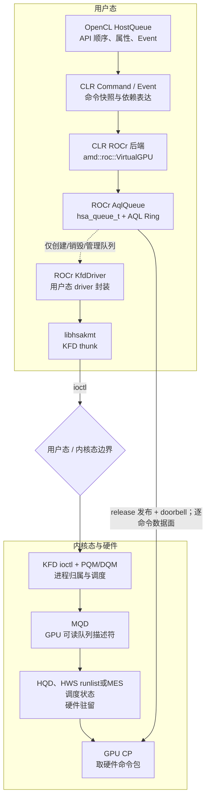
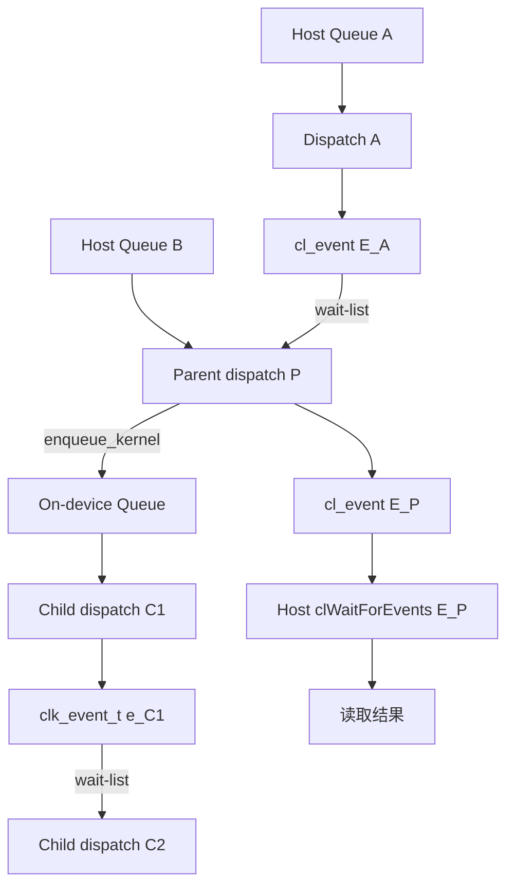

# AMD OpenCL 队列提交：从 API 到 AQL 和硬件队列

本文只回答一件事：一个 OpenCL command 从 API 对象变成 GPU 可消费的数据包，中间经过哪些对象，依赖由谁执行，KFD 又在哪一层介入。全文把**控制面**（创建可运行队列）与**数据面**（反复发布 command）分开，不把名字里都含 `queue` 的对象视为同一个队列。

## 1. 阅读目标：先记住三句话

1. `HostQueue`、CLR ROCr 后端、HSA Queue、KFD queue、MQD 和 HQD 分属不同层，不是别名，也不保证一一对应。
2. 在本文固定版本的 Direct/ROCr 普通 kernel 路径中，逐次提交发布已建 AQL ring 并写 doorbell，不为每个 kernel 重复 KFD queue ioctl。
3. Direct/Non-direct 决定命令由 API 线程直接提交，还是先进入 `HostQueue::queue_` 由 worker 提交；ROCr/PAL 决定同一个 `command->submit(*virtualDevice)` 最终进入哪一种后端。两者是正交维度。

**证据入口。** **\[SOURCE]** 代表性入口包括 CLR `2.源码/rocm-clr/rocclr/platform/commandqueue.hpp`/`2.源码/rocm-clr/rocclr/device/rocm/rocvirtual.cpp`、ROCr `2.源码/rocr-runtime/runtime/hsa-runtime/inc/hsa.h` 中的 `hsa_queue_t` 与 `2.源码/rocr-runtime/runtime/hsa-runtime/core/driver/kfd/amd_kfd_driver.cpp`、libhsakmt `2.源码/rocr-runtime/libhsakmt/src/queues.c`，以及 Linux KFD `2.源码/linux/drivers/gpu/drm/amd/amdkfd/kfd_chardev.c`/`2.源码/linux/drivers/gpu/drm/amd/amdkfd/kfd_process.c`/`2.源码/linux/drivers/gpu/drm/amd/amdkfd/kfd_device_queue_manager.c`/`2.源码/linux/drivers/gpu/drm/amd/amdkfd/kfd_mqd_manager_v9.c`；它们分别给出对象、成员和调用点。**\[INFERENCE]** “分层、非别名、不一一对应”是对这些直接事实的跨层归纳；Direct/ROCr 不重复逐 kernel ioctl 的结论也只限于本文固定路径。完整版本基线见 1.1 节；POCL/Vortex 与 AMD 追踪入口分别见 C.6、D.6。

阅读主线依次是：第 2 章建立五层对象模型；第 3 章追踪 Queue 创建、KFD 所有权和硬件驻留；第 4～6 章分别追踪普通 kernel、跨队列 Event 和 device-side enqueue；第 7 章把这些边界收敛为自研 GPU 提交模型。实时追踪、POCL/Vortex 对照和完整示例/调用链分别放在附录 A、C、D，不打断主线。

### 1.1 源码基线与证据标签

每一项实现结论都使用以下证据标签之一：

* **\[SOURCE]** 已由固定版本的实现源码证明。
* **\[SPEC]** API 或 ABI 语义要求，但不能证明某个实现细节。
* **\[INFERENCE]** 由本地可见结构或调用点推导，但不是缺失实现的直接源码事实。
* **\[BOUNDARY]** 本地可核验证据到此终止；不对本地缺失的实现或固件作事实断言。
* **\[DESIGN]** 自研方案的建议或候选模型，不是 AMD 源码事实，也不是 Vortex 现状。

| **层次**                    | **本地路径**                                             | **版本**                                                                     | **作用**                                               |
| ------------------------- | ---------------------------------------------------- | -------------------------------------------------------------------------- | ---------------------------------------------------- |
| Vortex 公开上游替代快照        | `2.源码/vortex`                         | `d76b7f24e658867ab57e3942d7c648c3e6af072d`                        | Vortex runtime、CP Ring 和 SimX/硬件接口；不是原本地 worktree 的逐行证据                   |
| 当前 POCL                   | `2.源码/pocl` | `42fad325efaee07915307ab802f1527171b434d0`，含本地 Vortex backend 改动           | OpenCL core、event 依赖图和 Vortex device backend         |
| 当前 CLR                    | `2.源码/rocm-clr`                               | `81277d69e3352e7144ced2ee9601484f9b48d950`                                 | OpenCL API、命令对象、事件以及 ROCr 后端                         |
| AMD Device Libraries 占位仓库 | `2.源码/rocm-device-libs`                       | `1915fc612c243bdbc656608ecba3fa9618d6afc3`；仅 README，Device Library 实现源码不可用 | 不作为`enqueue_kernel`、device event 或 scheduler 实现的源码证据 |
| ROCr 与 libhsakmt          | `2.源码/rocr-runtime`                           | `ba56a24c6132c5d195686ae4adf969ca1222fbba`                                 | HSA 队列实现和 KFD 用户态 thunk 层                            |
| Linux/KFD                 | `2.源码/linux`                                  | `248951ddc14de84de3910f9b13f51491a8cd91df`                                 | 进程隔离、队列 ioctl、MQD、HQD 和 doorbell                     |

**\[BOUNDARY]** 原笔记使用的 Vortex 本地 worktree commit `16aa1d033063c76b158923c9a1e4949747578751` 不存在于公开的 `vortexgpgpu/vortex` 仓库。当前 `2.源码/vortex` 是公开上游替代快照；`2.源码/vortex/sw/runtime/common/vortex2_internal.h`、`2.源码/vortex/sw/runtime/common/queue.cpp`、`2.源码/vortex/sw/runtime/common/event.cpp` 和 `2.源码/vortex/sw/runtime/common/device.cpp` 中的对象与搜索词已逐项核对存在，但涉及 Vortex 的结论不能据此升级为原 worktree 的逐行 `[SOURCE]`。POCL 的 `42fad325...` 则已从 `vortexgpgpu/pocl` 精确取得。

## 2. 一张图建立五层队列模型

**\[SOURCE]** `2.源码/rocm-clr/rocclr/platform/commandqueue.hpp`、`2.源码/rocm-clr/rocclr/device/rocm/rocvirtual.cpp`、ROCr `2.源码/rocr-runtime/runtime/hsa-runtime/core/driver/kfd/amd_kfd_driver.cpp`、libhsakmt `2.源码/rocr-runtime/libhsakmt/src/queues.c` 和 Linux `2.源码/linux/drivers/gpu/drm/amd/amdkfd/kfd_chardev.c` 分别命名了 `HostQueue`/`Command`、CLR ROCr 后端 `amd::roc::VirtualGPU`、ROCr `AqlQueue`/`KfdDriver`、libhsakmt queue 与 Linux KFD queue 对象及其调用点；`dispatchGenericAqlPacket` 还给出了 AQL ring 与 doorbell 的发布边界。

**\[INFERENCE]** 下图把这些源码对象组织成五层职责模型；层间连线表示映射或调用关系，不表示对象别名或一一对应。



**\[SOURCE]** CLR 公共层的 `Command::enqueue()` 根据 `AMD_DIRECT_DISPATCH` 选择 API-thread 或 Host-worker 路径；`HostQueue::loop()` 最终仍通过 `device::VirtualDevice&` 调用命令的虚 `submit()`。ROCr 与 PAL 的 `Device::createVirtualDevice()` 分别构造自己的 `VirtualGPU`，所以提交模式不决定 backend 类型。

```text
                    提交模式
             Direct          Non-direct
                │                 │
                └──── CLR Command/HostQueue ────┘
                                  │
                         device::VirtualDevice
                           ┌──────┴──────┐
                           │             │
                    roc::VirtualGPU  pal::VirtualGPU
                           │             │
                     AQL / ROCr     CmdBuffer / PM4
```

ROCr/AQL 与 PAL/PM4 是平行 backend；Direct/Non-direct 是命令提交时机，两组概念彼此正交。

**\[BOUNDARY]** 在本文固定版本中，ROCr 初始化成功会设置 `AMD_DIRECT_DISPATCH = true` 并关闭 PAL，因此 ROCr Non-direct 是用于隔离提交模式差异的代码机制分析，不是正常初始化可选出的默认配置。PAL 默认 Host-worker 路径也不能反推“Non-direct 就是 PAL”。

**\[SOURCE]** 最容易犯的错误，是把 ROCr 的 `KfdDriver` 当成 Linux KFD。它定义在 `2.源码/rocr-runtime/runtime/hsa-runtime/core/driver/kfd/amd_kfd_driver.cpp`，仍是**用户态 ROCr 组件**；`KfdDriver::CreateQueue()` 调用用户态 `hsaKmtCreateQueueExt()`，后者才发 `AMDKFD_IOC_CREATE_QUEUE` 进入内核。正确层次是：

```text
ROCr AqlQueue
-> ROCr KfdDriver（用户态封装）
-> libhsakmt（用户态 thunk）
-> ioctl 边界
-> Linux KFD/PQM/DQM（内核态）
-> MQD/HQD、HWS runlist 或 MES 调度状态
```

### 2.1 同名 Queue 对象只看职责，不看名字

**\[SOURCE]** `2.源码/rocm-clr/rocclr/platform/commandqueue.hpp`、`2.源码/rocm-clr/rocclr/device/rocm/rocvirtual.hpp`、Linux `2.源码/linux/drivers/gpu/drm/amd/amdkfd/kfd_priv.h` 与 GFX9 MQD/DQM 源码定义了下表列出的对象、成员类型、调用点与保存状态。

**\[INFERENCE]** “所在层”和“它不是什么”是对这些事实的跨层职责归纳，不把同名对象视为别名或一一对应。

| **对象**                   | **所在层**             | **它保存/解决什么**                                                  | **它不是什么**                        |
| ------------------------ | ------------------- | ------------------------------------------------------------- | -------------------------------- |
| `amd::HostQueue`         | CLR/OpenCL 用户态      | `cl_command_queue` 的属性、命令与 Event 语义                           | 硬件 Ring                          |
| `HostQueue::queue_`      | CLR 用户态             | 仅非 direct 分支消费的`Command*` 软件 FIFO                             | CP 队列                            |
| `amd::roc::VirtualGPU`   | CLR ROCr 后端         | 队列级提交上下文、batch、AQL 构造状态                                       | 物理 GPU、ROCr runtime queue 或安全上下文 |
| `VirtualGPU::gpu_queue_` | CLR ROCr 后端         | CLR 成员，指向 ROCr 管理的池化`hsa_queue_t`，是普通 AQL 的发布目标               | 必然被一个 HostQueue 独占的 Ring         |
| `virtualQueue_`          | Device Enqueue 数据内存 | 父 kernel 写、scheduler kernel 读的工作记录                            | HSA/KFD queue                    |
| `schedulerQueue_`        | CLR ROCr 后端         | CLR 成员，指向 ROCr 管理、由 scheduler kernel 写入子 AQL 的独立`hsa_queue_t` | `virtualQueue_` 的另一个名字           |
| KFD`struct queue`        | Linux 内核            | 进程所有权、ring 地址、MQD 和调度状态                                       | OpenCL command queue             |
| MQD                      | KFD/GPU 可见内存        | 编码 ring、rptr report/wptr poll 地址、doorbell、VMID 等队列状态          | command packet                   |
| HQD                      | GPU CP 硬件槽位         | 某个驻留队列的活动状态                                                   | 与 OpenCL queue 一一对应的永久资源         |

**\[SOURCE]** `2.源码/rocm-clr/rocclr/platform/commandqueue.hpp` 中 `HostQueue::queue_` 是 `ConcurrentLinkedQueue<Command*>`；`2.源码/rocm-clr/rocclr/device/rocm/rocvirtual.hpp` 中 `gpu_queue_`、`schedulerQueue_` 是 `hsa_queue_t*`，而 `virtualQueue_` 是 `amd::Memory*`。

**\[INFERENCE]** 这些不同的类型与所有者边界说明它们不是同一种队列。

### 2.2 控制面与数据面必须分开

```text
控制面（低频）：分配 Ring -> KFD create_queue -> MQD -> HQD 或 HWS/MES 驻留状态 -> 映射 doorbell
数据面（高频）：预留 write index -> 等待空槽 -> 写 payload -> release 发布有效 header -> 写 doorbell
完成面：         completion signal -> CLR Event 状态/callback/资源回收
```

**\[INFERENCE]** 由这些职责可归纳为：KFD 让一条用户队列“可安全运行”；CLR ROCr 后端决定“这次 command 写成什么包”，ROCr `AqlQueue`/`KfdDriver` 则管理 HSA queue 与 KFD 接口。后文所有场景都沿这三条面追踪，不再重复介绍对象层次。

## 3. 控制面：从 HSA Queue 创建到 KFD 交接

本章只回答“这条 Queue 如何获得可运行的 Ring、KFD 所有权和 doorbell”。这些资源创建后会被第 4～6 章的数据面反复复用；普通 kernel 派发不会重复创建 KFD queue。MQD、HQD、CP 取包、HWS/MES runlist 和上下文切换已抽离至 [硬件队列专题](<./6. AMD 硬件队列：AQL Ring、MQD、HQD 与调度驻留.md>)，避免 API 提交链与硬件调度机制交织。

### 3.1 CLR Queue Pool 与 `hsa_queue_t` 复用

**\[SOURCE]** `Device::createVirtualDevice` 创建 `VirtualGPU`，其 `create()` 路径通过 `Device::acquireQueue` 获取 HSA Queue。CLR 按低、普通、高优先级维护 `queuePool_`：未触及策略上限时创建新的 `HSA_QUEUE_TYPE_MULTI`，达到上限或创建受限时可从池中复用匹配优先级的 `hsa_queue_t`。Cooperative queue 和 custom CU mask queue 另有专用条件。

这里存在两级完全不同的复用：

1. CLR Queue Pool 决定多个 `VirtualGPU` 是否共享一个 `hsa_queue_t`。
2. KFD HWS/CPSCH 决定多个逻辑 KFD Queue 如何竞争有限的硬件驻留槽位。

**\[INFERENCE]** `max_hw_queues_` 只是 CLR 用户态策略，不是 HQD 数量；`queuePool_` 也不是 KFD runlist。

### 3.2 可逐函数追踪的 HSA Queue 创建链

**\[SOURCE]** Queue Pool 未命中时，普通 `HSA_QUEUE_COMPUTE_AQL` Queue 按下面的唯一主线从 CLR 进入 ROCr、libhsakmt 和 Linux KFD。该链的终点不是“某个 kernel 被执行”，而是 KFD 创建逻辑 Queue、返回可映射的 doorbell，并根据调度策略直接装载或交给 firmware 调度：

```text
CLR
Device::acquireQueue()
  ├─ queuePool_ 命中：直接返回已有 hsa_queue_t，以下链路不发生
  └─ Hsa::queue_create()
       → GpuAgent::QueueCreate()
       → new AqlQueue(...)

ROCr
AqlQueue::AqlQueue()
  → 分配 ring_buf_、初始化读写 index/packet header
  → agent->driver().CreateQueue(... ring_buf_, ring_buf_alloc_bytes_, ...)
       → KfdDriver::CreateQueue()
       → hsaKmtCreateQueueExt()

libhsakmt
hsaKmtCreateQueueExt()
  → 填 kfd_ioctl_create_queue_args：gpu_id、type、ring base/size、rptr/wptr、priority
  → hsakmt_ioctl(AMDKFD_IOC_CREATE_QUEUE)

Linux KFD
kfd_ioctl_create_queue()
  → set_queue_properties_from_user()
  → kfd_bind_process_to_device() / kfd_queue_acquire_buffers()
  → kfd_alloc_process_doorbells()（首次使用该 process-device 时）
  → pqm_create_queue()
       → init_user_queue()：分配 struct queue 与进程内 queue_id
       → dqm->ops.create_queue()
            ├─ create_queue_nocpsch()：allocate_hqd → init_mqd → load_mqd
            ├─ create_queue_cpsch()：init_mqd → 加入 queues_list → runlist/MES
            └─ SDMA：走独立 SDMA Queue 分支

返回路径
KFD 返回 args.queue_id + args.doorbell_offset
  → libhsakmt map_doorbell()
  → QueueResource.Queue_DoorBell
  → AqlQueue/hsa_queue_t 可用于后续高频 packet 发布
```

这条链中的输入、状态转移和输出可以按下表定位；这比只记一个长函数名列表更适合单步跟踪：

| **步骤**                | **实现位置**                                                                    | **关键输入**                               | **关键状态变化/输出**                                                           |
| --------------------- | --------------------------------------------------------------------------- | -------------------------------------- | ----------------------------------------------------------------------- |
| 选择或创建 HSA Queue       | `2.源码/rocm-clr/rocclr/device/rocm/rocdevice.cpp`：`Device::acquireQueue`                           | priority、size hint、cooperative/CU mask | 命中`queuePool_` 则复用；否则调用 HSA `queue_create`                              |
| 建立 ROCr AQL backing   | `2.源码/rocr-runtime/runtime/hsa-runtime/core/runtime/amd_aql_queue.cpp`：`AqlQueue::AqlQueue`                     | packet 数、agent、priority                | 分配`ring_buf_`，准备 index，调用 driver `CreateQueue`                          |
| 进入 KMT                | `2.源码/rocr-runtime/runtime/hsa-runtime/core/driver/kfd/amd_kfd_driver.cpp`：`KfdDriver::CreateQueue`                     | Ring VA/大小、Queue type、event            | 调用`hsaKmtCreateQueueExt`                                                |
| 构造 ioctl 并映射 doorbell | `2.源码/rocr-runtime/libhsakmt/src/queues.c`：`hsaKmtCreateQueueExt`                               | Ring VA、rptr/wptr VA、gpu\_id           | 填`kfd_ioctl_create_queue_args`；ioctl 成功后 `map_doorbell`                 |
| KFD 校验并绑定进程           | `2.源码/linux/drivers/gpu/drm/amd/amdkfd/kfd_chardev.c`：`kfd_ioctl_create_queue`                               | ioctl args、当前`kfd_process`             | 生成`queue_properties`，绑定 `process-device`，获取 Queue buffer、doorbell slice |
| 进程 Queue 与设备 Queue 建立 | `2.源码/linux/drivers/gpu/drm/amd/amdkfd/kfd_process_queue_manager.c`：`pqm_create_queue`                       | properties、`kfd_process_device`        | 分配进程内 queue ID/`struct queue`，分派 `dqm->ops.create_queue`                |
| 调度策略分支                | `2.源码/linux/drivers/gpu/drm/amd/amdkfd/kfd_device_queue_manager.c`：`create_queue_nocpsch` / `create_queue_cpsch` | `sched_policy`、Queue 属性                | no-CPSCH 直接加载 HQD；CPSCH 建立逻辑 Queue/runlist；MES 改走 add-queue             |

不要混淆返回链上的三种 ID：`hsa_queue_t::id` 是 ROCr 对 HSA 暴露的 ID；`AqlQueue::queue_id_` 保存 libhsakmt 的不透明 `HSA_QUEUEID`；libhsakmt 私有 Queue 对象还保存 KFD 返回的数值型 `args.queue_id`，供后续 update/destroy ioctl 使用。

追踪时建议在上述七个函数设断点，并同时观察 `ring_base_address`、`read_pointer_address`、`write_pointer_address`、`queue_id`、`doorbell_offset` 和 `q->mqd`。前四项在用户态/内核边界传递，后三项在 KFD 内逐步生成；这样可以把“创建成功”拆成可验证的资源交接，而不是只看一个 ioctl 返回值。

### 3.3 DQM 调度策略分派点

**DQM 是 `struct device_queue_manager`，即 KFD 为“一块 GPU”维护的设备级 Queue 管理器。** 它不是一条 Queue、不是 HQD，也不是 MEC/MES firmware；它位于 Linux KFD 控制面，保存该 GPU 的 `sched_policy`、活动 Queue/进程计数、Queue 链表和一组 `ops` 回调。PQM 创建 `struct queue` 后，调用 `dev->dqm->ops.create_queue()`，由 DQM 决定这条逻辑 Queue 接下来走哪条实现路径。

初始化 DQM 时，源码按 `sched_policy` 填充回调表：`KFD_SCHED_POLICY_NO_HWS` 绑定 `create_queue_nocpsch`；`KFD_SCHED_POLICY_HWS` 与 `KFD_SCHED_POLICY_HWS_NO_OVERSUBSCRIPTION` 绑定 `create_queue_cpsch`。因此 `dqm->ops.create_queue()` 不是控制流终点，而是 KFD 的策略分派点；MES 不是第三个 `create_queue` 回调，而是在 CPSCH 创建路径中由 `enable_mes` 决定是否把 Queue 交给 MES firmware。

### 3.4 KFD Process、Process-Device 与 Queue 所有权

**\[SOURCE]** KFD 用三个层次建立所有权：

| **KFD 对象**                  | **作用域**                   | **关键职责**                                  |
| --------------------------- | ------------------------- | ----------------------------------------- |
| `struct kfd_process`        | 一个 Linux 地址空间（`mm`）       | 进程级 PQM、event、驱逐状态，以及已使用 GPU 的`pdds[]`    |
| `struct kfd_process_device` | 一个进程使用一个 GPU              | GPU VM、PASID、分配句柄、每进程 doorbell 和 fault 状态 |
| `struct queue`              | 一条 KFD compute/SDMA Queue | Ring 属性、MQD、doorbell、进程/设备所有者和调度状态        |

`kfd_process_device_init_vm` 为该进程取得 GPU VM 并确认 PASID；PQM 在调用进程自己的命名空间中分配 queue ID，再把 `struct queue` 交给设备 DQM。

**\[INFERENCE]** 由这些所有权边界可得：

* 同一进程中的多个 OpenCL Context 通常仍共享同一个 KFD process 以及“每进程、每 GPU”的 VM/PASID 安全域；CLR 在 UMD 内分别维护其 `cl_mem`、queue、event 和生命周期。
* 不同进程对应不同的 KFD 所有者，不能仅凭数值地址或 queue ID 访问对方的 GPU VM、分配句柄或 doorbell 映射。

### 3.5 调度分支入口：No-CPSCH、CPSCH/HWS 与 MES

三条路径处理的是“逻辑 KFD Queue 如何获得可运行的硬件状态”，而不是每一个 kernel packet 如何被执行：

| **模式**    | **DQM 入口**               | **KFD 做什么**                                               | **最终谁管理驻留**     |
| --------- | ------------------------ | --------------------------------------------------------- | --------------- |
| No-CPSCH  | `create_queue_nocpsch`   | 分配确定的`pipe/queue` HQD 槽位，创建 MQD/doorbell 后 `load_mqd`     | KFD 直接装载到指定 HQD |
| CPSCH/HWS | `create_queue_cpsch`     | 创建 MQD/doorbell，把逻辑 Queue 加入`qpd->queues_list`，更新 runlist | HWS firmware    |
| MES       | 仍先进入`create_queue_cpsch` | 创建 MQD/doorbell，随后调用`add_queue_mes`                       | MES firmware    |

#### 3.5.1 No-CPSCH：创建时直接装载

`create_queue_nocpsch()` 对 compute Queue 调用 `allocate_hqd()`，从每个 pipe 的空闲 bitmap 选择一个具体 `pipe/queue` 槽位；然后分配 doorbell 与 MQD，执行 `init_mqd()`，并对活动 Queue 调用 `load_mqd()`。GFX9 的 `kgd_gfx_v9_hqd_load()` 会把 MQD 的连续 `CP_HQD_*` 字段写入该槽位、启用 doorbell/wptr poll，并置 `CP_HQD_ACTIVE`。此路径的关键特征是 KFD 已在创建时决定具体 HQD；没有空槽时 `allocate_hqd()` 返回 `-EBUSY`。

#### 3.5.2 CPSCH/HWS：KFD 提交 runlist，HWS 选择槽位

`create_queue_cpsch()` 不调用 `allocate_hqd()`。它为逻辑 Queue 准备 MQD/doorbell 后加入 `qpd->queues_list`；如果 Queue 是 active，则调用 `execute_queues_cpsch()`：

```text
execute_queues_cpsch
→ unmap_queues_cpsch
   → pm_send_unmap_queue(HIQ)
   → pm_send_query_status(HIQ) 并等待 fence，确认旧映射已退出
→ map_queues_cpsch
   → pm_send_runlist
   → pm_create_runlist_ib：为活动 process/Queue 写 MAP_PROCESS、MAP_QUEUES
   → 经 KFD 私有 HIQ 提交 runlist
→ HWS firmware 按 runlist 把逻辑 Queue 映射到有限 HQD
```

GFX9 的 `pm_map_queues_v9()` 在 `MAP_QUEUES` 中填入 MQD GPU 地址、wptr 地址和 doorbell offset，并把 `queue_sel` 设为 `map_to_hws_determined_queue_slots`。这就是代码层面对分工最直接的证据：KFD 描述可运行 Queue 及其资源，HWS 决定实际 HQD slot。该控制流在 Queue 创建、激活、停用、驱逐、恢复或属性更新时发生；**不是**每写一个 AQL packet 都重新上传 runlist。

#### 3.5.3 MES：KFD 发送 Add Queue API，MES 接管驻留

启用 `enable_mes` 时，`create_queue_cpsch()` 对活动 Queue 调用 `add_queue_mes()`，不调用 `execute_queues_cpsch()`。`add_queue_mes()` 将 KFD 状态填成 `mes_add_queue_input`：PASID、page-table base、process/gang quantum 与 context 地址、priority、doorbell offset、MQD GPU 地址、wptr 地址、AQL 标志、Queue 大小、trap/VM 配置等；然后调用 `adev->mes.funcs->add_hw_queue()`。

以 GFX12 为例，`mes_v12_0_add_hw_queue()` 组装 `MESAPI__ADD_QUEUE`，opcode 为 `MES_SCH_API_ADD_QUEUE`，把上述 process/VM/MQD/wptr/doorbell 字段写入 packet，再经 MES scheduler pipe 提交并轮询 completion。移除、挂起、驱逐或恢复 Queue 时，KFD 对应调用 MES remove/add 路径。**可从代码确认的是“哪些信息交给 MES、KFD 等待 MES API 完成”；MES firmware 如何根据这些信息挑选下一条 Queue、分配时间片和 HQD，属于未公开固件算法，不能从 Linux 源码推断为某一种轮转策略。**

#### 3.5.4 MEC 如何“调度 kernel”：先区分两个层次

HWS/MES 调度的是 **Queue 驻留**；MEC/CP 消费的是 **已经驻留 Queue 的 AQL packet**。当 HQD 已指向某条 Ring，Producer 发布 packet 并敲 doorbell 后，MEC/CP 按 HQD 的 Ring base、VMID、rptr/wptr 和 AQL 格式取下一个 packet，解析 kernel dispatch，再发起 CU 上的工作执行；完成后推进 rptr/完成信号。换言之，MEC 不替代 HWS/MES 去选择“下一条逻辑 Queue”，它在获得一个活动 HQD 后处理该 Queue 内的工作。

**\[BOUNDARY]** KFD/AMDGPU 源码能证明 MQD/HQD 配置、HWS runlist 和 MES API，但没有公开 MEC packet parser、work-group 到 CU 的分配器或 wave 级硬件仲裁实现。因此本文可以追踪到“dispatch packet 被交给已驻留的 MEC Queue”，不能声称 Linux 驱动代码展示了 MEC 在 CU 间采用哪一种 kernel/work-group 调度算法。硬件语义与对象关系见 [硬件队列专题](<./6. AMD 硬件队列：AQL Ring、MQD、HQD 与调度驻留.md>)。

### 3.6 调度完成后的资源归属：Doorbell、GPU VM 与进程隔离

上节解决“哪条路径使 Queue 可运行”，本节闭合创建控制流的返回边：KFD 将这条 Queue 所属的进程地址空间、GPU VM 与 doorbell 映射交还给用户态。**\[SOURCE]** `kfd_alloc_process_doorbells` 为 `kfd_process_device` 分配进程 doorbell slice 和槽位 bitmap。Queue 创建在该 slice 内取得一个槽位，并返回带 GPU 身份和页内偏移的 mmap token。`kfd_doorbell_mmap` 根据调用进程重新查找 process-device，只允许映射其获准访问的 noncached IO 区间；libhsakmt 映射这段 slice，再计算当前 Queue 的 doorbell 指针交给 ROCr。

数据面随后只需：

```text
预留write index并等待空槽
-> 写payload并以release语义发布有效header
-> store到本Queue已映射的doorbell槽位
-> CP观察新的生产进度并取包
```

**\[INFERENCE]** 隔离不是靠 queue ID 或 doorbell 数值保密，而是由 KFD/GPU 强制进程 VM、PASID/VMID、BO 所有权和 doorbell mmap 边界；CLR 则在更高层维护 Context 归属、对象类型、retain/release 与 Event wait-list 合法性。UMD 的 API 隔离不能替代 KMD 的安全边界，KMD 的地址空间隔离也不会自动实现 OpenCL 对象语义。

**\[BOUNDARY]** 公开 KFD 源码能证明 MQD 字段、直接装载、HWS runlist、MES add-queue 调用和 doorbell 映射。这些状态交给 GPU 后，HWS/MES/CP 固件内部如何选择下一条驻留 Queue，不在本文可核验范围内。

### 3.7 hsa_queue 一句话定位 + AQL ring 分配在哪

**一句话定位**：

> **一个 HSA queue = 横跨用户态（`hsa_queue_t`：AQL ring + doorbell）和内核态（`struct queue` + MQD：ring/doorbell/VMID 的硬件描述）的队列；调度（占哪个 HQD）由 KFD + HWS/MES 决定。**

**数据结构持有链（从 UMD 到 MQD）**：

| 层 | 结构 | 持有什么 |
|---|---|---|
| CLR（device enqueue） | `virtualQueue_`（`amd::Memory*`，2.源码/rocm-clr/rocclr/device/rocm/rocvirtual.hpp:623） | 虚拟队列的 AQL 工作记录（parent 写、scheduler 读） |
| ROCr | `hsa_queue_t`（2.源码/rocr-runtime/runtime/hsa-runtime/inc/hsa.h:2308） | `base_address`（AQL ring）、`doorbell_signal`、`size`、`id` |
| KFD | `struct queue_properties`（2.源码/linux/drivers/gpu/drm/amd/amdkfd/kfd_priv.h:510） | `queue_address`（ring）、`read/write_ptr`、`doorbell_off`、`vmid` |
| KFD | `struct queue`（2.源码/linux/drivers/gpu/drm/amd/amdkfd/kfd_priv.h:613） | `mqd`、`properties`、`mec/pipe/queue`（HQD 槽）、`doorbell_id` |
| MQD | `v9_mqd`（`update_mqd` 编码） | `cp_hqd_pq_base`（ring）、`cp_hqd_pq_doorbell_control`（doorbell）、`cp_hqd_vmid` |

**AQL ring 分配在哪？——两条路径，默认 GTT**：

```c
// 2.源码/rocr-runtime/runtime/hsa-runtime/core/runtime/amd_aql_queue.cpp —— AqlQueue::AllocRegisteredRingBuffer
if (IsDeviceMemRingBuf()) {                    // ← 可选：设备内存（VRAM）
    if (!LargeBarEnabled()) throw ...;         // ← 必须大 BAR！
    ring_buf_ = coarsegrain_allocator(...);    // VRAM/设备内存
} else {                                        // ← 默认：系统内存
    ring_buf_ = system_allocator(...);         // GTT
}
```

| 路径 | ring 住哪 | 触发 | 访问路径 |
|---|---|---|---|
| **默认** | **GTT（系统内存）** | 正常 compute queue | CPU 直接写系统页 → GPU（CP）经 GART 读 |
| **可选** | **VRAM（设备内存）** | `HSA_AMD_QUEUE_CREATE_DEVICE_MEM_RING_BUF` | CPU 经 PCIe BAR 写（必须大 BAR）→ GPU 直接读 |

**为什么默认 GTT**：AQL ring 要被 **CPU 写**（UMD 写 AQL 包）和 **GPU 读**（CP 消费），GTT 天生满足"双方都能访问"，不需要大 BAR。可选 VRAM 是 opt-in（`dev_mem_queue_buf` → `hsa_queue_create` 带 `HSA_AMD_QUEUE_CREATE_DEVICE_MEM_RING_BUF`，2.源码/rocr-runtime/runtime/hsa-runtime/core/runtime/hsa.cpp:747-748），但必须大 BAR（否则 CPU 写不到 VRAM，源码直接抛错）。

**完整调用路径（从 `hsa_queue_create` 到 MQD）**：

```text
用户: hsa_queue_create (2.源码/rocr-runtime/runtime/hsa-runtime/core/runtime/hsa.cpp:717)
  → GpuAgent::QueueCreate (2.源码/rocr-runtime/runtime/hsa-runtime/core/runtime/amd_gpu_agent.cpp:1686)
      → AqlQueue 构造（内部依次做）:
          → AllocRegisteredRingBuffer（2.源码/rocr-runtime/runtime/hsa-runtime/core/runtime/amd_aql_queue.cpp:115）
              → system_allocator（GTT）或 coarsegrain_allocator（VRAM，需大 BAR）
          → amd_queue_.hsa_queue.base_address = ring_buf_   ← UMD 拿到的 AQL ring
          → KfdDriver::CreateQueue（2.源码/rocr-runtime/runtime/hsa-runtime/core/driver/kfd/amd_kfd_driver.cpp:355）[构造内部调用]
              → hsaKmtCreateQueueExt(queue_addr=ring_buf_, …)   ← libhsakmt
                  → KFD_IOC_CREATE_QUEUE
          → doorbell 信号初始化（signal_.hardware_doorbell_ptr）
      → [构造返回后] doorbell_queue_map_[doorbell_idx] = &amd_queue_  ← doorbell→queue 映射
  ↓
KFD: kfd_ioctl_create_queue (2.源码/linux/drivers/gpu/drm/amd/amdkfd/kfd_chardev.c:338)
  → pqm_create_queue（PQM，2.源码/linux/drivers/gpu/drm/amd/amdkfd/kfd_process_queue_manager.c:314）
      → DQM create_queue（cpsch/nocpsch）
          → allocate_hqd（mec/pipe/queue 槽）→ allocate_doorbell → allocate_mqd
          → kfd_create_queue → update_mqd：ring→cp_hqd_pq_base_lo/hi、
                                           doorbell_off→cp_hqd_pq_doorbell_control、
                                           vmid→cp_hqd_vmid
      → VMID：No-CPSCH 由 allocate_vmid 分配；CPSCH 由 HWS 分配 → MQD 装入 HQD
```

**doorbell 分配链（queue 的门牌号）**：

```text
进程   → kfd_alloc_process_doorbells：doorbell slice（DOORBELL BO）+ doorbell_bitmap
queue  → find_first_zero_bit(bitmap) → doorbell_id → amdgpu_doorbell_index_on_bar → doorbell_off
doorbell_off → MQD cp_hqd_pq_doorbell_control → HQD
用户敲 doorbell_off 地址 → CP 按偏移反查 queue（find_queue_by_doorbell_offset）
                        → 读该 queue 的 ring → 用 queue 的 VMID 翻译 → 执行 AQL
```

> **AQL ring 和 doorbell 是两回事**：ring 装 AQL 包（默认 GTT、CPU 写 GPU 经 GART 读）；doorbell 是敲醒 queue 的门牌号（CP 靠 `doorbell_off` 反查 queue，靠 `cp_hqd_vmid` 决定翻译上下文）。

## 4. 数据面一：从 OpenCL Program 到已发布 AQL Packet

### 4.1 全文统一示例

后文用同一个对象名册逐层展开普通 Host 提交、跨队列依赖和 Device Enqueue。图中的 A、P、C1 和 C2 均指一次 enqueue 形成的 dispatch command，而不是可复用的 kernel 程序对象。先把三个场景放进一张统一概念图：



**\[INFERENCE]** 这张图中的每个 dispatch 都建立在同一条局部生命周期上：

```text
Source / IL / Binary
→ 公共 Program
→ 每设备 Build Artifact
→ 已装载 Device Kernel
→ 一次 Dispatch Command
→ AQL Packet
→ HSA Ring
```

前半段回答可复用设备代码如何形成，后半段回答一次执行如何形成并发布。Event 依赖和 Device Queue 私有提交路径分别留到第 5 章和第 6 章。

**\[SPEC]** On-device Queue 由 Host API 创建并关联到对应的 context/device；Parent dispatch 在执行时取得 `queue_t` 并用它提交 Child dispatch。**\[INFERENCE]** 因而 Parent 使用这条 queue，并不拥有 Host 侧 queue 对象。

Host 端先只保留以下 API 骨架；初始化、参数设置、错误处理和释放代码不在正文重复：

```cpp
cl_event event_a = nullptr;
cl_event event_p = nullptr;

clEnqueueNDRangeKernel(queue_a, kernel_a, 1, nullptr, &global_size,
                       &local_size, 0, nullptr, &event_a);
clEnqueueNDRangeKernel(queue_b, parent_p, 1, nullptr, &global_size,
                       &local_size, 1, &event_a, &event_p);
clWaitForEvents(1, &event_p);
```

可与 OpenCL headers/runtime 组合的普通 Host 完整骨架见附录 D.1；附录 D.2 是只验证 Host Event 边的 A→B 隔离实验，附录 D.3 才闭合统一案例的 A→P→C1→C2；集中调用链见附录 D.4、D.5。

> **警告：这是一张统一概念图，不是统一 Event 对象图。** Host API 的 `cl_event`、Device Enqueue 的 `clk_event_t`/CLR `AmdEvent`，以及 packet 层的 `hsa_signal_t` 属于不同层。它们没有共同对象身份，只在 command 提交和完成回传的边界上衔接。

### 4.2 Queue、Kernel、Command、Packet 名册

下表同时汇总 **\[SPEC]** OpenCL/HSA 对象语义与 **\[SOURCE]** `2.源码/rocm-clr/rocclr/platform/commandqueue.hpp`、`2.源码/rocm-clr/rocclr/device/rocm/rocvirtual.hpp`、`2.源码/rocm-clr/rocclr/device/rocm/rocsched.hpp` 和 KFD 源码中的实现对象。名字里都出现 `queue`，不代表它们位于同一层，也不代表上下层一一对应：

| **层次**           | **固定对象名**                                                                                       | **保存或表达的内容**                                                                                                                                                                                           | **必须排除的误解**                                                                                                                   |
| ---------------- | ----------------------------------------------------------------------------------------------- | ------------------------------------------------------------------------------------------------------------------------------------------------------------------------------------------------------ | ----------------------------------------------------------------------------------------------------------------------------- |
| API 逻辑对象         | `cl_command_queue`、`amd::HostQueue`、`amd::DeviceQueue`                                          | OpenCL queue 属性、顺序语义、context/device 归属                                                                                                                                                                 | 不是 AQL ring，也不与 KFD queue 一一对应                                                                                                |
| Runtime 调度状态     | `HostQueue::queue_`、Event `eventWaitList_`、submission batch、`queuePool_`、`amd::roc::VirtualGPU` | `HostQueue::queue_` 是软件 Command FIFO（具体使用条件见第 5 章）；`eventWaitList_` 保存依赖引用；submission batch 记录已进入提交阶段的 command（完成跟踪机制见第 5 章）；`queuePool_` 是 HSA queue 资源池；`VirtualGPU` 是 CLR ROCr 后端的提交上下文和 Packetizer | 这些对象职责不同：`eventWaitList_` 不是 queue；submission batch 不是 Ready/Pending 队列；`queuePool_` 不保存 OpenCL command；`VirtualGPU` 不是物理 GPU |
| GPU 可见工作记录       | `virtualQueue_`                                                                                 | Parent 写入、scheduler kernel 读取的 Device Enqueue 工作记录                                                                                                                                                     | 不是 HSA queue，也不是 Host 侧 Ready/Pending queue                                                                                   |
| Packet Transport | `gpu_queue_`、`schedulerQueue_`                                                                  | 承载 AQL packet 的`hsa_queue_t` ring 与 doorbell                                                                                                                                                           | 不等同于`HostQueue` 或 `virtualQueue_`，也不保证被单个 API queue 独占                                                                        |
| KMD/硬件状态         | KFD queue、MQD、HQD、HWS/MES、GPU command front end                                                 | 进程所有权、队列描述符、驻留/调度状态和 packet 消费                                                                                                                                                                         | 不是 OpenCL command/event 容器；与上层对象没有逐级一一对应关系                                                                                    |

同理，下表的 API/ABI 职责来自 **\[SPEC]**，CLR 对象组合与字段填充来自 `2.源码/rocm-clr/rocclr/platform/kernel.cpp`、`2.源码/rocm-clr/rocclr/platform/command.cpp` 和 `2.源码/rocm-clr/rocclr/device/rocm/rocvirtual.cpp` 的 **\[SOURCE]**：

| **角色**           | **实现对象**                           | **本次提交中的职责**                                       |
| ---------------- | ---------------------------------- | -------------------------------------------------- |
| API Program      | `cl_program` / `amd::Program`      | 保存公共输入、API 生命周期并协调每设备 build                        |
| Device Program   | `device::Program` / `roc::Program` | 保存每设备 binary、metadata、kernel 与 Agent 装载状态          |
| API Kernel       | `cl_kernel` / `amd::Kernel`        | 保存可复用 kernel 和当前参数设置                               |
| Device Kernel    | `roc::Kernel`                      | 保存特定设备已装载 kernel 的 metadata 与 executable reference |
| Dispatch Command | `NDRangeKernelCommand`             | 冻结一次 enqueue 的参数、NDRange 与 wait-list               |
| kernarg buffer   | GPU 可访问参数内存                        | 保存这一次 dispatch 使用的实参快照                             |
| Dispatch Packet  | `hsa_kernel_dispatch_packet_t`     | 以 HSA AQL ABI 描述一次 GPU 派发                          |

**\[SOURCE]** `AmdAqlWrap` 是 Device Enqueue 私有 ABI，不是普通 Host dispatch 的通用包装层。

其流程只在第 6 章展开。

因此，下文始终分别追踪可复用的 Program/Kernel Object、一次 enqueue 形成的 Dispatch Command，以及最终发布的 Packet。

### 4.3 通用六阶段模型与 POCL/AMD 对照

**\[INFERENCE]** 不论后端是 AMD ROCr 还是 POCL/Vortex，从 Program 到一次设备派发都可归纳为同一个六阶段模型：

1. 保存 Program 输入；Binary 保留设备关联。
2. 按目标设备建立或选择 per-device 产物与后端状态槽位。
3. 按输入类型校验，或编译/链接，形成每设备产物和 metadata。
4. 装载产物并解析 device kernel handle。
5. 捕获一次 enqueue 的参数和 NDRange。
6. 生成任务包并发布到 transport queue。

**\[SOURCE]** 本文固定版本的 AMD 与 POCL/Vortex 源码包含下表列出的对象、回调槽和实现函数。**\[INFERENCE]** 下表用同一六阶段分析框架对齐两侧职责，不表示阶段、对象或调用一一对应：

| **职责**     | **AMD CLR/ROCr**                              | **POCL/Vortex**                                                                                            |
| ---------- | --------------------------------------------- | ---------------------------------------------------------------------------------------------------------- |
| 公共 Program | `amd::Program`                                | `_cl_program`                                                                                              |
| 每设备产物与后端状态 | `devicePrograms_[device]` → `device::Program` | `binaries[]`、`llvm_irs[]`、`build_log[]`、`data[]`                                                           |
| Build 分发   | `amd::Program::build`                         | `compile_and_link_program`                                                                                 |
| 通用编译       | `device::Program::build` / COMGR              | `device->ops->build_source` → `pocl_driver_build_source` → `pocl_llvm_build_program`                       |
| 后端产物       | `compileImpl` + `linkImpl` → Code Object      | `device->ops->post_build_program` → `pocl_vortex_post_build_program` → `compile_vortex_program` → `.vxbin` |
| 模块装载       | `roc::Program::setKernels`                    | `vx_module_load_file`                                                                                      |
| Kernel 解析  | `roc::Kernel::postLoad` / HSA symbol          | `vx_module_get_kernel`                                                                                     |
| 一次派发       | `NDRangeKernelCommand` → Kernarg/AQL          | `_cl_command_node` → Vortex runtime command                                                                |

**\[SOURCE]** AMD 的 `device::Program` 持有每设备 `buildStatus_`，而固定 POCL 的 `_cl_program`（`2.源码/pocl/lib/CL/pocl_cl.h`）中 `build_status`、`binary_type` 是 program 级单值，`binaries[]`、`llvm_irs[]`、`build_log[]`、`data[]` 才是 per-device 槽位。**\[INFERENCE]** 因而职责对齐不要求 build status 的封装一致；两者可按生命周期职责比较，但对象封装方式和后端边界不同：AMD 把设备产物、HSA executable 和 AQL 提交封装在 CLR/ROCr 对象中，POCL/Vortex 则通过 POCL 每设备数组与 Vortex runtime 连接后端。

### 4.4 阶段① 保存输入：`clCreateProgramWithSource` 建立 Program 状态

**\[SOURCE]** 在本文固定 CLR 路径中，Program 创建按以下顺序进行：

1. `clCreateProgramWithSource` 先验证 `context`，再验证 `count`、`strings` 以及每个 `strings[i]`。`lengths[i]` 非零时复制指定字节数，否则复制以 `NUL` 结尾的字符串；所有片段按数组顺序追加到一个本地 `std::string sourceCode`，拼接结果为空也返回 `CL_INVALID_VALUE`。
2. `new amd::Program(*as_amd(context), sourceCode, amd::Program::OpenCL_C)` 创建公共 Program。其构造函数把 Context 保存为 `context_` 的共享引用，并把拼接后的 Source 和输入语言分别保存到 `sourceCode_`、`language_`。
3. API 函数遍历 `context->devices()`，逐个调用 `amd::Program::addDeviceProgram(device)`。后者经 `device.createProgram(*this, options)` 创建一个 `device::Program*`，再写入 `devicePrograms_[device]` 并把设备加入 `deviceList_`。
4. ROCr 的 `Device::createProgram` 实际执行 `new roc::Program(device, owner)`；`roc::Program` 公开继承 `device::Program`。基类构造函数将该对象初始化为 `TYPE_NONE`、`CL_BUILD_NONE` 且 Code Object 未装载，因此这里得到的是已经存在但尚未 build 的 per-device Program。

```text
clCreateProgramWithSource
→ 校验 context / count / strings / lengths
→ 拼接并复制 Source
→ new amd::Program(context, sourceCode, OpenCL_C)
→ for device in context devices
   → amd::Program::addDeviceProgram(device)
   → device.createProgram(owner, options)
   → devicePrograms_[device] = unbuilt device::Program*
      （ROCr 动态类型：roc::Program）
→ as_cl(amd::Program*)
→ cl_program（同一 amd::Program 的 API 视图）
```

**\[SOURCE]** `as_cl(program)` 返回的是同一 `amd::Program` 的 `cl_program` API 视图，不是某个 per-device Program。创建路径没有调用 build、load 或 command/packet 提交函数，因此此时只有公共 Source 与未 build 的 per-device 对象：没有编译或 Code Object，没有装载 device kernel，也没有 AQL packet。这是本文固定实现的时机，不是 OpenCL 规范对内部对象创建时机的要求。

### 4.5 阶段② 建立每设备槽位：per-device Program 与 build 分发

先看 `clBuildProgram` 如何沿这些视图分发。**\[SOURCE]** API 入口验证 `program`、设备列表和 callback 参数后，把 `cl_program` 恢复为 `amd::Program*`：未提供 `device_list` 时传入 Context 的全部设备，否则验证并构造显式目标设备数组。随后调用 `amd::Program::build(targetDevices, options, pfn_notify, user_data)`。

**\[SOURCE]** `amd::Program::build` 以目标设备列表为循环边界。默认的 `newDevProg=true` 路径会先通过 `clear()` 删除创建期或上次 build 留下的 `device::Program`，然后对每个目标设备解析 options，并用 `getDeviceProgram(device)` 查询 `devicePrograms_`；对象不存在时，重新调用 `addDeviceProgram/createProgram` 建立该目标设备的对象。它确认 `buildStatus()==CL_BUILD_NONE` 后，才调用 `devProgram->build(sourceCode_, options, &parsedOptions)`。因此 4.4 的未 build 对象是真实的创建期状态，但默认 build 并不保证在同一 `device::Program` 实例上原地继续，而是按目标设备重建后再分发。

```text
clBuildProgram(cl_program, device_list, options, callback)
→ as_amd(cl_program) = amd::Program*
→ 选择并验证 target devices
→ amd::Program::build(target devices, options, callback, user_data)
   → 默认 clear() 旧 per-device build 对象
   → for each target device
      → 解析该设备的 build options
      → getDeviceProgram(device)
      → 缺失时 addDeviceProgram(device) / device.createProgram(...)
      → devicePrograms_[device] → device::Program*
      → device::Program::build(sourceCode_, options, parsedOptions)
   → 聚合各设备 build result
   → retval == CL_SUCCESS 时重建公共 symbolTable_
   → 统一尾部：callback（若提供）→ return retval
```

**\[SOURCE]** 第一次 per-device build 错误会成为总 `retval`；之后若另一个 per-device build 也失败，总结果改为 `CL_INVALID_OPERATION`。只有总结果仍为 `CL_SUCCESS` 时才遍历各 per-device `kernels()` 重建公共 `symbolTable_`；固定版本的 `Symbol::setDeviceKernel` 当前恒返回 `true`。到达统一尾部时，无论总 build 结果成功或失败，可选 callback 都会在 `amd::Program::build` 返回前同步调用，且调用时函数入口取得的 `programLock_` 仍由 `std::scoped_lock` 持有；symbol table 分配、options 解析或 `addDeviceProgram` 失败等早退路径不会到达该 callback。

**\[SOURCE]** 在未启用或未命中 `AMD_OCL_SUBST_OBJFILE` 替换快捷路径的常规 Source build 中，`device::Program::build` 记录原始 options 和编译 options，把状态从 `CL_BUILD_NONE` 推进到 `CL_BUILD_IN_PROGRESS`，执行该设备的 build 流程，并最终落到 `CL_BUILD_SUCCESS` 或 `CL_BUILD_ERROR`，同时保留 `buildError_` 与 `buildLog_`。

这条调用链有两个对象实例，但需要区分三种视图/角色。**\[SOURCE]** `cl_program` 是公共 `amd::Program` 的外部 handle 视图；`device::Program*` 与动态类型 `roc::Program` 则是同一个 per-device 实例的基类与派生类视图：

```text
cl_program（API handle）
→ amd::Program : RuntimeObject（同一对象的 CLR/API 实现视图）
   └─ devicePrograms_[device]
      → device::Program*
         （ROCr 动态类型：roc::Program : device::Program）
```

箭头最后一段不是对象持有关系。`amd::Program` 的析构与 `clear()` 都直接删除 `devicePrograms_` 中的指针，也说明这些 per-device 实例由公共 Program 管理生命周期。

**\[SOURCE]** 三种角色的职责沿上述流程划分如下：

| **层次**         | **固定对象与源码状态**                                                                                                                                                                                              | **职责**                                                                                                                                       |
| -------------- | ---------------------------------------------------------------------------------------------------------------------------------------------------------------------------------------------------------- | -------------------------------------------------------------------------------------------------------------------------------------------- |
| API/公共 Program | `cl_program` → `amd::Program : RuntimeObject`；`context_`、`sourceCode_`、`language_`、`devicePrograms_`、`deviceList_`、`symbolTable_`                                                                          | 承载 API handle 与引用生命周期；保存公共 Context、Source 和输入语言；选择目标设备并协调 build；build 成功后按 kernel name 汇总各设备的`device::Kernel*`，形成公共 kernel symbol 视图         |
| 每设备 Program    | `device::Program*`；`device_`、`owner_`、`compileOptions_`、`linkOptions_`、`lastBuildOptionsArg_`、`buildStatus_`、`buildError_`、`buildLog_`、`clBinary_`、`metadata_`、`kernelMetadataMap_`、`kernels_`、`coLoaded_` | 绑定一个具体 Device；保存该设备的 build options、status/error/log、binary、metadata 与 device kernels，并独立记录 Code Object 是否已装载                                 |
| ROCr 后端派生视图    | 动态类型`roc::Program : device::Program`；`hsaCodeObjectReader_`、`hsaExecutable_`                                                                                                                               | 表示同一个 per-device 对象的 ROCr 后端类型，并实现后端 binary/kernel 构造；HSA reader/executable 创建、Agent load/freeze 和`roc::Kernel::postLoad` 属于后续 load 阶段，见 4.8 |

**\[SOURCE]** 常规 Source build 返回时尚未调用 `device::Program::load`，所以构造时为 `false` 的 `coLoaded_` 仍未置位，`hsaCodeObjectReader_` 与 `hsaExecutable_` 也尚未通过 HSA API 建立；这些动作由后续 `load` → `roc::Program::setKernels` 完成，本节不展开。

**\[INFERENCE]** per-device Program 不是单纯为了复制同一份 binary。不同设备可能具有不同 target ISA 与 feature，接受同一 options 后也可能得到不同 Code Object 和 metadata；编译或链接还可能在一个设备上成功、在另一个设备上失败，从而产生不同的 build status、error 和 log。即使两个设备最终复用了字节相同的 binary，它们面对的 Agent、HSA executable、symbol 解析结果和 Code Object 装载状态仍然彼此独立。因此这些状态不能安全地压成 `amd::Program` 上的一份全局结果。

### 4.6 阶段③ 编译/链接产物：COMGR 把 Source 变成 Code Object

**0. 先回答"一个 source 产出什么"**：一个 source 里可以有很多 `__kernel` 函数（不同用途：一个算 A、一个滤波 B）。COMGR 把它们**全部**编译进**一个 ELF code object**——每个 kernel 一个 symbol（.text 里一个代码入口）+ 一条 metadata。这个 ELF 是阶段③的最终产物：阶段④装载它、阶段⑤⑥按 kernel 名从 metadata 里选一个、用它的 `kernel_object` 下发。

**① 调用关系：UMD 不直接调 clang，调 COMGR（机制与策略分离）**

```text
CLR (UMD) ──调用──► COMGR (amd_comgr_do_action) ──内部使用──► clang/LLVM
```

**\[SOURCE]** `compileToLLVMBitcode` 的编译统一经 `amd::Comgr::do_action(...)`（`2.源码/rocm-clr/rocclr/device/devprogram.cpp` 中按条件调 `SOURCE_TO_PREPROCESSOR` :332、`ADD_PRECOMPILED_HEADERS` :351、`COMPILE_SOURCE_WITH_DEVICE_LIBS_TO_BC` :363）；link 侧调 `LINK_BC_TO_BC`（同文件 :266）。**UMD 从不直接碰 clang**——它发 action kind + clangOptions 字符串，COMGR 内部才用 clang/LLVM 编译。

**② 四步转换：每步产物是什么格式、怎么产出、用来做什么**

| 步 | COMGR action | 产物 | 产物格式 | 怎么产出 | 用来做什么 |
|---|---|---|---|---|---|
| 1 编译 | `COMPILE_SOURCE_WITH_DEVICE_LIBS_TO_BC` | **LLVM Bitcode (.bc)** | LLVM IR 的序列化 | clang 前端把 OpenCL C + device libs 翻译成 IR，存成 .bc | 中间表示：可在 IR 层链接库、做优化 |
| 2 链接 | `LINK_BC_TO_BC` | **linked Bitcode** | 多个 .bc 合并的 IR | 把 kernel 的 BC 和 OpenCL/device libraries 的 BC 在 IR 层合并 | 让 kernel 能调用内置函数（printf、work_group_* 等） |
| 3 代码生成 | `CODEGEN_BC_TO_RELOCATABLE` | **AMDGPU relocatable** | 机器码（GCN/GFX ISA）+ 重定位表（符号地址未定） | LLVM 后端：指令选择、寄存器分配、生成 ISA | 独立编译单元，可与其它 relocatable / 库链接 |
| 4 链接 | `LINK_RELOCATABLE_TO_EXECUTABLE` | **Executable Code Object (ELF)** | 重定位已解析的 ELF（.text + .note metadata + symbols） | 链接 relocatable、解析重定位、打 metadata note | 最终可装载产物：存进 `clBinary()`，阶段④装载 |

**③ codegen 和 relocatable link 为什么存在（和 CPU 编译完全同构）**

```text
CPU:  gcc -c foo.c → foo.o（relocatable）  → ld → 可执行文件
GPU:  CODEGEN_BC_TO_RELOCATABLE → .reloc    → LINK_RELOCATABLE_TO_EXECUTABLE → ELF
```

- **codegen（BC→relocatable）**：LLVM 后端把 IR 变成机器码（指令选择、寄存器分配），但**符号地址还没定**——输出 relocatable + 重定位表。这样能和其他目标文件/预编译库**分开编译、再统一链接**。
- **relocatable link**：把多个 relocatable 合起来、**解析重定位**（每个 kernel 的符号地址确定）、打上 metadata note → 最终 ELF。
- 这就是"编译"和"链接"分离的原因——**单独编译 + 统一链接**，和 CPU 的 `-c` + `ld` 一模一样。

**③b 代码装到哪、GPU 怎么从 PC 相对代码开始执行（地址从哪来到怎么用）**

**代码放 GTT（默认）**：代码要 **CPU 写得进**（loader 拷入）+ **GPU 读得出**（CP/shader 执行）。GTT（系统 RAM，GPU 经 GART 读，见 [常规内存 §6.7](<./2. 常规内存机制：GPU 内存分配与 CPU↔GPU 访问.md>)）同时满足、不需要大 BAR；放 VRAM 则要大 BAR 直写或 SDMA 拷入（device-enqueue 场景才用）。

**执行靠 kernel descriptor + entry PC**：

```text
① loader 分配 GTT buffer → 拷 ELF → base_va
② kernel_object = base_va + 该 kernel 的 descriptor 偏移
③ AQL packet 的 kernel_object 字段 = 这个 GPUVA
④ CP 读 descriptor → entry = kernel_object + kernel_code_entry_byte_offset
⑤ CP 设 wave 初始 PC = entry，按 compute_pgm_rsrc1/2 配置
⑥ wave 执行；内部跳转 PC 相对 → 装载地址无关
```

**\[SPEC]** `kernel_object` 指向装载后的 **kernel descriptor**，不是机器码本身；当前 ROCr loader 在 `2.源码/rocr-runtime/runtime/hsa-runtime/loader/AMDHSAKernelDescriptor.h:199-228` 定义并静态校验其 64 字节布局，其中 `kernel_code_entry_byte_offset` 位于 :204，descriptor 还包含 `compute_pgm_rsrc1/2` 与 segment size。因而 kernel_object 是 **opaque executable reference**（CP 由描述符计算入口并配置 wave），不是裸 GPU 入口 VA。这解释了 §4.8 的说法。

**④ 多 kernel 组织：一个 ELF 装多个 kernel，下发时按名选一个**

```text
source 里有 __kernel void A(...) 和 __kernel void B(...)
  → COMGR 编译成一个 ELF：
      .text    : A 的代码入口 + B 的代码入口（两个 symbol）
      metadata : A 一条记录 + B 一条记录
  → kernelMetadataMap_ = { "A": 属性, "B": 属性 }
  → 下发 A：clCreateKernel(program, "A") → 拿 A 的 kernel_object
            clEnqueueNDRangeKernel(queue, A_kernel, ...) → AQL packet 里填 A 的 kernel_object
```

**一个 main 只下发其中一个**（A 或 B）；多个 kernel 是不同用途，各自 `clCreateKernel` 按名取、分别下发。这就是"一个 program 有多个 kernel、一次 enqueue 只用一个"的组织方式。

**⑤ metadata 解析 + 解析出的下发信息**

**\[SOURCE]** `createKernelMetadataMap`（2.源码/rocm-clr/rocclr/device/devprogram.cpp:1773）：`get_data_metadata` 从 ELF 的 .note 提 metadata JSON → `metadata_lookup("Kernels"/"amdhsa.kernels")` → 逐条 kernel 存 `kernelMetadataMap_[kernel名] = 属性节点`（版本探测：V2 用 `Kernels`、V3/4/5 用 `amdhsa.version` + `amdhsa.kernels`，~1816-1892）。

```json
{
  ".name": "A",
  ".group_segment_fixed_size": 0,       // LDS/group 段大小
  ".private_segment_fixed_size": 8,     // private 段大小
  ".kernarg_segment_size": 32,          // 单次 dispatch 的 kernarg buffer 段大小
  ".reqd_workgroup_size": [256, 1, 1],  // 源中声明的属性
  ".sgpr_count": 24, ".vgpr_count": 24  // SGPR/VGPR 数（V2 为 NumSGPRs/NumVGPRs）
}
```

**\[SOURCE]** 这些属性在 **build/link 阶段**由 `roc::Kernel::init()`（2.源码/rocm-clr/rocclr/device/rocm/rockernel.cpp:13，`createKernels` 内 2.源码/rocm-clr/rocclr/device/rocm/rocprogram.cpp:210）读取，决定 kernarg/scratch 布局、workgroup、资源占用。**`kernel_object` 不是 metadata 字段**——它来自阶段④（load）的 HSA symbol 查询（2.源码/rocm-clr/rocclr/device/rocm/rockernel.cpp:42），见 §4.8。

**⑥ fatbin/bundle：多目标打包（AMD 版 fatbin）**

- **CUDA fatbin** = 一个容器打包多份 cubin（按 arch 选）。
- **ROCm（CLR/OpenCL 路径）的对应不叫 fatbin，是两层**：①每 device 一份 ELF（`devicePrograms_`，2.源码/rocm-clr/rocclr/platform/program.hpp:98——一份 source 编译到多 GPU，各自独立）；②COMGR code object bundle（`amd_comgr_action_info_set_bundle_entry_ids` 2.源码/rocm-clr/rocclr/device/comgrctx.hpp:120 + `amd_comgr_lookup_code_object` :124）。**\[SOURCE]** 这两个函数存在于 CLR 的 COMGR wrapper（2.源码/rocm-clr/rocclr/device/comgrctx.cpp:107-108 装载）；**\[INFERENCE]** 但本固定 CLR 版本从未调用它们——常规主线走"每 device 一份 ELF"。

---

**\[INFERENCE]** 对本文固定 AMD OpenCL C 路径，可先按产物阶段把主线概括为下图。条件节点和旁路很重要：Preprocessed Source 在当前代码中只是启用 `.i` dump 时提取的旁路产物，不会替换后续编译输入；已有 Executable Binary、assembly 输入和替换缓存命中还会从中间或末端进入。

```text
OpenCL C Source + headers
├─ [仅 DUMP_I] SOURCE_TO_PREPROCESSOR
│                 └─→ Preprocessed Source（.i 旁路产物）
└─ ADD_PRECOMPILED_HEADERS（OpenCL 路径）
   └─→ 带 PCH 的编译输入
      └─ COMPILE_SOURCE_WITH_DEVICE_LIBS_TO_BC
         （或条件路径 COMPILE_SOURCE_TO_BC）
         └─→ LLVM Bitcode
            └─ LINK_BC_TO_BC
               └─→ Linked LLVM Bitcode + 所选 OpenCL/Device Libraries
                  └─ CODEGEN_BC_TO_RELOCATABLE
                     └─→ AMDGPU Relocatable
                        └─ LINK_RELOCATABLE_TO_EXECUTABLE
                           └─→ Executable Code Object
                              └─→ per-device binary + kernel metadata
```

**\[SOURCE]** `device::Program::build` 只在 `buildStatus_ == CL_BUILD_IN_PROGRESS` 且 `sourceCode` 非空时调用 `compileImpl`；也只有 init/compile 后状态仍为 `CL_BUILD_IN_PROGRESS` 才调用单参数 `linkImpl(options)`。`compileImpl` 把 Source 与 include headers 放入 COMGR data set，组合该设备的 target/options，再调用 `compileToLLVMBitcode`；成功后把返回的 BC 保存到 `llvmBinary_` 并令 `elfSectionType_ = amd::Elf::LLVMIR`。因此 `compileImpl` 的边界是“OpenCL C Source → per-device LLVM Bitcode”，尚未生成 relocatable 或 Executable Code Object。

**\[SOURCE]** `compileToLLVMBitcode` 中各代表性 Action 与产物对应如下。这是按产物阶段整理的代表性集合，不是每次 build 无条件依次执行的固定序列：

| **COMGR Action**                                         | **CLR 中的输入与输出**                                                     | **当前路径条件**                                                                                                                                                                                     |
| -------------------------------------------------------- | ------------------------------------------------------------------- | ---------------------------------------------------------------------------------------------------------------------------------------------------------------------------------------------- |
| `AMD_COMGR_ACTION_SOURCE_TO_PREPROCESSOR`                | Source data set →`AMD_COMGR_DATA_KIND_SOURCE` 的 Preprocessed Source | 仅`DUMP_I` 置位时执行并写 `.i`；输出没有成为下一 Action 的 `input`                                                                                                                                               |
| `AMD_COMGR_ACTION_ADD_PRECOMPILED_HEADERS`               | Source/includes → 带 OpenCL PCH 的`dataSetPCH`                        | `!isHIP()` 时执行；本文 OpenCL C 主线进入该分支                                                                                                                                                             |
| `AMD_COMGR_ACTION_COMPILE_SOURCE_WITH_DEVICE_LIBS_TO_BC` | Source/PCH 编译输入 + device libraries →`AMD_COMGR_DATA_KIND_BC`        | `link_dev_libs == true`；`compileImpl` 省略该实参，采用声明中的默认值 `true`                                                                                                                                   |
| `AMD_COMGR_ACTION_COMPILE_SOURCE_TO_BC`                  | Source/PCH 编译输入 →`AMD_COMGR_DATA_KIND_BC`                           | 仅`link_dev_libs == false` 的条件分支；不是当前 `compileImpl` 调用的常规选择                                                                                                                                     |
| `AMD_COMGR_ACTION_LINK_BC_TO_BC`                         | 一个或多个 BC 与按 options 选择的库 → linked`AMD_COMGR_DATA_KIND_BC`           | `linkLLVMBitcode` 的 Action；编译/链接模式会决定输入 Program 数量及是否在此结束为 library                                                                                                                             |
| `AMD_COMGR_ACTION_CODEGEN_BC_TO_RELOCATABLE`             | linked BC → AMDGPU relocatable                                      | 已有`llvmBinary_`，或识别阶段为 `FILE_TYPE_CG`/`FILE_TYPE_LLVMIR_BINARY` 时；`FILE_TYPE_ASM_TEXT` 走 `ASSEMBLE_SOURCE_TO_RELOCATABLE`，`FILE_TYPE_ISA` 直接 `createKernels` 返回，default/其他阶段报 incomplete/error |
| `AMD_COMGR_ACTION_LINK_RELOCATABLE_TO_EXECUTABLE`        | AMDGPU relocatable →`AMD_COMGR_DATA_KIND_EXECUTABLE`                | 由`compileAndLinkExecutable` 在 relocatable 生成成功后执行                                                                                                                                              |

**\[SOURCE]** `2.源码/rocm-clr/rocclr/device/comgrctx.hpp` 中 `Comgr::do_action` 只是把一个 Action kind、action info、input data set 和 result data set 转发给 `amd_comgr_do_action`；`2.源码/rocm-clr/rocclr/device/comgrctx.cpp::LoadLib` 负责装载该 COMGR 入口。它没有在 wrapper 内另行拼接阶段，因此实际次序与条件必须以上述 `2.源码/rocm-clr/rocclr/device/devprogram.cpp` 调用点为准。

**\[SOURCE]** 多输入的 `linkImpl(inputPrograms, options, createLibrary)` 只接受可提取为 `amd::Elf::LLVMIR` 的输入，把它们作为 `AMD_COMGR_DATA_KIND_BC` 交给 `LINK_BC_TO_BC`；`createLibrary` 为真时封装 library binary 后返回，否则再进入单参数 `linkImpl(options)`。后者对 BC 再做 library link，然后经 BC codegen 与 relocatable link 得到 executable；若输入 binary 已被识别为 `FILE_TYPE_ISA`，则直接从现有 binary 调用 `createKernels`，跳过这些 COMGR codegen/link Action。

**\[SOURCE]** executable 成功后，`linkImpl` 用 `saveBIFBinary` 保存 per-device binary，再调用 ROCr 覆盖的 `createKernels`。该函数经 `FindGlobalVarSize` → `createKernelMetadataMap` 把 binary 包装为 `AMD_COMGR_DATA_KIND_EXECUTABLE`，校验其 ISA，调用 `get_data_metadata`，并按 Code Object 版本建立 `kernelMetadataMap_`；这里仍未执行 4.8 的 HSA executable load。

**\[INFERENCE]** 因而上图表达的是可比较的产物层级，而不是 COMGR 的固定流水线。输入类型、`compile`/`link`/`build` 模式、`-create-library`、dump/options、`AMD_OCL_SUBST_OBJFILE` 替换快捷路径、其他缓存命中以及已有 binary 的完成阶段都会改变入口、分支或终点。本文到 Action/产物边界为止，不展开 Clang/LLVM Pass、指令选择或寄存器分配。

**\[INFERENCE]** Executable Code Object 是本文 AMD/ROCr 实现的可装载 per-device build artifact，不是一次 dispatch packet，也不是所有 OpenCL 实现都必须采用的通用产物格式；kernel metadata 则为后续符号解析、kernarg 布局和 segment size 填充提供契约。

### 4.7 阶段③（续）输入汇合：Source / IL / Binary

**\[SOURCE]** 在 per-device `addDeviceProgram` 成功的路径中，三个 API 入口都建立公共 `amd::Program` 与 device 关联；但固定 CLR 对 IL/binary 不是仅按 API 名称分类：`addDeviceProgram` 先要求输入具有 ELF magic，`setBinary` 再按 ELF type 和 section 识别初始阶段。`ET_REL` 中含 SPIR/SPIR-V section 时是 `TYPE_INTERMEDIATE`，其他 `ET_REL` 是 `TYPE_COMPILED`。只有 `ET_DYN` 分支调用 `isHsaCo()`：HSA Code Object 归为 `TYPE_EXECUTABLE`，否则归为 `TYPE_LIBRARY`；`ET_EXEC` 在该分类点无条件先归为 `TYPE_EXECUTABLE`，后续 metadata/ISA 校验仍可能拒绝它。

| **Program 输入**  | **入口与短结论**                                                                                  | **成功汇合点**                                                                |
| --------------- | ------------------------------------------------------------------------------------------- | ------------------------------------------------------------------------ |
| OpenCL C Source | **\[SOURCE]** `clCreateProgramWithSource`；语言前端与 device libraries 生成 BC，再针对目标设备 link/codegen | **\[INFERENCE]** per-device Executable Code Object + kernel metadata     |
| SPIR-V/IL       | **\[SOURCE]** `clCreateProgramWithIL`；不进入 OpenCL C Source 编译，固定版本的 IL 后端限制见表后               | **\[INFERENCE]** 后端路径可用时汇合为 per-device Executable Code Object + metadata |
| 已有 Binary       | **\[SOURCE]** `clCreateProgramWithBinary`；保留 device→binary 关联，按分类直接采用或进入受限的 link/finalize   | **\[SOURCE]** 已识别 executable 在 metadata/ISA 校验通过后可直接采用；其他类型仅在剩余阶段成功后汇合   |

> **固定实现异常。** **\[SOURCE]** raw（非 ELF 包装的）SPIR-V/IL 会被 `amd::Program::addDeviceProgram` 以 `CL_INVALID_BINARY` 拒绝；固定 `clCreateProgramWithIL` 只显式处理其 `CL_OUT_OF_HOST_MEMORY` 返回值，因而仍可能以 `CL_SUCCESS` 返回只有公共 `amd::Program`、没有 per-device Program 的 partial object。随后 `amd::Program::build` 对 source 为空且该设备 binary 也为空的分支执行 `retval = false` 并继续；`retval` 是 `cl_int`，数值 0 即 `CL_SUCCESS`。**\[INFERENCE]** 因此不能从这条固定异常路径的 API 成功返回推断 Program 已可派发；这是实现风险，不是 OpenCL 规范语义。

**\[SOURCE]** IL 创建的公共 Program 没有 OpenCL C `sourceCode_`；`device::Program::build` 仅在传入的 `sourceCode` 非空时调用 `compileImpl`，这是 IL 路径跳过 OpenCL C Source 编译的直接原因。另一个独立事实是，固定代码只接受 ELF 包装，并把 `ET_REL` 的 `.spirv` section 分类为 `TYPE_INTERMEDIATE`。**\[BOUNDARY]** 所审查的 `2.源码/rocm-clr/rocclr/device/devprogram.cpp` 没有 SPIR-V→BC Action：多输入 `linkImpl` 虽能从 ELF 取出 SPIR/SPIR-V，却随后要求 `elfSectionType_ == LLVMIR`，所以不能仅凭本固定源码声称任意 SPIR-V 会无条件完成目标 lowering/codegen/link。

**\[SOURCE]** 对已有 Binary，直接 `build` 进入单参数 `linkImpl(options)`；`llvmBinary_` 为空时只由 `getNextCompilationStageFromBinary` 选择阶段。已识别 executable 走 `FILE_TYPE_ISA`，直接采用字节并调用 `createKernels`；其他结果可能在没有回填 BC 的情况下失败，或落入 default 的 incomplete/error。多输入 `linkImpl(inputPrograms, ...)` 才会执行 `setElfIn` → `loadLlvmBinary`，且只接受提取结果为 `LLVMIR` 的输入，再做 `LINK_BC_TO_BC`；它可生成 library，或继续 finalize 到 executable。单参数路径本身不调用 `loadLlvmBinary`，因此不能把“binary 含 LLVMIR”等同于 `clBuildProgram` 必然从该 section 恢复 BC 并继续 codegen。

**\[SOURCE]** 因而 `clCreateProgramWithIL`/`clCreateProgramWithBinary` 改变的是输入入口、初始 binary 分类和可以跳过的前端/后端阶段，不会把公共 Program 压成一份全局设备无关结果。**\[INFERENCE]** 对能够成功派发的 ROCr 路径，它们仍需保留 per-device Program 与 device 关联，得到或验证 per-device binary 和 metadata，随后经过 4.8 的 kernel/Code Object 装载，再进入 command、packet 与 dispatch 阶段。

**\[BOUNDARY]** 这里的汇合点是本文 AMD/ROCr 实现的分析坐标，不把 AMD Executable Code Object 当成 OpenCL API 对所有实现强制规定的内部格式，也不据不可见或本固定路径未实现的转换补写 SPIR-V lowering 细节。

### 4.8 阶段④ 装载与解析：Code Object → `kernel_object`（`clCreateKernel` 延迟装载）

**\[BOUNDARY]** 以下延迟时机只描述固定版本中 online ROCr device、普通应用 Program、未命中替换旁路的常规 Source 主线。**\[SOURCE]** 这条主线的成功 build 已经为每个目标设备保存 Executable Code Object 与 metadata；`roc::Program::createKernels` 还会按 `kernelMetadataMap_` 创建 per-device `roc::Kernel`，并由 `init()` 读取 metadata。这个状态尚不是“可填 AQL 的 kernel”：`device::Program` 构造时 `coLoaded_ == false`，`roc::Program` 的 `hsaExecutable_`/`hsaCodeObjectReader_` handle 初始化为 0，`device::Kernel::kernelCodeHandle_` 也仍为 0。常规 Source build 返回前没有调用 `device::Program::load()`。

**\[SOURCE]** 在线 ROCr device 的两阶段状态与调用链如下；其中 `runInitKernels()` 是 `amd::Program::load()` 在每个 device Code Object 装载成功后实际执行的步骤，不能从链上省略：

```text
阶段 A：clBuildProgram 完成
  per-device Executable Code Object + kernel metadata
  -> per-device roc::Kernel（metadata 已解析）
  -> coLoaded_ == false
  -> 尚无已建立的 hsa_executable_t / kernelCodeHandle_

阶段 B：clCreateKernel（clCreateKernelsInProgram 同样触发）
  -> amd::Program::load({})
  -> 对每个尚未 coLoaded_ 的 device::Program 调用 load()
  -> device::Program::load()
  -> roc::Program::setKernels(binary().first, binary().second, ...)
  -> hsa_executable_create_alt（创建尚未关联 Agent 的空 executable）
  -> hsa_code_object_reader_create_from_memory
  -> hsa_executable_load_agent_code_object（指定 target Agent 并装载 reader）
  -> hsa_executable_freeze
  -> 对每个 roc::Kernel 调用 postLoad()
     -> hsa_executable_get_symbol_by_name(..., &target agent, ...)
     -> hsa_executable_symbol_get_info(
          HSA_EXECUTABLE_SYMBOL_INFO_KERNEL_OBJECT, &kernelCodeHandle_)
  -> coLoaded_ = true
  -> runInitKernels()
  -> API 末端分叉
     clCreateKernel: findSymbol(kernel_name) -> 创建单个 amd::Kernel
     clCreateKernelsInProgram: 遍历 symbols() -> 批量创建 amd::Kernel
```

**\[SOURCE]** `clCreateKernel` 与 `clCreateKernelsInProgram` 都不传 device 参数，因而调用默认的 `load({})`。固定源码在遍历 `devicePrograms_` 时对“在 `devices` 中找到当前 device”执行 `continue`；空 vector 不会命中，所以这两个 API 的主线会尝试装载全部尚未装载的 per-device program。该条件与相邻的“只装载指定设备”注释相反：若显式传入非空 vector，固定实现实际会跳过 vector 中的设备，不能把注释意图当成调用事实。已经 `coLoaded_` 的对象会直接跳过。另一个条件边界是 offline device：`roc::Program::setKernels` 会在任何 HSA 调用前返回 `true`，所以上图的 Agent executable 与 handle 链只描述 online device。

这三个名字属于不同生命周期层次。**\[SOURCE]** 固定实现分别用 per-device binary、`roc::Program::hsaExecutable_` 与 `roc::Kernel::kernelCodeHandle_` 保存它们；**\[INFERENCE]** 下表概括三者关系，不把可保存的文件产物、Runtime 对象和派发字段视为同一对象：

| **对象**                 | **建立时机与职责**                                                                                                                                                                                                                   | **与另外两者的关系**                                                                                                 |
| ---------------------- | ----------------------------------------------------------------------------------------------------------------------------------------------------------------------------------------------------------------------------- | ------------------------------------------------------------------------------------------------------------ |
| Executable Code Object | **\[SOURCE]** compile/link 或已验证 binary 路径得到的 per-device 可保存、可装载 binary；成功 build 时已存在                                                                                                                                          | 是 code object reader 的输入，不是`hsa_executable_t`，也不是一次 AQL packet 的 `kernel_object` 值                           |
| `hsa_executable_t`     | **\[SPEC]** HSA Runtime 的 opaque executable handle；空的 unfrozen executable 可装载 Code Object，freeze 后可查询 kernel code handle。**\[SOURCE]** 固定 CLR 先创建不关联 Agent 的空 executable，再由 `load_agent_code_object` 指定目标 Agent 并装载，随后 freeze | Runtime 装载容器；一个 executable 中可有多个 kernel symbol，不等于其中任一 kernel 的 handle                                       |
| `kernel_object`        | **\[SPEC]** `HSA_EXECUTABLE_SYMBOL_INFO_KERNEL_OBJECT` 返回的 `uint64_t` kernel object handle，供 kernel dispatch packet 使用                                                                                                        | 是 AQL 对已装载 kernel 的**opaque executable reference**；不是 Executable Code Object 的字节镜像，也不是 `hsa_executable_t` 本身 |

**\[SOURCE]** `roc::Kernel` 是 build 时由 metadata 建立的 per-device CLR wrapper；装载后，`postLoad()` 用同一目标 Agent 过滤 symbol 查询，把得到的 `kernel_object` 缓存在继承字段 `kernelCodeHandle_`。后续 `KernelCodeHandle()` 只是返回该缓存值供 packet 构造使用。因此 wrapper、缓存字段和三个表中对象之间是“持有 metadata / 保存 handle / 被引用”的关系，不是对象别名。

**\[SPEC]** `2.源码/rocr-runtime/runtime/hsa-runtime/inc/hsa.h` 把 dispatch packet 的 `kernel_object` 定义为包含 implementation-defined kernel executable code 的 code object opaque handle，并规定 unfrozen executable 的该 symbol 属性返回 0。**\[BOUNDARY]** handle 的位模式、地址编码和内部解析由 HSA 实现及对应 Code Object ABI 决定，不能跨 GPU、Code Object 版本或 Runtime 统一解释为裸 GPU 入口 VA。**\[INFERENCE]** AQL ring 保存的是该 handle 与执行参数，不保存 kernel 机器码字节；机器码仍属于此前装载的 Code Object/executable。

**\[SOURCE]** 上述 create/reader/load/freeze/symbol 操作经 `2.源码/rocm-clr/rocclr/device/rocm/rocrctx.hpp` 的 `Hsa::*` wrapper 直接转发给用户态 ROCr 动态入口。**\[BOUNDARY]** 本节止于用户态 executable 与 symbol 解析，不把 KFD queue ioctl 或 CP packet 消费混入 Code Object 装载过程。

这条加载路径不是事务。固定源码中的三种部分成功状态如下：

| **失败点**                                          | **\[SOURCE] 当时保留的状态**                                                                                                                                                                                          | **后续含义**                                                                 |
| ------------------------------------------------ | -------------------------------------------------------------------------------------------------------------------------------------------------------------------------------------------------------------- | ------------------------------------------------------------------------ |
| `setKernels()` 的 reader/load/freeze/`postLoad()` | `device::Program::load()` 令 `coLoaded_ == false`；函数不即时 destroy 或清零已建立的 handle。`postLoad()` 可能已写 `kernelCodeHandle_`、RuntimeHandle 设备变量，较早完成的 kernel 也可能已 `AddKernel`；析构最终只 destroy 字段届时保存的非零 executable/reader | **\[INFERENCE]** 已发生副作用不具备自动回滚保证；重试的 create/reader 写同一字段，可能覆盖先前 handle   |
| `setKernels()` 成功后的 `runInitKernels()`           | `device::Program::load()` 已先令 `coLoaded_ == true`，随后 init 失败才使 `amd::Program::load()` 返回 `false`                                                                                                               | **\[SOURCE]** 下次公共 load 因 `coLoaded_` 直接跳过该 device，不会自动重试失败的 init kernel |
| 多 device 循环中的后续 device                           | `amd::Program::load()` 遇错立即返回；先前 device 已保持 loaded/frozen，且可能已执行 init kernel                                                                                                                                   | **\[INFERENCE]** 公共 Program 级失败不会事务式撤销先前 device 的装载或执行副作用                |

**\[SOURCE]** 固定入口把上述公共 load 失败统一映射为 `CL_OUT_OF_HOST_MEMORY`（`clCreateKernel` 返回空 handle，`clCreateKernelsInProgram` 返回错误码）；若 load 成功但 `findSymbol` 找不到请求名，`clCreateKernel` 才返回 `CL_INVALID_KERNEL_NAME`。

**\[SPEC]** OpenCL 规定 `clCreateKernel` 从具有成功 build executable 的 program 创建 kernel object，但不规定实现必须在 build 中还是在该 API 内完成 HSA Agent 装载。**\[SOURCE]** 固定版本中，`AMD_OCL_SUBST_OBJFILE` 命中可在 build 内直接调用 `setKernels()`；内部 blit Program 也会在 build 后主动调用 `load()`。**\[BOUNDARY]** 因而“build 后保留产物、到 `clCreateKernel`/`clCreateKernelsInProgram` 才 load”只代表上述普通应用主线，不是固定 CLR/ROCr 所有 Program、更不是所有 OpenCL 实现的唯一时机。

### 4.9 阶段⑤ 捕获 enqueue：`cl_kernel` 与一次 `NDRangeKernelCommand`

**\[SOURCE]** 4.8 已经把 Code Object 装载到目标 Agent，并把查到的 `kernel_object` 缓存在 per-device kernel 中。公共 `cl_kernel` 在 CLR 中是可复用的 `amd::Kernel`；`clEnqueueNDRangeKernel` 在创建 command **之前**就以 `amdKernel->getDeviceKernel(hostQueue.device())` 首次选择 queue 设备的 `device::Kernel`，ROCr 后端实际得到已完成 load/postLoad 的 `roc::Kernel`。返回 null 会报 `CL_INVALID_PROGRAM_EXECUTABLE`；入口随后用该对象的 compiled local size、最大 work-group size 和 uniform-work-group 属性校验显式 local/global size。因此 device kernel 的选择与这部分校验发生在 enqueue 入口，而不是推迟到 AQL 构造。

**\[SPEC]** 应用可以多次对同一 `cl_kernel` 调用 `clSetKernelArg`，也可以用不同 NDRange 重复入队。**\[SOURCE]** 这些调用修改的是 `amd::Kernel` 上下一次 enqueue 将读取的参数状态，不会把 `cl_kernel` 本身变成“一次执行”；一次执行由独立的 `NDRangeKernelCommand` 表示。

**\[SOURCE]** `clEnqueueNDRangeKernel` 校验参数后，为每次 enqueue 单独创建一个 `NDRangeKernelCommand`：

```text
clEnqueueNDRangeKernel
-> getDeviceKernel(hostQueue.device()) 并校验 executable/work-group 限制
-> 构造 EventWaitList 和 NDRangeContainer
-> new NDRangeKernelCommand(hostQueue, waitList, kernel, ndrange)
-> captureOpenCLArgsAndValidate()
-> Command::enqueue()
-> [direct dispatch 立即；其他模式由 queue 稍后取出]
-> NDRangeKernelCommand::submit(VirtualDevice&)
```

**\[SOURCE]** 固定源码随后仍多次重取同一 queue/backend device 的 kernel：构造函数调用一次；`captureOpenCLArgsAndValidate()` 再取其静态 local-memory 信息；`processMemObjects()` 与 `submitKernelInternal()` 又各自重取并作为 `roc::Kernel` 使用。这些 lookup 服务于各阶段，不改变“enqueue 入口已经选择并验证、submit 按 backend device 重取并使用”的时序。

**\[SOURCE]** 构造和参数捕获把本次执行输入冻结为一个快照：`NDRangeKernelCommand` retain `amd::Kernel`，按值保存 `NDRangeContainer`；`Command` 复制 wait-list 并 retain 其中的前驱 Event；`captureOpenCLArgsAndValidate()` 为本次 command 创建独立参数存储，并复制当时的显式值和对象引用。完成时 `releaseResources()` 放弃本 command 对参数快照及其中 memory/sampler/queue 对象引用、kernel 和 wait-list 的占有。普通 host snapshot 会在这里 deallocate；`deviceKernelArgs` 指向的 managed kernarg pool storage 不走该 deallocation，而由带 chunk signal 的 pool 在安全后循环复用。于是 API 返回后，即使应用再次修改同一个 `cl_kernel` 的参数，已入队 command 仍使用旧值。这里“冻结”的是派发输入；command 的排队、提交和完成状态仍会变化。

**\[SOURCE]** 输出 Event 也绑定在这一次 command 上。真实继承关系是：

```text
NDRangeKernelCommand
        ↓ 继承
Command
        ↓ 继承
Event
```

`clEnqueueNDRangeKernel` 最终以 `as_cl(&command->event())` 返回该对象。**\[SOURCE]** 因此请求输出 event 时，`cl_event` 是同一个 `NDRangeKernelCommand` 的 `Event` 基类视图，不是另行转换或复制出的 Event；kernel 引用、参数、NDRange、wait-list 与输出 Event 身份都归属于同一个执行实例。

**\[SOURCE]** 新建 command/Event 的初始引用计数为 1。若 `event != NULL`，API 不在入口末端 release，这份初始引用就交给调用者；若未请求 event，API 在 `enqueue()` 返回后立即 `command->release()`。后者不会提前销毁执行中的 command，因为 enqueue 已先建立内部引用。

**\[SOURCE]** Direct 的 `FormSubmissionBatch()` 为完成状态更新/批链遍历 retain 两次，并另持有 `lastEnqueueCommand_` 引用；Non-direct 的 `HostQueue::append()` retain 入软件队列，worker dequeue 后又 retain 供提交批链使用。完成时 OpenCL 的 `Event::setStatus(CL_COMPLETE)` 先调用 `releaseResources()` 再释放一份执行引用，`updateCommandsState()` 再释放批链引用；Direct 的 last-command 引用在后续替换或 finish 时释放。完成资源释放不等于 Event 对象必然析构：调用者持有的 `cl_event` 可继续查询完成状态，最终由 `clReleaseEvent` 释放；调用者若更早 release，内部引用仍保证执行期存活。

参数捕获只回答“本次运行使用哪些值”，**不负责 Event 依赖调度**；wait-list 何时满足、跨队列依赖如何低级化留到第 5 章。

### 4.10 阶段⑤（续）Kernarg 与 Hidden Argument ABI

**\[SOURCE]** build/metadata 阶段已经由 `roc::Kernel::init()` 解析出可复用 ABI 描述：整段 kernarg 的 size/alignment，以及参数的 size、offset、value/hidden kind 和适用的 alignment/pointee alignment；静态 group/private segment 需求也保存在 per-device kernel 中。metadata 描述的是“每次如何布局”，不是某一次 enqueue 的实参 buffer。**\[SPEC]** `2.源码/rocr-runtime/runtime/hsa-runtime/inc/hsa.h` 的 `kernarg_address` 指向独立 kernel argument buffer，参数字节不内嵌在 64-byte dispatch packet 中。

**\[SOURCE]** 本次实例从 enqueue 才开始形成：`captureOpenCLArgsAndValidate()` 调用 `captureOpenCLArgs()`，为 command 分配参数快照，复制显式值与对象表，并把非 raw 的 `Buffer` 参数改写为当前设备 GPU VA。固定源码并非一律等到 `submitKernelInternal` 才第一次分配 kernarg：`alloc(vDev)` 可能已返回 device kernarg storage；若没有，`submitKernelInternal` 再按 `KernargSegmentByteSize()`/`KernargSegmentAlignment()` 分配最终 `argBuffer`，把修补后的快照复制进去。**\[INFERENCE]** 因而精确的不变量是“build 只产生描述；每 command 的参数实例在 enqueue/submit 阶段产生”，而不是“metadata 本身就是本次参数”。

| **参数类别**                                      | **\[SOURCE] CLR 放入 ABI 布局的内容**                                                                                                                                                                                                                            |
| --------------------------------------------- | --------------------------------------------------------------------------------------------------------------------------------------------------------------------------------------------------------------------------------------------------------- |
| 显式标量/值                                        | `clSetKernelArg` 保存的字节在 capture 时进入本次 command 快照；需要独立最终 `argBuffer` 时再整体复制                                                                                                                                                                                |
| `Buffer` / global pointer / SVM               | `cl_mem` 对应对象在 capture 时 retain，并把槽位改写为该设备的 GPU VA；`clSetKernelArgSVMPointer` 绑定的 raw pointer 保留其指针值。SVM 映射、一致性和 exec-info 细节见                                                                                                                            |
| `local` 参数                                    | API 传入所需字节数，`KernelParameters::set()` 先把这个 size 存在参数槽位；提交时 `processMemObjects()` 从 metadata 的静态 group segment 大小起步，按 descriptor 保存的 pointee alignment 对齐 LDS offset，以 offset 覆盖该槽位，再加回原 size。所得 `ldsUsage` 与额外 `sharedMemBytes` 相加成为 `group_segment_size` |
| `HiddenGlobalOffsetX/Y/Z`                     | 仅当 metadata 存在对应 descriptor 时，按本次 NDRange 维数写 global offset                                                                                                                                                                                               |
| work-shape hidden 参数                          | metadata 要求时才写 block count、group size、remainder、grid dimensions 等本次 dispatch 值                                                                                                                                                                            |
| `HiddenQueuePtr` / `HiddenDefaultQueue`       | 前者在 descriptor 存在时写当前`gpu_queue_`；后者写 default device queue 对应的 virtual queue VA，只有 default queue 存在且 kernel 支持 dynamic parallelism 时才为非零，具体流程见第 6 章                                                                                                       |
| `HiddenPrintfBuffer` / `HiddenHostcallBuffer` | descriptor 存在后仍需相应功能条件：printf 启用且 buffer 可用才写；固定源码的 hostcall 分支还限定 HIP 与 PCIe atomics，并非每个 OpenCL kernel 都有这些字段                                                                                                                                           |

**\[SOURCE]** hidden descriptor 循环只遍历 `signature.numParameters()` 之后实际存在的条目；`HiddenNone` 不写任何内容，其他 hidden kind 也各有自己的运行时条件。显式值、local offset 和 hidden 字段全部修补完成后，最终 `argBuffer` 才被填入 packet 的 `kernarg_address`。

### 4.11 阶段⑥ 生成 AQL：Command 如何翻译为 Dispatch Packet

**\[SOURCE]** 4.9 的 enqueue 入口已经选择并校验 queue 设备的 kernel；`NDRangeKernelCommand::submit` 调用设备后端的 `submitKernel` 后，`VirtualGPU::submitKernelInternal` 再以 `kernel.getDeviceKernel(dev())` 按当前 backend device 重取并使用同一 per-device `roc::Kernel`，按其 metadata 完成本次 kernarg，确定 local size，最后构造 `hsa_kernel_dispatch_packet_t dispatchPacket{}`。主线因此是：

```text
NDRangeKernelCommand（enqueue 时已完成 device-kernel 校验）
-> submit 按 backend device 重取 roc::Kernel
-> metadata 指导下的本次 Kernarg
-> hsa_kernel_dispatch_packet_t
```

代表性字段映射如下：

| **AQL 字段**               | **来源与含义**                                                                                                                                                                                                                                                                                                                                                                                                                            |
| ------------------------ | ------------------------------------------------------------------------------------------------------------------------------------------------------------------------------------------------------------------------------------------------------------------------------------------------------------------------------------------------------------------------------------------------------------------------------------ |
| `kernel_object`          | **\[SOURCE]** `gpuKernel.KernelCodeHandle()`；这是 4.8 已装载并缓存的 opaque handle，不重复装载 Code Object                                                                                                                                                                                                                                                                                                                                          |
| `kernarg_address`        | **\[SOURCE]** 4.10 按 metadata 为本次 command 准备好的 GPU 可访问 `argBuffer`                                                                                                                                                                                                                                                                                                                                                                   |
| `grid_size_{x,y,z}`      | **\[SOURCE]** command 保存的 global NDRange，未使用维度填 1                                                                                                                                                                                                                                                                                                                                                                                    |
| `workgroup_size_{x,y,z}` | **\[SOURCE]** 应用显式指定或 `FindLocalWorkSize()` 推导的 local size，未使用维度填 1                                                                                                                                                                                                                                                                                                                                                                  |
| `group_segment_size`     | **\[SOURCE]** metadata 的静态 group/LDS 大小、OpenCL local 参数形成的动态 LDS，以及可选额外 `sharedMemBytes` 的总和                                                                                                                                                                                                                                                                                                                                         |
| `private_segment_size`   | **\[SOURCE]** per-device work-group info 的每 work-item private size；存在 dynamic call stack 时至少取配置的 stack size，并检查上限                                                                                                                                                                                                                                                                                                                    |
| `completion_signal`      | **\[SPEC]** handle 0 表示不用完成 signal。**\[SOURCE]** `dispatchGenericAqlPacket()` 先计算 `attachSignal = (timestamp_ != nullptr) \|\| attach_signal`；为 false 时 `ActiveSignal(..., false)` 明确返回 handle 0，为 true 才附 active signal。若 `blocking` 且结果仍为 0，后端再强制取得 signal 供等待。普通 OpenCL output Event 本身不令 `attach_signal` 为 true，所以非 profiling、非 blocking 的普通 kernel packet 可以没有 completion signal；这类 command 的批量完成可由后续 marker/flush 机制跟踪，详见第 5 章 |

> **AQL dispatch packet 是一包"指针/地址 + 维度"，不是数据本体**：`kernel_object` 是指向 kernel descriptor 的 GPUVA、`kernarg_address` 指向参数缓冲、`completion_signal` 指向信号、segment size 是数值。**实际数据（机器码、参数、LDS 布局）都不在 packet 里**——CP 拿到 packet 后按这些指针去取：
>
> ```text
> kernel_object    ──► kernel descriptor ──► entry PC（机器码在 GTT，§4.6 ③b）
> kernarg_address  ──► kernarg buffer（参数）
> completion_signal ──► signal（完成回传）
> ```
>
> packet 只携带"去哪拿"的地址 + 网格/工作组维度，是约 48 字节的固定结构。这就是"下发的是指针，CP 去解析"的语义。

源码对应的短路径是：

```text
NDRangeKernelCommand::submit
-> VirtualGPU::submitKernel
-> VirtualGPU::submitKernelInternal
-> 构造 dispatchPacket
-> dispatchAqlPacket
-> dispatchGenericAqlPacket
```

**\[SPEC]** Dispatch packet **不编码 OpenCL event wait-list**：固定 64-byte 布局中没有 `cl_event[]`，也没有任意长度的依赖数组。**\[SOURCE]** Direct 路径在 kernel packet 发布前把待等待 signals 转成独立 AQL Barrier packet，并靠同一 queue 的 packet 顺序衔接 barrier 与 dispatch。Event、signal、Barrier 的物化和完成传播在第 5 章说明，此处不重复展开。

### 4.12 阶段⑥（续）发布：Ring Publication、Write Index、有效包头和 Doorbell

构造出合法的 `hsa_kernel_dispatch_packet_t` 仍不等于 GPU 已经能够看到它。**\[SOURCE]** `VirtualGPU::dispatchGenericAqlPacket` 按以下顺序把 packet 发布到已经创建的 `gpu_queue_`：

1. `Hsa::queue_add_write_index_screlease(..., 1)` 预留一个单调递增的逻辑 write index；对应物理槽位是 `index & (queue_size - 1)`。
2. 用 `Hsa::queue_load_read_index_scacquire` 观察消费者进度，直到 read index 证明目标物理槽位已经空闲。ring 满时生产者在这里承受 backpressure，不能覆盖尚未消费的 packet。
3. 调用方把 `dispatchPacket.header` 预置为 `kInvalidAql`；UMD 先复制整个 packet 到 ring slot。此时 `kernel_object`、`kernarg_address`、grid/workgroup、segment size 和 `completion_signal` 等 payload 已写入，但 slot 仍没有有效包头。
4. `packet_store_release` 最后以 producer-side release store 发布有效 `header/setup` dword，把这次 publication 排在先前 payload stores 之后。
5. `Hsa::signal_store_screlease(gpu_queue_->doorbell_signal, index)` 再以 release 语义写 doorbell。**\[SPEC]** `2.源码/rocr-runtime/runtime/hsa-runtime/inc/hsa.h` 把 doorbell 定义为应用指示“该 packet ID 已 ready to be processed”的 signal。

```text
reserve monotonic write index
-> wait until physical slot is free
-> copy payload with invalid header
-> release-publish valid header/setup
-> release-write doorbell
-> GPU front end may consume
```

这里的 `release-write doorbell` 是 HSA API 层的逻辑动作；在当前 ROCr 实现中由 `StoreRelease`/`StoreRelaxed` 完成，非-DTIF路径直接写映射 doorbell，DTIF路径则转入 `hsaKmtQueueRingDoorbell`，详见 3.3.4。

**\[SPEC]** `2.源码/rocr-runtime/runtime/hsa-runtime/inc/hsa.h` 规定 `HSA_PACKET_TYPE_INVALID` 不得由 packet processor 处理；这与“先复制 invalid packet、最后发布有效 header”相配。**\[INFERENCE]** 按 AQL queue contract，packet processor 在收到 doorbell 后以匹配该 publication protocol 的方式取得有效 packet。**\[BOUNDARY]** 固定 CLR 源码本身只证明 producer 的 payload-copy → release-header → release-doorbell 顺序，不能单独证明 GPU consumer 的具体 acquire transaction 或 cache-visible 时点。

所以，**Packet 格式本身还不够**。**\[INFERENCE]** read/write index、publication order、doorbell、backpressure 和 memory ordering 共同组成 Queue Publication ABI；缺少其中任何一项，即使 64-byte packet 的字段值都正确，也不能视为一次正确发布。

**\[BOUNDARY]** 公开源码能够证明 ring slot、索引、有效包头和 doorbell 的用户态发布协议。doorbell write 只表示“通知 front end 有已发布工作”，不表示 kernel 已开始或完成；源码也没有给出“KMD 逐包解析 AQL”的依据。从 GPU front end 观察到 doorbell 到实际启动 wave 之间的固件/硬件内部步骤并未公开，本文不作推断。

## 5. 数据面二：跨队列 Event 依赖

先把统一示例缩到真正产生依赖边的两个 API 调用。Queue A 返回 `event_a`，Queue B 中的 Parent P 把它放入当前命令的 event wait-list：

```cpp
clEnqueueNDRangeKernel(queue_a, kernel_a, 1, nullptr,
                       &global_size, &local_size,
                       0, nullptr, &event_a);
clEnqueueNDRangeKernel(queue_b, parent_p, 1, nullptr,
                       &global_size, &local_size,
                       1, &event_a, &event_p);
```

**\[SPEC]** `1, &event_a` 是 A 到 P 的输入依赖；`event_p` 是 P 的输出 Event，供 Host 后续等待或注册回调。下面只改变 Runtime 如何实现同一条依赖边，不改变这层 OpenCL 语义。

包含初始化、资源释放和结果读取的 A→B Host Event 隔离实验见附录 D.2；统一案例中的 A→P Host 边见附录 D.3。附录 D.4 给出 Direct/ROCr 主链，以及 Non-direct 的公共 `HostQueue` 骨架和一条 PAL completion 示例；它不把 PAL 示例当作 Non-direct/ROCr 的 backend 证据。Non-direct/ROCr 机制应直接按 5.3 节列出的 `2.源码/rocm-clr/rocclr/platform/commandqueue.cpp` 与 `2.源码/rocm-clr/rocclr/device/rocm/rocvirtual.cpp` 入口追踪。

### 5.1 CLR Event、Internal Marker、HSA Signal 与 AQL Barrier

| **对象**             | **所属层次**                           | **职责**                         |
| ------------------ | ---------------------------------- | ------------------------------ |
| CLR Event          | CLR 公共 Runtime 的 API/状态对象          | 表达 OpenCL 依赖语义、状态、回调和生命周期      |
| Internal Marker    | CLR 公共 Runtime 的内部 Command         | 建立精确完成点或软件 Queue 的 flush 边界    |
| `hsa_signal_t`     | ROCr/HSA Runtime 管理的 opaque handle | 提供 Host、GPU 和 Packet 可引用的完成状态  |
| AQL Barrier Packet | ROCr AQL Queue 中由 CP 消费的 Packet    | 等待`dep_signal[]` 并建立 Packet 依赖 |

**\[SOURCE]** Direct/ROCr 可以把跨 Queue Event 边物化为前驱 Queue 上 Notification Marker 的 completion signal，再让后继 Queue 的 AQL Barrier 引用该 signal。Non-direct/ROCr 不把同一条边编码为硬件 Barrier：Queue B 的 worker 在提交 P 前等待 Event A 完成。

四者不能互换。Event 表达 OpenCL 语义；Marker 建立完成点或 flush 边界；signal 是 ROCr Host/Packet 可引用的完成状态；Barrier 是 CP 执行的等待包。对象之间只有 Runtime 建立的关联，不存在对象身份上的“转换”，两种提交模式也不要求使用这四类对象的同一子集。

### 5.2 Direct/ROCr：Marker 物化完成点，Barrier 在 GPU 等待

本节固定 `device::VirtualDevice` 后端为 ROCr，只观察 Direct 提交模式。`Command::enqueue()` 在 API 线程中调用 `submit(*queue_->vdev())`，动态派发到 `roc::VirtualGPU`；后端在 `profilingBegin()` 收集输入依赖对应的外部 HSA signal，默认 GPU-wait 配置再把它写入 AQL Barrier。因此 A 尚未完成时，Host 也能先发布依赖 Barrier 和 P：

```text
Queue A: Kernel A → Notification Marker → Marker completion signal_A
Queue B: AQL Barrier(dep_signal = signal_A) → Parent P Dispatch Packet
```

**\[SOURCE]** 当 `AMD_DIRECT_DISPATCH == true` 时，P 的 `Command::enqueue()` 遍历自己的 `eventWaitList_` 并调用 `event_a->notifyCmdQueue(false)`。若 A 尚未完成，Direct 分支在 Queue A 上创建一个 Notification Marker；`notify_lock_` 与 `notify_event_ == nullptr` 使重复通知幂等，创建出的命令保存在 `Event A::notify_event_`。当前 OpenCL 分支还会在 `!amd::IS_HIP` 时强制取得这个精确状态完成点，而不因 A 已有 `HwEvent()` 就省略 Marker。

**\[SOURCE]** 这个内部 Marker 不进入软件 `HostQueue::queue_`。Direct 的 `Command::enqueue()` 先用 `FormSubmissionBatch` 把它接到当前已提交 batch 的尾部，再为 batch-flush Marker 开启 profiling、记录 `SetBatchHead` 并调用 `submitMarker`。Marker 的跟踪 signal 由 `HwQueueTracker::ActiveSignal` 关联到 `Marker::HwEvent()`；因此 Queue A 上 Marker 的完成条件成为 `signal_A` 所代表的硬件完成坐标，也可以触发该 batch 的异步状态结算。

**\[SOURCE]** 随后 P 的 `VirtualGPU::profilingBegin()` 优先读取 `event_a->NotifyEvent()->HwEvent()`，没有 Notification Marker 时才读取 `event_a->HwEvent()`，再把相应 `ProfilingSignal` 交给 Queue B 的 `HwQueueTracker::AddExternalSignal`。`WaitingSignal` 会过滤已经完成的外部 signal；默认不要求 CPU 等待时，`dispatchBlockingWait` 把剩余 signal 写入 Queue B 的 barrier-and packet。一个 `hsa_barrier_and_packet_t` 最多容纳五个 `dep_signal[]`，超过五个依赖时会拆成多个 barrier；每个 packet 发布后，CLR 都清空五个槽位，避免旧依赖混入下一包。

**\[BOUNDARY]** 这条提前发布主线只适用于默认 GPU-wait 配置。若 `ROC_CPU_WAIT_FOR_SIGNAL=true`，`WaitingSignal()` 会在 Host 等待外部 signal，并且不把它加入 `waiting_signals_`，因此该依赖通常不再生成 AQL Barrier；`AMD_OCL_WAIT_COMMAND` 调试等待发生在命令提交之后；`WaitCurrent`/`WaitNext` 则是 signal 池安全复用所需的停顿，不是在 Host 解这条 Event 依赖。

**\[SOURCE]** 默认 GPU-wait 配置下，只要 Queue B ring 有可用槽位，A 尚未完成时，CLR 就可以先发布依赖 Barrier 与紧随其后的 Parent P Dispatch Packet。**\[SPEC]** CP 到达 Barrier 后，必须等 `signal_A` 满足该 packet 的依赖条件，才可继续到 P。**\[SOURCE]** Queue A 的 Notification Marker 产生完成坐标，Queue B 的 AQL Barrier 消费这个坐标；即使 Marker 的后端实现本身也使用 barrier packet，它与 Queue B 上等待 `signal_A` 的依赖 Barrier 仍是两个 packet。

### 5.3 Non-direct/ROCr：Marker 建立 Flush 边界，Host Worker 等待

本节仍固定同一个 ROCr backend，只把提交模式替换为 Non-direct，以隔离公共 Host worker 骨架怎样实现 A→P：

**\[BOUNDARY]** 当前 ROCr 初始化成功后会强制 `AMD_DIRECT_DISPATCH = true`，所以这里的 Non-direct/ROCr 是把同一个 backend 代入 CLR 公共骨架的机制分析，用来隔离 Direct/Non-direct 维度；不声称正常配置可以到达这条组合。

简短记忆点是：默认 GPU-wait 且 A 未完成时，Direct 可先发布 Barrier 与 P，由 GPU 等 signal；Non-direct 则在 Host 确认 Event 完成后再 submit P。

**\[SOURCE]** 直接搜索入口是 `2.源码/rocm-clr/rocclr/platform/commandqueue.cpp` 的 `HostQueue::loop()`，以及 `2.源码/rocm-clr/rocclr/device/rocm/rocvirtual.cpp` 的 `VirtualGPU::flush()`、`releaseGpuMemoryFence()` 和 `updateCommandsState()`。

```text
Queue A HostQueue::queue_:
  Kernel A → Internal Marker
  worker: submit(A) → submit(Marker) → flush
  roc::VirtualGPU::flush
  → releaseGpuMemoryFence → updateCommandsState → Event A complete

Queue B HostQueue::queue_:
  Parent P waits Event A
  worker: flush B 之前累计的 batch → Event::awaitCompletion
  → 依赖检查后把 P 接入新的 head/tail
  ├─ success: CL_SUBMITTED → command->submit(*virtualDevice)
  │            → dynamic dispatch to roc::VirtualGPU
  └─ failure: CL_EXEC_STATUS_ERROR_FOR_EVENTS_IN_WAIT_LIST
              → continue，不调用 submit
```

**\[SOURCE]** `HostQueue::loop()` 是 CLR 公共逻辑。Queue B worker 每次取出队头 P 后，先检查**当前 P 自己的** `eventWaitList_`。若跨 Queue 的 Event A 尚未完成，它先调用 `virtualDevice->flush(head, true)` 结算 B 在此前循环中累计的 batch，清空本地 `head/tail`，再调用 `event_a->awaitCompletion()`。依赖检查结束后，源码先把 P 接入新的 `head/tail`；若依赖成功，P 再变为 `CL_SUBMITTED` 并执行 `command->submit(*virtualDevice)`，当 `virtualDevice` 是 `roc::VirtualGPU` 时动态派发到 ROCr 后端。若 A 以错误状态结束，P 接入链后转为 `CL_EXEC_STATUS_ERROR_FOR_EVENTS_IN_WAIT_LIST`，本轮 `continue`，不会调用 `submit()`。

**\[SOURCE]** `Event::awaitCompletion()` 会先调用 `notifyCmdQueue(true)`。Non-direct 分支通过 `notified_.test_and_set()` 保证只在前驱 Queue A 的 `HostQueue::queue_` 软件 FIFO 追加一次 `waitingEvent_ = A` 的 Internal Marker。Queue A worker 按序对 Kernel A 和 Marker 调用 `submit()`；Marker 经 worker 提交后，因为 `type() == 0` 形成公共 flush 边界，`HostQueue::loop()` 立即调用 `virtualDevice->flush(head)`。这是 CLR 公共 worker 的软件 batch 结算机制，不要求 Marker 具备 ROCr 特有的硬件行为。

**\[SOURCE]** 对 ROCr 而言，上述 `flush(head)` 与 Queue B 的 `flush(head, true)` 最终都进入 `roc::VirtualGPU::flush(list, wait)`。当前函数体没有直接读取 `wait` 形参，而是无条件先调用 `releaseGpuMemoryFence()`，再调用 `updateCommandsState(list)`；因此不能把等待归因于“只有 `wait=true` 才执行”。更新 Queue A 的链时，Event A 到达 `CL_COMPLETE`，Queue B 中阻塞的 `awaitCompletion()` 才返回成功。

这里还必须分清两种集合：

* `P.eventWaitList_` 只描述当前 P 的输入依赖。
* `head/tail` 是 worker 跨循环累计、尚未统一更新 CLR Event 的命令链；正常节点已经 `submit`，依赖失败节点则是接入 batch 但未提交的例外。依赖检查时，当前 P 尚未加入旧 `head/tail`。

**\[SOURCE]** P dequeue 时执行的 `flush(head, true)` 结算的是 B0、B1 等 Queue B 前序已提交命令，不是 Event A；Event A 由 Queue A 的 Marker/flush 路径推进。

**\[INFERENCE]** 队头等待只阻塞 Queue B worker 与 P 后续 FIFO 命令。Queue A worker、其他 `HostQueue` worker 以及 GPU 上已经提交的工作仍可推进，不能把这一局部队头阻塞泛化为整个 Runtime 或 GPU 停顿。

### 5.4 Submission Batch 与 Event 完成回传

**\[SOURCE]** 固定 ROCr backend 后，正常路径中的两种 submission batch 都表示“已提交到后端、但尚未统一结算 CLR Event 和释放 batch 引用”的命令链；Non-direct 依赖失败节点是接入链但未提交的例外。两种模式的主要差异在于，正常 batch 结算由异步 HSA handler 还是 Host worker 的 flush 触发。

Direct/ROCr 的 asynchronous batch 主线是：

```text
GPU tracked Marker complete
→ HSA signal condition
→ HsaAmdSignalHandler
→ updateCommandsState(batch head)
→ CLR Events complete
```

**\[SOURCE]** `HwQueueTracker::ActiveSignal` 在 Marker 带 `GetBatchHead()` 且非 CPU wait 时，用 `HSA_SIGNAL_CONDITION_LT` 注册 handler。GPU 使跟踪 signal 满足条件后，`HsaAmdSignalHandler` 调用 `roc::VirtualGPU::updateCommandsState(marker->GetBatchHead())`。同步 wait 路径也会在等待队列完成后调用同一个 `updateCommandsState`。该函数遍历 submission batch，把正常命令从 `CL_SUBMITTED` 依次写入 `CL_RUNNING` 和 `CL_COMPLETE`。

Non-direct/ROCr 的 Host-worker batch 主线是：

```text
HostQueue::loop flush(head, true)
→ roc::VirtualGPU::flush
→ releaseGpuMemoryFence
→ updateCommandsState(head)
→ CLR Events complete
```

**\[SOURCE]** Non-direct 的 `HostQueue::loop()` 以本地 `head/tail` 跨循环累积命令；跨 Queue 等待前的 `flush(head, true)` 和 Internal Marker 后的 `flush(head)` 都把链交给同一个 ROCr `flush`，再由 `updateCommandsState` 统一结算。两种模式最终都通过 `Event::setStatus(CL_COMPLETE)` 处理 callback、释放相关资源并唤醒 Host waiter；提交或依赖错误则由错误路径直接写入负值 Event 状态。

**\[SOURCE]** Direct/ROCr 的 `HostQueue::head_/tail_` 同样按提交顺序形成 batch；batch-flush Marker 记录链首并位于链尾。队内顺序保证尾部 Marker 的 completion signal 满足时，此前的已提交命令已经完成，所以一个 Marker signal 可以触发整条链的状态更新，不要求每个 OpenCL command 都携带独立 signal。两种模式都利用 batch 摊销状态更新、callback 和资源回收，只是完成触发者不同。

### 5.5 完成条件与内存可见性

跨队列正确性包含两个彼此关联、但不能互相替代的问题：

1. **完成条件。** **\[SPEC]** `dep_signal[]` 决定 AQL Barrier 何时满足依赖，packet header 的 barrier bit 还约束同一 Queue 中此前 packet 完成后当前 packet 才进入 active phase。这回答“Parent P 何时可以继续”。
2. **内存可见性。** **\[SPEC]** packet header 的 Acquire fence scope 规定 packet 进入 active phase 前应用的 acquire 范围，Release fence scope 规定生产 packet 完成前发布写入的范围。

**\[SOURCE]** `2.源码/rocm-clr/rocclr/device/rocm/rocvirtual.hpp` 的 `memoryDependency_`/`fence_dirty_` 与 `2.源码/rocm-clr/rocclr/device/rocm/rocvirtual.cpp` 中对 `syncCacheFromHost()`/`releaseGpuMemoryFence()` 的调用另行跟踪 cache state、dirty fence 和 ownership/cache 同步。

**\[INFERENCE]** 与 HSA fence scope 语义合并考虑时，这些机制共同决定届时哪些写对谁可见。这回答“P 继续时能看到哪些数据”。

**\[SOURCE]** 当前 Direct 依赖链中，`dispatchBlockingWait` 使用的 `kNopPacketHeader` 虽然仍是 `HSA_PACKET_TYPE_BARRIER_AND` 并设置 barrier bit，但 acquire/release scope 都是 `HSA_FENCE_SCOPE_NONE`。需要系统范围可见性时，Runtime 另有带 SYSTEM acquire/release scope 的 barrier header，并通过独立的 cache/fence 跟踪选择相应边界。

**\[BOUNDARY]** 因此，不能把“`signal_A` 已满足完成条件”单独解释为“所有内存 scope 的写都已可见”。完整判断必须同时核对生产 packet 的 release、消费 packet 或同步边界的 acquire，以及相关 cache/ownership 转换；signal/`dep_signal` 只给出依赖继续条件。

**\[SOURCE]** 在 Non-direct/ROCr 机制分析中，Queue A 的 Internal Marker 建立软件 flush 边界；`roc::VirtualGPU::flush` 先执行 `releaseGpuMemoryFence()`，再把 CLR Event 更新为完成。这里的 Host Event 完成既不替代 ROCr 的 fence/cache 跟踪，也不把该依赖重新编码成 Queue B 的 AQL Barrier。

### 5.6 Direct/Non-direct 总对照

| **维度**                 | **Direct/ROCr**                             | **Non-direct/ROCr 机制分析**                            |
| ---------------------- | ------------------------------------------- | --------------------------------------------------- |
| 首次提交者                  | API 线程                                      | `HostQueue::loop` worker                            |
| A 未完成时 P 是否可进 GPU Ring | 默认 GPU-wait 下可以                             | 不可以                                                 |
| 依赖执行者                  | CP 执行 AQL Barrier                           | Host worker 等 CLR Event                             |
| 后端提交目标                 | `roc::VirtualGPU` / ROCr AQL Queue          | 相同`roc::VirtualGPU` / ROCr AQL Queue                |
| 完成结算                   | HSA handler 或同步 wait 调`updateCommandsState` | `roc::VirtualGPU::flush` 等待后调 `updateCommandsState` |
| 当前配置可达性                | ROCr 默认                                     | ROCr 初始化成功后不可由正常配置选择                                |

POCL 同属 Host 解依赖大类，但它用 pending→ready 推进后继；CLR Non-direct 则由 `HostQueue` worker 在队头等待 Event。

## 6. 数据面三：Device Queue 与子 Kernel 派发

OpenCL Device Enqueue 的最小程序接口只有两步：Parent 取得 `queue_t`，再调用 `enqueue_kernel()`。本章省略能力查询、完整 Device Queue 创建和清理样板，只追踪这两个动作在 AMD 实现中如何变成 Child AQL。

```c
queue_t q = get_default_queue();
enqueue_kernel(q, CLK_ENQUEUE_FLAGS_NO_WAIT, child_range, ^{ child_body(data); });
```

**\[SPEC]** `queue_t` 和 `clk_event_t` 是 OpenCL C 的设备侧抽象；不能因为最终执行使用 HSA AQL，就把它们直接解释为 `hsa_queue_t*` 和 `hsa_signal_t`。

先固定三个对象，后文所有状态转换都以此为坐标：

```text
Host NDRangeKernelCommand
    = Host OpenCL软件任务，同时也是CLR Event对象

AmdAqlWrap
    = Device-Enqueue任务控制块
    = Device依赖/生命周期Metadata + embedded Child AQL

hsa_kernel_dispatch_packet_t
    = CP可消费的64字节Kernel Dispatch描述
```

**\[SOURCE]** `NDRangeKernelCommand` 继承 `Command`，而 `Command` 继承 `Event`；一次 Host kernel 入队使用这个对象保存 Kernel、参数快照、NDRange 和 Event wait-list。`AmdAqlWrap` 定义在 Device-Enqueue 私有 ABI 中，并嵌入一个 `hsa_kernel_dispatch_packet_t`；第 3 章的 MQD 描述整条 Queue，不属于这三个“单次任务”对象。

**\[INFERENCE]** 结合 `virtualQueue_`、`schedulerQueue_` 与 Scheduler 参数可知，前两类对象保存软件/Device Runtime 语义，最终只有标准 AQL Dispatch 形态能进入 CP 消费路径。具体 Scheduler copy/publish 算法仍受 6.4 节的缺失源码边界约束。

Host 能力查询、默认 on-device queue 创建和 A→P→C1→C2 统一示例见附录 D.3；带证据边界的 Device Queue 关键调用链见附录 D.5。

### 6.1 `DeviceQueue`、`virtualQueue_`、`gpu_queue_` 与 `schedulerQueue_`

同一个 Device-Enqueue 流程横跨四个对象：

| **对象**             | **类型**                                                  | **是否为 HSA Queue** | **生产者/消费者**                                       |
| ------------------ | ------------------------------------------------------- | ----------------- | ------------------------------------------------- |
| `amd::DeviceQueue` | API/config object                                       | 否                 | Host 创建，Context 保存                                |
| `virtualQueue_`    | `amd::Memory*`（backing object 实际由 `new amd::Buffer` 创建） | 否                 | Parent/Device Library 写，Scheduler 读               |
| `gpu_queue_`       | `hsa_queue_t*`                                          | 是                 | Host 发布 Parent、Barrier 和第一次 Scheduler             |
| `schedulerQueue_`  | `hsa_queue_t*`                                          | 是                 | Scheduler 发布 Child 和后续 Scheduler，GPU front end 消费 |

**\[SOURCE]** `DeviceQueue::create()` 创建一个 `VirtualDevice`，再把 `DeviceQueue` 注册进 `Context`；它保存的关键配置之一是 on-device queue 大小。CLR ROCr 后端 `amd::roc::VirtualGPU` 中 `gpu_queue_` 和 `schedulerQueue_` 的成员类型都是 `hsa_queue_t*`，而 `virtualQueue_` 成员指向由 `new amd::Buffer` 创建的通用内存对象。`createSchedulerParam()` 又以 `HSA_QUEUE_TYPE_MULTI` 单独创建 `schedulerQueue_`。

**\[INFERENCE]** 这些类型、创建点与所有者边界说明四层不是别名，也不一一对应。

**源码定位（CLR `81277d69`）：**

* OpenCL API 根据 `CL_QUEUE_ON_DEVICE` 选择 `HostQueue` 或 `DeviceQueue`：`2.源码/rocm-clr/opencl/amdocl/cl_command.cpp:150-178`。
* `DeviceQueue` 的定义与 `size_`/`virtualDevice_` 成员：`2.源码/rocm-clr/rocclr/platform/commandqueue.hpp:323-353`。
* `DeviceQueue::create()` 创建 `VirtualDevice` 并注册到 `Context`：`2.源码/rocm-clr/rocclr/platform/commandqueue.cpp:381-398`。
* ROCr `VirtualGPU` 中 `gpu_queue_`、`virtualQueue_` 和 `schedulerQueue_` 的真实成员类型：`2.源码/rocm-clr/rocclr/device/rocm/rocvirtual.hpp:610-636`。

最值得先看的创建跳转只有两行：

```cpp
// 2.源码/rocm-clr/rocclr/platform/commandqueue.cpp:387-395
virtualDevice_ = device().createVirtualDevice(this);
context().addDeviceQueue(device(), this, defaultDeviceQueue);
```

**\[SOURCE]** `virtualQueue_` 指向一块连续 backing allocation，其中布局了 `AmdVQueueHeader`、多槽 `AmdAqlWrap`、每槽 kernarg/wait-list、`AmdEvent` 和 allocation masks；`AqlWrapState` 枚举定义了 `FREE`、`RESERVED`、`READY`、`BUSY`、`DONE` 等状态，该结构没有 HSA Queue 的 read/write index 和 doorbell。

**源码定位：** `VirtualGPU::createVirtualQueue()` 在 `2.源码/rocm-clr/rocclr/device/rocm/rocvirtual.cpp:3692-3802`。建议按下列顺序阅读：

```text
3717-3745  计算 wrapper、kernarg/wait-list、AmdEvent 和 mask 的总布局
3748-3755  new amd::Buffer 并取得 ROCr device Memory
3761       取得 backing allocation 的 GPU VA
3763-3788  在 Host shadow 中初始化 header 与每个 AmdAqlWrap slot
3794-3796  writeBuffer 把整块初始状态写入 GPU 可见内存
```

其中真正证明“它是 Buffer，不是 HSA Queue”的代码是：

```cpp
virtualQueue_ = new (dev().context())
    amd::Buffer(dev().context(), CL_MEM_READ_WRITE, allocSize);
Memory* vqMem = dev().getRocMemory(virtualQueue_);
uint64_t vqVA = reinterpret_cast<uint64_t>(vqMem->getDeviceMemory());
```

**\[INFERENCE]** 因而 `virtualQueue_` 可解释为 Device-Enqueue work-record arena，不是 CP 可消费的 Ring；后者是 `gpu_queue_` 与 `schedulerQueue_` 指向的 `hsa_queue_t`。也不能把 `virtualQueue_` 中的 `READY` 状态误写成 Host 风格的依赖已满足 Ready Queue。wrapper 的状态转换，以及表中 Parent/Device Library 与 Scheduler 的具体读写分工，是这些本地 ABI 字段、CLR 调用点与预期 Device-Enqueue 算法合起来得到的解释，受 6.4 节所述缺失源码边界约束。

### 6.2 Device-Enqueue 私有 ABI

**\[SOURCE]** `2.源码/rocm-clr/rocclr/device/rocm/rocsched.hpp` 定义了以下私有结构和字段；`createVirtualQueue()`、`runScheduler()` 又分别初始化其中的 layout address 与 scheduler 参数：

```text
AmdVQueueHeader
├── slot/event counts
├── masks 和 event storage 的 GPU addresses
└── kernel table 与 wait_size/arg_size/mask_groups 等 layout metadata

AmdAqlWrap
├── state 与 command ID
├── parent_wrap/child_counter 等 parent-child bookkeeping
├── completion、wait_list 与 wait_num（ABI 注明 wait-list 元素为 clk_event_t）
└── embedded Child hsa_kernel_dispatch_packet_t

SchedulerParam
├── vqueue_header
├── child_queue（schedulerQueue_）
├── scheduler_aql template
├── complete_signal（completion）
├── parentAQL（parent bookkeeping）
└── write_index（queue producer state）
```

`AmdAqlWrap` 是 Device-Enqueue 的私有信封，不是普通 Host dispatch 的通用包装。它的字段按职责分为四组：

**源码定位：** `2.源码/rocm-clr/rocclr/device/rocm/rocsched.hpp:11-75` 连续定义了 `AqlWrapState`、`AmdVQueueHeader`、`AmdAqlWrap`、`AmdEvent` 和 `SchedulerParam`。阅读时先对照 `AmdAqlWrap::aql`、`wait_list`、`parent_wrap`、`child_counter` 四类字段，再看 `SchedulerParam::child_queue`、`scheduler_aql`、`complete_signal` 和 `vqueue_header`。

| **职责**        | **`AmdAqlWrap`字段**                         | **解决的问题**                    |
| ------------- | ------------------------------------------ | ---------------------------- |
| Slot生命周期      | `state`、`enqueue_flags`、`command_id`       | 该记录是否已预留、发布、执行或完成            |
| Parent/Child图 | `child_counter`、`parent_wrap`              | Parent是否仍有未收敛的后代             |
| Device依赖      | `completion`、`wait_list`、`wait_num`        | Child等待哪些Device Event，完成后更新谁 |
| 最终执行          | embedded`hsa_kernel_dispatch_packet_t aql` | 依赖满足后CP如何执行Child             |

**\[SOURCE]** 本地定义证明 Wrap 同时包含这些记账字段和一个嵌入的 Child AQL，而标准 HSA Ring packet ABI 不包含整个 wrapper。`wait_list` 和每槽 kernarg 位于 `virtualQueue_` backing allocation 为该 slot 预留的区域，并不作为任意长度数组内嵌在标准 Dispatch Packet 中。

**\[SOURCE]** `AqlWrapState` 定义了 `FREE`、`RESERVED`、`READY`、`MARKER`、`BUSY` 和 `DONE`。**\[INFERENCE]** 对普通 Child dispatch，可用下列主路径理解两种不同粒度的生命周期；`MARKER` 是另一种 Wrap 状态，不属于这条普通 Child 线性路径：

```text
AmdAqlWrap: FREE -> RESERVED -> READY -> BUSY -> DONE -> FREE
AQL Ring槽位: Invalid -> Published -> CP consumed -> reusable
```

**\[INFERENCE]** CP 取走 Child Packet 后，AQL Ring 槽位即可复用；但 Device Runtime 仍需保留 Wrap 的 `parent_wrap`、`child_counter`、`completion` 等状态，以及 `virtualQueue_` 中独立的 `AmdEvent` 存储，直到 Parent/Child 子图收敛。因此长生命周期的 Device-Enqueue 状态不能只放在短生命周期的硬件 Ring 槽位中。

三个对象只在“最终启动信息”上收敛，其他语义各有存放位置。**\[SOURCE]** 下表中的成员名和标准 Packet 字段来自可见结构定义；**\[INFERENCE]** Device Library 如何捕获参数、映射 Device Event，以及 Scheduler 如何消费这些字段，受 6.4 节 **\[BOUNDARY]** 约束：

| **语义**         | **Host Command**  | **`AmdAqlWrap`**                          | **Child AQL**                           |
| -------------- | ----------------- | ----------------------------------------- | --------------------------------------- |
| Kernel与参数      | Host对象/参数快照       | 捕获到slot和kernarg区                          | executable reference +`kernarg_address` |
| 依赖             | `eventWaitList_`  | Device`wait_list`                         | 不保存任意OpenCL wait-list                   |
| Parent/Child状态 | Host Runtime对象    | `parent_wrap`/`child_counter`             | 无                                       |
| 完成             | CLR Event/HwEvent | `completion`/`clk_event_t`与独立`AmdEvent`记账 | `completion_signal`                     |
| 直接消费者          | CLR backend       | Scheduler Kernel                          | CP                                      |

**\[INFERENCE]** `clk_event_t` wait-list 元素预期映射到 Device `AmdEvent`。Scheduler 读取这些依赖和父子记账，满足条件时只把 `AmdAqlWrap::aql` 发布到 `schedulerQueue_`；CP 不解释整个 Wrap 或 `AmdVQueueHeader`。具体 event 映射、检查和 copy 算法没有在本地逐行验证。

两条路径在发布前使用不同的 readiness evaluator，在 CP 入口处汇合：

```text
Host Command
-> Host readiness evaluator
-> gpu_queue_中的标准AQL -----------+
                                       +-> CP -> execution engine
AmdAqlWrap
-> Device readiness evaluator
-> schedulerQueue_中的标准AQL ------+
```

差异不仅发生在发布前：Host 路径完成后更新 CLR Event/batch，Device 路径完成后还需推进 Wrap、`AmdEvent` 和 Parent/Child 图。

### 6.3 Parent 如何获得 `virtualQueue_` GPU VA

**\[SOURCE]** Host 侧可直接验证的 handoff 到 hidden kernarg 为止：

```text
amd::DeviceQueue config
→ VirtualGPU::createVirtualQueue(deviceQueue->size())
→ VirtualGPU::getVQVirtualAddress()
→ HiddenDefaultQueue kernarg
```

**\[SOURCE]** `HiddenDefaultQueue` 处理代码从 `Context` 取得默认 `amd::DeviceQueue`，按其 size 创建 `virtualQueue_` 和 scheduler 参数，再把 `getVQVirtualAddress()` 返回的 `uint64_t` 写入 hidden argument。显式 `queue_t` 参数的 `T_QUEUE` 路径也做同样的 `DeviceQueue` 到 GPU VA 转换。

**\[SOURCE]** Host 在这里保存和传递的是 opaque GPU address value。`createVirtualQueue()` 先在 Host shadow buffer 中构造 header、wrapper 初值和各 GPU 地址，随后通过 `dev().xferMgr().writeBuffer()` 初始化 backing allocation；代码没有把该 GPU VA 当作普通 CPU 地址逐字段解引用。`amd::Buffer` 是通用内存对象封装，表示其 backing allocation 与设备视图，不等于对象中某个地址值天然就是 CPU pointer。

**源码定位：**

* 显式 `queue_t` kernel argument：`2.源码/rocm-clr/rocclr/device/rocm/rocvirtual.cpp:995-1005`，`T_QUEUE` 分支把 `DeviceQueue*` 换成 `vqVA` 后写入 kernarg。
* 默认 on-device queue hidden argument：`2.源码/rocm-clr/rocclr/device/rocm/rocvirtual.cpp:3958-3968`，`HiddenDefaultQueue` 分支从 `Context` 取默认 `DeviceQueue`。
* GPU VA 的实际来源：`2.源码/rocm-clr/rocclr/device/rocm/rocvirtual.cpp:3686-3689`，`getVQVirtualAddress()` 返回 `vqMem->getDeviceMemory()`。

```cpp
case amd::KernelParameterDescriptor::HiddenDefaultQueue: {
  amd::DeviceQueue* defQueue = kernel.program().context().defDeviceQueue(dev());
  createVirtualQueue(defQueue->size());
  createSchedulerParam();
  uint64_t vqVA = getVQVirtualAddress();
  WriteAqlArgAt(hidden_arguments, vqVA, it.size_, it.offset_);
}
```

**\[INFERENCE]** hidden kernarg 之后的预期链路是 `HiddenDefaultQueue kernarg → Parent get_default_queue() / Device Library view`。Parent 侧能取得该视图，是编译后的 hidden-argument ABI 与上述地址布局共同产生的结果；这不意味着 Parent 能看到 Host 的 `amd::DeviceQueue` C++ 对象。

### 6.4 Device Library 如何产生 `AmdAqlWrap`

**\[SOURCE]** 本地 CLR 能证明三点：内部 Scheduler wrapper 调用一个只有声明、没有本地定义的外部函数 `__amd_scheduler_rocm`；Host runtime 创建并初始化 `virtualQueue_` backing allocation；CLR 通过 hidden ABI 传入 queue GPU VA。`2.源码/rocm-clr/rocclr/device/rocm/rocsched.hpp` 还固定了双方必须遵守的结构布局。

**\[BOUNDARY]** 本地 `2.源码/rocm-device-libs` 只有 README，没有 Device-Enqueue builtin 或 `__amd_scheduler_rocm` 的实现。因此，下面关于 compiler lowering/link、slot reserve、argument capture、wait-list、READY 发布，以及 6.5～6.8 节中的 Scheduler 扫描、copy、doorbell、状态推进和 completion 收敛算法，都只受 ABI 字段与 CLR 调用点约束，没有得到 Device Library 源码的逐行验证。

**可验证的源码终点：** `2.源码/rocm-clr/rocclr/device/rocm/rocblitcl.cpp:11-15` 只定义了 CLR 内部 Scheduler kernel wrapper：

```cpp
extern void __amd_scheduler_rocm(__global void*);
__kernel void __amd_rocclr_scheduler(__global void* params) {
  __amd_scheduler_rocm(params);
}
```

`__amd_scheduler_rocm` 的函数体不在当前 CLR 中；`2.源码/rocm-device-libs/README.md` 又明确说明 Device Libraries 已迁往 ROCm LLVM 仓库。因此在当前固定源码集中，可以对 `2.源码/rocm-clr/rocclr/device/rocm/rocsched.hpp` ABI 和 Host 调用外壳下断点，但不能进入 Device Library 逐行跟踪 slot reserve 与 READY 发布。

**\[INFERENCE]** 预期编译链把 Parent 中的 Device-Enqueue builtin 降低并链接到 Device Library 实现，Parent 运行时调用该实现。Host runtime 负责 allocation 与 hidden GPU VA，不替 Parent 逐个构造 Child packet。

```text
Parent / Device Library
→ 从 aql_slot_mask reserve AmdAqlWrap slot
→ capture Child arguments 到该槽对应的 kernarg 区
→ 写 completion、parent_wrap 和 AmdEvent wait-list
→ 填写 embedded Child hsa_kernel_dispatch_packet_t
→ publish wrapper READY（具体内存序未在本地验证）
```

**\[INFERENCE]** 这里的 reserve 应操作预分配 mask/slot，而不是 Host C++ `new`。READY 时，Child packet 仍嵌在 `virtualQueue_` 的 wrapper 内，尚未进入 HSA Ring。C1 与依赖 C1 的 C2 预期都先形成这种私有记录，区别在于 C2 的 wait-list 引用了对应的 Device Event。

### 6.5 Scheduler 如何检查 `AmdEvent` 依赖

**\[INFERENCE]** 在 6.4 节的源码边界下，Scheduler Kernel 的预期职责是把“wrapper 已发布”进一步判定为“Child 可以进入硬件 Ring”：

```text
Scheduler Kernel
→ scan AmdAqlWrap states
→ 对 READY wrapper 检查 enqueue flags 和 wait-list
→ 读取各 clk_event_t 所指 AmdEvent.state
→ 依赖满足后，把 embedded Child AQL 复制到 schedulerQueue_
→ 更新 HSA Queue write index 并发布 doorbell
```

**\[INFERENCE]** 据此，当前架构应由 Scheduler Kernel 解释 OpenCL Device Event wait-list；CP 只看到后来写入 `schedulerQueue_` 的普通 AQL packet。`AmdEvent`、`AmdAqlWrap` 和 `AQL_WRAP_READY` 都不属于标准 HSA packet ABI。以 C1 → C2 为例，C2 可以早已是 READY wrapper，但在 C1 对应 `AmdEvent` 完成前，Scheduler 不应把 C2 的 embedded AQL 复制到 HSA Ring。

**\[BOUNDARY]** 本地公开源码没有说明一个 CP 如何发现或轮询多个 Queue，也没有给出固件的 Queue 间调度策略。本章只陈述可见的 packet、Ring、doorbell 接口和推定的依赖判定边界，不推断固件内部策略。

### 6.6 Child AQL 与下一次 Barrier Scheduler AQL

**\[SOURCE]** `KernelBlitManager::runScheduler()` 令 `submitKernelInternal()` 把第一次 Scheduler dispatch 发布到 `gpu_queue_`，同时把同一 dispatch 的模板保存到 `SchedulerParam::scheduler_aql`。保存模板时，CLR 明确把 header 的 `HSA_PACKET_HEADER_BARRIER` bit 置 1。

**源码定位：**

* Parent 派发后触发 Scheduler：`2.源码/rocm-clr/rocclr/device/rocm/rocvirtual.cpp:4213-4218`。
* `runScheduler()` 构造 `SchedulerParam`、设置 `child_queue`/`complete_signal`/`vqueue_header`：`2.源码/rocm-clr/rocclr/device/rocm/rocblit.cpp:3275-3316`。
* `submitKernelInternal()` 把 Scheduler dispatch 副本写入 `scheduler_aql` 并置 barrier bit：`2.源码/rocm-clr/rocclr/device/rocm/rocvirtual.cpp:4181-4188`。
* `createSchedulerParam()` 使用 `HSA_QUEUE_TYPE_MULTI` 创建真实 `schedulerQueue_`：`2.源码/rocm-clr/rocclr/device/rocm/rocvirtual.cpp:3609-3637`。

```cpp
sp->child_queue = reinterpret_cast<uint64_t>(schedulerQueue);
sp->complete_signal = gpu().Barriers().ActiveSignal(kInitSignalValueOne, nullptr);
sp->vqueue_header = vqVM;

gpu().submitKernelInternal(..., &sp->scheduler_aql);
gpu().WaitCompleteSignal(sp->complete_signal);
```

**\[INFERENCE]** 结合该字段类型，`scheduler_aql` 是 dispatch packet template，不是“scheduler kernel 源码”。

**\[INFERENCE]** Device Library 预期把 Child dispatch packet 和该模板实例作为后续 Scheduler dispatch packet 写入 `schedulerQueue_`。在这个算法成立时：

> Child Packet 位于前面，后续 Scheduler Packet 位于后面；Scheduler Packet 设置 `HSA_PACKET_HEADER_BARRIER`，因此它只有在同一 HSA Queue 中此前的 Child Packet 完成后才能启动。保证完成关系的是 Ring 顺序加 Scheduler Packet 的 barrier bit，而不是 Ring 顺序本身。

```text
Child C1 AQL
→ next Scheduler AQL (barrier=1)
→ Scheduler updates C1 wrapper/AmdEvent
→ C2 wait-list satisfied
→ C2 AQL
```

**\[SPEC]** HSA 对 barrier bit 的定义是：当前 packet 只有在同一 Queue 中所有 preceding packets 完成后才可启动。Ring 顺序只给出 packet 的先后位置；如果后续 dispatch 没有 barrier bit，不能仅凭它排在后面就推出前一 kernel 已完成。

**\[INFERENCE]** 上图中的后续 Scheduler 预期在这个完成边界之后把 C1 wrapper 从 `BUSY` 推进到 `DONE`、更新其 `AmdEvent`/`child_counter`，使 C2 的 Device Event 条件变为满足；这些状态操作受 6.4 节边界约束。

### 6.7 Device Completion 与 Parent Host Event 的桥接

完成状态分属三个域，不能直接等同：

| **完成域**        | **对象**                     | **主要消费者**                                   |
| -------------- | -------------------------- | ------------------------------------------- |
| Host OpenCL    | `cl_event` / CLR `Event`   | Host API、callback 与 waiter                  |
| Device Enqueue | `clk_event_t` / `AmdEvent` | Parent/Device Library 与 Scheduler Kernel    |
| HSA backend    | `hsa_signal_t`             | AQL barrier、CLR ROCr 后端 completion tracking |

**\[SOURCE]** `runScheduler()` 初始化 `SchedulerParam::complete_signal`，提交第一次 Scheduler dispatch，然后调用 `WaitCompleteSignal(sp->complete_signal)`。`WaitCompleteSignal()` 把该 signal 加入 `gpu_queue_` 的动态依赖，再向同一个 Ring 发布 barrier。

**源码定位：**

* Scheduler completion signal 的创建和等待边界：`2.源码/rocm-clr/rocclr/device/rocm/rocblit.cpp:3288-3326`。
* `WaitCompleteSignal()` 把 signal 加入动态依赖后发布 barrier：`2.源码/rocm-clr/rocclr/device/rocm/rocvirtual.cpp:1558-1563`。
* `dispatchBarrierPacket()` 填 `dep_signal[]`、分配 barrier 自身 completion signal、发布 packet 并写 doorbell：`2.源码/rocm-clr/rocclr/device/rocm/rocvirtual.cpp:1566-1628`。
* 异步 signal handler 推进 batch：`2.源码/rocm-clr/rocclr/device/rocm/rocvirtual.cpp:340-365`；`updateCommandsState()` 入口在同文件 `2192`行。

```cpp
void VirtualGPU::WaitCompleteSignal(hsa_signal_t signal) {
  Barriers().AddDynamicQueueWait(signal);
  dispatchBarrierPacket(kBarrierPacketHeader, false);
}
```

**\[INFERENCE]** HSA 的 barrier 语义约束 packet 进入 active phase，而不是 Host 的 ring reservation/publication；因此依赖未满足时，Host 仍可先发布后续 packet，但 GPU 不能执行越过该 barrier。

**\[SOURCE]** `dispatchBarrierPacket()` 在没有显式 completion signal 时调用 `HwQueueTracker::ActiveSignal(kInitSignalValueOne, timestamp_)`；`ActiveSignal()` 的 `attach_signal` 默认值为 `true`，所以即使 `timestamp_` 为空，也会分配或复用 tracker signal、把它附到 barrier packet 的 `completion_signal`；若当前 command 非空，还会关联其 `HwEvent`。`timestamp_` 控制的是 timestamp/async handler 关联，不控制这个 signal 是否存在。它是 barrier 自身的 tracker signal，不是 Scheduler 的 dependency signal，也不是一个“必然排在 barrier 后面”的独立 signal。

**\[SOURCE]** 完成结算随后有两条路径。异步 batch 路径可以由后续 Marker 自己的 completion signal 触发 `HsaAmdSignalHandler()`，再调用 `updateCommandsState(marker->GetBatchHead())`。同步路径中的 `flush()` 先通过 `releaseGpuMemoryFence()` 等待队列当前 signal，再直接调用 `updateCommandsState()`，不要求存在独立的 Marker completion packet 或 signal。

**\[INFERENCE]** 在 Device Library 履行其 scheduler contract 时，Device graph 内部的预期局部闭环是：Child 完成后，带 barrier bit 的 Scheduler 才运行并更新 `AmdAqlWrap`、`AmdEvent` 和 `child_counter`；子图收敛后，它满足 `SchedulerParam::complete_signal`。

```text
Child completion
→ barrier Scheduler updates wrapper/AmdEvent/child_counter
→ Device-Enqueue child graph converges
→ SchedulerParam::complete_signal
→ WaitCompleteSignal publishes dependent gpu_queue_ barrier
→ barrier's own tracker/HwEvent signal
├─ async batch: later Marker's distinct completion signal
│  → HsaAmdSignalHandler → updateCommandsState(batch head)
└─ synchronous: releaseGpuMemoryFence / flush waits queue
   → updateCommandsState(batch head)
→ Parent CLR Event
```

**\[INFERENCE]** 上图是一种成功 CLR Direct/ROCr submission batch 的完整理解路径，不是固定的一对一信号链，也不要求所有结算都经过 Marker。`SchedulerParam::complete_signal`、barrier 自身的 tracker/HwEvent signal、异步路径可能使用的后续 batch Marker signal 和 CLR `Event` 是不同对象；具体 batching 可改变由哪个 tracker signal 覆盖结算边界，也不能据此断言 Parent command 必然使用某一个 `HwEvent`。只有在 Device Library 履行 scheduler contract、Parent 被包含在该依赖 barrier 所约束并最终由 `updateCommandsState()` 结算的 batch 中时，Parent Host Event 才可解释为整个 Device-Enqueue 子图已经收敛。

**\[BOUNDARY]** 具体 Parent command 在其他 backend、平台或错误路径中选择哪个 batch 边界、tracker 和错误状态，由 CLR 的通用提交与完成路径共同决定；本章不把上述成功路径推广成所有 backend/error 的固定实现。

### 6.8 三种 Readiness Evaluator

三条路径的本质差异，不是“都有一个 queue”，而是谁读取哪一种 dependency state，并决定 dispatch 何时进入哪个 Ring：

| **路径**          | **Dependency state** | **Evaluator**     | **Dispatch target**                                         |
| --------------- | -------------------- | ----------------- | ----------------------------------------------------------- |
| Non-direct Host | CLR Event            | Host worker       | 当前`VirtualDevice` 对应的原 backend target；同后端对照见第 5 章 ROCr 机制分析 |
| Direct Host     | HSA signal           | CP Barrier Packet | dependent Dispatch already in HSA Ring                      |
| Device Queue    | `AmdEvent`           | Scheduler Kernel  | Child AQL copied into`schedulerQueue_`                      |

**\[SOURCE]** 本地 CLR 证明 `schedulerQueue_` 是 HSA Queue、`scheduler_aql` 是普通 kernel dispatch packet template，且其 barrier bit 被置 1。

**\[SPEC]** HSA ABI 规定该 bit 的语义是等待同一 Queue 中的前序 packet 完成。

**\[INFERENCE]** 因而这套 Device Queue 算法以 command front end 支持普通 AQL dispatch 和 barrier 为重要前提。后续 Scheduler dispatch 的 barrier bit 预期提供 Child 完成后的再次检查点；CP 不需要理解私有 `AmdEvent`/`AmdAqlWrap`，Device Event readiness 由 Scheduler Kernel 解释。该 evaluator 行为仍受 6.4 节边界约束。

**\[INFERENCE]** 如果目标 command front end 没有等价 barrier 能力，就必须由 MCU/firmware 或 software scheduler 提供等价的 ready gating 与“Child 完成后再运行 completion pass”的顺序保证。只实现 Ring 的 FIFO 取包顺序，不能替代 kernel completion ordering。

## 7. `[DESIGN]` 面向自研 GPU 的提交模型

**\[DESIGN]** 本章是从 AMD、HSA 和主流 GPU 职责分层中提炼的自研建议，不是 AMD 源码事实，也不要求 Vortex 照搬 AQL、MQD 或 HQD 的具体格式。

除非另有标签，本章所有模型、表和图均为 **\[DESIGN]** 候选而非 AMD 或 Vortex 现状。

建议先记住一句话：API queue 是用户看到的秩序，transport ring 是命令搬运的通道，hardware execution state 是执行资源的瞬时状态。三者可以互相映射，却不是同一个对象。下面的名称是候选设计词汇，用来把职责说清楚，而不是描述 Vortex 已经实现的接口。

### 7.1 Queue 分层与映射策略

**\[DESIGN]** 建议用下面的对象图讨论完整提交路径。箭头表示“产生、引用或映射”，不表示对象必须一一对应；特别是，一个 `LogicalQueue` 可以随时间使用多个 `TransportRing`，多个 `LogicalQueue` 也可以共享一个 ring，而一个 ring 中已取出的工作又可以分布在多个硬件执行槽位上。

```text
[DESIGN] object graph
[software objects]
API Queue -> LogicalQueue[] -> DependencyScheduler -> DispatchCommand
                      |                 |                    |
KernelImage + KernelMetadata -> UMD KernelHandle              v
              |                    |                   KernargBlock
              +------> trusted table registration            |
                                   |                          |
[GPU-visible ABI] PacketExecutableRef ----------> DispatchPacket
                 CompletionToken ---------------> DispatchPacket / BarrierPacket
                       |                                      |
                       v                                      v
                 CompletionSlot        TransportRing[] or DeviceSubmitBuffer/
                                                     DeviceSubmitRecord
                                                            |
[trusted state]              KMD / trusted MCU / firmware / validating CP
                                                      |
                                     TrustedExecutableDescriptor
                                                      |
                              queue descriptor + execution state
                                                      |
                                             execution engine
```

建议按“谁拥有、谁能直接解释”给对象分类。`LogicalQueue` 是 API queue 的软件语义载体；`DependencyScheduler` 把顺序、乱序和事件依赖变成 ready/not-ready 决策；`KernelImage` 保存已装载代码及其生命周期；`KernelMetadata` 保存编译器生成的入口 ABI；UMD `KernelHandle` 是进程内软件句柄；`DispatchCommand` 是尚未编码为设备包的软件命令。这些首先都是软件对象，不应因为某个实现恰好把字段镜像到显存，就被误称为硬件 queue。

候选对象模型中，`KernargBlock`、`PacketExecutableRef`、`DispatchPacket`、`BarrierPacket`、`CompletionToken`/`CompletionSlot`，以及 `DeviceSubmitBuffer` 的 header/index/publication layout 与其中的 `DeviceSubmitRecord`，都属于 GPU 可见 ABI。它们必须有明确的字节序、版本、大小、对齐、地址域与发布规则。`TransportRing` 的 ring layout 也属于这类 ABI；它的 backing allocation/storage 又是搬运资源，并依赖可信 descriptor。`DeviceSubmitBuffer` 同样横跨“可见布局”和“存储资源”两类，分类可以重叠，关键是把“内存怎样解释”“内存放在哪里”和“谁获准消费”分开。

候选可信控制模型中，KMD、可信 MCU/firmware 与具有校验能力的 CP 维护 queue descriptor、Context/VM/PASID 绑定、doorbell 权限、ring 映射、调度优先级和执行槽位，并从不可信引用生成 `TrustedExecutableDescriptor`。这些是可信控制状态或硬件 execution state，不是 API 对象。设计评审时应分别回答四个问题：有多少 `LogicalQueue`、由谁判断依赖 ready、有多少 `TransportRing`、有多少可并发 execution state；不要用一个“queue 数量”替代四个答案。

| **\[DESIGN] 类别** | **代表对象**                                                                                                                                                      | **核心职责**                         |
| ---------------- | ------------------------------------------------------------------------------------------------------------------------------------------------------------- | -------------------------------- |
| 软件对象             | `LogicalQueue`、`DependencyScheduler`、`KernelImage`、`KernelMetadata`、UMD `KernelHandle`、`DispatchCommand`                                                      | 表达 API 语义、依赖、代码生命周期和尚未发布的命令      |
| GPU 可见 ABI       | `PacketExecutableRef`、`KernargBlock`、两类 packet、completion 对象、`TransportRing` layout、`DeviceSubmitBuffer` header/index/publication layout、`DeviceSubmitRecord` | 在 CPU、GPU、MCU 或 CP 之间传递稳定、可校验的含义 |
| 搬运资源             | `TransportRing` backing storage、`DeviceSubmitBuffer` allocation/storage                                                                                       | 保存已发布工作并提供容量、索引和反压               |
| 可信/硬件状态          | `TrustedExecutableDescriptor`、queue descriptor、kernel table、VM/PASID 映射、doorbell capability、execution state                                                   | 授权、生成不可变执行快照、调度、隔离和复位            |

候选设计的端到端对象名册因此是：`LogicalQueue`、`DependencyScheduler`、`KernelImage`、`KernelMetadata`、UMD `KernelHandle`、`PacketExecutableRef`、`TrustedExecutableDescriptor`、`DispatchCommand`、`KernargBlock`、`DispatchPacket`、`BarrierPacket`、`CompletionToken`/`CompletionSlot`、`TransportRing`、`DeviceSubmitBuffer` 和 `DeviceSubmitRecord`。上表前三类对象边界与最后的 execution state 分开，映射关系可以变化而不改变 API 身份。

### 7.2 KernelImage、KernelMetadata 与两类 Kernel Handle

建议显式区分两类 handle。UMD `KernelHandle` 是给 host runtime 使用的强类型软件对象：它关联 `KernelImage`、`KernelMetadata`、Context/Device 和引用计数，可以包含指针，但绝不能直接复制进不可信 packet。`PacketExecutableRef` 则是包内紧凑、无指针的可验证引用，建议至少编码 table index 与 generation，必要时再带入口编号或 ABI 版本。

**\[DESIGN]** 推荐的注册、编码与解析链是：

```text
[DESIGN] trust chain
UMD KernelHandle
  -> trusted table registration
  -> PacketExecutableRef {index, generation, entry/ABI}
  -> untrusted packet
  -> trusted validation
  -> TrustedExecutableDescriptor {code address, metadata, Context/VM}
```

候选 handle 模型中，`PacketExecutableRef` 始终是包内的验证输入，而不是验证后的结果。可信注册把 Queue/Context-bound kernel table 槽位绑定到 Context/VM/PASID、获准的代码对象、入口范围和 `KernelMetadata`；generation 防止卸载再复用后的旧包命中新对象。MCU、firmware、KMD 或 CP 验证 index、generation、entry/ABI 和 owner 后，才生成不可被普通 producer 改写的 `TrustedExecutableDescriptor`，其中包含 code address、metadata 与 Context/VM 执行快照。

候选安全模型中，不可信 packet 仅携带 `context_id` 也不能自授权，因为攻击者可以填写别人的 ID；携带 raw code address 更不能证明该页可执行、属于当前 Context、入口对齐且匹配参数 ABI。普通进程内 UMD 绝不属于 TCB。若实现没有 MCU，可以由 KMD 校验后把命令和 `TrustedExecutableDescriptor` 快照复制到进程不可写的 protected ring，或由 CP fetch 不可信 ring 时完成校验并生成 trusted execution snapshot；只有运行在独立受保护权限域、普通进程不能读写其状态的 UMD service 才可称 trusted UMD。

候选设计统一采用 **validation-and-snapshot invariant**：可信端在同一个操作中验证直接 packet 字段及 metadata 声明的全部间接控制数据；随后要么把它们复制到 producer 不可写的可信存储，并在发布执行视图前消除所有 producer 可写别名，要么把所有可写别名只读封存。可信端持有 BO、mapping、kernel table、descriptor 和所引用控制对象的生命周期引用直到 completion。最终 `TrustedExecutableDescriptor` 与解析后的 `DispatchPacket` execution view 只能引用这个不可变可信快照，执行端不得回读 producer 可写字段。若先校验普通 ring，稍后再从同一可写 packet 或间接地址取 code、参数或 token，就会留下 TOCTOU 窗口。

`KernelImage` 的卸载应先使对应 table entry 不再接受新解析，再等待或取消既有引用，最后递增 generation 后复用槽位。这样 stale `PacketExecutableRef` 得到确定的 `INVALID_EXECUTABLE`，而不是偶然跳到另一段仍可执行的代码。

### 7.3 Kernarg 和 Hidden Argument ABI

建议把 `KernelMetadata` 视为编译器与 runtime 的 ABI 合同。编译器为每个入口固定 kernarg 总 size、整体 alignment，以及每个字段的 kind、offset、size 和 alignment；runtime 只按元数据组装 `KernargBlock`，不得根据 C 类型名称或调用时的自然对齐重新猜布局。元数据还应包含目标架构、ABI version、入口编号、private/group segment 需求和可选能力位，以便加载时一次校验。

候选 kernarg ABI 中，`KernargBlock` 可以同时容纳显式参数和 hidden argument，但二者都必须出现在版本化布局中。显式区通常包含标量值以及缓冲区、图像、采样器等对象解析后的 GPU VA 或 descriptor；NDRange 的 local size 虽也出现在 dispatch packet 中，编译器若要求内核可见的副本，则应按 metadata 指定位置写入，而不是依赖两边碰巧一致。

hidden 区可按能力选择 global offset、默认 device queue、printf/hostcall buffer、动态共享内存基址或运行时上下文引用。不是每个入口都需要这些字段，也不建议永久预留所有可能字段；metadata 用 feature bitmap 和显式 offset 描述实际存在项，未知的必需 feature 必须拒绝，未知的可选尾部才允许按 version/size 规则跳过。

最小校验应覆盖：block 地址属于提交者可读的 GPU VA；地址和每个字段满足 alignment；提供的 block size 不小于 metadata 要求；当前 metadata/kernarg 声明的具体 ABI version 被执行端支持，并满足该版本定义的 required features 与 layout。版本集合有交集不代表当前这份 block 可解释。完整 block 按 7.2 的 validation-and-snapshot invariant 复制或封存；因此不要求所有参数都物理复制，但要求执行期间看到的参数字节不可被 producer 改写。

候选 kernarg ABI 中，metadata 还必须标出 block 中的每个 GPU VA 或 descriptor。可信端逐项验证其 Context/VM ownership、所需 read/write/execute access 和地址范围，并持有每个目标 BO、mapping 与 table/descriptor 的生命周期引用直到 completion。封存的是 kernarg/capture 这类控制存储的所有可写别名；普通用户 data buffer 的内容仍可按 kernel 与 API 内存模型合法变化，不应因为参数 block 内含它的 VA 就被冻结，但它的 mapping、descriptor 权限和生命周期必须稳定。

候选安全模型中，runtime 的 release publication 只规定守约 producer 在发布前写完参数的排序，是正确性协议，不是对恶意 writer 的安全边界。即便 producer 承诺发布后不再修改，可信 consumer 仍必须执行上述 copy-or-seal；只有 ABI 定义的可信快照或封存时点，才能成为内核实际读取参数的时点。

这些建议只定义自研接口应有的约束，不表示 Vortex 当前 kernel 参数布局、hidden argument 集合或编译器 metadata 已经采用该模型。

### 7.4 Dispatch、Barrier 与 Completion ABI

**\[DESIGN]** 建议最小 packet family 只有“执行”和“依赖”两类语义，先把边界做硬，再逐步扩展。下面是概念性、版本化布局，不是要冻结成某个 C `struct`；实现可以采用定长槽位、TLV 或定长头加尾部数组，只要解析器先验证 `version/type/size/alignment`，再读取受该版本定义的字段。

```text
[DESIGN] DispatchPacket
  version / type / size / flags
  executable ref
  kernarg address
  data acquire/release scope selectors or queue-default selectors
  grid dimensions and sizes
  workgroup dimensions and sizes
  private segment size / group segment size
  completion token

[DESIGN] BarrierPacket
  version / type / size / flags
  wait tokens[]
  acquire scope / release scope
  optional completion token
```

候选 packet ABI 中，`DispatchPacket` 只描述一次可执行工作；`BarrierPacket` 只描述何时允许后续工作越过依赖边界。把等待条件塞进每个 dispatch 会让可执行引用校验、依赖合并和错误传播缠在一起。分开两类 packet 借鉴 HSA 的职责切分，但不要求照搬 AQL 的 opcode、64 字节槽位、signal 表示或内存 scope 编码。

候选 memory model 中，kernel data scope 的来源必须唯一且可验证：packet flags 可以请求 scope，未显式选择时使用可信 queue descriptor 的默认值；可信校验把请求解析成 execution snapshot 中的具体 data acquire/release scope，并拒绝超出 descriptor 能力的请求。这里定义数据可见性语义，不冻结 cache 指令或 ISA：实现可以采用 cache clean/invalidate、互连同步或平台 fence，只要覆盖 scope 指定的 agent 和地址域。

**\[DESIGN]** completion publication scope 是另一条独立合同，由可信 completion namespace/queue descriptor 根据全部合法 waiter 的 agent 集合确定，不能相信 packet 自报。host-visible token 的 publication scope 必须覆盖 system；仅供设备内 waiter 的 namespace 可以使用更窄但仍覆盖所有已授权 waiter 的 scope。success 和 failure publication 都使用这个可信 scope；validation 前的失败、坏 packet 或无效 completion 字段尤其必须从可信 outstanding/namespace 状态取得 scope，不能解析不可信 packet 来决定怎样发布错误。

候选 completion model 中，completion slot 分为 one-shot 与 timeline 两种 object type，但共享 `{object/slot ID, generation, target value}` token。one-shot slot 从 `PENDING` 进入 `COMPLETE` 时是 slot 全局 success-terminal；timeline slot 则保持 `ACTIVE` 并单调推进 value，`value >= target` 只让对应 token 相对 success-terminal，不能把到达第一个 target 当成 slot 全局完成。timeline 进入 `ERROR/CANCELLED/RESET` 时固化 `success_frontier`，即最后一个已经完成 release publication、可由 waiter acquire 观察的成功 value；全局 failure 只使 `target > success_frontier` 的 token 失败，不能追溯撤销更低 target 的成功。one-shot 的全局 failure 语义保持不变。

**\[DESIGN]** 成功 `DispatchPacket` 的端到端顺序建议是：kernel 结束后，先按已解析的 data release scope 执行匹配的 cache/fence，使该 scope 内的 kernel writes 可见；再写 result/timestamps 等 completion metadata，并按可信 completion publication scope release-publish one-shot 的 `COMPLETE`，或在 timeline 保持 `ACTIVE` 的同时 release-publish 新 value，最后才可选择触发 IRQ。completion publication 只发布 completion 记录本身，不自动使任意 data scope 的 kernel writes 可见；若没有先执行匹配的数据 cache/fence，consumer 即使满足 token 也不能安全读取结果。

候选 completion model 中，`BarrierPacket` 先按 token namespace 的 completion publication scope acquire-observe wait tokens；对 success-terminal，再执行与 producer data release scope 兼容的 data acquire 后才算数据依赖满足。显式 token producer 可以来自任意 ring/order domain，只要 scopes 兼容就建立 happens-before。barrier 在允许自身 order domain 的后继越过前，还要按 data release scope 发布自身的状态或内存写；该 domain 的后继 dispatch 再执行规定的 data acquire。Host wait 则以 system-scope acquire 观察 host-visible token，确认成功后才能读取由 system-compatible data release 发布的结果。

候选 completion model 中，token 的等待谓词取决于 slot type：one-shot 观察到 slot `COMPLETE` 即 success-terminal，观察到全局 `ERROR/CANCELLED/RESET` 即失败；timeline 在 `ACTIVE` 且 `value >= target` 时成功，在全局 failure 后则以 `target <= success_frontier` 永远成功、`target > success_frontier` 失败并传播根因。late waiter 也使用同一谓词，不能把已成功的低 target 追溯改错。失败 token 的 waiter 按可信 completion scope acquire 后立即唤醒且不发射依赖工作；failure-terminal 不伪造成功的数据可见性。

候选 completion model 中，`CompletionSlot` 是受约束的 GPU 可见记录，`CompletionToken` 是指向某一代 slot 及目标值的不可变引用。发布 one-shot terminal、timeline value 或全局 failure-terminal 前，都先写对应 result/error metadata，再按可信 completion publication scope release 发布；timeline 发布 failure 前还要先固化已成功发布的 `success_frontier`。consumer 以匹配 scope acquire 后才能读取 metadata/frontier。这个 scope 与 kernel data scope 分开：成功 token 还需要匹配的 data release/acquire 才能读取结果，failure publication 只保证错误 metadata 可见。

候选 completion model 中，Runtime Event 只是 completion 事实的软件映射，可聚合多个 token、附加 callback，并维持 API 生命周期；它不是 `CompletionSlot` 本身。slot 关闭/回收与 token 满足分开：timeline 到达任一 target 后仍可保持 `ACTIVE`。关闭时先禁止新引用，让 producer 完成所有已接受 target；若不能完成，就固化 `success_frontier` 并按可信 completion scope 发布全局 `CANCELLED/RESET`，低 target 保持成功、高 target 失败。只有 refs drained 后，才重新初始化 slot 并原子 generation++。one-shot `COMPLETE` 也不能跳过 refs-drained 阶段直接复用。

### 7.5 Queue Publication ABI

**\[DESIGN]** 只有 packet 字段表还不构成 queue ABI。可工作的协议至少还要定义容量计算、生产者 reservation、payload 写入、commit、doorbell、consumer 观察顺序、回绕和错误恢复。建议分别维护单调递增的 `reserve_tail`、`commit_frontier` 和 `read_index`：物理槽位由 reservation index 对 capacity 取模；容量条件始终是 `reserve_tail - read_index <= capacity`，允许新 reservation 的条件是差值严格小于 capacity。所有尚未 commit 的 lease 也占容量，`commit_frontier` 只控制 consumer 可见的连续前缀，绝不能用来放宽 reservation 容量。

单生产者的基本发布序列建议如下：

```text
[DESIGN] publication sequence
确认 reserve_tail - read_index < capacity；否则反压
-> reservation 原子推进 reserve_tail，得到逻辑槽位及其 generation
-> 保持 header 为 INVALID/UNCOMMITTED
-> 写完整 payload、version、type、size 和 flags
-> release publish header/commit sequence
-> 连续前缀完整后单调推进 commit_frontier
-> 写 doorbell（doorbell 是提示，不是 payload 的内存屏障替代品）
-> consumer acquire 读取 commit_frontier 和已提交 header，再按顺序消费并推进 read_index
```

候选 publication ABI 中，ring-full 必须产生有界反压：host 可以等待 `read_index`、把命令留在 `LogicalQueue`，或转移到另一获准 ring，但不能覆盖未消费或已 reservation 未 commit 的槽位。payload 在 commit 前是 invalid，consumer 即使因预取或旧 doorbell 读到它也必须停下；doorbell 丢失可由索引轮询恢复，重复 doorbell 也不能导致重复执行。

多生产者候选设计需要把 reservation index 与 `commit_frontier` 分开。每个 reservation 携带 owner 与 lease generation；producer 只写该 lease 的私有 staging，最终逻辑槽由检查 lease 的受保护 commit path 原子发布，或由可信层在重用前撤销旧 owner 的写映射。生产者死亡或超时时，trusted reaper 先原子撤销旧 lease 并递增 lease generation，使迟到 producer 既不能 commit 也不能覆盖新 payload，然后重新指派并完整提交该逻辑槽，或写入一个已提交的内部 `CANCEL/NOOP`。只有从旧 `commit_frontier` 开始的连续前缀全部完整提交后才能推进它，较后的 producer 永远不能越过洞。若不愿承担这套协议，就在 UMD 内串行化 ring publication，而不是假装一个原子 fetch-add 已经解决发布顺序。

候选 publication ABI 中必须区分三套状态：ring reservation 只有 `FREE/LEASED/COMMITTED/HOLE_FILLED`，trusted submission/outstanding record 才有 `RESERVED/READY/VALIDATED/ISSUED/COMPLETE/ERROR/CANCELLED/RESET`；one-shot `CompletionSlot` 使用 `PENDING -> COMPLETE` 或全局 failure，timeline slot 则在 `ACTIVE` 中推进 value，进入全局 failure 时同时固化 `success_frontier`。若 hole 尚未形成 trusted submission，reaper 写入 `NOOP/CANCEL` 时不得从 partial payload 读取用户 completion token。若 API 已经返回 Event/token，则 token 必须在返回前预绑定到可信 outstanding/reservation table；reaper 只从该表按可信 completion namespace scope 独立 release-publish `CANCELLED`。任何路径都禁止从未提交 slot 的 completion 字段推断通知目标或 publication scope。

候选 publication ABI 的 wrap 时应由高位单调 index 或显式 generation 区分不同轮次，并规定计数器溢出的静默期/重建规则。packet 头必须在提交原子粒度内对齐，`size` 必须非零、满足最小头大小且不跨越未经定义的 padding。只有定长槽位或另有受信长度目录、能可靠定位下一包时，未知 version/type 才可局部失败并继续；若坏 header/size 使边界不可知，最小安全方案是将 queue/descriptor 转为 `FAULTED`，通过可信 queue-fault 通道通知 host、取消已知 outstanding token，再以新的 descriptor generation 重建 ring，绝不能扫描下一个“看起来合法”的头猜测同步点。

### 7.6 Transport Ring 与 CP/MCU

**\[DESIGN]** `TransportRing` 按信任分成两类。`UntrustedSubmissionRing` 允许普通 host/device producer 在获准 storage 中写包和敲响获准 doorbell，所有内容都只是验证输入；`ProtectedExecutionRing` 只允许 KMD、具有校验能力的 CP 或独立受保护 service 生成，普通 producer 不得直接写。后者发布前必须已经移除 producer 可写别名，或把验证结果复制到受保护 storage；不能把“protected ring”写成普通 producer 直写的 ring。

候选 trust model 中，两类 ring 都不等同于 `LogicalQueue`。可信 queue descriptor 至少绑定 trust class、Context/VM/PASID、允许的 ring 与 index 地址范围、doorbell capability、优先级/时间片以及可接受的 packet version。普通 producer 只能写 `UntrustedSubmissionRing` 的获准范围，不能靠修改 packet 切换地址空间；`ProtectedExecutionRing` 则只接收 validation-and-snapshot 后的执行视图。

候选 trust model 中，CP/MCU 只能消费 `ProtectedExecutionRing`，或在 fetch `UntrustedSubmissionRing` 时自己承担可信验证。最低验证包括 packet 边界、版本、引用 generation、kernel table 所有权、GPU VA 范围、completion token 命名空间/代际/目标范围、completion 目标写权限、packet 请求的 data scope 和资源上限；completion publication scope 只从可信 namespace/queue descriptor 解析。`kernarg address` 按 7.2 的 validation-and-snapshot invariant 处理。验证后生成的 `TrustedExecutableDescriptor`、解析后的 `DispatchPacket` execution view、地址空间身份和调度属性共同构成不可变执行快照，流水线深处不得再次读取 producer 可写 packet 或参数。

可选 front-end 设计中，有自治 CP 时，硬件 packet processor 可以直接取包、等待或调度多个 outstanding dispatch，延迟最低，但解析器、fault 隔离和版本兼容会进入硬件设计。采用可信 MCU/firmware 时，可以先把较稳定的逻辑命令翻译成内部微命令，便于更新校验和调度策略，代价是固件延迟、容量规划和可信代码复杂度。较简单的 front-end 则可只接受 KMD 或独立受保护的 trusted UMD service 已验证并复制到 protected ring 的固定命令流，硬件更小，但 host 提交和切换成本更高。

在这些候选 front-end 中，hardware execution state 都应独立建模：取包状态、已分配 wave/warp、寄存器/共享内存占用、抢占保存状态和 fault 状态，不随 API queue 的创建而必然常驻。这样才可能池化 ring、超额订阅逻辑队列，并在不破坏 API 对象的前提下驱逐或复位执行槽位。

### 7.7 DeviceSubmitRecord 与 DeviceSubmitBuffer

对 device-side enqueue，建议让内核写 `DeviceSubmitBuffer` 中的逻辑 `DeviceSubmitRecord`，而不是直接构造最终 CP packet。最小 record 应包含 `state + version`、kernel table index + generation、NDRange、argument/capture address 或 buffer-relative offset、wait tokens、completion token，以及 parent record/token。record 的 state 同样遵循先写 payload、release、再从 `FREE/RESERVED` 发布到 `READY` 的规则。

```text
[DESIGN] child kernel
  -> reserve DeviceSubmitRecord
  -> write logical launch + dependencies + parent reference
  -> release-publish READY
  -> MCU / Firmware / trusted Scheduler validates
  -> resolve kernel table and argument capture
  -> translate to final DispatchPacket
  -> execution engine
```

候选 device-enqueue 设计中，MCU、firmware 或可信 scheduler 必须验证 record 归属、generation、递归/深度与配额、NDRange 上限、argument capture 范围；对每个 wait/completion/parent token 还要验证 namespace ownership、object/slot ID、generation、target range 和 terminal/current state。完整 `DeviceSubmitRecord` 与 argument capture 按 7.2 的 validation-and-snapshot invariant 处理；再按 metadata 解析 capture 内嵌的每个 GPU VA/descriptor，验证 ownership、地址范围和所需 access，并持有所有目标 BO、mapping、table/descriptor 与 parent record/token 引用直到 completion。封存必须覆盖 capture storage 的所有可写别名，但不冻结普通用户 data buffer 的内容，只固定其 mapping、descriptor 权限和生命周期。全部通过后才翻译最终 `DispatchPacket`，最终 execution view 只能引用该不可变快照。

候选 device-enqueue 安全模型中，`READY` 的 release publication 只保证守约 device producer 的写入顺序，不能阻止恶意或失控 kernel 在验证后改写 record/capture。可信 scheduler 必须靠 copy-or-seal 建立安全边界，不能把“已经 READY”当作内容从此不变的证明。

候选 AMD 风格的 embedded-final-AQL 让 device 直接生成接近最终执行格式的包，少一次翻译、延迟低，适合 ABI 和硬件长期稳定的系统；代价是编译器、runtime、packet parser 与硬件格式紧耦合，设备代码也更容易暴露不该拥有的地址和调度字段。logical record 多一次验证/翻译，却能把 code address、VM 选择和内部 packet version 留在可信边界，更容易演进 ABI、限制配额和升级固件。

自研的默认建议是采用 `DeviceSubmitRecord`：先优化批量翻译和 buffer-local offset，测量后再决定是否为受信内核开放“预验证 final packet”快路径。不要在尚未建立 ownership、generation 和 fault 模型时，仅为省一次翻译就冻结 device-side ABI。

### 7.8 多 Ring、单 Ring 与 MCU 三种实现

候选 Multi-Ring 模型让多个逻辑队列映射到一个池中的一个或多个 transport ring，再由 queue scheduler 选择可运行 ring：

```text
[DESIGN] Multi-Ring
LogicalQueue[] -> one/more TransportRings -> Queue scheduler -> CP
```

映射可以是固定、按优先级分池或随负载迁移：例如同一 Context 的多个低流量 `LogicalQueue` 共享 ring，高优先级或长时间占用者获得独立 ring。KMD 是否需要分配具体硬件 queue 资源取决于 CP 是否支持 runlist、虚拟 queue 或直接槽位；无论答案如何，进程隔离、ring/VM 映射与 doorbell 权限都必须由可信层建立，UMD 的池化决策不能越权。

候选 Single-Ring 模型先由 UMD 的 ready scheduler 只挑选依赖已满足的命令，再汇入一条 transport ring：

```text
[DESIGN] Single-Ring
LogicalQueue[] -> UMD Ready Scheduler -> one TransportRing -> CP
```

候选单 ring 设计不等于 kernel 串行完成。只要 CP 能从 ring 发射 multiple outstanding dispatch，并在资源、barrier 和内存 scope 允许时交叠执行，提交顺序与完成顺序仍可不同。此模型节省 ring/doorbell 状态，但 UMD scheduler 成为 ready 判定和公平性的热点，单个损坏或未提交槽位也会扩大 head-of-line 影响。

候选 Single-Ring 若接受 `WAIT`/`BarrierPacket`，必须给每个 packet 一个可信 `order_domain/sequence`。它可以来自公共头中的请求再由 descriptor 校验映射，也可以完全由可信 scheduler 分配；普通 packet 不能伪造 domain 来绕过顺序。order domain 只定义隐式不可越过顺序，不限制显式 token edge：wait token 可以跨 domain 或 ring，只要 producer data release scope 与 barrier data acquire scope 兼容，就按 7.4 建立 happens-before。

候选 CP 设计可以把未满足 barrier 停放到有限等待表并继续扫描，但只能越过属于其他独立 order domain 的 packet，不能越过 barrier 自身 domain 的后继；barrier 满足后也只排序它自身 domain 的后继。能产生 wait token 的同 domain 工作必须已经排在 barrier 前；位于其他 domain/ring 的 producer 则可通过独立进展通道完成并由显式 token 建边。更简单的实现可以限制 barrier 只引用 ring 外独立 producer。等待表满时反压新 wait，并保留至少一个取包、执行或 completion 名额给可能解除等待的独立 producer；否则“跳过 WAIT”会把 head-of-line deadlock 变成同 domain 乱序。

候选 Firmware-consumed Ring 模型把 submission ring 交给可信控制处理器：

```text
[DESIGN] Firmware-consumed Ring
LogicalQueue[] -> Submission Ring -> MCU/Firmware -> execution engine
```

在候选 Firmware-consumed Ring 实现中，这条路径应表述为“没有自治硬件 Packet Processor”，而不是“没有任何硬件 Queue”：MCU 仍可能维护 ring、mailbox、DMA 和 execution-engine work queue。它很适合先实现版本翻译、地址校验、依赖停放和公平调度，代价是 MCU 必须有有界的 record/等待表、可诊断的 watchdog，以及不会被一个 Context 独占的服务循环。

这三种候选模型可以共享同一上层 `LogicalQueue`、`DispatchCommand`、completion 和 kernel table 语义，只替换 transport/consumer。这样原型可以先走 MCU，成熟后把热路径下沉到自治 CP；如果软件对象与最终硬件槽位从一开始就被写成同一个 handle，这种迁移会变成 ABI 破坏。

### 7.9 权限、Fault、Reset 与前向进展

**\[DESIGN]** 安全检查应围绕“descriptor 授权，packet 请求”展开。可信 descriptor 绑定 Context/VM/PASID、ring 和 index 地址范围、doorbell、kernel table、completion namespace、优先级与配额；packet 只能在这些能力内选择具体工作。kernel table index + generation 必须命中当前 Context 的可执行入口；每个 GPU VA 必须满足访问类型、范围、对齐和生命周期，不能仅因页表中存在映射就推断它属于该 API 对象。

| **\[DESIGN] 输入或状态**          | **必须检查**                                                                                                                                                      | **失败结果**                                                                    |
| ---------------------------- | ------------------------------------------------------------------------------------------------------------------------------------------------------------- | --------------------------------------------------------------------------- |
| packet header                | version、type、size、alignment、commit generation，以及能否可信定位下一包                                                                                                     | 定长可定位时`INVALID_PACKET`；边界不可知时 queue/descriptor 进入 `FAULTED`                 |
| executable ref               | table ownership、index、generation、entry/metadata compatibility                                                                                                 | `INVALID_EXECUTABLE` 或 `STALE_GENERATION`                                   |
| GPU VA / kernarg             | 当前 VM/PASID 权限、范围、对齐、读写属性                                                                                                                                     | `ILLEGAL_ADDRESS`，隔离到所属 Context                                             |
| wait/completion/parent token | namespace ownership、object/slot ID、generation、object type、target range、terminal/current state、timeline`success_frontier`，以及可信 publication scope 是否覆盖合法 waiter | `INVALID_TOKEN` 或 `STALE_GENERATION`，进入 `ERROR` 并沿 dependency completion 传播 |
| ring capacity                | `reserve_tail - read_index <= capacity`，未提交 lease 也计入、reservation 有界                                                                                          | 反压或`QUEUE_FULL`，绝不覆盖旧包或借 commit hole 超额 reservation                         |
| device enqueue               | buffer ownership、slot/depth/quota、parent token                                                                                                                | `DEVICE_QUEUE_FULL` 或子提交失败                                                  |
| execution                    | watchdog、可抢占点、资源声明与实际访问                                                                                                                                       | kernel fault 或`TIMEOUT`，触发分级恢复                                              |

**\[DESIGN]** 建议为每个 trusted submission 保留下面的最小状态机，并让状态转换由 release/acquire 规则保护；它不替代 7.5 的 ring reservation 状态或 `CompletionSlot` terminal 状态：

```text
[DESIGN]
FREE -> RESERVED -> READY -> VALIDATED -> ISSUED -> COMPLETE
          |          |           |          |
          +----------+-----------+----------+-> ERROR
RESERVED / READY / VALIDATED / ISSUED ----------> CANCELLED
RESERVED / READY / VALIDATED / ISSUED ----------> RESET
ERROR / CANCELLED / RESET / COMPLETE --(all refs gone, reinit, atomic generation++)--> FREE
```

候选状态机中的 `COMPLETE` 是一次 trusted submission 的生命周期结束，不是 timeline slot 的全局 success-terminal。submission 完成可以只推进仍为 `ACTIVE` 的 timeline value；slot 关闭和 generation 复用仍按 7.4 的 refs-drained 流程独立进行。

候选状态机中，`RESERVED` 只有带 owner + lease generation 的有界租约，提交者死亡或超时后由 trusted reaper 原子撤销旧 lease 并转 `CANCELLED`，再按 7.5 的重指派或已提交 `CANCEL/NOOP` 修复 commit hole，迟到 producer 不能复活旧 reservation。`READY` 后发现 stale generation、非法 kernel、地址或 token 时进入 `ERROR` 并写明原因；`ISSUED` 后的 page/kernel fault 或 timeout 也进入 `ERROR`，但恢复范围应逐级扩大：先终止单 dispatch，无法隔离时取消该 Context 的队列，硬件不再响应时才 reset engine/device。

**\[DESIGN]** 错误传播链建议是：根 dispatch 发现非法 wait/parent token 时以 `INVALID_TOKEN`/`STALE_GENERATION` 进入 `ERROR`，向其已独立验证的 completion 写入 error metadata，并按可信 completion namespace/queue descriptor scope release-publish failure-terminal；等待它的 `BarrierPacket` 对 one-shot 或 `target > success_frontier` 的 timeline token 立即失败满足，不再发射 dependent dispatch，而是把相同根因或 `DEPENDENCY_FAILED(root token)` 写入自己的 completion，父 `DeviceSubmitRecord` 再汇总子错误。timeline 的 `target <= success_frontier` 仍按成功路径继续。若非法的恰是 completion token，本就不能向它写入，可信 outstanding 表必须提供独立的 submission-error completion 或 queue-fault channel 及其 publication scope，再由 scheduler 将错误传播到已知 dependent completion。错误路径只保证错误 metadata 可见，不声称失败 dispatch 的普通 data writes 满足成功 data release scope。

候选 fault model 中，对坏 header/size 而无法可信定位下一包的情况，不能依赖坏 packet 自带的 completion 字段或 scope 报告错误。可信 consumer 将 queue/descriptor 转为 `FAULTED`，通过独立的 queue-fault channel 通知 host，按可信 outstanding/namespace 表记录的 publication scope 以 `QUEUE_FAULT` 取消已知 token，再停用旧 doorbell/ring，并以新的 descriptor generation 重建；定长槽位能定位下一包时才允许通过可信 outstanding 表把局部 packet 标为 `INVALID_PACKET` 后继续，同样不能读取未验证的 completion 字段。

候选 reset model 中，destroy/reset 先禁止新 reservation 和新的 completion 引用，再取消尚未 `ISSUED` 的工作并等待或抢占已发射工作。每个旧 `CompletionSlot` 保持原 generation；timeline 先固化 `success_frontier`，再按可信 completion namespace scope release-publish `CANCELLED/RESET` 全局 failure-terminal。device waiter 与 Host/Runtime Event 以匹配 scope acquire 后，低于或等于 frontier 的 token 仍成功，更高 target 立即失败唤醒；one-shot 保持原有全局失败语义。只有所有引用耗尽、slot 重新初始化转 `FREE` 时才原子 generation++。queue descriptor 与 kernel table 可按各自已排空的生命周期推进 generation，reset 后的旧 token 则必须保留到其引用耗尽。不得悄悄重放可能已有外部副作用的 dispatch；只有上层明确标记为可重试且重新验证全部引用时，才生成新的 token 和新提交。

**\[DESIGN]** 前向进展必须作为 ABI 合同，而非“调度器以后会处理”。拒绝直接或间接自依赖，或在提交时用有界图检测识别 token 环；跨进程无法完整看图时，至少用 Context 配额、wait timeout 和可取消 token 打破永久环。单 ring 按 7.8 的可信 order domain 规则停放 barrier，绝不越过同 domain 后继；多 ring/MCU 则保证等待者不能占满所有 execution/translation slot。任何 Context 都不能通过大量 `RESERVED` record、未满足 wait 或长期 kernel 吞掉系统最后一个能产生解除依赖 token 的名额。

候选 device-enqueue 设计中，slot exhaustion 应返回可观察的 `DEVICE_QUEUE_FULL` 或采用预先声明的有界阻塞；内核在持有解除别人依赖所需资源时无限自旋等待新 slot 是非法用法。实现可预留 emergency completion/translation slot，或按 Context 设置 outstanding、waiter 和 child-depth 配额，但必须在 metadata/能力查询中暴露限制，让编译器/runtime 能选择降级路径。

候选 scheduler 设计中，优先级只影响选择次序，不能取消公平性。建议采用每 Context 配额加 aging/deficit 机制，对高优先级提供低延迟但有界 burst；fault storm、反复无效 packet 或 doorbell flood 应节流该 owner，而不是阻塞全局 consumer。watchdog 也应区分“长 kernel 仍有进展”和“硬件停滞”，否则前向进展保护会退化成误杀合法工作。

候选设计还应把 packet version/size/alignment、kernel/slot generation、ring index 与 descriptor generation 共同纳入 reset 和兼容性测试。建议至少覆盖“低 target 已完成，随后高 target 失败/reset，late waiter 等待低 target 仍成功而高 target 失败”、timeline 到达首个 target 后仍保持 `ACTIVE`、one-shot `COMPLETE`、跨 data/completion scope 可见性、validation 前失败使用可信 publication scope、旧包命中新对象、无效/过期 token、未提交 lease 占满容量、reaper 不读取 partial token、producer 在 reservation 后崩溃及迟到写、坏 size 触发 queue fault、同/跨 order domain wait、device slot 耗尽、非法地址、kernel timeout、destroy 与 reset 竞态。一个提交模型只有在这些失败路径仍能产出确定 completion、释放有界资源并让无关 Context 继续前进时，才算定义完成。

## 正文收束：最终记忆模型

* Queue 决定任务在哪里等待和流动。
* Kernel Object 表示可复用程序，Command 表示一次执行。
* Packet 是 CP 或 MCU 消费的固定执行描述。
* Event、Signal 和 Device Event 是不同层的完成对象。
* 依赖可以由 Host worker、Scheduler Kernel、CP 或 MCU 执行，但完成条件和内存可见性必须分别设计。

## 附录 A：可复现的源码与实时追踪方法

以下命令均从本知识库根目录（即同时包含 `1.笔记` 与 `2.源码` 的目录）执行，并使用第 1.1 节列出的版本。源码追踪不需要 AMD GPU；实时追踪需要匹配的 AMD 用户态软件栈，追踪 KFD 还需要 AMD GPU 运行对应版本的内核。

### A.1 纯源码导航

从普通主机派发开始：

```bash
rg -n 'clEnqueueNDRangeKernel|NDRangeKernelCommand' \
  2.源码/rocm-clr/opencl/amdocl/cl_execute.cpp \
  2.源码/rocm-clr/rocclr/platform

sed -n '350,410p' 2.源码/rocm-clr/rocclr/platform/command.cpp
sed -n '3860,4225p' 2.源码/rocm-clr/rocclr/device/rocm/rocvirtual.cpp
sed -n '1180,1332p' 2.源码/rocm-clr/rocclr/device/rocm/rocvirtual.cpp
```

然后分别定位两种 event 依赖实现：

```bash
rg -n 'Event::notifyCmdQueue|Event::awaitCompletion|eventWaitList' \
  2.源码/rocm-clr/rocclr/platform/command.cpp \
  2.源码/rocm-clr/rocclr/platform/commandqueue.cpp

rg -n 'profilingBegin|AddExternalSignal|WaitingSignal|dispatchBlockingWait' \
  2.源码/rocm-clr/rocclr/device/rocm/rocvirtual.cpp \
  2.源码/rocm-clr/rocclr/device/rocm/rocvirtual.hpp
```

追踪设备侧入队时，始终明确区分三种资源：

```bash
rg -n 'DeviceQueue::create|HiddenDefaultQueue|createVirtualQueue|createSchedulerParam' \
  2.源码/rocm-clr/rocclr

sed -n '3600,3810p' 2.源码/rocm-clr/rocclr/device/rocm/rocvirtual.cpp
sed -n '1,110p' 2.源码/rocm-clr/rocclr/device/rocm/rocsched.hpp
sed -n '3270,3345p' 2.源码/rocm-clr/rocclr/device/rocm/rocblit.cpp
```

无需 checkout 或修改当前源码树，即可读取历史 CLR：

```bash
git -C 2.源码/rocm-clr grep -n \
  'CmdDispatchAql\|Queue::flush\|iQueue_->Submit' \
  '20c717384^1' -- rocclr/runtime/device/pal

git -C 2.源码/rocm-clr show \
  '20c717384^1:rocclr/runtime/device/pal/palvirtual.cpp' | sed -n '300,365p;2470,2510p'

git -C 2.源码/rocm-clr show \
  '20c717384^1:rocclr/runtime/device/gpu/gpuschedcl.cpp' | sed -n '85,165p'

rg -n 'CmdDispatch|BuildDispatchDirect' \
  2.源码/pal/src/core/hw/gfxip/gfx9/gfx9ComputeCmdBuffer.cpp
rg -n 'BuildDispatchDirect|IT_DISPATCH_DIRECT|IT_SET_SH_REG' \
  2.源码/pal/src/core/hw/gfxip/gfx9/gfx9CmdUtil.cpp
```

最后，沿队列进入 KFD：

```bash
rg -n 'hsaKmtCreateQueueExt|AMDKFD_IOC_CREATE_QUEUE' \
  2.源码/rocr-runtime/libhsakmt
rg -n 'kfd_ioctl_create_queue|pqm_create_queue' \
  2.源码/linux/drivers/gpu/drm/amd/amdkfd
rg -n 'create_queue_nocpsch|allocate_hqd|create_queue_cpsch|map_queues_cpsch' \
  2.源码/linux/drivers/gpu/drm/amd/amdkfd/kfd_device_queue_manager.c
sed -n '180,350p' \
  2.源码/linux/drivers/gpu/drm/amd/amdkfd/kfd_mqd_manager_v9.c
```

### A.2 准备可用的用户态 GDB 会话

只给小型主机测试程序加 `-g`，不足以单步进入 CLR 和 ROCr。加载的 `libamdocl64.so`/CLR 及 HSA runtime 也必须包含调试信息，并且源码版本必须与本文固定的源码树匹配。信任行断点之前，先确认这些条件：

```gdb
set pagination off
set breakpoint pending on
set print pretty on
set print object on
info sharedlibrary
info sources
```

如果 debug build 记录了不同的源码根路径，应从本仓库根目录启动 GDB，并把编译时路径映射到仓库内相对路径：

```gdb
set substitute-path /build/rocm-clr ./2.源码/rocm-clr
set substitute-path /build/rocr-runtime ./2.源码/rocr-runtime
```

先使用下面这组通用断点：

```gdb
set pagination off
set breakpoint pending on
set print pretty on
break clEnqueueNDRangeKernel
break amd::Command::enqueue()
break amd::roc::VirtualGPU::submitKernel(amd::NDRangeKernelCommand&)
rbreak amd::roc::VirtualGPU::dispatchAqlPacket
rbreak amd::roc::VirtualGPU::dispatchGenericAqlPacket
run
```

在 `clEnqueueNDRangeKernel` 中检查 `command_queue`、`kernel`、`num_events_in_wait_list` 和 `event_wait_list`。在 `Command::enqueue` 中检查 `queue_`、`type_`、`eventWaitList_` 和 `AMD_DIRECT_DISPATCH`。随后命中 `submitKernel`，即可确认公共命令对象动态派发到 CLR ROCr 后端的跳转。

在 `dispatchGenericAqlPacket` 中单步越过写索引预留，然后检查：

```gdb
print gpu_queue_
print gpu_queue_->base_address
print gpu_queue_->size
print index
print index & (gpu_queue_->size - 1)
print packet->completion_signal.handle
print ((hsa_kernel_dispatch_packet_t*)packet)->kernel_object
print ((hsa_kernel_dispatch_packet_t*)packet)->kernarg_address
print ((hsa_kernel_dispatch_packet_t*)packet)->grid_size_x
```

release 包头 store 应指向按 mask 计算出的槽位；随后的 `Hsa::signal_store_screlease` 应使用 `index` 作为 doorbell 值。`clWaitForEvents` 返回时，可以确认 runtime 已把后端完成状态转换成 API event 状态。

### A.3 跨队列 Event 的断点

增加以下断点：

```gdb
rbreak amd::Event::notifyCmdQueue
rbreak amd::Event::awaitCompletion
rbreak amd::roc::VirtualGPU::profilingBegin
rbreak amd::roc::VirtualGPU::dispatchBlockingWait
rbreak amd::roc::VirtualGPU::dispatchBarrierPacket
run
```

预期观察结果如下：

| **断点**                              | **检查内容**                                                                | **后续确认**                                                      |
| ----------------------------------- | ----------------------------------------------------------------------- | ------------------------------------------------------------- |
| `event_a` 的 `Event::notifyCmdQueue` | `status_`、来源 `queue_`、`HwEvent()`，然后是 `notify_event_`                   | OpenCL direct 路径需要时，会在 Queue A 上入队一个 notification marker      |
| B 的`VirtualGPU::profilingBegin`     | `command.eventWaitList()`、选中的 `hw_event`、`Barriers().external_signals_` | `dispatchBlockingWait` 收到同一个 HSA signal handle                |
| `dispatchBlockingWait`              | `wait_signals`、每个 `.handle`，每批最多五个                                      | `dispatchBarrierPacket` 把它们复制到 `barrier_packet_.dep_signal[]` |
| Queue B 上的`dispatchBarrierPacket`   | `gpu_queue_`、`index`、依赖字段                                               | 同一队列中的下一个 kernel-dispatch 包就是 B                               |
| `Event::awaitCompletion`            | 由应用调用还是非直接提交 worker 调用                                                  | direct 模式中，B 的依赖本身应由 barrier 表达，而不是由 worker 在提交前等待            |

访问私有字段可能需要 debug build，或在拥有该字段的方法内部设置断点。优化构建可能内联代码或删除局部变量；此时应使用 `disassemble /m` 和符号断点，不要因某个局部变量不可见就否定整条路径。

### A.4 设备侧入队的断点

增加以下断点：

```gdb
rbreak amd::roc::VirtualGPU::createVirtualQueue
rbreak amd::roc::VirtualGPU::createSchedulerParam
rbreak amd::roc::KernelBlitManager::runScheduler
run
```

在 `createVirtualQueue` 中，把请求大小与 `deviceQueueSize_` 比较，然后检查 `numSlots`、`allocSize`、各个偏移和分配后的 `virtualQueue_`。随后处理 `HiddenDefaultQueue` 时，应把 `getVQVirtualAddress()` 写入父 kernel 的隐藏 kernarg。

在 `createSchedulerParam` 中，检查 `hsa_queue_create` 前后的 `schedulerQueue_`；其 `base_address` 必须不同于 `gpu_queue_`，也不同于 `virtualQueue_` 的 GPU VA。在 `runScheduler` 中，单步越过 `SchedulerParam` 的分配和初始化，然后检查：

```gdb
print vqVM
print schedulerQueue
print schedulerQueue->base_address
print *sp
print sp->vqueue_header
print sp->child_queue
print sp->complete_signal.handle
```

当嵌套的 `submitKernelInternal` 断点所对应的 kernel 是 `__amd_rocclr_scheduler` 时，可以确认其派发包正进入 `gpu_queue_`。由于子包的生产者是设备代码，主机 GDB 无法单步经过其生成过程；可以比较父 kernel 运行前后的 `schedulerQueue_` ring/write index，或者使用 GPU 调试/性能分析工具。

### A.5 需要特权的 KFD 观测

用户态 GDB 会停在 ioctl 边界，无法单步进入正在运行的内核。需要另行构建与用户态软件匹配且支持 ftrace 的内核。下面是可选的、全系统生效的特权观测手段，并且可能影响时序：

```bash
sudo trace-cmd record -p function_graph \
  -l kfd_ioctl_create_queue \
  -l pqm_create_queue \
  -l create_queue_cpsch \
  -l create_queue_nocpsch \
  -l map_queues_cpsch

sudo trace-cmd report
```

在 `trace-cmd record` 等待期间运行 OpenCL 测试，然后按 Ctrl-C 停止记录。根据内核配置，静态函数可能不会出现在 `available_filter_functions` 中；此时应删除不可用的 `-l` 条目，而不是据此认定该分支没有执行。

KFD 使用 `pr_debug` 输出有用的队列字段。短时间实验时可以通过 dynamic debug 启用这些输出：

```bash
echo 'file 2.源码/linux/drivers/gpu/drm/amd/amdkfd/kfd_chardev.c +p' | \
  sudo tee /sys/kernel/debug/dynamic_debug/control
echo 'file 2.源码/linux/drivers/gpu/drm/amd/amdkfd/kfd_device_queue_manager.c +p' | \
  sudo tee /sys/kernel/debug/dynamic_debug/control
echo 'file 2.源码/linux/drivers/gpu/drm/amd/amdkfd/kfd_mqd_manager_v9.c +p' | \
  sudo tee /sys/kernel/debug/dynamic_debug/control

sudo dmesg --follow
```

运行结束后，把 `+p` 替换成 `-p`，关闭同一批文件的输出。Kernel lockdown、缺少 debugfs、未启用 dynamic debug 或 `dmesg` 受限，都可能使这些观测无法进行。队列创建日志应暴露 ring/rptr/wptr、format、queue ID 和选中的调度器分支；随后由 GFX9 MQD 日志确认 queue-size 和 doorbell-control 编码。应通过时间戳把这些日志与用户态 `hsaKmtCreateQueueExt` 断点关联，而不是试图在一个调试器中跨过 syscall 单步。

## 附录 B：用三个问题定位任意 Trace

| **问题**   | **需要确认的事实**                                                     | **典型误判**                                 |
| -------- | --------------------------------------------------------------- | ---------------------------------------- |
| 当前是什么对象？ | `HostQueue`、软件 FIFO、`VirtualGPU`、AQL Ring、KFD queue、MQD 还是 HQD  | 看见`queue` 就当成硬件 FIFO                     |
| 当前走哪条分支？ | direct/non-direct、AQL/历史 PM4、host/device enqueue、CPSCH/no-CPSCH | 把不同代际或配置的代码拼成一条路径                        |
| 当前处于哪个面？ | 创建控制面、逐 command 数据面，还是 completion/Event 回传面                     | 认为每个 kernel 都会 create queue 或进入 KFD 调度代码 |

回答这三个问题后，请回到正文收束的最终记忆模型，分别检查对象层、执行描述、完成对象与依赖执行位置。

## 附录 C：POCL/Vortex 与 AMD ROCr 对照

本附录把当前 Vortex worktree 的 POCL backend 与固定版本 AMD CLR/ROCr 放到同一组层次中比较。这里的“当前 Vortex”只描述本地 worktree 实现，不外推到其他 Vortex 分支；AMD 的主路径则限定为 Linux ROCr 初始化成功并启用 `AMD_DIRECT_DISPATCH` 的情况。

本附录自包含队列提交所需的 `HostQueue::loop`、submission batch、`ready_list/command_list` 和 `flush` 对照。两边实现的是同一套 OpenCL 语义，但选择了不同的依赖推进位置：

```text
POCL/Vortex：OpenCL event 完成 -> Host 解依赖 -> 后继提交
AMD CLR Direct/ROCr：OpenCL 依赖边 -> HSA signal/barrier -> GPU 解依赖
```

### C.1 五层职责对照

**\[SOURCE]** 下表“当前 POCL/Vortex”与“当前 AMD CLR/ROCr”两列列出固定版本源码中的对象、成员和调用点。

**\[INFERENCE]** “核心差异”列是对这些已命名实现路径的跨层归纳，不是另一组直接源码事实。

| **层次**             | **当前 POCL/Vortex**                                                                                                                                                         | **当前 AMD CLR/ROCr**                                                                                                                                                 | **核心差异**                                                              |
| ------------------ | -------------------------------------------------------------------------------------------------------------------------------------------------------------------------- | ------------------------------------------------------------------------------------------------------------------------------------------------------------------- | --------------------------------------------------------------------- |
| 1. OpenCL 对象语义     | `_cl_command_queue` 保存 context、device、properties、`events`、`last_event` 和 `barrier`；command node 与 `cl_event` 是关联的两个对象                                                      | `amd::HostQueue` 实现 `cl_command_queue`；`NDRangeKernelCommand -> Command -> Event`，一次命令和其 event 是同一个 C++ 对象                                                          | 都是 UMD 逻辑对象，不是硬件 Ring；对象组合方式不同                                        |
| 2. 依赖表达与 Ready 判定  | command 创建阶段用`pocl_create_event_sync` 建立显式 wait-list 边；`pocl_command_enqueue` 再补 in-order 相邻边和 barrier 边；`pocl_command_push` 根据未完成边选择 ready/pending                        | API wait list 保存为`Command::eventWaitList_`；同一 in-order AQL 流依靠 Ring 顺序和默认 barrier bit，跨队列边转换为 marker `HwEvent`、HSA signal 和 barrier-and packet                      | POCL 在 Host 软件中显式维护 Ready；AMD direct 路径把可硬件化的边编码进 AQL                 |
| 3. Backend 调度与提交   | Vortex device 私有的`ready_list/command_list` 和单个 `pocl_vortex_driver_thread` 服务该设备上的 POCL queues；worker 调用 `pocl_exec_command`                                               | API 线程在`Command::enqueue` 中把 command 加入 completion batch 后直接虚调用 CLR ROCr 后端 `amd::roc::VirtualGPU::submit*`；`HostQueue::queue_/loop` 只用于非 direct 分支                 | POCL worker 决定何时下发；AMD direct 路径没有对应的 Ready worker                    |
| 4. Runtime 与硬件可见队列 | `pocl_vortex_run` 入队到设备私有 `vx::Queue::commands_`；其 worker 调用 `Device::cp_submit_*`，向共享 `Device::cp_ring_` 写 command list，写 `Q_TAIL`，再轮询 `Q_SEQNUM`                         | CLR ROCr 后端`amd::roc::VirtualGPU` 构造 AQL packet，向 ROCr 管理的池化 `hsa_queue_t::base_address` 预留槽位、release 发布 header 并写 `doorbell_signal`；KFD 队列/MQD/HQD 使 Ring 可被 CP 消费 | Vortex 当前逐次 CP submit 同步轮询完成；AMD 可让 barrier 与后继 kernel 同时提前驻留 Ring    |
| 5. 完成回传            | `Q_SEQNUM` 达到目标后，runtime queue worker `Event::complete`；POCL 的 `vx_sync_event` 返回，`pocl_exec_command` 将 `cl_event` 设为 COMPLETE，再由 `pocl_broadcast` 删除后继 wait 边并把命令移到 ready | GPU 将 marker/dispatch completion signal 从 1 减到 0；异步`HsaAmdSignalHandler` 或 CPU-wait marker 调用 `updateCommandsState`，再由 `Event::setStatus` 唤醒 Host/callback          | POCL 的 Host event 更新处在后继提交关键路径；AMD 的 GPU barrier 解锁与 Host event 更新可并行 |

### C.2 当前 POCL/Vortex 的完整数据路径

以 Queue B 显式等待 Queue A 的 event 为例：

**\[SOURCE]** POCL `2.源码/pocl/lib/CL/devices/common.c`/`2.源码/pocl/lib/CL/pocl_util.c`/`2.源码/pocl/lib/CL/devices/vortex/pocl-vortex.c` 与 Vortex runtime `2.源码/vortex/sw/runtime/common/queue.cpp`/`2.源码/vortex/sw/runtime/common/event.cpp`/`2.源码/vortex/sw/runtime/common/device.cpp` 共同建立以下路径：

```text
clEnqueueNDRangeKernel(A)
-> POCL 创建 node_A + event_A
-> pocl_command_enqueue(A)
-> pocl_vortex_submit(A)
-> ready_list

clEnqueueNDRangeKernel(B, wait={event_A})
-> POCL 创建 node_B + event_B
-> pocl_create_event_sync(event_A, event_B)
-> pocl_vortex_submit(B)
-> command_list（event_B->wait_list 非空）

POCL Vortex worker 取 A
-> pocl_exec_command(A)
-> pocl_vortex_run(A)
-> vx_enqueue_launch(vx_queue, nw=0, ..., &vx_event_A)
-> vx::Queue::commands_
-> Vortex runtime worker
-> Device::cp_ring_ 写 CMD_LAUNCH
-> release fence
-> Q_TAIL（doorbell）
-> CP 执行 A
-> Q_SEQNUM 达到目标
-> runtime worker Event::complete(vx_event_A)
-> pocl_vortex_run 中 vx_sync_event 返回
-> POCL event_A = CL_COMPLETE
-> pocl_broadcast(event_A)
-> 从 event_B->wait_list 删除 A
-> pocl_vortex_notify(B)
-> command_list -> ready_list
-> POCL Vortex worker 才开始提交 B
```

这里有两个连续的软件 worker：POCL Vortex worker 负责 OpenCL command 的 Ready/Pending 调度，`vx::Queue` worker 负责 runtime FIFO 和 runtime event。再下面才是 CP Ring。当前 `pocl_vortex_run` 给 `vx_enqueue_launch` 传入 `nw=0`，没有把 POCL event wait list 继续传给 Vortex runtime；它还在每次 enqueue 后立刻调用 `vx_sync_event`。因此 Vortex runtime 即使提供 wait-list event API，当前 POCL backend 也没有用它承载 OpenCL 依赖图。

### C.3 当前 AMD ROCr 的完整数据路径

同一个 A -> B 跨队列依赖在 direct 路径中变成：

**\[SOURCE]** AMD OpenCL API 入口 `2.源码/rocm-clr/opencl/amdocl/cl_execute.cpp`、CLR `2.源码/rocm-clr/rocclr/platform/command.cpp`/`2.源码/rocm-clr/rocclr/platform/commandqueue.cpp` 和 `2.源码/rocm-clr/rocclr/device/rocm/rocvirtual.cpp` 共同建立以下路径：

```text
clEnqueueNDRangeKernel(A)
-> NDRangeKernelCommand_A（同时也是 Event A）
-> Command::enqueue
-> FormSubmissionBatch
-> VirtualGPU_A::submitKernel
-> Queue A AQL Ring 中发布 Kernel A

clEnqueueNDRangeKernel(B, wait={event_A})
-> clSetEventWaitList 保存 Event A
-> event_A.notifyCmdQueue
-> 必要时在 Queue A 末尾发布 notification marker
   completion_signal = S，初值 1
-> NDRangeKernelCommand_B::enqueue
-> VirtualGPU_B::profilingBegin
-> 选择 event_A.NotifyEvent()->HwEvent() 或 event_A.HwEvent()
-> AddExternalSignal(S)
-> dispatchBlockingWait
-> Queue B AQL Ring 中发布 barrier-and(dep_signal=S)
-> 紧接着发布 Kernel B dispatch packet
-> 两个 Ring 各自写 doorbell

GPU CP：
Queue A marker 完成 -> S: 1 -> 0
├-> Queue B barrier 立即满足，CP 可以执行 B
└-> HsaAmdSignalHandler 更新 Queue A submission batch 的 CLR Events
```

B 是否能够执行由 AQL barrier 直接约束，不要求 Host 先把 `event_A->status_` 改成 `CL_COMPLETE`。应用稍后等待 `event_B` 时，CLR 可以使用现有异步 marker，或者在 B 后面插入 CPU-wait marker，把硬件完成事实批量转换成 OpenCL event 状态。

### C.4 对象映射：哪些能对应，哪些不能

**\[INFERENCE]** 下表按职责比较两套固定实现；“无直接对应物”表示源码中没有承担同一职责的对象，不表示另一个 runtime 缺少该 API 语义。

| **POCL/Vortex 对象**                           | **AMD CLR/ROCr 对象**                          | **对应程度与限制**                                                                   |
| -------------------------------------------- | -------------------------------------------- | ----------------------------------------------------------------------------- |
| POCL`_cl_command_queue`                      | AMD`HostQueue`                               | 同层：都是`cl_command_queue` 的 UMD 实现                                              |
| `_cl_command_node` + 独立 `cl_event`           | `NDRangeKernelCommand`（`Command` 继承 `Event`） | 同一逻辑命令，但对象组织不同                                                                |
| Vortex backend`ready_list/command_list`      | direct 路径无直接对应物                              | AMD 把依赖等待编码进 AQL；不能映射到 submission batch                                       |
| `pocl_vortex_driver_thread`                  | direct 路径无对应 worker                          | `HostQueue::Thread/loop` 仅在 `AMD_DIRECT_DISPATCH=false` 时具有相似作用               |
| AMD`HostQueue::head_/tail_` submission batch | POCL 无严格一一对应物                                | 它跟踪已经提交、等待批量完成的 command，不做提交前 Ready 判定                                        |
| Vortex`vx::Queue`                            | AMD CLR ROCr 后端`amd::roc::VirtualGPU`（部分对应）  | 都是 backend runtime 提交上下文；但`vx::Queue` 自带 FIFO worker，`VirtualGPU` 直接构造/发布 AQL |
| `vx::Queue::commands_`                       | direct 路径无直接对应物                              | AMD command 很快变成 Ring packet，不在此维护一个等待执行的软件 FIFO                              |
| `Device::cp_ring_`                           | `hsa_queue_t::base_address` Ring             | 同层：CP 可见的命令 Ring；包格式、队列数量和共享策略不同                                              |
| Vortex`Q_TAIL`                               | HSA`doorbell_signal`                         | 职责相近：发布已写入 Ring 的生产者进度；寄存器/ABI 机制不同                                           |
| Vortex`Q_SEQNUM`                             | HSA completion signal                        | 仅职责相近：都证明设备进度；前者是 CP 队列序号轮询，后者是可嵌入 packet、可被 barrier 引用的 signal               |
| POCL`pocl_broadcast/notify`                  | CLR`updateCommandsState/Event::setStatus`    | 都更新 Host API 状态；只有 POCL 当前用它继续进行 OpenCL 后继的 Ready 调度                          |

一个 OpenCL queue 也不保证独占一条硬件 Ring。当前 Vortex backend 为一个 device data 创建一个 `vx_queue`，多个 POCL command queues 会汇入同一个 backend worker/runtime queue；AMD CLR 则可能让多个 `VirtualGPU` 复用池化的 `hsa_queue_t`。KFD/HQD 的驻留关系又是更低一层，不能从 `cl_command_queue` 数量直接推出。

### C.5 对 UMD 的最终抽象

**\[INFERENCE]** 从两套实现共同提炼，一个 OpenCL GPU UMD 至少完成以下工作：

1. **对象与命名空间。** 实现 platform/device/context/queue/memory/program/kernel/event 的类型、归属、引用计数和属性校验。
2. **命令快照。** 把一次 API 调用冻结成 command：NDRange、kernel code 引用、kernarg、memory object 使用关系、显式 wait list 和输出 event。
3. **顺序语义。** 将 in-order、显式 event wait、marker/barrier 和跨队列边落实为软件 Ready 图，或者转换成设备能执行的 signal/barrier packet。
4. **后端翻译与提交。** 把抽象 command 转换为设备 ABI：Vortex command list 或 HSA AQL，并以正确内存序发布 Ring/doorbell。
5. **资源与一致性。** 保证 kernarg、代码、buffer、页表映射和 cache/fence 状态在设备消费完成前保持有效；与 KMD 的 GPU-VM、队列和 doorbell 权限配合，但不把 OpenCL 对象语义交给 KMD。
6. **完成回传。** 把寄存器序号、signal、interrupt/handler 或轮询观察到的设备进度转换为 OpenCL event 状态、profiling 时间、callback 和资源释放。

编译器负责把单个 kernel 转换成机器代码和元数据；它看不到运行时后来通过多个 `clEnqueue*` 调用形成的动态依赖图。依赖边的低级化属于 UMD/runtime：POCL/Vortex 当前把边低级化为 Host wait-list 和 worker 状态迁移，AMD CLR ROCr 后端把可硬件执行的边低级化为 HSA signal 引用和 AQL barrier packet。

### C.6 可复核源码索引

| **结论**                        | **当前源码位置**                                                                                                                                                        |
| ----------------------------- | ----------------------------------------------------------------------------------------------------------------------------------------------------------------- |
| POCL queue 字段                 | `2.源码/pocl/lib/CL/pocl_cl.h`：`struct _cl_command_queue`                                                                  |
| POCL 显式/in-order 依赖边          | `2.源码/pocl/lib/CL/pocl_util.c`：`pocl_create_command_struct`、`pocl_create_event_sync`、`pocl_command_enqueue`                                                        |
| Vortex Ready/Pending 和 worker | `2.源码/pocl/lib/CL/devices/vortex/pocl-vortex.c`：`vortex_device_data_t`、`pocl_vortex_submit`、`pocl_vortex_driver_thread`、`pocl_vortex_notify`                       |
| POCL 完成与解依赖                   | `2.源码/pocl/lib/CL/devices/common.c`：`pocl_exec_command`、`pocl_broadcast`；`2.源码/pocl/lib/CL/pocl_util.c`：`pocl_update_event_finished`                                                |
| Vortex runtime FIFO/Event     | `2.源码/vortex/sw/runtime/common/vortex2_internal.h`：`vx::Queue`；`2.源码/vortex/sw/runtime/common/queue.cpp`：`worker_loop`、`enqueue_launch`；`2.源码/vortex/sw/runtime/common/event.cpp`：`Event::complete/wait_value` |
| Vortex CP Ring/doorbell/完成    | `2.源码/vortex/sw/runtime/common/device.cpp`：`cp_init`、`cp_ring_append_`、`cp_submit_cl_`；寄存器 `CP_Q_TAIL_*`、`CP_Q_SEQNUM`                                                    |
| AMD OpenCL API command 创建     | `2.源码/rocm-clr/opencl/amdocl/cl_execute.cpp`：`clEnqueueNDRangeKernel`；`2.源码/rocm-clr/opencl/amdocl/cl_common.hpp`：`clSetEventWaitList`                                                 |
| AMD HostQueue/Command/Event   | `2.源码/rocm-clr/rocclr/platform/commandqueue.hpp`：`HostQueue`；`2.源码/rocm-clr/rocclr/platform/command.cpp`：`Command::enqueue`、`Event::notifyCmdQueue/awaitCompletion/setStatus`            |
| AMD signal/barrier 转换         | `2.源码/rocm-clr/rocclr/device/rocm/rocvirtual.cpp`：`profilingBegin`、`HwQueueTracker::WaitingSignal`、`dispatchBlockingWait`、`dispatchBarrierPacket`          |
| AMD AQL Ring 发布               | 同文件：`dispatchGenericAqlPacket`                                                                                                                                    |
| AMD batch 完成                  | 同文件：`HwQueueTracker::ActiveSignal`、`HsaAmdSignalHandler`、`updateCommandsState`                                                                                    |
| AMD/KFD 队列控制面                 | `2.源码/rocr-runtime` 的 `AqlQueue/KfdDriver/libhsakmt`；`2.源码/linux` 的 `kfd_ioctl_create_queue`、PQM/DQM 和 MQD manager                                  |

这张索引按数据流排列：从 API 对象一路向下到 Ring，再从设备完成一路向上回到 event。调试时应沿同一列纵向追踪，避免在名称相似但层次不同的 queue 之间横跳。

## 附录 D：完整示例与源码追踪清单

本附录集中保存正文第 4～6 章刻意省略的程序样板和稳定源码入口。示例按 OpenCL 2.x API 语义编写；本地环境没有用这些片段完成 headers、链接库和可用设备三者齐备的编译运行验证，因此不能把它们当作当前 AMD 设备的支持性测试结果。

### D.1 普通 Host Kernel 完整示例

下面是一份单文件 C++ 骨架，覆盖 platform、device、context、Host Queue、program/build、kernel、buffer、enqueue、wait、read 和 cleanup。它依赖 OpenCL 2.0 headers 以及可链接、可运行的 OpenCL runtime；`kernel_a`、`queue_a` 和 `event_a` 与正文统一名册一致。源码还定义了 D.2 隔离实验会复用的普通 `kernel_b`、`check()` 和 `release()`，但这个 `main()` 本身只运行普通 Host Kernel A；全文唯一的 Device-Enqueue Parent `parent_p` 在 D.3 定义。

```cpp
#define CL_TARGET_OPENCL_VERSION 200
#include <CL/cl.h>

#include <cstdio>
#include <vector>

static bool check(cl_int status, const char* operation) {
  if (status == CL_SUCCESS) return true;
  std::fprintf(stderr, "%s failed: %d\n", operation, status);
  return false;
}

static void release(cl_context& value) {
  if (value != nullptr) clReleaseContext(value);
  value = nullptr;
}
static void release(cl_command_queue& value) {
  if (value != nullptr) clReleaseCommandQueue(value);
  value = nullptr;
}
static void release(cl_program& value) {
  if (value != nullptr) clReleaseProgram(value);
  value = nullptr;
}
static void release(cl_kernel& value) {
  if (value != nullptr) clReleaseKernel(value);
  value = nullptr;
}
static void release(cl_mem& value) {
  if (value != nullptr) clReleaseMemObject(value);
  value = nullptr;
}
static void release(cl_event& value) {
  if (value != nullptr) clReleaseEvent(value);
  value = nullptr;
}

static const char* kHostSource = R"CLC(
  __kernel void kernel_a(__global int* data) {
    size_t i = get_global_id(0);
    data[i] = (int)i;
  }

  __kernel void kernel_b(__global int* data) {
    size_t i = get_global_id(0);
    data[i] += 7;
  }
)CLC";

int main() {
  constexpr size_t kCount = 256;
  const cl_queue_properties queue_properties[] = {0};
  const size_t global_size = kCount;
  const size_t local_size = 64;

  cl_int err = CL_SUCCESS;
  cl_platform_id platform = nullptr;
  cl_device_id device = nullptr;
  cl_context context = nullptr;
  cl_command_queue queue_a = nullptr;
  cl_program program = nullptr;
  cl_kernel kernel_a = nullptr;
  cl_mem buffer = nullptr;
  cl_event event_a = nullptr;
  std::vector<int> result(kCount, -1);
  bool valid = true;
  int exit_code = 1;

  if (!check(clGetPlatformIDs(1, &platform, nullptr),
             "clGetPlatformIDs")) goto cleanup;
  if (!check(clGetDeviceIDs(platform, CL_DEVICE_TYPE_GPU, 1, &device,
                            nullptr),
             "clGetDeviceIDs")) goto cleanup;

  context = clCreateContext(nullptr, 1, &device, nullptr, nullptr, &err);
  if (!check(err, "clCreateContext")) goto cleanup;
  queue_a = clCreateCommandQueueWithProperties(
      context, device, queue_properties, &err);
  if (!check(err, "create queue_a")) goto cleanup;

  program = clCreateProgramWithSource(context, 1, &kHostSource, nullptr, &err);
  if (!check(err, "clCreateProgramWithSource")) goto cleanup;
  if (!check(clBuildProgram(program, 1, &device, nullptr, nullptr, nullptr),
             "clBuildProgram")) goto cleanup;
  kernel_a = clCreateKernel(program, "kernel_a", &err);
  if (!check(err, "create kernel_a")) goto cleanup;

  buffer = clCreateBuffer(context, CL_MEM_READ_WRITE,
                          result.size() * sizeof(result[0]), nullptr, &err);
  if (!check(err, "clCreateBuffer")) goto cleanup;
  if (!check(clSetKernelArg(kernel_a, 0, sizeof(buffer), &buffer),
             "set kernel_a arg")) goto cleanup;

  if (!check(clEnqueueNDRangeKernel(queue_a, kernel_a, 1, nullptr,
                                    &global_size, &local_size,
                                    0, nullptr, &event_a),
             "enqueue A")) goto cleanup;
  if (!check(clWaitForEvents(1, &event_a), "wait A")) goto cleanup;
  if (!check(clEnqueueReadBuffer(queue_a, buffer, CL_TRUE, 0,
                                 result.size() * sizeof(result[0]),
                                 result.data(), 0, nullptr, nullptr),
             "read A result")) goto cleanup;

  for (size_t i = 0; i < kCount; ++i) {
    if (result[i] != static_cast<int>(i)) {
      std::fprintf(stderr, "mismatch at %zu: %d\n", i, result[i]);
      valid = false;
      break;
    }
  }
  exit_code = valid ? 0 : 1;

cleanup:
  release(event_a);
  release(buffer);
  release(kernel_a);
  release(program);
  release(queue_a);
  release(context);
  return exit_code;
}
```

为保持主线简洁，这个骨架没有展开 build log；实际诊断 `clBuildProgram` 失败时，应再查询 `CL_PROGRAM_BUILD_LOG`。本文没有在本地声称它已成功编译或运行。

### D.2 跨 Host Queue Event 完整示例

这是一个**跨 Host Queue Event 隔离实验**：Queue A 的普通 `kernel_a` 输出 `event_a`，Queue B 的普通 `kernel_b` 把它作为输入 wait event 并输出 `event_b`，Host 最后等待 `event_b`。它只隔离验证 Host Event 边，不冒充统一案例中的 Device-Enqueue Parent P。函数与 D.1 的公共 `check()`、`release()`、`kHostSource` 及 OpenCL include 组合使用，不是独立编译单元；调用者先按 D.1 取得 `context`、`device` 并构建 `program`。

```cpp
static bool run_cross_host_queue_event_scenario(cl_context context,
                                                cl_device_id device,
                                                cl_program program) {
  constexpr size_t kCount = 256;
  const cl_queue_properties properties[] = {0};
  const size_t global_size = kCount;
  const size_t local_size = 64;

  cl_int err = CL_SUCCESS;
  cl_command_queue queue_a = nullptr;
  cl_command_queue queue_b = nullptr;
  cl_kernel kernel_a = nullptr;
  cl_kernel kernel_b = nullptr;
  cl_mem buffer = nullptr;
  cl_event event_a = nullptr;
  cl_event event_b = nullptr;
  std::vector<int> result(kCount, -1);
  bool valid = false;

  queue_a = clCreateCommandQueueWithProperties(context, device, properties,
                                                &err);
  if (!check(err, "create queue_a")) goto cleanup;
  queue_b = clCreateCommandQueueWithProperties(context, device, properties,
                                                &err);
  if (!check(err, "create queue_b")) goto cleanup;
  kernel_a = clCreateKernel(program, "kernel_a", &err);
  if (!check(err, "create kernel_a")) goto cleanup;
  kernel_b = clCreateKernel(program, "kernel_b", &err);
  if (!check(err, "create kernel_b")) goto cleanup;
  buffer = clCreateBuffer(context, CL_MEM_READ_WRITE,
                          result.size() * sizeof(result[0]), nullptr, &err);
  if (!check(err, "clCreateBuffer")) goto cleanup;
  if (!check(clSetKernelArg(kernel_a, 0, sizeof(buffer), &buffer),
             "set A arg")) goto cleanup;
  if (!check(clSetKernelArg(kernel_b, 0, sizeof(buffer), &buffer),
             "set B arg")) goto cleanup;

  if (!check(clEnqueueNDRangeKernel(queue_a, kernel_a, 1, nullptr,
                                    &global_size, &local_size,
                                    0, nullptr, &event_a),
             "enqueue A")) goto cleanup;
  if (!check(clEnqueueNDRangeKernel(queue_b, kernel_b, 1, nullptr,
                                    &global_size, &local_size,
                                    1, &event_a, &event_b),
             "enqueue B after A")) goto cleanup;
  if (!check(clWaitForEvents(1, &event_b), "wait B")) goto cleanup;
  if (!check(clEnqueueReadBuffer(queue_b, buffer, CL_TRUE, 0,
                                 result.size() * sizeof(result[0]),
                                 result.data(), 0, nullptr, nullptr),
             "read B result")) goto cleanup;

  valid = true;
  for (size_t i = 0; i < kCount; ++i) {
    if (result[i] != static_cast<int>(i) + 7) {
      std::fprintf(stderr, "mismatch at %zu: %d\n", i, result[i]);
      valid = false;
      break;
    }
  }

cleanup:
  release(event_b);
  release(event_a);
  release(buffer);
  release(kernel_b);
  release(kernel_a);
  release(queue_b);
  release(queue_a);
  return valid;
}
```

`1, &event_a` 是 Queue B 中 B 的**输入 wait event**：它建立 A → B 依赖。最后一个 `&event_b` 是 B 的**输出 event**：它不参与这次 B 的 ready 判定，而是让 Host 的 `clWaitForEvents` 观察 B 完成。二者即使类型同为 `cl_event`，角色也不可互换；统一案例使用的 `parent_p`/`event_p` 只出现在 D.3。

### D.3 Parent/Child Device Queue 示例

Device Enqueue 在 OpenCL 2.0～2.2 中是核心能力，在 OpenCL 3.0 中则是可选 feature。仅使用 2.0 headers 编译只证明声明可见，不能证明所选 device/runtime 实际支持 OpenCL 2.x；因此仍要查询设备版本、on-device queue 属性和各项限制。下面的创建函数故意只接受 `CL_DEVICE_VERSION` major 为 2 的设备，复用 D.1 的 `check()` 与 OpenCL include；它应与 D.1 公共 helper 组合，不是独立编译单元，也不声称覆盖 OpenCL 3.0。

```cpp
static cl_command_queue create_default_device_queue(cl_context context,
                                                     cl_device_id device) {
  char device_version[128] = {};
  cl_command_queue_properties supported_properties = 0;
  cl_uint max_device_queues = 0;
  cl_uint max_device_events = 0;
  cl_uint preferred_size = 0;
  cl_uint max_size = 0;

  if (!check(clGetDeviceInfo(device, CL_DEVICE_VERSION,
                             sizeof(device_version), device_version, nullptr),
             "query OpenCL device version") ||
      !check(clGetDeviceInfo(device, CL_DEVICE_QUEUE_ON_DEVICE_PROPERTIES,
                             sizeof(supported_properties),
                             &supported_properties, nullptr),
             "query on-device properties") ||
      !check(clGetDeviceInfo(device, CL_DEVICE_MAX_ON_DEVICE_QUEUES,
                             sizeof(max_device_queues),
                             &max_device_queues, nullptr),
             "query on-device queue count") ||
      !check(clGetDeviceInfo(device, CL_DEVICE_MAX_ON_DEVICE_EVENTS,
                             sizeof(max_device_events),
                             &max_device_events, nullptr),
             "query on-device event count") ||
      !check(clGetDeviceInfo(device,
                             CL_DEVICE_QUEUE_ON_DEVICE_PREFERRED_SIZE,
                             sizeof(preferred_size), &preferred_size, nullptr),
             "query preferred on-device queue size") ||
      !check(clGetDeviceInfo(device, CL_DEVICE_QUEUE_ON_DEVICE_MAX_SIZE,
                             sizeof(max_size), &max_size, nullptr),
             "query maximum on-device queue size")) {
    return nullptr;
  }

  int version_major = 0;
  int version_minor = 0;
  if (std::sscanf(device_version, "OpenCL %d.%d",
                  &version_major, &version_minor) != 2 ||
      version_major != 2) {
    return nullptr;
  }

  const bool available =
      max_device_queues != 0 && max_device_events != 0 &&
      preferred_size != 0 && preferred_size <= max_size &&
      (supported_properties & CL_QUEUE_OUT_OF_ORDER_EXEC_MODE_ENABLE) != 0;
  if (!available) return nullptr;

  const cl_queue_properties device_properties[] = {
      CL_QUEUE_PROPERTIES,
      static_cast<cl_queue_properties>(
          CL_QUEUE_ON_DEVICE | CL_QUEUE_ON_DEVICE_DEFAULT |
          CL_QUEUE_OUT_OF_ORDER_EXEC_MODE_ENABLE),
      CL_QUEUE_SIZE,
      static_cast<cl_queue_properties>(preferred_size),
      0};

  cl_int err = CL_SUCCESS;
  cl_command_queue device_queue = clCreateCommandQueueWithProperties(
      context, device, device_properties, &err);
  if (!check(err, "create default on-device queue")) {
    release(device_queue);
    return nullptr;
  }
  return device_queue;
}
```

OpenCL 3.0 必须走另一条 capability 检查：查询 `CL_DEVICE_DEVICE_ENQUEUE_CAPABILITIES` 并确认含 `CL_DEVICE_QUEUE_SUPPORTED`；若要替换默认 device queue，还必须含 `CL_DEVICE_QUEUE_REPLACEABLE_DEFAULT`。同时应查询 `CL_DEVICE_OPENCL_C_FEATURES`，在返回的 feature 列表中确认 `__opencl_c_device_enqueue`。这些 OpenCL 3.0 查询未纳入上述固定 2.0 headers 的示例，不能用该函数对 3.0 设备作支持性判断。

`CL_QUEUE_ON_DEVICE` 选择 on-device queue，规范要求它是 out-of-order；`CL_QUEUE_SIZE` 的值不得超过查询到的最大值。OpenCL 2.0 通过 `CL_QUEUE_ON_DEVICE_DEFAULT` 使 `get_default_queue()` 取得这条 queue。`clSetDefaultDeviceCommandQueue(context, device, device_queue)` 是 OpenCL 2.1+ 的显式默认队列设置接口；只有以相应 headers/目标版本构建且实现支持时才适用，不能无条件塞进上面的 2.0 编译单元。

**\[SPEC]** 全文唯一的 `parent_p` 定义如下。C1 通过带 `event_ret` 的 overload 返回 `clk_event_t e_c1`，C2 再通过 `1, &e_c1` 把它作为输入 wait-list；C2 入队调用已经取得依赖引用后，Parent 释放自己的 event 引用。两个返回码写回 Host 可读 buffer；`enqueue_kernel` 返回零表示成功，非零表示失败。

```cpp
static const char* kDeviceEnqueueSource = R"CLC(
  __kernel void parent_p(__global int* data,
                         __global int* enqueue_status,
                         uint count) {
    if (get_global_id(0) != 0) return;

    enqueue_status[0] = 0;
    enqueue_status[1] = 0;
    queue_t q = get_default_queue();
    ndrange_t child_range = ndrange_1D(count, 64);

    clk_event_t e_c1;
    int c1_status = enqueue_kernel(
        q, CLK_ENQUEUE_FLAGS_NO_WAIT, child_range,
        0, NULL, &e_c1, ^{
          size_t i = get_global_id(0);
          data[i] += 1;
        });
    enqueue_status[0] = c1_status;
    if (c1_status != 0) return;

    int c2_status = enqueue_kernel(
        q, CLK_ENQUEUE_FLAGS_NO_WAIT, child_range,
        1, &e_c1, NULL, ^{
          size_t i = get_global_id(0);
          data[i] *= 2;
        });
    enqueue_status[1] = c2_status;
    release_event(e_c1);
  }
)CLC";
```

下面的 Host 场景函数与 D.1 的 include、`check()`、`release()`、`kHostSource` 以及本节的 `create_default_device_queue()`、`kDeviceEnqueueSource` 组合，不是独立编译单元。它把 D.1 的 A source 与本节的 Parent source 作为同一个 program 的两个输入，以 `-cl-std=CL2.0` 构建；调用前 context 中不能已有冲突的 default device queue。

```cpp
static bool run_unified_device_enqueue_scenario(cl_context context,
                                                cl_device_id device) {
  constexpr size_t kCount = 256;
  const cl_uint count = static_cast<cl_uint>(kCount);
  const cl_queue_properties properties[] = {0};
  const size_t global_size = kCount;
  const size_t local_size = 64;
  const size_t parent_size = 1;
  const char* sources[] = {kHostSource, kDeviceEnqueueSource};

  cl_int err = CL_SUCCESS;
  cl_command_queue device_queue = nullptr;
  cl_command_queue queue_a = nullptr;
  cl_command_queue queue_b = nullptr;
  cl_program program = nullptr;
  cl_kernel kernel_a = nullptr;
  cl_kernel parent_p = nullptr;
  cl_mem data = nullptr;
  cl_mem status_buffer = nullptr;
  cl_event event_a = nullptr;
  cl_event event_p = nullptr;
  std::vector<int> result(kCount, -1);
  int enqueue_status[2] = {-1, -1};
  bool valid = false;

  device_queue = create_default_device_queue(context, device);
  if (device_queue == nullptr) goto cleanup;
  queue_a = clCreateCommandQueueWithProperties(context, device, properties,
                                                &err);
  if (!check(err, "create queue_a")) goto cleanup;
  queue_b = clCreateCommandQueueWithProperties(context, device, properties,
                                                &err);
  if (!check(err, "create queue_b")) goto cleanup;

  program = clCreateProgramWithSource(context, 2, sources, nullptr, &err);
  if (!check(err, "create unified program")) goto cleanup;
  if (!check(clBuildProgram(program, 1, &device, "-cl-std=CL2.0",
                            nullptr, nullptr),
             "build unified program")) goto cleanup;
  kernel_a = clCreateKernel(program, "kernel_a", &err);
  if (!check(err, "create kernel_a")) goto cleanup;
  parent_p = clCreateKernel(program, "parent_p", &err);
  if (!check(err, "create parent_p")) goto cleanup;

  data = clCreateBuffer(context, CL_MEM_READ_WRITE,
                        result.size() * sizeof(result[0]), nullptr, &err);
  if (!check(err, "create data buffer")) goto cleanup;
  status_buffer = clCreateBuffer(context, CL_MEM_READ_WRITE,
                                 sizeof(enqueue_status), nullptr, &err);
  if (!check(err, "create enqueue status buffer")) goto cleanup;
  if (!check(clSetKernelArg(kernel_a, 0, sizeof(data), &data),
             "set A data")) goto cleanup;
  if (!check(clSetKernelArg(parent_p, 0, sizeof(data), &data),
             "set P data") ||
      !check(clSetKernelArg(parent_p, 1, sizeof(status_buffer),
                            &status_buffer),
             "set P status") ||
      !check(clSetKernelArg(parent_p, 2, sizeof(count), &count),
             "set P count")) goto cleanup;

  if (!check(clEnqueueNDRangeKernel(queue_a, kernel_a, 1, nullptr,
                                    &global_size, &local_size,
                                    0, nullptr, &event_a),
             "enqueue A")) goto cleanup;
  if (!check(clEnqueueNDRangeKernel(queue_b, parent_p, 1, nullptr,
                                    &parent_size, &parent_size,
                                    1, &event_a, &event_p),
             "enqueue P after A")) goto cleanup;
  if (!check(clWaitForEvents(1, &event_p), "wait P")) goto cleanup;
  if (!check(clEnqueueReadBuffer(queue_b, data, CL_TRUE, 0,
                                 result.size() * sizeof(result[0]),
                                 result.data(), 0, nullptr, nullptr),
             "read C2 result") ||
      !check(clEnqueueReadBuffer(queue_b, status_buffer, CL_TRUE, 0,
                                 sizeof(enqueue_status), enqueue_status,
                                 0, nullptr, nullptr),
             "read device enqueue status")) goto cleanup;

  valid = enqueue_status[0] == 0 && enqueue_status[1] == 0;
  for (size_t i = 0; valid && i < kCount; ++i) {
    valid = result[i] == 2 * (static_cast<int>(i) + 1);
  }

cleanup:
  release(event_p);
  release(event_a);
  release(status_buffer);
  release(data);
  release(parent_p);
  release(kernel_a);
  release(program);
  release(queue_b);
  release(queue_a);
  release(device_queue);
  return valid;
}
```

这段组合明确闭合正文概念图：Queue A 的 `kernel_a` 输出 `event_a`；Queue B 的真正 Parent `parent_p` 以 `event_a` 为输入 wait event、输出 `event_p`；Host 等待 `event_p`。Parent 内部先入队 C1 并取得 `e_c1`，再让 C2 以它为输入 wait event。D.2 的普通 `kernel_b`/`event_b` 不参与这条 A→P→C1→C2 链。

**\[BOUNDARY]** 本地 `2.源码/rocm-device-libs` 只有 README，无法逐行核验 `get_default_queue`、`enqueue_kernel` builtin 或 `__amd_scheduler_rocm` 的设备实现。此例只固定 API 语义和 Host/Parent 追踪入口，不声称当前 AMD runtime/device 已支持或在本环境测试通过。

### D.4 Direct 与 Non-direct 关键调用链

下面只给源码导航骨架；对象、批处理和 completion 的细节仍以正文第 5 章为准。

**\[SOURCE] Direct Host 提交：**

```text
clEnqueueNDRangeKernel
→ new NDRangeKernelCommand
→ captureOpenCLArgsAndValidate
→ Command::enqueue
→ 对跨队列输入 Event 调用 notifyCmdQueue
→ 必要时在前驱 Queue 创建/提交 Notification Marker
→ NDRangeKernelCommand::submit / backend submitKernel
→ profilingBegin 收集外部 HSA signal
→ submitKernelInternal 构造 dispatch AQL
→ dispatchAqlPacket
→ dispatchBlockingWait / dispatchBarrierPacket 发布依赖 barrier
→ dispatchGenericAqlPacket
→ release 发布包头并写 ring doorbell
```

一条代表性的异步完成回传链是：

```text
Marker/dispatch completion signal
→ HsaAmdSignalHandler
→ updateCommandsState(batch head)
→ Event::setStatus(CL_COMPLETE)
→ callback 与 Host waiter 唤醒
```

**\[SOURCE] Non-direct Host 提交：**

```text
Command::enqueue
→ HostQueue::queue_
→ HostQueue::loop
→ 对跨 Queue 前驱调用 Event::awaitCompletion
→ 前驱 Queue notification/flush 与 Host wait
→ command->submit(*virtualDevice)
→ PAL 等 backend submit/flush
```

一条代表性的 PAL 完成回传链是：

```text
pal::VirtualGPU::flush
→ 创建 CommandBatch 并保存 backend GpuEvent 快照
→ GpuEvent done 检查或 wait
→ pal::VirtualGPU::awaitCompletion
→ Event::setStatus(CL_COMPLETE)
→ callback 与 Host waiter 唤醒
```

稳定文件与搜索词见 D.6。

### D.5 Device Queue 关键调用链

Device Queue 不能写成一条整体 `[SOURCE]` 链。以下逐段标签沿用正文 6.4 节的证据边界：

```text
[SOURCE]    Host 创建 amd::DeviceQueue；Parent submitKernelInternal 进入 HiddenDefaultQueue
[SOURCE]    createVirtualQueue / createSchedulerParam 后，WriteAqlArgAt 写入 virtualQueue_ GPU VA
[SOURCE]    Parent AQL 发布后，runScheduler 提交第一次 Scheduler，WaitCompleteSignal 建立 completion 依赖边界
[INFERENCE] Parent/Device Library reserve AmdAqlWrap，捕获参数并发布 READY
[INFERENCE] Scheduler 扫描 READY，检查 wait-list 所指 AmdEvent
[INFERENCE] Scheduler 把 Child AQL 写入 schedulerQueue_ 并发布 doorbell
[INFERENCE] Child 后的 barrier Scheduler completion pass
            更新 wrapper/AmdEvent/child_counter，继续扫描或令子图收敛
```

因此，可验证的 CLR 外壳是：

```text
clCreateCommandQueueWithProperties
→ DeviceQueue::create
→ Parent submitKernelInternal
→ HiddenDefaultQueue case
→ createVirtualQueue / createSchedulerParam
→ WriteAqlArgAt(hidden_arguments, vqVA, ...)
→ dispatchAqlPacket(Parent)
→ dispatchBarrierPacket
→ KernelBlitManager::runScheduler
→ submitKernelInternal(Scheduler)
→ VirtualGPU::WaitCompleteSignal
```

中间的 `AmdAqlWrap READY → Scheduler checks AmdEvent → Child AQL on schedulerQueue_ → barrier Scheduler completion pass` 是受私有 ABI 和 CLR 调用点约束的 **\[INFERENCE]**，不是本地 Device Library 源码事实。稳定文件与搜索词见 D.6；本地缺失的 Scheduler/Device Library 内部不能用 Host 命中点替代逐行证据。

### D.6 固定源码基线与稳定搜索词

完整版本说明和标签定义见 1.1 节；这里仅把本附录追踪所需的本地基线压缩成检索表。路径和 commit 固定实现语境，搜索词是比绝对行号更稳定的入口。

| **Repo / 本地路径**                                          | **Commit**                                 | **稳定`rg` 搜索词**                                                                                                                                                                                                                                  |
| -------------------------------------------------------- | ------------------------------------------ | ----------------------------------------------------------------------------------------------------------------------------------------------------------------------------------------------------------------------------------------------- |
| 当前 CLR：`2.源码/rocm-clr`                            | `81277d69e3352e7144ced2ee9601484f9b48d950` | `Command::enqueue`、`HostQueue::loop`、`notifyCmdQueue`、`submitKernelInternal`、`dispatchGenericAqlPacket`、`createVirtualQueue`、`HiddenDefaultQueue`、`runScheduler`、`WaitCompleteSignal`、`AmdAqlWrap`、`SchedulerParam`、`HSA_PACKET_HEADER_BARRIER` |
| AMD Device Libraries 占位仓库：`2.源码/rocm-device-libs` | `1915fc612c243bdbc656608ecba3fa9618d6afc3` | 仅 README；没有可供`enqueue_kernel`、`AmdAqlWrap READY` 或 Scheduler 内部逐行核验的源码                                                                                                                                                                          |
| ROCr/libhsakmt：`2.源码/rocr-runtime`                | `ba56a24c6132c5d195686ae4adf969ca1222fbba` | `AqlQueue`、`KfdDriver::CreateQueue`、`hsaKmtCreateQueueExt`、`Queue_DoorBell_aql`                                                                                                                                                                 |
| Linux/KFD：`2.源码/linux`                            | `248951ddc14de84de3910f9b13f51491a8cd91df` | `kfd_ioctl_create_queue`、`pqm_create_queue`、`create_queue_cpsch`、`create_queue_nocpsch`                                                                                                                                                         |
| POCL Vortex fork：`2.源码/pocl`                       | `42fad325efaee07915307ab802f1527171b434d0` | `pocl_command_enqueue`、`pocl_vortex_submit`、`pocl_vortex_driver_thread`、`pocl_broadcast`                                                                                                                                                         |
| Vortex 公开替代快照：`2.源码/vortex`                   | `d76b7f24e658867ab57e3942d7c648c3e6af072d` | `vx::Queue`、`worker_loop`、`cp_ring_append_`、`cp_submit_cl_`；仅用于公开替代版本复核，不代替原 `16aa1d...` worktree                                                                                                                                                         |
| 历史 CLR：`2.源码/rocm-clr` 的固定历史对象                    | `914c2eb8b60a13436eb532c9e256ad68b49e3b20` | `CmdDispatchAql`、`CommandBatch`、`VirtualGPU::awaitCompletion`                                                                                                                                                                                   |
| PAL GFX9：`2.源码/pal/src/core/hw/gfxip/gfx9/`       | `9fab16015e522fff05890a045a1e9d8d3c23a636` | `ComputeCmdBuffer::CmdDispatch`、`CmdUtil::BuildDispatchDirect`、`BuildAcquireMem`、`BuildReleaseMem`                                                                                                                                              |

典型用法是先限定 repo 和子目录，再同时搜索几个相邻 symbol，例如：

```bash
rg -n 'Command::enqueue|HostQueue::loop|notifyCmdQueue' \
  2.源码/rocm-clr/rocclr/platform
rg -n 'submitKernelInternal|dispatchGenericAqlPacket|createVirtualQueue|HiddenDefaultQueue' \
  2.源码/rocm-clr/rocclr/device/rocm
rg -n 'runScheduler|WaitCompleteSignal|AmdAqlWrap|SchedulerParam|HSA_PACKET_HEADER_BARRIER' \
  2.源码/rocm-clr/rocclr/device/rocm
rg -n 'ComputeCmdBuffer::CmdDispatch|CmdUtil::BuildDispatchDirect|BuildAcquireMem|BuildReleaseMem' \
  2.源码/pal/src/core/hw/gfxip/gfx9/
```

若 commit、backend 或 `AMD_DIRECT_DISPATCH` 分支改变，应先重新确认调用图和证据标签；搜索词只是入口，不是跨版本实现不变的保证。
