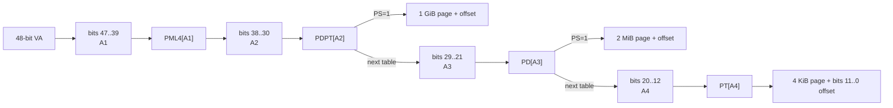

# 7. MMU 与页表：从 CPU 对照看 GPUVM 的构建、写入与切换

> 面向零基础的专题：如果你几乎不了解页表，这一篇从"为什么需要地址翻译"讲起，用 **CPU（x86）** 把地基打牢，再逐级映射到 **GPU（AMD GPUVM）**。读完你应能回答四个问题：页表是什么、存哪里、怎么建、怎么切。
>
> 前置：[进程与 mm_struct](<./3. Linux 进程基础：task_struct、mm 与线程.md>) §2（mm 是什么）；
> [Linux 内存管理基础 2A](<./2A. Linux 内存管理基础：从物理内存、PFN 与 struct page 到 GEM、TTM、HMM.md>)
> （PFN、`struct page`、DMA address 和 BO backing）；[硬件队列](<./6. AMD 硬件队列：AQL Ring、MQD、HQD 与调度驻留.md>) §1（VMID 初识）。
> 配套：[SVM 专题](<./9. AMD SVM：共享内存、统一地址空间与页面迁移.md>)（页表的按需迁移用）、
> [PCIe 地址映射](<./10. AMD PCIe 地址映射与 DMA：GPU Endpoint.md>)（设备地址与事务层）。

源码路径口径：本文所有未显式写仓库根的源码路径均相对于 `2.源码/linux`，固定版本为 `248951ddc14de84de3910f9b13f51491a8cd91df`。

## 目录

- [0. 开篇：整篇只建立一个心智模型](#0-开篇整篇只建立一个心智模型)
- [1. CPU 地基：为什么需要地址翻译](#1-cpu-地基为什么需要地址翻译)
- [2. 分页：把一维地址变成二维](#2-分页把一维地址变成二维)
- [3. x86 四级页表：树长什么样](#3-x86-四级页表树长什么样)
- [4. x86 页表怎么建、怎么写](#4-x86-页表怎么建怎么写)
- [5. x86 进程切换：换 CR3 + 冲 TLB](#5-x86-进程切换换-cr3-冲-tlb)
- [6. GPU 的&#34;同样问题&#34;：GPUVM 树](#6-gpu-的同样问题gpuvm-树)
- [7. GPU 的根：VM_CONTEXT 与 VMID](#7-gpu-的根vm_context-与-vmid)
- [8. GPU 页表怎么建、怎么写（重点）](#8-gpu-页表怎么建怎么写重点)
- [9. GPU 进程切换：换根 + 冲 TLB](#9-gpu-进程切换换根-冲-tlb)
- [10. GPU 特有的两笔账：HDP 与 TLB 因果序](#10-gpu-特有的两笔账hdp-与-tlb-因果序)
- [11. 三个贯穿性洞察](#11-三个贯穿性洞察-inference)
- [12. 自研 GPU 落地点：无 IOMMU 的地址翻译](#12-自研-gpu-落地点无-iommu-的地址翻译-design)
- [13. 验证实验：用 /proc/self/pagemap 看见页表](#13-验证实验用-procselfpagemap-看见页表)
- [14. 源码证据索引](#14-源码证据索引)

---

## 0. 开篇：整篇只建立一个心智模型

先记住一句话，后面全是它的展开：

> **页表 = 一棵存在"硬件能读到的内存"里的多级翻译树。硬件 MMU 只认两样东西——①根寄存器（一个地址）；②树里的 entry（每 8 字节一条）。树是软件建的、软件写的；硬件只负责读树、翻译、把结果缓存进 TLB。**

由此推出两个"操作"的完整定义：

- **切换页表 = 换根寄存器 + 冲 TLB**（两步，缺一不可）
- **构建页表 = 分配树的内存 + 逐条填 entry**（纯软件内存操作，无任何特殊指令）

CPU 和 GPU 的区别，全部收敛在这句话的两个词上：**根寄存器叫什么、存在哪**，以及 **entry 的格式是什么、写完之后要不要额外刷缓存**。所以这篇的方法论是：先在 CPU 上把"树 + 根 + TLB"讲透，再平移去看 GPU——你会发现 GPU 几乎全部是 CPU 的同构，只有两个"多出来的账"（第 10 章）。

---

## 1. CPU 地基：为什么需要地址翻译

没有虚拟内存的世界是可怕的：程序直接用物理地址访问内存，那么——

1. **进程无法隔离**：进程 A 可以随便读写进程 B 的内存，崩溃或恶意程序能翻遍整个 RAM。
2. **没有连续假象**：物理内存被切成碎片，一个大数组必须恰好落在连续物理区域，否则装不下。
3. **没法共享代码**：两份进程跑同一个动态库，物理上只需一份，但"同一份代码"需要在两个进程里出现在**同一个虚拟地址**，否则指令跳转就乱了。

地址翻译一次解决三者：每个进程看到一份**独立的虚拟地址空间**，由内核把它逐页映射到真实物理页。

```text
进程 A 的虚拟空间            物理内存            进程 B 的虚拟空间
┌────────────────┐                          ┌────────────────┐
│ VA 0x400000     │──►│ 页帧 7     │◄──│ VA 0x400000     │
│ VA 0x800000     │──►│ 页帧 2     │   │ VA 0x100000     │
└────────────────┘   │ 页帧 100    │   └────────────────┘
                     └────────────┘
      同一个 VA 在两个进程里可以指向不同页帧 —— 隔离
```

x86 里这个"每进程一份的虚拟空间"就是 Linux 的 `struct mm_struct`（[进程基础](<./3. Linux 进程基础：task_struct、mm 与线程.md>) §2），而"这份空间怎么映射"正是**页表**。GPU 侧完全同构：每个进程一份 GPU 虚拟地址空间，由 **GPUVM（GPU Virtual Memory，GPU 虚拟内存）页表**描述（主模型 §7 详述进程与 mm/PASID 的绑定）。

> **关键类比（先立住）**：页表之于地址翻译，就像"地图"之于城市。地图（页表）是软件画好放在那里的，导航系统（MMU 硬件）照着地图指路。换地图 = 给导航换一份新的；地图画错或没及时更新 = 走错路（翻译错）。

---

## 2. 分页：把一维地址变成二维

### 2.1 虚拟地址 = 页号 + 页内偏移

内存按固定大小**页（page）**切块，x86 基础页 4KB。一个 64 位虚拟地址被切两段：

```text
虚拟地址 (48 位有效)：
┌────────────────────────┬──────────────┐
│  VPN（虚拟页号，36 位）      │  offset（12 位）│
└────────────────────────┴──────────────┘
         页表的"key"             页内偏移（0~4095）
```

翻译的目标：给定 `VPN`，查出它对应的**物理页**（一个 4K 对齐的物理页起始地址），再加页内偏移得到字节物理地址。**页表本质上就是一个"VPN → 物理页起始地址"的查找结构**（"物理页帧号 PFN"只是这个 4K 对齐地址去掉低 12 个 0 后的高位部分的别名——同一个数，§3.2 详述）。

### 2.2 为什么是 4KB 这么小

页越小，粒度越细（浪费少），但**每页都要一条记录**——页小了记录数就多。4KB 是粒度和表体积的平衡点。GPU 侧同样用 4KB GPU 页（`AMDGPU_GPU_PAGE_SHIFT = 12`，2.源码/linux/drivers/gpu/drm/amd/amdgpu/amdgpu_gart.h:37），但可以折叠成大页（2MB/1GB）来减少记录数，见第 6.3 节。

### 2.3 单级页表的问题：表太大 → 多级

假设 48 位地址、4KB 页、每条记录 8 字节：`VPN` 占 36 位，单级表需要 `2^36 × 8 B = 512GB`——**比内存本身还大**，荒谬。

**为什么单级表省不下来？——它是固定成本。** 平表的槽号 = VPN（0~2^36-1），要能索引到任意 VPN，数组就必须一次性预留全部 `2^36` 个槽。**表的大小由"地址空间宽度（36 位）"决定，不由"你实际用了多少页"决定**——哪怕进程只用 2MB，这张平表也得 512GB。平表无法按用量稀疏分配，这是它被淘汰的根本原因。

**多级页表为什么能省？** 先看关键数字：`VPN` 的 36 位切成 4×9 位，每级索引 9 位 → 每张表 `2^9 = 512` 条 entry × 8 字节 = **恰好一页 4KB**。**"每级表正好一页"是对 9 位这个选择最自然的解释**：分配一张表 = 分配一个物理页，表不碎片、对齐天然、分配回收便宜（若用 10 位 → 1024×8B = 8KB = 两页，不整齐；8 位 → 256×8B = 2KB，浪费半页）。

映射 **N 个 4KB 页**需要多少表、多少内存（这就是省内存的计算公式）：

```text
PT 表数    = ceil(N / 512)         每张 PT 表覆盖 512 页  = 2 MB
PD 表数    = ceil(N / 2^18)        每张 PD 表覆盖 512² 页  = 1 GB
PDPT 表数  = ceil(N / 2^27)        每张 PDPT 表覆盖 512³ 页 = 512 GB
PML4 表数  = 1                     每张 PML4 表覆盖整个 256 TB 空间

总页表内存 = 4KB × (ceil(N/512) + ceil(N/2^18) + ceil(N/2^27) + 1)
```

**两个具体数字验证**（单级永远 512GB 作对照）：

| 进程实际用量      | PT  | PD | PDPT | PML4 | 多级总内存      | 单级   | 省了多少倍 |
| ----------------- | --- | -- | ---- | ---- | --------------- | ------ | ---------- |
| 2 MB（N=512 页）  | 1   | 1  | 1    | 1    | **16 KB** | 512 GB | ~3300 万倍 |
| 1 GB（N=2^18 页） | 512 | 1  | 1    | 1    | **~2 MB** | 512 GB | ~26 万倍   |
| 1 页（N=1）       | 1   | 1  | 1    | 1    | **16 KB** | 512 GB | ~3300 万倍 |

#### 2.3.1 四段 9 bit 如何逐级组织成页表



这张图需要沿两个方向阅读：

1. **从上到下看索引**：`A1/A2/A3/A4` 每段 9 bit 都只是一个 `0..511` 的数组下标，分别选择
   PML4、PDPT、PD 和 PT 中的一个 entry。
2. **从左到右看地址**：前三个选中的 entry 保存下一张页表页的物理地址；最后的
   `PTE[A4]` 保存数据页起始物理地址，再加 `offset` 得到最终字节地址。

这也直接回答了“中间级是否浪费”：

- 第一个孤立 4 KiB 映射确实可能需要 PML4、PDPT、PD、PT 四个 4 KiB 页表页，局部开销是 16 KiB。
- 同一 2 MiB 区间内的后续 511 个页面复用整条已有路径，只需在同一张 PT 数组中填另一个 PTE。
- 没有被选中的上级 entry 保持 `present=0`，下面整棵子树不分配；这才是多级页表相对单级巨型数组
  节省空间的根本来源。

**本质原因拆成三层**：

1. **成本从"地址空间宽度"变成"实际用量"**：单级是 O(2^36) 固定；多级的主导项是叶子表 `N/512 × 4KB = N × 8B`，**线性于用量**（和单级"每条记录 8 字节"一样便宜），只是把固定 512GB 拆成了"用到多少付多少"。
2. **顶层几乎免费共享**：无论用多少，PML4 只有 1 个；PDPT/PD 只在 1GB / 2MB 边界上展开。没用到的一整段 512GB 区间，PML4 里一条 entry 标 present=0 就完事，**下面整棵子树都不用分配**。
3. **一表一页**（512×8B = 4KB）：表的分配 = 物理页分配，无碎片。

```text
单级（要 512GB）：      VPN ──────────────────► 物理页
多级（按需建）：        级1 ─► 级2 ─► 级3 ─► 级4 ─► 物理页
                       只在用到的分支上建表
```

这是整个专题最核心的一句话：**多级页表用"只建用到的路径"来换体积**。GPUVM 完全复用这个思想（惰性分配，第 8.3 节）。

### 2.4 位数是怎么定出来的（32 位 vs 48 位）

"36+12=48" 不是拍脑袋，是**解方程解出来的**。四个量互相咬合：

```text
offset 位数   = log2(页大小)               // 4KB → 12 位
每级位数      = log2(一张表装多少条)        // 一张表必须恰好一页：页大小 ÷ entry 大小
级数          = ceil(VPN 位数 ÷ 每级位数)   // 直到切完 VPN
总地址位数    = VPN 位数 + offset 位数      // 页表必须恰好吃满地址空间
```

关键约束：**一张表必须恰好占一页**（不浪费、不碎片）。代入两种真实设计：

|              | 32 位 x86（传统，非 PAE）    | x86-64                            |
| ------------ | ---------------------------- | --------------------------------- |
| 页大小       | 4KB → offset**12** 位 | 4KB → offset**12** 位      |
| entry 大小   | **4 字节**             | **8 字节**                  |
| 一张表装几条 | 4096 ÷ 4 = 1024             | 4096 ÷ 8 = 512                   |
| 每级位数     | log2(1024) =**10**     | log2(512) =**9**            |
| VPN 位数     | 32−12 = 20 = 10+10          | 48−12 = 36 = 9+9+9+9             |
| 级数         | **2 级**（PD+PT）      | **4 级**（PML4+PDPT+PD+PT） |

所以：**32 位是 2 级 × 10 位（entry 4 字节），48 位是 4 级 × 9 位（entry 8 字节）——同样遵守"一表一页"，entry 大小不同，每级位数就不同。**

> 注：PAE 模式（老 32 位机器上打开大内存的开关）用 8 字节 entry，是 3 级变体（PDPTE 2 位索引 4 项 + PD/PT 各 9 位）——此处不展开，但它恰好反证上面的规律：**entry 大小一变，每级位数和级数就跟着变。**

关于"64 位虚拟地址"：**x86-64 其实只用了 48 位做地址**。寄存器是 64 位，但地址的高 16 位是**位 47 的符号扩展**：用户态（位 47=0）高 16 位恒为 `0x0000`，地址落在 `0x0000000000000000 ~ 0x00007fffffffffff`；内核态（位 47=1）高 16 位恒为 `0xffff`。真要撑满 64 位，52 位 VPN ÷ 9 = 6 级页表（或 5 级 LA57 支持 57 位地址）。**位数不是定死的，是页大小 + entry 大小一起解出来的。**

---

## 3. x86 四级页表：树长什么样

### 3.1 四级结构

x86-64 用四级（5 级在部分新 CPU 上）：虚拟地址的 36 位 VPN 切成 4×9 位，每级查一张表：

```text
VPN = A1(9位) A2(9位) A3(9位) A4(9位) offset(12位)

CR3 ──► PML4 表    PDPT 表     PD 表      PT 表       物理页
        │索引A1    │索引A2      │索引A3    │索引A4
        ▼          ▼            ▼          ▼
       PGD entry → PUD entry → PMD entry → PTE entry ──► 页帧
```

每张表 512 条 entry、每条 8 字节 = 一页 4KB 恰好装一张表。四个层级在 Linux 里叫 `pgd/pud/pmd/pte`，x86 分别对应 PML4/PDPT/PD/PT（arch/x86 定义，见 [源码证据索引](#14-源码证据索引)）。

**每一级"存什么、覆盖多大"**（这是理解多级的第二个关键）：

| 层级 | entry 名         | entry 的地址字段存什么                               | 一条 entry 覆盖 | 一张表覆盖     |
| ---- | ---------------- | ---------------------------------------------------- | --------------- | -------------- |
| 1    | PML4E（`pgd`） | **一张 PDPT 表的物理地址**                     | 512 GB          | 256 TB（全部） |
| 2    | PDPTE（`pud`） | **一张 PD 表的物理地址**（PS=1 → 1GB 物理页） | 1 GB            | 512 GB         |
| 3    | PDE（`pmd`）   | **一张 PT 表的物理地址**（PS=1 → 2MB 物理页） | 2 MB            | 1 GB           |
| 4    | PTE              | **物理页起始地址**（4K 对齐，总是叶子）        | 4 KB            | 2 MB           |

注意：**前 3 级不是"物理页的索引"，而是"下一级索引表的指针"**；只有第 4 级 PTE 才指向真正的物理页。中间层 entry 的地址因为指向 4KB 对齐的表，低 12 位天然为 0——所以**每级 entry 的位布局完全一样**（§3.2），硬件只按"当前在第几级 + PS 位"来解释。

**大页（huge page）就是让"叶子提前出现"**：PDE 的 PS 位（bit7）置 1 → 这条 entry 直接映射 2MB 物理页，第 3 级就是叶子，不再需要下面的 PT 表；PDPTE 的 PS 置 1 → 直接映射 1GB 物理页，第 2 级就是叶子。所以 4KB 页要走满 4 级，2MB/1GB 大页分别在第 3/2 级就拿到物理页——"少走几级"的本质不是 walker 跳级，而是**叶子出现得更早**。

### 3.2 entry 长什么样（8 字节）

**PDE 和 PTE 是同一格式的 entry**，只是"级不同、指向不同"：

- 中间层 entry（PDE/PUD/PGD）：物理地址域（位 12~51，40 位）= **下一张表的物理地址** + flag 位
- 叶子 entry（PTE）：物理地址域（位 12~51，40 位）= **物理页起始地址**（4K 对齐）+ flag 位

> 为什么地址域只有 40 位？x86-64 的物理寻址上限是 **2^52 = 4PB**（`__PHYSICAL_MASK_SHIFT = 52`，2.源码/linux/arch/x86/include/asm/page_64_types.h:50），4K 页 → 帧号 40 位。位 52~62 是保留/软件位（OS 自由使用，PKU 占其中几位），位 63 是 NX——所以 **"高 52 位都是地址"是错的，位 52~63 不是地址**。上面表格里位 63 NX 与"高 52 位存地址"并存时其实自相矛盾，这里一并修正。

flag 位（2.源码/linux/arch/x86/include/asm/pgtable_types.h:51-122）——**只要认识存在位，就理解了 90% 的页表**：

| 位                     | 含义                                            | 硬件用它做什么                                                                                    |
| ---------------------- | ----------------------------------------------- | ------------------------------------------------------------------------------------------------- |
| **bit0**         | **`_PAGE_PRESENT` 存在位**              | walker 一查它：是 0 → 缺页（#PF），停止翻译，交给内核                                            |
| bit1/2                 | RW / USER                                       | 权限检查（写越权 →#PF）                                                                          |
| bit5/6                 | ACCESSED / DIRTY                                | **硬件自动置位**，内核靠它做换出/脏页统计                                                   |
| bit7                   | **PS（Page Size）**                       | 仅在第 2/3 级有意义：置 1 → 这条 entry 直接映射 1GB/2MB 大页（叶子提前）；置 0 → 继续指下一级表 |
| bit63                  | NX 不可执行                                     | 数据页禁执行（缓解注入）                                                                          |
| 位 12~51（物理地址域） | 下一张表地址（非叶子）或 物理页起始地址（叶子） | 翻译的关键载荷                                                                                    |

**PTE 里到底存的是什么？——4K 对齐的物理地址，不是裸帧号。** 物理内存按 4KB 帧切，**每个物理页的起始地址低 12 位恒为 0**（`0x12345000`、`0x12346000`… 末尾都是 000）。这 12 个恒 0 的位不携带信息，于是被征用成 flag（present/rw/user…），地址域从 bit12 起。所以 PTE 的地址域存的就是**物理页的起始地址**（4K 对齐），**硬件直接读它，不需要"×4096"**。"物理页帧号（PFN）"只是这个对齐地址去掉低 12 个 0 后的高位部分的别名（`0x12345000` ↔ 帧号 `0x12345`，同一个数）。字节级地址由访问时的页内偏移补足：`物理字节地址 = (PTE 地址域) + (VA & 0xFFF)`——一个 PTE 管一页（4096 个字节地址），偏移随每次访问变，所以偏移不可能存进 PTE。

**而且 PTE 里没有虚拟地址。** 页表不是一个"虚拟地址 → 物理地址"的键值对表——虚拟地址**从不被存储**，它本身就是路径：VA 的位决定每级下标，下标决定走到哪个 entry，**走到哪个位置就隐含了"这是哪个 VA"**。像文件系统的路径 `/a/b/file`，不用在文件内容里再写一遍路径，走到那儿就是那儿。

**存在位是"硬件↔软件"的握手信号**：软件把 entry 的存在位置 0，等于告诉硬件"这一页不存在，去问内核要"。SVM 的按需迁移就是靠这个位（[SVM 专题](<./9. AMD SVM：共享内存、统一地址空间与页面迁移.md>) §7）。

### 3.3 一次翻译的 walk（映射规则的正式版）

**虚拟地址不需要"额外规则"才能进页表——它本身就是索引的集合。** 设计页表时故意把 VA 的位划分和层级对齐：第 1 层下标 = VA 最高 9 位，第 4 层下标 = VA 的位 12~20。每级一条位切片公式：

```text
第1级(顶层): 下标 = (VA >> 39) & 0x1FF     取最高 9 位（位 47~39）
第2级:       下标 = (VA >> 30) & 0x1FF
第3级:       下标 = (VA >> 21) & 0x1FF
第4级(叶子): 下标 = (VA >> 12) & 0x1FF     取最低 9 位（位 20~12）
页内偏移:    off  = (VA >>  0) & 0xFFF     取最低 12 位
```

规律：`0x1FF` = 9 个 1 = 取 9 位；shift 每次减 9（39→30→21→12）。**每一级覆盖多大由"下面还剩多少位"决定**：第 1 级 entry 覆盖 2^39=512GB，第 2 级 2^30=1GB，第 3 级 2^21=2MB，第 4 级 2^12=4KB——层层缩小，最后命中一个物理页。

#### 2.3.2 具体是哪张表、哪一个 entry：用一个 VA 算到底

上图选了一个具体的 48-bit 虚拟地址：`VA = 0x123456789000`。硬件和内核并不是“在所有页表页里搜索这个地址”，而是把 VA 的位段直接算成数组下标：

先把这个十六进制地址写成 48 位二进制，并按页表层级切成 `9+9+9+9+12` 位：

```text
0x123456789000
= 000100100 | 011010001 | 010110011 | 110001001 | 000000000000₂
    VA[47:39]   VA[38:30]   VA[29:21]   VA[20:12]       VA[11:0]
       36          209          179          393             0
```

所以图中 `36`、`209` 并不是另外生成的地址，它们就是 `VA` 的第一、第二段 9 bit 二进制值转换成十进制后的结果：`000100100₂ = 36`，`011010001₂ = 209`。彩色字段、向下的箭头和对应的 `PML4[36]`/`PDPT[209]` 正是这条计算链。

```c
A1     = (VA >> 39) & 0x1ff = 36  = 0x024;  // PML4[36]
A2     = (VA >> 30) & 0x1ff = 209 = 0x0d1;  // PDPT[209]
A3     = (VA >> 21) & 0x1ff = 179 = 0x0b3;  // PD[179]
A4     = (VA >> 12) & 0x1ff = 393 = 0x189;  // PT[393]
offset =  VA        & 0xfff = 0;             // 数据页内第 0 字节
```

每一张页表页都是一个 4 KiB 的物理页，里面顺序放着 `512` 个 8-byte entry。因此“找到 entry”还可以写成字节地址计算：

```text
entry_address = table_page_base + index * sizeof(entry)
               = table_page_base + index * 8

CR3/PML4_base +  36 * 8 → PML4[36]  // 内容：PDPT 页物理基址 + flags
PDPT_base    + 209 * 8 → PDPT[209] // 内容：PD 页物理基址   + flags
PD_base      + 179 * 8 → PD[179]   // 内容：PT 页物理基址   + flags
PT_base      + 393 * 8 → PT[393]   // 内容：最终数据页物理基址 + flags
```

这里的 `PML4_base` 是 `CR3` 给出的根页物理地址；后面三个 `*_base` 不是预先写在 VA 里的值，而是读取上一层 entry 的地址域得到的。若某一级 entry 的 `present=0`，内核先分配一张新的下级页表页，再把这张页的物理基址写入该 entry；若 `present=1`，就复用已有下级页表页，继续用下一个 VA 位段选择 entry。最后只需在 `PT[393]` 写入目标数据页的物理地址，访问 `VA` 时再把 `offset` 加回去。

**页表页和页表项不是一回事**：页表页是一整页“512 个槽位的数组”；页表项是其中一个 8-byte 槽位。创建一个映射，可能需要创建最多四张页表页，但每一级只会写其中由 `A1/A2/A3/A4` 选中的那一个 entry；同一条路径上的后续 VA 只改变 `A4` 时，不创建新表，只写同一张 PT 页中的另一个 PTE。

#### 2.3.3 大页：让叶子在中间层提前出现

4 KiB 映射必须走到 `PTE[A4]`。但如果要映射一整段、且物理地址满足对齐要求的连续内存，可以把叶子提前放在中间层：

```text
4 KiB：PML4 → PDPT → PD → PT → PTE[ A4 ] → 4 KiB 数据页
2 MiB：PML4 → PDPT → PD[ A3 ] (PS=1)   → 2 MiB 数据页
1 GiB：PML4 → PDPT[ A2 ] (PS=1)          → 1 GiB 数据页
```

这里的 `PS`（x86 中对应 `_PAGE_PSE`，通常就是 entry bit 7）改变了 entry 的解释方式：

- `PS=0`：entry 保存**下一张页表页**的物理基址，硬件继续 walk；
- `PS=1`：entry 直接保存**大页数据区域的物理基址**，当前 entry 就是叶子，不再创建下一级页表。

以图中同一个 VA 为例，2 MiB 映射仍然使用 `PML4[36] → PDPT[209] → PD[179]`，但 `PD[179]` 不再指向 PT，而是直接保存一个 2 MiB 对齐的物理基址；`A4` 和 12-bit `offset` 合在一起成为 21-bit 大页内偏移：

```text
2 MiB page offset = VA & (2 MiB - 1)
                  = (A4 << 12) | offset
                  = (393 << 12) | 0
                  = 0x189000
```

1 GiB 映射则在 `PDPT[209]` 提前结束，`A3/A4/offset` 合成 30-bit 大页内偏移：

```text
1 GiB page offset = VA & (1 GiB - 1) = 0x16789000
```

“大页分配”与“叶子提前”是两个连续动作：内存分配器先提供满足大小、对齐和连续性要求的 huge folio（典型地 2 MiB 为 order-9，1 GiB 为 order-18；实际是否成功取决于内存碎片和配置），页表代码再用类似 `pfn_pmd()`/`pmd_mkhuge()` 或 `pfn_pud()`/`pud_mkhuge()` 组出带 `PS=1` 的 entry，最后写入 `set_pmd_at()` 或 `set_pud_at()`。内核的通用尝试接口 `pmd_set_huge()` / `pud_set_huge()` 也会检查当前 entry 是否已经是下级页表；如果不能安全覆盖，调用者应退回更小的 2 MiB 或 4 KiB 映射。

因此，“提前建立叶子”不是提前把所有 PTE 填满，而是**在确认整段物理内存可用且对齐后，故意不分配下一级页表，把中间层 entry 直接写成叶子**。这减少了页表页数量，也让一次 TLB 项覆盖 2 MiB 或 1 GiB。

完整翻译算法（**这就是硬件 MMU 干的全部事情**）：

```c
uint64_t translate(uint64_t va) {
    uint64_t base = CR3;                        // 第1张表(PML4)的物理地址，寄存器里
    for (int level = 0; level < 4; level++) {
        int shift = 39 - 9*level;               // 39, 30, 21, 12
        unsigned idx = (va >> shift) & 0x1FF;   // 切一段当下标
        uint64_t e = *(uint64_t*)(base + idx*8);// 查表：base 是表基址，idx×8 是表内偏移
        if (!(e & 1)) 返回缺页;                  // 存在位=0 → 抛 #PF 停住
        base = e & 0x000FFFFFFFFFF000ULL;       // 取物理地址域(位12~51) → 下一张表/物理页基址
    }
    return base + (va & 0xFFF);                 // base 已是物理页起始地址(4K对齐)，加页内偏移
}
```

**关键：整个 walk 从头到尾用物理地址。** CR3 是物理地址，每级 entry 里的"下一张表地址"是物理地址，叶子的物理页起始地址也是物理地址——**绝不是虚拟地址**。为什么？如果 PML4[0] 存的是下一张表的**虚拟**地址 V，MMU 要读这张表就得先翻译 V，翻译 V 又查页表、又遇到虚拟地址……**无穷递归**。所以 MMU 直接从物理地址读下一张表，不需要再翻译。这也解释了页表为什么必须住在"物理可寻址"内存里（CPU 页表在物理 RAM，GPU 页表在显存/GTT）。

> 唯一的例外是**大页**：PS 位（bit7）置 1 时，非叶子 entry（PDE/PDPTE）也变成叶子，直接存 2MB/1GB 物理帧——所以"非叶子都存下一张表地址"要加一句"除非 PS 位把它变成大页叶子"。

走 4 次内存读才能拿到结果，太慢——所以有了 TLB。

### 3.4 TLB：翻译缓存（快路径）

**TLB（Translation Lookaside Buffer，翻译旁路缓存）**：把"虚拟页 → 物理页"的翻译结果存在芯片上的小缓存里。下次访问同一页，先查 TLB，命中就不必再 walk 四级。

```text
虚拟地址 ──► TLB 命中？ ──是──► 直接拿物理页
              │否
              ▼
         页表 walk（慢）──► 填入 TLB
```

这就形成了整篇最重要的一个分层：**页表是慢路径（低频），TLB 是快路径（高频）**。硬件每次翻译先走快路径，miss 才走慢路径。这个分层在 GPU 上原样存在（第 6.4 节）。

---

## 4. x86 页表怎么建、怎么写

### 4.1 页表页 = 普通物理页

**页表自身就存放在普通物理内存页里**（一个 4KB 物理页装 512 条 entry）。内核像分配普通页一样分配页表页，然后用**普通 store 指令**填 entry。没有任何特殊硬件指令——这是 x86 页表最"无聊"也最优雅的一点。

### 4.2 三个基本动作

```c
// ① 分配一个页表页（4KB 物理页）
pgd_t *pgd = pgd_alloc(mm);            // 顶层；其余层: pte_alloc_one() 等

// ② 组一条 PTE：物理页起始地址(4K对齐) | 权限 flag
pte_t pte = mk_pte(page, prot);        // prot 含 PRESENT|RW|USER|NX...

// ③ 写进页表页 —— 本质是一次 8 字节 store
set_pte(ptep, pte);                    // *ptep = pte;
```

### 4.3 缺页驱动的完整映射流程

进程 `malloc(1GB)` 时内核**不会**立刻建 1GB 的映射，只登记一个虚区间（VMA）。直到程序**第一次访问**某个页，硬件 walk 到该页的 entry 发现存在位=0 → 抛 #PF → 内核缺页处理里才 `alloc_page + set_pte` 补上这一页的映射。完整旅程：

```text
① malloc(1GB)
     glibc 对大块走 mmap → 内核在登记册(VMA 树)划一行：这段 VA 属于你（数字定了）
     返回指针。→ 此刻页表里这一页 present=0

② 程序写 *ptr = 42
     CPU 访问 VA → MMU 从 CR3 出发 walk 页表（§3.3 那 4 步）
     → 某级 entry present=0 → 停！抛 #PF
     → 内核缺页处理器：查登记册找到这个 VMA → 分配一个物理页
     → 填 PTE：set_pte(mk_pte(page, flags))  把物理页起始地址 + present=1 写进叶子
     → 返回用户态，CPU 重试刚才那条指令 → 再 walk → present=1 → 命中 → 完成

③ 之后每次访问这一页
     walk 直接命中（或 TLB 命中），不再缺页
```

**这就是"由浅入深"里第二重要的认知：页表不是一次性画好的完整地图，而是"用到哪、补到哪"。** GPUVM 的惰性分配（第 8.3 节）是同一个思想的硬件化。

> **分清两个"登记"：** VMA 登记（挑 VA 数字、画区间）**不是**建页表——它只在内核的数据结构里，硬件根本不知道。页表是缺页发生时才填的。`/proc/self/maps` 显示 VMA 登记册；`/proc/self/pagemap` 则是内核导出的逐页状态接口，而不是原始硬件 PTE。配套的 [demo_pagemap.c](./examples/demo_pagemap.c) 用它观察 present、swapped，以及权限允许时的 PFN。

### 4.4 关键认知

> **CPU 页表 = 普通内存。写它 = 普通内存写。硬件是被动的读者，软硬件契约只有一条：entry 格式。**

### 4.5 虚拟地址是从哪来的（软件挑数字）

页表讲完了，回头看最初的问题：**那个被翻译的虚拟地址，本身是怎么来的？** 答案：**不是硬件发的，是软件挑的数字。** 进程的 VA 空间是一张 256TB 的"号码纸"，内核用一个登记册（`mm_struct` 里的 VMA 红黑树）记录"哪段号码被谁占了"。

不同区域的号码由不同的人在不同阶段挑：

| VA 区域                   | 谁挑的                                     | 大致位置     |
| ------------------------- | ------------------------------------------ | ------------ |
| 代码 / 数据段             | 链接器 + 加载器（ELF 布局，ASLR 随机基址） | 低地址       |
| 堆（malloc）              | 内核 VA 分配器（brk / mmap）               | 代码上方     |
| mmap 区（共享库、大分配） | 内核 VA 分配器                             | 高地址       |
| 栈                        | 内核创建进程时放置                         | 地址空间顶部 |

`/proc/self/maps` 就是这个登记册的导出：每一行是一个 VMA（`起始-结束 权限 文件`），比如一个真实进程的格局大致是：

```text
5b61...c000   [可执行文件的代码/数据段]      ← 低地址
5b61cf00b000  [heap]                        ← 堆
70812de00000  [libc 等共享库]                ← mmap 区
7ffeae6c4000  [stack]                       ← 顶部
```

**关键：挑数字（登记 VMA）≠ 建页表。** malloc 返回一个地址，只是登记册里划了一行"这段号码属于你"，页表里此刻什么都没有——直到缺页才补（§4.3）。所以"虚拟地址"是**进程拥有的一个号码**，"页表"是**这个号码最终通向哪里**的映射，两回事。

### 4.6 页表不是一张：每进程一棵树

别以为系统里只有一张页表——**每进程一棵（树），这正是内存隔离的根基**。

**CPU 侧**：每个进程有自己的页表树，根存在 `mm_struct.pgd`（2.源码/linux/include/linux/mm_types.h:1187）。所有进程的树**同时住在物理 RAM**：

```text
进程 A → mm_struct.pgd ──► A 的 PML4 树（在 RAM）
进程 B → mm_struct.pgd ──► B 的 PML4 树
进程 C → mm_struct.pgd ──► C 的 PML4 树
...
（全部共存于物理内存，互不干扰）
```

每颗 CPU 核的 **CR3 只指向当前进程的树**；进程切换 = 改 CR3 指向新进程的根 + 冲 TLB（第 5 章详述，不是只改寄存器）。多核 = 不同核同时指向不同进程的树。**暂时切走的进程，树还在 RAM 里，只是 CR3 不指向它**——页表树是持久资产，CR3 是临时指针（呼应第 5 章的"换根"）。

**GPU 侧**：每个进程（每进程每 GPU 节点）有自己的 GPUVM 树，根存在 `amdgpu_vm.root`（`pdd->drm_priv` 字段在 2.源码/linux/drivers/gpu/drm/amd/amdkfd/kfd_priv.h:784，经 `drm_priv_to_vm` 宏取 amdgpu_vm，宏在 2.源码/linux/drivers/gpu/drm/amd/amdgpu/amdgpu_amdkfd.h:304；GPU 术语本节只给结论，定义见 §6/§7），树在显存（dGPU：VRAM；原生 APU：GTT，见 §8.1）。**但 GPU 硬件只有 16 个 VM_CONTEXT bank**：

```text
进程 A → amdgpu_vm.root ──► A 的 GPUVM 树（dGPU 在 VRAM）
进程 B → amdgpu_vm.root ──► B 的 GPUVM 树
...
（树都存在，但硬件只有 16 个生效槽）

VM_CONTEXT[0..15] 同一时刻最多指向 16 棵树的根
```

进程的队列被调度 → **抢一个 VMID** → 树根写进 `VM_CONTEXT[VMID].PAGE_TABLE_BASE` → 生效；被切走 → **VMID 被回收** → 树还在显存，但没 VMID 指向它（休眠）。

|              | CPU                                                  | GPU                                                 |
| ------------ | ---------------------------------------------------- | --------------------------------------------------- |
| 每进程页表   | 一棵树，根=`mm_struct.pgd`                         | 一棵树，根=`amdgpu_vm.root`                       |
| 页表住哪     | 物理 RAM                                             | VRAM/GTT（页表 BO）                                 |
| 有多少张     | 每进程一张，**无硬件上限**                     | 每进程一张，但**只有 16 个 VMID 槽**          |
| 同时生效几棵 | 每核 1 棵                                            | 最多 16 棵                                          |
| 切换动作     | 换 CR3 + 冲 TLB（x86 写 CR3 隐式全冲，代价见 §5.2） | **抢 VMID + 换根 + 冲 TLB**（槽有限，要轮换） |

> **核心**：页表树的"多"两边都有，但**并发语义不同**——CPU 的根寄存器无限换，GPU 的根寄存器（VMID bank）是稀缺资源。这就是为什么 GPU 进程切换是"抢占 wave + 抢 VMID + 换根 + 冲 TLB"的完整序列（第 9 章），而不是 CPU 翻一下 CR3。**[INFERENCE]**（因果归纳，依据见 §5/§7/§9）

### 4.7 物理内存自己的账本：struct page + buddy（GPU 侧 vram_mgr）

页表回答"**我的虚拟地址通向哪**"（正向，进程视角）。但物理内存自己还有**第二套反向记录**："**这块物理内存现在被谁用着**"。这是页表之外的另一本账。

**CPU 侧：每个物理帧一份 `struct page` + buddy 空闲链表**

```c
// include/linux/mm_types.h —— 物理内存有几个 4KB 帧，就有几百万个 struct page
struct page {
    atomic_t _mapcount;          // 被几个页表映射（共享内存 = 多进程映射同一物理页）
    atomic_t _refcount;          // 引用计数，归 0 才能释放
    struct address_space *mapping;  // 属于哪个文件 / 匿名 vma
    struct list_head lru;        // 挂在哪个回收链表上
    unsigned long flags;         // PG_reserved / PG_swapcache ...
};

// 2.源码/linux/include/linux/mmzone.h:1088 —— buddy 分配器维护空闲物理页链表
struct free_area free_area[NR_PAGE_ORDERS];   // 每个 order（1,2,4,8...页）一条
// alloc_pages() 取块，free_pages() 归还
```

> 字段为示意：真实 `struct page` 用 union 封装，`_mapcount` 与 `page_type` 共用存储、`flags` 类型是 `memdesc_flags_t`——教学简化，`_mapcount`/`_refcount`/`mapping`/`lru` 确实物理存在于 struct page 上。

**所以 OS 对每个物理帧都知道：free（在 buddy 链表里）还是 allocated（被谁引用）。** 一正一反两本账：

```text
页表（正向，进程视角）：    进程A的虚拟页 X ──► 物理帧 Y
struct page（反向，物理视角）：物理帧 Y ──► 被进程A映射、属于某文件、计数 N
```

一个物理页可被**多个进程的页表同时映射**（共享内存），`_mapcount` 数着映射数；释放物理页前必须遍历映射它的所有页表把它们摘掉。

**GPU 侧：显存管理器 + 系统页记录**

```text
amdgpu_vram_mgr（DRM buddy 分配器 gpu_buddy）—— 记录 VRAM 哪段被哪个 BO 占用、哪段空闲
hipMalloc → BO 在 VRAM 里占一段区间（vram_mgr 记录）＋ GPUVA 映射（GPUVM 页表记录）
GPU 用的系统 RAM（GTT）：仍是有 struct page 的系统页 + GART 绑定（GTT 管理器用 drm_mm）
```

**所以一次 `hipMalloc` 背后是两条独立记录**：① **内存对象记录**（BO 在 VRAM 占区间，vram_mgr，物理侧）＋ ② **地址映射记录**（进程 GPU VA → 这段 VRAM，GPUVM 页表，映射侧）。**"记账者也被记账"**：连"记录映射的页表"本身，也是显存里的一块页表 BO（dGPU 在 VRAM），也要在 vram_mgr 里占区间（§8.1）——这和 §11 第 3 条的"SDMA 写页表=GPU 建自己的地图"是两种"递归"，别混淆。

> **一句话**：页表是"正向映射（VA→PA，每进程一张）"，`struct page` + buddy 是"反向所有权记录（PA→谁在用，物理全局一套）"；GPU 侧对应 `amdgpu_vram_mgr`（VRAM 区间分配）+ GPUVM 页表。**一个内存对象 = 物理侧记录 + 映射侧记录，两本账。**

那么，页表建好、写好之后，硬件怎么知道"地图换了"？——这就是第 5 章的"切换"。

---

## 5. x86 进程切换：换 CR3 + 冲 TLB

### 5.1 CR3：换根

每个进程的 `mm_struct` 里装着它的 PML4 表物理地址。进程切换时，内核把新进程的 PML4 物理地址**写进 CR3 寄存器**（一次 mov）：

```text
旧进程运行中 → CR3 = 旧 PML4 地址
切换到新进程 → CR3 = 新 PML4 地址
```

写 CR3 之后，硬件下一次翻译就会从新的根开始 walk——**地址空间瞬间切换**。

### 5.2 为什么必须冲 TLB

TLB 里缓存的是"虚拟页 → 物理页"，**但没有记录是哪棵树的翻译**。刚切完进程，TLB 里可能还躺着旧进程的翻译结果——如果新进程恰好用了同一个虚拟地址，就会命中旧缓存，读错数据。

```text
旧进程翻译: VA 0x400000 → 页帧 7     （TLB 里有）
切到新进程: VA 0x400000 → 页帧 2     （应该走新根）
若 TLB 没冲 → 仍命中"页帧 7" → ✗ 读错
```

所以换根必须配套**失效 TLB**。两种策略：

| 策略                | 做法                                                | 代价                                   |
| ------------------- | --------------------------------------------------- | -------------------------------------- |
| 全冲                | 换 CR3 时隐式冲空全部 TLB                           | 简单，但每次切换都失效，切来切去性能差 |
| **PCID/ASID** | 每个进程一个 ID 标在 TLB entry 上；切换只冲该 ID 的 | 精确，不打扰其他进程的缓存             |

Linux 用 `flush_tlb_mm_range()`（2.源码/linux/arch/x86/mm/tlb.c）做精确失效；多核上还要**广播 IPI（TLB shootdown）**让所有核冲掉对应页的翻译（2.源码/linux/arch/x86/include/asm/tlbflush.h:297-345）。

### 5.3 CPU 切换全景

```text
① 保存旧线程上下文（寄存器、栈）
② CR3 = 新进程 PML4 物理地址        ← 换根
③ 冲 TLB：全冲 或 PCID 精确冲 + 多核 IPI
④ 恢复新线程上下文，继续执行
```

**CPU 页表的切换就是这么简单**——因为它没有"槽位数"限制：任何进程随时有根，切过去把 CR3 一改即可。GPU 差就差在这里（第 7 章）。

---

## 6. GPU 的"同样问题"：GPUVM 树

### 6.1 GPU 也要隔离多进程

GPU 是多进程共享的：进程 A 和 B 同时在 GPU 上跑 kernel，各自有显存分配、各自的虚拟地址空间。**如果 GPU 不做地址翻译，两个进程就无法隔离、共享显存也无法做到"各自看自己的地址"**。所以 GPU 用了和 CPU 完全相同的方案：**每个进程一棵多级页表**。

> GPU 侧页表叫 **GPUVM（GPU Virtual Memory）**，由驱动（AMDGPU 的 `amdgpu_vm`）为每个进程维护一棵。CPU 侧的树属于 `mm_struct`；GPU 侧的树属于进程的 GPU 上下文，通过 KFD 的 PASID 与 `mm_struct` 绑定（主模型 §7）。

### 6.2 GPUVM 树：PDB3 → PTB

AMD GPU 的页表层级叫 **PDB（Page Directory Block）** 和 **PTB（Page Table Block）**：

```text
GPU 虚拟地址 (48 位)：
┌────────────────────────┬──────────────┐
│  VPN（GPU 侧）           │  offset(12位)  │
└────────────────────────┴──────────────┘

根寄存器 ──► PDB3 ──► PDB2 ──► PDB1 ──► PDB0 ──► PTB ──► 物理页
         (AMDGPU_VM_PDB3..PDB0, AMDGPU_VM_PTB — 2.源码/linux/drivers/gpu/drm/amd/amdgpu/amdgpu_vm.h:188-196)
```

与 x86 四级逐级同构：x86 的 PML4/PDPT/PD/PT ↔ GPU 的 **PDB3/PDB2/PDB1/PDB0/PTB**——**PDB3 是顶层（离根寄存器最近、位权最高）**，对应 x86 的 PML4（源码注释明确层级 `PDB3->PDB2->PDB1->PDB0->PTB`，2.源码/linux/drivers/gpu/drm/amd/amdgpu/amdgpu_vm.h:188-190；`num_level=4` 时 `root_level=PDB3`，2.源码/linux/drivers/gpu/drm/amd/amdgpu/amdgpu_vm.c:2402）。实际级数 1~5，取决于 **ASIC 家族（1-2 或 1-5 级）**与地址空间大小（2.源码/linux/drivers/gpu/drm/amd/amdgpu/amdgpu_vm.c:69, 2399）。每级 entry 8 字节。

### 6.3 GPU PTE 格式（对照 x86）

GPU 的 entry 同样是 8 字节（GFX9 起，2.源码/linux/drivers/gpu/drm/amd/amdgpu/amdgpu_vm.h:57-110），但**布局与 x86 不同**：物理地址域在 **bit12-47**（48 位 GPU 物理地址，`gmc_v9_0` 在 `2.源码/linux/drivers/gpu/drm/amd/amdgpu/gmc_v9_0.c:1986` 设置 `pte_addr_mask = 0x0000FFFFFFFFF000`），权限/属性 flag 除了低 12 位，**还散布在高位**——见下表：

| GPU 位         | 含义                                                                                 | x86 对应          |
| -------------- | ------------------------------------------------------------------------------------ | ----------------- |
| **bit0** | `VALID` 存在位                                                                     | `_PAGE_PRESENT` |
| bit1/2         | `SYSTEM`（系统内存）/ `SNOOPED`                                                  | ——              |
| bit5/6         | `READABLE` / `WRITEABLE`                                                         | RW                |
| bit51          | `PRT`（SVM 保留页，缺页信号）                                                      | ——              |
| bit54/56       | `PDE_PTE` / `TF`（translate further，级间跳转）                                  | ——              |
| bit57-58       | `MTYPE` 内存类型（缓存策略 NC/CC；GFX9 位置，随代次迁移：NV10=bit48、GFX12=bit54） | ——              |
| bit12-47       | 下一级表地址 或 物理页起始地址                                                       | 同上              |

**和 CPU 同一个道理：GPU PTE 的地址域存的也是 4K 对齐的 GPU 物理地址**（物理页起始地址），低 12 位恒 0 被 flag 占用；"GPU 物理帧号"只是它的高位别名。GPU 的"物理"指 GPU 自己那套物理地址空间（VRAM aperture / GART aperture），不是系统 RAM 的物理地址——见 [PCIe 地址映射专题](<./10. AMD PCIe 地址映射与 DMA：GPU Endpoint.md>)。

**唯一结构性差异：GPU 支持"折叠大页"。** 这里有两个机制要分清：`block_size` 决定每级覆盖多少位（`block_size=9` → 一个叶子 PTE 覆盖 2⁹=512 页 = 2MB，2.源码/linux/drivers/gpu/drm/amd/amdgpu/amdgpu_vm.c:2418-2425）；`AMDGPU_PTE_FRAG`（bit7-11）则让一条 PTE 对 **L1 TLB** 覆盖更大的连续区间（`amdgpu_vm_pte_fragment`，2.源码/linux/drivers/gpu/drm/amd/amdgpu/amdgpu_vm_pt.c）。二者合力让大页一次 walk 少走几级、TLB 压力小。x86 也有 huge page，但没有把 fragment 宽度动态融进 walk 逻辑。

### 6.4 GPU 的 TLB：VM L2

GPU 的翻译缓存叫 **VM L2**（GMC/MMU 里的二级 TLB），与 x86 TLB 同构：先查 VM L2，miss 才走 GPUVM 页表 walk。第 10 章会讲它和 CPU TLB 在"怎么失效"上的差异——那正是 GPU 驱动的难点。

---

## 7. GPU 的根：VM_CONTEXT 与 VMID

### 7.1 16 个"CR3"：VM_CONTEXT 寄存器组

GPU 的根寄存器不是"每进程一个 CR3"，而是**有限的 16 个槽位**：

```text
VM_CONTEXT[0..15]           ← 一个 bank = 一个 VMID
  ├─ PAGE_TABLE_BASE_ADDR_LO/HI   ← 根的 GPU 物理地址（真身在这里）
  ├─ PAGE_TABLE_START/END_ADDR    ← 该地址空间范围
  └─ CNTL                        ← 页表深度 / block size
```

（2.源码/linux/drivers/gpu/drm/amd/amdgpu/gfxhub_v2_1.c:571-572、2.源码/linux/drivers/gpu/drm/amd/amdgpu/mmhub_v9_4.c:62-70 的 16 个 bank 保存/写入。）**为什么只有 16 个？** 因为地址翻译寄存器和 TLB 一样是稀缺硬件资源，芯片不会为"理论上可能存在的无数进程"各备一套。

### 7.2 VMID = 槽号；PASID = 进程身份

- **PASID**（进程地址空间 ID）：进程的长程身份，进程创建时分配，不随调度改变。
- **VMID**（虚拟内存 ID）：0~15 的硬件翻译槽号，**谁被调度谁占用**。

KFD 在调度队列时，从 `first_vmid_kfd..last_vmid_kfd` 里找一个空闲 VMID，把它和进程的 PASID 绑定（`set_pasid_vmid_mapping` → `ATC_VMID0_PASID_MAPPING` 寄存器，2.源码/linux/drivers/gpu/drm/amd/amdgpu/amdgpu_amdkfd_gfx_v9.c:101-147），然后把该进程的页表根写进 `VM_CONTEXT[VMID].PAGE_TABLE_BASE_ADDR`：

```c
// 2.源码/linux/drivers/gpu/drm/amd/amdkfd/kfd_device_queue_manager.c:681-715（调度一条队列时）
for (i = first_vmid_kfd; i <= last_vmid_kfd; i++)
    if (!dqm->vmid_pasid[i]) { vmid = i; break; }   // 找空槽
set_pasid_vmid_mapping(dqm, pdd->pasid, vmid);       // PASID↔VMID 绑定
qpd->vmid = vmid;
kfd2kgd->set_vm_context_page_table_base(adev, vmid, qpd->page_table_base);  // ★ 换根
kfd_flush_tlb(qpd_to_pdd(qpd));                      // ★ 冲 TLB
```

> **这是 GPU 与 CPU 的根本差异**：CPU 的"根"随进程无限换；GPU 只有 16 个 bank，**进程必须先占到一个 VMID 槽，才可能被调度**。进程多了，VMID 就得轮着坐——这直接决定了 GPU 进程切换是"换根 + 冲 TLB + 抢占旧队列"的完整序列（第 9 章），而不像 CPU 只翻一下 CR3。

---

## 8. GPU 页表怎么建、怎么写（重点）

这是全篇最关键的一章。CPU 页表存在 RAM、内核普通 store 写；GPU 页表的存在位置、写入通道都比 CPU 多出东西。

### 8.1 页表 BO：树存在显存里 **[SOURCE]**

GPU 页表不是一个抽象概念，而是驱动分配的 **BO（Buffer Object，缓冲对象）**。它落在哪个域，源码说了算（2.源码/linux/drivers/gpu/drm/amd/amdgpu/amdgpu_vm_pt.c:453-456）：

```c
if (!adev->gmc.is_app_apu)
    bp.domain = AMDGPU_GEM_DOMAIN_VRAM;   // dGPU → 页表 BO 在 VRAM
else
    bp.domain = AMDGPU_GEM_DOMAIN_GTT;    // 原生 APU → 页表 BO 在 GTT
bp.domain = amdgpu_bo_get_preferred_domain(adev, bp.domain);  // 单域请求原样返回
```

- **dGPU（独立显卡）→ 页表 BO 分配在 VRAM**。`is_app_apu = false`。
- **原生 APU → 页表 BO 分配在 GTT**。`is_app_apu` = "APU 且没有 PCI BAR0"（2.源码/linux/drivers/gpu/drm/amd/amdgpu/gmc_v9_0.c:1590 `pkg_type == AMDGPU_PKG_TYPE_APU && !pci_resource_len(pdev, 0)`）——即**没有独立显存的 APU**，共享系统内存，GTT 就是它唯一的 GPU 可访问内存。

> **为什么很多人误以为页表在 GTT？** 因为"BO 物理住在哪"和"CPU 怎么写它"是两件事：页表 BO 物理在 **VRAM**，但 CPU 要写它就必须能访问这块 VRAM——**大 BAR 机器（VRAM 被 PCIe 直映）CPU 直接映射写；非大 BAR 机器 CPU 碰不到 VRAM，只能让 SDMA 去写**（§8.3 的通道 B）。加上 `amdgpu_vm_pt_create` 还给页表 BO 打了 `AMDGPU_GEM_CREATE_CPU_GTT_USWC` 标志（CPU 映射时用 GTT 写合并语义），"CPU 经 GTT 写"和"BO 住 VRAM"混在一起，很容易被读成"页表在 GTT"。**准确说法：页表 BO 的默认域是 VRAM（dGPU）/ GTT（原生 APU）；CPU 写 VRAM 页表需要额外的大 BAR 或走 SDMA。**

对比 CPU：

|                    | CPU               | GPU                                                                                  |
| ------------------ | ----------------- | ------------------------------------------------------------------------------------ |
| 页表存在哪         | 系统 RAM          | **VRAM（显存）**，或 GTT                                                       |
| 页表是谁的内存对象 | 普通物理页        | **BO（显存对象）**                                                             |
| 谁建树             | 内核              | 驱动（AMDGPU`amdgpu_vm`）                                                          |
| 树的入口           | `mm_struct.pgd` | `struct amdgpu_vm.root`（2.源码/linux/drivers/gpu/drm/amd/amdgpu/amdgpu_vm.h:397） |

### 8.2 三步建树

**① 建 root PD**（进程首次用 GPU 时，`amdgpu_vm_init` 内调用）：

```c
// 2.源码/linux/drivers/gpu/drm/amd/amdgpu/amdgpu_vm.c:2613（amdgpu_vm_init 内的调用点）→ 2.源码/linux/drivers/gpu/drm/amd/amdgpu/amdgpu_vm_pt.c:441 amdgpu_vm_pt_create
amdgpu_vm_pt_create(adev, vm, root_level, ...);
//  创建页表 BO 当根页目录（dGPU 在 VRAM / 原生 APU 在 GTT，见 §8.1），size = 页目录大小，8 字节/entry
```

**② 清空初始化**（`amdgpu_vm_pt_clear`，2.源码/linux/drivers/gpu/drm/amd/amdgpu/amdgpu_vm_pt.c:361）：把 root 所有 entry 写成"空页表"形态。注意**空页表不是全 0**——对 GFX9+，非叶层写 `PDE_PTE`（指向空子表）+ vm_pde，叶层写 `EXECUTABLE`（GMC9 缺页优先级 workaround）。**空表 = 一条条指向空子表的 PDE。**

**③ 惰性分配中间层**（映射时，`amdgpu_vm_ptes_update` 内 `amdgpu_vm_pt_alloc`，2.源码/linux/drivers/gpu/drm/amd/amdgpu/amdgpu_vm_pt.c:496）：只分配本次映射覆盖的页表页，用 parent 指针挂到上层。64 位进程虚拟空间极大，**全建是不可能的，用到哪建到哪**——和 CPU 缺页惰性分配同构（第 4.3 节）。

### 8.3 两条写入通道：CPU writeq 还是 SDMA

`struct amdgpu_vm_update_funcs`（2.源码/linux/drivers/gpu/drm/amd/amdgpu/amdgpu_vm.h:328）抽象"怎么把 entry 写进页表 BO"，两种实现由 `vm->use_cpu_for_update` 二选一（2.源码/linux/drivers/gpu/drm/amd/amdgpu/amdgpu_vm.c:2590；KFD 在同文件 :2690/2699 的 `amdgpu_vm_make_compute` 中再按 `AMDGPU_VM_USE_CPU_FOR_COMPUTE` 设定）。

**通道 A：CPU 直接写（`amdgpu_vm_cpu_funcs`）——大 BAR 机器**

```text
map_table  amdgpu_bo_kmap(页表BO)        → 把页表 BO 通过 PCIe BAR 映射进 CPU 地址空间
prepare    amdgpu_sync_wait              → 等上一次页表更新完成（因果序）
update     amdgpu_gmc_set_pte_pde        → writeq(ptr + idx*8, 物理地址 | flags)
                                         （2.源码/linux/drivers/gpu/drm/amd/amdgpu/amdgpu_gmc.c:163 —— 就是一条 8 字节 store，和 CPU 写自己的页表一模一样）
commit     mb() + amdgpu_device_flush_hdp → ★ 唯一多出来的动作，见第 10 章
```

**完整调用链（从更新触发到最终 store，CPU 侧）**：

```text
触发：KFD_IOC_MAP_MEMORY_TO_GPU / SVM fault / 页表换出验证
  → amdgpu_vm_bo_update                  2.源码/linux/drivers/gpu/drm/amd/amdgpu/amdgpu_amdkfd_gpuvm.c:1308（调用点）
  → amdgpu_vm_update_range               2.源码/linux/drivers/gpu/drm/amd/amdgpu/amdgpu_vm.c:1107
  → amdgpu_vm_ptes_update                2.源码/linux/drivers/gpu/drm/amd/amdgpu/amdgpu_vm_pt.c:788   ← 多级 walk + 惰性分配
     ├─（需要新页表时，kmap 只在这里发生一次）
     │  → amdgpu_vm_pt_alloc 2.源码/linux/drivers/gpu/drm/amd/amdgpu/amdgpu_vm_pt.c:496 → amdgpu_vm_pt_clear 2.源码/linux/drivers/gpu/drm/amd/amdgpu/amdgpu_vm_pt.c:361
     │     → update_funcs->map_table 2.源码/linux/drivers/gpu/drm/amd/amdgpu/amdgpu_vm_pt.c:392 = amdgpu_vm_cpu_map_table (2.源码/linux/drivers/gpu/drm/amd/amdgpu/amdgpu_vm_cpu.c:34)
     │        → amdgpu_bo_kmap            2.源码/linux/drivers/gpu/drm/amd/amdgpu/amdgpu_object.c:825
     │           → ttm_bo_kmap → ttm_bo_ioremap (VRAM) → ttm_mem_io_reserve
     │              → amdgpu_ttm_io_mem_reserve        2.源码/linux/drivers/gpu/drm/amd/amdgpu/amdgpu_ttm.c:640
     │                  VRAM: bus.addr = aper_base_kaddr + (页表BO在VRAM的偏移)
     │                  ★ aper_base_kaddr = devm_ioremap_wc(aper_base, visible_vram_size)  2.源码/linux/drivers/gpu/drm/amd/amdgpu/amdgpu_ttm.c:2134
     │                    ← 把 PCIe BAR 的 visible_vram_size 字节窗口 ioremap 进 CPU 地址空间
     └─ amdgpu_vm_pte_update_flags 2.源码/linux/drivers/gpu/drm/amd/amdgpu/amdgpu_vm_pt.c:675
        → update_funcs->update = amdgpu_vm_cpu_update   2.源码/linux/drivers/gpu/drm/amd/amdgpu/amdgpu_vm_cpu.c
           → pe += amdgpu_bo_kptr(vmbo)  ← 拿 kmap 的 CPU 地址（VRAM = aper_base_kaddr + 偏移）
           → amdgpu_gmc_set_pte_pde      2.源码/linux/drivers/gpu/drm/amd/amdgpu/amdgpu_gmc.c:163
              → writeq(value, pe + idx*8) ← 一条 8 字节 store，写进 PCIe 映射的 VRAM
        → update_funcs->commit = amdgpu_vm_cpu_commit → mb() + amdgpu_device_flush_hdp
```

**两个关键点**：① **kmap 只发生一次**（页表 BO 创建/换出恢复时），把页表 BO 的 CPU 地址准备好——VRAM BO 的 kmap = `aper_base_kaddr + 偏移`；② **之后每次写 PTE** 是 `amdgpu_vm_cpu_update` 里 `pe += amdgpu_bo_kptr()` 拿这个地址再 `writeq`。这条 writeq 写进的就是 PCIe 映射的 VRAM。

**kmap 和"大 BAR"是什么关系？** `amdgpu_bo_kmap`（`2.源码/linux/drivers/gpu/drm/amd/amdgpu/amdgpu_object.c:825`）底层是 `amdgpu_ttm_io_mem_reserve`（`2.源码/linux/drivers/gpu/drm/amd/amdgpu/amdgpu_ttm.c:640`）：**VRAM BO 的 CPU 映射地址 = `aper_base + BO在VRAM的偏移`**——`aper_base` 就是 PCIe BAR aperture 的 CPU 基址。所以 kmap 确实是走 PCIe BAR（你记得的"接口不一样"：GTT BO 的 kmap 是映射系统页、普通 CPU 映射；VRAM BO 的 kmap 是 `aper_base+偏移` 的 ioremap，两条不同代码路径）。但为什么非要"大 BAR"？因为 `aper`（BAR 映射的 VRAM 窗口）大小有限：**小 BAR = `visible_vram_size < real_vram_size`**（`amdgpu_gmc_vram_full_visible`，`2.源码/linux/drivers/gpu/drm/amd/amdgpu/amdgpu_gmc.h:396-400`），只有部分 VRAM 在 BAR 里，页表 BO 可能落在窗口之外 → 那个 CPU 地址无效。**大 BAR = `real_vram_size == visible_vram_size`** → 全部 VRAM 都在 BAR 里 → 任意位置的 VRAM BO 都能 kmap。准确说法：**"CPU 要能 kmap 一个任意位置的 VRAM 页表 BO，前提是 VRAM 全可见 = 大 BAR"。**

> **大 BAR 的语境（来自[常规内存机制](<./2. 常规内存机制：GPU 内存分配与 CPU↔GPU 访问.md>) §2.5 / §6.6）**：CPU 如何直接访问 GPU 内存（VRAM）靠的是 PCIe BAR 窗口。**Large BAR**（Resizable BAR 覆盖全部/大部分 VRAM）→ CPU 把整个 VRAM 放进自己的 PCIe MMIO 地址空间 → 直接读/写、不需要 staging；**Small BAR** → 只暴露小 aperture（如 256MB）→ 窗口内直访、窗口外 staging 拷贝。**PUBLIC = host 可见（大 BAR 才允许 VRAM PUBLIC），PRIVATE = GPU only**。"直访"不是全有全无，是**窗口粒度**问题。本文的"页表用 CPU 直写还是 SDMA"，就是同一问题在页表这个 VRAM 对象上的投影。

**通道 B：SDMA 写（`amdgpu_vm_sdma_funcs`）——无大 BAR 机器**

```text
map_table  amdgpu_ttm_alloc_gart(页表BO) → ★ 给页表 BO 建 GPU 侧 GART 映射（SDMA 引擎能寻址），不是 CPU 映射
update     把要写的 entry 值打包进 IB，提交到 SDMA ring
          （填充 SDMA 专用包 SDMA_OP_PTEPDE：dst=页表项地址, mask=flags, value=物理地址, count）
commit     等 SDMA 完成 → fence
```

SDMA 引擎读 IB → **执行 `SDMA_OP_PTEPDE` 包，把值写进页表项**。用于没有大 BAR（CPU 无法直写 VRAM）的机器。

**先纠正一个前提：页表对 GPU 本来就永远可见**——GPUVM walk 要读它，这是设计必然，不是 SDMA 路径要解决的问题。所以**"补 GPU 可见性"的说法不准确**，`map_table` 这步真正做的是：

`amdgpu_ttm_alloc_gart`（定义于 `2.源码/linux/drivers/gpu/drm/amd/amdgpu/amdgpu_ttm.c:989`，在 `2.源码/linux/drivers/gpu/drm/amd/amdgpu/amdgpu_vm_sdma.c:38` 的 `amdgpu_vm_sdma_map_table` 中调用）是个**前置检查**：确保页表 BO 有**有效的 GPU 侧地址**，让 SDMA 写包的 `dst`（页表项地址）能指向它。VRAM 里的页表 BO 通常已有地址（函数 early-return）；它处理的是**页表 BO 被换出到系统内存**的情况——那时 GPU 侧地址来自 GART aperture，必须先有 GART 绑定。

**真正用 SDMA 的原因只有一个**：小 BAR 机器上 **CPU 碰不到 VRAM 页表**（§8.1 页表 BO 在 VRAM，CPU 无大 BAR 则无 CPU 映射）。SDMA 引擎在 GPU 侧，天然能通过 GPU 地址写页表——所以让 SDMA 代写，而不是 CPU 硬写。**这不是 GPU 可见性问题，是 CPU 不可见性的绕行。**

> **IB 提交 vs AQL 提交（同一个 ring 模式，两种用法）**：页表更新的 IB 提交和你熟悉的 AQL 提交（[硬件队列专题](<./6. AMD 硬件队列：AQL Ring、MQD、HQD 与调度驻留.md>)）共享"ring + producer + consumer"骨架，但三要素全不同：
>
> |        | AQL 提交                                    | IB 提交（页表更新）                           |
> | ------ | ------------------------------------------- | --------------------------------------------- |
> | 谁写包 | **用户态**（ROCr 写 64 字节 AQL 包）  | **内核驱动**（构造 SDMA/PM4 包）        |
> | 包格式 | AQL（CP/MEC 解析）                          | `SDMA_OP_PTEPDE` 等 SDMA 包（或 PM4）       |
> | 写到哪 | 用户可见的 compute ring（MQD/HQD/doorbell） | 驱动管理的 ring（SDMA ring / GFX ring / KIQ） |
> | 谁执行 | CP/MEC 解析后分发 compute 工作              | **SDMA 引擎**直接执行包                 |
>
> 页表更新、TLB 失效（KIQ）、缓存刷写都是"驱动提交 IB"这一类；用户 kernel 是"AQL 提交"这一类。

> **"执行者确实是 SDMA 引擎"的证据**：页表更新的调度实体 `vm->immediate/delayed` 绑定到 `adev->vm_manager.vm_pte_scheds`（2.源码/linux/drivers/gpu/drm/amd/amdgpu/amdgpu_vm.c:523-530），而 `amdgpu_sdma_set_vm_pte_scheds`（2.源码/linux/drivers/gpu/drm/amd/amdgpu/amdgpu_vm.c:3208-3219）把它设成 `adev->sdma.instance[i].page.sched`（或 `.ring.sched`）——**就是 SDMA 引擎的 scheduler**。所以通道 B 的 IB 最终由 SDMA 硬件引擎执行写入页表。这是"CPU（驱动）→ SDMA 引擎 → 写页表"的完整证据链。

**选哪条**：由内核参数 `amdgpu_vm_update_mode`（KFD 的 compute 上下文再按 `AMDGPU_VM_USE_CPU_FOR_COMPUTE` 定，2.源码/linux/drivers/gpu/drm/amd/amdgpu/amdgpu_vm.c:2590-2602、2700-2714）决定；**大 BAR 是 CPU 直写的推荐前提**——源码 `WARN_ONCE` 直说 "CPU update of VM recommended only for large BAR system"（2.源码/linux/drivers/gpu/drm/amd/amdgpu/amdgpu_vm.c:2595-2597）。本质上是一个"CPU 能不能直接写显存"的开关：能 → CPU 直写（快、简单）；不能 → SDMA（让 GPU 代劳）。

### 8.4 完整链路：KFD 一块内存 → PTE 落盘

```text
hipMalloc / clCreateBuffer
  → KFD_IOC_ALLOC_MEMORY_OF_GPU
  → amdgpu_amdkfd_gpuvm_alloc_memory_of_gpu     (2.源码/linux/drivers/gpu/drm/amd/amdgpu/amdgpu_amdkfd_gpuvm.c:1709)  创建 BO
  → amdgpu_amdkfd_gpuvm_map_memory_to_gpu       (2.源码/linux/drivers/gpu/drm/amd/amdgpu/amdgpu_amdkfd_gpuvm.c:2018)
  → amdgpu_vm_bo_map                            (2.源码/linux/drivers/gpu/drm/amd/amdgpu/amdgpu_amdkfd_gpuvm.c:1325，调用点)  在 VM 的 VA 区间树里登记
  → amdgpu_vm_bo_update                         (2.源码/linux/drivers/gpu/drm/amd/amdgpu/amdgpu_amdkfd_gpuvm.c:1308，调用点)
  → amdgpu_vm_update_range                      (2.源码/linux/drivers/gpu/drm/amd/amdgpu/amdgpu_vm.c:1107)
  → amdgpu_vm_ptes_update                       (2.源码/linux/drivers/gpu/drm/amd/amdgpu/amdgpu_vm_pt.c:788)  多级 walk，惰性分配每级
  → amdgpu_vm_pte_update_flags                  (2.源码/linux/drivers/gpu/drm/amd/amdgpu/amdgpu_vm_pt.c:675)  组 PTE flag + fragment
  → update_funcs->update：
      ├─ CPU:   amdgpu_gmc_set_pte_pde → writeq（一条 store）
      └─ SDMA:  构造 SET_PTE/COPY_PTE → IB → SDMA ring → GPU 写
  → commit：CPU 路径 mb()+flush HDP
  → 需要时 TLB flush（kfd_flush_tlb → amdgpu_vm_flush_compute_tlb）
```

**PTE 里到底存什么地址？** 存的是 **GPU 物理地址**：显存页 → VRAM aperture 内的地址；系统内存页 → 经 `amdgpu_vm_map_gart`（2.源码/linux/drivers/gpu/drm/amd/amdgpu/amdgpu_vm.c:945）换算成 **GART aperture 地址**，再由另一张驱动维护的 GART 页表转成真实系统物理页。所以一个 GPUVM PTE 可能最终指向两段物理：VRAM 段（直接）或系统 RAM 段（转一层 GART）。详细见 [PCIe 地址映射专题](<./10. AMD PCIe 地址映射与 DMA：GPU Endpoint.md>)。

---

## 9. GPU 进程切换：换根 + 冲 TLB

### 9.1 切的是什么：队列

GPU 的"进程"在调度层表现为**队列（queue）**——一个队列的所有 wave 共享一个 PASID/VMID/根。所以"切换进程"= "切换队列（HQD）"。切换单位是**整个队列**，不是单个 CU、也不是单个 wave（详见 9.3）。

### 9.2 完整切换序列（2.源码/linux/drivers/gpu/drm/amd/amdkfd/kfd_device_queue_manager.c:681-715）

```text
① 抢占旧队列：把它的 wave 停到安全点
   ├─ work-group 粒度：等当前 work-group 跑完，不再开新组（无需存现场）
   └─ wave 粒度（CWSR）：把每个 wave 的寄存器现场存到 TMA/TBA（trap 区），可中途切
② 找空闲 VMID（dqm->vmid_pasid[] 空槽）
③ set_pasid_vmid_mapping(pasid, vmid)            → ATC_VMID0_PASID_MAPPING
④ set_vm_context_page_table_base(vmid, root)     → ★ 换根：写 VM_CONTEXT[VMID].PAGE_TABLE_BASE
                                                  （gfxhub + mmhub 两份，2.源码/linux/drivers/gpu/drm/amd/amdgpu/amdgpu_amdkfd_gfx_v9.c:913-930）
⑤ kfd_flush_tlb()                               → ★ 冲 TLB（第 10 章）
⑥ 新队列 MQD → HQD，CP 恢复取包
```

**换根 = 换寄存器里的"入口指针"，不是重画页表。** 旧进程的页表树还在显存里躺着，下次换回来再把指针指回去（第 8.2 节的"地图"比喻）。

> 本序列与[主模型 §7.5-§7.6](<./4. AMD KMD 主模型：进程上下文、资源隔离与虚拟化.md>) 的内容对应：主模型从"No-CPSCH 显式建立 PASID/PT↔VMID、MQD↔HQD"的角度详述分配细节，本篇聚焦"换根 + 冲 TLB"的翻译视角。

### 9.3 最小切换粒度：队列，不是 CU/warp

| 概念                  | 单位                                                                | 是不是"切换"                             |
| --------------------- | ------------------------------------------------------------------- | ---------------------------------------- |
| 进程/队列切换         | **整个队列**（名下所有 wave）                                 | 是                                       |
| 抢占点的粗细          | **wavefront（wave 级，CWSR 存现场）** / work-group 级（排空） | 是"停在哪儿"                             |
| work-group → CU 分发 | work-group（threadblock）                                           | **不是切换**，是内核内部的工作分配 |
| CU                    | 物理执行资源（最多 ~40 个 wave 槽）                                 | 是"房子"，不是切换单位                   |

一句话：**按队列切，按 wave 存。** warp（AMD 叫 wavefront）是最细的"可保存/可恢复"执行单元（CWSR 允许按 wave 粒度抢占）；但地址空间切换是整队切换。误解来源是把"硬件把 work-group 分给哪个 CU"（内核内部调度，每分钟几千次）当成了"进程切换"（微秒~毫秒级的大事）。

### 9.4 与 CPU 切换的完整对照

|            | CPU                      | GPU                                            |
| ---------- | ------------------------ | ---------------------------------------------- |
| 根寄存器   | CR3                      | `VM_CONTEXT[VMID].PAGE_TABLE_BASE_ADDR`      |
| 槽位限制   | **无**，随时换     | **16 个 bank**，超了抢占复用             |
| 根的值     | PML4 物理地址            | root PD 的 GPU 物理地址                        |
| 页表存在哪 | 系统 RAM                 | VRAM（或 GTT）                                 |
| 谁写 entry | 内核普通 store           | CPU writeq 或**SDMA 包**                 |
| 写后可见性 | 硬件自然可见（一致内存） | 需**flush HDP**（第 10 章）              |
| TLB 失效   | INVLPG / IPI shootdown   | 寄存器写 或**KIQ 包 + fence**            |
| 切换单位   | 线程（一个 mm）          | **队列**（一个 PASID 名下所有 wave）     |
| 切换成本   | 翻 CR3 + 冲 TLB          | 抢占 wave + 抢 VMID + 换根 + 冲 TLB + 重装 HQD |

---

## 10. GPU 特有的两笔账：HDP 与 TLB 因果序

CPU 内核写页表没有下面两件事，GPU 驱动必须自己处理。这是"GPU 驱动比 CPU 内核多出来的账"，也是驱动代码里大量 `mb()`/fence/ring-submit 的根源。

### 10.1 第一笔账：缓存一致性（HDP）

**问题**：CPU 页表是普通 RAM，store 即硬件可见。GPU 页表在 VRAM，CPU 写完，GPU 去读可能命中**旧的读缓存**（GPU L2 / HDP 只读缓存）——看到的是旧页表。

**解法**：`amdgpu_vm_cpu_commit` 在写完 entry 后 `mb() + amdgpu_device_flush_hdp`（2.源码/linux/drivers/gpu/drm/amd/amdgpu/amdgpu_vm_cpu.c:127-137），把 CPU 侧写**推穿**到 GPU 读路径才可见。

```text
CPU 写 PTE ──► mb() ──► flush HDP（刷穿 GPU 只读缓存）──► GPU 能读到新值
```

### 10.2 第二笔账：TLB 失效要跟 GPU 命令流排序

**问题**：改了 PTE，VM L2（GPU 的 TLB）里还有旧翻译。冲掉它不能只是 CPU 一次寄存器写——因为**可能别的引擎正在用这条地址流**，"先改完页表 → 再冲 TLB → 之后才允许新访问"这个因果序必须在 **GPU 命令流里排队**才有保证。

**解法**（2.源码/linux/drivers/gpu/drm/amd/amdgpu/amdgpu_gmc.c:785 `amdgpu_gmc_flush_gpu_tlb_pasid`）：

```text
老 ASIC：CPU 直接写 GMC 寄存器（flush_gpu_tlb_pasid）
新 ASIC：走 KIQ ring，发 invalidate_tlbs 包 + fence
```

KIQ 是内核自己用的微型 GPU ring——**它把"冲 TLB"变成一次 GPU 命令提交**，从而天然与其它引擎的工作排序。这就是 [进程基础](<./3. Linux 进程基础：task_struct、mm 与线程.md>) 里"显式建立因果链"原则的硬件实现：**因果一致性的保证从"CPU 侧一个操作"变成了"GPU 命令流里的一个环节"。**

---

## 11. 三个贯穿性洞察 **[INFERENCE]**

1. **页表是慢路径，TLB 是快路径。** 每次翻译先查 VM L2 TLB，miss 才走页表 walk。写页表低频便宜（毫秒级），冲 TLB 是打断高频路径的昂贵操作 → 驱动优化方向：用大页（fragment）减少 entry 数、惰性分配、按需而非每次全冲 TLB。
2. **"多级 = 只建用到的路径"。** CPU 缺页补 PTE、GPU 惰性分配中间层，是同一个思想：**地图用到哪补到哪，不一次性画完**。这是页表能塞进有限内存的根本原因。
3. **SDMA 写页表 = "用 GPU 建 GPU 自己的地图"，有递归的味道。** 页表是地址空间的地图，而建地图的动作本身要由 GPU 引擎执行 → IB 里的目的地址（页表 BO）必须也能被 SDMA 翻译 → 这就锁死了 GTT/固定映射域必须存在。这也解释了为什么"staging 缓冲"（[常规内存机制](<./2. 常规内存机制：GPU 内存分配与 CPU↔GPU 访问.md>) §6.3 Pin 与 Staging）一定要存在——同一个答案的另一面。

---

## 12. 自研 GPU 落地点：无 IOMMU 的地址翻译 **[DESIGN]**

自研 GPU 是 **MCU-firmware CP + 无 IOMMU**，地址翻译要重做：

1. **根寄存器**：MCU 里仿照 VM_CONTEXT 做 N 个软件"翻译槽"（不用硬件 bank，用 RAM 里的结构管理槽位；KFD 用 `kfd_vmid_info`（2.源码/linux/drivers/gpu/drm/amd/amdkfd/kfd_priv.h:257-261）记录可用的 VMID 区间 `first_vmid_kfd / last_vmid_kfd / vmid_num_kfd`，自研可仿照它做槽位分配）。槽位有限这个约束依旧成立——它是稀缺资源，不是 IOMMU 才有。
2. **页表写通道**：没有 IOMMU 也照样用 CPU writeq 通道（页表 BO 若在显存且被 MCU 的 DMA 引擎可读，CPU 写完同样要 MCU 侧"刷缓存"——MCU 没有 GPU 那套 L2/HDP，反而简化：只要 MCU 读显存不走缓存即可）。
3. **TLB 失效排序**：没有 Host IOMMU **不等于**没有 GPU TLB。只要自研 GPU 对页表 walk 结果做了缓存，更新 PTE 后就必须执行对应失效；只有明确采用“无 TLB/无页表缓存”的简化设计时，才能省略这一步。无论是否有 TLB，"改完页表 → 新访问才允许"的因果序都要由 MCU 命令流中的 fence/barrier 保证（见 [自研 GPU 设计](<./12. 自研 GPU 设计：MCU-CP、内存交互与设备调度.md>) §3.4）。
4. **多级 vs 单级**：小地址空间（比如 32 位物理）可以退化成单级页表，牺牲体积换简单；多级的"惰性分配"收益在小空间里不明显，实现成本却高。**"简单即正义"**——先单级，规模到了再升级。

---

## 13. 验证实验：用 /proc/self/pagemap 看见页表

页表是抽象的，但 Linux 给了用户态一个受控观察接口：**`/proc/self/pagemap`**。每条 8 字节对应进程的一个虚拟页，提供 present、swapped、soft-dirty 等导出状态；它不是原始 PTE。PFN 字段还受内核权限策略限制，未获授权时通常读到 0。

配套示例：[examples/demo_pagemap.c](./examples/demo_pagemap.c)。它做三件事：

```bash
cc -std=c11 -Wall -Wextra -O2 \
  '1.笔记/examples/demo_pagemap.c' -o /tmp/demo_pagemap
/tmp/demo_pagemap
```

1. **对比触摸前后状态**：`mmap` 四页匿名内存，先读取 pagemap，再只写前两页并复查 present 状态。
2. **观察惰性分配**：通常未触摸页保持 present=0，触摸后变为 present=1；THP、预取或其他内核策略可能改变具体结果，因此程序还请求 `MADV_NOHUGEPAGE` 以尽量保持 4 KiB 粒度。
3. **观察虚拟连续与物理连续的区别**：权限允许读取 PFN 时，对比相邻的 page 0/1；PFN 可能连续，也可能不连续。

**期望观察（结果对比）**：

| 场景             | 期望结果                                                        |
| ---------------- | --------------------------------------------------------------- |
| 已触摸页         | 通常 present = 1；只有权限允许时才能读出非零 PFN                |
| mmap 后未触摸页  | 通常 present = 0；若内核预先建立映射，则应结合 THP/预取策略解释 |
| 相邻虚拟页       | PFN 可能连续也可能不连续——虚拟连续不保证物理连续              |
| present=1、PFN=0 | 通常是 PFN 披露受限，不能据此断言页面没有物理 backing           |

> **[BOUNDARY]** GPU 侧可在测试内核确实启用了相关 debugfs/dynamic-debug 接口时观察 `amdgpu_vm`/`kfd_svm` 日志；接口是否存在取决于内核配置与版本，本文不把它当作仓库内可直接运行的固定实验。

---

## 14. 源码证据索引

本文以 `2.源码/linux` 中 AMDGPU/KFD 与 x86 源码为基线。

| 结论                                                               | 文件与符号                                                                                                                                                                                                       |
| ------------------------------------------------------------------ | ---------------------------------------------------------------------------------------------------------------------------------------------------------------------------------------------------------------- |
| GPUVM 五级定义与层级（`PDB3→PDB2→PDB1→PDB0→PTB`，PDB3 顶层） | `2.源码/linux/drivers/gpu/drm/amd/amdgpu/amdgpu_vm.h:188-196`                                                                                                                                                  |
| GPU PTE flag 定义                                                  | `2.源码/linux/drivers/gpu/drm/amd/amdgpu/amdgpu_vm.h:57-110`                                                                                                                                                   |
| 页表级数 1~5、block_size                                           | `2.源码/linux/drivers/gpu/drm/amd/amdgpu/amdgpu_vm.c:69, 2392-2425`                                                                                                                                            |
| 建 root PD（页表 BO）                                              | `2.源码/linux/drivers/gpu/drm/amd/amdgpu/amdgpu_vm_pt.c:441 amdgpu_vm_pt_create`                                                                                                                               |
| 页表 BO 的域（dGPU→VRAM / 原生 APU→GTT）                         | `2.源码/linux/drivers/gpu/drm/amd/amdgpu/amdgpu_vm_pt.c:453-456`（`!is_app_apu ? VRAM : GTT`）                                                                                                               |
| `is_app_apu` 判定（无 PCI BAR0 的 APU）                          | `2.源码/linux/drivers/gpu/drm/amd/amdgpu/gmc_v9_0.c:1590`                                                                                                                                                      |
| 清空初始化（空表形态）                                             | `2.源码/linux/drivers/gpu/drm/amd/amdgpu/amdgpu_vm_pt.c:361 amdgpu_vm_pt_clear`                                                                                                                                |
| 惰性分配中间层                                                     | `2.源码/linux/drivers/gpu/drm/amd/amdgpu/amdgpu_vm_pt.c:496 amdgpu_vm_pt_alloc`                                                                                                                                |
| 多级 walk（映射→PTE）                                             | `2.源码/linux/drivers/gpu/drm/amd/amdgpu/amdgpu_vm_pt.c:788 amdgpu_vm_ptes_update`                                                                                                                             |
| CPU 写通道（writeq + flush HDP）                                   | `2.源码/linux/drivers/gpu/drm/amd/amdgpu/amdgpu_vm_cpu.c:73 amdgpu_vm_cpu_update`、`2.源码/linux/drivers/gpu/drm/amd/amdgpu/amdgpu_vm_cpu.c:119 amdgpu_vm_cpu_commit`                                        |
| PTE 值组装                                                         | `2.源码/linux/drivers/gpu/drm/amd/amdgpu/amdgpu_gmc.c:163 amdgpu_gmc_set_pte_pde`                                                                                                                              |
| SDMA 写通道（IB 包，GART 映射给 GPU 用）                           | `2.源码/linux/drivers/gpu/drm/amd/amdgpu/amdgpu_vm_sdma.c:36 amdgpu_vm_sdma_map_table`（`amdgpu_ttm_alloc_gart`）、`2.源码/linux/drivers/gpu/drm/amd/amdgpu/amdgpu_vm_sdma.c:158 amdgpu_vm_sdma_copy_ptes` |
| SDMA 页表包编码（`SDMA_OP_PTEPDE`）                              | `2.源码/linux/drivers/gpu/drm/amd/amdgpu/sdma_v5_0.c:1211 sdma_v5_0_vm_set_pte_pde`（opcode 在 :1217）                                                                                                         |
| 通道选择（CPU/SDMA）                                               | `2.源码/linux/drivers/gpu/drm/amd/amdgpu/amdgpu_vm.c:2590`、`2.源码/linux/drivers/gpu/drm/amd/amdgpu/amdgpu_vm.c:2690 amdgpu_vm_make_compute`（策略赋值见 :2699）                                            |
| 16 个 VM_CONTEXT bank                                              | `2.源码/linux/drivers/gpu/drm/amd/amdgpu/gfxhub_v2_1.c:571-572`、`2.源码/linux/drivers/gpu/drm/amd/amdgpu/mmhub_v9_4.c:57-70`                                                                                |
| 换根（写 page table base）                                         | `2.源码/linux/drivers/gpu/drm/amd/amdgpu/amdgpu_amdkfd_gfx_v9.c:913 kgd_gfx_v9_set_vm_context_page_table_base`                                                                                                 |
| PASID↔VMID 绑定                                                   | `2.源码/linux/drivers/gpu/drm/amd/amdgpu/amdgpu_amdkfd_gfx_v9.c:101 kgd_gfx_v9_set_pasid_vmid_mapping`                                                                                                         |
| 调度时抢 VMID + 换根 + 冲 TLB                                      | `2.源码/linux/drivers/gpu/drm/amd/amdkfd/kfd_device_queue_manager.c:681-715`                                                                                                                                   |
| KFD 侧 TLB flush                                                   | `2.源码/linux/drivers/gpu/drm/amd/amdkfd/kfd_priv.h:1560 kfd_flush_tlb`、`2.源码/linux/drivers/gpu/drm/amd/amdgpu/amdgpu_vm.c:1686 amdgpu_vm_flush_compute_tlb`                                              |
| TLB flush 的 KIQ 包路径                                            | `2.源码/linux/drivers/gpu/drm/amd/amdgpu/amdgpu_gmc.c:785 amdgpu_gmc_flush_gpu_tlb_pasid`                                                                                                                      |
| 系统内存页 → GART aperture                                        | `2.源码/linux/drivers/gpu/drm/amd/amdgpu/amdgpu_vm.c:945 amdgpu_vm_map_gart`                                                                                                                                   |
| x86 PTE flag                                                       | `2.源码/linux/arch/x86/include/asm/pgtable_types.h:51-122`                                                                                                                                                     |
| x86 TLB 失效                                                       | `2.源码/linux/arch/x86/mm/tlb.c`（`flush_tlb_mm_range`、`broadcast_tlb_flush` IPI shootdown）；`2.源码/linux/arch/x86/include/asm/tlbflush.h`（宏与声明）                                                |
| 每进程页表根（CPU）                                                | `2.源码/linux/include/linux/mm_types.h:1187`（`mm_struct.pgd`）                                                                                                                                              |
| 每进程 GPUVM 根                                                    | `2.源码/linux/drivers/gpu/drm/amd/amdkfd/kfd_priv.h:784`（`pdd->drm_priv` 字段）+ `2.源码/linux/drivers/gpu/drm/amd/amdgpu/amdgpu_amdkfd.h:304`（`drm_priv_to_vm` 宏）                                   |
| 物理帧记录（反向账本）                                             | `2.源码/linux/include/linux/mm_types.h`（`struct page`：`_mapcount`/`_refcount`/`mapping`/`lru`）                                                                                                    |
| 空闲物理页链表（buddy）                                            | `2.源码/linux/include/linux/mmzone.h:1088`（`free_area[NR_PAGE_ORDERS]`）、`alloc_pages`/`free_pages`                                                                                                    |
| GPU 显存分配记录                                                   | `2.源码/linux/drivers/gpu/drm/amd/amdgpu/amdgpu_vram_mgr.c`（DRM buddy 分配器 `gpu_buddy`）；`2.源码/linux/drivers/gpu/drm/amd/amdgpu/amdgpu_gtt_mgr.c` 用 `drm_mm`                                      |
| x86 大页叶子构造（`PS=1`）                                       | `2.源码/linux/arch/x86/include/asm/pgtable.h`：`pfn_pmd`/`pfn_pud`、`pmd_mkhuge`/`pud_mkhuge`                                                                                                          |
| x86 大页映射写入与覆盖检查                                         | `2.源码/linux/arch/x86/mm/pgtable.c`：`pmd_set_huge`、`pud_set_huge`（已有非叶子子表时拒绝直接覆盖）                                                                                                       |
| Linux folio → 大页 entry                                          | `2.源码/linux/include/linux/mm.h`：`folio_mk_pmd`、`folio_mk_pud`                                                                                                                                          |

---

*本文为"一个进程的 GPU 完整旅程"系列的地址翻译分支。下一步建议：读完 [GPUVM 的 VM 区间管理](<./9. AMD SVM：共享内存、统一地址空间与页面迁移.md>)（页表在 SVM 按需迁移里怎么用），再回头把 [主模型](<./4. AMD KMD 主模型：进程上下文、资源隔离与虚拟化.md>) §7 的进程↔PASID 绑定重读一遍，就能把"进程 → PASID → VMID → 页表 → PTE → 物理页"整条链闭环。*
