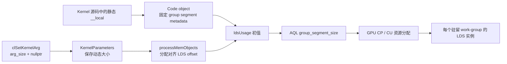
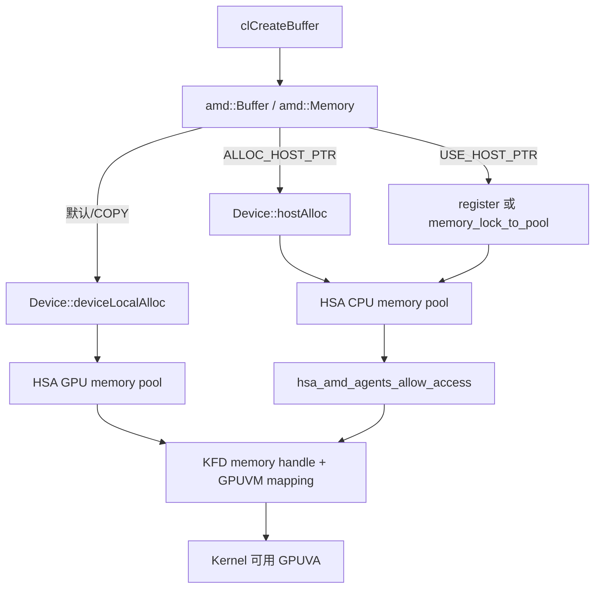
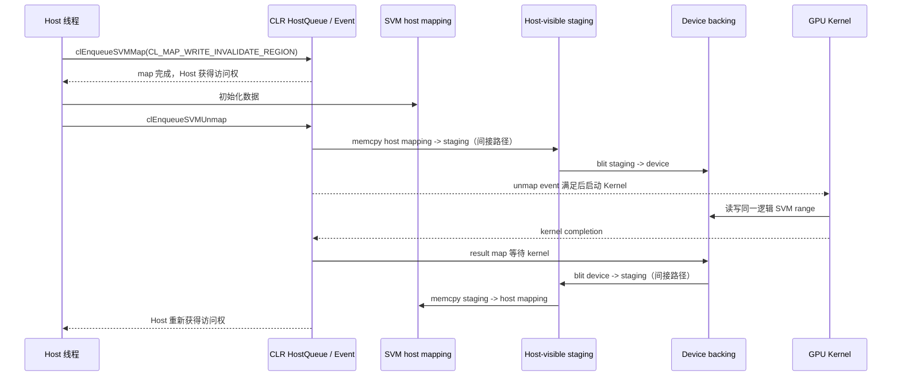
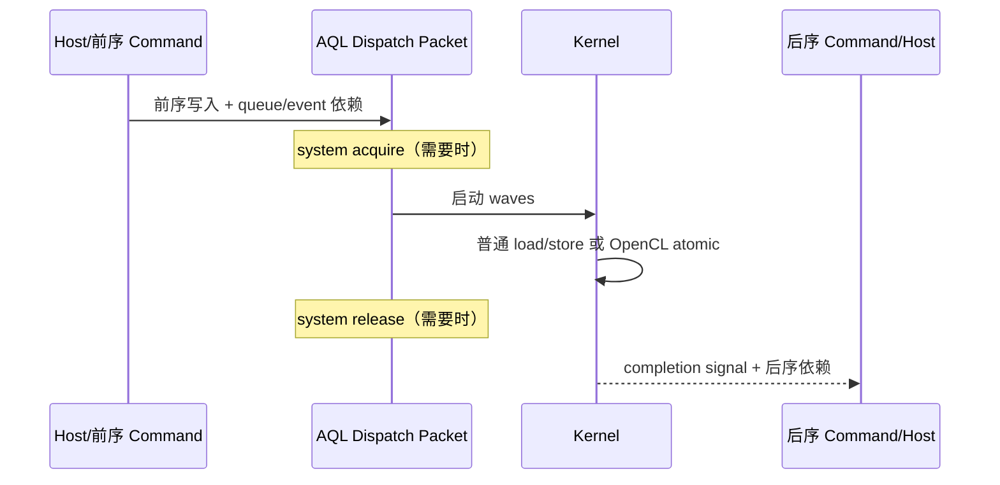
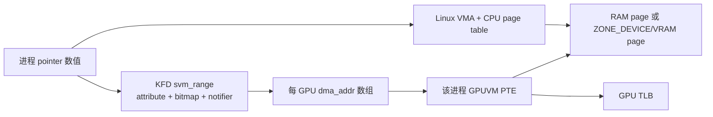
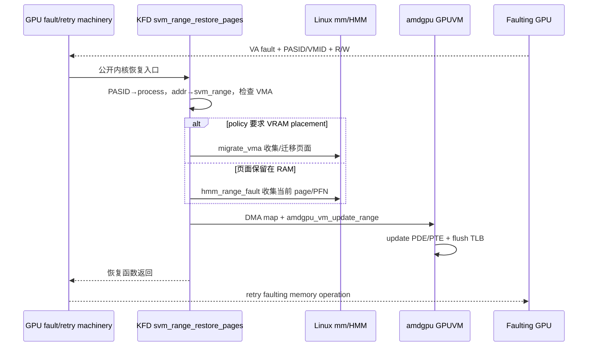
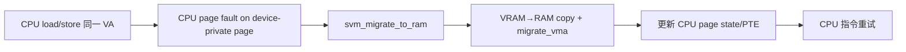
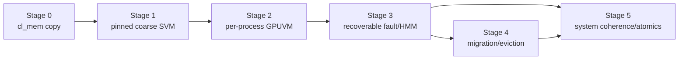

# AMD OpenCL 共享内存、SVM 与统一地址空间：从 API 到 HMM、GPUVM 和物理页面
本文不按 API 清单组织，而是用同一个状态模型追踪 `__local`、`cl_mem`、三类 SVM 和 HMM。看到任意 CPU/GPU pointer，都把它写成：
```text
Pointer 状态 = {API owner, VA translation, physical placement, access owner, visibility edge}
```
只有这五项同时明确，才能判断“GPU 能否访问”和“访问结果是否正确”。
## 1. 统一模型：一根 Pointer 必须回答五个问题
### 1.1 先记住三个结论
1. **同值地址不等于同一页表。** CPU VA 与 GPUVA 可以数值相同，但仍分别由 CPU page table 和该进程的 GPUVM/PASID 翻译。
2. **同一物理页不等于访问正确。** Page migration、PTE 更新和 TLB flush 只解决“访问哪一页”；Event、fence、atomic 才解决“按什么顺序看见数据”。
3. **SVM 不等于零拷贝。** SVM 规定 pointer 和访问契约；HMM 可以原地映射 RAM，也可以在 pointer 不变时把页面迁移到 VRAM。
全文分成四条主线：第 2 章先比较五种机制；第 3～7 章逐一追踪数据路径；第 8、9 章分别处理 placement 与 correctness；第 10 章再讨论 context、GPU 和进程边界。
调试方法与 Vortex 实现路线放在最后，不与 AMD 事实路径混在一起。
### 1.2 源码基线与证据标签
| **层次**                 | **本地路径**                   | **Revision**                               | **本文用途**                                          |
| ---------------------- | -------------------------- | ------------------------------------------ | ------------------------------------------------- |
| AMD CLR/OpenCL runtime | `2.源码/rocm-clr`     | `81277d69e3352e7144ced2ee9601484f9b48d950` | OpenCL API、memory object、kernel 参数、ROCr backend   |
| ROCr 与 libhsakmt       | `2.源码/rocr-runtime` | `ba56a24c6132c5d195686ae4adf969ca1222fbba` | HSA memory pool、KFD userspace thunk、SVM attribute |
| Linux/KFD/amdgpu       | `2.源码/linux`        | `248951ddc14de84de3910f9b13f51491a8cd91df` | GPUVM、PASID、SVM range、HMM、fault 和 migration       |
重要结论使用以下标签：
* **\[SOURCE]** 固定版本的实现源码可以直接证明。
* **\[SPEC]** OpenCL/HSA API 或内存模型要求，不能单独证明某个实现细节。
* **\[BOUNDARY]** 公开源码到此为止，不推断固件或未公开硬件行为。
### 1.3 五个必须分别回答的问题
| **维度**      | **真正的问题**                                                                   | **常见错误推论**                                    |
| ----------- | --------------------------------------------------------------------------- | --------------------------------------------- |
| Kernel 地址空间 | 指针属于`__private`、`__local`、`__global`、`__constant` 还是 generic address space？ | 把 OpenCL`__local` 理解为 Linux 进程的 shared memory |
| 数值虚拟地址      | CPU 和 GPU 是否使用同一个 pointer 数值？由 CPU page table 还是 GPU page table 解释？         | “同一个地址”必然意味着同一张页表或零拷贝                         |
| 物理位置        | 页面位于系统 RAM、固定 host memory、VRAM，还是每个 work-group 的 LDS？                       | GPU 可访问的内存必然位于 VRAM；SVM 必然位于 RAM              |
| 一致性         | CPU/GPU cache 是否 coherent？谁执行 flush、invalidate、acquire 或 release？           | 地址统一以后，普通 load/store 自动互相可见                   |
| 同步与所有权      | 哪个 queue edge、event、map/unmap、barrier、fence 或 atomic 排序访问？                  | 页面迁移完成或 kernel 完成可以消除所有数据竞争                   |
后文每条路径都会同时回答这五个问题。特别要注意，GPUVA 是 GPU 页表中的虚拟地址；它可以恰好等于 CPU VA，也可以不同。物理页面还可以在不改变用户 pointer 的情况下从 RAM 迁移到 VRAM，或反向迁移。
### 1.4 “共享内存”至少指四种不同机制
| **常用说法**                    | **本文采用的准确名称**                              | **谁共享**                              | **是否属于进程虚拟内存**                   |
| --------------------------- | ------------------------------------------ | ------------------------------------ | -------------------------------- |
| GPU shared memory           | OpenCL`__local` / AMD LDS                  | 同一个 work-group 的 work-item           | 否；它是每 work-group 分配的片上资源         |
| Host-visible/shared buffer  | 可被 CPU map 或直接访问的`cl_mem` backing          | Host runtime 与 GPU command           | 可能；取决于分配和映射路径                    |
| Shared Virtual Memory       | OpenCL coarse/fine-grain buffer SVM        | 一个 OpenCL context 中获准访问的 host/device | 是；API 返回可作为 kernel pointer 的虚拟地址 |
| Unified Shared Memory / HMM | Fine-grain system SVM 所依赖的进程地址共享、按需映射与迁移机制 | 同一进程的 CPU 与获准 GPU agent              | 是；KFD 以进程`mm` 和 PASID 管理范围       |
`__local` 的“shared”是 work-group 内共享；SVM 的“shared”是 CPU/GPU 共享虚拟地址语义。二者既不在同一存储层次，也不具有相同生命周期。
### 1.5 SVM、统一地址空间、HMM 和零拷贝的关系
**\[SPEC]** OpenCL SVM 定义应用可见的分配、pointer 传递、访问粒度和同步语义。粗粒度 buffer SVM 要求 host 与 device 通过 map/unmap 或命令边界交接访问；细粒度能力允许更细的共享访问；`CL_DEVICE_SVM_ATOMICS` 再单独声明 SVM atomic 能力。
**\[SOURCE]** 当前 AMD Linux 路径还会查询 HSA 的 system SVM/HMM 能力，并通过 KFD SVM attribute、进程 `mm`、`svm_range`、HMM page collection 和 GPU page-table mapping 支撑普通系统地址的 GPU 访问。HMM 是内核实现机制，不是另一个 OpenCL memory object。
“零拷贝”只描述某次访问直接使用当前物理页面，没有先复制到另一块 backing。
HMM 允许页面迁移，因此统一 pointer 既可能原地映射 RAM，也可能在访问前后改变物理位置。SVM/UVA 不应被定义为“永不复制”。
## 2. 五种机制总览：先分类，再追源码
| **机制**                    | **Kernel 看到什么**                   | **典型物理位置**                       | **Host/GPU 如何交接**                    | **是否支持同一时刻细粒度共享**           |
| ------------------------- | --------------------------------- | -------------------------------- | ------------------------------------ | --------------------------- |
| OpenCL`__local` / AMD LDS | work-group 内 local offset/address | CU 片上 LDS                        | work-group barrier                   | 仅同一 work-group 内            |
| 普通`cl_mem`                | UMD 从 handle 改写出的 device GPUVA    | VRAM、host pool 或 staging backing | queue command、read/write/map/unmap   | API 本身不提供任意 Host/GPU 并发访问   |
| Coarse-grain buffer SVM   | `clSVMAlloc` 返回的 raw pointer      | runtime allocation，可在 RAM/VRAM   | SVM map/unmap + Event 明确转移所有权        | 否                           |
| Fine-grain buffer SVM     | 同一 SVM allocation pointer         | fine-grain-capable pool          | Event/fence；竞争位置还需 atomic            | 是，限 allocation 与 capability |
| Fine-grain system SVM/HMM | 普通进程`malloc/mmap` pointer         | RAM 或可迁移 VRAM page               | system fence/atomic；fault、PTE、迁移另行处理 | 是，取决于 system capability     |
这张表是全文索引，而不是能力包含关系：支持 fine-grain system 不等于每一种 allocation 都自动具备 atomics；报告某个 SVM bit 也不能替代对具体 memory pool、 agent access 和 fence scope 的检查。
### 2.1 对象地图：同一地址经过不同职责层
以下对象可能描述同一数值地址，但保存的事实并不相同：
| **对象/资源**                             | **层次**               | **保存什么**                                             | **生命周期/所有权**                      | **是否为安全边界**               |
| ------------------------------------- | -------------------- | ---------------------------------------------------- | --------------------------------- | ------------------------- |
| `cl_mem`                              | OpenCL API handle    | 对`amd::Memory` 的不透明引用                                | 由 context 和 retain/release 管理     | 否；是 UMD 命名空间对象            |
| `amd::Buffer` / `amd::Memory`         | CLR core             | flags、size、host pointer、每设备 backing 与 map 状态         | OpenCL memory object 生命周期         | 否；负责 API 语义和记账            |
| `device::Memory` / `amd::roc::Memory` | CLR ROCr backend     | 某设备的 HSA allocation、GPUVA、host backing 和同步状态         | 附着于 CLR memory object             | 否；它是 UMD backend 对象       |
| `amd::SvmBuffer` registry             | CLR core             | SVM pointer range 到`amd::Memory` 的映射                 | `clSVMAlloc` 到 `clSVMFree`        | 否；用于查找和 API 所有权管理         |
| HSA memory region/pool allocation     | ROCr                 | allocation 地址、size、segment/location 与 agent access   | HSA allocation 生命周期               | 不是独立进程边界；访问仍由 KFD 映射约束    |
| libhsakmt FMM object                  | Userspace thunk      | KFD memory handle、CPU VA/GPUVA、node mapping 与 flags  | KFD allocation/map 生命周期           | 否；是内核句柄的用户态记录             |
| KFD`kfd_process_device` / GPUVM       | KMD                  | 一个进程在一个 GPU 上的 VM、PASID、allocation handle 与 mapping  | 进程使用该 GPU 的生命周期                   | 是；KMD/GPU 强制进程地址隔离        |
| KFD`svm_range`                        | KMD SVM/HMM          | 进程 VA 页范围、属性、location、DMA address、notifier 与每 GPU 状态 | range 注册/拆分/合并到进程退出               | 是；绑定到`kfd_process` 的 `mm` |
| GPU PTE / TLB                         | GPUVM hardware state | GPUVA 到 system/VRAM page 的翻译与权限                      | mapping 有效期，可因 fault/migration 更新 | 是；带进程 VM/PASID 身份         |
| AMD LDS                               | CU 片上资源              | 一个 work-group 的静态和动态 local data                      | work-group 驻留期间                   | 不是进程共享页；由 dispatch 资源限制隔离 |
`amd::SvmBuffer`、KFD `svm_range` 和 GPU page table 都可能描述同一个数值地址，但职责完全不同：第一个维护 OpenCL/CLR 对象关系，第二个维护进程地址范围和 HMM 策略，第三个才是 GPU 实际地址翻译状态。
### 2.2 两条基本分配路径
显式 runtime allocation 通常从 OpenCL/CLR memory object 下沉到 HSA memory pool，再通过 libhsakmt/KFD 建立 BO、GPUVM mapping 和 agent access：
```text
OpenCL cl_mem 或 clSVMAlloc
-> CLR amd::Memory / amd::SvmBuffer
-> ROCr memory pool allocation
-> libhsakmt FMM / KFD memory handle
-> KFD process GPUVM mapping
-> GPU PTE 指向 RAM 或 VRAM backing
```
Fine-grain system SVM/HMM 的入口不同。应用已有普通进程 VA，KFD 按地址范围登记属性，在 GPU fault 或 prefetch 时收集/迁移页面并更新 GPU PTE：
```text
普通 malloc/mmap 地址
-> KFD svm_range（同一进程 mm）
-> mmu_interval_notifier + HMM page collection
-> 原地 DMA map 或 RAM/VRAM migration
-> GPU page-table update + TLB/queue resume
```
这两条路径最终都可能得到 GPU 可访问的 PTE，但“先创建 GPU allocation”与 “让 GPU 按需访问现有进程地址”不是同一种控制面。
### 2.3 进程地址域与 OpenCL Context
**\[SOURCE]** KFD 以 Linux `mm` 建立 `kfd_process`，并在每个 GPU 的 `kfd_process_device` 中维护 GPUVM/PASID。OpenCL context 则维护 `cl_mem`、 SVM allocation、device 列表和 API 生命周期。同一进程创建两个 OpenCL context 通常不会得到两套 KFD process page table；它们是同一安全域上的两个 UMD 命名空间。API 仍必须拒绝错误 context 的 SVM allocation 或 memory object。
## 3. 机制一：`__local` 如何落到 AMD LDS
OpenCL kernel 中的 `__local` 对象由一个 work-group 的 work-item 共享。AMD 硬件使用 LDS 承载它。它没有能够传回 host 的进程 pointer，也不会进入 KFD GPUVM page table。
| **五问**             | **本机制的答案**                               |
| ------------------ | ---------------------------------------- |
| API owner          | kernel/work-group；动态参数只由 Host 提供字节数      |
| VA translation     | 编译器/Runtime 使用 LDS offset，不是 Linux 进程 VA |
| Physical placement | work-group 驻留期间的 CU LDS                  |
| Access owner       | 仅该 work-group 的 work-item                |
| Visibility edge    | work-group barrier + local-memory fence  |
### 3.1 最小静态与动态 Local Memory 示例
下面的 `static_tile` 编译时大小已知；`dynamic_tile` 的大小由 host 在每次设置 kernel 参数时指定：
```c
__kernel void local_reduce(__global const int* input,
                           __global int* output,
                           __local int* dynamic_tile) {
  __local int static_tile[64];
  size_t lid = get_local_id(0);
  size_t gid = get_global_id(0);

  static_tile[lid] = input[gid];
  dynamic_tile[lid] = static_tile[lid];
  barrier(CLK_LOCAL_MEM_FENCE);

  if (lid == 0) {
    int sum = 0;
    for (size_t i = 0; i < get_local_size(0); ++i) {
      sum += dynamic_tile[i];
    }
    output[get_group_id(0)] = sum;
  }
}
```
Host 不传入地址，而是传入要为每个 work-group 预留的字节数：
```cpp
size_t local_bytes = local_size * sizeof(cl_int);
clSetKernelArg(kernel, 0, sizeof(input), &input);
clSetKernelArg(kernel, 1, sizeof(output), &output);
clSetKernelArg(kernel, 2, local_bytes, nullptr);
```
**\[SPEC]** `__local` 参数必须以 `arg_value == nullptr` 设置，`arg_size` 表示所需 local-memory 字节数。不同 work-group 获得彼此独立的 local storage。
### 3.2 `clSetKernelArg` 只记录大小，不分配 LDS
**\[SOURCE]** `2.源码/rocm-clr/opencl/amdocl/cl_program.cpp::clSetKernelArg` 从 kernel signature 判断 `desc.addressQualifier_ == CL_KERNEL_ARG_ADDRESS_LOCAL`，要求 `arg_value`为 `nullptr` 且 `arg_size` 非零，然后进入 `KernelParameters::set`。
`KernelParameters::set` 对普通 pointer 保存 `cl_mem` 或 raw SVM pointer；对 local 参数则把 `arg_size` 写入参数存储中。此时没有 HSA memory-pool allocation，也没有 KFD ioctl：UMD 只记录“本次派发需要多少动态 LDS”。
`KernelParameters::localMemSize` 会遍历全部 local 参数，以设备最小数据类型对齐要求累计动态字节数。`captureOpenCLArgs` 再把这部分与固定 local 用量比较，若超过 `CL_DEVICE_LOCAL_MEM_SIZE` 则返回 `CL_OUT_OF_RESOURCES`。
### 3.3 固定 Group Segment 来自 Kernel Metadata
**\[SOURCE]** `amd::roc::Kernel::postLoad` 通过 HSA executable symbol 取得已经加载的 kernel object，并把 code object metadata 中的 `workgroupGroupSegmentByteSize_` 保存到 `workGroupInfo_.localMemSize_` 和 `usedLDSSize_`。这部分包含静态 `__local` 对象，例如示例中的 `static_tile[64]`。
因此，host runtime 并不重新分析 kernel 源码来计算静态数组。源码到 code object metadata 的 lowering 已经发生在编译阶段；CLR 从已加载 symbol 读取结果。
**\[BOUNDARY]** 当前固定的 CLR/ROCr/KFD 源码树不包含与其严格匹配的完整 AMD OpenCL 编译器 lowering 实现。本文从公开的 kernel metadata 消费点开始，不臆测某一版本 LLVM pass 的函数调用链。
### 3.4 派发前把动态参数改写成 LDS Offset
**\[SOURCE]** `VirtualGPU::submitKernelInternal` 先令：
```text
ldsUsage = gpuKernel.WorkgroupGroupSegmentByteSize()
```
随后 `VirtualGPU::processMemObjects` 遍历 kernel 参数。对于每个 local pointer：
1. 按 `desc.info_.arrayIndex_` 记录的类型对齐要求对齐 `ldsAddress`。
2. 从捕获的参数中取出原始 `arg_size`。
3. 把该参数槽位改写为当前 `ldsAddress`，也就是 LDS 内 offset，而不是 CPU/GPUVA。
4. 将原始大小累加到 `ldsAddress`，为下一个 local 参数分配 offset。
因此 kernel 收到的 local pointer 参数在 ABI 层实际是 group segment 内的偏移。
它不能被 CPU 解引用，也不能跨 work-group 保存后继续使用。
### 3.5 AQL 只携带总 Group Segment 大小
**\[SOURCE]** 处理完全部参数后，`submitKernelInternal` 校验 `ldsUsage` 不超过 `localMemSizePerCU_`，并填写：
```text
dispatchPacket.group_segment_size = ldsUsage + sharedMemBytes
```
其中 `ldsUsage` 已包含 code-object 固定 group segment 和 OpenCL 动态 local 参数；`sharedMemBytes` 是同一 backend 为其他入口保留的额外动态 shared-memory 参数，在普通 OpenCL NDRange 路径通常为零。AQL ring 中只有所需总字节数和 kernel object，不包含一块预先分配的 LDS 内存对象。

**\[SPEC]** GPU 必须为每个 work-group 提供至少 `group_segment_size` 字节的 group segment。LDS 用量越大，可同时驻留在一个 CU 上的 work-group 数量通常越少，因此它会影响 occupancy。
**\[BOUNDARY]** CLR 源码证明总量、offset 和 AQL 字段；具体 CU 如何选择 bank、何时建立/回收每个 work-group 的 LDS allocation 属于 ISA/硬件调度实现，本文不从 UMD 源码推导其内部时序。
### 3.6 Local Barrier 解决什么
`barrier(CLK_LOCAL_MEM_FENCE)` 同时提供 work-group 控制同步和 local-memory fence：barrier 之后的 work-item 才能依赖 barrier 之前其他 work-item 写入 LDS 的数据。它的作用域是当前 work-group。
它不做以下事情：
* 不等待 host command queue；
* 不把 LDS flush 到系统 RAM 或 VRAM buffer；
* 不建立 CPU/GPU cache coherence；
* 不让另一个 work-group 看到当前 work-group 的 LDS；
* 不等价于 OpenCL event、AQL completion signal 或 SVM map/unmap。
## 4. 机制二：普通 `cl_mem`、Host Pointer 与 Map/Unmap
普通 `cl_mem` 是理解 SVM 的必要基线。`cl_mem` handle 本身不是地址；host pointer、map 返回 pointer、CLR memory object 和 kernel 收到的 GPUVA 也不必相同。
| **五问**             | **本机制的答案**                                    |
| ------------------ | --------------------------------------------- |
| API owner          | `cl_context` 中的 `cl_mem`/`amd::Memory`        |
| VA translation     | UMD 在派发时把 handle 改写为当前 device backing 的 GPUVA |
| Physical placement | VRAM、host pool，或通过 staging copy 连接两者          |
| Access owner       | Queue command 与 map/unmap/read/write API 约束   |
| Visibility edge    | Event/queue order + backend fence，必要时再执行 copy |
### 4.1 `clCreateBuffer` 先创建逻辑对象
**\[SOURCE]** `2.源码/rocm-clr/opencl/amdocl/cl_memobj.cpp::clCreateBuffer` 先校验 context、 flags、size 和 host pointer 组合，然后创建 `amd::Buffer` 并调用 `amd::Memory::create`。如果 `CL_MEM_USE_HOST_PTR` 指向已经登记的 SVM range， CLR 会创建原 SVM object 的 buffer view；否则创建新的普通 buffer。
CLR 支持 deferred allocation，所以 API 返回并不保证所有 context device 的物理 backing 都已经分配。某设备第一次需要该对象时，`getDeviceMemory` 才可能创建相应 `amd::roc::Buffer`。
### 4.2 四种常见 Flag 的实际含义
| **创建方式**                | **应用 pointer 的角色**                 | **当前 ROCr backend 的主要候选路径**                                                        | **Kernel 参数中的地址**                                                  |
| ----------------------- | ---------------------------------- | ---------------------------------------------------------------------------------- | ------------------------------------------------------------------ |
| 默认`CL_MEM_READ_WRITE`   | 没有 host pointer                    | 优先`Device::deviceLocalAlloc`，通常从 GPU memory pool 分配；失败时源码存在 system-memory fallback | `amd::roc::Memory::virtualAddress()`，通常是 device allocation GPUVA   |
| `CL_MEM_COPY_HOST_PTR`  | 只作为初始数据源                           | 建立 device backing 后复制数据；单设备路径复制完成后可丢弃临时 host backing                               | Device backing 的 GPUVA，不是原 host pointer                            |
| `CL_MEM_USE_HOST_PTR`   | 应用保留并提供 backing，且必须满足 API 生命周期规则   | Full-profile agent 可直接 register；其他路径可用`memory_lock_to_pool` pin/映射，也可能需要内部同步       | HSA 返回的 device-visible address；不保证数值等于原 pointer                    |
| `CL_MEM_ALLOC_HOST_PTR` | Runtime 分配 host-accessible backing | 单设备路径使用 host memory pool allocation，并允许 GPU agent access                           | Host pool allocation 的 device-visible address；当前路径常可直接 map，但这是实现选择 |
**\[SPEC]** `COPY_HOST_PTR` 只保证创建时复制内容；它从不承诺保存或复用应用的 pointer。`USE_HOST_PTR` 也不能由 API 名字单独推出“GPU 直接解引用完全相同的 CPU pointer”；实现可以在所需同步点维护独立 backing。
### 4.3 Device Pool 与 Host Pool 都会进入 GPUVM
**\[SOURCE]** `Device::deviceLocalAlloc` 选择 `gpuvm_segment_` 或合适的 GPU fine-grain pool，调用 `hsa_amd_memory_pool_allocate`。`Device::hostAlloc` 则选择 CPU agent 的 host pool，分配以后调用 `hsa_amd_agents_allow_access`，使一个或多个 GPU agent 获得访问权。
ROCr 的 `KfdDriver::AllocateMemory` 进一步调用 libhsakmt `hsaKmtAllocMemory`；后者通过 `AMDKFD_IOC_ALLOC_MEMORY_OF_GPU` 请求 KFD 建立 memory handle。需要让其他 GPU node 访问时，libhsakmt 通过 `AMDKFD_IOC_MAP_MEMORY_TO_GPU` 建立相应 GPUVM mapping。
这意味着“host pool”描述首选位置和 CPU 可访问属性，不表示绕过 KFD/GPU 页表；“device pool”也不自动表示 CPU 永远不可见，例如 large BAR 或 coherent APU 配置会改变可达性。

### 4.4 Kernel 不接收 `cl_mem` Handle
应用使用 `clSetKernelArg(kernel, index, sizeof(cl_mem), &buffer)` 保存的是 `cl_mem` 对象关系。**\[SOURCE]** `KernelParameters::captureOpenCLArgs` 在具体设备派发前取得 `memArg->getDeviceMemory(device)`，再把 `devMem->virtualAddress()` 写进 kernarg。
因此同一个 `cl_mem` 在多设备 context 中可以拥有多个 device backing 和多个 GPUVA。OpenCL object identity 不等于地址 identity。
### 4.5 Map 可能直接返回，也可能使用 Staging Buffer
**\[SOURCE]** 普通 buffer map 进入 `MapMemoryCommand` 和 `VirtualGPU::submitMapMemory`。`amd::roc::Memory::allocMapTarget` 按 backing 类型选择：
1. `isHostMemDirectAccess()` 为真时，直接返回已有 host memory 或
`deviceMemory_` 加 offset。
2. persistent direct map 返回持久 host mapping。
3. 其他情况分配一个内部 `CL_MEM_ALLOC_HOST_PTR` map target，作为 staging
buffer。
`Memory::cpuMap` 在 CPU 访问前释放/等待当前 GPU memory fence；若不是 direct mapping，就通过 blit 把 device backing 读到 map target。`Memory::cpuUnmap`在间接映射时把 staging 内容写回 device backing，并等待传输完成。
```text
Direct map:
queue/event ordering -> GPU fence -> 返回可直接访问的 host pointer

Indirect map:
queue/event ordering -> GPU fence -> device-to-staging copy -> CPU pointer
CPU 修改 -> unmap command -> staging-to-device copy -> GPU fence
```
`blocking_map == CL_TRUE` 只决定 API 是否在数据可供 host 使用前返回；非阻塞 map 仍必须依靠返回 event 或 queue order 后再由 host 访问。
### 4.6 普通 Buffer 与 SVM 的本质差异
| **问题**        | **普通`cl_mem`**                           | **OpenCL SVM**                                            |
| ------------- | ---------------------------------------- | --------------------------------------------------------- |
| Kernel 参数 API | `clSetKernelArg(..., &cl_mem)`           | `clSetKernelArgSVMPointer(..., ptr)`                      |
| UMD 是否重写地址    | 派发时把 object 转成当前 device GPUVA            | raw pointer 值直接进入参数，offset 仍有效                            |
| Host 访问入口     | read/write/map API，或特定 host pointer flag | 根据 coarse/fine-grain 规则直接使用 SVM pointer                   |
| 多设备 backing   | 可以由 CLR coherence 层维护不同 backing          | 各 device 必须能解释同一个 SVM address/range                       |
| 所有权/同步        | command queue 和 map/read/write 命令        | coarse map/unmap 或 fine-grain memory model + event/atomic |
普通 buffer 也可能底层使用同值 CPU/GPU 地址；SVM 也可能发生页面迁移。真正区分它们的是 API pointer 语义和访问/同步契约，不是单次观察到的物理位置。
## 5. 机制三：Coarse-Grain Buffer SVM
粗粒度 buffer SVM 的关键不是“CPU 和 GPU 能否得到同一个地址”，而是**同一** **时刻由哪一方拥有访问权**。Host 通过 map 获得访问权，修改完成后通过 unmap 交还；kernel 必须排在 unmap 之后。Kernel 完成后，host 再 map 才能读取结果。
| **五问**             | **本机制的答案**                                               |
| ------------------ | -------------------------------------------------------- |
| API owner          | `cl_context` 的 SVM registry 与隐藏 `amd::Buffer`            |
| VA translation     | `clSVMAlloc` pointer 原样进入 kernarg；interior pointer 也必须成立 |
| Physical placement | Runtime 管理的 SVM allocation，可由 pool/迁移策略决定                |
| Access owner       | Map 后归 Host，Unmap 完成后才交回 Device                          |
| Visibility edge    | SVM map/unmap command、Event 与必要 copy/fence               |
### 5.1 一个显式表达所有权切换的完整示例
下面的程序即使使用 in-order queue，仍保留 event wait list，使依赖边可以在调试器中直接观察：
```cpp
#define CL_TARGET_OPENCL_VERSION 200
#include <CL/cl.h>

#include <cstdio>

static bool check(cl_int status, const char* operation) {
  if (status == CL_SUCCESS) return true;
  std::fprintf(stderr, "%s failed: %d\n", operation, status);
  return false;
}

int main() {
  constexpr size_t kCount = 256;
  constexpr size_t kBytes = kCount * sizeof(cl_int);
  const char* source = R"CLC(
    __kernel void bump(__global int* data) {
      size_t i = get_global_id(0);
      data[i] += 1;
    }
  )CLC";

  cl_int err = CL_SUCCESS;
  cl_platform_id platform = nullptr;
  cl_device_id device = nullptr;
  cl_device_svm_capabilities caps = 0;
  cl_context context = nullptr;
  cl_command_queue queue = nullptr;
  cl_program program = nullptr;
  cl_kernel kernel = nullptr;
  cl_event initial_map = nullptr;
  cl_event initial_unmap = nullptr;
  cl_event kernel_done = nullptr;
  cl_event result_map = nullptr;
  cl_int* data = nullptr;
  const cl_queue_properties queue_properties[] = {0};
  const size_t global_size = kCount;
  const size_t local_size = 64;
  bool host_mapped = false;
  bool valid = true;
  int result = 1;

  if (!check(clGetPlatformIDs(1, &platform, nullptr), "clGetPlatformIDs")) goto cleanup;
  if (!check(clGetDeviceIDs(platform, CL_DEVICE_TYPE_GPU, 1, &device, nullptr),
             "clGetDeviceIDs")) goto cleanup;
  if (!check(clGetDeviceInfo(device, CL_DEVICE_SVM_CAPABILITIES, sizeof(caps), &caps, nullptr),
             "CL_DEVICE_SVM_CAPABILITIES")) goto cleanup;
  if ((caps & CL_DEVICE_SVM_COARSE_GRAIN_BUFFER) == 0) {
    std::fprintf(stderr, "coarse-grain buffer SVM is unsupported\n");
    goto cleanup;
  }

  context = clCreateContext(nullptr, 1, &device, nullptr, nullptr, &err);
  if (!check(err, "clCreateContext")) goto cleanup;
  queue = clCreateCommandQueueWithProperties(context, device, queue_properties, &err);
  if (!check(err, "clCreateCommandQueueWithProperties")) goto cleanup;
  program = clCreateProgramWithSource(context, 1, &source, nullptr, &err);
  if (!check(err, "clCreateProgramWithSource")) goto cleanup;
  if (!check(clBuildProgram(program, 1, &device, "-cl-std=CL2.0", nullptr, nullptr),
             "clBuildProgram")) goto cleanup;
  kernel = clCreateKernel(program, "bump", &err);
  if (!check(err, "clCreateKernel")) goto cleanup;

  data = static_cast<cl_int*>(clSVMAlloc(context, CL_MEM_READ_WRITE, kBytes, 0));
  if (data == nullptr) {
    std::fprintf(stderr, "clSVMAlloc failed\n");
    goto cleanup;
  }

  if (!check(clEnqueueSVMMap(queue, CL_TRUE, CL_MAP_WRITE_INVALIDATE_REGION,
                             data, kBytes, 0, nullptr, &initial_map),
             "initial clEnqueueSVMMap")) goto cleanup;
  host_mapped = true;
  for (size_t i = 0; i < kCount; ++i) data[i] = static_cast<cl_int>(i);

  if (!check(clEnqueueSVMUnmap(queue, data, 0, nullptr, &initial_unmap),
             "initial clEnqueueSVMUnmap")) goto cleanup;
  host_mapped = false;
  if (!check(clSetKernelArgSVMPointer(kernel, 0, data),
             "clSetKernelArgSVMPointer")) goto cleanup;
  if (!check(clEnqueueNDRangeKernel(queue, kernel, 1, nullptr, &global_size,
                                    &local_size, 1, &initial_unmap, &kernel_done),
             "clEnqueueNDRangeKernel")) goto cleanup;

  if (!check(clEnqueueSVMMap(queue, CL_TRUE, CL_MAP_READ, data, kBytes,
                             1, &kernel_done, &result_map),
             "result clEnqueueSVMMap")) goto cleanup;
  host_mapped = true;
  for (size_t i = 0; i < kCount; ++i) {
    if (data[i] != static_cast<cl_int>(i + 1)) {
      std::fprintf(stderr, "mismatch at %zu: %d\n", i, data[i]);
      valid = false;
      break;
    }
  }
  result = valid ? 0 : 1;

cleanup:
  if (host_mapped && queue != nullptr && data != nullptr) {
    clEnqueueSVMUnmap(queue, data, 0, nullptr, nullptr);
    host_mapped = false;
  }
  if (queue != nullptr) clFinish(queue);
  if (result_map != nullptr) clReleaseEvent(result_map);
  if (kernel_done != nullptr) clReleaseEvent(kernel_done);
  if (initial_unmap != nullptr) clReleaseEvent(initial_unmap);
  if (initial_map != nullptr) clReleaseEvent(initial_map);
  if (data != nullptr) clSVMFree(context, data);
  if (kernel != nullptr) clReleaseKernel(kernel);
  if (program != nullptr) clReleaseProgram(program);
  if (queue != nullptr) clReleaseCommandQueue(queue);
  if (context != nullptr) clReleaseContext(context);
  return result;
}
```
保存为 `coarse_svm.cpp` 后可用匹配 AMD OpenCL runtime 的环境构建：
```bash
c++ -std=c++17 -O0 -g coarse_svm.cpp -lOpenCL -o coarse_svm
```
`initial_map` 和 `result_map` 是 map 命令的输出 event，不是额外的内存对象。
真正的执行边依次是：
```text
Host 初始化完成
-> initial_unmap 完成
-> kernel 等待 initial_unmap
-> kernel_done 完成
-> result_map 等待 kernel_done
-> Host 读取结果
```
### 5.2 `clSVMAlloc` 建立的对象链
**\[SOURCE]** `clSVMAlloc` 校验 flags、size、alignment、context 中设备的地址位数和 SVM capability，然后调用：
```text
clSVMAlloc
-> amd::SvmBuffer::malloc
-> amd::Context::svmAlloc
-> amd::roc::Device::svmAlloc
-> hidden amd::Buffer / amd::roc::Buffer
-> HSA memory-pool allocation
-> ROCr KfdDriver::AllocateMemory
-> libhsakmt hsaKmtAllocMemory
-> AMDKFD_IOC_ALLOC_MEMORY_OF_GPU
-> kfd_ioctl_alloc_memory_of_gpu
-> amdgpu_amdkfd_gpuvm_alloc_memory_of_gpu
```
ROCr 可以用 fragment suballocator 满足较小的 VRAM allocation，因此并非每次 `clSVMAlloc` 都产生一个新的 KFD allocation ioctl；但它最终来自某个已由 KFD 建立的 backing allocation 和 GPUVM mapping。
`SvmBuffer::malloc` 把返回的 `[pointer, pointer + size)` 加入 CLR 的静态 range registry。`Context::svmAlloc` 在 context 的 SVM device 上迭代，尝试让各设备复用同一个 `svmPtrAlloced`。`Device::svmAlloc` 创建隐藏 `amd::Buffer`，并将 pointer 到 memory object 的关系加入 `MemObjMap`。
这些表解决的是不同问题：
| **状态**                          | **用途**                                            |
| ------------------------------- | ------------------------------------------------- |
| `SvmBuffer::Allocated_` range   | 判断一个任意 pointer 是否落在仍存活的`clSVMAlloc` range 内       |
| `MemObjMap`                     | 从 pointer 查找 CLR`amd::Memory`，供同步、map/unmap 和释放使用 |
| HSA/libhsakmt allocation record | 保存实际 HSA/KFD allocation、node access 和 handle      |
| KFD GPUVM mapping               | 让 GPU 在该进程/PASID 下翻译 pointer                      |
它们不是四份物理内存。
### 5.3 粗粒度 Allocation 不保证 Host 直接访问 VRAM
**\[SOURCE]** 对没有 `CL_MEM_SVM_FINE_GRAIN_BUFFER` 的隐藏 buffer，当前 ROCr `Buffer::create` 通常调用 `Device::deviceLocalAlloc`，并把得到的 device pointer 设为 `owner()->getSvmPtr()`。该对象不会设置 `HostMemoryDirectAccess`。
这说明粗粒度 SVM pointer 可以首先代表 device-local backing。Host map 时， CLR 可在同一数值 VA 上 commit CPU mapping，并使用内部 host-visible map target 在 host mapping 与 device backing 之间复制。Large BAR、APU/full-profile 或其他配置可能走 direct path；API 不能假设某一个物理位置。
### 5.4 Raw Pointer 如何原样进入 Kernarg
**\[SOURCE]** `clSetKernelArgSVMPointer` 只允许 `__global` 或 `__constant`pointer 参数，然后调用：
```text
KernelParameters::set(index, sizeof(arg_value), &arg_value, svmBound=true)
```
`KernelParameters::set` 将 descriptor 标为 `rawPointer_`，把 pointer 数值写入参数存储，并尝试通过 `MemObjMap::FindMemObj` 关联 allocation。它刻意不要求 pointer 必须等于 allocation base，所以 `data + offset` 合法；仅从 base range 校验也无法证明 kernel 内后续 pointer arithmetic 不越界。
派发捕获参数时，普通 `cl_mem` 会被重写为 `devMem->virtualAddress()`； `rawPointer_` 则不会重写。因而同一个 pointer bit pattern 最终出现在 kernarg：
```text
Host SVM pointer 数值
-> KernelParameters raw pointer
-> captured kernarg pointer slot
-> hsa_kernel_dispatch_packet_t::kernarg_address 指向整个参数块
-> Kernel 从参数块读取原 pointer
-> GPU 使用当前 KFD process GPUVM/PASID 翻译
```
所谓“统一地址”主要体现在这一步：UMD 不需要像普通 `cl_mem` 那样，把 API 对象替换成另一个 device-specific 地址。它不表示 CPU/GPU 共用完全相同的 TLB 或 page-table walker。
### 5.5 Map/Unmap 先是 Queue Command，然后才可能 Copy
**\[SOURCE]** `clEnqueueSVMMap` 查找 `MemObjMap`、校验 context 和 range，预先调用 `allocMapTarget`，构造 `SvmMapMemoryCommand` 并进入普通 command/event 依赖系统。`blocking_map` 通过 `awaitCompletion()` 决定 API 是否等待该命令。
Unmap 类似地构造 `SvmUnmapMemoryCommand`。
在 `VirtualGPU::submitSvmMapMemory` 中：
* 对 fine-grain system/强制 fine-grain 路径，backend 操作是 no-op；顺序语义
仍由 command/event 保留。
* 对非 fine-grain 且使用 staging 的路径，map 先把 device buffer blit 到内部
host-visible map memory，等待 GPU fence，再 `memcpy` 到 SVM host mapping。
* `CL_MAP_WRITE_INVALIDATE_REGION` 不需要保留旧内容，因此可以避免 map 的
读回；具体由 map flags 和 write-map info 决定。
`submitSvmUnmapMemory` 在 host 写过 range 时反向执行：等待未完成 GPU work，把 SVM host mapping 内容复制到 map memory，再 blit 回 device backing。Direct fine-grain backing 则无需这些 copy。

这解释了“粗粒度 SVM 可能有 copy”并不矛盾。它统一的是 pointer/API 地址语义，并允许 runtime 在明确所有权边界维护 backing；并不承诺每个物理页面始终被 CPU 与 GPU 同时直接访问。
### 5.6 Map、Event 与数据竞争的边界
**\[SPEC]** 粗粒度 allocation 在 host 已 map 的区间上由 host 访问；unmap 命令完成并且依赖边满足后，device 才能安全访问。同样，host 必须等待 kernel 及后续 map 完成后再读取。
`clEnqueueSVMMap`/`Unmap` 本身是命令节点，所以它们复用 Queue 文档中的 in-order 顺序、event wait list 和 AQL/worker backend 同步。Map 不是“通知 page table pointer 存在”的独立硬件信号；它是 OpenCL 所有权边，backend 可据此执行 fence、 copy 或 no-op。
## 6. 机制四：Fine-Grain Buffer SVM 与 Atomics
细粒度 Buffer SVM 取消了粗粒度 allocation 的强制 map/unmap 所有权切换，但它没有取消数据竞争规则。应用仍要分别证明：device 报告了所需 capability、 allocation 使用了正确 flag、访问之间存在 happens-before，以及并发访问同一位置时使用了满足 order/scope 要求的 atomic。
| **五问**             | **本机制的答案**                                     |
| ------------------ | ---------------------------------------------- |
| API owner          | Fine-grain flag 的 SVM allocation               |
| VA translation     | 同一 SVM pointer/range 对 Host 和获准 GPU 有意义        |
| Physical placement | 支持 fine-grain 访问的 HSA pool/backing             |
| Access owner       | 不再强制二选一，可细粒度并发访问                               |
| Visibility edge    | Command/Event fence；竞争位置还必须使用足够 scope 的 atomic |
### 6.1 Capability 不是逐级自动包含关系
**\[SOURCE]** 当前固定 CLR 版本在 `Device::populateOCLDeviceConstants` 中先检查 `enableNCMode_`。非 non-coherent 模式下，它为设备加入：
| **Capability**                      | **当前源码中的条件**                                 | **能推出什么**                           |
| ----------------------------------- | -------------------------------------------- | ----------------------------------- |
| `CL_DEVICE_SVM_COARSE_GRAIN_BUFFER` | `!enableNCMode_`                             | 可以分配并用 map/unmap 交接 buffer SVM      |
| `CL_DEVICE_SVM_FINE_GRAIN_BUFFER`   | `!enableNCMode_`                             | 可以请求 fine-grain buffer allocation   |
| `CL_DEVICE_SVM_FINE_GRAIN_SYSTEM`   | 上述条件且`agent_profile_ == HSA_PROFILE_FULL`    | kernel 可使用符合要求的普通 system allocation |
| `CL_DEVICE_SVM_ATOMICS`             | 上述条件、`amd::IS_HIP`，且 IOMMUv2 或 ISA major ≥ 8 | 当前代码只在 HIP personality 中设置此位        |
最后一行很重要：虽然同一份 backend 含有 atomic memory-pool 选择代码，**当前** **固定版本的 OpenCL personality 并不会因此自动报告 `CL_DEVICE_SVM_ATOMICS`**。
应用必须读取 `CL_DEVICE_SVM_CAPABILITIES`，不能从 GPU 型号或 `CL_DEVICE_SVM_FINE_GRAIN_BUFFER` 推导 atomic capability。
**\[SPEC]** `CL_MEM_SVM_FINE_GRAIN_BUFFER` 与 `CL_MEM_SVM_ATOMICS` 是两个 flag。
后者不是“更快的 fine-grain”；它声明 allocation 将使用 SVM atomic。当前 `validateSvmFlags` 也明确拒绝只给 `CL_MEM_SVM_ATOMICS` 而不给 `CL_MEM_SVM_FINE_GRAIN_BUFFER` 的组合。`clSVMAlloc` 随后分别检查 context 中是否存在 fine-grain buffer 和 atomics capability。
### 6.2 Fine-Grain Buffer 的 allocation 路径
调用仍从 `clSVMAlloc`、`SvmBuffer::malloc` 和 `Context::svmAlloc` 进入隐藏 `amd::Buffer`，与第 5 章复用同一对象链。差异发生在 `amd::roc::Buffer::create`：
1. 发现 `CL_MEM_SVM_FINE_GRAIN_BUFFER` 后设置 `HostMemoryDirectAccess`。
2. 对普通 fine-grain SVM sentinel allocation，调用 `Device::hostAlloc`，而不是
粗粒度路径的 `deviceLocalAlloc`。
3. `getHostMemorySegment` 根据 `CL_MEM_SVM_ATOMICS` 选择 `kNoAtomics`、
`kAtomics` 或扩展 fine-grain pool；`Device::getHostMemoryPool` 再映射到 CPU agent 的 coarse/fine-grain HSA memory pool。
4. `Device::hostAlloc` 完成 pool allocation 后调用
`hsa_amd_agents_allow_access`，让相应 GPU agent 可访问该地址。
因此当前常见实现是 host-pool backing，CPU 可以直接使用返回 pointer，GPU 也可在自身 GPUVM 中翻译同一地址。这里的“direct”只说明无需第 5 章的 staging copy；cache coherence 与并发正确性仍由 memory model、fence 和 atomic 决定。
当前源码还有一个 HMM 特殊分支：fine-grain hidden buffer 同时带 `CL_MEM_ALLOC_HOST_PTR` 时，可以先 `reserveMemory` 保留 system VA，再由 `Device::SvmAllocInit` 设置 SVM access attribute，并按设置选择 early prefetch。
这说明“fine-grain buffer”描述 API allocation 粒度，不唯一决定底层一定来自哪一个 allocator。
### 6.3 取消 Map/Unmap 后，什么访问才是安全的
| **访问关系**                 | **Fine-grain buffer 但无 SVM atomics**               | **同时具有并使用 SVM atomics**            |
| ------------------------ | -------------------------------------------------- | ---------------------------------- |
| CPU 与 GPU 访问互不重叠位置       | 可以并发；仍要保证对象生命周期                                    | 可以并发                               |
| 一方写、另一方稍后读同一位置           | 用 queue/event、kernel completion 等建立 happens-before | atomic 不是必需，但也可用 release/acquire   |
| CPU 与 GPU 同时读同一位置        | 可以；无写者就没有读写竞争                                      | 可以                                 |
| CPU 与 GPU 并发访问同一位置且至少一方写 | 普通 load/store 构成数据竞争                               | 必须使用实现支持且 scope 覆盖双方的 atomic 协议    |
| 两个 work-item 并发更新        | 普通`x++` 仍是数据竞争                                     | 使用 OpenCL atomic，并选择正确 order/scope |
**\[SPEC]** Fine-grain 只允许更细粒度共享，不把普通 load/store 变成 atomic。
`memory_order_relaxed` 只保证该 atomic 本身不可撕裂和 modification order，不传播旁边的普通数据；release/acquire 可以建立发布—获取关系。`memory_scope_work_group`只覆盖当前 work-group，`memory_scope_device` 覆盖一个 device，要与 host 或其他 SVM device 同步则需要实现支持的更大 SVM/system scope。
### 6.4 AQL Acquire/Release 与 OpenCL Atomic 不在同一层
**\[SOURCE]** `VirtualGPU` 为普通 dispatch 准备 agent-scope 或 system-scope 的 AQL header。`processMemObjects` 遇到无法在 `MemObjMap` 中找到、但允许作为 fine-grain system pointer 的参数或 `CL_KERNEL_EXEC_INFO_SVM_PTRS` 项时，会恢复带同步的 dispatch header并清空部分 memory-dependency 优化状态。命令要求 `kCacheStateSystem` 时，`submitKernelInternal` 设置 `addSystemScope_`；真正发布 AQL 包时，`dispatchGenericAqlPacket` 把该包 acquire/release fence scope 提升为 `HSA_FENCE_SCOPE_SYSTEM`。

AQL acquire 负责让 dispatch 入口观察到此前正确发布的数据；release 负责把 kernel 在完成前的写入发布给正确等待的后继。它们不保证 kernel 执行期间 CPU 与 GPU 同时写同一地址是安全的，也不会把 kernel 内的普通 `load; add; store` 合并为 atomic。并发协议仍必须由 OpenCL atomic 的 memory order/scope 表达。
### 6.5 三个容易混淆的结论
* Fine-grain buffer 使 map/unmap 对正确访问不再是必需步骤，但 event/atomic 仍然
是同步工具。
* System-scope AQL fence 是 command boundary 的可见性机制，不是 allocation 的
`CL_MEM_SVM_ATOMICS` capability。
* HSA fine-grain pool、OpenCL fine-grain buffer flag 与 KFD coherent range flag
彼此有关联，但分别属于 allocator、API 和 KMD policy，不能只看到其中一个就宣称完整 CPU/GPU atomic coherence。
## 7. 机制五：Fine-Grain System SVM 与 HMM
Fine-Grain System SVM 把范围从 `clSVMAlloc` 返回的 allocation 扩展到普通进程 VA，例如合规的 `malloc`/`mmap` allocation。其核心不是让 GPU直接使用 CPU 页表，而是让 KFD/HMM 能以同一个进程 `mm` 为真相来源，按需为 GPU 建立映射并在必要时迁移页面。
| **五问**             | **本机制的答案**                                                     |
| ------------------ | -------------------------------------------------------------- |
| API owner          | 普通 Linux VMA/`mm`；OpenCL kernel 另行声明 system-pointer 可达性        |
| VA translation     | 同值 pointer，CPU PTE 与每 GPU 的 GPUVM PTE 分别解释                     |
| Physical placement | RAM 或 ZONE\_DEVICE/VRAM page，可在 pointer 不变时迁移                  |
| Access owner       | 进程、KFD`svm_range` attribute 与每 GPU access bitmap 共同约束          |
| Visibility edge    | System-scope fence/atomic；fault/migration fence 只保证映射与 copy 完成 |
### 7.1 Kernel 如何声明自己会访问 System Pointer
**\[SOURCE]** `clSetKernelExecInfo` 在当前 CLR 中维护两类信息：
* `CL_KERNEL_EXEC_INFO_SVM_FINE_GRAIN_SYSTEM = CL_TRUE`：要求 context 中至少
一个 device 报告 `CL_DEVICE_SVM_FINE_GRAIN_SYSTEM`，并把 `KernelParameters::svmSystemPointersSupport_` 设为 `FGS_YES`。
* `CL_KERNEL_EXEC_INFO_SVM_PTRS`：把一组不是直接 kernel 参数、但 kernel 可能
间接追到的 pointer 保存在 `execSvmPtr_`，capture 时附加到参数块末尾。
直接作为 kernel 参数的 pointer 仍通过 `clSetKernelArgSVMPointer` 写进 kernarg。
`SVM_PTRS` 解决的是例如顶层结构体中又保存了其他 SVM pointer 的可达性告知；它不把 pointer 指向的 C/C++ 对象图序列化，也不做边界检查。
派发时 `VirtualGPU::processMemObjects` 对这些地址执行两类判断：能够通过 `MemObjMap` 找到的地址沿普通 SVM memory object 路径同步；找不到的地址只有在 device/kernel 允许 fine-grain system sharing 时才能继续，并要求更保守的 AQL 同步。**这一步是 UMD 接受 arbitrary process VA 的闸门，不是页表已经存在的** **证明。**
### 7.2 从 UMD Attribute 到 KFD `svm_range`
**\[SOURCE]** 当前 HMM 初始化先查询：
```text
HSA_AMD_SYSTEM_INFO_SVM_SUPPORTED
HSA_AMD_SYSTEM_INFO_SVM_ACCESSIBLE_BY_DEFAULT
HSA_AMD_AGENT_INFO_SVM_DIRECT_HOST_ACCESS
```
对需要显式初始化的 system range，`Device::SvmAllocInit` 先调用 `SetSvmAttributesInt(..., SetAccessedBy, first_alloc=true)`。当前实现会为可用 GPU agent 生成 `HSA_AMD_SVM_ATTRIB_AGENT_ACCESSIBLE`；如果启用了 malloc prefetch，再调用 `hsa_amd_svm_prefetch_async` 并等待 completion signal。
属性设置的内核链为：
```text
CLR Device::SetSvmAttributesInt
-> hsa_amd_svm_attributes_set
-> ROCr Runtime::SetSvmAttrib
-> libhsakmt hsaKmtSVMSetAttr
-> AMDKFD_IOC_SVM (KFD_IOCTL_SVM_OP_SET_ATTR)
-> kfd_ioctl_svm
-> svm_ioctl
-> svm_range_set_attr
-> 创建/拆分/合并 svm_range，安装 mmu_interval_notifier
```
`svm_range_set_attr` 不是简单向哈希表插入一个 base/size。它先校验 Linux VMA，对重叠旧 range 做 split，事务式应用 attribute；随后根据 prefetch/location/access 变化决定是否 migration、重新收集页面、更新 GPU mapping 和 flush TLB。
### 7.3 同一个 Pointer 下的五种状态

它们不可合并成一个“统一页表”：
* VMA/CPU PTE 决定 CPU 对该 VA 的权限和当前 CPU-side page state。
* `svm_range` 记录 preferred/prefetch/actual location、access bitmap、coherency flag、
notifier 和每 GPU mapping 状态。
* `hmm_range_fault` 让内核在当前 VMA 权限下 fault/pin/收集 CPU 或 device-private
page，并返回 HMM PFN 数组。
* `dma_addr[gpuidx]` 是页面对某个 GPU/IOMMU 的 DMA 地址，不是应用 pointer。
* GPU PTE 仍属于该进程在具体 GPU 上的 `amdgpu_vm`；PASID/VMID 选择它，TLB
只是其缓存。
CPU VA 与 kernel pointer 可以数值相同，同时 CPU PTE 和 GPU PTE 内容不同；物理页面迁移后 pointer 仍可保持不变。
### 7.4 Recoverable GPU Fault 的公开源码路径
**\[SOURCE]** KFD 的恢复入口是：
```text
svm_range_restore_pages(adev, pasid, vmid, node_id, addr, ts, write_fault)
```
它执行以下关键步骤：
1. 由 PASID 查找 `kfd_process`，由 `node_id/vmid` 找到 faulting GPU，并要求该
process 启用 XNACK/retry。
2. 从 `p->lead_thread` 取得同一进程 `mm`，查找覆盖 fault address 的
`svm_range`；普通未登记 VMA 可以在 write lock 下创建 unregistered range。
3. 检查 VMA 的 read/write permission，并根据 range attribute 和 topology 计算
`best_loc`。
4. 如果 `actual_loc`/`best_loc` 要求物理位置变化，先调用相应 migration；否则
页面可以留在系统 RAM。
5. `svm_range_validate_and_map` 调用 `amdgpu_hmm_range_get_pages`，后者进入
`hmm_range_fault` 收集页面；随后为目标 GPU DMA-map 页面。
6. `svm_range_map_to_gpu` 调用 `amdgpu_vm_update_range`/`update_pdes` 写 GPU PTE，
等待需要的 DMA fence，最后 `kfd_flush_tlb`。

**\[BOUNDARY]** 当前公开源码可以看到 fault handler 参数、PASID lookup、页面恢复和 PTE 更新，但 GPU/firmware 如何产生 fault packet、如何暂停具体 wave，以及恢复函数返回后如何精确 replay 指令属于硬件/固件边界。不能从 `svm_range_restore_pages` 反推一个未公开的数据包格式。
### 7.5 Fault 不等于 Migration
当 `actual_loc == 0` 且 `best_loc == 0` 时，页面可以继续位于 system RAM：HMM 只收集 page，`svm_range_dma_map` 建立 DMA address，GPU PTE 直接指向 system page。此时发生了 fault 和 page-table update，却没有 RAM→VRAM copy。
只有 placement/access policy 与拓扑选出 GPU location，或 range 当前已经位于另一个 location 时，fault handler 才进入 migration。`ACCESS_IN_PLACE` 更明确地要求 agent 就地访问，避免 access-based migration；`ACCESS` 则允许 fault 和 associated migration。
### 7.6 三种物理迁移路径
**RAM→VRAM：** `svm_migrate_ram_to_vram` 为目标 node 建立 SVM VRAM BO，按 VMA 调用 `svm_migrate_vma_to_vram`。后者以 `migrate_vma_setup` 收集源 page，复制到 VRAM，再执行 `migrate_vma_pages/finalize`；成功后更新 `actual_loc` 和 `vram_pages`。
```text
同一 process VA
CPU page table -> RAM page
    migrate_vma + DMA copy
CPU page table -> ZONE_DEVICE/device-private page -> VRAM backing
GPU PTE       -> VRAM physical/DMA address
```
**VRAM→RAM：** `svm_migrate_vram_to_ram` 对每个 VMA 调用 `svm_migrate_vma_to_ram`，分配 system destination page，把 VRAM 内容复制回 RAM，再由 `migrate_vma_pages/finalize` 替换 page state；当 `vram_pages` 归零时清除 `actual_loc` 并释放 SVM BO 引用。
**VRAM A→VRAM B：** 当前 `svm_migrate_vram_to_vram` 明确带有 TODO：即使设备有 large BAR 或位于同一 XGMI hive，现实现仍先把整个 range 迁到 system RAM，再调用 `svm_migrate_ram_to_vram` 到目标 GPU。不能把它描述成已有 direct peer page migration。
### 7.7 CPU 访问 Device-Private Page
VRAM page 以 `ZONE_DEVICE`/device-private page 表示在 CPU VMA 中。CPU 真正访问它时，`dev_pagemap_ops.migrate_to_ram = svm_migrate_to_ram` 进入 CPU page-fault 回调：按 granularity 找到 `svm_range`，调用 `svm_migrate_vram_to_ram`，完成后 CPU 用相同 VA 重试并访问 RAM page。

### 7.8 CPU Page-Table Invalidation 与 GPU Mapping 恢复
`svm_range` 安装了 `mmu_interval_notifier`。CPU unmap、migration 或 PTE invalidation 会进入 `svm_range_cpu_invalidate_pagetables`：
* XNACK/retry 开启时，KFD 可撤销 GPU mapping，让后续 GPU access 通过 retry
fault 重新验证。
* 没有 retry fault 时，KFD 需要 evict/pause 受影响队列，安排
`svm_range_restore_work`；worker 重新执行 `svm_range_validate_and_map`，清除 invalid 状态，最后调用 `kgd2kfd_resume_mm` 恢复该 `mm` 的队列。
因此“queue resume”有两种上下文：recoverable fault 的 replay 路径与 non-retry invalidation 后的整进程 queue restore。把二者都概括为“page fault 后 worker resume queue”会丢失真正的 XNACK 差异。
## 8. Placement 路径：Migration、Prefetch 与 Advice
Placement API 只是在改变“接下来把页面放在哪里”的策略或触发一次迁移，它不改变 pointer 数值，也不自动建立应用访问之间的同步。本章还要特别区分当前 CLR 中的 OpenCL memory-object migration 与 HMM page prefetch：两者名字相近，实际后端路径并不相同。
### 8.1 `clEnqueueSVMMigrateMem` 在当前 CLR 中走哪条路
**\[SPEC]** OpenCL API 接收 `clSVMAlloc` allocation 内的 pointer/range。默认目标是 command queue 的 device；`CL_MIGRATE_MEM_OBJECT_HOST` 选择 host， `CL_MIGRATE_MEM_OBJECT_CONTENT_UNDEFINED` 表示旧内容无需保留。返回 event 完成前，应用必须用 wait list/queue order 避免与迁移范围重叠访问。
**\[SOURCE]** 当前固定版本的 `clEnqueueSVMMigrateMem`：
```text
检查 pointer/range/context/event wait list
-> 由 MemObjMap 找到隐藏 amd::Memory
-> MigrateMemObjectsCommand
-> Command::enqueue
-> VirtualGPU::submitMigrateMemObjects
```
它没有构造 `SvmPrefetchAsyncCommand`，也没有直接调用 `hsa_amd_svm_prefetch_async`。ROCr backend 对 `CL_MIGRATE_MEM_OBJECT_HOST` 执行 GPU fence 和 `mgpuCacheWriteBack`；对 `CONTENT_UNDEFINED` 分支调用 `syncCacheFromHost`，允许当前 device backing 成为最新实例。这仍是第 4、5 章的 CLR memory-object/cache-coherence 层。
当前 pinned 实现对 flags 为零的 device-target 分支只记录 `"Unknown operation for memory migration!"`，并未下沉到 KFD HMM page prefetch。
这是本版本的实现事实，不能用 HSA prefetch 的实现替它补全叙述，也不能因为 API 名字中有 migrate 就宣称一定发生了 RAM→VRAM 页面迁移。
### 8.2 真正的 HMM Prefetch 路径
CLR 的另一条内部路径是 `SvmPrefetchAsyncCommand`：
```text
VirtualGPU::submitSvmPrefetchAsync
-> hsa_amd_svm_prefetch_async(ptr, size, target_agent, dep_signals, completion)
-> ROCr Runtime::SvmPrefetch
-> 等待所有 HSA dependency signal
-> hsaKmtSVMSetAttr(HSA_SVM_ATTR_PREFETCH_LOC)
-> AMDKFD_IOC_SVM
-> svm_range_set_attr
-> svm_range_trigger_migration
-> svm_migrate_* + validate/map
-> ROCr completion signal -= 1
```
`submitSvmPrefetchAsync` 把当前 hardware-queue barrier signal 作为 dependency，并用新的 active signal 表示 prefetch 完成；随后调用 `addSystemScope()`，使下一次需要的 AQL 边界采用 system scope。ROCr 的 `Runtime::SvmPrefetch` 本身使用异步 signal handler，直到依赖满足才设置 KFD `PREFETCH_LOC`。
KFD UAPI 对 `KFD_IOCTL_SVM_ATTR_PREFETCH_LOC` 的注释明确写着“setting this triggers an immediate prefetch (migration)”。`svm_range_trigger_migration` 根据目标和 `actual_loc` 选择 RAM→VRAM、VRAM→RAM 或 VRAM→VRAM 路径。
### 8.3 Attribute、Hint、Permission 与 Action 矩阵
| **上层概念**                  | **ROCr/KFD 表示**                                                              | **类型**                                            | **设置时是否要求立即 copy**                                | **后续 fault 的影响**                   |
| ------------------------- | ---------------------------------------------------------------------------- | ------------------------------------------------- | ------------------------------------------------- | ---------------------------------- |
| Preferred location        | `HSA_AMD_SVM_ATTRIB_PREFERRED_LOCATION` → `KFD_IOCTL_SVM_ATTR_PREFERRED_LOC` | placement hint/policy                             | 否；单独设置不等于 prefetch                                | `best_restore_location` 会参考它       |
| Prefetch location         | `hsa_amd_svm_prefetch_async` → `KFD_IOCTL_SVM_ATTR_PREFETCH_LOC`             | 一次异步 placement action，同时记录 last-prefetch location | 是；KFD 立即触发对应 migration/validation                 | 不保证页面以后不被 fault/eviction 迁走        |
| Read mostly               | `HSA_AMD_SVM_ATTRIB_READ_MOSTLY` → `KFD_IOCTL_SVM_FLAG_GPU_READ_MOSTLY`      | 优化提示                                              | 否                                                 | 允许 KFD 采用偏读优化；写仍必须正确处理             |
| Read only                 | `HSA_AMD_SVM_ATTRIB_READ_ONLY` → `KFD_IOCTL_SVM_FLAG_GPU_RO`                 | 权限/优化                                             | 否                                                 | 可允许只读 replication；写会 fault/失败      |
| Agent accessible          | `HSA_AMD_SVM_ATTRIB_AGENT_ACCESSIBLE` → `KFD_IOCTL_SVM_ATTR_ACCESS`          | agent 访问权限                                        | 可能建立 mapping，但允许首次 fault 和 access-based migration | fault 可选择更合适 location              |
| Agent accessible in place | `...AGENT_ACCESSIBLE_IN_PLACE` → `...ATTR_ACCESS_IN_PLACE`                   | 就地访问权限                                            | 需要建立可直接访问当前 backing 的 mapping                     | 不因访问 fault 做 placement migration   |
| Agent no access           | `...AGENT_NO_ACCESS` → `...ATTR_NO_ACCESS`                                   | 禁止访问                                              | 无 copy 要求                                         | 访问是 terminal fault，而不是可恢复 prefetch |
| Fine/coarse global flag   | `HSA_AMD_SVM_ATTRIB_GLOBAL_FLAG` → set/clear `KFD_IOCTL_SVM_FLAG_COHERENT`   | cache/coherency policy                            | 否                                                 | 改变访问一致性要求，不改变 VA                   |
| Migration granularity     | `HSA_AMD_SVM_ATTRIB_MIGRATION_GRANULARITY` → `...ATTR_GRANULARITY`           | policy                                            | 否                                                 | fault/prefetch 按更大的 page group 处理  |
`SetAccessedBy` 在 CLR 初次 HMM allocation 时使用 `AGENT_ACCESSIBLE`，而常规 advice update 使用 `AGENT_ACCESSIBLE_IN_PLACE`。这是一个明确的实现选择：首次注册允许 fault/migration，后续“减少 page fault”的 advice 倾向预先建立就地 mapping。
### 8.4 Completion Event 到底证明了什么
| **完成对象**                          | **可以证明**                                                                 | **不能证明**                                       |
| --------------------------------- | ------------------------------------------------------------------------ | ---------------------------------------------- |
| OpenCL migrate command event      | 该 CLR command 的 backend 操作已完成，后继 command 可以按依赖开始                         | pinned CLR 一定执行了 HMM page migration；页面永久驻留     |
| HSA prefetch completion signal    | dependency 满足后，KFD prefetch attribute/migration 请求已经完成并 decrement signal | 页面不会被内存压力 eviction；CPU/GPU 并发访问自动正确            |
| KFD migration DMA fence           | 本次物理 copy 和相关 page-state transition 可安全完成                                | 应用的 producer/consumer 已建立 happens-before       |
| GPU page-table update + TLB flush | 后续 translation 不再使用旧 mapping                                             | 数据 cache 已满足 OpenCL memory order；另一个 queue 已等待 |
“迁移完成”是资源管理事实；“数据可由消费者正确观察”还需要 queue/event/fence 或 atomic。反过来，正确同步也不要求页面必须在 VRAM：GPU 可以在完成 mapping 后直接访问 RAM page。
## 9. Correctness 路径：Coherence、Consistency 与同步
把所有机制放在一张表里，可以看到它们分别约束 execution、translation、copy、 cache visibility 或 racing access。一个机制通常只覆盖其中一到两个维度。
### 9.1 从 Producer 到 Consumer 必须跨过哪些层
```text
Producer 的普通/atomic store
-> 语言内存模型中的 release 或 command completion
-> Queue/Event dependency
-> AQL release/acquire 的 agent/system scope
-> Consumer 的普通/atomic load

若期间改变 placement：
-> migration DMA fence
-> CPU/GPU PTE replacement
-> TLB invalidation/retry
```
上面两行可以交错，但不能相互替代。比如 migration DMA fence 保证 copy 已完成，不为两个并发 kernel 自动创建 event edge；AQL system fence 保证已排序访问的系统可见性，不负责修复一个 stale GPU PTE。
### 9.2 同步机制统一矩阵
| **机制**                             | **谁等待谁**                             | **主要使什么有序/可见**                                               | **不保证什么**                                           |
| ---------------------------------- | ------------------------------------ | ------------------------------------------------------------ | --------------------------------------------------- |
| In-order queue                     | 后一 command 等同队列前一 command            | command execution order，backend 在边界执行需要的 fence               | 不排序另一 queue 或未加入依赖的 host thread                     |
| Event wait list /`clWaitForEvents` | command 或 host 等 event 完成            | 跨 queue/host 的 command happens-before；可携带 backend completion | 不让仍在并发执行的 producer/consumer安全共享普通变量                 |
| Coarse SVM map/unmap               | host ownership 与 device command 互相交接 | range 的访问权、必要 copy/fence                                     | fine-grain 并发协议；任意未等待的 queue                        |
| AQL agent-scope acquire/release    | dispatch 与前后 AQL command             | 一个 agent 域内的 command-boundary cache order                    | host/其他 agent 的 system visibility                   |
| AQL system-scope acquire/release   | dispatch 与已排序的 system agents         | system domain 的 command-boundary visibility                  | kernel 内 plain RMW 的 atomicity；缺失的 event edge       |
| `barrier(CLK_LOCAL_MEM_FENCE)`     | 同 work-group work-item               | 当前 group 的 LDS/local access                                  | global memory、host、其他 work-group                    |
| `barrier(CLK_GLOBAL_MEM_FENCE)`    | 同 work-group work-item               | 当前 group 对 global memory 的规定 fence/order                     | host command completion或跨 work-group global barrier |
| OpenCL atomic + order/scope        | 对同一 atomic object 操作的 participants   | object modification order；release/acquire 可发布关联数据            | 整个 allocation 自动 flush；scope 外的 agent               |
| HMM/migration DMA fence            | page copy/update 等待 DMA              | 新 backing 内容和 page-state transition                          | 应用数据竞争、queue execution order                        |
| GPU PTE update + TLB flush         | translation 使用者等待 mapping 生效         | VA→新 physical/DMA page 的正确翻译                                 | data-cache coherence 或 atomicity                    |
| MMU notifier                       | CPU page-table change 通知 KFD         | 撤销/重建 GPU mapping 的时序                                        | 应用层 producer/consumer 关系                            |
### 9.3 Coherence、Consistency 与 Atomicity
* **Cache coherence** 回答同一 cache line 的副本如何传播/失效。
* **Memory consistency/order** 回答不同 load/store 可以按什么次序被观察。
* **Atomicity** 回答一个操作是否不可分割以及是否加入同一 modification order。
硬件 cache coherent 不代表一个无锁的 `data=1; flag=1` 协议正确；编译器和硬件仍可重排，consumer 也可能先看到 flag。正确做法是对 flag 使用满足 scope 的 release/acquire atomic，或让 producer kernel completion 与 consumer command 通过 event edge 相连。反过来，即使 queue event 顺序正确，backend 仍必须在边界执行足够范围的 cache fence；这正是 CLR/AQL fence scope 的职责。
### 9.4 一根 Pointer 的最终检查表
看到 CPU/GPU 使用同一 pointer 时，按顺序确认：
1. 该数值属于哪种 API object/range，生命周期由谁维护？
2. 当前 PASID/VMID 下是否有 GPU PTE，权限是否覆盖本次 read/write？
3. PTE 指向 RAM 还是 VRAM，是否可能在 fault/prefetch/eviction 时迁移？
4. CPU/GPU cache 域是否 coherent，dispatch 使用 agent 还是 system fence？
5. Producer 与 consumer 之间是哪条 queue/event/atomic edge？
6. 若同时访问同一位置，是否使用 capability 支持、scope 足够的 atomic？
只有第 1–3 项成立，kernel 可能“不 fault”；第 4–6 项成立，结果才可能在内存模型上正确。
## 10. Isolation 路径：Context、GPU 与进程边界
统一地址空间没有抹平资源域。OpenCL context、Linux process `mm`、每 GPU VM 和 physical backing 仍是四层不同边界。
### 10.1 两个 Context 共享什么，不共享什么
`clSVMAlloc(context_a, ...)` 返回的 allocation 被 CLR `SvmBuffer`/`MemObjMap`关联到 `context_a`。Map/unmap/migrate 等 API 会比较 command queue context 与 memory object context，不匹配时返回 `CL_INVALID_CONTEXT`。
同一 Linux 进程中的 `context_a` 和 `context_b` 通常仍落在同一个 KFD `kfd_process`/`mm` 安全域，并复用该进程在每个 GPU 上的 GPUVM/PASID。这只说明 KMD 地址隔离域相同，不表示 OpenCL object ownership 相同：context B 不能把 context A 的 `clSVMAlloc` allocation 当成自己的 API object。
Fine-Grain System SVM 的普通 `malloc` pointer 没有 `clSVMAlloc` context owner，但每个使用它的 kernel/context/device 仍必须报告相应 capability，并正确设置 exec info 和同步。KFD 能翻译地址不等于任意 OpenCL context 使用都合法。
### 10.2 一个 Process、多个 GPU
**\[SOURCE]** KFD 的结构是：
```text
kfd_process（绑定 Linux mm）
├── kfd_process_device(GPU A) -> amdgpu_vm + PASID A
└── kfd_process_device(GPU B) -> amdgpu_vm + PASID B
```
同一个 process VA 要在多个 GPU 上可用，仍需分别建立 mapping。CLR `Device::hostAlloc` 可以调用 `hsa_amd_agents_allow_access` 向多个 GPU agent 授权； HMM path 则在 `svm_range` 中维护 `bitmap_access`/`bitmap_aip` 和每 GPU `dma_addr`，`svm_range_map_to_gpus` 逐个更新对应 `amdgpu_vm` 并 flush TLB。
如果 backing 位于某 GPU 的 VRAM，另一个 GPU 是否能原地 map 还取决于 P2P/XGMI topology。当前 `svm_range_map_to_gpus` 对不同 `bo_adev` 且不在同一 XGMI hive 的目标会跳过 mapping；第 7 章的跨 GPU migration 当前还可能以 RAM 为中转。
所以“一个 context 有两个 device”不等于“两个 GPU 自动共享任意 VRAM page”。
### 10.3 多进程隔离由 KMD/GPU 强制
**\[SOURCE]** `kfd_create_process` 以线程的 `mm` 查找既有 process，防止同一进程的两个线程重复创建 primary `kfd_process`。`create_process` 保存 `process->mm`、初始化 `svm_range_list` 并注册 MMU notifier。每个 process-device 的 `kfd_process_device_init_vm` 获取独立 `amdgpu_vm` 及其 PASID；GPU fault 时 `kfd_lookup_process_by_pasid` 反向找到 owner process。
因此不同进程即使碰巧获得相同数值的 CPU VA，也由不同 `mm`、GPU page table 和 PASID 解释：
```text
Process A: VA 0xX --PASID A--> physical page A
Process B: VA 0xX --PASID B--> physical page B 或 unmapped
```
UMD 的 `SvmBuffer` registry/`cl_context` 检查不是安全边界；真正阻止 process B 访问 A 的是 KFD handle ownership、GPUVM PTE 和 PASID/VMID 选择。
### 10.4 为什么不能通过 IPC 只发送裸 Pointer
把 `0xX` 通过 socket 发给另一个进程，只传递了虚拟地址数值，没有传递：
* backing BO/page 的内核引用；
* 在目标 process GPUVM 中建立 mapping 的权限与 handle；
* CPU mapping、目标 VA reservation 与 lifetime；
* 跨进程 semaphore/event 的同步关系。
正确的 external-memory/IPC 路径传递可验证 handle。目标进程通过 import/attach 让 KFD 建立属于自己的 mapping；当前 CLR 的 IPC buffer 路径会调用 `hsa_amd_ipc_memory_attach`，得到目标进程可用的 `orig_dev_ptr`，再为所需 agent 建立访问。返回地址可以与源进程不同，应用必须使用 import 后的地址。
跨进程同步也要传递 external semaphore/fence 或由 IPC 协议明确协调，不能传一个 OpenCL event 的进程内 handle。
### 10.5 四种边界对照
| **边界**              | **主要对象**                                      | **解决的问题**                           | **不负责什么**                      |
| ------------------- | --------------------------------------------- | ----------------------------------- | ------------------------------ |
| OpenCL context      | `cl_mem`、SVM registry、queue/event、device list | API ownership、生命周期、对象兼容性            | 进程安全隔离                         |
| Linux process       | `mm`、VMA、CPU PTE、`kfd_process`                | 普通地址和 SVM range 的 owner             | 每 GPU 的具体 PTE                  |
| Process-device      | `kfd_process_device`、`amdgpu_vm`、PASID        | 某进程在某 GPU 上的 mapping/queue identity | OpenCL context 命名空间            |
| Physical allocation | RAM page、VRAM BO、DMA mapping                  | 数据实际存放和可达性                          | pointer API 所有权、happens-before |
## 附录 A：可复现源码导航与实时调试
以下源码命令均从本知识库根目录（即同时包含 `1.笔记` 与 `2.源码` 的目录）执行。纯源码导航不需要 AMD GPU；实时用户态追踪要求运行中的 CLR/ROCr/libhsakmt 与本文 revision 匹配，内核追踪还要求 AMD GPU、匹配的 KFD 内核、root 权限和相应 tracing 配置。
### A.1 从 API 到 Allocation/Kernel Arg
先定位 capability、allocation 和 kernel exec-info：
```bash
rg -n 'CL_DEVICE_SVM_(COARSE_GRAIN_BUFFER|FINE_GRAIN_BUFFER|FINE_GRAIN_SYSTEM|ATOMICS)' \
  2.源码/rocm-clr/rocclr/device/rocm/rocdevice.cpp

rg -n 'clSVMAlloc|SvmBuffer::malloc|Context::svmAlloc|Device::svmAlloc' \
  2.源码/rocm-clr/opencl/amdocl/cl_svm.cpp \
  2.源码/rocm-clr/rocclr/platform \
  2.源码/rocm-clr/rocclr/device/rocm/rocdevice.cpp

rg -n 'CL_KERNEL_EXEC_INFO_SVM_FINE_GRAIN_SYSTEM|CL_KERNEL_EXEC_INFO_SVM_PTRS' \
  2.源码/rocm-clr/opencl/amdocl/cl_svm.cpp
```
再确认 pointer 如何进入 kernarg，以及 fine/coarse backing 的分叉：
```bash
rg -n 'clSetKernelArgSVMPointer|rawPointer_|boundToSvmPointer' \
  2.源码/rocm-clr/opencl/amdocl/cl_svm.cpp \
  2.源码/rocm-clr/rocclr/platform/kernel.cpp

rg -n 'CL_MEM_SVM_FINE_GRAIN_BUFFER|CL_MEM_SVM_ATOMICS|HostMemoryDirectAccess|getHostMemorySegment' \
  2.源码/rocm-clr/rocclr/device/rocm/rocmemory.cpp \
  2.源码/rocm-clr/rocclr/device/rocm/rocmemory.hpp

rg -n 'processMemObjects|addSystemScope_|HSA_FENCE_SCOPE_SYSTEM' \
  2.源码/rocm-clr/rocclr/device/rocm/rocvirtual.cpp
```
### A.2 Map/Unmap、Prefetch 与 Attribute
```bash
rg -n 'SvmMapMemoryCommand|SvmUnmapMemoryCommand|submitSvmMapMemory|submitSvmUnmapMemory' \
  2.源码/rocm-clr/rocclr

rg -n 'clEnqueueSVMMigrateMem|MigrateMemObjectsCommand|submitMigrateMemObjects' \
  2.源码/rocm-clr/opencl/amdocl/cl_svm.cpp \
  2.源码/rocm-clr/rocclr

rg -n 'SvmPrefetchAsyncCommand|submitSvmPrefetchAsync|hsa_amd_svm_prefetch_async' \
  2.源码/rocm-clr/rocclr \
  2.源码/rocr-runtime/runtime

rg -n 'hsaKmtSVMSetAttr|HSA_SVM_ATTR_PREFETCH_LOC|AMDKFD_IOC_SVM' \
  2.源码/rocr-runtime/runtime \
  2.源码/rocr-runtime/libhsakmt/src/svm.c
```
### A.3 KFD Range、Fault、PTE 与 Migration
```bash
rg -n 'kfd_ioctl_svm|svm_ioctl|svm_range_set_attr' \
  2.源码/linux/drivers/gpu/drm/amd/amdkfd

rg -n 'svm_range_restore_pages|svm_range_validate_and_map|svm_range_map_to_gpu|kfd_flush_tlb' \
  2.源码/linux/drivers/gpu/drm/amd/amdkfd/kfd_svm.c

rg -n 'amdgpu_hmm_range_get_pages|hmm_range_fault' \
  2.源码/linux/drivers/gpu/drm/amd/amdgpu/amdgpu_hmm.c

rg -n 'svm_migrate_ram_to_vram|svm_migrate_vram_to_ram|svm_migrate_vram_to_vram|svm_migrate_to_ram' \
  2.源码/linux/drivers/gpu/drm/amd/amdkfd/kfd_migrate.c
```
### A.4 用户态 GDB 断点
只给测试程序加 `-g` 不足以进入 runtime；`libamdocl64.so`、CLR、ROCr 和 libhsakmt 也必须有可用 debug symbols。应从本仓库根目录启动 GDB，再检查实际加载对象和源码：
```gdb
set pagination off
set breakpoint pending on
set print pretty on
info sharedlibrary
info sources
set substitute-path /build/rocm-clr ./2.源码/rocm-clr
set substitute-path /build/rocr-runtime ./2.源码/rocr-runtime
```
Allocation 与 kernarg 路径使用：
```gdb
break clSVMAlloc
rbreak amd::SvmBuffer::malloc
rbreak amd::Context::svmAlloc
rbreak amd::roc::Device::svmAlloc
rbreak amd::roc::Buffer::create
break clSetKernelArgSVMPointer
rbreak amd::roc::VirtualGPU::processMemObjects
run
```
各断点应检查：
| **位置**                              | **首要字段**                                    | **要回答的问题**                                         |
| ----------------------------------- | ------------------------------------------- | -------------------------------------------------- |
| `clSVMAlloc`                        | `context`、`flags`、`size`、`alignment`        | 请求的是 coarse、fine 还是 atomic allocation？             |
| `SvmBuffer::malloc`                 | context device list、返回 range                | registry 中登记了哪个 base/size？                         |
| `Context::svmAlloc`                 | `svmPtrAlloced`、device iteration            | 多设备是否复用同一个 pointer？                                |
| `Device::svmAlloc`/`Buffer::create` | `memFlags`、`isFineGrain`、`deviceMemory_`    | 选择 device pool、host pool、HMM reserve 还是既有 pointer？ |
| `clSetKernelArgSVMPointer`          | `arg_index`、`arg_value`                     | raw pointer bit pattern 是什么？                       |
| `processMemObjects`                 | `mem`、`globalAddress`、FGS status、AQL header | pointer 能否在`MemObjMap` 找到；是否要求 system sync？        |
Map/prefetch/attribute 路径增加：
```gdb
rbreak amd::roc::VirtualGPU::submitSvmMapMemory
rbreak amd::roc::VirtualGPU::submitSvmUnmapMemory
rbreak amd::roc::VirtualGPU::submitMigrateMemObjects
rbreak amd::roc::VirtualGPU::submitSvmPrefetchAsync
break hsaKmtSVMSetAttr
run
```
在 map/unmap 中比较 SVM pointer、`mapMemory` 与 device backing，判断 direct/no-op 还是 staging copy。在 prefetch 中记录 target `agent.handle`、dependency signal 和 completion signal；到 `hsaKmtSVMSetAttr` 时检查：
```gdb
print start_addr
print/x size
print nattr
print *attrs@nattr
```
如果只命中 `submitMigrateMemObjects` 而没有命中 `submitSvmPrefetchAsync`，这正是第 8 章所述当前 OpenCL migration 路径，不应误判为断点失效。
优化构建可能内联 C++ wrapper 或删除局部变量。此时用 `rbreak`、`info functions`、 `disassemble /m` 和 libhsakmt C symbol 逐层缩小范围，不要依赖固定源码行断点。
### A.5 需要特权的 KFD Function Graph
用户态 GDB 不能跨 syscall 单步进入 kernel。可在运行小型 SVM 测试期间记录：
```bash
sudo trace-cmd record -p function_graph \
  -l kfd_ioctl_svm \
  -l svm_range_set_attr \
  -l svm_range_restore_pages \
  -l svm_range_validate_and_map \
  -l svm_migrate_ram_to_vram \
  -l svm_migrate_vram_to_ram \
  -l svm_migrate_vram_to_vram

sudo trace-cmd report
```
先在 `available_filter_functions` 中确认函数可用。静态函数、LTO、内联或发行版内核配置可能使部分名字不可追踪；应删掉不可用的 `-l`，而不是据此认定源码路径不存在。Function graph 会显著扰动 fault/migration 时序，不适合性能测量。
### A.6 Dynamic Debug 与日志关联
KFD/HMM 源码包含 range、PASID、fault address、actual/best location、PTE domain 和 migrated page count 的 `pr_debug`。短时实验可以启用：
```bash
echo 'file 2.源码/linux/drivers/gpu/drm/amd/amdkfd/kfd_svm.c +p' | sudo tee /sys/kernel/debug/dynamic_debug/control
echo 'file kfd_migrate.c +p' | sudo tee /sys/kernel/debug/dynamic_debug/control
echo 'file amdgpu_hmm.c +p' | sudo tee /sys/kernel/debug/dynamic_debug/control
sudo dmesg --follow
```
实验结束后把 `+p` 替换为 `-p`。这些日志是全系统的，可能泄露进程地址并产生大量输出；Kernel lockdown、未挂载 debugfs、未启用 dynamic debug 或受限 dmesg 都可能阻止使用。
日志关联时至少保留四个键：PID/PASID、fault VA、GPU/node ID 和时间戳。一个 HMM fault 可能只出现 validate/map，不出现 migration；一个 prefetch 可能直接出现 migration 而没有 GPU fault，这两种结果都符合第 7、8 章模型。
### A.7 实时追踪的判断顺序
1. 先在 API 断点确认 capability、flags 和 pointer range。
2. 再确认 CLR 选择 memory-object migration 还是 HMM prefetch。
3. 到 libhsakmt 记录 ioctl address、size、attribute。
4. 用内核日志按 PASID/VA 对齐同一次请求。
5. 最后判断是原地 RAM mapping、RAM↔VRAM migration 还是 permission failure。
不要仅凭运行时间或一次 page-fault counter 推断路径；同一个 kernel 可能混合命中已有 PTE、原地 map 和迁移多个 page group。
## 附录 B：面向 Vortex UMD 的分阶段实现清单
AMD 路径表明，SVM 不是增加一个 `clSVMAlloc` 回调就完成了。Vortex 应把 API、 pointer ABI、进程地址隔离、fault、migration 和 system coherence 分阶段交付；每一阶段只报告已经由端到端测试证明的 capability。
### B.1 当前 Vortex 已有的构件与缺口
**\[SOURCE]** 当前 Vortex runtime 已有 `vx_mem_alloc`、`vx_mem_address`、 `vx_copy_to_dev/from_dev`，适合显式 `cl_mem` backing。VM 子系统在 `VX_CFG_VM_ENABLE` 下提供 `VMManager`、Sv32/Sv39 host page-table builder、SimX per-core MMU 和 RTL Sv32 MMU；CP DMA 另有 `CP_SATP` software walker。
但它仍是单一全局 VA 模型：SATP ASID 未使用，没有 per-process dispatch address space、KMD `mm`/PASID、MMU notifier、TLB shootdown protocol 或 recoverable fault。
SimX 遇到非法 PTE 会 abort，RTL PTW 甚至尚未完成权限 fault delivery。因此这些 VM 构件不是 Stage 2/3 的完成证明。
Vortex 也有 `VX_CFG_EXT_A_ENABLE` 下的 RISC-V AMO/LR-SC，当前在 LLC bank 解决。
但 `aq/rl` 尚未形成 system memory ordering，普通 write 对 RTL reservation 的失效仍有缺口，也没有 CPU/GPU coherent fabric。它不能据此报告 `CL_DEVICE_SVM_ATOMICS`。
### B.2 Stage 总览
| **Stage** | **可交付能力**                                           | **必须存在的底层机制**                                              | **暂时不能宣称**                                |
| --------- | --------------------------------------------------- | ---------------------------------------------------------- | ----------------------------------------- |
| 0         | 显式`cl_mem` copy/map                                 | device allocation、DMA/copy、kernel device address           | 任何 SVM/UVA                                |
| 1         | Pinned host allocation + stable pointer ABI + 显式所有权 | pin/map/unmap、host/device address relation、queue fence     | arbitrary`malloc`、page fault、migration    |
| 2         | 进程 GPU address space                                | per-process page table、PASID/ASID、权限、TLB shootdown         | demand paging/HMM                         |
| 3         | Fine-Grain System SVM 基础                            | recoverable GPU fault、range registry、OS page pin/HMM、retry | VRAM oversubscription/automatic migration |
| 4         | Managed placement                                   | page migration、prefetch、eviction、fault replay、policy       | system-scope atomic coherence             |
| 5         | CPU/GPU coherent atomics                            | coherent cache/fabric、scoped fence、atomic memory model     | 无额外保留；需完整 litmus/conformance              |
### B.3 Stage 0：显式 `cl_mem`
| **层次**          | **职责**                                                                                     |
| --------------- | ------------------------------------------------------------------------------------------ |
| POCL/Vortex UMD | 为`cl_mem` 建立私有对象；enqueue read/write/copy/map/unmap；kernel 派发前把 handle 改写成 Vortex device VA |
| Vortex runtime  | `vx_mem_alloc/free/address`、`vx_copy_to_dev/from_dev`、command completion                   |
| KMD/OS          | 只提供现有设备访问和进程资源清理；不需要共享进程页表                                                                 |
| SimX/RTL        | 执行 device address load/store 和显式 copy；保持 model parity                                      |
最小验证是 `vecadd` 的 H2D→kernel→D2H，以及 direct/staging map 的内容和 event 顺序。Device info 必须把 SVM capability 保持为零。这是当前最稳健基线。
### B.4 Stage 1：Pinned Host 与显式同步的 Pointer ABI
目标是让一块 runtime 管理的 host allocation 同时可被 GPU 访问，但仍使用粗粒度所有权交接。
* POCL 增加 SVM range registry、`clSVMAlloc/Free`、
`clSetKernelArgSVMPointer` 和 map/unmap command；pointer+offset 必须保真。
* 若目标是标准 OpenCL SVM，runtime 必须让返回 pointer 的同一 bit pattern（包括
interior pointer）在 GPU 侧有意义：先 reserve address range，再建立 device mapping，不能依赖 CPU/GPU 地址偶然相等。UMD relocation 可作为内部 bring-up ABI，但它不是可对外报告的 OpenCL SVM，因为嵌套 pointer 无法由一个 kernarg rewrite 普遍修复。
* 真机 KMD/OS 负责 pin user page、DMA-map 到设备、引用计数、unmap 和进程退出
cleanup；SimX 要有等价的 host-visible allocation 和访问权限模型。
* Queue completion/map/unmap 必须执行方向正确的 cache maintenance 或 staging
copy。
验证应包含 base pointer、interior pointer、非页对齐 size、并发 map 拒绝、kernel 完成前 host 不得访问，以及 unmap 后 device 可见。只有同值 pointer 语义也通过后，才最多报告 `CL_DEVICE_SVM_COARSE_GRAIN_BUFFER`；若仍使用 relocation，SVM capability 必须保持为零。没有 coherent concurrent access 时不要报告 fine-grain。
### B.5 Stage 2：Per-Process GPUVM 与 TLB Shootdown
这一阶段把“一个 Device 的软件 VA allocator”升级为安全的进程地址空间：
| **组件**   | **新责任**                                                                                               |
| -------- | ----------------------------------------------------------------------------------------------------- |
| POCL/UMD | 每个 process/device connection 维护 VM handle；queue/dispatch 绑定 address-space ID；验证 pointer 属于该进程 mapping |
| Runtime  | page-table map/unmap/protect API；批量 PTE update；提交前选择 SATP root + ASID/PASID；等待 shootdown ack 后复用 VA   |
| KMD/OS   | pin page、分配安全 handle、绑定 Linux process lifetime、强制权限与 GPUVM ownership；跨进程 import 使用显式 handle           |
| SimX/RTL | TLB tag 带 ASID/VMID；PTW 检查 V/R/W/X；fault 至少能报告 terminal violation；全核/全 cache TLB invalidate           |
当前 Vortex 的 ASID 未使用、SATP 启动时一次写入、TLB 无软件 shootdown，因此需要协议级修改，而不只是扩大 `VMManager`。
退出测试必须用两个进程在同一 VA 映射不同页面，交错提交并确认数据不串；还要在 unmap 后立即 remap 同一 VA，证明旧 TLB entry 不可命中。Stage 2 可提供 pinned UVA 和多进程隔离，但仍不能接受任意未注册 `malloc` pointer。
### B.6 Stage 3：Recoverable Fault 与 System SVM
Stage 3 对应 AMD 的 `svm_range_restore_pages`/HMM 基础能力：
* UMD 通过 kernel exec-info 告知所有直接和间接 system pointer，并在 dispatch
设置足够的 system acquire/release scope。
* KMD 建立按 `mm`/PASID 索引的 range registry，订阅 CPU map/unmap notifier，
检查 VMA permission，并 pin/DMA-map system page。
* Hardware fault record 至少包含 fault VA、access type、PASID/ASID、engine/queue
和可关联的 retry token；queue/wave 必须可停止且不破坏其他进程。
* KMD 更新 PTE、flush 对应 TLB，完成后精确 retry；terminal permission fault 要
转换为进程可观察错误，而不是全模拟器 abort 或整卡 hang。
* SimX 先实现同一 fault request/response channel 和 range state machine，再让 RTL
按同一 trace 对齐。按照 Vortex Cardinal Rule，MMU、OS model 和 memory 之间只能通过 channel 通信，不能从 leaf module 直接访问全局 Memory 修复页面。
最小测试包括：首次读 fault、首次写 fault、CPU unmap 后 GPU fault、非法权限、两个 queue 同页 fault 合并、进程退出时 fault cancellation。只有这些通过，才可报告 `CL_DEVICE_SVM_FINE_GRAIN_SYSTEM`；此阶段页面仍可固定在 RAM，不必先实现 VRAM migration。
### B.7 Stage 4：Migration、Prefetch 与 Eviction
在 Stage 3 可恢复 mapping 上增加 physical placement state：
* 每个 page/range 记录 RAM、VRAM node、in-flight migration、dirty owner、
preferred/prefetch location、read-mostly 和 access bitmap。
* Migration engine 执行 RAM↔VRAM 和需要的 GPU↔GPU copy，等待 DMA fence 后以
原子顺序切换 CPU/GPU PTE，再做 targeted TLB invalidation。
* 内存压力触发 eviction；并发 fault、unmap、process exit 和 migration 由 range
lock/state machine 串行化，失败时能够回滚或回退到 RAM mapping。
* UMD 把 prefetch/advice 映射成策略和异步 command/event，明确 event completion
与 permanent residency 的区别。
* SimX 与 RTL 对 migration copy、PTE switch、retry 的第一处分歧做 parity trace，
不用放宽 tolerance 掩盖模型差异。
测试必须覆盖 pointer 数值在双向迁移前后不变、prefetch event、fault 时原地 RAM map、不足 VRAM 回退、eviction 后 CPU access，以及 GPU A→B topology 不支持时的 RAM fallback。完成后才能对外提供可信的 migrate/prefetch/advice 行为。
### B.8 Stage 5：System-Scope Coherence 与 SVM Atomics
最后一阶段同时修改语言 ABI、queue packet、cache/fabric 和 atomic unit：
* 定义与 OpenCL memory order/scope 对应的 Vortex fence/atomic encoding；AQL 或
Vortex command packet 要能表达 agent/system acquire/release。
* CPU 写入、GPU L1/L2/LLC、DMA 和其他 GPU agent 必须有经过证明的 coherent path，
或由明确 cache maintenance 实现等价语义。
* AMO 不仅要在 GPU harts 间原子，还要让 system-scope atomic 与 CPU atomic 加入
兼容的 modification order；`aq/rl` 不能继续被忽略。
* 普通 store 必须正确 invalidates LR/SC reservation，所有 cache topology 都要把
AMO 送到唯一 serialization point。
* POCL 只有在 device、allocation pool 和整条 scope path 都支持时，才报告
`CL_DEVICE_SVM_ATOMICS` 并接受 `CL_MEM_SVM_ATOMICS`。
验证不能只跑 GPU 内 atomicreduce。需要 CPU↔GPU release/acquire message passing、 fetch-add contention、跨 queue、跨 GPU、false sharing、迁移中 atomic，以及大量 memory-model litmus。当前 Vortex RVA 模块是重要构件，但离这个 capability 仍隔着 system coherence 和 scope semantics。
### B.9 推荐实施顺序与 Capability Gate

Capability gate 应由端到端测试驱动，而不是由某个函数是否存在驱动：
```text
有 clSVMAlloc callback                     != coarse SVM 完成
有 MMU/TLB                                != per-process UVA 完成
有 page-fault detector                    != recoverable HMM 完成
有 DMA copy                               != migration 完成
有 GPU AMO                                != SVM atomics 完成
```
对 Vortex 最实际的短期路线是先把 Stage 0 的 POCL memory-object 路径测透，再以 Stage 1 交付 coarse-grain SVM；随后把现有 VM 重构成 Stage 2 的进程 GPUVM。Stage 3–5 都依赖这个安全、可失效的地址空间基础，不应通过 UMD fallback 假装支持。
---
## 附录 C：F2 恢复闭环——从 GPU fault 到 PTE 更新的完整链路
**\[SOURCE]** 本节把本专题第 7.4/7.8 节的恢复步骤串成一条从中断入口到页表更新的完整环。所有函数均有源码锚点。
```text
GPU 执行 → 访存 → 页表 walk → PTE 无效
  │ XNACK：访问被 nack，指令暂停
  ▼
MMU 中断 → IH ring → 一个 MSI-X                 2.源码/linux/drivers/gpu/drm/amd/amdgpu/amdgpu_ih.c:209
  ▼
amdgpu_irq_handler / amdgpu_ih_process          2.源码/linux/drivers/gpu/drm/amd/amdgpu/amdgpu_irq.c:200
  ▼
amdgpu_irq_dispatch（解码 client_id/src_id）    2.源码/linux/drivers/gpu/drm/amd/amdgpu/amdgpu_irq.c:468
  ▼ GMC fault → 无人认领 → KFD 兜底
amdgpu_vm_handle_fault(pasid, vmid, addr)       2.源码/linux/drivers/gpu/drm/amd/amdgpu/amdgpu_vm.c:2986
  ▼
svm_range_restore_pages()                       2.源码/linux/drivers/gpu/drm/amd/amdkfd/kfd_svm.c:3047
  ├─ PASID → kfd_process（归属）                  2.源码/linux/drivers/gpu/drm/amd/amdkfd/kfd_svm.c:3070
  ├─ svm_range_from_addr（找范围）                2.源码/linux/drivers/gpu/drm/amd/amdkfd/kfd_svm.c:3135
  ├─ VMA 权限检查                                2.源码/linux/drivers/gpu/drm/amd/amdkfd/kfd_svm.c:3182-3194
  ├─ best location → 需迁移则 SDMA 拷贝          2.源码/linux/drivers/gpu/drm/amd/amdkfd/kfd_svm.c:3196-3242
  └─ svm_range_validate_and_map()               2.源码/linux/drivers/gpu/drm/amd/amdkfd/kfd_svm.c:1679
       ├─ amdgpu_hmm_range_get_pages（HMM 收页） 2.源码/linux/drivers/gpu/drm/amd/amdkfd/kfd_svm.c:1807
       ├─ svm_range_dma_map（dma_map 得 DMA 地址）2.源码/linux/drivers/gpu/drm/amd/amdkfd/kfd_svm.c:1820
       ├─ svm_range_map_to_gpu → amdgpu_vm_update_range（写 GPU PTE）
       │                                          2.源码/linux/drivers/gpu/drm/amd/amdkfd/kfd_svm.c:1434 / 同文件 :1492
       └─ kfd_flush_tlb（刷 GPU TLB）            2.源码/linux/drivers/gpu/drm/amd/amdkfd/kfd_svm.c:1427
  ▼
敲 retry_cam doorbell → 硬件重试 → PTE 有效 → wave 继续
```
**关键认知**：
1. **PASID 在这里价值最纯粹**：fault record 带 pasid → `kfd_lookup_process_by_pasid` 找到进程 → 找到它的 SVM range → 恢复它的页表。PASID 是软件身份用于 fault 反查的落点。
2. **recoverable-fault 的前提是 XNACK**：`p->xnack_enabled` 门禁（2.源码/linux/drivers/gpu/drm/amd/amdkfd/kfd_svm.c:3099），没开直接拒绝恢复。支持 → 优雅按需分页；不支持 → 驱逐队列模式（evict + restore_work）。
3. **"重试"不是软件发起的**：`restore_pages` 只负责把 PTE 补好；真正让 fault 指令重跑是 GPU 硬件的 XNACK 机制。
4. **HMM 收页和 dma_map 分开**：HMM 把进程 mm 里的物理页找出来（host 的事）；dma_map 得到 GPU 能用的 DMA 地址（无 IOMMU = 物理地址）；写 PTE 把地址填进页表并置 VALID。
**对 Vortex 的含义**：恢复必须在主机（HMM/dma_map/写 GPU 页表都是内核机制）；fault 必须转发到主机。MCU/主机职责边界：MCU 收集 fault → 写 fault ring → 触发 MSI → 等 retry；主机读 ring → 找进程 → 收页 → 写 PTE → flush → 敲 retry doorbell。
---
## 附录 D：svm_range 与 PDD 的归属
**\[SOURCE]** 回答"per-GPU 状态放哪"：`svm_range` 是**进程级对象**，per-GPU 状态用 **gpuidx 索引**存自身数组；gpuidx 同时是 `p->pdds[gpuidx]` 的下标，是通往 PDD/amdgpu_vm 的公共索引。
```text
kfd_process
├── pdds[MAX_GPU_INSTANCE]    PDD 数组，按 gpuidx 索引          2.源码/linux/drivers/gpu/drm/amd/amdkfd/kfd_priv.h:942
└── svms (svm_range_list)      SVM 范围列表（进程级）            2.源码/linux/drivers/gpu/drm/amd/amdkfd/kfd_priv.h:1009
     └── svm_range（每个地址范围一个）                           2.源码/linux/drivers/gpu/drm/amd/amdkfd/kfd_svm.h:108
          ├── dma_addr[MAX_GPU_INSTANCE]   per-GPU DMA 地址，按 gpuidx
          ├── bitmap_access / bitmap_aip   per-GPU 访问属性
          └── actual_loc                   数据当前在哪个 GPU
```
写 PTE 时从 gpuidx 走到 PDD 的关键行（2.源码/linux/drivers/gpu/drm/amd/amdkfd/kfd_svm.c:1541、同文件 :1557）：
```c
pdd = kfd_process_device_from_gpuidx(p, gpuidx);        // gpuidx → PDD
r = svm_range_map_to_gpu(pdd, prange, ..., prange->dma_addr[gpuidx], ...);
     └─ PDD 的 amdgpu_vm → amdgpu_vm_update_range → 写 GPU PTE
```
| 对象 | 拥有什么 | 层级 |
|---|---|---|
| `svm_range` | 地址范围 + per-GPU DMA 映射（按 gpuidx） | 进程级 |
| PDD | 该 GPU 的 VM/页表（`amdgpu_vm`） | 进程×GPU 级 |
| 桥梁 | **gpuidx**（进程本地 GPU 索引） | 进程内一致 |
**结论**：svm_range 不直接持 PDD 指针，PDD 也不直接持有 svm_range——它们通过**共享的 gpuidx 索引**间接关联。"归属模糊"的真相：svm_range 是进程拥有的对象，但字段按设备索引（per-device-indexed）。per-GPU 状态放在 svm_range 自己的数组里，用 gpuidx 当索引，不散落到 PDD。
